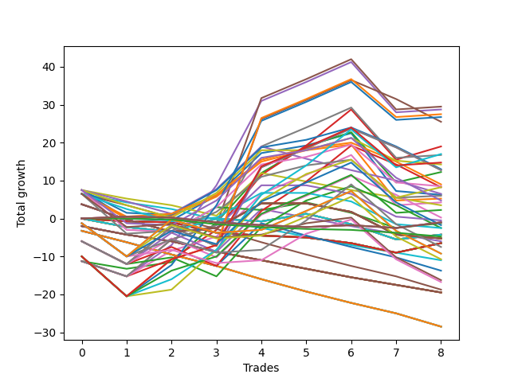

# Long Wallace Doodle 016 
- Symbol: ES
- Date Range: 03/18/2022 - 07/15/2022
- Trading Period: 7:20-12:30
- Number of Trades: 9



| Name | Win Percent | Profit | Avg Profit / Trade | Avg Time / Trade |      | Name | Win Percent | Profit | Avg Profit / Trade | Avg Time / Trade |
| ---- | ----------- | ------ | ------------------ | ---------------- | ---- | ---- | ----------- | ------ | ------------------ | ---------------- |
| Sorted By <br> Profit | | | | | | Sorted By <br> Win Percentage ||||
| Five | 66.67 | 13625.00 | 1513.89 | 29:20 |     | One Hundred Eleven | 88.89 | 2625.00 | 291.67 | 01:13 |
| Sixty-One | 66.67 | 12625.00 | 1402.78 | 23:16 |     | One Hundred Sixteen | 88.89 | 2125.00 | 236.11 | 01:13 |
| Forty-Five | 44.44 | 11625.00 | 1291.67 | 18:25 |     | One Hundred Twenty-One | 88.89 | 125.00 | 13.89 | 01:42 |
| One Hundred Fourteen | 77.78 | 8750.00 | 972.22 | 05:53 |     | One Hundred Twenty-Six | 88.89 | -125.00 | -13.89 | 01:43 |
| Seven | 66.67 | 8375.00 | 930.56 | 28:24 |     | Eighty-One | 88.89 | -1500.00 | -166.67 | 04:13 |
| Four | 66.67 | 8375.00 | 930.56 | 27:46 |     | One Hundred Fourteen | 77.78 | 8750.00 | 972.22 | 05:53 |
| Eighty-Five | 77.78 | 8125.00 | 902.78 | 15:17 |     | Eighty-Five | 77.78 | 8125.00 | 902.78 | 15:17 |
| One Hundred Fifteen | 66.67 | 7875.00 | 875.00 | 07:13 |     | One Hundred Twenty-Five | 77.78 | 6500.00 | 722.22 | 10:36 |
| Three | 66.67 | 7500.00 | 833.33 | 24:38 |     | Eighty-Four | 77.78 | 5625.00 | 625.00 | 11:34 |
| Sixty-Three | 66.67 | 7375.00 | 819.44 | 22:20 |     | One Hundred Thirteen | 77.78 | 5000.00 | 555.56 | 04:06 |
| Sixty | 66.67 | 7375.00 | 819.44 | 21:41 |     | One Hundred Twenty-Nine | 77.78 | 4625.00 | 513.89 | 06:44 |
| One Hundred Twenty-Five | 77.78 | 6500.00 | 722.22 | 10:36 |     | One Hundred Twenty-Four | 77.78 | 4000.00 | 444.44 | 06:52 |
| Fifty-Nine | 66.67 | 6500.00 | 722.22 | 18:33 |     | One Hundred Twelve | 77.78 | 2000.00 | 222.22 | 03:29 |
| Forty-Seven | 44.44 | 6375.00 | 708.33 | 17:29 |     | Eighty-Three | 77.78 | 1875.00 | 208.33 | 09:47 |
| Forty-Four | 44.44 | 6375.00 | 708.33 | 16:51 |     | One Hundred One | 77.78 | 1625.00 | 180.56 | 00:58 |
| Eighty-Four | 77.78 | 5625.00 | 625.00 | 11:34 |     | One Hundred Twenty-Eight | 77.78 | 875.00 | 97.22 | 04:57 |
| One Hundred Thirteen | 77.78 | 5000.00 | 555.56 | 04:06 |     | One Hundred Twenty-Three | 77.78 | 250.00 | 27.78 | 05:05 |
| One Hundred Twenty-Nine | 77.78 | 4625.00 | 513.89 | 06:44 |     | Eighty-Two | 77.78 | -1125.00 | -125.00 | 09:10 |
| One Hundred Twenty-Four | 77.78 | 4000.00 | 444.44 | 06:52 |     | One Hundred Twenty-Seven | 77.78 | -2125.00 | -236.11 | 04:20 |
| Two | 66.67 | 4000.00 | 444.44 | 22:17 |     | One Hundred Twenty-Two | 77.78 | -2750.00 | -305.56 | 04:28 |
| One Hundred Four | 55.56 | 3875.00 | 430.56 | 03:01 |     | Five | 66.67 | 13625.00 | 1513.89 | 29:20 |
| One Hundred Thirty | 66.67 | 3750.00 | 416.67 | 08:04 |     | Sixty-One | 66.67 | 12625.00 | 1402.78 | 23:16 |
| One Hundred Five | 44.44 | 3000.00 | 333.33 | 04:14 |     | Seven | 66.67 | 8375.00 | 930.56 | 28:24 |
| Forty | 66.67 | 2750.00 | 305.56 | 08:17 |     | Four | 66.67 | 8375.00 | 930.56 | 27:46 |
| One Hundred Eleven | 88.89 | 2625.00 | 291.67 | 01:13 |     | One Hundred Fifteen | 66.67 | 7875.00 | 875.00 | 07:13 |
| One Hundred Eighteen | 66.67 | 2500.00 | 277.78 | 03:30 |     | Three | 66.67 | 7500.00 | 833.33 | 24:38 |
| One Hundred Twenty | 44.44 | 2500.00 | 277.78 | 05:16 |     | Sixty-Three | 66.67 | 7375.00 | 819.44 | 22:20 |
| Ninety-Four | 44.44 | 2500.00 | 277.78 | 02:08 |     | Sixty | 66.67 | 7375.00 | 819.44 | 21:41 |
| One Hundred Sixteen | 88.89 | 2125.00 | 236.11 | 01:13 |     | Fifty-Nine | 66.67 | 6500.00 | 722.22 | 18:33 |
| Six | 66.67 | 2125.00 | 236.11 | 25:37 |     | Two | 66.67 | 4000.00 | 444.44 | 22:17 |
| One Hundred Ninteen | 55.56 | 2125.00 | 236.11 | 04:16 |     | One Hundred Thirty | 66.67 | 3750.00 | 416.67 | 08:04 |
| Forty-Three | 44.44 | 2125.00 | 236.11 | 14:41 |     | Forty | 66.67 | 2750.00 | 305.56 | 08:17 |
| One Hundred Twelve | 77.78 | 2000.00 | 222.22 | 03:29 |     | One Hundred Eighteen | 66.67 | 2500.00 | 277.78 | 03:30 |
| Forty-Eight | 55.56 | 2000.00 | 222.22 | 05:51 |     | Six | 66.67 | 2125.00 | 236.11 | 25:37 |
| Eighty-Three | 77.78 | 1875.00 | 208.33 | 09:47 |     | Fifty-Eight | 66.67 | 1875.00 | 208.33 | 16:45 |
| Fifty-Eight | 66.67 | 1875.00 | 208.33 | 16:45 |     | Sixty-Two | 66.67 | 1125.00 | 125.00 | 19:33 |
| One Hundred One | 77.78 | 1625.00 | 180.56 | 00:58 |     | Fifty-Six | 66.67 | 500.00 | 55.56 | 10:02 |
| Ninety-Five | 33.33 | 1625.00 | 180.56 | 03:07 |     | Ninety-One | 66.67 | 375.00 | 41.67 | 00:42 |
| One Hundred Three | 55.56 | 1500.00 | 166.67 | 02:38 |     | One Hundred Seventeen | 66.67 | 0.00 | 0.00 | 02:59 |
| Sixty-Two | 66.67 | 1125.00 | 125.00 | 19:33 |     | One Hundred Six | 66.67 | -500.00 | -55.56 | 00:56 |
| One Hundred Twenty-Eight | 77.78 | 875.00 | 97.22 | 04:57 |     | Zero | 66.67 | -750.00 | -83.33 | 13:03 |
| Fifty-Six | 66.67 | 500.00 | 55.56 | 10:02 |     | Fifty-Seven | 66.67 | -4875.00 | -541.67 | 14:29 |
| Ninety-Three | 44.44 | 500.00 | 55.56 | 01:51 |     | One | 66.67 | -5125.00 | -569.44 | 19:56 |
| Ninety-One | 66.67 | 375.00 | 41.67 | 00:42 |     | One Hundred Four | 55.56 | 3875.00 | 430.56 | 03:01 |
| One Hundred Nine | 44.44 | 375.00 | 41.67 | 01:55 |     | One Hundred Ninteen | 55.56 | 2125.00 | 236.11 | 04:16 |
| One Hundred Twenty-Three | 77.78 | 250.00 | 27.78 | 05:05 |     | Forty-Eight | 55.56 | 2000.00 | 222.22 | 05:51 |
| One Hundred Ten | 44.44 | 250.00 | 27.78 | 02:27 |     | One Hundred Three | 55.56 | 1500.00 | 166.67 | 02:38 |
| One Hundred Twenty-One | 88.89 | 125.00 | 13.89 | 01:42 |     | One Hundred Two | 55.56 | -500.00 | -55.56 | 02:33 |
| Forty-Six | 44.44 | 125.00 | 13.89 | 14:42 |     | Forty-One | 55.56 | -1375.00 | -152.78 | 11:17 |
| One Hundred Seventeen | 66.67 | 0.00 | 0.00 | 02:59 |     | Sixty-Four | 55.56 | -4250.00 | -472.22 | 08:47 |
| One Hundred Twenty-Six | 88.89 | -125.00 | -13.89 | 01:43 |     | Forty-Five | 44.44 | 11625.00 | 1291.67 | 18:25 |
| Fifty-Four | 44.44 | -250.00 | -27.78 | 06:41 |     | Forty-Seven | 44.44 | 6375.00 | 708.33 | 17:29 |
| One Hundred Six | 66.67 | -500.00 | -55.56 | 00:56 |     | Forty-Four | 44.44 | 6375.00 | 708.33 | 16:51 |
| One Hundred Two | 55.56 | -500.00 | -55.56 | 02:33 |     | One Hundred Five | 44.44 | 3000.00 | 333.33 | 04:14 |
| Zero | 66.67 | -750.00 | -83.33 | 13:03 |     | One Hundred Twenty | 44.44 | 2500.00 | 277.78 | 05:16 |
| Seventy | 44.44 | -875.00 | -97.22 | 14:05 |     | Ninety-Four | 44.44 | 2500.00 | 277.78 | 02:08 |
| One Hundred Eight | 44.44 | -1000.00 | -111.11 | 01:43 |     | Forty-Three | 44.44 | 2125.00 | 236.11 | 14:41 |
| Eighty-Two | 77.78 | -1125.00 | -125.00 | 09:10 |     | Ninety-Three | 44.44 | 500.00 | 55.56 | 01:51 |
| Ninety-Two | 44.44 | -1125.00 | -125.00 | 01:46 |     | One Hundred Nine | 44.44 | 375.00 | 41.67 | 01:55 |
| Forty-One | 55.56 | -1375.00 | -152.78 | 11:17 |     | One Hundred Ten | 44.44 | 250.00 | 27.78 | 02:27 |
| Eighty-One | 88.89 | -1500.00 | -166.67 | 04:13 |     | Forty-Six | 44.44 | 125.00 | 13.89 | 14:42 |
| One Hundred Twenty-Seven | 77.78 | -2125.00 | -236.11 | 04:20 |     | Fifty-Four | 44.44 | -250.00 | -27.78 | 06:41 |
| Ninety-Six | 44.44 | -2125.00 | -236.11 | 00:35 |     | Seventy | 44.44 | -875.00 | -97.22 | 14:05 |
| Forty-Two | 44.44 | -2125.00 | -236.11 | 12:53 |     | One Hundred Eight | 44.44 | -1000.00 | -111.11 | 01:43 |
| One Hundred Seven | 44.44 | -2500.00 | -277.78 | 01:39 |     | Ninety-Two | 44.44 | -1125.00 | -125.00 | 01:46 |
| Ninety-Nine | 22.22 | -2500.00 | -277.78 | 01:02 |     | Ninety-Six | 44.44 | -2125.00 | -236.11 | 00:35 |
| Fifty-Five | 44.44 | -2625.00 | -291.67 | 06:53 |     | Forty-Two | 44.44 | -2125.00 | -236.11 | 12:53 |
| Fifty-Three | 44.44 | -2625.00 | -291.67 | 06:53 |     | One Hundred Seven | 44.44 | -2500.00 | -277.78 | 01:39 |
| Fifty-Two | 44.44 | -2625.00 | -291.67 | 06:53 |     | Fifty-Five | 44.44 | -2625.00 | -291.67 | 06:53 |
| Fifty-One | 44.44 | -2625.00 | -291.67 | 06:53 |     | Fifty-Three | 44.44 | -2625.00 | -291.67 | 06:53 |
| Fifty | 44.44 | -2625.00 | -291.67 | 06:53 |     | Fifty-Two | 44.44 | -2625.00 | -291.67 | 06:53 |
| Forty-Nine | 44.44 | -2625.00 | -291.67 | 06:53 |     | Fifty-One | 44.44 | -2625.00 | -291.67 | 06:53 |
| One Hundred Twenty-Two | 77.78 | -2750.00 | -305.56 | 04:28 |     | Fifty | 44.44 | -2625.00 | -291.67 | 06:53 |
| Ninety-Eight | 22.22 | -2875.00 | -319.44 | 00:57 |     | Forty-Nine | 44.44 | -2625.00 | -291.67 | 06:53 |
| One Hundred | 22.22 | -3250.00 | -361.11 | 01:07 |     | Seventy-One | 44.44 | -4625.00 | -513.89 | 16:04 |
| Ninety-Seven | 22.22 | -3500.00 | -388.89 | 00:55 |     | Sixty-Nine | 44.44 | -4625.00 | -513.89 | 16:04 |
| Sixty-Four | 55.56 | -4250.00 | -472.22 | 08:47 |     | Sixty-Eight | 44.44 | -5375.00 | -597.22 | 14:50 |
| Seventy-One | 44.44 | -4625.00 | -513.89 | 16:04 |     | Sixty-Seven | 44.44 | -5750.00 | -638.89 | 13:18 |
| Sixty-Nine | 44.44 | -4625.00 | -513.89 | 16:04 |     | Sixty-Six | 44.44 | -9250.00 | -1027.78 | 11:31 |
| Fifty-Seven | 66.67 | -4875.00 | -541.67 | 14:29 |     | Sixty-Five | 44.44 | -12000.00 | -1333.33 | 10:56 |
| One | 66.67 | -5125.00 | -569.44 | 19:56 |     | Ninety-Five | 33.33 | 1625.00 | 180.56 | 03:07 |
| Sixty-Eight | 44.44 | -5375.00 | -597.22 | 14:50 |     | Seventy-Three | 33.33 | -10625.00 | -1180.56 | 11:31 |
| Sixty-Seven | 44.44 | -5750.00 | -638.89 | 13:18 |     | Ninety-Nine | 22.22 | -2500.00 | -277.78 | 01:02 |
| Sixty-Six | 44.44 | -9250.00 | -1027.78 | 11:31 |     | Ninety-Eight | 22.22 | -2875.00 | -319.44 | 00:57 |
| Seventy-Three | 33.33 | -10625.00 | -1180.56 | 11:31 |     | One Hundred | 22.22 | -3250.00 | -361.11 | 01:07 |
| Sixty-Five | 44.44 | -12000.00 | -1333.33 | 10:56 |     | Ninety-Seven | 22.22 | -3500.00 | -388.89 | 00:55 |

## NO STOPLOSS

### Test Zero
* Sell when price hits the middle line of the 20p bollinger
* No Stoploss
* Results:
```
Total Trades: 9
Percent Up: 66.67
Percent Down: 33.33
Total Points Moved Up: -1.50
Potential Profit: -750.00
Total Points Ups: 22.50 Count Ups: 6
Total Points Downs: -24.00 Count Downs: 3
```

<details><summary>Trades</summary>

<code>In: 2022-03-21 09:40:00		Out: 2022-03-21 09:45:00		Total Position Time: 05:00		Total Move Up: 7.50		Total to Date: 7.50</code> <br />
<code>In: 2022-03-25 08:16:00		Out: 2022-03-25 08:36:40		Total Position Time: 20:40		Total Move Up: -7.50		Total to Date: 0.00</code> <br />
<code>In: 2022-04-20 09:18:00		Out: 2022-04-20 09:30:50		Total Position Time: 12:50		Total Move Up: 0.25		Total to Date: 0.25</code> <br />
<code>In: 2022-05-13 11:07:00		Out: 2022-05-13 11:19:15		Total Position Time: 12:15		Total Move Up: 2.25		Total to Date: 2.50</code> <br />
<code>In: 2022-05-17 11:24:00		Out: 2022-05-17 11:31:30		Total Position Time: 07:30		Total Move Up: 7.75		Total to Date: 10.25</code> <br />
<code>In: 2022-05-25 09:29:00		Out: 2022-05-25 09:41:25		Total Position Time: 12:25		Total Move Up: 1.50		Total to Date: 11.75</code> <br />
<code>In: 2022-06-06 08:24:00		Out: 2022-06-06 08:31:35		Total Position Time: 07:35		Total Move Up: 3.25		Total to Date: 15.00</code> <br />
<code>In: 2022-06-08 09:30:00		Out: 2022-06-08 09:54:10		Total Position Time: 24:10		Total Move Up: -15.50		Total to Date: -0.50</code> <br />
<code>In: 2022-06-09 07:56:00		Out: 2022-06-09 08:11:10		Total Position Time: 15:10		Total Move Up: -1.00		Total to Date: -1.50</code> <br />


</details>

### Test One
* Sell when the price hits the upper line of the 20p 1std bollinger
* No Stoploss
* Results:
```
Total Trades: 9
Percent Up: 66.67
Percent Down: 33.33
Total Points Moved Up: -10.25
Potential Profit: -5125.00
Total Points Ups: 20.75 Count Ups: 6
Total Points Downs: -31.00 Count Downs: 3
```

<details><summary>Trades</summary>

<code>In: 2022-03-21 09:40:00		Out: 2022-03-21 10:09:55		Total Position Time: 29:55		Total Move Up: -11.25		Total to Date: -11.25</code> <br />
<code>In: 2022-03-25 08:16:00		Out: 2022-03-25 08:41:05		Total Position Time: 25:05		Total Move Up: -6.25		Total to Date: -17.50</code> <br />
<code>In: 2022-04-20 09:18:00		Out: 2022-04-20 09:30:55		Total Position Time: 12:55		Total Move Up: 0.75		Total to Date: -16.75</code> <br />
<code>In: 2022-05-13 11:07:00		Out: 2022-05-13 11:20:00		Total Position Time: 13:00		Total Move Up: 5.75		Total to Date: -11.00</code> <br />
<code>In: 2022-05-17 11:24:00		Out: 2022-05-17 11:37:35		Total Position Time: 13:35		Total Move Up: 9.25		Total to Date: -1.75</code> <br />
<code>In: 2022-05-25 09:29:00		Out: 2022-05-25 09:44:25		Total Position Time: 15:25		Total Move Up: 3.00		Total to Date: 1.25</code> <br />
<code>In: 2022-06-06 08:24:00		Out: 2022-06-06 08:39:15		Total Position Time: 15:15		Total Move Up: 1.50		Total to Date: 2.75</code> <br />
<code>In: 2022-06-08 09:30:00		Out: 2022-06-08 09:59:05		Total Position Time: 29:05		Total Move Up: -13.50		Total to Date: -10.75</code> <br />
<code>In: 2022-06-09 07:56:00		Out: 2022-06-09 08:21:10		Total Position Time: 25:10		Total Move Up: 0.50		Total to Date: -10.25</code> <br />


</details>

### Test Two
* Sell when the price hits the upper line of the 20p 2std bollinger
* No Stoploss
* Results:
```
Total Trades: 9
Percent Up: 66.67
Percent Down: 33.33
Total Points Moved Up: 8.00
Potential Profit: 4000.00
Total Points Ups: 34.25 Count Ups: 6
Total Points Downs: -26.25 Count Downs: 3
```

<details><summary>Trades</summary>

<code>In: 2022-03-21 09:40:00		Out: 2022-03-21 10:09:55		Total Position Time: 29:55		Total Move Up: -11.25		Total to Date: -11.25</code> <br />
<code>In: 2022-03-25 08:16:00		Out: 2022-03-25 08:41:55		Total Position Time: 25:55		Total Move Up: -2.00		Total to Date: -13.25</code> <br />
<code>In: 2022-04-20 09:18:00		Out: 2022-04-20 09:31:25		Total Position Time: 13:25		Total Move Up: 1.75		Total to Date: -11.50</code> <br />
<code>In: 2022-05-13 11:07:00		Out: 2022-05-13 11:31:20		Total Position Time: 24:20		Total Move Up: 7.75		Total to Date: -3.75</code> <br />
<code>In: 2022-05-17 11:24:00		Out: 2022-05-17 11:40:00		Total Position Time: 16:00		Total Move Up: 13.00		Total to Date: 9.25</code> <br />
<code>In: 2022-05-25 09:29:00		Out: 2022-05-25 09:45:20		Total Position Time: 16:20		Total Move Up: 5.25		Total to Date: 14.50</code> <br />
<code>In: 2022-06-06 08:24:00		Out: 2022-06-06 08:43:00		Total Position Time: 19:00		Total Move Up: 3.75		Total to Date: 18.25</code> <br />
<code>In: 2022-06-08 09:30:00		Out: 2022-06-08 09:59:10		Total Position Time: 29:10		Total Move Up: -13.00		Total to Date: 5.25</code> <br />
<code>In: 2022-06-09 07:56:00		Out: 2022-06-09 08:22:35		Total Position Time: 26:35		Total Move Up: 2.75		Total to Date: 8.00</code> <br />


</details>

### Test Three
* Sell when price hits the middle line of the 50p bollinger
* No Stoploss
* Results:
```
Total Trades: 9
Percent Up: 66.67
Percent Down: 33.33
Total Points Moved Up: 15.00
Potential Profit: 7500.00
Total Points Ups: 43.50 Count Ups: 6
Total Points Downs: -28.50 Count Downs: 3
```

<details><summary>Trades</summary>

<code>In: 2022-03-21 09:40:00		Out: 2022-03-21 10:09:55		Total Position Time: 29:55		Total Move Up: -11.25		Total to Date: -11.25</code> <br />
<code>In: 2022-03-25 08:16:00		Out: 2022-03-25 08:45:55		Total Position Time: 29:55		Total Move Up: -4.00		Total to Date: -15.25</code> <br />
<code>In: 2022-04-20 09:18:00		Out: 2022-04-20 09:32:50		Total Position Time: 14:50		Total Move Up: 4.75		Total to Date: -10.50</code> <br />
<code>In: 2022-05-13 11:07:00		Out: 2022-05-13 11:31:20		Total Position Time: 24:20		Total Move Up: 7.75		Total to Date: -2.75</code> <br />
<code>In: 2022-05-17 11:24:00		Out: 2022-05-17 11:40:05		Total Position Time: 16:05		Total Move Up: 14.50		Total to Date: 11.75</code> <br />
<code>In: 2022-05-25 09:29:00		Out: 2022-05-25 09:49:05		Total Position Time: 20:05		Total Move Up: 7.75		Total to Date: 19.50</code> <br />
<code>In: 2022-06-06 08:24:00		Out: 2022-06-06 08:53:55		Total Position Time: 29:55		Total Move Up: 5.25		Total to Date: 24.75</code> <br />
<code>In: 2022-06-08 09:30:00		Out: 2022-06-08 09:59:55		Total Position Time: 29:55		Total Move Up: -13.25		Total to Date: 11.50</code> <br />
<code>In: 2022-06-09 07:56:00		Out: 2022-06-09 08:22:45		Total Position Time: 26:45		Total Move Up: 3.50		Total to Date: 15.00</code> <br />


</details>

### Test Four
* Sell when the price hits the upper line of the 50p 1std bollinger
* No Stoploss
* Results:
```
Total Trades: 9
Percent Up: 66.67
Percent Down: 33.33
Total Points Moved Up: 16.75
Potential Profit: 8375.00
Total Points Ups: 45.25 Count Ups: 6
Total Points Downs: -28.50 Count Downs: 3
```

<details><summary>Trades</summary>

<code>In: 2022-03-21 09:40:00		Out: 2022-03-21 10:09:55		Total Position Time: 29:55		Total Move Up: -11.25		Total to Date: -11.25</code> <br />
<code>In: 2022-03-25 08:16:00		Out: 2022-03-25 08:45:55		Total Position Time: 29:55		Total Move Up: -4.00		Total to Date: -15.25</code> <br />
<code>In: 2022-04-20 09:18:00		Out: 2022-04-20 09:36:45		Total Position Time: 18:45		Total Move Up: 8.25		Total to Date: -7.00</code> <br />
<code>In: 2022-05-13 11:07:00		Out: 2022-05-13 11:36:55		Total Position Time: 29:55		Total Move Up: 3.75		Total to Date: -3.25</code> <br />
<code>In: 2022-05-17 11:24:00		Out: 2022-05-17 11:45:45		Total Position Time: 21:45		Total Move Up: 22.25		Total to Date: 19.00</code> <br />
<code>In: 2022-05-25 09:29:00		Out: 2022-05-25 09:58:55		Total Position Time: 29:55		Total Move Up: 5.00		Total to Date: 24.00</code> <br />
<code>In: 2022-06-06 08:24:00		Out: 2022-06-06 08:53:55		Total Position Time: 29:55		Total Move Up: 5.25		Total to Date: 29.25</code> <br />
<code>In: 2022-06-08 09:30:00		Out: 2022-06-08 09:59:55		Total Position Time: 29:55		Total Move Up: -13.25		Total to Date: 16.00</code> <br />
<code>In: 2022-06-09 07:56:00		Out: 2022-06-09 08:25:55		Total Position Time: 29:55		Total Move Up: 0.75		Total to Date: 16.75</code> <br />


</details>

### Test Five
* Sell when the price hits the upper line of the 50p 2std bollinger
* No Stoploss
* Results:
```
Total Trades: 9
Percent Up: 66.67
Percent Down: 33.33
Total Points Moved Up: 27.25
Potential Profit: 13625.00
Total Points Ups: 55.75 Count Ups: 6
Total Points Downs: -28.50 Count Downs: 3
```

<details><summary>Trades</summary>

<code>In: 2022-03-21 09:40:00		Out: 2022-03-21 10:09:55		Total Position Time: 29:55		Total Move Up: -11.25		Total to Date: -11.25</code> <br />
<code>In: 2022-03-25 08:16:00		Out: 2022-03-25 08:45:55		Total Position Time: 29:55		Total Move Up: -4.00		Total to Date: -15.25</code> <br />
<code>In: 2022-04-20 09:18:00		Out: 2022-04-20 09:47:55		Total Position Time: 29:55		Total Move Up: 9.75		Total to Date: -5.50</code> <br />
<code>In: 2022-05-13 11:07:00		Out: 2022-05-13 11:36:55		Total Position Time: 29:55		Total Move Up: 3.75		Total to Date: -1.75</code> <br />
<code>In: 2022-05-17 11:24:00		Out: 2022-05-17 11:48:45		Total Position Time: 24:45		Total Move Up: 31.25		Total to Date: 29.50</code> <br />
<code>In: 2022-05-25 09:29:00		Out: 2022-05-25 09:58:55		Total Position Time: 29:55		Total Move Up: 5.00		Total to Date: 34.50</code> <br />
<code>In: 2022-06-06 08:24:00		Out: 2022-06-06 08:53:55		Total Position Time: 29:55		Total Move Up: 5.25		Total to Date: 39.75</code> <br />
<code>In: 2022-06-08 09:30:00		Out: 2022-06-08 09:59:55		Total Position Time: 29:55		Total Move Up: -13.25		Total to Date: 26.50</code> <br />
<code>In: 2022-06-09 07:56:00		Out: 2022-06-09 08:25:55		Total Position Time: 29:55		Total Move Up: 0.75		Total to Date: 27.25</code> <br />


</details>

### Test Six
* Sell when the price hits the middle line of the 1std VWAP
* No Stoploss
* Results:
```
Total Trades: 9
Percent Up: 66.67
Percent Down: 33.33
Total Points Moved Up: 4.25
Potential Profit: 2125.00
Total Points Ups: 32.75 Count Ups: 6
Total Points Downs: -28.50 Count Downs: 3
```

<details><summary>Trades</summary>

<code>In: 2022-03-21 09:40:00		Out: 2022-03-21 10:09:55		Total Position Time: 29:55		Total Move Up: -11.25		Total to Date: -11.25</code> <br />
<code>In: 2022-03-25 08:16:00		Out: 2022-03-25 08:45:55		Total Position Time: 29:55		Total Move Up: -4.00		Total to Date: -15.25</code> <br />
<code>In: 2022-04-20 09:18:00		Out: 2022-04-20 09:35:50		Total Position Time: 17:50		Total Move Up: 6.75		Total to Date: -8.50</code> <br />
<code>In: 2022-05-13 11:07:00		Out: 2022-05-13 11:36:55		Total Position Time: 29:55		Total Move Up: 3.75		Total to Date: -4.75</code> <br />
<code>In: 2022-05-17 11:24:00		Out: 2022-05-17 11:27:25		Total Position Time: 03:25		Total Move Up: 11.25		Total to Date: 6.50</code> <br />
<code>In: 2022-05-25 09:29:00		Out: 2022-05-25 09:58:55		Total Position Time: 29:55		Total Move Up: 5.00		Total to Date: 11.50</code> <br />
<code>In: 2022-06-06 08:24:00		Out: 2022-06-06 08:53:55		Total Position Time: 29:55		Total Move Up: 5.25		Total to Date: 16.75</code> <br />
<code>In: 2022-06-08 09:30:00		Out: 2022-06-08 09:59:55		Total Position Time: 29:55		Total Move Up: -13.25		Total to Date: 3.50</code> <br />
<code>In: 2022-06-09 07:56:00		Out: 2022-06-09 08:25:55		Total Position Time: 29:55		Total Move Up: 0.75		Total to Date: 4.25</code> <br />


</details>

### Test Seven
* Sell when the price hits the upper line of the 1std VWAP
* No Stoploss
* Results:
```
Total Trades: 9
Percent Up: 66.67
Percent Down: 33.33
Total Points Moved Up: 16.75
Potential Profit: 8375.00
Total Points Ups: 45.25 Count Ups: 6
Total Points Downs: -28.50 Count Downs: 3
```

<details><summary>Trades</summary>

<code>In: 2022-03-21 09:40:00		Out: 2022-03-21 10:09:55		Total Position Time: 29:55		Total Move Up: -11.25		Total to Date: -11.25</code> <br />
<code>In: 2022-03-25 08:16:00		Out: 2022-03-25 08:45:55		Total Position Time: 29:55		Total Move Up: -4.00		Total to Date: -15.25</code> <br />
<code>In: 2022-04-20 09:18:00		Out: 2022-04-20 09:47:55		Total Position Time: 29:55		Total Move Up: 9.75		Total to Date: -5.50</code> <br />
<code>In: 2022-05-13 11:07:00		Out: 2022-05-13 11:36:55		Total Position Time: 29:55		Total Move Up: 3.75		Total to Date: -1.75</code> <br />
<code>In: 2022-05-17 11:24:00		Out: 2022-05-17 11:40:20		Total Position Time: 16:20		Total Move Up: 20.75		Total to Date: 19.00</code> <br />
<code>In: 2022-05-25 09:29:00		Out: 2022-05-25 09:58:55		Total Position Time: 29:55		Total Move Up: 5.00		Total to Date: 24.00</code> <br />
<code>In: 2022-06-06 08:24:00		Out: 2022-06-06 08:53:55		Total Position Time: 29:55		Total Move Up: 5.25		Total to Date: 29.25</code> <br />
<code>In: 2022-06-08 09:30:00		Out: 2022-06-08 09:59:55		Total Position Time: 29:55		Total Move Up: -13.25		Total to Date: 16.00</code> <br />
<code>In: 2022-06-09 07:56:00		Out: 2022-06-09 08:25:55		Total Position Time: 29:55		Total Move Up: 0.75		Total to Date: 16.75</code> <br />


</details>

## STOPLOSS OF 5

### Test Forty
* Sell when price hits the middle line of the 20p bollinger
* Stoploss is 5 points
* Results:
```
Total Trades: 9
Percent Up: 66.67
Percent Down: 33.33
Total Points Moved Up: 5.50
Potential Profit: 2750.00
Total Points Ups: 22.50 Count Ups: 6
Total Points Downs: -17.00 Count Downs: 3
```

<details><summary>Trades</summary>

<code>In: 2022-03-21 09:40:00		Out: 2022-03-21 09:45:00		Total Position Time: 05:00		Total Move Up: 7.50		Total to Date: 7.50</code> <br />
<code>In: 2022-03-25 08:16:00		Out: 2022-03-25 08:21:50		Total Position Time: 05:50		Total Move Up: -6.00		Total to Date: 1.50</code> <br />
<code>In: 2022-04-20 09:18:00		Out: 2022-04-20 09:30:50		Total Position Time: 12:50		Total Move Up: 0.25		Total to Date: 1.75</code> <br />
<code>In: 2022-05-13 11:07:00		Out: 2022-05-13 11:19:15		Total Position Time: 12:15		Total Move Up: 2.25		Total to Date: 4.00</code> <br />
<code>In: 2022-05-17 11:24:00		Out: 2022-05-17 11:31:30		Total Position Time: 07:30		Total Move Up: 7.75		Total to Date: 11.75</code> <br />
<code>In: 2022-05-25 09:29:00		Out: 2022-05-25 09:41:25		Total Position Time: 12:25		Total Move Up: 1.50		Total to Date: 13.25</code> <br />
<code>In: 2022-06-06 08:24:00		Out: 2022-06-06 08:31:35		Total Position Time: 07:35		Total Move Up: 3.25		Total to Date: 16.50</code> <br />
<code>In: 2022-06-08 09:30:00		Out: 2022-06-08 09:32:50		Total Position Time: 02:50		Total Move Up: -5.00		Total to Date: 11.50</code> <br />
<code>In: 2022-06-09 07:56:00		Out: 2022-06-09 08:04:25		Total Position Time: 08:25		Total Move Up: -6.00		Total to Date: 5.50</code> <br />


</details>

### Test Forty-One
* Sell when the price hits the upper line of the 20p 1std bollinger
* Stoploss is 5 points
* Results:
```
Total Trades: 9
Percent Up: 55.56
Percent Down: 44.44
Total Points Moved Up: -2.75
Potential Profit: -1375.00
Total Points Ups: 20.25 Count Ups: 5
Total Points Downs: -23.00 Count Downs: 4
```

<details><summary>Trades</summary>

<code>In: 2022-03-21 09:40:00		Out: 2022-03-21 09:54:20		Total Position Time: 14:20		Total Move Up: -6.00		Total to Date: -6.00</code> <br />
<code>In: 2022-03-25 08:16:00		Out: 2022-03-25 08:21:50		Total Position Time: 05:50		Total Move Up: -6.00		Total to Date: -12.00</code> <br />
<code>In: 2022-04-20 09:18:00		Out: 2022-04-20 09:30:55		Total Position Time: 12:55		Total Move Up: 0.75		Total to Date: -11.25</code> <br />
<code>In: 2022-05-13 11:07:00		Out: 2022-05-13 11:20:00		Total Position Time: 13:00		Total Move Up: 5.75		Total to Date: -5.50</code> <br />
<code>In: 2022-05-17 11:24:00		Out: 2022-05-17 11:37:35		Total Position Time: 13:35		Total Move Up: 9.25		Total to Date: 3.75</code> <br />
<code>In: 2022-05-25 09:29:00		Out: 2022-05-25 09:44:25		Total Position Time: 15:25		Total Move Up: 3.00		Total to Date: 6.75</code> <br />
<code>In: 2022-06-06 08:24:00		Out: 2022-06-06 08:39:15		Total Position Time: 15:15		Total Move Up: 1.50		Total to Date: 8.25</code> <br />
<code>In: 2022-06-08 09:30:00		Out: 2022-06-08 09:32:50		Total Position Time: 02:50		Total Move Up: -5.00		Total to Date: 3.25</code> <br />
<code>In: 2022-06-09 07:56:00		Out: 2022-06-09 08:04:25		Total Position Time: 08:25		Total Move Up: -6.00		Total to Date: -2.75</code> <br />


</details>

### Test Forty-Two
* Sell when the price hits the upper line of the 20p 2std bollinger
* Stoploss is 5 points
* Results:
```
Total Trades: 9
Percent Up: 44.44
Percent Down: 55.56
Total Points Moved Up: -4.25
Potential Profit: -2125.00
Total Points Ups: 23.75 Count Ups: 4
Total Points Downs: -28.00 Count Downs: 5
```

<details><summary>Trades</summary>

<code>In: 2022-03-21 09:40:00		Out: 2022-03-21 09:54:20		Total Position Time: 14:20		Total Move Up: -6.00		Total to Date: -6.00</code> <br />
<code>In: 2022-03-25 08:16:00		Out: 2022-03-25 08:21:50		Total Position Time: 05:50		Total Move Up: -6.00		Total to Date: -12.00</code> <br />
<code>In: 2022-04-20 09:18:00		Out: 2022-04-20 09:31:25		Total Position Time: 13:25		Total Move Up: 1.75		Total to Date: -10.25</code> <br />
<code>In: 2022-05-13 11:07:00		Out: 2022-05-13 11:26:55		Total Position Time: 19:55		Total Move Up: -5.00		Total to Date: -15.25</code> <br />
<code>In: 2022-05-17 11:24:00		Out: 2022-05-17 11:40:00		Total Position Time: 16:00		Total Move Up: 13.00		Total to Date: -2.25</code> <br />
<code>In: 2022-05-25 09:29:00		Out: 2022-05-25 09:45:20		Total Position Time: 16:20		Total Move Up: 5.25		Total to Date: 3.00</code> <br />
<code>In: 2022-06-06 08:24:00		Out: 2022-06-06 08:43:00		Total Position Time: 19:00		Total Move Up: 3.75		Total to Date: 6.75</code> <br />
<code>In: 2022-06-08 09:30:00		Out: 2022-06-08 09:32:50		Total Position Time: 02:50		Total Move Up: -5.00		Total to Date: 1.75</code> <br />
<code>In: 2022-06-09 07:56:00		Out: 2022-06-09 08:04:25		Total Position Time: 08:25		Total Move Up: -6.00		Total to Date: -4.25</code> <br />


</details>

### Test Forty-Three
* Sell when price hits the middle line of the 50p bollinger
* Stoploss is 5 points
* Results:
```
Total Trades: 9
Percent Up: 44.44
Percent Down: 55.56
Total Points Moved Up: 4.25
Potential Profit: 2125.00
Total Points Ups: 32.25 Count Ups: 4
Total Points Downs: -28.00 Count Downs: 5
```

<details><summary>Trades</summary>

<code>In: 2022-03-21 09:40:00		Out: 2022-03-21 09:54:20		Total Position Time: 14:20		Total Move Up: -6.00		Total to Date: -6.00</code> <br />
<code>In: 2022-03-25 08:16:00		Out: 2022-03-25 08:21:50		Total Position Time: 05:50		Total Move Up: -6.00		Total to Date: -12.00</code> <br />
<code>In: 2022-04-20 09:18:00		Out: 2022-04-20 09:32:50		Total Position Time: 14:50		Total Move Up: 4.75		Total to Date: -7.25</code> <br />
<code>In: 2022-05-13 11:07:00		Out: 2022-05-13 11:26:55		Total Position Time: 19:55		Total Move Up: -5.00		Total to Date: -12.25</code> <br />
<code>In: 2022-05-17 11:24:00		Out: 2022-05-17 11:40:05		Total Position Time: 16:05		Total Move Up: 14.50		Total to Date: 2.25</code> <br />
<code>In: 2022-05-25 09:29:00		Out: 2022-05-25 09:49:05		Total Position Time: 20:05		Total Move Up: 7.75		Total to Date: 10.00</code> <br />
<code>In: 2022-06-06 08:24:00		Out: 2022-06-06 08:53:55		Total Position Time: 29:55		Total Move Up: 5.25		Total to Date: 15.25</code> <br />
<code>In: 2022-06-08 09:30:00		Out: 2022-06-08 09:32:50		Total Position Time: 02:50		Total Move Up: -5.00		Total to Date: 10.25</code> <br />
<code>In: 2022-06-09 07:56:00		Out: 2022-06-09 08:04:25		Total Position Time: 08:25		Total Move Up: -6.00		Total to Date: 4.25</code> <br />


</details>

### Test Forty-Four
* Sell when the price hits the upper line of the 50p 1std bollinger
* Stoploss is 5 points
* Results:
```
Total Trades: 9
Percent Up: 44.44
Percent Down: 55.56
Total Points Moved Up: 12.75
Potential Profit: 6375.00
Total Points Ups: 40.75 Count Ups: 4
Total Points Downs: -28.00 Count Downs: 5
```

<details><summary>Trades</summary>

<code>In: 2022-03-21 09:40:00		Out: 2022-03-21 09:54:20		Total Position Time: 14:20		Total Move Up: -6.00		Total to Date: -6.00</code> <br />
<code>In: 2022-03-25 08:16:00		Out: 2022-03-25 08:21:50		Total Position Time: 05:50		Total Move Up: -6.00		Total to Date: -12.00</code> <br />
<code>In: 2022-04-20 09:18:00		Out: 2022-04-20 09:36:45		Total Position Time: 18:45		Total Move Up: 8.25		Total to Date: -3.75</code> <br />
<code>In: 2022-05-13 11:07:00		Out: 2022-05-13 11:26:55		Total Position Time: 19:55		Total Move Up: -5.00		Total to Date: -8.75</code> <br />
<code>In: 2022-05-17 11:24:00		Out: 2022-05-17 11:45:45		Total Position Time: 21:45		Total Move Up: 22.25		Total to Date: 13.50</code> <br />
<code>In: 2022-05-25 09:29:00		Out: 2022-05-25 09:58:55		Total Position Time: 29:55		Total Move Up: 5.00		Total to Date: 18.50</code> <br />
<code>In: 2022-06-06 08:24:00		Out: 2022-06-06 08:53:55		Total Position Time: 29:55		Total Move Up: 5.25		Total to Date: 23.75</code> <br />
<code>In: 2022-06-08 09:30:00		Out: 2022-06-08 09:32:50		Total Position Time: 02:50		Total Move Up: -5.00		Total to Date: 18.75</code> <br />
<code>In: 2022-06-09 07:56:00		Out: 2022-06-09 08:04:25		Total Position Time: 08:25		Total Move Up: -6.00		Total to Date: 12.75</code> <br />


</details>

### Test Forty-Five
* Sell when the price hits the upper line of the 50p 2std bollinger
* Stoploss is 5 points
* Results:
```
Total Trades: 9
Percent Up: 44.44
Percent Down: 55.56
Total Points Moved Up: 23.25
Potential Profit: 11625.00
Total Points Ups: 51.25 Count Ups: 4
Total Points Downs: -28.00 Count Downs: 5
```

<details><summary>Trades</summary>

<code>In: 2022-03-21 09:40:00		Out: 2022-03-21 09:54:20		Total Position Time: 14:20		Total Move Up: -6.00		Total to Date: -6.00</code> <br />
<code>In: 2022-03-25 08:16:00		Out: 2022-03-25 08:21:50		Total Position Time: 05:50		Total Move Up: -6.00		Total to Date: -12.00</code> <br />
<code>In: 2022-04-20 09:18:00		Out: 2022-04-20 09:47:55		Total Position Time: 29:55		Total Move Up: 9.75		Total to Date: -2.25</code> <br />
<code>In: 2022-05-13 11:07:00		Out: 2022-05-13 11:26:55		Total Position Time: 19:55		Total Move Up: -5.00		Total to Date: -7.25</code> <br />
<code>In: 2022-05-17 11:24:00		Out: 2022-05-17 11:48:45		Total Position Time: 24:45		Total Move Up: 31.25		Total to Date: 24.00</code> <br />
<code>In: 2022-05-25 09:29:00		Out: 2022-05-25 09:58:55		Total Position Time: 29:55		Total Move Up: 5.00		Total to Date: 29.00</code> <br />
<code>In: 2022-06-06 08:24:00		Out: 2022-06-06 08:53:55		Total Position Time: 29:55		Total Move Up: 5.25		Total to Date: 34.25</code> <br />
<code>In: 2022-06-08 09:30:00		Out: 2022-06-08 09:32:50		Total Position Time: 02:50		Total Move Up: -5.00		Total to Date: 29.25</code> <br />
<code>In: 2022-06-09 07:56:00		Out: 2022-06-09 08:04:25		Total Position Time: 08:25		Total Move Up: -6.00		Total to Date: 23.25</code> <br />


</details>

### Test Forty-Six
* Sell when the price hits the middle line of the 1std VWAP
* Stoploss is 5 points
* Results:
```
Total Trades: 9
Percent Up: 44.44
Percent Down: 55.56
Total Points Moved Up: 0.25
Potential Profit: 125.00
Total Points Ups: 28.25 Count Ups: 4
Total Points Downs: -28.00 Count Downs: 5
```

<details><summary>Trades</summary>

<code>In: 2022-03-21 09:40:00		Out: 2022-03-21 09:54:20		Total Position Time: 14:20		Total Move Up: -6.00		Total to Date: -6.00</code> <br />
<code>In: 2022-03-25 08:16:00		Out: 2022-03-25 08:21:50		Total Position Time: 05:50		Total Move Up: -6.00		Total to Date: -12.00</code> <br />
<code>In: 2022-04-20 09:18:00		Out: 2022-04-20 09:35:50		Total Position Time: 17:50		Total Move Up: 6.75		Total to Date: -5.25</code> <br />
<code>In: 2022-05-13 11:07:00		Out: 2022-05-13 11:26:55		Total Position Time: 19:55		Total Move Up: -5.00		Total to Date: -10.25</code> <br />
<code>In: 2022-05-17 11:24:00		Out: 2022-05-17 11:27:25		Total Position Time: 03:25		Total Move Up: 11.25		Total to Date: 1.00</code> <br />
<code>In: 2022-05-25 09:29:00		Out: 2022-05-25 09:58:55		Total Position Time: 29:55		Total Move Up: 5.00		Total to Date: 6.00</code> <br />
<code>In: 2022-06-06 08:24:00		Out: 2022-06-06 08:53:55		Total Position Time: 29:55		Total Move Up: 5.25		Total to Date: 11.25</code> <br />
<code>In: 2022-06-08 09:30:00		Out: 2022-06-08 09:32:50		Total Position Time: 02:50		Total Move Up: -5.00		Total to Date: 6.25</code> <br />
<code>In: 2022-06-09 07:56:00		Out: 2022-06-09 08:04:25		Total Position Time: 08:25		Total Move Up: -6.00		Total to Date: 0.25</code> <br />


</details>

### Test Forty-Seven
* Sell when the price hits the upper line of the 1std VWAP
* Stoploss is 5 points
* Results:
```
Total Trades: 9
Percent Up: 44.44
Percent Down: 55.56
Total Points Moved Up: 12.75
Potential Profit: 6375.00
Total Points Ups: 40.75 Count Ups: 4
Total Points Downs: -28.00 Count Downs: 5
```

<details><summary>Trades</summary>

<code>In: 2022-03-21 09:40:00		Out: 2022-03-21 09:54:20		Total Position Time: 14:20		Total Move Up: -6.00		Total to Date: -6.00</code> <br />
<code>In: 2022-03-25 08:16:00		Out: 2022-03-25 08:21:50		Total Position Time: 05:50		Total Move Up: -6.00		Total to Date: -12.00</code> <br />
<code>In: 2022-04-20 09:18:00		Out: 2022-04-20 09:47:55		Total Position Time: 29:55		Total Move Up: 9.75		Total to Date: -2.25</code> <br />
<code>In: 2022-05-13 11:07:00		Out: 2022-05-13 11:26:55		Total Position Time: 19:55		Total Move Up: -5.00		Total to Date: -7.25</code> <br />
<code>In: 2022-05-17 11:24:00		Out: 2022-05-17 11:40:20		Total Position Time: 16:20		Total Move Up: 20.75		Total to Date: 13.50</code> <br />
<code>In: 2022-05-25 09:29:00		Out: 2022-05-25 09:58:55		Total Position Time: 29:55		Total Move Up: 5.00		Total to Date: 18.50</code> <br />
<code>In: 2022-06-06 08:24:00		Out: 2022-06-06 08:53:55		Total Position Time: 29:55		Total Move Up: 5.25		Total to Date: 23.75</code> <br />
<code>In: 2022-06-08 09:30:00		Out: 2022-06-08 09:32:50		Total Position Time: 02:50		Total Move Up: -5.00		Total to Date: 18.75</code> <br />
<code>In: 2022-06-09 07:56:00		Out: 2022-06-09 08:04:25		Total Position Time: 08:25		Total Move Up: -6.00		Total to Date: 12.75</code> <br />


</details>

## TRAIL STOP OF 5

### Test Forty-Eight
* Sell when price hits the middle line of the 20p bollinger
* Trailing Stop is 5 points
* Results:
```
Total Trades: 9
Percent Up: 55.56
Percent Down: 44.44
Total Points Moved Up: 4.00
Potential Profit: 2000.00
Total Points Ups: 18.25 Count Ups: 5
Total Points Downs: -14.25 Count Downs: 4
```

<details><summary>Trades</summary>

<code>In: 2022-03-21 09:40:00		Out: 2022-03-21 09:45:00		Total Position Time: 05:00		Total Move Up: 7.50		Total to Date: 7.50</code> <br />
<code>In: 2022-03-25 08:16:00		Out: 2022-03-25 08:20:40		Total Position Time: 04:40		Total Move Up: -4.00		Total to Date: 3.50</code> <br />
<code>In: 2022-04-20 09:18:00		Out: 2022-04-20 09:28:10		Total Position Time: 10:10		Total Move Up: -3.25		Total to Date: 0.25</code> <br />
<code>In: 2022-05-13 11:07:00		Out: 2022-05-13 11:13:40		Total Position Time: 06:40		Total Move Up: 1.00		Total to Date: 1.25</code> <br />
<code>In: 2022-05-17 11:24:00		Out: 2022-05-17 11:29:15		Total Position Time: 05:15		Total Move Up: 6.50		Total to Date: 7.75</code> <br />
<code>In: 2022-05-25 09:29:00		Out: 2022-05-25 09:33:30		Total Position Time: 04:30		Total Move Up: 0.00		Total to Date: 7.75</code> <br />
<code>In: 2022-06-06 08:24:00		Out: 2022-06-06 08:31:35		Total Position Time: 07:35		Total Move Up: 3.25		Total to Date: 11.00</code> <br />
<code>In: 2022-06-08 09:30:00		Out: 2022-06-08 09:32:55		Total Position Time: 02:55		Total Move Up: -6.00		Total to Date: 5.00</code> <br />
<code>In: 2022-06-09 07:56:00		Out: 2022-06-09 08:02:00		Total Position Time: 06:00		Total Move Up: -1.00		Total to Date: 4.00</code> <br />


</details>

### Test Forty-Nine
* Sell when the price hits the upper line of the 20p 1std bollinger
* Trailing Stop is 5 points
* Results:
```
Total Trades: 9
Percent Up: 44.44
Percent Down: 55.56
Total Points Moved Up: -5.25
Potential Profit: -2625.00
Total Points Ups: 11.25 Count Ups: 4
Total Points Downs: -16.50 Count Downs: 5
```

<details><summary>Trades</summary>

<code>In: 2022-03-21 09:40:00		Out: 2022-03-21 09:50:35		Total Position Time: 10:35		Total Move Up: 3.75		Total to Date: 3.75</code> <br />
<code>In: 2022-03-25 08:16:00		Out: 2022-03-25 08:20:40		Total Position Time: 04:40		Total Move Up: -4.00		Total to Date: -0.25</code> <br />
<code>In: 2022-04-20 09:18:00		Out: 2022-04-20 09:28:10		Total Position Time: 10:10		Total Move Up: -3.25		Total to Date: -3.50</code> <br />
<code>In: 2022-05-13 11:07:00		Out: 2022-05-13 11:13:40		Total Position Time: 06:40		Total Move Up: 1.00		Total to Date: -2.50</code> <br />
<code>In: 2022-05-17 11:24:00		Out: 2022-05-17 11:29:15		Total Position Time: 05:15		Total Move Up: 6.50		Total to Date: 4.00</code> <br />
<code>In: 2022-05-25 09:29:00		Out: 2022-05-25 09:33:30		Total Position Time: 04:30		Total Move Up: 0.00		Total to Date: 4.00</code> <br />
<code>In: 2022-06-06 08:24:00		Out: 2022-06-06 08:35:15		Total Position Time: 11:15		Total Move Up: -2.25		Total to Date: 1.75</code> <br />
<code>In: 2022-06-08 09:30:00		Out: 2022-06-08 09:32:55		Total Position Time: 02:55		Total Move Up: -6.00		Total to Date: -4.25</code> <br />
<code>In: 2022-06-09 07:56:00		Out: 2022-06-09 08:02:00		Total Position Time: 06:00		Total Move Up: -1.00		Total to Date: -5.25</code> <br />


</details>

### Test Fifty
* Sell when the price hits the upper line of the 20p 2std bollinger
* Trailing Stop is 5 points
* Results:
```
Total Trades: 9
Percent Up: 44.44
Percent Down: 55.56
Total Points Moved Up: -5.25
Potential Profit: -2625.00
Total Points Ups: 11.25 Count Ups: 4
Total Points Downs: -16.50 Count Downs: 5
```

<details><summary>Trades</summary>

<code>In: 2022-03-21 09:40:00		Out: 2022-03-21 09:50:35		Total Position Time: 10:35		Total Move Up: 3.75		Total to Date: 3.75</code> <br />
<code>In: 2022-03-25 08:16:00		Out: 2022-03-25 08:20:40		Total Position Time: 04:40		Total Move Up: -4.00		Total to Date: -0.25</code> <br />
<code>In: 2022-04-20 09:18:00		Out: 2022-04-20 09:28:10		Total Position Time: 10:10		Total Move Up: -3.25		Total to Date: -3.50</code> <br />
<code>In: 2022-05-13 11:07:00		Out: 2022-05-13 11:13:40		Total Position Time: 06:40		Total Move Up: 1.00		Total to Date: -2.50</code> <br />
<code>In: 2022-05-17 11:24:00		Out: 2022-05-17 11:29:15		Total Position Time: 05:15		Total Move Up: 6.50		Total to Date: 4.00</code> <br />
<code>In: 2022-05-25 09:29:00		Out: 2022-05-25 09:33:30		Total Position Time: 04:30		Total Move Up: 0.00		Total to Date: 4.00</code> <br />
<code>In: 2022-06-06 08:24:00		Out: 2022-06-06 08:35:15		Total Position Time: 11:15		Total Move Up: -2.25		Total to Date: 1.75</code> <br />
<code>In: 2022-06-08 09:30:00		Out: 2022-06-08 09:32:55		Total Position Time: 02:55		Total Move Up: -6.00		Total to Date: -4.25</code> <br />
<code>In: 2022-06-09 07:56:00		Out: 2022-06-09 08:02:00		Total Position Time: 06:00		Total Move Up: -1.00		Total to Date: -5.25</code> <br />


</details>

### Test Fifty-One
* Sell when price hits the middle line of the 50p bollinger
* Trailing Stop is 5 points
* Results:
```
Total Trades: 9
Percent Up: 44.44
Percent Down: 55.56
Total Points Moved Up: -5.25
Potential Profit: -2625.00
Total Points Ups: 11.25 Count Ups: 4
Total Points Downs: -16.50 Count Downs: 5
```

<details><summary>Trades</summary>

<code>In: 2022-03-21 09:40:00		Out: 2022-03-21 09:50:35		Total Position Time: 10:35		Total Move Up: 3.75		Total to Date: 3.75</code> <br />
<code>In: 2022-03-25 08:16:00		Out: 2022-03-25 08:20:40		Total Position Time: 04:40		Total Move Up: -4.00		Total to Date: -0.25</code> <br />
<code>In: 2022-04-20 09:18:00		Out: 2022-04-20 09:28:10		Total Position Time: 10:10		Total Move Up: -3.25		Total to Date: -3.50</code> <br />
<code>In: 2022-05-13 11:07:00		Out: 2022-05-13 11:13:40		Total Position Time: 06:40		Total Move Up: 1.00		Total to Date: -2.50</code> <br />
<code>In: 2022-05-17 11:24:00		Out: 2022-05-17 11:29:15		Total Position Time: 05:15		Total Move Up: 6.50		Total to Date: 4.00</code> <br />
<code>In: 2022-05-25 09:29:00		Out: 2022-05-25 09:33:30		Total Position Time: 04:30		Total Move Up: 0.00		Total to Date: 4.00</code> <br />
<code>In: 2022-06-06 08:24:00		Out: 2022-06-06 08:35:15		Total Position Time: 11:15		Total Move Up: -2.25		Total to Date: 1.75</code> <br />
<code>In: 2022-06-08 09:30:00		Out: 2022-06-08 09:32:55		Total Position Time: 02:55		Total Move Up: -6.00		Total to Date: -4.25</code> <br />
<code>In: 2022-06-09 07:56:00		Out: 2022-06-09 08:02:00		Total Position Time: 06:00		Total Move Up: -1.00		Total to Date: -5.25</code> <br />


</details>

### Test Fifty-Two
* Sell when the price hits the upper line of the 50p 1std bollinger
* Trailing Stop is 5 points
* Results:
```
Total Trades: 9
Percent Up: 44.44
Percent Down: 55.56
Total Points Moved Up: -5.25
Potential Profit: -2625.00
Total Points Ups: 11.25 Count Ups: 4
Total Points Downs: -16.50 Count Downs: 5
```

<details><summary>Trades</summary>

<code>In: 2022-03-21 09:40:00		Out: 2022-03-21 09:50:35		Total Position Time: 10:35		Total Move Up: 3.75		Total to Date: 3.75</code> <br />
<code>In: 2022-03-25 08:16:00		Out: 2022-03-25 08:20:40		Total Position Time: 04:40		Total Move Up: -4.00		Total to Date: -0.25</code> <br />
<code>In: 2022-04-20 09:18:00		Out: 2022-04-20 09:28:10		Total Position Time: 10:10		Total Move Up: -3.25		Total to Date: -3.50</code> <br />
<code>In: 2022-05-13 11:07:00		Out: 2022-05-13 11:13:40		Total Position Time: 06:40		Total Move Up: 1.00		Total to Date: -2.50</code> <br />
<code>In: 2022-05-17 11:24:00		Out: 2022-05-17 11:29:15		Total Position Time: 05:15		Total Move Up: 6.50		Total to Date: 4.00</code> <br />
<code>In: 2022-05-25 09:29:00		Out: 2022-05-25 09:33:30		Total Position Time: 04:30		Total Move Up: 0.00		Total to Date: 4.00</code> <br />
<code>In: 2022-06-06 08:24:00		Out: 2022-06-06 08:35:15		Total Position Time: 11:15		Total Move Up: -2.25		Total to Date: 1.75</code> <br />
<code>In: 2022-06-08 09:30:00		Out: 2022-06-08 09:32:55		Total Position Time: 02:55		Total Move Up: -6.00		Total to Date: -4.25</code> <br />
<code>In: 2022-06-09 07:56:00		Out: 2022-06-09 08:02:00		Total Position Time: 06:00		Total Move Up: -1.00		Total to Date: -5.25</code> <br />


</details>

### Test Fifty-Three
* Sell when the price hits the upper line of the 50p 2std bollinger
* Trailing Stop is 5 points
* Results:
```
Total Trades: 9
Percent Up: 44.44
Percent Down: 55.56
Total Points Moved Up: -5.25
Potential Profit: -2625.00
Total Points Ups: 11.25 Count Ups: 4
Total Points Downs: -16.50 Count Downs: 5
```

<details><summary>Trades</summary>

<code>In: 2022-03-21 09:40:00		Out: 2022-03-21 09:50:35		Total Position Time: 10:35		Total Move Up: 3.75		Total to Date: 3.75</code> <br />
<code>In: 2022-03-25 08:16:00		Out: 2022-03-25 08:20:40		Total Position Time: 04:40		Total Move Up: -4.00		Total to Date: -0.25</code> <br />
<code>In: 2022-04-20 09:18:00		Out: 2022-04-20 09:28:10		Total Position Time: 10:10		Total Move Up: -3.25		Total to Date: -3.50</code> <br />
<code>In: 2022-05-13 11:07:00		Out: 2022-05-13 11:13:40		Total Position Time: 06:40		Total Move Up: 1.00		Total to Date: -2.50</code> <br />
<code>In: 2022-05-17 11:24:00		Out: 2022-05-17 11:29:15		Total Position Time: 05:15		Total Move Up: 6.50		Total to Date: 4.00</code> <br />
<code>In: 2022-05-25 09:29:00		Out: 2022-05-25 09:33:30		Total Position Time: 04:30		Total Move Up: 0.00		Total to Date: 4.00</code> <br />
<code>In: 2022-06-06 08:24:00		Out: 2022-06-06 08:35:15		Total Position Time: 11:15		Total Move Up: -2.25		Total to Date: 1.75</code> <br />
<code>In: 2022-06-08 09:30:00		Out: 2022-06-08 09:32:55		Total Position Time: 02:55		Total Move Up: -6.00		Total to Date: -4.25</code> <br />
<code>In: 2022-06-09 07:56:00		Out: 2022-06-09 08:02:00		Total Position Time: 06:00		Total Move Up: -1.00		Total to Date: -5.25</code> <br />


</details>

### Test Fifty-Four
* Sell when the price hits the middle line of the 1std VWAP
* Trailing Stop is 5 points
* Results:
```
Total Trades: 9
Percent Up: 44.44
Percent Down: 55.56
Total Points Moved Up: -0.50
Potential Profit: -250.00
Total Points Ups: 16.00 Count Ups: 4
Total Points Downs: -16.50 Count Downs: 5
```

<details><summary>Trades</summary>

<code>In: 2022-03-21 09:40:00		Out: 2022-03-21 09:50:35		Total Position Time: 10:35		Total Move Up: 3.75		Total to Date: 3.75</code> <br />
<code>In: 2022-03-25 08:16:00		Out: 2022-03-25 08:20:40		Total Position Time: 04:40		Total Move Up: -4.00		Total to Date: -0.25</code> <br />
<code>In: 2022-04-20 09:18:00		Out: 2022-04-20 09:28:10		Total Position Time: 10:10		Total Move Up: -3.25		Total to Date: -3.50</code> <br />
<code>In: 2022-05-13 11:07:00		Out: 2022-05-13 11:13:40		Total Position Time: 06:40		Total Move Up: 1.00		Total to Date: -2.50</code> <br />
<code>In: 2022-05-17 11:24:00		Out: 2022-05-17 11:27:25		Total Position Time: 03:25		Total Move Up: 11.25		Total to Date: 8.75</code> <br />
<code>In: 2022-05-25 09:29:00		Out: 2022-05-25 09:33:30		Total Position Time: 04:30		Total Move Up: 0.00		Total to Date: 8.75</code> <br />
<code>In: 2022-06-06 08:24:00		Out: 2022-06-06 08:35:15		Total Position Time: 11:15		Total Move Up: -2.25		Total to Date: 6.50</code> <br />
<code>In: 2022-06-08 09:30:00		Out: 2022-06-08 09:32:55		Total Position Time: 02:55		Total Move Up: -6.00		Total to Date: 0.50</code> <br />
<code>In: 2022-06-09 07:56:00		Out: 2022-06-09 08:02:00		Total Position Time: 06:00		Total Move Up: -1.00		Total to Date: -0.50</code> <br />


</details>

### Test Fifty-Five
* Sell when the price hits the upper line of the 1std VWAP
* Trailing Stop is 5 points
* Results:
```
Total Trades: 9
Percent Up: 44.44
Percent Down: 55.56
Total Points Moved Up: -5.25
Potential Profit: -2625.00
Total Points Ups: 11.25 Count Ups: 4
Total Points Downs: -16.50 Count Downs: 5
```

<details><summary>Trades</summary>

<code>In: 2022-03-21 09:40:00		Out: 2022-03-21 09:50:35		Total Position Time: 10:35		Total Move Up: 3.75		Total to Date: 3.75</code> <br />
<code>In: 2022-03-25 08:16:00		Out: 2022-03-25 08:20:40		Total Position Time: 04:40		Total Move Up: -4.00		Total to Date: -0.25</code> <br />
<code>In: 2022-04-20 09:18:00		Out: 2022-04-20 09:28:10		Total Position Time: 10:10		Total Move Up: -3.25		Total to Date: -3.50</code> <br />
<code>In: 2022-05-13 11:07:00		Out: 2022-05-13 11:13:40		Total Position Time: 06:40		Total Move Up: 1.00		Total to Date: -2.50</code> <br />
<code>In: 2022-05-17 11:24:00		Out: 2022-05-17 11:29:15		Total Position Time: 05:15		Total Move Up: 6.50		Total to Date: 4.00</code> <br />
<code>In: 2022-05-25 09:29:00		Out: 2022-05-25 09:33:30		Total Position Time: 04:30		Total Move Up: 0.00		Total to Date: 4.00</code> <br />
<code>In: 2022-06-06 08:24:00		Out: 2022-06-06 08:35:15		Total Position Time: 11:15		Total Move Up: -2.25		Total to Date: 1.75</code> <br />
<code>In: 2022-06-08 09:30:00		Out: 2022-06-08 09:32:55		Total Position Time: 02:55		Total Move Up: -6.00		Total to Date: -4.25</code> <br />
<code>In: 2022-06-09 07:56:00		Out: 2022-06-09 08:02:00		Total Position Time: 06:00		Total Move Up: -1.00		Total to Date: -5.25</code> <br />


</details>

## STOPLOSS OF 10

### Test Fifty-Six
* Sell when price hits the middle line of the 20p bollinger
* Stoploss is 10 points
* Results:
```
Total Trades: 9
Percent Up: 66.67
Percent Down: 33.33
Total Points Moved Up: 1.00
Potential Profit: 500.00
Total Points Ups: 22.50 Count Ups: 6
Total Points Downs: -21.50 Count Downs: 3
```

<details><summary>Trades</summary>

<code>In: 2022-03-21 09:40:00		Out: 2022-03-21 09:45:00		Total Position Time: 05:00		Total Move Up: 7.50		Total to Date: 7.50</code> <br />
<code>In: 2022-03-25 08:16:00		Out: 2022-03-25 08:26:20		Total Position Time: 10:20		Total Move Up: -10.50		Total to Date: -3.00</code> <br />
<code>In: 2022-04-20 09:18:00		Out: 2022-04-20 09:30:50		Total Position Time: 12:50		Total Move Up: 0.25		Total to Date: -2.75</code> <br />
<code>In: 2022-05-13 11:07:00		Out: 2022-05-13 11:19:15		Total Position Time: 12:15		Total Move Up: 2.25		Total to Date: -0.50</code> <br />
<code>In: 2022-05-17 11:24:00		Out: 2022-05-17 11:31:30		Total Position Time: 07:30		Total Move Up: 7.75		Total to Date: 7.25</code> <br />
<code>In: 2022-05-25 09:29:00		Out: 2022-05-25 09:41:25		Total Position Time: 12:25		Total Move Up: 1.50		Total to Date: 8.75</code> <br />
<code>In: 2022-06-06 08:24:00		Out: 2022-06-06 08:31:35		Total Position Time: 07:35		Total Move Up: 3.25		Total to Date: 12.00</code> <br />
<code>In: 2022-06-08 09:30:00		Out: 2022-06-08 09:37:15		Total Position Time: 07:15		Total Move Up: -10.00		Total to Date: 2.00</code> <br />
<code>In: 2022-06-09 07:56:00		Out: 2022-06-09 08:11:10		Total Position Time: 15:10		Total Move Up: -1.00		Total to Date: 1.00</code> <br />


</details>

### Test Fifty-Seven
* Sell when the price hits the upper line of the 20p 1std bollinger
* Stoploss is 10 points
* Results:
```
Total Trades: 9
Percent Up: 66.67
Percent Down: 33.33
Total Points Moved Up: -9.75
Potential Profit: -4875.00
Total Points Ups: 20.75 Count Ups: 6
Total Points Downs: -30.50 Count Downs: 3
```

<details><summary>Trades</summary>

<code>In: 2022-03-21 09:40:00		Out: 2022-03-21 09:57:30		Total Position Time: 17:30		Total Move Up: -10.00		Total to Date: -10.00</code> <br />
<code>In: 2022-03-25 08:16:00		Out: 2022-03-25 08:26:20		Total Position Time: 10:20		Total Move Up: -10.50		Total to Date: -20.50</code> <br />
<code>In: 2022-04-20 09:18:00		Out: 2022-04-20 09:30:55		Total Position Time: 12:55		Total Move Up: 0.75		Total to Date: -19.75</code> <br />
<code>In: 2022-05-13 11:07:00		Out: 2022-05-13 11:20:00		Total Position Time: 13:00		Total Move Up: 5.75		Total to Date: -14.00</code> <br />
<code>In: 2022-05-17 11:24:00		Out: 2022-05-17 11:37:35		Total Position Time: 13:35		Total Move Up: 9.25		Total to Date: -4.75</code> <br />
<code>In: 2022-05-25 09:29:00		Out: 2022-05-25 09:44:25		Total Position Time: 15:25		Total Move Up: 3.00		Total to Date: -1.75</code> <br />
<code>In: 2022-06-06 08:24:00		Out: 2022-06-06 08:39:15		Total Position Time: 15:15		Total Move Up: 1.50		Total to Date: -0.25</code> <br />
<code>In: 2022-06-08 09:30:00		Out: 2022-06-08 09:37:15		Total Position Time: 07:15		Total Move Up: -10.00		Total to Date: -10.25</code> <br />
<code>In: 2022-06-09 07:56:00		Out: 2022-06-09 08:21:10		Total Position Time: 25:10		Total Move Up: 0.50		Total to Date: -9.75</code> <br />


</details>

### Test Fifty-Eight
* Sell when the price hits the upper line of the 20p 2std bollinger
* Stoploss is 10 points
* Results:
```
Total Trades: 9
Percent Up: 66.67
Percent Down: 33.33
Total Points Moved Up: 3.75
Potential Profit: 1875.00
Total Points Ups: 34.25 Count Ups: 6
Total Points Downs: -30.50 Count Downs: 3
```

<details><summary>Trades</summary>

<code>In: 2022-03-21 09:40:00		Out: 2022-03-21 09:57:30		Total Position Time: 17:30		Total Move Up: -10.00		Total to Date: -10.00</code> <br />
<code>In: 2022-03-25 08:16:00		Out: 2022-03-25 08:26:20		Total Position Time: 10:20		Total Move Up: -10.50		Total to Date: -20.50</code> <br />
<code>In: 2022-04-20 09:18:00		Out: 2022-04-20 09:31:25		Total Position Time: 13:25		Total Move Up: 1.75		Total to Date: -18.75</code> <br />
<code>In: 2022-05-13 11:07:00		Out: 2022-05-13 11:31:20		Total Position Time: 24:20		Total Move Up: 7.75		Total to Date: -11.00</code> <br />
<code>In: 2022-05-17 11:24:00		Out: 2022-05-17 11:40:00		Total Position Time: 16:00		Total Move Up: 13.00		Total to Date: 2.00</code> <br />
<code>In: 2022-05-25 09:29:00		Out: 2022-05-25 09:45:20		Total Position Time: 16:20		Total Move Up: 5.25		Total to Date: 7.25</code> <br />
<code>In: 2022-06-06 08:24:00		Out: 2022-06-06 08:43:00		Total Position Time: 19:00		Total Move Up: 3.75		Total to Date: 11.00</code> <br />
<code>In: 2022-06-08 09:30:00		Out: 2022-06-08 09:37:15		Total Position Time: 07:15		Total Move Up: -10.00		Total to Date: 1.00</code> <br />
<code>In: 2022-06-09 07:56:00		Out: 2022-06-09 08:22:35		Total Position Time: 26:35		Total Move Up: 2.75		Total to Date: 3.75</code> <br />


</details>

### Test Fifty-Nine
* Sell when price hits the middle line of the 50p bollinger
* Stoploss is 10 points
* Results:
```
Total Trades: 9
Percent Up: 66.67
Percent Down: 33.33
Total Points Moved Up: 13.00
Potential Profit: 6500.00
Total Points Ups: 43.50 Count Ups: 6
Total Points Downs: -30.50 Count Downs: 3
```

<details><summary>Trades</summary>

<code>In: 2022-03-21 09:40:00		Out: 2022-03-21 09:57:30		Total Position Time: 17:30		Total Move Up: -10.00		Total to Date: -10.00</code> <br />
<code>In: 2022-03-25 08:16:00		Out: 2022-03-25 08:26:20		Total Position Time: 10:20		Total Move Up: -10.50		Total to Date: -20.50</code> <br />
<code>In: 2022-04-20 09:18:00		Out: 2022-04-20 09:32:50		Total Position Time: 14:50		Total Move Up: 4.75		Total to Date: -15.75</code> <br />
<code>In: 2022-05-13 11:07:00		Out: 2022-05-13 11:31:20		Total Position Time: 24:20		Total Move Up: 7.75		Total to Date: -8.00</code> <br />
<code>In: 2022-05-17 11:24:00		Out: 2022-05-17 11:40:05		Total Position Time: 16:05		Total Move Up: 14.50		Total to Date: 6.50</code> <br />
<code>In: 2022-05-25 09:29:00		Out: 2022-05-25 09:49:05		Total Position Time: 20:05		Total Move Up: 7.75		Total to Date: 14.25</code> <br />
<code>In: 2022-06-06 08:24:00		Out: 2022-06-06 08:53:55		Total Position Time: 29:55		Total Move Up: 5.25		Total to Date: 19.50</code> <br />
<code>In: 2022-06-08 09:30:00		Out: 2022-06-08 09:37:15		Total Position Time: 07:15		Total Move Up: -10.00		Total to Date: 9.50</code> <br />
<code>In: 2022-06-09 07:56:00		Out: 2022-06-09 08:22:45		Total Position Time: 26:45		Total Move Up: 3.50		Total to Date: 13.00</code> <br />


</details>

### Test Sixty
* Sell when the price hits the upper line of the 50p 1std bollinger
* Stoploss is 10 points
* Results:
```
Total Trades: 9
Percent Up: 66.67
Percent Down: 33.33
Total Points Moved Up: 14.75
Potential Profit: 7375.00
Total Points Ups: 45.25 Count Ups: 6
Total Points Downs: -30.50 Count Downs: 3
```

<details><summary>Trades</summary>

<code>In: 2022-03-21 09:40:00		Out: 2022-03-21 09:57:30		Total Position Time: 17:30		Total Move Up: -10.00		Total to Date: -10.00</code> <br />
<code>In: 2022-03-25 08:16:00		Out: 2022-03-25 08:26:20		Total Position Time: 10:20		Total Move Up: -10.50		Total to Date: -20.50</code> <br />
<code>In: 2022-04-20 09:18:00		Out: 2022-04-20 09:36:45		Total Position Time: 18:45		Total Move Up: 8.25		Total to Date: -12.25</code> <br />
<code>In: 2022-05-13 11:07:00		Out: 2022-05-13 11:36:55		Total Position Time: 29:55		Total Move Up: 3.75		Total to Date: -8.50</code> <br />
<code>In: 2022-05-17 11:24:00		Out: 2022-05-17 11:45:45		Total Position Time: 21:45		Total Move Up: 22.25		Total to Date: 13.75</code> <br />
<code>In: 2022-05-25 09:29:00		Out: 2022-05-25 09:58:55		Total Position Time: 29:55		Total Move Up: 5.00		Total to Date: 18.75</code> <br />
<code>In: 2022-06-06 08:24:00		Out: 2022-06-06 08:53:55		Total Position Time: 29:55		Total Move Up: 5.25		Total to Date: 24.00</code> <br />
<code>In: 2022-06-08 09:30:00		Out: 2022-06-08 09:37:15		Total Position Time: 07:15		Total Move Up: -10.00		Total to Date: 14.00</code> <br />
<code>In: 2022-06-09 07:56:00		Out: 2022-06-09 08:25:55		Total Position Time: 29:55		Total Move Up: 0.75		Total to Date: 14.75</code> <br />


</details>

### Test Sixty-One
* Sell when the price hits the upper line of the 50p 2std bollinger
* Stoploss is 10 points
* Results:
```
Total Trades: 9
Percent Up: 66.67
Percent Down: 33.33
Total Points Moved Up: 25.25
Potential Profit: 12625.00
Total Points Ups: 55.75 Count Ups: 6
Total Points Downs: -30.50 Count Downs: 3
```

<details><summary>Trades</summary>

<code>In: 2022-03-21 09:40:00		Out: 2022-03-21 09:57:30		Total Position Time: 17:30		Total Move Up: -10.00		Total to Date: -10.00</code> <br />
<code>In: 2022-03-25 08:16:00		Out: 2022-03-25 08:26:20		Total Position Time: 10:20		Total Move Up: -10.50		Total to Date: -20.50</code> <br />
<code>In: 2022-04-20 09:18:00		Out: 2022-04-20 09:47:55		Total Position Time: 29:55		Total Move Up: 9.75		Total to Date: -10.75</code> <br />
<code>In: 2022-05-13 11:07:00		Out: 2022-05-13 11:36:55		Total Position Time: 29:55		Total Move Up: 3.75		Total to Date: -7.00</code> <br />
<code>In: 2022-05-17 11:24:00		Out: 2022-05-17 11:48:45		Total Position Time: 24:45		Total Move Up: 31.25		Total to Date: 24.25</code> <br />
<code>In: 2022-05-25 09:29:00		Out: 2022-05-25 09:58:55		Total Position Time: 29:55		Total Move Up: 5.00		Total to Date: 29.25</code> <br />
<code>In: 2022-06-06 08:24:00		Out: 2022-06-06 08:53:55		Total Position Time: 29:55		Total Move Up: 5.25		Total to Date: 34.50</code> <br />
<code>In: 2022-06-08 09:30:00		Out: 2022-06-08 09:37:15		Total Position Time: 07:15		Total Move Up: -10.00		Total to Date: 24.50</code> <br />
<code>In: 2022-06-09 07:56:00		Out: 2022-06-09 08:25:55		Total Position Time: 29:55		Total Move Up: 0.75		Total to Date: 25.25</code> <br />


</details>

### Test Sixty-Two
* Sell when the price hits the middle line of the 1std VWAP
* Stoploss is 10 points
* Results:
```
Total Trades: 9
Percent Up: 66.67
Percent Down: 33.33
Total Points Moved Up: 2.25
Potential Profit: 1125.00
Total Points Ups: 32.75 Count Ups: 6
Total Points Downs: -30.50 Count Downs: 3
```

<details><summary>Trades</summary>

<code>In: 2022-03-21 09:40:00		Out: 2022-03-21 09:57:30		Total Position Time: 17:30		Total Move Up: -10.00		Total to Date: -10.00</code> <br />
<code>In: 2022-03-25 08:16:00		Out: 2022-03-25 08:26:20		Total Position Time: 10:20		Total Move Up: -10.50		Total to Date: -20.50</code> <br />
<code>In: 2022-04-20 09:18:00		Out: 2022-04-20 09:35:50		Total Position Time: 17:50		Total Move Up: 6.75		Total to Date: -13.75</code> <br />
<code>In: 2022-05-13 11:07:00		Out: 2022-05-13 11:36:55		Total Position Time: 29:55		Total Move Up: 3.75		Total to Date: -10.00</code> <br />
<code>In: 2022-05-17 11:24:00		Out: 2022-05-17 11:27:25		Total Position Time: 03:25		Total Move Up: 11.25		Total to Date: 1.25</code> <br />
<code>In: 2022-05-25 09:29:00		Out: 2022-05-25 09:58:55		Total Position Time: 29:55		Total Move Up: 5.00		Total to Date: 6.25</code> <br />
<code>In: 2022-06-06 08:24:00		Out: 2022-06-06 08:53:55		Total Position Time: 29:55		Total Move Up: 5.25		Total to Date: 11.50</code> <br />
<code>In: 2022-06-08 09:30:00		Out: 2022-06-08 09:37:15		Total Position Time: 07:15		Total Move Up: -10.00		Total to Date: 1.50</code> <br />
<code>In: 2022-06-09 07:56:00		Out: 2022-06-09 08:25:55		Total Position Time: 29:55		Total Move Up: 0.75		Total to Date: 2.25</code> <br />


</details>

### Test Sixty-Three
* Sell when the price hits the upper line of the 1std VWAP
* Stoploss is 10 points
* Results:
```
Total Trades: 9
Percent Up: 66.67
Percent Down: 33.33
Total Points Moved Up: 14.75
Potential Profit: 7375.00
Total Points Ups: 45.25 Count Ups: 6
Total Points Downs: -30.50 Count Downs: 3
```

<details><summary>Trades</summary>

<code>In: 2022-03-21 09:40:00		Out: 2022-03-21 09:57:30		Total Position Time: 17:30		Total Move Up: -10.00		Total to Date: -10.00</code> <br />
<code>In: 2022-03-25 08:16:00		Out: 2022-03-25 08:26:20		Total Position Time: 10:20		Total Move Up: -10.50		Total to Date: -20.50</code> <br />
<code>In: 2022-04-20 09:18:00		Out: 2022-04-20 09:47:55		Total Position Time: 29:55		Total Move Up: 9.75		Total to Date: -10.75</code> <br />
<code>In: 2022-05-13 11:07:00		Out: 2022-05-13 11:36:55		Total Position Time: 29:55		Total Move Up: 3.75		Total to Date: -7.00</code> <br />
<code>In: 2022-05-17 11:24:00		Out: 2022-05-17 11:40:20		Total Position Time: 16:20		Total Move Up: 20.75		Total to Date: 13.75</code> <br />
<code>In: 2022-05-25 09:29:00		Out: 2022-05-25 09:58:55		Total Position Time: 29:55		Total Move Up: 5.00		Total to Date: 18.75</code> <br />
<code>In: 2022-06-06 08:24:00		Out: 2022-06-06 08:53:55		Total Position Time: 29:55		Total Move Up: 5.25		Total to Date: 24.00</code> <br />
<code>In: 2022-06-08 09:30:00		Out: 2022-06-08 09:37:15		Total Position Time: 07:15		Total Move Up: -10.00		Total to Date: 14.00</code> <br />
<code>In: 2022-06-09 07:56:00		Out: 2022-06-09 08:25:55		Total Position Time: 29:55		Total Move Up: 0.75		Total to Date: 14.75</code> <br />


</details>

## TRAIL STOP OF 10

### Test Sixty-Four
* Sell when price hits the middle line of the 20p bollinger
* Trailing Stop is 10 points
* Results:
```
Total Trades: 9
Percent Up: 55.56
Percent Down: 44.44
Total Points Moved Up: -8.50
Potential Profit: -4250.00
Total Points Ups: 20.25 Count Ups: 5
Total Points Downs: -28.75 Count Downs: 4
```

<details><summary>Trades</summary>

<code>In: 2022-03-21 09:40:00		Out: 2022-03-21 09:45:00		Total Position Time: 05:00		Total Move Up: 7.50		Total to Date: 7.50</code> <br />
<code>In: 2022-03-25 08:16:00		Out: 2022-03-25 08:25:00		Total Position Time: 09:00		Total Move Up: -8.75		Total to Date: -1.25</code> <br />
<code>In: 2022-04-20 09:18:00		Out: 2022-04-20 09:30:50		Total Position Time: 12:50		Total Move Up: 0.25		Total to Date: -1.00</code> <br />
<code>In: 2022-05-13 11:07:00		Out: 2022-05-13 11:16:05		Total Position Time: 09:05		Total Move Up: -3.50		Total to Date: -4.50</code> <br />
<code>In: 2022-05-17 11:24:00		Out: 2022-05-17 11:31:30		Total Position Time: 07:30		Total Move Up: 7.75		Total to Date: 3.25</code> <br />
<code>In: 2022-05-25 09:29:00		Out: 2022-05-25 09:41:25		Total Position Time: 12:25		Total Move Up: 1.50		Total to Date: 4.75</code> <br />
<code>In: 2022-06-06 08:24:00		Out: 2022-06-06 08:31:35		Total Position Time: 07:35		Total Move Up: 3.25		Total to Date: 8.00</code> <br />
<code>In: 2022-06-08 09:30:00		Out: 2022-06-08 09:37:20		Total Position Time: 07:20		Total Move Up: -10.50		Total to Date: -2.50</code> <br />
<code>In: 2022-06-09 07:56:00		Out: 2022-06-09 08:04:25		Total Position Time: 08:25		Total Move Up: -6.00		Total to Date: -8.50</code> <br />


</details>

### Test Sixty-Five
* Sell when the price hits the upper line of the 20p 1std bollinger
* Trailing Stop is 10 points
* Results:
```
Total Trades: 9
Percent Up: 44.44
Percent Down: 55.56
Total Points Moved Up: -24.00
Potential Profit: -12000.00
Total Points Ups: 6.00 Count Ups: 4
Total Points Downs: -30.00 Count Downs: 5
```

<details><summary>Trades</summary>

<code>In: 2022-03-21 09:40:00		Out: 2022-03-21 09:51:50		Total Position Time: 11:50		Total Move Up: -1.25		Total to Date: -1.25</code> <br />
<code>In: 2022-03-25 08:16:00		Out: 2022-03-25 08:25:00		Total Position Time: 09:00		Total Move Up: -8.75		Total to Date: -10.00</code> <br />
<code>In: 2022-04-20 09:18:00		Out: 2022-04-20 09:30:55		Total Position Time: 12:55		Total Move Up: 0.75		Total to Date: -9.25</code> <br />
<code>In: 2022-05-13 11:07:00		Out: 2022-05-13 11:16:05		Total Position Time: 09:05		Total Move Up: -3.50		Total to Date: -12.75</code> <br />
<code>In: 2022-05-17 11:24:00		Out: 2022-05-17 11:33:15		Total Position Time: 09:15		Total Move Up: 0.75		Total to Date: -12.00</code> <br />
<code>In: 2022-05-25 09:29:00		Out: 2022-05-25 09:44:25		Total Position Time: 15:25		Total Move Up: 3.00		Total to Date: -9.00</code> <br />
<code>In: 2022-06-06 08:24:00		Out: 2022-06-06 08:39:15		Total Position Time: 15:15		Total Move Up: 1.50		Total to Date: -7.50</code> <br />
<code>In: 2022-06-08 09:30:00		Out: 2022-06-08 09:37:20		Total Position Time: 07:20		Total Move Up: -10.50		Total to Date: -18.00</code> <br />
<code>In: 2022-06-09 07:56:00		Out: 2022-06-09 08:04:25		Total Position Time: 08:25		Total Move Up: -6.00		Total to Date: -24.00</code> <br />


</details>

### Test Sixty-Six
* Sell when the price hits the upper line of the 20p 2std bollinger
* Trailing Stop is 10 points
* Results:
```
Total Trades: 9
Percent Up: 44.44
Percent Down: 55.56
Total Points Moved Up: -18.50
Potential Profit: -9250.00
Total Points Ups: 11.50 Count Ups: 4
Total Points Downs: -30.00 Count Downs: 5
```

<details><summary>Trades</summary>

<code>In: 2022-03-21 09:40:00		Out: 2022-03-21 09:51:50		Total Position Time: 11:50		Total Move Up: -1.25		Total to Date: -1.25</code> <br />
<code>In: 2022-03-25 08:16:00		Out: 2022-03-25 08:25:00		Total Position Time: 09:00		Total Move Up: -8.75		Total to Date: -10.00</code> <br />
<code>In: 2022-04-20 09:18:00		Out: 2022-04-20 09:31:25		Total Position Time: 13:25		Total Move Up: 1.75		Total to Date: -8.25</code> <br />
<code>In: 2022-05-13 11:07:00		Out: 2022-05-13 11:16:05		Total Position Time: 09:05		Total Move Up: -3.50		Total to Date: -11.75</code> <br />
<code>In: 2022-05-17 11:24:00		Out: 2022-05-17 11:33:15		Total Position Time: 09:15		Total Move Up: 0.75		Total to Date: -11.00</code> <br />
<code>In: 2022-05-25 09:29:00		Out: 2022-05-25 09:45:20		Total Position Time: 16:20		Total Move Up: 5.25		Total to Date: -5.75</code> <br />
<code>In: 2022-06-06 08:24:00		Out: 2022-06-06 08:43:00		Total Position Time: 19:00		Total Move Up: 3.75		Total to Date: -2.00</code> <br />
<code>In: 2022-06-08 09:30:00		Out: 2022-06-08 09:37:20		Total Position Time: 07:20		Total Move Up: -10.50		Total to Date: -12.50</code> <br />
<code>In: 2022-06-09 07:56:00		Out: 2022-06-09 08:04:25		Total Position Time: 08:25		Total Move Up: -6.00		Total to Date: -18.50</code> <br />


</details>

### Test Sixty-Seven
* Sell when price hits the middle line of the 50p bollinger
* Trailing Stop is 10 points
* Results:
```
Total Trades: 9
Percent Up: 44.44
Percent Down: 55.56
Total Points Moved Up: -11.50
Potential Profit: -5750.00
Total Points Ups: 18.50 Count Ups: 4
Total Points Downs: -30.00 Count Downs: 5
```

<details><summary>Trades</summary>

<code>In: 2022-03-21 09:40:00		Out: 2022-03-21 09:51:50		Total Position Time: 11:50		Total Move Up: -1.25		Total to Date: -1.25</code> <br />
<code>In: 2022-03-25 08:16:00		Out: 2022-03-25 08:25:00		Total Position Time: 09:00		Total Move Up: -8.75		Total to Date: -10.00</code> <br />
<code>In: 2022-04-20 09:18:00		Out: 2022-04-20 09:32:50		Total Position Time: 14:50		Total Move Up: 4.75		Total to Date: -5.25</code> <br />
<code>In: 2022-05-13 11:07:00		Out: 2022-05-13 11:16:05		Total Position Time: 09:05		Total Move Up: -3.50		Total to Date: -8.75</code> <br />
<code>In: 2022-05-17 11:24:00		Out: 2022-05-17 11:33:15		Total Position Time: 09:15		Total Move Up: 0.75		Total to Date: -8.00</code> <br />
<code>In: 2022-05-25 09:29:00		Out: 2022-05-25 09:49:05		Total Position Time: 20:05		Total Move Up: 7.75		Total to Date: -0.25</code> <br />
<code>In: 2022-06-06 08:24:00		Out: 2022-06-06 08:53:55		Total Position Time: 29:55		Total Move Up: 5.25		Total to Date: 5.00</code> <br />
<code>In: 2022-06-08 09:30:00		Out: 2022-06-08 09:37:20		Total Position Time: 07:20		Total Move Up: -10.50		Total to Date: -5.50</code> <br />
<code>In: 2022-06-09 07:56:00		Out: 2022-06-09 08:04:25		Total Position Time: 08:25		Total Move Up: -6.00		Total to Date: -11.50</code> <br />


</details>

### Test Sixty-Eight
* Sell when the price hits the upper line of the 50p 1std bollinger
* Trailing Stop is 10 points
* Results:
```
Total Trades: 9
Percent Up: 44.44
Percent Down: 55.56
Total Points Moved Up: -10.75
Potential Profit: -5375.00
Total Points Ups: 19.25 Count Ups: 4
Total Points Downs: -30.00 Count Downs: 5
```

<details><summary>Trades</summary>

<code>In: 2022-03-21 09:40:00		Out: 2022-03-21 09:51:50		Total Position Time: 11:50		Total Move Up: -1.25		Total to Date: -1.25</code> <br />
<code>In: 2022-03-25 08:16:00		Out: 2022-03-25 08:25:00		Total Position Time: 09:00		Total Move Up: -8.75		Total to Date: -10.00</code> <br />
<code>In: 2022-04-20 09:18:00		Out: 2022-04-20 09:36:45		Total Position Time: 18:45		Total Move Up: 8.25		Total to Date: -1.75</code> <br />
<code>In: 2022-05-13 11:07:00		Out: 2022-05-13 11:16:05		Total Position Time: 09:05		Total Move Up: -3.50		Total to Date: -5.25</code> <br />
<code>In: 2022-05-17 11:24:00		Out: 2022-05-17 11:33:15		Total Position Time: 09:15		Total Move Up: 0.75		Total to Date: -4.50</code> <br />
<code>In: 2022-05-25 09:29:00		Out: 2022-05-25 09:58:55		Total Position Time: 29:55		Total Move Up: 5.00		Total to Date: 0.50</code> <br />
<code>In: 2022-06-06 08:24:00		Out: 2022-06-06 08:53:55		Total Position Time: 29:55		Total Move Up: 5.25		Total to Date: 5.75</code> <br />
<code>In: 2022-06-08 09:30:00		Out: 2022-06-08 09:37:20		Total Position Time: 07:20		Total Move Up: -10.50		Total to Date: -4.75</code> <br />
<code>In: 2022-06-09 07:56:00		Out: 2022-06-09 08:04:25		Total Position Time: 08:25		Total Move Up: -6.00		Total to Date: -10.75</code> <br />


</details>

### Test Sixty-Nine
* Sell when the price hits the upper line of the 50p 2std bollinger
* Trailing Stop is 10 points
* Results:
```
Total Trades: 9
Percent Up: 44.44
Percent Down: 55.56
Total Points Moved Up: -9.25
Potential Profit: -4625.00
Total Points Ups: 20.75 Count Ups: 4
Total Points Downs: -30.00 Count Downs: 5
```

<details><summary>Trades</summary>

<code>In: 2022-03-21 09:40:00		Out: 2022-03-21 09:51:50		Total Position Time: 11:50		Total Move Up: -1.25		Total to Date: -1.25</code> <br />
<code>In: 2022-03-25 08:16:00		Out: 2022-03-25 08:25:00		Total Position Time: 09:00		Total Move Up: -8.75		Total to Date: -10.00</code> <br />
<code>In: 2022-04-20 09:18:00		Out: 2022-04-20 09:47:55		Total Position Time: 29:55		Total Move Up: 9.75		Total to Date: -0.25</code> <br />
<code>In: 2022-05-13 11:07:00		Out: 2022-05-13 11:16:05		Total Position Time: 09:05		Total Move Up: -3.50		Total to Date: -3.75</code> <br />
<code>In: 2022-05-17 11:24:00		Out: 2022-05-17 11:33:15		Total Position Time: 09:15		Total Move Up: 0.75		Total to Date: -3.00</code> <br />
<code>In: 2022-05-25 09:29:00		Out: 2022-05-25 09:58:55		Total Position Time: 29:55		Total Move Up: 5.00		Total to Date: 2.00</code> <br />
<code>In: 2022-06-06 08:24:00		Out: 2022-06-06 08:53:55		Total Position Time: 29:55		Total Move Up: 5.25		Total to Date: 7.25</code> <br />
<code>In: 2022-06-08 09:30:00		Out: 2022-06-08 09:37:20		Total Position Time: 07:20		Total Move Up: -10.50		Total to Date: -3.25</code> <br />
<code>In: 2022-06-09 07:56:00		Out: 2022-06-09 08:04:25		Total Position Time: 08:25		Total Move Up: -6.00		Total to Date: -9.25</code> <br />


</details>

### Test Seventy
* Sell when the price hits the middle line of the 1std VWAP
* Trailing Stop is 10 points
* Results:
```
Total Trades: 9
Percent Up: 44.44
Percent Down: 55.56
Total Points Moved Up: -1.75
Potential Profit: -875.00
Total Points Ups: 28.25 Count Ups: 4
Total Points Downs: -30.00 Count Downs: 5
```

<details><summary>Trades</summary>

<code>In: 2022-03-21 09:40:00		Out: 2022-03-21 09:51:50		Total Position Time: 11:50		Total Move Up: -1.25		Total to Date: -1.25</code> <br />
<code>In: 2022-03-25 08:16:00		Out: 2022-03-25 08:25:00		Total Position Time: 09:00		Total Move Up: -8.75		Total to Date: -10.00</code> <br />
<code>In: 2022-04-20 09:18:00		Out: 2022-04-20 09:35:50		Total Position Time: 17:50		Total Move Up: 6.75		Total to Date: -3.25</code> <br />
<code>In: 2022-05-13 11:07:00		Out: 2022-05-13 11:16:05		Total Position Time: 09:05		Total Move Up: -3.50		Total to Date: -6.75</code> <br />
<code>In: 2022-05-17 11:24:00		Out: 2022-05-17 11:27:25		Total Position Time: 03:25		Total Move Up: 11.25		Total to Date: 4.50</code> <br />
<code>In: 2022-05-25 09:29:00		Out: 2022-05-25 09:58:55		Total Position Time: 29:55		Total Move Up: 5.00		Total to Date: 9.50</code> <br />
<code>In: 2022-06-06 08:24:00		Out: 2022-06-06 08:53:55		Total Position Time: 29:55		Total Move Up: 5.25		Total to Date: 14.75</code> <br />
<code>In: 2022-06-08 09:30:00		Out: 2022-06-08 09:37:20		Total Position Time: 07:20		Total Move Up: -10.50		Total to Date: 4.25</code> <br />
<code>In: 2022-06-09 07:56:00		Out: 2022-06-09 08:04:25		Total Position Time: 08:25		Total Move Up: -6.00		Total to Date: -1.75</code> <br />


</details>

### Test Seventy-One
* Sell when the price hits the upper line of the 1std VWAP
* Trailing Stop is 10 points
* Results:
```
Total Trades: 9
Percent Up: 44.44
Percent Down: 55.56
Total Points Moved Up: -9.25
Potential Profit: -4625.00
Total Points Ups: 20.75 Count Ups: 4
Total Points Downs: -30.00 Count Downs: 5
```

<details><summary>Trades</summary>

<code>In: 2022-03-21 09:40:00		Out: 2022-03-21 09:51:50		Total Position Time: 11:50		Total Move Up: -1.25		Total to Date: -1.25</code> <br />
<code>In: 2022-03-25 08:16:00		Out: 2022-03-25 08:25:00		Total Position Time: 09:00		Total Move Up: -8.75		Total to Date: -10.00</code> <br />
<code>In: 2022-04-20 09:18:00		Out: 2022-04-20 09:47:55		Total Position Time: 29:55		Total Move Up: 9.75		Total to Date: -0.25</code> <br />
<code>In: 2022-05-13 11:07:00		Out: 2022-05-13 11:16:05		Total Position Time: 09:05		Total Move Up: -3.50		Total to Date: -3.75</code> <br />
<code>In: 2022-05-17 11:24:00		Out: 2022-05-17 11:33:15		Total Position Time: 09:15		Total Move Up: 0.75		Total to Date: -3.00</code> <br />
<code>In: 2022-05-25 09:29:00		Out: 2022-05-25 09:58:55		Total Position Time: 29:55		Total Move Up: 5.00		Total to Date: 2.00</code> <br />
<code>In: 2022-06-06 08:24:00		Out: 2022-06-06 08:53:55		Total Position Time: 29:55		Total Move Up: 5.25		Total to Date: 7.25</code> <br />
<code>In: 2022-06-08 09:30:00		Out: 2022-06-08 09:37:20		Total Position Time: 07:20		Total Move Up: -10.50		Total to Date: -3.25</code> <br />
<code>In: 2022-06-09 07:56:00		Out: 2022-06-09 08:04:25		Total Position Time: 08:25		Total Move Up: -6.00		Total to Date: -9.25</code> <br />


</details>

## SPECIAL EXIT CONDITIONS 

### Test Seventy-Three
* Sell when the linear regression slope changes to negative
* No Stoploss
* Results:
```
Total Trades: 9
Percent Up: 33.33
Percent Down: 66.67
Total Points Moved Up: -21.25
Potential Profit: -10625.00
Total Points Ups: 6.25 Count Ups: 3
Total Points Downs: -27.50 Count Downs: 6
```

<details><summary>Trades</summary>

<code>In: 2022-03-21 09:40:00		Out: 2022-03-21 09:51:05		Total Position Time: 11:05		Total Move Up: 4.75		Total to Date: 4.75</code> <br />
<code>In: 2022-03-25 08:16:00		Out: 2022-03-25 08:24:05		Total Position Time: 08:05		Total Move Up: -4.75		Total to Date: 0.00</code> <br />
<code>In: 2022-04-20 09:18:00		Out: 2022-04-20 09:26:05		Total Position Time: 08:05		Total Move Up: -0.50		Total to Date: -0.50</code> <br />
<code>In: 2022-05-13 11:07:00		Out: 2022-05-13 11:18:05		Total Position Time: 11:05		Total Move Up: 1.00		Total to Date: 0.50</code> <br />
<code>In: 2022-05-17 11:24:00		Out: 2022-05-17 11:35:05		Total Position Time: 11:05		Total Move Up: -2.25		Total to Date: -1.75</code> <br />
<code>In: 2022-05-25 09:29:00		Out: 2022-05-25 09:36:05		Total Position Time: 07:05		Total Move Up: -2.25		Total to Date: -4.00</code> <br />
<code>In: 2022-06-06 08:24:00		Out: 2022-06-06 08:34:05		Total Position Time: 10:05		Total Move Up: 0.50		Total to Date: -3.50</code> <br />
<code>In: 2022-06-08 09:30:00		Out: 2022-06-08 09:59:05		Total Position Time: 29:05		Total Move Up: -13.50		Total to Date: -17.00</code> <br />
<code>In: 2022-06-09 07:56:00		Out: 2022-06-09 08:04:05		Total Position Time: 08:05		Total Move Up: -4.25		Total to Date: -21.25</code> <br />


</details>

## TAKE PROFIT

### Test Eighty-One
* Take Profit of 1 Point
* No Stoploss
* Results:
```
Total Trades: 9
Percent Up: 88.89
Percent Down: 11.11
Total Points Moved Up: -3.00
Potential Profit: -1500.00
Total Points Ups: 10.25 Count Ups: 8
Total Points Downs: -13.25 Count Downs: 1
```

<details><summary>Trades</summary>

<code>In: 2022-03-21 09:40:00		Out: 2022-03-21 09:40:15		Total Position Time: 00:15		Total Move Up: 0.75		Total to Date: 0.75</code> <br />
<code>In: 2022-03-25 08:16:00		Out: 2022-03-25 08:16:30		Total Position Time: 00:30		Total Move Up: 1.25		Total to Date: 2.00</code> <br />
<code>In: 2022-04-20 09:18:00		Out: 2022-04-20 09:18:50		Total Position Time: 00:50		Total Move Up: 1.00		Total to Date: 3.00</code> <br />
<code>In: 2022-05-13 11:07:00		Out: 2022-05-13 11:09:25		Total Position Time: 02:25		Total Move Up: 1.25		Total to Date: 4.25</code> <br />
<code>In: 2022-05-17 11:24:00		Out: 2022-05-17 11:24:25		Total Position Time: 00:25		Total Move Up: 1.75		Total to Date: 6.00</code> <br />
<code>In: 2022-05-25 09:29:00		Out: 2022-05-25 09:30:00		Total Position Time: 01:00		Total Move Up: 1.50		Total to Date: 7.50</code> <br />
<code>In: 2022-06-06 08:24:00		Out: 2022-06-06 08:26:35		Total Position Time: 02:35		Total Move Up: 1.25		Total to Date: 8.75</code> <br />
<code>In: 2022-06-08 09:30:00		Out: 2022-06-08 09:59:55		Total Position Time: 29:55		Total Move Up: -13.25		Total to Date: -4.50</code> <br />
<code>In: 2022-06-09 07:56:00		Out: 2022-06-09 07:56:10		Total Position Time: 00:10		Total Move Up: 1.50		Total to Date: -3.00</code> <br />


</details>

### Test Eighty-Two
* Take Profit of 2 Point
* No Stoploss
* Results:
```
Total Trades: 9
Percent Up: 77.78
Percent Down: 22.22
Total Points Moved Up: -2.25
Potential Profit: -1125.00
Total Points Ups: 15.00 Count Ups: 7
Total Points Downs: -17.25 Count Downs: 2
```

<details><summary>Trades</summary>

<code>In: 2022-03-21 09:40:00		Out: 2022-03-21 09:40:55		Total Position Time: 00:55		Total Move Up: 2.75		Total to Date: 2.75</code> <br />
<code>In: 2022-03-25 08:16:00		Out: 2022-03-25 08:45:55		Total Position Time: 29:55		Total Move Up: -4.00		Total to Date: -1.25</code> <br />
<code>In: 2022-04-20 09:18:00		Out: 2022-04-20 09:31:35		Total Position Time: 13:35		Total Move Up: 1.75		Total to Date: 0.50</code> <br />
<code>In: 2022-05-13 11:07:00		Out: 2022-05-13 11:09:30		Total Position Time: 02:30		Total Move Up: 2.25		Total to Date: 2.75</code> <br />
<code>In: 2022-05-17 11:24:00		Out: 2022-05-17 11:24:35		Total Position Time: 00:35		Total Move Up: 2.25		Total to Date: 5.00</code> <br />
<code>In: 2022-05-25 09:29:00		Out: 2022-05-25 09:30:05		Total Position Time: 01:05		Total Move Up: 1.75		Total to Date: 6.75</code> <br />
<code>In: 2022-06-06 08:24:00		Out: 2022-06-06 08:27:45		Total Position Time: 03:45		Total Move Up: 2.25		Total to Date: 9.00</code> <br />
<code>In: 2022-06-08 09:30:00		Out: 2022-06-08 09:59:55		Total Position Time: 29:55		Total Move Up: -13.25		Total to Date: -4.25</code> <br />
<code>In: 2022-06-09 07:56:00		Out: 2022-06-09 07:56:20		Total Position Time: 00:20		Total Move Up: 2.00		Total to Date: -2.25</code> <br />


</details>

### Test Eighty-Three
* Take Profit of 3 Point
* No Stoploss
* Results:
```
Total Trades: 9
Percent Up: 77.78
Percent Down: 22.22
Total Points Moved Up: 3.75
Potential Profit: 1875.00
Total Points Ups: 21.00 Count Ups: 7
Total Points Downs: -17.25 Count Downs: 2
```

<details><summary>Trades</summary>

<code>In: 2022-03-21 09:40:00		Out: 2022-03-21 09:41:00		Total Position Time: 01:00		Total Move Up: 2.75		Total to Date: 2.75</code> <br />
<code>In: 2022-03-25 08:16:00		Out: 2022-03-25 08:45:55		Total Position Time: 29:55		Total Move Up: -4.00		Total to Date: -1.25</code> <br />
<code>In: 2022-04-20 09:18:00		Out: 2022-04-20 09:32:30		Total Position Time: 14:30		Total Move Up: 2.75		Total to Date: 1.50</code> <br />
<code>In: 2022-05-13 11:07:00		Out: 2022-05-13 11:09:35		Total Position Time: 02:35		Total Move Up: 3.00		Total to Date: 4.50</code> <br />
<code>In: 2022-05-17 11:24:00		Out: 2022-05-17 11:24:40		Total Position Time: 00:40		Total Move Up: 3.25		Total to Date: 7.75</code> <br />
<code>In: 2022-05-25 09:29:00		Out: 2022-05-25 09:30:15		Total Position Time: 01:15		Total Move Up: 2.75		Total to Date: 10.50</code> <br />
<code>In: 2022-06-06 08:24:00		Out: 2022-06-06 08:31:35		Total Position Time: 07:35		Total Move Up: 3.25		Total to Date: 13.75</code> <br />
<code>In: 2022-06-08 09:30:00		Out: 2022-06-08 09:59:55		Total Position Time: 29:55		Total Move Up: -13.25		Total to Date: 0.50</code> <br />
<code>In: 2022-06-09 07:56:00		Out: 2022-06-09 07:56:40		Total Position Time: 00:40		Total Move Up: 3.25		Total to Date: 3.75</code> <br />


</details>

### Test Eighty-Four
* Take Profit of 4 Point
* No Stoploss
* Results:
```
Total Trades: 9
Percent Up: 77.78
Percent Down: 22.22
Total Points Moved Up: 11.25
Potential Profit: 5625.00
Total Points Ups: 28.50 Count Ups: 7
Total Points Downs: -17.25 Count Downs: 2
```

<details><summary>Trades</summary>

<code>In: 2022-03-21 09:40:00		Out: 2022-03-21 09:42:20		Total Position Time: 02:20		Total Move Up: 4.25		Total to Date: 4.25</code> <br />
<code>In: 2022-03-25 08:16:00		Out: 2022-03-25 08:45:55		Total Position Time: 29:55		Total Move Up: -4.00		Total to Date: 0.25</code> <br />
<code>In: 2022-04-20 09:18:00		Out: 2022-04-20 09:32:40		Total Position Time: 14:40		Total Move Up: 4.50		Total to Date: 4.75</code> <br />
<code>In: 2022-05-13 11:07:00		Out: 2022-05-13 11:10:20		Total Position Time: 03:20		Total Move Up: 3.75		Total to Date: 8.50</code> <br />
<code>In: 2022-05-17 11:24:00		Out: 2022-05-17 11:24:50		Total Position Time: 00:50		Total Move Up: 3.75		Total to Date: 12.25</code> <br />
<code>In: 2022-05-25 09:29:00		Out: 2022-05-25 09:30:30		Total Position Time: 01:30		Total Move Up: 4.00		Total to Date: 16.25</code> <br />
<code>In: 2022-06-06 08:24:00		Out: 2022-06-06 08:44:10		Total Position Time: 20:10		Total Move Up: 4.25		Total to Date: 20.50</code> <br />
<code>In: 2022-06-08 09:30:00		Out: 2022-06-08 09:59:55		Total Position Time: 29:55		Total Move Up: -13.25		Total to Date: 7.25</code> <br />
<code>In: 2022-06-09 07:56:00		Out: 2022-06-09 07:57:30		Total Position Time: 01:30		Total Move Up: 4.00		Total to Date: 11.25</code> <br />


</details>

### Test Eighty-Five
* Take Profit of 5 Point
* No Stoploss
* Results:
```
Total Trades: 9
Percent Up: 77.78
Percent Down: 22.22
Total Points Moved Up: 16.25
Potential Profit: 8125.00
Total Points Ups: 33.50 Count Ups: 7
Total Points Downs: -17.25 Count Downs: 2
```

<details><summary>Trades</summary>

<code>In: 2022-03-21 09:40:00		Out: 2022-03-21 09:42:50		Total Position Time: 02:50		Total Move Up: 4.75		Total to Date: 4.75</code> <br />
<code>In: 2022-03-25 08:16:00		Out: 2022-03-25 08:45:55		Total Position Time: 29:55		Total Move Up: -4.00		Total to Date: 0.75</code> <br />
<code>In: 2022-04-20 09:18:00		Out: 2022-04-20 09:32:55		Total Position Time: 14:55		Total Move Up: 5.25		Total to Date: 6.00</code> <br />
<code>In: 2022-05-13 11:07:00		Out: 2022-05-13 11:10:50		Total Position Time: 03:50		Total Move Up: 5.25		Total to Date: 11.25</code> <br />
<code>In: 2022-05-17 11:24:00		Out: 2022-05-17 11:26:40		Total Position Time: 02:40		Total Move Up: 6.50		Total to Date: 17.75</code> <br />
<code>In: 2022-05-25 09:29:00		Out: 2022-05-25 09:32:10		Total Position Time: 03:10		Total Move Up: 5.00		Total to Date: 22.75</code> <br />
<code>In: 2022-06-06 08:24:00		Out: 2022-06-06 08:44:30		Total Position Time: 20:30		Total Move Up: 6.00		Total to Date: 28.75</code> <br />
<code>In: 2022-06-08 09:30:00		Out: 2022-06-08 09:59:55		Total Position Time: 29:55		Total Move Up: -13.25		Total to Date: 15.50</code> <br />
<code>In: 2022-06-09 07:56:00		Out: 2022-06-09 08:25:55		Total Position Time: 29:55		Total Move Up: 0.75		Total to Date: 16.25</code> <br />


</details>

## TAKE PROFIT Stoploss of Two

### Test Ninety-One
* Take Profit of 1 Point
* Stoploss is 2 points
* Results:
```
Total Trades: 9
Percent Up: 66.67
Percent Down: 33.33
Total Points Moved Up: 0.75
Potential Profit: 375.00
Total Points Ups: 7.75 Count Ups: 6
Total Points Downs: -7.00 Count Downs: 3
```

<details><summary>Trades</summary>

<code>In: 2022-03-21 09:40:00		Out: 2022-03-21 09:40:15		Total Position Time: 00:15		Total Move Up: 0.75		Total to Date: 0.75</code> <br />
<code>In: 2022-03-25 08:16:00		Out: 2022-03-25 08:16:30		Total Position Time: 00:30		Total Move Up: 1.25		Total to Date: 2.00</code> <br />
<code>In: 2022-04-20 09:18:00		Out: 2022-04-20 09:18:50		Total Position Time: 00:50		Total Move Up: 1.00		Total to Date: 3.00</code> <br />
<code>In: 2022-05-13 11:07:00		Out: 2022-05-13 11:08:10		Total Position Time: 01:10		Total Move Up: -2.75		Total to Date: 0.25</code> <br />
<code>In: 2022-05-17 11:24:00		Out: 2022-05-17 11:24:25		Total Position Time: 00:25		Total Move Up: 1.75		Total to Date: 2.00</code> <br />
<code>In: 2022-05-25 09:29:00		Out: 2022-05-25 09:30:00		Total Position Time: 01:00		Total Move Up: 1.50		Total to Date: 3.50</code> <br />
<code>In: 2022-06-06 08:24:00		Out: 2022-06-06 08:24:55		Total Position Time: 00:55		Total Move Up: -2.25		Total to Date: 1.25</code> <br />
<code>In: 2022-06-08 09:30:00		Out: 2022-06-08 09:31:10		Total Position Time: 01:10		Total Move Up: -2.00		Total to Date: -0.75</code> <br />
<code>In: 2022-06-09 07:56:00		Out: 2022-06-09 07:56:10		Total Position Time: 00:10		Total Move Up: 1.50		Total to Date: 0.75</code> <br />


</details>

### Test Ninety-Two
* Take Profit of 2 Point
* Stoploss is 2 points
* Results:
```
Total Trades: 9
Percent Up: 44.44
Percent Down: 55.56
Total Points Moved Up: -2.25
Potential Profit: -1125.00
Total Points Ups: 8.75 Count Ups: 4
Total Points Downs: -11.00 Count Downs: 5
```

<details><summary>Trades</summary>

<code>In: 2022-03-21 09:40:00		Out: 2022-03-21 09:40:55		Total Position Time: 00:55		Total Move Up: 2.75		Total to Date: 2.75</code> <br />
<code>In: 2022-03-25 08:16:00		Out: 2022-03-25 08:19:35		Total Position Time: 03:35		Total Move Up: -2.25		Total to Date: 0.50</code> <br />
<code>In: 2022-04-20 09:18:00		Out: 2022-04-20 09:24:15		Total Position Time: 06:15		Total Move Up: -1.75		Total to Date: -1.25</code> <br />
<code>In: 2022-05-13 11:07:00		Out: 2022-05-13 11:08:10		Total Position Time: 01:10		Total Move Up: -2.75		Total to Date: -4.00</code> <br />
<code>In: 2022-05-17 11:24:00		Out: 2022-05-17 11:24:35		Total Position Time: 00:35		Total Move Up: 2.25		Total to Date: -1.75</code> <br />
<code>In: 2022-05-25 09:29:00		Out: 2022-05-25 09:30:05		Total Position Time: 01:05		Total Move Up: 1.75		Total to Date: 0.00</code> <br />
<code>In: 2022-06-06 08:24:00		Out: 2022-06-06 08:24:55		Total Position Time: 00:55		Total Move Up: -2.25		Total to Date: -2.25</code> <br />
<code>In: 2022-06-08 09:30:00		Out: 2022-06-08 09:31:10		Total Position Time: 01:10		Total Move Up: -2.00		Total to Date: -4.25</code> <br />
<code>In: 2022-06-09 07:56:00		Out: 2022-06-09 07:56:20		Total Position Time: 00:20		Total Move Up: 2.00		Total to Date: -2.25</code> <br />


</details>

### Test Ninety-Three
* Take Profit of 3 Point
* Stoploss is 2 points
* Results:
```
Total Trades: 9
Percent Up: 44.44
Percent Down: 55.56
Total Points Moved Up: 1.00
Potential Profit: 500.00
Total Points Ups: 12.00 Count Ups: 4
Total Points Downs: -11.00 Count Downs: 5
```

<details><summary>Trades</summary>

<code>In: 2022-03-21 09:40:00		Out: 2022-03-21 09:41:00		Total Position Time: 01:00		Total Move Up: 2.75		Total to Date: 2.75</code> <br />
<code>In: 2022-03-25 08:16:00		Out: 2022-03-25 08:19:35		Total Position Time: 03:35		Total Move Up: -2.25		Total to Date: 0.50</code> <br />
<code>In: 2022-04-20 09:18:00		Out: 2022-04-20 09:24:15		Total Position Time: 06:15		Total Move Up: -1.75		Total to Date: -1.25</code> <br />
<code>In: 2022-05-13 11:07:00		Out: 2022-05-13 11:08:10		Total Position Time: 01:10		Total Move Up: -2.75		Total to Date: -4.00</code> <br />
<code>In: 2022-05-17 11:24:00		Out: 2022-05-17 11:24:40		Total Position Time: 00:40		Total Move Up: 3.25		Total to Date: -0.75</code> <br />
<code>In: 2022-05-25 09:29:00		Out: 2022-05-25 09:30:15		Total Position Time: 01:15		Total Move Up: 2.75		Total to Date: 2.00</code> <br />
<code>In: 2022-06-06 08:24:00		Out: 2022-06-06 08:24:55		Total Position Time: 00:55		Total Move Up: -2.25		Total to Date: -0.25</code> <br />
<code>In: 2022-06-08 09:30:00		Out: 2022-06-08 09:31:10		Total Position Time: 01:10		Total Move Up: -2.00		Total to Date: -2.25</code> <br />
<code>In: 2022-06-09 07:56:00		Out: 2022-06-09 07:56:40		Total Position Time: 00:40		Total Move Up: 3.25		Total to Date: 1.00</code> <br />


</details>

### Test Ninety-Four
* Take Profit of 4 Point
* Stoploss is 2 points
* Results:
```
Total Trades: 9
Percent Up: 44.44
Percent Down: 55.56
Total Points Moved Up: 5.00
Potential Profit: 2500.00
Total Points Ups: 16.00 Count Ups: 4
Total Points Downs: -11.00 Count Downs: 5
```

<details><summary>Trades</summary>

<code>In: 2022-03-21 09:40:00		Out: 2022-03-21 09:42:20		Total Position Time: 02:20		Total Move Up: 4.25		Total to Date: 4.25</code> <br />
<code>In: 2022-03-25 08:16:00		Out: 2022-03-25 08:19:35		Total Position Time: 03:35		Total Move Up: -2.25		Total to Date: 2.00</code> <br />
<code>In: 2022-04-20 09:18:00		Out: 2022-04-20 09:24:15		Total Position Time: 06:15		Total Move Up: -1.75		Total to Date: 0.25</code> <br />
<code>In: 2022-05-13 11:07:00		Out: 2022-05-13 11:08:10		Total Position Time: 01:10		Total Move Up: -2.75		Total to Date: -2.50</code> <br />
<code>In: 2022-05-17 11:24:00		Out: 2022-05-17 11:24:50		Total Position Time: 00:50		Total Move Up: 3.75		Total to Date: 1.25</code> <br />
<code>In: 2022-05-25 09:29:00		Out: 2022-05-25 09:30:30		Total Position Time: 01:30		Total Move Up: 4.00		Total to Date: 5.25</code> <br />
<code>In: 2022-06-06 08:24:00		Out: 2022-06-06 08:24:55		Total Position Time: 00:55		Total Move Up: -2.25		Total to Date: 3.00</code> <br />
<code>In: 2022-06-08 09:30:00		Out: 2022-06-08 09:31:10		Total Position Time: 01:10		Total Move Up: -2.00		Total to Date: 1.00</code> <br />
<code>In: 2022-06-09 07:56:00		Out: 2022-06-09 07:57:30		Total Position Time: 01:30		Total Move Up: 4.00		Total to Date: 5.00</code> <br />


</details>

### Test Ninety-Five
* Take Profit of 5 Point
* Stoploss is 2 points
* Results:
```
Total Trades: 9
Percent Up: 33.33
Percent Down: 66.67
Total Points Moved Up: 3.25
Potential Profit: 1625.00
Total Points Ups: 16.25 Count Ups: 3
Total Points Downs: -13.00 Count Downs: 6
```

<details><summary>Trades</summary>

<code>In: 2022-03-21 09:40:00		Out: 2022-03-21 09:42:50		Total Position Time: 02:50		Total Move Up: 4.75		Total to Date: 4.75</code> <br />
<code>In: 2022-03-25 08:16:00		Out: 2022-03-25 08:19:35		Total Position Time: 03:35		Total Move Up: -2.25		Total to Date: 2.50</code> <br />
<code>In: 2022-04-20 09:18:00		Out: 2022-04-20 09:24:15		Total Position Time: 06:15		Total Move Up: -1.75		Total to Date: 0.75</code> <br />
<code>In: 2022-05-13 11:07:00		Out: 2022-05-13 11:08:10		Total Position Time: 01:10		Total Move Up: -2.75		Total to Date: -2.00</code> <br />
<code>In: 2022-05-17 11:24:00		Out: 2022-05-17 11:26:40		Total Position Time: 02:40		Total Move Up: 6.50		Total to Date: 4.50</code> <br />
<code>In: 2022-05-25 09:29:00		Out: 2022-05-25 09:32:10		Total Position Time: 03:10		Total Move Up: 5.00		Total to Date: 9.50</code> <br />
<code>In: 2022-06-06 08:24:00		Out: 2022-06-06 08:24:55		Total Position Time: 00:55		Total Move Up: -2.25		Total to Date: 7.25</code> <br />
<code>In: 2022-06-08 09:30:00		Out: 2022-06-08 09:31:10		Total Position Time: 01:10		Total Move Up: -2.00		Total to Date: 5.25</code> <br />
<code>In: 2022-06-09 07:56:00		Out: 2022-06-09 08:02:25		Total Position Time: 06:25		Total Move Up: -2.00		Total to Date: 3.25</code> <br />


</details>

## TAKE PROFIT Trailstop of Two

### Test Ninety-Six
* Take Profit of 1 Point
* Trailing stop is 2 points
* Results:
```
Total Trades: 9
Percent Up: 44.44
Percent Down: 55.56
Total Points Moved Up: -4.25
Potential Profit: -2125.00
Total Points Ups: 3.75 Count Ups: 4
Total Points Downs: -8.00 Count Downs: 5
```

<details><summary>Trades</summary>

<code>In: 2022-03-21 09:40:00		Out: 2022-03-21 09:40:10		Total Position Time: 00:10		Total Move Up: 0.00		Total to Date: 0.00</code> <br />
<code>In: 2022-03-25 08:16:00		Out: 2022-03-25 08:16:30		Total Position Time: 00:30		Total Move Up: 1.25		Total to Date: 1.25</code> <br />
<code>In: 2022-04-20 09:18:00		Out: 2022-04-20 09:18:50		Total Position Time: 00:50		Total Move Up: 1.00		Total to Date: 2.25</code> <br />
<code>In: 2022-05-13 11:07:00		Out: 2022-05-13 11:08:10		Total Position Time: 01:10		Total Move Up: -2.75		Total to Date: -0.50</code> <br />
<code>In: 2022-05-17 11:24:00		Out: 2022-05-17 11:24:10		Total Position Time: 00:10		Total Move Up: -0.75		Total to Date: -1.25</code> <br />
<code>In: 2022-05-25 09:29:00		Out: 2022-05-25 09:29:10		Total Position Time: 00:10		Total Move Up: -0.50		Total to Date: -1.75</code> <br />
<code>In: 2022-06-06 08:24:00		Out: 2022-06-06 08:24:50		Total Position Time: 00:50		Total Move Up: -1.50		Total to Date: -3.25</code> <br />
<code>In: 2022-06-08 09:30:00		Out: 2022-06-08 09:31:15		Total Position Time: 01:15		Total Move Up: -2.50		Total to Date: -5.75</code> <br />
<code>In: 2022-06-09 07:56:00		Out: 2022-06-09 07:56:10		Total Position Time: 00:10		Total Move Up: 1.50		Total to Date: -4.25</code> <br />


</details>

### Test Ninety-Seven
* Take Profit of 2 Point
* Trailing stop is 2 points
* Results:
```
Total Trades: 9
Percent Up: 22.22
Percent Down: 77.78
Total Points Moved Up: -7.00
Potential Profit: -3500.00
Total Points Ups: 2.00 Count Ups: 2
Total Points Downs: -9.00 Count Downs: 7
```

<details><summary>Trades</summary>

<code>In: 2022-03-21 09:40:00		Out: 2022-03-21 09:40:10		Total Position Time: 00:10		Total Move Up: 0.00		Total to Date: 0.00</code> <br />
<code>In: 2022-03-25 08:16:00		Out: 2022-03-25 08:17:20		Total Position Time: 01:20		Total Move Up: -0.75		Total to Date: -0.75</code> <br />
<code>In: 2022-04-20 09:18:00		Out: 2022-04-20 09:20:50		Total Position Time: 02:50		Total Move Up: -0.25		Total to Date: -1.00</code> <br />
<code>In: 2022-05-13 11:07:00		Out: 2022-05-13 11:08:10		Total Position Time: 01:10		Total Move Up: -2.75		Total to Date: -3.75</code> <br />
<code>In: 2022-05-17 11:24:00		Out: 2022-05-17 11:24:10		Total Position Time: 00:10		Total Move Up: -0.75		Total to Date: -4.50</code> <br />
<code>In: 2022-05-25 09:29:00		Out: 2022-05-25 09:29:10		Total Position Time: 00:10		Total Move Up: -0.50		Total to Date: -5.00</code> <br />
<code>In: 2022-06-06 08:24:00		Out: 2022-06-06 08:24:50		Total Position Time: 00:50		Total Move Up: -1.50		Total to Date: -6.50</code> <br />
<code>In: 2022-06-08 09:30:00		Out: 2022-06-08 09:31:15		Total Position Time: 01:15		Total Move Up: -2.50		Total to Date: -9.00</code> <br />
<code>In: 2022-06-09 07:56:00		Out: 2022-06-09 07:56:20		Total Position Time: 00:20		Total Move Up: 2.00		Total to Date: -7.00</code> <br />


</details>

### Test Ninety-Eight
* Take Profit of 3 Point
* Trailing stop is 2 points
* Results:
```
Total Trades: 9
Percent Up: 22.22
Percent Down: 77.78
Total Points Moved Up: -5.75
Potential Profit: -2875.00
Total Points Ups: 3.25 Count Ups: 2
Total Points Downs: -9.00 Count Downs: 7
```

<details><summary>Trades</summary>

<code>In: 2022-03-21 09:40:00		Out: 2022-03-21 09:40:10		Total Position Time: 00:10		Total Move Up: 0.00		Total to Date: 0.00</code> <br />
<code>In: 2022-03-25 08:16:00		Out: 2022-03-25 08:17:20		Total Position Time: 01:20		Total Move Up: -0.75		Total to Date: -0.75</code> <br />
<code>In: 2022-04-20 09:18:00		Out: 2022-04-20 09:20:50		Total Position Time: 02:50		Total Move Up: -0.25		Total to Date: -1.00</code> <br />
<code>In: 2022-05-13 11:07:00		Out: 2022-05-13 11:08:10		Total Position Time: 01:10		Total Move Up: -2.75		Total to Date: -3.75</code> <br />
<code>In: 2022-05-17 11:24:00		Out: 2022-05-17 11:24:10		Total Position Time: 00:10		Total Move Up: -0.75		Total to Date: -4.50</code> <br />
<code>In: 2022-05-25 09:29:00		Out: 2022-05-25 09:29:10		Total Position Time: 00:10		Total Move Up: -0.50		Total to Date: -5.00</code> <br />
<code>In: 2022-06-06 08:24:00		Out: 2022-06-06 08:24:50		Total Position Time: 00:50		Total Move Up: -1.50		Total to Date: -6.50</code> <br />
<code>In: 2022-06-08 09:30:00		Out: 2022-06-08 09:31:15		Total Position Time: 01:15		Total Move Up: -2.50		Total to Date: -9.00</code> <br />
<code>In: 2022-06-09 07:56:00		Out: 2022-06-09 07:56:40		Total Position Time: 00:40		Total Move Up: 3.25		Total to Date: -5.75</code> <br />


</details>

### Test Ninety-Nine
* Take Profit of 4 Point
* Trailing stop is 2 points
* Results:
```
Total Trades: 9
Percent Up: 22.22
Percent Down: 77.78
Total Points Moved Up: -5.00
Potential Profit: -2500.00
Total Points Ups: 4.00 Count Ups: 2
Total Points Downs: -9.00 Count Downs: 7
```

<details><summary>Trades</summary>

<code>In: 2022-03-21 09:40:00		Out: 2022-03-21 09:40:10		Total Position Time: 00:10		Total Move Up: 0.00		Total to Date: 0.00</code> <br />
<code>In: 2022-03-25 08:16:00		Out: 2022-03-25 08:17:20		Total Position Time: 01:20		Total Move Up: -0.75		Total to Date: -0.75</code> <br />
<code>In: 2022-04-20 09:18:00		Out: 2022-04-20 09:20:50		Total Position Time: 02:50		Total Move Up: -0.25		Total to Date: -1.00</code> <br />
<code>In: 2022-05-13 11:07:00		Out: 2022-05-13 11:08:10		Total Position Time: 01:10		Total Move Up: -2.75		Total to Date: -3.75</code> <br />
<code>In: 2022-05-17 11:24:00		Out: 2022-05-17 11:24:10		Total Position Time: 00:10		Total Move Up: -0.75		Total to Date: -4.50</code> <br />
<code>In: 2022-05-25 09:29:00		Out: 2022-05-25 09:29:10		Total Position Time: 00:10		Total Move Up: -0.50		Total to Date: -5.00</code> <br />
<code>In: 2022-06-06 08:24:00		Out: 2022-06-06 08:24:50		Total Position Time: 00:50		Total Move Up: -1.50		Total to Date: -6.50</code> <br />
<code>In: 2022-06-08 09:30:00		Out: 2022-06-08 09:31:15		Total Position Time: 01:15		Total Move Up: -2.50		Total to Date: -9.00</code> <br />
<code>In: 2022-06-09 07:56:00		Out: 2022-06-09 07:57:30		Total Position Time: 01:30		Total Move Up: 4.00		Total to Date: -5.00</code> <br />


</details>

### Test One Hundred
* Take Profit of 5 Point
* Trailing stop is 2 points
* Results:
```
Total Trades: 9
Percent Up: 22.22
Percent Down: 77.78
Total Points Moved Up: -6.50
Potential Profit: -3250.00
Total Points Ups: 2.50 Count Ups: 2
Total Points Downs: -9.00 Count Downs: 7
```

<details><summary>Trades</summary>

<code>In: 2022-03-21 09:40:00		Out: 2022-03-21 09:40:10		Total Position Time: 00:10		Total Move Up: 0.00		Total to Date: 0.00</code> <br />
<code>In: 2022-03-25 08:16:00		Out: 2022-03-25 08:17:20		Total Position Time: 01:20		Total Move Up: -0.75		Total to Date: -0.75</code> <br />
<code>In: 2022-04-20 09:18:00		Out: 2022-04-20 09:20:50		Total Position Time: 02:50		Total Move Up: -0.25		Total to Date: -1.00</code> <br />
<code>In: 2022-05-13 11:07:00		Out: 2022-05-13 11:08:10		Total Position Time: 01:10		Total Move Up: -2.75		Total to Date: -3.75</code> <br />
<code>In: 2022-05-17 11:24:00		Out: 2022-05-17 11:24:10		Total Position Time: 00:10		Total Move Up: -0.75		Total to Date: -4.50</code> <br />
<code>In: 2022-05-25 09:29:00		Out: 2022-05-25 09:29:10		Total Position Time: 00:10		Total Move Up: -0.50		Total to Date: -5.00</code> <br />
<code>In: 2022-06-06 08:24:00		Out: 2022-06-06 08:24:50		Total Position Time: 00:50		Total Move Up: -1.50		Total to Date: -6.50</code> <br />
<code>In: 2022-06-08 09:30:00		Out: 2022-06-08 09:31:15		Total Position Time: 01:15		Total Move Up: -2.50		Total to Date: -9.00</code> <br />
<code>In: 2022-06-09 07:56:00		Out: 2022-06-09 07:58:10		Total Position Time: 02:10		Total Move Up: 2.50		Total to Date: -6.50</code> <br />


</details>

## TAKE PROFIT Stoploss of Three

### Test One Hundred One
* Take Profit of 1 Point
* Stoploss is 3 points
* Results:
```
Total Trades: 9
Percent Up: 77.78
Percent Down: 22.22
Total Points Moved Up: 3.25
Potential Profit: 1625.00
Total Points Ups: 9.00 Count Ups: 7
Total Points Downs: -5.75 Count Downs: 2
```

<details><summary>Trades</summary>

<code>In: 2022-03-21 09:40:00		Out: 2022-03-21 09:40:15		Total Position Time: 00:15		Total Move Up: 0.75		Total to Date: 0.75</code> <br />
<code>In: 2022-03-25 08:16:00		Out: 2022-03-25 08:16:30		Total Position Time: 00:30		Total Move Up: 1.25		Total to Date: 2.00</code> <br />
<code>In: 2022-04-20 09:18:00		Out: 2022-04-20 09:18:50		Total Position Time: 00:50		Total Move Up: 1.00		Total to Date: 3.00</code> <br />
<code>In: 2022-05-13 11:07:00		Out: 2022-05-13 11:09:25		Total Position Time: 02:25		Total Move Up: 1.25		Total to Date: 4.25</code> <br />
<code>In: 2022-05-17 11:24:00		Out: 2022-05-17 11:24:25		Total Position Time: 00:25		Total Move Up: 1.75		Total to Date: 6.00</code> <br />
<code>In: 2022-05-25 09:29:00		Out: 2022-05-25 09:30:00		Total Position Time: 01:00		Total Move Up: 1.50		Total to Date: 7.50</code> <br />
<code>In: 2022-06-06 08:24:00		Out: 2022-06-06 08:25:15		Total Position Time: 01:15		Total Move Up: -3.00		Total to Date: 4.50</code> <br />
<code>In: 2022-06-08 09:30:00		Out: 2022-06-08 09:31:55		Total Position Time: 01:55		Total Move Up: -2.75		Total to Date: 1.75</code> <br />
<code>In: 2022-06-09 07:56:00		Out: 2022-06-09 07:56:10		Total Position Time: 00:10		Total Move Up: 1.50		Total to Date: 3.25</code> <br />


</details>

### Test One Hundred Two
* Take Profit of 2 Point
* Stoploss is 3 points
* Results:
```
Total Trades: 9
Percent Up: 55.56
Percent Down: 44.44
Total Points Moved Up: -1.00
Potential Profit: -500.00
Total Points Ups: 11.00 Count Ups: 5
Total Points Downs: -12.00 Count Downs: 4
```

<details><summary>Trades</summary>

<code>In: 2022-03-21 09:40:00		Out: 2022-03-21 09:40:55		Total Position Time: 00:55		Total Move Up: 2.75		Total to Date: 2.75</code> <br />
<code>In: 2022-03-25 08:16:00		Out: 2022-03-25 08:20:20		Total Position Time: 04:20		Total Move Up: -3.00		Total to Date: -0.25</code> <br />
<code>In: 2022-04-20 09:18:00		Out: 2022-04-20 09:28:10		Total Position Time: 10:10		Total Move Up: -3.25		Total to Date: -3.50</code> <br />
<code>In: 2022-05-13 11:07:00		Out: 2022-05-13 11:09:30		Total Position Time: 02:30		Total Move Up: 2.25		Total to Date: -1.25</code> <br />
<code>In: 2022-05-17 11:24:00		Out: 2022-05-17 11:24:35		Total Position Time: 00:35		Total Move Up: 2.25		Total to Date: 1.00</code> <br />
<code>In: 2022-05-25 09:29:00		Out: 2022-05-25 09:30:05		Total Position Time: 01:05		Total Move Up: 1.75		Total to Date: 2.75</code> <br />
<code>In: 2022-06-06 08:24:00		Out: 2022-06-06 08:25:15		Total Position Time: 01:15		Total Move Up: -3.00		Total to Date: -0.25</code> <br />
<code>In: 2022-06-08 09:30:00		Out: 2022-06-08 09:31:55		Total Position Time: 01:55		Total Move Up: -2.75		Total to Date: -3.00</code> <br />
<code>In: 2022-06-09 07:56:00		Out: 2022-06-09 07:56:20		Total Position Time: 00:20		Total Move Up: 2.00		Total to Date: -1.00</code> <br />


</details>

### Test One Hundred Three
* Take Profit of 3 Point
* Stoploss is 3 points
* Results:
```
Total Trades: 9
Percent Up: 55.56
Percent Down: 44.44
Total Points Moved Up: 3.00
Potential Profit: 1500.00
Total Points Ups: 15.00 Count Ups: 5
Total Points Downs: -12.00 Count Downs: 4
```

<details><summary>Trades</summary>

<code>In: 2022-03-21 09:40:00		Out: 2022-03-21 09:41:00		Total Position Time: 01:00		Total Move Up: 2.75		Total to Date: 2.75</code> <br />
<code>In: 2022-03-25 08:16:00		Out: 2022-03-25 08:20:20		Total Position Time: 04:20		Total Move Up: -3.00		Total to Date: -0.25</code> <br />
<code>In: 2022-04-20 09:18:00		Out: 2022-04-20 09:28:10		Total Position Time: 10:10		Total Move Up: -3.25		Total to Date: -3.50</code> <br />
<code>In: 2022-05-13 11:07:00		Out: 2022-05-13 11:09:35		Total Position Time: 02:35		Total Move Up: 3.00		Total to Date: -0.50</code> <br />
<code>In: 2022-05-17 11:24:00		Out: 2022-05-17 11:24:40		Total Position Time: 00:40		Total Move Up: 3.25		Total to Date: 2.75</code> <br />
<code>In: 2022-05-25 09:29:00		Out: 2022-05-25 09:30:15		Total Position Time: 01:15		Total Move Up: 2.75		Total to Date: 5.50</code> <br />
<code>In: 2022-06-06 08:24:00		Out: 2022-06-06 08:25:15		Total Position Time: 01:15		Total Move Up: -3.00		Total to Date: 2.50</code> <br />
<code>In: 2022-06-08 09:30:00		Out: 2022-06-08 09:31:55		Total Position Time: 01:55		Total Move Up: -2.75		Total to Date: -0.25</code> <br />
<code>In: 2022-06-09 07:56:00		Out: 2022-06-09 07:56:40		Total Position Time: 00:40		Total Move Up: 3.25		Total to Date: 3.00</code> <br />


</details>

### Test One Hundred Four
* Take Profit of 4 Point
* Stoploss is 3 points
* Results:
```
Total Trades: 9
Percent Up: 55.56
Percent Down: 44.44
Total Points Moved Up: 7.75
Potential Profit: 3875.00
Total Points Ups: 19.75 Count Ups: 5
Total Points Downs: -12.00 Count Downs: 4
```

<details><summary>Trades</summary>

<code>In: 2022-03-21 09:40:00		Out: 2022-03-21 09:42:20		Total Position Time: 02:20		Total Move Up: 4.25		Total to Date: 4.25</code> <br />
<code>In: 2022-03-25 08:16:00		Out: 2022-03-25 08:20:20		Total Position Time: 04:20		Total Move Up: -3.00		Total to Date: 1.25</code> <br />
<code>In: 2022-04-20 09:18:00		Out: 2022-04-20 09:28:10		Total Position Time: 10:10		Total Move Up: -3.25		Total to Date: -2.00</code> <br />
<code>In: 2022-05-13 11:07:00		Out: 2022-05-13 11:10:20		Total Position Time: 03:20		Total Move Up: 3.75		Total to Date: 1.75</code> <br />
<code>In: 2022-05-17 11:24:00		Out: 2022-05-17 11:24:50		Total Position Time: 00:50		Total Move Up: 3.75		Total to Date: 5.50</code> <br />
<code>In: 2022-05-25 09:29:00		Out: 2022-05-25 09:30:30		Total Position Time: 01:30		Total Move Up: 4.00		Total to Date: 9.50</code> <br />
<code>In: 2022-06-06 08:24:00		Out: 2022-06-06 08:25:15		Total Position Time: 01:15		Total Move Up: -3.00		Total to Date: 6.50</code> <br />
<code>In: 2022-06-08 09:30:00		Out: 2022-06-08 09:31:55		Total Position Time: 01:55		Total Move Up: -2.75		Total to Date: 3.75</code> <br />
<code>In: 2022-06-09 07:56:00		Out: 2022-06-09 07:57:30		Total Position Time: 01:30		Total Move Up: 4.00		Total to Date: 7.75</code> <br />


</details>

### Test One Hundred Five
* Take Profit of 5 Point
* Stoploss is 3 points
* Results:
```
Total Trades: 9
Percent Up: 44.44
Percent Down: 55.56
Total Points Moved Up: 6.00
Potential Profit: 3000.00
Total Points Ups: 21.50 Count Ups: 4
Total Points Downs: -15.50 Count Downs: 5
```

<details><summary>Trades</summary>

<code>In: 2022-03-21 09:40:00		Out: 2022-03-21 09:42:50		Total Position Time: 02:50		Total Move Up: 4.75		Total to Date: 4.75</code> <br />
<code>In: 2022-03-25 08:16:00		Out: 2022-03-25 08:20:20		Total Position Time: 04:20		Total Move Up: -3.00		Total to Date: 1.75</code> <br />
<code>In: 2022-04-20 09:18:00		Out: 2022-04-20 09:28:10		Total Position Time: 10:10		Total Move Up: -3.25		Total to Date: -1.50</code> <br />
<code>In: 2022-05-13 11:07:00		Out: 2022-05-13 11:10:50		Total Position Time: 03:50		Total Move Up: 5.25		Total to Date: 3.75</code> <br />
<code>In: 2022-05-17 11:24:00		Out: 2022-05-17 11:26:40		Total Position Time: 02:40		Total Move Up: 6.50		Total to Date: 10.25</code> <br />
<code>In: 2022-05-25 09:29:00		Out: 2022-05-25 09:32:10		Total Position Time: 03:10		Total Move Up: 5.00		Total to Date: 15.25</code> <br />
<code>In: 2022-06-06 08:24:00		Out: 2022-06-06 08:25:15		Total Position Time: 01:15		Total Move Up: -3.00		Total to Date: 12.25</code> <br />
<code>In: 2022-06-08 09:30:00		Out: 2022-06-08 09:31:55		Total Position Time: 01:55		Total Move Up: -2.75		Total to Date: 9.50</code> <br />
<code>In: 2022-06-09 07:56:00		Out: 2022-06-09 08:04:00		Total Position Time: 08:00		Total Move Up: -3.50		Total to Date: 6.00</code> <br />


</details>

## TAKE PROFIT Trailstop of Three

### Test One Hundred Six
* Take Profit of 1 Point
* Trailing stop is 3 points
* Results:
```
Total Trades: 9
Percent Up: 66.67
Percent Down: 33.33
Total Points Moved Up: -1.00
Potential Profit: -500.00
Total Points Ups: 6.50 Count Ups: 6
Total Points Downs: -7.50 Count Downs: 3
```

<details><summary>Trades</summary>

<code>In: 2022-03-21 09:40:00		Out: 2022-03-21 09:40:10		Total Position Time: 00:10		Total Move Up: 0.00		Total to Date: 0.00</code> <br />
<code>In: 2022-03-25 08:16:00		Out: 2022-03-25 08:16:30		Total Position Time: 00:30		Total Move Up: 1.25		Total to Date: 1.25</code> <br />
<code>In: 2022-04-20 09:18:00		Out: 2022-04-20 09:18:50		Total Position Time: 00:50		Total Move Up: 1.00		Total to Date: 2.25</code> <br />
<code>In: 2022-05-13 11:07:00		Out: 2022-05-13 11:09:25		Total Position Time: 02:25		Total Move Up: 1.25		Total to Date: 3.50</code> <br />
<code>In: 2022-05-17 11:24:00		Out: 2022-05-17 11:24:10		Total Position Time: 00:10		Total Move Up: -0.75		Total to Date: 2.75</code> <br />
<code>In: 2022-05-25 09:29:00		Out: 2022-05-25 09:30:00		Total Position Time: 01:00		Total Move Up: 1.50		Total to Date: 4.25</code> <br />
<code>In: 2022-06-06 08:24:00		Out: 2022-06-06 08:25:10		Total Position Time: 01:10		Total Move Up: -2.75		Total to Date: 1.50</code> <br />
<code>In: 2022-06-08 09:30:00		Out: 2022-06-08 09:32:05		Total Position Time: 02:05		Total Move Up: -4.00		Total to Date: -2.50</code> <br />
<code>In: 2022-06-09 07:56:00		Out: 2022-06-09 07:56:10		Total Position Time: 00:10		Total Move Up: 1.50		Total to Date: -1.00</code> <br />


</details>

### Test One Hundred Seven
* Take Profit of 2 Point
* Trailing stop is 3 points
* Results:
```
Total Trades: 9
Percent Up: 44.44
Percent Down: 55.56
Total Points Moved Up: -5.00
Potential Profit: -2500.00
Total Points Ups: 6.00 Count Ups: 4
Total Points Downs: -11.00 Count Downs: 5
```

<details><summary>Trades</summary>

<code>In: 2022-03-21 09:40:00		Out: 2022-03-21 09:40:10		Total Position Time: 00:10		Total Move Up: 0.00		Total to Date: 0.00</code> <br />
<code>In: 2022-03-25 08:16:00		Out: 2022-03-25 08:19:35		Total Position Time: 03:35		Total Move Up: -2.25		Total to Date: -2.25</code> <br />
<code>In: 2022-04-20 09:18:00		Out: 2022-04-20 09:21:50		Total Position Time: 03:50		Total Move Up: -1.25		Total to Date: -3.50</code> <br />
<code>In: 2022-05-13 11:07:00		Out: 2022-05-13 11:09:30		Total Position Time: 02:30		Total Move Up: 2.25		Total to Date: -1.25</code> <br />
<code>In: 2022-05-17 11:24:00		Out: 2022-05-17 11:24:10		Total Position Time: 00:10		Total Move Up: -0.75		Total to Date: -2.00</code> <br />
<code>In: 2022-05-25 09:29:00		Out: 2022-05-25 09:30:05		Total Position Time: 01:05		Total Move Up: 1.75		Total to Date: -0.25</code> <br />
<code>In: 2022-06-06 08:24:00		Out: 2022-06-06 08:25:10		Total Position Time: 01:10		Total Move Up: -2.75		Total to Date: -3.00</code> <br />
<code>In: 2022-06-08 09:30:00		Out: 2022-06-08 09:32:05		Total Position Time: 02:05		Total Move Up: -4.00		Total to Date: -7.00</code> <br />
<code>In: 2022-06-09 07:56:00		Out: 2022-06-09 07:56:20		Total Position Time: 00:20		Total Move Up: 2.00		Total to Date: -5.00</code> <br />


</details>

### Test One Hundred Eight
* Take Profit of 3 Point
* Trailing stop is 3 points
* Results:
```
Total Trades: 9
Percent Up: 44.44
Percent Down: 55.56
Total Points Moved Up: -2.00
Potential Profit: -1000.00
Total Points Ups: 9.00 Count Ups: 4
Total Points Downs: -11.00 Count Downs: 5
```

<details><summary>Trades</summary>

<code>In: 2022-03-21 09:40:00		Out: 2022-03-21 09:40:10		Total Position Time: 00:10		Total Move Up: 0.00		Total to Date: 0.00</code> <br />
<code>In: 2022-03-25 08:16:00		Out: 2022-03-25 08:19:35		Total Position Time: 03:35		Total Move Up: -2.25		Total to Date: -2.25</code> <br />
<code>In: 2022-04-20 09:18:00		Out: 2022-04-20 09:21:50		Total Position Time: 03:50		Total Move Up: -1.25		Total to Date: -3.50</code> <br />
<code>In: 2022-05-13 11:07:00		Out: 2022-05-13 11:09:35		Total Position Time: 02:35		Total Move Up: 3.00		Total to Date: -0.50</code> <br />
<code>In: 2022-05-17 11:24:00		Out: 2022-05-17 11:24:10		Total Position Time: 00:10		Total Move Up: -0.75		Total to Date: -1.25</code> <br />
<code>In: 2022-05-25 09:29:00		Out: 2022-05-25 09:30:15		Total Position Time: 01:15		Total Move Up: 2.75		Total to Date: 1.50</code> <br />
<code>In: 2022-06-06 08:24:00		Out: 2022-06-06 08:25:10		Total Position Time: 01:10		Total Move Up: -2.75		Total to Date: -1.25</code> <br />
<code>In: 2022-06-08 09:30:00		Out: 2022-06-08 09:32:05		Total Position Time: 02:05		Total Move Up: -4.00		Total to Date: -5.25</code> <br />
<code>In: 2022-06-09 07:56:00		Out: 2022-06-09 07:56:40		Total Position Time: 00:40		Total Move Up: 3.25		Total to Date: -2.00</code> <br />


</details>

### Test One Hundred Nine
* Take Profit of 4 Point
* Trailing stop is 3 points
* Results:
```
Total Trades: 9
Percent Up: 44.44
Percent Down: 55.56
Total Points Moved Up: 0.75
Potential Profit: 375.00
Total Points Ups: 11.75 Count Ups: 4
Total Points Downs: -11.00 Count Downs: 5
```

<details><summary>Trades</summary>

<code>In: 2022-03-21 09:40:00		Out: 2022-03-21 09:40:10		Total Position Time: 00:10		Total Move Up: 0.00		Total to Date: 0.00</code> <br />
<code>In: 2022-03-25 08:16:00		Out: 2022-03-25 08:19:35		Total Position Time: 03:35		Total Move Up: -2.25		Total to Date: -2.25</code> <br />
<code>In: 2022-04-20 09:18:00		Out: 2022-04-20 09:21:50		Total Position Time: 03:50		Total Move Up: -1.25		Total to Date: -3.50</code> <br />
<code>In: 2022-05-13 11:07:00		Out: 2022-05-13 11:10:20		Total Position Time: 03:20		Total Move Up: 3.75		Total to Date: 0.25</code> <br />
<code>In: 2022-05-17 11:24:00		Out: 2022-05-17 11:24:10		Total Position Time: 00:10		Total Move Up: -0.75		Total to Date: -0.50</code> <br />
<code>In: 2022-05-25 09:29:00		Out: 2022-05-25 09:30:30		Total Position Time: 01:30		Total Move Up: 4.00		Total to Date: 3.50</code> <br />
<code>In: 2022-06-06 08:24:00		Out: 2022-06-06 08:25:10		Total Position Time: 01:10		Total Move Up: -2.75		Total to Date: 0.75</code> <br />
<code>In: 2022-06-08 09:30:00		Out: 2022-06-08 09:32:05		Total Position Time: 02:05		Total Move Up: -4.00		Total to Date: -3.25</code> <br />
<code>In: 2022-06-09 07:56:00		Out: 2022-06-09 07:57:30		Total Position Time: 01:30		Total Move Up: 4.00		Total to Date: 0.75</code> <br />


</details>

### Test One Hundred Ten
* Take Profit of 5 Point
* Trailing stop is 3 points
* Results:
```
Total Trades: 9
Percent Up: 44.44
Percent Down: 55.56
Total Points Moved Up: 0.50
Potential Profit: 250.00
Total Points Ups: 11.50 Count Ups: 4
Total Points Downs: -11.00 Count Downs: 5
```

<details><summary>Trades</summary>

<code>In: 2022-03-21 09:40:00		Out: 2022-03-21 09:40:10		Total Position Time: 00:10		Total Move Up: 0.00		Total to Date: 0.00</code> <br />
<code>In: 2022-03-25 08:16:00		Out: 2022-03-25 08:19:35		Total Position Time: 03:35		Total Move Up: -2.25		Total to Date: -2.25</code> <br />
<code>In: 2022-04-20 09:18:00		Out: 2022-04-20 09:21:50		Total Position Time: 03:50		Total Move Up: -1.25		Total to Date: -3.50</code> <br />
<code>In: 2022-05-13 11:07:00		Out: 2022-05-13 11:10:50		Total Position Time: 03:50		Total Move Up: 5.25		Total to Date: 1.75</code> <br />
<code>In: 2022-05-17 11:24:00		Out: 2022-05-17 11:24:10		Total Position Time: 00:10		Total Move Up: -0.75		Total to Date: 1.00</code> <br />
<code>In: 2022-05-25 09:29:00		Out: 2022-05-25 09:32:10		Total Position Time: 03:10		Total Move Up: 5.00		Total to Date: 6.00</code> <br />
<code>In: 2022-06-06 08:24:00		Out: 2022-06-06 08:25:10		Total Position Time: 01:10		Total Move Up: -2.75		Total to Date: 3.25</code> <br />
<code>In: 2022-06-08 09:30:00		Out: 2022-06-08 09:32:05		Total Position Time: 02:05		Total Move Up: -4.00		Total to Date: -0.75</code> <br />
<code>In: 2022-06-09 07:56:00		Out: 2022-06-09 08:00:05		Total Position Time: 04:05		Total Move Up: 1.25		Total to Date: 0.50</code> <br />


</details>

## TAKE PROFIT Stoploss of Five

### Test One Hundred Eleven
* Take Profit of 1 Point
* Stoploss is 5 points
* Results:
```
Total Trades: 9
Percent Up: 88.89
Percent Down: 11.11
Total Points Moved Up: 5.25
Potential Profit: 2625.00
Total Points Ups: 10.25 Count Ups: 8
Total Points Downs: -5.00 Count Downs: 1
```

<details><summary>Trades</summary>

<code>In: 2022-03-21 09:40:00		Out: 2022-03-21 09:40:15		Total Position Time: 00:15		Total Move Up: 0.75		Total to Date: 0.75</code> <br />
<code>In: 2022-03-25 08:16:00		Out: 2022-03-25 08:16:30		Total Position Time: 00:30		Total Move Up: 1.25		Total to Date: 2.00</code> <br />
<code>In: 2022-04-20 09:18:00		Out: 2022-04-20 09:18:50		Total Position Time: 00:50		Total Move Up: 1.00		Total to Date: 3.00</code> <br />
<code>In: 2022-05-13 11:07:00		Out: 2022-05-13 11:09:25		Total Position Time: 02:25		Total Move Up: 1.25		Total to Date: 4.25</code> <br />
<code>In: 2022-05-17 11:24:00		Out: 2022-05-17 11:24:25		Total Position Time: 00:25		Total Move Up: 1.75		Total to Date: 6.00</code> <br />
<code>In: 2022-05-25 09:29:00		Out: 2022-05-25 09:30:00		Total Position Time: 01:00		Total Move Up: 1.50		Total to Date: 7.50</code> <br />
<code>In: 2022-06-06 08:24:00		Out: 2022-06-06 08:26:35		Total Position Time: 02:35		Total Move Up: 1.25		Total to Date: 8.75</code> <br />
<code>In: 2022-06-08 09:30:00		Out: 2022-06-08 09:32:50		Total Position Time: 02:50		Total Move Up: -5.00		Total to Date: 3.75</code> <br />
<code>In: 2022-06-09 07:56:00		Out: 2022-06-09 07:56:10		Total Position Time: 00:10		Total Move Up: 1.50		Total to Date: 5.25</code> <br />


</details>

### Test One Hundred Twelve
* Take Profit of 2 Point
* Stoploss is 5 points
* Results:
```
Total Trades: 9
Percent Up: 77.78
Percent Down: 22.22
Total Points Moved Up: 4.00
Potential Profit: 2000.00
Total Points Ups: 15.00 Count Ups: 7
Total Points Downs: -11.00 Count Downs: 2
```

<details><summary>Trades</summary>

<code>In: 2022-03-21 09:40:00		Out: 2022-03-21 09:40:55		Total Position Time: 00:55		Total Move Up: 2.75		Total to Date: 2.75</code> <br />
<code>In: 2022-03-25 08:16:00		Out: 2022-03-25 08:21:50		Total Position Time: 05:50		Total Move Up: -6.00		Total to Date: -3.25</code> <br />
<code>In: 2022-04-20 09:18:00		Out: 2022-04-20 09:31:35		Total Position Time: 13:35		Total Move Up: 1.75		Total to Date: -1.50</code> <br />
<code>In: 2022-05-13 11:07:00		Out: 2022-05-13 11:09:30		Total Position Time: 02:30		Total Move Up: 2.25		Total to Date: 0.75</code> <br />
<code>In: 2022-05-17 11:24:00		Out: 2022-05-17 11:24:35		Total Position Time: 00:35		Total Move Up: 2.25		Total to Date: 3.00</code> <br />
<code>In: 2022-05-25 09:29:00		Out: 2022-05-25 09:30:05		Total Position Time: 01:05		Total Move Up: 1.75		Total to Date: 4.75</code> <br />
<code>In: 2022-06-06 08:24:00		Out: 2022-06-06 08:27:45		Total Position Time: 03:45		Total Move Up: 2.25		Total to Date: 7.00</code> <br />
<code>In: 2022-06-08 09:30:00		Out: 2022-06-08 09:32:50		Total Position Time: 02:50		Total Move Up: -5.00		Total to Date: 2.00</code> <br />
<code>In: 2022-06-09 07:56:00		Out: 2022-06-09 07:56:20		Total Position Time: 00:20		Total Move Up: 2.00		Total to Date: 4.00</code> <br />


</details>

### Test One Hundred Thirteen
* Take Profit of 3 Point
* Stoploss is 5 points
* Results:
```
Total Trades: 9
Percent Up: 77.78
Percent Down: 22.22
Total Points Moved Up: 10.00
Potential Profit: 5000.00
Total Points Ups: 21.00 Count Ups: 7
Total Points Downs: -11.00 Count Downs: 2
```

<details><summary>Trades</summary>

<code>In: 2022-03-21 09:40:00		Out: 2022-03-21 09:41:00		Total Position Time: 01:00		Total Move Up: 2.75		Total to Date: 2.75</code> <br />
<code>In: 2022-03-25 08:16:00		Out: 2022-03-25 08:21:50		Total Position Time: 05:50		Total Move Up: -6.00		Total to Date: -3.25</code> <br />
<code>In: 2022-04-20 09:18:00		Out: 2022-04-20 09:32:30		Total Position Time: 14:30		Total Move Up: 2.75		Total to Date: -0.50</code> <br />
<code>In: 2022-05-13 11:07:00		Out: 2022-05-13 11:09:35		Total Position Time: 02:35		Total Move Up: 3.00		Total to Date: 2.50</code> <br />
<code>In: 2022-05-17 11:24:00		Out: 2022-05-17 11:24:40		Total Position Time: 00:40		Total Move Up: 3.25		Total to Date: 5.75</code> <br />
<code>In: 2022-05-25 09:29:00		Out: 2022-05-25 09:30:15		Total Position Time: 01:15		Total Move Up: 2.75		Total to Date: 8.50</code> <br />
<code>In: 2022-06-06 08:24:00		Out: 2022-06-06 08:31:35		Total Position Time: 07:35		Total Move Up: 3.25		Total to Date: 11.75</code> <br />
<code>In: 2022-06-08 09:30:00		Out: 2022-06-08 09:32:50		Total Position Time: 02:50		Total Move Up: -5.00		Total to Date: 6.75</code> <br />
<code>In: 2022-06-09 07:56:00		Out: 2022-06-09 07:56:40		Total Position Time: 00:40		Total Move Up: 3.25		Total to Date: 10.00</code> <br />


</details>

### Test One Hundred Fourteen
* Take Profit of 4 Point
* Stoploss is 5 points
* Results:
```
Total Trades: 9
Percent Up: 77.78
Percent Down: 22.22
Total Points Moved Up: 17.50
Potential Profit: 8750.00
Total Points Ups: 28.50 Count Ups: 7
Total Points Downs: -11.00 Count Downs: 2
```

<details><summary>Trades</summary>

<code>In: 2022-03-21 09:40:00		Out: 2022-03-21 09:42:20		Total Position Time: 02:20		Total Move Up: 4.25		Total to Date: 4.25</code> <br />
<code>In: 2022-03-25 08:16:00		Out: 2022-03-25 08:21:50		Total Position Time: 05:50		Total Move Up: -6.00		Total to Date: -1.75</code> <br />
<code>In: 2022-04-20 09:18:00		Out: 2022-04-20 09:32:40		Total Position Time: 14:40		Total Move Up: 4.50		Total to Date: 2.75</code> <br />
<code>In: 2022-05-13 11:07:00		Out: 2022-05-13 11:10:20		Total Position Time: 03:20		Total Move Up: 3.75		Total to Date: 6.50</code> <br />
<code>In: 2022-05-17 11:24:00		Out: 2022-05-17 11:24:50		Total Position Time: 00:50		Total Move Up: 3.75		Total to Date: 10.25</code> <br />
<code>In: 2022-05-25 09:29:00		Out: 2022-05-25 09:30:30		Total Position Time: 01:30		Total Move Up: 4.00		Total to Date: 14.25</code> <br />
<code>In: 2022-06-06 08:24:00		Out: 2022-06-06 08:44:10		Total Position Time: 20:10		Total Move Up: 4.25		Total to Date: 18.50</code> <br />
<code>In: 2022-06-08 09:30:00		Out: 2022-06-08 09:32:50		Total Position Time: 02:50		Total Move Up: -5.00		Total to Date: 13.50</code> <br />
<code>In: 2022-06-09 07:56:00		Out: 2022-06-09 07:57:30		Total Position Time: 01:30		Total Move Up: 4.00		Total to Date: 17.50</code> <br />


</details>

### Test One Hundred Fifteen
* Take Profit of 5 Point
* Stoploss is 5 points
* Results:
```
Total Trades: 9
Percent Up: 66.67
Percent Down: 33.33
Total Points Moved Up: 15.75
Potential Profit: 7875.00
Total Points Ups: 32.75 Count Ups: 6
Total Points Downs: -17.00 Count Downs: 3
```

<details><summary>Trades</summary>

<code>In: 2022-03-21 09:40:00		Out: 2022-03-21 09:42:50		Total Position Time: 02:50		Total Move Up: 4.75		Total to Date: 4.75</code> <br />
<code>In: 2022-03-25 08:16:00		Out: 2022-03-25 08:21:50		Total Position Time: 05:50		Total Move Up: -6.00		Total to Date: -1.25</code> <br />
<code>In: 2022-04-20 09:18:00		Out: 2022-04-20 09:32:55		Total Position Time: 14:55		Total Move Up: 5.25		Total to Date: 4.00</code> <br />
<code>In: 2022-05-13 11:07:00		Out: 2022-05-13 11:10:50		Total Position Time: 03:50		Total Move Up: 5.25		Total to Date: 9.25</code> <br />
<code>In: 2022-05-17 11:24:00		Out: 2022-05-17 11:26:40		Total Position Time: 02:40		Total Move Up: 6.50		Total to Date: 15.75</code> <br />
<code>In: 2022-05-25 09:29:00		Out: 2022-05-25 09:32:10		Total Position Time: 03:10		Total Move Up: 5.00		Total to Date: 20.75</code> <br />
<code>In: 2022-06-06 08:24:00		Out: 2022-06-06 08:44:30		Total Position Time: 20:30		Total Move Up: 6.00		Total to Date: 26.75</code> <br />
<code>In: 2022-06-08 09:30:00		Out: 2022-06-08 09:32:50		Total Position Time: 02:50		Total Move Up: -5.00		Total to Date: 21.75</code> <br />
<code>In: 2022-06-09 07:56:00		Out: 2022-06-09 08:04:25		Total Position Time: 08:25		Total Move Up: -6.00		Total to Date: 15.75</code> <br />


</details>

## TAKE PROFIT Trailstop of Five

### Test One Hundred Sixteen
* Take Profit of 1 Point
* Trailing stop is 5 points
* Results:
```
Total Trades: 9
Percent Up: 88.89
Percent Down: 11.11
Total Points Moved Up: 4.25
Potential Profit: 2125.00
Total Points Ups: 10.25 Count Ups: 8
Total Points Downs: -6.00 Count Downs: 1
```

<details><summary>Trades</summary>

<code>In: 2022-03-21 09:40:00		Out: 2022-03-21 09:40:15		Total Position Time: 00:15		Total Move Up: 0.75		Total to Date: 0.75</code> <br />
<code>In: 2022-03-25 08:16:00		Out: 2022-03-25 08:16:30		Total Position Time: 00:30		Total Move Up: 1.25		Total to Date: 2.00</code> <br />
<code>In: 2022-04-20 09:18:00		Out: 2022-04-20 09:18:50		Total Position Time: 00:50		Total Move Up: 1.00		Total to Date: 3.00</code> <br />
<code>In: 2022-05-13 11:07:00		Out: 2022-05-13 11:09:25		Total Position Time: 02:25		Total Move Up: 1.25		Total to Date: 4.25</code> <br />
<code>In: 2022-05-17 11:24:00		Out: 2022-05-17 11:24:25		Total Position Time: 00:25		Total Move Up: 1.75		Total to Date: 6.00</code> <br />
<code>In: 2022-05-25 09:29:00		Out: 2022-05-25 09:30:00		Total Position Time: 01:00		Total Move Up: 1.50		Total to Date: 7.50</code> <br />
<code>In: 2022-06-06 08:24:00		Out: 2022-06-06 08:26:35		Total Position Time: 02:35		Total Move Up: 1.25		Total to Date: 8.75</code> <br />
<code>In: 2022-06-08 09:30:00		Out: 2022-06-08 09:32:55		Total Position Time: 02:55		Total Move Up: -6.00		Total to Date: 2.75</code> <br />
<code>In: 2022-06-09 07:56:00		Out: 2022-06-09 07:56:10		Total Position Time: 00:10		Total Move Up: 1.50		Total to Date: 4.25</code> <br />


</details>

### Test One Hundred Seventeen
* Take Profit of 2 Point
* Trailing stop is 5 points
* Results:
```
Total Trades: 9
Percent Up: 66.67
Percent Down: 33.33
Total Points Moved Up: 0.00
Potential Profit: 0.00
Total Points Ups: 13.25 Count Ups: 6
Total Points Downs: -13.25 Count Downs: 3
```

<details><summary>Trades</summary>

<code>In: 2022-03-21 09:40:00		Out: 2022-03-21 09:40:55		Total Position Time: 00:55		Total Move Up: 2.75		Total to Date: 2.75</code> <br />
<code>In: 2022-03-25 08:16:00		Out: 2022-03-25 08:20:40		Total Position Time: 04:40		Total Move Up: -4.00		Total to Date: -1.25</code> <br />
<code>In: 2022-04-20 09:18:00		Out: 2022-04-20 09:28:10		Total Position Time: 10:10		Total Move Up: -3.25		Total to Date: -4.50</code> <br />
<code>In: 2022-05-13 11:07:00		Out: 2022-05-13 11:09:30		Total Position Time: 02:30		Total Move Up: 2.25		Total to Date: -2.25</code> <br />
<code>In: 2022-05-17 11:24:00		Out: 2022-05-17 11:24:35		Total Position Time: 00:35		Total Move Up: 2.25		Total to Date: 0.00</code> <br />
<code>In: 2022-05-25 09:29:00		Out: 2022-05-25 09:30:05		Total Position Time: 01:05		Total Move Up: 1.75		Total to Date: 1.75</code> <br />
<code>In: 2022-06-06 08:24:00		Out: 2022-06-06 08:27:45		Total Position Time: 03:45		Total Move Up: 2.25		Total to Date: 4.00</code> <br />
<code>In: 2022-06-08 09:30:00		Out: 2022-06-08 09:32:55		Total Position Time: 02:55		Total Move Up: -6.00		Total to Date: -2.00</code> <br />
<code>In: 2022-06-09 07:56:00		Out: 2022-06-09 07:56:20		Total Position Time: 00:20		Total Move Up: 2.00		Total to Date: 0.00</code> <br />


</details>

### Test One Hundred Eighteen
* Take Profit of 3 Point
* Trailing stop is 5 points
* Results:
```
Total Trades: 9
Percent Up: 66.67
Percent Down: 33.33
Total Points Moved Up: 5.00
Potential Profit: 2500.00
Total Points Ups: 18.25 Count Ups: 6
Total Points Downs: -13.25 Count Downs: 3
```

<details><summary>Trades</summary>

<code>In: 2022-03-21 09:40:00		Out: 2022-03-21 09:41:00		Total Position Time: 01:00		Total Move Up: 2.75		Total to Date: 2.75</code> <br />
<code>In: 2022-03-25 08:16:00		Out: 2022-03-25 08:20:40		Total Position Time: 04:40		Total Move Up: -4.00		Total to Date: -1.25</code> <br />
<code>In: 2022-04-20 09:18:00		Out: 2022-04-20 09:28:10		Total Position Time: 10:10		Total Move Up: -3.25		Total to Date: -4.50</code> <br />
<code>In: 2022-05-13 11:07:00		Out: 2022-05-13 11:09:35		Total Position Time: 02:35		Total Move Up: 3.00		Total to Date: -1.50</code> <br />
<code>In: 2022-05-17 11:24:00		Out: 2022-05-17 11:24:40		Total Position Time: 00:40		Total Move Up: 3.25		Total to Date: 1.75</code> <br />
<code>In: 2022-05-25 09:29:00		Out: 2022-05-25 09:30:15		Total Position Time: 01:15		Total Move Up: 2.75		Total to Date: 4.50</code> <br />
<code>In: 2022-06-06 08:24:00		Out: 2022-06-06 08:31:35		Total Position Time: 07:35		Total Move Up: 3.25		Total to Date: 7.75</code> <br />
<code>In: 2022-06-08 09:30:00		Out: 2022-06-08 09:32:55		Total Position Time: 02:55		Total Move Up: -6.00		Total to Date: 1.75</code> <br />
<code>In: 2022-06-09 07:56:00		Out: 2022-06-09 07:56:40		Total Position Time: 00:40		Total Move Up: 3.25		Total to Date: 5.00</code> <br />


</details>

### Test One Hundred Ninteen
* Take Profit of 4 Point
* Trailing stop is 5 points
* Results:
```
Total Trades: 9
Percent Up: 55.56
Percent Down: 44.44
Total Points Moved Up: 4.25
Potential Profit: 2125.00
Total Points Ups: 19.75 Count Ups: 5
Total Points Downs: -15.50 Count Downs: 4
```

<details><summary>Trades</summary>

<code>In: 2022-03-21 09:40:00		Out: 2022-03-21 09:42:20		Total Position Time: 02:20		Total Move Up: 4.25		Total to Date: 4.25</code> <br />
<code>In: 2022-03-25 08:16:00		Out: 2022-03-25 08:20:40		Total Position Time: 04:40		Total Move Up: -4.00		Total to Date: 0.25</code> <br />
<code>In: 2022-04-20 09:18:00		Out: 2022-04-20 09:28:10		Total Position Time: 10:10		Total Move Up: -3.25		Total to Date: -3.00</code> <br />
<code>In: 2022-05-13 11:07:00		Out: 2022-05-13 11:10:20		Total Position Time: 03:20		Total Move Up: 3.75		Total to Date: 0.75</code> <br />
<code>In: 2022-05-17 11:24:00		Out: 2022-05-17 11:24:50		Total Position Time: 00:50		Total Move Up: 3.75		Total to Date: 4.50</code> <br />
<code>In: 2022-05-25 09:29:00		Out: 2022-05-25 09:30:30		Total Position Time: 01:30		Total Move Up: 4.00		Total to Date: 8.50</code> <br />
<code>In: 2022-06-06 08:24:00		Out: 2022-06-06 08:35:15		Total Position Time: 11:15		Total Move Up: -2.25		Total to Date: 6.25</code> <br />
<code>In: 2022-06-08 09:30:00		Out: 2022-06-08 09:32:55		Total Position Time: 02:55		Total Move Up: -6.00		Total to Date: 0.25</code> <br />
<code>In: 2022-06-09 07:56:00		Out: 2022-06-09 07:57:30		Total Position Time: 01:30		Total Move Up: 4.00		Total to Date: 4.25</code> <br />


</details>

### Test One Hundred Twenty
* Take Profit of 5 Point
* Trailing stop is 5 points
* Results:
```
Total Trades: 9
Percent Up: 44.44
Percent Down: 55.56
Total Points Moved Up: 5.00
Potential Profit: 2500.00
Total Points Ups: 21.50 Count Ups: 4
Total Points Downs: -16.50 Count Downs: 5
```

<details><summary>Trades</summary>

<code>In: 2022-03-21 09:40:00		Out: 2022-03-21 09:42:50		Total Position Time: 02:50		Total Move Up: 4.75		Total to Date: 4.75</code> <br />
<code>In: 2022-03-25 08:16:00		Out: 2022-03-25 08:20:40		Total Position Time: 04:40		Total Move Up: -4.00		Total to Date: 0.75</code> <br />
<code>In: 2022-04-20 09:18:00		Out: 2022-04-20 09:28:10		Total Position Time: 10:10		Total Move Up: -3.25		Total to Date: -2.50</code> <br />
<code>In: 2022-05-13 11:07:00		Out: 2022-05-13 11:10:50		Total Position Time: 03:50		Total Move Up: 5.25		Total to Date: 2.75</code> <br />
<code>In: 2022-05-17 11:24:00		Out: 2022-05-17 11:26:40		Total Position Time: 02:40		Total Move Up: 6.50		Total to Date: 9.25</code> <br />
<code>In: 2022-05-25 09:29:00		Out: 2022-05-25 09:32:10		Total Position Time: 03:10		Total Move Up: 5.00		Total to Date: 14.25</code> <br />
<code>In: 2022-06-06 08:24:00		Out: 2022-06-06 08:35:15		Total Position Time: 11:15		Total Move Up: -2.25		Total to Date: 12.00</code> <br />
<code>In: 2022-06-08 09:30:00		Out: 2022-06-08 09:32:55		Total Position Time: 02:55		Total Move Up: -6.00		Total to Date: 6.00</code> <br />
<code>In: 2022-06-09 07:56:00		Out: 2022-06-09 08:02:00		Total Position Time: 06:00		Total Move Up: -1.00		Total to Date: 5.00</code> <br />


</details>

## TAKE PROFIT Stoploss of Ten

### Test One Hundred Twenty-One
* Take Profit of 1 Point
* Stoploss is 10 points
* Results:
```
Total Trades: 9
Percent Up: 88.89
Percent Down: 11.11
Total Points Moved Up: 0.25
Potential Profit: 125.00
Total Points Ups: 10.25 Count Ups: 8
Total Points Downs: -10.00 Count Downs: 1
```

<details><summary>Trades</summary>

<code>In: 2022-03-21 09:40:00		Out: 2022-03-21 09:40:15		Total Position Time: 00:15		Total Move Up: 0.75		Total to Date: 0.75</code> <br />
<code>In: 2022-03-25 08:16:00		Out: 2022-03-25 08:16:30		Total Position Time: 00:30		Total Move Up: 1.25		Total to Date: 2.00</code> <br />
<code>In: 2022-04-20 09:18:00		Out: 2022-04-20 09:18:50		Total Position Time: 00:50		Total Move Up: 1.00		Total to Date: 3.00</code> <br />
<code>In: 2022-05-13 11:07:00		Out: 2022-05-13 11:09:25		Total Position Time: 02:25		Total Move Up: 1.25		Total to Date: 4.25</code> <br />
<code>In: 2022-05-17 11:24:00		Out: 2022-05-17 11:24:25		Total Position Time: 00:25		Total Move Up: 1.75		Total to Date: 6.00</code> <br />
<code>In: 2022-05-25 09:29:00		Out: 2022-05-25 09:30:00		Total Position Time: 01:00		Total Move Up: 1.50		Total to Date: 7.50</code> <br />
<code>In: 2022-06-06 08:24:00		Out: 2022-06-06 08:26:35		Total Position Time: 02:35		Total Move Up: 1.25		Total to Date: 8.75</code> <br />
<code>In: 2022-06-08 09:30:00		Out: 2022-06-08 09:37:15		Total Position Time: 07:15		Total Move Up: -10.00		Total to Date: -1.25</code> <br />
<code>In: 2022-06-09 07:56:00		Out: 2022-06-09 07:56:10		Total Position Time: 00:10		Total Move Up: 1.50		Total to Date: 0.25</code> <br />


</details>

### Test One Hundred Twenty-Two
* Take Profit of 2 Point
* Stoploss is 10 points
* Results:
```
Total Trades: 9
Percent Up: 77.78
Percent Down: 22.22
Total Points Moved Up: -5.50
Potential Profit: -2750.00
Total Points Ups: 15.00 Count Ups: 7
Total Points Downs: -20.50 Count Downs: 2
```

<details><summary>Trades</summary>

<code>In: 2022-03-21 09:40:00		Out: 2022-03-21 09:40:55		Total Position Time: 00:55		Total Move Up: 2.75		Total to Date: 2.75</code> <br />
<code>In: 2022-03-25 08:16:00		Out: 2022-03-25 08:26:20		Total Position Time: 10:20		Total Move Up: -10.50		Total to Date: -7.75</code> <br />
<code>In: 2022-04-20 09:18:00		Out: 2022-04-20 09:31:35		Total Position Time: 13:35		Total Move Up: 1.75		Total to Date: -6.00</code> <br />
<code>In: 2022-05-13 11:07:00		Out: 2022-05-13 11:09:30		Total Position Time: 02:30		Total Move Up: 2.25		Total to Date: -3.75</code> <br />
<code>In: 2022-05-17 11:24:00		Out: 2022-05-17 11:24:35		Total Position Time: 00:35		Total Move Up: 2.25		Total to Date: -1.50</code> <br />
<code>In: 2022-05-25 09:29:00		Out: 2022-05-25 09:30:05		Total Position Time: 01:05		Total Move Up: 1.75		Total to Date: 0.25</code> <br />
<code>In: 2022-06-06 08:24:00		Out: 2022-06-06 08:27:45		Total Position Time: 03:45		Total Move Up: 2.25		Total to Date: 2.50</code> <br />
<code>In: 2022-06-08 09:30:00		Out: 2022-06-08 09:37:15		Total Position Time: 07:15		Total Move Up: -10.00		Total to Date: -7.50</code> <br />
<code>In: 2022-06-09 07:56:00		Out: 2022-06-09 07:56:20		Total Position Time: 00:20		Total Move Up: 2.00		Total to Date: -5.50</code> <br />


</details>

### Test One Hundred Twenty-Three
* Take Profit of 3 Point
* Stoploss is 10 points
* Results:
```
Total Trades: 9
Percent Up: 77.78
Percent Down: 22.22
Total Points Moved Up: 0.50
Potential Profit: 250.00
Total Points Ups: 21.00 Count Ups: 7
Total Points Downs: -20.50 Count Downs: 2
```

<details><summary>Trades</summary>

<code>In: 2022-03-21 09:40:00		Out: 2022-03-21 09:41:00		Total Position Time: 01:00		Total Move Up: 2.75		Total to Date: 2.75</code> <br />
<code>In: 2022-03-25 08:16:00		Out: 2022-03-25 08:26:20		Total Position Time: 10:20		Total Move Up: -10.50		Total to Date: -7.75</code> <br />
<code>In: 2022-04-20 09:18:00		Out: 2022-04-20 09:32:30		Total Position Time: 14:30		Total Move Up: 2.75		Total to Date: -5.00</code> <br />
<code>In: 2022-05-13 11:07:00		Out: 2022-05-13 11:09:35		Total Position Time: 02:35		Total Move Up: 3.00		Total to Date: -2.00</code> <br />
<code>In: 2022-05-17 11:24:00		Out: 2022-05-17 11:24:40		Total Position Time: 00:40		Total Move Up: 3.25		Total to Date: 1.25</code> <br />
<code>In: 2022-05-25 09:29:00		Out: 2022-05-25 09:30:15		Total Position Time: 01:15		Total Move Up: 2.75		Total to Date: 4.00</code> <br />
<code>In: 2022-06-06 08:24:00		Out: 2022-06-06 08:31:35		Total Position Time: 07:35		Total Move Up: 3.25		Total to Date: 7.25</code> <br />
<code>In: 2022-06-08 09:30:00		Out: 2022-06-08 09:37:15		Total Position Time: 07:15		Total Move Up: -10.00		Total to Date: -2.75</code> <br />
<code>In: 2022-06-09 07:56:00		Out: 2022-06-09 07:56:40		Total Position Time: 00:40		Total Move Up: 3.25		Total to Date: 0.50</code> <br />


</details>

### Test One Hundred Twenty-Four
* Take Profit of 4 Point
* Stoploss is 10 points
* Results:
```
Total Trades: 9
Percent Up: 77.78
Percent Down: 22.22
Total Points Moved Up: 8.00
Potential Profit: 4000.00
Total Points Ups: 28.50 Count Ups: 7
Total Points Downs: -20.50 Count Downs: 2
```

<details><summary>Trades</summary>

<code>In: 2022-03-21 09:40:00		Out: 2022-03-21 09:42:20		Total Position Time: 02:20		Total Move Up: 4.25		Total to Date: 4.25</code> <br />
<code>In: 2022-03-25 08:16:00		Out: 2022-03-25 08:26:20		Total Position Time: 10:20		Total Move Up: -10.50		Total to Date: -6.25</code> <br />
<code>In: 2022-04-20 09:18:00		Out: 2022-04-20 09:32:40		Total Position Time: 14:40		Total Move Up: 4.50		Total to Date: -1.75</code> <br />
<code>In: 2022-05-13 11:07:00		Out: 2022-05-13 11:10:20		Total Position Time: 03:20		Total Move Up: 3.75		Total to Date: 2.00</code> <br />
<code>In: 2022-05-17 11:24:00		Out: 2022-05-17 11:24:50		Total Position Time: 00:50		Total Move Up: 3.75		Total to Date: 5.75</code> <br />
<code>In: 2022-05-25 09:29:00		Out: 2022-05-25 09:30:30		Total Position Time: 01:30		Total Move Up: 4.00		Total to Date: 9.75</code> <br />
<code>In: 2022-06-06 08:24:00		Out: 2022-06-06 08:44:10		Total Position Time: 20:10		Total Move Up: 4.25		Total to Date: 14.00</code> <br />
<code>In: 2022-06-08 09:30:00		Out: 2022-06-08 09:37:15		Total Position Time: 07:15		Total Move Up: -10.00		Total to Date: 4.00</code> <br />
<code>In: 2022-06-09 07:56:00		Out: 2022-06-09 07:57:30		Total Position Time: 01:30		Total Move Up: 4.00		Total to Date: 8.00</code> <br />


</details>

### Test One Hundred Twenty-Five
* Take Profit of 5 Point
* Stoploss is 10 points
* Results:
```
Total Trades: 9
Percent Up: 77.78
Percent Down: 22.22
Total Points Moved Up: 13.00
Potential Profit: 6500.00
Total Points Ups: 33.50 Count Ups: 7
Total Points Downs: -20.50 Count Downs: 2
```

<details><summary>Trades</summary>

<code>In: 2022-03-21 09:40:00		Out: 2022-03-21 09:42:50		Total Position Time: 02:50		Total Move Up: 4.75		Total to Date: 4.75</code> <br />
<code>In: 2022-03-25 08:16:00		Out: 2022-03-25 08:26:20		Total Position Time: 10:20		Total Move Up: -10.50		Total to Date: -5.75</code> <br />
<code>In: 2022-04-20 09:18:00		Out: 2022-04-20 09:32:55		Total Position Time: 14:55		Total Move Up: 5.25		Total to Date: -0.50</code> <br />
<code>In: 2022-05-13 11:07:00		Out: 2022-05-13 11:10:50		Total Position Time: 03:50		Total Move Up: 5.25		Total to Date: 4.75</code> <br />
<code>In: 2022-05-17 11:24:00		Out: 2022-05-17 11:26:40		Total Position Time: 02:40		Total Move Up: 6.50		Total to Date: 11.25</code> <br />
<code>In: 2022-05-25 09:29:00		Out: 2022-05-25 09:32:10		Total Position Time: 03:10		Total Move Up: 5.00		Total to Date: 16.25</code> <br />
<code>In: 2022-06-06 08:24:00		Out: 2022-06-06 08:44:30		Total Position Time: 20:30		Total Move Up: 6.00		Total to Date: 22.25</code> <br />
<code>In: 2022-06-08 09:30:00		Out: 2022-06-08 09:37:15		Total Position Time: 07:15		Total Move Up: -10.00		Total to Date: 12.25</code> <br />
<code>In: 2022-06-09 07:56:00		Out: 2022-06-09 08:25:55		Total Position Time: 29:55		Total Move Up: 0.75		Total to Date: 13.00</code> <br />


</details>

## TAKE PROFIT Trailstop of Ten

### Test One Hundred Twenty-Six
* Take Profit of 1 Point
* Trailing stop is 10 points
* Results:
```
Total Trades: 9
Percent Up: 88.89
Percent Down: 11.11
Total Points Moved Up: -0.25
Potential Profit: -125.00
Total Points Ups: 10.25 Count Ups: 8
Total Points Downs: -10.50 Count Downs: 1
```

<details><summary>Trades</summary>

<code>In: 2022-03-21 09:40:00		Out: 2022-03-21 09:40:15		Total Position Time: 00:15		Total Move Up: 0.75		Total to Date: 0.75</code> <br />
<code>In: 2022-03-25 08:16:00		Out: 2022-03-25 08:16:30		Total Position Time: 00:30		Total Move Up: 1.25		Total to Date: 2.00</code> <br />
<code>In: 2022-04-20 09:18:00		Out: 2022-04-20 09:18:50		Total Position Time: 00:50		Total Move Up: 1.00		Total to Date: 3.00</code> <br />
<code>In: 2022-05-13 11:07:00		Out: 2022-05-13 11:09:25		Total Position Time: 02:25		Total Move Up: 1.25		Total to Date: 4.25</code> <br />
<code>In: 2022-05-17 11:24:00		Out: 2022-05-17 11:24:25		Total Position Time: 00:25		Total Move Up: 1.75		Total to Date: 6.00</code> <br />
<code>In: 2022-05-25 09:29:00		Out: 2022-05-25 09:30:00		Total Position Time: 01:00		Total Move Up: 1.50		Total to Date: 7.50</code> <br />
<code>In: 2022-06-06 08:24:00		Out: 2022-06-06 08:26:35		Total Position Time: 02:35		Total Move Up: 1.25		Total to Date: 8.75</code> <br />
<code>In: 2022-06-08 09:30:00		Out: 2022-06-08 09:37:20		Total Position Time: 07:20		Total Move Up: -10.50		Total to Date: -1.75</code> <br />
<code>In: 2022-06-09 07:56:00		Out: 2022-06-09 07:56:10		Total Position Time: 00:10		Total Move Up: 1.50		Total to Date: -0.25</code> <br />


</details>

### Test One Hundred Twenty-Seven
* Take Profit of 2 Point
* Trailing stop is 10 points
* Results:
```
Total Trades: 9
Percent Up: 77.78
Percent Down: 22.22
Total Points Moved Up: -4.25
Potential Profit: -2125.00
Total Points Ups: 15.00 Count Ups: 7
Total Points Downs: -19.25 Count Downs: 2
```

<details><summary>Trades</summary>

<code>In: 2022-03-21 09:40:00		Out: 2022-03-21 09:40:55		Total Position Time: 00:55		Total Move Up: 2.75		Total to Date: 2.75</code> <br />
<code>In: 2022-03-25 08:16:00		Out: 2022-03-25 08:25:00		Total Position Time: 09:00		Total Move Up: -8.75		Total to Date: -6.00</code> <br />
<code>In: 2022-04-20 09:18:00		Out: 2022-04-20 09:31:35		Total Position Time: 13:35		Total Move Up: 1.75		Total to Date: -4.25</code> <br />
<code>In: 2022-05-13 11:07:00		Out: 2022-05-13 11:09:30		Total Position Time: 02:30		Total Move Up: 2.25		Total to Date: -2.00</code> <br />
<code>In: 2022-05-17 11:24:00		Out: 2022-05-17 11:24:35		Total Position Time: 00:35		Total Move Up: 2.25		Total to Date: 0.25</code> <br />
<code>In: 2022-05-25 09:29:00		Out: 2022-05-25 09:30:05		Total Position Time: 01:05		Total Move Up: 1.75		Total to Date: 2.00</code> <br />
<code>In: 2022-06-06 08:24:00		Out: 2022-06-06 08:27:45		Total Position Time: 03:45		Total Move Up: 2.25		Total to Date: 4.25</code> <br />
<code>In: 2022-06-08 09:30:00		Out: 2022-06-08 09:37:20		Total Position Time: 07:20		Total Move Up: -10.50		Total to Date: -6.25</code> <br />
<code>In: 2022-06-09 07:56:00		Out: 2022-06-09 07:56:20		Total Position Time: 00:20		Total Move Up: 2.00		Total to Date: -4.25</code> <br />


</details>

### Test One Hundred Twenty-Eight
* Take Profit of 3 Point
* Trailing stop is 10 points
* Results:
```
Total Trades: 9
Percent Up: 77.78
Percent Down: 22.22
Total Points Moved Up: 1.75
Potential Profit: 875.00
Total Points Ups: 21.00 Count Ups: 7
Total Points Downs: -19.25 Count Downs: 2
```

<details><summary>Trades</summary>

<code>In: 2022-03-21 09:40:00		Out: 2022-03-21 09:41:00		Total Position Time: 01:00		Total Move Up: 2.75		Total to Date: 2.75</code> <br />
<code>In: 2022-03-25 08:16:00		Out: 2022-03-25 08:25:00		Total Position Time: 09:00		Total Move Up: -8.75		Total to Date: -6.00</code> <br />
<code>In: 2022-04-20 09:18:00		Out: 2022-04-20 09:32:30		Total Position Time: 14:30		Total Move Up: 2.75		Total to Date: -3.25</code> <br />
<code>In: 2022-05-13 11:07:00		Out: 2022-05-13 11:09:35		Total Position Time: 02:35		Total Move Up: 3.00		Total to Date: -0.25</code> <br />
<code>In: 2022-05-17 11:24:00		Out: 2022-05-17 11:24:40		Total Position Time: 00:40		Total Move Up: 3.25		Total to Date: 3.00</code> <br />
<code>In: 2022-05-25 09:29:00		Out: 2022-05-25 09:30:15		Total Position Time: 01:15		Total Move Up: 2.75		Total to Date: 5.75</code> <br />
<code>In: 2022-06-06 08:24:00		Out: 2022-06-06 08:31:35		Total Position Time: 07:35		Total Move Up: 3.25		Total to Date: 9.00</code> <br />
<code>In: 2022-06-08 09:30:00		Out: 2022-06-08 09:37:20		Total Position Time: 07:20		Total Move Up: -10.50		Total to Date: -1.50</code> <br />
<code>In: 2022-06-09 07:56:00		Out: 2022-06-09 07:56:40		Total Position Time: 00:40		Total Move Up: 3.25		Total to Date: 1.75</code> <br />


</details>

### Test One Hundred Twenty-Nine
* Take Profit of 4 Point
* Trailing stop is 10 points
* Results:
```
Total Trades: 9
Percent Up: 77.78
Percent Down: 22.22
Total Points Moved Up: 9.25
Potential Profit: 4625.00
Total Points Ups: 28.50 Count Ups: 7
Total Points Downs: -19.25 Count Downs: 2
```

<details><summary>Trades</summary>

<code>In: 2022-03-21 09:40:00		Out: 2022-03-21 09:42:20		Total Position Time: 02:20		Total Move Up: 4.25		Total to Date: 4.25</code> <br />
<code>In: 2022-03-25 08:16:00		Out: 2022-03-25 08:25:00		Total Position Time: 09:00		Total Move Up: -8.75		Total to Date: -4.50</code> <br />
<code>In: 2022-04-20 09:18:00		Out: 2022-04-20 09:32:40		Total Position Time: 14:40		Total Move Up: 4.50		Total to Date: 0.00</code> <br />
<code>In: 2022-05-13 11:07:00		Out: 2022-05-13 11:10:20		Total Position Time: 03:20		Total Move Up: 3.75		Total to Date: 3.75</code> <br />
<code>In: 2022-05-17 11:24:00		Out: 2022-05-17 11:24:50		Total Position Time: 00:50		Total Move Up: 3.75		Total to Date: 7.50</code> <br />
<code>In: 2022-05-25 09:29:00		Out: 2022-05-25 09:30:30		Total Position Time: 01:30		Total Move Up: 4.00		Total to Date: 11.50</code> <br />
<code>In: 2022-06-06 08:24:00		Out: 2022-06-06 08:44:10		Total Position Time: 20:10		Total Move Up: 4.25		Total to Date: 15.75</code> <br />
<code>In: 2022-06-08 09:30:00		Out: 2022-06-08 09:37:20		Total Position Time: 07:20		Total Move Up: -10.50		Total to Date: 5.25</code> <br />
<code>In: 2022-06-09 07:56:00		Out: 2022-06-09 07:57:30		Total Position Time: 01:30		Total Move Up: 4.00		Total to Date: 9.25</code> <br />


</details>

### Test One Hundred Thirty
* Take Profit of 5 Point
* Trailing stop is 10 points
* Results:
```
Total Trades: 9
Percent Up: 66.67
Percent Down: 33.33
Total Points Moved Up: 7.50
Potential Profit: 3750.00
Total Points Ups: 32.75 Count Ups: 6
Total Points Downs: -25.25 Count Downs: 3
```

<details><summary>Trades</summary>

<code>In: 2022-03-21 09:40:00		Out: 2022-03-21 09:42:50		Total Position Time: 02:50		Total Move Up: 4.75		Total to Date: 4.75</code> <br />
<code>In: 2022-03-25 08:16:00		Out: 2022-03-25 08:25:00		Total Position Time: 09:00		Total Move Up: -8.75		Total to Date: -4.00</code> <br />
<code>In: 2022-04-20 09:18:00		Out: 2022-04-20 09:32:55		Total Position Time: 14:55		Total Move Up: 5.25		Total to Date: 1.25</code> <br />
<code>In: 2022-05-13 11:07:00		Out: 2022-05-13 11:10:50		Total Position Time: 03:50		Total Move Up: 5.25		Total to Date: 6.50</code> <br />
<code>In: 2022-05-17 11:24:00		Out: 2022-05-17 11:26:40		Total Position Time: 02:40		Total Move Up: 6.50		Total to Date: 13.00</code> <br />
<code>In: 2022-05-25 09:29:00		Out: 2022-05-25 09:32:10		Total Position Time: 03:10		Total Move Up: 5.00		Total to Date: 18.00</code> <br />
<code>In: 2022-06-06 08:24:00		Out: 2022-06-06 08:44:30		Total Position Time: 20:30		Total Move Up: 6.00		Total to Date: 24.00</code> <br />
<code>In: 2022-06-08 09:30:00		Out: 2022-06-08 09:37:20		Total Position Time: 07:20		Total Move Up: -10.50		Total to Date: 13.50</code> <br />
<code>In: 2022-06-09 07:56:00		Out: 2022-06-09 08:04:25		Total Position Time: 08:25		Total Move Up: -6.00		Total to Date: 7.50</code> <br />


</details>