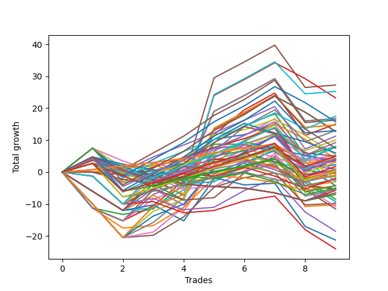

# Long Wallace Doodle 016 
- Symbol: ES
- Date Range: 03/15/2022 - 07/08/2022
- Trading Period: 7:20-12:30
- Number of Trades: 9



| Name | Win Percent | Profit | Avg Profit / Trade |     | Name | Win Percent | Profit | Avg Profit / Trade |
| ---- | ----------- | ------ | ------------------ | --- | ---- | ----------- | ------ | ------------------ |
| Sorted By <br> Profit | | | | | Sorted By <br> Win Percentage ||||
| Five | 66.67 | 14750.00 | 1638.89 |     | Fifty-Seven | 77.78 | 3000.00 | 333.33 |
| Four | 66.67 | 14375.00 | 1597.22 |     | One | 77.78 | 2625.00 | 291.67 |
| Sixty-One | 66.67 | 13750.00 | 1527.78 |     | Five | 66.67 | 14750.00 | 1638.89 |
| Sixty | 66.67 | 13375.00 | 1486.11 |     | Four | 66.67 | 14375.00 | 1597.22 |
| Seventy-Five | 66.67 | 13250.00 | 1472.22 |     | Sixty-One | 66.67 | 13750.00 | 1527.78 |
| Forty-Five | 44.44 | 12750.00 | 1416.67 |     | Sixty | 66.67 | 13375.00 | 1486.11 |
| Three | 66.67 | 9500.00 | 1055.56 |     | Seventy-Five | 66.67 | 13250.00 | 1472.22 |
| Fifty-Nine | 66.67 | 8500.00 | 944.44 |     | Three | 66.67 | 9500.00 | 1055.56 |
| Seven | 66.67 | 8375.00 | 930.56 |     | Fifty-Nine | 66.67 | 8500.00 | 944.44 |
| Sixty-Three | 66.67 | 7375.00 | 819.44 |     | Seven | 66.67 | 8375.00 | 930.56 |
| Forty-Eight | 55.56 | 7125.00 | 791.67 |     | Sixty-Three | 66.67 | 7375.00 | 819.44 |
| Forty | 55.56 | 6500.00 | 722.22 |     | Two | 66.67 | 6125.00 | 680.56 |
| Forty-Seven | 44.44 | 6375.00 | 708.33 |     | Forty-One | 66.67 | 4500.00 | 500.00 |
| Forty-Four | 44.44 | 6375.00 | 708.33 |     | Fifty-Eight | 66.67 | 4125.00 | 458.33 |
| Two | 66.67 | 6125.00 | 680.56 |     | Six | 66.67 | 2125.00 | 236.11 |
| Forty-One | 66.67 | 4500.00 | 500.00 |     | Sixty-Two | 66.67 | 1125.00 | 125.00 |
| Fifty-Six | 55.56 | 4250.00 | 472.22 |     | Forty-Eight | 55.56 | 7125.00 | 791.67 |
| Fifty-Eight | 66.67 | 4125.00 | 458.33 |     | Forty | 55.56 | 6500.00 | 722.22 |
| Forty-Three | 44.44 | 4125.00 | 458.33 |     | Fifty-Six | 55.56 | 4250.00 | 472.22 |
| Twenty-Four | 33.33 | 3250.00 | 361.11 |     | Zero | 55.56 | 3125.00 | 347.22 |
| Zero | 55.56 | 3125.00 | 347.22 |     | Sixty-Four | 55.56 | 2375.00 | 263.89 |
| Fifty-Seven | 77.78 | 3000.00 | 333.33 |     | Seventy-Four | 55.56 | -2000.00 | -222.22 |
| One | 77.78 | 2625.00 | 291.67 |     | Sixty-Five | 55.56 | -8125.00 | -902.78 |
| Sixty-Four | 55.56 | 2375.00 | 263.89 |     | Forty-Five | 44.44 | 12750.00 | 1416.67 |
| Six | 66.67 | 2125.00 | 236.11 |     | Forty-Seven | 44.44 | 6375.00 | 708.33 |
| Eight | 22.22 | 1750.00 | 194.44 |     | Forty-Four | 44.44 | 6375.00 | 708.33 |
| Sixty-Two | 66.67 | 1125.00 | 125.00 |     | Forty-Three | 44.44 | 4125.00 | 458.33 |
| Forty-Six | 44.44 | 125.00 | 13.89 |     | Forty-Six | 44.44 | 125.00 | 13.89 |
| Fifty-Four | 44.44 | -250.00 | -27.78 |     | Fifty-Four | 44.44 | -250.00 | -27.78 |
| Thirty-Two | 44.44 | -625.00 | -69.44 |     | Thirty-Two | 44.44 | -625.00 | -69.44 |
| Seventy-Two | 33.33 | -750.00 | -83.33 |     | Seventy | 44.44 | -875.00 | -97.22 |
| Seventy | 44.44 | -875.00 | -97.22 |     | Forty-Nine | 44.44 | -1250.00 | -138.89 |
| Forty-Nine | 44.44 | -1250.00 | -138.89 |     | Forty-Two | 44.44 | -1250.00 | -138.89 |
| Forty-Two | 44.44 | -1250.00 | -138.89 |     | Thirty-Nine | 44.44 | -2125.00 | -236.11 |
| Seventy-Four | 55.56 | -2000.00 | -222.22 |     | Thirty-Eight | 44.44 | -2125.00 | -236.11 |
| Thirty-Nine | 44.44 | -2125.00 | -236.11 |     | Thirty-Seven | 44.44 | -2125.00 | -236.11 |
| Thirty-Eight | 44.44 | -2125.00 | -236.11 |     | Thirty-Six | 44.44 | -2125.00 | -236.11 |
| Thirty-Seven | 44.44 | -2125.00 | -236.11 |     | Thirty-Five | 44.44 | -2125.00 | -236.11 |
| Thirty-Six | 44.44 | -2125.00 | -236.11 |     | Thirty-Four | 44.44 | -2125.00 | -236.11 |
| Thirty-Five | 44.44 | -2125.00 | -236.11 |     | Thirty-Three | 44.44 | -2125.00 | -236.11 |
| Thirty-Four | 44.44 | -2125.00 | -236.11 |     | Fifty-Five | 44.44 | -2625.00 | -291.67 |
| Thirty-Three | 44.44 | -2125.00 | -236.11 |     | Fifty-Three | 44.44 | -2625.00 | -291.67 |
| Fifty-Five | 44.44 | -2625.00 | -291.67 |     | Fifty-Two | 44.44 | -2625.00 | -291.67 |
| Fifty-Three | 44.44 | -2625.00 | -291.67 |     | Fifty-One | 44.44 | -2625.00 | -291.67 |
| Fifty-Two | 44.44 | -2625.00 | -291.67 |     | Fifty | 44.44 | -2625.00 | -291.67 |
| Fifty-One | 44.44 | -2625.00 | -291.67 |     | Sixty-Seven | 44.44 | -3750.00 | -416.67 |
| Fifty | 44.44 | -2625.00 | -291.67 |     | Seventy-One | 44.44 | -4625.00 | -513.89 |
| Fourteen | 11.11 | -3000.00 | -333.33 |     | Sixty-Nine | 44.44 | -4625.00 | -513.89 |
| Twenty-Three | 22.22 | -3250.00 | -361.11 |     | Sixty-Eight | 44.44 | -5375.00 | -597.22 |
| Twenty-Two | 22.22 | -3250.00 | -361.11 |     | Sixty-Six | 44.44 | -8375.00 | -930.56 |
| Twenty-One | 22.22 | -3250.00 | -361.11 |     | Twenty-Four | 33.33 | 3250.00 | 361.11 |
| Twenty | 22.22 | -3250.00 | -361.11 |     | Seventy-Two | 33.33 | -750.00 | -83.33 |
| Nineteen | 22.22 | -3250.00 | -361.11 |     | Seventy-Three | 33.33 | -10625.00 | -1180.56 |
| Eighteen | 22.22 | -3250.00 | -361.11 |     | Eight | 22.22 | 1750.00 | 194.44 |
| Seventeen | 22.22 | -3250.00 | -361.11 |     | Twenty-Three | 22.22 | -3250.00 | -361.11 |
| Sixten | 22.22 | -3250.00 | -361.11 |     | Twenty-Two | 22.22 | -3250.00 | -361.11 |
| Sixty-Seven | 44.44 | -3750.00 | -416.67 |     | Twenty-One | 22.22 | -3250.00 | -361.11 |
| Seventy-One | 44.44 | -4625.00 | -513.89 |     | Twenty | 22.22 | -3250.00 | -361.11 |
| Sixty-Nine | 44.44 | -4625.00 | -513.89 |     | Nineteen | 22.22 | -3250.00 | -361.11 |
| Sixty-Eight | 44.44 | -5375.00 | -597.22 |     | Eighteen | 22.22 | -3250.00 | -361.11 |
| Nine | 11.11 | -5500.00 | -611.11 |     | Seventeen | 22.22 | -3250.00 | -361.11 |
| Thirty | 11.11 | -6875.00 | -763.89 |     | Sixten | 22.22 | -3250.00 | -361.11 |
| Sixty-Five | 55.56 | -8125.00 | -902.78 |     | Fourteen | 11.11 | -3000.00 | -333.33 |
| Sixty-Six | 44.44 | -8375.00 | -930.56 |     | Nine | 11.11 | -5500.00 | -611.11 |
| Twenty-Five | 11.11 | -9375.00 | -1041.67 |     | Thirty | 11.11 | -6875.00 | -763.89 |
| Fifteen | 0.00 | -9750.00 | -1083.33 |     | Twenty-Five | 11.11 | -9375.00 | -1041.67 |
| Thirteen | 0.00 | -9750.00 | -1083.33 |     | Fifteen | 0.00 | -9750.00 | -1083.33 |
| Twelve | 0.00 | -9750.00 | -1083.33 |     | Thirteen | 0.00 | -9750.00 | -1083.33 |
| Eleven | 0.00 | -9750.00 | -1083.33 |     | Twelve | 0.00 | -9750.00 | -1083.33 |
| Ten | 0.00 | -9750.00 | -1083.33 |     | Eleven | 0.00 | -9750.00 | -1083.33 |
| Seventy-Three | 33.33 | -10625.00 | -1180.56 |     | Ten | 0.00 | -9750.00 | -1083.33 |
| Thirty-One | 0.00 | -14250.00 | -1583.33 |     | Thirty-One | 0.00 | -14250.00 | -1583.33 |
| Twenty-Nine | 0.00 | -14250.00 | -1583.33 |     | Twenty-Nine | 0.00 | -14250.00 | -1583.33 |
| Twenty-Eight | 0.00 | -14250.00 | -1583.33 |     | Twenty-Eight | 0.00 | -14250.00 | -1583.33 |
| twenty-Seven | 0.00 | -14250.00 | -1583.33 |     | twenty-Seven | 0.00 | -14250.00 | -1583.33 |
| Twenty-Six | 0.00 | -14250.00 | -1583.33 |     | Twenty-Six | 0.00 | -14250.00 | -1583.33 |

## NO STOPLOSS

### Test Zero
* Sell when price hits the middle line of the 20p bollinger
* No Stoploss
* Results:
```
Total Trades: 9
Percent Up: 55.56
Percent Down: 44.44
Total Points Moved Up: 6.25
Potential Profit: 3125.00
Total Points Ups: 30.50 Count Ups: 5
Total Points Downs: -24.25 Count Downs: 4
```

<details><summary>Trades</summary>

<code>In: 2022-03-21 09:40:00		Out: 2022-03-21 09:45:00		Total Position Time: 05:00		Total Move Up: 7.50		Total to Date: 7.50</code> <br />
<code>In: 2022-03-25 08:16:00		Out: 2022-03-25 08:36:40		Total Position Time: 20:40		Total Move Up: -7.50		Total to Date: 0.00</code> <br />
<code>In: 2022-04-20 09:18:00		Out: 2022-04-20 09:30:45		Total Position Time: 12:45		Total Move Up: -0.50		Total to Date: -0.50</code> <br />
<code>In: 2022-05-13 11:07:00		Out: 2022-05-13 11:12:25		Total Position Time: 05:25		Total Move Up: 6.50		Total to Date: 6.00</code> <br />
<code>In: 2022-05-17 11:24:00		Out: 2022-05-17 11:27:25		Total Position Time: 03:25		Total Move Up: 11.25		Total to Date: 17.25</code> <br />
<code>In: 2022-05-25 09:29:00		Out: 2022-05-25 09:38:50		Total Position Time: 09:50		Total Move Up: 2.00		Total to Date: 19.25</code> <br />
<code>In: 2022-06-06 08:24:00		Out: 2022-06-06 08:31:35		Total Position Time: 07:35		Total Move Up: 3.25		Total to Date: 22.50</code> <br />
<code>In: 2022-06-08 09:30:00		Out: 2022-06-08 09:53:00		Total Position Time: 23:00		Total Move Up: -15.25		Total to Date: 7.25</code> <br />
<code>In: 2022-06-09 07:56:00		Out: 2022-06-09 08:11:10		Total Position Time: 15:10		Total Move Up: -1.00		Total to Date: 6.25</code> <br />


</details>

### Test One
* Sell when the price hits the upper line of the 20p 1std bollinger
* No Stoploss
* Results:
```
Total Trades: 9
Percent Up: 77.78
Percent Down: 22.22
Total Points Moved Up: 5.25
Potential Profit: 2625.00
Total Points Ups: 26.50 Count Ups: 7
Total Points Downs: -21.25 Count Downs: 2
```

<details><summary>Trades</summary>

<code>In: 2022-03-21 09:40:00		Out: 2022-03-21 09:49:05		Total Position Time: 09:05		Total Move Up: 6.50		Total to Date: 6.50</code> <br />
<code>In: 2022-03-25 08:16:00		Out: 2022-03-25 08:40:40		Total Position Time: 24:40		Total Move Up: -6.50		Total to Date: 0.00</code> <br />
<code>In: 2022-04-20 09:18:00		Out: 2022-04-20 09:30:55		Total Position Time: 12:55		Total Move Up: 0.75		Total to Date: 0.75</code> <br />
<code>In: 2022-05-13 11:07:00		Out: 2022-05-13 11:19:50		Total Position Time: 12:50		Total Move Up: 5.00		Total to Date: 5.75</code> <br />
<code>In: 2022-05-17 11:24:00		Out: 2022-05-17 11:37:35		Total Position Time: 13:35		Total Move Up: 9.25		Total to Date: 15.00</code> <br />
<code>In: 2022-05-25 09:29:00		Out: 2022-05-25 09:44:25		Total Position Time: 15:25		Total Move Up: 3.00		Total to Date: 18.00</code> <br />
<code>In: 2022-06-06 08:24:00		Out: 2022-06-06 08:39:15		Total Position Time: 15:15		Total Move Up: 1.50		Total to Date: 19.50</code> <br />
<code>In: 2022-06-08 09:30:00		Out: 2022-06-08 09:57:10		Total Position Time: 27:10		Total Move Up: -14.75		Total to Date: 4.75</code> <br />
<code>In: 2022-06-09 07:56:00		Out: 2022-06-09 08:21:10		Total Position Time: 25:10		Total Move Up: 0.50		Total to Date: 5.25</code> <br />


</details>

### Test Two
* Sell when the price hits the upper line of the 20p 2std bollinger
* No Stoploss
* Results:
```
Total Trades: 9
Percent Up: 66.67
Percent Down: 33.33
Total Points Moved Up: 12.25
Potential Profit: 6125.00
Total Points Ups: 38.75 Count Ups: 6
Total Points Downs: -26.50 Count Downs: 3
```

<details><summary>Trades</summary>

<code>In: 2022-03-21 09:40:00		Out: 2022-03-21 10:09:55		Total Position Time: 29:55		Total Move Up: -11.25		Total to Date: -11.25</code> <br />
<code>In: 2022-03-25 08:16:00		Out: 2022-03-25 08:41:55		Total Position Time: 25:55		Total Move Up: -2.00		Total to Date: -13.25</code> <br />
<code>In: 2022-04-20 09:18:00		Out: 2022-04-20 09:31:25		Total Position Time: 13:25		Total Move Up: 1.75		Total to Date: -11.50</code> <br />
<code>In: 2022-05-13 11:07:00		Out: 2022-05-13 11:31:30		Total Position Time: 24:30		Total Move Up: 10.50		Total to Date: -1.00</code> <br />
<code>In: 2022-05-17 11:24:00		Out: 2022-05-17 11:40:00		Total Position Time: 16:00		Total Move Up: 13.00		Total to Date: 12.00</code> <br />
<code>In: 2022-05-25 09:29:00		Out: 2022-05-25 09:48:50		Total Position Time: 19:50		Total Move Up: 7.00		Total to Date: 19.00</code> <br />
<code>In: 2022-06-06 08:24:00		Out: 2022-06-06 08:43:00		Total Position Time: 19:00		Total Move Up: 3.75		Total to Date: 22.75</code> <br />
<code>In: 2022-06-08 09:30:00		Out: 2022-06-08 09:59:55		Total Position Time: 29:55		Total Move Up: -13.25		Total to Date: 9.50</code> <br />
<code>In: 2022-06-09 07:56:00		Out: 2022-06-09 08:22:35		Total Position Time: 26:35		Total Move Up: 2.75		Total to Date: 12.25</code> <br />


</details>

### Test Three
* Sell when price hits the middle line of the 50p bollinger
* No Stoploss
* Results:
```
Total Trades: 9
Percent Up: 66.67
Percent Down: 33.33
Total Points Moved Up: 19.00
Potential Profit: 9500.00
Total Points Ups: 47.50 Count Ups: 6
Total Points Downs: -28.50 Count Downs: 3
```

<details><summary>Trades</summary>

<code>In: 2022-03-21 09:40:00		Out: 2022-03-21 10:09:55		Total Position Time: 29:55		Total Move Up: -11.25		Total to Date: -11.25</code> <br />
<code>In: 2022-03-25 08:16:00		Out: 2022-03-25 08:45:55		Total Position Time: 29:55		Total Move Up: -4.00		Total to Date: -15.25</code> <br />
<code>In: 2022-04-20 09:18:00		Out: 2022-04-20 09:32:40		Total Position Time: 14:40		Total Move Up: 4.50		Total to Date: -10.75</code> <br />
<code>In: 2022-05-13 11:07:00		Out: 2022-05-13 11:31:20		Total Position Time: 24:20		Total Move Up: 7.75		Total to Date: -3.00</code> <br />
<code>In: 2022-05-17 11:24:00		Out: 2022-05-17 11:40:05		Total Position Time: 16:05		Total Move Up: 14.50		Total to Date: 11.50</code> <br />
<code>In: 2022-05-25 09:29:00		Out: 2022-05-25 09:49:05		Total Position Time: 20:05		Total Move Up: 7.75		Total to Date: 19.25</code> <br />
<code>In: 2022-06-06 08:24:00		Out: 2022-06-06 08:46:10		Total Position Time: 22:10		Total Move Up: 9.50		Total to Date: 28.75</code> <br />
<code>In: 2022-06-08 09:30:00		Out: 2022-06-08 09:59:55		Total Position Time: 29:55		Total Move Up: -13.25		Total to Date: 15.50</code> <br />
<code>In: 2022-06-09 07:56:00		Out: 2022-06-09 08:22:45		Total Position Time: 26:45		Total Move Up: 3.50		Total to Date: 19.00</code> <br />


</details>

### Test Four
* Sell when the price hits the upper line of the 50p 1std bollinger
* No Stoploss
* Results:
```
Total Trades: 9
Percent Up: 66.67
Percent Down: 33.33
Total Points Moved Up: 28.75
Potential Profit: 14375.00
Total Points Ups: 57.25 Count Ups: 6
Total Points Downs: -28.50 Count Downs: 3
```

<details><summary>Trades</summary>

<code>In: 2022-03-21 09:40:00		Out: 2022-03-21 10:09:55		Total Position Time: 29:55		Total Move Up: -11.25		Total to Date: -11.25</code> <br />
<code>In: 2022-03-25 08:16:00		Out: 2022-03-25 08:45:55		Total Position Time: 29:55		Total Move Up: -4.00		Total to Date: -15.25</code> <br />
<code>In: 2022-04-20 09:18:00		Out: 2022-04-20 09:36:45		Total Position Time: 18:45		Total Move Up: 8.25		Total to Date: -7.00</code> <br />
<code>In: 2022-05-13 11:07:00		Out: 2022-05-13 11:32:00		Total Position Time: 25:00		Total Move Up: 15.75		Total to Date: 8.75</code> <br />
<code>In: 2022-05-17 11:24:00		Out: 2022-05-17 11:45:45		Total Position Time: 21:45		Total Move Up: 22.25		Total to Date: 31.00</code> <br />
<code>In: 2022-05-25 09:29:00		Out: 2022-05-25 09:58:55		Total Position Time: 29:55		Total Move Up: 5.00		Total to Date: 36.00</code> <br />
<code>In: 2022-06-06 08:24:00		Out: 2022-06-06 08:53:55		Total Position Time: 29:55		Total Move Up: 5.25		Total to Date: 41.25</code> <br />
<code>In: 2022-06-08 09:30:00		Out: 2022-06-08 09:59:55		Total Position Time: 29:55		Total Move Up: -13.25		Total to Date: 28.00</code> <br />
<code>In: 2022-06-09 07:56:00		Out: 2022-06-09 08:25:55		Total Position Time: 29:55		Total Move Up: 0.75		Total to Date: 28.75</code> <br />


</details>

### Test Five
* Sell when the price hits the upper line of the 50p 2std bollinger
* No Stoploss
* Results:
```
Total Trades: 9
Percent Up: 66.67
Percent Down: 33.33
Total Points Moved Up: 29.50
Potential Profit: 14750.00
Total Points Ups: 58.00 Count Ups: 6
Total Points Downs: -28.50 Count Downs: 3
```

<details><summary>Trades</summary>

<code>In: 2022-03-21 09:40:00		Out: 2022-03-21 10:09:55		Total Position Time: 29:55		Total Move Up: -11.25		Total to Date: -11.25</code> <br />
<code>In: 2022-03-25 08:16:00		Out: 2022-03-25 08:45:55		Total Position Time: 29:55		Total Move Up: -4.00		Total to Date: -15.25</code> <br />
<code>In: 2022-04-20 09:18:00		Out: 2022-04-20 09:47:55		Total Position Time: 29:55		Total Move Up: 9.75		Total to Date: -5.50</code> <br />
<code>In: 2022-05-13 11:07:00		Out: 2022-05-13 11:36:55		Total Position Time: 29:55		Total Move Up: 3.75		Total to Date: -1.75</code> <br />
<code>In: 2022-05-17 11:24:00		Out: 2022-05-17 11:49:45		Total Position Time: 25:45		Total Move Up: 33.50		Total to Date: 31.75</code> <br />
<code>In: 2022-05-25 09:29:00		Out: 2022-05-25 09:58:55		Total Position Time: 29:55		Total Move Up: 5.00		Total to Date: 36.75</code> <br />
<code>In: 2022-06-06 08:24:00		Out: 2022-06-06 08:53:55		Total Position Time: 29:55		Total Move Up: 5.25		Total to Date: 42.00</code> <br />
<code>In: 2022-06-08 09:30:00		Out: 2022-06-08 09:59:55		Total Position Time: 29:55		Total Move Up: -13.25		Total to Date: 28.75</code> <br />
<code>In: 2022-06-09 07:56:00		Out: 2022-06-09 08:25:55		Total Position Time: 29:55		Total Move Up: 0.75		Total to Date: 29.50</code> <br />


</details>

### Test Six
* Sell when the price hits the middle line of the 1std VWAP
* No Stoploss
* Results:
```
Total Trades: 9
Percent Up: 66.67
Percent Down: 33.33
Total Points Moved Up: 4.25
Potential Profit: 2125.00
Total Points Ups: 32.75 Count Ups: 6
Total Points Downs: -28.50 Count Downs: 3
```

<details><summary>Trades</summary>

<code>In: 2022-03-21 09:40:00		Out: 2022-03-21 10:09:55		Total Position Time: 29:55		Total Move Up: -11.25		Total to Date: -11.25</code> <br />
<code>In: 2022-03-25 08:16:00		Out: 2022-03-25 08:45:55		Total Position Time: 29:55		Total Move Up: -4.00		Total to Date: -15.25</code> <br />
<code>In: 2022-04-20 09:18:00		Out: 2022-04-20 09:35:50		Total Position Time: 17:50		Total Move Up: 6.75		Total to Date: -8.50</code> <br />
<code>In: 2022-05-13 11:07:00		Out: 2022-05-13 11:36:55		Total Position Time: 29:55		Total Move Up: 3.75		Total to Date: -4.75</code> <br />
<code>In: 2022-05-17 11:24:00		Out: 2022-05-17 11:27:25		Total Position Time: 03:25		Total Move Up: 11.25		Total to Date: 6.50</code> <br />
<code>In: 2022-05-25 09:29:00		Out: 2022-05-25 09:58:55		Total Position Time: 29:55		Total Move Up: 5.00		Total to Date: 11.50</code> <br />
<code>In: 2022-06-06 08:24:00		Out: 2022-06-06 08:53:55		Total Position Time: 29:55		Total Move Up: 5.25		Total to Date: 16.75</code> <br />
<code>In: 2022-06-08 09:30:00		Out: 2022-06-08 09:59:55		Total Position Time: 29:55		Total Move Up: -13.25		Total to Date: 3.50</code> <br />
<code>In: 2022-06-09 07:56:00		Out: 2022-06-09 08:25:55		Total Position Time: 29:55		Total Move Up: 0.75		Total to Date: 4.25</code> <br />


</details>

### Test Seven
* Sell when the price hits the upper line of the 1std VWAP
* No Stoploss
* Results:
```
Total Trades: 9
Percent Up: 66.67
Percent Down: 33.33
Total Points Moved Up: 16.75
Potential Profit: 8375.00
Total Points Ups: 45.25 Count Ups: 6
Total Points Downs: -28.50 Count Downs: 3
```

<details><summary>Trades</summary>

<code>In: 2022-03-21 09:40:00		Out: 2022-03-21 10:09:55		Total Position Time: 29:55		Total Move Up: -11.25		Total to Date: -11.25</code> <br />
<code>In: 2022-03-25 08:16:00		Out: 2022-03-25 08:45:55		Total Position Time: 29:55		Total Move Up: -4.00		Total to Date: -15.25</code> <br />
<code>In: 2022-04-20 09:18:00		Out: 2022-04-20 09:47:55		Total Position Time: 29:55		Total Move Up: 9.75		Total to Date: -5.50</code> <br />
<code>In: 2022-05-13 11:07:00		Out: 2022-05-13 11:36:55		Total Position Time: 29:55		Total Move Up: 3.75		Total to Date: -1.75</code> <br />
<code>In: 2022-05-17 11:24:00		Out: 2022-05-17 11:40:20		Total Position Time: 16:20		Total Move Up: 20.75		Total to Date: 19.00</code> <br />
<code>In: 2022-05-25 09:29:00		Out: 2022-05-25 09:58:55		Total Position Time: 29:55		Total Move Up: 5.00		Total to Date: 24.00</code> <br />
<code>In: 2022-06-06 08:24:00		Out: 2022-06-06 08:53:55		Total Position Time: 29:55		Total Move Up: 5.25		Total to Date: 29.25</code> <br />
<code>In: 2022-06-08 09:30:00		Out: 2022-06-08 09:59:55		Total Position Time: 29:55		Total Move Up: -13.25		Total to Date: 16.00</code> <br />
<code>In: 2022-06-09 07:56:00		Out: 2022-06-09 08:25:55		Total Position Time: 29:55		Total Move Up: 0.75		Total to Date: 16.75</code> <br />


</details>

## STOPLOSS OF 2

### Test Eight
* Sell when price hits the middle line of the 20p bollinger
* Stoploss is 2 points
* Results:
```
Total Trades: 9
Percent Up: 22.22
Percent Down: 77.78
Total Points Moved Up: 3.50
Potential Profit: 1750.00
Total Points Ups: 18.75 Count Ups: 2
Total Points Downs: -15.25 Count Downs: 7
```

<details><summary>Trades</summary>

<code>In: 2022-03-21 09:40:00		Out: 2022-03-21 09:45:00		Total Position Time: 05:00		Total Move Up: 7.50		Total to Date: 7.50</code> <br />
<code>In: 2022-03-25 08:16:00		Out: 2022-03-25 08:19:35		Total Position Time: 03:35		Total Move Up: -2.25		Total to Date: 5.25</code> <br />
<code>In: 2022-04-20 09:18:00		Out: 2022-04-20 09:24:15		Total Position Time: 06:15		Total Move Up: -1.75		Total to Date: 3.50</code> <br />
<code>In: 2022-05-13 11:07:00		Out: 2022-05-13 11:08:10		Total Position Time: 01:10		Total Move Up: -2.75		Total to Date: 0.75</code> <br />
<code>In: 2022-05-17 11:24:00		Out: 2022-05-17 11:27:25		Total Position Time: 03:25		Total Move Up: 11.25		Total to Date: 12.00</code> <br />
<code>In: 2022-05-25 09:29:00		Out: 2022-05-25 09:36:05		Total Position Time: 07:05		Total Move Up: -2.25		Total to Date: 9.75</code> <br />
<code>In: 2022-06-06 08:24:00		Out: 2022-06-06 08:24:55		Total Position Time: 00:55		Total Move Up: -2.25		Total to Date: 7.50</code> <br />
<code>In: 2022-06-08 09:30:00		Out: 2022-06-08 09:31:10		Total Position Time: 01:10		Total Move Up: -2.00		Total to Date: 5.50</code> <br />
<code>In: 2022-06-09 07:56:00		Out: 2022-06-09 08:02:25		Total Position Time: 06:25		Total Move Up: -2.00		Total to Date: 3.50</code> <br />


</details>

### Test Nine
* Sell when the price hits the upper line of the 20p 1std bollinger
* Stoploss is 2 points
* Results:
```
Total Trades: 9
Percent Up: 11.11
Percent Down: 88.89
Total Points Moved Up: -11.00
Potential Profit: -5500.00
Total Points Ups: 6.50 Count Ups: 1
Total Points Downs: -17.50 Count Downs: 8
```

<details><summary>Trades</summary>

<code>In: 2022-03-21 09:40:00		Out: 2022-03-21 09:49:05		Total Position Time: 09:05		Total Move Up: 6.50		Total to Date: 6.50</code> <br />
<code>In: 2022-03-25 08:16:00		Out: 2022-03-25 08:19:35		Total Position Time: 03:35		Total Move Up: -2.25		Total to Date: 4.25</code> <br />
<code>In: 2022-04-20 09:18:00		Out: 2022-04-20 09:24:15		Total Position Time: 06:15		Total Move Up: -1.75		Total to Date: 2.50</code> <br />
<code>In: 2022-05-13 11:07:00		Out: 2022-05-13 11:08:10		Total Position Time: 01:10		Total Move Up: -2.75		Total to Date: -0.25</code> <br />
<code>In: 2022-05-17 11:24:00		Out: 2022-05-17 11:35:05		Total Position Time: 11:05		Total Move Up: -2.25		Total to Date: -2.50</code> <br />
<code>In: 2022-05-25 09:29:00		Out: 2022-05-25 09:36:05		Total Position Time: 07:05		Total Move Up: -2.25		Total to Date: -4.75</code> <br />
<code>In: 2022-06-06 08:24:00		Out: 2022-06-06 08:24:55		Total Position Time: 00:55		Total Move Up: -2.25		Total to Date: -7.00</code> <br />
<code>In: 2022-06-08 09:30:00		Out: 2022-06-08 09:31:10		Total Position Time: 01:10		Total Move Up: -2.00		Total to Date: -9.00</code> <br />
<code>In: 2022-06-09 07:56:00		Out: 2022-06-09 08:02:25		Total Position Time: 06:25		Total Move Up: -2.00		Total to Date: -11.00</code> <br />


</details>

### Test Ten
* Sell when the price hits the upper line of the 20p 2std bollinger
* Stoploss is 2 points
* Results:
```
Total Trades: 9
Percent Up: 0.00
Percent Down: 100.00
Total Points Moved Up: -19.50
Potential Profit: -9750.00
Total Points Ups: 0.00 Count Ups: 0
Total Points Downs: -19.50 Count Downs: 9
```

<details><summary>Trades</summary>

<code>In: 2022-03-21 09:40:00		Out: 2022-03-21 09:52:00		Total Position Time: 12:00		Total Move Up: -2.00		Total to Date: -2.00</code> <br />
<code>In: 2022-03-25 08:16:00		Out: 2022-03-25 08:19:35		Total Position Time: 03:35		Total Move Up: -2.25		Total to Date: -4.25</code> <br />
<code>In: 2022-04-20 09:18:00		Out: 2022-04-20 09:24:15		Total Position Time: 06:15		Total Move Up: -1.75		Total to Date: -6.00</code> <br />
<code>In: 2022-05-13 11:07:00		Out: 2022-05-13 11:08:10		Total Position Time: 01:10		Total Move Up: -2.75		Total to Date: -8.75</code> <br />
<code>In: 2022-05-17 11:24:00		Out: 2022-05-17 11:35:05		Total Position Time: 11:05		Total Move Up: -2.25		Total to Date: -11.00</code> <br />
<code>In: 2022-05-25 09:29:00		Out: 2022-05-25 09:36:05		Total Position Time: 07:05		Total Move Up: -2.25		Total to Date: -13.25</code> <br />
<code>In: 2022-06-06 08:24:00		Out: 2022-06-06 08:24:55		Total Position Time: 00:55		Total Move Up: -2.25		Total to Date: -15.50</code> <br />
<code>In: 2022-06-08 09:30:00		Out: 2022-06-08 09:31:10		Total Position Time: 01:10		Total Move Up: -2.00		Total to Date: -17.50</code> <br />
<code>In: 2022-06-09 07:56:00		Out: 2022-06-09 08:02:25		Total Position Time: 06:25		Total Move Up: -2.00		Total to Date: -19.50</code> <br />


</details>

### Test Eleven
* Sell when price hits the middle line of the 50p bollinger
* Stoploss is 2 points
* Results:
```
Total Trades: 9
Percent Up: 0.00
Percent Down: 100.00
Total Points Moved Up: -19.50
Potential Profit: -9750.00
Total Points Ups: 0.00 Count Ups: 0
Total Points Downs: -19.50 Count Downs: 9
```

<details><summary>Trades</summary>

<code>In: 2022-03-21 09:40:00		Out: 2022-03-21 09:52:00		Total Position Time: 12:00		Total Move Up: -2.00		Total to Date: -2.00</code> <br />
<code>In: 2022-03-25 08:16:00		Out: 2022-03-25 08:19:35		Total Position Time: 03:35		Total Move Up: -2.25		Total to Date: -4.25</code> <br />
<code>In: 2022-04-20 09:18:00		Out: 2022-04-20 09:24:15		Total Position Time: 06:15		Total Move Up: -1.75		Total to Date: -6.00</code> <br />
<code>In: 2022-05-13 11:07:00		Out: 2022-05-13 11:08:10		Total Position Time: 01:10		Total Move Up: -2.75		Total to Date: -8.75</code> <br />
<code>In: 2022-05-17 11:24:00		Out: 2022-05-17 11:35:05		Total Position Time: 11:05		Total Move Up: -2.25		Total to Date: -11.00</code> <br />
<code>In: 2022-05-25 09:29:00		Out: 2022-05-25 09:36:05		Total Position Time: 07:05		Total Move Up: -2.25		Total to Date: -13.25</code> <br />
<code>In: 2022-06-06 08:24:00		Out: 2022-06-06 08:24:55		Total Position Time: 00:55		Total Move Up: -2.25		Total to Date: -15.50</code> <br />
<code>In: 2022-06-08 09:30:00		Out: 2022-06-08 09:31:10		Total Position Time: 01:10		Total Move Up: -2.00		Total to Date: -17.50</code> <br />
<code>In: 2022-06-09 07:56:00		Out: 2022-06-09 08:02:25		Total Position Time: 06:25		Total Move Up: -2.00		Total to Date: -19.50</code> <br />


</details>

### Test Twelve
* Sell when the price hits the upper line of the 50p 1std bollinger
* Stoploss is 2 points
* Results:
```
Total Trades: 9
Percent Up: 0.00
Percent Down: 100.00
Total Points Moved Up: -19.50
Potential Profit: -9750.00
Total Points Ups: 0.00 Count Ups: 0
Total Points Downs: -19.50 Count Downs: 9
```

<details><summary>Trades</summary>

<code>In: 2022-03-21 09:40:00		Out: 2022-03-21 09:52:00		Total Position Time: 12:00		Total Move Up: -2.00		Total to Date: -2.00</code> <br />
<code>In: 2022-03-25 08:16:00		Out: 2022-03-25 08:19:35		Total Position Time: 03:35		Total Move Up: -2.25		Total to Date: -4.25</code> <br />
<code>In: 2022-04-20 09:18:00		Out: 2022-04-20 09:24:15		Total Position Time: 06:15		Total Move Up: -1.75		Total to Date: -6.00</code> <br />
<code>In: 2022-05-13 11:07:00		Out: 2022-05-13 11:08:10		Total Position Time: 01:10		Total Move Up: -2.75		Total to Date: -8.75</code> <br />
<code>In: 2022-05-17 11:24:00		Out: 2022-05-17 11:35:05		Total Position Time: 11:05		Total Move Up: -2.25		Total to Date: -11.00</code> <br />
<code>In: 2022-05-25 09:29:00		Out: 2022-05-25 09:36:05		Total Position Time: 07:05		Total Move Up: -2.25		Total to Date: -13.25</code> <br />
<code>In: 2022-06-06 08:24:00		Out: 2022-06-06 08:24:55		Total Position Time: 00:55		Total Move Up: -2.25		Total to Date: -15.50</code> <br />
<code>In: 2022-06-08 09:30:00		Out: 2022-06-08 09:31:10		Total Position Time: 01:10		Total Move Up: -2.00		Total to Date: -17.50</code> <br />
<code>In: 2022-06-09 07:56:00		Out: 2022-06-09 08:02:25		Total Position Time: 06:25		Total Move Up: -2.00		Total to Date: -19.50</code> <br />


</details>

### Test Thirteen
* Sell when the price hits the upper line of the 50p 2std bollinger
* Stoploss is 2 points
* Results:
```
Total Trades: 9
Percent Up: 0.00
Percent Down: 100.00
Total Points Moved Up: -19.50
Potential Profit: -9750.00
Total Points Ups: 0.00 Count Ups: 0
Total Points Downs: -19.50 Count Downs: 9
```

<details><summary>Trades</summary>

<code>In: 2022-03-21 09:40:00		Out: 2022-03-21 09:52:00		Total Position Time: 12:00		Total Move Up: -2.00		Total to Date: -2.00</code> <br />
<code>In: 2022-03-25 08:16:00		Out: 2022-03-25 08:19:35		Total Position Time: 03:35		Total Move Up: -2.25		Total to Date: -4.25</code> <br />
<code>In: 2022-04-20 09:18:00		Out: 2022-04-20 09:24:15		Total Position Time: 06:15		Total Move Up: -1.75		Total to Date: -6.00</code> <br />
<code>In: 2022-05-13 11:07:00		Out: 2022-05-13 11:08:10		Total Position Time: 01:10		Total Move Up: -2.75		Total to Date: -8.75</code> <br />
<code>In: 2022-05-17 11:24:00		Out: 2022-05-17 11:35:05		Total Position Time: 11:05		Total Move Up: -2.25		Total to Date: -11.00</code> <br />
<code>In: 2022-05-25 09:29:00		Out: 2022-05-25 09:36:05		Total Position Time: 07:05		Total Move Up: -2.25		Total to Date: -13.25</code> <br />
<code>In: 2022-06-06 08:24:00		Out: 2022-06-06 08:24:55		Total Position Time: 00:55		Total Move Up: -2.25		Total to Date: -15.50</code> <br />
<code>In: 2022-06-08 09:30:00		Out: 2022-06-08 09:31:10		Total Position Time: 01:10		Total Move Up: -2.00		Total to Date: -17.50</code> <br />
<code>In: 2022-06-09 07:56:00		Out: 2022-06-09 08:02:25		Total Position Time: 06:25		Total Move Up: -2.00		Total to Date: -19.50</code> <br />


</details>

### Test Fourteen
* Sell when the price hits the middle line of the 1std VWAP
* Stoploss is 2 points
* Results:
```
Total Trades: 9
Percent Up: 11.11
Percent Down: 88.89
Total Points Moved Up: -6.00
Potential Profit: -3000.00
Total Points Ups: 11.25 Count Ups: 1
Total Points Downs: -17.25 Count Downs: 8
```

<details><summary>Trades</summary>

<code>In: 2022-03-21 09:40:00		Out: 2022-03-21 09:52:00		Total Position Time: 12:00		Total Move Up: -2.00		Total to Date: -2.00</code> <br />
<code>In: 2022-03-25 08:16:00		Out: 2022-03-25 08:19:35		Total Position Time: 03:35		Total Move Up: -2.25		Total to Date: -4.25</code> <br />
<code>In: 2022-04-20 09:18:00		Out: 2022-04-20 09:24:15		Total Position Time: 06:15		Total Move Up: -1.75		Total to Date: -6.00</code> <br />
<code>In: 2022-05-13 11:07:00		Out: 2022-05-13 11:08:10		Total Position Time: 01:10		Total Move Up: -2.75		Total to Date: -8.75</code> <br />
<code>In: 2022-05-17 11:24:00		Out: 2022-05-17 11:27:25		Total Position Time: 03:25		Total Move Up: 11.25		Total to Date: 2.50</code> <br />
<code>In: 2022-05-25 09:29:00		Out: 2022-05-25 09:36:05		Total Position Time: 07:05		Total Move Up: -2.25		Total to Date: 0.25</code> <br />
<code>In: 2022-06-06 08:24:00		Out: 2022-06-06 08:24:55		Total Position Time: 00:55		Total Move Up: -2.25		Total to Date: -2.00</code> <br />
<code>In: 2022-06-08 09:30:00		Out: 2022-06-08 09:31:10		Total Position Time: 01:10		Total Move Up: -2.00		Total to Date: -4.00</code> <br />
<code>In: 2022-06-09 07:56:00		Out: 2022-06-09 08:02:25		Total Position Time: 06:25		Total Move Up: -2.00		Total to Date: -6.00</code> <br />


</details>

### Test Fifteen
* Sell when the price hits the upper line of the 1std VWAP
* Stoploss is 2 points
* Results:
```
Total Trades: 9
Percent Up: 0.00
Percent Down: 100.00
Total Points Moved Up: -19.50
Potential Profit: -9750.00
Total Points Ups: 0.00 Count Ups: 0
Total Points Downs: -19.50 Count Downs: 9
```

<details><summary>Trades</summary>

<code>In: 2022-03-21 09:40:00		Out: 2022-03-21 09:52:00		Total Position Time: 12:00		Total Move Up: -2.00		Total to Date: -2.00</code> <br />
<code>In: 2022-03-25 08:16:00		Out: 2022-03-25 08:19:35		Total Position Time: 03:35		Total Move Up: -2.25		Total to Date: -4.25</code> <br />
<code>In: 2022-04-20 09:18:00		Out: 2022-04-20 09:24:15		Total Position Time: 06:15		Total Move Up: -1.75		Total to Date: -6.00</code> <br />
<code>In: 2022-05-13 11:07:00		Out: 2022-05-13 11:08:10		Total Position Time: 01:10		Total Move Up: -2.75		Total to Date: -8.75</code> <br />
<code>In: 2022-05-17 11:24:00		Out: 2022-05-17 11:35:05		Total Position Time: 11:05		Total Move Up: -2.25		Total to Date: -11.00</code> <br />
<code>In: 2022-05-25 09:29:00		Out: 2022-05-25 09:36:05		Total Position Time: 07:05		Total Move Up: -2.25		Total to Date: -13.25</code> <br />
<code>In: 2022-06-06 08:24:00		Out: 2022-06-06 08:24:55		Total Position Time: 00:55		Total Move Up: -2.25		Total to Date: -15.50</code> <br />
<code>In: 2022-06-08 09:30:00		Out: 2022-06-08 09:31:10		Total Position Time: 01:10		Total Move Up: -2.00		Total to Date: -17.50</code> <br />
<code>In: 2022-06-09 07:56:00		Out: 2022-06-09 08:02:25		Total Position Time: 06:25		Total Move Up: -2.00		Total to Date: -19.50</code> <br />


</details>

## TRAIL STOP OF 2

### Test Sixten
* Sell when price hits the middle line of the 20p bollinger
* Trailing Stop is 2 points
* Results:
```
Total Trades: 9
Percent Up: 22.22
Percent Down: 77.78
Total Points Moved Up: -6.50
Potential Profit: -3250.00
Total Points Ups: 2.50 Count Ups: 2
Total Points Downs: -9.00 Count Downs: 7
```

<details><summary>Trades</summary>

<code>In: 2022-03-21 09:40:00		Out: 2022-03-21 09:40:10		Total Position Time: 00:10		Total Move Up: 0.00		Total to Date: 0.00</code> <br />
<code>In: 2022-03-25 08:16:00		Out: 2022-03-25 08:17:20		Total Position Time: 01:20		Total Move Up: -0.75		Total to Date: -0.75</code> <br />
<code>In: 2022-04-20 09:18:00		Out: 2022-04-20 09:20:50		Total Position Time: 02:50		Total Move Up: -0.25		Total to Date: -1.00</code> <br />
<code>In: 2022-05-13 11:07:00		Out: 2022-05-13 11:08:10		Total Position Time: 01:10		Total Move Up: -2.75		Total to Date: -3.75</code> <br />
<code>In: 2022-05-17 11:24:00		Out: 2022-05-17 11:24:10		Total Position Time: 00:10		Total Move Up: -0.75		Total to Date: -4.50</code> <br />
<code>In: 2022-05-25 09:29:00		Out: 2022-05-25 09:29:10		Total Position Time: 00:10		Total Move Up: -0.50		Total to Date: -5.00</code> <br />
<code>In: 2022-06-06 08:24:00		Out: 2022-06-06 08:24:50		Total Position Time: 00:50		Total Move Up: -1.50		Total to Date: -6.50</code> <br />
<code>In: 2022-06-08 09:30:00		Out: 2022-06-08 09:31:15		Total Position Time: 01:15		Total Move Up: -2.50		Total to Date: -9.00</code> <br />
<code>In: 2022-06-09 07:56:00		Out: 2022-06-09 07:58:10		Total Position Time: 02:10		Total Move Up: 2.50		Total to Date: -6.50</code> <br />


</details>

### Test Seventeen
* Sell when the price hits the upper line of the 20p 1std bollinger
* Trailing Stop is 2 points
* Results:
```
Total Trades: 9
Percent Up: 22.22
Percent Down: 77.78
Total Points Moved Up: -6.50
Potential Profit: -3250.00
Total Points Ups: 2.50 Count Ups: 2
Total Points Downs: -9.00 Count Downs: 7
```

<details><summary>Trades</summary>

<code>In: 2022-03-21 09:40:00		Out: 2022-03-21 09:40:10		Total Position Time: 00:10		Total Move Up: 0.00		Total to Date: 0.00</code> <br />
<code>In: 2022-03-25 08:16:00		Out: 2022-03-25 08:17:20		Total Position Time: 01:20		Total Move Up: -0.75		Total to Date: -0.75</code> <br />
<code>In: 2022-04-20 09:18:00		Out: 2022-04-20 09:20:50		Total Position Time: 02:50		Total Move Up: -0.25		Total to Date: -1.00</code> <br />
<code>In: 2022-05-13 11:07:00		Out: 2022-05-13 11:08:10		Total Position Time: 01:10		Total Move Up: -2.75		Total to Date: -3.75</code> <br />
<code>In: 2022-05-17 11:24:00		Out: 2022-05-17 11:24:10		Total Position Time: 00:10		Total Move Up: -0.75		Total to Date: -4.50</code> <br />
<code>In: 2022-05-25 09:29:00		Out: 2022-05-25 09:29:10		Total Position Time: 00:10		Total Move Up: -0.50		Total to Date: -5.00</code> <br />
<code>In: 2022-06-06 08:24:00		Out: 2022-06-06 08:24:50		Total Position Time: 00:50		Total Move Up: -1.50		Total to Date: -6.50</code> <br />
<code>In: 2022-06-08 09:30:00		Out: 2022-06-08 09:31:15		Total Position Time: 01:15		Total Move Up: -2.50		Total to Date: -9.00</code> <br />
<code>In: 2022-06-09 07:56:00		Out: 2022-06-09 07:58:10		Total Position Time: 02:10		Total Move Up: 2.50		Total to Date: -6.50</code> <br />


</details>

### Test Eighteen
* Sell when the price hits the upper line of the 20p 2std bollinger
* Trailing Stop is 2 points
* Results:
```
Total Trades: 9
Percent Up: 22.22
Percent Down: 77.78
Total Points Moved Up: -6.50
Potential Profit: -3250.00
Total Points Ups: 2.50 Count Ups: 2
Total Points Downs: -9.00 Count Downs: 7
```

<details><summary>Trades</summary>

<code>In: 2022-03-21 09:40:00		Out: 2022-03-21 09:40:10		Total Position Time: 00:10		Total Move Up: 0.00		Total to Date: 0.00</code> <br />
<code>In: 2022-03-25 08:16:00		Out: 2022-03-25 08:17:20		Total Position Time: 01:20		Total Move Up: -0.75		Total to Date: -0.75</code> <br />
<code>In: 2022-04-20 09:18:00		Out: 2022-04-20 09:20:50		Total Position Time: 02:50		Total Move Up: -0.25		Total to Date: -1.00</code> <br />
<code>In: 2022-05-13 11:07:00		Out: 2022-05-13 11:08:10		Total Position Time: 01:10		Total Move Up: -2.75		Total to Date: -3.75</code> <br />
<code>In: 2022-05-17 11:24:00		Out: 2022-05-17 11:24:10		Total Position Time: 00:10		Total Move Up: -0.75		Total to Date: -4.50</code> <br />
<code>In: 2022-05-25 09:29:00		Out: 2022-05-25 09:29:10		Total Position Time: 00:10		Total Move Up: -0.50		Total to Date: -5.00</code> <br />
<code>In: 2022-06-06 08:24:00		Out: 2022-06-06 08:24:50		Total Position Time: 00:50		Total Move Up: -1.50		Total to Date: -6.50</code> <br />
<code>In: 2022-06-08 09:30:00		Out: 2022-06-08 09:31:15		Total Position Time: 01:15		Total Move Up: -2.50		Total to Date: -9.00</code> <br />
<code>In: 2022-06-09 07:56:00		Out: 2022-06-09 07:58:10		Total Position Time: 02:10		Total Move Up: 2.50		Total to Date: -6.50</code> <br />


</details>

### Test Nineteen
* Sell when price hits the middle line of the 50p bollinger
* Trailing Stop is 2 points
* Results:
```
Total Trades: 9
Percent Up: 22.22
Percent Down: 77.78
Total Points Moved Up: -6.50
Potential Profit: -3250.00
Total Points Ups: 2.50 Count Ups: 2
Total Points Downs: -9.00 Count Downs: 7
```

<details><summary>Trades</summary>

<code>In: 2022-03-21 09:40:00		Out: 2022-03-21 09:40:10		Total Position Time: 00:10		Total Move Up: 0.00		Total to Date: 0.00</code> <br />
<code>In: 2022-03-25 08:16:00		Out: 2022-03-25 08:17:20		Total Position Time: 01:20		Total Move Up: -0.75		Total to Date: -0.75</code> <br />
<code>In: 2022-04-20 09:18:00		Out: 2022-04-20 09:20:50		Total Position Time: 02:50		Total Move Up: -0.25		Total to Date: -1.00</code> <br />
<code>In: 2022-05-13 11:07:00		Out: 2022-05-13 11:08:10		Total Position Time: 01:10		Total Move Up: -2.75		Total to Date: -3.75</code> <br />
<code>In: 2022-05-17 11:24:00		Out: 2022-05-17 11:24:10		Total Position Time: 00:10		Total Move Up: -0.75		Total to Date: -4.50</code> <br />
<code>In: 2022-05-25 09:29:00		Out: 2022-05-25 09:29:10		Total Position Time: 00:10		Total Move Up: -0.50		Total to Date: -5.00</code> <br />
<code>In: 2022-06-06 08:24:00		Out: 2022-06-06 08:24:50		Total Position Time: 00:50		Total Move Up: -1.50		Total to Date: -6.50</code> <br />
<code>In: 2022-06-08 09:30:00		Out: 2022-06-08 09:31:15		Total Position Time: 01:15		Total Move Up: -2.50		Total to Date: -9.00</code> <br />
<code>In: 2022-06-09 07:56:00		Out: 2022-06-09 07:58:10		Total Position Time: 02:10		Total Move Up: 2.50		Total to Date: -6.50</code> <br />


</details>

### Test Twenty
* Sell when the price hits the upper line of the 50p 1std bollinger
* Trailing Stop is 2 points
* Results:
```
Total Trades: 9
Percent Up: 22.22
Percent Down: 77.78
Total Points Moved Up: -6.50
Potential Profit: -3250.00
Total Points Ups: 2.50 Count Ups: 2
Total Points Downs: -9.00 Count Downs: 7
```

<details><summary>Trades</summary>

<code>In: 2022-03-21 09:40:00		Out: 2022-03-21 09:40:10		Total Position Time: 00:10		Total Move Up: 0.00		Total to Date: 0.00</code> <br />
<code>In: 2022-03-25 08:16:00		Out: 2022-03-25 08:17:20		Total Position Time: 01:20		Total Move Up: -0.75		Total to Date: -0.75</code> <br />
<code>In: 2022-04-20 09:18:00		Out: 2022-04-20 09:20:50		Total Position Time: 02:50		Total Move Up: -0.25		Total to Date: -1.00</code> <br />
<code>In: 2022-05-13 11:07:00		Out: 2022-05-13 11:08:10		Total Position Time: 01:10		Total Move Up: -2.75		Total to Date: -3.75</code> <br />
<code>In: 2022-05-17 11:24:00		Out: 2022-05-17 11:24:10		Total Position Time: 00:10		Total Move Up: -0.75		Total to Date: -4.50</code> <br />
<code>In: 2022-05-25 09:29:00		Out: 2022-05-25 09:29:10		Total Position Time: 00:10		Total Move Up: -0.50		Total to Date: -5.00</code> <br />
<code>In: 2022-06-06 08:24:00		Out: 2022-06-06 08:24:50		Total Position Time: 00:50		Total Move Up: -1.50		Total to Date: -6.50</code> <br />
<code>In: 2022-06-08 09:30:00		Out: 2022-06-08 09:31:15		Total Position Time: 01:15		Total Move Up: -2.50		Total to Date: -9.00</code> <br />
<code>In: 2022-06-09 07:56:00		Out: 2022-06-09 07:58:10		Total Position Time: 02:10		Total Move Up: 2.50		Total to Date: -6.50</code> <br />


</details>

### Test Twenty-One
* Sell when the price hits the upper line of the 50p 2std bollinger
* Trailing Stop is 2 points
* Results:
```
Total Trades: 9
Percent Up: 22.22
Percent Down: 77.78
Total Points Moved Up: -6.50
Potential Profit: -3250.00
Total Points Ups: 2.50 Count Ups: 2
Total Points Downs: -9.00 Count Downs: 7
```

<details><summary>Trades</summary>

<code>In: 2022-03-21 09:40:00		Out: 2022-03-21 09:40:10		Total Position Time: 00:10		Total Move Up: 0.00		Total to Date: 0.00</code> <br />
<code>In: 2022-03-25 08:16:00		Out: 2022-03-25 08:17:20		Total Position Time: 01:20		Total Move Up: -0.75		Total to Date: -0.75</code> <br />
<code>In: 2022-04-20 09:18:00		Out: 2022-04-20 09:20:50		Total Position Time: 02:50		Total Move Up: -0.25		Total to Date: -1.00</code> <br />
<code>In: 2022-05-13 11:07:00		Out: 2022-05-13 11:08:10		Total Position Time: 01:10		Total Move Up: -2.75		Total to Date: -3.75</code> <br />
<code>In: 2022-05-17 11:24:00		Out: 2022-05-17 11:24:10		Total Position Time: 00:10		Total Move Up: -0.75		Total to Date: -4.50</code> <br />
<code>In: 2022-05-25 09:29:00		Out: 2022-05-25 09:29:10		Total Position Time: 00:10		Total Move Up: -0.50		Total to Date: -5.00</code> <br />
<code>In: 2022-06-06 08:24:00		Out: 2022-06-06 08:24:50		Total Position Time: 00:50		Total Move Up: -1.50		Total to Date: -6.50</code> <br />
<code>In: 2022-06-08 09:30:00		Out: 2022-06-08 09:31:15		Total Position Time: 01:15		Total Move Up: -2.50		Total to Date: -9.00</code> <br />
<code>In: 2022-06-09 07:56:00		Out: 2022-06-09 07:58:10		Total Position Time: 02:10		Total Move Up: 2.50		Total to Date: -6.50</code> <br />


</details>

### Test Twenty-Two
* Sell when the price hits the middle line of the 1std VWAP
* Trailing Stop is 2 points
* Results:
```
Total Trades: 9
Percent Up: 22.22
Percent Down: 77.78
Total Points Moved Up: -6.50
Potential Profit: -3250.00
Total Points Ups: 2.50 Count Ups: 2
Total Points Downs: -9.00 Count Downs: 7
```

<details><summary>Trades</summary>

<code>In: 2022-03-21 09:40:00		Out: 2022-03-21 09:40:10		Total Position Time: 00:10		Total Move Up: 0.00		Total to Date: 0.00</code> <br />
<code>In: 2022-03-25 08:16:00		Out: 2022-03-25 08:17:20		Total Position Time: 01:20		Total Move Up: -0.75		Total to Date: -0.75</code> <br />
<code>In: 2022-04-20 09:18:00		Out: 2022-04-20 09:20:50		Total Position Time: 02:50		Total Move Up: -0.25		Total to Date: -1.00</code> <br />
<code>In: 2022-05-13 11:07:00		Out: 2022-05-13 11:08:10		Total Position Time: 01:10		Total Move Up: -2.75		Total to Date: -3.75</code> <br />
<code>In: 2022-05-17 11:24:00		Out: 2022-05-17 11:24:10		Total Position Time: 00:10		Total Move Up: -0.75		Total to Date: -4.50</code> <br />
<code>In: 2022-05-25 09:29:00		Out: 2022-05-25 09:29:10		Total Position Time: 00:10		Total Move Up: -0.50		Total to Date: -5.00</code> <br />
<code>In: 2022-06-06 08:24:00		Out: 2022-06-06 08:24:50		Total Position Time: 00:50		Total Move Up: -1.50		Total to Date: -6.50</code> <br />
<code>In: 2022-06-08 09:30:00		Out: 2022-06-08 09:31:15		Total Position Time: 01:15		Total Move Up: -2.50		Total to Date: -9.00</code> <br />
<code>In: 2022-06-09 07:56:00		Out: 2022-06-09 07:58:10		Total Position Time: 02:10		Total Move Up: 2.50		Total to Date: -6.50</code> <br />


</details>

### Test Twenty-Three
* Sell when the price hits the upper line of the 1std VWAP
* Trailing Stop is 2 points
* Results:
```
Total Trades: 9
Percent Up: 22.22
Percent Down: 77.78
Total Points Moved Up: -6.50
Potential Profit: -3250.00
Total Points Ups: 2.50 Count Ups: 2
Total Points Downs: -9.00 Count Downs: 7
```

<details><summary>Trades</summary>

<code>In: 2022-03-21 09:40:00		Out: 2022-03-21 09:40:10		Total Position Time: 00:10		Total Move Up: 0.00		Total to Date: 0.00</code> <br />
<code>In: 2022-03-25 08:16:00		Out: 2022-03-25 08:17:20		Total Position Time: 01:20		Total Move Up: -0.75		Total to Date: -0.75</code> <br />
<code>In: 2022-04-20 09:18:00		Out: 2022-04-20 09:20:50		Total Position Time: 02:50		Total Move Up: -0.25		Total to Date: -1.00</code> <br />
<code>In: 2022-05-13 11:07:00		Out: 2022-05-13 11:08:10		Total Position Time: 01:10		Total Move Up: -2.75		Total to Date: -3.75</code> <br />
<code>In: 2022-05-17 11:24:00		Out: 2022-05-17 11:24:10		Total Position Time: 00:10		Total Move Up: -0.75		Total to Date: -4.50</code> <br />
<code>In: 2022-05-25 09:29:00		Out: 2022-05-25 09:29:10		Total Position Time: 00:10		Total Move Up: -0.50		Total to Date: -5.00</code> <br />
<code>In: 2022-06-06 08:24:00		Out: 2022-06-06 08:24:50		Total Position Time: 00:50		Total Move Up: -1.50		Total to Date: -6.50</code> <br />
<code>In: 2022-06-08 09:30:00		Out: 2022-06-08 09:31:15		Total Position Time: 01:15		Total Move Up: -2.50		Total to Date: -9.00</code> <br />
<code>In: 2022-06-09 07:56:00		Out: 2022-06-09 07:58:10		Total Position Time: 02:10		Total Move Up: 2.50		Total to Date: -6.50</code> <br />


</details>

## STOPLOSS OF 3

### Test Twenty-Four
* Sell when price hits the middle line of the 20p bollinger
* Stoploss is 3 points
* Results:
```
Total Trades: 9
Percent Up: 33.33
Percent Down: 66.67
Total Points Moved Up: 6.50
Potential Profit: 3250.00
Total Points Ups: 25.25 Count Ups: 3
Total Points Downs: -18.75 Count Downs: 6
```

<details><summary>Trades</summary>

<code>In: 2022-03-21 09:40:00		Out: 2022-03-21 09:45:00		Total Position Time: 05:00		Total Move Up: 7.50		Total to Date: 7.50</code> <br />
<code>In: 2022-03-25 08:16:00		Out: 2022-03-25 08:20:20		Total Position Time: 04:20		Total Move Up: -3.00		Total to Date: 4.50</code> <br />
<code>In: 2022-04-20 09:18:00		Out: 2022-04-20 09:28:10		Total Position Time: 10:10		Total Move Up: -3.25		Total to Date: 1.25</code> <br />
<code>In: 2022-05-13 11:07:00		Out: 2022-05-13 11:12:25		Total Position Time: 05:25		Total Move Up: 6.50		Total to Date: 7.75</code> <br />
<code>In: 2022-05-17 11:24:00		Out: 2022-05-17 11:27:25		Total Position Time: 03:25		Total Move Up: 11.25		Total to Date: 19.00</code> <br />
<code>In: 2022-05-25 09:29:00		Out: 2022-05-25 09:36:10		Total Position Time: 07:10		Total Move Up: -3.25		Total to Date: 15.75</code> <br />
<code>In: 2022-06-06 08:24:00		Out: 2022-06-06 08:25:15		Total Position Time: 01:15		Total Move Up: -3.00		Total to Date: 12.75</code> <br />
<code>In: 2022-06-08 09:30:00		Out: 2022-06-08 09:31:55		Total Position Time: 01:55		Total Move Up: -2.75		Total to Date: 10.00</code> <br />
<code>In: 2022-06-09 07:56:00		Out: 2022-06-09 08:04:00		Total Position Time: 08:00		Total Move Up: -3.50		Total to Date: 6.50</code> <br />


</details>

### Test Twenty-Five
* Sell when the price hits the upper line of the 20p 1std bollinger
* Stoploss is 3 points
* Results:
```
Total Trades: 9
Percent Up: 11.11
Percent Down: 88.89
Total Points Moved Up: -18.75
Potential Profit: -9375.00
Total Points Ups: 6.50 Count Ups: 1
Total Points Downs: -25.25 Count Downs: 8
```

<details><summary>Trades</summary>

<code>In: 2022-03-21 09:40:00		Out: 2022-03-21 09:49:05		Total Position Time: 09:05		Total Move Up: 6.50		Total to Date: 6.50</code> <br />
<code>In: 2022-03-25 08:16:00		Out: 2022-03-25 08:20:20		Total Position Time: 04:20		Total Move Up: -3.00		Total to Date: 3.50</code> <br />
<code>In: 2022-04-20 09:18:00		Out: 2022-04-20 09:28:10		Total Position Time: 10:10		Total Move Up: -3.25		Total to Date: 0.25</code> <br />
<code>In: 2022-05-13 11:07:00		Out: 2022-05-13 11:15:50		Total Position Time: 08:50		Total Move Up: -3.00		Total to Date: -2.75</code> <br />
<code>In: 2022-05-17 11:24:00		Out: 2022-05-17 11:35:10		Total Position Time: 11:10		Total Move Up: -3.50		Total to Date: -6.25</code> <br />
<code>In: 2022-05-25 09:29:00		Out: 2022-05-25 09:36:10		Total Position Time: 07:10		Total Move Up: -3.25		Total to Date: -9.50</code> <br />
<code>In: 2022-06-06 08:24:00		Out: 2022-06-06 08:25:15		Total Position Time: 01:15		Total Move Up: -3.00		Total to Date: -12.50</code> <br />
<code>In: 2022-06-08 09:30:00		Out: 2022-06-08 09:31:55		Total Position Time: 01:55		Total Move Up: -2.75		Total to Date: -15.25</code> <br />
<code>In: 2022-06-09 07:56:00		Out: 2022-06-09 08:04:00		Total Position Time: 08:00		Total Move Up: -3.50		Total to Date: -18.75</code> <br />


</details>

### Test Twenty-Six
* Sell when the price hits the upper line of the 20p 2std bollinger
* Stoploss is 3 points
* Results:
```
Total Trades: 9
Percent Up: 0.00
Percent Down: 100.00
Total Points Moved Up: -28.50
Potential Profit: -14250.00
Total Points Ups: 0.00 Count Ups: 0
Total Points Downs: -28.50 Count Downs: 9
```

<details><summary>Trades</summary>

<code>In: 2022-03-21 09:40:00		Out: 2022-03-21 09:53:55		Total Position Time: 13:55		Total Move Up: -3.25		Total to Date: -3.25</code> <br />
<code>In: 2022-03-25 08:16:00		Out: 2022-03-25 08:20:20		Total Position Time: 04:20		Total Move Up: -3.00		Total to Date: -6.25</code> <br />
<code>In: 2022-04-20 09:18:00		Out: 2022-04-20 09:28:10		Total Position Time: 10:10		Total Move Up: -3.25		Total to Date: -9.50</code> <br />
<code>In: 2022-05-13 11:07:00		Out: 2022-05-13 11:15:50		Total Position Time: 08:50		Total Move Up: -3.00		Total to Date: -12.50</code> <br />
<code>In: 2022-05-17 11:24:00		Out: 2022-05-17 11:35:10		Total Position Time: 11:10		Total Move Up: -3.50		Total to Date: -16.00</code> <br />
<code>In: 2022-05-25 09:29:00		Out: 2022-05-25 09:36:10		Total Position Time: 07:10		Total Move Up: -3.25		Total to Date: -19.25</code> <br />
<code>In: 2022-06-06 08:24:00		Out: 2022-06-06 08:25:15		Total Position Time: 01:15		Total Move Up: -3.00		Total to Date: -22.25</code> <br />
<code>In: 2022-06-08 09:30:00		Out: 2022-06-08 09:31:55		Total Position Time: 01:55		Total Move Up: -2.75		Total to Date: -25.00</code> <br />
<code>In: 2022-06-09 07:56:00		Out: 2022-06-09 08:04:00		Total Position Time: 08:00		Total Move Up: -3.50		Total to Date: -28.50</code> <br />


</details>

### Test twenty-Seven
* Sell when price hits the middle line of the 50p bollinger
* Stoploss is 3 points
* Results:
```
Total Trades: 9
Percent Up: 0.00
Percent Down: 100.00
Total Points Moved Up: -28.50
Potential Profit: -14250.00
Total Points Ups: 0.00 Count Ups: 0
Total Points Downs: -28.50 Count Downs: 9
```

<details><summary>Trades</summary>

<code>In: 2022-03-21 09:40:00		Out: 2022-03-21 09:53:55		Total Position Time: 13:55		Total Move Up: -3.25		Total to Date: -3.25</code> <br />
<code>In: 2022-03-25 08:16:00		Out: 2022-03-25 08:20:20		Total Position Time: 04:20		Total Move Up: -3.00		Total to Date: -6.25</code> <br />
<code>In: 2022-04-20 09:18:00		Out: 2022-04-20 09:28:10		Total Position Time: 10:10		Total Move Up: -3.25		Total to Date: -9.50</code> <br />
<code>In: 2022-05-13 11:07:00		Out: 2022-05-13 11:15:50		Total Position Time: 08:50		Total Move Up: -3.00		Total to Date: -12.50</code> <br />
<code>In: 2022-05-17 11:24:00		Out: 2022-05-17 11:35:10		Total Position Time: 11:10		Total Move Up: -3.50		Total to Date: -16.00</code> <br />
<code>In: 2022-05-25 09:29:00		Out: 2022-05-25 09:36:10		Total Position Time: 07:10		Total Move Up: -3.25		Total to Date: -19.25</code> <br />
<code>In: 2022-06-06 08:24:00		Out: 2022-06-06 08:25:15		Total Position Time: 01:15		Total Move Up: -3.00		Total to Date: -22.25</code> <br />
<code>In: 2022-06-08 09:30:00		Out: 2022-06-08 09:31:55		Total Position Time: 01:55		Total Move Up: -2.75		Total to Date: -25.00</code> <br />
<code>In: 2022-06-09 07:56:00		Out: 2022-06-09 08:04:00		Total Position Time: 08:00		Total Move Up: -3.50		Total to Date: -28.50</code> <br />


</details>

### Test Twenty-Eight
* Sell when the price hits the upper line of the 50p 1std bollinger
* Stoploss is 3 points
* Results:
```
Total Trades: 9
Percent Up: 0.00
Percent Down: 100.00
Total Points Moved Up: -28.50
Potential Profit: -14250.00
Total Points Ups: 0.00 Count Ups: 0
Total Points Downs: -28.50 Count Downs: 9
```

<details><summary>Trades</summary>

<code>In: 2022-03-21 09:40:00		Out: 2022-03-21 09:53:55		Total Position Time: 13:55		Total Move Up: -3.25		Total to Date: -3.25</code> <br />
<code>In: 2022-03-25 08:16:00		Out: 2022-03-25 08:20:20		Total Position Time: 04:20		Total Move Up: -3.00		Total to Date: -6.25</code> <br />
<code>In: 2022-04-20 09:18:00		Out: 2022-04-20 09:28:10		Total Position Time: 10:10		Total Move Up: -3.25		Total to Date: -9.50</code> <br />
<code>In: 2022-05-13 11:07:00		Out: 2022-05-13 11:15:50		Total Position Time: 08:50		Total Move Up: -3.00		Total to Date: -12.50</code> <br />
<code>In: 2022-05-17 11:24:00		Out: 2022-05-17 11:35:10		Total Position Time: 11:10		Total Move Up: -3.50		Total to Date: -16.00</code> <br />
<code>In: 2022-05-25 09:29:00		Out: 2022-05-25 09:36:10		Total Position Time: 07:10		Total Move Up: -3.25		Total to Date: -19.25</code> <br />
<code>In: 2022-06-06 08:24:00		Out: 2022-06-06 08:25:15		Total Position Time: 01:15		Total Move Up: -3.00		Total to Date: -22.25</code> <br />
<code>In: 2022-06-08 09:30:00		Out: 2022-06-08 09:31:55		Total Position Time: 01:55		Total Move Up: -2.75		Total to Date: -25.00</code> <br />
<code>In: 2022-06-09 07:56:00		Out: 2022-06-09 08:04:00		Total Position Time: 08:00		Total Move Up: -3.50		Total to Date: -28.50</code> <br />


</details>

### Test Twenty-Nine
* Sell when the price hits the upper line of the 50p 2std bollinger
* Stoploss is 3 points
* Results:
```
Total Trades: 9
Percent Up: 0.00
Percent Down: 100.00
Total Points Moved Up: -28.50
Potential Profit: -14250.00
Total Points Ups: 0.00 Count Ups: 0
Total Points Downs: -28.50 Count Downs: 9
```

<details><summary>Trades</summary>

<code>In: 2022-03-21 09:40:00		Out: 2022-03-21 09:53:55		Total Position Time: 13:55		Total Move Up: -3.25		Total to Date: -3.25</code> <br />
<code>In: 2022-03-25 08:16:00		Out: 2022-03-25 08:20:20		Total Position Time: 04:20		Total Move Up: -3.00		Total to Date: -6.25</code> <br />
<code>In: 2022-04-20 09:18:00		Out: 2022-04-20 09:28:10		Total Position Time: 10:10		Total Move Up: -3.25		Total to Date: -9.50</code> <br />
<code>In: 2022-05-13 11:07:00		Out: 2022-05-13 11:15:50		Total Position Time: 08:50		Total Move Up: -3.00		Total to Date: -12.50</code> <br />
<code>In: 2022-05-17 11:24:00		Out: 2022-05-17 11:35:10		Total Position Time: 11:10		Total Move Up: -3.50		Total to Date: -16.00</code> <br />
<code>In: 2022-05-25 09:29:00		Out: 2022-05-25 09:36:10		Total Position Time: 07:10		Total Move Up: -3.25		Total to Date: -19.25</code> <br />
<code>In: 2022-06-06 08:24:00		Out: 2022-06-06 08:25:15		Total Position Time: 01:15		Total Move Up: -3.00		Total to Date: -22.25</code> <br />
<code>In: 2022-06-08 09:30:00		Out: 2022-06-08 09:31:55		Total Position Time: 01:55		Total Move Up: -2.75		Total to Date: -25.00</code> <br />
<code>In: 2022-06-09 07:56:00		Out: 2022-06-09 08:04:00		Total Position Time: 08:00		Total Move Up: -3.50		Total to Date: -28.50</code> <br />


</details>

### Test Thirty
* Sell when the price hits the middle line of the 1std VWAP
* Stoploss is 3 points
* Results:
```
Total Trades: 9
Percent Up: 11.11
Percent Down: 88.89
Total Points Moved Up: -13.75
Potential Profit: -6875.00
Total Points Ups: 11.25 Count Ups: 1
Total Points Downs: -25.00 Count Downs: 8
```

<details><summary>Trades</summary>

<code>In: 2022-03-21 09:40:00		Out: 2022-03-21 09:53:55		Total Position Time: 13:55		Total Move Up: -3.25		Total to Date: -3.25</code> <br />
<code>In: 2022-03-25 08:16:00		Out: 2022-03-25 08:20:20		Total Position Time: 04:20		Total Move Up: -3.00		Total to Date: -6.25</code> <br />
<code>In: 2022-04-20 09:18:00		Out: 2022-04-20 09:28:10		Total Position Time: 10:10		Total Move Up: -3.25		Total to Date: -9.50</code> <br />
<code>In: 2022-05-13 11:07:00		Out: 2022-05-13 11:15:50		Total Position Time: 08:50		Total Move Up: -3.00		Total to Date: -12.50</code> <br />
<code>In: 2022-05-17 11:24:00		Out: 2022-05-17 11:27:25		Total Position Time: 03:25		Total Move Up: 11.25		Total to Date: -1.25</code> <br />
<code>In: 2022-05-25 09:29:00		Out: 2022-05-25 09:36:10		Total Position Time: 07:10		Total Move Up: -3.25		Total to Date: -4.50</code> <br />
<code>In: 2022-06-06 08:24:00		Out: 2022-06-06 08:25:15		Total Position Time: 01:15		Total Move Up: -3.00		Total to Date: -7.50</code> <br />
<code>In: 2022-06-08 09:30:00		Out: 2022-06-08 09:31:55		Total Position Time: 01:55		Total Move Up: -2.75		Total to Date: -10.25</code> <br />
<code>In: 2022-06-09 07:56:00		Out: 2022-06-09 08:04:00		Total Position Time: 08:00		Total Move Up: -3.50		Total to Date: -13.75</code> <br />


</details>

### Test Thirty-One
* Sell when the price hits the upper line of the 1std VWAP
* Stoploss is 3 points
* Results:
```
Total Trades: 9
Percent Up: 0.00
Percent Down: 100.00
Total Points Moved Up: -28.50
Potential Profit: -14250.00
Total Points Ups: 0.00 Count Ups: 0
Total Points Downs: -28.50 Count Downs: 9
```

<details><summary>Trades</summary>

<code>In: 2022-03-21 09:40:00		Out: 2022-03-21 09:53:55		Total Position Time: 13:55		Total Move Up: -3.25		Total to Date: -3.25</code> <br />
<code>In: 2022-03-25 08:16:00		Out: 2022-03-25 08:20:20		Total Position Time: 04:20		Total Move Up: -3.00		Total to Date: -6.25</code> <br />
<code>In: 2022-04-20 09:18:00		Out: 2022-04-20 09:28:10		Total Position Time: 10:10		Total Move Up: -3.25		Total to Date: -9.50</code> <br />
<code>In: 2022-05-13 11:07:00		Out: 2022-05-13 11:15:50		Total Position Time: 08:50		Total Move Up: -3.00		Total to Date: -12.50</code> <br />
<code>In: 2022-05-17 11:24:00		Out: 2022-05-17 11:35:10		Total Position Time: 11:10		Total Move Up: -3.50		Total to Date: -16.00</code> <br />
<code>In: 2022-05-25 09:29:00		Out: 2022-05-25 09:36:10		Total Position Time: 07:10		Total Move Up: -3.25		Total to Date: -19.25</code> <br />
<code>In: 2022-06-06 08:24:00		Out: 2022-06-06 08:25:15		Total Position Time: 01:15		Total Move Up: -3.00		Total to Date: -22.25</code> <br />
<code>In: 2022-06-08 09:30:00		Out: 2022-06-08 09:31:55		Total Position Time: 01:55		Total Move Up: -2.75		Total to Date: -25.00</code> <br />
<code>In: 2022-06-09 07:56:00		Out: 2022-06-09 08:04:00		Total Position Time: 08:00		Total Move Up: -3.50		Total to Date: -28.50</code> <br />


</details>

## TRAIL STOP OF 3

### Test Thirty-Two
* Sell when price hits the middle line of the 20p bollinger
* Trailing Stop is 3 points
* Results:
```
Total Trades: 9
Percent Up: 44.44
Percent Down: 55.56
Total Points Moved Up: -1.25
Potential Profit: -625.00
Total Points Ups: 9.75 Count Ups: 4
Total Points Downs: -11.00 Count Downs: 5
```

<details><summary>Trades</summary>

<code>In: 2022-03-21 09:40:00		Out: 2022-03-21 09:40:10		Total Position Time: 00:10		Total Move Up: 0.00		Total to Date: 0.00</code> <br />
<code>In: 2022-03-25 08:16:00		Out: 2022-03-25 08:19:35		Total Position Time: 03:35		Total Move Up: -2.25		Total to Date: -2.25</code> <br />
<code>In: 2022-04-20 09:18:00		Out: 2022-04-20 09:21:50		Total Position Time: 03:50		Total Move Up: -1.25		Total to Date: -3.50</code> <br />
<code>In: 2022-05-13 11:07:00		Out: 2022-05-13 11:12:25		Total Position Time: 05:25		Total Move Up: 6.50		Total to Date: 3.00</code> <br />
<code>In: 2022-05-17 11:24:00		Out: 2022-05-17 11:24:10		Total Position Time: 00:10		Total Move Up: -0.75		Total to Date: 2.25</code> <br />
<code>In: 2022-05-25 09:29:00		Out: 2022-05-25 09:33:05		Total Position Time: 04:05		Total Move Up: 2.00		Total to Date: 4.25</code> <br />
<code>In: 2022-06-06 08:24:00		Out: 2022-06-06 08:25:10		Total Position Time: 01:10		Total Move Up: -2.75		Total to Date: 1.50</code> <br />
<code>In: 2022-06-08 09:30:00		Out: 2022-06-08 09:32:05		Total Position Time: 02:05		Total Move Up: -4.00		Total to Date: -2.50</code> <br />
<code>In: 2022-06-09 07:56:00		Out: 2022-06-09 08:00:05		Total Position Time: 04:05		Total Move Up: 1.25		Total to Date: -1.25</code> <br />


</details>

### Test Thirty-Three
* Sell when the price hits the upper line of the 20p 1std bollinger
* Trailing Stop is 3 points
* Results:
```
Total Trades: 9
Percent Up: 44.44
Percent Down: 55.56
Total Points Moved Up: -4.25
Potential Profit: -2125.00
Total Points Ups: 6.75 Count Ups: 4
Total Points Downs: -11.00 Count Downs: 5
```

<details><summary>Trades</summary>

<code>In: 2022-03-21 09:40:00		Out: 2022-03-21 09:40:10		Total Position Time: 00:10		Total Move Up: 0.00		Total to Date: 0.00</code> <br />
<code>In: 2022-03-25 08:16:00		Out: 2022-03-25 08:19:35		Total Position Time: 03:35		Total Move Up: -2.25		Total to Date: -2.25</code> <br />
<code>In: 2022-04-20 09:18:00		Out: 2022-04-20 09:21:50		Total Position Time: 03:50		Total Move Up: -1.25		Total to Date: -3.50</code> <br />
<code>In: 2022-05-13 11:07:00		Out: 2022-05-13 11:13:15		Total Position Time: 06:15		Total Move Up: 3.50		Total to Date: 0.00</code> <br />
<code>In: 2022-05-17 11:24:00		Out: 2022-05-17 11:24:10		Total Position Time: 00:10		Total Move Up: -0.75		Total to Date: -0.75</code> <br />
<code>In: 2022-05-25 09:29:00		Out: 2022-05-25 09:33:05		Total Position Time: 04:05		Total Move Up: 2.00		Total to Date: 1.25</code> <br />
<code>In: 2022-06-06 08:24:00		Out: 2022-06-06 08:25:10		Total Position Time: 01:10		Total Move Up: -2.75		Total to Date: -1.50</code> <br />
<code>In: 2022-06-08 09:30:00		Out: 2022-06-08 09:32:05		Total Position Time: 02:05		Total Move Up: -4.00		Total to Date: -5.50</code> <br />
<code>In: 2022-06-09 07:56:00		Out: 2022-06-09 08:00:05		Total Position Time: 04:05		Total Move Up: 1.25		Total to Date: -4.25</code> <br />


</details>

### Test Thirty-Four
* Sell when the price hits the upper line of the 20p 2std bollinger
* Trailing Stop is 3 points
* Results:
```
Total Trades: 9
Percent Up: 44.44
Percent Down: 55.56
Total Points Moved Up: -4.25
Potential Profit: -2125.00
Total Points Ups: 6.75 Count Ups: 4
Total Points Downs: -11.00 Count Downs: 5
```

<details><summary>Trades</summary>

<code>In: 2022-03-21 09:40:00		Out: 2022-03-21 09:40:10		Total Position Time: 00:10		Total Move Up: 0.00		Total to Date: 0.00</code> <br />
<code>In: 2022-03-25 08:16:00		Out: 2022-03-25 08:19:35		Total Position Time: 03:35		Total Move Up: -2.25		Total to Date: -2.25</code> <br />
<code>In: 2022-04-20 09:18:00		Out: 2022-04-20 09:21:50		Total Position Time: 03:50		Total Move Up: -1.25		Total to Date: -3.50</code> <br />
<code>In: 2022-05-13 11:07:00		Out: 2022-05-13 11:13:15		Total Position Time: 06:15		Total Move Up: 3.50		Total to Date: 0.00</code> <br />
<code>In: 2022-05-17 11:24:00		Out: 2022-05-17 11:24:10		Total Position Time: 00:10		Total Move Up: -0.75		Total to Date: -0.75</code> <br />
<code>In: 2022-05-25 09:29:00		Out: 2022-05-25 09:33:05		Total Position Time: 04:05		Total Move Up: 2.00		Total to Date: 1.25</code> <br />
<code>In: 2022-06-06 08:24:00		Out: 2022-06-06 08:25:10		Total Position Time: 01:10		Total Move Up: -2.75		Total to Date: -1.50</code> <br />
<code>In: 2022-06-08 09:30:00		Out: 2022-06-08 09:32:05		Total Position Time: 02:05		Total Move Up: -4.00		Total to Date: -5.50</code> <br />
<code>In: 2022-06-09 07:56:00		Out: 2022-06-09 08:00:05		Total Position Time: 04:05		Total Move Up: 1.25		Total to Date: -4.25</code> <br />


</details>

### Test Thirty-Five
* Sell when price hits the middle line of the 50p bollinger
* Trailing Stop is 3 points
* Results:
```
Total Trades: 9
Percent Up: 44.44
Percent Down: 55.56
Total Points Moved Up: -4.25
Potential Profit: -2125.00
Total Points Ups: 6.75 Count Ups: 4
Total Points Downs: -11.00 Count Downs: 5
```

<details><summary>Trades</summary>

<code>In: 2022-03-21 09:40:00		Out: 2022-03-21 09:40:10		Total Position Time: 00:10		Total Move Up: 0.00		Total to Date: 0.00</code> <br />
<code>In: 2022-03-25 08:16:00		Out: 2022-03-25 08:19:35		Total Position Time: 03:35		Total Move Up: -2.25		Total to Date: -2.25</code> <br />
<code>In: 2022-04-20 09:18:00		Out: 2022-04-20 09:21:50		Total Position Time: 03:50		Total Move Up: -1.25		Total to Date: -3.50</code> <br />
<code>In: 2022-05-13 11:07:00		Out: 2022-05-13 11:13:15		Total Position Time: 06:15		Total Move Up: 3.50		Total to Date: 0.00</code> <br />
<code>In: 2022-05-17 11:24:00		Out: 2022-05-17 11:24:10		Total Position Time: 00:10		Total Move Up: -0.75		Total to Date: -0.75</code> <br />
<code>In: 2022-05-25 09:29:00		Out: 2022-05-25 09:33:05		Total Position Time: 04:05		Total Move Up: 2.00		Total to Date: 1.25</code> <br />
<code>In: 2022-06-06 08:24:00		Out: 2022-06-06 08:25:10		Total Position Time: 01:10		Total Move Up: -2.75		Total to Date: -1.50</code> <br />
<code>In: 2022-06-08 09:30:00		Out: 2022-06-08 09:32:05		Total Position Time: 02:05		Total Move Up: -4.00		Total to Date: -5.50</code> <br />
<code>In: 2022-06-09 07:56:00		Out: 2022-06-09 08:00:05		Total Position Time: 04:05		Total Move Up: 1.25		Total to Date: -4.25</code> <br />


</details>

### Test Thirty-Six
* Sell when the price hits the upper line of the 50p 1std bollinger
* Trailing Stop is 3 points
* Results:
```
Total Trades: 9
Percent Up: 44.44
Percent Down: 55.56
Total Points Moved Up: -4.25
Potential Profit: -2125.00
Total Points Ups: 6.75 Count Ups: 4
Total Points Downs: -11.00 Count Downs: 5
```

<details><summary>Trades</summary>

<code>In: 2022-03-21 09:40:00		Out: 2022-03-21 09:40:10		Total Position Time: 00:10		Total Move Up: 0.00		Total to Date: 0.00</code> <br />
<code>In: 2022-03-25 08:16:00		Out: 2022-03-25 08:19:35		Total Position Time: 03:35		Total Move Up: -2.25		Total to Date: -2.25</code> <br />
<code>In: 2022-04-20 09:18:00		Out: 2022-04-20 09:21:50		Total Position Time: 03:50		Total Move Up: -1.25		Total to Date: -3.50</code> <br />
<code>In: 2022-05-13 11:07:00		Out: 2022-05-13 11:13:15		Total Position Time: 06:15		Total Move Up: 3.50		Total to Date: 0.00</code> <br />
<code>In: 2022-05-17 11:24:00		Out: 2022-05-17 11:24:10		Total Position Time: 00:10		Total Move Up: -0.75		Total to Date: -0.75</code> <br />
<code>In: 2022-05-25 09:29:00		Out: 2022-05-25 09:33:05		Total Position Time: 04:05		Total Move Up: 2.00		Total to Date: 1.25</code> <br />
<code>In: 2022-06-06 08:24:00		Out: 2022-06-06 08:25:10		Total Position Time: 01:10		Total Move Up: -2.75		Total to Date: -1.50</code> <br />
<code>In: 2022-06-08 09:30:00		Out: 2022-06-08 09:32:05		Total Position Time: 02:05		Total Move Up: -4.00		Total to Date: -5.50</code> <br />
<code>In: 2022-06-09 07:56:00		Out: 2022-06-09 08:00:05		Total Position Time: 04:05		Total Move Up: 1.25		Total to Date: -4.25</code> <br />


</details>

### Test Thirty-Seven
* Sell when the price hits the upper line of the 50p 2std bollinger
* Trailing Stop is 3 points
* Results:
```
Total Trades: 9
Percent Up: 44.44
Percent Down: 55.56
Total Points Moved Up: -4.25
Potential Profit: -2125.00
Total Points Ups: 6.75 Count Ups: 4
Total Points Downs: -11.00 Count Downs: 5
```

<details><summary>Trades</summary>

<code>In: 2022-03-21 09:40:00		Out: 2022-03-21 09:40:10		Total Position Time: 00:10		Total Move Up: 0.00		Total to Date: 0.00</code> <br />
<code>In: 2022-03-25 08:16:00		Out: 2022-03-25 08:19:35		Total Position Time: 03:35		Total Move Up: -2.25		Total to Date: -2.25</code> <br />
<code>In: 2022-04-20 09:18:00		Out: 2022-04-20 09:21:50		Total Position Time: 03:50		Total Move Up: -1.25		Total to Date: -3.50</code> <br />
<code>In: 2022-05-13 11:07:00		Out: 2022-05-13 11:13:15		Total Position Time: 06:15		Total Move Up: 3.50		Total to Date: 0.00</code> <br />
<code>In: 2022-05-17 11:24:00		Out: 2022-05-17 11:24:10		Total Position Time: 00:10		Total Move Up: -0.75		Total to Date: -0.75</code> <br />
<code>In: 2022-05-25 09:29:00		Out: 2022-05-25 09:33:05		Total Position Time: 04:05		Total Move Up: 2.00		Total to Date: 1.25</code> <br />
<code>In: 2022-06-06 08:24:00		Out: 2022-06-06 08:25:10		Total Position Time: 01:10		Total Move Up: -2.75		Total to Date: -1.50</code> <br />
<code>In: 2022-06-08 09:30:00		Out: 2022-06-08 09:32:05		Total Position Time: 02:05		Total Move Up: -4.00		Total to Date: -5.50</code> <br />
<code>In: 2022-06-09 07:56:00		Out: 2022-06-09 08:00:05		Total Position Time: 04:05		Total Move Up: 1.25		Total to Date: -4.25</code> <br />


</details>

### Test Thirty-Eight
* Sell when the price hits the middle line of the 1std VWAP
* Trailing Stop is 3 points
* Results:
```
Total Trades: 9
Percent Up: 44.44
Percent Down: 55.56
Total Points Moved Up: -4.25
Potential Profit: -2125.00
Total Points Ups: 6.75 Count Ups: 4
Total Points Downs: -11.00 Count Downs: 5
```

<details><summary>Trades</summary>

<code>In: 2022-03-21 09:40:00		Out: 2022-03-21 09:40:10		Total Position Time: 00:10		Total Move Up: 0.00		Total to Date: 0.00</code> <br />
<code>In: 2022-03-25 08:16:00		Out: 2022-03-25 08:19:35		Total Position Time: 03:35		Total Move Up: -2.25		Total to Date: -2.25</code> <br />
<code>In: 2022-04-20 09:18:00		Out: 2022-04-20 09:21:50		Total Position Time: 03:50		Total Move Up: -1.25		Total to Date: -3.50</code> <br />
<code>In: 2022-05-13 11:07:00		Out: 2022-05-13 11:13:15		Total Position Time: 06:15		Total Move Up: 3.50		Total to Date: 0.00</code> <br />
<code>In: 2022-05-17 11:24:00		Out: 2022-05-17 11:24:10		Total Position Time: 00:10		Total Move Up: -0.75		Total to Date: -0.75</code> <br />
<code>In: 2022-05-25 09:29:00		Out: 2022-05-25 09:33:05		Total Position Time: 04:05		Total Move Up: 2.00		Total to Date: 1.25</code> <br />
<code>In: 2022-06-06 08:24:00		Out: 2022-06-06 08:25:10		Total Position Time: 01:10		Total Move Up: -2.75		Total to Date: -1.50</code> <br />
<code>In: 2022-06-08 09:30:00		Out: 2022-06-08 09:32:05		Total Position Time: 02:05		Total Move Up: -4.00		Total to Date: -5.50</code> <br />
<code>In: 2022-06-09 07:56:00		Out: 2022-06-09 08:00:05		Total Position Time: 04:05		Total Move Up: 1.25		Total to Date: -4.25</code> <br />


</details>

### Test Thirty-Nine
* Sell when the price hits the upper line of the 1std VWAP
* Trailing Stop is 3 points
* Results:
```
Total Trades: 9
Percent Up: 44.44
Percent Down: 55.56
Total Points Moved Up: -4.25
Potential Profit: -2125.00
Total Points Ups: 6.75 Count Ups: 4
Total Points Downs: -11.00 Count Downs: 5
```

<details><summary>Trades</summary>

<code>In: 2022-03-21 09:40:00		Out: 2022-03-21 09:40:10		Total Position Time: 00:10		Total Move Up: 0.00		Total to Date: 0.00</code> <br />
<code>In: 2022-03-25 08:16:00		Out: 2022-03-25 08:19:35		Total Position Time: 03:35		Total Move Up: -2.25		Total to Date: -2.25</code> <br />
<code>In: 2022-04-20 09:18:00		Out: 2022-04-20 09:21:50		Total Position Time: 03:50		Total Move Up: -1.25		Total to Date: -3.50</code> <br />
<code>In: 2022-05-13 11:07:00		Out: 2022-05-13 11:13:15		Total Position Time: 06:15		Total Move Up: 3.50		Total to Date: 0.00</code> <br />
<code>In: 2022-05-17 11:24:00		Out: 2022-05-17 11:24:10		Total Position Time: 00:10		Total Move Up: -0.75		Total to Date: -0.75</code> <br />
<code>In: 2022-05-25 09:29:00		Out: 2022-05-25 09:33:05		Total Position Time: 04:05		Total Move Up: 2.00		Total to Date: 1.25</code> <br />
<code>In: 2022-06-06 08:24:00		Out: 2022-06-06 08:25:10		Total Position Time: 01:10		Total Move Up: -2.75		Total to Date: -1.50</code> <br />
<code>In: 2022-06-08 09:30:00		Out: 2022-06-08 09:32:05		Total Position Time: 02:05		Total Move Up: -4.00		Total to Date: -5.50</code> <br />
<code>In: 2022-06-09 07:56:00		Out: 2022-06-09 08:00:05		Total Position Time: 04:05		Total Move Up: 1.25		Total to Date: -4.25</code> <br />


</details>

## STOPLOSS OF 5

### Test Forty
* Sell when price hits the middle line of the 20p bollinger
* Stoploss is 5 points
* Results:
```
Total Trades: 9
Percent Up: 55.56
Percent Down: 44.44
Total Points Moved Up: 13.00
Potential Profit: 6500.00
Total Points Ups: 30.50 Count Ups: 5
Total Points Downs: -17.50 Count Downs: 4
```

<details><summary>Trades</summary>

<code>In: 2022-03-21 09:40:00		Out: 2022-03-21 09:45:00		Total Position Time: 05:00		Total Move Up: 7.50		Total to Date: 7.50</code> <br />
<code>In: 2022-03-25 08:16:00		Out: 2022-03-25 08:21:50		Total Position Time: 05:50		Total Move Up: -6.00		Total to Date: 1.50</code> <br />
<code>In: 2022-04-20 09:18:00		Out: 2022-04-20 09:30:45		Total Position Time: 12:45		Total Move Up: -0.50		Total to Date: 1.00</code> <br />
<code>In: 2022-05-13 11:07:00		Out: 2022-05-13 11:12:25		Total Position Time: 05:25		Total Move Up: 6.50		Total to Date: 7.50</code> <br />
<code>In: 2022-05-17 11:24:00		Out: 2022-05-17 11:27:25		Total Position Time: 03:25		Total Move Up: 11.25		Total to Date: 18.75</code> <br />
<code>In: 2022-05-25 09:29:00		Out: 2022-05-25 09:38:50		Total Position Time: 09:50		Total Move Up: 2.00		Total to Date: 20.75</code> <br />
<code>In: 2022-06-06 08:24:00		Out: 2022-06-06 08:31:35		Total Position Time: 07:35		Total Move Up: 3.25		Total to Date: 24.00</code> <br />
<code>In: 2022-06-08 09:30:00		Out: 2022-06-08 09:32:50		Total Position Time: 02:50		Total Move Up: -5.00		Total to Date: 19.00</code> <br />
<code>In: 2022-06-09 07:56:00		Out: 2022-06-09 08:04:25		Total Position Time: 08:25		Total Move Up: -6.00		Total to Date: 13.00</code> <br />


</details>

### Test Forty-One
* Sell when the price hits the upper line of the 20p 1std bollinger
* Stoploss is 5 points
* Results:
```
Total Trades: 9
Percent Up: 66.67
Percent Down: 33.33
Total Points Moved Up: 9.00
Potential Profit: 4500.00
Total Points Ups: 26.00 Count Ups: 6
Total Points Downs: -17.00 Count Downs: 3
```

<details><summary>Trades</summary>

<code>In: 2022-03-21 09:40:00		Out: 2022-03-21 09:49:05		Total Position Time: 09:05		Total Move Up: 6.50		Total to Date: 6.50</code> <br />
<code>In: 2022-03-25 08:16:00		Out: 2022-03-25 08:21:50		Total Position Time: 05:50		Total Move Up: -6.00		Total to Date: 0.50</code> <br />
<code>In: 2022-04-20 09:18:00		Out: 2022-04-20 09:30:55		Total Position Time: 12:55		Total Move Up: 0.75		Total to Date: 1.25</code> <br />
<code>In: 2022-05-13 11:07:00		Out: 2022-05-13 11:19:50		Total Position Time: 12:50		Total Move Up: 5.00		Total to Date: 6.25</code> <br />
<code>In: 2022-05-17 11:24:00		Out: 2022-05-17 11:37:35		Total Position Time: 13:35		Total Move Up: 9.25		Total to Date: 15.50</code> <br />
<code>In: 2022-05-25 09:29:00		Out: 2022-05-25 09:44:25		Total Position Time: 15:25		Total Move Up: 3.00		Total to Date: 18.50</code> <br />
<code>In: 2022-06-06 08:24:00		Out: 2022-06-06 08:39:15		Total Position Time: 15:15		Total Move Up: 1.50		Total to Date: 20.00</code> <br />
<code>In: 2022-06-08 09:30:00		Out: 2022-06-08 09:32:50		Total Position Time: 02:50		Total Move Up: -5.00		Total to Date: 15.00</code> <br />
<code>In: 2022-06-09 07:56:00		Out: 2022-06-09 08:04:25		Total Position Time: 08:25		Total Move Up: -6.00		Total to Date: 9.00</code> <br />


</details>

### Test Forty-Two
* Sell when the price hits the upper line of the 20p 2std bollinger
* Stoploss is 5 points
* Results:
```
Total Trades: 9
Percent Up: 44.44
Percent Down: 55.56
Total Points Moved Up: -2.50
Potential Profit: -1250.00
Total Points Ups: 25.50 Count Ups: 4
Total Points Downs: -28.00 Count Downs: 5
```

<details><summary>Trades</summary>

<code>In: 2022-03-21 09:40:00		Out: 2022-03-21 09:54:20		Total Position Time: 14:20		Total Move Up: -6.00		Total to Date: -6.00</code> <br />
<code>In: 2022-03-25 08:16:00		Out: 2022-03-25 08:21:50		Total Position Time: 05:50		Total Move Up: -6.00		Total to Date: -12.00</code> <br />
<code>In: 2022-04-20 09:18:00		Out: 2022-04-20 09:31:25		Total Position Time: 13:25		Total Move Up: 1.75		Total to Date: -10.25</code> <br />
<code>In: 2022-05-13 11:07:00		Out: 2022-05-13 11:26:55		Total Position Time: 19:55		Total Move Up: -5.00		Total to Date: -15.25</code> <br />
<code>In: 2022-05-17 11:24:00		Out: 2022-05-17 11:40:00		Total Position Time: 16:00		Total Move Up: 13.00		Total to Date: -2.25</code> <br />
<code>In: 2022-05-25 09:29:00		Out: 2022-05-25 09:48:50		Total Position Time: 19:50		Total Move Up: 7.00		Total to Date: 4.75</code> <br />
<code>In: 2022-06-06 08:24:00		Out: 2022-06-06 08:43:00		Total Position Time: 19:00		Total Move Up: 3.75		Total to Date: 8.50</code> <br />
<code>In: 2022-06-08 09:30:00		Out: 2022-06-08 09:32:50		Total Position Time: 02:50		Total Move Up: -5.00		Total to Date: 3.50</code> <br />
<code>In: 2022-06-09 07:56:00		Out: 2022-06-09 08:04:25		Total Position Time: 08:25		Total Move Up: -6.00		Total to Date: -2.50</code> <br />


</details>

### Test Forty-Three
* Sell when price hits the middle line of the 50p bollinger
* Stoploss is 5 points
* Results:
```
Total Trades: 9
Percent Up: 44.44
Percent Down: 55.56
Total Points Moved Up: 8.25
Potential Profit: 4125.00
Total Points Ups: 36.25 Count Ups: 4
Total Points Downs: -28.00 Count Downs: 5
```

<details><summary>Trades</summary>

<code>In: 2022-03-21 09:40:00		Out: 2022-03-21 09:54:20		Total Position Time: 14:20		Total Move Up: -6.00		Total to Date: -6.00</code> <br />
<code>In: 2022-03-25 08:16:00		Out: 2022-03-25 08:21:50		Total Position Time: 05:50		Total Move Up: -6.00		Total to Date: -12.00</code> <br />
<code>In: 2022-04-20 09:18:00		Out: 2022-04-20 09:32:40		Total Position Time: 14:40		Total Move Up: 4.50		Total to Date: -7.50</code> <br />
<code>In: 2022-05-13 11:07:00		Out: 2022-05-13 11:26:55		Total Position Time: 19:55		Total Move Up: -5.00		Total to Date: -12.50</code> <br />
<code>In: 2022-05-17 11:24:00		Out: 2022-05-17 11:40:05		Total Position Time: 16:05		Total Move Up: 14.50		Total to Date: 2.00</code> <br />
<code>In: 2022-05-25 09:29:00		Out: 2022-05-25 09:49:05		Total Position Time: 20:05		Total Move Up: 7.75		Total to Date: 9.75</code> <br />
<code>In: 2022-06-06 08:24:00		Out: 2022-06-06 08:46:10		Total Position Time: 22:10		Total Move Up: 9.50		Total to Date: 19.25</code> <br />
<code>In: 2022-06-08 09:30:00		Out: 2022-06-08 09:32:50		Total Position Time: 02:50		Total Move Up: -5.00		Total to Date: 14.25</code> <br />
<code>In: 2022-06-09 07:56:00		Out: 2022-06-09 08:04:25		Total Position Time: 08:25		Total Move Up: -6.00		Total to Date: 8.25</code> <br />


</details>

### Test Forty-Four
* Sell when the price hits the upper line of the 50p 1std bollinger
* Stoploss is 5 points
* Results:
```
Total Trades: 9
Percent Up: 44.44
Percent Down: 55.56
Total Points Moved Up: 12.75
Potential Profit: 6375.00
Total Points Ups: 40.75 Count Ups: 4
Total Points Downs: -28.00 Count Downs: 5
```

<details><summary>Trades</summary>

<code>In: 2022-03-21 09:40:00		Out: 2022-03-21 09:54:20		Total Position Time: 14:20		Total Move Up: -6.00		Total to Date: -6.00</code> <br />
<code>In: 2022-03-25 08:16:00		Out: 2022-03-25 08:21:50		Total Position Time: 05:50		Total Move Up: -6.00		Total to Date: -12.00</code> <br />
<code>In: 2022-04-20 09:18:00		Out: 2022-04-20 09:36:45		Total Position Time: 18:45		Total Move Up: 8.25		Total to Date: -3.75</code> <br />
<code>In: 2022-05-13 11:07:00		Out: 2022-05-13 11:26:55		Total Position Time: 19:55		Total Move Up: -5.00		Total to Date: -8.75</code> <br />
<code>In: 2022-05-17 11:24:00		Out: 2022-05-17 11:45:45		Total Position Time: 21:45		Total Move Up: 22.25		Total to Date: 13.50</code> <br />
<code>In: 2022-05-25 09:29:00		Out: 2022-05-25 09:58:55		Total Position Time: 29:55		Total Move Up: 5.00		Total to Date: 18.50</code> <br />
<code>In: 2022-06-06 08:24:00		Out: 2022-06-06 08:53:55		Total Position Time: 29:55		Total Move Up: 5.25		Total to Date: 23.75</code> <br />
<code>In: 2022-06-08 09:30:00		Out: 2022-06-08 09:32:50		Total Position Time: 02:50		Total Move Up: -5.00		Total to Date: 18.75</code> <br />
<code>In: 2022-06-09 07:56:00		Out: 2022-06-09 08:04:25		Total Position Time: 08:25		Total Move Up: -6.00		Total to Date: 12.75</code> <br />


</details>

### Test Forty-Five
* Sell when the price hits the upper line of the 50p 2std bollinger
* Stoploss is 5 points
* Results:
```
Total Trades: 9
Percent Up: 44.44
Percent Down: 55.56
Total Points Moved Up: 25.50
Potential Profit: 12750.00
Total Points Ups: 53.50 Count Ups: 4
Total Points Downs: -28.00 Count Downs: 5
```

<details><summary>Trades</summary>

<code>In: 2022-03-21 09:40:00		Out: 2022-03-21 09:54:20		Total Position Time: 14:20		Total Move Up: -6.00		Total to Date: -6.00</code> <br />
<code>In: 2022-03-25 08:16:00		Out: 2022-03-25 08:21:50		Total Position Time: 05:50		Total Move Up: -6.00		Total to Date: -12.00</code> <br />
<code>In: 2022-04-20 09:18:00		Out: 2022-04-20 09:47:55		Total Position Time: 29:55		Total Move Up: 9.75		Total to Date: -2.25</code> <br />
<code>In: 2022-05-13 11:07:00		Out: 2022-05-13 11:26:55		Total Position Time: 19:55		Total Move Up: -5.00		Total to Date: -7.25</code> <br />
<code>In: 2022-05-17 11:24:00		Out: 2022-05-17 11:49:45		Total Position Time: 25:45		Total Move Up: 33.50		Total to Date: 26.25</code> <br />
<code>In: 2022-05-25 09:29:00		Out: 2022-05-25 09:58:55		Total Position Time: 29:55		Total Move Up: 5.00		Total to Date: 31.25</code> <br />
<code>In: 2022-06-06 08:24:00		Out: 2022-06-06 08:53:55		Total Position Time: 29:55		Total Move Up: 5.25		Total to Date: 36.50</code> <br />
<code>In: 2022-06-08 09:30:00		Out: 2022-06-08 09:32:50		Total Position Time: 02:50		Total Move Up: -5.00		Total to Date: 31.50</code> <br />
<code>In: 2022-06-09 07:56:00		Out: 2022-06-09 08:04:25		Total Position Time: 08:25		Total Move Up: -6.00		Total to Date: 25.50</code> <br />


</details>

### Test Forty-Six
* Sell when the price hits the middle line of the 1std VWAP
* Stoploss is 5 points
* Results:
```
Total Trades: 9
Percent Up: 44.44
Percent Down: 55.56
Total Points Moved Up: 0.25
Potential Profit: 125.00
Total Points Ups: 28.25 Count Ups: 4
Total Points Downs: -28.00 Count Downs: 5
```

<details><summary>Trades</summary>

<code>In: 2022-03-21 09:40:00		Out: 2022-03-21 09:54:20		Total Position Time: 14:20		Total Move Up: -6.00		Total to Date: -6.00</code> <br />
<code>In: 2022-03-25 08:16:00		Out: 2022-03-25 08:21:50		Total Position Time: 05:50		Total Move Up: -6.00		Total to Date: -12.00</code> <br />
<code>In: 2022-04-20 09:18:00		Out: 2022-04-20 09:35:50		Total Position Time: 17:50		Total Move Up: 6.75		Total to Date: -5.25</code> <br />
<code>In: 2022-05-13 11:07:00		Out: 2022-05-13 11:26:55		Total Position Time: 19:55		Total Move Up: -5.00		Total to Date: -10.25</code> <br />
<code>In: 2022-05-17 11:24:00		Out: 2022-05-17 11:27:25		Total Position Time: 03:25		Total Move Up: 11.25		Total to Date: 1.00</code> <br />
<code>In: 2022-05-25 09:29:00		Out: 2022-05-25 09:58:55		Total Position Time: 29:55		Total Move Up: 5.00		Total to Date: 6.00</code> <br />
<code>In: 2022-06-06 08:24:00		Out: 2022-06-06 08:53:55		Total Position Time: 29:55		Total Move Up: 5.25		Total to Date: 11.25</code> <br />
<code>In: 2022-06-08 09:30:00		Out: 2022-06-08 09:32:50		Total Position Time: 02:50		Total Move Up: -5.00		Total to Date: 6.25</code> <br />
<code>In: 2022-06-09 07:56:00		Out: 2022-06-09 08:04:25		Total Position Time: 08:25		Total Move Up: -6.00		Total to Date: 0.25</code> <br />


</details>

### Test Forty-Seven
* Sell when the price hits the upper line of the 1std VWAP
* Stoploss is 5 points
* Results:
```
Total Trades: 9
Percent Up: 44.44
Percent Down: 55.56
Total Points Moved Up: 12.75
Potential Profit: 6375.00
Total Points Ups: 40.75 Count Ups: 4
Total Points Downs: -28.00 Count Downs: 5
```

<details><summary>Trades</summary>

<code>In: 2022-03-21 09:40:00		Out: 2022-03-21 09:54:20		Total Position Time: 14:20		Total Move Up: -6.00		Total to Date: -6.00</code> <br />
<code>In: 2022-03-25 08:16:00		Out: 2022-03-25 08:21:50		Total Position Time: 05:50		Total Move Up: -6.00		Total to Date: -12.00</code> <br />
<code>In: 2022-04-20 09:18:00		Out: 2022-04-20 09:47:55		Total Position Time: 29:55		Total Move Up: 9.75		Total to Date: -2.25</code> <br />
<code>In: 2022-05-13 11:07:00		Out: 2022-05-13 11:26:55		Total Position Time: 19:55		Total Move Up: -5.00		Total to Date: -7.25</code> <br />
<code>In: 2022-05-17 11:24:00		Out: 2022-05-17 11:40:20		Total Position Time: 16:20		Total Move Up: 20.75		Total to Date: 13.50</code> <br />
<code>In: 2022-05-25 09:29:00		Out: 2022-05-25 09:58:55		Total Position Time: 29:55		Total Move Up: 5.00		Total to Date: 18.50</code> <br />
<code>In: 2022-06-06 08:24:00		Out: 2022-06-06 08:53:55		Total Position Time: 29:55		Total Move Up: 5.25		Total to Date: 23.75</code> <br />
<code>In: 2022-06-08 09:30:00		Out: 2022-06-08 09:32:50		Total Position Time: 02:50		Total Move Up: -5.00		Total to Date: 18.75</code> <br />
<code>In: 2022-06-09 07:56:00		Out: 2022-06-09 08:04:25		Total Position Time: 08:25		Total Move Up: -6.00		Total to Date: 12.75</code> <br />


</details>

## TRAIL STOP OF 5

### Test Forty-Eight
* Sell when price hits the middle line of the 20p bollinger
* Trailing Stop is 5 points
* Results:
```
Total Trades: 9
Percent Up: 55.56
Percent Down: 44.44
Total Points Moved Up: 14.25
Potential Profit: 7125.00
Total Points Ups: 28.50 Count Ups: 5
Total Points Downs: -14.25 Count Downs: 4
```

<details><summary>Trades</summary>

<code>In: 2022-03-21 09:40:00		Out: 2022-03-21 09:45:00		Total Position Time: 05:00		Total Move Up: 7.50		Total to Date: 7.50</code> <br />
<code>In: 2022-03-25 08:16:00		Out: 2022-03-25 08:20:40		Total Position Time: 04:40		Total Move Up: -4.00		Total to Date: 3.50</code> <br />
<code>In: 2022-04-20 09:18:00		Out: 2022-04-20 09:28:10		Total Position Time: 10:10		Total Move Up: -3.25		Total to Date: 0.25</code> <br />
<code>In: 2022-05-13 11:07:00		Out: 2022-05-13 11:12:25		Total Position Time: 05:25		Total Move Up: 6.50		Total to Date: 6.75</code> <br />
<code>In: 2022-05-17 11:24:00		Out: 2022-05-17 11:27:25		Total Position Time: 03:25		Total Move Up: 11.25		Total to Date: 18.00</code> <br />
<code>In: 2022-05-25 09:29:00		Out: 2022-05-25 09:33:30		Total Position Time: 04:30		Total Move Up: 0.00		Total to Date: 18.00</code> <br />
<code>In: 2022-06-06 08:24:00		Out: 2022-06-06 08:31:35		Total Position Time: 07:35		Total Move Up: 3.25		Total to Date: 21.25</code> <br />
<code>In: 2022-06-08 09:30:00		Out: 2022-06-08 09:32:55		Total Position Time: 02:55		Total Move Up: -6.00		Total to Date: 15.25</code> <br />
<code>In: 2022-06-09 07:56:00		Out: 2022-06-09 08:02:00		Total Position Time: 06:00		Total Move Up: -1.00		Total to Date: 14.25</code> <br />


</details>

### Test Forty-Nine
* Sell when the price hits the upper line of the 20p 1std bollinger
* Trailing Stop is 5 points
* Results:
```
Total Trades: 9
Percent Up: 44.44
Percent Down: 55.56
Total Points Moved Up: -2.50
Potential Profit: -1250.00
Total Points Ups: 14.00 Count Ups: 4
Total Points Downs: -16.50 Count Downs: 5
```

<details><summary>Trades</summary>

<code>In: 2022-03-21 09:40:00		Out: 2022-03-21 09:49:05		Total Position Time: 09:05		Total Move Up: 6.50		Total to Date: 6.50</code> <br />
<code>In: 2022-03-25 08:16:00		Out: 2022-03-25 08:20:40		Total Position Time: 04:40		Total Move Up: -4.00		Total to Date: 2.50</code> <br />
<code>In: 2022-04-20 09:18:00		Out: 2022-04-20 09:28:10		Total Position Time: 10:10		Total Move Up: -3.25		Total to Date: -0.75</code> <br />
<code>In: 2022-05-13 11:07:00		Out: 2022-05-13 11:13:40		Total Position Time: 06:40		Total Move Up: 1.00		Total to Date: 0.25</code> <br />
<code>In: 2022-05-17 11:24:00		Out: 2022-05-17 11:29:15		Total Position Time: 05:15		Total Move Up: 6.50		Total to Date: 6.75</code> <br />
<code>In: 2022-05-25 09:29:00		Out: 2022-05-25 09:33:30		Total Position Time: 04:30		Total Move Up: 0.00		Total to Date: 6.75</code> <br />
<code>In: 2022-06-06 08:24:00		Out: 2022-06-06 08:35:15		Total Position Time: 11:15		Total Move Up: -2.25		Total to Date: 4.50</code> <br />
<code>In: 2022-06-08 09:30:00		Out: 2022-06-08 09:32:55		Total Position Time: 02:55		Total Move Up: -6.00		Total to Date: -1.50</code> <br />
<code>In: 2022-06-09 07:56:00		Out: 2022-06-09 08:02:00		Total Position Time: 06:00		Total Move Up: -1.00		Total to Date: -2.50</code> <br />


</details>

### Test Fifty
* Sell when the price hits the upper line of the 20p 2std bollinger
* Trailing Stop is 5 points
* Results:
```
Total Trades: 9
Percent Up: 44.44
Percent Down: 55.56
Total Points Moved Up: -5.25
Potential Profit: -2625.00
Total Points Ups: 11.25 Count Ups: 4
Total Points Downs: -16.50 Count Downs: 5
```

<details><summary>Trades</summary>

<code>In: 2022-03-21 09:40:00		Out: 2022-03-21 09:50:35		Total Position Time: 10:35		Total Move Up: 3.75		Total to Date: 3.75</code> <br />
<code>In: 2022-03-25 08:16:00		Out: 2022-03-25 08:20:40		Total Position Time: 04:40		Total Move Up: -4.00		Total to Date: -0.25</code> <br />
<code>In: 2022-04-20 09:18:00		Out: 2022-04-20 09:28:10		Total Position Time: 10:10		Total Move Up: -3.25		Total to Date: -3.50</code> <br />
<code>In: 2022-05-13 11:07:00		Out: 2022-05-13 11:13:40		Total Position Time: 06:40		Total Move Up: 1.00		Total to Date: -2.50</code> <br />
<code>In: 2022-05-17 11:24:00		Out: 2022-05-17 11:29:15		Total Position Time: 05:15		Total Move Up: 6.50		Total to Date: 4.00</code> <br />
<code>In: 2022-05-25 09:29:00		Out: 2022-05-25 09:33:30		Total Position Time: 04:30		Total Move Up: 0.00		Total to Date: 4.00</code> <br />
<code>In: 2022-06-06 08:24:00		Out: 2022-06-06 08:35:15		Total Position Time: 11:15		Total Move Up: -2.25		Total to Date: 1.75</code> <br />
<code>In: 2022-06-08 09:30:00		Out: 2022-06-08 09:32:55		Total Position Time: 02:55		Total Move Up: -6.00		Total to Date: -4.25</code> <br />
<code>In: 2022-06-09 07:56:00		Out: 2022-06-09 08:02:00		Total Position Time: 06:00		Total Move Up: -1.00		Total to Date: -5.25</code> <br />


</details>

### Test Fifty-One
* Sell when price hits the middle line of the 50p bollinger
* Trailing Stop is 5 points
* Results:
```
Total Trades: 9
Percent Up: 44.44
Percent Down: 55.56
Total Points Moved Up: -5.25
Potential Profit: -2625.00
Total Points Ups: 11.25 Count Ups: 4
Total Points Downs: -16.50 Count Downs: 5
```

<details><summary>Trades</summary>

<code>In: 2022-03-21 09:40:00		Out: 2022-03-21 09:50:35		Total Position Time: 10:35		Total Move Up: 3.75		Total to Date: 3.75</code> <br />
<code>In: 2022-03-25 08:16:00		Out: 2022-03-25 08:20:40		Total Position Time: 04:40		Total Move Up: -4.00		Total to Date: -0.25</code> <br />
<code>In: 2022-04-20 09:18:00		Out: 2022-04-20 09:28:10		Total Position Time: 10:10		Total Move Up: -3.25		Total to Date: -3.50</code> <br />
<code>In: 2022-05-13 11:07:00		Out: 2022-05-13 11:13:40		Total Position Time: 06:40		Total Move Up: 1.00		Total to Date: -2.50</code> <br />
<code>In: 2022-05-17 11:24:00		Out: 2022-05-17 11:29:15		Total Position Time: 05:15		Total Move Up: 6.50		Total to Date: 4.00</code> <br />
<code>In: 2022-05-25 09:29:00		Out: 2022-05-25 09:33:30		Total Position Time: 04:30		Total Move Up: 0.00		Total to Date: 4.00</code> <br />
<code>In: 2022-06-06 08:24:00		Out: 2022-06-06 08:35:15		Total Position Time: 11:15		Total Move Up: -2.25		Total to Date: 1.75</code> <br />
<code>In: 2022-06-08 09:30:00		Out: 2022-06-08 09:32:55		Total Position Time: 02:55		Total Move Up: -6.00		Total to Date: -4.25</code> <br />
<code>In: 2022-06-09 07:56:00		Out: 2022-06-09 08:02:00		Total Position Time: 06:00		Total Move Up: -1.00		Total to Date: -5.25</code> <br />


</details>

### Test Fifty-Two
* Sell when the price hits the upper line of the 50p 1std bollinger
* Trailing Stop is 5 points
* Results:
```
Total Trades: 9
Percent Up: 44.44
Percent Down: 55.56
Total Points Moved Up: -5.25
Potential Profit: -2625.00
Total Points Ups: 11.25 Count Ups: 4
Total Points Downs: -16.50 Count Downs: 5
```

<details><summary>Trades</summary>

<code>In: 2022-03-21 09:40:00		Out: 2022-03-21 09:50:35		Total Position Time: 10:35		Total Move Up: 3.75		Total to Date: 3.75</code> <br />
<code>In: 2022-03-25 08:16:00		Out: 2022-03-25 08:20:40		Total Position Time: 04:40		Total Move Up: -4.00		Total to Date: -0.25</code> <br />
<code>In: 2022-04-20 09:18:00		Out: 2022-04-20 09:28:10		Total Position Time: 10:10		Total Move Up: -3.25		Total to Date: -3.50</code> <br />
<code>In: 2022-05-13 11:07:00		Out: 2022-05-13 11:13:40		Total Position Time: 06:40		Total Move Up: 1.00		Total to Date: -2.50</code> <br />
<code>In: 2022-05-17 11:24:00		Out: 2022-05-17 11:29:15		Total Position Time: 05:15		Total Move Up: 6.50		Total to Date: 4.00</code> <br />
<code>In: 2022-05-25 09:29:00		Out: 2022-05-25 09:33:30		Total Position Time: 04:30		Total Move Up: 0.00		Total to Date: 4.00</code> <br />
<code>In: 2022-06-06 08:24:00		Out: 2022-06-06 08:35:15		Total Position Time: 11:15		Total Move Up: -2.25		Total to Date: 1.75</code> <br />
<code>In: 2022-06-08 09:30:00		Out: 2022-06-08 09:32:55		Total Position Time: 02:55		Total Move Up: -6.00		Total to Date: -4.25</code> <br />
<code>In: 2022-06-09 07:56:00		Out: 2022-06-09 08:02:00		Total Position Time: 06:00		Total Move Up: -1.00		Total to Date: -5.25</code> <br />


</details>

### Test Fifty-Three
* Sell when the price hits the upper line of the 50p 2std bollinger
* Trailing Stop is 5 points
* Results:
```
Total Trades: 9
Percent Up: 44.44
Percent Down: 55.56
Total Points Moved Up: -5.25
Potential Profit: -2625.00
Total Points Ups: 11.25 Count Ups: 4
Total Points Downs: -16.50 Count Downs: 5
```

<details><summary>Trades</summary>

<code>In: 2022-03-21 09:40:00		Out: 2022-03-21 09:50:35		Total Position Time: 10:35		Total Move Up: 3.75		Total to Date: 3.75</code> <br />
<code>In: 2022-03-25 08:16:00		Out: 2022-03-25 08:20:40		Total Position Time: 04:40		Total Move Up: -4.00		Total to Date: -0.25</code> <br />
<code>In: 2022-04-20 09:18:00		Out: 2022-04-20 09:28:10		Total Position Time: 10:10		Total Move Up: -3.25		Total to Date: -3.50</code> <br />
<code>In: 2022-05-13 11:07:00		Out: 2022-05-13 11:13:40		Total Position Time: 06:40		Total Move Up: 1.00		Total to Date: -2.50</code> <br />
<code>In: 2022-05-17 11:24:00		Out: 2022-05-17 11:29:15		Total Position Time: 05:15		Total Move Up: 6.50		Total to Date: 4.00</code> <br />
<code>In: 2022-05-25 09:29:00		Out: 2022-05-25 09:33:30		Total Position Time: 04:30		Total Move Up: 0.00		Total to Date: 4.00</code> <br />
<code>In: 2022-06-06 08:24:00		Out: 2022-06-06 08:35:15		Total Position Time: 11:15		Total Move Up: -2.25		Total to Date: 1.75</code> <br />
<code>In: 2022-06-08 09:30:00		Out: 2022-06-08 09:32:55		Total Position Time: 02:55		Total Move Up: -6.00		Total to Date: -4.25</code> <br />
<code>In: 2022-06-09 07:56:00		Out: 2022-06-09 08:02:00		Total Position Time: 06:00		Total Move Up: -1.00		Total to Date: -5.25</code> <br />


</details>

### Test Fifty-Four
* Sell when the price hits the middle line of the 1std VWAP
* Trailing Stop is 5 points
* Results:
```
Total Trades: 9
Percent Up: 44.44
Percent Down: 55.56
Total Points Moved Up: -0.50
Potential Profit: -250.00
Total Points Ups: 16.00 Count Ups: 4
Total Points Downs: -16.50 Count Downs: 5
```

<details><summary>Trades</summary>

<code>In: 2022-03-21 09:40:00		Out: 2022-03-21 09:50:35		Total Position Time: 10:35		Total Move Up: 3.75		Total to Date: 3.75</code> <br />
<code>In: 2022-03-25 08:16:00		Out: 2022-03-25 08:20:40		Total Position Time: 04:40		Total Move Up: -4.00		Total to Date: -0.25</code> <br />
<code>In: 2022-04-20 09:18:00		Out: 2022-04-20 09:28:10		Total Position Time: 10:10		Total Move Up: -3.25		Total to Date: -3.50</code> <br />
<code>In: 2022-05-13 11:07:00		Out: 2022-05-13 11:13:40		Total Position Time: 06:40		Total Move Up: 1.00		Total to Date: -2.50</code> <br />
<code>In: 2022-05-17 11:24:00		Out: 2022-05-17 11:27:25		Total Position Time: 03:25		Total Move Up: 11.25		Total to Date: 8.75</code> <br />
<code>In: 2022-05-25 09:29:00		Out: 2022-05-25 09:33:30		Total Position Time: 04:30		Total Move Up: 0.00		Total to Date: 8.75</code> <br />
<code>In: 2022-06-06 08:24:00		Out: 2022-06-06 08:35:15		Total Position Time: 11:15		Total Move Up: -2.25		Total to Date: 6.50</code> <br />
<code>In: 2022-06-08 09:30:00		Out: 2022-06-08 09:32:55		Total Position Time: 02:55		Total Move Up: -6.00		Total to Date: 0.50</code> <br />
<code>In: 2022-06-09 07:56:00		Out: 2022-06-09 08:02:00		Total Position Time: 06:00		Total Move Up: -1.00		Total to Date: -0.50</code> <br />


</details>

### Test Fifty-Five
* Sell when the price hits the upper line of the 1std VWAP
* Trailing Stop is 5 points
* Results:
```
Total Trades: 9
Percent Up: 44.44
Percent Down: 55.56
Total Points Moved Up: -5.25
Potential Profit: -2625.00
Total Points Ups: 11.25 Count Ups: 4
Total Points Downs: -16.50 Count Downs: 5
```

<details><summary>Trades</summary>

<code>In: 2022-03-21 09:40:00		Out: 2022-03-21 09:50:35		Total Position Time: 10:35		Total Move Up: 3.75		Total to Date: 3.75</code> <br />
<code>In: 2022-03-25 08:16:00		Out: 2022-03-25 08:20:40		Total Position Time: 04:40		Total Move Up: -4.00		Total to Date: -0.25</code> <br />
<code>In: 2022-04-20 09:18:00		Out: 2022-04-20 09:28:10		Total Position Time: 10:10		Total Move Up: -3.25		Total to Date: -3.50</code> <br />
<code>In: 2022-05-13 11:07:00		Out: 2022-05-13 11:13:40		Total Position Time: 06:40		Total Move Up: 1.00		Total to Date: -2.50</code> <br />
<code>In: 2022-05-17 11:24:00		Out: 2022-05-17 11:29:15		Total Position Time: 05:15		Total Move Up: 6.50		Total to Date: 4.00</code> <br />
<code>In: 2022-05-25 09:29:00		Out: 2022-05-25 09:33:30		Total Position Time: 04:30		Total Move Up: 0.00		Total to Date: 4.00</code> <br />
<code>In: 2022-06-06 08:24:00		Out: 2022-06-06 08:35:15		Total Position Time: 11:15		Total Move Up: -2.25		Total to Date: 1.75</code> <br />
<code>In: 2022-06-08 09:30:00		Out: 2022-06-08 09:32:55		Total Position Time: 02:55		Total Move Up: -6.00		Total to Date: -4.25</code> <br />
<code>In: 2022-06-09 07:56:00		Out: 2022-06-09 08:02:00		Total Position Time: 06:00		Total Move Up: -1.00		Total to Date: -5.25</code> <br />


</details>

## STOPLOSS OF 10

### Test Fifty-Six
* Sell when price hits the middle line of the 20p bollinger
* Stoploss is 10 points
* Results:
```
Total Trades: 9
Percent Up: 55.56
Percent Down: 44.44
Total Points Moved Up: 8.50
Potential Profit: 4250.00
Total Points Ups: 30.50 Count Ups: 5
Total Points Downs: -22.00 Count Downs: 4
```

<details><summary>Trades</summary>

<code>In: 2022-03-21 09:40:00		Out: 2022-03-21 09:45:00		Total Position Time: 05:00		Total Move Up: 7.50		Total to Date: 7.50</code> <br />
<code>In: 2022-03-25 08:16:00		Out: 2022-03-25 08:26:20		Total Position Time: 10:20		Total Move Up: -10.50		Total to Date: -3.00</code> <br />
<code>In: 2022-04-20 09:18:00		Out: 2022-04-20 09:30:45		Total Position Time: 12:45		Total Move Up: -0.50		Total to Date: -3.50</code> <br />
<code>In: 2022-05-13 11:07:00		Out: 2022-05-13 11:12:25		Total Position Time: 05:25		Total Move Up: 6.50		Total to Date: 3.00</code> <br />
<code>In: 2022-05-17 11:24:00		Out: 2022-05-17 11:27:25		Total Position Time: 03:25		Total Move Up: 11.25		Total to Date: 14.25</code> <br />
<code>In: 2022-05-25 09:29:00		Out: 2022-05-25 09:38:50		Total Position Time: 09:50		Total Move Up: 2.00		Total to Date: 16.25</code> <br />
<code>In: 2022-06-06 08:24:00		Out: 2022-06-06 08:31:35		Total Position Time: 07:35		Total Move Up: 3.25		Total to Date: 19.50</code> <br />
<code>In: 2022-06-08 09:30:00		Out: 2022-06-08 09:37:15		Total Position Time: 07:15		Total Move Up: -10.00		Total to Date: 9.50</code> <br />
<code>In: 2022-06-09 07:56:00		Out: 2022-06-09 08:11:10		Total Position Time: 15:10		Total Move Up: -1.00		Total to Date: 8.50</code> <br />


</details>

### Test Fifty-Seven
* Sell when the price hits the upper line of the 20p 1std bollinger
* Stoploss is 10 points
* Results:
```
Total Trades: 9
Percent Up: 77.78
Percent Down: 22.22
Total Points Moved Up: 6.00
Potential Profit: 3000.00
Total Points Ups: 26.50 Count Ups: 7
Total Points Downs: -20.50 Count Downs: 2
```

<details><summary>Trades</summary>

<code>In: 2022-03-21 09:40:00		Out: 2022-03-21 09:49:05		Total Position Time: 09:05		Total Move Up: 6.50		Total to Date: 6.50</code> <br />
<code>In: 2022-03-25 08:16:00		Out: 2022-03-25 08:26:20		Total Position Time: 10:20		Total Move Up: -10.50		Total to Date: -4.00</code> <br />
<code>In: 2022-04-20 09:18:00		Out: 2022-04-20 09:30:55		Total Position Time: 12:55		Total Move Up: 0.75		Total to Date: -3.25</code> <br />
<code>In: 2022-05-13 11:07:00		Out: 2022-05-13 11:19:50		Total Position Time: 12:50		Total Move Up: 5.00		Total to Date: 1.75</code> <br />
<code>In: 2022-05-17 11:24:00		Out: 2022-05-17 11:37:35		Total Position Time: 13:35		Total Move Up: 9.25		Total to Date: 11.00</code> <br />
<code>In: 2022-05-25 09:29:00		Out: 2022-05-25 09:44:25		Total Position Time: 15:25		Total Move Up: 3.00		Total to Date: 14.00</code> <br />
<code>In: 2022-06-06 08:24:00		Out: 2022-06-06 08:39:15		Total Position Time: 15:15		Total Move Up: 1.50		Total to Date: 15.50</code> <br />
<code>In: 2022-06-08 09:30:00		Out: 2022-06-08 09:37:15		Total Position Time: 07:15		Total Move Up: -10.00		Total to Date: 5.50</code> <br />
<code>In: 2022-06-09 07:56:00		Out: 2022-06-09 08:21:10		Total Position Time: 25:10		Total Move Up: 0.50		Total to Date: 6.00</code> <br />


</details>

### Test Fifty-Eight
* Sell when the price hits the upper line of the 20p 2std bollinger
* Stoploss is 10 points
* Results:
```
Total Trades: 9
Percent Up: 66.67
Percent Down: 33.33
Total Points Moved Up: 8.25
Potential Profit: 4125.00
Total Points Ups: 38.75 Count Ups: 6
Total Points Downs: -30.50 Count Downs: 3
```

<details><summary>Trades</summary>

<code>In: 2022-03-21 09:40:00		Out: 2022-03-21 09:57:30		Total Position Time: 17:30		Total Move Up: -10.00		Total to Date: -10.00</code> <br />
<code>In: 2022-03-25 08:16:00		Out: 2022-03-25 08:26:20		Total Position Time: 10:20		Total Move Up: -10.50		Total to Date: -20.50</code> <br />
<code>In: 2022-04-20 09:18:00		Out: 2022-04-20 09:31:25		Total Position Time: 13:25		Total Move Up: 1.75		Total to Date: -18.75</code> <br />
<code>In: 2022-05-13 11:07:00		Out: 2022-05-13 11:31:30		Total Position Time: 24:30		Total Move Up: 10.50		Total to Date: -8.25</code> <br />
<code>In: 2022-05-17 11:24:00		Out: 2022-05-17 11:40:00		Total Position Time: 16:00		Total Move Up: 13.00		Total to Date: 4.75</code> <br />
<code>In: 2022-05-25 09:29:00		Out: 2022-05-25 09:48:50		Total Position Time: 19:50		Total Move Up: 7.00		Total to Date: 11.75</code> <br />
<code>In: 2022-06-06 08:24:00		Out: 2022-06-06 08:43:00		Total Position Time: 19:00		Total Move Up: 3.75		Total to Date: 15.50</code> <br />
<code>In: 2022-06-08 09:30:00		Out: 2022-06-08 09:37:15		Total Position Time: 07:15		Total Move Up: -10.00		Total to Date: 5.50</code> <br />
<code>In: 2022-06-09 07:56:00		Out: 2022-06-09 08:22:35		Total Position Time: 26:35		Total Move Up: 2.75		Total to Date: 8.25</code> <br />


</details>

### Test Fifty-Nine
* Sell when price hits the middle line of the 50p bollinger
* Stoploss is 10 points
* Results:
```
Total Trades: 9
Percent Up: 66.67
Percent Down: 33.33
Total Points Moved Up: 17.00
Potential Profit: 8500.00
Total Points Ups: 47.50 Count Ups: 6
Total Points Downs: -30.50 Count Downs: 3
```

<details><summary>Trades</summary>

<code>In: 2022-03-21 09:40:00		Out: 2022-03-21 09:57:30		Total Position Time: 17:30		Total Move Up: -10.00		Total to Date: -10.00</code> <br />
<code>In: 2022-03-25 08:16:00		Out: 2022-03-25 08:26:20		Total Position Time: 10:20		Total Move Up: -10.50		Total to Date: -20.50</code> <br />
<code>In: 2022-04-20 09:18:00		Out: 2022-04-20 09:32:40		Total Position Time: 14:40		Total Move Up: 4.50		Total to Date: -16.00</code> <br />
<code>In: 2022-05-13 11:07:00		Out: 2022-05-13 11:31:20		Total Position Time: 24:20		Total Move Up: 7.75		Total to Date: -8.25</code> <br />
<code>In: 2022-05-17 11:24:00		Out: 2022-05-17 11:40:05		Total Position Time: 16:05		Total Move Up: 14.50		Total to Date: 6.25</code> <br />
<code>In: 2022-05-25 09:29:00		Out: 2022-05-25 09:49:05		Total Position Time: 20:05		Total Move Up: 7.75		Total to Date: 14.00</code> <br />
<code>In: 2022-06-06 08:24:00		Out: 2022-06-06 08:46:10		Total Position Time: 22:10		Total Move Up: 9.50		Total to Date: 23.50</code> <br />
<code>In: 2022-06-08 09:30:00		Out: 2022-06-08 09:37:15		Total Position Time: 07:15		Total Move Up: -10.00		Total to Date: 13.50</code> <br />
<code>In: 2022-06-09 07:56:00		Out: 2022-06-09 08:22:45		Total Position Time: 26:45		Total Move Up: 3.50		Total to Date: 17.00</code> <br />


</details>

### Test Sixty
* Sell when the price hits the upper line of the 50p 1std bollinger
* Stoploss is 10 points
* Results:
```
Total Trades: 9
Percent Up: 66.67
Percent Down: 33.33
Total Points Moved Up: 26.75
Potential Profit: 13375.00
Total Points Ups: 57.25 Count Ups: 6
Total Points Downs: -30.50 Count Downs: 3
```

<details><summary>Trades</summary>

<code>In: 2022-03-21 09:40:00		Out: 2022-03-21 09:57:30		Total Position Time: 17:30		Total Move Up: -10.00		Total to Date: -10.00</code> <br />
<code>In: 2022-03-25 08:16:00		Out: 2022-03-25 08:26:20		Total Position Time: 10:20		Total Move Up: -10.50		Total to Date: -20.50</code> <br />
<code>In: 2022-04-20 09:18:00		Out: 2022-04-20 09:36:45		Total Position Time: 18:45		Total Move Up: 8.25		Total to Date: -12.25</code> <br />
<code>In: 2022-05-13 11:07:00		Out: 2022-05-13 11:32:00		Total Position Time: 25:00		Total Move Up: 15.75		Total to Date: 3.50</code> <br />
<code>In: 2022-05-17 11:24:00		Out: 2022-05-17 11:45:45		Total Position Time: 21:45		Total Move Up: 22.25		Total to Date: 25.75</code> <br />
<code>In: 2022-05-25 09:29:00		Out: 2022-05-25 09:58:55		Total Position Time: 29:55		Total Move Up: 5.00		Total to Date: 30.75</code> <br />
<code>In: 2022-06-06 08:24:00		Out: 2022-06-06 08:53:55		Total Position Time: 29:55		Total Move Up: 5.25		Total to Date: 36.00</code> <br />
<code>In: 2022-06-08 09:30:00		Out: 2022-06-08 09:37:15		Total Position Time: 07:15		Total Move Up: -10.00		Total to Date: 26.00</code> <br />
<code>In: 2022-06-09 07:56:00		Out: 2022-06-09 08:25:55		Total Position Time: 29:55		Total Move Up: 0.75		Total to Date: 26.75</code> <br />


</details>

### Test Sixty-One
* Sell when the price hits the upper line of the 50p 2std bollinger
* Stoploss is 10 points
* Results:
```
Total Trades: 9
Percent Up: 66.67
Percent Down: 33.33
Total Points Moved Up: 27.50
Potential Profit: 13750.00
Total Points Ups: 58.00 Count Ups: 6
Total Points Downs: -30.50 Count Downs: 3
```

<details><summary>Trades</summary>

<code>In: 2022-03-21 09:40:00		Out: 2022-03-21 09:57:30		Total Position Time: 17:30		Total Move Up: -10.00		Total to Date: -10.00</code> <br />
<code>In: 2022-03-25 08:16:00		Out: 2022-03-25 08:26:20		Total Position Time: 10:20		Total Move Up: -10.50		Total to Date: -20.50</code> <br />
<code>In: 2022-04-20 09:18:00		Out: 2022-04-20 09:47:55		Total Position Time: 29:55		Total Move Up: 9.75		Total to Date: -10.75</code> <br />
<code>In: 2022-05-13 11:07:00		Out: 2022-05-13 11:36:55		Total Position Time: 29:55		Total Move Up: 3.75		Total to Date: -7.00</code> <br />
<code>In: 2022-05-17 11:24:00		Out: 2022-05-17 11:49:45		Total Position Time: 25:45		Total Move Up: 33.50		Total to Date: 26.50</code> <br />
<code>In: 2022-05-25 09:29:00		Out: 2022-05-25 09:58:55		Total Position Time: 29:55		Total Move Up: 5.00		Total to Date: 31.50</code> <br />
<code>In: 2022-06-06 08:24:00		Out: 2022-06-06 08:53:55		Total Position Time: 29:55		Total Move Up: 5.25		Total to Date: 36.75</code> <br />
<code>In: 2022-06-08 09:30:00		Out: 2022-06-08 09:37:15		Total Position Time: 07:15		Total Move Up: -10.00		Total to Date: 26.75</code> <br />
<code>In: 2022-06-09 07:56:00		Out: 2022-06-09 08:25:55		Total Position Time: 29:55		Total Move Up: 0.75		Total to Date: 27.50</code> <br />


</details>

### Test Sixty-Two
* Sell when the price hits the middle line of the 1std VWAP
* Stoploss is 10 points
* Results:
```
Total Trades: 9
Percent Up: 66.67
Percent Down: 33.33
Total Points Moved Up: 2.25
Potential Profit: 1125.00
Total Points Ups: 32.75 Count Ups: 6
Total Points Downs: -30.50 Count Downs: 3
```

<details><summary>Trades</summary>

<code>In: 2022-03-21 09:40:00		Out: 2022-03-21 09:57:30		Total Position Time: 17:30		Total Move Up: -10.00		Total to Date: -10.00</code> <br />
<code>In: 2022-03-25 08:16:00		Out: 2022-03-25 08:26:20		Total Position Time: 10:20		Total Move Up: -10.50		Total to Date: -20.50</code> <br />
<code>In: 2022-04-20 09:18:00		Out: 2022-04-20 09:35:50		Total Position Time: 17:50		Total Move Up: 6.75		Total to Date: -13.75</code> <br />
<code>In: 2022-05-13 11:07:00		Out: 2022-05-13 11:36:55		Total Position Time: 29:55		Total Move Up: 3.75		Total to Date: -10.00</code> <br />
<code>In: 2022-05-17 11:24:00		Out: 2022-05-17 11:27:25		Total Position Time: 03:25		Total Move Up: 11.25		Total to Date: 1.25</code> <br />
<code>In: 2022-05-25 09:29:00		Out: 2022-05-25 09:58:55		Total Position Time: 29:55		Total Move Up: 5.00		Total to Date: 6.25</code> <br />
<code>In: 2022-06-06 08:24:00		Out: 2022-06-06 08:53:55		Total Position Time: 29:55		Total Move Up: 5.25		Total to Date: 11.50</code> <br />
<code>In: 2022-06-08 09:30:00		Out: 2022-06-08 09:37:15		Total Position Time: 07:15		Total Move Up: -10.00		Total to Date: 1.50</code> <br />
<code>In: 2022-06-09 07:56:00		Out: 2022-06-09 08:25:55		Total Position Time: 29:55		Total Move Up: 0.75		Total to Date: 2.25</code> <br />


</details>

### Test Sixty-Three
* Sell when the price hits the upper line of the 1std VWAP
* Stoploss is 10 points
* Results:
```
Total Trades: 9
Percent Up: 66.67
Percent Down: 33.33
Total Points Moved Up: 14.75
Potential Profit: 7375.00
Total Points Ups: 45.25 Count Ups: 6
Total Points Downs: -30.50 Count Downs: 3
```

<details><summary>Trades</summary>

<code>In: 2022-03-21 09:40:00		Out: 2022-03-21 09:57:30		Total Position Time: 17:30		Total Move Up: -10.00		Total to Date: -10.00</code> <br />
<code>In: 2022-03-25 08:16:00		Out: 2022-03-25 08:26:20		Total Position Time: 10:20		Total Move Up: -10.50		Total to Date: -20.50</code> <br />
<code>In: 2022-04-20 09:18:00		Out: 2022-04-20 09:47:55		Total Position Time: 29:55		Total Move Up: 9.75		Total to Date: -10.75</code> <br />
<code>In: 2022-05-13 11:07:00		Out: 2022-05-13 11:36:55		Total Position Time: 29:55		Total Move Up: 3.75		Total to Date: -7.00</code> <br />
<code>In: 2022-05-17 11:24:00		Out: 2022-05-17 11:40:20		Total Position Time: 16:20		Total Move Up: 20.75		Total to Date: 13.75</code> <br />
<code>In: 2022-05-25 09:29:00		Out: 2022-05-25 09:58:55		Total Position Time: 29:55		Total Move Up: 5.00		Total to Date: 18.75</code> <br />
<code>In: 2022-06-06 08:24:00		Out: 2022-06-06 08:53:55		Total Position Time: 29:55		Total Move Up: 5.25		Total to Date: 24.00</code> <br />
<code>In: 2022-06-08 09:30:00		Out: 2022-06-08 09:37:15		Total Position Time: 07:15		Total Move Up: -10.00		Total to Date: 14.00</code> <br />
<code>In: 2022-06-09 07:56:00		Out: 2022-06-09 08:25:55		Total Position Time: 29:55		Total Move Up: 0.75		Total to Date: 14.75</code> <br />


</details>

## TRAIL STOP OF 10

### Test Sixty-Four
* Sell when price hits the middle line of the 20p bollinger
* Trailing Stop is 10 points
* Results:
```
Total Trades: 9
Percent Up: 55.56
Percent Down: 44.44
Total Points Moved Up: 4.75
Potential Profit: 2375.00
Total Points Ups: 30.50 Count Ups: 5
Total Points Downs: -25.75 Count Downs: 4
```

<details><summary>Trades</summary>

<code>In: 2022-03-21 09:40:00		Out: 2022-03-21 09:45:00		Total Position Time: 05:00		Total Move Up: 7.50		Total to Date: 7.50</code> <br />
<code>In: 2022-03-25 08:16:00		Out: 2022-03-25 08:25:00		Total Position Time: 09:00		Total Move Up: -8.75		Total to Date: -1.25</code> <br />
<code>In: 2022-04-20 09:18:00		Out: 2022-04-20 09:30:45		Total Position Time: 12:45		Total Move Up: -0.50		Total to Date: -1.75</code> <br />
<code>In: 2022-05-13 11:07:00		Out: 2022-05-13 11:12:25		Total Position Time: 05:25		Total Move Up: 6.50		Total to Date: 4.75</code> <br />
<code>In: 2022-05-17 11:24:00		Out: 2022-05-17 11:27:25		Total Position Time: 03:25		Total Move Up: 11.25		Total to Date: 16.00</code> <br />
<code>In: 2022-05-25 09:29:00		Out: 2022-05-25 09:38:50		Total Position Time: 09:50		Total Move Up: 2.00		Total to Date: 18.00</code> <br />
<code>In: 2022-06-06 08:24:00		Out: 2022-06-06 08:31:35		Total Position Time: 07:35		Total Move Up: 3.25		Total to Date: 21.25</code> <br />
<code>In: 2022-06-08 09:30:00		Out: 2022-06-08 09:37:20		Total Position Time: 07:20		Total Move Up: -10.50		Total to Date: 10.75</code> <br />
<code>In: 2022-06-09 07:56:00		Out: 2022-06-09 08:04:25		Total Position Time: 08:25		Total Move Up: -6.00		Total to Date: 4.75</code> <br />


</details>

### Test Sixty-Five
* Sell when the price hits the upper line of the 20p 1std bollinger
* Trailing Stop is 10 points
* Results:
```
Total Trades: 9
Percent Up: 55.56
Percent Down: 44.44
Total Points Moved Up: -16.25
Potential Profit: -8125.00
Total Points Ups: 12.50 Count Ups: 5
Total Points Downs: -28.75 Count Downs: 4
```

<details><summary>Trades</summary>

<code>In: 2022-03-21 09:40:00		Out: 2022-03-21 09:49:05		Total Position Time: 09:05		Total Move Up: 6.50		Total to Date: 6.50</code> <br />
<code>In: 2022-03-25 08:16:00		Out: 2022-03-25 08:25:00		Total Position Time: 09:00		Total Move Up: -8.75		Total to Date: -2.25</code> <br />
<code>In: 2022-04-20 09:18:00		Out: 2022-04-20 09:30:55		Total Position Time: 12:55		Total Move Up: 0.75		Total to Date: -1.50</code> <br />
<code>In: 2022-05-13 11:07:00		Out: 2022-05-13 11:16:05		Total Position Time: 09:05		Total Move Up: -3.50		Total to Date: -5.00</code> <br />
<code>In: 2022-05-17 11:24:00		Out: 2022-05-17 11:33:15		Total Position Time: 09:15		Total Move Up: 0.75		Total to Date: -4.25</code> <br />
<code>In: 2022-05-25 09:29:00		Out: 2022-05-25 09:44:25		Total Position Time: 15:25		Total Move Up: 3.00		Total to Date: -1.25</code> <br />
<code>In: 2022-06-06 08:24:00		Out: 2022-06-06 08:39:15		Total Position Time: 15:15		Total Move Up: 1.50		Total to Date: 0.25</code> <br />
<code>In: 2022-06-08 09:30:00		Out: 2022-06-08 09:37:20		Total Position Time: 07:20		Total Move Up: -10.50		Total to Date: -10.25</code> <br />
<code>In: 2022-06-09 07:56:00		Out: 2022-06-09 08:04:25		Total Position Time: 08:25		Total Move Up: -6.00		Total to Date: -16.25</code> <br />


</details>

### Test Sixty-Six
* Sell when the price hits the upper line of the 20p 2std bollinger
* Trailing Stop is 10 points
* Results:
```
Total Trades: 9
Percent Up: 44.44
Percent Down: 55.56
Total Points Moved Up: -16.75
Potential Profit: -8375.00
Total Points Ups: 13.25 Count Ups: 4
Total Points Downs: -30.00 Count Downs: 5
```

<details><summary>Trades</summary>

<code>In: 2022-03-21 09:40:00		Out: 2022-03-21 09:51:50		Total Position Time: 11:50		Total Move Up: -1.25		Total to Date: -1.25</code> <br />
<code>In: 2022-03-25 08:16:00		Out: 2022-03-25 08:25:00		Total Position Time: 09:00		Total Move Up: -8.75		Total to Date: -10.00</code> <br />
<code>In: 2022-04-20 09:18:00		Out: 2022-04-20 09:31:25		Total Position Time: 13:25		Total Move Up: 1.75		Total to Date: -8.25</code> <br />
<code>In: 2022-05-13 11:07:00		Out: 2022-05-13 11:16:05		Total Position Time: 09:05		Total Move Up: -3.50		Total to Date: -11.75</code> <br />
<code>In: 2022-05-17 11:24:00		Out: 2022-05-17 11:33:15		Total Position Time: 09:15		Total Move Up: 0.75		Total to Date: -11.00</code> <br />
<code>In: 2022-05-25 09:29:00		Out: 2022-05-25 09:48:50		Total Position Time: 19:50		Total Move Up: 7.00		Total to Date: -4.00</code> <br />
<code>In: 2022-06-06 08:24:00		Out: 2022-06-06 08:43:00		Total Position Time: 19:00		Total Move Up: 3.75		Total to Date: -0.25</code> <br />
<code>In: 2022-06-08 09:30:00		Out: 2022-06-08 09:37:20		Total Position Time: 07:20		Total Move Up: -10.50		Total to Date: -10.75</code> <br />
<code>In: 2022-06-09 07:56:00		Out: 2022-06-09 08:04:25		Total Position Time: 08:25		Total Move Up: -6.00		Total to Date: -16.75</code> <br />


</details>

### Test Sixty-Seven
* Sell when price hits the middle line of the 50p bollinger
* Trailing Stop is 10 points
* Results:
```
Total Trades: 9
Percent Up: 44.44
Percent Down: 55.56
Total Points Moved Up: -7.50
Potential Profit: -3750.00
Total Points Ups: 22.50 Count Ups: 4
Total Points Downs: -30.00 Count Downs: 5
```

<details><summary>Trades</summary>

<code>In: 2022-03-21 09:40:00		Out: 2022-03-21 09:51:50		Total Position Time: 11:50		Total Move Up: -1.25		Total to Date: -1.25</code> <br />
<code>In: 2022-03-25 08:16:00		Out: 2022-03-25 08:25:00		Total Position Time: 09:00		Total Move Up: -8.75		Total to Date: -10.00</code> <br />
<code>In: 2022-04-20 09:18:00		Out: 2022-04-20 09:32:40		Total Position Time: 14:40		Total Move Up: 4.50		Total to Date: -5.50</code> <br />
<code>In: 2022-05-13 11:07:00		Out: 2022-05-13 11:16:05		Total Position Time: 09:05		Total Move Up: -3.50		Total to Date: -9.00</code> <br />
<code>In: 2022-05-17 11:24:00		Out: 2022-05-17 11:33:15		Total Position Time: 09:15		Total Move Up: 0.75		Total to Date: -8.25</code> <br />
<code>In: 2022-05-25 09:29:00		Out: 2022-05-25 09:49:05		Total Position Time: 20:05		Total Move Up: 7.75		Total to Date: -0.50</code> <br />
<code>In: 2022-06-06 08:24:00		Out: 2022-06-06 08:46:10		Total Position Time: 22:10		Total Move Up: 9.50		Total to Date: 9.00</code> <br />
<code>In: 2022-06-08 09:30:00		Out: 2022-06-08 09:37:20		Total Position Time: 07:20		Total Move Up: -10.50		Total to Date: -1.50</code> <br />
<code>In: 2022-06-09 07:56:00		Out: 2022-06-09 08:04:25		Total Position Time: 08:25		Total Move Up: -6.00		Total to Date: -7.50</code> <br />


</details>

### Test Sixty-Eight
* Sell when the price hits the upper line of the 50p 1std bollinger
* Trailing Stop is 10 points
* Results:
```
Total Trades: 9
Percent Up: 44.44
Percent Down: 55.56
Total Points Moved Up: -10.75
Potential Profit: -5375.00
Total Points Ups: 19.25 Count Ups: 4
Total Points Downs: -30.00 Count Downs: 5
```

<details><summary>Trades</summary>

<code>In: 2022-03-21 09:40:00		Out: 2022-03-21 09:51:50		Total Position Time: 11:50		Total Move Up: -1.25		Total to Date: -1.25</code> <br />
<code>In: 2022-03-25 08:16:00		Out: 2022-03-25 08:25:00		Total Position Time: 09:00		Total Move Up: -8.75		Total to Date: -10.00</code> <br />
<code>In: 2022-04-20 09:18:00		Out: 2022-04-20 09:36:45		Total Position Time: 18:45		Total Move Up: 8.25		Total to Date: -1.75</code> <br />
<code>In: 2022-05-13 11:07:00		Out: 2022-05-13 11:16:05		Total Position Time: 09:05		Total Move Up: -3.50		Total to Date: -5.25</code> <br />
<code>In: 2022-05-17 11:24:00		Out: 2022-05-17 11:33:15		Total Position Time: 09:15		Total Move Up: 0.75		Total to Date: -4.50</code> <br />
<code>In: 2022-05-25 09:29:00		Out: 2022-05-25 09:58:55		Total Position Time: 29:55		Total Move Up: 5.00		Total to Date: 0.50</code> <br />
<code>In: 2022-06-06 08:24:00		Out: 2022-06-06 08:53:55		Total Position Time: 29:55		Total Move Up: 5.25		Total to Date: 5.75</code> <br />
<code>In: 2022-06-08 09:30:00		Out: 2022-06-08 09:37:20		Total Position Time: 07:20		Total Move Up: -10.50		Total to Date: -4.75</code> <br />
<code>In: 2022-06-09 07:56:00		Out: 2022-06-09 08:04:25		Total Position Time: 08:25		Total Move Up: -6.00		Total to Date: -10.75</code> <br />


</details>

### Test Sixty-Nine
* Sell when the price hits the upper line of the 50p 2std bollinger
* Trailing Stop is 10 points
* Results:
```
Total Trades: 9
Percent Up: 44.44
Percent Down: 55.56
Total Points Moved Up: -9.25
Potential Profit: -4625.00
Total Points Ups: 20.75 Count Ups: 4
Total Points Downs: -30.00 Count Downs: 5
```

<details><summary>Trades</summary>

<code>In: 2022-03-21 09:40:00		Out: 2022-03-21 09:51:50		Total Position Time: 11:50		Total Move Up: -1.25		Total to Date: -1.25</code> <br />
<code>In: 2022-03-25 08:16:00		Out: 2022-03-25 08:25:00		Total Position Time: 09:00		Total Move Up: -8.75		Total to Date: -10.00</code> <br />
<code>In: 2022-04-20 09:18:00		Out: 2022-04-20 09:47:55		Total Position Time: 29:55		Total Move Up: 9.75		Total to Date: -0.25</code> <br />
<code>In: 2022-05-13 11:07:00		Out: 2022-05-13 11:16:05		Total Position Time: 09:05		Total Move Up: -3.50		Total to Date: -3.75</code> <br />
<code>In: 2022-05-17 11:24:00		Out: 2022-05-17 11:33:15		Total Position Time: 09:15		Total Move Up: 0.75		Total to Date: -3.00</code> <br />
<code>In: 2022-05-25 09:29:00		Out: 2022-05-25 09:58:55		Total Position Time: 29:55		Total Move Up: 5.00		Total to Date: 2.00</code> <br />
<code>In: 2022-06-06 08:24:00		Out: 2022-06-06 08:53:55		Total Position Time: 29:55		Total Move Up: 5.25		Total to Date: 7.25</code> <br />
<code>In: 2022-06-08 09:30:00		Out: 2022-06-08 09:37:20		Total Position Time: 07:20		Total Move Up: -10.50		Total to Date: -3.25</code> <br />
<code>In: 2022-06-09 07:56:00		Out: 2022-06-09 08:04:25		Total Position Time: 08:25		Total Move Up: -6.00		Total to Date: -9.25</code> <br />


</details>

### Test Seventy
* Sell when the price hits the middle line of the 1std VWAP
* Trailing Stop is 10 points
* Results:
```
Total Trades: 9
Percent Up: 44.44
Percent Down: 55.56
Total Points Moved Up: -1.75
Potential Profit: -875.00
Total Points Ups: 28.25 Count Ups: 4
Total Points Downs: -30.00 Count Downs: 5
```

<details><summary>Trades</summary>

<code>In: 2022-03-21 09:40:00		Out: 2022-03-21 09:51:50		Total Position Time: 11:50		Total Move Up: -1.25		Total to Date: -1.25</code> <br />
<code>In: 2022-03-25 08:16:00		Out: 2022-03-25 08:25:00		Total Position Time: 09:00		Total Move Up: -8.75		Total to Date: -10.00</code> <br />
<code>In: 2022-04-20 09:18:00		Out: 2022-04-20 09:35:50		Total Position Time: 17:50		Total Move Up: 6.75		Total to Date: -3.25</code> <br />
<code>In: 2022-05-13 11:07:00		Out: 2022-05-13 11:16:05		Total Position Time: 09:05		Total Move Up: -3.50		Total to Date: -6.75</code> <br />
<code>In: 2022-05-17 11:24:00		Out: 2022-05-17 11:27:25		Total Position Time: 03:25		Total Move Up: 11.25		Total to Date: 4.50</code> <br />
<code>In: 2022-05-25 09:29:00		Out: 2022-05-25 09:58:55		Total Position Time: 29:55		Total Move Up: 5.00		Total to Date: 9.50</code> <br />
<code>In: 2022-06-06 08:24:00		Out: 2022-06-06 08:53:55		Total Position Time: 29:55		Total Move Up: 5.25		Total to Date: 14.75</code> <br />
<code>In: 2022-06-08 09:30:00		Out: 2022-06-08 09:37:20		Total Position Time: 07:20		Total Move Up: -10.50		Total to Date: 4.25</code> <br />
<code>In: 2022-06-09 07:56:00		Out: 2022-06-09 08:04:25		Total Position Time: 08:25		Total Move Up: -6.00		Total to Date: -1.75</code> <br />


</details>

### Test Seventy-One
* Sell when the price hits the upper line of the 1std VWAP
* Trailing Stop is 10 points
* Results:
```
Total Trades: 9
Percent Up: 44.44
Percent Down: 55.56
Total Points Moved Up: -9.25
Potential Profit: -4625.00
Total Points Ups: 20.75 Count Ups: 4
Total Points Downs: -30.00 Count Downs: 5
```

<details><summary>Trades</summary>

<code>In: 2022-03-21 09:40:00		Out: 2022-03-21 09:51:50		Total Position Time: 11:50		Total Move Up: -1.25		Total to Date: -1.25</code> <br />
<code>In: 2022-03-25 08:16:00		Out: 2022-03-25 08:25:00		Total Position Time: 09:00		Total Move Up: -8.75		Total to Date: -10.00</code> <br />
<code>In: 2022-04-20 09:18:00		Out: 2022-04-20 09:47:55		Total Position Time: 29:55		Total Move Up: 9.75		Total to Date: -0.25</code> <br />
<code>In: 2022-05-13 11:07:00		Out: 2022-05-13 11:16:05		Total Position Time: 09:05		Total Move Up: -3.50		Total to Date: -3.75</code> <br />
<code>In: 2022-05-17 11:24:00		Out: 2022-05-17 11:33:15		Total Position Time: 09:15		Total Move Up: 0.75		Total to Date: -3.00</code> <br />
<code>In: 2022-05-25 09:29:00		Out: 2022-05-25 09:58:55		Total Position Time: 29:55		Total Move Up: 5.00		Total to Date: 2.00</code> <br />
<code>In: 2022-06-06 08:24:00		Out: 2022-06-06 08:53:55		Total Position Time: 29:55		Total Move Up: 5.25		Total to Date: 7.25</code> <br />
<code>In: 2022-06-08 09:30:00		Out: 2022-06-08 09:37:20		Total Position Time: 07:20		Total Move Up: -10.50		Total to Date: -3.25</code> <br />
<code>In: 2022-06-09 07:56:00		Out: 2022-06-09 08:04:25		Total Position Time: 08:25		Total Move Up: -6.00		Total to Date: -9.25</code> <br />


</details>

## SPECIAL EXIT CONDITIONS 

### Test Seventy-Two
* Sell when the linear regression slope is negative
* No Stoploss
* Results:
```
Total Trades: 9
Percent Up: 33.33
Percent Down: 66.67
Total Points Moved Up: -1.50
Potential Profit: -750.00
Total Points Ups: 7.00 Count Ups: 3
Total Points Downs: -8.50 Count Downs: 6
```

<details><summary>Trades</summary>

<code>In: 2022-03-21 09:40:00		Out: 2022-03-21 09:51:05		Total Position Time: 11:05		Total Move Up: 4.75		Total to Date: 4.75</code> <br />
<code>In: 2022-03-25 08:16:00		Out: 2022-03-25 08:17:05		Total Position Time: 01:05		Total Move Up: -0.25		Total to Date: 4.50</code> <br />
<code>In: 2022-04-20 09:18:00		Out: 2022-04-20 09:26:05		Total Position Time: 08:05		Total Move Up: -0.50		Total to Date: 4.00</code> <br />
<code>In: 2022-05-13 11:07:00		Out: 2022-05-13 11:08:05		Total Position Time: 01:05		Total Move Up: -1.75		Total to Date: 2.25</code> <br />
<code>In: 2022-05-17 11:24:00		Out: 2022-05-17 11:35:05		Total Position Time: 11:05		Total Move Up: -2.25		Total to Date: 0.00</code> <br />
<code>In: 2022-05-25 09:29:00		Out: 2022-05-25 09:36:05		Total Position Time: 07:05		Total Move Up: -2.25		Total to Date: -2.25</code> <br />
<code>In: 2022-06-06 08:24:00		Out: 2022-06-06 08:34:05		Total Position Time: 10:05		Total Move Up: 0.50		Total to Date: -1.75</code> <br />
<code>In: 2022-06-08 09:30:00		Out: 2022-06-08 09:31:05		Total Position Time: 01:05		Total Move Up: -1.50		Total to Date: -3.25</code> <br />
<code>In: 2022-06-09 07:56:00		Out: 2022-06-09 07:57:05		Total Position Time: 01:05		Total Move Up: 1.75		Total to Date: -1.50</code> <br />


</details>

### Test Seventy-Three
* Sell when the linear regression slope changes to negative
* No Stoploss
* Results:
```
Total Trades: 9
Percent Up: 33.33
Percent Down: 66.67
Total Points Moved Up: -21.25
Potential Profit: -10625.00
Total Points Ups: 6.25 Count Ups: 3
Total Points Downs: -27.50 Count Downs: 6
```

<details><summary>Trades</summary>

<code>In: 2022-03-21 09:40:00		Out: 2022-03-21 09:51:05		Total Position Time: 11:05		Total Move Up: 4.75		Total to Date: 4.75</code> <br />
<code>In: 2022-03-25 08:16:00		Out: 2022-03-25 08:24:05		Total Position Time: 08:05		Total Move Up: -4.75		Total to Date: 0.00</code> <br />
<code>In: 2022-04-20 09:18:00		Out: 2022-04-20 09:26:05		Total Position Time: 08:05		Total Move Up: -0.50		Total to Date: -0.50</code> <br />
<code>In: 2022-05-13 11:07:00		Out: 2022-05-13 11:18:05		Total Position Time: 11:05		Total Move Up: 1.00		Total to Date: 0.50</code> <br />
<code>In: 2022-05-17 11:24:00		Out: 2022-05-17 11:35:05		Total Position Time: 11:05		Total Move Up: -2.25		Total to Date: -1.75</code> <br />
<code>In: 2022-05-25 09:29:00		Out: 2022-05-25 09:36:05		Total Position Time: 07:05		Total Move Up: -2.25		Total to Date: -4.00</code> <br />
<code>In: 2022-06-06 08:24:00		Out: 2022-06-06 08:34:05		Total Position Time: 10:05		Total Move Up: 0.50		Total to Date: -3.50</code> <br />
<code>In: 2022-06-08 09:30:00		Out: 2022-06-08 09:59:05		Total Position Time: 29:05		Total Move Up: -13.50		Total to Date: -17.00</code> <br />
<code>In: 2022-06-09 07:56:00		Out: 2022-06-09 08:04:05		Total Position Time: 08:05		Total Move Up: -4.25		Total to Date: -21.25</code> <br />


</details>

### Test Seventy-Four
* Sell when the bias changes to negative
* No Stoploss
* Results:
```
Total Trades: 9
Percent Up: 55.56
Percent Down: 44.44
Total Points Moved Up: -4.00
Potential Profit: -2000.00
Total Points Ups: 44.00 Count Ups: 5
Total Points Downs: -48.00 Count Downs: 4
```

<details><summary>Trades</summary>

<code>In: 2022-03-21 09:40:00		Out: 2022-03-21 10:02:05		Total Position Time: 22:05		Total Move Up: -10.25		Total to Date: -10.25</code> <br />
<code>In: 2022-03-25 08:16:00		Out: 2022-03-25 08:30:05		Total Position Time: 14:05		Total Move Up: -11.75		Total to Date: -22.00</code> <br />
<code>In: 2022-04-20 09:18:00		Out: 2022-04-20 09:19:05		Total Position Time: 01:05		Total Move Up: 1.75		Total to Date: -20.25</code> <br />
<code>In: 2022-05-13 11:07:00		Out: 2022-05-13 11:36:55		Total Position Time: 29:55		Total Move Up: 3.75		Total to Date: -16.50</code> <br />
<code>In: 2022-05-17 11:24:00		Out: 2022-05-17 11:53:55		Total Position Time: 29:55		Total Move Up: 30.50		Total to Date: 14.00</code> <br />
<code>In: 2022-05-25 09:29:00		Out: 2022-05-25 09:46:05		Total Position Time: 17:05		Total Move Up: 5.25		Total to Date: 19.25</code> <br />
<code>In: 2022-06-06 08:24:00		Out: 2022-06-06 08:31:05		Total Position Time: 07:05		Total Move Up: -1.75		Total to Date: 17.50</code> <br />
<code>In: 2022-06-08 09:30:00		Out: 2022-06-08 09:46:05		Total Position Time: 16:05		Total Move Up: -24.25		Total to Date: -6.75</code> <br />
<code>In: 2022-06-09 07:56:00		Out: 2022-06-09 07:58:05		Total Position Time: 02:05		Total Move Up: 2.75		Total to Date: -4.00</code> <br />


</details>

### Test Seventy-Five
* Sell when the STDEV slope changes to negative
* No Stoploss
* Results:
```
Total Trades: 9
Percent Up: 66.67
Percent Down: 33.33
Total Points Moved Up: 26.50
Potential Profit: 13250.00
Total Points Ups: 55.00 Count Ups: 6
Total Points Downs: -28.50 Count Downs: 3
```

<details><summary>Trades</summary>

<code>In: 2022-03-21 09:40:00		Out: 2022-03-21 10:09:55		Total Position Time: 29:55		Total Move Up: -11.25		Total to Date: -11.25</code> <br />
<code>In: 2022-03-25 08:16:00		Out: 2022-03-25 08:45:55		Total Position Time: 29:55		Total Move Up: -4.00		Total to Date: -15.25</code> <br />
<code>In: 2022-04-20 09:18:00		Out: 2022-04-20 09:47:55		Total Position Time: 29:55		Total Move Up: 9.75		Total to Date: -5.50</code> <br />
<code>In: 2022-05-13 11:07:00		Out: 2022-05-13 11:36:55		Total Position Time: 29:55		Total Move Up: 3.75		Total to Date: -1.75</code> <br />
<code>In: 2022-05-17 11:24:00		Out: 2022-05-17 11:53:55		Total Position Time: 29:55		Total Move Up: 30.50		Total to Date: 28.75</code> <br />
<code>In: 2022-05-25 09:29:00		Out: 2022-05-25 09:58:55		Total Position Time: 29:55		Total Move Up: 5.00		Total to Date: 33.75</code> <br />
<code>In: 2022-06-06 08:24:00		Out: 2022-06-06 08:53:55		Total Position Time: 29:55		Total Move Up: 5.25		Total to Date: 39.00</code> <br />
<code>In: 2022-06-08 09:30:00		Out: 2022-06-08 09:59:55		Total Position Time: 29:55		Total Move Up: -13.25		Total to Date: 25.75</code> <br />
<code>In: 2022-06-09 07:56:00		Out: 2022-06-09 08:25:55		Total Position Time: 29:55		Total Move Up: 0.75		Total to Date: 26.50</code> <br />


</details>