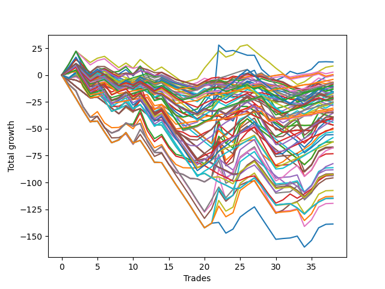

# Long Wallace Doodle 019 
- Symbol: ES
- Date Range: 3/19/22 - 5/22/22
- Trading Period: 7:20-12:30
- Number of Trades: 34


| Name | Win Percent | Profit | Avg Profit / Trade |     | Name | Win Percent | Profit | Avg Profit / Trade |
| ---- | ----------- | ------ | ------------------ | --- | ---- | ----------- | ------ | ------------------ |
| Sorted By <br> Profit | | | | | Sorted By <br> Win Percentage ||||
| Thirty-Five | 41.18 | 1250.00 | 36.76 |     | One | 61.76 | -4500.00 | -132.35 |
| Eighteen | 47.06 | 500.00 | 14.71 |     | Twenty-Four | 61.76 | -9625.00 | -283.09 |
| Nineteen | 50.00 | -1000.00 | -29.41 |     | Twenty-Five | 58.82 | -4375.00 | -128.68 |
| Six | 20.59 | -4250.00 | -125.00 |     | Two | 55.88 | -17625.00 | -518.38 |
| Twenty-Five | 58.82 | -4375.00 | -128.68 |     | Nineteen | 50.00 | -1000.00 | -29.41 |
| One | 61.76 | -4500.00 | -132.35 |     | Twenty-Six | 50.00 | -35500.00 | -1044.12 |
| Thirteen | 32.35 | -7125.00 | -209.56 |     | Eighteen | 47.06 | 500.00 | 14.71 |
| Twelve | 29.41 | -7625.00 | -224.26 |     | Thirty-Five | 41.18 | 1250.00 | 36.76 |
| Twenty-Four | 61.76 | -9625.00 | -283.09 |     | Three | 41.18 | -37000.00 | -1088.24 |
| Thirty-Four | 35.29 | -10500.00 | -308.82 |     | Twenty-Eight | 41.18 | -47875.00 | -1408.09 |
| Fifteen | 32.35 | -12000.00 | -352.94 |     | Twenty-Seven | 41.18 | -48875.00 | -1437.50 |
| Seven | 29.41 | -12750.00 | -375.00 |     | Thirty-One | 38.24 | -57125.00 | -1680.15 |
| Seventeen | 32.35 | -13500.00 | -397.06 |     | Twenty-Nine | 38.24 | -57375.00 | -1687.50 |
| Eleven | 29.41 | -14500.00 | -426.47 |     | Five | 38.24 | -58125.00 | -1709.56 |
| Nine | 29.41 | -14500.00 | -426.47 |     | Thirty-Two | 38.24 | -67750.00 | -1992.65 |
| Twenty-One | 35.29 | -16750.00 | -492.65 |     | Four | 38.24 | -70500.00 | -2073.53 |
| Two | 55.88 | -17625.00 | -518.38 |     | Thirty | 38.24 | -80125.00 | -2356.62 |
| Twenty | 32.35 | -18375.00 | -540.44 |     | Thirty-Four | 35.29 | -10500.00 | -308.82 |
| Eight | 11.76 | -19000.00 | -558.82 |     | Twenty-One | 35.29 | -16750.00 | -492.65 |
| Ten | 8.82 | -25500.00 | -750.00 |     | Thirty-Three | 35.29 | -64750.00 | -1904.41 |
| Twenty-Three | 32.35 | -25875.00 | -761.03 |     | Thirteen | 32.35 | -7125.00 | -209.56 |
| Fourteen | 14.71 | -31875.00 | -937.50 |     | Fifteen | 32.35 | -12000.00 | -352.94 |
| Twenty-Two | 20.59 | -32375.00 | -952.21 |     | Seventeen | 32.35 | -13500.00 | -397.06 |
| Thirty-Six | 26.47 | -32500.00 | -955.88 |     | Twenty | 32.35 | -18375.00 | -540.44 |
| Twenty-Six | 50.00 | -35500.00 | -1044.12 |     | Twenty-Three | 32.35 | -25875.00 | -761.03 |
| Three | 41.18 | -37000.00 | -1088.24 |     | Twelve | 29.41 | -7625.00 | -224.26 |
| Sixteen | 11.76 | -37000.00 | -1088.24 |     | Seven | 29.41 | -12750.00 | -375.00 |
| Twenty-Eight | 41.18 | -47875.00 | -1408.09 |     | Eleven | 29.41 | -14500.00 | -426.47 |
| Twenty-Seven | 41.18 | -48875.00 | -1437.50 |     | Nine | 29.41 | -14500.00 | -426.47 |
| Thirty-One | 38.24 | -57125.00 | -1680.15 |     | Thirty-Six | 26.47 | -32500.00 | -955.88 |
| Twenty-Nine | 38.24 | -57375.00 | -1687.50 |     | Six | 20.59 | -4250.00 | -125.00 |
| Five | 38.24 | -58125.00 | -1709.56 |     | Twenty-Two | 20.59 | -32375.00 | -952.21 |
| Thirty-Three | 35.29 | -64750.00 | -1904.41 |     | Fourteen | 14.71 | -31875.00 | -937.50 |
| Thirty-Two | 38.24 | -67750.00 | -1992.65 |     | Eight | 11.76 | -19000.00 | -558.82 |
| Four | 38.24 | -70500.00 | -2073.53 |     | Sixteen | 11.76 | -37000.00 | -1088.24 |
| Thirty | 38.24 | -80125.00 | -2356.62 |     | Ten | 8.82 | -25500.00 | -750.00 |

### Test One
* Sell when price hits the middle line of the 20p bollinger
* No Stoploss
* Results:
```
Total Trades: 34
Percent Up: 61.76
Percent Down: 38.24
Total Points Moved Up: -9.00
Potential Profit: -4500.00
Total Points Ups: 104.50 Count Ups: 21
Total Points Downs: -113.50 Count Downs: 13
```

<details><summary>Trades</summary>

<code>In: 2022-03-21 09:37:00		Out: 2022-03-21 09:45:00		Total Position Time: 08:00		Total Move Up: 10.25		Total to Date: 10.25</code> <br />
<code>In: 2022-03-21 09:38:00		Out: 2022-03-21 09:45:00		Total Position Time: 07:00		Total Move Up: 12.00		Total to Date: 22.25</code> <br />
<code>In: 2022-03-21 09:56:00		Out: 2022-03-21 10:25:55		Total Position Time: 29:55		Total Move Up: -14.75		Total to Date: 7.50</code> <br />
<code>In: 2022-03-21 09:58:00		Out: 2022-03-21 10:26:05		Total Position Time: 28:05		Total Move Up: -10.00		Total to Date: -2.50</code> <br />
<code>In: 2022-03-23 09:47:00		Out: 2022-03-23 09:53:00		Total Position Time: 06:00		Total Move Up: 4.25		Total to Date: 1.75</code> <br />
<code>In: 2022-03-23 10:06:00		Out: 2022-03-23 10:06:25		Total Position Time: 00:25		Total Move Up: 2.00		Total to Date: 3.75</code> <br />
<code>In: 2022-03-23 10:23:00		Out: 2022-03-23 10:37:45		Total Position Time: 14:45		Total Move Up: -3.75		Total to Date: 0.00</code> <br />
<code>In: 2022-03-23 10:28:00		Out: 2022-03-23 10:37:45		Total Position Time: 09:45		Total Move Up: 1.00		Total to Date: 1.00</code> <br />
<code>In: 2022-03-23 10:30:00		Out: 2022-03-23 10:37:45		Total Position Time: 07:45		Total Move Up: 4.25		Total to Date: 5.25</code> <br />
<code>In: 2022-03-25 08:14:00		Out: 2022-03-25 08:36:40		Total Position Time: 22:40		Total Move Up: -6.00		Total to Date: -0.75</code> <br />
<code>In: 2022-03-25 08:29:00		Out: 2022-03-25 08:36:40		Total Position Time: 07:40		Total Move Up: 8.00		Total to Date: 7.25</code> <br />
<code>In: 2022-03-28 08:27:00		Out: 2022-03-28 08:56:55		Total Position Time: 29:55		Total Move Up: -16.75		Total to Date: -9.50</code> <br />
<code>In: 2022-03-28 08:33:00		Out: 2022-03-28 09:01:50		Total Position Time: 28:50		Total Move Up: -11.25		Total to Date: -20.75</code> <br />
<code>In: 2022-03-31 09:28:00		Out: 2022-03-31 09:32:20		Total Position Time: 04:20		Total Move Up: 3.25		Total to Date: -17.50</code> <br />
<code>In: 2022-04-18 08:23:00		Out: 2022-04-18 08:52:55		Total Position Time: 29:55		Total Move Up: -10.75		Total to Date: -28.25</code> <br />
<code>In: 2022-04-18 08:26:00		Out: 2022-04-18 08:54:55		Total Position Time: 28:55		Total Move Up: -7.00		Total to Date: -35.25</code> <br />
<code>In: 2022-04-18 08:29:00		Out: 2022-04-18 08:54:55		Total Position Time: 25:55		Total Move Up: -5.00		Total to Date: -40.25</code> <br />
<code>In: 2022-04-20 11:39:00		Out: 2022-04-20 11:48:15		Total Position Time: 09:15		Total Move Up: 1.50		Total to Date: -38.75</code> <br />
<code>In: 2022-04-20 11:40:00		Out: 2022-04-20 11:48:15		Total Position Time: 08:15		Total Move Up: 1.75		Total to Date: -37.00</code> <br />
<code>In: 2022-05-02 08:06:00		Out: 2022-05-02 08:13:20		Total Position Time: 07:20		Total Move Up: 9.75		Total to Date: -27.25</code> <br />
<code>In: 2022-05-02 08:19:00		Out: 2022-05-02 08:26:05		Total Position Time: 07:05		Total Move Up: 7.00		Total to Date: -20.25</code> <br />
<code>In: 2022-05-04 11:36:00		Out: 2022-05-04 11:36:40		Total Position Time: 00:40		Total Move Up: 8.25		Total to Date: -12.00</code> <br />
<code>In: 2022-05-11 09:32:00		Out: 2022-05-11 09:49:15		Total Position Time: 17:15		Total Move Up: -1.25		Total to Date: -13.25</code> <br />
<code>In: 2022-05-13 11:07:00		Out: 2022-05-13 11:12:25		Total Position Time: 05:25		Total Move Up: 6.50		Total to Date: -6.75</code> <br />
<code>In: 2022-05-17 11:24:00		Out: 2022-05-17 11:27:25		Total Position Time: 03:25		Total Move Up: 11.25		Total to Date: 4.50</code> <br />
<code>In: 2022-05-25 09:29:00		Out: 2022-05-25 09:38:50		Total Position Time: 09:50		Total Move Up: 2.00		Total to Date: 6.50</code> <br />
<code>In: 2022-06-06 08:19:00		Out: 2022-06-06 08:31:35		Total Position Time: 12:35		Total Move Up: 2.75		Total to Date: 9.25</code> <br />
<code>In: 2022-06-08 09:29:00		Out: 2022-06-08 09:53:00		Total Position Time: 24:00		Total Move Up: -13.00		Total to Date: -3.75</code> <br />
<code>In: 2022-06-08 09:33:00		Out: 2022-06-08 09:53:00		Total Position Time: 20:00		Total Move Up: -7.50		Total to Date: -11.25</code> <br />
<code>In: 2022-06-08 09:34:00		Out: 2022-06-08 09:53:00		Total Position Time: 19:00		Total Move Up: -6.50		Total to Date: -17.75</code> <br />
<code>In: 2022-06-08 09:41:00		Out: 2022-06-08 09:53:00		Total Position Time: 12:00		Total Move Up: 1.25		Total to Date: -16.50</code> <br />
<code>In: 2022-06-08 09:44:00		Out: 2022-06-08 09:53:00		Total Position Time: 09:00		Total Move Up: 3.75		Total to Date: -12.75</code> <br />
<code>In: 2022-06-09 07:54:00		Out: 2022-06-09 08:11:10		Total Position Time: 17:10		Total Move Up: 1.00		Total to Date: -11.75</code> <br />
<code>In: 2022-06-23 08:39:00		Out: 2022-06-23 08:48:55		Total Position Time: 09:55		Total Move Up: 2.75		Total to Date: -9.00</code> <br />


</details>

### Test Two
* Sell when the price hits the upper line of the 20p 1std bollinger
* No Stoploss
* Results:
```
Total Trades: 34
Percent Up: 55.88
Percent Down: 44.12
Total Points Moved Up: -35.25
Potential Profit: -17625.00
Total Points Ups: 105.00 Count Ups: 19
Total Points Downs: -140.25 Count Downs: 15
```

<details><summary>Trades</summary>

<code>In: 2022-03-21 09:37:00		Out: 2022-03-21 09:49:05		Total Position Time: 12:05		Total Move Up: 9.25		Total to Date: 9.25</code> <br />
<code>In: 2022-03-21 09:38:00		Out: 2022-03-21 09:49:05		Total Position Time: 11:05		Total Move Up: 11.00		Total to Date: 20.25</code> <br />
<code>In: 2022-03-21 09:56:00		Out: 2022-03-21 10:25:55		Total Position Time: 29:55		Total Move Up: -14.75		Total to Date: 5.50</code> <br />
<code>In: 2022-03-21 09:58:00		Out: 2022-03-21 10:27:55		Total Position Time: 29:55		Total Move Up: -9.75		Total to Date: -4.25</code> <br />
<code>In: 2022-03-23 09:47:00		Out: 2022-03-23 09:59:10		Total Position Time: 12:10		Total Move Up: 5.25		Total to Date: 1.00</code> <br />
<code>In: 2022-03-23 10:06:00		Out: 2022-03-23 10:35:55		Total Position Time: 29:55		Total Move Up: -10.50		Total to Date: -9.50</code> <br />
<code>In: 2022-03-23 10:23:00		Out: 2022-03-23 10:51:50		Total Position Time: 28:50		Total Move Up: -4.50		Total to Date: -14.00</code> <br />
<code>In: 2022-03-23 10:28:00		Out: 2022-03-23 10:51:50		Total Position Time: 23:50		Total Move Up: 0.25		Total to Date: -13.75</code> <br />
<code>In: 2022-03-23 10:30:00		Out: 2022-03-23 10:51:50		Total Position Time: 21:50		Total Move Up: 3.50		Total to Date: -10.25</code> <br />
<code>In: 2022-03-25 08:14:00		Out: 2022-03-25 08:40:40		Total Position Time: 26:40		Total Move Up: -5.00		Total to Date: -15.25</code> <br />
<code>In: 2022-03-25 08:29:00		Out: 2022-03-25 08:40:40		Total Position Time: 11:40		Total Move Up: 9.00		Total to Date: -6.25</code> <br />
<code>In: 2022-03-28 08:27:00		Out: 2022-03-28 08:56:55		Total Position Time: 29:55		Total Move Up: -16.75		Total to Date: -23.00</code> <br />
<code>In: 2022-03-28 08:33:00		Out: 2022-03-28 09:02:55		Total Position Time: 29:55		Total Move Up: -10.25		Total to Date: -33.25</code> <br />
<code>In: 2022-03-31 09:28:00		Out: 2022-03-31 09:40:45		Total Position Time: 12:45		Total Move Up: 3.00		Total to Date: -30.25</code> <br />
<code>In: 2022-04-18 08:23:00		Out: 2022-04-18 08:52:55		Total Position Time: 29:55		Total Move Up: -10.75		Total to Date: -41.00</code> <br />
<code>In: 2022-04-18 08:26:00		Out: 2022-04-18 08:55:55		Total Position Time: 29:55		Total Move Up: -7.75		Total to Date: -48.75</code> <br />
<code>In: 2022-04-18 08:29:00		Out: 2022-04-18 08:57:20		Total Position Time: 28:20		Total Move Up: -3.00		Total to Date: -51.75</code> <br />
<code>In: 2022-04-20 11:39:00		Out: 2022-04-20 12:04:20		Total Position Time: 25:20		Total Move Up: -0.25		Total to Date: -52.00</code> <br />
<code>In: 2022-04-20 11:40:00		Out: 2022-04-20 12:04:20		Total Position Time: 24:20		Total Move Up: 0.00		Total to Date: -52.00</code> <br />
<code>In: 2022-05-02 08:06:00		Out: 2022-05-02 08:34:10		Total Position Time: 28:10		Total Move Up: 2.75		Total to Date: -49.25</code> <br />
<code>In: 2022-05-02 08:19:00		Out: 2022-05-02 08:34:10		Total Position Time: 15:10		Total Move Up: 8.75		Total to Date: -40.50</code> <br />
<code>In: 2022-05-04 11:36:00		Out: 2022-05-04 11:42:00		Total Position Time: 06:00		Total Move Up: 21.25		Total to Date: -19.25</code> <br />
<code>In: 2022-05-11 09:32:00		Out: 2022-05-11 10:01:55		Total Position Time: 29:55		Total Move Up: -21.50		Total to Date: -40.75</code> <br />
<code>In: 2022-05-13 11:07:00		Out: 2022-05-13 11:19:50		Total Position Time: 12:50		Total Move Up: 5.00		Total to Date: -35.75</code> <br />
<code>In: 2022-05-17 11:24:00		Out: 2022-05-17 11:37:35		Total Position Time: 13:35		Total Move Up: 9.25		Total to Date: -26.50</code> <br />
<code>In: 2022-05-25 09:29:00		Out: 2022-05-25 09:44:25		Total Position Time: 15:25		Total Move Up: 3.00		Total to Date: -23.50</code> <br />
<code>In: 2022-06-06 08:19:00		Out: 2022-06-06 08:39:15		Total Position Time: 20:15		Total Move Up: 1.00		Total to Date: -22.50</code> <br />
<code>In: 2022-06-08 09:29:00		Out: 2022-06-08 09:57:10		Total Position Time: 28:10		Total Move Up: -12.50		Total to Date: -35.00</code> <br />
<code>In: 2022-06-08 09:33:00		Out: 2022-06-08 09:57:10		Total Position Time: 24:10		Total Move Up: -7.00		Total to Date: -42.00</code> <br />
<code>In: 2022-06-08 09:34:00		Out: 2022-06-08 09:57:10		Total Position Time: 23:10		Total Move Up: -6.00		Total to Date: -48.00</code> <br />
<code>In: 2022-06-08 09:41:00		Out: 2022-06-08 09:57:10		Total Position Time: 16:10		Total Move Up: 1.75		Total to Date: -46.25</code> <br />
<code>In: 2022-06-08 09:44:00		Out: 2022-06-08 09:57:10		Total Position Time: 13:10		Total Move Up: 4.25		Total to Date: -42.00</code> <br />
<code>In: 2022-06-09 07:54:00		Out: 2022-06-09 08:21:10		Total Position Time: 27:10		Total Move Up: 2.50		Total to Date: -39.50</code> <br />
<code>In: 2022-06-23 08:39:00		Out: 2022-06-23 08:50:15		Total Position Time: 11:15		Total Move Up: 4.25		Total to Date: -35.25</code> <br />


</details>

### Test Three
* Sell when the price hits the upper line of the 20p 2std bollinger
* No Stoploss
* Results:
```
Total Trades: 34
Percent Up: 41.18
Percent Down: 58.82
Total Points Moved Up: -74.00
Potential Profit: -37000.00
Total Points Ups: 109.50 Count Ups: 14
Total Points Downs: -183.50 Count Downs: 20
```

<details><summary>Trades</summary>

<code>In: 2022-03-21 09:37:00		Out: 2022-03-21 10:06:55		Total Position Time: 29:55		Total Move Up: -8.50		Total to Date: -8.50</code> <br />
<code>In: 2022-03-21 09:38:00		Out: 2022-03-21 10:07:55		Total Position Time: 29:55		Total Move Up: -6.25		Total to Date: -14.75</code> <br />
<code>In: 2022-03-21 09:56:00		Out: 2022-03-21 10:25:55		Total Position Time: 29:55		Total Move Up: -14.75		Total to Date: -29.50</code> <br />
<code>In: 2022-03-21 09:58:00		Out: 2022-03-21 10:27:55		Total Position Time: 29:55		Total Move Up: -9.75		Total to Date: -39.25</code> <br />
<code>In: 2022-03-23 09:47:00		Out: 2022-03-23 10:16:55		Total Position Time: 29:55		Total Move Up: 0.75		Total to Date: -38.50</code> <br />
<code>In: 2022-03-23 10:06:00		Out: 2022-03-23 10:35:55		Total Position Time: 29:55		Total Move Up: -10.50		Total to Date: -49.00</code> <br />
<code>In: 2022-03-23 10:23:00		Out: 2022-03-23 10:52:55		Total Position Time: 29:55		Total Move Up: -5.00		Total to Date: -54.00</code> <br />
<code>In: 2022-03-23 10:28:00		Out: 2022-03-23 10:54:50		Total Position Time: 26:50		Total Move Up: 3.00		Total to Date: -51.00</code> <br />
<code>In: 2022-03-23 10:30:00		Out: 2022-03-23 10:54:50		Total Position Time: 24:50		Total Move Up: 6.25		Total to Date: -44.75</code> <br />
<code>In: 2022-03-25 08:14:00		Out: 2022-03-25 08:41:55		Total Position Time: 27:55		Total Move Up: -0.50		Total to Date: -45.25</code> <br />
<code>In: 2022-03-25 08:29:00		Out: 2022-03-25 08:41:55		Total Position Time: 12:55		Total Move Up: 13.50		Total to Date: -31.75</code> <br />
<code>In: 2022-03-28 08:27:00		Out: 2022-03-28 08:56:55		Total Position Time: 29:55		Total Move Up: -16.75		Total to Date: -48.50</code> <br />
<code>In: 2022-03-28 08:33:00		Out: 2022-03-28 09:02:55		Total Position Time: 29:55		Total Move Up: -10.25		Total to Date: -58.75</code> <br />
<code>In: 2022-03-31 09:28:00		Out: 2022-03-31 09:44:50		Total Position Time: 16:50		Total Move Up: 4.50		Total to Date: -54.25</code> <br />
<code>In: 2022-04-18 08:23:00		Out: 2022-04-18 08:52:55		Total Position Time: 29:55		Total Move Up: -10.75		Total to Date: -65.00</code> <br />
<code>In: 2022-04-18 08:26:00		Out: 2022-04-18 08:55:55		Total Position Time: 29:55		Total Move Up: -7.75		Total to Date: -72.75</code> <br />
<code>In: 2022-04-18 08:29:00		Out: 2022-04-18 08:58:55		Total Position Time: 29:55		Total Move Up: -1.75		Total to Date: -74.50</code> <br />
<code>In: 2022-04-20 11:39:00		Out: 2022-04-20 12:08:55		Total Position Time: 29:55		Total Move Up: -3.75		Total to Date: -78.25</code> <br />
<code>In: 2022-04-20 11:40:00		Out: 2022-04-20 12:09:55		Total Position Time: 29:55		Total Move Up: -0.50		Total to Date: -78.75</code> <br />
<code>In: 2022-05-02 08:06:00		Out: 2022-05-02 08:35:55		Total Position Time: 29:55		Total Move Up: -2.75		Total to Date: -81.50</code> <br />
<code>In: 2022-05-02 08:19:00		Out: 2022-05-02 08:36:35		Total Position Time: 17:35		Total Move Up: 9.50		Total to Date: -72.00</code> <br />
<code>In: 2022-05-04 11:36:00		Out: 2022-05-04 11:43:55		Total Position Time: 07:55		Total Move Up: 32.25		Total to Date: -39.75</code> <br />
<code>In: 2022-05-11 09:32:00		Out: 2022-05-11 10:01:55		Total Position Time: 29:55		Total Move Up: -21.50		Total to Date: -61.25</code> <br />
<code>In: 2022-05-13 11:07:00		Out: 2022-05-13 11:31:30		Total Position Time: 24:30		Total Move Up: 10.50		Total to Date: -50.75</code> <br />
<code>In: 2022-05-17 11:24:00		Out: 2022-05-17 11:40:00		Total Position Time: 16:00		Total Move Up: 13.00		Total to Date: -37.75</code> <br />
<code>In: 2022-05-25 09:29:00		Out: 2022-05-25 09:48:50		Total Position Time: 19:50		Total Move Up: 7.00		Total to Date: -30.75</code> <br />
<code>In: 2022-06-06 08:19:00		Out: 2022-06-06 08:43:00		Total Position Time: 24:00		Total Move Up: 3.25		Total to Date: -27.50</code> <br />
<code>In: 2022-06-08 09:29:00		Out: 2022-06-08 09:58:55		Total Position Time: 29:55		Total Move Up: -13.00		Total to Date: -40.50</code> <br />
<code>In: 2022-06-08 09:33:00		Out: 2022-06-08 10:02:55		Total Position Time: 29:55		Total Move Up: -12.25		Total to Date: -52.75</code> <br />
<code>In: 2022-06-08 09:34:00		Out: 2022-06-08 10:03:55		Total Position Time: 29:55		Total Move Up: -10.75		Total to Date: -63.50</code> <br />
<code>In: 2022-06-08 09:41:00		Out: 2022-06-08 10:10:55		Total Position Time: 29:55		Total Move Up: 0.75		Total to Date: -62.75</code> <br />
<code>In: 2022-06-08 09:44:00		Out: 2022-06-08 10:13:55		Total Position Time: 29:55		Total Move Up: 0.50		Total to Date: -62.25</code> <br />
<code>In: 2022-06-09 07:54:00		Out: 2022-06-09 08:22:35		Total Position Time: 28:35		Total Move Up: 4.75		Total to Date: -57.50</code> <br />
<code>In: 2022-06-23 08:39:00		Out: 2022-06-23 09:08:55		Total Position Time: 29:55		Total Move Up: -16.50		Total to Date: -74.00</code> <br />


</details>

### Test Four
* Sell when the price hits the middle line of the 1std VWAP
* No Stoploss
* Results:
```
Total Trades: 34
Percent Up: 38.24
Percent Down: 61.76
Total Points Moved Up: -141.00
Potential Profit: -70500.00
Total Points Ups: 45.25 Count Ups: 13
Total Points Downs: -186.25 Count Downs: 21
```

<details><summary>Trades</summary>

<code>In: 2022-03-21 09:37:00		Out: 2022-03-21 10:06:55		Total Position Time: 29:55		Total Move Up: -8.50		Total to Date: -8.50</code> <br />
<code>In: 2022-03-21 09:38:00		Out: 2022-03-21 10:07:55		Total Position Time: 29:55		Total Move Up: -6.25		Total to Date: -14.75</code> <br />
<code>In: 2022-03-21 09:56:00		Out: 2022-03-21 10:25:55		Total Position Time: 29:55		Total Move Up: -14.75		Total to Date: -29.50</code> <br />
<code>In: 2022-03-21 09:58:00		Out: 2022-03-21 10:27:55		Total Position Time: 29:55		Total Move Up: -9.75		Total to Date: -39.25</code> <br />
<code>In: 2022-03-23 09:47:00		Out: 2022-03-23 10:16:55		Total Position Time: 29:55		Total Move Up: 0.75		Total to Date: -38.50</code> <br />
<code>In: 2022-03-23 10:06:00		Out: 2022-03-23 10:35:55		Total Position Time: 29:55		Total Move Up: -10.50		Total to Date: -49.00</code> <br />
<code>In: 2022-03-23 10:23:00		Out: 2022-03-23 10:52:55		Total Position Time: 29:55		Total Move Up: -5.00		Total to Date: -54.00</code> <br />
<code>In: 2022-03-23 10:28:00		Out: 2022-03-23 10:57:55		Total Position Time: 29:55		Total Move Up: 2.50		Total to Date: -51.50</code> <br />
<code>In: 2022-03-23 10:30:00		Out: 2022-03-23 10:59:55		Total Position Time: 29:55		Total Move Up: 7.00		Total to Date: -44.50</code> <br />
<code>In: 2022-03-25 08:14:00		Out: 2022-03-25 08:43:55		Total Position Time: 29:55		Total Move Up: -3.00		Total to Date: -47.50</code> <br />
<code>In: 2022-03-25 08:29:00		Out: 2022-03-25 08:58:55		Total Position Time: 29:55		Total Move Up: 2.50		Total to Date: -45.00</code> <br />
<code>In: 2022-03-28 08:27:00		Out: 2022-03-28 08:56:55		Total Position Time: 29:55		Total Move Up: -16.75		Total to Date: -61.75</code> <br />
<code>In: 2022-03-28 08:33:00		Out: 2022-03-28 09:02:55		Total Position Time: 29:55		Total Move Up: -10.25		Total to Date: -72.00</code> <br />
<code>In: 2022-03-31 09:28:00		Out: 2022-03-31 09:57:55		Total Position Time: 29:55		Total Move Up: -0.25		Total to Date: -72.25</code> <br />
<code>In: 2022-04-18 08:23:00		Out: 2022-04-18 08:52:55		Total Position Time: 29:55		Total Move Up: -10.75		Total to Date: -83.00</code> <br />
<code>In: 2022-04-18 08:26:00		Out: 2022-04-18 08:55:55		Total Position Time: 29:55		Total Move Up: -7.75		Total to Date: -90.75</code> <br />
<code>In: 2022-04-18 08:29:00		Out: 2022-04-18 08:58:55		Total Position Time: 29:55		Total Move Up: -1.75		Total to Date: -92.50</code> <br />
<code>In: 2022-04-20 11:39:00		Out: 2022-04-20 12:08:55		Total Position Time: 29:55		Total Move Up: -3.75		Total to Date: -96.25</code> <br />
<code>In: 2022-04-20 11:40:00		Out: 2022-04-20 12:09:55		Total Position Time: 29:55		Total Move Up: -0.50		Total to Date: -96.75</code> <br />
<code>In: 2022-05-02 08:06:00		Out: 2022-05-02 08:35:55		Total Position Time: 29:55		Total Move Up: -2.75		Total to Date: -99.50</code> <br />
<code>In: 2022-05-02 08:19:00		Out: 2022-05-02 08:48:55		Total Position Time: 29:55		Total Move Up: 4.25		Total to Date: -95.25</code> <br />
<code>In: 2022-05-04 11:36:00		Out: 2022-05-04 11:36:10		Total Position Time: 00:10		Total Move Up: 0.75		Total to Date: -94.50</code> <br />
<code>In: 2022-05-11 09:32:00		Out: 2022-05-11 10:01:55		Total Position Time: 29:55		Total Move Up: -21.50		Total to Date: -116.00</code> <br />
<code>In: 2022-05-13 11:07:00		Out: 2022-05-13 11:36:55		Total Position Time: 29:55		Total Move Up: 3.75		Total to Date: -112.25</code> <br />
<code>In: 2022-05-17 11:24:00		Out: 2022-05-17 11:27:25		Total Position Time: 03:25		Total Move Up: 11.25		Total to Date: -101.00</code> <br />
<code>In: 2022-05-25 09:29:00		Out: 2022-05-25 09:58:55		Total Position Time: 29:55		Total Move Up: 5.00		Total to Date: -96.00</code> <br />
<code>In: 2022-06-06 08:19:00		Out: 2022-06-06 08:48:55		Total Position Time: 29:55		Total Move Up: 4.50		Total to Date: -91.50</code> <br />
<code>In: 2022-06-08 09:29:00		Out: 2022-06-08 09:58:55		Total Position Time: 29:55		Total Move Up: -13.00		Total to Date: -104.50</code> <br />
<code>In: 2022-06-08 09:33:00		Out: 2022-06-08 10:02:55		Total Position Time: 29:55		Total Move Up: -12.25		Total to Date: -116.75</code> <br />
<code>In: 2022-06-08 09:34:00		Out: 2022-06-08 10:03:55		Total Position Time: 29:55		Total Move Up: -10.75		Total to Date: -127.50</code> <br />
<code>In: 2022-06-08 09:41:00		Out: 2022-06-08 10:10:55		Total Position Time: 29:55		Total Move Up: 0.75		Total to Date: -126.75</code> <br />
<code>In: 2022-06-08 09:44:00		Out: 2022-06-08 10:13:55		Total Position Time: 29:55		Total Move Up: 0.50		Total to Date: -126.25</code> <br />
<code>In: 2022-06-09 07:54:00		Out: 2022-06-09 08:23:55		Total Position Time: 29:55		Total Move Up: 1.75		Total to Date: -124.50</code> <br />
<code>In: 2022-06-23 08:39:00		Out: 2022-06-23 09:08:55		Total Position Time: 29:55		Total Move Up: -16.50		Total to Date: -141.00</code> <br />


</details>

### Test Five
* Sell when the price hits the upper line of the 1std VWAP
* No Stoploss
* Results:
```
Total Trades: 34
Percent Up: 38.24
Percent Down: 61.76
Total Points Moved Up: -116.25
Potential Profit: -58125.00
Total Points Ups: 70.00 Count Ups: 13
Total Points Downs: -186.25 Count Downs: 21
```

<details><summary>Trades</summary>

<code>In: 2022-03-21 09:37:00		Out: 2022-03-21 10:06:55		Total Position Time: 29:55		Total Move Up: -8.50		Total to Date: -8.50</code> <br />
<code>In: 2022-03-21 09:38:00		Out: 2022-03-21 10:07:55		Total Position Time: 29:55		Total Move Up: -6.25		Total to Date: -14.75</code> <br />
<code>In: 2022-03-21 09:56:00		Out: 2022-03-21 10:25:55		Total Position Time: 29:55		Total Move Up: -14.75		Total to Date: -29.50</code> <br />
<code>In: 2022-03-21 09:58:00		Out: 2022-03-21 10:27:55		Total Position Time: 29:55		Total Move Up: -9.75		Total to Date: -39.25</code> <br />
<code>In: 2022-03-23 09:47:00		Out: 2022-03-23 10:16:55		Total Position Time: 29:55		Total Move Up: 0.75		Total to Date: -38.50</code> <br />
<code>In: 2022-03-23 10:06:00		Out: 2022-03-23 10:35:55		Total Position Time: 29:55		Total Move Up: -10.50		Total to Date: -49.00</code> <br />
<code>In: 2022-03-23 10:23:00		Out: 2022-03-23 10:52:55		Total Position Time: 29:55		Total Move Up: -5.00		Total to Date: -54.00</code> <br />
<code>In: 2022-03-23 10:28:00		Out: 2022-03-23 10:57:55		Total Position Time: 29:55		Total Move Up: 2.50		Total to Date: -51.50</code> <br />
<code>In: 2022-03-23 10:30:00		Out: 2022-03-23 10:59:55		Total Position Time: 29:55		Total Move Up: 7.00		Total to Date: -44.50</code> <br />
<code>In: 2022-03-25 08:14:00		Out: 2022-03-25 08:43:55		Total Position Time: 29:55		Total Move Up: -3.00		Total to Date: -47.50</code> <br />
<code>In: 2022-03-25 08:29:00		Out: 2022-03-25 08:58:55		Total Position Time: 29:55		Total Move Up: 2.50		Total to Date: -45.00</code> <br />
<code>In: 2022-03-28 08:27:00		Out: 2022-03-28 08:56:55		Total Position Time: 29:55		Total Move Up: -16.75		Total to Date: -61.75</code> <br />
<code>In: 2022-03-28 08:33:00		Out: 2022-03-28 09:02:55		Total Position Time: 29:55		Total Move Up: -10.25		Total to Date: -72.00</code> <br />
<code>In: 2022-03-31 09:28:00		Out: 2022-03-31 09:57:55		Total Position Time: 29:55		Total Move Up: -0.25		Total to Date: -72.25</code> <br />
<code>In: 2022-04-18 08:23:00		Out: 2022-04-18 08:52:55		Total Position Time: 29:55		Total Move Up: -10.75		Total to Date: -83.00</code> <br />
<code>In: 2022-04-18 08:26:00		Out: 2022-04-18 08:55:55		Total Position Time: 29:55		Total Move Up: -7.75		Total to Date: -90.75</code> <br />
<code>In: 2022-04-18 08:29:00		Out: 2022-04-18 08:58:55		Total Position Time: 29:55		Total Move Up: -1.75		Total to Date: -92.50</code> <br />
<code>In: 2022-04-20 11:39:00		Out: 2022-04-20 12:08:55		Total Position Time: 29:55		Total Move Up: -3.75		Total to Date: -96.25</code> <br />
<code>In: 2022-04-20 11:40:00		Out: 2022-04-20 12:09:55		Total Position Time: 29:55		Total Move Up: -0.50		Total to Date: -96.75</code> <br />
<code>In: 2022-05-02 08:06:00		Out: 2022-05-02 08:35:55		Total Position Time: 29:55		Total Move Up: -2.75		Total to Date: -99.50</code> <br />
<code>In: 2022-05-02 08:19:00		Out: 2022-05-02 08:48:55		Total Position Time: 29:55		Total Move Up: 4.25		Total to Date: -95.25</code> <br />
<code>In: 2022-05-04 11:36:00		Out: 2022-05-04 11:41:35		Total Position Time: 05:35		Total Move Up: 16.00		Total to Date: -79.25</code> <br />
<code>In: 2022-05-11 09:32:00		Out: 2022-05-11 10:01:55		Total Position Time: 29:55		Total Move Up: -21.50		Total to Date: -100.75</code> <br />
<code>In: 2022-05-13 11:07:00		Out: 2022-05-13 11:36:55		Total Position Time: 29:55		Total Move Up: 3.75		Total to Date: -97.00</code> <br />
<code>In: 2022-05-17 11:24:00		Out: 2022-05-17 11:40:20		Total Position Time: 16:20		Total Move Up: 20.75		Total to Date: -76.25</code> <br />
<code>In: 2022-05-25 09:29:00		Out: 2022-05-25 09:58:55		Total Position Time: 29:55		Total Move Up: 5.00		Total to Date: -71.25</code> <br />
<code>In: 2022-06-06 08:19:00		Out: 2022-06-06 08:48:55		Total Position Time: 29:55		Total Move Up: 4.50		Total to Date: -66.75</code> <br />
<code>In: 2022-06-08 09:29:00		Out: 2022-06-08 09:58:55		Total Position Time: 29:55		Total Move Up: -13.00		Total to Date: -79.75</code> <br />
<code>In: 2022-06-08 09:33:00		Out: 2022-06-08 10:02:55		Total Position Time: 29:55		Total Move Up: -12.25		Total to Date: -92.00</code> <br />
<code>In: 2022-06-08 09:34:00		Out: 2022-06-08 10:03:55		Total Position Time: 29:55		Total Move Up: -10.75		Total to Date: -102.75</code> <br />
<code>In: 2022-06-08 09:41:00		Out: 2022-06-08 10:10:55		Total Position Time: 29:55		Total Move Up: 0.75		Total to Date: -102.00</code> <br />
<code>In: 2022-06-08 09:44:00		Out: 2022-06-08 10:13:55		Total Position Time: 29:55		Total Move Up: 0.50		Total to Date: -101.50</code> <br />
<code>In: 2022-06-09 07:54:00		Out: 2022-06-09 08:23:55		Total Position Time: 29:55		Total Move Up: 1.75		Total to Date: -99.75</code> <br />
<code>In: 2022-06-23 08:39:00		Out: 2022-06-23 09:08:55		Total Position Time: 29:55		Total Move Up: -16.50		Total to Date: -116.25</code> <br />


</details>

### Test Six
* Sell when the price hits the middle line of the 20p bollinger
* Stoploss is 2 points
* Results:
```
Total Trades: 34
Percent Up: 20.59
Percent Down: 79.41
Total Points Moved Up: -8.50
Potential Profit: -4250.00
Total Points Ups: 50.50 Count Ups: 7
Total Points Downs: -59.00 Count Downs: 27
```

<details><summary>Trades</summary>

<code>In: 2022-03-21 09:37:00		Out: 2022-03-21 09:37:10		Total Position Time: 00:10		Total Move Up: -2.50		Total to Date: -2.50</code> <br />
<code>In: 2022-03-21 09:38:00		Out: 2022-03-21 09:45:00		Total Position Time: 07:00		Total Move Up: 12.00		Total to Date: 9.50</code> <br />
<code>In: 2022-03-21 09:56:00		Out: 2022-03-21 09:57:05		Total Position Time: 01:05		Total Move Up: -2.25		Total to Date: 7.25</code> <br />
<code>In: 2022-03-21 09:58:00		Out: 2022-03-21 09:58:15		Total Position Time: 00:15		Total Move Up: -2.25		Total to Date: 5.00</code> <br />
<code>In: 2022-03-23 09:47:00		Out: 2022-03-23 09:53:00		Total Position Time: 06:00		Total Move Up: 4.25		Total to Date: 9.25</code> <br />
<code>In: 2022-03-23 10:06:00		Out: 2022-03-23 10:06:25		Total Position Time: 00:25		Total Move Up: 2.00		Total to Date: 11.25</code> <br />
<code>In: 2022-03-23 10:23:00		Out: 2022-03-23 10:23:50		Total Position Time: 00:50		Total Move Up: -1.75		Total to Date: 9.50</code> <br />
<code>In: 2022-03-23 10:28:00		Out: 2022-03-23 10:28:40		Total Position Time: 00:40		Total Move Up: -2.00		Total to Date: 7.50</code> <br />
<code>In: 2022-03-23 10:30:00		Out: 2022-03-23 10:30:15		Total Position Time: 00:15		Total Move Up: -2.00		Total to Date: 5.50</code> <br />
<code>In: 2022-03-25 08:14:00		Out: 2022-03-25 08:20:40		Total Position Time: 06:40		Total Move Up: -2.50		Total to Date: 3.00</code> <br />
<code>In: 2022-03-25 08:29:00		Out: 2022-03-25 08:36:40		Total Position Time: 07:40		Total Move Up: 8.00		Total to Date: 11.00</code> <br />
<code>In: 2022-03-28 08:27:00		Out: 2022-03-28 08:32:05		Total Position Time: 05:05		Total Move Up: -2.75		Total to Date: 8.25</code> <br />
<code>In: 2022-03-28 08:33:00		Out: 2022-03-28 08:33:25		Total Position Time: 00:25		Total Move Up: -2.50		Total to Date: 5.75</code> <br />
<code>In: 2022-03-31 09:28:00		Out: 2022-03-31 09:32:20		Total Position Time: 04:20		Total Move Up: 3.25		Total to Date: 9.00</code> <br />
<code>In: 2022-04-18 08:23:00		Out: 2022-04-18 08:24:05		Total Position Time: 01:05		Total Move Up: -3.25		Total to Date: 5.75</code> <br />
<code>In: 2022-04-18 08:26:00		Out: 2022-04-18 08:27:15		Total Position Time: 01:15		Total Move Up: -2.25		Total to Date: 3.50</code> <br />
<code>In: 2022-04-18 08:29:00		Out: 2022-04-18 08:33:05		Total Position Time: 04:05		Total Move Up: -1.75		Total to Date: 1.75</code> <br />
<code>In: 2022-04-20 11:39:00		Out: 2022-04-20 11:43:40		Total Position Time: 04:40		Total Move Up: -2.00		Total to Date: -0.25</code> <br />
<code>In: 2022-04-20 11:40:00		Out: 2022-04-20 11:45:20		Total Position Time: 05:20		Total Move Up: -1.75		Total to Date: -2.00</code> <br />
<code>In: 2022-05-02 08:06:00		Out: 2022-05-02 08:13:20		Total Position Time: 07:20		Total Move Up: 9.75		Total to Date: 7.75</code> <br />
<code>In: 2022-05-02 08:19:00		Out: 2022-05-02 08:20:25		Total Position Time: 01:25		Total Move Up: -2.00		Total to Date: 5.75</code> <br />
<code>In: 2022-05-04 11:36:00		Out: 2022-05-04 11:36:15		Total Position Time: 00:15		Total Move Up: -2.00		Total to Date: 3.75</code> <br />
<code>In: 2022-05-11 09:32:00		Out: 2022-05-11 09:33:05		Total Position Time: 01:05		Total Move Up: -2.00		Total to Date: 1.75</code> <br />
<code>In: 2022-05-13 11:07:00		Out: 2022-05-13 11:08:10		Total Position Time: 01:10		Total Move Up: -2.75		Total to Date: -1.00</code> <br />
<code>In: 2022-05-17 11:24:00		Out: 2022-05-17 11:27:25		Total Position Time: 03:25		Total Move Up: 11.25		Total to Date: 10.25</code> <br />
<code>In: 2022-05-25 09:29:00		Out: 2022-05-25 09:36:05		Total Position Time: 07:05		Total Move Up: -2.25		Total to Date: 8.00</code> <br />
<code>In: 2022-06-06 08:19:00		Out: 2022-06-06 08:19:30		Total Position Time: 00:30		Total Move Up: -2.25		Total to Date: 5.75</code> <br />
<code>In: 2022-06-08 09:29:00		Out: 2022-06-08 09:32:25		Total Position Time: 03:25		Total Move Up: -2.25		Total to Date: 3.50</code> <br />
<code>In: 2022-06-08 09:33:00		Out: 2022-06-08 09:34:10		Total Position Time: 01:10		Total Move Up: -1.75		Total to Date: 1.75</code> <br />
<code>In: 2022-06-08 09:34:00		Out: 2022-06-08 09:37:25		Total Position Time: 03:25		Total Move Up: -2.00		Total to Date: -0.25</code> <br />
<code>In: 2022-06-08 09:41:00		Out: 2022-06-08 09:42:25		Total Position Time: 01:25		Total Move Up: -1.75		Total to Date: -2.00</code> <br />
<code>In: 2022-06-08 09:44:00		Out: 2022-06-08 09:44:45		Total Position Time: 00:45		Total Move Up: -2.50		Total to Date: -4.50</code> <br />
<code>In: 2022-06-09 07:54:00		Out: 2022-06-09 07:55:10		Total Position Time: 01:10		Total Move Up: -2.00		Total to Date: -6.50</code> <br />
<code>In: 2022-06-23 08:39:00		Out: 2022-06-23 08:40:00		Total Position Time: 01:00		Total Move Up: -2.00		Total to Date: -8.50</code> <br />


</details>

### Test Seven
* Sell when the price hits the middle line of the 20p bollinger
* Trailing Stop is 2 points
* Results:
```
Total Trades: 34
Percent Up: 29.41
Percent Down: 70.59
Total Points Moved Up: -25.50
Potential Profit: -12750.00
Total Points Ups: 14.75 Count Ups: 10
Total Points Downs: -40.25 Count Downs: 24
```

<details><summary>Trades</summary>

<code>In: 2022-03-21 09:37:00		Out: 2022-03-21 09:37:45		Total Position Time: 00:45		Total Move Up: -3.50		Total to Date: -3.50</code> <br />
<code>In: 2022-03-21 09:38:00		Out: 2022-03-21 09:38:50		Total Position Time: 00:50		Total Move Up: -1.25		Total to Date: -4.75</code> <br />
<code>In: 2022-03-21 09:56:00		Out: 2022-03-21 09:57:10		Total Position Time: 01:10		Total Move Up: -3.00		Total to Date: -7.75</code> <br />
<code>In: 2022-03-21 09:58:00		Out: 2022-03-21 10:00:05		Total Position Time: 02:05		Total Move Up: -3.00		Total to Date: -10.75</code> <br />
<code>In: 2022-03-23 09:47:00		Out: 2022-03-23 09:50:05		Total Position Time: 03:05		Total Move Up: 0.75		Total to Date: -10.00</code> <br />
<code>In: 2022-03-23 10:06:00		Out: 2022-03-23 10:06:25		Total Position Time: 00:25		Total Move Up: 2.00		Total to Date: -8.00</code> <br />
<code>In: 2022-03-23 10:23:00		Out: 2022-03-23 10:24:05		Total Position Time: 01:05		Total Move Up: -2.75		Total to Date: -10.75</code> <br />
<code>In: 2022-03-23 10:28:00		Out: 2022-03-23 10:29:05		Total Position Time: 01:05		Total Move Up: -2.75		Total to Date: -13.50</code> <br />
<code>In: 2022-03-23 10:30:00		Out: 2022-03-23 10:35:30		Total Position Time: 05:30		Total Move Up: 2.00		Total to Date: -11.50</code> <br />
<code>In: 2022-03-25 08:14:00		Out: 2022-03-25 08:17:20		Total Position Time: 03:20		Total Move Up: 0.75		Total to Date: -10.75</code> <br />
<code>In: 2022-03-25 08:29:00		Out: 2022-03-25 08:29:10		Total Position Time: 00:10		Total Move Up: 1.00		Total to Date: -9.75</code> <br />
<code>In: 2022-03-28 08:27:00		Out: 2022-03-28 08:29:05		Total Position Time: 02:05		Total Move Up: -0.25		Total to Date: -10.00</code> <br />
<code>In: 2022-03-28 08:33:00		Out: 2022-03-28 08:33:25		Total Position Time: 00:25		Total Move Up: -2.50		Total to Date: -12.50</code> <br />
<code>In: 2022-03-31 09:28:00		Out: 2022-03-31 09:32:20		Total Position Time: 04:20		Total Move Up: 3.25		Total to Date: -9.25</code> <br />
<code>In: 2022-04-18 08:23:00		Out: 2022-04-18 08:24:05		Total Position Time: 01:05		Total Move Up: -3.25		Total to Date: -12.50</code> <br />
<code>In: 2022-04-18 08:26:00		Out: 2022-04-18 08:27:15		Total Position Time: 01:15		Total Move Up: -2.25		Total to Date: -14.75</code> <br />
<code>In: 2022-04-18 08:29:00		Out: 2022-04-18 08:32:15		Total Position Time: 03:15		Total Move Up: -0.50		Total to Date: -15.25</code> <br />
<code>In: 2022-04-20 11:39:00		Out: 2022-04-20 11:42:30		Total Position Time: 03:30		Total Move Up: -1.25		Total to Date: -16.50</code> <br />
<code>In: 2022-04-20 11:40:00		Out: 2022-04-20 11:42:30		Total Position Time: 02:30		Total Move Up: -1.00		Total to Date: -17.50</code> <br />
<code>In: 2022-05-02 08:06:00		Out: 2022-05-02 08:06:10		Total Position Time: 00:10		Total Move Up: 3.75		Total to Date: -13.75</code> <br />
<code>In: 2022-05-02 08:19:00		Out: 2022-05-02 08:19:30		Total Position Time: 00:30		Total Move Up: 0.25		Total to Date: -13.50</code> <br />
<code>In: 2022-05-04 11:36:00		Out: 2022-05-04 11:36:10		Total Position Time: 00:10		Total Move Up: 0.75		Total to Date: -12.75</code> <br />
<code>In: 2022-05-11 09:32:00		Out: 2022-05-11 09:33:00		Total Position Time: 01:00		Total Move Up: -0.75		Total to Date: -13.50</code> <br />
<code>In: 2022-05-13 11:07:00		Out: 2022-05-13 11:08:10		Total Position Time: 01:10		Total Move Up: -2.75		Total to Date: -16.25</code> <br />
<code>In: 2022-05-17 11:24:00		Out: 2022-05-17 11:24:10		Total Position Time: 00:10		Total Move Up: -0.75		Total to Date: -17.00</code> <br />
<code>In: 2022-05-25 09:29:00		Out: 2022-05-25 09:29:10		Total Position Time: 00:10		Total Move Up: -0.50		Total to Date: -17.50</code> <br />
<code>In: 2022-06-06 08:19:00		Out: 2022-06-06 08:19:25		Total Position Time: 00:25		Total Move Up: -1.00		Total to Date: -18.50</code> <br />
<code>In: 2022-06-08 09:29:00		Out: 2022-06-08 09:31:10		Total Position Time: 02:10		Total Move Up: 0.25		Total to Date: -18.25</code> <br />
<code>In: 2022-06-08 09:33:00		Out: 2022-06-08 09:35:15		Total Position Time: 02:15		Total Move Up: -1.50		Total to Date: -19.75</code> <br />
<code>In: 2022-06-08 09:34:00		Out: 2022-06-08 09:34:10		Total Position Time: 00:10		Total Move Up: -0.75		Total to Date: -20.50</code> <br />
<code>In: 2022-06-08 09:41:00		Out: 2022-06-08 09:42:05		Total Position Time: 01:05		Total Move Up: -1.25		Total to Date: -21.75</code> <br />
<code>In: 2022-06-08 09:44:00		Out: 2022-06-08 09:44:45		Total Position Time: 00:45		Total Move Up: -2.50		Total to Date: -24.25</code> <br />
<code>In: 2022-06-09 07:54:00		Out: 2022-06-09 07:54:45		Total Position Time: 00:45		Total Move Up: -0.50		Total to Date: -24.75</code> <br />
<code>In: 2022-06-23 08:39:00		Out: 2022-06-23 08:39:45		Total Position Time: 00:45		Total Move Up: -0.75		Total to Date: -25.50</code> <br />


</details>

### Test Eight
* Sell when the price hits the upper line of the 20p 1std bollinger
* Stoploss is 2 points
* Results:
```
Total Trades: 34
Percent Up: 11.76
Percent Down: 88.24
Total Points Moved Up: -38.00
Potential Profit: -19000.00
Total Points Ups: 28.25 Count Ups: 4
Total Points Downs: -66.25 Count Downs: 30
```

<details><summary>Trades</summary>

<code>In: 2022-03-21 09:37:00		Out: 2022-03-21 09:37:10		Total Position Time: 00:10		Total Move Up: -2.50		Total to Date: -2.50</code> <br />
<code>In: 2022-03-21 09:38:00		Out: 2022-03-21 09:49:05		Total Position Time: 11:05		Total Move Up: 11.00		Total to Date: 8.50</code> <br />
<code>In: 2022-03-21 09:56:00		Out: 2022-03-21 09:57:05		Total Position Time: 01:05		Total Move Up: -2.25		Total to Date: 6.25</code> <br />
<code>In: 2022-03-21 09:58:00		Out: 2022-03-21 09:58:15		Total Position Time: 00:15		Total Move Up: -2.25		Total to Date: 4.00</code> <br />
<code>In: 2022-03-23 09:47:00		Out: 2022-03-23 09:59:10		Total Position Time: 12:10		Total Move Up: 5.25		Total to Date: 9.25</code> <br />
<code>In: 2022-03-23 10:06:00		Out: 2022-03-23 10:17:10		Total Position Time: 11:10		Total Move Up: -2.50		Total to Date: 6.75</code> <br />
<code>In: 2022-03-23 10:23:00		Out: 2022-03-23 10:23:50		Total Position Time: 00:50		Total Move Up: -1.75		Total to Date: 5.00</code> <br />
<code>In: 2022-03-23 10:28:00		Out: 2022-03-23 10:28:40		Total Position Time: 00:40		Total Move Up: -2.00		Total to Date: 3.00</code> <br />
<code>In: 2022-03-23 10:30:00		Out: 2022-03-23 10:30:15		Total Position Time: 00:15		Total Move Up: -2.00		Total to Date: 1.00</code> <br />
<code>In: 2022-03-25 08:14:00		Out: 2022-03-25 08:20:40		Total Position Time: 06:40		Total Move Up: -2.50		Total to Date: -1.50</code> <br />
<code>In: 2022-03-25 08:29:00		Out: 2022-03-25 08:40:40		Total Position Time: 11:40		Total Move Up: 9.00		Total to Date: 7.50</code> <br />
<code>In: 2022-03-28 08:27:00		Out: 2022-03-28 08:32:05		Total Position Time: 05:05		Total Move Up: -2.75		Total to Date: 4.75</code> <br />
<code>In: 2022-03-28 08:33:00		Out: 2022-03-28 08:33:25		Total Position Time: 00:25		Total Move Up: -2.50		Total to Date: 2.25</code> <br />
<code>In: 2022-03-31 09:28:00		Out: 2022-03-31 09:40:45		Total Position Time: 12:45		Total Move Up: 3.00		Total to Date: 5.25</code> <br />
<code>In: 2022-04-18 08:23:00		Out: 2022-04-18 08:24:05		Total Position Time: 01:05		Total Move Up: -3.25		Total to Date: 2.00</code> <br />
<code>In: 2022-04-18 08:26:00		Out: 2022-04-18 08:27:15		Total Position Time: 01:15		Total Move Up: -2.25		Total to Date: -0.25</code> <br />
<code>In: 2022-04-18 08:29:00		Out: 2022-04-18 08:33:05		Total Position Time: 04:05		Total Move Up: -1.75		Total to Date: -2.00</code> <br />
<code>In: 2022-04-20 11:39:00		Out: 2022-04-20 11:43:40		Total Position Time: 04:40		Total Move Up: -2.00		Total to Date: -4.00</code> <br />
<code>In: 2022-04-20 11:40:00		Out: 2022-04-20 11:45:20		Total Position Time: 05:20		Total Move Up: -1.75		Total to Date: -5.75</code> <br />
<code>In: 2022-05-02 08:06:00		Out: 2022-05-02 08:17:10		Total Position Time: 11:10		Total Move Up: -2.50		Total to Date: -8.25</code> <br />
<code>In: 2022-05-02 08:19:00		Out: 2022-05-02 08:20:25		Total Position Time: 01:25		Total Move Up: -2.00		Total to Date: -10.25</code> <br />
<code>In: 2022-05-04 11:36:00		Out: 2022-05-04 11:36:15		Total Position Time: 00:15		Total Move Up: -2.00		Total to Date: -12.25</code> <br />
<code>In: 2022-05-11 09:32:00		Out: 2022-05-11 09:33:05		Total Position Time: 01:05		Total Move Up: -2.00		Total to Date: -14.25</code> <br />
<code>In: 2022-05-13 11:07:00		Out: 2022-05-13 11:08:10		Total Position Time: 01:10		Total Move Up: -2.75		Total to Date: -17.00</code> <br />
<code>In: 2022-05-17 11:24:00		Out: 2022-05-17 11:35:05		Total Position Time: 11:05		Total Move Up: -2.25		Total to Date: -19.25</code> <br />
<code>In: 2022-05-25 09:29:00		Out: 2022-05-25 09:36:05		Total Position Time: 07:05		Total Move Up: -2.25		Total to Date: -21.50</code> <br />
<code>In: 2022-06-06 08:19:00		Out: 2022-06-06 08:19:30		Total Position Time: 00:30		Total Move Up: -2.25		Total to Date: -23.75</code> <br />
<code>In: 2022-06-08 09:29:00		Out: 2022-06-08 09:32:25		Total Position Time: 03:25		Total Move Up: -2.25		Total to Date: -26.00</code> <br />
<code>In: 2022-06-08 09:33:00		Out: 2022-06-08 09:34:10		Total Position Time: 01:10		Total Move Up: -1.75		Total to Date: -27.75</code> <br />
<code>In: 2022-06-08 09:34:00		Out: 2022-06-08 09:37:25		Total Position Time: 03:25		Total Move Up: -2.00		Total to Date: -29.75</code> <br />
<code>In: 2022-06-08 09:41:00		Out: 2022-06-08 09:42:25		Total Position Time: 01:25		Total Move Up: -1.75		Total to Date: -31.50</code> <br />
<code>In: 2022-06-08 09:44:00		Out: 2022-06-08 09:44:45		Total Position Time: 00:45		Total Move Up: -2.50		Total to Date: -34.00</code> <br />
<code>In: 2022-06-09 07:54:00		Out: 2022-06-09 07:55:10		Total Position Time: 01:10		Total Move Up: -2.00		Total to Date: -36.00</code> <br />
<code>In: 2022-06-23 08:39:00		Out: 2022-06-23 08:40:00		Total Position Time: 01:00		Total Move Up: -2.00		Total to Date: -38.00</code> <br />


</details>

### Test Nine
* Sell when the price hits the upper line of the 20p 1std bollinger
* Trailing Stop is 2 points
* Results:
```
Total Trades: 34
Percent Up: 29.41
Percent Down: 70.59
Total Points Moved Up: -29.00
Potential Profit: -14500.00
Total Points Ups: 11.25 Count Ups: 10
Total Points Downs: -40.25 Count Downs: 24
```

<details><summary>Trades</summary>

<code>In: 2022-03-21 09:37:00		Out: 2022-03-21 09:37:45		Total Position Time: 00:45		Total Move Up: -3.50		Total to Date: -3.50</code> <br />
<code>In: 2022-03-21 09:38:00		Out: 2022-03-21 09:38:50		Total Position Time: 00:50		Total Move Up: -1.25		Total to Date: -4.75</code> <br />
<code>In: 2022-03-21 09:56:00		Out: 2022-03-21 09:57:10		Total Position Time: 01:10		Total Move Up: -3.00		Total to Date: -7.75</code> <br />
<code>In: 2022-03-21 09:58:00		Out: 2022-03-21 10:00:05		Total Position Time: 02:05		Total Move Up: -3.00		Total to Date: -10.75</code> <br />
<code>In: 2022-03-23 09:47:00		Out: 2022-03-23 09:50:05		Total Position Time: 03:05		Total Move Up: 0.75		Total to Date: -10.00</code> <br />
<code>In: 2022-03-23 10:06:00		Out: 2022-03-23 10:07:40		Total Position Time: 01:40		Total Move Up: 0.25		Total to Date: -9.75</code> <br />
<code>In: 2022-03-23 10:23:00		Out: 2022-03-23 10:24:05		Total Position Time: 01:05		Total Move Up: -2.75		Total to Date: -12.50</code> <br />
<code>In: 2022-03-23 10:28:00		Out: 2022-03-23 10:29:05		Total Position Time: 01:05		Total Move Up: -2.75		Total to Date: -15.25</code> <br />
<code>In: 2022-03-23 10:30:00		Out: 2022-03-23 10:35:30		Total Position Time: 05:30		Total Move Up: 2.00		Total to Date: -13.25</code> <br />
<code>In: 2022-03-25 08:14:00		Out: 2022-03-25 08:17:20		Total Position Time: 03:20		Total Move Up: 0.75		Total to Date: -12.50</code> <br />
<code>In: 2022-03-25 08:29:00		Out: 2022-03-25 08:29:10		Total Position Time: 00:10		Total Move Up: 1.00		Total to Date: -11.50</code> <br />
<code>In: 2022-03-28 08:27:00		Out: 2022-03-28 08:29:05		Total Position Time: 02:05		Total Move Up: -0.25		Total to Date: -11.75</code> <br />
<code>In: 2022-03-28 08:33:00		Out: 2022-03-28 08:33:25		Total Position Time: 00:25		Total Move Up: -2.50		Total to Date: -14.25</code> <br />
<code>In: 2022-03-31 09:28:00		Out: 2022-03-31 09:33:30		Total Position Time: 05:30		Total Move Up: 1.50		Total to Date: -12.75</code> <br />
<code>In: 2022-04-18 08:23:00		Out: 2022-04-18 08:24:05		Total Position Time: 01:05		Total Move Up: -3.25		Total to Date: -16.00</code> <br />
<code>In: 2022-04-18 08:26:00		Out: 2022-04-18 08:27:15		Total Position Time: 01:15		Total Move Up: -2.25		Total to Date: -18.25</code> <br />
<code>In: 2022-04-18 08:29:00		Out: 2022-04-18 08:32:15		Total Position Time: 03:15		Total Move Up: -0.50		Total to Date: -18.75</code> <br />
<code>In: 2022-04-20 11:39:00		Out: 2022-04-20 11:42:30		Total Position Time: 03:30		Total Move Up: -1.25		Total to Date: -20.00</code> <br />
<code>In: 2022-04-20 11:40:00		Out: 2022-04-20 11:42:30		Total Position Time: 02:30		Total Move Up: -1.00		Total to Date: -21.00</code> <br />
<code>In: 2022-05-02 08:06:00		Out: 2022-05-02 08:06:10		Total Position Time: 00:10		Total Move Up: 3.75		Total to Date: -17.25</code> <br />
<code>In: 2022-05-02 08:19:00		Out: 2022-05-02 08:19:30		Total Position Time: 00:30		Total Move Up: 0.25		Total to Date: -17.00</code> <br />
<code>In: 2022-05-04 11:36:00		Out: 2022-05-04 11:36:10		Total Position Time: 00:10		Total Move Up: 0.75		Total to Date: -16.25</code> <br />
<code>In: 2022-05-11 09:32:00		Out: 2022-05-11 09:33:00		Total Position Time: 01:00		Total Move Up: -0.75		Total to Date: -17.00</code> <br />
<code>In: 2022-05-13 11:07:00		Out: 2022-05-13 11:08:10		Total Position Time: 01:10		Total Move Up: -2.75		Total to Date: -19.75</code> <br />
<code>In: 2022-05-17 11:24:00		Out: 2022-05-17 11:24:10		Total Position Time: 00:10		Total Move Up: -0.75		Total to Date: -20.50</code> <br />
<code>In: 2022-05-25 09:29:00		Out: 2022-05-25 09:29:10		Total Position Time: 00:10		Total Move Up: -0.50		Total to Date: -21.00</code> <br />
<code>In: 2022-06-06 08:19:00		Out: 2022-06-06 08:19:25		Total Position Time: 00:25		Total Move Up: -1.00		Total to Date: -22.00</code> <br />
<code>In: 2022-06-08 09:29:00		Out: 2022-06-08 09:31:10		Total Position Time: 02:10		Total Move Up: 0.25		Total to Date: -21.75</code> <br />
<code>In: 2022-06-08 09:33:00		Out: 2022-06-08 09:35:15		Total Position Time: 02:15		Total Move Up: -1.50		Total to Date: -23.25</code> <br />
<code>In: 2022-06-08 09:34:00		Out: 2022-06-08 09:34:10		Total Position Time: 00:10		Total Move Up: -0.75		Total to Date: -24.00</code> <br />
<code>In: 2022-06-08 09:41:00		Out: 2022-06-08 09:42:05		Total Position Time: 01:05		Total Move Up: -1.25		Total to Date: -25.25</code> <br />
<code>In: 2022-06-08 09:44:00		Out: 2022-06-08 09:44:45		Total Position Time: 00:45		Total Move Up: -2.50		Total to Date: -27.75</code> <br />
<code>In: 2022-06-09 07:54:00		Out: 2022-06-09 07:54:45		Total Position Time: 00:45		Total Move Up: -0.50		Total to Date: -28.25</code> <br />
<code>In: 2022-06-23 08:39:00		Out: 2022-06-23 08:39:45		Total Position Time: 00:45		Total Move Up: -0.75		Total to Date: -29.00</code> <br />


</details>

### Test Ten
* Sell when the price hits the upper line of the 20p 2std bollinger
* Stoploss is 2 points
* Results:
```
Total Trades: 34
Percent Up: 8.82
Percent Down: 91.18
Total Points Moved Up: -51.00
Potential Profit: -25500.00
Total Points Ups: 18.75 Count Ups: 3
Total Points Downs: -69.75 Count Downs: 31
```

<details><summary>Trades</summary>

<code>In: 2022-03-21 09:37:00		Out: 2022-03-21 09:37:10		Total Position Time: 00:10		Total Move Up: -2.50		Total to Date: -2.50</code> <br />
<code>In: 2022-03-21 09:38:00		Out: 2022-03-21 09:54:30		Total Position Time: 16:30		Total Move Up: -3.50		Total to Date: -6.00</code> <br />
<code>In: 2022-03-21 09:56:00		Out: 2022-03-21 09:57:05		Total Position Time: 01:05		Total Move Up: -2.25		Total to Date: -8.25</code> <br />
<code>In: 2022-03-21 09:58:00		Out: 2022-03-21 09:58:15		Total Position Time: 00:15		Total Move Up: -2.25		Total to Date: -10.50</code> <br />
<code>In: 2022-03-23 09:47:00		Out: 2022-03-23 10:16:55		Total Position Time: 29:55		Total Move Up: 0.75		Total to Date: -9.75</code> <br />
<code>In: 2022-03-23 10:06:00		Out: 2022-03-23 10:17:10		Total Position Time: 11:10		Total Move Up: -2.50		Total to Date: -12.25</code> <br />
<code>In: 2022-03-23 10:23:00		Out: 2022-03-23 10:23:50		Total Position Time: 00:50		Total Move Up: -1.75		Total to Date: -14.00</code> <br />
<code>In: 2022-03-23 10:28:00		Out: 2022-03-23 10:28:40		Total Position Time: 00:40		Total Move Up: -2.00		Total to Date: -16.00</code> <br />
<code>In: 2022-03-23 10:30:00		Out: 2022-03-23 10:30:15		Total Position Time: 00:15		Total Move Up: -2.00		Total to Date: -18.00</code> <br />
<code>In: 2022-03-25 08:14:00		Out: 2022-03-25 08:20:40		Total Position Time: 06:40		Total Move Up: -2.50		Total to Date: -20.50</code> <br />
<code>In: 2022-03-25 08:29:00		Out: 2022-03-25 08:41:55		Total Position Time: 12:55		Total Move Up: 13.50		Total to Date: -7.00</code> <br />
<code>In: 2022-03-28 08:27:00		Out: 2022-03-28 08:32:05		Total Position Time: 05:05		Total Move Up: -2.75		Total to Date: -9.75</code> <br />
<code>In: 2022-03-28 08:33:00		Out: 2022-03-28 08:33:25		Total Position Time: 00:25		Total Move Up: -2.50		Total to Date: -12.25</code> <br />
<code>In: 2022-03-31 09:28:00		Out: 2022-03-31 09:44:50		Total Position Time: 16:50		Total Move Up: 4.50		Total to Date: -7.75</code> <br />
<code>In: 2022-04-18 08:23:00		Out: 2022-04-18 08:24:05		Total Position Time: 01:05		Total Move Up: -3.25		Total to Date: -11.00</code> <br />
<code>In: 2022-04-18 08:26:00		Out: 2022-04-18 08:27:15		Total Position Time: 01:15		Total Move Up: -2.25		Total to Date: -13.25</code> <br />
<code>In: 2022-04-18 08:29:00		Out: 2022-04-18 08:33:05		Total Position Time: 04:05		Total Move Up: -1.75		Total to Date: -15.00</code> <br />
<code>In: 2022-04-20 11:39:00		Out: 2022-04-20 11:43:40		Total Position Time: 04:40		Total Move Up: -2.00		Total to Date: -17.00</code> <br />
<code>In: 2022-04-20 11:40:00		Out: 2022-04-20 11:45:20		Total Position Time: 05:20		Total Move Up: -1.75		Total to Date: -18.75</code> <br />
<code>In: 2022-05-02 08:06:00		Out: 2022-05-02 08:17:10		Total Position Time: 11:10		Total Move Up: -2.50		Total to Date: -21.25</code> <br />
<code>In: 2022-05-02 08:19:00		Out: 2022-05-02 08:20:25		Total Position Time: 01:25		Total Move Up: -2.00		Total to Date: -23.25</code> <br />
<code>In: 2022-05-04 11:36:00		Out: 2022-05-04 11:36:15		Total Position Time: 00:15		Total Move Up: -2.00		Total to Date: -25.25</code> <br />
<code>In: 2022-05-11 09:32:00		Out: 2022-05-11 09:33:05		Total Position Time: 01:05		Total Move Up: -2.00		Total to Date: -27.25</code> <br />
<code>In: 2022-05-13 11:07:00		Out: 2022-05-13 11:08:10		Total Position Time: 01:10		Total Move Up: -2.75		Total to Date: -30.00</code> <br />
<code>In: 2022-05-17 11:24:00		Out: 2022-05-17 11:35:05		Total Position Time: 11:05		Total Move Up: -2.25		Total to Date: -32.25</code> <br />
<code>In: 2022-05-25 09:29:00		Out: 2022-05-25 09:36:05		Total Position Time: 07:05		Total Move Up: -2.25		Total to Date: -34.50</code> <br />
<code>In: 2022-06-06 08:19:00		Out: 2022-06-06 08:19:30		Total Position Time: 00:30		Total Move Up: -2.25		Total to Date: -36.75</code> <br />
<code>In: 2022-06-08 09:29:00		Out: 2022-06-08 09:32:25		Total Position Time: 03:25		Total Move Up: -2.25		Total to Date: -39.00</code> <br />
<code>In: 2022-06-08 09:33:00		Out: 2022-06-08 09:34:10		Total Position Time: 01:10		Total Move Up: -1.75		Total to Date: -40.75</code> <br />
<code>In: 2022-06-08 09:34:00		Out: 2022-06-08 09:37:25		Total Position Time: 03:25		Total Move Up: -2.00		Total to Date: -42.75</code> <br />
<code>In: 2022-06-08 09:41:00		Out: 2022-06-08 09:42:25		Total Position Time: 01:25		Total Move Up: -1.75		Total to Date: -44.50</code> <br />
<code>In: 2022-06-08 09:44:00		Out: 2022-06-08 09:44:45		Total Position Time: 00:45		Total Move Up: -2.50		Total to Date: -47.00</code> <br />
<code>In: 2022-06-09 07:54:00		Out: 2022-06-09 07:55:10		Total Position Time: 01:10		Total Move Up: -2.00		Total to Date: -49.00</code> <br />
<code>In: 2022-06-23 08:39:00		Out: 2022-06-23 08:40:00		Total Position Time: 01:00		Total Move Up: -2.00		Total to Date: -51.00</code> <br />


</details>

### Test Eleven
* Sell when the price hits the upper line of the 20p 2std bollinger
* Trailing Stop is 2 points
* Results:
```
Total Trades: 34
Percent Up: 29.41
Percent Down: 70.59
Total Points Moved Up: -29.00
Potential Profit: -14500.00
Total Points Ups: 11.25 Count Ups: 10
Total Points Downs: -40.25 Count Downs: 24
```

<details><summary>Trades</summary>

<code>In: 2022-03-21 09:37:00		Out: 2022-03-21 09:37:45		Total Position Time: 00:45		Total Move Up: -3.50		Total to Date: -3.50</code> <br />
<code>In: 2022-03-21 09:38:00		Out: 2022-03-21 09:38:50		Total Position Time: 00:50		Total Move Up: -1.25		Total to Date: -4.75</code> <br />
<code>In: 2022-03-21 09:56:00		Out: 2022-03-21 09:57:10		Total Position Time: 01:10		Total Move Up: -3.00		Total to Date: -7.75</code> <br />
<code>In: 2022-03-21 09:58:00		Out: 2022-03-21 10:00:05		Total Position Time: 02:05		Total Move Up: -3.00		Total to Date: -10.75</code> <br />
<code>In: 2022-03-23 09:47:00		Out: 2022-03-23 09:50:05		Total Position Time: 03:05		Total Move Up: 0.75		Total to Date: -10.00</code> <br />
<code>In: 2022-03-23 10:06:00		Out: 2022-03-23 10:07:40		Total Position Time: 01:40		Total Move Up: 0.25		Total to Date: -9.75</code> <br />
<code>In: 2022-03-23 10:23:00		Out: 2022-03-23 10:24:05		Total Position Time: 01:05		Total Move Up: -2.75		Total to Date: -12.50</code> <br />
<code>In: 2022-03-23 10:28:00		Out: 2022-03-23 10:29:05		Total Position Time: 01:05		Total Move Up: -2.75		Total to Date: -15.25</code> <br />
<code>In: 2022-03-23 10:30:00		Out: 2022-03-23 10:35:30		Total Position Time: 05:30		Total Move Up: 2.00		Total to Date: -13.25</code> <br />
<code>In: 2022-03-25 08:14:00		Out: 2022-03-25 08:17:20		Total Position Time: 03:20		Total Move Up: 0.75		Total to Date: -12.50</code> <br />
<code>In: 2022-03-25 08:29:00		Out: 2022-03-25 08:29:10		Total Position Time: 00:10		Total Move Up: 1.00		Total to Date: -11.50</code> <br />
<code>In: 2022-03-28 08:27:00		Out: 2022-03-28 08:29:05		Total Position Time: 02:05		Total Move Up: -0.25		Total to Date: -11.75</code> <br />
<code>In: 2022-03-28 08:33:00		Out: 2022-03-28 08:33:25		Total Position Time: 00:25		Total Move Up: -2.50		Total to Date: -14.25</code> <br />
<code>In: 2022-03-31 09:28:00		Out: 2022-03-31 09:33:30		Total Position Time: 05:30		Total Move Up: 1.50		Total to Date: -12.75</code> <br />
<code>In: 2022-04-18 08:23:00		Out: 2022-04-18 08:24:05		Total Position Time: 01:05		Total Move Up: -3.25		Total to Date: -16.00</code> <br />
<code>In: 2022-04-18 08:26:00		Out: 2022-04-18 08:27:15		Total Position Time: 01:15		Total Move Up: -2.25		Total to Date: -18.25</code> <br />
<code>In: 2022-04-18 08:29:00		Out: 2022-04-18 08:32:15		Total Position Time: 03:15		Total Move Up: -0.50		Total to Date: -18.75</code> <br />
<code>In: 2022-04-20 11:39:00		Out: 2022-04-20 11:42:30		Total Position Time: 03:30		Total Move Up: -1.25		Total to Date: -20.00</code> <br />
<code>In: 2022-04-20 11:40:00		Out: 2022-04-20 11:42:30		Total Position Time: 02:30		Total Move Up: -1.00		Total to Date: -21.00</code> <br />
<code>In: 2022-05-02 08:06:00		Out: 2022-05-02 08:06:10		Total Position Time: 00:10		Total Move Up: 3.75		Total to Date: -17.25</code> <br />
<code>In: 2022-05-02 08:19:00		Out: 2022-05-02 08:19:30		Total Position Time: 00:30		Total Move Up: 0.25		Total to Date: -17.00</code> <br />
<code>In: 2022-05-04 11:36:00		Out: 2022-05-04 11:36:10		Total Position Time: 00:10		Total Move Up: 0.75		Total to Date: -16.25</code> <br />
<code>In: 2022-05-11 09:32:00		Out: 2022-05-11 09:33:00		Total Position Time: 01:00		Total Move Up: -0.75		Total to Date: -17.00</code> <br />
<code>In: 2022-05-13 11:07:00		Out: 2022-05-13 11:08:10		Total Position Time: 01:10		Total Move Up: -2.75		Total to Date: -19.75</code> <br />
<code>In: 2022-05-17 11:24:00		Out: 2022-05-17 11:24:10		Total Position Time: 00:10		Total Move Up: -0.75		Total to Date: -20.50</code> <br />
<code>In: 2022-05-25 09:29:00		Out: 2022-05-25 09:29:10		Total Position Time: 00:10		Total Move Up: -0.50		Total to Date: -21.00</code> <br />
<code>In: 2022-06-06 08:19:00		Out: 2022-06-06 08:19:25		Total Position Time: 00:25		Total Move Up: -1.00		Total to Date: -22.00</code> <br />
<code>In: 2022-06-08 09:29:00		Out: 2022-06-08 09:31:10		Total Position Time: 02:10		Total Move Up: 0.25		Total to Date: -21.75</code> <br />
<code>In: 2022-06-08 09:33:00		Out: 2022-06-08 09:35:15		Total Position Time: 02:15		Total Move Up: -1.50		Total to Date: -23.25</code> <br />
<code>In: 2022-06-08 09:34:00		Out: 2022-06-08 09:34:10		Total Position Time: 00:10		Total Move Up: -0.75		Total to Date: -24.00</code> <br />
<code>In: 2022-06-08 09:41:00		Out: 2022-06-08 09:42:05		Total Position Time: 01:05		Total Move Up: -1.25		Total to Date: -25.25</code> <br />
<code>In: 2022-06-08 09:44:00		Out: 2022-06-08 09:44:45		Total Position Time: 00:45		Total Move Up: -2.50		Total to Date: -27.75</code> <br />
<code>In: 2022-06-09 07:54:00		Out: 2022-06-09 07:54:45		Total Position Time: 00:45		Total Move Up: -0.50		Total to Date: -28.25</code> <br />
<code>In: 2022-06-23 08:39:00		Out: 2022-06-23 08:39:45		Total Position Time: 00:45		Total Move Up: -0.75		Total to Date: -29.00</code> <br />


</details>

### Test Twelve
* Sell when the price hits the middle line of the 20p bollinger
* Stoploss is 3 points
* Results:
```
Total Trades: 34
Percent Up: 29.41
Percent Down: 70.59
Total Points Moved Up: -15.25
Potential Profit: -7625.00
Total Points Ups: 63.00 Count Ups: 10
Total Points Downs: -78.25 Count Downs: 24
```

<details><summary>Trades</summary>

<code>In: 2022-03-21 09:37:00		Out: 2022-03-21 09:37:35		Total Position Time: 00:35		Total Move Up: -3.00		Total to Date: -3.00</code> <br />
<code>In: 2022-03-21 09:38:00		Out: 2022-03-21 09:45:00		Total Position Time: 07:00		Total Move Up: 12.00		Total to Date: 9.00</code> <br />
<code>In: 2022-03-21 09:56:00		Out: 2022-03-21 09:57:15		Total Position Time: 01:15		Total Move Up: -4.00		Total to Date: 5.00</code> <br />
<code>In: 2022-03-21 09:58:00		Out: 2022-03-21 09:59:10		Total Position Time: 01:10		Total Move Up: -3.00		Total to Date: 2.00</code> <br />
<code>In: 2022-03-23 09:47:00		Out: 2022-03-23 09:53:00		Total Position Time: 06:00		Total Move Up: 4.25		Total to Date: 6.25</code> <br />
<code>In: 2022-03-23 10:06:00		Out: 2022-03-23 10:06:25		Total Position Time: 00:25		Total Move Up: 2.00		Total to Date: 8.25</code> <br />
<code>In: 2022-03-23 10:23:00		Out: 2022-03-23 10:24:10		Total Position Time: 01:10		Total Move Up: -3.25		Total to Date: 5.00</code> <br />
<code>In: 2022-03-23 10:28:00		Out: 2022-03-23 10:29:35		Total Position Time: 01:35		Total Move Up: -3.50		Total to Date: 1.50</code> <br />
<code>In: 2022-03-23 10:30:00		Out: 2022-03-23 10:37:45		Total Position Time: 07:45		Total Move Up: 4.25		Total to Date: 5.75</code> <br />
<code>In: 2022-03-25 08:14:00		Out: 2022-03-25 08:20:45		Total Position Time: 06:45		Total Move Up: -3.00		Total to Date: 2.75</code> <br />
<code>In: 2022-03-25 08:29:00		Out: 2022-03-25 08:36:40		Total Position Time: 07:40		Total Move Up: 8.00		Total to Date: 10.75</code> <br />
<code>In: 2022-03-28 08:27:00		Out: 2022-03-28 08:32:10		Total Position Time: 05:10		Total Move Up: -4.00		Total to Date: 6.75</code> <br />
<code>In: 2022-03-28 08:33:00		Out: 2022-03-28 08:33:30		Total Position Time: 00:30		Total Move Up: -3.00		Total to Date: 3.75</code> <br />
<code>In: 2022-03-31 09:28:00		Out: 2022-03-31 09:32:20		Total Position Time: 04:20		Total Move Up: 3.25		Total to Date: 7.00</code> <br />
<code>In: 2022-04-18 08:23:00		Out: 2022-04-18 08:24:05		Total Position Time: 01:05		Total Move Up: -3.25		Total to Date: 3.75</code> <br />
<code>In: 2022-04-18 08:26:00		Out: 2022-04-18 08:27:50		Total Position Time: 01:50		Total Move Up: -3.50		Total to Date: 0.25</code> <br />
<code>In: 2022-04-18 08:29:00		Out: 2022-04-18 08:33:50		Total Position Time: 04:50		Total Move Up: -2.75		Total to Date: -2.50</code> <br />
<code>In: 2022-04-20 11:39:00		Out: 2022-04-20 11:46:45		Total Position Time: 07:45		Total Move Up: -2.75		Total to Date: -5.25</code> <br />
<code>In: 2022-04-20 11:40:00		Out: 2022-04-20 11:48:15		Total Position Time: 08:15		Total Move Up: 1.75		Total to Date: -3.50</code> <br />
<code>In: 2022-05-02 08:06:00		Out: 2022-05-02 08:13:20		Total Position Time: 07:20		Total Move Up: 9.75		Total to Date: 6.25</code> <br />
<code>In: 2022-05-02 08:19:00		Out: 2022-05-02 08:21:15		Total Position Time: 02:15		Total Move Up: -2.75		Total to Date: 3.50</code> <br />
<code>In: 2022-05-04 11:36:00		Out: 2022-05-04 11:36:25		Total Position Time: 00:25		Total Move Up: -2.75		Total to Date: 0.75</code> <br />
<code>In: 2022-05-11 09:32:00		Out: 2022-05-11 09:33:25		Total Position Time: 01:25		Total Move Up: -3.25		Total to Date: -2.50</code> <br />
<code>In: 2022-05-13 11:07:00		Out: 2022-05-13 11:12:25		Total Position Time: 05:25		Total Move Up: 6.50		Total to Date: 4.00</code> <br />
<code>In: 2022-05-17 11:24:00		Out: 2022-05-17 11:27:25		Total Position Time: 03:25		Total Move Up: 11.25		Total to Date: 15.25</code> <br />
<code>In: 2022-05-25 09:29:00		Out: 2022-05-25 09:36:10		Total Position Time: 07:10		Total Move Up: -3.25		Total to Date: 12.00</code> <br />
<code>In: 2022-06-06 08:19:00		Out: 2022-06-06 08:19:55		Total Position Time: 00:55		Total Move Up: -3.75		Total to Date: 8.25</code> <br />
<code>In: 2022-06-08 09:29:00		Out: 2022-06-08 09:32:55		Total Position Time: 03:55		Total Move Up: -3.75		Total to Date: 4.50</code> <br />
<code>In: 2022-06-08 09:33:00		Out: 2022-06-08 09:37:25		Total Position Time: 04:25		Total Move Up: -3.00		Total to Date: 1.50</code> <br />
<code>In: 2022-06-08 09:34:00		Out: 2022-06-08 09:39:10		Total Position Time: 05:10		Total Move Up: -3.75		Total to Date: -2.25</code> <br />
<code>In: 2022-06-08 09:41:00		Out: 2022-06-08 09:43:10		Total Position Time: 02:10		Total Move Up: -3.00		Total to Date: -5.25</code> <br />
<code>In: 2022-06-08 09:44:00		Out: 2022-06-08 09:44:55		Total Position Time: 00:55		Total Move Up: -3.00		Total to Date: -8.25</code> <br />
<code>In: 2022-06-09 07:54:00		Out: 2022-06-09 08:04:25		Total Position Time: 10:25		Total Move Up: -4.00		Total to Date: -12.25</code> <br />
<code>In: 2022-06-23 08:39:00		Out: 2022-06-23 08:40:15		Total Position Time: 01:15		Total Move Up: -3.00		Total to Date: -15.25</code> <br />


</details>

### Test Thirteen
* Sell when the price hits the middle line of the 20p bollinger
* Trailing Stop is 3 points
* Results:
```
Total Trades: 34
Percent Up: 32.35
Percent Down: 67.65
Total Points Moved Up: -14.25
Potential Profit: -7125.00
Total Points Ups: 37.50 Count Ups: 11
Total Points Downs: -51.75 Count Downs: 23
```

<details><summary>Trades</summary>

<code>In: 2022-03-21 09:37:00		Out: 2022-03-21 09:41:15		Total Position Time: 04:15		Total Move Up: 2.75		Total to Date: 2.75</code> <br />
<code>In: 2022-03-21 09:38:00		Out: 2022-03-21 09:41:15		Total Position Time: 03:15		Total Move Up: 4.50		Total to Date: 7.25</code> <br />
<code>In: 2022-03-21 09:56:00		Out: 2022-03-21 09:57:15		Total Position Time: 01:15		Total Move Up: -4.00		Total to Date: 3.25</code> <br />
<code>In: 2022-03-21 09:58:00		Out: 2022-03-21 10:00:25		Total Position Time: 02:25		Total Move Up: -4.00		Total to Date: -0.75</code> <br />
<code>In: 2022-03-23 09:47:00		Out: 2022-03-23 09:53:00		Total Position Time: 06:00		Total Move Up: 4.25		Total to Date: 3.50</code> <br />
<code>In: 2022-03-23 10:06:00		Out: 2022-03-23 10:06:25		Total Position Time: 00:25		Total Move Up: 2.00		Total to Date: 5.50</code> <br />
<code>In: 2022-03-23 10:23:00		Out: 2022-03-23 10:25:05		Total Position Time: 02:05		Total Move Up: -4.00		Total to Date: 1.50</code> <br />
<code>In: 2022-03-23 10:28:00		Out: 2022-03-23 10:29:35		Total Position Time: 01:35		Total Move Up: -3.50		Total to Date: -2.00</code> <br />
<code>In: 2022-03-23 10:30:00		Out: 2022-03-23 10:37:45		Total Position Time: 07:45		Total Move Up: 4.25		Total to Date: 2.25</code> <br />
<code>In: 2022-03-25 08:14:00		Out: 2022-03-25 08:19:35		Total Position Time: 05:35		Total Move Up: -0.75		Total to Date: 1.50</code> <br />
<code>In: 2022-03-25 08:29:00		Out: 2022-03-25 08:31:35		Total Position Time: 02:35		Total Move Up: 3.50		Total to Date: 5.00</code> <br />
<code>In: 2022-03-28 08:27:00		Out: 2022-03-28 08:31:35		Total Position Time: 04:35		Total Move Up: -1.50		Total to Date: 3.50</code> <br />
<code>In: 2022-03-28 08:33:00		Out: 2022-03-28 08:33:30		Total Position Time: 00:30		Total Move Up: -3.00		Total to Date: 0.50</code> <br />
<code>In: 2022-03-31 09:28:00		Out: 2022-03-31 09:32:20		Total Position Time: 04:20		Total Move Up: 3.25		Total to Date: 3.75</code> <br />
<code>In: 2022-04-18 08:23:00		Out: 2022-04-18 08:24:05		Total Position Time: 01:05		Total Move Up: -3.25		Total to Date: 0.50</code> <br />
<code>In: 2022-04-18 08:26:00		Out: 2022-04-18 08:27:50		Total Position Time: 01:50		Total Move Up: -3.50		Total to Date: -3.00</code> <br />
<code>In: 2022-04-18 08:29:00		Out: 2022-04-18 08:33:05		Total Position Time: 04:05		Total Move Up: -1.75		Total to Date: -4.75</code> <br />
<code>In: 2022-04-20 11:39:00		Out: 2022-04-20 11:43:40		Total Position Time: 04:40		Total Move Up: -2.00		Total to Date: -6.75</code> <br />
<code>In: 2022-04-20 11:40:00		Out: 2022-04-20 11:43:40		Total Position Time: 03:40		Total Move Up: -1.75		Total to Date: -8.50</code> <br />
<code>In: 2022-05-02 08:06:00		Out: 2022-05-02 08:06:10		Total Position Time: 00:10		Total Move Up: 3.75		Total to Date: -4.75</code> <br />
<code>In: 2022-05-02 08:19:00		Out: 2022-05-02 08:19:45		Total Position Time: 00:45		Total Move Up: -0.50		Total to Date: -5.25</code> <br />
<code>In: 2022-05-04 11:36:00		Out: 2022-05-04 11:36:10		Total Position Time: 00:10		Total Move Up: 0.75		Total to Date: -4.50</code> <br />
<code>In: 2022-05-11 09:32:00		Out: 2022-05-11 09:33:05		Total Position Time: 01:05		Total Move Up: -2.00		Total to Date: -6.50</code> <br />
<code>In: 2022-05-13 11:07:00		Out: 2022-05-13 11:12:25		Total Position Time: 05:25		Total Move Up: 6.50		Total to Date: 0.00</code> <br />
<code>In: 2022-05-17 11:24:00		Out: 2022-05-17 11:24:10		Total Position Time: 00:10		Total Move Up: -0.75		Total to Date: -0.75</code> <br />
<code>In: 2022-05-25 09:29:00		Out: 2022-05-25 09:33:05		Total Position Time: 04:05		Total Move Up: 2.00		Total to Date: 1.25</code> <br />
<code>In: 2022-06-06 08:19:00		Out: 2022-06-06 08:19:30		Total Position Time: 00:30		Total Move Up: -2.25		Total to Date: -1.00</code> <br />
<code>In: 2022-06-08 09:29:00		Out: 2022-06-08 09:31:55		Total Position Time: 02:55		Total Move Up: -0.50		Total to Date: -1.50</code> <br />
<code>In: 2022-06-08 09:33:00		Out: 2022-06-08 09:37:15		Total Position Time: 04:15		Total Move Up: -2.25		Total to Date: -3.75</code> <br />
<code>In: 2022-06-08 09:34:00		Out: 2022-06-08 09:37:15		Total Position Time: 03:15		Total Move Up: -1.25		Total to Date: -5.00</code> <br />
<code>In: 2022-06-08 09:41:00		Out: 2022-06-08 09:42:25		Total Position Time: 01:25		Total Move Up: -1.75		Total to Date: -6.75</code> <br />
<code>In: 2022-06-08 09:44:00		Out: 2022-06-08 09:45:00		Total Position Time: 01:00		Total Move Up: -3.75		Total to Date: -10.50</code> <br />
<code>In: 2022-06-09 07:54:00		Out: 2022-06-09 07:55:10		Total Position Time: 01:10		Total Move Up: -2.00		Total to Date: -12.50</code> <br />
<code>In: 2022-06-23 08:39:00		Out: 2022-06-23 08:39:55		Total Position Time: 00:55		Total Move Up: -1.75		Total to Date: -14.25</code> <br />


</details>

### Test Fourteen
* Sell when the price hits the upper line of the 20p 1std bollinger
* Stoploss is 3 points
* Results:
```
Total Trades: 34
Percent Up: 14.71
Percent Down: 85.29
Total Points Moved Up: -63.75
Potential Profit: -31875.00
Total Points Ups: 31.75 Count Ups: 5
Total Points Downs: -95.50 Count Downs: 29
```

<details><summary>Trades</summary>

<code>In: 2022-03-21 09:37:00		Out: 2022-03-21 09:37:35		Total Position Time: 00:35		Total Move Up: -3.00		Total to Date: -3.00</code> <br />
<code>In: 2022-03-21 09:38:00		Out: 2022-03-21 09:49:05		Total Position Time: 11:05		Total Move Up: 11.00		Total to Date: 8.00</code> <br />
<code>In: 2022-03-21 09:56:00		Out: 2022-03-21 09:57:15		Total Position Time: 01:15		Total Move Up: -4.00		Total to Date: 4.00</code> <br />
<code>In: 2022-03-21 09:58:00		Out: 2022-03-21 09:59:10		Total Position Time: 01:10		Total Move Up: -3.00		Total to Date: 1.00</code> <br />
<code>In: 2022-03-23 09:47:00		Out: 2022-03-23 09:59:10		Total Position Time: 12:10		Total Move Up: 5.25		Total to Date: 6.25</code> <br />
<code>In: 2022-03-23 10:06:00		Out: 2022-03-23 10:17:20		Total Position Time: 11:20		Total Move Up: -3.50		Total to Date: 2.75</code> <br />
<code>In: 2022-03-23 10:23:00		Out: 2022-03-23 10:24:10		Total Position Time: 01:10		Total Move Up: -3.25		Total to Date: -0.50</code> <br />
<code>In: 2022-03-23 10:28:00		Out: 2022-03-23 10:29:35		Total Position Time: 01:35		Total Move Up: -3.50		Total to Date: -4.00</code> <br />
<code>In: 2022-03-23 10:30:00		Out: 2022-03-23 10:51:50		Total Position Time: 21:50		Total Move Up: 3.50		Total to Date: -0.50</code> <br />
<code>In: 2022-03-25 08:14:00		Out: 2022-03-25 08:20:45		Total Position Time: 06:45		Total Move Up: -3.00		Total to Date: -3.50</code> <br />
<code>In: 2022-03-25 08:29:00		Out: 2022-03-25 08:40:40		Total Position Time: 11:40		Total Move Up: 9.00		Total to Date: 5.50</code> <br />
<code>In: 2022-03-28 08:27:00		Out: 2022-03-28 08:32:10		Total Position Time: 05:10		Total Move Up: -4.00		Total to Date: 1.50</code> <br />
<code>In: 2022-03-28 08:33:00		Out: 2022-03-28 08:33:30		Total Position Time: 00:30		Total Move Up: -3.00		Total to Date: -1.50</code> <br />
<code>In: 2022-03-31 09:28:00		Out: 2022-03-31 09:40:45		Total Position Time: 12:45		Total Move Up: 3.00		Total to Date: 1.50</code> <br />
<code>In: 2022-04-18 08:23:00		Out: 2022-04-18 08:24:05		Total Position Time: 01:05		Total Move Up: -3.25		Total to Date: -1.75</code> <br />
<code>In: 2022-04-18 08:26:00		Out: 2022-04-18 08:27:50		Total Position Time: 01:50		Total Move Up: -3.50		Total to Date: -5.25</code> <br />
<code>In: 2022-04-18 08:29:00		Out: 2022-04-18 08:33:50		Total Position Time: 04:50		Total Move Up: -2.75		Total to Date: -8.00</code> <br />
<code>In: 2022-04-20 11:39:00		Out: 2022-04-20 11:46:45		Total Position Time: 07:45		Total Move Up: -2.75		Total to Date: -10.75</code> <br />
<code>In: 2022-04-20 11:40:00		Out: 2022-04-20 11:51:50		Total Position Time: 11:50		Total Move Up: -2.75		Total to Date: -13.50</code> <br />
<code>In: 2022-05-02 08:06:00		Out: 2022-05-02 08:17:15		Total Position Time: 11:15		Total Move Up: -4.50		Total to Date: -18.00</code> <br />
<code>In: 2022-05-02 08:19:00		Out: 2022-05-02 08:21:15		Total Position Time: 02:15		Total Move Up: -2.75		Total to Date: -20.75</code> <br />
<code>In: 2022-05-04 11:36:00		Out: 2022-05-04 11:36:25		Total Position Time: 00:25		Total Move Up: -2.75		Total to Date: -23.50</code> <br />
<code>In: 2022-05-11 09:32:00		Out: 2022-05-11 09:33:25		Total Position Time: 01:25		Total Move Up: -3.25		Total to Date: -26.75</code> <br />
<code>In: 2022-05-13 11:07:00		Out: 2022-05-13 11:15:50		Total Position Time: 08:50		Total Move Up: -3.00		Total to Date: -29.75</code> <br />
<code>In: 2022-05-17 11:24:00		Out: 2022-05-17 11:35:10		Total Position Time: 11:10		Total Move Up: -3.50		Total to Date: -33.25</code> <br />
<code>In: 2022-05-25 09:29:00		Out: 2022-05-25 09:36:10		Total Position Time: 07:10		Total Move Up: -3.25		Total to Date: -36.50</code> <br />
<code>In: 2022-06-06 08:19:00		Out: 2022-06-06 08:19:55		Total Position Time: 00:55		Total Move Up: -3.75		Total to Date: -40.25</code> <br />
<code>In: 2022-06-08 09:29:00		Out: 2022-06-08 09:32:55		Total Position Time: 03:55		Total Move Up: -3.75		Total to Date: -44.00</code> <br />
<code>In: 2022-06-08 09:33:00		Out: 2022-06-08 09:37:25		Total Position Time: 04:25		Total Move Up: -3.00		Total to Date: -47.00</code> <br />
<code>In: 2022-06-08 09:34:00		Out: 2022-06-08 09:39:10		Total Position Time: 05:10		Total Move Up: -3.75		Total to Date: -50.75</code> <br />
<code>In: 2022-06-08 09:41:00		Out: 2022-06-08 09:43:10		Total Position Time: 02:10		Total Move Up: -3.00		Total to Date: -53.75</code> <br />
<code>In: 2022-06-08 09:44:00		Out: 2022-06-08 09:44:55		Total Position Time: 00:55		Total Move Up: -3.00		Total to Date: -56.75</code> <br />
<code>In: 2022-06-09 07:54:00		Out: 2022-06-09 08:04:25		Total Position Time: 10:25		Total Move Up: -4.00		Total to Date: -60.75</code> <br />
<code>In: 2022-06-23 08:39:00		Out: 2022-06-23 08:40:15		Total Position Time: 01:15		Total Move Up: -3.00		Total to Date: -63.75</code> <br />


</details>

### Test Fifteen
* Sell when the price hits the upper line of the 20p 1std bollinger
* Trailing Stop is 3 points
* Results:
```
Total Trades: 34
Percent Up: 32.35
Percent Down: 67.65
Total Points Moved Up: -24.00
Potential Profit: -12000.00
Total Points Ups: 27.75 Count Ups: 11
Total Points Downs: -51.75 Count Downs: 23
```

<details><summary>Trades</summary>

<code>In: 2022-03-21 09:37:00		Out: 2022-03-21 09:41:15		Total Position Time: 04:15		Total Move Up: 2.75		Total to Date: 2.75</code> <br />
<code>In: 2022-03-21 09:38:00		Out: 2022-03-21 09:41:15		Total Position Time: 03:15		Total Move Up: 4.50		Total to Date: 7.25</code> <br />
<code>In: 2022-03-21 09:56:00		Out: 2022-03-21 09:57:15		Total Position Time: 01:15		Total Move Up: -4.00		Total to Date: 3.25</code> <br />
<code>In: 2022-03-21 09:58:00		Out: 2022-03-21 10:00:25		Total Position Time: 02:25		Total Move Up: -4.00		Total to Date: -0.75</code> <br />
<code>In: 2022-03-23 09:47:00		Out: 2022-03-23 09:59:10		Total Position Time: 12:10		Total Move Up: 5.25		Total to Date: 4.50</code> <br />
<code>In: 2022-03-23 10:06:00		Out: 2022-03-23 10:12:25		Total Position Time: 06:25		Total Move Up: 0.00		Total to Date: 4.50</code> <br />
<code>In: 2022-03-23 10:23:00		Out: 2022-03-23 10:25:05		Total Position Time: 02:05		Total Move Up: -4.00		Total to Date: 0.50</code> <br />
<code>In: 2022-03-23 10:28:00		Out: 2022-03-23 10:29:35		Total Position Time: 01:35		Total Move Up: -3.50		Total to Date: -3.00</code> <br />
<code>In: 2022-03-23 10:30:00		Out: 2022-03-23 10:40:30		Total Position Time: 10:30		Total Move Up: 1.50		Total to Date: -1.50</code> <br />
<code>In: 2022-03-25 08:14:00		Out: 2022-03-25 08:19:35		Total Position Time: 05:35		Total Move Up: -0.75		Total to Date: -2.25</code> <br />
<code>In: 2022-03-25 08:29:00		Out: 2022-03-25 08:31:35		Total Position Time: 02:35		Total Move Up: 3.50		Total to Date: 1.25</code> <br />
<code>In: 2022-03-28 08:27:00		Out: 2022-03-28 08:31:35		Total Position Time: 04:35		Total Move Up: -1.50		Total to Date: -0.25</code> <br />
<code>In: 2022-03-28 08:33:00		Out: 2022-03-28 08:33:30		Total Position Time: 00:30		Total Move Up: -3.00		Total to Date: -3.25</code> <br />
<code>In: 2022-03-31 09:28:00		Out: 2022-03-31 09:34:15		Total Position Time: 06:15		Total Move Up: 0.25		Total to Date: -3.00</code> <br />
<code>In: 2022-04-18 08:23:00		Out: 2022-04-18 08:24:05		Total Position Time: 01:05		Total Move Up: -3.25		Total to Date: -6.25</code> <br />
<code>In: 2022-04-18 08:26:00		Out: 2022-04-18 08:27:50		Total Position Time: 01:50		Total Move Up: -3.50		Total to Date: -9.75</code> <br />
<code>In: 2022-04-18 08:29:00		Out: 2022-04-18 08:33:05		Total Position Time: 04:05		Total Move Up: -1.75		Total to Date: -11.50</code> <br />
<code>In: 2022-04-20 11:39:00		Out: 2022-04-20 11:43:40		Total Position Time: 04:40		Total Move Up: -2.00		Total to Date: -13.50</code> <br />
<code>In: 2022-04-20 11:40:00		Out: 2022-04-20 11:43:40		Total Position Time: 03:40		Total Move Up: -1.75		Total to Date: -15.25</code> <br />
<code>In: 2022-05-02 08:06:00		Out: 2022-05-02 08:06:10		Total Position Time: 00:10		Total Move Up: 3.75		Total to Date: -11.50</code> <br />
<code>In: 2022-05-02 08:19:00		Out: 2022-05-02 08:19:45		Total Position Time: 00:45		Total Move Up: -0.50		Total to Date: -12.00</code> <br />
<code>In: 2022-05-04 11:36:00		Out: 2022-05-04 11:36:10		Total Position Time: 00:10		Total Move Up: 0.75		Total to Date: -11.25</code> <br />
<code>In: 2022-05-11 09:32:00		Out: 2022-05-11 09:33:05		Total Position Time: 01:05		Total Move Up: -2.00		Total to Date: -13.25</code> <br />
<code>In: 2022-05-13 11:07:00		Out: 2022-05-13 11:13:15		Total Position Time: 06:15		Total Move Up: 3.50		Total to Date: -9.75</code> <br />
<code>In: 2022-05-17 11:24:00		Out: 2022-05-17 11:24:10		Total Position Time: 00:10		Total Move Up: -0.75		Total to Date: -10.50</code> <br />
<code>In: 2022-05-25 09:29:00		Out: 2022-05-25 09:33:05		Total Position Time: 04:05		Total Move Up: 2.00		Total to Date: -8.50</code> <br />
<code>In: 2022-06-06 08:19:00		Out: 2022-06-06 08:19:30		Total Position Time: 00:30		Total Move Up: -2.25		Total to Date: -10.75</code> <br />
<code>In: 2022-06-08 09:29:00		Out: 2022-06-08 09:31:55		Total Position Time: 02:55		Total Move Up: -0.50		Total to Date: -11.25</code> <br />
<code>In: 2022-06-08 09:33:00		Out: 2022-06-08 09:37:15		Total Position Time: 04:15		Total Move Up: -2.25		Total to Date: -13.50</code> <br />
<code>In: 2022-06-08 09:34:00		Out: 2022-06-08 09:37:15		Total Position Time: 03:15		Total Move Up: -1.25		Total to Date: -14.75</code> <br />
<code>In: 2022-06-08 09:41:00		Out: 2022-06-08 09:42:25		Total Position Time: 01:25		Total Move Up: -1.75		Total to Date: -16.50</code> <br />
<code>In: 2022-06-08 09:44:00		Out: 2022-06-08 09:45:00		Total Position Time: 01:00		Total Move Up: -3.75		Total to Date: -20.25</code> <br />
<code>In: 2022-06-09 07:54:00		Out: 2022-06-09 07:55:10		Total Position Time: 01:10		Total Move Up: -2.00		Total to Date: -22.25</code> <br />
<code>In: 2022-06-23 08:39:00		Out: 2022-06-23 08:39:55		Total Position Time: 00:55		Total Move Up: -1.75		Total to Date: -24.00</code> <br />


</details>

### Test Sixteen
* Sell when the price hits the upper line of the 20p 2std bollinger
* Stoploss is 3 points
* Results:
```
Total Trades: 34
Percent Up: 11.76
Percent Down: 88.24
Total Points Moved Up: -74.00
Potential Profit: -37000.00
Total Points Ups: 25.00 Count Ups: 4
Total Points Downs: -99.00 Count Downs: 30
```

<details><summary>Trades</summary>

<code>In: 2022-03-21 09:37:00		Out: 2022-03-21 09:37:35		Total Position Time: 00:35		Total Move Up: -3.00		Total to Date: -3.00</code> <br />
<code>In: 2022-03-21 09:38:00		Out: 2022-03-21 09:54:30		Total Position Time: 16:30		Total Move Up: -3.50		Total to Date: -6.50</code> <br />
<code>In: 2022-03-21 09:56:00		Out: 2022-03-21 09:57:15		Total Position Time: 01:15		Total Move Up: -4.00		Total to Date: -10.50</code> <br />
<code>In: 2022-03-21 09:58:00		Out: 2022-03-21 09:59:10		Total Position Time: 01:10		Total Move Up: -3.00		Total to Date: -13.50</code> <br />
<code>In: 2022-03-23 09:47:00		Out: 2022-03-23 10:16:55		Total Position Time: 29:55		Total Move Up: 0.75		Total to Date: -12.75</code> <br />
<code>In: 2022-03-23 10:06:00		Out: 2022-03-23 10:17:20		Total Position Time: 11:20		Total Move Up: -3.50		Total to Date: -16.25</code> <br />
<code>In: 2022-03-23 10:23:00		Out: 2022-03-23 10:24:10		Total Position Time: 01:10		Total Move Up: -3.25		Total to Date: -19.50</code> <br />
<code>In: 2022-03-23 10:28:00		Out: 2022-03-23 10:29:35		Total Position Time: 01:35		Total Move Up: -3.50		Total to Date: -23.00</code> <br />
<code>In: 2022-03-23 10:30:00		Out: 2022-03-23 10:54:50		Total Position Time: 24:50		Total Move Up: 6.25		Total to Date: -16.75</code> <br />
<code>In: 2022-03-25 08:14:00		Out: 2022-03-25 08:20:45		Total Position Time: 06:45		Total Move Up: -3.00		Total to Date: -19.75</code> <br />
<code>In: 2022-03-25 08:29:00		Out: 2022-03-25 08:41:55		Total Position Time: 12:55		Total Move Up: 13.50		Total to Date: -6.25</code> <br />
<code>In: 2022-03-28 08:27:00		Out: 2022-03-28 08:32:10		Total Position Time: 05:10		Total Move Up: -4.00		Total to Date: -10.25</code> <br />
<code>In: 2022-03-28 08:33:00		Out: 2022-03-28 08:33:30		Total Position Time: 00:30		Total Move Up: -3.00		Total to Date: -13.25</code> <br />
<code>In: 2022-03-31 09:28:00		Out: 2022-03-31 09:44:50		Total Position Time: 16:50		Total Move Up: 4.50		Total to Date: -8.75</code> <br />
<code>In: 2022-04-18 08:23:00		Out: 2022-04-18 08:24:05		Total Position Time: 01:05		Total Move Up: -3.25		Total to Date: -12.00</code> <br />
<code>In: 2022-04-18 08:26:00		Out: 2022-04-18 08:27:50		Total Position Time: 01:50		Total Move Up: -3.50		Total to Date: -15.50</code> <br />
<code>In: 2022-04-18 08:29:00		Out: 2022-04-18 08:33:50		Total Position Time: 04:50		Total Move Up: -2.75		Total to Date: -18.25</code> <br />
<code>In: 2022-04-20 11:39:00		Out: 2022-04-20 11:46:45		Total Position Time: 07:45		Total Move Up: -2.75		Total to Date: -21.00</code> <br />
<code>In: 2022-04-20 11:40:00		Out: 2022-04-20 11:51:50		Total Position Time: 11:50		Total Move Up: -2.75		Total to Date: -23.75</code> <br />
<code>In: 2022-05-02 08:06:00		Out: 2022-05-02 08:17:15		Total Position Time: 11:15		Total Move Up: -4.50		Total to Date: -28.25</code> <br />
<code>In: 2022-05-02 08:19:00		Out: 2022-05-02 08:21:15		Total Position Time: 02:15		Total Move Up: -2.75		Total to Date: -31.00</code> <br />
<code>In: 2022-05-04 11:36:00		Out: 2022-05-04 11:36:25		Total Position Time: 00:25		Total Move Up: -2.75		Total to Date: -33.75</code> <br />
<code>In: 2022-05-11 09:32:00		Out: 2022-05-11 09:33:25		Total Position Time: 01:25		Total Move Up: -3.25		Total to Date: -37.00</code> <br />
<code>In: 2022-05-13 11:07:00		Out: 2022-05-13 11:15:50		Total Position Time: 08:50		Total Move Up: -3.00		Total to Date: -40.00</code> <br />
<code>In: 2022-05-17 11:24:00		Out: 2022-05-17 11:35:10		Total Position Time: 11:10		Total Move Up: -3.50		Total to Date: -43.50</code> <br />
<code>In: 2022-05-25 09:29:00		Out: 2022-05-25 09:36:10		Total Position Time: 07:10		Total Move Up: -3.25		Total to Date: -46.75</code> <br />
<code>In: 2022-06-06 08:19:00		Out: 2022-06-06 08:19:55		Total Position Time: 00:55		Total Move Up: -3.75		Total to Date: -50.50</code> <br />
<code>In: 2022-06-08 09:29:00		Out: 2022-06-08 09:32:55		Total Position Time: 03:55		Total Move Up: -3.75		Total to Date: -54.25</code> <br />
<code>In: 2022-06-08 09:33:00		Out: 2022-06-08 09:37:25		Total Position Time: 04:25		Total Move Up: -3.00		Total to Date: -57.25</code> <br />
<code>In: 2022-06-08 09:34:00		Out: 2022-06-08 09:39:10		Total Position Time: 05:10		Total Move Up: -3.75		Total to Date: -61.00</code> <br />
<code>In: 2022-06-08 09:41:00		Out: 2022-06-08 09:43:10		Total Position Time: 02:10		Total Move Up: -3.00		Total to Date: -64.00</code> <br />
<code>In: 2022-06-08 09:44:00		Out: 2022-06-08 09:44:55		Total Position Time: 00:55		Total Move Up: -3.00		Total to Date: -67.00</code> <br />
<code>In: 2022-06-09 07:54:00		Out: 2022-06-09 08:04:25		Total Position Time: 10:25		Total Move Up: -4.00		Total to Date: -71.00</code> <br />
<code>In: 2022-06-23 08:39:00		Out: 2022-06-23 08:40:15		Total Position Time: 01:15		Total Move Up: -3.00		Total to Date: -74.00</code> <br />


</details>

### Test Seventeen
* Sell when the price hits the upper line of the 20p 2std bollinger
* Trailing Stop is 3 points
* Results:
```
Total Trades: 34
Percent Up: 32.35
Percent Down: 67.65
Total Points Moved Up: -27.00
Potential Profit: -13500.00
Total Points Ups: 24.75 Count Ups: 11
Total Points Downs: -51.75 Count Downs: 23
```

<details><summary>Trades</summary>

<code>In: 2022-03-21 09:37:00		Out: 2022-03-21 09:41:15		Total Position Time: 04:15		Total Move Up: 2.75		Total to Date: 2.75</code> <br />
<code>In: 2022-03-21 09:38:00		Out: 2022-03-21 09:41:15		Total Position Time: 03:15		Total Move Up: 4.50		Total to Date: 7.25</code> <br />
<code>In: 2022-03-21 09:56:00		Out: 2022-03-21 09:57:15		Total Position Time: 01:15		Total Move Up: -4.00		Total to Date: 3.25</code> <br />
<code>In: 2022-03-21 09:58:00		Out: 2022-03-21 10:00:25		Total Position Time: 02:25		Total Move Up: -4.00		Total to Date: -0.75</code> <br />
<code>In: 2022-03-23 09:47:00		Out: 2022-03-23 10:02:05		Total Position Time: 15:05		Total Move Up: 2.25		Total to Date: 1.50</code> <br />
<code>In: 2022-03-23 10:06:00		Out: 2022-03-23 10:12:25		Total Position Time: 06:25		Total Move Up: 0.00		Total to Date: 1.50</code> <br />
<code>In: 2022-03-23 10:23:00		Out: 2022-03-23 10:25:05		Total Position Time: 02:05		Total Move Up: -4.00		Total to Date: -2.50</code> <br />
<code>In: 2022-03-23 10:28:00		Out: 2022-03-23 10:29:35		Total Position Time: 01:35		Total Move Up: -3.50		Total to Date: -6.00</code> <br />
<code>In: 2022-03-23 10:30:00		Out: 2022-03-23 10:40:30		Total Position Time: 10:30		Total Move Up: 1.50		Total to Date: -4.50</code> <br />
<code>In: 2022-03-25 08:14:00		Out: 2022-03-25 08:19:35		Total Position Time: 05:35		Total Move Up: -0.75		Total to Date: -5.25</code> <br />
<code>In: 2022-03-25 08:29:00		Out: 2022-03-25 08:31:35		Total Position Time: 02:35		Total Move Up: 3.50		Total to Date: -1.75</code> <br />
<code>In: 2022-03-28 08:27:00		Out: 2022-03-28 08:31:35		Total Position Time: 04:35		Total Move Up: -1.50		Total to Date: -3.25</code> <br />
<code>In: 2022-03-28 08:33:00		Out: 2022-03-28 08:33:30		Total Position Time: 00:30		Total Move Up: -3.00		Total to Date: -6.25</code> <br />
<code>In: 2022-03-31 09:28:00		Out: 2022-03-31 09:34:15		Total Position Time: 06:15		Total Move Up: 0.25		Total to Date: -6.00</code> <br />
<code>In: 2022-04-18 08:23:00		Out: 2022-04-18 08:24:05		Total Position Time: 01:05		Total Move Up: -3.25		Total to Date: -9.25</code> <br />
<code>In: 2022-04-18 08:26:00		Out: 2022-04-18 08:27:50		Total Position Time: 01:50		Total Move Up: -3.50		Total to Date: -12.75</code> <br />
<code>In: 2022-04-18 08:29:00		Out: 2022-04-18 08:33:05		Total Position Time: 04:05		Total Move Up: -1.75		Total to Date: -14.50</code> <br />
<code>In: 2022-04-20 11:39:00		Out: 2022-04-20 11:43:40		Total Position Time: 04:40		Total Move Up: -2.00		Total to Date: -16.50</code> <br />
<code>In: 2022-04-20 11:40:00		Out: 2022-04-20 11:43:40		Total Position Time: 03:40		Total Move Up: -1.75		Total to Date: -18.25</code> <br />
<code>In: 2022-05-02 08:06:00		Out: 2022-05-02 08:06:10		Total Position Time: 00:10		Total Move Up: 3.75		Total to Date: -14.50</code> <br />
<code>In: 2022-05-02 08:19:00		Out: 2022-05-02 08:19:45		Total Position Time: 00:45		Total Move Up: -0.50		Total to Date: -15.00</code> <br />
<code>In: 2022-05-04 11:36:00		Out: 2022-05-04 11:36:10		Total Position Time: 00:10		Total Move Up: 0.75		Total to Date: -14.25</code> <br />
<code>In: 2022-05-11 09:32:00		Out: 2022-05-11 09:33:05		Total Position Time: 01:05		Total Move Up: -2.00		Total to Date: -16.25</code> <br />
<code>In: 2022-05-13 11:07:00		Out: 2022-05-13 11:13:15		Total Position Time: 06:15		Total Move Up: 3.50		Total to Date: -12.75</code> <br />
<code>In: 2022-05-17 11:24:00		Out: 2022-05-17 11:24:10		Total Position Time: 00:10		Total Move Up: -0.75		Total to Date: -13.50</code> <br />
<code>In: 2022-05-25 09:29:00		Out: 2022-05-25 09:33:05		Total Position Time: 04:05		Total Move Up: 2.00		Total to Date: -11.50</code> <br />
<code>In: 2022-06-06 08:19:00		Out: 2022-06-06 08:19:30		Total Position Time: 00:30		Total Move Up: -2.25		Total to Date: -13.75</code> <br />
<code>In: 2022-06-08 09:29:00		Out: 2022-06-08 09:31:55		Total Position Time: 02:55		Total Move Up: -0.50		Total to Date: -14.25</code> <br />
<code>In: 2022-06-08 09:33:00		Out: 2022-06-08 09:37:15		Total Position Time: 04:15		Total Move Up: -2.25		Total to Date: -16.50</code> <br />
<code>In: 2022-06-08 09:34:00		Out: 2022-06-08 09:37:15		Total Position Time: 03:15		Total Move Up: -1.25		Total to Date: -17.75</code> <br />
<code>In: 2022-06-08 09:41:00		Out: 2022-06-08 09:42:25		Total Position Time: 01:25		Total Move Up: -1.75		Total to Date: -19.50</code> <br />
<code>In: 2022-06-08 09:44:00		Out: 2022-06-08 09:45:00		Total Position Time: 01:00		Total Move Up: -3.75		Total to Date: -23.25</code> <br />
<code>In: 2022-06-09 07:54:00		Out: 2022-06-09 07:55:10		Total Position Time: 01:10		Total Move Up: -2.00		Total to Date: -25.25</code> <br />
<code>In: 2022-06-23 08:39:00		Out: 2022-06-23 08:39:55		Total Position Time: 00:55		Total Move Up: -1.75		Total to Date: -27.00</code> <br />


</details>

### Test Eighteen
* Sell when the price hits the middle line of the 20p bollinger
* Stoploss is 5 points
* Results:
```
Total Trades: 34
Percent Up: 47.06
Percent Down: 52.94
Total Points Moved Up: 1.00
Potential Profit: 500.00
Total Points Ups: 94.75 Count Ups: 16
Total Points Downs: -93.75 Count Downs: 18
```

<details><summary>Trades</summary>

<code>In: 2022-03-21 09:37:00		Out: 2022-03-21 09:45:00		Total Position Time: 08:00		Total Move Up: 10.25		Total to Date: 10.25</code> <br />
<code>In: 2022-03-21 09:38:00		Out: 2022-03-21 09:45:00		Total Position Time: 07:00		Total Move Up: 12.00		Total to Date: 22.25</code> <br />
<code>In: 2022-03-21 09:56:00		Out: 2022-03-21 09:57:25		Total Position Time: 01:25		Total Move Up: -5.25		Total to Date: 17.00</code> <br />
<code>In: 2022-03-21 09:58:00		Out: 2022-03-21 10:00:30		Total Position Time: 02:30		Total Move Up: -5.25		Total to Date: 11.75</code> <br />
<code>In: 2022-03-23 09:47:00		Out: 2022-03-23 09:53:00		Total Position Time: 06:00		Total Move Up: 4.25		Total to Date: 16.00</code> <br />
<code>In: 2022-03-23 10:06:00		Out: 2022-03-23 10:06:25		Total Position Time: 00:25		Total Move Up: 2.00		Total to Date: 18.00</code> <br />
<code>In: 2022-03-23 10:23:00		Out: 2022-03-23 10:25:30		Total Position Time: 02:30		Total Move Up: -5.25		Total to Date: 12.75</code> <br />
<code>In: 2022-03-23 10:28:00		Out: 2022-03-23 10:30:15		Total Position Time: 02:15		Total Move Up: -5.25		Total to Date: 7.50</code> <br />
<code>In: 2022-03-23 10:30:00		Out: 2022-03-23 10:37:45		Total Position Time: 07:45		Total Move Up: 4.25		Total to Date: 11.75</code> <br />
<code>In: 2022-03-25 08:14:00		Out: 2022-03-25 08:24:25		Total Position Time: 10:25		Total Move Up: -4.75		Total to Date: 7.00</code> <br />
<code>In: 2022-03-25 08:29:00		Out: 2022-03-25 08:36:40		Total Position Time: 07:40		Total Move Up: 8.00		Total to Date: 15.00</code> <br />
<code>In: 2022-03-28 08:27:00		Out: 2022-03-28 08:33:30		Total Position Time: 06:30		Total Move Up: -5.50		Total to Date: 9.50</code> <br />
<code>In: 2022-03-28 08:33:00		Out: 2022-03-28 08:35:05		Total Position Time: 02:05		Total Move Up: -5.00		Total to Date: 4.50</code> <br />
<code>In: 2022-03-31 09:28:00		Out: 2022-03-31 09:32:20		Total Position Time: 04:20		Total Move Up: 3.25		Total to Date: 7.75</code> <br />
<code>In: 2022-04-18 08:23:00		Out: 2022-04-18 08:27:05		Total Position Time: 04:05		Total Move Up: -4.75		Total to Date: 3.00</code> <br />
<code>In: 2022-04-18 08:26:00		Out: 2022-04-18 08:33:50		Total Position Time: 07:50		Total Move Up: -4.75		Total to Date: -1.75</code> <br />
<code>In: 2022-04-18 08:29:00		Out: 2022-04-18 08:39:25		Total Position Time: 10:25		Total Move Up: -5.00		Total to Date: -6.75</code> <br />
<code>In: 2022-04-20 11:39:00		Out: 2022-04-20 11:48:15		Total Position Time: 09:15		Total Move Up: 1.50		Total to Date: -5.25</code> <br />
<code>In: 2022-04-20 11:40:00		Out: 2022-04-20 11:48:15		Total Position Time: 08:15		Total Move Up: 1.75		Total to Date: -3.50</code> <br />
<code>In: 2022-05-02 08:06:00		Out: 2022-05-02 08:13:20		Total Position Time: 07:20		Total Move Up: 9.75		Total to Date: 6.25</code> <br />
<code>In: 2022-05-02 08:19:00		Out: 2022-05-02 08:26:05		Total Position Time: 07:05		Total Move Up: 7.00		Total to Date: 13.25</code> <br />
<code>In: 2022-05-04 11:36:00		Out: 2022-05-04 11:36:40		Total Position Time: 00:40		Total Move Up: 8.25		Total to Date: 21.50</code> <br />
<code>In: 2022-05-11 09:32:00		Out: 2022-05-11 09:43:45		Total Position Time: 11:45		Total Move Up: -6.00		Total to Date: 15.50</code> <br />
<code>In: 2022-05-13 11:07:00		Out: 2022-05-13 11:12:25		Total Position Time: 05:25		Total Move Up: 6.50		Total to Date: 22.00</code> <br />
<code>In: 2022-05-17 11:24:00		Out: 2022-05-17 11:27:25		Total Position Time: 03:25		Total Move Up: 11.25		Total to Date: 33.25</code> <br />
<code>In: 2022-05-25 09:29:00		Out: 2022-05-25 09:38:50		Total Position Time: 09:50		Total Move Up: 2.00		Total to Date: 35.25</code> <br />
<code>In: 2022-06-06 08:19:00		Out: 2022-06-06 08:20:05		Total Position Time: 01:05		Total Move Up: -5.50		Total to Date: 29.75</code> <br />
<code>In: 2022-06-08 09:29:00		Out: 2022-06-08 09:33:00		Total Position Time: 04:00		Total Move Up: -5.50		Total to Date: 24.25</code> <br />
<code>In: 2022-06-08 09:33:00		Out: 2022-06-08 09:39:15		Total Position Time: 06:15		Total Move Up: -5.00		Total to Date: 19.25</code> <br />
<code>In: 2022-06-08 09:34:00		Out: 2022-06-08 09:39:35		Total Position Time: 05:35		Total Move Up: -5.75		Total to Date: 13.50</code> <br />
<code>In: 2022-06-08 09:41:00		Out: 2022-06-08 09:44:45		Total Position Time: 03:45		Total Move Up: -5.00		Total to Date: 8.50</code> <br />
<code>In: 2022-06-08 09:44:00		Out: 2022-06-08 09:46:05		Total Position Time: 02:05		Total Move Up: -5.25		Total to Date: 3.25</code> <br />
<code>In: 2022-06-09 07:54:00		Out: 2022-06-09 08:06:25		Total Position Time: 12:25		Total Move Up: -5.00		Total to Date: -1.75</code> <br />
<code>In: 2022-06-23 08:39:00		Out: 2022-06-23 08:48:55		Total Position Time: 09:55		Total Move Up: 2.75		Total to Date: 1.00</code> <br />


</details>

### Test Nineteen
* Sell when the price hits the middle line of the 20p bollinger
* Trailing Stop is 5 points
* Results:
```
Total Trades: 34
Percent Up: 50.00
Percent Down: 50.00
Total Points Moved Up: -2.00
Potential Profit: -1000.00
Total Points Ups: 71.00 Count Ups: 17
Total Points Downs: -73.00 Count Downs: 17
```

<details><summary>Trades</summary>

<code>In: 2022-03-21 09:37:00		Out: 2022-03-21 09:45:00		Total Position Time: 08:00		Total Move Up: 10.25		Total to Date: 10.25</code> <br />
<code>In: 2022-03-21 09:38:00		Out: 2022-03-21 09:45:00		Total Position Time: 07:00		Total Move Up: 12.00		Total to Date: 22.25</code> <br />
<code>In: 2022-03-21 09:56:00		Out: 2022-03-21 09:57:30		Total Position Time: 01:30		Total Move Up: -6.00		Total to Date: 16.25</code> <br />
<code>In: 2022-03-21 09:58:00		Out: 2022-03-21 10:04:25		Total Position Time: 06:25		Total Move Up: -6.75		Total to Date: 9.50</code> <br />
<code>In: 2022-03-23 09:47:00		Out: 2022-03-23 09:53:00		Total Position Time: 06:00		Total Move Up: 4.25		Total to Date: 13.75</code> <br />
<code>In: 2022-03-23 10:06:00		Out: 2022-03-23 10:06:25		Total Position Time: 00:25		Total Move Up: 2.00		Total to Date: 15.75</code> <br />
<code>In: 2022-03-23 10:23:00		Out: 2022-03-23 10:25:45		Total Position Time: 02:45		Total Move Up: -5.50		Total to Date: 10.25</code> <br />
<code>In: 2022-03-23 10:28:00		Out: 2022-03-23 10:30:15		Total Position Time: 02:15		Total Move Up: -5.25		Total to Date: 5.00</code> <br />
<code>In: 2022-03-23 10:30:00		Out: 2022-03-23 10:37:45		Total Position Time: 07:45		Total Move Up: 4.25		Total to Date: 9.25</code> <br />
<code>In: 2022-03-25 08:14:00		Out: 2022-03-25 08:20:40		Total Position Time: 06:40		Total Move Up: -2.50		Total to Date: 6.75</code> <br />
<code>In: 2022-03-25 08:29:00		Out: 2022-03-25 08:32:20		Total Position Time: 03:20		Total Move Up: 1.75		Total to Date: 8.50</code> <br />
<code>In: 2022-03-28 08:27:00		Out: 2022-03-28 08:32:10		Total Position Time: 05:10		Total Move Up: -4.00		Total to Date: 4.50</code> <br />
<code>In: 2022-03-28 08:33:00		Out: 2022-03-28 08:35:05		Total Position Time: 02:05		Total Move Up: -5.00		Total to Date: -0.50</code> <br />
<code>In: 2022-03-31 09:28:00		Out: 2022-03-31 09:32:20		Total Position Time: 04:20		Total Move Up: 3.25		Total to Date: 2.75</code> <br />
<code>In: 2022-04-18 08:23:00		Out: 2022-04-18 08:25:05		Total Position Time: 02:05		Total Move Up: -4.50		Total to Date: -1.75</code> <br />
<code>In: 2022-04-18 08:26:00		Out: 2022-04-18 08:34:00		Total Position Time: 08:00		Total Move Up: -5.25		Total to Date: -7.00</code> <br />
<code>In: 2022-04-18 08:29:00		Out: 2022-04-18 08:36:50		Total Position Time: 07:50		Total Move Up: -3.50		Total to Date: -10.50</code> <br />
<code>In: 2022-04-20 11:39:00		Out: 2022-04-20 11:48:15		Total Position Time: 09:15		Total Move Up: 1.50		Total to Date: -9.00</code> <br />
<code>In: 2022-04-20 11:40:00		Out: 2022-04-20 11:48:15		Total Position Time: 08:15		Total Move Up: 1.75		Total to Date: -7.25</code> <br />
<code>In: 2022-05-02 08:06:00		Out: 2022-05-02 08:08:25		Total Position Time: 02:25		Total Move Up: 4.00		Total to Date: -3.25</code> <br />
<code>In: 2022-05-02 08:19:00		Out: 2022-05-02 08:20:25		Total Position Time: 01:25		Total Move Up: -2.00		Total to Date: -5.25</code> <br />
<code>In: 2022-05-04 11:36:00		Out: 2022-05-04 11:36:10		Total Position Time: 00:10		Total Move Up: 0.75		Total to Date: -4.50</code> <br />
<code>In: 2022-05-11 09:32:00		Out: 2022-05-11 09:33:35		Total Position Time: 01:35		Total Move Up: -3.50		Total to Date: -8.00</code> <br />
<code>In: 2022-05-13 11:07:00		Out: 2022-05-13 11:12:25		Total Position Time: 05:25		Total Move Up: 6.50		Total to Date: -1.50</code> <br />
<code>In: 2022-05-17 11:24:00		Out: 2022-05-17 11:27:25		Total Position Time: 03:25		Total Move Up: 11.25		Total to Date: 9.75</code> <br />
<code>In: 2022-05-25 09:29:00		Out: 2022-05-25 09:33:30		Total Position Time: 04:30		Total Move Up: 0.00		Total to Date: 9.75</code> <br />
<code>In: 2022-06-06 08:19:00		Out: 2022-06-06 08:20:00		Total Position Time: 01:00		Total Move Up: -4.00		Total to Date: 5.75</code> <br />
<code>In: 2022-06-08 09:29:00		Out: 2022-06-08 09:32:50		Total Position Time: 03:50		Total Move Up: -2.75		Total to Date: 3.00</code> <br />
<code>In: 2022-06-08 09:33:00		Out: 2022-06-08 09:39:10		Total Position Time: 06:10		Total Move Up: -4.75		Total to Date: -1.75</code> <br />
<code>In: 2022-06-08 09:34:00		Out: 2022-06-08 09:39:10		Total Position Time: 05:10		Total Move Up: -3.75		Total to Date: -5.50</code> <br />
<code>In: 2022-06-08 09:41:00		Out: 2022-06-08 09:43:35		Total Position Time: 02:35		Total Move Up: -4.00		Total to Date: -9.50</code> <br />
<code>In: 2022-06-08 09:44:00		Out: 2022-06-08 09:53:00		Total Position Time: 09:00		Total Move Up: 3.75		Total to Date: -5.75</code> <br />
<code>In: 2022-06-09 07:54:00		Out: 2022-06-09 08:02:00		Total Position Time: 08:00		Total Move Up: 1.00		Total to Date: -4.75</code> <br />
<code>In: 2022-06-23 08:39:00		Out: 2022-06-23 08:48:55		Total Position Time: 09:55		Total Move Up: 2.75		Total to Date: -2.00</code> <br />


</details>

### Test Twenty
* Sell when the price hits the upper line of the 20p 1std bollinger
* Stoploss is 5 points
* Results:
```
Total Trades: 34
Percent Up: 32.35
Percent Down: 67.65
Total Points Moved Up: -36.75
Potential Profit: -18375.00
Total Points Ups: 83.75 Count Ups: 11
Total Points Downs: -120.50 Count Downs: 23
```

<details><summary>Trades</summary>

<code>In: 2022-03-21 09:37:00		Out: 2022-03-21 09:49:05		Total Position Time: 12:05		Total Move Up: 9.25		Total to Date: 9.25</code> <br />
<code>In: 2022-03-21 09:38:00		Out: 2022-03-21 09:49:05		Total Position Time: 11:05		Total Move Up: 11.00		Total to Date: 20.25</code> <br />
<code>In: 2022-03-21 09:56:00		Out: 2022-03-21 09:57:25		Total Position Time: 01:25		Total Move Up: -5.25		Total to Date: 15.00</code> <br />
<code>In: 2022-03-21 09:58:00		Out: 2022-03-21 10:00:30		Total Position Time: 02:30		Total Move Up: -5.25		Total to Date: 9.75</code> <br />
<code>In: 2022-03-23 09:47:00		Out: 2022-03-23 09:59:10		Total Position Time: 12:10		Total Move Up: 5.25		Total to Date: 15.00</code> <br />
<code>In: 2022-03-23 10:06:00		Out: 2022-03-23 10:21:25		Total Position Time: 15:25		Total Move Up: -5.00		Total to Date: 10.00</code> <br />
<code>In: 2022-03-23 10:23:00		Out: 2022-03-23 10:25:30		Total Position Time: 02:30		Total Move Up: -5.25		Total to Date: 4.75</code> <br />
<code>In: 2022-03-23 10:28:00		Out: 2022-03-23 10:30:15		Total Position Time: 02:15		Total Move Up: -5.25		Total to Date: -0.50</code> <br />
<code>In: 2022-03-23 10:30:00		Out: 2022-03-23 10:51:50		Total Position Time: 21:50		Total Move Up: 3.50		Total to Date: 3.00</code> <br />
<code>In: 2022-03-25 08:14:00		Out: 2022-03-25 08:24:25		Total Position Time: 10:25		Total Move Up: -4.75		Total to Date: -1.75</code> <br />
<code>In: 2022-03-25 08:29:00		Out: 2022-03-25 08:40:40		Total Position Time: 11:40		Total Move Up: 9.00		Total to Date: 7.25</code> <br />
<code>In: 2022-03-28 08:27:00		Out: 2022-03-28 08:33:30		Total Position Time: 06:30		Total Move Up: -5.50		Total to Date: 1.75</code> <br />
<code>In: 2022-03-28 08:33:00		Out: 2022-03-28 08:35:05		Total Position Time: 02:05		Total Move Up: -5.00		Total to Date: -3.25</code> <br />
<code>In: 2022-03-31 09:28:00		Out: 2022-03-31 09:40:45		Total Position Time: 12:45		Total Move Up: 3.00		Total to Date: -0.25</code> <br />
<code>In: 2022-04-18 08:23:00		Out: 2022-04-18 08:27:05		Total Position Time: 04:05		Total Move Up: -4.75		Total to Date: -5.00</code> <br />
<code>In: 2022-04-18 08:26:00		Out: 2022-04-18 08:33:50		Total Position Time: 07:50		Total Move Up: -4.75		Total to Date: -9.75</code> <br />
<code>In: 2022-04-18 08:29:00		Out: 2022-04-18 08:39:25		Total Position Time: 10:25		Total Move Up: -5.00		Total to Date: -14.75</code> <br />
<code>In: 2022-04-20 11:39:00		Out: 2022-04-20 11:52:05		Total Position Time: 13:05		Total Move Up: -5.50		Total to Date: -20.25</code> <br />
<code>In: 2022-04-20 11:40:00		Out: 2022-04-20 11:52:05		Total Position Time: 12:05		Total Move Up: -5.25		Total to Date: -25.50</code> <br />
<code>In: 2022-05-02 08:06:00		Out: 2022-05-02 08:17:25		Total Position Time: 11:25		Total Move Up: -5.75		Total to Date: -31.25</code> <br />
<code>In: 2022-05-02 08:19:00		Out: 2022-05-02 08:32:05		Total Position Time: 13:05		Total Move Up: -5.25		Total to Date: -36.50</code> <br />
<code>In: 2022-05-04 11:36:00		Out: 2022-05-04 11:42:00		Total Position Time: 06:00		Total Move Up: 21.25		Total to Date: -15.25</code> <br />
<code>In: 2022-05-11 09:32:00		Out: 2022-05-11 09:43:45		Total Position Time: 11:45		Total Move Up: -6.00		Total to Date: -21.25</code> <br />
<code>In: 2022-05-13 11:07:00		Out: 2022-05-13 11:19:50		Total Position Time: 12:50		Total Move Up: 5.00		Total to Date: -16.25</code> <br />
<code>In: 2022-05-17 11:24:00		Out: 2022-05-17 11:37:35		Total Position Time: 13:35		Total Move Up: 9.25		Total to Date: -7.00</code> <br />
<code>In: 2022-05-25 09:29:00		Out: 2022-05-25 09:44:25		Total Position Time: 15:25		Total Move Up: 3.00		Total to Date: -4.00</code> <br />
<code>In: 2022-06-06 08:19:00		Out: 2022-06-06 08:20:05		Total Position Time: 01:05		Total Move Up: -5.50		Total to Date: -9.50</code> <br />
<code>In: 2022-06-08 09:29:00		Out: 2022-06-08 09:33:00		Total Position Time: 04:00		Total Move Up: -5.50		Total to Date: -15.00</code> <br />
<code>In: 2022-06-08 09:33:00		Out: 2022-06-08 09:39:15		Total Position Time: 06:15		Total Move Up: -5.00		Total to Date: -20.00</code> <br />
<code>In: 2022-06-08 09:34:00		Out: 2022-06-08 09:39:35		Total Position Time: 05:35		Total Move Up: -5.75		Total to Date: -25.75</code> <br />
<code>In: 2022-06-08 09:41:00		Out: 2022-06-08 09:44:45		Total Position Time: 03:45		Total Move Up: -5.00		Total to Date: -30.75</code> <br />
<code>In: 2022-06-08 09:44:00		Out: 2022-06-08 09:46:05		Total Position Time: 02:05		Total Move Up: -5.25		Total to Date: -36.00</code> <br />
<code>In: 2022-06-09 07:54:00		Out: 2022-06-09 08:06:25		Total Position Time: 12:25		Total Move Up: -5.00		Total to Date: -41.00</code> <br />
<code>In: 2022-06-23 08:39:00		Out: 2022-06-23 08:50:15		Total Position Time: 11:15		Total Move Up: 4.25		Total to Date: -36.75</code> <br />


</details>

### Test Twenty-One
* Sell when the price hits the upper line of the 20p 1std bollinger
* Trailing Stop is 5 points
* Results:
```
Total Trades: 34
Percent Up: 35.29
Percent Down: 64.71
Total Points Moved Up: -33.50
Potential Profit: -16750.00
Total Points Ups: 49.00 Count Ups: 12
Total Points Downs: -82.50 Count Downs: 22
```

<details><summary>Trades</summary>

<code>In: 2022-03-21 09:37:00		Out: 2022-03-21 09:49:05		Total Position Time: 12:05		Total Move Up: 9.25		Total to Date: 9.25</code> <br />
<code>In: 2022-03-21 09:38:00		Out: 2022-03-21 09:49:05		Total Position Time: 11:05		Total Move Up: 11.00		Total to Date: 20.25</code> <br />
<code>In: 2022-03-21 09:56:00		Out: 2022-03-21 09:57:30		Total Position Time: 01:30		Total Move Up: -6.00		Total to Date: 14.25</code> <br />
<code>In: 2022-03-21 09:58:00		Out: 2022-03-21 10:04:25		Total Position Time: 06:25		Total Move Up: -6.75		Total to Date: 7.50</code> <br />
<code>In: 2022-03-23 09:47:00		Out: 2022-03-23 09:59:10		Total Position Time: 12:10		Total Move Up: 5.25		Total to Date: 12.75</code> <br />
<code>In: 2022-03-23 10:06:00		Out: 2022-03-23 10:17:10		Total Position Time: 11:10		Total Move Up: -2.50		Total to Date: 10.25</code> <br />
<code>In: 2022-03-23 10:23:00		Out: 2022-03-23 10:25:45		Total Position Time: 02:45		Total Move Up: -5.50		Total to Date: 4.75</code> <br />
<code>In: 2022-03-23 10:28:00		Out: 2022-03-23 10:30:15		Total Position Time: 02:15		Total Move Up: -5.25		Total to Date: -0.50</code> <br />
<code>In: 2022-03-23 10:30:00		Out: 2022-03-23 10:44:25		Total Position Time: 14:25		Total Move Up: -0.25		Total to Date: -0.75</code> <br />
<code>In: 2022-03-25 08:14:00		Out: 2022-03-25 08:20:40		Total Position Time: 06:40		Total Move Up: -2.50		Total to Date: -3.25</code> <br />
<code>In: 2022-03-25 08:29:00		Out: 2022-03-25 08:32:20		Total Position Time: 03:20		Total Move Up: 1.75		Total to Date: -1.50</code> <br />
<code>In: 2022-03-28 08:27:00		Out: 2022-03-28 08:32:10		Total Position Time: 05:10		Total Move Up: -4.00		Total to Date: -5.50</code> <br />
<code>In: 2022-03-28 08:33:00		Out: 2022-03-28 08:35:05		Total Position Time: 02:05		Total Move Up: -5.00		Total to Date: -10.50</code> <br />
<code>In: 2022-03-31 09:28:00		Out: 2022-03-31 09:35:20		Total Position Time: 07:20		Total Move Up: -1.50		Total to Date: -12.00</code> <br />
<code>In: 2022-04-18 08:23:00		Out: 2022-04-18 08:25:05		Total Position Time: 02:05		Total Move Up: -4.50		Total to Date: -16.50</code> <br />
<code>In: 2022-04-18 08:26:00		Out: 2022-04-18 08:34:00		Total Position Time: 08:00		Total Move Up: -5.25		Total to Date: -21.75</code> <br />
<code>In: 2022-04-18 08:29:00		Out: 2022-04-18 08:36:50		Total Position Time: 07:50		Total Move Up: -3.50		Total to Date: -25.25</code> <br />
<code>In: 2022-04-20 11:39:00		Out: 2022-04-20 11:51:45		Total Position Time: 12:45		Total Move Up: -2.75		Total to Date: -28.00</code> <br />
<code>In: 2022-04-20 11:40:00		Out: 2022-04-20 11:51:45		Total Position Time: 11:45		Total Move Up: -2.50		Total to Date: -30.50</code> <br />
<code>In: 2022-05-02 08:06:00		Out: 2022-05-02 08:08:25		Total Position Time: 02:25		Total Move Up: 4.00		Total to Date: -26.50</code> <br />
<code>In: 2022-05-02 08:19:00		Out: 2022-05-02 08:20:25		Total Position Time: 01:25		Total Move Up: -2.00		Total to Date: -28.50</code> <br />
<code>In: 2022-05-04 11:36:00		Out: 2022-05-04 11:36:10		Total Position Time: 00:10		Total Move Up: 0.75		Total to Date: -27.75</code> <br />
<code>In: 2022-05-11 09:32:00		Out: 2022-05-11 09:33:35		Total Position Time: 01:35		Total Move Up: -3.50		Total to Date: -31.25</code> <br />
<code>In: 2022-05-13 11:07:00		Out: 2022-05-13 11:13:40		Total Position Time: 06:40		Total Move Up: 1.00		Total to Date: -30.25</code> <br />
<code>In: 2022-05-17 11:24:00		Out: 2022-05-17 11:29:15		Total Position Time: 05:15		Total Move Up: 6.50		Total to Date: -23.75</code> <br />
<code>In: 2022-05-25 09:29:00		Out: 2022-05-25 09:33:30		Total Position Time: 04:30		Total Move Up: 0.00		Total to Date: -23.75</code> <br />
<code>In: 2022-06-06 08:19:00		Out: 2022-06-06 08:20:00		Total Position Time: 01:00		Total Move Up: -4.00		Total to Date: -27.75</code> <br />
<code>In: 2022-06-08 09:29:00		Out: 2022-06-08 09:32:50		Total Position Time: 03:50		Total Move Up: -2.75		Total to Date: -30.50</code> <br />
<code>In: 2022-06-08 09:33:00		Out: 2022-06-08 09:39:10		Total Position Time: 06:10		Total Move Up: -4.75		Total to Date: -35.25</code> <br />
<code>In: 2022-06-08 09:34:00		Out: 2022-06-08 09:39:10		Total Position Time: 05:10		Total Move Up: -3.75		Total to Date: -39.00</code> <br />
<code>In: 2022-06-08 09:41:00		Out: 2022-06-08 09:43:35		Total Position Time: 02:35		Total Move Up: -4.00		Total to Date: -43.00</code> <br />
<code>In: 2022-06-08 09:44:00		Out: 2022-06-08 09:57:10		Total Position Time: 13:10		Total Move Up: 4.25		Total to Date: -38.75</code> <br />
<code>In: 2022-06-09 07:54:00		Out: 2022-06-09 08:02:00		Total Position Time: 08:00		Total Move Up: 1.00		Total to Date: -37.75</code> <br />
<code>In: 2022-06-23 08:39:00		Out: 2022-06-23 08:50:15		Total Position Time: 11:15		Total Move Up: 4.25		Total to Date: -33.50</code> <br />


</details>

### Test Twenty-Two
* Sell when the price hits the upper line of the 20p 2std bollinger
* Stoploss is 5 points
* Results:
```
Total Trades: 34
Percent Up: 20.59
Percent Down: 79.41
Total Points Moved Up: -64.75
Potential Profit: -32375.00
Total Points Ups: 77.25 Count Ups: 7
Total Points Downs: -142.00 Count Downs: 27
```

<details><summary>Trades</summary>

<code>In: 2022-03-21 09:37:00		Out: 2022-03-21 09:54:30		Total Position Time: 17:30		Total Move Up: -5.25		Total to Date: -5.25</code> <br />
<code>In: 2022-03-21 09:38:00		Out: 2022-03-21 09:57:30		Total Position Time: 19:30		Total Move Up: -5.50		Total to Date: -10.75</code> <br />
<code>In: 2022-03-21 09:56:00		Out: 2022-03-21 09:57:25		Total Position Time: 01:25		Total Move Up: -5.25		Total to Date: -16.00</code> <br />
<code>In: 2022-03-21 09:58:00		Out: 2022-03-21 10:00:30		Total Position Time: 02:30		Total Move Up: -5.25		Total to Date: -21.25</code> <br />
<code>In: 2022-03-23 09:47:00		Out: 2022-03-23 10:16:55		Total Position Time: 29:55		Total Move Up: 0.75		Total to Date: -20.50</code> <br />
<code>In: 2022-03-23 10:06:00		Out: 2022-03-23 10:21:25		Total Position Time: 15:25		Total Move Up: -5.00		Total to Date: -25.50</code> <br />
<code>In: 2022-03-23 10:23:00		Out: 2022-03-23 10:25:30		Total Position Time: 02:30		Total Move Up: -5.25		Total to Date: -30.75</code> <br />
<code>In: 2022-03-23 10:28:00		Out: 2022-03-23 10:30:15		Total Position Time: 02:15		Total Move Up: -5.25		Total to Date: -36.00</code> <br />
<code>In: 2022-03-23 10:30:00		Out: 2022-03-23 10:54:50		Total Position Time: 24:50		Total Move Up: 6.25		Total to Date: -29.75</code> <br />
<code>In: 2022-03-25 08:14:00		Out: 2022-03-25 08:24:25		Total Position Time: 10:25		Total Move Up: -4.75		Total to Date: -34.50</code> <br />
<code>In: 2022-03-25 08:29:00		Out: 2022-03-25 08:41:55		Total Position Time: 12:55		Total Move Up: 13.50		Total to Date: -21.00</code> <br />
<code>In: 2022-03-28 08:27:00		Out: 2022-03-28 08:33:30		Total Position Time: 06:30		Total Move Up: -5.50		Total to Date: -26.50</code> <br />
<code>In: 2022-03-28 08:33:00		Out: 2022-03-28 08:35:05		Total Position Time: 02:05		Total Move Up: -5.00		Total to Date: -31.50</code> <br />
<code>In: 2022-03-31 09:28:00		Out: 2022-03-31 09:44:50		Total Position Time: 16:50		Total Move Up: 4.50		Total to Date: -27.00</code> <br />
<code>In: 2022-04-18 08:23:00		Out: 2022-04-18 08:27:05		Total Position Time: 04:05		Total Move Up: -4.75		Total to Date: -31.75</code> <br />
<code>In: 2022-04-18 08:26:00		Out: 2022-04-18 08:33:50		Total Position Time: 07:50		Total Move Up: -4.75		Total to Date: -36.50</code> <br />
<code>In: 2022-04-18 08:29:00		Out: 2022-04-18 08:39:25		Total Position Time: 10:25		Total Move Up: -5.00		Total to Date: -41.50</code> <br />
<code>In: 2022-04-20 11:39:00		Out: 2022-04-20 11:52:05		Total Position Time: 13:05		Total Move Up: -5.50		Total to Date: -47.00</code> <br />
<code>In: 2022-04-20 11:40:00		Out: 2022-04-20 11:52:05		Total Position Time: 12:05		Total Move Up: -5.25		Total to Date: -52.25</code> <br />
<code>In: 2022-05-02 08:06:00		Out: 2022-05-02 08:17:25		Total Position Time: 11:25		Total Move Up: -5.75		Total to Date: -58.00</code> <br />
<code>In: 2022-05-02 08:19:00		Out: 2022-05-02 08:32:05		Total Position Time: 13:05		Total Move Up: -5.25		Total to Date: -63.25</code> <br />
<code>In: 2022-05-04 11:36:00		Out: 2022-05-04 11:43:55		Total Position Time: 07:55		Total Move Up: 32.25		Total to Date: -31.00</code> <br />
<code>In: 2022-05-11 09:32:00		Out: 2022-05-11 09:43:45		Total Position Time: 11:45		Total Move Up: -6.00		Total to Date: -37.00</code> <br />
<code>In: 2022-05-13 11:07:00		Out: 2022-05-13 11:26:55		Total Position Time: 19:55		Total Move Up: -5.00		Total to Date: -42.00</code> <br />
<code>In: 2022-05-17 11:24:00		Out: 2022-05-17 11:40:00		Total Position Time: 16:00		Total Move Up: 13.00		Total to Date: -29.00</code> <br />
<code>In: 2022-05-25 09:29:00		Out: 2022-05-25 09:48:50		Total Position Time: 19:50		Total Move Up: 7.00		Total to Date: -22.00</code> <br />
<code>In: 2022-06-06 08:19:00		Out: 2022-06-06 08:20:05		Total Position Time: 01:05		Total Move Up: -5.50		Total to Date: -27.50</code> <br />
<code>In: 2022-06-08 09:29:00		Out: 2022-06-08 09:33:00		Total Position Time: 04:00		Total Move Up: -5.50		Total to Date: -33.00</code> <br />
<code>In: 2022-06-08 09:33:00		Out: 2022-06-08 09:39:15		Total Position Time: 06:15		Total Move Up: -5.00		Total to Date: -38.00</code> <br />
<code>In: 2022-06-08 09:34:00		Out: 2022-06-08 09:39:35		Total Position Time: 05:35		Total Move Up: -5.75		Total to Date: -43.75</code> <br />
<code>In: 2022-06-08 09:41:00		Out: 2022-06-08 09:44:45		Total Position Time: 03:45		Total Move Up: -5.00		Total to Date: -48.75</code> <br />
<code>In: 2022-06-08 09:44:00		Out: 2022-06-08 09:46:05		Total Position Time: 02:05		Total Move Up: -5.25		Total to Date: -54.00</code> <br />
<code>In: 2022-06-09 07:54:00		Out: 2022-06-09 08:06:25		Total Position Time: 12:25		Total Move Up: -5.00		Total to Date: -59.00</code> <br />
<code>In: 2022-06-23 08:39:00		Out: 2022-06-23 08:58:35		Total Position Time: 19:35		Total Move Up: -5.75		Total to Date: -64.75</code> <br />


</details>

### Test Twenty-Three
* Sell when the price hits the upper line of the 20p 2std bollinger
* Trailing Stop is 5 points
* Results:
```
Total Trades: 34
Percent Up: 32.35
Percent Down: 67.65
Total Points Moved Up: -51.75
Potential Profit: -25875.00
Total Points Ups: 31.25 Count Ups: 11
Total Points Downs: -83.00 Count Downs: 23
```

<details><summary>Trades</summary>

<code>In: 2022-03-21 09:37:00		Out: 2022-03-21 09:50:35		Total Position Time: 13:35		Total Move Up: 6.50		Total to Date: 6.50</code> <br />
<code>In: 2022-03-21 09:38:00		Out: 2022-03-21 09:50:35		Total Position Time: 12:35		Total Move Up: 8.25		Total to Date: 14.75</code> <br />
<code>In: 2022-03-21 09:56:00		Out: 2022-03-21 09:57:30		Total Position Time: 01:30		Total Move Up: -6.00		Total to Date: 8.75</code> <br />
<code>In: 2022-03-21 09:58:00		Out: 2022-03-21 10:04:25		Total Position Time: 06:25		Total Move Up: -6.75		Total to Date: 2.00</code> <br />
<code>In: 2022-03-23 09:47:00		Out: 2022-03-23 10:03:15		Total Position Time: 16:15		Total Move Up: 0.50		Total to Date: 2.50</code> <br />
<code>In: 2022-03-23 10:06:00		Out: 2022-03-23 10:17:10		Total Position Time: 11:10		Total Move Up: -2.50		Total to Date: 0.00</code> <br />
<code>In: 2022-03-23 10:23:00		Out: 2022-03-23 10:25:45		Total Position Time: 02:45		Total Move Up: -5.50		Total to Date: -5.50</code> <br />
<code>In: 2022-03-23 10:28:00		Out: 2022-03-23 10:30:15		Total Position Time: 02:15		Total Move Up: -5.25		Total to Date: -10.75</code> <br />
<code>In: 2022-03-23 10:30:00		Out: 2022-03-23 10:44:25		Total Position Time: 14:25		Total Move Up: -0.25		Total to Date: -11.00</code> <br />
<code>In: 2022-03-25 08:14:00		Out: 2022-03-25 08:20:40		Total Position Time: 06:40		Total Move Up: -2.50		Total to Date: -13.50</code> <br />
<code>In: 2022-03-25 08:29:00		Out: 2022-03-25 08:32:20		Total Position Time: 03:20		Total Move Up: 1.75		Total to Date: -11.75</code> <br />
<code>In: 2022-03-28 08:27:00		Out: 2022-03-28 08:32:10		Total Position Time: 05:10		Total Move Up: -4.00		Total to Date: -15.75</code> <br />
<code>In: 2022-03-28 08:33:00		Out: 2022-03-28 08:35:05		Total Position Time: 02:05		Total Move Up: -5.00		Total to Date: -20.75</code> <br />
<code>In: 2022-03-31 09:28:00		Out: 2022-03-31 09:35:20		Total Position Time: 07:20		Total Move Up: -1.50		Total to Date: -22.25</code> <br />
<code>In: 2022-04-18 08:23:00		Out: 2022-04-18 08:25:05		Total Position Time: 02:05		Total Move Up: -4.50		Total to Date: -26.75</code> <br />
<code>In: 2022-04-18 08:26:00		Out: 2022-04-18 08:34:00		Total Position Time: 08:00		Total Move Up: -5.25		Total to Date: -32.00</code> <br />
<code>In: 2022-04-18 08:29:00		Out: 2022-04-18 08:36:50		Total Position Time: 07:50		Total Move Up: -3.50		Total to Date: -35.50</code> <br />
<code>In: 2022-04-20 11:39:00		Out: 2022-04-20 11:51:45		Total Position Time: 12:45		Total Move Up: -2.75		Total to Date: -38.25</code> <br />
<code>In: 2022-04-20 11:40:00		Out: 2022-04-20 11:51:45		Total Position Time: 11:45		Total Move Up: -2.50		Total to Date: -40.75</code> <br />
<code>In: 2022-05-02 08:06:00		Out: 2022-05-02 08:08:25		Total Position Time: 02:25		Total Move Up: 4.00		Total to Date: -36.75</code> <br />
<code>In: 2022-05-02 08:19:00		Out: 2022-05-02 08:20:25		Total Position Time: 01:25		Total Move Up: -2.00		Total to Date: -38.75</code> <br />
<code>In: 2022-05-04 11:36:00		Out: 2022-05-04 11:36:10		Total Position Time: 00:10		Total Move Up: 0.75		Total to Date: -38.00</code> <br />
<code>In: 2022-05-11 09:32:00		Out: 2022-05-11 09:33:35		Total Position Time: 01:35		Total Move Up: -3.50		Total to Date: -41.50</code> <br />
<code>In: 2022-05-13 11:07:00		Out: 2022-05-13 11:13:40		Total Position Time: 06:40		Total Move Up: 1.00		Total to Date: -40.50</code> <br />
<code>In: 2022-05-17 11:24:00		Out: 2022-05-17 11:29:15		Total Position Time: 05:15		Total Move Up: 6.50		Total to Date: -34.00</code> <br />
<code>In: 2022-05-25 09:29:00		Out: 2022-05-25 09:33:30		Total Position Time: 04:30		Total Move Up: 0.00		Total to Date: -34.00</code> <br />
<code>In: 2022-06-06 08:19:00		Out: 2022-06-06 08:20:00		Total Position Time: 01:00		Total Move Up: -4.00		Total to Date: -38.00</code> <br />
<code>In: 2022-06-08 09:29:00		Out: 2022-06-08 09:32:50		Total Position Time: 03:50		Total Move Up: -2.75		Total to Date: -40.75</code> <br />
<code>In: 2022-06-08 09:33:00		Out: 2022-06-08 09:39:10		Total Position Time: 06:10		Total Move Up: -4.75		Total to Date: -45.50</code> <br />
<code>In: 2022-06-08 09:34:00		Out: 2022-06-08 09:39:10		Total Position Time: 05:10		Total Move Up: -3.75		Total to Date: -49.25</code> <br />
<code>In: 2022-06-08 09:41:00		Out: 2022-06-08 09:43:35		Total Position Time: 02:35		Total Move Up: -4.00		Total to Date: -53.25</code> <br />
<code>In: 2022-06-08 09:44:00		Out: 2022-06-08 10:01:40		Total Position Time: 17:40		Total Move Up: 1.00		Total to Date: -52.25</code> <br />
<code>In: 2022-06-09 07:54:00		Out: 2022-06-09 08:02:00		Total Position Time: 08:00		Total Move Up: 1.00		Total to Date: -51.25</code> <br />
<code>In: 2022-06-23 08:39:00		Out: 2022-06-23 08:55:05		Total Position Time: 16:05		Total Move Up: -0.50		Total to Date: -51.75</code> <br />


</details>

### Test Twenty-Four
* Sell when the price hits the middle line of the 20p bollinger
* Stoploss is 10 points
* Results:
```
Total Trades: 34
Percent Up: 61.76
Percent Down: 38.24
Total Points Moved Up: -19.25
Potential Profit: -9625.00
Total Points Ups: 104.50 Count Ups: 21
Total Points Downs: -123.75 Count Downs: 13
```

<details><summary>Trades</summary>

<code>In: 2022-03-21 09:37:00		Out: 2022-03-21 09:45:00		Total Position Time: 08:00		Total Move Up: 10.25		Total to Date: 10.25</code> <br />
<code>In: 2022-03-21 09:38:00		Out: 2022-03-21 09:45:00		Total Position Time: 07:00		Total Move Up: 12.00		Total to Date: 22.25</code> <br />
<code>In: 2022-03-21 09:56:00		Out: 2022-03-21 10:04:25		Total Position Time: 08:25		Total Move Up: -11.25		Total to Date: 11.00</code> <br />
<code>In: 2022-03-21 09:58:00		Out: 2022-03-21 10:15:55		Total Position Time: 17:55		Total Move Up: -10.50		Total to Date: 0.50</code> <br />
<code>In: 2022-03-23 09:47:00		Out: 2022-03-23 09:53:00		Total Position Time: 06:00		Total Move Up: 4.25		Total to Date: 4.75</code> <br />
<code>In: 2022-03-23 10:06:00		Out: 2022-03-23 10:06:25		Total Position Time: 00:25		Total Move Up: 2.00		Total to Date: 6.75</code> <br />
<code>In: 2022-03-23 10:23:00		Out: 2022-03-23 10:30:15		Total Position Time: 07:15		Total Move Up: -10.00		Total to Date: -3.25</code> <br />
<code>In: 2022-03-23 10:28:00		Out: 2022-03-23 10:37:45		Total Position Time: 09:45		Total Move Up: 1.00		Total to Date: -2.25</code> <br />
<code>In: 2022-03-23 10:30:00		Out: 2022-03-23 10:37:45		Total Position Time: 07:45		Total Move Up: 4.25		Total to Date: 2.00</code> <br />
<code>In: 2022-03-25 08:14:00		Out: 2022-03-25 08:26:25		Total Position Time: 12:25		Total Move Up: -9.75		Total to Date: -7.75</code> <br />
<code>In: 2022-03-25 08:29:00		Out: 2022-03-25 08:36:40		Total Position Time: 07:40		Total Move Up: 8.00		Total to Date: 0.25</code> <br />
<code>In: 2022-03-28 08:27:00		Out: 2022-03-28 08:36:20		Total Position Time: 09:20		Total Move Up: -10.00		Total to Date: -9.75</code> <br />
<code>In: 2022-03-28 08:33:00		Out: 2022-03-28 08:46:30		Total Position Time: 13:30		Total Move Up: -10.50		Total to Date: -20.25</code> <br />
<code>In: 2022-03-31 09:28:00		Out: 2022-03-31 09:32:20		Total Position Time: 04:20		Total Move Up: 3.25		Total to Date: -17.00</code> <br />
<code>In: 2022-04-18 08:23:00		Out: 2022-04-18 08:39:25		Total Position Time: 16:25		Total Move Up: -10.25		Total to Date: -27.25</code> <br />
<code>In: 2022-04-18 08:26:00		Out: 2022-04-18 08:48:20		Total Position Time: 22:20		Total Move Up: -10.25		Total to Date: -37.50</code> <br />
<code>In: 2022-04-18 08:29:00		Out: 2022-04-18 08:49:35		Total Position Time: 20:35		Total Move Up: -9.75		Total to Date: -47.25</code> <br />
<code>In: 2022-04-20 11:39:00		Out: 2022-04-20 11:48:15		Total Position Time: 09:15		Total Move Up: 1.50		Total to Date: -45.75</code> <br />
<code>In: 2022-04-20 11:40:00		Out: 2022-04-20 11:48:15		Total Position Time: 08:15		Total Move Up: 1.75		Total to Date: -44.00</code> <br />
<code>In: 2022-05-02 08:06:00		Out: 2022-05-02 08:13:20		Total Position Time: 07:20		Total Move Up: 9.75		Total to Date: -34.25</code> <br />
<code>In: 2022-05-02 08:19:00		Out: 2022-05-02 08:26:05		Total Position Time: 07:05		Total Move Up: 7.00		Total to Date: -27.25</code> <br />
<code>In: 2022-05-04 11:36:00		Out: 2022-05-04 11:36:40		Total Position Time: 00:40		Total Move Up: 8.25		Total to Date: -19.00</code> <br />
<code>In: 2022-05-11 09:32:00		Out: 2022-05-11 09:49:15		Total Position Time: 17:15		Total Move Up: -1.25		Total to Date: -20.25</code> <br />
<code>In: 2022-05-13 11:07:00		Out: 2022-05-13 11:12:25		Total Position Time: 05:25		Total Move Up: 6.50		Total to Date: -13.75</code> <br />
<code>In: 2022-05-17 11:24:00		Out: 2022-05-17 11:27:25		Total Position Time: 03:25		Total Move Up: 11.25		Total to Date: -2.50</code> <br />
<code>In: 2022-05-25 09:29:00		Out: 2022-05-25 09:38:50		Total Position Time: 09:50		Total Move Up: 2.00		Total to Date: -0.50</code> <br />
<code>In: 2022-06-06 08:19:00		Out: 2022-06-06 08:31:35		Total Position Time: 12:35		Total Move Up: 2.75		Total to Date: 2.25</code> <br />
<code>In: 2022-06-08 09:29:00		Out: 2022-06-08 09:39:10		Total Position Time: 10:10		Total Move Up: -10.25		Total to Date: -8.00</code> <br />
<code>In: 2022-06-08 09:33:00		Out: 2022-06-08 09:42:05		Total Position Time: 09:05		Total Move Up: -10.00		Total to Date: -18.00</code> <br />
<code>In: 2022-06-08 09:34:00		Out: 2022-06-08 09:42:35		Total Position Time: 08:35		Total Move Up: -10.00		Total to Date: -28.00</code> <br />
<code>In: 2022-06-08 09:41:00		Out: 2022-06-08 09:53:00		Total Position Time: 12:00		Total Move Up: 1.25		Total to Date: -26.75</code> <br />
<code>In: 2022-06-08 09:44:00		Out: 2022-06-08 09:53:00		Total Position Time: 09:00		Total Move Up: 3.75		Total to Date: -23.00</code> <br />
<code>In: 2022-06-09 07:54:00		Out: 2022-06-09 08:11:10		Total Position Time: 17:10		Total Move Up: 1.00		Total to Date: -22.00</code> <br />
<code>In: 2022-06-23 08:39:00		Out: 2022-06-23 08:48:55		Total Position Time: 09:55		Total Move Up: 2.75		Total to Date: -19.25</code> <br />


</details>

### Test Twenty-Five
* Sell when the price hits the middle line of the 20p bollinger
* Trailing Stop is 10 points
* Results:
```
Total Trades: 34
Percent Up: 58.82
Percent Down: 41.18
Total Points Moved Up: -8.75
Potential Profit: -4375.00
Total Points Ups: 103.50 Count Ups: 20
Total Points Downs: -112.25 Count Downs: 14
```

<details><summary>Trades</summary>

<code>In: 2022-03-21 09:37:00		Out: 2022-03-21 09:45:00		Total Position Time: 08:00		Total Move Up: 10.25		Total to Date: 10.25</code> <br />
<code>In: 2022-03-21 09:38:00		Out: 2022-03-21 09:45:00		Total Position Time: 07:00		Total Move Up: 12.00		Total to Date: 22.25</code> <br />
<code>In: 2022-03-21 09:56:00		Out: 2022-03-21 10:04:25		Total Position Time: 08:25		Total Move Up: -11.25		Total to Date: 11.00</code> <br />
<code>In: 2022-03-21 09:58:00		Out: 2022-03-21 10:15:55		Total Position Time: 17:55		Total Move Up: -10.50		Total to Date: 0.50</code> <br />
<code>In: 2022-03-23 09:47:00		Out: 2022-03-23 09:53:00		Total Position Time: 06:00		Total Move Up: 4.25		Total to Date: 4.75</code> <br />
<code>In: 2022-03-23 10:06:00		Out: 2022-03-23 10:06:25		Total Position Time: 00:25		Total Move Up: 2.00		Total to Date: 6.75</code> <br />
<code>In: 2022-03-23 10:23:00		Out: 2022-03-23 10:37:45		Total Position Time: 14:45		Total Move Up: -3.75		Total to Date: 3.00</code> <br />
<code>In: 2022-03-23 10:28:00		Out: 2022-03-23 10:37:45		Total Position Time: 09:45		Total Move Up: 1.00		Total to Date: 4.00</code> <br />
<code>In: 2022-03-23 10:30:00		Out: 2022-03-23 10:37:45		Total Position Time: 07:45		Total Move Up: 4.25		Total to Date: 8.25</code> <br />
<code>In: 2022-03-25 08:14:00		Out: 2022-03-25 08:25:00		Total Position Time: 11:00		Total Move Up: -7.25		Total to Date: 1.00</code> <br />
<code>In: 2022-03-25 08:29:00		Out: 2022-03-25 08:36:40		Total Position Time: 07:40		Total Move Up: 8.00		Total to Date: 9.00</code> <br />
<code>In: 2022-03-28 08:27:00		Out: 2022-03-28 08:35:45		Total Position Time: 08:45		Total Move Up: -8.25		Total to Date: 0.75</code> <br />
<code>In: 2022-03-28 08:33:00		Out: 2022-03-28 08:46:30		Total Position Time: 13:30		Total Move Up: -10.50		Total to Date: -9.75</code> <br />
<code>In: 2022-03-31 09:28:00		Out: 2022-03-31 09:32:20		Total Position Time: 04:20		Total Move Up: 3.25		Total to Date: -6.50</code> <br />
<code>In: 2022-04-18 08:23:00		Out: 2022-04-18 08:38:10		Total Position Time: 15:10		Total Move Up: -9.75		Total to Date: -16.25</code> <br />
<code>In: 2022-04-18 08:26:00		Out: 2022-04-18 08:48:20		Total Position Time: 22:20		Total Move Up: -10.25		Total to Date: -26.50</code> <br />
<code>In: 2022-04-18 08:29:00		Out: 2022-04-18 08:48:40		Total Position Time: 19:40		Total Move Up: -8.50		Total to Date: -35.00</code> <br />
<code>In: 2022-04-20 11:39:00		Out: 2022-04-20 11:48:15		Total Position Time: 09:15		Total Move Up: 1.50		Total to Date: -33.50</code> <br />
<code>In: 2022-04-20 11:40:00		Out: 2022-04-20 11:48:15		Total Position Time: 08:15		Total Move Up: 1.75		Total to Date: -31.75</code> <br />
<code>In: 2022-05-02 08:06:00		Out: 2022-05-02 08:13:20		Total Position Time: 07:20		Total Move Up: 9.75		Total to Date: -22.00</code> <br />
<code>In: 2022-05-02 08:19:00		Out: 2022-05-02 08:26:05		Total Position Time: 07:05		Total Move Up: 7.00		Total to Date: -15.00</code> <br />
<code>In: 2022-05-04 11:36:00		Out: 2022-05-04 11:36:40		Total Position Time: 00:40		Total Move Up: 8.25		Total to Date: -6.75</code> <br />
<code>In: 2022-05-11 09:32:00		Out: 2022-05-11 09:43:10		Total Position Time: 11:10		Total Move Up: -3.00		Total to Date: -9.75</code> <br />
<code>In: 2022-05-13 11:07:00		Out: 2022-05-13 11:12:25		Total Position Time: 05:25		Total Move Up: 6.50		Total to Date: -3.25</code> <br />
<code>In: 2022-05-17 11:24:00		Out: 2022-05-17 11:27:25		Total Position Time: 03:25		Total Move Up: 11.25		Total to Date: 8.00</code> <br />
<code>In: 2022-05-25 09:29:00		Out: 2022-05-25 09:38:50		Total Position Time: 09:50		Total Move Up: 2.00		Total to Date: 10.00</code> <br />
<code>In: 2022-06-06 08:19:00		Out: 2022-06-06 08:31:35		Total Position Time: 12:35		Total Move Up: 2.75		Total to Date: 12.75</code> <br />
<code>In: 2022-06-08 09:29:00		Out: 2022-06-08 09:37:15		Total Position Time: 08:15		Total Move Up: -7.75		Total to Date: 5.00</code> <br />
<code>In: 2022-06-08 09:33:00		Out: 2022-06-08 09:39:55		Total Position Time: 06:55		Total Move Up: -9.25		Total to Date: -4.25</code> <br />
<code>In: 2022-06-08 09:34:00		Out: 2022-06-08 09:39:55		Total Position Time: 05:55		Total Move Up: -8.25		Total to Date: -12.50</code> <br />
<code>In: 2022-06-08 09:41:00		Out: 2022-06-08 09:53:00		Total Position Time: 12:00		Total Move Up: 1.25		Total to Date: -11.25</code> <br />
<code>In: 2022-06-08 09:44:00		Out: 2022-06-08 09:53:00		Total Position Time: 09:00		Total Move Up: 3.75		Total to Date: -7.50</code> <br />
<code>In: 2022-06-09 07:54:00		Out: 2022-06-09 08:04:25		Total Position Time: 10:25		Total Move Up: -4.00		Total to Date: -11.50</code> <br />
<code>In: 2022-06-23 08:39:00		Out: 2022-06-23 08:48:55		Total Position Time: 09:55		Total Move Up: 2.75		Total to Date: -8.75</code> <br />


</details>

### Test Twenty-Six
* Sell when the price hits the upper line of the 20p 1std bollinger
* Stoploss is 10 points
* Results:
```
Total Trades: 34
Percent Up: 50.00
Percent Down: 50.00
Total Points Moved Up: -71.00
Potential Profit: -35500.00
Total Points Ups: 102.25 Count Ups: 17
Total Points Downs: -173.25 Count Downs: 17
```

<details><summary>Trades</summary>

<code>In: 2022-03-21 09:37:00		Out: 2022-03-21 09:49:05		Total Position Time: 12:05		Total Move Up: 9.25		Total to Date: 9.25</code> <br />
<code>In: 2022-03-21 09:38:00		Out: 2022-03-21 09:49:05		Total Position Time: 11:05		Total Move Up: 11.00		Total to Date: 20.25</code> <br />
<code>In: 2022-03-21 09:56:00		Out: 2022-03-21 10:04:25		Total Position Time: 08:25		Total Move Up: -11.25		Total to Date: 9.00</code> <br />
<code>In: 2022-03-21 09:58:00		Out: 2022-03-21 10:15:55		Total Position Time: 17:55		Total Move Up: -10.50		Total to Date: -1.50</code> <br />
<code>In: 2022-03-23 09:47:00		Out: 2022-03-23 09:59:10		Total Position Time: 12:10		Total Move Up: 5.25		Total to Date: 3.75</code> <br />
<code>In: 2022-03-23 10:06:00		Out: 2022-03-23 10:25:10		Total Position Time: 19:10		Total Move Up: -10.25		Total to Date: -6.50</code> <br />
<code>In: 2022-03-23 10:23:00		Out: 2022-03-23 10:30:15		Total Position Time: 07:15		Total Move Up: -10.00		Total to Date: -16.50</code> <br />
<code>In: 2022-03-23 10:28:00		Out: 2022-03-23 10:51:50		Total Position Time: 23:50		Total Move Up: 0.25		Total to Date: -16.25</code> <br />
<code>In: 2022-03-23 10:30:00		Out: 2022-03-23 10:51:50		Total Position Time: 21:50		Total Move Up: 3.50		Total to Date: -12.75</code> <br />
<code>In: 2022-03-25 08:14:00		Out: 2022-03-25 08:26:25		Total Position Time: 12:25		Total Move Up: -9.75		Total to Date: -22.50</code> <br />
<code>In: 2022-03-25 08:29:00		Out: 2022-03-25 08:40:40		Total Position Time: 11:40		Total Move Up: 9.00		Total to Date: -13.50</code> <br />
<code>In: 2022-03-28 08:27:00		Out: 2022-03-28 08:36:20		Total Position Time: 09:20		Total Move Up: -10.00		Total to Date: -23.50</code> <br />
<code>In: 2022-03-28 08:33:00		Out: 2022-03-28 08:46:30		Total Position Time: 13:30		Total Move Up: -10.50		Total to Date: -34.00</code> <br />
<code>In: 2022-03-31 09:28:00		Out: 2022-03-31 09:40:45		Total Position Time: 12:45		Total Move Up: 3.00		Total to Date: -31.00</code> <br />
<code>In: 2022-04-18 08:23:00		Out: 2022-04-18 08:39:25		Total Position Time: 16:25		Total Move Up: -10.25		Total to Date: -41.25</code> <br />
<code>In: 2022-04-18 08:26:00		Out: 2022-04-18 08:48:20		Total Position Time: 22:20		Total Move Up: -10.25		Total to Date: -51.50</code> <br />
<code>In: 2022-04-18 08:29:00		Out: 2022-04-18 08:49:35		Total Position Time: 20:35		Total Move Up: -9.75		Total to Date: -61.25</code> <br />
<code>In: 2022-04-20 11:39:00		Out: 2022-04-20 11:54:45		Total Position Time: 15:45		Total Move Up: -10.00		Total to Date: -71.25</code> <br />
<code>In: 2022-04-20 11:40:00		Out: 2022-04-20 11:54:50		Total Position Time: 14:50		Total Move Up: -10.50		Total to Date: -81.75</code> <br />
<code>In: 2022-05-02 08:06:00		Out: 2022-05-02 08:27:15		Total Position Time: 21:15		Total Move Up: -10.00		Total to Date: -91.75</code> <br />
<code>In: 2022-05-02 08:19:00		Out: 2022-05-02 08:34:10		Total Position Time: 15:10		Total Move Up: 8.75		Total to Date: -83.00</code> <br />
<code>In: 2022-05-04 11:36:00		Out: 2022-05-04 11:42:00		Total Position Time: 06:00		Total Move Up: 21.25		Total to Date: -61.75</code> <br />
<code>In: 2022-05-11 09:32:00		Out: 2022-05-11 09:53:10		Total Position Time: 21:10		Total Move Up: -10.00		Total to Date: -71.75</code> <br />
<code>In: 2022-05-13 11:07:00		Out: 2022-05-13 11:19:50		Total Position Time: 12:50		Total Move Up: 5.00		Total to Date: -66.75</code> <br />
<code>In: 2022-05-17 11:24:00		Out: 2022-05-17 11:37:35		Total Position Time: 13:35		Total Move Up: 9.25		Total to Date: -57.50</code> <br />
<code>In: 2022-05-25 09:29:00		Out: 2022-05-25 09:44:25		Total Position Time: 15:25		Total Move Up: 3.00		Total to Date: -54.50</code> <br />
<code>In: 2022-06-06 08:19:00		Out: 2022-06-06 08:39:15		Total Position Time: 20:15		Total Move Up: 1.00		Total to Date: -53.50</code> <br />
<code>In: 2022-06-08 09:29:00		Out: 2022-06-08 09:39:10		Total Position Time: 10:10		Total Move Up: -10.25		Total to Date: -63.75</code> <br />
<code>In: 2022-06-08 09:33:00		Out: 2022-06-08 09:42:05		Total Position Time: 09:05		Total Move Up: -10.00		Total to Date: -73.75</code> <br />
<code>In: 2022-06-08 09:34:00		Out: 2022-06-08 09:42:35		Total Position Time: 08:35		Total Move Up: -10.00		Total to Date: -83.75</code> <br />
<code>In: 2022-06-08 09:41:00		Out: 2022-06-08 09:57:10		Total Position Time: 16:10		Total Move Up: 1.75		Total to Date: -82.00</code> <br />
<code>In: 2022-06-08 09:44:00		Out: 2022-06-08 09:57:10		Total Position Time: 13:10		Total Move Up: 4.25		Total to Date: -77.75</code> <br />
<code>In: 2022-06-09 07:54:00		Out: 2022-06-09 08:21:10		Total Position Time: 27:10		Total Move Up: 2.50		Total to Date: -75.25</code> <br />
<code>In: 2022-06-23 08:39:00		Out: 2022-06-23 08:50:15		Total Position Time: 11:15		Total Move Up: 4.25		Total to Date: -71.00</code> <br />


</details>

### Test Twenty-Seven
* Sell when the price hits the upper line of the 20p 1std bollinger
* Trailing Stop is 10 points
* Results:
```
Total Trades: 34
Percent Up: 41.18
Percent Down: 58.82
Total Points Moved Up: -97.75
Potential Profit: -48875.00
Total Points Ups: 58.00 Count Ups: 14
Total Points Downs: -155.75 Count Downs: 20
```

<details><summary>Trades</summary>

<code>In: 2022-03-21 09:37:00		Out: 2022-03-21 09:49:05		Total Position Time: 12:05		Total Move Up: 9.25		Total to Date: 9.25</code> <br />
<code>In: 2022-03-21 09:38:00		Out: 2022-03-21 09:49:05		Total Position Time: 11:05		Total Move Up: 11.00		Total to Date: 20.25</code> <br />
<code>In: 2022-03-21 09:56:00		Out: 2022-03-21 10:04:25		Total Position Time: 08:25		Total Move Up: -11.25		Total to Date: 9.00</code> <br />
<code>In: 2022-03-21 09:58:00		Out: 2022-03-21 10:15:55		Total Position Time: 17:55		Total Move Up: -10.50		Total to Date: -1.50</code> <br />
<code>In: 2022-03-23 09:47:00		Out: 2022-03-23 09:59:10		Total Position Time: 12:10		Total Move Up: 5.25		Total to Date: 3.75</code> <br />
<code>In: 2022-03-23 10:06:00		Out: 2022-03-23 10:22:10		Total Position Time: 16:10		Total Move Up: -7.00		Total to Date: -3.25</code> <br />
<code>In: 2022-03-23 10:23:00		Out: 2022-03-23 10:48:15		Total Position Time: 25:15		Total Move Up: -10.50		Total to Date: -13.75</code> <br />
<code>In: 2022-03-23 10:28:00		Out: 2022-03-23 10:51:50		Total Position Time: 23:50		Total Move Up: 0.25		Total to Date: -13.50</code> <br />
<code>In: 2022-03-23 10:30:00		Out: 2022-03-23 10:51:50		Total Position Time: 21:50		Total Move Up: 3.50		Total to Date: -10.00</code> <br />
<code>In: 2022-03-25 08:14:00		Out: 2022-03-25 08:25:00		Total Position Time: 11:00		Total Move Up: -7.25		Total to Date: -17.25</code> <br />
<code>In: 2022-03-25 08:29:00		Out: 2022-03-25 08:40:40		Total Position Time: 11:40		Total Move Up: 9.00		Total to Date: -8.25</code> <br />
<code>In: 2022-03-28 08:27:00		Out: 2022-03-28 08:35:45		Total Position Time: 08:45		Total Move Up: -8.25		Total to Date: -16.50</code> <br />
<code>In: 2022-03-28 08:33:00		Out: 2022-03-28 08:46:30		Total Position Time: 13:30		Total Move Up: -10.50		Total to Date: -27.00</code> <br />
<code>In: 2022-03-31 09:28:00		Out: 2022-03-31 09:40:45		Total Position Time: 12:45		Total Move Up: 3.00		Total to Date: -24.00</code> <br />
<code>In: 2022-04-18 08:23:00		Out: 2022-04-18 08:38:10		Total Position Time: 15:10		Total Move Up: -9.75		Total to Date: -33.75</code> <br />
<code>In: 2022-04-18 08:26:00		Out: 2022-04-18 08:48:20		Total Position Time: 22:20		Total Move Up: -10.25		Total to Date: -44.00</code> <br />
<code>In: 2022-04-18 08:29:00		Out: 2022-04-18 08:48:40		Total Position Time: 19:40		Total Move Up: -8.50		Total to Date: -52.50</code> <br />
<code>In: 2022-04-20 11:39:00		Out: 2022-04-20 11:54:35		Total Position Time: 15:35		Total Move Up: -9.25		Total to Date: -61.75</code> <br />
<code>In: 2022-04-20 11:40:00		Out: 2022-04-20 11:54:35		Total Position Time: 14:35		Total Move Up: -9.00		Total to Date: -70.75</code> <br />
<code>In: 2022-05-02 08:06:00		Out: 2022-05-02 08:16:30		Total Position Time: 10:30		Total Move Up: 1.75		Total to Date: -69.00</code> <br />
<code>In: 2022-05-02 08:19:00		Out: 2022-05-02 08:27:15		Total Position Time: 08:15		Total Move Up: -4.00		Total to Date: -73.00</code> <br />
<code>In: 2022-05-04 11:36:00		Out: 2022-05-04 11:37:15		Total Position Time: 01:15		Total Move Up: -4.00		Total to Date: -77.00</code> <br />
<code>In: 2022-05-11 09:32:00		Out: 2022-05-11 09:43:10		Total Position Time: 11:10		Total Move Up: -3.00		Total to Date: -80.00</code> <br />
<code>In: 2022-05-13 11:07:00		Out: 2022-05-13 11:16:05		Total Position Time: 09:05		Total Move Up: -3.50		Total to Date: -83.50</code> <br />
<code>In: 2022-05-17 11:24:00		Out: 2022-05-17 11:33:15		Total Position Time: 09:15		Total Move Up: 0.75		Total to Date: -82.75</code> <br />
<code>In: 2022-05-25 09:29:00		Out: 2022-05-25 09:44:25		Total Position Time: 15:25		Total Move Up: 3.00		Total to Date: -79.75</code> <br />
<code>In: 2022-06-06 08:19:00		Out: 2022-06-06 08:39:15		Total Position Time: 20:15		Total Move Up: 1.00		Total to Date: -78.75</code> <br />
<code>In: 2022-06-08 09:29:00		Out: 2022-06-08 09:37:15		Total Position Time: 08:15		Total Move Up: -7.75		Total to Date: -86.50</code> <br />
<code>In: 2022-06-08 09:33:00		Out: 2022-06-08 09:39:55		Total Position Time: 06:55		Total Move Up: -9.25		Total to Date: -95.75</code> <br />
<code>In: 2022-06-08 09:34:00		Out: 2022-06-08 09:39:55		Total Position Time: 05:55		Total Move Up: -8.25		Total to Date: -104.00</code> <br />
<code>In: 2022-06-08 09:41:00		Out: 2022-06-08 09:57:10		Total Position Time: 16:10		Total Move Up: 1.75		Total to Date: -102.25</code> <br />
<code>In: 2022-06-08 09:44:00		Out: 2022-06-08 09:57:10		Total Position Time: 13:10		Total Move Up: 4.25		Total to Date: -98.00</code> <br />
<code>In: 2022-06-09 07:54:00		Out: 2022-06-09 08:04:25		Total Position Time: 10:25		Total Move Up: -4.00		Total to Date: -102.00</code> <br />
<code>In: 2022-06-23 08:39:00		Out: 2022-06-23 08:50:15		Total Position Time: 11:15		Total Move Up: 4.25		Total to Date: -97.75</code> <br />


</details>

### Test Twenty-Eight
* Sell when the price hits the upper line of the 20p 2std bollinger
* Stoploss is 10 points
* Results:
```
Total Trades: 34
Percent Up: 41.18
Percent Down: 58.82
Total Points Moved Up: -95.75
Potential Profit: -47875.00
Total Points Ups: 109.50 Count Ups: 14
Total Points Downs: -205.25 Count Downs: 20
```

<details><summary>Trades</summary>

<code>In: 2022-03-21 09:37:00		Out: 2022-03-21 10:00:30		Total Position Time: 23:30		Total Move Up: -11.00		Total to Date: -11.00</code> <br />
<code>In: 2022-03-21 09:38:00		Out: 2022-03-21 10:04:25		Total Position Time: 26:25		Total Move Up: -10.75		Total to Date: -21.75</code> <br />
<code>In: 2022-03-21 09:56:00		Out: 2022-03-21 10:04:25		Total Position Time: 08:25		Total Move Up: -11.25		Total to Date: -33.00</code> <br />
<code>In: 2022-03-21 09:58:00		Out: 2022-03-21 10:15:55		Total Position Time: 17:55		Total Move Up: -10.50		Total to Date: -43.50</code> <br />
<code>In: 2022-03-23 09:47:00		Out: 2022-03-23 10:16:55		Total Position Time: 29:55		Total Move Up: 0.75		Total to Date: -42.75</code> <br />
<code>In: 2022-03-23 10:06:00		Out: 2022-03-23 10:25:10		Total Position Time: 19:10		Total Move Up: -10.25		Total to Date: -53.00</code> <br />
<code>In: 2022-03-23 10:23:00		Out: 2022-03-23 10:30:15		Total Position Time: 07:15		Total Move Up: -10.00		Total to Date: -63.00</code> <br />
<code>In: 2022-03-23 10:28:00		Out: 2022-03-23 10:54:50		Total Position Time: 26:50		Total Move Up: 3.00		Total to Date: -60.00</code> <br />
<code>In: 2022-03-23 10:30:00		Out: 2022-03-23 10:54:50		Total Position Time: 24:50		Total Move Up: 6.25		Total to Date: -53.75</code> <br />
<code>In: 2022-03-25 08:14:00		Out: 2022-03-25 08:26:25		Total Position Time: 12:25		Total Move Up: -9.75		Total to Date: -63.50</code> <br />
<code>In: 2022-03-25 08:29:00		Out: 2022-03-25 08:41:55		Total Position Time: 12:55		Total Move Up: 13.50		Total to Date: -50.00</code> <br />
<code>In: 2022-03-28 08:27:00		Out: 2022-03-28 08:36:20		Total Position Time: 09:20		Total Move Up: -10.00		Total to Date: -60.00</code> <br />
<code>In: 2022-03-28 08:33:00		Out: 2022-03-28 08:46:30		Total Position Time: 13:30		Total Move Up: -10.50		Total to Date: -70.50</code> <br />
<code>In: 2022-03-31 09:28:00		Out: 2022-03-31 09:44:50		Total Position Time: 16:50		Total Move Up: 4.50		Total to Date: -66.00</code> <br />
<code>In: 2022-04-18 08:23:00		Out: 2022-04-18 08:39:25		Total Position Time: 16:25		Total Move Up: -10.25		Total to Date: -76.25</code> <br />
<code>In: 2022-04-18 08:26:00		Out: 2022-04-18 08:48:20		Total Position Time: 22:20		Total Move Up: -10.25		Total to Date: -86.50</code> <br />
<code>In: 2022-04-18 08:29:00		Out: 2022-04-18 08:49:35		Total Position Time: 20:35		Total Move Up: -9.75		Total to Date: -96.25</code> <br />
<code>In: 2022-04-20 11:39:00		Out: 2022-04-20 11:54:45		Total Position Time: 15:45		Total Move Up: -10.00		Total to Date: -106.25</code> <br />
<code>In: 2022-04-20 11:40:00		Out: 2022-04-20 11:54:50		Total Position Time: 14:50		Total Move Up: -10.50		Total to Date: -116.75</code> <br />
<code>In: 2022-05-02 08:06:00		Out: 2022-05-02 08:27:15		Total Position Time: 21:15		Total Move Up: -10.00		Total to Date: -126.75</code> <br />
<code>In: 2022-05-02 08:19:00		Out: 2022-05-02 08:36:35		Total Position Time: 17:35		Total Move Up: 9.50		Total to Date: -117.25</code> <br />
<code>In: 2022-05-04 11:36:00		Out: 2022-05-04 11:43:55		Total Position Time: 07:55		Total Move Up: 32.25		Total to Date: -85.00</code> <br />
<code>In: 2022-05-11 09:32:00		Out: 2022-05-11 09:53:10		Total Position Time: 21:10		Total Move Up: -10.00		Total to Date: -95.00</code> <br />
<code>In: 2022-05-13 11:07:00		Out: 2022-05-13 11:31:30		Total Position Time: 24:30		Total Move Up: 10.50		Total to Date: -84.50</code> <br />
<code>In: 2022-05-17 11:24:00		Out: 2022-05-17 11:40:00		Total Position Time: 16:00		Total Move Up: 13.00		Total to Date: -71.50</code> <br />
<code>In: 2022-05-25 09:29:00		Out: 2022-05-25 09:48:50		Total Position Time: 19:50		Total Move Up: 7.00		Total to Date: -64.50</code> <br />
<code>In: 2022-06-06 08:19:00		Out: 2022-06-06 08:43:00		Total Position Time: 24:00		Total Move Up: 3.25		Total to Date: -61.25</code> <br />
<code>In: 2022-06-08 09:29:00		Out: 2022-06-08 09:39:10		Total Position Time: 10:10		Total Move Up: -10.25		Total to Date: -71.50</code> <br />
<code>In: 2022-06-08 09:33:00		Out: 2022-06-08 09:42:05		Total Position Time: 09:05		Total Move Up: -10.00		Total to Date: -81.50</code> <br />
<code>In: 2022-06-08 09:34:00		Out: 2022-06-08 09:42:35		Total Position Time: 08:35		Total Move Up: -10.00		Total to Date: -91.50</code> <br />
<code>In: 2022-06-08 09:41:00		Out: 2022-06-08 10:10:55		Total Position Time: 29:55		Total Move Up: 0.75		Total to Date: -90.75</code> <br />
<code>In: 2022-06-08 09:44:00		Out: 2022-06-08 10:13:55		Total Position Time: 29:55		Total Move Up: 0.50		Total to Date: -90.25</code> <br />
<code>In: 2022-06-09 07:54:00		Out: 2022-06-09 08:22:35		Total Position Time: 28:35		Total Move Up: 4.75		Total to Date: -85.50</code> <br />
<code>In: 2022-06-23 08:39:00		Out: 2022-06-23 09:01:20		Total Position Time: 22:20		Total Move Up: -10.25		Total to Date: -95.75</code> <br />


</details>

### Test Twenty-Nine
* Sell when the price hits the upper line of the 20p 2std bollinger
* Trailing Stop is 10 points
* Results:
```
Total Trades: 34
Percent Up: 38.24
Percent Down: 61.76
Total Points Moved Up: -114.75
Potential Profit: -57375.00
Total Points Ups: 46.75 Count Ups: 13
Total Points Downs: -161.50 Count Downs: 21
```

<details><summary>Trades</summary>

<code>In: 2022-03-21 09:37:00		Out: 2022-03-21 09:51:50		Total Position Time: 14:50		Total Move Up: 1.50		Total to Date: 1.50</code> <br />
<code>In: 2022-03-21 09:38:00		Out: 2022-03-21 09:51:50		Total Position Time: 13:50		Total Move Up: 3.25		Total to Date: 4.75</code> <br />
<code>In: 2022-03-21 09:56:00		Out: 2022-03-21 10:04:25		Total Position Time: 08:25		Total Move Up: -11.25		Total to Date: -6.50</code> <br />
<code>In: 2022-03-21 09:58:00		Out: 2022-03-21 10:15:55		Total Position Time: 17:55		Total Move Up: -10.50		Total to Date: -17.00</code> <br />
<code>In: 2022-03-23 09:47:00		Out: 2022-03-23 10:16:55		Total Position Time: 29:55		Total Move Up: 0.75		Total to Date: -16.25</code> <br />
<code>In: 2022-03-23 10:06:00		Out: 2022-03-23 10:22:10		Total Position Time: 16:10		Total Move Up: -7.00		Total to Date: -23.25</code> <br />
<code>In: 2022-03-23 10:23:00		Out: 2022-03-23 10:48:15		Total Position Time: 25:15		Total Move Up: -10.50		Total to Date: -33.75</code> <br />
<code>In: 2022-03-23 10:28:00		Out: 2022-03-23 10:54:50		Total Position Time: 26:50		Total Move Up: 3.00		Total to Date: -30.75</code> <br />
<code>In: 2022-03-23 10:30:00		Out: 2022-03-23 10:54:50		Total Position Time: 24:50		Total Move Up: 6.25		Total to Date: -24.50</code> <br />
<code>In: 2022-03-25 08:14:00		Out: 2022-03-25 08:25:00		Total Position Time: 11:00		Total Move Up: -7.25		Total to Date: -31.75</code> <br />
<code>In: 2022-03-25 08:29:00		Out: 2022-03-25 08:41:55		Total Position Time: 12:55		Total Move Up: 13.50		Total to Date: -18.25</code> <br />
<code>In: 2022-03-28 08:27:00		Out: 2022-03-28 08:35:45		Total Position Time: 08:45		Total Move Up: -8.25		Total to Date: -26.50</code> <br />
<code>In: 2022-03-28 08:33:00		Out: 2022-03-28 08:46:30		Total Position Time: 13:30		Total Move Up: -10.50		Total to Date: -37.00</code> <br />
<code>In: 2022-03-31 09:28:00		Out: 2022-03-31 09:44:50		Total Position Time: 16:50		Total Move Up: 4.50		Total to Date: -32.50</code> <br />
<code>In: 2022-04-18 08:23:00		Out: 2022-04-18 08:38:10		Total Position Time: 15:10		Total Move Up: -9.75		Total to Date: -42.25</code> <br />
<code>In: 2022-04-18 08:26:00		Out: 2022-04-18 08:48:20		Total Position Time: 22:20		Total Move Up: -10.25		Total to Date: -52.50</code> <br />
<code>In: 2022-04-18 08:29:00		Out: 2022-04-18 08:48:40		Total Position Time: 19:40		Total Move Up: -8.50		Total to Date: -61.00</code> <br />
<code>In: 2022-04-20 11:39:00		Out: 2022-04-20 11:54:35		Total Position Time: 15:35		Total Move Up: -9.25		Total to Date: -70.25</code> <br />
<code>In: 2022-04-20 11:40:00		Out: 2022-04-20 11:54:35		Total Position Time: 14:35		Total Move Up: -9.00		Total to Date: -79.25</code> <br />
<code>In: 2022-05-02 08:06:00		Out: 2022-05-02 08:16:30		Total Position Time: 10:30		Total Move Up: 1.75		Total to Date: -77.50</code> <br />
<code>In: 2022-05-02 08:19:00		Out: 2022-05-02 08:27:15		Total Position Time: 08:15		Total Move Up: -4.00		Total to Date: -81.50</code> <br />
<code>In: 2022-05-04 11:36:00		Out: 2022-05-04 11:37:15		Total Position Time: 01:15		Total Move Up: -4.00		Total to Date: -85.50</code> <br />
<code>In: 2022-05-11 09:32:00		Out: 2022-05-11 09:43:10		Total Position Time: 11:10		Total Move Up: -3.00		Total to Date: -88.50</code> <br />
<code>In: 2022-05-13 11:07:00		Out: 2022-05-13 11:16:05		Total Position Time: 09:05		Total Move Up: -3.50		Total to Date: -92.00</code> <br />
<code>In: 2022-05-17 11:24:00		Out: 2022-05-17 11:33:15		Total Position Time: 09:15		Total Move Up: 0.75		Total to Date: -91.25</code> <br />
<code>In: 2022-05-25 09:29:00		Out: 2022-05-25 09:48:50		Total Position Time: 19:50		Total Move Up: 7.00		Total to Date: -84.25</code> <br />
<code>In: 2022-06-06 08:19:00		Out: 2022-06-06 08:43:00		Total Position Time: 24:00		Total Move Up: 3.25		Total to Date: -81.00</code> <br />
<code>In: 2022-06-08 09:29:00		Out: 2022-06-08 09:37:15		Total Position Time: 08:15		Total Move Up: -7.75		Total to Date: -88.75</code> <br />
<code>In: 2022-06-08 09:33:00		Out: 2022-06-08 09:39:55		Total Position Time: 06:55		Total Move Up: -9.25		Total to Date: -98.00</code> <br />
<code>In: 2022-06-08 09:34:00		Out: 2022-06-08 09:39:55		Total Position Time: 05:55		Total Move Up: -8.25		Total to Date: -106.25</code> <br />
<code>In: 2022-06-08 09:41:00		Out: 2022-06-08 10:10:55		Total Position Time: 29:55		Total Move Up: 0.75		Total to Date: -105.50</code> <br />
<code>In: 2022-06-08 09:44:00		Out: 2022-06-08 10:13:55		Total Position Time: 29:55		Total Move Up: 0.50		Total to Date: -105.00</code> <br />
<code>In: 2022-06-09 07:54:00		Out: 2022-06-09 08:04:25		Total Position Time: 10:25		Total Move Up: -4.00		Total to Date: -109.00</code> <br />
<code>In: 2022-06-23 08:39:00		Out: 2022-06-23 08:58:35		Total Position Time: 19:35		Total Move Up: -5.75		Total to Date: -114.75</code> <br />


</details>

### Test Thirty
* Sell when the price hits the middle line of the 1std VWAP
* Stoploss is 10 points
* Results:
```
Total Trades: 34
Percent Up: 38.24
Percent Down: 61.76
Total Points Moved Up: -160.25
Potential Profit: -80125.00
Total Points Ups: 45.25 Count Ups: 13
Total Points Downs: -205.50 Count Downs: 21
```

<details><summary>Trades</summary>

<code>In: 2022-03-21 09:37:00		Out: 2022-03-21 10:00:30		Total Position Time: 23:30		Total Move Up: -11.00		Total to Date: -11.00</code> <br />
<code>In: 2022-03-21 09:38:00		Out: 2022-03-21 10:04:25		Total Position Time: 26:25		Total Move Up: -10.75		Total to Date: -21.75</code> <br />
<code>In: 2022-03-21 09:56:00		Out: 2022-03-21 10:04:25		Total Position Time: 08:25		Total Move Up: -11.25		Total to Date: -33.00</code> <br />
<code>In: 2022-03-21 09:58:00		Out: 2022-03-21 10:15:55		Total Position Time: 17:55		Total Move Up: -10.50		Total to Date: -43.50</code> <br />
<code>In: 2022-03-23 09:47:00		Out: 2022-03-23 10:16:55		Total Position Time: 29:55		Total Move Up: 0.75		Total to Date: -42.75</code> <br />
<code>In: 2022-03-23 10:06:00		Out: 2022-03-23 10:25:10		Total Position Time: 19:10		Total Move Up: -10.25		Total to Date: -53.00</code> <br />
<code>In: 2022-03-23 10:23:00		Out: 2022-03-23 10:30:15		Total Position Time: 07:15		Total Move Up: -10.00		Total to Date: -63.00</code> <br />
<code>In: 2022-03-23 10:28:00		Out: 2022-03-23 10:57:55		Total Position Time: 29:55		Total Move Up: 2.50		Total to Date: -60.50</code> <br />
<code>In: 2022-03-23 10:30:00		Out: 2022-03-23 10:59:55		Total Position Time: 29:55		Total Move Up: 7.00		Total to Date: -53.50</code> <br />
<code>In: 2022-03-25 08:14:00		Out: 2022-03-25 08:26:25		Total Position Time: 12:25		Total Move Up: -9.75		Total to Date: -63.25</code> <br />
<code>In: 2022-03-25 08:29:00		Out: 2022-03-25 08:58:55		Total Position Time: 29:55		Total Move Up: 2.50		Total to Date: -60.75</code> <br />
<code>In: 2022-03-28 08:27:00		Out: 2022-03-28 08:36:20		Total Position Time: 09:20		Total Move Up: -10.00		Total to Date: -70.75</code> <br />
<code>In: 2022-03-28 08:33:00		Out: 2022-03-28 08:46:30		Total Position Time: 13:30		Total Move Up: -10.50		Total to Date: -81.25</code> <br />
<code>In: 2022-03-31 09:28:00		Out: 2022-03-31 09:57:55		Total Position Time: 29:55		Total Move Up: -0.25		Total to Date: -81.50</code> <br />
<code>In: 2022-04-18 08:23:00		Out: 2022-04-18 08:39:25		Total Position Time: 16:25		Total Move Up: -10.25		Total to Date: -91.75</code> <br />
<code>In: 2022-04-18 08:26:00		Out: 2022-04-18 08:48:20		Total Position Time: 22:20		Total Move Up: -10.25		Total to Date: -102.00</code> <br />
<code>In: 2022-04-18 08:29:00		Out: 2022-04-18 08:49:35		Total Position Time: 20:35		Total Move Up: -9.75		Total to Date: -111.75</code> <br />
<code>In: 2022-04-20 11:39:00		Out: 2022-04-20 11:54:45		Total Position Time: 15:45		Total Move Up: -10.00		Total to Date: -121.75</code> <br />
<code>In: 2022-04-20 11:40:00		Out: 2022-04-20 11:54:50		Total Position Time: 14:50		Total Move Up: -10.50		Total to Date: -132.25</code> <br />
<code>In: 2022-05-02 08:06:00		Out: 2022-05-02 08:27:15		Total Position Time: 21:15		Total Move Up: -10.00		Total to Date: -142.25</code> <br />
<code>In: 2022-05-02 08:19:00		Out: 2022-05-02 08:48:55		Total Position Time: 29:55		Total Move Up: 4.25		Total to Date: -138.00</code> <br />
<code>In: 2022-05-04 11:36:00		Out: 2022-05-04 11:36:10		Total Position Time: 00:10		Total Move Up: 0.75		Total to Date: -137.25</code> <br />
<code>In: 2022-05-11 09:32:00		Out: 2022-05-11 09:53:10		Total Position Time: 21:10		Total Move Up: -10.00		Total to Date: -147.25</code> <br />
<code>In: 2022-05-13 11:07:00		Out: 2022-05-13 11:36:55		Total Position Time: 29:55		Total Move Up: 3.75		Total to Date: -143.50</code> <br />
<code>In: 2022-05-17 11:24:00		Out: 2022-05-17 11:27:25		Total Position Time: 03:25		Total Move Up: 11.25		Total to Date: -132.25</code> <br />
<code>In: 2022-05-25 09:29:00		Out: 2022-05-25 09:58:55		Total Position Time: 29:55		Total Move Up: 5.00		Total to Date: -127.25</code> <br />
<code>In: 2022-06-06 08:19:00		Out: 2022-06-06 08:48:55		Total Position Time: 29:55		Total Move Up: 4.50		Total to Date: -122.75</code> <br />
<code>In: 2022-06-08 09:29:00		Out: 2022-06-08 09:39:10		Total Position Time: 10:10		Total Move Up: -10.25		Total to Date: -133.00</code> <br />
<code>In: 2022-06-08 09:33:00		Out: 2022-06-08 09:42:05		Total Position Time: 09:05		Total Move Up: -10.00		Total to Date: -143.00</code> <br />
<code>In: 2022-06-08 09:34:00		Out: 2022-06-08 09:42:35		Total Position Time: 08:35		Total Move Up: -10.00		Total to Date: -153.00</code> <br />
<code>In: 2022-06-08 09:41:00		Out: 2022-06-08 10:10:55		Total Position Time: 29:55		Total Move Up: 0.75		Total to Date: -152.25</code> <br />
<code>In: 2022-06-08 09:44:00		Out: 2022-06-08 10:13:55		Total Position Time: 29:55		Total Move Up: 0.50		Total to Date: -151.75</code> <br />
<code>In: 2022-06-09 07:54:00		Out: 2022-06-09 08:23:55		Total Position Time: 29:55		Total Move Up: 1.75		Total to Date: -150.00</code> <br />
<code>In: 2022-06-23 08:39:00		Out: 2022-06-23 09:01:20		Total Position Time: 22:20		Total Move Up: -10.25		Total to Date: -160.25</code> <br />


</details>

### Test Thirty-One
* Sell when the price hits the middle line of the 1std VWAP
* Trailing Stop is 10 points
* Results:
```
Total Trades: 34
Percent Up: 38.24
Percent Down: 61.76
Total Points Moved Up: -114.25
Potential Profit: -57125.00
Total Points Ups: 43.50 Count Ups: 13
Total Points Downs: -157.75 Count Downs: 21
```

<details><summary>Trades</summary>

<code>In: 2022-03-21 09:37:00		Out: 2022-03-21 09:51:50		Total Position Time: 14:50		Total Move Up: 1.50		Total to Date: 1.50</code> <br />
<code>In: 2022-03-21 09:38:00		Out: 2022-03-21 09:51:50		Total Position Time: 13:50		Total Move Up: 3.25		Total to Date: 4.75</code> <br />
<code>In: 2022-03-21 09:56:00		Out: 2022-03-21 10:04:25		Total Position Time: 08:25		Total Move Up: -11.25		Total to Date: -6.50</code> <br />
<code>In: 2022-03-21 09:58:00		Out: 2022-03-21 10:15:55		Total Position Time: 17:55		Total Move Up: -10.50		Total to Date: -17.00</code> <br />
<code>In: 2022-03-23 09:47:00		Out: 2022-03-23 10:16:55		Total Position Time: 29:55		Total Move Up: 0.75		Total to Date: -16.25</code> <br />
<code>In: 2022-03-23 10:06:00		Out: 2022-03-23 10:22:10		Total Position Time: 16:10		Total Move Up: -7.00		Total to Date: -23.25</code> <br />
<code>In: 2022-03-23 10:23:00		Out: 2022-03-23 10:48:15		Total Position Time: 25:15		Total Move Up: -10.50		Total to Date: -33.75</code> <br />
<code>In: 2022-03-23 10:28:00		Out: 2022-03-23 10:57:55		Total Position Time: 29:55		Total Move Up: 2.50		Total to Date: -31.25</code> <br />
<code>In: 2022-03-23 10:30:00		Out: 2022-03-23 10:59:55		Total Position Time: 29:55		Total Move Up: 7.00		Total to Date: -24.25</code> <br />
<code>In: 2022-03-25 08:14:00		Out: 2022-03-25 08:25:00		Total Position Time: 11:00		Total Move Up: -7.25		Total to Date: -31.50</code> <br />
<code>In: 2022-03-25 08:29:00		Out: 2022-03-25 08:57:05		Total Position Time: 28:05		Total Move Up: 4.00		Total to Date: -27.50</code> <br />
<code>In: 2022-03-28 08:27:00		Out: 2022-03-28 08:35:45		Total Position Time: 08:45		Total Move Up: -8.25		Total to Date: -35.75</code> <br />
<code>In: 2022-03-28 08:33:00		Out: 2022-03-28 08:46:30		Total Position Time: 13:30		Total Move Up: -10.50		Total to Date: -46.25</code> <br />
<code>In: 2022-03-31 09:28:00		Out: 2022-03-31 09:57:55		Total Position Time: 29:55		Total Move Up: -0.25		Total to Date: -46.50</code> <br />
<code>In: 2022-04-18 08:23:00		Out: 2022-04-18 08:38:10		Total Position Time: 15:10		Total Move Up: -9.75		Total to Date: -56.25</code> <br />
<code>In: 2022-04-18 08:26:00		Out: 2022-04-18 08:48:20		Total Position Time: 22:20		Total Move Up: -10.25		Total to Date: -66.50</code> <br />
<code>In: 2022-04-18 08:29:00		Out: 2022-04-18 08:48:40		Total Position Time: 19:40		Total Move Up: -8.50		Total to Date: -75.00</code> <br />
<code>In: 2022-04-20 11:39:00		Out: 2022-04-20 11:54:35		Total Position Time: 15:35		Total Move Up: -9.25		Total to Date: -84.25</code> <br />
<code>In: 2022-04-20 11:40:00		Out: 2022-04-20 11:54:35		Total Position Time: 14:35		Total Move Up: -9.00		Total to Date: -93.25</code> <br />
<code>In: 2022-05-02 08:06:00		Out: 2022-05-02 08:16:30		Total Position Time: 10:30		Total Move Up: 1.75		Total to Date: -91.50</code> <br />
<code>In: 2022-05-02 08:19:00		Out: 2022-05-02 08:27:15		Total Position Time: 08:15		Total Move Up: -4.00		Total to Date: -95.50</code> <br />
<code>In: 2022-05-04 11:36:00		Out: 2022-05-04 11:36:10		Total Position Time: 00:10		Total Move Up: 0.75		Total to Date: -94.75</code> <br />
<code>In: 2022-05-11 09:32:00		Out: 2022-05-11 09:43:10		Total Position Time: 11:10		Total Move Up: -3.00		Total to Date: -97.75</code> <br />
<code>In: 2022-05-13 11:07:00		Out: 2022-05-13 11:16:05		Total Position Time: 09:05		Total Move Up: -3.50		Total to Date: -101.25</code> <br />
<code>In: 2022-05-17 11:24:00		Out: 2022-05-17 11:27:25		Total Position Time: 03:25		Total Move Up: 11.25		Total to Date: -90.00</code> <br />
<code>In: 2022-05-25 09:29:00		Out: 2022-05-25 09:58:55		Total Position Time: 29:55		Total Move Up: 5.00		Total to Date: -85.00</code> <br />
<code>In: 2022-06-06 08:19:00		Out: 2022-06-06 08:48:55		Total Position Time: 29:55		Total Move Up: 4.50		Total to Date: -80.50</code> <br />
<code>In: 2022-06-08 09:29:00		Out: 2022-06-08 09:37:15		Total Position Time: 08:15		Total Move Up: -7.75		Total to Date: -88.25</code> <br />
<code>In: 2022-06-08 09:33:00		Out: 2022-06-08 09:39:55		Total Position Time: 06:55		Total Move Up: -9.25		Total to Date: -97.50</code> <br />
<code>In: 2022-06-08 09:34:00		Out: 2022-06-08 09:39:55		Total Position Time: 05:55		Total Move Up: -8.25		Total to Date: -105.75</code> <br />
<code>In: 2022-06-08 09:41:00		Out: 2022-06-08 10:10:55		Total Position Time: 29:55		Total Move Up: 0.75		Total to Date: -105.00</code> <br />
<code>In: 2022-06-08 09:44:00		Out: 2022-06-08 10:13:55		Total Position Time: 29:55		Total Move Up: 0.50		Total to Date: -104.50</code> <br />
<code>In: 2022-06-09 07:54:00		Out: 2022-06-09 08:04:25		Total Position Time: 10:25		Total Move Up: -4.00		Total to Date: -108.50</code> <br />
<code>In: 2022-06-23 08:39:00		Out: 2022-06-23 08:58:35		Total Position Time: 19:35		Total Move Up: -5.75		Total to Date: -114.25</code> <br />


</details>

### Test Thirty-Two
* Sell when the price hits the upper line of the 1std VWAP
* Stoploss is 10 points
* Results:
```
Total Trades: 34
Percent Up: 38.24
Percent Down: 61.76
Total Points Moved Up: -135.50
Potential Profit: -67750.00
Total Points Ups: 70.00 Count Ups: 13
Total Points Downs: -205.50 Count Downs: 21
```

<details><summary>Trades</summary>

<code>In: 2022-03-21 09:37:00		Out: 2022-03-21 10:00:30		Total Position Time: 23:30		Total Move Up: -11.00		Total to Date: -11.00</code> <br />
<code>In: 2022-03-21 09:38:00		Out: 2022-03-21 10:04:25		Total Position Time: 26:25		Total Move Up: -10.75		Total to Date: -21.75</code> <br />
<code>In: 2022-03-21 09:56:00		Out: 2022-03-21 10:04:25		Total Position Time: 08:25		Total Move Up: -11.25		Total to Date: -33.00</code> <br />
<code>In: 2022-03-21 09:58:00		Out: 2022-03-21 10:15:55		Total Position Time: 17:55		Total Move Up: -10.50		Total to Date: -43.50</code> <br />
<code>In: 2022-03-23 09:47:00		Out: 2022-03-23 10:16:55		Total Position Time: 29:55		Total Move Up: 0.75		Total to Date: -42.75</code> <br />
<code>In: 2022-03-23 10:06:00		Out: 2022-03-23 10:25:10		Total Position Time: 19:10		Total Move Up: -10.25		Total to Date: -53.00</code> <br />
<code>In: 2022-03-23 10:23:00		Out: 2022-03-23 10:30:15		Total Position Time: 07:15		Total Move Up: -10.00		Total to Date: -63.00</code> <br />
<code>In: 2022-03-23 10:28:00		Out: 2022-03-23 10:57:55		Total Position Time: 29:55		Total Move Up: 2.50		Total to Date: -60.50</code> <br />
<code>In: 2022-03-23 10:30:00		Out: 2022-03-23 10:59:55		Total Position Time: 29:55		Total Move Up: 7.00		Total to Date: -53.50</code> <br />
<code>In: 2022-03-25 08:14:00		Out: 2022-03-25 08:26:25		Total Position Time: 12:25		Total Move Up: -9.75		Total to Date: -63.25</code> <br />
<code>In: 2022-03-25 08:29:00		Out: 2022-03-25 08:58:55		Total Position Time: 29:55		Total Move Up: 2.50		Total to Date: -60.75</code> <br />
<code>In: 2022-03-28 08:27:00		Out: 2022-03-28 08:36:20		Total Position Time: 09:20		Total Move Up: -10.00		Total to Date: -70.75</code> <br />
<code>In: 2022-03-28 08:33:00		Out: 2022-03-28 08:46:30		Total Position Time: 13:30		Total Move Up: -10.50		Total to Date: -81.25</code> <br />
<code>In: 2022-03-31 09:28:00		Out: 2022-03-31 09:57:55		Total Position Time: 29:55		Total Move Up: -0.25		Total to Date: -81.50</code> <br />
<code>In: 2022-04-18 08:23:00		Out: 2022-04-18 08:39:25		Total Position Time: 16:25		Total Move Up: -10.25		Total to Date: -91.75</code> <br />
<code>In: 2022-04-18 08:26:00		Out: 2022-04-18 08:48:20		Total Position Time: 22:20		Total Move Up: -10.25		Total to Date: -102.00</code> <br />
<code>In: 2022-04-18 08:29:00		Out: 2022-04-18 08:49:35		Total Position Time: 20:35		Total Move Up: -9.75		Total to Date: -111.75</code> <br />
<code>In: 2022-04-20 11:39:00		Out: 2022-04-20 11:54:45		Total Position Time: 15:45		Total Move Up: -10.00		Total to Date: -121.75</code> <br />
<code>In: 2022-04-20 11:40:00		Out: 2022-04-20 11:54:50		Total Position Time: 14:50		Total Move Up: -10.50		Total to Date: -132.25</code> <br />
<code>In: 2022-05-02 08:06:00		Out: 2022-05-02 08:27:15		Total Position Time: 21:15		Total Move Up: -10.00		Total to Date: -142.25</code> <br />
<code>In: 2022-05-02 08:19:00		Out: 2022-05-02 08:48:55		Total Position Time: 29:55		Total Move Up: 4.25		Total to Date: -138.00</code> <br />
<code>In: 2022-05-04 11:36:00		Out: 2022-05-04 11:41:35		Total Position Time: 05:35		Total Move Up: 16.00		Total to Date: -122.00</code> <br />
<code>In: 2022-05-11 09:32:00		Out: 2022-05-11 09:53:10		Total Position Time: 21:10		Total Move Up: -10.00		Total to Date: -132.00</code> <br />
<code>In: 2022-05-13 11:07:00		Out: 2022-05-13 11:36:55		Total Position Time: 29:55		Total Move Up: 3.75		Total to Date: -128.25</code> <br />
<code>In: 2022-05-17 11:24:00		Out: 2022-05-17 11:40:20		Total Position Time: 16:20		Total Move Up: 20.75		Total to Date: -107.50</code> <br />
<code>In: 2022-05-25 09:29:00		Out: 2022-05-25 09:58:55		Total Position Time: 29:55		Total Move Up: 5.00		Total to Date: -102.50</code> <br />
<code>In: 2022-06-06 08:19:00		Out: 2022-06-06 08:48:55		Total Position Time: 29:55		Total Move Up: 4.50		Total to Date: -98.00</code> <br />
<code>In: 2022-06-08 09:29:00		Out: 2022-06-08 09:39:10		Total Position Time: 10:10		Total Move Up: -10.25		Total to Date: -108.25</code> <br />
<code>In: 2022-06-08 09:33:00		Out: 2022-06-08 09:42:05		Total Position Time: 09:05		Total Move Up: -10.00		Total to Date: -118.25</code> <br />
<code>In: 2022-06-08 09:34:00		Out: 2022-06-08 09:42:35		Total Position Time: 08:35		Total Move Up: -10.00		Total to Date: -128.25</code> <br />
<code>In: 2022-06-08 09:41:00		Out: 2022-06-08 10:10:55		Total Position Time: 29:55		Total Move Up: 0.75		Total to Date: -127.50</code> <br />
<code>In: 2022-06-08 09:44:00		Out: 2022-06-08 10:13:55		Total Position Time: 29:55		Total Move Up: 0.50		Total to Date: -127.00</code> <br />
<code>In: 2022-06-09 07:54:00		Out: 2022-06-09 08:23:55		Total Position Time: 29:55		Total Move Up: 1.75		Total to Date: -125.25</code> <br />
<code>In: 2022-06-23 08:39:00		Out: 2022-06-23 09:01:20		Total Position Time: 22:20		Total Move Up: -10.25		Total to Date: -135.50</code> <br />


</details>

### Test Thirty-Three
* Sell when the price hits the upper line of the 1std VWAP
* Trailing Stop is 10 points
* Results:
```
Total Trades: 34
Percent Up: 35.29
Percent Down: 64.71
Total Points Moved Up: -129.50
Potential Profit: -64750.00
Total Points Ups: 32.25 Count Ups: 12
Total Points Downs: -161.75 Count Downs: 22
```

<details><summary>Trades</summary>

<code>In: 2022-03-21 09:37:00		Out: 2022-03-21 09:51:50		Total Position Time: 14:50		Total Move Up: 1.50		Total to Date: 1.50</code> <br />
<code>In: 2022-03-21 09:38:00		Out: 2022-03-21 09:51:50		Total Position Time: 13:50		Total Move Up: 3.25		Total to Date: 4.75</code> <br />
<code>In: 2022-03-21 09:56:00		Out: 2022-03-21 10:04:25		Total Position Time: 08:25		Total Move Up: -11.25		Total to Date: -6.50</code> <br />
<code>In: 2022-03-21 09:58:00		Out: 2022-03-21 10:15:55		Total Position Time: 17:55		Total Move Up: -10.50		Total to Date: -17.00</code> <br />
<code>In: 2022-03-23 09:47:00		Out: 2022-03-23 10:16:55		Total Position Time: 29:55		Total Move Up: 0.75		Total to Date: -16.25</code> <br />
<code>In: 2022-03-23 10:06:00		Out: 2022-03-23 10:22:10		Total Position Time: 16:10		Total Move Up: -7.00		Total to Date: -23.25</code> <br />
<code>In: 2022-03-23 10:23:00		Out: 2022-03-23 10:48:15		Total Position Time: 25:15		Total Move Up: -10.50		Total to Date: -33.75</code> <br />
<code>In: 2022-03-23 10:28:00		Out: 2022-03-23 10:57:55		Total Position Time: 29:55		Total Move Up: 2.50		Total to Date: -31.25</code> <br />
<code>In: 2022-03-23 10:30:00		Out: 2022-03-23 10:59:55		Total Position Time: 29:55		Total Move Up: 7.00		Total to Date: -24.25</code> <br />
<code>In: 2022-03-25 08:14:00		Out: 2022-03-25 08:25:00		Total Position Time: 11:00		Total Move Up: -7.25		Total to Date: -31.50</code> <br />
<code>In: 2022-03-25 08:29:00		Out: 2022-03-25 08:57:05		Total Position Time: 28:05		Total Move Up: 4.00		Total to Date: -27.50</code> <br />
<code>In: 2022-03-28 08:27:00		Out: 2022-03-28 08:35:45		Total Position Time: 08:45		Total Move Up: -8.25		Total to Date: -35.75</code> <br />
<code>In: 2022-03-28 08:33:00		Out: 2022-03-28 08:46:30		Total Position Time: 13:30		Total Move Up: -10.50		Total to Date: -46.25</code> <br />
<code>In: 2022-03-31 09:28:00		Out: 2022-03-31 09:57:55		Total Position Time: 29:55		Total Move Up: -0.25		Total to Date: -46.50</code> <br />
<code>In: 2022-04-18 08:23:00		Out: 2022-04-18 08:38:10		Total Position Time: 15:10		Total Move Up: -9.75		Total to Date: -56.25</code> <br />
<code>In: 2022-04-18 08:26:00		Out: 2022-04-18 08:48:20		Total Position Time: 22:20		Total Move Up: -10.25		Total to Date: -66.50</code> <br />
<code>In: 2022-04-18 08:29:00		Out: 2022-04-18 08:48:40		Total Position Time: 19:40		Total Move Up: -8.50		Total to Date: -75.00</code> <br />
<code>In: 2022-04-20 11:39:00		Out: 2022-04-20 11:54:35		Total Position Time: 15:35		Total Move Up: -9.25		Total to Date: -84.25</code> <br />
<code>In: 2022-04-20 11:40:00		Out: 2022-04-20 11:54:35		Total Position Time: 14:35		Total Move Up: -9.00		Total to Date: -93.25</code> <br />
<code>In: 2022-05-02 08:06:00		Out: 2022-05-02 08:16:30		Total Position Time: 10:30		Total Move Up: 1.75		Total to Date: -91.50</code> <br />
<code>In: 2022-05-02 08:19:00		Out: 2022-05-02 08:27:15		Total Position Time: 08:15		Total Move Up: -4.00		Total to Date: -95.50</code> <br />
<code>In: 2022-05-04 11:36:00		Out: 2022-05-04 11:37:15		Total Position Time: 01:15		Total Move Up: -4.00		Total to Date: -99.50</code> <br />
<code>In: 2022-05-11 09:32:00		Out: 2022-05-11 09:43:10		Total Position Time: 11:10		Total Move Up: -3.00		Total to Date: -102.50</code> <br />
<code>In: 2022-05-13 11:07:00		Out: 2022-05-13 11:16:05		Total Position Time: 09:05		Total Move Up: -3.50		Total to Date: -106.00</code> <br />
<code>In: 2022-05-17 11:24:00		Out: 2022-05-17 11:33:15		Total Position Time: 09:15		Total Move Up: 0.75		Total to Date: -105.25</code> <br />
<code>In: 2022-05-25 09:29:00		Out: 2022-05-25 09:58:55		Total Position Time: 29:55		Total Move Up: 5.00		Total to Date: -100.25</code> <br />
<code>In: 2022-06-06 08:19:00		Out: 2022-06-06 08:48:55		Total Position Time: 29:55		Total Move Up: 4.50		Total to Date: -95.75</code> <br />
<code>In: 2022-06-08 09:29:00		Out: 2022-06-08 09:37:15		Total Position Time: 08:15		Total Move Up: -7.75		Total to Date: -103.50</code> <br />
<code>In: 2022-06-08 09:33:00		Out: 2022-06-08 09:39:55		Total Position Time: 06:55		Total Move Up: -9.25		Total to Date: -112.75</code> <br />
<code>In: 2022-06-08 09:34:00		Out: 2022-06-08 09:39:55		Total Position Time: 05:55		Total Move Up: -8.25		Total to Date: -121.00</code> <br />
<code>In: 2022-06-08 09:41:00		Out: 2022-06-08 10:10:55		Total Position Time: 29:55		Total Move Up: 0.75		Total to Date: -120.25</code> <br />
<code>In: 2022-06-08 09:44:00		Out: 2022-06-08 10:13:55		Total Position Time: 29:55		Total Move Up: 0.50		Total to Date: -119.75</code> <br />
<code>In: 2022-06-09 07:54:00		Out: 2022-06-09 08:04:25		Total Position Time: 10:25		Total Move Up: -4.00		Total to Date: -123.75</code> <br />
<code>In: 2022-06-23 08:39:00		Out: 2022-06-23 08:58:35		Total Position Time: 19:35		Total Move Up: -5.75		Total to Date: -129.50</code> <br />


</details>

### Test Thirty-Four
* Sell when the linear regression slope is negative
* No Stoploss
* Results:
```
Total Trades: 34
Percent Up: 35.29
Percent Down: 64.71
Total Points Moved Up: -21.00
Potential Profit: -10500.00
Total Points Ups: 26.25 Count Ups: 12
Total Points Downs: -47.25 Count Downs: 22
```

<details><summary>Trades</summary>

<code>In: 2022-03-21 09:37:00		Out: 2022-03-21 09:38:05		Total Position Time: 01:05		Total Move Up: -1.25		Total to Date: -1.25</code> <br />
<code>In: 2022-03-21 09:38:00		Out: 2022-03-21 09:39:05		Total Position Time: 01:05		Total Move Up: 1.25		Total to Date: 0.00</code> <br />
<code>In: 2022-03-21 09:56:00		Out: 2022-03-21 09:57:05		Total Position Time: 01:05		Total Move Up: -2.25		Total to Date: -2.25</code> <br />
<code>In: 2022-03-21 09:58:00		Out: 2022-03-21 09:59:05		Total Position Time: 01:05		Total Move Up: -2.50		Total to Date: -4.75</code> <br />
<code>In: 2022-03-23 09:47:00		Out: 2022-03-23 09:48:05		Total Position Time: 01:05		Total Move Up: 1.00		Total to Date: -3.75</code> <br />
<code>In: 2022-03-23 10:06:00		Out: 2022-03-23 10:08:05		Total Position Time: 02:05		Total Move Up: 1.50		Total to Date: -2.25</code> <br />
<code>In: 2022-03-23 10:23:00		Out: 2022-03-23 10:24:05		Total Position Time: 01:05		Total Move Up: -2.75		Total to Date: -5.00</code> <br />
<code>In: 2022-03-23 10:28:00		Out: 2022-03-23 10:29:05		Total Position Time: 01:05		Total Move Up: -2.75		Total to Date: -7.75</code> <br />
<code>In: 2022-03-23 10:30:00		Out: 2022-03-23 10:31:05		Total Position Time: 01:05		Total Move Up: -1.50		Total to Date: -9.25</code> <br />
<code>In: 2022-03-25 08:14:00		Out: 2022-03-25 08:15:05		Total Position Time: 01:05		Total Move Up: -1.00		Total to Date: -10.25</code> <br />
<code>In: 2022-03-25 08:29:00		Out: 2022-03-25 08:30:05		Total Position Time: 01:05		Total Move Up: 3.75		Total to Date: -6.50</code> <br />
<code>In: 2022-03-28 08:27:00		Out: 2022-03-28 08:28:05		Total Position Time: 01:05		Total Move Up: 1.00		Total to Date: -5.50</code> <br />
<code>In: 2022-03-28 08:33:00		Out: 2022-03-28 08:34:05		Total Position Time: 01:05		Total Move Up: -2.25		Total to Date: -7.75</code> <br />
<code>In: 2022-03-31 09:28:00		Out: 2022-03-31 09:29:05		Total Position Time: 01:05		Total Move Up: 0.25		Total to Date: -7.50</code> <br />
<code>In: 2022-04-18 08:23:00		Out: 2022-04-18 08:24:05		Total Position Time: 01:05		Total Move Up: -3.25		Total to Date: -10.75</code> <br />
<code>In: 2022-04-18 08:26:00		Out: 2022-04-18 08:27:05		Total Position Time: 01:05		Total Move Up: -1.50		Total to Date: -12.25</code> <br />
<code>In: 2022-04-18 08:29:00		Out: 2022-04-18 08:30:05		Total Position Time: 01:05		Total Move Up: 0.25		Total to Date: -12.00</code> <br />
<code>In: 2022-04-20 11:39:00		Out: 2022-04-20 11:40:05		Total Position Time: 01:05		Total Move Up: -1.00		Total to Date: -13.00</code> <br />
<code>In: 2022-04-20 11:40:00		Out: 2022-04-20 11:41:05		Total Position Time: 01:05		Total Move Up: 0.50		Total to Date: -12.50</code> <br />
<code>In: 2022-05-02 08:06:00		Out: 2022-05-02 08:07:05		Total Position Time: 01:05		Total Move Up: 7.75		Total to Date: -4.75</code> <br />
<code>In: 2022-05-02 08:19:00		Out: 2022-05-02 08:20:05		Total Position Time: 01:05		Total Move Up: -0.50		Total to Date: -5.25</code> <br />
<code>In: 2022-05-04 11:36:00		Out: 2022-05-04 11:37:05		Total Position Time: 01:05		Total Move Up: 6.00		Total to Date: 0.75</code> <br />
<code>In: 2022-05-11 09:32:00		Out: 2022-05-11 09:33:05		Total Position Time: 01:05		Total Move Up: -2.00		Total to Date: -1.25</code> <br />
<code>In: 2022-05-13 11:07:00		Out: 2022-05-13 11:08:05		Total Position Time: 01:05		Total Move Up: -1.75		Total to Date: -3.00</code> <br />
<code>In: 2022-05-17 11:24:00		Out: 2022-05-17 11:35:05		Total Position Time: 11:05		Total Move Up: -2.25		Total to Date: -5.25</code> <br />
<code>In: 2022-05-25 09:29:00		Out: 2022-05-25 09:36:05		Total Position Time: 07:05		Total Move Up: -2.25		Total to Date: -7.50</code> <br />
<code>In: 2022-06-06 08:19:00		Out: 2022-06-06 08:20:05		Total Position Time: 01:05		Total Move Up: -5.50		Total to Date: -13.00</code> <br />
<code>In: 2022-06-08 09:29:00		Out: 2022-06-08 09:30:05		Total Position Time: 01:05		Total Move Up: 1.50		Total to Date: -11.50</code> <br />
<code>In: 2022-06-08 09:33:00		Out: 2022-06-08 09:34:05		Total Position Time: 01:05		Total Move Up: -2.00		Total to Date: -13.50</code> <br />
<code>In: 2022-06-08 09:34:00		Out: 2022-06-08 09:35:05		Total Position Time: 01:05		Total Move Up: 1.50		Total to Date: -12.00</code> <br />
<code>In: 2022-06-08 09:41:00		Out: 2022-06-08 09:42:05		Total Position Time: 01:05		Total Move Up: -1.25		Total to Date: -13.25</code> <br />
<code>In: 2022-06-08 09:44:00		Out: 2022-06-08 09:45:05		Total Position Time: 01:05		Total Move Up: -4.00		Total to Date: -17.25</code> <br />
<code>In: 2022-06-09 07:54:00		Out: 2022-06-09 07:55:05		Total Position Time: 01:05		Total Move Up: -1.00		Total to Date: -18.25</code> <br />
<code>In: 2022-06-23 08:39:00		Out: 2022-06-23 08:40:05		Total Position Time: 01:05		Total Move Up: -2.75		Total to Date: -21.00</code> <br />


</details>

### Test Thirty-Five
* Sell when the linear regression slope changes to negative
* No Stoploss
* Results:
```
Total Trades: 34
Percent Up: 41.18
Percent Down: 58.82
Total Points Moved Up: 2.50
Potential Profit: 1250.00
Total Points Ups: 106.25 Count Ups: 14
Total Points Downs: -103.75 Count Downs: 20
```

<details><summary>Trades</summary>

<code>In: 2022-03-21 09:37:00		Out: 2022-03-21 09:51:05		Total Position Time: 14:05		Total Move Up: 7.50		Total to Date: 7.50</code> <br />
<code>In: 2022-03-21 09:38:00		Out: 2022-03-21 09:51:05		Total Position Time: 13:05		Total Move Up: 9.25		Total to Date: 16.75</code> <br />
<code>In: 2022-03-21 09:56:00		Out: 2022-03-21 10:12:05		Total Position Time: 16:05		Total Move Up: -11.50		Total to Date: 5.25</code> <br />
<code>In: 2022-03-21 09:58:00		Out: 2022-03-21 10:12:05		Total Position Time: 14:05		Total Move Up: -7.00		Total to Date: -1.75</code> <br />
<code>In: 2022-03-23 09:47:00		Out: 2022-03-23 09:50:05		Total Position Time: 03:05		Total Move Up: 0.75		Total to Date: -1.00</code> <br />
<code>In: 2022-03-23 10:06:00		Out: 2022-03-23 10:08:05		Total Position Time: 02:05		Total Move Up: 1.50		Total to Date: 0.50</code> <br />
<code>In: 2022-03-23 10:23:00		Out: 2022-03-23 10:41:05		Total Position Time: 18:05		Total Move Up: -6.50		Total to Date: -6.00</code> <br />
<code>In: 2022-03-23 10:28:00		Out: 2022-03-23 10:41:05		Total Position Time: 13:05		Total Move Up: -1.75		Total to Date: -7.75</code> <br />
<code>In: 2022-03-23 10:30:00		Out: 2022-03-23 10:41:05		Total Position Time: 11:05		Total Move Up: 1.50		Total to Date: -6.25</code> <br />
<code>In: 2022-03-25 08:14:00		Out: 2022-03-25 08:24:05		Total Position Time: 10:05		Total Move Up: -3.25		Total to Date: -9.50</code> <br />
<code>In: 2022-03-25 08:29:00		Out: 2022-03-25 08:32:05		Total Position Time: 03:05		Total Move Up: 4.00		Total to Date: -5.50</code> <br />
<code>In: 2022-03-28 08:27:00		Out: 2022-03-28 08:31:05		Total Position Time: 04:05		Total Move Up: 0.50		Total to Date: -5.00</code> <br />
<code>In: 2022-03-28 08:33:00		Out: 2022-03-28 08:47:05		Total Position Time: 14:05		Total Move Up: -9.75		Total to Date: -14.75</code> <br />
<code>In: 2022-03-31 09:28:00		Out: 2022-03-31 09:35:05		Total Position Time: 07:05		Total Move Up: -0.75		Total to Date: -15.50</code> <br />
<code>In: 2022-04-18 08:23:00		Out: 2022-04-18 08:37:05		Total Position Time: 14:05		Total Move Up: -7.75		Total to Date: -23.25</code> <br />
<code>In: 2022-04-18 08:26:00		Out: 2022-04-18 08:37:05		Total Position Time: 11:05		Total Move Up: -4.50		Total to Date: -27.75</code> <br />
<code>In: 2022-04-18 08:29:00		Out: 2022-04-18 08:37:05		Total Position Time: 08:05		Total Move Up: -2.50		Total to Date: -30.25</code> <br />
<code>In: 2022-04-20 11:39:00		Out: 2022-04-20 11:52:05		Total Position Time: 13:05		Total Move Up: -5.50		Total to Date: -35.75</code> <br />
<code>In: 2022-04-20 11:40:00		Out: 2022-04-20 11:52:05		Total Position Time: 12:05		Total Move Up: -5.25		Total to Date: -41.00</code> <br />
<code>In: 2022-05-02 08:06:00		Out: 2022-05-02 08:17:05		Total Position Time: 11:05		Total Move Up: -1.50		Total to Date: -42.50</code> <br />
<code>In: 2022-05-02 08:19:00		Out: 2022-05-02 08:25:05		Total Position Time: 06:05		Total Move Up: 0.50		Total to Date: -42.00</code> <br />
<code>In: 2022-05-04 11:36:00		Out: 2022-05-04 11:58:05		Total Position Time: 22:05		Total Move Up: 70.00		Total to Date: 28.00</code> <br />
<code>In: 2022-05-11 09:32:00		Out: 2022-05-11 09:44:05		Total Position Time: 12:05		Total Move Up: -6.00		Total to Date: 22.00</code> <br />
<code>In: 2022-05-13 11:07:00		Out: 2022-05-13 11:18:05		Total Position Time: 11:05		Total Move Up: 1.00		Total to Date: 23.00</code> <br />
<code>In: 2022-05-17 11:24:00		Out: 2022-05-17 11:35:05		Total Position Time: 11:05		Total Move Up: -2.25		Total to Date: 20.75</code> <br />
<code>In: 2022-05-25 09:29:00		Out: 2022-05-25 09:36:05		Total Position Time: 07:05		Total Move Up: -2.25		Total to Date: 18.50</code> <br />
<code>In: 2022-06-06 08:19:00		Out: 2022-06-06 08:34:05		Total Position Time: 15:05		Total Move Up: 0.00		Total to Date: 18.50</code> <br />
<code>In: 2022-06-08 09:29:00		Out: 2022-06-08 09:58:55		Total Position Time: 29:55		Total Move Up: -13.00		Total to Date: 5.50</code> <br />
<code>In: 2022-06-08 09:33:00		Out: 2022-06-08 09:59:05		Total Position Time: 26:05		Total Move Up: -5.75		Total to Date: -0.25</code> <br />
<code>In: 2022-06-08 09:34:00		Out: 2022-06-08 09:59:05		Total Position Time: 25:05		Total Move Up: -4.75		Total to Date: -5.00</code> <br />
<code>In: 2022-06-08 09:41:00		Out: 2022-06-08 09:59:05		Total Position Time: 18:05		Total Move Up: 3.00		Total to Date: -2.00</code> <br />
<code>In: 2022-06-08 09:44:00		Out: 2022-06-08 09:59:05		Total Position Time: 15:05		Total Move Up: 5.50		Total to Date: 3.50</code> <br />
<code>In: 2022-06-09 07:54:00		Out: 2022-06-09 08:04:05		Total Position Time: 10:05		Total Move Up: -2.25		Total to Date: 1.25</code> <br />
<code>In: 2022-06-23 08:39:00		Out: 2022-06-23 08:54:05		Total Position Time: 15:05		Total Move Up: 1.25		Total to Date: 2.50</code> <br />


</details>

### Test Thirty-Six
* Sell when the linear regression slope changes to negative
* No Stoploss
* Results:
```
Total Trades: 34
Percent Up: 26.47
Percent Down: 73.53
Total Points Moved Up: -65.00
Potential Profit: -32500.00
Total Points Ups: 132.50 Count Ups: 9
Total Points Downs: -197.50 Count Downs: 25
```

<details><summary>Trades</summary>

<code>In: 2022-03-21 09:37:00		Out: 2022-03-21 10:02:05		Total Position Time: 25:05		Total Move Up: -7.50		Total to Date: -7.50</code> <br />
<code>In: 2022-03-21 09:38:00		Out: 2022-03-21 10:02:05		Total Position Time: 24:05		Total Move Up: -5.75		Total to Date: -13.25</code> <br />
<code>In: 2022-03-21 09:56:00		Out: 2022-03-21 10:02:05		Total Position Time: 06:05		Total Move Up: -6.25		Total to Date: -19.50</code> <br />
<code>In: 2022-03-21 09:58:00		Out: 2022-03-21 10:02:05		Total Position Time: 04:05		Total Move Up: -1.75		Total to Date: -21.25</code> <br />
<code>In: 2022-03-23 09:47:00		Out: 2022-03-23 10:16:55		Total Position Time: 29:55		Total Move Up: 0.75		Total to Date: -20.50</code> <br />
<code>In: 2022-03-23 10:06:00		Out: 2022-03-23 10:30:05		Total Position Time: 24:05		Total Move Up: -15.00		Total to Date: -35.50</code> <br />
<code>In: 2022-03-23 10:23:00		Out: 2022-03-23 10:30:05		Total Position Time: 07:05		Total Move Up: -9.25		Total to Date: -44.75</code> <br />
<code>In: 2022-03-23 10:28:00		Out: 2022-03-23 10:30:05		Total Position Time: 02:05		Total Move Up: -4.50		Total to Date: -49.25</code> <br />
<code>In: 2022-03-23 10:30:00		Out: 2022-03-23 10:59:55		Total Position Time: 29:55		Total Move Up: 7.00		Total to Date: -42.25</code> <br />
<code>In: 2022-03-25 08:14:00		Out: 2022-03-25 08:30:05		Total Position Time: 16:05		Total Move Up: -10.25		Total to Date: -52.50</code> <br />
<code>In: 2022-03-25 08:29:00		Out: 2022-03-25 08:30:05		Total Position Time: 01:05		Total Move Up: 3.75		Total to Date: -48.75</code> <br />
<code>In: 2022-03-28 08:27:00		Out: 2022-03-28 08:35:05		Total Position Time: 08:05		Total Move Up: -7.50		Total to Date: -56.25</code> <br />
<code>In: 2022-03-28 08:33:00		Out: 2022-03-28 08:35:05		Total Position Time: 02:05		Total Move Up: -5.00		Total to Date: -61.25</code> <br />
<code>In: 2022-03-31 09:28:00		Out: 2022-03-31 09:35:05		Total Position Time: 07:05		Total Move Up: -0.75		Total to Date: -62.00</code> <br />
<code>In: 2022-04-18 08:23:00		Out: 2022-04-18 08:30:05		Total Position Time: 07:05		Total Move Up: -5.00		Total to Date: -67.00</code> <br />
<code>In: 2022-04-18 08:26:00		Out: 2022-04-18 08:30:05		Total Position Time: 04:05		Total Move Up: -1.75		Total to Date: -68.75</code> <br />
<code>In: 2022-04-18 08:29:00		Out: 2022-04-18 08:30:05		Total Position Time: 01:05		Total Move Up: 0.25		Total to Date: -68.50</code> <br />
<code>In: 2022-04-20 11:39:00		Out: 2022-04-20 11:58:05		Total Position Time: 19:05		Total Move Up: -8.00		Total to Date: -76.50</code> <br />
<code>In: 2022-04-20 11:40:00		Out: 2022-04-20 11:58:05		Total Position Time: 18:05		Total Move Up: -7.75		Total to Date: -84.25</code> <br />
<code>In: 2022-05-02 08:06:00		Out: 2022-05-02 08:33:05		Total Position Time: 27:05		Total Move Up: -8.75		Total to Date: -93.00</code> <br />
<code>In: 2022-05-02 08:19:00		Out: 2022-05-02 08:33:05		Total Position Time: 14:05		Total Move Up: -2.75		Total to Date: -95.75</code> <br />
<code>In: 2022-05-04 11:36:00		Out: 2022-05-04 12:05:55		Total Position Time: 29:55		Total Move Up: 76.50		Total to Date: -19.25</code> <br />
<code>In: 2022-05-11 09:32:00		Out: 2022-05-11 09:47:05		Total Position Time: 15:05		Total Move Up: -7.50		Total to Date: -26.75</code> <br />
<code>In: 2022-05-13 11:07:00		Out: 2022-05-13 11:36:55		Total Position Time: 29:55		Total Move Up: 3.75		Total to Date: -23.00</code> <br />
<code>In: 2022-05-17 11:24:00		Out: 2022-05-17 11:53:55		Total Position Time: 29:55		Total Move Up: 30.50		Total to Date: 7.50</code> <br />
<code>In: 2022-05-25 09:29:00		Out: 2022-05-25 09:46:05		Total Position Time: 17:05		Total Move Up: 5.25		Total to Date: 12.75</code> <br />
<code>In: 2022-06-06 08:19:00		Out: 2022-06-06 08:31:05		Total Position Time: 12:05		Total Move Up: -2.25		Total to Date: 10.50</code> <br />
<code>In: 2022-06-08 09:29:00		Out: 2022-06-08 09:46:05		Total Position Time: 17:05		Total Move Up: -22.00		Total to Date: -11.50</code> <br />
<code>In: 2022-06-08 09:33:00		Out: 2022-06-08 09:46:05		Total Position Time: 13:05		Total Move Up: -16.50		Total to Date: -28.00</code> <br />
<code>In: 2022-06-08 09:34:00		Out: 2022-06-08 09:46:05		Total Position Time: 12:05		Total Move Up: -15.50		Total to Date: -43.50</code> <br />
<code>In: 2022-06-08 09:41:00		Out: 2022-06-08 09:46:05		Total Position Time: 05:05		Total Move Up: -7.75		Total to Date: -51.25</code> <br />
<code>In: 2022-06-08 09:44:00		Out: 2022-06-08 09:46:05		Total Position Time: 02:05		Total Move Up: -5.25		Total to Date: -56.50</code> <br />
<code>In: 2022-06-09 07:54:00		Out: 2022-06-09 07:58:05		Total Position Time: 04:05		Total Move Up: 4.75		Total to Date: -51.75</code> <br />
<code>In: 2022-06-23 08:39:00		Out: 2022-06-23 09:04:05		Total Position Time: 25:05		Total Move Up: -13.25		Total to Date: -65.00</code> <br />


</details>