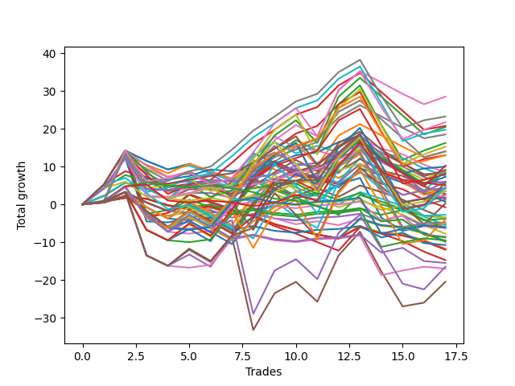

# Long Wallace Doodle 0225_009 
- Symbol: ES
- Date Range: 03/15/2022 - 07/08/2022
- Trading Period: 7:20-12:30
- Number of Trades: 19



| Name | Win Percent | Profit | Avg Profit / Trade |     | Name | Win Percent | Profit | Avg Profit / Trade |
| ---- | ----------- | ------ | ------------------ | --- | ---- | ----------- | ------ | ------------------ |
| Sorted By <br> Profit | | | | | Sorted By <br> Win Percentage ||||
| Sixty-Seven | 84.21 | 17125.00 | 901.32 |     | Sixty-Seven | 84.21 | 17125.00 | 901.32 |
| Twenty-Six | 52.63 | 16625.00 | 875.00 |     | Fifty-Nine | 84.21 | 15375.00 | 809.21 |
| Forty-Three | 73.68 | 15875.00 | 835.53 |     | Three | 84.21 | 12000.00 | 631.58 |
| Fifty-Nine | 84.21 | 15375.00 | 809.21 |     | Forty-Three | 73.68 | 15875.00 | 835.53 |
| Sixty-Six | 68.42 | 13125.00 | 690.79 |     | Forty | 73.68 | 10000.00 | 526.32 |
| twenty-Seven | 57.89 | 12625.00 | 664.47 |     | Sixty-Four | 73.68 | 7125.00 | 375.00 |
| Forty-Two | 57.89 | 12500.00 | 657.89 |     | Forty-Eight | 73.68 | 7125.00 | 375.00 |
| Three | 84.21 | 12000.00 | 631.58 |     | Fifty-Six | 73.68 | 6125.00 | 322.37 |
| Fifty-Three | 47.37 | 11125.00 | 585.53 |     | Sixty-Five | 73.68 | 5750.00 | 302.63 |
| Two | 68.42 | 10375.00 | 546.05 |     | Fifty-Seven | 73.68 | 2500.00 | 131.58 |
| Twenty-Nine | 42.11 | 10375.00 | 546.05 |     | Zero | 73.68 | 2375.00 | 125.00 |
| Thirty-One | 57.89 | 10250.00 | 539.47 |     | One | 73.68 | 2250.00 | 118.42 |
| Forty-Seven | 63.16 | 10125.00 | 532.89 |     | Sixty-Six | 68.42 | 13125.00 | 690.79 |
| Forty | 73.68 | 10000.00 | 526.32 |     | Two | 68.42 | 10375.00 | 546.05 |
| Fifty-Eight | 68.42 | 9875.00 | 519.74 |     | Fifty-Eight | 68.42 | 9875.00 | 519.74 |
| Twenty-Eight | 47.37 | 9875.00 | 519.74 |     | Seventy-One | 68.42 | 9625.00 | 506.58 |
| Seventy-One | 68.42 | 9625.00 | 506.58 |     | Twenty-Four | 68.42 | 8000.00 | 421.05 |
| Fifty-Two | 47.37 | 9500.00 | 500.00 |     | Sixty-Three | 68.42 | 7125.00 | 375.00 |
| Fifty-Five | 57.89 | 9125.00 | 480.26 |     | Forty-One | 68.42 | 6625.00 | 348.68 |
| Forty-Four | 52.63 | 8125.00 | 427.63 |     | Seventy-Five | 68.42 | 6000.00 | 315.79 |
| Twenty-Four | 68.42 | 8000.00 | 421.05 |     | Seven | 68.42 | 3750.00 | 197.37 |
| Sixty-Nine | 52.63 | 8000.00 | 421.05 |     | Forty-Seven | 63.16 | 10125.00 | 532.89 |
| Sixty | 63.16 | 7250.00 | 381.58 |     | Sixty | 63.16 | 7250.00 | 381.58 |
| Sixty-Four | 73.68 | 7125.00 | 375.00 |     | Four | 63.16 | 6500.00 | 342.11 |
| Forty-Eight | 73.68 | 7125.00 | 375.00 |     | Seventy | 63.16 | 2125.00 | 111.84 |
| Sixty-Three | 68.42 | 7125.00 | 375.00 |     | Sixty-Two | 63.16 | 375.00 | 19.74 |
| Twenty-Five | 52.63 | 7000.00 | 368.42 |     | Six | 63.16 | -3375.00 | -177.63 |
| Sixty-Eight | 57.89 | 6875.00 | 361.84 |     | twenty-Seven | 57.89 | 12625.00 | 664.47 |
| Thirty-Six | 47.37 | 6875.00 | 361.84 |     | Forty-Two | 57.89 | 12500.00 | 657.89 |
| Forty-One | 68.42 | 6625.00 | 348.68 |     | Thirty-One | 57.89 | 10250.00 | 539.47 |
| Four | 63.16 | 6500.00 | 342.11 |     | Fifty-Five | 57.89 | 9125.00 | 480.26 |
| Thirty-Nine | 52.63 | 6375.00 | 335.53 |     | Sixty-Eight | 57.89 | 6875.00 | 361.84 |
| Fifty-Six | 73.68 | 6125.00 | 322.37 |     | Fifty-One | 57.89 | 5250.00 | 276.32 |
| Fifty | 52.63 | 6125.00 | 322.37 |     | Sixty-One | 57.89 | 3750.00 | 197.37 |
| Seventy-Five | 68.42 | 6000.00 | 315.79 |     | Thirty-Two | 57.89 | 2250.00 | 118.42 |
| Forty-Five | 47.37 | 5875.00 | 309.21 |     | Forty-Six | 57.89 | 875.00 | 46.05 |
| Sixty-Five | 73.68 | 5750.00 | 302.63 |     | Five | 57.89 | -4500.00 | -236.84 |
| Seventy-Three | 52.63 | 5375.00 | 282.89 |     | Twenty-Six | 52.63 | 16625.00 | 875.00 |
| Fifty-One | 57.89 | 5250.00 | 276.32 |     | Forty-Four | 52.63 | 8125.00 | 427.63 |
| Thirty-Seven | 47.37 | 5250.00 | 276.32 |     | Sixty-Nine | 52.63 | 8000.00 | 421.05 |
| Eleven | 36.84 | 4625.00 | 243.42 |     | Twenty-Five | 52.63 | 7000.00 | 368.42 |
| Thirty-Five | 52.63 | 4000.00 | 210.53 |     | Thirty-Nine | 52.63 | 6375.00 | 335.53 |
| Seven | 68.42 | 3750.00 | 197.37 |     | Fifty | 52.63 | 6125.00 | 322.37 |
| Sixty-One | 57.89 | 3750.00 | 197.37 |     | Seventy-Three | 52.63 | 5375.00 | 282.89 |
| Thirty-Four | 47.37 | 3375.00 | 177.63 |     | Thirty-Five | 52.63 | 4000.00 | 210.53 |
| Ten | 31.58 | 3250.00 | 171.05 |     | Fourteen | 52.63 | 2000.00 | 105.26 |
| Twelve | 31.58 | 2625.00 | 138.16 |     | Twenty-Two | 52.63 | 1750.00 | 92.11 |
| Fifty-Seven | 73.68 | 2500.00 | 131.58 |     | Forty-Nine | 52.63 | 1625.00 | 85.53 |
| Zero | 73.68 | 2375.00 | 125.00 |     | Thirty-Eight | 52.63 | 1250.00 | 65.79 |
| One | 73.68 | 2250.00 | 118.42 |     | Thirty | 52.63 | -250.00 | -13.16 |
| Thirty-Two | 57.89 | 2250.00 | 118.42 |     | Fifty-Four | 52.63 | -1375.00 | -72.37 |
| Thirty-Three | 47.37 | 2250.00 | 118.42 |     | Seventy-Four | 52.63 | -5625.00 | -296.05 |
| Seventy | 63.16 | 2125.00 | 111.84 |     | Fifty-Three | 47.37 | 11125.00 | 585.53 |
| Fourteen | 52.63 | 2000.00 | 105.26 |     | Twenty-Eight | 47.37 | 9875.00 | 519.74 |
| Fifteen | 36.84 | 1875.00 | 98.68 |     | Fifty-Two | 47.37 | 9500.00 | 500.00 |
| Twenty-Two | 52.63 | 1750.00 | 92.11 |     | Thirty-Six | 47.37 | 6875.00 | 361.84 |
| Forty-Nine | 52.63 | 1625.00 | 85.53 |     | Forty-Five | 47.37 | 5875.00 | 309.21 |
| Thirty-Eight | 52.63 | 1250.00 | 65.79 |     | Thirty-Seven | 47.37 | 5250.00 | 276.32 |
| Forty-Six | 57.89 | 875.00 | 46.05 |     | Thirty-Four | 47.37 | 3375.00 | 177.63 |
| Nine | 31.58 | 625.00 | 32.89 |     | Thirty-Three | 47.37 | 2250.00 | 118.42 |
| Sixty-Two | 63.16 | 375.00 | 19.74 |     | Twenty-Nine | 42.11 | 10375.00 | 546.05 |
| Thirty | 52.63 | -250.00 | -13.16 |     | Sixten | 42.11 | -375.00 | -19.74 |
| Sixten | 42.11 | -375.00 | -19.74 |     | Seventy-Two | 42.11 | -750.00 | -39.47 |
| Seventy-Two | 42.11 | -750.00 | -39.47 |     | Eleven | 36.84 | 4625.00 | 243.42 |
| Eight | 36.84 | -750.00 | -39.47 |     | Fifteen | 36.84 | 1875.00 | 98.68 |
| Thirteen | 26.32 | -1000.00 | -52.63 |     | Eight | 36.84 | -750.00 | -39.47 |
| Fifty-Four | 52.63 | -1375.00 | -72.37 |     | Ten | 31.58 | 3250.00 | 171.05 |
| Twenty | 31.58 | -1375.00 | -72.37 |     | Twelve | 31.58 | 2625.00 | 138.16 |
| Eighteen | 31.58 | -1500.00 | -78.95 |     | Nine | 31.58 | 625.00 | 32.89 |
| Twenty-One | 31.58 | -2375.00 | -125.00 |     | Twenty | 31.58 | -1375.00 | -72.37 |
| Nineteen | 31.58 | -2375.00 | -125.00 |     | Eighteen | 31.58 | -1500.00 | -78.95 |
| Seventeen | 31.58 | -2375.00 | -125.00 |     | Twenty-One | 31.58 | -2375.00 | -125.00 |
| Twenty-Three | 31.58 | -2500.00 | -131.58 |     | Nineteen | 31.58 | -2375.00 | -125.00 |
| Six | 63.16 | -3375.00 | -177.63 |     | Seventeen | 31.58 | -2375.00 | -125.00 |
| Five | 57.89 | -4500.00 | -236.84 |     | Twenty-Three | 31.58 | -2500.00 | -131.58 |
| Seventy-Four | 52.63 | -5625.00 | -296.05 |     | Thirteen | 26.32 | -1000.00 | -52.63 |

## NO STOPLOSS

### Test Zero
* Sell when price hits the middle line of the 20p bollinger
* No Stoploss
* Results:
```
Total Trades: 19
Percent Up: 73.68
Percent Down: 26.32
Total Points Moved Up: 4.75
Potential Profit: 2375.00
Total Points Ups: 36.25 Count Ups: 14
Total Points Downs: -31.50 Count Downs: 5
```

<details><summary>Trades</summary>

<code>In: 2022-03-16 10:12:00		Out: 2022-03-16 10:12:10		Total Position Time: 00:10		Total Move Up: 8.25		Total to Date: 8.25</code> <br />
<code>In: 2022-03-23 09:47:00		Out: 2022-03-23 09:53:00		Total Position Time: 06:00		Total Move Up: 4.25		Total to Date: 12.50</code> <br />
<code>In: 2022-03-25 08:29:00		Out: 2022-03-25 08:36:40		Total Position Time: 07:40		Total Move Up: 8.00		Total to Date: 20.50</code> <br />
<code>In: 2022-03-28 08:27:00		Out: 2022-03-28 08:56:55		Total Position Time: 29:55		Total Move Up: -16.75		Total to Date: 3.75</code> <br />
<code>In: 2022-03-31 09:23:00		Out: 2022-03-31 09:32:20		Total Position Time: 09:20		Total Move Up: -0.25		Total to Date: 3.50</code> <br />
<code>In: 2022-04-04 10:03:00		Out: 2022-04-04 10:09:40		Total Position Time: 06:40		Total Move Up: 1.00		Total to Date: 4.50</code> <br />
<code>In: 2022-04-08 10:36:00		Out: 2022-04-08 10:44:05		Total Position Time: 08:05		Total Move Up: 1.75		Total to Date: 6.25</code> <br />
<code>In: 2022-04-08 10:36:00		Out: 2022-04-08 10:44:05		Total Position Time: 08:05		Total Move Up: 1.75		Total to Date: 8.00</code> <br />
<code>In: 2022-04-20 09:14:00		Out: 2022-04-20 09:30:45		Total Position Time: 16:45		Total Move Up: -0.50		Total to Date: 7.50</code> <br />
<code>In: 2022-04-27 11:40:00		Out: 2022-04-27 11:40:10		Total Position Time: 00:10		Total Move Up: 1.00		Total to Date: 8.50</code> <br />
<code>In: 2022-05-26 08:50:00		Out: 2022-05-26 08:54:10		Total Position Time: 04:10		Total Move Up: 1.00		Total to Date: 9.50</code> <br />
<code>In: 2022-05-26 11:38:00		Out: 2022-05-26 11:44:15		Total Position Time: 06:15		Total Move Up: 2.25		Total to Date: 11.75</code> <br />
<code>In: 2022-05-26 12:06:00		Out: 2022-05-26 12:06:10		Total Position Time: 00:10		Total Move Up: 0.75		Total to Date: 12.50</code> <br />
<code>In: 2022-05-27 08:04:00		Out: 2022-05-27 08:06:55		Total Position Time: 02:55		Total Move Up: 2.75		Total to Date: 15.25</code> <br />
<code>In: 2022-05-27 09:52:00		Out: 2022-05-27 09:53:35		Total Position Time: 01:35		Total Move Up: 1.75		Total to Date: 17.00</code> <br />
<code>In: 2022-06-15 07:35:00		Out: 2022-06-15 08:04:55		Total Position Time: 29:55		Total Move Up: -10.50		Total to Date: 6.50</code> <br />
<code>In: 2022-06-21 08:42:00		Out: 2022-06-21 09:02:05		Total Position Time: 20:05		Total Move Up: -3.50		Total to Date: 3.00</code> <br />
<code>In: 2022-06-27 10:45:00		Out: 2022-06-27 10:51:15		Total Position Time: 06:15		Total Move Up: 1.25		Total to Date: 4.25</code> <br />
<code>In: 2022-07-07 10:16:00		Out: 2022-07-07 10:21:10		Total Position Time: 05:10		Total Move Up: 0.50		Total to Date: 4.75</code> <br />


</details>

### Test One
* Sell when the price hits the upper line of the 20p 1std bollinger
* No Stoploss
* Results:
```
Total Trades: 19
Percent Up: 73.68
Percent Down: 26.32
Total Points Moved Up: 4.50
Potential Profit: 2250.00
Total Points Ups: 45.75 Count Ups: 14
Total Points Downs: -41.25 Count Downs: 5
```

<details><summary>Trades</summary>

<code>In: 2022-03-16 10:12:00		Out: 2022-03-16 10:19:05		Total Position Time: 07:05		Total Move Up: 8.75		Total to Date: 8.75</code> <br />
<code>In: 2022-03-23 09:47:00		Out: 2022-03-23 09:59:10		Total Position Time: 12:10		Total Move Up: 5.25		Total to Date: 14.00</code> <br />
<code>In: 2022-03-25 08:29:00		Out: 2022-03-25 08:40:40		Total Position Time: 11:40		Total Move Up: 9.00		Total to Date: 23.00</code> <br />
<code>In: 2022-03-28 08:27:00		Out: 2022-03-28 08:56:55		Total Position Time: 29:55		Total Move Up: -16.75		Total to Date: 6.25</code> <br />
<code>In: 2022-03-31 09:23:00		Out: 2022-03-31 09:40:45		Total Position Time: 17:45		Total Move Up: -0.50		Total to Date: 5.75</code> <br />
<code>In: 2022-04-04 10:03:00		Out: 2022-04-04 10:17:55		Total Position Time: 14:55		Total Move Up: 1.00		Total to Date: 6.75</code> <br />
<code>In: 2022-04-08 10:36:00		Out: 2022-04-08 11:01:00		Total Position Time: 25:00		Total Move Up: 1.00		Total to Date: 7.75</code> <br />
<code>In: 2022-04-08 10:36:00		Out: 2022-04-08 11:01:00		Total Position Time: 25:00		Total Move Up: 1.00		Total to Date: 8.75</code> <br />
<code>In: 2022-04-20 09:14:00		Out: 2022-04-20 09:30:55		Total Position Time: 16:55		Total Move Up: 0.75		Total to Date: 9.50</code> <br />
<code>In: 2022-04-27 11:40:00		Out: 2022-04-27 11:41:10		Total Position Time: 01:10		Total Move Up: 2.75		Total to Date: 12.25</code> <br />
<code>In: 2022-05-26 08:50:00		Out: 2022-05-26 08:55:30		Total Position Time: 05:30		Total Move Up: 3.75		Total to Date: 16.00</code> <br />
<code>In: 2022-05-26 11:38:00		Out: 2022-05-26 11:50:15		Total Position Time: 12:15		Total Move Up: 3.25		Total to Date: 19.25</code> <br />
<code>In: 2022-05-26 12:06:00		Out: 2022-05-26 12:30:20		Total Position Time: 24:20		Total Move Up: -4.25		Total to Date: 15.00</code> <br />
<code>In: 2022-05-27 08:04:00		Out: 2022-05-27 08:11:00		Total Position Time: 07:00		Total Move Up: 4.75		Total to Date: 19.75</code> <br />
<code>In: 2022-05-27 09:52:00		Out: 2022-05-27 09:54:35		Total Position Time: 02:35		Total Move Up: 3.25		Total to Date: 23.00</code> <br />
<code>In: 2022-06-15 07:35:00		Out: 2022-06-15 08:04:55		Total Position Time: 29:55		Total Move Up: -10.50		Total to Date: 12.50</code> <br />
<code>In: 2022-06-21 08:42:00		Out: 2022-06-21 09:11:55		Total Position Time: 29:55		Total Move Up: -9.25		Total to Date: 3.25</code> <br />
<code>In: 2022-06-27 10:45:00		Out: 2022-06-27 11:03:15		Total Position Time: 18:15		Total Move Up: 1.00		Total to Date: 4.25</code> <br />
<code>In: 2022-07-07 10:16:00		Out: 2022-07-07 10:31:35		Total Position Time: 15:35		Total Move Up: 0.25		Total to Date: 4.50</code> <br />


</details>

### Test Two
* Sell when the price hits the upper line of the 20p 2std bollinger
* No Stoploss
* Results:
```
Total Trades: 19
Percent Up: 68.42
Percent Down: 31.58
Total Points Moved Up: 20.75
Potential Profit: 10375.00
Total Points Ups: 66.50 Count Ups: 13
Total Points Downs: -45.75 Count Downs: 6
```

<details><summary>Trades</summary>

<code>In: 2022-03-16 10:12:00		Out: 2022-03-16 10:23:10		Total Position Time: 11:10		Total Move Up: 7.75		Total to Date: 7.75</code> <br />
<code>In: 2022-03-23 09:47:00		Out: 2022-03-23 10:16:55		Total Position Time: 29:55		Total Move Up: 0.75		Total to Date: 8.50</code> <br />
<code>In: 2022-03-25 08:29:00		Out: 2022-03-25 08:41:55		Total Position Time: 12:55		Total Move Up: 13.50		Total to Date: 22.00</code> <br />
<code>In: 2022-03-28 08:27:00		Out: 2022-03-28 08:56:55		Total Position Time: 29:55		Total Move Up: -16.75		Total to Date: 5.25</code> <br />
<code>In: 2022-03-31 09:23:00		Out: 2022-03-31 09:44:50		Total Position Time: 21:50		Total Move Up: 1.00		Total to Date: 6.25</code> <br />
<code>In: 2022-04-04 10:03:00		Out: 2022-04-04 10:18:20		Total Position Time: 15:20		Total Move Up: 1.50		Total to Date: 7.75</code> <br />
<code>In: 2022-04-08 10:36:00		Out: 2022-04-08 11:05:55		Total Position Time: 29:55		Total Move Up: -3.25		Total to Date: 4.50</code> <br />
<code>In: 2022-04-08 10:36:00		Out: 2022-04-08 11:05:55		Total Position Time: 29:55		Total Move Up: -3.25		Total to Date: 1.25</code> <br />
<code>In: 2022-04-20 09:14:00		Out: 2022-04-20 09:31:25		Total Position Time: 17:25		Total Move Up: 1.75		Total to Date: 3.00</code> <br />
<code>In: 2022-04-27 11:40:00		Out: 2022-04-27 11:42:45		Total Position Time: 02:45		Total Move Up: 6.75		Total to Date: 9.75</code> <br />
<code>In: 2022-05-26 08:50:00		Out: 2022-05-26 09:01:50		Total Position Time: 11:50		Total Move Up: 7.75		Total to Date: 17.50</code> <br />
<code>In: 2022-05-26 11:38:00		Out: 2022-05-26 11:54:10		Total Position Time: 16:10		Total Move Up: 4.00		Total to Date: 21.50</code> <br />
<code>In: 2022-05-26 12:06:00		Out: 2022-05-26 12:34:30		Total Position Time: 28:30		Total Move Up: -2.75		Total to Date: 18.75</code> <br />
<code>In: 2022-05-27 08:04:00		Out: 2022-05-27 08:33:55		Total Position Time: 29:55		Total Move Up: 12.25		Total to Date: 31.00</code> <br />
<code>In: 2022-05-27 09:52:00		Out: 2022-05-27 09:55:45		Total Position Time: 03:45		Total Move Up: 5.00		Total to Date: 36.00</code> <br />
<code>In: 2022-06-15 07:35:00		Out: 2022-06-15 08:04:55		Total Position Time: 29:55		Total Move Up: -10.50		Total to Date: 25.50</code> <br />
<code>In: 2022-06-21 08:42:00		Out: 2022-06-21 09:11:55		Total Position Time: 29:55		Total Move Up: -9.25		Total to Date: 16.25</code> <br />
<code>In: 2022-06-27 10:45:00		Out: 2022-06-27 11:14:45		Total Position Time: 29:45		Total Move Up: 2.50		Total to Date: 18.75</code> <br />
<code>In: 2022-07-07 10:16:00		Out: 2022-07-07 10:36:45		Total Position Time: 20:45		Total Move Up: 2.00		Total to Date: 20.75</code> <br />


</details>

### Test Three
* Sell when price hits the middle line of the 50p bollinger
* No Stoploss
* Results:
```
Total Trades: 19
Percent Up: 84.21
Percent Down: 15.79
Total Points Moved Up: 24.00
Potential Profit: 12000.00
Total Points Ups: 60.50 Count Ups: 16
Total Points Downs: -36.50 Count Downs: 3
```

<details><summary>Trades</summary>

<code>In: 2022-03-16 10:12:00		Out: 2022-03-16 10:24:05		Total Position Time: 12:05		Total Move Up: 9.75		Total to Date: 9.75</code> <br />
<code>In: 2022-03-23 09:47:00		Out: 2022-03-23 10:16:55		Total Position Time: 29:55		Total Move Up: 0.75		Total to Date: 10.50</code> <br />
<code>In: 2022-03-25 08:29:00		Out: 2022-03-25 08:52:45		Total Position Time: 23:45		Total Move Up: 12.50		Total to Date: 23.00</code> <br />
<code>In: 2022-03-28 08:27:00		Out: 2022-03-28 08:56:55		Total Position Time: 29:55		Total Move Up: -16.75		Total to Date: 6.25</code> <br />
<code>In: 2022-03-31 09:23:00		Out: 2022-03-31 09:45:35		Total Position Time: 22:35		Total Move Up: 1.25		Total to Date: 7.50</code> <br />
<code>In: 2022-04-04 10:03:00		Out: 2022-04-04 10:19:00		Total Position Time: 16:00		Total Move Up: 2.50		Total to Date: 10.00</code> <br />
<code>In: 2022-04-08 10:36:00		Out: 2022-04-08 11:01:35		Total Position Time: 25:35		Total Move Up: 1.25		Total to Date: 11.25</code> <br />
<code>In: 2022-04-08 10:36:00		Out: 2022-04-08 11:01:35		Total Position Time: 25:35		Total Move Up: 1.25		Total to Date: 12.50</code> <br />
<code>In: 2022-04-20 09:14:00		Out: 2022-04-20 09:32:40		Total Position Time: 18:40		Total Move Up: 4.50		Total to Date: 17.00</code> <br />
<code>In: 2022-04-27 11:40:00		Out: 2022-04-27 11:42:35		Total Position Time: 02:35		Total Move Up: 5.00		Total to Date: 22.00</code> <br />
<code>In: 2022-05-26 08:50:00		Out: 2022-05-26 08:55:30		Total Position Time: 05:30		Total Move Up: 3.75		Total to Date: 25.75</code> <br />
<code>In: 2022-05-26 11:38:00		Out: 2022-05-26 11:54:10		Total Position Time: 16:10		Total Move Up: 4.00		Total to Date: 29.75</code> <br />
<code>In: 2022-05-26 12:06:00		Out: 2022-05-26 12:07:55		Total Position Time: 01:55		Total Move Up: 2.00		Total to Date: 31.75</code> <br />
<code>In: 2022-05-27 08:04:00		Out: 2022-05-27 08:11:30		Total Position Time: 07:30		Total Move Up: 5.75		Total to Date: 37.50</code> <br />
<code>In: 2022-05-27 09:52:00		Out: 2022-05-27 09:54:35		Total Position Time: 02:35		Total Move Up: 3.25		Total to Date: 40.75</code> <br />
<code>In: 2022-06-15 07:35:00		Out: 2022-06-15 08:04:55		Total Position Time: 29:55		Total Move Up: -10.50		Total to Date: 30.25</code> <br />
<code>In: 2022-06-21 08:42:00		Out: 2022-06-21 09:11:55		Total Position Time: 29:55		Total Move Up: -9.25		Total to Date: 21.00</code> <br />
<code>In: 2022-06-27 10:45:00		Out: 2022-06-27 11:13:35		Total Position Time: 28:35		Total Move Up: 2.00		Total to Date: 23.00</code> <br />
<code>In: 2022-07-07 10:16:00		Out: 2022-07-07 10:35:00		Total Position Time: 19:00		Total Move Up: 1.00		Total to Date: 24.00</code> <br />


</details>

### Test Four
* Sell when the price hits the upper line of the 50p 1std bollinger
* No Stoploss
* Results:
```
Total Trades: 19
Percent Up: 63.16
Percent Down: 36.84
Total Points Moved Up: 13.00
Potential Profit: 6500.00
Total Points Ups: 64.00 Count Ups: 12
Total Points Downs: -51.00 Count Downs: 7
```

<details><summary>Trades</summary>

<code>In: 2022-03-16 10:12:00		Out: 2022-03-16 10:31:20		Total Position Time: 19:20		Total Move Up: 13.50		Total to Date: 13.50</code> <br />
<code>In: 2022-03-23 09:47:00		Out: 2022-03-23 10:16:55		Total Position Time: 29:55		Total Move Up: 0.75		Total to Date: 14.25</code> <br />
<code>In: 2022-03-25 08:29:00		Out: 2022-03-25 08:58:55		Total Position Time: 29:55		Total Move Up: 2.50		Total to Date: 16.75</code> <br />
<code>In: 2022-03-28 08:27:00		Out: 2022-03-28 08:56:55		Total Position Time: 29:55		Total Move Up: -16.75		Total to Date: 0.00</code> <br />
<code>In: 2022-03-31 09:23:00		Out: 2022-03-31 09:52:55		Total Position Time: 29:55		Total Move Up: -2.75		Total to Date: -2.75</code> <br />
<code>In: 2022-04-04 10:03:00		Out: 2022-04-04 10:26:05		Total Position Time: 23:05		Total Move Up: 3.00		Total to Date: 0.25</code> <br />
<code>In: 2022-04-08 10:36:00		Out: 2022-04-08 11:05:55		Total Position Time: 29:55		Total Move Up: -3.25		Total to Date: -3.00</code> <br />
<code>In: 2022-04-08 10:36:00		Out: 2022-04-08 11:05:55		Total Position Time: 29:55		Total Move Up: -3.25		Total to Date: -6.25</code> <br />
<code>In: 2022-04-20 09:14:00		Out: 2022-04-20 09:36:45		Total Position Time: 22:45		Total Move Up: 8.25		Total to Date: 2.00</code> <br />
<code>In: 2022-04-27 11:40:00		Out: 2022-04-27 11:45:35		Total Position Time: 05:35		Total Move Up: 9.00		Total to Date: 11.00</code> <br />
<code>In: 2022-05-26 08:50:00		Out: 2022-05-26 08:58:30		Total Position Time: 08:30		Total Move Up: 5.75		Total to Date: 16.75</code> <br />
<code>In: 2022-05-26 11:38:00		Out: 2022-05-26 12:07:55		Total Position Time: 29:55		Total Move Up: 3.00		Total to Date: 19.75</code> <br />
<code>In: 2022-05-26 12:06:00		Out: 2022-05-26 12:35:55		Total Position Time: 29:55		Total Move Up: -5.25		Total to Date: 14.50</code> <br />
<code>In: 2022-05-27 08:04:00		Out: 2022-05-27 08:16:10		Total Position Time: 12:10		Total Move Up: 9.25		Total to Date: 23.75</code> <br />
<code>In: 2022-05-27 09:52:00		Out: 2022-05-27 09:57:35		Total Position Time: 05:35		Total Move Up: 5.25		Total to Date: 29.00</code> <br />
<code>In: 2022-06-15 07:35:00		Out: 2022-06-15 08:04:55		Total Position Time: 29:55		Total Move Up: -10.50		Total to Date: 18.50</code> <br />
<code>In: 2022-06-21 08:42:00		Out: 2022-06-21 09:11:55		Total Position Time: 29:55		Total Move Up: -9.25		Total to Date: 9.25</code> <br />
<code>In: 2022-06-27 10:45:00		Out: 2022-06-27 11:14:55		Total Position Time: 29:55		Total Move Up: 1.00		Total to Date: 10.25</code> <br />
<code>In: 2022-07-07 10:16:00		Out: 2022-07-07 10:40:15		Total Position Time: 24:15		Total Move Up: 2.75		Total to Date: 13.00</code> <br />


</details>

### Test Five
* Sell when the price hits the upper line of the 50p 2std bollinger
* No Stoploss
* Results:
```
Total Trades: 19
Percent Up: 57.89
Percent Down: 42.11
Total Points Moved Up: -9.00
Potential Profit: -4500.00
Total Points Ups: 66.75 Count Ups: 11
Total Points Downs: -75.75 Count Downs: 8
```

<details><summary>Trades</summary>

<code>In: 2022-03-16 10:12:00		Out: 2022-03-16 10:35:25		Total Position Time: 23:25		Total Move Up: 14.75		Total to Date: 14.75</code> <br />
<code>In: 2022-03-23 09:47:00		Out: 2022-03-23 10:16:55		Total Position Time: 29:55		Total Move Up: 0.75		Total to Date: 15.50</code> <br />
<code>In: 2022-03-25 08:29:00		Out: 2022-03-25 08:58:55		Total Position Time: 29:55		Total Move Up: 2.50		Total to Date: 18.00</code> <br />
<code>In: 2022-03-28 08:27:00		Out: 2022-03-28 08:56:55		Total Position Time: 29:55		Total Move Up: -16.75		Total to Date: 1.25</code> <br />
<code>In: 2022-03-31 09:23:00		Out: 2022-03-31 09:52:55		Total Position Time: 29:55		Total Move Up: -2.75		Total to Date: -1.50</code> <br />
<code>In: 2022-04-04 10:03:00		Out: 2022-04-04 10:28:35		Total Position Time: 25:35		Total Move Up: 4.25		Total to Date: 2.75</code> <br />
<code>In: 2022-04-08 10:36:00		Out: 2022-04-08 11:05:55		Total Position Time: 29:55		Total Move Up: -3.25		Total to Date: -0.50</code> <br />
<code>In: 2022-04-08 10:36:00		Out: 2022-04-08 11:05:55		Total Position Time: 29:55		Total Move Up: -3.25		Total to Date: -3.75</code> <br />
<code>In: 2022-04-20 09:14:00		Out: 2022-04-20 09:43:55		Total Position Time: 29:55		Total Move Up: 6.75		Total to Date: 3.00</code> <br />
<code>In: 2022-04-27 11:40:00		Out: 2022-04-27 12:09:55		Total Position Time: 29:55		Total Move Up: -24.75		Total to Date: -21.75</code> <br />
<code>In: 2022-05-26 08:50:00		Out: 2022-05-26 09:03:00		Total Position Time: 13:00		Total Move Up: 9.75		Total to Date: -12.00</code> <br />
<code>In: 2022-05-26 11:38:00		Out: 2022-05-26 12:07:55		Total Position Time: 29:55		Total Move Up: 3.00		Total to Date: -9.00</code> <br />
<code>In: 2022-05-26 12:06:00		Out: 2022-05-26 12:35:55		Total Position Time: 29:55		Total Move Up: -5.25		Total to Date: -14.25</code> <br />
<code>In: 2022-05-27 08:04:00		Out: 2022-05-27 08:33:55		Total Position Time: 29:55		Total Move Up: 12.25		Total to Date: -2.00</code> <br />
<code>In: 2022-05-27 09:52:00		Out: 2022-05-27 10:05:20		Total Position Time: 13:20		Total Move Up: 6.25		Total to Date: 4.25</code> <br />
<code>In: 2022-06-15 07:35:00		Out: 2022-06-15 08:04:55		Total Position Time: 29:55		Total Move Up: -10.50		Total to Date: -6.25</code> <br />
<code>In: 2022-06-21 08:42:00		Out: 2022-06-21 09:11:55		Total Position Time: 29:55		Total Move Up: -9.25		Total to Date: -15.50</code> <br />
<code>In: 2022-06-27 10:45:00		Out: 2022-06-27 11:14:55		Total Position Time: 29:55		Total Move Up: 1.00		Total to Date: -14.50</code> <br />
<code>In: 2022-07-07 10:16:00		Out: 2022-07-07 10:45:35		Total Position Time: 29:35		Total Move Up: 5.50		Total to Date: -9.00</code> <br />


</details>

### Test Six
* Sell when the price hits the middle line of the 1std VWAP
* No Stoploss
* Results:
```
Total Trades: 19
Percent Up: 63.16
Percent Down: 36.84
Total Points Moved Up: -6.75
Potential Profit: -3375.00
Total Points Ups: 26.00 Count Ups: 12
Total Points Downs: -32.75 Count Downs: 7
```

<details><summary>Trades</summary>

<code>In: 2022-03-16 10:12:00		Out: 2022-03-16 10:41:55		Total Position Time: 29:55		Total Move Up: 9.50		Total to Date: 9.50</code> <br />
<code>In: 2022-03-23 09:47:00		Out: 2022-03-23 10:16:55		Total Position Time: 29:55		Total Move Up: 0.75		Total to Date: 10.25</code> <br />
<code>In: 2022-03-25 08:29:00		Out: 2022-03-25 08:58:55		Total Position Time: 29:55		Total Move Up: 2.50		Total to Date: 12.75</code> <br />
<code>In: 2022-03-28 08:27:00		Out: 2022-03-28 08:56:55		Total Position Time: 29:55		Total Move Up: -16.75		Total to Date: -4.00</code> <br />
<code>In: 2022-03-31 09:23:00		Out: 2022-03-31 09:52:55		Total Position Time: 29:55		Total Move Up: -2.75		Total to Date: -6.75</code> <br />
<code>In: 2022-04-04 10:03:00		Out: 2022-04-04 10:03:10		Total Position Time: 00:10		Total Move Up: -0.50		Total to Date: -7.25</code> <br />
<code>In: 2022-04-08 10:36:00		Out: 2022-04-08 10:36:10		Total Position Time: 00:10		Total Move Up: 0.75		Total to Date: -6.50</code> <br />
<code>In: 2022-04-08 10:36:00		Out: 2022-04-08 10:36:10		Total Position Time: 00:10		Total Move Up: 0.75		Total to Date: -5.75</code> <br />
<code>In: 2022-04-20 09:14:00		Out: 2022-04-20 09:35:50		Total Position Time: 21:50		Total Move Up: 6.75		Total to Date: 1.00</code> <br />
<code>In: 2022-04-27 11:40:00		Out: 2022-04-27 11:40:10		Total Position Time: 00:10		Total Move Up: 1.00		Total to Date: 2.00</code> <br />
<code>In: 2022-05-26 08:50:00		Out: 2022-05-26 08:50:10		Total Position Time: 00:10		Total Move Up: -1.25		Total to Date: 0.75</code> <br />
<code>In: 2022-05-26 11:38:00		Out: 2022-05-26 11:38:10		Total Position Time: 00:10		Total Move Up: -0.50		Total to Date: 0.25</code> <br />
<code>In: 2022-05-26 12:06:00		Out: 2022-05-26 12:06:10		Total Position Time: 00:10		Total Move Up: 0.75		Total to Date: 1.00</code> <br />
<code>In: 2022-05-27 08:04:00		Out: 2022-05-27 08:04:10		Total Position Time: 00:10		Total Move Up: 0.25		Total to Date: 1.25</code> <br />
<code>In: 2022-05-27 09:52:00		Out: 2022-05-27 09:52:10		Total Position Time: 00:10		Total Move Up: 0.75		Total to Date: 2.00</code> <br />
<code>In: 2022-06-15 07:35:00		Out: 2022-06-15 08:04:55		Total Position Time: 29:55		Total Move Up: -10.50		Total to Date: -8.50</code> <br />
<code>In: 2022-06-21 08:42:00		Out: 2022-06-21 08:42:10		Total Position Time: 00:10		Total Move Up: 1.25		Total to Date: -7.25</code> <br />
<code>In: 2022-06-27 10:45:00		Out: 2022-06-27 11:14:55		Total Position Time: 29:55		Total Move Up: 1.00		Total to Date: -6.25</code> <br />
<code>In: 2022-07-07 10:16:00		Out: 2022-07-07 10:16:10		Total Position Time: 00:10		Total Move Up: -0.50		Total to Date: -6.75</code> <br />


</details>

### Test Seven
* Sell when the price hits the upper line of the 1std VWAP
* No Stoploss
* Results:
```
Total Trades: 19
Percent Up: 68.42
Percent Down: 31.58
Total Points Moved Up: 7.50
Potential Profit: 3750.00
Total Points Ups: 53.25 Count Ups: 13
Total Points Downs: -45.75 Count Downs: 6
```

<details><summary>Trades</summary>

<code>In: 2022-03-16 10:12:00		Out: 2022-03-16 10:41:55		Total Position Time: 29:55		Total Move Up: 9.50		Total to Date: 9.50</code> <br />
<code>In: 2022-03-23 09:47:00		Out: 2022-03-23 10:16:55		Total Position Time: 29:55		Total Move Up: 0.75		Total to Date: 10.25</code> <br />
<code>In: 2022-03-25 08:29:00		Out: 2022-03-25 08:58:55		Total Position Time: 29:55		Total Move Up: 2.50		Total to Date: 12.75</code> <br />
<code>In: 2022-03-28 08:27:00		Out: 2022-03-28 08:56:55		Total Position Time: 29:55		Total Move Up: -16.75		Total to Date: -4.00</code> <br />
<code>In: 2022-03-31 09:23:00		Out: 2022-03-31 09:52:55		Total Position Time: 29:55		Total Move Up: -2.75		Total to Date: -6.75</code> <br />
<code>In: 2022-04-04 10:03:00		Out: 2022-04-04 10:29:40		Total Position Time: 26:40		Total Move Up: 4.50		Total to Date: -2.25</code> <br />
<code>In: 2022-04-08 10:36:00		Out: 2022-04-08 11:05:55		Total Position Time: 29:55		Total Move Up: -3.25		Total to Date: -5.50</code> <br />
<code>In: 2022-04-08 10:36:00		Out: 2022-04-08 11:05:55		Total Position Time: 29:55		Total Move Up: -3.25		Total to Date: -8.75</code> <br />
<code>In: 2022-04-20 09:14:00		Out: 2022-04-20 09:43:55		Total Position Time: 29:55		Total Move Up: 6.75		Total to Date: -2.00</code> <br />
<code>In: 2022-04-27 11:40:00		Out: 2022-04-27 11:44:15		Total Position Time: 04:15		Total Move Up: 8.00		Total to Date: 6.00</code> <br />
<code>In: 2022-05-26 08:50:00		Out: 2022-05-26 08:55:30		Total Position Time: 05:30		Total Move Up: 3.75		Total to Date: 9.75</code> <br />
<code>In: 2022-05-26 11:38:00		Out: 2022-05-26 11:42:40		Total Position Time: 04:40		Total Move Up: 2.00		Total to Date: 11.75</code> <br />
<code>In: 2022-05-26 12:06:00		Out: 2022-05-26 12:07:55		Total Position Time: 01:55		Total Move Up: 2.00		Total to Date: 13.75</code> <br />
<code>In: 2022-05-27 08:04:00		Out: 2022-05-27 08:13:35		Total Position Time: 09:35		Total Move Up: 8.00		Total to Date: 21.75</code> <br />
<code>In: 2022-05-27 09:52:00		Out: 2022-05-27 09:54:25		Total Position Time: 02:25		Total Move Up: 3.00		Total to Date: 24.75</code> <br />
<code>In: 2022-06-15 07:35:00		Out: 2022-06-15 08:04:55		Total Position Time: 29:55		Total Move Up: -10.50		Total to Date: 14.25</code> <br />
<code>In: 2022-06-21 08:42:00		Out: 2022-06-21 09:11:55		Total Position Time: 29:55		Total Move Up: -9.25		Total to Date: 5.00</code> <br />
<code>In: 2022-06-27 10:45:00		Out: 2022-06-27 11:14:55		Total Position Time: 29:55		Total Move Up: 1.00		Total to Date: 6.00</code> <br />
<code>In: 2022-07-07 10:16:00		Out: 2022-07-07 10:35:15		Total Position Time: 19:15		Total Move Up: 1.50		Total to Date: 7.50</code> <br />


</details>

## STOPLOSS OF 2

### Test Eight
* Sell when price hits the middle line of the 20p bollinger
* Stoploss is 2 points
* Results:
```
Total Trades: 19
Percent Up: 36.84
Percent Down: 63.16
Total Points Moved Up: -1.50
Potential Profit: -750.00
Total Points Ups: 25.00 Count Ups: 7
Total Points Downs: -26.50 Count Downs: 12
```

<details><summary>Trades</summary>

<code>In: 2022-03-16 10:12:00		Out: 2022-03-16 10:12:10		Total Position Time: 00:10		Total Move Up: 8.25		Total to Date: 8.25</code> <br />
<code>In: 2022-03-23 09:47:00		Out: 2022-03-23 09:53:00		Total Position Time: 06:00		Total Move Up: 4.25		Total to Date: 12.50</code> <br />
<code>In: 2022-03-25 08:29:00		Out: 2022-03-25 08:36:40		Total Position Time: 07:40		Total Move Up: 8.00		Total to Date: 20.50</code> <br />
<code>In: 2022-03-28 08:27:00		Out: 2022-03-28 08:32:05		Total Position Time: 05:05		Total Move Up: -2.75		Total to Date: 17.75</code> <br />
<code>In: 2022-03-31 09:23:00		Out: 2022-03-31 09:24:55		Total Position Time: 01:55		Total Move Up: -2.25		Total to Date: 15.50</code> <br />
<code>In: 2022-04-04 10:03:00		Out: 2022-04-04 10:09:40		Total Position Time: 06:40		Total Move Up: 1.00		Total to Date: 16.50</code> <br />
<code>In: 2022-04-08 10:36:00		Out: 2022-04-08 10:43:05		Total Position Time: 07:05		Total Move Up: -2.00		Total to Date: 14.50</code> <br />
<code>In: 2022-04-08 10:36:00		Out: 2022-04-08 10:43:05		Total Position Time: 07:05		Total Move Up: -2.00		Total to Date: 12.50</code> <br />
<code>In: 2022-04-20 09:14:00		Out: 2022-04-20 09:15:35		Total Position Time: 01:35		Total Move Up: -2.00		Total to Date: 10.50</code> <br />
<code>In: 2022-04-27 11:40:00		Out: 2022-04-27 11:40:10		Total Position Time: 00:10		Total Move Up: 1.00		Total to Date: 11.50</code> <br />
<code>In: 2022-05-26 08:50:00		Out: 2022-05-26 08:51:10		Total Position Time: 01:10		Total Move Up: -2.50		Total to Date: 9.00</code> <br />
<code>In: 2022-05-26 11:38:00		Out: 2022-05-26 11:40:10		Total Position Time: 02:10		Total Move Up: -2.00		Total to Date: 7.00</code> <br />
<code>In: 2022-05-26 12:06:00		Out: 2022-05-26 12:06:10		Total Position Time: 00:10		Total Move Up: 0.75		Total to Date: 7.75</code> <br />
<code>In: 2022-05-27 08:04:00		Out: 2022-05-27 08:05:10		Total Position Time: 01:10		Total Move Up: -2.25		Total to Date: 5.50</code> <br />
<code>In: 2022-05-27 09:52:00		Out: 2022-05-27 09:53:35		Total Position Time: 01:35		Total Move Up: 1.75		Total to Date: 7.25</code> <br />
<code>In: 2022-06-15 07:35:00		Out: 2022-06-15 07:35:10		Total Position Time: 00:10		Total Move Up: -1.75		Total to Date: 5.50</code> <br />
<code>In: 2022-06-21 08:42:00		Out: 2022-06-21 08:44:50		Total Position Time: 02:50		Total Move Up: -2.00		Total to Date: 3.50</code> <br />
<code>In: 2022-06-27 10:45:00		Out: 2022-06-27 10:45:35		Total Position Time: 00:35		Total Move Up: -2.75		Total to Date: 0.75</code> <br />
<code>In: 2022-07-07 10:16:00		Out: 2022-07-07 10:18:05		Total Position Time: 02:05		Total Move Up: -2.25		Total to Date: -1.50</code> <br />


</details>

### Test Nine
* Sell when the price hits the upper line of the 20p 1std bollinger
* Stoploss is 2 points
* Results:
```
Total Trades: 19
Percent Up: 31.58
Percent Down: 68.42
Total Points Moved Up: 1.25
Potential Profit: 625.00
Total Points Ups: 30.00 Count Ups: 6
Total Points Downs: -28.75 Count Downs: 13
```

<details><summary>Trades</summary>

<code>In: 2022-03-16 10:12:00		Out: 2022-03-16 10:19:05		Total Position Time: 07:05		Total Move Up: 8.75		Total to Date: 8.75</code> <br />
<code>In: 2022-03-23 09:47:00		Out: 2022-03-23 09:59:10		Total Position Time: 12:10		Total Move Up: 5.25		Total to Date: 14.00</code> <br />
<code>In: 2022-03-25 08:29:00		Out: 2022-03-25 08:40:40		Total Position Time: 11:40		Total Move Up: 9.00		Total to Date: 23.00</code> <br />
<code>In: 2022-03-28 08:27:00		Out: 2022-03-28 08:32:05		Total Position Time: 05:05		Total Move Up: -2.75		Total to Date: 20.25</code> <br />
<code>In: 2022-03-31 09:23:00		Out: 2022-03-31 09:24:55		Total Position Time: 01:55		Total Move Up: -2.25		Total to Date: 18.00</code> <br />
<code>In: 2022-04-04 10:03:00		Out: 2022-04-04 10:17:55		Total Position Time: 14:55		Total Move Up: 1.00		Total to Date: 19.00</code> <br />
<code>In: 2022-04-08 10:36:00		Out: 2022-04-08 10:43:05		Total Position Time: 07:05		Total Move Up: -2.00		Total to Date: 17.00</code> <br />
<code>In: 2022-04-08 10:36:00		Out: 2022-04-08 10:43:05		Total Position Time: 07:05		Total Move Up: -2.00		Total to Date: 15.00</code> <br />
<code>In: 2022-04-20 09:14:00		Out: 2022-04-20 09:15:35		Total Position Time: 01:35		Total Move Up: -2.00		Total to Date: 13.00</code> <br />
<code>In: 2022-04-27 11:40:00		Out: 2022-04-27 11:41:10		Total Position Time: 01:10		Total Move Up: 2.75		Total to Date: 15.75</code> <br />
<code>In: 2022-05-26 08:50:00		Out: 2022-05-26 08:51:10		Total Position Time: 01:10		Total Move Up: -2.50		Total to Date: 13.25</code> <br />
<code>In: 2022-05-26 11:38:00		Out: 2022-05-26 11:40:10		Total Position Time: 02:10		Total Move Up: -2.00		Total to Date: 11.25</code> <br />
<code>In: 2022-05-26 12:06:00		Out: 2022-05-26 12:12:20		Total Position Time: 06:20		Total Move Up: -2.25		Total to Date: 9.00</code> <br />
<code>In: 2022-05-27 08:04:00		Out: 2022-05-27 08:05:10		Total Position Time: 01:10		Total Move Up: -2.25		Total to Date: 6.75</code> <br />
<code>In: 2022-05-27 09:52:00		Out: 2022-05-27 09:54:35		Total Position Time: 02:35		Total Move Up: 3.25		Total to Date: 10.00</code> <br />
<code>In: 2022-06-15 07:35:00		Out: 2022-06-15 07:35:10		Total Position Time: 00:10		Total Move Up: -1.75		Total to Date: 8.25</code> <br />
<code>In: 2022-06-21 08:42:00		Out: 2022-06-21 08:44:50		Total Position Time: 02:50		Total Move Up: -2.00		Total to Date: 6.25</code> <br />
<code>In: 2022-06-27 10:45:00		Out: 2022-06-27 10:45:35		Total Position Time: 00:35		Total Move Up: -2.75		Total to Date: 3.50</code> <br />
<code>In: 2022-07-07 10:16:00		Out: 2022-07-07 10:18:05		Total Position Time: 02:05		Total Move Up: -2.25		Total to Date: 1.25</code> <br />


</details>

### Test Ten
* Sell when the price hits the upper line of the 20p 2std bollinger
* Stoploss is 2 points
* Results:
```
Total Trades: 19
Percent Up: 31.58
Percent Down: 68.42
Total Points Moved Up: 6.50
Potential Profit: 3250.00
Total Points Ups: 35.25 Count Ups: 6
Total Points Downs: -28.75 Count Downs: 13
```

<details><summary>Trades</summary>

<code>In: 2022-03-16 10:12:00		Out: 2022-03-16 10:23:10		Total Position Time: 11:10		Total Move Up: 7.75		Total to Date: 7.75</code> <br />
<code>In: 2022-03-23 09:47:00		Out: 2022-03-23 10:16:55		Total Position Time: 29:55		Total Move Up: 0.75		Total to Date: 8.50</code> <br />
<code>In: 2022-03-25 08:29:00		Out: 2022-03-25 08:41:55		Total Position Time: 12:55		Total Move Up: 13.50		Total to Date: 22.00</code> <br />
<code>In: 2022-03-28 08:27:00		Out: 2022-03-28 08:32:05		Total Position Time: 05:05		Total Move Up: -2.75		Total to Date: 19.25</code> <br />
<code>In: 2022-03-31 09:23:00		Out: 2022-03-31 09:24:55		Total Position Time: 01:55		Total Move Up: -2.25		Total to Date: 17.00</code> <br />
<code>In: 2022-04-04 10:03:00		Out: 2022-04-04 10:18:20		Total Position Time: 15:20		Total Move Up: 1.50		Total to Date: 18.50</code> <br />
<code>In: 2022-04-08 10:36:00		Out: 2022-04-08 10:43:05		Total Position Time: 07:05		Total Move Up: -2.00		Total to Date: 16.50</code> <br />
<code>In: 2022-04-08 10:36:00		Out: 2022-04-08 10:43:05		Total Position Time: 07:05		Total Move Up: -2.00		Total to Date: 14.50</code> <br />
<code>In: 2022-04-20 09:14:00		Out: 2022-04-20 09:15:35		Total Position Time: 01:35		Total Move Up: -2.00		Total to Date: 12.50</code> <br />
<code>In: 2022-04-27 11:40:00		Out: 2022-04-27 11:42:45		Total Position Time: 02:45		Total Move Up: 6.75		Total to Date: 19.25</code> <br />
<code>In: 2022-05-26 08:50:00		Out: 2022-05-26 08:51:10		Total Position Time: 01:10		Total Move Up: -2.50		Total to Date: 16.75</code> <br />
<code>In: 2022-05-26 11:38:00		Out: 2022-05-26 11:40:10		Total Position Time: 02:10		Total Move Up: -2.00		Total to Date: 14.75</code> <br />
<code>In: 2022-05-26 12:06:00		Out: 2022-05-26 12:12:20		Total Position Time: 06:20		Total Move Up: -2.25		Total to Date: 12.50</code> <br />
<code>In: 2022-05-27 08:04:00		Out: 2022-05-27 08:05:10		Total Position Time: 01:10		Total Move Up: -2.25		Total to Date: 10.25</code> <br />
<code>In: 2022-05-27 09:52:00		Out: 2022-05-27 09:55:45		Total Position Time: 03:45		Total Move Up: 5.00		Total to Date: 15.25</code> <br />
<code>In: 2022-06-15 07:35:00		Out: 2022-06-15 07:35:10		Total Position Time: 00:10		Total Move Up: -1.75		Total to Date: 13.50</code> <br />
<code>In: 2022-06-21 08:42:00		Out: 2022-06-21 08:44:50		Total Position Time: 02:50		Total Move Up: -2.00		Total to Date: 11.50</code> <br />
<code>In: 2022-06-27 10:45:00		Out: 2022-06-27 10:45:35		Total Position Time: 00:35		Total Move Up: -2.75		Total to Date: 8.75</code> <br />
<code>In: 2022-07-07 10:16:00		Out: 2022-07-07 10:18:05		Total Position Time: 02:05		Total Move Up: -2.25		Total to Date: 6.50</code> <br />


</details>

### Test Eleven
* Sell when price hits the middle line of the 50p bollinger
* Stoploss is 2 points
* Results:
```
Total Trades: 19
Percent Up: 36.84
Percent Down: 63.16
Total Points Moved Up: 9.25
Potential Profit: 4625.00
Total Points Ups: 35.75 Count Ups: 7
Total Points Downs: -26.50 Count Downs: 12
```

<details><summary>Trades</summary>

<code>In: 2022-03-16 10:12:00		Out: 2022-03-16 10:24:05		Total Position Time: 12:05		Total Move Up: 9.75		Total to Date: 9.75</code> <br />
<code>In: 2022-03-23 09:47:00		Out: 2022-03-23 10:16:55		Total Position Time: 29:55		Total Move Up: 0.75		Total to Date: 10.50</code> <br />
<code>In: 2022-03-25 08:29:00		Out: 2022-03-25 08:52:45		Total Position Time: 23:45		Total Move Up: 12.50		Total to Date: 23.00</code> <br />
<code>In: 2022-03-28 08:27:00		Out: 2022-03-28 08:32:05		Total Position Time: 05:05		Total Move Up: -2.75		Total to Date: 20.25</code> <br />
<code>In: 2022-03-31 09:23:00		Out: 2022-03-31 09:24:55		Total Position Time: 01:55		Total Move Up: -2.25		Total to Date: 18.00</code> <br />
<code>In: 2022-04-04 10:03:00		Out: 2022-04-04 10:19:00		Total Position Time: 16:00		Total Move Up: 2.50		Total to Date: 20.50</code> <br />
<code>In: 2022-04-08 10:36:00		Out: 2022-04-08 10:43:05		Total Position Time: 07:05		Total Move Up: -2.00		Total to Date: 18.50</code> <br />
<code>In: 2022-04-08 10:36:00		Out: 2022-04-08 10:43:05		Total Position Time: 07:05		Total Move Up: -2.00		Total to Date: 16.50</code> <br />
<code>In: 2022-04-20 09:14:00		Out: 2022-04-20 09:15:35		Total Position Time: 01:35		Total Move Up: -2.00		Total to Date: 14.50</code> <br />
<code>In: 2022-04-27 11:40:00		Out: 2022-04-27 11:42:35		Total Position Time: 02:35		Total Move Up: 5.00		Total to Date: 19.50</code> <br />
<code>In: 2022-05-26 08:50:00		Out: 2022-05-26 08:51:10		Total Position Time: 01:10		Total Move Up: -2.50		Total to Date: 17.00</code> <br />
<code>In: 2022-05-26 11:38:00		Out: 2022-05-26 11:40:10		Total Position Time: 02:10		Total Move Up: -2.00		Total to Date: 15.00</code> <br />
<code>In: 2022-05-26 12:06:00		Out: 2022-05-26 12:07:55		Total Position Time: 01:55		Total Move Up: 2.00		Total to Date: 17.00</code> <br />
<code>In: 2022-05-27 08:04:00		Out: 2022-05-27 08:05:10		Total Position Time: 01:10		Total Move Up: -2.25		Total to Date: 14.75</code> <br />
<code>In: 2022-05-27 09:52:00		Out: 2022-05-27 09:54:35		Total Position Time: 02:35		Total Move Up: 3.25		Total to Date: 18.00</code> <br />
<code>In: 2022-06-15 07:35:00		Out: 2022-06-15 07:35:10		Total Position Time: 00:10		Total Move Up: -1.75		Total to Date: 16.25</code> <br />
<code>In: 2022-06-21 08:42:00		Out: 2022-06-21 08:44:50		Total Position Time: 02:50		Total Move Up: -2.00		Total to Date: 14.25</code> <br />
<code>In: 2022-06-27 10:45:00		Out: 2022-06-27 10:45:35		Total Position Time: 00:35		Total Move Up: -2.75		Total to Date: 11.50</code> <br />
<code>In: 2022-07-07 10:16:00		Out: 2022-07-07 10:18:05		Total Position Time: 02:05		Total Move Up: -2.25		Total to Date: 9.25</code> <br />


</details>

### Test Twelve
* Sell when the price hits the upper line of the 50p 1std bollinger
* Stoploss is 2 points
* Results:
```
Total Trades: 19
Percent Up: 31.58
Percent Down: 68.42
Total Points Moved Up: 5.25
Potential Profit: 2625.00
Total Points Ups: 34.00 Count Ups: 6
Total Points Downs: -28.75 Count Downs: 13
```

<details><summary>Trades</summary>

<code>In: 2022-03-16 10:12:00		Out: 2022-03-16 10:31:20		Total Position Time: 19:20		Total Move Up: 13.50		Total to Date: 13.50</code> <br />
<code>In: 2022-03-23 09:47:00		Out: 2022-03-23 10:16:55		Total Position Time: 29:55		Total Move Up: 0.75		Total to Date: 14.25</code> <br />
<code>In: 2022-03-25 08:29:00		Out: 2022-03-25 08:58:55		Total Position Time: 29:55		Total Move Up: 2.50		Total to Date: 16.75</code> <br />
<code>In: 2022-03-28 08:27:00		Out: 2022-03-28 08:32:05		Total Position Time: 05:05		Total Move Up: -2.75		Total to Date: 14.00</code> <br />
<code>In: 2022-03-31 09:23:00		Out: 2022-03-31 09:24:55		Total Position Time: 01:55		Total Move Up: -2.25		Total to Date: 11.75</code> <br />
<code>In: 2022-04-04 10:03:00		Out: 2022-04-04 10:26:05		Total Position Time: 23:05		Total Move Up: 3.00		Total to Date: 14.75</code> <br />
<code>In: 2022-04-08 10:36:00		Out: 2022-04-08 10:43:05		Total Position Time: 07:05		Total Move Up: -2.00		Total to Date: 12.75</code> <br />
<code>In: 2022-04-08 10:36:00		Out: 2022-04-08 10:43:05		Total Position Time: 07:05		Total Move Up: -2.00		Total to Date: 10.75</code> <br />
<code>In: 2022-04-20 09:14:00		Out: 2022-04-20 09:15:35		Total Position Time: 01:35		Total Move Up: -2.00		Total to Date: 8.75</code> <br />
<code>In: 2022-04-27 11:40:00		Out: 2022-04-27 11:45:35		Total Position Time: 05:35		Total Move Up: 9.00		Total to Date: 17.75</code> <br />
<code>In: 2022-05-26 08:50:00		Out: 2022-05-26 08:51:10		Total Position Time: 01:10		Total Move Up: -2.50		Total to Date: 15.25</code> <br />
<code>In: 2022-05-26 11:38:00		Out: 2022-05-26 11:40:10		Total Position Time: 02:10		Total Move Up: -2.00		Total to Date: 13.25</code> <br />
<code>In: 2022-05-26 12:06:00		Out: 2022-05-26 12:12:20		Total Position Time: 06:20		Total Move Up: -2.25		Total to Date: 11.00</code> <br />
<code>In: 2022-05-27 08:04:00		Out: 2022-05-27 08:05:10		Total Position Time: 01:10		Total Move Up: -2.25		Total to Date: 8.75</code> <br />
<code>In: 2022-05-27 09:52:00		Out: 2022-05-27 09:57:35		Total Position Time: 05:35		Total Move Up: 5.25		Total to Date: 14.00</code> <br />
<code>In: 2022-06-15 07:35:00		Out: 2022-06-15 07:35:10		Total Position Time: 00:10		Total Move Up: -1.75		Total to Date: 12.25</code> <br />
<code>In: 2022-06-21 08:42:00		Out: 2022-06-21 08:44:50		Total Position Time: 02:50		Total Move Up: -2.00		Total to Date: 10.25</code> <br />
<code>In: 2022-06-27 10:45:00		Out: 2022-06-27 10:45:35		Total Position Time: 00:35		Total Move Up: -2.75		Total to Date: 7.50</code> <br />
<code>In: 2022-07-07 10:16:00		Out: 2022-07-07 10:18:05		Total Position Time: 02:05		Total Move Up: -2.25		Total to Date: 5.25</code> <br />


</details>

### Test Thirteen
* Sell when the price hits the upper line of the 50p 2std bollinger
* Stoploss is 2 points
* Results:
```
Total Trades: 19
Percent Up: 26.32
Percent Down: 73.68
Total Points Moved Up: -2.00
Potential Profit: -1000.00
Total Points Ups: 28.50 Count Ups: 5
Total Points Downs: -30.50 Count Downs: 14
```

<details><summary>Trades</summary>

<code>In: 2022-03-16 10:12:00		Out: 2022-03-16 10:35:25		Total Position Time: 23:25		Total Move Up: 14.75		Total to Date: 14.75</code> <br />
<code>In: 2022-03-23 09:47:00		Out: 2022-03-23 10:16:55		Total Position Time: 29:55		Total Move Up: 0.75		Total to Date: 15.50</code> <br />
<code>In: 2022-03-25 08:29:00		Out: 2022-03-25 08:58:55		Total Position Time: 29:55		Total Move Up: 2.50		Total to Date: 18.00</code> <br />
<code>In: 2022-03-28 08:27:00		Out: 2022-03-28 08:32:05		Total Position Time: 05:05		Total Move Up: -2.75		Total to Date: 15.25</code> <br />
<code>In: 2022-03-31 09:23:00		Out: 2022-03-31 09:24:55		Total Position Time: 01:55		Total Move Up: -2.25		Total to Date: 13.00</code> <br />
<code>In: 2022-04-04 10:03:00		Out: 2022-04-04 10:28:35		Total Position Time: 25:35		Total Move Up: 4.25		Total to Date: 17.25</code> <br />
<code>In: 2022-04-08 10:36:00		Out: 2022-04-08 10:43:05		Total Position Time: 07:05		Total Move Up: -2.00		Total to Date: 15.25</code> <br />
<code>In: 2022-04-08 10:36:00		Out: 2022-04-08 10:43:05		Total Position Time: 07:05		Total Move Up: -2.00		Total to Date: 13.25</code> <br />
<code>In: 2022-04-20 09:14:00		Out: 2022-04-20 09:15:35		Total Position Time: 01:35		Total Move Up: -2.00		Total to Date: 11.25</code> <br />
<code>In: 2022-04-27 11:40:00		Out: 2022-04-27 11:50:25		Total Position Time: 10:25		Total Move Up: -1.75		Total to Date: 9.50</code> <br />
<code>In: 2022-05-26 08:50:00		Out: 2022-05-26 08:51:10		Total Position Time: 01:10		Total Move Up: -2.50		Total to Date: 7.00</code> <br />
<code>In: 2022-05-26 11:38:00		Out: 2022-05-26 11:40:10		Total Position Time: 02:10		Total Move Up: -2.00		Total to Date: 5.00</code> <br />
<code>In: 2022-05-26 12:06:00		Out: 2022-05-26 12:12:20		Total Position Time: 06:20		Total Move Up: -2.25		Total to Date: 2.75</code> <br />
<code>In: 2022-05-27 08:04:00		Out: 2022-05-27 08:05:10		Total Position Time: 01:10		Total Move Up: -2.25		Total to Date: 0.50</code> <br />
<code>In: 2022-05-27 09:52:00		Out: 2022-05-27 10:05:20		Total Position Time: 13:20		Total Move Up: 6.25		Total to Date: 6.75</code> <br />
<code>In: 2022-06-15 07:35:00		Out: 2022-06-15 07:35:10		Total Position Time: 00:10		Total Move Up: -1.75		Total to Date: 5.00</code> <br />
<code>In: 2022-06-21 08:42:00		Out: 2022-06-21 08:44:50		Total Position Time: 02:50		Total Move Up: -2.00		Total to Date: 3.00</code> <br />
<code>In: 2022-06-27 10:45:00		Out: 2022-06-27 10:45:35		Total Position Time: 00:35		Total Move Up: -2.75		Total to Date: 0.25</code> <br />
<code>In: 2022-07-07 10:16:00		Out: 2022-07-07 10:18:05		Total Position Time: 02:05		Total Move Up: -2.25		Total to Date: -2.00</code> <br />


</details>

### Test Fourteen
* Sell when the price hits the middle line of the 1std VWAP
* Stoploss is 2 points
* Results:
```
Total Trades: 19
Percent Up: 52.63
Percent Down: 47.37
Total Points Moved Up: 4.00
Potential Profit: 2000.00
Total Points Ups: 18.25 Count Ups: 10
Total Points Downs: -14.25 Count Downs: 9
```

<details><summary>Trades</summary>

<code>In: 2022-03-16 10:12:00		Out: 2022-03-16 10:41:55		Total Position Time: 29:55		Total Move Up: 9.50		Total to Date: 9.50</code> <br />
<code>In: 2022-03-23 09:47:00		Out: 2022-03-23 10:16:55		Total Position Time: 29:55		Total Move Up: 0.75		Total to Date: 10.25</code> <br />
<code>In: 2022-03-25 08:29:00		Out: 2022-03-25 08:58:55		Total Position Time: 29:55		Total Move Up: 2.50		Total to Date: 12.75</code> <br />
<code>In: 2022-03-28 08:27:00		Out: 2022-03-28 08:32:05		Total Position Time: 05:05		Total Move Up: -2.75		Total to Date: 10.00</code> <br />
<code>In: 2022-03-31 09:23:00		Out: 2022-03-31 09:24:55		Total Position Time: 01:55		Total Move Up: -2.25		Total to Date: 7.75</code> <br />
<code>In: 2022-04-04 10:03:00		Out: 2022-04-04 10:03:10		Total Position Time: 00:10		Total Move Up: -0.50		Total to Date: 7.25</code> <br />
<code>In: 2022-04-08 10:36:00		Out: 2022-04-08 10:36:10		Total Position Time: 00:10		Total Move Up: 0.75		Total to Date: 8.00</code> <br />
<code>In: 2022-04-08 10:36:00		Out: 2022-04-08 10:36:10		Total Position Time: 00:10		Total Move Up: 0.75		Total to Date: 8.75</code> <br />
<code>In: 2022-04-20 09:14:00		Out: 2022-04-20 09:15:35		Total Position Time: 01:35		Total Move Up: -2.00		Total to Date: 6.75</code> <br />
<code>In: 2022-04-27 11:40:00		Out: 2022-04-27 11:40:10		Total Position Time: 00:10		Total Move Up: 1.00		Total to Date: 7.75</code> <br />
<code>In: 2022-05-26 08:50:00		Out: 2022-05-26 08:50:10		Total Position Time: 00:10		Total Move Up: -1.25		Total to Date: 6.50</code> <br />
<code>In: 2022-05-26 11:38:00		Out: 2022-05-26 11:38:10		Total Position Time: 00:10		Total Move Up: -0.50		Total to Date: 6.00</code> <br />
<code>In: 2022-05-26 12:06:00		Out: 2022-05-26 12:06:10		Total Position Time: 00:10		Total Move Up: 0.75		Total to Date: 6.75</code> <br />
<code>In: 2022-05-27 08:04:00		Out: 2022-05-27 08:04:10		Total Position Time: 00:10		Total Move Up: 0.25		Total to Date: 7.00</code> <br />
<code>In: 2022-05-27 09:52:00		Out: 2022-05-27 09:52:10		Total Position Time: 00:10		Total Move Up: 0.75		Total to Date: 7.75</code> <br />
<code>In: 2022-06-15 07:35:00		Out: 2022-06-15 07:35:10		Total Position Time: 00:10		Total Move Up: -1.75		Total to Date: 6.00</code> <br />
<code>In: 2022-06-21 08:42:00		Out: 2022-06-21 08:42:10		Total Position Time: 00:10		Total Move Up: 1.25		Total to Date: 7.25</code> <br />
<code>In: 2022-06-27 10:45:00		Out: 2022-06-27 10:45:35		Total Position Time: 00:35		Total Move Up: -2.75		Total to Date: 4.50</code> <br />
<code>In: 2022-07-07 10:16:00		Out: 2022-07-07 10:16:10		Total Position Time: 00:10		Total Move Up: -0.50		Total to Date: 4.00</code> <br />


</details>

### Test Fifteen
* Sell when the price hits the upper line of the 1std VWAP
* Stoploss is 2 points
* Results:
```
Total Trades: 19
Percent Up: 36.84
Percent Down: 63.16
Total Points Moved Up: 3.75
Potential Profit: 1875.00
Total Points Ups: 30.25 Count Ups: 7
Total Points Downs: -26.50 Count Downs: 12
```

<details><summary>Trades</summary>

<code>In: 2022-03-16 10:12:00		Out: 2022-03-16 10:41:55		Total Position Time: 29:55		Total Move Up: 9.50		Total to Date: 9.50</code> <br />
<code>In: 2022-03-23 09:47:00		Out: 2022-03-23 10:16:55		Total Position Time: 29:55		Total Move Up: 0.75		Total to Date: 10.25</code> <br />
<code>In: 2022-03-25 08:29:00		Out: 2022-03-25 08:58:55		Total Position Time: 29:55		Total Move Up: 2.50		Total to Date: 12.75</code> <br />
<code>In: 2022-03-28 08:27:00		Out: 2022-03-28 08:32:05		Total Position Time: 05:05		Total Move Up: -2.75		Total to Date: 10.00</code> <br />
<code>In: 2022-03-31 09:23:00		Out: 2022-03-31 09:24:55		Total Position Time: 01:55		Total Move Up: -2.25		Total to Date: 7.75</code> <br />
<code>In: 2022-04-04 10:03:00		Out: 2022-04-04 10:29:40		Total Position Time: 26:40		Total Move Up: 4.50		Total to Date: 12.25</code> <br />
<code>In: 2022-04-08 10:36:00		Out: 2022-04-08 10:43:05		Total Position Time: 07:05		Total Move Up: -2.00		Total to Date: 10.25</code> <br />
<code>In: 2022-04-08 10:36:00		Out: 2022-04-08 10:43:05		Total Position Time: 07:05		Total Move Up: -2.00		Total to Date: 8.25</code> <br />
<code>In: 2022-04-20 09:14:00		Out: 2022-04-20 09:15:35		Total Position Time: 01:35		Total Move Up: -2.00		Total to Date: 6.25</code> <br />
<code>In: 2022-04-27 11:40:00		Out: 2022-04-27 11:44:15		Total Position Time: 04:15		Total Move Up: 8.00		Total to Date: 14.25</code> <br />
<code>In: 2022-05-26 08:50:00		Out: 2022-05-26 08:51:10		Total Position Time: 01:10		Total Move Up: -2.50		Total to Date: 11.75</code> <br />
<code>In: 2022-05-26 11:38:00		Out: 2022-05-26 11:40:10		Total Position Time: 02:10		Total Move Up: -2.00		Total to Date: 9.75</code> <br />
<code>In: 2022-05-26 12:06:00		Out: 2022-05-26 12:07:55		Total Position Time: 01:55		Total Move Up: 2.00		Total to Date: 11.75</code> <br />
<code>In: 2022-05-27 08:04:00		Out: 2022-05-27 08:05:10		Total Position Time: 01:10		Total Move Up: -2.25		Total to Date: 9.50</code> <br />
<code>In: 2022-05-27 09:52:00		Out: 2022-05-27 09:54:25		Total Position Time: 02:25		Total Move Up: 3.00		Total to Date: 12.50</code> <br />
<code>In: 2022-06-15 07:35:00		Out: 2022-06-15 07:35:10		Total Position Time: 00:10		Total Move Up: -1.75		Total to Date: 10.75</code> <br />
<code>In: 2022-06-21 08:42:00		Out: 2022-06-21 08:44:50		Total Position Time: 02:50		Total Move Up: -2.00		Total to Date: 8.75</code> <br />
<code>In: 2022-06-27 10:45:00		Out: 2022-06-27 10:45:35		Total Position Time: 00:35		Total Move Up: -2.75		Total to Date: 6.00</code> <br />
<code>In: 2022-07-07 10:16:00		Out: 2022-07-07 10:18:05		Total Position Time: 02:05		Total Move Up: -2.25		Total to Date: 3.75</code> <br />


</details>

## TRAIL STOP OF 2

### Test Sixten
* Sell when price hits the middle line of the 20p bollinger
* Trailing Stop is 2 points
* Results:
```
Total Trades: 19
Percent Up: 42.11
Percent Down: 57.89
Total Points Moved Up: -0.75
Potential Profit: -375.00
Total Points Ups: 15.00 Count Ups: 8
Total Points Downs: -15.75 Count Downs: 11
```

<details><summary>Trades</summary>

<code>In: 2022-03-16 10:12:00		Out: 2022-03-16 10:12:10		Total Position Time: 00:10		Total Move Up: 8.25		Total to Date: 8.25</code> <br />
<code>In: 2022-03-23 09:47:00		Out: 2022-03-23 09:50:05		Total Position Time: 03:05		Total Move Up: 0.75		Total to Date: 9.00</code> <br />
<code>In: 2022-03-25 08:29:00		Out: 2022-03-25 08:29:10		Total Position Time: 00:10		Total Move Up: 1.00		Total to Date: 10.00</code> <br />
<code>In: 2022-03-28 08:27:00		Out: 2022-03-28 08:29:05		Total Position Time: 02:05		Total Move Up: -0.25		Total to Date: 9.75</code> <br />
<code>In: 2022-03-31 09:23:00		Out: 2022-03-31 09:24:50		Total Position Time: 01:50		Total Move Up: -1.75		Total to Date: 8.00</code> <br />
<code>In: 2022-04-04 10:03:00		Out: 2022-04-04 10:08:45		Total Position Time: 05:45		Total Move Up: -1.00		Total to Date: 7.00</code> <br />
<code>In: 2022-04-08 10:36:00		Out: 2022-04-08 10:36:55		Total Position Time: 00:55		Total Move Up: 0.75		Total to Date: 7.75</code> <br />
<code>In: 2022-04-08 10:36:00		Out: 2022-04-08 10:36:55		Total Position Time: 00:55		Total Move Up: 0.75		Total to Date: 8.50</code> <br />
<code>In: 2022-04-20 09:14:00		Out: 2022-04-20 09:15:35		Total Position Time: 01:35		Total Move Up: -2.00		Total to Date: 6.50</code> <br />
<code>In: 2022-04-27 11:40:00		Out: 2022-04-27 11:40:10		Total Position Time: 00:10		Total Move Up: 1.00		Total to Date: 7.50</code> <br />
<code>In: 2022-05-26 08:50:00		Out: 2022-05-26 08:53:10		Total Position Time: 03:10		Total Move Up: -2.25		Total to Date: 5.25</code> <br />
<code>In: 2022-05-26 11:38:00		Out: 2022-05-26 11:40:05		Total Position Time: 02:05		Total Move Up: -1.50		Total to Date: 3.75</code> <br />
<code>In: 2022-05-26 12:06:00		Out: 2022-05-26 12:06:10		Total Position Time: 00:10		Total Move Up: 0.75		Total to Date: 4.50</code> <br />
<code>In: 2022-05-27 08:04:00		Out: 2022-05-27 08:04:55		Total Position Time: 00:55		Total Move Up: -1.00		Total to Date: 3.50</code> <br />
<code>In: 2022-05-27 09:52:00		Out: 2022-05-27 09:53:35		Total Position Time: 01:35		Total Move Up: 1.75		Total to Date: 5.25</code> <br />
<code>In: 2022-06-15 07:35:00		Out: 2022-06-15 07:35:10		Total Position Time: 00:10		Total Move Up: -1.75		Total to Date: 3.50</code> <br />
<code>In: 2022-06-21 08:42:00		Out: 2022-06-21 08:44:15		Total Position Time: 02:15		Total Move Up: -0.50		Total to Date: 3.00</code> <br />
<code>In: 2022-06-27 10:45:00		Out: 2022-06-27 10:45:25		Total Position Time: 00:25		Total Move Up: -1.50		Total to Date: 1.50</code> <br />
<code>In: 2022-07-07 10:16:00		Out: 2022-07-07 10:18:05		Total Position Time: 02:05		Total Move Up: -2.25		Total to Date: -0.75</code> <br />


</details>

### Test Seventeen
* Sell when the price hits the upper line of the 20p 1std bollinger
* Trailing Stop is 2 points
* Results:
```
Total Trades: 19
Percent Up: 31.58
Percent Down: 68.42
Total Points Moved Up: -4.75
Potential Profit: -2375.00
Total Points Ups: 12.75 Count Ups: 6
Total Points Downs: -17.50 Count Downs: 13
```

<details><summary>Trades</summary>

<code>In: 2022-03-16 10:12:00		Out: 2022-03-16 10:13:00		Total Position Time: 01:00		Total Move Up: 6.25		Total to Date: 6.25</code> <br />
<code>In: 2022-03-23 09:47:00		Out: 2022-03-23 09:50:05		Total Position Time: 03:05		Total Move Up: 0.75		Total to Date: 7.00</code> <br />
<code>In: 2022-03-25 08:29:00		Out: 2022-03-25 08:29:10		Total Position Time: 00:10		Total Move Up: 1.00		Total to Date: 8.00</code> <br />
<code>In: 2022-03-28 08:27:00		Out: 2022-03-28 08:29:05		Total Position Time: 02:05		Total Move Up: -0.25		Total to Date: 7.75</code> <br />
<code>In: 2022-03-31 09:23:00		Out: 2022-03-31 09:24:50		Total Position Time: 01:50		Total Move Up: -1.75		Total to Date: 6.00</code> <br />
<code>In: 2022-04-04 10:03:00		Out: 2022-04-04 10:08:45		Total Position Time: 05:45		Total Move Up: -1.00		Total to Date: 5.00</code> <br />
<code>In: 2022-04-08 10:36:00		Out: 2022-04-08 10:36:55		Total Position Time: 00:55		Total Move Up: 0.75		Total to Date: 5.75</code> <br />
<code>In: 2022-04-08 10:36:00		Out: 2022-04-08 10:36:55		Total Position Time: 00:55		Total Move Up: 0.75		Total to Date: 6.50</code> <br />
<code>In: 2022-04-20 09:14:00		Out: 2022-04-20 09:15:35		Total Position Time: 01:35		Total Move Up: -2.00		Total to Date: 4.50</code> <br />
<code>In: 2022-04-27 11:40:00		Out: 2022-04-27 11:40:25		Total Position Time: 00:25		Total Move Up: -0.50		Total to Date: 4.00</code> <br />
<code>In: 2022-05-26 08:50:00		Out: 2022-05-26 08:53:10		Total Position Time: 03:10		Total Move Up: -2.25		Total to Date: 1.75</code> <br />
<code>In: 2022-05-26 11:38:00		Out: 2022-05-26 11:40:05		Total Position Time: 02:05		Total Move Up: -1.50		Total to Date: 0.25</code> <br />
<code>In: 2022-05-26 12:06:00		Out: 2022-05-26 12:06:15		Total Position Time: 00:15		Total Move Up: -1.25		Total to Date: -1.00</code> <br />
<code>In: 2022-05-27 08:04:00		Out: 2022-05-27 08:04:55		Total Position Time: 00:55		Total Move Up: -1.00		Total to Date: -2.00</code> <br />
<code>In: 2022-05-27 09:52:00		Out: 2022-05-27 09:54:35		Total Position Time: 02:35		Total Move Up: 3.25		Total to Date: 1.25</code> <br />
<code>In: 2022-06-15 07:35:00		Out: 2022-06-15 07:35:10		Total Position Time: 00:10		Total Move Up: -1.75		Total to Date: -0.50</code> <br />
<code>In: 2022-06-21 08:42:00		Out: 2022-06-21 08:44:15		Total Position Time: 02:15		Total Move Up: -0.50		Total to Date: -1.00</code> <br />
<code>In: 2022-06-27 10:45:00		Out: 2022-06-27 10:45:25		Total Position Time: 00:25		Total Move Up: -1.50		Total to Date: -2.50</code> <br />
<code>In: 2022-07-07 10:16:00		Out: 2022-07-07 10:18:05		Total Position Time: 02:05		Total Move Up: -2.25		Total to Date: -4.75</code> <br />


</details>

### Test Eighteen
* Sell when the price hits the upper line of the 20p 2std bollinger
* Trailing Stop is 2 points
* Results:
```
Total Trades: 19
Percent Up: 31.58
Percent Down: 68.42
Total Points Moved Up: -3.00
Potential Profit: -1500.00
Total Points Ups: 14.50 Count Ups: 6
Total Points Downs: -17.50 Count Downs: 13
```

<details><summary>Trades</summary>

<code>In: 2022-03-16 10:12:00		Out: 2022-03-16 10:13:00		Total Position Time: 01:00		Total Move Up: 6.25		Total to Date: 6.25</code> <br />
<code>In: 2022-03-23 09:47:00		Out: 2022-03-23 09:50:05		Total Position Time: 03:05		Total Move Up: 0.75		Total to Date: 7.00</code> <br />
<code>In: 2022-03-25 08:29:00		Out: 2022-03-25 08:29:10		Total Position Time: 00:10		Total Move Up: 1.00		Total to Date: 8.00</code> <br />
<code>In: 2022-03-28 08:27:00		Out: 2022-03-28 08:29:05		Total Position Time: 02:05		Total Move Up: -0.25		Total to Date: 7.75</code> <br />
<code>In: 2022-03-31 09:23:00		Out: 2022-03-31 09:24:50		Total Position Time: 01:50		Total Move Up: -1.75		Total to Date: 6.00</code> <br />
<code>In: 2022-04-04 10:03:00		Out: 2022-04-04 10:08:45		Total Position Time: 05:45		Total Move Up: -1.00		Total to Date: 5.00</code> <br />
<code>In: 2022-04-08 10:36:00		Out: 2022-04-08 10:36:55		Total Position Time: 00:55		Total Move Up: 0.75		Total to Date: 5.75</code> <br />
<code>In: 2022-04-08 10:36:00		Out: 2022-04-08 10:36:55		Total Position Time: 00:55		Total Move Up: 0.75		Total to Date: 6.50</code> <br />
<code>In: 2022-04-20 09:14:00		Out: 2022-04-20 09:15:35		Total Position Time: 01:35		Total Move Up: -2.00		Total to Date: 4.50</code> <br />
<code>In: 2022-04-27 11:40:00		Out: 2022-04-27 11:40:25		Total Position Time: 00:25		Total Move Up: -0.50		Total to Date: 4.00</code> <br />
<code>In: 2022-05-26 08:50:00		Out: 2022-05-26 08:53:10		Total Position Time: 03:10		Total Move Up: -2.25		Total to Date: 1.75</code> <br />
<code>In: 2022-05-26 11:38:00		Out: 2022-05-26 11:40:05		Total Position Time: 02:05		Total Move Up: -1.50		Total to Date: 0.25</code> <br />
<code>In: 2022-05-26 12:06:00		Out: 2022-05-26 12:06:15		Total Position Time: 00:15		Total Move Up: -1.25		Total to Date: -1.00</code> <br />
<code>In: 2022-05-27 08:04:00		Out: 2022-05-27 08:04:55		Total Position Time: 00:55		Total Move Up: -1.00		Total to Date: -2.00</code> <br />
<code>In: 2022-05-27 09:52:00		Out: 2022-05-27 09:55:45		Total Position Time: 03:45		Total Move Up: 5.00		Total to Date: 3.00</code> <br />
<code>In: 2022-06-15 07:35:00		Out: 2022-06-15 07:35:10		Total Position Time: 00:10		Total Move Up: -1.75		Total to Date: 1.25</code> <br />
<code>In: 2022-06-21 08:42:00		Out: 2022-06-21 08:44:15		Total Position Time: 02:15		Total Move Up: -0.50		Total to Date: 0.75</code> <br />
<code>In: 2022-06-27 10:45:00		Out: 2022-06-27 10:45:25		Total Position Time: 00:25		Total Move Up: -1.50		Total to Date: -0.75</code> <br />
<code>In: 2022-07-07 10:16:00		Out: 2022-07-07 10:18:05		Total Position Time: 02:05		Total Move Up: -2.25		Total to Date: -3.00</code> <br />


</details>

### Test Nineteen
* Sell when price hits the middle line of the 50p bollinger
* Trailing Stop is 2 points
* Results:
```
Total Trades: 19
Percent Up: 31.58
Percent Down: 68.42
Total Points Moved Up: -4.75
Potential Profit: -2375.00
Total Points Ups: 12.75 Count Ups: 6
Total Points Downs: -17.50 Count Downs: 13
```

<details><summary>Trades</summary>

<code>In: 2022-03-16 10:12:00		Out: 2022-03-16 10:13:00		Total Position Time: 01:00		Total Move Up: 6.25		Total to Date: 6.25</code> <br />
<code>In: 2022-03-23 09:47:00		Out: 2022-03-23 09:50:05		Total Position Time: 03:05		Total Move Up: 0.75		Total to Date: 7.00</code> <br />
<code>In: 2022-03-25 08:29:00		Out: 2022-03-25 08:29:10		Total Position Time: 00:10		Total Move Up: 1.00		Total to Date: 8.00</code> <br />
<code>In: 2022-03-28 08:27:00		Out: 2022-03-28 08:29:05		Total Position Time: 02:05		Total Move Up: -0.25		Total to Date: 7.75</code> <br />
<code>In: 2022-03-31 09:23:00		Out: 2022-03-31 09:24:50		Total Position Time: 01:50		Total Move Up: -1.75		Total to Date: 6.00</code> <br />
<code>In: 2022-04-04 10:03:00		Out: 2022-04-04 10:08:45		Total Position Time: 05:45		Total Move Up: -1.00		Total to Date: 5.00</code> <br />
<code>In: 2022-04-08 10:36:00		Out: 2022-04-08 10:36:55		Total Position Time: 00:55		Total Move Up: 0.75		Total to Date: 5.75</code> <br />
<code>In: 2022-04-08 10:36:00		Out: 2022-04-08 10:36:55		Total Position Time: 00:55		Total Move Up: 0.75		Total to Date: 6.50</code> <br />
<code>In: 2022-04-20 09:14:00		Out: 2022-04-20 09:15:35		Total Position Time: 01:35		Total Move Up: -2.00		Total to Date: 4.50</code> <br />
<code>In: 2022-04-27 11:40:00		Out: 2022-04-27 11:40:25		Total Position Time: 00:25		Total Move Up: -0.50		Total to Date: 4.00</code> <br />
<code>In: 2022-05-26 08:50:00		Out: 2022-05-26 08:53:10		Total Position Time: 03:10		Total Move Up: -2.25		Total to Date: 1.75</code> <br />
<code>In: 2022-05-26 11:38:00		Out: 2022-05-26 11:40:05		Total Position Time: 02:05		Total Move Up: -1.50		Total to Date: 0.25</code> <br />
<code>In: 2022-05-26 12:06:00		Out: 2022-05-26 12:06:15		Total Position Time: 00:15		Total Move Up: -1.25		Total to Date: -1.00</code> <br />
<code>In: 2022-05-27 08:04:00		Out: 2022-05-27 08:04:55		Total Position Time: 00:55		Total Move Up: -1.00		Total to Date: -2.00</code> <br />
<code>In: 2022-05-27 09:52:00		Out: 2022-05-27 09:54:35		Total Position Time: 02:35		Total Move Up: 3.25		Total to Date: 1.25</code> <br />
<code>In: 2022-06-15 07:35:00		Out: 2022-06-15 07:35:10		Total Position Time: 00:10		Total Move Up: -1.75		Total to Date: -0.50</code> <br />
<code>In: 2022-06-21 08:42:00		Out: 2022-06-21 08:44:15		Total Position Time: 02:15		Total Move Up: -0.50		Total to Date: -1.00</code> <br />
<code>In: 2022-06-27 10:45:00		Out: 2022-06-27 10:45:25		Total Position Time: 00:25		Total Move Up: -1.50		Total to Date: -2.50</code> <br />
<code>In: 2022-07-07 10:16:00		Out: 2022-07-07 10:18:05		Total Position Time: 02:05		Total Move Up: -2.25		Total to Date: -4.75</code> <br />


</details>

### Test Twenty
* Sell when the price hits the upper line of the 50p 1std bollinger
* Trailing Stop is 2 points
* Results:
```
Total Trades: 19
Percent Up: 31.58
Percent Down: 68.42
Total Points Moved Up: -2.75
Potential Profit: -1375.00
Total Points Ups: 14.75 Count Ups: 6
Total Points Downs: -17.50 Count Downs: 13
```

<details><summary>Trades</summary>

<code>In: 2022-03-16 10:12:00		Out: 2022-03-16 10:13:00		Total Position Time: 01:00		Total Move Up: 6.25		Total to Date: 6.25</code> <br />
<code>In: 2022-03-23 09:47:00		Out: 2022-03-23 09:50:05		Total Position Time: 03:05		Total Move Up: 0.75		Total to Date: 7.00</code> <br />
<code>In: 2022-03-25 08:29:00		Out: 2022-03-25 08:29:10		Total Position Time: 00:10		Total Move Up: 1.00		Total to Date: 8.00</code> <br />
<code>In: 2022-03-28 08:27:00		Out: 2022-03-28 08:29:05		Total Position Time: 02:05		Total Move Up: -0.25		Total to Date: 7.75</code> <br />
<code>In: 2022-03-31 09:23:00		Out: 2022-03-31 09:24:50		Total Position Time: 01:50		Total Move Up: -1.75		Total to Date: 6.00</code> <br />
<code>In: 2022-04-04 10:03:00		Out: 2022-04-04 10:08:45		Total Position Time: 05:45		Total Move Up: -1.00		Total to Date: 5.00</code> <br />
<code>In: 2022-04-08 10:36:00		Out: 2022-04-08 10:36:55		Total Position Time: 00:55		Total Move Up: 0.75		Total to Date: 5.75</code> <br />
<code>In: 2022-04-08 10:36:00		Out: 2022-04-08 10:36:55		Total Position Time: 00:55		Total Move Up: 0.75		Total to Date: 6.50</code> <br />
<code>In: 2022-04-20 09:14:00		Out: 2022-04-20 09:15:35		Total Position Time: 01:35		Total Move Up: -2.00		Total to Date: 4.50</code> <br />
<code>In: 2022-04-27 11:40:00		Out: 2022-04-27 11:40:25		Total Position Time: 00:25		Total Move Up: -0.50		Total to Date: 4.00</code> <br />
<code>In: 2022-05-26 08:50:00		Out: 2022-05-26 08:53:10		Total Position Time: 03:10		Total Move Up: -2.25		Total to Date: 1.75</code> <br />
<code>In: 2022-05-26 11:38:00		Out: 2022-05-26 11:40:05		Total Position Time: 02:05		Total Move Up: -1.50		Total to Date: 0.25</code> <br />
<code>In: 2022-05-26 12:06:00		Out: 2022-05-26 12:06:15		Total Position Time: 00:15		Total Move Up: -1.25		Total to Date: -1.00</code> <br />
<code>In: 2022-05-27 08:04:00		Out: 2022-05-27 08:04:55		Total Position Time: 00:55		Total Move Up: -1.00		Total to Date: -2.00</code> <br />
<code>In: 2022-05-27 09:52:00		Out: 2022-05-27 09:57:35		Total Position Time: 05:35		Total Move Up: 5.25		Total to Date: 3.25</code> <br />
<code>In: 2022-06-15 07:35:00		Out: 2022-06-15 07:35:10		Total Position Time: 00:10		Total Move Up: -1.75		Total to Date: 1.50</code> <br />
<code>In: 2022-06-21 08:42:00		Out: 2022-06-21 08:44:15		Total Position Time: 02:15		Total Move Up: -0.50		Total to Date: 1.00</code> <br />
<code>In: 2022-06-27 10:45:00		Out: 2022-06-27 10:45:25		Total Position Time: 00:25		Total Move Up: -1.50		Total to Date: -0.50</code> <br />
<code>In: 2022-07-07 10:16:00		Out: 2022-07-07 10:18:05		Total Position Time: 02:05		Total Move Up: -2.25		Total to Date: -2.75</code> <br />


</details>

### Test Twenty-One
* Sell when the price hits the upper line of the 50p 2std bollinger
* Trailing Stop is 2 points
* Results:
```
Total Trades: 19
Percent Up: 31.58
Percent Down: 68.42
Total Points Moved Up: -4.75
Potential Profit: -2375.00
Total Points Ups: 12.75 Count Ups: 6
Total Points Downs: -17.50 Count Downs: 13
```

<details><summary>Trades</summary>

<code>In: 2022-03-16 10:12:00		Out: 2022-03-16 10:13:00		Total Position Time: 01:00		Total Move Up: 6.25		Total to Date: 6.25</code> <br />
<code>In: 2022-03-23 09:47:00		Out: 2022-03-23 09:50:05		Total Position Time: 03:05		Total Move Up: 0.75		Total to Date: 7.00</code> <br />
<code>In: 2022-03-25 08:29:00		Out: 2022-03-25 08:29:10		Total Position Time: 00:10		Total Move Up: 1.00		Total to Date: 8.00</code> <br />
<code>In: 2022-03-28 08:27:00		Out: 2022-03-28 08:29:05		Total Position Time: 02:05		Total Move Up: -0.25		Total to Date: 7.75</code> <br />
<code>In: 2022-03-31 09:23:00		Out: 2022-03-31 09:24:50		Total Position Time: 01:50		Total Move Up: -1.75		Total to Date: 6.00</code> <br />
<code>In: 2022-04-04 10:03:00		Out: 2022-04-04 10:08:45		Total Position Time: 05:45		Total Move Up: -1.00		Total to Date: 5.00</code> <br />
<code>In: 2022-04-08 10:36:00		Out: 2022-04-08 10:36:55		Total Position Time: 00:55		Total Move Up: 0.75		Total to Date: 5.75</code> <br />
<code>In: 2022-04-08 10:36:00		Out: 2022-04-08 10:36:55		Total Position Time: 00:55		Total Move Up: 0.75		Total to Date: 6.50</code> <br />
<code>In: 2022-04-20 09:14:00		Out: 2022-04-20 09:15:35		Total Position Time: 01:35		Total Move Up: -2.00		Total to Date: 4.50</code> <br />
<code>In: 2022-04-27 11:40:00		Out: 2022-04-27 11:40:25		Total Position Time: 00:25		Total Move Up: -0.50		Total to Date: 4.00</code> <br />
<code>In: 2022-05-26 08:50:00		Out: 2022-05-26 08:53:10		Total Position Time: 03:10		Total Move Up: -2.25		Total to Date: 1.75</code> <br />
<code>In: 2022-05-26 11:38:00		Out: 2022-05-26 11:40:05		Total Position Time: 02:05		Total Move Up: -1.50		Total to Date: 0.25</code> <br />
<code>In: 2022-05-26 12:06:00		Out: 2022-05-26 12:06:15		Total Position Time: 00:15		Total Move Up: -1.25		Total to Date: -1.00</code> <br />
<code>In: 2022-05-27 08:04:00		Out: 2022-05-27 08:04:55		Total Position Time: 00:55		Total Move Up: -1.00		Total to Date: -2.00</code> <br />
<code>In: 2022-05-27 09:52:00		Out: 2022-05-27 10:00:20		Total Position Time: 08:20		Total Move Up: 3.25		Total to Date: 1.25</code> <br />
<code>In: 2022-06-15 07:35:00		Out: 2022-06-15 07:35:10		Total Position Time: 00:10		Total Move Up: -1.75		Total to Date: -0.50</code> <br />
<code>In: 2022-06-21 08:42:00		Out: 2022-06-21 08:44:15		Total Position Time: 02:15		Total Move Up: -0.50		Total to Date: -1.00</code> <br />
<code>In: 2022-06-27 10:45:00		Out: 2022-06-27 10:45:25		Total Position Time: 00:25		Total Move Up: -1.50		Total to Date: -2.50</code> <br />
<code>In: 2022-07-07 10:16:00		Out: 2022-07-07 10:18:05		Total Position Time: 02:05		Total Move Up: -2.25		Total to Date: -4.75</code> <br />


</details>

### Test Twenty-Two
* Sell when the price hits the middle line of the 1std VWAP
* Trailing Stop is 2 points
* Results:
```
Total Trades: 19
Percent Up: 52.63
Percent Down: 47.37
Total Points Moved Up: 3.50
Potential Profit: 1750.00
Total Points Ups: 13.50 Count Ups: 10
Total Points Downs: -10.00 Count Downs: 9
```

<details><summary>Trades</summary>

<code>In: 2022-03-16 10:12:00		Out: 2022-03-16 10:13:00		Total Position Time: 01:00		Total Move Up: 6.25		Total to Date: 6.25</code> <br />
<code>In: 2022-03-23 09:47:00		Out: 2022-03-23 09:50:05		Total Position Time: 03:05		Total Move Up: 0.75		Total to Date: 7.00</code> <br />
<code>In: 2022-03-25 08:29:00		Out: 2022-03-25 08:29:10		Total Position Time: 00:10		Total Move Up: 1.00		Total to Date: 8.00</code> <br />
<code>In: 2022-03-28 08:27:00		Out: 2022-03-28 08:29:05		Total Position Time: 02:05		Total Move Up: -0.25		Total to Date: 7.75</code> <br />
<code>In: 2022-03-31 09:23:00		Out: 2022-03-31 09:24:50		Total Position Time: 01:50		Total Move Up: -1.75		Total to Date: 6.00</code> <br />
<code>In: 2022-04-04 10:03:00		Out: 2022-04-04 10:03:10		Total Position Time: 00:10		Total Move Up: -0.50		Total to Date: 5.50</code> <br />
<code>In: 2022-04-08 10:36:00		Out: 2022-04-08 10:36:10		Total Position Time: 00:10		Total Move Up: 0.75		Total to Date: 6.25</code> <br />
<code>In: 2022-04-08 10:36:00		Out: 2022-04-08 10:36:10		Total Position Time: 00:10		Total Move Up: 0.75		Total to Date: 7.00</code> <br />
<code>In: 2022-04-20 09:14:00		Out: 2022-04-20 09:15:35		Total Position Time: 01:35		Total Move Up: -2.00		Total to Date: 5.00</code> <br />
<code>In: 2022-04-27 11:40:00		Out: 2022-04-27 11:40:10		Total Position Time: 00:10		Total Move Up: 1.00		Total to Date: 6.00</code> <br />
<code>In: 2022-05-26 08:50:00		Out: 2022-05-26 08:50:10		Total Position Time: 00:10		Total Move Up: -1.25		Total to Date: 4.75</code> <br />
<code>In: 2022-05-26 11:38:00		Out: 2022-05-26 11:38:10		Total Position Time: 00:10		Total Move Up: -0.50		Total to Date: 4.25</code> <br />
<code>In: 2022-05-26 12:06:00		Out: 2022-05-26 12:06:10		Total Position Time: 00:10		Total Move Up: 0.75		Total to Date: 5.00</code> <br />
<code>In: 2022-05-27 08:04:00		Out: 2022-05-27 08:04:10		Total Position Time: 00:10		Total Move Up: 0.25		Total to Date: 5.25</code> <br />
<code>In: 2022-05-27 09:52:00		Out: 2022-05-27 09:52:10		Total Position Time: 00:10		Total Move Up: 0.75		Total to Date: 6.00</code> <br />
<code>In: 2022-06-15 07:35:00		Out: 2022-06-15 07:35:10		Total Position Time: 00:10		Total Move Up: -1.75		Total to Date: 4.25</code> <br />
<code>In: 2022-06-21 08:42:00		Out: 2022-06-21 08:42:10		Total Position Time: 00:10		Total Move Up: 1.25		Total to Date: 5.50</code> <br />
<code>In: 2022-06-27 10:45:00		Out: 2022-06-27 10:45:25		Total Position Time: 00:25		Total Move Up: -1.50		Total to Date: 4.00</code> <br />
<code>In: 2022-07-07 10:16:00		Out: 2022-07-07 10:16:10		Total Position Time: 00:10		Total Move Up: -0.50		Total to Date: 3.50</code> <br />


</details>

### Test Twenty-Three
* Sell when the price hits the upper line of the 1std VWAP
* Trailing Stop is 2 points
* Results:
```
Total Trades: 19
Percent Up: 31.58
Percent Down: 68.42
Total Points Moved Up: -5.00
Potential Profit: -2500.00
Total Points Ups: 12.50 Count Ups: 6
Total Points Downs: -17.50 Count Downs: 13
```

<details><summary>Trades</summary>

<code>In: 2022-03-16 10:12:00		Out: 2022-03-16 10:13:00		Total Position Time: 01:00		Total Move Up: 6.25		Total to Date: 6.25</code> <br />
<code>In: 2022-03-23 09:47:00		Out: 2022-03-23 09:50:05		Total Position Time: 03:05		Total Move Up: 0.75		Total to Date: 7.00</code> <br />
<code>In: 2022-03-25 08:29:00		Out: 2022-03-25 08:29:10		Total Position Time: 00:10		Total Move Up: 1.00		Total to Date: 8.00</code> <br />
<code>In: 2022-03-28 08:27:00		Out: 2022-03-28 08:29:05		Total Position Time: 02:05		Total Move Up: -0.25		Total to Date: 7.75</code> <br />
<code>In: 2022-03-31 09:23:00		Out: 2022-03-31 09:24:50		Total Position Time: 01:50		Total Move Up: -1.75		Total to Date: 6.00</code> <br />
<code>In: 2022-04-04 10:03:00		Out: 2022-04-04 10:08:45		Total Position Time: 05:45		Total Move Up: -1.00		Total to Date: 5.00</code> <br />
<code>In: 2022-04-08 10:36:00		Out: 2022-04-08 10:36:55		Total Position Time: 00:55		Total Move Up: 0.75		Total to Date: 5.75</code> <br />
<code>In: 2022-04-08 10:36:00		Out: 2022-04-08 10:36:55		Total Position Time: 00:55		Total Move Up: 0.75		Total to Date: 6.50</code> <br />
<code>In: 2022-04-20 09:14:00		Out: 2022-04-20 09:15:35		Total Position Time: 01:35		Total Move Up: -2.00		Total to Date: 4.50</code> <br />
<code>In: 2022-04-27 11:40:00		Out: 2022-04-27 11:40:25		Total Position Time: 00:25		Total Move Up: -0.50		Total to Date: 4.00</code> <br />
<code>In: 2022-05-26 08:50:00		Out: 2022-05-26 08:53:10		Total Position Time: 03:10		Total Move Up: -2.25		Total to Date: 1.75</code> <br />
<code>In: 2022-05-26 11:38:00		Out: 2022-05-26 11:40:05		Total Position Time: 02:05		Total Move Up: -1.50		Total to Date: 0.25</code> <br />
<code>In: 2022-05-26 12:06:00		Out: 2022-05-26 12:06:15		Total Position Time: 00:15		Total Move Up: -1.25		Total to Date: -1.00</code> <br />
<code>In: 2022-05-27 08:04:00		Out: 2022-05-27 08:04:55		Total Position Time: 00:55		Total Move Up: -1.00		Total to Date: -2.00</code> <br />
<code>In: 2022-05-27 09:52:00		Out: 2022-05-27 09:54:25		Total Position Time: 02:25		Total Move Up: 3.00		Total to Date: 1.00</code> <br />
<code>In: 2022-06-15 07:35:00		Out: 2022-06-15 07:35:10		Total Position Time: 00:10		Total Move Up: -1.75		Total to Date: -0.75</code> <br />
<code>In: 2022-06-21 08:42:00		Out: 2022-06-21 08:44:15		Total Position Time: 02:15		Total Move Up: -0.50		Total to Date: -1.25</code> <br />
<code>In: 2022-06-27 10:45:00		Out: 2022-06-27 10:45:25		Total Position Time: 00:25		Total Move Up: -1.50		Total to Date: -2.75</code> <br />
<code>In: 2022-07-07 10:16:00		Out: 2022-07-07 10:18:05		Total Position Time: 02:05		Total Move Up: -2.25		Total to Date: -5.00</code> <br />


</details>

## STOPLOSS OF 3

### Test Twenty-Four
* Sell when price hits the middle line of the 20p bollinger
* Stoploss is 3 points
* Results:
```
Total Trades: 19
Percent Up: 68.42
Percent Down: 31.58
Total Points Moved Up: 16.00
Potential Profit: 8000.00
Total Points Ups: 35.00 Count Ups: 13
Total Points Downs: -19.00 Count Downs: 6
```

<details><summary>Trades</summary>

<code>In: 2022-03-16 10:12:00		Out: 2022-03-16 10:12:10		Total Position Time: 00:10		Total Move Up: 8.25		Total to Date: 8.25</code> <br />
<code>In: 2022-03-23 09:47:00		Out: 2022-03-23 09:53:00		Total Position Time: 06:00		Total Move Up: 4.25		Total to Date: 12.50</code> <br />
<code>In: 2022-03-25 08:29:00		Out: 2022-03-25 08:36:40		Total Position Time: 07:40		Total Move Up: 8.00		Total to Date: 20.50</code> <br />
<code>In: 2022-03-28 08:27:00		Out: 2022-03-28 08:32:10		Total Position Time: 05:10		Total Move Up: -4.00		Total to Date: 16.50</code> <br />
<code>In: 2022-03-31 09:23:00		Out: 2022-03-31 09:25:55		Total Position Time: 02:55		Total Move Up: -3.00		Total to Date: 13.50</code> <br />
<code>In: 2022-04-04 10:03:00		Out: 2022-04-04 10:09:40		Total Position Time: 06:40		Total Move Up: 1.00		Total to Date: 14.50</code> <br />
<code>In: 2022-04-08 10:36:00		Out: 2022-04-08 10:44:05		Total Position Time: 08:05		Total Move Up: 1.75		Total to Date: 16.25</code> <br />
<code>In: 2022-04-08 10:36:00		Out: 2022-04-08 10:44:05		Total Position Time: 08:05		Total Move Up: 1.75		Total to Date: 18.00</code> <br />
<code>In: 2022-04-20 09:14:00		Out: 2022-04-20 09:28:10		Total Position Time: 14:10		Total Move Up: -3.25		Total to Date: 14.75</code> <br />
<code>In: 2022-04-27 11:40:00		Out: 2022-04-27 11:40:10		Total Position Time: 00:10		Total Move Up: 1.00		Total to Date: 15.75</code> <br />
<code>In: 2022-05-26 08:50:00		Out: 2022-05-26 08:54:10		Total Position Time: 04:10		Total Move Up: 1.00		Total to Date: 16.75</code> <br />
<code>In: 2022-05-26 11:38:00		Out: 2022-05-26 11:44:15		Total Position Time: 06:15		Total Move Up: 2.25		Total to Date: 19.00</code> <br />
<code>In: 2022-05-26 12:06:00		Out: 2022-05-26 12:06:10		Total Position Time: 00:10		Total Move Up: 0.75		Total to Date: 19.75</code> <br />
<code>In: 2022-05-27 08:04:00		Out: 2022-05-27 08:06:55		Total Position Time: 02:55		Total Move Up: 2.75		Total to Date: 22.50</code> <br />
<code>In: 2022-05-27 09:52:00		Out: 2022-05-27 09:53:35		Total Position Time: 01:35		Total Move Up: 1.75		Total to Date: 24.25</code> <br />
<code>In: 2022-06-15 07:35:00		Out: 2022-06-15 07:36:00		Total Position Time: 01:00		Total Move Up: -3.00		Total to Date: 21.25</code> <br />
<code>In: 2022-06-21 08:42:00		Out: 2022-06-21 08:45:40		Total Position Time: 03:40		Total Move Up: -3.00		Total to Date: 18.25</code> <br />
<code>In: 2022-06-27 10:45:00		Out: 2022-06-27 10:45:35		Total Position Time: 00:35		Total Move Up: -2.75		Total to Date: 15.50</code> <br />
<code>In: 2022-07-07 10:16:00		Out: 2022-07-07 10:21:10		Total Position Time: 05:10		Total Move Up: 0.50		Total to Date: 16.00</code> <br />


</details>

### Test Twenty-Five
* Sell when the price hits the upper line of the 20p 1std bollinger
* Stoploss is 3 points
* Results:
```
Total Trades: 19
Percent Up: 52.63
Percent Down: 47.37
Total Points Moved Up: 14.00
Potential Profit: 7000.00
Total Points Ups: 42.00 Count Ups: 10
Total Points Downs: -28.00 Count Downs: 9
```

<details><summary>Trades</summary>

<code>In: 2022-03-16 10:12:00		Out: 2022-03-16 10:19:05		Total Position Time: 07:05		Total Move Up: 8.75		Total to Date: 8.75</code> <br />
<code>In: 2022-03-23 09:47:00		Out: 2022-03-23 09:59:10		Total Position Time: 12:10		Total Move Up: 5.25		Total to Date: 14.00</code> <br />
<code>In: 2022-03-25 08:29:00		Out: 2022-03-25 08:40:40		Total Position Time: 11:40		Total Move Up: 9.00		Total to Date: 23.00</code> <br />
<code>In: 2022-03-28 08:27:00		Out: 2022-03-28 08:32:10		Total Position Time: 05:10		Total Move Up: -4.00		Total to Date: 19.00</code> <br />
<code>In: 2022-03-31 09:23:00		Out: 2022-03-31 09:25:55		Total Position Time: 02:55		Total Move Up: -3.00		Total to Date: 16.00</code> <br />
<code>In: 2022-04-04 10:03:00		Out: 2022-04-04 10:17:55		Total Position Time: 14:55		Total Move Up: 1.00		Total to Date: 17.00</code> <br />
<code>In: 2022-04-08 10:36:00		Out: 2022-04-08 10:46:25		Total Position Time: 10:25		Total Move Up: -3.00		Total to Date: 14.00</code> <br />
<code>In: 2022-04-08 10:36:00		Out: 2022-04-08 10:46:25		Total Position Time: 10:25		Total Move Up: -3.00		Total to Date: 11.00</code> <br />
<code>In: 2022-04-20 09:14:00		Out: 2022-04-20 09:28:10		Total Position Time: 14:10		Total Move Up: -3.25		Total to Date: 7.75</code> <br />
<code>In: 2022-04-27 11:40:00		Out: 2022-04-27 11:41:10		Total Position Time: 01:10		Total Move Up: 2.75		Total to Date: 10.50</code> <br />
<code>In: 2022-05-26 08:50:00		Out: 2022-05-26 08:55:30		Total Position Time: 05:30		Total Move Up: 3.75		Total to Date: 14.25</code> <br />
<code>In: 2022-05-26 11:38:00		Out: 2022-05-26 11:50:15		Total Position Time: 12:15		Total Move Up: 3.25		Total to Date: 17.50</code> <br />
<code>In: 2022-05-26 12:06:00		Out: 2022-05-26 12:13:45		Total Position Time: 07:45		Total Move Up: -3.00		Total to Date: 14.50</code> <br />
<code>In: 2022-05-27 08:04:00		Out: 2022-05-27 08:11:00		Total Position Time: 07:00		Total Move Up: 4.75		Total to Date: 19.25</code> <br />
<code>In: 2022-05-27 09:52:00		Out: 2022-05-27 09:54:35		Total Position Time: 02:35		Total Move Up: 3.25		Total to Date: 22.50</code> <br />
<code>In: 2022-06-15 07:35:00		Out: 2022-06-15 07:36:00		Total Position Time: 01:00		Total Move Up: -3.00		Total to Date: 19.50</code> <br />
<code>In: 2022-06-21 08:42:00		Out: 2022-06-21 08:45:40		Total Position Time: 03:40		Total Move Up: -3.00		Total to Date: 16.50</code> <br />
<code>In: 2022-06-27 10:45:00		Out: 2022-06-27 10:45:35		Total Position Time: 00:35		Total Move Up: -2.75		Total to Date: 13.75</code> <br />
<code>In: 2022-07-07 10:16:00		Out: 2022-07-07 10:31:35		Total Position Time: 15:35		Total Move Up: 0.25		Total to Date: 14.00</code> <br />


</details>

### Test Twenty-Six
* Sell when the price hits the upper line of the 20p 2std bollinger
* Stoploss is 3 points
* Results:
```
Total Trades: 19
Percent Up: 52.63
Percent Down: 47.37
Total Points Moved Up: 33.25
Potential Profit: 16625.00
Total Points Ups: 61.25 Count Ups: 10
Total Points Downs: -28.00 Count Downs: 9
```

<details><summary>Trades</summary>

<code>In: 2022-03-16 10:12:00		Out: 2022-03-16 10:23:10		Total Position Time: 11:10		Total Move Up: 7.75		Total to Date: 7.75</code> <br />
<code>In: 2022-03-23 09:47:00		Out: 2022-03-23 10:16:55		Total Position Time: 29:55		Total Move Up: 0.75		Total to Date: 8.50</code> <br />
<code>In: 2022-03-25 08:29:00		Out: 2022-03-25 08:41:55		Total Position Time: 12:55		Total Move Up: 13.50		Total to Date: 22.00</code> <br />
<code>In: 2022-03-28 08:27:00		Out: 2022-03-28 08:32:10		Total Position Time: 05:10		Total Move Up: -4.00		Total to Date: 18.00</code> <br />
<code>In: 2022-03-31 09:23:00		Out: 2022-03-31 09:25:55		Total Position Time: 02:55		Total Move Up: -3.00		Total to Date: 15.00</code> <br />
<code>In: 2022-04-04 10:03:00		Out: 2022-04-04 10:18:20		Total Position Time: 15:20		Total Move Up: 1.50		Total to Date: 16.50</code> <br />
<code>In: 2022-04-08 10:36:00		Out: 2022-04-08 10:46:25		Total Position Time: 10:25		Total Move Up: -3.00		Total to Date: 13.50</code> <br />
<code>In: 2022-04-08 10:36:00		Out: 2022-04-08 10:46:25		Total Position Time: 10:25		Total Move Up: -3.00		Total to Date: 10.50</code> <br />
<code>In: 2022-04-20 09:14:00		Out: 2022-04-20 09:28:10		Total Position Time: 14:10		Total Move Up: -3.25		Total to Date: 7.25</code> <br />
<code>In: 2022-04-27 11:40:00		Out: 2022-04-27 11:42:45		Total Position Time: 02:45		Total Move Up: 6.75		Total to Date: 14.00</code> <br />
<code>In: 2022-05-26 08:50:00		Out: 2022-05-26 09:01:50		Total Position Time: 11:50		Total Move Up: 7.75		Total to Date: 21.75</code> <br />
<code>In: 2022-05-26 11:38:00		Out: 2022-05-26 11:54:10		Total Position Time: 16:10		Total Move Up: 4.00		Total to Date: 25.75</code> <br />
<code>In: 2022-05-26 12:06:00		Out: 2022-05-26 12:13:45		Total Position Time: 07:45		Total Move Up: -3.00		Total to Date: 22.75</code> <br />
<code>In: 2022-05-27 08:04:00		Out: 2022-05-27 08:33:55		Total Position Time: 29:55		Total Move Up: 12.25		Total to Date: 35.00</code> <br />
<code>In: 2022-05-27 09:52:00		Out: 2022-05-27 09:55:45		Total Position Time: 03:45		Total Move Up: 5.00		Total to Date: 40.00</code> <br />
<code>In: 2022-06-15 07:35:00		Out: 2022-06-15 07:36:00		Total Position Time: 01:00		Total Move Up: -3.00		Total to Date: 37.00</code> <br />
<code>In: 2022-06-21 08:42:00		Out: 2022-06-21 08:45:40		Total Position Time: 03:40		Total Move Up: -3.00		Total to Date: 34.00</code> <br />
<code>In: 2022-06-27 10:45:00		Out: 2022-06-27 10:45:35		Total Position Time: 00:35		Total Move Up: -2.75		Total to Date: 31.25</code> <br />
<code>In: 2022-07-07 10:16:00		Out: 2022-07-07 10:36:45		Total Position Time: 20:45		Total Move Up: 2.00		Total to Date: 33.25</code> <br />


</details>

### Test twenty-Seven
* Sell when price hits the middle line of the 50p bollinger
* Stoploss is 3 points
* Results:
```
Total Trades: 19
Percent Up: 57.89
Percent Down: 42.11
Total Points Moved Up: 25.25
Potential Profit: 12625.00
Total Points Ups: 50.25 Count Ups: 11
Total Points Downs: -25.00 Count Downs: 8
```

<details><summary>Trades</summary>

<code>In: 2022-03-16 10:12:00		Out: 2022-03-16 10:24:05		Total Position Time: 12:05		Total Move Up: 9.75		Total to Date: 9.75</code> <br />
<code>In: 2022-03-23 09:47:00		Out: 2022-03-23 10:16:55		Total Position Time: 29:55		Total Move Up: 0.75		Total to Date: 10.50</code> <br />
<code>In: 2022-03-25 08:29:00		Out: 2022-03-25 08:52:45		Total Position Time: 23:45		Total Move Up: 12.50		Total to Date: 23.00</code> <br />
<code>In: 2022-03-28 08:27:00		Out: 2022-03-28 08:32:10		Total Position Time: 05:10		Total Move Up: -4.00		Total to Date: 19.00</code> <br />
<code>In: 2022-03-31 09:23:00		Out: 2022-03-31 09:25:55		Total Position Time: 02:55		Total Move Up: -3.00		Total to Date: 16.00</code> <br />
<code>In: 2022-04-04 10:03:00		Out: 2022-04-04 10:19:00		Total Position Time: 16:00		Total Move Up: 2.50		Total to Date: 18.50</code> <br />
<code>In: 2022-04-08 10:36:00		Out: 2022-04-08 10:46:25		Total Position Time: 10:25		Total Move Up: -3.00		Total to Date: 15.50</code> <br />
<code>In: 2022-04-08 10:36:00		Out: 2022-04-08 10:46:25		Total Position Time: 10:25		Total Move Up: -3.00		Total to Date: 12.50</code> <br />
<code>In: 2022-04-20 09:14:00		Out: 2022-04-20 09:28:10		Total Position Time: 14:10		Total Move Up: -3.25		Total to Date: 9.25</code> <br />
<code>In: 2022-04-27 11:40:00		Out: 2022-04-27 11:42:35		Total Position Time: 02:35		Total Move Up: 5.00		Total to Date: 14.25</code> <br />
<code>In: 2022-05-26 08:50:00		Out: 2022-05-26 08:55:30		Total Position Time: 05:30		Total Move Up: 3.75		Total to Date: 18.00</code> <br />
<code>In: 2022-05-26 11:38:00		Out: 2022-05-26 11:54:10		Total Position Time: 16:10		Total Move Up: 4.00		Total to Date: 22.00</code> <br />
<code>In: 2022-05-26 12:06:00		Out: 2022-05-26 12:07:55		Total Position Time: 01:55		Total Move Up: 2.00		Total to Date: 24.00</code> <br />
<code>In: 2022-05-27 08:04:00		Out: 2022-05-27 08:11:30		Total Position Time: 07:30		Total Move Up: 5.75		Total to Date: 29.75</code> <br />
<code>In: 2022-05-27 09:52:00		Out: 2022-05-27 09:54:35		Total Position Time: 02:35		Total Move Up: 3.25		Total to Date: 33.00</code> <br />
<code>In: 2022-06-15 07:35:00		Out: 2022-06-15 07:36:00		Total Position Time: 01:00		Total Move Up: -3.00		Total to Date: 30.00</code> <br />
<code>In: 2022-06-21 08:42:00		Out: 2022-06-21 08:45:40		Total Position Time: 03:40		Total Move Up: -3.00		Total to Date: 27.00</code> <br />
<code>In: 2022-06-27 10:45:00		Out: 2022-06-27 10:45:35		Total Position Time: 00:35		Total Move Up: -2.75		Total to Date: 24.25</code> <br />
<code>In: 2022-07-07 10:16:00		Out: 2022-07-07 10:35:00		Total Position Time: 19:00		Total Move Up: 1.00		Total to Date: 25.25</code> <br />


</details>

### Test Twenty-Eight
* Sell when the price hits the upper line of the 50p 1std bollinger
* Stoploss is 3 points
* Results:
```
Total Trades: 19
Percent Up: 47.37
Percent Down: 52.63
Total Points Moved Up: 19.75
Potential Profit: 9875.00
Total Points Ups: 51.75 Count Ups: 9
Total Points Downs: -32.00 Count Downs: 10
```

<details><summary>Trades</summary>

<code>In: 2022-03-16 10:12:00		Out: 2022-03-16 10:31:20		Total Position Time: 19:20		Total Move Up: 13.50		Total to Date: 13.50</code> <br />
<code>In: 2022-03-23 09:47:00		Out: 2022-03-23 10:16:55		Total Position Time: 29:55		Total Move Up: 0.75		Total to Date: 14.25</code> <br />
<code>In: 2022-03-25 08:29:00		Out: 2022-03-25 08:58:55		Total Position Time: 29:55		Total Move Up: 2.50		Total to Date: 16.75</code> <br />
<code>In: 2022-03-28 08:27:00		Out: 2022-03-28 08:32:10		Total Position Time: 05:10		Total Move Up: -4.00		Total to Date: 12.75</code> <br />
<code>In: 2022-03-31 09:23:00		Out: 2022-03-31 09:25:55		Total Position Time: 02:55		Total Move Up: -3.00		Total to Date: 9.75</code> <br />
<code>In: 2022-04-04 10:03:00		Out: 2022-04-04 10:26:05		Total Position Time: 23:05		Total Move Up: 3.00		Total to Date: 12.75</code> <br />
<code>In: 2022-04-08 10:36:00		Out: 2022-04-08 10:46:25		Total Position Time: 10:25		Total Move Up: -3.00		Total to Date: 9.75</code> <br />
<code>In: 2022-04-08 10:36:00		Out: 2022-04-08 10:46:25		Total Position Time: 10:25		Total Move Up: -3.00		Total to Date: 6.75</code> <br />
<code>In: 2022-04-20 09:14:00		Out: 2022-04-20 09:28:10		Total Position Time: 14:10		Total Move Up: -3.25		Total to Date: 3.50</code> <br />
<code>In: 2022-04-27 11:40:00		Out: 2022-04-27 11:45:35		Total Position Time: 05:35		Total Move Up: 9.00		Total to Date: 12.50</code> <br />
<code>In: 2022-05-26 08:50:00		Out: 2022-05-26 08:58:30		Total Position Time: 08:30		Total Move Up: 5.75		Total to Date: 18.25</code> <br />
<code>In: 2022-05-26 11:38:00		Out: 2022-05-26 12:03:15		Total Position Time: 25:15		Total Move Up: -4.00		Total to Date: 14.25</code> <br />
<code>In: 2022-05-26 12:06:00		Out: 2022-05-26 12:13:45		Total Position Time: 07:45		Total Move Up: -3.00		Total to Date: 11.25</code> <br />
<code>In: 2022-05-27 08:04:00		Out: 2022-05-27 08:16:10		Total Position Time: 12:10		Total Move Up: 9.25		Total to Date: 20.50</code> <br />
<code>In: 2022-05-27 09:52:00		Out: 2022-05-27 09:57:35		Total Position Time: 05:35		Total Move Up: 5.25		Total to Date: 25.75</code> <br />
<code>In: 2022-06-15 07:35:00		Out: 2022-06-15 07:36:00		Total Position Time: 01:00		Total Move Up: -3.00		Total to Date: 22.75</code> <br />
<code>In: 2022-06-21 08:42:00		Out: 2022-06-21 08:45:40		Total Position Time: 03:40		Total Move Up: -3.00		Total to Date: 19.75</code> <br />
<code>In: 2022-06-27 10:45:00		Out: 2022-06-27 10:45:35		Total Position Time: 00:35		Total Move Up: -2.75		Total to Date: 17.00</code> <br />
<code>In: 2022-07-07 10:16:00		Out: 2022-07-07 10:40:15		Total Position Time: 24:15		Total Move Up: 2.75		Total to Date: 19.75</code> <br />


</details>

### Test Twenty-Nine
* Sell when the price hits the upper line of the 50p 2std bollinger
* Stoploss is 3 points
* Results:
```
Total Trades: 19
Percent Up: 42.11
Percent Down: 57.89
Total Points Moved Up: 20.75
Potential Profit: 10375.00
Total Points Ups: 56.00 Count Ups: 8
Total Points Downs: -35.25 Count Downs: 11
```

<details><summary>Trades</summary>

<code>In: 2022-03-16 10:12:00		Out: 2022-03-16 10:35:25		Total Position Time: 23:25		Total Move Up: 14.75		Total to Date: 14.75</code> <br />
<code>In: 2022-03-23 09:47:00		Out: 2022-03-23 10:16:55		Total Position Time: 29:55		Total Move Up: 0.75		Total to Date: 15.50</code> <br />
<code>In: 2022-03-25 08:29:00		Out: 2022-03-25 08:58:55		Total Position Time: 29:55		Total Move Up: 2.50		Total to Date: 18.00</code> <br />
<code>In: 2022-03-28 08:27:00		Out: 2022-03-28 08:32:10		Total Position Time: 05:10		Total Move Up: -4.00		Total to Date: 14.00</code> <br />
<code>In: 2022-03-31 09:23:00		Out: 2022-03-31 09:25:55		Total Position Time: 02:55		Total Move Up: -3.00		Total to Date: 11.00</code> <br />
<code>In: 2022-04-04 10:03:00		Out: 2022-04-04 10:28:35		Total Position Time: 25:35		Total Move Up: 4.25		Total to Date: 15.25</code> <br />
<code>In: 2022-04-08 10:36:00		Out: 2022-04-08 10:46:25		Total Position Time: 10:25		Total Move Up: -3.00		Total to Date: 12.25</code> <br />
<code>In: 2022-04-08 10:36:00		Out: 2022-04-08 10:46:25		Total Position Time: 10:25		Total Move Up: -3.00		Total to Date: 9.25</code> <br />
<code>In: 2022-04-20 09:14:00		Out: 2022-04-20 09:28:10		Total Position Time: 14:10		Total Move Up: -3.25		Total to Date: 6.00</code> <br />
<code>In: 2022-04-27 11:40:00		Out: 2022-04-27 11:51:05		Total Position Time: 11:05		Total Move Up: -3.25		Total to Date: 2.75</code> <br />
<code>In: 2022-05-26 08:50:00		Out: 2022-05-26 09:03:00		Total Position Time: 13:00		Total Move Up: 9.75		Total to Date: 12.50</code> <br />
<code>In: 2022-05-26 11:38:00		Out: 2022-05-26 12:03:15		Total Position Time: 25:15		Total Move Up: -4.00		Total to Date: 8.50</code> <br />
<code>In: 2022-05-26 12:06:00		Out: 2022-05-26 12:13:45		Total Position Time: 07:45		Total Move Up: -3.00		Total to Date: 5.50</code> <br />
<code>In: 2022-05-27 08:04:00		Out: 2022-05-27 08:33:55		Total Position Time: 29:55		Total Move Up: 12.25		Total to Date: 17.75</code> <br />
<code>In: 2022-05-27 09:52:00		Out: 2022-05-27 10:05:20		Total Position Time: 13:20		Total Move Up: 6.25		Total to Date: 24.00</code> <br />
<code>In: 2022-06-15 07:35:00		Out: 2022-06-15 07:36:00		Total Position Time: 01:00		Total Move Up: -3.00		Total to Date: 21.00</code> <br />
<code>In: 2022-06-21 08:42:00		Out: 2022-06-21 08:45:40		Total Position Time: 03:40		Total Move Up: -3.00		Total to Date: 18.00</code> <br />
<code>In: 2022-06-27 10:45:00		Out: 2022-06-27 10:45:35		Total Position Time: 00:35		Total Move Up: -2.75		Total to Date: 15.25</code> <br />
<code>In: 2022-07-07 10:16:00		Out: 2022-07-07 10:45:35		Total Position Time: 29:35		Total Move Up: 5.50		Total to Date: 20.75</code> <br />


</details>

### Test Thirty
* Sell when the price hits the middle line of the 1std VWAP
* Stoploss is 3 points
* Results:
```
Total Trades: 19
Percent Up: 52.63
Percent Down: 47.37
Total Points Moved Up: -0.50
Potential Profit: -250.00
Total Points Ups: 18.25 Count Ups: 10
Total Points Downs: -18.75 Count Downs: 9
```

<details><summary>Trades</summary>

<code>In: 2022-03-16 10:12:00		Out: 2022-03-16 10:41:55		Total Position Time: 29:55		Total Move Up: 9.50		Total to Date: 9.50</code> <br />
<code>In: 2022-03-23 09:47:00		Out: 2022-03-23 10:16:55		Total Position Time: 29:55		Total Move Up: 0.75		Total to Date: 10.25</code> <br />
<code>In: 2022-03-25 08:29:00		Out: 2022-03-25 08:58:55		Total Position Time: 29:55		Total Move Up: 2.50		Total to Date: 12.75</code> <br />
<code>In: 2022-03-28 08:27:00		Out: 2022-03-28 08:32:10		Total Position Time: 05:10		Total Move Up: -4.00		Total to Date: 8.75</code> <br />
<code>In: 2022-03-31 09:23:00		Out: 2022-03-31 09:25:55		Total Position Time: 02:55		Total Move Up: -3.00		Total to Date: 5.75</code> <br />
<code>In: 2022-04-04 10:03:00		Out: 2022-04-04 10:03:10		Total Position Time: 00:10		Total Move Up: -0.50		Total to Date: 5.25</code> <br />
<code>In: 2022-04-08 10:36:00		Out: 2022-04-08 10:36:10		Total Position Time: 00:10		Total Move Up: 0.75		Total to Date: 6.00</code> <br />
<code>In: 2022-04-08 10:36:00		Out: 2022-04-08 10:36:10		Total Position Time: 00:10		Total Move Up: 0.75		Total to Date: 6.75</code> <br />
<code>In: 2022-04-20 09:14:00		Out: 2022-04-20 09:28:10		Total Position Time: 14:10		Total Move Up: -3.25		Total to Date: 3.50</code> <br />
<code>In: 2022-04-27 11:40:00		Out: 2022-04-27 11:40:10		Total Position Time: 00:10		Total Move Up: 1.00		Total to Date: 4.50</code> <br />
<code>In: 2022-05-26 08:50:00		Out: 2022-05-26 08:50:10		Total Position Time: 00:10		Total Move Up: -1.25		Total to Date: 3.25</code> <br />
<code>In: 2022-05-26 11:38:00		Out: 2022-05-26 11:38:10		Total Position Time: 00:10		Total Move Up: -0.50		Total to Date: 2.75</code> <br />
<code>In: 2022-05-26 12:06:00		Out: 2022-05-26 12:06:10		Total Position Time: 00:10		Total Move Up: 0.75		Total to Date: 3.50</code> <br />
<code>In: 2022-05-27 08:04:00		Out: 2022-05-27 08:04:10		Total Position Time: 00:10		Total Move Up: 0.25		Total to Date: 3.75</code> <br />
<code>In: 2022-05-27 09:52:00		Out: 2022-05-27 09:52:10		Total Position Time: 00:10		Total Move Up: 0.75		Total to Date: 4.50</code> <br />
<code>In: 2022-06-15 07:35:00		Out: 2022-06-15 07:36:00		Total Position Time: 01:00		Total Move Up: -3.00		Total to Date: 1.50</code> <br />
<code>In: 2022-06-21 08:42:00		Out: 2022-06-21 08:42:10		Total Position Time: 00:10		Total Move Up: 1.25		Total to Date: 2.75</code> <br />
<code>In: 2022-06-27 10:45:00		Out: 2022-06-27 10:45:35		Total Position Time: 00:35		Total Move Up: -2.75		Total to Date: 0.00</code> <br />
<code>In: 2022-07-07 10:16:00		Out: 2022-07-07 10:16:10		Total Position Time: 00:10		Total Move Up: -0.50		Total to Date: -0.50</code> <br />


</details>

### Test Thirty-One
* Sell when the price hits the upper line of the 1std VWAP
* Stoploss is 3 points
* Results:
```
Total Trades: 19
Percent Up: 57.89
Percent Down: 42.11
Total Points Moved Up: 20.50
Potential Profit: 10250.00
Total Points Ups: 45.50 Count Ups: 11
Total Points Downs: -25.00 Count Downs: 8
```

<details><summary>Trades</summary>

<code>In: 2022-03-16 10:12:00		Out: 2022-03-16 10:41:55		Total Position Time: 29:55		Total Move Up: 9.50		Total to Date: 9.50</code> <br />
<code>In: 2022-03-23 09:47:00		Out: 2022-03-23 10:16:55		Total Position Time: 29:55		Total Move Up: 0.75		Total to Date: 10.25</code> <br />
<code>In: 2022-03-25 08:29:00		Out: 2022-03-25 08:58:55		Total Position Time: 29:55		Total Move Up: 2.50		Total to Date: 12.75</code> <br />
<code>In: 2022-03-28 08:27:00		Out: 2022-03-28 08:32:10		Total Position Time: 05:10		Total Move Up: -4.00		Total to Date: 8.75</code> <br />
<code>In: 2022-03-31 09:23:00		Out: 2022-03-31 09:25:55		Total Position Time: 02:55		Total Move Up: -3.00		Total to Date: 5.75</code> <br />
<code>In: 2022-04-04 10:03:00		Out: 2022-04-04 10:29:40		Total Position Time: 26:40		Total Move Up: 4.50		Total to Date: 10.25</code> <br />
<code>In: 2022-04-08 10:36:00		Out: 2022-04-08 10:46:25		Total Position Time: 10:25		Total Move Up: -3.00		Total to Date: 7.25</code> <br />
<code>In: 2022-04-08 10:36:00		Out: 2022-04-08 10:46:25		Total Position Time: 10:25		Total Move Up: -3.00		Total to Date: 4.25</code> <br />
<code>In: 2022-04-20 09:14:00		Out: 2022-04-20 09:28:10		Total Position Time: 14:10		Total Move Up: -3.25		Total to Date: 1.00</code> <br />
<code>In: 2022-04-27 11:40:00		Out: 2022-04-27 11:44:15		Total Position Time: 04:15		Total Move Up: 8.00		Total to Date: 9.00</code> <br />
<code>In: 2022-05-26 08:50:00		Out: 2022-05-26 08:55:30		Total Position Time: 05:30		Total Move Up: 3.75		Total to Date: 12.75</code> <br />
<code>In: 2022-05-26 11:38:00		Out: 2022-05-26 11:42:40		Total Position Time: 04:40		Total Move Up: 2.00		Total to Date: 14.75</code> <br />
<code>In: 2022-05-26 12:06:00		Out: 2022-05-26 12:07:55		Total Position Time: 01:55		Total Move Up: 2.00		Total to Date: 16.75</code> <br />
<code>In: 2022-05-27 08:04:00		Out: 2022-05-27 08:13:35		Total Position Time: 09:35		Total Move Up: 8.00		Total to Date: 24.75</code> <br />
<code>In: 2022-05-27 09:52:00		Out: 2022-05-27 09:54:25		Total Position Time: 02:25		Total Move Up: 3.00		Total to Date: 27.75</code> <br />
<code>In: 2022-06-15 07:35:00		Out: 2022-06-15 07:36:00		Total Position Time: 01:00		Total Move Up: -3.00		Total to Date: 24.75</code> <br />
<code>In: 2022-06-21 08:42:00		Out: 2022-06-21 08:45:40		Total Position Time: 03:40		Total Move Up: -3.00		Total to Date: 21.75</code> <br />
<code>In: 2022-06-27 10:45:00		Out: 2022-06-27 10:45:35		Total Position Time: 00:35		Total Move Up: -2.75		Total to Date: 19.00</code> <br />
<code>In: 2022-07-07 10:16:00		Out: 2022-07-07 10:35:15		Total Position Time: 19:15		Total Move Up: 1.50		Total to Date: 20.50</code> <br />


</details>

## TRAIL STOP OF 3

### Test Thirty-Two
* Sell when price hits the middle line of the 20p bollinger
* Trailing Stop is 3 points
* Results:
```
Total Trades: 19
Percent Up: 57.89
Percent Down: 42.11
Total Points Moved Up: 4.50
Potential Profit: 2250.00
Total Points Ups: 22.00 Count Ups: 11
Total Points Downs: -17.50 Count Downs: 8
```

<details><summary>Trades</summary>

<code>In: 2022-03-16 10:12:00		Out: 2022-03-16 10:12:10		Total Position Time: 00:10		Total Move Up: 8.25		Total to Date: 8.25</code> <br />
<code>In: 2022-03-23 09:47:00		Out: 2022-03-23 09:53:00		Total Position Time: 06:00		Total Move Up: 4.25		Total to Date: 12.50</code> <br />
<code>In: 2022-03-25 08:29:00		Out: 2022-03-25 08:31:35		Total Position Time: 02:35		Total Move Up: 3.50		Total to Date: 16.00</code> <br />
<code>In: 2022-03-28 08:27:00		Out: 2022-03-28 08:31:35		Total Position Time: 04:35		Total Move Up: -1.50		Total to Date: 14.50</code> <br />
<code>In: 2022-03-31 09:23:00		Out: 2022-03-31 09:25:25		Total Position Time: 02:25		Total Move Up: -2.75		Total to Date: 11.75</code> <br />
<code>In: 2022-04-04 10:03:00		Out: 2022-04-04 10:09:40		Total Position Time: 06:40		Total Move Up: 1.00		Total to Date: 12.75</code> <br />
<code>In: 2022-04-08 10:36:00		Out: 2022-04-08 10:40:35		Total Position Time: 04:35		Total Move Up: 0.00		Total to Date: 12.75</code> <br />
<code>In: 2022-04-08 10:36:00		Out: 2022-04-08 10:40:35		Total Position Time: 04:35		Total Move Up: 0.00		Total to Date: 12.75</code> <br />
<code>In: 2022-04-20 09:14:00		Out: 2022-04-20 09:21:50		Total Position Time: 07:50		Total Move Up: -1.25		Total to Date: 11.50</code> <br />
<code>In: 2022-04-27 11:40:00		Out: 2022-04-27 11:40:10		Total Position Time: 00:10		Total Move Up: 1.00		Total to Date: 12.50</code> <br />
<code>In: 2022-05-26 08:50:00		Out: 2022-05-26 08:54:10		Total Position Time: 04:10		Total Move Up: 1.00		Total to Date: 13.50</code> <br />
<code>In: 2022-05-26 11:38:00		Out: 2022-05-26 11:40:15		Total Position Time: 02:15		Total Move Up: -3.00		Total to Date: 10.50</code> <br />
<code>In: 2022-05-26 12:06:00		Out: 2022-05-26 12:06:10		Total Position Time: 00:10		Total Move Up: 0.75		Total to Date: 11.25</code> <br />
<code>In: 2022-05-27 08:04:00		Out: 2022-05-27 08:05:05		Total Position Time: 01:05		Total Move Up: -1.75		Total to Date: 9.50</code> <br />
<code>In: 2022-05-27 09:52:00		Out: 2022-05-27 09:53:35		Total Position Time: 01:35		Total Move Up: 1.75		Total to Date: 11.25</code> <br />
<code>In: 2022-06-15 07:35:00		Out: 2022-06-15 07:36:00		Total Position Time: 01:00		Total Move Up: -3.00		Total to Date: 8.25</code> <br />
<code>In: 2022-06-21 08:42:00		Out: 2022-06-21 08:44:25		Total Position Time: 02:25		Total Move Up: -1.50		Total to Date: 6.75</code> <br />
<code>In: 2022-06-27 10:45:00		Out: 2022-06-27 10:45:35		Total Position Time: 00:35		Total Move Up: -2.75		Total to Date: 4.00</code> <br />
<code>In: 2022-07-07 10:16:00		Out: 2022-07-07 10:21:10		Total Position Time: 05:10		Total Move Up: 0.50		Total to Date: 4.50</code> <br />


</details>

### Test Thirty-Three
* Sell when the price hits the upper line of the 20p 1std bollinger
* Trailing Stop is 3 points
* Results:
```
Total Trades: 19
Percent Up: 47.37
Percent Down: 52.63
Total Points Moved Up: 4.50
Potential Profit: 2250.00
Total Points Ups: 24.75 Count Ups: 9
Total Points Downs: -20.25 Count Downs: 10
```

<details><summary>Trades</summary>

<code>In: 2022-03-16 10:12:00		Out: 2022-03-16 10:13:20		Total Position Time: 01:20		Total Move Up: 5.25		Total to Date: 5.25</code> <br />
<code>In: 2022-03-23 09:47:00		Out: 2022-03-23 09:59:10		Total Position Time: 12:10		Total Move Up: 5.25		Total to Date: 10.50</code> <br />
<code>In: 2022-03-25 08:29:00		Out: 2022-03-25 08:31:35		Total Position Time: 02:35		Total Move Up: 3.50		Total to Date: 14.00</code> <br />
<code>In: 2022-03-28 08:27:00		Out: 2022-03-28 08:31:35		Total Position Time: 04:35		Total Move Up: -1.50		Total to Date: 12.50</code> <br />
<code>In: 2022-03-31 09:23:00		Out: 2022-03-31 09:25:25		Total Position Time: 02:25		Total Move Up: -2.75		Total to Date: 9.75</code> <br />
<code>In: 2022-04-04 10:03:00		Out: 2022-04-04 10:17:55		Total Position Time: 14:55		Total Move Up: 1.00		Total to Date: 10.75</code> <br />
<code>In: 2022-04-08 10:36:00		Out: 2022-04-08 10:40:35		Total Position Time: 04:35		Total Move Up: 0.00		Total to Date: 10.75</code> <br />
<code>In: 2022-04-08 10:36:00		Out: 2022-04-08 10:40:35		Total Position Time: 04:35		Total Move Up: 0.00		Total to Date: 10.75</code> <br />
<code>In: 2022-04-20 09:14:00		Out: 2022-04-20 09:21:50		Total Position Time: 07:50		Total Move Up: -1.25		Total to Date: 9.50</code> <br />
<code>In: 2022-04-27 11:40:00		Out: 2022-04-27 11:41:10		Total Position Time: 01:10		Total Move Up: 2.75		Total to Date: 12.25</code> <br />
<code>In: 2022-05-26 08:50:00		Out: 2022-05-26 08:55:30		Total Position Time: 05:30		Total Move Up: 3.75		Total to Date: 16.00</code> <br />
<code>In: 2022-05-26 11:38:00		Out: 2022-05-26 11:40:15		Total Position Time: 02:15		Total Move Up: -3.00		Total to Date: 13.00</code> <br />
<code>In: 2022-05-26 12:06:00		Out: 2022-05-26 12:10:40		Total Position Time: 04:40		Total Move Up: -0.75		Total to Date: 12.25</code> <br />
<code>In: 2022-05-27 08:04:00		Out: 2022-05-27 08:05:05		Total Position Time: 01:05		Total Move Up: -1.75		Total to Date: 10.50</code> <br />
<code>In: 2022-05-27 09:52:00		Out: 2022-05-27 09:54:35		Total Position Time: 02:35		Total Move Up: 3.25		Total to Date: 13.75</code> <br />
<code>In: 2022-06-15 07:35:00		Out: 2022-06-15 07:36:00		Total Position Time: 01:00		Total Move Up: -3.00		Total to Date: 10.75</code> <br />
<code>In: 2022-06-21 08:42:00		Out: 2022-06-21 08:44:25		Total Position Time: 02:25		Total Move Up: -1.50		Total to Date: 9.25</code> <br />
<code>In: 2022-06-27 10:45:00		Out: 2022-06-27 10:45:35		Total Position Time: 00:35		Total Move Up: -2.75		Total to Date: 6.50</code> <br />
<code>In: 2022-07-07 10:16:00		Out: 2022-07-07 10:29:05		Total Position Time: 13:05		Total Move Up: -2.00		Total to Date: 4.50</code> <br />


</details>

### Test Thirty-Four
* Sell when the price hits the upper line of the 20p 2std bollinger
* Trailing Stop is 3 points
* Results:
```
Total Trades: 19
Percent Up: 47.37
Percent Down: 52.63
Total Points Moved Up: 6.75
Potential Profit: 3375.00
Total Points Ups: 27.00 Count Ups: 9
Total Points Downs: -20.25 Count Downs: 10
```

<details><summary>Trades</summary>

<code>In: 2022-03-16 10:12:00		Out: 2022-03-16 10:13:20		Total Position Time: 01:20		Total Move Up: 5.25		Total to Date: 5.25</code> <br />
<code>In: 2022-03-23 09:47:00		Out: 2022-03-23 10:02:05		Total Position Time: 15:05		Total Move Up: 2.25		Total to Date: 7.50</code> <br />
<code>In: 2022-03-25 08:29:00		Out: 2022-03-25 08:31:35		Total Position Time: 02:35		Total Move Up: 3.50		Total to Date: 11.00</code> <br />
<code>In: 2022-03-28 08:27:00		Out: 2022-03-28 08:31:35		Total Position Time: 04:35		Total Move Up: -1.50		Total to Date: 9.50</code> <br />
<code>In: 2022-03-31 09:23:00		Out: 2022-03-31 09:25:25		Total Position Time: 02:25		Total Move Up: -2.75		Total to Date: 6.75</code> <br />
<code>In: 2022-04-04 10:03:00		Out: 2022-04-04 10:18:20		Total Position Time: 15:20		Total Move Up: 1.50		Total to Date: 8.25</code> <br />
<code>In: 2022-04-08 10:36:00		Out: 2022-04-08 10:40:35		Total Position Time: 04:35		Total Move Up: 0.00		Total to Date: 8.25</code> <br />
<code>In: 2022-04-08 10:36:00		Out: 2022-04-08 10:40:35		Total Position Time: 04:35		Total Move Up: 0.00		Total to Date: 8.25</code> <br />
<code>In: 2022-04-20 09:14:00		Out: 2022-04-20 09:21:50		Total Position Time: 07:50		Total Move Up: -1.25		Total to Date: 7.00</code> <br />
<code>In: 2022-04-27 11:40:00		Out: 2022-04-27 11:42:45		Total Position Time: 02:45		Total Move Up: 6.75		Total to Date: 13.75</code> <br />
<code>In: 2022-05-26 08:50:00		Out: 2022-05-26 09:00:20		Total Position Time: 10:20		Total Move Up: 2.75		Total to Date: 16.50</code> <br />
<code>In: 2022-05-26 11:38:00		Out: 2022-05-26 11:40:15		Total Position Time: 02:15		Total Move Up: -3.00		Total to Date: 13.50</code> <br />
<code>In: 2022-05-26 12:06:00		Out: 2022-05-26 12:10:40		Total Position Time: 04:40		Total Move Up: -0.75		Total to Date: 12.75</code> <br />
<code>In: 2022-05-27 08:04:00		Out: 2022-05-27 08:05:05		Total Position Time: 01:05		Total Move Up: -1.75		Total to Date: 11.00</code> <br />
<code>In: 2022-05-27 09:52:00		Out: 2022-05-27 09:55:45		Total Position Time: 03:45		Total Move Up: 5.00		Total to Date: 16.00</code> <br />
<code>In: 2022-06-15 07:35:00		Out: 2022-06-15 07:36:00		Total Position Time: 01:00		Total Move Up: -3.00		Total to Date: 13.00</code> <br />
<code>In: 2022-06-21 08:42:00		Out: 2022-06-21 08:44:25		Total Position Time: 02:25		Total Move Up: -1.50		Total to Date: 11.50</code> <br />
<code>In: 2022-06-27 10:45:00		Out: 2022-06-27 10:45:35		Total Position Time: 00:35		Total Move Up: -2.75		Total to Date: 8.75</code> <br />
<code>In: 2022-07-07 10:16:00		Out: 2022-07-07 10:29:05		Total Position Time: 13:05		Total Move Up: -2.00		Total to Date: 6.75</code> <br />


</details>

### Test Thirty-Five
* Sell when price hits the middle line of the 50p bollinger
* Trailing Stop is 3 points
* Results:
```
Total Trades: 19
Percent Up: 52.63
Percent Down: 47.37
Total Points Moved Up: 8.00
Potential Profit: 4000.00
Total Points Ups: 27.50 Count Ups: 10
Total Points Downs: -19.50 Count Downs: 9
```

<details><summary>Trades</summary>

<code>In: 2022-03-16 10:12:00		Out: 2022-03-16 10:13:20		Total Position Time: 01:20		Total Move Up: 5.25		Total to Date: 5.25</code> <br />
<code>In: 2022-03-23 09:47:00		Out: 2022-03-23 10:02:05		Total Position Time: 15:05		Total Move Up: 2.25		Total to Date: 7.50</code> <br />
<code>In: 2022-03-25 08:29:00		Out: 2022-03-25 08:31:35		Total Position Time: 02:35		Total Move Up: 3.50		Total to Date: 11.00</code> <br />
<code>In: 2022-03-28 08:27:00		Out: 2022-03-28 08:31:35		Total Position Time: 04:35		Total Move Up: -1.50		Total to Date: 9.50</code> <br />
<code>In: 2022-03-31 09:23:00		Out: 2022-03-31 09:25:25		Total Position Time: 02:25		Total Move Up: -2.75		Total to Date: 6.75</code> <br />
<code>In: 2022-04-04 10:03:00		Out: 2022-04-04 10:19:00		Total Position Time: 16:00		Total Move Up: 2.50		Total to Date: 9.25</code> <br />
<code>In: 2022-04-08 10:36:00		Out: 2022-04-08 10:40:35		Total Position Time: 04:35		Total Move Up: 0.00		Total to Date: 9.25</code> <br />
<code>In: 2022-04-08 10:36:00		Out: 2022-04-08 10:40:35		Total Position Time: 04:35		Total Move Up: 0.00		Total to Date: 9.25</code> <br />
<code>In: 2022-04-20 09:14:00		Out: 2022-04-20 09:21:50		Total Position Time: 07:50		Total Move Up: -1.25		Total to Date: 8.00</code> <br />
<code>In: 2022-04-27 11:40:00		Out: 2022-04-27 11:42:35		Total Position Time: 02:35		Total Move Up: 5.00		Total to Date: 13.00</code> <br />
<code>In: 2022-05-26 08:50:00		Out: 2022-05-26 08:55:30		Total Position Time: 05:30		Total Move Up: 3.75		Total to Date: 16.75</code> <br />
<code>In: 2022-05-26 11:38:00		Out: 2022-05-26 11:40:15		Total Position Time: 02:15		Total Move Up: -3.00		Total to Date: 13.75</code> <br />
<code>In: 2022-05-26 12:06:00		Out: 2022-05-26 12:07:55		Total Position Time: 01:55		Total Move Up: 2.00		Total to Date: 15.75</code> <br />
<code>In: 2022-05-27 08:04:00		Out: 2022-05-27 08:05:05		Total Position Time: 01:05		Total Move Up: -1.75		Total to Date: 14.00</code> <br />
<code>In: 2022-05-27 09:52:00		Out: 2022-05-27 09:54:35		Total Position Time: 02:35		Total Move Up: 3.25		Total to Date: 17.25</code> <br />
<code>In: 2022-06-15 07:35:00		Out: 2022-06-15 07:36:00		Total Position Time: 01:00		Total Move Up: -3.00		Total to Date: 14.25</code> <br />
<code>In: 2022-06-21 08:42:00		Out: 2022-06-21 08:44:25		Total Position Time: 02:25		Total Move Up: -1.50		Total to Date: 12.75</code> <br />
<code>In: 2022-06-27 10:45:00		Out: 2022-06-27 10:45:35		Total Position Time: 00:35		Total Move Up: -2.75		Total to Date: 10.00</code> <br />
<code>In: 2022-07-07 10:16:00		Out: 2022-07-07 10:29:05		Total Position Time: 13:05		Total Move Up: -2.00		Total to Date: 8.00</code> <br />


</details>

### Test Thirty-Six
* Sell when the price hits the upper line of the 50p 1std bollinger
* Trailing Stop is 3 points
* Results:
```
Total Trades: 19
Percent Up: 47.37
Percent Down: 52.63
Total Points Moved Up: 13.75
Potential Profit: 6875.00
Total Points Ups: 34.00 Count Ups: 9
Total Points Downs: -20.25 Count Downs: 10
```

<details><summary>Trades</summary>

<code>In: 2022-03-16 10:12:00		Out: 2022-03-16 10:13:20		Total Position Time: 01:20		Total Move Up: 5.25		Total to Date: 5.25</code> <br />
<code>In: 2022-03-23 09:47:00		Out: 2022-03-23 10:02:05		Total Position Time: 15:05		Total Move Up: 2.25		Total to Date: 7.50</code> <br />
<code>In: 2022-03-25 08:29:00		Out: 2022-03-25 08:31:35		Total Position Time: 02:35		Total Move Up: 3.50		Total to Date: 11.00</code> <br />
<code>In: 2022-03-28 08:27:00		Out: 2022-03-28 08:31:35		Total Position Time: 04:35		Total Move Up: -1.50		Total to Date: 9.50</code> <br />
<code>In: 2022-03-31 09:23:00		Out: 2022-03-31 09:25:25		Total Position Time: 02:25		Total Move Up: -2.75		Total to Date: 6.75</code> <br />
<code>In: 2022-04-04 10:03:00		Out: 2022-04-04 10:26:05		Total Position Time: 23:05		Total Move Up: 3.00		Total to Date: 9.75</code> <br />
<code>In: 2022-04-08 10:36:00		Out: 2022-04-08 10:40:35		Total Position Time: 04:35		Total Move Up: 0.00		Total to Date: 9.75</code> <br />
<code>In: 2022-04-08 10:36:00		Out: 2022-04-08 10:40:35		Total Position Time: 04:35		Total Move Up: 0.00		Total to Date: 9.75</code> <br />
<code>In: 2022-04-20 09:14:00		Out: 2022-04-20 09:21:50		Total Position Time: 07:50		Total Move Up: -1.25		Total to Date: 8.50</code> <br />
<code>In: 2022-04-27 11:40:00		Out: 2022-04-27 11:45:35		Total Position Time: 05:35		Total Move Up: 9.00		Total to Date: 17.50</code> <br />
<code>In: 2022-05-26 08:50:00		Out: 2022-05-26 08:58:30		Total Position Time: 08:30		Total Move Up: 5.75		Total to Date: 23.25</code> <br />
<code>In: 2022-05-26 11:38:00		Out: 2022-05-26 11:40:15		Total Position Time: 02:15		Total Move Up: -3.00		Total to Date: 20.25</code> <br />
<code>In: 2022-05-26 12:06:00		Out: 2022-05-26 12:10:40		Total Position Time: 04:40		Total Move Up: -0.75		Total to Date: 19.50</code> <br />
<code>In: 2022-05-27 08:04:00		Out: 2022-05-27 08:05:05		Total Position Time: 01:05		Total Move Up: -1.75		Total to Date: 17.75</code> <br />
<code>In: 2022-05-27 09:52:00		Out: 2022-05-27 09:57:35		Total Position Time: 05:35		Total Move Up: 5.25		Total to Date: 23.00</code> <br />
<code>In: 2022-06-15 07:35:00		Out: 2022-06-15 07:36:00		Total Position Time: 01:00		Total Move Up: -3.00		Total to Date: 20.00</code> <br />
<code>In: 2022-06-21 08:42:00		Out: 2022-06-21 08:44:25		Total Position Time: 02:25		Total Move Up: -1.50		Total to Date: 18.50</code> <br />
<code>In: 2022-06-27 10:45:00		Out: 2022-06-27 10:45:35		Total Position Time: 00:35		Total Move Up: -2.75		Total to Date: 15.75</code> <br />
<code>In: 2022-07-07 10:16:00		Out: 2022-07-07 10:29:05		Total Position Time: 13:05		Total Move Up: -2.00		Total to Date: 13.75</code> <br />


</details>

### Test Thirty-Seven
* Sell when the price hits the upper line of the 50p 2std bollinger
* Trailing Stop is 3 points
* Results:
```
Total Trades: 19
Percent Up: 47.37
Percent Down: 52.63
Total Points Moved Up: 10.50
Potential Profit: 5250.00
Total Points Ups: 30.75 Count Ups: 9
Total Points Downs: -20.25 Count Downs: 10
```

<details><summary>Trades</summary>

<code>In: 2022-03-16 10:12:00		Out: 2022-03-16 10:13:20		Total Position Time: 01:20		Total Move Up: 5.25		Total to Date: 5.25</code> <br />
<code>In: 2022-03-23 09:47:00		Out: 2022-03-23 10:02:05		Total Position Time: 15:05		Total Move Up: 2.25		Total to Date: 7.50</code> <br />
<code>In: 2022-03-25 08:29:00		Out: 2022-03-25 08:31:35		Total Position Time: 02:35		Total Move Up: 3.50		Total to Date: 11.00</code> <br />
<code>In: 2022-03-28 08:27:00		Out: 2022-03-28 08:31:35		Total Position Time: 04:35		Total Move Up: -1.50		Total to Date: 9.50</code> <br />
<code>In: 2022-03-31 09:23:00		Out: 2022-03-31 09:25:25		Total Position Time: 02:25		Total Move Up: -2.75		Total to Date: 6.75</code> <br />
<code>In: 2022-04-04 10:03:00		Out: 2022-04-04 10:28:35		Total Position Time: 25:35		Total Move Up: 4.25		Total to Date: 11.00</code> <br />
<code>In: 2022-04-08 10:36:00		Out: 2022-04-08 10:40:35		Total Position Time: 04:35		Total Move Up: 0.00		Total to Date: 11.00</code> <br />
<code>In: 2022-04-08 10:36:00		Out: 2022-04-08 10:40:35		Total Position Time: 04:35		Total Move Up: 0.00		Total to Date: 11.00</code> <br />
<code>In: 2022-04-20 09:14:00		Out: 2022-04-20 09:21:50		Total Position Time: 07:50		Total Move Up: -1.25		Total to Date: 9.75</code> <br />
<code>In: 2022-04-27 11:40:00		Out: 2022-04-27 11:46:50		Total Position Time: 06:50		Total Move Up: 6.50		Total to Date: 16.25</code> <br />
<code>In: 2022-05-26 08:50:00		Out: 2022-05-26 09:00:20		Total Position Time: 10:20		Total Move Up: 2.75		Total to Date: 19.00</code> <br />
<code>In: 2022-05-26 11:38:00		Out: 2022-05-26 11:40:15		Total Position Time: 02:15		Total Move Up: -3.00		Total to Date: 16.00</code> <br />
<code>In: 2022-05-26 12:06:00		Out: 2022-05-26 12:10:40		Total Position Time: 04:40		Total Move Up: -0.75		Total to Date: 15.25</code> <br />
<code>In: 2022-05-27 08:04:00		Out: 2022-05-27 08:05:05		Total Position Time: 01:05		Total Move Up: -1.75		Total to Date: 13.50</code> <br />
<code>In: 2022-05-27 09:52:00		Out: 2022-05-27 10:05:20		Total Position Time: 13:20		Total Move Up: 6.25		Total to Date: 19.75</code> <br />
<code>In: 2022-06-15 07:35:00		Out: 2022-06-15 07:36:00		Total Position Time: 01:00		Total Move Up: -3.00		Total to Date: 16.75</code> <br />
<code>In: 2022-06-21 08:42:00		Out: 2022-06-21 08:44:25		Total Position Time: 02:25		Total Move Up: -1.50		Total to Date: 15.25</code> <br />
<code>In: 2022-06-27 10:45:00		Out: 2022-06-27 10:45:35		Total Position Time: 00:35		Total Move Up: -2.75		Total to Date: 12.50</code> <br />
<code>In: 2022-07-07 10:16:00		Out: 2022-07-07 10:29:05		Total Position Time: 13:05		Total Move Up: -2.00		Total to Date: 10.50</code> <br />


</details>

### Test Thirty-Eight
* Sell when the price hits the middle line of the 1std VWAP
* Trailing Stop is 3 points
* Results:
```
Total Trades: 19
Percent Up: 52.63
Percent Down: 47.37
Total Points Moved Up: 2.50
Potential Profit: 1250.00
Total Points Ups: 16.50 Count Ups: 10
Total Points Downs: -14.00 Count Downs: 9
```

<details><summary>Trades</summary>

<code>In: 2022-03-16 10:12:00		Out: 2022-03-16 10:13:20		Total Position Time: 01:20		Total Move Up: 5.25		Total to Date: 5.25</code> <br />
<code>In: 2022-03-23 09:47:00		Out: 2022-03-23 10:02:05		Total Position Time: 15:05		Total Move Up: 2.25		Total to Date: 7.50</code> <br />
<code>In: 2022-03-25 08:29:00		Out: 2022-03-25 08:31:35		Total Position Time: 02:35		Total Move Up: 3.50		Total to Date: 11.00</code> <br />
<code>In: 2022-03-28 08:27:00		Out: 2022-03-28 08:31:35		Total Position Time: 04:35		Total Move Up: -1.50		Total to Date: 9.50</code> <br />
<code>In: 2022-03-31 09:23:00		Out: 2022-03-31 09:25:25		Total Position Time: 02:25		Total Move Up: -2.75		Total to Date: 6.75</code> <br />
<code>In: 2022-04-04 10:03:00		Out: 2022-04-04 10:03:10		Total Position Time: 00:10		Total Move Up: -0.50		Total to Date: 6.25</code> <br />
<code>In: 2022-04-08 10:36:00		Out: 2022-04-08 10:36:10		Total Position Time: 00:10		Total Move Up: 0.75		Total to Date: 7.00</code> <br />
<code>In: 2022-04-08 10:36:00		Out: 2022-04-08 10:36:10		Total Position Time: 00:10		Total Move Up: 0.75		Total to Date: 7.75</code> <br />
<code>In: 2022-04-20 09:14:00		Out: 2022-04-20 09:21:50		Total Position Time: 07:50		Total Move Up: -1.25		Total to Date: 6.50</code> <br />
<code>In: 2022-04-27 11:40:00		Out: 2022-04-27 11:40:10		Total Position Time: 00:10		Total Move Up: 1.00		Total to Date: 7.50</code> <br />
<code>In: 2022-05-26 08:50:00		Out: 2022-05-26 08:50:10		Total Position Time: 00:10		Total Move Up: -1.25		Total to Date: 6.25</code> <br />
<code>In: 2022-05-26 11:38:00		Out: 2022-05-26 11:38:10		Total Position Time: 00:10		Total Move Up: -0.50		Total to Date: 5.75</code> <br />
<code>In: 2022-05-26 12:06:00		Out: 2022-05-26 12:06:10		Total Position Time: 00:10		Total Move Up: 0.75		Total to Date: 6.50</code> <br />
<code>In: 2022-05-27 08:04:00		Out: 2022-05-27 08:04:10		Total Position Time: 00:10		Total Move Up: 0.25		Total to Date: 6.75</code> <br />
<code>In: 2022-05-27 09:52:00		Out: 2022-05-27 09:52:10		Total Position Time: 00:10		Total Move Up: 0.75		Total to Date: 7.50</code> <br />
<code>In: 2022-06-15 07:35:00		Out: 2022-06-15 07:36:00		Total Position Time: 01:00		Total Move Up: -3.00		Total to Date: 4.50</code> <br />
<code>In: 2022-06-21 08:42:00		Out: 2022-06-21 08:42:10		Total Position Time: 00:10		Total Move Up: 1.25		Total to Date: 5.75</code> <br />
<code>In: 2022-06-27 10:45:00		Out: 2022-06-27 10:45:35		Total Position Time: 00:35		Total Move Up: -2.75		Total to Date: 3.00</code> <br />
<code>In: 2022-07-07 10:16:00		Out: 2022-07-07 10:16:10		Total Position Time: 00:10		Total Move Up: -0.50		Total to Date: 2.50</code> <br />


</details>

### Test Thirty-Nine
* Sell when the price hits the upper line of the 1std VWAP
* Trailing Stop is 3 points
* Results:
```
Total Trades: 19
Percent Up: 52.63
Percent Down: 47.37
Total Points Moved Up: 12.75
Potential Profit: 6375.00
Total Points Ups: 32.25 Count Ups: 10
Total Points Downs: -19.50 Count Downs: 9
```

<details><summary>Trades</summary>

<code>In: 2022-03-16 10:12:00		Out: 2022-03-16 10:13:20		Total Position Time: 01:20		Total Move Up: 5.25		Total to Date: 5.25</code> <br />
<code>In: 2022-03-23 09:47:00		Out: 2022-03-23 10:02:05		Total Position Time: 15:05		Total Move Up: 2.25		Total to Date: 7.50</code> <br />
<code>In: 2022-03-25 08:29:00		Out: 2022-03-25 08:31:35		Total Position Time: 02:35		Total Move Up: 3.50		Total to Date: 11.00</code> <br />
<code>In: 2022-03-28 08:27:00		Out: 2022-03-28 08:31:35		Total Position Time: 04:35		Total Move Up: -1.50		Total to Date: 9.50</code> <br />
<code>In: 2022-03-31 09:23:00		Out: 2022-03-31 09:25:25		Total Position Time: 02:25		Total Move Up: -2.75		Total to Date: 6.75</code> <br />
<code>In: 2022-04-04 10:03:00		Out: 2022-04-04 10:29:40		Total Position Time: 26:40		Total Move Up: 4.50		Total to Date: 11.25</code> <br />
<code>In: 2022-04-08 10:36:00		Out: 2022-04-08 10:40:35		Total Position Time: 04:35		Total Move Up: 0.00		Total to Date: 11.25</code> <br />
<code>In: 2022-04-08 10:36:00		Out: 2022-04-08 10:40:35		Total Position Time: 04:35		Total Move Up: 0.00		Total to Date: 11.25</code> <br />
<code>In: 2022-04-20 09:14:00		Out: 2022-04-20 09:21:50		Total Position Time: 07:50		Total Move Up: -1.25		Total to Date: 10.00</code> <br />
<code>In: 2022-04-27 11:40:00		Out: 2022-04-27 11:44:15		Total Position Time: 04:15		Total Move Up: 8.00		Total to Date: 18.00</code> <br />
<code>In: 2022-05-26 08:50:00		Out: 2022-05-26 08:55:30		Total Position Time: 05:30		Total Move Up: 3.75		Total to Date: 21.75</code> <br />
<code>In: 2022-05-26 11:38:00		Out: 2022-05-26 11:40:15		Total Position Time: 02:15		Total Move Up: -3.00		Total to Date: 18.75</code> <br />
<code>In: 2022-05-26 12:06:00		Out: 2022-05-26 12:07:55		Total Position Time: 01:55		Total Move Up: 2.00		Total to Date: 20.75</code> <br />
<code>In: 2022-05-27 08:04:00		Out: 2022-05-27 08:05:05		Total Position Time: 01:05		Total Move Up: -1.75		Total to Date: 19.00</code> <br />
<code>In: 2022-05-27 09:52:00		Out: 2022-05-27 09:54:25		Total Position Time: 02:25		Total Move Up: 3.00		Total to Date: 22.00</code> <br />
<code>In: 2022-06-15 07:35:00		Out: 2022-06-15 07:36:00		Total Position Time: 01:00		Total Move Up: -3.00		Total to Date: 19.00</code> <br />
<code>In: 2022-06-21 08:42:00		Out: 2022-06-21 08:44:25		Total Position Time: 02:25		Total Move Up: -1.50		Total to Date: 17.50</code> <br />
<code>In: 2022-06-27 10:45:00		Out: 2022-06-27 10:45:35		Total Position Time: 00:35		Total Move Up: -2.75		Total to Date: 14.75</code> <br />
<code>In: 2022-07-07 10:16:00		Out: 2022-07-07 10:29:05		Total Position Time: 13:05		Total Move Up: -2.00		Total to Date: 12.75</code> <br />


</details>

## STOPLOSS OF 5

### Test Forty
* Sell when price hits the middle line of the 20p bollinger
* Stoploss is 5 points
* Results:
```
Total Trades: 19
Percent Up: 73.68
Percent Down: 26.32
Total Points Moved Up: 20.00
Potential Profit: 10000.00
Total Points Ups: 36.25 Count Ups: 14
Total Points Downs: -16.25 Count Downs: 5
```

<details><summary>Trades</summary>

<code>In: 2022-03-16 10:12:00		Out: 2022-03-16 10:12:10		Total Position Time: 00:10		Total Move Up: 8.25		Total to Date: 8.25</code> <br />
<code>In: 2022-03-23 09:47:00		Out: 2022-03-23 09:53:00		Total Position Time: 06:00		Total Move Up: 4.25		Total to Date: 12.50</code> <br />
<code>In: 2022-03-25 08:29:00		Out: 2022-03-25 08:36:40		Total Position Time: 07:40		Total Move Up: 8.00		Total to Date: 20.50</code> <br />
<code>In: 2022-03-28 08:27:00		Out: 2022-03-28 08:33:30		Total Position Time: 06:30		Total Move Up: -5.50		Total to Date: 15.00</code> <br />
<code>In: 2022-03-31 09:23:00		Out: 2022-03-31 09:32:20		Total Position Time: 09:20		Total Move Up: -0.25		Total to Date: 14.75</code> <br />
<code>In: 2022-04-04 10:03:00		Out: 2022-04-04 10:09:40		Total Position Time: 06:40		Total Move Up: 1.00		Total to Date: 15.75</code> <br />
<code>In: 2022-04-08 10:36:00		Out: 2022-04-08 10:44:05		Total Position Time: 08:05		Total Move Up: 1.75		Total to Date: 17.50</code> <br />
<code>In: 2022-04-08 10:36:00		Out: 2022-04-08 10:44:05		Total Position Time: 08:05		Total Move Up: 1.75		Total to Date: 19.25</code> <br />
<code>In: 2022-04-20 09:14:00		Out: 2022-04-20 09:30:45		Total Position Time: 16:45		Total Move Up: -0.50		Total to Date: 18.75</code> <br />
<code>In: 2022-04-27 11:40:00		Out: 2022-04-27 11:40:10		Total Position Time: 00:10		Total Move Up: 1.00		Total to Date: 19.75</code> <br />
<code>In: 2022-05-26 08:50:00		Out: 2022-05-26 08:54:10		Total Position Time: 04:10		Total Move Up: 1.00		Total to Date: 20.75</code> <br />
<code>In: 2022-05-26 11:38:00		Out: 2022-05-26 11:44:15		Total Position Time: 06:15		Total Move Up: 2.25		Total to Date: 23.00</code> <br />
<code>In: 2022-05-26 12:06:00		Out: 2022-05-26 12:06:10		Total Position Time: 00:10		Total Move Up: 0.75		Total to Date: 23.75</code> <br />
<code>In: 2022-05-27 08:04:00		Out: 2022-05-27 08:06:55		Total Position Time: 02:55		Total Move Up: 2.75		Total to Date: 26.50</code> <br />
<code>In: 2022-05-27 09:52:00		Out: 2022-05-27 09:53:35		Total Position Time: 01:35		Total Move Up: 1.75		Total to Date: 28.25</code> <br />
<code>In: 2022-06-15 07:35:00		Out: 2022-06-15 07:38:40		Total Position Time: 03:40		Total Move Up: -5.00		Total to Date: 23.25</code> <br />
<code>In: 2022-06-21 08:42:00		Out: 2022-06-21 08:53:20		Total Position Time: 11:20		Total Move Up: -5.00		Total to Date: 18.25</code> <br />
<code>In: 2022-06-27 10:45:00		Out: 2022-06-27 10:51:15		Total Position Time: 06:15		Total Move Up: 1.25		Total to Date: 19.50</code> <br />
<code>In: 2022-07-07 10:16:00		Out: 2022-07-07 10:21:10		Total Position Time: 05:10		Total Move Up: 0.50		Total to Date: 20.00</code> <br />


</details>

### Test Forty-One
* Sell when the price hits the upper line of the 20p 1std bollinger
* Stoploss is 5 points
* Results:
```
Total Trades: 19
Percent Up: 68.42
Percent Down: 31.58
Total Points Moved Up: 13.25
Potential Profit: 6625.00
Total Points Ups: 44.75 Count Ups: 13
Total Points Downs: -31.50 Count Downs: 6
```

<details><summary>Trades</summary>

<code>In: 2022-03-16 10:12:00		Out: 2022-03-16 10:19:05		Total Position Time: 07:05		Total Move Up: 8.75		Total to Date: 8.75</code> <br />
<code>In: 2022-03-23 09:47:00		Out: 2022-03-23 09:59:10		Total Position Time: 12:10		Total Move Up: 5.25		Total to Date: 14.00</code> <br />
<code>In: 2022-03-25 08:29:00		Out: 2022-03-25 08:40:40		Total Position Time: 11:40		Total Move Up: 9.00		Total to Date: 23.00</code> <br />
<code>In: 2022-03-28 08:27:00		Out: 2022-03-28 08:33:30		Total Position Time: 06:30		Total Move Up: -5.50		Total to Date: 17.50</code> <br />
<code>In: 2022-03-31 09:23:00		Out: 2022-03-31 09:35:20		Total Position Time: 12:20		Total Move Up: -5.00		Total to Date: 12.50</code> <br />
<code>In: 2022-04-04 10:03:00		Out: 2022-04-04 10:17:55		Total Position Time: 14:55		Total Move Up: 1.00		Total to Date: 13.50</code> <br />
<code>In: 2022-04-08 10:36:00		Out: 2022-04-08 11:01:00		Total Position Time: 25:00		Total Move Up: 1.00		Total to Date: 14.50</code> <br />
<code>In: 2022-04-08 10:36:00		Out: 2022-04-08 11:01:00		Total Position Time: 25:00		Total Move Up: 1.00		Total to Date: 15.50</code> <br />
<code>In: 2022-04-20 09:14:00		Out: 2022-04-20 09:30:55		Total Position Time: 16:55		Total Move Up: 0.75		Total to Date: 16.25</code> <br />
<code>In: 2022-04-27 11:40:00		Out: 2022-04-27 11:41:10		Total Position Time: 01:10		Total Move Up: 2.75		Total to Date: 19.00</code> <br />
<code>In: 2022-05-26 08:50:00		Out: 2022-05-26 08:55:30		Total Position Time: 05:30		Total Move Up: 3.75		Total to Date: 22.75</code> <br />
<code>In: 2022-05-26 11:38:00		Out: 2022-05-26 11:50:15		Total Position Time: 12:15		Total Move Up: 3.25		Total to Date: 26.00</code> <br />
<code>In: 2022-05-26 12:06:00		Out: 2022-05-26 12:16:05		Total Position Time: 10:05		Total Move Up: -6.00		Total to Date: 20.00</code> <br />
<code>In: 2022-05-27 08:04:00		Out: 2022-05-27 08:11:00		Total Position Time: 07:00		Total Move Up: 4.75		Total to Date: 24.75</code> <br />
<code>In: 2022-05-27 09:52:00		Out: 2022-05-27 09:54:35		Total Position Time: 02:35		Total Move Up: 3.25		Total to Date: 28.00</code> <br />
<code>In: 2022-06-15 07:35:00		Out: 2022-06-15 07:38:40		Total Position Time: 03:40		Total Move Up: -5.00		Total to Date: 23.00</code> <br />
<code>In: 2022-06-21 08:42:00		Out: 2022-06-21 08:53:20		Total Position Time: 11:20		Total Move Up: -5.00		Total to Date: 18.00</code> <br />
<code>In: 2022-06-27 10:45:00		Out: 2022-06-27 11:01:05		Total Position Time: 16:05		Total Move Up: -5.00		Total to Date: 13.00</code> <br />
<code>In: 2022-07-07 10:16:00		Out: 2022-07-07 10:31:35		Total Position Time: 15:35		Total Move Up: 0.25		Total to Date: 13.25</code> <br />


</details>

### Test Forty-Two
* Sell when the price hits the upper line of the 20p 2std bollinger
* Stoploss is 5 points
* Results:
```
Total Trades: 19
Percent Up: 57.89
Percent Down: 42.11
Total Points Moved Up: 25.00
Potential Profit: 12500.00
Total Points Ups: 63.00 Count Ups: 11
Total Points Downs: -38.00 Count Downs: 8
```

<details><summary>Trades</summary>

<code>In: 2022-03-16 10:12:00		Out: 2022-03-16 10:23:10		Total Position Time: 11:10		Total Move Up: 7.75		Total to Date: 7.75</code> <br />
<code>In: 2022-03-23 09:47:00		Out: 2022-03-23 10:16:55		Total Position Time: 29:55		Total Move Up: 0.75		Total to Date: 8.50</code> <br />
<code>In: 2022-03-25 08:29:00		Out: 2022-03-25 08:41:55		Total Position Time: 12:55		Total Move Up: 13.50		Total to Date: 22.00</code> <br />
<code>In: 2022-03-28 08:27:00		Out: 2022-03-28 08:33:30		Total Position Time: 06:30		Total Move Up: -5.50		Total to Date: 16.50</code> <br />
<code>In: 2022-03-31 09:23:00		Out: 2022-03-31 09:35:20		Total Position Time: 12:20		Total Move Up: -5.00		Total to Date: 11.50</code> <br />
<code>In: 2022-04-04 10:03:00		Out: 2022-04-04 10:18:20		Total Position Time: 15:20		Total Move Up: 1.50		Total to Date: 13.00</code> <br />
<code>In: 2022-04-08 10:36:00		Out: 2022-04-08 11:05:55		Total Position Time: 29:55		Total Move Up: -3.25		Total to Date: 9.75</code> <br />
<code>In: 2022-04-08 10:36:00		Out: 2022-04-08 11:05:55		Total Position Time: 29:55		Total Move Up: -3.25		Total to Date: 6.50</code> <br />
<code>In: 2022-04-20 09:14:00		Out: 2022-04-20 09:31:25		Total Position Time: 17:25		Total Move Up: 1.75		Total to Date: 8.25</code> <br />
<code>In: 2022-04-27 11:40:00		Out: 2022-04-27 11:42:45		Total Position Time: 02:45		Total Move Up: 6.75		Total to Date: 15.00</code> <br />
<code>In: 2022-05-26 08:50:00		Out: 2022-05-26 09:01:50		Total Position Time: 11:50		Total Move Up: 7.75		Total to Date: 22.75</code> <br />
<code>In: 2022-05-26 11:38:00		Out: 2022-05-26 11:54:10		Total Position Time: 16:10		Total Move Up: 4.00		Total to Date: 26.75</code> <br />
<code>In: 2022-05-26 12:06:00		Out: 2022-05-26 12:16:05		Total Position Time: 10:05		Total Move Up: -6.00		Total to Date: 20.75</code> <br />
<code>In: 2022-05-27 08:04:00		Out: 2022-05-27 08:33:55		Total Position Time: 29:55		Total Move Up: 12.25		Total to Date: 33.00</code> <br />
<code>In: 2022-05-27 09:52:00		Out: 2022-05-27 09:55:45		Total Position Time: 03:45		Total Move Up: 5.00		Total to Date: 38.00</code> <br />
<code>In: 2022-06-15 07:35:00		Out: 2022-06-15 07:38:40		Total Position Time: 03:40		Total Move Up: -5.00		Total to Date: 33.00</code> <br />
<code>In: 2022-06-21 08:42:00		Out: 2022-06-21 08:53:20		Total Position Time: 11:20		Total Move Up: -5.00		Total to Date: 28.00</code> <br />
<code>In: 2022-06-27 10:45:00		Out: 2022-06-27 11:01:05		Total Position Time: 16:05		Total Move Up: -5.00		Total to Date: 23.00</code> <br />
<code>In: 2022-07-07 10:16:00		Out: 2022-07-07 10:36:45		Total Position Time: 20:45		Total Move Up: 2.00		Total to Date: 25.00</code> <br />


</details>

### Test Forty-Three
* Sell when price hits the middle line of the 50p bollinger
* Stoploss is 5 points
* Results:
```
Total Trades: 19
Percent Up: 73.68
Percent Down: 26.32
Total Points Moved Up: 31.75
Potential Profit: 15875.00
Total Points Ups: 57.25 Count Ups: 14
Total Points Downs: -25.50 Count Downs: 5
```

<details><summary>Trades</summary>

<code>In: 2022-03-16 10:12:00		Out: 2022-03-16 10:24:05		Total Position Time: 12:05		Total Move Up: 9.75		Total to Date: 9.75</code> <br />
<code>In: 2022-03-23 09:47:00		Out: 2022-03-23 10:16:55		Total Position Time: 29:55		Total Move Up: 0.75		Total to Date: 10.50</code> <br />
<code>In: 2022-03-25 08:29:00		Out: 2022-03-25 08:52:45		Total Position Time: 23:45		Total Move Up: 12.50		Total to Date: 23.00</code> <br />
<code>In: 2022-03-28 08:27:00		Out: 2022-03-28 08:33:30		Total Position Time: 06:30		Total Move Up: -5.50		Total to Date: 17.50</code> <br />
<code>In: 2022-03-31 09:23:00		Out: 2022-03-31 09:35:20		Total Position Time: 12:20		Total Move Up: -5.00		Total to Date: 12.50</code> <br />
<code>In: 2022-04-04 10:03:00		Out: 2022-04-04 10:19:00		Total Position Time: 16:00		Total Move Up: 2.50		Total to Date: 15.00</code> <br />
<code>In: 2022-04-08 10:36:00		Out: 2022-04-08 11:01:35		Total Position Time: 25:35		Total Move Up: 1.25		Total to Date: 16.25</code> <br />
<code>In: 2022-04-08 10:36:00		Out: 2022-04-08 11:01:35		Total Position Time: 25:35		Total Move Up: 1.25		Total to Date: 17.50</code> <br />
<code>In: 2022-04-20 09:14:00		Out: 2022-04-20 09:32:40		Total Position Time: 18:40		Total Move Up: 4.50		Total to Date: 22.00</code> <br />
<code>In: 2022-04-27 11:40:00		Out: 2022-04-27 11:42:35		Total Position Time: 02:35		Total Move Up: 5.00		Total to Date: 27.00</code> <br />
<code>In: 2022-05-26 08:50:00		Out: 2022-05-26 08:55:30		Total Position Time: 05:30		Total Move Up: 3.75		Total to Date: 30.75</code> <br />
<code>In: 2022-05-26 11:38:00		Out: 2022-05-26 11:54:10		Total Position Time: 16:10		Total Move Up: 4.00		Total to Date: 34.75</code> <br />
<code>In: 2022-05-26 12:06:00		Out: 2022-05-26 12:07:55		Total Position Time: 01:55		Total Move Up: 2.00		Total to Date: 36.75</code> <br />
<code>In: 2022-05-27 08:04:00		Out: 2022-05-27 08:11:30		Total Position Time: 07:30		Total Move Up: 5.75		Total to Date: 42.50</code> <br />
<code>In: 2022-05-27 09:52:00		Out: 2022-05-27 09:54:35		Total Position Time: 02:35		Total Move Up: 3.25		Total to Date: 45.75</code> <br />
<code>In: 2022-06-15 07:35:00		Out: 2022-06-15 07:38:40		Total Position Time: 03:40		Total Move Up: -5.00		Total to Date: 40.75</code> <br />
<code>In: 2022-06-21 08:42:00		Out: 2022-06-21 08:53:20		Total Position Time: 11:20		Total Move Up: -5.00		Total to Date: 35.75</code> <br />
<code>In: 2022-06-27 10:45:00		Out: 2022-06-27 11:01:05		Total Position Time: 16:05		Total Move Up: -5.00		Total to Date: 30.75</code> <br />
<code>In: 2022-07-07 10:16:00		Out: 2022-07-07 10:35:00		Total Position Time: 19:00		Total Move Up: 1.00		Total to Date: 31.75</code> <br />


</details>

### Test Forty-Four
* Sell when the price hits the upper line of the 50p 1std bollinger
* Stoploss is 5 points
* Results:
```
Total Trades: 19
Percent Up: 52.63
Percent Down: 47.37
Total Points Moved Up: 16.25
Potential Profit: 8125.00
Total Points Ups: 60.00 Count Ups: 10
Total Points Downs: -43.75 Count Downs: 9
```

<details><summary>Trades</summary>

<code>In: 2022-03-16 10:12:00		Out: 2022-03-16 10:31:20		Total Position Time: 19:20		Total Move Up: 13.50		Total to Date: 13.50</code> <br />
<code>In: 2022-03-23 09:47:00		Out: 2022-03-23 10:16:55		Total Position Time: 29:55		Total Move Up: 0.75		Total to Date: 14.25</code> <br />
<code>In: 2022-03-25 08:29:00		Out: 2022-03-25 08:58:55		Total Position Time: 29:55		Total Move Up: 2.50		Total to Date: 16.75</code> <br />
<code>In: 2022-03-28 08:27:00		Out: 2022-03-28 08:33:30		Total Position Time: 06:30		Total Move Up: -5.50		Total to Date: 11.25</code> <br />
<code>In: 2022-03-31 09:23:00		Out: 2022-03-31 09:35:20		Total Position Time: 12:20		Total Move Up: -5.00		Total to Date: 6.25</code> <br />
<code>In: 2022-04-04 10:03:00		Out: 2022-04-04 10:26:05		Total Position Time: 23:05		Total Move Up: 3.00		Total to Date: 9.25</code> <br />
<code>In: 2022-04-08 10:36:00		Out: 2022-04-08 11:05:55		Total Position Time: 29:55		Total Move Up: -3.25		Total to Date: 6.00</code> <br />
<code>In: 2022-04-08 10:36:00		Out: 2022-04-08 11:05:55		Total Position Time: 29:55		Total Move Up: -3.25		Total to Date: 2.75</code> <br />
<code>In: 2022-04-20 09:14:00		Out: 2022-04-20 09:36:45		Total Position Time: 22:45		Total Move Up: 8.25		Total to Date: 11.00</code> <br />
<code>In: 2022-04-27 11:40:00		Out: 2022-04-27 11:45:35		Total Position Time: 05:35		Total Move Up: 9.00		Total to Date: 20.00</code> <br />
<code>In: 2022-05-26 08:50:00		Out: 2022-05-26 08:58:30		Total Position Time: 08:30		Total Move Up: 5.75		Total to Date: 25.75</code> <br />
<code>In: 2022-05-26 11:38:00		Out: 2022-05-26 12:04:15		Total Position Time: 26:15		Total Move Up: -5.75		Total to Date: 20.00</code> <br />
<code>In: 2022-05-26 12:06:00		Out: 2022-05-26 12:16:05		Total Position Time: 10:05		Total Move Up: -6.00		Total to Date: 14.00</code> <br />
<code>In: 2022-05-27 08:04:00		Out: 2022-05-27 08:16:10		Total Position Time: 12:10		Total Move Up: 9.25		Total to Date: 23.25</code> <br />
<code>In: 2022-05-27 09:52:00		Out: 2022-05-27 09:57:35		Total Position Time: 05:35		Total Move Up: 5.25		Total to Date: 28.50</code> <br />
<code>In: 2022-06-15 07:35:00		Out: 2022-06-15 07:38:40		Total Position Time: 03:40		Total Move Up: -5.00		Total to Date: 23.50</code> <br />
<code>In: 2022-06-21 08:42:00		Out: 2022-06-21 08:53:20		Total Position Time: 11:20		Total Move Up: -5.00		Total to Date: 18.50</code> <br />
<code>In: 2022-06-27 10:45:00		Out: 2022-06-27 11:01:05		Total Position Time: 16:05		Total Move Up: -5.00		Total to Date: 13.50</code> <br />
<code>In: 2022-07-07 10:16:00		Out: 2022-07-07 10:40:15		Total Position Time: 24:15		Total Move Up: 2.75		Total to Date: 16.25</code> <br />


</details>

### Test Forty-Five
* Sell when the price hits the upper line of the 50p 2std bollinger
* Stoploss is 5 points
* Results:
```
Total Trades: 19
Percent Up: 47.37
Percent Down: 52.63
Total Points Moved Up: 11.75
Potential Profit: 5875.00
Total Points Ups: 62.75 Count Ups: 9
Total Points Downs: -51.00 Count Downs: 10
```

<details><summary>Trades</summary>

<code>In: 2022-03-16 10:12:00		Out: 2022-03-16 10:35:25		Total Position Time: 23:25		Total Move Up: 14.75		Total to Date: 14.75</code> <br />
<code>In: 2022-03-23 09:47:00		Out: 2022-03-23 10:16:55		Total Position Time: 29:55		Total Move Up: 0.75		Total to Date: 15.50</code> <br />
<code>In: 2022-03-25 08:29:00		Out: 2022-03-25 08:58:55		Total Position Time: 29:55		Total Move Up: 2.50		Total to Date: 18.00</code> <br />
<code>In: 2022-03-28 08:27:00		Out: 2022-03-28 08:33:30		Total Position Time: 06:30		Total Move Up: -5.50		Total to Date: 12.50</code> <br />
<code>In: 2022-03-31 09:23:00		Out: 2022-03-31 09:35:20		Total Position Time: 12:20		Total Move Up: -5.00		Total to Date: 7.50</code> <br />
<code>In: 2022-04-04 10:03:00		Out: 2022-04-04 10:28:35		Total Position Time: 25:35		Total Move Up: 4.25		Total to Date: 11.75</code> <br />
<code>In: 2022-04-08 10:36:00		Out: 2022-04-08 11:05:55		Total Position Time: 29:55		Total Move Up: -3.25		Total to Date: 8.50</code> <br />
<code>In: 2022-04-08 10:36:00		Out: 2022-04-08 11:05:55		Total Position Time: 29:55		Total Move Up: -3.25		Total to Date: 5.25</code> <br />
<code>In: 2022-04-20 09:14:00		Out: 2022-04-20 09:43:55		Total Position Time: 29:55		Total Move Up: 6.75		Total to Date: 12.00</code> <br />
<code>In: 2022-04-27 11:40:00		Out: 2022-04-27 11:52:30		Total Position Time: 12:30		Total Move Up: -7.25		Total to Date: 4.75</code> <br />
<code>In: 2022-05-26 08:50:00		Out: 2022-05-26 09:03:00		Total Position Time: 13:00		Total Move Up: 9.75		Total to Date: 14.50</code> <br />
<code>In: 2022-05-26 11:38:00		Out: 2022-05-26 12:04:15		Total Position Time: 26:15		Total Move Up: -5.75		Total to Date: 8.75</code> <br />
<code>In: 2022-05-26 12:06:00		Out: 2022-05-26 12:16:05		Total Position Time: 10:05		Total Move Up: -6.00		Total to Date: 2.75</code> <br />
<code>In: 2022-05-27 08:04:00		Out: 2022-05-27 08:33:55		Total Position Time: 29:55		Total Move Up: 12.25		Total to Date: 15.00</code> <br />
<code>In: 2022-05-27 09:52:00		Out: 2022-05-27 10:05:20		Total Position Time: 13:20		Total Move Up: 6.25		Total to Date: 21.25</code> <br />
<code>In: 2022-06-15 07:35:00		Out: 2022-06-15 07:38:40		Total Position Time: 03:40		Total Move Up: -5.00		Total to Date: 16.25</code> <br />
<code>In: 2022-06-21 08:42:00		Out: 2022-06-21 08:53:20		Total Position Time: 11:20		Total Move Up: -5.00		Total to Date: 11.25</code> <br />
<code>In: 2022-06-27 10:45:00		Out: 2022-06-27 11:01:05		Total Position Time: 16:05		Total Move Up: -5.00		Total to Date: 6.25</code> <br />
<code>In: 2022-07-07 10:16:00		Out: 2022-07-07 10:45:35		Total Position Time: 29:35		Total Move Up: 5.50		Total to Date: 11.75</code> <br />


</details>

### Test Forty-Six
* Sell when the price hits the middle line of the 1std VWAP
* Stoploss is 5 points
* Results:
```
Total Trades: 19
Percent Up: 57.89
Percent Down: 42.11
Total Points Moved Up: 1.75
Potential Profit: 875.00
Total Points Ups: 25.00 Count Ups: 11
Total Points Downs: -23.25 Count Downs: 8
```

<details><summary>Trades</summary>

<code>In: 2022-03-16 10:12:00		Out: 2022-03-16 10:41:55		Total Position Time: 29:55		Total Move Up: 9.50		Total to Date: 9.50</code> <br />
<code>In: 2022-03-23 09:47:00		Out: 2022-03-23 10:16:55		Total Position Time: 29:55		Total Move Up: 0.75		Total to Date: 10.25</code> <br />
<code>In: 2022-03-25 08:29:00		Out: 2022-03-25 08:58:55		Total Position Time: 29:55		Total Move Up: 2.50		Total to Date: 12.75</code> <br />
<code>In: 2022-03-28 08:27:00		Out: 2022-03-28 08:33:30		Total Position Time: 06:30		Total Move Up: -5.50		Total to Date: 7.25</code> <br />
<code>In: 2022-03-31 09:23:00		Out: 2022-03-31 09:35:20		Total Position Time: 12:20		Total Move Up: -5.00		Total to Date: 2.25</code> <br />
<code>In: 2022-04-04 10:03:00		Out: 2022-04-04 10:03:10		Total Position Time: 00:10		Total Move Up: -0.50		Total to Date: 1.75</code> <br />
<code>In: 2022-04-08 10:36:00		Out: 2022-04-08 10:36:10		Total Position Time: 00:10		Total Move Up: 0.75		Total to Date: 2.50</code> <br />
<code>In: 2022-04-08 10:36:00		Out: 2022-04-08 10:36:10		Total Position Time: 00:10		Total Move Up: 0.75		Total to Date: 3.25</code> <br />
<code>In: 2022-04-20 09:14:00		Out: 2022-04-20 09:35:50		Total Position Time: 21:50		Total Move Up: 6.75		Total to Date: 10.00</code> <br />
<code>In: 2022-04-27 11:40:00		Out: 2022-04-27 11:40:10		Total Position Time: 00:10		Total Move Up: 1.00		Total to Date: 11.00</code> <br />
<code>In: 2022-05-26 08:50:00		Out: 2022-05-26 08:50:10		Total Position Time: 00:10		Total Move Up: -1.25		Total to Date: 9.75</code> <br />
<code>In: 2022-05-26 11:38:00		Out: 2022-05-26 11:38:10		Total Position Time: 00:10		Total Move Up: -0.50		Total to Date: 9.25</code> <br />
<code>In: 2022-05-26 12:06:00		Out: 2022-05-26 12:06:10		Total Position Time: 00:10		Total Move Up: 0.75		Total to Date: 10.00</code> <br />
<code>In: 2022-05-27 08:04:00		Out: 2022-05-27 08:04:10		Total Position Time: 00:10		Total Move Up: 0.25		Total to Date: 10.25</code> <br />
<code>In: 2022-05-27 09:52:00		Out: 2022-05-27 09:52:10		Total Position Time: 00:10		Total Move Up: 0.75		Total to Date: 11.00</code> <br />
<code>In: 2022-06-15 07:35:00		Out: 2022-06-15 07:38:40		Total Position Time: 03:40		Total Move Up: -5.00		Total to Date: 6.00</code> <br />
<code>In: 2022-06-21 08:42:00		Out: 2022-06-21 08:42:10		Total Position Time: 00:10		Total Move Up: 1.25		Total to Date: 7.25</code> <br />
<code>In: 2022-06-27 10:45:00		Out: 2022-06-27 11:01:05		Total Position Time: 16:05		Total Move Up: -5.00		Total to Date: 2.25</code> <br />
<code>In: 2022-07-07 10:16:00		Out: 2022-07-07 10:16:10		Total Position Time: 00:10		Total Move Up: -0.50		Total to Date: 1.75</code> <br />


</details>

### Test Forty-Seven
* Sell when the price hits the upper line of the 1std VWAP
* Stoploss is 5 points
* Results:
```
Total Trades: 19
Percent Up: 63.16
Percent Down: 36.84
Total Points Moved Up: 20.25
Potential Profit: 10125.00
Total Points Ups: 52.25 Count Ups: 12
Total Points Downs: -32.00 Count Downs: 7
```

<details><summary>Trades</summary>

<code>In: 2022-03-16 10:12:00		Out: 2022-03-16 10:41:55		Total Position Time: 29:55		Total Move Up: 9.50		Total to Date: 9.50</code> <br />
<code>In: 2022-03-23 09:47:00		Out: 2022-03-23 10:16:55		Total Position Time: 29:55		Total Move Up: 0.75		Total to Date: 10.25</code> <br />
<code>In: 2022-03-25 08:29:00		Out: 2022-03-25 08:58:55		Total Position Time: 29:55		Total Move Up: 2.50		Total to Date: 12.75</code> <br />
<code>In: 2022-03-28 08:27:00		Out: 2022-03-28 08:33:30		Total Position Time: 06:30		Total Move Up: -5.50		Total to Date: 7.25</code> <br />
<code>In: 2022-03-31 09:23:00		Out: 2022-03-31 09:35:20		Total Position Time: 12:20		Total Move Up: -5.00		Total to Date: 2.25</code> <br />
<code>In: 2022-04-04 10:03:00		Out: 2022-04-04 10:29:40		Total Position Time: 26:40		Total Move Up: 4.50		Total to Date: 6.75</code> <br />
<code>In: 2022-04-08 10:36:00		Out: 2022-04-08 11:05:55		Total Position Time: 29:55		Total Move Up: -3.25		Total to Date: 3.50</code> <br />
<code>In: 2022-04-08 10:36:00		Out: 2022-04-08 11:05:55		Total Position Time: 29:55		Total Move Up: -3.25		Total to Date: 0.25</code> <br />
<code>In: 2022-04-20 09:14:00		Out: 2022-04-20 09:43:55		Total Position Time: 29:55		Total Move Up: 6.75		Total to Date: 7.00</code> <br />
<code>In: 2022-04-27 11:40:00		Out: 2022-04-27 11:44:15		Total Position Time: 04:15		Total Move Up: 8.00		Total to Date: 15.00</code> <br />
<code>In: 2022-05-26 08:50:00		Out: 2022-05-26 08:55:30		Total Position Time: 05:30		Total Move Up: 3.75		Total to Date: 18.75</code> <br />
<code>In: 2022-05-26 11:38:00		Out: 2022-05-26 11:42:40		Total Position Time: 04:40		Total Move Up: 2.00		Total to Date: 20.75</code> <br />
<code>In: 2022-05-26 12:06:00		Out: 2022-05-26 12:07:55		Total Position Time: 01:55		Total Move Up: 2.00		Total to Date: 22.75</code> <br />
<code>In: 2022-05-27 08:04:00		Out: 2022-05-27 08:13:35		Total Position Time: 09:35		Total Move Up: 8.00		Total to Date: 30.75</code> <br />
<code>In: 2022-05-27 09:52:00		Out: 2022-05-27 09:54:25		Total Position Time: 02:25		Total Move Up: 3.00		Total to Date: 33.75</code> <br />
<code>In: 2022-06-15 07:35:00		Out: 2022-06-15 07:38:40		Total Position Time: 03:40		Total Move Up: -5.00		Total to Date: 28.75</code> <br />
<code>In: 2022-06-21 08:42:00		Out: 2022-06-21 08:53:20		Total Position Time: 11:20		Total Move Up: -5.00		Total to Date: 23.75</code> <br />
<code>In: 2022-06-27 10:45:00		Out: 2022-06-27 11:01:05		Total Position Time: 16:05		Total Move Up: -5.00		Total to Date: 18.75</code> <br />
<code>In: 2022-07-07 10:16:00		Out: 2022-07-07 10:35:15		Total Position Time: 19:15		Total Move Up: 1.50		Total to Date: 20.25</code> <br />


</details>

## TRAIL STOP OF 5

### Test Forty-Eight
* Sell when price hits the middle line of the 20p bollinger
* Trailing Stop is 5 points
* Results:
```
Total Trades: 19
Percent Up: 73.68
Percent Down: 26.32
Total Points Moved Up: 14.25
Potential Profit: 7125.00
Total Points Ups: 30.00 Count Ups: 14
Total Points Downs: -15.75 Count Downs: 5
```

<details><summary>Trades</summary>

<code>In: 2022-03-16 10:12:00		Out: 2022-03-16 10:12:10		Total Position Time: 00:10		Total Move Up: 8.25		Total to Date: 8.25</code> <br />
<code>In: 2022-03-23 09:47:00		Out: 2022-03-23 09:53:00		Total Position Time: 06:00		Total Move Up: 4.25		Total to Date: 12.50</code> <br />
<code>In: 2022-03-25 08:29:00		Out: 2022-03-25 08:32:20		Total Position Time: 03:20		Total Move Up: 1.75		Total to Date: 14.25</code> <br />
<code>In: 2022-03-28 08:27:00		Out: 2022-03-28 08:32:10		Total Position Time: 05:10		Total Move Up: -4.00		Total to Date: 10.25</code> <br />
<code>In: 2022-03-31 09:23:00		Out: 2022-03-31 09:32:20		Total Position Time: 09:20		Total Move Up: -0.25		Total to Date: 10.00</code> <br />
<code>In: 2022-04-04 10:03:00		Out: 2022-04-04 10:09:40		Total Position Time: 06:40		Total Move Up: 1.00		Total to Date: 11.00</code> <br />
<code>In: 2022-04-08 10:36:00		Out: 2022-04-08 10:44:05		Total Position Time: 08:05		Total Move Up: 1.75		Total to Date: 12.75</code> <br />
<code>In: 2022-04-08 10:36:00		Out: 2022-04-08 10:44:05		Total Position Time: 08:05		Total Move Up: 1.75		Total to Date: 14.50</code> <br />
<code>In: 2022-04-20 09:14:00		Out: 2022-04-20 09:28:10		Total Position Time: 14:10		Total Move Up: -3.25		Total to Date: 11.25</code> <br />
<code>In: 2022-04-27 11:40:00		Out: 2022-04-27 11:40:10		Total Position Time: 00:10		Total Move Up: 1.00		Total to Date: 12.25</code> <br />
<code>In: 2022-05-26 08:50:00		Out: 2022-05-26 08:54:10		Total Position Time: 04:10		Total Move Up: 1.00		Total to Date: 13.25</code> <br />
<code>In: 2022-05-26 11:38:00		Out: 2022-05-26 11:44:15		Total Position Time: 06:15		Total Move Up: 2.25		Total to Date: 15.50</code> <br />
<code>In: 2022-05-26 12:06:00		Out: 2022-05-26 12:06:10		Total Position Time: 00:10		Total Move Up: 0.75		Total to Date: 16.25</code> <br />
<code>In: 2022-05-27 08:04:00		Out: 2022-05-27 08:06:55		Total Position Time: 02:55		Total Move Up: 2.75		Total to Date: 19.00</code> <br />
<code>In: 2022-05-27 09:52:00		Out: 2022-05-27 09:53:35		Total Position Time: 01:35		Total Move Up: 1.75		Total to Date: 20.75</code> <br />
<code>In: 2022-06-15 07:35:00		Out: 2022-06-15 07:38:35		Total Position Time: 03:35		Total Move Up: -4.75		Total to Date: 16.00</code> <br />
<code>In: 2022-06-21 08:42:00		Out: 2022-06-21 08:45:45		Total Position Time: 03:45		Total Move Up: -3.50		Total to Date: 12.50</code> <br />
<code>In: 2022-06-27 10:45:00		Out: 2022-06-27 10:51:15		Total Position Time: 06:15		Total Move Up: 1.25		Total to Date: 13.75</code> <br />
<code>In: 2022-07-07 10:16:00		Out: 2022-07-07 10:21:10		Total Position Time: 05:10		Total Move Up: 0.50		Total to Date: 14.25</code> <br />


</details>

### Test Forty-Nine
* Sell when the price hits the upper line of the 20p 1std bollinger
* Trailing Stop is 5 points
* Results:
```
Total Trades: 19
Percent Up: 52.63
Percent Down: 47.37
Total Points Moved Up: 3.25
Potential Profit: 1625.00
Total Points Ups: 34.75 Count Ups: 10
Total Points Downs: -31.50 Count Downs: 9
```

<details><summary>Trades</summary>

<code>In: 2022-03-16 10:12:00		Out: 2022-03-16 10:19:05		Total Position Time: 07:05		Total Move Up: 8.75		Total to Date: 8.75</code> <br />
<code>In: 2022-03-23 09:47:00		Out: 2022-03-23 09:59:10		Total Position Time: 12:10		Total Move Up: 5.25		Total to Date: 14.00</code> <br />
<code>In: 2022-03-25 08:29:00		Out: 2022-03-25 08:32:20		Total Position Time: 03:20		Total Move Up: 1.75		Total to Date: 15.75</code> <br />
<code>In: 2022-03-28 08:27:00		Out: 2022-03-28 08:32:10		Total Position Time: 05:10		Total Move Up: -4.00		Total to Date: 11.75</code> <br />
<code>In: 2022-03-31 09:23:00		Out: 2022-03-31 09:34:35		Total Position Time: 11:35		Total Move Up: -4.25		Total to Date: 7.50</code> <br />
<code>In: 2022-04-04 10:03:00		Out: 2022-04-04 10:17:55		Total Position Time: 14:55		Total Move Up: 1.00		Total to Date: 8.50</code> <br />
<code>In: 2022-04-08 10:36:00		Out: 2022-04-08 10:46:20		Total Position Time: 10:20		Total Move Up: -2.75		Total to Date: 5.75</code> <br />
<code>In: 2022-04-08 10:36:00		Out: 2022-04-08 10:46:20		Total Position Time: 10:20		Total Move Up: -2.75		Total to Date: 3.00</code> <br />
<code>In: 2022-04-20 09:14:00		Out: 2022-04-20 09:28:10		Total Position Time: 14:10		Total Move Up: -3.25		Total to Date: -0.25</code> <br />
<code>In: 2022-04-27 11:40:00		Out: 2022-04-27 11:41:10		Total Position Time: 01:10		Total Move Up: 2.75		Total to Date: 2.50</code> <br />
<code>In: 2022-05-26 08:50:00		Out: 2022-05-26 08:55:30		Total Position Time: 05:30		Total Move Up: 3.75		Total to Date: 6.25</code> <br />
<code>In: 2022-05-26 11:38:00		Out: 2022-05-26 11:50:15		Total Position Time: 12:15		Total Move Up: 3.25		Total to Date: 9.50</code> <br />
<code>In: 2022-05-26 12:06:00		Out: 2022-05-26 12:13:00		Total Position Time: 07:00		Total Move Up: -2.75		Total to Date: 6.75</code> <br />
<code>In: 2022-05-27 08:04:00		Out: 2022-05-27 08:11:00		Total Position Time: 07:00		Total Move Up: 4.75		Total to Date: 11.50</code> <br />
<code>In: 2022-05-27 09:52:00		Out: 2022-05-27 09:54:35		Total Position Time: 02:35		Total Move Up: 3.25		Total to Date: 14.75</code> <br />
<code>In: 2022-06-15 07:35:00		Out: 2022-06-15 07:38:35		Total Position Time: 03:35		Total Move Up: -4.75		Total to Date: 10.00</code> <br />
<code>In: 2022-06-21 08:42:00		Out: 2022-06-21 08:45:45		Total Position Time: 03:45		Total Move Up: -3.50		Total to Date: 6.50</code> <br />
<code>In: 2022-06-27 10:45:00		Out: 2022-06-27 11:00:25		Total Position Time: 15:25		Total Move Up: -3.50		Total to Date: 3.00</code> <br />
<code>In: 2022-07-07 10:16:00		Out: 2022-07-07 10:31:35		Total Position Time: 15:35		Total Move Up: 0.25		Total to Date: 3.25</code> <br />


</details>

### Test Fifty
* Sell when the price hits the upper line of the 20p 2std bollinger
* Trailing Stop is 5 points
* Results:
```
Total Trades: 19
Percent Up: 52.63
Percent Down: 47.37
Total Points Moved Up: 12.25
Potential Profit: 6125.00
Total Points Ups: 43.75 Count Ups: 10
Total Points Downs: -31.50 Count Downs: 9
```

<details><summary>Trades</summary>

<code>In: 2022-03-16 10:12:00		Out: 2022-03-16 10:23:10		Total Position Time: 11:10		Total Move Up: 7.75		Total to Date: 7.75</code> <br />
<code>In: 2022-03-23 09:47:00		Out: 2022-03-23 10:03:15		Total Position Time: 16:15		Total Move Up: 0.50		Total to Date: 8.25</code> <br />
<code>In: 2022-03-25 08:29:00		Out: 2022-03-25 08:32:20		Total Position Time: 03:20		Total Move Up: 1.75		Total to Date: 10.00</code> <br />
<code>In: 2022-03-28 08:27:00		Out: 2022-03-28 08:32:10		Total Position Time: 05:10		Total Move Up: -4.00		Total to Date: 6.00</code> <br />
<code>In: 2022-03-31 09:23:00		Out: 2022-03-31 09:34:35		Total Position Time: 11:35		Total Move Up: -4.25		Total to Date: 1.75</code> <br />
<code>In: 2022-04-04 10:03:00		Out: 2022-04-04 10:18:20		Total Position Time: 15:20		Total Move Up: 1.50		Total to Date: 3.25</code> <br />
<code>In: 2022-04-08 10:36:00		Out: 2022-04-08 10:46:20		Total Position Time: 10:20		Total Move Up: -2.75		Total to Date: 0.50</code> <br />
<code>In: 2022-04-08 10:36:00		Out: 2022-04-08 10:46:20		Total Position Time: 10:20		Total Move Up: -2.75		Total to Date: -2.25</code> <br />
<code>In: 2022-04-20 09:14:00		Out: 2022-04-20 09:28:10		Total Position Time: 14:10		Total Move Up: -3.25		Total to Date: -5.50</code> <br />
<code>In: 2022-04-27 11:40:00		Out: 2022-04-27 11:42:45		Total Position Time: 02:45		Total Move Up: 6.75		Total to Date: 1.25</code> <br />
<code>In: 2022-05-26 08:50:00		Out: 2022-05-26 09:01:50		Total Position Time: 11:50		Total Move Up: 7.75		Total to Date: 9.00</code> <br />
<code>In: 2022-05-26 11:38:00		Out: 2022-05-26 11:54:10		Total Position Time: 16:10		Total Move Up: 4.00		Total to Date: 13.00</code> <br />
<code>In: 2022-05-26 12:06:00		Out: 2022-05-26 12:13:00		Total Position Time: 07:00		Total Move Up: -2.75		Total to Date: 10.25</code> <br />
<code>In: 2022-05-27 08:04:00		Out: 2022-05-27 08:26:50		Total Position Time: 22:50		Total Move Up: 6.75		Total to Date: 17.00</code> <br />
<code>In: 2022-05-27 09:52:00		Out: 2022-05-27 09:55:45		Total Position Time: 03:45		Total Move Up: 5.00		Total to Date: 22.00</code> <br />
<code>In: 2022-06-15 07:35:00		Out: 2022-06-15 07:38:35		Total Position Time: 03:35		Total Move Up: -4.75		Total to Date: 17.25</code> <br />
<code>In: 2022-06-21 08:42:00		Out: 2022-06-21 08:45:45		Total Position Time: 03:45		Total Move Up: -3.50		Total to Date: 13.75</code> <br />
<code>In: 2022-06-27 10:45:00		Out: 2022-06-27 11:00:25		Total Position Time: 15:25		Total Move Up: -3.50		Total to Date: 10.25</code> <br />
<code>In: 2022-07-07 10:16:00		Out: 2022-07-07 10:36:45		Total Position Time: 20:45		Total Move Up: 2.00		Total to Date: 12.25</code> <br />


</details>

### Test Fifty-One
* Sell when price hits the middle line of the 50p bollinger
* Trailing Stop is 5 points
* Results:
```
Total Trades: 19
Percent Up: 57.89
Percent Down: 42.11
Total Points Moved Up: 10.50
Potential Profit: 5250.00
Total Points Ups: 39.25 Count Ups: 11
Total Points Downs: -28.75 Count Downs: 8
```

<details><summary>Trades</summary>

<code>In: 2022-03-16 10:12:00		Out: 2022-03-16 10:24:05		Total Position Time: 12:05		Total Move Up: 9.75		Total to Date: 9.75</code> <br />
<code>In: 2022-03-23 09:47:00		Out: 2022-03-23 10:03:15		Total Position Time: 16:15		Total Move Up: 0.50		Total to Date: 10.25</code> <br />
<code>In: 2022-03-25 08:29:00		Out: 2022-03-25 08:32:20		Total Position Time: 03:20		Total Move Up: 1.75		Total to Date: 12.00</code> <br />
<code>In: 2022-03-28 08:27:00		Out: 2022-03-28 08:32:10		Total Position Time: 05:10		Total Move Up: -4.00		Total to Date: 8.00</code> <br />
<code>In: 2022-03-31 09:23:00		Out: 2022-03-31 09:34:35		Total Position Time: 11:35		Total Move Up: -4.25		Total to Date: 3.75</code> <br />
<code>In: 2022-04-04 10:03:00		Out: 2022-04-04 10:19:00		Total Position Time: 16:00		Total Move Up: 2.50		Total to Date: 6.25</code> <br />
<code>In: 2022-04-08 10:36:00		Out: 2022-04-08 10:46:20		Total Position Time: 10:20		Total Move Up: -2.75		Total to Date: 3.50</code> <br />
<code>In: 2022-04-08 10:36:00		Out: 2022-04-08 10:46:20		Total Position Time: 10:20		Total Move Up: -2.75		Total to Date: 0.75</code> <br />
<code>In: 2022-04-20 09:14:00		Out: 2022-04-20 09:28:10		Total Position Time: 14:10		Total Move Up: -3.25		Total to Date: -2.50</code> <br />
<code>In: 2022-04-27 11:40:00		Out: 2022-04-27 11:42:35		Total Position Time: 02:35		Total Move Up: 5.00		Total to Date: 2.50</code> <br />
<code>In: 2022-05-26 08:50:00		Out: 2022-05-26 08:55:30		Total Position Time: 05:30		Total Move Up: 3.75		Total to Date: 6.25</code> <br />
<code>In: 2022-05-26 11:38:00		Out: 2022-05-26 11:54:10		Total Position Time: 16:10		Total Move Up: 4.00		Total to Date: 10.25</code> <br />
<code>In: 2022-05-26 12:06:00		Out: 2022-05-26 12:07:55		Total Position Time: 01:55		Total Move Up: 2.00		Total to Date: 12.25</code> <br />
<code>In: 2022-05-27 08:04:00		Out: 2022-05-27 08:11:30		Total Position Time: 07:30		Total Move Up: 5.75		Total to Date: 18.00</code> <br />
<code>In: 2022-05-27 09:52:00		Out: 2022-05-27 09:54:35		Total Position Time: 02:35		Total Move Up: 3.25		Total to Date: 21.25</code> <br />
<code>In: 2022-06-15 07:35:00		Out: 2022-06-15 07:38:35		Total Position Time: 03:35		Total Move Up: -4.75		Total to Date: 16.50</code> <br />
<code>In: 2022-06-21 08:42:00		Out: 2022-06-21 08:45:45		Total Position Time: 03:45		Total Move Up: -3.50		Total to Date: 13.00</code> <br />
<code>In: 2022-06-27 10:45:00		Out: 2022-06-27 11:00:25		Total Position Time: 15:25		Total Move Up: -3.50		Total to Date: 9.50</code> <br />
<code>In: 2022-07-07 10:16:00		Out: 2022-07-07 10:35:00		Total Position Time: 19:00		Total Move Up: 1.00		Total to Date: 10.50</code> <br />


</details>

### Test Fifty-Two
* Sell when the price hits the upper line of the 50p 1std bollinger
* Trailing Stop is 5 points
* Results:
```
Total Trades: 19
Percent Up: 47.37
Percent Down: 52.63
Total Points Moved Up: 19.00
Potential Profit: 9500.00
Total Points Ups: 50.75 Count Ups: 9
Total Points Downs: -31.75 Count Downs: 10
```

<details><summary>Trades</summary>

<code>In: 2022-03-16 10:12:00		Out: 2022-03-16 10:31:20		Total Position Time: 19:20		Total Move Up: 13.50		Total to Date: 13.50</code> <br />
<code>In: 2022-03-23 09:47:00		Out: 2022-03-23 10:03:15		Total Position Time: 16:15		Total Move Up: 0.50		Total to Date: 14.00</code> <br />
<code>In: 2022-03-25 08:29:00		Out: 2022-03-25 08:32:20		Total Position Time: 03:20		Total Move Up: 1.75		Total to Date: 15.75</code> <br />
<code>In: 2022-03-28 08:27:00		Out: 2022-03-28 08:32:10		Total Position Time: 05:10		Total Move Up: -4.00		Total to Date: 11.75</code> <br />
<code>In: 2022-03-31 09:23:00		Out: 2022-03-31 09:34:35		Total Position Time: 11:35		Total Move Up: -4.25		Total to Date: 7.50</code> <br />
<code>In: 2022-04-04 10:03:00		Out: 2022-04-04 10:26:05		Total Position Time: 23:05		Total Move Up: 3.00		Total to Date: 10.50</code> <br />
<code>In: 2022-04-08 10:36:00		Out: 2022-04-08 10:46:20		Total Position Time: 10:20		Total Move Up: -2.75		Total to Date: 7.75</code> <br />
<code>In: 2022-04-08 10:36:00		Out: 2022-04-08 10:46:20		Total Position Time: 10:20		Total Move Up: -2.75		Total to Date: 5.00</code> <br />
<code>In: 2022-04-20 09:14:00		Out: 2022-04-20 09:28:10		Total Position Time: 14:10		Total Move Up: -3.25		Total to Date: 1.75</code> <br />
<code>In: 2022-04-27 11:40:00		Out: 2022-04-27 11:45:35		Total Position Time: 05:35		Total Move Up: 9.00		Total to Date: 10.75</code> <br />
<code>In: 2022-05-26 08:50:00		Out: 2022-05-26 08:58:30		Total Position Time: 08:30		Total Move Up: 5.75		Total to Date: 16.50</code> <br />
<code>In: 2022-05-26 11:38:00		Out: 2022-05-26 12:01:45		Total Position Time: 23:45		Total Move Up: -0.25		Total to Date: 16.25</code> <br />
<code>In: 2022-05-26 12:06:00		Out: 2022-05-26 12:13:00		Total Position Time: 07:00		Total Move Up: -2.75		Total to Date: 13.50</code> <br />
<code>In: 2022-05-27 08:04:00		Out: 2022-05-27 08:16:10		Total Position Time: 12:10		Total Move Up: 9.25		Total to Date: 22.75</code> <br />
<code>In: 2022-05-27 09:52:00		Out: 2022-05-27 09:57:35		Total Position Time: 05:35		Total Move Up: 5.25		Total to Date: 28.00</code> <br />
<code>In: 2022-06-15 07:35:00		Out: 2022-06-15 07:38:35		Total Position Time: 03:35		Total Move Up: -4.75		Total to Date: 23.25</code> <br />
<code>In: 2022-06-21 08:42:00		Out: 2022-06-21 08:45:45		Total Position Time: 03:45		Total Move Up: -3.50		Total to Date: 19.75</code> <br />
<code>In: 2022-06-27 10:45:00		Out: 2022-06-27 11:00:25		Total Position Time: 15:25		Total Move Up: -3.50		Total to Date: 16.25</code> <br />
<code>In: 2022-07-07 10:16:00		Out: 2022-07-07 10:40:15		Total Position Time: 24:15		Total Move Up: 2.75		Total to Date: 19.00</code> <br />


</details>

### Test Fifty-Three
* Sell when the price hits the upper line of the 50p 2std bollinger
* Trailing Stop is 5 points
* Results:
```
Total Trades: 19
Percent Up: 47.37
Percent Down: 52.63
Total Points Moved Up: 22.25
Potential Profit: 11125.00
Total Points Ups: 54.00 Count Ups: 9
Total Points Downs: -31.75 Count Downs: 10
```

<details><summary>Trades</summary>

<code>In: 2022-03-16 10:12:00		Out: 2022-03-16 10:35:25		Total Position Time: 23:25		Total Move Up: 14.75		Total to Date: 14.75</code> <br />
<code>In: 2022-03-23 09:47:00		Out: 2022-03-23 10:03:15		Total Position Time: 16:15		Total Move Up: 0.50		Total to Date: 15.25</code> <br />
<code>In: 2022-03-25 08:29:00		Out: 2022-03-25 08:32:20		Total Position Time: 03:20		Total Move Up: 1.75		Total to Date: 17.00</code> <br />
<code>In: 2022-03-28 08:27:00		Out: 2022-03-28 08:32:10		Total Position Time: 05:10		Total Move Up: -4.00		Total to Date: 13.00</code> <br />
<code>In: 2022-03-31 09:23:00		Out: 2022-03-31 09:34:35		Total Position Time: 11:35		Total Move Up: -4.25		Total to Date: 8.75</code> <br />
<code>In: 2022-04-04 10:03:00		Out: 2022-04-04 10:28:35		Total Position Time: 25:35		Total Move Up: 4.25		Total to Date: 13.00</code> <br />
<code>In: 2022-04-08 10:36:00		Out: 2022-04-08 10:46:20		Total Position Time: 10:20		Total Move Up: -2.75		Total to Date: 10.25</code> <br />
<code>In: 2022-04-08 10:36:00		Out: 2022-04-08 10:46:20		Total Position Time: 10:20		Total Move Up: -2.75		Total to Date: 7.50</code> <br />
<code>In: 2022-04-20 09:14:00		Out: 2022-04-20 09:28:10		Total Position Time: 14:10		Total Move Up: -3.25		Total to Date: 4.25</code> <br />
<code>In: 2022-04-27 11:40:00		Out: 2022-04-27 11:47:10		Total Position Time: 07:10		Total Move Up: 4.50		Total to Date: 8.75</code> <br />
<code>In: 2022-05-26 08:50:00		Out: 2022-05-26 09:03:00		Total Position Time: 13:00		Total Move Up: 9.75		Total to Date: 18.50</code> <br />
<code>In: 2022-05-26 11:38:00		Out: 2022-05-26 12:01:45		Total Position Time: 23:45		Total Move Up: -0.25		Total to Date: 18.25</code> <br />
<code>In: 2022-05-26 12:06:00		Out: 2022-05-26 12:13:00		Total Position Time: 07:00		Total Move Up: -2.75		Total to Date: 15.50</code> <br />
<code>In: 2022-05-27 08:04:00		Out: 2022-05-27 08:26:50		Total Position Time: 22:50		Total Move Up: 6.75		Total to Date: 22.25</code> <br />
<code>In: 2022-05-27 09:52:00		Out: 2022-05-27 10:05:20		Total Position Time: 13:20		Total Move Up: 6.25		Total to Date: 28.50</code> <br />
<code>In: 2022-06-15 07:35:00		Out: 2022-06-15 07:38:35		Total Position Time: 03:35		Total Move Up: -4.75		Total to Date: 23.75</code> <br />
<code>In: 2022-06-21 08:42:00		Out: 2022-06-21 08:45:45		Total Position Time: 03:45		Total Move Up: -3.50		Total to Date: 20.25</code> <br />
<code>In: 2022-06-27 10:45:00		Out: 2022-06-27 11:00:25		Total Position Time: 15:25		Total Move Up: -3.50		Total to Date: 16.75</code> <br />
<code>In: 2022-07-07 10:16:00		Out: 2022-07-07 10:45:35		Total Position Time: 29:35		Total Move Up: 5.50		Total to Date: 22.25</code> <br />


</details>

### Test Fifty-Four
* Sell when the price hits the middle line of the 1std VWAP
* Trailing Stop is 5 points
* Results:
```
Total Trades: 19
Percent Up: 52.63
Percent Down: 47.37
Total Points Moved Up: -2.75
Potential Profit: -1375.00
Total Points Ups: 19.75 Count Ups: 10
Total Points Downs: -22.50 Count Downs: 9
```

<details><summary>Trades</summary>

<code>In: 2022-03-16 10:12:00		Out: 2022-03-16 10:40:10		Total Position Time: 28:10		Total Move Up: 12.00		Total to Date: 12.00</code> <br />
<code>In: 2022-03-23 09:47:00		Out: 2022-03-23 10:03:15		Total Position Time: 16:15		Total Move Up: 0.50		Total to Date: 12.50</code> <br />
<code>In: 2022-03-25 08:29:00		Out: 2022-03-25 08:32:20		Total Position Time: 03:20		Total Move Up: 1.75		Total to Date: 14.25</code> <br />
<code>In: 2022-03-28 08:27:00		Out: 2022-03-28 08:32:10		Total Position Time: 05:10		Total Move Up: -4.00		Total to Date: 10.25</code> <br />
<code>In: 2022-03-31 09:23:00		Out: 2022-03-31 09:34:35		Total Position Time: 11:35		Total Move Up: -4.25		Total to Date: 6.00</code> <br />
<code>In: 2022-04-04 10:03:00		Out: 2022-04-04 10:03:10		Total Position Time: 00:10		Total Move Up: -0.50		Total to Date: 5.50</code> <br />
<code>In: 2022-04-08 10:36:00		Out: 2022-04-08 10:36:10		Total Position Time: 00:10		Total Move Up: 0.75		Total to Date: 6.25</code> <br />
<code>In: 2022-04-08 10:36:00		Out: 2022-04-08 10:36:10		Total Position Time: 00:10		Total Move Up: 0.75		Total to Date: 7.00</code> <br />
<code>In: 2022-04-20 09:14:00		Out: 2022-04-20 09:28:10		Total Position Time: 14:10		Total Move Up: -3.25		Total to Date: 3.75</code> <br />
<code>In: 2022-04-27 11:40:00		Out: 2022-04-27 11:40:10		Total Position Time: 00:10		Total Move Up: 1.00		Total to Date: 4.75</code> <br />
<code>In: 2022-05-26 08:50:00		Out: 2022-05-26 08:50:10		Total Position Time: 00:10		Total Move Up: -1.25		Total to Date: 3.50</code> <br />
<code>In: 2022-05-26 11:38:00		Out: 2022-05-26 11:38:10		Total Position Time: 00:10		Total Move Up: -0.50		Total to Date: 3.00</code> <br />
<code>In: 2022-05-26 12:06:00		Out: 2022-05-26 12:06:10		Total Position Time: 00:10		Total Move Up: 0.75		Total to Date: 3.75</code> <br />
<code>In: 2022-05-27 08:04:00		Out: 2022-05-27 08:04:10		Total Position Time: 00:10		Total Move Up: 0.25		Total to Date: 4.00</code> <br />
<code>In: 2022-05-27 09:52:00		Out: 2022-05-27 09:52:10		Total Position Time: 00:10		Total Move Up: 0.75		Total to Date: 4.75</code> <br />
<code>In: 2022-06-15 07:35:00		Out: 2022-06-15 07:38:35		Total Position Time: 03:35		Total Move Up: -4.75		Total to Date: 0.00</code> <br />
<code>In: 2022-06-21 08:42:00		Out: 2022-06-21 08:42:10		Total Position Time: 00:10		Total Move Up: 1.25		Total to Date: 1.25</code> <br />
<code>In: 2022-06-27 10:45:00		Out: 2022-06-27 11:00:25		Total Position Time: 15:25		Total Move Up: -3.50		Total to Date: -2.25</code> <br />
<code>In: 2022-07-07 10:16:00		Out: 2022-07-07 10:16:10		Total Position Time: 00:10		Total Move Up: -0.50		Total to Date: -2.75</code> <br />


</details>

### Test Fifty-Five
* Sell when the price hits the upper line of the 1std VWAP
* Trailing Stop is 5 points
* Results:
```
Total Trades: 19
Percent Up: 57.89
Percent Down: 42.11
Total Points Moved Up: 18.25
Potential Profit: 9125.00
Total Points Ups: 47.00 Count Ups: 11
Total Points Downs: -28.75 Count Downs: 8
```

<details><summary>Trades</summary>

<code>In: 2022-03-16 10:12:00		Out: 2022-03-16 10:40:10		Total Position Time: 28:10		Total Move Up: 12.00		Total to Date: 12.00</code> <br />
<code>In: 2022-03-23 09:47:00		Out: 2022-03-23 10:03:15		Total Position Time: 16:15		Total Move Up: 0.50		Total to Date: 12.50</code> <br />
<code>In: 2022-03-25 08:29:00		Out: 2022-03-25 08:32:20		Total Position Time: 03:20		Total Move Up: 1.75		Total to Date: 14.25</code> <br />
<code>In: 2022-03-28 08:27:00		Out: 2022-03-28 08:32:10		Total Position Time: 05:10		Total Move Up: -4.00		Total to Date: 10.25</code> <br />
<code>In: 2022-03-31 09:23:00		Out: 2022-03-31 09:34:35		Total Position Time: 11:35		Total Move Up: -4.25		Total to Date: 6.00</code> <br />
<code>In: 2022-04-04 10:03:00		Out: 2022-04-04 10:29:40		Total Position Time: 26:40		Total Move Up: 4.50		Total to Date: 10.50</code> <br />
<code>In: 2022-04-08 10:36:00		Out: 2022-04-08 10:46:20		Total Position Time: 10:20		Total Move Up: -2.75		Total to Date: 7.75</code> <br />
<code>In: 2022-04-08 10:36:00		Out: 2022-04-08 10:46:20		Total Position Time: 10:20		Total Move Up: -2.75		Total to Date: 5.00</code> <br />
<code>In: 2022-04-20 09:14:00		Out: 2022-04-20 09:28:10		Total Position Time: 14:10		Total Move Up: -3.25		Total to Date: 1.75</code> <br />
<code>In: 2022-04-27 11:40:00		Out: 2022-04-27 11:44:15		Total Position Time: 04:15		Total Move Up: 8.00		Total to Date: 9.75</code> <br />
<code>In: 2022-05-26 08:50:00		Out: 2022-05-26 08:55:30		Total Position Time: 05:30		Total Move Up: 3.75		Total to Date: 13.50</code> <br />
<code>In: 2022-05-26 11:38:00		Out: 2022-05-26 11:42:40		Total Position Time: 04:40		Total Move Up: 2.00		Total to Date: 15.50</code> <br />
<code>In: 2022-05-26 12:06:00		Out: 2022-05-26 12:07:55		Total Position Time: 01:55		Total Move Up: 2.00		Total to Date: 17.50</code> <br />
<code>In: 2022-05-27 08:04:00		Out: 2022-05-27 08:13:35		Total Position Time: 09:35		Total Move Up: 8.00		Total to Date: 25.50</code> <br />
<code>In: 2022-05-27 09:52:00		Out: 2022-05-27 09:54:25		Total Position Time: 02:25		Total Move Up: 3.00		Total to Date: 28.50</code> <br />
<code>In: 2022-06-15 07:35:00		Out: 2022-06-15 07:38:35		Total Position Time: 03:35		Total Move Up: -4.75		Total to Date: 23.75</code> <br />
<code>In: 2022-06-21 08:42:00		Out: 2022-06-21 08:45:45		Total Position Time: 03:45		Total Move Up: -3.50		Total to Date: 20.25</code> <br />
<code>In: 2022-06-27 10:45:00		Out: 2022-06-27 11:00:25		Total Position Time: 15:25		Total Move Up: -3.50		Total to Date: 16.75</code> <br />
<code>In: 2022-07-07 10:16:00		Out: 2022-07-07 10:35:15		Total Position Time: 19:15		Total Move Up: 1.50		Total to Date: 18.25</code> <br />


</details>

## STOPLOSS OF 10

### Test Fifty-Six
* Sell when price hits the middle line of the 20p bollinger
* Stoploss is 10 points
* Results:
```
Total Trades: 19
Percent Up: 73.68
Percent Down: 26.32
Total Points Moved Up: 12.25
Potential Profit: 6125.00
Total Points Ups: 36.25 Count Ups: 14
Total Points Downs: -24.00 Count Downs: 5
```

<details><summary>Trades</summary>

<code>In: 2022-03-16 10:12:00		Out: 2022-03-16 10:12:10		Total Position Time: 00:10		Total Move Up: 8.25		Total to Date: 8.25</code> <br />
<code>In: 2022-03-23 09:47:00		Out: 2022-03-23 09:53:00		Total Position Time: 06:00		Total Move Up: 4.25		Total to Date: 12.50</code> <br />
<code>In: 2022-03-25 08:29:00		Out: 2022-03-25 08:36:40		Total Position Time: 07:40		Total Move Up: 8.00		Total to Date: 20.50</code> <br />
<code>In: 2022-03-28 08:27:00		Out: 2022-03-28 08:36:20		Total Position Time: 09:20		Total Move Up: -10.00		Total to Date: 10.50</code> <br />
<code>In: 2022-03-31 09:23:00		Out: 2022-03-31 09:32:20		Total Position Time: 09:20		Total Move Up: -0.25		Total to Date: 10.25</code> <br />
<code>In: 2022-04-04 10:03:00		Out: 2022-04-04 10:09:40		Total Position Time: 06:40		Total Move Up: 1.00		Total to Date: 11.25</code> <br />
<code>In: 2022-04-08 10:36:00		Out: 2022-04-08 10:44:05		Total Position Time: 08:05		Total Move Up: 1.75		Total to Date: 13.00</code> <br />
<code>In: 2022-04-08 10:36:00		Out: 2022-04-08 10:44:05		Total Position Time: 08:05		Total Move Up: 1.75		Total to Date: 14.75</code> <br />
<code>In: 2022-04-20 09:14:00		Out: 2022-04-20 09:30:45		Total Position Time: 16:45		Total Move Up: -0.50		Total to Date: 14.25</code> <br />
<code>In: 2022-04-27 11:40:00		Out: 2022-04-27 11:40:10		Total Position Time: 00:10		Total Move Up: 1.00		Total to Date: 15.25</code> <br />
<code>In: 2022-05-26 08:50:00		Out: 2022-05-26 08:54:10		Total Position Time: 04:10		Total Move Up: 1.00		Total to Date: 16.25</code> <br />
<code>In: 2022-05-26 11:38:00		Out: 2022-05-26 11:44:15		Total Position Time: 06:15		Total Move Up: 2.25		Total to Date: 18.50</code> <br />
<code>In: 2022-05-26 12:06:00		Out: 2022-05-26 12:06:10		Total Position Time: 00:10		Total Move Up: 0.75		Total to Date: 19.25</code> <br />
<code>In: 2022-05-27 08:04:00		Out: 2022-05-27 08:06:55		Total Position Time: 02:55		Total Move Up: 2.75		Total to Date: 22.00</code> <br />
<code>In: 2022-05-27 09:52:00		Out: 2022-05-27 09:53:35		Total Position Time: 01:35		Total Move Up: 1.75		Total to Date: 23.75</code> <br />
<code>In: 2022-06-15 07:35:00		Out: 2022-06-15 07:46:05		Total Position Time: 11:05		Total Move Up: -9.75		Total to Date: 14.00</code> <br />
<code>In: 2022-06-21 08:42:00		Out: 2022-06-21 09:02:05		Total Position Time: 20:05		Total Move Up: -3.50		Total to Date: 10.50</code> <br />
<code>In: 2022-06-27 10:45:00		Out: 2022-06-27 10:51:15		Total Position Time: 06:15		Total Move Up: 1.25		Total to Date: 11.75</code> <br />
<code>In: 2022-07-07 10:16:00		Out: 2022-07-07 10:21:10		Total Position Time: 05:10		Total Move Up: 0.50		Total to Date: 12.25</code> <br />


</details>

### Test Fifty-Seven
* Sell when the price hits the upper line of the 20p 1std bollinger
* Stoploss is 10 points
* Results:
```
Total Trades: 19
Percent Up: 73.68
Percent Down: 26.32
Total Points Moved Up: 5.00
Potential Profit: 2500.00
Total Points Ups: 45.75 Count Ups: 14
Total Points Downs: -40.75 Count Downs: 5
```

<details><summary>Trades</summary>

<code>In: 2022-03-16 10:12:00		Out: 2022-03-16 10:19:05		Total Position Time: 07:05		Total Move Up: 8.75		Total to Date: 8.75</code> <br />
<code>In: 2022-03-23 09:47:00		Out: 2022-03-23 09:59:10		Total Position Time: 12:10		Total Move Up: 5.25		Total to Date: 14.00</code> <br />
<code>In: 2022-03-25 08:29:00		Out: 2022-03-25 08:40:40		Total Position Time: 11:40		Total Move Up: 9.00		Total to Date: 23.00</code> <br />
<code>In: 2022-03-28 08:27:00		Out: 2022-03-28 08:36:20		Total Position Time: 09:20		Total Move Up: -10.00		Total to Date: 13.00</code> <br />
<code>In: 2022-03-31 09:23:00		Out: 2022-03-31 09:40:45		Total Position Time: 17:45		Total Move Up: -0.50		Total to Date: 12.50</code> <br />
<code>In: 2022-04-04 10:03:00		Out: 2022-04-04 10:17:55		Total Position Time: 14:55		Total Move Up: 1.00		Total to Date: 13.50</code> <br />
<code>In: 2022-04-08 10:36:00		Out: 2022-04-08 11:01:00		Total Position Time: 25:00		Total Move Up: 1.00		Total to Date: 14.50</code> <br />
<code>In: 2022-04-08 10:36:00		Out: 2022-04-08 11:01:00		Total Position Time: 25:00		Total Move Up: 1.00		Total to Date: 15.50</code> <br />
<code>In: 2022-04-20 09:14:00		Out: 2022-04-20 09:30:55		Total Position Time: 16:55		Total Move Up: 0.75		Total to Date: 16.25</code> <br />
<code>In: 2022-04-27 11:40:00		Out: 2022-04-27 11:41:10		Total Position Time: 01:10		Total Move Up: 2.75		Total to Date: 19.00</code> <br />
<code>In: 2022-05-26 08:50:00		Out: 2022-05-26 08:55:30		Total Position Time: 05:30		Total Move Up: 3.75		Total to Date: 22.75</code> <br />
<code>In: 2022-05-26 11:38:00		Out: 2022-05-26 11:50:15		Total Position Time: 12:15		Total Move Up: 3.25		Total to Date: 26.00</code> <br />
<code>In: 2022-05-26 12:06:00		Out: 2022-05-26 12:17:35		Total Position Time: 11:35		Total Move Up: -10.50		Total to Date: 15.50</code> <br />
<code>In: 2022-05-27 08:04:00		Out: 2022-05-27 08:11:00		Total Position Time: 07:00		Total Move Up: 4.75		Total to Date: 20.25</code> <br />
<code>In: 2022-05-27 09:52:00		Out: 2022-05-27 09:54:35		Total Position Time: 02:35		Total Move Up: 3.25		Total to Date: 23.50</code> <br />
<code>In: 2022-06-15 07:35:00		Out: 2022-06-15 07:46:05		Total Position Time: 11:05		Total Move Up: -9.75		Total to Date: 13.75</code> <br />
<code>In: 2022-06-21 08:42:00		Out: 2022-06-21 09:11:10		Total Position Time: 29:10		Total Move Up: -10.00		Total to Date: 3.75</code> <br />
<code>In: 2022-06-27 10:45:00		Out: 2022-06-27 11:03:15		Total Position Time: 18:15		Total Move Up: 1.00		Total to Date: 4.75</code> <br />
<code>In: 2022-07-07 10:16:00		Out: 2022-07-07 10:31:35		Total Position Time: 15:35		Total Move Up: 0.25		Total to Date: 5.00</code> <br />


</details>

### Test Fifty-Eight
* Sell when the price hits the upper line of the 20p 2std bollinger
* Stoploss is 10 points
* Results:
```
Total Trades: 19
Percent Up: 68.42
Percent Down: 31.58
Total Points Moved Up: 19.75
Potential Profit: 9875.00
Total Points Ups: 66.50 Count Ups: 13
Total Points Downs: -46.75 Count Downs: 6
```

<details><summary>Trades</summary>

<code>In: 2022-03-16 10:12:00		Out: 2022-03-16 10:23:10		Total Position Time: 11:10		Total Move Up: 7.75		Total to Date: 7.75</code> <br />
<code>In: 2022-03-23 09:47:00		Out: 2022-03-23 10:16:55		Total Position Time: 29:55		Total Move Up: 0.75		Total to Date: 8.50</code> <br />
<code>In: 2022-03-25 08:29:00		Out: 2022-03-25 08:41:55		Total Position Time: 12:55		Total Move Up: 13.50		Total to Date: 22.00</code> <br />
<code>In: 2022-03-28 08:27:00		Out: 2022-03-28 08:36:20		Total Position Time: 09:20		Total Move Up: -10.00		Total to Date: 12.00</code> <br />
<code>In: 2022-03-31 09:23:00		Out: 2022-03-31 09:44:50		Total Position Time: 21:50		Total Move Up: 1.00		Total to Date: 13.00</code> <br />
<code>In: 2022-04-04 10:03:00		Out: 2022-04-04 10:18:20		Total Position Time: 15:20		Total Move Up: 1.50		Total to Date: 14.50</code> <br />
<code>In: 2022-04-08 10:36:00		Out: 2022-04-08 11:05:55		Total Position Time: 29:55		Total Move Up: -3.25		Total to Date: 11.25</code> <br />
<code>In: 2022-04-08 10:36:00		Out: 2022-04-08 11:05:55		Total Position Time: 29:55		Total Move Up: -3.25		Total to Date: 8.00</code> <br />
<code>In: 2022-04-20 09:14:00		Out: 2022-04-20 09:31:25		Total Position Time: 17:25		Total Move Up: 1.75		Total to Date: 9.75</code> <br />
<code>In: 2022-04-27 11:40:00		Out: 2022-04-27 11:42:45		Total Position Time: 02:45		Total Move Up: 6.75		Total to Date: 16.50</code> <br />
<code>In: 2022-05-26 08:50:00		Out: 2022-05-26 09:01:50		Total Position Time: 11:50		Total Move Up: 7.75		Total to Date: 24.25</code> <br />
<code>In: 2022-05-26 11:38:00		Out: 2022-05-26 11:54:10		Total Position Time: 16:10		Total Move Up: 4.00		Total to Date: 28.25</code> <br />
<code>In: 2022-05-26 12:06:00		Out: 2022-05-26 12:17:35		Total Position Time: 11:35		Total Move Up: -10.50		Total to Date: 17.75</code> <br />
<code>In: 2022-05-27 08:04:00		Out: 2022-05-27 08:33:55		Total Position Time: 29:55		Total Move Up: 12.25		Total to Date: 30.00</code> <br />
<code>In: 2022-05-27 09:52:00		Out: 2022-05-27 09:55:45		Total Position Time: 03:45		Total Move Up: 5.00		Total to Date: 35.00</code> <br />
<code>In: 2022-06-15 07:35:00		Out: 2022-06-15 07:46:05		Total Position Time: 11:05		Total Move Up: -9.75		Total to Date: 25.25</code> <br />
<code>In: 2022-06-21 08:42:00		Out: 2022-06-21 09:11:10		Total Position Time: 29:10		Total Move Up: -10.00		Total to Date: 15.25</code> <br />
<code>In: 2022-06-27 10:45:00		Out: 2022-06-27 11:14:45		Total Position Time: 29:45		Total Move Up: 2.50		Total to Date: 17.75</code> <br />
<code>In: 2022-07-07 10:16:00		Out: 2022-07-07 10:36:45		Total Position Time: 20:45		Total Move Up: 2.00		Total to Date: 19.75</code> <br />


</details>

### Test Fifty-Nine
* Sell when price hits the middle line of the 50p bollinger
* Stoploss is 10 points
* Results:
```
Total Trades: 19
Percent Up: 84.21
Percent Down: 15.79
Total Points Moved Up: 30.75
Potential Profit: 15375.00
Total Points Ups: 60.50 Count Ups: 16
Total Points Downs: -29.75 Count Downs: 3
```

<details><summary>Trades</summary>

<code>In: 2022-03-16 10:12:00		Out: 2022-03-16 10:24:05		Total Position Time: 12:05		Total Move Up: 9.75		Total to Date: 9.75</code> <br />
<code>In: 2022-03-23 09:47:00		Out: 2022-03-23 10:16:55		Total Position Time: 29:55		Total Move Up: 0.75		Total to Date: 10.50</code> <br />
<code>In: 2022-03-25 08:29:00		Out: 2022-03-25 08:52:45		Total Position Time: 23:45		Total Move Up: 12.50		Total to Date: 23.00</code> <br />
<code>In: 2022-03-28 08:27:00		Out: 2022-03-28 08:36:20		Total Position Time: 09:20		Total Move Up: -10.00		Total to Date: 13.00</code> <br />
<code>In: 2022-03-31 09:23:00		Out: 2022-03-31 09:45:35		Total Position Time: 22:35		Total Move Up: 1.25		Total to Date: 14.25</code> <br />
<code>In: 2022-04-04 10:03:00		Out: 2022-04-04 10:19:00		Total Position Time: 16:00		Total Move Up: 2.50		Total to Date: 16.75</code> <br />
<code>In: 2022-04-08 10:36:00		Out: 2022-04-08 11:01:35		Total Position Time: 25:35		Total Move Up: 1.25		Total to Date: 18.00</code> <br />
<code>In: 2022-04-08 10:36:00		Out: 2022-04-08 11:01:35		Total Position Time: 25:35		Total Move Up: 1.25		Total to Date: 19.25</code> <br />
<code>In: 2022-04-20 09:14:00		Out: 2022-04-20 09:32:40		Total Position Time: 18:40		Total Move Up: 4.50		Total to Date: 23.75</code> <br />
<code>In: 2022-04-27 11:40:00		Out: 2022-04-27 11:42:35		Total Position Time: 02:35		Total Move Up: 5.00		Total to Date: 28.75</code> <br />
<code>In: 2022-05-26 08:50:00		Out: 2022-05-26 08:55:30		Total Position Time: 05:30		Total Move Up: 3.75		Total to Date: 32.50</code> <br />
<code>In: 2022-05-26 11:38:00		Out: 2022-05-26 11:54:10		Total Position Time: 16:10		Total Move Up: 4.00		Total to Date: 36.50</code> <br />
<code>In: 2022-05-26 12:06:00		Out: 2022-05-26 12:07:55		Total Position Time: 01:55		Total Move Up: 2.00		Total to Date: 38.50</code> <br />
<code>In: 2022-05-27 08:04:00		Out: 2022-05-27 08:11:30		Total Position Time: 07:30		Total Move Up: 5.75		Total to Date: 44.25</code> <br />
<code>In: 2022-05-27 09:52:00		Out: 2022-05-27 09:54:35		Total Position Time: 02:35		Total Move Up: 3.25		Total to Date: 47.50</code> <br />
<code>In: 2022-06-15 07:35:00		Out: 2022-06-15 07:46:05		Total Position Time: 11:05		Total Move Up: -9.75		Total to Date: 37.75</code> <br />
<code>In: 2022-06-21 08:42:00		Out: 2022-06-21 09:11:10		Total Position Time: 29:10		Total Move Up: -10.00		Total to Date: 27.75</code> <br />
<code>In: 2022-06-27 10:45:00		Out: 2022-06-27 11:13:35		Total Position Time: 28:35		Total Move Up: 2.00		Total to Date: 29.75</code> <br />
<code>In: 2022-07-07 10:16:00		Out: 2022-07-07 10:35:00		Total Position Time: 19:00		Total Move Up: 1.00		Total to Date: 30.75</code> <br />


</details>

### Test Sixty
* Sell when the price hits the upper line of the 50p 1std bollinger
* Stoploss is 10 points
* Results:
```
Total Trades: 19
Percent Up: 63.16
Percent Down: 36.84
Total Points Moved Up: 14.50
Potential Profit: 7250.00
Total Points Ups: 64.00 Count Ups: 12
Total Points Downs: -49.50 Count Downs: 7
```

<details><summary>Trades</summary>

<code>In: 2022-03-16 10:12:00		Out: 2022-03-16 10:31:20		Total Position Time: 19:20		Total Move Up: 13.50		Total to Date: 13.50</code> <br />
<code>In: 2022-03-23 09:47:00		Out: 2022-03-23 10:16:55		Total Position Time: 29:55		Total Move Up: 0.75		Total to Date: 14.25</code> <br />
<code>In: 2022-03-25 08:29:00		Out: 2022-03-25 08:58:55		Total Position Time: 29:55		Total Move Up: 2.50		Total to Date: 16.75</code> <br />
<code>In: 2022-03-28 08:27:00		Out: 2022-03-28 08:36:20		Total Position Time: 09:20		Total Move Up: -10.00		Total to Date: 6.75</code> <br />
<code>In: 2022-03-31 09:23:00		Out: 2022-03-31 09:52:55		Total Position Time: 29:55		Total Move Up: -2.75		Total to Date: 4.00</code> <br />
<code>In: 2022-04-04 10:03:00		Out: 2022-04-04 10:26:05		Total Position Time: 23:05		Total Move Up: 3.00		Total to Date: 7.00</code> <br />
<code>In: 2022-04-08 10:36:00		Out: 2022-04-08 11:05:55		Total Position Time: 29:55		Total Move Up: -3.25		Total to Date: 3.75</code> <br />
<code>In: 2022-04-08 10:36:00		Out: 2022-04-08 11:05:55		Total Position Time: 29:55		Total Move Up: -3.25		Total to Date: 0.50</code> <br />
<code>In: 2022-04-20 09:14:00		Out: 2022-04-20 09:36:45		Total Position Time: 22:45		Total Move Up: 8.25		Total to Date: 8.75</code> <br />
<code>In: 2022-04-27 11:40:00		Out: 2022-04-27 11:45:35		Total Position Time: 05:35		Total Move Up: 9.00		Total to Date: 17.75</code> <br />
<code>In: 2022-05-26 08:50:00		Out: 2022-05-26 08:58:30		Total Position Time: 08:30		Total Move Up: 5.75		Total to Date: 23.50</code> <br />
<code>In: 2022-05-26 11:38:00		Out: 2022-05-26 12:07:55		Total Position Time: 29:55		Total Move Up: 3.00		Total to Date: 26.50</code> <br />
<code>In: 2022-05-26 12:06:00		Out: 2022-05-26 12:17:35		Total Position Time: 11:35		Total Move Up: -10.50		Total to Date: 16.00</code> <br />
<code>In: 2022-05-27 08:04:00		Out: 2022-05-27 08:16:10		Total Position Time: 12:10		Total Move Up: 9.25		Total to Date: 25.25</code> <br />
<code>In: 2022-05-27 09:52:00		Out: 2022-05-27 09:57:35		Total Position Time: 05:35		Total Move Up: 5.25		Total to Date: 30.50</code> <br />
<code>In: 2022-06-15 07:35:00		Out: 2022-06-15 07:46:05		Total Position Time: 11:05		Total Move Up: -9.75		Total to Date: 20.75</code> <br />
<code>In: 2022-06-21 08:42:00		Out: 2022-06-21 09:11:10		Total Position Time: 29:10		Total Move Up: -10.00		Total to Date: 10.75</code> <br />
<code>In: 2022-06-27 10:45:00		Out: 2022-06-27 11:14:55		Total Position Time: 29:55		Total Move Up: 1.00		Total to Date: 11.75</code> <br />
<code>In: 2022-07-07 10:16:00		Out: 2022-07-07 10:40:15		Total Position Time: 24:15		Total Move Up: 2.75		Total to Date: 14.50</code> <br />


</details>

### Test Sixty-One
* Sell when the price hits the upper line of the 50p 2std bollinger
* Stoploss is 10 points
* Results:
```
Total Trades: 19
Percent Up: 57.89
Percent Down: 42.11
Total Points Moved Up: 7.50
Potential Profit: 3750.00
Total Points Ups: 66.75 Count Ups: 11
Total Points Downs: -59.25 Count Downs: 8
```

<details><summary>Trades</summary>

<code>In: 2022-03-16 10:12:00		Out: 2022-03-16 10:35:25		Total Position Time: 23:25		Total Move Up: 14.75		Total to Date: 14.75</code> <br />
<code>In: 2022-03-23 09:47:00		Out: 2022-03-23 10:16:55		Total Position Time: 29:55		Total Move Up: 0.75		Total to Date: 15.50</code> <br />
<code>In: 2022-03-25 08:29:00		Out: 2022-03-25 08:58:55		Total Position Time: 29:55		Total Move Up: 2.50		Total to Date: 18.00</code> <br />
<code>In: 2022-03-28 08:27:00		Out: 2022-03-28 08:36:20		Total Position Time: 09:20		Total Move Up: -10.00		Total to Date: 8.00</code> <br />
<code>In: 2022-03-31 09:23:00		Out: 2022-03-31 09:52:55		Total Position Time: 29:55		Total Move Up: -2.75		Total to Date: 5.25</code> <br />
<code>In: 2022-04-04 10:03:00		Out: 2022-04-04 10:28:35		Total Position Time: 25:35		Total Move Up: 4.25		Total to Date: 9.50</code> <br />
<code>In: 2022-04-08 10:36:00		Out: 2022-04-08 11:05:55		Total Position Time: 29:55		Total Move Up: -3.25		Total to Date: 6.25</code> <br />
<code>In: 2022-04-08 10:36:00		Out: 2022-04-08 11:05:55		Total Position Time: 29:55		Total Move Up: -3.25		Total to Date: 3.00</code> <br />
<code>In: 2022-04-20 09:14:00		Out: 2022-04-20 09:43:55		Total Position Time: 29:55		Total Move Up: 6.75		Total to Date: 9.75</code> <br />
<code>In: 2022-04-27 11:40:00		Out: 2022-04-27 11:54:40		Total Position Time: 14:40		Total Move Up: -9.75		Total to Date: 0.00</code> <br />
<code>In: 2022-05-26 08:50:00		Out: 2022-05-26 09:03:00		Total Position Time: 13:00		Total Move Up: 9.75		Total to Date: 9.75</code> <br />
<code>In: 2022-05-26 11:38:00		Out: 2022-05-26 12:07:55		Total Position Time: 29:55		Total Move Up: 3.00		Total to Date: 12.75</code> <br />
<code>In: 2022-05-26 12:06:00		Out: 2022-05-26 12:17:35		Total Position Time: 11:35		Total Move Up: -10.50		Total to Date: 2.25</code> <br />
<code>In: 2022-05-27 08:04:00		Out: 2022-05-27 08:33:55		Total Position Time: 29:55		Total Move Up: 12.25		Total to Date: 14.50</code> <br />
<code>In: 2022-05-27 09:52:00		Out: 2022-05-27 10:05:20		Total Position Time: 13:20		Total Move Up: 6.25		Total to Date: 20.75</code> <br />
<code>In: 2022-06-15 07:35:00		Out: 2022-06-15 07:46:05		Total Position Time: 11:05		Total Move Up: -9.75		Total to Date: 11.00</code> <br />
<code>In: 2022-06-21 08:42:00		Out: 2022-06-21 09:11:10		Total Position Time: 29:10		Total Move Up: -10.00		Total to Date: 1.00</code> <br />
<code>In: 2022-06-27 10:45:00		Out: 2022-06-27 11:14:55		Total Position Time: 29:55		Total Move Up: 1.00		Total to Date: 2.00</code> <br />
<code>In: 2022-07-07 10:16:00		Out: 2022-07-07 10:45:35		Total Position Time: 29:35		Total Move Up: 5.50		Total to Date: 7.50</code> <br />


</details>

### Test Sixty-Two
* Sell when the price hits the middle line of the 1std VWAP
* Stoploss is 10 points
* Results:
```
Total Trades: 19
Percent Up: 63.16
Percent Down: 36.84
Total Points Moved Up: 0.75
Potential Profit: 375.00
Total Points Ups: 26.00 Count Ups: 12
Total Points Downs: -25.25 Count Downs: 7
```

<details><summary>Trades</summary>

<code>In: 2022-03-16 10:12:00		Out: 2022-03-16 10:41:55		Total Position Time: 29:55		Total Move Up: 9.50		Total to Date: 9.50</code> <br />
<code>In: 2022-03-23 09:47:00		Out: 2022-03-23 10:16:55		Total Position Time: 29:55		Total Move Up: 0.75		Total to Date: 10.25</code> <br />
<code>In: 2022-03-25 08:29:00		Out: 2022-03-25 08:58:55		Total Position Time: 29:55		Total Move Up: 2.50		Total to Date: 12.75</code> <br />
<code>In: 2022-03-28 08:27:00		Out: 2022-03-28 08:36:20		Total Position Time: 09:20		Total Move Up: -10.00		Total to Date: 2.75</code> <br />
<code>In: 2022-03-31 09:23:00		Out: 2022-03-31 09:52:55		Total Position Time: 29:55		Total Move Up: -2.75		Total to Date: 0.00</code> <br />
<code>In: 2022-04-04 10:03:00		Out: 2022-04-04 10:03:10		Total Position Time: 00:10		Total Move Up: -0.50		Total to Date: -0.50</code> <br />
<code>In: 2022-04-08 10:36:00		Out: 2022-04-08 10:36:10		Total Position Time: 00:10		Total Move Up: 0.75		Total to Date: 0.25</code> <br />
<code>In: 2022-04-08 10:36:00		Out: 2022-04-08 10:36:10		Total Position Time: 00:10		Total Move Up: 0.75		Total to Date: 1.00</code> <br />
<code>In: 2022-04-20 09:14:00		Out: 2022-04-20 09:35:50		Total Position Time: 21:50		Total Move Up: 6.75		Total to Date: 7.75</code> <br />
<code>In: 2022-04-27 11:40:00		Out: 2022-04-27 11:40:10		Total Position Time: 00:10		Total Move Up: 1.00		Total to Date: 8.75</code> <br />
<code>In: 2022-05-26 08:50:00		Out: 2022-05-26 08:50:10		Total Position Time: 00:10		Total Move Up: -1.25		Total to Date: 7.50</code> <br />
<code>In: 2022-05-26 11:38:00		Out: 2022-05-26 11:38:10		Total Position Time: 00:10		Total Move Up: -0.50		Total to Date: 7.00</code> <br />
<code>In: 2022-05-26 12:06:00		Out: 2022-05-26 12:06:10		Total Position Time: 00:10		Total Move Up: 0.75		Total to Date: 7.75</code> <br />
<code>In: 2022-05-27 08:04:00		Out: 2022-05-27 08:04:10		Total Position Time: 00:10		Total Move Up: 0.25		Total to Date: 8.00</code> <br />
<code>In: 2022-05-27 09:52:00		Out: 2022-05-27 09:52:10		Total Position Time: 00:10		Total Move Up: 0.75		Total to Date: 8.75</code> <br />
<code>In: 2022-06-15 07:35:00		Out: 2022-06-15 07:46:05		Total Position Time: 11:05		Total Move Up: -9.75		Total to Date: -1.00</code> <br />
<code>In: 2022-06-21 08:42:00		Out: 2022-06-21 08:42:10		Total Position Time: 00:10		Total Move Up: 1.25		Total to Date: 0.25</code> <br />
<code>In: 2022-06-27 10:45:00		Out: 2022-06-27 11:14:55		Total Position Time: 29:55		Total Move Up: 1.00		Total to Date: 1.25</code> <br />
<code>In: 2022-07-07 10:16:00		Out: 2022-07-07 10:16:10		Total Position Time: 00:10		Total Move Up: -0.50		Total to Date: 0.75</code> <br />


</details>

### Test Sixty-Three
* Sell when the price hits the upper line of the 1std VWAP
* Stoploss is 10 points
* Results:
```
Total Trades: 19
Percent Up: 68.42
Percent Down: 31.58
Total Points Moved Up: 14.25
Potential Profit: 7125.00
Total Points Ups: 53.25 Count Ups: 13
Total Points Downs: -39.00 Count Downs: 6
```

<details><summary>Trades</summary>

<code>In: 2022-03-16 10:12:00		Out: 2022-03-16 10:41:55		Total Position Time: 29:55		Total Move Up: 9.50		Total to Date: 9.50</code> <br />
<code>In: 2022-03-23 09:47:00		Out: 2022-03-23 10:16:55		Total Position Time: 29:55		Total Move Up: 0.75		Total to Date: 10.25</code> <br />
<code>In: 2022-03-25 08:29:00		Out: 2022-03-25 08:58:55		Total Position Time: 29:55		Total Move Up: 2.50		Total to Date: 12.75</code> <br />
<code>In: 2022-03-28 08:27:00		Out: 2022-03-28 08:36:20		Total Position Time: 09:20		Total Move Up: -10.00		Total to Date: 2.75</code> <br />
<code>In: 2022-03-31 09:23:00		Out: 2022-03-31 09:52:55		Total Position Time: 29:55		Total Move Up: -2.75		Total to Date: 0.00</code> <br />
<code>In: 2022-04-04 10:03:00		Out: 2022-04-04 10:29:40		Total Position Time: 26:40		Total Move Up: 4.50		Total to Date: 4.50</code> <br />
<code>In: 2022-04-08 10:36:00		Out: 2022-04-08 11:05:55		Total Position Time: 29:55		Total Move Up: -3.25		Total to Date: 1.25</code> <br />
<code>In: 2022-04-08 10:36:00		Out: 2022-04-08 11:05:55		Total Position Time: 29:55		Total Move Up: -3.25		Total to Date: -2.00</code> <br />
<code>In: 2022-04-20 09:14:00		Out: 2022-04-20 09:43:55		Total Position Time: 29:55		Total Move Up: 6.75		Total to Date: 4.75</code> <br />
<code>In: 2022-04-27 11:40:00		Out: 2022-04-27 11:44:15		Total Position Time: 04:15		Total Move Up: 8.00		Total to Date: 12.75</code> <br />
<code>In: 2022-05-26 08:50:00		Out: 2022-05-26 08:55:30		Total Position Time: 05:30		Total Move Up: 3.75		Total to Date: 16.50</code> <br />
<code>In: 2022-05-26 11:38:00		Out: 2022-05-26 11:42:40		Total Position Time: 04:40		Total Move Up: 2.00		Total to Date: 18.50</code> <br />
<code>In: 2022-05-26 12:06:00		Out: 2022-05-26 12:07:55		Total Position Time: 01:55		Total Move Up: 2.00		Total to Date: 20.50</code> <br />
<code>In: 2022-05-27 08:04:00		Out: 2022-05-27 08:13:35		Total Position Time: 09:35		Total Move Up: 8.00		Total to Date: 28.50</code> <br />
<code>In: 2022-05-27 09:52:00		Out: 2022-05-27 09:54:25		Total Position Time: 02:25		Total Move Up: 3.00		Total to Date: 31.50</code> <br />
<code>In: 2022-06-15 07:35:00		Out: 2022-06-15 07:46:05		Total Position Time: 11:05		Total Move Up: -9.75		Total to Date: 21.75</code> <br />
<code>In: 2022-06-21 08:42:00		Out: 2022-06-21 09:11:10		Total Position Time: 29:10		Total Move Up: -10.00		Total to Date: 11.75</code> <br />
<code>In: 2022-06-27 10:45:00		Out: 2022-06-27 11:14:55		Total Position Time: 29:55		Total Move Up: 1.00		Total to Date: 12.75</code> <br />
<code>In: 2022-07-07 10:16:00		Out: 2022-07-07 10:35:15		Total Position Time: 19:15		Total Move Up: 1.50		Total to Date: 14.25</code> <br />


</details>

## TRAIL STOP OF 10

### Test Sixty-Four
* Sell when price hits the middle line of the 20p bollinger
* Trailing Stop is 10 points
* Results:
```
Total Trades: 19
Percent Up: 73.68
Percent Down: 26.32
Total Points Moved Up: 14.25
Potential Profit: 7125.00
Total Points Ups: 36.25 Count Ups: 14
Total Points Downs: -22.00 Count Downs: 5
```

<details><summary>Trades</summary>

<code>In: 2022-03-16 10:12:00		Out: 2022-03-16 10:12:10		Total Position Time: 00:10		Total Move Up: 8.25		Total to Date: 8.25</code> <br />
<code>In: 2022-03-23 09:47:00		Out: 2022-03-23 09:53:00		Total Position Time: 06:00		Total Move Up: 4.25		Total to Date: 12.50</code> <br />
<code>In: 2022-03-25 08:29:00		Out: 2022-03-25 08:36:40		Total Position Time: 07:40		Total Move Up: 8.00		Total to Date: 20.50</code> <br />
<code>In: 2022-03-28 08:27:00		Out: 2022-03-28 08:35:45		Total Position Time: 08:45		Total Move Up: -8.25		Total to Date: 12.25</code> <br />
<code>In: 2022-03-31 09:23:00		Out: 2022-03-31 09:32:20		Total Position Time: 09:20		Total Move Up: -0.25		Total to Date: 12.00</code> <br />
<code>In: 2022-04-04 10:03:00		Out: 2022-04-04 10:09:40		Total Position Time: 06:40		Total Move Up: 1.00		Total to Date: 13.00</code> <br />
<code>In: 2022-04-08 10:36:00		Out: 2022-04-08 10:44:05		Total Position Time: 08:05		Total Move Up: 1.75		Total to Date: 14.75</code> <br />
<code>In: 2022-04-08 10:36:00		Out: 2022-04-08 10:44:05		Total Position Time: 08:05		Total Move Up: 1.75		Total to Date: 16.50</code> <br />
<code>In: 2022-04-20 09:14:00		Out: 2022-04-20 09:30:45		Total Position Time: 16:45		Total Move Up: -0.50		Total to Date: 16.00</code> <br />
<code>In: 2022-04-27 11:40:00		Out: 2022-04-27 11:40:10		Total Position Time: 00:10		Total Move Up: 1.00		Total to Date: 17.00</code> <br />
<code>In: 2022-05-26 08:50:00		Out: 2022-05-26 08:54:10		Total Position Time: 04:10		Total Move Up: 1.00		Total to Date: 18.00</code> <br />
<code>In: 2022-05-26 11:38:00		Out: 2022-05-26 11:44:15		Total Position Time: 06:15		Total Move Up: 2.25		Total to Date: 20.25</code> <br />
<code>In: 2022-05-26 12:06:00		Out: 2022-05-26 12:06:10		Total Position Time: 00:10		Total Move Up: 0.75		Total to Date: 21.00</code> <br />
<code>In: 2022-05-27 08:04:00		Out: 2022-05-27 08:06:55		Total Position Time: 02:55		Total Move Up: 2.75		Total to Date: 23.75</code> <br />
<code>In: 2022-05-27 09:52:00		Out: 2022-05-27 09:53:35		Total Position Time: 01:35		Total Move Up: 1.75		Total to Date: 25.50</code> <br />
<code>In: 2022-06-15 07:35:00		Out: 2022-06-15 07:46:00		Total Position Time: 11:00		Total Move Up: -9.50		Total to Date: 16.00</code> <br />
<code>In: 2022-06-21 08:42:00		Out: 2022-06-21 09:02:05		Total Position Time: 20:05		Total Move Up: -3.50		Total to Date: 12.50</code> <br />
<code>In: 2022-06-27 10:45:00		Out: 2022-06-27 10:51:15		Total Position Time: 06:15		Total Move Up: 1.25		Total to Date: 13.75</code> <br />
<code>In: 2022-07-07 10:16:00		Out: 2022-07-07 10:21:10		Total Position Time: 05:10		Total Move Up: 0.50		Total to Date: 14.25</code> <br />


</details>

### Test Sixty-Five
* Sell when the price hits the upper line of the 20p 1std bollinger
* Trailing Stop is 10 points
* Results:
```
Total Trades: 19
Percent Up: 73.68
Percent Down: 26.32
Total Points Moved Up: 11.50
Potential Profit: 5750.00
Total Points Ups: 45.75 Count Ups: 14
Total Points Downs: -34.25 Count Downs: 5
```

<details><summary>Trades</summary>

<code>In: 2022-03-16 10:12:00		Out: 2022-03-16 10:19:05		Total Position Time: 07:05		Total Move Up: 8.75		Total to Date: 8.75</code> <br />
<code>In: 2022-03-23 09:47:00		Out: 2022-03-23 09:59:10		Total Position Time: 12:10		Total Move Up: 5.25		Total to Date: 14.00</code> <br />
<code>In: 2022-03-25 08:29:00		Out: 2022-03-25 08:40:40		Total Position Time: 11:40		Total Move Up: 9.00		Total to Date: 23.00</code> <br />
<code>In: 2022-03-28 08:27:00		Out: 2022-03-28 08:35:45		Total Position Time: 08:45		Total Move Up: -8.25		Total to Date: 14.75</code> <br />
<code>In: 2022-03-31 09:23:00		Out: 2022-03-31 09:40:45		Total Position Time: 17:45		Total Move Up: -0.50		Total to Date: 14.25</code> <br />
<code>In: 2022-04-04 10:03:00		Out: 2022-04-04 10:17:55		Total Position Time: 14:55		Total Move Up: 1.00		Total to Date: 15.25</code> <br />
<code>In: 2022-04-08 10:36:00		Out: 2022-04-08 11:01:00		Total Position Time: 25:00		Total Move Up: 1.00		Total to Date: 16.25</code> <br />
<code>In: 2022-04-08 10:36:00		Out: 2022-04-08 11:01:00		Total Position Time: 25:00		Total Move Up: 1.00		Total to Date: 17.25</code> <br />
<code>In: 2022-04-20 09:14:00		Out: 2022-04-20 09:30:55		Total Position Time: 16:55		Total Move Up: 0.75		Total to Date: 18.00</code> <br />
<code>In: 2022-04-27 11:40:00		Out: 2022-04-27 11:41:10		Total Position Time: 01:10		Total Move Up: 2.75		Total to Date: 20.75</code> <br />
<code>In: 2022-05-26 08:50:00		Out: 2022-05-26 08:55:30		Total Position Time: 05:30		Total Move Up: 3.75		Total to Date: 24.50</code> <br />
<code>In: 2022-05-26 11:38:00		Out: 2022-05-26 11:50:15		Total Position Time: 12:15		Total Move Up: 3.25		Total to Date: 27.75</code> <br />
<code>In: 2022-05-26 12:06:00		Out: 2022-05-26 12:16:10		Total Position Time: 10:10		Total Move Up: -7.50		Total to Date: 20.25</code> <br />
<code>In: 2022-05-27 08:04:00		Out: 2022-05-27 08:11:00		Total Position Time: 07:00		Total Move Up: 4.75		Total to Date: 25.00</code> <br />
<code>In: 2022-05-27 09:52:00		Out: 2022-05-27 09:54:35		Total Position Time: 02:35		Total Move Up: 3.25		Total to Date: 28.25</code> <br />
<code>In: 2022-06-15 07:35:00		Out: 2022-06-15 07:46:00		Total Position Time: 11:00		Total Move Up: -9.50		Total to Date: 18.75</code> <br />
<code>In: 2022-06-21 08:42:00		Out: 2022-06-21 09:08:50		Total Position Time: 26:50		Total Move Up: -8.50		Total to Date: 10.25</code> <br />
<code>In: 2022-06-27 10:45:00		Out: 2022-06-27 11:03:15		Total Position Time: 18:15		Total Move Up: 1.00		Total to Date: 11.25</code> <br />
<code>In: 2022-07-07 10:16:00		Out: 2022-07-07 10:31:35		Total Position Time: 15:35		Total Move Up: 0.25		Total to Date: 11.50</code> <br />


</details>

### Test Sixty-Six
* Sell when the price hits the upper line of the 20p 2std bollinger
* Trailing Stop is 10 points
* Results:
```
Total Trades: 19
Percent Up: 68.42
Percent Down: 31.58
Total Points Moved Up: 26.25
Potential Profit: 13125.00
Total Points Ups: 66.50 Count Ups: 13
Total Points Downs: -40.25 Count Downs: 6
```

<details><summary>Trades</summary>

<code>In: 2022-03-16 10:12:00		Out: 2022-03-16 10:23:10		Total Position Time: 11:10		Total Move Up: 7.75		Total to Date: 7.75</code> <br />
<code>In: 2022-03-23 09:47:00		Out: 2022-03-23 10:16:55		Total Position Time: 29:55		Total Move Up: 0.75		Total to Date: 8.50</code> <br />
<code>In: 2022-03-25 08:29:00		Out: 2022-03-25 08:41:55		Total Position Time: 12:55		Total Move Up: 13.50		Total to Date: 22.00</code> <br />
<code>In: 2022-03-28 08:27:00		Out: 2022-03-28 08:35:45		Total Position Time: 08:45		Total Move Up: -8.25		Total to Date: 13.75</code> <br />
<code>In: 2022-03-31 09:23:00		Out: 2022-03-31 09:44:50		Total Position Time: 21:50		Total Move Up: 1.00		Total to Date: 14.75</code> <br />
<code>In: 2022-04-04 10:03:00		Out: 2022-04-04 10:18:20		Total Position Time: 15:20		Total Move Up: 1.50		Total to Date: 16.25</code> <br />
<code>In: 2022-04-08 10:36:00		Out: 2022-04-08 11:05:55		Total Position Time: 29:55		Total Move Up: -3.25		Total to Date: 13.00</code> <br />
<code>In: 2022-04-08 10:36:00		Out: 2022-04-08 11:05:55		Total Position Time: 29:55		Total Move Up: -3.25		Total to Date: 9.75</code> <br />
<code>In: 2022-04-20 09:14:00		Out: 2022-04-20 09:31:25		Total Position Time: 17:25		Total Move Up: 1.75		Total to Date: 11.50</code> <br />
<code>In: 2022-04-27 11:40:00		Out: 2022-04-27 11:42:45		Total Position Time: 02:45		Total Move Up: 6.75		Total to Date: 18.25</code> <br />
<code>In: 2022-05-26 08:50:00		Out: 2022-05-26 09:01:50		Total Position Time: 11:50		Total Move Up: 7.75		Total to Date: 26.00</code> <br />
<code>In: 2022-05-26 11:38:00		Out: 2022-05-26 11:54:10		Total Position Time: 16:10		Total Move Up: 4.00		Total to Date: 30.00</code> <br />
<code>In: 2022-05-26 12:06:00		Out: 2022-05-26 12:16:10		Total Position Time: 10:10		Total Move Up: -7.50		Total to Date: 22.50</code> <br />
<code>In: 2022-05-27 08:04:00		Out: 2022-05-27 08:33:55		Total Position Time: 29:55		Total Move Up: 12.25		Total to Date: 34.75</code> <br />
<code>In: 2022-05-27 09:52:00		Out: 2022-05-27 09:55:45		Total Position Time: 03:45		Total Move Up: 5.00		Total to Date: 39.75</code> <br />
<code>In: 2022-06-15 07:35:00		Out: 2022-06-15 07:46:00		Total Position Time: 11:00		Total Move Up: -9.50		Total to Date: 30.25</code> <br />
<code>In: 2022-06-21 08:42:00		Out: 2022-06-21 09:08:50		Total Position Time: 26:50		Total Move Up: -8.50		Total to Date: 21.75</code> <br />
<code>In: 2022-06-27 10:45:00		Out: 2022-06-27 11:14:45		Total Position Time: 29:45		Total Move Up: 2.50		Total to Date: 24.25</code> <br />
<code>In: 2022-07-07 10:16:00		Out: 2022-07-07 10:36:45		Total Position Time: 20:45		Total Move Up: 2.00		Total to Date: 26.25</code> <br />


</details>

### Test Sixty-Seven
* Sell when price hits the middle line of the 50p bollinger
* Trailing Stop is 10 points
* Results:
```
Total Trades: 19
Percent Up: 84.21
Percent Down: 15.79
Total Points Moved Up: 34.25
Potential Profit: 17125.00
Total Points Ups: 60.50 Count Ups: 16
Total Points Downs: -26.25 Count Downs: 3
```

<details><summary>Trades</summary>

<code>In: 2022-03-16 10:12:00		Out: 2022-03-16 10:24:05		Total Position Time: 12:05		Total Move Up: 9.75		Total to Date: 9.75</code> <br />
<code>In: 2022-03-23 09:47:00		Out: 2022-03-23 10:16:55		Total Position Time: 29:55		Total Move Up: 0.75		Total to Date: 10.50</code> <br />
<code>In: 2022-03-25 08:29:00		Out: 2022-03-25 08:52:45		Total Position Time: 23:45		Total Move Up: 12.50		Total to Date: 23.00</code> <br />
<code>In: 2022-03-28 08:27:00		Out: 2022-03-28 08:35:45		Total Position Time: 08:45		Total Move Up: -8.25		Total to Date: 14.75</code> <br />
<code>In: 2022-03-31 09:23:00		Out: 2022-03-31 09:45:35		Total Position Time: 22:35		Total Move Up: 1.25		Total to Date: 16.00</code> <br />
<code>In: 2022-04-04 10:03:00		Out: 2022-04-04 10:19:00		Total Position Time: 16:00		Total Move Up: 2.50		Total to Date: 18.50</code> <br />
<code>In: 2022-04-08 10:36:00		Out: 2022-04-08 11:01:35		Total Position Time: 25:35		Total Move Up: 1.25		Total to Date: 19.75</code> <br />
<code>In: 2022-04-08 10:36:00		Out: 2022-04-08 11:01:35		Total Position Time: 25:35		Total Move Up: 1.25		Total to Date: 21.00</code> <br />
<code>In: 2022-04-20 09:14:00		Out: 2022-04-20 09:32:40		Total Position Time: 18:40		Total Move Up: 4.50		Total to Date: 25.50</code> <br />
<code>In: 2022-04-27 11:40:00		Out: 2022-04-27 11:42:35		Total Position Time: 02:35		Total Move Up: 5.00		Total to Date: 30.50</code> <br />
<code>In: 2022-05-26 08:50:00		Out: 2022-05-26 08:55:30		Total Position Time: 05:30		Total Move Up: 3.75		Total to Date: 34.25</code> <br />
<code>In: 2022-05-26 11:38:00		Out: 2022-05-26 11:54:10		Total Position Time: 16:10		Total Move Up: 4.00		Total to Date: 38.25</code> <br />
<code>In: 2022-05-26 12:06:00		Out: 2022-05-26 12:07:55		Total Position Time: 01:55		Total Move Up: 2.00		Total to Date: 40.25</code> <br />
<code>In: 2022-05-27 08:04:00		Out: 2022-05-27 08:11:30		Total Position Time: 07:30		Total Move Up: 5.75		Total to Date: 46.00</code> <br />
<code>In: 2022-05-27 09:52:00		Out: 2022-05-27 09:54:35		Total Position Time: 02:35		Total Move Up: 3.25		Total to Date: 49.25</code> <br />
<code>In: 2022-06-15 07:35:00		Out: 2022-06-15 07:46:00		Total Position Time: 11:00		Total Move Up: -9.50		Total to Date: 39.75</code> <br />
<code>In: 2022-06-21 08:42:00		Out: 2022-06-21 09:08:50		Total Position Time: 26:50		Total Move Up: -8.50		Total to Date: 31.25</code> <br />
<code>In: 2022-06-27 10:45:00		Out: 2022-06-27 11:13:35		Total Position Time: 28:35		Total Move Up: 2.00		Total to Date: 33.25</code> <br />
<code>In: 2022-07-07 10:16:00		Out: 2022-07-07 10:35:00		Total Position Time: 19:00		Total Move Up: 1.00		Total to Date: 34.25</code> <br />


</details>

### Test Sixty-Eight
* Sell when the price hits the upper line of the 50p 1std bollinger
* Trailing Stop is 10 points
* Results:
```
Total Trades: 19
Percent Up: 57.89
Percent Down: 42.11
Total Points Moved Up: 13.75
Potential Profit: 6875.00
Total Points Ups: 62.50 Count Ups: 11
Total Points Downs: -48.75 Count Downs: 8
```

<details><summary>Trades</summary>

<code>In: 2022-03-16 10:12:00		Out: 2022-03-16 10:31:20		Total Position Time: 19:20		Total Move Up: 13.50		Total to Date: 13.50</code> <br />
<code>In: 2022-03-23 09:47:00		Out: 2022-03-23 10:16:55		Total Position Time: 29:55		Total Move Up: 0.75		Total to Date: 14.25</code> <br />
<code>In: 2022-03-25 08:29:00		Out: 2022-03-25 08:57:05		Total Position Time: 28:05		Total Move Up: 4.00		Total to Date: 18.25</code> <br />
<code>In: 2022-03-28 08:27:00		Out: 2022-03-28 08:35:45		Total Position Time: 08:45		Total Move Up: -8.25		Total to Date: 10.00</code> <br />
<code>In: 2022-03-31 09:23:00		Out: 2022-03-31 09:52:55		Total Position Time: 29:55		Total Move Up: -2.75		Total to Date: 7.25</code> <br />
<code>In: 2022-04-04 10:03:00		Out: 2022-04-04 10:26:05		Total Position Time: 23:05		Total Move Up: 3.00		Total to Date: 10.25</code> <br />
<code>In: 2022-04-08 10:36:00		Out: 2022-04-08 11:05:55		Total Position Time: 29:55		Total Move Up: -3.25		Total to Date: 7.00</code> <br />
<code>In: 2022-04-08 10:36:00		Out: 2022-04-08 11:05:55		Total Position Time: 29:55		Total Move Up: -3.25		Total to Date: 3.75</code> <br />
<code>In: 2022-04-20 09:14:00		Out: 2022-04-20 09:36:45		Total Position Time: 22:45		Total Move Up: 8.25		Total to Date: 12.00</code> <br />
<code>In: 2022-04-27 11:40:00		Out: 2022-04-27 11:45:35		Total Position Time: 05:35		Total Move Up: 9.00		Total to Date: 21.00</code> <br />
<code>In: 2022-05-26 08:50:00		Out: 2022-05-26 08:58:30		Total Position Time: 08:30		Total Move Up: 5.75		Total to Date: 26.75</code> <br />
<code>In: 2022-05-26 11:38:00		Out: 2022-05-26 12:04:15		Total Position Time: 26:15		Total Move Up: -5.75		Total to Date: 21.00</code> <br />
<code>In: 2022-05-26 12:06:00		Out: 2022-05-26 12:16:10		Total Position Time: 10:10		Total Move Up: -7.50		Total to Date: 13.50</code> <br />
<code>In: 2022-05-27 08:04:00		Out: 2022-05-27 08:16:10		Total Position Time: 12:10		Total Move Up: 9.25		Total to Date: 22.75</code> <br />
<code>In: 2022-05-27 09:52:00		Out: 2022-05-27 09:57:35		Total Position Time: 05:35		Total Move Up: 5.25		Total to Date: 28.00</code> <br />
<code>In: 2022-06-15 07:35:00		Out: 2022-06-15 07:46:00		Total Position Time: 11:00		Total Move Up: -9.50		Total to Date: 18.50</code> <br />
<code>In: 2022-06-21 08:42:00		Out: 2022-06-21 09:08:50		Total Position Time: 26:50		Total Move Up: -8.50		Total to Date: 10.00</code> <br />
<code>In: 2022-06-27 10:45:00		Out: 2022-06-27 11:14:55		Total Position Time: 29:55		Total Move Up: 1.00		Total to Date: 11.00</code> <br />
<code>In: 2022-07-07 10:16:00		Out: 2022-07-07 10:40:15		Total Position Time: 24:15		Total Move Up: 2.75		Total to Date: 13.75</code> <br />


</details>

### Test Sixty-Nine
* Sell when the price hits the upper line of the 50p 2std bollinger
* Trailing Stop is 10 points
* Results:
```
Total Trades: 19
Percent Up: 52.63
Percent Down: 47.37
Total Points Moved Up: 16.00
Potential Profit: 8000.00
Total Points Ups: 65.25 Count Ups: 10
Total Points Downs: -49.25 Count Downs: 9
```

<details><summary>Trades</summary>

<code>In: 2022-03-16 10:12:00		Out: 2022-03-16 10:35:25		Total Position Time: 23:25		Total Move Up: 14.75		Total to Date: 14.75</code> <br />
<code>In: 2022-03-23 09:47:00		Out: 2022-03-23 10:16:55		Total Position Time: 29:55		Total Move Up: 0.75		Total to Date: 15.50</code> <br />
<code>In: 2022-03-25 08:29:00		Out: 2022-03-25 08:57:05		Total Position Time: 28:05		Total Move Up: 4.00		Total to Date: 19.50</code> <br />
<code>In: 2022-03-28 08:27:00		Out: 2022-03-28 08:35:45		Total Position Time: 08:45		Total Move Up: -8.25		Total to Date: 11.25</code> <br />
<code>In: 2022-03-31 09:23:00		Out: 2022-03-31 09:52:55		Total Position Time: 29:55		Total Move Up: -2.75		Total to Date: 8.50</code> <br />
<code>In: 2022-04-04 10:03:00		Out: 2022-04-04 10:28:35		Total Position Time: 25:35		Total Move Up: 4.25		Total to Date: 12.75</code> <br />
<code>In: 2022-04-08 10:36:00		Out: 2022-04-08 11:05:55		Total Position Time: 29:55		Total Move Up: -3.25		Total to Date: 9.50</code> <br />
<code>In: 2022-04-08 10:36:00		Out: 2022-04-08 11:05:55		Total Position Time: 29:55		Total Move Up: -3.25		Total to Date: 6.25</code> <br />
<code>In: 2022-04-20 09:14:00		Out: 2022-04-20 09:43:55		Total Position Time: 29:55		Total Move Up: 6.75		Total to Date: 13.00</code> <br />
<code>In: 2022-04-27 11:40:00		Out: 2022-04-27 11:48:15		Total Position Time: 08:15		Total Move Up: -0.50		Total to Date: 12.50</code> <br />
<code>In: 2022-05-26 08:50:00		Out: 2022-05-26 09:03:00		Total Position Time: 13:00		Total Move Up: 9.75		Total to Date: 22.25</code> <br />
<code>In: 2022-05-26 11:38:00		Out: 2022-05-26 12:04:15		Total Position Time: 26:15		Total Move Up: -5.75		Total to Date: 16.50</code> <br />
<code>In: 2022-05-26 12:06:00		Out: 2022-05-26 12:16:10		Total Position Time: 10:10		Total Move Up: -7.50		Total to Date: 9.00</code> <br />
<code>In: 2022-05-27 08:04:00		Out: 2022-05-27 08:33:55		Total Position Time: 29:55		Total Move Up: 12.25		Total to Date: 21.25</code> <br />
<code>In: 2022-05-27 09:52:00		Out: 2022-05-27 10:05:20		Total Position Time: 13:20		Total Move Up: 6.25		Total to Date: 27.50</code> <br />
<code>In: 2022-06-15 07:35:00		Out: 2022-06-15 07:46:00		Total Position Time: 11:00		Total Move Up: -9.50		Total to Date: 18.00</code> <br />
<code>In: 2022-06-21 08:42:00		Out: 2022-06-21 09:08:50		Total Position Time: 26:50		Total Move Up: -8.50		Total to Date: 9.50</code> <br />
<code>In: 2022-06-27 10:45:00		Out: 2022-06-27 11:14:55		Total Position Time: 29:55		Total Move Up: 1.00		Total to Date: 10.50</code> <br />
<code>In: 2022-07-07 10:16:00		Out: 2022-07-07 10:45:35		Total Position Time: 29:35		Total Move Up: 5.50		Total to Date: 16.00</code> <br />


</details>

### Test Seventy
* Sell when the price hits the middle line of the 1std VWAP
* Trailing Stop is 10 points
* Results:
```
Total Trades: 19
Percent Up: 63.16
Percent Down: 36.84
Total Points Moved Up: 4.25
Potential Profit: 2125.00
Total Points Ups: 27.50 Count Ups: 12
Total Points Downs: -23.25 Count Downs: 7
```

<details><summary>Trades</summary>

<code>In: 2022-03-16 10:12:00		Out: 2022-03-16 10:41:55		Total Position Time: 29:55		Total Move Up: 9.50		Total to Date: 9.50</code> <br />
<code>In: 2022-03-23 09:47:00		Out: 2022-03-23 10:16:55		Total Position Time: 29:55		Total Move Up: 0.75		Total to Date: 10.25</code> <br />
<code>In: 2022-03-25 08:29:00		Out: 2022-03-25 08:57:05		Total Position Time: 28:05		Total Move Up: 4.00		Total to Date: 14.25</code> <br />
<code>In: 2022-03-28 08:27:00		Out: 2022-03-28 08:35:45		Total Position Time: 08:45		Total Move Up: -8.25		Total to Date: 6.00</code> <br />
<code>In: 2022-03-31 09:23:00		Out: 2022-03-31 09:52:55		Total Position Time: 29:55		Total Move Up: -2.75		Total to Date: 3.25</code> <br />
<code>In: 2022-04-04 10:03:00		Out: 2022-04-04 10:03:10		Total Position Time: 00:10		Total Move Up: -0.50		Total to Date: 2.75</code> <br />
<code>In: 2022-04-08 10:36:00		Out: 2022-04-08 10:36:10		Total Position Time: 00:10		Total Move Up: 0.75		Total to Date: 3.50</code> <br />
<code>In: 2022-04-08 10:36:00		Out: 2022-04-08 10:36:10		Total Position Time: 00:10		Total Move Up: 0.75		Total to Date: 4.25</code> <br />
<code>In: 2022-04-20 09:14:00		Out: 2022-04-20 09:35:50		Total Position Time: 21:50		Total Move Up: 6.75		Total to Date: 11.00</code> <br />
<code>In: 2022-04-27 11:40:00		Out: 2022-04-27 11:40:10		Total Position Time: 00:10		Total Move Up: 1.00		Total to Date: 12.00</code> <br />
<code>In: 2022-05-26 08:50:00		Out: 2022-05-26 08:50:10		Total Position Time: 00:10		Total Move Up: -1.25		Total to Date: 10.75</code> <br />
<code>In: 2022-05-26 11:38:00		Out: 2022-05-26 11:38:10		Total Position Time: 00:10		Total Move Up: -0.50		Total to Date: 10.25</code> <br />
<code>In: 2022-05-26 12:06:00		Out: 2022-05-26 12:06:10		Total Position Time: 00:10		Total Move Up: 0.75		Total to Date: 11.00</code> <br />
<code>In: 2022-05-27 08:04:00		Out: 2022-05-27 08:04:10		Total Position Time: 00:10		Total Move Up: 0.25		Total to Date: 11.25</code> <br />
<code>In: 2022-05-27 09:52:00		Out: 2022-05-27 09:52:10		Total Position Time: 00:10		Total Move Up: 0.75		Total to Date: 12.00</code> <br />
<code>In: 2022-06-15 07:35:00		Out: 2022-06-15 07:46:00		Total Position Time: 11:00		Total Move Up: -9.50		Total to Date: 2.50</code> <br />
<code>In: 2022-06-21 08:42:00		Out: 2022-06-21 08:42:10		Total Position Time: 00:10		Total Move Up: 1.25		Total to Date: 3.75</code> <br />
<code>In: 2022-06-27 10:45:00		Out: 2022-06-27 11:14:55		Total Position Time: 29:55		Total Move Up: 1.00		Total to Date: 4.75</code> <br />
<code>In: 2022-07-07 10:16:00		Out: 2022-07-07 10:16:10		Total Position Time: 00:10		Total Move Up: -0.50		Total to Date: 4.25</code> <br />


</details>

### Test Seventy-One
* Sell when the price hits the upper line of the 1std VWAP
* Trailing Stop is 10 points
* Results:
```
Total Trades: 19
Percent Up: 68.42
Percent Down: 31.58
Total Points Moved Up: 19.25
Potential Profit: 9625.00
Total Points Ups: 54.75 Count Ups: 13
Total Points Downs: -35.50 Count Downs: 6
```

<details><summary>Trades</summary>

<code>In: 2022-03-16 10:12:00		Out: 2022-03-16 10:41:55		Total Position Time: 29:55		Total Move Up: 9.50		Total to Date: 9.50</code> <br />
<code>In: 2022-03-23 09:47:00		Out: 2022-03-23 10:16:55		Total Position Time: 29:55		Total Move Up: 0.75		Total to Date: 10.25</code> <br />
<code>In: 2022-03-25 08:29:00		Out: 2022-03-25 08:57:05		Total Position Time: 28:05		Total Move Up: 4.00		Total to Date: 14.25</code> <br />
<code>In: 2022-03-28 08:27:00		Out: 2022-03-28 08:35:45		Total Position Time: 08:45		Total Move Up: -8.25		Total to Date: 6.00</code> <br />
<code>In: 2022-03-31 09:23:00		Out: 2022-03-31 09:52:55		Total Position Time: 29:55		Total Move Up: -2.75		Total to Date: 3.25</code> <br />
<code>In: 2022-04-04 10:03:00		Out: 2022-04-04 10:29:40		Total Position Time: 26:40		Total Move Up: 4.50		Total to Date: 7.75</code> <br />
<code>In: 2022-04-08 10:36:00		Out: 2022-04-08 11:05:55		Total Position Time: 29:55		Total Move Up: -3.25		Total to Date: 4.50</code> <br />
<code>In: 2022-04-08 10:36:00		Out: 2022-04-08 11:05:55		Total Position Time: 29:55		Total Move Up: -3.25		Total to Date: 1.25</code> <br />
<code>In: 2022-04-20 09:14:00		Out: 2022-04-20 09:43:55		Total Position Time: 29:55		Total Move Up: 6.75		Total to Date: 8.00</code> <br />
<code>In: 2022-04-27 11:40:00		Out: 2022-04-27 11:44:15		Total Position Time: 04:15		Total Move Up: 8.00		Total to Date: 16.00</code> <br />
<code>In: 2022-05-26 08:50:00		Out: 2022-05-26 08:55:30		Total Position Time: 05:30		Total Move Up: 3.75		Total to Date: 19.75</code> <br />
<code>In: 2022-05-26 11:38:00		Out: 2022-05-26 11:42:40		Total Position Time: 04:40		Total Move Up: 2.00		Total to Date: 21.75</code> <br />
<code>In: 2022-05-26 12:06:00		Out: 2022-05-26 12:07:55		Total Position Time: 01:55		Total Move Up: 2.00		Total to Date: 23.75</code> <br />
<code>In: 2022-05-27 08:04:00		Out: 2022-05-27 08:13:35		Total Position Time: 09:35		Total Move Up: 8.00		Total to Date: 31.75</code> <br />
<code>In: 2022-05-27 09:52:00		Out: 2022-05-27 09:54:25		Total Position Time: 02:25		Total Move Up: 3.00		Total to Date: 34.75</code> <br />
<code>In: 2022-06-15 07:35:00		Out: 2022-06-15 07:46:00		Total Position Time: 11:00		Total Move Up: -9.50		Total to Date: 25.25</code> <br />
<code>In: 2022-06-21 08:42:00		Out: 2022-06-21 09:08:50		Total Position Time: 26:50		Total Move Up: -8.50		Total to Date: 16.75</code> <br />
<code>In: 2022-06-27 10:45:00		Out: 2022-06-27 11:14:55		Total Position Time: 29:55		Total Move Up: 1.00		Total to Date: 17.75</code> <br />
<code>In: 2022-07-07 10:16:00		Out: 2022-07-07 10:35:15		Total Position Time: 19:15		Total Move Up: 1.50		Total to Date: 19.25</code> <br />


</details>

## SPECIAL EXIT CONDITIONS 

### Test Seventy-Two
* Sell when the linear regression slope is negative
* No Stoploss
* Results:
```
Total Trades: 19
Percent Up: 42.11
Percent Down: 57.89
Total Points Moved Up: -1.50
Potential Profit: -750.00
Total Points Ups: 15.25 Count Ups: 8
Total Points Downs: -16.75 Count Downs: 11
```

<details><summary>Trades</summary>

<code>In: 2022-03-16 10:12:00		Out: 2022-03-16 10:13:05		Total Position Time: 01:05		Total Move Up: 6.75		Total to Date: 6.75</code> <br />
<code>In: 2022-03-23 09:47:00		Out: 2022-03-23 09:48:05		Total Position Time: 01:05		Total Move Up: 1.00		Total to Date: 7.75</code> <br />
<code>In: 2022-03-25 08:29:00		Out: 2022-03-25 08:30:05		Total Position Time: 01:05		Total Move Up: 3.75		Total to Date: 11.50</code> <br />
<code>In: 2022-03-28 08:27:00		Out: 2022-03-28 08:28:05		Total Position Time: 01:05		Total Move Up: 1.00		Total to Date: 12.50</code> <br />
<code>In: 2022-03-31 09:23:00		Out: 2022-03-31 09:24:05		Total Position Time: 01:05		Total Move Up: -0.75		Total to Date: 11.75</code> <br />
<code>In: 2022-04-04 10:03:00		Out: 2022-04-04 10:04:05		Total Position Time: 01:05		Total Move Up: -0.50		Total to Date: 11.25</code> <br />
<code>In: 2022-04-08 10:36:00		Out: 2022-04-08 10:37:05		Total Position Time: 01:05		Total Move Up: 0.50		Total to Date: 11.75</code> <br />
<code>In: 2022-04-08 10:36:00		Out: 2022-04-08 10:37:05		Total Position Time: 01:05		Total Move Up: 0.50		Total to Date: 12.25</code> <br />
<code>In: 2022-04-20 09:14:00		Out: 2022-04-20 09:15:05		Total Position Time: 01:05		Total Move Up: -0.75		Total to Date: 11.50</code> <br />
<code>In: 2022-04-27 11:40:00		Out: 2022-04-27 11:49:05		Total Position Time: 09:05		Total Move Up: -1.00		Total to Date: 10.50</code> <br />
<code>In: 2022-05-26 08:50:00		Out: 2022-05-26 08:51:05		Total Position Time: 01:05		Total Move Up: -1.75		Total to Date: 8.75</code> <br />
<code>In: 2022-05-26 11:38:00		Out: 2022-05-26 11:39:05		Total Position Time: 01:05		Total Move Up: -0.50		Total to Date: 8.25</code> <br />
<code>In: 2022-05-26 12:06:00		Out: 2022-05-26 12:13:05		Total Position Time: 07:05		Total Move Up: -1.50		Total to Date: 6.75</code> <br />
<code>In: 2022-05-27 08:04:00		Out: 2022-05-27 08:05:05		Total Position Time: 01:05		Total Move Up: -1.75		Total to Date: 5.00</code> <br />
<code>In: 2022-05-27 09:52:00		Out: 2022-05-27 09:53:05		Total Position Time: 01:05		Total Move Up: 1.25		Total to Date: 6.25</code> <br />
<code>In: 2022-06-15 07:35:00		Out: 2022-06-15 07:36:05		Total Position Time: 01:05		Total Move Up: -3.50		Total to Date: 2.75</code> <br />
<code>In: 2022-06-21 08:42:00		Out: 2022-06-21 08:43:05		Total Position Time: 01:05		Total Move Up: 0.50		Total to Date: 3.25</code> <br />
<code>In: 2022-06-27 10:45:00		Out: 2022-06-27 10:46:05		Total Position Time: 01:05		Total Move Up: -4.00		Total to Date: -0.75</code> <br />
<code>In: 2022-07-07 10:16:00		Out: 2022-07-07 10:17:05		Total Position Time: 01:05		Total Move Up: -0.75		Total to Date: -1.50</code> <br />


</details>

### Test Seventy-Three
* Sell when the linear regression slope changes to negative
* No Stoploss
* Results:
```
Total Trades: 19
Percent Up: 52.63
Percent Down: 47.37
Total Points Moved Up: 10.75
Potential Profit: 5375.00
Total Points Ups: 29.75 Count Ups: 10
Total Points Downs: -19.00 Count Downs: 9
```

<details><summary>Trades</summary>

<code>In: 2022-03-16 10:12:00		Out: 2022-03-16 10:22:05		Total Position Time: 10:05		Total Move Up: 5.25		Total to Date: 5.25</code> <br />
<code>In: 2022-03-23 09:47:00		Out: 2022-03-23 09:50:05		Total Position Time: 03:05		Total Move Up: 0.75		Total to Date: 6.00</code> <br />
<code>In: 2022-03-25 08:29:00		Out: 2022-03-25 08:32:05		Total Position Time: 03:05		Total Move Up: 4.00		Total to Date: 10.00</code> <br />
<code>In: 2022-03-28 08:27:00		Out: 2022-03-28 08:31:05		Total Position Time: 04:05		Total Move Up: 0.50		Total to Date: 10.50</code> <br />
<code>In: 2022-03-31 09:23:00		Out: 2022-03-31 09:35:05		Total Position Time: 12:05		Total Move Up: -4.25		Total to Date: 6.25</code> <br />
<code>In: 2022-04-04 10:03:00		Out: 2022-04-04 10:07:05		Total Position Time: 04:05		Total Move Up: -0.50		Total to Date: 5.75</code> <br />
<code>In: 2022-04-08 10:36:00		Out: 2022-04-08 10:40:05		Total Position Time: 04:05		Total Move Up: 0.50		Total to Date: 6.25</code> <br />
<code>In: 2022-04-08 10:36:00		Out: 2022-04-08 10:40:05		Total Position Time: 04:05		Total Move Up: 0.50		Total to Date: 6.75</code> <br />
<code>In: 2022-04-20 09:14:00		Out: 2022-04-20 09:26:05		Total Position Time: 12:05		Total Move Up: -0.50		Total to Date: 6.25</code> <br />
<code>In: 2022-04-27 11:40:00		Out: 2022-04-27 11:49:05		Total Position Time: 09:05		Total Move Up: -1.00		Total to Date: 5.25</code> <br />
<code>In: 2022-05-26 08:50:00		Out: 2022-05-26 08:55:05		Total Position Time: 05:05		Total Move Up: 1.00		Total to Date: 6.25</code> <br />
<code>In: 2022-05-26 11:38:00		Out: 2022-05-26 11:51:05		Total Position Time: 13:05		Total Move Up: 2.00		Total to Date: 8.25</code> <br />
<code>In: 2022-05-26 12:06:00		Out: 2022-05-26 12:13:05		Total Position Time: 07:05		Total Move Up: -1.50		Total to Date: 6.75</code> <br />
<code>In: 2022-05-27 08:04:00		Out: 2022-05-27 08:21:05		Total Position Time: 17:05		Total Move Up: 9.25		Total to Date: 16.00</code> <br />
<code>In: 2022-05-27 09:52:00		Out: 2022-05-27 10:05:05		Total Position Time: 13:05		Total Move Up: 6.00		Total to Date: 22.00</code> <br />
<code>In: 2022-06-15 07:35:00		Out: 2022-06-15 07:45:05		Total Position Time: 10:05		Total Move Up: -7.75		Total to Date: 14.25</code> <br />
<code>In: 2022-06-21 08:42:00		Out: 2022-06-21 08:52:05		Total Position Time: 10:05		Total Move Up: -2.00		Total to Date: 12.25</code> <br />
<code>In: 2022-06-27 10:45:00		Out: 2022-06-27 11:00:05		Total Position Time: 15:05		Total Move Up: -0.75		Total to Date: 11.50</code> <br />
<code>In: 2022-07-07 10:16:00		Out: 2022-07-07 10:17:05		Total Position Time: 01:05		Total Move Up: -0.75		Total to Date: 10.75</code> <br />


</details>

### Test Seventy-Four
* Sell when the bias changes to negative
* No Stoploss
* Results:
```
Total Trades: 19
Percent Up: 52.63
Percent Down: 47.37
Total Points Moved Up: -11.25
Potential Profit: -5625.00
Total Points Ups: 56.75 Count Ups: 10
Total Points Downs: -68.00 Count Downs: 9
```

<details><summary>Trades</summary>

<code>In: 2022-03-16 10:12:00		Out: 2022-03-16 10:17:05		Total Position Time: 05:05		Total Move Up: 8.50		Total to Date: 8.50</code> <br />
<code>In: 2022-03-23 09:47:00		Out: 2022-03-23 10:16:55		Total Position Time: 29:55		Total Move Up: 0.75		Total to Date: 9.25</code> <br />
<code>In: 2022-03-25 08:29:00		Out: 2022-03-25 08:30:05		Total Position Time: 01:05		Total Move Up: 3.75		Total to Date: 13.00</code> <br />
<code>In: 2022-03-28 08:27:00		Out: 2022-03-28 08:35:05		Total Position Time: 08:05		Total Move Up: -7.50		Total to Date: 5.50</code> <br />
<code>In: 2022-03-31 09:23:00		Out: 2022-03-31 09:35:05		Total Position Time: 12:05		Total Move Up: -4.25		Total to Date: 1.25</code> <br />
<code>In: 2022-04-04 10:03:00		Out: 2022-04-04 10:32:55		Total Position Time: 29:55		Total Move Up: 4.50		Total to Date: 5.75</code> <br />
<code>In: 2022-04-08 10:36:00		Out: 2022-04-08 11:05:55		Total Position Time: 29:55		Total Move Up: -3.25		Total to Date: 2.50</code> <br />
<code>In: 2022-04-08 10:36:00		Out: 2022-04-08 11:05:55		Total Position Time: 29:55		Total Move Up: -3.25		Total to Date: -0.75</code> <br />
<code>In: 2022-04-20 09:14:00		Out: 2022-04-20 09:19:05		Total Position Time: 05:05		Total Move Up: 1.75		Total to Date: 1.00</code> <br />
<code>In: 2022-04-27 11:40:00		Out: 2022-04-27 12:09:55		Total Position Time: 29:55		Total Move Up: -24.75		Total to Date: -23.75</code> <br />
<code>In: 2022-05-26 08:50:00		Out: 2022-05-26 09:19:55		Total Position Time: 29:55		Total Move Up: 11.50		Total to Date: -12.25</code> <br />
<code>In: 2022-05-26 11:38:00		Out: 2022-05-26 12:07:55		Total Position Time: 29:55		Total Move Up: 3.00		Total to Date: -9.25</code> <br />
<code>In: 2022-05-26 12:06:00		Out: 2022-05-26 12:35:55		Total Position Time: 29:55		Total Move Up: -5.25		Total to Date: -14.50</code> <br />
<code>In: 2022-05-27 08:04:00		Out: 2022-05-27 08:33:55		Total Position Time: 29:55		Total Move Up: 12.25		Total to Date: -2.25</code> <br />
<code>In: 2022-05-27 09:52:00		Out: 2022-05-27 10:21:55		Total Position Time: 29:55		Total Move Up: 4.75		Total to Date: 2.50</code> <br />
<code>In: 2022-06-15 07:35:00		Out: 2022-06-15 07:50:05		Total Position Time: 15:05		Total Move Up: -9.00		Total to Date: -6.50</code> <br />
<code>In: 2022-06-21 08:42:00		Out: 2022-06-21 09:11:55		Total Position Time: 29:55		Total Move Up: -9.25		Total to Date: -15.75</code> <br />
<code>In: 2022-06-27 10:45:00		Out: 2022-06-27 11:11:05		Total Position Time: 26:05		Total Move Up: -1.50		Total to Date: -17.25</code> <br />
<code>In: 2022-07-07 10:16:00		Out: 2022-07-07 10:45:55		Total Position Time: 29:55		Total Move Up: 6.00		Total to Date: -11.25</code> <br />


</details>

### Test Seventy-Five
* Sell when the STDEV slope changes to negative
* No Stoploss
* Results:
```
Total Trades: 19
Percent Up: 68.42
Percent Down: 31.58
Total Points Moved Up: 12.00
Potential Profit: 6000.00
Total Points Ups: 57.75 Count Ups: 13
Total Points Downs: -45.75 Count Downs: 6
```

<details><summary>Trades</summary>

<code>In: 2022-03-16 10:12:00		Out: 2022-03-16 10:41:55		Total Position Time: 29:55		Total Move Up: 9.50		Total to Date: 9.50</code> <br />
<code>In: 2022-03-23 09:47:00		Out: 2022-03-23 10:16:55		Total Position Time: 29:55		Total Move Up: 0.75		Total to Date: 10.25</code> <br />
<code>In: 2022-03-25 08:29:00		Out: 2022-03-25 08:58:55		Total Position Time: 29:55		Total Move Up: 2.50		Total to Date: 12.75</code> <br />
<code>In: 2022-03-28 08:27:00		Out: 2022-03-28 08:56:55		Total Position Time: 29:55		Total Move Up: -16.75		Total to Date: -4.00</code> <br />
<code>In: 2022-03-31 09:23:00		Out: 2022-03-31 09:52:55		Total Position Time: 29:55		Total Move Up: -2.75		Total to Date: -6.75</code> <br />
<code>In: 2022-04-04 10:03:00		Out: 2022-04-04 10:32:55		Total Position Time: 29:55		Total Move Up: 4.50		Total to Date: -2.25</code> <br />
<code>In: 2022-04-08 10:36:00		Out: 2022-04-08 11:05:55		Total Position Time: 29:55		Total Move Up: -3.25		Total to Date: -5.50</code> <br />
<code>In: 2022-04-08 10:36:00		Out: 2022-04-08 11:05:55		Total Position Time: 29:55		Total Move Up: -3.25		Total to Date: -8.75</code> <br />
<code>In: 2022-04-20 09:14:00		Out: 2022-04-20 09:43:55		Total Position Time: 29:55		Total Move Up: 6.75		Total to Date: -2.00</code> <br />
<code>In: 2022-04-27 11:40:00		Out: 2022-04-27 11:48:05		Total Position Time: 08:05		Total Move Up: 2.00		Total to Date: 0.00</code> <br />
<code>In: 2022-05-26 08:50:00		Out: 2022-05-26 09:19:55		Total Position Time: 29:55		Total Move Up: 11.50		Total to Date: 11.50</code> <br />
<code>In: 2022-05-26 11:38:00		Out: 2022-05-26 11:46:05		Total Position Time: 08:05		Total Move Up: 1.00		Total to Date: 12.50</code> <br />
<code>In: 2022-05-26 12:06:00		Out: 2022-05-26 12:10:05		Total Position Time: 04:05		Total Move Up: 0.25		Total to Date: 12.75</code> <br />
<code>In: 2022-05-27 08:04:00		Out: 2022-05-27 08:27:05		Total Position Time: 23:05		Total Move Up: 7.25		Total to Date: 20.00</code> <br />
<code>In: 2022-05-27 09:52:00		Out: 2022-05-27 10:21:55		Total Position Time: 29:55		Total Move Up: 4.75		Total to Date: 24.75</code> <br />
<code>In: 2022-06-15 07:35:00		Out: 2022-06-15 08:04:55		Total Position Time: 29:55		Total Move Up: -10.50		Total to Date: 14.25</code> <br />
<code>In: 2022-06-21 08:42:00		Out: 2022-06-21 09:11:55		Total Position Time: 29:55		Total Move Up: -9.25		Total to Date: 5.00</code> <br />
<code>In: 2022-06-27 10:45:00		Out: 2022-06-27 11:14:55		Total Position Time: 29:55		Total Move Up: 1.00		Total to Date: 6.00</code> <br />
<code>In: 2022-07-07 10:16:00		Out: 2022-07-07 10:45:55		Total Position Time: 29:55		Total Move Up: 6.00		Total to Date: 12.00</code> <br />


</details>