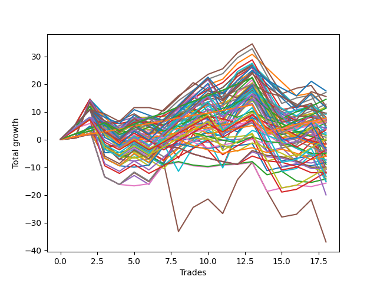

# Long Wallace Doodle 0225_009 
- Symbol: ES
- Date Range: 03/18/2022 - 06/24/2022
- Trading Period: 7:20-12:30
- Number of Trades: 15



| Name | Win Percent | Profit | Avg Profit / Trade |     | Name | Win Percent | Profit | Avg Profit / Trade |
| ---- | ----------- | ------ | ------------------ | --- | ---- | ----------- | ------ | ------------------ |
| Sorted By <br> Profit | | | | | Sorted By <br> Win Percentage ||||
| Twenty-Six | 53.33 | 14625.00 | 975.00 |     | Sixty-Seven | 80.00 | 10125.00 | 675.00 |
| Forty-Three | 73.33 | 12375.00 | 825.00 |     | Fifty-Nine | 80.00 | 8375.00 | 558.33 |
| Forty-Two | 60.00 | 11750.00 | 783.33 |     | Three | 80.00 | 5000.00 | 333.33 |
| Sixty-Seven | 80.00 | 10125.00 | 675.00 |     | Forty-Three | 73.33 | 12375.00 | 825.00 |
| twenty-Seven | 60.00 | 10125.00 | 675.00 |     | Forty-Seven | 66.67 | 8750.00 | 583.33 |
| Forty-Seven | 66.67 | 8750.00 | 583.33 |     | Sixty-Six | 66.67 | 8625.00 | 575.00 |
| Sixty-Six | 66.67 | 8625.00 | 575.00 |     | Two | 66.67 | 5875.00 | 391.67 |
| Fifty-Nine | 80.00 | 8375.00 | 558.33 |     | Fifty-Eight | 66.67 | 5375.00 | 358.33 |
| Thirty-One | 60.00 | 7625.00 | 508.33 |     | Seventy-One | 66.67 | 5250.00 | 350.00 |
| Thirty-Six | 46.67 | 6625.00 | 441.67 |     | Forty-One | 66.67 | 4125.00 | 275.00 |
| Thirty-Nine | 53.33 | 6125.00 | 408.33 |     | Forty | 66.67 | 4125.00 | 275.00 |
| Two | 66.67 | 5875.00 | 391.67 |     | Twenty-Four | 66.67 | 4125.00 | 275.00 |
| Fifty-Five | 60.00 | 5500.00 | 366.67 |     | Sixty-Three | 66.67 | 2750.00 | 183.33 |
| Fifty-Eight | 66.67 | 5375.00 | 358.33 |     | Sixty-Four | 66.67 | 1250.00 | 83.33 |
| Twenty-Five | 53.33 | 5375.00 | 358.33 |     | Forty-Eight | 66.67 | 1250.00 | 83.33 |
| Seventy-One | 66.67 | 5250.00 | 350.00 |     | Sixty-Five | 66.67 | 250.00 | 16.67 |
| Three | 80.00 | 5000.00 | 333.33 |     | Fifty-Six | 66.67 | 250.00 | 16.67 |
| Thirty-Seven | 46.67 | 5000.00 | 333.33 |     | Seventy-Five | 66.67 | -625.00 | -41.67 |
| Twenty-Eight | 46.67 | 4625.00 | 308.33 |     | Seven | 66.67 | -625.00 | -41.67 |
| Fifty-Two | 46.67 | 4500.00 | 300.00 |     | Fifty-Seven | 66.67 | -3000.00 | -200.00 |
| Fifty | 53.33 | 4375.00 | 291.67 |     | One | 66.67 | -3250.00 | -216.67 |
| Forty-One | 66.67 | 4125.00 | 275.00 |     | Zero | 66.67 | -3500.00 | -233.33 |
| Forty | 66.67 | 4125.00 | 275.00 |     | Forty-Two | 60.00 | 11750.00 | 783.33 |
| Twenty-Four | 66.67 | 4125.00 | 275.00 |     | twenty-Seven | 60.00 | 10125.00 | 675.00 |
| Forty-Four | 53.33 | 4125.00 | 275.00 |     | Thirty-One | 60.00 | 7625.00 | 508.33 |
| Fifty-Three | 46.67 | 4125.00 | 275.00 |     | Fifty-Five | 60.00 | 5500.00 | 366.67 |
| Thirty-Five | 53.33 | 3750.00 | 250.00 |     | Fifty-One | 60.00 | 3000.00 | 200.00 |
| Seventy-Three | 53.33 | 3250.00 | 216.67 |     | Sixty | 60.00 | 250.00 | 16.67 |
| Eleven | 40.00 | 3250.00 | 216.67 |     | Four | 60.00 | -500.00 | -33.33 |
| Thirty-Four | 46.67 | 3125.00 | 208.33 |     | Forty-Six | 60.00 | -1500.00 | -100.00 |
| Twenty-Nine | 40.00 | 3125.00 | 208.33 |     | Seventy | 60.00 | -3250.00 | -216.67 |
| Fifty-One | 60.00 | 3000.00 | 200.00 |     | Sixty-Two | 60.00 | -5000.00 | -333.33 |
| Ten | 33.33 | 2875.00 | 191.67 |     | Six | 60.00 | -8750.00 | -583.33 |
| Sixty-Three | 66.67 | 2750.00 | 183.33 |     | Twenty-Six | 53.33 | 14625.00 | 975.00 |
| Thirty-Three | 46.67 | 2000.00 | 133.33 |     | Thirty-Nine | 53.33 | 6125.00 | 408.33 |
| Sixty-Four | 66.67 | 1250.00 | 83.33 |     | Twenty-Five | 53.33 | 5375.00 | 358.33 |
| Forty-Eight | 66.67 | 1250.00 | 83.33 |     | Fifty | 53.33 | 4375.00 | 291.67 |
| Fifteen | 40.00 | 625.00 | 41.67 |     | Forty-Four | 53.33 | 4125.00 | 275.00 |
| Sixty-Five | 66.67 | 250.00 | 16.67 |     | Thirty-Five | 53.33 | 3750.00 | 250.00 |
| Fifty-Six | 66.67 | 250.00 | 16.67 |     | Seventy-Three | 53.33 | 3250.00 | 216.67 |
| Sixty | 60.00 | 250.00 | 16.67 |     | Forty-Nine | 53.33 | 250.00 | 16.67 |
| Forty-Nine | 53.33 | 250.00 | 16.67 |     | Sixty-Eight | 53.33 | -125.00 | -8.33 |
| Sixty-Eight | 53.33 | -125.00 | -8.33 |     | Thirty-Eight | 53.33 | -125.00 | -8.33 |
| Thirty-Eight | 53.33 | -125.00 | -8.33 |     | Thirty-Two | 53.33 | -750.00 | -50.00 |
| Forty-Five | 46.67 | -125.00 | -8.33 |     | Twenty-Two | 53.33 | -750.00 | -50.00 |
| Nine | 33.33 | -250.00 | -16.67 |     | Fourteen | 53.33 | -1500.00 | -100.00 |
| Four | 60.00 | -500.00 | -33.33 |     | Thirty | 53.33 | -3750.00 | -250.00 |
| Seventy-Five | 66.67 | -625.00 | -41.67 |     | Sixty-One | 53.33 | -5250.00 | -350.00 |
| Seven | 66.67 | -625.00 | -41.67 |     | Fifty-Four | 53.33 | -5750.00 | -383.33 |
| Twelve | 33.33 | -625.00 | -41.67 |     | Seventy-Four | 53.33 | -10500.00 | -700.00 |
| Thirty-Two | 53.33 | -750.00 | -50.00 |     | Five | 53.33 | -13500.00 | -900.00 |
| Twenty-Two | 53.33 | -750.00 | -50.00 |     | Thirty-Six | 46.67 | 6625.00 | 441.67 |
| Sixty-Nine | 46.67 | -1000.00 | -66.67 |     | Thirty-Seven | 46.67 | 5000.00 | 333.33 |
| Eight | 40.00 | -1375.00 | -91.67 |     | Twenty-Eight | 46.67 | 4625.00 | 308.33 |
| Forty-Six | 60.00 | -1500.00 | -100.00 |     | Fifty-Two | 46.67 | 4500.00 | 300.00 |
| Fourteen | 53.33 | -1500.00 | -100.00 |     | Fifty-Three | 46.67 | 4125.00 | 275.00 |
| Seventy-Two | 40.00 | -2000.00 | -133.33 |     | Thirty-Four | 46.67 | 3125.00 | 208.33 |
| Fifty-Seven | 66.67 | -3000.00 | -200.00 |     | Thirty-Three | 46.67 | 2000.00 | 133.33 |
| Sixten | 40.00 | -3000.00 | -200.00 |     | Forty-Five | 46.67 | -125.00 | -8.33 |
| Twenty | 26.67 | -3000.00 | -200.00 |     | Sixty-Nine | 46.67 | -1000.00 | -66.67 |
| Eighteen | 26.67 | -3125.00 | -208.33 |     | Eleven | 40.00 | 3250.00 | 216.67 |
| One | 66.67 | -3250.00 | -216.67 |     | Twenty-Nine | 40.00 | 3125.00 | 208.33 |
| Seventy | 60.00 | -3250.00 | -216.67 |     | Fifteen | 40.00 | 625.00 | 41.67 |
| Zero | 66.67 | -3500.00 | -233.33 |     | Eight | 40.00 | -1375.00 | -91.67 |
| Thirty | 53.33 | -3750.00 | -250.00 |     | Seventy-Two | 40.00 | -2000.00 | -133.33 |
| Twenty-One | 26.67 | -4000.00 | -266.67 |     | Sixten | 40.00 | -3000.00 | -200.00 |
| Nineteen | 26.67 | -4000.00 | -266.67 |     | Ten | 33.33 | 2875.00 | 191.67 |
| Seventeen | 26.67 | -4000.00 | -266.67 |     | Nine | 33.33 | -250.00 | -16.67 |
| Twenty-Three | 26.67 | -4125.00 | -275.00 |     | Twelve | 33.33 | -625.00 | -41.67 |
| Thirteen | 26.67 | -4875.00 | -325.00 |     | Twenty | 26.67 | -3000.00 | -200.00 |
| Sixty-Two | 60.00 | -5000.00 | -333.33 |     | Eighteen | 26.67 | -3125.00 | -208.33 |
| Sixty-One | 53.33 | -5250.00 | -350.00 |     | Twenty-One | 26.67 | -4000.00 | -266.67 |
| Fifty-Four | 53.33 | -5750.00 | -383.33 |     | Nineteen | 26.67 | -4000.00 | -266.67 |
| Six | 60.00 | -8750.00 | -583.33 |     | Seventeen | 26.67 | -4000.00 | -266.67 |
| Seventy-Four | 53.33 | -10500.00 | -700.00 |     | Twenty-Three | 26.67 | -4125.00 | -275.00 |
| Five | 53.33 | -13500.00 | -900.00 |     | Thirteen | 26.67 | -4875.00 | -325.00 |

## NO STOPLOSS

### Test Zero
* Sell when price hits the middle line of the 20p bollinger
* No Stoploss
* Results:
```
Total Trades: 15
Percent Up: 66.67
Percent Down: 33.33
Total Points Moved Up: -7.00
Potential Profit: -3500.00
Total Points Ups: 24.50 Count Ups: 10
Total Points Downs: -31.50 Count Downs: 5
```

<details><summary>Trades</summary>

<code>In: 2022-03-23 09:47:00		Out: 2022-03-23 09:53:00		Total Position Time: 06:00		Total Move Up: 4.25		Total to Date: 4.25</code> <br />
<code>In: 2022-03-25 08:29:00		Out: 2022-03-25 08:36:40		Total Position Time: 07:40		Total Move Up: 8.00		Total to Date: 12.25</code> <br />
<code>In: 2022-03-28 08:27:00		Out: 2022-03-28 08:56:55		Total Position Time: 29:55		Total Move Up: -16.75		Total to Date: -4.50</code> <br />
<code>In: 2022-03-31 09:23:00		Out: 2022-03-31 09:32:20		Total Position Time: 09:20		Total Move Up: -0.25		Total to Date: -4.75</code> <br />
<code>In: 2022-04-04 10:03:00		Out: 2022-04-04 10:09:40		Total Position Time: 06:40		Total Move Up: 1.00		Total to Date: -3.75</code> <br />
<code>In: 2022-04-08 10:36:00		Out: 2022-04-08 10:44:05		Total Position Time: 08:05		Total Move Up: 1.75		Total to Date: -2.00</code> <br />
<code>In: 2022-04-20 09:14:00		Out: 2022-04-20 09:30:45		Total Position Time: 16:45		Total Move Up: -0.50		Total to Date: -2.50</code> <br />
<code>In: 2022-04-27 11:40:00		Out: 2022-04-27 11:40:10		Total Position Time: 00:10		Total Move Up: 1.00		Total to Date: -1.50</code> <br />
<code>In: 2022-05-26 08:50:00		Out: 2022-05-26 08:54:10		Total Position Time: 04:10		Total Move Up: 1.00		Total to Date: -0.50</code> <br />
<code>In: 2022-05-26 11:38:00		Out: 2022-05-26 11:44:15		Total Position Time: 06:15		Total Move Up: 2.25		Total to Date: 1.75</code> <br />
<code>In: 2022-05-26 12:06:00		Out: 2022-05-26 12:06:10		Total Position Time: 00:10		Total Move Up: 0.75		Total to Date: 2.50</code> <br />
<code>In: 2022-05-27 08:04:00		Out: 2022-05-27 08:06:55		Total Position Time: 02:55		Total Move Up: 2.75		Total to Date: 5.25</code> <br />
<code>In: 2022-05-27 09:52:00		Out: 2022-05-27 09:53:35		Total Position Time: 01:35		Total Move Up: 1.75		Total to Date: 7.00</code> <br />
<code>In: 2022-06-15 07:35:00		Out: 2022-06-15 08:04:55		Total Position Time: 29:55		Total Move Up: -10.50		Total to Date: -3.50</code> <br />
<code>In: 2022-06-21 08:42:00		Out: 2022-06-21 09:02:05		Total Position Time: 20:05		Total Move Up: -3.50		Total to Date: -7.00</code> <br />


</details>

### Test One
* Sell when the price hits the upper line of the 20p 1std bollinger
* No Stoploss
* Results:
```
Total Trades: 15
Percent Up: 66.67
Percent Down: 33.33
Total Points Moved Up: -6.50
Potential Profit: -3250.00
Total Points Ups: 34.75 Count Ups: 10
Total Points Downs: -41.25 Count Downs: 5
```

<details><summary>Trades</summary>

<code>In: 2022-03-23 09:47:00		Out: 2022-03-23 09:59:10		Total Position Time: 12:10		Total Move Up: 5.25		Total to Date: 5.25</code> <br />
<code>In: 2022-03-25 08:29:00		Out: 2022-03-25 08:40:40		Total Position Time: 11:40		Total Move Up: 9.00		Total to Date: 14.25</code> <br />
<code>In: 2022-03-28 08:27:00		Out: 2022-03-28 08:56:55		Total Position Time: 29:55		Total Move Up: -16.75		Total to Date: -2.50</code> <br />
<code>In: 2022-03-31 09:23:00		Out: 2022-03-31 09:40:45		Total Position Time: 17:45		Total Move Up: -0.50		Total to Date: -3.00</code> <br />
<code>In: 2022-04-04 10:03:00		Out: 2022-04-04 10:17:55		Total Position Time: 14:55		Total Move Up: 1.00		Total to Date: -2.00</code> <br />
<code>In: 2022-04-08 10:36:00		Out: 2022-04-08 11:01:00		Total Position Time: 25:00		Total Move Up: 1.00		Total to Date: -1.00</code> <br />
<code>In: 2022-04-20 09:14:00		Out: 2022-04-20 09:30:55		Total Position Time: 16:55		Total Move Up: 0.75		Total to Date: -0.25</code> <br />
<code>In: 2022-04-27 11:40:00		Out: 2022-04-27 11:41:10		Total Position Time: 01:10		Total Move Up: 2.75		Total to Date: 2.50</code> <br />
<code>In: 2022-05-26 08:50:00		Out: 2022-05-26 08:55:30		Total Position Time: 05:30		Total Move Up: 3.75		Total to Date: 6.25</code> <br />
<code>In: 2022-05-26 11:38:00		Out: 2022-05-26 11:50:15		Total Position Time: 12:15		Total Move Up: 3.25		Total to Date: 9.50</code> <br />
<code>In: 2022-05-26 12:06:00		Out: 2022-05-26 12:30:20		Total Position Time: 24:20		Total Move Up: -4.25		Total to Date: 5.25</code> <br />
<code>In: 2022-05-27 08:04:00		Out: 2022-05-27 08:11:00		Total Position Time: 07:00		Total Move Up: 4.75		Total to Date: 10.00</code> <br />
<code>In: 2022-05-27 09:52:00		Out: 2022-05-27 09:54:35		Total Position Time: 02:35		Total Move Up: 3.25		Total to Date: 13.25</code> <br />
<code>In: 2022-06-15 07:35:00		Out: 2022-06-15 08:04:55		Total Position Time: 29:55		Total Move Up: -10.50		Total to Date: 2.75</code> <br />
<code>In: 2022-06-21 08:42:00		Out: 2022-06-21 09:11:55		Total Position Time: 29:55		Total Move Up: -9.25		Total to Date: -6.50</code> <br />


</details>

### Test Two
* Sell when the price hits the upper line of the 20p 2std bollinger
* No Stoploss
* Results:
```
Total Trades: 15
Percent Up: 66.67
Percent Down: 33.33
Total Points Moved Up: 11.75
Potential Profit: 5875.00
Total Points Ups: 54.25 Count Ups: 10
Total Points Downs: -42.50 Count Downs: 5
```

<details><summary>Trades</summary>

<code>In: 2022-03-23 09:47:00		Out: 2022-03-23 10:16:55		Total Position Time: 29:55		Total Move Up: 0.75		Total to Date: 0.75</code> <br />
<code>In: 2022-03-25 08:29:00		Out: 2022-03-25 08:41:55		Total Position Time: 12:55		Total Move Up: 13.50		Total to Date: 14.25</code> <br />
<code>In: 2022-03-28 08:27:00		Out: 2022-03-28 08:56:55		Total Position Time: 29:55		Total Move Up: -16.75		Total to Date: -2.50</code> <br />
<code>In: 2022-03-31 09:23:00		Out: 2022-03-31 09:44:50		Total Position Time: 21:50		Total Move Up: 1.00		Total to Date: -1.50</code> <br />
<code>In: 2022-04-04 10:03:00		Out: 2022-04-04 10:18:20		Total Position Time: 15:20		Total Move Up: 1.50		Total to Date: 0.00</code> <br />
<code>In: 2022-04-08 10:36:00		Out: 2022-04-08 11:05:55		Total Position Time: 29:55		Total Move Up: -3.25		Total to Date: -3.25</code> <br />
<code>In: 2022-04-20 09:14:00		Out: 2022-04-20 09:31:25		Total Position Time: 17:25		Total Move Up: 1.75		Total to Date: -1.50</code> <br />
<code>In: 2022-04-27 11:40:00		Out: 2022-04-27 11:42:45		Total Position Time: 02:45		Total Move Up: 6.75		Total to Date: 5.25</code> <br />
<code>In: 2022-05-26 08:50:00		Out: 2022-05-26 09:01:50		Total Position Time: 11:50		Total Move Up: 7.75		Total to Date: 13.00</code> <br />
<code>In: 2022-05-26 11:38:00		Out: 2022-05-26 11:54:10		Total Position Time: 16:10		Total Move Up: 4.00		Total to Date: 17.00</code> <br />
<code>In: 2022-05-26 12:06:00		Out: 2022-05-26 12:34:30		Total Position Time: 28:30		Total Move Up: -2.75		Total to Date: 14.25</code> <br />
<code>In: 2022-05-27 08:04:00		Out: 2022-05-27 08:33:55		Total Position Time: 29:55		Total Move Up: 12.25		Total to Date: 26.50</code> <br />
<code>In: 2022-05-27 09:52:00		Out: 2022-05-27 09:55:45		Total Position Time: 03:45		Total Move Up: 5.00		Total to Date: 31.50</code> <br />
<code>In: 2022-06-15 07:35:00		Out: 2022-06-15 08:04:55		Total Position Time: 29:55		Total Move Up: -10.50		Total to Date: 21.00</code> <br />
<code>In: 2022-06-21 08:42:00		Out: 2022-06-21 09:11:55		Total Position Time: 29:55		Total Move Up: -9.25		Total to Date: 11.75</code> <br />


</details>

### Test Three
* Sell when price hits the middle line of the 50p bollinger
* No Stoploss
* Results:
```
Total Trades: 15
Percent Up: 80.00
Percent Down: 20.00
Total Points Moved Up: 10.00
Potential Profit: 5000.00
Total Points Ups: 46.50 Count Ups: 12
Total Points Downs: -36.50 Count Downs: 3
```

<details><summary>Trades</summary>

<code>In: 2022-03-23 09:47:00		Out: 2022-03-23 10:16:55		Total Position Time: 29:55		Total Move Up: 0.75		Total to Date: 0.75</code> <br />
<code>In: 2022-03-25 08:29:00		Out: 2022-03-25 08:52:45		Total Position Time: 23:45		Total Move Up: 12.50		Total to Date: 13.25</code> <br />
<code>In: 2022-03-28 08:27:00		Out: 2022-03-28 08:56:55		Total Position Time: 29:55		Total Move Up: -16.75		Total to Date: -3.50</code> <br />
<code>In: 2022-03-31 09:23:00		Out: 2022-03-31 09:45:35		Total Position Time: 22:35		Total Move Up: 1.25		Total to Date: -2.25</code> <br />
<code>In: 2022-04-04 10:03:00		Out: 2022-04-04 10:19:00		Total Position Time: 16:00		Total Move Up: 2.50		Total to Date: 0.25</code> <br />
<code>In: 2022-04-08 10:36:00		Out: 2022-04-08 11:01:35		Total Position Time: 25:35		Total Move Up: 1.25		Total to Date: 1.50</code> <br />
<code>In: 2022-04-20 09:14:00		Out: 2022-04-20 09:32:40		Total Position Time: 18:40		Total Move Up: 4.50		Total to Date: 6.00</code> <br />
<code>In: 2022-04-27 11:40:00		Out: 2022-04-27 11:42:35		Total Position Time: 02:35		Total Move Up: 5.00		Total to Date: 11.00</code> <br />
<code>In: 2022-05-26 08:50:00		Out: 2022-05-26 08:55:30		Total Position Time: 05:30		Total Move Up: 3.75		Total to Date: 14.75</code> <br />
<code>In: 2022-05-26 11:38:00		Out: 2022-05-26 11:54:10		Total Position Time: 16:10		Total Move Up: 4.00		Total to Date: 18.75</code> <br />
<code>In: 2022-05-26 12:06:00		Out: 2022-05-26 12:07:55		Total Position Time: 01:55		Total Move Up: 2.00		Total to Date: 20.75</code> <br />
<code>In: 2022-05-27 08:04:00		Out: 2022-05-27 08:11:30		Total Position Time: 07:30		Total Move Up: 5.75		Total to Date: 26.50</code> <br />
<code>In: 2022-05-27 09:52:00		Out: 2022-05-27 09:54:35		Total Position Time: 02:35		Total Move Up: 3.25		Total to Date: 29.75</code> <br />
<code>In: 2022-06-15 07:35:00		Out: 2022-06-15 08:04:55		Total Position Time: 29:55		Total Move Up: -10.50		Total to Date: 19.25</code> <br />
<code>In: 2022-06-21 08:42:00		Out: 2022-06-21 09:11:55		Total Position Time: 29:55		Total Move Up: -9.25		Total to Date: 10.00</code> <br />


</details>

### Test Four
* Sell when the price hits the upper line of the 50p 1std bollinger
* No Stoploss
* Results:
```
Total Trades: 15
Percent Up: 60.00
Percent Down: 40.00
Total Points Moved Up: -1.00
Potential Profit: -500.00
Total Points Ups: 46.75 Count Ups: 9
Total Points Downs: -47.75 Count Downs: 6
```

<details><summary>Trades</summary>

<code>In: 2022-03-23 09:47:00		Out: 2022-03-23 10:16:55		Total Position Time: 29:55		Total Move Up: 0.75		Total to Date: 0.75</code> <br />
<code>In: 2022-03-25 08:29:00		Out: 2022-03-25 08:58:55		Total Position Time: 29:55		Total Move Up: 2.50		Total to Date: 3.25</code> <br />
<code>In: 2022-03-28 08:27:00		Out: 2022-03-28 08:56:55		Total Position Time: 29:55		Total Move Up: -16.75		Total to Date: -13.50</code> <br />
<code>In: 2022-03-31 09:23:00		Out: 2022-03-31 09:52:55		Total Position Time: 29:55		Total Move Up: -2.75		Total to Date: -16.25</code> <br />
<code>In: 2022-04-04 10:03:00		Out: 2022-04-04 10:26:05		Total Position Time: 23:05		Total Move Up: 3.00		Total to Date: -13.25</code> <br />
<code>In: 2022-04-08 10:36:00		Out: 2022-04-08 11:05:55		Total Position Time: 29:55		Total Move Up: -3.25		Total to Date: -16.50</code> <br />
<code>In: 2022-04-20 09:14:00		Out: 2022-04-20 09:36:45		Total Position Time: 22:45		Total Move Up: 8.25		Total to Date: -8.25</code> <br />
<code>In: 2022-04-27 11:40:00		Out: 2022-04-27 11:45:35		Total Position Time: 05:35		Total Move Up: 9.00		Total to Date: 0.75</code> <br />
<code>In: 2022-05-26 08:50:00		Out: 2022-05-26 08:58:30		Total Position Time: 08:30		Total Move Up: 5.75		Total to Date: 6.50</code> <br />
<code>In: 2022-05-26 11:38:00		Out: 2022-05-26 12:07:55		Total Position Time: 29:55		Total Move Up: 3.00		Total to Date: 9.50</code> <br />
<code>In: 2022-05-26 12:06:00		Out: 2022-05-26 12:35:55		Total Position Time: 29:55		Total Move Up: -5.25		Total to Date: 4.25</code> <br />
<code>In: 2022-05-27 08:04:00		Out: 2022-05-27 08:16:10		Total Position Time: 12:10		Total Move Up: 9.25		Total to Date: 13.50</code> <br />
<code>In: 2022-05-27 09:52:00		Out: 2022-05-27 09:57:35		Total Position Time: 05:35		Total Move Up: 5.25		Total to Date: 18.75</code> <br />
<code>In: 2022-06-15 07:35:00		Out: 2022-06-15 08:04:55		Total Position Time: 29:55		Total Move Up: -10.50		Total to Date: 8.25</code> <br />
<code>In: 2022-06-21 08:42:00		Out: 2022-06-21 09:11:55		Total Position Time: 29:55		Total Move Up: -9.25		Total to Date: -1.00</code> <br />


</details>

### Test Five
* Sell when the price hits the upper line of the 50p 2std bollinger
* No Stoploss
* Results:
```
Total Trades: 15
Percent Up: 53.33
Percent Down: 46.67
Total Points Moved Up: -27.00
Potential Profit: -13500.00
Total Points Ups: 45.50 Count Ups: 8
Total Points Downs: -72.50 Count Downs: 7
```

<details><summary>Trades</summary>

<code>In: 2022-03-23 09:47:00		Out: 2022-03-23 10:16:55		Total Position Time: 29:55		Total Move Up: 0.75		Total to Date: 0.75</code> <br />
<code>In: 2022-03-25 08:29:00		Out: 2022-03-25 08:58:55		Total Position Time: 29:55		Total Move Up: 2.50		Total to Date: 3.25</code> <br />
<code>In: 2022-03-28 08:27:00		Out: 2022-03-28 08:56:55		Total Position Time: 29:55		Total Move Up: -16.75		Total to Date: -13.50</code> <br />
<code>In: 2022-03-31 09:23:00		Out: 2022-03-31 09:52:55		Total Position Time: 29:55		Total Move Up: -2.75		Total to Date: -16.25</code> <br />
<code>In: 2022-04-04 10:03:00		Out: 2022-04-04 10:28:35		Total Position Time: 25:35		Total Move Up: 4.25		Total to Date: -12.00</code> <br />
<code>In: 2022-04-08 10:36:00		Out: 2022-04-08 11:05:55		Total Position Time: 29:55		Total Move Up: -3.25		Total to Date: -15.25</code> <br />
<code>In: 2022-04-20 09:14:00		Out: 2022-04-20 09:43:55		Total Position Time: 29:55		Total Move Up: 6.75		Total to Date: -8.50</code> <br />
<code>In: 2022-04-27 11:40:00		Out: 2022-04-27 12:09:55		Total Position Time: 29:55		Total Move Up: -24.75		Total to Date: -33.25</code> <br />
<code>In: 2022-05-26 08:50:00		Out: 2022-05-26 09:03:00		Total Position Time: 13:00		Total Move Up: 9.75		Total to Date: -23.50</code> <br />
<code>In: 2022-05-26 11:38:00		Out: 2022-05-26 12:07:55		Total Position Time: 29:55		Total Move Up: 3.00		Total to Date: -20.50</code> <br />
<code>In: 2022-05-26 12:06:00		Out: 2022-05-26 12:35:55		Total Position Time: 29:55		Total Move Up: -5.25		Total to Date: -25.75</code> <br />
<code>In: 2022-05-27 08:04:00		Out: 2022-05-27 08:33:55		Total Position Time: 29:55		Total Move Up: 12.25		Total to Date: -13.50</code> <br />
<code>In: 2022-05-27 09:52:00		Out: 2022-05-27 10:05:20		Total Position Time: 13:20		Total Move Up: 6.25		Total to Date: -7.25</code> <br />
<code>In: 2022-06-15 07:35:00		Out: 2022-06-15 08:04:55		Total Position Time: 29:55		Total Move Up: -10.50		Total to Date: -17.75</code> <br />
<code>In: 2022-06-21 08:42:00		Out: 2022-06-21 09:11:55		Total Position Time: 29:55		Total Move Up: -9.25		Total to Date: -27.00</code> <br />


</details>

### Test Six
* Sell when the price hits the middle line of the 1std VWAP
* No Stoploss
* Results:
```
Total Trades: 15
Percent Up: 60.00
Percent Down: 40.00
Total Points Moved Up: -17.50
Potential Profit: -8750.00
Total Points Ups: 14.75 Count Ups: 9
Total Points Downs: -32.25 Count Downs: 6
```

<details><summary>Trades</summary>

<code>In: 2022-03-23 09:47:00		Out: 2022-03-23 10:16:55		Total Position Time: 29:55		Total Move Up: 0.75		Total to Date: 0.75</code> <br />
<code>In: 2022-03-25 08:29:00		Out: 2022-03-25 08:58:55		Total Position Time: 29:55		Total Move Up: 2.50		Total to Date: 3.25</code> <br />
<code>In: 2022-03-28 08:27:00		Out: 2022-03-28 08:56:55		Total Position Time: 29:55		Total Move Up: -16.75		Total to Date: -13.50</code> <br />
<code>In: 2022-03-31 09:23:00		Out: 2022-03-31 09:52:55		Total Position Time: 29:55		Total Move Up: -2.75		Total to Date: -16.25</code> <br />
<code>In: 2022-04-04 10:03:00		Out: 2022-04-04 10:03:10		Total Position Time: 00:10		Total Move Up: -0.50		Total to Date: -16.75</code> <br />
<code>In: 2022-04-08 10:36:00		Out: 2022-04-08 10:36:10		Total Position Time: 00:10		Total Move Up: 0.75		Total to Date: -16.00</code> <br />
<code>In: 2022-04-20 09:14:00		Out: 2022-04-20 09:35:50		Total Position Time: 21:50		Total Move Up: 6.75		Total to Date: -9.25</code> <br />
<code>In: 2022-04-27 11:40:00		Out: 2022-04-27 11:40:10		Total Position Time: 00:10		Total Move Up: 1.00		Total to Date: -8.25</code> <br />
<code>In: 2022-05-26 08:50:00		Out: 2022-05-26 08:50:10		Total Position Time: 00:10		Total Move Up: -1.25		Total to Date: -9.50</code> <br />
<code>In: 2022-05-26 11:38:00		Out: 2022-05-26 11:38:10		Total Position Time: 00:10		Total Move Up: -0.50		Total to Date: -10.00</code> <br />
<code>In: 2022-05-26 12:06:00		Out: 2022-05-26 12:06:10		Total Position Time: 00:10		Total Move Up: 0.75		Total to Date: -9.25</code> <br />
<code>In: 2022-05-27 08:04:00		Out: 2022-05-27 08:04:10		Total Position Time: 00:10		Total Move Up: 0.25		Total to Date: -9.00</code> <br />
<code>In: 2022-05-27 09:52:00		Out: 2022-05-27 09:52:10		Total Position Time: 00:10		Total Move Up: 0.75		Total to Date: -8.25</code> <br />
<code>In: 2022-06-15 07:35:00		Out: 2022-06-15 08:04:55		Total Position Time: 29:55		Total Move Up: -10.50		Total to Date: -18.75</code> <br />
<code>In: 2022-06-21 08:42:00		Out: 2022-06-21 08:42:10		Total Position Time: 00:10		Total Move Up: 1.25		Total to Date: -17.50</code> <br />


</details>

### Test Seven
* Sell when the price hits the upper line of the 1std VWAP
* No Stoploss
* Results:
```
Total Trades: 15
Percent Up: 66.67
Percent Down: 33.33
Total Points Moved Up: -1.25
Potential Profit: -625.00
Total Points Ups: 41.25 Count Ups: 10
Total Points Downs: -42.50 Count Downs: 5
```

<details><summary>Trades</summary>

<code>In: 2022-03-23 09:47:00		Out: 2022-03-23 10:16:55		Total Position Time: 29:55		Total Move Up: 0.75		Total to Date: 0.75</code> <br />
<code>In: 2022-03-25 08:29:00		Out: 2022-03-25 08:58:55		Total Position Time: 29:55		Total Move Up: 2.50		Total to Date: 3.25</code> <br />
<code>In: 2022-03-28 08:27:00		Out: 2022-03-28 08:56:55		Total Position Time: 29:55		Total Move Up: -16.75		Total to Date: -13.50</code> <br />
<code>In: 2022-03-31 09:23:00		Out: 2022-03-31 09:52:55		Total Position Time: 29:55		Total Move Up: -2.75		Total to Date: -16.25</code> <br />
<code>In: 2022-04-04 10:03:00		Out: 2022-04-04 10:29:40		Total Position Time: 26:40		Total Move Up: 4.50		Total to Date: -11.75</code> <br />
<code>In: 2022-04-08 10:36:00		Out: 2022-04-08 11:05:55		Total Position Time: 29:55		Total Move Up: -3.25		Total to Date: -15.00</code> <br />
<code>In: 2022-04-20 09:14:00		Out: 2022-04-20 09:43:55		Total Position Time: 29:55		Total Move Up: 6.75		Total to Date: -8.25</code> <br />
<code>In: 2022-04-27 11:40:00		Out: 2022-04-27 11:44:15		Total Position Time: 04:15		Total Move Up: 8.00		Total to Date: -0.25</code> <br />
<code>In: 2022-05-26 08:50:00		Out: 2022-05-26 08:55:30		Total Position Time: 05:30		Total Move Up: 3.75		Total to Date: 3.50</code> <br />
<code>In: 2022-05-26 11:38:00		Out: 2022-05-26 11:42:40		Total Position Time: 04:40		Total Move Up: 2.00		Total to Date: 5.50</code> <br />
<code>In: 2022-05-26 12:06:00		Out: 2022-05-26 12:07:55		Total Position Time: 01:55		Total Move Up: 2.00		Total to Date: 7.50</code> <br />
<code>In: 2022-05-27 08:04:00		Out: 2022-05-27 08:13:35		Total Position Time: 09:35		Total Move Up: 8.00		Total to Date: 15.50</code> <br />
<code>In: 2022-05-27 09:52:00		Out: 2022-05-27 09:54:25		Total Position Time: 02:25		Total Move Up: 3.00		Total to Date: 18.50</code> <br />
<code>In: 2022-06-15 07:35:00		Out: 2022-06-15 08:04:55		Total Position Time: 29:55		Total Move Up: -10.50		Total to Date: 8.00</code> <br />
<code>In: 2022-06-21 08:42:00		Out: 2022-06-21 09:11:55		Total Position Time: 29:55		Total Move Up: -9.25		Total to Date: -1.25</code> <br />


</details>

## STOPLOSS OF 2

### Test Eight
* Sell when price hits the middle line of the 20p bollinger
* Stoploss is 2 points
* Results:
```
Total Trades: 15
Percent Up: 40.00
Percent Down: 60.00
Total Points Moved Up: -2.75
Potential Profit: -1375.00
Total Points Ups: 16.75 Count Ups: 6
Total Points Downs: -19.50 Count Downs: 9
```

<details><summary>Trades</summary>

<code>In: 2022-03-23 09:47:00		Out: 2022-03-23 09:53:00		Total Position Time: 06:00		Total Move Up: 4.25		Total to Date: 4.25</code> <br />
<code>In: 2022-03-25 08:29:00		Out: 2022-03-25 08:36:40		Total Position Time: 07:40		Total Move Up: 8.00		Total to Date: 12.25</code> <br />
<code>In: 2022-03-28 08:27:00		Out: 2022-03-28 08:32:05		Total Position Time: 05:05		Total Move Up: -2.75		Total to Date: 9.50</code> <br />
<code>In: 2022-03-31 09:23:00		Out: 2022-03-31 09:24:55		Total Position Time: 01:55		Total Move Up: -2.25		Total to Date: 7.25</code> <br />
<code>In: 2022-04-04 10:03:00		Out: 2022-04-04 10:09:40		Total Position Time: 06:40		Total Move Up: 1.00		Total to Date: 8.25</code> <br />
<code>In: 2022-04-08 10:36:00		Out: 2022-04-08 10:43:05		Total Position Time: 07:05		Total Move Up: -2.00		Total to Date: 6.25</code> <br />
<code>In: 2022-04-20 09:14:00		Out: 2022-04-20 09:15:35		Total Position Time: 01:35		Total Move Up: -2.00		Total to Date: 4.25</code> <br />
<code>In: 2022-04-27 11:40:00		Out: 2022-04-27 11:40:10		Total Position Time: 00:10		Total Move Up: 1.00		Total to Date: 5.25</code> <br />
<code>In: 2022-05-26 08:50:00		Out: 2022-05-26 08:51:10		Total Position Time: 01:10		Total Move Up: -2.50		Total to Date: 2.75</code> <br />
<code>In: 2022-05-26 11:38:00		Out: 2022-05-26 11:40:10		Total Position Time: 02:10		Total Move Up: -2.00		Total to Date: 0.75</code> <br />
<code>In: 2022-05-26 12:06:00		Out: 2022-05-26 12:06:10		Total Position Time: 00:10		Total Move Up: 0.75		Total to Date: 1.50</code> <br />
<code>In: 2022-05-27 08:04:00		Out: 2022-05-27 08:05:10		Total Position Time: 01:10		Total Move Up: -2.25		Total to Date: -0.75</code> <br />
<code>In: 2022-05-27 09:52:00		Out: 2022-05-27 09:53:35		Total Position Time: 01:35		Total Move Up: 1.75		Total to Date: 1.00</code> <br />
<code>In: 2022-06-15 07:35:00		Out: 2022-06-15 07:35:10		Total Position Time: 00:10		Total Move Up: -1.75		Total to Date: -0.75</code> <br />
<code>In: 2022-06-21 08:42:00		Out: 2022-06-21 08:44:50		Total Position Time: 02:50		Total Move Up: -2.00		Total to Date: -2.75</code> <br />


</details>

### Test Nine
* Sell when the price hits the upper line of the 20p 1std bollinger
* Stoploss is 2 points
* Results:
```
Total Trades: 15
Percent Up: 33.33
Percent Down: 66.67
Total Points Moved Up: -0.50
Potential Profit: -250.00
Total Points Ups: 21.25 Count Ups: 5
Total Points Downs: -21.75 Count Downs: 10
```

<details><summary>Trades</summary>

<code>In: 2022-03-23 09:47:00		Out: 2022-03-23 09:59:10		Total Position Time: 12:10		Total Move Up: 5.25		Total to Date: 5.25</code> <br />
<code>In: 2022-03-25 08:29:00		Out: 2022-03-25 08:40:40		Total Position Time: 11:40		Total Move Up: 9.00		Total to Date: 14.25</code> <br />
<code>In: 2022-03-28 08:27:00		Out: 2022-03-28 08:32:05		Total Position Time: 05:05		Total Move Up: -2.75		Total to Date: 11.50</code> <br />
<code>In: 2022-03-31 09:23:00		Out: 2022-03-31 09:24:55		Total Position Time: 01:55		Total Move Up: -2.25		Total to Date: 9.25</code> <br />
<code>In: 2022-04-04 10:03:00		Out: 2022-04-04 10:17:55		Total Position Time: 14:55		Total Move Up: 1.00		Total to Date: 10.25</code> <br />
<code>In: 2022-04-08 10:36:00		Out: 2022-04-08 10:43:05		Total Position Time: 07:05		Total Move Up: -2.00		Total to Date: 8.25</code> <br />
<code>In: 2022-04-20 09:14:00		Out: 2022-04-20 09:15:35		Total Position Time: 01:35		Total Move Up: -2.00		Total to Date: 6.25</code> <br />
<code>In: 2022-04-27 11:40:00		Out: 2022-04-27 11:41:10		Total Position Time: 01:10		Total Move Up: 2.75		Total to Date: 9.00</code> <br />
<code>In: 2022-05-26 08:50:00		Out: 2022-05-26 08:51:10		Total Position Time: 01:10		Total Move Up: -2.50		Total to Date: 6.50</code> <br />
<code>In: 2022-05-26 11:38:00		Out: 2022-05-26 11:40:10		Total Position Time: 02:10		Total Move Up: -2.00		Total to Date: 4.50</code> <br />
<code>In: 2022-05-26 12:06:00		Out: 2022-05-26 12:12:20		Total Position Time: 06:20		Total Move Up: -2.25		Total to Date: 2.25</code> <br />
<code>In: 2022-05-27 08:04:00		Out: 2022-05-27 08:05:10		Total Position Time: 01:10		Total Move Up: -2.25		Total to Date: 0.00</code> <br />
<code>In: 2022-05-27 09:52:00		Out: 2022-05-27 09:54:35		Total Position Time: 02:35		Total Move Up: 3.25		Total to Date: 3.25</code> <br />
<code>In: 2022-06-15 07:35:00		Out: 2022-06-15 07:35:10		Total Position Time: 00:10		Total Move Up: -1.75		Total to Date: 1.50</code> <br />
<code>In: 2022-06-21 08:42:00		Out: 2022-06-21 08:44:50		Total Position Time: 02:50		Total Move Up: -2.00		Total to Date: -0.50</code> <br />


</details>

### Test Ten
* Sell when the price hits the upper line of the 20p 2std bollinger
* Stoploss is 2 points
* Results:
```
Total Trades: 15
Percent Up: 33.33
Percent Down: 66.67
Total Points Moved Up: 5.75
Potential Profit: 2875.00
Total Points Ups: 27.50 Count Ups: 5
Total Points Downs: -21.75 Count Downs: 10
```

<details><summary>Trades</summary>

<code>In: 2022-03-23 09:47:00		Out: 2022-03-23 10:16:55		Total Position Time: 29:55		Total Move Up: 0.75		Total to Date: 0.75</code> <br />
<code>In: 2022-03-25 08:29:00		Out: 2022-03-25 08:41:55		Total Position Time: 12:55		Total Move Up: 13.50		Total to Date: 14.25</code> <br />
<code>In: 2022-03-28 08:27:00		Out: 2022-03-28 08:32:05		Total Position Time: 05:05		Total Move Up: -2.75		Total to Date: 11.50</code> <br />
<code>In: 2022-03-31 09:23:00		Out: 2022-03-31 09:24:55		Total Position Time: 01:55		Total Move Up: -2.25		Total to Date: 9.25</code> <br />
<code>In: 2022-04-04 10:03:00		Out: 2022-04-04 10:18:20		Total Position Time: 15:20		Total Move Up: 1.50		Total to Date: 10.75</code> <br />
<code>In: 2022-04-08 10:36:00		Out: 2022-04-08 10:43:05		Total Position Time: 07:05		Total Move Up: -2.00		Total to Date: 8.75</code> <br />
<code>In: 2022-04-20 09:14:00		Out: 2022-04-20 09:15:35		Total Position Time: 01:35		Total Move Up: -2.00		Total to Date: 6.75</code> <br />
<code>In: 2022-04-27 11:40:00		Out: 2022-04-27 11:42:45		Total Position Time: 02:45		Total Move Up: 6.75		Total to Date: 13.50</code> <br />
<code>In: 2022-05-26 08:50:00		Out: 2022-05-26 08:51:10		Total Position Time: 01:10		Total Move Up: -2.50		Total to Date: 11.00</code> <br />
<code>In: 2022-05-26 11:38:00		Out: 2022-05-26 11:40:10		Total Position Time: 02:10		Total Move Up: -2.00		Total to Date: 9.00</code> <br />
<code>In: 2022-05-26 12:06:00		Out: 2022-05-26 12:12:20		Total Position Time: 06:20		Total Move Up: -2.25		Total to Date: 6.75</code> <br />
<code>In: 2022-05-27 08:04:00		Out: 2022-05-27 08:05:10		Total Position Time: 01:10		Total Move Up: -2.25		Total to Date: 4.50</code> <br />
<code>In: 2022-05-27 09:52:00		Out: 2022-05-27 09:55:45		Total Position Time: 03:45		Total Move Up: 5.00		Total to Date: 9.50</code> <br />
<code>In: 2022-06-15 07:35:00		Out: 2022-06-15 07:35:10		Total Position Time: 00:10		Total Move Up: -1.75		Total to Date: 7.75</code> <br />
<code>In: 2022-06-21 08:42:00		Out: 2022-06-21 08:44:50		Total Position Time: 02:50		Total Move Up: -2.00		Total to Date: 5.75</code> <br />


</details>

### Test Eleven
* Sell when price hits the middle line of the 50p bollinger
* Stoploss is 2 points
* Results:
```
Total Trades: 15
Percent Up: 40.00
Percent Down: 60.00
Total Points Moved Up: 6.50
Potential Profit: 3250.00
Total Points Ups: 26.00 Count Ups: 6
Total Points Downs: -19.50 Count Downs: 9
```

<details><summary>Trades</summary>

<code>In: 2022-03-23 09:47:00		Out: 2022-03-23 10:16:55		Total Position Time: 29:55		Total Move Up: 0.75		Total to Date: 0.75</code> <br />
<code>In: 2022-03-25 08:29:00		Out: 2022-03-25 08:52:45		Total Position Time: 23:45		Total Move Up: 12.50		Total to Date: 13.25</code> <br />
<code>In: 2022-03-28 08:27:00		Out: 2022-03-28 08:32:05		Total Position Time: 05:05		Total Move Up: -2.75		Total to Date: 10.50</code> <br />
<code>In: 2022-03-31 09:23:00		Out: 2022-03-31 09:24:55		Total Position Time: 01:55		Total Move Up: -2.25		Total to Date: 8.25</code> <br />
<code>In: 2022-04-04 10:03:00		Out: 2022-04-04 10:19:00		Total Position Time: 16:00		Total Move Up: 2.50		Total to Date: 10.75</code> <br />
<code>In: 2022-04-08 10:36:00		Out: 2022-04-08 10:43:05		Total Position Time: 07:05		Total Move Up: -2.00		Total to Date: 8.75</code> <br />
<code>In: 2022-04-20 09:14:00		Out: 2022-04-20 09:15:35		Total Position Time: 01:35		Total Move Up: -2.00		Total to Date: 6.75</code> <br />
<code>In: 2022-04-27 11:40:00		Out: 2022-04-27 11:42:35		Total Position Time: 02:35		Total Move Up: 5.00		Total to Date: 11.75</code> <br />
<code>In: 2022-05-26 08:50:00		Out: 2022-05-26 08:51:10		Total Position Time: 01:10		Total Move Up: -2.50		Total to Date: 9.25</code> <br />
<code>In: 2022-05-26 11:38:00		Out: 2022-05-26 11:40:10		Total Position Time: 02:10		Total Move Up: -2.00		Total to Date: 7.25</code> <br />
<code>In: 2022-05-26 12:06:00		Out: 2022-05-26 12:07:55		Total Position Time: 01:55		Total Move Up: 2.00		Total to Date: 9.25</code> <br />
<code>In: 2022-05-27 08:04:00		Out: 2022-05-27 08:05:10		Total Position Time: 01:10		Total Move Up: -2.25		Total to Date: 7.00</code> <br />
<code>In: 2022-05-27 09:52:00		Out: 2022-05-27 09:54:35		Total Position Time: 02:35		Total Move Up: 3.25		Total to Date: 10.25</code> <br />
<code>In: 2022-06-15 07:35:00		Out: 2022-06-15 07:35:10		Total Position Time: 00:10		Total Move Up: -1.75		Total to Date: 8.50</code> <br />
<code>In: 2022-06-21 08:42:00		Out: 2022-06-21 08:44:50		Total Position Time: 02:50		Total Move Up: -2.00		Total to Date: 6.50</code> <br />


</details>

### Test Twelve
* Sell when the price hits the upper line of the 50p 1std bollinger
* Stoploss is 2 points
* Results:
```
Total Trades: 15
Percent Up: 33.33
Percent Down: 66.67
Total Points Moved Up: -1.25
Potential Profit: -625.00
Total Points Ups: 20.50 Count Ups: 5
Total Points Downs: -21.75 Count Downs: 10
```

<details><summary>Trades</summary>

<code>In: 2022-03-23 09:47:00		Out: 2022-03-23 10:16:55		Total Position Time: 29:55		Total Move Up: 0.75		Total to Date: 0.75</code> <br />
<code>In: 2022-03-25 08:29:00		Out: 2022-03-25 08:58:55		Total Position Time: 29:55		Total Move Up: 2.50		Total to Date: 3.25</code> <br />
<code>In: 2022-03-28 08:27:00		Out: 2022-03-28 08:32:05		Total Position Time: 05:05		Total Move Up: -2.75		Total to Date: 0.50</code> <br />
<code>In: 2022-03-31 09:23:00		Out: 2022-03-31 09:24:55		Total Position Time: 01:55		Total Move Up: -2.25		Total to Date: -1.75</code> <br />
<code>In: 2022-04-04 10:03:00		Out: 2022-04-04 10:26:05		Total Position Time: 23:05		Total Move Up: 3.00		Total to Date: 1.25</code> <br />
<code>In: 2022-04-08 10:36:00		Out: 2022-04-08 10:43:05		Total Position Time: 07:05		Total Move Up: -2.00		Total to Date: -0.75</code> <br />
<code>In: 2022-04-20 09:14:00		Out: 2022-04-20 09:15:35		Total Position Time: 01:35		Total Move Up: -2.00		Total to Date: -2.75</code> <br />
<code>In: 2022-04-27 11:40:00		Out: 2022-04-27 11:45:35		Total Position Time: 05:35		Total Move Up: 9.00		Total to Date: 6.25</code> <br />
<code>In: 2022-05-26 08:50:00		Out: 2022-05-26 08:51:10		Total Position Time: 01:10		Total Move Up: -2.50		Total to Date: 3.75</code> <br />
<code>In: 2022-05-26 11:38:00		Out: 2022-05-26 11:40:10		Total Position Time: 02:10		Total Move Up: -2.00		Total to Date: 1.75</code> <br />
<code>In: 2022-05-26 12:06:00		Out: 2022-05-26 12:12:20		Total Position Time: 06:20		Total Move Up: -2.25		Total to Date: -0.50</code> <br />
<code>In: 2022-05-27 08:04:00		Out: 2022-05-27 08:05:10		Total Position Time: 01:10		Total Move Up: -2.25		Total to Date: -2.75</code> <br />
<code>In: 2022-05-27 09:52:00		Out: 2022-05-27 09:57:35		Total Position Time: 05:35		Total Move Up: 5.25		Total to Date: 2.50</code> <br />
<code>In: 2022-06-15 07:35:00		Out: 2022-06-15 07:35:10		Total Position Time: 00:10		Total Move Up: -1.75		Total to Date: 0.75</code> <br />
<code>In: 2022-06-21 08:42:00		Out: 2022-06-21 08:44:50		Total Position Time: 02:50		Total Move Up: -2.00		Total to Date: -1.25</code> <br />


</details>

### Test Thirteen
* Sell when the price hits the upper line of the 50p 2std bollinger
* Stoploss is 2 points
* Results:
```
Total Trades: 15
Percent Up: 26.67
Percent Down: 73.33
Total Points Moved Up: -9.75
Potential Profit: -4875.00
Total Points Ups: 13.75 Count Ups: 4
Total Points Downs: -23.50 Count Downs: 11
```

<details><summary>Trades</summary>

<code>In: 2022-03-23 09:47:00		Out: 2022-03-23 10:16:55		Total Position Time: 29:55		Total Move Up: 0.75		Total to Date: 0.75</code> <br />
<code>In: 2022-03-25 08:29:00		Out: 2022-03-25 08:58:55		Total Position Time: 29:55		Total Move Up: 2.50		Total to Date: 3.25</code> <br />
<code>In: 2022-03-28 08:27:00		Out: 2022-03-28 08:32:05		Total Position Time: 05:05		Total Move Up: -2.75		Total to Date: 0.50</code> <br />
<code>In: 2022-03-31 09:23:00		Out: 2022-03-31 09:24:55		Total Position Time: 01:55		Total Move Up: -2.25		Total to Date: -1.75</code> <br />
<code>In: 2022-04-04 10:03:00		Out: 2022-04-04 10:28:35		Total Position Time: 25:35		Total Move Up: 4.25		Total to Date: 2.50</code> <br />
<code>In: 2022-04-08 10:36:00		Out: 2022-04-08 10:43:05		Total Position Time: 07:05		Total Move Up: -2.00		Total to Date: 0.50</code> <br />
<code>In: 2022-04-20 09:14:00		Out: 2022-04-20 09:15:35		Total Position Time: 01:35		Total Move Up: -2.00		Total to Date: -1.50</code> <br />
<code>In: 2022-04-27 11:40:00		Out: 2022-04-27 11:50:25		Total Position Time: 10:25		Total Move Up: -1.75		Total to Date: -3.25</code> <br />
<code>In: 2022-05-26 08:50:00		Out: 2022-05-26 08:51:10		Total Position Time: 01:10		Total Move Up: -2.50		Total to Date: -5.75</code> <br />
<code>In: 2022-05-26 11:38:00		Out: 2022-05-26 11:40:10		Total Position Time: 02:10		Total Move Up: -2.00		Total to Date: -7.75</code> <br />
<code>In: 2022-05-26 12:06:00		Out: 2022-05-26 12:12:20		Total Position Time: 06:20		Total Move Up: -2.25		Total to Date: -10.00</code> <br />
<code>In: 2022-05-27 08:04:00		Out: 2022-05-27 08:05:10		Total Position Time: 01:10		Total Move Up: -2.25		Total to Date: -12.25</code> <br />
<code>In: 2022-05-27 09:52:00		Out: 2022-05-27 10:05:20		Total Position Time: 13:20		Total Move Up: 6.25		Total to Date: -6.00</code> <br />
<code>In: 2022-06-15 07:35:00		Out: 2022-06-15 07:35:10		Total Position Time: 00:10		Total Move Up: -1.75		Total to Date: -7.75</code> <br />
<code>In: 2022-06-21 08:42:00		Out: 2022-06-21 08:44:50		Total Position Time: 02:50		Total Move Up: -2.00		Total to Date: -9.75</code> <br />


</details>

### Test Fourteen
* Sell when the price hits the middle line of the 1std VWAP
* Stoploss is 2 points
* Results:
```
Total Trades: 15
Percent Up: 53.33
Percent Down: 46.67
Total Points Moved Up: -3.00
Potential Profit: -1500.00
Total Points Ups: 8.00 Count Ups: 8
Total Points Downs: -11.00 Count Downs: 7
```

<details><summary>Trades</summary>

<code>In: 2022-03-23 09:47:00		Out: 2022-03-23 10:16:55		Total Position Time: 29:55		Total Move Up: 0.75		Total to Date: 0.75</code> <br />
<code>In: 2022-03-25 08:29:00		Out: 2022-03-25 08:58:55		Total Position Time: 29:55		Total Move Up: 2.50		Total to Date: 3.25</code> <br />
<code>In: 2022-03-28 08:27:00		Out: 2022-03-28 08:32:05		Total Position Time: 05:05		Total Move Up: -2.75		Total to Date: 0.50</code> <br />
<code>In: 2022-03-31 09:23:00		Out: 2022-03-31 09:24:55		Total Position Time: 01:55		Total Move Up: -2.25		Total to Date: -1.75</code> <br />
<code>In: 2022-04-04 10:03:00		Out: 2022-04-04 10:03:10		Total Position Time: 00:10		Total Move Up: -0.50		Total to Date: -2.25</code> <br />
<code>In: 2022-04-08 10:36:00		Out: 2022-04-08 10:36:10		Total Position Time: 00:10		Total Move Up: 0.75		Total to Date: -1.50</code> <br />
<code>In: 2022-04-20 09:14:00		Out: 2022-04-20 09:15:35		Total Position Time: 01:35		Total Move Up: -2.00		Total to Date: -3.50</code> <br />
<code>In: 2022-04-27 11:40:00		Out: 2022-04-27 11:40:10		Total Position Time: 00:10		Total Move Up: 1.00		Total to Date: -2.50</code> <br />
<code>In: 2022-05-26 08:50:00		Out: 2022-05-26 08:50:10		Total Position Time: 00:10		Total Move Up: -1.25		Total to Date: -3.75</code> <br />
<code>In: 2022-05-26 11:38:00		Out: 2022-05-26 11:38:10		Total Position Time: 00:10		Total Move Up: -0.50		Total to Date: -4.25</code> <br />
<code>In: 2022-05-26 12:06:00		Out: 2022-05-26 12:06:10		Total Position Time: 00:10		Total Move Up: 0.75		Total to Date: -3.50</code> <br />
<code>In: 2022-05-27 08:04:00		Out: 2022-05-27 08:04:10		Total Position Time: 00:10		Total Move Up: 0.25		Total to Date: -3.25</code> <br />
<code>In: 2022-05-27 09:52:00		Out: 2022-05-27 09:52:10		Total Position Time: 00:10		Total Move Up: 0.75		Total to Date: -2.50</code> <br />
<code>In: 2022-06-15 07:35:00		Out: 2022-06-15 07:35:10		Total Position Time: 00:10		Total Move Up: -1.75		Total to Date: -4.25</code> <br />
<code>In: 2022-06-21 08:42:00		Out: 2022-06-21 08:42:10		Total Position Time: 00:10		Total Move Up: 1.25		Total to Date: -3.00</code> <br />


</details>

### Test Fifteen
* Sell when the price hits the upper line of the 1std VWAP
* Stoploss is 2 points
* Results:
```
Total Trades: 15
Percent Up: 40.00
Percent Down: 60.00
Total Points Moved Up: 1.25
Potential Profit: 625.00
Total Points Ups: 20.75 Count Ups: 6
Total Points Downs: -19.50 Count Downs: 9
```

<details><summary>Trades</summary>

<code>In: 2022-03-23 09:47:00		Out: 2022-03-23 10:16:55		Total Position Time: 29:55		Total Move Up: 0.75		Total to Date: 0.75</code> <br />
<code>In: 2022-03-25 08:29:00		Out: 2022-03-25 08:58:55		Total Position Time: 29:55		Total Move Up: 2.50		Total to Date: 3.25</code> <br />
<code>In: 2022-03-28 08:27:00		Out: 2022-03-28 08:32:05		Total Position Time: 05:05		Total Move Up: -2.75		Total to Date: 0.50</code> <br />
<code>In: 2022-03-31 09:23:00		Out: 2022-03-31 09:24:55		Total Position Time: 01:55		Total Move Up: -2.25		Total to Date: -1.75</code> <br />
<code>In: 2022-04-04 10:03:00		Out: 2022-04-04 10:29:40		Total Position Time: 26:40		Total Move Up: 4.50		Total to Date: 2.75</code> <br />
<code>In: 2022-04-08 10:36:00		Out: 2022-04-08 10:43:05		Total Position Time: 07:05		Total Move Up: -2.00		Total to Date: 0.75</code> <br />
<code>In: 2022-04-20 09:14:00		Out: 2022-04-20 09:15:35		Total Position Time: 01:35		Total Move Up: -2.00		Total to Date: -1.25</code> <br />
<code>In: 2022-04-27 11:40:00		Out: 2022-04-27 11:44:15		Total Position Time: 04:15		Total Move Up: 8.00		Total to Date: 6.75</code> <br />
<code>In: 2022-05-26 08:50:00		Out: 2022-05-26 08:51:10		Total Position Time: 01:10		Total Move Up: -2.50		Total to Date: 4.25</code> <br />
<code>In: 2022-05-26 11:38:00		Out: 2022-05-26 11:40:10		Total Position Time: 02:10		Total Move Up: -2.00		Total to Date: 2.25</code> <br />
<code>In: 2022-05-26 12:06:00		Out: 2022-05-26 12:07:55		Total Position Time: 01:55		Total Move Up: 2.00		Total to Date: 4.25</code> <br />
<code>In: 2022-05-27 08:04:00		Out: 2022-05-27 08:05:10		Total Position Time: 01:10		Total Move Up: -2.25		Total to Date: 2.00</code> <br />
<code>In: 2022-05-27 09:52:00		Out: 2022-05-27 09:54:25		Total Position Time: 02:25		Total Move Up: 3.00		Total to Date: 5.00</code> <br />
<code>In: 2022-06-15 07:35:00		Out: 2022-06-15 07:35:10		Total Position Time: 00:10		Total Move Up: -1.75		Total to Date: 3.25</code> <br />
<code>In: 2022-06-21 08:42:00		Out: 2022-06-21 08:44:50		Total Position Time: 02:50		Total Move Up: -2.00		Total to Date: 1.25</code> <br />


</details>

## TRAIL STOP OF 2

### Test Sixten
* Sell when price hits the middle line of the 20p bollinger
* Trailing Stop is 2 points
* Results:
```
Total Trades: 15
Percent Up: 40.00
Percent Down: 60.00
Total Points Moved Up: -6.00
Potential Profit: -3000.00
Total Points Ups: 6.00 Count Ups: 6
Total Points Downs: -12.00 Count Downs: 9
```

<details><summary>Trades</summary>

<code>In: 2022-03-23 09:47:00		Out: 2022-03-23 09:50:05		Total Position Time: 03:05		Total Move Up: 0.75		Total to Date: 0.75</code> <br />
<code>In: 2022-03-25 08:29:00		Out: 2022-03-25 08:29:10		Total Position Time: 00:10		Total Move Up: 1.00		Total to Date: 1.75</code> <br />
<code>In: 2022-03-28 08:27:00		Out: 2022-03-28 08:29:05		Total Position Time: 02:05		Total Move Up: -0.25		Total to Date: 1.50</code> <br />
<code>In: 2022-03-31 09:23:00		Out: 2022-03-31 09:24:50		Total Position Time: 01:50		Total Move Up: -1.75		Total to Date: -0.25</code> <br />
<code>In: 2022-04-04 10:03:00		Out: 2022-04-04 10:08:45		Total Position Time: 05:45		Total Move Up: -1.00		Total to Date: -1.25</code> <br />
<code>In: 2022-04-08 10:36:00		Out: 2022-04-08 10:36:55		Total Position Time: 00:55		Total Move Up: 0.75		Total to Date: -0.50</code> <br />
<code>In: 2022-04-20 09:14:00		Out: 2022-04-20 09:15:35		Total Position Time: 01:35		Total Move Up: -2.00		Total to Date: -2.50</code> <br />
<code>In: 2022-04-27 11:40:00		Out: 2022-04-27 11:40:10		Total Position Time: 00:10		Total Move Up: 1.00		Total to Date: -1.50</code> <br />
<code>In: 2022-05-26 08:50:00		Out: 2022-05-26 08:53:10		Total Position Time: 03:10		Total Move Up: -2.25		Total to Date: -3.75</code> <br />
<code>In: 2022-05-26 11:38:00		Out: 2022-05-26 11:40:05		Total Position Time: 02:05		Total Move Up: -1.50		Total to Date: -5.25</code> <br />
<code>In: 2022-05-26 12:06:00		Out: 2022-05-26 12:06:10		Total Position Time: 00:10		Total Move Up: 0.75		Total to Date: -4.50</code> <br />
<code>In: 2022-05-27 08:04:00		Out: 2022-05-27 08:04:55		Total Position Time: 00:55		Total Move Up: -1.00		Total to Date: -5.50</code> <br />
<code>In: 2022-05-27 09:52:00		Out: 2022-05-27 09:53:35		Total Position Time: 01:35		Total Move Up: 1.75		Total to Date: -3.75</code> <br />
<code>In: 2022-06-15 07:35:00		Out: 2022-06-15 07:35:10		Total Position Time: 00:10		Total Move Up: -1.75		Total to Date: -5.50</code> <br />
<code>In: 2022-06-21 08:42:00		Out: 2022-06-21 08:44:15		Total Position Time: 02:15		Total Move Up: -0.50		Total to Date: -6.00</code> <br />


</details>

### Test Seventeen
* Sell when the price hits the upper line of the 20p 1std bollinger
* Trailing Stop is 2 points
* Results:
```
Total Trades: 15
Percent Up: 26.67
Percent Down: 73.33
Total Points Moved Up: -8.00
Potential Profit: -4000.00
Total Points Ups: 5.75 Count Ups: 4
Total Points Downs: -13.75 Count Downs: 11
```

<details><summary>Trades</summary>

<code>In: 2022-03-23 09:47:00		Out: 2022-03-23 09:50:05		Total Position Time: 03:05		Total Move Up: 0.75		Total to Date: 0.75</code> <br />
<code>In: 2022-03-25 08:29:00		Out: 2022-03-25 08:29:10		Total Position Time: 00:10		Total Move Up: 1.00		Total to Date: 1.75</code> <br />
<code>In: 2022-03-28 08:27:00		Out: 2022-03-28 08:29:05		Total Position Time: 02:05		Total Move Up: -0.25		Total to Date: 1.50</code> <br />
<code>In: 2022-03-31 09:23:00		Out: 2022-03-31 09:24:50		Total Position Time: 01:50		Total Move Up: -1.75		Total to Date: -0.25</code> <br />
<code>In: 2022-04-04 10:03:00		Out: 2022-04-04 10:08:45		Total Position Time: 05:45		Total Move Up: -1.00		Total to Date: -1.25</code> <br />
<code>In: 2022-04-08 10:36:00		Out: 2022-04-08 10:36:55		Total Position Time: 00:55		Total Move Up: 0.75		Total to Date: -0.50</code> <br />
<code>In: 2022-04-20 09:14:00		Out: 2022-04-20 09:15:35		Total Position Time: 01:35		Total Move Up: -2.00		Total to Date: -2.50</code> <br />
<code>In: 2022-04-27 11:40:00		Out: 2022-04-27 11:40:25		Total Position Time: 00:25		Total Move Up: -0.50		Total to Date: -3.00</code> <br />
<code>In: 2022-05-26 08:50:00		Out: 2022-05-26 08:53:10		Total Position Time: 03:10		Total Move Up: -2.25		Total to Date: -5.25</code> <br />
<code>In: 2022-05-26 11:38:00		Out: 2022-05-26 11:40:05		Total Position Time: 02:05		Total Move Up: -1.50		Total to Date: -6.75</code> <br />
<code>In: 2022-05-26 12:06:00		Out: 2022-05-26 12:06:15		Total Position Time: 00:15		Total Move Up: -1.25		Total to Date: -8.00</code> <br />
<code>In: 2022-05-27 08:04:00		Out: 2022-05-27 08:04:55		Total Position Time: 00:55		Total Move Up: -1.00		Total to Date: -9.00</code> <br />
<code>In: 2022-05-27 09:52:00		Out: 2022-05-27 09:54:35		Total Position Time: 02:35		Total Move Up: 3.25		Total to Date: -5.75</code> <br />
<code>In: 2022-06-15 07:35:00		Out: 2022-06-15 07:35:10		Total Position Time: 00:10		Total Move Up: -1.75		Total to Date: -7.50</code> <br />
<code>In: 2022-06-21 08:42:00		Out: 2022-06-21 08:44:15		Total Position Time: 02:15		Total Move Up: -0.50		Total to Date: -8.00</code> <br />


</details>

### Test Eighteen
* Sell when the price hits the upper line of the 20p 2std bollinger
* Trailing Stop is 2 points
* Results:
```
Total Trades: 15
Percent Up: 26.67
Percent Down: 73.33
Total Points Moved Up: -6.25
Potential Profit: -3125.00
Total Points Ups: 7.50 Count Ups: 4
Total Points Downs: -13.75 Count Downs: 11
```

<details><summary>Trades</summary>

<code>In: 2022-03-23 09:47:00		Out: 2022-03-23 09:50:05		Total Position Time: 03:05		Total Move Up: 0.75		Total to Date: 0.75</code> <br />
<code>In: 2022-03-25 08:29:00		Out: 2022-03-25 08:29:10		Total Position Time: 00:10		Total Move Up: 1.00		Total to Date: 1.75</code> <br />
<code>In: 2022-03-28 08:27:00		Out: 2022-03-28 08:29:05		Total Position Time: 02:05		Total Move Up: -0.25		Total to Date: 1.50</code> <br />
<code>In: 2022-03-31 09:23:00		Out: 2022-03-31 09:24:50		Total Position Time: 01:50		Total Move Up: -1.75		Total to Date: -0.25</code> <br />
<code>In: 2022-04-04 10:03:00		Out: 2022-04-04 10:08:45		Total Position Time: 05:45		Total Move Up: -1.00		Total to Date: -1.25</code> <br />
<code>In: 2022-04-08 10:36:00		Out: 2022-04-08 10:36:55		Total Position Time: 00:55		Total Move Up: 0.75		Total to Date: -0.50</code> <br />
<code>In: 2022-04-20 09:14:00		Out: 2022-04-20 09:15:35		Total Position Time: 01:35		Total Move Up: -2.00		Total to Date: -2.50</code> <br />
<code>In: 2022-04-27 11:40:00		Out: 2022-04-27 11:40:25		Total Position Time: 00:25		Total Move Up: -0.50		Total to Date: -3.00</code> <br />
<code>In: 2022-05-26 08:50:00		Out: 2022-05-26 08:53:10		Total Position Time: 03:10		Total Move Up: -2.25		Total to Date: -5.25</code> <br />
<code>In: 2022-05-26 11:38:00		Out: 2022-05-26 11:40:05		Total Position Time: 02:05		Total Move Up: -1.50		Total to Date: -6.75</code> <br />
<code>In: 2022-05-26 12:06:00		Out: 2022-05-26 12:06:15		Total Position Time: 00:15		Total Move Up: -1.25		Total to Date: -8.00</code> <br />
<code>In: 2022-05-27 08:04:00		Out: 2022-05-27 08:04:55		Total Position Time: 00:55		Total Move Up: -1.00		Total to Date: -9.00</code> <br />
<code>In: 2022-05-27 09:52:00		Out: 2022-05-27 09:55:45		Total Position Time: 03:45		Total Move Up: 5.00		Total to Date: -4.00</code> <br />
<code>In: 2022-06-15 07:35:00		Out: 2022-06-15 07:35:10		Total Position Time: 00:10		Total Move Up: -1.75		Total to Date: -5.75</code> <br />
<code>In: 2022-06-21 08:42:00		Out: 2022-06-21 08:44:15		Total Position Time: 02:15		Total Move Up: -0.50		Total to Date: -6.25</code> <br />


</details>

### Test Nineteen
* Sell when price hits the middle line of the 50p bollinger
* Trailing Stop is 2 points
* Results:
```
Total Trades: 15
Percent Up: 26.67
Percent Down: 73.33
Total Points Moved Up: -8.00
Potential Profit: -4000.00
Total Points Ups: 5.75 Count Ups: 4
Total Points Downs: -13.75 Count Downs: 11
```

<details><summary>Trades</summary>

<code>In: 2022-03-23 09:47:00		Out: 2022-03-23 09:50:05		Total Position Time: 03:05		Total Move Up: 0.75		Total to Date: 0.75</code> <br />
<code>In: 2022-03-25 08:29:00		Out: 2022-03-25 08:29:10		Total Position Time: 00:10		Total Move Up: 1.00		Total to Date: 1.75</code> <br />
<code>In: 2022-03-28 08:27:00		Out: 2022-03-28 08:29:05		Total Position Time: 02:05		Total Move Up: -0.25		Total to Date: 1.50</code> <br />
<code>In: 2022-03-31 09:23:00		Out: 2022-03-31 09:24:50		Total Position Time: 01:50		Total Move Up: -1.75		Total to Date: -0.25</code> <br />
<code>In: 2022-04-04 10:03:00		Out: 2022-04-04 10:08:45		Total Position Time: 05:45		Total Move Up: -1.00		Total to Date: -1.25</code> <br />
<code>In: 2022-04-08 10:36:00		Out: 2022-04-08 10:36:55		Total Position Time: 00:55		Total Move Up: 0.75		Total to Date: -0.50</code> <br />
<code>In: 2022-04-20 09:14:00		Out: 2022-04-20 09:15:35		Total Position Time: 01:35		Total Move Up: -2.00		Total to Date: -2.50</code> <br />
<code>In: 2022-04-27 11:40:00		Out: 2022-04-27 11:40:25		Total Position Time: 00:25		Total Move Up: -0.50		Total to Date: -3.00</code> <br />
<code>In: 2022-05-26 08:50:00		Out: 2022-05-26 08:53:10		Total Position Time: 03:10		Total Move Up: -2.25		Total to Date: -5.25</code> <br />
<code>In: 2022-05-26 11:38:00		Out: 2022-05-26 11:40:05		Total Position Time: 02:05		Total Move Up: -1.50		Total to Date: -6.75</code> <br />
<code>In: 2022-05-26 12:06:00		Out: 2022-05-26 12:06:15		Total Position Time: 00:15		Total Move Up: -1.25		Total to Date: -8.00</code> <br />
<code>In: 2022-05-27 08:04:00		Out: 2022-05-27 08:04:55		Total Position Time: 00:55		Total Move Up: -1.00		Total to Date: -9.00</code> <br />
<code>In: 2022-05-27 09:52:00		Out: 2022-05-27 09:54:35		Total Position Time: 02:35		Total Move Up: 3.25		Total to Date: -5.75</code> <br />
<code>In: 2022-06-15 07:35:00		Out: 2022-06-15 07:35:10		Total Position Time: 00:10		Total Move Up: -1.75		Total to Date: -7.50</code> <br />
<code>In: 2022-06-21 08:42:00		Out: 2022-06-21 08:44:15		Total Position Time: 02:15		Total Move Up: -0.50		Total to Date: -8.00</code> <br />


</details>

### Test Twenty
* Sell when the price hits the upper line of the 50p 1std bollinger
* Trailing Stop is 2 points
* Results:
```
Total Trades: 15
Percent Up: 26.67
Percent Down: 73.33
Total Points Moved Up: -6.00
Potential Profit: -3000.00
Total Points Ups: 7.75 Count Ups: 4
Total Points Downs: -13.75 Count Downs: 11
```

<details><summary>Trades</summary>

<code>In: 2022-03-23 09:47:00		Out: 2022-03-23 09:50:05		Total Position Time: 03:05		Total Move Up: 0.75		Total to Date: 0.75</code> <br />
<code>In: 2022-03-25 08:29:00		Out: 2022-03-25 08:29:10		Total Position Time: 00:10		Total Move Up: 1.00		Total to Date: 1.75</code> <br />
<code>In: 2022-03-28 08:27:00		Out: 2022-03-28 08:29:05		Total Position Time: 02:05		Total Move Up: -0.25		Total to Date: 1.50</code> <br />
<code>In: 2022-03-31 09:23:00		Out: 2022-03-31 09:24:50		Total Position Time: 01:50		Total Move Up: -1.75		Total to Date: -0.25</code> <br />
<code>In: 2022-04-04 10:03:00		Out: 2022-04-04 10:08:45		Total Position Time: 05:45		Total Move Up: -1.00		Total to Date: -1.25</code> <br />
<code>In: 2022-04-08 10:36:00		Out: 2022-04-08 10:36:55		Total Position Time: 00:55		Total Move Up: 0.75		Total to Date: -0.50</code> <br />
<code>In: 2022-04-20 09:14:00		Out: 2022-04-20 09:15:35		Total Position Time: 01:35		Total Move Up: -2.00		Total to Date: -2.50</code> <br />
<code>In: 2022-04-27 11:40:00		Out: 2022-04-27 11:40:25		Total Position Time: 00:25		Total Move Up: -0.50		Total to Date: -3.00</code> <br />
<code>In: 2022-05-26 08:50:00		Out: 2022-05-26 08:53:10		Total Position Time: 03:10		Total Move Up: -2.25		Total to Date: -5.25</code> <br />
<code>In: 2022-05-26 11:38:00		Out: 2022-05-26 11:40:05		Total Position Time: 02:05		Total Move Up: -1.50		Total to Date: -6.75</code> <br />
<code>In: 2022-05-26 12:06:00		Out: 2022-05-26 12:06:15		Total Position Time: 00:15		Total Move Up: -1.25		Total to Date: -8.00</code> <br />
<code>In: 2022-05-27 08:04:00		Out: 2022-05-27 08:04:55		Total Position Time: 00:55		Total Move Up: -1.00		Total to Date: -9.00</code> <br />
<code>In: 2022-05-27 09:52:00		Out: 2022-05-27 09:57:35		Total Position Time: 05:35		Total Move Up: 5.25		Total to Date: -3.75</code> <br />
<code>In: 2022-06-15 07:35:00		Out: 2022-06-15 07:35:10		Total Position Time: 00:10		Total Move Up: -1.75		Total to Date: -5.50</code> <br />
<code>In: 2022-06-21 08:42:00		Out: 2022-06-21 08:44:15		Total Position Time: 02:15		Total Move Up: -0.50		Total to Date: -6.00</code> <br />


</details>

### Test Twenty-One
* Sell when the price hits the upper line of the 50p 2std bollinger
* Trailing Stop is 2 points
* Results:
```
Total Trades: 15
Percent Up: 26.67
Percent Down: 73.33
Total Points Moved Up: -8.00
Potential Profit: -4000.00
Total Points Ups: 5.75 Count Ups: 4
Total Points Downs: -13.75 Count Downs: 11
```

<details><summary>Trades</summary>

<code>In: 2022-03-23 09:47:00		Out: 2022-03-23 09:50:05		Total Position Time: 03:05		Total Move Up: 0.75		Total to Date: 0.75</code> <br />
<code>In: 2022-03-25 08:29:00		Out: 2022-03-25 08:29:10		Total Position Time: 00:10		Total Move Up: 1.00		Total to Date: 1.75</code> <br />
<code>In: 2022-03-28 08:27:00		Out: 2022-03-28 08:29:05		Total Position Time: 02:05		Total Move Up: -0.25		Total to Date: 1.50</code> <br />
<code>In: 2022-03-31 09:23:00		Out: 2022-03-31 09:24:50		Total Position Time: 01:50		Total Move Up: -1.75		Total to Date: -0.25</code> <br />
<code>In: 2022-04-04 10:03:00		Out: 2022-04-04 10:08:45		Total Position Time: 05:45		Total Move Up: -1.00		Total to Date: -1.25</code> <br />
<code>In: 2022-04-08 10:36:00		Out: 2022-04-08 10:36:55		Total Position Time: 00:55		Total Move Up: 0.75		Total to Date: -0.50</code> <br />
<code>In: 2022-04-20 09:14:00		Out: 2022-04-20 09:15:35		Total Position Time: 01:35		Total Move Up: -2.00		Total to Date: -2.50</code> <br />
<code>In: 2022-04-27 11:40:00		Out: 2022-04-27 11:40:25		Total Position Time: 00:25		Total Move Up: -0.50		Total to Date: -3.00</code> <br />
<code>In: 2022-05-26 08:50:00		Out: 2022-05-26 08:53:10		Total Position Time: 03:10		Total Move Up: -2.25		Total to Date: -5.25</code> <br />
<code>In: 2022-05-26 11:38:00		Out: 2022-05-26 11:40:05		Total Position Time: 02:05		Total Move Up: -1.50		Total to Date: -6.75</code> <br />
<code>In: 2022-05-26 12:06:00		Out: 2022-05-26 12:06:15		Total Position Time: 00:15		Total Move Up: -1.25		Total to Date: -8.00</code> <br />
<code>In: 2022-05-27 08:04:00		Out: 2022-05-27 08:04:55		Total Position Time: 00:55		Total Move Up: -1.00		Total to Date: -9.00</code> <br />
<code>In: 2022-05-27 09:52:00		Out: 2022-05-27 10:00:20		Total Position Time: 08:20		Total Move Up: 3.25		Total to Date: -5.75</code> <br />
<code>In: 2022-06-15 07:35:00		Out: 2022-06-15 07:35:10		Total Position Time: 00:10		Total Move Up: -1.75		Total to Date: -7.50</code> <br />
<code>In: 2022-06-21 08:42:00		Out: 2022-06-21 08:44:15		Total Position Time: 02:15		Total Move Up: -0.50		Total to Date: -8.00</code> <br />


</details>

### Test Twenty-Two
* Sell when the price hits the middle line of the 1std VWAP
* Trailing Stop is 2 points
* Results:
```
Total Trades: 15
Percent Up: 53.33
Percent Down: 46.67
Total Points Moved Up: -1.50
Potential Profit: -750.00
Total Points Ups: 6.50 Count Ups: 8
Total Points Downs: -8.00 Count Downs: 7
```

<details><summary>Trades</summary>

<code>In: 2022-03-23 09:47:00		Out: 2022-03-23 09:50:05		Total Position Time: 03:05		Total Move Up: 0.75		Total to Date: 0.75</code> <br />
<code>In: 2022-03-25 08:29:00		Out: 2022-03-25 08:29:10		Total Position Time: 00:10		Total Move Up: 1.00		Total to Date: 1.75</code> <br />
<code>In: 2022-03-28 08:27:00		Out: 2022-03-28 08:29:05		Total Position Time: 02:05		Total Move Up: -0.25		Total to Date: 1.50</code> <br />
<code>In: 2022-03-31 09:23:00		Out: 2022-03-31 09:24:50		Total Position Time: 01:50		Total Move Up: -1.75		Total to Date: -0.25</code> <br />
<code>In: 2022-04-04 10:03:00		Out: 2022-04-04 10:03:10		Total Position Time: 00:10		Total Move Up: -0.50		Total to Date: -0.75</code> <br />
<code>In: 2022-04-08 10:36:00		Out: 2022-04-08 10:36:10		Total Position Time: 00:10		Total Move Up: 0.75		Total to Date: 0.00</code> <br />
<code>In: 2022-04-20 09:14:00		Out: 2022-04-20 09:15:35		Total Position Time: 01:35		Total Move Up: -2.00		Total to Date: -2.00</code> <br />
<code>In: 2022-04-27 11:40:00		Out: 2022-04-27 11:40:10		Total Position Time: 00:10		Total Move Up: 1.00		Total to Date: -1.00</code> <br />
<code>In: 2022-05-26 08:50:00		Out: 2022-05-26 08:50:10		Total Position Time: 00:10		Total Move Up: -1.25		Total to Date: -2.25</code> <br />
<code>In: 2022-05-26 11:38:00		Out: 2022-05-26 11:38:10		Total Position Time: 00:10		Total Move Up: -0.50		Total to Date: -2.75</code> <br />
<code>In: 2022-05-26 12:06:00		Out: 2022-05-26 12:06:10		Total Position Time: 00:10		Total Move Up: 0.75		Total to Date: -2.00</code> <br />
<code>In: 2022-05-27 08:04:00		Out: 2022-05-27 08:04:10		Total Position Time: 00:10		Total Move Up: 0.25		Total to Date: -1.75</code> <br />
<code>In: 2022-05-27 09:52:00		Out: 2022-05-27 09:52:10		Total Position Time: 00:10		Total Move Up: 0.75		Total to Date: -1.00</code> <br />
<code>In: 2022-06-15 07:35:00		Out: 2022-06-15 07:35:10		Total Position Time: 00:10		Total Move Up: -1.75		Total to Date: -2.75</code> <br />
<code>In: 2022-06-21 08:42:00		Out: 2022-06-21 08:42:10		Total Position Time: 00:10		Total Move Up: 1.25		Total to Date: -1.50</code> <br />


</details>

### Test Twenty-Three
* Sell when the price hits the upper line of the 1std VWAP
* Trailing Stop is 2 points
* Results:
```
Total Trades: 15
Percent Up: 26.67
Percent Down: 73.33
Total Points Moved Up: -8.25
Potential Profit: -4125.00
Total Points Ups: 5.50 Count Ups: 4
Total Points Downs: -13.75 Count Downs: 11
```

<details><summary>Trades</summary>

<code>In: 2022-03-23 09:47:00		Out: 2022-03-23 09:50:05		Total Position Time: 03:05		Total Move Up: 0.75		Total to Date: 0.75</code> <br />
<code>In: 2022-03-25 08:29:00		Out: 2022-03-25 08:29:10		Total Position Time: 00:10		Total Move Up: 1.00		Total to Date: 1.75</code> <br />
<code>In: 2022-03-28 08:27:00		Out: 2022-03-28 08:29:05		Total Position Time: 02:05		Total Move Up: -0.25		Total to Date: 1.50</code> <br />
<code>In: 2022-03-31 09:23:00		Out: 2022-03-31 09:24:50		Total Position Time: 01:50		Total Move Up: -1.75		Total to Date: -0.25</code> <br />
<code>In: 2022-04-04 10:03:00		Out: 2022-04-04 10:08:45		Total Position Time: 05:45		Total Move Up: -1.00		Total to Date: -1.25</code> <br />
<code>In: 2022-04-08 10:36:00		Out: 2022-04-08 10:36:55		Total Position Time: 00:55		Total Move Up: 0.75		Total to Date: -0.50</code> <br />
<code>In: 2022-04-20 09:14:00		Out: 2022-04-20 09:15:35		Total Position Time: 01:35		Total Move Up: -2.00		Total to Date: -2.50</code> <br />
<code>In: 2022-04-27 11:40:00		Out: 2022-04-27 11:40:25		Total Position Time: 00:25		Total Move Up: -0.50		Total to Date: -3.00</code> <br />
<code>In: 2022-05-26 08:50:00		Out: 2022-05-26 08:53:10		Total Position Time: 03:10		Total Move Up: -2.25		Total to Date: -5.25</code> <br />
<code>In: 2022-05-26 11:38:00		Out: 2022-05-26 11:40:05		Total Position Time: 02:05		Total Move Up: -1.50		Total to Date: -6.75</code> <br />
<code>In: 2022-05-26 12:06:00		Out: 2022-05-26 12:06:15		Total Position Time: 00:15		Total Move Up: -1.25		Total to Date: -8.00</code> <br />
<code>In: 2022-05-27 08:04:00		Out: 2022-05-27 08:04:55		Total Position Time: 00:55		Total Move Up: -1.00		Total to Date: -9.00</code> <br />
<code>In: 2022-05-27 09:52:00		Out: 2022-05-27 09:54:25		Total Position Time: 02:25		Total Move Up: 3.00		Total to Date: -6.00</code> <br />
<code>In: 2022-06-15 07:35:00		Out: 2022-06-15 07:35:10		Total Position Time: 00:10		Total Move Up: -1.75		Total to Date: -7.75</code> <br />
<code>In: 2022-06-21 08:42:00		Out: 2022-06-21 08:44:15		Total Position Time: 02:15		Total Move Up: -0.50		Total to Date: -8.25</code> <br />


</details>

## STOPLOSS OF 3

### Test Twenty-Four
* Sell when price hits the middle line of the 20p bollinger
* Stoploss is 3 points
* Results:
```
Total Trades: 15
Percent Up: 66.67
Percent Down: 33.33
Total Points Moved Up: 8.25
Potential Profit: 4125.00
Total Points Ups: 24.50 Count Ups: 10
Total Points Downs: -16.25 Count Downs: 5
```

<details><summary>Trades</summary>

<code>In: 2022-03-23 09:47:00		Out: 2022-03-23 09:53:00		Total Position Time: 06:00		Total Move Up: 4.25		Total to Date: 4.25</code> <br />
<code>In: 2022-03-25 08:29:00		Out: 2022-03-25 08:36:40		Total Position Time: 07:40		Total Move Up: 8.00		Total to Date: 12.25</code> <br />
<code>In: 2022-03-28 08:27:00		Out: 2022-03-28 08:32:10		Total Position Time: 05:10		Total Move Up: -4.00		Total to Date: 8.25</code> <br />
<code>In: 2022-03-31 09:23:00		Out: 2022-03-31 09:25:55		Total Position Time: 02:55		Total Move Up: -3.00		Total to Date: 5.25</code> <br />
<code>In: 2022-04-04 10:03:00		Out: 2022-04-04 10:09:40		Total Position Time: 06:40		Total Move Up: 1.00		Total to Date: 6.25</code> <br />
<code>In: 2022-04-08 10:36:00		Out: 2022-04-08 10:44:05		Total Position Time: 08:05		Total Move Up: 1.75		Total to Date: 8.00</code> <br />
<code>In: 2022-04-20 09:14:00		Out: 2022-04-20 09:28:10		Total Position Time: 14:10		Total Move Up: -3.25		Total to Date: 4.75</code> <br />
<code>In: 2022-04-27 11:40:00		Out: 2022-04-27 11:40:10		Total Position Time: 00:10		Total Move Up: 1.00		Total to Date: 5.75</code> <br />
<code>In: 2022-05-26 08:50:00		Out: 2022-05-26 08:54:10		Total Position Time: 04:10		Total Move Up: 1.00		Total to Date: 6.75</code> <br />
<code>In: 2022-05-26 11:38:00		Out: 2022-05-26 11:44:15		Total Position Time: 06:15		Total Move Up: 2.25		Total to Date: 9.00</code> <br />
<code>In: 2022-05-26 12:06:00		Out: 2022-05-26 12:06:10		Total Position Time: 00:10		Total Move Up: 0.75		Total to Date: 9.75</code> <br />
<code>In: 2022-05-27 08:04:00		Out: 2022-05-27 08:06:55		Total Position Time: 02:55		Total Move Up: 2.75		Total to Date: 12.50</code> <br />
<code>In: 2022-05-27 09:52:00		Out: 2022-05-27 09:53:35		Total Position Time: 01:35		Total Move Up: 1.75		Total to Date: 14.25</code> <br />
<code>In: 2022-06-15 07:35:00		Out: 2022-06-15 07:36:00		Total Position Time: 01:00		Total Move Up: -3.00		Total to Date: 11.25</code> <br />
<code>In: 2022-06-21 08:42:00		Out: 2022-06-21 08:45:40		Total Position Time: 03:40		Total Move Up: -3.00		Total to Date: 8.25</code> <br />


</details>

### Test Twenty-Five
* Sell when the price hits the upper line of the 20p 1std bollinger
* Stoploss is 3 points
* Results:
```
Total Trades: 15
Percent Up: 53.33
Percent Down: 46.67
Total Points Moved Up: 10.75
Potential Profit: 5375.00
Total Points Ups: 33.00 Count Ups: 8
Total Points Downs: -22.25 Count Downs: 7
```

<details><summary>Trades</summary>

<code>In: 2022-03-23 09:47:00		Out: 2022-03-23 09:59:10		Total Position Time: 12:10		Total Move Up: 5.25		Total to Date: 5.25</code> <br />
<code>In: 2022-03-25 08:29:00		Out: 2022-03-25 08:40:40		Total Position Time: 11:40		Total Move Up: 9.00		Total to Date: 14.25</code> <br />
<code>In: 2022-03-28 08:27:00		Out: 2022-03-28 08:32:10		Total Position Time: 05:10		Total Move Up: -4.00		Total to Date: 10.25</code> <br />
<code>In: 2022-03-31 09:23:00		Out: 2022-03-31 09:25:55		Total Position Time: 02:55		Total Move Up: -3.00		Total to Date: 7.25</code> <br />
<code>In: 2022-04-04 10:03:00		Out: 2022-04-04 10:17:55		Total Position Time: 14:55		Total Move Up: 1.00		Total to Date: 8.25</code> <br />
<code>In: 2022-04-08 10:36:00		Out: 2022-04-08 10:46:25		Total Position Time: 10:25		Total Move Up: -3.00		Total to Date: 5.25</code> <br />
<code>In: 2022-04-20 09:14:00		Out: 2022-04-20 09:28:10		Total Position Time: 14:10		Total Move Up: -3.25		Total to Date: 2.00</code> <br />
<code>In: 2022-04-27 11:40:00		Out: 2022-04-27 11:41:10		Total Position Time: 01:10		Total Move Up: 2.75		Total to Date: 4.75</code> <br />
<code>In: 2022-05-26 08:50:00		Out: 2022-05-26 08:55:30		Total Position Time: 05:30		Total Move Up: 3.75		Total to Date: 8.50</code> <br />
<code>In: 2022-05-26 11:38:00		Out: 2022-05-26 11:50:15		Total Position Time: 12:15		Total Move Up: 3.25		Total to Date: 11.75</code> <br />
<code>In: 2022-05-26 12:06:00		Out: 2022-05-26 12:13:45		Total Position Time: 07:45		Total Move Up: -3.00		Total to Date: 8.75</code> <br />
<code>In: 2022-05-27 08:04:00		Out: 2022-05-27 08:11:00		Total Position Time: 07:00		Total Move Up: 4.75		Total to Date: 13.50</code> <br />
<code>In: 2022-05-27 09:52:00		Out: 2022-05-27 09:54:35		Total Position Time: 02:35		Total Move Up: 3.25		Total to Date: 16.75</code> <br />
<code>In: 2022-06-15 07:35:00		Out: 2022-06-15 07:36:00		Total Position Time: 01:00		Total Move Up: -3.00		Total to Date: 13.75</code> <br />
<code>In: 2022-06-21 08:42:00		Out: 2022-06-21 08:45:40		Total Position Time: 03:40		Total Move Up: -3.00		Total to Date: 10.75</code> <br />


</details>

### Test Twenty-Six
* Sell when the price hits the upper line of the 20p 2std bollinger
* Stoploss is 3 points
* Results:
```
Total Trades: 15
Percent Up: 53.33
Percent Down: 46.67
Total Points Moved Up: 29.25
Potential Profit: 14625.00
Total Points Ups: 51.50 Count Ups: 8
Total Points Downs: -22.25 Count Downs: 7
```

<details><summary>Trades</summary>

<code>In: 2022-03-23 09:47:00		Out: 2022-03-23 10:16:55		Total Position Time: 29:55		Total Move Up: 0.75		Total to Date: 0.75</code> <br />
<code>In: 2022-03-25 08:29:00		Out: 2022-03-25 08:41:55		Total Position Time: 12:55		Total Move Up: 13.50		Total to Date: 14.25</code> <br />
<code>In: 2022-03-28 08:27:00		Out: 2022-03-28 08:32:10		Total Position Time: 05:10		Total Move Up: -4.00		Total to Date: 10.25</code> <br />
<code>In: 2022-03-31 09:23:00		Out: 2022-03-31 09:25:55		Total Position Time: 02:55		Total Move Up: -3.00		Total to Date: 7.25</code> <br />
<code>In: 2022-04-04 10:03:00		Out: 2022-04-04 10:18:20		Total Position Time: 15:20		Total Move Up: 1.50		Total to Date: 8.75</code> <br />
<code>In: 2022-04-08 10:36:00		Out: 2022-04-08 10:46:25		Total Position Time: 10:25		Total Move Up: -3.00		Total to Date: 5.75</code> <br />
<code>In: 2022-04-20 09:14:00		Out: 2022-04-20 09:28:10		Total Position Time: 14:10		Total Move Up: -3.25		Total to Date: 2.50</code> <br />
<code>In: 2022-04-27 11:40:00		Out: 2022-04-27 11:42:45		Total Position Time: 02:45		Total Move Up: 6.75		Total to Date: 9.25</code> <br />
<code>In: 2022-05-26 08:50:00		Out: 2022-05-26 09:01:50		Total Position Time: 11:50		Total Move Up: 7.75		Total to Date: 17.00</code> <br />
<code>In: 2022-05-26 11:38:00		Out: 2022-05-26 11:54:10		Total Position Time: 16:10		Total Move Up: 4.00		Total to Date: 21.00</code> <br />
<code>In: 2022-05-26 12:06:00		Out: 2022-05-26 12:13:45		Total Position Time: 07:45		Total Move Up: -3.00		Total to Date: 18.00</code> <br />
<code>In: 2022-05-27 08:04:00		Out: 2022-05-27 08:33:55		Total Position Time: 29:55		Total Move Up: 12.25		Total to Date: 30.25</code> <br />
<code>In: 2022-05-27 09:52:00		Out: 2022-05-27 09:55:45		Total Position Time: 03:45		Total Move Up: 5.00		Total to Date: 35.25</code> <br />
<code>In: 2022-06-15 07:35:00		Out: 2022-06-15 07:36:00		Total Position Time: 01:00		Total Move Up: -3.00		Total to Date: 32.25</code> <br />
<code>In: 2022-06-21 08:42:00		Out: 2022-06-21 08:45:40		Total Position Time: 03:40		Total Move Up: -3.00		Total to Date: 29.25</code> <br />


</details>

### Test twenty-Seven
* Sell when price hits the middle line of the 50p bollinger
* Stoploss is 3 points
* Results:
```
Total Trades: 15
Percent Up: 60.00
Percent Down: 40.00
Total Points Moved Up: 20.25
Potential Profit: 10125.00
Total Points Ups: 39.50 Count Ups: 9
Total Points Downs: -19.25 Count Downs: 6
```

<details><summary>Trades</summary>

<code>In: 2022-03-23 09:47:00		Out: 2022-03-23 10:16:55		Total Position Time: 29:55		Total Move Up: 0.75		Total to Date: 0.75</code> <br />
<code>In: 2022-03-25 08:29:00		Out: 2022-03-25 08:52:45		Total Position Time: 23:45		Total Move Up: 12.50		Total to Date: 13.25</code> <br />
<code>In: 2022-03-28 08:27:00		Out: 2022-03-28 08:32:10		Total Position Time: 05:10		Total Move Up: -4.00		Total to Date: 9.25</code> <br />
<code>In: 2022-03-31 09:23:00		Out: 2022-03-31 09:25:55		Total Position Time: 02:55		Total Move Up: -3.00		Total to Date: 6.25</code> <br />
<code>In: 2022-04-04 10:03:00		Out: 2022-04-04 10:19:00		Total Position Time: 16:00		Total Move Up: 2.50		Total to Date: 8.75</code> <br />
<code>In: 2022-04-08 10:36:00		Out: 2022-04-08 10:46:25		Total Position Time: 10:25		Total Move Up: -3.00		Total to Date: 5.75</code> <br />
<code>In: 2022-04-20 09:14:00		Out: 2022-04-20 09:28:10		Total Position Time: 14:10		Total Move Up: -3.25		Total to Date: 2.50</code> <br />
<code>In: 2022-04-27 11:40:00		Out: 2022-04-27 11:42:35		Total Position Time: 02:35		Total Move Up: 5.00		Total to Date: 7.50</code> <br />
<code>In: 2022-05-26 08:50:00		Out: 2022-05-26 08:55:30		Total Position Time: 05:30		Total Move Up: 3.75		Total to Date: 11.25</code> <br />
<code>In: 2022-05-26 11:38:00		Out: 2022-05-26 11:54:10		Total Position Time: 16:10		Total Move Up: 4.00		Total to Date: 15.25</code> <br />
<code>In: 2022-05-26 12:06:00		Out: 2022-05-26 12:07:55		Total Position Time: 01:55		Total Move Up: 2.00		Total to Date: 17.25</code> <br />
<code>In: 2022-05-27 08:04:00		Out: 2022-05-27 08:11:30		Total Position Time: 07:30		Total Move Up: 5.75		Total to Date: 23.00</code> <br />
<code>In: 2022-05-27 09:52:00		Out: 2022-05-27 09:54:35		Total Position Time: 02:35		Total Move Up: 3.25		Total to Date: 26.25</code> <br />
<code>In: 2022-06-15 07:35:00		Out: 2022-06-15 07:36:00		Total Position Time: 01:00		Total Move Up: -3.00		Total to Date: 23.25</code> <br />
<code>In: 2022-06-21 08:42:00		Out: 2022-06-21 08:45:40		Total Position Time: 03:40		Total Move Up: -3.00		Total to Date: 20.25</code> <br />


</details>

### Test Twenty-Eight
* Sell when the price hits the upper line of the 50p 1std bollinger
* Stoploss is 3 points
* Results:
```
Total Trades: 15
Percent Up: 46.67
Percent Down: 53.33
Total Points Moved Up: 9.25
Potential Profit: 4625.00
Total Points Ups: 35.50 Count Ups: 7
Total Points Downs: -26.25 Count Downs: 8
```

<details><summary>Trades</summary>

<code>In: 2022-03-23 09:47:00		Out: 2022-03-23 10:16:55		Total Position Time: 29:55		Total Move Up: 0.75		Total to Date: 0.75</code> <br />
<code>In: 2022-03-25 08:29:00		Out: 2022-03-25 08:58:55		Total Position Time: 29:55		Total Move Up: 2.50		Total to Date: 3.25</code> <br />
<code>In: 2022-03-28 08:27:00		Out: 2022-03-28 08:32:10		Total Position Time: 05:10		Total Move Up: -4.00		Total to Date: -0.75</code> <br />
<code>In: 2022-03-31 09:23:00		Out: 2022-03-31 09:25:55		Total Position Time: 02:55		Total Move Up: -3.00		Total to Date: -3.75</code> <br />
<code>In: 2022-04-04 10:03:00		Out: 2022-04-04 10:26:05		Total Position Time: 23:05		Total Move Up: 3.00		Total to Date: -0.75</code> <br />
<code>In: 2022-04-08 10:36:00		Out: 2022-04-08 10:46:25		Total Position Time: 10:25		Total Move Up: -3.00		Total to Date: -3.75</code> <br />
<code>In: 2022-04-20 09:14:00		Out: 2022-04-20 09:28:10		Total Position Time: 14:10		Total Move Up: -3.25		Total to Date: -7.00</code> <br />
<code>In: 2022-04-27 11:40:00		Out: 2022-04-27 11:45:35		Total Position Time: 05:35		Total Move Up: 9.00		Total to Date: 2.00</code> <br />
<code>In: 2022-05-26 08:50:00		Out: 2022-05-26 08:58:30		Total Position Time: 08:30		Total Move Up: 5.75		Total to Date: 7.75</code> <br />
<code>In: 2022-05-26 11:38:00		Out: 2022-05-26 12:03:15		Total Position Time: 25:15		Total Move Up: -4.00		Total to Date: 3.75</code> <br />
<code>In: 2022-05-26 12:06:00		Out: 2022-05-26 12:13:45		Total Position Time: 07:45		Total Move Up: -3.00		Total to Date: 0.75</code> <br />
<code>In: 2022-05-27 08:04:00		Out: 2022-05-27 08:16:10		Total Position Time: 12:10		Total Move Up: 9.25		Total to Date: 10.00</code> <br />
<code>In: 2022-05-27 09:52:00		Out: 2022-05-27 09:57:35		Total Position Time: 05:35		Total Move Up: 5.25		Total to Date: 15.25</code> <br />
<code>In: 2022-06-15 07:35:00		Out: 2022-06-15 07:36:00		Total Position Time: 01:00		Total Move Up: -3.00		Total to Date: 12.25</code> <br />
<code>In: 2022-06-21 08:42:00		Out: 2022-06-21 08:45:40		Total Position Time: 03:40		Total Move Up: -3.00		Total to Date: 9.25</code> <br />


</details>

### Test Twenty-Nine
* Sell when the price hits the upper line of the 50p 2std bollinger
* Stoploss is 3 points
* Results:
```
Total Trades: 15
Percent Up: 40.00
Percent Down: 60.00
Total Points Moved Up: 6.25
Potential Profit: 3125.00
Total Points Ups: 35.75 Count Ups: 6
Total Points Downs: -29.50 Count Downs: 9
```

<details><summary>Trades</summary>

<code>In: 2022-03-23 09:47:00		Out: 2022-03-23 10:16:55		Total Position Time: 29:55		Total Move Up: 0.75		Total to Date: 0.75</code> <br />
<code>In: 2022-03-25 08:29:00		Out: 2022-03-25 08:58:55		Total Position Time: 29:55		Total Move Up: 2.50		Total to Date: 3.25</code> <br />
<code>In: 2022-03-28 08:27:00		Out: 2022-03-28 08:32:10		Total Position Time: 05:10		Total Move Up: -4.00		Total to Date: -0.75</code> <br />
<code>In: 2022-03-31 09:23:00		Out: 2022-03-31 09:25:55		Total Position Time: 02:55		Total Move Up: -3.00		Total to Date: -3.75</code> <br />
<code>In: 2022-04-04 10:03:00		Out: 2022-04-04 10:28:35		Total Position Time: 25:35		Total Move Up: 4.25		Total to Date: 0.50</code> <br />
<code>In: 2022-04-08 10:36:00		Out: 2022-04-08 10:46:25		Total Position Time: 10:25		Total Move Up: -3.00		Total to Date: -2.50</code> <br />
<code>In: 2022-04-20 09:14:00		Out: 2022-04-20 09:28:10		Total Position Time: 14:10		Total Move Up: -3.25		Total to Date: -5.75</code> <br />
<code>In: 2022-04-27 11:40:00		Out: 2022-04-27 11:51:05		Total Position Time: 11:05		Total Move Up: -3.25		Total to Date: -9.00</code> <br />
<code>In: 2022-05-26 08:50:00		Out: 2022-05-26 09:03:00		Total Position Time: 13:00		Total Move Up: 9.75		Total to Date: 0.75</code> <br />
<code>In: 2022-05-26 11:38:00		Out: 2022-05-26 12:03:15		Total Position Time: 25:15		Total Move Up: -4.00		Total to Date: -3.25</code> <br />
<code>In: 2022-05-26 12:06:00		Out: 2022-05-26 12:13:45		Total Position Time: 07:45		Total Move Up: -3.00		Total to Date: -6.25</code> <br />
<code>In: 2022-05-27 08:04:00		Out: 2022-05-27 08:33:55		Total Position Time: 29:55		Total Move Up: 12.25		Total to Date: 6.00</code> <br />
<code>In: 2022-05-27 09:52:00		Out: 2022-05-27 10:05:20		Total Position Time: 13:20		Total Move Up: 6.25		Total to Date: 12.25</code> <br />
<code>In: 2022-06-15 07:35:00		Out: 2022-06-15 07:36:00		Total Position Time: 01:00		Total Move Up: -3.00		Total to Date: 9.25</code> <br />
<code>In: 2022-06-21 08:42:00		Out: 2022-06-21 08:45:40		Total Position Time: 03:40		Total Move Up: -3.00		Total to Date: 6.25</code> <br />


</details>

### Test Thirty
* Sell when the price hits the middle line of the 1std VWAP
* Stoploss is 3 points
* Results:
```
Total Trades: 15
Percent Up: 53.33
Percent Down: 46.67
Total Points Moved Up: -7.50
Potential Profit: -3750.00
Total Points Ups: 8.00 Count Ups: 8
Total Points Downs: -15.50 Count Downs: 7
```

<details><summary>Trades</summary>

<code>In: 2022-03-23 09:47:00		Out: 2022-03-23 10:16:55		Total Position Time: 29:55		Total Move Up: 0.75		Total to Date: 0.75</code> <br />
<code>In: 2022-03-25 08:29:00		Out: 2022-03-25 08:58:55		Total Position Time: 29:55		Total Move Up: 2.50		Total to Date: 3.25</code> <br />
<code>In: 2022-03-28 08:27:00		Out: 2022-03-28 08:32:10		Total Position Time: 05:10		Total Move Up: -4.00		Total to Date: -0.75</code> <br />
<code>In: 2022-03-31 09:23:00		Out: 2022-03-31 09:25:55		Total Position Time: 02:55		Total Move Up: -3.00		Total to Date: -3.75</code> <br />
<code>In: 2022-04-04 10:03:00		Out: 2022-04-04 10:03:10		Total Position Time: 00:10		Total Move Up: -0.50		Total to Date: -4.25</code> <br />
<code>In: 2022-04-08 10:36:00		Out: 2022-04-08 10:36:10		Total Position Time: 00:10		Total Move Up: 0.75		Total to Date: -3.50</code> <br />
<code>In: 2022-04-20 09:14:00		Out: 2022-04-20 09:28:10		Total Position Time: 14:10		Total Move Up: -3.25		Total to Date: -6.75</code> <br />
<code>In: 2022-04-27 11:40:00		Out: 2022-04-27 11:40:10		Total Position Time: 00:10		Total Move Up: 1.00		Total to Date: -5.75</code> <br />
<code>In: 2022-05-26 08:50:00		Out: 2022-05-26 08:50:10		Total Position Time: 00:10		Total Move Up: -1.25		Total to Date: -7.00</code> <br />
<code>In: 2022-05-26 11:38:00		Out: 2022-05-26 11:38:10		Total Position Time: 00:10		Total Move Up: -0.50		Total to Date: -7.50</code> <br />
<code>In: 2022-05-26 12:06:00		Out: 2022-05-26 12:06:10		Total Position Time: 00:10		Total Move Up: 0.75		Total to Date: -6.75</code> <br />
<code>In: 2022-05-27 08:04:00		Out: 2022-05-27 08:04:10		Total Position Time: 00:10		Total Move Up: 0.25		Total to Date: -6.50</code> <br />
<code>In: 2022-05-27 09:52:00		Out: 2022-05-27 09:52:10		Total Position Time: 00:10		Total Move Up: 0.75		Total to Date: -5.75</code> <br />
<code>In: 2022-06-15 07:35:00		Out: 2022-06-15 07:36:00		Total Position Time: 01:00		Total Move Up: -3.00		Total to Date: -8.75</code> <br />
<code>In: 2022-06-21 08:42:00		Out: 2022-06-21 08:42:10		Total Position Time: 00:10		Total Move Up: 1.25		Total to Date: -7.50</code> <br />


</details>

### Test Thirty-One
* Sell when the price hits the upper line of the 1std VWAP
* Stoploss is 3 points
* Results:
```
Total Trades: 15
Percent Up: 60.00
Percent Down: 40.00
Total Points Moved Up: 15.25
Potential Profit: 7625.00
Total Points Ups: 34.50 Count Ups: 9
Total Points Downs: -19.25 Count Downs: 6
```

<details><summary>Trades</summary>

<code>In: 2022-03-23 09:47:00		Out: 2022-03-23 10:16:55		Total Position Time: 29:55		Total Move Up: 0.75		Total to Date: 0.75</code> <br />
<code>In: 2022-03-25 08:29:00		Out: 2022-03-25 08:58:55		Total Position Time: 29:55		Total Move Up: 2.50		Total to Date: 3.25</code> <br />
<code>In: 2022-03-28 08:27:00		Out: 2022-03-28 08:32:10		Total Position Time: 05:10		Total Move Up: -4.00		Total to Date: -0.75</code> <br />
<code>In: 2022-03-31 09:23:00		Out: 2022-03-31 09:25:55		Total Position Time: 02:55		Total Move Up: -3.00		Total to Date: -3.75</code> <br />
<code>In: 2022-04-04 10:03:00		Out: 2022-04-04 10:29:40		Total Position Time: 26:40		Total Move Up: 4.50		Total to Date: 0.75</code> <br />
<code>In: 2022-04-08 10:36:00		Out: 2022-04-08 10:46:25		Total Position Time: 10:25		Total Move Up: -3.00		Total to Date: -2.25</code> <br />
<code>In: 2022-04-20 09:14:00		Out: 2022-04-20 09:28:10		Total Position Time: 14:10		Total Move Up: -3.25		Total to Date: -5.50</code> <br />
<code>In: 2022-04-27 11:40:00		Out: 2022-04-27 11:44:15		Total Position Time: 04:15		Total Move Up: 8.00		Total to Date: 2.50</code> <br />
<code>In: 2022-05-26 08:50:00		Out: 2022-05-26 08:55:30		Total Position Time: 05:30		Total Move Up: 3.75		Total to Date: 6.25</code> <br />
<code>In: 2022-05-26 11:38:00		Out: 2022-05-26 11:42:40		Total Position Time: 04:40		Total Move Up: 2.00		Total to Date: 8.25</code> <br />
<code>In: 2022-05-26 12:06:00		Out: 2022-05-26 12:07:55		Total Position Time: 01:55		Total Move Up: 2.00		Total to Date: 10.25</code> <br />
<code>In: 2022-05-27 08:04:00		Out: 2022-05-27 08:13:35		Total Position Time: 09:35		Total Move Up: 8.00		Total to Date: 18.25</code> <br />
<code>In: 2022-05-27 09:52:00		Out: 2022-05-27 09:54:25		Total Position Time: 02:25		Total Move Up: 3.00		Total to Date: 21.25</code> <br />
<code>In: 2022-06-15 07:35:00		Out: 2022-06-15 07:36:00		Total Position Time: 01:00		Total Move Up: -3.00		Total to Date: 18.25</code> <br />
<code>In: 2022-06-21 08:42:00		Out: 2022-06-21 08:45:40		Total Position Time: 03:40		Total Move Up: -3.00		Total to Date: 15.25</code> <br />


</details>

## TRAIL STOP OF 3

### Test Thirty-Two
* Sell when price hits the middle line of the 20p bollinger
* Trailing Stop is 3 points
* Results:
```
Total Trades: 15
Percent Up: 53.33
Percent Down: 46.67
Total Points Moved Up: -1.50
Potential Profit: -750.00
Total Points Ups: 13.25 Count Ups: 8
Total Points Downs: -14.75 Count Downs: 7
```

<details><summary>Trades</summary>

<code>In: 2022-03-23 09:47:00		Out: 2022-03-23 09:53:00		Total Position Time: 06:00		Total Move Up: 4.25		Total to Date: 4.25</code> <br />
<code>In: 2022-03-25 08:29:00		Out: 2022-03-25 08:31:35		Total Position Time: 02:35		Total Move Up: 3.50		Total to Date: 7.75</code> <br />
<code>In: 2022-03-28 08:27:00		Out: 2022-03-28 08:31:35		Total Position Time: 04:35		Total Move Up: -1.50		Total to Date: 6.25</code> <br />
<code>In: 2022-03-31 09:23:00		Out: 2022-03-31 09:25:25		Total Position Time: 02:25		Total Move Up: -2.75		Total to Date: 3.50</code> <br />
<code>In: 2022-04-04 10:03:00		Out: 2022-04-04 10:09:40		Total Position Time: 06:40		Total Move Up: 1.00		Total to Date: 4.50</code> <br />
<code>In: 2022-04-08 10:36:00		Out: 2022-04-08 10:40:35		Total Position Time: 04:35		Total Move Up: 0.00		Total to Date: 4.50</code> <br />
<code>In: 2022-04-20 09:14:00		Out: 2022-04-20 09:21:50		Total Position Time: 07:50		Total Move Up: -1.25		Total to Date: 3.25</code> <br />
<code>In: 2022-04-27 11:40:00		Out: 2022-04-27 11:40:10		Total Position Time: 00:10		Total Move Up: 1.00		Total to Date: 4.25</code> <br />
<code>In: 2022-05-26 08:50:00		Out: 2022-05-26 08:54:10		Total Position Time: 04:10		Total Move Up: 1.00		Total to Date: 5.25</code> <br />
<code>In: 2022-05-26 11:38:00		Out: 2022-05-26 11:40:15		Total Position Time: 02:15		Total Move Up: -3.00		Total to Date: 2.25</code> <br />
<code>In: 2022-05-26 12:06:00		Out: 2022-05-26 12:06:10		Total Position Time: 00:10		Total Move Up: 0.75		Total to Date: 3.00</code> <br />
<code>In: 2022-05-27 08:04:00		Out: 2022-05-27 08:05:05		Total Position Time: 01:05		Total Move Up: -1.75		Total to Date: 1.25</code> <br />
<code>In: 2022-05-27 09:52:00		Out: 2022-05-27 09:53:35		Total Position Time: 01:35		Total Move Up: 1.75		Total to Date: 3.00</code> <br />
<code>In: 2022-06-15 07:35:00		Out: 2022-06-15 07:36:00		Total Position Time: 01:00		Total Move Up: -3.00		Total to Date: 0.00</code> <br />
<code>In: 2022-06-21 08:42:00		Out: 2022-06-21 08:44:25		Total Position Time: 02:25		Total Move Up: -1.50		Total to Date: -1.50</code> <br />


</details>

### Test Thirty-Three
* Sell when the price hits the upper line of the 20p 1std bollinger
* Trailing Stop is 3 points
* Results:
```
Total Trades: 15
Percent Up: 46.67
Percent Down: 53.33
Total Points Moved Up: 4.00
Potential Profit: 2000.00
Total Points Ups: 19.50 Count Ups: 7
Total Points Downs: -15.50 Count Downs: 8
```

<details><summary>Trades</summary>

<code>In: 2022-03-23 09:47:00		Out: 2022-03-23 09:59:10		Total Position Time: 12:10		Total Move Up: 5.25		Total to Date: 5.25</code> <br />
<code>In: 2022-03-25 08:29:00		Out: 2022-03-25 08:31:35		Total Position Time: 02:35		Total Move Up: 3.50		Total to Date: 8.75</code> <br />
<code>In: 2022-03-28 08:27:00		Out: 2022-03-28 08:31:35		Total Position Time: 04:35		Total Move Up: -1.50		Total to Date: 7.25</code> <br />
<code>In: 2022-03-31 09:23:00		Out: 2022-03-31 09:25:25		Total Position Time: 02:25		Total Move Up: -2.75		Total to Date: 4.50</code> <br />
<code>In: 2022-04-04 10:03:00		Out: 2022-04-04 10:17:55		Total Position Time: 14:55		Total Move Up: 1.00		Total to Date: 5.50</code> <br />
<code>In: 2022-04-08 10:36:00		Out: 2022-04-08 10:40:35		Total Position Time: 04:35		Total Move Up: 0.00		Total to Date: 5.50</code> <br />
<code>In: 2022-04-20 09:14:00		Out: 2022-04-20 09:21:50		Total Position Time: 07:50		Total Move Up: -1.25		Total to Date: 4.25</code> <br />
<code>In: 2022-04-27 11:40:00		Out: 2022-04-27 11:41:10		Total Position Time: 01:10		Total Move Up: 2.75		Total to Date: 7.00</code> <br />
<code>In: 2022-05-26 08:50:00		Out: 2022-05-26 08:55:30		Total Position Time: 05:30		Total Move Up: 3.75		Total to Date: 10.75</code> <br />
<code>In: 2022-05-26 11:38:00		Out: 2022-05-26 11:40:15		Total Position Time: 02:15		Total Move Up: -3.00		Total to Date: 7.75</code> <br />
<code>In: 2022-05-26 12:06:00		Out: 2022-05-26 12:10:40		Total Position Time: 04:40		Total Move Up: -0.75		Total to Date: 7.00</code> <br />
<code>In: 2022-05-27 08:04:00		Out: 2022-05-27 08:05:05		Total Position Time: 01:05		Total Move Up: -1.75		Total to Date: 5.25</code> <br />
<code>In: 2022-05-27 09:52:00		Out: 2022-05-27 09:54:35		Total Position Time: 02:35		Total Move Up: 3.25		Total to Date: 8.50</code> <br />
<code>In: 2022-06-15 07:35:00		Out: 2022-06-15 07:36:00		Total Position Time: 01:00		Total Move Up: -3.00		Total to Date: 5.50</code> <br />
<code>In: 2022-06-21 08:42:00		Out: 2022-06-21 08:44:25		Total Position Time: 02:25		Total Move Up: -1.50		Total to Date: 4.00</code> <br />


</details>

### Test Thirty-Four
* Sell when the price hits the upper line of the 20p 2std bollinger
* Trailing Stop is 3 points
* Results:
```
Total Trades: 15
Percent Up: 46.67
Percent Down: 53.33
Total Points Moved Up: 6.25
Potential Profit: 3125.00
Total Points Ups: 21.75 Count Ups: 7
Total Points Downs: -15.50 Count Downs: 8
```

<details><summary>Trades</summary>

<code>In: 2022-03-23 09:47:00		Out: 2022-03-23 10:02:05		Total Position Time: 15:05		Total Move Up: 2.25		Total to Date: 2.25</code> <br />
<code>In: 2022-03-25 08:29:00		Out: 2022-03-25 08:31:35		Total Position Time: 02:35		Total Move Up: 3.50		Total to Date: 5.75</code> <br />
<code>In: 2022-03-28 08:27:00		Out: 2022-03-28 08:31:35		Total Position Time: 04:35		Total Move Up: -1.50		Total to Date: 4.25</code> <br />
<code>In: 2022-03-31 09:23:00		Out: 2022-03-31 09:25:25		Total Position Time: 02:25		Total Move Up: -2.75		Total to Date: 1.50</code> <br />
<code>In: 2022-04-04 10:03:00		Out: 2022-04-04 10:18:20		Total Position Time: 15:20		Total Move Up: 1.50		Total to Date: 3.00</code> <br />
<code>In: 2022-04-08 10:36:00		Out: 2022-04-08 10:40:35		Total Position Time: 04:35		Total Move Up: 0.00		Total to Date: 3.00</code> <br />
<code>In: 2022-04-20 09:14:00		Out: 2022-04-20 09:21:50		Total Position Time: 07:50		Total Move Up: -1.25		Total to Date: 1.75</code> <br />
<code>In: 2022-04-27 11:40:00		Out: 2022-04-27 11:42:45		Total Position Time: 02:45		Total Move Up: 6.75		Total to Date: 8.50</code> <br />
<code>In: 2022-05-26 08:50:00		Out: 2022-05-26 09:00:20		Total Position Time: 10:20		Total Move Up: 2.75		Total to Date: 11.25</code> <br />
<code>In: 2022-05-26 11:38:00		Out: 2022-05-26 11:40:15		Total Position Time: 02:15		Total Move Up: -3.00		Total to Date: 8.25</code> <br />
<code>In: 2022-05-26 12:06:00		Out: 2022-05-26 12:10:40		Total Position Time: 04:40		Total Move Up: -0.75		Total to Date: 7.50</code> <br />
<code>In: 2022-05-27 08:04:00		Out: 2022-05-27 08:05:05		Total Position Time: 01:05		Total Move Up: -1.75		Total to Date: 5.75</code> <br />
<code>In: 2022-05-27 09:52:00		Out: 2022-05-27 09:55:45		Total Position Time: 03:45		Total Move Up: 5.00		Total to Date: 10.75</code> <br />
<code>In: 2022-06-15 07:35:00		Out: 2022-06-15 07:36:00		Total Position Time: 01:00		Total Move Up: -3.00		Total to Date: 7.75</code> <br />
<code>In: 2022-06-21 08:42:00		Out: 2022-06-21 08:44:25		Total Position Time: 02:25		Total Move Up: -1.50		Total to Date: 6.25</code> <br />


</details>

### Test Thirty-Five
* Sell when price hits the middle line of the 50p bollinger
* Trailing Stop is 3 points
* Results:
```
Total Trades: 15
Percent Up: 53.33
Percent Down: 46.67
Total Points Moved Up: 7.50
Potential Profit: 3750.00
Total Points Ups: 22.25 Count Ups: 8
Total Points Downs: -14.75 Count Downs: 7
```

<details><summary>Trades</summary>

<code>In: 2022-03-23 09:47:00		Out: 2022-03-23 10:02:05		Total Position Time: 15:05		Total Move Up: 2.25		Total to Date: 2.25</code> <br />
<code>In: 2022-03-25 08:29:00		Out: 2022-03-25 08:31:35		Total Position Time: 02:35		Total Move Up: 3.50		Total to Date: 5.75</code> <br />
<code>In: 2022-03-28 08:27:00		Out: 2022-03-28 08:31:35		Total Position Time: 04:35		Total Move Up: -1.50		Total to Date: 4.25</code> <br />
<code>In: 2022-03-31 09:23:00		Out: 2022-03-31 09:25:25		Total Position Time: 02:25		Total Move Up: -2.75		Total to Date: 1.50</code> <br />
<code>In: 2022-04-04 10:03:00		Out: 2022-04-04 10:19:00		Total Position Time: 16:00		Total Move Up: 2.50		Total to Date: 4.00</code> <br />
<code>In: 2022-04-08 10:36:00		Out: 2022-04-08 10:40:35		Total Position Time: 04:35		Total Move Up: 0.00		Total to Date: 4.00</code> <br />
<code>In: 2022-04-20 09:14:00		Out: 2022-04-20 09:21:50		Total Position Time: 07:50		Total Move Up: -1.25		Total to Date: 2.75</code> <br />
<code>In: 2022-04-27 11:40:00		Out: 2022-04-27 11:42:35		Total Position Time: 02:35		Total Move Up: 5.00		Total to Date: 7.75</code> <br />
<code>In: 2022-05-26 08:50:00		Out: 2022-05-26 08:55:30		Total Position Time: 05:30		Total Move Up: 3.75		Total to Date: 11.50</code> <br />
<code>In: 2022-05-26 11:38:00		Out: 2022-05-26 11:40:15		Total Position Time: 02:15		Total Move Up: -3.00		Total to Date: 8.50</code> <br />
<code>In: 2022-05-26 12:06:00		Out: 2022-05-26 12:07:55		Total Position Time: 01:55		Total Move Up: 2.00		Total to Date: 10.50</code> <br />
<code>In: 2022-05-27 08:04:00		Out: 2022-05-27 08:05:05		Total Position Time: 01:05		Total Move Up: -1.75		Total to Date: 8.75</code> <br />
<code>In: 2022-05-27 09:52:00		Out: 2022-05-27 09:54:35		Total Position Time: 02:35		Total Move Up: 3.25		Total to Date: 12.00</code> <br />
<code>In: 2022-06-15 07:35:00		Out: 2022-06-15 07:36:00		Total Position Time: 01:00		Total Move Up: -3.00		Total to Date: 9.00</code> <br />
<code>In: 2022-06-21 08:42:00		Out: 2022-06-21 08:44:25		Total Position Time: 02:25		Total Move Up: -1.50		Total to Date: 7.50</code> <br />


</details>

### Test Thirty-Six
* Sell when the price hits the upper line of the 50p 1std bollinger
* Trailing Stop is 3 points
* Results:
```
Total Trades: 15
Percent Up: 46.67
Percent Down: 53.33
Total Points Moved Up: 13.25
Potential Profit: 6625.00
Total Points Ups: 28.75 Count Ups: 7
Total Points Downs: -15.50 Count Downs: 8
```

<details><summary>Trades</summary>

<code>In: 2022-03-23 09:47:00		Out: 2022-03-23 10:02:05		Total Position Time: 15:05		Total Move Up: 2.25		Total to Date: 2.25</code> <br />
<code>In: 2022-03-25 08:29:00		Out: 2022-03-25 08:31:35		Total Position Time: 02:35		Total Move Up: 3.50		Total to Date: 5.75</code> <br />
<code>In: 2022-03-28 08:27:00		Out: 2022-03-28 08:31:35		Total Position Time: 04:35		Total Move Up: -1.50		Total to Date: 4.25</code> <br />
<code>In: 2022-03-31 09:23:00		Out: 2022-03-31 09:25:25		Total Position Time: 02:25		Total Move Up: -2.75		Total to Date: 1.50</code> <br />
<code>In: 2022-04-04 10:03:00		Out: 2022-04-04 10:26:05		Total Position Time: 23:05		Total Move Up: 3.00		Total to Date: 4.50</code> <br />
<code>In: 2022-04-08 10:36:00		Out: 2022-04-08 10:40:35		Total Position Time: 04:35		Total Move Up: 0.00		Total to Date: 4.50</code> <br />
<code>In: 2022-04-20 09:14:00		Out: 2022-04-20 09:21:50		Total Position Time: 07:50		Total Move Up: -1.25		Total to Date: 3.25</code> <br />
<code>In: 2022-04-27 11:40:00		Out: 2022-04-27 11:45:35		Total Position Time: 05:35		Total Move Up: 9.00		Total to Date: 12.25</code> <br />
<code>In: 2022-05-26 08:50:00		Out: 2022-05-26 08:58:30		Total Position Time: 08:30		Total Move Up: 5.75		Total to Date: 18.00</code> <br />
<code>In: 2022-05-26 11:38:00		Out: 2022-05-26 11:40:15		Total Position Time: 02:15		Total Move Up: -3.00		Total to Date: 15.00</code> <br />
<code>In: 2022-05-26 12:06:00		Out: 2022-05-26 12:10:40		Total Position Time: 04:40		Total Move Up: -0.75		Total to Date: 14.25</code> <br />
<code>In: 2022-05-27 08:04:00		Out: 2022-05-27 08:05:05		Total Position Time: 01:05		Total Move Up: -1.75		Total to Date: 12.50</code> <br />
<code>In: 2022-05-27 09:52:00		Out: 2022-05-27 09:57:35		Total Position Time: 05:35		Total Move Up: 5.25		Total to Date: 17.75</code> <br />
<code>In: 2022-06-15 07:35:00		Out: 2022-06-15 07:36:00		Total Position Time: 01:00		Total Move Up: -3.00		Total to Date: 14.75</code> <br />
<code>In: 2022-06-21 08:42:00		Out: 2022-06-21 08:44:25		Total Position Time: 02:25		Total Move Up: -1.50		Total to Date: 13.25</code> <br />


</details>

### Test Thirty-Seven
* Sell when the price hits the upper line of the 50p 2std bollinger
* Trailing Stop is 3 points
* Results:
```
Total Trades: 15
Percent Up: 46.67
Percent Down: 53.33
Total Points Moved Up: 10.00
Potential Profit: 5000.00
Total Points Ups: 25.50 Count Ups: 7
Total Points Downs: -15.50 Count Downs: 8
```

<details><summary>Trades</summary>

<code>In: 2022-03-23 09:47:00		Out: 2022-03-23 10:02:05		Total Position Time: 15:05		Total Move Up: 2.25		Total to Date: 2.25</code> <br />
<code>In: 2022-03-25 08:29:00		Out: 2022-03-25 08:31:35		Total Position Time: 02:35		Total Move Up: 3.50		Total to Date: 5.75</code> <br />
<code>In: 2022-03-28 08:27:00		Out: 2022-03-28 08:31:35		Total Position Time: 04:35		Total Move Up: -1.50		Total to Date: 4.25</code> <br />
<code>In: 2022-03-31 09:23:00		Out: 2022-03-31 09:25:25		Total Position Time: 02:25		Total Move Up: -2.75		Total to Date: 1.50</code> <br />
<code>In: 2022-04-04 10:03:00		Out: 2022-04-04 10:28:35		Total Position Time: 25:35		Total Move Up: 4.25		Total to Date: 5.75</code> <br />
<code>In: 2022-04-08 10:36:00		Out: 2022-04-08 10:40:35		Total Position Time: 04:35		Total Move Up: 0.00		Total to Date: 5.75</code> <br />
<code>In: 2022-04-20 09:14:00		Out: 2022-04-20 09:21:50		Total Position Time: 07:50		Total Move Up: -1.25		Total to Date: 4.50</code> <br />
<code>In: 2022-04-27 11:40:00		Out: 2022-04-27 11:46:50		Total Position Time: 06:50		Total Move Up: 6.50		Total to Date: 11.00</code> <br />
<code>In: 2022-05-26 08:50:00		Out: 2022-05-26 09:00:20		Total Position Time: 10:20		Total Move Up: 2.75		Total to Date: 13.75</code> <br />
<code>In: 2022-05-26 11:38:00		Out: 2022-05-26 11:40:15		Total Position Time: 02:15		Total Move Up: -3.00		Total to Date: 10.75</code> <br />
<code>In: 2022-05-26 12:06:00		Out: 2022-05-26 12:10:40		Total Position Time: 04:40		Total Move Up: -0.75		Total to Date: 10.00</code> <br />
<code>In: 2022-05-27 08:04:00		Out: 2022-05-27 08:05:05		Total Position Time: 01:05		Total Move Up: -1.75		Total to Date: 8.25</code> <br />
<code>In: 2022-05-27 09:52:00		Out: 2022-05-27 10:05:20		Total Position Time: 13:20		Total Move Up: 6.25		Total to Date: 14.50</code> <br />
<code>In: 2022-06-15 07:35:00		Out: 2022-06-15 07:36:00		Total Position Time: 01:00		Total Move Up: -3.00		Total to Date: 11.50</code> <br />
<code>In: 2022-06-21 08:42:00		Out: 2022-06-21 08:44:25		Total Position Time: 02:25		Total Move Up: -1.50		Total to Date: 10.00</code> <br />


</details>

### Test Thirty-Eight
* Sell when the price hits the middle line of the 1std VWAP
* Trailing Stop is 3 points
* Results:
```
Total Trades: 15
Percent Up: 53.33
Percent Down: 46.67
Total Points Moved Up: -0.25
Potential Profit: -125.00
Total Points Ups: 10.50 Count Ups: 8
Total Points Downs: -10.75 Count Downs: 7
```

<details><summary>Trades</summary>

<code>In: 2022-03-23 09:47:00		Out: 2022-03-23 10:02:05		Total Position Time: 15:05		Total Move Up: 2.25		Total to Date: 2.25</code> <br />
<code>In: 2022-03-25 08:29:00		Out: 2022-03-25 08:31:35		Total Position Time: 02:35		Total Move Up: 3.50		Total to Date: 5.75</code> <br />
<code>In: 2022-03-28 08:27:00		Out: 2022-03-28 08:31:35		Total Position Time: 04:35		Total Move Up: -1.50		Total to Date: 4.25</code> <br />
<code>In: 2022-03-31 09:23:00		Out: 2022-03-31 09:25:25		Total Position Time: 02:25		Total Move Up: -2.75		Total to Date: 1.50</code> <br />
<code>In: 2022-04-04 10:03:00		Out: 2022-04-04 10:03:10		Total Position Time: 00:10		Total Move Up: -0.50		Total to Date: 1.00</code> <br />
<code>In: 2022-04-08 10:36:00		Out: 2022-04-08 10:36:10		Total Position Time: 00:10		Total Move Up: 0.75		Total to Date: 1.75</code> <br />
<code>In: 2022-04-20 09:14:00		Out: 2022-04-20 09:21:50		Total Position Time: 07:50		Total Move Up: -1.25		Total to Date: 0.50</code> <br />
<code>In: 2022-04-27 11:40:00		Out: 2022-04-27 11:40:10		Total Position Time: 00:10		Total Move Up: 1.00		Total to Date: 1.50</code> <br />
<code>In: 2022-05-26 08:50:00		Out: 2022-05-26 08:50:10		Total Position Time: 00:10		Total Move Up: -1.25		Total to Date: 0.25</code> <br />
<code>In: 2022-05-26 11:38:00		Out: 2022-05-26 11:38:10		Total Position Time: 00:10		Total Move Up: -0.50		Total to Date: -0.25</code> <br />
<code>In: 2022-05-26 12:06:00		Out: 2022-05-26 12:06:10		Total Position Time: 00:10		Total Move Up: 0.75		Total to Date: 0.50</code> <br />
<code>In: 2022-05-27 08:04:00		Out: 2022-05-27 08:04:10		Total Position Time: 00:10		Total Move Up: 0.25		Total to Date: 0.75</code> <br />
<code>In: 2022-05-27 09:52:00		Out: 2022-05-27 09:52:10		Total Position Time: 00:10		Total Move Up: 0.75		Total to Date: 1.50</code> <br />
<code>In: 2022-06-15 07:35:00		Out: 2022-06-15 07:36:00		Total Position Time: 01:00		Total Move Up: -3.00		Total to Date: -1.50</code> <br />
<code>In: 2022-06-21 08:42:00		Out: 2022-06-21 08:42:10		Total Position Time: 00:10		Total Move Up: 1.25		Total to Date: -0.25</code> <br />


</details>

### Test Thirty-Nine
* Sell when the price hits the upper line of the 1std VWAP
* Trailing Stop is 3 points
* Results:
```
Total Trades: 15
Percent Up: 53.33
Percent Down: 46.67
Total Points Moved Up: 12.25
Potential Profit: 6125.00
Total Points Ups: 27.00 Count Ups: 8
Total Points Downs: -14.75 Count Downs: 7
```

<details><summary>Trades</summary>

<code>In: 2022-03-23 09:47:00		Out: 2022-03-23 10:02:05		Total Position Time: 15:05		Total Move Up: 2.25		Total to Date: 2.25</code> <br />
<code>In: 2022-03-25 08:29:00		Out: 2022-03-25 08:31:35		Total Position Time: 02:35		Total Move Up: 3.50		Total to Date: 5.75</code> <br />
<code>In: 2022-03-28 08:27:00		Out: 2022-03-28 08:31:35		Total Position Time: 04:35		Total Move Up: -1.50		Total to Date: 4.25</code> <br />
<code>In: 2022-03-31 09:23:00		Out: 2022-03-31 09:25:25		Total Position Time: 02:25		Total Move Up: -2.75		Total to Date: 1.50</code> <br />
<code>In: 2022-04-04 10:03:00		Out: 2022-04-04 10:29:40		Total Position Time: 26:40		Total Move Up: 4.50		Total to Date: 6.00</code> <br />
<code>In: 2022-04-08 10:36:00		Out: 2022-04-08 10:40:35		Total Position Time: 04:35		Total Move Up: 0.00		Total to Date: 6.00</code> <br />
<code>In: 2022-04-20 09:14:00		Out: 2022-04-20 09:21:50		Total Position Time: 07:50		Total Move Up: -1.25		Total to Date: 4.75</code> <br />
<code>In: 2022-04-27 11:40:00		Out: 2022-04-27 11:44:15		Total Position Time: 04:15		Total Move Up: 8.00		Total to Date: 12.75</code> <br />
<code>In: 2022-05-26 08:50:00		Out: 2022-05-26 08:55:30		Total Position Time: 05:30		Total Move Up: 3.75		Total to Date: 16.50</code> <br />
<code>In: 2022-05-26 11:38:00		Out: 2022-05-26 11:40:15		Total Position Time: 02:15		Total Move Up: -3.00		Total to Date: 13.50</code> <br />
<code>In: 2022-05-26 12:06:00		Out: 2022-05-26 12:07:55		Total Position Time: 01:55		Total Move Up: 2.00		Total to Date: 15.50</code> <br />
<code>In: 2022-05-27 08:04:00		Out: 2022-05-27 08:05:05		Total Position Time: 01:05		Total Move Up: -1.75		Total to Date: 13.75</code> <br />
<code>In: 2022-05-27 09:52:00		Out: 2022-05-27 09:54:25		Total Position Time: 02:25		Total Move Up: 3.00		Total to Date: 16.75</code> <br />
<code>In: 2022-06-15 07:35:00		Out: 2022-06-15 07:36:00		Total Position Time: 01:00		Total Move Up: -3.00		Total to Date: 13.75</code> <br />
<code>In: 2022-06-21 08:42:00		Out: 2022-06-21 08:44:25		Total Position Time: 02:25		Total Move Up: -1.50		Total to Date: 12.25</code> <br />


</details>

## STOPLOSS OF 5

### Test Forty
* Sell when price hits the middle line of the 20p bollinger
* Stoploss is 5 points
* Results:
```
Total Trades: 15
Percent Up: 66.67
Percent Down: 33.33
Total Points Moved Up: 8.25
Potential Profit: 4125.00
Total Points Ups: 24.50 Count Ups: 10
Total Points Downs: -16.25 Count Downs: 5
```

<details><summary>Trades</summary>

<code>In: 2022-03-23 09:47:00		Out: 2022-03-23 09:53:00		Total Position Time: 06:00		Total Move Up: 4.25		Total to Date: 4.25</code> <br />
<code>In: 2022-03-25 08:29:00		Out: 2022-03-25 08:36:40		Total Position Time: 07:40		Total Move Up: 8.00		Total to Date: 12.25</code> <br />
<code>In: 2022-03-28 08:27:00		Out: 2022-03-28 08:33:30		Total Position Time: 06:30		Total Move Up: -5.50		Total to Date: 6.75</code> <br />
<code>In: 2022-03-31 09:23:00		Out: 2022-03-31 09:32:20		Total Position Time: 09:20		Total Move Up: -0.25		Total to Date: 6.50</code> <br />
<code>In: 2022-04-04 10:03:00		Out: 2022-04-04 10:09:40		Total Position Time: 06:40		Total Move Up: 1.00		Total to Date: 7.50</code> <br />
<code>In: 2022-04-08 10:36:00		Out: 2022-04-08 10:44:05		Total Position Time: 08:05		Total Move Up: 1.75		Total to Date: 9.25</code> <br />
<code>In: 2022-04-20 09:14:00		Out: 2022-04-20 09:30:45		Total Position Time: 16:45		Total Move Up: -0.50		Total to Date: 8.75</code> <br />
<code>In: 2022-04-27 11:40:00		Out: 2022-04-27 11:40:10		Total Position Time: 00:10		Total Move Up: 1.00		Total to Date: 9.75</code> <br />
<code>In: 2022-05-26 08:50:00		Out: 2022-05-26 08:54:10		Total Position Time: 04:10		Total Move Up: 1.00		Total to Date: 10.75</code> <br />
<code>In: 2022-05-26 11:38:00		Out: 2022-05-26 11:44:15		Total Position Time: 06:15		Total Move Up: 2.25		Total to Date: 13.00</code> <br />
<code>In: 2022-05-26 12:06:00		Out: 2022-05-26 12:06:10		Total Position Time: 00:10		Total Move Up: 0.75		Total to Date: 13.75</code> <br />
<code>In: 2022-05-27 08:04:00		Out: 2022-05-27 08:06:55		Total Position Time: 02:55		Total Move Up: 2.75		Total to Date: 16.50</code> <br />
<code>In: 2022-05-27 09:52:00		Out: 2022-05-27 09:53:35		Total Position Time: 01:35		Total Move Up: 1.75		Total to Date: 18.25</code> <br />
<code>In: 2022-06-15 07:35:00		Out: 2022-06-15 07:38:40		Total Position Time: 03:40		Total Move Up: -5.00		Total to Date: 13.25</code> <br />
<code>In: 2022-06-21 08:42:00		Out: 2022-06-21 08:53:20		Total Position Time: 11:20		Total Move Up: -5.00		Total to Date: 8.25</code> <br />


</details>

### Test Forty-One
* Sell when the price hits the upper line of the 20p 1std bollinger
* Stoploss is 5 points
* Results:
```
Total Trades: 15
Percent Up: 66.67
Percent Down: 33.33
Total Points Moved Up: 8.25
Potential Profit: 4125.00
Total Points Ups: 34.75 Count Ups: 10
Total Points Downs: -26.50 Count Downs: 5
```

<details><summary>Trades</summary>

<code>In: 2022-03-23 09:47:00		Out: 2022-03-23 09:59:10		Total Position Time: 12:10		Total Move Up: 5.25		Total to Date: 5.25</code> <br />
<code>In: 2022-03-25 08:29:00		Out: 2022-03-25 08:40:40		Total Position Time: 11:40		Total Move Up: 9.00		Total to Date: 14.25</code> <br />
<code>In: 2022-03-28 08:27:00		Out: 2022-03-28 08:33:30		Total Position Time: 06:30		Total Move Up: -5.50		Total to Date: 8.75</code> <br />
<code>In: 2022-03-31 09:23:00		Out: 2022-03-31 09:35:20		Total Position Time: 12:20		Total Move Up: -5.00		Total to Date: 3.75</code> <br />
<code>In: 2022-04-04 10:03:00		Out: 2022-04-04 10:17:55		Total Position Time: 14:55		Total Move Up: 1.00		Total to Date: 4.75</code> <br />
<code>In: 2022-04-08 10:36:00		Out: 2022-04-08 11:01:00		Total Position Time: 25:00		Total Move Up: 1.00		Total to Date: 5.75</code> <br />
<code>In: 2022-04-20 09:14:00		Out: 2022-04-20 09:30:55		Total Position Time: 16:55		Total Move Up: 0.75		Total to Date: 6.50</code> <br />
<code>In: 2022-04-27 11:40:00		Out: 2022-04-27 11:41:10		Total Position Time: 01:10		Total Move Up: 2.75		Total to Date: 9.25</code> <br />
<code>In: 2022-05-26 08:50:00		Out: 2022-05-26 08:55:30		Total Position Time: 05:30		Total Move Up: 3.75		Total to Date: 13.00</code> <br />
<code>In: 2022-05-26 11:38:00		Out: 2022-05-26 11:50:15		Total Position Time: 12:15		Total Move Up: 3.25		Total to Date: 16.25</code> <br />
<code>In: 2022-05-26 12:06:00		Out: 2022-05-26 12:16:05		Total Position Time: 10:05		Total Move Up: -6.00		Total to Date: 10.25</code> <br />
<code>In: 2022-05-27 08:04:00		Out: 2022-05-27 08:11:00		Total Position Time: 07:00		Total Move Up: 4.75		Total to Date: 15.00</code> <br />
<code>In: 2022-05-27 09:52:00		Out: 2022-05-27 09:54:35		Total Position Time: 02:35		Total Move Up: 3.25		Total to Date: 18.25</code> <br />
<code>In: 2022-06-15 07:35:00		Out: 2022-06-15 07:38:40		Total Position Time: 03:40		Total Move Up: -5.00		Total to Date: 13.25</code> <br />
<code>In: 2022-06-21 08:42:00		Out: 2022-06-21 08:53:20		Total Position Time: 11:20		Total Move Up: -5.00		Total to Date: 8.25</code> <br />


</details>

### Test Forty-Two
* Sell when the price hits the upper line of the 20p 2std bollinger
* Stoploss is 5 points
* Results:
```
Total Trades: 15
Percent Up: 60.00
Percent Down: 40.00
Total Points Moved Up: 23.50
Potential Profit: 11750.00
Total Points Ups: 53.25 Count Ups: 9
Total Points Downs: -29.75 Count Downs: 6
```

<details><summary>Trades</summary>

<code>In: 2022-03-23 09:47:00		Out: 2022-03-23 10:16:55		Total Position Time: 29:55		Total Move Up: 0.75		Total to Date: 0.75</code> <br />
<code>In: 2022-03-25 08:29:00		Out: 2022-03-25 08:41:55		Total Position Time: 12:55		Total Move Up: 13.50		Total to Date: 14.25</code> <br />
<code>In: 2022-03-28 08:27:00		Out: 2022-03-28 08:33:30		Total Position Time: 06:30		Total Move Up: -5.50		Total to Date: 8.75</code> <br />
<code>In: 2022-03-31 09:23:00		Out: 2022-03-31 09:35:20		Total Position Time: 12:20		Total Move Up: -5.00		Total to Date: 3.75</code> <br />
<code>In: 2022-04-04 10:03:00		Out: 2022-04-04 10:18:20		Total Position Time: 15:20		Total Move Up: 1.50		Total to Date: 5.25</code> <br />
<code>In: 2022-04-08 10:36:00		Out: 2022-04-08 11:05:55		Total Position Time: 29:55		Total Move Up: -3.25		Total to Date: 2.00</code> <br />
<code>In: 2022-04-20 09:14:00		Out: 2022-04-20 09:31:25		Total Position Time: 17:25		Total Move Up: 1.75		Total to Date: 3.75</code> <br />
<code>In: 2022-04-27 11:40:00		Out: 2022-04-27 11:42:45		Total Position Time: 02:45		Total Move Up: 6.75		Total to Date: 10.50</code> <br />
<code>In: 2022-05-26 08:50:00		Out: 2022-05-26 09:01:50		Total Position Time: 11:50		Total Move Up: 7.75		Total to Date: 18.25</code> <br />
<code>In: 2022-05-26 11:38:00		Out: 2022-05-26 11:54:10		Total Position Time: 16:10		Total Move Up: 4.00		Total to Date: 22.25</code> <br />
<code>In: 2022-05-26 12:06:00		Out: 2022-05-26 12:16:05		Total Position Time: 10:05		Total Move Up: -6.00		Total to Date: 16.25</code> <br />
<code>In: 2022-05-27 08:04:00		Out: 2022-05-27 08:33:55		Total Position Time: 29:55		Total Move Up: 12.25		Total to Date: 28.50</code> <br />
<code>In: 2022-05-27 09:52:00		Out: 2022-05-27 09:55:45		Total Position Time: 03:45		Total Move Up: 5.00		Total to Date: 33.50</code> <br />
<code>In: 2022-06-15 07:35:00		Out: 2022-06-15 07:38:40		Total Position Time: 03:40		Total Move Up: -5.00		Total to Date: 28.50</code> <br />
<code>In: 2022-06-21 08:42:00		Out: 2022-06-21 08:53:20		Total Position Time: 11:20		Total Move Up: -5.00		Total to Date: 23.50</code> <br />


</details>

### Test Forty-Three
* Sell when price hits the middle line of the 50p bollinger
* Stoploss is 5 points
* Results:
```
Total Trades: 15
Percent Up: 73.33
Percent Down: 26.67
Total Points Moved Up: 24.75
Potential Profit: 12375.00
Total Points Ups: 45.25 Count Ups: 11
Total Points Downs: -20.50 Count Downs: 4
```

<details><summary>Trades</summary>

<code>In: 2022-03-23 09:47:00		Out: 2022-03-23 10:16:55		Total Position Time: 29:55		Total Move Up: 0.75		Total to Date: 0.75</code> <br />
<code>In: 2022-03-25 08:29:00		Out: 2022-03-25 08:52:45		Total Position Time: 23:45		Total Move Up: 12.50		Total to Date: 13.25</code> <br />
<code>In: 2022-03-28 08:27:00		Out: 2022-03-28 08:33:30		Total Position Time: 06:30		Total Move Up: -5.50		Total to Date: 7.75</code> <br />
<code>In: 2022-03-31 09:23:00		Out: 2022-03-31 09:35:20		Total Position Time: 12:20		Total Move Up: -5.00		Total to Date: 2.75</code> <br />
<code>In: 2022-04-04 10:03:00		Out: 2022-04-04 10:19:00		Total Position Time: 16:00		Total Move Up: 2.50		Total to Date: 5.25</code> <br />
<code>In: 2022-04-08 10:36:00		Out: 2022-04-08 11:01:35		Total Position Time: 25:35		Total Move Up: 1.25		Total to Date: 6.50</code> <br />
<code>In: 2022-04-20 09:14:00		Out: 2022-04-20 09:32:40		Total Position Time: 18:40		Total Move Up: 4.50		Total to Date: 11.00</code> <br />
<code>In: 2022-04-27 11:40:00		Out: 2022-04-27 11:42:35		Total Position Time: 02:35		Total Move Up: 5.00		Total to Date: 16.00</code> <br />
<code>In: 2022-05-26 08:50:00		Out: 2022-05-26 08:55:30		Total Position Time: 05:30		Total Move Up: 3.75		Total to Date: 19.75</code> <br />
<code>In: 2022-05-26 11:38:00		Out: 2022-05-26 11:54:10		Total Position Time: 16:10		Total Move Up: 4.00		Total to Date: 23.75</code> <br />
<code>In: 2022-05-26 12:06:00		Out: 2022-05-26 12:07:55		Total Position Time: 01:55		Total Move Up: 2.00		Total to Date: 25.75</code> <br />
<code>In: 2022-05-27 08:04:00		Out: 2022-05-27 08:11:30		Total Position Time: 07:30		Total Move Up: 5.75		Total to Date: 31.50</code> <br />
<code>In: 2022-05-27 09:52:00		Out: 2022-05-27 09:54:35		Total Position Time: 02:35		Total Move Up: 3.25		Total to Date: 34.75</code> <br />
<code>In: 2022-06-15 07:35:00		Out: 2022-06-15 07:38:40		Total Position Time: 03:40		Total Move Up: -5.00		Total to Date: 29.75</code> <br />
<code>In: 2022-06-21 08:42:00		Out: 2022-06-21 08:53:20		Total Position Time: 11:20		Total Move Up: -5.00		Total to Date: 24.75</code> <br />


</details>

### Test Forty-Four
* Sell when the price hits the upper line of the 50p 1std bollinger
* Stoploss is 5 points
* Results:
```
Total Trades: 15
Percent Up: 53.33
Percent Down: 46.67
Total Points Moved Up: 8.25
Potential Profit: 4125.00
Total Points Ups: 43.75 Count Ups: 8
Total Points Downs: -35.50 Count Downs: 7
```

<details><summary>Trades</summary>

<code>In: 2022-03-23 09:47:00		Out: 2022-03-23 10:16:55		Total Position Time: 29:55		Total Move Up: 0.75		Total to Date: 0.75</code> <br />
<code>In: 2022-03-25 08:29:00		Out: 2022-03-25 08:58:55		Total Position Time: 29:55		Total Move Up: 2.50		Total to Date: 3.25</code> <br />
<code>In: 2022-03-28 08:27:00		Out: 2022-03-28 08:33:30		Total Position Time: 06:30		Total Move Up: -5.50		Total to Date: -2.25</code> <br />
<code>In: 2022-03-31 09:23:00		Out: 2022-03-31 09:35:20		Total Position Time: 12:20		Total Move Up: -5.00		Total to Date: -7.25</code> <br />
<code>In: 2022-04-04 10:03:00		Out: 2022-04-04 10:26:05		Total Position Time: 23:05		Total Move Up: 3.00		Total to Date: -4.25</code> <br />
<code>In: 2022-04-08 10:36:00		Out: 2022-04-08 11:05:55		Total Position Time: 29:55		Total Move Up: -3.25		Total to Date: -7.50</code> <br />
<code>In: 2022-04-20 09:14:00		Out: 2022-04-20 09:36:45		Total Position Time: 22:45		Total Move Up: 8.25		Total to Date: 0.75</code> <br />
<code>In: 2022-04-27 11:40:00		Out: 2022-04-27 11:45:35		Total Position Time: 05:35		Total Move Up: 9.00		Total to Date: 9.75</code> <br />
<code>In: 2022-05-26 08:50:00		Out: 2022-05-26 08:58:30		Total Position Time: 08:30		Total Move Up: 5.75		Total to Date: 15.50</code> <br />
<code>In: 2022-05-26 11:38:00		Out: 2022-05-26 12:04:15		Total Position Time: 26:15		Total Move Up: -5.75		Total to Date: 9.75</code> <br />
<code>In: 2022-05-26 12:06:00		Out: 2022-05-26 12:16:05		Total Position Time: 10:05		Total Move Up: -6.00		Total to Date: 3.75</code> <br />
<code>In: 2022-05-27 08:04:00		Out: 2022-05-27 08:16:10		Total Position Time: 12:10		Total Move Up: 9.25		Total to Date: 13.00</code> <br />
<code>In: 2022-05-27 09:52:00		Out: 2022-05-27 09:57:35		Total Position Time: 05:35		Total Move Up: 5.25		Total to Date: 18.25</code> <br />
<code>In: 2022-06-15 07:35:00		Out: 2022-06-15 07:38:40		Total Position Time: 03:40		Total Move Up: -5.00		Total to Date: 13.25</code> <br />
<code>In: 2022-06-21 08:42:00		Out: 2022-06-21 08:53:20		Total Position Time: 11:20		Total Move Up: -5.00		Total to Date: 8.25</code> <br />


</details>

### Test Forty-Five
* Sell when the price hits the upper line of the 50p 2std bollinger
* Stoploss is 5 points
* Results:
```
Total Trades: 15
Percent Up: 46.67
Percent Down: 53.33
Total Points Moved Up: -0.25
Potential Profit: -125.00
Total Points Ups: 42.50 Count Ups: 7
Total Points Downs: -42.75 Count Downs: 8
```

<details><summary>Trades</summary>

<code>In: 2022-03-23 09:47:00		Out: 2022-03-23 10:16:55		Total Position Time: 29:55		Total Move Up: 0.75		Total to Date: 0.75</code> <br />
<code>In: 2022-03-25 08:29:00		Out: 2022-03-25 08:58:55		Total Position Time: 29:55		Total Move Up: 2.50		Total to Date: 3.25</code> <br />
<code>In: 2022-03-28 08:27:00		Out: 2022-03-28 08:33:30		Total Position Time: 06:30		Total Move Up: -5.50		Total to Date: -2.25</code> <br />
<code>In: 2022-03-31 09:23:00		Out: 2022-03-31 09:35:20		Total Position Time: 12:20		Total Move Up: -5.00		Total to Date: -7.25</code> <br />
<code>In: 2022-04-04 10:03:00		Out: 2022-04-04 10:28:35		Total Position Time: 25:35		Total Move Up: 4.25		Total to Date: -3.00</code> <br />
<code>In: 2022-04-08 10:36:00		Out: 2022-04-08 11:05:55		Total Position Time: 29:55		Total Move Up: -3.25		Total to Date: -6.25</code> <br />
<code>In: 2022-04-20 09:14:00		Out: 2022-04-20 09:43:55		Total Position Time: 29:55		Total Move Up: 6.75		Total to Date: 0.50</code> <br />
<code>In: 2022-04-27 11:40:00		Out: 2022-04-27 11:52:30		Total Position Time: 12:30		Total Move Up: -7.25		Total to Date: -6.75</code> <br />
<code>In: 2022-05-26 08:50:00		Out: 2022-05-26 09:03:00		Total Position Time: 13:00		Total Move Up: 9.75		Total to Date: 3.00</code> <br />
<code>In: 2022-05-26 11:38:00		Out: 2022-05-26 12:04:15		Total Position Time: 26:15		Total Move Up: -5.75		Total to Date: -2.75</code> <br />
<code>In: 2022-05-26 12:06:00		Out: 2022-05-26 12:16:05		Total Position Time: 10:05		Total Move Up: -6.00		Total to Date: -8.75</code> <br />
<code>In: 2022-05-27 08:04:00		Out: 2022-05-27 08:33:55		Total Position Time: 29:55		Total Move Up: 12.25		Total to Date: 3.50</code> <br />
<code>In: 2022-05-27 09:52:00		Out: 2022-05-27 10:05:20		Total Position Time: 13:20		Total Move Up: 6.25		Total to Date: 9.75</code> <br />
<code>In: 2022-06-15 07:35:00		Out: 2022-06-15 07:38:40		Total Position Time: 03:40		Total Move Up: -5.00		Total to Date: 4.75</code> <br />
<code>In: 2022-06-21 08:42:00		Out: 2022-06-21 08:53:20		Total Position Time: 11:20		Total Move Up: -5.00		Total to Date: -0.25</code> <br />


</details>

### Test Forty-Six
* Sell when the price hits the middle line of the 1std VWAP
* Stoploss is 5 points
* Results:
```
Total Trades: 15
Percent Up: 60.00
Percent Down: 40.00
Total Points Moved Up: -3.00
Potential Profit: -1500.00
Total Points Ups: 14.75 Count Ups: 9
Total Points Downs: -17.75 Count Downs: 6
```

<details><summary>Trades</summary>

<code>In: 2022-03-23 09:47:00		Out: 2022-03-23 10:16:55		Total Position Time: 29:55		Total Move Up: 0.75		Total to Date: 0.75</code> <br />
<code>In: 2022-03-25 08:29:00		Out: 2022-03-25 08:58:55		Total Position Time: 29:55		Total Move Up: 2.50		Total to Date: 3.25</code> <br />
<code>In: 2022-03-28 08:27:00		Out: 2022-03-28 08:33:30		Total Position Time: 06:30		Total Move Up: -5.50		Total to Date: -2.25</code> <br />
<code>In: 2022-03-31 09:23:00		Out: 2022-03-31 09:35:20		Total Position Time: 12:20		Total Move Up: -5.00		Total to Date: -7.25</code> <br />
<code>In: 2022-04-04 10:03:00		Out: 2022-04-04 10:03:10		Total Position Time: 00:10		Total Move Up: -0.50		Total to Date: -7.75</code> <br />
<code>In: 2022-04-08 10:36:00		Out: 2022-04-08 10:36:10		Total Position Time: 00:10		Total Move Up: 0.75		Total to Date: -7.00</code> <br />
<code>In: 2022-04-20 09:14:00		Out: 2022-04-20 09:35:50		Total Position Time: 21:50		Total Move Up: 6.75		Total to Date: -0.25</code> <br />
<code>In: 2022-04-27 11:40:00		Out: 2022-04-27 11:40:10		Total Position Time: 00:10		Total Move Up: 1.00		Total to Date: 0.75</code> <br />
<code>In: 2022-05-26 08:50:00		Out: 2022-05-26 08:50:10		Total Position Time: 00:10		Total Move Up: -1.25		Total to Date: -0.50</code> <br />
<code>In: 2022-05-26 11:38:00		Out: 2022-05-26 11:38:10		Total Position Time: 00:10		Total Move Up: -0.50		Total to Date: -1.00</code> <br />
<code>In: 2022-05-26 12:06:00		Out: 2022-05-26 12:06:10		Total Position Time: 00:10		Total Move Up: 0.75		Total to Date: -0.25</code> <br />
<code>In: 2022-05-27 08:04:00		Out: 2022-05-27 08:04:10		Total Position Time: 00:10		Total Move Up: 0.25		Total to Date: 0.00</code> <br />
<code>In: 2022-05-27 09:52:00		Out: 2022-05-27 09:52:10		Total Position Time: 00:10		Total Move Up: 0.75		Total to Date: 0.75</code> <br />
<code>In: 2022-06-15 07:35:00		Out: 2022-06-15 07:38:40		Total Position Time: 03:40		Total Move Up: -5.00		Total to Date: -4.25</code> <br />
<code>In: 2022-06-21 08:42:00		Out: 2022-06-21 08:42:10		Total Position Time: 00:10		Total Move Up: 1.25		Total to Date: -3.00</code> <br />


</details>

### Test Forty-Seven
* Sell when the price hits the upper line of the 1std VWAP
* Stoploss is 5 points
* Results:
```
Total Trades: 15
Percent Up: 66.67
Percent Down: 33.33
Total Points Moved Up: 17.50
Potential Profit: 8750.00
Total Points Ups: 41.25 Count Ups: 10
Total Points Downs: -23.75 Count Downs: 5
```

<details><summary>Trades</summary>

<code>In: 2022-03-23 09:47:00		Out: 2022-03-23 10:16:55		Total Position Time: 29:55		Total Move Up: 0.75		Total to Date: 0.75</code> <br />
<code>In: 2022-03-25 08:29:00		Out: 2022-03-25 08:58:55		Total Position Time: 29:55		Total Move Up: 2.50		Total to Date: 3.25</code> <br />
<code>In: 2022-03-28 08:27:00		Out: 2022-03-28 08:33:30		Total Position Time: 06:30		Total Move Up: -5.50		Total to Date: -2.25</code> <br />
<code>In: 2022-03-31 09:23:00		Out: 2022-03-31 09:35:20		Total Position Time: 12:20		Total Move Up: -5.00		Total to Date: -7.25</code> <br />
<code>In: 2022-04-04 10:03:00		Out: 2022-04-04 10:29:40		Total Position Time: 26:40		Total Move Up: 4.50		Total to Date: -2.75</code> <br />
<code>In: 2022-04-08 10:36:00		Out: 2022-04-08 11:05:55		Total Position Time: 29:55		Total Move Up: -3.25		Total to Date: -6.00</code> <br />
<code>In: 2022-04-20 09:14:00		Out: 2022-04-20 09:43:55		Total Position Time: 29:55		Total Move Up: 6.75		Total to Date: 0.75</code> <br />
<code>In: 2022-04-27 11:40:00		Out: 2022-04-27 11:44:15		Total Position Time: 04:15		Total Move Up: 8.00		Total to Date: 8.75</code> <br />
<code>In: 2022-05-26 08:50:00		Out: 2022-05-26 08:55:30		Total Position Time: 05:30		Total Move Up: 3.75		Total to Date: 12.50</code> <br />
<code>In: 2022-05-26 11:38:00		Out: 2022-05-26 11:42:40		Total Position Time: 04:40		Total Move Up: 2.00		Total to Date: 14.50</code> <br />
<code>In: 2022-05-26 12:06:00		Out: 2022-05-26 12:07:55		Total Position Time: 01:55		Total Move Up: 2.00		Total to Date: 16.50</code> <br />
<code>In: 2022-05-27 08:04:00		Out: 2022-05-27 08:13:35		Total Position Time: 09:35		Total Move Up: 8.00		Total to Date: 24.50</code> <br />
<code>In: 2022-05-27 09:52:00		Out: 2022-05-27 09:54:25		Total Position Time: 02:25		Total Move Up: 3.00		Total to Date: 27.50</code> <br />
<code>In: 2022-06-15 07:35:00		Out: 2022-06-15 07:38:40		Total Position Time: 03:40		Total Move Up: -5.00		Total to Date: 22.50</code> <br />
<code>In: 2022-06-21 08:42:00		Out: 2022-06-21 08:53:20		Total Position Time: 11:20		Total Move Up: -5.00		Total to Date: 17.50</code> <br />


</details>

## TRAIL STOP OF 5

### Test Forty-Eight
* Sell when price hits the middle line of the 20p bollinger
* Trailing Stop is 5 points
* Results:
```
Total Trades: 15
Percent Up: 66.67
Percent Down: 33.33
Total Points Moved Up: 2.50
Potential Profit: 1250.00
Total Points Ups: 18.25 Count Ups: 10
Total Points Downs: -15.75 Count Downs: 5
```

<details><summary>Trades</summary>

<code>In: 2022-03-23 09:47:00		Out: 2022-03-23 09:53:00		Total Position Time: 06:00		Total Move Up: 4.25		Total to Date: 4.25</code> <br />
<code>In: 2022-03-25 08:29:00		Out: 2022-03-25 08:32:20		Total Position Time: 03:20		Total Move Up: 1.75		Total to Date: 6.00</code> <br />
<code>In: 2022-03-28 08:27:00		Out: 2022-03-28 08:32:10		Total Position Time: 05:10		Total Move Up: -4.00		Total to Date: 2.00</code> <br />
<code>In: 2022-03-31 09:23:00		Out: 2022-03-31 09:32:20		Total Position Time: 09:20		Total Move Up: -0.25		Total to Date: 1.75</code> <br />
<code>In: 2022-04-04 10:03:00		Out: 2022-04-04 10:09:40		Total Position Time: 06:40		Total Move Up: 1.00		Total to Date: 2.75</code> <br />
<code>In: 2022-04-08 10:36:00		Out: 2022-04-08 10:44:05		Total Position Time: 08:05		Total Move Up: 1.75		Total to Date: 4.50</code> <br />
<code>In: 2022-04-20 09:14:00		Out: 2022-04-20 09:28:10		Total Position Time: 14:10		Total Move Up: -3.25		Total to Date: 1.25</code> <br />
<code>In: 2022-04-27 11:40:00		Out: 2022-04-27 11:40:10		Total Position Time: 00:10		Total Move Up: 1.00		Total to Date: 2.25</code> <br />
<code>In: 2022-05-26 08:50:00		Out: 2022-05-26 08:54:10		Total Position Time: 04:10		Total Move Up: 1.00		Total to Date: 3.25</code> <br />
<code>In: 2022-05-26 11:38:00		Out: 2022-05-26 11:44:15		Total Position Time: 06:15		Total Move Up: 2.25		Total to Date: 5.50</code> <br />
<code>In: 2022-05-26 12:06:00		Out: 2022-05-26 12:06:10		Total Position Time: 00:10		Total Move Up: 0.75		Total to Date: 6.25</code> <br />
<code>In: 2022-05-27 08:04:00		Out: 2022-05-27 08:06:55		Total Position Time: 02:55		Total Move Up: 2.75		Total to Date: 9.00</code> <br />
<code>In: 2022-05-27 09:52:00		Out: 2022-05-27 09:53:35		Total Position Time: 01:35		Total Move Up: 1.75		Total to Date: 10.75</code> <br />
<code>In: 2022-06-15 07:35:00		Out: 2022-06-15 07:38:35		Total Position Time: 03:35		Total Move Up: -4.75		Total to Date: 6.00</code> <br />
<code>In: 2022-06-21 08:42:00		Out: 2022-06-21 08:45:45		Total Position Time: 03:45		Total Move Up: -3.50		Total to Date: 2.50</code> <br />


</details>

### Test Forty-Nine
* Sell when the price hits the upper line of the 20p 1std bollinger
* Trailing Stop is 5 points
* Results:
```
Total Trades: 15
Percent Up: 53.33
Percent Down: 46.67
Total Points Moved Up: 0.50
Potential Profit: 250.00
Total Points Ups: 25.75 Count Ups: 8
Total Points Downs: -25.25 Count Downs: 7
```

<details><summary>Trades</summary>

<code>In: 2022-03-23 09:47:00		Out: 2022-03-23 09:59:10		Total Position Time: 12:10		Total Move Up: 5.25		Total to Date: 5.25</code> <br />
<code>In: 2022-03-25 08:29:00		Out: 2022-03-25 08:32:20		Total Position Time: 03:20		Total Move Up: 1.75		Total to Date: 7.00</code> <br />
<code>In: 2022-03-28 08:27:00		Out: 2022-03-28 08:32:10		Total Position Time: 05:10		Total Move Up: -4.00		Total to Date: 3.00</code> <br />
<code>In: 2022-03-31 09:23:00		Out: 2022-03-31 09:34:35		Total Position Time: 11:35		Total Move Up: -4.25		Total to Date: -1.25</code> <br />
<code>In: 2022-04-04 10:03:00		Out: 2022-04-04 10:17:55		Total Position Time: 14:55		Total Move Up: 1.00		Total to Date: -0.25</code> <br />
<code>In: 2022-04-08 10:36:00		Out: 2022-04-08 10:46:20		Total Position Time: 10:20		Total Move Up: -2.75		Total to Date: -3.00</code> <br />
<code>In: 2022-04-20 09:14:00		Out: 2022-04-20 09:28:10		Total Position Time: 14:10		Total Move Up: -3.25		Total to Date: -6.25</code> <br />
<code>In: 2022-04-27 11:40:00		Out: 2022-04-27 11:41:10		Total Position Time: 01:10		Total Move Up: 2.75		Total to Date: -3.50</code> <br />
<code>In: 2022-05-26 08:50:00		Out: 2022-05-26 08:55:30		Total Position Time: 05:30		Total Move Up: 3.75		Total to Date: 0.25</code> <br />
<code>In: 2022-05-26 11:38:00		Out: 2022-05-26 11:50:15		Total Position Time: 12:15		Total Move Up: 3.25		Total to Date: 3.50</code> <br />
<code>In: 2022-05-26 12:06:00		Out: 2022-05-26 12:13:00		Total Position Time: 07:00		Total Move Up: -2.75		Total to Date: 0.75</code> <br />
<code>In: 2022-05-27 08:04:00		Out: 2022-05-27 08:11:00		Total Position Time: 07:00		Total Move Up: 4.75		Total to Date: 5.50</code> <br />
<code>In: 2022-05-27 09:52:00		Out: 2022-05-27 09:54:35		Total Position Time: 02:35		Total Move Up: 3.25		Total to Date: 8.75</code> <br />
<code>In: 2022-06-15 07:35:00		Out: 2022-06-15 07:38:35		Total Position Time: 03:35		Total Move Up: -4.75		Total to Date: 4.00</code> <br />
<code>In: 2022-06-21 08:42:00		Out: 2022-06-21 08:45:45		Total Position Time: 03:45		Total Move Up: -3.50		Total to Date: 0.50</code> <br />


</details>

### Test Fifty
* Sell when the price hits the upper line of the 20p 2std bollinger
* Trailing Stop is 5 points
* Results:
```
Total Trades: 15
Percent Up: 53.33
Percent Down: 46.67
Total Points Moved Up: 8.75
Potential Profit: 4375.00
Total Points Ups: 34.00 Count Ups: 8
Total Points Downs: -25.25 Count Downs: 7
```

<details><summary>Trades</summary>

<code>In: 2022-03-23 09:47:00		Out: 2022-03-23 10:03:15		Total Position Time: 16:15		Total Move Up: 0.50		Total to Date: 0.50</code> <br />
<code>In: 2022-03-25 08:29:00		Out: 2022-03-25 08:32:20		Total Position Time: 03:20		Total Move Up: 1.75		Total to Date: 2.25</code> <br />
<code>In: 2022-03-28 08:27:00		Out: 2022-03-28 08:32:10		Total Position Time: 05:10		Total Move Up: -4.00		Total to Date: -1.75</code> <br />
<code>In: 2022-03-31 09:23:00		Out: 2022-03-31 09:34:35		Total Position Time: 11:35		Total Move Up: -4.25		Total to Date: -6.00</code> <br />
<code>In: 2022-04-04 10:03:00		Out: 2022-04-04 10:18:20		Total Position Time: 15:20		Total Move Up: 1.50		Total to Date: -4.50</code> <br />
<code>In: 2022-04-08 10:36:00		Out: 2022-04-08 10:46:20		Total Position Time: 10:20		Total Move Up: -2.75		Total to Date: -7.25</code> <br />
<code>In: 2022-04-20 09:14:00		Out: 2022-04-20 09:28:10		Total Position Time: 14:10		Total Move Up: -3.25		Total to Date: -10.50</code> <br />
<code>In: 2022-04-27 11:40:00		Out: 2022-04-27 11:42:45		Total Position Time: 02:45		Total Move Up: 6.75		Total to Date: -3.75</code> <br />
<code>In: 2022-05-26 08:50:00		Out: 2022-05-26 09:01:50		Total Position Time: 11:50		Total Move Up: 7.75		Total to Date: 4.00</code> <br />
<code>In: 2022-05-26 11:38:00		Out: 2022-05-26 11:54:10		Total Position Time: 16:10		Total Move Up: 4.00		Total to Date: 8.00</code> <br />
<code>In: 2022-05-26 12:06:00		Out: 2022-05-26 12:13:00		Total Position Time: 07:00		Total Move Up: -2.75		Total to Date: 5.25</code> <br />
<code>In: 2022-05-27 08:04:00		Out: 2022-05-27 08:26:50		Total Position Time: 22:50		Total Move Up: 6.75		Total to Date: 12.00</code> <br />
<code>In: 2022-05-27 09:52:00		Out: 2022-05-27 09:55:45		Total Position Time: 03:45		Total Move Up: 5.00		Total to Date: 17.00</code> <br />
<code>In: 2022-06-15 07:35:00		Out: 2022-06-15 07:38:35		Total Position Time: 03:35		Total Move Up: -4.75		Total to Date: 12.25</code> <br />
<code>In: 2022-06-21 08:42:00		Out: 2022-06-21 08:45:45		Total Position Time: 03:45		Total Move Up: -3.50		Total to Date: 8.75</code> <br />


</details>

### Test Fifty-One
* Sell when price hits the middle line of the 50p bollinger
* Trailing Stop is 5 points
* Results:
```
Total Trades: 15
Percent Up: 60.00
Percent Down: 40.00
Total Points Moved Up: 6.00
Potential Profit: 3000.00
Total Points Ups: 28.50 Count Ups: 9
Total Points Downs: -22.50 Count Downs: 6
```

<details><summary>Trades</summary>

<code>In: 2022-03-23 09:47:00		Out: 2022-03-23 10:03:15		Total Position Time: 16:15		Total Move Up: 0.50		Total to Date: 0.50</code> <br />
<code>In: 2022-03-25 08:29:00		Out: 2022-03-25 08:32:20		Total Position Time: 03:20		Total Move Up: 1.75		Total to Date: 2.25</code> <br />
<code>In: 2022-03-28 08:27:00		Out: 2022-03-28 08:32:10		Total Position Time: 05:10		Total Move Up: -4.00		Total to Date: -1.75</code> <br />
<code>In: 2022-03-31 09:23:00		Out: 2022-03-31 09:34:35		Total Position Time: 11:35		Total Move Up: -4.25		Total to Date: -6.00</code> <br />
<code>In: 2022-04-04 10:03:00		Out: 2022-04-04 10:19:00		Total Position Time: 16:00		Total Move Up: 2.50		Total to Date: -3.50</code> <br />
<code>In: 2022-04-08 10:36:00		Out: 2022-04-08 10:46:20		Total Position Time: 10:20		Total Move Up: -2.75		Total to Date: -6.25</code> <br />
<code>In: 2022-04-20 09:14:00		Out: 2022-04-20 09:28:10		Total Position Time: 14:10		Total Move Up: -3.25		Total to Date: -9.50</code> <br />
<code>In: 2022-04-27 11:40:00		Out: 2022-04-27 11:42:35		Total Position Time: 02:35		Total Move Up: 5.00		Total to Date: -4.50</code> <br />
<code>In: 2022-05-26 08:50:00		Out: 2022-05-26 08:55:30		Total Position Time: 05:30		Total Move Up: 3.75		Total to Date: -0.75</code> <br />
<code>In: 2022-05-26 11:38:00		Out: 2022-05-26 11:54:10		Total Position Time: 16:10		Total Move Up: 4.00		Total to Date: 3.25</code> <br />
<code>In: 2022-05-26 12:06:00		Out: 2022-05-26 12:07:55		Total Position Time: 01:55		Total Move Up: 2.00		Total to Date: 5.25</code> <br />
<code>In: 2022-05-27 08:04:00		Out: 2022-05-27 08:11:30		Total Position Time: 07:30		Total Move Up: 5.75		Total to Date: 11.00</code> <br />
<code>In: 2022-05-27 09:52:00		Out: 2022-05-27 09:54:35		Total Position Time: 02:35		Total Move Up: 3.25		Total to Date: 14.25</code> <br />
<code>In: 2022-06-15 07:35:00		Out: 2022-06-15 07:38:35		Total Position Time: 03:35		Total Move Up: -4.75		Total to Date: 9.50</code> <br />
<code>In: 2022-06-21 08:42:00		Out: 2022-06-21 08:45:45		Total Position Time: 03:45		Total Move Up: -3.50		Total to Date: 6.00</code> <br />


</details>

### Test Fifty-Two
* Sell when the price hits the upper line of the 50p 1std bollinger
* Trailing Stop is 5 points
* Results:
```
Total Trades: 15
Percent Up: 46.67
Percent Down: 53.33
Total Points Moved Up: 9.00
Potential Profit: 4500.00
Total Points Ups: 34.50 Count Ups: 7
Total Points Downs: -25.50 Count Downs: 8
```

<details><summary>Trades</summary>

<code>In: 2022-03-23 09:47:00		Out: 2022-03-23 10:03:15		Total Position Time: 16:15		Total Move Up: 0.50		Total to Date: 0.50</code> <br />
<code>In: 2022-03-25 08:29:00		Out: 2022-03-25 08:32:20		Total Position Time: 03:20		Total Move Up: 1.75		Total to Date: 2.25</code> <br />
<code>In: 2022-03-28 08:27:00		Out: 2022-03-28 08:32:10		Total Position Time: 05:10		Total Move Up: -4.00		Total to Date: -1.75</code> <br />
<code>In: 2022-03-31 09:23:00		Out: 2022-03-31 09:34:35		Total Position Time: 11:35		Total Move Up: -4.25		Total to Date: -6.00</code> <br />
<code>In: 2022-04-04 10:03:00		Out: 2022-04-04 10:26:05		Total Position Time: 23:05		Total Move Up: 3.00		Total to Date: -3.00</code> <br />
<code>In: 2022-04-08 10:36:00		Out: 2022-04-08 10:46:20		Total Position Time: 10:20		Total Move Up: -2.75		Total to Date: -5.75</code> <br />
<code>In: 2022-04-20 09:14:00		Out: 2022-04-20 09:28:10		Total Position Time: 14:10		Total Move Up: -3.25		Total to Date: -9.00</code> <br />
<code>In: 2022-04-27 11:40:00		Out: 2022-04-27 11:45:35		Total Position Time: 05:35		Total Move Up: 9.00		Total to Date: 0.00</code> <br />
<code>In: 2022-05-26 08:50:00		Out: 2022-05-26 08:58:30		Total Position Time: 08:30		Total Move Up: 5.75		Total to Date: 5.75</code> <br />
<code>In: 2022-05-26 11:38:00		Out: 2022-05-26 12:01:45		Total Position Time: 23:45		Total Move Up: -0.25		Total to Date: 5.50</code> <br />
<code>In: 2022-05-26 12:06:00		Out: 2022-05-26 12:13:00		Total Position Time: 07:00		Total Move Up: -2.75		Total to Date: 2.75</code> <br />
<code>In: 2022-05-27 08:04:00		Out: 2022-05-27 08:16:10		Total Position Time: 12:10		Total Move Up: 9.25		Total to Date: 12.00</code> <br />
<code>In: 2022-05-27 09:52:00		Out: 2022-05-27 09:57:35		Total Position Time: 05:35		Total Move Up: 5.25		Total to Date: 17.25</code> <br />
<code>In: 2022-06-15 07:35:00		Out: 2022-06-15 07:38:35		Total Position Time: 03:35		Total Move Up: -4.75		Total to Date: 12.50</code> <br />
<code>In: 2022-06-21 08:42:00		Out: 2022-06-21 08:45:45		Total Position Time: 03:45		Total Move Up: -3.50		Total to Date: 9.00</code> <br />


</details>

### Test Fifty-Three
* Sell when the price hits the upper line of the 50p 2std bollinger
* Trailing Stop is 5 points
* Results:
```
Total Trades: 15
Percent Up: 46.67
Percent Down: 53.33
Total Points Moved Up: 8.25
Potential Profit: 4125.00
Total Points Ups: 33.75 Count Ups: 7
Total Points Downs: -25.50 Count Downs: 8
```

<details><summary>Trades</summary>

<code>In: 2022-03-23 09:47:00		Out: 2022-03-23 10:03:15		Total Position Time: 16:15		Total Move Up: 0.50		Total to Date: 0.50</code> <br />
<code>In: 2022-03-25 08:29:00		Out: 2022-03-25 08:32:20		Total Position Time: 03:20		Total Move Up: 1.75		Total to Date: 2.25</code> <br />
<code>In: 2022-03-28 08:27:00		Out: 2022-03-28 08:32:10		Total Position Time: 05:10		Total Move Up: -4.00		Total to Date: -1.75</code> <br />
<code>In: 2022-03-31 09:23:00		Out: 2022-03-31 09:34:35		Total Position Time: 11:35		Total Move Up: -4.25		Total to Date: -6.00</code> <br />
<code>In: 2022-04-04 10:03:00		Out: 2022-04-04 10:28:35		Total Position Time: 25:35		Total Move Up: 4.25		Total to Date: -1.75</code> <br />
<code>In: 2022-04-08 10:36:00		Out: 2022-04-08 10:46:20		Total Position Time: 10:20		Total Move Up: -2.75		Total to Date: -4.50</code> <br />
<code>In: 2022-04-20 09:14:00		Out: 2022-04-20 09:28:10		Total Position Time: 14:10		Total Move Up: -3.25		Total to Date: -7.75</code> <br />
<code>In: 2022-04-27 11:40:00		Out: 2022-04-27 11:47:10		Total Position Time: 07:10		Total Move Up: 4.50		Total to Date: -3.25</code> <br />
<code>In: 2022-05-26 08:50:00		Out: 2022-05-26 09:03:00		Total Position Time: 13:00		Total Move Up: 9.75		Total to Date: 6.50</code> <br />
<code>In: 2022-05-26 11:38:00		Out: 2022-05-26 12:01:45		Total Position Time: 23:45		Total Move Up: -0.25		Total to Date: 6.25</code> <br />
<code>In: 2022-05-26 12:06:00		Out: 2022-05-26 12:13:00		Total Position Time: 07:00		Total Move Up: -2.75		Total to Date: 3.50</code> <br />
<code>In: 2022-05-27 08:04:00		Out: 2022-05-27 08:26:50		Total Position Time: 22:50		Total Move Up: 6.75		Total to Date: 10.25</code> <br />
<code>In: 2022-05-27 09:52:00		Out: 2022-05-27 10:05:20		Total Position Time: 13:20		Total Move Up: 6.25		Total to Date: 16.50</code> <br />
<code>In: 2022-06-15 07:35:00		Out: 2022-06-15 07:38:35		Total Position Time: 03:35		Total Move Up: -4.75		Total to Date: 11.75</code> <br />
<code>In: 2022-06-21 08:42:00		Out: 2022-06-21 08:45:45		Total Position Time: 03:45		Total Move Up: -3.50		Total to Date: 8.25</code> <br />


</details>

### Test Fifty-Four
* Sell when the price hits the middle line of the 1std VWAP
* Trailing Stop is 5 points
* Results:
```
Total Trades: 15
Percent Up: 53.33
Percent Down: 46.67
Total Points Moved Up: -11.50
Potential Profit: -5750.00
Total Points Ups: 7.00 Count Ups: 8
Total Points Downs: -18.50 Count Downs: 7
```

<details><summary>Trades</summary>

<code>In: 2022-03-23 09:47:00		Out: 2022-03-23 10:03:15		Total Position Time: 16:15		Total Move Up: 0.50		Total to Date: 0.50</code> <br />
<code>In: 2022-03-25 08:29:00		Out: 2022-03-25 08:32:20		Total Position Time: 03:20		Total Move Up: 1.75		Total to Date: 2.25</code> <br />
<code>In: 2022-03-28 08:27:00		Out: 2022-03-28 08:32:10		Total Position Time: 05:10		Total Move Up: -4.00		Total to Date: -1.75</code> <br />
<code>In: 2022-03-31 09:23:00		Out: 2022-03-31 09:34:35		Total Position Time: 11:35		Total Move Up: -4.25		Total to Date: -6.00</code> <br />
<code>In: 2022-04-04 10:03:00		Out: 2022-04-04 10:03:10		Total Position Time: 00:10		Total Move Up: -0.50		Total to Date: -6.50</code> <br />
<code>In: 2022-04-08 10:36:00		Out: 2022-04-08 10:36:10		Total Position Time: 00:10		Total Move Up: 0.75		Total to Date: -5.75</code> <br />
<code>In: 2022-04-20 09:14:00		Out: 2022-04-20 09:28:10		Total Position Time: 14:10		Total Move Up: -3.25		Total to Date: -9.00</code> <br />
<code>In: 2022-04-27 11:40:00		Out: 2022-04-27 11:40:10		Total Position Time: 00:10		Total Move Up: 1.00		Total to Date: -8.00</code> <br />
<code>In: 2022-05-26 08:50:00		Out: 2022-05-26 08:50:10		Total Position Time: 00:10		Total Move Up: -1.25		Total to Date: -9.25</code> <br />
<code>In: 2022-05-26 11:38:00		Out: 2022-05-26 11:38:10		Total Position Time: 00:10		Total Move Up: -0.50		Total to Date: -9.75</code> <br />
<code>In: 2022-05-26 12:06:00		Out: 2022-05-26 12:06:10		Total Position Time: 00:10		Total Move Up: 0.75		Total to Date: -9.00</code> <br />
<code>In: 2022-05-27 08:04:00		Out: 2022-05-27 08:04:10		Total Position Time: 00:10		Total Move Up: 0.25		Total to Date: -8.75</code> <br />
<code>In: 2022-05-27 09:52:00		Out: 2022-05-27 09:52:10		Total Position Time: 00:10		Total Move Up: 0.75		Total to Date: -8.00</code> <br />
<code>In: 2022-06-15 07:35:00		Out: 2022-06-15 07:38:35		Total Position Time: 03:35		Total Move Up: -4.75		Total to Date: -12.75</code> <br />
<code>In: 2022-06-21 08:42:00		Out: 2022-06-21 08:42:10		Total Position Time: 00:10		Total Move Up: 1.25		Total to Date: -11.50</code> <br />


</details>

### Test Fifty-Five
* Sell when the price hits the upper line of the 1std VWAP
* Trailing Stop is 5 points
* Results:
```
Total Trades: 15
Percent Up: 60.00
Percent Down: 40.00
Total Points Moved Up: 11.00
Potential Profit: 5500.00
Total Points Ups: 33.50 Count Ups: 9
Total Points Downs: -22.50 Count Downs: 6
```

<details><summary>Trades</summary>

<code>In: 2022-03-23 09:47:00		Out: 2022-03-23 10:03:15		Total Position Time: 16:15		Total Move Up: 0.50		Total to Date: 0.50</code> <br />
<code>In: 2022-03-25 08:29:00		Out: 2022-03-25 08:32:20		Total Position Time: 03:20		Total Move Up: 1.75		Total to Date: 2.25</code> <br />
<code>In: 2022-03-28 08:27:00		Out: 2022-03-28 08:32:10		Total Position Time: 05:10		Total Move Up: -4.00		Total to Date: -1.75</code> <br />
<code>In: 2022-03-31 09:23:00		Out: 2022-03-31 09:34:35		Total Position Time: 11:35		Total Move Up: -4.25		Total to Date: -6.00</code> <br />
<code>In: 2022-04-04 10:03:00		Out: 2022-04-04 10:29:40		Total Position Time: 26:40		Total Move Up: 4.50		Total to Date: -1.50</code> <br />
<code>In: 2022-04-08 10:36:00		Out: 2022-04-08 10:46:20		Total Position Time: 10:20		Total Move Up: -2.75		Total to Date: -4.25</code> <br />
<code>In: 2022-04-20 09:14:00		Out: 2022-04-20 09:28:10		Total Position Time: 14:10		Total Move Up: -3.25		Total to Date: -7.50</code> <br />
<code>In: 2022-04-27 11:40:00		Out: 2022-04-27 11:44:15		Total Position Time: 04:15		Total Move Up: 8.00		Total to Date: 0.50</code> <br />
<code>In: 2022-05-26 08:50:00		Out: 2022-05-26 08:55:30		Total Position Time: 05:30		Total Move Up: 3.75		Total to Date: 4.25</code> <br />
<code>In: 2022-05-26 11:38:00		Out: 2022-05-26 11:42:40		Total Position Time: 04:40		Total Move Up: 2.00		Total to Date: 6.25</code> <br />
<code>In: 2022-05-26 12:06:00		Out: 2022-05-26 12:07:55		Total Position Time: 01:55		Total Move Up: 2.00		Total to Date: 8.25</code> <br />
<code>In: 2022-05-27 08:04:00		Out: 2022-05-27 08:13:35		Total Position Time: 09:35		Total Move Up: 8.00		Total to Date: 16.25</code> <br />
<code>In: 2022-05-27 09:52:00		Out: 2022-05-27 09:54:25		Total Position Time: 02:25		Total Move Up: 3.00		Total to Date: 19.25</code> <br />
<code>In: 2022-06-15 07:35:00		Out: 2022-06-15 07:38:35		Total Position Time: 03:35		Total Move Up: -4.75		Total to Date: 14.50</code> <br />
<code>In: 2022-06-21 08:42:00		Out: 2022-06-21 08:45:45		Total Position Time: 03:45		Total Move Up: -3.50		Total to Date: 11.00</code> <br />


</details>

## STOPLOSS OF 10

### Test Fifty-Six
* Sell when price hits the middle line of the 20p bollinger
* Stoploss is 10 points
* Results:
```
Total Trades: 15
Percent Up: 66.67
Percent Down: 33.33
Total Points Moved Up: 0.50
Potential Profit: 250.00
Total Points Ups: 24.50 Count Ups: 10
Total Points Downs: -24.00 Count Downs: 5
```

<details><summary>Trades</summary>

<code>In: 2022-03-23 09:47:00		Out: 2022-03-23 09:53:00		Total Position Time: 06:00		Total Move Up: 4.25		Total to Date: 4.25</code> <br />
<code>In: 2022-03-25 08:29:00		Out: 2022-03-25 08:36:40		Total Position Time: 07:40		Total Move Up: 8.00		Total to Date: 12.25</code> <br />
<code>In: 2022-03-28 08:27:00		Out: 2022-03-28 08:36:20		Total Position Time: 09:20		Total Move Up: -10.00		Total to Date: 2.25</code> <br />
<code>In: 2022-03-31 09:23:00		Out: 2022-03-31 09:32:20		Total Position Time: 09:20		Total Move Up: -0.25		Total to Date: 2.00</code> <br />
<code>In: 2022-04-04 10:03:00		Out: 2022-04-04 10:09:40		Total Position Time: 06:40		Total Move Up: 1.00		Total to Date: 3.00</code> <br />
<code>In: 2022-04-08 10:36:00		Out: 2022-04-08 10:44:05		Total Position Time: 08:05		Total Move Up: 1.75		Total to Date: 4.75</code> <br />
<code>In: 2022-04-20 09:14:00		Out: 2022-04-20 09:30:45		Total Position Time: 16:45		Total Move Up: -0.50		Total to Date: 4.25</code> <br />
<code>In: 2022-04-27 11:40:00		Out: 2022-04-27 11:40:10		Total Position Time: 00:10		Total Move Up: 1.00		Total to Date: 5.25</code> <br />
<code>In: 2022-05-26 08:50:00		Out: 2022-05-26 08:54:10		Total Position Time: 04:10		Total Move Up: 1.00		Total to Date: 6.25</code> <br />
<code>In: 2022-05-26 11:38:00		Out: 2022-05-26 11:44:15		Total Position Time: 06:15		Total Move Up: 2.25		Total to Date: 8.50</code> <br />
<code>In: 2022-05-26 12:06:00		Out: 2022-05-26 12:06:10		Total Position Time: 00:10		Total Move Up: 0.75		Total to Date: 9.25</code> <br />
<code>In: 2022-05-27 08:04:00		Out: 2022-05-27 08:06:55		Total Position Time: 02:55		Total Move Up: 2.75		Total to Date: 12.00</code> <br />
<code>In: 2022-05-27 09:52:00		Out: 2022-05-27 09:53:35		Total Position Time: 01:35		Total Move Up: 1.75		Total to Date: 13.75</code> <br />
<code>In: 2022-06-15 07:35:00		Out: 2022-06-15 07:46:05		Total Position Time: 11:05		Total Move Up: -9.75		Total to Date: 4.00</code> <br />
<code>In: 2022-06-21 08:42:00		Out: 2022-06-21 09:02:05		Total Position Time: 20:05		Total Move Up: -3.50		Total to Date: 0.50</code> <br />


</details>

### Test Fifty-Seven
* Sell when the price hits the upper line of the 20p 1std bollinger
* Stoploss is 10 points
* Results:
```
Total Trades: 15
Percent Up: 66.67
Percent Down: 33.33
Total Points Moved Up: -6.00
Potential Profit: -3000.00
Total Points Ups: 34.75 Count Ups: 10
Total Points Downs: -40.75 Count Downs: 5
```

<details><summary>Trades</summary>

<code>In: 2022-03-23 09:47:00		Out: 2022-03-23 09:59:10		Total Position Time: 12:10		Total Move Up: 5.25		Total to Date: 5.25</code> <br />
<code>In: 2022-03-25 08:29:00		Out: 2022-03-25 08:40:40		Total Position Time: 11:40		Total Move Up: 9.00		Total to Date: 14.25</code> <br />
<code>In: 2022-03-28 08:27:00		Out: 2022-03-28 08:36:20		Total Position Time: 09:20		Total Move Up: -10.00		Total to Date: 4.25</code> <br />
<code>In: 2022-03-31 09:23:00		Out: 2022-03-31 09:40:45		Total Position Time: 17:45		Total Move Up: -0.50		Total to Date: 3.75</code> <br />
<code>In: 2022-04-04 10:03:00		Out: 2022-04-04 10:17:55		Total Position Time: 14:55		Total Move Up: 1.00		Total to Date: 4.75</code> <br />
<code>In: 2022-04-08 10:36:00		Out: 2022-04-08 11:01:00		Total Position Time: 25:00		Total Move Up: 1.00		Total to Date: 5.75</code> <br />
<code>In: 2022-04-20 09:14:00		Out: 2022-04-20 09:30:55		Total Position Time: 16:55		Total Move Up: 0.75		Total to Date: 6.50</code> <br />
<code>In: 2022-04-27 11:40:00		Out: 2022-04-27 11:41:10		Total Position Time: 01:10		Total Move Up: 2.75		Total to Date: 9.25</code> <br />
<code>In: 2022-05-26 08:50:00		Out: 2022-05-26 08:55:30		Total Position Time: 05:30		Total Move Up: 3.75		Total to Date: 13.00</code> <br />
<code>In: 2022-05-26 11:38:00		Out: 2022-05-26 11:50:15		Total Position Time: 12:15		Total Move Up: 3.25		Total to Date: 16.25</code> <br />
<code>In: 2022-05-26 12:06:00		Out: 2022-05-26 12:17:35		Total Position Time: 11:35		Total Move Up: -10.50		Total to Date: 5.75</code> <br />
<code>In: 2022-05-27 08:04:00		Out: 2022-05-27 08:11:00		Total Position Time: 07:00		Total Move Up: 4.75		Total to Date: 10.50</code> <br />
<code>In: 2022-05-27 09:52:00		Out: 2022-05-27 09:54:35		Total Position Time: 02:35		Total Move Up: 3.25		Total to Date: 13.75</code> <br />
<code>In: 2022-06-15 07:35:00		Out: 2022-06-15 07:46:05		Total Position Time: 11:05		Total Move Up: -9.75		Total to Date: 4.00</code> <br />
<code>In: 2022-06-21 08:42:00		Out: 2022-06-21 09:11:10		Total Position Time: 29:10		Total Move Up: -10.00		Total to Date: -6.00</code> <br />


</details>

### Test Fifty-Eight
* Sell when the price hits the upper line of the 20p 2std bollinger
* Stoploss is 10 points
* Results:
```
Total Trades: 15
Percent Up: 66.67
Percent Down: 33.33
Total Points Moved Up: 10.75
Potential Profit: 5375.00
Total Points Ups: 54.25 Count Ups: 10
Total Points Downs: -43.50 Count Downs: 5
```

<details><summary>Trades</summary>

<code>In: 2022-03-23 09:47:00		Out: 2022-03-23 10:16:55		Total Position Time: 29:55		Total Move Up: 0.75		Total to Date: 0.75</code> <br />
<code>In: 2022-03-25 08:29:00		Out: 2022-03-25 08:41:55		Total Position Time: 12:55		Total Move Up: 13.50		Total to Date: 14.25</code> <br />
<code>In: 2022-03-28 08:27:00		Out: 2022-03-28 08:36:20		Total Position Time: 09:20		Total Move Up: -10.00		Total to Date: 4.25</code> <br />
<code>In: 2022-03-31 09:23:00		Out: 2022-03-31 09:44:50		Total Position Time: 21:50		Total Move Up: 1.00		Total to Date: 5.25</code> <br />
<code>In: 2022-04-04 10:03:00		Out: 2022-04-04 10:18:20		Total Position Time: 15:20		Total Move Up: 1.50		Total to Date: 6.75</code> <br />
<code>In: 2022-04-08 10:36:00		Out: 2022-04-08 11:05:55		Total Position Time: 29:55		Total Move Up: -3.25		Total to Date: 3.50</code> <br />
<code>In: 2022-04-20 09:14:00		Out: 2022-04-20 09:31:25		Total Position Time: 17:25		Total Move Up: 1.75		Total to Date: 5.25</code> <br />
<code>In: 2022-04-27 11:40:00		Out: 2022-04-27 11:42:45		Total Position Time: 02:45		Total Move Up: 6.75		Total to Date: 12.00</code> <br />
<code>In: 2022-05-26 08:50:00		Out: 2022-05-26 09:01:50		Total Position Time: 11:50		Total Move Up: 7.75		Total to Date: 19.75</code> <br />
<code>In: 2022-05-26 11:38:00		Out: 2022-05-26 11:54:10		Total Position Time: 16:10		Total Move Up: 4.00		Total to Date: 23.75</code> <br />
<code>In: 2022-05-26 12:06:00		Out: 2022-05-26 12:17:35		Total Position Time: 11:35		Total Move Up: -10.50		Total to Date: 13.25</code> <br />
<code>In: 2022-05-27 08:04:00		Out: 2022-05-27 08:33:55		Total Position Time: 29:55		Total Move Up: 12.25		Total to Date: 25.50</code> <br />
<code>In: 2022-05-27 09:52:00		Out: 2022-05-27 09:55:45		Total Position Time: 03:45		Total Move Up: 5.00		Total to Date: 30.50</code> <br />
<code>In: 2022-06-15 07:35:00		Out: 2022-06-15 07:46:05		Total Position Time: 11:05		Total Move Up: -9.75		Total to Date: 20.75</code> <br />
<code>In: 2022-06-21 08:42:00		Out: 2022-06-21 09:11:10		Total Position Time: 29:10		Total Move Up: -10.00		Total to Date: 10.75</code> <br />


</details>

### Test Fifty-Nine
* Sell when price hits the middle line of the 50p bollinger
* Stoploss is 10 points
* Results:
```
Total Trades: 15
Percent Up: 80.00
Percent Down: 20.00
Total Points Moved Up: 16.75
Potential Profit: 8375.00
Total Points Ups: 46.50 Count Ups: 12
Total Points Downs: -29.75 Count Downs: 3
```

<details><summary>Trades</summary>

<code>In: 2022-03-23 09:47:00		Out: 2022-03-23 10:16:55		Total Position Time: 29:55		Total Move Up: 0.75		Total to Date: 0.75</code> <br />
<code>In: 2022-03-25 08:29:00		Out: 2022-03-25 08:52:45		Total Position Time: 23:45		Total Move Up: 12.50		Total to Date: 13.25</code> <br />
<code>In: 2022-03-28 08:27:00		Out: 2022-03-28 08:36:20		Total Position Time: 09:20		Total Move Up: -10.00		Total to Date: 3.25</code> <br />
<code>In: 2022-03-31 09:23:00		Out: 2022-03-31 09:45:35		Total Position Time: 22:35		Total Move Up: 1.25		Total to Date: 4.50</code> <br />
<code>In: 2022-04-04 10:03:00		Out: 2022-04-04 10:19:00		Total Position Time: 16:00		Total Move Up: 2.50		Total to Date: 7.00</code> <br />
<code>In: 2022-04-08 10:36:00		Out: 2022-04-08 11:01:35		Total Position Time: 25:35		Total Move Up: 1.25		Total to Date: 8.25</code> <br />
<code>In: 2022-04-20 09:14:00		Out: 2022-04-20 09:32:40		Total Position Time: 18:40		Total Move Up: 4.50		Total to Date: 12.75</code> <br />
<code>In: 2022-04-27 11:40:00		Out: 2022-04-27 11:42:35		Total Position Time: 02:35		Total Move Up: 5.00		Total to Date: 17.75</code> <br />
<code>In: 2022-05-26 08:50:00		Out: 2022-05-26 08:55:30		Total Position Time: 05:30		Total Move Up: 3.75		Total to Date: 21.50</code> <br />
<code>In: 2022-05-26 11:38:00		Out: 2022-05-26 11:54:10		Total Position Time: 16:10		Total Move Up: 4.00		Total to Date: 25.50</code> <br />
<code>In: 2022-05-26 12:06:00		Out: 2022-05-26 12:07:55		Total Position Time: 01:55		Total Move Up: 2.00		Total to Date: 27.50</code> <br />
<code>In: 2022-05-27 08:04:00		Out: 2022-05-27 08:11:30		Total Position Time: 07:30		Total Move Up: 5.75		Total to Date: 33.25</code> <br />
<code>In: 2022-05-27 09:52:00		Out: 2022-05-27 09:54:35		Total Position Time: 02:35		Total Move Up: 3.25		Total to Date: 36.50</code> <br />
<code>In: 2022-06-15 07:35:00		Out: 2022-06-15 07:46:05		Total Position Time: 11:05		Total Move Up: -9.75		Total to Date: 26.75</code> <br />
<code>In: 2022-06-21 08:42:00		Out: 2022-06-21 09:11:10		Total Position Time: 29:10		Total Move Up: -10.00		Total to Date: 16.75</code> <br />


</details>

### Test Sixty
* Sell when the price hits the upper line of the 50p 1std bollinger
* Stoploss is 10 points
* Results:
```
Total Trades: 15
Percent Up: 60.00
Percent Down: 40.00
Total Points Moved Up: 0.50
Potential Profit: 250.00
Total Points Ups: 46.75 Count Ups: 9
Total Points Downs: -46.25 Count Downs: 6
```

<details><summary>Trades</summary>

<code>In: 2022-03-23 09:47:00		Out: 2022-03-23 10:16:55		Total Position Time: 29:55		Total Move Up: 0.75		Total to Date: 0.75</code> <br />
<code>In: 2022-03-25 08:29:00		Out: 2022-03-25 08:58:55		Total Position Time: 29:55		Total Move Up: 2.50		Total to Date: 3.25</code> <br />
<code>In: 2022-03-28 08:27:00		Out: 2022-03-28 08:36:20		Total Position Time: 09:20		Total Move Up: -10.00		Total to Date: -6.75</code> <br />
<code>In: 2022-03-31 09:23:00		Out: 2022-03-31 09:52:55		Total Position Time: 29:55		Total Move Up: -2.75		Total to Date: -9.50</code> <br />
<code>In: 2022-04-04 10:03:00		Out: 2022-04-04 10:26:05		Total Position Time: 23:05		Total Move Up: 3.00		Total to Date: -6.50</code> <br />
<code>In: 2022-04-08 10:36:00		Out: 2022-04-08 11:05:55		Total Position Time: 29:55		Total Move Up: -3.25		Total to Date: -9.75</code> <br />
<code>In: 2022-04-20 09:14:00		Out: 2022-04-20 09:36:45		Total Position Time: 22:45		Total Move Up: 8.25		Total to Date: -1.50</code> <br />
<code>In: 2022-04-27 11:40:00		Out: 2022-04-27 11:45:35		Total Position Time: 05:35		Total Move Up: 9.00		Total to Date: 7.50</code> <br />
<code>In: 2022-05-26 08:50:00		Out: 2022-05-26 08:58:30		Total Position Time: 08:30		Total Move Up: 5.75		Total to Date: 13.25</code> <br />
<code>In: 2022-05-26 11:38:00		Out: 2022-05-26 12:07:55		Total Position Time: 29:55		Total Move Up: 3.00		Total to Date: 16.25</code> <br />
<code>In: 2022-05-26 12:06:00		Out: 2022-05-26 12:17:35		Total Position Time: 11:35		Total Move Up: -10.50		Total to Date: 5.75</code> <br />
<code>In: 2022-05-27 08:04:00		Out: 2022-05-27 08:16:10		Total Position Time: 12:10		Total Move Up: 9.25		Total to Date: 15.00</code> <br />
<code>In: 2022-05-27 09:52:00		Out: 2022-05-27 09:57:35		Total Position Time: 05:35		Total Move Up: 5.25		Total to Date: 20.25</code> <br />
<code>In: 2022-06-15 07:35:00		Out: 2022-06-15 07:46:05		Total Position Time: 11:05		Total Move Up: -9.75		Total to Date: 10.50</code> <br />
<code>In: 2022-06-21 08:42:00		Out: 2022-06-21 09:11:10		Total Position Time: 29:10		Total Move Up: -10.00		Total to Date: 0.50</code> <br />


</details>

### Test Sixty-One
* Sell when the price hits the upper line of the 50p 2std bollinger
* Stoploss is 10 points
* Results:
```
Total Trades: 15
Percent Up: 53.33
Percent Down: 46.67
Total Points Moved Up: -10.50
Potential Profit: -5250.00
Total Points Ups: 45.50 Count Ups: 8
Total Points Downs: -56.00 Count Downs: 7
```

<details><summary>Trades</summary>

<code>In: 2022-03-23 09:47:00		Out: 2022-03-23 10:16:55		Total Position Time: 29:55		Total Move Up: 0.75		Total to Date: 0.75</code> <br />
<code>In: 2022-03-25 08:29:00		Out: 2022-03-25 08:58:55		Total Position Time: 29:55		Total Move Up: 2.50		Total to Date: 3.25</code> <br />
<code>In: 2022-03-28 08:27:00		Out: 2022-03-28 08:36:20		Total Position Time: 09:20		Total Move Up: -10.00		Total to Date: -6.75</code> <br />
<code>In: 2022-03-31 09:23:00		Out: 2022-03-31 09:52:55		Total Position Time: 29:55		Total Move Up: -2.75		Total to Date: -9.50</code> <br />
<code>In: 2022-04-04 10:03:00		Out: 2022-04-04 10:28:35		Total Position Time: 25:35		Total Move Up: 4.25		Total to Date: -5.25</code> <br />
<code>In: 2022-04-08 10:36:00		Out: 2022-04-08 11:05:55		Total Position Time: 29:55		Total Move Up: -3.25		Total to Date: -8.50</code> <br />
<code>In: 2022-04-20 09:14:00		Out: 2022-04-20 09:43:55		Total Position Time: 29:55		Total Move Up: 6.75		Total to Date: -1.75</code> <br />
<code>In: 2022-04-27 11:40:00		Out: 2022-04-27 11:54:40		Total Position Time: 14:40		Total Move Up: -9.75		Total to Date: -11.50</code> <br />
<code>In: 2022-05-26 08:50:00		Out: 2022-05-26 09:03:00		Total Position Time: 13:00		Total Move Up: 9.75		Total to Date: -1.75</code> <br />
<code>In: 2022-05-26 11:38:00		Out: 2022-05-26 12:07:55		Total Position Time: 29:55		Total Move Up: 3.00		Total to Date: 1.25</code> <br />
<code>In: 2022-05-26 12:06:00		Out: 2022-05-26 12:17:35		Total Position Time: 11:35		Total Move Up: -10.50		Total to Date: -9.25</code> <br />
<code>In: 2022-05-27 08:04:00		Out: 2022-05-27 08:33:55		Total Position Time: 29:55		Total Move Up: 12.25		Total to Date: 3.00</code> <br />
<code>In: 2022-05-27 09:52:00		Out: 2022-05-27 10:05:20		Total Position Time: 13:20		Total Move Up: 6.25		Total to Date: 9.25</code> <br />
<code>In: 2022-06-15 07:35:00		Out: 2022-06-15 07:46:05		Total Position Time: 11:05		Total Move Up: -9.75		Total to Date: -0.50</code> <br />
<code>In: 2022-06-21 08:42:00		Out: 2022-06-21 09:11:10		Total Position Time: 29:10		Total Move Up: -10.00		Total to Date: -10.50</code> <br />


</details>

### Test Sixty-Two
* Sell when the price hits the middle line of the 1std VWAP
* Stoploss is 10 points
* Results:
```
Total Trades: 15
Percent Up: 60.00
Percent Down: 40.00
Total Points Moved Up: -10.00
Potential Profit: -5000.00
Total Points Ups: 14.75 Count Ups: 9
Total Points Downs: -24.75 Count Downs: 6
```

<details><summary>Trades</summary>

<code>In: 2022-03-23 09:47:00		Out: 2022-03-23 10:16:55		Total Position Time: 29:55		Total Move Up: 0.75		Total to Date: 0.75</code> <br />
<code>In: 2022-03-25 08:29:00		Out: 2022-03-25 08:58:55		Total Position Time: 29:55		Total Move Up: 2.50		Total to Date: 3.25</code> <br />
<code>In: 2022-03-28 08:27:00		Out: 2022-03-28 08:36:20		Total Position Time: 09:20		Total Move Up: -10.00		Total to Date: -6.75</code> <br />
<code>In: 2022-03-31 09:23:00		Out: 2022-03-31 09:52:55		Total Position Time: 29:55		Total Move Up: -2.75		Total to Date: -9.50</code> <br />
<code>In: 2022-04-04 10:03:00		Out: 2022-04-04 10:03:10		Total Position Time: 00:10		Total Move Up: -0.50		Total to Date: -10.00</code> <br />
<code>In: 2022-04-08 10:36:00		Out: 2022-04-08 10:36:10		Total Position Time: 00:10		Total Move Up: 0.75		Total to Date: -9.25</code> <br />
<code>In: 2022-04-20 09:14:00		Out: 2022-04-20 09:35:50		Total Position Time: 21:50		Total Move Up: 6.75		Total to Date: -2.50</code> <br />
<code>In: 2022-04-27 11:40:00		Out: 2022-04-27 11:40:10		Total Position Time: 00:10		Total Move Up: 1.00		Total to Date: -1.50</code> <br />
<code>In: 2022-05-26 08:50:00		Out: 2022-05-26 08:50:10		Total Position Time: 00:10		Total Move Up: -1.25		Total to Date: -2.75</code> <br />
<code>In: 2022-05-26 11:38:00		Out: 2022-05-26 11:38:10		Total Position Time: 00:10		Total Move Up: -0.50		Total to Date: -3.25</code> <br />
<code>In: 2022-05-26 12:06:00		Out: 2022-05-26 12:06:10		Total Position Time: 00:10		Total Move Up: 0.75		Total to Date: -2.50</code> <br />
<code>In: 2022-05-27 08:04:00		Out: 2022-05-27 08:04:10		Total Position Time: 00:10		Total Move Up: 0.25		Total to Date: -2.25</code> <br />
<code>In: 2022-05-27 09:52:00		Out: 2022-05-27 09:52:10		Total Position Time: 00:10		Total Move Up: 0.75		Total to Date: -1.50</code> <br />
<code>In: 2022-06-15 07:35:00		Out: 2022-06-15 07:46:05		Total Position Time: 11:05		Total Move Up: -9.75		Total to Date: -11.25</code> <br />
<code>In: 2022-06-21 08:42:00		Out: 2022-06-21 08:42:10		Total Position Time: 00:10		Total Move Up: 1.25		Total to Date: -10.00</code> <br />


</details>

### Test Sixty-Three
* Sell when the price hits the upper line of the 1std VWAP
* Stoploss is 10 points
* Results:
```
Total Trades: 15
Percent Up: 66.67
Percent Down: 33.33
Total Points Moved Up: 5.50
Potential Profit: 2750.00
Total Points Ups: 41.25 Count Ups: 10
Total Points Downs: -35.75 Count Downs: 5
```

<details><summary>Trades</summary>

<code>In: 2022-03-23 09:47:00		Out: 2022-03-23 10:16:55		Total Position Time: 29:55		Total Move Up: 0.75		Total to Date: 0.75</code> <br />
<code>In: 2022-03-25 08:29:00		Out: 2022-03-25 08:58:55		Total Position Time: 29:55		Total Move Up: 2.50		Total to Date: 3.25</code> <br />
<code>In: 2022-03-28 08:27:00		Out: 2022-03-28 08:36:20		Total Position Time: 09:20		Total Move Up: -10.00		Total to Date: -6.75</code> <br />
<code>In: 2022-03-31 09:23:00		Out: 2022-03-31 09:52:55		Total Position Time: 29:55		Total Move Up: -2.75		Total to Date: -9.50</code> <br />
<code>In: 2022-04-04 10:03:00		Out: 2022-04-04 10:29:40		Total Position Time: 26:40		Total Move Up: 4.50		Total to Date: -5.00</code> <br />
<code>In: 2022-04-08 10:36:00		Out: 2022-04-08 11:05:55		Total Position Time: 29:55		Total Move Up: -3.25		Total to Date: -8.25</code> <br />
<code>In: 2022-04-20 09:14:00		Out: 2022-04-20 09:43:55		Total Position Time: 29:55		Total Move Up: 6.75		Total to Date: -1.50</code> <br />
<code>In: 2022-04-27 11:40:00		Out: 2022-04-27 11:44:15		Total Position Time: 04:15		Total Move Up: 8.00		Total to Date: 6.50</code> <br />
<code>In: 2022-05-26 08:50:00		Out: 2022-05-26 08:55:30		Total Position Time: 05:30		Total Move Up: 3.75		Total to Date: 10.25</code> <br />
<code>In: 2022-05-26 11:38:00		Out: 2022-05-26 11:42:40		Total Position Time: 04:40		Total Move Up: 2.00		Total to Date: 12.25</code> <br />
<code>In: 2022-05-26 12:06:00		Out: 2022-05-26 12:07:55		Total Position Time: 01:55		Total Move Up: 2.00		Total to Date: 14.25</code> <br />
<code>In: 2022-05-27 08:04:00		Out: 2022-05-27 08:13:35		Total Position Time: 09:35		Total Move Up: 8.00		Total to Date: 22.25</code> <br />
<code>In: 2022-05-27 09:52:00		Out: 2022-05-27 09:54:25		Total Position Time: 02:25		Total Move Up: 3.00		Total to Date: 25.25</code> <br />
<code>In: 2022-06-15 07:35:00		Out: 2022-06-15 07:46:05		Total Position Time: 11:05		Total Move Up: -9.75		Total to Date: 15.50</code> <br />
<code>In: 2022-06-21 08:42:00		Out: 2022-06-21 09:11:10		Total Position Time: 29:10		Total Move Up: -10.00		Total to Date: 5.50</code> <br />


</details>

## TRAIL STOP OF 10

### Test Sixty-Four
* Sell when price hits the middle line of the 20p bollinger
* Trailing Stop is 10 points
* Results:
```
Total Trades: 15
Percent Up: 66.67
Percent Down: 33.33
Total Points Moved Up: 2.50
Potential Profit: 1250.00
Total Points Ups: 24.50 Count Ups: 10
Total Points Downs: -22.00 Count Downs: 5
```

<details><summary>Trades</summary>

<code>In: 2022-03-23 09:47:00		Out: 2022-03-23 09:53:00		Total Position Time: 06:00		Total Move Up: 4.25		Total to Date: 4.25</code> <br />
<code>In: 2022-03-25 08:29:00		Out: 2022-03-25 08:36:40		Total Position Time: 07:40		Total Move Up: 8.00		Total to Date: 12.25</code> <br />
<code>In: 2022-03-28 08:27:00		Out: 2022-03-28 08:35:45		Total Position Time: 08:45		Total Move Up: -8.25		Total to Date: 4.00</code> <br />
<code>In: 2022-03-31 09:23:00		Out: 2022-03-31 09:32:20		Total Position Time: 09:20		Total Move Up: -0.25		Total to Date: 3.75</code> <br />
<code>In: 2022-04-04 10:03:00		Out: 2022-04-04 10:09:40		Total Position Time: 06:40		Total Move Up: 1.00		Total to Date: 4.75</code> <br />
<code>In: 2022-04-08 10:36:00		Out: 2022-04-08 10:44:05		Total Position Time: 08:05		Total Move Up: 1.75		Total to Date: 6.50</code> <br />
<code>In: 2022-04-20 09:14:00		Out: 2022-04-20 09:30:45		Total Position Time: 16:45		Total Move Up: -0.50		Total to Date: 6.00</code> <br />
<code>In: 2022-04-27 11:40:00		Out: 2022-04-27 11:40:10		Total Position Time: 00:10		Total Move Up: 1.00		Total to Date: 7.00</code> <br />
<code>In: 2022-05-26 08:50:00		Out: 2022-05-26 08:54:10		Total Position Time: 04:10		Total Move Up: 1.00		Total to Date: 8.00</code> <br />
<code>In: 2022-05-26 11:38:00		Out: 2022-05-26 11:44:15		Total Position Time: 06:15		Total Move Up: 2.25		Total to Date: 10.25</code> <br />
<code>In: 2022-05-26 12:06:00		Out: 2022-05-26 12:06:10		Total Position Time: 00:10		Total Move Up: 0.75		Total to Date: 11.00</code> <br />
<code>In: 2022-05-27 08:04:00		Out: 2022-05-27 08:06:55		Total Position Time: 02:55		Total Move Up: 2.75		Total to Date: 13.75</code> <br />
<code>In: 2022-05-27 09:52:00		Out: 2022-05-27 09:53:35		Total Position Time: 01:35		Total Move Up: 1.75		Total to Date: 15.50</code> <br />
<code>In: 2022-06-15 07:35:00		Out: 2022-06-15 07:46:00		Total Position Time: 11:00		Total Move Up: -9.50		Total to Date: 6.00</code> <br />
<code>In: 2022-06-21 08:42:00		Out: 2022-06-21 09:02:05		Total Position Time: 20:05		Total Move Up: -3.50		Total to Date: 2.50</code> <br />


</details>

### Test Sixty-Five
* Sell when the price hits the upper line of the 20p 1std bollinger
* Trailing Stop is 10 points
* Results:
```
Total Trades: 15
Percent Up: 66.67
Percent Down: 33.33
Total Points Moved Up: 0.50
Potential Profit: 250.00
Total Points Ups: 34.75 Count Ups: 10
Total Points Downs: -34.25 Count Downs: 5
```

<details><summary>Trades</summary>

<code>In: 2022-03-23 09:47:00		Out: 2022-03-23 09:59:10		Total Position Time: 12:10		Total Move Up: 5.25		Total to Date: 5.25</code> <br />
<code>In: 2022-03-25 08:29:00		Out: 2022-03-25 08:40:40		Total Position Time: 11:40		Total Move Up: 9.00		Total to Date: 14.25</code> <br />
<code>In: 2022-03-28 08:27:00		Out: 2022-03-28 08:35:45		Total Position Time: 08:45		Total Move Up: -8.25		Total to Date: 6.00</code> <br />
<code>In: 2022-03-31 09:23:00		Out: 2022-03-31 09:40:45		Total Position Time: 17:45		Total Move Up: -0.50		Total to Date: 5.50</code> <br />
<code>In: 2022-04-04 10:03:00		Out: 2022-04-04 10:17:55		Total Position Time: 14:55		Total Move Up: 1.00		Total to Date: 6.50</code> <br />
<code>In: 2022-04-08 10:36:00		Out: 2022-04-08 11:01:00		Total Position Time: 25:00		Total Move Up: 1.00		Total to Date: 7.50</code> <br />
<code>In: 2022-04-20 09:14:00		Out: 2022-04-20 09:30:55		Total Position Time: 16:55		Total Move Up: 0.75		Total to Date: 8.25</code> <br />
<code>In: 2022-04-27 11:40:00		Out: 2022-04-27 11:41:10		Total Position Time: 01:10		Total Move Up: 2.75		Total to Date: 11.00</code> <br />
<code>In: 2022-05-26 08:50:00		Out: 2022-05-26 08:55:30		Total Position Time: 05:30		Total Move Up: 3.75		Total to Date: 14.75</code> <br />
<code>In: 2022-05-26 11:38:00		Out: 2022-05-26 11:50:15		Total Position Time: 12:15		Total Move Up: 3.25		Total to Date: 18.00</code> <br />
<code>In: 2022-05-26 12:06:00		Out: 2022-05-26 12:16:10		Total Position Time: 10:10		Total Move Up: -7.50		Total to Date: 10.50</code> <br />
<code>In: 2022-05-27 08:04:00		Out: 2022-05-27 08:11:00		Total Position Time: 07:00		Total Move Up: 4.75		Total to Date: 15.25</code> <br />
<code>In: 2022-05-27 09:52:00		Out: 2022-05-27 09:54:35		Total Position Time: 02:35		Total Move Up: 3.25		Total to Date: 18.50</code> <br />
<code>In: 2022-06-15 07:35:00		Out: 2022-06-15 07:46:00		Total Position Time: 11:00		Total Move Up: -9.50		Total to Date: 9.00</code> <br />
<code>In: 2022-06-21 08:42:00		Out: 2022-06-21 09:08:50		Total Position Time: 26:50		Total Move Up: -8.50		Total to Date: 0.50</code> <br />


</details>

### Test Sixty-Six
* Sell when the price hits the upper line of the 20p 2std bollinger
* Trailing Stop is 10 points
* Results:
```
Total Trades: 15
Percent Up: 66.67
Percent Down: 33.33
Total Points Moved Up: 17.25
Potential Profit: 8625.00
Total Points Ups: 54.25 Count Ups: 10
Total Points Downs: -37.00 Count Downs: 5
```

<details><summary>Trades</summary>

<code>In: 2022-03-23 09:47:00		Out: 2022-03-23 10:16:55		Total Position Time: 29:55		Total Move Up: 0.75		Total to Date: 0.75</code> <br />
<code>In: 2022-03-25 08:29:00		Out: 2022-03-25 08:41:55		Total Position Time: 12:55		Total Move Up: 13.50		Total to Date: 14.25</code> <br />
<code>In: 2022-03-28 08:27:00		Out: 2022-03-28 08:35:45		Total Position Time: 08:45		Total Move Up: -8.25		Total to Date: 6.00</code> <br />
<code>In: 2022-03-31 09:23:00		Out: 2022-03-31 09:44:50		Total Position Time: 21:50		Total Move Up: 1.00		Total to Date: 7.00</code> <br />
<code>In: 2022-04-04 10:03:00		Out: 2022-04-04 10:18:20		Total Position Time: 15:20		Total Move Up: 1.50		Total to Date: 8.50</code> <br />
<code>In: 2022-04-08 10:36:00		Out: 2022-04-08 11:05:55		Total Position Time: 29:55		Total Move Up: -3.25		Total to Date: 5.25</code> <br />
<code>In: 2022-04-20 09:14:00		Out: 2022-04-20 09:31:25		Total Position Time: 17:25		Total Move Up: 1.75		Total to Date: 7.00</code> <br />
<code>In: 2022-04-27 11:40:00		Out: 2022-04-27 11:42:45		Total Position Time: 02:45		Total Move Up: 6.75		Total to Date: 13.75</code> <br />
<code>In: 2022-05-26 08:50:00		Out: 2022-05-26 09:01:50		Total Position Time: 11:50		Total Move Up: 7.75		Total to Date: 21.50</code> <br />
<code>In: 2022-05-26 11:38:00		Out: 2022-05-26 11:54:10		Total Position Time: 16:10		Total Move Up: 4.00		Total to Date: 25.50</code> <br />
<code>In: 2022-05-26 12:06:00		Out: 2022-05-26 12:16:10		Total Position Time: 10:10		Total Move Up: -7.50		Total to Date: 18.00</code> <br />
<code>In: 2022-05-27 08:04:00		Out: 2022-05-27 08:33:55		Total Position Time: 29:55		Total Move Up: 12.25		Total to Date: 30.25</code> <br />
<code>In: 2022-05-27 09:52:00		Out: 2022-05-27 09:55:45		Total Position Time: 03:45		Total Move Up: 5.00		Total to Date: 35.25</code> <br />
<code>In: 2022-06-15 07:35:00		Out: 2022-06-15 07:46:00		Total Position Time: 11:00		Total Move Up: -9.50		Total to Date: 25.75</code> <br />
<code>In: 2022-06-21 08:42:00		Out: 2022-06-21 09:08:50		Total Position Time: 26:50		Total Move Up: -8.50		Total to Date: 17.25</code> <br />


</details>

### Test Sixty-Seven
* Sell when price hits the middle line of the 50p bollinger
* Trailing Stop is 10 points
* Results:
```
Total Trades: 15
Percent Up: 80.00
Percent Down: 20.00
Total Points Moved Up: 20.25
Potential Profit: 10125.00
Total Points Ups: 46.50 Count Ups: 12
Total Points Downs: -26.25 Count Downs: 3
```

<details><summary>Trades</summary>

<code>In: 2022-03-23 09:47:00		Out: 2022-03-23 10:16:55		Total Position Time: 29:55		Total Move Up: 0.75		Total to Date: 0.75</code> <br />
<code>In: 2022-03-25 08:29:00		Out: 2022-03-25 08:52:45		Total Position Time: 23:45		Total Move Up: 12.50		Total to Date: 13.25</code> <br />
<code>In: 2022-03-28 08:27:00		Out: 2022-03-28 08:35:45		Total Position Time: 08:45		Total Move Up: -8.25		Total to Date: 5.00</code> <br />
<code>In: 2022-03-31 09:23:00		Out: 2022-03-31 09:45:35		Total Position Time: 22:35		Total Move Up: 1.25		Total to Date: 6.25</code> <br />
<code>In: 2022-04-04 10:03:00		Out: 2022-04-04 10:19:00		Total Position Time: 16:00		Total Move Up: 2.50		Total to Date: 8.75</code> <br />
<code>In: 2022-04-08 10:36:00		Out: 2022-04-08 11:01:35		Total Position Time: 25:35		Total Move Up: 1.25		Total to Date: 10.00</code> <br />
<code>In: 2022-04-20 09:14:00		Out: 2022-04-20 09:32:40		Total Position Time: 18:40		Total Move Up: 4.50		Total to Date: 14.50</code> <br />
<code>In: 2022-04-27 11:40:00		Out: 2022-04-27 11:42:35		Total Position Time: 02:35		Total Move Up: 5.00		Total to Date: 19.50</code> <br />
<code>In: 2022-05-26 08:50:00		Out: 2022-05-26 08:55:30		Total Position Time: 05:30		Total Move Up: 3.75		Total to Date: 23.25</code> <br />
<code>In: 2022-05-26 11:38:00		Out: 2022-05-26 11:54:10		Total Position Time: 16:10		Total Move Up: 4.00		Total to Date: 27.25</code> <br />
<code>In: 2022-05-26 12:06:00		Out: 2022-05-26 12:07:55		Total Position Time: 01:55		Total Move Up: 2.00		Total to Date: 29.25</code> <br />
<code>In: 2022-05-27 08:04:00		Out: 2022-05-27 08:11:30		Total Position Time: 07:30		Total Move Up: 5.75		Total to Date: 35.00</code> <br />
<code>In: 2022-05-27 09:52:00		Out: 2022-05-27 09:54:35		Total Position Time: 02:35		Total Move Up: 3.25		Total to Date: 38.25</code> <br />
<code>In: 2022-06-15 07:35:00		Out: 2022-06-15 07:46:00		Total Position Time: 11:00		Total Move Up: -9.50		Total to Date: 28.75</code> <br />
<code>In: 2022-06-21 08:42:00		Out: 2022-06-21 09:08:50		Total Position Time: 26:50		Total Move Up: -8.50		Total to Date: 20.25</code> <br />


</details>

### Test Sixty-Eight
* Sell when the price hits the upper line of the 50p 1std bollinger
* Trailing Stop is 10 points
* Results:
```
Total Trades: 15
Percent Up: 53.33
Percent Down: 46.67
Total Points Moved Up: -0.25
Potential Profit: -125.00
Total Points Ups: 45.25 Count Ups: 8
Total Points Downs: -45.50 Count Downs: 7
```

<details><summary>Trades</summary>

<code>In: 2022-03-23 09:47:00		Out: 2022-03-23 10:16:55		Total Position Time: 29:55		Total Move Up: 0.75		Total to Date: 0.75</code> <br />
<code>In: 2022-03-25 08:29:00		Out: 2022-03-25 08:57:05		Total Position Time: 28:05		Total Move Up: 4.00		Total to Date: 4.75</code> <br />
<code>In: 2022-03-28 08:27:00		Out: 2022-03-28 08:35:45		Total Position Time: 08:45		Total Move Up: -8.25		Total to Date: -3.50</code> <br />
<code>In: 2022-03-31 09:23:00		Out: 2022-03-31 09:52:55		Total Position Time: 29:55		Total Move Up: -2.75		Total to Date: -6.25</code> <br />
<code>In: 2022-04-04 10:03:00		Out: 2022-04-04 10:26:05		Total Position Time: 23:05		Total Move Up: 3.00		Total to Date: -3.25</code> <br />
<code>In: 2022-04-08 10:36:00		Out: 2022-04-08 11:05:55		Total Position Time: 29:55		Total Move Up: -3.25		Total to Date: -6.50</code> <br />
<code>In: 2022-04-20 09:14:00		Out: 2022-04-20 09:36:45		Total Position Time: 22:45		Total Move Up: 8.25		Total to Date: 1.75</code> <br />
<code>In: 2022-04-27 11:40:00		Out: 2022-04-27 11:45:35		Total Position Time: 05:35		Total Move Up: 9.00		Total to Date: 10.75</code> <br />
<code>In: 2022-05-26 08:50:00		Out: 2022-05-26 08:58:30		Total Position Time: 08:30		Total Move Up: 5.75		Total to Date: 16.50</code> <br />
<code>In: 2022-05-26 11:38:00		Out: 2022-05-26 12:04:15		Total Position Time: 26:15		Total Move Up: -5.75		Total to Date: 10.75</code> <br />
<code>In: 2022-05-26 12:06:00		Out: 2022-05-26 12:16:10		Total Position Time: 10:10		Total Move Up: -7.50		Total to Date: 3.25</code> <br />
<code>In: 2022-05-27 08:04:00		Out: 2022-05-27 08:16:10		Total Position Time: 12:10		Total Move Up: 9.25		Total to Date: 12.50</code> <br />
<code>In: 2022-05-27 09:52:00		Out: 2022-05-27 09:57:35		Total Position Time: 05:35		Total Move Up: 5.25		Total to Date: 17.75</code> <br />
<code>In: 2022-06-15 07:35:00		Out: 2022-06-15 07:46:00		Total Position Time: 11:00		Total Move Up: -9.50		Total to Date: 8.25</code> <br />
<code>In: 2022-06-21 08:42:00		Out: 2022-06-21 09:08:50		Total Position Time: 26:50		Total Move Up: -8.50		Total to Date: -0.25</code> <br />


</details>

### Test Sixty-Nine
* Sell when the price hits the upper line of the 50p 2std bollinger
* Trailing Stop is 10 points
* Results:
```
Total Trades: 15
Percent Up: 46.67
Percent Down: 53.33
Total Points Moved Up: -2.00
Potential Profit: -1000.00
Total Points Ups: 44.00 Count Ups: 7
Total Points Downs: -46.00 Count Downs: 8
```

<details><summary>Trades</summary>

<code>In: 2022-03-23 09:47:00		Out: 2022-03-23 10:16:55		Total Position Time: 29:55		Total Move Up: 0.75		Total to Date: 0.75</code> <br />
<code>In: 2022-03-25 08:29:00		Out: 2022-03-25 08:57:05		Total Position Time: 28:05		Total Move Up: 4.00		Total to Date: 4.75</code> <br />
<code>In: 2022-03-28 08:27:00		Out: 2022-03-28 08:35:45		Total Position Time: 08:45		Total Move Up: -8.25		Total to Date: -3.50</code> <br />
<code>In: 2022-03-31 09:23:00		Out: 2022-03-31 09:52:55		Total Position Time: 29:55		Total Move Up: -2.75		Total to Date: -6.25</code> <br />
<code>In: 2022-04-04 10:03:00		Out: 2022-04-04 10:28:35		Total Position Time: 25:35		Total Move Up: 4.25		Total to Date: -2.00</code> <br />
<code>In: 2022-04-08 10:36:00		Out: 2022-04-08 11:05:55		Total Position Time: 29:55		Total Move Up: -3.25		Total to Date: -5.25</code> <br />
<code>In: 2022-04-20 09:14:00		Out: 2022-04-20 09:43:55		Total Position Time: 29:55		Total Move Up: 6.75		Total to Date: 1.50</code> <br />
<code>In: 2022-04-27 11:40:00		Out: 2022-04-27 11:48:15		Total Position Time: 08:15		Total Move Up: -0.50		Total to Date: 1.00</code> <br />
<code>In: 2022-05-26 08:50:00		Out: 2022-05-26 09:03:00		Total Position Time: 13:00		Total Move Up: 9.75		Total to Date: 10.75</code> <br />
<code>In: 2022-05-26 11:38:00		Out: 2022-05-26 12:04:15		Total Position Time: 26:15		Total Move Up: -5.75		Total to Date: 5.00</code> <br />
<code>In: 2022-05-26 12:06:00		Out: 2022-05-26 12:16:10		Total Position Time: 10:10		Total Move Up: -7.50		Total to Date: -2.50</code> <br />
<code>In: 2022-05-27 08:04:00		Out: 2022-05-27 08:33:55		Total Position Time: 29:55		Total Move Up: 12.25		Total to Date: 9.75</code> <br />
<code>In: 2022-05-27 09:52:00		Out: 2022-05-27 10:05:20		Total Position Time: 13:20		Total Move Up: 6.25		Total to Date: 16.00</code> <br />
<code>In: 2022-06-15 07:35:00		Out: 2022-06-15 07:46:00		Total Position Time: 11:00		Total Move Up: -9.50		Total to Date: 6.50</code> <br />
<code>In: 2022-06-21 08:42:00		Out: 2022-06-21 09:08:50		Total Position Time: 26:50		Total Move Up: -8.50		Total to Date: -2.00</code> <br />


</details>

### Test Seventy
* Sell when the price hits the middle line of the 1std VWAP
* Trailing Stop is 10 points
* Results:
```
Total Trades: 15
Percent Up: 60.00
Percent Down: 40.00
Total Points Moved Up: -6.50
Potential Profit: -3250.00
Total Points Ups: 16.25 Count Ups: 9
Total Points Downs: -22.75 Count Downs: 6
```

<details><summary>Trades</summary>

<code>In: 2022-03-23 09:47:00		Out: 2022-03-23 10:16:55		Total Position Time: 29:55		Total Move Up: 0.75		Total to Date: 0.75</code> <br />
<code>In: 2022-03-25 08:29:00		Out: 2022-03-25 08:57:05		Total Position Time: 28:05		Total Move Up: 4.00		Total to Date: 4.75</code> <br />
<code>In: 2022-03-28 08:27:00		Out: 2022-03-28 08:35:45		Total Position Time: 08:45		Total Move Up: -8.25		Total to Date: -3.50</code> <br />
<code>In: 2022-03-31 09:23:00		Out: 2022-03-31 09:52:55		Total Position Time: 29:55		Total Move Up: -2.75		Total to Date: -6.25</code> <br />
<code>In: 2022-04-04 10:03:00		Out: 2022-04-04 10:03:10		Total Position Time: 00:10		Total Move Up: -0.50		Total to Date: -6.75</code> <br />
<code>In: 2022-04-08 10:36:00		Out: 2022-04-08 10:36:10		Total Position Time: 00:10		Total Move Up: 0.75		Total to Date: -6.00</code> <br />
<code>In: 2022-04-20 09:14:00		Out: 2022-04-20 09:35:50		Total Position Time: 21:50		Total Move Up: 6.75		Total to Date: 0.75</code> <br />
<code>In: 2022-04-27 11:40:00		Out: 2022-04-27 11:40:10		Total Position Time: 00:10		Total Move Up: 1.00		Total to Date: 1.75</code> <br />
<code>In: 2022-05-26 08:50:00		Out: 2022-05-26 08:50:10		Total Position Time: 00:10		Total Move Up: -1.25		Total to Date: 0.50</code> <br />
<code>In: 2022-05-26 11:38:00		Out: 2022-05-26 11:38:10		Total Position Time: 00:10		Total Move Up: -0.50		Total to Date: 0.00</code> <br />
<code>In: 2022-05-26 12:06:00		Out: 2022-05-26 12:06:10		Total Position Time: 00:10		Total Move Up: 0.75		Total to Date: 0.75</code> <br />
<code>In: 2022-05-27 08:04:00		Out: 2022-05-27 08:04:10		Total Position Time: 00:10		Total Move Up: 0.25		Total to Date: 1.00</code> <br />
<code>In: 2022-05-27 09:52:00		Out: 2022-05-27 09:52:10		Total Position Time: 00:10		Total Move Up: 0.75		Total to Date: 1.75</code> <br />
<code>In: 2022-06-15 07:35:00		Out: 2022-06-15 07:46:00		Total Position Time: 11:00		Total Move Up: -9.50		Total to Date: -7.75</code> <br />
<code>In: 2022-06-21 08:42:00		Out: 2022-06-21 08:42:10		Total Position Time: 00:10		Total Move Up: 1.25		Total to Date: -6.50</code> <br />


</details>

### Test Seventy-One
* Sell when the price hits the upper line of the 1std VWAP
* Trailing Stop is 10 points
* Results:
```
Total Trades: 15
Percent Up: 66.67
Percent Down: 33.33
Total Points Moved Up: 10.50
Potential Profit: 5250.00
Total Points Ups: 42.75 Count Ups: 10
Total Points Downs: -32.25 Count Downs: 5
```

<details><summary>Trades</summary>

<code>In: 2022-03-23 09:47:00		Out: 2022-03-23 10:16:55		Total Position Time: 29:55		Total Move Up: 0.75		Total to Date: 0.75</code> <br />
<code>In: 2022-03-25 08:29:00		Out: 2022-03-25 08:57:05		Total Position Time: 28:05		Total Move Up: 4.00		Total to Date: 4.75</code> <br />
<code>In: 2022-03-28 08:27:00		Out: 2022-03-28 08:35:45		Total Position Time: 08:45		Total Move Up: -8.25		Total to Date: -3.50</code> <br />
<code>In: 2022-03-31 09:23:00		Out: 2022-03-31 09:52:55		Total Position Time: 29:55		Total Move Up: -2.75		Total to Date: -6.25</code> <br />
<code>In: 2022-04-04 10:03:00		Out: 2022-04-04 10:29:40		Total Position Time: 26:40		Total Move Up: 4.50		Total to Date: -1.75</code> <br />
<code>In: 2022-04-08 10:36:00		Out: 2022-04-08 11:05:55		Total Position Time: 29:55		Total Move Up: -3.25		Total to Date: -5.00</code> <br />
<code>In: 2022-04-20 09:14:00		Out: 2022-04-20 09:43:55		Total Position Time: 29:55		Total Move Up: 6.75		Total to Date: 1.75</code> <br />
<code>In: 2022-04-27 11:40:00		Out: 2022-04-27 11:44:15		Total Position Time: 04:15		Total Move Up: 8.00		Total to Date: 9.75</code> <br />
<code>In: 2022-05-26 08:50:00		Out: 2022-05-26 08:55:30		Total Position Time: 05:30		Total Move Up: 3.75		Total to Date: 13.50</code> <br />
<code>In: 2022-05-26 11:38:00		Out: 2022-05-26 11:42:40		Total Position Time: 04:40		Total Move Up: 2.00		Total to Date: 15.50</code> <br />
<code>In: 2022-05-26 12:06:00		Out: 2022-05-26 12:07:55		Total Position Time: 01:55		Total Move Up: 2.00		Total to Date: 17.50</code> <br />
<code>In: 2022-05-27 08:04:00		Out: 2022-05-27 08:13:35		Total Position Time: 09:35		Total Move Up: 8.00		Total to Date: 25.50</code> <br />
<code>In: 2022-05-27 09:52:00		Out: 2022-05-27 09:54:25		Total Position Time: 02:25		Total Move Up: 3.00		Total to Date: 28.50</code> <br />
<code>In: 2022-06-15 07:35:00		Out: 2022-06-15 07:46:00		Total Position Time: 11:00		Total Move Up: -9.50		Total to Date: 19.00</code> <br />
<code>In: 2022-06-21 08:42:00		Out: 2022-06-21 09:08:50		Total Position Time: 26:50		Total Move Up: -8.50		Total to Date: 10.50</code> <br />


</details>

## SPECIAL EXIT CONDITIONS 

### Test Seventy-Two
* Sell when the linear regression slope is negative
* No Stoploss
* Results:
```
Total Trades: 15
Percent Up: 40.00
Percent Down: 60.00
Total Points Moved Up: -4.00
Potential Profit: -2000.00
Total Points Ups: 8.00 Count Ups: 6
Total Points Downs: -12.00 Count Downs: 9
```

<details><summary>Trades</summary>

<code>In: 2022-03-23 09:47:00		Out: 2022-03-23 09:48:05		Total Position Time: 01:05		Total Move Up: 1.00		Total to Date: 1.00</code> <br />
<code>In: 2022-03-25 08:29:00		Out: 2022-03-25 08:30:05		Total Position Time: 01:05		Total Move Up: 3.75		Total to Date: 4.75</code> <br />
<code>In: 2022-03-28 08:27:00		Out: 2022-03-28 08:28:05		Total Position Time: 01:05		Total Move Up: 1.00		Total to Date: 5.75</code> <br />
<code>In: 2022-03-31 09:23:00		Out: 2022-03-31 09:24:05		Total Position Time: 01:05		Total Move Up: -0.75		Total to Date: 5.00</code> <br />
<code>In: 2022-04-04 10:03:00		Out: 2022-04-04 10:04:05		Total Position Time: 01:05		Total Move Up: -0.50		Total to Date: 4.50</code> <br />
<code>In: 2022-04-08 10:36:00		Out: 2022-04-08 10:37:05		Total Position Time: 01:05		Total Move Up: 0.50		Total to Date: 5.00</code> <br />
<code>In: 2022-04-20 09:14:00		Out: 2022-04-20 09:15:05		Total Position Time: 01:05		Total Move Up: -0.75		Total to Date: 4.25</code> <br />
<code>In: 2022-04-27 11:40:00		Out: 2022-04-27 11:49:05		Total Position Time: 09:05		Total Move Up: -1.00		Total to Date: 3.25</code> <br />
<code>In: 2022-05-26 08:50:00		Out: 2022-05-26 08:51:05		Total Position Time: 01:05		Total Move Up: -1.75		Total to Date: 1.50</code> <br />
<code>In: 2022-05-26 11:38:00		Out: 2022-05-26 11:39:05		Total Position Time: 01:05		Total Move Up: -0.50		Total to Date: 1.00</code> <br />
<code>In: 2022-05-26 12:06:00		Out: 2022-05-26 12:13:05		Total Position Time: 07:05		Total Move Up: -1.50		Total to Date: -0.50</code> <br />
<code>In: 2022-05-27 08:04:00		Out: 2022-05-27 08:05:05		Total Position Time: 01:05		Total Move Up: -1.75		Total to Date: -2.25</code> <br />
<code>In: 2022-05-27 09:52:00		Out: 2022-05-27 09:53:05		Total Position Time: 01:05		Total Move Up: 1.25		Total to Date: -1.00</code> <br />
<code>In: 2022-06-15 07:35:00		Out: 2022-06-15 07:36:05		Total Position Time: 01:05		Total Move Up: -3.50		Total to Date: -4.50</code> <br />
<code>In: 2022-06-21 08:42:00		Out: 2022-06-21 08:43:05		Total Position Time: 01:05		Total Move Up: 0.50		Total to Date: -4.00</code> <br />


</details>

### Test Seventy-Three
* Sell when the linear regression slope changes to negative
* No Stoploss
* Results:
```
Total Trades: 15
Percent Up: 53.33
Percent Down: 46.67
Total Points Moved Up: 6.50
Potential Profit: 3250.00
Total Points Ups: 24.00 Count Ups: 8
Total Points Downs: -17.50 Count Downs: 7
```

<details><summary>Trades</summary>

<code>In: 2022-03-23 09:47:00		Out: 2022-03-23 09:50:05		Total Position Time: 03:05		Total Move Up: 0.75		Total to Date: 0.75</code> <br />
<code>In: 2022-03-25 08:29:00		Out: 2022-03-25 08:32:05		Total Position Time: 03:05		Total Move Up: 4.00		Total to Date: 4.75</code> <br />
<code>In: 2022-03-28 08:27:00		Out: 2022-03-28 08:31:05		Total Position Time: 04:05		Total Move Up: 0.50		Total to Date: 5.25</code> <br />
<code>In: 2022-03-31 09:23:00		Out: 2022-03-31 09:35:05		Total Position Time: 12:05		Total Move Up: -4.25		Total to Date: 1.00</code> <br />
<code>In: 2022-04-04 10:03:00		Out: 2022-04-04 10:07:05		Total Position Time: 04:05		Total Move Up: -0.50		Total to Date: 0.50</code> <br />
<code>In: 2022-04-08 10:36:00		Out: 2022-04-08 10:40:05		Total Position Time: 04:05		Total Move Up: 0.50		Total to Date: 1.00</code> <br />
<code>In: 2022-04-20 09:14:00		Out: 2022-04-20 09:26:05		Total Position Time: 12:05		Total Move Up: -0.50		Total to Date: 0.50</code> <br />
<code>In: 2022-04-27 11:40:00		Out: 2022-04-27 11:49:05		Total Position Time: 09:05		Total Move Up: -1.00		Total to Date: -0.50</code> <br />
<code>In: 2022-05-26 08:50:00		Out: 2022-05-26 08:55:05		Total Position Time: 05:05		Total Move Up: 1.00		Total to Date: 0.50</code> <br />
<code>In: 2022-05-26 11:38:00		Out: 2022-05-26 11:51:05		Total Position Time: 13:05		Total Move Up: 2.00		Total to Date: 2.50</code> <br />
<code>In: 2022-05-26 12:06:00		Out: 2022-05-26 12:13:05		Total Position Time: 07:05		Total Move Up: -1.50		Total to Date: 1.00</code> <br />
<code>In: 2022-05-27 08:04:00		Out: 2022-05-27 08:21:05		Total Position Time: 17:05		Total Move Up: 9.25		Total to Date: 10.25</code> <br />
<code>In: 2022-05-27 09:52:00		Out: 2022-05-27 10:05:05		Total Position Time: 13:05		Total Move Up: 6.00		Total to Date: 16.25</code> <br />
<code>In: 2022-06-15 07:35:00		Out: 2022-06-15 07:45:05		Total Position Time: 10:05		Total Move Up: -7.75		Total to Date: 8.50</code> <br />
<code>In: 2022-06-21 08:42:00		Out: 2022-06-21 08:52:05		Total Position Time: 10:05		Total Move Up: -2.00		Total to Date: 6.50</code> <br />


</details>

### Test Seventy-Four
* Sell when the bias changes to negative
* No Stoploss
* Results:
```
Total Trades: 15
Percent Up: 53.33
Percent Down: 46.67
Total Points Moved Up: -21.00
Potential Profit: -10500.00
Total Points Ups: 42.25 Count Ups: 8
Total Points Downs: -63.25 Count Downs: 7
```

<details><summary>Trades</summary>

<code>In: 2022-03-23 09:47:00		Out: 2022-03-23 10:16:55		Total Position Time: 29:55		Total Move Up: 0.75		Total to Date: 0.75</code> <br />
<code>In: 2022-03-25 08:29:00		Out: 2022-03-25 08:30:05		Total Position Time: 01:05		Total Move Up: 3.75		Total to Date: 4.50</code> <br />
<code>In: 2022-03-28 08:27:00		Out: 2022-03-28 08:35:05		Total Position Time: 08:05		Total Move Up: -7.50		Total to Date: -3.00</code> <br />
<code>In: 2022-03-31 09:23:00		Out: 2022-03-31 09:35:05		Total Position Time: 12:05		Total Move Up: -4.25		Total to Date: -7.25</code> <br />
<code>In: 2022-04-04 10:03:00		Out: 2022-04-04 10:32:55		Total Position Time: 29:55		Total Move Up: 4.50		Total to Date: -2.75</code> <br />
<code>In: 2022-04-08 10:36:00		Out: 2022-04-08 11:05:55		Total Position Time: 29:55		Total Move Up: -3.25		Total to Date: -6.00</code> <br />
<code>In: 2022-04-20 09:14:00		Out: 2022-04-20 09:19:05		Total Position Time: 05:05		Total Move Up: 1.75		Total to Date: -4.25</code> <br />
<code>In: 2022-04-27 11:40:00		Out: 2022-04-27 12:09:55		Total Position Time: 29:55		Total Move Up: -24.75		Total to Date: -29.00</code> <br />
<code>In: 2022-05-26 08:50:00		Out: 2022-05-26 09:19:55		Total Position Time: 29:55		Total Move Up: 11.50		Total to Date: -17.50</code> <br />
<code>In: 2022-05-26 11:38:00		Out: 2022-05-26 12:07:55		Total Position Time: 29:55		Total Move Up: 3.00		Total to Date: -14.50</code> <br />
<code>In: 2022-05-26 12:06:00		Out: 2022-05-26 12:35:55		Total Position Time: 29:55		Total Move Up: -5.25		Total to Date: -19.75</code> <br />
<code>In: 2022-05-27 08:04:00		Out: 2022-05-27 08:33:55		Total Position Time: 29:55		Total Move Up: 12.25		Total to Date: -7.50</code> <br />
<code>In: 2022-05-27 09:52:00		Out: 2022-05-27 10:21:55		Total Position Time: 29:55		Total Move Up: 4.75		Total to Date: -2.75</code> <br />
<code>In: 2022-06-15 07:35:00		Out: 2022-06-15 07:50:05		Total Position Time: 15:05		Total Move Up: -9.00		Total to Date: -11.75</code> <br />
<code>In: 2022-06-21 08:42:00		Out: 2022-06-21 09:11:55		Total Position Time: 29:55		Total Move Up: -9.25		Total to Date: -21.00</code> <br />


</details>

### Test Seventy-Five
* Sell when the STDEV slope changes to negative
* No Stoploss
* Results:
```
Total Trades: 15
Percent Up: 66.67
Percent Down: 33.33
Total Points Moved Up: -1.25
Potential Profit: -625.00
Total Points Ups: 41.25 Count Ups: 10
Total Points Downs: -42.50 Count Downs: 5
```

<details><summary>Trades</summary>

<code>In: 2022-03-23 09:47:00		Out: 2022-03-23 10:16:55		Total Position Time: 29:55		Total Move Up: 0.75		Total to Date: 0.75</code> <br />
<code>In: 2022-03-25 08:29:00		Out: 2022-03-25 08:58:55		Total Position Time: 29:55		Total Move Up: 2.50		Total to Date: 3.25</code> <br />
<code>In: 2022-03-28 08:27:00		Out: 2022-03-28 08:56:55		Total Position Time: 29:55		Total Move Up: -16.75		Total to Date: -13.50</code> <br />
<code>In: 2022-03-31 09:23:00		Out: 2022-03-31 09:52:55		Total Position Time: 29:55		Total Move Up: -2.75		Total to Date: -16.25</code> <br />
<code>In: 2022-04-04 10:03:00		Out: 2022-04-04 10:32:55		Total Position Time: 29:55		Total Move Up: 4.50		Total to Date: -11.75</code> <br />
<code>In: 2022-04-08 10:36:00		Out: 2022-04-08 11:05:55		Total Position Time: 29:55		Total Move Up: -3.25		Total to Date: -15.00</code> <br />
<code>In: 2022-04-20 09:14:00		Out: 2022-04-20 09:43:55		Total Position Time: 29:55		Total Move Up: 6.75		Total to Date: -8.25</code> <br />
<code>In: 2022-04-27 11:40:00		Out: 2022-04-27 11:48:05		Total Position Time: 08:05		Total Move Up: 2.00		Total to Date: -6.25</code> <br />
<code>In: 2022-05-26 08:50:00		Out: 2022-05-26 09:19:55		Total Position Time: 29:55		Total Move Up: 11.50		Total to Date: 5.25</code> <br />
<code>In: 2022-05-26 11:38:00		Out: 2022-05-26 11:46:05		Total Position Time: 08:05		Total Move Up: 1.00		Total to Date: 6.25</code> <br />
<code>In: 2022-05-26 12:06:00		Out: 2022-05-26 12:10:05		Total Position Time: 04:05		Total Move Up: 0.25		Total to Date: 6.50</code> <br />
<code>In: 2022-05-27 08:04:00		Out: 2022-05-27 08:27:05		Total Position Time: 23:05		Total Move Up: 7.25		Total to Date: 13.75</code> <br />
<code>In: 2022-05-27 09:52:00		Out: 2022-05-27 10:21:55		Total Position Time: 29:55		Total Move Up: 4.75		Total to Date: 18.50</code> <br />
<code>In: 2022-06-15 07:35:00		Out: 2022-06-15 08:04:55		Total Position Time: 29:55		Total Move Up: -10.50		Total to Date: 8.00</code> <br />
<code>In: 2022-06-21 08:42:00		Out: 2022-06-21 09:11:55		Total Position Time: 29:55		Total Move Up: -9.25		Total to Date: -1.25</code> <br />


</details>