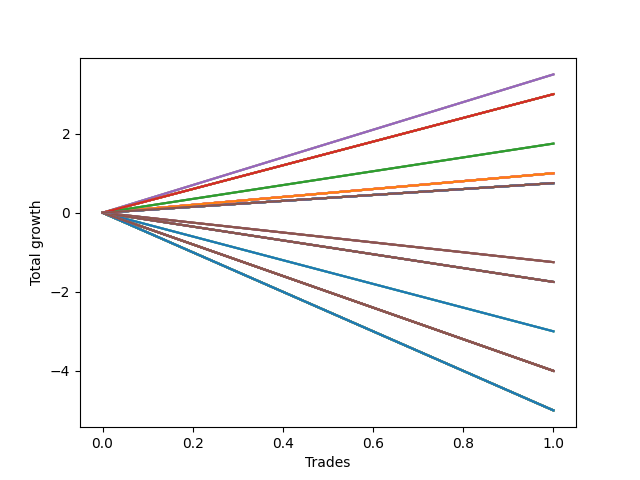

# Long Wallace Doodle 022 
- Symbol: ES
- Date Range: 3/19/22 - 5/22/22
- Trading Period: 7:20-12:30
- Number of Trades: 14



| Name | Win Percent | Profit | Avg Profit / Trade |     | Name | Win Percent | Profit | Avg Profit / Trade |
| ---- | ----------- | ------ | ------------------ | --- | ---- | ----------- | ------ | ------------------ |
| Sorted By <br> Profit | | | | | Sorted By <br> Win Percentage ||||
| Four | 50.00 | 15250.00 | 1089.29 |     | Seven | 57.14 | 13250.00 | 946.43 |
| Seven | 57.14 | 13250.00 | 946.43 |     | Three | 57.14 | 5125.00 | 366.07 |
| Five | 50.00 | 7500.00 | 535.71 |     | Two | 57.14 | 375.00 | 26.79 |
| Three | 57.14 | 5125.00 | 366.07 |     | Zero | 57.14 | -9000.00 | -642.86 |
| Six | 50.00 | 2375.00 | 169.64 |     | Sixty-Four | 57.14 | -12250.00 | -875.00 |
| Fifteen | 21.43 | 500.00 | 35.71 |     | Fifty-Six | 57.14 | -16750.00 | -1196.43 |
| Two | 57.14 | 375.00 | 26.79 |     | Four | 50.00 | 15250.00 | 1089.29 |
| Fifty-Two | 28.57 | 375.00 | 26.79 |     | Five | 50.00 | 7500.00 | 535.71 |
| Seventy-Two | 21.43 | 375.00 | 26.79 |     | Six | 50.00 | 2375.00 | 169.64 |
| Twelve | 14.29 | -1500.00 | -107.14 |     | Sixty-Two | 50.00 | -4125.00 | -294.64 |
| Eight | 28.57 | -2750.00 | -196.43 |     | Seventy | 42.86 | -8250.00 | -589.29 |
| Seventy-Five | 28.57 | -3625.00 | -258.93 |     | Sixty-Three | 42.86 | -11125.00 | -794.64 |
| Seventy-Four | 28.57 | -3625.00 | -258.93 |     | One | 42.86 | -12000.00 | -857.14 |
| Seventy-Three | 28.57 | -3625.00 | -258.93 |     | Sixty-Seven | 42.86 | -14125.00 | -1008.93 |
| Sixty-Two | 50.00 | -4125.00 | -294.64 |     | Fifty-Nine | 42.86 | -14875.00 | -1062.50 |
| Fourteen | 21.43 | -4375.00 | -312.50 |     | Fifty-Eight | 42.86 | -19625.00 | -1401.79 |
| Thirty-One | 21.43 | -5375.00 | -383.93 |     | Sixty-Six | 42.86 | -20250.00 | -1446.43 |
| Fifty-Five | 28.57 | -5750.00 | -410.71 |     | Sixty-Five | 42.86 | -22500.00 | -1607.14 |
| Thirteen | 14.29 | -5750.00 | -410.71 |     | Fifty-Seven | 42.86 | -24625.00 | -1758.93 |
| Twenty-Eight | 14.29 | -6875.00 | -491.07 |     | Sixty | 35.71 | -9125.00 | -651.79 |
| Fifty-Three | 28.57 | -7125.00 | -508.93 |     | Sixty-Eight | 35.71 | -9625.00 | -687.50 |
| Forty-Four | 21.43 | -7375.00 | -526.79 |     | Forty-Eight | 35.71 | -10625.00 | -758.93 |
| Eleven | 14.29 | -7500.00 | -535.71 |     | Seventy-One | 35.71 | -12000.00 | -857.14 |
| Forty-Seven | 28.57 | -7875.00 | -562.50 |     | Forty | 35.71 | -14000.00 | -1000.00 |
| Thirty | 21.43 | -7875.00 | -562.50 |     | Sixty-Nine | 35.71 | -15875.00 | -1133.93 |
| Twenty-Four | 28.57 | -8000.00 | -571.43 |     | Sixty-One | 35.71 | -16875.00 | -1205.36 |
| Seventy | 42.86 | -8250.00 | -589.29 |     | Fifty-Two | 28.57 | 375.00 | 26.79 |
| Fifty-One | 28.57 | -8625.00 | -616.07 |     | Eight | 28.57 | -2750.00 | -196.43 |
| Zero | 57.14 | -9000.00 | -642.86 |     | Seventy-Five | 28.57 | -3625.00 | -258.93 |
| Twenty-Two | 21.43 | -9000.00 | -642.86 |     | Seventy-Four | 28.57 | -3625.00 | -258.93 |
| Sixty | 35.71 | -9125.00 | -651.79 |     | Seventy-Three | 28.57 | -3625.00 | -258.93 |
| Fifty-Four | 28.57 | -9375.00 | -669.64 |     | Fifty-Five | 28.57 | -5750.00 | -410.71 |
| Sixty-Eight | 35.71 | -9625.00 | -687.50 |     | Fifty-Three | 28.57 | -7125.00 | -508.93 |
| Thirty-Two | 21.43 | -9750.00 | -696.43 |     | Forty-Seven | 28.57 | -7875.00 | -562.50 |
| Ten | 14.29 | -10250.00 | -732.14 |     | Twenty-Four | 28.57 | -8000.00 | -571.43 |
| Thirty-Nine | 14.29 | -10500.00 | -750.00 |     | Fifty-One | 28.57 | -8625.00 | -616.07 |
| Forty-Eight | 35.71 | -10625.00 | -758.93 |     | Fifty-Four | 28.57 | -9375.00 | -669.64 |
| Twenty-Three | 21.43 | -11000.00 | -785.71 |     | Forty-Six | 28.57 | -11875.00 | -848.21 |
| Twenty-One | 21.43 | -11000.00 | -785.71 |     | Fifty | 28.57 | -12750.00 | -910.71 |
| Twenty | 21.43 | -11000.00 | -785.71 |     | Forty-Nine | 28.57 | -14625.00 | -1044.64 |
| Nineteen | 21.43 | -11000.00 | -785.71 |     | Fifteen | 21.43 | 500.00 | 35.71 |
| Eighteen | 21.43 | -11000.00 | -785.71 |     | Seventy-Two | 21.43 | 375.00 | 26.79 |
| Seventeen | 21.43 | -11000.00 | -785.71 |     | Fourteen | 21.43 | -4375.00 | -312.50 |
| Sixten | 21.43 | -11000.00 | -785.71 |     | Thirty-One | 21.43 | -5375.00 | -383.93 |
| Sixty-Three | 42.86 | -11125.00 | -794.64 |     | Forty-Four | 21.43 | -7375.00 | -526.79 |
| Thirty-Seven | 14.29 | -11125.00 | -794.64 |     | Thirty | 21.43 | -7875.00 | -562.50 |
| Thirty-Six | 14.29 | -11125.00 | -794.64 |     | Twenty-Two | 21.43 | -9000.00 | -642.86 |
| Thirty-Five | 14.29 | -11125.00 | -794.64 |     | Thirty-Two | 21.43 | -9750.00 | -696.43 |
| Thirty-Four | 14.29 | -11125.00 | -794.64 |     | Twenty-Three | 21.43 | -11000.00 | -785.71 |
| Thirty-Three | 14.29 | -11125.00 | -794.64 |     | Twenty-One | 21.43 | -11000.00 | -785.71 |
| Twenty-Nine | 14.29 | -11125.00 | -794.64 |     | Twenty | 21.43 | -11000.00 | -785.71 |
| Nine | 14.29 | -11500.00 | -821.43 |     | Nineteen | 21.43 | -11000.00 | -785.71 |
| Forty-Six | 28.57 | -11875.00 | -848.21 |     | Eighteen | 21.43 | -11000.00 | -785.71 |
| One | 42.86 | -12000.00 | -857.14 |     | Seventeen | 21.43 | -11000.00 | -785.71 |
| Seventy-One | 35.71 | -12000.00 | -857.14 |     | Sixten | 21.43 | -11000.00 | -785.71 |
| Sixty-Four | 57.14 | -12250.00 | -875.00 |     | Forty-Five | 21.43 | -13625.00 | -973.21 |
| Thirty-Eight | 14.29 | -12250.00 | -875.00 |     | Forty-Three | 21.43 | -16375.00 | -1169.64 |
| Fifty | 28.57 | -12750.00 | -910.71 |     | Forty-Two | 21.43 | -20500.00 | -1464.29 |
| twenty-Seven | 14.29 | -12875.00 | -919.64 |     | Forty-One | 21.43 | -22375.00 | -1598.21 |
| Forty-Five | 21.43 | -13625.00 | -973.21 |     | Twelve | 14.29 | -1500.00 | -107.14 |
| Forty | 35.71 | -14000.00 | -1000.00 |     | Thirteen | 14.29 | -5750.00 | -410.71 |
| Sixty-Seven | 42.86 | -14125.00 | -1008.93 |     | Twenty-Eight | 14.29 | -6875.00 | -491.07 |
| Forty-Nine | 28.57 | -14625.00 | -1044.64 |     | Eleven | 14.29 | -7500.00 | -535.71 |
| Fifty-Nine | 42.86 | -14875.00 | -1062.50 |     | Ten | 14.29 | -10250.00 | -732.14 |
| Twenty-Six | 14.29 | -15625.00 | -1116.07 |     | Thirty-Nine | 14.29 | -10500.00 | -750.00 |
| Sixty-Nine | 35.71 | -15875.00 | -1133.93 |     | Thirty-Seven | 14.29 | -11125.00 | -794.64 |
| Forty-Three | 21.43 | -16375.00 | -1169.64 |     | Thirty-Six | 14.29 | -11125.00 | -794.64 |
| Fifty-Six | 57.14 | -16750.00 | -1196.43 |     | Thirty-Five | 14.29 | -11125.00 | -794.64 |
| Sixty-One | 35.71 | -16875.00 | -1205.36 |     | Thirty-Four | 14.29 | -11125.00 | -794.64 |
| Twenty-Five | 14.29 | -16875.00 | -1205.36 |     | Thirty-Three | 14.29 | -11125.00 | -794.64 |
| Fifty-Eight | 42.86 | -19625.00 | -1401.79 |     | Twenty-Nine | 14.29 | -11125.00 | -794.64 |
| Sixty-Six | 42.86 | -20250.00 | -1446.43 |     | Nine | 14.29 | -11500.00 | -821.43 |
| Forty-Two | 21.43 | -20500.00 | -1464.29 |     | Thirty-Eight | 14.29 | -12250.00 | -875.00 |
| Forty-One | 21.43 | -22375.00 | -1598.21 |     | twenty-Seven | 14.29 | -12875.00 | -919.64 |
| Sixty-Five | 42.86 | -22500.00 | -1607.14 |     | Twenty-Six | 14.29 | -15625.00 | -1116.07 |
| Fifty-Seven | 42.86 | -24625.00 | -1758.93 |     | Twenty-Five | 14.29 | -16875.00 | -1205.36 |

## NO STOPLOSS

### Test Zero
* Sell when price hits the middle line of the 20p bollinger
* No Stoploss
* Results:
```
Total Trades: 14
Percent Up: 57.14
Percent Down: 42.86
Total Points Moved Up: -18.00
Potential Profit: -9000.00
Total Points Ups: 27.50 Count Ups: 8
Total Points Downs: -45.50 Count Downs: 6
```

<details><summary>Trades</summary>

<code>In: 2022-03-25 08:11:00		Out: 2022-03-25 08:36:40		Total Position Time: 25:40		Total Move Up: -7.50		Total to Date: -7.50</code> <br />
<code>In: 2022-03-25 08:12:00		Out: 2022-03-25 08:36:40		Total Position Time: 24:40		Total Move Up: -7.00		Total to Date: -14.50</code> <br />
<code>In: 2022-04-04 09:45:00		Out: 2022-04-04 09:58:30		Total Position Time: 13:30		Total Move Up: 0.50		Total to Date: -14.00</code> <br />
<code>In: 2022-04-08 11:27:00		Out: 2022-04-08 11:39:40		Total Position Time: 12:40		Total Move Up: 1.50		Total to Date: -12.50</code> <br />
<code>In: 2022-04-08 11:28:00		Out: 2022-04-08 11:39:40		Total Position Time: 11:40		Total Move Up: 3.75		Total to Date: -8.75</code> <br />
<code>In: 2022-04-08 11:29:00		Out: 2022-04-08 11:39:40		Total Position Time: 10:40		Total Move Up: 4.00		Total to Date: -4.75</code> <br />
<code>In: 2022-04-18 08:26:00		Out: 2022-04-18 08:54:55		Total Position Time: 28:55		Total Move Up: -7.00		Total to Date: -11.75</code> <br />
<code>In: 2022-05-13 09:53:00		Out: 2022-05-13 10:00:10		Total Position Time: 07:10		Total Move Up: 10.00		Total to Date: -1.75</code> <br />
<code>In: 2022-05-13 11:04:00		Out: 2022-05-13 11:12:25		Total Position Time: 08:25		Total Move Up: 6.50		Total to Date: 4.75</code> <br />
<code>In: 2022-05-19 09:43:00		Out: 2022-05-19 09:54:15		Total Position Time: 11:15		Total Move Up: 0.00		Total to Date: 4.75</code> <br />
<code>In: 2022-05-31 11:47:00		Out: 2022-05-31 12:07:20		Total Position Time: 20:20		Total Move Up: -6.50		Total to Date: -1.75</code> <br />
<code>In: 2022-05-31 11:48:00		Out: 2022-05-31 12:07:20		Total Position Time: 19:20		Total Move Up: -6.75		Total to Date: -8.50</code> <br />
<code>In: 2022-06-08 09:28:00		Out: 2022-06-08 09:53:00		Total Position Time: 25:00		Total Move Up: -10.75		Total to Date: -19.25</code> <br />
<code>In: 2022-06-08 09:41:00		Out: 2022-06-08 09:53:00		Total Position Time: 12:00		Total Move Up: 1.25		Total to Date: -18.00</code> <br />


</details>

### Test One
* Sell when the price hits the upper line of the 20p 1std bollinger
* No Stoploss
* Results:
```
Total Trades: 14
Percent Up: 42.86
Percent Down: 57.14
Total Points Moved Up: -24.00
Potential Profit: -12000.00
Total Points Ups: 13.50 Count Ups: 6
Total Points Downs: -37.50 Count Downs: 8
```

<details><summary>Trades</summary>

<code>In: 2022-03-25 08:11:00		Out: 2022-03-25 08:40:40		Total Position Time: 29:40		Total Move Up: -6.50		Total to Date: -6.50</code> <br />
<code>In: 2022-03-25 08:12:00		Out: 2022-03-25 08:40:40		Total Position Time: 28:40		Total Move Up: -6.00		Total to Date: -12.50</code> <br />
<code>In: 2022-04-04 09:45:00		Out: 2022-04-04 10:14:55		Total Position Time: 29:55		Total Move Up: -0.75		Total to Date: -13.25</code> <br />
<code>In: 2022-04-08 11:27:00		Out: 2022-04-08 11:45:50		Total Position Time: 18:50		Total Move Up: 0.00		Total to Date: -13.25</code> <br />
<code>In: 2022-04-08 11:28:00		Out: 2022-04-08 11:45:50		Total Position Time: 17:50		Total Move Up: 2.25		Total to Date: -11.00</code> <br />
<code>In: 2022-04-08 11:29:00		Out: 2022-04-08 11:45:50		Total Position Time: 16:50		Total Move Up: 2.50		Total to Date: -8.50</code> <br />
<code>In: 2022-04-18 08:26:00		Out: 2022-04-18 08:55:55		Total Position Time: 29:55		Total Move Up: -7.75		Total to Date: -16.25</code> <br />
<code>In: 2022-05-13 09:53:00		Out: 2022-05-13 10:22:55		Total Position Time: 29:55		Total Move Up: -1.00		Total to Date: -17.25</code> <br />
<code>In: 2022-05-13 11:04:00		Out: 2022-05-13 11:19:50		Total Position Time: 15:50		Total Move Up: 5.00		Total to Date: -12.25</code> <br />
<code>In: 2022-05-19 09:43:00		Out: 2022-05-19 09:57:20		Total Position Time: 14:20		Total Move Up: 2.00		Total to Date: -10.25</code> <br />
<code>In: 2022-05-31 11:47:00		Out: 2022-05-31 12:09:20		Total Position Time: 22:20		Total Move Up: -2.50		Total to Date: -12.75</code> <br />
<code>In: 2022-05-31 11:48:00		Out: 2022-05-31 12:09:20		Total Position Time: 21:20		Total Move Up: -2.75		Total to Date: -15.50</code> <br />
<code>In: 2022-06-08 09:28:00		Out: 2022-06-08 09:57:10		Total Position Time: 29:10		Total Move Up: -10.25		Total to Date: -25.75</code> <br />
<code>In: 2022-06-08 09:41:00		Out: 2022-06-08 09:57:10		Total Position Time: 16:10		Total Move Up: 1.75		Total to Date: -24.00</code> <br />


</details>

### Test Two
* Sell when the price hits the upper line of the 20p 2std bollinger
* No Stoploss
* Results:
```
Total Trades: 14
Percent Up: 57.14
Percent Down: 42.86
Total Points Moved Up: 0.75
Potential Profit: 375.00
Total Points Ups: 30.25 Count Ups: 8
Total Points Downs: -29.50 Count Downs: 6
```

<details><summary>Trades</summary>

<code>In: 2022-03-25 08:11:00		Out: 2022-03-25 08:40:55		Total Position Time: 29:55		Total Move Up: -7.50		Total to Date: -7.50</code> <br />
<code>In: 2022-03-25 08:12:00		Out: 2022-03-25 08:41:55		Total Position Time: 29:55		Total Move Up: -1.50		Total to Date: -9.00</code> <br />
<code>In: 2022-04-04 09:45:00		Out: 2022-04-04 10:14:55		Total Position Time: 29:55		Total Move Up: -0.75		Total to Date: -9.75</code> <br />
<code>In: 2022-04-08 11:27:00		Out: 2022-04-08 11:47:20		Total Position Time: 20:20		Total Move Up: 1.25		Total to Date: -8.50</code> <br />
<code>In: 2022-04-08 11:28:00		Out: 2022-04-08 11:47:20		Total Position Time: 19:20		Total Move Up: 3.50		Total to Date: -5.00</code> <br />
<code>In: 2022-04-08 11:29:00		Out: 2022-04-08 11:47:20		Total Position Time: 18:20		Total Move Up: 3.75		Total to Date: -1.25</code> <br />
<code>In: 2022-04-18 08:26:00		Out: 2022-04-18 08:55:55		Total Position Time: 29:55		Total Move Up: -7.75		Total to Date: -9.00</code> <br />
<code>In: 2022-05-13 09:53:00		Out: 2022-05-13 10:22:55		Total Position Time: 29:55		Total Move Up: -1.00		Total to Date: -10.00</code> <br />
<code>In: 2022-05-13 11:04:00		Out: 2022-05-13 11:31:30		Total Position Time: 27:30		Total Move Up: 10.50		Total to Date: 0.50</code> <br />
<code>In: 2022-05-19 09:43:00		Out: 2022-05-19 09:59:25		Total Position Time: 16:25		Total Move Up: 3.75		Total to Date: 4.25</code> <br />
<code>In: 2022-05-31 11:47:00		Out: 2022-05-31 12:15:15		Total Position Time: 28:15		Total Move Up: 3.50		Total to Date: 7.75</code> <br />
<code>In: 2022-05-31 11:48:00		Out: 2022-05-31 12:15:15		Total Position Time: 27:15		Total Move Up: 3.25		Total to Date: 11.00</code> <br />
<code>In: 2022-06-08 09:28:00		Out: 2022-06-08 09:57:55		Total Position Time: 29:55		Total Move Up: -11.00		Total to Date: 0.00</code> <br />
<code>In: 2022-06-08 09:41:00		Out: 2022-06-08 10:10:55		Total Position Time: 29:55		Total Move Up: 0.75		Total to Date: 0.75</code> <br />


</details>

### Test Three
* Sell when price hits the middle line of the 50p bollinger
* No Stoploss
* Results:
```
Total Trades: 14
Percent Up: 57.14
Percent Down: 42.86
Total Points Moved Up: 10.25
Potential Profit: 5125.00
Total Points Ups: 39.75 Count Ups: 8
Total Points Downs: -29.50 Count Downs: 6
```

<details><summary>Trades</summary>

<code>In: 2022-03-25 08:11:00		Out: 2022-03-25 08:40:55		Total Position Time: 29:55		Total Move Up: -7.50		Total to Date: -7.50</code> <br />
<code>In: 2022-03-25 08:12:00		Out: 2022-03-25 08:41:55		Total Position Time: 29:55		Total Move Up: -1.50		Total to Date: -9.00</code> <br />
<code>In: 2022-04-04 09:45:00		Out: 2022-04-04 10:14:55		Total Position Time: 29:55		Total Move Up: -0.75		Total to Date: -9.75</code> <br />
<code>In: 2022-04-08 11:27:00		Out: 2022-04-08 11:50:30		Total Position Time: 23:30		Total Move Up: 4.00		Total to Date: -5.75</code> <br />
<code>In: 2022-04-08 11:28:00		Out: 2022-04-08 11:50:30		Total Position Time: 22:30		Total Move Up: 6.25		Total to Date: 0.50</code> <br />
<code>In: 2022-04-08 11:29:00		Out: 2022-04-08 11:50:30		Total Position Time: 21:30		Total Move Up: 6.50		Total to Date: 7.00</code> <br />
<code>In: 2022-04-18 08:26:00		Out: 2022-04-18 08:55:55		Total Position Time: 29:55		Total Move Up: -7.75		Total to Date: -0.75</code> <br />
<code>In: 2022-05-13 09:53:00		Out: 2022-05-13 10:22:55		Total Position Time: 29:55		Total Move Up: -1.00		Total to Date: -1.75</code> <br />
<code>In: 2022-05-13 11:04:00		Out: 2022-05-13 11:31:20		Total Position Time: 27:20		Total Move Up: 7.75		Total to Date: 6.00</code> <br />
<code>In: 2022-05-19 09:43:00		Out: 2022-05-19 10:06:05		Total Position Time: 23:05		Total Move Up: 7.75		Total to Date: 13.75</code> <br />
<code>In: 2022-05-31 11:47:00		Out: 2022-05-31 12:15:15		Total Position Time: 28:15		Total Move Up: 3.50		Total to Date: 17.25</code> <br />
<code>In: 2022-05-31 11:48:00		Out: 2022-05-31 12:15:15		Total Position Time: 27:15		Total Move Up: 3.25		Total to Date: 20.50</code> <br />
<code>In: 2022-06-08 09:28:00		Out: 2022-06-08 09:57:55		Total Position Time: 29:55		Total Move Up: -11.00		Total to Date: 9.50</code> <br />
<code>In: 2022-06-08 09:41:00		Out: 2022-06-08 10:10:55		Total Position Time: 29:55		Total Move Up: 0.75		Total to Date: 10.25</code> <br />


</details>

### Test Four
* Sell when the price hits the upper line of the 50p 1std bollinger
* No Stoploss
* Results:
```
Total Trades: 14
Percent Up: 50.00
Percent Down: 50.00
Total Points Moved Up: 30.50
Potential Profit: 15250.00
Total Points Ups: 66.75 Count Ups: 7
Total Points Downs: -36.25 Count Downs: 7
```

<details><summary>Trades</summary>

<code>In: 2022-03-25 08:11:00		Out: 2022-03-25 08:40:55		Total Position Time: 29:55		Total Move Up: -7.50		Total to Date: -7.50</code> <br />
<code>In: 2022-03-25 08:12:00		Out: 2022-03-25 08:41:55		Total Position Time: 29:55		Total Move Up: -1.50		Total to Date: -9.00</code> <br />
<code>In: 2022-04-04 09:45:00		Out: 2022-04-04 10:14:55		Total Position Time: 29:55		Total Move Up: -0.75		Total to Date: -9.75</code> <br />
<code>In: 2022-04-08 11:27:00		Out: 2022-04-08 11:53:20		Total Position Time: 26:20		Total Move Up: 10.00		Total to Date: 0.25</code> <br />
<code>In: 2022-04-08 11:28:00		Out: 2022-04-08 11:53:20		Total Position Time: 25:20		Total Move Up: 12.25		Total to Date: 12.50</code> <br />
<code>In: 2022-04-08 11:29:00		Out: 2022-04-08 11:53:20		Total Position Time: 24:20		Total Move Up: 12.50		Total to Date: 25.00</code> <br />
<code>In: 2022-04-18 08:26:00		Out: 2022-04-18 08:55:55		Total Position Time: 29:55		Total Move Up: -7.75		Total to Date: 17.25</code> <br />
<code>In: 2022-05-13 09:53:00		Out: 2022-05-13 10:22:55		Total Position Time: 29:55		Total Move Up: -1.00		Total to Date: 16.25</code> <br />
<code>In: 2022-05-13 11:04:00		Out: 2022-05-13 11:32:00		Total Position Time: 28:00		Total Move Up: 15.75		Total to Date: 32.00</code> <br />
<code>In: 2022-05-19 09:43:00		Out: 2022-05-19 10:12:55		Total Position Time: 29:55		Total Move Up: -6.75		Total to Date: 25.25</code> <br />
<code>In: 2022-05-31 11:47:00		Out: 2022-05-31 12:16:55		Total Position Time: 29:55		Total Move Up: 7.75		Total to Date: 33.00</code> <br />
<code>In: 2022-05-31 11:48:00		Out: 2022-05-31 12:17:55		Total Position Time: 29:55		Total Move Up: 7.75		Total to Date: 40.75</code> <br />
<code>In: 2022-06-08 09:28:00		Out: 2022-06-08 09:57:55		Total Position Time: 29:55		Total Move Up: -11.00		Total to Date: 29.75</code> <br />
<code>In: 2022-06-08 09:41:00		Out: 2022-06-08 10:10:55		Total Position Time: 29:55		Total Move Up: 0.75		Total to Date: 30.50</code> <br />


</details>

### Test Five
* Sell when the price hits the upper line of the 50p 2std bollinger
* No Stoploss
* Results:
```
Total Trades: 14
Percent Up: 50.00
Percent Down: 50.00
Total Points Moved Up: 15.00
Potential Profit: 7500.00
Total Points Ups: 51.25 Count Ups: 7
Total Points Downs: -36.25 Count Downs: 7
```

<details><summary>Trades</summary>

<code>In: 2022-03-25 08:11:00		Out: 2022-03-25 08:40:55		Total Position Time: 29:55		Total Move Up: -7.50		Total to Date: -7.50</code> <br />
<code>In: 2022-03-25 08:12:00		Out: 2022-03-25 08:41:55		Total Position Time: 29:55		Total Move Up: -1.50		Total to Date: -9.00</code> <br />
<code>In: 2022-04-04 09:45:00		Out: 2022-04-04 10:14:55		Total Position Time: 29:55		Total Move Up: -0.75		Total to Date: -9.75</code> <br />
<code>In: 2022-04-08 11:27:00		Out: 2022-04-08 11:56:55		Total Position Time: 29:55		Total Move Up: 6.00		Total to Date: -3.75</code> <br />
<code>In: 2022-04-08 11:28:00		Out: 2022-04-08 11:57:55		Total Position Time: 29:55		Total Move Up: 8.25		Total to Date: 4.50</code> <br />
<code>In: 2022-04-08 11:29:00		Out: 2022-04-08 11:58:55		Total Position Time: 29:55		Total Move Up: 8.00		Total to Date: 12.50</code> <br />
<code>In: 2022-04-18 08:26:00		Out: 2022-04-18 08:55:55		Total Position Time: 29:55		Total Move Up: -7.75		Total to Date: 4.75</code> <br />
<code>In: 2022-05-13 09:53:00		Out: 2022-05-13 10:22:55		Total Position Time: 29:55		Total Move Up: -1.00		Total to Date: 3.75</code> <br />
<code>In: 2022-05-13 11:04:00		Out: 2022-05-13 11:33:55		Total Position Time: 29:55		Total Move Up: 12.75		Total to Date: 16.50</code> <br />
<code>In: 2022-05-19 09:43:00		Out: 2022-05-19 10:12:55		Total Position Time: 29:55		Total Move Up: -6.75		Total to Date: 9.75</code> <br />
<code>In: 2022-05-31 11:47:00		Out: 2022-05-31 12:16:55		Total Position Time: 29:55		Total Move Up: 7.75		Total to Date: 17.50</code> <br />
<code>In: 2022-05-31 11:48:00		Out: 2022-05-31 12:17:55		Total Position Time: 29:55		Total Move Up: 7.75		Total to Date: 25.25</code> <br />
<code>In: 2022-06-08 09:28:00		Out: 2022-06-08 09:57:55		Total Position Time: 29:55		Total Move Up: -11.00		Total to Date: 14.25</code> <br />
<code>In: 2022-06-08 09:41:00		Out: 2022-06-08 10:10:55		Total Position Time: 29:55		Total Move Up: 0.75		Total to Date: 15.00</code> <br />


</details>

### Test Six
* Sell when the price hits the middle line of the 1std VWAP
* No Stoploss
* Results:
```
Total Trades: 14
Percent Up: 50.00
Percent Down: 50.00
Total Points Moved Up: 4.75
Potential Profit: 2375.00
Total Points Ups: 34.00 Count Ups: 7
Total Points Downs: -29.25 Count Downs: 7
```

<details><summary>Trades</summary>

<code>In: 2022-03-25 08:11:00		Out: 2022-03-25 08:40:55		Total Position Time: 29:55		Total Move Up: -7.50		Total to Date: -7.50</code> <br />
<code>In: 2022-03-25 08:12:00		Out: 2022-03-25 08:41:55		Total Position Time: 29:55		Total Move Up: -1.50		Total to Date: -9.00</code> <br />
<code>In: 2022-04-04 09:45:00		Out: 2022-04-04 09:45:10		Total Position Time: 00:10		Total Move Up: -0.25		Total to Date: -9.25</code> <br />
<code>In: 2022-04-08 11:27:00		Out: 2022-04-08 11:49:05		Total Position Time: 22:05		Total Move Up: 3.00		Total to Date: -6.25</code> <br />
<code>In: 2022-04-08 11:28:00		Out: 2022-04-08 11:49:05		Total Position Time: 21:05		Total Move Up: 5.25		Total to Date: -1.00</code> <br />
<code>In: 2022-04-08 11:29:00		Out: 2022-04-08 11:49:05		Total Position Time: 20:05		Total Move Up: 5.50		Total to Date: 4.50</code> <br />
<code>In: 2022-04-18 08:26:00		Out: 2022-04-18 08:55:55		Total Position Time: 29:55		Total Move Up: -7.75		Total to Date: -3.25</code> <br />
<code>In: 2022-05-13 09:53:00		Out: 2022-05-13 09:53:10		Total Position Time: 00:10		Total Move Up: 1.00		Total to Date: -2.25</code> <br />
<code>In: 2022-05-13 11:04:00		Out: 2022-05-13 11:33:55		Total Position Time: 29:55		Total Move Up: 12.75		Total to Date: 10.50</code> <br />
<code>In: 2022-05-19 09:43:00		Out: 2022-05-19 10:00:20		Total Position Time: 17:20		Total Move Up: 5.75		Total to Date: 16.25</code> <br />
<code>In: 2022-05-31 11:47:00		Out: 2022-05-31 11:47:10		Total Position Time: 00:10		Total Move Up: -0.25		Total to Date: 16.00</code> <br />
<code>In: 2022-05-31 11:48:00		Out: 2022-05-31 11:48:10		Total Position Time: 00:10		Total Move Up: -1.00		Total to Date: 15.00</code> <br />
<code>In: 2022-06-08 09:28:00		Out: 2022-06-08 09:57:55		Total Position Time: 29:55		Total Move Up: -11.00		Total to Date: 4.00</code> <br />
<code>In: 2022-06-08 09:41:00		Out: 2022-06-08 10:10:55		Total Position Time: 29:55		Total Move Up: 0.75		Total to Date: 4.75</code> <br />


</details>

### Test Seven
* Sell when the price hits the upper line of the 1std VWAP
* No Stoploss
* Results:
```
Total Trades: 14
Percent Up: 57.14
Percent Down: 42.86
Total Points Moved Up: 26.50
Potential Profit: 13250.00
Total Points Ups: 61.75 Count Ups: 8
Total Points Downs: -35.25 Count Downs: 6
```

<details><summary>Trades</summary>

<code>In: 2022-03-25 08:11:00		Out: 2022-03-25 08:40:55		Total Position Time: 29:55		Total Move Up: -7.50		Total to Date: -7.50</code> <br />
<code>In: 2022-03-25 08:12:00		Out: 2022-03-25 08:41:55		Total Position Time: 29:55		Total Move Up: -1.50		Total to Date: -9.00</code> <br />
<code>In: 2022-04-04 09:45:00		Out: 2022-04-04 10:14:55		Total Position Time: 29:55		Total Move Up: -0.75		Total to Date: -9.75</code> <br />
<code>In: 2022-04-08 11:27:00		Out: 2022-04-08 11:56:55		Total Position Time: 29:55		Total Move Up: 6.00		Total to Date: -3.75</code> <br />
<code>In: 2022-04-08 11:28:00		Out: 2022-04-08 11:57:55		Total Position Time: 29:55		Total Move Up: 8.25		Total to Date: 4.50</code> <br />
<code>In: 2022-04-08 11:29:00		Out: 2022-04-08 11:58:55		Total Position Time: 29:55		Total Move Up: 8.00		Total to Date: 12.50</code> <br />
<code>In: 2022-04-18 08:26:00		Out: 2022-04-18 08:55:55		Total Position Time: 29:55		Total Move Up: -7.75		Total to Date: 4.75</code> <br />
<code>In: 2022-05-13 09:53:00		Out: 2022-05-13 10:00:15		Total Position Time: 07:15		Total Move Up: 10.50		Total to Date: 15.25</code> <br />
<code>In: 2022-05-13 11:04:00		Out: 2022-05-13 11:33:55		Total Position Time: 29:55		Total Move Up: 12.75		Total to Date: 28.00</code> <br />
<code>In: 2022-05-19 09:43:00		Out: 2022-05-19 10:12:55		Total Position Time: 29:55		Total Move Up: -6.75		Total to Date: 21.25</code> <br />
<code>In: 2022-05-31 11:47:00		Out: 2022-05-31 12:16:55		Total Position Time: 29:55		Total Move Up: 7.75		Total to Date: 29.00</code> <br />
<code>In: 2022-05-31 11:48:00		Out: 2022-05-31 12:17:55		Total Position Time: 29:55		Total Move Up: 7.75		Total to Date: 36.75</code> <br />
<code>In: 2022-06-08 09:28:00		Out: 2022-06-08 09:57:55		Total Position Time: 29:55		Total Move Up: -11.00		Total to Date: 25.75</code> <br />
<code>In: 2022-06-08 09:41:00		Out: 2022-06-08 10:10:55		Total Position Time: 29:55		Total Move Up: 0.75		Total to Date: 26.50</code> <br />


</details>

## STOPLOSS OF 2

### Test Eight
* Sell when price hits the middle line of the 20p bollinger
* Stoploss is 2 points
* Results:
```
Total Trades: 14
Percent Up: 28.57
Percent Down: 71.43
Total Points Moved Up: -5.50
Potential Profit: -2750.00
Total Points Ups: 18.25 Count Ups: 4
Total Points Downs: -23.75 Count Downs: 10
```

<details><summary>Trades</summary>

<code>In: 2022-03-25 08:11:00		Out: 2022-03-25 08:12:25		Total Position Time: 01:25		Total Move Up: -2.00		Total to Date: -2.00</code> <br />
<code>In: 2022-03-25 08:12:00		Out: 2022-03-25 08:12:30		Total Position Time: 00:30		Total Move Up: -1.75		Total to Date: -3.75</code> <br />
<code>In: 2022-04-04 09:45:00		Out: 2022-04-04 09:58:30		Total Position Time: 13:30		Total Move Up: 0.50		Total to Date: -3.25</code> <br />
<code>In: 2022-04-08 11:27:00		Out: 2022-04-08 11:27:10		Total Position Time: 00:10		Total Move Up: -2.00		Total to Date: -5.25</code> <br />
<code>In: 2022-04-08 11:28:00		Out: 2022-04-08 11:39:40		Total Position Time: 11:40		Total Move Up: 3.75		Total to Date: -1.50</code> <br />
<code>In: 2022-04-08 11:29:00		Out: 2022-04-08 11:39:40		Total Position Time: 10:40		Total Move Up: 4.00		Total to Date: 2.50</code> <br />
<code>In: 2022-04-18 08:26:00		Out: 2022-04-18 08:27:15		Total Position Time: 01:15		Total Move Up: -2.25		Total to Date: 0.25</code> <br />
<code>In: 2022-05-13 09:53:00		Out: 2022-05-13 10:00:10		Total Position Time: 07:10		Total Move Up: 10.00		Total to Date: 10.25</code> <br />
<code>In: 2022-05-13 11:04:00		Out: 2022-05-13 11:04:10		Total Position Time: 00:10		Total Move Up: -3.50		Total to Date: 6.75</code> <br />
<code>In: 2022-05-19 09:43:00		Out: 2022-05-19 09:44:10		Total Position Time: 01:10		Total Move Up: -2.50		Total to Date: 4.25</code> <br />
<code>In: 2022-05-31 11:47:00		Out: 2022-05-31 11:48:30		Total Position Time: 01:30		Total Move Up: -2.25		Total to Date: 2.00</code> <br />
<code>In: 2022-05-31 11:48:00		Out: 2022-05-31 11:48:30		Total Position Time: 00:30		Total Move Up: -2.50		Total to Date: -0.50</code> <br />
<code>In: 2022-06-08 09:28:00		Out: 2022-06-08 09:33:00		Total Position Time: 05:00		Total Move Up: -3.25		Total to Date: -3.75</code> <br />
<code>In: 2022-06-08 09:41:00		Out: 2022-06-08 09:42:25		Total Position Time: 01:25		Total Move Up: -1.75		Total to Date: -5.50</code> <br />


</details>

### Test Nine
* Sell when the price hits the upper line of the 20p 1std bollinger
* Stoploss is 2 points
* Results:
```
Total Trades: 14
Percent Up: 14.29
Percent Down: 85.71
Total Points Moved Up: -23.00
Potential Profit: -11500.00
Total Points Ups: 4.75 Count Ups: 2
Total Points Downs: -27.75 Count Downs: 12
```

<details><summary>Trades</summary>

<code>In: 2022-03-25 08:11:00		Out: 2022-03-25 08:12:25		Total Position Time: 01:25		Total Move Up: -2.00		Total to Date: -2.00</code> <br />
<code>In: 2022-03-25 08:12:00		Out: 2022-03-25 08:12:30		Total Position Time: 00:30		Total Move Up: -1.75		Total to Date: -3.75</code> <br />
<code>In: 2022-04-04 09:45:00		Out: 2022-04-04 10:00:20		Total Position Time: 15:20		Total Move Up: -2.00		Total to Date: -5.75</code> <br />
<code>In: 2022-04-08 11:27:00		Out: 2022-04-08 11:27:10		Total Position Time: 00:10		Total Move Up: -2.00		Total to Date: -7.75</code> <br />
<code>In: 2022-04-08 11:28:00		Out: 2022-04-08 11:45:50		Total Position Time: 17:50		Total Move Up: 2.25		Total to Date: -5.50</code> <br />
<code>In: 2022-04-08 11:29:00		Out: 2022-04-08 11:45:50		Total Position Time: 16:50		Total Move Up: 2.50		Total to Date: -3.00</code> <br />
<code>In: 2022-04-18 08:26:00		Out: 2022-04-18 08:27:15		Total Position Time: 01:15		Total Move Up: -2.25		Total to Date: -5.25</code> <br />
<code>In: 2022-05-13 09:53:00		Out: 2022-05-13 10:20:50		Total Position Time: 27:50		Total Move Up: -2.00		Total to Date: -7.25</code> <br />
<code>In: 2022-05-13 11:04:00		Out: 2022-05-13 11:04:10		Total Position Time: 00:10		Total Move Up: -3.50		Total to Date: -10.75</code> <br />
<code>In: 2022-05-19 09:43:00		Out: 2022-05-19 09:44:10		Total Position Time: 01:10		Total Move Up: -2.50		Total to Date: -13.25</code> <br />
<code>In: 2022-05-31 11:47:00		Out: 2022-05-31 11:48:30		Total Position Time: 01:30		Total Move Up: -2.25		Total to Date: -15.50</code> <br />
<code>In: 2022-05-31 11:48:00		Out: 2022-05-31 11:48:30		Total Position Time: 00:30		Total Move Up: -2.50		Total to Date: -18.00</code> <br />
<code>In: 2022-06-08 09:28:00		Out: 2022-06-08 09:33:00		Total Position Time: 05:00		Total Move Up: -3.25		Total to Date: -21.25</code> <br />
<code>In: 2022-06-08 09:41:00		Out: 2022-06-08 09:42:25		Total Position Time: 01:25		Total Move Up: -1.75		Total to Date: -23.00</code> <br />


</details>

### Test Ten
* Sell when the price hits the upper line of the 20p 2std bollinger
* Stoploss is 2 points
* Results:
```
Total Trades: 14
Percent Up: 14.29
Percent Down: 85.71
Total Points Moved Up: -20.50
Potential Profit: -10250.00
Total Points Ups: 7.25 Count Ups: 2
Total Points Downs: -27.75 Count Downs: 12
```

<details><summary>Trades</summary>

<code>In: 2022-03-25 08:11:00		Out: 2022-03-25 08:12:25		Total Position Time: 01:25		Total Move Up: -2.00		Total to Date: -2.00</code> <br />
<code>In: 2022-03-25 08:12:00		Out: 2022-03-25 08:12:30		Total Position Time: 00:30		Total Move Up: -1.75		Total to Date: -3.75</code> <br />
<code>In: 2022-04-04 09:45:00		Out: 2022-04-04 10:00:20		Total Position Time: 15:20		Total Move Up: -2.00		Total to Date: -5.75</code> <br />
<code>In: 2022-04-08 11:27:00		Out: 2022-04-08 11:27:10		Total Position Time: 00:10		Total Move Up: -2.00		Total to Date: -7.75</code> <br />
<code>In: 2022-04-08 11:28:00		Out: 2022-04-08 11:47:20		Total Position Time: 19:20		Total Move Up: 3.50		Total to Date: -4.25</code> <br />
<code>In: 2022-04-08 11:29:00		Out: 2022-04-08 11:47:20		Total Position Time: 18:20		Total Move Up: 3.75		Total to Date: -0.50</code> <br />
<code>In: 2022-04-18 08:26:00		Out: 2022-04-18 08:27:15		Total Position Time: 01:15		Total Move Up: -2.25		Total to Date: -2.75</code> <br />
<code>In: 2022-05-13 09:53:00		Out: 2022-05-13 10:20:50		Total Position Time: 27:50		Total Move Up: -2.00		Total to Date: -4.75</code> <br />
<code>In: 2022-05-13 11:04:00		Out: 2022-05-13 11:04:10		Total Position Time: 00:10		Total Move Up: -3.50		Total to Date: -8.25</code> <br />
<code>In: 2022-05-19 09:43:00		Out: 2022-05-19 09:44:10		Total Position Time: 01:10		Total Move Up: -2.50		Total to Date: -10.75</code> <br />
<code>In: 2022-05-31 11:47:00		Out: 2022-05-31 11:48:30		Total Position Time: 01:30		Total Move Up: -2.25		Total to Date: -13.00</code> <br />
<code>In: 2022-05-31 11:48:00		Out: 2022-05-31 11:48:30		Total Position Time: 00:30		Total Move Up: -2.50		Total to Date: -15.50</code> <br />
<code>In: 2022-06-08 09:28:00		Out: 2022-06-08 09:33:00		Total Position Time: 05:00		Total Move Up: -3.25		Total to Date: -18.75</code> <br />
<code>In: 2022-06-08 09:41:00		Out: 2022-06-08 09:42:25		Total Position Time: 01:25		Total Move Up: -1.75		Total to Date: -20.50</code> <br />


</details>

### Test Eleven
* Sell when price hits the middle line of the 50p bollinger
* Stoploss is 2 points
* Results:
```
Total Trades: 14
Percent Up: 14.29
Percent Down: 85.71
Total Points Moved Up: -15.00
Potential Profit: -7500.00
Total Points Ups: 12.75 Count Ups: 2
Total Points Downs: -27.75 Count Downs: 12
```

<details><summary>Trades</summary>

<code>In: 2022-03-25 08:11:00		Out: 2022-03-25 08:12:25		Total Position Time: 01:25		Total Move Up: -2.00		Total to Date: -2.00</code> <br />
<code>In: 2022-03-25 08:12:00		Out: 2022-03-25 08:12:30		Total Position Time: 00:30		Total Move Up: -1.75		Total to Date: -3.75</code> <br />
<code>In: 2022-04-04 09:45:00		Out: 2022-04-04 10:00:20		Total Position Time: 15:20		Total Move Up: -2.00		Total to Date: -5.75</code> <br />
<code>In: 2022-04-08 11:27:00		Out: 2022-04-08 11:27:10		Total Position Time: 00:10		Total Move Up: -2.00		Total to Date: -7.75</code> <br />
<code>In: 2022-04-08 11:28:00		Out: 2022-04-08 11:50:30		Total Position Time: 22:30		Total Move Up: 6.25		Total to Date: -1.50</code> <br />
<code>In: 2022-04-08 11:29:00		Out: 2022-04-08 11:50:30		Total Position Time: 21:30		Total Move Up: 6.50		Total to Date: 5.00</code> <br />
<code>In: 2022-04-18 08:26:00		Out: 2022-04-18 08:27:15		Total Position Time: 01:15		Total Move Up: -2.25		Total to Date: 2.75</code> <br />
<code>In: 2022-05-13 09:53:00		Out: 2022-05-13 10:20:50		Total Position Time: 27:50		Total Move Up: -2.00		Total to Date: 0.75</code> <br />
<code>In: 2022-05-13 11:04:00		Out: 2022-05-13 11:04:10		Total Position Time: 00:10		Total Move Up: -3.50		Total to Date: -2.75</code> <br />
<code>In: 2022-05-19 09:43:00		Out: 2022-05-19 09:44:10		Total Position Time: 01:10		Total Move Up: -2.50		Total to Date: -5.25</code> <br />
<code>In: 2022-05-31 11:47:00		Out: 2022-05-31 11:48:30		Total Position Time: 01:30		Total Move Up: -2.25		Total to Date: -7.50</code> <br />
<code>In: 2022-05-31 11:48:00		Out: 2022-05-31 11:48:30		Total Position Time: 00:30		Total Move Up: -2.50		Total to Date: -10.00</code> <br />
<code>In: 2022-06-08 09:28:00		Out: 2022-06-08 09:33:00		Total Position Time: 05:00		Total Move Up: -3.25		Total to Date: -13.25</code> <br />
<code>In: 2022-06-08 09:41:00		Out: 2022-06-08 09:42:25		Total Position Time: 01:25		Total Move Up: -1.75		Total to Date: -15.00</code> <br />


</details>

### Test Twelve
* Sell when the price hits the upper line of the 50p 1std bollinger
* Stoploss is 2 points
* Results:
```
Total Trades: 14
Percent Up: 14.29
Percent Down: 85.71
Total Points Moved Up: -3.00
Potential Profit: -1500.00
Total Points Ups: 24.75 Count Ups: 2
Total Points Downs: -27.75 Count Downs: 12
```

<details><summary>Trades</summary>

<code>In: 2022-03-25 08:11:00		Out: 2022-03-25 08:12:25		Total Position Time: 01:25		Total Move Up: -2.00		Total to Date: -2.00</code> <br />
<code>In: 2022-03-25 08:12:00		Out: 2022-03-25 08:12:30		Total Position Time: 00:30		Total Move Up: -1.75		Total to Date: -3.75</code> <br />
<code>In: 2022-04-04 09:45:00		Out: 2022-04-04 10:00:20		Total Position Time: 15:20		Total Move Up: -2.00		Total to Date: -5.75</code> <br />
<code>In: 2022-04-08 11:27:00		Out: 2022-04-08 11:27:10		Total Position Time: 00:10		Total Move Up: -2.00		Total to Date: -7.75</code> <br />
<code>In: 2022-04-08 11:28:00		Out: 2022-04-08 11:53:20		Total Position Time: 25:20		Total Move Up: 12.25		Total to Date: 4.50</code> <br />
<code>In: 2022-04-08 11:29:00		Out: 2022-04-08 11:53:20		Total Position Time: 24:20		Total Move Up: 12.50		Total to Date: 17.00</code> <br />
<code>In: 2022-04-18 08:26:00		Out: 2022-04-18 08:27:15		Total Position Time: 01:15		Total Move Up: -2.25		Total to Date: 14.75</code> <br />
<code>In: 2022-05-13 09:53:00		Out: 2022-05-13 10:20:50		Total Position Time: 27:50		Total Move Up: -2.00		Total to Date: 12.75</code> <br />
<code>In: 2022-05-13 11:04:00		Out: 2022-05-13 11:04:10		Total Position Time: 00:10		Total Move Up: -3.50		Total to Date: 9.25</code> <br />
<code>In: 2022-05-19 09:43:00		Out: 2022-05-19 09:44:10		Total Position Time: 01:10		Total Move Up: -2.50		Total to Date: 6.75</code> <br />
<code>In: 2022-05-31 11:47:00		Out: 2022-05-31 11:48:30		Total Position Time: 01:30		Total Move Up: -2.25		Total to Date: 4.50</code> <br />
<code>In: 2022-05-31 11:48:00		Out: 2022-05-31 11:48:30		Total Position Time: 00:30		Total Move Up: -2.50		Total to Date: 2.00</code> <br />
<code>In: 2022-06-08 09:28:00		Out: 2022-06-08 09:33:00		Total Position Time: 05:00		Total Move Up: -3.25		Total to Date: -1.25</code> <br />
<code>In: 2022-06-08 09:41:00		Out: 2022-06-08 09:42:25		Total Position Time: 01:25		Total Move Up: -1.75		Total to Date: -3.00</code> <br />


</details>

### Test Thirteen
* Sell when the price hits the upper line of the 50p 2std bollinger
* Stoploss is 2 points
* Results:
```
Total Trades: 14
Percent Up: 14.29
Percent Down: 85.71
Total Points Moved Up: -11.50
Potential Profit: -5750.00
Total Points Ups: 16.25 Count Ups: 2
Total Points Downs: -27.75 Count Downs: 12
```

<details><summary>Trades</summary>

<code>In: 2022-03-25 08:11:00		Out: 2022-03-25 08:12:25		Total Position Time: 01:25		Total Move Up: -2.00		Total to Date: -2.00</code> <br />
<code>In: 2022-03-25 08:12:00		Out: 2022-03-25 08:12:30		Total Position Time: 00:30		Total Move Up: -1.75		Total to Date: -3.75</code> <br />
<code>In: 2022-04-04 09:45:00		Out: 2022-04-04 10:00:20		Total Position Time: 15:20		Total Move Up: -2.00		Total to Date: -5.75</code> <br />
<code>In: 2022-04-08 11:27:00		Out: 2022-04-08 11:27:10		Total Position Time: 00:10		Total Move Up: -2.00		Total to Date: -7.75</code> <br />
<code>In: 2022-04-08 11:28:00		Out: 2022-04-08 11:57:55		Total Position Time: 29:55		Total Move Up: 8.25		Total to Date: 0.50</code> <br />
<code>In: 2022-04-08 11:29:00		Out: 2022-04-08 11:58:55		Total Position Time: 29:55		Total Move Up: 8.00		Total to Date: 8.50</code> <br />
<code>In: 2022-04-18 08:26:00		Out: 2022-04-18 08:27:15		Total Position Time: 01:15		Total Move Up: -2.25		Total to Date: 6.25</code> <br />
<code>In: 2022-05-13 09:53:00		Out: 2022-05-13 10:20:50		Total Position Time: 27:50		Total Move Up: -2.00		Total to Date: 4.25</code> <br />
<code>In: 2022-05-13 11:04:00		Out: 2022-05-13 11:04:10		Total Position Time: 00:10		Total Move Up: -3.50		Total to Date: 0.75</code> <br />
<code>In: 2022-05-19 09:43:00		Out: 2022-05-19 09:44:10		Total Position Time: 01:10		Total Move Up: -2.50		Total to Date: -1.75</code> <br />
<code>In: 2022-05-31 11:47:00		Out: 2022-05-31 11:48:30		Total Position Time: 01:30		Total Move Up: -2.25		Total to Date: -4.00</code> <br />
<code>In: 2022-05-31 11:48:00		Out: 2022-05-31 11:48:30		Total Position Time: 00:30		Total Move Up: -2.50		Total to Date: -6.50</code> <br />
<code>In: 2022-06-08 09:28:00		Out: 2022-06-08 09:33:00		Total Position Time: 05:00		Total Move Up: -3.25		Total to Date: -9.75</code> <br />
<code>In: 2022-06-08 09:41:00		Out: 2022-06-08 09:42:25		Total Position Time: 01:25		Total Move Up: -1.75		Total to Date: -11.50</code> <br />


</details>

### Test Fourteen
* Sell when the price hits the middle line of the 1std VWAP
* Stoploss is 2 points
* Results:
```
Total Trades: 14
Percent Up: 21.43
Percent Down: 78.57
Total Points Moved Up: -8.75
Potential Profit: -4375.00
Total Points Ups: 11.75 Count Ups: 3
Total Points Downs: -20.50 Count Downs: 11
```

<details><summary>Trades</summary>

<code>In: 2022-03-25 08:11:00		Out: 2022-03-25 08:12:25		Total Position Time: 01:25		Total Move Up: -2.00		Total to Date: -2.00</code> <br />
<code>In: 2022-03-25 08:12:00		Out: 2022-03-25 08:12:30		Total Position Time: 00:30		Total Move Up: -1.75		Total to Date: -3.75</code> <br />
<code>In: 2022-04-04 09:45:00		Out: 2022-04-04 09:45:10		Total Position Time: 00:10		Total Move Up: -0.25		Total to Date: -4.00</code> <br />
<code>In: 2022-04-08 11:27:00		Out: 2022-04-08 11:27:10		Total Position Time: 00:10		Total Move Up: -2.00		Total to Date: -6.00</code> <br />
<code>In: 2022-04-08 11:28:00		Out: 2022-04-08 11:49:05		Total Position Time: 21:05		Total Move Up: 5.25		Total to Date: -0.75</code> <br />
<code>In: 2022-04-08 11:29:00		Out: 2022-04-08 11:49:05		Total Position Time: 20:05		Total Move Up: 5.50		Total to Date: 4.75</code> <br />
<code>In: 2022-04-18 08:26:00		Out: 2022-04-18 08:27:15		Total Position Time: 01:15		Total Move Up: -2.25		Total to Date: 2.50</code> <br />
<code>In: 2022-05-13 09:53:00		Out: 2022-05-13 09:53:10		Total Position Time: 00:10		Total Move Up: 1.00		Total to Date: 3.50</code> <br />
<code>In: 2022-05-13 11:04:00		Out: 2022-05-13 11:04:10		Total Position Time: 00:10		Total Move Up: -3.50		Total to Date: 0.00</code> <br />
<code>In: 2022-05-19 09:43:00		Out: 2022-05-19 09:44:10		Total Position Time: 01:10		Total Move Up: -2.50		Total to Date: -2.50</code> <br />
<code>In: 2022-05-31 11:47:00		Out: 2022-05-31 11:47:10		Total Position Time: 00:10		Total Move Up: -0.25		Total to Date: -2.75</code> <br />
<code>In: 2022-05-31 11:48:00		Out: 2022-05-31 11:48:10		Total Position Time: 00:10		Total Move Up: -1.00		Total to Date: -3.75</code> <br />
<code>In: 2022-06-08 09:28:00		Out: 2022-06-08 09:33:00		Total Position Time: 05:00		Total Move Up: -3.25		Total to Date: -7.00</code> <br />
<code>In: 2022-06-08 09:41:00		Out: 2022-06-08 09:42:25		Total Position Time: 01:25		Total Move Up: -1.75		Total to Date: -8.75</code> <br />


</details>

### Test Fifteen
* Sell when the price hits the upper line of the 1std VWAP
* Stoploss is 2 points
* Results:
```
Total Trades: 14
Percent Up: 21.43
Percent Down: 78.57
Total Points Moved Up: 1.00
Potential Profit: 500.00
Total Points Ups: 26.75 Count Ups: 3
Total Points Downs: -25.75 Count Downs: 11
```

<details><summary>Trades</summary>

<code>In: 2022-03-25 08:11:00		Out: 2022-03-25 08:12:25		Total Position Time: 01:25		Total Move Up: -2.00		Total to Date: -2.00</code> <br />
<code>In: 2022-03-25 08:12:00		Out: 2022-03-25 08:12:30		Total Position Time: 00:30		Total Move Up: -1.75		Total to Date: -3.75</code> <br />
<code>In: 2022-04-04 09:45:00		Out: 2022-04-04 10:00:20		Total Position Time: 15:20		Total Move Up: -2.00		Total to Date: -5.75</code> <br />
<code>In: 2022-04-08 11:27:00		Out: 2022-04-08 11:27:10		Total Position Time: 00:10		Total Move Up: -2.00		Total to Date: -7.75</code> <br />
<code>In: 2022-04-08 11:28:00		Out: 2022-04-08 11:57:55		Total Position Time: 29:55		Total Move Up: 8.25		Total to Date: 0.50</code> <br />
<code>In: 2022-04-08 11:29:00		Out: 2022-04-08 11:58:55		Total Position Time: 29:55		Total Move Up: 8.00		Total to Date: 8.50</code> <br />
<code>In: 2022-04-18 08:26:00		Out: 2022-04-18 08:27:15		Total Position Time: 01:15		Total Move Up: -2.25		Total to Date: 6.25</code> <br />
<code>In: 2022-05-13 09:53:00		Out: 2022-05-13 10:00:15		Total Position Time: 07:15		Total Move Up: 10.50		Total to Date: 16.75</code> <br />
<code>In: 2022-05-13 11:04:00		Out: 2022-05-13 11:04:10		Total Position Time: 00:10		Total Move Up: -3.50		Total to Date: 13.25</code> <br />
<code>In: 2022-05-19 09:43:00		Out: 2022-05-19 09:44:10		Total Position Time: 01:10		Total Move Up: -2.50		Total to Date: 10.75</code> <br />
<code>In: 2022-05-31 11:47:00		Out: 2022-05-31 11:48:30		Total Position Time: 01:30		Total Move Up: -2.25		Total to Date: 8.50</code> <br />
<code>In: 2022-05-31 11:48:00		Out: 2022-05-31 11:48:30		Total Position Time: 00:30		Total Move Up: -2.50		Total to Date: 6.00</code> <br />
<code>In: 2022-06-08 09:28:00		Out: 2022-06-08 09:33:00		Total Position Time: 05:00		Total Move Up: -3.25		Total to Date: 2.75</code> <br />
<code>In: 2022-06-08 09:41:00		Out: 2022-06-08 09:42:25		Total Position Time: 01:25		Total Move Up: -1.75		Total to Date: 1.00</code> <br />


</details>

## TRAIL STOP OF 2

### Test Sixten
* Sell when price hits the middle line of the 20p bollinger
* Trailing Stop is 2 points
* Results:
```
Total Trades: 14
Percent Up: 21.43
Percent Down: 78.57
Total Points Moved Up: -22.00
Potential Profit: -11000.00
Total Points Ups: 1.75 Count Ups: 3
Total Points Downs: -23.75 Count Downs: 11
```

<details><summary>Trades</summary>

<code>In: 2022-03-25 08:11:00		Out: 2022-03-25 08:11:25		Total Position Time: 00:25		Total Move Up: -0.75		Total to Date: -0.75</code> <br />
<code>In: 2022-03-25 08:12:00		Out: 2022-03-25 08:12:35		Total Position Time: 00:35		Total Move Up: -3.00		Total to Date: -3.75</code> <br />
<code>In: 2022-04-04 09:45:00		Out: 2022-04-04 09:47:00		Total Position Time: 02:00		Total Move Up: -1.00		Total to Date: -4.75</code> <br />
<code>In: 2022-04-08 11:27:00		Out: 2022-04-08 11:31:35		Total Position Time: 04:35		Total Move Up: -2.25		Total to Date: -7.00</code> <br />
<code>In: 2022-04-08 11:28:00		Out: 2022-04-08 11:31:35		Total Position Time: 03:35		Total Move Up: 0.00		Total to Date: -7.00</code> <br />
<code>In: 2022-04-08 11:29:00		Out: 2022-04-08 11:31:35		Total Position Time: 02:35		Total Move Up: 0.25		Total to Date: -6.75</code> <br />
<code>In: 2022-04-18 08:26:00		Out: 2022-04-18 08:27:15		Total Position Time: 01:15		Total Move Up: -2.25		Total to Date: -9.00</code> <br />
<code>In: 2022-05-13 09:53:00		Out: 2022-05-13 09:54:15		Total Position Time: 01:15		Total Move Up: 1.50		Total to Date: -7.50</code> <br />
<code>In: 2022-05-13 11:04:00		Out: 2022-05-13 11:04:25		Total Position Time: 00:25		Total Move Up: -5.25		Total to Date: -12.75</code> <br />
<code>In: 2022-05-19 09:43:00		Out: 2022-05-19 09:44:10		Total Position Time: 01:10		Total Move Up: -2.50		Total to Date: -15.25</code> <br />
<code>In: 2022-05-31 11:47:00		Out: 2022-05-31 11:48:05		Total Position Time: 01:05		Total Move Up: -0.75		Total to Date: -16.00</code> <br />
<code>In: 2022-05-31 11:48:00		Out: 2022-05-31 11:48:35		Total Position Time: 00:35		Total Move Up: -4.25		Total to Date: -20.25</code> <br />
<code>In: 2022-06-08 09:28:00		Out: 2022-06-08 09:28:10		Total Position Time: 00:10		Total Move Up: -0.50		Total to Date: -20.75</code> <br />
<code>In: 2022-06-08 09:41:00		Out: 2022-06-08 09:42:05		Total Position Time: 01:05		Total Move Up: -1.25		Total to Date: -22.00</code> <br />


</details>

### Test Seventeen
* Sell when the price hits the upper line of the 20p 1std bollinger
* Trailing Stop is 2 points
* Results:
```
Total Trades: 14
Percent Up: 21.43
Percent Down: 78.57
Total Points Moved Up: -22.00
Potential Profit: -11000.00
Total Points Ups: 1.75 Count Ups: 3
Total Points Downs: -23.75 Count Downs: 11
```

<details><summary>Trades</summary>

<code>In: 2022-03-25 08:11:00		Out: 2022-03-25 08:11:25		Total Position Time: 00:25		Total Move Up: -0.75		Total to Date: -0.75</code> <br />
<code>In: 2022-03-25 08:12:00		Out: 2022-03-25 08:12:35		Total Position Time: 00:35		Total Move Up: -3.00		Total to Date: -3.75</code> <br />
<code>In: 2022-04-04 09:45:00		Out: 2022-04-04 09:47:00		Total Position Time: 02:00		Total Move Up: -1.00		Total to Date: -4.75</code> <br />
<code>In: 2022-04-08 11:27:00		Out: 2022-04-08 11:31:35		Total Position Time: 04:35		Total Move Up: -2.25		Total to Date: -7.00</code> <br />
<code>In: 2022-04-08 11:28:00		Out: 2022-04-08 11:31:35		Total Position Time: 03:35		Total Move Up: 0.00		Total to Date: -7.00</code> <br />
<code>In: 2022-04-08 11:29:00		Out: 2022-04-08 11:31:35		Total Position Time: 02:35		Total Move Up: 0.25		Total to Date: -6.75</code> <br />
<code>In: 2022-04-18 08:26:00		Out: 2022-04-18 08:27:15		Total Position Time: 01:15		Total Move Up: -2.25		Total to Date: -9.00</code> <br />
<code>In: 2022-05-13 09:53:00		Out: 2022-05-13 09:54:15		Total Position Time: 01:15		Total Move Up: 1.50		Total to Date: -7.50</code> <br />
<code>In: 2022-05-13 11:04:00		Out: 2022-05-13 11:04:25		Total Position Time: 00:25		Total Move Up: -5.25		Total to Date: -12.75</code> <br />
<code>In: 2022-05-19 09:43:00		Out: 2022-05-19 09:44:10		Total Position Time: 01:10		Total Move Up: -2.50		Total to Date: -15.25</code> <br />
<code>In: 2022-05-31 11:47:00		Out: 2022-05-31 11:48:05		Total Position Time: 01:05		Total Move Up: -0.75		Total to Date: -16.00</code> <br />
<code>In: 2022-05-31 11:48:00		Out: 2022-05-31 11:48:35		Total Position Time: 00:35		Total Move Up: -4.25		Total to Date: -20.25</code> <br />
<code>In: 2022-06-08 09:28:00		Out: 2022-06-08 09:28:10		Total Position Time: 00:10		Total Move Up: -0.50		Total to Date: -20.75</code> <br />
<code>In: 2022-06-08 09:41:00		Out: 2022-06-08 09:42:05		Total Position Time: 01:05		Total Move Up: -1.25		Total to Date: -22.00</code> <br />


</details>

### Test Eighteen
* Sell when the price hits the upper line of the 20p 2std bollinger
* Trailing Stop is 2 points
* Results:
```
Total Trades: 14
Percent Up: 21.43
Percent Down: 78.57
Total Points Moved Up: -22.00
Potential Profit: -11000.00
Total Points Ups: 1.75 Count Ups: 3
Total Points Downs: -23.75 Count Downs: 11
```

<details><summary>Trades</summary>

<code>In: 2022-03-25 08:11:00		Out: 2022-03-25 08:11:25		Total Position Time: 00:25		Total Move Up: -0.75		Total to Date: -0.75</code> <br />
<code>In: 2022-03-25 08:12:00		Out: 2022-03-25 08:12:35		Total Position Time: 00:35		Total Move Up: -3.00		Total to Date: -3.75</code> <br />
<code>In: 2022-04-04 09:45:00		Out: 2022-04-04 09:47:00		Total Position Time: 02:00		Total Move Up: -1.00		Total to Date: -4.75</code> <br />
<code>In: 2022-04-08 11:27:00		Out: 2022-04-08 11:31:35		Total Position Time: 04:35		Total Move Up: -2.25		Total to Date: -7.00</code> <br />
<code>In: 2022-04-08 11:28:00		Out: 2022-04-08 11:31:35		Total Position Time: 03:35		Total Move Up: 0.00		Total to Date: -7.00</code> <br />
<code>In: 2022-04-08 11:29:00		Out: 2022-04-08 11:31:35		Total Position Time: 02:35		Total Move Up: 0.25		Total to Date: -6.75</code> <br />
<code>In: 2022-04-18 08:26:00		Out: 2022-04-18 08:27:15		Total Position Time: 01:15		Total Move Up: -2.25		Total to Date: -9.00</code> <br />
<code>In: 2022-05-13 09:53:00		Out: 2022-05-13 09:54:15		Total Position Time: 01:15		Total Move Up: 1.50		Total to Date: -7.50</code> <br />
<code>In: 2022-05-13 11:04:00		Out: 2022-05-13 11:04:25		Total Position Time: 00:25		Total Move Up: -5.25		Total to Date: -12.75</code> <br />
<code>In: 2022-05-19 09:43:00		Out: 2022-05-19 09:44:10		Total Position Time: 01:10		Total Move Up: -2.50		Total to Date: -15.25</code> <br />
<code>In: 2022-05-31 11:47:00		Out: 2022-05-31 11:48:05		Total Position Time: 01:05		Total Move Up: -0.75		Total to Date: -16.00</code> <br />
<code>In: 2022-05-31 11:48:00		Out: 2022-05-31 11:48:35		Total Position Time: 00:35		Total Move Up: -4.25		Total to Date: -20.25</code> <br />
<code>In: 2022-06-08 09:28:00		Out: 2022-06-08 09:28:10		Total Position Time: 00:10		Total Move Up: -0.50		Total to Date: -20.75</code> <br />
<code>In: 2022-06-08 09:41:00		Out: 2022-06-08 09:42:05		Total Position Time: 01:05		Total Move Up: -1.25		Total to Date: -22.00</code> <br />


</details>

### Test Nineteen
* Sell when price hits the middle line of the 50p bollinger
* Trailing Stop is 2 points
* Results:
```
Total Trades: 14
Percent Up: 21.43
Percent Down: 78.57
Total Points Moved Up: -22.00
Potential Profit: -11000.00
Total Points Ups: 1.75 Count Ups: 3
Total Points Downs: -23.75 Count Downs: 11
```

<details><summary>Trades</summary>

<code>In: 2022-03-25 08:11:00		Out: 2022-03-25 08:11:25		Total Position Time: 00:25		Total Move Up: -0.75		Total to Date: -0.75</code> <br />
<code>In: 2022-03-25 08:12:00		Out: 2022-03-25 08:12:35		Total Position Time: 00:35		Total Move Up: -3.00		Total to Date: -3.75</code> <br />
<code>In: 2022-04-04 09:45:00		Out: 2022-04-04 09:47:00		Total Position Time: 02:00		Total Move Up: -1.00		Total to Date: -4.75</code> <br />
<code>In: 2022-04-08 11:27:00		Out: 2022-04-08 11:31:35		Total Position Time: 04:35		Total Move Up: -2.25		Total to Date: -7.00</code> <br />
<code>In: 2022-04-08 11:28:00		Out: 2022-04-08 11:31:35		Total Position Time: 03:35		Total Move Up: 0.00		Total to Date: -7.00</code> <br />
<code>In: 2022-04-08 11:29:00		Out: 2022-04-08 11:31:35		Total Position Time: 02:35		Total Move Up: 0.25		Total to Date: -6.75</code> <br />
<code>In: 2022-04-18 08:26:00		Out: 2022-04-18 08:27:15		Total Position Time: 01:15		Total Move Up: -2.25		Total to Date: -9.00</code> <br />
<code>In: 2022-05-13 09:53:00		Out: 2022-05-13 09:54:15		Total Position Time: 01:15		Total Move Up: 1.50		Total to Date: -7.50</code> <br />
<code>In: 2022-05-13 11:04:00		Out: 2022-05-13 11:04:25		Total Position Time: 00:25		Total Move Up: -5.25		Total to Date: -12.75</code> <br />
<code>In: 2022-05-19 09:43:00		Out: 2022-05-19 09:44:10		Total Position Time: 01:10		Total Move Up: -2.50		Total to Date: -15.25</code> <br />
<code>In: 2022-05-31 11:47:00		Out: 2022-05-31 11:48:05		Total Position Time: 01:05		Total Move Up: -0.75		Total to Date: -16.00</code> <br />
<code>In: 2022-05-31 11:48:00		Out: 2022-05-31 11:48:35		Total Position Time: 00:35		Total Move Up: -4.25		Total to Date: -20.25</code> <br />
<code>In: 2022-06-08 09:28:00		Out: 2022-06-08 09:28:10		Total Position Time: 00:10		Total Move Up: -0.50		Total to Date: -20.75</code> <br />
<code>In: 2022-06-08 09:41:00		Out: 2022-06-08 09:42:05		Total Position Time: 01:05		Total Move Up: -1.25		Total to Date: -22.00</code> <br />


</details>

### Test Twenty
* Sell when the price hits the upper line of the 50p 1std bollinger
* Trailing Stop is 2 points
* Results:
```
Total Trades: 14
Percent Up: 21.43
Percent Down: 78.57
Total Points Moved Up: -22.00
Potential Profit: -11000.00
Total Points Ups: 1.75 Count Ups: 3
Total Points Downs: -23.75 Count Downs: 11
```

<details><summary>Trades</summary>

<code>In: 2022-03-25 08:11:00		Out: 2022-03-25 08:11:25		Total Position Time: 00:25		Total Move Up: -0.75		Total to Date: -0.75</code> <br />
<code>In: 2022-03-25 08:12:00		Out: 2022-03-25 08:12:35		Total Position Time: 00:35		Total Move Up: -3.00		Total to Date: -3.75</code> <br />
<code>In: 2022-04-04 09:45:00		Out: 2022-04-04 09:47:00		Total Position Time: 02:00		Total Move Up: -1.00		Total to Date: -4.75</code> <br />
<code>In: 2022-04-08 11:27:00		Out: 2022-04-08 11:31:35		Total Position Time: 04:35		Total Move Up: -2.25		Total to Date: -7.00</code> <br />
<code>In: 2022-04-08 11:28:00		Out: 2022-04-08 11:31:35		Total Position Time: 03:35		Total Move Up: 0.00		Total to Date: -7.00</code> <br />
<code>In: 2022-04-08 11:29:00		Out: 2022-04-08 11:31:35		Total Position Time: 02:35		Total Move Up: 0.25		Total to Date: -6.75</code> <br />
<code>In: 2022-04-18 08:26:00		Out: 2022-04-18 08:27:15		Total Position Time: 01:15		Total Move Up: -2.25		Total to Date: -9.00</code> <br />
<code>In: 2022-05-13 09:53:00		Out: 2022-05-13 09:54:15		Total Position Time: 01:15		Total Move Up: 1.50		Total to Date: -7.50</code> <br />
<code>In: 2022-05-13 11:04:00		Out: 2022-05-13 11:04:25		Total Position Time: 00:25		Total Move Up: -5.25		Total to Date: -12.75</code> <br />
<code>In: 2022-05-19 09:43:00		Out: 2022-05-19 09:44:10		Total Position Time: 01:10		Total Move Up: -2.50		Total to Date: -15.25</code> <br />
<code>In: 2022-05-31 11:47:00		Out: 2022-05-31 11:48:05		Total Position Time: 01:05		Total Move Up: -0.75		Total to Date: -16.00</code> <br />
<code>In: 2022-05-31 11:48:00		Out: 2022-05-31 11:48:35		Total Position Time: 00:35		Total Move Up: -4.25		Total to Date: -20.25</code> <br />
<code>In: 2022-06-08 09:28:00		Out: 2022-06-08 09:28:10		Total Position Time: 00:10		Total Move Up: -0.50		Total to Date: -20.75</code> <br />
<code>In: 2022-06-08 09:41:00		Out: 2022-06-08 09:42:05		Total Position Time: 01:05		Total Move Up: -1.25		Total to Date: -22.00</code> <br />


</details>

### Test Twenty-One
* Sell when the price hits the upper line of the 50p 2std bollinger
* Trailing Stop is 2 points
* Results:
```
Total Trades: 14
Percent Up: 21.43
Percent Down: 78.57
Total Points Moved Up: -22.00
Potential Profit: -11000.00
Total Points Ups: 1.75 Count Ups: 3
Total Points Downs: -23.75 Count Downs: 11
```

<details><summary>Trades</summary>

<code>In: 2022-03-25 08:11:00		Out: 2022-03-25 08:11:25		Total Position Time: 00:25		Total Move Up: -0.75		Total to Date: -0.75</code> <br />
<code>In: 2022-03-25 08:12:00		Out: 2022-03-25 08:12:35		Total Position Time: 00:35		Total Move Up: -3.00		Total to Date: -3.75</code> <br />
<code>In: 2022-04-04 09:45:00		Out: 2022-04-04 09:47:00		Total Position Time: 02:00		Total Move Up: -1.00		Total to Date: -4.75</code> <br />
<code>In: 2022-04-08 11:27:00		Out: 2022-04-08 11:31:35		Total Position Time: 04:35		Total Move Up: -2.25		Total to Date: -7.00</code> <br />
<code>In: 2022-04-08 11:28:00		Out: 2022-04-08 11:31:35		Total Position Time: 03:35		Total Move Up: 0.00		Total to Date: -7.00</code> <br />
<code>In: 2022-04-08 11:29:00		Out: 2022-04-08 11:31:35		Total Position Time: 02:35		Total Move Up: 0.25		Total to Date: -6.75</code> <br />
<code>In: 2022-04-18 08:26:00		Out: 2022-04-18 08:27:15		Total Position Time: 01:15		Total Move Up: -2.25		Total to Date: -9.00</code> <br />
<code>In: 2022-05-13 09:53:00		Out: 2022-05-13 09:54:15		Total Position Time: 01:15		Total Move Up: 1.50		Total to Date: -7.50</code> <br />
<code>In: 2022-05-13 11:04:00		Out: 2022-05-13 11:04:25		Total Position Time: 00:25		Total Move Up: -5.25		Total to Date: -12.75</code> <br />
<code>In: 2022-05-19 09:43:00		Out: 2022-05-19 09:44:10		Total Position Time: 01:10		Total Move Up: -2.50		Total to Date: -15.25</code> <br />
<code>In: 2022-05-31 11:47:00		Out: 2022-05-31 11:48:05		Total Position Time: 01:05		Total Move Up: -0.75		Total to Date: -16.00</code> <br />
<code>In: 2022-05-31 11:48:00		Out: 2022-05-31 11:48:35		Total Position Time: 00:35		Total Move Up: -4.25		Total to Date: -20.25</code> <br />
<code>In: 2022-06-08 09:28:00		Out: 2022-06-08 09:28:10		Total Position Time: 00:10		Total Move Up: -0.50		Total to Date: -20.75</code> <br />
<code>In: 2022-06-08 09:41:00		Out: 2022-06-08 09:42:05		Total Position Time: 01:05		Total Move Up: -1.25		Total to Date: -22.00</code> <br />


</details>

### Test Twenty-Two
* Sell when the price hits the middle line of the 1std VWAP
* Trailing Stop is 2 points
* Results:
```
Total Trades: 14
Percent Up: 21.43
Percent Down: 78.57
Total Points Moved Up: -18.00
Potential Profit: -9000.00
Total Points Ups: 1.25 Count Ups: 3
Total Points Downs: -19.25 Count Downs: 11
```

<details><summary>Trades</summary>

<code>In: 2022-03-25 08:11:00		Out: 2022-03-25 08:11:25		Total Position Time: 00:25		Total Move Up: -0.75		Total to Date: -0.75</code> <br />
<code>In: 2022-03-25 08:12:00		Out: 2022-03-25 08:12:35		Total Position Time: 00:35		Total Move Up: -3.00		Total to Date: -3.75</code> <br />
<code>In: 2022-04-04 09:45:00		Out: 2022-04-04 09:45:10		Total Position Time: 00:10		Total Move Up: -0.25		Total to Date: -4.00</code> <br />
<code>In: 2022-04-08 11:27:00		Out: 2022-04-08 11:31:35		Total Position Time: 04:35		Total Move Up: -2.25		Total to Date: -6.25</code> <br />
<code>In: 2022-04-08 11:28:00		Out: 2022-04-08 11:31:35		Total Position Time: 03:35		Total Move Up: 0.00		Total to Date: -6.25</code> <br />
<code>In: 2022-04-08 11:29:00		Out: 2022-04-08 11:31:35		Total Position Time: 02:35		Total Move Up: 0.25		Total to Date: -6.00</code> <br />
<code>In: 2022-04-18 08:26:00		Out: 2022-04-18 08:27:15		Total Position Time: 01:15		Total Move Up: -2.25		Total to Date: -8.25</code> <br />
<code>In: 2022-05-13 09:53:00		Out: 2022-05-13 09:53:10		Total Position Time: 00:10		Total Move Up: 1.00		Total to Date: -7.25</code> <br />
<code>In: 2022-05-13 11:04:00		Out: 2022-05-13 11:04:25		Total Position Time: 00:25		Total Move Up: -5.25		Total to Date: -12.50</code> <br />
<code>In: 2022-05-19 09:43:00		Out: 2022-05-19 09:44:10		Total Position Time: 01:10		Total Move Up: -2.50		Total to Date: -15.00</code> <br />
<code>In: 2022-05-31 11:47:00		Out: 2022-05-31 11:47:10		Total Position Time: 00:10		Total Move Up: -0.25		Total to Date: -15.25</code> <br />
<code>In: 2022-05-31 11:48:00		Out: 2022-05-31 11:48:10		Total Position Time: 00:10		Total Move Up: -1.00		Total to Date: -16.25</code> <br />
<code>In: 2022-06-08 09:28:00		Out: 2022-06-08 09:28:10		Total Position Time: 00:10		Total Move Up: -0.50		Total to Date: -16.75</code> <br />
<code>In: 2022-06-08 09:41:00		Out: 2022-06-08 09:42:05		Total Position Time: 01:05		Total Move Up: -1.25		Total to Date: -18.00</code> <br />


</details>

### Test Twenty-Three
* Sell when the price hits the upper line of the 1std VWAP
* Trailing Stop is 2 points
* Results:
```
Total Trades: 14
Percent Up: 21.43
Percent Down: 78.57
Total Points Moved Up: -22.00
Potential Profit: -11000.00
Total Points Ups: 1.75 Count Ups: 3
Total Points Downs: -23.75 Count Downs: 11
```

<details><summary>Trades</summary>

<code>In: 2022-03-25 08:11:00		Out: 2022-03-25 08:11:25		Total Position Time: 00:25		Total Move Up: -0.75		Total to Date: -0.75</code> <br />
<code>In: 2022-03-25 08:12:00		Out: 2022-03-25 08:12:35		Total Position Time: 00:35		Total Move Up: -3.00		Total to Date: -3.75</code> <br />
<code>In: 2022-04-04 09:45:00		Out: 2022-04-04 09:47:00		Total Position Time: 02:00		Total Move Up: -1.00		Total to Date: -4.75</code> <br />
<code>In: 2022-04-08 11:27:00		Out: 2022-04-08 11:31:35		Total Position Time: 04:35		Total Move Up: -2.25		Total to Date: -7.00</code> <br />
<code>In: 2022-04-08 11:28:00		Out: 2022-04-08 11:31:35		Total Position Time: 03:35		Total Move Up: 0.00		Total to Date: -7.00</code> <br />
<code>In: 2022-04-08 11:29:00		Out: 2022-04-08 11:31:35		Total Position Time: 02:35		Total Move Up: 0.25		Total to Date: -6.75</code> <br />
<code>In: 2022-04-18 08:26:00		Out: 2022-04-18 08:27:15		Total Position Time: 01:15		Total Move Up: -2.25		Total to Date: -9.00</code> <br />
<code>In: 2022-05-13 09:53:00		Out: 2022-05-13 09:54:15		Total Position Time: 01:15		Total Move Up: 1.50		Total to Date: -7.50</code> <br />
<code>In: 2022-05-13 11:04:00		Out: 2022-05-13 11:04:25		Total Position Time: 00:25		Total Move Up: -5.25		Total to Date: -12.75</code> <br />
<code>In: 2022-05-19 09:43:00		Out: 2022-05-19 09:44:10		Total Position Time: 01:10		Total Move Up: -2.50		Total to Date: -15.25</code> <br />
<code>In: 2022-05-31 11:47:00		Out: 2022-05-31 11:48:05		Total Position Time: 01:05		Total Move Up: -0.75		Total to Date: -16.00</code> <br />
<code>In: 2022-05-31 11:48:00		Out: 2022-05-31 11:48:35		Total Position Time: 00:35		Total Move Up: -4.25		Total to Date: -20.25</code> <br />
<code>In: 2022-06-08 09:28:00		Out: 2022-06-08 09:28:10		Total Position Time: 00:10		Total Move Up: -0.50		Total to Date: -20.75</code> <br />
<code>In: 2022-06-08 09:41:00		Out: 2022-06-08 09:42:05		Total Position Time: 01:05		Total Move Up: -1.25		Total to Date: -22.00</code> <br />


</details>

## STOPLOSS OF 3

### Test Twenty-Four
* Sell when price hits the middle line of the 20p bollinger
* Stoploss is 3 points
* Results:
```
Total Trades: 14
Percent Up: 28.57
Percent Down: 71.43
Total Points Moved Up: -16.00
Potential Profit: -8000.00
Total Points Ups: 18.25 Count Ups: 4
Total Points Downs: -34.25 Count Downs: 10
```

<details><summary>Trades</summary>

<code>In: 2022-03-25 08:11:00		Out: 2022-03-25 08:12:35		Total Position Time: 01:35		Total Move Up: -3.50		Total to Date: -3.50</code> <br />
<code>In: 2022-03-25 08:12:00		Out: 2022-03-25 08:12:35		Total Position Time: 00:35		Total Move Up: -3.00		Total to Date: -6.50</code> <br />
<code>In: 2022-04-04 09:45:00		Out: 2022-04-04 09:58:30		Total Position Time: 13:30		Total Move Up: 0.50		Total to Date: -6.00</code> <br />
<code>In: 2022-04-08 11:27:00		Out: 2022-04-08 11:28:40		Total Position Time: 01:40		Total Move Up: -3.00		Total to Date: -9.00</code> <br />
<code>In: 2022-04-08 11:28:00		Out: 2022-04-08 11:39:40		Total Position Time: 11:40		Total Move Up: 3.75		Total to Date: -5.25</code> <br />
<code>In: 2022-04-08 11:29:00		Out: 2022-04-08 11:39:40		Total Position Time: 10:40		Total Move Up: 4.00		Total to Date: -1.25</code> <br />
<code>In: 2022-04-18 08:26:00		Out: 2022-04-18 08:27:50		Total Position Time: 01:50		Total Move Up: -3.50		Total to Date: -4.75</code> <br />
<code>In: 2022-05-13 09:53:00		Out: 2022-05-13 10:00:10		Total Position Time: 07:10		Total Move Up: 10.00		Total to Date: 5.25</code> <br />
<code>In: 2022-05-13 11:04:00		Out: 2022-05-13 11:04:10		Total Position Time: 00:10		Total Move Up: -3.50		Total to Date: 1.75</code> <br />
<code>In: 2022-05-19 09:43:00		Out: 2022-05-19 09:44:15		Total Position Time: 01:15		Total Move Up: -3.25		Total to Date: -1.50</code> <br />
<code>In: 2022-05-31 11:47:00		Out: 2022-05-31 11:48:35		Total Position Time: 01:35		Total Move Up: -4.00		Total to Date: -5.50</code> <br />
<code>In: 2022-05-31 11:48:00		Out: 2022-05-31 11:48:35		Total Position Time: 00:35		Total Move Up: -4.25		Total to Date: -9.75</code> <br />
<code>In: 2022-06-08 09:28:00		Out: 2022-06-08 09:33:00		Total Position Time: 05:00		Total Move Up: -3.25		Total to Date: -13.00</code> <br />
<code>In: 2022-06-08 09:41:00		Out: 2022-06-08 09:43:10		Total Position Time: 02:10		Total Move Up: -3.00		Total to Date: -16.00</code> <br />


</details>

### Test Twenty-Five
* Sell when the price hits the upper line of the 20p 1std bollinger
* Stoploss is 3 points
* Results:
```
Total Trades: 14
Percent Up: 14.29
Percent Down: 85.71
Total Points Moved Up: -33.75
Potential Profit: -16875.00
Total Points Ups: 4.75 Count Ups: 2
Total Points Downs: -38.50 Count Downs: 12
```

<details><summary>Trades</summary>

<code>In: 2022-03-25 08:11:00		Out: 2022-03-25 08:12:35		Total Position Time: 01:35		Total Move Up: -3.50		Total to Date: -3.50</code> <br />
<code>In: 2022-03-25 08:12:00		Out: 2022-03-25 08:12:35		Total Position Time: 00:35		Total Move Up: -3.00		Total to Date: -6.50</code> <br />
<code>In: 2022-04-04 09:45:00		Out: 2022-04-04 10:01:20		Total Position Time: 16:20		Total Move Up: -3.25		Total to Date: -9.75</code> <br />
<code>In: 2022-04-08 11:27:00		Out: 2022-04-08 11:28:40		Total Position Time: 01:40		Total Move Up: -3.00		Total to Date: -12.75</code> <br />
<code>In: 2022-04-08 11:28:00		Out: 2022-04-08 11:45:50		Total Position Time: 17:50		Total Move Up: 2.25		Total to Date: -10.50</code> <br />
<code>In: 2022-04-08 11:29:00		Out: 2022-04-08 11:45:50		Total Position Time: 16:50		Total Move Up: 2.50		Total to Date: -8.00</code> <br />
<code>In: 2022-04-18 08:26:00		Out: 2022-04-18 08:27:50		Total Position Time: 01:50		Total Move Up: -3.50		Total to Date: -11.50</code> <br />
<code>In: 2022-05-13 09:53:00		Out: 2022-05-13 10:22:55		Total Position Time: 29:55		Total Move Up: -1.00		Total to Date: -12.50</code> <br />
<code>In: 2022-05-13 11:04:00		Out: 2022-05-13 11:04:10		Total Position Time: 00:10		Total Move Up: -3.50		Total to Date: -16.00</code> <br />
<code>In: 2022-05-19 09:43:00		Out: 2022-05-19 09:44:15		Total Position Time: 01:15		Total Move Up: -3.25		Total to Date: -19.25</code> <br />
<code>In: 2022-05-31 11:47:00		Out: 2022-05-31 11:48:35		Total Position Time: 01:35		Total Move Up: -4.00		Total to Date: -23.25</code> <br />
<code>In: 2022-05-31 11:48:00		Out: 2022-05-31 11:48:35		Total Position Time: 00:35		Total Move Up: -4.25		Total to Date: -27.50</code> <br />
<code>In: 2022-06-08 09:28:00		Out: 2022-06-08 09:33:00		Total Position Time: 05:00		Total Move Up: -3.25		Total to Date: -30.75</code> <br />
<code>In: 2022-06-08 09:41:00		Out: 2022-06-08 09:43:10		Total Position Time: 02:10		Total Move Up: -3.00		Total to Date: -33.75</code> <br />


</details>

### Test Twenty-Six
* Sell when the price hits the upper line of the 20p 2std bollinger
* Stoploss is 3 points
* Results:
```
Total Trades: 14
Percent Up: 14.29
Percent Down: 85.71
Total Points Moved Up: -31.25
Potential Profit: -15625.00
Total Points Ups: 7.25 Count Ups: 2
Total Points Downs: -38.50 Count Downs: 12
```

<details><summary>Trades</summary>

<code>In: 2022-03-25 08:11:00		Out: 2022-03-25 08:12:35		Total Position Time: 01:35		Total Move Up: -3.50		Total to Date: -3.50</code> <br />
<code>In: 2022-03-25 08:12:00		Out: 2022-03-25 08:12:35		Total Position Time: 00:35		Total Move Up: -3.00		Total to Date: -6.50</code> <br />
<code>In: 2022-04-04 09:45:00		Out: 2022-04-04 10:01:20		Total Position Time: 16:20		Total Move Up: -3.25		Total to Date: -9.75</code> <br />
<code>In: 2022-04-08 11:27:00		Out: 2022-04-08 11:28:40		Total Position Time: 01:40		Total Move Up: -3.00		Total to Date: -12.75</code> <br />
<code>In: 2022-04-08 11:28:00		Out: 2022-04-08 11:47:20		Total Position Time: 19:20		Total Move Up: 3.50		Total to Date: -9.25</code> <br />
<code>In: 2022-04-08 11:29:00		Out: 2022-04-08 11:47:20		Total Position Time: 18:20		Total Move Up: 3.75		Total to Date: -5.50</code> <br />
<code>In: 2022-04-18 08:26:00		Out: 2022-04-18 08:27:50		Total Position Time: 01:50		Total Move Up: -3.50		Total to Date: -9.00</code> <br />
<code>In: 2022-05-13 09:53:00		Out: 2022-05-13 10:22:55		Total Position Time: 29:55		Total Move Up: -1.00		Total to Date: -10.00</code> <br />
<code>In: 2022-05-13 11:04:00		Out: 2022-05-13 11:04:10		Total Position Time: 00:10		Total Move Up: -3.50		Total to Date: -13.50</code> <br />
<code>In: 2022-05-19 09:43:00		Out: 2022-05-19 09:44:15		Total Position Time: 01:15		Total Move Up: -3.25		Total to Date: -16.75</code> <br />
<code>In: 2022-05-31 11:47:00		Out: 2022-05-31 11:48:35		Total Position Time: 01:35		Total Move Up: -4.00		Total to Date: -20.75</code> <br />
<code>In: 2022-05-31 11:48:00		Out: 2022-05-31 11:48:35		Total Position Time: 00:35		Total Move Up: -4.25		Total to Date: -25.00</code> <br />
<code>In: 2022-06-08 09:28:00		Out: 2022-06-08 09:33:00		Total Position Time: 05:00		Total Move Up: -3.25		Total to Date: -28.25</code> <br />
<code>In: 2022-06-08 09:41:00		Out: 2022-06-08 09:43:10		Total Position Time: 02:10		Total Move Up: -3.00		Total to Date: -31.25</code> <br />


</details>

### Test twenty-Seven
* Sell when price hits the middle line of the 50p bollinger
* Stoploss is 3 points
* Results:
```
Total Trades: 14
Percent Up: 14.29
Percent Down: 85.71
Total Points Moved Up: -25.75
Potential Profit: -12875.00
Total Points Ups: 12.75 Count Ups: 2
Total Points Downs: -38.50 Count Downs: 12
```

<details><summary>Trades</summary>

<code>In: 2022-03-25 08:11:00		Out: 2022-03-25 08:12:35		Total Position Time: 01:35		Total Move Up: -3.50		Total to Date: -3.50</code> <br />
<code>In: 2022-03-25 08:12:00		Out: 2022-03-25 08:12:35		Total Position Time: 00:35		Total Move Up: -3.00		Total to Date: -6.50</code> <br />
<code>In: 2022-04-04 09:45:00		Out: 2022-04-04 10:01:20		Total Position Time: 16:20		Total Move Up: -3.25		Total to Date: -9.75</code> <br />
<code>In: 2022-04-08 11:27:00		Out: 2022-04-08 11:28:40		Total Position Time: 01:40		Total Move Up: -3.00		Total to Date: -12.75</code> <br />
<code>In: 2022-04-08 11:28:00		Out: 2022-04-08 11:50:30		Total Position Time: 22:30		Total Move Up: 6.25		Total to Date: -6.50</code> <br />
<code>In: 2022-04-08 11:29:00		Out: 2022-04-08 11:50:30		Total Position Time: 21:30		Total Move Up: 6.50		Total to Date: 0.00</code> <br />
<code>In: 2022-04-18 08:26:00		Out: 2022-04-18 08:27:50		Total Position Time: 01:50		Total Move Up: -3.50		Total to Date: -3.50</code> <br />
<code>In: 2022-05-13 09:53:00		Out: 2022-05-13 10:22:55		Total Position Time: 29:55		Total Move Up: -1.00		Total to Date: -4.50</code> <br />
<code>In: 2022-05-13 11:04:00		Out: 2022-05-13 11:04:10		Total Position Time: 00:10		Total Move Up: -3.50		Total to Date: -8.00</code> <br />
<code>In: 2022-05-19 09:43:00		Out: 2022-05-19 09:44:15		Total Position Time: 01:15		Total Move Up: -3.25		Total to Date: -11.25</code> <br />
<code>In: 2022-05-31 11:47:00		Out: 2022-05-31 11:48:35		Total Position Time: 01:35		Total Move Up: -4.00		Total to Date: -15.25</code> <br />
<code>In: 2022-05-31 11:48:00		Out: 2022-05-31 11:48:35		Total Position Time: 00:35		Total Move Up: -4.25		Total to Date: -19.50</code> <br />
<code>In: 2022-06-08 09:28:00		Out: 2022-06-08 09:33:00		Total Position Time: 05:00		Total Move Up: -3.25		Total to Date: -22.75</code> <br />
<code>In: 2022-06-08 09:41:00		Out: 2022-06-08 09:43:10		Total Position Time: 02:10		Total Move Up: -3.00		Total to Date: -25.75</code> <br />


</details>

### Test Twenty-Eight
* Sell when the price hits the upper line of the 50p 1std bollinger
* Stoploss is 3 points
* Results:
```
Total Trades: 14
Percent Up: 14.29
Percent Down: 85.71
Total Points Moved Up: -13.75
Potential Profit: -6875.00
Total Points Ups: 24.75 Count Ups: 2
Total Points Downs: -38.50 Count Downs: 12
```

<details><summary>Trades</summary>

<code>In: 2022-03-25 08:11:00		Out: 2022-03-25 08:12:35		Total Position Time: 01:35		Total Move Up: -3.50		Total to Date: -3.50</code> <br />
<code>In: 2022-03-25 08:12:00		Out: 2022-03-25 08:12:35		Total Position Time: 00:35		Total Move Up: -3.00		Total to Date: -6.50</code> <br />
<code>In: 2022-04-04 09:45:00		Out: 2022-04-04 10:01:20		Total Position Time: 16:20		Total Move Up: -3.25		Total to Date: -9.75</code> <br />
<code>In: 2022-04-08 11:27:00		Out: 2022-04-08 11:28:40		Total Position Time: 01:40		Total Move Up: -3.00		Total to Date: -12.75</code> <br />
<code>In: 2022-04-08 11:28:00		Out: 2022-04-08 11:53:20		Total Position Time: 25:20		Total Move Up: 12.25		Total to Date: -0.50</code> <br />
<code>In: 2022-04-08 11:29:00		Out: 2022-04-08 11:53:20		Total Position Time: 24:20		Total Move Up: 12.50		Total to Date: 12.00</code> <br />
<code>In: 2022-04-18 08:26:00		Out: 2022-04-18 08:27:50		Total Position Time: 01:50		Total Move Up: -3.50		Total to Date: 8.50</code> <br />
<code>In: 2022-05-13 09:53:00		Out: 2022-05-13 10:22:55		Total Position Time: 29:55		Total Move Up: -1.00		Total to Date: 7.50</code> <br />
<code>In: 2022-05-13 11:04:00		Out: 2022-05-13 11:04:10		Total Position Time: 00:10		Total Move Up: -3.50		Total to Date: 4.00</code> <br />
<code>In: 2022-05-19 09:43:00		Out: 2022-05-19 09:44:15		Total Position Time: 01:15		Total Move Up: -3.25		Total to Date: 0.75</code> <br />
<code>In: 2022-05-31 11:47:00		Out: 2022-05-31 11:48:35		Total Position Time: 01:35		Total Move Up: -4.00		Total to Date: -3.25</code> <br />
<code>In: 2022-05-31 11:48:00		Out: 2022-05-31 11:48:35		Total Position Time: 00:35		Total Move Up: -4.25		Total to Date: -7.50</code> <br />
<code>In: 2022-06-08 09:28:00		Out: 2022-06-08 09:33:00		Total Position Time: 05:00		Total Move Up: -3.25		Total to Date: -10.75</code> <br />
<code>In: 2022-06-08 09:41:00		Out: 2022-06-08 09:43:10		Total Position Time: 02:10		Total Move Up: -3.00		Total to Date: -13.75</code> <br />


</details>

### Test Twenty-Nine
* Sell when the price hits the upper line of the 50p 2std bollinger
* Stoploss is 3 points
* Results:
```
Total Trades: 14
Percent Up: 14.29
Percent Down: 85.71
Total Points Moved Up: -22.25
Potential Profit: -11125.00
Total Points Ups: 16.25 Count Ups: 2
Total Points Downs: -38.50 Count Downs: 12
```

<details><summary>Trades</summary>

<code>In: 2022-03-25 08:11:00		Out: 2022-03-25 08:12:35		Total Position Time: 01:35		Total Move Up: -3.50		Total to Date: -3.50</code> <br />
<code>In: 2022-03-25 08:12:00		Out: 2022-03-25 08:12:35		Total Position Time: 00:35		Total Move Up: -3.00		Total to Date: -6.50</code> <br />
<code>In: 2022-04-04 09:45:00		Out: 2022-04-04 10:01:20		Total Position Time: 16:20		Total Move Up: -3.25		Total to Date: -9.75</code> <br />
<code>In: 2022-04-08 11:27:00		Out: 2022-04-08 11:28:40		Total Position Time: 01:40		Total Move Up: -3.00		Total to Date: -12.75</code> <br />
<code>In: 2022-04-08 11:28:00		Out: 2022-04-08 11:57:55		Total Position Time: 29:55		Total Move Up: 8.25		Total to Date: -4.50</code> <br />
<code>In: 2022-04-08 11:29:00		Out: 2022-04-08 11:58:55		Total Position Time: 29:55		Total Move Up: 8.00		Total to Date: 3.50</code> <br />
<code>In: 2022-04-18 08:26:00		Out: 2022-04-18 08:27:50		Total Position Time: 01:50		Total Move Up: -3.50		Total to Date: 0.00</code> <br />
<code>In: 2022-05-13 09:53:00		Out: 2022-05-13 10:22:55		Total Position Time: 29:55		Total Move Up: -1.00		Total to Date: -1.00</code> <br />
<code>In: 2022-05-13 11:04:00		Out: 2022-05-13 11:04:10		Total Position Time: 00:10		Total Move Up: -3.50		Total to Date: -4.50</code> <br />
<code>In: 2022-05-19 09:43:00		Out: 2022-05-19 09:44:15		Total Position Time: 01:15		Total Move Up: -3.25		Total to Date: -7.75</code> <br />
<code>In: 2022-05-31 11:47:00		Out: 2022-05-31 11:48:35		Total Position Time: 01:35		Total Move Up: -4.00		Total to Date: -11.75</code> <br />
<code>In: 2022-05-31 11:48:00		Out: 2022-05-31 11:48:35		Total Position Time: 00:35		Total Move Up: -4.25		Total to Date: -16.00</code> <br />
<code>In: 2022-06-08 09:28:00		Out: 2022-06-08 09:33:00		Total Position Time: 05:00		Total Move Up: -3.25		Total to Date: -19.25</code> <br />
<code>In: 2022-06-08 09:41:00		Out: 2022-06-08 09:43:10		Total Position Time: 02:10		Total Move Up: -3.00		Total to Date: -22.25</code> <br />


</details>

### Test Thirty
* Sell when the price hits the middle line of the 1std VWAP
* Stoploss is 3 points
* Results:
```
Total Trades: 14
Percent Up: 21.43
Percent Down: 78.57
Total Points Moved Up: -15.75
Potential Profit: -7875.00
Total Points Ups: 11.75 Count Ups: 3
Total Points Downs: -27.50 Count Downs: 11
```

<details><summary>Trades</summary>

<code>In: 2022-03-25 08:11:00		Out: 2022-03-25 08:12:35		Total Position Time: 01:35		Total Move Up: -3.50		Total to Date: -3.50</code> <br />
<code>In: 2022-03-25 08:12:00		Out: 2022-03-25 08:12:35		Total Position Time: 00:35		Total Move Up: -3.00		Total to Date: -6.50</code> <br />
<code>In: 2022-04-04 09:45:00		Out: 2022-04-04 09:45:10		Total Position Time: 00:10		Total Move Up: -0.25		Total to Date: -6.75</code> <br />
<code>In: 2022-04-08 11:27:00		Out: 2022-04-08 11:28:40		Total Position Time: 01:40		Total Move Up: -3.00		Total to Date: -9.75</code> <br />
<code>In: 2022-04-08 11:28:00		Out: 2022-04-08 11:49:05		Total Position Time: 21:05		Total Move Up: 5.25		Total to Date: -4.50</code> <br />
<code>In: 2022-04-08 11:29:00		Out: 2022-04-08 11:49:05		Total Position Time: 20:05		Total Move Up: 5.50		Total to Date: 1.00</code> <br />
<code>In: 2022-04-18 08:26:00		Out: 2022-04-18 08:27:50		Total Position Time: 01:50		Total Move Up: -3.50		Total to Date: -2.50</code> <br />
<code>In: 2022-05-13 09:53:00		Out: 2022-05-13 09:53:10		Total Position Time: 00:10		Total Move Up: 1.00		Total to Date: -1.50</code> <br />
<code>In: 2022-05-13 11:04:00		Out: 2022-05-13 11:04:10		Total Position Time: 00:10		Total Move Up: -3.50		Total to Date: -5.00</code> <br />
<code>In: 2022-05-19 09:43:00		Out: 2022-05-19 09:44:15		Total Position Time: 01:15		Total Move Up: -3.25		Total to Date: -8.25</code> <br />
<code>In: 2022-05-31 11:47:00		Out: 2022-05-31 11:47:10		Total Position Time: 00:10		Total Move Up: -0.25		Total to Date: -8.50</code> <br />
<code>In: 2022-05-31 11:48:00		Out: 2022-05-31 11:48:10		Total Position Time: 00:10		Total Move Up: -1.00		Total to Date: -9.50</code> <br />
<code>In: 2022-06-08 09:28:00		Out: 2022-06-08 09:33:00		Total Position Time: 05:00		Total Move Up: -3.25		Total to Date: -12.75</code> <br />
<code>In: 2022-06-08 09:41:00		Out: 2022-06-08 09:43:10		Total Position Time: 02:10		Total Move Up: -3.00		Total to Date: -15.75</code> <br />


</details>

### Test Thirty-One
* Sell when the price hits the upper line of the 1std VWAP
* Stoploss is 3 points
* Results:
```
Total Trades: 14
Percent Up: 21.43
Percent Down: 78.57
Total Points Moved Up: -10.75
Potential Profit: -5375.00
Total Points Ups: 26.75 Count Ups: 3
Total Points Downs: -37.50 Count Downs: 11
```

<details><summary>Trades</summary>

<code>In: 2022-03-25 08:11:00		Out: 2022-03-25 08:12:35		Total Position Time: 01:35		Total Move Up: -3.50		Total to Date: -3.50</code> <br />
<code>In: 2022-03-25 08:12:00		Out: 2022-03-25 08:12:35		Total Position Time: 00:35		Total Move Up: -3.00		Total to Date: -6.50</code> <br />
<code>In: 2022-04-04 09:45:00		Out: 2022-04-04 10:01:20		Total Position Time: 16:20		Total Move Up: -3.25		Total to Date: -9.75</code> <br />
<code>In: 2022-04-08 11:27:00		Out: 2022-04-08 11:28:40		Total Position Time: 01:40		Total Move Up: -3.00		Total to Date: -12.75</code> <br />
<code>In: 2022-04-08 11:28:00		Out: 2022-04-08 11:57:55		Total Position Time: 29:55		Total Move Up: 8.25		Total to Date: -4.50</code> <br />
<code>In: 2022-04-08 11:29:00		Out: 2022-04-08 11:58:55		Total Position Time: 29:55		Total Move Up: 8.00		Total to Date: 3.50</code> <br />
<code>In: 2022-04-18 08:26:00		Out: 2022-04-18 08:27:50		Total Position Time: 01:50		Total Move Up: -3.50		Total to Date: 0.00</code> <br />
<code>In: 2022-05-13 09:53:00		Out: 2022-05-13 10:00:15		Total Position Time: 07:15		Total Move Up: 10.50		Total to Date: 10.50</code> <br />
<code>In: 2022-05-13 11:04:00		Out: 2022-05-13 11:04:10		Total Position Time: 00:10		Total Move Up: -3.50		Total to Date: 7.00</code> <br />
<code>In: 2022-05-19 09:43:00		Out: 2022-05-19 09:44:15		Total Position Time: 01:15		Total Move Up: -3.25		Total to Date: 3.75</code> <br />
<code>In: 2022-05-31 11:47:00		Out: 2022-05-31 11:48:35		Total Position Time: 01:35		Total Move Up: -4.00		Total to Date: -0.25</code> <br />
<code>In: 2022-05-31 11:48:00		Out: 2022-05-31 11:48:35		Total Position Time: 00:35		Total Move Up: -4.25		Total to Date: -4.50</code> <br />
<code>In: 2022-06-08 09:28:00		Out: 2022-06-08 09:33:00		Total Position Time: 05:00		Total Move Up: -3.25		Total to Date: -7.75</code> <br />
<code>In: 2022-06-08 09:41:00		Out: 2022-06-08 09:43:10		Total Position Time: 02:10		Total Move Up: -3.00		Total to Date: -10.75</code> <br />


</details>

## TRAIL STOP OF 3

### Test Thirty-Two
* Sell when price hits the middle line of the 20p bollinger
* Trailing Stop is 3 points
* Results:
```
Total Trades: 14
Percent Up: 21.43
Percent Down: 78.57
Total Points Moved Up: -19.50
Potential Profit: -9750.00
Total Points Ups: 12.25 Count Ups: 3
Total Points Downs: -31.75 Count Downs: 11
```

<details><summary>Trades</summary>

<code>In: 2022-03-25 08:11:00		Out: 2022-03-25 08:12:25		Total Position Time: 01:25		Total Move Up: -2.00		Total to Date: -2.00</code> <br />
<code>In: 2022-03-25 08:12:00		Out: 2022-03-25 08:13:10		Total Position Time: 01:10		Total Move Up: -3.75		Total to Date: -5.75</code> <br />
<code>In: 2022-04-04 09:45:00		Out: 2022-04-04 09:58:30		Total Position Time: 13:30		Total Move Up: 0.50		Total to Date: -5.25</code> <br />
<code>In: 2022-04-08 11:27:00		Out: 2022-04-08 11:32:10		Total Position Time: 05:10		Total Move Up: -3.25		Total to Date: -8.50</code> <br />
<code>In: 2022-04-08 11:28:00		Out: 2022-04-08 11:32:10		Total Position Time: 04:10		Total Move Up: -1.00		Total to Date: -9.50</code> <br />
<code>In: 2022-04-08 11:29:00		Out: 2022-04-08 11:32:10		Total Position Time: 03:10		Total Move Up: -0.75		Total to Date: -10.25</code> <br />
<code>In: 2022-04-18 08:26:00		Out: 2022-04-18 08:27:50		Total Position Time: 01:50		Total Move Up: -3.50		Total to Date: -13.75</code> <br />
<code>In: 2022-05-13 09:53:00		Out: 2022-05-13 10:00:10		Total Position Time: 07:10		Total Move Up: 10.00		Total to Date: -3.75</code> <br />
<code>In: 2022-05-13 11:04:00		Out: 2022-05-13 11:05:10		Total Position Time: 01:10		Total Move Up: -6.50		Total to Date: -10.25</code> <br />
<code>In: 2022-05-19 09:43:00		Out: 2022-05-19 09:44:15		Total Position Time: 01:15		Total Move Up: -3.25		Total to Date: -13.50</code> <br />
<code>In: 2022-05-31 11:47:00		Out: 2022-05-31 11:48:25		Total Position Time: 01:25		Total Move Up: -1.75		Total to Date: -15.25</code> <br />
<code>In: 2022-05-31 11:48:00		Out: 2022-05-31 11:48:35		Total Position Time: 00:35		Total Move Up: -4.25		Total to Date: -19.50</code> <br />
<code>In: 2022-06-08 09:28:00		Out: 2022-06-08 09:31:55		Total Position Time: 03:55		Total Move Up: 1.75		Total to Date: -17.75</code> <br />
<code>In: 2022-06-08 09:41:00		Out: 2022-06-08 09:42:25		Total Position Time: 01:25		Total Move Up: -1.75		Total to Date: -19.50</code> <br />


</details>

### Test Thirty-Three
* Sell when the price hits the upper line of the 20p 1std bollinger
* Trailing Stop is 3 points
* Results:
```
Total Trades: 14
Percent Up: 14.29
Percent Down: 85.71
Total Points Moved Up: -22.25
Potential Profit: -11125.00
Total Points Ups: 11.00 Count Ups: 2
Total Points Downs: -33.25 Count Downs: 12
```

<details><summary>Trades</summary>

<code>In: 2022-03-25 08:11:00		Out: 2022-03-25 08:12:25		Total Position Time: 01:25		Total Move Up: -2.00		Total to Date: -2.00</code> <br />
<code>In: 2022-03-25 08:12:00		Out: 2022-03-25 08:13:10		Total Position Time: 01:10		Total Move Up: -3.75		Total to Date: -5.75</code> <br />
<code>In: 2022-04-04 09:45:00		Out: 2022-04-04 10:00:15		Total Position Time: 15:15		Total Move Up: -1.50		Total to Date: -7.25</code> <br />
<code>In: 2022-04-08 11:27:00		Out: 2022-04-08 11:32:10		Total Position Time: 05:10		Total Move Up: -3.25		Total to Date: -10.50</code> <br />
<code>In: 2022-04-08 11:28:00		Out: 2022-04-08 11:32:10		Total Position Time: 04:10		Total Move Up: -1.00		Total to Date: -11.50</code> <br />
<code>In: 2022-04-08 11:29:00		Out: 2022-04-08 11:32:10		Total Position Time: 03:10		Total Move Up: -0.75		Total to Date: -12.25</code> <br />
<code>In: 2022-04-18 08:26:00		Out: 2022-04-18 08:27:50		Total Position Time: 01:50		Total Move Up: -3.50		Total to Date: -15.75</code> <br />
<code>In: 2022-05-13 09:53:00		Out: 2022-05-13 10:03:15		Total Position Time: 10:15		Total Move Up: 9.25		Total to Date: -6.50</code> <br />
<code>In: 2022-05-13 11:04:00		Out: 2022-05-13 11:05:10		Total Position Time: 01:10		Total Move Up: -6.50		Total to Date: -13.00</code> <br />
<code>In: 2022-05-19 09:43:00		Out: 2022-05-19 09:44:15		Total Position Time: 01:15		Total Move Up: -3.25		Total to Date: -16.25</code> <br />
<code>In: 2022-05-31 11:47:00		Out: 2022-05-31 11:48:25		Total Position Time: 01:25		Total Move Up: -1.75		Total to Date: -18.00</code> <br />
<code>In: 2022-05-31 11:48:00		Out: 2022-05-31 11:48:35		Total Position Time: 00:35		Total Move Up: -4.25		Total to Date: -22.25</code> <br />
<code>In: 2022-06-08 09:28:00		Out: 2022-06-08 09:31:55		Total Position Time: 03:55		Total Move Up: 1.75		Total to Date: -20.50</code> <br />
<code>In: 2022-06-08 09:41:00		Out: 2022-06-08 09:42:25		Total Position Time: 01:25		Total Move Up: -1.75		Total to Date: -22.25</code> <br />


</details>

### Test Thirty-Four
* Sell when the price hits the upper line of the 20p 2std bollinger
* Trailing Stop is 3 points
* Results:
```
Total Trades: 14
Percent Up: 14.29
Percent Down: 85.71
Total Points Moved Up: -22.25
Potential Profit: -11125.00
Total Points Ups: 11.00 Count Ups: 2
Total Points Downs: -33.25 Count Downs: 12
```

<details><summary>Trades</summary>

<code>In: 2022-03-25 08:11:00		Out: 2022-03-25 08:12:25		Total Position Time: 01:25		Total Move Up: -2.00		Total to Date: -2.00</code> <br />
<code>In: 2022-03-25 08:12:00		Out: 2022-03-25 08:13:10		Total Position Time: 01:10		Total Move Up: -3.75		Total to Date: -5.75</code> <br />
<code>In: 2022-04-04 09:45:00		Out: 2022-04-04 10:00:15		Total Position Time: 15:15		Total Move Up: -1.50		Total to Date: -7.25</code> <br />
<code>In: 2022-04-08 11:27:00		Out: 2022-04-08 11:32:10		Total Position Time: 05:10		Total Move Up: -3.25		Total to Date: -10.50</code> <br />
<code>In: 2022-04-08 11:28:00		Out: 2022-04-08 11:32:10		Total Position Time: 04:10		Total Move Up: -1.00		Total to Date: -11.50</code> <br />
<code>In: 2022-04-08 11:29:00		Out: 2022-04-08 11:32:10		Total Position Time: 03:10		Total Move Up: -0.75		Total to Date: -12.25</code> <br />
<code>In: 2022-04-18 08:26:00		Out: 2022-04-18 08:27:50		Total Position Time: 01:50		Total Move Up: -3.50		Total to Date: -15.75</code> <br />
<code>In: 2022-05-13 09:53:00		Out: 2022-05-13 10:03:15		Total Position Time: 10:15		Total Move Up: 9.25		Total to Date: -6.50</code> <br />
<code>In: 2022-05-13 11:04:00		Out: 2022-05-13 11:05:10		Total Position Time: 01:10		Total Move Up: -6.50		Total to Date: -13.00</code> <br />
<code>In: 2022-05-19 09:43:00		Out: 2022-05-19 09:44:15		Total Position Time: 01:15		Total Move Up: -3.25		Total to Date: -16.25</code> <br />
<code>In: 2022-05-31 11:47:00		Out: 2022-05-31 11:48:25		Total Position Time: 01:25		Total Move Up: -1.75		Total to Date: -18.00</code> <br />
<code>In: 2022-05-31 11:48:00		Out: 2022-05-31 11:48:35		Total Position Time: 00:35		Total Move Up: -4.25		Total to Date: -22.25</code> <br />
<code>In: 2022-06-08 09:28:00		Out: 2022-06-08 09:31:55		Total Position Time: 03:55		Total Move Up: 1.75		Total to Date: -20.50</code> <br />
<code>In: 2022-06-08 09:41:00		Out: 2022-06-08 09:42:25		Total Position Time: 01:25		Total Move Up: -1.75		Total to Date: -22.25</code> <br />


</details>

### Test Thirty-Five
* Sell when price hits the middle line of the 50p bollinger
* Trailing Stop is 3 points
* Results:
```
Total Trades: 14
Percent Up: 14.29
Percent Down: 85.71
Total Points Moved Up: -22.25
Potential Profit: -11125.00
Total Points Ups: 11.00 Count Ups: 2
Total Points Downs: -33.25 Count Downs: 12
```

<details><summary>Trades</summary>

<code>In: 2022-03-25 08:11:00		Out: 2022-03-25 08:12:25		Total Position Time: 01:25		Total Move Up: -2.00		Total to Date: -2.00</code> <br />
<code>In: 2022-03-25 08:12:00		Out: 2022-03-25 08:13:10		Total Position Time: 01:10		Total Move Up: -3.75		Total to Date: -5.75</code> <br />
<code>In: 2022-04-04 09:45:00		Out: 2022-04-04 10:00:15		Total Position Time: 15:15		Total Move Up: -1.50		Total to Date: -7.25</code> <br />
<code>In: 2022-04-08 11:27:00		Out: 2022-04-08 11:32:10		Total Position Time: 05:10		Total Move Up: -3.25		Total to Date: -10.50</code> <br />
<code>In: 2022-04-08 11:28:00		Out: 2022-04-08 11:32:10		Total Position Time: 04:10		Total Move Up: -1.00		Total to Date: -11.50</code> <br />
<code>In: 2022-04-08 11:29:00		Out: 2022-04-08 11:32:10		Total Position Time: 03:10		Total Move Up: -0.75		Total to Date: -12.25</code> <br />
<code>In: 2022-04-18 08:26:00		Out: 2022-04-18 08:27:50		Total Position Time: 01:50		Total Move Up: -3.50		Total to Date: -15.75</code> <br />
<code>In: 2022-05-13 09:53:00		Out: 2022-05-13 10:03:15		Total Position Time: 10:15		Total Move Up: 9.25		Total to Date: -6.50</code> <br />
<code>In: 2022-05-13 11:04:00		Out: 2022-05-13 11:05:10		Total Position Time: 01:10		Total Move Up: -6.50		Total to Date: -13.00</code> <br />
<code>In: 2022-05-19 09:43:00		Out: 2022-05-19 09:44:15		Total Position Time: 01:15		Total Move Up: -3.25		Total to Date: -16.25</code> <br />
<code>In: 2022-05-31 11:47:00		Out: 2022-05-31 11:48:25		Total Position Time: 01:25		Total Move Up: -1.75		Total to Date: -18.00</code> <br />
<code>In: 2022-05-31 11:48:00		Out: 2022-05-31 11:48:35		Total Position Time: 00:35		Total Move Up: -4.25		Total to Date: -22.25</code> <br />
<code>In: 2022-06-08 09:28:00		Out: 2022-06-08 09:31:55		Total Position Time: 03:55		Total Move Up: 1.75		Total to Date: -20.50</code> <br />
<code>In: 2022-06-08 09:41:00		Out: 2022-06-08 09:42:25		Total Position Time: 01:25		Total Move Up: -1.75		Total to Date: -22.25</code> <br />


</details>

### Test Thirty-Six
* Sell when the price hits the upper line of the 50p 1std bollinger
* Trailing Stop is 3 points
* Results:
```
Total Trades: 14
Percent Up: 14.29
Percent Down: 85.71
Total Points Moved Up: -22.25
Potential Profit: -11125.00
Total Points Ups: 11.00 Count Ups: 2
Total Points Downs: -33.25 Count Downs: 12
```

<details><summary>Trades</summary>

<code>In: 2022-03-25 08:11:00		Out: 2022-03-25 08:12:25		Total Position Time: 01:25		Total Move Up: -2.00		Total to Date: -2.00</code> <br />
<code>In: 2022-03-25 08:12:00		Out: 2022-03-25 08:13:10		Total Position Time: 01:10		Total Move Up: -3.75		Total to Date: -5.75</code> <br />
<code>In: 2022-04-04 09:45:00		Out: 2022-04-04 10:00:15		Total Position Time: 15:15		Total Move Up: -1.50		Total to Date: -7.25</code> <br />
<code>In: 2022-04-08 11:27:00		Out: 2022-04-08 11:32:10		Total Position Time: 05:10		Total Move Up: -3.25		Total to Date: -10.50</code> <br />
<code>In: 2022-04-08 11:28:00		Out: 2022-04-08 11:32:10		Total Position Time: 04:10		Total Move Up: -1.00		Total to Date: -11.50</code> <br />
<code>In: 2022-04-08 11:29:00		Out: 2022-04-08 11:32:10		Total Position Time: 03:10		Total Move Up: -0.75		Total to Date: -12.25</code> <br />
<code>In: 2022-04-18 08:26:00		Out: 2022-04-18 08:27:50		Total Position Time: 01:50		Total Move Up: -3.50		Total to Date: -15.75</code> <br />
<code>In: 2022-05-13 09:53:00		Out: 2022-05-13 10:03:15		Total Position Time: 10:15		Total Move Up: 9.25		Total to Date: -6.50</code> <br />
<code>In: 2022-05-13 11:04:00		Out: 2022-05-13 11:05:10		Total Position Time: 01:10		Total Move Up: -6.50		Total to Date: -13.00</code> <br />
<code>In: 2022-05-19 09:43:00		Out: 2022-05-19 09:44:15		Total Position Time: 01:15		Total Move Up: -3.25		Total to Date: -16.25</code> <br />
<code>In: 2022-05-31 11:47:00		Out: 2022-05-31 11:48:25		Total Position Time: 01:25		Total Move Up: -1.75		Total to Date: -18.00</code> <br />
<code>In: 2022-05-31 11:48:00		Out: 2022-05-31 11:48:35		Total Position Time: 00:35		Total Move Up: -4.25		Total to Date: -22.25</code> <br />
<code>In: 2022-06-08 09:28:00		Out: 2022-06-08 09:31:55		Total Position Time: 03:55		Total Move Up: 1.75		Total to Date: -20.50</code> <br />
<code>In: 2022-06-08 09:41:00		Out: 2022-06-08 09:42:25		Total Position Time: 01:25		Total Move Up: -1.75		Total to Date: -22.25</code> <br />


</details>

### Test Thirty-Seven
* Sell when the price hits the upper line of the 50p 2std bollinger
* Trailing Stop is 3 points
* Results:
```
Total Trades: 14
Percent Up: 14.29
Percent Down: 85.71
Total Points Moved Up: -22.25
Potential Profit: -11125.00
Total Points Ups: 11.00 Count Ups: 2
Total Points Downs: -33.25 Count Downs: 12
```

<details><summary>Trades</summary>

<code>In: 2022-03-25 08:11:00		Out: 2022-03-25 08:12:25		Total Position Time: 01:25		Total Move Up: -2.00		Total to Date: -2.00</code> <br />
<code>In: 2022-03-25 08:12:00		Out: 2022-03-25 08:13:10		Total Position Time: 01:10		Total Move Up: -3.75		Total to Date: -5.75</code> <br />
<code>In: 2022-04-04 09:45:00		Out: 2022-04-04 10:00:15		Total Position Time: 15:15		Total Move Up: -1.50		Total to Date: -7.25</code> <br />
<code>In: 2022-04-08 11:27:00		Out: 2022-04-08 11:32:10		Total Position Time: 05:10		Total Move Up: -3.25		Total to Date: -10.50</code> <br />
<code>In: 2022-04-08 11:28:00		Out: 2022-04-08 11:32:10		Total Position Time: 04:10		Total Move Up: -1.00		Total to Date: -11.50</code> <br />
<code>In: 2022-04-08 11:29:00		Out: 2022-04-08 11:32:10		Total Position Time: 03:10		Total Move Up: -0.75		Total to Date: -12.25</code> <br />
<code>In: 2022-04-18 08:26:00		Out: 2022-04-18 08:27:50		Total Position Time: 01:50		Total Move Up: -3.50		Total to Date: -15.75</code> <br />
<code>In: 2022-05-13 09:53:00		Out: 2022-05-13 10:03:15		Total Position Time: 10:15		Total Move Up: 9.25		Total to Date: -6.50</code> <br />
<code>In: 2022-05-13 11:04:00		Out: 2022-05-13 11:05:10		Total Position Time: 01:10		Total Move Up: -6.50		Total to Date: -13.00</code> <br />
<code>In: 2022-05-19 09:43:00		Out: 2022-05-19 09:44:15		Total Position Time: 01:15		Total Move Up: -3.25		Total to Date: -16.25</code> <br />
<code>In: 2022-05-31 11:47:00		Out: 2022-05-31 11:48:25		Total Position Time: 01:25		Total Move Up: -1.75		Total to Date: -18.00</code> <br />
<code>In: 2022-05-31 11:48:00		Out: 2022-05-31 11:48:35		Total Position Time: 00:35		Total Move Up: -4.25		Total to Date: -22.25</code> <br />
<code>In: 2022-06-08 09:28:00		Out: 2022-06-08 09:31:55		Total Position Time: 03:55		Total Move Up: 1.75		Total to Date: -20.50</code> <br />
<code>In: 2022-06-08 09:41:00		Out: 2022-06-08 09:42:25		Total Position Time: 01:25		Total Move Up: -1.75		Total to Date: -22.25</code> <br />


</details>

### Test Thirty-Eight
* Sell when the price hits the middle line of the 1std VWAP
* Trailing Stop is 3 points
* Results:
```
Total Trades: 14
Percent Up: 14.29
Percent Down: 85.71
Total Points Moved Up: -24.50
Potential Profit: -12250.00
Total Points Ups: 2.75 Count Ups: 2
Total Points Downs: -27.25 Count Downs: 12
```

<details><summary>Trades</summary>

<code>In: 2022-03-25 08:11:00		Out: 2022-03-25 08:12:25		Total Position Time: 01:25		Total Move Up: -2.00		Total to Date: -2.00</code> <br />
<code>In: 2022-03-25 08:12:00		Out: 2022-03-25 08:13:10		Total Position Time: 01:10		Total Move Up: -3.75		Total to Date: -5.75</code> <br />
<code>In: 2022-04-04 09:45:00		Out: 2022-04-04 09:45:10		Total Position Time: 00:10		Total Move Up: -0.25		Total to Date: -6.00</code> <br />
<code>In: 2022-04-08 11:27:00		Out: 2022-04-08 11:32:10		Total Position Time: 05:10		Total Move Up: -3.25		Total to Date: -9.25</code> <br />
<code>In: 2022-04-08 11:28:00		Out: 2022-04-08 11:32:10		Total Position Time: 04:10		Total Move Up: -1.00		Total to Date: -10.25</code> <br />
<code>In: 2022-04-08 11:29:00		Out: 2022-04-08 11:32:10		Total Position Time: 03:10		Total Move Up: -0.75		Total to Date: -11.00</code> <br />
<code>In: 2022-04-18 08:26:00		Out: 2022-04-18 08:27:50		Total Position Time: 01:50		Total Move Up: -3.50		Total to Date: -14.50</code> <br />
<code>In: 2022-05-13 09:53:00		Out: 2022-05-13 09:53:10		Total Position Time: 00:10		Total Move Up: 1.00		Total to Date: -13.50</code> <br />
<code>In: 2022-05-13 11:04:00		Out: 2022-05-13 11:05:10		Total Position Time: 01:10		Total Move Up: -6.50		Total to Date: -20.00</code> <br />
<code>In: 2022-05-19 09:43:00		Out: 2022-05-19 09:44:15		Total Position Time: 01:15		Total Move Up: -3.25		Total to Date: -23.25</code> <br />
<code>In: 2022-05-31 11:47:00		Out: 2022-05-31 11:47:10		Total Position Time: 00:10		Total Move Up: -0.25		Total to Date: -23.50</code> <br />
<code>In: 2022-05-31 11:48:00		Out: 2022-05-31 11:48:10		Total Position Time: 00:10		Total Move Up: -1.00		Total to Date: -24.50</code> <br />
<code>In: 2022-06-08 09:28:00		Out: 2022-06-08 09:31:55		Total Position Time: 03:55		Total Move Up: 1.75		Total to Date: -22.75</code> <br />
<code>In: 2022-06-08 09:41:00		Out: 2022-06-08 09:42:25		Total Position Time: 01:25		Total Move Up: -1.75		Total to Date: -24.50</code> <br />


</details>

### Test Thirty-Nine
* Sell when the price hits the upper line of the 1std VWAP
* Trailing Stop is 3 points
* Results:
```
Total Trades: 14
Percent Up: 14.29
Percent Down: 85.71
Total Points Moved Up: -21.00
Potential Profit: -10500.00
Total Points Ups: 12.25 Count Ups: 2
Total Points Downs: -33.25 Count Downs: 12
```

<details><summary>Trades</summary>

<code>In: 2022-03-25 08:11:00		Out: 2022-03-25 08:12:25		Total Position Time: 01:25		Total Move Up: -2.00		Total to Date: -2.00</code> <br />
<code>In: 2022-03-25 08:12:00		Out: 2022-03-25 08:13:10		Total Position Time: 01:10		Total Move Up: -3.75		Total to Date: -5.75</code> <br />
<code>In: 2022-04-04 09:45:00		Out: 2022-04-04 10:00:15		Total Position Time: 15:15		Total Move Up: -1.50		Total to Date: -7.25</code> <br />
<code>In: 2022-04-08 11:27:00		Out: 2022-04-08 11:32:10		Total Position Time: 05:10		Total Move Up: -3.25		Total to Date: -10.50</code> <br />
<code>In: 2022-04-08 11:28:00		Out: 2022-04-08 11:32:10		Total Position Time: 04:10		Total Move Up: -1.00		Total to Date: -11.50</code> <br />
<code>In: 2022-04-08 11:29:00		Out: 2022-04-08 11:32:10		Total Position Time: 03:10		Total Move Up: -0.75		Total to Date: -12.25</code> <br />
<code>In: 2022-04-18 08:26:00		Out: 2022-04-18 08:27:50		Total Position Time: 01:50		Total Move Up: -3.50		Total to Date: -15.75</code> <br />
<code>In: 2022-05-13 09:53:00		Out: 2022-05-13 10:00:15		Total Position Time: 07:15		Total Move Up: 10.50		Total to Date: -5.25</code> <br />
<code>In: 2022-05-13 11:04:00		Out: 2022-05-13 11:05:10		Total Position Time: 01:10		Total Move Up: -6.50		Total to Date: -11.75</code> <br />
<code>In: 2022-05-19 09:43:00		Out: 2022-05-19 09:44:15		Total Position Time: 01:15		Total Move Up: -3.25		Total to Date: -15.00</code> <br />
<code>In: 2022-05-31 11:47:00		Out: 2022-05-31 11:48:25		Total Position Time: 01:25		Total Move Up: -1.75		Total to Date: -16.75</code> <br />
<code>In: 2022-05-31 11:48:00		Out: 2022-05-31 11:48:35		Total Position Time: 00:35		Total Move Up: -4.25		Total to Date: -21.00</code> <br />
<code>In: 2022-06-08 09:28:00		Out: 2022-06-08 09:31:55		Total Position Time: 03:55		Total Move Up: 1.75		Total to Date: -19.25</code> <br />
<code>In: 2022-06-08 09:41:00		Out: 2022-06-08 09:42:25		Total Position Time: 01:25		Total Move Up: -1.75		Total to Date: -21.00</code> <br />


</details>

## STOPLOSS OF 5

### Test Forty
* Sell when price hits the middle line of the 20p bollinger
* Stoploss is 5 points
* Results:
```
Total Trades: 14
Percent Up: 35.71
Percent Down: 64.29
Total Points Moved Up: -28.00
Potential Profit: -14000.00
Total Points Ups: 19.75 Count Ups: 5
Total Points Downs: -47.75 Count Downs: 9
```

<details><summary>Trades</summary>

<code>In: 2022-03-25 08:11:00		Out: 2022-03-25 08:21:50		Total Position Time: 10:50		Total Move Up: -6.00		Total to Date: -6.00</code> <br />
<code>In: 2022-03-25 08:12:00		Out: 2022-03-25 08:21:50		Total Position Time: 09:50		Total Move Up: -5.50		Total to Date: -11.50</code> <br />
<code>In: 2022-04-04 09:45:00		Out: 2022-04-04 09:58:30		Total Position Time: 13:30		Total Move Up: 0.50		Total to Date: -11.00</code> <br />
<code>In: 2022-04-08 11:27:00		Out: 2022-04-08 11:39:40		Total Position Time: 12:40		Total Move Up: 1.50		Total to Date: -9.50</code> <br />
<code>In: 2022-04-08 11:28:00		Out: 2022-04-08 11:39:40		Total Position Time: 11:40		Total Move Up: 3.75		Total to Date: -5.75</code> <br />
<code>In: 2022-04-08 11:29:00		Out: 2022-04-08 11:39:40		Total Position Time: 10:40		Total Move Up: 4.00		Total to Date: -1.75</code> <br />
<code>In: 2022-04-18 08:26:00		Out: 2022-04-18 08:33:50		Total Position Time: 07:50		Total Move Up: -4.75		Total to Date: -6.50</code> <br />
<code>In: 2022-05-13 09:53:00		Out: 2022-05-13 10:00:10		Total Position Time: 07:10		Total Move Up: 10.00		Total to Date: 3.50</code> <br />
<code>In: 2022-05-13 11:04:00		Out: 2022-05-13 11:04:25		Total Position Time: 00:25		Total Move Up: -5.25		Total to Date: -1.75</code> <br />
<code>In: 2022-05-19 09:43:00		Out: 2022-05-19 09:45:55		Total Position Time: 02:55		Total Move Up: -5.25		Total to Date: -7.00</code> <br />
<code>In: 2022-05-31 11:47:00		Out: 2022-05-31 11:48:40		Total Position Time: 01:40		Total Move Up: -5.25		Total to Date: -12.25</code> <br />
<code>In: 2022-05-31 11:48:00		Out: 2022-05-31 11:48:40		Total Position Time: 00:40		Total Move Up: -5.50		Total to Date: -17.75</code> <br />
<code>In: 2022-06-08 09:28:00		Out: 2022-06-08 09:34:05		Total Position Time: 06:05		Total Move Up: -5.25		Total to Date: -23.00</code> <br />
<code>In: 2022-06-08 09:41:00		Out: 2022-06-08 09:44:45		Total Position Time: 03:45		Total Move Up: -5.00		Total to Date: -28.00</code> <br />


</details>

### Test Forty-One
* Sell when the price hits the upper line of the 20p 1std bollinger
* Stoploss is 5 points
* Results:
```
Total Trades: 14
Percent Up: 21.43
Percent Down: 78.57
Total Points Moved Up: -44.75
Potential Profit: -22375.00
Total Points Ups: 4.75 Count Ups: 3
Total Points Downs: -49.50 Count Downs: 11
```

<details><summary>Trades</summary>

<code>In: 2022-03-25 08:11:00		Out: 2022-03-25 08:21:50		Total Position Time: 10:50		Total Move Up: -6.00		Total to Date: -6.00</code> <br />
<code>In: 2022-03-25 08:12:00		Out: 2022-03-25 08:21:50		Total Position Time: 09:50		Total Move Up: -5.50		Total to Date: -11.50</code> <br />
<code>In: 2022-04-04 09:45:00		Out: 2022-04-04 10:14:55		Total Position Time: 29:55		Total Move Up: -0.75		Total to Date: -12.25</code> <br />
<code>In: 2022-04-08 11:27:00		Out: 2022-04-08 11:45:50		Total Position Time: 18:50		Total Move Up: 0.00		Total to Date: -12.25</code> <br />
<code>In: 2022-04-08 11:28:00		Out: 2022-04-08 11:45:50		Total Position Time: 17:50		Total Move Up: 2.25		Total to Date: -10.00</code> <br />
<code>In: 2022-04-08 11:29:00		Out: 2022-04-08 11:45:50		Total Position Time: 16:50		Total Move Up: 2.50		Total to Date: -7.50</code> <br />
<code>In: 2022-04-18 08:26:00		Out: 2022-04-18 08:33:50		Total Position Time: 07:50		Total Move Up: -4.75		Total to Date: -12.25</code> <br />
<code>In: 2022-05-13 09:53:00		Out: 2022-05-13 10:22:55		Total Position Time: 29:55		Total Move Up: -1.00		Total to Date: -13.25</code> <br />
<code>In: 2022-05-13 11:04:00		Out: 2022-05-13 11:04:25		Total Position Time: 00:25		Total Move Up: -5.25		Total to Date: -18.50</code> <br />
<code>In: 2022-05-19 09:43:00		Out: 2022-05-19 09:45:55		Total Position Time: 02:55		Total Move Up: -5.25		Total to Date: -23.75</code> <br />
<code>In: 2022-05-31 11:47:00		Out: 2022-05-31 11:48:40		Total Position Time: 01:40		Total Move Up: -5.25		Total to Date: -29.00</code> <br />
<code>In: 2022-05-31 11:48:00		Out: 2022-05-31 11:48:40		Total Position Time: 00:40		Total Move Up: -5.50		Total to Date: -34.50</code> <br />
<code>In: 2022-06-08 09:28:00		Out: 2022-06-08 09:34:05		Total Position Time: 06:05		Total Move Up: -5.25		Total to Date: -39.75</code> <br />
<code>In: 2022-06-08 09:41:00		Out: 2022-06-08 09:44:45		Total Position Time: 03:45		Total Move Up: -5.00		Total to Date: -44.75</code> <br />


</details>

### Test Forty-Two
* Sell when the price hits the upper line of the 20p 2std bollinger
* Stoploss is 5 points
* Results:
```
Total Trades: 14
Percent Up: 21.43
Percent Down: 78.57
Total Points Moved Up: -41.00
Potential Profit: -20500.00
Total Points Ups: 8.50 Count Ups: 3
Total Points Downs: -49.50 Count Downs: 11
```

<details><summary>Trades</summary>

<code>In: 2022-03-25 08:11:00		Out: 2022-03-25 08:21:50		Total Position Time: 10:50		Total Move Up: -6.00		Total to Date: -6.00</code> <br />
<code>In: 2022-03-25 08:12:00		Out: 2022-03-25 08:21:50		Total Position Time: 09:50		Total Move Up: -5.50		Total to Date: -11.50</code> <br />
<code>In: 2022-04-04 09:45:00		Out: 2022-04-04 10:14:55		Total Position Time: 29:55		Total Move Up: -0.75		Total to Date: -12.25</code> <br />
<code>In: 2022-04-08 11:27:00		Out: 2022-04-08 11:47:20		Total Position Time: 20:20		Total Move Up: 1.25		Total to Date: -11.00</code> <br />
<code>In: 2022-04-08 11:28:00		Out: 2022-04-08 11:47:20		Total Position Time: 19:20		Total Move Up: 3.50		Total to Date: -7.50</code> <br />
<code>In: 2022-04-08 11:29:00		Out: 2022-04-08 11:47:20		Total Position Time: 18:20		Total Move Up: 3.75		Total to Date: -3.75</code> <br />
<code>In: 2022-04-18 08:26:00		Out: 2022-04-18 08:33:50		Total Position Time: 07:50		Total Move Up: -4.75		Total to Date: -8.50</code> <br />
<code>In: 2022-05-13 09:53:00		Out: 2022-05-13 10:22:55		Total Position Time: 29:55		Total Move Up: -1.00		Total to Date: -9.50</code> <br />
<code>In: 2022-05-13 11:04:00		Out: 2022-05-13 11:04:25		Total Position Time: 00:25		Total Move Up: -5.25		Total to Date: -14.75</code> <br />
<code>In: 2022-05-19 09:43:00		Out: 2022-05-19 09:45:55		Total Position Time: 02:55		Total Move Up: -5.25		Total to Date: -20.00</code> <br />
<code>In: 2022-05-31 11:47:00		Out: 2022-05-31 11:48:40		Total Position Time: 01:40		Total Move Up: -5.25		Total to Date: -25.25</code> <br />
<code>In: 2022-05-31 11:48:00		Out: 2022-05-31 11:48:40		Total Position Time: 00:40		Total Move Up: -5.50		Total to Date: -30.75</code> <br />
<code>In: 2022-06-08 09:28:00		Out: 2022-06-08 09:34:05		Total Position Time: 06:05		Total Move Up: -5.25		Total to Date: -36.00</code> <br />
<code>In: 2022-06-08 09:41:00		Out: 2022-06-08 09:44:45		Total Position Time: 03:45		Total Move Up: -5.00		Total to Date: -41.00</code> <br />


</details>

### Test Forty-Three
* Sell when price hits the middle line of the 50p bollinger
* Stoploss is 5 points
* Results:
```
Total Trades: 14
Percent Up: 21.43
Percent Down: 78.57
Total Points Moved Up: -32.75
Potential Profit: -16375.00
Total Points Ups: 16.75 Count Ups: 3
Total Points Downs: -49.50 Count Downs: 11
```

<details><summary>Trades</summary>

<code>In: 2022-03-25 08:11:00		Out: 2022-03-25 08:21:50		Total Position Time: 10:50		Total Move Up: -6.00		Total to Date: -6.00</code> <br />
<code>In: 2022-03-25 08:12:00		Out: 2022-03-25 08:21:50		Total Position Time: 09:50		Total Move Up: -5.50		Total to Date: -11.50</code> <br />
<code>In: 2022-04-04 09:45:00		Out: 2022-04-04 10:14:55		Total Position Time: 29:55		Total Move Up: -0.75		Total to Date: -12.25</code> <br />
<code>In: 2022-04-08 11:27:00		Out: 2022-04-08 11:50:30		Total Position Time: 23:30		Total Move Up: 4.00		Total to Date: -8.25</code> <br />
<code>In: 2022-04-08 11:28:00		Out: 2022-04-08 11:50:30		Total Position Time: 22:30		Total Move Up: 6.25		Total to Date: -2.00</code> <br />
<code>In: 2022-04-08 11:29:00		Out: 2022-04-08 11:50:30		Total Position Time: 21:30		Total Move Up: 6.50		Total to Date: 4.50</code> <br />
<code>In: 2022-04-18 08:26:00		Out: 2022-04-18 08:33:50		Total Position Time: 07:50		Total Move Up: -4.75		Total to Date: -0.25</code> <br />
<code>In: 2022-05-13 09:53:00		Out: 2022-05-13 10:22:55		Total Position Time: 29:55		Total Move Up: -1.00		Total to Date: -1.25</code> <br />
<code>In: 2022-05-13 11:04:00		Out: 2022-05-13 11:04:25		Total Position Time: 00:25		Total Move Up: -5.25		Total to Date: -6.50</code> <br />
<code>In: 2022-05-19 09:43:00		Out: 2022-05-19 09:45:55		Total Position Time: 02:55		Total Move Up: -5.25		Total to Date: -11.75</code> <br />
<code>In: 2022-05-31 11:47:00		Out: 2022-05-31 11:48:40		Total Position Time: 01:40		Total Move Up: -5.25		Total to Date: -17.00</code> <br />
<code>In: 2022-05-31 11:48:00		Out: 2022-05-31 11:48:40		Total Position Time: 00:40		Total Move Up: -5.50		Total to Date: -22.50</code> <br />
<code>In: 2022-06-08 09:28:00		Out: 2022-06-08 09:34:05		Total Position Time: 06:05		Total Move Up: -5.25		Total to Date: -27.75</code> <br />
<code>In: 2022-06-08 09:41:00		Out: 2022-06-08 09:44:45		Total Position Time: 03:45		Total Move Up: -5.00		Total to Date: -32.75</code> <br />


</details>

### Test Forty-Four
* Sell when the price hits the upper line of the 50p 1std bollinger
* Stoploss is 5 points
* Results:
```
Total Trades: 14
Percent Up: 21.43
Percent Down: 78.57
Total Points Moved Up: -14.75
Potential Profit: -7375.00
Total Points Ups: 34.75 Count Ups: 3
Total Points Downs: -49.50 Count Downs: 11
```

<details><summary>Trades</summary>

<code>In: 2022-03-25 08:11:00		Out: 2022-03-25 08:21:50		Total Position Time: 10:50		Total Move Up: -6.00		Total to Date: -6.00</code> <br />
<code>In: 2022-03-25 08:12:00		Out: 2022-03-25 08:21:50		Total Position Time: 09:50		Total Move Up: -5.50		Total to Date: -11.50</code> <br />
<code>In: 2022-04-04 09:45:00		Out: 2022-04-04 10:14:55		Total Position Time: 29:55		Total Move Up: -0.75		Total to Date: -12.25</code> <br />
<code>In: 2022-04-08 11:27:00		Out: 2022-04-08 11:53:20		Total Position Time: 26:20		Total Move Up: 10.00		Total to Date: -2.25</code> <br />
<code>In: 2022-04-08 11:28:00		Out: 2022-04-08 11:53:20		Total Position Time: 25:20		Total Move Up: 12.25		Total to Date: 10.00</code> <br />
<code>In: 2022-04-08 11:29:00		Out: 2022-04-08 11:53:20		Total Position Time: 24:20		Total Move Up: 12.50		Total to Date: 22.50</code> <br />
<code>In: 2022-04-18 08:26:00		Out: 2022-04-18 08:33:50		Total Position Time: 07:50		Total Move Up: -4.75		Total to Date: 17.75</code> <br />
<code>In: 2022-05-13 09:53:00		Out: 2022-05-13 10:22:55		Total Position Time: 29:55		Total Move Up: -1.00		Total to Date: 16.75</code> <br />
<code>In: 2022-05-13 11:04:00		Out: 2022-05-13 11:04:25		Total Position Time: 00:25		Total Move Up: -5.25		Total to Date: 11.50</code> <br />
<code>In: 2022-05-19 09:43:00		Out: 2022-05-19 09:45:55		Total Position Time: 02:55		Total Move Up: -5.25		Total to Date: 6.25</code> <br />
<code>In: 2022-05-31 11:47:00		Out: 2022-05-31 11:48:40		Total Position Time: 01:40		Total Move Up: -5.25		Total to Date: 1.00</code> <br />
<code>In: 2022-05-31 11:48:00		Out: 2022-05-31 11:48:40		Total Position Time: 00:40		Total Move Up: -5.50		Total to Date: -4.50</code> <br />
<code>In: 2022-06-08 09:28:00		Out: 2022-06-08 09:34:05		Total Position Time: 06:05		Total Move Up: -5.25		Total to Date: -9.75</code> <br />
<code>In: 2022-06-08 09:41:00		Out: 2022-06-08 09:44:45		Total Position Time: 03:45		Total Move Up: -5.00		Total to Date: -14.75</code> <br />


</details>

### Test Forty-Five
* Sell when the price hits the upper line of the 50p 2std bollinger
* Stoploss is 5 points
* Results:
```
Total Trades: 14
Percent Up: 21.43
Percent Down: 78.57
Total Points Moved Up: -27.25
Potential Profit: -13625.00
Total Points Ups: 22.25 Count Ups: 3
Total Points Downs: -49.50 Count Downs: 11
```

<details><summary>Trades</summary>

<code>In: 2022-03-25 08:11:00		Out: 2022-03-25 08:21:50		Total Position Time: 10:50		Total Move Up: -6.00		Total to Date: -6.00</code> <br />
<code>In: 2022-03-25 08:12:00		Out: 2022-03-25 08:21:50		Total Position Time: 09:50		Total Move Up: -5.50		Total to Date: -11.50</code> <br />
<code>In: 2022-04-04 09:45:00		Out: 2022-04-04 10:14:55		Total Position Time: 29:55		Total Move Up: -0.75		Total to Date: -12.25</code> <br />
<code>In: 2022-04-08 11:27:00		Out: 2022-04-08 11:56:55		Total Position Time: 29:55		Total Move Up: 6.00		Total to Date: -6.25</code> <br />
<code>In: 2022-04-08 11:28:00		Out: 2022-04-08 11:57:55		Total Position Time: 29:55		Total Move Up: 8.25		Total to Date: 2.00</code> <br />
<code>In: 2022-04-08 11:29:00		Out: 2022-04-08 11:58:55		Total Position Time: 29:55		Total Move Up: 8.00		Total to Date: 10.00</code> <br />
<code>In: 2022-04-18 08:26:00		Out: 2022-04-18 08:33:50		Total Position Time: 07:50		Total Move Up: -4.75		Total to Date: 5.25</code> <br />
<code>In: 2022-05-13 09:53:00		Out: 2022-05-13 10:22:55		Total Position Time: 29:55		Total Move Up: -1.00		Total to Date: 4.25</code> <br />
<code>In: 2022-05-13 11:04:00		Out: 2022-05-13 11:04:25		Total Position Time: 00:25		Total Move Up: -5.25		Total to Date: -1.00</code> <br />
<code>In: 2022-05-19 09:43:00		Out: 2022-05-19 09:45:55		Total Position Time: 02:55		Total Move Up: -5.25		Total to Date: -6.25</code> <br />
<code>In: 2022-05-31 11:47:00		Out: 2022-05-31 11:48:40		Total Position Time: 01:40		Total Move Up: -5.25		Total to Date: -11.50</code> <br />
<code>In: 2022-05-31 11:48:00		Out: 2022-05-31 11:48:40		Total Position Time: 00:40		Total Move Up: -5.50		Total to Date: -17.00</code> <br />
<code>In: 2022-06-08 09:28:00		Out: 2022-06-08 09:34:05		Total Position Time: 06:05		Total Move Up: -5.25		Total to Date: -22.25</code> <br />
<code>In: 2022-06-08 09:41:00		Out: 2022-06-08 09:44:45		Total Position Time: 03:45		Total Move Up: -5.00		Total to Date: -27.25</code> <br />


</details>

### Test Forty-Six
* Sell when the price hits the middle line of the 1std VWAP
* Stoploss is 5 points
* Results:
```
Total Trades: 14
Percent Up: 28.57
Percent Down: 71.43
Total Points Moved Up: -23.75
Potential Profit: -11875.00
Total Points Ups: 14.75 Count Ups: 4
Total Points Downs: -38.50 Count Downs: 10
```

<details><summary>Trades</summary>

<code>In: 2022-03-25 08:11:00		Out: 2022-03-25 08:21:50		Total Position Time: 10:50		Total Move Up: -6.00		Total to Date: -6.00</code> <br />
<code>In: 2022-03-25 08:12:00		Out: 2022-03-25 08:21:50		Total Position Time: 09:50		Total Move Up: -5.50		Total to Date: -11.50</code> <br />
<code>In: 2022-04-04 09:45:00		Out: 2022-04-04 09:45:10		Total Position Time: 00:10		Total Move Up: -0.25		Total to Date: -11.75</code> <br />
<code>In: 2022-04-08 11:27:00		Out: 2022-04-08 11:49:05		Total Position Time: 22:05		Total Move Up: 3.00		Total to Date: -8.75</code> <br />
<code>In: 2022-04-08 11:28:00		Out: 2022-04-08 11:49:05		Total Position Time: 21:05		Total Move Up: 5.25		Total to Date: -3.50</code> <br />
<code>In: 2022-04-08 11:29:00		Out: 2022-04-08 11:49:05		Total Position Time: 20:05		Total Move Up: 5.50		Total to Date: 2.00</code> <br />
<code>In: 2022-04-18 08:26:00		Out: 2022-04-18 08:33:50		Total Position Time: 07:50		Total Move Up: -4.75		Total to Date: -2.75</code> <br />
<code>In: 2022-05-13 09:53:00		Out: 2022-05-13 09:53:10		Total Position Time: 00:10		Total Move Up: 1.00		Total to Date: -1.75</code> <br />
<code>In: 2022-05-13 11:04:00		Out: 2022-05-13 11:04:25		Total Position Time: 00:25		Total Move Up: -5.25		Total to Date: -7.00</code> <br />
<code>In: 2022-05-19 09:43:00		Out: 2022-05-19 09:45:55		Total Position Time: 02:55		Total Move Up: -5.25		Total to Date: -12.25</code> <br />
<code>In: 2022-05-31 11:47:00		Out: 2022-05-31 11:47:10		Total Position Time: 00:10		Total Move Up: -0.25		Total to Date: -12.50</code> <br />
<code>In: 2022-05-31 11:48:00		Out: 2022-05-31 11:48:10		Total Position Time: 00:10		Total Move Up: -1.00		Total to Date: -13.50</code> <br />
<code>In: 2022-06-08 09:28:00		Out: 2022-06-08 09:34:05		Total Position Time: 06:05		Total Move Up: -5.25		Total to Date: -18.75</code> <br />
<code>In: 2022-06-08 09:41:00		Out: 2022-06-08 09:44:45		Total Position Time: 03:45		Total Move Up: -5.00		Total to Date: -23.75</code> <br />


</details>

### Test Forty-Seven
* Sell when the price hits the upper line of the 1std VWAP
* Stoploss is 5 points
* Results:
```
Total Trades: 14
Percent Up: 28.57
Percent Down: 71.43
Total Points Moved Up: -15.75
Potential Profit: -7875.00
Total Points Ups: 32.75 Count Ups: 4
Total Points Downs: -48.50 Count Downs: 10
```

<details><summary>Trades</summary>

<code>In: 2022-03-25 08:11:00		Out: 2022-03-25 08:21:50		Total Position Time: 10:50		Total Move Up: -6.00		Total to Date: -6.00</code> <br />
<code>In: 2022-03-25 08:12:00		Out: 2022-03-25 08:21:50		Total Position Time: 09:50		Total Move Up: -5.50		Total to Date: -11.50</code> <br />
<code>In: 2022-04-04 09:45:00		Out: 2022-04-04 10:14:55		Total Position Time: 29:55		Total Move Up: -0.75		Total to Date: -12.25</code> <br />
<code>In: 2022-04-08 11:27:00		Out: 2022-04-08 11:56:55		Total Position Time: 29:55		Total Move Up: 6.00		Total to Date: -6.25</code> <br />
<code>In: 2022-04-08 11:28:00		Out: 2022-04-08 11:57:55		Total Position Time: 29:55		Total Move Up: 8.25		Total to Date: 2.00</code> <br />
<code>In: 2022-04-08 11:29:00		Out: 2022-04-08 11:58:55		Total Position Time: 29:55		Total Move Up: 8.00		Total to Date: 10.00</code> <br />
<code>In: 2022-04-18 08:26:00		Out: 2022-04-18 08:33:50		Total Position Time: 07:50		Total Move Up: -4.75		Total to Date: 5.25</code> <br />
<code>In: 2022-05-13 09:53:00		Out: 2022-05-13 10:00:15		Total Position Time: 07:15		Total Move Up: 10.50		Total to Date: 15.75</code> <br />
<code>In: 2022-05-13 11:04:00		Out: 2022-05-13 11:04:25		Total Position Time: 00:25		Total Move Up: -5.25		Total to Date: 10.50</code> <br />
<code>In: 2022-05-19 09:43:00		Out: 2022-05-19 09:45:55		Total Position Time: 02:55		Total Move Up: -5.25		Total to Date: 5.25</code> <br />
<code>In: 2022-05-31 11:47:00		Out: 2022-05-31 11:48:40		Total Position Time: 01:40		Total Move Up: -5.25		Total to Date: 0.00</code> <br />
<code>In: 2022-05-31 11:48:00		Out: 2022-05-31 11:48:40		Total Position Time: 00:40		Total Move Up: -5.50		Total to Date: -5.50</code> <br />
<code>In: 2022-06-08 09:28:00		Out: 2022-06-08 09:34:05		Total Position Time: 06:05		Total Move Up: -5.25		Total to Date: -10.75</code> <br />
<code>In: 2022-06-08 09:41:00		Out: 2022-06-08 09:44:45		Total Position Time: 03:45		Total Move Up: -5.00		Total to Date: -15.75</code> <br />


</details>

## TRAIL STOP OF 5

### Test Forty-Eight
* Sell when price hits the middle line of the 20p bollinger
* Trailing Stop is 5 points
* Results:
```
Total Trades: 14
Percent Up: 35.71
Percent Down: 64.29
Total Points Moved Up: -21.25
Potential Profit: -10625.00
Total Points Ups: 19.75 Count Ups: 5
Total Points Downs: -41.00 Count Downs: 9
```

<details><summary>Trades</summary>

<code>In: 2022-03-25 08:11:00		Out: 2022-03-25 08:13:10		Total Position Time: 02:10		Total Move Up: -4.25		Total to Date: -4.25</code> <br />
<code>In: 2022-03-25 08:12:00		Out: 2022-03-25 08:20:40		Total Position Time: 08:40		Total Move Up: -3.50		Total to Date: -7.75</code> <br />
<code>In: 2022-04-04 09:45:00		Out: 2022-04-04 09:58:30		Total Position Time: 13:30		Total Move Up: 0.50		Total to Date: -7.25</code> <br />
<code>In: 2022-04-08 11:27:00		Out: 2022-04-08 11:39:40		Total Position Time: 12:40		Total Move Up: 1.50		Total to Date: -5.75</code> <br />
<code>In: 2022-04-08 11:28:00		Out: 2022-04-08 11:39:40		Total Position Time: 11:40		Total Move Up: 3.75		Total to Date: -2.00</code> <br />
<code>In: 2022-04-08 11:29:00		Out: 2022-04-08 11:39:40		Total Position Time: 10:40		Total Move Up: 4.00		Total to Date: 2.00</code> <br />
<code>In: 2022-04-18 08:26:00		Out: 2022-04-18 08:34:00		Total Position Time: 08:00		Total Move Up: -5.25		Total to Date: -3.25</code> <br />
<code>In: 2022-05-13 09:53:00		Out: 2022-05-13 10:00:10		Total Position Time: 07:10		Total Move Up: 10.00		Total to Date: 6.75</code> <br />
<code>In: 2022-05-13 11:04:00		Out: 2022-05-13 11:05:40		Total Position Time: 01:40		Total Move Up: -9.25		Total to Date: -2.50</code> <br />
<code>In: 2022-05-19 09:43:00		Out: 2022-05-19 09:45:55		Total Position Time: 02:55		Total Move Up: -5.25		Total to Date: -7.75</code> <br />
<code>In: 2022-05-31 11:47:00		Out: 2022-05-31 11:48:35		Total Position Time: 01:35		Total Move Up: -4.00		Total to Date: -11.75</code> <br />
<code>In: 2022-05-31 11:48:00		Out: 2022-05-31 11:53:10		Total Position Time: 05:10		Total Move Up: -5.00		Total to Date: -16.75</code> <br />
<code>In: 2022-06-08 09:28:00		Out: 2022-06-08 09:32:50		Total Position Time: 04:50		Total Move Up: -0.50		Total to Date: -17.25</code> <br />
<code>In: 2022-06-08 09:41:00		Out: 2022-06-08 09:43:35		Total Position Time: 02:35		Total Move Up: -4.00		Total to Date: -21.25</code> <br />


</details>

### Test Forty-Nine
* Sell when the price hits the upper line of the 20p 1std bollinger
* Trailing Stop is 5 points
* Results:
```
Total Trades: 14
Percent Up: 28.57
Percent Down: 71.43
Total Points Moved Up: -29.25
Potential Profit: -14625.00
Total Points Ups: 12.50 Count Ups: 4
Total Points Downs: -41.75 Count Downs: 10
```

<details><summary>Trades</summary>

<code>In: 2022-03-25 08:11:00		Out: 2022-03-25 08:13:10		Total Position Time: 02:10		Total Move Up: -4.25		Total to Date: -4.25</code> <br />
<code>In: 2022-03-25 08:12:00		Out: 2022-03-25 08:20:40		Total Position Time: 08:40		Total Move Up: -3.50		Total to Date: -7.75</code> <br />
<code>In: 2022-04-04 09:45:00		Out: 2022-04-04 10:14:55		Total Position Time: 29:55		Total Move Up: -0.75		Total to Date: -8.50</code> <br />
<code>In: 2022-04-08 11:27:00		Out: 2022-04-08 11:45:50		Total Position Time: 18:50		Total Move Up: 0.00		Total to Date: -8.50</code> <br />
<code>In: 2022-04-08 11:28:00		Out: 2022-04-08 11:45:50		Total Position Time: 17:50		Total Move Up: 2.25		Total to Date: -6.25</code> <br />
<code>In: 2022-04-08 11:29:00		Out: 2022-04-08 11:45:50		Total Position Time: 16:50		Total Move Up: 2.50		Total to Date: -3.75</code> <br />
<code>In: 2022-04-18 08:26:00		Out: 2022-04-18 08:34:00		Total Position Time: 08:00		Total Move Up: -5.25		Total to Date: -9.00</code> <br />
<code>In: 2022-05-13 09:53:00		Out: 2022-05-13 10:03:25		Total Position Time: 10:25		Total Move Up: 7.75		Total to Date: -1.25</code> <br />
<code>In: 2022-05-13 11:04:00		Out: 2022-05-13 11:05:40		Total Position Time: 01:40		Total Move Up: -9.25		Total to Date: -10.50</code> <br />
<code>In: 2022-05-19 09:43:00		Out: 2022-05-19 09:45:55		Total Position Time: 02:55		Total Move Up: -5.25		Total to Date: -15.75</code> <br />
<code>In: 2022-05-31 11:47:00		Out: 2022-05-31 11:48:35		Total Position Time: 01:35		Total Move Up: -4.00		Total to Date: -19.75</code> <br />
<code>In: 2022-05-31 11:48:00		Out: 2022-05-31 11:53:10		Total Position Time: 05:10		Total Move Up: -5.00		Total to Date: -24.75</code> <br />
<code>In: 2022-06-08 09:28:00		Out: 2022-06-08 09:32:50		Total Position Time: 04:50		Total Move Up: -0.50		Total to Date: -25.25</code> <br />
<code>In: 2022-06-08 09:41:00		Out: 2022-06-08 09:43:35		Total Position Time: 02:35		Total Move Up: -4.00		Total to Date: -29.25</code> <br />


</details>

### Test Fifty
* Sell when the price hits the upper line of the 20p 2std bollinger
* Trailing Stop is 5 points
* Results:
```
Total Trades: 14
Percent Up: 28.57
Percent Down: 71.43
Total Points Moved Up: -25.50
Potential Profit: -12750.00
Total Points Ups: 16.25 Count Ups: 4
Total Points Downs: -41.75 Count Downs: 10
```

<details><summary>Trades</summary>

<code>In: 2022-03-25 08:11:00		Out: 2022-03-25 08:13:10		Total Position Time: 02:10		Total Move Up: -4.25		Total to Date: -4.25</code> <br />
<code>In: 2022-03-25 08:12:00		Out: 2022-03-25 08:20:40		Total Position Time: 08:40		Total Move Up: -3.50		Total to Date: -7.75</code> <br />
<code>In: 2022-04-04 09:45:00		Out: 2022-04-04 10:14:55		Total Position Time: 29:55		Total Move Up: -0.75		Total to Date: -8.50</code> <br />
<code>In: 2022-04-08 11:27:00		Out: 2022-04-08 11:47:20		Total Position Time: 20:20		Total Move Up: 1.25		Total to Date: -7.25</code> <br />
<code>In: 2022-04-08 11:28:00		Out: 2022-04-08 11:47:20		Total Position Time: 19:20		Total Move Up: 3.50		Total to Date: -3.75</code> <br />
<code>In: 2022-04-08 11:29:00		Out: 2022-04-08 11:47:20		Total Position Time: 18:20		Total Move Up: 3.75		Total to Date: 0.00</code> <br />
<code>In: 2022-04-18 08:26:00		Out: 2022-04-18 08:34:00		Total Position Time: 08:00		Total Move Up: -5.25		Total to Date: -5.25</code> <br />
<code>In: 2022-05-13 09:53:00		Out: 2022-05-13 10:03:25		Total Position Time: 10:25		Total Move Up: 7.75		Total to Date: 2.50</code> <br />
<code>In: 2022-05-13 11:04:00		Out: 2022-05-13 11:05:40		Total Position Time: 01:40		Total Move Up: -9.25		Total to Date: -6.75</code> <br />
<code>In: 2022-05-19 09:43:00		Out: 2022-05-19 09:45:55		Total Position Time: 02:55		Total Move Up: -5.25		Total to Date: -12.00</code> <br />
<code>In: 2022-05-31 11:47:00		Out: 2022-05-31 11:48:35		Total Position Time: 01:35		Total Move Up: -4.00		Total to Date: -16.00</code> <br />
<code>In: 2022-05-31 11:48:00		Out: 2022-05-31 11:53:10		Total Position Time: 05:10		Total Move Up: -5.00		Total to Date: -21.00</code> <br />
<code>In: 2022-06-08 09:28:00		Out: 2022-06-08 09:32:50		Total Position Time: 04:50		Total Move Up: -0.50		Total to Date: -21.50</code> <br />
<code>In: 2022-06-08 09:41:00		Out: 2022-06-08 09:43:35		Total Position Time: 02:35		Total Move Up: -4.00		Total to Date: -25.50</code> <br />


</details>

### Test Fifty-One
* Sell when price hits the middle line of the 50p bollinger
* Trailing Stop is 5 points
* Results:
```
Total Trades: 14
Percent Up: 28.57
Percent Down: 71.43
Total Points Moved Up: -17.25
Potential Profit: -8625.00
Total Points Ups: 24.50 Count Ups: 4
Total Points Downs: -41.75 Count Downs: 10
```

<details><summary>Trades</summary>

<code>In: 2022-03-25 08:11:00		Out: 2022-03-25 08:13:10		Total Position Time: 02:10		Total Move Up: -4.25		Total to Date: -4.25</code> <br />
<code>In: 2022-03-25 08:12:00		Out: 2022-03-25 08:20:40		Total Position Time: 08:40		Total Move Up: -3.50		Total to Date: -7.75</code> <br />
<code>In: 2022-04-04 09:45:00		Out: 2022-04-04 10:14:55		Total Position Time: 29:55		Total Move Up: -0.75		Total to Date: -8.50</code> <br />
<code>In: 2022-04-08 11:27:00		Out: 2022-04-08 11:50:30		Total Position Time: 23:30		Total Move Up: 4.00		Total to Date: -4.50</code> <br />
<code>In: 2022-04-08 11:28:00		Out: 2022-04-08 11:50:30		Total Position Time: 22:30		Total Move Up: 6.25		Total to Date: 1.75</code> <br />
<code>In: 2022-04-08 11:29:00		Out: 2022-04-08 11:50:30		Total Position Time: 21:30		Total Move Up: 6.50		Total to Date: 8.25</code> <br />
<code>In: 2022-04-18 08:26:00		Out: 2022-04-18 08:34:00		Total Position Time: 08:00		Total Move Up: -5.25		Total to Date: 3.00</code> <br />
<code>In: 2022-05-13 09:53:00		Out: 2022-05-13 10:03:25		Total Position Time: 10:25		Total Move Up: 7.75		Total to Date: 10.75</code> <br />
<code>In: 2022-05-13 11:04:00		Out: 2022-05-13 11:05:40		Total Position Time: 01:40		Total Move Up: -9.25		Total to Date: 1.50</code> <br />
<code>In: 2022-05-19 09:43:00		Out: 2022-05-19 09:45:55		Total Position Time: 02:55		Total Move Up: -5.25		Total to Date: -3.75</code> <br />
<code>In: 2022-05-31 11:47:00		Out: 2022-05-31 11:48:35		Total Position Time: 01:35		Total Move Up: -4.00		Total to Date: -7.75</code> <br />
<code>In: 2022-05-31 11:48:00		Out: 2022-05-31 11:53:10		Total Position Time: 05:10		Total Move Up: -5.00		Total to Date: -12.75</code> <br />
<code>In: 2022-06-08 09:28:00		Out: 2022-06-08 09:32:50		Total Position Time: 04:50		Total Move Up: -0.50		Total to Date: -13.25</code> <br />
<code>In: 2022-06-08 09:41:00		Out: 2022-06-08 09:43:35		Total Position Time: 02:35		Total Move Up: -4.00		Total to Date: -17.25</code> <br />


</details>

### Test Fifty-Two
* Sell when the price hits the upper line of the 50p 1std bollinger
* Trailing Stop is 5 points
* Results:
```
Total Trades: 14
Percent Up: 28.57
Percent Down: 71.43
Total Points Moved Up: 0.75
Potential Profit: 375.00
Total Points Ups: 42.50 Count Ups: 4
Total Points Downs: -41.75 Count Downs: 10
```

<details><summary>Trades</summary>

<code>In: 2022-03-25 08:11:00		Out: 2022-03-25 08:13:10		Total Position Time: 02:10		Total Move Up: -4.25		Total to Date: -4.25</code> <br />
<code>In: 2022-03-25 08:12:00		Out: 2022-03-25 08:20:40		Total Position Time: 08:40		Total Move Up: -3.50		Total to Date: -7.75</code> <br />
<code>In: 2022-04-04 09:45:00		Out: 2022-04-04 10:14:55		Total Position Time: 29:55		Total Move Up: -0.75		Total to Date: -8.50</code> <br />
<code>In: 2022-04-08 11:27:00		Out: 2022-04-08 11:53:20		Total Position Time: 26:20		Total Move Up: 10.00		Total to Date: 1.50</code> <br />
<code>In: 2022-04-08 11:28:00		Out: 2022-04-08 11:53:20		Total Position Time: 25:20		Total Move Up: 12.25		Total to Date: 13.75</code> <br />
<code>In: 2022-04-08 11:29:00		Out: 2022-04-08 11:53:20		Total Position Time: 24:20		Total Move Up: 12.50		Total to Date: 26.25</code> <br />
<code>In: 2022-04-18 08:26:00		Out: 2022-04-18 08:34:00		Total Position Time: 08:00		Total Move Up: -5.25		Total to Date: 21.00</code> <br />
<code>In: 2022-05-13 09:53:00		Out: 2022-05-13 10:03:25		Total Position Time: 10:25		Total Move Up: 7.75		Total to Date: 28.75</code> <br />
<code>In: 2022-05-13 11:04:00		Out: 2022-05-13 11:05:40		Total Position Time: 01:40		Total Move Up: -9.25		Total to Date: 19.50</code> <br />
<code>In: 2022-05-19 09:43:00		Out: 2022-05-19 09:45:55		Total Position Time: 02:55		Total Move Up: -5.25		Total to Date: 14.25</code> <br />
<code>In: 2022-05-31 11:47:00		Out: 2022-05-31 11:48:35		Total Position Time: 01:35		Total Move Up: -4.00		Total to Date: 10.25</code> <br />
<code>In: 2022-05-31 11:48:00		Out: 2022-05-31 11:53:10		Total Position Time: 05:10		Total Move Up: -5.00		Total to Date: 5.25</code> <br />
<code>In: 2022-06-08 09:28:00		Out: 2022-06-08 09:32:50		Total Position Time: 04:50		Total Move Up: -0.50		Total to Date: 4.75</code> <br />
<code>In: 2022-06-08 09:41:00		Out: 2022-06-08 09:43:35		Total Position Time: 02:35		Total Move Up: -4.00		Total to Date: 0.75</code> <br />


</details>

### Test Fifty-Three
* Sell when the price hits the upper line of the 50p 2std bollinger
* Trailing Stop is 5 points
* Results:
```
Total Trades: 14
Percent Up: 28.57
Percent Down: 71.43
Total Points Moved Up: -14.25
Potential Profit: -7125.00
Total Points Ups: 27.50 Count Ups: 4
Total Points Downs: -41.75 Count Downs: 10
```

<details><summary>Trades</summary>

<code>In: 2022-03-25 08:11:00		Out: 2022-03-25 08:13:10		Total Position Time: 02:10		Total Move Up: -4.25		Total to Date: -4.25</code> <br />
<code>In: 2022-03-25 08:12:00		Out: 2022-03-25 08:20:40		Total Position Time: 08:40		Total Move Up: -3.50		Total to Date: -7.75</code> <br />
<code>In: 2022-04-04 09:45:00		Out: 2022-04-04 10:14:55		Total Position Time: 29:55		Total Move Up: -0.75		Total to Date: -8.50</code> <br />
<code>In: 2022-04-08 11:27:00		Out: 2022-04-08 11:56:35		Total Position Time: 29:35		Total Move Up: 5.00		Total to Date: -3.50</code> <br />
<code>In: 2022-04-08 11:28:00		Out: 2022-04-08 11:56:35		Total Position Time: 28:35		Total Move Up: 7.25		Total to Date: 3.75</code> <br />
<code>In: 2022-04-08 11:29:00		Out: 2022-04-08 11:56:35		Total Position Time: 27:35		Total Move Up: 7.50		Total to Date: 11.25</code> <br />
<code>In: 2022-04-18 08:26:00		Out: 2022-04-18 08:34:00		Total Position Time: 08:00		Total Move Up: -5.25		Total to Date: 6.00</code> <br />
<code>In: 2022-05-13 09:53:00		Out: 2022-05-13 10:03:25		Total Position Time: 10:25		Total Move Up: 7.75		Total to Date: 13.75</code> <br />
<code>In: 2022-05-13 11:04:00		Out: 2022-05-13 11:05:40		Total Position Time: 01:40		Total Move Up: -9.25		Total to Date: 4.50</code> <br />
<code>In: 2022-05-19 09:43:00		Out: 2022-05-19 09:45:55		Total Position Time: 02:55		Total Move Up: -5.25		Total to Date: -0.75</code> <br />
<code>In: 2022-05-31 11:47:00		Out: 2022-05-31 11:48:35		Total Position Time: 01:35		Total Move Up: -4.00		Total to Date: -4.75</code> <br />
<code>In: 2022-05-31 11:48:00		Out: 2022-05-31 11:53:10		Total Position Time: 05:10		Total Move Up: -5.00		Total to Date: -9.75</code> <br />
<code>In: 2022-06-08 09:28:00		Out: 2022-06-08 09:32:50		Total Position Time: 04:50		Total Move Up: -0.50		Total to Date: -10.25</code> <br />
<code>In: 2022-06-08 09:41:00		Out: 2022-06-08 09:43:35		Total Position Time: 02:35		Total Move Up: -4.00		Total to Date: -14.25</code> <br />


</details>

### Test Fifty-Four
* Sell when the price hits the middle line of the 1std VWAP
* Trailing Stop is 5 points
* Results:
```
Total Trades: 14
Percent Up: 28.57
Percent Down: 71.43
Total Points Moved Up: -18.75
Potential Profit: -9375.00
Total Points Ups: 14.75 Count Ups: 4
Total Points Downs: -33.50 Count Downs: 10
```

<details><summary>Trades</summary>

<code>In: 2022-03-25 08:11:00		Out: 2022-03-25 08:13:10		Total Position Time: 02:10		Total Move Up: -4.25		Total to Date: -4.25</code> <br />
<code>In: 2022-03-25 08:12:00		Out: 2022-03-25 08:20:40		Total Position Time: 08:40		Total Move Up: -3.50		Total to Date: -7.75</code> <br />
<code>In: 2022-04-04 09:45:00		Out: 2022-04-04 09:45:10		Total Position Time: 00:10		Total Move Up: -0.25		Total to Date: -8.00</code> <br />
<code>In: 2022-04-08 11:27:00		Out: 2022-04-08 11:49:05		Total Position Time: 22:05		Total Move Up: 3.00		Total to Date: -5.00</code> <br />
<code>In: 2022-04-08 11:28:00		Out: 2022-04-08 11:49:05		Total Position Time: 21:05		Total Move Up: 5.25		Total to Date: 0.25</code> <br />
<code>In: 2022-04-08 11:29:00		Out: 2022-04-08 11:49:05		Total Position Time: 20:05		Total Move Up: 5.50		Total to Date: 5.75</code> <br />
<code>In: 2022-04-18 08:26:00		Out: 2022-04-18 08:34:00		Total Position Time: 08:00		Total Move Up: -5.25		Total to Date: 0.50</code> <br />
<code>In: 2022-05-13 09:53:00		Out: 2022-05-13 09:53:10		Total Position Time: 00:10		Total Move Up: 1.00		Total to Date: 1.50</code> <br />
<code>In: 2022-05-13 11:04:00		Out: 2022-05-13 11:05:40		Total Position Time: 01:40		Total Move Up: -9.25		Total to Date: -7.75</code> <br />
<code>In: 2022-05-19 09:43:00		Out: 2022-05-19 09:45:55		Total Position Time: 02:55		Total Move Up: -5.25		Total to Date: -13.00</code> <br />
<code>In: 2022-05-31 11:47:00		Out: 2022-05-31 11:47:10		Total Position Time: 00:10		Total Move Up: -0.25		Total to Date: -13.25</code> <br />
<code>In: 2022-05-31 11:48:00		Out: 2022-05-31 11:48:10		Total Position Time: 00:10		Total Move Up: -1.00		Total to Date: -14.25</code> <br />
<code>In: 2022-06-08 09:28:00		Out: 2022-06-08 09:32:50		Total Position Time: 04:50		Total Move Up: -0.50		Total to Date: -14.75</code> <br />
<code>In: 2022-06-08 09:41:00		Out: 2022-06-08 09:43:35		Total Position Time: 02:35		Total Move Up: -4.00		Total to Date: -18.75</code> <br />


</details>

### Test Fifty-Five
* Sell when the price hits the upper line of the 1std VWAP
* Trailing Stop is 5 points
* Results:
```
Total Trades: 14
Percent Up: 28.57
Percent Down: 71.43
Total Points Moved Up: -11.50
Potential Profit: -5750.00
Total Points Ups: 30.25 Count Ups: 4
Total Points Downs: -41.75 Count Downs: 10
```

<details><summary>Trades</summary>

<code>In: 2022-03-25 08:11:00		Out: 2022-03-25 08:13:10		Total Position Time: 02:10		Total Move Up: -4.25		Total to Date: -4.25</code> <br />
<code>In: 2022-03-25 08:12:00		Out: 2022-03-25 08:20:40		Total Position Time: 08:40		Total Move Up: -3.50		Total to Date: -7.75</code> <br />
<code>In: 2022-04-04 09:45:00		Out: 2022-04-04 10:14:55		Total Position Time: 29:55		Total Move Up: -0.75		Total to Date: -8.50</code> <br />
<code>In: 2022-04-08 11:27:00		Out: 2022-04-08 11:56:35		Total Position Time: 29:35		Total Move Up: 5.00		Total to Date: -3.50</code> <br />
<code>In: 2022-04-08 11:28:00		Out: 2022-04-08 11:56:35		Total Position Time: 28:35		Total Move Up: 7.25		Total to Date: 3.75</code> <br />
<code>In: 2022-04-08 11:29:00		Out: 2022-04-08 11:56:35		Total Position Time: 27:35		Total Move Up: 7.50		Total to Date: 11.25</code> <br />
<code>In: 2022-04-18 08:26:00		Out: 2022-04-18 08:34:00		Total Position Time: 08:00		Total Move Up: -5.25		Total to Date: 6.00</code> <br />
<code>In: 2022-05-13 09:53:00		Out: 2022-05-13 10:00:15		Total Position Time: 07:15		Total Move Up: 10.50		Total to Date: 16.50</code> <br />
<code>In: 2022-05-13 11:04:00		Out: 2022-05-13 11:05:40		Total Position Time: 01:40		Total Move Up: -9.25		Total to Date: 7.25</code> <br />
<code>In: 2022-05-19 09:43:00		Out: 2022-05-19 09:45:55		Total Position Time: 02:55		Total Move Up: -5.25		Total to Date: 2.00</code> <br />
<code>In: 2022-05-31 11:47:00		Out: 2022-05-31 11:48:35		Total Position Time: 01:35		Total Move Up: -4.00		Total to Date: -2.00</code> <br />
<code>In: 2022-05-31 11:48:00		Out: 2022-05-31 11:53:10		Total Position Time: 05:10		Total Move Up: -5.00		Total to Date: -7.00</code> <br />
<code>In: 2022-06-08 09:28:00		Out: 2022-06-08 09:32:50		Total Position Time: 04:50		Total Move Up: -0.50		Total to Date: -7.50</code> <br />
<code>In: 2022-06-08 09:41:00		Out: 2022-06-08 09:43:35		Total Position Time: 02:35		Total Move Up: -4.00		Total to Date: -11.50</code> <br />


</details>

## STOPLOSS OF 10

### Test Fifty-Six
* Sell when price hits the middle line of the 20p bollinger
* Stoploss is 10 points
* Results:
```
Total Trades: 14
Percent Up: 57.14
Percent Down: 42.86
Total Points Moved Up: -33.50
Potential Profit: -16750.00
Total Points Ups: 27.50 Count Ups: 8
Total Points Downs: -61.00 Count Downs: 6
```

<details><summary>Trades</summary>

<code>In: 2022-03-25 08:11:00		Out: 2022-03-25 08:26:20		Total Position Time: 15:20		Total Move Up: -10.50		Total to Date: -10.50</code> <br />
<code>In: 2022-03-25 08:12:00		Out: 2022-03-25 08:26:20		Total Position Time: 14:20		Total Move Up: -10.00		Total to Date: -20.50</code> <br />
<code>In: 2022-04-04 09:45:00		Out: 2022-04-04 09:58:30		Total Position Time: 13:30		Total Move Up: 0.50		Total to Date: -20.00</code> <br />
<code>In: 2022-04-08 11:27:00		Out: 2022-04-08 11:39:40		Total Position Time: 12:40		Total Move Up: 1.50		Total to Date: -18.50</code> <br />
<code>In: 2022-04-08 11:28:00		Out: 2022-04-08 11:39:40		Total Position Time: 11:40		Total Move Up: 3.75		Total to Date: -14.75</code> <br />
<code>In: 2022-04-08 11:29:00		Out: 2022-04-08 11:39:40		Total Position Time: 10:40		Total Move Up: 4.00		Total to Date: -10.75</code> <br />
<code>In: 2022-04-18 08:26:00		Out: 2022-04-18 08:48:20		Total Position Time: 22:20		Total Move Up: -10.25		Total to Date: -21.00</code> <br />
<code>In: 2022-05-13 09:53:00		Out: 2022-05-13 10:00:10		Total Position Time: 07:10		Total Move Up: 10.00		Total to Date: -11.00</code> <br />
<code>In: 2022-05-13 11:04:00		Out: 2022-05-13 11:12:25		Total Position Time: 08:25		Total Move Up: 6.50		Total to Date: -4.50</code> <br />
<code>In: 2022-05-19 09:43:00		Out: 2022-05-19 09:54:15		Total Position Time: 11:15		Total Move Up: 0.00		Total to Date: -4.50</code> <br />
<code>In: 2022-05-31 11:47:00		Out: 2022-05-31 11:55:05		Total Position Time: 08:05		Total Move Up: -10.00		Total to Date: -14.50</code> <br />
<code>In: 2022-05-31 11:48:00		Out: 2022-05-31 11:55:05		Total Position Time: 07:05		Total Move Up: -10.25		Total to Date: -24.75</code> <br />
<code>In: 2022-06-08 09:28:00		Out: 2022-06-08 09:39:35		Total Position Time: 11:35		Total Move Up: -10.00		Total to Date: -34.75</code> <br />
<code>In: 2022-06-08 09:41:00		Out: 2022-06-08 09:53:00		Total Position Time: 12:00		Total Move Up: 1.25		Total to Date: -33.50</code> <br />


</details>

### Test Fifty-Seven
* Sell when the price hits the upper line of the 20p 1std bollinger
* Stoploss is 10 points
* Results:
```
Total Trades: 14
Percent Up: 42.86
Percent Down: 57.14
Total Points Moved Up: -49.25
Potential Profit: -24625.00
Total Points Ups: 13.50 Count Ups: 6
Total Points Downs: -62.75 Count Downs: 8
```

<details><summary>Trades</summary>

<code>In: 2022-03-25 08:11:00		Out: 2022-03-25 08:26:20		Total Position Time: 15:20		Total Move Up: -10.50		Total to Date: -10.50</code> <br />
<code>In: 2022-03-25 08:12:00		Out: 2022-03-25 08:26:20		Total Position Time: 14:20		Total Move Up: -10.00		Total to Date: -20.50</code> <br />
<code>In: 2022-04-04 09:45:00		Out: 2022-04-04 10:14:55		Total Position Time: 29:55		Total Move Up: -0.75		Total to Date: -21.25</code> <br />
<code>In: 2022-04-08 11:27:00		Out: 2022-04-08 11:45:50		Total Position Time: 18:50		Total Move Up: 0.00		Total to Date: -21.25</code> <br />
<code>In: 2022-04-08 11:28:00		Out: 2022-04-08 11:45:50		Total Position Time: 17:50		Total Move Up: 2.25		Total to Date: -19.00</code> <br />
<code>In: 2022-04-08 11:29:00		Out: 2022-04-08 11:45:50		Total Position Time: 16:50		Total Move Up: 2.50		Total to Date: -16.50</code> <br />
<code>In: 2022-04-18 08:26:00		Out: 2022-04-18 08:48:20		Total Position Time: 22:20		Total Move Up: -10.25		Total to Date: -26.75</code> <br />
<code>In: 2022-05-13 09:53:00		Out: 2022-05-13 10:22:55		Total Position Time: 29:55		Total Move Up: -1.00		Total to Date: -27.75</code> <br />
<code>In: 2022-05-13 11:04:00		Out: 2022-05-13 11:19:50		Total Position Time: 15:50		Total Move Up: 5.00		Total to Date: -22.75</code> <br />
<code>In: 2022-05-19 09:43:00		Out: 2022-05-19 09:57:20		Total Position Time: 14:20		Total Move Up: 2.00		Total to Date: -20.75</code> <br />
<code>In: 2022-05-31 11:47:00		Out: 2022-05-31 11:55:05		Total Position Time: 08:05		Total Move Up: -10.00		Total to Date: -30.75</code> <br />
<code>In: 2022-05-31 11:48:00		Out: 2022-05-31 11:55:05		Total Position Time: 07:05		Total Move Up: -10.25		Total to Date: -41.00</code> <br />
<code>In: 2022-06-08 09:28:00		Out: 2022-06-08 09:39:35		Total Position Time: 11:35		Total Move Up: -10.00		Total to Date: -51.00</code> <br />
<code>In: 2022-06-08 09:41:00		Out: 2022-06-08 09:57:10		Total Position Time: 16:10		Total Move Up: 1.75		Total to Date: -49.25</code> <br />


</details>

### Test Fifty-Eight
* Sell when the price hits the upper line of the 20p 2std bollinger
* Stoploss is 10 points
* Results:
```
Total Trades: 14
Percent Up: 42.86
Percent Down: 57.14
Total Points Moved Up: -39.25
Potential Profit: -19625.00
Total Points Ups: 23.50 Count Ups: 6
Total Points Downs: -62.75 Count Downs: 8
```

<details><summary>Trades</summary>

<code>In: 2022-03-25 08:11:00		Out: 2022-03-25 08:26:20		Total Position Time: 15:20		Total Move Up: -10.50		Total to Date: -10.50</code> <br />
<code>In: 2022-03-25 08:12:00		Out: 2022-03-25 08:26:20		Total Position Time: 14:20		Total Move Up: -10.00		Total to Date: -20.50</code> <br />
<code>In: 2022-04-04 09:45:00		Out: 2022-04-04 10:14:55		Total Position Time: 29:55		Total Move Up: -0.75		Total to Date: -21.25</code> <br />
<code>In: 2022-04-08 11:27:00		Out: 2022-04-08 11:47:20		Total Position Time: 20:20		Total Move Up: 1.25		Total to Date: -20.00</code> <br />
<code>In: 2022-04-08 11:28:00		Out: 2022-04-08 11:47:20		Total Position Time: 19:20		Total Move Up: 3.50		Total to Date: -16.50</code> <br />
<code>In: 2022-04-08 11:29:00		Out: 2022-04-08 11:47:20		Total Position Time: 18:20		Total Move Up: 3.75		Total to Date: -12.75</code> <br />
<code>In: 2022-04-18 08:26:00		Out: 2022-04-18 08:48:20		Total Position Time: 22:20		Total Move Up: -10.25		Total to Date: -23.00</code> <br />
<code>In: 2022-05-13 09:53:00		Out: 2022-05-13 10:22:55		Total Position Time: 29:55		Total Move Up: -1.00		Total to Date: -24.00</code> <br />
<code>In: 2022-05-13 11:04:00		Out: 2022-05-13 11:31:30		Total Position Time: 27:30		Total Move Up: 10.50		Total to Date: -13.50</code> <br />
<code>In: 2022-05-19 09:43:00		Out: 2022-05-19 09:59:25		Total Position Time: 16:25		Total Move Up: 3.75		Total to Date: -9.75</code> <br />
<code>In: 2022-05-31 11:47:00		Out: 2022-05-31 11:55:05		Total Position Time: 08:05		Total Move Up: -10.00		Total to Date: -19.75</code> <br />
<code>In: 2022-05-31 11:48:00		Out: 2022-05-31 11:55:05		Total Position Time: 07:05		Total Move Up: -10.25		Total to Date: -30.00</code> <br />
<code>In: 2022-06-08 09:28:00		Out: 2022-06-08 09:39:35		Total Position Time: 11:35		Total Move Up: -10.00		Total to Date: -40.00</code> <br />
<code>In: 2022-06-08 09:41:00		Out: 2022-06-08 10:10:55		Total Position Time: 29:55		Total Move Up: 0.75		Total to Date: -39.25</code> <br />


</details>

### Test Fifty-Nine
* Sell when price hits the middle line of the 50p bollinger
* Stoploss is 10 points
* Results:
```
Total Trades: 14
Percent Up: 42.86
Percent Down: 57.14
Total Points Moved Up: -29.75
Potential Profit: -14875.00
Total Points Ups: 33.00 Count Ups: 6
Total Points Downs: -62.75 Count Downs: 8
```

<details><summary>Trades</summary>

<code>In: 2022-03-25 08:11:00		Out: 2022-03-25 08:26:20		Total Position Time: 15:20		Total Move Up: -10.50		Total to Date: -10.50</code> <br />
<code>In: 2022-03-25 08:12:00		Out: 2022-03-25 08:26:20		Total Position Time: 14:20		Total Move Up: -10.00		Total to Date: -20.50</code> <br />
<code>In: 2022-04-04 09:45:00		Out: 2022-04-04 10:14:55		Total Position Time: 29:55		Total Move Up: -0.75		Total to Date: -21.25</code> <br />
<code>In: 2022-04-08 11:27:00		Out: 2022-04-08 11:50:30		Total Position Time: 23:30		Total Move Up: 4.00		Total to Date: -17.25</code> <br />
<code>In: 2022-04-08 11:28:00		Out: 2022-04-08 11:50:30		Total Position Time: 22:30		Total Move Up: 6.25		Total to Date: -11.00</code> <br />
<code>In: 2022-04-08 11:29:00		Out: 2022-04-08 11:50:30		Total Position Time: 21:30		Total Move Up: 6.50		Total to Date: -4.50</code> <br />
<code>In: 2022-04-18 08:26:00		Out: 2022-04-18 08:48:20		Total Position Time: 22:20		Total Move Up: -10.25		Total to Date: -14.75</code> <br />
<code>In: 2022-05-13 09:53:00		Out: 2022-05-13 10:22:55		Total Position Time: 29:55		Total Move Up: -1.00		Total to Date: -15.75</code> <br />
<code>In: 2022-05-13 11:04:00		Out: 2022-05-13 11:31:20		Total Position Time: 27:20		Total Move Up: 7.75		Total to Date: -8.00</code> <br />
<code>In: 2022-05-19 09:43:00		Out: 2022-05-19 10:06:05		Total Position Time: 23:05		Total Move Up: 7.75		Total to Date: -0.25</code> <br />
<code>In: 2022-05-31 11:47:00		Out: 2022-05-31 11:55:05		Total Position Time: 08:05		Total Move Up: -10.00		Total to Date: -10.25</code> <br />
<code>In: 2022-05-31 11:48:00		Out: 2022-05-31 11:55:05		Total Position Time: 07:05		Total Move Up: -10.25		Total to Date: -20.50</code> <br />
<code>In: 2022-06-08 09:28:00		Out: 2022-06-08 09:39:35		Total Position Time: 11:35		Total Move Up: -10.00		Total to Date: -30.50</code> <br />
<code>In: 2022-06-08 09:41:00		Out: 2022-06-08 10:10:55		Total Position Time: 29:55		Total Move Up: 0.75		Total to Date: -29.75</code> <br />


</details>

### Test Sixty
* Sell when the price hits the upper line of the 50p 1std bollinger
* Stoploss is 10 points
* Results:
```
Total Trades: 14
Percent Up: 35.71
Percent Down: 64.29
Total Points Moved Up: -18.25
Potential Profit: -9125.00
Total Points Ups: 51.25 Count Ups: 5
Total Points Downs: -69.50 Count Downs: 9
```

<details><summary>Trades</summary>

<code>In: 2022-03-25 08:11:00		Out: 2022-03-25 08:26:20		Total Position Time: 15:20		Total Move Up: -10.50		Total to Date: -10.50</code> <br />
<code>In: 2022-03-25 08:12:00		Out: 2022-03-25 08:26:20		Total Position Time: 14:20		Total Move Up: -10.00		Total to Date: -20.50</code> <br />
<code>In: 2022-04-04 09:45:00		Out: 2022-04-04 10:14:55		Total Position Time: 29:55		Total Move Up: -0.75		Total to Date: -21.25</code> <br />
<code>In: 2022-04-08 11:27:00		Out: 2022-04-08 11:53:20		Total Position Time: 26:20		Total Move Up: 10.00		Total to Date: -11.25</code> <br />
<code>In: 2022-04-08 11:28:00		Out: 2022-04-08 11:53:20		Total Position Time: 25:20		Total Move Up: 12.25		Total to Date: 1.00</code> <br />
<code>In: 2022-04-08 11:29:00		Out: 2022-04-08 11:53:20		Total Position Time: 24:20		Total Move Up: 12.50		Total to Date: 13.50</code> <br />
<code>In: 2022-04-18 08:26:00		Out: 2022-04-18 08:48:20		Total Position Time: 22:20		Total Move Up: -10.25		Total to Date: 3.25</code> <br />
<code>In: 2022-05-13 09:53:00		Out: 2022-05-13 10:22:55		Total Position Time: 29:55		Total Move Up: -1.00		Total to Date: 2.25</code> <br />
<code>In: 2022-05-13 11:04:00		Out: 2022-05-13 11:32:00		Total Position Time: 28:00		Total Move Up: 15.75		Total to Date: 18.00</code> <br />
<code>In: 2022-05-19 09:43:00		Out: 2022-05-19 10:12:55		Total Position Time: 29:55		Total Move Up: -6.75		Total to Date: 11.25</code> <br />
<code>In: 2022-05-31 11:47:00		Out: 2022-05-31 11:55:05		Total Position Time: 08:05		Total Move Up: -10.00		Total to Date: 1.25</code> <br />
<code>In: 2022-05-31 11:48:00		Out: 2022-05-31 11:55:05		Total Position Time: 07:05		Total Move Up: -10.25		Total to Date: -9.00</code> <br />
<code>In: 2022-06-08 09:28:00		Out: 2022-06-08 09:39:35		Total Position Time: 11:35		Total Move Up: -10.00		Total to Date: -19.00</code> <br />
<code>In: 2022-06-08 09:41:00		Out: 2022-06-08 10:10:55		Total Position Time: 29:55		Total Move Up: 0.75		Total to Date: -18.25</code> <br />


</details>

### Test Sixty-One
* Sell when the price hits the upper line of the 50p 2std bollinger
* Stoploss is 10 points
* Results:
```
Total Trades: 14
Percent Up: 35.71
Percent Down: 64.29
Total Points Moved Up: -33.75
Potential Profit: -16875.00
Total Points Ups: 35.75 Count Ups: 5
Total Points Downs: -69.50 Count Downs: 9
```

<details><summary>Trades</summary>

<code>In: 2022-03-25 08:11:00		Out: 2022-03-25 08:26:20		Total Position Time: 15:20		Total Move Up: -10.50		Total to Date: -10.50</code> <br />
<code>In: 2022-03-25 08:12:00		Out: 2022-03-25 08:26:20		Total Position Time: 14:20		Total Move Up: -10.00		Total to Date: -20.50</code> <br />
<code>In: 2022-04-04 09:45:00		Out: 2022-04-04 10:14:55		Total Position Time: 29:55		Total Move Up: -0.75		Total to Date: -21.25</code> <br />
<code>In: 2022-04-08 11:27:00		Out: 2022-04-08 11:56:55		Total Position Time: 29:55		Total Move Up: 6.00		Total to Date: -15.25</code> <br />
<code>In: 2022-04-08 11:28:00		Out: 2022-04-08 11:57:55		Total Position Time: 29:55		Total Move Up: 8.25		Total to Date: -7.00</code> <br />
<code>In: 2022-04-08 11:29:00		Out: 2022-04-08 11:58:55		Total Position Time: 29:55		Total Move Up: 8.00		Total to Date: 1.00</code> <br />
<code>In: 2022-04-18 08:26:00		Out: 2022-04-18 08:48:20		Total Position Time: 22:20		Total Move Up: -10.25		Total to Date: -9.25</code> <br />
<code>In: 2022-05-13 09:53:00		Out: 2022-05-13 10:22:55		Total Position Time: 29:55		Total Move Up: -1.00		Total to Date: -10.25</code> <br />
<code>In: 2022-05-13 11:04:00		Out: 2022-05-13 11:33:55		Total Position Time: 29:55		Total Move Up: 12.75		Total to Date: 2.50</code> <br />
<code>In: 2022-05-19 09:43:00		Out: 2022-05-19 10:12:55		Total Position Time: 29:55		Total Move Up: -6.75		Total to Date: -4.25</code> <br />
<code>In: 2022-05-31 11:47:00		Out: 2022-05-31 11:55:05		Total Position Time: 08:05		Total Move Up: -10.00		Total to Date: -14.25</code> <br />
<code>In: 2022-05-31 11:48:00		Out: 2022-05-31 11:55:05		Total Position Time: 07:05		Total Move Up: -10.25		Total to Date: -24.50</code> <br />
<code>In: 2022-06-08 09:28:00		Out: 2022-06-08 09:39:35		Total Position Time: 11:35		Total Move Up: -10.00		Total to Date: -34.50</code> <br />
<code>In: 2022-06-08 09:41:00		Out: 2022-06-08 10:10:55		Total Position Time: 29:55		Total Move Up: 0.75		Total to Date: -33.75</code> <br />


</details>

### Test Sixty-Two
* Sell when the price hits the middle line of the 1std VWAP
* Stoploss is 10 points
* Results:
```
Total Trades: 14
Percent Up: 50.00
Percent Down: 50.00
Total Points Moved Up: -8.25
Potential Profit: -4125.00
Total Points Ups: 34.00 Count Ups: 7
Total Points Downs: -42.25 Count Downs: 7
```

<details><summary>Trades</summary>

<code>In: 2022-03-25 08:11:00		Out: 2022-03-25 08:26:20		Total Position Time: 15:20		Total Move Up: -10.50		Total to Date: -10.50</code> <br />
<code>In: 2022-03-25 08:12:00		Out: 2022-03-25 08:26:20		Total Position Time: 14:20		Total Move Up: -10.00		Total to Date: -20.50</code> <br />
<code>In: 2022-04-04 09:45:00		Out: 2022-04-04 09:45:10		Total Position Time: 00:10		Total Move Up: -0.25		Total to Date: -20.75</code> <br />
<code>In: 2022-04-08 11:27:00		Out: 2022-04-08 11:49:05		Total Position Time: 22:05		Total Move Up: 3.00		Total to Date: -17.75</code> <br />
<code>In: 2022-04-08 11:28:00		Out: 2022-04-08 11:49:05		Total Position Time: 21:05		Total Move Up: 5.25		Total to Date: -12.50</code> <br />
<code>In: 2022-04-08 11:29:00		Out: 2022-04-08 11:49:05		Total Position Time: 20:05		Total Move Up: 5.50		Total to Date: -7.00</code> <br />
<code>In: 2022-04-18 08:26:00		Out: 2022-04-18 08:48:20		Total Position Time: 22:20		Total Move Up: -10.25		Total to Date: -17.25</code> <br />
<code>In: 2022-05-13 09:53:00		Out: 2022-05-13 09:53:10		Total Position Time: 00:10		Total Move Up: 1.00		Total to Date: -16.25</code> <br />
<code>In: 2022-05-13 11:04:00		Out: 2022-05-13 11:33:55		Total Position Time: 29:55		Total Move Up: 12.75		Total to Date: -3.50</code> <br />
<code>In: 2022-05-19 09:43:00		Out: 2022-05-19 10:00:20		Total Position Time: 17:20		Total Move Up: 5.75		Total to Date: 2.25</code> <br />
<code>In: 2022-05-31 11:47:00		Out: 2022-05-31 11:47:10		Total Position Time: 00:10		Total Move Up: -0.25		Total to Date: 2.00</code> <br />
<code>In: 2022-05-31 11:48:00		Out: 2022-05-31 11:48:10		Total Position Time: 00:10		Total Move Up: -1.00		Total to Date: 1.00</code> <br />
<code>In: 2022-06-08 09:28:00		Out: 2022-06-08 09:39:35		Total Position Time: 11:35		Total Move Up: -10.00		Total to Date: -9.00</code> <br />
<code>In: 2022-06-08 09:41:00		Out: 2022-06-08 10:10:55		Total Position Time: 29:55		Total Move Up: 0.75		Total to Date: -8.25</code> <br />


</details>

### Test Sixty-Three
* Sell when the price hits the upper line of the 1std VWAP
* Stoploss is 10 points
* Results:
```
Total Trades: 14
Percent Up: 42.86
Percent Down: 57.14
Total Points Moved Up: -22.25
Potential Profit: -11125.00
Total Points Ups: 46.25 Count Ups: 6
Total Points Downs: -68.50 Count Downs: 8
```

<details><summary>Trades</summary>

<code>In: 2022-03-25 08:11:00		Out: 2022-03-25 08:26:20		Total Position Time: 15:20		Total Move Up: -10.50		Total to Date: -10.50</code> <br />
<code>In: 2022-03-25 08:12:00		Out: 2022-03-25 08:26:20		Total Position Time: 14:20		Total Move Up: -10.00		Total to Date: -20.50</code> <br />
<code>In: 2022-04-04 09:45:00		Out: 2022-04-04 10:14:55		Total Position Time: 29:55		Total Move Up: -0.75		Total to Date: -21.25</code> <br />
<code>In: 2022-04-08 11:27:00		Out: 2022-04-08 11:56:55		Total Position Time: 29:55		Total Move Up: 6.00		Total to Date: -15.25</code> <br />
<code>In: 2022-04-08 11:28:00		Out: 2022-04-08 11:57:55		Total Position Time: 29:55		Total Move Up: 8.25		Total to Date: -7.00</code> <br />
<code>In: 2022-04-08 11:29:00		Out: 2022-04-08 11:58:55		Total Position Time: 29:55		Total Move Up: 8.00		Total to Date: 1.00</code> <br />
<code>In: 2022-04-18 08:26:00		Out: 2022-04-18 08:48:20		Total Position Time: 22:20		Total Move Up: -10.25		Total to Date: -9.25</code> <br />
<code>In: 2022-05-13 09:53:00		Out: 2022-05-13 10:00:15		Total Position Time: 07:15		Total Move Up: 10.50		Total to Date: 1.25</code> <br />
<code>In: 2022-05-13 11:04:00		Out: 2022-05-13 11:33:55		Total Position Time: 29:55		Total Move Up: 12.75		Total to Date: 14.00</code> <br />
<code>In: 2022-05-19 09:43:00		Out: 2022-05-19 10:12:55		Total Position Time: 29:55		Total Move Up: -6.75		Total to Date: 7.25</code> <br />
<code>In: 2022-05-31 11:47:00		Out: 2022-05-31 11:55:05		Total Position Time: 08:05		Total Move Up: -10.00		Total to Date: -2.75</code> <br />
<code>In: 2022-05-31 11:48:00		Out: 2022-05-31 11:55:05		Total Position Time: 07:05		Total Move Up: -10.25		Total to Date: -13.00</code> <br />
<code>In: 2022-06-08 09:28:00		Out: 2022-06-08 09:39:35		Total Position Time: 11:35		Total Move Up: -10.00		Total to Date: -23.00</code> <br />
<code>In: 2022-06-08 09:41:00		Out: 2022-06-08 10:10:55		Total Position Time: 29:55		Total Move Up: 0.75		Total to Date: -22.25</code> <br />


</details>

## TRAIL STOP OF 10

### Test Sixty-Four
* Sell when price hits the middle line of the 20p bollinger
* Trailing Stop is 10 points
* Results:
```
Total Trades: 14
Percent Up: 57.14
Percent Down: 42.86
Total Points Moved Up: -24.50
Potential Profit: -12250.00
Total Points Ups: 27.50 Count Ups: 8
Total Points Downs: -52.00 Count Downs: 6
```

<details><summary>Trades</summary>

<code>In: 2022-03-25 08:11:00		Out: 2022-03-25 08:25:00		Total Position Time: 14:00		Total Move Up: -8.75		Total to Date: -8.75</code> <br />
<code>In: 2022-03-25 08:12:00		Out: 2022-03-25 08:25:00		Total Position Time: 13:00		Total Move Up: -8.25		Total to Date: -17.00</code> <br />
<code>In: 2022-04-04 09:45:00		Out: 2022-04-04 09:58:30		Total Position Time: 13:30		Total Move Up: 0.50		Total to Date: -16.50</code> <br />
<code>In: 2022-04-08 11:27:00		Out: 2022-04-08 11:39:40		Total Position Time: 12:40		Total Move Up: 1.50		Total to Date: -15.00</code> <br />
<code>In: 2022-04-08 11:28:00		Out: 2022-04-08 11:39:40		Total Position Time: 11:40		Total Move Up: 3.75		Total to Date: -11.25</code> <br />
<code>In: 2022-04-08 11:29:00		Out: 2022-04-08 11:39:40		Total Position Time: 10:40		Total Move Up: 4.00		Total to Date: -7.25</code> <br />
<code>In: 2022-04-18 08:26:00		Out: 2022-04-18 08:48:20		Total Position Time: 22:20		Total Move Up: -10.25		Total to Date: -17.50</code> <br />
<code>In: 2022-05-13 09:53:00		Out: 2022-05-13 10:00:10		Total Position Time: 07:10		Total Move Up: 10.00		Total to Date: -7.50</code> <br />
<code>In: 2022-05-13 11:04:00		Out: 2022-05-13 11:12:25		Total Position Time: 08:25		Total Move Up: 6.50		Total to Date: -1.00</code> <br />
<code>In: 2022-05-19 09:43:00		Out: 2022-05-19 09:54:15		Total Position Time: 11:15		Total Move Up: 0.00		Total to Date: -1.00</code> <br />
<code>In: 2022-05-31 11:47:00		Out: 2022-05-31 11:54:55		Total Position Time: 07:55		Total Move Up: -9.00		Total to Date: -10.00</code> <br />
<code>In: 2022-05-31 11:48:00		Out: 2022-05-31 11:55:05		Total Position Time: 07:05		Total Move Up: -10.25		Total to Date: -20.25</code> <br />
<code>In: 2022-06-08 09:28:00		Out: 2022-06-08 09:37:15		Total Position Time: 09:15		Total Move Up: -5.50		Total to Date: -25.75</code> <br />
<code>In: 2022-06-08 09:41:00		Out: 2022-06-08 09:53:00		Total Position Time: 12:00		Total Move Up: 1.25		Total to Date: -24.50</code> <br />


</details>

### Test Sixty-Five
* Sell when the price hits the upper line of the 20p 1std bollinger
* Trailing Stop is 10 points
* Results:
```
Total Trades: 14
Percent Up: 42.86
Percent Down: 57.14
Total Points Moved Up: -45.00
Potential Profit: -22500.00
Total Points Ups: 11.25 Count Ups: 6
Total Points Downs: -56.25 Count Downs: 8
```

<details><summary>Trades</summary>

<code>In: 2022-03-25 08:11:00		Out: 2022-03-25 08:25:00		Total Position Time: 14:00		Total Move Up: -8.75		Total to Date: -8.75</code> <br />
<code>In: 2022-03-25 08:12:00		Out: 2022-03-25 08:25:00		Total Position Time: 13:00		Total Move Up: -8.25		Total to Date: -17.00</code> <br />
<code>In: 2022-04-04 09:45:00		Out: 2022-04-04 10:14:55		Total Position Time: 29:55		Total Move Up: -0.75		Total to Date: -17.75</code> <br />
<code>In: 2022-04-08 11:27:00		Out: 2022-04-08 11:45:50		Total Position Time: 18:50		Total Move Up: 0.00		Total to Date: -17.75</code> <br />
<code>In: 2022-04-08 11:28:00		Out: 2022-04-08 11:45:50		Total Position Time: 17:50		Total Move Up: 2.25		Total to Date: -15.50</code> <br />
<code>In: 2022-04-08 11:29:00		Out: 2022-04-08 11:45:50		Total Position Time: 16:50		Total Move Up: 2.50		Total to Date: -13.00</code> <br />
<code>In: 2022-04-18 08:26:00		Out: 2022-04-18 08:48:20		Total Position Time: 22:20		Total Move Up: -10.25		Total to Date: -23.25</code> <br />
<code>In: 2022-05-13 09:53:00		Out: 2022-05-13 10:10:45		Total Position Time: 17:45		Total Move Up: 2.75		Total to Date: -20.50</code> <br />
<code>In: 2022-05-13 11:04:00		Out: 2022-05-13 11:16:05		Total Position Time: 12:05		Total Move Up: -3.50		Total to Date: -24.00</code> <br />
<code>In: 2022-05-19 09:43:00		Out: 2022-05-19 09:57:20		Total Position Time: 14:20		Total Move Up: 2.00		Total to Date: -22.00</code> <br />
<code>In: 2022-05-31 11:47:00		Out: 2022-05-31 11:54:55		Total Position Time: 07:55		Total Move Up: -9.00		Total to Date: -31.00</code> <br />
<code>In: 2022-05-31 11:48:00		Out: 2022-05-31 11:55:05		Total Position Time: 07:05		Total Move Up: -10.25		Total to Date: -41.25</code> <br />
<code>In: 2022-06-08 09:28:00		Out: 2022-06-08 09:37:15		Total Position Time: 09:15		Total Move Up: -5.50		Total to Date: -46.75</code> <br />
<code>In: 2022-06-08 09:41:00		Out: 2022-06-08 09:57:10		Total Position Time: 16:10		Total Move Up: 1.75		Total to Date: -45.00</code> <br />


</details>

### Test Sixty-Six
* Sell when the price hits the upper line of the 20p 2std bollinger
* Trailing Stop is 10 points
* Results:
```
Total Trades: 14
Percent Up: 42.86
Percent Down: 57.14
Total Points Moved Up: -40.50
Potential Profit: -20250.00
Total Points Ups: 15.75 Count Ups: 6
Total Points Downs: -56.25 Count Downs: 8
```

<details><summary>Trades</summary>

<code>In: 2022-03-25 08:11:00		Out: 2022-03-25 08:25:00		Total Position Time: 14:00		Total Move Up: -8.75		Total to Date: -8.75</code> <br />
<code>In: 2022-03-25 08:12:00		Out: 2022-03-25 08:25:00		Total Position Time: 13:00		Total Move Up: -8.25		Total to Date: -17.00</code> <br />
<code>In: 2022-04-04 09:45:00		Out: 2022-04-04 10:14:55		Total Position Time: 29:55		Total Move Up: -0.75		Total to Date: -17.75</code> <br />
<code>In: 2022-04-08 11:27:00		Out: 2022-04-08 11:47:20		Total Position Time: 20:20		Total Move Up: 1.25		Total to Date: -16.50</code> <br />
<code>In: 2022-04-08 11:28:00		Out: 2022-04-08 11:47:20		Total Position Time: 19:20		Total Move Up: 3.50		Total to Date: -13.00</code> <br />
<code>In: 2022-04-08 11:29:00		Out: 2022-04-08 11:47:20		Total Position Time: 18:20		Total Move Up: 3.75		Total to Date: -9.25</code> <br />
<code>In: 2022-04-18 08:26:00		Out: 2022-04-18 08:48:20		Total Position Time: 22:20		Total Move Up: -10.25		Total to Date: -19.50</code> <br />
<code>In: 2022-05-13 09:53:00		Out: 2022-05-13 10:10:45		Total Position Time: 17:45		Total Move Up: 2.75		Total to Date: -16.75</code> <br />
<code>In: 2022-05-13 11:04:00		Out: 2022-05-13 11:16:05		Total Position Time: 12:05		Total Move Up: -3.50		Total to Date: -20.25</code> <br />
<code>In: 2022-05-19 09:43:00		Out: 2022-05-19 09:59:25		Total Position Time: 16:25		Total Move Up: 3.75		Total to Date: -16.50</code> <br />
<code>In: 2022-05-31 11:47:00		Out: 2022-05-31 11:54:55		Total Position Time: 07:55		Total Move Up: -9.00		Total to Date: -25.50</code> <br />
<code>In: 2022-05-31 11:48:00		Out: 2022-05-31 11:55:05		Total Position Time: 07:05		Total Move Up: -10.25		Total to Date: -35.75</code> <br />
<code>In: 2022-06-08 09:28:00		Out: 2022-06-08 09:37:15		Total Position Time: 09:15		Total Move Up: -5.50		Total to Date: -41.25</code> <br />
<code>In: 2022-06-08 09:41:00		Out: 2022-06-08 10:10:55		Total Position Time: 29:55		Total Move Up: 0.75		Total to Date: -40.50</code> <br />


</details>

### Test Sixty-Seven
* Sell when price hits the middle line of the 50p bollinger
* Trailing Stop is 10 points
* Results:
```
Total Trades: 14
Percent Up: 42.86
Percent Down: 57.14
Total Points Moved Up: -28.25
Potential Profit: -14125.00
Total Points Ups: 28.00 Count Ups: 6
Total Points Downs: -56.25 Count Downs: 8
```

<details><summary>Trades</summary>

<code>In: 2022-03-25 08:11:00		Out: 2022-03-25 08:25:00		Total Position Time: 14:00		Total Move Up: -8.75		Total to Date: -8.75</code> <br />
<code>In: 2022-03-25 08:12:00		Out: 2022-03-25 08:25:00		Total Position Time: 13:00		Total Move Up: -8.25		Total to Date: -17.00</code> <br />
<code>In: 2022-04-04 09:45:00		Out: 2022-04-04 10:14:55		Total Position Time: 29:55		Total Move Up: -0.75		Total to Date: -17.75</code> <br />
<code>In: 2022-04-08 11:27:00		Out: 2022-04-08 11:50:30		Total Position Time: 23:30		Total Move Up: 4.00		Total to Date: -13.75</code> <br />
<code>In: 2022-04-08 11:28:00		Out: 2022-04-08 11:50:30		Total Position Time: 22:30		Total Move Up: 6.25		Total to Date: -7.50</code> <br />
<code>In: 2022-04-08 11:29:00		Out: 2022-04-08 11:50:30		Total Position Time: 21:30		Total Move Up: 6.50		Total to Date: -1.00</code> <br />
<code>In: 2022-04-18 08:26:00		Out: 2022-04-18 08:48:20		Total Position Time: 22:20		Total Move Up: -10.25		Total to Date: -11.25</code> <br />
<code>In: 2022-05-13 09:53:00		Out: 2022-05-13 10:10:45		Total Position Time: 17:45		Total Move Up: 2.75		Total to Date: -8.50</code> <br />
<code>In: 2022-05-13 11:04:00		Out: 2022-05-13 11:16:05		Total Position Time: 12:05		Total Move Up: -3.50		Total to Date: -12.00</code> <br />
<code>In: 2022-05-19 09:43:00		Out: 2022-05-19 10:06:05		Total Position Time: 23:05		Total Move Up: 7.75		Total to Date: -4.25</code> <br />
<code>In: 2022-05-31 11:47:00		Out: 2022-05-31 11:54:55		Total Position Time: 07:55		Total Move Up: -9.00		Total to Date: -13.25</code> <br />
<code>In: 2022-05-31 11:48:00		Out: 2022-05-31 11:55:05		Total Position Time: 07:05		Total Move Up: -10.25		Total to Date: -23.50</code> <br />
<code>In: 2022-06-08 09:28:00		Out: 2022-06-08 09:37:15		Total Position Time: 09:15		Total Move Up: -5.50		Total to Date: -29.00</code> <br />
<code>In: 2022-06-08 09:41:00		Out: 2022-06-08 10:10:55		Total Position Time: 29:55		Total Move Up: 0.75		Total to Date: -28.25</code> <br />


</details>

### Test Sixty-Eight
* Sell when the price hits the upper line of the 50p 1std bollinger
* Trailing Stop is 10 points
* Results:
```
Total Trades: 14
Percent Up: 35.71
Percent Down: 64.29
Total Points Moved Up: -19.25
Potential Profit: -9625.00
Total Points Ups: 38.25 Count Ups: 5
Total Points Downs: -57.50 Count Downs: 9
```

<details><summary>Trades</summary>

<code>In: 2022-03-25 08:11:00		Out: 2022-03-25 08:25:00		Total Position Time: 14:00		Total Move Up: -8.75		Total to Date: -8.75</code> <br />
<code>In: 2022-03-25 08:12:00		Out: 2022-03-25 08:25:00		Total Position Time: 13:00		Total Move Up: -8.25		Total to Date: -17.00</code> <br />
<code>In: 2022-04-04 09:45:00		Out: 2022-04-04 10:14:55		Total Position Time: 29:55		Total Move Up: -0.75		Total to Date: -17.75</code> <br />
<code>In: 2022-04-08 11:27:00		Out: 2022-04-08 11:53:20		Total Position Time: 26:20		Total Move Up: 10.00		Total to Date: -7.75</code> <br />
<code>In: 2022-04-08 11:28:00		Out: 2022-04-08 11:53:20		Total Position Time: 25:20		Total Move Up: 12.25		Total to Date: 4.50</code> <br />
<code>In: 2022-04-08 11:29:00		Out: 2022-04-08 11:53:20		Total Position Time: 24:20		Total Move Up: 12.50		Total to Date: 17.00</code> <br />
<code>In: 2022-04-18 08:26:00		Out: 2022-04-18 08:48:20		Total Position Time: 22:20		Total Move Up: -10.25		Total to Date: 6.75</code> <br />
<code>In: 2022-05-13 09:53:00		Out: 2022-05-13 10:10:45		Total Position Time: 17:45		Total Move Up: 2.75		Total to Date: 9.50</code> <br />
<code>In: 2022-05-13 11:04:00		Out: 2022-05-13 11:16:05		Total Position Time: 12:05		Total Move Up: -3.50		Total to Date: 6.00</code> <br />
<code>In: 2022-05-19 09:43:00		Out: 2022-05-19 10:08:35		Total Position Time: 25:35		Total Move Up: -1.25		Total to Date: 4.75</code> <br />
<code>In: 2022-05-31 11:47:00		Out: 2022-05-31 11:54:55		Total Position Time: 07:55		Total Move Up: -9.00		Total to Date: -4.25</code> <br />
<code>In: 2022-05-31 11:48:00		Out: 2022-05-31 11:55:05		Total Position Time: 07:05		Total Move Up: -10.25		Total to Date: -14.50</code> <br />
<code>In: 2022-06-08 09:28:00		Out: 2022-06-08 09:37:15		Total Position Time: 09:15		Total Move Up: -5.50		Total to Date: -20.00</code> <br />
<code>In: 2022-06-08 09:41:00		Out: 2022-06-08 10:10:55		Total Position Time: 29:55		Total Move Up: 0.75		Total to Date: -19.25</code> <br />


</details>

### Test Sixty-Nine
* Sell when the price hits the upper line of the 50p 2std bollinger
* Trailing Stop is 10 points
* Results:
```
Total Trades: 14
Percent Up: 35.71
Percent Down: 64.29
Total Points Moved Up: -31.75
Potential Profit: -15875.00
Total Points Ups: 25.75 Count Ups: 5
Total Points Downs: -57.50 Count Downs: 9
```

<details><summary>Trades</summary>

<code>In: 2022-03-25 08:11:00		Out: 2022-03-25 08:25:00		Total Position Time: 14:00		Total Move Up: -8.75		Total to Date: -8.75</code> <br />
<code>In: 2022-03-25 08:12:00		Out: 2022-03-25 08:25:00		Total Position Time: 13:00		Total Move Up: -8.25		Total to Date: -17.00</code> <br />
<code>In: 2022-04-04 09:45:00		Out: 2022-04-04 10:14:55		Total Position Time: 29:55		Total Move Up: -0.75		Total to Date: -17.75</code> <br />
<code>In: 2022-04-08 11:27:00		Out: 2022-04-08 11:56:55		Total Position Time: 29:55		Total Move Up: 6.00		Total to Date: -11.75</code> <br />
<code>In: 2022-04-08 11:28:00		Out: 2022-04-08 11:57:55		Total Position Time: 29:55		Total Move Up: 8.25		Total to Date: -3.50</code> <br />
<code>In: 2022-04-08 11:29:00		Out: 2022-04-08 11:58:55		Total Position Time: 29:55		Total Move Up: 8.00		Total to Date: 4.50</code> <br />
<code>In: 2022-04-18 08:26:00		Out: 2022-04-18 08:48:20		Total Position Time: 22:20		Total Move Up: -10.25		Total to Date: -5.75</code> <br />
<code>In: 2022-05-13 09:53:00		Out: 2022-05-13 10:10:45		Total Position Time: 17:45		Total Move Up: 2.75		Total to Date: -3.00</code> <br />
<code>In: 2022-05-13 11:04:00		Out: 2022-05-13 11:16:05		Total Position Time: 12:05		Total Move Up: -3.50		Total to Date: -6.50</code> <br />
<code>In: 2022-05-19 09:43:00		Out: 2022-05-19 10:08:35		Total Position Time: 25:35		Total Move Up: -1.25		Total to Date: -7.75</code> <br />
<code>In: 2022-05-31 11:47:00		Out: 2022-05-31 11:54:55		Total Position Time: 07:55		Total Move Up: -9.00		Total to Date: -16.75</code> <br />
<code>In: 2022-05-31 11:48:00		Out: 2022-05-31 11:55:05		Total Position Time: 07:05		Total Move Up: -10.25		Total to Date: -27.00</code> <br />
<code>In: 2022-06-08 09:28:00		Out: 2022-06-08 09:37:15		Total Position Time: 09:15		Total Move Up: -5.50		Total to Date: -32.50</code> <br />
<code>In: 2022-06-08 09:41:00		Out: 2022-06-08 10:10:55		Total Position Time: 29:55		Total Move Up: 0.75		Total to Date: -31.75</code> <br />


</details>

### Test Seventy
* Sell when the price hits the middle line of the 1std VWAP
* Trailing Stop is 10 points
* Results:
```
Total Trades: 14
Percent Up: 42.86
Percent Down: 57.14
Total Points Moved Up: -16.50
Potential Profit: -8250.00
Total Points Ups: 21.25 Count Ups: 6
Total Points Downs: -37.75 Count Downs: 8
```

<details><summary>Trades</summary>

<code>In: 2022-03-25 08:11:00		Out: 2022-03-25 08:25:00		Total Position Time: 14:00		Total Move Up: -8.75		Total to Date: -8.75</code> <br />
<code>In: 2022-03-25 08:12:00		Out: 2022-03-25 08:25:00		Total Position Time: 13:00		Total Move Up: -8.25		Total to Date: -17.00</code> <br />
<code>In: 2022-04-04 09:45:00		Out: 2022-04-04 09:45:10		Total Position Time: 00:10		Total Move Up: -0.25		Total to Date: -17.25</code> <br />
<code>In: 2022-04-08 11:27:00		Out: 2022-04-08 11:49:05		Total Position Time: 22:05		Total Move Up: 3.00		Total to Date: -14.25</code> <br />
<code>In: 2022-04-08 11:28:00		Out: 2022-04-08 11:49:05		Total Position Time: 21:05		Total Move Up: 5.25		Total to Date: -9.00</code> <br />
<code>In: 2022-04-08 11:29:00		Out: 2022-04-08 11:49:05		Total Position Time: 20:05		Total Move Up: 5.50		Total to Date: -3.50</code> <br />
<code>In: 2022-04-18 08:26:00		Out: 2022-04-18 08:48:20		Total Position Time: 22:20		Total Move Up: -10.25		Total to Date: -13.75</code> <br />
<code>In: 2022-05-13 09:53:00		Out: 2022-05-13 09:53:10		Total Position Time: 00:10		Total Move Up: 1.00		Total to Date: -12.75</code> <br />
<code>In: 2022-05-13 11:04:00		Out: 2022-05-13 11:16:05		Total Position Time: 12:05		Total Move Up: -3.50		Total to Date: -16.25</code> <br />
<code>In: 2022-05-19 09:43:00		Out: 2022-05-19 10:00:20		Total Position Time: 17:20		Total Move Up: 5.75		Total to Date: -10.50</code> <br />
<code>In: 2022-05-31 11:47:00		Out: 2022-05-31 11:47:10		Total Position Time: 00:10		Total Move Up: -0.25		Total to Date: -10.75</code> <br />
<code>In: 2022-05-31 11:48:00		Out: 2022-05-31 11:48:10		Total Position Time: 00:10		Total Move Up: -1.00		Total to Date: -11.75</code> <br />
<code>In: 2022-06-08 09:28:00		Out: 2022-06-08 09:37:15		Total Position Time: 09:15		Total Move Up: -5.50		Total to Date: -17.25</code> <br />
<code>In: 2022-06-08 09:41:00		Out: 2022-06-08 10:10:55		Total Position Time: 29:55		Total Move Up: 0.75		Total to Date: -16.50</code> <br />


</details>

### Test Seventy-One
* Sell when the price hits the upper line of the 1std VWAP
* Trailing Stop is 10 points
* Results:
```
Total Trades: 14
Percent Up: 35.71
Percent Down: 64.29
Total Points Moved Up: -24.00
Potential Profit: -12000.00
Total Points Ups: 33.50 Count Ups: 5
Total Points Downs: -57.50 Count Downs: 9
```

<details><summary>Trades</summary>

<code>In: 2022-03-25 08:11:00		Out: 2022-03-25 08:25:00		Total Position Time: 14:00		Total Move Up: -8.75		Total to Date: -8.75</code> <br />
<code>In: 2022-03-25 08:12:00		Out: 2022-03-25 08:25:00		Total Position Time: 13:00		Total Move Up: -8.25		Total to Date: -17.00</code> <br />
<code>In: 2022-04-04 09:45:00		Out: 2022-04-04 10:14:55		Total Position Time: 29:55		Total Move Up: -0.75		Total to Date: -17.75</code> <br />
<code>In: 2022-04-08 11:27:00		Out: 2022-04-08 11:56:55		Total Position Time: 29:55		Total Move Up: 6.00		Total to Date: -11.75</code> <br />
<code>In: 2022-04-08 11:28:00		Out: 2022-04-08 11:57:55		Total Position Time: 29:55		Total Move Up: 8.25		Total to Date: -3.50</code> <br />
<code>In: 2022-04-08 11:29:00		Out: 2022-04-08 11:58:55		Total Position Time: 29:55		Total Move Up: 8.00		Total to Date: 4.50</code> <br />
<code>In: 2022-04-18 08:26:00		Out: 2022-04-18 08:48:20		Total Position Time: 22:20		Total Move Up: -10.25		Total to Date: -5.75</code> <br />
<code>In: 2022-05-13 09:53:00		Out: 2022-05-13 10:00:15		Total Position Time: 07:15		Total Move Up: 10.50		Total to Date: 4.75</code> <br />
<code>In: 2022-05-13 11:04:00		Out: 2022-05-13 11:16:05		Total Position Time: 12:05		Total Move Up: -3.50		Total to Date: 1.25</code> <br />
<code>In: 2022-05-19 09:43:00		Out: 2022-05-19 10:08:35		Total Position Time: 25:35		Total Move Up: -1.25		Total to Date: 0.00</code> <br />
<code>In: 2022-05-31 11:47:00		Out: 2022-05-31 11:54:55		Total Position Time: 07:55		Total Move Up: -9.00		Total to Date: -9.00</code> <br />
<code>In: 2022-05-31 11:48:00		Out: 2022-05-31 11:55:05		Total Position Time: 07:05		Total Move Up: -10.25		Total to Date: -19.25</code> <br />
<code>In: 2022-06-08 09:28:00		Out: 2022-06-08 09:37:15		Total Position Time: 09:15		Total Move Up: -5.50		Total to Date: -24.75</code> <br />
<code>In: 2022-06-08 09:41:00		Out: 2022-06-08 10:10:55		Total Position Time: 29:55		Total Move Up: 0.75		Total to Date: -24.00</code> <br />


</details>

## SPECIAL EXIT CONDITIONS 

### Test Seventy-Two
* Sell when the linear regression slope is negative
* No Stoploss
* Results:
```
Total Trades: 14
Percent Up: 21.43
Percent Down: 78.57
Total Points Moved Up: 0.75
Potential Profit: 375.00
Total Points Ups: 10.75 Count Ups: 3
Total Points Downs: -10.00 Count Downs: 11
```

<details><summary>Trades</summary>

<code>In: 2022-03-25 08:11:00		Out: 2022-03-25 08:11:20		Total Position Time: 00:20		Total Move Up: -0.25		Total to Date: -0.25</code> <br />
<code>In: 2022-03-25 08:12:00		Out: 2022-03-25 08:12:10		Total Position Time: 00:10		Total Move Up: -0.50		Total to Date: -0.75</code> <br />
<code>In: 2022-04-04 09:45:00		Out: 2022-04-04 09:45:10		Total Position Time: 00:10		Total Move Up: -0.25		Total to Date: -1.00</code> <br />
<code>In: 2022-04-08 11:27:00		Out: 2022-04-08 11:27:10		Total Position Time: 00:10		Total Move Up: -2.00		Total to Date: -3.00</code> <br />
<code>In: 2022-04-08 11:28:00		Out: 2022-04-08 11:28:10		Total Position Time: 00:10		Total Move Up: 0.25		Total to Date: -2.75</code> <br />
<code>In: 2022-04-08 11:29:00		Out: 2022-04-08 11:29:10		Total Position Time: 00:10		Total Move Up: -0.25		Total to Date: -3.00</code> <br />
<code>In: 2022-04-18 08:26:00		Out: 2022-04-18 08:26:10		Total Position Time: 00:10		Total Move Up: -0.25		Total to Date: -3.25</code> <br />
<code>In: 2022-05-13 09:53:00		Out: 2022-05-13 10:00:15		Total Position Time: 07:15		Total Move Up: 10.50		Total to Date: 7.25</code> <br />
<code>In: 2022-05-13 11:04:00		Out: 2022-05-13 11:04:10		Total Position Time: 00:10		Total Move Up: -3.50		Total to Date: 3.75</code> <br />
<code>In: 2022-05-19 09:43:00		Out: 2022-05-19 09:43:10		Total Position Time: 00:10		Total Move Up: -1.25		Total to Date: 2.50</code> <br />
<code>In: 2022-05-31 11:47:00		Out: 2022-05-31 11:47:10		Total Position Time: 00:10		Total Move Up: -0.25		Total to Date: 2.25</code> <br />
<code>In: 2022-05-31 11:48:00		Out: 2022-05-31 11:48:10		Total Position Time: 00:10		Total Move Up: -1.00		Total to Date: 1.25</code> <br />
<code>In: 2022-06-08 09:28:00		Out: 2022-06-08 09:28:10		Total Position Time: 00:10		Total Move Up: -0.50		Total to Date: 0.75</code> <br />
<code>In: 2022-06-08 09:41:00		Out: 2022-06-08 09:41:15		Total Position Time: 00:15		Total Move Up: 0.00		Total to Date: 0.75</code> <br />


</details>

### Test Seventy-Three
* Sell when the linear regression slope changes to negative
* No Stoploss
* Results:
```
Total Trades: 14
Percent Up: 28.57
Percent Down: 71.43
Total Points Moved Up: -7.25
Potential Profit: -3625.00
Total Points Ups: 2.50 Count Ups: 4
Total Points Downs: -9.75 Count Downs: 10
```

<details><summary>Trades</summary>

<code>In: 2022-03-25 08:11:00		Out: 2022-03-25 08:11:10		Total Position Time: 00:10		Total Move Up: 1.00		Total to Date: 1.00</code> <br />
<code>In: 2022-03-25 08:12:00		Out: 2022-03-25 08:12:10		Total Position Time: 00:10		Total Move Up: -0.50		Total to Date: 0.50</code> <br />
<code>In: 2022-04-04 09:45:00		Out: 2022-04-04 09:45:10		Total Position Time: 00:10		Total Move Up: -0.25		Total to Date: 0.25</code> <br />
<code>In: 2022-04-08 11:27:00		Out: 2022-04-08 11:27:10		Total Position Time: 00:10		Total Move Up: -2.00		Total to Date: -1.75</code> <br />
<code>In: 2022-04-08 11:28:00		Out: 2022-04-08 11:28:10		Total Position Time: 00:10		Total Move Up: 0.25		Total to Date: -1.50</code> <br />
<code>In: 2022-04-08 11:29:00		Out: 2022-04-08 11:29:10		Total Position Time: 00:10		Total Move Up: -0.25		Total to Date: -1.75</code> <br />
<code>In: 2022-04-18 08:26:00		Out: 2022-04-18 08:26:10		Total Position Time: 00:10		Total Move Up: -0.25		Total to Date: -2.00</code> <br />
<code>In: 2022-05-13 09:53:00		Out: 2022-05-13 09:53:10		Total Position Time: 00:10		Total Move Up: 1.00		Total to Date: -1.00</code> <br />
<code>In: 2022-05-13 11:04:00		Out: 2022-05-13 11:04:10		Total Position Time: 00:10		Total Move Up: -3.50		Total to Date: -4.50</code> <br />
<code>In: 2022-05-19 09:43:00		Out: 2022-05-19 09:43:10		Total Position Time: 00:10		Total Move Up: -1.25		Total to Date: -5.75</code> <br />
<code>In: 2022-05-31 11:47:00		Out: 2022-05-31 11:47:10		Total Position Time: 00:10		Total Move Up: -0.25		Total to Date: -6.00</code> <br />
<code>In: 2022-05-31 11:48:00		Out: 2022-05-31 11:48:10		Total Position Time: 00:10		Total Move Up: -1.00		Total to Date: -7.00</code> <br />
<code>In: 2022-06-08 09:28:00		Out: 2022-06-08 09:28:10		Total Position Time: 00:10		Total Move Up: -0.50		Total to Date: -7.50</code> <br />
<code>In: 2022-06-08 09:41:00		Out: 2022-06-08 09:41:10		Total Position Time: 00:10		Total Move Up: 0.25		Total to Date: -7.25</code> <br />


</details>

### Test Seventy-Four
* Sell when the bias changes to negative
* No Stoploss
* Results:
```
Total Trades: 14
Percent Up: 28.57
Percent Down: 71.43
Total Points Moved Up: -7.25
Potential Profit: -3625.00
Total Points Ups: 2.50 Count Ups: 4
Total Points Downs: -9.75 Count Downs: 10
```

<details><summary>Trades</summary>

<code>In: 2022-03-25 08:11:00		Out: 2022-03-25 08:11:10		Total Position Time: 00:10		Total Move Up: 1.00		Total to Date: 1.00</code> <br />
<code>In: 2022-03-25 08:12:00		Out: 2022-03-25 08:12:10		Total Position Time: 00:10		Total Move Up: -0.50		Total to Date: 0.50</code> <br />
<code>In: 2022-04-04 09:45:00		Out: 2022-04-04 09:45:10		Total Position Time: 00:10		Total Move Up: -0.25		Total to Date: 0.25</code> <br />
<code>In: 2022-04-08 11:27:00		Out: 2022-04-08 11:27:10		Total Position Time: 00:10		Total Move Up: -2.00		Total to Date: -1.75</code> <br />
<code>In: 2022-04-08 11:28:00		Out: 2022-04-08 11:28:10		Total Position Time: 00:10		Total Move Up: 0.25		Total to Date: -1.50</code> <br />
<code>In: 2022-04-08 11:29:00		Out: 2022-04-08 11:29:10		Total Position Time: 00:10		Total Move Up: -0.25		Total to Date: -1.75</code> <br />
<code>In: 2022-04-18 08:26:00		Out: 2022-04-18 08:26:10		Total Position Time: 00:10		Total Move Up: -0.25		Total to Date: -2.00</code> <br />
<code>In: 2022-05-13 09:53:00		Out: 2022-05-13 09:53:10		Total Position Time: 00:10		Total Move Up: 1.00		Total to Date: -1.00</code> <br />
<code>In: 2022-05-13 11:04:00		Out: 2022-05-13 11:04:10		Total Position Time: 00:10		Total Move Up: -3.50		Total to Date: -4.50</code> <br />
<code>In: 2022-05-19 09:43:00		Out: 2022-05-19 09:43:10		Total Position Time: 00:10		Total Move Up: -1.25		Total to Date: -5.75</code> <br />
<code>In: 2022-05-31 11:47:00		Out: 2022-05-31 11:47:10		Total Position Time: 00:10		Total Move Up: -0.25		Total to Date: -6.00</code> <br />
<code>In: 2022-05-31 11:48:00		Out: 2022-05-31 11:48:10		Total Position Time: 00:10		Total Move Up: -1.00		Total to Date: -7.00</code> <br />
<code>In: 2022-06-08 09:28:00		Out: 2022-06-08 09:28:10		Total Position Time: 00:10		Total Move Up: -0.50		Total to Date: -7.50</code> <br />
<code>In: 2022-06-08 09:41:00		Out: 2022-06-08 09:41:10		Total Position Time: 00:10		Total Move Up: 0.25		Total to Date: -7.25</code> <br />


</details>

### Test Seventy-Five
* Sell when the STDEV slope changes to negative
* No Stoploss
* Results:
```
Total Trades: 14
Percent Up: 28.57
Percent Down: 71.43
Total Points Moved Up: -7.25
Potential Profit: -3625.00
Total Points Ups: 2.50 Count Ups: 4
Total Points Downs: -9.75 Count Downs: 10
```

<details><summary>Trades</summary>

<code>In: 2022-03-25 08:11:00		Out: 2022-03-25 08:11:10		Total Position Time: 00:10		Total Move Up: 1.00		Total to Date: 1.00</code> <br />
<code>In: 2022-03-25 08:12:00		Out: 2022-03-25 08:12:10		Total Position Time: 00:10		Total Move Up: -0.50		Total to Date: 0.50</code> <br />
<code>In: 2022-04-04 09:45:00		Out: 2022-04-04 09:45:10		Total Position Time: 00:10		Total Move Up: -0.25		Total to Date: 0.25</code> <br />
<code>In: 2022-04-08 11:27:00		Out: 2022-04-08 11:27:10		Total Position Time: 00:10		Total Move Up: -2.00		Total to Date: -1.75</code> <br />
<code>In: 2022-04-08 11:28:00		Out: 2022-04-08 11:28:10		Total Position Time: 00:10		Total Move Up: 0.25		Total to Date: -1.50</code> <br />
<code>In: 2022-04-08 11:29:00		Out: 2022-04-08 11:29:10		Total Position Time: 00:10		Total Move Up: -0.25		Total to Date: -1.75</code> <br />
<code>In: 2022-04-18 08:26:00		Out: 2022-04-18 08:26:10		Total Position Time: 00:10		Total Move Up: -0.25		Total to Date: -2.00</code> <br />
<code>In: 2022-05-13 09:53:00		Out: 2022-05-13 09:53:10		Total Position Time: 00:10		Total Move Up: 1.00		Total to Date: -1.00</code> <br />
<code>In: 2022-05-13 11:04:00		Out: 2022-05-13 11:04:10		Total Position Time: 00:10		Total Move Up: -3.50		Total to Date: -4.50</code> <br />
<code>In: 2022-05-19 09:43:00		Out: 2022-05-19 09:43:10		Total Position Time: 00:10		Total Move Up: -1.25		Total to Date: -5.75</code> <br />
<code>In: 2022-05-31 11:47:00		Out: 2022-05-31 11:47:10		Total Position Time: 00:10		Total Move Up: -0.25		Total to Date: -6.00</code> <br />
<code>In: 2022-05-31 11:48:00		Out: 2022-05-31 11:48:10		Total Position Time: 00:10		Total Move Up: -1.00		Total to Date: -7.00</code> <br />
<code>In: 2022-06-08 09:28:00		Out: 2022-06-08 09:28:10		Total Position Time: 00:10		Total Move Up: -0.50		Total to Date: -7.50</code> <br />
<code>In: 2022-06-08 09:41:00		Out: 2022-06-08 09:41:10		Total Position Time: 00:10		Total Move Up: 0.25		Total to Date: -7.25</code> <br />


</details>