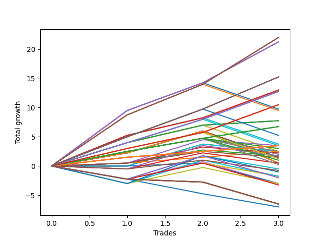

# Long Wallace 008 
- Symbol: ES
- Date Range: 03/18/2022 - 07/15/2022
- Trading Period: 7:20-12:30
- Number of Trades: 3



| Name | Win Percent | Profit | Avg Profit / Trade | Avg Time / Trade |      | Name | Win Percent | Profit | Avg Profit / Trade | Avg Time / Trade |
| ---- | ----------- | ------ | ------------------ | ---------------- | ---- | ---- | ----------- | ------ | ------------------ | ---------------- |
| Sorted By <br> Profit | | | | | | Sorted By <br> Win Percentage ||||
| Sixty-Seven | 100.00 | 11000.00 | 3666.67 | 19:30 |     | Sixty-Seven | 100.00 | 11000.00 | 3666.67 | 19:30 |
| Fifty-Nine | 100.00 | 11000.00 | 3666.67 | 19:30 |     | Fifty-Nine | 100.00 | 11000.00 | 3666.67 | 19:30 |
| Three | 100.00 | 11000.00 | 3666.67 | 19:30 |     | Three | 100.00 | 11000.00 | 3666.67 | 19:30 |
| Sixty-Six | 100.00 | 10625.00 | 3541.67 | 15:05 |     | Sixty-Six | 100.00 | 10625.00 | 3541.67 | 15:05 |
| Fifty-Eight | 100.00 | 10625.00 | 3541.67 | 15:05 |     | Fifty-Eight | 100.00 | 10625.00 | 3541.67 | 15:05 |
| Two | 100.00 | 10625.00 | 3541.67 | 15:05 |     | Two | 100.00 | 10625.00 | 3541.67 | 15:05 |
| One Hundred Thirty | 100.00 | 7625.00 | 2541.67 | 14:31 |     | One Hundred Thirty | 100.00 | 7625.00 | 2541.67 | 14:31 |
| One Hundred Twenty-Five | 100.00 | 7625.00 | 2541.67 | 14:31 |     | One Hundred Twenty-Five | 100.00 | 7625.00 | 2541.67 | 14:31 |
| Eighty-Five | 100.00 | 7625.00 | 2541.67 | 14:31 |     | Eighty-Five | 100.00 | 7625.00 | 2541.67 | 14:31 |
| Sixty-Five | 100.00 | 6500.00 | 2166.67 | 14:25 |     | Sixty-Five | 100.00 | 6500.00 | 2166.67 | 14:25 |
| Fifty-Seven | 100.00 | 6500.00 | 2166.67 | 14:25 |     | Fifty-Seven | 100.00 | 6500.00 | 2166.67 | 14:25 |
| One | 100.00 | 6500.00 | 2166.67 | 14:25 |     | One | 100.00 | 6500.00 | 2166.67 | 14:25 |
| One Hundred Twenty-Nine | 100.00 | 6375.00 | 2125.00 | 07:56 |     | One Hundred Twenty-Nine | 100.00 | 6375.00 | 2125.00 | 07:56 |
| One Hundred Twenty-Four | 100.00 | 6375.00 | 2125.00 | 07:56 |     | One Hundred Twenty-Four | 100.00 | 6375.00 | 2125.00 | 07:56 |
| Eighty-Four | 100.00 | 6375.00 | 2125.00 | 07:56 |     | Eighty-Four | 100.00 | 6375.00 | 2125.00 | 07:56 |
| One Hundred Twenty-Eight | 100.00 | 5250.00 | 1750.00 | 07:15 |     | One Hundred Twenty-Eight | 100.00 | 5250.00 | 1750.00 | 07:15 |
| One Hundred Twenty-Three | 100.00 | 5250.00 | 1750.00 | 07:15 |     | One Hundred Twenty-Three | 100.00 | 5250.00 | 1750.00 | 07:15 |
| Eighty-Three | 100.00 | 5250.00 | 1750.00 | 07:15 |     | Eighty-Three | 100.00 | 5250.00 | 1750.00 | 07:15 |
| Forty-Two | 66.67 | 4875.00 | 1625.00 | 11:53 |     | Sixty-Four | 100.00 | 3875.00 | 1291.67 | 07:23 |
| Forty-Three | 66.67 | 4750.00 | 1583.33 | 15:36 |     | Fifty-Six | 100.00 | 3875.00 | 1291.67 | 07:23 |
| Sixty-Four | 100.00 | 3875.00 | 1291.67 | 07:23 |     | Zero | 100.00 | 3875.00 | 1291.67 | 07:23 |
| Fifty-Six | 100.00 | 3875.00 | 1291.67 | 07:23 |     | One Hundred Twenty-Seven | 100.00 | 3375.00 | 1125.00 | 03:13 |
| Zero | 100.00 | 3875.00 | 1291.67 | 07:23 |     | One Hundred Twenty-Two | 100.00 | 3375.00 | 1125.00 | 03:13 |
| One Hundred Twenty-Seven | 100.00 | 3375.00 | 1125.00 | 03:13 |     | Eighty-Two | 100.00 | 3375.00 | 1125.00 | 03:13 |
| One Hundred Twenty-Two | 100.00 | 3375.00 | 1125.00 | 03:13 |     | One Hundred Twenty-Six | 100.00 | 1750.00 | 583.33 | 00:38 |
| Eighty-Two | 100.00 | 3375.00 | 1125.00 | 03:13 |     | One Hundred Twenty-One | 100.00 | 1750.00 | 583.33 | 00:38 |
| One Hundred Fifteen | 66.67 | 2625.00 | 875.00 | 11:28 |     | One Hundred Sixteen | 100.00 | 1750.00 | 583.33 | 00:38 |
| Forty-One | 66.67 | 1875.00 | 625.00 | 11:26 |     | One Hundred Eleven | 100.00 | 1750.00 | 583.33 | 00:38 |
| One Hundred Twenty-Six | 100.00 | 1750.00 | 583.33 | 00:38 |     | One Hundred Six | 100.00 | 1750.00 | 583.33 | 00:38 |
| One Hundred Twenty-One | 100.00 | 1750.00 | 583.33 | 00:38 |     | One Hundred One | 100.00 | 1750.00 | 583.33 | 00:38 |
| One Hundred Sixteen | 100.00 | 1750.00 | 583.33 | 00:38 |     | Ninety-One | 100.00 | 1750.00 | 583.33 | 00:38 |
| One Hundred Eleven | 100.00 | 1750.00 | 583.33 | 00:38 |     | Eighty-One | 100.00 | 1750.00 | 583.33 | 00:38 |
| One Hundred Six | 100.00 | 1750.00 | 583.33 | 00:38 |     | Ninety-Six | 100.00 | 1250.00 | 416.67 | 00:36 |
| One Hundred One | 100.00 | 1750.00 | 583.33 | 00:38 |     | Forty-Two | 66.67 | 4875.00 | 1625.00 | 11:53 |
| Ninety-One | 100.00 | 1750.00 | 583.33 | 00:38 |     | Forty-Three | 66.67 | 4750.00 | 1583.33 | 15:36 |
| Eighty-One | 100.00 | 1750.00 | 583.33 | 00:38 |     | One Hundred Fifteen | 66.67 | 2625.00 | 875.00 | 11:28 |
| One Hundred Fourteen | 66.67 | 1750.00 | 583.33 | 04:58 |     | Forty-One | 66.67 | 1875.00 | 625.00 | 11:26 |
| Ninety-Nine | 66.67 | 1750.00 | 583.33 | 02:13 |     | One Hundred Fourteen | 66.67 | 1750.00 | 583.33 | 04:58 |
| One Hundred Seven | 66.67 | 1500.00 | 500.00 | 01:08 |     | Ninety-Nine | 66.67 | 1750.00 | 583.33 | 02:13 |
| Ninety-Six | 100.00 | 1250.00 | 416.67 | 00:36 |     | One Hundred Seven | 66.67 | 1500.00 | 500.00 | 01:08 |
| Ninety-Two | 66.67 | 1250.00 | 416.67 | 01:13 |     | Ninety-Two | 66.67 | 1250.00 | 416.67 | 01:13 |
| Seventy-One | 66.67 | 1250.00 | 416.67 | 27:20 |     | Seventy-One | 66.67 | 1250.00 | 416.67 | 27:20 |
| Seventy | 66.67 | 1250.00 | 416.67 | 27:20 |     | Seventy | 66.67 | 1250.00 | 416.67 | 27:20 |
| Sixty-Nine | 66.67 | 1250.00 | 416.67 | 27:20 |     | Sixty-Nine | 66.67 | 1250.00 | 416.67 | 27:20 |
| Sixty-Eight | 66.67 | 1250.00 | 416.67 | 27:20 |     | Sixty-Eight | 66.67 | 1250.00 | 416.67 | 27:20 |
| Forty | 66.67 | 1250.00 | 416.67 | 04:50 |     | Forty | 66.67 | 1250.00 | 416.67 | 04:50 |
| Ninety-Eight | 66.67 | 1125.00 | 375.00 | 02:08 |     | Ninety-Eight | 66.67 | 1125.00 | 375.00 | 02:08 |
| One Hundred Two | 66.67 | 1000.00 | 333.33 | 01:20 |     | One Hundred Two | 66.67 | 1000.00 | 333.33 | 01:20 |
| Ninety-Seven | 66.67 | 875.00 | 291.67 | 00:56 |     | Ninety-Seven | 66.67 | 875.00 | 291.67 | 00:56 |
| One Hundred Nine | 33.33 | 875.00 | 291.67 | 02:46 |     | One Hundred | 66.67 | 750.00 | 250.00 | 02:50 |
| One Hundred | 66.67 | 750.00 | 250.00 | 02:50 |     | Forty-Seven | 66.67 | 750.00 | 250.00 | 20:46 |
| Forty-Seven | 66.67 | 750.00 | 250.00 | 20:46 |     | Forty-Six | 66.67 | 750.00 | 250.00 | 20:46 |
| Forty-Six | 66.67 | 750.00 | 250.00 | 20:46 |     | Forty-Five | 66.67 | 750.00 | 250.00 | 20:46 |
| Forty-Five | 66.67 | 750.00 | 250.00 | 20:46 |     | Forty-Four | 66.67 | 750.00 | 250.00 | 20:46 |
| Forty-Four | 66.67 | 750.00 | 250.00 | 20:46 |     | One Hundred Thirteen | 66.67 | 625.00 | 208.33 | 04:16 |
| One Hundred Thirteen | 66.67 | 625.00 | 208.33 | 04:16 |     | One Hundred Seventeen | 66.67 | 500.00 | 166.67 | 01:21 |
| One Hundred Seventeen | 66.67 | 500.00 | 166.67 | 01:21 |     | Sixty-Three | 66.67 | 250.00 | 83.33 | 29:55 |
| Sixty-Three | 66.67 | 250.00 | 83.33 | 29:55 |     | Sixty-Two | 66.67 | 250.00 | 83.33 | 29:55 |
| Sixty-Two | 66.67 | 250.00 | 83.33 | 29:55 |     | Sixty-One | 66.67 | 250.00 | 83.33 | 29:55 |
| Sixty-One | 66.67 | 250.00 | 83.33 | 29:55 |     | Sixty | 66.67 | 250.00 | 83.33 | 29:55 |
| Sixty | 66.67 | 250.00 | 83.33 | 29:55 |     | Seven | 66.67 | 250.00 | 83.33 | 29:55 |
| Seven | 66.67 | 250.00 | 83.33 | 29:55 |     | Six | 66.67 | 250.00 | 83.33 | 29:55 |
| Six | 66.67 | 250.00 | 83.33 | 29:55 |     | Five | 66.67 | 250.00 | 83.33 | 29:55 |
| Five | 66.67 | 250.00 | 83.33 | 29:55 |     | Four | 66.67 | 250.00 | 83.33 | 29:55 |
| Four | 66.67 | 250.00 | 83.33 | 29:55 |     | One Hundred Twelve | 66.67 | 125.00 | 41.67 | 01:33 |
| One Hundred Eight | 33.33 | 250.00 | 83.33 | 02:41 |     | Seventy-Three | 66.67 | -1500.00 | -500.00 | 06:25 |
| One Hundred Twelve | 66.67 | 125.00 | 41.67 | 01:33 |     | One Hundred Nine | 33.33 | 875.00 | 291.67 | 02:46 |
| Ninety-Four | 33.33 | -250.00 | -83.33 | 03:06 |     | One Hundred Eight | 33.33 | 250.00 | 83.33 | 02:41 |
| One Hundred Ten | 33.33 | -375.00 | -125.00 | 03:51 |     | Ninety-Four | 33.33 | -250.00 | -83.33 | 03:06 |
| One Hundred Five | 33.33 | -500.00 | -166.67 | 08:31 |     | One Hundred Ten | 33.33 | -375.00 | -125.00 | 03:51 |
| One Hundred Four | 33.33 | -875.00 | -291.67 | 03:16 |     | One Hundred Five | 33.33 | -500.00 | -166.67 | 08:31 |
| Ninety-Three | 33.33 | -875.00 | -291.67 | 03:01 |     | One Hundred Four | 33.33 | -875.00 | -291.67 | 03:16 |
| One Hundred Ninteen | 33.33 | -1000.00 | -333.33 | 03:15 |     | Ninety-Three | 33.33 | -875.00 | -291.67 | 03:01 |
| Seventy-Three | 66.67 | -1500.00 | -500.00 | 06:25 |     | One Hundred Ninteen | 33.33 | -1000.00 | -333.33 | 03:15 |
| One Hundred Three | 33.33 | -1500.00 | -500.00 | 03:11 |     | One Hundred Three | 33.33 | -1500.00 | -500.00 | 03:11 |
| Forty-Eight | 33.33 | -1500.00 | -500.00 | 03:11 |     | Forty-Eight | 33.33 | -1500.00 | -500.00 | 03:11 |
| One Hundred Eighteen | 33.33 | -1625.00 | -541.67 | 03:10 |     | One Hundred Eighteen | 33.33 | -1625.00 | -541.67 | 03:10 |
| One Hundred Twenty | 0.00 | -3250.00 | -1083.33 | 05:46 |     | One Hundred Twenty | 0.00 | -3250.00 | -1083.33 | 05:46 |
| Fifty-Five | 0.00 | -3250.00 | -1083.33 | 05:46 |     | Fifty-Five | 0.00 | -3250.00 | -1083.33 | 05:46 |
| Fifty-Four | 0.00 | -3250.00 | -1083.33 | 05:46 |     | Fifty-Four | 0.00 | -3250.00 | -1083.33 | 05:46 |
| Fifty-Three | 0.00 | -3250.00 | -1083.33 | 05:46 |     | Fifty-Three | 0.00 | -3250.00 | -1083.33 | 05:46 |
| Fifty-Two | 0.00 | -3250.00 | -1083.33 | 05:46 |     | Fifty-Two | 0.00 | -3250.00 | -1083.33 | 05:46 |
| Fifty-One | 0.00 | -3250.00 | -1083.33 | 05:46 |     | Fifty-One | 0.00 | -3250.00 | -1083.33 | 05:46 |
| Fifty | 0.00 | -3250.00 | -1083.33 | 05:46 |     | Fifty | 0.00 | -3250.00 | -1083.33 | 05:46 |
| Forty-Nine | 0.00 | -3250.00 | -1083.33 | 05:46 |     | Forty-Nine | 0.00 | -3250.00 | -1083.33 | 05:46 |
| Ninety-Five | 0.00 | -3500.00 | -1166.67 | 06:13 |     | Ninety-Five | 0.00 | -3500.00 | -1166.67 | 06:13 |

## NO STOPLOSS

### Test Zero
* Sell when price hits the middle line of the 20p bollinger
* No Stoploss
* Results:
```
Total Trades: 3
Percent Up: 100.00
Percent Down: 0.00
Total Points Moved Up: 7.75
Potential Profit: 3875.00
Total Points Ups: 7.75 Count Ups: 3
Total Points Downs: 0.00 Count Downs: 0
```

<details><summary>Trades</summary>

<code>In: 2022-03-25 08:30:00		Out: 2022-03-25 08:36:40		Total Position Time: 06:40		Total Move Up: 4.00		Total to Date: 4.00</code> <br />
<code>In: 2022-03-30 08:14:00		Out: 2022-03-30 08:19:20		Total Position Time: 05:20		Total Move Up: 3.00		Total to Date: 7.00</code> <br />
<code>In: 2022-06-23 09:07:00		Out: 2022-06-23 09:17:10		Total Position Time: 10:10		Total Move Up: 0.75		Total to Date: 7.75</code> <br />


</details>

### Test One
* Sell when the price hits the upper line of the 20p 1std bollinger
* No Stoploss
* Results:
```
Total Trades: 3
Percent Up: 100.00
Percent Down: 0.00
Total Points Moved Up: 13.00
Potential Profit: 6500.00
Total Points Ups: 13.00 Count Ups: 3
Total Points Downs: 0.00 Count Downs: 0
```

<details><summary>Trades</summary>

<code>In: 2022-03-25 08:30:00		Out: 2022-03-25 08:41:05		Total Position Time: 11:05		Total Move Up: 5.25		Total to Date: 5.25</code> <br />
<code>In: 2022-03-30 08:14:00		Out: 2022-03-30 08:34:45		Total Position Time: 20:45		Total Move Up: 3.00		Total to Date: 8.25</code> <br />
<code>In: 2022-06-23 09:07:00		Out: 2022-06-23 09:18:25		Total Position Time: 11:25		Total Move Up: 4.75		Total to Date: 13.00</code> <br />


</details>

### Test Two
* Sell when the price hits the upper line of the 20p 2std bollinger
* No Stoploss
* Results:
```
Total Trades: 3
Percent Up: 100.00
Percent Down: 0.00
Total Points Moved Up: 21.25
Potential Profit: 10625.00
Total Points Ups: 21.25 Count Ups: 3
Total Points Downs: 0.00 Count Downs: 0
```

<details><summary>Trades</summary>

<code>In: 2022-03-25 08:30:00		Out: 2022-03-25 08:41:55		Total Position Time: 11:55		Total Move Up: 9.50		Total to Date: 9.50</code> <br />
<code>In: 2022-03-30 08:14:00		Out: 2022-03-30 08:35:15		Total Position Time: 21:15		Total Move Up: 4.75		Total to Date: 14.25</code> <br />
<code>In: 2022-06-23 09:07:00		Out: 2022-06-23 09:19:05		Total Position Time: 12:05		Total Move Up: 7.00		Total to Date: 21.25</code> <br />


</details>

### Test Three
* Sell when price hits the middle line of the 50p bollinger
* No Stoploss
* Results:
```
Total Trades: 3
Percent Up: 100.00
Percent Down: 0.00
Total Points Moved Up: 22.00
Potential Profit: 11000.00
Total Points Ups: 22.00 Count Ups: 3
Total Points Downs: 0.00 Count Downs: 0
```

<details><summary>Trades</summary>

<code>In: 2022-03-25 08:30:00		Out: 2022-03-25 08:53:00		Total Position Time: 23:00		Total Move Up: 8.75		Total to Date: 8.75</code> <br />
<code>In: 2022-03-30 08:14:00		Out: 2022-03-30 08:35:20		Total Position Time: 21:20		Total Move Up: 5.25		Total to Date: 14.00</code> <br />
<code>In: 2022-06-23 09:07:00		Out: 2022-06-23 09:21:10		Total Position Time: 14:10		Total Move Up: 8.00		Total to Date: 22.00</code> <br />


</details>

### Test Four
* Sell when the price hits the upper line of the 50p 1std bollinger
* No Stoploss
* Results:
```
Total Trades: 3
Percent Up: 66.67
Percent Down: 33.33
Total Points Moved Up: 0.50
Potential Profit: 250.00
Total Points Ups: 6.00 Count Ups: 2
Total Points Downs: -5.50 Count Downs: 1
```

<details><summary>Trades</summary>

<code>In: 2022-03-25 08:30:00		Out: 2022-03-25 08:59:55		Total Position Time: 29:55		Total Move Up: 2.25		Total to Date: 2.25</code> <br />
<code>In: 2022-03-30 08:14:00		Out: 2022-03-30 08:43:55		Total Position Time: 29:55		Total Move Up: 3.75		Total to Date: 6.00</code> <br />
<code>In: 2022-06-23 09:07:00		Out: 2022-06-23 09:36:55		Total Position Time: 29:55		Total Move Up: -5.50		Total to Date: 0.50</code> <br />


</details>

### Test Five
* Sell when the price hits the upper line of the 50p 2std bollinger
* No Stoploss
* Results:
```
Total Trades: 3
Percent Up: 66.67
Percent Down: 33.33
Total Points Moved Up: 0.50
Potential Profit: 250.00
Total Points Ups: 6.00 Count Ups: 2
Total Points Downs: -5.50 Count Downs: 1
```

<details><summary>Trades</summary>

<code>In: 2022-03-25 08:30:00		Out: 2022-03-25 08:59:55		Total Position Time: 29:55		Total Move Up: 2.25		Total to Date: 2.25</code> <br />
<code>In: 2022-03-30 08:14:00		Out: 2022-03-30 08:43:55		Total Position Time: 29:55		Total Move Up: 3.75		Total to Date: 6.00</code> <br />
<code>In: 2022-06-23 09:07:00		Out: 2022-06-23 09:36:55		Total Position Time: 29:55		Total Move Up: -5.50		Total to Date: 0.50</code> <br />


</details>

### Test Six
* Sell when the price hits the middle line of the 1std VWAP
* No Stoploss
* Results:
```
Total Trades: 3
Percent Up: 66.67
Percent Down: 33.33
Total Points Moved Up: 0.50
Potential Profit: 250.00
Total Points Ups: 6.00 Count Ups: 2
Total Points Downs: -5.50 Count Downs: 1
```

<details><summary>Trades</summary>

<code>In: 2022-03-25 08:30:00		Out: 2022-03-25 08:59:55		Total Position Time: 29:55		Total Move Up: 2.25		Total to Date: 2.25</code> <br />
<code>In: 2022-03-30 08:14:00		Out: 2022-03-30 08:43:55		Total Position Time: 29:55		Total Move Up: 3.75		Total to Date: 6.00</code> <br />
<code>In: 2022-06-23 09:07:00		Out: 2022-06-23 09:36:55		Total Position Time: 29:55		Total Move Up: -5.50		Total to Date: 0.50</code> <br />


</details>

### Test Seven
* Sell when the price hits the upper line of the 1std VWAP
* No Stoploss
* Results:
```
Total Trades: 3
Percent Up: 66.67
Percent Down: 33.33
Total Points Moved Up: 0.50
Potential Profit: 250.00
Total Points Ups: 6.00 Count Ups: 2
Total Points Downs: -5.50 Count Downs: 1
```

<details><summary>Trades</summary>

<code>In: 2022-03-25 08:30:00		Out: 2022-03-25 08:59:55		Total Position Time: 29:55		Total Move Up: 2.25		Total to Date: 2.25</code> <br />
<code>In: 2022-03-30 08:14:00		Out: 2022-03-30 08:43:55		Total Position Time: 29:55		Total Move Up: 3.75		Total to Date: 6.00</code> <br />
<code>In: 2022-06-23 09:07:00		Out: 2022-06-23 09:36:55		Total Position Time: 29:55		Total Move Up: -5.50		Total to Date: 0.50</code> <br />


</details>

## STOPLOSS OF 5

### Test Forty
* Sell when price hits the middle line of the 20p bollinger
* Stoploss is 5 points
* Results:
```
Total Trades: 3
Percent Up: 66.67
Percent Down: 33.33
Total Points Moved Up: 2.50
Potential Profit: 1250.00
Total Points Ups: 7.00 Count Ups: 2
Total Points Downs: -4.50 Count Downs: 1
```

<details><summary>Trades</summary>

<code>In: 2022-03-25 08:30:00		Out: 2022-03-25 08:36:40		Total Position Time: 06:40		Total Move Up: 4.00		Total to Date: 4.00</code> <br />
<code>In: 2022-03-30 08:14:00		Out: 2022-03-30 08:19:20		Total Position Time: 05:20		Total Move Up: 3.00		Total to Date: 7.00</code> <br />
<code>In: 2022-06-23 09:07:00		Out: 2022-06-23 09:09:30		Total Position Time: 02:30		Total Move Up: -4.50		Total to Date: 2.50</code> <br />


</details>

### Test Forty-One
* Sell when the price hits the upper line of the 20p 1std bollinger
* Stoploss is 5 points
* Results:
```
Total Trades: 3
Percent Up: 66.67
Percent Down: 33.33
Total Points Moved Up: 3.75
Potential Profit: 1875.00
Total Points Ups: 8.25 Count Ups: 2
Total Points Downs: -4.50 Count Downs: 1
```

<details><summary>Trades</summary>

<code>In: 2022-03-25 08:30:00		Out: 2022-03-25 08:41:05		Total Position Time: 11:05		Total Move Up: 5.25		Total to Date: 5.25</code> <br />
<code>In: 2022-03-30 08:14:00		Out: 2022-03-30 08:34:45		Total Position Time: 20:45		Total Move Up: 3.00		Total to Date: 8.25</code> <br />
<code>In: 2022-06-23 09:07:00		Out: 2022-06-23 09:09:30		Total Position Time: 02:30		Total Move Up: -4.50		Total to Date: 3.75</code> <br />


</details>

### Test Forty-Two
* Sell when the price hits the upper line of the 20p 2std bollinger
* Stoploss is 5 points
* Results:
```
Total Trades: 3
Percent Up: 66.67
Percent Down: 33.33
Total Points Moved Up: 9.75
Potential Profit: 4875.00
Total Points Ups: 14.25 Count Ups: 2
Total Points Downs: -4.50 Count Downs: 1
```

<details><summary>Trades</summary>

<code>In: 2022-03-25 08:30:00		Out: 2022-03-25 08:41:55		Total Position Time: 11:55		Total Move Up: 9.50		Total to Date: 9.50</code> <br />
<code>In: 2022-03-30 08:14:00		Out: 2022-03-30 08:35:15		Total Position Time: 21:15		Total Move Up: 4.75		Total to Date: 14.25</code> <br />
<code>In: 2022-06-23 09:07:00		Out: 2022-06-23 09:09:30		Total Position Time: 02:30		Total Move Up: -4.50		Total to Date: 9.75</code> <br />


</details>

### Test Forty-Three
* Sell when price hits the middle line of the 50p bollinger
* Stoploss is 5 points
* Results:
```
Total Trades: 3
Percent Up: 66.67
Percent Down: 33.33
Total Points Moved Up: 9.50
Potential Profit: 4750.00
Total Points Ups: 14.00 Count Ups: 2
Total Points Downs: -4.50 Count Downs: 1
```

<details><summary>Trades</summary>

<code>In: 2022-03-25 08:30:00		Out: 2022-03-25 08:53:00		Total Position Time: 23:00		Total Move Up: 8.75		Total to Date: 8.75</code> <br />
<code>In: 2022-03-30 08:14:00		Out: 2022-03-30 08:35:20		Total Position Time: 21:20		Total Move Up: 5.25		Total to Date: 14.00</code> <br />
<code>In: 2022-06-23 09:07:00		Out: 2022-06-23 09:09:30		Total Position Time: 02:30		Total Move Up: -4.50		Total to Date: 9.50</code> <br />


</details>

### Test Forty-Four
* Sell when the price hits the upper line of the 50p 1std bollinger
* Stoploss is 5 points
* Results:
```
Total Trades: 3
Percent Up: 66.67
Percent Down: 33.33
Total Points Moved Up: 1.50
Potential Profit: 750.00
Total Points Ups: 6.00 Count Ups: 2
Total Points Downs: -4.50 Count Downs: 1
```

<details><summary>Trades</summary>

<code>In: 2022-03-25 08:30:00		Out: 2022-03-25 08:59:55		Total Position Time: 29:55		Total Move Up: 2.25		Total to Date: 2.25</code> <br />
<code>In: 2022-03-30 08:14:00		Out: 2022-03-30 08:43:55		Total Position Time: 29:55		Total Move Up: 3.75		Total to Date: 6.00</code> <br />
<code>In: 2022-06-23 09:07:00		Out: 2022-06-23 09:09:30		Total Position Time: 02:30		Total Move Up: -4.50		Total to Date: 1.50</code> <br />


</details>

### Test Forty-Five
* Sell when the price hits the upper line of the 50p 2std bollinger
* Stoploss is 5 points
* Results:
```
Total Trades: 3
Percent Up: 66.67
Percent Down: 33.33
Total Points Moved Up: 1.50
Potential Profit: 750.00
Total Points Ups: 6.00 Count Ups: 2
Total Points Downs: -4.50 Count Downs: 1
```

<details><summary>Trades</summary>

<code>In: 2022-03-25 08:30:00		Out: 2022-03-25 08:59:55		Total Position Time: 29:55		Total Move Up: 2.25		Total to Date: 2.25</code> <br />
<code>In: 2022-03-30 08:14:00		Out: 2022-03-30 08:43:55		Total Position Time: 29:55		Total Move Up: 3.75		Total to Date: 6.00</code> <br />
<code>In: 2022-06-23 09:07:00		Out: 2022-06-23 09:09:30		Total Position Time: 02:30		Total Move Up: -4.50		Total to Date: 1.50</code> <br />


</details>

### Test Forty-Six
* Sell when the price hits the middle line of the 1std VWAP
* Stoploss is 5 points
* Results:
```
Total Trades: 3
Percent Up: 66.67
Percent Down: 33.33
Total Points Moved Up: 1.50
Potential Profit: 750.00
Total Points Ups: 6.00 Count Ups: 2
Total Points Downs: -4.50 Count Downs: 1
```

<details><summary>Trades</summary>

<code>In: 2022-03-25 08:30:00		Out: 2022-03-25 08:59:55		Total Position Time: 29:55		Total Move Up: 2.25		Total to Date: 2.25</code> <br />
<code>In: 2022-03-30 08:14:00		Out: 2022-03-30 08:43:55		Total Position Time: 29:55		Total Move Up: 3.75		Total to Date: 6.00</code> <br />
<code>In: 2022-06-23 09:07:00		Out: 2022-06-23 09:09:30		Total Position Time: 02:30		Total Move Up: -4.50		Total to Date: 1.50</code> <br />


</details>

### Test Forty-Seven
* Sell when the price hits the upper line of the 1std VWAP
* Stoploss is 5 points
* Results:
```
Total Trades: 3
Percent Up: 66.67
Percent Down: 33.33
Total Points Moved Up: 1.50
Potential Profit: 750.00
Total Points Ups: 6.00 Count Ups: 2
Total Points Downs: -4.50 Count Downs: 1
```

<details><summary>Trades</summary>

<code>In: 2022-03-25 08:30:00		Out: 2022-03-25 08:59:55		Total Position Time: 29:55		Total Move Up: 2.25		Total to Date: 2.25</code> <br />
<code>In: 2022-03-30 08:14:00		Out: 2022-03-30 08:43:55		Total Position Time: 29:55		Total Move Up: 3.75		Total to Date: 6.00</code> <br />
<code>In: 2022-06-23 09:07:00		Out: 2022-06-23 09:09:30		Total Position Time: 02:30		Total Move Up: -4.50		Total to Date: 1.50</code> <br />


</details>

## TRAIL STOP OF 5

### Test Forty-Eight
* Sell when price hits the middle line of the 20p bollinger
* Trailing Stop is 5 points
* Results:
```
Total Trades: 3
Percent Up: 33.33
Percent Down: 66.67
Total Points Moved Up: -3.00
Potential Profit: -1500.00
Total Points Ups: 3.00 Count Ups: 1
Total Points Downs: -6.00 Count Downs: 2
```

<details><summary>Trades</summary>

<code>In: 2022-03-25 08:30:00		Out: 2022-03-25 08:32:20		Total Position Time: 02:20		Total Move Up: -2.25		Total to Date: -2.25</code> <br />
<code>In: 2022-03-30 08:14:00		Out: 2022-03-30 08:19:20		Total Position Time: 05:20		Total Move Up: 3.00		Total to Date: 0.75</code> <br />
<code>In: 2022-06-23 09:07:00		Out: 2022-06-23 09:08:55		Total Position Time: 01:55		Total Move Up: -3.75		Total to Date: -3.00</code> <br />


</details>

### Test Forty-Nine
* Sell when the price hits the upper line of the 20p 1std bollinger
* Trailing Stop is 5 points
* Results:
```
Total Trades: 3
Percent Up: 0.00
Percent Down: 100.00
Total Points Moved Up: -6.50
Potential Profit: -3250.00
Total Points Ups: 0.00 Count Ups: 0
Total Points Downs: -6.50 Count Downs: 3
```

<details><summary>Trades</summary>

<code>In: 2022-03-25 08:30:00		Out: 2022-03-25 08:32:20		Total Position Time: 02:20		Total Move Up: -2.25		Total to Date: -2.25</code> <br />
<code>In: 2022-03-30 08:14:00		Out: 2022-03-30 08:27:05		Total Position Time: 13:05		Total Move Up: -0.50		Total to Date: -2.75</code> <br />
<code>In: 2022-06-23 09:07:00		Out: 2022-06-23 09:08:55		Total Position Time: 01:55		Total Move Up: -3.75		Total to Date: -6.50</code> <br />


</details>

### Test Fifty
* Sell when the price hits the upper line of the 20p 2std bollinger
* Trailing Stop is 5 points
* Results:
```
Total Trades: 3
Percent Up: 0.00
Percent Down: 100.00
Total Points Moved Up: -6.50
Potential Profit: -3250.00
Total Points Ups: 0.00 Count Ups: 0
Total Points Downs: -6.50 Count Downs: 3
```

<details><summary>Trades</summary>

<code>In: 2022-03-25 08:30:00		Out: 2022-03-25 08:32:20		Total Position Time: 02:20		Total Move Up: -2.25		Total to Date: -2.25</code> <br />
<code>In: 2022-03-30 08:14:00		Out: 2022-03-30 08:27:05		Total Position Time: 13:05		Total Move Up: -0.50		Total to Date: -2.75</code> <br />
<code>In: 2022-06-23 09:07:00		Out: 2022-06-23 09:08:55		Total Position Time: 01:55		Total Move Up: -3.75		Total to Date: -6.50</code> <br />


</details>

### Test Fifty-One
* Sell when price hits the middle line of the 50p bollinger
* Trailing Stop is 5 points
* Results:
```
Total Trades: 3
Percent Up: 0.00
Percent Down: 100.00
Total Points Moved Up: -6.50
Potential Profit: -3250.00
Total Points Ups: 0.00 Count Ups: 0
Total Points Downs: -6.50 Count Downs: 3
```

<details><summary>Trades</summary>

<code>In: 2022-03-25 08:30:00		Out: 2022-03-25 08:32:20		Total Position Time: 02:20		Total Move Up: -2.25		Total to Date: -2.25</code> <br />
<code>In: 2022-03-30 08:14:00		Out: 2022-03-30 08:27:05		Total Position Time: 13:05		Total Move Up: -0.50		Total to Date: -2.75</code> <br />
<code>In: 2022-06-23 09:07:00		Out: 2022-06-23 09:08:55		Total Position Time: 01:55		Total Move Up: -3.75		Total to Date: -6.50</code> <br />


</details>

### Test Fifty-Two
* Sell when the price hits the upper line of the 50p 1std bollinger
* Trailing Stop is 5 points
* Results:
```
Total Trades: 3
Percent Up: 0.00
Percent Down: 100.00
Total Points Moved Up: -6.50
Potential Profit: -3250.00
Total Points Ups: 0.00 Count Ups: 0
Total Points Downs: -6.50 Count Downs: 3
```

<details><summary>Trades</summary>

<code>In: 2022-03-25 08:30:00		Out: 2022-03-25 08:32:20		Total Position Time: 02:20		Total Move Up: -2.25		Total to Date: -2.25</code> <br />
<code>In: 2022-03-30 08:14:00		Out: 2022-03-30 08:27:05		Total Position Time: 13:05		Total Move Up: -0.50		Total to Date: -2.75</code> <br />
<code>In: 2022-06-23 09:07:00		Out: 2022-06-23 09:08:55		Total Position Time: 01:55		Total Move Up: -3.75		Total to Date: -6.50</code> <br />


</details>

### Test Fifty-Three
* Sell when the price hits the upper line of the 50p 2std bollinger
* Trailing Stop is 5 points
* Results:
```
Total Trades: 3
Percent Up: 0.00
Percent Down: 100.00
Total Points Moved Up: -6.50
Potential Profit: -3250.00
Total Points Ups: 0.00 Count Ups: 0
Total Points Downs: -6.50 Count Downs: 3
```

<details><summary>Trades</summary>

<code>In: 2022-03-25 08:30:00		Out: 2022-03-25 08:32:20		Total Position Time: 02:20		Total Move Up: -2.25		Total to Date: -2.25</code> <br />
<code>In: 2022-03-30 08:14:00		Out: 2022-03-30 08:27:05		Total Position Time: 13:05		Total Move Up: -0.50		Total to Date: -2.75</code> <br />
<code>In: 2022-06-23 09:07:00		Out: 2022-06-23 09:08:55		Total Position Time: 01:55		Total Move Up: -3.75		Total to Date: -6.50</code> <br />


</details>

### Test Fifty-Four
* Sell when the price hits the middle line of the 1std VWAP
* Trailing Stop is 5 points
* Results:
```
Total Trades: 3
Percent Up: 0.00
Percent Down: 100.00
Total Points Moved Up: -6.50
Potential Profit: -3250.00
Total Points Ups: 0.00 Count Ups: 0
Total Points Downs: -6.50 Count Downs: 3
```

<details><summary>Trades</summary>

<code>In: 2022-03-25 08:30:00		Out: 2022-03-25 08:32:20		Total Position Time: 02:20		Total Move Up: -2.25		Total to Date: -2.25</code> <br />
<code>In: 2022-03-30 08:14:00		Out: 2022-03-30 08:27:05		Total Position Time: 13:05		Total Move Up: -0.50		Total to Date: -2.75</code> <br />
<code>In: 2022-06-23 09:07:00		Out: 2022-06-23 09:08:55		Total Position Time: 01:55		Total Move Up: -3.75		Total to Date: -6.50</code> <br />


</details>

### Test Fifty-Five
* Sell when the price hits the upper line of the 1std VWAP
* Trailing Stop is 5 points
* Results:
```
Total Trades: 3
Percent Up: 0.00
Percent Down: 100.00
Total Points Moved Up: -6.50
Potential Profit: -3250.00
Total Points Ups: 0.00 Count Ups: 0
Total Points Downs: -6.50 Count Downs: 3
```

<details><summary>Trades</summary>

<code>In: 2022-03-25 08:30:00		Out: 2022-03-25 08:32:20		Total Position Time: 02:20		Total Move Up: -2.25		Total to Date: -2.25</code> <br />
<code>In: 2022-03-30 08:14:00		Out: 2022-03-30 08:27:05		Total Position Time: 13:05		Total Move Up: -0.50		Total to Date: -2.75</code> <br />
<code>In: 2022-06-23 09:07:00		Out: 2022-06-23 09:08:55		Total Position Time: 01:55		Total Move Up: -3.75		Total to Date: -6.50</code> <br />


</details>

## STOPLOSS OF 10

### Test Fifty-Six
* Sell when price hits the middle line of the 20p bollinger
* Stoploss is 10 points
* Results:
```
Total Trades: 3
Percent Up: 100.00
Percent Down: 0.00
Total Points Moved Up: 7.75
Potential Profit: 3875.00
Total Points Ups: 7.75 Count Ups: 3
Total Points Downs: 0.00 Count Downs: 0
```

<details><summary>Trades</summary>

<code>In: 2022-03-25 08:30:00		Out: 2022-03-25 08:36:40		Total Position Time: 06:40		Total Move Up: 4.00		Total to Date: 4.00</code> <br />
<code>In: 2022-03-30 08:14:00		Out: 2022-03-30 08:19:20		Total Position Time: 05:20		Total Move Up: 3.00		Total to Date: 7.00</code> <br />
<code>In: 2022-06-23 09:07:00		Out: 2022-06-23 09:17:10		Total Position Time: 10:10		Total Move Up: 0.75		Total to Date: 7.75</code> <br />


</details>

### Test Fifty-Seven
* Sell when the price hits the upper line of the 20p 1std bollinger
* Stoploss is 10 points
* Results:
```
Total Trades: 3
Percent Up: 100.00
Percent Down: 0.00
Total Points Moved Up: 13.00
Potential Profit: 6500.00
Total Points Ups: 13.00 Count Ups: 3
Total Points Downs: 0.00 Count Downs: 0
```

<details><summary>Trades</summary>

<code>In: 2022-03-25 08:30:00		Out: 2022-03-25 08:41:05		Total Position Time: 11:05		Total Move Up: 5.25		Total to Date: 5.25</code> <br />
<code>In: 2022-03-30 08:14:00		Out: 2022-03-30 08:34:45		Total Position Time: 20:45		Total Move Up: 3.00		Total to Date: 8.25</code> <br />
<code>In: 2022-06-23 09:07:00		Out: 2022-06-23 09:18:25		Total Position Time: 11:25		Total Move Up: 4.75		Total to Date: 13.00</code> <br />


</details>

### Test Fifty-Eight
* Sell when the price hits the upper line of the 20p 2std bollinger
* Stoploss is 10 points
* Results:
```
Total Trades: 3
Percent Up: 100.00
Percent Down: 0.00
Total Points Moved Up: 21.25
Potential Profit: 10625.00
Total Points Ups: 21.25 Count Ups: 3
Total Points Downs: 0.00 Count Downs: 0
```

<details><summary>Trades</summary>

<code>In: 2022-03-25 08:30:00		Out: 2022-03-25 08:41:55		Total Position Time: 11:55		Total Move Up: 9.50		Total to Date: 9.50</code> <br />
<code>In: 2022-03-30 08:14:00		Out: 2022-03-30 08:35:15		Total Position Time: 21:15		Total Move Up: 4.75		Total to Date: 14.25</code> <br />
<code>In: 2022-06-23 09:07:00		Out: 2022-06-23 09:19:05		Total Position Time: 12:05		Total Move Up: 7.00		Total to Date: 21.25</code> <br />


</details>

### Test Fifty-Nine
* Sell when price hits the middle line of the 50p bollinger
* Stoploss is 10 points
* Results:
```
Total Trades: 3
Percent Up: 100.00
Percent Down: 0.00
Total Points Moved Up: 22.00
Potential Profit: 11000.00
Total Points Ups: 22.00 Count Ups: 3
Total Points Downs: 0.00 Count Downs: 0
```

<details><summary>Trades</summary>

<code>In: 2022-03-25 08:30:00		Out: 2022-03-25 08:53:00		Total Position Time: 23:00		Total Move Up: 8.75		Total to Date: 8.75</code> <br />
<code>In: 2022-03-30 08:14:00		Out: 2022-03-30 08:35:20		Total Position Time: 21:20		Total Move Up: 5.25		Total to Date: 14.00</code> <br />
<code>In: 2022-06-23 09:07:00		Out: 2022-06-23 09:21:10		Total Position Time: 14:10		Total Move Up: 8.00		Total to Date: 22.00</code> <br />


</details>

### Test Sixty
* Sell when the price hits the upper line of the 50p 1std bollinger
* Stoploss is 10 points
* Results:
```
Total Trades: 3
Percent Up: 66.67
Percent Down: 33.33
Total Points Moved Up: 0.50
Potential Profit: 250.00
Total Points Ups: 6.00 Count Ups: 2
Total Points Downs: -5.50 Count Downs: 1
```

<details><summary>Trades</summary>

<code>In: 2022-03-25 08:30:00		Out: 2022-03-25 08:59:55		Total Position Time: 29:55		Total Move Up: 2.25		Total to Date: 2.25</code> <br />
<code>In: 2022-03-30 08:14:00		Out: 2022-03-30 08:43:55		Total Position Time: 29:55		Total Move Up: 3.75		Total to Date: 6.00</code> <br />
<code>In: 2022-06-23 09:07:00		Out: 2022-06-23 09:36:55		Total Position Time: 29:55		Total Move Up: -5.50		Total to Date: 0.50</code> <br />


</details>

### Test Sixty-One
* Sell when the price hits the upper line of the 50p 2std bollinger
* Stoploss is 10 points
* Results:
```
Total Trades: 3
Percent Up: 66.67
Percent Down: 33.33
Total Points Moved Up: 0.50
Potential Profit: 250.00
Total Points Ups: 6.00 Count Ups: 2
Total Points Downs: -5.50 Count Downs: 1
```

<details><summary>Trades</summary>

<code>In: 2022-03-25 08:30:00		Out: 2022-03-25 08:59:55		Total Position Time: 29:55		Total Move Up: 2.25		Total to Date: 2.25</code> <br />
<code>In: 2022-03-30 08:14:00		Out: 2022-03-30 08:43:55		Total Position Time: 29:55		Total Move Up: 3.75		Total to Date: 6.00</code> <br />
<code>In: 2022-06-23 09:07:00		Out: 2022-06-23 09:36:55		Total Position Time: 29:55		Total Move Up: -5.50		Total to Date: 0.50</code> <br />


</details>

### Test Sixty-Two
* Sell when the price hits the middle line of the 1std VWAP
* Stoploss is 10 points
* Results:
```
Total Trades: 3
Percent Up: 66.67
Percent Down: 33.33
Total Points Moved Up: 0.50
Potential Profit: 250.00
Total Points Ups: 6.00 Count Ups: 2
Total Points Downs: -5.50 Count Downs: 1
```

<details><summary>Trades</summary>

<code>In: 2022-03-25 08:30:00		Out: 2022-03-25 08:59:55		Total Position Time: 29:55		Total Move Up: 2.25		Total to Date: 2.25</code> <br />
<code>In: 2022-03-30 08:14:00		Out: 2022-03-30 08:43:55		Total Position Time: 29:55		Total Move Up: 3.75		Total to Date: 6.00</code> <br />
<code>In: 2022-06-23 09:07:00		Out: 2022-06-23 09:36:55		Total Position Time: 29:55		Total Move Up: -5.50		Total to Date: 0.50</code> <br />


</details>

### Test Sixty-Three
* Sell when the price hits the upper line of the 1std VWAP
* Stoploss is 10 points
* Results:
```
Total Trades: 3
Percent Up: 66.67
Percent Down: 33.33
Total Points Moved Up: 0.50
Potential Profit: 250.00
Total Points Ups: 6.00 Count Ups: 2
Total Points Downs: -5.50 Count Downs: 1
```

<details><summary>Trades</summary>

<code>In: 2022-03-25 08:30:00		Out: 2022-03-25 08:59:55		Total Position Time: 29:55		Total Move Up: 2.25		Total to Date: 2.25</code> <br />
<code>In: 2022-03-30 08:14:00		Out: 2022-03-30 08:43:55		Total Position Time: 29:55		Total Move Up: 3.75		Total to Date: 6.00</code> <br />
<code>In: 2022-06-23 09:07:00		Out: 2022-06-23 09:36:55		Total Position Time: 29:55		Total Move Up: -5.50		Total to Date: 0.50</code> <br />


</details>

## TRAIL STOP OF 10

### Test Sixty-Four
* Sell when price hits the middle line of the 20p bollinger
* Trailing Stop is 10 points
* Results:
```
Total Trades: 3
Percent Up: 100.00
Percent Down: 0.00
Total Points Moved Up: 7.75
Potential Profit: 3875.00
Total Points Ups: 7.75 Count Ups: 3
Total Points Downs: 0.00 Count Downs: 0
```

<details><summary>Trades</summary>

<code>In: 2022-03-25 08:30:00		Out: 2022-03-25 08:36:40		Total Position Time: 06:40		Total Move Up: 4.00		Total to Date: 4.00</code> <br />
<code>In: 2022-03-30 08:14:00		Out: 2022-03-30 08:19:20		Total Position Time: 05:20		Total Move Up: 3.00		Total to Date: 7.00</code> <br />
<code>In: 2022-06-23 09:07:00		Out: 2022-06-23 09:17:10		Total Position Time: 10:10		Total Move Up: 0.75		Total to Date: 7.75</code> <br />


</details>

### Test Sixty-Five
* Sell when the price hits the upper line of the 20p 1std bollinger
* Trailing Stop is 10 points
* Results:
```
Total Trades: 3
Percent Up: 100.00
Percent Down: 0.00
Total Points Moved Up: 13.00
Potential Profit: 6500.00
Total Points Ups: 13.00 Count Ups: 3
Total Points Downs: 0.00 Count Downs: 0
```

<details><summary>Trades</summary>

<code>In: 2022-03-25 08:30:00		Out: 2022-03-25 08:41:05		Total Position Time: 11:05		Total Move Up: 5.25		Total to Date: 5.25</code> <br />
<code>In: 2022-03-30 08:14:00		Out: 2022-03-30 08:34:45		Total Position Time: 20:45		Total Move Up: 3.00		Total to Date: 8.25</code> <br />
<code>In: 2022-06-23 09:07:00		Out: 2022-06-23 09:18:25		Total Position Time: 11:25		Total Move Up: 4.75		Total to Date: 13.00</code> <br />


</details>

### Test Sixty-Six
* Sell when the price hits the upper line of the 20p 2std bollinger
* Trailing Stop is 10 points
* Results:
```
Total Trades: 3
Percent Up: 100.00
Percent Down: 0.00
Total Points Moved Up: 21.25
Potential Profit: 10625.00
Total Points Ups: 21.25 Count Ups: 3
Total Points Downs: 0.00 Count Downs: 0
```

<details><summary>Trades</summary>

<code>In: 2022-03-25 08:30:00		Out: 2022-03-25 08:41:55		Total Position Time: 11:55		Total Move Up: 9.50		Total to Date: 9.50</code> <br />
<code>In: 2022-03-30 08:14:00		Out: 2022-03-30 08:35:15		Total Position Time: 21:15		Total Move Up: 4.75		Total to Date: 14.25</code> <br />
<code>In: 2022-06-23 09:07:00		Out: 2022-06-23 09:19:05		Total Position Time: 12:05		Total Move Up: 7.00		Total to Date: 21.25</code> <br />


</details>

### Test Sixty-Seven
* Sell when price hits the middle line of the 50p bollinger
* Trailing Stop is 10 points
* Results:
```
Total Trades: 3
Percent Up: 100.00
Percent Down: 0.00
Total Points Moved Up: 22.00
Potential Profit: 11000.00
Total Points Ups: 22.00 Count Ups: 3
Total Points Downs: 0.00 Count Downs: 0
```

<details><summary>Trades</summary>

<code>In: 2022-03-25 08:30:00		Out: 2022-03-25 08:53:00		Total Position Time: 23:00		Total Move Up: 8.75		Total to Date: 8.75</code> <br />
<code>In: 2022-03-30 08:14:00		Out: 2022-03-30 08:35:20		Total Position Time: 21:20		Total Move Up: 5.25		Total to Date: 14.00</code> <br />
<code>In: 2022-06-23 09:07:00		Out: 2022-06-23 09:21:10		Total Position Time: 14:10		Total Move Up: 8.00		Total to Date: 22.00</code> <br />


</details>

### Test Sixty-Eight
* Sell when the price hits the upper line of the 50p 1std bollinger
* Trailing Stop is 10 points
* Results:
```
Total Trades: 3
Percent Up: 66.67
Percent Down: 33.33
Total Points Moved Up: 2.50
Potential Profit: 1250.00
Total Points Ups: 3.75 Count Ups: 2
Total Points Downs: -1.25 Count Downs: 1
```

<details><summary>Trades</summary>

<code>In: 2022-03-25 08:30:00		Out: 2022-03-25 08:57:05		Total Position Time: 27:05		Total Move Up: 0.00		Total to Date: 0.00</code> <br />
<code>In: 2022-03-30 08:14:00		Out: 2022-03-30 08:43:55		Total Position Time: 29:55		Total Move Up: 3.75		Total to Date: 3.75</code> <br />
<code>In: 2022-06-23 09:07:00		Out: 2022-06-23 09:32:00		Total Position Time: 25:00		Total Move Up: -1.25		Total to Date: 2.50</code> <br />


</details>

### Test Sixty-Nine
* Sell when the price hits the upper line of the 50p 2std bollinger
* Trailing Stop is 10 points
* Results:
```
Total Trades: 3
Percent Up: 66.67
Percent Down: 33.33
Total Points Moved Up: 2.50
Potential Profit: 1250.00
Total Points Ups: 3.75 Count Ups: 2
Total Points Downs: -1.25 Count Downs: 1
```

<details><summary>Trades</summary>

<code>In: 2022-03-25 08:30:00		Out: 2022-03-25 08:57:05		Total Position Time: 27:05		Total Move Up: 0.00		Total to Date: 0.00</code> <br />
<code>In: 2022-03-30 08:14:00		Out: 2022-03-30 08:43:55		Total Position Time: 29:55		Total Move Up: 3.75		Total to Date: 3.75</code> <br />
<code>In: 2022-06-23 09:07:00		Out: 2022-06-23 09:32:00		Total Position Time: 25:00		Total Move Up: -1.25		Total to Date: 2.50</code> <br />


</details>

### Test Seventy
* Sell when the price hits the middle line of the 1std VWAP
* Trailing Stop is 10 points
* Results:
```
Total Trades: 3
Percent Up: 66.67
Percent Down: 33.33
Total Points Moved Up: 2.50
Potential Profit: 1250.00
Total Points Ups: 3.75 Count Ups: 2
Total Points Downs: -1.25 Count Downs: 1
```

<details><summary>Trades</summary>

<code>In: 2022-03-25 08:30:00		Out: 2022-03-25 08:57:05		Total Position Time: 27:05		Total Move Up: 0.00		Total to Date: 0.00</code> <br />
<code>In: 2022-03-30 08:14:00		Out: 2022-03-30 08:43:55		Total Position Time: 29:55		Total Move Up: 3.75		Total to Date: 3.75</code> <br />
<code>In: 2022-06-23 09:07:00		Out: 2022-06-23 09:32:00		Total Position Time: 25:00		Total Move Up: -1.25		Total to Date: 2.50</code> <br />


</details>

### Test Seventy-One
* Sell when the price hits the upper line of the 1std VWAP
* Trailing Stop is 10 points
* Results:
```
Total Trades: 3
Percent Up: 66.67
Percent Down: 33.33
Total Points Moved Up: 2.50
Potential Profit: 1250.00
Total Points Ups: 3.75 Count Ups: 2
Total Points Downs: -1.25 Count Downs: 1
```

<details><summary>Trades</summary>

<code>In: 2022-03-25 08:30:00		Out: 2022-03-25 08:57:05		Total Position Time: 27:05		Total Move Up: 0.00		Total to Date: 0.00</code> <br />
<code>In: 2022-03-30 08:14:00		Out: 2022-03-30 08:43:55		Total Position Time: 29:55		Total Move Up: 3.75		Total to Date: 3.75</code> <br />
<code>In: 2022-06-23 09:07:00		Out: 2022-06-23 09:32:00		Total Position Time: 25:00		Total Move Up: -1.25		Total to Date: 2.50</code> <br />


</details>

## SPECIAL EXIT CONDITIONS 

### Test Seventy-Three
* Sell when the linear regression slope changes to negative
* No Stoploss
* Results:
```
Total Trades: 3
Percent Up: 66.67
Percent Down: 33.33
Total Points Moved Up: -3.00
Potential Profit: -1500.00
Total Points Ups: 0.50 Count Ups: 2
Total Points Downs: -3.50 Count Downs: 1
```

<details><summary>Trades</summary>

<code>In: 2022-03-25 08:30:00		Out: 2022-03-25 08:32:05		Total Position Time: 02:05		Total Move Up: 0.00		Total to Date: 0.00</code> <br />
<code>In: 2022-03-30 08:14:00		Out: 2022-03-30 08:26:05		Total Position Time: 12:05		Total Move Up: 0.50		Total to Date: 0.50</code> <br />
<code>In: 2022-06-23 09:07:00		Out: 2022-06-23 09:12:05		Total Position Time: 05:05		Total Move Up: -3.50		Total to Date: -3.00</code> <br />


</details>

## TAKE PROFIT

### Test Eighty-One
* Take Profit of 1 Point
* No Stoploss
* Results:
```
Total Trades: 3
Percent Up: 100.00
Percent Down: 0.00
Total Points Moved Up: 3.50
Potential Profit: 1750.00
Total Points Ups: 3.50 Count Ups: 3
Total Points Downs: 0.00 Count Downs: 0
```

<details><summary>Trades</summary>

<code>In: 2022-03-25 08:30:00		Out: 2022-03-25 08:30:20		Total Position Time: 00:20		Total Move Up: 1.50		Total to Date: 1.50</code> <br />
<code>In: 2022-03-30 08:14:00		Out: 2022-03-30 08:15:25		Total Position Time: 01:25		Total Move Up: 1.00		Total to Date: 2.50</code> <br />
<code>In: 2022-06-23 09:07:00		Out: 2022-06-23 09:07:10		Total Position Time: 00:10		Total Move Up: 1.00		Total to Date: 3.50</code> <br />


</details>

### Test Eighty-Two
* Take Profit of 2 Point
* No Stoploss
* Results:
```
Total Trades: 3
Percent Up: 100.00
Percent Down: 0.00
Total Points Moved Up: 6.75
Potential Profit: 3375.00
Total Points Ups: 6.75 Count Ups: 3
Total Points Downs: 0.00 Count Downs: 0
```

<details><summary>Trades</summary>

<code>In: 2022-03-25 08:30:00		Out: 2022-03-25 08:30:30		Total Position Time: 00:30		Total Move Up: 2.50		Total to Date: 2.50</code> <br />
<code>In: 2022-03-30 08:14:00		Out: 2022-03-30 08:15:40		Total Position Time: 01:40		Total Move Up: 2.25		Total to Date: 4.75</code> <br />
<code>In: 2022-06-23 09:07:00		Out: 2022-06-23 09:14:30		Total Position Time: 07:30		Total Move Up: 2.00		Total to Date: 6.75</code> <br />


</details>

### Test Eighty-Three
* Take Profit of 3 Point
* No Stoploss
* Results:
```
Total Trades: 3
Percent Up: 100.00
Percent Down: 0.00
Total Points Moved Up: 10.50
Potential Profit: 5250.00
Total Points Ups: 10.50 Count Ups: 3
Total Points Downs: 0.00 Count Downs: 0
```

<details><summary>Trades</summary>

<code>In: 2022-03-25 08:30:00		Out: 2022-03-25 08:35:05		Total Position Time: 05:05		Total Move Up: 3.00		Total to Date: 3.00</code> <br />
<code>In: 2022-03-30 08:14:00		Out: 2022-03-30 08:19:15		Total Position Time: 05:15		Total Move Up: 2.75		Total to Date: 5.75</code> <br />
<code>In: 2022-06-23 09:07:00		Out: 2022-06-23 09:18:25		Total Position Time: 11:25		Total Move Up: 4.75		Total to Date: 10.50</code> <br />


</details>

### Test Eighty-Four
* Take Profit of 4 Point
* No Stoploss
* Results:
```
Total Trades: 3
Percent Up: 100.00
Percent Down: 0.00
Total Points Moved Up: 12.75
Potential Profit: 6375.00
Total Points Ups: 12.75 Count Ups: 3
Total Points Downs: 0.00 Count Downs: 0
```

<details><summary>Trades</summary>

<code>In: 2022-03-25 08:30:00		Out: 2022-03-25 08:36:55		Total Position Time: 06:55		Total Move Up: 4.00		Total to Date: 4.00</code> <br />
<code>In: 2022-03-30 08:14:00		Out: 2022-03-30 08:19:30		Total Position Time: 05:30		Total Move Up: 4.00		Total to Date: 8.00</code> <br />
<code>In: 2022-06-23 09:07:00		Out: 2022-06-23 09:18:25		Total Position Time: 11:25		Total Move Up: 4.75		Total to Date: 12.75</code> <br />


</details>

### Test Eighty-Five
* Take Profit of 5 Point
* No Stoploss
* Results:
```
Total Trades: 3
Percent Up: 100.00
Percent Down: 0.00
Total Points Moved Up: 15.25
Potential Profit: 7625.00
Total Points Ups: 15.25 Count Ups: 3
Total Points Downs: 0.00 Count Downs: 0
```

<details><summary>Trades</summary>

<code>In: 2022-03-25 08:30:00		Out: 2022-03-25 08:40:40		Total Position Time: 10:40		Total Move Up: 5.00		Total to Date: 5.00</code> <br />
<code>In: 2022-03-30 08:14:00		Out: 2022-03-30 08:35:15		Total Position Time: 21:15		Total Move Up: 4.75		Total to Date: 9.75</code> <br />
<code>In: 2022-06-23 09:07:00		Out: 2022-06-23 09:18:40		Total Position Time: 11:40		Total Move Up: 5.50		Total to Date: 15.25</code> <br />


</details>

## TAKE PROFIT Stoploss of Two

### Test Ninety-One
* Take Profit of 1 Point
* Stoploss is 2 points
* Results:
```
Total Trades: 3
Percent Up: 100.00
Percent Down: 0.00
Total Points Moved Up: 3.50
Potential Profit: 1750.00
Total Points Ups: 3.50 Count Ups: 3
Total Points Downs: 0.00 Count Downs: 0
```

<details><summary>Trades</summary>

<code>In: 2022-03-25 08:30:00		Out: 2022-03-25 08:30:20		Total Position Time: 00:20		Total Move Up: 1.50		Total to Date: 1.50</code> <br />
<code>In: 2022-03-30 08:14:00		Out: 2022-03-30 08:15:25		Total Position Time: 01:25		Total Move Up: 1.00		Total to Date: 2.50</code> <br />
<code>In: 2022-06-23 09:07:00		Out: 2022-06-23 09:07:10		Total Position Time: 00:10		Total Move Up: 1.00		Total to Date: 3.50</code> <br />


</details>

### Test Ninety-Two
* Take Profit of 2 Point
* Stoploss is 2 points
* Results:
```
Total Trades: 3
Percent Up: 66.67
Percent Down: 33.33
Total Points Moved Up: 2.50
Potential Profit: 1250.00
Total Points Ups: 4.75 Count Ups: 2
Total Points Downs: -2.25 Count Downs: 1
```

<details><summary>Trades</summary>

<code>In: 2022-03-25 08:30:00		Out: 2022-03-25 08:30:30		Total Position Time: 00:30		Total Move Up: 2.50		Total to Date: 2.50</code> <br />
<code>In: 2022-03-30 08:14:00		Out: 2022-03-30 08:15:40		Total Position Time: 01:40		Total Move Up: 2.25		Total to Date: 4.75</code> <br />
<code>In: 2022-06-23 09:07:00		Out: 2022-06-23 09:08:30		Total Position Time: 01:30		Total Move Up: -2.25		Total to Date: 2.50</code> <br />


</details>

### Test Ninety-Three
* Take Profit of 3 Point
* Stoploss is 2 points
* Results:
```
Total Trades: 3
Percent Up: 33.33
Percent Down: 66.67
Total Points Moved Up: -1.75
Potential Profit: -875.00
Total Points Ups: 2.75 Count Ups: 1
Total Points Downs: -4.50 Count Downs: 2
```

<details><summary>Trades</summary>

<code>In: 2022-03-25 08:30:00		Out: 2022-03-25 08:32:20		Total Position Time: 02:20		Total Move Up: -2.25		Total to Date: -2.25</code> <br />
<code>In: 2022-03-30 08:14:00		Out: 2022-03-30 08:19:15		Total Position Time: 05:15		Total Move Up: 2.75		Total to Date: 0.50</code> <br />
<code>In: 2022-06-23 09:07:00		Out: 2022-06-23 09:08:30		Total Position Time: 01:30		Total Move Up: -2.25		Total to Date: -1.75</code> <br />


</details>

### Test Ninety-Four
* Take Profit of 4 Point
* Stoploss is 2 points
* Results:
```
Total Trades: 3
Percent Up: 33.33
Percent Down: 66.67
Total Points Moved Up: -0.50
Potential Profit: -250.00
Total Points Ups: 4.00 Count Ups: 1
Total Points Downs: -4.50 Count Downs: 2
```

<details><summary>Trades</summary>

<code>In: 2022-03-25 08:30:00		Out: 2022-03-25 08:32:20		Total Position Time: 02:20		Total Move Up: -2.25		Total to Date: -2.25</code> <br />
<code>In: 2022-03-30 08:14:00		Out: 2022-03-30 08:19:30		Total Position Time: 05:30		Total Move Up: 4.00		Total to Date: 1.75</code> <br />
<code>In: 2022-06-23 09:07:00		Out: 2022-06-23 09:08:30		Total Position Time: 01:30		Total Move Up: -2.25		Total to Date: -0.50</code> <br />


</details>

### Test Ninety-Five
* Take Profit of 5 Point
* Stoploss is 2 points
* Results:
```
Total Trades: 3
Percent Up: 0.00
Percent Down: 100.00
Total Points Moved Up: -7.00
Potential Profit: -3500.00
Total Points Ups: 0.00 Count Ups: 0
Total Points Downs: -7.00 Count Downs: 3
```

<details><summary>Trades</summary>

<code>In: 2022-03-25 08:30:00		Out: 2022-03-25 08:32:20		Total Position Time: 02:20		Total Move Up: -2.25		Total to Date: -2.25</code> <br />
<code>In: 2022-03-30 08:14:00		Out: 2022-03-30 08:28:50		Total Position Time: 14:50		Total Move Up: -2.50		Total to Date: -4.75</code> <br />
<code>In: 2022-06-23 09:07:00		Out: 2022-06-23 09:08:30		Total Position Time: 01:30		Total Move Up: -2.25		Total to Date: -7.00</code> <br />


</details>

## TAKE PROFIT Trailstop of Two

### Test Ninety-Six
* Take Profit of 1 Point
* Trailing stop is 2 points
* Results:
```
Total Trades: 3
Percent Up: 100.00
Percent Down: 0.00
Total Points Moved Up: 2.50
Potential Profit: 1250.00
Total Points Ups: 2.50 Count Ups: 3
Total Points Downs: 0.00 Count Downs: 0
```

<details><summary>Trades</summary>

<code>In: 2022-03-25 08:30:00		Out: 2022-03-25 08:30:15		Total Position Time: 00:15		Total Move Up: 0.50		Total to Date: 0.50</code> <br />
<code>In: 2022-03-30 08:14:00		Out: 2022-03-30 08:15:25		Total Position Time: 01:25		Total Move Up: 1.00		Total to Date: 1.50</code> <br />
<code>In: 2022-06-23 09:07:00		Out: 2022-06-23 09:07:10		Total Position Time: 00:10		Total Move Up: 1.00		Total to Date: 2.50</code> <br />


</details>

### Test Ninety-Seven
* Take Profit of 2 Point
* Trailing stop is 2 points
* Results:
```
Total Trades: 3
Percent Up: 66.67
Percent Down: 33.33
Total Points Moved Up: 1.75
Potential Profit: 875.00
Total Points Ups: 2.75 Count Ups: 2
Total Points Downs: -1.00 Count Downs: 1
```

<details><summary>Trades</summary>

<code>In: 2022-03-25 08:30:00		Out: 2022-03-25 08:30:15		Total Position Time: 00:15		Total Move Up: 0.50		Total to Date: 0.50</code> <br />
<code>In: 2022-03-30 08:14:00		Out: 2022-03-30 08:15:40		Total Position Time: 01:40		Total Move Up: 2.25		Total to Date: 2.75</code> <br />
<code>In: 2022-06-23 09:07:00		Out: 2022-06-23 09:07:55		Total Position Time: 00:55		Total Move Up: -1.00		Total to Date: 1.75</code> <br />


</details>

### Test Ninety-Eight
* Take Profit of 3 Point
* Trailing stop is 2 points
* Results:
```
Total Trades: 3
Percent Up: 66.67
Percent Down: 33.33
Total Points Moved Up: 2.25
Potential Profit: 1125.00
Total Points Ups: 3.25 Count Ups: 2
Total Points Downs: -1.00 Count Downs: 1
```

<details><summary>Trades</summary>

<code>In: 2022-03-25 08:30:00		Out: 2022-03-25 08:30:15		Total Position Time: 00:15		Total Move Up: 0.50		Total to Date: 0.50</code> <br />
<code>In: 2022-03-30 08:14:00		Out: 2022-03-30 08:19:15		Total Position Time: 05:15		Total Move Up: 2.75		Total to Date: 3.25</code> <br />
<code>In: 2022-06-23 09:07:00		Out: 2022-06-23 09:07:55		Total Position Time: 00:55		Total Move Up: -1.00		Total to Date: 2.25</code> <br />


</details>

### Test Ninety-Nine
* Take Profit of 4 Point
* Trailing stop is 2 points
* Results:
```
Total Trades: 3
Percent Up: 66.67
Percent Down: 33.33
Total Points Moved Up: 3.50
Potential Profit: 1750.00
Total Points Ups: 4.50 Count Ups: 2
Total Points Downs: -1.00 Count Downs: 1
```

<details><summary>Trades</summary>

<code>In: 2022-03-25 08:30:00		Out: 2022-03-25 08:30:15		Total Position Time: 00:15		Total Move Up: 0.50		Total to Date: 0.50</code> <br />
<code>In: 2022-03-30 08:14:00		Out: 2022-03-30 08:19:30		Total Position Time: 05:30		Total Move Up: 4.00		Total to Date: 4.50</code> <br />
<code>In: 2022-06-23 09:07:00		Out: 2022-06-23 09:07:55		Total Position Time: 00:55		Total Move Up: -1.00		Total to Date: 3.50</code> <br />


</details>

### Test One Hundred
* Take Profit of 5 Point
* Trailing stop is 2 points
* Results:
```
Total Trades: 3
Percent Up: 66.67
Percent Down: 33.33
Total Points Moved Up: 1.50
Potential Profit: 750.00
Total Points Ups: 2.50 Count Ups: 2
Total Points Downs: -1.00 Count Downs: 1
```

<details><summary>Trades</summary>

<code>In: 2022-03-25 08:30:00		Out: 2022-03-25 08:30:15		Total Position Time: 00:15		Total Move Up: 0.50		Total to Date: 0.50</code> <br />
<code>In: 2022-03-30 08:14:00		Out: 2022-03-30 08:21:20		Total Position Time: 07:20		Total Move Up: 2.00		Total to Date: 2.50</code> <br />
<code>In: 2022-06-23 09:07:00		Out: 2022-06-23 09:07:55		Total Position Time: 00:55		Total Move Up: -1.00		Total to Date: 1.50</code> <br />


</details>

## TAKE PROFIT Stoploss of Three

### Test One Hundred One
* Take Profit of 1 Point
* Stoploss is 3 points
* Results:
```
Total Trades: 3
Percent Up: 100.00
Percent Down: 0.00
Total Points Moved Up: 3.50
Potential Profit: 1750.00
Total Points Ups: 3.50 Count Ups: 3
Total Points Downs: 0.00 Count Downs: 0
```

<details><summary>Trades</summary>

<code>In: 2022-03-25 08:30:00		Out: 2022-03-25 08:30:20		Total Position Time: 00:20		Total Move Up: 1.50		Total to Date: 1.50</code> <br />
<code>In: 2022-03-30 08:14:00		Out: 2022-03-30 08:15:25		Total Position Time: 01:25		Total Move Up: 1.00		Total to Date: 2.50</code> <br />
<code>In: 2022-06-23 09:07:00		Out: 2022-06-23 09:07:10		Total Position Time: 00:10		Total Move Up: 1.00		Total to Date: 3.50</code> <br />


</details>

### Test One Hundred Two
* Take Profit of 2 Point
* Stoploss is 3 points
* Results:
```
Total Trades: 3
Percent Up: 66.67
Percent Down: 33.33
Total Points Moved Up: 2.00
Potential Profit: 1000.00
Total Points Ups: 4.75 Count Ups: 2
Total Points Downs: -2.75 Count Downs: 1
```

<details><summary>Trades</summary>

<code>In: 2022-03-25 08:30:00		Out: 2022-03-25 08:30:30		Total Position Time: 00:30		Total Move Up: 2.50		Total to Date: 2.50</code> <br />
<code>In: 2022-03-30 08:14:00		Out: 2022-03-30 08:15:40		Total Position Time: 01:40		Total Move Up: 2.25		Total to Date: 4.75</code> <br />
<code>In: 2022-06-23 09:07:00		Out: 2022-06-23 09:08:50		Total Position Time: 01:50		Total Move Up: -2.75		Total to Date: 2.00</code> <br />


</details>

### Test One Hundred Three
* Take Profit of 3 Point
* Stoploss is 3 points
* Results:
```
Total Trades: 3
Percent Up: 33.33
Percent Down: 66.67
Total Points Moved Up: -3.00
Potential Profit: -1500.00
Total Points Ups: 2.75 Count Ups: 1
Total Points Downs: -5.75 Count Downs: 2
```

<details><summary>Trades</summary>

<code>In: 2022-03-25 08:30:00		Out: 2022-03-25 08:32:30		Total Position Time: 02:30		Total Move Up: -3.00		Total to Date: -3.00</code> <br />
<code>In: 2022-03-30 08:14:00		Out: 2022-03-30 08:19:15		Total Position Time: 05:15		Total Move Up: 2.75		Total to Date: -0.25</code> <br />
<code>In: 2022-06-23 09:07:00		Out: 2022-06-23 09:08:50		Total Position Time: 01:50		Total Move Up: -2.75		Total to Date: -3.00</code> <br />


</details>

### Test One Hundred Four
* Take Profit of 4 Point
* Stoploss is 3 points
* Results:
```
Total Trades: 3
Percent Up: 33.33
Percent Down: 66.67
Total Points Moved Up: -1.75
Potential Profit: -875.00
Total Points Ups: 4.00 Count Ups: 1
Total Points Downs: -5.75 Count Downs: 2
```

<details><summary>Trades</summary>

<code>In: 2022-03-25 08:30:00		Out: 2022-03-25 08:32:30		Total Position Time: 02:30		Total Move Up: -3.00		Total to Date: -3.00</code> <br />
<code>In: 2022-03-30 08:14:00		Out: 2022-03-30 08:19:30		Total Position Time: 05:30		Total Move Up: 4.00		Total to Date: 1.00</code> <br />
<code>In: 2022-06-23 09:07:00		Out: 2022-06-23 09:08:50		Total Position Time: 01:50		Total Move Up: -2.75		Total to Date: -1.75</code> <br />


</details>

### Test One Hundred Five
* Take Profit of 5 Point
* Stoploss is 3 points
* Results:
```
Total Trades: 3
Percent Up: 33.33
Percent Down: 66.67
Total Points Moved Up: -1.00
Potential Profit: -500.00
Total Points Ups: 4.75 Count Ups: 1
Total Points Downs: -5.75 Count Downs: 2
```

<details><summary>Trades</summary>

<code>In: 2022-03-25 08:30:00		Out: 2022-03-25 08:32:30		Total Position Time: 02:30		Total Move Up: -3.00		Total to Date: -3.00</code> <br />
<code>In: 2022-03-30 08:14:00		Out: 2022-03-30 08:35:15		Total Position Time: 21:15		Total Move Up: 4.75		Total to Date: 1.75</code> <br />
<code>In: 2022-06-23 09:07:00		Out: 2022-06-23 09:08:50		Total Position Time: 01:50		Total Move Up: -2.75		Total to Date: -1.00</code> <br />


</details>

## TAKE PROFIT Trailstop of Three

### Test One Hundred Six
* Take Profit of 1 Point
* Trailing stop is 3 points
* Results:
```
Total Trades: 3
Percent Up: 100.00
Percent Down: 0.00
Total Points Moved Up: 3.50
Potential Profit: 1750.00
Total Points Ups: 3.50 Count Ups: 3
Total Points Downs: 0.00 Count Downs: 0
```

<details><summary>Trades</summary>

<code>In: 2022-03-25 08:30:00		Out: 2022-03-25 08:30:20		Total Position Time: 00:20		Total Move Up: 1.50		Total to Date: 1.50</code> <br />
<code>In: 2022-03-30 08:14:00		Out: 2022-03-30 08:15:25		Total Position Time: 01:25		Total Move Up: 1.00		Total to Date: 2.50</code> <br />
<code>In: 2022-06-23 09:07:00		Out: 2022-06-23 09:07:10		Total Position Time: 00:10		Total Move Up: 1.00		Total to Date: 3.50</code> <br />


</details>

### Test One Hundred Seven
* Take Profit of 2 Point
* Trailing stop is 3 points
* Results:
```
Total Trades: 3
Percent Up: 66.67
Percent Down: 33.33
Total Points Moved Up: 3.00
Potential Profit: 1500.00
Total Points Ups: 4.75 Count Ups: 2
Total Points Downs: -1.75 Count Downs: 1
```

<details><summary>Trades</summary>

<code>In: 2022-03-25 08:30:00		Out: 2022-03-25 08:30:30		Total Position Time: 00:30		Total Move Up: 2.50		Total to Date: 2.50</code> <br />
<code>In: 2022-03-30 08:14:00		Out: 2022-03-30 08:15:40		Total Position Time: 01:40		Total Move Up: 2.25		Total to Date: 4.75</code> <br />
<code>In: 2022-06-23 09:07:00		Out: 2022-06-23 09:08:15		Total Position Time: 01:15		Total Move Up: -1.75		Total to Date: 3.00</code> <br />


</details>

### Test One Hundred Eight
* Take Profit of 3 Point
* Trailing stop is 3 points
* Results:
```
Total Trades: 3
Percent Up: 33.33
Percent Down: 66.67
Total Points Moved Up: 0.50
Potential Profit: 250.00
Total Points Ups: 2.75 Count Ups: 1
Total Points Downs: -2.25 Count Downs: 2
```

<details><summary>Trades</summary>

<code>In: 2022-03-25 08:30:00		Out: 2022-03-25 08:31:35		Total Position Time: 01:35		Total Move Up: -0.50		Total to Date: -0.50</code> <br />
<code>In: 2022-03-30 08:14:00		Out: 2022-03-30 08:19:15		Total Position Time: 05:15		Total Move Up: 2.75		Total to Date: 2.25</code> <br />
<code>In: 2022-06-23 09:07:00		Out: 2022-06-23 09:08:15		Total Position Time: 01:15		Total Move Up: -1.75		Total to Date: 0.50</code> <br />


</details>

### Test One Hundred Nine
* Take Profit of 4 Point
* Trailing stop is 3 points
* Results:
```
Total Trades: 3
Percent Up: 33.33
Percent Down: 66.67
Total Points Moved Up: 1.75
Potential Profit: 875.00
Total Points Ups: 4.00 Count Ups: 1
Total Points Downs: -2.25 Count Downs: 2
```

<details><summary>Trades</summary>

<code>In: 2022-03-25 08:30:00		Out: 2022-03-25 08:31:35		Total Position Time: 01:35		Total Move Up: -0.50		Total to Date: -0.50</code> <br />
<code>In: 2022-03-30 08:14:00		Out: 2022-03-30 08:19:30		Total Position Time: 05:30		Total Move Up: 4.00		Total to Date: 3.50</code> <br />
<code>In: 2022-06-23 09:07:00		Out: 2022-06-23 09:08:15		Total Position Time: 01:15		Total Move Up: -1.75		Total to Date: 1.75</code> <br />


</details>

### Test One Hundred Ten
* Take Profit of 5 Point
* Trailing stop is 3 points
* Results:
```
Total Trades: 3
Percent Up: 33.33
Percent Down: 66.67
Total Points Moved Up: -0.75
Potential Profit: -375.00
Total Points Ups: 1.50 Count Ups: 1
Total Points Downs: -2.25 Count Downs: 2
```

<details><summary>Trades</summary>

<code>In: 2022-03-25 08:30:00		Out: 2022-03-25 08:31:35		Total Position Time: 01:35		Total Move Up: -0.50		Total to Date: -0.50</code> <br />
<code>In: 2022-03-30 08:14:00		Out: 2022-03-30 08:22:45		Total Position Time: 08:45		Total Move Up: 1.50		Total to Date: 1.00</code> <br />
<code>In: 2022-06-23 09:07:00		Out: 2022-06-23 09:08:15		Total Position Time: 01:15		Total Move Up: -1.75		Total to Date: -0.75</code> <br />


</details>

## TAKE PROFIT Stoploss of Five

### Test One Hundred Eleven
* Take Profit of 1 Point
* Stoploss is 5 points
* Results:
```
Total Trades: 3
Percent Up: 100.00
Percent Down: 0.00
Total Points Moved Up: 3.50
Potential Profit: 1750.00
Total Points Ups: 3.50 Count Ups: 3
Total Points Downs: 0.00 Count Downs: 0
```

<details><summary>Trades</summary>

<code>In: 2022-03-25 08:30:00		Out: 2022-03-25 08:30:20		Total Position Time: 00:20		Total Move Up: 1.50		Total to Date: 1.50</code> <br />
<code>In: 2022-03-30 08:14:00		Out: 2022-03-30 08:15:25		Total Position Time: 01:25		Total Move Up: 1.00		Total to Date: 2.50</code> <br />
<code>In: 2022-06-23 09:07:00		Out: 2022-06-23 09:07:10		Total Position Time: 00:10		Total Move Up: 1.00		Total to Date: 3.50</code> <br />


</details>

### Test One Hundred Twelve
* Take Profit of 2 Point
* Stoploss is 5 points
* Results:
```
Total Trades: 3
Percent Up: 66.67
Percent Down: 33.33
Total Points Moved Up: 0.25
Potential Profit: 125.00
Total Points Ups: 4.75 Count Ups: 2
Total Points Downs: -4.50 Count Downs: 1
```

<details><summary>Trades</summary>

<code>In: 2022-03-25 08:30:00		Out: 2022-03-25 08:30:30		Total Position Time: 00:30		Total Move Up: 2.50		Total to Date: 2.50</code> <br />
<code>In: 2022-03-30 08:14:00		Out: 2022-03-30 08:15:40		Total Position Time: 01:40		Total Move Up: 2.25		Total to Date: 4.75</code> <br />
<code>In: 2022-06-23 09:07:00		Out: 2022-06-23 09:09:30		Total Position Time: 02:30		Total Move Up: -4.50		Total to Date: 0.25</code> <br />


</details>

### Test One Hundred Thirteen
* Take Profit of 3 Point
* Stoploss is 5 points
* Results:
```
Total Trades: 3
Percent Up: 66.67
Percent Down: 33.33
Total Points Moved Up: 1.25
Potential Profit: 625.00
Total Points Ups: 5.75 Count Ups: 2
Total Points Downs: -4.50 Count Downs: 1
```

<details><summary>Trades</summary>

<code>In: 2022-03-25 08:30:00		Out: 2022-03-25 08:35:05		Total Position Time: 05:05		Total Move Up: 3.00		Total to Date: 3.00</code> <br />
<code>In: 2022-03-30 08:14:00		Out: 2022-03-30 08:19:15		Total Position Time: 05:15		Total Move Up: 2.75		Total to Date: 5.75</code> <br />
<code>In: 2022-06-23 09:07:00		Out: 2022-06-23 09:09:30		Total Position Time: 02:30		Total Move Up: -4.50		Total to Date: 1.25</code> <br />


</details>

### Test One Hundred Fourteen
* Take Profit of 4 Point
* Stoploss is 5 points
* Results:
```
Total Trades: 3
Percent Up: 66.67
Percent Down: 33.33
Total Points Moved Up: 3.50
Potential Profit: 1750.00
Total Points Ups: 8.00 Count Ups: 2
Total Points Downs: -4.50 Count Downs: 1
```

<details><summary>Trades</summary>

<code>In: 2022-03-25 08:30:00		Out: 2022-03-25 08:36:55		Total Position Time: 06:55		Total Move Up: 4.00		Total to Date: 4.00</code> <br />
<code>In: 2022-03-30 08:14:00		Out: 2022-03-30 08:19:30		Total Position Time: 05:30		Total Move Up: 4.00		Total to Date: 8.00</code> <br />
<code>In: 2022-06-23 09:07:00		Out: 2022-06-23 09:09:30		Total Position Time: 02:30		Total Move Up: -4.50		Total to Date: 3.50</code> <br />


</details>

### Test One Hundred Fifteen
* Take Profit of 5 Point
* Stoploss is 5 points
* Results:
```
Total Trades: 3
Percent Up: 66.67
Percent Down: 33.33
Total Points Moved Up: 5.25
Potential Profit: 2625.00
Total Points Ups: 9.75 Count Ups: 2
Total Points Downs: -4.50 Count Downs: 1
```

<details><summary>Trades</summary>

<code>In: 2022-03-25 08:30:00		Out: 2022-03-25 08:40:40		Total Position Time: 10:40		Total Move Up: 5.00		Total to Date: 5.00</code> <br />
<code>In: 2022-03-30 08:14:00		Out: 2022-03-30 08:35:15		Total Position Time: 21:15		Total Move Up: 4.75		Total to Date: 9.75</code> <br />
<code>In: 2022-06-23 09:07:00		Out: 2022-06-23 09:09:30		Total Position Time: 02:30		Total Move Up: -4.50		Total to Date: 5.25</code> <br />


</details>

## TAKE PROFIT Trailstop of Five

### Test One Hundred Sixteen
* Take Profit of 1 Point
* Trailing stop is 5 points
* Results:
```
Total Trades: 3
Percent Up: 100.00
Percent Down: 0.00
Total Points Moved Up: 3.50
Potential Profit: 1750.00
Total Points Ups: 3.50 Count Ups: 3
Total Points Downs: 0.00 Count Downs: 0
```

<details><summary>Trades</summary>

<code>In: 2022-03-25 08:30:00		Out: 2022-03-25 08:30:20		Total Position Time: 00:20		Total Move Up: 1.50		Total to Date: 1.50</code> <br />
<code>In: 2022-03-30 08:14:00		Out: 2022-03-30 08:15:25		Total Position Time: 01:25		Total Move Up: 1.00		Total to Date: 2.50</code> <br />
<code>In: 2022-06-23 09:07:00		Out: 2022-06-23 09:07:10		Total Position Time: 00:10		Total Move Up: 1.00		Total to Date: 3.50</code> <br />


</details>

### Test One Hundred Seventeen
* Take Profit of 2 Point
* Trailing stop is 5 points
* Results:
```
Total Trades: 3
Percent Up: 66.67
Percent Down: 33.33
Total Points Moved Up: 1.00
Potential Profit: 500.00
Total Points Ups: 4.75 Count Ups: 2
Total Points Downs: -3.75 Count Downs: 1
```

<details><summary>Trades</summary>

<code>In: 2022-03-25 08:30:00		Out: 2022-03-25 08:30:30		Total Position Time: 00:30		Total Move Up: 2.50		Total to Date: 2.50</code> <br />
<code>In: 2022-03-30 08:14:00		Out: 2022-03-30 08:15:40		Total Position Time: 01:40		Total Move Up: 2.25		Total to Date: 4.75</code> <br />
<code>In: 2022-06-23 09:07:00		Out: 2022-06-23 09:08:55		Total Position Time: 01:55		Total Move Up: -3.75		Total to Date: 1.00</code> <br />


</details>

### Test One Hundred Eighteen
* Take Profit of 3 Point
* Trailing stop is 5 points
* Results:
```
Total Trades: 3
Percent Up: 33.33
Percent Down: 66.67
Total Points Moved Up: -3.25
Potential Profit: -1625.00
Total Points Ups: 2.75 Count Ups: 1
Total Points Downs: -6.00 Count Downs: 2
```

<details><summary>Trades</summary>

<code>In: 2022-03-25 08:30:00		Out: 2022-03-25 08:32:20		Total Position Time: 02:20		Total Move Up: -2.25		Total to Date: -2.25</code> <br />
<code>In: 2022-03-30 08:14:00		Out: 2022-03-30 08:19:15		Total Position Time: 05:15		Total Move Up: 2.75		Total to Date: 0.50</code> <br />
<code>In: 2022-06-23 09:07:00		Out: 2022-06-23 09:08:55		Total Position Time: 01:55		Total Move Up: -3.75		Total to Date: -3.25</code> <br />


</details>

### Test One Hundred Ninteen
* Take Profit of 4 Point
* Trailing stop is 5 points
* Results:
```
Total Trades: 3
Percent Up: 33.33
Percent Down: 66.67
Total Points Moved Up: -2.00
Potential Profit: -1000.00
Total Points Ups: 4.00 Count Ups: 1
Total Points Downs: -6.00 Count Downs: 2
```

<details><summary>Trades</summary>

<code>In: 2022-03-25 08:30:00		Out: 2022-03-25 08:32:20		Total Position Time: 02:20		Total Move Up: -2.25		Total to Date: -2.25</code> <br />
<code>In: 2022-03-30 08:14:00		Out: 2022-03-30 08:19:30		Total Position Time: 05:30		Total Move Up: 4.00		Total to Date: 1.75</code> <br />
<code>In: 2022-06-23 09:07:00		Out: 2022-06-23 09:08:55		Total Position Time: 01:55		Total Move Up: -3.75		Total to Date: -2.00</code> <br />


</details>

### Test One Hundred Twenty
* Take Profit of 5 Point
* Trailing stop is 5 points
* Results:
```
Total Trades: 3
Percent Up: 0.00
Percent Down: 100.00
Total Points Moved Up: -6.50
Potential Profit: -3250.00
Total Points Ups: 0.00 Count Ups: 0
Total Points Downs: -6.50 Count Downs: 3
```

<details><summary>Trades</summary>

<code>In: 2022-03-25 08:30:00		Out: 2022-03-25 08:32:20		Total Position Time: 02:20		Total Move Up: -2.25		Total to Date: -2.25</code> <br />
<code>In: 2022-03-30 08:14:00		Out: 2022-03-30 08:27:05		Total Position Time: 13:05		Total Move Up: -0.50		Total to Date: -2.75</code> <br />
<code>In: 2022-06-23 09:07:00		Out: 2022-06-23 09:08:55		Total Position Time: 01:55		Total Move Up: -3.75		Total to Date: -6.50</code> <br />


</details>

## TAKE PROFIT Stoploss of Ten

### Test One Hundred Twenty-One
* Take Profit of 1 Point
* Stoploss is 10 points
* Results:
```
Total Trades: 3
Percent Up: 100.00
Percent Down: 0.00
Total Points Moved Up: 3.50
Potential Profit: 1750.00
Total Points Ups: 3.50 Count Ups: 3
Total Points Downs: 0.00 Count Downs: 0
```

<details><summary>Trades</summary>

<code>In: 2022-03-25 08:30:00		Out: 2022-03-25 08:30:20		Total Position Time: 00:20		Total Move Up: 1.50		Total to Date: 1.50</code> <br />
<code>In: 2022-03-30 08:14:00		Out: 2022-03-30 08:15:25		Total Position Time: 01:25		Total Move Up: 1.00		Total to Date: 2.50</code> <br />
<code>In: 2022-06-23 09:07:00		Out: 2022-06-23 09:07:10		Total Position Time: 00:10		Total Move Up: 1.00		Total to Date: 3.50</code> <br />


</details>

### Test One Hundred Twenty-Two
* Take Profit of 2 Point
* Stoploss is 10 points
* Results:
```
Total Trades: 3
Percent Up: 100.00
Percent Down: 0.00
Total Points Moved Up: 6.75
Potential Profit: 3375.00
Total Points Ups: 6.75 Count Ups: 3
Total Points Downs: 0.00 Count Downs: 0
```

<details><summary>Trades</summary>

<code>In: 2022-03-25 08:30:00		Out: 2022-03-25 08:30:30		Total Position Time: 00:30		Total Move Up: 2.50		Total to Date: 2.50</code> <br />
<code>In: 2022-03-30 08:14:00		Out: 2022-03-30 08:15:40		Total Position Time: 01:40		Total Move Up: 2.25		Total to Date: 4.75</code> <br />
<code>In: 2022-06-23 09:07:00		Out: 2022-06-23 09:14:30		Total Position Time: 07:30		Total Move Up: 2.00		Total to Date: 6.75</code> <br />


</details>

### Test One Hundred Twenty-Three
* Take Profit of 3 Point
* Stoploss is 10 points
* Results:
```
Total Trades: 3
Percent Up: 100.00
Percent Down: 0.00
Total Points Moved Up: 10.50
Potential Profit: 5250.00
Total Points Ups: 10.50 Count Ups: 3
Total Points Downs: 0.00 Count Downs: 0
```

<details><summary>Trades</summary>

<code>In: 2022-03-25 08:30:00		Out: 2022-03-25 08:35:05		Total Position Time: 05:05		Total Move Up: 3.00		Total to Date: 3.00</code> <br />
<code>In: 2022-03-30 08:14:00		Out: 2022-03-30 08:19:15		Total Position Time: 05:15		Total Move Up: 2.75		Total to Date: 5.75</code> <br />
<code>In: 2022-06-23 09:07:00		Out: 2022-06-23 09:18:25		Total Position Time: 11:25		Total Move Up: 4.75		Total to Date: 10.50</code> <br />


</details>

### Test One Hundred Twenty-Four
* Take Profit of 4 Point
* Stoploss is 10 points
* Results:
```
Total Trades: 3
Percent Up: 100.00
Percent Down: 0.00
Total Points Moved Up: 12.75
Potential Profit: 6375.00
Total Points Ups: 12.75 Count Ups: 3
Total Points Downs: 0.00 Count Downs: 0
```

<details><summary>Trades</summary>

<code>In: 2022-03-25 08:30:00		Out: 2022-03-25 08:36:55		Total Position Time: 06:55		Total Move Up: 4.00		Total to Date: 4.00</code> <br />
<code>In: 2022-03-30 08:14:00		Out: 2022-03-30 08:19:30		Total Position Time: 05:30		Total Move Up: 4.00		Total to Date: 8.00</code> <br />
<code>In: 2022-06-23 09:07:00		Out: 2022-06-23 09:18:25		Total Position Time: 11:25		Total Move Up: 4.75		Total to Date: 12.75</code> <br />


</details>

### Test One Hundred Twenty-Five
* Take Profit of 5 Point
* Stoploss is 10 points
* Results:
```
Total Trades: 3
Percent Up: 100.00
Percent Down: 0.00
Total Points Moved Up: 15.25
Potential Profit: 7625.00
Total Points Ups: 15.25 Count Ups: 3
Total Points Downs: 0.00 Count Downs: 0
```

<details><summary>Trades</summary>

<code>In: 2022-03-25 08:30:00		Out: 2022-03-25 08:40:40		Total Position Time: 10:40		Total Move Up: 5.00		Total to Date: 5.00</code> <br />
<code>In: 2022-03-30 08:14:00		Out: 2022-03-30 08:35:15		Total Position Time: 21:15		Total Move Up: 4.75		Total to Date: 9.75</code> <br />
<code>In: 2022-06-23 09:07:00		Out: 2022-06-23 09:18:40		Total Position Time: 11:40		Total Move Up: 5.50		Total to Date: 15.25</code> <br />


</details>

## TAKE PROFIT Trailstop of Ten

### Test One Hundred Twenty-Six
* Take Profit of 1 Point
* Trailing stop is 10 points
* Results:
```
Total Trades: 3
Percent Up: 100.00
Percent Down: 0.00
Total Points Moved Up: 3.50
Potential Profit: 1750.00
Total Points Ups: 3.50 Count Ups: 3
Total Points Downs: 0.00 Count Downs: 0
```

<details><summary>Trades</summary>

<code>In: 2022-03-25 08:30:00		Out: 2022-03-25 08:30:20		Total Position Time: 00:20		Total Move Up: 1.50		Total to Date: 1.50</code> <br />
<code>In: 2022-03-30 08:14:00		Out: 2022-03-30 08:15:25		Total Position Time: 01:25		Total Move Up: 1.00		Total to Date: 2.50</code> <br />
<code>In: 2022-06-23 09:07:00		Out: 2022-06-23 09:07:10		Total Position Time: 00:10		Total Move Up: 1.00		Total to Date: 3.50</code> <br />


</details>

### Test One Hundred Twenty-Seven
* Take Profit of 2 Point
* Trailing stop is 10 points
* Results:
```
Total Trades: 3
Percent Up: 100.00
Percent Down: 0.00
Total Points Moved Up: 6.75
Potential Profit: 3375.00
Total Points Ups: 6.75 Count Ups: 3
Total Points Downs: 0.00 Count Downs: 0
```

<details><summary>Trades</summary>

<code>In: 2022-03-25 08:30:00		Out: 2022-03-25 08:30:30		Total Position Time: 00:30		Total Move Up: 2.50		Total to Date: 2.50</code> <br />
<code>In: 2022-03-30 08:14:00		Out: 2022-03-30 08:15:40		Total Position Time: 01:40		Total Move Up: 2.25		Total to Date: 4.75</code> <br />
<code>In: 2022-06-23 09:07:00		Out: 2022-06-23 09:14:30		Total Position Time: 07:30		Total Move Up: 2.00		Total to Date: 6.75</code> <br />


</details>

### Test One Hundred Twenty-Eight
* Take Profit of 3 Point
* Trailing stop is 10 points
* Results:
```
Total Trades: 3
Percent Up: 100.00
Percent Down: 0.00
Total Points Moved Up: 10.50
Potential Profit: 5250.00
Total Points Ups: 10.50 Count Ups: 3
Total Points Downs: 0.00 Count Downs: 0
```

<details><summary>Trades</summary>

<code>In: 2022-03-25 08:30:00		Out: 2022-03-25 08:35:05		Total Position Time: 05:05		Total Move Up: 3.00		Total to Date: 3.00</code> <br />
<code>In: 2022-03-30 08:14:00		Out: 2022-03-30 08:19:15		Total Position Time: 05:15		Total Move Up: 2.75		Total to Date: 5.75</code> <br />
<code>In: 2022-06-23 09:07:00		Out: 2022-06-23 09:18:25		Total Position Time: 11:25		Total Move Up: 4.75		Total to Date: 10.50</code> <br />


</details>

### Test One Hundred Twenty-Nine
* Take Profit of 4 Point
* Trailing stop is 10 points
* Results:
```
Total Trades: 3
Percent Up: 100.00
Percent Down: 0.00
Total Points Moved Up: 12.75
Potential Profit: 6375.00
Total Points Ups: 12.75 Count Ups: 3
Total Points Downs: 0.00 Count Downs: 0
```

<details><summary>Trades</summary>

<code>In: 2022-03-25 08:30:00		Out: 2022-03-25 08:36:55		Total Position Time: 06:55		Total Move Up: 4.00		Total to Date: 4.00</code> <br />
<code>In: 2022-03-30 08:14:00		Out: 2022-03-30 08:19:30		Total Position Time: 05:30		Total Move Up: 4.00		Total to Date: 8.00</code> <br />
<code>In: 2022-06-23 09:07:00		Out: 2022-06-23 09:18:25		Total Position Time: 11:25		Total Move Up: 4.75		Total to Date: 12.75</code> <br />


</details>

### Test One Hundred Thirty
* Take Profit of 5 Point
* Trailing stop is 10 points
* Results:
```
Total Trades: 3
Percent Up: 100.00
Percent Down: 0.00
Total Points Moved Up: 15.25
Potential Profit: 7625.00
Total Points Ups: 15.25 Count Ups: 3
Total Points Downs: 0.00 Count Downs: 0
```

<details><summary>Trades</summary>

<code>In: 2022-03-25 08:30:00		Out: 2022-03-25 08:40:40		Total Position Time: 10:40		Total Move Up: 5.00		Total to Date: 5.00</code> <br />
<code>In: 2022-03-30 08:14:00		Out: 2022-03-30 08:35:15		Total Position Time: 21:15		Total Move Up: 4.75		Total to Date: 9.75</code> <br />
<code>In: 2022-06-23 09:07:00		Out: 2022-06-23 09:18:40		Total Position Time: 11:40		Total Move Up: 5.50		Total to Date: 15.25</code> <br />


</details>