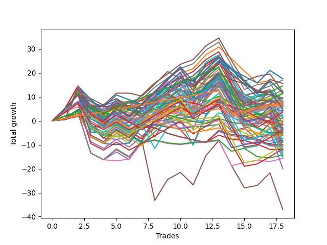

# Long Wallace Doodle 0225_009 
- Symbol: ES
- Date Range: 03/18/2022 - 07/15/2022
- Trading Period: 7:20-12:30
- Number of Trades: 18



| Name | Win Percent | Profit | Avg Profit / Trade | Avg Time / Trade |      | Name | Win Percent | Profit | Avg Profit / Trade | Avg Time / Trade |
| ---- | ----------- | ------ | ------------------ | ---------------- | ---- | ---- | ----------- | ------ | ------------------ | ---------------- |
| Sorted By <br> Profit | | | | | | Sorted By <br> Win Percentage ||||
| One Hundred Five | 50.00 | 8750.00 | 486.11 | 09:28 |     | One Hundred Twenty-Six | 94.44 | 3875.00 | 215.28 | 04:36 |
| One Hundred Twelve | 83.33 | 8500.00 | 472.22 | 06:39 |     | One Hundred Twenty-One | 94.44 | 3750.00 | 208.33 | 04:37 |
| One Hundred Twenty | 50.00 | 7750.00 | 430.56 | 10:51 |     | Eighty-One | 94.44 | 3375.00 | 187.50 | 05:40 |
| One Hundred Seventeen | 77.78 | 7250.00 | 402.78 | 06:00 |     | One Hundred Sixteen | 88.89 | 3625.00 | 201.39 | 03:38 |
| One Hundred Two | 72.22 | 6375.00 | 354.17 | 04:53 |     | One Hundred Eleven | 88.89 | 3125.00 | 173.61 | 03:40 |
| Sixty-Seven | 72.22 | 6000.00 | 333.33 | 16:01 |     | One Hundred Twelve | 83.33 | 8500.00 | 472.22 | 06:39 |
| Forty | 83.33 | 5875.00 | 326.39 | 07:00 |     | Forty | 83.33 | 5875.00 | 326.39 | 07:00 |
| Forty-Three | 61.11 | 5875.00 | 326.39 | 13:11 |     | One Hundred Twenty-Seven | 83.33 | 5625.00 | 312.50 | 08:54 |
| One Hundred Fifteen | 55.56 | 5750.00 | 319.44 | 13:02 |     | One Hundred Twenty-Two | 83.33 | 4750.00 | 263.89 | 09:02 |
| One Hundred Twenty-Seven | 83.33 | 5625.00 | 312.50 | 08:54 |     | Eighty-Two | 83.33 | 4750.00 | 263.89 | 10:07 |
| One Hundred Twenty-Two | 83.33 | 4750.00 | 263.89 | 09:02 |     | One Hundred One | 83.33 | 3125.00 | 173.61 | 02:41 |
| Eighty-Two | 83.33 | 4750.00 | 263.89 | 10:07 |     | Sixty-Four | 83.33 | 3000.00 | 166.67 | 08:01 |
| One Hundred Ten | 38.89 | 4750.00 | 263.89 | 05:45 |     | Fifty-Six | 83.33 | 2000.00 | 111.11 | 08:03 |
| One Hundred Four | 50.00 | 4500.00 | 250.00 | 08:41 |     | Zero | 83.33 | -1750.00 | -97.22 | 10:15 |
| Forty-Seven | 61.11 | 4000.00 | 222.22 | 14:18 |     | One Hundred Seventeen | 77.78 | 7250.00 | 402.78 | 06:00 |
| One Hundred Twenty-Six | 94.44 | 3875.00 | 215.28 | 04:36 |     | One Hundred Two | 72.22 | 6375.00 | 354.17 | 04:53 |
| One Hundred Twenty-One | 94.44 | 3750.00 | 208.33 | 04:37 |     | Sixty-Seven | 72.22 | 6000.00 | 333.33 | 16:01 |
| One Hundred Sixteen | 88.89 | 3625.00 | 201.39 | 03:38 |     | Fifty-Nine | 72.22 | 3000.00 | 166.67 | 16:18 |
| Forty-One | 66.67 | 3625.00 | 201.39 | 10:40 |     | Sixty-Five | 72.22 | 2250.00 | 125.00 | 12:38 |
| One Hundred Three | 55.56 | 3625.00 | 201.39 | 06:52 |     | Forty-Eight | 72.22 | 1250.00 | 69.44 | 05:47 |
| Fifty-Three | 44.44 | 3625.00 | 201.39 | 13:15 |     | One Hundred Six | 72.22 | -125.00 | -6.94 | 02:14 |
| One Hundred Ninteen | 50.00 | 3500.00 | 194.44 | 10:05 |     | Fifty-Seven | 72.22 | -750.00 | -41.67 | 12:55 |
| Eighty-One | 94.44 | 3375.00 | 187.50 | 05:40 |     | Three | 72.22 | -3000.00 | -166.67 | 19:11 |
| Fifty-Two | 44.44 | 3375.00 | 187.50 | 11:30 |     | One | 72.22 | -6750.00 | -375.00 | 15:47 |
| One Hundred Eleven | 88.89 | 3125.00 | 173.61 | 03:40 |     | Forty-One | 66.67 | 3625.00 | 201.39 | 10:40 |
| One Hundred One | 83.33 | 3125.00 | 173.61 | 02:41 |     | Seventy-One | 66.67 | 2250.00 | 125.00 | 17:29 |
| Fifty-Five | 55.56 | 3125.00 | 173.61 | 09:26 |     | Sixty-Six | 66.67 | 2125.00 | 118.06 | 15:55 |
| Sixty-Four | 83.33 | 3000.00 | 166.67 | 08:01 |     | Sixty-Three | 66.67 | -1500.00 | -83.33 | 17:52 |
| Fifty-Nine | 72.22 | 3000.00 | 166.67 | 16:18 |     | One Hundred Twenty-Eight | 66.67 | -1875.00 | -104.17 | 13:30 |
| Forty-Two | 55.56 | 3000.00 | 166.67 | 13:07 |     | Fifty-Eight | 66.67 | -2375.00 | -131.94 | 16:17 |
| One Hundred Thirty | 61.11 | 2500.00 | 138.89 | 16:20 |     | Two | 66.67 | -4500.00 | -250.00 | 20:05 |
| Sixty-Five | 72.22 | 2250.00 | 125.00 | 12:38 |     | One Hundred Twenty-Three | 66.67 | -5125.00 | -284.72 | 13:44 |
| Seventy-One | 66.67 | 2250.00 | 125.00 | 17:29 |     | Eighty-Three | 66.67 | -5875.00 | -326.39 | 16:59 |
| Sixty-Six | 66.67 | 2125.00 | 118.06 | 15:55 |     | Seven | 66.67 | -7500.00 | -416.67 | 20:44 |
| Seventy-Three | 44.44 | 2125.00 | 118.06 | 08:38 |     | Forty-Three | 61.11 | 5875.00 | 326.39 | 13:11 |
| Fifty-Six | 83.33 | 2000.00 | 111.11 | 08:03 |     | Forty-Seven | 61.11 | 4000.00 | 222.22 | 14:18 |
| One Hundred Nine | 38.89 | 2000.00 | 111.11 | 05:05 |     | One Hundred Thirty | 61.11 | 2500.00 | 138.89 | 16:20 |
| One Hundred Eighteen | 55.56 | 1750.00 | 97.22 | 08:16 |     | One Hundred Thirteen | 61.11 | 125.00 | 6.94 | 10:21 |
| Forty-Eight | 72.22 | 1250.00 | 69.44 | 05:47 |     | One Hundred Twenty-Five | 61.11 | -2000.00 | -111.11 | 16:41 |
| One Hundred Fourteen | 55.56 | 1125.00 | 62.50 | 12:15 |     | One Hundred Twenty-Nine | 61.11 | -2125.00 | -118.06 | 15:32 |
| Fifty-One | 55.56 | 875.00 | 48.61 | 09:17 |     | Ninety-One | 61.11 | -2125.00 | -118.06 | 01:11 |
| Fifty | 50.00 | 750.00 | 41.67 | 09:44 |     | Seventy | 61.11 | -2375.00 | -131.94 | 08:57 |
| Forty-Four | 50.00 | 625.00 | 34.72 | 16:16 |     | Sixty | 61.11 | -2750.00 | -152.78 | 20:07 |
| Forty-Nine | 55.56 | 375.00 | 20.83 | 08:33 |     | Sixty-Two | 61.11 | -4125.00 | -229.17 | 09:05 |
| One Hundred Thirteen | 61.11 | 125.00 | 6.94 | 10:21 |     | Eighty-Five | 61.11 | -5375.00 | -298.61 | 20:35 |
| One Hundred Six | 72.22 | -125.00 | -6.94 | 02:14 |     | Four | 61.11 | -6125.00 | -340.28 | 24:01 |
| One Hundred Seven | 50.00 | -125.00 | -6.94 | 03:26 |     | One Hundred Twenty-Four | 61.11 | -6625.00 | -368.06 | 15:54 |
| Fifty-Seven | 72.22 | -750.00 | -41.67 | 12:55 |     | Six | 61.11 | -7875.00 | -437.50 | 11:17 |
| One Hundred Eight | 38.89 | -875.00 | -48.61 | 04:29 |     | Eighty-Four | 61.11 | -10000.00 | -555.56 | 19:47 |
| Sixty-Three | 66.67 | -1500.00 | -83.33 | 17:52 |     | One Hundred Fifteen | 55.56 | 5750.00 | 319.44 | 13:02 |
| Ninety-Five | 27.78 | -1500.00 | -83.33 | 04:42 |     | One Hundred Three | 55.56 | 3625.00 | 201.39 | 06:52 |
| Zero | 83.33 | -1750.00 | -97.22 | 10:15 |     | Fifty-Five | 55.56 | 3125.00 | 173.61 | 09:26 |
| One Hundred Twenty-Eight | 66.67 | -1875.00 | -104.17 | 13:30 |     | Forty-Two | 55.56 | 3000.00 | 166.67 | 13:07 |
| Sixty-Eight | 55.56 | -1875.00 | -104.17 | 19:27 |     | One Hundred Eighteen | 55.56 | 1750.00 | 97.22 | 08:16 |
| One Hundred Twenty-Five | 61.11 | -2000.00 | -111.11 | 16:41 |     | One Hundred Fourteen | 55.56 | 1125.00 | 62.50 | 12:15 |
| One Hundred Twenty-Nine | 61.11 | -2125.00 | -118.06 | 15:32 |     | Fifty-One | 55.56 | 875.00 | 48.61 | 09:17 |
| Ninety-One | 61.11 | -2125.00 | -118.06 | 01:11 |     | Forty-Nine | 55.56 | 375.00 | 20.83 | 08:33 |
| Sixty-Nine | 50.00 | -2125.00 | -118.06 | 22:03 |     | Sixty-Eight | 55.56 | -1875.00 | -104.17 | 19:27 |
| Fifty-Eight | 66.67 | -2375.00 | -131.94 | 16:17 |     | Forty-Six | 55.56 | -3625.00 | -201.39 | 06:46 |
| Seventy | 61.11 | -2375.00 | -131.94 | 08:57 |     | Sixty-One | 55.56 | -7625.00 | -423.61 | 23:05 |
| Ninety-Two | 44.44 | -2375.00 | -131.94 | 02:13 |     | Five | 55.56 | -18500.00 | -1027.78 | 27:49 |
| Ninety-Seven | 38.89 | -2500.00 | -138.89 | 01:35 |     | One Hundred Five | 50.00 | 8750.00 | 486.11 | 09:28 |
| Sixty | 61.11 | -2750.00 | -152.78 | 20:07 |     | One Hundred Twenty | 50.00 | 7750.00 | 430.56 | 10:51 |
| Three | 72.22 | -3000.00 | -166.67 | 19:11 |     | One Hundred Four | 50.00 | 4500.00 | 250.00 | 08:41 |
| Ninety-Six | 50.00 | -3000.00 | -166.67 | 01:09 |     | One Hundred Ninteen | 50.00 | 3500.00 | 194.44 | 10:05 |
| Forty-Five | 44.44 | -3000.00 | -166.67 | 19:06 |     | Fifty | 50.00 | 750.00 | 41.67 | 09:44 |
| Forty-Six | 55.56 | -3625.00 | -201.39 | 06:46 |     | Forty-Four | 50.00 | 625.00 | 34.72 | 16:16 |
| Ninety-Four | 27.78 | -3750.00 | -208.33 | 04:06 |     | One Hundred Seven | 50.00 | -125.00 | -6.94 | 03:26 |
| Sixty-Two | 61.11 | -4125.00 | -229.17 | 09:05 |     | Sixty-Nine | 50.00 | -2125.00 | -118.06 | 22:03 |
| Two | 66.67 | -4500.00 | -250.00 | 20:05 |     | Ninety-Six | 50.00 | -3000.00 | -166.67 | 01:09 |
| One Hundred | 27.78 | -5000.00 | -277.78 | 01:52 |     | Fifty-Four | 50.00 | -7125.00 | -395.83 | 03:57 |
| One Hundred Twenty-Three | 66.67 | -5125.00 | -284.72 | 13:44 |     | Fifty-Three | 44.44 | 3625.00 | 201.39 | 13:15 |
| Ninety-Nine | 27.78 | -5250.00 | -291.67 | 01:51 |     | Fifty-Two | 44.44 | 3375.00 | 187.50 | 11:30 |
| Eighty-Five | 61.11 | -5375.00 | -298.61 | 20:35 |     | Seventy-Three | 44.44 | 2125.00 | 118.06 | 08:38 |
| Eighty-Three | 66.67 | -5875.00 | -326.39 | 16:59 |     | Ninety-Two | 44.44 | -2375.00 | -131.94 | 02:13 |
| Ninety-Eight | 27.78 | -6000.00 | -333.33 | 01:48 |     | Forty-Five | 44.44 | -3000.00 | -166.67 | 19:06 |
| Ninety-Three | 27.78 | -6000.00 | -333.33 | 03:31 |     | One Hundred Ten | 38.89 | 4750.00 | 263.89 | 05:45 |
| Four | 61.11 | -6125.00 | -340.28 | 24:01 |     | One Hundred Nine | 38.89 | 2000.00 | 111.11 | 05:05 |
| One Hundred Twenty-Four | 61.11 | -6625.00 | -368.06 | 15:54 |     | One Hundred Eight | 38.89 | -875.00 | -48.61 | 04:29 |
| One | 72.22 | -6750.00 | -375.00 | 15:47 |     | Ninety-Seven | 38.89 | -2500.00 | -138.89 | 01:35 |
| Fifty-Four | 50.00 | -7125.00 | -395.83 | 03:57 |     | Ninety-Five | 27.78 | -1500.00 | -83.33 | 04:42 |
| Seven | 66.67 | -7500.00 | -416.67 | 20:44 |     | Ninety-Four | 27.78 | -3750.00 | -208.33 | 04:06 |
| Sixty-One | 55.56 | -7625.00 | -423.61 | 23:05 |     | One Hundred | 27.78 | -5000.00 | -277.78 | 01:52 |
| Six | 61.11 | -7875.00 | -437.50 | 11:17 |     | Ninety-Nine | 27.78 | -5250.00 | -291.67 | 01:51 |
| Eighty-Four | 61.11 | -10000.00 | -555.56 | 19:47 |     | Ninety-Eight | 27.78 | -6000.00 | -333.33 | 01:48 |
| Five | 55.56 | -18500.00 | -1027.78 | 27:49 |     | Ninety-Three | 27.78 | -6000.00 | -333.33 | 03:31 |

## NO STOPLOSS

### Test Zero
* Sell when price hits the middle line of the 20p bollinger
* No Stoploss
* Results:
```
Total Trades: 18
Percent Up: 83.33
Percent Down: 16.67
Total Points Moved Up: -3.50
Potential Profit: -1750.00
Total Points Ups: 27.25 Count Ups: 15
Total Points Downs: -30.75 Count Downs: 3
```

<details><summary>Trades</summary>

<code>In: 2022-03-23 09:47:00		Out: 2022-03-23 09:54:15		Total Position Time: 07:15		Total Move Up: 4.00		Total to Date: 4.00</code> <br />
<code>In: 2022-03-25 08:29:00		Out: 2022-03-25 08:36:40		Total Position Time: 07:40		Total Move Up: 8.00		Total to Date: 12.00</code> <br />
<code>In: 2022-03-28 08:27:00		Out: 2022-03-28 08:56:55		Total Position Time: 29:55		Total Move Up: -16.75		Total to Date: -4.75</code> <br />
<code>In: 2022-03-31 09:23:00		Out: 2022-03-31 09:32:50		Total Position Time: 09:50		Total Move Up: 0.00		Total to Date: -4.75</code> <br />
<code>In: 2022-04-04 10:03:00		Out: 2022-04-04 10:09:45		Total Position Time: 06:45		Total Move Up: 1.50		Total to Date: -3.25</code> <br />
<code>In: 2022-04-08 10:36:00		Out: 2022-04-08 10:52:15		Total Position Time: 16:15		Total Move Up: 0.00		Total to Date: -3.25</code> <br />
<code>In: 2022-04-20 09:14:00		Out: 2022-04-20 09:30:50		Total Position Time: 16:50		Total Move Up: 0.25		Total to Date: -3.00</code> <br />
<code>In: 2022-04-27 11:40:00		Out: 2022-04-27 11:40:10		Total Position Time: 00:10		Total Move Up: 1.00		Total to Date: -2.00</code> <br />
<code>In: 2022-05-26 08:50:00		Out: 2022-05-26 08:54:10		Total Position Time: 04:10		Total Move Up: 1.00		Total to Date: -1.00</code> <br />
<code>In: 2022-05-26 11:38:00		Out: 2022-05-26 11:45:05		Total Position Time: 07:05		Total Move Up: 2.00		Total to Date: 1.00</code> <br />
<code>In: 2022-05-26 12:06:00		Out: 2022-05-26 12:06:10		Total Position Time: 00:10		Total Move Up: 0.75		Total to Date: 1.75</code> <br />
<code>In: 2022-05-27 08:04:00		Out: 2022-05-27 08:06:55		Total Position Time: 02:55		Total Move Up: 2.75		Total to Date: 4.50</code> <br />
<code>In: 2022-05-27 09:52:00		Out: 2022-05-27 09:53:35		Total Position Time: 01:35		Total Move Up: 1.75		Total to Date: 6.25</code> <br />
<code>In: 2022-06-15 07:35:00		Out: 2022-06-15 08:04:55		Total Position Time: 29:55		Total Move Up: -10.50		Total to Date: -4.25</code> <br />
<code>In: 2022-06-21 08:42:00		Out: 2022-06-21 09:02:05		Total Position Time: 20:05		Total Move Up: -3.50		Total to Date: -7.75</code> <br />
<code>In: 2022-06-27 10:45:00		Out: 2022-06-27 10:53:25		Total Position Time: 08:25		Total Move Up: 1.00		Total to Date: -6.75</code> <br />
<code>In: 2022-07-07 10:16:00		Out: 2022-07-07 10:22:20		Total Position Time: 06:20		Total Move Up: 0.75		Total to Date: -6.00</code> <br />
<code>In: 2022-07-08 09:11:00		Out: 2022-07-08 09:20:15		Total Position Time: 09:15		Total Move Up: 2.50		Total to Date: -3.50</code> <br />


</details>

### Test One
* Sell when the price hits the upper line of the 20p 1std bollinger
* No Stoploss
* Results:
```
Total Trades: 18
Percent Up: 72.22
Percent Down: 27.78
Total Points Moved Up: -13.50
Potential Profit: -6750.00
Total Points Ups: 38.75 Count Ups: 13
Total Points Downs: -52.25 Count Downs: 5
```

<details><summary>Trades</summary>

<code>In: 2022-03-23 09:47:00		Out: 2022-03-23 09:59:10		Total Position Time: 12:10		Total Move Up: 5.25		Total to Date: 5.25</code> <br />
<code>In: 2022-03-25 08:29:00		Out: 2022-03-25 08:41:05		Total Position Time: 12:05		Total Move Up: 9.25		Total to Date: 14.50</code> <br />
<code>In: 2022-03-28 08:27:00		Out: 2022-03-28 08:56:55		Total Position Time: 29:55		Total Move Up: -16.75		Total to Date: -2.25</code> <br />
<code>In: 2022-03-31 09:23:00		Out: 2022-03-31 09:40:45		Total Position Time: 17:45		Total Move Up: -0.50		Total to Date: -2.75</code> <br />
<code>In: 2022-04-04 10:03:00		Out: 2022-04-04 10:17:55		Total Position Time: 14:55		Total Move Up: 1.00		Total to Date: -1.75</code> <br />
<code>In: 2022-04-08 10:36:00		Out: 2022-04-08 11:01:00		Total Position Time: 25:00		Total Move Up: 1.00		Total to Date: -0.75</code> <br />
<code>In: 2022-04-20 09:14:00		Out: 2022-04-20 09:30:55		Total Position Time: 16:55		Total Move Up: 0.75		Total to Date: 0.00</code> <br />
<code>In: 2022-04-27 11:40:00		Out: 2022-04-27 11:42:30		Total Position Time: 02:30		Total Move Up: 3.25		Total to Date: 3.25</code> <br />
<code>In: 2022-05-26 08:50:00		Out: 2022-05-26 08:55:25		Total Position Time: 05:25		Total Move Up: 3.00		Total to Date: 6.25</code> <br />
<code>In: 2022-05-26 11:38:00		Out: 2022-05-26 11:50:15		Total Position Time: 12:15		Total Move Up: 3.25		Total to Date: 9.50</code> <br />
<code>In: 2022-05-26 12:06:00		Out: 2022-05-26 12:08:00		Total Position Time: 02:00		Total Move Up: 2.50		Total to Date: 12.00</code> <br />
<code>In: 2022-05-27 08:04:00		Out: 2022-05-27 08:11:05		Total Position Time: 07:05		Total Move Up: 5.00		Total to Date: 17.00</code> <br />
<code>In: 2022-05-27 09:52:00		Out: 2022-05-27 09:54:35		Total Position Time: 02:35		Total Move Up: 3.25		Total to Date: 20.25</code> <br />
<code>In: 2022-06-15 07:35:00		Out: 2022-06-15 08:04:55		Total Position Time: 29:55		Total Move Up: -10.50		Total to Date: 9.75</code> <br />
<code>In: 2022-06-21 08:42:00		Out: 2022-06-21 09:11:55		Total Position Time: 29:55		Total Move Up: -9.25		Total to Date: 0.50</code> <br />
<code>In: 2022-06-27 10:45:00		Out: 2022-06-27 11:03:15		Total Position Time: 18:15		Total Move Up: 1.00		Total to Date: 1.50</code> <br />
<code>In: 2022-07-07 10:16:00		Out: 2022-07-07 10:31:35		Total Position Time: 15:35		Total Move Up: 0.25		Total to Date: 1.75</code> <br />
<code>In: 2022-07-08 09:11:00		Out: 2022-07-08 09:40:55		Total Position Time: 29:55		Total Move Up: -15.25		Total to Date: -13.50</code> <br />


</details>

### Test Two
* Sell when the price hits the upper line of the 20p 2std bollinger
* No Stoploss
* Results:
```
Total Trades: 18
Percent Up: 66.67
Percent Down: 33.33
Total Points Moved Up: -9.00
Potential Profit: -4500.00
Total Points Ups: 48.75 Count Ups: 12
Total Points Downs: -57.75 Count Downs: 6
```

<details><summary>Trades</summary>

<code>In: 2022-03-23 09:47:00		Out: 2022-03-23 10:16:55		Total Position Time: 29:55		Total Move Up: 0.75		Total to Date: 0.75</code> <br />
<code>In: 2022-03-25 08:29:00		Out: 2022-03-25 08:41:55		Total Position Time: 12:55		Total Move Up: 13.50		Total to Date: 14.25</code> <br />
<code>In: 2022-03-28 08:27:00		Out: 2022-03-28 08:56:55		Total Position Time: 29:55		Total Move Up: -16.75		Total to Date: -2.50</code> <br />
<code>In: 2022-03-31 09:23:00		Out: 2022-03-31 09:44:20		Total Position Time: 21:20		Total Move Up: 0.50		Total to Date: -2.00</code> <br />
<code>In: 2022-04-04 10:03:00		Out: 2022-04-04 10:18:10		Total Position Time: 15:10		Total Move Up: 1.50		Total to Date: -0.50</code> <br />
<code>In: 2022-04-08 10:36:00		Out: 2022-04-08 11:05:55		Total Position Time: 29:55		Total Move Up: -3.25		Total to Date: -3.75</code> <br />
<code>In: 2022-04-20 09:14:00		Out: 2022-04-20 09:31:25		Total Position Time: 17:25		Total Move Up: 1.75		Total to Date: -2.00</code> <br />
<code>In: 2022-04-27 11:40:00		Out: 2022-04-27 11:42:40		Total Position Time: 02:40		Total Move Up: 5.75		Total to Date: 3.75</code> <br />
<code>In: 2022-05-26 08:50:00		Out: 2022-05-26 08:56:50		Total Position Time: 06:50		Total Move Up: 5.25		Total to Date: 9.00</code> <br />
<code>In: 2022-05-26 11:38:00		Out: 2022-05-26 11:54:10		Total Position Time: 16:10		Total Move Up: 4.00		Total to Date: 13.00</code> <br />
<code>In: 2022-05-26 12:06:00		Out: 2022-05-26 12:34:30		Total Position Time: 28:30		Total Move Up: -2.75		Total to Date: 10.25</code> <br />
<code>In: 2022-05-27 08:04:00		Out: 2022-05-27 08:12:50		Total Position Time: 08:50		Total Move Up: 7.50		Total to Date: 17.75</code> <br />
<code>In: 2022-05-27 09:52:00		Out: 2022-05-27 09:55:40		Total Position Time: 03:40		Total Move Up: 4.75		Total to Date: 22.50</code> <br />
<code>In: 2022-06-15 07:35:00		Out: 2022-06-15 08:04:55		Total Position Time: 29:55		Total Move Up: -10.50		Total to Date: 12.00</code> <br />
<code>In: 2022-06-21 08:42:00		Out: 2022-06-21 09:11:55		Total Position Time: 29:55		Total Move Up: -9.25		Total to Date: 2.75</code> <br />
<code>In: 2022-06-27 10:45:00		Out: 2022-06-27 11:14:45		Total Position Time: 29:45		Total Move Up: 2.50		Total to Date: 5.25</code> <br />
<code>In: 2022-07-07 10:16:00		Out: 2022-07-07 10:35:00		Total Position Time: 19:00		Total Move Up: 1.00		Total to Date: 6.25</code> <br />
<code>In: 2022-07-08 09:11:00		Out: 2022-07-08 09:40:55		Total Position Time: 29:55		Total Move Up: -15.25		Total to Date: -9.00</code> <br />


</details>

### Test Three
* Sell when price hits the middle line of the 50p bollinger
* No Stoploss
* Results:
```
Total Trades: 18
Percent Up: 72.22
Percent Down: 27.78
Total Points Moved Up: -6.00
Potential Profit: -3000.00
Total Points Ups: 49.00 Count Ups: 13
Total Points Downs: -55.00 Count Downs: 5
```

<details><summary>Trades</summary>

<code>In: 2022-03-23 09:47:00		Out: 2022-03-23 10:16:55		Total Position Time: 29:55		Total Move Up: 0.75		Total to Date: 0.75</code> <br />
<code>In: 2022-03-25 08:29:00		Out: 2022-03-25 08:53:00		Total Position Time: 24:00		Total Move Up: 12.75		Total to Date: 13.50</code> <br />
<code>In: 2022-03-28 08:27:00		Out: 2022-03-28 08:56:55		Total Position Time: 29:55		Total Move Up: -16.75		Total to Date: -3.25</code> <br />
<code>In: 2022-03-31 09:23:00		Out: 2022-03-31 09:46:10		Total Position Time: 23:10		Total Move Up: 1.50		Total to Date: -1.75</code> <br />
<code>In: 2022-04-04 10:03:00		Out: 2022-04-04 10:19:00		Total Position Time: 16:00		Total Move Up: 2.50		Total to Date: 0.75</code> <br />
<code>In: 2022-04-08 10:36:00		Out: 2022-04-08 11:05:55		Total Position Time: 29:55		Total Move Up: -3.25		Total to Date: -2.50</code> <br />
<code>In: 2022-04-20 09:14:00		Out: 2022-04-20 09:32:50		Total Position Time: 18:50		Total Move Up: 4.75		Total to Date: 2.25</code> <br />
<code>In: 2022-04-27 11:40:00		Out: 2022-04-27 11:42:35		Total Position Time: 02:35		Total Move Up: 5.00		Total to Date: 7.25</code> <br />
<code>In: 2022-05-26 08:50:00		Out: 2022-05-26 08:55:30		Total Position Time: 05:30		Total Move Up: 3.75		Total to Date: 11.00</code> <br />
<code>In: 2022-05-26 11:38:00		Out: 2022-05-26 11:54:10		Total Position Time: 16:10		Total Move Up: 4.00		Total to Date: 15.00</code> <br />
<code>In: 2022-05-26 12:06:00		Out: 2022-05-26 12:07:55		Total Position Time: 01:55		Total Move Up: 2.00		Total to Date: 17.00</code> <br />
<code>In: 2022-05-27 08:04:00		Out: 2022-05-27 08:11:30		Total Position Time: 07:30		Total Move Up: 5.75		Total to Date: 22.75</code> <br />
<code>In: 2022-05-27 09:52:00		Out: 2022-05-27 09:54:35		Total Position Time: 02:35		Total Move Up: 3.25		Total to Date: 26.00</code> <br />
<code>In: 2022-06-15 07:35:00		Out: 2022-06-15 08:04:55		Total Position Time: 29:55		Total Move Up: -10.50		Total to Date: 15.50</code> <br />
<code>In: 2022-06-21 08:42:00		Out: 2022-06-21 09:11:55		Total Position Time: 29:55		Total Move Up: -9.25		Total to Date: 6.25</code> <br />
<code>In: 2022-06-27 10:45:00		Out: 2022-06-27 11:13:35		Total Position Time: 28:35		Total Move Up: 2.00		Total to Date: 8.25</code> <br />
<code>In: 2022-07-07 10:16:00		Out: 2022-07-07 10:35:00		Total Position Time: 19:00		Total Move Up: 1.00		Total to Date: 9.25</code> <br />
<code>In: 2022-07-08 09:11:00		Out: 2022-07-08 09:40:55		Total Position Time: 29:55		Total Move Up: -15.25		Total to Date: -6.00</code> <br />


</details>

### Test Four
* Sell when the price hits the upper line of the 50p 1std bollinger
* No Stoploss
* Results:
```
Total Trades: 18
Percent Up: 61.11
Percent Down: 38.89
Total Points Moved Up: -12.25
Potential Profit: -6125.00
Total Points Ups: 50.75 Count Ups: 11
Total Points Downs: -63.00 Count Downs: 7
```

<details><summary>Trades</summary>

<code>In: 2022-03-23 09:47:00		Out: 2022-03-23 10:16:55		Total Position Time: 29:55		Total Move Up: 0.75		Total to Date: 0.75</code> <br />
<code>In: 2022-03-25 08:29:00		Out: 2022-03-25 08:58:55		Total Position Time: 29:55		Total Move Up: 2.50		Total to Date: 3.25</code> <br />
<code>In: 2022-03-28 08:27:00		Out: 2022-03-28 08:56:55		Total Position Time: 29:55		Total Move Up: -16.75		Total to Date: -13.50</code> <br />
<code>In: 2022-03-31 09:23:00		Out: 2022-03-31 09:52:55		Total Position Time: 29:55		Total Move Up: -2.75		Total to Date: -16.25</code> <br />
<code>In: 2022-04-04 10:03:00		Out: 2022-04-04 10:27:25		Total Position Time: 24:25		Total Move Up: 3.25		Total to Date: -13.00</code> <br />
<code>In: 2022-04-08 10:36:00		Out: 2022-04-08 11:05:55		Total Position Time: 29:55		Total Move Up: -3.25		Total to Date: -16.25</code> <br />
<code>In: 2022-04-20 09:14:00		Out: 2022-04-20 09:36:45		Total Position Time: 22:45		Total Move Up: 8.25		Total to Date: -8.00</code> <br />
<code>In: 2022-04-27 11:40:00		Out: 2022-04-27 11:45:35		Total Position Time: 05:35		Total Move Up: 9.00		Total to Date: 1.00</code> <br />
<code>In: 2022-05-26 08:50:00		Out: 2022-05-26 08:58:30		Total Position Time: 08:30		Total Move Up: 5.75		Total to Date: 6.75</code> <br />
<code>In: 2022-05-26 11:38:00		Out: 2022-05-26 12:07:55		Total Position Time: 29:55		Total Move Up: 3.00		Total to Date: 9.75</code> <br />
<code>In: 2022-05-26 12:06:00		Out: 2022-05-26 12:35:55		Total Position Time: 29:55		Total Move Up: -5.25		Total to Date: 4.50</code> <br />
<code>In: 2022-05-27 08:04:00		Out: 2022-05-27 08:16:10		Total Position Time: 12:10		Total Move Up: 9.25		Total to Date: 13.75</code> <br />
<code>In: 2022-05-27 09:52:00		Out: 2022-05-27 09:57:35		Total Position Time: 05:35		Total Move Up: 5.25		Total to Date: 19.00</code> <br />
<code>In: 2022-06-15 07:35:00		Out: 2022-06-15 08:04:55		Total Position Time: 29:55		Total Move Up: -10.50		Total to Date: 8.50</code> <br />
<code>In: 2022-06-21 08:42:00		Out: 2022-06-21 09:11:55		Total Position Time: 29:55		Total Move Up: -9.25		Total to Date: -0.75</code> <br />
<code>In: 2022-06-27 10:45:00		Out: 2022-06-27 11:14:55		Total Position Time: 29:55		Total Move Up: 1.00		Total to Date: 0.25</code> <br />
<code>In: 2022-07-07 10:16:00		Out: 2022-07-07 10:40:15		Total Position Time: 24:15		Total Move Up: 2.75		Total to Date: 3.00</code> <br />
<code>In: 2022-07-08 09:11:00		Out: 2022-07-08 09:40:55		Total Position Time: 29:55		Total Move Up: -15.25		Total to Date: -12.25</code> <br />


</details>

### Test Five
* Sell when the price hits the upper line of the 50p 2std bollinger
* No Stoploss
* Results:
```
Total Trades: 18
Percent Up: 55.56
Percent Down: 44.44
Total Points Moved Up: -37.00
Potential Profit: -18500.00
Total Points Ups: 50.75 Count Ups: 10
Total Points Downs: -87.75 Count Downs: 8
```

<details><summary>Trades</summary>

<code>In: 2022-03-23 09:47:00		Out: 2022-03-23 10:16:55		Total Position Time: 29:55		Total Move Up: 0.75		Total to Date: 0.75</code> <br />
<code>In: 2022-03-25 08:29:00		Out: 2022-03-25 08:58:55		Total Position Time: 29:55		Total Move Up: 2.50		Total to Date: 3.25</code> <br />
<code>In: 2022-03-28 08:27:00		Out: 2022-03-28 08:56:55		Total Position Time: 29:55		Total Move Up: -16.75		Total to Date: -13.50</code> <br />
<code>In: 2022-03-31 09:23:00		Out: 2022-03-31 09:52:55		Total Position Time: 29:55		Total Move Up: -2.75		Total to Date: -16.25</code> <br />
<code>In: 2022-04-04 10:03:00		Out: 2022-04-04 10:29:35		Total Position Time: 26:35		Total Move Up: 4.25		Total to Date: -12.00</code> <br />
<code>In: 2022-04-08 10:36:00		Out: 2022-04-08 11:05:55		Total Position Time: 29:55		Total Move Up: -3.25		Total to Date: -15.25</code> <br />
<code>In: 2022-04-20 09:14:00		Out: 2022-04-20 09:43:55		Total Position Time: 29:55		Total Move Up: 6.75		Total to Date: -8.50</code> <br />
<code>In: 2022-04-27 11:40:00		Out: 2022-04-27 12:09:55		Total Position Time: 29:55		Total Move Up: -24.75		Total to Date: -33.25</code> <br />
<code>In: 2022-05-26 08:50:00		Out: 2022-05-26 09:02:40		Total Position Time: 12:40		Total Move Up: 8.75		Total to Date: -24.50</code> <br />
<code>In: 2022-05-26 11:38:00		Out: 2022-05-26 12:07:55		Total Position Time: 29:55		Total Move Up: 3.00		Total to Date: -21.50</code> <br />
<code>In: 2022-05-26 12:06:00		Out: 2022-05-26 12:35:55		Total Position Time: 29:55		Total Move Up: -5.25		Total to Date: -26.75</code> <br />
<code>In: 2022-05-27 08:04:00		Out: 2022-05-27 08:33:55		Total Position Time: 29:55		Total Move Up: 12.25		Total to Date: -14.50</code> <br />
<code>In: 2022-05-27 09:52:00		Out: 2022-05-27 10:05:20		Total Position Time: 13:20		Total Move Up: 6.25		Total to Date: -8.25</code> <br />
<code>In: 2022-06-15 07:35:00		Out: 2022-06-15 08:04:55		Total Position Time: 29:55		Total Move Up: -10.50		Total to Date: -18.75</code> <br />
<code>In: 2022-06-21 08:42:00		Out: 2022-06-21 09:11:55		Total Position Time: 29:55		Total Move Up: -9.25		Total to Date: -28.00</code> <br />
<code>In: 2022-06-27 10:45:00		Out: 2022-06-27 11:14:55		Total Position Time: 29:55		Total Move Up: 1.00		Total to Date: -27.00</code> <br />
<code>In: 2022-07-07 10:16:00		Out: 2022-07-07 10:45:20		Total Position Time: 29:20		Total Move Up: 5.25		Total to Date: -21.75</code> <br />
<code>In: 2022-07-08 09:11:00		Out: 2022-07-08 09:40:55		Total Position Time: 29:55		Total Move Up: -15.25		Total to Date: -37.00</code> <br />


</details>

### Test Six
* Sell when the price hits the middle line of the 1std VWAP
* No Stoploss
* Results:
```
Total Trades: 18
Percent Up: 61.11
Percent Down: 38.89
Total Points Moved Up: -15.75
Potential Profit: -7875.00
Total Points Ups: 17.00 Count Ups: 11
Total Points Downs: -32.75 Count Downs: 7
```

<details><summary>Trades</summary>

<code>In: 2022-03-23 09:47:00		Out: 2022-03-23 10:16:55		Total Position Time: 29:55		Total Move Up: 0.75		Total to Date: 0.75</code> <br />
<code>In: 2022-03-25 08:29:00		Out: 2022-03-25 08:58:55		Total Position Time: 29:55		Total Move Up: 2.50		Total to Date: 3.25</code> <br />
<code>In: 2022-03-28 08:27:00		Out: 2022-03-28 08:56:55		Total Position Time: 29:55		Total Move Up: -16.75		Total to Date: -13.50</code> <br />
<code>In: 2022-03-31 09:23:00		Out: 2022-03-31 09:52:55		Total Position Time: 29:55		Total Move Up: -2.75		Total to Date: -16.25</code> <br />
<code>In: 2022-04-04 10:03:00		Out: 2022-04-04 10:03:10		Total Position Time: 00:10		Total Move Up: -0.50		Total to Date: -16.75</code> <br />
<code>In: 2022-04-08 10:36:00		Out: 2022-04-08 10:36:10		Total Position Time: 00:10		Total Move Up: 0.75		Total to Date: -16.00</code> <br />
<code>In: 2022-04-20 09:14:00		Out: 2022-04-20 09:35:50		Total Position Time: 21:50		Total Move Up: 6.75		Total to Date: -9.25</code> <br />
<code>In: 2022-04-27 11:40:00		Out: 2022-04-27 11:40:10		Total Position Time: 00:10		Total Move Up: 1.00		Total to Date: -8.25</code> <br />
<code>In: 2022-05-26 08:50:00		Out: 2022-05-26 08:50:10		Total Position Time: 00:10		Total Move Up: -1.25		Total to Date: -9.50</code> <br />
<code>In: 2022-05-26 11:38:00		Out: 2022-05-26 11:38:10		Total Position Time: 00:10		Total Move Up: -0.50		Total to Date: -10.00</code> <br />
<code>In: 2022-05-26 12:06:00		Out: 2022-05-26 12:06:10		Total Position Time: 00:10		Total Move Up: 0.75		Total to Date: -9.25</code> <br />
<code>In: 2022-05-27 08:04:00		Out: 2022-05-27 08:04:10		Total Position Time: 00:10		Total Move Up: 0.25		Total to Date: -9.00</code> <br />
<code>In: 2022-05-27 09:52:00		Out: 2022-05-27 09:52:10		Total Position Time: 00:10		Total Move Up: 0.75		Total to Date: -8.25</code> <br />
<code>In: 2022-06-15 07:35:00		Out: 2022-06-15 08:04:55		Total Position Time: 29:55		Total Move Up: -10.50		Total to Date: -18.75</code> <br />
<code>In: 2022-06-21 08:42:00		Out: 2022-06-21 08:42:10		Total Position Time: 00:10		Total Move Up: 1.25		Total to Date: -17.50</code> <br />
<code>In: 2022-06-27 10:45:00		Out: 2022-06-27 11:14:55		Total Position Time: 29:55		Total Move Up: 1.00		Total to Date: -16.50</code> <br />
<code>In: 2022-07-07 10:16:00		Out: 2022-07-07 10:16:10		Total Position Time: 00:10		Total Move Up: -0.50		Total to Date: -17.00</code> <br />
<code>In: 2022-07-08 09:11:00		Out: 2022-07-08 09:11:10		Total Position Time: 00:10		Total Move Up: 1.25		Total to Date: -15.75</code> <br />


</details>

### Test Seven
* Sell when the price hits the upper line of the 1std VWAP
* No Stoploss
* Results:
```
Total Trades: 18
Percent Up: 66.67
Percent Down: 33.33
Total Points Moved Up: -15.00
Potential Profit: -7500.00
Total Points Ups: 42.75 Count Ups: 12
Total Points Downs: -57.75 Count Downs: 6
```

<details><summary>Trades</summary>

<code>In: 2022-03-23 09:47:00		Out: 2022-03-23 10:16:55		Total Position Time: 29:55		Total Move Up: 0.75		Total to Date: 0.75</code> <br />
<code>In: 2022-03-25 08:29:00		Out: 2022-03-25 08:58:55		Total Position Time: 29:55		Total Move Up: 2.50		Total to Date: 3.25</code> <br />
<code>In: 2022-03-28 08:27:00		Out: 2022-03-28 08:56:55		Total Position Time: 29:55		Total Move Up: -16.75		Total to Date: -13.50</code> <br />
<code>In: 2022-03-31 09:23:00		Out: 2022-03-31 09:52:55		Total Position Time: 29:55		Total Move Up: -2.75		Total to Date: -16.25</code> <br />
<code>In: 2022-04-04 10:03:00		Out: 2022-04-04 10:29:40		Total Position Time: 26:40		Total Move Up: 4.50		Total to Date: -11.75</code> <br />
<code>In: 2022-04-08 10:36:00		Out: 2022-04-08 11:05:55		Total Position Time: 29:55		Total Move Up: -3.25		Total to Date: -15.00</code> <br />
<code>In: 2022-04-20 09:14:00		Out: 2022-04-20 09:43:55		Total Position Time: 29:55		Total Move Up: 6.75		Total to Date: -8.25</code> <br />
<code>In: 2022-04-27 11:40:00		Out: 2022-04-27 11:44:15		Total Position Time: 04:15		Total Move Up: 8.00		Total to Date: -0.25</code> <br />
<code>In: 2022-05-26 08:50:00		Out: 2022-05-26 08:55:30		Total Position Time: 05:30		Total Move Up: 3.75		Total to Date: 3.50</code> <br />
<code>In: 2022-05-26 11:38:00		Out: 2022-05-26 11:42:40		Total Position Time: 04:40		Total Move Up: 2.00		Total to Date: 5.50</code> <br />
<code>In: 2022-05-26 12:06:00		Out: 2022-05-26 12:07:50		Total Position Time: 01:50		Total Move Up: 1.00		Total to Date: 6.50</code> <br />
<code>In: 2022-05-27 08:04:00		Out: 2022-05-27 08:13:35		Total Position Time: 09:35		Total Move Up: 8.00		Total to Date: 14.50</code> <br />
<code>In: 2022-05-27 09:52:00		Out: 2022-05-27 09:54:25		Total Position Time: 02:25		Total Move Up: 3.00		Total to Date: 17.50</code> <br />
<code>In: 2022-06-15 07:35:00		Out: 2022-06-15 08:04:55		Total Position Time: 29:55		Total Move Up: -10.50		Total to Date: 7.00</code> <br />
<code>In: 2022-06-21 08:42:00		Out: 2022-06-21 09:11:55		Total Position Time: 29:55		Total Move Up: -9.25		Total to Date: -2.25</code> <br />
<code>In: 2022-06-27 10:45:00		Out: 2022-06-27 11:14:55		Total Position Time: 29:55		Total Move Up: 1.00		Total to Date: -1.25</code> <br />
<code>In: 2022-07-07 10:16:00		Out: 2022-07-07 10:35:15		Total Position Time: 19:15		Total Move Up: 1.50		Total to Date: 0.25</code> <br />
<code>In: 2022-07-08 09:11:00		Out: 2022-07-08 09:40:55		Total Position Time: 29:55		Total Move Up: -15.25		Total to Date: -15.00</code> <br />


</details>

## STOPLOSS OF 5

### Test Forty
* Sell when price hits the middle line of the 20p bollinger
* Stoploss is 5 points
* Results:
```
Total Trades: 18
Percent Up: 83.33
Percent Down: 16.67
Total Points Moved Up: 11.75
Potential Profit: 5875.00
Total Points Ups: 27.25 Count Ups: 15
Total Points Downs: -15.50 Count Downs: 3
```

<details><summary>Trades</summary>

<code>In: 2022-03-23 09:47:00		Out: 2022-03-23 09:54:15		Total Position Time: 07:15		Total Move Up: 4.00		Total to Date: 4.00</code> <br />
<code>In: 2022-03-25 08:29:00		Out: 2022-03-25 08:36:40		Total Position Time: 07:40		Total Move Up: 8.00		Total to Date: 12.00</code> <br />
<code>In: 2022-03-28 08:27:00		Out: 2022-03-28 08:33:30		Total Position Time: 06:30		Total Move Up: -5.50		Total to Date: 6.50</code> <br />
<code>In: 2022-03-31 09:23:00		Out: 2022-03-31 09:32:50		Total Position Time: 09:50		Total Move Up: 0.00		Total to Date: 6.50</code> <br />
<code>In: 2022-04-04 10:03:00		Out: 2022-04-04 10:09:45		Total Position Time: 06:45		Total Move Up: 1.50		Total to Date: 8.00</code> <br />
<code>In: 2022-04-08 10:36:00		Out: 2022-04-08 10:52:15		Total Position Time: 16:15		Total Move Up: 0.00		Total to Date: 8.00</code> <br />
<code>In: 2022-04-20 09:14:00		Out: 2022-04-20 09:30:50		Total Position Time: 16:50		Total Move Up: 0.25		Total to Date: 8.25</code> <br />
<code>In: 2022-04-27 11:40:00		Out: 2022-04-27 11:40:10		Total Position Time: 00:10		Total Move Up: 1.00		Total to Date: 9.25</code> <br />
<code>In: 2022-05-26 08:50:00		Out: 2022-05-26 08:54:10		Total Position Time: 04:10		Total Move Up: 1.00		Total to Date: 10.25</code> <br />
<code>In: 2022-05-26 11:38:00		Out: 2022-05-26 11:45:05		Total Position Time: 07:05		Total Move Up: 2.00		Total to Date: 12.25</code> <br />
<code>In: 2022-05-26 12:06:00		Out: 2022-05-26 12:06:10		Total Position Time: 00:10		Total Move Up: 0.75		Total to Date: 13.00</code> <br />
<code>In: 2022-05-27 08:04:00		Out: 2022-05-27 08:06:55		Total Position Time: 02:55		Total Move Up: 2.75		Total to Date: 15.75</code> <br />
<code>In: 2022-05-27 09:52:00		Out: 2022-05-27 09:53:35		Total Position Time: 01:35		Total Move Up: 1.75		Total to Date: 17.50</code> <br />
<code>In: 2022-06-15 07:35:00		Out: 2022-06-15 07:38:40		Total Position Time: 03:40		Total Move Up: -5.00		Total to Date: 12.50</code> <br />
<code>In: 2022-06-21 08:42:00		Out: 2022-06-21 08:53:20		Total Position Time: 11:20		Total Move Up: -5.00		Total to Date: 7.50</code> <br />
<code>In: 2022-06-27 10:45:00		Out: 2022-06-27 10:53:25		Total Position Time: 08:25		Total Move Up: 1.00		Total to Date: 8.50</code> <br />
<code>In: 2022-07-07 10:16:00		Out: 2022-07-07 10:22:20		Total Position Time: 06:20		Total Move Up: 0.75		Total to Date: 9.25</code> <br />
<code>In: 2022-07-08 09:11:00		Out: 2022-07-08 09:20:15		Total Position Time: 09:15		Total Move Up: 2.50		Total to Date: 11.75</code> <br />


</details>

### Test Forty-One
* Sell when the price hits the upper line of the 20p 1std bollinger
* Stoploss is 5 points
* Results:
```
Total Trades: 18
Percent Up: 66.67
Percent Down: 33.33
Total Points Moved Up: 7.25
Potential Profit: 3625.00
Total Points Ups: 37.75 Count Ups: 12
Total Points Downs: -30.50 Count Downs: 6
```

<details><summary>Trades</summary>

<code>In: 2022-03-23 09:47:00		Out: 2022-03-23 09:59:10		Total Position Time: 12:10		Total Move Up: 5.25		Total to Date: 5.25</code> <br />
<code>In: 2022-03-25 08:29:00		Out: 2022-03-25 08:41:05		Total Position Time: 12:05		Total Move Up: 9.25		Total to Date: 14.50</code> <br />
<code>In: 2022-03-28 08:27:00		Out: 2022-03-28 08:33:30		Total Position Time: 06:30		Total Move Up: -5.50		Total to Date: 9.00</code> <br />
<code>In: 2022-03-31 09:23:00		Out: 2022-03-31 09:35:20		Total Position Time: 12:20		Total Move Up: -5.00		Total to Date: 4.00</code> <br />
<code>In: 2022-04-04 10:03:00		Out: 2022-04-04 10:17:55		Total Position Time: 14:55		Total Move Up: 1.00		Total to Date: 5.00</code> <br />
<code>In: 2022-04-08 10:36:00		Out: 2022-04-08 11:01:00		Total Position Time: 25:00		Total Move Up: 1.00		Total to Date: 6.00</code> <br />
<code>In: 2022-04-20 09:14:00		Out: 2022-04-20 09:30:55		Total Position Time: 16:55		Total Move Up: 0.75		Total to Date: 6.75</code> <br />
<code>In: 2022-04-27 11:40:00		Out: 2022-04-27 11:42:30		Total Position Time: 02:30		Total Move Up: 3.25		Total to Date: 10.00</code> <br />
<code>In: 2022-05-26 08:50:00		Out: 2022-05-26 08:55:25		Total Position Time: 05:25		Total Move Up: 3.00		Total to Date: 13.00</code> <br />
<code>In: 2022-05-26 11:38:00		Out: 2022-05-26 11:50:15		Total Position Time: 12:15		Total Move Up: 3.25		Total to Date: 16.25</code> <br />
<code>In: 2022-05-26 12:06:00		Out: 2022-05-26 12:08:00		Total Position Time: 02:00		Total Move Up: 2.50		Total to Date: 18.75</code> <br />
<code>In: 2022-05-27 08:04:00		Out: 2022-05-27 08:11:05		Total Position Time: 07:05		Total Move Up: 5.00		Total to Date: 23.75</code> <br />
<code>In: 2022-05-27 09:52:00		Out: 2022-05-27 09:54:35		Total Position Time: 02:35		Total Move Up: 3.25		Total to Date: 27.00</code> <br />
<code>In: 2022-06-15 07:35:00		Out: 2022-06-15 07:38:40		Total Position Time: 03:40		Total Move Up: -5.00		Total to Date: 22.00</code> <br />
<code>In: 2022-06-21 08:42:00		Out: 2022-06-21 08:53:20		Total Position Time: 11:20		Total Move Up: -5.00		Total to Date: 17.00</code> <br />
<code>In: 2022-06-27 10:45:00		Out: 2022-06-27 11:01:05		Total Position Time: 16:05		Total Move Up: -5.00		Total to Date: 12.00</code> <br />
<code>In: 2022-07-07 10:16:00		Out: 2022-07-07 10:31:35		Total Position Time: 15:35		Total Move Up: 0.25		Total to Date: 12.25</code> <br />
<code>In: 2022-07-08 09:11:00		Out: 2022-07-08 09:24:45		Total Position Time: 13:45		Total Move Up: -5.00		Total to Date: 7.25</code> <br />


</details>

### Test Forty-Two
* Sell when the price hits the upper line of the 20p 2std bollinger
* Stoploss is 5 points
* Results:
```
Total Trades: 18
Percent Up: 55.56
Percent Down: 44.44
Total Points Moved Up: 6.00
Potential Profit: 3000.00
Total Points Ups: 45.75 Count Ups: 10
Total Points Downs: -39.75 Count Downs: 8
```

<details><summary>Trades</summary>

<code>In: 2022-03-23 09:47:00		Out: 2022-03-23 10:16:55		Total Position Time: 29:55		Total Move Up: 0.75		Total to Date: 0.75</code> <br />
<code>In: 2022-03-25 08:29:00		Out: 2022-03-25 08:41:55		Total Position Time: 12:55		Total Move Up: 13.50		Total to Date: 14.25</code> <br />
<code>In: 2022-03-28 08:27:00		Out: 2022-03-28 08:33:30		Total Position Time: 06:30		Total Move Up: -5.50		Total to Date: 8.75</code> <br />
<code>In: 2022-03-31 09:23:00		Out: 2022-03-31 09:35:20		Total Position Time: 12:20		Total Move Up: -5.00		Total to Date: 3.75</code> <br />
<code>In: 2022-04-04 10:03:00		Out: 2022-04-04 10:18:10		Total Position Time: 15:10		Total Move Up: 1.50		Total to Date: 5.25</code> <br />
<code>In: 2022-04-08 10:36:00		Out: 2022-04-08 11:05:55		Total Position Time: 29:55		Total Move Up: -3.25		Total to Date: 2.00</code> <br />
<code>In: 2022-04-20 09:14:00		Out: 2022-04-20 09:31:25		Total Position Time: 17:25		Total Move Up: 1.75		Total to Date: 3.75</code> <br />
<code>In: 2022-04-27 11:40:00		Out: 2022-04-27 11:42:40		Total Position Time: 02:40		Total Move Up: 5.75		Total to Date: 9.50</code> <br />
<code>In: 2022-05-26 08:50:00		Out: 2022-05-26 08:56:50		Total Position Time: 06:50		Total Move Up: 5.25		Total to Date: 14.75</code> <br />
<code>In: 2022-05-26 11:38:00		Out: 2022-05-26 11:54:10		Total Position Time: 16:10		Total Move Up: 4.00		Total to Date: 18.75</code> <br />
<code>In: 2022-05-26 12:06:00		Out: 2022-05-26 12:16:05		Total Position Time: 10:05		Total Move Up: -6.00		Total to Date: 12.75</code> <br />
<code>In: 2022-05-27 08:04:00		Out: 2022-05-27 08:12:50		Total Position Time: 08:50		Total Move Up: 7.50		Total to Date: 20.25</code> <br />
<code>In: 2022-05-27 09:52:00		Out: 2022-05-27 09:55:40		Total Position Time: 03:40		Total Move Up: 4.75		Total to Date: 25.00</code> <br />
<code>In: 2022-06-15 07:35:00		Out: 2022-06-15 07:38:40		Total Position Time: 03:40		Total Move Up: -5.00		Total to Date: 20.00</code> <br />
<code>In: 2022-06-21 08:42:00		Out: 2022-06-21 08:53:20		Total Position Time: 11:20		Total Move Up: -5.00		Total to Date: 15.00</code> <br />
<code>In: 2022-06-27 10:45:00		Out: 2022-06-27 11:01:05		Total Position Time: 16:05		Total Move Up: -5.00		Total to Date: 10.00</code> <br />
<code>In: 2022-07-07 10:16:00		Out: 2022-07-07 10:35:00		Total Position Time: 19:00		Total Move Up: 1.00		Total to Date: 11.00</code> <br />
<code>In: 2022-07-08 09:11:00		Out: 2022-07-08 09:24:45		Total Position Time: 13:45		Total Move Up: -5.00		Total to Date: 6.00</code> <br />


</details>

### Test Forty-Three
* Sell when price hits the middle line of the 50p bollinger
* Stoploss is 5 points
* Results:
```
Total Trades: 18
Percent Up: 61.11
Percent Down: 38.89
Total Points Moved Up: 11.75
Potential Profit: 5875.00
Total Points Ups: 45.50 Count Ups: 11
Total Points Downs: -33.75 Count Downs: 7
```

<details><summary>Trades</summary>

<code>In: 2022-03-23 09:47:00		Out: 2022-03-23 10:16:55		Total Position Time: 29:55		Total Move Up: 0.75		Total to Date: 0.75</code> <br />
<code>In: 2022-03-25 08:29:00		Out: 2022-03-25 08:53:00		Total Position Time: 24:00		Total Move Up: 12.75		Total to Date: 13.50</code> <br />
<code>In: 2022-03-28 08:27:00		Out: 2022-03-28 08:33:30		Total Position Time: 06:30		Total Move Up: -5.50		Total to Date: 8.00</code> <br />
<code>In: 2022-03-31 09:23:00		Out: 2022-03-31 09:35:20		Total Position Time: 12:20		Total Move Up: -5.00		Total to Date: 3.00</code> <br />
<code>In: 2022-04-04 10:03:00		Out: 2022-04-04 10:19:00		Total Position Time: 16:00		Total Move Up: 2.50		Total to Date: 5.50</code> <br />
<code>In: 2022-04-08 10:36:00		Out: 2022-04-08 11:05:55		Total Position Time: 29:55		Total Move Up: -3.25		Total to Date: 2.25</code> <br />
<code>In: 2022-04-20 09:14:00		Out: 2022-04-20 09:32:50		Total Position Time: 18:50		Total Move Up: 4.75		Total to Date: 7.00</code> <br />
<code>In: 2022-04-27 11:40:00		Out: 2022-04-27 11:42:35		Total Position Time: 02:35		Total Move Up: 5.00		Total to Date: 12.00</code> <br />
<code>In: 2022-05-26 08:50:00		Out: 2022-05-26 08:55:30		Total Position Time: 05:30		Total Move Up: 3.75		Total to Date: 15.75</code> <br />
<code>In: 2022-05-26 11:38:00		Out: 2022-05-26 11:54:10		Total Position Time: 16:10		Total Move Up: 4.00		Total to Date: 19.75</code> <br />
<code>In: 2022-05-26 12:06:00		Out: 2022-05-26 12:07:55		Total Position Time: 01:55		Total Move Up: 2.00		Total to Date: 21.75</code> <br />
<code>In: 2022-05-27 08:04:00		Out: 2022-05-27 08:11:30		Total Position Time: 07:30		Total Move Up: 5.75		Total to Date: 27.50</code> <br />
<code>In: 2022-05-27 09:52:00		Out: 2022-05-27 09:54:35		Total Position Time: 02:35		Total Move Up: 3.25		Total to Date: 30.75</code> <br />
<code>In: 2022-06-15 07:35:00		Out: 2022-06-15 07:38:40		Total Position Time: 03:40		Total Move Up: -5.00		Total to Date: 25.75</code> <br />
<code>In: 2022-06-21 08:42:00		Out: 2022-06-21 08:53:20		Total Position Time: 11:20		Total Move Up: -5.00		Total to Date: 20.75</code> <br />
<code>In: 2022-06-27 10:45:00		Out: 2022-06-27 11:01:05		Total Position Time: 16:05		Total Move Up: -5.00		Total to Date: 15.75</code> <br />
<code>In: 2022-07-07 10:16:00		Out: 2022-07-07 10:35:00		Total Position Time: 19:00		Total Move Up: 1.00		Total to Date: 16.75</code> <br />
<code>In: 2022-07-08 09:11:00		Out: 2022-07-08 09:24:45		Total Position Time: 13:45		Total Move Up: -5.00		Total to Date: 11.75</code> <br />


</details>

### Test Forty-Four
* Sell when the price hits the upper line of the 50p 1std bollinger
* Stoploss is 5 points
* Results:
```
Total Trades: 18
Percent Up: 50.00
Percent Down: 50.00
Total Points Moved Up: 1.25
Potential Profit: 625.00
Total Points Ups: 46.75 Count Ups: 9
Total Points Downs: -45.50 Count Downs: 9
```

<details><summary>Trades</summary>

<code>In: 2022-03-23 09:47:00		Out: 2022-03-23 10:16:55		Total Position Time: 29:55		Total Move Up: 0.75		Total to Date: 0.75</code> <br />
<code>In: 2022-03-25 08:29:00		Out: 2022-03-25 08:58:55		Total Position Time: 29:55		Total Move Up: 2.50		Total to Date: 3.25</code> <br />
<code>In: 2022-03-28 08:27:00		Out: 2022-03-28 08:33:30		Total Position Time: 06:30		Total Move Up: -5.50		Total to Date: -2.25</code> <br />
<code>In: 2022-03-31 09:23:00		Out: 2022-03-31 09:35:20		Total Position Time: 12:20		Total Move Up: -5.00		Total to Date: -7.25</code> <br />
<code>In: 2022-04-04 10:03:00		Out: 2022-04-04 10:27:25		Total Position Time: 24:25		Total Move Up: 3.25		Total to Date: -4.00</code> <br />
<code>In: 2022-04-08 10:36:00		Out: 2022-04-08 11:05:55		Total Position Time: 29:55		Total Move Up: -3.25		Total to Date: -7.25</code> <br />
<code>In: 2022-04-20 09:14:00		Out: 2022-04-20 09:36:45		Total Position Time: 22:45		Total Move Up: 8.25		Total to Date: 1.00</code> <br />
<code>In: 2022-04-27 11:40:00		Out: 2022-04-27 11:45:35		Total Position Time: 05:35		Total Move Up: 9.00		Total to Date: 10.00</code> <br />
<code>In: 2022-05-26 08:50:00		Out: 2022-05-26 08:58:30		Total Position Time: 08:30		Total Move Up: 5.75		Total to Date: 15.75</code> <br />
<code>In: 2022-05-26 11:38:00		Out: 2022-05-26 12:04:15		Total Position Time: 26:15		Total Move Up: -5.75		Total to Date: 10.00</code> <br />
<code>In: 2022-05-26 12:06:00		Out: 2022-05-26 12:16:05		Total Position Time: 10:05		Total Move Up: -6.00		Total to Date: 4.00</code> <br />
<code>In: 2022-05-27 08:04:00		Out: 2022-05-27 08:16:10		Total Position Time: 12:10		Total Move Up: 9.25		Total to Date: 13.25</code> <br />
<code>In: 2022-05-27 09:52:00		Out: 2022-05-27 09:57:35		Total Position Time: 05:35		Total Move Up: 5.25		Total to Date: 18.50</code> <br />
<code>In: 2022-06-15 07:35:00		Out: 2022-06-15 07:38:40		Total Position Time: 03:40		Total Move Up: -5.00		Total to Date: 13.50</code> <br />
<code>In: 2022-06-21 08:42:00		Out: 2022-06-21 08:53:20		Total Position Time: 11:20		Total Move Up: -5.00		Total to Date: 8.50</code> <br />
<code>In: 2022-06-27 10:45:00		Out: 2022-06-27 11:01:05		Total Position Time: 16:05		Total Move Up: -5.00		Total to Date: 3.50</code> <br />
<code>In: 2022-07-07 10:16:00		Out: 2022-07-07 10:40:15		Total Position Time: 24:15		Total Move Up: 2.75		Total to Date: 6.25</code> <br />
<code>In: 2022-07-08 09:11:00		Out: 2022-07-08 09:24:45		Total Position Time: 13:45		Total Move Up: -5.00		Total to Date: 1.25</code> <br />


</details>

### Test Forty-Five
* Sell when the price hits the upper line of the 50p 2std bollinger
* Stoploss is 5 points
* Results:
```
Total Trades: 18
Percent Up: 44.44
Percent Down: 55.56
Total Points Moved Up: -6.00
Potential Profit: -3000.00
Total Points Ups: 46.75 Count Ups: 8
Total Points Downs: -52.75 Count Downs: 10
```

<details><summary>Trades</summary>

<code>In: 2022-03-23 09:47:00		Out: 2022-03-23 10:16:55		Total Position Time: 29:55		Total Move Up: 0.75		Total to Date: 0.75</code> <br />
<code>In: 2022-03-25 08:29:00		Out: 2022-03-25 08:58:55		Total Position Time: 29:55		Total Move Up: 2.50		Total to Date: 3.25</code> <br />
<code>In: 2022-03-28 08:27:00		Out: 2022-03-28 08:33:30		Total Position Time: 06:30		Total Move Up: -5.50		Total to Date: -2.25</code> <br />
<code>In: 2022-03-31 09:23:00		Out: 2022-03-31 09:35:20		Total Position Time: 12:20		Total Move Up: -5.00		Total to Date: -7.25</code> <br />
<code>In: 2022-04-04 10:03:00		Out: 2022-04-04 10:29:35		Total Position Time: 26:35		Total Move Up: 4.25		Total to Date: -3.00</code> <br />
<code>In: 2022-04-08 10:36:00		Out: 2022-04-08 11:05:55		Total Position Time: 29:55		Total Move Up: -3.25		Total to Date: -6.25</code> <br />
<code>In: 2022-04-20 09:14:00		Out: 2022-04-20 09:43:55		Total Position Time: 29:55		Total Move Up: 6.75		Total to Date: 0.50</code> <br />
<code>In: 2022-04-27 11:40:00		Out: 2022-04-27 11:52:30		Total Position Time: 12:30		Total Move Up: -7.25		Total to Date: -6.75</code> <br />
<code>In: 2022-05-26 08:50:00		Out: 2022-05-26 09:02:40		Total Position Time: 12:40		Total Move Up: 8.75		Total to Date: 2.00</code> <br />
<code>In: 2022-05-26 11:38:00		Out: 2022-05-26 12:04:15		Total Position Time: 26:15		Total Move Up: -5.75		Total to Date: -3.75</code> <br />
<code>In: 2022-05-26 12:06:00		Out: 2022-05-26 12:16:05		Total Position Time: 10:05		Total Move Up: -6.00		Total to Date: -9.75</code> <br />
<code>In: 2022-05-27 08:04:00		Out: 2022-05-27 08:33:55		Total Position Time: 29:55		Total Move Up: 12.25		Total to Date: 2.50</code> <br />
<code>In: 2022-05-27 09:52:00		Out: 2022-05-27 10:05:20		Total Position Time: 13:20		Total Move Up: 6.25		Total to Date: 8.75</code> <br />
<code>In: 2022-06-15 07:35:00		Out: 2022-06-15 07:38:40		Total Position Time: 03:40		Total Move Up: -5.00		Total to Date: 3.75</code> <br />
<code>In: 2022-06-21 08:42:00		Out: 2022-06-21 08:53:20		Total Position Time: 11:20		Total Move Up: -5.00		Total to Date: -1.25</code> <br />
<code>In: 2022-06-27 10:45:00		Out: 2022-06-27 11:01:05		Total Position Time: 16:05		Total Move Up: -5.00		Total to Date: -6.25</code> <br />
<code>In: 2022-07-07 10:16:00		Out: 2022-07-07 10:45:20		Total Position Time: 29:20		Total Move Up: 5.25		Total to Date: -1.00</code> <br />
<code>In: 2022-07-08 09:11:00		Out: 2022-07-08 09:24:45		Total Position Time: 13:45		Total Move Up: -5.00		Total to Date: -6.00</code> <br />


</details>

### Test Forty-Six
* Sell when the price hits the middle line of the 1std VWAP
* Stoploss is 5 points
* Results:
```
Total Trades: 18
Percent Up: 55.56
Percent Down: 44.44
Total Points Moved Up: -7.25
Potential Profit: -3625.00
Total Points Ups: 16.00 Count Ups: 10
Total Points Downs: -23.25 Count Downs: 8
```

<details><summary>Trades</summary>

<code>In: 2022-03-23 09:47:00		Out: 2022-03-23 10:16:55		Total Position Time: 29:55		Total Move Up: 0.75		Total to Date: 0.75</code> <br />
<code>In: 2022-03-25 08:29:00		Out: 2022-03-25 08:58:55		Total Position Time: 29:55		Total Move Up: 2.50		Total to Date: 3.25</code> <br />
<code>In: 2022-03-28 08:27:00		Out: 2022-03-28 08:33:30		Total Position Time: 06:30		Total Move Up: -5.50		Total to Date: -2.25</code> <br />
<code>In: 2022-03-31 09:23:00		Out: 2022-03-31 09:35:20		Total Position Time: 12:20		Total Move Up: -5.00		Total to Date: -7.25</code> <br />
<code>In: 2022-04-04 10:03:00		Out: 2022-04-04 10:03:10		Total Position Time: 00:10		Total Move Up: -0.50		Total to Date: -7.75</code> <br />
<code>In: 2022-04-08 10:36:00		Out: 2022-04-08 10:36:10		Total Position Time: 00:10		Total Move Up: 0.75		Total to Date: -7.00</code> <br />
<code>In: 2022-04-20 09:14:00		Out: 2022-04-20 09:35:50		Total Position Time: 21:50		Total Move Up: 6.75		Total to Date: -0.25</code> <br />
<code>In: 2022-04-27 11:40:00		Out: 2022-04-27 11:40:10		Total Position Time: 00:10		Total Move Up: 1.00		Total to Date: 0.75</code> <br />
<code>In: 2022-05-26 08:50:00		Out: 2022-05-26 08:50:10		Total Position Time: 00:10		Total Move Up: -1.25		Total to Date: -0.50</code> <br />
<code>In: 2022-05-26 11:38:00		Out: 2022-05-26 11:38:10		Total Position Time: 00:10		Total Move Up: -0.50		Total to Date: -1.00</code> <br />
<code>In: 2022-05-26 12:06:00		Out: 2022-05-26 12:06:10		Total Position Time: 00:10		Total Move Up: 0.75		Total to Date: -0.25</code> <br />
<code>In: 2022-05-27 08:04:00		Out: 2022-05-27 08:04:10		Total Position Time: 00:10		Total Move Up: 0.25		Total to Date: 0.00</code> <br />
<code>In: 2022-05-27 09:52:00		Out: 2022-05-27 09:52:10		Total Position Time: 00:10		Total Move Up: 0.75		Total to Date: 0.75</code> <br />
<code>In: 2022-06-15 07:35:00		Out: 2022-06-15 07:38:40		Total Position Time: 03:40		Total Move Up: -5.00		Total to Date: -4.25</code> <br />
<code>In: 2022-06-21 08:42:00		Out: 2022-06-21 08:42:10		Total Position Time: 00:10		Total Move Up: 1.25		Total to Date: -3.00</code> <br />
<code>In: 2022-06-27 10:45:00		Out: 2022-06-27 11:01:05		Total Position Time: 16:05		Total Move Up: -5.00		Total to Date: -8.00</code> <br />
<code>In: 2022-07-07 10:16:00		Out: 2022-07-07 10:16:10		Total Position Time: 00:10		Total Move Up: -0.50		Total to Date: -8.50</code> <br />
<code>In: 2022-07-08 09:11:00		Out: 2022-07-08 09:11:10		Total Position Time: 00:10		Total Move Up: 1.25		Total to Date: -7.25</code> <br />


</details>

### Test Forty-Seven
* Sell when the price hits the upper line of the 1std VWAP
* Stoploss is 5 points
* Results:
```
Total Trades: 18
Percent Up: 61.11
Percent Down: 38.89
Total Points Moved Up: 8.00
Potential Profit: 4000.00
Total Points Ups: 41.75 Count Ups: 11
Total Points Downs: -33.75 Count Downs: 7
```

<details><summary>Trades</summary>

<code>In: 2022-03-23 09:47:00		Out: 2022-03-23 10:16:55		Total Position Time: 29:55		Total Move Up: 0.75		Total to Date: 0.75</code> <br />
<code>In: 2022-03-25 08:29:00		Out: 2022-03-25 08:58:55		Total Position Time: 29:55		Total Move Up: 2.50		Total to Date: 3.25</code> <br />
<code>In: 2022-03-28 08:27:00		Out: 2022-03-28 08:33:30		Total Position Time: 06:30		Total Move Up: -5.50		Total to Date: -2.25</code> <br />
<code>In: 2022-03-31 09:23:00		Out: 2022-03-31 09:35:20		Total Position Time: 12:20		Total Move Up: -5.00		Total to Date: -7.25</code> <br />
<code>In: 2022-04-04 10:03:00		Out: 2022-04-04 10:29:40		Total Position Time: 26:40		Total Move Up: 4.50		Total to Date: -2.75</code> <br />
<code>In: 2022-04-08 10:36:00		Out: 2022-04-08 11:05:55		Total Position Time: 29:55		Total Move Up: -3.25		Total to Date: -6.00</code> <br />
<code>In: 2022-04-20 09:14:00		Out: 2022-04-20 09:43:55		Total Position Time: 29:55		Total Move Up: 6.75		Total to Date: 0.75</code> <br />
<code>In: 2022-04-27 11:40:00		Out: 2022-04-27 11:44:15		Total Position Time: 04:15		Total Move Up: 8.00		Total to Date: 8.75</code> <br />
<code>In: 2022-05-26 08:50:00		Out: 2022-05-26 08:55:30		Total Position Time: 05:30		Total Move Up: 3.75		Total to Date: 12.50</code> <br />
<code>In: 2022-05-26 11:38:00		Out: 2022-05-26 11:42:40		Total Position Time: 04:40		Total Move Up: 2.00		Total to Date: 14.50</code> <br />
<code>In: 2022-05-26 12:06:00		Out: 2022-05-26 12:07:50		Total Position Time: 01:50		Total Move Up: 1.00		Total to Date: 15.50</code> <br />
<code>In: 2022-05-27 08:04:00		Out: 2022-05-27 08:13:35		Total Position Time: 09:35		Total Move Up: 8.00		Total to Date: 23.50</code> <br />
<code>In: 2022-05-27 09:52:00		Out: 2022-05-27 09:54:25		Total Position Time: 02:25		Total Move Up: 3.00		Total to Date: 26.50</code> <br />
<code>In: 2022-06-15 07:35:00		Out: 2022-06-15 07:38:40		Total Position Time: 03:40		Total Move Up: -5.00		Total to Date: 21.50</code> <br />
<code>In: 2022-06-21 08:42:00		Out: 2022-06-21 08:53:20		Total Position Time: 11:20		Total Move Up: -5.00		Total to Date: 16.50</code> <br />
<code>In: 2022-06-27 10:45:00		Out: 2022-06-27 11:01:05		Total Position Time: 16:05		Total Move Up: -5.00		Total to Date: 11.50</code> <br />
<code>In: 2022-07-07 10:16:00		Out: 2022-07-07 10:35:15		Total Position Time: 19:15		Total Move Up: 1.50		Total to Date: 13.00</code> <br />
<code>In: 2022-07-08 09:11:00		Out: 2022-07-08 09:24:45		Total Position Time: 13:45		Total Move Up: -5.00		Total to Date: 8.00</code> <br />


</details>

## TRAIL STOP OF 5

### Test Forty-Eight
* Sell when price hits the middle line of the 20p bollinger
* Trailing Stop is 5 points
* Results:
```
Total Trades: 18
Percent Up: 72.22
Percent Down: 27.78
Total Points Moved Up: 2.50
Potential Profit: 1250.00
Total Points Ups: 20.75 Count Ups: 13
Total Points Downs: -18.25 Count Downs: 5
```

<details><summary>Trades</summary>

<code>In: 2022-03-23 09:47:00		Out: 2022-03-23 09:54:15		Total Position Time: 07:15		Total Move Up: 4.00		Total to Date: 4.00</code> <br />
<code>In: 2022-03-25 08:29:00		Out: 2022-03-25 08:32:20		Total Position Time: 03:20		Total Move Up: 1.75		Total to Date: 5.75</code> <br />
<code>In: 2022-03-28 08:27:00		Out: 2022-03-28 08:32:10		Total Position Time: 05:10		Total Move Up: -4.00		Total to Date: 1.75</code> <br />
<code>In: 2022-03-31 09:23:00		Out: 2022-03-31 09:32:50		Total Position Time: 09:50		Total Move Up: 0.00		Total to Date: 1.75</code> <br />
<code>In: 2022-04-04 10:03:00		Out: 2022-04-04 10:09:45		Total Position Time: 06:45		Total Move Up: 1.50		Total to Date: 3.25</code> <br />
<code>In: 2022-04-08 10:36:00		Out: 2022-04-08 10:46:20		Total Position Time: 10:20		Total Move Up: -2.75		Total to Date: 0.50</code> <br />
<code>In: 2022-04-20 09:14:00		Out: 2022-04-20 09:28:10		Total Position Time: 14:10		Total Move Up: -3.25		Total to Date: -2.75</code> <br />
<code>In: 2022-04-27 11:40:00		Out: 2022-04-27 11:40:10		Total Position Time: 00:10		Total Move Up: 1.00		Total to Date: -1.75</code> <br />
<code>In: 2022-05-26 08:50:00		Out: 2022-05-26 08:54:10		Total Position Time: 04:10		Total Move Up: 1.00		Total to Date: -0.75</code> <br />
<code>In: 2022-05-26 11:38:00		Out: 2022-05-26 11:45:05		Total Position Time: 07:05		Total Move Up: 2.00		Total to Date: 1.25</code> <br />
<code>In: 2022-05-26 12:06:00		Out: 2022-05-26 12:06:10		Total Position Time: 00:10		Total Move Up: 0.75		Total to Date: 2.00</code> <br />
<code>In: 2022-05-27 08:04:00		Out: 2022-05-27 08:06:55		Total Position Time: 02:55		Total Move Up: 2.75		Total to Date: 4.75</code> <br />
<code>In: 2022-05-27 09:52:00		Out: 2022-05-27 09:53:35		Total Position Time: 01:35		Total Move Up: 1.75		Total to Date: 6.50</code> <br />
<code>In: 2022-06-15 07:35:00		Out: 2022-06-15 07:38:35		Total Position Time: 03:35		Total Move Up: -4.75		Total to Date: 1.75</code> <br />
<code>In: 2022-06-21 08:42:00		Out: 2022-06-21 08:45:45		Total Position Time: 03:45		Total Move Up: -3.50		Total to Date: -1.75</code> <br />
<code>In: 2022-06-27 10:45:00		Out: 2022-06-27 10:53:25		Total Position Time: 08:25		Total Move Up: 1.00		Total to Date: -0.75</code> <br />
<code>In: 2022-07-07 10:16:00		Out: 2022-07-07 10:22:20		Total Position Time: 06:20		Total Move Up: 0.75		Total to Date: 0.00</code> <br />
<code>In: 2022-07-08 09:11:00		Out: 2022-07-08 09:20:15		Total Position Time: 09:15		Total Move Up: 2.50		Total to Date: 2.50</code> <br />


</details>

### Test Forty-Nine
* Sell when the price hits the upper line of the 20p 1std bollinger
* Trailing Stop is 5 points
* Results:
```
Total Trades: 18
Percent Up: 55.56
Percent Down: 44.44
Total Points Moved Up: 0.75
Potential Profit: 375.00
Total Points Ups: 28.50 Count Ups: 10
Total Points Downs: -27.75 Count Downs: 8
```

<details><summary>Trades</summary>

<code>In: 2022-03-23 09:47:00		Out: 2022-03-23 09:59:10		Total Position Time: 12:10		Total Move Up: 5.25		Total to Date: 5.25</code> <br />
<code>In: 2022-03-25 08:29:00		Out: 2022-03-25 08:32:20		Total Position Time: 03:20		Total Move Up: 1.75		Total to Date: 7.00</code> <br />
<code>In: 2022-03-28 08:27:00		Out: 2022-03-28 08:32:10		Total Position Time: 05:10		Total Move Up: -4.00		Total to Date: 3.00</code> <br />
<code>In: 2022-03-31 09:23:00		Out: 2022-03-31 09:34:35		Total Position Time: 11:35		Total Move Up: -4.25		Total to Date: -1.25</code> <br />
<code>In: 2022-04-04 10:03:00		Out: 2022-04-04 10:17:55		Total Position Time: 14:55		Total Move Up: 1.00		Total to Date: -0.25</code> <br />
<code>In: 2022-04-08 10:36:00		Out: 2022-04-08 10:46:20		Total Position Time: 10:20		Total Move Up: -2.75		Total to Date: -3.00</code> <br />
<code>In: 2022-04-20 09:14:00		Out: 2022-04-20 09:28:10		Total Position Time: 14:10		Total Move Up: -3.25		Total to Date: -6.25</code> <br />
<code>In: 2022-04-27 11:40:00		Out: 2022-04-27 11:42:30		Total Position Time: 02:30		Total Move Up: 3.25		Total to Date: -3.00</code> <br />
<code>In: 2022-05-26 08:50:00		Out: 2022-05-26 08:55:25		Total Position Time: 05:25		Total Move Up: 3.00		Total to Date: 0.00</code> <br />
<code>In: 2022-05-26 11:38:00		Out: 2022-05-26 11:50:15		Total Position Time: 12:15		Total Move Up: 3.25		Total to Date: 3.25</code> <br />
<code>In: 2022-05-26 12:06:00		Out: 2022-05-26 12:08:00		Total Position Time: 02:00		Total Move Up: 2.50		Total to Date: 5.75</code> <br />
<code>In: 2022-05-27 08:04:00		Out: 2022-05-27 08:11:05		Total Position Time: 07:05		Total Move Up: 5.00		Total to Date: 10.75</code> <br />
<code>In: 2022-05-27 09:52:00		Out: 2022-05-27 09:54:35		Total Position Time: 02:35		Total Move Up: 3.25		Total to Date: 14.00</code> <br />
<code>In: 2022-06-15 07:35:00		Out: 2022-06-15 07:38:35		Total Position Time: 03:35		Total Move Up: -4.75		Total to Date: 9.25</code> <br />
<code>In: 2022-06-21 08:42:00		Out: 2022-06-21 08:45:45		Total Position Time: 03:45		Total Move Up: -3.50		Total to Date: 5.75</code> <br />
<code>In: 2022-06-27 10:45:00		Out: 2022-06-27 11:00:25		Total Position Time: 15:25		Total Move Up: -3.50		Total to Date: 2.25</code> <br />
<code>In: 2022-07-07 10:16:00		Out: 2022-07-07 10:31:35		Total Position Time: 15:35		Total Move Up: 0.25		Total to Date: 2.50</code> <br />
<code>In: 2022-07-08 09:11:00		Out: 2022-07-08 09:23:20		Total Position Time: 12:20		Total Move Up: -1.75		Total to Date: 0.75</code> <br />


</details>

### Test Fifty
* Sell when the price hits the upper line of the 20p 2std bollinger
* Trailing Stop is 5 points
* Results:
```
Total Trades: 18
Percent Up: 50.00
Percent Down: 50.00
Total Points Moved Up: 1.50
Potential Profit: 750.00
Total Points Ups: 32.00 Count Ups: 9
Total Points Downs: -30.50 Count Downs: 9
```

<details><summary>Trades</summary>

<code>In: 2022-03-23 09:47:00		Out: 2022-03-23 10:03:15		Total Position Time: 16:15		Total Move Up: 0.50		Total to Date: 0.50</code> <br />
<code>In: 2022-03-25 08:29:00		Out: 2022-03-25 08:32:20		Total Position Time: 03:20		Total Move Up: 1.75		Total to Date: 2.25</code> <br />
<code>In: 2022-03-28 08:27:00		Out: 2022-03-28 08:32:10		Total Position Time: 05:10		Total Move Up: -4.00		Total to Date: -1.75</code> <br />
<code>In: 2022-03-31 09:23:00		Out: 2022-03-31 09:34:35		Total Position Time: 11:35		Total Move Up: -4.25		Total to Date: -6.00</code> <br />
<code>In: 2022-04-04 10:03:00		Out: 2022-04-04 10:18:10		Total Position Time: 15:10		Total Move Up: 1.50		Total to Date: -4.50</code> <br />
<code>In: 2022-04-08 10:36:00		Out: 2022-04-08 10:46:20		Total Position Time: 10:20		Total Move Up: -2.75		Total to Date: -7.25</code> <br />
<code>In: 2022-04-20 09:14:00		Out: 2022-04-20 09:28:10		Total Position Time: 14:10		Total Move Up: -3.25		Total to Date: -10.50</code> <br />
<code>In: 2022-04-27 11:40:00		Out: 2022-04-27 11:42:40		Total Position Time: 02:40		Total Move Up: 5.75		Total to Date: -4.75</code> <br />
<code>In: 2022-05-26 08:50:00		Out: 2022-05-26 08:56:50		Total Position Time: 06:50		Total Move Up: 5.25		Total to Date: 0.50</code> <br />
<code>In: 2022-05-26 11:38:00		Out: 2022-05-26 11:54:10		Total Position Time: 16:10		Total Move Up: 4.00		Total to Date: 4.50</code> <br />
<code>In: 2022-05-26 12:06:00		Out: 2022-05-26 12:13:00		Total Position Time: 07:00		Total Move Up: -2.75		Total to Date: 1.75</code> <br />
<code>In: 2022-05-27 08:04:00		Out: 2022-05-27 08:12:50		Total Position Time: 08:50		Total Move Up: 7.50		Total to Date: 9.25</code> <br />
<code>In: 2022-05-27 09:52:00		Out: 2022-05-27 09:55:40		Total Position Time: 03:40		Total Move Up: 4.75		Total to Date: 14.00</code> <br />
<code>In: 2022-06-15 07:35:00		Out: 2022-06-15 07:38:35		Total Position Time: 03:35		Total Move Up: -4.75		Total to Date: 9.25</code> <br />
<code>In: 2022-06-21 08:42:00		Out: 2022-06-21 08:45:45		Total Position Time: 03:45		Total Move Up: -3.50		Total to Date: 5.75</code> <br />
<code>In: 2022-06-27 10:45:00		Out: 2022-06-27 11:00:25		Total Position Time: 15:25		Total Move Up: -3.50		Total to Date: 2.25</code> <br />
<code>In: 2022-07-07 10:16:00		Out: 2022-07-07 10:35:00		Total Position Time: 19:00		Total Move Up: 1.00		Total to Date: 3.25</code> <br />
<code>In: 2022-07-08 09:11:00		Out: 2022-07-08 09:23:20		Total Position Time: 12:20		Total Move Up: -1.75		Total to Date: 1.50</code> <br />


</details>

### Test Fifty-One
* Sell when price hits the middle line of the 50p bollinger
* Trailing Stop is 5 points
* Results:
```
Total Trades: 18
Percent Up: 55.56
Percent Down: 44.44
Total Points Moved Up: 1.75
Potential Profit: 875.00
Total Points Ups: 29.50 Count Ups: 10
Total Points Downs: -27.75 Count Downs: 8
```

<details><summary>Trades</summary>

<code>In: 2022-03-23 09:47:00		Out: 2022-03-23 10:03:15		Total Position Time: 16:15		Total Move Up: 0.50		Total to Date: 0.50</code> <br />
<code>In: 2022-03-25 08:29:00		Out: 2022-03-25 08:32:20		Total Position Time: 03:20		Total Move Up: 1.75		Total to Date: 2.25</code> <br />
<code>In: 2022-03-28 08:27:00		Out: 2022-03-28 08:32:10		Total Position Time: 05:10		Total Move Up: -4.00		Total to Date: -1.75</code> <br />
<code>In: 2022-03-31 09:23:00		Out: 2022-03-31 09:34:35		Total Position Time: 11:35		Total Move Up: -4.25		Total to Date: -6.00</code> <br />
<code>In: 2022-04-04 10:03:00		Out: 2022-04-04 10:19:00		Total Position Time: 16:00		Total Move Up: 2.50		Total to Date: -3.50</code> <br />
<code>In: 2022-04-08 10:36:00		Out: 2022-04-08 10:46:20		Total Position Time: 10:20		Total Move Up: -2.75		Total to Date: -6.25</code> <br />
<code>In: 2022-04-20 09:14:00		Out: 2022-04-20 09:28:10		Total Position Time: 14:10		Total Move Up: -3.25		Total to Date: -9.50</code> <br />
<code>In: 2022-04-27 11:40:00		Out: 2022-04-27 11:42:35		Total Position Time: 02:35		Total Move Up: 5.00		Total to Date: -4.50</code> <br />
<code>In: 2022-05-26 08:50:00		Out: 2022-05-26 08:55:30		Total Position Time: 05:30		Total Move Up: 3.75		Total to Date: -0.75</code> <br />
<code>In: 2022-05-26 11:38:00		Out: 2022-05-26 11:54:10		Total Position Time: 16:10		Total Move Up: 4.00		Total to Date: 3.25</code> <br />
<code>In: 2022-05-26 12:06:00		Out: 2022-05-26 12:07:55		Total Position Time: 01:55		Total Move Up: 2.00		Total to Date: 5.25</code> <br />
<code>In: 2022-05-27 08:04:00		Out: 2022-05-27 08:11:30		Total Position Time: 07:30		Total Move Up: 5.75		Total to Date: 11.00</code> <br />
<code>In: 2022-05-27 09:52:00		Out: 2022-05-27 09:54:35		Total Position Time: 02:35		Total Move Up: 3.25		Total to Date: 14.25</code> <br />
<code>In: 2022-06-15 07:35:00		Out: 2022-06-15 07:38:35		Total Position Time: 03:35		Total Move Up: -4.75		Total to Date: 9.50</code> <br />
<code>In: 2022-06-21 08:42:00		Out: 2022-06-21 08:45:45		Total Position Time: 03:45		Total Move Up: -3.50		Total to Date: 6.00</code> <br />
<code>In: 2022-06-27 10:45:00		Out: 2022-06-27 11:00:25		Total Position Time: 15:25		Total Move Up: -3.50		Total to Date: 2.50</code> <br />
<code>In: 2022-07-07 10:16:00		Out: 2022-07-07 10:35:00		Total Position Time: 19:00		Total Move Up: 1.00		Total to Date: 3.50</code> <br />
<code>In: 2022-07-08 09:11:00		Out: 2022-07-08 09:23:20		Total Position Time: 12:20		Total Move Up: -1.75		Total to Date: 1.75</code> <br />


</details>

### Test Fifty-Two
* Sell when the price hits the upper line of the 50p 1std bollinger
* Trailing Stop is 5 points
* Results:
```
Total Trades: 18
Percent Up: 44.44
Percent Down: 55.56
Total Points Moved Up: 6.75
Potential Profit: 3375.00
Total Points Ups: 37.50 Count Ups: 8
Total Points Downs: -30.75 Count Downs: 10
```

<details><summary>Trades</summary>

<code>In: 2022-03-23 09:47:00		Out: 2022-03-23 10:03:15		Total Position Time: 16:15		Total Move Up: 0.50		Total to Date: 0.50</code> <br />
<code>In: 2022-03-25 08:29:00		Out: 2022-03-25 08:32:20		Total Position Time: 03:20		Total Move Up: 1.75		Total to Date: 2.25</code> <br />
<code>In: 2022-03-28 08:27:00		Out: 2022-03-28 08:32:10		Total Position Time: 05:10		Total Move Up: -4.00		Total to Date: -1.75</code> <br />
<code>In: 2022-03-31 09:23:00		Out: 2022-03-31 09:34:35		Total Position Time: 11:35		Total Move Up: -4.25		Total to Date: -6.00</code> <br />
<code>In: 2022-04-04 10:03:00		Out: 2022-04-04 10:27:25		Total Position Time: 24:25		Total Move Up: 3.25		Total to Date: -2.75</code> <br />
<code>In: 2022-04-08 10:36:00		Out: 2022-04-08 10:46:20		Total Position Time: 10:20		Total Move Up: -2.75		Total to Date: -5.50</code> <br />
<code>In: 2022-04-20 09:14:00		Out: 2022-04-20 09:28:10		Total Position Time: 14:10		Total Move Up: -3.25		Total to Date: -8.75</code> <br />
<code>In: 2022-04-27 11:40:00		Out: 2022-04-27 11:45:35		Total Position Time: 05:35		Total Move Up: 9.00		Total to Date: 0.25</code> <br />
<code>In: 2022-05-26 08:50:00		Out: 2022-05-26 08:58:30		Total Position Time: 08:30		Total Move Up: 5.75		Total to Date: 6.00</code> <br />
<code>In: 2022-05-26 11:38:00		Out: 2022-05-26 12:01:45		Total Position Time: 23:45		Total Move Up: -0.25		Total to Date: 5.75</code> <br />
<code>In: 2022-05-26 12:06:00		Out: 2022-05-26 12:13:00		Total Position Time: 07:00		Total Move Up: -2.75		Total to Date: 3.00</code> <br />
<code>In: 2022-05-27 08:04:00		Out: 2022-05-27 08:16:10		Total Position Time: 12:10		Total Move Up: 9.25		Total to Date: 12.25</code> <br />
<code>In: 2022-05-27 09:52:00		Out: 2022-05-27 09:57:35		Total Position Time: 05:35		Total Move Up: 5.25		Total to Date: 17.50</code> <br />
<code>In: 2022-06-15 07:35:00		Out: 2022-06-15 07:38:35		Total Position Time: 03:35		Total Move Up: -4.75		Total to Date: 12.75</code> <br />
<code>In: 2022-06-21 08:42:00		Out: 2022-06-21 08:45:45		Total Position Time: 03:45		Total Move Up: -3.50		Total to Date: 9.25</code> <br />
<code>In: 2022-06-27 10:45:00		Out: 2022-06-27 11:00:25		Total Position Time: 15:25		Total Move Up: -3.50		Total to Date: 5.75</code> <br />
<code>In: 2022-07-07 10:16:00		Out: 2022-07-07 10:40:15		Total Position Time: 24:15		Total Move Up: 2.75		Total to Date: 8.50</code> <br />
<code>In: 2022-07-08 09:11:00		Out: 2022-07-08 09:23:20		Total Position Time: 12:20		Total Move Up: -1.75		Total to Date: 6.75</code> <br />


</details>

### Test Fifty-Three
* Sell when the price hits the upper line of the 50p 2std bollinger
* Trailing Stop is 5 points
* Results:
```
Total Trades: 18
Percent Up: 44.44
Percent Down: 55.56
Total Points Moved Up: 7.25
Potential Profit: 3625.00
Total Points Ups: 38.00 Count Ups: 8
Total Points Downs: -30.75 Count Downs: 10
```

<details><summary>Trades</summary>

<code>In: 2022-03-23 09:47:00		Out: 2022-03-23 10:03:15		Total Position Time: 16:15		Total Move Up: 0.50		Total to Date: 0.50</code> <br />
<code>In: 2022-03-25 08:29:00		Out: 2022-03-25 08:32:20		Total Position Time: 03:20		Total Move Up: 1.75		Total to Date: 2.25</code> <br />
<code>In: 2022-03-28 08:27:00		Out: 2022-03-28 08:32:10		Total Position Time: 05:10		Total Move Up: -4.00		Total to Date: -1.75</code> <br />
<code>In: 2022-03-31 09:23:00		Out: 2022-03-31 09:34:35		Total Position Time: 11:35		Total Move Up: -4.25		Total to Date: -6.00</code> <br />
<code>In: 2022-04-04 10:03:00		Out: 2022-04-04 10:29:35		Total Position Time: 26:35		Total Move Up: 4.25		Total to Date: -1.75</code> <br />
<code>In: 2022-04-08 10:36:00		Out: 2022-04-08 10:46:20		Total Position Time: 10:20		Total Move Up: -2.75		Total to Date: -4.50</code> <br />
<code>In: 2022-04-20 09:14:00		Out: 2022-04-20 09:28:10		Total Position Time: 14:10		Total Move Up: -3.25		Total to Date: -7.75</code> <br />
<code>In: 2022-04-27 11:40:00		Out: 2022-04-27 11:47:10		Total Position Time: 07:10		Total Move Up: 4.50		Total to Date: -3.25</code> <br />
<code>In: 2022-05-26 08:50:00		Out: 2022-05-26 09:02:40		Total Position Time: 12:40		Total Move Up: 8.75		Total to Date: 5.50</code> <br />
<code>In: 2022-05-26 11:38:00		Out: 2022-05-26 12:01:45		Total Position Time: 23:45		Total Move Up: -0.25		Total to Date: 5.25</code> <br />
<code>In: 2022-05-26 12:06:00		Out: 2022-05-26 12:13:00		Total Position Time: 07:00		Total Move Up: -2.75		Total to Date: 2.50</code> <br />
<code>In: 2022-05-27 08:04:00		Out: 2022-05-27 08:26:50		Total Position Time: 22:50		Total Move Up: 6.75		Total to Date: 9.25</code> <br />
<code>In: 2022-05-27 09:52:00		Out: 2022-05-27 10:05:20		Total Position Time: 13:20		Total Move Up: 6.25		Total to Date: 15.50</code> <br />
<code>In: 2022-06-15 07:35:00		Out: 2022-06-15 07:38:35		Total Position Time: 03:35		Total Move Up: -4.75		Total to Date: 10.75</code> <br />
<code>In: 2022-06-21 08:42:00		Out: 2022-06-21 08:45:45		Total Position Time: 03:45		Total Move Up: -3.50		Total to Date: 7.25</code> <br />
<code>In: 2022-06-27 10:45:00		Out: 2022-06-27 11:00:25		Total Position Time: 15:25		Total Move Up: -3.50		Total to Date: 3.75</code> <br />
<code>In: 2022-07-07 10:16:00		Out: 2022-07-07 10:45:20		Total Position Time: 29:20		Total Move Up: 5.25		Total to Date: 9.00</code> <br />
<code>In: 2022-07-08 09:11:00		Out: 2022-07-08 09:23:20		Total Position Time: 12:20		Total Move Up: -1.75		Total to Date: 7.25</code> <br />


</details>

### Test Fifty-Four
* Sell when the price hits the middle line of the 1std VWAP
* Trailing Stop is 5 points
* Results:
```
Total Trades: 18
Percent Up: 50.00
Percent Down: 50.00
Total Points Moved Up: -14.25
Potential Profit: -7125.00
Total Points Ups: 8.25 Count Ups: 9
Total Points Downs: -22.50 Count Downs: 9
```

<details><summary>Trades</summary>

<code>In: 2022-03-23 09:47:00		Out: 2022-03-23 10:03:15		Total Position Time: 16:15		Total Move Up: 0.50		Total to Date: 0.50</code> <br />
<code>In: 2022-03-25 08:29:00		Out: 2022-03-25 08:32:20		Total Position Time: 03:20		Total Move Up: 1.75		Total to Date: 2.25</code> <br />
<code>In: 2022-03-28 08:27:00		Out: 2022-03-28 08:32:10		Total Position Time: 05:10		Total Move Up: -4.00		Total to Date: -1.75</code> <br />
<code>In: 2022-03-31 09:23:00		Out: 2022-03-31 09:34:35		Total Position Time: 11:35		Total Move Up: -4.25		Total to Date: -6.00</code> <br />
<code>In: 2022-04-04 10:03:00		Out: 2022-04-04 10:03:10		Total Position Time: 00:10		Total Move Up: -0.50		Total to Date: -6.50</code> <br />
<code>In: 2022-04-08 10:36:00		Out: 2022-04-08 10:36:10		Total Position Time: 00:10		Total Move Up: 0.75		Total to Date: -5.75</code> <br />
<code>In: 2022-04-20 09:14:00		Out: 2022-04-20 09:28:10		Total Position Time: 14:10		Total Move Up: -3.25		Total to Date: -9.00</code> <br />
<code>In: 2022-04-27 11:40:00		Out: 2022-04-27 11:40:10		Total Position Time: 00:10		Total Move Up: 1.00		Total to Date: -8.00</code> <br />
<code>In: 2022-05-26 08:50:00		Out: 2022-05-26 08:50:10		Total Position Time: 00:10		Total Move Up: -1.25		Total to Date: -9.25</code> <br />
<code>In: 2022-05-26 11:38:00		Out: 2022-05-26 11:38:10		Total Position Time: 00:10		Total Move Up: -0.50		Total to Date: -9.75</code> <br />
<code>In: 2022-05-26 12:06:00		Out: 2022-05-26 12:06:10		Total Position Time: 00:10		Total Move Up: 0.75		Total to Date: -9.00</code> <br />
<code>In: 2022-05-27 08:04:00		Out: 2022-05-27 08:04:10		Total Position Time: 00:10		Total Move Up: 0.25		Total to Date: -8.75</code> <br />
<code>In: 2022-05-27 09:52:00		Out: 2022-05-27 09:52:10		Total Position Time: 00:10		Total Move Up: 0.75		Total to Date: -8.00</code> <br />
<code>In: 2022-06-15 07:35:00		Out: 2022-06-15 07:38:35		Total Position Time: 03:35		Total Move Up: -4.75		Total to Date: -12.75</code> <br />
<code>In: 2022-06-21 08:42:00		Out: 2022-06-21 08:42:10		Total Position Time: 00:10		Total Move Up: 1.25		Total to Date: -11.50</code> <br />
<code>In: 2022-06-27 10:45:00		Out: 2022-06-27 11:00:25		Total Position Time: 15:25		Total Move Up: -3.50		Total to Date: -15.00</code> <br />
<code>In: 2022-07-07 10:16:00		Out: 2022-07-07 10:16:10		Total Position Time: 00:10		Total Move Up: -0.50		Total to Date: -15.50</code> <br />
<code>In: 2022-07-08 09:11:00		Out: 2022-07-08 09:11:10		Total Position Time: 00:10		Total Move Up: 1.25		Total to Date: -14.25</code> <br />


</details>

### Test Fifty-Five
* Sell when the price hits the upper line of the 1std VWAP
* Trailing Stop is 5 points
* Results:
```
Total Trades: 18
Percent Up: 55.56
Percent Down: 44.44
Total Points Moved Up: 6.25
Potential Profit: 3125.00
Total Points Ups: 34.00 Count Ups: 10
Total Points Downs: -27.75 Count Downs: 8
```

<details><summary>Trades</summary>

<code>In: 2022-03-23 09:47:00		Out: 2022-03-23 10:03:15		Total Position Time: 16:15		Total Move Up: 0.50		Total to Date: 0.50</code> <br />
<code>In: 2022-03-25 08:29:00		Out: 2022-03-25 08:32:20		Total Position Time: 03:20		Total Move Up: 1.75		Total to Date: 2.25</code> <br />
<code>In: 2022-03-28 08:27:00		Out: 2022-03-28 08:32:10		Total Position Time: 05:10		Total Move Up: -4.00		Total to Date: -1.75</code> <br />
<code>In: 2022-03-31 09:23:00		Out: 2022-03-31 09:34:35		Total Position Time: 11:35		Total Move Up: -4.25		Total to Date: -6.00</code> <br />
<code>In: 2022-04-04 10:03:00		Out: 2022-04-04 10:29:40		Total Position Time: 26:40		Total Move Up: 4.50		Total to Date: -1.50</code> <br />
<code>In: 2022-04-08 10:36:00		Out: 2022-04-08 10:46:20		Total Position Time: 10:20		Total Move Up: -2.75		Total to Date: -4.25</code> <br />
<code>In: 2022-04-20 09:14:00		Out: 2022-04-20 09:28:10		Total Position Time: 14:10		Total Move Up: -3.25		Total to Date: -7.50</code> <br />
<code>In: 2022-04-27 11:40:00		Out: 2022-04-27 11:44:15		Total Position Time: 04:15		Total Move Up: 8.00		Total to Date: 0.50</code> <br />
<code>In: 2022-05-26 08:50:00		Out: 2022-05-26 08:55:30		Total Position Time: 05:30		Total Move Up: 3.75		Total to Date: 4.25</code> <br />
<code>In: 2022-05-26 11:38:00		Out: 2022-05-26 11:42:40		Total Position Time: 04:40		Total Move Up: 2.00		Total to Date: 6.25</code> <br />
<code>In: 2022-05-26 12:06:00		Out: 2022-05-26 12:07:50		Total Position Time: 01:50		Total Move Up: 1.00		Total to Date: 7.25</code> <br />
<code>In: 2022-05-27 08:04:00		Out: 2022-05-27 08:13:35		Total Position Time: 09:35		Total Move Up: 8.00		Total to Date: 15.25</code> <br />
<code>In: 2022-05-27 09:52:00		Out: 2022-05-27 09:54:25		Total Position Time: 02:25		Total Move Up: 3.00		Total to Date: 18.25</code> <br />
<code>In: 2022-06-15 07:35:00		Out: 2022-06-15 07:38:35		Total Position Time: 03:35		Total Move Up: -4.75		Total to Date: 13.50</code> <br />
<code>In: 2022-06-21 08:42:00		Out: 2022-06-21 08:45:45		Total Position Time: 03:45		Total Move Up: -3.50		Total to Date: 10.00</code> <br />
<code>In: 2022-06-27 10:45:00		Out: 2022-06-27 11:00:25		Total Position Time: 15:25		Total Move Up: -3.50		Total to Date: 6.50</code> <br />
<code>In: 2022-07-07 10:16:00		Out: 2022-07-07 10:35:15		Total Position Time: 19:15		Total Move Up: 1.50		Total to Date: 8.00</code> <br />
<code>In: 2022-07-08 09:11:00		Out: 2022-07-08 09:23:20		Total Position Time: 12:20		Total Move Up: -1.75		Total to Date: 6.25</code> <br />


</details>

## STOPLOSS OF 10

### Test Fifty-Six
* Sell when price hits the middle line of the 20p bollinger
* Stoploss is 10 points
* Results:
```
Total Trades: 18
Percent Up: 83.33
Percent Down: 16.67
Total Points Moved Up: 4.00
Potential Profit: 2000.00
Total Points Ups: 27.25 Count Ups: 15
Total Points Downs: -23.25 Count Downs: 3
```

<details><summary>Trades</summary>

<code>In: 2022-03-23 09:47:00		Out: 2022-03-23 09:54:15		Total Position Time: 07:15		Total Move Up: 4.00		Total to Date: 4.00</code> <br />
<code>In: 2022-03-25 08:29:00		Out: 2022-03-25 08:36:40		Total Position Time: 07:40		Total Move Up: 8.00		Total to Date: 12.00</code> <br />
<code>In: 2022-03-28 08:27:00		Out: 2022-03-28 08:36:20		Total Position Time: 09:20		Total Move Up: -10.00		Total to Date: 2.00</code> <br />
<code>In: 2022-03-31 09:23:00		Out: 2022-03-31 09:32:50		Total Position Time: 09:50		Total Move Up: 0.00		Total to Date: 2.00</code> <br />
<code>In: 2022-04-04 10:03:00		Out: 2022-04-04 10:09:45		Total Position Time: 06:45		Total Move Up: 1.50		Total to Date: 3.50</code> <br />
<code>In: 2022-04-08 10:36:00		Out: 2022-04-08 10:52:15		Total Position Time: 16:15		Total Move Up: 0.00		Total to Date: 3.50</code> <br />
<code>In: 2022-04-20 09:14:00		Out: 2022-04-20 09:30:50		Total Position Time: 16:50		Total Move Up: 0.25		Total to Date: 3.75</code> <br />
<code>In: 2022-04-27 11:40:00		Out: 2022-04-27 11:40:10		Total Position Time: 00:10		Total Move Up: 1.00		Total to Date: 4.75</code> <br />
<code>In: 2022-05-26 08:50:00		Out: 2022-05-26 08:54:10		Total Position Time: 04:10		Total Move Up: 1.00		Total to Date: 5.75</code> <br />
<code>In: 2022-05-26 11:38:00		Out: 2022-05-26 11:45:05		Total Position Time: 07:05		Total Move Up: 2.00		Total to Date: 7.75</code> <br />
<code>In: 2022-05-26 12:06:00		Out: 2022-05-26 12:06:10		Total Position Time: 00:10		Total Move Up: 0.75		Total to Date: 8.50</code> <br />
<code>In: 2022-05-27 08:04:00		Out: 2022-05-27 08:06:55		Total Position Time: 02:55		Total Move Up: 2.75		Total to Date: 11.25</code> <br />
<code>In: 2022-05-27 09:52:00		Out: 2022-05-27 09:53:35		Total Position Time: 01:35		Total Move Up: 1.75		Total to Date: 13.00</code> <br />
<code>In: 2022-06-15 07:35:00		Out: 2022-06-15 07:46:05		Total Position Time: 11:05		Total Move Up: -9.75		Total to Date: 3.25</code> <br />
<code>In: 2022-06-21 08:42:00		Out: 2022-06-21 09:02:05		Total Position Time: 20:05		Total Move Up: -3.50		Total to Date: -0.25</code> <br />
<code>In: 2022-06-27 10:45:00		Out: 2022-06-27 10:53:25		Total Position Time: 08:25		Total Move Up: 1.00		Total to Date: 0.75</code> <br />
<code>In: 2022-07-07 10:16:00		Out: 2022-07-07 10:22:20		Total Position Time: 06:20		Total Move Up: 0.75		Total to Date: 1.50</code> <br />
<code>In: 2022-07-08 09:11:00		Out: 2022-07-08 09:20:15		Total Position Time: 09:15		Total Move Up: 2.50		Total to Date: 4.00</code> <br />


</details>

### Test Fifty-Seven
* Sell when the price hits the upper line of the 20p 1std bollinger
* Stoploss is 10 points
* Results:
```
Total Trades: 18
Percent Up: 72.22
Percent Down: 27.78
Total Points Moved Up: -1.50
Potential Profit: -750.00
Total Points Ups: 38.75 Count Ups: 13
Total Points Downs: -40.25 Count Downs: 5
```

<details><summary>Trades</summary>

<code>In: 2022-03-23 09:47:00		Out: 2022-03-23 09:59:10		Total Position Time: 12:10		Total Move Up: 5.25		Total to Date: 5.25</code> <br />
<code>In: 2022-03-25 08:29:00		Out: 2022-03-25 08:41:05		Total Position Time: 12:05		Total Move Up: 9.25		Total to Date: 14.50</code> <br />
<code>In: 2022-03-28 08:27:00		Out: 2022-03-28 08:36:20		Total Position Time: 09:20		Total Move Up: -10.00		Total to Date: 4.50</code> <br />
<code>In: 2022-03-31 09:23:00		Out: 2022-03-31 09:40:45		Total Position Time: 17:45		Total Move Up: -0.50		Total to Date: 4.00</code> <br />
<code>In: 2022-04-04 10:03:00		Out: 2022-04-04 10:17:55		Total Position Time: 14:55		Total Move Up: 1.00		Total to Date: 5.00</code> <br />
<code>In: 2022-04-08 10:36:00		Out: 2022-04-08 11:01:00		Total Position Time: 25:00		Total Move Up: 1.00		Total to Date: 6.00</code> <br />
<code>In: 2022-04-20 09:14:00		Out: 2022-04-20 09:30:55		Total Position Time: 16:55		Total Move Up: 0.75		Total to Date: 6.75</code> <br />
<code>In: 2022-04-27 11:40:00		Out: 2022-04-27 11:42:30		Total Position Time: 02:30		Total Move Up: 3.25		Total to Date: 10.00</code> <br />
<code>In: 2022-05-26 08:50:00		Out: 2022-05-26 08:55:25		Total Position Time: 05:25		Total Move Up: 3.00		Total to Date: 13.00</code> <br />
<code>In: 2022-05-26 11:38:00		Out: 2022-05-26 11:50:15		Total Position Time: 12:15		Total Move Up: 3.25		Total to Date: 16.25</code> <br />
<code>In: 2022-05-26 12:06:00		Out: 2022-05-26 12:08:00		Total Position Time: 02:00		Total Move Up: 2.50		Total to Date: 18.75</code> <br />
<code>In: 2022-05-27 08:04:00		Out: 2022-05-27 08:11:05		Total Position Time: 07:05		Total Move Up: 5.00		Total to Date: 23.75</code> <br />
<code>In: 2022-05-27 09:52:00		Out: 2022-05-27 09:54:35		Total Position Time: 02:35		Total Move Up: 3.25		Total to Date: 27.00</code> <br />
<code>In: 2022-06-15 07:35:00		Out: 2022-06-15 07:46:05		Total Position Time: 11:05		Total Move Up: -9.75		Total to Date: 17.25</code> <br />
<code>In: 2022-06-21 08:42:00		Out: 2022-06-21 09:11:10		Total Position Time: 29:10		Total Move Up: -10.00		Total to Date: 7.25</code> <br />
<code>In: 2022-06-27 10:45:00		Out: 2022-06-27 11:03:15		Total Position Time: 18:15		Total Move Up: 1.00		Total to Date: 8.25</code> <br />
<code>In: 2022-07-07 10:16:00		Out: 2022-07-07 10:31:35		Total Position Time: 15:35		Total Move Up: 0.25		Total to Date: 8.50</code> <br />
<code>In: 2022-07-08 09:11:00		Out: 2022-07-08 09:29:25		Total Position Time: 18:25		Total Move Up: -10.00		Total to Date: -1.50</code> <br />


</details>

### Test Fifty-Eight
* Sell when the price hits the upper line of the 20p 2std bollinger
* Stoploss is 10 points
* Results:
```
Total Trades: 18
Percent Up: 66.67
Percent Down: 33.33
Total Points Moved Up: -4.75
Potential Profit: -2375.00
Total Points Ups: 48.75 Count Ups: 12
Total Points Downs: -53.50 Count Downs: 6
```

<details><summary>Trades</summary>

<code>In: 2022-03-23 09:47:00		Out: 2022-03-23 10:16:55		Total Position Time: 29:55		Total Move Up: 0.75		Total to Date: 0.75</code> <br />
<code>In: 2022-03-25 08:29:00		Out: 2022-03-25 08:41:55		Total Position Time: 12:55		Total Move Up: 13.50		Total to Date: 14.25</code> <br />
<code>In: 2022-03-28 08:27:00		Out: 2022-03-28 08:36:20		Total Position Time: 09:20		Total Move Up: -10.00		Total to Date: 4.25</code> <br />
<code>In: 2022-03-31 09:23:00		Out: 2022-03-31 09:44:20		Total Position Time: 21:20		Total Move Up: 0.50		Total to Date: 4.75</code> <br />
<code>In: 2022-04-04 10:03:00		Out: 2022-04-04 10:18:10		Total Position Time: 15:10		Total Move Up: 1.50		Total to Date: 6.25</code> <br />
<code>In: 2022-04-08 10:36:00		Out: 2022-04-08 11:05:55		Total Position Time: 29:55		Total Move Up: -3.25		Total to Date: 3.00</code> <br />
<code>In: 2022-04-20 09:14:00		Out: 2022-04-20 09:31:25		Total Position Time: 17:25		Total Move Up: 1.75		Total to Date: 4.75</code> <br />
<code>In: 2022-04-27 11:40:00		Out: 2022-04-27 11:42:40		Total Position Time: 02:40		Total Move Up: 5.75		Total to Date: 10.50</code> <br />
<code>In: 2022-05-26 08:50:00		Out: 2022-05-26 08:56:50		Total Position Time: 06:50		Total Move Up: 5.25		Total to Date: 15.75</code> <br />
<code>In: 2022-05-26 11:38:00		Out: 2022-05-26 11:54:10		Total Position Time: 16:10		Total Move Up: 4.00		Total to Date: 19.75</code> <br />
<code>In: 2022-05-26 12:06:00		Out: 2022-05-26 12:17:35		Total Position Time: 11:35		Total Move Up: -10.50		Total to Date: 9.25</code> <br />
<code>In: 2022-05-27 08:04:00		Out: 2022-05-27 08:12:50		Total Position Time: 08:50		Total Move Up: 7.50		Total to Date: 16.75</code> <br />
<code>In: 2022-05-27 09:52:00		Out: 2022-05-27 09:55:40		Total Position Time: 03:40		Total Move Up: 4.75		Total to Date: 21.50</code> <br />
<code>In: 2022-06-15 07:35:00		Out: 2022-06-15 07:46:05		Total Position Time: 11:05		Total Move Up: -9.75		Total to Date: 11.75</code> <br />
<code>In: 2022-06-21 08:42:00		Out: 2022-06-21 09:11:10		Total Position Time: 29:10		Total Move Up: -10.00		Total to Date: 1.75</code> <br />
<code>In: 2022-06-27 10:45:00		Out: 2022-06-27 11:14:45		Total Position Time: 29:45		Total Move Up: 2.50		Total to Date: 4.25</code> <br />
<code>In: 2022-07-07 10:16:00		Out: 2022-07-07 10:35:00		Total Position Time: 19:00		Total Move Up: 1.00		Total to Date: 5.25</code> <br />
<code>In: 2022-07-08 09:11:00		Out: 2022-07-08 09:29:25		Total Position Time: 18:25		Total Move Up: -10.00		Total to Date: -4.75</code> <br />


</details>

### Test Fifty-Nine
* Sell when price hits the middle line of the 50p bollinger
* Stoploss is 10 points
* Results:
```
Total Trades: 18
Percent Up: 72.22
Percent Down: 27.78
Total Points Moved Up: 6.00
Potential Profit: 3000.00
Total Points Ups: 49.00 Count Ups: 13
Total Points Downs: -43.00 Count Downs: 5
```

<details><summary>Trades</summary>

<code>In: 2022-03-23 09:47:00		Out: 2022-03-23 10:16:55		Total Position Time: 29:55		Total Move Up: 0.75		Total to Date: 0.75</code> <br />
<code>In: 2022-03-25 08:29:00		Out: 2022-03-25 08:53:00		Total Position Time: 24:00		Total Move Up: 12.75		Total to Date: 13.50</code> <br />
<code>In: 2022-03-28 08:27:00		Out: 2022-03-28 08:36:20		Total Position Time: 09:20		Total Move Up: -10.00		Total to Date: 3.50</code> <br />
<code>In: 2022-03-31 09:23:00		Out: 2022-03-31 09:46:10		Total Position Time: 23:10		Total Move Up: 1.50		Total to Date: 5.00</code> <br />
<code>In: 2022-04-04 10:03:00		Out: 2022-04-04 10:19:00		Total Position Time: 16:00		Total Move Up: 2.50		Total to Date: 7.50</code> <br />
<code>In: 2022-04-08 10:36:00		Out: 2022-04-08 11:05:55		Total Position Time: 29:55		Total Move Up: -3.25		Total to Date: 4.25</code> <br />
<code>In: 2022-04-20 09:14:00		Out: 2022-04-20 09:32:50		Total Position Time: 18:50		Total Move Up: 4.75		Total to Date: 9.00</code> <br />
<code>In: 2022-04-27 11:40:00		Out: 2022-04-27 11:42:35		Total Position Time: 02:35		Total Move Up: 5.00		Total to Date: 14.00</code> <br />
<code>In: 2022-05-26 08:50:00		Out: 2022-05-26 08:55:30		Total Position Time: 05:30		Total Move Up: 3.75		Total to Date: 17.75</code> <br />
<code>In: 2022-05-26 11:38:00		Out: 2022-05-26 11:54:10		Total Position Time: 16:10		Total Move Up: 4.00		Total to Date: 21.75</code> <br />
<code>In: 2022-05-26 12:06:00		Out: 2022-05-26 12:07:55		Total Position Time: 01:55		Total Move Up: 2.00		Total to Date: 23.75</code> <br />
<code>In: 2022-05-27 08:04:00		Out: 2022-05-27 08:11:30		Total Position Time: 07:30		Total Move Up: 5.75		Total to Date: 29.50</code> <br />
<code>In: 2022-05-27 09:52:00		Out: 2022-05-27 09:54:35		Total Position Time: 02:35		Total Move Up: 3.25		Total to Date: 32.75</code> <br />
<code>In: 2022-06-15 07:35:00		Out: 2022-06-15 07:46:05		Total Position Time: 11:05		Total Move Up: -9.75		Total to Date: 23.00</code> <br />
<code>In: 2022-06-21 08:42:00		Out: 2022-06-21 09:11:10		Total Position Time: 29:10		Total Move Up: -10.00		Total to Date: 13.00</code> <br />
<code>In: 2022-06-27 10:45:00		Out: 2022-06-27 11:13:35		Total Position Time: 28:35		Total Move Up: 2.00		Total to Date: 15.00</code> <br />
<code>In: 2022-07-07 10:16:00		Out: 2022-07-07 10:35:00		Total Position Time: 19:00		Total Move Up: 1.00		Total to Date: 16.00</code> <br />
<code>In: 2022-07-08 09:11:00		Out: 2022-07-08 09:29:25		Total Position Time: 18:25		Total Move Up: -10.00		Total to Date: 6.00</code> <br />


</details>

### Test Sixty
* Sell when the price hits the upper line of the 50p 1std bollinger
* Stoploss is 10 points
* Results:
```
Total Trades: 18
Percent Up: 61.11
Percent Down: 38.89
Total Points Moved Up: -5.50
Potential Profit: -2750.00
Total Points Ups: 50.75 Count Ups: 11
Total Points Downs: -56.25 Count Downs: 7
```

<details><summary>Trades</summary>

<code>In: 2022-03-23 09:47:00		Out: 2022-03-23 10:16:55		Total Position Time: 29:55		Total Move Up: 0.75		Total to Date: 0.75</code> <br />
<code>In: 2022-03-25 08:29:00		Out: 2022-03-25 08:58:55		Total Position Time: 29:55		Total Move Up: 2.50		Total to Date: 3.25</code> <br />
<code>In: 2022-03-28 08:27:00		Out: 2022-03-28 08:36:20		Total Position Time: 09:20		Total Move Up: -10.00		Total to Date: -6.75</code> <br />
<code>In: 2022-03-31 09:23:00		Out: 2022-03-31 09:52:55		Total Position Time: 29:55		Total Move Up: -2.75		Total to Date: -9.50</code> <br />
<code>In: 2022-04-04 10:03:00		Out: 2022-04-04 10:27:25		Total Position Time: 24:25		Total Move Up: 3.25		Total to Date: -6.25</code> <br />
<code>In: 2022-04-08 10:36:00		Out: 2022-04-08 11:05:55		Total Position Time: 29:55		Total Move Up: -3.25		Total to Date: -9.50</code> <br />
<code>In: 2022-04-20 09:14:00		Out: 2022-04-20 09:36:45		Total Position Time: 22:45		Total Move Up: 8.25		Total to Date: -1.25</code> <br />
<code>In: 2022-04-27 11:40:00		Out: 2022-04-27 11:45:35		Total Position Time: 05:35		Total Move Up: 9.00		Total to Date: 7.75</code> <br />
<code>In: 2022-05-26 08:50:00		Out: 2022-05-26 08:58:30		Total Position Time: 08:30		Total Move Up: 5.75		Total to Date: 13.50</code> <br />
<code>In: 2022-05-26 11:38:00		Out: 2022-05-26 12:07:55		Total Position Time: 29:55		Total Move Up: 3.00		Total to Date: 16.50</code> <br />
<code>In: 2022-05-26 12:06:00		Out: 2022-05-26 12:17:35		Total Position Time: 11:35		Total Move Up: -10.50		Total to Date: 6.00</code> <br />
<code>In: 2022-05-27 08:04:00		Out: 2022-05-27 08:16:10		Total Position Time: 12:10		Total Move Up: 9.25		Total to Date: 15.25</code> <br />
<code>In: 2022-05-27 09:52:00		Out: 2022-05-27 09:57:35		Total Position Time: 05:35		Total Move Up: 5.25		Total to Date: 20.50</code> <br />
<code>In: 2022-06-15 07:35:00		Out: 2022-06-15 07:46:05		Total Position Time: 11:05		Total Move Up: -9.75		Total to Date: 10.75</code> <br />
<code>In: 2022-06-21 08:42:00		Out: 2022-06-21 09:11:10		Total Position Time: 29:10		Total Move Up: -10.00		Total to Date: 0.75</code> <br />
<code>In: 2022-06-27 10:45:00		Out: 2022-06-27 11:14:55		Total Position Time: 29:55		Total Move Up: 1.00		Total to Date: 1.75</code> <br />
<code>In: 2022-07-07 10:16:00		Out: 2022-07-07 10:40:15		Total Position Time: 24:15		Total Move Up: 2.75		Total to Date: 4.50</code> <br />
<code>In: 2022-07-08 09:11:00		Out: 2022-07-08 09:29:25		Total Position Time: 18:25		Total Move Up: -10.00		Total to Date: -5.50</code> <br />


</details>

### Test Sixty-One
* Sell when the price hits the upper line of the 50p 2std bollinger
* Stoploss is 10 points
* Results:
```
Total Trades: 18
Percent Up: 55.56
Percent Down: 44.44
Total Points Moved Up: -15.25
Potential Profit: -7625.00
Total Points Ups: 50.75 Count Ups: 10
Total Points Downs: -66.00 Count Downs: 8
```

<details><summary>Trades</summary>

<code>In: 2022-03-23 09:47:00		Out: 2022-03-23 10:16:55		Total Position Time: 29:55		Total Move Up: 0.75		Total to Date: 0.75</code> <br />
<code>In: 2022-03-25 08:29:00		Out: 2022-03-25 08:58:55		Total Position Time: 29:55		Total Move Up: 2.50		Total to Date: 3.25</code> <br />
<code>In: 2022-03-28 08:27:00		Out: 2022-03-28 08:36:20		Total Position Time: 09:20		Total Move Up: -10.00		Total to Date: -6.75</code> <br />
<code>In: 2022-03-31 09:23:00		Out: 2022-03-31 09:52:55		Total Position Time: 29:55		Total Move Up: -2.75		Total to Date: -9.50</code> <br />
<code>In: 2022-04-04 10:03:00		Out: 2022-04-04 10:29:35		Total Position Time: 26:35		Total Move Up: 4.25		Total to Date: -5.25</code> <br />
<code>In: 2022-04-08 10:36:00		Out: 2022-04-08 11:05:55		Total Position Time: 29:55		Total Move Up: -3.25		Total to Date: -8.50</code> <br />
<code>In: 2022-04-20 09:14:00		Out: 2022-04-20 09:43:55		Total Position Time: 29:55		Total Move Up: 6.75		Total to Date: -1.75</code> <br />
<code>In: 2022-04-27 11:40:00		Out: 2022-04-27 11:54:40		Total Position Time: 14:40		Total Move Up: -9.75		Total to Date: -11.50</code> <br />
<code>In: 2022-05-26 08:50:00		Out: 2022-05-26 09:02:40		Total Position Time: 12:40		Total Move Up: 8.75		Total to Date: -2.75</code> <br />
<code>In: 2022-05-26 11:38:00		Out: 2022-05-26 12:07:55		Total Position Time: 29:55		Total Move Up: 3.00		Total to Date: 0.25</code> <br />
<code>In: 2022-05-26 12:06:00		Out: 2022-05-26 12:17:35		Total Position Time: 11:35		Total Move Up: -10.50		Total to Date: -10.25</code> <br />
<code>In: 2022-05-27 08:04:00		Out: 2022-05-27 08:33:55		Total Position Time: 29:55		Total Move Up: 12.25		Total to Date: 2.00</code> <br />
<code>In: 2022-05-27 09:52:00		Out: 2022-05-27 10:05:20		Total Position Time: 13:20		Total Move Up: 6.25		Total to Date: 8.25</code> <br />
<code>In: 2022-06-15 07:35:00		Out: 2022-06-15 07:46:05		Total Position Time: 11:05		Total Move Up: -9.75		Total to Date: -1.50</code> <br />
<code>In: 2022-06-21 08:42:00		Out: 2022-06-21 09:11:10		Total Position Time: 29:10		Total Move Up: -10.00		Total to Date: -11.50</code> <br />
<code>In: 2022-06-27 10:45:00		Out: 2022-06-27 11:14:55		Total Position Time: 29:55		Total Move Up: 1.00		Total to Date: -10.50</code> <br />
<code>In: 2022-07-07 10:16:00		Out: 2022-07-07 10:45:20		Total Position Time: 29:20		Total Move Up: 5.25		Total to Date: -5.25</code> <br />
<code>In: 2022-07-08 09:11:00		Out: 2022-07-08 09:29:25		Total Position Time: 18:25		Total Move Up: -10.00		Total to Date: -15.25</code> <br />


</details>

### Test Sixty-Two
* Sell when the price hits the middle line of the 1std VWAP
* Stoploss is 10 points
* Results:
```
Total Trades: 18
Percent Up: 61.11
Percent Down: 38.89
Total Points Moved Up: -8.25
Potential Profit: -4125.00
Total Points Ups: 17.00 Count Ups: 11
Total Points Downs: -25.25 Count Downs: 7
```

<details><summary>Trades</summary>

<code>In: 2022-03-23 09:47:00		Out: 2022-03-23 10:16:55		Total Position Time: 29:55		Total Move Up: 0.75		Total to Date: 0.75</code> <br />
<code>In: 2022-03-25 08:29:00		Out: 2022-03-25 08:58:55		Total Position Time: 29:55		Total Move Up: 2.50		Total to Date: 3.25</code> <br />
<code>In: 2022-03-28 08:27:00		Out: 2022-03-28 08:36:20		Total Position Time: 09:20		Total Move Up: -10.00		Total to Date: -6.75</code> <br />
<code>In: 2022-03-31 09:23:00		Out: 2022-03-31 09:52:55		Total Position Time: 29:55		Total Move Up: -2.75		Total to Date: -9.50</code> <br />
<code>In: 2022-04-04 10:03:00		Out: 2022-04-04 10:03:10		Total Position Time: 00:10		Total Move Up: -0.50		Total to Date: -10.00</code> <br />
<code>In: 2022-04-08 10:36:00		Out: 2022-04-08 10:36:10		Total Position Time: 00:10		Total Move Up: 0.75		Total to Date: -9.25</code> <br />
<code>In: 2022-04-20 09:14:00		Out: 2022-04-20 09:35:50		Total Position Time: 21:50		Total Move Up: 6.75		Total to Date: -2.50</code> <br />
<code>In: 2022-04-27 11:40:00		Out: 2022-04-27 11:40:10		Total Position Time: 00:10		Total Move Up: 1.00		Total to Date: -1.50</code> <br />
<code>In: 2022-05-26 08:50:00		Out: 2022-05-26 08:50:10		Total Position Time: 00:10		Total Move Up: -1.25		Total to Date: -2.75</code> <br />
<code>In: 2022-05-26 11:38:00		Out: 2022-05-26 11:38:10		Total Position Time: 00:10		Total Move Up: -0.50		Total to Date: -3.25</code> <br />
<code>In: 2022-05-26 12:06:00		Out: 2022-05-26 12:06:10		Total Position Time: 00:10		Total Move Up: 0.75		Total to Date: -2.50</code> <br />
<code>In: 2022-05-27 08:04:00		Out: 2022-05-27 08:04:10		Total Position Time: 00:10		Total Move Up: 0.25		Total to Date: -2.25</code> <br />
<code>In: 2022-05-27 09:52:00		Out: 2022-05-27 09:52:10		Total Position Time: 00:10		Total Move Up: 0.75		Total to Date: -1.50</code> <br />
<code>In: 2022-06-15 07:35:00		Out: 2022-06-15 07:46:05		Total Position Time: 11:05		Total Move Up: -9.75		Total to Date: -11.25</code> <br />
<code>In: 2022-06-21 08:42:00		Out: 2022-06-21 08:42:10		Total Position Time: 00:10		Total Move Up: 1.25		Total to Date: -10.00</code> <br />
<code>In: 2022-06-27 10:45:00		Out: 2022-06-27 11:14:55		Total Position Time: 29:55		Total Move Up: 1.00		Total to Date: -9.00</code> <br />
<code>In: 2022-07-07 10:16:00		Out: 2022-07-07 10:16:10		Total Position Time: 00:10		Total Move Up: -0.50		Total to Date: -9.50</code> <br />
<code>In: 2022-07-08 09:11:00		Out: 2022-07-08 09:11:10		Total Position Time: 00:10		Total Move Up: 1.25		Total to Date: -8.25</code> <br />


</details>

### Test Sixty-Three
* Sell when the price hits the upper line of the 1std VWAP
* Stoploss is 10 points
* Results:
```
Total Trades: 18
Percent Up: 66.67
Percent Down: 33.33
Total Points Moved Up: -3.00
Potential Profit: -1500.00
Total Points Ups: 42.75 Count Ups: 12
Total Points Downs: -45.75 Count Downs: 6
```

<details><summary>Trades</summary>

<code>In: 2022-03-23 09:47:00		Out: 2022-03-23 10:16:55		Total Position Time: 29:55		Total Move Up: 0.75		Total to Date: 0.75</code> <br />
<code>In: 2022-03-25 08:29:00		Out: 2022-03-25 08:58:55		Total Position Time: 29:55		Total Move Up: 2.50		Total to Date: 3.25</code> <br />
<code>In: 2022-03-28 08:27:00		Out: 2022-03-28 08:36:20		Total Position Time: 09:20		Total Move Up: -10.00		Total to Date: -6.75</code> <br />
<code>In: 2022-03-31 09:23:00		Out: 2022-03-31 09:52:55		Total Position Time: 29:55		Total Move Up: -2.75		Total to Date: -9.50</code> <br />
<code>In: 2022-04-04 10:03:00		Out: 2022-04-04 10:29:40		Total Position Time: 26:40		Total Move Up: 4.50		Total to Date: -5.00</code> <br />
<code>In: 2022-04-08 10:36:00		Out: 2022-04-08 11:05:55		Total Position Time: 29:55		Total Move Up: -3.25		Total to Date: -8.25</code> <br />
<code>In: 2022-04-20 09:14:00		Out: 2022-04-20 09:43:55		Total Position Time: 29:55		Total Move Up: 6.75		Total to Date: -1.50</code> <br />
<code>In: 2022-04-27 11:40:00		Out: 2022-04-27 11:44:15		Total Position Time: 04:15		Total Move Up: 8.00		Total to Date: 6.50</code> <br />
<code>In: 2022-05-26 08:50:00		Out: 2022-05-26 08:55:30		Total Position Time: 05:30		Total Move Up: 3.75		Total to Date: 10.25</code> <br />
<code>In: 2022-05-26 11:38:00		Out: 2022-05-26 11:42:40		Total Position Time: 04:40		Total Move Up: 2.00		Total to Date: 12.25</code> <br />
<code>In: 2022-05-26 12:06:00		Out: 2022-05-26 12:07:50		Total Position Time: 01:50		Total Move Up: 1.00		Total to Date: 13.25</code> <br />
<code>In: 2022-05-27 08:04:00		Out: 2022-05-27 08:13:35		Total Position Time: 09:35		Total Move Up: 8.00		Total to Date: 21.25</code> <br />
<code>In: 2022-05-27 09:52:00		Out: 2022-05-27 09:54:25		Total Position Time: 02:25		Total Move Up: 3.00		Total to Date: 24.25</code> <br />
<code>In: 2022-06-15 07:35:00		Out: 2022-06-15 07:46:05		Total Position Time: 11:05		Total Move Up: -9.75		Total to Date: 14.50</code> <br />
<code>In: 2022-06-21 08:42:00		Out: 2022-06-21 09:11:10		Total Position Time: 29:10		Total Move Up: -10.00		Total to Date: 4.50</code> <br />
<code>In: 2022-06-27 10:45:00		Out: 2022-06-27 11:14:55		Total Position Time: 29:55		Total Move Up: 1.00		Total to Date: 5.50</code> <br />
<code>In: 2022-07-07 10:16:00		Out: 2022-07-07 10:35:15		Total Position Time: 19:15		Total Move Up: 1.50		Total to Date: 7.00</code> <br />
<code>In: 2022-07-08 09:11:00		Out: 2022-07-08 09:29:25		Total Position Time: 18:25		Total Move Up: -10.00		Total to Date: -3.00</code> <br />


</details>

## TRAIL STOP OF 10

### Test Sixty-Four
* Sell when price hits the middle line of the 20p bollinger
* Trailing Stop is 10 points
* Results:
```
Total Trades: 18
Percent Up: 83.33
Percent Down: 16.67
Total Points Moved Up: 6.00
Potential Profit: 3000.00
Total Points Ups: 27.25 Count Ups: 15
Total Points Downs: -21.25 Count Downs: 3
```

<details><summary>Trades</summary>

<code>In: 2022-03-23 09:47:00		Out: 2022-03-23 09:54:15		Total Position Time: 07:15		Total Move Up: 4.00		Total to Date: 4.00</code> <br />
<code>In: 2022-03-25 08:29:00		Out: 2022-03-25 08:36:40		Total Position Time: 07:40		Total Move Up: 8.00		Total to Date: 12.00</code> <br />
<code>In: 2022-03-28 08:27:00		Out: 2022-03-28 08:35:45		Total Position Time: 08:45		Total Move Up: -8.25		Total to Date: 3.75</code> <br />
<code>In: 2022-03-31 09:23:00		Out: 2022-03-31 09:32:50		Total Position Time: 09:50		Total Move Up: 0.00		Total to Date: 3.75</code> <br />
<code>In: 2022-04-04 10:03:00		Out: 2022-04-04 10:09:45		Total Position Time: 06:45		Total Move Up: 1.50		Total to Date: 5.25</code> <br />
<code>In: 2022-04-08 10:36:00		Out: 2022-04-08 10:52:15		Total Position Time: 16:15		Total Move Up: 0.00		Total to Date: 5.25</code> <br />
<code>In: 2022-04-20 09:14:00		Out: 2022-04-20 09:30:50		Total Position Time: 16:50		Total Move Up: 0.25		Total to Date: 5.50</code> <br />
<code>In: 2022-04-27 11:40:00		Out: 2022-04-27 11:40:10		Total Position Time: 00:10		Total Move Up: 1.00		Total to Date: 6.50</code> <br />
<code>In: 2022-05-26 08:50:00		Out: 2022-05-26 08:54:10		Total Position Time: 04:10		Total Move Up: 1.00		Total to Date: 7.50</code> <br />
<code>In: 2022-05-26 11:38:00		Out: 2022-05-26 11:45:05		Total Position Time: 07:05		Total Move Up: 2.00		Total to Date: 9.50</code> <br />
<code>In: 2022-05-26 12:06:00		Out: 2022-05-26 12:06:10		Total Position Time: 00:10		Total Move Up: 0.75		Total to Date: 10.25</code> <br />
<code>In: 2022-05-27 08:04:00		Out: 2022-05-27 08:06:55		Total Position Time: 02:55		Total Move Up: 2.75		Total to Date: 13.00</code> <br />
<code>In: 2022-05-27 09:52:00		Out: 2022-05-27 09:53:35		Total Position Time: 01:35		Total Move Up: 1.75		Total to Date: 14.75</code> <br />
<code>In: 2022-06-15 07:35:00		Out: 2022-06-15 07:46:00		Total Position Time: 11:00		Total Move Up: -9.50		Total to Date: 5.25</code> <br />
<code>In: 2022-06-21 08:42:00		Out: 2022-06-21 09:02:05		Total Position Time: 20:05		Total Move Up: -3.50		Total to Date: 1.75</code> <br />
<code>In: 2022-06-27 10:45:00		Out: 2022-06-27 10:53:25		Total Position Time: 08:25		Total Move Up: 1.00		Total to Date: 2.75</code> <br />
<code>In: 2022-07-07 10:16:00		Out: 2022-07-07 10:22:20		Total Position Time: 06:20		Total Move Up: 0.75		Total to Date: 3.50</code> <br />
<code>In: 2022-07-08 09:11:00		Out: 2022-07-08 09:20:15		Total Position Time: 09:15		Total Move Up: 2.50		Total to Date: 6.00</code> <br />


</details>

### Test Sixty-Five
* Sell when the price hits the upper line of the 20p 1std bollinger
* Trailing Stop is 10 points
* Results:
```
Total Trades: 18
Percent Up: 72.22
Percent Down: 27.78
Total Points Moved Up: 4.50
Potential Profit: 2250.00
Total Points Ups: 38.75 Count Ups: 13
Total Points Downs: -34.25 Count Downs: 5
```

<details><summary>Trades</summary>

<code>In: 2022-03-23 09:47:00		Out: 2022-03-23 09:59:10		Total Position Time: 12:10		Total Move Up: 5.25		Total to Date: 5.25</code> <br />
<code>In: 2022-03-25 08:29:00		Out: 2022-03-25 08:41:05		Total Position Time: 12:05		Total Move Up: 9.25		Total to Date: 14.50</code> <br />
<code>In: 2022-03-28 08:27:00		Out: 2022-03-28 08:35:45		Total Position Time: 08:45		Total Move Up: -8.25		Total to Date: 6.25</code> <br />
<code>In: 2022-03-31 09:23:00		Out: 2022-03-31 09:40:45		Total Position Time: 17:45		Total Move Up: -0.50		Total to Date: 5.75</code> <br />
<code>In: 2022-04-04 10:03:00		Out: 2022-04-04 10:17:55		Total Position Time: 14:55		Total Move Up: 1.00		Total to Date: 6.75</code> <br />
<code>In: 2022-04-08 10:36:00		Out: 2022-04-08 11:01:00		Total Position Time: 25:00		Total Move Up: 1.00		Total to Date: 7.75</code> <br />
<code>In: 2022-04-20 09:14:00		Out: 2022-04-20 09:30:55		Total Position Time: 16:55		Total Move Up: 0.75		Total to Date: 8.50</code> <br />
<code>In: 2022-04-27 11:40:00		Out: 2022-04-27 11:42:30		Total Position Time: 02:30		Total Move Up: 3.25		Total to Date: 11.75</code> <br />
<code>In: 2022-05-26 08:50:00		Out: 2022-05-26 08:55:25		Total Position Time: 05:25		Total Move Up: 3.00		Total to Date: 14.75</code> <br />
<code>In: 2022-05-26 11:38:00		Out: 2022-05-26 11:50:15		Total Position Time: 12:15		Total Move Up: 3.25		Total to Date: 18.00</code> <br />
<code>In: 2022-05-26 12:06:00		Out: 2022-05-26 12:08:00		Total Position Time: 02:00		Total Move Up: 2.50		Total to Date: 20.50</code> <br />
<code>In: 2022-05-27 08:04:00		Out: 2022-05-27 08:11:05		Total Position Time: 07:05		Total Move Up: 5.00		Total to Date: 25.50</code> <br />
<code>In: 2022-05-27 09:52:00		Out: 2022-05-27 09:54:35		Total Position Time: 02:35		Total Move Up: 3.25		Total to Date: 28.75</code> <br />
<code>In: 2022-06-15 07:35:00		Out: 2022-06-15 07:46:00		Total Position Time: 11:00		Total Move Up: -9.50		Total to Date: 19.25</code> <br />
<code>In: 2022-06-21 08:42:00		Out: 2022-06-21 09:08:50		Total Position Time: 26:50		Total Move Up: -8.50		Total to Date: 10.75</code> <br />
<code>In: 2022-06-27 10:45:00		Out: 2022-06-27 11:03:15		Total Position Time: 18:15		Total Move Up: 1.00		Total to Date: 11.75</code> <br />
<code>In: 2022-07-07 10:16:00		Out: 2022-07-07 10:31:35		Total Position Time: 15:35		Total Move Up: 0.25		Total to Date: 12.00</code> <br />
<code>In: 2022-07-08 09:11:00		Out: 2022-07-08 09:27:20		Total Position Time: 16:20		Total Move Up: -7.50		Total to Date: 4.50</code> <br />


</details>

### Test Sixty-Six
* Sell when the price hits the upper line of the 20p 2std bollinger
* Trailing Stop is 10 points
* Results:
```
Total Trades: 18
Percent Up: 66.67
Percent Down: 33.33
Total Points Moved Up: 4.25
Potential Profit: 2125.00
Total Points Ups: 48.75 Count Ups: 12
Total Points Downs: -44.50 Count Downs: 6
```

<details><summary>Trades</summary>

<code>In: 2022-03-23 09:47:00		Out: 2022-03-23 10:16:55		Total Position Time: 29:55		Total Move Up: 0.75		Total to Date: 0.75</code> <br />
<code>In: 2022-03-25 08:29:00		Out: 2022-03-25 08:41:55		Total Position Time: 12:55		Total Move Up: 13.50		Total to Date: 14.25</code> <br />
<code>In: 2022-03-28 08:27:00		Out: 2022-03-28 08:35:45		Total Position Time: 08:45		Total Move Up: -8.25		Total to Date: 6.00</code> <br />
<code>In: 2022-03-31 09:23:00		Out: 2022-03-31 09:44:20		Total Position Time: 21:20		Total Move Up: 0.50		Total to Date: 6.50</code> <br />
<code>In: 2022-04-04 10:03:00		Out: 2022-04-04 10:18:10		Total Position Time: 15:10		Total Move Up: 1.50		Total to Date: 8.00</code> <br />
<code>In: 2022-04-08 10:36:00		Out: 2022-04-08 11:05:55		Total Position Time: 29:55		Total Move Up: -3.25		Total to Date: 4.75</code> <br />
<code>In: 2022-04-20 09:14:00		Out: 2022-04-20 09:31:25		Total Position Time: 17:25		Total Move Up: 1.75		Total to Date: 6.50</code> <br />
<code>In: 2022-04-27 11:40:00		Out: 2022-04-27 11:42:40		Total Position Time: 02:40		Total Move Up: 5.75		Total to Date: 12.25</code> <br />
<code>In: 2022-05-26 08:50:00		Out: 2022-05-26 08:56:50		Total Position Time: 06:50		Total Move Up: 5.25		Total to Date: 17.50</code> <br />
<code>In: 2022-05-26 11:38:00		Out: 2022-05-26 11:54:10		Total Position Time: 16:10		Total Move Up: 4.00		Total to Date: 21.50</code> <br />
<code>In: 2022-05-26 12:06:00		Out: 2022-05-26 12:16:10		Total Position Time: 10:10		Total Move Up: -7.50		Total to Date: 14.00</code> <br />
<code>In: 2022-05-27 08:04:00		Out: 2022-05-27 08:12:50		Total Position Time: 08:50		Total Move Up: 7.50		Total to Date: 21.50</code> <br />
<code>In: 2022-05-27 09:52:00		Out: 2022-05-27 09:55:40		Total Position Time: 03:40		Total Move Up: 4.75		Total to Date: 26.25</code> <br />
<code>In: 2022-06-15 07:35:00		Out: 2022-06-15 07:46:00		Total Position Time: 11:00		Total Move Up: -9.50		Total to Date: 16.75</code> <br />
<code>In: 2022-06-21 08:42:00		Out: 2022-06-21 09:08:50		Total Position Time: 26:50		Total Move Up: -8.50		Total to Date: 8.25</code> <br />
<code>In: 2022-06-27 10:45:00		Out: 2022-06-27 11:14:45		Total Position Time: 29:45		Total Move Up: 2.50		Total to Date: 10.75</code> <br />
<code>In: 2022-07-07 10:16:00		Out: 2022-07-07 10:35:00		Total Position Time: 19:00		Total Move Up: 1.00		Total to Date: 11.75</code> <br />
<code>In: 2022-07-08 09:11:00		Out: 2022-07-08 09:27:20		Total Position Time: 16:20		Total Move Up: -7.50		Total to Date: 4.25</code> <br />


</details>

### Test Sixty-Seven
* Sell when price hits the middle line of the 50p bollinger
* Trailing Stop is 10 points
* Results:
```
Total Trades: 18
Percent Up: 72.22
Percent Down: 27.78
Total Points Moved Up: 12.00
Potential Profit: 6000.00
Total Points Ups: 49.00 Count Ups: 13
Total Points Downs: -37.00 Count Downs: 5
```

<details><summary>Trades</summary>

<code>In: 2022-03-23 09:47:00		Out: 2022-03-23 10:16:55		Total Position Time: 29:55		Total Move Up: 0.75		Total to Date: 0.75</code> <br />
<code>In: 2022-03-25 08:29:00		Out: 2022-03-25 08:53:00		Total Position Time: 24:00		Total Move Up: 12.75		Total to Date: 13.50</code> <br />
<code>In: 2022-03-28 08:27:00		Out: 2022-03-28 08:35:45		Total Position Time: 08:45		Total Move Up: -8.25		Total to Date: 5.25</code> <br />
<code>In: 2022-03-31 09:23:00		Out: 2022-03-31 09:46:10		Total Position Time: 23:10		Total Move Up: 1.50		Total to Date: 6.75</code> <br />
<code>In: 2022-04-04 10:03:00		Out: 2022-04-04 10:19:00		Total Position Time: 16:00		Total Move Up: 2.50		Total to Date: 9.25</code> <br />
<code>In: 2022-04-08 10:36:00		Out: 2022-04-08 11:05:55		Total Position Time: 29:55		Total Move Up: -3.25		Total to Date: 6.00</code> <br />
<code>In: 2022-04-20 09:14:00		Out: 2022-04-20 09:32:50		Total Position Time: 18:50		Total Move Up: 4.75		Total to Date: 10.75</code> <br />
<code>In: 2022-04-27 11:40:00		Out: 2022-04-27 11:42:35		Total Position Time: 02:35		Total Move Up: 5.00		Total to Date: 15.75</code> <br />
<code>In: 2022-05-26 08:50:00		Out: 2022-05-26 08:55:30		Total Position Time: 05:30		Total Move Up: 3.75		Total to Date: 19.50</code> <br />
<code>In: 2022-05-26 11:38:00		Out: 2022-05-26 11:54:10		Total Position Time: 16:10		Total Move Up: 4.00		Total to Date: 23.50</code> <br />
<code>In: 2022-05-26 12:06:00		Out: 2022-05-26 12:07:55		Total Position Time: 01:55		Total Move Up: 2.00		Total to Date: 25.50</code> <br />
<code>In: 2022-05-27 08:04:00		Out: 2022-05-27 08:11:30		Total Position Time: 07:30		Total Move Up: 5.75		Total to Date: 31.25</code> <br />
<code>In: 2022-05-27 09:52:00		Out: 2022-05-27 09:54:35		Total Position Time: 02:35		Total Move Up: 3.25		Total to Date: 34.50</code> <br />
<code>In: 2022-06-15 07:35:00		Out: 2022-06-15 07:46:00		Total Position Time: 11:00		Total Move Up: -9.50		Total to Date: 25.00</code> <br />
<code>In: 2022-06-21 08:42:00		Out: 2022-06-21 09:08:50		Total Position Time: 26:50		Total Move Up: -8.50		Total to Date: 16.50</code> <br />
<code>In: 2022-06-27 10:45:00		Out: 2022-06-27 11:13:35		Total Position Time: 28:35		Total Move Up: 2.00		Total to Date: 18.50</code> <br />
<code>In: 2022-07-07 10:16:00		Out: 2022-07-07 10:35:00		Total Position Time: 19:00		Total Move Up: 1.00		Total to Date: 19.50</code> <br />
<code>In: 2022-07-08 09:11:00		Out: 2022-07-08 09:27:20		Total Position Time: 16:20		Total Move Up: -7.50		Total to Date: 12.00</code> <br />


</details>

### Test Sixty-Eight
* Sell when the price hits the upper line of the 50p 1std bollinger
* Trailing Stop is 10 points
* Results:
```
Total Trades: 18
Percent Up: 55.56
Percent Down: 44.44
Total Points Moved Up: -3.75
Potential Profit: -1875.00
Total Points Ups: 49.25 Count Ups: 10
Total Points Downs: -53.00 Count Downs: 8
```

<details><summary>Trades</summary>

<code>In: 2022-03-23 09:47:00		Out: 2022-03-23 10:16:55		Total Position Time: 29:55		Total Move Up: 0.75		Total to Date: 0.75</code> <br />
<code>In: 2022-03-25 08:29:00		Out: 2022-03-25 08:57:05		Total Position Time: 28:05		Total Move Up: 4.00		Total to Date: 4.75</code> <br />
<code>In: 2022-03-28 08:27:00		Out: 2022-03-28 08:35:45		Total Position Time: 08:45		Total Move Up: -8.25		Total to Date: -3.50</code> <br />
<code>In: 2022-03-31 09:23:00		Out: 2022-03-31 09:52:55		Total Position Time: 29:55		Total Move Up: -2.75		Total to Date: -6.25</code> <br />
<code>In: 2022-04-04 10:03:00		Out: 2022-04-04 10:27:25		Total Position Time: 24:25		Total Move Up: 3.25		Total to Date: -3.00</code> <br />
<code>In: 2022-04-08 10:36:00		Out: 2022-04-08 11:05:55		Total Position Time: 29:55		Total Move Up: -3.25		Total to Date: -6.25</code> <br />
<code>In: 2022-04-20 09:14:00		Out: 2022-04-20 09:36:45		Total Position Time: 22:45		Total Move Up: 8.25		Total to Date: 2.00</code> <br />
<code>In: 2022-04-27 11:40:00		Out: 2022-04-27 11:45:35		Total Position Time: 05:35		Total Move Up: 9.00		Total to Date: 11.00</code> <br />
<code>In: 2022-05-26 08:50:00		Out: 2022-05-26 08:58:30		Total Position Time: 08:30		Total Move Up: 5.75		Total to Date: 16.75</code> <br />
<code>In: 2022-05-26 11:38:00		Out: 2022-05-26 12:04:15		Total Position Time: 26:15		Total Move Up: -5.75		Total to Date: 11.00</code> <br />
<code>In: 2022-05-26 12:06:00		Out: 2022-05-26 12:16:10		Total Position Time: 10:10		Total Move Up: -7.50		Total to Date: 3.50</code> <br />
<code>In: 2022-05-27 08:04:00		Out: 2022-05-27 08:16:10		Total Position Time: 12:10		Total Move Up: 9.25		Total to Date: 12.75</code> <br />
<code>In: 2022-05-27 09:52:00		Out: 2022-05-27 09:57:35		Total Position Time: 05:35		Total Move Up: 5.25		Total to Date: 18.00</code> <br />
<code>In: 2022-06-15 07:35:00		Out: 2022-06-15 07:46:00		Total Position Time: 11:00		Total Move Up: -9.50		Total to Date: 8.50</code> <br />
<code>In: 2022-06-21 08:42:00		Out: 2022-06-21 09:08:50		Total Position Time: 26:50		Total Move Up: -8.50		Total to Date: 0.00</code> <br />
<code>In: 2022-06-27 10:45:00		Out: 2022-06-27 11:14:55		Total Position Time: 29:55		Total Move Up: 1.00		Total to Date: 1.00</code> <br />
<code>In: 2022-07-07 10:16:00		Out: 2022-07-07 10:40:15		Total Position Time: 24:15		Total Move Up: 2.75		Total to Date: 3.75</code> <br />
<code>In: 2022-07-08 09:11:00		Out: 2022-07-08 09:27:20		Total Position Time: 16:20		Total Move Up: -7.50		Total to Date: -3.75</code> <br />


</details>

### Test Sixty-Nine
* Sell when the price hits the upper line of the 50p 2std bollinger
* Trailing Stop is 10 points
* Results:
```
Total Trades: 18
Percent Up: 50.00
Percent Down: 50.00
Total Points Moved Up: -4.25
Potential Profit: -2125.00
Total Points Ups: 49.25 Count Ups: 9
Total Points Downs: -53.50 Count Downs: 9
```

<details><summary>Trades</summary>

<code>In: 2022-03-23 09:47:00		Out: 2022-03-23 10:16:55		Total Position Time: 29:55		Total Move Up: 0.75		Total to Date: 0.75</code> <br />
<code>In: 2022-03-25 08:29:00		Out: 2022-03-25 08:57:05		Total Position Time: 28:05		Total Move Up: 4.00		Total to Date: 4.75</code> <br />
<code>In: 2022-03-28 08:27:00		Out: 2022-03-28 08:35:45		Total Position Time: 08:45		Total Move Up: -8.25		Total to Date: -3.50</code> <br />
<code>In: 2022-03-31 09:23:00		Out: 2022-03-31 09:52:55		Total Position Time: 29:55		Total Move Up: -2.75		Total to Date: -6.25</code> <br />
<code>In: 2022-04-04 10:03:00		Out: 2022-04-04 10:29:35		Total Position Time: 26:35		Total Move Up: 4.25		Total to Date: -2.00</code> <br />
<code>In: 2022-04-08 10:36:00		Out: 2022-04-08 11:05:55		Total Position Time: 29:55		Total Move Up: -3.25		Total to Date: -5.25</code> <br />
<code>In: 2022-04-20 09:14:00		Out: 2022-04-20 09:43:55		Total Position Time: 29:55		Total Move Up: 6.75		Total to Date: 1.50</code> <br />
<code>In: 2022-04-27 11:40:00		Out: 2022-04-27 11:48:15		Total Position Time: 08:15		Total Move Up: -0.50		Total to Date: 1.00</code> <br />
<code>In: 2022-05-26 08:50:00		Out: 2022-05-26 09:02:40		Total Position Time: 12:40		Total Move Up: 8.75		Total to Date: 9.75</code> <br />
<code>In: 2022-05-26 11:38:00		Out: 2022-05-26 12:04:15		Total Position Time: 26:15		Total Move Up: -5.75		Total to Date: 4.00</code> <br />
<code>In: 2022-05-26 12:06:00		Out: 2022-05-26 12:16:10		Total Position Time: 10:10		Total Move Up: -7.50		Total to Date: -3.50</code> <br />
<code>In: 2022-05-27 08:04:00		Out: 2022-05-27 08:33:55		Total Position Time: 29:55		Total Move Up: 12.25		Total to Date: 8.75</code> <br />
<code>In: 2022-05-27 09:52:00		Out: 2022-05-27 10:05:20		Total Position Time: 13:20		Total Move Up: 6.25		Total to Date: 15.00</code> <br />
<code>In: 2022-06-15 07:35:00		Out: 2022-06-15 07:46:00		Total Position Time: 11:00		Total Move Up: -9.50		Total to Date: 5.50</code> <br />
<code>In: 2022-06-21 08:42:00		Out: 2022-06-21 09:08:50		Total Position Time: 26:50		Total Move Up: -8.50		Total to Date: -3.00</code> <br />
<code>In: 2022-06-27 10:45:00		Out: 2022-06-27 11:14:55		Total Position Time: 29:55		Total Move Up: 1.00		Total to Date: -2.00</code> <br />
<code>In: 2022-07-07 10:16:00		Out: 2022-07-07 10:45:20		Total Position Time: 29:20		Total Move Up: 5.25		Total to Date: 3.25</code> <br />
<code>In: 2022-07-08 09:11:00		Out: 2022-07-08 09:27:20		Total Position Time: 16:20		Total Move Up: -7.50		Total to Date: -4.25</code> <br />


</details>

### Test Seventy
* Sell when the price hits the middle line of the 1std VWAP
* Trailing Stop is 10 points
* Results:
```
Total Trades: 18
Percent Up: 61.11
Percent Down: 38.89
Total Points Moved Up: -4.75
Potential Profit: -2375.00
Total Points Ups: 18.50 Count Ups: 11
Total Points Downs: -23.25 Count Downs: 7
```

<details><summary>Trades</summary>

<code>In: 2022-03-23 09:47:00		Out: 2022-03-23 10:16:55		Total Position Time: 29:55		Total Move Up: 0.75		Total to Date: 0.75</code> <br />
<code>In: 2022-03-25 08:29:00		Out: 2022-03-25 08:57:05		Total Position Time: 28:05		Total Move Up: 4.00		Total to Date: 4.75</code> <br />
<code>In: 2022-03-28 08:27:00		Out: 2022-03-28 08:35:45		Total Position Time: 08:45		Total Move Up: -8.25		Total to Date: -3.50</code> <br />
<code>In: 2022-03-31 09:23:00		Out: 2022-03-31 09:52:55		Total Position Time: 29:55		Total Move Up: -2.75		Total to Date: -6.25</code> <br />
<code>In: 2022-04-04 10:03:00		Out: 2022-04-04 10:03:10		Total Position Time: 00:10		Total Move Up: -0.50		Total to Date: -6.75</code> <br />
<code>In: 2022-04-08 10:36:00		Out: 2022-04-08 10:36:10		Total Position Time: 00:10		Total Move Up: 0.75		Total to Date: -6.00</code> <br />
<code>In: 2022-04-20 09:14:00		Out: 2022-04-20 09:35:50		Total Position Time: 21:50		Total Move Up: 6.75		Total to Date: 0.75</code> <br />
<code>In: 2022-04-27 11:40:00		Out: 2022-04-27 11:40:10		Total Position Time: 00:10		Total Move Up: 1.00		Total to Date: 1.75</code> <br />
<code>In: 2022-05-26 08:50:00		Out: 2022-05-26 08:50:10		Total Position Time: 00:10		Total Move Up: -1.25		Total to Date: 0.50</code> <br />
<code>In: 2022-05-26 11:38:00		Out: 2022-05-26 11:38:10		Total Position Time: 00:10		Total Move Up: -0.50		Total to Date: 0.00</code> <br />
<code>In: 2022-05-26 12:06:00		Out: 2022-05-26 12:06:10		Total Position Time: 00:10		Total Move Up: 0.75		Total to Date: 0.75</code> <br />
<code>In: 2022-05-27 08:04:00		Out: 2022-05-27 08:04:10		Total Position Time: 00:10		Total Move Up: 0.25		Total to Date: 1.00</code> <br />
<code>In: 2022-05-27 09:52:00		Out: 2022-05-27 09:52:10		Total Position Time: 00:10		Total Move Up: 0.75		Total to Date: 1.75</code> <br />
<code>In: 2022-06-15 07:35:00		Out: 2022-06-15 07:46:00		Total Position Time: 11:00		Total Move Up: -9.50		Total to Date: -7.75</code> <br />
<code>In: 2022-06-21 08:42:00		Out: 2022-06-21 08:42:10		Total Position Time: 00:10		Total Move Up: 1.25		Total to Date: -6.50</code> <br />
<code>In: 2022-06-27 10:45:00		Out: 2022-06-27 11:14:55		Total Position Time: 29:55		Total Move Up: 1.00		Total to Date: -5.50</code> <br />
<code>In: 2022-07-07 10:16:00		Out: 2022-07-07 10:16:10		Total Position Time: 00:10		Total Move Up: -0.50		Total to Date: -6.00</code> <br />
<code>In: 2022-07-08 09:11:00		Out: 2022-07-08 09:11:10		Total Position Time: 00:10		Total Move Up: 1.25		Total to Date: -4.75</code> <br />


</details>

### Test Seventy-One
* Sell when the price hits the upper line of the 1std VWAP
* Trailing Stop is 10 points
* Results:
```
Total Trades: 18
Percent Up: 66.67
Percent Down: 33.33
Total Points Moved Up: 4.50
Potential Profit: 2250.00
Total Points Ups: 44.25 Count Ups: 12
Total Points Downs: -39.75 Count Downs: 6
```

<details><summary>Trades</summary>

<code>In: 2022-03-23 09:47:00		Out: 2022-03-23 10:16:55		Total Position Time: 29:55		Total Move Up: 0.75		Total to Date: 0.75</code> <br />
<code>In: 2022-03-25 08:29:00		Out: 2022-03-25 08:57:05		Total Position Time: 28:05		Total Move Up: 4.00		Total to Date: 4.75</code> <br />
<code>In: 2022-03-28 08:27:00		Out: 2022-03-28 08:35:45		Total Position Time: 08:45		Total Move Up: -8.25		Total to Date: -3.50</code> <br />
<code>In: 2022-03-31 09:23:00		Out: 2022-03-31 09:52:55		Total Position Time: 29:55		Total Move Up: -2.75		Total to Date: -6.25</code> <br />
<code>In: 2022-04-04 10:03:00		Out: 2022-04-04 10:29:40		Total Position Time: 26:40		Total Move Up: 4.50		Total to Date: -1.75</code> <br />
<code>In: 2022-04-08 10:36:00		Out: 2022-04-08 11:05:55		Total Position Time: 29:55		Total Move Up: -3.25		Total to Date: -5.00</code> <br />
<code>In: 2022-04-20 09:14:00		Out: 2022-04-20 09:43:55		Total Position Time: 29:55		Total Move Up: 6.75		Total to Date: 1.75</code> <br />
<code>In: 2022-04-27 11:40:00		Out: 2022-04-27 11:44:15		Total Position Time: 04:15		Total Move Up: 8.00		Total to Date: 9.75</code> <br />
<code>In: 2022-05-26 08:50:00		Out: 2022-05-26 08:55:30		Total Position Time: 05:30		Total Move Up: 3.75		Total to Date: 13.50</code> <br />
<code>In: 2022-05-26 11:38:00		Out: 2022-05-26 11:42:40		Total Position Time: 04:40		Total Move Up: 2.00		Total to Date: 15.50</code> <br />
<code>In: 2022-05-26 12:06:00		Out: 2022-05-26 12:07:50		Total Position Time: 01:50		Total Move Up: 1.00		Total to Date: 16.50</code> <br />
<code>In: 2022-05-27 08:04:00		Out: 2022-05-27 08:13:35		Total Position Time: 09:35		Total Move Up: 8.00		Total to Date: 24.50</code> <br />
<code>In: 2022-05-27 09:52:00		Out: 2022-05-27 09:54:25		Total Position Time: 02:25		Total Move Up: 3.00		Total to Date: 27.50</code> <br />
<code>In: 2022-06-15 07:35:00		Out: 2022-06-15 07:46:00		Total Position Time: 11:00		Total Move Up: -9.50		Total to Date: 18.00</code> <br />
<code>In: 2022-06-21 08:42:00		Out: 2022-06-21 09:08:50		Total Position Time: 26:50		Total Move Up: -8.50		Total to Date: 9.50</code> <br />
<code>In: 2022-06-27 10:45:00		Out: 2022-06-27 11:14:55		Total Position Time: 29:55		Total Move Up: 1.00		Total to Date: 10.50</code> <br />
<code>In: 2022-07-07 10:16:00		Out: 2022-07-07 10:35:15		Total Position Time: 19:15		Total Move Up: 1.50		Total to Date: 12.00</code> <br />
<code>In: 2022-07-08 09:11:00		Out: 2022-07-08 09:27:20		Total Position Time: 16:20		Total Move Up: -7.50		Total to Date: 4.50</code> <br />


</details>

## SPECIAL EXIT CONDITIONS 

### Test Seventy-Three
* Sell when the linear regression slope changes to negative
* No Stoploss
* Results:
```
Total Trades: 18
Percent Up: 44.44
Percent Down: 55.56
Total Points Moved Up: 4.25
Potential Profit: 2125.00
Total Points Ups: 24.00 Count Ups: 8
Total Points Downs: -19.75 Count Downs: 10
```

<details><summary>Trades</summary>

<code>In: 2022-03-23 09:47:00		Out: 2022-03-23 09:50:05		Total Position Time: 03:05		Total Move Up: 0.75		Total to Date: 0.75</code> <br />
<code>In: 2022-03-25 08:29:00		Out: 2022-03-25 08:32:05		Total Position Time: 03:05		Total Move Up: 4.00		Total to Date: 4.75</code> <br />
<code>In: 2022-03-28 08:27:00		Out: 2022-03-28 08:31:05		Total Position Time: 04:05		Total Move Up: 0.50		Total to Date: 5.25</code> <br />
<code>In: 2022-03-31 09:23:00		Out: 2022-03-31 09:35:05		Total Position Time: 12:05		Total Move Up: -4.25		Total to Date: 1.00</code> <br />
<code>In: 2022-04-04 10:03:00		Out: 2022-04-04 10:07:05		Total Position Time: 04:05		Total Move Up: -0.50		Total to Date: 0.50</code> <br />
<code>In: 2022-04-08 10:36:00		Out: 2022-04-08 10:40:05		Total Position Time: 04:05		Total Move Up: 0.50		Total to Date: 1.00</code> <br />
<code>In: 2022-04-20 09:14:00		Out: 2022-04-20 09:26:05		Total Position Time: 12:05		Total Move Up: -0.50		Total to Date: 0.50</code> <br />
<code>In: 2022-04-27 11:40:00		Out: 2022-04-27 11:49:05		Total Position Time: 09:05		Total Move Up: -1.00		Total to Date: -0.50</code> <br />
<code>In: 2022-05-26 08:50:00		Out: 2022-05-26 08:55:05		Total Position Time: 05:05		Total Move Up: 1.00		Total to Date: 0.50</code> <br />
<code>In: 2022-05-26 11:38:00		Out: 2022-05-26 11:51:05		Total Position Time: 13:05		Total Move Up: 2.00		Total to Date: 2.50</code> <br />
<code>In: 2022-05-26 12:06:00		Out: 2022-05-26 12:13:05		Total Position Time: 07:05		Total Move Up: -1.50		Total to Date: 1.00</code> <br />
<code>In: 2022-05-27 08:04:00		Out: 2022-05-27 08:21:05		Total Position Time: 17:05		Total Move Up: 9.25		Total to Date: 10.25</code> <br />
<code>In: 2022-05-27 09:52:00		Out: 2022-05-27 10:05:05		Total Position Time: 13:05		Total Move Up: 6.00		Total to Date: 16.25</code> <br />
<code>In: 2022-06-15 07:35:00		Out: 2022-06-15 07:45:05		Total Position Time: 10:05		Total Move Up: -7.75		Total to Date: 8.50</code> <br />
<code>In: 2022-06-21 08:42:00		Out: 2022-06-21 08:52:05		Total Position Time: 10:05		Total Move Up: -2.00		Total to Date: 6.50</code> <br />
<code>In: 2022-06-27 10:45:00		Out: 2022-06-27 11:00:05		Total Position Time: 15:05		Total Move Up: -0.75		Total to Date: 5.75</code> <br />
<code>In: 2022-07-07 10:16:00		Out: 2022-07-07 10:17:05		Total Position Time: 01:05		Total Move Up: -0.75		Total to Date: 5.00</code> <br />
<code>In: 2022-07-08 09:11:00		Out: 2022-07-08 09:23:05		Total Position Time: 12:05		Total Move Up: -0.75		Total to Date: 4.25</code> <br />


</details>

## TAKE PROFIT

### Test Eighty-One
* Take Profit of 1 Point
* No Stoploss
* Results:
```
Total Trades: 18
Percent Up: 94.44
Percent Down: 5.56
Total Points Moved Up: 6.75
Potential Profit: 3375.00
Total Points Ups: 17.25 Count Ups: 17
Total Points Downs: -10.50 Count Downs: 1
```

<details><summary>Trades</summary>

<code>In: 2022-03-23 09:47:00		Out: 2022-03-23 09:47:35		Total Position Time: 00:35		Total Move Up: 1.00		Total to Date: 1.00</code> <br />
<code>In: 2022-03-25 08:29:00		Out: 2022-03-25 08:29:10		Total Position Time: 00:10		Total Move Up: 1.00		Total to Date: 2.00</code> <br />
<code>In: 2022-03-28 08:27:00		Out: 2022-03-28 08:27:45		Total Position Time: 00:45		Total Move Up: 0.75		Total to Date: 2.75</code> <br />
<code>In: 2022-03-31 09:23:00		Out: 2022-03-31 09:44:50		Total Position Time: 21:50		Total Move Up: 1.00		Total to Date: 3.75</code> <br />
<code>In: 2022-04-04 10:03:00		Out: 2022-04-04 10:09:40		Total Position Time: 06:40		Total Move Up: 1.00		Total to Date: 4.75</code> <br />
<code>In: 2022-04-08 10:36:00		Out: 2022-04-08 10:36:15		Total Position Time: 00:15		Total Move Up: 1.00		Total to Date: 5.75</code> <br />
<code>In: 2022-04-20 09:14:00		Out: 2022-04-20 09:18:50		Total Position Time: 04:50		Total Move Up: 1.00		Total to Date: 6.75</code> <br />
<code>In: 2022-04-27 11:40:00		Out: 2022-04-27 11:40:10		Total Position Time: 00:10		Total Move Up: 1.00		Total to Date: 7.75</code> <br />
<code>In: 2022-05-26 08:50:00		Out: 2022-05-26 08:54:10		Total Position Time: 04:10		Total Move Up: 1.00		Total to Date: 8.75</code> <br />
<code>In: 2022-05-26 11:38:00		Out: 2022-05-26 11:42:10		Total Position Time: 04:10		Total Move Up: 0.75		Total to Date: 9.50</code> <br />
<code>In: 2022-05-26 12:06:00		Out: 2022-05-26 12:07:50		Total Position Time: 01:50		Total Move Up: 1.00		Total to Date: 10.50</code> <br />
<code>In: 2022-05-27 08:04:00		Out: 2022-05-27 08:04:20		Total Position Time: 00:20		Total Move Up: 1.00		Total to Date: 11.50</code> <br />
<code>In: 2022-05-27 09:52:00		Out: 2022-05-27 09:52:50		Total Position Time: 00:50		Total Move Up: 1.00		Total to Date: 12.50</code> <br />
<code>In: 2022-06-15 07:35:00		Out: 2022-06-15 08:04:55		Total Position Time: 29:55		Total Move Up: -10.50		Total to Date: 2.00</code> <br />
<code>In: 2022-06-21 08:42:00		Out: 2022-06-21 08:42:10		Total Position Time: 00:10		Total Move Up: 1.25		Total to Date: 3.25</code> <br />
<code>In: 2022-06-27 10:45:00		Out: 2022-06-27 10:51:15		Total Position Time: 06:15		Total Move Up: 1.25		Total to Date: 4.50</code> <br />
<code>In: 2022-07-07 10:16:00		Out: 2022-07-07 10:34:55		Total Position Time: 18:55		Total Move Up: 1.00		Total to Date: 5.50</code> <br />
<code>In: 2022-07-08 09:11:00		Out: 2022-07-08 09:11:10		Total Position Time: 00:10		Total Move Up: 1.25		Total to Date: 6.75</code> <br />


</details>

### Test Eighty-Two
* Take Profit of 2 Point
* No Stoploss
* Results:
```
Total Trades: 18
Percent Up: 83.33
Percent Down: 16.67
Total Points Moved Up: 9.50
Potential Profit: 4750.00
Total Points Ups: 32.00 Count Ups: 15
Total Points Downs: -22.50 Count Downs: 3
```

<details><summary>Trades</summary>

<code>In: 2022-03-23 09:47:00		Out: 2022-03-23 09:48:20		Total Position Time: 01:20		Total Move Up: 2.00		Total to Date: 2.00</code> <br />
<code>In: 2022-03-25 08:29:00		Out: 2022-03-25 08:29:20		Total Position Time: 00:20		Total Move Up: 2.00		Total to Date: 4.00</code> <br />
<code>In: 2022-03-28 08:27:00		Out: 2022-03-28 08:28:10		Total Position Time: 01:10		Total Move Up: 2.00		Total to Date: 6.00</code> <br />
<code>In: 2022-03-31 09:23:00		Out: 2022-03-31 09:52:55		Total Position Time: 29:55		Total Move Up: -2.75		Total to Date: 3.25</code> <br />
<code>In: 2022-04-04 10:03:00		Out: 2022-04-04 10:18:35		Total Position Time: 15:35		Total Move Up: 2.25		Total to Date: 5.50</code> <br />
<code>In: 2022-04-08 10:36:00		Out: 2022-04-08 10:36:30		Total Position Time: 00:30		Total Move Up: 2.25		Total to Date: 7.75</code> <br />
<code>In: 2022-04-20 09:14:00		Out: 2022-04-20 09:31:35		Total Position Time: 17:35		Total Move Up: 1.75		Total to Date: 9.50</code> <br />
<code>In: 2022-04-27 11:40:00		Out: 2022-04-27 11:40:15		Total Position Time: 00:15		Total Move Up: 2.25		Total to Date: 11.75</code> <br />
<code>In: 2022-05-26 08:50:00		Out: 2022-05-26 08:55:10		Total Position Time: 05:10		Total Move Up: 2.00		Total to Date: 13.75</code> <br />
<code>In: 2022-05-26 11:38:00		Out: 2022-05-26 11:42:40		Total Position Time: 04:40		Total Move Up: 2.00		Total to Date: 15.75</code> <br />
<code>In: 2022-05-26 12:06:00		Out: 2022-05-26 12:07:55		Total Position Time: 01:55		Total Move Up: 2.00		Total to Date: 17.75</code> <br />
<code>In: 2022-05-27 08:04:00		Out: 2022-05-27 08:06:50		Total Position Time: 02:50		Total Move Up: 2.25		Total to Date: 20.00</code> <br />
<code>In: 2022-05-27 09:52:00		Out: 2022-05-27 09:53:50		Total Position Time: 01:50		Total Move Up: 2.25		Total to Date: 22.25</code> <br />
<code>In: 2022-06-15 07:35:00		Out: 2022-06-15 08:04:55		Total Position Time: 29:55		Total Move Up: -10.50		Total to Date: 11.75</code> <br />
<code>In: 2022-06-21 08:42:00		Out: 2022-06-21 09:11:55		Total Position Time: 29:55		Total Move Up: -9.25		Total to Date: 2.50</code> <br />
<code>In: 2022-06-27 10:45:00		Out: 2022-06-27 10:54:20		Total Position Time: 09:20		Total Move Up: 2.50		Total to Date: 5.00</code> <br />
<code>In: 2022-07-07 10:16:00		Out: 2022-07-07 10:36:45		Total Position Time: 20:45		Total Move Up: 2.00		Total to Date: 7.00</code> <br />
<code>In: 2022-07-08 09:11:00		Out: 2022-07-08 09:20:15		Total Position Time: 09:15		Total Move Up: 2.50		Total to Date: 9.50</code> <br />


</details>

### Test Eighty-Three
* Take Profit of 3 Point
* No Stoploss
* Results:
```
Total Trades: 18
Percent Up: 66.67
Percent Down: 33.33
Total Points Moved Up: -11.75
Potential Profit: -5875.00
Total Points Ups: 36.00 Count Ups: 12
Total Points Downs: -47.75 Count Downs: 6
```

<details><summary>Trades</summary>

<code>In: 2022-03-23 09:47:00		Out: 2022-03-23 09:52:30		Total Position Time: 05:30		Total Move Up: 3.50		Total to Date: 3.50</code> <br />
<code>In: 2022-03-25 08:29:00		Out: 2022-03-25 08:29:55		Total Position Time: 00:55		Total Move Up: 3.75		Total to Date: 7.25</code> <br />
<code>In: 2022-03-28 08:27:00		Out: 2022-03-28 08:56:55		Total Position Time: 29:55		Total Move Up: -16.75		Total to Date: -9.50</code> <br />
<code>In: 2022-03-31 09:23:00		Out: 2022-03-31 09:52:55		Total Position Time: 29:55		Total Move Up: -2.75		Total to Date: -12.25</code> <br />
<code>In: 2022-04-04 10:03:00		Out: 2022-04-04 10:19:25		Total Position Time: 16:25		Total Move Up: 3.25		Total to Date: -9.00</code> <br />
<code>In: 2022-04-08 10:36:00		Out: 2022-04-08 11:05:55		Total Position Time: 29:55		Total Move Up: -3.25		Total to Date: -12.25</code> <br />
<code>In: 2022-04-20 09:14:00		Out: 2022-04-20 09:32:30		Total Position Time: 18:30		Total Move Up: 2.75		Total to Date: -9.50</code> <br />
<code>In: 2022-04-27 11:40:00		Out: 2022-04-27 11:42:30		Total Position Time: 02:30		Total Move Up: 3.25		Total to Date: -6.25</code> <br />
<code>In: 2022-05-26 08:50:00		Out: 2022-05-26 08:55:25		Total Position Time: 05:25		Total Move Up: 3.00		Total to Date: -3.25</code> <br />
<code>In: 2022-05-26 11:38:00		Out: 2022-05-26 11:45:25		Total Position Time: 07:25		Total Move Up: 3.00		Total to Date: -0.25</code> <br />
<code>In: 2022-05-26 12:06:00		Out: 2022-05-26 12:35:55		Total Position Time: 29:55		Total Move Up: -5.25		Total to Date: -5.50</code> <br />
<code>In: 2022-05-27 08:04:00		Out: 2022-05-27 08:07:10		Total Position Time: 03:10		Total Move Up: 3.25		Total to Date: -2.25</code> <br />
<code>In: 2022-05-27 09:52:00		Out: 2022-05-27 09:54:25		Total Position Time: 02:25		Total Move Up: 3.00		Total to Date: 0.75</code> <br />
<code>In: 2022-06-15 07:35:00		Out: 2022-06-15 08:04:55		Total Position Time: 29:55		Total Move Up: -10.50		Total to Date: -9.75</code> <br />
<code>In: 2022-06-21 08:42:00		Out: 2022-06-21 09:11:55		Total Position Time: 29:55		Total Move Up: -9.25		Total to Date: -19.00</code> <br />
<code>In: 2022-06-27 10:45:00		Out: 2022-06-27 11:14:55		Total Position Time: 29:55		Total Move Up: 1.00		Total to Date: -18.00</code> <br />
<code>In: 2022-07-07 10:16:00		Out: 2022-07-07 10:40:45		Total Position Time: 24:45		Total Move Up: 3.00		Total to Date: -15.00</code> <br />
<code>In: 2022-07-08 09:11:00		Out: 2022-07-08 09:20:30		Total Position Time: 09:30		Total Move Up: 3.25		Total to Date: -11.75</code> <br />


</details>

### Test Eighty-Four
* Take Profit of 4 Point
* No Stoploss
* Results:
```
Total Trades: 18
Percent Up: 61.11
Percent Down: 38.89
Total Points Moved Up: -20.00
Potential Profit: -10000.00
Total Points Ups: 43.00 Count Ups: 11
Total Points Downs: -63.00 Count Downs: 7
```

<details><summary>Trades</summary>

<code>In: 2022-03-23 09:47:00		Out: 2022-03-23 09:52:50		Total Position Time: 05:50		Total Move Up: 4.25		Total to Date: 4.25</code> <br />
<code>In: 2022-03-25 08:29:00		Out: 2022-03-25 08:29:55		Total Position Time: 00:55		Total Move Up: 3.75		Total to Date: 8.00</code> <br />
<code>In: 2022-03-28 08:27:00		Out: 2022-03-28 08:56:55		Total Position Time: 29:55		Total Move Up: -16.75		Total to Date: -8.75</code> <br />
<code>In: 2022-03-31 09:23:00		Out: 2022-03-31 09:52:55		Total Position Time: 29:55		Total Move Up: -2.75		Total to Date: -11.50</code> <br />
<code>In: 2022-04-04 10:03:00		Out: 2022-04-04 10:28:25		Total Position Time: 25:25		Total Move Up: 3.75		Total to Date: -7.75</code> <br />
<code>In: 2022-04-08 10:36:00		Out: 2022-04-08 11:05:55		Total Position Time: 29:55		Total Move Up: -3.25		Total to Date: -11.00</code> <br />
<code>In: 2022-04-20 09:14:00		Out: 2022-04-20 09:32:40		Total Position Time: 18:40		Total Move Up: 4.50		Total to Date: -6.50</code> <br />
<code>In: 2022-04-27 11:40:00		Out: 2022-04-27 11:42:35		Total Position Time: 02:35		Total Move Up: 5.00		Total to Date: -1.50</code> <br />
<code>In: 2022-05-26 08:50:00		Out: 2022-05-26 08:55:35		Total Position Time: 05:35		Total Move Up: 4.25		Total to Date: 2.75</code> <br />
<code>In: 2022-05-26 11:38:00		Out: 2022-05-26 11:57:50		Total Position Time: 19:50		Total Move Up: 4.25		Total to Date: 7.00</code> <br />
<code>In: 2022-05-26 12:06:00		Out: 2022-05-26 12:35:55		Total Position Time: 29:55		Total Move Up: -5.25		Total to Date: 1.75</code> <br />
<code>In: 2022-05-27 08:04:00		Out: 2022-05-27 08:10:00		Total Position Time: 06:00		Total Move Up: 3.75		Total to Date: 5.50</code> <br />
<code>In: 2022-05-27 09:52:00		Out: 2022-05-27 09:55:30		Total Position Time: 03:30		Total Move Up: 4.50		Total to Date: 10.00</code> <br />
<code>In: 2022-06-15 07:35:00		Out: 2022-06-15 08:04:55		Total Position Time: 29:55		Total Move Up: -10.50		Total to Date: -0.50</code> <br />
<code>In: 2022-06-21 08:42:00		Out: 2022-06-21 09:11:55		Total Position Time: 29:55		Total Move Up: -9.25		Total to Date: -9.75</code> <br />
<code>In: 2022-06-27 10:45:00		Out: 2022-06-27 11:14:55		Total Position Time: 29:55		Total Move Up: 1.00		Total to Date: -8.75</code> <br />
<code>In: 2022-07-07 10:16:00		Out: 2022-07-07 10:44:40		Total Position Time: 28:40		Total Move Up: 4.00		Total to Date: -4.75</code> <br />
<code>In: 2022-07-08 09:11:00		Out: 2022-07-08 09:40:55		Total Position Time: 29:55		Total Move Up: -15.25		Total to Date: -20.00</code> <br />


</details>

### Test Eighty-Five
* Take Profit of 5 Point
* No Stoploss
* Results:
```
Total Trades: 18
Percent Up: 61.11
Percent Down: 38.89
Total Points Moved Up: -10.75
Potential Profit: -5375.00
Total Points Ups: 52.25 Count Ups: 11
Total Points Downs: -63.00 Count Downs: 7
```

<details><summary>Trades</summary>

<code>In: 2022-03-23 09:47:00		Out: 2022-03-23 09:59:10		Total Position Time: 12:10		Total Move Up: 5.25		Total to Date: 5.25</code> <br />
<code>In: 2022-03-25 08:29:00		Out: 2022-03-25 08:30:20		Total Position Time: 01:20		Total Move Up: 5.50		Total to Date: 10.75</code> <br />
<code>In: 2022-03-28 08:27:00		Out: 2022-03-28 08:56:55		Total Position Time: 29:55		Total Move Up: -16.75		Total to Date: -6.00</code> <br />
<code>In: 2022-03-31 09:23:00		Out: 2022-03-31 09:52:55		Total Position Time: 29:55		Total Move Up: -2.75		Total to Date: -8.75</code> <br />
<code>In: 2022-04-04 10:03:00		Out: 2022-04-04 10:32:10		Total Position Time: 29:10		Total Move Up: 5.00		Total to Date: -3.75</code> <br />
<code>In: 2022-04-08 10:36:00		Out: 2022-04-08 11:05:55		Total Position Time: 29:55		Total Move Up: -3.25		Total to Date: -7.00</code> <br />
<code>In: 2022-04-20 09:14:00		Out: 2022-04-20 09:32:55		Total Position Time: 18:55		Total Move Up: 5.25		Total to Date: -1.75</code> <br />
<code>In: 2022-04-27 11:40:00		Out: 2022-04-27 11:42:35		Total Position Time: 02:35		Total Move Up: 5.00		Total to Date: 3.25</code> <br />
<code>In: 2022-05-26 08:50:00		Out: 2022-05-26 08:56:50		Total Position Time: 06:50		Total Move Up: 5.25		Total to Date: 8.50</code> <br />
<code>In: 2022-05-26 11:38:00		Out: 2022-05-26 11:58:05		Total Position Time: 20:05		Total Move Up: 5.00		Total to Date: 13.50</code> <br />
<code>In: 2022-05-26 12:06:00		Out: 2022-05-26 12:35:55		Total Position Time: 29:55		Total Move Up: -5.25		Total to Date: 8.25</code> <br />
<code>In: 2022-05-27 08:04:00		Out: 2022-05-27 08:11:00		Total Position Time: 07:00		Total Move Up: 4.75		Total to Date: 13.00</code> <br />
<code>In: 2022-05-27 09:52:00		Out: 2022-05-27 09:55:45		Total Position Time: 03:45		Total Move Up: 5.00		Total to Date: 18.00</code> <br />
<code>In: 2022-06-15 07:35:00		Out: 2022-06-15 08:04:55		Total Position Time: 29:55		Total Move Up: -10.50		Total to Date: 7.50</code> <br />
<code>In: 2022-06-21 08:42:00		Out: 2022-06-21 09:11:55		Total Position Time: 29:55		Total Move Up: -9.25		Total to Date: -1.75</code> <br />
<code>In: 2022-06-27 10:45:00		Out: 2022-06-27 11:14:55		Total Position Time: 29:55		Total Move Up: 1.00		Total to Date: -0.75</code> <br />
<code>In: 2022-07-07 10:16:00		Out: 2022-07-07 10:45:20		Total Position Time: 29:20		Total Move Up: 5.25		Total to Date: 4.50</code> <br />
<code>In: 2022-07-08 09:11:00		Out: 2022-07-08 09:40:55		Total Position Time: 29:55		Total Move Up: -15.25		Total to Date: -10.75</code> <br />


</details>

## TAKE PROFIT Stoploss of Two

### Test Ninety-One
* Take Profit of 1 Point
* Stoploss is 2 points
* Results:
```
Total Trades: 18
Percent Up: 61.11
Percent Down: 38.89
Total Points Moved Up: -4.25
Potential Profit: -2125.00
Total Points Ups: 11.25 Count Ups: 11
Total Points Downs: -15.50 Count Downs: 7
```

<details><summary>Trades</summary>

<code>In: 2022-03-23 09:47:00		Out: 2022-03-23 09:47:35		Total Position Time: 00:35		Total Move Up: 1.00		Total to Date: 1.00</code> <br />
<code>In: 2022-03-25 08:29:00		Out: 2022-03-25 08:29:10		Total Position Time: 00:10		Total Move Up: 1.00		Total to Date: 2.00</code> <br />
<code>In: 2022-03-28 08:27:00		Out: 2022-03-28 08:27:45		Total Position Time: 00:45		Total Move Up: 0.75		Total to Date: 2.75</code> <br />
<code>In: 2022-03-31 09:23:00		Out: 2022-03-31 09:24:55		Total Position Time: 01:55		Total Move Up: -2.25		Total to Date: 0.50</code> <br />
<code>In: 2022-04-04 10:03:00		Out: 2022-04-04 10:09:40		Total Position Time: 06:40		Total Move Up: 1.00		Total to Date: 1.50</code> <br />
<code>In: 2022-04-08 10:36:00		Out: 2022-04-08 10:36:15		Total Position Time: 00:15		Total Move Up: 1.00		Total to Date: 2.50</code> <br />
<code>In: 2022-04-20 09:14:00		Out: 2022-04-20 09:15:35		Total Position Time: 01:35		Total Move Up: -2.00		Total to Date: 0.50</code> <br />
<code>In: 2022-04-27 11:40:00		Out: 2022-04-27 11:40:10		Total Position Time: 00:10		Total Move Up: 1.00		Total to Date: 1.50</code> <br />
<code>In: 2022-05-26 08:50:00		Out: 2022-05-26 08:51:10		Total Position Time: 01:10		Total Move Up: -2.50		Total to Date: -1.00</code> <br />
<code>In: 2022-05-26 11:38:00		Out: 2022-05-26 11:40:10		Total Position Time: 02:10		Total Move Up: -2.00		Total to Date: -3.00</code> <br />
<code>In: 2022-05-26 12:06:00		Out: 2022-05-26 12:07:50		Total Position Time: 01:50		Total Move Up: 1.00		Total to Date: -2.00</code> <br />
<code>In: 2022-05-27 08:04:00		Out: 2022-05-27 08:04:20		Total Position Time: 00:20		Total Move Up: 1.00		Total to Date: -1.00</code> <br />
<code>In: 2022-05-27 09:52:00		Out: 2022-05-27 09:52:50		Total Position Time: 00:50		Total Move Up: 1.00		Total to Date: 0.00</code> <br />
<code>In: 2022-06-15 07:35:00		Out: 2022-06-15 07:35:10		Total Position Time: 00:10		Total Move Up: -1.75		Total to Date: -1.75</code> <br />
<code>In: 2022-06-21 08:42:00		Out: 2022-06-21 08:42:10		Total Position Time: 00:10		Total Move Up: 1.25		Total to Date: -0.50</code> <br />
<code>In: 2022-06-27 10:45:00		Out: 2022-06-27 10:45:35		Total Position Time: 00:35		Total Move Up: -2.75		Total to Date: -3.25</code> <br />
<code>In: 2022-07-07 10:16:00		Out: 2022-07-07 10:18:05		Total Position Time: 02:05		Total Move Up: -2.25		Total to Date: -5.50</code> <br />
<code>In: 2022-07-08 09:11:00		Out: 2022-07-08 09:11:10		Total Position Time: 00:10		Total Move Up: 1.25		Total to Date: -4.25</code> <br />


</details>

### Test Ninety-Two
* Take Profit of 2 Point
* Stoploss is 2 points
* Results:
```
Total Trades: 18
Percent Up: 44.44
Percent Down: 55.56
Total Points Moved Up: -4.75
Potential Profit: -2375.00
Total Points Ups: 17.00 Count Ups: 8
Total Points Downs: -21.75 Count Downs: 10
```

<details><summary>Trades</summary>

<code>In: 2022-03-23 09:47:00		Out: 2022-03-23 09:48:20		Total Position Time: 01:20		Total Move Up: 2.00		Total to Date: 2.00</code> <br />
<code>In: 2022-03-25 08:29:00		Out: 2022-03-25 08:29:20		Total Position Time: 00:20		Total Move Up: 2.00		Total to Date: 4.00</code> <br />
<code>In: 2022-03-28 08:27:00		Out: 2022-03-28 08:28:10		Total Position Time: 01:10		Total Move Up: 2.00		Total to Date: 6.00</code> <br />
<code>In: 2022-03-31 09:23:00		Out: 2022-03-31 09:24:55		Total Position Time: 01:55		Total Move Up: -2.25		Total to Date: 3.75</code> <br />
<code>In: 2022-04-04 10:03:00		Out: 2022-04-04 10:18:35		Total Position Time: 15:35		Total Move Up: 2.25		Total to Date: 6.00</code> <br />
<code>In: 2022-04-08 10:36:00		Out: 2022-04-08 10:36:30		Total Position Time: 00:30		Total Move Up: 2.25		Total to Date: 8.25</code> <br />
<code>In: 2022-04-20 09:14:00		Out: 2022-04-20 09:15:35		Total Position Time: 01:35		Total Move Up: -2.00		Total to Date: 6.25</code> <br />
<code>In: 2022-04-27 11:40:00		Out: 2022-04-27 11:40:15		Total Position Time: 00:15		Total Move Up: 2.25		Total to Date: 8.50</code> <br />
<code>In: 2022-05-26 08:50:00		Out: 2022-05-26 08:51:10		Total Position Time: 01:10		Total Move Up: -2.50		Total to Date: 6.00</code> <br />
<code>In: 2022-05-26 11:38:00		Out: 2022-05-26 11:40:10		Total Position Time: 02:10		Total Move Up: -2.00		Total to Date: 4.00</code> <br />
<code>In: 2022-05-26 12:06:00		Out: 2022-05-26 12:07:55		Total Position Time: 01:55		Total Move Up: 2.00		Total to Date: 6.00</code> <br />
<code>In: 2022-05-27 08:04:00		Out: 2022-05-27 08:05:10		Total Position Time: 01:10		Total Move Up: -2.25		Total to Date: 3.75</code> <br />
<code>In: 2022-05-27 09:52:00		Out: 2022-05-27 09:53:50		Total Position Time: 01:50		Total Move Up: 2.25		Total to Date: 6.00</code> <br />
<code>In: 2022-06-15 07:35:00		Out: 2022-06-15 07:35:10		Total Position Time: 00:10		Total Move Up: -1.75		Total to Date: 4.25</code> <br />
<code>In: 2022-06-21 08:42:00		Out: 2022-06-21 08:44:50		Total Position Time: 02:50		Total Move Up: -2.00		Total to Date: 2.25</code> <br />
<code>In: 2022-06-27 10:45:00		Out: 2022-06-27 10:45:35		Total Position Time: 00:35		Total Move Up: -2.75		Total to Date: -0.50</code> <br />
<code>In: 2022-07-07 10:16:00		Out: 2022-07-07 10:18:05		Total Position Time: 02:05		Total Move Up: -2.25		Total to Date: -2.75</code> <br />
<code>In: 2022-07-08 09:11:00		Out: 2022-07-08 09:14:35		Total Position Time: 03:35		Total Move Up: -2.00		Total to Date: -4.75</code> <br />


</details>

### Test Ninety-Three
* Take Profit of 3 Point
* Stoploss is 2 points
* Results:
```
Total Trades: 18
Percent Up: 27.78
Percent Down: 72.22
Total Points Moved Up: -12.00
Potential Profit: -6000.00
Total Points Ups: 16.75 Count Ups: 5
Total Points Downs: -28.75 Count Downs: 13
```

<details><summary>Trades</summary>

<code>In: 2022-03-23 09:47:00		Out: 2022-03-23 09:52:30		Total Position Time: 05:30		Total Move Up: 3.50		Total to Date: 3.50</code> <br />
<code>In: 2022-03-25 08:29:00		Out: 2022-03-25 08:29:55		Total Position Time: 00:55		Total Move Up: 3.75		Total to Date: 7.25</code> <br />
<code>In: 2022-03-28 08:27:00		Out: 2022-03-28 08:32:05		Total Position Time: 05:05		Total Move Up: -2.75		Total to Date: 4.50</code> <br />
<code>In: 2022-03-31 09:23:00		Out: 2022-03-31 09:24:55		Total Position Time: 01:55		Total Move Up: -2.25		Total to Date: 2.25</code> <br />
<code>In: 2022-04-04 10:03:00		Out: 2022-04-04 10:19:25		Total Position Time: 16:25		Total Move Up: 3.25		Total to Date: 5.50</code> <br />
<code>In: 2022-04-08 10:36:00		Out: 2022-04-08 10:43:05		Total Position Time: 07:05		Total Move Up: -2.00		Total to Date: 3.50</code> <br />
<code>In: 2022-04-20 09:14:00		Out: 2022-04-20 09:15:35		Total Position Time: 01:35		Total Move Up: -2.00		Total to Date: 1.50</code> <br />
<code>In: 2022-04-27 11:40:00		Out: 2022-04-27 11:42:30		Total Position Time: 02:30		Total Move Up: 3.25		Total to Date: 4.75</code> <br />
<code>In: 2022-05-26 08:50:00		Out: 2022-05-26 08:51:10		Total Position Time: 01:10		Total Move Up: -2.50		Total to Date: 2.25</code> <br />
<code>In: 2022-05-26 11:38:00		Out: 2022-05-26 11:40:10		Total Position Time: 02:10		Total Move Up: -2.00		Total to Date: 0.25</code> <br />
<code>In: 2022-05-26 12:06:00		Out: 2022-05-26 12:12:20		Total Position Time: 06:20		Total Move Up: -2.25		Total to Date: -2.00</code> <br />
<code>In: 2022-05-27 08:04:00		Out: 2022-05-27 08:05:10		Total Position Time: 01:10		Total Move Up: -2.25		Total to Date: -4.25</code> <br />
<code>In: 2022-05-27 09:52:00		Out: 2022-05-27 09:54:25		Total Position Time: 02:25		Total Move Up: 3.00		Total to Date: -1.25</code> <br />
<code>In: 2022-06-15 07:35:00		Out: 2022-06-15 07:35:10		Total Position Time: 00:10		Total Move Up: -1.75		Total to Date: -3.00</code> <br />
<code>In: 2022-06-21 08:42:00		Out: 2022-06-21 08:44:50		Total Position Time: 02:50		Total Move Up: -2.00		Total to Date: -5.00</code> <br />
<code>In: 2022-06-27 10:45:00		Out: 2022-06-27 10:45:35		Total Position Time: 00:35		Total Move Up: -2.75		Total to Date: -7.75</code> <br />
<code>In: 2022-07-07 10:16:00		Out: 2022-07-07 10:18:05		Total Position Time: 02:05		Total Move Up: -2.25		Total to Date: -10.00</code> <br />
<code>In: 2022-07-08 09:11:00		Out: 2022-07-08 09:14:35		Total Position Time: 03:35		Total Move Up: -2.00		Total to Date: -12.00</code> <br />


</details>

### Test Ninety-Four
* Take Profit of 4 Point
* Stoploss is 2 points
* Results:
```
Total Trades: 18
Percent Up: 27.78
Percent Down: 72.22
Total Points Moved Up: -7.50
Potential Profit: -3750.00
Total Points Ups: 21.25 Count Ups: 5
Total Points Downs: -28.75 Count Downs: 13
```

<details><summary>Trades</summary>

<code>In: 2022-03-23 09:47:00		Out: 2022-03-23 09:52:50		Total Position Time: 05:50		Total Move Up: 4.25		Total to Date: 4.25</code> <br />
<code>In: 2022-03-25 08:29:00		Out: 2022-03-25 08:29:55		Total Position Time: 00:55		Total Move Up: 3.75		Total to Date: 8.00</code> <br />
<code>In: 2022-03-28 08:27:00		Out: 2022-03-28 08:32:05		Total Position Time: 05:05		Total Move Up: -2.75		Total to Date: 5.25</code> <br />
<code>In: 2022-03-31 09:23:00		Out: 2022-03-31 09:24:55		Total Position Time: 01:55		Total Move Up: -2.25		Total to Date: 3.00</code> <br />
<code>In: 2022-04-04 10:03:00		Out: 2022-04-04 10:28:25		Total Position Time: 25:25		Total Move Up: 3.75		Total to Date: 6.75</code> <br />
<code>In: 2022-04-08 10:36:00		Out: 2022-04-08 10:43:05		Total Position Time: 07:05		Total Move Up: -2.00		Total to Date: 4.75</code> <br />
<code>In: 2022-04-20 09:14:00		Out: 2022-04-20 09:15:35		Total Position Time: 01:35		Total Move Up: -2.00		Total to Date: 2.75</code> <br />
<code>In: 2022-04-27 11:40:00		Out: 2022-04-27 11:42:35		Total Position Time: 02:35		Total Move Up: 5.00		Total to Date: 7.75</code> <br />
<code>In: 2022-05-26 08:50:00		Out: 2022-05-26 08:51:10		Total Position Time: 01:10		Total Move Up: -2.50		Total to Date: 5.25</code> <br />
<code>In: 2022-05-26 11:38:00		Out: 2022-05-26 11:40:10		Total Position Time: 02:10		Total Move Up: -2.00		Total to Date: 3.25</code> <br />
<code>In: 2022-05-26 12:06:00		Out: 2022-05-26 12:12:20		Total Position Time: 06:20		Total Move Up: -2.25		Total to Date: 1.00</code> <br />
<code>In: 2022-05-27 08:04:00		Out: 2022-05-27 08:05:10		Total Position Time: 01:10		Total Move Up: -2.25		Total to Date: -1.25</code> <br />
<code>In: 2022-05-27 09:52:00		Out: 2022-05-27 09:55:30		Total Position Time: 03:30		Total Move Up: 4.50		Total to Date: 3.25</code> <br />
<code>In: 2022-06-15 07:35:00		Out: 2022-06-15 07:35:10		Total Position Time: 00:10		Total Move Up: -1.75		Total to Date: 1.50</code> <br />
<code>In: 2022-06-21 08:42:00		Out: 2022-06-21 08:44:50		Total Position Time: 02:50		Total Move Up: -2.00		Total to Date: -0.50</code> <br />
<code>In: 2022-06-27 10:45:00		Out: 2022-06-27 10:45:35		Total Position Time: 00:35		Total Move Up: -2.75		Total to Date: -3.25</code> <br />
<code>In: 2022-07-07 10:16:00		Out: 2022-07-07 10:18:05		Total Position Time: 02:05		Total Move Up: -2.25		Total to Date: -5.50</code> <br />
<code>In: 2022-07-08 09:11:00		Out: 2022-07-08 09:14:35		Total Position Time: 03:35		Total Move Up: -2.00		Total to Date: -7.50</code> <br />


</details>

### Test Ninety-Five
* Take Profit of 5 Point
* Stoploss is 2 points
* Results:
```
Total Trades: 18
Percent Up: 27.78
Percent Down: 72.22
Total Points Moved Up: -3.00
Potential Profit: -1500.00
Total Points Ups: 25.75 Count Ups: 5
Total Points Downs: -28.75 Count Downs: 13
```

<details><summary>Trades</summary>

<code>In: 2022-03-23 09:47:00		Out: 2022-03-23 09:59:10		Total Position Time: 12:10		Total Move Up: 5.25		Total to Date: 5.25</code> <br />
<code>In: 2022-03-25 08:29:00		Out: 2022-03-25 08:30:20		Total Position Time: 01:20		Total Move Up: 5.50		Total to Date: 10.75</code> <br />
<code>In: 2022-03-28 08:27:00		Out: 2022-03-28 08:32:05		Total Position Time: 05:05		Total Move Up: -2.75		Total to Date: 8.00</code> <br />
<code>In: 2022-03-31 09:23:00		Out: 2022-03-31 09:24:55		Total Position Time: 01:55		Total Move Up: -2.25		Total to Date: 5.75</code> <br />
<code>In: 2022-04-04 10:03:00		Out: 2022-04-04 10:32:10		Total Position Time: 29:10		Total Move Up: 5.00		Total to Date: 10.75</code> <br />
<code>In: 2022-04-08 10:36:00		Out: 2022-04-08 10:43:05		Total Position Time: 07:05		Total Move Up: -2.00		Total to Date: 8.75</code> <br />
<code>In: 2022-04-20 09:14:00		Out: 2022-04-20 09:15:35		Total Position Time: 01:35		Total Move Up: -2.00		Total to Date: 6.75</code> <br />
<code>In: 2022-04-27 11:40:00		Out: 2022-04-27 11:42:35		Total Position Time: 02:35		Total Move Up: 5.00		Total to Date: 11.75</code> <br />
<code>In: 2022-05-26 08:50:00		Out: 2022-05-26 08:51:10		Total Position Time: 01:10		Total Move Up: -2.50		Total to Date: 9.25</code> <br />
<code>In: 2022-05-26 11:38:00		Out: 2022-05-26 11:40:10		Total Position Time: 02:10		Total Move Up: -2.00		Total to Date: 7.25</code> <br />
<code>In: 2022-05-26 12:06:00		Out: 2022-05-26 12:12:20		Total Position Time: 06:20		Total Move Up: -2.25		Total to Date: 5.00</code> <br />
<code>In: 2022-05-27 08:04:00		Out: 2022-05-27 08:05:10		Total Position Time: 01:10		Total Move Up: -2.25		Total to Date: 2.75</code> <br />
<code>In: 2022-05-27 09:52:00		Out: 2022-05-27 09:55:45		Total Position Time: 03:45		Total Move Up: 5.00		Total to Date: 7.75</code> <br />
<code>In: 2022-06-15 07:35:00		Out: 2022-06-15 07:35:10		Total Position Time: 00:10		Total Move Up: -1.75		Total to Date: 6.00</code> <br />
<code>In: 2022-06-21 08:42:00		Out: 2022-06-21 08:44:50		Total Position Time: 02:50		Total Move Up: -2.00		Total to Date: 4.00</code> <br />
<code>In: 2022-06-27 10:45:00		Out: 2022-06-27 10:45:35		Total Position Time: 00:35		Total Move Up: -2.75		Total to Date: 1.25</code> <br />
<code>In: 2022-07-07 10:16:00		Out: 2022-07-07 10:18:05		Total Position Time: 02:05		Total Move Up: -2.25		Total to Date: -1.00</code> <br />
<code>In: 2022-07-08 09:11:00		Out: 2022-07-08 09:14:35		Total Position Time: 03:35		Total Move Up: -2.00		Total to Date: -3.00</code> <br />


</details>

## TAKE PROFIT Trailstop of Two

### Test Ninety-Six
* Take Profit of 1 Point
* Trailing stop is 2 points
* Results:
```
Total Trades: 18
Percent Up: 50.00
Percent Down: 50.00
Total Points Moved Up: -6.00
Potential Profit: -3000.00
Total Points Ups: 9.25 Count Ups: 9
Total Points Downs: -15.25 Count Downs: 9
```

<details><summary>Trades</summary>

<code>In: 2022-03-23 09:47:00		Out: 2022-03-23 09:47:35		Total Position Time: 00:35		Total Move Up: 1.00		Total to Date: 1.00</code> <br />
<code>In: 2022-03-25 08:29:00		Out: 2022-03-25 08:29:10		Total Position Time: 00:10		Total Move Up: 1.00		Total to Date: 2.00</code> <br />
<code>In: 2022-03-28 08:27:00		Out: 2022-03-28 08:27:45		Total Position Time: 00:45		Total Move Up: 0.75		Total to Date: 2.75</code> <br />
<code>In: 2022-03-31 09:23:00		Out: 2022-03-31 09:24:50		Total Position Time: 01:50		Total Move Up: -1.75		Total to Date: 1.00</code> <br />
<code>In: 2022-04-04 10:03:00		Out: 2022-04-04 10:08:45		Total Position Time: 05:45		Total Move Up: -1.00		Total to Date: 0.00</code> <br />
<code>In: 2022-04-08 10:36:00		Out: 2022-04-08 10:36:15		Total Position Time: 00:15		Total Move Up: 1.00		Total to Date: 1.00</code> <br />
<code>In: 2022-04-20 09:14:00		Out: 2022-04-20 09:15:35		Total Position Time: 01:35		Total Move Up: -2.00		Total to Date: -1.00</code> <br />
<code>In: 2022-04-27 11:40:00		Out: 2022-04-27 11:40:10		Total Position Time: 00:10		Total Move Up: 1.00		Total to Date: 0.00</code> <br />
<code>In: 2022-05-26 08:50:00		Out: 2022-05-26 08:53:10		Total Position Time: 03:10		Total Move Up: -2.25		Total to Date: -2.25</code> <br />
<code>In: 2022-05-26 11:38:00		Out: 2022-05-26 11:40:05		Total Position Time: 02:05		Total Move Up: -1.50		Total to Date: -3.75</code> <br />
<code>In: 2022-05-26 12:06:00		Out: 2022-05-26 12:06:15		Total Position Time: 00:15		Total Move Up: -1.25		Total to Date: -5.00</code> <br />
<code>In: 2022-05-27 08:04:00		Out: 2022-05-27 08:04:20		Total Position Time: 00:20		Total Move Up: 1.00		Total to Date: -4.00</code> <br />
<code>In: 2022-05-27 09:52:00		Out: 2022-05-27 09:52:50		Total Position Time: 00:50		Total Move Up: 1.00		Total to Date: -3.00</code> <br />
<code>In: 2022-06-15 07:35:00		Out: 2022-06-15 07:35:10		Total Position Time: 00:10		Total Move Up: -1.75		Total to Date: -4.75</code> <br />
<code>In: 2022-06-21 08:42:00		Out: 2022-06-21 08:42:10		Total Position Time: 00:10		Total Move Up: 1.25		Total to Date: -3.50</code> <br />
<code>In: 2022-06-27 10:45:00		Out: 2022-06-27 10:45:25		Total Position Time: 00:25		Total Move Up: -1.50		Total to Date: -5.00</code> <br />
<code>In: 2022-07-07 10:16:00		Out: 2022-07-07 10:18:05		Total Position Time: 02:05		Total Move Up: -2.25		Total to Date: -7.25</code> <br />
<code>In: 2022-07-08 09:11:00		Out: 2022-07-08 09:11:10		Total Position Time: 00:10		Total Move Up: 1.25		Total to Date: -6.00</code> <br />


</details>

### Test Ninety-Seven
* Take Profit of 2 Point
* Trailing stop is 2 points
* Results:
```
Total Trades: 18
Percent Up: 38.89
Percent Down: 61.11
Total Points Moved Up: -5.00
Potential Profit: -2500.00
Total Points Ups: 11.75 Count Ups: 7
Total Points Downs: -16.75 Count Downs: 11
```

<details><summary>Trades</summary>

<code>In: 2022-03-23 09:47:00		Out: 2022-03-23 09:48:20		Total Position Time: 01:20		Total Move Up: 2.00		Total to Date: 2.00</code> <br />
<code>In: 2022-03-25 08:29:00		Out: 2022-03-25 08:29:10		Total Position Time: 00:10		Total Move Up: 1.00		Total to Date: 3.00</code> <br />
<code>In: 2022-03-28 08:27:00		Out: 2022-03-28 08:28:10		Total Position Time: 01:10		Total Move Up: 2.00		Total to Date: 5.00</code> <br />
<code>In: 2022-03-31 09:23:00		Out: 2022-03-31 09:24:50		Total Position Time: 01:50		Total Move Up: -1.75		Total to Date: 3.25</code> <br />
<code>In: 2022-04-04 10:03:00		Out: 2022-04-04 10:08:45		Total Position Time: 05:45		Total Move Up: -1.00		Total to Date: 2.25</code> <br />
<code>In: 2022-04-08 10:36:00		Out: 2022-04-08 10:36:30		Total Position Time: 00:30		Total Move Up: 2.25		Total to Date: 4.50</code> <br />
<code>In: 2022-04-20 09:14:00		Out: 2022-04-20 09:15:35		Total Position Time: 01:35		Total Move Up: -2.00		Total to Date: 2.50</code> <br />
<code>In: 2022-04-27 11:40:00		Out: 2022-04-27 11:40:15		Total Position Time: 00:15		Total Move Up: 2.25		Total to Date: 4.75</code> <br />
<code>In: 2022-05-26 08:50:00		Out: 2022-05-26 08:53:10		Total Position Time: 03:10		Total Move Up: -2.25		Total to Date: 2.50</code> <br />
<code>In: 2022-05-26 11:38:00		Out: 2022-05-26 11:40:05		Total Position Time: 02:05		Total Move Up: -1.50		Total to Date: 1.00</code> <br />
<code>In: 2022-05-26 12:06:00		Out: 2022-05-26 12:06:15		Total Position Time: 00:15		Total Move Up: -1.25		Total to Date: -0.25</code> <br />
<code>In: 2022-05-27 08:04:00		Out: 2022-05-27 08:04:55		Total Position Time: 00:55		Total Move Up: -1.00		Total to Date: -1.25</code> <br />
<code>In: 2022-05-27 09:52:00		Out: 2022-05-27 09:53:50		Total Position Time: 01:50		Total Move Up: 2.25		Total to Date: 1.00</code> <br />
<code>In: 2022-06-15 07:35:00		Out: 2022-06-15 07:35:10		Total Position Time: 00:10		Total Move Up: -1.75		Total to Date: -0.75</code> <br />
<code>In: 2022-06-21 08:42:00		Out: 2022-06-21 08:44:15		Total Position Time: 02:15		Total Move Up: -0.50		Total to Date: -1.25</code> <br />
<code>In: 2022-06-27 10:45:00		Out: 2022-06-27 10:45:25		Total Position Time: 00:25		Total Move Up: -1.50		Total to Date: -2.75</code> <br />
<code>In: 2022-07-07 10:16:00		Out: 2022-07-07 10:18:05		Total Position Time: 02:05		Total Move Up: -2.25		Total to Date: -5.00</code> <br />
<code>In: 2022-07-08 09:11:00		Out: 2022-07-08 09:13:55		Total Position Time: 02:55		Total Move Up: 0.00		Total to Date: -5.00</code> <br />


</details>

### Test Ninety-Eight
* Take Profit of 3 Point
* Trailing stop is 2 points
* Results:
```
Total Trades: 18
Percent Up: 27.78
Percent Down: 72.22
Total Points Moved Up: -12.00
Potential Profit: -6000.00
Total Points Ups: 5.50 Count Ups: 5
Total Points Downs: -17.50 Count Downs: 13
```

<details><summary>Trades</summary>

<code>In: 2022-03-23 09:47:00		Out: 2022-03-23 09:50:05		Total Position Time: 03:05		Total Move Up: 0.75		Total to Date: 0.75</code> <br />
<code>In: 2022-03-25 08:29:00		Out: 2022-03-25 08:29:10		Total Position Time: 00:10		Total Move Up: 1.00		Total to Date: 1.75</code> <br />
<code>In: 2022-03-28 08:27:00		Out: 2022-03-28 08:29:05		Total Position Time: 02:05		Total Move Up: -0.25		Total to Date: 1.50</code> <br />
<code>In: 2022-03-31 09:23:00		Out: 2022-03-31 09:24:50		Total Position Time: 01:50		Total Move Up: -1.75		Total to Date: -0.25</code> <br />
<code>In: 2022-04-04 10:03:00		Out: 2022-04-04 10:08:45		Total Position Time: 05:45		Total Move Up: -1.00		Total to Date: -1.25</code> <br />
<code>In: 2022-04-08 10:36:00		Out: 2022-04-08 10:36:55		Total Position Time: 00:55		Total Move Up: 0.75		Total to Date: -0.50</code> <br />
<code>In: 2022-04-20 09:14:00		Out: 2022-04-20 09:15:35		Total Position Time: 01:35		Total Move Up: -2.00		Total to Date: -2.50</code> <br />
<code>In: 2022-04-27 11:40:00		Out: 2022-04-27 11:40:25		Total Position Time: 00:25		Total Move Up: -0.50		Total to Date: -3.00</code> <br />
<code>In: 2022-05-26 08:50:00		Out: 2022-05-26 08:53:10		Total Position Time: 03:10		Total Move Up: -2.25		Total to Date: -5.25</code> <br />
<code>In: 2022-05-26 11:38:00		Out: 2022-05-26 11:40:05		Total Position Time: 02:05		Total Move Up: -1.50		Total to Date: -6.75</code> <br />
<code>In: 2022-05-26 12:06:00		Out: 2022-05-26 12:06:15		Total Position Time: 00:15		Total Move Up: -1.25		Total to Date: -8.00</code> <br />
<code>In: 2022-05-27 08:04:00		Out: 2022-05-27 08:04:55		Total Position Time: 00:55		Total Move Up: -1.00		Total to Date: -9.00</code> <br />
<code>In: 2022-05-27 09:52:00		Out: 2022-05-27 09:54:25		Total Position Time: 02:25		Total Move Up: 3.00		Total to Date: -6.00</code> <br />
<code>In: 2022-06-15 07:35:00		Out: 2022-06-15 07:35:10		Total Position Time: 00:10		Total Move Up: -1.75		Total to Date: -7.75</code> <br />
<code>In: 2022-06-21 08:42:00		Out: 2022-06-21 08:44:15		Total Position Time: 02:15		Total Move Up: -0.50		Total to Date: -8.25</code> <br />
<code>In: 2022-06-27 10:45:00		Out: 2022-06-27 10:45:25		Total Position Time: 00:25		Total Move Up: -1.50		Total to Date: -9.75</code> <br />
<code>In: 2022-07-07 10:16:00		Out: 2022-07-07 10:18:05		Total Position Time: 02:05		Total Move Up: -2.25		Total to Date: -12.00</code> <br />
<code>In: 2022-07-08 09:11:00		Out: 2022-07-08 09:13:55		Total Position Time: 02:55		Total Move Up: 0.00		Total to Date: -12.00</code> <br />


</details>

### Test Ninety-Nine
* Take Profit of 4 Point
* Trailing stop is 2 points
* Results:
```
Total Trades: 18
Percent Up: 27.78
Percent Down: 72.22
Total Points Moved Up: -10.50
Potential Profit: -5250.00
Total Points Ups: 7.00 Count Ups: 5
Total Points Downs: -17.50 Count Downs: 13
```

<details><summary>Trades</summary>

<code>In: 2022-03-23 09:47:00		Out: 2022-03-23 09:50:05		Total Position Time: 03:05		Total Move Up: 0.75		Total to Date: 0.75</code> <br />
<code>In: 2022-03-25 08:29:00		Out: 2022-03-25 08:29:10		Total Position Time: 00:10		Total Move Up: 1.00		Total to Date: 1.75</code> <br />
<code>In: 2022-03-28 08:27:00		Out: 2022-03-28 08:29:05		Total Position Time: 02:05		Total Move Up: -0.25		Total to Date: 1.50</code> <br />
<code>In: 2022-03-31 09:23:00		Out: 2022-03-31 09:24:50		Total Position Time: 01:50		Total Move Up: -1.75		Total to Date: -0.25</code> <br />
<code>In: 2022-04-04 10:03:00		Out: 2022-04-04 10:08:45		Total Position Time: 05:45		Total Move Up: -1.00		Total to Date: -1.25</code> <br />
<code>In: 2022-04-08 10:36:00		Out: 2022-04-08 10:36:55		Total Position Time: 00:55		Total Move Up: 0.75		Total to Date: -0.50</code> <br />
<code>In: 2022-04-20 09:14:00		Out: 2022-04-20 09:15:35		Total Position Time: 01:35		Total Move Up: -2.00		Total to Date: -2.50</code> <br />
<code>In: 2022-04-27 11:40:00		Out: 2022-04-27 11:40:25		Total Position Time: 00:25		Total Move Up: -0.50		Total to Date: -3.00</code> <br />
<code>In: 2022-05-26 08:50:00		Out: 2022-05-26 08:53:10		Total Position Time: 03:10		Total Move Up: -2.25		Total to Date: -5.25</code> <br />
<code>In: 2022-05-26 11:38:00		Out: 2022-05-26 11:40:05		Total Position Time: 02:05		Total Move Up: -1.50		Total to Date: -6.75</code> <br />
<code>In: 2022-05-26 12:06:00		Out: 2022-05-26 12:06:15		Total Position Time: 00:15		Total Move Up: -1.25		Total to Date: -8.00</code> <br />
<code>In: 2022-05-27 08:04:00		Out: 2022-05-27 08:04:55		Total Position Time: 00:55		Total Move Up: -1.00		Total to Date: -9.00</code> <br />
<code>In: 2022-05-27 09:52:00		Out: 2022-05-27 09:55:30		Total Position Time: 03:30		Total Move Up: 4.50		Total to Date: -4.50</code> <br />
<code>In: 2022-06-15 07:35:00		Out: 2022-06-15 07:35:10		Total Position Time: 00:10		Total Move Up: -1.75		Total to Date: -6.25</code> <br />
<code>In: 2022-06-21 08:42:00		Out: 2022-06-21 08:44:15		Total Position Time: 02:15		Total Move Up: -0.50		Total to Date: -6.75</code> <br />
<code>In: 2022-06-27 10:45:00		Out: 2022-06-27 10:45:25		Total Position Time: 00:25		Total Move Up: -1.50		Total to Date: -8.25</code> <br />
<code>In: 2022-07-07 10:16:00		Out: 2022-07-07 10:18:05		Total Position Time: 02:05		Total Move Up: -2.25		Total to Date: -10.50</code> <br />
<code>In: 2022-07-08 09:11:00		Out: 2022-07-08 09:13:55		Total Position Time: 02:55		Total Move Up: 0.00		Total to Date: -10.50</code> <br />


</details>

### Test One Hundred
* Take Profit of 5 Point
* Trailing stop is 2 points
* Results:
```
Total Trades: 18
Percent Up: 27.78
Percent Down: 72.22
Total Points Moved Up: -10.00
Potential Profit: -5000.00
Total Points Ups: 7.50 Count Ups: 5
Total Points Downs: -17.50 Count Downs: 13
```

<details><summary>Trades</summary>

<code>In: 2022-03-23 09:47:00		Out: 2022-03-23 09:50:05		Total Position Time: 03:05		Total Move Up: 0.75		Total to Date: 0.75</code> <br />
<code>In: 2022-03-25 08:29:00		Out: 2022-03-25 08:29:10		Total Position Time: 00:10		Total Move Up: 1.00		Total to Date: 1.75</code> <br />
<code>In: 2022-03-28 08:27:00		Out: 2022-03-28 08:29:05		Total Position Time: 02:05		Total Move Up: -0.25		Total to Date: 1.50</code> <br />
<code>In: 2022-03-31 09:23:00		Out: 2022-03-31 09:24:50		Total Position Time: 01:50		Total Move Up: -1.75		Total to Date: -0.25</code> <br />
<code>In: 2022-04-04 10:03:00		Out: 2022-04-04 10:08:45		Total Position Time: 05:45		Total Move Up: -1.00		Total to Date: -1.25</code> <br />
<code>In: 2022-04-08 10:36:00		Out: 2022-04-08 10:36:55		Total Position Time: 00:55		Total Move Up: 0.75		Total to Date: -0.50</code> <br />
<code>In: 2022-04-20 09:14:00		Out: 2022-04-20 09:15:35		Total Position Time: 01:35		Total Move Up: -2.00		Total to Date: -2.50</code> <br />
<code>In: 2022-04-27 11:40:00		Out: 2022-04-27 11:40:25		Total Position Time: 00:25		Total Move Up: -0.50		Total to Date: -3.00</code> <br />
<code>In: 2022-05-26 08:50:00		Out: 2022-05-26 08:53:10		Total Position Time: 03:10		Total Move Up: -2.25		Total to Date: -5.25</code> <br />
<code>In: 2022-05-26 11:38:00		Out: 2022-05-26 11:40:05		Total Position Time: 02:05		Total Move Up: -1.50		Total to Date: -6.75</code> <br />
<code>In: 2022-05-26 12:06:00		Out: 2022-05-26 12:06:15		Total Position Time: 00:15		Total Move Up: -1.25		Total to Date: -8.00</code> <br />
<code>In: 2022-05-27 08:04:00		Out: 2022-05-27 08:04:55		Total Position Time: 00:55		Total Move Up: -1.00		Total to Date: -9.00</code> <br />
<code>In: 2022-05-27 09:52:00		Out: 2022-05-27 09:55:45		Total Position Time: 03:45		Total Move Up: 5.00		Total to Date: -4.00</code> <br />
<code>In: 2022-06-15 07:35:00		Out: 2022-06-15 07:35:10		Total Position Time: 00:10		Total Move Up: -1.75		Total to Date: -5.75</code> <br />
<code>In: 2022-06-21 08:42:00		Out: 2022-06-21 08:44:15		Total Position Time: 02:15		Total Move Up: -0.50		Total to Date: -6.25</code> <br />
<code>In: 2022-06-27 10:45:00		Out: 2022-06-27 10:45:25		Total Position Time: 00:25		Total Move Up: -1.50		Total to Date: -7.75</code> <br />
<code>In: 2022-07-07 10:16:00		Out: 2022-07-07 10:18:05		Total Position Time: 02:05		Total Move Up: -2.25		Total to Date: -10.00</code> <br />
<code>In: 2022-07-08 09:11:00		Out: 2022-07-08 09:13:55		Total Position Time: 02:55		Total Move Up: 0.00		Total to Date: -10.00</code> <br />


</details>

## TAKE PROFIT Stoploss of Three

### Test One Hundred One
* Take Profit of 1 Point
* Stoploss is 3 points
* Results:
```
Total Trades: 18
Percent Up: 83.33
Percent Down: 16.67
Total Points Moved Up: 6.25
Potential Profit: 3125.00
Total Points Ups: 15.00 Count Ups: 15
Total Points Downs: -8.75 Count Downs: 3
```

<details><summary>Trades</summary>

<code>In: 2022-03-23 09:47:00		Out: 2022-03-23 09:47:35		Total Position Time: 00:35		Total Move Up: 1.00		Total to Date: 1.00</code> <br />
<code>In: 2022-03-25 08:29:00		Out: 2022-03-25 08:29:10		Total Position Time: 00:10		Total Move Up: 1.00		Total to Date: 2.00</code> <br />
<code>In: 2022-03-28 08:27:00		Out: 2022-03-28 08:27:45		Total Position Time: 00:45		Total Move Up: 0.75		Total to Date: 2.75</code> <br />
<code>In: 2022-03-31 09:23:00		Out: 2022-03-31 09:25:55		Total Position Time: 02:55		Total Move Up: -3.00		Total to Date: -0.25</code> <br />
<code>In: 2022-04-04 10:03:00		Out: 2022-04-04 10:09:40		Total Position Time: 06:40		Total Move Up: 1.00		Total to Date: 0.75</code> <br />
<code>In: 2022-04-08 10:36:00		Out: 2022-04-08 10:36:15		Total Position Time: 00:15		Total Move Up: 1.00		Total to Date: 1.75</code> <br />
<code>In: 2022-04-20 09:14:00		Out: 2022-04-20 09:18:50		Total Position Time: 04:50		Total Move Up: 1.00		Total to Date: 2.75</code> <br />
<code>In: 2022-04-27 11:40:00		Out: 2022-04-27 11:40:10		Total Position Time: 00:10		Total Move Up: 1.00		Total to Date: 3.75</code> <br />
<code>In: 2022-05-26 08:50:00		Out: 2022-05-26 08:54:10		Total Position Time: 04:10		Total Move Up: 1.00		Total to Date: 4.75</code> <br />
<code>In: 2022-05-26 11:38:00		Out: 2022-05-26 11:42:10		Total Position Time: 04:10		Total Move Up: 0.75		Total to Date: 5.50</code> <br />
<code>In: 2022-05-26 12:06:00		Out: 2022-05-26 12:07:50		Total Position Time: 01:50		Total Move Up: 1.00		Total to Date: 6.50</code> <br />
<code>In: 2022-05-27 08:04:00		Out: 2022-05-27 08:04:20		Total Position Time: 00:20		Total Move Up: 1.00		Total to Date: 7.50</code> <br />
<code>In: 2022-05-27 09:52:00		Out: 2022-05-27 09:52:50		Total Position Time: 00:50		Total Move Up: 1.00		Total to Date: 8.50</code> <br />
<code>In: 2022-06-15 07:35:00		Out: 2022-06-15 07:36:00		Total Position Time: 01:00		Total Move Up: -3.00		Total to Date: 5.50</code> <br />
<code>In: 2022-06-21 08:42:00		Out: 2022-06-21 08:42:10		Total Position Time: 00:10		Total Move Up: 1.25		Total to Date: 6.75</code> <br />
<code>In: 2022-06-27 10:45:00		Out: 2022-06-27 10:45:35		Total Position Time: 00:35		Total Move Up: -2.75		Total to Date: 4.00</code> <br />
<code>In: 2022-07-07 10:16:00		Out: 2022-07-07 10:34:55		Total Position Time: 18:55		Total Move Up: 1.00		Total to Date: 5.00</code> <br />
<code>In: 2022-07-08 09:11:00		Out: 2022-07-08 09:11:10		Total Position Time: 00:10		Total Move Up: 1.25		Total to Date: 6.25</code> <br />


</details>

### Test One Hundred Two
* Take Profit of 2 Point
* Stoploss is 3 points
* Results:
```
Total Trades: 18
Percent Up: 72.22
Percent Down: 27.78
Total Points Moved Up: 12.75
Potential Profit: 6375.00
Total Points Ups: 27.75 Count Ups: 13
Total Points Downs: -15.00 Count Downs: 5
```

<details><summary>Trades</summary>

<code>In: 2022-03-23 09:47:00		Out: 2022-03-23 09:48:20		Total Position Time: 01:20		Total Move Up: 2.00		Total to Date: 2.00</code> <br />
<code>In: 2022-03-25 08:29:00		Out: 2022-03-25 08:29:20		Total Position Time: 00:20		Total Move Up: 2.00		Total to Date: 4.00</code> <br />
<code>In: 2022-03-28 08:27:00		Out: 2022-03-28 08:28:10		Total Position Time: 01:10		Total Move Up: 2.00		Total to Date: 6.00</code> <br />
<code>In: 2022-03-31 09:23:00		Out: 2022-03-31 09:25:55		Total Position Time: 02:55		Total Move Up: -3.00		Total to Date: 3.00</code> <br />
<code>In: 2022-04-04 10:03:00		Out: 2022-04-04 10:18:35		Total Position Time: 15:35		Total Move Up: 2.25		Total to Date: 5.25</code> <br />
<code>In: 2022-04-08 10:36:00		Out: 2022-04-08 10:36:30		Total Position Time: 00:30		Total Move Up: 2.25		Total to Date: 7.50</code> <br />
<code>In: 2022-04-20 09:14:00		Out: 2022-04-20 09:28:10		Total Position Time: 14:10		Total Move Up: -3.25		Total to Date: 4.25</code> <br />
<code>In: 2022-04-27 11:40:00		Out: 2022-04-27 11:40:15		Total Position Time: 00:15		Total Move Up: 2.25		Total to Date: 6.50</code> <br />
<code>In: 2022-05-26 08:50:00		Out: 2022-05-26 08:55:10		Total Position Time: 05:10		Total Move Up: 2.00		Total to Date: 8.50</code> <br />
<code>In: 2022-05-26 11:38:00		Out: 2022-05-26 11:42:40		Total Position Time: 04:40		Total Move Up: 2.00		Total to Date: 10.50</code> <br />
<code>In: 2022-05-26 12:06:00		Out: 2022-05-26 12:07:55		Total Position Time: 01:55		Total Move Up: 2.00		Total to Date: 12.50</code> <br />
<code>In: 2022-05-27 08:04:00		Out: 2022-05-27 08:06:50		Total Position Time: 02:50		Total Move Up: 2.25		Total to Date: 14.75</code> <br />
<code>In: 2022-05-27 09:52:00		Out: 2022-05-27 09:53:50		Total Position Time: 01:50		Total Move Up: 2.25		Total to Date: 17.00</code> <br />
<code>In: 2022-06-15 07:35:00		Out: 2022-06-15 07:36:00		Total Position Time: 01:00		Total Move Up: -3.00		Total to Date: 14.00</code> <br />
<code>In: 2022-06-21 08:42:00		Out: 2022-06-21 08:45:40		Total Position Time: 03:40		Total Move Up: -3.00		Total to Date: 11.00</code> <br />
<code>In: 2022-06-27 10:45:00		Out: 2022-06-27 10:45:35		Total Position Time: 00:35		Total Move Up: -2.75		Total to Date: 8.25</code> <br />
<code>In: 2022-07-07 10:16:00		Out: 2022-07-07 10:36:45		Total Position Time: 20:45		Total Move Up: 2.00		Total to Date: 10.25</code> <br />
<code>In: 2022-07-08 09:11:00		Out: 2022-07-08 09:20:15		Total Position Time: 09:15		Total Move Up: 2.50		Total to Date: 12.75</code> <br />


</details>

### Test One Hundred Three
* Take Profit of 3 Point
* Stoploss is 3 points
* Results:
```
Total Trades: 18
Percent Up: 55.56
Percent Down: 44.44
Total Points Moved Up: 7.25
Potential Profit: 3625.00
Total Points Ups: 32.25 Count Ups: 10
Total Points Downs: -25.00 Count Downs: 8
```

<details><summary>Trades</summary>

<code>In: 2022-03-23 09:47:00		Out: 2022-03-23 09:52:30		Total Position Time: 05:30		Total Move Up: 3.50		Total to Date: 3.50</code> <br />
<code>In: 2022-03-25 08:29:00		Out: 2022-03-25 08:29:55		Total Position Time: 00:55		Total Move Up: 3.75		Total to Date: 7.25</code> <br />
<code>In: 2022-03-28 08:27:00		Out: 2022-03-28 08:32:10		Total Position Time: 05:10		Total Move Up: -4.00		Total to Date: 3.25</code> <br />
<code>In: 2022-03-31 09:23:00		Out: 2022-03-31 09:25:55		Total Position Time: 02:55		Total Move Up: -3.00		Total to Date: 0.25</code> <br />
<code>In: 2022-04-04 10:03:00		Out: 2022-04-04 10:19:25		Total Position Time: 16:25		Total Move Up: 3.25		Total to Date: 3.50</code> <br />
<code>In: 2022-04-08 10:36:00		Out: 2022-04-08 10:46:25		Total Position Time: 10:25		Total Move Up: -3.00		Total to Date: 0.50</code> <br />
<code>In: 2022-04-20 09:14:00		Out: 2022-04-20 09:28:10		Total Position Time: 14:10		Total Move Up: -3.25		Total to Date: -2.75</code> <br />
<code>In: 2022-04-27 11:40:00		Out: 2022-04-27 11:42:30		Total Position Time: 02:30		Total Move Up: 3.25		Total to Date: 0.50</code> <br />
<code>In: 2022-05-26 08:50:00		Out: 2022-05-26 08:55:25		Total Position Time: 05:25		Total Move Up: 3.00		Total to Date: 3.50</code> <br />
<code>In: 2022-05-26 11:38:00		Out: 2022-05-26 11:45:25		Total Position Time: 07:25		Total Move Up: 3.00		Total to Date: 6.50</code> <br />
<code>In: 2022-05-26 12:06:00		Out: 2022-05-26 12:13:45		Total Position Time: 07:45		Total Move Up: -3.00		Total to Date: 3.50</code> <br />
<code>In: 2022-05-27 08:04:00		Out: 2022-05-27 08:07:10		Total Position Time: 03:10		Total Move Up: 3.25		Total to Date: 6.75</code> <br />
<code>In: 2022-05-27 09:52:00		Out: 2022-05-27 09:54:25		Total Position Time: 02:25		Total Move Up: 3.00		Total to Date: 9.75</code> <br />
<code>In: 2022-06-15 07:35:00		Out: 2022-06-15 07:36:00		Total Position Time: 01:00		Total Move Up: -3.00		Total to Date: 6.75</code> <br />
<code>In: 2022-06-21 08:42:00		Out: 2022-06-21 08:45:40		Total Position Time: 03:40		Total Move Up: -3.00		Total to Date: 3.75</code> <br />
<code>In: 2022-06-27 10:45:00		Out: 2022-06-27 10:45:35		Total Position Time: 00:35		Total Move Up: -2.75		Total to Date: 1.00</code> <br />
<code>In: 2022-07-07 10:16:00		Out: 2022-07-07 10:40:45		Total Position Time: 24:45		Total Move Up: 3.00		Total to Date: 4.00</code> <br />
<code>In: 2022-07-08 09:11:00		Out: 2022-07-08 09:20:30		Total Position Time: 09:30		Total Move Up: 3.25		Total to Date: 7.25</code> <br />


</details>

### Test One Hundred Four
* Take Profit of 4 Point
* Stoploss is 3 points
* Results:
```
Total Trades: 18
Percent Up: 50.00
Percent Down: 50.00
Total Points Moved Up: 9.00
Potential Profit: 4500.00
Total Points Ups: 37.50 Count Ups: 9
Total Points Downs: -28.50 Count Downs: 9
```

<details><summary>Trades</summary>

<code>In: 2022-03-23 09:47:00		Out: 2022-03-23 09:52:50		Total Position Time: 05:50		Total Move Up: 4.25		Total to Date: 4.25</code> <br />
<code>In: 2022-03-25 08:29:00		Out: 2022-03-25 08:29:55		Total Position Time: 00:55		Total Move Up: 3.75		Total to Date: 8.00</code> <br />
<code>In: 2022-03-28 08:27:00		Out: 2022-03-28 08:32:10		Total Position Time: 05:10		Total Move Up: -4.00		Total to Date: 4.00</code> <br />
<code>In: 2022-03-31 09:23:00		Out: 2022-03-31 09:25:55		Total Position Time: 02:55		Total Move Up: -3.00		Total to Date: 1.00</code> <br />
<code>In: 2022-04-04 10:03:00		Out: 2022-04-04 10:28:25		Total Position Time: 25:25		Total Move Up: 3.75		Total to Date: 4.75</code> <br />
<code>In: 2022-04-08 10:36:00		Out: 2022-04-08 10:46:25		Total Position Time: 10:25		Total Move Up: -3.00		Total to Date: 1.75</code> <br />
<code>In: 2022-04-20 09:14:00		Out: 2022-04-20 09:28:10		Total Position Time: 14:10		Total Move Up: -3.25		Total to Date: -1.50</code> <br />
<code>In: 2022-04-27 11:40:00		Out: 2022-04-27 11:42:35		Total Position Time: 02:35		Total Move Up: 5.00		Total to Date: 3.50</code> <br />
<code>In: 2022-05-26 08:50:00		Out: 2022-05-26 08:55:35		Total Position Time: 05:35		Total Move Up: 4.25		Total to Date: 7.75</code> <br />
<code>In: 2022-05-26 11:38:00		Out: 2022-05-26 11:57:50		Total Position Time: 19:50		Total Move Up: 4.25		Total to Date: 12.00</code> <br />
<code>In: 2022-05-26 12:06:00		Out: 2022-05-26 12:13:45		Total Position Time: 07:45		Total Move Up: -3.00		Total to Date: 9.00</code> <br />
<code>In: 2022-05-27 08:04:00		Out: 2022-05-27 08:10:00		Total Position Time: 06:00		Total Move Up: 3.75		Total to Date: 12.75</code> <br />
<code>In: 2022-05-27 09:52:00		Out: 2022-05-27 09:55:30		Total Position Time: 03:30		Total Move Up: 4.50		Total to Date: 17.25</code> <br />
<code>In: 2022-06-15 07:35:00		Out: 2022-06-15 07:36:00		Total Position Time: 01:00		Total Move Up: -3.00		Total to Date: 14.25</code> <br />
<code>In: 2022-06-21 08:42:00		Out: 2022-06-21 08:45:40		Total Position Time: 03:40		Total Move Up: -3.00		Total to Date: 11.25</code> <br />
<code>In: 2022-06-27 10:45:00		Out: 2022-06-27 10:45:35		Total Position Time: 00:35		Total Move Up: -2.75		Total to Date: 8.50</code> <br />
<code>In: 2022-07-07 10:16:00		Out: 2022-07-07 10:44:40		Total Position Time: 28:40		Total Move Up: 4.00		Total to Date: 12.50</code> <br />
<code>In: 2022-07-08 09:11:00		Out: 2022-07-08 09:23:30		Total Position Time: 12:30		Total Move Up: -3.50		Total to Date: 9.00</code> <br />


</details>

### Test One Hundred Five
* Take Profit of 5 Point
* Stoploss is 3 points
* Results:
```
Total Trades: 18
Percent Up: 50.00
Percent Down: 50.00
Total Points Moved Up: 17.50
Potential Profit: 8750.00
Total Points Ups: 46.00 Count Ups: 9
Total Points Downs: -28.50 Count Downs: 9
```

<details><summary>Trades</summary>

<code>In: 2022-03-23 09:47:00		Out: 2022-03-23 09:59:10		Total Position Time: 12:10		Total Move Up: 5.25		Total to Date: 5.25</code> <br />
<code>In: 2022-03-25 08:29:00		Out: 2022-03-25 08:30:20		Total Position Time: 01:20		Total Move Up: 5.50		Total to Date: 10.75</code> <br />
<code>In: 2022-03-28 08:27:00		Out: 2022-03-28 08:32:10		Total Position Time: 05:10		Total Move Up: -4.00		Total to Date: 6.75</code> <br />
<code>In: 2022-03-31 09:23:00		Out: 2022-03-31 09:25:55		Total Position Time: 02:55		Total Move Up: -3.00		Total to Date: 3.75</code> <br />
<code>In: 2022-04-04 10:03:00		Out: 2022-04-04 10:32:10		Total Position Time: 29:10		Total Move Up: 5.00		Total to Date: 8.75</code> <br />
<code>In: 2022-04-08 10:36:00		Out: 2022-04-08 10:46:25		Total Position Time: 10:25		Total Move Up: -3.00		Total to Date: 5.75</code> <br />
<code>In: 2022-04-20 09:14:00		Out: 2022-04-20 09:28:10		Total Position Time: 14:10		Total Move Up: -3.25		Total to Date: 2.50</code> <br />
<code>In: 2022-04-27 11:40:00		Out: 2022-04-27 11:42:35		Total Position Time: 02:35		Total Move Up: 5.00		Total to Date: 7.50</code> <br />
<code>In: 2022-05-26 08:50:00		Out: 2022-05-26 08:56:50		Total Position Time: 06:50		Total Move Up: 5.25		Total to Date: 12.75</code> <br />
<code>In: 2022-05-26 11:38:00		Out: 2022-05-26 11:58:05		Total Position Time: 20:05		Total Move Up: 5.00		Total to Date: 17.75</code> <br />
<code>In: 2022-05-26 12:06:00		Out: 2022-05-26 12:13:45		Total Position Time: 07:45		Total Move Up: -3.00		Total to Date: 14.75</code> <br />
<code>In: 2022-05-27 08:04:00		Out: 2022-05-27 08:11:00		Total Position Time: 07:00		Total Move Up: 4.75		Total to Date: 19.50</code> <br />
<code>In: 2022-05-27 09:52:00		Out: 2022-05-27 09:55:45		Total Position Time: 03:45		Total Move Up: 5.00		Total to Date: 24.50</code> <br />
<code>In: 2022-06-15 07:35:00		Out: 2022-06-15 07:36:00		Total Position Time: 01:00		Total Move Up: -3.00		Total to Date: 21.50</code> <br />
<code>In: 2022-06-21 08:42:00		Out: 2022-06-21 08:45:40		Total Position Time: 03:40		Total Move Up: -3.00		Total to Date: 18.50</code> <br />
<code>In: 2022-06-27 10:45:00		Out: 2022-06-27 10:45:35		Total Position Time: 00:35		Total Move Up: -2.75		Total to Date: 15.75</code> <br />
<code>In: 2022-07-07 10:16:00		Out: 2022-07-07 10:45:20		Total Position Time: 29:20		Total Move Up: 5.25		Total to Date: 21.00</code> <br />
<code>In: 2022-07-08 09:11:00		Out: 2022-07-08 09:23:30		Total Position Time: 12:30		Total Move Up: -3.50		Total to Date: 17.50</code> <br />


</details>

## TAKE PROFIT Trailstop of Three

### Test One Hundred Six
* Take Profit of 1 Point
* Trailing stop is 3 points
* Results:
```
Total Trades: 18
Percent Up: 72.22
Percent Down: 27.78
Total Points Moved Up: -0.25
Potential Profit: -125.00
Total Points Ups: 13.25 Count Ups: 13
Total Points Downs: -13.50 Count Downs: 5
```

<details><summary>Trades</summary>

<code>In: 2022-03-23 09:47:00		Out: 2022-03-23 09:47:35		Total Position Time: 00:35		Total Move Up: 1.00		Total to Date: 1.00</code> <br />
<code>In: 2022-03-25 08:29:00		Out: 2022-03-25 08:29:10		Total Position Time: 00:10		Total Move Up: 1.00		Total to Date: 2.00</code> <br />
<code>In: 2022-03-28 08:27:00		Out: 2022-03-28 08:27:45		Total Position Time: 00:45		Total Move Up: 0.75		Total to Date: 2.75</code> <br />
<code>In: 2022-03-31 09:23:00		Out: 2022-03-31 09:25:25		Total Position Time: 02:25		Total Move Up: -2.75		Total to Date: 0.00</code> <br />
<code>In: 2022-04-04 10:03:00		Out: 2022-04-04 10:09:40		Total Position Time: 06:40		Total Move Up: 1.00		Total to Date: 1.00</code> <br />
<code>In: 2022-04-08 10:36:00		Out: 2022-04-08 10:36:15		Total Position Time: 00:15		Total Move Up: 1.00		Total to Date: 2.00</code> <br />
<code>In: 2022-04-20 09:14:00		Out: 2022-04-20 09:18:50		Total Position Time: 04:50		Total Move Up: 1.00		Total to Date: 3.00</code> <br />
<code>In: 2022-04-27 11:40:00		Out: 2022-04-27 11:40:10		Total Position Time: 00:10		Total Move Up: 1.00		Total to Date: 4.00</code> <br />
<code>In: 2022-05-26 08:50:00		Out: 2022-05-26 08:54:10		Total Position Time: 04:10		Total Move Up: 1.00		Total to Date: 5.00</code> <br />
<code>In: 2022-05-26 11:38:00		Out: 2022-05-26 11:40:15		Total Position Time: 02:15		Total Move Up: -3.00		Total to Date: 2.00</code> <br />
<code>In: 2022-05-26 12:06:00		Out: 2022-05-26 12:07:50		Total Position Time: 01:50		Total Move Up: 1.00		Total to Date: 3.00</code> <br />
<code>In: 2022-05-27 08:04:00		Out: 2022-05-27 08:04:20		Total Position Time: 00:20		Total Move Up: 1.00		Total to Date: 4.00</code> <br />
<code>In: 2022-05-27 09:52:00		Out: 2022-05-27 09:52:50		Total Position Time: 00:50		Total Move Up: 1.00		Total to Date: 5.00</code> <br />
<code>In: 2022-06-15 07:35:00		Out: 2022-06-15 07:36:00		Total Position Time: 01:00		Total Move Up: -3.00		Total to Date: 2.00</code> <br />
<code>In: 2022-06-21 08:42:00		Out: 2022-06-21 08:42:10		Total Position Time: 00:10		Total Move Up: 1.25		Total to Date: 3.25</code> <br />
<code>In: 2022-06-27 10:45:00		Out: 2022-06-27 10:45:35		Total Position Time: 00:35		Total Move Up: -2.75		Total to Date: 0.50</code> <br />
<code>In: 2022-07-07 10:16:00		Out: 2022-07-07 10:29:05		Total Position Time: 13:05		Total Move Up: -2.00		Total to Date: -1.50</code> <br />
<code>In: 2022-07-08 09:11:00		Out: 2022-07-08 09:11:10		Total Position Time: 00:10		Total Move Up: 1.25		Total to Date: -0.25</code> <br />


</details>

### Test One Hundred Seven
* Take Profit of 2 Point
* Trailing stop is 3 points
* Results:
```
Total Trades: 18
Percent Up: 50.00
Percent Down: 50.00
Total Points Moved Up: -0.25
Potential Profit: -125.00
Total Points Ups: 19.00 Count Ups: 9
Total Points Downs: -19.25 Count Downs: 9
```

<details><summary>Trades</summary>

<code>In: 2022-03-23 09:47:00		Out: 2022-03-23 09:48:20		Total Position Time: 01:20		Total Move Up: 2.00		Total to Date: 2.00</code> <br />
<code>In: 2022-03-25 08:29:00		Out: 2022-03-25 08:29:20		Total Position Time: 00:20		Total Move Up: 2.00		Total to Date: 4.00</code> <br />
<code>In: 2022-03-28 08:27:00		Out: 2022-03-28 08:28:10		Total Position Time: 01:10		Total Move Up: 2.00		Total to Date: 6.00</code> <br />
<code>In: 2022-03-31 09:23:00		Out: 2022-03-31 09:25:25		Total Position Time: 02:25		Total Move Up: -2.75		Total to Date: 3.25</code> <br />
<code>In: 2022-04-04 10:03:00		Out: 2022-04-04 10:18:35		Total Position Time: 15:35		Total Move Up: 2.25		Total to Date: 5.50</code> <br />
<code>In: 2022-04-08 10:36:00		Out: 2022-04-08 10:36:30		Total Position Time: 00:30		Total Move Up: 2.25		Total to Date: 7.75</code> <br />
<code>In: 2022-04-20 09:14:00		Out: 2022-04-20 09:21:50		Total Position Time: 07:50		Total Move Up: -1.25		Total to Date: 6.50</code> <br />
<code>In: 2022-04-27 11:40:00		Out: 2022-04-27 11:40:15		Total Position Time: 00:15		Total Move Up: 2.25		Total to Date: 8.75</code> <br />
<code>In: 2022-05-26 08:50:00		Out: 2022-05-26 08:55:10		Total Position Time: 05:10		Total Move Up: 2.00		Total to Date: 10.75</code> <br />
<code>In: 2022-05-26 11:38:00		Out: 2022-05-26 11:40:15		Total Position Time: 02:15		Total Move Up: -3.00		Total to Date: 7.75</code> <br />
<code>In: 2022-05-26 12:06:00		Out: 2022-05-26 12:07:55		Total Position Time: 01:55		Total Move Up: 2.00		Total to Date: 9.75</code> <br />
<code>In: 2022-05-27 08:04:00		Out: 2022-05-27 08:05:05		Total Position Time: 01:05		Total Move Up: -1.75		Total to Date: 8.00</code> <br />
<code>In: 2022-05-27 09:52:00		Out: 2022-05-27 09:53:50		Total Position Time: 01:50		Total Move Up: 2.25		Total to Date: 10.25</code> <br />
<code>In: 2022-06-15 07:35:00		Out: 2022-06-15 07:36:00		Total Position Time: 01:00		Total Move Up: -3.00		Total to Date: 7.25</code> <br />
<code>In: 2022-06-21 08:42:00		Out: 2022-06-21 08:44:25		Total Position Time: 02:25		Total Move Up: -1.50		Total to Date: 5.75</code> <br />
<code>In: 2022-06-27 10:45:00		Out: 2022-06-27 10:45:35		Total Position Time: 00:35		Total Move Up: -2.75		Total to Date: 3.00</code> <br />
<code>In: 2022-07-07 10:16:00		Out: 2022-07-07 10:29:05		Total Position Time: 13:05		Total Move Up: -2.00		Total to Date: 1.00</code> <br />
<code>In: 2022-07-08 09:11:00		Out: 2022-07-08 09:14:15		Total Position Time: 03:15		Total Move Up: -1.25		Total to Date: -0.25</code> <br />


</details>

### Test One Hundred Eight
* Take Profit of 3 Point
* Trailing stop is 3 points
* Results:
```
Total Trades: 18
Percent Up: 38.89
Percent Down: 61.11
Total Points Moved Up: -1.75
Potential Profit: -875.00
Total Points Ups: 19.75 Count Ups: 7
Total Points Downs: -21.50 Count Downs: 11
```

<details><summary>Trades</summary>

<code>In: 2022-03-23 09:47:00		Out: 2022-03-23 09:52:30		Total Position Time: 05:30		Total Move Up: 3.50		Total to Date: 3.50</code> <br />
<code>In: 2022-03-25 08:29:00		Out: 2022-03-25 08:29:55		Total Position Time: 00:55		Total Move Up: 3.75		Total to Date: 7.25</code> <br />
<code>In: 2022-03-28 08:27:00		Out: 2022-03-28 08:31:35		Total Position Time: 04:35		Total Move Up: -1.50		Total to Date: 5.75</code> <br />
<code>In: 2022-03-31 09:23:00		Out: 2022-03-31 09:25:25		Total Position Time: 02:25		Total Move Up: -2.75		Total to Date: 3.00</code> <br />
<code>In: 2022-04-04 10:03:00		Out: 2022-04-04 10:19:25		Total Position Time: 16:25		Total Move Up: 3.25		Total to Date: 6.25</code> <br />
<code>In: 2022-04-08 10:36:00		Out: 2022-04-08 10:40:35		Total Position Time: 04:35		Total Move Up: 0.00		Total to Date: 6.25</code> <br />
<code>In: 2022-04-20 09:14:00		Out: 2022-04-20 09:21:50		Total Position Time: 07:50		Total Move Up: -1.25		Total to Date: 5.00</code> <br />
<code>In: 2022-04-27 11:40:00		Out: 2022-04-27 11:42:30		Total Position Time: 02:30		Total Move Up: 3.25		Total to Date: 8.25</code> <br />
<code>In: 2022-05-26 08:50:00		Out: 2022-05-26 08:55:25		Total Position Time: 05:25		Total Move Up: 3.00		Total to Date: 11.25</code> <br />
<code>In: 2022-05-26 11:38:00		Out: 2022-05-26 11:40:15		Total Position Time: 02:15		Total Move Up: -3.00		Total to Date: 8.25</code> <br />
<code>In: 2022-05-26 12:06:00		Out: 2022-05-26 12:10:40		Total Position Time: 04:40		Total Move Up: -0.75		Total to Date: 7.50</code> <br />
<code>In: 2022-05-27 08:04:00		Out: 2022-05-27 08:05:05		Total Position Time: 01:05		Total Move Up: -1.75		Total to Date: 5.75</code> <br />
<code>In: 2022-05-27 09:52:00		Out: 2022-05-27 09:54:25		Total Position Time: 02:25		Total Move Up: 3.00		Total to Date: 8.75</code> <br />
<code>In: 2022-06-15 07:35:00		Out: 2022-06-15 07:36:00		Total Position Time: 01:00		Total Move Up: -3.00		Total to Date: 5.75</code> <br />
<code>In: 2022-06-21 08:42:00		Out: 2022-06-21 08:44:25		Total Position Time: 02:25		Total Move Up: -1.50		Total to Date: 4.25</code> <br />
<code>In: 2022-06-27 10:45:00		Out: 2022-06-27 10:45:35		Total Position Time: 00:35		Total Move Up: -2.75		Total to Date: 1.50</code> <br />
<code>In: 2022-07-07 10:16:00		Out: 2022-07-07 10:29:05		Total Position Time: 13:05		Total Move Up: -2.00		Total to Date: -0.50</code> <br />
<code>In: 2022-07-08 09:11:00		Out: 2022-07-08 09:14:15		Total Position Time: 03:15		Total Move Up: -1.25		Total to Date: -1.75</code> <br />


</details>

### Test One Hundred Nine
* Take Profit of 4 Point
* Trailing stop is 3 points
* Results:
```
Total Trades: 18
Percent Up: 38.89
Percent Down: 61.11
Total Points Moved Up: 4.00
Potential Profit: 2000.00
Total Points Ups: 25.50 Count Ups: 7
Total Points Downs: -21.50 Count Downs: 11
```

<details><summary>Trades</summary>

<code>In: 2022-03-23 09:47:00		Out: 2022-03-23 09:52:50		Total Position Time: 05:50		Total Move Up: 4.25		Total to Date: 4.25</code> <br />
<code>In: 2022-03-25 08:29:00		Out: 2022-03-25 08:29:55		Total Position Time: 00:55		Total Move Up: 3.75		Total to Date: 8.00</code> <br />
<code>In: 2022-03-28 08:27:00		Out: 2022-03-28 08:31:35		Total Position Time: 04:35		Total Move Up: -1.50		Total to Date: 6.50</code> <br />
<code>In: 2022-03-31 09:23:00		Out: 2022-03-31 09:25:25		Total Position Time: 02:25		Total Move Up: -2.75		Total to Date: 3.75</code> <br />
<code>In: 2022-04-04 10:03:00		Out: 2022-04-04 10:28:25		Total Position Time: 25:25		Total Move Up: 3.75		Total to Date: 7.50</code> <br />
<code>In: 2022-04-08 10:36:00		Out: 2022-04-08 10:40:35		Total Position Time: 04:35		Total Move Up: 0.00		Total to Date: 7.50</code> <br />
<code>In: 2022-04-20 09:14:00		Out: 2022-04-20 09:21:50		Total Position Time: 07:50		Total Move Up: -1.25		Total to Date: 6.25</code> <br />
<code>In: 2022-04-27 11:40:00		Out: 2022-04-27 11:42:35		Total Position Time: 02:35		Total Move Up: 5.00		Total to Date: 11.25</code> <br />
<code>In: 2022-05-26 08:50:00		Out: 2022-05-26 08:55:35		Total Position Time: 05:35		Total Move Up: 4.25		Total to Date: 15.50</code> <br />
<code>In: 2022-05-26 11:38:00		Out: 2022-05-26 11:40:15		Total Position Time: 02:15		Total Move Up: -3.00		Total to Date: 12.50</code> <br />
<code>In: 2022-05-26 12:06:00		Out: 2022-05-26 12:10:40		Total Position Time: 04:40		Total Move Up: -0.75		Total to Date: 11.75</code> <br />
<code>In: 2022-05-27 08:04:00		Out: 2022-05-27 08:05:05		Total Position Time: 01:05		Total Move Up: -1.75		Total to Date: 10.00</code> <br />
<code>In: 2022-05-27 09:52:00		Out: 2022-05-27 09:55:30		Total Position Time: 03:30		Total Move Up: 4.50		Total to Date: 14.50</code> <br />
<code>In: 2022-06-15 07:35:00		Out: 2022-06-15 07:36:00		Total Position Time: 01:00		Total Move Up: -3.00		Total to Date: 11.50</code> <br />
<code>In: 2022-06-21 08:42:00		Out: 2022-06-21 08:44:25		Total Position Time: 02:25		Total Move Up: -1.50		Total to Date: 10.00</code> <br />
<code>In: 2022-06-27 10:45:00		Out: 2022-06-27 10:45:35		Total Position Time: 00:35		Total Move Up: -2.75		Total to Date: 7.25</code> <br />
<code>In: 2022-07-07 10:16:00		Out: 2022-07-07 10:29:05		Total Position Time: 13:05		Total Move Up: -2.00		Total to Date: 5.25</code> <br />
<code>In: 2022-07-08 09:11:00		Out: 2022-07-08 09:14:15		Total Position Time: 03:15		Total Move Up: -1.25		Total to Date: 4.00</code> <br />


</details>

### Test One Hundred Ten
* Take Profit of 5 Point
* Trailing stop is 3 points
* Results:
```
Total Trades: 18
Percent Up: 38.89
Percent Down: 61.11
Total Points Moved Up: 9.50
Potential Profit: 4750.00
Total Points Ups: 31.00 Count Ups: 7
Total Points Downs: -21.50 Count Downs: 11
```

<details><summary>Trades</summary>

<code>In: 2022-03-23 09:47:00		Out: 2022-03-23 09:59:10		Total Position Time: 12:10		Total Move Up: 5.25		Total to Date: 5.25</code> <br />
<code>In: 2022-03-25 08:29:00		Out: 2022-03-25 08:30:20		Total Position Time: 01:20		Total Move Up: 5.50		Total to Date: 10.75</code> <br />
<code>In: 2022-03-28 08:27:00		Out: 2022-03-28 08:31:35		Total Position Time: 04:35		Total Move Up: -1.50		Total to Date: 9.25</code> <br />
<code>In: 2022-03-31 09:23:00		Out: 2022-03-31 09:25:25		Total Position Time: 02:25		Total Move Up: -2.75		Total to Date: 6.50</code> <br />
<code>In: 2022-04-04 10:03:00		Out: 2022-04-04 10:32:10		Total Position Time: 29:10		Total Move Up: 5.00		Total to Date: 11.50</code> <br />
<code>In: 2022-04-08 10:36:00		Out: 2022-04-08 10:40:35		Total Position Time: 04:35		Total Move Up: 0.00		Total to Date: 11.50</code> <br />
<code>In: 2022-04-20 09:14:00		Out: 2022-04-20 09:21:50		Total Position Time: 07:50		Total Move Up: -1.25		Total to Date: 10.25</code> <br />
<code>In: 2022-04-27 11:40:00		Out: 2022-04-27 11:42:35		Total Position Time: 02:35		Total Move Up: 5.00		Total to Date: 15.25</code> <br />
<code>In: 2022-05-26 08:50:00		Out: 2022-05-26 08:56:50		Total Position Time: 06:50		Total Move Up: 5.25		Total to Date: 20.50</code> <br />
<code>In: 2022-05-26 11:38:00		Out: 2022-05-26 11:40:15		Total Position Time: 02:15		Total Move Up: -3.00		Total to Date: 17.50</code> <br />
<code>In: 2022-05-26 12:06:00		Out: 2022-05-26 12:10:40		Total Position Time: 04:40		Total Move Up: -0.75		Total to Date: 16.75</code> <br />
<code>In: 2022-05-27 08:04:00		Out: 2022-05-27 08:05:05		Total Position Time: 01:05		Total Move Up: -1.75		Total to Date: 15.00</code> <br />
<code>In: 2022-05-27 09:52:00		Out: 2022-05-27 09:55:45		Total Position Time: 03:45		Total Move Up: 5.00		Total to Date: 20.00</code> <br />
<code>In: 2022-06-15 07:35:00		Out: 2022-06-15 07:36:00		Total Position Time: 01:00		Total Move Up: -3.00		Total to Date: 17.00</code> <br />
<code>In: 2022-06-21 08:42:00		Out: 2022-06-21 08:44:25		Total Position Time: 02:25		Total Move Up: -1.50		Total to Date: 15.50</code> <br />
<code>In: 2022-06-27 10:45:00		Out: 2022-06-27 10:45:35		Total Position Time: 00:35		Total Move Up: -2.75		Total to Date: 12.75</code> <br />
<code>In: 2022-07-07 10:16:00		Out: 2022-07-07 10:29:05		Total Position Time: 13:05		Total Move Up: -2.00		Total to Date: 10.75</code> <br />
<code>In: 2022-07-08 09:11:00		Out: 2022-07-08 09:14:15		Total Position Time: 03:15		Total Move Up: -1.25		Total to Date: 9.50</code> <br />


</details>

## TAKE PROFIT Stoploss of Five

### Test One Hundred Eleven
* Take Profit of 1 Point
* Stoploss is 5 points
* Results:
```
Total Trades: 18
Percent Up: 88.89
Percent Down: 11.11
Total Points Moved Up: 6.25
Potential Profit: 3125.00
Total Points Ups: 16.25 Count Ups: 16
Total Points Downs: -10.00 Count Downs: 2
```

<details><summary>Trades</summary>

<code>In: 2022-03-23 09:47:00		Out: 2022-03-23 09:47:35		Total Position Time: 00:35		Total Move Up: 1.00		Total to Date: 1.00</code> <br />
<code>In: 2022-03-25 08:29:00		Out: 2022-03-25 08:29:10		Total Position Time: 00:10		Total Move Up: 1.00		Total to Date: 2.00</code> <br />
<code>In: 2022-03-28 08:27:00		Out: 2022-03-28 08:27:45		Total Position Time: 00:45		Total Move Up: 0.75		Total to Date: 2.75</code> <br />
<code>In: 2022-03-31 09:23:00		Out: 2022-03-31 09:35:20		Total Position Time: 12:20		Total Move Up: -5.00		Total to Date: -2.25</code> <br />
<code>In: 2022-04-04 10:03:00		Out: 2022-04-04 10:09:40		Total Position Time: 06:40		Total Move Up: 1.00		Total to Date: -1.25</code> <br />
<code>In: 2022-04-08 10:36:00		Out: 2022-04-08 10:36:15		Total Position Time: 00:15		Total Move Up: 1.00		Total to Date: -0.25</code> <br />
<code>In: 2022-04-20 09:14:00		Out: 2022-04-20 09:18:50		Total Position Time: 04:50		Total Move Up: 1.00		Total to Date: 0.75</code> <br />
<code>In: 2022-04-27 11:40:00		Out: 2022-04-27 11:40:10		Total Position Time: 00:10		Total Move Up: 1.00		Total to Date: 1.75</code> <br />
<code>In: 2022-05-26 08:50:00		Out: 2022-05-26 08:54:10		Total Position Time: 04:10		Total Move Up: 1.00		Total to Date: 2.75</code> <br />
<code>In: 2022-05-26 11:38:00		Out: 2022-05-26 11:42:10		Total Position Time: 04:10		Total Move Up: 0.75		Total to Date: 3.50</code> <br />
<code>In: 2022-05-26 12:06:00		Out: 2022-05-26 12:07:50		Total Position Time: 01:50		Total Move Up: 1.00		Total to Date: 4.50</code> <br />
<code>In: 2022-05-27 08:04:00		Out: 2022-05-27 08:04:20		Total Position Time: 00:20		Total Move Up: 1.00		Total to Date: 5.50</code> <br />
<code>In: 2022-05-27 09:52:00		Out: 2022-05-27 09:52:50		Total Position Time: 00:50		Total Move Up: 1.00		Total to Date: 6.50</code> <br />
<code>In: 2022-06-15 07:35:00		Out: 2022-06-15 07:38:40		Total Position Time: 03:40		Total Move Up: -5.00		Total to Date: 1.50</code> <br />
<code>In: 2022-06-21 08:42:00		Out: 2022-06-21 08:42:10		Total Position Time: 00:10		Total Move Up: 1.25		Total to Date: 2.75</code> <br />
<code>In: 2022-06-27 10:45:00		Out: 2022-06-27 10:51:15		Total Position Time: 06:15		Total Move Up: 1.25		Total to Date: 4.00</code> <br />
<code>In: 2022-07-07 10:16:00		Out: 2022-07-07 10:34:55		Total Position Time: 18:55		Total Move Up: 1.00		Total to Date: 5.00</code> <br />
<code>In: 2022-07-08 09:11:00		Out: 2022-07-08 09:11:10		Total Position Time: 00:10		Total Move Up: 1.25		Total to Date: 6.25</code> <br />


</details>

### Test One Hundred Twelve
* Take Profit of 2 Point
* Stoploss is 5 points
* Results:
```
Total Trades: 18
Percent Up: 83.33
Percent Down: 16.67
Total Points Moved Up: 17.00
Potential Profit: 8500.00
Total Points Ups: 32.00 Count Ups: 15
Total Points Downs: -15.00 Count Downs: 3
```

<details><summary>Trades</summary>

<code>In: 2022-03-23 09:47:00		Out: 2022-03-23 09:48:20		Total Position Time: 01:20		Total Move Up: 2.00		Total to Date: 2.00</code> <br />
<code>In: 2022-03-25 08:29:00		Out: 2022-03-25 08:29:20		Total Position Time: 00:20		Total Move Up: 2.00		Total to Date: 4.00</code> <br />
<code>In: 2022-03-28 08:27:00		Out: 2022-03-28 08:28:10		Total Position Time: 01:10		Total Move Up: 2.00		Total to Date: 6.00</code> <br />
<code>In: 2022-03-31 09:23:00		Out: 2022-03-31 09:35:20		Total Position Time: 12:20		Total Move Up: -5.00		Total to Date: 1.00</code> <br />
<code>In: 2022-04-04 10:03:00		Out: 2022-04-04 10:18:35		Total Position Time: 15:35		Total Move Up: 2.25		Total to Date: 3.25</code> <br />
<code>In: 2022-04-08 10:36:00		Out: 2022-04-08 10:36:30		Total Position Time: 00:30		Total Move Up: 2.25		Total to Date: 5.50</code> <br />
<code>In: 2022-04-20 09:14:00		Out: 2022-04-20 09:31:35		Total Position Time: 17:35		Total Move Up: 1.75		Total to Date: 7.25</code> <br />
<code>In: 2022-04-27 11:40:00		Out: 2022-04-27 11:40:15		Total Position Time: 00:15		Total Move Up: 2.25		Total to Date: 9.50</code> <br />
<code>In: 2022-05-26 08:50:00		Out: 2022-05-26 08:55:10		Total Position Time: 05:10		Total Move Up: 2.00		Total to Date: 11.50</code> <br />
<code>In: 2022-05-26 11:38:00		Out: 2022-05-26 11:42:40		Total Position Time: 04:40		Total Move Up: 2.00		Total to Date: 13.50</code> <br />
<code>In: 2022-05-26 12:06:00		Out: 2022-05-26 12:07:55		Total Position Time: 01:55		Total Move Up: 2.00		Total to Date: 15.50</code> <br />
<code>In: 2022-05-27 08:04:00		Out: 2022-05-27 08:06:50		Total Position Time: 02:50		Total Move Up: 2.25		Total to Date: 17.75</code> <br />
<code>In: 2022-05-27 09:52:00		Out: 2022-05-27 09:53:50		Total Position Time: 01:50		Total Move Up: 2.25		Total to Date: 20.00</code> <br />
<code>In: 2022-06-15 07:35:00		Out: 2022-06-15 07:38:40		Total Position Time: 03:40		Total Move Up: -5.00		Total to Date: 15.00</code> <br />
<code>In: 2022-06-21 08:42:00		Out: 2022-06-21 08:53:20		Total Position Time: 11:20		Total Move Up: -5.00		Total to Date: 10.00</code> <br />
<code>In: 2022-06-27 10:45:00		Out: 2022-06-27 10:54:20		Total Position Time: 09:20		Total Move Up: 2.50		Total to Date: 12.50</code> <br />
<code>In: 2022-07-07 10:16:00		Out: 2022-07-07 10:36:45		Total Position Time: 20:45		Total Move Up: 2.00		Total to Date: 14.50</code> <br />
<code>In: 2022-07-08 09:11:00		Out: 2022-07-08 09:20:15		Total Position Time: 09:15		Total Move Up: 2.50		Total to Date: 17.00</code> <br />


</details>

### Test One Hundred Thirteen
* Take Profit of 3 Point
* Stoploss is 5 points
* Results:
```
Total Trades: 18
Percent Up: 61.11
Percent Down: 38.89
Total Points Moved Up: 0.25
Potential Profit: 125.00
Total Points Ups: 35.00 Count Ups: 11
Total Points Downs: -34.75 Count Downs: 7
```

<details><summary>Trades</summary>

<code>In: 2022-03-23 09:47:00		Out: 2022-03-23 09:52:30		Total Position Time: 05:30		Total Move Up: 3.50		Total to Date: 3.50</code> <br />
<code>In: 2022-03-25 08:29:00		Out: 2022-03-25 08:29:55		Total Position Time: 00:55		Total Move Up: 3.75		Total to Date: 7.25</code> <br />
<code>In: 2022-03-28 08:27:00		Out: 2022-03-28 08:33:30		Total Position Time: 06:30		Total Move Up: -5.50		Total to Date: 1.75</code> <br />
<code>In: 2022-03-31 09:23:00		Out: 2022-03-31 09:35:20		Total Position Time: 12:20		Total Move Up: -5.00		Total to Date: -3.25</code> <br />
<code>In: 2022-04-04 10:03:00		Out: 2022-04-04 10:19:25		Total Position Time: 16:25		Total Move Up: 3.25		Total to Date: 0.00</code> <br />
<code>In: 2022-04-08 10:36:00		Out: 2022-04-08 11:05:55		Total Position Time: 29:55		Total Move Up: -3.25		Total to Date: -3.25</code> <br />
<code>In: 2022-04-20 09:14:00		Out: 2022-04-20 09:32:30		Total Position Time: 18:30		Total Move Up: 2.75		Total to Date: -0.50</code> <br />
<code>In: 2022-04-27 11:40:00		Out: 2022-04-27 11:42:30		Total Position Time: 02:30		Total Move Up: 3.25		Total to Date: 2.75</code> <br />
<code>In: 2022-05-26 08:50:00		Out: 2022-05-26 08:55:25		Total Position Time: 05:25		Total Move Up: 3.00		Total to Date: 5.75</code> <br />
<code>In: 2022-05-26 11:38:00		Out: 2022-05-26 11:45:25		Total Position Time: 07:25		Total Move Up: 3.00		Total to Date: 8.75</code> <br />
<code>In: 2022-05-26 12:06:00		Out: 2022-05-26 12:16:05		Total Position Time: 10:05		Total Move Up: -6.00		Total to Date: 2.75</code> <br />
<code>In: 2022-05-27 08:04:00		Out: 2022-05-27 08:07:10		Total Position Time: 03:10		Total Move Up: 3.25		Total to Date: 6.00</code> <br />
<code>In: 2022-05-27 09:52:00		Out: 2022-05-27 09:54:25		Total Position Time: 02:25		Total Move Up: 3.00		Total to Date: 9.00</code> <br />
<code>In: 2022-06-15 07:35:00		Out: 2022-06-15 07:38:40		Total Position Time: 03:40		Total Move Up: -5.00		Total to Date: 4.00</code> <br />
<code>In: 2022-06-21 08:42:00		Out: 2022-06-21 08:53:20		Total Position Time: 11:20		Total Move Up: -5.00		Total to Date: -1.00</code> <br />
<code>In: 2022-06-27 10:45:00		Out: 2022-06-27 11:01:05		Total Position Time: 16:05		Total Move Up: -5.00		Total to Date: -6.00</code> <br />
<code>In: 2022-07-07 10:16:00		Out: 2022-07-07 10:40:45		Total Position Time: 24:45		Total Move Up: 3.00		Total to Date: -3.00</code> <br />
<code>In: 2022-07-08 09:11:00		Out: 2022-07-08 09:20:30		Total Position Time: 09:30		Total Move Up: 3.25		Total to Date: 0.25</code> <br />


</details>

### Test One Hundred Fourteen
* Take Profit of 4 Point
* Stoploss is 5 points
* Results:
```
Total Trades: 18
Percent Up: 55.56
Percent Down: 44.44
Total Points Moved Up: 2.25
Potential Profit: 1125.00
Total Points Ups: 42.00 Count Ups: 10
Total Points Downs: -39.75 Count Downs: 8
```

<details><summary>Trades</summary>

<code>In: 2022-03-23 09:47:00		Out: 2022-03-23 09:52:50		Total Position Time: 05:50		Total Move Up: 4.25		Total to Date: 4.25</code> <br />
<code>In: 2022-03-25 08:29:00		Out: 2022-03-25 08:29:55		Total Position Time: 00:55		Total Move Up: 3.75		Total to Date: 8.00</code> <br />
<code>In: 2022-03-28 08:27:00		Out: 2022-03-28 08:33:30		Total Position Time: 06:30		Total Move Up: -5.50		Total to Date: 2.50</code> <br />
<code>In: 2022-03-31 09:23:00		Out: 2022-03-31 09:35:20		Total Position Time: 12:20		Total Move Up: -5.00		Total to Date: -2.50</code> <br />
<code>In: 2022-04-04 10:03:00		Out: 2022-04-04 10:28:25		Total Position Time: 25:25		Total Move Up: 3.75		Total to Date: 1.25</code> <br />
<code>In: 2022-04-08 10:36:00		Out: 2022-04-08 11:05:55		Total Position Time: 29:55		Total Move Up: -3.25		Total to Date: -2.00</code> <br />
<code>In: 2022-04-20 09:14:00		Out: 2022-04-20 09:32:40		Total Position Time: 18:40		Total Move Up: 4.50		Total to Date: 2.50</code> <br />
<code>In: 2022-04-27 11:40:00		Out: 2022-04-27 11:42:35		Total Position Time: 02:35		Total Move Up: 5.00		Total to Date: 7.50</code> <br />
<code>In: 2022-05-26 08:50:00		Out: 2022-05-26 08:55:35		Total Position Time: 05:35		Total Move Up: 4.25		Total to Date: 11.75</code> <br />
<code>In: 2022-05-26 11:38:00		Out: 2022-05-26 11:57:50		Total Position Time: 19:50		Total Move Up: 4.25		Total to Date: 16.00</code> <br />
<code>In: 2022-05-26 12:06:00		Out: 2022-05-26 12:16:05		Total Position Time: 10:05		Total Move Up: -6.00		Total to Date: 10.00</code> <br />
<code>In: 2022-05-27 08:04:00		Out: 2022-05-27 08:10:00		Total Position Time: 06:00		Total Move Up: 3.75		Total to Date: 13.75</code> <br />
<code>In: 2022-05-27 09:52:00		Out: 2022-05-27 09:55:30		Total Position Time: 03:30		Total Move Up: 4.50		Total to Date: 18.25</code> <br />
<code>In: 2022-06-15 07:35:00		Out: 2022-06-15 07:38:40		Total Position Time: 03:40		Total Move Up: -5.00		Total to Date: 13.25</code> <br />
<code>In: 2022-06-21 08:42:00		Out: 2022-06-21 08:53:20		Total Position Time: 11:20		Total Move Up: -5.00		Total to Date: 8.25</code> <br />
<code>In: 2022-06-27 10:45:00		Out: 2022-06-27 11:01:05		Total Position Time: 16:05		Total Move Up: -5.00		Total to Date: 3.25</code> <br />
<code>In: 2022-07-07 10:16:00		Out: 2022-07-07 10:44:40		Total Position Time: 28:40		Total Move Up: 4.00		Total to Date: 7.25</code> <br />
<code>In: 2022-07-08 09:11:00		Out: 2022-07-08 09:24:45		Total Position Time: 13:45		Total Move Up: -5.00		Total to Date: 2.25</code> <br />


</details>

### Test One Hundred Fifteen
* Take Profit of 5 Point
* Stoploss is 5 points
* Results:
```
Total Trades: 18
Percent Up: 55.56
Percent Down: 44.44
Total Points Moved Up: 11.50
Potential Profit: 5750.00
Total Points Ups: 51.25 Count Ups: 10
Total Points Downs: -39.75 Count Downs: 8
```

<details><summary>Trades</summary>

<code>In: 2022-03-23 09:47:00		Out: 2022-03-23 09:59:10		Total Position Time: 12:10		Total Move Up: 5.25		Total to Date: 5.25</code> <br />
<code>In: 2022-03-25 08:29:00		Out: 2022-03-25 08:30:20		Total Position Time: 01:20		Total Move Up: 5.50		Total to Date: 10.75</code> <br />
<code>In: 2022-03-28 08:27:00		Out: 2022-03-28 08:33:30		Total Position Time: 06:30		Total Move Up: -5.50		Total to Date: 5.25</code> <br />
<code>In: 2022-03-31 09:23:00		Out: 2022-03-31 09:35:20		Total Position Time: 12:20		Total Move Up: -5.00		Total to Date: 0.25</code> <br />
<code>In: 2022-04-04 10:03:00		Out: 2022-04-04 10:32:10		Total Position Time: 29:10		Total Move Up: 5.00		Total to Date: 5.25</code> <br />
<code>In: 2022-04-08 10:36:00		Out: 2022-04-08 11:05:55		Total Position Time: 29:55		Total Move Up: -3.25		Total to Date: 2.00</code> <br />
<code>In: 2022-04-20 09:14:00		Out: 2022-04-20 09:32:55		Total Position Time: 18:55		Total Move Up: 5.25		Total to Date: 7.25</code> <br />
<code>In: 2022-04-27 11:40:00		Out: 2022-04-27 11:42:35		Total Position Time: 02:35		Total Move Up: 5.00		Total to Date: 12.25</code> <br />
<code>In: 2022-05-26 08:50:00		Out: 2022-05-26 08:56:50		Total Position Time: 06:50		Total Move Up: 5.25		Total to Date: 17.50</code> <br />
<code>In: 2022-05-26 11:38:00		Out: 2022-05-26 11:58:05		Total Position Time: 20:05		Total Move Up: 5.00		Total to Date: 22.50</code> <br />
<code>In: 2022-05-26 12:06:00		Out: 2022-05-26 12:16:05		Total Position Time: 10:05		Total Move Up: -6.00		Total to Date: 16.50</code> <br />
<code>In: 2022-05-27 08:04:00		Out: 2022-05-27 08:11:00		Total Position Time: 07:00		Total Move Up: 4.75		Total to Date: 21.25</code> <br />
<code>In: 2022-05-27 09:52:00		Out: 2022-05-27 09:55:45		Total Position Time: 03:45		Total Move Up: 5.00		Total to Date: 26.25</code> <br />
<code>In: 2022-06-15 07:35:00		Out: 2022-06-15 07:38:40		Total Position Time: 03:40		Total Move Up: -5.00		Total to Date: 21.25</code> <br />
<code>In: 2022-06-21 08:42:00		Out: 2022-06-21 08:53:20		Total Position Time: 11:20		Total Move Up: -5.00		Total to Date: 16.25</code> <br />
<code>In: 2022-06-27 10:45:00		Out: 2022-06-27 11:01:05		Total Position Time: 16:05		Total Move Up: -5.00		Total to Date: 11.25</code> <br />
<code>In: 2022-07-07 10:16:00		Out: 2022-07-07 10:45:20		Total Position Time: 29:20		Total Move Up: 5.25		Total to Date: 16.50</code> <br />
<code>In: 2022-07-08 09:11:00		Out: 2022-07-08 09:24:45		Total Position Time: 13:45		Total Move Up: -5.00		Total to Date: 11.50</code> <br />


</details>

## TAKE PROFIT Trailstop of Five

### Test One Hundred Sixteen
* Take Profit of 1 Point
* Trailing stop is 5 points
* Results:
```
Total Trades: 18
Percent Up: 88.89
Percent Down: 11.11
Total Points Moved Up: 7.25
Potential Profit: 3625.00
Total Points Ups: 16.25 Count Ups: 16
Total Points Downs: -9.00 Count Downs: 2
```

<details><summary>Trades</summary>

<code>In: 2022-03-23 09:47:00		Out: 2022-03-23 09:47:35		Total Position Time: 00:35		Total Move Up: 1.00		Total to Date: 1.00</code> <br />
<code>In: 2022-03-25 08:29:00		Out: 2022-03-25 08:29:10		Total Position Time: 00:10		Total Move Up: 1.00		Total to Date: 2.00</code> <br />
<code>In: 2022-03-28 08:27:00		Out: 2022-03-28 08:27:45		Total Position Time: 00:45		Total Move Up: 0.75		Total to Date: 2.75</code> <br />
<code>In: 2022-03-31 09:23:00		Out: 2022-03-31 09:34:35		Total Position Time: 11:35		Total Move Up: -4.25		Total to Date: -1.50</code> <br />
<code>In: 2022-04-04 10:03:00		Out: 2022-04-04 10:09:40		Total Position Time: 06:40		Total Move Up: 1.00		Total to Date: -0.50</code> <br />
<code>In: 2022-04-08 10:36:00		Out: 2022-04-08 10:36:15		Total Position Time: 00:15		Total Move Up: 1.00		Total to Date: 0.50</code> <br />
<code>In: 2022-04-20 09:14:00		Out: 2022-04-20 09:18:50		Total Position Time: 04:50		Total Move Up: 1.00		Total to Date: 1.50</code> <br />
<code>In: 2022-04-27 11:40:00		Out: 2022-04-27 11:40:10		Total Position Time: 00:10		Total Move Up: 1.00		Total to Date: 2.50</code> <br />
<code>In: 2022-05-26 08:50:00		Out: 2022-05-26 08:54:10		Total Position Time: 04:10		Total Move Up: 1.00		Total to Date: 3.50</code> <br />
<code>In: 2022-05-26 11:38:00		Out: 2022-05-26 11:42:10		Total Position Time: 04:10		Total Move Up: 0.75		Total to Date: 4.25</code> <br />
<code>In: 2022-05-26 12:06:00		Out: 2022-05-26 12:07:50		Total Position Time: 01:50		Total Move Up: 1.00		Total to Date: 5.25</code> <br />
<code>In: 2022-05-27 08:04:00		Out: 2022-05-27 08:04:20		Total Position Time: 00:20		Total Move Up: 1.00		Total to Date: 6.25</code> <br />
<code>In: 2022-05-27 09:52:00		Out: 2022-05-27 09:52:50		Total Position Time: 00:50		Total Move Up: 1.00		Total to Date: 7.25</code> <br />
<code>In: 2022-06-15 07:35:00		Out: 2022-06-15 07:38:35		Total Position Time: 03:35		Total Move Up: -4.75		Total to Date: 2.50</code> <br />
<code>In: 2022-06-21 08:42:00		Out: 2022-06-21 08:42:10		Total Position Time: 00:10		Total Move Up: 1.25		Total to Date: 3.75</code> <br />
<code>In: 2022-06-27 10:45:00		Out: 2022-06-27 10:51:15		Total Position Time: 06:15		Total Move Up: 1.25		Total to Date: 5.00</code> <br />
<code>In: 2022-07-07 10:16:00		Out: 2022-07-07 10:34:55		Total Position Time: 18:55		Total Move Up: 1.00		Total to Date: 6.00</code> <br />
<code>In: 2022-07-08 09:11:00		Out: 2022-07-08 09:11:10		Total Position Time: 00:10		Total Move Up: 1.25		Total to Date: 7.25</code> <br />


</details>

### Test One Hundred Seventeen
* Take Profit of 2 Point
* Trailing stop is 5 points
* Results:
```
Total Trades: 18
Percent Up: 77.78
Percent Down: 22.22
Total Points Moved Up: 14.50
Potential Profit: 7250.00
Total Points Ups: 30.25 Count Ups: 14
Total Points Downs: -15.75 Count Downs: 4
```

<details><summary>Trades</summary>

<code>In: 2022-03-23 09:47:00		Out: 2022-03-23 09:48:20		Total Position Time: 01:20		Total Move Up: 2.00		Total to Date: 2.00</code> <br />
<code>In: 2022-03-25 08:29:00		Out: 2022-03-25 08:29:20		Total Position Time: 00:20		Total Move Up: 2.00		Total to Date: 4.00</code> <br />
<code>In: 2022-03-28 08:27:00		Out: 2022-03-28 08:28:10		Total Position Time: 01:10		Total Move Up: 2.00		Total to Date: 6.00</code> <br />
<code>In: 2022-03-31 09:23:00		Out: 2022-03-31 09:34:35		Total Position Time: 11:35		Total Move Up: -4.25		Total to Date: 1.75</code> <br />
<code>In: 2022-04-04 10:03:00		Out: 2022-04-04 10:18:35		Total Position Time: 15:35		Total Move Up: 2.25		Total to Date: 4.00</code> <br />
<code>In: 2022-04-08 10:36:00		Out: 2022-04-08 10:36:30		Total Position Time: 00:30		Total Move Up: 2.25		Total to Date: 6.25</code> <br />
<code>In: 2022-04-20 09:14:00		Out: 2022-04-20 09:28:10		Total Position Time: 14:10		Total Move Up: -3.25		Total to Date: 3.00</code> <br />
<code>In: 2022-04-27 11:40:00		Out: 2022-04-27 11:40:15		Total Position Time: 00:15		Total Move Up: 2.25		Total to Date: 5.25</code> <br />
<code>In: 2022-05-26 08:50:00		Out: 2022-05-26 08:55:10		Total Position Time: 05:10		Total Move Up: 2.00		Total to Date: 7.25</code> <br />
<code>In: 2022-05-26 11:38:00		Out: 2022-05-26 11:42:40		Total Position Time: 04:40		Total Move Up: 2.00		Total to Date: 9.25</code> <br />
<code>In: 2022-05-26 12:06:00		Out: 2022-05-26 12:07:55		Total Position Time: 01:55		Total Move Up: 2.00		Total to Date: 11.25</code> <br />
<code>In: 2022-05-27 08:04:00		Out: 2022-05-27 08:06:50		Total Position Time: 02:50		Total Move Up: 2.25		Total to Date: 13.50</code> <br />
<code>In: 2022-05-27 09:52:00		Out: 2022-05-27 09:53:50		Total Position Time: 01:50		Total Move Up: 2.25		Total to Date: 15.75</code> <br />
<code>In: 2022-06-15 07:35:00		Out: 2022-06-15 07:38:35		Total Position Time: 03:35		Total Move Up: -4.75		Total to Date: 11.00</code> <br />
<code>In: 2022-06-21 08:42:00		Out: 2022-06-21 08:45:45		Total Position Time: 03:45		Total Move Up: -3.50		Total to Date: 7.50</code> <br />
<code>In: 2022-06-27 10:45:00		Out: 2022-06-27 10:54:20		Total Position Time: 09:20		Total Move Up: 2.50		Total to Date: 10.00</code> <br />
<code>In: 2022-07-07 10:16:00		Out: 2022-07-07 10:36:45		Total Position Time: 20:45		Total Move Up: 2.00		Total to Date: 12.00</code> <br />
<code>In: 2022-07-08 09:11:00		Out: 2022-07-08 09:20:15		Total Position Time: 09:15		Total Move Up: 2.50		Total to Date: 14.50</code> <br />


</details>

### Test One Hundred Eighteen
* Take Profit of 3 Point
* Trailing stop is 5 points
* Results:
```
Total Trades: 18
Percent Up: 55.56
Percent Down: 44.44
Total Points Moved Up: 3.50
Potential Profit: 1750.00
Total Points Ups: 32.25 Count Ups: 10
Total Points Downs: -28.75 Count Downs: 8
```

<details><summary>Trades</summary>

<code>In: 2022-03-23 09:47:00		Out: 2022-03-23 09:52:30		Total Position Time: 05:30		Total Move Up: 3.50		Total to Date: 3.50</code> <br />
<code>In: 2022-03-25 08:29:00		Out: 2022-03-25 08:29:55		Total Position Time: 00:55		Total Move Up: 3.75		Total to Date: 7.25</code> <br />
<code>In: 2022-03-28 08:27:00		Out: 2022-03-28 08:32:10		Total Position Time: 05:10		Total Move Up: -4.00		Total to Date: 3.25</code> <br />
<code>In: 2022-03-31 09:23:00		Out: 2022-03-31 09:34:35		Total Position Time: 11:35		Total Move Up: -4.25		Total to Date: -1.00</code> <br />
<code>In: 2022-04-04 10:03:00		Out: 2022-04-04 10:19:25		Total Position Time: 16:25		Total Move Up: 3.25		Total to Date: 2.25</code> <br />
<code>In: 2022-04-08 10:36:00		Out: 2022-04-08 10:46:20		Total Position Time: 10:20		Total Move Up: -2.75		Total to Date: -0.50</code> <br />
<code>In: 2022-04-20 09:14:00		Out: 2022-04-20 09:28:10		Total Position Time: 14:10		Total Move Up: -3.25		Total to Date: -3.75</code> <br />
<code>In: 2022-04-27 11:40:00		Out: 2022-04-27 11:42:30		Total Position Time: 02:30		Total Move Up: 3.25		Total to Date: -0.50</code> <br />
<code>In: 2022-05-26 08:50:00		Out: 2022-05-26 08:55:25		Total Position Time: 05:25		Total Move Up: 3.00		Total to Date: 2.50</code> <br />
<code>In: 2022-05-26 11:38:00		Out: 2022-05-26 11:45:25		Total Position Time: 07:25		Total Move Up: 3.00		Total to Date: 5.50</code> <br />
<code>In: 2022-05-26 12:06:00		Out: 2022-05-26 12:13:00		Total Position Time: 07:00		Total Move Up: -2.75		Total to Date: 2.75</code> <br />
<code>In: 2022-05-27 08:04:00		Out: 2022-05-27 08:07:10		Total Position Time: 03:10		Total Move Up: 3.25		Total to Date: 6.00</code> <br />
<code>In: 2022-05-27 09:52:00		Out: 2022-05-27 09:54:25		Total Position Time: 02:25		Total Move Up: 3.00		Total to Date: 9.00</code> <br />
<code>In: 2022-06-15 07:35:00		Out: 2022-06-15 07:38:35		Total Position Time: 03:35		Total Move Up: -4.75		Total to Date: 4.25</code> <br />
<code>In: 2022-06-21 08:42:00		Out: 2022-06-21 08:45:45		Total Position Time: 03:45		Total Move Up: -3.50		Total to Date: 0.75</code> <br />
<code>In: 2022-06-27 10:45:00		Out: 2022-06-27 11:00:25		Total Position Time: 15:25		Total Move Up: -3.50		Total to Date: -2.75</code> <br />
<code>In: 2022-07-07 10:16:00		Out: 2022-07-07 10:40:45		Total Position Time: 24:45		Total Move Up: 3.00		Total to Date: 0.25</code> <br />
<code>In: 2022-07-08 09:11:00		Out: 2022-07-08 09:20:30		Total Position Time: 09:30		Total Move Up: 3.25		Total to Date: 3.50</code> <br />


</details>

### Test One Hundred Ninteen
* Take Profit of 4 Point
* Trailing stop is 5 points
* Results:
```
Total Trades: 18
Percent Up: 50.00
Percent Down: 50.00
Total Points Moved Up: 7.00
Potential Profit: 3500.00
Total Points Ups: 37.50 Count Ups: 9
Total Points Downs: -30.50 Count Downs: 9
```

<details><summary>Trades</summary>

<code>In: 2022-03-23 09:47:00		Out: 2022-03-23 09:52:50		Total Position Time: 05:50		Total Move Up: 4.25		Total to Date: 4.25</code> <br />
<code>In: 2022-03-25 08:29:00		Out: 2022-03-25 08:29:55		Total Position Time: 00:55		Total Move Up: 3.75		Total to Date: 8.00</code> <br />
<code>In: 2022-03-28 08:27:00		Out: 2022-03-28 08:32:10		Total Position Time: 05:10		Total Move Up: -4.00		Total to Date: 4.00</code> <br />
<code>In: 2022-03-31 09:23:00		Out: 2022-03-31 09:34:35		Total Position Time: 11:35		Total Move Up: -4.25		Total to Date: -0.25</code> <br />
<code>In: 2022-04-04 10:03:00		Out: 2022-04-04 10:28:25		Total Position Time: 25:25		Total Move Up: 3.75		Total to Date: 3.50</code> <br />
<code>In: 2022-04-08 10:36:00		Out: 2022-04-08 10:46:20		Total Position Time: 10:20		Total Move Up: -2.75		Total to Date: 0.75</code> <br />
<code>In: 2022-04-20 09:14:00		Out: 2022-04-20 09:28:10		Total Position Time: 14:10		Total Move Up: -3.25		Total to Date: -2.50</code> <br />
<code>In: 2022-04-27 11:40:00		Out: 2022-04-27 11:42:35		Total Position Time: 02:35		Total Move Up: 5.00		Total to Date: 2.50</code> <br />
<code>In: 2022-05-26 08:50:00		Out: 2022-05-26 08:55:35		Total Position Time: 05:35		Total Move Up: 4.25		Total to Date: 6.75</code> <br />
<code>In: 2022-05-26 11:38:00		Out: 2022-05-26 11:57:50		Total Position Time: 19:50		Total Move Up: 4.25		Total to Date: 11.00</code> <br />
<code>In: 2022-05-26 12:06:00		Out: 2022-05-26 12:13:00		Total Position Time: 07:00		Total Move Up: -2.75		Total to Date: 8.25</code> <br />
<code>In: 2022-05-27 08:04:00		Out: 2022-05-27 08:10:00		Total Position Time: 06:00		Total Move Up: 3.75		Total to Date: 12.00</code> <br />
<code>In: 2022-05-27 09:52:00		Out: 2022-05-27 09:55:30		Total Position Time: 03:30		Total Move Up: 4.50		Total to Date: 16.50</code> <br />
<code>In: 2022-06-15 07:35:00		Out: 2022-06-15 07:38:35		Total Position Time: 03:35		Total Move Up: -4.75		Total to Date: 11.75</code> <br />
<code>In: 2022-06-21 08:42:00		Out: 2022-06-21 08:45:45		Total Position Time: 03:45		Total Move Up: -3.50		Total to Date: 8.25</code> <br />
<code>In: 2022-06-27 10:45:00		Out: 2022-06-27 11:00:25		Total Position Time: 15:25		Total Move Up: -3.50		Total to Date: 4.75</code> <br />
<code>In: 2022-07-07 10:16:00		Out: 2022-07-07 10:44:40		Total Position Time: 28:40		Total Move Up: 4.00		Total to Date: 8.75</code> <br />
<code>In: 2022-07-08 09:11:00		Out: 2022-07-08 09:23:20		Total Position Time: 12:20		Total Move Up: -1.75		Total to Date: 7.00</code> <br />


</details>

### Test One Hundred Twenty
* Take Profit of 5 Point
* Trailing stop is 5 points
* Results:
```
Total Trades: 18
Percent Up: 50.00
Percent Down: 50.00
Total Points Moved Up: 15.50
Potential Profit: 7750.00
Total Points Ups: 46.00 Count Ups: 9
Total Points Downs: -30.50 Count Downs: 9
```

<details><summary>Trades</summary>

<code>In: 2022-03-23 09:47:00		Out: 2022-03-23 09:59:10		Total Position Time: 12:10		Total Move Up: 5.25		Total to Date: 5.25</code> <br />
<code>In: 2022-03-25 08:29:00		Out: 2022-03-25 08:30:20		Total Position Time: 01:20		Total Move Up: 5.50		Total to Date: 10.75</code> <br />
<code>In: 2022-03-28 08:27:00		Out: 2022-03-28 08:32:10		Total Position Time: 05:10		Total Move Up: -4.00		Total to Date: 6.75</code> <br />
<code>In: 2022-03-31 09:23:00		Out: 2022-03-31 09:34:35		Total Position Time: 11:35		Total Move Up: -4.25		Total to Date: 2.50</code> <br />
<code>In: 2022-04-04 10:03:00		Out: 2022-04-04 10:32:10		Total Position Time: 29:10		Total Move Up: 5.00		Total to Date: 7.50</code> <br />
<code>In: 2022-04-08 10:36:00		Out: 2022-04-08 10:46:20		Total Position Time: 10:20		Total Move Up: -2.75		Total to Date: 4.75</code> <br />
<code>In: 2022-04-20 09:14:00		Out: 2022-04-20 09:28:10		Total Position Time: 14:10		Total Move Up: -3.25		Total to Date: 1.50</code> <br />
<code>In: 2022-04-27 11:40:00		Out: 2022-04-27 11:42:35		Total Position Time: 02:35		Total Move Up: 5.00		Total to Date: 6.50</code> <br />
<code>In: 2022-05-26 08:50:00		Out: 2022-05-26 08:56:50		Total Position Time: 06:50		Total Move Up: 5.25		Total to Date: 11.75</code> <br />
<code>In: 2022-05-26 11:38:00		Out: 2022-05-26 11:58:05		Total Position Time: 20:05		Total Move Up: 5.00		Total to Date: 16.75</code> <br />
<code>In: 2022-05-26 12:06:00		Out: 2022-05-26 12:13:00		Total Position Time: 07:00		Total Move Up: -2.75		Total to Date: 14.00</code> <br />
<code>In: 2022-05-27 08:04:00		Out: 2022-05-27 08:11:00		Total Position Time: 07:00		Total Move Up: 4.75		Total to Date: 18.75</code> <br />
<code>In: 2022-05-27 09:52:00		Out: 2022-05-27 09:55:45		Total Position Time: 03:45		Total Move Up: 5.00		Total to Date: 23.75</code> <br />
<code>In: 2022-06-15 07:35:00		Out: 2022-06-15 07:38:35		Total Position Time: 03:35		Total Move Up: -4.75		Total to Date: 19.00</code> <br />
<code>In: 2022-06-21 08:42:00		Out: 2022-06-21 08:45:45		Total Position Time: 03:45		Total Move Up: -3.50		Total to Date: 15.50</code> <br />
<code>In: 2022-06-27 10:45:00		Out: 2022-06-27 11:00:25		Total Position Time: 15:25		Total Move Up: -3.50		Total to Date: 12.00</code> <br />
<code>In: 2022-07-07 10:16:00		Out: 2022-07-07 10:45:20		Total Position Time: 29:20		Total Move Up: 5.25		Total to Date: 17.25</code> <br />
<code>In: 2022-07-08 09:11:00		Out: 2022-07-08 09:23:20		Total Position Time: 12:20		Total Move Up: -1.75		Total to Date: 15.50</code> <br />


</details>

## TAKE PROFIT Stoploss of Ten

### Test One Hundred Twenty-One
* Take Profit of 1 Point
* Stoploss is 10 points
* Results:
```
Total Trades: 18
Percent Up: 94.44
Percent Down: 5.56
Total Points Moved Up: 7.50
Potential Profit: 3750.00
Total Points Ups: 17.25 Count Ups: 17
Total Points Downs: -9.75 Count Downs: 1
```

<details><summary>Trades</summary>

<code>In: 2022-03-23 09:47:00		Out: 2022-03-23 09:47:35		Total Position Time: 00:35		Total Move Up: 1.00		Total to Date: 1.00</code> <br />
<code>In: 2022-03-25 08:29:00		Out: 2022-03-25 08:29:10		Total Position Time: 00:10		Total Move Up: 1.00		Total to Date: 2.00</code> <br />
<code>In: 2022-03-28 08:27:00		Out: 2022-03-28 08:27:45		Total Position Time: 00:45		Total Move Up: 0.75		Total to Date: 2.75</code> <br />
<code>In: 2022-03-31 09:23:00		Out: 2022-03-31 09:44:50		Total Position Time: 21:50		Total Move Up: 1.00		Total to Date: 3.75</code> <br />
<code>In: 2022-04-04 10:03:00		Out: 2022-04-04 10:09:40		Total Position Time: 06:40		Total Move Up: 1.00		Total to Date: 4.75</code> <br />
<code>In: 2022-04-08 10:36:00		Out: 2022-04-08 10:36:15		Total Position Time: 00:15		Total Move Up: 1.00		Total to Date: 5.75</code> <br />
<code>In: 2022-04-20 09:14:00		Out: 2022-04-20 09:18:50		Total Position Time: 04:50		Total Move Up: 1.00		Total to Date: 6.75</code> <br />
<code>In: 2022-04-27 11:40:00		Out: 2022-04-27 11:40:10		Total Position Time: 00:10		Total Move Up: 1.00		Total to Date: 7.75</code> <br />
<code>In: 2022-05-26 08:50:00		Out: 2022-05-26 08:54:10		Total Position Time: 04:10		Total Move Up: 1.00		Total to Date: 8.75</code> <br />
<code>In: 2022-05-26 11:38:00		Out: 2022-05-26 11:42:10		Total Position Time: 04:10		Total Move Up: 0.75		Total to Date: 9.50</code> <br />
<code>In: 2022-05-26 12:06:00		Out: 2022-05-26 12:07:50		Total Position Time: 01:50		Total Move Up: 1.00		Total to Date: 10.50</code> <br />
<code>In: 2022-05-27 08:04:00		Out: 2022-05-27 08:04:20		Total Position Time: 00:20		Total Move Up: 1.00		Total to Date: 11.50</code> <br />
<code>In: 2022-05-27 09:52:00		Out: 2022-05-27 09:52:50		Total Position Time: 00:50		Total Move Up: 1.00		Total to Date: 12.50</code> <br />
<code>In: 2022-06-15 07:35:00		Out: 2022-06-15 07:46:05		Total Position Time: 11:05		Total Move Up: -9.75		Total to Date: 2.75</code> <br />
<code>In: 2022-06-21 08:42:00		Out: 2022-06-21 08:42:10		Total Position Time: 00:10		Total Move Up: 1.25		Total to Date: 4.00</code> <br />
<code>In: 2022-06-27 10:45:00		Out: 2022-06-27 10:51:15		Total Position Time: 06:15		Total Move Up: 1.25		Total to Date: 5.25</code> <br />
<code>In: 2022-07-07 10:16:00		Out: 2022-07-07 10:34:55		Total Position Time: 18:55		Total Move Up: 1.00		Total to Date: 6.25</code> <br />
<code>In: 2022-07-08 09:11:00		Out: 2022-07-08 09:11:10		Total Position Time: 00:10		Total Move Up: 1.25		Total to Date: 7.50</code> <br />


</details>

### Test One Hundred Twenty-Two
* Take Profit of 2 Point
* Stoploss is 10 points
* Results:
```
Total Trades: 18
Percent Up: 83.33
Percent Down: 16.67
Total Points Moved Up: 9.50
Potential Profit: 4750.00
Total Points Ups: 32.00 Count Ups: 15
Total Points Downs: -22.50 Count Downs: 3
```

<details><summary>Trades</summary>

<code>In: 2022-03-23 09:47:00		Out: 2022-03-23 09:48:20		Total Position Time: 01:20		Total Move Up: 2.00		Total to Date: 2.00</code> <br />
<code>In: 2022-03-25 08:29:00		Out: 2022-03-25 08:29:20		Total Position Time: 00:20		Total Move Up: 2.00		Total to Date: 4.00</code> <br />
<code>In: 2022-03-28 08:27:00		Out: 2022-03-28 08:28:10		Total Position Time: 01:10		Total Move Up: 2.00		Total to Date: 6.00</code> <br />
<code>In: 2022-03-31 09:23:00		Out: 2022-03-31 09:52:55		Total Position Time: 29:55		Total Move Up: -2.75		Total to Date: 3.25</code> <br />
<code>In: 2022-04-04 10:03:00		Out: 2022-04-04 10:18:35		Total Position Time: 15:35		Total Move Up: 2.25		Total to Date: 5.50</code> <br />
<code>In: 2022-04-08 10:36:00		Out: 2022-04-08 10:36:30		Total Position Time: 00:30		Total Move Up: 2.25		Total to Date: 7.75</code> <br />
<code>In: 2022-04-20 09:14:00		Out: 2022-04-20 09:31:35		Total Position Time: 17:35		Total Move Up: 1.75		Total to Date: 9.50</code> <br />
<code>In: 2022-04-27 11:40:00		Out: 2022-04-27 11:40:15		Total Position Time: 00:15		Total Move Up: 2.25		Total to Date: 11.75</code> <br />
<code>In: 2022-05-26 08:50:00		Out: 2022-05-26 08:55:10		Total Position Time: 05:10		Total Move Up: 2.00		Total to Date: 13.75</code> <br />
<code>In: 2022-05-26 11:38:00		Out: 2022-05-26 11:42:40		Total Position Time: 04:40		Total Move Up: 2.00		Total to Date: 15.75</code> <br />
<code>In: 2022-05-26 12:06:00		Out: 2022-05-26 12:07:55		Total Position Time: 01:55		Total Move Up: 2.00		Total to Date: 17.75</code> <br />
<code>In: 2022-05-27 08:04:00		Out: 2022-05-27 08:06:50		Total Position Time: 02:50		Total Move Up: 2.25		Total to Date: 20.00</code> <br />
<code>In: 2022-05-27 09:52:00		Out: 2022-05-27 09:53:50		Total Position Time: 01:50		Total Move Up: 2.25		Total to Date: 22.25</code> <br />
<code>In: 2022-06-15 07:35:00		Out: 2022-06-15 07:46:05		Total Position Time: 11:05		Total Move Up: -9.75		Total to Date: 12.50</code> <br />
<code>In: 2022-06-21 08:42:00		Out: 2022-06-21 09:11:10		Total Position Time: 29:10		Total Move Up: -10.00		Total to Date: 2.50</code> <br />
<code>In: 2022-06-27 10:45:00		Out: 2022-06-27 10:54:20		Total Position Time: 09:20		Total Move Up: 2.50		Total to Date: 5.00</code> <br />
<code>In: 2022-07-07 10:16:00		Out: 2022-07-07 10:36:45		Total Position Time: 20:45		Total Move Up: 2.00		Total to Date: 7.00</code> <br />
<code>In: 2022-07-08 09:11:00		Out: 2022-07-08 09:20:15		Total Position Time: 09:15		Total Move Up: 2.50		Total to Date: 9.50</code> <br />


</details>

### Test One Hundred Twenty-Three
* Take Profit of 3 Point
* Stoploss is 10 points
* Results:
```
Total Trades: 18
Percent Up: 66.67
Percent Down: 33.33
Total Points Moved Up: -10.25
Potential Profit: -5125.00
Total Points Ups: 36.00 Count Ups: 12
Total Points Downs: -46.25 Count Downs: 6
```

<details><summary>Trades</summary>

<code>In: 2022-03-23 09:47:00		Out: 2022-03-23 09:52:30		Total Position Time: 05:30		Total Move Up: 3.50		Total to Date: 3.50</code> <br />
<code>In: 2022-03-25 08:29:00		Out: 2022-03-25 08:29:55		Total Position Time: 00:55		Total Move Up: 3.75		Total to Date: 7.25</code> <br />
<code>In: 2022-03-28 08:27:00		Out: 2022-03-28 08:36:20		Total Position Time: 09:20		Total Move Up: -10.00		Total to Date: -2.75</code> <br />
<code>In: 2022-03-31 09:23:00		Out: 2022-03-31 09:52:55		Total Position Time: 29:55		Total Move Up: -2.75		Total to Date: -5.50</code> <br />
<code>In: 2022-04-04 10:03:00		Out: 2022-04-04 10:19:25		Total Position Time: 16:25		Total Move Up: 3.25		Total to Date: -2.25</code> <br />
<code>In: 2022-04-08 10:36:00		Out: 2022-04-08 11:05:55		Total Position Time: 29:55		Total Move Up: -3.25		Total to Date: -5.50</code> <br />
<code>In: 2022-04-20 09:14:00		Out: 2022-04-20 09:32:30		Total Position Time: 18:30		Total Move Up: 2.75		Total to Date: -2.75</code> <br />
<code>In: 2022-04-27 11:40:00		Out: 2022-04-27 11:42:30		Total Position Time: 02:30		Total Move Up: 3.25		Total to Date: 0.50</code> <br />
<code>In: 2022-05-26 08:50:00		Out: 2022-05-26 08:55:25		Total Position Time: 05:25		Total Move Up: 3.00		Total to Date: 3.50</code> <br />
<code>In: 2022-05-26 11:38:00		Out: 2022-05-26 11:45:25		Total Position Time: 07:25		Total Move Up: 3.00		Total to Date: 6.50</code> <br />
<code>In: 2022-05-26 12:06:00		Out: 2022-05-26 12:17:35		Total Position Time: 11:35		Total Move Up: -10.50		Total to Date: -4.00</code> <br />
<code>In: 2022-05-27 08:04:00		Out: 2022-05-27 08:07:10		Total Position Time: 03:10		Total Move Up: 3.25		Total to Date: -0.75</code> <br />
<code>In: 2022-05-27 09:52:00		Out: 2022-05-27 09:54:25		Total Position Time: 02:25		Total Move Up: 3.00		Total to Date: 2.25</code> <br />
<code>In: 2022-06-15 07:35:00		Out: 2022-06-15 07:46:05		Total Position Time: 11:05		Total Move Up: -9.75		Total to Date: -7.50</code> <br />
<code>In: 2022-06-21 08:42:00		Out: 2022-06-21 09:11:10		Total Position Time: 29:10		Total Move Up: -10.00		Total to Date: -17.50</code> <br />
<code>In: 2022-06-27 10:45:00		Out: 2022-06-27 11:14:55		Total Position Time: 29:55		Total Move Up: 1.00		Total to Date: -16.50</code> <br />
<code>In: 2022-07-07 10:16:00		Out: 2022-07-07 10:40:45		Total Position Time: 24:45		Total Move Up: 3.00		Total to Date: -13.50</code> <br />
<code>In: 2022-07-08 09:11:00		Out: 2022-07-08 09:20:30		Total Position Time: 09:30		Total Move Up: 3.25		Total to Date: -10.25</code> <br />


</details>

### Test One Hundred Twenty-Four
* Take Profit of 4 Point
* Stoploss is 10 points
* Results:
```
Total Trades: 18
Percent Up: 61.11
Percent Down: 38.89
Total Points Moved Up: -13.25
Potential Profit: -6625.00
Total Points Ups: 43.00 Count Ups: 11
Total Points Downs: -56.25 Count Downs: 7
```

<details><summary>Trades</summary>

<code>In: 2022-03-23 09:47:00		Out: 2022-03-23 09:52:50		Total Position Time: 05:50		Total Move Up: 4.25		Total to Date: 4.25</code> <br />
<code>In: 2022-03-25 08:29:00		Out: 2022-03-25 08:29:55		Total Position Time: 00:55		Total Move Up: 3.75		Total to Date: 8.00</code> <br />
<code>In: 2022-03-28 08:27:00		Out: 2022-03-28 08:36:20		Total Position Time: 09:20		Total Move Up: -10.00		Total to Date: -2.00</code> <br />
<code>In: 2022-03-31 09:23:00		Out: 2022-03-31 09:52:55		Total Position Time: 29:55		Total Move Up: -2.75		Total to Date: -4.75</code> <br />
<code>In: 2022-04-04 10:03:00		Out: 2022-04-04 10:28:25		Total Position Time: 25:25		Total Move Up: 3.75		Total to Date: -1.00</code> <br />
<code>In: 2022-04-08 10:36:00		Out: 2022-04-08 11:05:55		Total Position Time: 29:55		Total Move Up: -3.25		Total to Date: -4.25</code> <br />
<code>In: 2022-04-20 09:14:00		Out: 2022-04-20 09:32:40		Total Position Time: 18:40		Total Move Up: 4.50		Total to Date: 0.25</code> <br />
<code>In: 2022-04-27 11:40:00		Out: 2022-04-27 11:42:35		Total Position Time: 02:35		Total Move Up: 5.00		Total to Date: 5.25</code> <br />
<code>In: 2022-05-26 08:50:00		Out: 2022-05-26 08:55:35		Total Position Time: 05:35		Total Move Up: 4.25		Total to Date: 9.50</code> <br />
<code>In: 2022-05-26 11:38:00		Out: 2022-05-26 11:57:50		Total Position Time: 19:50		Total Move Up: 4.25		Total to Date: 13.75</code> <br />
<code>In: 2022-05-26 12:06:00		Out: 2022-05-26 12:17:35		Total Position Time: 11:35		Total Move Up: -10.50		Total to Date: 3.25</code> <br />
<code>In: 2022-05-27 08:04:00		Out: 2022-05-27 08:10:00		Total Position Time: 06:00		Total Move Up: 3.75		Total to Date: 7.00</code> <br />
<code>In: 2022-05-27 09:52:00		Out: 2022-05-27 09:55:30		Total Position Time: 03:30		Total Move Up: 4.50		Total to Date: 11.50</code> <br />
<code>In: 2022-06-15 07:35:00		Out: 2022-06-15 07:46:05		Total Position Time: 11:05		Total Move Up: -9.75		Total to Date: 1.75</code> <br />
<code>In: 2022-06-21 08:42:00		Out: 2022-06-21 09:11:10		Total Position Time: 29:10		Total Move Up: -10.00		Total to Date: -8.25</code> <br />
<code>In: 2022-06-27 10:45:00		Out: 2022-06-27 11:14:55		Total Position Time: 29:55		Total Move Up: 1.00		Total to Date: -7.25</code> <br />
<code>In: 2022-07-07 10:16:00		Out: 2022-07-07 10:44:40		Total Position Time: 28:40		Total Move Up: 4.00		Total to Date: -3.25</code> <br />
<code>In: 2022-07-08 09:11:00		Out: 2022-07-08 09:29:25		Total Position Time: 18:25		Total Move Up: -10.00		Total to Date: -13.25</code> <br />


</details>

### Test One Hundred Twenty-Five
* Take Profit of 5 Point
* Stoploss is 10 points
* Results:
```
Total Trades: 18
Percent Up: 61.11
Percent Down: 38.89
Total Points Moved Up: -4.00
Potential Profit: -2000.00
Total Points Ups: 52.25 Count Ups: 11
Total Points Downs: -56.25 Count Downs: 7
```

<details><summary>Trades</summary>

<code>In: 2022-03-23 09:47:00		Out: 2022-03-23 09:59:10		Total Position Time: 12:10		Total Move Up: 5.25		Total to Date: 5.25</code> <br />
<code>In: 2022-03-25 08:29:00		Out: 2022-03-25 08:30:20		Total Position Time: 01:20		Total Move Up: 5.50		Total to Date: 10.75</code> <br />
<code>In: 2022-03-28 08:27:00		Out: 2022-03-28 08:36:20		Total Position Time: 09:20		Total Move Up: -10.00		Total to Date: 0.75</code> <br />
<code>In: 2022-03-31 09:23:00		Out: 2022-03-31 09:52:55		Total Position Time: 29:55		Total Move Up: -2.75		Total to Date: -2.00</code> <br />
<code>In: 2022-04-04 10:03:00		Out: 2022-04-04 10:32:10		Total Position Time: 29:10		Total Move Up: 5.00		Total to Date: 3.00</code> <br />
<code>In: 2022-04-08 10:36:00		Out: 2022-04-08 11:05:55		Total Position Time: 29:55		Total Move Up: -3.25		Total to Date: -0.25</code> <br />
<code>In: 2022-04-20 09:14:00		Out: 2022-04-20 09:32:55		Total Position Time: 18:55		Total Move Up: 5.25		Total to Date: 5.00</code> <br />
<code>In: 2022-04-27 11:40:00		Out: 2022-04-27 11:42:35		Total Position Time: 02:35		Total Move Up: 5.00		Total to Date: 10.00</code> <br />
<code>In: 2022-05-26 08:50:00		Out: 2022-05-26 08:56:50		Total Position Time: 06:50		Total Move Up: 5.25		Total to Date: 15.25</code> <br />
<code>In: 2022-05-26 11:38:00		Out: 2022-05-26 11:58:05		Total Position Time: 20:05		Total Move Up: 5.00		Total to Date: 20.25</code> <br />
<code>In: 2022-05-26 12:06:00		Out: 2022-05-26 12:17:35		Total Position Time: 11:35		Total Move Up: -10.50		Total to Date: 9.75</code> <br />
<code>In: 2022-05-27 08:04:00		Out: 2022-05-27 08:11:00		Total Position Time: 07:00		Total Move Up: 4.75		Total to Date: 14.50</code> <br />
<code>In: 2022-05-27 09:52:00		Out: 2022-05-27 09:55:45		Total Position Time: 03:45		Total Move Up: 5.00		Total to Date: 19.50</code> <br />
<code>In: 2022-06-15 07:35:00		Out: 2022-06-15 07:46:05		Total Position Time: 11:05		Total Move Up: -9.75		Total to Date: 9.75</code> <br />
<code>In: 2022-06-21 08:42:00		Out: 2022-06-21 09:11:10		Total Position Time: 29:10		Total Move Up: -10.00		Total to Date: -0.25</code> <br />
<code>In: 2022-06-27 10:45:00		Out: 2022-06-27 11:14:55		Total Position Time: 29:55		Total Move Up: 1.00		Total to Date: 0.75</code> <br />
<code>In: 2022-07-07 10:16:00		Out: 2022-07-07 10:45:20		Total Position Time: 29:20		Total Move Up: 5.25		Total to Date: 6.00</code> <br />
<code>In: 2022-07-08 09:11:00		Out: 2022-07-08 09:29:25		Total Position Time: 18:25		Total Move Up: -10.00		Total to Date: -4.00</code> <br />


</details>

## TAKE PROFIT Trailstop of Ten

### Test One Hundred Twenty-Six
* Take Profit of 1 Point
* Trailing stop is 10 points
* Results:
```
Total Trades: 18
Percent Up: 94.44
Percent Down: 5.56
Total Points Moved Up: 7.75
Potential Profit: 3875.00
Total Points Ups: 17.25 Count Ups: 17
Total Points Downs: -9.50 Count Downs: 1
```

<details><summary>Trades</summary>

<code>In: 2022-03-23 09:47:00		Out: 2022-03-23 09:47:35		Total Position Time: 00:35		Total Move Up: 1.00		Total to Date: 1.00</code> <br />
<code>In: 2022-03-25 08:29:00		Out: 2022-03-25 08:29:10		Total Position Time: 00:10		Total Move Up: 1.00		Total to Date: 2.00</code> <br />
<code>In: 2022-03-28 08:27:00		Out: 2022-03-28 08:27:45		Total Position Time: 00:45		Total Move Up: 0.75		Total to Date: 2.75</code> <br />
<code>In: 2022-03-31 09:23:00		Out: 2022-03-31 09:44:50		Total Position Time: 21:50		Total Move Up: 1.00		Total to Date: 3.75</code> <br />
<code>In: 2022-04-04 10:03:00		Out: 2022-04-04 10:09:40		Total Position Time: 06:40		Total Move Up: 1.00		Total to Date: 4.75</code> <br />
<code>In: 2022-04-08 10:36:00		Out: 2022-04-08 10:36:15		Total Position Time: 00:15		Total Move Up: 1.00		Total to Date: 5.75</code> <br />
<code>In: 2022-04-20 09:14:00		Out: 2022-04-20 09:18:50		Total Position Time: 04:50		Total Move Up: 1.00		Total to Date: 6.75</code> <br />
<code>In: 2022-04-27 11:40:00		Out: 2022-04-27 11:40:10		Total Position Time: 00:10		Total Move Up: 1.00		Total to Date: 7.75</code> <br />
<code>In: 2022-05-26 08:50:00		Out: 2022-05-26 08:54:10		Total Position Time: 04:10		Total Move Up: 1.00		Total to Date: 8.75</code> <br />
<code>In: 2022-05-26 11:38:00		Out: 2022-05-26 11:42:10		Total Position Time: 04:10		Total Move Up: 0.75		Total to Date: 9.50</code> <br />
<code>In: 2022-05-26 12:06:00		Out: 2022-05-26 12:07:50		Total Position Time: 01:50		Total Move Up: 1.00		Total to Date: 10.50</code> <br />
<code>In: 2022-05-27 08:04:00		Out: 2022-05-27 08:04:20		Total Position Time: 00:20		Total Move Up: 1.00		Total to Date: 11.50</code> <br />
<code>In: 2022-05-27 09:52:00		Out: 2022-05-27 09:52:50		Total Position Time: 00:50		Total Move Up: 1.00		Total to Date: 12.50</code> <br />
<code>In: 2022-06-15 07:35:00		Out: 2022-06-15 07:46:00		Total Position Time: 11:00		Total Move Up: -9.50		Total to Date: 3.00</code> <br />
<code>In: 2022-06-21 08:42:00		Out: 2022-06-21 08:42:10		Total Position Time: 00:10		Total Move Up: 1.25		Total to Date: 4.25</code> <br />
<code>In: 2022-06-27 10:45:00		Out: 2022-06-27 10:51:15		Total Position Time: 06:15		Total Move Up: 1.25		Total to Date: 5.50</code> <br />
<code>In: 2022-07-07 10:16:00		Out: 2022-07-07 10:34:55		Total Position Time: 18:55		Total Move Up: 1.00		Total to Date: 6.50</code> <br />
<code>In: 2022-07-08 09:11:00		Out: 2022-07-08 09:11:10		Total Position Time: 00:10		Total Move Up: 1.25		Total to Date: 7.75</code> <br />


</details>

### Test One Hundred Twenty-Seven
* Take Profit of 2 Point
* Trailing stop is 10 points
* Results:
```
Total Trades: 18
Percent Up: 83.33
Percent Down: 16.67
Total Points Moved Up: 11.25
Potential Profit: 5625.00
Total Points Ups: 32.00 Count Ups: 15
Total Points Downs: -20.75 Count Downs: 3
```

<details><summary>Trades</summary>

<code>In: 2022-03-23 09:47:00		Out: 2022-03-23 09:48:20		Total Position Time: 01:20		Total Move Up: 2.00		Total to Date: 2.00</code> <br />
<code>In: 2022-03-25 08:29:00		Out: 2022-03-25 08:29:20		Total Position Time: 00:20		Total Move Up: 2.00		Total to Date: 4.00</code> <br />
<code>In: 2022-03-28 08:27:00		Out: 2022-03-28 08:28:10		Total Position Time: 01:10		Total Move Up: 2.00		Total to Date: 6.00</code> <br />
<code>In: 2022-03-31 09:23:00		Out: 2022-03-31 09:52:55		Total Position Time: 29:55		Total Move Up: -2.75		Total to Date: 3.25</code> <br />
<code>In: 2022-04-04 10:03:00		Out: 2022-04-04 10:18:35		Total Position Time: 15:35		Total Move Up: 2.25		Total to Date: 5.50</code> <br />
<code>In: 2022-04-08 10:36:00		Out: 2022-04-08 10:36:30		Total Position Time: 00:30		Total Move Up: 2.25		Total to Date: 7.75</code> <br />
<code>In: 2022-04-20 09:14:00		Out: 2022-04-20 09:31:35		Total Position Time: 17:35		Total Move Up: 1.75		Total to Date: 9.50</code> <br />
<code>In: 2022-04-27 11:40:00		Out: 2022-04-27 11:40:15		Total Position Time: 00:15		Total Move Up: 2.25		Total to Date: 11.75</code> <br />
<code>In: 2022-05-26 08:50:00		Out: 2022-05-26 08:55:10		Total Position Time: 05:10		Total Move Up: 2.00		Total to Date: 13.75</code> <br />
<code>In: 2022-05-26 11:38:00		Out: 2022-05-26 11:42:40		Total Position Time: 04:40		Total Move Up: 2.00		Total to Date: 15.75</code> <br />
<code>In: 2022-05-26 12:06:00		Out: 2022-05-26 12:07:55		Total Position Time: 01:55		Total Move Up: 2.00		Total to Date: 17.75</code> <br />
<code>In: 2022-05-27 08:04:00		Out: 2022-05-27 08:06:50		Total Position Time: 02:50		Total Move Up: 2.25		Total to Date: 20.00</code> <br />
<code>In: 2022-05-27 09:52:00		Out: 2022-05-27 09:53:50		Total Position Time: 01:50		Total Move Up: 2.25		Total to Date: 22.25</code> <br />
<code>In: 2022-06-15 07:35:00		Out: 2022-06-15 07:46:00		Total Position Time: 11:00		Total Move Up: -9.50		Total to Date: 12.75</code> <br />
<code>In: 2022-06-21 08:42:00		Out: 2022-06-21 09:08:50		Total Position Time: 26:50		Total Move Up: -8.50		Total to Date: 4.25</code> <br />
<code>In: 2022-06-27 10:45:00		Out: 2022-06-27 10:54:20		Total Position Time: 09:20		Total Move Up: 2.50		Total to Date: 6.75</code> <br />
<code>In: 2022-07-07 10:16:00		Out: 2022-07-07 10:36:45		Total Position Time: 20:45		Total Move Up: 2.00		Total to Date: 8.75</code> <br />
<code>In: 2022-07-08 09:11:00		Out: 2022-07-08 09:20:15		Total Position Time: 09:15		Total Move Up: 2.50		Total to Date: 11.25</code> <br />


</details>

### Test One Hundred Twenty-Eight
* Take Profit of 3 Point
* Trailing stop is 10 points
* Results:
```
Total Trades: 18
Percent Up: 66.67
Percent Down: 33.33
Total Points Moved Up: -3.75
Potential Profit: -1875.00
Total Points Ups: 36.00 Count Ups: 12
Total Points Downs: -39.75 Count Downs: 6
```

<details><summary>Trades</summary>

<code>In: 2022-03-23 09:47:00		Out: 2022-03-23 09:52:30		Total Position Time: 05:30		Total Move Up: 3.50		Total to Date: 3.50</code> <br />
<code>In: 2022-03-25 08:29:00		Out: 2022-03-25 08:29:55		Total Position Time: 00:55		Total Move Up: 3.75		Total to Date: 7.25</code> <br />
<code>In: 2022-03-28 08:27:00		Out: 2022-03-28 08:35:45		Total Position Time: 08:45		Total Move Up: -8.25		Total to Date: -1.00</code> <br />
<code>In: 2022-03-31 09:23:00		Out: 2022-03-31 09:52:55		Total Position Time: 29:55		Total Move Up: -2.75		Total to Date: -3.75</code> <br />
<code>In: 2022-04-04 10:03:00		Out: 2022-04-04 10:19:25		Total Position Time: 16:25		Total Move Up: 3.25		Total to Date: -0.50</code> <br />
<code>In: 2022-04-08 10:36:00		Out: 2022-04-08 11:05:55		Total Position Time: 29:55		Total Move Up: -3.25		Total to Date: -3.75</code> <br />
<code>In: 2022-04-20 09:14:00		Out: 2022-04-20 09:32:30		Total Position Time: 18:30		Total Move Up: 2.75		Total to Date: -1.00</code> <br />
<code>In: 2022-04-27 11:40:00		Out: 2022-04-27 11:42:30		Total Position Time: 02:30		Total Move Up: 3.25		Total to Date: 2.25</code> <br />
<code>In: 2022-05-26 08:50:00		Out: 2022-05-26 08:55:25		Total Position Time: 05:25		Total Move Up: 3.00		Total to Date: 5.25</code> <br />
<code>In: 2022-05-26 11:38:00		Out: 2022-05-26 11:45:25		Total Position Time: 07:25		Total Move Up: 3.00		Total to Date: 8.25</code> <br />
<code>In: 2022-05-26 12:06:00		Out: 2022-05-26 12:16:10		Total Position Time: 10:10		Total Move Up: -7.50		Total to Date: 0.75</code> <br />
<code>In: 2022-05-27 08:04:00		Out: 2022-05-27 08:07:10		Total Position Time: 03:10		Total Move Up: 3.25		Total to Date: 4.00</code> <br />
<code>In: 2022-05-27 09:52:00		Out: 2022-05-27 09:54:25		Total Position Time: 02:25		Total Move Up: 3.00		Total to Date: 7.00</code> <br />
<code>In: 2022-06-15 07:35:00		Out: 2022-06-15 07:46:00		Total Position Time: 11:00		Total Move Up: -9.50		Total to Date: -2.50</code> <br />
<code>In: 2022-06-21 08:42:00		Out: 2022-06-21 09:08:50		Total Position Time: 26:50		Total Move Up: -8.50		Total to Date: -11.00</code> <br />
<code>In: 2022-06-27 10:45:00		Out: 2022-06-27 11:14:55		Total Position Time: 29:55		Total Move Up: 1.00		Total to Date: -10.00</code> <br />
<code>In: 2022-07-07 10:16:00		Out: 2022-07-07 10:40:45		Total Position Time: 24:45		Total Move Up: 3.00		Total to Date: -7.00</code> <br />
<code>In: 2022-07-08 09:11:00		Out: 2022-07-08 09:20:30		Total Position Time: 09:30		Total Move Up: 3.25		Total to Date: -3.75</code> <br />


</details>

### Test One Hundred Twenty-Nine
* Take Profit of 4 Point
* Trailing stop is 10 points
* Results:
```
Total Trades: 18
Percent Up: 61.11
Percent Down: 38.89
Total Points Moved Up: -4.25
Potential Profit: -2125.00
Total Points Ups: 43.00 Count Ups: 11
Total Points Downs: -47.25 Count Downs: 7
```

<details><summary>Trades</summary>

<code>In: 2022-03-23 09:47:00		Out: 2022-03-23 09:52:50		Total Position Time: 05:50		Total Move Up: 4.25		Total to Date: 4.25</code> <br />
<code>In: 2022-03-25 08:29:00		Out: 2022-03-25 08:29:55		Total Position Time: 00:55		Total Move Up: 3.75		Total to Date: 8.00</code> <br />
<code>In: 2022-03-28 08:27:00		Out: 2022-03-28 08:35:45		Total Position Time: 08:45		Total Move Up: -8.25		Total to Date: -0.25</code> <br />
<code>In: 2022-03-31 09:23:00		Out: 2022-03-31 09:52:55		Total Position Time: 29:55		Total Move Up: -2.75		Total to Date: -3.00</code> <br />
<code>In: 2022-04-04 10:03:00		Out: 2022-04-04 10:28:25		Total Position Time: 25:25		Total Move Up: 3.75		Total to Date: 0.75</code> <br />
<code>In: 2022-04-08 10:36:00		Out: 2022-04-08 11:05:55		Total Position Time: 29:55		Total Move Up: -3.25		Total to Date: -2.50</code> <br />
<code>In: 2022-04-20 09:14:00		Out: 2022-04-20 09:32:40		Total Position Time: 18:40		Total Move Up: 4.50		Total to Date: 2.00</code> <br />
<code>In: 2022-04-27 11:40:00		Out: 2022-04-27 11:42:35		Total Position Time: 02:35		Total Move Up: 5.00		Total to Date: 7.00</code> <br />
<code>In: 2022-05-26 08:50:00		Out: 2022-05-26 08:55:35		Total Position Time: 05:35		Total Move Up: 4.25		Total to Date: 11.25</code> <br />
<code>In: 2022-05-26 11:38:00		Out: 2022-05-26 11:57:50		Total Position Time: 19:50		Total Move Up: 4.25		Total to Date: 15.50</code> <br />
<code>In: 2022-05-26 12:06:00		Out: 2022-05-26 12:16:10		Total Position Time: 10:10		Total Move Up: -7.50		Total to Date: 8.00</code> <br />
<code>In: 2022-05-27 08:04:00		Out: 2022-05-27 08:10:00		Total Position Time: 06:00		Total Move Up: 3.75		Total to Date: 11.75</code> <br />
<code>In: 2022-05-27 09:52:00		Out: 2022-05-27 09:55:30		Total Position Time: 03:30		Total Move Up: 4.50		Total to Date: 16.25</code> <br />
<code>In: 2022-06-15 07:35:00		Out: 2022-06-15 07:46:00		Total Position Time: 11:00		Total Move Up: -9.50		Total to Date: 6.75</code> <br />
<code>In: 2022-06-21 08:42:00		Out: 2022-06-21 09:08:50		Total Position Time: 26:50		Total Move Up: -8.50		Total to Date: -1.75</code> <br />
<code>In: 2022-06-27 10:45:00		Out: 2022-06-27 11:14:55		Total Position Time: 29:55		Total Move Up: 1.00		Total to Date: -0.75</code> <br />
<code>In: 2022-07-07 10:16:00		Out: 2022-07-07 10:44:40		Total Position Time: 28:40		Total Move Up: 4.00		Total to Date: 3.25</code> <br />
<code>In: 2022-07-08 09:11:00		Out: 2022-07-08 09:27:20		Total Position Time: 16:20		Total Move Up: -7.50		Total to Date: -4.25</code> <br />


</details>

### Test One Hundred Thirty
* Take Profit of 5 Point
* Trailing stop is 10 points
* Results:
```
Total Trades: 18
Percent Up: 61.11
Percent Down: 38.89
Total Points Moved Up: 5.00
Potential Profit: 2500.00
Total Points Ups: 52.25 Count Ups: 11
Total Points Downs: -47.25 Count Downs: 7
```

<details><summary>Trades</summary>

<code>In: 2022-03-23 09:47:00		Out: 2022-03-23 09:59:10		Total Position Time: 12:10		Total Move Up: 5.25		Total to Date: 5.25</code> <br />
<code>In: 2022-03-25 08:29:00		Out: 2022-03-25 08:30:20		Total Position Time: 01:20		Total Move Up: 5.50		Total to Date: 10.75</code> <br />
<code>In: 2022-03-28 08:27:00		Out: 2022-03-28 08:35:45		Total Position Time: 08:45		Total Move Up: -8.25		Total to Date: 2.50</code> <br />
<code>In: 2022-03-31 09:23:00		Out: 2022-03-31 09:52:55		Total Position Time: 29:55		Total Move Up: -2.75		Total to Date: -0.25</code> <br />
<code>In: 2022-04-04 10:03:00		Out: 2022-04-04 10:32:10		Total Position Time: 29:10		Total Move Up: 5.00		Total to Date: 4.75</code> <br />
<code>In: 2022-04-08 10:36:00		Out: 2022-04-08 11:05:55		Total Position Time: 29:55		Total Move Up: -3.25		Total to Date: 1.50</code> <br />
<code>In: 2022-04-20 09:14:00		Out: 2022-04-20 09:32:55		Total Position Time: 18:55		Total Move Up: 5.25		Total to Date: 6.75</code> <br />
<code>In: 2022-04-27 11:40:00		Out: 2022-04-27 11:42:35		Total Position Time: 02:35		Total Move Up: 5.00		Total to Date: 11.75</code> <br />
<code>In: 2022-05-26 08:50:00		Out: 2022-05-26 08:56:50		Total Position Time: 06:50		Total Move Up: 5.25		Total to Date: 17.00</code> <br />
<code>In: 2022-05-26 11:38:00		Out: 2022-05-26 11:58:05		Total Position Time: 20:05		Total Move Up: 5.00		Total to Date: 22.00</code> <br />
<code>In: 2022-05-26 12:06:00		Out: 2022-05-26 12:16:10		Total Position Time: 10:10		Total Move Up: -7.50		Total to Date: 14.50</code> <br />
<code>In: 2022-05-27 08:04:00		Out: 2022-05-27 08:11:00		Total Position Time: 07:00		Total Move Up: 4.75		Total to Date: 19.25</code> <br />
<code>In: 2022-05-27 09:52:00		Out: 2022-05-27 09:55:45		Total Position Time: 03:45		Total Move Up: 5.00		Total to Date: 24.25</code> <br />
<code>In: 2022-06-15 07:35:00		Out: 2022-06-15 07:46:00		Total Position Time: 11:00		Total Move Up: -9.50		Total to Date: 14.75</code> <br />
<code>In: 2022-06-21 08:42:00		Out: 2022-06-21 09:08:50		Total Position Time: 26:50		Total Move Up: -8.50		Total to Date: 6.25</code> <br />
<code>In: 2022-06-27 10:45:00		Out: 2022-06-27 11:14:55		Total Position Time: 29:55		Total Move Up: 1.00		Total to Date: 7.25</code> <br />
<code>In: 2022-07-07 10:16:00		Out: 2022-07-07 10:45:20		Total Position Time: 29:20		Total Move Up: 5.25		Total to Date: 12.50</code> <br />
<code>In: 2022-07-08 09:11:00		Out: 2022-07-08 09:27:20		Total Position Time: 16:20		Total Move Up: -7.50		Total to Date: 5.00</code> <br />


</details>