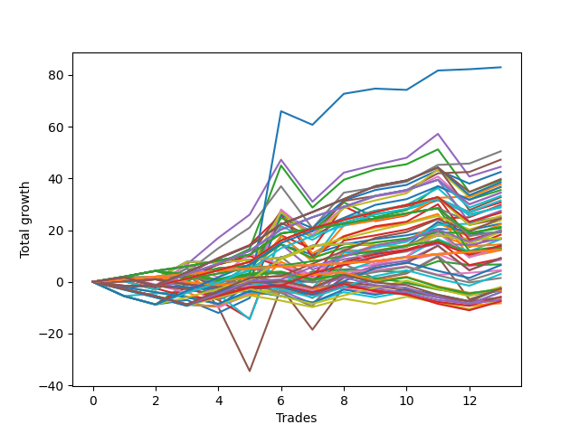

# Long Wallace Doodle 010 
- Symbol: ES
- Date Range: 03/18/2022 - 07/15/2022
- Trading Period: 7:20-12:30
- Number of Trades: 13



| Name | Win Percent | Profit | Avg Profit / Trade | Avg Time / Trade |      | Name | Win Percent | Profit | Avg Profit / Trade | Avg Time / Trade |
| ---- | ----------- | ------ | ------------------ | ---------------- | ---- | ---- | ----------- | ------ | ------------------ | ---------------- |
| Sorted By <br> Profit | | | | | | Sorted By <br> Win Percentage ||||
| Seventy-Three | 53.85 | 41500.00 | 3192.31 | 10:55 |     | One Hundred Twenty-Six | 100.00 | 6250.00 | 480.77 | 02:56 |
| Seven | 84.62 | 25250.00 | 1942.31 | 16:12 |     | One Hundred Twenty-One | 100.00 | 6250.00 | 480.77 | 02:56 |
| Forty-Seven | 76.92 | 23625.00 | 1817.31 | 14:09 |     | One Hundred Sixteen | 100.00 | 6250.00 | 480.77 | 02:56 |
| Four | 76.92 | 22250.00 | 1711.54 | 22:45 |     | One Hundred Eleven | 100.00 | 6250.00 | 480.77 | 02:56 |
| Forty-Two | 61.54 | 21250.00 | 1634.62 | 13:25 |     | Eighty-One | 100.00 | 6250.00 | 480.77 | 02:56 |
| One Hundred Thirty | 84.62 | 19875.00 | 1528.85 | 14:18 |     | One Hundred Twelve | 92.31 | 12500.00 | 961.54 | 05:59 |
| Two | 76.92 | 19625.00 | 1509.62 | 16:53 |     | One Hundred Twenty-Seven | 92.31 | 10375.00 | 798.08 | 06:07 |
| One Hundred Twenty-Five | 84.62 | 19250.00 | 1480.77 | 14:19 |     | One Hundred Twenty-Two | 92.31 | 9750.00 | 750.00 | 06:08 |
| Sixty-Three | 76.92 | 18875.00 | 1451.92 | 14:14 |     | Eighty-Two | 92.31 | 6875.00 | 528.85 | 07:16 |
| One Hundred Fifteen | 76.92 | 18375.00 | 1413.46 | 13:21 |     | Seven | 84.62 | 25250.00 | 1942.31 | 16:12 |
| Sixty | 69.23 | 18250.00 | 1403.85 | 19:32 |     | One Hundred Thirty | 84.62 | 19875.00 | 1528.85 | 14:18 |
| Forty-Four | 53.85 | 17750.00 | 1365.38 | 18:12 |     | One Hundred Twenty-Five | 84.62 | 19250.00 | 1480.77 | 14:19 |
| One Hundred Twenty-Nine | 84.62 | 17250.00 | 1326.92 | 14:06 |     | One Hundred Twenty-Nine | 84.62 | 17250.00 | 1326.92 | 14:06 |
| Fifty-Eight | 69.23 | 17250.00 | 1326.92 | 13:54 |     | One Hundred Twenty-Four | 84.62 | 16625.00 | 1278.85 | 14:06 |
| One Hundred Twenty-Four | 84.62 | 16625.00 | 1278.85 | 14:06 |     | Eighty-Five | 84.62 | 16375.00 | 1259.62 | 15:27 |
| Eighty-Five | 84.62 | 16375.00 | 1259.62 | 15:27 |     | Eighty-Four | 84.62 | 13750.00 | 1057.69 | 15:15 |
| One Hundred Fourteen | 76.92 | 15750.00 | 1211.54 | 13:08 |     | One Hundred Twenty-Eight | 84.62 | 13375.00 | 1028.85 | 12:18 |
| Forty-Five | 46.15 | 15375.00 | 1182.69 | 20:59 |     | One Hundred Twenty-Three | 84.62 | 12750.00 | 980.77 | 12:18 |
| Fifty-Five | 76.92 | 14875.00 | 1144.23 | 10:42 |     | Fifty-Seven | 84.62 | 12250.00 | 942.31 | 12:22 |
| Sixty-One | 61.54 | 14625.00 | 1125.00 | 22:29 |     | Zero | 84.62 | 11250.00 | 865.38 | 07:50 |
| Forty-One | 76.92 | 14375.00 | 1105.77 | 11:56 |     | Sixty-Four | 84.62 | 10625.00 | 817.31 | 07:16 |
| Eighty-Four | 84.62 | 13750.00 | 1057.69 | 15:15 |     | Forty | 84.62 | 10625.00 | 817.31 | 07:16 |
| Seventy-One | 69.23 | 13625.00 | 1048.08 | 13:49 |     | Eighty-Three | 84.62 | 9875.00 | 759.62 | 13:26 |
| One Hundred Twenty-Eight | 84.62 | 13375.00 | 1028.85 | 12:18 |     | Fifty-Six | 84.62 | 8375.00 | 644.23 | 07:20 |
| One Hundred Twenty-Three | 84.62 | 12750.00 | 980.77 | 12:18 |     | One Hundred Seventeen | 84.62 | 6500.00 | 500.00 | 05:21 |
| One Hundred Twelve | 92.31 | 12500.00 | 961.54 | 05:59 |     | One | 84.62 | 6125.00 | 471.15 | 15:03 |
| Fifty-Seven | 84.62 | 12250.00 | 942.31 | 12:22 |     | One Hundred One | 84.62 | 2250.00 | 173.08 | 02:30 |
| One Hundred Twenty | 69.23 | 12250.00 | 942.31 | 10:06 |     | Forty-Seven | 76.92 | 23625.00 | 1817.31 | 14:09 |
| One Hundred Thirteen | 76.92 | 11875.00 | 913.46 | 11:20 |     | Four | 76.92 | 22250.00 | 1711.54 | 22:45 |
| Zero | 84.62 | 11250.00 | 865.38 | 07:50 |     | Two | 76.92 | 19625.00 | 1509.62 | 16:53 |
| Forty-Three | 61.54 | 11125.00 | 855.77 | 13:53 |     | Sixty-Three | 76.92 | 18875.00 | 1451.92 | 14:14 |
| Sixty-Four | 84.62 | 10625.00 | 817.31 | 07:16 |     | One Hundred Fifteen | 76.92 | 18375.00 | 1413.46 | 13:21 |
| Forty | 84.62 | 10625.00 | 817.31 | 07:16 |     | One Hundred Fourteen | 76.92 | 15750.00 | 1211.54 | 13:08 |
| One Hundred Twenty-Seven | 92.31 | 10375.00 | 798.08 | 06:07 |     | Fifty-Five | 76.92 | 14875.00 | 1144.23 | 10:42 |
| One Hundred Ninteen | 69.23 | 10000.00 | 769.23 | 09:54 |     | Forty-One | 76.92 | 14375.00 | 1105.77 | 11:56 |
| Eighty-Three | 84.62 | 9875.00 | 759.62 | 13:26 |     | One Hundred Thirteen | 76.92 | 11875.00 | 913.46 | 11:20 |
| One Hundred Twenty-Two | 92.31 | 9750.00 | 750.00 | 06:08 |     | Three | 76.92 | 9125.00 | 701.92 | 17:21 |
| Fifty | 61.54 | 9625.00 | 740.38 | 09:36 |     | Sixty-Five | 76.92 | 4500.00 | 346.15 | 11:58 |
| Fifty-Two | 53.85 | 9625.00 | 740.38 | 13:17 |     | Forty-Eight | 76.92 | 4250.00 | 326.92 | 06:18 |
| Three | 76.92 | 9125.00 | 701.92 | 17:21 |     | Sixty | 69.23 | 18250.00 | 1403.85 | 19:32 |
| Fifty-Six | 84.62 | 8375.00 | 644.23 | 07:20 |     | Fifty-Eight | 69.23 | 17250.00 | 1326.92 | 13:54 |
| Seventy | 69.23 | 8375.00 | 644.23 | 03:14 |     | Seventy-One | 69.23 | 13625.00 | 1048.08 | 13:49 |
| Sixty-Two | 69.23 | 8375.00 | 644.23 | 03:14 |     | One Hundred Twenty | 69.23 | 12250.00 | 942.31 | 10:06 |
| Forty-Six | 69.23 | 8375.00 | 644.23 | 03:14 |     | One Hundred Ninteen | 69.23 | 10000.00 | 769.23 | 09:54 |
| Six | 69.23 | 8375.00 | 644.23 | 03:14 |     | Seventy | 69.23 | 8375.00 | 644.23 | 03:14 |
| Fifty-One | 61.54 | 8250.00 | 634.62 | 10:10 |     | Sixty-Two | 69.23 | 8375.00 | 644.23 | 03:14 |
| Fifty-Three | 53.85 | 7250.00 | 557.69 | 14:46 |     | Forty-Six | 69.23 | 8375.00 | 644.23 | 03:14 |
| Fifty-Nine | 69.23 | 7125.00 | 548.08 | 14:22 |     | Six | 69.23 | 8375.00 | 644.23 | 03:14 |
| One Hundred Eighteen | 69.23 | 7000.00 | 538.46 | 08:07 |     | Fifty-Nine | 69.23 | 7125.00 | 548.08 | 14:22 |
| Eighty-Two | 92.31 | 6875.00 | 528.85 | 07:16 |     | One Hundred Eighteen | 69.23 | 7000.00 | 538.46 | 08:07 |
| Sixty-Eight | 53.85 | 6625.00 | 509.62 | 18:47 |     | Forty-Nine | 69.23 | 6500.00 | 500.00 | 08:47 |
| One Hundred Seventeen | 84.62 | 6500.00 | 500.00 | 05:21 |     | One Hundred Six | 69.23 | -1625.00 | -125.00 | 02:13 |
| Forty-Nine | 69.23 | 6500.00 | 500.00 | 08:47 |     | Forty-Two | 61.54 | 21250.00 | 1634.62 | 13:25 |
| One Hundred Twenty-Six | 100.00 | 6250.00 | 480.77 | 02:56 |     | Sixty-One | 61.54 | 14625.00 | 1125.00 | 22:29 |
| One Hundred Twenty-One | 100.00 | 6250.00 | 480.77 | 02:56 |     | Forty-Three | 61.54 | 11125.00 | 855.77 | 13:53 |
| One Hundred Sixteen | 100.00 | 6250.00 | 480.77 | 02:56 |     | Fifty | 61.54 | 9625.00 | 740.38 | 09:36 |
| One Hundred Eleven | 100.00 | 6250.00 | 480.77 | 02:56 |     | Fifty-One | 61.54 | 8250.00 | 634.62 | 10:10 |
| Eighty-One | 100.00 | 6250.00 | 480.77 | 02:56 |     | Sixty-Seven | 61.54 | 4625.00 | 355.77 | 13:58 |
| One | 84.62 | 6125.00 | 471.15 | 15:03 |     | Sixty-Six | 61.54 | 4500.00 | 346.15 | 13:18 |
| Sixty-Seven | 61.54 | 4625.00 | 355.77 | 13:58 |     | Fifty-Four | 61.54 | 3375.00 | 259.62 | 02:39 |
| Sixty-Five | 76.92 | 4500.00 | 346.15 | 11:58 |     | One Hundred Two | 61.54 | 750.00 | 57.69 | 04:26 |
| Sixty-Six | 61.54 | 4500.00 | 346.15 | 13:18 |     | Five | 61.54 | -1500.00 | -115.38 | 27:49 |
| Forty-Eight | 76.92 | 4250.00 | 326.92 | 06:18 |     | Seventy-Three | 53.85 | 41500.00 | 3192.31 | 10:55 |
| Fifty-Four | 61.54 | 3375.00 | 259.62 | 02:39 |     | Forty-Four | 53.85 | 17750.00 | 1365.38 | 18:12 |
| One Hundred Five | 46.15 | 3250.00 | 250.00 | 08:40 |     | Fifty-Two | 53.85 | 9625.00 | 740.38 | 13:17 |
| One Hundred One | 84.62 | 2250.00 | 173.08 | 02:30 |     | Fifty-Three | 53.85 | 7250.00 | 557.69 | 14:46 |
| Sixty-Nine | 46.15 | 2125.00 | 163.46 | 21:06 |     | Sixty-Eight | 53.85 | 6625.00 | 509.62 | 18:47 |
| One Hundred Four | 46.15 | 1500.00 | 115.38 | 08:31 |     | One Hundred Seven | 53.85 | -1375.00 | -105.77 | 03:30 |
| One Hundred Two | 61.54 | 750.00 | 57.69 | 04:26 |     | Ninety-One | 53.85 | -3375.00 | -259.62 | 01:38 |
| One Hundred Three | 46.15 | -1000.00 | -76.92 | 06:58 |     | Forty-Five | 46.15 | 15375.00 | 1182.69 | 20:59 |
| One Hundred Ten | 38.46 | -1250.00 | -96.15 | 05:18 |     | One Hundred Five | 46.15 | 3250.00 | 250.00 | 08:40 |
| Ninety-Five | 30.77 | -1250.00 | -96.15 | 05:16 |     | Sixty-Nine | 46.15 | 2125.00 | 163.46 | 21:06 |
| One Hundred Seven | 53.85 | -1375.00 | -105.77 | 03:30 |     | One Hundred Four | 46.15 | 1500.00 | 115.38 | 08:31 |
| Ninety-Seven | 46.15 | -1375.00 | -105.77 | 01:31 |     | One Hundred Three | 46.15 | -1000.00 | -76.92 | 06:58 |
| Five | 61.54 | -1500.00 | -115.38 | 27:49 |     | Ninety-Seven | 46.15 | -1375.00 | -105.77 | 01:31 |
| One Hundred Six | 69.23 | -1625.00 | -125.00 | 02:13 |     | Ninety-Two | 46.15 | -1750.00 | -134.62 | 02:35 |
| Ninety-Two | 46.15 | -1750.00 | -134.62 | 02:35 |     | Ninety-Six | 46.15 | -4125.00 | -317.31 | 01:02 |
| One Hundred Nine | 38.46 | -2000.00 | -153.85 | 05:13 |     | One Hundred Ten | 38.46 | -1250.00 | -96.15 | 05:18 |
| Ninety-Four | 30.77 | -2000.00 | -153.85 | 05:12 |     | One Hundred Nine | 38.46 | -2000.00 | -153.85 | 05:13 |
| Ninety-Eight | 38.46 | -2875.00 | -221.15 | 01:42 |     | Ninety-Eight | 38.46 | -2875.00 | -221.15 | 01:42 |
| One Hundred | 38.46 | -3000.00 | -230.77 | 01:58 |     | One Hundred | 38.46 | -3000.00 | -230.77 | 01:58 |
| Ninety-One | 53.85 | -3375.00 | -259.62 | 01:38 |     | Ninety-Nine | 38.46 | -3500.00 | -269.23 | 01:56 |
| Ninety-Nine | 38.46 | -3500.00 | -269.23 | 01:56 |     | One Hundred Eight | 38.46 | -3750.00 | -288.46 | 04:49 |
| Ninety-Three | 30.77 | -3500.00 | -269.23 | 04:38 |     | Ninety-Five | 30.77 | -1250.00 | -96.15 | 05:16 |
| One Hundred Eight | 38.46 | -3750.00 | -288.46 | 04:49 |     | Ninety-Four | 30.77 | -2000.00 | -153.85 | 05:12 |
| Ninety-Six | 46.15 | -4125.00 | -317.31 | 01:02 |     | Ninety-Three | 30.77 | -3500.00 | -269.23 | 04:38 |

## NO STOPLOSS

### Test Zero
* Sell when price hits the middle line of the 20p bollinger
* No Stoploss
* Results:
```
Total Trades: 13
Percent Up: 84.62
Percent Down: 15.38
Total Points Moved Up: 22.50
Potential Profit: 11250.00
Total Points Ups: 27.00 Count Ups: 11
Total Points Downs: -4.50 Count Downs: 2
```

<details><summary>Trades</summary>

<code>In: 2022-03-24 11:29:00		Out: 2022-03-24 11:30:35		Total Position Time: 01:35		Total Move Up: 1.75		Total to Date: 1.75</code> <br />
<code>In: 2022-04-08 10:36:00		Out: 2022-04-08 10:52:15		Total Position Time: 16:15		Total Move Up: 0.00		Total to Date: 1.75</code> <br />
<code>In: 2022-04-20 09:14:00		Out: 2022-04-20 09:30:50		Total Position Time: 16:50		Total Move Up: 0.25		Total to Date: 2.00</code> <br />
<code>In: 2022-04-27 11:28:00		Out: 2022-04-27 11:32:25		Total Position Time: 04:25		Total Move Up: 3.25		Total to Date: 5.25</code> <br />
<code>In: 2022-04-27 11:40:00		Out: 2022-04-27 11:40:10		Total Position Time: 00:10		Total Move Up: 1.00		Total to Date: 6.25</code> <br />
<code>In: 2022-05-04 11:36:00		Out: 2022-05-04 11:36:40		Total Position Time: 00:40		Total Move Up: 8.25		Total to Date: 14.50</code> <br />
<code>In: 2022-05-06 10:56:00		Out: 2022-05-06 11:12:20		Total Position Time: 16:20		Total Move Up: -4.00		Total to Date: 10.50</code> <br />
<code>In: 2022-05-23 10:23:00		Out: 2022-05-23 10:26:30		Total Position Time: 03:30		Total Move Up: 4.00		Total to Date: 14.50</code> <br />
<code>In: 2022-05-26 11:38:00		Out: 2022-05-26 11:45:05		Total Position Time: 07:05		Total Move Up: 2.00		Total to Date: 16.50</code> <br />
<code>In: 2022-05-27 10:42:00		Out: 2022-05-27 10:51:10		Total Position Time: 09:10		Total Move Up: 1.50		Total to Date: 18.00</code> <br />
<code>In: 2022-06-27 09:32:00		Out: 2022-06-27 09:41:05		Total Position Time: 09:05		Total Move Up: 2.50		Total to Date: 20.50</code> <br />
<code>In: 2022-06-30 11:28:00		Out: 2022-06-30 11:39:45		Total Position Time: 11:45		Total Move Up: -0.50		Total to Date: 20.00</code> <br />
<code>In: 2022-07-15 11:05:00		Out: 2022-07-15 11:10:05		Total Position Time: 05:05		Total Move Up: 2.50		Total to Date: 22.50</code> <br />


</details>

### Test One
* Sell when the price hits the upper line of the 20p 1std bollinger
* No Stoploss
* Results:
```
Total Trades: 13
Percent Up: 84.62
Percent Down: 15.38
Total Points Moved Up: 12.25
Potential Profit: 6125.00
Total Points Ups: 45.00 Count Ups: 11
Total Points Downs: -32.75 Count Downs: 2
```

<details><summary>Trades</summary>

<code>In: 2022-03-24 11:29:00		Out: 2022-03-24 11:51:15		Total Position Time: 22:15		Total Move Up: 0.25		Total to Date: 0.25</code> <br />
<code>In: 2022-04-08 10:36:00		Out: 2022-04-08 11:01:00		Total Position Time: 25:00		Total Move Up: 1.00		Total to Date: 1.25</code> <br />
<code>In: 2022-04-20 09:14:00		Out: 2022-04-20 09:30:55		Total Position Time: 16:55		Total Move Up: 0.75		Total to Date: 2.00</code> <br />
<code>In: 2022-04-27 11:28:00		Out: 2022-04-27 11:36:05		Total Position Time: 08:05		Total Move Up: 4.75		Total to Date: 6.75</code> <br />
<code>In: 2022-04-27 11:40:00		Out: 2022-04-27 11:42:30		Total Position Time: 02:30		Total Move Up: 3.25		Total to Date: 10.00</code> <br />
<code>In: 2022-05-04 11:36:00		Out: 2022-05-04 11:41:40		Total Position Time: 05:40		Total Move Up: 17.25		Total to Date: 27.25</code> <br />
<code>In: 2022-05-06 10:56:00		Out: 2022-05-06 11:25:55		Total Position Time: 29:55		Total Move Up: -16.25		Total to Date: 11.00</code> <br />
<code>In: 2022-05-23 10:23:00		Out: 2022-05-23 10:32:40		Total Position Time: 09:40		Total Move Up: 6.75		Total to Date: 17.75</code> <br />
<code>In: 2022-05-26 11:38:00		Out: 2022-05-26 11:50:15		Total Position Time: 12:15		Total Move Up: 3.25		Total to Date: 21.00</code> <br />
<code>In: 2022-05-27 10:42:00		Out: 2022-05-27 10:54:00		Total Position Time: 12:00		Total Move Up: 1.75		Total to Date: 22.75</code> <br />
<code>In: 2022-06-27 09:32:00		Out: 2022-06-27 09:44:10		Total Position Time: 12:10		Total Move Up: 3.50		Total to Date: 26.25</code> <br />
<code>In: 2022-06-30 11:28:00		Out: 2022-06-30 11:57:55		Total Position Time: 29:55		Total Move Up: -16.50		Total to Date: 9.75</code> <br />
<code>In: 2022-07-15 11:05:00		Out: 2022-07-15 11:14:25		Total Position Time: 09:25		Total Move Up: 2.50		Total to Date: 12.25</code> <br />


</details>

### Test Two
* Sell when the price hits the upper line of the 20p 2std bollinger
* No Stoploss
* Results:
```
Total Trades: 13
Percent Up: 76.92
Percent Down: 23.08
Total Points Moved Up: 39.25
Potential Profit: 19625.00
Total Points Ups: 75.25 Count Ups: 10
Total Points Downs: -36.00 Count Downs: 3
```

<details><summary>Trades</summary>

<code>In: 2022-03-24 11:29:00		Out: 2022-03-24 11:51:30		Total Position Time: 22:30		Total Move Up: 1.50		Total to Date: 1.50</code> <br />
<code>In: 2022-04-08 10:36:00		Out: 2022-04-08 11:05:55		Total Position Time: 29:55		Total Move Up: -3.25		Total to Date: -1.75</code> <br />
<code>In: 2022-04-20 09:14:00		Out: 2022-04-20 09:31:25		Total Position Time: 17:25		Total Move Up: 1.75		Total to Date: 0.00</code> <br />
<code>In: 2022-04-27 11:28:00		Out: 2022-04-27 11:42:40		Total Position Time: 14:40		Total Move Up: 7.00		Total to Date: 7.00</code> <br />
<code>In: 2022-04-27 11:40:00		Out: 2022-04-27 11:42:40		Total Position Time: 02:40		Total Move Up: 5.75		Total to Date: 12.75</code> <br />
<code>In: 2022-05-04 11:36:00		Out: 2022-05-04 11:43:55		Total Position Time: 07:55		Total Move Up: 32.25		Total to Date: 45.00</code> <br />
<code>In: 2022-05-06 10:56:00		Out: 2022-05-06 11:25:55		Total Position Time: 29:55		Total Move Up: -16.25		Total to Date: 28.75</code> <br />
<code>In: 2022-05-23 10:23:00		Out: 2022-05-23 10:33:15		Total Position Time: 10:15		Total Move Up: 10.75		Total to Date: 39.50</code> <br />
<code>In: 2022-05-26 11:38:00		Out: 2022-05-26 11:54:10		Total Position Time: 16:10		Total Move Up: 4.00		Total to Date: 43.50</code> <br />
<code>In: 2022-05-27 10:42:00		Out: 2022-05-27 10:57:20		Total Position Time: 15:20		Total Move Up: 2.00		Total to Date: 45.50</code> <br />
<code>In: 2022-06-27 09:32:00		Out: 2022-06-27 09:45:00		Total Position Time: 13:00		Total Move Up: 5.75		Total to Date: 51.25</code> <br />
<code>In: 2022-06-30 11:28:00		Out: 2022-06-30 11:57:55		Total Position Time: 29:55		Total Move Up: -16.50		Total to Date: 34.75</code> <br />
<code>In: 2022-07-15 11:05:00		Out: 2022-07-15 11:15:00		Total Position Time: 10:00		Total Move Up: 4.50		Total to Date: 39.25</code> <br />


</details>

### Test Three
* Sell when price hits the middle line of the 50p bollinger
* No Stoploss
* Results:
```
Total Trades: 13
Percent Up: 76.92
Percent Down: 23.08
Total Points Moved Up: 18.25
Potential Profit: 9125.00
Total Points Ups: 54.25 Count Ups: 10
Total Points Downs: -36.00 Count Downs: 3
```

<details><summary>Trades</summary>

<code>In: 2022-03-24 11:29:00		Out: 2022-03-24 11:51:30		Total Position Time: 22:30		Total Move Up: 1.50		Total to Date: 1.50</code> <br />
<code>In: 2022-04-08 10:36:00		Out: 2022-04-08 11:05:55		Total Position Time: 29:55		Total Move Up: -3.25		Total to Date: -1.75</code> <br />
<code>In: 2022-04-20 09:14:00		Out: 2022-04-20 09:32:50		Total Position Time: 18:50		Total Move Up: 4.75		Total to Date: 3.00</code> <br />
<code>In: 2022-04-27 11:28:00		Out: 2022-04-27 11:42:35		Total Position Time: 14:35		Total Move Up: 6.25		Total to Date: 9.25</code> <br />
<code>In: 2022-04-27 11:40:00		Out: 2022-04-27 11:42:35		Total Position Time: 02:35		Total Move Up: 5.00		Total to Date: 14.25</code> <br />
<code>In: 2022-05-04 11:36:00		Out: 2022-05-04 11:41:15		Total Position Time: 05:15		Total Move Up: 11.75		Total to Date: 26.00</code> <br />
<code>In: 2022-05-06 10:56:00		Out: 2022-05-06 11:25:55		Total Position Time: 29:55		Total Move Up: -16.25		Total to Date: 9.75</code> <br />
<code>In: 2022-05-23 10:23:00		Out: 2022-05-23 10:33:00		Total Position Time: 10:00		Total Move Up: 7.75		Total to Date: 17.50</code> <br />
<code>In: 2022-05-26 11:38:00		Out: 2022-05-26 11:54:10		Total Position Time: 16:10		Total Move Up: 4.00		Total to Date: 21.50</code> <br />
<code>In: 2022-05-27 10:42:00		Out: 2022-05-27 11:04:30		Total Position Time: 22:30		Total Move Up: 1.75		Total to Date: 23.25</code> <br />
<code>In: 2022-06-27 09:32:00		Out: 2022-06-27 09:45:05		Total Position Time: 13:05		Total Move Up: 6.75		Total to Date: 30.00</code> <br />
<code>In: 2022-06-30 11:28:00		Out: 2022-06-30 11:57:55		Total Position Time: 29:55		Total Move Up: -16.50		Total to Date: 13.50</code> <br />
<code>In: 2022-07-15 11:05:00		Out: 2022-07-15 11:15:20		Total Position Time: 10:20		Total Move Up: 4.75		Total to Date: 18.25</code> <br />


</details>

### Test Four
* Sell when the price hits the upper line of the 50p 1std bollinger
* No Stoploss
* Results:
```
Total Trades: 13
Percent Up: 76.92
Percent Down: 23.08
Total Points Moved Up: 44.50
Potential Profit: 22250.00
Total Points Ups: 80.50 Count Ups: 10
Total Points Downs: -36.00 Count Downs: 3
```

<details><summary>Trades</summary>

<code>In: 2022-03-24 11:29:00		Out: 2022-03-24 11:58:55		Total Position Time: 29:55		Total Move Up: 1.75		Total to Date: 1.75</code> <br />
<code>In: 2022-04-08 10:36:00		Out: 2022-04-08 11:05:55		Total Position Time: 29:55		Total Move Up: -3.25		Total to Date: -1.50</code> <br />
<code>In: 2022-04-20 09:14:00		Out: 2022-04-20 09:36:45		Total Position Time: 22:45		Total Move Up: 8.25		Total to Date: 6.75</code> <br />
<code>In: 2022-04-27 11:28:00		Out: 2022-04-27 11:45:35		Total Position Time: 17:35		Total Move Up: 10.25		Total to Date: 17.00</code> <br />
<code>In: 2022-04-27 11:40:00		Out: 2022-04-27 11:45:35		Total Position Time: 05:35		Total Move Up: 9.00		Total to Date: 26.00</code> <br />
<code>In: 2022-05-04 11:36:00		Out: 2022-05-04 11:42:00		Total Position Time: 06:00		Total Move Up: 21.25		Total to Date: 47.25</code> <br />
<code>In: 2022-05-06 10:56:00		Out: 2022-05-06 11:25:55		Total Position Time: 29:55		Total Move Up: -16.25		Total to Date: 31.00</code> <br />
<code>In: 2022-05-23 10:23:00		Out: 2022-05-23 10:36:15		Total Position Time: 13:15		Total Move Up: 11.25		Total to Date: 42.25</code> <br />
<code>In: 2022-05-26 11:38:00		Out: 2022-05-26 12:07:55		Total Position Time: 29:55		Total Move Up: 3.00		Total to Date: 45.25</code> <br />
<code>In: 2022-05-27 10:42:00		Out: 2022-05-27 11:09:45		Total Position Time: 27:45		Total Move Up: 2.75		Total to Date: 48.00</code> <br />
<code>In: 2022-06-27 09:32:00		Out: 2022-06-27 09:55:20		Total Position Time: 23:20		Total Move Up: 9.25		Total to Date: 57.25</code> <br />
<code>In: 2022-06-30 11:28:00		Out: 2022-06-30 11:57:55		Total Position Time: 29:55		Total Move Up: -16.50		Total to Date: 40.75</code> <br />
<code>In: 2022-07-15 11:05:00		Out: 2022-07-15 11:34:55		Total Position Time: 29:55		Total Move Up: 3.75		Total to Date: 44.50</code> <br />


</details>

### Test Five
* Sell when the price hits the upper line of the 50p 2std bollinger
* No Stoploss
* Results:
```
Total Trades: 13
Percent Up: 61.54
Percent Down: 38.46
Total Points Moved Up: -3.00
Potential Profit: -1500.00
Total Points Ups: 72.75 Count Ups: 8
Total Points Downs: -75.75 Count Downs: 5
```

<details><summary>Trades</summary>

<code>In: 2022-03-24 11:29:00		Out: 2022-03-24 11:58:55		Total Position Time: 29:55		Total Move Up: 1.75		Total to Date: 1.75</code> <br />
<code>In: 2022-04-08 10:36:00		Out: 2022-04-08 11:05:55		Total Position Time: 29:55		Total Move Up: -3.25		Total to Date: -1.50</code> <br />
<code>In: 2022-04-20 09:14:00		Out: 2022-04-20 09:43:55		Total Position Time: 29:55		Total Move Up: 6.75		Total to Date: 5.25</code> <br />
<code>In: 2022-04-27 11:28:00		Out: 2022-04-27 11:57:55		Total Position Time: 29:55		Total Move Up: -15.00		Total to Date: -9.75</code> <br />
<code>In: 2022-04-27 11:40:00		Out: 2022-04-27 12:09:55		Total Position Time: 29:55		Total Move Up: -24.75		Total to Date: -34.50</code> <br />
<code>In: 2022-05-04 11:36:00		Out: 2022-05-04 11:43:55		Total Position Time: 07:55		Total Move Up: 32.25		Total to Date: -2.25</code> <br />
<code>In: 2022-05-06 10:56:00		Out: 2022-05-06 11:25:55		Total Position Time: 29:55		Total Move Up: -16.25		Total to Date: -18.50</code> <br />
<code>In: 2022-05-23 10:23:00		Out: 2022-05-23 10:47:45		Total Position Time: 24:45		Total Move Up: 16.50		Total to Date: -2.00</code> <br />
<code>In: 2022-05-26 11:38:00		Out: 2022-05-26 12:07:55		Total Position Time: 29:55		Total Move Up: 3.00		Total to Date: 1.00</code> <br />
<code>In: 2022-05-27 10:42:00		Out: 2022-05-27 11:11:55		Total Position Time: 29:55		Total Move Up: 2.25		Total to Date: 3.25</code> <br />
<code>In: 2022-06-27 09:32:00		Out: 2022-06-27 10:01:55		Total Position Time: 29:55		Total Move Up: 6.50		Total to Date: 9.75</code> <br />
<code>In: 2022-06-30 11:28:00		Out: 2022-06-30 11:57:55		Total Position Time: 29:55		Total Move Up: -16.50		Total to Date: -6.75</code> <br />
<code>In: 2022-07-15 11:05:00		Out: 2022-07-15 11:34:55		Total Position Time: 29:55		Total Move Up: 3.75		Total to Date: -3.00</code> <br />


</details>

### Test Six
* Sell when the price hits the middle line of the 1std VWAP
* No Stoploss
* Results:
```
Total Trades: 13
Percent Up: 69.23
Percent Down: 30.77
Total Points Moved Up: 16.75
Potential Profit: 8375.00
Total Points Ups: 19.50 Count Ups: 9
Total Points Downs: -2.75 Count Downs: 4
```

<details><summary>Trades</summary>

<code>In: 2022-03-24 11:29:00		Out: 2022-03-24 11:29:10		Total Position Time: 00:10		Total Move Up: 0.25		Total to Date: 0.25</code> <br />
<code>In: 2022-04-08 10:36:00		Out: 2022-04-08 10:36:10		Total Position Time: 00:10		Total Move Up: 0.75		Total to Date: 1.00</code> <br />
<code>In: 2022-04-20 09:14:00		Out: 2022-04-20 09:35:50		Total Position Time: 21:50		Total Move Up: 6.75		Total to Date: 7.75</code> <br />
<code>In: 2022-04-27 11:28:00		Out: 2022-04-27 11:28:10		Total Position Time: 00:10		Total Move Up: -0.25		Total to Date: 7.50</code> <br />
<code>In: 2022-04-27 11:40:00		Out: 2022-04-27 11:40:10		Total Position Time: 00:10		Total Move Up: 1.00		Total to Date: 8.50</code> <br />
<code>In: 2022-05-04 11:36:00		Out: 2022-05-04 11:36:10		Total Position Time: 00:10		Total Move Up: 0.75		Total to Date: 9.25</code> <br />
<code>In: 2022-05-06 10:56:00		Out: 2022-05-06 11:02:20		Total Position Time: 06:20		Total Move Up: 4.75		Total to Date: 14.00</code> <br />
<code>In: 2022-05-23 10:23:00		Out: 2022-05-23 10:23:10		Total Position Time: 00:10		Total Move Up: 0.75		Total to Date: 14.75</code> <br />
<code>In: 2022-05-26 11:38:00		Out: 2022-05-26 11:38:10		Total Position Time: 00:10		Total Move Up: -0.50		Total to Date: 14.25</code> <br />
<code>In: 2022-05-27 10:42:00		Out: 2022-05-27 10:42:10		Total Position Time: 00:10		Total Move Up: -0.50		Total to Date: 13.75</code> <br />
<code>In: 2022-06-27 09:32:00		Out: 2022-06-27 09:44:20		Total Position Time: 12:20		Total Move Up: 4.25		Total to Date: 18.00</code> <br />
<code>In: 2022-06-30 11:28:00		Out: 2022-06-30 11:28:10		Total Position Time: 00:10		Total Move Up: -1.50		Total to Date: 16.50</code> <br />
<code>In: 2022-07-15 11:05:00		Out: 2022-07-15 11:05:10		Total Position Time: 00:10		Total Move Up: 0.25		Total to Date: 16.75</code> <br />


</details>

### Test Seven
* Sell when the price hits the upper line of the 1std VWAP
* No Stoploss
* Results:
```
Total Trades: 13
Percent Up: 84.62
Percent Down: 15.38
Total Points Moved Up: 50.50
Potential Profit: 25250.00
Total Points Ups: 70.00 Count Ups: 11
Total Points Downs: -19.50 Count Downs: 2
```

<details><summary>Trades</summary>

<code>In: 2022-03-24 11:29:00		Out: 2022-03-24 11:29:10		Total Position Time: 00:10		Total Move Up: 0.25		Total to Date: 0.25</code> <br />
<code>In: 2022-04-08 10:36:00		Out: 2022-04-08 11:05:55		Total Position Time: 29:55		Total Move Up: -3.25		Total to Date: -3.00</code> <br />
<code>In: 2022-04-20 09:14:00		Out: 2022-04-20 09:43:55		Total Position Time: 29:55		Total Move Up: 6.75		Total to Date: 3.75</code> <br />
<code>In: 2022-04-27 11:28:00		Out: 2022-04-27 11:44:15		Total Position Time: 16:15		Total Move Up: 9.25		Total to Date: 13.00</code> <br />
<code>In: 2022-04-27 11:40:00		Out: 2022-04-27 11:44:15		Total Position Time: 04:15		Total Move Up: 8.00		Total to Date: 21.00</code> <br />
<code>In: 2022-05-04 11:36:00		Out: 2022-05-04 11:41:35		Total Position Time: 05:35		Total Move Up: 16.00		Total to Date: 37.00</code> <br />
<code>In: 2022-05-06 10:56:00		Out: 2022-05-06 11:25:55		Total Position Time: 29:55		Total Move Up: -16.25		Total to Date: 20.75</code> <br />
<code>In: 2022-05-23 10:23:00		Out: 2022-05-23 10:42:15		Total Position Time: 19:15		Total Move Up: 13.75		Total to Date: 34.50</code> <br />
<code>In: 2022-05-26 11:38:00		Out: 2022-05-26 11:42:40		Total Position Time: 04:40		Total Move Up: 2.00		Total to Date: 36.50</code> <br />
<code>In: 2022-05-27 10:42:00		Out: 2022-05-27 11:11:55		Total Position Time: 29:55		Total Move Up: 2.25		Total to Date: 38.75</code> <br />
<code>In: 2022-06-27 09:32:00		Out: 2022-06-27 10:01:55		Total Position Time: 29:55		Total Move Up: 6.50		Total to Date: 45.25</code> <br />
<code>In: 2022-06-30 11:28:00		Out: 2022-06-30 11:28:40		Total Position Time: 00:40		Total Move Up: 0.50		Total to Date: 45.75</code> <br />
<code>In: 2022-07-15 11:05:00		Out: 2022-07-15 11:15:20		Total Position Time: 10:20		Total Move Up: 4.75		Total to Date: 50.50</code> <br />


</details>

## STOPLOSS OF 5

### Test Forty
* Sell when price hits the middle line of the 20p bollinger
* Stoploss is 5 points
* Results:
```
Total Trades: 13
Percent Up: 84.62
Percent Down: 15.38
Total Points Moved Up: 21.25
Potential Profit: 10625.00
Total Points Ups: 27.00 Count Ups: 11
Total Points Downs: -5.75 Count Downs: 2
```

<details><summary>Trades</summary>

<code>In: 2022-03-24 11:29:00		Out: 2022-03-24 11:30:35		Total Position Time: 01:35		Total Move Up: 1.75		Total to Date: 1.75</code> <br />
<code>In: 2022-04-08 10:36:00		Out: 2022-04-08 10:52:15		Total Position Time: 16:15		Total Move Up: 0.00		Total to Date: 1.75</code> <br />
<code>In: 2022-04-20 09:14:00		Out: 2022-04-20 09:30:50		Total Position Time: 16:50		Total Move Up: 0.25		Total to Date: 2.00</code> <br />
<code>In: 2022-04-27 11:28:00		Out: 2022-04-27 11:32:25		Total Position Time: 04:25		Total Move Up: 3.25		Total to Date: 5.25</code> <br />
<code>In: 2022-04-27 11:40:00		Out: 2022-04-27 11:40:10		Total Position Time: 00:10		Total Move Up: 1.00		Total to Date: 6.25</code> <br />
<code>In: 2022-05-04 11:36:00		Out: 2022-05-04 11:36:40		Total Position Time: 00:40		Total Move Up: 8.25		Total to Date: 14.50</code> <br />
<code>In: 2022-05-06 10:56:00		Out: 2022-05-06 11:05:05		Total Position Time: 09:05		Total Move Up: -5.25		Total to Date: 9.25</code> <br />
<code>In: 2022-05-23 10:23:00		Out: 2022-05-23 10:26:30		Total Position Time: 03:30		Total Move Up: 4.00		Total to Date: 13.25</code> <br />
<code>In: 2022-05-26 11:38:00		Out: 2022-05-26 11:45:05		Total Position Time: 07:05		Total Move Up: 2.00		Total to Date: 15.25</code> <br />
<code>In: 2022-05-27 10:42:00		Out: 2022-05-27 10:51:10		Total Position Time: 09:10		Total Move Up: 1.50		Total to Date: 16.75</code> <br />
<code>In: 2022-06-27 09:32:00		Out: 2022-06-27 09:41:05		Total Position Time: 09:05		Total Move Up: 2.50		Total to Date: 19.25</code> <br />
<code>In: 2022-06-30 11:28:00		Out: 2022-06-30 11:39:45		Total Position Time: 11:45		Total Move Up: -0.50		Total to Date: 18.75</code> <br />
<code>In: 2022-07-15 11:05:00		Out: 2022-07-15 11:10:05		Total Position Time: 05:05		Total Move Up: 2.50		Total to Date: 21.25</code> <br />


</details>

### Test Forty-One
* Sell when the price hits the upper line of the 20p 1std bollinger
* Stoploss is 5 points
* Results:
```
Total Trades: 13
Percent Up: 76.92
Percent Down: 23.08
Total Points Moved Up: 28.75
Potential Profit: 14375.00
Total Points Ups: 44.75 Count Ups: 10
Total Points Downs: -16.00 Count Downs: 3
```

<details><summary>Trades</summary>

<code>In: 2022-03-24 11:29:00		Out: 2022-03-24 11:48:20		Total Position Time: 19:20		Total Move Up: -5.50		Total to Date: -5.50</code> <br />
<code>In: 2022-04-08 10:36:00		Out: 2022-04-08 11:01:00		Total Position Time: 25:00		Total Move Up: 1.00		Total to Date: -4.50</code> <br />
<code>In: 2022-04-20 09:14:00		Out: 2022-04-20 09:30:55		Total Position Time: 16:55		Total Move Up: 0.75		Total to Date: -3.75</code> <br />
<code>In: 2022-04-27 11:28:00		Out: 2022-04-27 11:36:05		Total Position Time: 08:05		Total Move Up: 4.75		Total to Date: 1.00</code> <br />
<code>In: 2022-04-27 11:40:00		Out: 2022-04-27 11:42:30		Total Position Time: 02:30		Total Move Up: 3.25		Total to Date: 4.25</code> <br />
<code>In: 2022-05-04 11:36:00		Out: 2022-05-04 11:41:40		Total Position Time: 05:40		Total Move Up: 17.25		Total to Date: 21.50</code> <br />
<code>In: 2022-05-06 10:56:00		Out: 2022-05-06 11:05:05		Total Position Time: 09:05		Total Move Up: -5.25		Total to Date: 16.25</code> <br />
<code>In: 2022-05-23 10:23:00		Out: 2022-05-23 10:32:40		Total Position Time: 09:40		Total Move Up: 6.75		Total to Date: 23.00</code> <br />
<code>In: 2022-05-26 11:38:00		Out: 2022-05-26 11:50:15		Total Position Time: 12:15		Total Move Up: 3.25		Total to Date: 26.25</code> <br />
<code>In: 2022-05-27 10:42:00		Out: 2022-05-27 10:54:00		Total Position Time: 12:00		Total Move Up: 1.75		Total to Date: 28.00</code> <br />
<code>In: 2022-06-27 09:32:00		Out: 2022-06-27 09:44:10		Total Position Time: 12:10		Total Move Up: 3.50		Total to Date: 31.50</code> <br />
<code>In: 2022-06-30 11:28:00		Out: 2022-06-30 11:41:10		Total Position Time: 13:10		Total Move Up: -5.25		Total to Date: 26.25</code> <br />
<code>In: 2022-07-15 11:05:00		Out: 2022-07-15 11:14:25		Total Position Time: 09:25		Total Move Up: 2.50		Total to Date: 28.75</code> <br />


</details>

### Test Forty-Two
* Sell when the price hits the upper line of the 20p 2std bollinger
* Stoploss is 5 points
* Results:
```
Total Trades: 13
Percent Up: 61.54
Percent Down: 38.46
Total Points Moved Up: 42.50
Potential Profit: 21250.00
Total Points Ups: 66.75 Count Ups: 8
Total Points Downs: -24.25 Count Downs: 5
```

<details><summary>Trades</summary>

<code>In: 2022-03-24 11:29:00		Out: 2022-03-24 11:48:20		Total Position Time: 19:20		Total Move Up: -5.50		Total to Date: -5.50</code> <br />
<code>In: 2022-04-08 10:36:00		Out: 2022-04-08 11:05:55		Total Position Time: 29:55		Total Move Up: -3.25		Total to Date: -8.75</code> <br />
<code>In: 2022-04-20 09:14:00		Out: 2022-04-20 09:31:25		Total Position Time: 17:25		Total Move Up: 1.75		Total to Date: -7.00</code> <br />
<code>In: 2022-04-27 11:28:00		Out: 2022-04-27 11:38:20		Total Position Time: 10:20		Total Move Up: -5.00		Total to Date: -12.00</code> <br />
<code>In: 2022-04-27 11:40:00		Out: 2022-04-27 11:42:40		Total Position Time: 02:40		Total Move Up: 5.75		Total to Date: -6.25</code> <br />
<code>In: 2022-05-04 11:36:00		Out: 2022-05-04 11:43:55		Total Position Time: 07:55		Total Move Up: 32.25		Total to Date: 26.00</code> <br />
<code>In: 2022-05-06 10:56:00		Out: 2022-05-06 11:05:05		Total Position Time: 09:05		Total Move Up: -5.25		Total to Date: 20.75</code> <br />
<code>In: 2022-05-23 10:23:00		Out: 2022-05-23 10:33:15		Total Position Time: 10:15		Total Move Up: 10.75		Total to Date: 31.50</code> <br />
<code>In: 2022-05-26 11:38:00		Out: 2022-05-26 11:54:10		Total Position Time: 16:10		Total Move Up: 4.00		Total to Date: 35.50</code> <br />
<code>In: 2022-05-27 10:42:00		Out: 2022-05-27 10:57:20		Total Position Time: 15:20		Total Move Up: 2.00		Total to Date: 37.50</code> <br />
<code>In: 2022-06-27 09:32:00		Out: 2022-06-27 09:45:00		Total Position Time: 13:00		Total Move Up: 5.75		Total to Date: 43.25</code> <br />
<code>In: 2022-06-30 11:28:00		Out: 2022-06-30 11:41:10		Total Position Time: 13:10		Total Move Up: -5.25		Total to Date: 38.00</code> <br />
<code>In: 2022-07-15 11:05:00		Out: 2022-07-15 11:15:00		Total Position Time: 10:00		Total Move Up: 4.50		Total to Date: 42.50</code> <br />


</details>

### Test Forty-Three
* Sell when price hits the middle line of the 50p bollinger
* Stoploss is 5 points
* Results:
```
Total Trades: 13
Percent Up: 61.54
Percent Down: 38.46
Total Points Moved Up: 22.25
Potential Profit: 11125.00
Total Points Ups: 46.50 Count Ups: 8
Total Points Downs: -24.25 Count Downs: 5
```

<details><summary>Trades</summary>

<code>In: 2022-03-24 11:29:00		Out: 2022-03-24 11:48:20		Total Position Time: 19:20		Total Move Up: -5.50		Total to Date: -5.50</code> <br />
<code>In: 2022-04-08 10:36:00		Out: 2022-04-08 11:05:55		Total Position Time: 29:55		Total Move Up: -3.25		Total to Date: -8.75</code> <br />
<code>In: 2022-04-20 09:14:00		Out: 2022-04-20 09:32:50		Total Position Time: 18:50		Total Move Up: 4.75		Total to Date: -4.00</code> <br />
<code>In: 2022-04-27 11:28:00		Out: 2022-04-27 11:38:20		Total Position Time: 10:20		Total Move Up: -5.00		Total to Date: -9.00</code> <br />
<code>In: 2022-04-27 11:40:00		Out: 2022-04-27 11:42:35		Total Position Time: 02:35		Total Move Up: 5.00		Total to Date: -4.00</code> <br />
<code>In: 2022-05-04 11:36:00		Out: 2022-05-04 11:41:15		Total Position Time: 05:15		Total Move Up: 11.75		Total to Date: 7.75</code> <br />
<code>In: 2022-05-06 10:56:00		Out: 2022-05-06 11:05:05		Total Position Time: 09:05		Total Move Up: -5.25		Total to Date: 2.50</code> <br />
<code>In: 2022-05-23 10:23:00		Out: 2022-05-23 10:33:00		Total Position Time: 10:00		Total Move Up: 7.75		Total to Date: 10.25</code> <br />
<code>In: 2022-05-26 11:38:00		Out: 2022-05-26 11:54:10		Total Position Time: 16:10		Total Move Up: 4.00		Total to Date: 14.25</code> <br />
<code>In: 2022-05-27 10:42:00		Out: 2022-05-27 11:04:30		Total Position Time: 22:30		Total Move Up: 1.75		Total to Date: 16.00</code> <br />
<code>In: 2022-06-27 09:32:00		Out: 2022-06-27 09:45:05		Total Position Time: 13:05		Total Move Up: 6.75		Total to Date: 22.75</code> <br />
<code>In: 2022-06-30 11:28:00		Out: 2022-06-30 11:41:10		Total Position Time: 13:10		Total Move Up: -5.25		Total to Date: 17.50</code> <br />
<code>In: 2022-07-15 11:05:00		Out: 2022-07-15 11:15:20		Total Position Time: 10:20		Total Move Up: 4.75		Total to Date: 22.25</code> <br />


</details>

### Test Forty-Four
* Sell when the price hits the upper line of the 50p 1std bollinger
* Stoploss is 5 points
* Results:
```
Total Trades: 13
Percent Up: 53.85
Percent Down: 46.15
Total Points Moved Up: 35.50
Potential Profit: 17750.00
Total Points Ups: 65.50 Count Ups: 7
Total Points Downs: -30.00 Count Downs: 6
```

<details><summary>Trades</summary>

<code>In: 2022-03-24 11:29:00		Out: 2022-03-24 11:48:20		Total Position Time: 19:20		Total Move Up: -5.50		Total to Date: -5.50</code> <br />
<code>In: 2022-04-08 10:36:00		Out: 2022-04-08 11:05:55		Total Position Time: 29:55		Total Move Up: -3.25		Total to Date: -8.75</code> <br />
<code>In: 2022-04-20 09:14:00		Out: 2022-04-20 09:36:45		Total Position Time: 22:45		Total Move Up: 8.25		Total to Date: -0.50</code> <br />
<code>In: 2022-04-27 11:28:00		Out: 2022-04-27 11:38:20		Total Position Time: 10:20		Total Move Up: -5.00		Total to Date: -5.50</code> <br />
<code>In: 2022-04-27 11:40:00		Out: 2022-04-27 11:45:35		Total Position Time: 05:35		Total Move Up: 9.00		Total to Date: 3.50</code> <br />
<code>In: 2022-05-04 11:36:00		Out: 2022-05-04 11:42:00		Total Position Time: 06:00		Total Move Up: 21.25		Total to Date: 24.75</code> <br />
<code>In: 2022-05-06 10:56:00		Out: 2022-05-06 11:05:05		Total Position Time: 09:05		Total Move Up: -5.25		Total to Date: 19.50</code> <br />
<code>In: 2022-05-23 10:23:00		Out: 2022-05-23 10:36:15		Total Position Time: 13:15		Total Move Up: 11.25		Total to Date: 30.75</code> <br />
<code>In: 2022-05-26 11:38:00		Out: 2022-05-26 12:04:15		Total Position Time: 26:15		Total Move Up: -5.75		Total to Date: 25.00</code> <br />
<code>In: 2022-05-27 10:42:00		Out: 2022-05-27 11:09:45		Total Position Time: 27:45		Total Move Up: 2.75		Total to Date: 27.75</code> <br />
<code>In: 2022-06-27 09:32:00		Out: 2022-06-27 09:55:20		Total Position Time: 23:20		Total Move Up: 9.25		Total to Date: 37.00</code> <br />
<code>In: 2022-06-30 11:28:00		Out: 2022-06-30 11:41:10		Total Position Time: 13:10		Total Move Up: -5.25		Total to Date: 31.75</code> <br />
<code>In: 2022-07-15 11:05:00		Out: 2022-07-15 11:34:55		Total Position Time: 29:55		Total Move Up: 3.75		Total to Date: 35.50</code> <br />


</details>

### Test Forty-Five
* Sell when the price hits the upper line of the 50p 2std bollinger
* Stoploss is 5 points
* Results:
```
Total Trades: 13
Percent Up: 46.15
Percent Down: 53.85
Total Points Moved Up: 30.75
Potential Profit: 15375.00
Total Points Ups: 68.00 Count Ups: 6
Total Points Downs: -37.25 Count Downs: 7
```

<details><summary>Trades</summary>

<code>In: 2022-03-24 11:29:00		Out: 2022-03-24 11:48:20		Total Position Time: 19:20		Total Move Up: -5.50		Total to Date: -5.50</code> <br />
<code>In: 2022-04-08 10:36:00		Out: 2022-04-08 11:05:55		Total Position Time: 29:55		Total Move Up: -3.25		Total to Date: -8.75</code> <br />
<code>In: 2022-04-20 09:14:00		Out: 2022-04-20 09:43:55		Total Position Time: 29:55		Total Move Up: 6.75		Total to Date: -2.00</code> <br />
<code>In: 2022-04-27 11:28:00		Out: 2022-04-27 11:38:20		Total Position Time: 10:20		Total Move Up: -5.00		Total to Date: -7.00</code> <br />
<code>In: 2022-04-27 11:40:00		Out: 2022-04-27 11:52:30		Total Position Time: 12:30		Total Move Up: -7.25		Total to Date: -14.25</code> <br />
<code>In: 2022-05-04 11:36:00		Out: 2022-05-04 11:43:55		Total Position Time: 07:55		Total Move Up: 32.25		Total to Date: 18.00</code> <br />
<code>In: 2022-05-06 10:56:00		Out: 2022-05-06 11:05:05		Total Position Time: 09:05		Total Move Up: -5.25		Total to Date: 12.75</code> <br />
<code>In: 2022-05-23 10:23:00		Out: 2022-05-23 10:47:45		Total Position Time: 24:45		Total Move Up: 16.50		Total to Date: 29.25</code> <br />
<code>In: 2022-05-26 11:38:00		Out: 2022-05-26 12:04:15		Total Position Time: 26:15		Total Move Up: -5.75		Total to Date: 23.50</code> <br />
<code>In: 2022-05-27 10:42:00		Out: 2022-05-27 11:11:55		Total Position Time: 29:55		Total Move Up: 2.25		Total to Date: 25.75</code> <br />
<code>In: 2022-06-27 09:32:00		Out: 2022-06-27 10:01:55		Total Position Time: 29:55		Total Move Up: 6.50		Total to Date: 32.25</code> <br />
<code>In: 2022-06-30 11:28:00		Out: 2022-06-30 11:41:10		Total Position Time: 13:10		Total Move Up: -5.25		Total to Date: 27.00</code> <br />
<code>In: 2022-07-15 11:05:00		Out: 2022-07-15 11:34:55		Total Position Time: 29:55		Total Move Up: 3.75		Total to Date: 30.75</code> <br />


</details>

### Test Forty-Six
* Sell when the price hits the middle line of the 1std VWAP
* Stoploss is 5 points
* Results:
```
Total Trades: 13
Percent Up: 69.23
Percent Down: 30.77
Total Points Moved Up: 16.75
Potential Profit: 8375.00
Total Points Ups: 19.50 Count Ups: 9
Total Points Downs: -2.75 Count Downs: 4
```

<details><summary>Trades</summary>

<code>In: 2022-03-24 11:29:00		Out: 2022-03-24 11:29:10		Total Position Time: 00:10		Total Move Up: 0.25		Total to Date: 0.25</code> <br />
<code>In: 2022-04-08 10:36:00		Out: 2022-04-08 10:36:10		Total Position Time: 00:10		Total Move Up: 0.75		Total to Date: 1.00</code> <br />
<code>In: 2022-04-20 09:14:00		Out: 2022-04-20 09:35:50		Total Position Time: 21:50		Total Move Up: 6.75		Total to Date: 7.75</code> <br />
<code>In: 2022-04-27 11:28:00		Out: 2022-04-27 11:28:10		Total Position Time: 00:10		Total Move Up: -0.25		Total to Date: 7.50</code> <br />
<code>In: 2022-04-27 11:40:00		Out: 2022-04-27 11:40:10		Total Position Time: 00:10		Total Move Up: 1.00		Total to Date: 8.50</code> <br />
<code>In: 2022-05-04 11:36:00		Out: 2022-05-04 11:36:10		Total Position Time: 00:10		Total Move Up: 0.75		Total to Date: 9.25</code> <br />
<code>In: 2022-05-06 10:56:00		Out: 2022-05-06 11:02:20		Total Position Time: 06:20		Total Move Up: 4.75		Total to Date: 14.00</code> <br />
<code>In: 2022-05-23 10:23:00		Out: 2022-05-23 10:23:10		Total Position Time: 00:10		Total Move Up: 0.75		Total to Date: 14.75</code> <br />
<code>In: 2022-05-26 11:38:00		Out: 2022-05-26 11:38:10		Total Position Time: 00:10		Total Move Up: -0.50		Total to Date: 14.25</code> <br />
<code>In: 2022-05-27 10:42:00		Out: 2022-05-27 10:42:10		Total Position Time: 00:10		Total Move Up: -0.50		Total to Date: 13.75</code> <br />
<code>In: 2022-06-27 09:32:00		Out: 2022-06-27 09:44:20		Total Position Time: 12:20		Total Move Up: 4.25		Total to Date: 18.00</code> <br />
<code>In: 2022-06-30 11:28:00		Out: 2022-06-30 11:28:10		Total Position Time: 00:10		Total Move Up: -1.50		Total to Date: 16.50</code> <br />
<code>In: 2022-07-15 11:05:00		Out: 2022-07-15 11:05:10		Total Position Time: 00:10		Total Move Up: 0.25		Total to Date: 16.75</code> <br />


</details>

### Test Forty-Seven
* Sell when the price hits the upper line of the 1std VWAP
* Stoploss is 5 points
* Results:
```
Total Trades: 13
Percent Up: 76.92
Percent Down: 23.08
Total Points Moved Up: 47.25
Potential Profit: 23625.00
Total Points Ups: 60.75 Count Ups: 10
Total Points Downs: -13.50 Count Downs: 3
```

<details><summary>Trades</summary>

<code>In: 2022-03-24 11:29:00		Out: 2022-03-24 11:29:10		Total Position Time: 00:10		Total Move Up: 0.25		Total to Date: 0.25</code> <br />
<code>In: 2022-04-08 10:36:00		Out: 2022-04-08 11:05:55		Total Position Time: 29:55		Total Move Up: -3.25		Total to Date: -3.00</code> <br />
<code>In: 2022-04-20 09:14:00		Out: 2022-04-20 09:43:55		Total Position Time: 29:55		Total Move Up: 6.75		Total to Date: 3.75</code> <br />
<code>In: 2022-04-27 11:28:00		Out: 2022-04-27 11:38:20		Total Position Time: 10:20		Total Move Up: -5.00		Total to Date: -1.25</code> <br />
<code>In: 2022-04-27 11:40:00		Out: 2022-04-27 11:44:15		Total Position Time: 04:15		Total Move Up: 8.00		Total to Date: 6.75</code> <br />
<code>In: 2022-05-04 11:36:00		Out: 2022-05-04 11:41:35		Total Position Time: 05:35		Total Move Up: 16.00		Total to Date: 22.75</code> <br />
<code>In: 2022-05-06 10:56:00		Out: 2022-05-06 11:05:05		Total Position Time: 09:05		Total Move Up: -5.25		Total to Date: 17.50</code> <br />
<code>In: 2022-05-23 10:23:00		Out: 2022-05-23 10:42:15		Total Position Time: 19:15		Total Move Up: 13.75		Total to Date: 31.25</code> <br />
<code>In: 2022-05-26 11:38:00		Out: 2022-05-26 11:42:40		Total Position Time: 04:40		Total Move Up: 2.00		Total to Date: 33.25</code> <br />
<code>In: 2022-05-27 10:42:00		Out: 2022-05-27 11:11:55		Total Position Time: 29:55		Total Move Up: 2.25		Total to Date: 35.50</code> <br />
<code>In: 2022-06-27 09:32:00		Out: 2022-06-27 10:01:55		Total Position Time: 29:55		Total Move Up: 6.50		Total to Date: 42.00</code> <br />
<code>In: 2022-06-30 11:28:00		Out: 2022-06-30 11:28:40		Total Position Time: 00:40		Total Move Up: 0.50		Total to Date: 42.50</code> <br />
<code>In: 2022-07-15 11:05:00		Out: 2022-07-15 11:15:20		Total Position Time: 10:20		Total Move Up: 4.75		Total to Date: 47.25</code> <br />


</details>

## TRAIL STOP OF 5

### Test Forty-Eight
* Sell when price hits the middle line of the 20p bollinger
* Trailing Stop is 5 points
* Results:
```
Total Trades: 13
Percent Up: 76.92
Percent Down: 23.08
Total Points Moved Up: 8.50
Potential Profit: 4250.00
Total Points Ups: 19.25 Count Ups: 10
Total Points Downs: -10.75 Count Downs: 3
```

<details><summary>Trades</summary>

<code>In: 2022-03-24 11:29:00		Out: 2022-03-24 11:30:35		Total Position Time: 01:35		Total Move Up: 1.75		Total to Date: 1.75</code> <br />
<code>In: 2022-04-08 10:36:00		Out: 2022-04-08 10:46:20		Total Position Time: 10:20		Total Move Up: -2.75		Total to Date: -1.00</code> <br />
<code>In: 2022-04-20 09:14:00		Out: 2022-04-20 09:28:10		Total Position Time: 14:10		Total Move Up: -3.25		Total to Date: -4.25</code> <br />
<code>In: 2022-04-27 11:28:00		Out: 2022-04-27 11:32:25		Total Position Time: 04:25		Total Move Up: 3.25		Total to Date: -1.00</code> <br />
<code>In: 2022-04-27 11:40:00		Out: 2022-04-27 11:40:10		Total Position Time: 00:10		Total Move Up: 1.00		Total to Date: 0.00</code> <br />
<code>In: 2022-05-04 11:36:00		Out: 2022-05-04 11:36:10		Total Position Time: 00:10		Total Move Up: 0.75		Total to Date: 0.75</code> <br />
<code>In: 2022-05-06 10:56:00		Out: 2022-05-06 11:04:30		Total Position Time: 08:30		Total Move Up: 0.00		Total to Date: 0.75</code> <br />
<code>In: 2022-05-23 10:23:00		Out: 2022-05-23 10:26:30		Total Position Time: 03:30		Total Move Up: 4.00		Total to Date: 4.75</code> <br />
<code>In: 2022-05-26 11:38:00		Out: 2022-05-26 11:45:05		Total Position Time: 07:05		Total Move Up: 2.00		Total to Date: 6.75</code> <br />
<code>In: 2022-05-27 10:42:00		Out: 2022-05-27 10:51:10		Total Position Time: 09:10		Total Move Up: 1.50		Total to Date: 8.25</code> <br />
<code>In: 2022-06-27 09:32:00		Out: 2022-06-27 09:41:05		Total Position Time: 09:05		Total Move Up: 2.50		Total to Date: 10.75</code> <br />
<code>In: 2022-06-30 11:28:00		Out: 2022-06-30 11:36:50		Total Position Time: 08:50		Total Move Up: -4.75		Total to Date: 6.00</code> <br />
<code>In: 2022-07-15 11:05:00		Out: 2022-07-15 11:10:05		Total Position Time: 05:05		Total Move Up: 2.50		Total to Date: 8.50</code> <br />


</details>

### Test Forty-Nine
* Sell when the price hits the upper line of the 20p 1std bollinger
* Trailing Stop is 5 points
* Results:
```
Total Trades: 13
Percent Up: 69.23
Percent Down: 30.77
Total Points Moved Up: 13.00
Potential Profit: 6500.00
Total Points Ups: 26.50 Count Ups: 9
Total Points Downs: -13.50 Count Downs: 4
```

<details><summary>Trades</summary>

<code>In: 2022-03-24 11:29:00		Out: 2022-03-24 11:35:10		Total Position Time: 06:10		Total Move Up: -2.75		Total to Date: -2.75</code> <br />
<code>In: 2022-04-08 10:36:00		Out: 2022-04-08 10:46:20		Total Position Time: 10:20		Total Move Up: -2.75		Total to Date: -5.50</code> <br />
<code>In: 2022-04-20 09:14:00		Out: 2022-04-20 09:28:10		Total Position Time: 14:10		Total Move Up: -3.25		Total to Date: -8.75</code> <br />
<code>In: 2022-04-27 11:28:00		Out: 2022-04-27 11:36:05		Total Position Time: 08:05		Total Move Up: 4.75		Total to Date: -4.00</code> <br />
<code>In: 2022-04-27 11:40:00		Out: 2022-04-27 11:42:30		Total Position Time: 02:30		Total Move Up: 3.25		Total to Date: -0.75</code> <br />
<code>In: 2022-05-04 11:36:00		Out: 2022-05-04 11:36:10		Total Position Time: 00:10		Total Move Up: 0.75		Total to Date: 0.00</code> <br />
<code>In: 2022-05-06 10:56:00		Out: 2022-05-06 11:04:30		Total Position Time: 08:30		Total Move Up: 0.00		Total to Date: 0.00</code> <br />
<code>In: 2022-05-23 10:23:00		Out: 2022-05-23 10:32:40		Total Position Time: 09:40		Total Move Up: 6.75		Total to Date: 6.75</code> <br />
<code>In: 2022-05-26 11:38:00		Out: 2022-05-26 11:50:15		Total Position Time: 12:15		Total Move Up: 3.25		Total to Date: 10.00</code> <br />
<code>In: 2022-05-27 10:42:00		Out: 2022-05-27 10:54:00		Total Position Time: 12:00		Total Move Up: 1.75		Total to Date: 11.75</code> <br />
<code>In: 2022-06-27 09:32:00		Out: 2022-06-27 09:44:10		Total Position Time: 12:10		Total Move Up: 3.50		Total to Date: 15.25</code> <br />
<code>In: 2022-06-30 11:28:00		Out: 2022-06-30 11:36:50		Total Position Time: 08:50		Total Move Up: -4.75		Total to Date: 10.50</code> <br />
<code>In: 2022-07-15 11:05:00		Out: 2022-07-15 11:14:25		Total Position Time: 09:25		Total Move Up: 2.50		Total to Date: 13.00</code> <br />


</details>

### Test Fifty
* Sell when the price hits the upper line of the 20p 2std bollinger
* Trailing Stop is 5 points
* Results:
```
Total Trades: 13
Percent Up: 61.54
Percent Down: 38.46
Total Points Moved Up: 19.25
Potential Profit: 9625.00
Total Points Ups: 33.50 Count Ups: 8
Total Points Downs: -14.25 Count Downs: 5
```

<details><summary>Trades</summary>

<code>In: 2022-03-24 11:29:00		Out: 2022-03-24 11:35:10		Total Position Time: 06:10		Total Move Up: -2.75		Total to Date: -2.75</code> <br />
<code>In: 2022-04-08 10:36:00		Out: 2022-04-08 10:46:20		Total Position Time: 10:20		Total Move Up: -2.75		Total to Date: -5.50</code> <br />
<code>In: 2022-04-20 09:14:00		Out: 2022-04-20 09:28:10		Total Position Time: 14:10		Total Move Up: -3.25		Total to Date: -8.75</code> <br />
<code>In: 2022-04-27 11:28:00		Out: 2022-04-27 11:37:25		Total Position Time: 09:25		Total Move Up: -0.75		Total to Date: -9.50</code> <br />
<code>In: 2022-04-27 11:40:00		Out: 2022-04-27 11:42:40		Total Position Time: 02:40		Total Move Up: 5.75		Total to Date: -3.75</code> <br />
<code>In: 2022-05-04 11:36:00		Out: 2022-05-04 11:36:10		Total Position Time: 00:10		Total Move Up: 0.75		Total to Date: -3.00</code> <br />
<code>In: 2022-05-06 10:56:00		Out: 2022-05-06 11:04:30		Total Position Time: 08:30		Total Move Up: 0.00		Total to Date: -3.00</code> <br />
<code>In: 2022-05-23 10:23:00		Out: 2022-05-23 10:33:15		Total Position Time: 10:15		Total Move Up: 10.75		Total to Date: 7.75</code> <br />
<code>In: 2022-05-26 11:38:00		Out: 2022-05-26 11:54:10		Total Position Time: 16:10		Total Move Up: 4.00		Total to Date: 11.75</code> <br />
<code>In: 2022-05-27 10:42:00		Out: 2022-05-27 10:57:20		Total Position Time: 15:20		Total Move Up: 2.00		Total to Date: 13.75</code> <br />
<code>In: 2022-06-27 09:32:00		Out: 2022-06-27 09:45:00		Total Position Time: 13:00		Total Move Up: 5.75		Total to Date: 19.50</code> <br />
<code>In: 2022-06-30 11:28:00		Out: 2022-06-30 11:36:50		Total Position Time: 08:50		Total Move Up: -4.75		Total to Date: 14.75</code> <br />
<code>In: 2022-07-15 11:05:00		Out: 2022-07-15 11:15:00		Total Position Time: 10:00		Total Move Up: 4.50		Total to Date: 19.25</code> <br />


</details>

### Test Fifty-One
* Sell when price hits the middle line of the 50p bollinger
* Trailing Stop is 5 points
* Results:
```
Total Trades: 13
Percent Up: 61.54
Percent Down: 38.46
Total Points Moved Up: 16.50
Potential Profit: 8250.00
Total Points Ups: 30.75 Count Ups: 8
Total Points Downs: -14.25 Count Downs: 5
```

<details><summary>Trades</summary>

<code>In: 2022-03-24 11:29:00		Out: 2022-03-24 11:35:10		Total Position Time: 06:10		Total Move Up: -2.75		Total to Date: -2.75</code> <br />
<code>In: 2022-04-08 10:36:00		Out: 2022-04-08 10:46:20		Total Position Time: 10:20		Total Move Up: -2.75		Total to Date: -5.50</code> <br />
<code>In: 2022-04-20 09:14:00		Out: 2022-04-20 09:28:10		Total Position Time: 14:10		Total Move Up: -3.25		Total to Date: -8.75</code> <br />
<code>In: 2022-04-27 11:28:00		Out: 2022-04-27 11:37:25		Total Position Time: 09:25		Total Move Up: -0.75		Total to Date: -9.50</code> <br />
<code>In: 2022-04-27 11:40:00		Out: 2022-04-27 11:42:35		Total Position Time: 02:35		Total Move Up: 5.00		Total to Date: -4.50</code> <br />
<code>In: 2022-05-04 11:36:00		Out: 2022-05-04 11:36:10		Total Position Time: 00:10		Total Move Up: 0.75		Total to Date: -3.75</code> <br />
<code>In: 2022-05-06 10:56:00		Out: 2022-05-06 11:04:30		Total Position Time: 08:30		Total Move Up: 0.00		Total to Date: -3.75</code> <br />
<code>In: 2022-05-23 10:23:00		Out: 2022-05-23 10:33:00		Total Position Time: 10:00		Total Move Up: 7.75		Total to Date: 4.00</code> <br />
<code>In: 2022-05-26 11:38:00		Out: 2022-05-26 11:54:10		Total Position Time: 16:10		Total Move Up: 4.00		Total to Date: 8.00</code> <br />
<code>In: 2022-05-27 10:42:00		Out: 2022-05-27 11:04:30		Total Position Time: 22:30		Total Move Up: 1.75		Total to Date: 9.75</code> <br />
<code>In: 2022-06-27 09:32:00		Out: 2022-06-27 09:45:05		Total Position Time: 13:05		Total Move Up: 6.75		Total to Date: 16.50</code> <br />
<code>In: 2022-06-30 11:28:00		Out: 2022-06-30 11:36:50		Total Position Time: 08:50		Total Move Up: -4.75		Total to Date: 11.75</code> <br />
<code>In: 2022-07-15 11:05:00		Out: 2022-07-15 11:15:20		Total Position Time: 10:20		Total Move Up: 4.75		Total to Date: 16.50</code> <br />


</details>

### Test Fifty-Two
* Sell when the price hits the upper line of the 50p 1std bollinger
* Trailing Stop is 5 points
* Results:
```
Total Trades: 13
Percent Up: 53.85
Percent Down: 46.15
Total Points Moved Up: 19.25
Potential Profit: 9625.00
Total Points Ups: 33.75 Count Ups: 7
Total Points Downs: -14.50 Count Downs: 6
```

<details><summary>Trades</summary>

<code>In: 2022-03-24 11:29:00		Out: 2022-03-24 11:35:10		Total Position Time: 06:10		Total Move Up: -2.75		Total to Date: -2.75</code> <br />
<code>In: 2022-04-08 10:36:00		Out: 2022-04-08 10:46:20		Total Position Time: 10:20		Total Move Up: -2.75		Total to Date: -5.50</code> <br />
<code>In: 2022-04-20 09:14:00		Out: 2022-04-20 09:28:10		Total Position Time: 14:10		Total Move Up: -3.25		Total to Date: -8.75</code> <br />
<code>In: 2022-04-27 11:28:00		Out: 2022-04-27 11:37:25		Total Position Time: 09:25		Total Move Up: -0.75		Total to Date: -9.50</code> <br />
<code>In: 2022-04-27 11:40:00		Out: 2022-04-27 11:45:35		Total Position Time: 05:35		Total Move Up: 9.00		Total to Date: -0.50</code> <br />
<code>In: 2022-05-04 11:36:00		Out: 2022-05-04 11:36:10		Total Position Time: 00:10		Total Move Up: 0.75		Total to Date: 0.25</code> <br />
<code>In: 2022-05-06 10:56:00		Out: 2022-05-06 11:04:30		Total Position Time: 08:30		Total Move Up: 0.00		Total to Date: 0.25</code> <br />
<code>In: 2022-05-23 10:23:00		Out: 2022-05-23 10:36:15		Total Position Time: 13:15		Total Move Up: 11.25		Total to Date: 11.50</code> <br />
<code>In: 2022-05-26 11:38:00		Out: 2022-05-26 12:01:45		Total Position Time: 23:45		Total Move Up: -0.25		Total to Date: 11.25</code> <br />
<code>In: 2022-05-27 10:42:00		Out: 2022-05-27 11:09:45		Total Position Time: 27:45		Total Move Up: 2.75		Total to Date: 14.00</code> <br />
<code>In: 2022-06-27 09:32:00		Out: 2022-06-27 09:55:20		Total Position Time: 23:20		Total Move Up: 9.25		Total to Date: 23.25</code> <br />
<code>In: 2022-06-30 11:28:00		Out: 2022-06-30 11:36:50		Total Position Time: 08:50		Total Move Up: -4.75		Total to Date: 18.50</code> <br />
<code>In: 2022-07-15 11:05:00		Out: 2022-07-15 11:26:30		Total Position Time: 21:30		Total Move Up: 0.75		Total to Date: 19.25</code> <br />


</details>

### Test Fifty-Three
* Sell when the price hits the upper line of the 50p 2std bollinger
* Trailing Stop is 5 points
* Results:
```
Total Trades: 13
Percent Up: 53.85
Percent Down: 46.15
Total Points Moved Up: 14.50
Potential Profit: 7250.00
Total Points Ups: 29.00 Count Ups: 7
Total Points Downs: -14.50 Count Downs: 6
```

<details><summary>Trades</summary>

<code>In: 2022-03-24 11:29:00		Out: 2022-03-24 11:35:10		Total Position Time: 06:10		Total Move Up: -2.75		Total to Date: -2.75</code> <br />
<code>In: 2022-04-08 10:36:00		Out: 2022-04-08 10:46:20		Total Position Time: 10:20		Total Move Up: -2.75		Total to Date: -5.50</code> <br />
<code>In: 2022-04-20 09:14:00		Out: 2022-04-20 09:28:10		Total Position Time: 14:10		Total Move Up: -3.25		Total to Date: -8.75</code> <br />
<code>In: 2022-04-27 11:28:00		Out: 2022-04-27 11:37:25		Total Position Time: 09:25		Total Move Up: -0.75		Total to Date: -9.50</code> <br />
<code>In: 2022-04-27 11:40:00		Out: 2022-04-27 11:47:10		Total Position Time: 07:10		Total Move Up: 4.50		Total to Date: -5.00</code> <br />
<code>In: 2022-05-04 11:36:00		Out: 2022-05-04 11:36:10		Total Position Time: 00:10		Total Move Up: 0.75		Total to Date: -4.25</code> <br />
<code>In: 2022-05-06 10:56:00		Out: 2022-05-06 11:04:30		Total Position Time: 08:30		Total Move Up: 0.00		Total to Date: -4.25</code> <br />
<code>In: 2022-05-23 10:23:00		Out: 2022-05-23 10:47:45		Total Position Time: 24:45		Total Move Up: 16.50		Total to Date: 12.25</code> <br />
<code>In: 2022-05-26 11:38:00		Out: 2022-05-26 12:01:45		Total Position Time: 23:45		Total Move Up: -0.25		Total to Date: 12.00</code> <br />
<code>In: 2022-05-27 10:42:00		Out: 2022-05-27 11:11:55		Total Position Time: 29:55		Total Move Up: 2.25		Total to Date: 14.25</code> <br />
<code>In: 2022-06-27 09:32:00		Out: 2022-06-27 09:59:25		Total Position Time: 27:25		Total Move Up: 4.25		Total to Date: 18.50</code> <br />
<code>In: 2022-06-30 11:28:00		Out: 2022-06-30 11:36:50		Total Position Time: 08:50		Total Move Up: -4.75		Total to Date: 13.75</code> <br />
<code>In: 2022-07-15 11:05:00		Out: 2022-07-15 11:26:30		Total Position Time: 21:30		Total Move Up: 0.75		Total to Date: 14.50</code> <br />


</details>

### Test Fifty-Four
* Sell when the price hits the middle line of the 1std VWAP
* Trailing Stop is 5 points
* Results:
```
Total Trades: 13
Percent Up: 61.54
Percent Down: 38.46
Total Points Moved Up: 6.75
Potential Profit: 3375.00
Total Points Ups: 12.75 Count Ups: 8
Total Points Downs: -6.00 Count Downs: 5
```

<details><summary>Trades</summary>

<code>In: 2022-03-24 11:29:00		Out: 2022-03-24 11:29:10		Total Position Time: 00:10		Total Move Up: 0.25		Total to Date: 0.25</code> <br />
<code>In: 2022-04-08 10:36:00		Out: 2022-04-08 10:36:10		Total Position Time: 00:10		Total Move Up: 0.75		Total to Date: 1.00</code> <br />
<code>In: 2022-04-20 09:14:00		Out: 2022-04-20 09:28:10		Total Position Time: 14:10		Total Move Up: -3.25		Total to Date: -2.25</code> <br />
<code>In: 2022-04-27 11:28:00		Out: 2022-04-27 11:28:10		Total Position Time: 00:10		Total Move Up: -0.25		Total to Date: -2.50</code> <br />
<code>In: 2022-04-27 11:40:00		Out: 2022-04-27 11:40:10		Total Position Time: 00:10		Total Move Up: 1.00		Total to Date: -1.50</code> <br />
<code>In: 2022-05-04 11:36:00		Out: 2022-05-04 11:36:10		Total Position Time: 00:10		Total Move Up: 0.75		Total to Date: -0.75</code> <br />
<code>In: 2022-05-06 10:56:00		Out: 2022-05-06 11:02:20		Total Position Time: 06:20		Total Move Up: 4.75		Total to Date: 4.00</code> <br />
<code>In: 2022-05-23 10:23:00		Out: 2022-05-23 10:23:10		Total Position Time: 00:10		Total Move Up: 0.75		Total to Date: 4.75</code> <br />
<code>In: 2022-05-26 11:38:00		Out: 2022-05-26 11:38:10		Total Position Time: 00:10		Total Move Up: -0.50		Total to Date: 4.25</code> <br />
<code>In: 2022-05-27 10:42:00		Out: 2022-05-27 10:42:10		Total Position Time: 00:10		Total Move Up: -0.50		Total to Date: 3.75</code> <br />
<code>In: 2022-06-27 09:32:00		Out: 2022-06-27 09:44:20		Total Position Time: 12:20		Total Move Up: 4.25		Total to Date: 8.00</code> <br />
<code>In: 2022-06-30 11:28:00		Out: 2022-06-30 11:28:10		Total Position Time: 00:10		Total Move Up: -1.50		Total to Date: 6.50</code> <br />
<code>In: 2022-07-15 11:05:00		Out: 2022-07-15 11:05:10		Total Position Time: 00:10		Total Move Up: 0.25		Total to Date: 6.75</code> <br />


</details>

### Test Fifty-Five
* Sell when the price hits the upper line of the 1std VWAP
* Trailing Stop is 5 points
* Results:
```
Total Trades: 13
Percent Up: 76.92
Percent Down: 23.08
Total Points Moved Up: 29.75
Potential Profit: 14875.00
Total Points Ups: 36.50 Count Ups: 10
Total Points Downs: -6.75 Count Downs: 3
```

<details><summary>Trades</summary>

<code>In: 2022-03-24 11:29:00		Out: 2022-03-24 11:29:10		Total Position Time: 00:10		Total Move Up: 0.25		Total to Date: 0.25</code> <br />
<code>In: 2022-04-08 10:36:00		Out: 2022-04-08 10:46:20		Total Position Time: 10:20		Total Move Up: -2.75		Total to Date: -2.50</code> <br />
<code>In: 2022-04-20 09:14:00		Out: 2022-04-20 09:28:10		Total Position Time: 14:10		Total Move Up: -3.25		Total to Date: -5.75</code> <br />
<code>In: 2022-04-27 11:28:00		Out: 2022-04-27 11:37:25		Total Position Time: 09:25		Total Move Up: -0.75		Total to Date: -6.50</code> <br />
<code>In: 2022-04-27 11:40:00		Out: 2022-04-27 11:44:15		Total Position Time: 04:15		Total Move Up: 8.00		Total to Date: 1.50</code> <br />
<code>In: 2022-05-04 11:36:00		Out: 2022-05-04 11:36:10		Total Position Time: 00:10		Total Move Up: 0.75		Total to Date: 2.25</code> <br />
<code>In: 2022-05-06 10:56:00		Out: 2022-05-06 11:04:30		Total Position Time: 08:30		Total Move Up: 0.00		Total to Date: 2.25</code> <br />
<code>In: 2022-05-23 10:23:00		Out: 2022-05-23 10:42:15		Total Position Time: 19:15		Total Move Up: 13.75		Total to Date: 16.00</code> <br />
<code>In: 2022-05-26 11:38:00		Out: 2022-05-26 11:42:40		Total Position Time: 04:40		Total Move Up: 2.00		Total to Date: 18.00</code> <br />
<code>In: 2022-05-27 10:42:00		Out: 2022-05-27 11:11:55		Total Position Time: 29:55		Total Move Up: 2.25		Total to Date: 20.25</code> <br />
<code>In: 2022-06-27 09:32:00		Out: 2022-06-27 09:59:25		Total Position Time: 27:25		Total Move Up: 4.25		Total to Date: 24.50</code> <br />
<code>In: 2022-06-30 11:28:00		Out: 2022-06-30 11:28:40		Total Position Time: 00:40		Total Move Up: 0.50		Total to Date: 25.00</code> <br />
<code>In: 2022-07-15 11:05:00		Out: 2022-07-15 11:15:20		Total Position Time: 10:20		Total Move Up: 4.75		Total to Date: 29.75</code> <br />


</details>

## STOPLOSS OF 10

### Test Fifty-Six
* Sell when price hits the middle line of the 20p bollinger
* Stoploss is 10 points
* Results:
```
Total Trades: 13
Percent Up: 84.62
Percent Down: 15.38
Total Points Moved Up: 16.75
Potential Profit: 8375.00
Total Points Ups: 27.00 Count Ups: 11
Total Points Downs: -10.25 Count Downs: 2
```

<details><summary>Trades</summary>

<code>In: 2022-03-24 11:29:00		Out: 2022-03-24 11:30:35		Total Position Time: 01:35		Total Move Up: 1.75		Total to Date: 1.75</code> <br />
<code>In: 2022-04-08 10:36:00		Out: 2022-04-08 10:52:15		Total Position Time: 16:15		Total Move Up: 0.00		Total to Date: 1.75</code> <br />
<code>In: 2022-04-20 09:14:00		Out: 2022-04-20 09:30:50		Total Position Time: 16:50		Total Move Up: 0.25		Total to Date: 2.00</code> <br />
<code>In: 2022-04-27 11:28:00		Out: 2022-04-27 11:32:25		Total Position Time: 04:25		Total Move Up: 3.25		Total to Date: 5.25</code> <br />
<code>In: 2022-04-27 11:40:00		Out: 2022-04-27 11:40:10		Total Position Time: 00:10		Total Move Up: 1.00		Total to Date: 6.25</code> <br />
<code>In: 2022-05-04 11:36:00		Out: 2022-05-04 11:36:40		Total Position Time: 00:40		Total Move Up: 8.25		Total to Date: 14.50</code> <br />
<code>In: 2022-05-06 10:56:00		Out: 2022-05-06 11:05:50		Total Position Time: 09:50		Total Move Up: -9.75		Total to Date: 4.75</code> <br />
<code>In: 2022-05-23 10:23:00		Out: 2022-05-23 10:26:30		Total Position Time: 03:30		Total Move Up: 4.00		Total to Date: 8.75</code> <br />
<code>In: 2022-05-26 11:38:00		Out: 2022-05-26 11:45:05		Total Position Time: 07:05		Total Move Up: 2.00		Total to Date: 10.75</code> <br />
<code>In: 2022-05-27 10:42:00		Out: 2022-05-27 10:51:10		Total Position Time: 09:10		Total Move Up: 1.50		Total to Date: 12.25</code> <br />
<code>In: 2022-06-27 09:32:00		Out: 2022-06-27 09:41:05		Total Position Time: 09:05		Total Move Up: 2.50		Total to Date: 14.75</code> <br />
<code>In: 2022-06-30 11:28:00		Out: 2022-06-30 11:39:45		Total Position Time: 11:45		Total Move Up: -0.50		Total to Date: 14.25</code> <br />
<code>In: 2022-07-15 11:05:00		Out: 2022-07-15 11:10:05		Total Position Time: 05:05		Total Move Up: 2.50		Total to Date: 16.75</code> <br />


</details>

### Test Fifty-Seven
* Sell when the price hits the upper line of the 20p 1std bollinger
* Stoploss is 10 points
* Results:
```
Total Trades: 13
Percent Up: 84.62
Percent Down: 15.38
Total Points Moved Up: 24.50
Potential Profit: 12250.00
Total Points Ups: 45.00 Count Ups: 11
Total Points Downs: -20.50 Count Downs: 2
```

<details><summary>Trades</summary>

<code>In: 2022-03-24 11:29:00		Out: 2022-03-24 11:51:15		Total Position Time: 22:15		Total Move Up: 0.25		Total to Date: 0.25</code> <br />
<code>In: 2022-04-08 10:36:00		Out: 2022-04-08 11:01:00		Total Position Time: 25:00		Total Move Up: 1.00		Total to Date: 1.25</code> <br />
<code>In: 2022-04-20 09:14:00		Out: 2022-04-20 09:30:55		Total Position Time: 16:55		Total Move Up: 0.75		Total to Date: 2.00</code> <br />
<code>In: 2022-04-27 11:28:00		Out: 2022-04-27 11:36:05		Total Position Time: 08:05		Total Move Up: 4.75		Total to Date: 6.75</code> <br />
<code>In: 2022-04-27 11:40:00		Out: 2022-04-27 11:42:30		Total Position Time: 02:30		Total Move Up: 3.25		Total to Date: 10.00</code> <br />
<code>In: 2022-05-04 11:36:00		Out: 2022-05-04 11:41:40		Total Position Time: 05:40		Total Move Up: 17.25		Total to Date: 27.25</code> <br />
<code>In: 2022-05-06 10:56:00		Out: 2022-05-06 11:05:50		Total Position Time: 09:50		Total Move Up: -9.75		Total to Date: 17.50</code> <br />
<code>In: 2022-05-23 10:23:00		Out: 2022-05-23 10:32:40		Total Position Time: 09:40		Total Move Up: 6.75		Total to Date: 24.25</code> <br />
<code>In: 2022-05-26 11:38:00		Out: 2022-05-26 11:50:15		Total Position Time: 12:15		Total Move Up: 3.25		Total to Date: 27.50</code> <br />
<code>In: 2022-05-27 10:42:00		Out: 2022-05-27 10:54:00		Total Position Time: 12:00		Total Move Up: 1.75		Total to Date: 29.25</code> <br />
<code>In: 2022-06-27 09:32:00		Out: 2022-06-27 09:44:10		Total Position Time: 12:10		Total Move Up: 3.50		Total to Date: 32.75</code> <br />
<code>In: 2022-06-30 11:28:00		Out: 2022-06-30 11:43:05		Total Position Time: 15:05		Total Move Up: -10.75		Total to Date: 22.00</code> <br />
<code>In: 2022-07-15 11:05:00		Out: 2022-07-15 11:14:25		Total Position Time: 09:25		Total Move Up: 2.50		Total to Date: 24.50</code> <br />


</details>

### Test Fifty-Eight
* Sell when the price hits the upper line of the 20p 2std bollinger
* Stoploss is 10 points
* Results:
```
Total Trades: 13
Percent Up: 69.23
Percent Down: 30.77
Total Points Moved Up: 34.50
Potential Profit: 17250.00
Total Points Ups: 68.25 Count Ups: 9
Total Points Downs: -33.75 Count Downs: 4
```

<details><summary>Trades</summary>

<code>In: 2022-03-24 11:29:00		Out: 2022-03-24 11:51:30		Total Position Time: 22:30		Total Move Up: 1.50		Total to Date: 1.50</code> <br />
<code>In: 2022-04-08 10:36:00		Out: 2022-04-08 11:05:55		Total Position Time: 29:55		Total Move Up: -3.25		Total to Date: -1.75</code> <br />
<code>In: 2022-04-20 09:14:00		Out: 2022-04-20 09:31:25		Total Position Time: 17:25		Total Move Up: 1.75		Total to Date: 0.00</code> <br />
<code>In: 2022-04-27 11:28:00		Out: 2022-04-27 11:38:45		Total Position Time: 10:45		Total Move Up: -10.00		Total to Date: -10.00</code> <br />
<code>In: 2022-04-27 11:40:00		Out: 2022-04-27 11:42:40		Total Position Time: 02:40		Total Move Up: 5.75		Total to Date: -4.25</code> <br />
<code>In: 2022-05-04 11:36:00		Out: 2022-05-04 11:43:55		Total Position Time: 07:55		Total Move Up: 32.25		Total to Date: 28.00</code> <br />
<code>In: 2022-05-06 10:56:00		Out: 2022-05-06 11:05:50		Total Position Time: 09:50		Total Move Up: -9.75		Total to Date: 18.25</code> <br />
<code>In: 2022-05-23 10:23:00		Out: 2022-05-23 10:33:15		Total Position Time: 10:15		Total Move Up: 10.75		Total to Date: 29.00</code> <br />
<code>In: 2022-05-26 11:38:00		Out: 2022-05-26 11:54:10		Total Position Time: 16:10		Total Move Up: 4.00		Total to Date: 33.00</code> <br />
<code>In: 2022-05-27 10:42:00		Out: 2022-05-27 10:57:20		Total Position Time: 15:20		Total Move Up: 2.00		Total to Date: 35.00</code> <br />
<code>In: 2022-06-27 09:32:00		Out: 2022-06-27 09:45:00		Total Position Time: 13:00		Total Move Up: 5.75		Total to Date: 40.75</code> <br />
<code>In: 2022-06-30 11:28:00		Out: 2022-06-30 11:43:05		Total Position Time: 15:05		Total Move Up: -10.75		Total to Date: 30.00</code> <br />
<code>In: 2022-07-15 11:05:00		Out: 2022-07-15 11:15:00		Total Position Time: 10:00		Total Move Up: 4.50		Total to Date: 34.50</code> <br />


</details>

### Test Fifty-Nine
* Sell when price hits the middle line of the 50p bollinger
* Stoploss is 10 points
* Results:
```
Total Trades: 13
Percent Up: 69.23
Percent Down: 30.77
Total Points Moved Up: 14.25
Potential Profit: 7125.00
Total Points Ups: 48.00 Count Ups: 9
Total Points Downs: -33.75 Count Downs: 4
```

<details><summary>Trades</summary>

<code>In: 2022-03-24 11:29:00		Out: 2022-03-24 11:51:30		Total Position Time: 22:30		Total Move Up: 1.50		Total to Date: 1.50</code> <br />
<code>In: 2022-04-08 10:36:00		Out: 2022-04-08 11:05:55		Total Position Time: 29:55		Total Move Up: -3.25		Total to Date: -1.75</code> <br />
<code>In: 2022-04-20 09:14:00		Out: 2022-04-20 09:32:50		Total Position Time: 18:50		Total Move Up: 4.75		Total to Date: 3.00</code> <br />
<code>In: 2022-04-27 11:28:00		Out: 2022-04-27 11:38:45		Total Position Time: 10:45		Total Move Up: -10.00		Total to Date: -7.00</code> <br />
<code>In: 2022-04-27 11:40:00		Out: 2022-04-27 11:42:35		Total Position Time: 02:35		Total Move Up: 5.00		Total to Date: -2.00</code> <br />
<code>In: 2022-05-04 11:36:00		Out: 2022-05-04 11:41:15		Total Position Time: 05:15		Total Move Up: 11.75		Total to Date: 9.75</code> <br />
<code>In: 2022-05-06 10:56:00		Out: 2022-05-06 11:05:50		Total Position Time: 09:50		Total Move Up: -9.75		Total to Date: 0.00</code> <br />
<code>In: 2022-05-23 10:23:00		Out: 2022-05-23 10:33:00		Total Position Time: 10:00		Total Move Up: 7.75		Total to Date: 7.75</code> <br />
<code>In: 2022-05-26 11:38:00		Out: 2022-05-26 11:54:10		Total Position Time: 16:10		Total Move Up: 4.00		Total to Date: 11.75</code> <br />
<code>In: 2022-05-27 10:42:00		Out: 2022-05-27 11:04:30		Total Position Time: 22:30		Total Move Up: 1.75		Total to Date: 13.50</code> <br />
<code>In: 2022-06-27 09:32:00		Out: 2022-06-27 09:45:05		Total Position Time: 13:05		Total Move Up: 6.75		Total to Date: 20.25</code> <br />
<code>In: 2022-06-30 11:28:00		Out: 2022-06-30 11:43:05		Total Position Time: 15:05		Total Move Up: -10.75		Total to Date: 9.50</code> <br />
<code>In: 2022-07-15 11:05:00		Out: 2022-07-15 11:15:20		Total Position Time: 10:20		Total Move Up: 4.75		Total to Date: 14.25</code> <br />


</details>

### Test Sixty
* Sell when the price hits the upper line of the 50p 1std bollinger
* Stoploss is 10 points
* Results:
```
Total Trades: 13
Percent Up: 69.23
Percent Down: 30.77
Total Points Moved Up: 36.50
Potential Profit: 18250.00
Total Points Ups: 70.25 Count Ups: 9
Total Points Downs: -33.75 Count Downs: 4
```

<details><summary>Trades</summary>

<code>In: 2022-03-24 11:29:00		Out: 2022-03-24 11:58:55		Total Position Time: 29:55		Total Move Up: 1.75		Total to Date: 1.75</code> <br />
<code>In: 2022-04-08 10:36:00		Out: 2022-04-08 11:05:55		Total Position Time: 29:55		Total Move Up: -3.25		Total to Date: -1.50</code> <br />
<code>In: 2022-04-20 09:14:00		Out: 2022-04-20 09:36:45		Total Position Time: 22:45		Total Move Up: 8.25		Total to Date: 6.75</code> <br />
<code>In: 2022-04-27 11:28:00		Out: 2022-04-27 11:38:45		Total Position Time: 10:45		Total Move Up: -10.00		Total to Date: -3.25</code> <br />
<code>In: 2022-04-27 11:40:00		Out: 2022-04-27 11:45:35		Total Position Time: 05:35		Total Move Up: 9.00		Total to Date: 5.75</code> <br />
<code>In: 2022-05-04 11:36:00		Out: 2022-05-04 11:42:00		Total Position Time: 06:00		Total Move Up: 21.25		Total to Date: 27.00</code> <br />
<code>In: 2022-05-06 10:56:00		Out: 2022-05-06 11:05:50		Total Position Time: 09:50		Total Move Up: -9.75		Total to Date: 17.25</code> <br />
<code>In: 2022-05-23 10:23:00		Out: 2022-05-23 10:36:15		Total Position Time: 13:15		Total Move Up: 11.25		Total to Date: 28.50</code> <br />
<code>In: 2022-05-26 11:38:00		Out: 2022-05-26 12:07:55		Total Position Time: 29:55		Total Move Up: 3.00		Total to Date: 31.50</code> <br />
<code>In: 2022-05-27 10:42:00		Out: 2022-05-27 11:09:45		Total Position Time: 27:45		Total Move Up: 2.75		Total to Date: 34.25</code> <br />
<code>In: 2022-06-27 09:32:00		Out: 2022-06-27 09:55:20		Total Position Time: 23:20		Total Move Up: 9.25		Total to Date: 43.50</code> <br />
<code>In: 2022-06-30 11:28:00		Out: 2022-06-30 11:43:05		Total Position Time: 15:05		Total Move Up: -10.75		Total to Date: 32.75</code> <br />
<code>In: 2022-07-15 11:05:00		Out: 2022-07-15 11:34:55		Total Position Time: 29:55		Total Move Up: 3.75		Total to Date: 36.50</code> <br />


</details>

### Test Sixty-One
* Sell when the price hits the upper line of the 50p 2std bollinger
* Stoploss is 10 points
* Results:
```
Total Trades: 13
Percent Up: 61.54
Percent Down: 38.46
Total Points Moved Up: 29.25
Potential Profit: 14625.00
Total Points Ups: 72.75 Count Ups: 8
Total Points Downs: -43.50 Count Downs: 5
```

<details><summary>Trades</summary>

<code>In: 2022-03-24 11:29:00		Out: 2022-03-24 11:58:55		Total Position Time: 29:55		Total Move Up: 1.75		Total to Date: 1.75</code> <br />
<code>In: 2022-04-08 10:36:00		Out: 2022-04-08 11:05:55		Total Position Time: 29:55		Total Move Up: -3.25		Total to Date: -1.50</code> <br />
<code>In: 2022-04-20 09:14:00		Out: 2022-04-20 09:43:55		Total Position Time: 29:55		Total Move Up: 6.75		Total to Date: 5.25</code> <br />
<code>In: 2022-04-27 11:28:00		Out: 2022-04-27 11:38:45		Total Position Time: 10:45		Total Move Up: -10.00		Total to Date: -4.75</code> <br />
<code>In: 2022-04-27 11:40:00		Out: 2022-04-27 11:54:40		Total Position Time: 14:40		Total Move Up: -9.75		Total to Date: -14.50</code> <br />
<code>In: 2022-05-04 11:36:00		Out: 2022-05-04 11:43:55		Total Position Time: 07:55		Total Move Up: 32.25		Total to Date: 17.75</code> <br />
<code>In: 2022-05-06 10:56:00		Out: 2022-05-06 11:05:50		Total Position Time: 09:50		Total Move Up: -9.75		Total to Date: 8.00</code> <br />
<code>In: 2022-05-23 10:23:00		Out: 2022-05-23 10:47:45		Total Position Time: 24:45		Total Move Up: 16.50		Total to Date: 24.50</code> <br />
<code>In: 2022-05-26 11:38:00		Out: 2022-05-26 12:07:55		Total Position Time: 29:55		Total Move Up: 3.00		Total to Date: 27.50</code> <br />
<code>In: 2022-05-27 10:42:00		Out: 2022-05-27 11:11:55		Total Position Time: 29:55		Total Move Up: 2.25		Total to Date: 29.75</code> <br />
<code>In: 2022-06-27 09:32:00		Out: 2022-06-27 10:01:55		Total Position Time: 29:55		Total Move Up: 6.50		Total to Date: 36.25</code> <br />
<code>In: 2022-06-30 11:28:00		Out: 2022-06-30 11:43:05		Total Position Time: 15:05		Total Move Up: -10.75		Total to Date: 25.50</code> <br />
<code>In: 2022-07-15 11:05:00		Out: 2022-07-15 11:34:55		Total Position Time: 29:55		Total Move Up: 3.75		Total to Date: 29.25</code> <br />


</details>

### Test Sixty-Two
* Sell when the price hits the middle line of the 1std VWAP
* Stoploss is 10 points
* Results:
```
Total Trades: 13
Percent Up: 69.23
Percent Down: 30.77
Total Points Moved Up: 16.75
Potential Profit: 8375.00
Total Points Ups: 19.50 Count Ups: 9
Total Points Downs: -2.75 Count Downs: 4
```

<details><summary>Trades</summary>

<code>In: 2022-03-24 11:29:00		Out: 2022-03-24 11:29:10		Total Position Time: 00:10		Total Move Up: 0.25		Total to Date: 0.25</code> <br />
<code>In: 2022-04-08 10:36:00		Out: 2022-04-08 10:36:10		Total Position Time: 00:10		Total Move Up: 0.75		Total to Date: 1.00</code> <br />
<code>In: 2022-04-20 09:14:00		Out: 2022-04-20 09:35:50		Total Position Time: 21:50		Total Move Up: 6.75		Total to Date: 7.75</code> <br />
<code>In: 2022-04-27 11:28:00		Out: 2022-04-27 11:28:10		Total Position Time: 00:10		Total Move Up: -0.25		Total to Date: 7.50</code> <br />
<code>In: 2022-04-27 11:40:00		Out: 2022-04-27 11:40:10		Total Position Time: 00:10		Total Move Up: 1.00		Total to Date: 8.50</code> <br />
<code>In: 2022-05-04 11:36:00		Out: 2022-05-04 11:36:10		Total Position Time: 00:10		Total Move Up: 0.75		Total to Date: 9.25</code> <br />
<code>In: 2022-05-06 10:56:00		Out: 2022-05-06 11:02:20		Total Position Time: 06:20		Total Move Up: 4.75		Total to Date: 14.00</code> <br />
<code>In: 2022-05-23 10:23:00		Out: 2022-05-23 10:23:10		Total Position Time: 00:10		Total Move Up: 0.75		Total to Date: 14.75</code> <br />
<code>In: 2022-05-26 11:38:00		Out: 2022-05-26 11:38:10		Total Position Time: 00:10		Total Move Up: -0.50		Total to Date: 14.25</code> <br />
<code>In: 2022-05-27 10:42:00		Out: 2022-05-27 10:42:10		Total Position Time: 00:10		Total Move Up: -0.50		Total to Date: 13.75</code> <br />
<code>In: 2022-06-27 09:32:00		Out: 2022-06-27 09:44:20		Total Position Time: 12:20		Total Move Up: 4.25		Total to Date: 18.00</code> <br />
<code>In: 2022-06-30 11:28:00		Out: 2022-06-30 11:28:10		Total Position Time: 00:10		Total Move Up: -1.50		Total to Date: 16.50</code> <br />
<code>In: 2022-07-15 11:05:00		Out: 2022-07-15 11:05:10		Total Position Time: 00:10		Total Move Up: 0.25		Total to Date: 16.75</code> <br />


</details>

### Test Sixty-Three
* Sell when the price hits the upper line of the 1std VWAP
* Stoploss is 10 points
* Results:
```
Total Trades: 13
Percent Up: 76.92
Percent Down: 23.08
Total Points Moved Up: 37.75
Potential Profit: 18875.00
Total Points Ups: 60.75 Count Ups: 10
Total Points Downs: -23.00 Count Downs: 3
```

<details><summary>Trades</summary>

<code>In: 2022-03-24 11:29:00		Out: 2022-03-24 11:29:10		Total Position Time: 00:10		Total Move Up: 0.25		Total to Date: 0.25</code> <br />
<code>In: 2022-04-08 10:36:00		Out: 2022-04-08 11:05:55		Total Position Time: 29:55		Total Move Up: -3.25		Total to Date: -3.00</code> <br />
<code>In: 2022-04-20 09:14:00		Out: 2022-04-20 09:43:55		Total Position Time: 29:55		Total Move Up: 6.75		Total to Date: 3.75</code> <br />
<code>In: 2022-04-27 11:28:00		Out: 2022-04-27 11:38:45		Total Position Time: 10:45		Total Move Up: -10.00		Total to Date: -6.25</code> <br />
<code>In: 2022-04-27 11:40:00		Out: 2022-04-27 11:44:15		Total Position Time: 04:15		Total Move Up: 8.00		Total to Date: 1.75</code> <br />
<code>In: 2022-05-04 11:36:00		Out: 2022-05-04 11:41:35		Total Position Time: 05:35		Total Move Up: 16.00		Total to Date: 17.75</code> <br />
<code>In: 2022-05-06 10:56:00		Out: 2022-05-06 11:05:50		Total Position Time: 09:50		Total Move Up: -9.75		Total to Date: 8.00</code> <br />
<code>In: 2022-05-23 10:23:00		Out: 2022-05-23 10:42:15		Total Position Time: 19:15		Total Move Up: 13.75		Total to Date: 21.75</code> <br />
<code>In: 2022-05-26 11:38:00		Out: 2022-05-26 11:42:40		Total Position Time: 04:40		Total Move Up: 2.00		Total to Date: 23.75</code> <br />
<code>In: 2022-05-27 10:42:00		Out: 2022-05-27 11:11:55		Total Position Time: 29:55		Total Move Up: 2.25		Total to Date: 26.00</code> <br />
<code>In: 2022-06-27 09:32:00		Out: 2022-06-27 10:01:55		Total Position Time: 29:55		Total Move Up: 6.50		Total to Date: 32.50</code> <br />
<code>In: 2022-06-30 11:28:00		Out: 2022-06-30 11:28:40		Total Position Time: 00:40		Total Move Up: 0.50		Total to Date: 33.00</code> <br />
<code>In: 2022-07-15 11:05:00		Out: 2022-07-15 11:15:20		Total Position Time: 10:20		Total Move Up: 4.75		Total to Date: 37.75</code> <br />


</details>

## TRAIL STOP OF 10

### Test Sixty-Four
* Sell when price hits the middle line of the 20p bollinger
* Trailing Stop is 10 points
* Results:
```
Total Trades: 13
Percent Up: 84.62
Percent Down: 15.38
Total Points Moved Up: 21.25
Potential Profit: 10625.00
Total Points Ups: 27.00 Count Ups: 11
Total Points Downs: -5.75 Count Downs: 2
```

<details><summary>Trades</summary>

<code>In: 2022-03-24 11:29:00		Out: 2022-03-24 11:30:35		Total Position Time: 01:35		Total Move Up: 1.75		Total to Date: 1.75</code> <br />
<code>In: 2022-04-08 10:36:00		Out: 2022-04-08 10:52:15		Total Position Time: 16:15		Total Move Up: 0.00		Total to Date: 1.75</code> <br />
<code>In: 2022-04-20 09:14:00		Out: 2022-04-20 09:30:50		Total Position Time: 16:50		Total Move Up: 0.25		Total to Date: 2.00</code> <br />
<code>In: 2022-04-27 11:28:00		Out: 2022-04-27 11:32:25		Total Position Time: 04:25		Total Move Up: 3.25		Total to Date: 5.25</code> <br />
<code>In: 2022-04-27 11:40:00		Out: 2022-04-27 11:40:10		Total Position Time: 00:10		Total Move Up: 1.00		Total to Date: 6.25</code> <br />
<code>In: 2022-05-04 11:36:00		Out: 2022-05-04 11:36:40		Total Position Time: 00:40		Total Move Up: 8.25		Total to Date: 14.50</code> <br />
<code>In: 2022-05-06 10:56:00		Out: 2022-05-06 11:05:05		Total Position Time: 09:05		Total Move Up: -5.25		Total to Date: 9.25</code> <br />
<code>In: 2022-05-23 10:23:00		Out: 2022-05-23 10:26:30		Total Position Time: 03:30		Total Move Up: 4.00		Total to Date: 13.25</code> <br />
<code>In: 2022-05-26 11:38:00		Out: 2022-05-26 11:45:05		Total Position Time: 07:05		Total Move Up: 2.00		Total to Date: 15.25</code> <br />
<code>In: 2022-05-27 10:42:00		Out: 2022-05-27 10:51:10		Total Position Time: 09:10		Total Move Up: 1.50		Total to Date: 16.75</code> <br />
<code>In: 2022-06-27 09:32:00		Out: 2022-06-27 09:41:05		Total Position Time: 09:05		Total Move Up: 2.50		Total to Date: 19.25</code> <br />
<code>In: 2022-06-30 11:28:00		Out: 2022-06-30 11:39:45		Total Position Time: 11:45		Total Move Up: -0.50		Total to Date: 18.75</code> <br />
<code>In: 2022-07-15 11:05:00		Out: 2022-07-15 11:10:05		Total Position Time: 05:05		Total Move Up: 2.50		Total to Date: 21.25</code> <br />


</details>

### Test Sixty-Five
* Sell when the price hits the upper line of the 20p 1std bollinger
* Trailing Stop is 10 points
* Results:
```
Total Trades: 13
Percent Up: 76.92
Percent Down: 23.08
Total Points Moved Up: 9.00
Potential Profit: 4500.00
Total Points Ups: 27.75 Count Ups: 10
Total Points Downs: -18.75 Count Downs: 3
```

<details><summary>Trades</summary>

<code>In: 2022-03-24 11:29:00		Out: 2022-03-24 11:51:15		Total Position Time: 22:15		Total Move Up: 0.25		Total to Date: 0.25</code> <br />
<code>In: 2022-04-08 10:36:00		Out: 2022-04-08 11:01:00		Total Position Time: 25:00		Total Move Up: 1.00		Total to Date: 1.25</code> <br />
<code>In: 2022-04-20 09:14:00		Out: 2022-04-20 09:30:55		Total Position Time: 16:55		Total Move Up: 0.75		Total to Date: 2.00</code> <br />
<code>In: 2022-04-27 11:28:00		Out: 2022-04-27 11:36:05		Total Position Time: 08:05		Total Move Up: 4.75		Total to Date: 6.75</code> <br />
<code>In: 2022-04-27 11:40:00		Out: 2022-04-27 11:42:30		Total Position Time: 02:30		Total Move Up: 3.25		Total to Date: 10.00</code> <br />
<code>In: 2022-05-04 11:36:00		Out: 2022-05-04 11:37:15		Total Position Time: 01:15		Total Move Up: -4.00		Total to Date: 6.00</code> <br />
<code>In: 2022-05-06 10:56:00		Out: 2022-05-06 11:05:05		Total Position Time: 09:05		Total Move Up: -5.25		Total to Date: 0.75</code> <br />
<code>In: 2022-05-23 10:23:00		Out: 2022-05-23 10:32:40		Total Position Time: 09:40		Total Move Up: 6.75		Total to Date: 7.50</code> <br />
<code>In: 2022-05-26 11:38:00		Out: 2022-05-26 11:50:15		Total Position Time: 12:15		Total Move Up: 3.25		Total to Date: 10.75</code> <br />
<code>In: 2022-05-27 10:42:00		Out: 2022-05-27 10:54:00		Total Position Time: 12:00		Total Move Up: 1.75		Total to Date: 12.50</code> <br />
<code>In: 2022-06-27 09:32:00		Out: 2022-06-27 09:44:10		Total Position Time: 12:10		Total Move Up: 3.50		Total to Date: 16.00</code> <br />
<code>In: 2022-06-30 11:28:00		Out: 2022-06-30 11:43:00		Total Position Time: 15:00		Total Move Up: -9.50		Total to Date: 6.50</code> <br />
<code>In: 2022-07-15 11:05:00		Out: 2022-07-15 11:14:25		Total Position Time: 09:25		Total Move Up: 2.50		Total to Date: 9.00</code> <br />


</details>

### Test Sixty-Six
* Sell when the price hits the upper line of the 20p 2std bollinger
* Trailing Stop is 10 points
* Results:
```
Total Trades: 13
Percent Up: 61.54
Percent Down: 38.46
Total Points Moved Up: 9.00
Potential Profit: 4500.00
Total Points Ups: 36.00 Count Ups: 8
Total Points Downs: -27.00 Count Downs: 5
```

<details><summary>Trades</summary>

<code>In: 2022-03-24 11:29:00		Out: 2022-03-24 11:51:30		Total Position Time: 22:30		Total Move Up: 1.50		Total to Date: 1.50</code> <br />
<code>In: 2022-04-08 10:36:00		Out: 2022-04-08 11:05:55		Total Position Time: 29:55		Total Move Up: -3.25		Total to Date: -1.75</code> <br />
<code>In: 2022-04-20 09:14:00		Out: 2022-04-20 09:31:25		Total Position Time: 17:25		Total Move Up: 1.75		Total to Date: 0.00</code> <br />
<code>In: 2022-04-27 11:28:00		Out: 2022-04-27 11:38:20		Total Position Time: 10:20		Total Move Up: -5.00		Total to Date: -5.00</code> <br />
<code>In: 2022-04-27 11:40:00		Out: 2022-04-27 11:42:40		Total Position Time: 02:40		Total Move Up: 5.75		Total to Date: 0.75</code> <br />
<code>In: 2022-05-04 11:36:00		Out: 2022-05-04 11:37:15		Total Position Time: 01:15		Total Move Up: -4.00		Total to Date: -3.25</code> <br />
<code>In: 2022-05-06 10:56:00		Out: 2022-05-06 11:05:05		Total Position Time: 09:05		Total Move Up: -5.25		Total to Date: -8.50</code> <br />
<code>In: 2022-05-23 10:23:00		Out: 2022-05-23 10:33:15		Total Position Time: 10:15		Total Move Up: 10.75		Total to Date: 2.25</code> <br />
<code>In: 2022-05-26 11:38:00		Out: 2022-05-26 11:54:10		Total Position Time: 16:10		Total Move Up: 4.00		Total to Date: 6.25</code> <br />
<code>In: 2022-05-27 10:42:00		Out: 2022-05-27 10:57:20		Total Position Time: 15:20		Total Move Up: 2.00		Total to Date: 8.25</code> <br />
<code>In: 2022-06-27 09:32:00		Out: 2022-06-27 09:45:00		Total Position Time: 13:00		Total Move Up: 5.75		Total to Date: 14.00</code> <br />
<code>In: 2022-06-30 11:28:00		Out: 2022-06-30 11:43:00		Total Position Time: 15:00		Total Move Up: -9.50		Total to Date: 4.50</code> <br />
<code>In: 2022-07-15 11:05:00		Out: 2022-07-15 11:15:00		Total Position Time: 10:00		Total Move Up: 4.50		Total to Date: 9.00</code> <br />


</details>

### Test Sixty-Seven
* Sell when price hits the middle line of the 50p bollinger
* Trailing Stop is 10 points
* Results:
```
Total Trades: 13
Percent Up: 61.54
Percent Down: 38.46
Total Points Moved Up: 9.25
Potential Profit: 4625.00
Total Points Ups: 36.25 Count Ups: 8
Total Points Downs: -27.00 Count Downs: 5
```

<details><summary>Trades</summary>

<code>In: 2022-03-24 11:29:00		Out: 2022-03-24 11:51:30		Total Position Time: 22:30		Total Move Up: 1.50		Total to Date: 1.50</code> <br />
<code>In: 2022-04-08 10:36:00		Out: 2022-04-08 11:05:55		Total Position Time: 29:55		Total Move Up: -3.25		Total to Date: -1.75</code> <br />
<code>In: 2022-04-20 09:14:00		Out: 2022-04-20 09:32:50		Total Position Time: 18:50		Total Move Up: 4.75		Total to Date: 3.00</code> <br />
<code>In: 2022-04-27 11:28:00		Out: 2022-04-27 11:38:20		Total Position Time: 10:20		Total Move Up: -5.00		Total to Date: -2.00</code> <br />
<code>In: 2022-04-27 11:40:00		Out: 2022-04-27 11:42:35		Total Position Time: 02:35		Total Move Up: 5.00		Total to Date: 3.00</code> <br />
<code>In: 2022-05-04 11:36:00		Out: 2022-05-04 11:37:15		Total Position Time: 01:15		Total Move Up: -4.00		Total to Date: -1.00</code> <br />
<code>In: 2022-05-06 10:56:00		Out: 2022-05-06 11:05:05		Total Position Time: 09:05		Total Move Up: -5.25		Total to Date: -6.25</code> <br />
<code>In: 2022-05-23 10:23:00		Out: 2022-05-23 10:33:00		Total Position Time: 10:00		Total Move Up: 7.75		Total to Date: 1.50</code> <br />
<code>In: 2022-05-26 11:38:00		Out: 2022-05-26 11:54:10		Total Position Time: 16:10		Total Move Up: 4.00		Total to Date: 5.50</code> <br />
<code>In: 2022-05-27 10:42:00		Out: 2022-05-27 11:04:30		Total Position Time: 22:30		Total Move Up: 1.75		Total to Date: 7.25</code> <br />
<code>In: 2022-06-27 09:32:00		Out: 2022-06-27 09:45:05		Total Position Time: 13:05		Total Move Up: 6.75		Total to Date: 14.00</code> <br />
<code>In: 2022-06-30 11:28:00		Out: 2022-06-30 11:43:00		Total Position Time: 15:00		Total Move Up: -9.50		Total to Date: 4.50</code> <br />
<code>In: 2022-07-15 11:05:00		Out: 2022-07-15 11:15:20		Total Position Time: 10:20		Total Move Up: 4.75		Total to Date: 9.25</code> <br />


</details>

### Test Sixty-Eight
* Sell when the price hits the upper line of the 50p 1std bollinger
* Trailing Stop is 10 points
* Results:
```
Total Trades: 13
Percent Up: 53.85
Percent Down: 46.15
Total Points Moved Up: 13.25
Potential Profit: 6625.00
Total Points Ups: 46.00 Count Ups: 7
Total Points Downs: -32.75 Count Downs: 6
```

<details><summary>Trades</summary>

<code>In: 2022-03-24 11:29:00		Out: 2022-03-24 11:58:55		Total Position Time: 29:55		Total Move Up: 1.75		Total to Date: 1.75</code> <br />
<code>In: 2022-04-08 10:36:00		Out: 2022-04-08 11:05:55		Total Position Time: 29:55		Total Move Up: -3.25		Total to Date: -1.50</code> <br />
<code>In: 2022-04-20 09:14:00		Out: 2022-04-20 09:36:45		Total Position Time: 22:45		Total Move Up: 8.25		Total to Date: 6.75</code> <br />
<code>In: 2022-04-27 11:28:00		Out: 2022-04-27 11:38:20		Total Position Time: 10:20		Total Move Up: -5.00		Total to Date: 1.75</code> <br />
<code>In: 2022-04-27 11:40:00		Out: 2022-04-27 11:45:35		Total Position Time: 05:35		Total Move Up: 9.00		Total to Date: 10.75</code> <br />
<code>In: 2022-05-04 11:36:00		Out: 2022-05-04 11:37:15		Total Position Time: 01:15		Total Move Up: -4.00		Total to Date: 6.75</code> <br />
<code>In: 2022-05-06 10:56:00		Out: 2022-05-06 11:05:05		Total Position Time: 09:05		Total Move Up: -5.25		Total to Date: 1.50</code> <br />
<code>In: 2022-05-23 10:23:00		Out: 2022-05-23 10:36:15		Total Position Time: 13:15		Total Move Up: 11.25		Total to Date: 12.75</code> <br />
<code>In: 2022-05-26 11:38:00		Out: 2022-05-26 12:04:15		Total Position Time: 26:15		Total Move Up: -5.75		Total to Date: 7.00</code> <br />
<code>In: 2022-05-27 10:42:00		Out: 2022-05-27 11:09:45		Total Position Time: 27:45		Total Move Up: 2.75		Total to Date: 9.75</code> <br />
<code>In: 2022-06-27 09:32:00		Out: 2022-06-27 09:55:20		Total Position Time: 23:20		Total Move Up: 9.25		Total to Date: 19.00</code> <br />
<code>In: 2022-06-30 11:28:00		Out: 2022-06-30 11:43:00		Total Position Time: 15:00		Total Move Up: -9.50		Total to Date: 9.50</code> <br />
<code>In: 2022-07-15 11:05:00		Out: 2022-07-15 11:34:55		Total Position Time: 29:55		Total Move Up: 3.75		Total to Date: 13.25</code> <br />


</details>

### Test Sixty-Nine
* Sell when the price hits the upper line of the 50p 2std bollinger
* Trailing Stop is 10 points
* Results:
```
Total Trades: 13
Percent Up: 46.15
Percent Down: 53.85
Total Points Moved Up: 4.25
Potential Profit: 2125.00
Total Points Ups: 37.50 Count Ups: 6
Total Points Downs: -33.25 Count Downs: 7
```

<details><summary>Trades</summary>

<code>In: 2022-03-24 11:29:00		Out: 2022-03-24 11:58:55		Total Position Time: 29:55		Total Move Up: 1.75		Total to Date: 1.75</code> <br />
<code>In: 2022-04-08 10:36:00		Out: 2022-04-08 11:05:55		Total Position Time: 29:55		Total Move Up: -3.25		Total to Date: -1.50</code> <br />
<code>In: 2022-04-20 09:14:00		Out: 2022-04-20 09:43:55		Total Position Time: 29:55		Total Move Up: 6.75		Total to Date: 5.25</code> <br />
<code>In: 2022-04-27 11:28:00		Out: 2022-04-27 11:38:20		Total Position Time: 10:20		Total Move Up: -5.00		Total to Date: 0.25</code> <br />
<code>In: 2022-04-27 11:40:00		Out: 2022-04-27 11:48:15		Total Position Time: 08:15		Total Move Up: -0.50		Total to Date: -0.25</code> <br />
<code>In: 2022-05-04 11:36:00		Out: 2022-05-04 11:37:15		Total Position Time: 01:15		Total Move Up: -4.00		Total to Date: -4.25</code> <br />
<code>In: 2022-05-06 10:56:00		Out: 2022-05-06 11:05:05		Total Position Time: 09:05		Total Move Up: -5.25		Total to Date: -9.50</code> <br />
<code>In: 2022-05-23 10:23:00		Out: 2022-05-23 10:47:45		Total Position Time: 24:45		Total Move Up: 16.50		Total to Date: 7.00</code> <br />
<code>In: 2022-05-26 11:38:00		Out: 2022-05-26 12:04:15		Total Position Time: 26:15		Total Move Up: -5.75		Total to Date: 1.25</code> <br />
<code>In: 2022-05-27 10:42:00		Out: 2022-05-27 11:11:55		Total Position Time: 29:55		Total Move Up: 2.25		Total to Date: 3.50</code> <br />
<code>In: 2022-06-27 09:32:00		Out: 2022-06-27 10:01:55		Total Position Time: 29:55		Total Move Up: 6.50		Total to Date: 10.00</code> <br />
<code>In: 2022-06-30 11:28:00		Out: 2022-06-30 11:43:00		Total Position Time: 15:00		Total Move Up: -9.50		Total to Date: 0.50</code> <br />
<code>In: 2022-07-15 11:05:00		Out: 2022-07-15 11:34:55		Total Position Time: 29:55		Total Move Up: 3.75		Total to Date: 4.25</code> <br />


</details>

### Test Seventy
* Sell when the price hits the middle line of the 1std VWAP
* Trailing Stop is 10 points
* Results:
```
Total Trades: 13
Percent Up: 69.23
Percent Down: 30.77
Total Points Moved Up: 16.75
Potential Profit: 8375.00
Total Points Ups: 19.50 Count Ups: 9
Total Points Downs: -2.75 Count Downs: 4
```

<details><summary>Trades</summary>

<code>In: 2022-03-24 11:29:00		Out: 2022-03-24 11:29:10		Total Position Time: 00:10		Total Move Up: 0.25		Total to Date: 0.25</code> <br />
<code>In: 2022-04-08 10:36:00		Out: 2022-04-08 10:36:10		Total Position Time: 00:10		Total Move Up: 0.75		Total to Date: 1.00</code> <br />
<code>In: 2022-04-20 09:14:00		Out: 2022-04-20 09:35:50		Total Position Time: 21:50		Total Move Up: 6.75		Total to Date: 7.75</code> <br />
<code>In: 2022-04-27 11:28:00		Out: 2022-04-27 11:28:10		Total Position Time: 00:10		Total Move Up: -0.25		Total to Date: 7.50</code> <br />
<code>In: 2022-04-27 11:40:00		Out: 2022-04-27 11:40:10		Total Position Time: 00:10		Total Move Up: 1.00		Total to Date: 8.50</code> <br />
<code>In: 2022-05-04 11:36:00		Out: 2022-05-04 11:36:10		Total Position Time: 00:10		Total Move Up: 0.75		Total to Date: 9.25</code> <br />
<code>In: 2022-05-06 10:56:00		Out: 2022-05-06 11:02:20		Total Position Time: 06:20		Total Move Up: 4.75		Total to Date: 14.00</code> <br />
<code>In: 2022-05-23 10:23:00		Out: 2022-05-23 10:23:10		Total Position Time: 00:10		Total Move Up: 0.75		Total to Date: 14.75</code> <br />
<code>In: 2022-05-26 11:38:00		Out: 2022-05-26 11:38:10		Total Position Time: 00:10		Total Move Up: -0.50		Total to Date: 14.25</code> <br />
<code>In: 2022-05-27 10:42:00		Out: 2022-05-27 10:42:10		Total Position Time: 00:10		Total Move Up: -0.50		Total to Date: 13.75</code> <br />
<code>In: 2022-06-27 09:32:00		Out: 2022-06-27 09:44:20		Total Position Time: 12:20		Total Move Up: 4.25		Total to Date: 18.00</code> <br />
<code>In: 2022-06-30 11:28:00		Out: 2022-06-30 11:28:10		Total Position Time: 00:10		Total Move Up: -1.50		Total to Date: 16.50</code> <br />
<code>In: 2022-07-15 11:05:00		Out: 2022-07-15 11:05:10		Total Position Time: 00:10		Total Move Up: 0.25		Total to Date: 16.75</code> <br />


</details>

### Test Seventy-One
* Sell when the price hits the upper line of the 1std VWAP
* Trailing Stop is 10 points
* Results:
```
Total Trades: 13
Percent Up: 69.23
Percent Down: 30.77
Total Points Moved Up: 27.25
Potential Profit: 13625.00
Total Points Ups: 44.75 Count Ups: 9
Total Points Downs: -17.50 Count Downs: 4
```

<details><summary>Trades</summary>

<code>In: 2022-03-24 11:29:00		Out: 2022-03-24 11:29:10		Total Position Time: 00:10		Total Move Up: 0.25		Total to Date: 0.25</code> <br />
<code>In: 2022-04-08 10:36:00		Out: 2022-04-08 11:05:55		Total Position Time: 29:55		Total Move Up: -3.25		Total to Date: -3.00</code> <br />
<code>In: 2022-04-20 09:14:00		Out: 2022-04-20 09:43:55		Total Position Time: 29:55		Total Move Up: 6.75		Total to Date: 3.75</code> <br />
<code>In: 2022-04-27 11:28:00		Out: 2022-04-27 11:38:20		Total Position Time: 10:20		Total Move Up: -5.00		Total to Date: -1.25</code> <br />
<code>In: 2022-04-27 11:40:00		Out: 2022-04-27 11:44:15		Total Position Time: 04:15		Total Move Up: 8.00		Total to Date: 6.75</code> <br />
<code>In: 2022-05-04 11:36:00		Out: 2022-05-04 11:37:15		Total Position Time: 01:15		Total Move Up: -4.00		Total to Date: 2.75</code> <br />
<code>In: 2022-05-06 10:56:00		Out: 2022-05-06 11:05:05		Total Position Time: 09:05		Total Move Up: -5.25		Total to Date: -2.50</code> <br />
<code>In: 2022-05-23 10:23:00		Out: 2022-05-23 10:42:15		Total Position Time: 19:15		Total Move Up: 13.75		Total to Date: 11.25</code> <br />
<code>In: 2022-05-26 11:38:00		Out: 2022-05-26 11:42:40		Total Position Time: 04:40		Total Move Up: 2.00		Total to Date: 13.25</code> <br />
<code>In: 2022-05-27 10:42:00		Out: 2022-05-27 11:11:55		Total Position Time: 29:55		Total Move Up: 2.25		Total to Date: 15.50</code> <br />
<code>In: 2022-06-27 09:32:00		Out: 2022-06-27 10:01:55		Total Position Time: 29:55		Total Move Up: 6.50		Total to Date: 22.00</code> <br />
<code>In: 2022-06-30 11:28:00		Out: 2022-06-30 11:28:40		Total Position Time: 00:40		Total Move Up: 0.50		Total to Date: 22.50</code> <br />
<code>In: 2022-07-15 11:05:00		Out: 2022-07-15 11:15:20		Total Position Time: 10:20		Total Move Up: 4.75		Total to Date: 27.25</code> <br />


</details>

## SPECIAL EXIT CONDITIONS 

### Test Seventy-Three
* Sell when the linear regression slope changes to negative
* No Stoploss
* Results:
```
Total Trades: 13
Percent Up: 53.85
Percent Down: 46.15
Total Points Moved Up: 83.00
Potential Profit: 41500.00
Total Points Ups: 93.25 Count Ups: 7
Total Points Downs: -10.25 Count Downs: 6
```

<details><summary>Trades</summary>

<code>In: 2022-03-24 11:29:00		Out: 2022-03-24 11:35:05		Total Position Time: 06:05		Total Move Up: -2.00		Total to Date: -2.00</code> <br />
<code>In: 2022-04-08 10:36:00		Out: 2022-04-08 10:40:05		Total Position Time: 04:05		Total Move Up: 0.50		Total to Date: -1.50</code> <br />
<code>In: 2022-04-20 09:14:00		Out: 2022-04-20 09:26:05		Total Position Time: 12:05		Total Move Up: -0.50		Total to Date: -2.00</code> <br />
<code>In: 2022-04-27 11:28:00		Out: 2022-04-27 11:38:05		Total Position Time: 10:05		Total Move Up: -1.00		Total to Date: -3.00</code> <br />
<code>In: 2022-04-27 11:40:00		Out: 2022-04-27 11:49:05		Total Position Time: 09:05		Total Move Up: -1.00		Total to Date: -4.00</code> <br />
<code>In: 2022-05-04 11:36:00		Out: 2022-05-04 11:58:05		Total Position Time: 22:05		Total Move Up: 70.00		Total to Date: 66.00</code> <br />
<code>In: 2022-05-06 10:56:00		Out: 2022-05-06 11:05:05		Total Position Time: 09:05		Total Move Up: -5.25		Total to Date: 60.75</code> <br />
<code>In: 2022-05-23 10:23:00		Out: 2022-05-23 10:45:05		Total Position Time: 22:05		Total Move Up: 12.00		Total to Date: 72.75</code> <br />
<code>In: 2022-05-26 11:38:00		Out: 2022-05-26 11:51:05		Total Position Time: 13:05		Total Move Up: 2.00		Total to Date: 74.75</code> <br />
<code>In: 2022-05-27 10:42:00		Out: 2022-05-27 10:47:05		Total Position Time: 05:05		Total Move Up: -0.50		Total to Date: 74.25</code> <br />
<code>In: 2022-06-27 09:32:00		Out: 2022-06-27 09:56:05		Total Position Time: 24:05		Total Move Up: 7.50		Total to Date: 81.75</code> <br />
<code>In: 2022-06-30 11:28:00		Out: 2022-06-30 11:29:05		Total Position Time: 01:05		Total Move Up: 0.50		Total to Date: 82.25</code> <br />
<code>In: 2022-07-15 11:05:00		Out: 2022-07-15 11:09:05		Total Position Time: 04:05		Total Move Up: 0.75		Total to Date: 83.00</code> <br />


</details>

## TAKE PROFIT

### Test Eighty-One
* Take Profit of 1 Point
* No Stoploss
* Results:
```
Total Trades: 13
Percent Up: 100.00
Percent Down: 0.00
Total Points Moved Up: 12.50
Potential Profit: 6250.00
Total Points Ups: 12.50 Count Ups: 13
Total Points Downs: 0.00 Count Downs: 0
```

<details><summary>Trades</summary>

<code>In: 2022-03-24 11:29:00		Out: 2022-03-24 11:29:55		Total Position Time: 00:55		Total Move Up: 1.00		Total to Date: 1.00</code> <br />
<code>In: 2022-04-08 10:36:00		Out: 2022-04-08 10:36:15		Total Position Time: 00:15		Total Move Up: 1.00		Total to Date: 2.00</code> <br />
<code>In: 2022-04-20 09:14:00		Out: 2022-04-20 09:18:50		Total Position Time: 04:50		Total Move Up: 1.00		Total to Date: 3.00</code> <br />
<code>In: 2022-04-27 11:28:00		Out: 2022-04-27 11:32:05		Total Position Time: 04:05		Total Move Up: 1.25		Total to Date: 4.25</code> <br />
<code>In: 2022-04-27 11:40:00		Out: 2022-04-27 11:40:10		Total Position Time: 00:10		Total Move Up: 1.00		Total to Date: 5.25</code> <br />
<code>In: 2022-05-04 11:36:00		Out: 2022-05-04 11:36:10		Total Position Time: 00:10		Total Move Up: 0.75		Total to Date: 6.00</code> <br />
<code>In: 2022-05-06 10:56:00		Out: 2022-05-06 10:59:05		Total Position Time: 03:05		Total Move Up: 0.50		Total to Date: 6.50</code> <br />
<code>In: 2022-05-23 10:23:00		Out: 2022-05-23 10:23:10		Total Position Time: 00:10		Total Move Up: 0.75		Total to Date: 7.25</code> <br />
<code>In: 2022-05-26 11:38:00		Out: 2022-05-26 11:42:10		Total Position Time: 04:10		Total Move Up: 0.75		Total to Date: 8.00</code> <br />
<code>In: 2022-05-27 10:42:00		Out: 2022-05-27 10:51:10		Total Position Time: 09:10		Total Move Up: 1.50		Total to Date: 9.50</code> <br />
<code>In: 2022-06-27 09:32:00		Out: 2022-06-27 09:38:05		Total Position Time: 06:05		Total Move Up: 1.25		Total to Date: 10.75</code> <br />
<code>In: 2022-06-30 11:28:00		Out: 2022-06-30 11:30:50		Total Position Time: 02:50		Total Move Up: 0.75		Total to Date: 11.50</code> <br />
<code>In: 2022-07-15 11:05:00		Out: 2022-07-15 11:07:15		Total Position Time: 02:15		Total Move Up: 1.00		Total to Date: 12.50</code> <br />


</details>

### Test Eighty-Two
* Take Profit of 2 Point
* No Stoploss
* Results:
```
Total Trades: 13
Percent Up: 92.31
Percent Down: 7.69
Total Points Moved Up: 13.75
Potential Profit: 6875.00
Total Points Ups: 30.25 Count Ups: 12
Total Points Downs: -16.50 Count Downs: 1
```

<details><summary>Trades</summary>

<code>In: 2022-03-24 11:29:00		Out: 2022-03-24 11:30:40		Total Position Time: 01:40		Total Move Up: 2.00		Total to Date: 2.00</code> <br />
<code>In: 2022-04-08 10:36:00		Out: 2022-04-08 10:36:30		Total Position Time: 00:30		Total Move Up: 2.25		Total to Date: 4.25</code> <br />
<code>In: 2022-04-20 09:14:00		Out: 2022-04-20 09:31:35		Total Position Time: 17:35		Total Move Up: 1.75		Total to Date: 6.00</code> <br />
<code>In: 2022-04-27 11:28:00		Out: 2022-04-27 11:32:10		Total Position Time: 04:10		Total Move Up: 2.25		Total to Date: 8.25</code> <br />
<code>In: 2022-04-27 11:40:00		Out: 2022-04-27 11:40:15		Total Position Time: 00:15		Total Move Up: 2.25		Total to Date: 10.50</code> <br />
<code>In: 2022-05-04 11:36:00		Out: 2022-05-04 11:36:40		Total Position Time: 00:40		Total Move Up: 8.25		Total to Date: 18.75</code> <br />
<code>In: 2022-05-06 10:56:00		Out: 2022-05-06 11:01:00		Total Position Time: 05:00		Total Move Up: 1.75		Total to Date: 20.50</code> <br />
<code>In: 2022-05-23 10:23:00		Out: 2022-05-23 10:25:45		Total Position Time: 02:45		Total Move Up: 2.00		Total to Date: 22.50</code> <br />
<code>In: 2022-05-26 11:38:00		Out: 2022-05-26 11:42:40		Total Position Time: 04:40		Total Move Up: 2.00		Total to Date: 24.50</code> <br />
<code>In: 2022-05-27 10:42:00		Out: 2022-05-27 10:57:20		Total Position Time: 15:20		Total Move Up: 2.00		Total to Date: 26.50</code> <br />
<code>In: 2022-06-27 09:32:00		Out: 2022-06-27 09:39:20		Total Position Time: 07:20		Total Move Up: 2.00		Total to Date: 28.50</code> <br />
<code>In: 2022-06-30 11:28:00		Out: 2022-06-30 11:57:55		Total Position Time: 29:55		Total Move Up: -16.50		Total to Date: 12.00</code> <br />
<code>In: 2022-07-15 11:05:00		Out: 2022-07-15 11:09:45		Total Position Time: 04:45		Total Move Up: 1.75		Total to Date: 13.75</code> <br />


</details>

### Test Eighty-Three
* Take Profit of 3 Point
* No Stoploss
* Results:
```
Total Trades: 13
Percent Up: 84.62
Percent Down: 15.38
Total Points Moved Up: 19.75
Potential Profit: 9875.00
Total Points Ups: 39.50 Count Ups: 11
Total Points Downs: -19.75 Count Downs: 2
```

<details><summary>Trades</summary>

<code>In: 2022-03-24 11:29:00		Out: 2022-03-24 11:58:55		Total Position Time: 29:55		Total Move Up: 1.75		Total to Date: 1.75</code> <br />
<code>In: 2022-04-08 10:36:00		Out: 2022-04-08 11:05:55		Total Position Time: 29:55		Total Move Up: -3.25		Total to Date: -1.50</code> <br />
<code>In: 2022-04-20 09:14:00		Out: 2022-04-20 09:32:30		Total Position Time: 18:30		Total Move Up: 2.75		Total to Date: 1.25</code> <br />
<code>In: 2022-04-27 11:28:00		Out: 2022-04-27 11:32:25		Total Position Time: 04:25		Total Move Up: 3.25		Total to Date: 4.50</code> <br />
<code>In: 2022-04-27 11:40:00		Out: 2022-04-27 11:42:30		Total Position Time: 02:30		Total Move Up: 3.25		Total to Date: 7.75</code> <br />
<code>In: 2022-05-04 11:36:00		Out: 2022-05-04 11:36:40		Total Position Time: 00:40		Total Move Up: 8.25		Total to Date: 16.00</code> <br />
<code>In: 2022-05-06 10:56:00		Out: 2022-05-06 11:02:20		Total Position Time: 06:20		Total Move Up: 4.75		Total to Date: 20.75</code> <br />
<code>In: 2022-05-23 10:23:00		Out: 2022-05-23 10:25:55		Total Position Time: 02:55		Total Move Up: 3.25		Total to Date: 24.00</code> <br />
<code>In: 2022-05-26 11:38:00		Out: 2022-05-26 11:45:25		Total Position Time: 07:25		Total Move Up: 3.00		Total to Date: 27.00</code> <br />
<code>In: 2022-05-27 10:42:00		Out: 2022-05-27 11:09:45		Total Position Time: 27:45		Total Move Up: 2.75		Total to Date: 29.75</code> <br />
<code>In: 2022-06-27 09:32:00		Out: 2022-06-27 09:41:10		Total Position Time: 09:10		Total Move Up: 3.00		Total to Date: 32.75</code> <br />
<code>In: 2022-06-30 11:28:00		Out: 2022-06-30 11:57:55		Total Position Time: 29:55		Total Move Up: -16.50		Total to Date: 16.25</code> <br />
<code>In: 2022-07-15 11:05:00		Out: 2022-07-15 11:10:25		Total Position Time: 05:25		Total Move Up: 3.50		Total to Date: 19.75</code> <br />


</details>

### Test Eighty-Four
* Take Profit of 4 Point
* No Stoploss
* Results:
```
Total Trades: 13
Percent Up: 84.62
Percent Down: 15.38
Total Points Moved Up: 27.50
Potential Profit: 13750.00
Total Points Ups: 47.25 Count Ups: 11
Total Points Downs: -19.75 Count Downs: 2
```

<details><summary>Trades</summary>

<code>In: 2022-03-24 11:29:00		Out: 2022-03-24 11:58:55		Total Position Time: 29:55		Total Move Up: 1.75		Total to Date: 1.75</code> <br />
<code>In: 2022-04-08 10:36:00		Out: 2022-04-08 11:05:55		Total Position Time: 29:55		Total Move Up: -3.25		Total to Date: -1.50</code> <br />
<code>In: 2022-04-20 09:14:00		Out: 2022-04-20 09:32:40		Total Position Time: 18:40		Total Move Up: 4.50		Total to Date: 3.00</code> <br />
<code>In: 2022-04-27 11:28:00		Out: 2022-04-27 11:32:45		Total Position Time: 04:45		Total Move Up: 4.00		Total to Date: 7.00</code> <br />
<code>In: 2022-04-27 11:40:00		Out: 2022-04-27 11:42:35		Total Position Time: 02:35		Total Move Up: 5.00		Total to Date: 12.00</code> <br />
<code>In: 2022-05-04 11:36:00		Out: 2022-05-04 11:36:40		Total Position Time: 00:40		Total Move Up: 8.25		Total to Date: 20.25</code> <br />
<code>In: 2022-05-06 10:56:00		Out: 2022-05-06 11:02:20		Total Position Time: 06:20		Total Move Up: 4.75		Total to Date: 25.00</code> <br />
<code>In: 2022-05-23 10:23:00		Out: 2022-05-23 10:26:30		Total Position Time: 03:30		Total Move Up: 4.00		Total to Date: 29.00</code> <br />
<code>In: 2022-05-26 11:38:00		Out: 2022-05-26 11:57:50		Total Position Time: 19:50		Total Move Up: 4.25		Total to Date: 33.25</code> <br />
<code>In: 2022-05-27 10:42:00		Out: 2022-05-27 11:11:55		Total Position Time: 29:55		Total Move Up: 2.25		Total to Date: 35.50</code> <br />
<code>In: 2022-06-27 09:32:00		Out: 2022-06-27 09:44:15		Total Position Time: 12:15		Total Move Up: 4.00		Total to Date: 39.50</code> <br />
<code>In: 2022-06-30 11:28:00		Out: 2022-06-30 11:57:55		Total Position Time: 29:55		Total Move Up: -16.50		Total to Date: 23.00</code> <br />
<code>In: 2022-07-15 11:05:00		Out: 2022-07-15 11:15:00		Total Position Time: 10:00		Total Move Up: 4.50		Total to Date: 27.50</code> <br />


</details>

### Test Eighty-Five
* Take Profit of 5 Point
* No Stoploss
* Results:
```
Total Trades: 13
Percent Up: 84.62
Percent Down: 15.38
Total Points Moved Up: 32.75
Potential Profit: 16375.00
Total Points Ups: 52.50 Count Ups: 11
Total Points Downs: -19.75 Count Downs: 2
```

<details><summary>Trades</summary>

<code>In: 2022-03-24 11:29:00		Out: 2022-03-24 11:58:55		Total Position Time: 29:55		Total Move Up: 1.75		Total to Date: 1.75</code> <br />
<code>In: 2022-04-08 10:36:00		Out: 2022-04-08 11:05:55		Total Position Time: 29:55		Total Move Up: -3.25		Total to Date: -1.50</code> <br />
<code>In: 2022-04-20 09:14:00		Out: 2022-04-20 09:32:55		Total Position Time: 18:55		Total Move Up: 5.25		Total to Date: 3.75</code> <br />
<code>In: 2022-04-27 11:28:00		Out: 2022-04-27 11:33:25		Total Position Time: 05:25		Total Move Up: 5.25		Total to Date: 9.00</code> <br />
<code>In: 2022-04-27 11:40:00		Out: 2022-04-27 11:42:35		Total Position Time: 02:35		Total Move Up: 5.00		Total to Date: 14.00</code> <br />
<code>In: 2022-05-04 11:36:00		Out: 2022-05-04 11:36:40		Total Position Time: 00:40		Total Move Up: 8.25		Total to Date: 22.25</code> <br />
<code>In: 2022-05-06 10:56:00		Out: 2022-05-06 11:02:20		Total Position Time: 06:20		Total Move Up: 4.75		Total to Date: 27.00</code> <br />
<code>In: 2022-05-23 10:23:00		Out: 2022-05-23 10:27:00		Total Position Time: 04:00		Total Move Up: 5.00		Total to Date: 32.00</code> <br />
<code>In: 2022-05-26 11:38:00		Out: 2022-05-26 11:58:05		Total Position Time: 20:05		Total Move Up: 5.00		Total to Date: 37.00</code> <br />
<code>In: 2022-05-27 10:42:00		Out: 2022-05-27 11:11:55		Total Position Time: 29:55		Total Move Up: 2.25		Total to Date: 39.25</code> <br />
<code>In: 2022-06-27 09:32:00		Out: 2022-06-27 09:44:55		Total Position Time: 12:55		Total Move Up: 5.00		Total to Date: 44.25</code> <br />
<code>In: 2022-06-30 11:28:00		Out: 2022-06-30 11:57:55		Total Position Time: 29:55		Total Move Up: -16.50		Total to Date: 27.75</code> <br />
<code>In: 2022-07-15 11:05:00		Out: 2022-07-15 11:15:25		Total Position Time: 10:25		Total Move Up: 5.00		Total to Date: 32.75</code> <br />


</details>

## TAKE PROFIT Stoploss of Two

### Test Ninety-One
* Take Profit of 1 Point
* Stoploss is 2 points
* Results:
```
Total Trades: 13
Percent Up: 53.85
Percent Down: 46.15
Total Points Moved Up: -6.75
Potential Profit: -3375.00
Total Points Ups: 7.00 Count Ups: 7
Total Points Downs: -13.75 Count Downs: 6
```

<details><summary>Trades</summary>

<code>In: 2022-03-24 11:29:00		Out: 2022-03-24 11:29:55		Total Position Time: 00:55		Total Move Up: 1.00		Total to Date: 1.00</code> <br />
<code>In: 2022-04-08 10:36:00		Out: 2022-04-08 10:36:15		Total Position Time: 00:15		Total Move Up: 1.00		Total to Date: 2.00</code> <br />
<code>In: 2022-04-20 09:14:00		Out: 2022-04-20 09:15:35		Total Position Time: 01:35		Total Move Up: -2.00		Total to Date: 0.00</code> <br />
<code>In: 2022-04-27 11:28:00		Out: 2022-04-27 11:30:15		Total Position Time: 02:15		Total Move Up: -2.50		Total to Date: -2.50</code> <br />
<code>In: 2022-04-27 11:40:00		Out: 2022-04-27 11:40:10		Total Position Time: 00:10		Total Move Up: 1.00		Total to Date: -1.50</code> <br />
<code>In: 2022-05-04 11:36:00		Out: 2022-05-04 11:36:10		Total Position Time: 00:10		Total Move Up: 0.75		Total to Date: -0.75</code> <br />
<code>In: 2022-05-06 10:56:00		Out: 2022-05-06 10:56:25		Total Position Time: 00:25		Total Move Up: -2.50		Total to Date: -3.25</code> <br />
<code>In: 2022-05-23 10:23:00		Out: 2022-05-23 10:23:10		Total Position Time: 00:10		Total Move Up: 0.75		Total to Date: -2.50</code> <br />
<code>In: 2022-05-26 11:38:00		Out: 2022-05-26 11:40:10		Total Position Time: 02:10		Total Move Up: -2.00		Total to Date: -4.50</code> <br />
<code>In: 2022-05-27 10:42:00		Out: 2022-05-27 10:51:10		Total Position Time: 09:10		Total Move Up: 1.50		Total to Date: -3.00</code> <br />
<code>In: 2022-06-27 09:32:00		Out: 2022-06-27 09:32:30		Total Position Time: 00:30		Total Move Up: -2.25		Total to Date: -5.25</code> <br />
<code>In: 2022-06-30 11:28:00		Out: 2022-06-30 11:29:20		Total Position Time: 01:20		Total Move Up: -2.50		Total to Date: -7.75</code> <br />
<code>In: 2022-07-15 11:05:00		Out: 2022-07-15 11:07:15		Total Position Time: 02:15		Total Move Up: 1.00		Total to Date: -6.75</code> <br />


</details>

### Test Ninety-Two
* Take Profit of 2 Point
* Stoploss is 2 points
* Results:
```
Total Trades: 13
Percent Up: 46.15
Percent Down: 53.85
Total Points Moved Up: -3.50
Potential Profit: -1750.00
Total Points Ups: 12.25 Count Ups: 6
Total Points Downs: -15.75 Count Downs: 7
```

<details><summary>Trades</summary>

<code>In: 2022-03-24 11:29:00		Out: 2022-03-24 11:30:40		Total Position Time: 01:40		Total Move Up: 2.00		Total to Date: 2.00</code> <br />
<code>In: 2022-04-08 10:36:00		Out: 2022-04-08 10:36:30		Total Position Time: 00:30		Total Move Up: 2.25		Total to Date: 4.25</code> <br />
<code>In: 2022-04-20 09:14:00		Out: 2022-04-20 09:15:35		Total Position Time: 01:35		Total Move Up: -2.00		Total to Date: 2.25</code> <br />
<code>In: 2022-04-27 11:28:00		Out: 2022-04-27 11:30:15		Total Position Time: 02:15		Total Move Up: -2.50		Total to Date: -0.25</code> <br />
<code>In: 2022-04-27 11:40:00		Out: 2022-04-27 11:40:15		Total Position Time: 00:15		Total Move Up: 2.25		Total to Date: 2.00</code> <br />
<code>In: 2022-05-04 11:36:00		Out: 2022-05-04 11:36:15		Total Position Time: 00:15		Total Move Up: -2.00		Total to Date: 0.00</code> <br />
<code>In: 2022-05-06 10:56:00		Out: 2022-05-06 10:56:25		Total Position Time: 00:25		Total Move Up: -2.50		Total to Date: -2.50</code> <br />
<code>In: 2022-05-23 10:23:00		Out: 2022-05-23 10:25:45		Total Position Time: 02:45		Total Move Up: 2.00		Total to Date: -0.50</code> <br />
<code>In: 2022-05-26 11:38:00		Out: 2022-05-26 11:40:10		Total Position Time: 02:10		Total Move Up: -2.00		Total to Date: -2.50</code> <br />
<code>In: 2022-05-27 10:42:00		Out: 2022-05-27 10:57:20		Total Position Time: 15:20		Total Move Up: 2.00		Total to Date: -0.50</code> <br />
<code>In: 2022-06-27 09:32:00		Out: 2022-06-27 09:32:30		Total Position Time: 00:30		Total Move Up: -2.25		Total to Date: -2.75</code> <br />
<code>In: 2022-06-30 11:28:00		Out: 2022-06-30 11:29:20		Total Position Time: 01:20		Total Move Up: -2.50		Total to Date: -5.25</code> <br />
<code>In: 2022-07-15 11:05:00		Out: 2022-07-15 11:09:45		Total Position Time: 04:45		Total Move Up: 1.75		Total to Date: -3.50</code> <br />


</details>

### Test Ninety-Three
* Take Profit of 3 Point
* Stoploss is 2 points
* Results:
```
Total Trades: 13
Percent Up: 30.77
Percent Down: 69.23
Total Points Moved Up: -7.00
Potential Profit: -3500.00
Total Points Ups: 12.75 Count Ups: 4
Total Points Downs: -19.75 Count Downs: 9
```

<details><summary>Trades</summary>

<code>In: 2022-03-24 11:29:00		Out: 2022-03-24 11:35:05		Total Position Time: 06:05		Total Move Up: -2.00		Total to Date: -2.00</code> <br />
<code>In: 2022-04-08 10:36:00		Out: 2022-04-08 10:43:05		Total Position Time: 07:05		Total Move Up: -2.00		Total to Date: -4.00</code> <br />
<code>In: 2022-04-20 09:14:00		Out: 2022-04-20 09:15:35		Total Position Time: 01:35		Total Move Up: -2.00		Total to Date: -6.00</code> <br />
<code>In: 2022-04-27 11:28:00		Out: 2022-04-27 11:30:15		Total Position Time: 02:15		Total Move Up: -2.50		Total to Date: -8.50</code> <br />
<code>In: 2022-04-27 11:40:00		Out: 2022-04-27 11:42:30		Total Position Time: 02:30		Total Move Up: 3.25		Total to Date: -5.25</code> <br />
<code>In: 2022-05-04 11:36:00		Out: 2022-05-04 11:36:15		Total Position Time: 00:15		Total Move Up: -2.00		Total to Date: -7.25</code> <br />
<code>In: 2022-05-06 10:56:00		Out: 2022-05-06 10:56:25		Total Position Time: 00:25		Total Move Up: -2.50		Total to Date: -9.75</code> <br />
<code>In: 2022-05-23 10:23:00		Out: 2022-05-23 10:25:55		Total Position Time: 02:55		Total Move Up: 3.25		Total to Date: -6.50</code> <br />
<code>In: 2022-05-26 11:38:00		Out: 2022-05-26 11:40:10		Total Position Time: 02:10		Total Move Up: -2.00		Total to Date: -8.50</code> <br />
<code>In: 2022-05-27 10:42:00		Out: 2022-05-27 11:09:45		Total Position Time: 27:45		Total Move Up: 2.75		Total to Date: -5.75</code> <br />
<code>In: 2022-06-27 09:32:00		Out: 2022-06-27 09:32:30		Total Position Time: 00:30		Total Move Up: -2.25		Total to Date: -8.00</code> <br />
<code>In: 2022-06-30 11:28:00		Out: 2022-06-30 11:29:20		Total Position Time: 01:20		Total Move Up: -2.50		Total to Date: -10.50</code> <br />
<code>In: 2022-07-15 11:05:00		Out: 2022-07-15 11:10:25		Total Position Time: 05:25		Total Move Up: 3.50		Total to Date: -7.00</code> <br />


</details>

### Test Ninety-Four
* Take Profit of 4 Point
* Stoploss is 2 points
* Results:
```
Total Trades: 13
Percent Up: 30.77
Percent Down: 69.23
Total Points Moved Up: -4.00
Potential Profit: -2000.00
Total Points Ups: 15.75 Count Ups: 4
Total Points Downs: -19.75 Count Downs: 9
```

<details><summary>Trades</summary>

<code>In: 2022-03-24 11:29:00		Out: 2022-03-24 11:35:05		Total Position Time: 06:05		Total Move Up: -2.00		Total to Date: -2.00</code> <br />
<code>In: 2022-04-08 10:36:00		Out: 2022-04-08 10:43:05		Total Position Time: 07:05		Total Move Up: -2.00		Total to Date: -4.00</code> <br />
<code>In: 2022-04-20 09:14:00		Out: 2022-04-20 09:15:35		Total Position Time: 01:35		Total Move Up: -2.00		Total to Date: -6.00</code> <br />
<code>In: 2022-04-27 11:28:00		Out: 2022-04-27 11:30:15		Total Position Time: 02:15		Total Move Up: -2.50		Total to Date: -8.50</code> <br />
<code>In: 2022-04-27 11:40:00		Out: 2022-04-27 11:42:35		Total Position Time: 02:35		Total Move Up: 5.00		Total to Date: -3.50</code> <br />
<code>In: 2022-05-04 11:36:00		Out: 2022-05-04 11:36:15		Total Position Time: 00:15		Total Move Up: -2.00		Total to Date: -5.50</code> <br />
<code>In: 2022-05-06 10:56:00		Out: 2022-05-06 10:56:25		Total Position Time: 00:25		Total Move Up: -2.50		Total to Date: -8.00</code> <br />
<code>In: 2022-05-23 10:23:00		Out: 2022-05-23 10:26:30		Total Position Time: 03:30		Total Move Up: 4.00		Total to Date: -4.00</code> <br />
<code>In: 2022-05-26 11:38:00		Out: 2022-05-26 11:40:10		Total Position Time: 02:10		Total Move Up: -2.00		Total to Date: -6.00</code> <br />
<code>In: 2022-05-27 10:42:00		Out: 2022-05-27 11:11:55		Total Position Time: 29:55		Total Move Up: 2.25		Total to Date: -3.75</code> <br />
<code>In: 2022-06-27 09:32:00		Out: 2022-06-27 09:32:30		Total Position Time: 00:30		Total Move Up: -2.25		Total to Date: -6.00</code> <br />
<code>In: 2022-06-30 11:28:00		Out: 2022-06-30 11:29:20		Total Position Time: 01:20		Total Move Up: -2.50		Total to Date: -8.50</code> <br />
<code>In: 2022-07-15 11:05:00		Out: 2022-07-15 11:15:00		Total Position Time: 10:00		Total Move Up: 4.50		Total to Date: -4.00</code> <br />


</details>

### Test Ninety-Five
* Take Profit of 5 Point
* Stoploss is 2 points
* Results:
```
Total Trades: 13
Percent Up: 30.77
Percent Down: 69.23
Total Points Moved Up: -2.50
Potential Profit: -1250.00
Total Points Ups: 17.25 Count Ups: 4
Total Points Downs: -19.75 Count Downs: 9
```

<details><summary>Trades</summary>

<code>In: 2022-03-24 11:29:00		Out: 2022-03-24 11:35:05		Total Position Time: 06:05		Total Move Up: -2.00		Total to Date: -2.00</code> <br />
<code>In: 2022-04-08 10:36:00		Out: 2022-04-08 10:43:05		Total Position Time: 07:05		Total Move Up: -2.00		Total to Date: -4.00</code> <br />
<code>In: 2022-04-20 09:14:00		Out: 2022-04-20 09:15:35		Total Position Time: 01:35		Total Move Up: -2.00		Total to Date: -6.00</code> <br />
<code>In: 2022-04-27 11:28:00		Out: 2022-04-27 11:30:15		Total Position Time: 02:15		Total Move Up: -2.50		Total to Date: -8.50</code> <br />
<code>In: 2022-04-27 11:40:00		Out: 2022-04-27 11:42:35		Total Position Time: 02:35		Total Move Up: 5.00		Total to Date: -3.50</code> <br />
<code>In: 2022-05-04 11:36:00		Out: 2022-05-04 11:36:15		Total Position Time: 00:15		Total Move Up: -2.00		Total to Date: -5.50</code> <br />
<code>In: 2022-05-06 10:56:00		Out: 2022-05-06 10:56:25		Total Position Time: 00:25		Total Move Up: -2.50		Total to Date: -8.00</code> <br />
<code>In: 2022-05-23 10:23:00		Out: 2022-05-23 10:27:00		Total Position Time: 04:00		Total Move Up: 5.00		Total to Date: -3.00</code> <br />
<code>In: 2022-05-26 11:38:00		Out: 2022-05-26 11:40:10		Total Position Time: 02:10		Total Move Up: -2.00		Total to Date: -5.00</code> <br />
<code>In: 2022-05-27 10:42:00		Out: 2022-05-27 11:11:55		Total Position Time: 29:55		Total Move Up: 2.25		Total to Date: -2.75</code> <br />
<code>In: 2022-06-27 09:32:00		Out: 2022-06-27 09:32:30		Total Position Time: 00:30		Total Move Up: -2.25		Total to Date: -5.00</code> <br />
<code>In: 2022-06-30 11:28:00		Out: 2022-06-30 11:29:20		Total Position Time: 01:20		Total Move Up: -2.50		Total to Date: -7.50</code> <br />
<code>In: 2022-07-15 11:05:00		Out: 2022-07-15 11:15:25		Total Position Time: 10:25		Total Move Up: 5.00		Total to Date: -2.50</code> <br />


</details>

## TAKE PROFIT Trailstop of Two

### Test Ninety-Six
* Take Profit of 1 Point
* Trailing stop is 2 points
* Results:
```
Total Trades: 13
Percent Up: 46.15
Percent Down: 53.85
Total Points Moved Up: -8.25
Potential Profit: -4125.00
Total Points Ups: 5.50 Count Ups: 6
Total Points Downs: -13.75 Count Downs: 7
```

<details><summary>Trades</summary>

<code>In: 2022-03-24 11:29:00		Out: 2022-03-24 11:29:55		Total Position Time: 00:55		Total Move Up: 1.00		Total to Date: 1.00</code> <br />
<code>In: 2022-04-08 10:36:00		Out: 2022-04-08 10:36:15		Total Position Time: 00:15		Total Move Up: 1.00		Total to Date: 2.00</code> <br />
<code>In: 2022-04-20 09:14:00		Out: 2022-04-20 09:15:35		Total Position Time: 01:35		Total Move Up: -2.00		Total to Date: 0.00</code> <br />
<code>In: 2022-04-27 11:28:00		Out: 2022-04-27 11:29:20		Total Position Time: 01:20		Total Move Up: -1.25		Total to Date: -1.25</code> <br />
<code>In: 2022-04-27 11:40:00		Out: 2022-04-27 11:40:10		Total Position Time: 00:10		Total Move Up: 1.00		Total to Date: -0.25</code> <br />
<code>In: 2022-05-04 11:36:00		Out: 2022-05-04 11:36:10		Total Position Time: 00:10		Total Move Up: 0.75		Total to Date: 0.50</code> <br />
<code>In: 2022-05-06 10:56:00		Out: 2022-05-06 10:57:35		Total Position Time: 01:35		Total Move Up: -3.00		Total to Date: -2.50</code> <br />
<code>In: 2022-05-23 10:23:00		Out: 2022-05-23 10:23:10		Total Position Time: 00:10		Total Move Up: 0.75		Total to Date: -1.75</code> <br />
<code>In: 2022-05-26 11:38:00		Out: 2022-05-26 11:40:05		Total Position Time: 02:05		Total Move Up: -1.50		Total to Date: -3.25</code> <br />
<code>In: 2022-05-27 10:42:00		Out: 2022-05-27 10:43:55		Total Position Time: 01:55		Total Move Up: -1.75		Total to Date: -5.00</code> <br />
<code>In: 2022-06-27 09:32:00		Out: 2022-06-27 09:33:00		Total Position Time: 01:00		Total Move Up: -2.75		Total to Date: -7.75</code> <br />
<code>In: 2022-06-30 11:28:00		Out: 2022-06-30 11:28:10		Total Position Time: 00:10		Total Move Up: -1.50		Total to Date: -9.25</code> <br />
<code>In: 2022-07-15 11:05:00		Out: 2022-07-15 11:07:15		Total Position Time: 02:15		Total Move Up: 1.00		Total to Date: -8.25</code> <br />


</details>

### Test Ninety-Seven
* Take Profit of 2 Point
* Trailing stop is 2 points
* Results:
```
Total Trades: 13
Percent Up: 46.15
Percent Down: 53.85
Total Points Moved Up: -2.75
Potential Profit: -1375.00
Total Points Ups: 11.00 Count Ups: 6
Total Points Downs: -13.75 Count Downs: 7
```

<details><summary>Trades</summary>

<code>In: 2022-03-24 11:29:00		Out: 2022-03-24 11:30:40		Total Position Time: 01:40		Total Move Up: 2.00		Total to Date: 2.00</code> <br />
<code>In: 2022-04-08 10:36:00		Out: 2022-04-08 10:36:30		Total Position Time: 00:30		Total Move Up: 2.25		Total to Date: 4.25</code> <br />
<code>In: 2022-04-20 09:14:00		Out: 2022-04-20 09:15:35		Total Position Time: 01:35		Total Move Up: -2.00		Total to Date: 2.25</code> <br />
<code>In: 2022-04-27 11:28:00		Out: 2022-04-27 11:29:20		Total Position Time: 01:20		Total Move Up: -1.25		Total to Date: 1.00</code> <br />
<code>In: 2022-04-27 11:40:00		Out: 2022-04-27 11:40:15		Total Position Time: 00:15		Total Move Up: 2.25		Total to Date: 3.25</code> <br />
<code>In: 2022-05-04 11:36:00		Out: 2022-05-04 11:36:10		Total Position Time: 00:10		Total Move Up: 0.75		Total to Date: 4.00</code> <br />
<code>In: 2022-05-06 10:56:00		Out: 2022-05-06 10:57:35		Total Position Time: 01:35		Total Move Up: -3.00		Total to Date: 1.00</code> <br />
<code>In: 2022-05-23 10:23:00		Out: 2022-05-23 10:25:45		Total Position Time: 02:45		Total Move Up: 2.00		Total to Date: 3.00</code> <br />
<code>In: 2022-05-26 11:38:00		Out: 2022-05-26 11:40:05		Total Position Time: 02:05		Total Move Up: -1.50		Total to Date: 1.50</code> <br />
<code>In: 2022-05-27 10:42:00		Out: 2022-05-27 10:43:55		Total Position Time: 01:55		Total Move Up: -1.75		Total to Date: -0.25</code> <br />
<code>In: 2022-06-27 09:32:00		Out: 2022-06-27 09:33:00		Total Position Time: 01:00		Total Move Up: -2.75		Total to Date: -3.00</code> <br />
<code>In: 2022-06-30 11:28:00		Out: 2022-06-30 11:28:10		Total Position Time: 00:10		Total Move Up: -1.50		Total to Date: -4.50</code> <br />
<code>In: 2022-07-15 11:05:00		Out: 2022-07-15 11:09:45		Total Position Time: 04:45		Total Move Up: 1.75		Total to Date: -2.75</code> <br />


</details>

### Test Ninety-Eight
* Take Profit of 3 Point
* Trailing stop is 2 points
* Results:
```
Total Trades: 13
Percent Up: 38.46
Percent Down: 61.54
Total Points Moved Up: -5.75
Potential Profit: -2875.00
Total Points Ups: 8.50 Count Ups: 5
Total Points Downs: -14.25 Count Downs: 8
```

<details><summary>Trades</summary>

<code>In: 2022-03-24 11:29:00		Out: 2022-03-24 11:31:40		Total Position Time: 02:40		Total Move Up: 0.25		Total to Date: 0.25</code> <br />
<code>In: 2022-04-08 10:36:00		Out: 2022-04-08 10:36:55		Total Position Time: 00:55		Total Move Up: 0.75		Total to Date: 1.00</code> <br />
<code>In: 2022-04-20 09:14:00		Out: 2022-04-20 09:15:35		Total Position Time: 01:35		Total Move Up: -2.00		Total to Date: -1.00</code> <br />
<code>In: 2022-04-27 11:28:00		Out: 2022-04-27 11:29:20		Total Position Time: 01:20		Total Move Up: -1.25		Total to Date: -2.25</code> <br />
<code>In: 2022-04-27 11:40:00		Out: 2022-04-27 11:40:25		Total Position Time: 00:25		Total Move Up: -0.50		Total to Date: -2.75</code> <br />
<code>In: 2022-05-04 11:36:00		Out: 2022-05-04 11:36:10		Total Position Time: 00:10		Total Move Up: 0.75		Total to Date: -2.00</code> <br />
<code>In: 2022-05-06 10:56:00		Out: 2022-05-06 10:57:35		Total Position Time: 01:35		Total Move Up: -3.00		Total to Date: -5.00</code> <br />
<code>In: 2022-05-23 10:23:00		Out: 2022-05-23 10:25:55		Total Position Time: 02:55		Total Move Up: 3.25		Total to Date: -1.75</code> <br />
<code>In: 2022-05-26 11:38:00		Out: 2022-05-26 11:40:05		Total Position Time: 02:05		Total Move Up: -1.50		Total to Date: -3.25</code> <br />
<code>In: 2022-05-27 10:42:00		Out: 2022-05-27 10:43:55		Total Position Time: 01:55		Total Move Up: -1.75		Total to Date: -5.00</code> <br />
<code>In: 2022-06-27 09:32:00		Out: 2022-06-27 09:33:00		Total Position Time: 01:00		Total Move Up: -2.75		Total to Date: -7.75</code> <br />
<code>In: 2022-06-30 11:28:00		Out: 2022-06-30 11:28:10		Total Position Time: 00:10		Total Move Up: -1.50		Total to Date: -9.25</code> <br />
<code>In: 2022-07-15 11:05:00		Out: 2022-07-15 11:10:25		Total Position Time: 05:25		Total Move Up: 3.50		Total to Date: -5.75</code> <br />


</details>

### Test Ninety-Nine
* Take Profit of 4 Point
* Trailing stop is 2 points
* Results:
```
Total Trades: 13
Percent Up: 38.46
Percent Down: 61.54
Total Points Moved Up: -7.00
Potential Profit: -3500.00
Total Points Ups: 7.25 Count Ups: 5
Total Points Downs: -14.25 Count Downs: 8
```

<details><summary>Trades</summary>

<code>In: 2022-03-24 11:29:00		Out: 2022-03-24 11:31:40		Total Position Time: 02:40		Total Move Up: 0.25		Total to Date: 0.25</code> <br />
<code>In: 2022-04-08 10:36:00		Out: 2022-04-08 10:36:55		Total Position Time: 00:55		Total Move Up: 0.75		Total to Date: 1.00</code> <br />
<code>In: 2022-04-20 09:14:00		Out: 2022-04-20 09:15:35		Total Position Time: 01:35		Total Move Up: -2.00		Total to Date: -1.00</code> <br />
<code>In: 2022-04-27 11:28:00		Out: 2022-04-27 11:29:20		Total Position Time: 01:20		Total Move Up: -1.25		Total to Date: -2.25</code> <br />
<code>In: 2022-04-27 11:40:00		Out: 2022-04-27 11:40:25		Total Position Time: 00:25		Total Move Up: -0.50		Total to Date: -2.75</code> <br />
<code>In: 2022-05-04 11:36:00		Out: 2022-05-04 11:36:10		Total Position Time: 00:10		Total Move Up: 0.75		Total to Date: -2.00</code> <br />
<code>In: 2022-05-06 10:56:00		Out: 2022-05-06 10:57:35		Total Position Time: 01:35		Total Move Up: -3.00		Total to Date: -5.00</code> <br />
<code>In: 2022-05-23 10:23:00		Out: 2022-05-23 10:26:30		Total Position Time: 03:30		Total Move Up: 4.00		Total to Date: -1.00</code> <br />
<code>In: 2022-05-26 11:38:00		Out: 2022-05-26 11:40:05		Total Position Time: 02:05		Total Move Up: -1.50		Total to Date: -2.50</code> <br />
<code>In: 2022-05-27 10:42:00		Out: 2022-05-27 10:43:55		Total Position Time: 01:55		Total Move Up: -1.75		Total to Date: -4.25</code> <br />
<code>In: 2022-06-27 09:32:00		Out: 2022-06-27 09:33:00		Total Position Time: 01:00		Total Move Up: -2.75		Total to Date: -7.00</code> <br />
<code>In: 2022-06-30 11:28:00		Out: 2022-06-30 11:28:10		Total Position Time: 00:10		Total Move Up: -1.50		Total to Date: -8.50</code> <br />
<code>In: 2022-07-15 11:05:00		Out: 2022-07-15 11:12:50		Total Position Time: 07:50		Total Move Up: 1.50		Total to Date: -7.00</code> <br />


</details>

### Test One Hundred
* Take Profit of 5 Point
* Trailing stop is 2 points
* Results:
```
Total Trades: 13
Percent Up: 38.46
Percent Down: 61.54
Total Points Moved Up: -6.00
Potential Profit: -3000.00
Total Points Ups: 8.25 Count Ups: 5
Total Points Downs: -14.25 Count Downs: 8
```

<details><summary>Trades</summary>

<code>In: 2022-03-24 11:29:00		Out: 2022-03-24 11:31:40		Total Position Time: 02:40		Total Move Up: 0.25		Total to Date: 0.25</code> <br />
<code>In: 2022-04-08 10:36:00		Out: 2022-04-08 10:36:55		Total Position Time: 00:55		Total Move Up: 0.75		Total to Date: 1.00</code> <br />
<code>In: 2022-04-20 09:14:00		Out: 2022-04-20 09:15:35		Total Position Time: 01:35		Total Move Up: -2.00		Total to Date: -1.00</code> <br />
<code>In: 2022-04-27 11:28:00		Out: 2022-04-27 11:29:20		Total Position Time: 01:20		Total Move Up: -1.25		Total to Date: -2.25</code> <br />
<code>In: 2022-04-27 11:40:00		Out: 2022-04-27 11:40:25		Total Position Time: 00:25		Total Move Up: -0.50		Total to Date: -2.75</code> <br />
<code>In: 2022-05-04 11:36:00		Out: 2022-05-04 11:36:10		Total Position Time: 00:10		Total Move Up: 0.75		Total to Date: -2.00</code> <br />
<code>In: 2022-05-06 10:56:00		Out: 2022-05-06 10:57:35		Total Position Time: 01:35		Total Move Up: -3.00		Total to Date: -5.00</code> <br />
<code>In: 2022-05-23 10:23:00		Out: 2022-05-23 10:27:00		Total Position Time: 04:00		Total Move Up: 5.00		Total to Date: 0.00</code> <br />
<code>In: 2022-05-26 11:38:00		Out: 2022-05-26 11:40:05		Total Position Time: 02:05		Total Move Up: -1.50		Total to Date: -1.50</code> <br />
<code>In: 2022-05-27 10:42:00		Out: 2022-05-27 10:43:55		Total Position Time: 01:55		Total Move Up: -1.75		Total to Date: -3.25</code> <br />
<code>In: 2022-06-27 09:32:00		Out: 2022-06-27 09:33:00		Total Position Time: 01:00		Total Move Up: -2.75		Total to Date: -6.00</code> <br />
<code>In: 2022-06-30 11:28:00		Out: 2022-06-30 11:28:10		Total Position Time: 00:10		Total Move Up: -1.50		Total to Date: -7.50</code> <br />
<code>In: 2022-07-15 11:05:00		Out: 2022-07-15 11:12:50		Total Position Time: 07:50		Total Move Up: 1.50		Total to Date: -6.00</code> <br />


</details>

## TAKE PROFIT Stoploss of Three

### Test One Hundred One
* Take Profit of 1 Point
* Stoploss is 3 points
* Results:
```
Total Trades: 13
Percent Up: 84.62
Percent Down: 15.38
Total Points Moved Up: 4.50
Potential Profit: 2250.00
Total Points Ups: 10.75 Count Ups: 11
Total Points Downs: -6.25 Count Downs: 2
```

<details><summary>Trades</summary>

<code>In: 2022-03-24 11:29:00		Out: 2022-03-24 11:29:55		Total Position Time: 00:55		Total Move Up: 1.00		Total to Date: 1.00</code> <br />
<code>In: 2022-04-08 10:36:00		Out: 2022-04-08 10:36:15		Total Position Time: 00:15		Total Move Up: 1.00		Total to Date: 2.00</code> <br />
<code>In: 2022-04-20 09:14:00		Out: 2022-04-20 09:18:50		Total Position Time: 04:50		Total Move Up: 1.00		Total to Date: 3.00</code> <br />
<code>In: 2022-04-27 11:28:00		Out: 2022-04-27 11:32:05		Total Position Time: 04:05		Total Move Up: 1.25		Total to Date: 4.25</code> <br />
<code>In: 2022-04-27 11:40:00		Out: 2022-04-27 11:40:10		Total Position Time: 00:10		Total Move Up: 1.00		Total to Date: 5.25</code> <br />
<code>In: 2022-05-04 11:36:00		Out: 2022-05-04 11:36:10		Total Position Time: 00:10		Total Move Up: 0.75		Total to Date: 6.00</code> <br />
<code>In: 2022-05-06 10:56:00		Out: 2022-05-06 10:57:35		Total Position Time: 01:35		Total Move Up: -3.00		Total to Date: 3.00</code> <br />
<code>In: 2022-05-23 10:23:00		Out: 2022-05-23 10:23:10		Total Position Time: 00:10		Total Move Up: 0.75		Total to Date: 3.75</code> <br />
<code>In: 2022-05-26 11:38:00		Out: 2022-05-26 11:42:10		Total Position Time: 04:10		Total Move Up: 0.75		Total to Date: 4.50</code> <br />
<code>In: 2022-05-27 10:42:00		Out: 2022-05-27 10:51:10		Total Position Time: 09:10		Total Move Up: 1.50		Total to Date: 6.00</code> <br />
<code>In: 2022-06-27 09:32:00		Out: 2022-06-27 09:33:55		Total Position Time: 01:55		Total Move Up: -3.25		Total to Date: 2.75</code> <br />
<code>In: 2022-06-30 11:28:00		Out: 2022-06-30 11:30:50		Total Position Time: 02:50		Total Move Up: 0.75		Total to Date: 3.50</code> <br />
<code>In: 2022-07-15 11:05:00		Out: 2022-07-15 11:07:15		Total Position Time: 02:15		Total Move Up: 1.00		Total to Date: 4.50</code> <br />


</details>

### Test One Hundred Two
* Take Profit of 2 Point
* Stoploss is 3 points
* Results:
```
Total Trades: 13
Percent Up: 61.54
Percent Down: 38.46
Total Points Moved Up: 1.50
Potential Profit: 750.00
Total Points Ups: 16.50 Count Ups: 8
Total Points Downs: -15.00 Count Downs: 5
```

<details><summary>Trades</summary>

<code>In: 2022-03-24 11:29:00		Out: 2022-03-24 11:30:40		Total Position Time: 01:40		Total Move Up: 2.00		Total to Date: 2.00</code> <br />
<code>In: 2022-04-08 10:36:00		Out: 2022-04-08 10:36:30		Total Position Time: 00:30		Total Move Up: 2.25		Total to Date: 4.25</code> <br />
<code>In: 2022-04-20 09:14:00		Out: 2022-04-20 09:28:10		Total Position Time: 14:10		Total Move Up: -3.25		Total to Date: 1.00</code> <br />
<code>In: 2022-04-27 11:28:00		Out: 2022-04-27 11:32:10		Total Position Time: 04:10		Total Move Up: 2.25		Total to Date: 3.25</code> <br />
<code>In: 2022-04-27 11:40:00		Out: 2022-04-27 11:40:15		Total Position Time: 00:15		Total Move Up: 2.25		Total to Date: 5.50</code> <br />
<code>In: 2022-05-04 11:36:00		Out: 2022-05-04 11:36:25		Total Position Time: 00:25		Total Move Up: -2.75		Total to Date: 2.75</code> <br />
<code>In: 2022-05-06 10:56:00		Out: 2022-05-06 10:57:35		Total Position Time: 01:35		Total Move Up: -3.00		Total to Date: -0.25</code> <br />
<code>In: 2022-05-23 10:23:00		Out: 2022-05-23 10:25:45		Total Position Time: 02:45		Total Move Up: 2.00		Total to Date: 1.75</code> <br />
<code>In: 2022-05-26 11:38:00		Out: 2022-05-26 11:42:40		Total Position Time: 04:40		Total Move Up: 2.00		Total to Date: 3.75</code> <br />
<code>In: 2022-05-27 10:42:00		Out: 2022-05-27 10:57:20		Total Position Time: 15:20		Total Move Up: 2.00		Total to Date: 5.75</code> <br />
<code>In: 2022-06-27 09:32:00		Out: 2022-06-27 09:33:55		Total Position Time: 01:55		Total Move Up: -3.25		Total to Date: 2.50</code> <br />
<code>In: 2022-06-30 11:28:00		Out: 2022-06-30 11:33:35		Total Position Time: 05:35		Total Move Up: -2.75		Total to Date: -0.25</code> <br />
<code>In: 2022-07-15 11:05:00		Out: 2022-07-15 11:09:45		Total Position Time: 04:45		Total Move Up: 1.75		Total to Date: 1.50</code> <br />


</details>

### Test One Hundred Three
* Take Profit of 3 Point
* Stoploss is 3 points
* Results:
```
Total Trades: 13
Percent Up: 46.15
Percent Down: 53.85
Total Points Moved Up: -2.00
Potential Profit: -1000.00
Total Points Ups: 19.00 Count Ups: 6
Total Points Downs: -21.00 Count Downs: 7
```

<details><summary>Trades</summary>

<code>In: 2022-03-24 11:29:00		Out: 2022-03-24 11:35:15		Total Position Time: 06:15		Total Move Up: -3.00		Total to Date: -3.00</code> <br />
<code>In: 2022-04-08 10:36:00		Out: 2022-04-08 10:46:25		Total Position Time: 10:25		Total Move Up: -3.00		Total to Date: -6.00</code> <br />
<code>In: 2022-04-20 09:14:00		Out: 2022-04-20 09:28:10		Total Position Time: 14:10		Total Move Up: -3.25		Total to Date: -9.25</code> <br />
<code>In: 2022-04-27 11:28:00		Out: 2022-04-27 11:32:25		Total Position Time: 04:25		Total Move Up: 3.25		Total to Date: -6.00</code> <br />
<code>In: 2022-04-27 11:40:00		Out: 2022-04-27 11:42:30		Total Position Time: 02:30		Total Move Up: 3.25		Total to Date: -2.75</code> <br />
<code>In: 2022-05-04 11:36:00		Out: 2022-05-04 11:36:25		Total Position Time: 00:25		Total Move Up: -2.75		Total to Date: -5.50</code> <br />
<code>In: 2022-05-06 10:56:00		Out: 2022-05-06 10:57:35		Total Position Time: 01:35		Total Move Up: -3.00		Total to Date: -8.50</code> <br />
<code>In: 2022-05-23 10:23:00		Out: 2022-05-23 10:25:55		Total Position Time: 02:55		Total Move Up: 3.25		Total to Date: -5.25</code> <br />
<code>In: 2022-05-26 11:38:00		Out: 2022-05-26 11:45:25		Total Position Time: 07:25		Total Move Up: 3.00		Total to Date: -2.25</code> <br />
<code>In: 2022-05-27 10:42:00		Out: 2022-05-27 11:09:45		Total Position Time: 27:45		Total Move Up: 2.75		Total to Date: 0.50</code> <br />
<code>In: 2022-06-27 09:32:00		Out: 2022-06-27 09:33:55		Total Position Time: 01:55		Total Move Up: -3.25		Total to Date: -2.75</code> <br />
<code>In: 2022-06-30 11:28:00		Out: 2022-06-30 11:33:35		Total Position Time: 05:35		Total Move Up: -2.75		Total to Date: -5.50</code> <br />
<code>In: 2022-07-15 11:05:00		Out: 2022-07-15 11:10:25		Total Position Time: 05:25		Total Move Up: 3.50		Total to Date: -2.00</code> <br />


</details>

### Test One Hundred Four
* Take Profit of 4 Point
* Stoploss is 3 points
* Results:
```
Total Trades: 13
Percent Up: 46.15
Percent Down: 53.85
Total Points Moved Up: 3.00
Potential Profit: 1500.00
Total Points Ups: 24.00 Count Ups: 6
Total Points Downs: -21.00 Count Downs: 7
```

<details><summary>Trades</summary>

<code>In: 2022-03-24 11:29:00		Out: 2022-03-24 11:35:15		Total Position Time: 06:15		Total Move Up: -3.00		Total to Date: -3.00</code> <br />
<code>In: 2022-04-08 10:36:00		Out: 2022-04-08 10:46:25		Total Position Time: 10:25		Total Move Up: -3.00		Total to Date: -6.00</code> <br />
<code>In: 2022-04-20 09:14:00		Out: 2022-04-20 09:28:10		Total Position Time: 14:10		Total Move Up: -3.25		Total to Date: -9.25</code> <br />
<code>In: 2022-04-27 11:28:00		Out: 2022-04-27 11:32:45		Total Position Time: 04:45		Total Move Up: 4.00		Total to Date: -5.25</code> <br />
<code>In: 2022-04-27 11:40:00		Out: 2022-04-27 11:42:35		Total Position Time: 02:35		Total Move Up: 5.00		Total to Date: -0.25</code> <br />
<code>In: 2022-05-04 11:36:00		Out: 2022-05-04 11:36:25		Total Position Time: 00:25		Total Move Up: -2.75		Total to Date: -3.00</code> <br />
<code>In: 2022-05-06 10:56:00		Out: 2022-05-06 10:57:35		Total Position Time: 01:35		Total Move Up: -3.00		Total to Date: -6.00</code> <br />
<code>In: 2022-05-23 10:23:00		Out: 2022-05-23 10:26:30		Total Position Time: 03:30		Total Move Up: 4.00		Total to Date: -2.00</code> <br />
<code>In: 2022-05-26 11:38:00		Out: 2022-05-26 11:57:50		Total Position Time: 19:50		Total Move Up: 4.25		Total to Date: 2.25</code> <br />
<code>In: 2022-05-27 10:42:00		Out: 2022-05-27 11:11:55		Total Position Time: 29:55		Total Move Up: 2.25		Total to Date: 4.50</code> <br />
<code>In: 2022-06-27 09:32:00		Out: 2022-06-27 09:33:55		Total Position Time: 01:55		Total Move Up: -3.25		Total to Date: 1.25</code> <br />
<code>In: 2022-06-30 11:28:00		Out: 2022-06-30 11:33:35		Total Position Time: 05:35		Total Move Up: -2.75		Total to Date: -1.50</code> <br />
<code>In: 2022-07-15 11:05:00		Out: 2022-07-15 11:15:00		Total Position Time: 10:00		Total Move Up: 4.50		Total to Date: 3.00</code> <br />


</details>

### Test One Hundred Five
* Take Profit of 5 Point
* Stoploss is 3 points
* Results:
```
Total Trades: 13
Percent Up: 46.15
Percent Down: 53.85
Total Points Moved Up: 6.50
Potential Profit: 3250.00
Total Points Ups: 27.50 Count Ups: 6
Total Points Downs: -21.00 Count Downs: 7
```

<details><summary>Trades</summary>

<code>In: 2022-03-24 11:29:00		Out: 2022-03-24 11:35:15		Total Position Time: 06:15		Total Move Up: -3.00		Total to Date: -3.00</code> <br />
<code>In: 2022-04-08 10:36:00		Out: 2022-04-08 10:46:25		Total Position Time: 10:25		Total Move Up: -3.00		Total to Date: -6.00</code> <br />
<code>In: 2022-04-20 09:14:00		Out: 2022-04-20 09:28:10		Total Position Time: 14:10		Total Move Up: -3.25		Total to Date: -9.25</code> <br />
<code>In: 2022-04-27 11:28:00		Out: 2022-04-27 11:33:25		Total Position Time: 05:25		Total Move Up: 5.25		Total to Date: -4.00</code> <br />
<code>In: 2022-04-27 11:40:00		Out: 2022-04-27 11:42:35		Total Position Time: 02:35		Total Move Up: 5.00		Total to Date: 1.00</code> <br />
<code>In: 2022-05-04 11:36:00		Out: 2022-05-04 11:36:25		Total Position Time: 00:25		Total Move Up: -2.75		Total to Date: -1.75</code> <br />
<code>In: 2022-05-06 10:56:00		Out: 2022-05-06 10:57:35		Total Position Time: 01:35		Total Move Up: -3.00		Total to Date: -4.75</code> <br />
<code>In: 2022-05-23 10:23:00		Out: 2022-05-23 10:27:00		Total Position Time: 04:00		Total Move Up: 5.00		Total to Date: 0.25</code> <br />
<code>In: 2022-05-26 11:38:00		Out: 2022-05-26 11:58:05		Total Position Time: 20:05		Total Move Up: 5.00		Total to Date: 5.25</code> <br />
<code>In: 2022-05-27 10:42:00		Out: 2022-05-27 11:11:55		Total Position Time: 29:55		Total Move Up: 2.25		Total to Date: 7.50</code> <br />
<code>In: 2022-06-27 09:32:00		Out: 2022-06-27 09:33:55		Total Position Time: 01:55		Total Move Up: -3.25		Total to Date: 4.25</code> <br />
<code>In: 2022-06-30 11:28:00		Out: 2022-06-30 11:33:35		Total Position Time: 05:35		Total Move Up: -2.75		Total to Date: 1.50</code> <br />
<code>In: 2022-07-15 11:05:00		Out: 2022-07-15 11:15:25		Total Position Time: 10:25		Total Move Up: 5.00		Total to Date: 6.50</code> <br />


</details>

## TAKE PROFIT Trailstop of Three

### Test One Hundred Six
* Take Profit of 1 Point
* Trailing stop is 3 points
* Results:
```
Total Trades: 13
Percent Up: 69.23
Percent Down: 30.77
Total Points Moved Up: -3.25
Potential Profit: -1625.00
Total Points Ups: 8.50 Count Ups: 9
Total Points Downs: -11.75 Count Downs: 4
```

<details><summary>Trades</summary>

<code>In: 2022-03-24 11:29:00		Out: 2022-03-24 11:29:55		Total Position Time: 00:55		Total Move Up: 1.00		Total to Date: 1.00</code> <br />
<code>In: 2022-04-08 10:36:00		Out: 2022-04-08 10:36:15		Total Position Time: 00:15		Total Move Up: 1.00		Total to Date: 2.00</code> <br />
<code>In: 2022-04-20 09:14:00		Out: 2022-04-20 09:18:50		Total Position Time: 04:50		Total Move Up: 1.00		Total to Date: 3.00</code> <br />
<code>In: 2022-04-27 11:28:00		Out: 2022-04-27 11:30:15		Total Position Time: 02:15		Total Move Up: -2.50		Total to Date: 0.50</code> <br />
<code>In: 2022-04-27 11:40:00		Out: 2022-04-27 11:40:10		Total Position Time: 00:10		Total Move Up: 1.00		Total to Date: 1.50</code> <br />
<code>In: 2022-05-04 11:36:00		Out: 2022-05-04 11:36:10		Total Position Time: 00:10		Total Move Up: 0.75		Total to Date: 2.25</code> <br />
<code>In: 2022-05-06 10:56:00		Out: 2022-05-06 10:59:05		Total Position Time: 03:05		Total Move Up: 0.50		Total to Date: 2.75</code> <br />
<code>In: 2022-05-23 10:23:00		Out: 2022-05-23 10:23:10		Total Position Time: 00:10		Total Move Up: 0.75		Total to Date: 3.50</code> <br />
<code>In: 2022-05-26 11:38:00		Out: 2022-05-26 11:40:15		Total Position Time: 02:15		Total Move Up: -3.00		Total to Date: 0.50</code> <br />
<code>In: 2022-05-27 10:42:00		Out: 2022-05-27 10:51:10		Total Position Time: 09:10		Total Move Up: 1.50		Total to Date: 2.00</code> <br />
<code>In: 2022-06-27 09:32:00		Out: 2022-06-27 09:34:10		Total Position Time: 02:10		Total Move Up: -3.75		Total to Date: -1.75</code> <br />
<code>In: 2022-06-30 11:28:00		Out: 2022-06-30 11:29:20		Total Position Time: 01:20		Total Move Up: -2.50		Total to Date: -4.25</code> <br />
<code>In: 2022-07-15 11:05:00		Out: 2022-07-15 11:07:15		Total Position Time: 02:15		Total Move Up: 1.00		Total to Date: -3.25</code> <br />


</details>

### Test One Hundred Seven
* Take Profit of 2 Point
* Trailing stop is 3 points
* Results:
```
Total Trades: 13
Percent Up: 53.85
Percent Down: 46.15
Total Points Moved Up: -2.75
Potential Profit: -1375.00
Total Points Ups: 13.00 Count Ups: 7
Total Points Downs: -15.75 Count Downs: 6
```

<details><summary>Trades</summary>

<code>In: 2022-03-24 11:29:00		Out: 2022-03-24 11:30:40		Total Position Time: 01:40		Total Move Up: 2.00		Total to Date: 2.00</code> <br />
<code>In: 2022-04-08 10:36:00		Out: 2022-04-08 10:36:30		Total Position Time: 00:30		Total Move Up: 2.25		Total to Date: 4.25</code> <br />
<code>In: 2022-04-20 09:14:00		Out: 2022-04-20 09:21:50		Total Position Time: 07:50		Total Move Up: -1.25		Total to Date: 3.00</code> <br />
<code>In: 2022-04-27 11:28:00		Out: 2022-04-27 11:30:15		Total Position Time: 02:15		Total Move Up: -2.50		Total to Date: 0.50</code> <br />
<code>In: 2022-04-27 11:40:00		Out: 2022-04-27 11:40:15		Total Position Time: 00:15		Total Move Up: 2.25		Total to Date: 2.75</code> <br />
<code>In: 2022-05-04 11:36:00		Out: 2022-05-04 11:36:10		Total Position Time: 00:10		Total Move Up: 0.75		Total to Date: 3.50</code> <br />
<code>In: 2022-05-06 10:56:00		Out: 2022-05-06 11:00:15		Total Position Time: 04:15		Total Move Up: -2.75		Total to Date: 0.75</code> <br />
<code>In: 2022-05-23 10:23:00		Out: 2022-05-23 10:25:45		Total Position Time: 02:45		Total Move Up: 2.00		Total to Date: 2.75</code> <br />
<code>In: 2022-05-26 11:38:00		Out: 2022-05-26 11:40:15		Total Position Time: 02:15		Total Move Up: -3.00		Total to Date: -0.25</code> <br />
<code>In: 2022-05-27 10:42:00		Out: 2022-05-27 10:57:20		Total Position Time: 15:20		Total Move Up: 2.00		Total to Date: 1.75</code> <br />
<code>In: 2022-06-27 09:32:00		Out: 2022-06-27 09:34:10		Total Position Time: 02:10		Total Move Up: -3.75		Total to Date: -2.00</code> <br />
<code>In: 2022-06-30 11:28:00		Out: 2022-06-30 11:29:20		Total Position Time: 01:20		Total Move Up: -2.50		Total to Date: -4.50</code> <br />
<code>In: 2022-07-15 11:05:00		Out: 2022-07-15 11:09:45		Total Position Time: 04:45		Total Move Up: 1.75		Total to Date: -2.75</code> <br />


</details>

### Test One Hundred Eight
* Take Profit of 3 Point
* Trailing stop is 3 points
* Results:
```
Total Trades: 13
Percent Up: 38.46
Percent Down: 61.54
Total Points Moved Up: -7.50
Potential Profit: -3750.00
Total Points Ups: 10.75 Count Ups: 5
Total Points Downs: -18.25 Count Downs: 8
```

<details><summary>Trades</summary>

<code>In: 2022-03-24 11:29:00		Out: 2022-03-24 11:31:50		Total Position Time: 02:50		Total Move Up: -1.50		Total to Date: -1.50</code> <br />
<code>In: 2022-04-08 10:36:00		Out: 2022-04-08 10:40:35		Total Position Time: 04:35		Total Move Up: 0.00		Total to Date: -1.50</code> <br />
<code>In: 2022-04-20 09:14:00		Out: 2022-04-20 09:21:50		Total Position Time: 07:50		Total Move Up: -1.25		Total to Date: -2.75</code> <br />
<code>In: 2022-04-27 11:28:00		Out: 2022-04-27 11:30:15		Total Position Time: 02:15		Total Move Up: -2.50		Total to Date: -5.25</code> <br />
<code>In: 2022-04-27 11:40:00		Out: 2022-04-27 11:42:30		Total Position Time: 02:30		Total Move Up: 3.25		Total to Date: -2.00</code> <br />
<code>In: 2022-05-04 11:36:00		Out: 2022-05-04 11:36:10		Total Position Time: 00:10		Total Move Up: 0.75		Total to Date: -1.25</code> <br />
<code>In: 2022-05-06 10:56:00		Out: 2022-05-06 11:00:15		Total Position Time: 04:15		Total Move Up: -2.75		Total to Date: -4.00</code> <br />
<code>In: 2022-05-23 10:23:00		Out: 2022-05-23 10:25:55		Total Position Time: 02:55		Total Move Up: 3.25		Total to Date: -0.75</code> <br />
<code>In: 2022-05-26 11:38:00		Out: 2022-05-26 11:40:15		Total Position Time: 02:15		Total Move Up: -3.00		Total to Date: -3.75</code> <br />
<code>In: 2022-05-27 10:42:00		Out: 2022-05-27 11:06:15		Total Position Time: 24:15		Total Move Up: -1.00		Total to Date: -4.75</code> <br />
<code>In: 2022-06-27 09:32:00		Out: 2022-06-27 09:34:10		Total Position Time: 02:10		Total Move Up: -3.75		Total to Date: -8.50</code> <br />
<code>In: 2022-06-30 11:28:00		Out: 2022-06-30 11:29:20		Total Position Time: 01:20		Total Move Up: -2.50		Total to Date: -11.00</code> <br />
<code>In: 2022-07-15 11:05:00		Out: 2022-07-15 11:10:25		Total Position Time: 05:25		Total Move Up: 3.50		Total to Date: -7.50</code> <br />


</details>

### Test One Hundred Nine
* Take Profit of 4 Point
* Trailing stop is 3 points
* Results:
```
Total Trades: 13
Percent Up: 38.46
Percent Down: 61.54
Total Points Moved Up: -4.00
Potential Profit: -2000.00
Total Points Ups: 14.25 Count Ups: 5
Total Points Downs: -18.25 Count Downs: 8
```

<details><summary>Trades</summary>

<code>In: 2022-03-24 11:29:00		Out: 2022-03-24 11:31:50		Total Position Time: 02:50		Total Move Up: -1.50		Total to Date: -1.50</code> <br />
<code>In: 2022-04-08 10:36:00		Out: 2022-04-08 10:40:35		Total Position Time: 04:35		Total Move Up: 0.00		Total to Date: -1.50</code> <br />
<code>In: 2022-04-20 09:14:00		Out: 2022-04-20 09:21:50		Total Position Time: 07:50		Total Move Up: -1.25		Total to Date: -2.75</code> <br />
<code>In: 2022-04-27 11:28:00		Out: 2022-04-27 11:30:15		Total Position Time: 02:15		Total Move Up: -2.50		Total to Date: -5.25</code> <br />
<code>In: 2022-04-27 11:40:00		Out: 2022-04-27 11:42:35		Total Position Time: 02:35		Total Move Up: 5.00		Total to Date: -0.25</code> <br />
<code>In: 2022-05-04 11:36:00		Out: 2022-05-04 11:36:10		Total Position Time: 00:10		Total Move Up: 0.75		Total to Date: 0.50</code> <br />
<code>In: 2022-05-06 10:56:00		Out: 2022-05-06 11:00:15		Total Position Time: 04:15		Total Move Up: -2.75		Total to Date: -2.25</code> <br />
<code>In: 2022-05-23 10:23:00		Out: 2022-05-23 10:26:30		Total Position Time: 03:30		Total Move Up: 4.00		Total to Date: 1.75</code> <br />
<code>In: 2022-05-26 11:38:00		Out: 2022-05-26 11:40:15		Total Position Time: 02:15		Total Move Up: -3.00		Total to Date: -1.25</code> <br />
<code>In: 2022-05-27 10:42:00		Out: 2022-05-27 11:06:15		Total Position Time: 24:15		Total Move Up: -1.00		Total to Date: -2.25</code> <br />
<code>In: 2022-06-27 09:32:00		Out: 2022-06-27 09:34:10		Total Position Time: 02:10		Total Move Up: -3.75		Total to Date: -6.00</code> <br />
<code>In: 2022-06-30 11:28:00		Out: 2022-06-30 11:29:20		Total Position Time: 01:20		Total Move Up: -2.50		Total to Date: -8.50</code> <br />
<code>In: 2022-07-15 11:05:00		Out: 2022-07-15 11:15:00		Total Position Time: 10:00		Total Move Up: 4.50		Total to Date: -4.00</code> <br />


</details>

### Test One Hundred Ten
* Take Profit of 5 Point
* Trailing stop is 3 points
* Results:
```
Total Trades: 13
Percent Up: 38.46
Percent Down: 61.54
Total Points Moved Up: -2.50
Potential Profit: -1250.00
Total Points Ups: 15.75 Count Ups: 5
Total Points Downs: -18.25 Count Downs: 8
```

<details><summary>Trades</summary>

<code>In: 2022-03-24 11:29:00		Out: 2022-03-24 11:31:50		Total Position Time: 02:50		Total Move Up: -1.50		Total to Date: -1.50</code> <br />
<code>In: 2022-04-08 10:36:00		Out: 2022-04-08 10:40:35		Total Position Time: 04:35		Total Move Up: 0.00		Total to Date: -1.50</code> <br />
<code>In: 2022-04-20 09:14:00		Out: 2022-04-20 09:21:50		Total Position Time: 07:50		Total Move Up: -1.25		Total to Date: -2.75</code> <br />
<code>In: 2022-04-27 11:28:00		Out: 2022-04-27 11:30:15		Total Position Time: 02:15		Total Move Up: -2.50		Total to Date: -5.25</code> <br />
<code>In: 2022-04-27 11:40:00		Out: 2022-04-27 11:42:35		Total Position Time: 02:35		Total Move Up: 5.00		Total to Date: -0.25</code> <br />
<code>In: 2022-05-04 11:36:00		Out: 2022-05-04 11:36:10		Total Position Time: 00:10		Total Move Up: 0.75		Total to Date: 0.50</code> <br />
<code>In: 2022-05-06 10:56:00		Out: 2022-05-06 11:00:15		Total Position Time: 04:15		Total Move Up: -2.75		Total to Date: -2.25</code> <br />
<code>In: 2022-05-23 10:23:00		Out: 2022-05-23 10:27:00		Total Position Time: 04:00		Total Move Up: 5.00		Total to Date: 2.75</code> <br />
<code>In: 2022-05-26 11:38:00		Out: 2022-05-26 11:40:15		Total Position Time: 02:15		Total Move Up: -3.00		Total to Date: -0.25</code> <br />
<code>In: 2022-05-27 10:42:00		Out: 2022-05-27 11:06:15		Total Position Time: 24:15		Total Move Up: -1.00		Total to Date: -1.25</code> <br />
<code>In: 2022-06-27 09:32:00		Out: 2022-06-27 09:34:10		Total Position Time: 02:10		Total Move Up: -3.75		Total to Date: -5.00</code> <br />
<code>In: 2022-06-30 11:28:00		Out: 2022-06-30 11:29:20		Total Position Time: 01:20		Total Move Up: -2.50		Total to Date: -7.50</code> <br />
<code>In: 2022-07-15 11:05:00		Out: 2022-07-15 11:15:25		Total Position Time: 10:25		Total Move Up: 5.00		Total to Date: -2.50</code> <br />


</details>

## TAKE PROFIT Stoploss of Five

### Test One Hundred Eleven
* Take Profit of 1 Point
* Stoploss is 5 points
* Results:
```
Total Trades: 13
Percent Up: 100.00
Percent Down: 0.00
Total Points Moved Up: 12.50
Potential Profit: 6250.00
Total Points Ups: 12.50 Count Ups: 13
Total Points Downs: 0.00 Count Downs: 0
```

<details><summary>Trades</summary>

<code>In: 2022-03-24 11:29:00		Out: 2022-03-24 11:29:55		Total Position Time: 00:55		Total Move Up: 1.00		Total to Date: 1.00</code> <br />
<code>In: 2022-04-08 10:36:00		Out: 2022-04-08 10:36:15		Total Position Time: 00:15		Total Move Up: 1.00		Total to Date: 2.00</code> <br />
<code>In: 2022-04-20 09:14:00		Out: 2022-04-20 09:18:50		Total Position Time: 04:50		Total Move Up: 1.00		Total to Date: 3.00</code> <br />
<code>In: 2022-04-27 11:28:00		Out: 2022-04-27 11:32:05		Total Position Time: 04:05		Total Move Up: 1.25		Total to Date: 4.25</code> <br />
<code>In: 2022-04-27 11:40:00		Out: 2022-04-27 11:40:10		Total Position Time: 00:10		Total Move Up: 1.00		Total to Date: 5.25</code> <br />
<code>In: 2022-05-04 11:36:00		Out: 2022-05-04 11:36:10		Total Position Time: 00:10		Total Move Up: 0.75		Total to Date: 6.00</code> <br />
<code>In: 2022-05-06 10:56:00		Out: 2022-05-06 10:59:05		Total Position Time: 03:05		Total Move Up: 0.50		Total to Date: 6.50</code> <br />
<code>In: 2022-05-23 10:23:00		Out: 2022-05-23 10:23:10		Total Position Time: 00:10		Total Move Up: 0.75		Total to Date: 7.25</code> <br />
<code>In: 2022-05-26 11:38:00		Out: 2022-05-26 11:42:10		Total Position Time: 04:10		Total Move Up: 0.75		Total to Date: 8.00</code> <br />
<code>In: 2022-05-27 10:42:00		Out: 2022-05-27 10:51:10		Total Position Time: 09:10		Total Move Up: 1.50		Total to Date: 9.50</code> <br />
<code>In: 2022-06-27 09:32:00		Out: 2022-06-27 09:38:05		Total Position Time: 06:05		Total Move Up: 1.25		Total to Date: 10.75</code> <br />
<code>In: 2022-06-30 11:28:00		Out: 2022-06-30 11:30:50		Total Position Time: 02:50		Total Move Up: 0.75		Total to Date: 11.50</code> <br />
<code>In: 2022-07-15 11:05:00		Out: 2022-07-15 11:07:15		Total Position Time: 02:15		Total Move Up: 1.00		Total to Date: 12.50</code> <br />


</details>

### Test One Hundred Twelve
* Take Profit of 2 Point
* Stoploss is 5 points
* Results:
```
Total Trades: 13
Percent Up: 92.31
Percent Down: 7.69
Total Points Moved Up: 25.00
Potential Profit: 12500.00
Total Points Ups: 30.25 Count Ups: 12
Total Points Downs: -5.25 Count Downs: 1
```

<details><summary>Trades</summary>

<code>In: 2022-03-24 11:29:00		Out: 2022-03-24 11:30:40		Total Position Time: 01:40		Total Move Up: 2.00		Total to Date: 2.00</code> <br />
<code>In: 2022-04-08 10:36:00		Out: 2022-04-08 10:36:30		Total Position Time: 00:30		Total Move Up: 2.25		Total to Date: 4.25</code> <br />
<code>In: 2022-04-20 09:14:00		Out: 2022-04-20 09:31:35		Total Position Time: 17:35		Total Move Up: 1.75		Total to Date: 6.00</code> <br />
<code>In: 2022-04-27 11:28:00		Out: 2022-04-27 11:32:10		Total Position Time: 04:10		Total Move Up: 2.25		Total to Date: 8.25</code> <br />
<code>In: 2022-04-27 11:40:00		Out: 2022-04-27 11:40:15		Total Position Time: 00:15		Total Move Up: 2.25		Total to Date: 10.50</code> <br />
<code>In: 2022-05-04 11:36:00		Out: 2022-05-04 11:36:40		Total Position Time: 00:40		Total Move Up: 8.25		Total to Date: 18.75</code> <br />
<code>In: 2022-05-06 10:56:00		Out: 2022-05-06 11:01:00		Total Position Time: 05:00		Total Move Up: 1.75		Total to Date: 20.50</code> <br />
<code>In: 2022-05-23 10:23:00		Out: 2022-05-23 10:25:45		Total Position Time: 02:45		Total Move Up: 2.00		Total to Date: 22.50</code> <br />
<code>In: 2022-05-26 11:38:00		Out: 2022-05-26 11:42:40		Total Position Time: 04:40		Total Move Up: 2.00		Total to Date: 24.50</code> <br />
<code>In: 2022-05-27 10:42:00		Out: 2022-05-27 10:57:20		Total Position Time: 15:20		Total Move Up: 2.00		Total to Date: 26.50</code> <br />
<code>In: 2022-06-27 09:32:00		Out: 2022-06-27 09:39:20		Total Position Time: 07:20		Total Move Up: 2.00		Total to Date: 28.50</code> <br />
<code>In: 2022-06-30 11:28:00		Out: 2022-06-30 11:41:10		Total Position Time: 13:10		Total Move Up: -5.25		Total to Date: 23.25</code> <br />
<code>In: 2022-07-15 11:05:00		Out: 2022-07-15 11:09:45		Total Position Time: 04:45		Total Move Up: 1.75		Total to Date: 25.00</code> <br />


</details>

### Test One Hundred Thirteen
* Take Profit of 3 Point
* Stoploss is 5 points
* Results:
```
Total Trades: 13
Percent Up: 76.92
Percent Down: 23.08
Total Points Moved Up: 23.75
Potential Profit: 11875.00
Total Points Ups: 37.75 Count Ups: 10
Total Points Downs: -14.00 Count Downs: 3
```

<details><summary>Trades</summary>

<code>In: 2022-03-24 11:29:00		Out: 2022-03-24 11:48:20		Total Position Time: 19:20		Total Move Up: -5.50		Total to Date: -5.50</code> <br />
<code>In: 2022-04-08 10:36:00		Out: 2022-04-08 11:05:55		Total Position Time: 29:55		Total Move Up: -3.25		Total to Date: -8.75</code> <br />
<code>In: 2022-04-20 09:14:00		Out: 2022-04-20 09:32:30		Total Position Time: 18:30		Total Move Up: 2.75		Total to Date: -6.00</code> <br />
<code>In: 2022-04-27 11:28:00		Out: 2022-04-27 11:32:25		Total Position Time: 04:25		Total Move Up: 3.25		Total to Date: -2.75</code> <br />
<code>In: 2022-04-27 11:40:00		Out: 2022-04-27 11:42:30		Total Position Time: 02:30		Total Move Up: 3.25		Total to Date: 0.50</code> <br />
<code>In: 2022-05-04 11:36:00		Out: 2022-05-04 11:36:40		Total Position Time: 00:40		Total Move Up: 8.25		Total to Date: 8.75</code> <br />
<code>In: 2022-05-06 10:56:00		Out: 2022-05-06 11:02:20		Total Position Time: 06:20		Total Move Up: 4.75		Total to Date: 13.50</code> <br />
<code>In: 2022-05-23 10:23:00		Out: 2022-05-23 10:25:55		Total Position Time: 02:55		Total Move Up: 3.25		Total to Date: 16.75</code> <br />
<code>In: 2022-05-26 11:38:00		Out: 2022-05-26 11:45:25		Total Position Time: 07:25		Total Move Up: 3.00		Total to Date: 19.75</code> <br />
<code>In: 2022-05-27 10:42:00		Out: 2022-05-27 11:09:45		Total Position Time: 27:45		Total Move Up: 2.75		Total to Date: 22.50</code> <br />
<code>In: 2022-06-27 09:32:00		Out: 2022-06-27 09:41:10		Total Position Time: 09:10		Total Move Up: 3.00		Total to Date: 25.50</code> <br />
<code>In: 2022-06-30 11:28:00		Out: 2022-06-30 11:41:10		Total Position Time: 13:10		Total Move Up: -5.25		Total to Date: 20.25</code> <br />
<code>In: 2022-07-15 11:05:00		Out: 2022-07-15 11:10:25		Total Position Time: 05:25		Total Move Up: 3.50		Total to Date: 23.75</code> <br />


</details>

### Test One Hundred Fourteen
* Take Profit of 4 Point
* Stoploss is 5 points
* Results:
```
Total Trades: 13
Percent Up: 76.92
Percent Down: 23.08
Total Points Moved Up: 31.50
Potential Profit: 15750.00
Total Points Ups: 45.50 Count Ups: 10
Total Points Downs: -14.00 Count Downs: 3
```

<details><summary>Trades</summary>

<code>In: 2022-03-24 11:29:00		Out: 2022-03-24 11:48:20		Total Position Time: 19:20		Total Move Up: -5.50		Total to Date: -5.50</code> <br />
<code>In: 2022-04-08 10:36:00		Out: 2022-04-08 11:05:55		Total Position Time: 29:55		Total Move Up: -3.25		Total to Date: -8.75</code> <br />
<code>In: 2022-04-20 09:14:00		Out: 2022-04-20 09:32:40		Total Position Time: 18:40		Total Move Up: 4.50		Total to Date: -4.25</code> <br />
<code>In: 2022-04-27 11:28:00		Out: 2022-04-27 11:32:45		Total Position Time: 04:45		Total Move Up: 4.00		Total to Date: -0.25</code> <br />
<code>In: 2022-04-27 11:40:00		Out: 2022-04-27 11:42:35		Total Position Time: 02:35		Total Move Up: 5.00		Total to Date: 4.75</code> <br />
<code>In: 2022-05-04 11:36:00		Out: 2022-05-04 11:36:40		Total Position Time: 00:40		Total Move Up: 8.25		Total to Date: 13.00</code> <br />
<code>In: 2022-05-06 10:56:00		Out: 2022-05-06 11:02:20		Total Position Time: 06:20		Total Move Up: 4.75		Total to Date: 17.75</code> <br />
<code>In: 2022-05-23 10:23:00		Out: 2022-05-23 10:26:30		Total Position Time: 03:30		Total Move Up: 4.00		Total to Date: 21.75</code> <br />
<code>In: 2022-05-26 11:38:00		Out: 2022-05-26 11:57:50		Total Position Time: 19:50		Total Move Up: 4.25		Total to Date: 26.00</code> <br />
<code>In: 2022-05-27 10:42:00		Out: 2022-05-27 11:11:55		Total Position Time: 29:55		Total Move Up: 2.25		Total to Date: 28.25</code> <br />
<code>In: 2022-06-27 09:32:00		Out: 2022-06-27 09:44:15		Total Position Time: 12:15		Total Move Up: 4.00		Total to Date: 32.25</code> <br />
<code>In: 2022-06-30 11:28:00		Out: 2022-06-30 11:41:10		Total Position Time: 13:10		Total Move Up: -5.25		Total to Date: 27.00</code> <br />
<code>In: 2022-07-15 11:05:00		Out: 2022-07-15 11:15:00		Total Position Time: 10:00		Total Move Up: 4.50		Total to Date: 31.50</code> <br />


</details>

### Test One Hundred Fifteen
* Take Profit of 5 Point
* Stoploss is 5 points
* Results:
```
Total Trades: 13
Percent Up: 76.92
Percent Down: 23.08
Total Points Moved Up: 36.75
Potential Profit: 18375.00
Total Points Ups: 50.75 Count Ups: 10
Total Points Downs: -14.00 Count Downs: 3
```

<details><summary>Trades</summary>

<code>In: 2022-03-24 11:29:00		Out: 2022-03-24 11:48:20		Total Position Time: 19:20		Total Move Up: -5.50		Total to Date: -5.50</code> <br />
<code>In: 2022-04-08 10:36:00		Out: 2022-04-08 11:05:55		Total Position Time: 29:55		Total Move Up: -3.25		Total to Date: -8.75</code> <br />
<code>In: 2022-04-20 09:14:00		Out: 2022-04-20 09:32:55		Total Position Time: 18:55		Total Move Up: 5.25		Total to Date: -3.50</code> <br />
<code>In: 2022-04-27 11:28:00		Out: 2022-04-27 11:33:25		Total Position Time: 05:25		Total Move Up: 5.25		Total to Date: 1.75</code> <br />
<code>In: 2022-04-27 11:40:00		Out: 2022-04-27 11:42:35		Total Position Time: 02:35		Total Move Up: 5.00		Total to Date: 6.75</code> <br />
<code>In: 2022-05-04 11:36:00		Out: 2022-05-04 11:36:40		Total Position Time: 00:40		Total Move Up: 8.25		Total to Date: 15.00</code> <br />
<code>In: 2022-05-06 10:56:00		Out: 2022-05-06 11:02:20		Total Position Time: 06:20		Total Move Up: 4.75		Total to Date: 19.75</code> <br />
<code>In: 2022-05-23 10:23:00		Out: 2022-05-23 10:27:00		Total Position Time: 04:00		Total Move Up: 5.00		Total to Date: 24.75</code> <br />
<code>In: 2022-05-26 11:38:00		Out: 2022-05-26 11:58:05		Total Position Time: 20:05		Total Move Up: 5.00		Total to Date: 29.75</code> <br />
<code>In: 2022-05-27 10:42:00		Out: 2022-05-27 11:11:55		Total Position Time: 29:55		Total Move Up: 2.25		Total to Date: 32.00</code> <br />
<code>In: 2022-06-27 09:32:00		Out: 2022-06-27 09:44:55		Total Position Time: 12:55		Total Move Up: 5.00		Total to Date: 37.00</code> <br />
<code>In: 2022-06-30 11:28:00		Out: 2022-06-30 11:41:10		Total Position Time: 13:10		Total Move Up: -5.25		Total to Date: 31.75</code> <br />
<code>In: 2022-07-15 11:05:00		Out: 2022-07-15 11:15:25		Total Position Time: 10:25		Total Move Up: 5.00		Total to Date: 36.75</code> <br />


</details>

## TAKE PROFIT Trailstop of Five

### Test One Hundred Sixteen
* Take Profit of 1 Point
* Trailing stop is 5 points
* Results:
```
Total Trades: 13
Percent Up: 100.00
Percent Down: 0.00
Total Points Moved Up: 12.50
Potential Profit: 6250.00
Total Points Ups: 12.50 Count Ups: 13
Total Points Downs: 0.00 Count Downs: 0
```

<details><summary>Trades</summary>

<code>In: 2022-03-24 11:29:00		Out: 2022-03-24 11:29:55		Total Position Time: 00:55		Total Move Up: 1.00		Total to Date: 1.00</code> <br />
<code>In: 2022-04-08 10:36:00		Out: 2022-04-08 10:36:15		Total Position Time: 00:15		Total Move Up: 1.00		Total to Date: 2.00</code> <br />
<code>In: 2022-04-20 09:14:00		Out: 2022-04-20 09:18:50		Total Position Time: 04:50		Total Move Up: 1.00		Total to Date: 3.00</code> <br />
<code>In: 2022-04-27 11:28:00		Out: 2022-04-27 11:32:05		Total Position Time: 04:05		Total Move Up: 1.25		Total to Date: 4.25</code> <br />
<code>In: 2022-04-27 11:40:00		Out: 2022-04-27 11:40:10		Total Position Time: 00:10		Total Move Up: 1.00		Total to Date: 5.25</code> <br />
<code>In: 2022-05-04 11:36:00		Out: 2022-05-04 11:36:10		Total Position Time: 00:10		Total Move Up: 0.75		Total to Date: 6.00</code> <br />
<code>In: 2022-05-06 10:56:00		Out: 2022-05-06 10:59:05		Total Position Time: 03:05		Total Move Up: 0.50		Total to Date: 6.50</code> <br />
<code>In: 2022-05-23 10:23:00		Out: 2022-05-23 10:23:10		Total Position Time: 00:10		Total Move Up: 0.75		Total to Date: 7.25</code> <br />
<code>In: 2022-05-26 11:38:00		Out: 2022-05-26 11:42:10		Total Position Time: 04:10		Total Move Up: 0.75		Total to Date: 8.00</code> <br />
<code>In: 2022-05-27 10:42:00		Out: 2022-05-27 10:51:10		Total Position Time: 09:10		Total Move Up: 1.50		Total to Date: 9.50</code> <br />
<code>In: 2022-06-27 09:32:00		Out: 2022-06-27 09:38:05		Total Position Time: 06:05		Total Move Up: 1.25		Total to Date: 10.75</code> <br />
<code>In: 2022-06-30 11:28:00		Out: 2022-06-30 11:30:50		Total Position Time: 02:50		Total Move Up: 0.75		Total to Date: 11.50</code> <br />
<code>In: 2022-07-15 11:05:00		Out: 2022-07-15 11:07:15		Total Position Time: 02:15		Total Move Up: 1.00		Total to Date: 12.50</code> <br />


</details>

### Test One Hundred Seventeen
* Take Profit of 2 Point
* Trailing stop is 5 points
* Results:
```
Total Trades: 13
Percent Up: 84.62
Percent Down: 15.38
Total Points Moved Up: 13.00
Potential Profit: 6500.00
Total Points Ups: 21.00 Count Ups: 11
Total Points Downs: -8.00 Count Downs: 2
```

<details><summary>Trades</summary>

<code>In: 2022-03-24 11:29:00		Out: 2022-03-24 11:30:40		Total Position Time: 01:40		Total Move Up: 2.00		Total to Date: 2.00</code> <br />
<code>In: 2022-04-08 10:36:00		Out: 2022-04-08 10:36:30		Total Position Time: 00:30		Total Move Up: 2.25		Total to Date: 4.25</code> <br />
<code>In: 2022-04-20 09:14:00		Out: 2022-04-20 09:28:10		Total Position Time: 14:10		Total Move Up: -3.25		Total to Date: 1.00</code> <br />
<code>In: 2022-04-27 11:28:00		Out: 2022-04-27 11:32:10		Total Position Time: 04:10		Total Move Up: 2.25		Total to Date: 3.25</code> <br />
<code>In: 2022-04-27 11:40:00		Out: 2022-04-27 11:40:15		Total Position Time: 00:15		Total Move Up: 2.25		Total to Date: 5.50</code> <br />
<code>In: 2022-05-04 11:36:00		Out: 2022-05-04 11:36:10		Total Position Time: 00:10		Total Move Up: 0.75		Total to Date: 6.25</code> <br />
<code>In: 2022-05-06 10:56:00		Out: 2022-05-06 11:01:00		Total Position Time: 05:00		Total Move Up: 1.75		Total to Date: 8.00</code> <br />
<code>In: 2022-05-23 10:23:00		Out: 2022-05-23 10:25:45		Total Position Time: 02:45		Total Move Up: 2.00		Total to Date: 10.00</code> <br />
<code>In: 2022-05-26 11:38:00		Out: 2022-05-26 11:42:40		Total Position Time: 04:40		Total Move Up: 2.00		Total to Date: 12.00</code> <br />
<code>In: 2022-05-27 10:42:00		Out: 2022-05-27 10:57:20		Total Position Time: 15:20		Total Move Up: 2.00		Total to Date: 14.00</code> <br />
<code>In: 2022-06-27 09:32:00		Out: 2022-06-27 09:39:20		Total Position Time: 07:20		Total Move Up: 2.00		Total to Date: 16.00</code> <br />
<code>In: 2022-06-30 11:28:00		Out: 2022-06-30 11:36:50		Total Position Time: 08:50		Total Move Up: -4.75		Total to Date: 11.25</code> <br />
<code>In: 2022-07-15 11:05:00		Out: 2022-07-15 11:09:45		Total Position Time: 04:45		Total Move Up: 1.75		Total to Date: 13.00</code> <br />


</details>

### Test One Hundred Eighteen
* Take Profit of 3 Point
* Trailing stop is 5 points
* Results:
```
Total Trades: 13
Percent Up: 69.23
Percent Down: 30.77
Total Points Moved Up: 14.00
Potential Profit: 7000.00
Total Points Ups: 27.50 Count Ups: 9
Total Points Downs: -13.50 Count Downs: 4
```

<details><summary>Trades</summary>

<code>In: 2022-03-24 11:29:00		Out: 2022-03-24 11:35:10		Total Position Time: 06:10		Total Move Up: -2.75		Total to Date: -2.75</code> <br />
<code>In: 2022-04-08 10:36:00		Out: 2022-04-08 10:46:20		Total Position Time: 10:20		Total Move Up: -2.75		Total to Date: -5.50</code> <br />
<code>In: 2022-04-20 09:14:00		Out: 2022-04-20 09:28:10		Total Position Time: 14:10		Total Move Up: -3.25		Total to Date: -8.75</code> <br />
<code>In: 2022-04-27 11:28:00		Out: 2022-04-27 11:32:25		Total Position Time: 04:25		Total Move Up: 3.25		Total to Date: -5.50</code> <br />
<code>In: 2022-04-27 11:40:00		Out: 2022-04-27 11:42:30		Total Position Time: 02:30		Total Move Up: 3.25		Total to Date: -2.25</code> <br />
<code>In: 2022-05-04 11:36:00		Out: 2022-05-04 11:36:10		Total Position Time: 00:10		Total Move Up: 0.75		Total to Date: -1.50</code> <br />
<code>In: 2022-05-06 10:56:00		Out: 2022-05-06 11:02:20		Total Position Time: 06:20		Total Move Up: 4.75		Total to Date: 3.25</code> <br />
<code>In: 2022-05-23 10:23:00		Out: 2022-05-23 10:25:55		Total Position Time: 02:55		Total Move Up: 3.25		Total to Date: 6.50</code> <br />
<code>In: 2022-05-26 11:38:00		Out: 2022-05-26 11:45:25		Total Position Time: 07:25		Total Move Up: 3.00		Total to Date: 9.50</code> <br />
<code>In: 2022-05-27 10:42:00		Out: 2022-05-27 11:09:45		Total Position Time: 27:45		Total Move Up: 2.75		Total to Date: 12.25</code> <br />
<code>In: 2022-06-27 09:32:00		Out: 2022-06-27 09:41:10		Total Position Time: 09:10		Total Move Up: 3.00		Total to Date: 15.25</code> <br />
<code>In: 2022-06-30 11:28:00		Out: 2022-06-30 11:36:50		Total Position Time: 08:50		Total Move Up: -4.75		Total to Date: 10.50</code> <br />
<code>In: 2022-07-15 11:05:00		Out: 2022-07-15 11:10:25		Total Position Time: 05:25		Total Move Up: 3.50		Total to Date: 14.00</code> <br />


</details>

### Test One Hundred Ninteen
* Take Profit of 4 Point
* Trailing stop is 5 points
* Results:
```
Total Trades: 13
Percent Up: 69.23
Percent Down: 30.77
Total Points Moved Up: 20.00
Potential Profit: 10000.00
Total Points Ups: 33.50 Count Ups: 9
Total Points Downs: -13.50 Count Downs: 4
```

<details><summary>Trades</summary>

<code>In: 2022-03-24 11:29:00		Out: 2022-03-24 11:35:10		Total Position Time: 06:10		Total Move Up: -2.75		Total to Date: -2.75</code> <br />
<code>In: 2022-04-08 10:36:00		Out: 2022-04-08 10:46:20		Total Position Time: 10:20		Total Move Up: -2.75		Total to Date: -5.50</code> <br />
<code>In: 2022-04-20 09:14:00		Out: 2022-04-20 09:28:10		Total Position Time: 14:10		Total Move Up: -3.25		Total to Date: -8.75</code> <br />
<code>In: 2022-04-27 11:28:00		Out: 2022-04-27 11:32:45		Total Position Time: 04:45		Total Move Up: 4.00		Total to Date: -4.75</code> <br />
<code>In: 2022-04-27 11:40:00		Out: 2022-04-27 11:42:35		Total Position Time: 02:35		Total Move Up: 5.00		Total to Date: 0.25</code> <br />
<code>In: 2022-05-04 11:36:00		Out: 2022-05-04 11:36:10		Total Position Time: 00:10		Total Move Up: 0.75		Total to Date: 1.00</code> <br />
<code>In: 2022-05-06 10:56:00		Out: 2022-05-06 11:02:20		Total Position Time: 06:20		Total Move Up: 4.75		Total to Date: 5.75</code> <br />
<code>In: 2022-05-23 10:23:00		Out: 2022-05-23 10:26:30		Total Position Time: 03:30		Total Move Up: 4.00		Total to Date: 9.75</code> <br />
<code>In: 2022-05-26 11:38:00		Out: 2022-05-26 11:57:50		Total Position Time: 19:50		Total Move Up: 4.25		Total to Date: 14.00</code> <br />
<code>In: 2022-05-27 10:42:00		Out: 2022-05-27 11:11:55		Total Position Time: 29:55		Total Move Up: 2.25		Total to Date: 16.25</code> <br />
<code>In: 2022-06-27 09:32:00		Out: 2022-06-27 09:44:15		Total Position Time: 12:15		Total Move Up: 4.00		Total to Date: 20.25</code> <br />
<code>In: 2022-06-30 11:28:00		Out: 2022-06-30 11:36:50		Total Position Time: 08:50		Total Move Up: -4.75		Total to Date: 15.50</code> <br />
<code>In: 2022-07-15 11:05:00		Out: 2022-07-15 11:15:00		Total Position Time: 10:00		Total Move Up: 4.50		Total to Date: 20.00</code> <br />


</details>

### Test One Hundred Twenty
* Take Profit of 5 Point
* Trailing stop is 5 points
* Results:
```
Total Trades: 13
Percent Up: 69.23
Percent Down: 30.77
Total Points Moved Up: 24.50
Potential Profit: 12250.00
Total Points Ups: 38.00 Count Ups: 9
Total Points Downs: -13.50 Count Downs: 4
```

<details><summary>Trades</summary>

<code>In: 2022-03-24 11:29:00		Out: 2022-03-24 11:35:10		Total Position Time: 06:10		Total Move Up: -2.75		Total to Date: -2.75</code> <br />
<code>In: 2022-04-08 10:36:00		Out: 2022-04-08 10:46:20		Total Position Time: 10:20		Total Move Up: -2.75		Total to Date: -5.50</code> <br />
<code>In: 2022-04-20 09:14:00		Out: 2022-04-20 09:28:10		Total Position Time: 14:10		Total Move Up: -3.25		Total to Date: -8.75</code> <br />
<code>In: 2022-04-27 11:28:00		Out: 2022-04-27 11:33:25		Total Position Time: 05:25		Total Move Up: 5.25		Total to Date: -3.50</code> <br />
<code>In: 2022-04-27 11:40:00		Out: 2022-04-27 11:42:35		Total Position Time: 02:35		Total Move Up: 5.00		Total to Date: 1.50</code> <br />
<code>In: 2022-05-04 11:36:00		Out: 2022-05-04 11:36:10		Total Position Time: 00:10		Total Move Up: 0.75		Total to Date: 2.25</code> <br />
<code>In: 2022-05-06 10:56:00		Out: 2022-05-06 11:02:20		Total Position Time: 06:20		Total Move Up: 4.75		Total to Date: 7.00</code> <br />
<code>In: 2022-05-23 10:23:00		Out: 2022-05-23 10:27:00		Total Position Time: 04:00		Total Move Up: 5.00		Total to Date: 12.00</code> <br />
<code>In: 2022-05-26 11:38:00		Out: 2022-05-26 11:58:05		Total Position Time: 20:05		Total Move Up: 5.00		Total to Date: 17.00</code> <br />
<code>In: 2022-05-27 10:42:00		Out: 2022-05-27 11:11:55		Total Position Time: 29:55		Total Move Up: 2.25		Total to Date: 19.25</code> <br />
<code>In: 2022-06-27 09:32:00		Out: 2022-06-27 09:44:55		Total Position Time: 12:55		Total Move Up: 5.00		Total to Date: 24.25</code> <br />
<code>In: 2022-06-30 11:28:00		Out: 2022-06-30 11:36:50		Total Position Time: 08:50		Total Move Up: -4.75		Total to Date: 19.50</code> <br />
<code>In: 2022-07-15 11:05:00		Out: 2022-07-15 11:15:25		Total Position Time: 10:25		Total Move Up: 5.00		Total to Date: 24.50</code> <br />


</details>

## TAKE PROFIT Stoploss of Ten

### Test One Hundred Twenty-One
* Take Profit of 1 Point
* Stoploss is 10 points
* Results:
```
Total Trades: 13
Percent Up: 100.00
Percent Down: 0.00
Total Points Moved Up: 12.50
Potential Profit: 6250.00
Total Points Ups: 12.50 Count Ups: 13
Total Points Downs: 0.00 Count Downs: 0
```

<details><summary>Trades</summary>

<code>In: 2022-03-24 11:29:00		Out: 2022-03-24 11:29:55		Total Position Time: 00:55		Total Move Up: 1.00		Total to Date: 1.00</code> <br />
<code>In: 2022-04-08 10:36:00		Out: 2022-04-08 10:36:15		Total Position Time: 00:15		Total Move Up: 1.00		Total to Date: 2.00</code> <br />
<code>In: 2022-04-20 09:14:00		Out: 2022-04-20 09:18:50		Total Position Time: 04:50		Total Move Up: 1.00		Total to Date: 3.00</code> <br />
<code>In: 2022-04-27 11:28:00		Out: 2022-04-27 11:32:05		Total Position Time: 04:05		Total Move Up: 1.25		Total to Date: 4.25</code> <br />
<code>In: 2022-04-27 11:40:00		Out: 2022-04-27 11:40:10		Total Position Time: 00:10		Total Move Up: 1.00		Total to Date: 5.25</code> <br />
<code>In: 2022-05-04 11:36:00		Out: 2022-05-04 11:36:10		Total Position Time: 00:10		Total Move Up: 0.75		Total to Date: 6.00</code> <br />
<code>In: 2022-05-06 10:56:00		Out: 2022-05-06 10:59:05		Total Position Time: 03:05		Total Move Up: 0.50		Total to Date: 6.50</code> <br />
<code>In: 2022-05-23 10:23:00		Out: 2022-05-23 10:23:10		Total Position Time: 00:10		Total Move Up: 0.75		Total to Date: 7.25</code> <br />
<code>In: 2022-05-26 11:38:00		Out: 2022-05-26 11:42:10		Total Position Time: 04:10		Total Move Up: 0.75		Total to Date: 8.00</code> <br />
<code>In: 2022-05-27 10:42:00		Out: 2022-05-27 10:51:10		Total Position Time: 09:10		Total Move Up: 1.50		Total to Date: 9.50</code> <br />
<code>In: 2022-06-27 09:32:00		Out: 2022-06-27 09:38:05		Total Position Time: 06:05		Total Move Up: 1.25		Total to Date: 10.75</code> <br />
<code>In: 2022-06-30 11:28:00		Out: 2022-06-30 11:30:50		Total Position Time: 02:50		Total Move Up: 0.75		Total to Date: 11.50</code> <br />
<code>In: 2022-07-15 11:05:00		Out: 2022-07-15 11:07:15		Total Position Time: 02:15		Total Move Up: 1.00		Total to Date: 12.50</code> <br />


</details>

### Test One Hundred Twenty-Two
* Take Profit of 2 Point
* Stoploss is 10 points
* Results:
```
Total Trades: 13
Percent Up: 92.31
Percent Down: 7.69
Total Points Moved Up: 19.50
Potential Profit: 9750.00
Total Points Ups: 30.25 Count Ups: 12
Total Points Downs: -10.75 Count Downs: 1
```

<details><summary>Trades</summary>

<code>In: 2022-03-24 11:29:00		Out: 2022-03-24 11:30:40		Total Position Time: 01:40		Total Move Up: 2.00		Total to Date: 2.00</code> <br />
<code>In: 2022-04-08 10:36:00		Out: 2022-04-08 10:36:30		Total Position Time: 00:30		Total Move Up: 2.25		Total to Date: 4.25</code> <br />
<code>In: 2022-04-20 09:14:00		Out: 2022-04-20 09:31:35		Total Position Time: 17:35		Total Move Up: 1.75		Total to Date: 6.00</code> <br />
<code>In: 2022-04-27 11:28:00		Out: 2022-04-27 11:32:10		Total Position Time: 04:10		Total Move Up: 2.25		Total to Date: 8.25</code> <br />
<code>In: 2022-04-27 11:40:00		Out: 2022-04-27 11:40:15		Total Position Time: 00:15		Total Move Up: 2.25		Total to Date: 10.50</code> <br />
<code>In: 2022-05-04 11:36:00		Out: 2022-05-04 11:36:40		Total Position Time: 00:40		Total Move Up: 8.25		Total to Date: 18.75</code> <br />
<code>In: 2022-05-06 10:56:00		Out: 2022-05-06 11:01:00		Total Position Time: 05:00		Total Move Up: 1.75		Total to Date: 20.50</code> <br />
<code>In: 2022-05-23 10:23:00		Out: 2022-05-23 10:25:45		Total Position Time: 02:45		Total Move Up: 2.00		Total to Date: 22.50</code> <br />
<code>In: 2022-05-26 11:38:00		Out: 2022-05-26 11:42:40		Total Position Time: 04:40		Total Move Up: 2.00		Total to Date: 24.50</code> <br />
<code>In: 2022-05-27 10:42:00		Out: 2022-05-27 10:57:20		Total Position Time: 15:20		Total Move Up: 2.00		Total to Date: 26.50</code> <br />
<code>In: 2022-06-27 09:32:00		Out: 2022-06-27 09:39:20		Total Position Time: 07:20		Total Move Up: 2.00		Total to Date: 28.50</code> <br />
<code>In: 2022-06-30 11:28:00		Out: 2022-06-30 11:43:05		Total Position Time: 15:05		Total Move Up: -10.75		Total to Date: 17.75</code> <br />
<code>In: 2022-07-15 11:05:00		Out: 2022-07-15 11:09:45		Total Position Time: 04:45		Total Move Up: 1.75		Total to Date: 19.50</code> <br />


</details>

### Test One Hundred Twenty-Three
* Take Profit of 3 Point
* Stoploss is 10 points
* Results:
```
Total Trades: 13
Percent Up: 84.62
Percent Down: 15.38
Total Points Moved Up: 25.50
Potential Profit: 12750.00
Total Points Ups: 39.50 Count Ups: 11
Total Points Downs: -14.00 Count Downs: 2
```

<details><summary>Trades</summary>

<code>In: 2022-03-24 11:29:00		Out: 2022-03-24 11:58:55		Total Position Time: 29:55		Total Move Up: 1.75		Total to Date: 1.75</code> <br />
<code>In: 2022-04-08 10:36:00		Out: 2022-04-08 11:05:55		Total Position Time: 29:55		Total Move Up: -3.25		Total to Date: -1.50</code> <br />
<code>In: 2022-04-20 09:14:00		Out: 2022-04-20 09:32:30		Total Position Time: 18:30		Total Move Up: 2.75		Total to Date: 1.25</code> <br />
<code>In: 2022-04-27 11:28:00		Out: 2022-04-27 11:32:25		Total Position Time: 04:25		Total Move Up: 3.25		Total to Date: 4.50</code> <br />
<code>In: 2022-04-27 11:40:00		Out: 2022-04-27 11:42:30		Total Position Time: 02:30		Total Move Up: 3.25		Total to Date: 7.75</code> <br />
<code>In: 2022-05-04 11:36:00		Out: 2022-05-04 11:36:40		Total Position Time: 00:40		Total Move Up: 8.25		Total to Date: 16.00</code> <br />
<code>In: 2022-05-06 10:56:00		Out: 2022-05-06 11:02:20		Total Position Time: 06:20		Total Move Up: 4.75		Total to Date: 20.75</code> <br />
<code>In: 2022-05-23 10:23:00		Out: 2022-05-23 10:25:55		Total Position Time: 02:55		Total Move Up: 3.25		Total to Date: 24.00</code> <br />
<code>In: 2022-05-26 11:38:00		Out: 2022-05-26 11:45:25		Total Position Time: 07:25		Total Move Up: 3.00		Total to Date: 27.00</code> <br />
<code>In: 2022-05-27 10:42:00		Out: 2022-05-27 11:09:45		Total Position Time: 27:45		Total Move Up: 2.75		Total to Date: 29.75</code> <br />
<code>In: 2022-06-27 09:32:00		Out: 2022-06-27 09:41:10		Total Position Time: 09:10		Total Move Up: 3.00		Total to Date: 32.75</code> <br />
<code>In: 2022-06-30 11:28:00		Out: 2022-06-30 11:43:05		Total Position Time: 15:05		Total Move Up: -10.75		Total to Date: 22.00</code> <br />
<code>In: 2022-07-15 11:05:00		Out: 2022-07-15 11:10:25		Total Position Time: 05:25		Total Move Up: 3.50		Total to Date: 25.50</code> <br />


</details>

### Test One Hundred Twenty-Four
* Take Profit of 4 Point
* Stoploss is 10 points
* Results:
```
Total Trades: 13
Percent Up: 84.62
Percent Down: 15.38
Total Points Moved Up: 33.25
Potential Profit: 16625.00
Total Points Ups: 47.25 Count Ups: 11
Total Points Downs: -14.00 Count Downs: 2
```

<details><summary>Trades</summary>

<code>In: 2022-03-24 11:29:00		Out: 2022-03-24 11:58:55		Total Position Time: 29:55		Total Move Up: 1.75		Total to Date: 1.75</code> <br />
<code>In: 2022-04-08 10:36:00		Out: 2022-04-08 11:05:55		Total Position Time: 29:55		Total Move Up: -3.25		Total to Date: -1.50</code> <br />
<code>In: 2022-04-20 09:14:00		Out: 2022-04-20 09:32:40		Total Position Time: 18:40		Total Move Up: 4.50		Total to Date: 3.00</code> <br />
<code>In: 2022-04-27 11:28:00		Out: 2022-04-27 11:32:45		Total Position Time: 04:45		Total Move Up: 4.00		Total to Date: 7.00</code> <br />
<code>In: 2022-04-27 11:40:00		Out: 2022-04-27 11:42:35		Total Position Time: 02:35		Total Move Up: 5.00		Total to Date: 12.00</code> <br />
<code>In: 2022-05-04 11:36:00		Out: 2022-05-04 11:36:40		Total Position Time: 00:40		Total Move Up: 8.25		Total to Date: 20.25</code> <br />
<code>In: 2022-05-06 10:56:00		Out: 2022-05-06 11:02:20		Total Position Time: 06:20		Total Move Up: 4.75		Total to Date: 25.00</code> <br />
<code>In: 2022-05-23 10:23:00		Out: 2022-05-23 10:26:30		Total Position Time: 03:30		Total Move Up: 4.00		Total to Date: 29.00</code> <br />
<code>In: 2022-05-26 11:38:00		Out: 2022-05-26 11:57:50		Total Position Time: 19:50		Total Move Up: 4.25		Total to Date: 33.25</code> <br />
<code>In: 2022-05-27 10:42:00		Out: 2022-05-27 11:11:55		Total Position Time: 29:55		Total Move Up: 2.25		Total to Date: 35.50</code> <br />
<code>In: 2022-06-27 09:32:00		Out: 2022-06-27 09:44:15		Total Position Time: 12:15		Total Move Up: 4.00		Total to Date: 39.50</code> <br />
<code>In: 2022-06-30 11:28:00		Out: 2022-06-30 11:43:05		Total Position Time: 15:05		Total Move Up: -10.75		Total to Date: 28.75</code> <br />
<code>In: 2022-07-15 11:05:00		Out: 2022-07-15 11:15:00		Total Position Time: 10:00		Total Move Up: 4.50		Total to Date: 33.25</code> <br />


</details>

### Test One Hundred Twenty-Five
* Take Profit of 5 Point
* Stoploss is 10 points
* Results:
```
Total Trades: 13
Percent Up: 84.62
Percent Down: 15.38
Total Points Moved Up: 38.50
Potential Profit: 19250.00
Total Points Ups: 52.50 Count Ups: 11
Total Points Downs: -14.00 Count Downs: 2
```

<details><summary>Trades</summary>

<code>In: 2022-03-24 11:29:00		Out: 2022-03-24 11:58:55		Total Position Time: 29:55		Total Move Up: 1.75		Total to Date: 1.75</code> <br />
<code>In: 2022-04-08 10:36:00		Out: 2022-04-08 11:05:55		Total Position Time: 29:55		Total Move Up: -3.25		Total to Date: -1.50</code> <br />
<code>In: 2022-04-20 09:14:00		Out: 2022-04-20 09:32:55		Total Position Time: 18:55		Total Move Up: 5.25		Total to Date: 3.75</code> <br />
<code>In: 2022-04-27 11:28:00		Out: 2022-04-27 11:33:25		Total Position Time: 05:25		Total Move Up: 5.25		Total to Date: 9.00</code> <br />
<code>In: 2022-04-27 11:40:00		Out: 2022-04-27 11:42:35		Total Position Time: 02:35		Total Move Up: 5.00		Total to Date: 14.00</code> <br />
<code>In: 2022-05-04 11:36:00		Out: 2022-05-04 11:36:40		Total Position Time: 00:40		Total Move Up: 8.25		Total to Date: 22.25</code> <br />
<code>In: 2022-05-06 10:56:00		Out: 2022-05-06 11:02:20		Total Position Time: 06:20		Total Move Up: 4.75		Total to Date: 27.00</code> <br />
<code>In: 2022-05-23 10:23:00		Out: 2022-05-23 10:27:00		Total Position Time: 04:00		Total Move Up: 5.00		Total to Date: 32.00</code> <br />
<code>In: 2022-05-26 11:38:00		Out: 2022-05-26 11:58:05		Total Position Time: 20:05		Total Move Up: 5.00		Total to Date: 37.00</code> <br />
<code>In: 2022-05-27 10:42:00		Out: 2022-05-27 11:11:55		Total Position Time: 29:55		Total Move Up: 2.25		Total to Date: 39.25</code> <br />
<code>In: 2022-06-27 09:32:00		Out: 2022-06-27 09:44:55		Total Position Time: 12:55		Total Move Up: 5.00		Total to Date: 44.25</code> <br />
<code>In: 2022-06-30 11:28:00		Out: 2022-06-30 11:43:05		Total Position Time: 15:05		Total Move Up: -10.75		Total to Date: 33.50</code> <br />
<code>In: 2022-07-15 11:05:00		Out: 2022-07-15 11:15:25		Total Position Time: 10:25		Total Move Up: 5.00		Total to Date: 38.50</code> <br />


</details>

## TAKE PROFIT Trailstop of Ten

### Test One Hundred Twenty-Six
* Take Profit of 1 Point
* Trailing stop is 10 points
* Results:
```
Total Trades: 13
Percent Up: 100.00
Percent Down: 0.00
Total Points Moved Up: 12.50
Potential Profit: 6250.00
Total Points Ups: 12.50 Count Ups: 13
Total Points Downs: 0.00 Count Downs: 0
```

<details><summary>Trades</summary>

<code>In: 2022-03-24 11:29:00		Out: 2022-03-24 11:29:55		Total Position Time: 00:55		Total Move Up: 1.00		Total to Date: 1.00</code> <br />
<code>In: 2022-04-08 10:36:00		Out: 2022-04-08 10:36:15		Total Position Time: 00:15		Total Move Up: 1.00		Total to Date: 2.00</code> <br />
<code>In: 2022-04-20 09:14:00		Out: 2022-04-20 09:18:50		Total Position Time: 04:50		Total Move Up: 1.00		Total to Date: 3.00</code> <br />
<code>In: 2022-04-27 11:28:00		Out: 2022-04-27 11:32:05		Total Position Time: 04:05		Total Move Up: 1.25		Total to Date: 4.25</code> <br />
<code>In: 2022-04-27 11:40:00		Out: 2022-04-27 11:40:10		Total Position Time: 00:10		Total Move Up: 1.00		Total to Date: 5.25</code> <br />
<code>In: 2022-05-04 11:36:00		Out: 2022-05-04 11:36:10		Total Position Time: 00:10		Total Move Up: 0.75		Total to Date: 6.00</code> <br />
<code>In: 2022-05-06 10:56:00		Out: 2022-05-06 10:59:05		Total Position Time: 03:05		Total Move Up: 0.50		Total to Date: 6.50</code> <br />
<code>In: 2022-05-23 10:23:00		Out: 2022-05-23 10:23:10		Total Position Time: 00:10		Total Move Up: 0.75		Total to Date: 7.25</code> <br />
<code>In: 2022-05-26 11:38:00		Out: 2022-05-26 11:42:10		Total Position Time: 04:10		Total Move Up: 0.75		Total to Date: 8.00</code> <br />
<code>In: 2022-05-27 10:42:00		Out: 2022-05-27 10:51:10		Total Position Time: 09:10		Total Move Up: 1.50		Total to Date: 9.50</code> <br />
<code>In: 2022-06-27 09:32:00		Out: 2022-06-27 09:38:05		Total Position Time: 06:05		Total Move Up: 1.25		Total to Date: 10.75</code> <br />
<code>In: 2022-06-30 11:28:00		Out: 2022-06-30 11:30:50		Total Position Time: 02:50		Total Move Up: 0.75		Total to Date: 11.50</code> <br />
<code>In: 2022-07-15 11:05:00		Out: 2022-07-15 11:07:15		Total Position Time: 02:15		Total Move Up: 1.00		Total to Date: 12.50</code> <br />


</details>

### Test One Hundred Twenty-Seven
* Take Profit of 2 Point
* Trailing stop is 10 points
* Results:
```
Total Trades: 13
Percent Up: 92.31
Percent Down: 7.69
Total Points Moved Up: 20.75
Potential Profit: 10375.00
Total Points Ups: 30.25 Count Ups: 12
Total Points Downs: -9.50 Count Downs: 1
```

<details><summary>Trades</summary>

<code>In: 2022-03-24 11:29:00		Out: 2022-03-24 11:30:40		Total Position Time: 01:40		Total Move Up: 2.00		Total to Date: 2.00</code> <br />
<code>In: 2022-04-08 10:36:00		Out: 2022-04-08 10:36:30		Total Position Time: 00:30		Total Move Up: 2.25		Total to Date: 4.25</code> <br />
<code>In: 2022-04-20 09:14:00		Out: 2022-04-20 09:31:35		Total Position Time: 17:35		Total Move Up: 1.75		Total to Date: 6.00</code> <br />
<code>In: 2022-04-27 11:28:00		Out: 2022-04-27 11:32:10		Total Position Time: 04:10		Total Move Up: 2.25		Total to Date: 8.25</code> <br />
<code>In: 2022-04-27 11:40:00		Out: 2022-04-27 11:40:15		Total Position Time: 00:15		Total Move Up: 2.25		Total to Date: 10.50</code> <br />
<code>In: 2022-05-04 11:36:00		Out: 2022-05-04 11:36:40		Total Position Time: 00:40		Total Move Up: 8.25		Total to Date: 18.75</code> <br />
<code>In: 2022-05-06 10:56:00		Out: 2022-05-06 11:01:00		Total Position Time: 05:00		Total Move Up: 1.75		Total to Date: 20.50</code> <br />
<code>In: 2022-05-23 10:23:00		Out: 2022-05-23 10:25:45		Total Position Time: 02:45		Total Move Up: 2.00		Total to Date: 22.50</code> <br />
<code>In: 2022-05-26 11:38:00		Out: 2022-05-26 11:42:40		Total Position Time: 04:40		Total Move Up: 2.00		Total to Date: 24.50</code> <br />
<code>In: 2022-05-27 10:42:00		Out: 2022-05-27 10:57:20		Total Position Time: 15:20		Total Move Up: 2.00		Total to Date: 26.50</code> <br />
<code>In: 2022-06-27 09:32:00		Out: 2022-06-27 09:39:20		Total Position Time: 07:20		Total Move Up: 2.00		Total to Date: 28.50</code> <br />
<code>In: 2022-06-30 11:28:00		Out: 2022-06-30 11:43:00		Total Position Time: 15:00		Total Move Up: -9.50		Total to Date: 19.00</code> <br />
<code>In: 2022-07-15 11:05:00		Out: 2022-07-15 11:09:45		Total Position Time: 04:45		Total Move Up: 1.75		Total to Date: 20.75</code> <br />


</details>

### Test One Hundred Twenty-Eight
* Take Profit of 3 Point
* Trailing stop is 10 points
* Results:
```
Total Trades: 13
Percent Up: 84.62
Percent Down: 15.38
Total Points Moved Up: 26.75
Potential Profit: 13375.00
Total Points Ups: 39.50 Count Ups: 11
Total Points Downs: -12.75 Count Downs: 2
```

<details><summary>Trades</summary>

<code>In: 2022-03-24 11:29:00		Out: 2022-03-24 11:58:55		Total Position Time: 29:55		Total Move Up: 1.75		Total to Date: 1.75</code> <br />
<code>In: 2022-04-08 10:36:00		Out: 2022-04-08 11:05:55		Total Position Time: 29:55		Total Move Up: -3.25		Total to Date: -1.50</code> <br />
<code>In: 2022-04-20 09:14:00		Out: 2022-04-20 09:32:30		Total Position Time: 18:30		Total Move Up: 2.75		Total to Date: 1.25</code> <br />
<code>In: 2022-04-27 11:28:00		Out: 2022-04-27 11:32:25		Total Position Time: 04:25		Total Move Up: 3.25		Total to Date: 4.50</code> <br />
<code>In: 2022-04-27 11:40:00		Out: 2022-04-27 11:42:30		Total Position Time: 02:30		Total Move Up: 3.25		Total to Date: 7.75</code> <br />
<code>In: 2022-05-04 11:36:00		Out: 2022-05-04 11:36:40		Total Position Time: 00:40		Total Move Up: 8.25		Total to Date: 16.00</code> <br />
<code>In: 2022-05-06 10:56:00		Out: 2022-05-06 11:02:20		Total Position Time: 06:20		Total Move Up: 4.75		Total to Date: 20.75</code> <br />
<code>In: 2022-05-23 10:23:00		Out: 2022-05-23 10:25:55		Total Position Time: 02:55		Total Move Up: 3.25		Total to Date: 24.00</code> <br />
<code>In: 2022-05-26 11:38:00		Out: 2022-05-26 11:45:25		Total Position Time: 07:25		Total Move Up: 3.00		Total to Date: 27.00</code> <br />
<code>In: 2022-05-27 10:42:00		Out: 2022-05-27 11:09:45		Total Position Time: 27:45		Total Move Up: 2.75		Total to Date: 29.75</code> <br />
<code>In: 2022-06-27 09:32:00		Out: 2022-06-27 09:41:10		Total Position Time: 09:10		Total Move Up: 3.00		Total to Date: 32.75</code> <br />
<code>In: 2022-06-30 11:28:00		Out: 2022-06-30 11:43:00		Total Position Time: 15:00		Total Move Up: -9.50		Total to Date: 23.25</code> <br />
<code>In: 2022-07-15 11:05:00		Out: 2022-07-15 11:10:25		Total Position Time: 05:25		Total Move Up: 3.50		Total to Date: 26.75</code> <br />


</details>

### Test One Hundred Twenty-Nine
* Take Profit of 4 Point
* Trailing stop is 10 points
* Results:
```
Total Trades: 13
Percent Up: 84.62
Percent Down: 15.38
Total Points Moved Up: 34.50
Potential Profit: 17250.00
Total Points Ups: 47.25 Count Ups: 11
Total Points Downs: -12.75 Count Downs: 2
```

<details><summary>Trades</summary>

<code>In: 2022-03-24 11:29:00		Out: 2022-03-24 11:58:55		Total Position Time: 29:55		Total Move Up: 1.75		Total to Date: 1.75</code> <br />
<code>In: 2022-04-08 10:36:00		Out: 2022-04-08 11:05:55		Total Position Time: 29:55		Total Move Up: -3.25		Total to Date: -1.50</code> <br />
<code>In: 2022-04-20 09:14:00		Out: 2022-04-20 09:32:40		Total Position Time: 18:40		Total Move Up: 4.50		Total to Date: 3.00</code> <br />
<code>In: 2022-04-27 11:28:00		Out: 2022-04-27 11:32:45		Total Position Time: 04:45		Total Move Up: 4.00		Total to Date: 7.00</code> <br />
<code>In: 2022-04-27 11:40:00		Out: 2022-04-27 11:42:35		Total Position Time: 02:35		Total Move Up: 5.00		Total to Date: 12.00</code> <br />
<code>In: 2022-05-04 11:36:00		Out: 2022-05-04 11:36:40		Total Position Time: 00:40		Total Move Up: 8.25		Total to Date: 20.25</code> <br />
<code>In: 2022-05-06 10:56:00		Out: 2022-05-06 11:02:20		Total Position Time: 06:20		Total Move Up: 4.75		Total to Date: 25.00</code> <br />
<code>In: 2022-05-23 10:23:00		Out: 2022-05-23 10:26:30		Total Position Time: 03:30		Total Move Up: 4.00		Total to Date: 29.00</code> <br />
<code>In: 2022-05-26 11:38:00		Out: 2022-05-26 11:57:50		Total Position Time: 19:50		Total Move Up: 4.25		Total to Date: 33.25</code> <br />
<code>In: 2022-05-27 10:42:00		Out: 2022-05-27 11:11:55		Total Position Time: 29:55		Total Move Up: 2.25		Total to Date: 35.50</code> <br />
<code>In: 2022-06-27 09:32:00		Out: 2022-06-27 09:44:15		Total Position Time: 12:15		Total Move Up: 4.00		Total to Date: 39.50</code> <br />
<code>In: 2022-06-30 11:28:00		Out: 2022-06-30 11:43:00		Total Position Time: 15:00		Total Move Up: -9.50		Total to Date: 30.00</code> <br />
<code>In: 2022-07-15 11:05:00		Out: 2022-07-15 11:15:00		Total Position Time: 10:00		Total Move Up: 4.50		Total to Date: 34.50</code> <br />


</details>

### Test One Hundred Thirty
* Take Profit of 5 Point
* Trailing stop is 10 points
* Results:
```
Total Trades: 13
Percent Up: 84.62
Percent Down: 15.38
Total Points Moved Up: 39.75
Potential Profit: 19875.00
Total Points Ups: 52.50 Count Ups: 11
Total Points Downs: -12.75 Count Downs: 2
```

<details><summary>Trades</summary>

<code>In: 2022-03-24 11:29:00		Out: 2022-03-24 11:58:55		Total Position Time: 29:55		Total Move Up: 1.75		Total to Date: 1.75</code> <br />
<code>In: 2022-04-08 10:36:00		Out: 2022-04-08 11:05:55		Total Position Time: 29:55		Total Move Up: -3.25		Total to Date: -1.50</code> <br />
<code>In: 2022-04-20 09:14:00		Out: 2022-04-20 09:32:55		Total Position Time: 18:55		Total Move Up: 5.25		Total to Date: 3.75</code> <br />
<code>In: 2022-04-27 11:28:00		Out: 2022-04-27 11:33:25		Total Position Time: 05:25		Total Move Up: 5.25		Total to Date: 9.00</code> <br />
<code>In: 2022-04-27 11:40:00		Out: 2022-04-27 11:42:35		Total Position Time: 02:35		Total Move Up: 5.00		Total to Date: 14.00</code> <br />
<code>In: 2022-05-04 11:36:00		Out: 2022-05-04 11:36:40		Total Position Time: 00:40		Total Move Up: 8.25		Total to Date: 22.25</code> <br />
<code>In: 2022-05-06 10:56:00		Out: 2022-05-06 11:02:20		Total Position Time: 06:20		Total Move Up: 4.75		Total to Date: 27.00</code> <br />
<code>In: 2022-05-23 10:23:00		Out: 2022-05-23 10:27:00		Total Position Time: 04:00		Total Move Up: 5.00		Total to Date: 32.00</code> <br />
<code>In: 2022-05-26 11:38:00		Out: 2022-05-26 11:58:05		Total Position Time: 20:05		Total Move Up: 5.00		Total to Date: 37.00</code> <br />
<code>In: 2022-05-27 10:42:00		Out: 2022-05-27 11:11:55		Total Position Time: 29:55		Total Move Up: 2.25		Total to Date: 39.25</code> <br />
<code>In: 2022-06-27 09:32:00		Out: 2022-06-27 09:44:55		Total Position Time: 12:55		Total Move Up: 5.00		Total to Date: 44.25</code> <br />
<code>In: 2022-06-30 11:28:00		Out: 2022-06-30 11:43:00		Total Position Time: 15:00		Total Move Up: -9.50		Total to Date: 34.75</code> <br />
<code>In: 2022-07-15 11:05:00		Out: 2022-07-15 11:15:25		Total Position Time: 10:25		Total Move Up: 5.00		Total to Date: 39.75</code> <br />


</details>