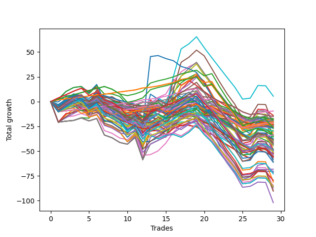

# Long Wallace Doodle 011 
- Symbol: ES
- Date Range: 03/18/2022 - 07/15/2022
- Trading Period: 7:20-12:30
- Number of Trades: 29



| Name | Win Percent | Profit | Avg Profit / Trade | Avg Time / Trade |      | Name | Win Percent | Profit | Avg Profit / Trade | Avg Time / Trade |
| ---- | ----------- | ------ | ------------------ | ---------------- | ---- | ---- | ----------- | ------ | ------------------ | ---------------- |
| Sorted By <br> Profit | | | | | | Sorted By <br> Win Percentage ||||
| Sixty-One | 48.28 | 2750.00 | 94.83 | 20:28 |     | One Hundred Twenty-Six | 82.76 | -10250.00 | -353.45 | 03:58 |
| One Hundred One | 65.52 | -4750.00 | -163.79 | 01:14 |     | Eighty-One | 82.76 | -12250.00 | -422.41 | 07:59 |
| Forty-Five | 27.59 | -7000.00 | -241.38 | 13:33 |     | One Hundred Twenty-One | 79.31 | -16875.00 | -581.90 | 03:43 |
| One Hundred Ten | 31.03 | -7500.00 | -258.62 | 02:49 |     | One Hundred Eleven | 68.97 | -10625.00 | -366.38 | 02:14 |
| Ninety-One | 51.72 | -8500.00 | -293.10 | 00:48 |     | One Hundred Sixteen | 68.97 | -11250.00 | -387.93 | 02:10 |
| Ninety-Seven | 34.48 | -8625.00 | -297.41 | 01:03 |     | One Hundred Twenty-Seven | 68.97 | -13375.00 | -461.21 | 08:40 |
| One Hundred Six | 58.62 | -9000.00 | -310.34 | 01:10 |     | Eighty-Two | 68.97 | -17875.00 | -616.38 | 13:18 |
| One Hundred Seven | 44.83 | -9125.00 | -314.66 | 01:48 |     | One Hundred One | 65.52 | -4750.00 | -163.79 | 01:14 |
| Fifty-Eight | 55.17 | -9375.00 | -323.28 | 15:53 |     | One Hundred Twenty-Two | 65.52 | -21875.00 | -754.31 | 08:30 |
| Ninety-Two | 37.93 | -9625.00 | -331.90 | 01:22 |     | One Hundred Six | 58.62 | -9000.00 | -310.34 | 01:10 |
| One Hundred Twelve | 58.62 | -10125.00 | -349.14 | 04:51 |     | One Hundred Twelve | 58.62 | -10125.00 | -349.14 | 04:51 |
| Fifty-Nine | 51.72 | -10125.00 | -349.14 | 16:30 |     | Zero | 58.62 | -35125.00 | -1211.21 | 15:25 |
| Ninety-Six | 44.83 | -10125.00 | -349.14 | 00:43 |     | Fifty-Eight | 55.17 | -9375.00 | -323.28 | 15:53 |
| One Hundred Twenty-Six | 82.76 | -10250.00 | -353.45 | 03:58 |     | Two | 55.17 | -20000.00 | -689.66 | 23:49 |
| Ninety-Five | 20.69 | -10375.00 | -357.76 | 02:49 |     | Sixty-Four | 55.17 | -23875.00 | -823.28 | 09:32 |
| One Hundred Eleven | 68.97 | -10625.00 | -366.38 | 02:14 |     | Fifty-Six | 55.17 | -34125.00 | -1176.72 | 09:35 |
| One Hundred Nine | 31.03 | -10625.00 | -366.38 | 02:30 |     | Ninety-One | 51.72 | -8500.00 | -293.10 | 00:48 |
| One Hundred Sixteen | 68.97 | -11250.00 | -387.93 | 02:10 |     | Fifty-Nine | 51.72 | -10125.00 | -349.14 | 16:30 |
| One Hundred Eight | 31.03 | -11500.00 | -396.55 | 02:21 |     | One Hundred Seventeen | 51.72 | -17125.00 | -590.52 | 04:03 |
| Sixty | 48.28 | -11625.00 | -400.86 | 19:53 |     | Three | 51.72 | -24625.00 | -849.14 | 24:47 |
| Five | 48.28 | -11750.00 | -405.17 | 28:46 |     | One Hundred Twenty-Eight | 51.72 | -28250.00 | -974.14 | 11:04 |
| Seventy-Three | 24.14 | -11750.00 | -405.17 | 12:25 |     | Eighty-Three | 51.72 | -45125.00 | -1556.03 | 18:41 |
| Ninety-Eight | 31.03 | -11875.00 | -409.48 | 01:18 |     | Sixty-One | 48.28 | 2750.00 | 94.83 | 20:28 |
| One Hundred Two | 44.83 | -12125.00 | -418.10 | 02:50 |     | Sixty | 48.28 | -11625.00 | -400.86 | 19:53 |
| Eighty-One | 82.76 | -12250.00 | -422.41 | 07:59 |     | Five | 48.28 | -11750.00 | -405.17 | 28:46 |
| Forty-Two | 31.03 | -12625.00 | -435.34 | 10:51 |     | Forty | 48.28 | -14500.00 | -500.00 | 06:51 |
| One Hundred | 31.03 | -12750.00 | -439.66 | 01:23 |     | Sixty-Three | 48.28 | -15875.00 | -547.41 | 19:48 |
| Ninety-Nine | 31.03 | -13250.00 | -456.90 | 01:22 |     | One Hundred Thirty | 48.28 | -21000.00 | -724.14 | 12:43 |
| One Hundred Twenty-Seven | 68.97 | -13375.00 | -461.21 | 08:40 |     | Fifty-Seven | 48.28 | -25625.00 | -883.62 | 13:00 |
| One Hundred Five | 27.59 | -13500.00 | -465.52 | 04:23 |     | Four | 48.28 | -26125.00 | -900.86 | 28:11 |
| Forty | 48.28 | -14500.00 | -500.00 | 06:51 |     | One Hundred Twenty-Nine | 48.28 | -26875.00 | -926.72 | 11:57 |
| Ninety-Three | 24.14 | -14875.00 | -512.93 | 02:01 |     | Sixty-Two | 48.28 | -29125.00 | -1004.31 | 16:35 |
| Ninety-Four | 20.69 | -14875.00 | -512.93 | 02:18 |     | Seven | 48.28 | -30375.00 | -1047.41 | 28:06 |
| Sixty-Three | 48.28 | -15875.00 | -547.41 | 19:48 |     | One Hundred Twenty-Five | 48.28 | -30625.00 | -1056.03 | 12:30 |
| Forty-Three | 27.59 | -16750.00 | -577.59 | 11:06 |     | One Hundred Twenty-Four | 48.28 | -36500.00 | -1258.62 | 11:44 |
| One Hundred Twenty-One | 79.31 | -16875.00 | -581.90 | 03:43 |     | One | 48.28 | -40625.00 | -1400.86 | 20:42 |
| Forty-Four | 27.59 | -16875.00 | -581.90 | 13:04 |     | One Hundred Twenty-Three | 48.28 | -42875.00 | -1478.45 | 10:55 |
| One Hundred Seventeen | 51.72 | -17125.00 | -590.52 | 04:03 |     | Six | 48.28 | -43625.00 | -1504.31 | 24:52 |
| Forty-One | 31.03 | -17750.00 | -612.07 | 09:11 |     | Eighty-Five | 48.28 | -45125.00 | -1556.03 | 20:47 |
| Eighty-Two | 68.97 | -17875.00 | -616.38 | 13:18 |     | Eighty-Four | 48.28 | -51000.00 | -1758.62 | 20:01 |
| One Hundred Four | 27.59 | -18750.00 | -646.55 | 03:52 |     | One Hundred Seven | 44.83 | -9125.00 | -314.66 | 01:48 |
| One Hundred Fifteen | 34.48 | -19000.00 | -655.17 | 07:04 |     | Ninety-Six | 44.83 | -10125.00 | -349.14 | 00:43 |
| One Hundred Twenty | 31.03 | -19250.00 | -663.79 | 05:43 |     | One Hundred Two | 44.83 | -12125.00 | -418.10 | 02:50 |
| One Hundred Three | 31.03 | -19375.00 | -668.10 | 03:32 |     | Seventy | 44.83 | -22375.00 | -771.55 | 16:01 |
| Two | 55.17 | -20000.00 | -689.66 | 23:49 |     | Sixty-Six | 44.83 | -35750.00 | -1232.76 | 14:53 |
| Forty-Eight | 41.38 | -20250.00 | -698.28 | 05:22 |     | Forty-Eight | 41.38 | -20250.00 | -698.28 | 05:22 |
| Forty-Seven | 27.59 | -20375.00 | -702.59 | 13:11 |     | Sixty-Seven | 41.38 | -27750.00 | -956.90 | 15:35 |
| One Hundred Thirty | 48.28 | -21000.00 | -724.14 | 12:43 |     | Ninety-Two | 37.93 | -9625.00 | -331.90 | 01:22 |
| Fifty-Four | 31.03 | -21500.00 | -741.38 | 06:13 |     | One Hundred Thirteen | 37.93 | -25375.00 | -875.00 | 06:12 |
| One Hundred Twenty-Two | 65.52 | -21875.00 | -754.31 | 08:30 |     | Sixty-Five | 37.93 | -39750.00 | -1370.69 | 12:38 |
| Seventy | 44.83 | -22375.00 | -771.55 | 16:01 |     | Sixty-Eight | 37.93 | -42250.00 | -1456.90 | 18:00 |
| Sixty-Four | 55.17 | -23875.00 | -823.28 | 09:32 |     | Seventy-One | 37.93 | -43000.00 | -1482.76 | 18:15 |
| Forty-Six | 31.03 | -24250.00 | -836.21 | 10:23 |     | Sixty-Nine | 37.93 | -43000.00 | -1482.76 | 18:15 |
| One Hundred Ninteen | 31.03 | -24500.00 | -844.83 | 05:12 |     | Ninety-Seven | 34.48 | -8625.00 | -297.41 | 01:03 |
| Three | 51.72 | -24625.00 | -849.14 | 24:47 |     | One Hundred Fifteen | 34.48 | -19000.00 | -655.17 | 07:04 |
| One Hundred Fourteen | 34.48 | -24625.00 | -849.14 | 06:32 |     | One Hundred Fourteen | 34.48 | -24625.00 | -849.14 | 06:32 |
| Fifty-One | 31.03 | -24625.00 | -849.14 | 06:51 |     | One Hundred Eighteen | 34.48 | -26250.00 | -905.17 | 04:57 |
| Forty-Nine | 31.03 | -24875.00 | -857.76 | 06:36 |     | One Hundred Ten | 31.03 | -7500.00 | -258.62 | 02:49 |
| One Hundred Thirteen | 37.93 | -25375.00 | -875.00 | 06:12 |     | One Hundred Nine | 31.03 | -10625.00 | -366.38 | 02:30 |
| Fifty-Seven | 48.28 | -25625.00 | -883.62 | 13:00 |     | One Hundred Eight | 31.03 | -11500.00 | -396.55 | 02:21 |
| Four | 48.28 | -26125.00 | -900.86 | 28:11 |     | Ninety-Eight | 31.03 | -11875.00 | -409.48 | 01:18 |
| One Hundred Eighteen | 34.48 | -26250.00 | -905.17 | 04:57 |     | Forty-Two | 31.03 | -12625.00 | -435.34 | 10:51 |
| Fifty | 31.03 | -26375.00 | -909.48 | 07:00 |     | One Hundred | 31.03 | -12750.00 | -439.66 | 01:23 |
| One Hundred Twenty-Nine | 48.28 | -26875.00 | -926.72 | 11:57 |     | Ninety-Nine | 31.03 | -13250.00 | -456.90 | 01:22 |
| Fifty-Five | 31.03 | -27625.00 | -952.59 | 07:15 |     | Forty-One | 31.03 | -17750.00 | -612.07 | 09:11 |
| Fifty-Three | 31.03 | -27625.00 | -952.59 | 07:15 |     | One Hundred Twenty | 31.03 | -19250.00 | -663.79 | 05:43 |
| Fifty-Two | 31.03 | -27625.00 | -952.59 | 07:15 |     | One Hundred Three | 31.03 | -19375.00 | -668.10 | 03:32 |
| Sixty-Seven | 41.38 | -27750.00 | -956.90 | 15:35 |     | Fifty-Four | 31.03 | -21500.00 | -741.38 | 06:13 |
| One Hundred Twenty-Eight | 51.72 | -28250.00 | -974.14 | 11:04 |     | Forty-Six | 31.03 | -24250.00 | -836.21 | 10:23 |
| Sixty-Two | 48.28 | -29125.00 | -1004.31 | 16:35 |     | One Hundred Ninteen | 31.03 | -24500.00 | -844.83 | 05:12 |
| Seven | 48.28 | -30375.00 | -1047.41 | 28:06 |     | Fifty-One | 31.03 | -24625.00 | -849.14 | 06:51 |
| One Hundred Twenty-Five | 48.28 | -30625.00 | -1056.03 | 12:30 |     | Forty-Nine | 31.03 | -24875.00 | -857.76 | 06:36 |
| Fifty-Six | 55.17 | -34125.00 | -1176.72 | 09:35 |     | Fifty | 31.03 | -26375.00 | -909.48 | 07:00 |
| Zero | 58.62 | -35125.00 | -1211.21 | 15:25 |     | Fifty-Five | 31.03 | -27625.00 | -952.59 | 07:15 |
| Sixty-Six | 44.83 | -35750.00 | -1232.76 | 14:53 |     | Fifty-Three | 31.03 | -27625.00 | -952.59 | 07:15 |
| One Hundred Twenty-Four | 48.28 | -36500.00 | -1258.62 | 11:44 |     | Fifty-Two | 31.03 | -27625.00 | -952.59 | 07:15 |
| Sixty-Five | 37.93 | -39750.00 | -1370.69 | 12:38 |     | Forty-Five | 27.59 | -7000.00 | -241.38 | 13:33 |
| One | 48.28 | -40625.00 | -1400.86 | 20:42 |     | One Hundred Five | 27.59 | -13500.00 | -465.52 | 04:23 |
| Sixty-Eight | 37.93 | -42250.00 | -1456.90 | 18:00 |     | Forty-Three | 27.59 | -16750.00 | -577.59 | 11:06 |
| One Hundred Twenty-Three | 48.28 | -42875.00 | -1478.45 | 10:55 |     | Forty-Four | 27.59 | -16875.00 | -581.90 | 13:04 |
| Seventy-One | 37.93 | -43000.00 | -1482.76 | 18:15 |     | One Hundred Four | 27.59 | -18750.00 | -646.55 | 03:52 |
| Sixty-Nine | 37.93 | -43000.00 | -1482.76 | 18:15 |     | Forty-Seven | 27.59 | -20375.00 | -702.59 | 13:11 |
| Six | 48.28 | -43625.00 | -1504.31 | 24:52 |     | Seventy-Three | 24.14 | -11750.00 | -405.17 | 12:25 |
| Eighty-Three | 51.72 | -45125.00 | -1556.03 | 18:41 |     | Ninety-Three | 24.14 | -14875.00 | -512.93 | 02:01 |
| Eighty-Five | 48.28 | -45125.00 | -1556.03 | 20:47 |     | Ninety-Five | 20.69 | -10375.00 | -357.76 | 02:49 |
| Eighty-Four | 48.28 | -51000.00 | -1758.62 | 20:01 |     | Ninety-Four | 20.69 | -14875.00 | -512.93 | 02:18 |

## NO STOPLOSS

### Test Zero
* Sell when price hits the middle line of the 20p bollinger
* No Stoploss
* Results:
```
Total Trades: 29
Percent Up: 58.62
Percent Down: 41.38
Total Points Moved Up: -70.25
Potential Profit: -35125.00
Total Points Ups: 53.75 Count Ups: 17
Total Points Downs: -124.00 Count Downs: 12
```

<details><summary>Trades</summary>

<code>In: 2022-03-21 09:35:00		Out: 2022-03-21 09:45:00		Total Position Time: 10:00		Total Move Up: 2.50		Total to Date: 2.50</code> <br />
<code>In: 2022-03-23 09:14:00		Out: 2022-03-23 09:19:35		Total Position Time: 05:35		Total Move Up: 7.75		Total to Date: 10.25</code> <br />
<code>In: 2022-03-23 09:47:00		Out: 2022-03-23 09:54:15		Total Position Time: 07:15		Total Move Up: 4.00		Total to Date: 14.25</code> <br />
<code>In: 2022-03-23 10:28:00		Out: 2022-03-23 10:38:15		Total Position Time: 10:15		Total Move Up: 1.00		Total to Date: 15.25</code> <br />
<code>In: 2022-03-25 08:14:00		Out: 2022-03-25 08:36:40		Total Position Time: 22:40		Total Move Up: -6.00		Total to Date: 9.25</code> <br />
<code>In: 2022-03-25 08:29:00		Out: 2022-03-25 08:36:40		Total Position Time: 07:40		Total Move Up: 8.00		Total to Date: 17.25</code> <br />
<code>In: 2022-03-28 08:27:00		Out: 2022-03-28 08:56:55		Total Position Time: 29:55		Total Move Up: -16.75		Total to Date: 0.50</code> <br />
<code>In: 2022-03-31 09:23:00		Out: 2022-03-31 09:32:50		Total Position Time: 09:50		Total Move Up: 0.00		Total to Date: 0.50</code> <br />
<code>In: 2022-04-12 07:41:00		Out: 2022-04-12 08:02:05		Total Position Time: 21:05		Total Move Up: -2.50		Total to Date: -2.00</code> <br />
<code>In: 2022-04-18 08:29:00		Out: 2022-04-18 08:55:05		Total Position Time: 26:05		Total Move Up: -4.50		Total to Date: -6.50</code> <br />
<code>In: 2022-04-20 09:14:00		Out: 2022-04-20 09:30:50		Total Position Time: 16:50		Total Move Up: 0.25		Total to Date: -6.25</code> <br />
<code>In: 2022-04-29 07:22:00		Out: 2022-04-29 07:51:55		Total Position Time: 29:55		Total Move Up: -22.50		Total to Date: -28.75</code> <br />
<code>In: 2022-05-04 11:36:00		Out: 2022-05-04 11:36:40		Total Position Time: 00:40		Total Move Up: 8.25		Total to Date: -20.50</code> <br />
<code>In: 2022-05-13 11:07:00		Out: 2022-05-13 11:19:15		Total Position Time: 12:15		Total Move Up: 2.25		Total to Date: -18.25</code> <br />
<code>In: 2022-05-16 07:55:00		Out: 2022-05-16 08:09:30		Total Position Time: 14:30		Total Move Up: -2.75		Total to Date: -21.00</code> <br />
<code>In: 2022-05-17 11:24:00		Out: 2022-05-17 11:31:30		Total Position Time: 07:30		Total Move Up: 7.75		Total to Date: -13.25</code> <br />
<code>In: 2022-05-17 11:25:00		Out: 2022-05-17 11:31:30		Total Position Time: 06:30		Total Move Up: 4.25		Total to Date: -9.00</code> <br />
<code>In: 2022-05-25 09:29:00		Out: 2022-05-25 09:41:25		Total Position Time: 12:25		Total Move Up: 1.50		Total to Date: -7.50</code> <br />
<code>In: 2022-05-25 09:30:00		Out: 2022-05-25 09:41:25		Total Position Time: 11:25		Total Move Up: 0.00		Total to Date: -7.50</code> <br />
<code>In: 2022-06-06 08:15:00		Out: 2022-06-06 08:31:35		Total Position Time: 16:35		Total Move Up: -8.25		Total to Date: -15.75</code> <br />
<code>In: 2022-06-08 09:29:00		Out: 2022-06-08 09:54:10		Total Position Time: 25:10		Total Move Up: -13.25		Total to Date: -29.00</code> <br />
<code>In: 2022-06-08 09:30:00		Out: 2022-06-08 09:54:10		Total Position Time: 24:10		Total Move Up: -15.50		Total to Date: -44.50</code> <br />
<code>In: 2022-06-08 09:35:00		Out: 2022-06-08 09:54:10		Total Position Time: 19:10		Total Move Up: -7.75		Total to Date: -52.25</code> <br />
<code>In: 2022-06-15 07:35:00		Out: 2022-06-15 08:04:55		Total Position Time: 29:55		Total Move Up: -10.50		Total to Date: -62.75</code> <br />
<code>In: 2022-06-15 07:48:00		Out: 2022-06-15 08:17:55		Total Position Time: 29:55		Total Move Up: -13.75		Total to Date: -76.50</code> <br />
<code>In: 2022-06-27 10:45:00		Out: 2022-06-27 10:53:25		Total Position Time: 08:25		Total Move Up: 1.00		Total to Date: -75.50</code> <br />
<code>In: 2022-06-29 08:25:00		Out: 2022-06-29 08:29:10		Total Position Time: 04:10		Total Move Up: 5.00		Total to Date: -70.50</code> <br />
<code>In: 2022-07-11 12:07:00		Out: 2022-07-11 12:22:10		Total Position Time: 15:10		Total Move Up: 0.00		Total to Date: -70.50</code> <br />
<code>In: 2022-07-12 11:36:00		Out: 2022-07-12 11:48:10		Total Position Time: 12:10		Total Move Up: 0.25		Total to Date: -70.25</code> <br />


</details>

### Test One
* Sell when the price hits the upper line of the 20p 1std bollinger
* No Stoploss
* Results:
```
Total Trades: 29
Percent Up: 48.28
Percent Down: 51.72
Total Points Moved Up: -81.25
Potential Profit: -40625.00
Total Points Ups: 74.75 Count Ups: 14
Total Points Downs: -156.00 Count Downs: 15
```

<details><summary>Trades</summary>

<code>In: 2022-03-21 09:35:00		Out: 2022-03-21 10:04:55		Total Position Time: 29:55		Total Move Up: -20.75		Total to Date: -20.75</code> <br />
<code>In: 2022-03-23 09:14:00		Out: 2022-03-23 09:30:05		Total Position Time: 16:05		Total Move Up: 7.50		Total to Date: -13.25</code> <br />
<code>In: 2022-03-23 09:47:00		Out: 2022-03-23 09:59:10		Total Position Time: 12:10		Total Move Up: 5.25		Total to Date: -8.00</code> <br />
<code>In: 2022-03-23 10:28:00		Out: 2022-03-23 10:51:50		Total Position Time: 23:50		Total Move Up: 0.25		Total to Date: -7.75</code> <br />
<code>In: 2022-03-25 08:14:00		Out: 2022-03-25 08:41:05		Total Position Time: 27:05		Total Move Up: -4.75		Total to Date: -12.50</code> <br />
<code>In: 2022-03-25 08:29:00		Out: 2022-03-25 08:41:05		Total Position Time: 12:05		Total Move Up: 9.25		Total to Date: -3.25</code> <br />
<code>In: 2022-03-28 08:27:00		Out: 2022-03-28 08:56:55		Total Position Time: 29:55		Total Move Up: -16.75		Total to Date: -20.00</code> <br />
<code>In: 2022-03-31 09:23:00		Out: 2022-03-31 09:40:45		Total Position Time: 17:45		Total Move Up: -0.50		Total to Date: -20.50</code> <br />
<code>In: 2022-04-12 07:41:00		Out: 2022-04-12 08:02:35		Total Position Time: 21:35		Total Move Up: -0.50		Total to Date: -21.00</code> <br />
<code>In: 2022-04-18 08:29:00		Out: 2022-04-18 08:57:20		Total Position Time: 28:20		Total Move Up: -3.00		Total to Date: -24.00</code> <br />
<code>In: 2022-04-20 09:14:00		Out: 2022-04-20 09:30:55		Total Position Time: 16:55		Total Move Up: 0.75		Total to Date: -23.25</code> <br />
<code>In: 2022-04-29 07:22:00		Out: 2022-04-29 07:51:55		Total Position Time: 29:55		Total Move Up: -22.50		Total to Date: -45.75</code> <br />
<code>In: 2022-05-04 11:36:00		Out: 2022-05-04 11:41:40		Total Position Time: 05:40		Total Move Up: 17.25		Total to Date: -28.50</code> <br />
<code>In: 2022-05-13 11:07:00		Out: 2022-05-13 11:20:00		Total Position Time: 13:00		Total Move Up: 5.75		Total to Date: -22.75</code> <br />
<code>In: 2022-05-16 07:55:00		Out: 2022-05-16 08:09:50		Total Position Time: 14:50		Total Move Up: 0.50		Total to Date: -22.25</code> <br />
<code>In: 2022-05-17 11:24:00		Out: 2022-05-17 11:37:35		Total Position Time: 13:35		Total Move Up: 9.25		Total to Date: -13.00</code> <br />
<code>In: 2022-05-17 11:25:00		Out: 2022-05-17 11:37:35		Total Position Time: 12:35		Total Move Up: 5.75		Total to Date: -7.25</code> <br />
<code>In: 2022-05-25 09:29:00		Out: 2022-05-25 09:44:25		Total Position Time: 15:25		Total Move Up: 3.00		Total to Date: -4.25</code> <br />
<code>In: 2022-05-25 09:30:00		Out: 2022-05-25 09:44:25		Total Position Time: 14:25		Total Move Up: 1.50		Total to Date: -2.75</code> <br />
<code>In: 2022-06-06 08:15:00		Out: 2022-06-06 08:39:15		Total Position Time: 24:15		Total Move Up: -10.00		Total to Date: -12.75</code> <br />
<code>In: 2022-06-08 09:29:00		Out: 2022-06-08 09:58:55		Total Position Time: 29:55		Total Move Up: -13.00		Total to Date: -25.75</code> <br />
<code>In: 2022-06-08 09:30:00		Out: 2022-06-08 09:59:05		Total Position Time: 29:05		Total Move Up: -13.50		Total to Date: -39.25</code> <br />
<code>In: 2022-06-08 09:35:00		Out: 2022-06-08 09:59:05		Total Position Time: 24:05		Total Move Up: -5.75		Total to Date: -45.00</code> <br />
<code>In: 2022-06-15 07:35:00		Out: 2022-06-15 08:04:55		Total Position Time: 29:55		Total Move Up: -10.50		Total to Date: -55.50</code> <br />
<code>In: 2022-06-15 07:48:00		Out: 2022-06-15 08:17:55		Total Position Time: 29:55		Total Move Up: -13.75		Total to Date: -69.25</code> <br />
<code>In: 2022-06-27 10:45:00		Out: 2022-06-27 11:03:15		Total Position Time: 18:15		Total Move Up: 1.00		Total to Date: -68.25</code> <br />
<code>In: 2022-06-29 08:25:00		Out: 2022-06-29 08:33:05		Total Position Time: 08:05		Total Move Up: 7.75		Total to Date: -60.50</code> <br />
<code>In: 2022-07-11 12:07:00		Out: 2022-07-11 12:29:15		Total Position Time: 22:15		Total Move Up: -0.25		Total to Date: -60.75</code> <br />
<code>In: 2022-07-12 11:36:00		Out: 2022-07-12 12:05:55		Total Position Time: 29:55		Total Move Up: -20.50		Total to Date: -81.25</code> <br />


</details>

### Test Two
* Sell when the price hits the upper line of the 20p 2std bollinger
* No Stoploss
* Results:
```
Total Trades: 29
Percent Up: 55.17
Percent Down: 44.83
Total Points Moved Up: -40.00
Potential Profit: -20000.00
Total Points Ups: 110.75 Count Ups: 16
Total Points Downs: -150.75 Count Downs: 13
```

<details><summary>Trades</summary>

<code>In: 2022-03-21 09:35:00		Out: 2022-03-21 10:04:55		Total Position Time: 29:55		Total Move Up: -20.75		Total to Date: -20.75</code> <br />
<code>In: 2022-03-23 09:14:00		Out: 2022-03-23 09:43:55		Total Position Time: 29:55		Total Move Up: 1.00		Total to Date: -19.75</code> <br />
<code>In: 2022-03-23 09:47:00		Out: 2022-03-23 10:16:55		Total Position Time: 29:55		Total Move Up: 0.75		Total to Date: -19.00</code> <br />
<code>In: 2022-03-23 10:28:00		Out: 2022-03-23 10:54:30		Total Position Time: 26:30		Total Move Up: 2.75		Total to Date: -16.25</code> <br />
<code>In: 2022-03-25 08:14:00		Out: 2022-03-25 08:41:55		Total Position Time: 27:55		Total Move Up: -0.50		Total to Date: -16.75</code> <br />
<code>In: 2022-03-25 08:29:00		Out: 2022-03-25 08:41:55		Total Position Time: 12:55		Total Move Up: 13.50		Total to Date: -3.25</code> <br />
<code>In: 2022-03-28 08:27:00		Out: 2022-03-28 08:56:55		Total Position Time: 29:55		Total Move Up: -16.75		Total to Date: -20.00</code> <br />
<code>In: 2022-03-31 09:23:00		Out: 2022-03-31 09:44:20		Total Position Time: 21:20		Total Move Up: 0.50		Total to Date: -19.50</code> <br />
<code>In: 2022-04-12 07:41:00		Out: 2022-04-12 08:10:55		Total Position Time: 29:55		Total Move Up: -4.75		Total to Date: -24.25</code> <br />
<code>In: 2022-04-18 08:29:00		Out: 2022-04-18 08:58:55		Total Position Time: 29:55		Total Move Up: -1.75		Total to Date: -26.00</code> <br />
<code>In: 2022-04-20 09:14:00		Out: 2022-04-20 09:31:25		Total Position Time: 17:25		Total Move Up: 1.75		Total to Date: -24.25</code> <br />
<code>In: 2022-04-29 07:22:00		Out: 2022-04-29 07:51:55		Total Position Time: 29:55		Total Move Up: -22.50		Total to Date: -46.75</code> <br />
<code>In: 2022-05-04 11:36:00		Out: 2022-05-04 11:43:55		Total Position Time: 07:55		Total Move Up: 32.25		Total to Date: -14.50</code> <br />
<code>In: 2022-05-13 11:07:00		Out: 2022-05-13 11:31:20		Total Position Time: 24:20		Total Move Up: 7.75		Total to Date: -6.75</code> <br />
<code>In: 2022-05-16 07:55:00		Out: 2022-05-16 08:11:35		Total Position Time: 16:35		Total Move Up: 3.25		Total to Date: -3.50</code> <br />
<code>In: 2022-05-17 11:24:00		Out: 2022-05-17 11:40:00		Total Position Time: 16:00		Total Move Up: 13.00		Total to Date: 9.50</code> <br />
<code>In: 2022-05-17 11:25:00		Out: 2022-05-17 11:40:00		Total Position Time: 15:00		Total Move Up: 9.50		Total to Date: 19.00</code> <br />
<code>In: 2022-05-25 09:29:00		Out: 2022-05-25 09:45:20		Total Position Time: 16:20		Total Move Up: 5.25		Total to Date: 24.25</code> <br />
<code>In: 2022-05-25 09:30:00		Out: 2022-05-25 09:45:20		Total Position Time: 15:20		Total Move Up: 3.75		Total to Date: 28.00</code> <br />
<code>In: 2022-06-06 08:15:00		Out: 2022-06-06 08:43:00		Total Position Time: 28:00		Total Move Up: -7.75		Total to Date: 20.25</code> <br />
<code>In: 2022-06-08 09:29:00		Out: 2022-06-08 09:58:55		Total Position Time: 29:55		Total Move Up: -13.00		Total to Date: 7.25</code> <br />
<code>In: 2022-06-08 09:30:00		Out: 2022-06-08 09:59:10		Total Position Time: 29:10		Total Move Up: -13.00		Total to Date: -5.75</code> <br />
<code>In: 2022-06-08 09:35:00		Out: 2022-06-08 09:59:10		Total Position Time: 24:10		Total Move Up: -5.25		Total to Date: -11.00</code> <br />
<code>In: 2022-06-15 07:35:00		Out: 2022-06-15 08:04:55		Total Position Time: 29:55		Total Move Up: -10.50		Total to Date: -21.50</code> <br />
<code>In: 2022-06-15 07:48:00		Out: 2022-06-15 08:17:55		Total Position Time: 29:55		Total Move Up: -13.75		Total to Date: -35.25</code> <br />
<code>In: 2022-06-27 10:45:00		Out: 2022-06-27 11:14:45		Total Position Time: 29:45		Total Move Up: 2.50		Total to Date: -32.75</code> <br />
<code>In: 2022-06-29 08:25:00		Out: 2022-06-29 08:35:35		Total Position Time: 10:35		Total Move Up: 11.75		Total to Date: -21.00</code> <br />
<code>In: 2022-07-11 12:07:00		Out: 2022-07-11 12:29:40		Total Position Time: 22:40		Total Move Up: 1.50		Total to Date: -19.50</code> <br />
<code>In: 2022-07-12 11:36:00		Out: 2022-07-12 12:05:55		Total Position Time: 29:55		Total Move Up: -20.50		Total to Date: -40.00</code> <br />


</details>

### Test Three
* Sell when price hits the middle line of the 50p bollinger
* No Stoploss
* Results:
```
Total Trades: 29
Percent Up: 51.72
Percent Down: 48.28
Total Points Moved Up: -49.25
Potential Profit: -24625.00
Total Points Ups: 109.50 Count Ups: 15
Total Points Downs: -158.75 Count Downs: 14
```

<details><summary>Trades</summary>

<code>In: 2022-03-21 09:35:00		Out: 2022-03-21 10:04:55		Total Position Time: 29:55		Total Move Up: -20.75		Total to Date: -20.75</code> <br />
<code>In: 2022-03-23 09:14:00		Out: 2022-03-23 09:30:30		Total Position Time: 16:30		Total Move Up: 8.75		Total to Date: -12.00</code> <br />
<code>In: 2022-03-23 09:47:00		Out: 2022-03-23 10:16:55		Total Position Time: 29:55		Total Move Up: 0.75		Total to Date: -11.25</code> <br />
<code>In: 2022-03-23 10:28:00		Out: 2022-03-23 10:54:50		Total Position Time: 26:50		Total Move Up: 3.00		Total to Date: -8.25</code> <br />
<code>In: 2022-03-25 08:14:00		Out: 2022-03-25 08:43:55		Total Position Time: 29:55		Total Move Up: -3.00		Total to Date: -11.25</code> <br />
<code>In: 2022-03-25 08:29:00		Out: 2022-03-25 08:53:00		Total Position Time: 24:00		Total Move Up: 12.75		Total to Date: 1.50</code> <br />
<code>In: 2022-03-28 08:27:00		Out: 2022-03-28 08:56:55		Total Position Time: 29:55		Total Move Up: -16.75		Total to Date: -15.25</code> <br />
<code>In: 2022-03-31 09:23:00		Out: 2022-03-31 09:46:10		Total Position Time: 23:10		Total Move Up: 1.50		Total to Date: -13.75</code> <br />
<code>In: 2022-04-12 07:41:00		Out: 2022-04-12 08:10:55		Total Position Time: 29:55		Total Move Up: -4.75		Total to Date: -18.50</code> <br />
<code>In: 2022-04-18 08:29:00		Out: 2022-04-18 08:58:55		Total Position Time: 29:55		Total Move Up: -1.75		Total to Date: -20.25</code> <br />
<code>In: 2022-04-20 09:14:00		Out: 2022-04-20 09:32:50		Total Position Time: 18:50		Total Move Up: 4.75		Total to Date: -15.50</code> <br />
<code>In: 2022-04-29 07:22:00		Out: 2022-04-29 07:51:55		Total Position Time: 29:55		Total Move Up: -22.50		Total to Date: -38.00</code> <br />
<code>In: 2022-05-04 11:36:00		Out: 2022-05-04 11:41:15		Total Position Time: 05:15		Total Move Up: 11.75		Total to Date: -26.25</code> <br />
<code>In: 2022-05-13 11:07:00		Out: 2022-05-13 11:31:20		Total Position Time: 24:20		Total Move Up: 7.75		Total to Date: -18.50</code> <br />
<code>In: 2022-05-16 07:55:00		Out: 2022-05-16 08:17:00		Total Position Time: 22:00		Total Move Up: 5.25		Total to Date: -13.25</code> <br />
<code>In: 2022-05-17 11:24:00		Out: 2022-05-17 11:40:05		Total Position Time: 16:05		Total Move Up: 14.50		Total to Date: 1.25</code> <br />
<code>In: 2022-05-17 11:25:00		Out: 2022-05-17 11:40:05		Total Position Time: 15:05		Total Move Up: 11.00		Total to Date: 12.25</code> <br />
<code>In: 2022-05-25 09:29:00		Out: 2022-05-25 09:49:05		Total Position Time: 20:05		Total Move Up: 7.75		Total to Date: 20.00</code> <br />
<code>In: 2022-05-25 09:30:00		Out: 2022-05-25 09:49:05		Total Position Time: 19:05		Total Move Up: 6.25		Total to Date: 26.25</code> <br />
<code>In: 2022-06-06 08:15:00		Out: 2022-06-06 08:44:55		Total Position Time: 29:55		Total Move Up: -5.75		Total to Date: 20.50</code> <br />
<code>In: 2022-06-08 09:29:00		Out: 2022-06-08 09:58:55		Total Position Time: 29:55		Total Move Up: -13.00		Total to Date: 7.50</code> <br />
<code>In: 2022-06-08 09:30:00		Out: 2022-06-08 09:59:55		Total Position Time: 29:55		Total Move Up: -13.25		Total to Date: -5.75</code> <br />
<code>In: 2022-06-08 09:35:00		Out: 2022-06-08 10:04:55		Total Position Time: 29:55		Total Move Up: -12.25		Total to Date: -18.00</code> <br />
<code>In: 2022-06-15 07:35:00		Out: 2022-06-15 08:04:55		Total Position Time: 29:55		Total Move Up: -10.50		Total to Date: -28.50</code> <br />
<code>In: 2022-06-15 07:48:00		Out: 2022-06-15 08:17:55		Total Position Time: 29:55		Total Move Up: -13.75		Total to Date: -42.25</code> <br />
<code>In: 2022-06-27 10:45:00		Out: 2022-06-27 11:13:35		Total Position Time: 28:35		Total Move Up: 2.00		Total to Date: -40.25</code> <br />
<code>In: 2022-06-29 08:25:00		Out: 2022-06-29 08:35:35		Total Position Time: 10:35		Total Move Up: 11.75		Total to Date: -28.50</code> <br />
<code>In: 2022-07-11 12:07:00		Out: 2022-07-11 12:36:55		Total Position Time: 29:55		Total Move Up: -0.25		Total to Date: -28.75</code> <br />
<code>In: 2022-07-12 11:36:00		Out: 2022-07-12 12:05:55		Total Position Time: 29:55		Total Move Up: -20.50		Total to Date: -49.25</code> <br />


</details>

### Test Four
* Sell when the price hits the upper line of the 50p 1std bollinger
* No Stoploss
* Results:
```
Total Trades: 29
Percent Up: 48.28
Percent Down: 51.72
Total Points Moved Up: -52.25
Potential Profit: -26125.00
Total Points Ups: 109.25 Count Ups: 14
Total Points Downs: -161.50 Count Downs: 15
```

<details><summary>Trades</summary>

<code>In: 2022-03-21 09:35:00		Out: 2022-03-21 10:04:55		Total Position Time: 29:55		Total Move Up: -20.75		Total to Date: -20.75</code> <br />
<code>In: 2022-03-23 09:14:00		Out: 2022-03-23 09:43:55		Total Position Time: 29:55		Total Move Up: 1.00		Total to Date: -19.75</code> <br />
<code>In: 2022-03-23 09:47:00		Out: 2022-03-23 10:16:55		Total Position Time: 29:55		Total Move Up: 0.75		Total to Date: -19.00</code> <br />
<code>In: 2022-03-23 10:28:00		Out: 2022-03-23 10:57:55		Total Position Time: 29:55		Total Move Up: 2.50		Total to Date: -16.50</code> <br />
<code>In: 2022-03-25 08:14:00		Out: 2022-03-25 08:43:55		Total Position Time: 29:55		Total Move Up: -3.00		Total to Date: -19.50</code> <br />
<code>In: 2022-03-25 08:29:00		Out: 2022-03-25 08:58:55		Total Position Time: 29:55		Total Move Up: 2.50		Total to Date: -17.00</code> <br />
<code>In: 2022-03-28 08:27:00		Out: 2022-03-28 08:56:55		Total Position Time: 29:55		Total Move Up: -16.75		Total to Date: -33.75</code> <br />
<code>In: 2022-03-31 09:23:00		Out: 2022-03-31 09:52:55		Total Position Time: 29:55		Total Move Up: -2.75		Total to Date: -36.50</code> <br />
<code>In: 2022-04-12 07:41:00		Out: 2022-04-12 08:10:55		Total Position Time: 29:55		Total Move Up: -4.75		Total to Date: -41.25</code> <br />
<code>In: 2022-04-18 08:29:00		Out: 2022-04-18 08:58:55		Total Position Time: 29:55		Total Move Up: -1.75		Total to Date: -43.00</code> <br />
<code>In: 2022-04-20 09:14:00		Out: 2022-04-20 09:36:45		Total Position Time: 22:45		Total Move Up: 8.25		Total to Date: -34.75</code> <br />
<code>In: 2022-04-29 07:22:00		Out: 2022-04-29 07:51:55		Total Position Time: 29:55		Total Move Up: -22.50		Total to Date: -57.25</code> <br />
<code>In: 2022-05-04 11:36:00		Out: 2022-05-04 11:42:00		Total Position Time: 06:00		Total Move Up: 21.25		Total to Date: -36.00</code> <br />
<code>In: 2022-05-13 11:07:00		Out: 2022-05-13 11:36:55		Total Position Time: 29:55		Total Move Up: 3.75		Total to Date: -32.25</code> <br />
<code>In: 2022-05-16 07:55:00		Out: 2022-05-16 08:24:55		Total Position Time: 29:55		Total Move Up: 3.50		Total to Date: -28.75</code> <br />
<code>In: 2022-05-17 11:24:00		Out: 2022-05-17 11:45:45		Total Position Time: 21:45		Total Move Up: 22.25		Total to Date: -6.50</code> <br />
<code>In: 2022-05-17 11:25:00		Out: 2022-05-17 11:45:45		Total Position Time: 20:45		Total Move Up: 18.75		Total to Date: 12.25</code> <br />
<code>In: 2022-05-25 09:29:00		Out: 2022-05-25 09:58:55		Total Position Time: 29:55		Total Move Up: 5.00		Total to Date: 17.25</code> <br />
<code>In: 2022-05-25 09:30:00		Out: 2022-05-25 09:59:55		Total Position Time: 29:55		Total Move Up: 7.25		Total to Date: 24.50</code> <br />
<code>In: 2022-06-06 08:15:00		Out: 2022-06-06 08:44:55		Total Position Time: 29:55		Total Move Up: -5.75		Total to Date: 18.75</code> <br />
<code>In: 2022-06-08 09:29:00		Out: 2022-06-08 09:58:55		Total Position Time: 29:55		Total Move Up: -13.00		Total to Date: 5.75</code> <br />
<code>In: 2022-06-08 09:30:00		Out: 2022-06-08 09:59:55		Total Position Time: 29:55		Total Move Up: -13.25		Total to Date: -7.50</code> <br />
<code>In: 2022-06-08 09:35:00		Out: 2022-06-08 10:04:55		Total Position Time: 29:55		Total Move Up: -12.25		Total to Date: -19.75</code> <br />
<code>In: 2022-06-15 07:35:00		Out: 2022-06-15 08:04:55		Total Position Time: 29:55		Total Move Up: -10.50		Total to Date: -30.25</code> <br />
<code>In: 2022-06-15 07:48:00		Out: 2022-06-15 08:17:55		Total Position Time: 29:55		Total Move Up: -13.75		Total to Date: -44.00</code> <br />
<code>In: 2022-06-27 10:45:00		Out: 2022-06-27 11:14:55		Total Position Time: 29:55		Total Move Up: 1.00		Total to Date: -43.00</code> <br />
<code>In: 2022-06-29 08:25:00		Out: 2022-06-29 08:53:10		Total Position Time: 28:10		Total Move Up: 11.50		Total to Date: -31.50</code> <br />
<code>In: 2022-07-11 12:07:00		Out: 2022-07-11 12:36:55		Total Position Time: 29:55		Total Move Up: -0.25		Total to Date: -31.75</code> <br />
<code>In: 2022-07-12 11:36:00		Out: 2022-07-12 12:05:55		Total Position Time: 29:55		Total Move Up: -20.50		Total to Date: -52.25</code> <br />


</details>

### Test Five
* Sell when the price hits the upper line of the 50p 2std bollinger
* No Stoploss
* Results:
```
Total Trades: 29
Percent Up: 48.28
Percent Down: 51.72
Total Points Moved Up: -23.50
Potential Profit: -11750.00
Total Points Ups: 138.00 Count Ups: 14
Total Points Downs: -161.50 Count Downs: 15
```

<details><summary>Trades</summary>

<code>In: 2022-03-21 09:35:00		Out: 2022-03-21 10:04:55		Total Position Time: 29:55		Total Move Up: -20.75		Total to Date: -20.75</code> <br />
<code>In: 2022-03-23 09:14:00		Out: 2022-03-23 09:43:55		Total Position Time: 29:55		Total Move Up: 1.00		Total to Date: -19.75</code> <br />
<code>In: 2022-03-23 09:47:00		Out: 2022-03-23 10:16:55		Total Position Time: 29:55		Total Move Up: 0.75		Total to Date: -19.00</code> <br />
<code>In: 2022-03-23 10:28:00		Out: 2022-03-23 10:57:55		Total Position Time: 29:55		Total Move Up: 2.50		Total to Date: -16.50</code> <br />
<code>In: 2022-03-25 08:14:00		Out: 2022-03-25 08:43:55		Total Position Time: 29:55		Total Move Up: -3.00		Total to Date: -19.50</code> <br />
<code>In: 2022-03-25 08:29:00		Out: 2022-03-25 08:58:55		Total Position Time: 29:55		Total Move Up: 2.50		Total to Date: -17.00</code> <br />
<code>In: 2022-03-28 08:27:00		Out: 2022-03-28 08:56:55		Total Position Time: 29:55		Total Move Up: -16.75		Total to Date: -33.75</code> <br />
<code>In: 2022-03-31 09:23:00		Out: 2022-03-31 09:52:55		Total Position Time: 29:55		Total Move Up: -2.75		Total to Date: -36.50</code> <br />
<code>In: 2022-04-12 07:41:00		Out: 2022-04-12 08:10:55		Total Position Time: 29:55		Total Move Up: -4.75		Total to Date: -41.25</code> <br />
<code>In: 2022-04-18 08:29:00		Out: 2022-04-18 08:58:55		Total Position Time: 29:55		Total Move Up: -1.75		Total to Date: -43.00</code> <br />
<code>In: 2022-04-20 09:14:00		Out: 2022-04-20 09:43:55		Total Position Time: 29:55		Total Move Up: 6.75		Total to Date: -36.25</code> <br />
<code>In: 2022-04-29 07:22:00		Out: 2022-04-29 07:51:55		Total Position Time: 29:55		Total Move Up: -22.50		Total to Date: -58.75</code> <br />
<code>In: 2022-05-04 11:36:00		Out: 2022-05-04 11:43:55		Total Position Time: 07:55		Total Move Up: 32.25		Total to Date: -26.50</code> <br />
<code>In: 2022-05-13 11:07:00		Out: 2022-05-13 11:36:55		Total Position Time: 29:55		Total Move Up: 3.75		Total to Date: -22.75</code> <br />
<code>In: 2022-05-16 07:55:00		Out: 2022-05-16 08:24:55		Total Position Time: 29:55		Total Move Up: 3.50		Total to Date: -19.25</code> <br />
<code>In: 2022-05-17 11:24:00		Out: 2022-05-17 11:48:45		Total Position Time: 24:45		Total Move Up: 31.25		Total to Date: 12.00</code> <br />
<code>In: 2022-05-17 11:25:00		Out: 2022-05-17 11:48:45		Total Position Time: 23:45		Total Move Up: 27.75		Total to Date: 39.75</code> <br />
<code>In: 2022-05-25 09:29:00		Out: 2022-05-25 09:58:55		Total Position Time: 29:55		Total Move Up: 5.00		Total to Date: 44.75</code> <br />
<code>In: 2022-05-25 09:30:00		Out: 2022-05-25 09:59:55		Total Position Time: 29:55		Total Move Up: 7.25		Total to Date: 52.00</code> <br />
<code>In: 2022-06-06 08:15:00		Out: 2022-06-06 08:44:55		Total Position Time: 29:55		Total Move Up: -5.75		Total to Date: 46.25</code> <br />
<code>In: 2022-06-08 09:29:00		Out: 2022-06-08 09:58:55		Total Position Time: 29:55		Total Move Up: -13.00		Total to Date: 33.25</code> <br />
<code>In: 2022-06-08 09:30:00		Out: 2022-06-08 09:59:55		Total Position Time: 29:55		Total Move Up: -13.25		Total to Date: 20.00</code> <br />
<code>In: 2022-06-08 09:35:00		Out: 2022-06-08 10:04:55		Total Position Time: 29:55		Total Move Up: -12.25		Total to Date: 7.75</code> <br />
<code>In: 2022-06-15 07:35:00		Out: 2022-06-15 08:04:55		Total Position Time: 29:55		Total Move Up: -10.50		Total to Date: -2.75</code> <br />
<code>In: 2022-06-15 07:48:00		Out: 2022-06-15 08:17:55		Total Position Time: 29:55		Total Move Up: -13.75		Total to Date: -16.50</code> <br />
<code>In: 2022-06-27 10:45:00		Out: 2022-06-27 11:14:55		Total Position Time: 29:55		Total Move Up: 1.00		Total to Date: -15.50</code> <br />
<code>In: 2022-06-29 08:25:00		Out: 2022-06-29 08:54:55		Total Position Time: 29:55		Total Move Up: 12.75		Total to Date: -2.75</code> <br />
<code>In: 2022-07-11 12:07:00		Out: 2022-07-11 12:36:55		Total Position Time: 29:55		Total Move Up: -0.25		Total to Date: -3.00</code> <br />
<code>In: 2022-07-12 11:36:00		Out: 2022-07-12 12:05:55		Total Position Time: 29:55		Total Move Up: -20.50		Total to Date: -23.50</code> <br />


</details>

### Test Six
* Sell when the price hits the middle line of the 1std VWAP
* No Stoploss
* Results:
```
Total Trades: 29
Percent Up: 48.28
Percent Down: 51.72
Total Points Moved Up: -87.25
Potential Profit: -43625.00
Total Points Ups: 74.25 Count Ups: 14
Total Points Downs: -161.50 Count Downs: 15
```

<details><summary>Trades</summary>

<code>In: 2022-03-21 09:35:00		Out: 2022-03-21 10:04:55		Total Position Time: 29:55		Total Move Up: -20.75		Total to Date: -20.75</code> <br />
<code>In: 2022-03-23 09:14:00		Out: 2022-03-23 09:16:05		Total Position Time: 02:05		Total Move Up: 5.50		Total to Date: -15.25</code> <br />
<code>In: 2022-03-23 09:47:00		Out: 2022-03-23 10:16:55		Total Position Time: 29:55		Total Move Up: 0.75		Total to Date: -14.50</code> <br />
<code>In: 2022-03-23 10:28:00		Out: 2022-03-23 10:57:55		Total Position Time: 29:55		Total Move Up: 2.50		Total to Date: -12.00</code> <br />
<code>In: 2022-03-25 08:14:00		Out: 2022-03-25 08:43:55		Total Position Time: 29:55		Total Move Up: -3.00		Total to Date: -15.00</code> <br />
<code>In: 2022-03-25 08:29:00		Out: 2022-03-25 08:58:55		Total Position Time: 29:55		Total Move Up: 2.50		Total to Date: -12.50</code> <br />
<code>In: 2022-03-28 08:27:00		Out: 2022-03-28 08:56:55		Total Position Time: 29:55		Total Move Up: -16.75		Total to Date: -29.25</code> <br />
<code>In: 2022-03-31 09:23:00		Out: 2022-03-31 09:52:55		Total Position Time: 29:55		Total Move Up: -2.75		Total to Date: -32.00</code> <br />
<code>In: 2022-04-12 07:41:00		Out: 2022-04-12 08:10:55		Total Position Time: 29:55		Total Move Up: -4.75		Total to Date: -36.75</code> <br />
<code>In: 2022-04-18 08:29:00		Out: 2022-04-18 08:58:55		Total Position Time: 29:55		Total Move Up: -1.75		Total to Date: -38.50</code> <br />
<code>In: 2022-04-20 09:14:00		Out: 2022-04-20 09:35:50		Total Position Time: 21:50		Total Move Up: 6.75		Total to Date: -31.75</code> <br />
<code>In: 2022-04-29 07:22:00		Out: 2022-04-29 07:51:55		Total Position Time: 29:55		Total Move Up: -22.50		Total to Date: -54.25</code> <br />
<code>In: 2022-05-04 11:36:00		Out: 2022-05-04 11:36:10		Total Position Time: 00:10		Total Move Up: 0.75		Total to Date: -53.50</code> <br />
<code>In: 2022-05-13 11:07:00		Out: 2022-05-13 11:36:55		Total Position Time: 29:55		Total Move Up: 3.75		Total to Date: -49.75</code> <br />
<code>In: 2022-05-16 07:55:00		Out: 2022-05-16 08:17:40		Total Position Time: 22:40		Total Move Up: 7.75		Total to Date: -42.00</code> <br />
<code>In: 2022-05-17 11:24:00		Out: 2022-05-17 11:27:25		Total Position Time: 03:25		Total Move Up: 11.25		Total to Date: -30.75</code> <br />
<code>In: 2022-05-17 11:25:00		Out: 2022-05-17 11:27:25		Total Position Time: 02:25		Total Move Up: 7.75		Total to Date: -23.00</code> <br />
<code>In: 2022-05-25 09:29:00		Out: 2022-05-25 09:58:55		Total Position Time: 29:55		Total Move Up: 5.00		Total to Date: -18.00</code> <br />
<code>In: 2022-05-25 09:30:00		Out: 2022-05-25 09:59:55		Total Position Time: 29:55		Total Move Up: 7.25		Total to Date: -10.75</code> <br />
<code>In: 2022-06-06 08:15:00		Out: 2022-06-06 08:44:55		Total Position Time: 29:55		Total Move Up: -5.75		Total to Date: -16.50</code> <br />
<code>In: 2022-06-08 09:29:00		Out: 2022-06-08 09:58:55		Total Position Time: 29:55		Total Move Up: -13.00		Total to Date: -29.50</code> <br />
<code>In: 2022-06-08 09:30:00		Out: 2022-06-08 09:59:55		Total Position Time: 29:55		Total Move Up: -13.25		Total to Date: -42.75</code> <br />
<code>In: 2022-06-08 09:35:00		Out: 2022-06-08 10:04:55		Total Position Time: 29:55		Total Move Up: -12.25		Total to Date: -55.00</code> <br />
<code>In: 2022-06-15 07:35:00		Out: 2022-06-15 08:04:55		Total Position Time: 29:55		Total Move Up: -10.50		Total to Date: -65.50</code> <br />
<code>In: 2022-06-15 07:48:00		Out: 2022-06-15 08:17:55		Total Position Time: 29:55		Total Move Up: -13.75		Total to Date: -79.25</code> <br />
<code>In: 2022-06-27 10:45:00		Out: 2022-06-27 11:14:55		Total Position Time: 29:55		Total Move Up: 1.00		Total to Date: -78.25</code> <br />
<code>In: 2022-06-29 08:25:00		Out: 2022-06-29 08:35:35		Total Position Time: 10:35		Total Move Up: 11.75		Total to Date: -66.50</code> <br />
<code>In: 2022-07-11 12:07:00		Out: 2022-07-11 12:36:55		Total Position Time: 29:55		Total Move Up: -0.25		Total to Date: -66.75</code> <br />
<code>In: 2022-07-12 11:36:00		Out: 2022-07-12 12:05:55		Total Position Time: 29:55		Total Move Up: -20.50		Total to Date: -87.25</code> <br />


</details>

### Test Seven
* Sell when the price hits the upper line of the 1std VWAP
* No Stoploss
* Results:
```
Total Trades: 29
Percent Up: 48.28
Percent Down: 51.72
Total Points Moved Up: -60.75
Potential Profit: -30375.00
Total Points Ups: 100.75 Count Ups: 14
Total Points Downs: -161.50 Count Downs: 15
```

<details><summary>Trades</summary>

<code>In: 2022-03-21 09:35:00		Out: 2022-03-21 10:04:55		Total Position Time: 29:55		Total Move Up: -20.75		Total to Date: -20.75</code> <br />
<code>In: 2022-03-23 09:14:00		Out: 2022-03-23 09:43:55		Total Position Time: 29:55		Total Move Up: 1.00		Total to Date: -19.75</code> <br />
<code>In: 2022-03-23 09:47:00		Out: 2022-03-23 10:16:55		Total Position Time: 29:55		Total Move Up: 0.75		Total to Date: -19.00</code> <br />
<code>In: 2022-03-23 10:28:00		Out: 2022-03-23 10:57:55		Total Position Time: 29:55		Total Move Up: 2.50		Total to Date: -16.50</code> <br />
<code>In: 2022-03-25 08:14:00		Out: 2022-03-25 08:43:55		Total Position Time: 29:55		Total Move Up: -3.00		Total to Date: -19.50</code> <br />
<code>In: 2022-03-25 08:29:00		Out: 2022-03-25 08:58:55		Total Position Time: 29:55		Total Move Up: 2.50		Total to Date: -17.00</code> <br />
<code>In: 2022-03-28 08:27:00		Out: 2022-03-28 08:56:55		Total Position Time: 29:55		Total Move Up: -16.75		Total to Date: -33.75</code> <br />
<code>In: 2022-03-31 09:23:00		Out: 2022-03-31 09:52:55		Total Position Time: 29:55		Total Move Up: -2.75		Total to Date: -36.50</code> <br />
<code>In: 2022-04-12 07:41:00		Out: 2022-04-12 08:10:55		Total Position Time: 29:55		Total Move Up: -4.75		Total to Date: -41.25</code> <br />
<code>In: 2022-04-18 08:29:00		Out: 2022-04-18 08:58:55		Total Position Time: 29:55		Total Move Up: -1.75		Total to Date: -43.00</code> <br />
<code>In: 2022-04-20 09:14:00		Out: 2022-04-20 09:43:55		Total Position Time: 29:55		Total Move Up: 6.75		Total to Date: -36.25</code> <br />
<code>In: 2022-04-29 07:22:00		Out: 2022-04-29 07:51:55		Total Position Time: 29:55		Total Move Up: -22.50		Total to Date: -58.75</code> <br />
<code>In: 2022-05-04 11:36:00		Out: 2022-05-04 11:41:35		Total Position Time: 05:35		Total Move Up: 16.00		Total to Date: -42.75</code> <br />
<code>In: 2022-05-13 11:07:00		Out: 2022-05-13 11:36:55		Total Position Time: 29:55		Total Move Up: 3.75		Total to Date: -39.00</code> <br />
<code>In: 2022-05-16 07:55:00		Out: 2022-05-16 08:24:55		Total Position Time: 29:55		Total Move Up: 3.50		Total to Date: -35.50</code> <br />
<code>In: 2022-05-17 11:24:00		Out: 2022-05-17 11:40:20		Total Position Time: 16:20		Total Move Up: 20.75		Total to Date: -14.75</code> <br />
<code>In: 2022-05-17 11:25:00		Out: 2022-05-17 11:40:20		Total Position Time: 15:20		Total Move Up: 17.25		Total to Date: 2.50</code> <br />
<code>In: 2022-05-25 09:29:00		Out: 2022-05-25 09:58:55		Total Position Time: 29:55		Total Move Up: 5.00		Total to Date: 7.50</code> <br />
<code>In: 2022-05-25 09:30:00		Out: 2022-05-25 09:59:55		Total Position Time: 29:55		Total Move Up: 7.25		Total to Date: 14.75</code> <br />
<code>In: 2022-06-06 08:15:00		Out: 2022-06-06 08:44:55		Total Position Time: 29:55		Total Move Up: -5.75		Total to Date: 9.00</code> <br />
<code>In: 2022-06-08 09:29:00		Out: 2022-06-08 09:58:55		Total Position Time: 29:55		Total Move Up: -13.00		Total to Date: -4.00</code> <br />
<code>In: 2022-06-08 09:30:00		Out: 2022-06-08 09:59:55		Total Position Time: 29:55		Total Move Up: -13.25		Total to Date: -17.25</code> <br />
<code>In: 2022-06-08 09:35:00		Out: 2022-06-08 10:04:55		Total Position Time: 29:55		Total Move Up: -12.25		Total to Date: -29.50</code> <br />
<code>In: 2022-06-15 07:35:00		Out: 2022-06-15 08:04:55		Total Position Time: 29:55		Total Move Up: -10.50		Total to Date: -40.00</code> <br />
<code>In: 2022-06-15 07:48:00		Out: 2022-06-15 08:17:55		Total Position Time: 29:55		Total Move Up: -13.75		Total to Date: -53.75</code> <br />
<code>In: 2022-06-27 10:45:00		Out: 2022-06-27 11:14:55		Total Position Time: 29:55		Total Move Up: 1.00		Total to Date: -52.75</code> <br />
<code>In: 2022-06-29 08:25:00		Out: 2022-06-29 08:54:55		Total Position Time: 29:55		Total Move Up: 12.75		Total to Date: -40.00</code> <br />
<code>In: 2022-07-11 12:07:00		Out: 2022-07-11 12:36:55		Total Position Time: 29:55		Total Move Up: -0.25		Total to Date: -40.25</code> <br />
<code>In: 2022-07-12 11:36:00		Out: 2022-07-12 12:05:55		Total Position Time: 29:55		Total Move Up: -20.50		Total to Date: -60.75</code> <br />


</details>

## STOPLOSS OF 5

### Test Forty
* Sell when price hits the middle line of the 20p bollinger
* Stoploss is 5 points
* Results:
```
Total Trades: 29
Percent Up: 48.28
Percent Down: 51.72
Total Points Moved Up: -29.00
Potential Profit: -14500.00
Total Points Ups: 50.25 Count Ups: 14
Total Points Downs: -79.25 Count Downs: 15
```

<details><summary>Trades</summary>

<code>In: 2022-03-21 09:35:00		Out: 2022-03-21 09:35:20		Total Position Time: 00:20		Total Move Up: -5.00		Total to Date: -5.00</code> <br />
<code>In: 2022-03-23 09:14:00		Out: 2022-03-23 09:19:35		Total Position Time: 05:35		Total Move Up: 7.75		Total to Date: 2.75</code> <br />
<code>In: 2022-03-23 09:47:00		Out: 2022-03-23 09:54:15		Total Position Time: 07:15		Total Move Up: 4.00		Total to Date: 6.75</code> <br />
<code>In: 2022-03-23 10:28:00		Out: 2022-03-23 10:30:15		Total Position Time: 02:15		Total Move Up: -5.25		Total to Date: 1.50</code> <br />
<code>In: 2022-03-25 08:14:00		Out: 2022-03-25 08:24:25		Total Position Time: 10:25		Total Move Up: -4.75		Total to Date: -3.25</code> <br />
<code>In: 2022-03-25 08:29:00		Out: 2022-03-25 08:36:40		Total Position Time: 07:40		Total Move Up: 8.00		Total to Date: 4.75</code> <br />
<code>In: 2022-03-28 08:27:00		Out: 2022-03-28 08:33:30		Total Position Time: 06:30		Total Move Up: -5.50		Total to Date: -0.75</code> <br />
<code>In: 2022-03-31 09:23:00		Out: 2022-03-31 09:32:50		Total Position Time: 09:50		Total Move Up: 0.00		Total to Date: -0.75</code> <br />
<code>In: 2022-04-12 07:41:00		Out: 2022-04-12 07:50:30		Total Position Time: 09:30		Total Move Up: -5.50		Total to Date: -6.25</code> <br />
<code>In: 2022-04-18 08:29:00		Out: 2022-04-18 08:39:25		Total Position Time: 10:25		Total Move Up: -5.00		Total to Date: -11.25</code> <br />
<code>In: 2022-04-20 09:14:00		Out: 2022-04-20 09:30:50		Total Position Time: 16:50		Total Move Up: 0.25		Total to Date: -11.00</code> <br />
<code>In: 2022-04-29 07:22:00		Out: 2022-04-29 07:24:05		Total Position Time: 02:05		Total Move Up: -5.75		Total to Date: -16.75</code> <br />
<code>In: 2022-05-04 11:36:00		Out: 2022-05-04 11:36:40		Total Position Time: 00:40		Total Move Up: 8.25		Total to Date: -8.50</code> <br />
<code>In: 2022-05-13 11:07:00		Out: 2022-05-13 11:19:15		Total Position Time: 12:15		Total Move Up: 2.25		Total to Date: -6.25</code> <br />
<code>In: 2022-05-16 07:55:00		Out: 2022-05-16 08:00:05		Total Position Time: 05:05		Total Move Up: -5.50		Total to Date: -11.75</code> <br />
<code>In: 2022-05-17 11:24:00		Out: 2022-05-17 11:31:30		Total Position Time: 07:30		Total Move Up: 7.75		Total to Date: -4.00</code> <br />
<code>In: 2022-05-17 11:25:00		Out: 2022-05-17 11:31:30		Total Position Time: 06:30		Total Move Up: 4.25		Total to Date: 0.25</code> <br />
<code>In: 2022-05-25 09:29:00		Out: 2022-05-25 09:41:25		Total Position Time: 12:25		Total Move Up: 1.50		Total to Date: 1.75</code> <br />
<code>In: 2022-05-25 09:30:00		Out: 2022-05-25 09:36:15		Total Position Time: 06:15		Total Move Up: -5.25		Total to Date: -3.50</code> <br />
<code>In: 2022-06-06 08:15:00		Out: 2022-06-06 08:16:50		Total Position Time: 01:50		Total Move Up: -6.00		Total to Date: -9.50</code> <br />
<code>In: 2022-06-08 09:29:00		Out: 2022-06-08 09:33:00		Total Position Time: 04:00		Total Move Up: -5.50		Total to Date: -15.00</code> <br />
<code>In: 2022-06-08 09:30:00		Out: 2022-06-08 09:32:50		Total Position Time: 02:50		Total Move Up: -5.00		Total to Date: -20.00</code> <br />
<code>In: 2022-06-08 09:35:00		Out: 2022-06-08 09:39:15		Total Position Time: 04:15		Total Move Up: -5.00		Total to Date: -25.00</code> <br />
<code>In: 2022-06-15 07:35:00		Out: 2022-06-15 07:38:40		Total Position Time: 03:40		Total Move Up: -5.00		Total to Date: -30.00</code> <br />
<code>In: 2022-06-15 07:48:00		Out: 2022-06-15 07:51:10		Total Position Time: 03:10		Total Move Up: -5.25		Total to Date: -35.25</code> <br />
<code>In: 2022-06-27 10:45:00		Out: 2022-06-27 10:53:25		Total Position Time: 08:25		Total Move Up: 1.00		Total to Date: -34.25</code> <br />
<code>In: 2022-06-29 08:25:00		Out: 2022-06-29 08:29:10		Total Position Time: 04:10		Total Move Up: 5.00		Total to Date: -29.25</code> <br />
<code>In: 2022-07-11 12:07:00		Out: 2022-07-11 12:22:10		Total Position Time: 15:10		Total Move Up: 0.00		Total to Date: -29.25</code> <br />
<code>In: 2022-07-12 11:36:00		Out: 2022-07-12 11:48:10		Total Position Time: 12:10		Total Move Up: 0.25		Total to Date: -29.00</code> <br />


</details>

### Test Forty-One
* Sell when the price hits the upper line of the 20p 1std bollinger
* Stoploss is 5 points
* Results:
```
Total Trades: 29
Percent Up: 31.03
Percent Down: 68.97
Total Points Moved Up: -35.50
Potential Profit: -17750.00
Total Points Ups: 65.75 Count Ups: 9
Total Points Downs: -101.25 Count Downs: 20
```

<details><summary>Trades</summary>

<code>In: 2022-03-21 09:35:00		Out: 2022-03-21 09:35:20		Total Position Time: 00:20		Total Move Up: -5.00		Total to Date: -5.00</code> <br />
<code>In: 2022-03-23 09:14:00		Out: 2022-03-23 09:30:05		Total Position Time: 16:05		Total Move Up: 7.50		Total to Date: 2.50</code> <br />
<code>In: 2022-03-23 09:47:00		Out: 2022-03-23 09:59:10		Total Position Time: 12:10		Total Move Up: 5.25		Total to Date: 7.75</code> <br />
<code>In: 2022-03-23 10:28:00		Out: 2022-03-23 10:30:15		Total Position Time: 02:15		Total Move Up: -5.25		Total to Date: 2.50</code> <br />
<code>In: 2022-03-25 08:14:00		Out: 2022-03-25 08:24:25		Total Position Time: 10:25		Total Move Up: -4.75		Total to Date: -2.25</code> <br />
<code>In: 2022-03-25 08:29:00		Out: 2022-03-25 08:41:05		Total Position Time: 12:05		Total Move Up: 9.25		Total to Date: 7.00</code> <br />
<code>In: 2022-03-28 08:27:00		Out: 2022-03-28 08:33:30		Total Position Time: 06:30		Total Move Up: -5.50		Total to Date: 1.50</code> <br />
<code>In: 2022-03-31 09:23:00		Out: 2022-03-31 09:35:20		Total Position Time: 12:20		Total Move Up: -5.00		Total to Date: -3.50</code> <br />
<code>In: 2022-04-12 07:41:00		Out: 2022-04-12 07:50:30		Total Position Time: 09:30		Total Move Up: -5.50		Total to Date: -9.00</code> <br />
<code>In: 2022-04-18 08:29:00		Out: 2022-04-18 08:39:25		Total Position Time: 10:25		Total Move Up: -5.00		Total to Date: -14.00</code> <br />
<code>In: 2022-04-20 09:14:00		Out: 2022-04-20 09:30:55		Total Position Time: 16:55		Total Move Up: 0.75		Total to Date: -13.25</code> <br />
<code>In: 2022-04-29 07:22:00		Out: 2022-04-29 07:24:05		Total Position Time: 02:05		Total Move Up: -5.75		Total to Date: -19.00</code> <br />
<code>In: 2022-05-04 11:36:00		Out: 2022-05-04 11:41:40		Total Position Time: 05:40		Total Move Up: 17.25		Total to Date: -1.75</code> <br />
<code>In: 2022-05-13 11:07:00		Out: 2022-05-13 11:20:00		Total Position Time: 13:00		Total Move Up: 5.75		Total to Date: 4.00</code> <br />
<code>In: 2022-05-16 07:55:00		Out: 2022-05-16 08:00:05		Total Position Time: 05:05		Total Move Up: -5.50		Total to Date: -1.50</code> <br />
<code>In: 2022-05-17 11:24:00		Out: 2022-05-17 11:37:35		Total Position Time: 13:35		Total Move Up: 9.25		Total to Date: 7.75</code> <br />
<code>In: 2022-05-17 11:25:00		Out: 2022-05-17 11:35:05		Total Position Time: 10:05		Total Move Up: -5.75		Total to Date: 2.00</code> <br />
<code>In: 2022-05-25 09:29:00		Out: 2022-05-25 09:44:25		Total Position Time: 15:25		Total Move Up: 3.00		Total to Date: 5.00</code> <br />
<code>In: 2022-05-25 09:30:00		Out: 2022-05-25 09:36:15		Total Position Time: 06:15		Total Move Up: -5.25		Total to Date: -0.25</code> <br />
<code>In: 2022-06-06 08:15:00		Out: 2022-06-06 08:16:50		Total Position Time: 01:50		Total Move Up: -6.00		Total to Date: -6.25</code> <br />
<code>In: 2022-06-08 09:29:00		Out: 2022-06-08 09:33:00		Total Position Time: 04:00		Total Move Up: -5.50		Total to Date: -11.75</code> <br />
<code>In: 2022-06-08 09:30:00		Out: 2022-06-08 09:32:50		Total Position Time: 02:50		Total Move Up: -5.00		Total to Date: -16.75</code> <br />
<code>In: 2022-06-08 09:35:00		Out: 2022-06-08 09:39:15		Total Position Time: 04:15		Total Move Up: -5.00		Total to Date: -21.75</code> <br />
<code>In: 2022-06-15 07:35:00		Out: 2022-06-15 07:38:40		Total Position Time: 03:40		Total Move Up: -5.00		Total to Date: -26.75</code> <br />
<code>In: 2022-06-15 07:48:00		Out: 2022-06-15 07:51:10		Total Position Time: 03:10		Total Move Up: -5.25		Total to Date: -32.00</code> <br />
<code>In: 2022-06-27 10:45:00		Out: 2022-06-27 11:01:05		Total Position Time: 16:05		Total Move Up: -5.00		Total to Date: -37.00</code> <br />
<code>In: 2022-06-29 08:25:00		Out: 2022-06-29 08:33:05		Total Position Time: 08:05		Total Move Up: 7.75		Total to Date: -29.25</code> <br />
<code>In: 2022-07-11 12:07:00		Out: 2022-07-11 12:29:15		Total Position Time: 22:15		Total Move Up: -0.25		Total to Date: -29.50</code> <br />
<code>In: 2022-07-12 11:36:00		Out: 2022-07-12 11:56:05		Total Position Time: 20:05		Total Move Up: -6.00		Total to Date: -35.50</code> <br />


</details>

### Test Forty-Two
* Sell when the price hits the upper line of the 20p 2std bollinger
* Stoploss is 5 points
* Results:
```
Total Trades: 29
Percent Up: 31.03
Percent Down: 68.97
Total Points Moved Up: -25.25
Potential Profit: -12625.00
Total Points Ups: 80.75 Count Ups: 9
Total Points Downs: -106.00 Count Downs: 20
```

<details><summary>Trades</summary>

<code>In: 2022-03-21 09:35:00		Out: 2022-03-21 09:35:20		Total Position Time: 00:20		Total Move Up: -5.00		Total to Date: -5.00</code> <br />
<code>In: 2022-03-23 09:14:00		Out: 2022-03-23 09:43:55		Total Position Time: 29:55		Total Move Up: 1.00		Total to Date: -4.00</code> <br />
<code>In: 2022-03-23 09:47:00		Out: 2022-03-23 10:16:55		Total Position Time: 29:55		Total Move Up: 0.75		Total to Date: -3.25</code> <br />
<code>In: 2022-03-23 10:28:00		Out: 2022-03-23 10:30:15		Total Position Time: 02:15		Total Move Up: -5.25		Total to Date: -8.50</code> <br />
<code>In: 2022-03-25 08:14:00		Out: 2022-03-25 08:24:25		Total Position Time: 10:25		Total Move Up: -4.75		Total to Date: -13.25</code> <br />
<code>In: 2022-03-25 08:29:00		Out: 2022-03-25 08:41:55		Total Position Time: 12:55		Total Move Up: 13.50		Total to Date: 0.25</code> <br />
<code>In: 2022-03-28 08:27:00		Out: 2022-03-28 08:33:30		Total Position Time: 06:30		Total Move Up: -5.50		Total to Date: -5.25</code> <br />
<code>In: 2022-03-31 09:23:00		Out: 2022-03-31 09:35:20		Total Position Time: 12:20		Total Move Up: -5.00		Total to Date: -10.25</code> <br />
<code>In: 2022-04-12 07:41:00		Out: 2022-04-12 07:50:30		Total Position Time: 09:30		Total Move Up: -5.50		Total to Date: -15.75</code> <br />
<code>In: 2022-04-18 08:29:00		Out: 2022-04-18 08:39:25		Total Position Time: 10:25		Total Move Up: -5.00		Total to Date: -20.75</code> <br />
<code>In: 2022-04-20 09:14:00		Out: 2022-04-20 09:31:25		Total Position Time: 17:25		Total Move Up: 1.75		Total to Date: -19.00</code> <br />
<code>In: 2022-04-29 07:22:00		Out: 2022-04-29 07:24:05		Total Position Time: 02:05		Total Move Up: -5.75		Total to Date: -24.75</code> <br />
<code>In: 2022-05-04 11:36:00		Out: 2022-05-04 11:43:55		Total Position Time: 07:55		Total Move Up: 32.25		Total to Date: 7.50</code> <br />
<code>In: 2022-05-13 11:07:00		Out: 2022-05-13 11:26:55		Total Position Time: 19:55		Total Move Up: -5.00		Total to Date: 2.50</code> <br />
<code>In: 2022-05-16 07:55:00		Out: 2022-05-16 08:00:05		Total Position Time: 05:05		Total Move Up: -5.50		Total to Date: -3.00</code> <br />
<code>In: 2022-05-17 11:24:00		Out: 2022-05-17 11:40:00		Total Position Time: 16:00		Total Move Up: 13.00		Total to Date: 10.00</code> <br />
<code>In: 2022-05-17 11:25:00		Out: 2022-05-17 11:35:05		Total Position Time: 10:05		Total Move Up: -5.75		Total to Date: 4.25</code> <br />
<code>In: 2022-05-25 09:29:00		Out: 2022-05-25 09:45:20		Total Position Time: 16:20		Total Move Up: 5.25		Total to Date: 9.50</code> <br />
<code>In: 2022-05-25 09:30:00		Out: 2022-05-25 09:36:15		Total Position Time: 06:15		Total Move Up: -5.25		Total to Date: 4.25</code> <br />
<code>In: 2022-06-06 08:15:00		Out: 2022-06-06 08:16:50		Total Position Time: 01:50		Total Move Up: -6.00		Total to Date: -1.75</code> <br />
<code>In: 2022-06-08 09:29:00		Out: 2022-06-08 09:33:00		Total Position Time: 04:00		Total Move Up: -5.50		Total to Date: -7.25</code> <br />
<code>In: 2022-06-08 09:30:00		Out: 2022-06-08 09:32:50		Total Position Time: 02:50		Total Move Up: -5.00		Total to Date: -12.25</code> <br />
<code>In: 2022-06-08 09:35:00		Out: 2022-06-08 09:39:15		Total Position Time: 04:15		Total Move Up: -5.00		Total to Date: -17.25</code> <br />
<code>In: 2022-06-15 07:35:00		Out: 2022-06-15 07:38:40		Total Position Time: 03:40		Total Move Up: -5.00		Total to Date: -22.25</code> <br />
<code>In: 2022-06-15 07:48:00		Out: 2022-06-15 07:51:10		Total Position Time: 03:10		Total Move Up: -5.25		Total to Date: -27.50</code> <br />
<code>In: 2022-06-27 10:45:00		Out: 2022-06-27 11:01:05		Total Position Time: 16:05		Total Move Up: -5.00		Total to Date: -32.50</code> <br />
<code>In: 2022-06-29 08:25:00		Out: 2022-06-29 08:35:35		Total Position Time: 10:35		Total Move Up: 11.75		Total to Date: -20.75</code> <br />
<code>In: 2022-07-11 12:07:00		Out: 2022-07-11 12:29:40		Total Position Time: 22:40		Total Move Up: 1.50		Total to Date: -19.25</code> <br />
<code>In: 2022-07-12 11:36:00		Out: 2022-07-12 11:56:05		Total Position Time: 20:05		Total Move Up: -6.00		Total to Date: -25.25</code> <br />


</details>

### Test Forty-Three
* Sell when price hits the middle line of the 50p bollinger
* Stoploss is 5 points
* Results:
```
Total Trades: 29
Percent Up: 27.59
Percent Down: 72.41
Total Points Moved Up: -33.50
Potential Profit: -16750.00
Total Points Ups: 72.75 Count Ups: 8
Total Points Downs: -106.25 Count Downs: 21
```

<details><summary>Trades</summary>

<code>In: 2022-03-21 09:35:00		Out: 2022-03-21 09:35:20		Total Position Time: 00:20		Total Move Up: -5.00		Total to Date: -5.00</code> <br />
<code>In: 2022-03-23 09:14:00		Out: 2022-03-23 09:30:30		Total Position Time: 16:30		Total Move Up: 8.75		Total to Date: 3.75</code> <br />
<code>In: 2022-03-23 09:47:00		Out: 2022-03-23 10:16:55		Total Position Time: 29:55		Total Move Up: 0.75		Total to Date: 4.50</code> <br />
<code>In: 2022-03-23 10:28:00		Out: 2022-03-23 10:30:15		Total Position Time: 02:15		Total Move Up: -5.25		Total to Date: -0.75</code> <br />
<code>In: 2022-03-25 08:14:00		Out: 2022-03-25 08:24:25		Total Position Time: 10:25		Total Move Up: -4.75		Total to Date: -5.50</code> <br />
<code>In: 2022-03-25 08:29:00		Out: 2022-03-25 08:53:00		Total Position Time: 24:00		Total Move Up: 12.75		Total to Date: 7.25</code> <br />
<code>In: 2022-03-28 08:27:00		Out: 2022-03-28 08:33:30		Total Position Time: 06:30		Total Move Up: -5.50		Total to Date: 1.75</code> <br />
<code>In: 2022-03-31 09:23:00		Out: 2022-03-31 09:35:20		Total Position Time: 12:20		Total Move Up: -5.00		Total to Date: -3.25</code> <br />
<code>In: 2022-04-12 07:41:00		Out: 2022-04-12 07:50:30		Total Position Time: 09:30		Total Move Up: -5.50		Total to Date: -8.75</code> <br />
<code>In: 2022-04-18 08:29:00		Out: 2022-04-18 08:39:25		Total Position Time: 10:25		Total Move Up: -5.00		Total to Date: -13.75</code> <br />
<code>In: 2022-04-20 09:14:00		Out: 2022-04-20 09:32:50		Total Position Time: 18:50		Total Move Up: 4.75		Total to Date: -9.00</code> <br />
<code>In: 2022-04-29 07:22:00		Out: 2022-04-29 07:24:05		Total Position Time: 02:05		Total Move Up: -5.75		Total to Date: -14.75</code> <br />
<code>In: 2022-05-04 11:36:00		Out: 2022-05-04 11:41:15		Total Position Time: 05:15		Total Move Up: 11.75		Total to Date: -3.00</code> <br />
<code>In: 2022-05-13 11:07:00		Out: 2022-05-13 11:26:55		Total Position Time: 19:55		Total Move Up: -5.00		Total to Date: -8.00</code> <br />
<code>In: 2022-05-16 07:55:00		Out: 2022-05-16 08:00:05		Total Position Time: 05:05		Total Move Up: -5.50		Total to Date: -13.50</code> <br />
<code>In: 2022-05-17 11:24:00		Out: 2022-05-17 11:40:05		Total Position Time: 16:05		Total Move Up: 14.50		Total to Date: 1.00</code> <br />
<code>In: 2022-05-17 11:25:00		Out: 2022-05-17 11:35:05		Total Position Time: 10:05		Total Move Up: -5.75		Total to Date: -4.75</code> <br />
<code>In: 2022-05-25 09:29:00		Out: 2022-05-25 09:49:05		Total Position Time: 20:05		Total Move Up: 7.75		Total to Date: 3.00</code> <br />
<code>In: 2022-05-25 09:30:00		Out: 2022-05-25 09:36:15		Total Position Time: 06:15		Total Move Up: -5.25		Total to Date: -2.25</code> <br />
<code>In: 2022-06-06 08:15:00		Out: 2022-06-06 08:16:50		Total Position Time: 01:50		Total Move Up: -6.00		Total to Date: -8.25</code> <br />
<code>In: 2022-06-08 09:29:00		Out: 2022-06-08 09:33:00		Total Position Time: 04:00		Total Move Up: -5.50		Total to Date: -13.75</code> <br />
<code>In: 2022-06-08 09:30:00		Out: 2022-06-08 09:32:50		Total Position Time: 02:50		Total Move Up: -5.00		Total to Date: -18.75</code> <br />
<code>In: 2022-06-08 09:35:00		Out: 2022-06-08 09:39:15		Total Position Time: 04:15		Total Move Up: -5.00		Total to Date: -23.75</code> <br />
<code>In: 2022-06-15 07:35:00		Out: 2022-06-15 07:38:40		Total Position Time: 03:40		Total Move Up: -5.00		Total to Date: -28.75</code> <br />
<code>In: 2022-06-15 07:48:00		Out: 2022-06-15 07:51:10		Total Position Time: 03:10		Total Move Up: -5.25		Total to Date: -34.00</code> <br />
<code>In: 2022-06-27 10:45:00		Out: 2022-06-27 11:01:05		Total Position Time: 16:05		Total Move Up: -5.00		Total to Date: -39.00</code> <br />
<code>In: 2022-06-29 08:25:00		Out: 2022-06-29 08:35:35		Total Position Time: 10:35		Total Move Up: 11.75		Total to Date: -27.25</code> <br />
<code>In: 2022-07-11 12:07:00		Out: 2022-07-11 12:36:55		Total Position Time: 29:55		Total Move Up: -0.25		Total to Date: -27.50</code> <br />
<code>In: 2022-07-12 11:36:00		Out: 2022-07-12 11:56:05		Total Position Time: 20:05		Total Move Up: -6.00		Total to Date: -33.50</code> <br />


</details>

### Test Forty-Four
* Sell when the price hits the upper line of the 50p 1std bollinger
* Stoploss is 5 points
* Results:
```
Total Trades: 29
Percent Up: 27.59
Percent Down: 72.41
Total Points Moved Up: -33.75
Potential Profit: -16875.00
Total Points Ups: 72.50 Count Ups: 8
Total Points Downs: -106.25 Count Downs: 21
```

<details><summary>Trades</summary>

<code>In: 2022-03-21 09:35:00		Out: 2022-03-21 09:35:20		Total Position Time: 00:20		Total Move Up: -5.00		Total to Date: -5.00</code> <br />
<code>In: 2022-03-23 09:14:00		Out: 2022-03-23 09:43:55		Total Position Time: 29:55		Total Move Up: 1.00		Total to Date: -4.00</code> <br />
<code>In: 2022-03-23 09:47:00		Out: 2022-03-23 10:16:55		Total Position Time: 29:55		Total Move Up: 0.75		Total to Date: -3.25</code> <br />
<code>In: 2022-03-23 10:28:00		Out: 2022-03-23 10:30:15		Total Position Time: 02:15		Total Move Up: -5.25		Total to Date: -8.50</code> <br />
<code>In: 2022-03-25 08:14:00		Out: 2022-03-25 08:24:25		Total Position Time: 10:25		Total Move Up: -4.75		Total to Date: -13.25</code> <br />
<code>In: 2022-03-25 08:29:00		Out: 2022-03-25 08:58:55		Total Position Time: 29:55		Total Move Up: 2.50		Total to Date: -10.75</code> <br />
<code>In: 2022-03-28 08:27:00		Out: 2022-03-28 08:33:30		Total Position Time: 06:30		Total Move Up: -5.50		Total to Date: -16.25</code> <br />
<code>In: 2022-03-31 09:23:00		Out: 2022-03-31 09:35:20		Total Position Time: 12:20		Total Move Up: -5.00		Total to Date: -21.25</code> <br />
<code>In: 2022-04-12 07:41:00		Out: 2022-04-12 07:50:30		Total Position Time: 09:30		Total Move Up: -5.50		Total to Date: -26.75</code> <br />
<code>In: 2022-04-18 08:29:00		Out: 2022-04-18 08:39:25		Total Position Time: 10:25		Total Move Up: -5.00		Total to Date: -31.75</code> <br />
<code>In: 2022-04-20 09:14:00		Out: 2022-04-20 09:36:45		Total Position Time: 22:45		Total Move Up: 8.25		Total to Date: -23.50</code> <br />
<code>In: 2022-04-29 07:22:00		Out: 2022-04-29 07:24:05		Total Position Time: 02:05		Total Move Up: -5.75		Total to Date: -29.25</code> <br />
<code>In: 2022-05-04 11:36:00		Out: 2022-05-04 11:42:00		Total Position Time: 06:00		Total Move Up: 21.25		Total to Date: -8.00</code> <br />
<code>In: 2022-05-13 11:07:00		Out: 2022-05-13 11:26:55		Total Position Time: 19:55		Total Move Up: -5.00		Total to Date: -13.00</code> <br />
<code>In: 2022-05-16 07:55:00		Out: 2022-05-16 08:00:05		Total Position Time: 05:05		Total Move Up: -5.50		Total to Date: -18.50</code> <br />
<code>In: 2022-05-17 11:24:00		Out: 2022-05-17 11:45:45		Total Position Time: 21:45		Total Move Up: 22.25		Total to Date: 3.75</code> <br />
<code>In: 2022-05-17 11:25:00		Out: 2022-05-17 11:35:05		Total Position Time: 10:05		Total Move Up: -5.75		Total to Date: -2.00</code> <br />
<code>In: 2022-05-25 09:29:00		Out: 2022-05-25 09:58:55		Total Position Time: 29:55		Total Move Up: 5.00		Total to Date: 3.00</code> <br />
<code>In: 2022-05-25 09:30:00		Out: 2022-05-25 09:36:15		Total Position Time: 06:15		Total Move Up: -5.25		Total to Date: -2.25</code> <br />
<code>In: 2022-06-06 08:15:00		Out: 2022-06-06 08:16:50		Total Position Time: 01:50		Total Move Up: -6.00		Total to Date: -8.25</code> <br />
<code>In: 2022-06-08 09:29:00		Out: 2022-06-08 09:33:00		Total Position Time: 04:00		Total Move Up: -5.50		Total to Date: -13.75</code> <br />
<code>In: 2022-06-08 09:30:00		Out: 2022-06-08 09:32:50		Total Position Time: 02:50		Total Move Up: -5.00		Total to Date: -18.75</code> <br />
<code>In: 2022-06-08 09:35:00		Out: 2022-06-08 09:39:15		Total Position Time: 04:15		Total Move Up: -5.00		Total to Date: -23.75</code> <br />
<code>In: 2022-06-15 07:35:00		Out: 2022-06-15 07:38:40		Total Position Time: 03:40		Total Move Up: -5.00		Total to Date: -28.75</code> <br />
<code>In: 2022-06-15 07:48:00		Out: 2022-06-15 07:51:10		Total Position Time: 03:10		Total Move Up: -5.25		Total to Date: -34.00</code> <br />
<code>In: 2022-06-27 10:45:00		Out: 2022-06-27 11:01:05		Total Position Time: 16:05		Total Move Up: -5.00		Total to Date: -39.00</code> <br />
<code>In: 2022-06-29 08:25:00		Out: 2022-06-29 08:53:10		Total Position Time: 28:10		Total Move Up: 11.50		Total to Date: -27.50</code> <br />
<code>In: 2022-07-11 12:07:00		Out: 2022-07-11 12:36:55		Total Position Time: 29:55		Total Move Up: -0.25		Total to Date: -27.75</code> <br />
<code>In: 2022-07-12 11:36:00		Out: 2022-07-12 11:56:05		Total Position Time: 20:05		Total Move Up: -6.00		Total to Date: -33.75</code> <br />


</details>

### Test Forty-Five
* Sell when the price hits the upper line of the 50p 2std bollinger
* Stoploss is 5 points
* Results:
```
Total Trades: 29
Percent Up: 27.59
Percent Down: 72.41
Total Points Moved Up: -14.00
Potential Profit: -7000.00
Total Points Ups: 92.25 Count Ups: 8
Total Points Downs: -106.25 Count Downs: 21
```

<details><summary>Trades</summary>

<code>In: 2022-03-21 09:35:00		Out: 2022-03-21 09:35:20		Total Position Time: 00:20		Total Move Up: -5.00		Total to Date: -5.00</code> <br />
<code>In: 2022-03-23 09:14:00		Out: 2022-03-23 09:43:55		Total Position Time: 29:55		Total Move Up: 1.00		Total to Date: -4.00</code> <br />
<code>In: 2022-03-23 09:47:00		Out: 2022-03-23 10:16:55		Total Position Time: 29:55		Total Move Up: 0.75		Total to Date: -3.25</code> <br />
<code>In: 2022-03-23 10:28:00		Out: 2022-03-23 10:30:15		Total Position Time: 02:15		Total Move Up: -5.25		Total to Date: -8.50</code> <br />
<code>In: 2022-03-25 08:14:00		Out: 2022-03-25 08:24:25		Total Position Time: 10:25		Total Move Up: -4.75		Total to Date: -13.25</code> <br />
<code>In: 2022-03-25 08:29:00		Out: 2022-03-25 08:58:55		Total Position Time: 29:55		Total Move Up: 2.50		Total to Date: -10.75</code> <br />
<code>In: 2022-03-28 08:27:00		Out: 2022-03-28 08:33:30		Total Position Time: 06:30		Total Move Up: -5.50		Total to Date: -16.25</code> <br />
<code>In: 2022-03-31 09:23:00		Out: 2022-03-31 09:35:20		Total Position Time: 12:20		Total Move Up: -5.00		Total to Date: -21.25</code> <br />
<code>In: 2022-04-12 07:41:00		Out: 2022-04-12 07:50:30		Total Position Time: 09:30		Total Move Up: -5.50		Total to Date: -26.75</code> <br />
<code>In: 2022-04-18 08:29:00		Out: 2022-04-18 08:39:25		Total Position Time: 10:25		Total Move Up: -5.00		Total to Date: -31.75</code> <br />
<code>In: 2022-04-20 09:14:00		Out: 2022-04-20 09:43:55		Total Position Time: 29:55		Total Move Up: 6.75		Total to Date: -25.00</code> <br />
<code>In: 2022-04-29 07:22:00		Out: 2022-04-29 07:24:05		Total Position Time: 02:05		Total Move Up: -5.75		Total to Date: -30.75</code> <br />
<code>In: 2022-05-04 11:36:00		Out: 2022-05-04 11:43:55		Total Position Time: 07:55		Total Move Up: 32.25		Total to Date: 1.50</code> <br />
<code>In: 2022-05-13 11:07:00		Out: 2022-05-13 11:26:55		Total Position Time: 19:55		Total Move Up: -5.00		Total to Date: -3.50</code> <br />
<code>In: 2022-05-16 07:55:00		Out: 2022-05-16 08:00:05		Total Position Time: 05:05		Total Move Up: -5.50		Total to Date: -9.00</code> <br />
<code>In: 2022-05-17 11:24:00		Out: 2022-05-17 11:48:45		Total Position Time: 24:45		Total Move Up: 31.25		Total to Date: 22.25</code> <br />
<code>In: 2022-05-17 11:25:00		Out: 2022-05-17 11:35:05		Total Position Time: 10:05		Total Move Up: -5.75		Total to Date: 16.50</code> <br />
<code>In: 2022-05-25 09:29:00		Out: 2022-05-25 09:58:55		Total Position Time: 29:55		Total Move Up: 5.00		Total to Date: 21.50</code> <br />
<code>In: 2022-05-25 09:30:00		Out: 2022-05-25 09:36:15		Total Position Time: 06:15		Total Move Up: -5.25		Total to Date: 16.25</code> <br />
<code>In: 2022-06-06 08:15:00		Out: 2022-06-06 08:16:50		Total Position Time: 01:50		Total Move Up: -6.00		Total to Date: 10.25</code> <br />
<code>In: 2022-06-08 09:29:00		Out: 2022-06-08 09:33:00		Total Position Time: 04:00		Total Move Up: -5.50		Total to Date: 4.75</code> <br />
<code>In: 2022-06-08 09:30:00		Out: 2022-06-08 09:32:50		Total Position Time: 02:50		Total Move Up: -5.00		Total to Date: -0.25</code> <br />
<code>In: 2022-06-08 09:35:00		Out: 2022-06-08 09:39:15		Total Position Time: 04:15		Total Move Up: -5.00		Total to Date: -5.25</code> <br />
<code>In: 2022-06-15 07:35:00		Out: 2022-06-15 07:38:40		Total Position Time: 03:40		Total Move Up: -5.00		Total to Date: -10.25</code> <br />
<code>In: 2022-06-15 07:48:00		Out: 2022-06-15 07:51:10		Total Position Time: 03:10		Total Move Up: -5.25		Total to Date: -15.50</code> <br />
<code>In: 2022-06-27 10:45:00		Out: 2022-06-27 11:01:05		Total Position Time: 16:05		Total Move Up: -5.00		Total to Date: -20.50</code> <br />
<code>In: 2022-06-29 08:25:00		Out: 2022-06-29 08:54:55		Total Position Time: 29:55		Total Move Up: 12.75		Total to Date: -7.75</code> <br />
<code>In: 2022-07-11 12:07:00		Out: 2022-07-11 12:36:55		Total Position Time: 29:55		Total Move Up: -0.25		Total to Date: -8.00</code> <br />
<code>In: 2022-07-12 11:36:00		Out: 2022-07-12 11:56:05		Total Position Time: 20:05		Total Move Up: -6.00		Total to Date: -14.00</code> <br />


</details>

### Test Forty-Six
* Sell when the price hits the middle line of the 1std VWAP
* Stoploss is 5 points
* Results:
```
Total Trades: 29
Percent Up: 31.03
Percent Down: 68.97
Total Points Moved Up: -48.50
Potential Profit: -24250.00
Total Points Ups: 52.00 Count Ups: 9
Total Points Downs: -100.50 Count Downs: 20
```

<details><summary>Trades</summary>

<code>In: 2022-03-21 09:35:00		Out: 2022-03-21 09:35:20		Total Position Time: 00:20		Total Move Up: -5.00		Total to Date: -5.00</code> <br />
<code>In: 2022-03-23 09:14:00		Out: 2022-03-23 09:16:05		Total Position Time: 02:05		Total Move Up: 5.50		Total to Date: 0.50</code> <br />
<code>In: 2022-03-23 09:47:00		Out: 2022-03-23 10:16:55		Total Position Time: 29:55		Total Move Up: 0.75		Total to Date: 1.25</code> <br />
<code>In: 2022-03-23 10:28:00		Out: 2022-03-23 10:30:15		Total Position Time: 02:15		Total Move Up: -5.25		Total to Date: -4.00</code> <br />
<code>In: 2022-03-25 08:14:00		Out: 2022-03-25 08:24:25		Total Position Time: 10:25		Total Move Up: -4.75		Total to Date: -8.75</code> <br />
<code>In: 2022-03-25 08:29:00		Out: 2022-03-25 08:58:55		Total Position Time: 29:55		Total Move Up: 2.50		Total to Date: -6.25</code> <br />
<code>In: 2022-03-28 08:27:00		Out: 2022-03-28 08:33:30		Total Position Time: 06:30		Total Move Up: -5.50		Total to Date: -11.75</code> <br />
<code>In: 2022-03-31 09:23:00		Out: 2022-03-31 09:35:20		Total Position Time: 12:20		Total Move Up: -5.00		Total to Date: -16.75</code> <br />
<code>In: 2022-04-12 07:41:00		Out: 2022-04-12 07:50:30		Total Position Time: 09:30		Total Move Up: -5.50		Total to Date: -22.25</code> <br />
<code>In: 2022-04-18 08:29:00		Out: 2022-04-18 08:39:25		Total Position Time: 10:25		Total Move Up: -5.00		Total to Date: -27.25</code> <br />
<code>In: 2022-04-20 09:14:00		Out: 2022-04-20 09:35:50		Total Position Time: 21:50		Total Move Up: 6.75		Total to Date: -20.50</code> <br />
<code>In: 2022-04-29 07:22:00		Out: 2022-04-29 07:24:05		Total Position Time: 02:05		Total Move Up: -5.75		Total to Date: -26.25</code> <br />
<code>In: 2022-05-04 11:36:00		Out: 2022-05-04 11:36:10		Total Position Time: 00:10		Total Move Up: 0.75		Total to Date: -25.50</code> <br />
<code>In: 2022-05-13 11:07:00		Out: 2022-05-13 11:26:55		Total Position Time: 19:55		Total Move Up: -5.00		Total to Date: -30.50</code> <br />
<code>In: 2022-05-16 07:55:00		Out: 2022-05-16 08:00:05		Total Position Time: 05:05		Total Move Up: -5.50		Total to Date: -36.00</code> <br />
<code>In: 2022-05-17 11:24:00		Out: 2022-05-17 11:27:25		Total Position Time: 03:25		Total Move Up: 11.25		Total to Date: -24.75</code> <br />
<code>In: 2022-05-17 11:25:00		Out: 2022-05-17 11:27:25		Total Position Time: 02:25		Total Move Up: 7.75		Total to Date: -17.00</code> <br />
<code>In: 2022-05-25 09:29:00		Out: 2022-05-25 09:58:55		Total Position Time: 29:55		Total Move Up: 5.00		Total to Date: -12.00</code> <br />
<code>In: 2022-05-25 09:30:00		Out: 2022-05-25 09:36:15		Total Position Time: 06:15		Total Move Up: -5.25		Total to Date: -17.25</code> <br />
<code>In: 2022-06-06 08:15:00		Out: 2022-06-06 08:16:50		Total Position Time: 01:50		Total Move Up: -6.00		Total to Date: -23.25</code> <br />
<code>In: 2022-06-08 09:29:00		Out: 2022-06-08 09:33:00		Total Position Time: 04:00		Total Move Up: -5.50		Total to Date: -28.75</code> <br />
<code>In: 2022-06-08 09:30:00		Out: 2022-06-08 09:32:50		Total Position Time: 02:50		Total Move Up: -5.00		Total to Date: -33.75</code> <br />
<code>In: 2022-06-08 09:35:00		Out: 2022-06-08 09:39:15		Total Position Time: 04:15		Total Move Up: -5.00		Total to Date: -38.75</code> <br />
<code>In: 2022-06-15 07:35:00		Out: 2022-06-15 07:38:40		Total Position Time: 03:40		Total Move Up: -5.00		Total to Date: -43.75</code> <br />
<code>In: 2022-06-15 07:48:00		Out: 2022-06-15 07:51:10		Total Position Time: 03:10		Total Move Up: -5.25		Total to Date: -49.00</code> <br />
<code>In: 2022-06-27 10:45:00		Out: 2022-06-27 11:01:05		Total Position Time: 16:05		Total Move Up: -5.00		Total to Date: -54.00</code> <br />
<code>In: 2022-06-29 08:25:00		Out: 2022-06-29 08:35:35		Total Position Time: 10:35		Total Move Up: 11.75		Total to Date: -42.25</code> <br />
<code>In: 2022-07-11 12:07:00		Out: 2022-07-11 12:36:55		Total Position Time: 29:55		Total Move Up: -0.25		Total to Date: -42.50</code> <br />
<code>In: 2022-07-12 11:36:00		Out: 2022-07-12 11:56:05		Total Position Time: 20:05		Total Move Up: -6.00		Total to Date: -48.50</code> <br />


</details>

### Test Forty-Seven
* Sell when the price hits the upper line of the 1std VWAP
* Stoploss is 5 points
* Results:
```
Total Trades: 29
Percent Up: 27.59
Percent Down: 72.41
Total Points Moved Up: -40.75
Potential Profit: -20375.00
Total Points Ups: 65.50 Count Ups: 8
Total Points Downs: -106.25 Count Downs: 21
```

<details><summary>Trades</summary>

<code>In: 2022-03-21 09:35:00		Out: 2022-03-21 09:35:20		Total Position Time: 00:20		Total Move Up: -5.00		Total to Date: -5.00</code> <br />
<code>In: 2022-03-23 09:14:00		Out: 2022-03-23 09:43:55		Total Position Time: 29:55		Total Move Up: 1.00		Total to Date: -4.00</code> <br />
<code>In: 2022-03-23 09:47:00		Out: 2022-03-23 10:16:55		Total Position Time: 29:55		Total Move Up: 0.75		Total to Date: -3.25</code> <br />
<code>In: 2022-03-23 10:28:00		Out: 2022-03-23 10:30:15		Total Position Time: 02:15		Total Move Up: -5.25		Total to Date: -8.50</code> <br />
<code>In: 2022-03-25 08:14:00		Out: 2022-03-25 08:24:25		Total Position Time: 10:25		Total Move Up: -4.75		Total to Date: -13.25</code> <br />
<code>In: 2022-03-25 08:29:00		Out: 2022-03-25 08:58:55		Total Position Time: 29:55		Total Move Up: 2.50		Total to Date: -10.75</code> <br />
<code>In: 2022-03-28 08:27:00		Out: 2022-03-28 08:33:30		Total Position Time: 06:30		Total Move Up: -5.50		Total to Date: -16.25</code> <br />
<code>In: 2022-03-31 09:23:00		Out: 2022-03-31 09:35:20		Total Position Time: 12:20		Total Move Up: -5.00		Total to Date: -21.25</code> <br />
<code>In: 2022-04-12 07:41:00		Out: 2022-04-12 07:50:30		Total Position Time: 09:30		Total Move Up: -5.50		Total to Date: -26.75</code> <br />
<code>In: 2022-04-18 08:29:00		Out: 2022-04-18 08:39:25		Total Position Time: 10:25		Total Move Up: -5.00		Total to Date: -31.75</code> <br />
<code>In: 2022-04-20 09:14:00		Out: 2022-04-20 09:43:55		Total Position Time: 29:55		Total Move Up: 6.75		Total to Date: -25.00</code> <br />
<code>In: 2022-04-29 07:22:00		Out: 2022-04-29 07:24:05		Total Position Time: 02:05		Total Move Up: -5.75		Total to Date: -30.75</code> <br />
<code>In: 2022-05-04 11:36:00		Out: 2022-05-04 11:41:35		Total Position Time: 05:35		Total Move Up: 16.00		Total to Date: -14.75</code> <br />
<code>In: 2022-05-13 11:07:00		Out: 2022-05-13 11:26:55		Total Position Time: 19:55		Total Move Up: -5.00		Total to Date: -19.75</code> <br />
<code>In: 2022-05-16 07:55:00		Out: 2022-05-16 08:00:05		Total Position Time: 05:05		Total Move Up: -5.50		Total to Date: -25.25</code> <br />
<code>In: 2022-05-17 11:24:00		Out: 2022-05-17 11:40:20		Total Position Time: 16:20		Total Move Up: 20.75		Total to Date: -4.50</code> <br />
<code>In: 2022-05-17 11:25:00		Out: 2022-05-17 11:35:05		Total Position Time: 10:05		Total Move Up: -5.75		Total to Date: -10.25</code> <br />
<code>In: 2022-05-25 09:29:00		Out: 2022-05-25 09:58:55		Total Position Time: 29:55		Total Move Up: 5.00		Total to Date: -5.25</code> <br />
<code>In: 2022-05-25 09:30:00		Out: 2022-05-25 09:36:15		Total Position Time: 06:15		Total Move Up: -5.25		Total to Date: -10.50</code> <br />
<code>In: 2022-06-06 08:15:00		Out: 2022-06-06 08:16:50		Total Position Time: 01:50		Total Move Up: -6.00		Total to Date: -16.50</code> <br />
<code>In: 2022-06-08 09:29:00		Out: 2022-06-08 09:33:00		Total Position Time: 04:00		Total Move Up: -5.50		Total to Date: -22.00</code> <br />
<code>In: 2022-06-08 09:30:00		Out: 2022-06-08 09:32:50		Total Position Time: 02:50		Total Move Up: -5.00		Total to Date: -27.00</code> <br />
<code>In: 2022-06-08 09:35:00		Out: 2022-06-08 09:39:15		Total Position Time: 04:15		Total Move Up: -5.00		Total to Date: -32.00</code> <br />
<code>In: 2022-06-15 07:35:00		Out: 2022-06-15 07:38:40		Total Position Time: 03:40		Total Move Up: -5.00		Total to Date: -37.00</code> <br />
<code>In: 2022-06-15 07:48:00		Out: 2022-06-15 07:51:10		Total Position Time: 03:10		Total Move Up: -5.25		Total to Date: -42.25</code> <br />
<code>In: 2022-06-27 10:45:00		Out: 2022-06-27 11:01:05		Total Position Time: 16:05		Total Move Up: -5.00		Total to Date: -47.25</code> <br />
<code>In: 2022-06-29 08:25:00		Out: 2022-06-29 08:54:55		Total Position Time: 29:55		Total Move Up: 12.75		Total to Date: -34.50</code> <br />
<code>In: 2022-07-11 12:07:00		Out: 2022-07-11 12:36:55		Total Position Time: 29:55		Total Move Up: -0.25		Total to Date: -34.75</code> <br />
<code>In: 2022-07-12 11:36:00		Out: 2022-07-12 11:56:05		Total Position Time: 20:05		Total Move Up: -6.00		Total to Date: -40.75</code> <br />


</details>

## TRAIL STOP OF 5

### Test Forty-Eight
* Sell when price hits the middle line of the 20p bollinger
* Trailing Stop is 5 points
* Results:
```
Total Trades: 29
Percent Up: 41.38
Percent Down: 58.62
Total Points Moved Up: -40.50
Potential Profit: -20250.00
Total Points Ups: 31.00 Count Ups: 12
Total Points Downs: -71.50 Count Downs: 17
```

<details><summary>Trades</summary>

<code>In: 2022-03-21 09:35:00		Out: 2022-03-21 09:36:05		Total Position Time: 01:05		Total Move Up: -8.50		Total to Date: -8.50</code> <br />
<code>In: 2022-03-23 09:14:00		Out: 2022-03-23 09:19:35		Total Position Time: 05:35		Total Move Up: 7.75		Total to Date: -0.75</code> <br />
<code>In: 2022-03-23 09:47:00		Out: 2022-03-23 09:54:15		Total Position Time: 07:15		Total Move Up: 4.00		Total to Date: 3.25</code> <br />
<code>In: 2022-03-23 10:28:00		Out: 2022-03-23 10:30:15		Total Position Time: 02:15		Total Move Up: -5.25		Total to Date: -2.00</code> <br />
<code>In: 2022-03-25 08:14:00		Out: 2022-03-25 08:20:40		Total Position Time: 06:40		Total Move Up: -2.50		Total to Date: -4.50</code> <br />
<code>In: 2022-03-25 08:29:00		Out: 2022-03-25 08:32:20		Total Position Time: 03:20		Total Move Up: 1.75		Total to Date: -2.75</code> <br />
<code>In: 2022-03-28 08:27:00		Out: 2022-03-28 08:32:10		Total Position Time: 05:10		Total Move Up: -4.00		Total to Date: -6.75</code> <br />
<code>In: 2022-03-31 09:23:00		Out: 2022-03-31 09:32:50		Total Position Time: 09:50		Total Move Up: 0.00		Total to Date: -6.75</code> <br />
<code>In: 2022-04-12 07:41:00		Out: 2022-04-12 07:48:15		Total Position Time: 07:15		Total Move Up: -4.00		Total to Date: -10.75</code> <br />
<code>In: 2022-04-18 08:29:00		Out: 2022-04-18 08:36:50		Total Position Time: 07:50		Total Move Up: -3.50		Total to Date: -14.25</code> <br />
<code>In: 2022-04-20 09:14:00		Out: 2022-04-20 09:28:10		Total Position Time: 14:10		Total Move Up: -3.25		Total to Date: -17.50</code> <br />
<code>In: 2022-04-29 07:22:00		Out: 2022-04-29 07:23:40		Total Position Time: 01:40		Total Move Up: -2.75		Total to Date: -20.25</code> <br />
<code>In: 2022-05-04 11:36:00		Out: 2022-05-04 11:36:10		Total Position Time: 00:10		Total Move Up: 0.75		Total to Date: -19.50</code> <br />
<code>In: 2022-05-13 11:07:00		Out: 2022-05-13 11:13:40		Total Position Time: 06:40		Total Move Up: 1.00		Total to Date: -18.50</code> <br />
<code>In: 2022-05-16 07:55:00		Out: 2022-05-16 07:58:40		Total Position Time: 03:40		Total Move Up: -4.75		Total to Date: -23.25</code> <br />
<code>In: 2022-05-17 11:24:00		Out: 2022-05-17 11:29:15		Total Position Time: 05:15		Total Move Up: 6.50		Total to Date: -16.75</code> <br />
<code>In: 2022-05-17 11:25:00		Out: 2022-05-17 11:29:15		Total Position Time: 04:15		Total Move Up: 3.00		Total to Date: -13.75</code> <br />
<code>In: 2022-05-25 09:29:00		Out: 2022-05-25 09:33:30		Total Position Time: 04:30		Total Move Up: 0.00		Total to Date: -13.75</code> <br />
<code>In: 2022-05-25 09:30:00		Out: 2022-05-25 09:33:30		Total Position Time: 03:30		Total Move Up: -1.50		Total to Date: -15.25</code> <br />
<code>In: 2022-06-06 08:15:00		Out: 2022-06-06 08:16:45		Total Position Time: 01:45		Total Move Up: -4.75		Total to Date: -20.00</code> <br />
<code>In: 2022-06-08 09:29:00		Out: 2022-06-08 09:32:50		Total Position Time: 03:50		Total Move Up: -2.75		Total to Date: -22.75</code> <br />
<code>In: 2022-06-08 09:30:00		Out: 2022-06-08 09:32:55		Total Position Time: 02:55		Total Move Up: -6.00		Total to Date: -28.75</code> <br />
<code>In: 2022-06-08 09:35:00		Out: 2022-06-08 09:39:10		Total Position Time: 04:10		Total Move Up: -4.75		Total to Date: -33.50</code> <br />
<code>In: 2022-06-15 07:35:00		Out: 2022-06-15 07:38:35		Total Position Time: 03:35		Total Move Up: -4.75		Total to Date: -38.25</code> <br />
<code>In: 2022-06-15 07:48:00		Out: 2022-06-15 07:51:10		Total Position Time: 03:10		Total Move Up: -5.25		Total to Date: -43.50</code> <br />
<code>In: 2022-06-27 10:45:00		Out: 2022-06-27 10:53:25		Total Position Time: 08:25		Total Move Up: 1.00		Total to Date: -42.50</code> <br />
<code>In: 2022-06-29 08:25:00		Out: 2022-06-29 08:29:10		Total Position Time: 04:10		Total Move Up: 5.00		Total to Date: -37.50</code> <br />
<code>In: 2022-07-11 12:07:00		Out: 2022-07-11 12:18:35		Total Position Time: 11:35		Total Move Up: -3.25		Total to Date: -40.75</code> <br />
<code>In: 2022-07-12 11:36:00		Out: 2022-07-12 11:48:10		Total Position Time: 12:10		Total Move Up: 0.25		Total to Date: -40.50</code> <br />


</details>

### Test Forty-Nine
* Sell when the price hits the upper line of the 20p 1std bollinger
* Trailing Stop is 5 points
* Results:
```
Total Trades: 29
Percent Up: 31.03
Percent Down: 68.97
Total Points Moved Up: -49.75
Potential Profit: -24875.00
Total Points Ups: 33.50 Count Ups: 9
Total Points Downs: -83.25 Count Downs: 20
```

<details><summary>Trades</summary>

<code>In: 2022-03-21 09:35:00		Out: 2022-03-21 09:36:05		Total Position Time: 01:05		Total Move Up: -8.50		Total to Date: -8.50</code> <br />
<code>In: 2022-03-23 09:14:00		Out: 2022-03-23 09:30:05		Total Position Time: 16:05		Total Move Up: 7.50		Total to Date: -1.00</code> <br />
<code>In: 2022-03-23 09:47:00		Out: 2022-03-23 09:59:10		Total Position Time: 12:10		Total Move Up: 5.25		Total to Date: 4.25</code> <br />
<code>In: 2022-03-23 10:28:00		Out: 2022-03-23 10:30:15		Total Position Time: 02:15		Total Move Up: -5.25		Total to Date: -1.00</code> <br />
<code>In: 2022-03-25 08:14:00		Out: 2022-03-25 08:20:40		Total Position Time: 06:40		Total Move Up: -2.50		Total to Date: -3.50</code> <br />
<code>In: 2022-03-25 08:29:00		Out: 2022-03-25 08:32:20		Total Position Time: 03:20		Total Move Up: 1.75		Total to Date: -1.75</code> <br />
<code>In: 2022-03-28 08:27:00		Out: 2022-03-28 08:32:10		Total Position Time: 05:10		Total Move Up: -4.00		Total to Date: -5.75</code> <br />
<code>In: 2022-03-31 09:23:00		Out: 2022-03-31 09:34:35		Total Position Time: 11:35		Total Move Up: -4.25		Total to Date: -10.00</code> <br />
<code>In: 2022-04-12 07:41:00		Out: 2022-04-12 07:48:15		Total Position Time: 07:15		Total Move Up: -4.00		Total to Date: -14.00</code> <br />
<code>In: 2022-04-18 08:29:00		Out: 2022-04-18 08:36:50		Total Position Time: 07:50		Total Move Up: -3.50		Total to Date: -17.50</code> <br />
<code>In: 2022-04-20 09:14:00		Out: 2022-04-20 09:28:10		Total Position Time: 14:10		Total Move Up: -3.25		Total to Date: -20.75</code> <br />
<code>In: 2022-04-29 07:22:00		Out: 2022-04-29 07:23:40		Total Position Time: 01:40		Total Move Up: -2.75		Total to Date: -23.50</code> <br />
<code>In: 2022-05-04 11:36:00		Out: 2022-05-04 11:36:10		Total Position Time: 00:10		Total Move Up: 0.75		Total to Date: -22.75</code> <br />
<code>In: 2022-05-13 11:07:00		Out: 2022-05-13 11:13:40		Total Position Time: 06:40		Total Move Up: 1.00		Total to Date: -21.75</code> <br />
<code>In: 2022-05-16 07:55:00		Out: 2022-05-16 07:58:40		Total Position Time: 03:40		Total Move Up: -4.75		Total to Date: -26.50</code> <br />
<code>In: 2022-05-17 11:24:00		Out: 2022-05-17 11:29:15		Total Position Time: 05:15		Total Move Up: 6.50		Total to Date: -20.00</code> <br />
<code>In: 2022-05-17 11:25:00		Out: 2022-05-17 11:29:15		Total Position Time: 04:15		Total Move Up: 3.00		Total to Date: -17.00</code> <br />
<code>In: 2022-05-25 09:29:00		Out: 2022-05-25 09:33:30		Total Position Time: 04:30		Total Move Up: 0.00		Total to Date: -17.00</code> <br />
<code>In: 2022-05-25 09:30:00		Out: 2022-05-25 09:33:30		Total Position Time: 03:30		Total Move Up: -1.50		Total to Date: -18.50</code> <br />
<code>In: 2022-06-06 08:15:00		Out: 2022-06-06 08:16:45		Total Position Time: 01:45		Total Move Up: -4.75		Total to Date: -23.25</code> <br />
<code>In: 2022-06-08 09:29:00		Out: 2022-06-08 09:32:50		Total Position Time: 03:50		Total Move Up: -2.75		Total to Date: -26.00</code> <br />
<code>In: 2022-06-08 09:30:00		Out: 2022-06-08 09:32:55		Total Position Time: 02:55		Total Move Up: -6.00		Total to Date: -32.00</code> <br />
<code>In: 2022-06-08 09:35:00		Out: 2022-06-08 09:39:10		Total Position Time: 04:10		Total Move Up: -4.75		Total to Date: -36.75</code> <br />
<code>In: 2022-06-15 07:35:00		Out: 2022-06-15 07:38:35		Total Position Time: 03:35		Total Move Up: -4.75		Total to Date: -41.50</code> <br />
<code>In: 2022-06-15 07:48:00		Out: 2022-06-15 07:51:10		Total Position Time: 03:10		Total Move Up: -5.25		Total to Date: -46.75</code> <br />
<code>In: 2022-06-27 10:45:00		Out: 2022-06-27 11:00:25		Total Position Time: 15:25		Total Move Up: -3.50		Total to Date: -50.25</code> <br />
<code>In: 2022-06-29 08:25:00		Out: 2022-06-29 08:33:05		Total Position Time: 08:05		Total Move Up: 7.75		Total to Date: -42.50</code> <br />
<code>In: 2022-07-11 12:07:00		Out: 2022-07-11 12:18:35		Total Position Time: 11:35		Total Move Up: -3.25		Total to Date: -45.75</code> <br />
<code>In: 2022-07-12 11:36:00		Out: 2022-07-12 11:55:55		Total Position Time: 19:55		Total Move Up: -4.00		Total to Date: -49.75</code> <br />


</details>

### Test Fifty
* Sell when the price hits the upper line of the 20p 2std bollinger
* Trailing Stop is 5 points
* Results:
```
Total Trades: 29
Percent Up: 31.03
Percent Down: 68.97
Total Points Moved Up: -52.75
Potential Profit: -26375.00
Total Points Ups: 30.50 Count Ups: 9
Total Points Downs: -83.25 Count Downs: 20
```

<details><summary>Trades</summary>

<code>In: 2022-03-21 09:35:00		Out: 2022-03-21 09:36:05		Total Position Time: 01:05		Total Move Up: -8.50		Total to Date: -8.50</code> <br />
<code>In: 2022-03-23 09:14:00		Out: 2022-03-23 09:35:15		Total Position Time: 21:15		Total Move Up: 5.25		Total to Date: -3.25</code> <br />
<code>In: 2022-03-23 09:47:00		Out: 2022-03-23 10:03:15		Total Position Time: 16:15		Total Move Up: 0.50		Total to Date: -2.75</code> <br />
<code>In: 2022-03-23 10:28:00		Out: 2022-03-23 10:30:15		Total Position Time: 02:15		Total Move Up: -5.25		Total to Date: -8.00</code> <br />
<code>In: 2022-03-25 08:14:00		Out: 2022-03-25 08:20:40		Total Position Time: 06:40		Total Move Up: -2.50		Total to Date: -10.50</code> <br />
<code>In: 2022-03-25 08:29:00		Out: 2022-03-25 08:32:20		Total Position Time: 03:20		Total Move Up: 1.75		Total to Date: -8.75</code> <br />
<code>In: 2022-03-28 08:27:00		Out: 2022-03-28 08:32:10		Total Position Time: 05:10		Total Move Up: -4.00		Total to Date: -12.75</code> <br />
<code>In: 2022-03-31 09:23:00		Out: 2022-03-31 09:34:35		Total Position Time: 11:35		Total Move Up: -4.25		Total to Date: -17.00</code> <br />
<code>In: 2022-04-12 07:41:00		Out: 2022-04-12 07:48:15		Total Position Time: 07:15		Total Move Up: -4.00		Total to Date: -21.00</code> <br />
<code>In: 2022-04-18 08:29:00		Out: 2022-04-18 08:36:50		Total Position Time: 07:50		Total Move Up: -3.50		Total to Date: -24.50</code> <br />
<code>In: 2022-04-20 09:14:00		Out: 2022-04-20 09:28:10		Total Position Time: 14:10		Total Move Up: -3.25		Total to Date: -27.75</code> <br />
<code>In: 2022-04-29 07:22:00		Out: 2022-04-29 07:23:40		Total Position Time: 01:40		Total Move Up: -2.75		Total to Date: -30.50</code> <br />
<code>In: 2022-05-04 11:36:00		Out: 2022-05-04 11:36:10		Total Position Time: 00:10		Total Move Up: 0.75		Total to Date: -29.75</code> <br />
<code>In: 2022-05-13 11:07:00		Out: 2022-05-13 11:13:40		Total Position Time: 06:40		Total Move Up: 1.00		Total to Date: -28.75</code> <br />
<code>In: 2022-05-16 07:55:00		Out: 2022-05-16 07:58:40		Total Position Time: 03:40		Total Move Up: -4.75		Total to Date: -33.50</code> <br />
<code>In: 2022-05-17 11:24:00		Out: 2022-05-17 11:29:15		Total Position Time: 05:15		Total Move Up: 6.50		Total to Date: -27.00</code> <br />
<code>In: 2022-05-17 11:25:00		Out: 2022-05-17 11:29:15		Total Position Time: 04:15		Total Move Up: 3.00		Total to Date: -24.00</code> <br />
<code>In: 2022-05-25 09:29:00		Out: 2022-05-25 09:33:30		Total Position Time: 04:30		Total Move Up: 0.00		Total to Date: -24.00</code> <br />
<code>In: 2022-05-25 09:30:00		Out: 2022-05-25 09:33:30		Total Position Time: 03:30		Total Move Up: -1.50		Total to Date: -25.50</code> <br />
<code>In: 2022-06-06 08:15:00		Out: 2022-06-06 08:16:45		Total Position Time: 01:45		Total Move Up: -4.75		Total to Date: -30.25</code> <br />
<code>In: 2022-06-08 09:29:00		Out: 2022-06-08 09:32:50		Total Position Time: 03:50		Total Move Up: -2.75		Total to Date: -33.00</code> <br />
<code>In: 2022-06-08 09:30:00		Out: 2022-06-08 09:32:55		Total Position Time: 02:55		Total Move Up: -6.00		Total to Date: -39.00</code> <br />
<code>In: 2022-06-08 09:35:00		Out: 2022-06-08 09:39:10		Total Position Time: 04:10		Total Move Up: -4.75		Total to Date: -43.75</code> <br />
<code>In: 2022-06-15 07:35:00		Out: 2022-06-15 07:38:35		Total Position Time: 03:35		Total Move Up: -4.75		Total to Date: -48.50</code> <br />
<code>In: 2022-06-15 07:48:00		Out: 2022-06-15 07:51:10		Total Position Time: 03:10		Total Move Up: -5.25		Total to Date: -53.75</code> <br />
<code>In: 2022-06-27 10:45:00		Out: 2022-06-27 11:00:25		Total Position Time: 15:25		Total Move Up: -3.50		Total to Date: -57.25</code> <br />
<code>In: 2022-06-29 08:25:00		Out: 2022-06-29 08:35:35		Total Position Time: 10:35		Total Move Up: 11.75		Total to Date: -45.50</code> <br />
<code>In: 2022-07-11 12:07:00		Out: 2022-07-11 12:18:35		Total Position Time: 11:35		Total Move Up: -3.25		Total to Date: -48.75</code> <br />
<code>In: 2022-07-12 11:36:00		Out: 2022-07-12 11:55:55		Total Position Time: 19:55		Total Move Up: -4.00		Total to Date: -52.75</code> <br />


</details>

### Test Fifty-One
* Sell when price hits the middle line of the 50p bollinger
* Trailing Stop is 5 points
* Results:
```
Total Trades: 29
Percent Up: 31.03
Percent Down: 68.97
Total Points Moved Up: -49.25
Potential Profit: -24625.00
Total Points Ups: 34.00 Count Ups: 9
Total Points Downs: -83.25 Count Downs: 20
```

<details><summary>Trades</summary>

<code>In: 2022-03-21 09:35:00		Out: 2022-03-21 09:36:05		Total Position Time: 01:05		Total Move Up: -8.50		Total to Date: -8.50</code> <br />
<code>In: 2022-03-23 09:14:00		Out: 2022-03-23 09:30:30		Total Position Time: 16:30		Total Move Up: 8.75		Total to Date: 0.25</code> <br />
<code>In: 2022-03-23 09:47:00		Out: 2022-03-23 10:03:15		Total Position Time: 16:15		Total Move Up: 0.50		Total to Date: 0.75</code> <br />
<code>In: 2022-03-23 10:28:00		Out: 2022-03-23 10:30:15		Total Position Time: 02:15		Total Move Up: -5.25		Total to Date: -4.50</code> <br />
<code>In: 2022-03-25 08:14:00		Out: 2022-03-25 08:20:40		Total Position Time: 06:40		Total Move Up: -2.50		Total to Date: -7.00</code> <br />
<code>In: 2022-03-25 08:29:00		Out: 2022-03-25 08:32:20		Total Position Time: 03:20		Total Move Up: 1.75		Total to Date: -5.25</code> <br />
<code>In: 2022-03-28 08:27:00		Out: 2022-03-28 08:32:10		Total Position Time: 05:10		Total Move Up: -4.00		Total to Date: -9.25</code> <br />
<code>In: 2022-03-31 09:23:00		Out: 2022-03-31 09:34:35		Total Position Time: 11:35		Total Move Up: -4.25		Total to Date: -13.50</code> <br />
<code>In: 2022-04-12 07:41:00		Out: 2022-04-12 07:48:15		Total Position Time: 07:15		Total Move Up: -4.00		Total to Date: -17.50</code> <br />
<code>In: 2022-04-18 08:29:00		Out: 2022-04-18 08:36:50		Total Position Time: 07:50		Total Move Up: -3.50		Total to Date: -21.00</code> <br />
<code>In: 2022-04-20 09:14:00		Out: 2022-04-20 09:28:10		Total Position Time: 14:10		Total Move Up: -3.25		Total to Date: -24.25</code> <br />
<code>In: 2022-04-29 07:22:00		Out: 2022-04-29 07:23:40		Total Position Time: 01:40		Total Move Up: -2.75		Total to Date: -27.00</code> <br />
<code>In: 2022-05-04 11:36:00		Out: 2022-05-04 11:36:10		Total Position Time: 00:10		Total Move Up: 0.75		Total to Date: -26.25</code> <br />
<code>In: 2022-05-13 11:07:00		Out: 2022-05-13 11:13:40		Total Position Time: 06:40		Total Move Up: 1.00		Total to Date: -25.25</code> <br />
<code>In: 2022-05-16 07:55:00		Out: 2022-05-16 07:58:40		Total Position Time: 03:40		Total Move Up: -4.75		Total to Date: -30.00</code> <br />
<code>In: 2022-05-17 11:24:00		Out: 2022-05-17 11:29:15		Total Position Time: 05:15		Total Move Up: 6.50		Total to Date: -23.50</code> <br />
<code>In: 2022-05-17 11:25:00		Out: 2022-05-17 11:29:15		Total Position Time: 04:15		Total Move Up: 3.00		Total to Date: -20.50</code> <br />
<code>In: 2022-05-25 09:29:00		Out: 2022-05-25 09:33:30		Total Position Time: 04:30		Total Move Up: 0.00		Total to Date: -20.50</code> <br />
<code>In: 2022-05-25 09:30:00		Out: 2022-05-25 09:33:30		Total Position Time: 03:30		Total Move Up: -1.50		Total to Date: -22.00</code> <br />
<code>In: 2022-06-06 08:15:00		Out: 2022-06-06 08:16:45		Total Position Time: 01:45		Total Move Up: -4.75		Total to Date: -26.75</code> <br />
<code>In: 2022-06-08 09:29:00		Out: 2022-06-08 09:32:50		Total Position Time: 03:50		Total Move Up: -2.75		Total to Date: -29.50</code> <br />
<code>In: 2022-06-08 09:30:00		Out: 2022-06-08 09:32:55		Total Position Time: 02:55		Total Move Up: -6.00		Total to Date: -35.50</code> <br />
<code>In: 2022-06-08 09:35:00		Out: 2022-06-08 09:39:10		Total Position Time: 04:10		Total Move Up: -4.75		Total to Date: -40.25</code> <br />
<code>In: 2022-06-15 07:35:00		Out: 2022-06-15 07:38:35		Total Position Time: 03:35		Total Move Up: -4.75		Total to Date: -45.00</code> <br />
<code>In: 2022-06-15 07:48:00		Out: 2022-06-15 07:51:10		Total Position Time: 03:10		Total Move Up: -5.25		Total to Date: -50.25</code> <br />
<code>In: 2022-06-27 10:45:00		Out: 2022-06-27 11:00:25		Total Position Time: 15:25		Total Move Up: -3.50		Total to Date: -53.75</code> <br />
<code>In: 2022-06-29 08:25:00		Out: 2022-06-29 08:35:35		Total Position Time: 10:35		Total Move Up: 11.75		Total to Date: -42.00</code> <br />
<code>In: 2022-07-11 12:07:00		Out: 2022-07-11 12:18:35		Total Position Time: 11:35		Total Move Up: -3.25		Total to Date: -45.25</code> <br />
<code>In: 2022-07-12 11:36:00		Out: 2022-07-12 11:55:55		Total Position Time: 19:55		Total Move Up: -4.00		Total to Date: -49.25</code> <br />


</details>

### Test Fifty-Two
* Sell when the price hits the upper line of the 50p 1std bollinger
* Trailing Stop is 5 points
* Results:
```
Total Trades: 29
Percent Up: 31.03
Percent Down: 68.97
Total Points Moved Up: -55.25
Potential Profit: -27625.00
Total Points Ups: 28.00 Count Ups: 9
Total Points Downs: -83.25 Count Downs: 20
```

<details><summary>Trades</summary>

<code>In: 2022-03-21 09:35:00		Out: 2022-03-21 09:36:05		Total Position Time: 01:05		Total Move Up: -8.50		Total to Date: -8.50</code> <br />
<code>In: 2022-03-23 09:14:00		Out: 2022-03-23 09:35:15		Total Position Time: 21:15		Total Move Up: 5.25		Total to Date: -3.25</code> <br />
<code>In: 2022-03-23 09:47:00		Out: 2022-03-23 10:03:15		Total Position Time: 16:15		Total Move Up: 0.50		Total to Date: -2.75</code> <br />
<code>In: 2022-03-23 10:28:00		Out: 2022-03-23 10:30:15		Total Position Time: 02:15		Total Move Up: -5.25		Total to Date: -8.00</code> <br />
<code>In: 2022-03-25 08:14:00		Out: 2022-03-25 08:20:40		Total Position Time: 06:40		Total Move Up: -2.50		Total to Date: -10.50</code> <br />
<code>In: 2022-03-25 08:29:00		Out: 2022-03-25 08:32:20		Total Position Time: 03:20		Total Move Up: 1.75		Total to Date: -8.75</code> <br />
<code>In: 2022-03-28 08:27:00		Out: 2022-03-28 08:32:10		Total Position Time: 05:10		Total Move Up: -4.00		Total to Date: -12.75</code> <br />
<code>In: 2022-03-31 09:23:00		Out: 2022-03-31 09:34:35		Total Position Time: 11:35		Total Move Up: -4.25		Total to Date: -17.00</code> <br />
<code>In: 2022-04-12 07:41:00		Out: 2022-04-12 07:48:15		Total Position Time: 07:15		Total Move Up: -4.00		Total to Date: -21.00</code> <br />
<code>In: 2022-04-18 08:29:00		Out: 2022-04-18 08:36:50		Total Position Time: 07:50		Total Move Up: -3.50		Total to Date: -24.50</code> <br />
<code>In: 2022-04-20 09:14:00		Out: 2022-04-20 09:28:10		Total Position Time: 14:10		Total Move Up: -3.25		Total to Date: -27.75</code> <br />
<code>In: 2022-04-29 07:22:00		Out: 2022-04-29 07:23:40		Total Position Time: 01:40		Total Move Up: -2.75		Total to Date: -30.50</code> <br />
<code>In: 2022-05-04 11:36:00		Out: 2022-05-04 11:36:10		Total Position Time: 00:10		Total Move Up: 0.75		Total to Date: -29.75</code> <br />
<code>In: 2022-05-13 11:07:00		Out: 2022-05-13 11:13:40		Total Position Time: 06:40		Total Move Up: 1.00		Total to Date: -28.75</code> <br />
<code>In: 2022-05-16 07:55:00		Out: 2022-05-16 07:58:40		Total Position Time: 03:40		Total Move Up: -4.75		Total to Date: -33.50</code> <br />
<code>In: 2022-05-17 11:24:00		Out: 2022-05-17 11:29:15		Total Position Time: 05:15		Total Move Up: 6.50		Total to Date: -27.00</code> <br />
<code>In: 2022-05-17 11:25:00		Out: 2022-05-17 11:29:15		Total Position Time: 04:15		Total Move Up: 3.00		Total to Date: -24.00</code> <br />
<code>In: 2022-05-25 09:29:00		Out: 2022-05-25 09:33:30		Total Position Time: 04:30		Total Move Up: 0.00		Total to Date: -24.00</code> <br />
<code>In: 2022-05-25 09:30:00		Out: 2022-05-25 09:33:30		Total Position Time: 03:30		Total Move Up: -1.50		Total to Date: -25.50</code> <br />
<code>In: 2022-06-06 08:15:00		Out: 2022-06-06 08:16:45		Total Position Time: 01:45		Total Move Up: -4.75		Total to Date: -30.25</code> <br />
<code>In: 2022-06-08 09:29:00		Out: 2022-06-08 09:32:50		Total Position Time: 03:50		Total Move Up: -2.75		Total to Date: -33.00</code> <br />
<code>In: 2022-06-08 09:30:00		Out: 2022-06-08 09:32:55		Total Position Time: 02:55		Total Move Up: -6.00		Total to Date: -39.00</code> <br />
<code>In: 2022-06-08 09:35:00		Out: 2022-06-08 09:39:10		Total Position Time: 04:10		Total Move Up: -4.75		Total to Date: -43.75</code> <br />
<code>In: 2022-06-15 07:35:00		Out: 2022-06-15 07:38:35		Total Position Time: 03:35		Total Move Up: -4.75		Total to Date: -48.50</code> <br />
<code>In: 2022-06-15 07:48:00		Out: 2022-06-15 07:51:10		Total Position Time: 03:10		Total Move Up: -5.25		Total to Date: -53.75</code> <br />
<code>In: 2022-06-27 10:45:00		Out: 2022-06-27 11:00:25		Total Position Time: 15:25		Total Move Up: -3.50		Total to Date: -57.25</code> <br />
<code>In: 2022-06-29 08:25:00		Out: 2022-06-29 08:42:30		Total Position Time: 17:30		Total Move Up: 9.25		Total to Date: -48.00</code> <br />
<code>In: 2022-07-11 12:07:00		Out: 2022-07-11 12:18:35		Total Position Time: 11:35		Total Move Up: -3.25		Total to Date: -51.25</code> <br />
<code>In: 2022-07-12 11:36:00		Out: 2022-07-12 11:55:55		Total Position Time: 19:55		Total Move Up: -4.00		Total to Date: -55.25</code> <br />


</details>

### Test Fifty-Three
* Sell when the price hits the upper line of the 50p 2std bollinger
* Trailing Stop is 5 points
* Results:
```
Total Trades: 29
Percent Up: 31.03
Percent Down: 68.97
Total Points Moved Up: -55.25
Potential Profit: -27625.00
Total Points Ups: 28.00 Count Ups: 9
Total Points Downs: -83.25 Count Downs: 20
```

<details><summary>Trades</summary>

<code>In: 2022-03-21 09:35:00		Out: 2022-03-21 09:36:05		Total Position Time: 01:05		Total Move Up: -8.50		Total to Date: -8.50</code> <br />
<code>In: 2022-03-23 09:14:00		Out: 2022-03-23 09:35:15		Total Position Time: 21:15		Total Move Up: 5.25		Total to Date: -3.25</code> <br />
<code>In: 2022-03-23 09:47:00		Out: 2022-03-23 10:03:15		Total Position Time: 16:15		Total Move Up: 0.50		Total to Date: -2.75</code> <br />
<code>In: 2022-03-23 10:28:00		Out: 2022-03-23 10:30:15		Total Position Time: 02:15		Total Move Up: -5.25		Total to Date: -8.00</code> <br />
<code>In: 2022-03-25 08:14:00		Out: 2022-03-25 08:20:40		Total Position Time: 06:40		Total Move Up: -2.50		Total to Date: -10.50</code> <br />
<code>In: 2022-03-25 08:29:00		Out: 2022-03-25 08:32:20		Total Position Time: 03:20		Total Move Up: 1.75		Total to Date: -8.75</code> <br />
<code>In: 2022-03-28 08:27:00		Out: 2022-03-28 08:32:10		Total Position Time: 05:10		Total Move Up: -4.00		Total to Date: -12.75</code> <br />
<code>In: 2022-03-31 09:23:00		Out: 2022-03-31 09:34:35		Total Position Time: 11:35		Total Move Up: -4.25		Total to Date: -17.00</code> <br />
<code>In: 2022-04-12 07:41:00		Out: 2022-04-12 07:48:15		Total Position Time: 07:15		Total Move Up: -4.00		Total to Date: -21.00</code> <br />
<code>In: 2022-04-18 08:29:00		Out: 2022-04-18 08:36:50		Total Position Time: 07:50		Total Move Up: -3.50		Total to Date: -24.50</code> <br />
<code>In: 2022-04-20 09:14:00		Out: 2022-04-20 09:28:10		Total Position Time: 14:10		Total Move Up: -3.25		Total to Date: -27.75</code> <br />
<code>In: 2022-04-29 07:22:00		Out: 2022-04-29 07:23:40		Total Position Time: 01:40		Total Move Up: -2.75		Total to Date: -30.50</code> <br />
<code>In: 2022-05-04 11:36:00		Out: 2022-05-04 11:36:10		Total Position Time: 00:10		Total Move Up: 0.75		Total to Date: -29.75</code> <br />
<code>In: 2022-05-13 11:07:00		Out: 2022-05-13 11:13:40		Total Position Time: 06:40		Total Move Up: 1.00		Total to Date: -28.75</code> <br />
<code>In: 2022-05-16 07:55:00		Out: 2022-05-16 07:58:40		Total Position Time: 03:40		Total Move Up: -4.75		Total to Date: -33.50</code> <br />
<code>In: 2022-05-17 11:24:00		Out: 2022-05-17 11:29:15		Total Position Time: 05:15		Total Move Up: 6.50		Total to Date: -27.00</code> <br />
<code>In: 2022-05-17 11:25:00		Out: 2022-05-17 11:29:15		Total Position Time: 04:15		Total Move Up: 3.00		Total to Date: -24.00</code> <br />
<code>In: 2022-05-25 09:29:00		Out: 2022-05-25 09:33:30		Total Position Time: 04:30		Total Move Up: 0.00		Total to Date: -24.00</code> <br />
<code>In: 2022-05-25 09:30:00		Out: 2022-05-25 09:33:30		Total Position Time: 03:30		Total Move Up: -1.50		Total to Date: -25.50</code> <br />
<code>In: 2022-06-06 08:15:00		Out: 2022-06-06 08:16:45		Total Position Time: 01:45		Total Move Up: -4.75		Total to Date: -30.25</code> <br />
<code>In: 2022-06-08 09:29:00		Out: 2022-06-08 09:32:50		Total Position Time: 03:50		Total Move Up: -2.75		Total to Date: -33.00</code> <br />
<code>In: 2022-06-08 09:30:00		Out: 2022-06-08 09:32:55		Total Position Time: 02:55		Total Move Up: -6.00		Total to Date: -39.00</code> <br />
<code>In: 2022-06-08 09:35:00		Out: 2022-06-08 09:39:10		Total Position Time: 04:10		Total Move Up: -4.75		Total to Date: -43.75</code> <br />
<code>In: 2022-06-15 07:35:00		Out: 2022-06-15 07:38:35		Total Position Time: 03:35		Total Move Up: -4.75		Total to Date: -48.50</code> <br />
<code>In: 2022-06-15 07:48:00		Out: 2022-06-15 07:51:10		Total Position Time: 03:10		Total Move Up: -5.25		Total to Date: -53.75</code> <br />
<code>In: 2022-06-27 10:45:00		Out: 2022-06-27 11:00:25		Total Position Time: 15:25		Total Move Up: -3.50		Total to Date: -57.25</code> <br />
<code>In: 2022-06-29 08:25:00		Out: 2022-06-29 08:42:30		Total Position Time: 17:30		Total Move Up: 9.25		Total to Date: -48.00</code> <br />
<code>In: 2022-07-11 12:07:00		Out: 2022-07-11 12:18:35		Total Position Time: 11:35		Total Move Up: -3.25		Total to Date: -51.25</code> <br />
<code>In: 2022-07-12 11:36:00		Out: 2022-07-12 11:55:55		Total Position Time: 19:55		Total Move Up: -4.00		Total to Date: -55.25</code> <br />


</details>

### Test Fifty-Four
* Sell when the price hits the middle line of the 1std VWAP
* Trailing Stop is 5 points
* Results:
```
Total Trades: 29
Percent Up: 31.03
Percent Down: 68.97
Total Points Moved Up: -43.00
Potential Profit: -21500.00
Total Points Ups: 40.25 Count Ups: 9
Total Points Downs: -83.25 Count Downs: 20
```

<details><summary>Trades</summary>

<code>In: 2022-03-21 09:35:00		Out: 2022-03-21 09:36:05		Total Position Time: 01:05		Total Move Up: -8.50		Total to Date: -8.50</code> <br />
<code>In: 2022-03-23 09:14:00		Out: 2022-03-23 09:16:05		Total Position Time: 02:05		Total Move Up: 5.50		Total to Date: -3.00</code> <br />
<code>In: 2022-03-23 09:47:00		Out: 2022-03-23 10:03:15		Total Position Time: 16:15		Total Move Up: 0.50		Total to Date: -2.50</code> <br />
<code>In: 2022-03-23 10:28:00		Out: 2022-03-23 10:30:15		Total Position Time: 02:15		Total Move Up: -5.25		Total to Date: -7.75</code> <br />
<code>In: 2022-03-25 08:14:00		Out: 2022-03-25 08:20:40		Total Position Time: 06:40		Total Move Up: -2.50		Total to Date: -10.25</code> <br />
<code>In: 2022-03-25 08:29:00		Out: 2022-03-25 08:32:20		Total Position Time: 03:20		Total Move Up: 1.75		Total to Date: -8.50</code> <br />
<code>In: 2022-03-28 08:27:00		Out: 2022-03-28 08:32:10		Total Position Time: 05:10		Total Move Up: -4.00		Total to Date: -12.50</code> <br />
<code>In: 2022-03-31 09:23:00		Out: 2022-03-31 09:34:35		Total Position Time: 11:35		Total Move Up: -4.25		Total to Date: -16.75</code> <br />
<code>In: 2022-04-12 07:41:00		Out: 2022-04-12 07:48:15		Total Position Time: 07:15		Total Move Up: -4.00		Total to Date: -20.75</code> <br />
<code>In: 2022-04-18 08:29:00		Out: 2022-04-18 08:36:50		Total Position Time: 07:50		Total Move Up: -3.50		Total to Date: -24.25</code> <br />
<code>In: 2022-04-20 09:14:00		Out: 2022-04-20 09:28:10		Total Position Time: 14:10		Total Move Up: -3.25		Total to Date: -27.50</code> <br />
<code>In: 2022-04-29 07:22:00		Out: 2022-04-29 07:23:40		Total Position Time: 01:40		Total Move Up: -2.75		Total to Date: -30.25</code> <br />
<code>In: 2022-05-04 11:36:00		Out: 2022-05-04 11:36:10		Total Position Time: 00:10		Total Move Up: 0.75		Total to Date: -29.50</code> <br />
<code>In: 2022-05-13 11:07:00		Out: 2022-05-13 11:13:40		Total Position Time: 06:40		Total Move Up: 1.00		Total to Date: -28.50</code> <br />
<code>In: 2022-05-16 07:55:00		Out: 2022-05-16 07:58:40		Total Position Time: 03:40		Total Move Up: -4.75		Total to Date: -33.25</code> <br />
<code>In: 2022-05-17 11:24:00		Out: 2022-05-17 11:27:25		Total Position Time: 03:25		Total Move Up: 11.25		Total to Date: -22.00</code> <br />
<code>In: 2022-05-17 11:25:00		Out: 2022-05-17 11:27:25		Total Position Time: 02:25		Total Move Up: 7.75		Total to Date: -14.25</code> <br />
<code>In: 2022-05-25 09:29:00		Out: 2022-05-25 09:33:30		Total Position Time: 04:30		Total Move Up: 0.00		Total to Date: -14.25</code> <br />
<code>In: 2022-05-25 09:30:00		Out: 2022-05-25 09:33:30		Total Position Time: 03:30		Total Move Up: -1.50		Total to Date: -15.75</code> <br />
<code>In: 2022-06-06 08:15:00		Out: 2022-06-06 08:16:45		Total Position Time: 01:45		Total Move Up: -4.75		Total to Date: -20.50</code> <br />
<code>In: 2022-06-08 09:29:00		Out: 2022-06-08 09:32:50		Total Position Time: 03:50		Total Move Up: -2.75		Total to Date: -23.25</code> <br />
<code>In: 2022-06-08 09:30:00		Out: 2022-06-08 09:32:55		Total Position Time: 02:55		Total Move Up: -6.00		Total to Date: -29.25</code> <br />
<code>In: 2022-06-08 09:35:00		Out: 2022-06-08 09:39:10		Total Position Time: 04:10		Total Move Up: -4.75		Total to Date: -34.00</code> <br />
<code>In: 2022-06-15 07:35:00		Out: 2022-06-15 07:38:35		Total Position Time: 03:35		Total Move Up: -4.75		Total to Date: -38.75</code> <br />
<code>In: 2022-06-15 07:48:00		Out: 2022-06-15 07:51:10		Total Position Time: 03:10		Total Move Up: -5.25		Total to Date: -44.00</code> <br />
<code>In: 2022-06-27 10:45:00		Out: 2022-06-27 11:00:25		Total Position Time: 15:25		Total Move Up: -3.50		Total to Date: -47.50</code> <br />
<code>In: 2022-06-29 08:25:00		Out: 2022-06-29 08:35:35		Total Position Time: 10:35		Total Move Up: 11.75		Total to Date: -35.75</code> <br />
<code>In: 2022-07-11 12:07:00		Out: 2022-07-11 12:18:35		Total Position Time: 11:35		Total Move Up: -3.25		Total to Date: -39.00</code> <br />
<code>In: 2022-07-12 11:36:00		Out: 2022-07-12 11:55:55		Total Position Time: 19:55		Total Move Up: -4.00		Total to Date: -43.00</code> <br />


</details>

### Test Fifty-Five
* Sell when the price hits the upper line of the 1std VWAP
* Trailing Stop is 5 points
* Results:
```
Total Trades: 29
Percent Up: 31.03
Percent Down: 68.97
Total Points Moved Up: -55.25
Potential Profit: -27625.00
Total Points Ups: 28.00 Count Ups: 9
Total Points Downs: -83.25 Count Downs: 20
```

<details><summary>Trades</summary>

<code>In: 2022-03-21 09:35:00		Out: 2022-03-21 09:36:05		Total Position Time: 01:05		Total Move Up: -8.50		Total to Date: -8.50</code> <br />
<code>In: 2022-03-23 09:14:00		Out: 2022-03-23 09:35:15		Total Position Time: 21:15		Total Move Up: 5.25		Total to Date: -3.25</code> <br />
<code>In: 2022-03-23 09:47:00		Out: 2022-03-23 10:03:15		Total Position Time: 16:15		Total Move Up: 0.50		Total to Date: -2.75</code> <br />
<code>In: 2022-03-23 10:28:00		Out: 2022-03-23 10:30:15		Total Position Time: 02:15		Total Move Up: -5.25		Total to Date: -8.00</code> <br />
<code>In: 2022-03-25 08:14:00		Out: 2022-03-25 08:20:40		Total Position Time: 06:40		Total Move Up: -2.50		Total to Date: -10.50</code> <br />
<code>In: 2022-03-25 08:29:00		Out: 2022-03-25 08:32:20		Total Position Time: 03:20		Total Move Up: 1.75		Total to Date: -8.75</code> <br />
<code>In: 2022-03-28 08:27:00		Out: 2022-03-28 08:32:10		Total Position Time: 05:10		Total Move Up: -4.00		Total to Date: -12.75</code> <br />
<code>In: 2022-03-31 09:23:00		Out: 2022-03-31 09:34:35		Total Position Time: 11:35		Total Move Up: -4.25		Total to Date: -17.00</code> <br />
<code>In: 2022-04-12 07:41:00		Out: 2022-04-12 07:48:15		Total Position Time: 07:15		Total Move Up: -4.00		Total to Date: -21.00</code> <br />
<code>In: 2022-04-18 08:29:00		Out: 2022-04-18 08:36:50		Total Position Time: 07:50		Total Move Up: -3.50		Total to Date: -24.50</code> <br />
<code>In: 2022-04-20 09:14:00		Out: 2022-04-20 09:28:10		Total Position Time: 14:10		Total Move Up: -3.25		Total to Date: -27.75</code> <br />
<code>In: 2022-04-29 07:22:00		Out: 2022-04-29 07:23:40		Total Position Time: 01:40		Total Move Up: -2.75		Total to Date: -30.50</code> <br />
<code>In: 2022-05-04 11:36:00		Out: 2022-05-04 11:36:10		Total Position Time: 00:10		Total Move Up: 0.75		Total to Date: -29.75</code> <br />
<code>In: 2022-05-13 11:07:00		Out: 2022-05-13 11:13:40		Total Position Time: 06:40		Total Move Up: 1.00		Total to Date: -28.75</code> <br />
<code>In: 2022-05-16 07:55:00		Out: 2022-05-16 07:58:40		Total Position Time: 03:40		Total Move Up: -4.75		Total to Date: -33.50</code> <br />
<code>In: 2022-05-17 11:24:00		Out: 2022-05-17 11:29:15		Total Position Time: 05:15		Total Move Up: 6.50		Total to Date: -27.00</code> <br />
<code>In: 2022-05-17 11:25:00		Out: 2022-05-17 11:29:15		Total Position Time: 04:15		Total Move Up: 3.00		Total to Date: -24.00</code> <br />
<code>In: 2022-05-25 09:29:00		Out: 2022-05-25 09:33:30		Total Position Time: 04:30		Total Move Up: 0.00		Total to Date: -24.00</code> <br />
<code>In: 2022-05-25 09:30:00		Out: 2022-05-25 09:33:30		Total Position Time: 03:30		Total Move Up: -1.50		Total to Date: -25.50</code> <br />
<code>In: 2022-06-06 08:15:00		Out: 2022-06-06 08:16:45		Total Position Time: 01:45		Total Move Up: -4.75		Total to Date: -30.25</code> <br />
<code>In: 2022-06-08 09:29:00		Out: 2022-06-08 09:32:50		Total Position Time: 03:50		Total Move Up: -2.75		Total to Date: -33.00</code> <br />
<code>In: 2022-06-08 09:30:00		Out: 2022-06-08 09:32:55		Total Position Time: 02:55		Total Move Up: -6.00		Total to Date: -39.00</code> <br />
<code>In: 2022-06-08 09:35:00		Out: 2022-06-08 09:39:10		Total Position Time: 04:10		Total Move Up: -4.75		Total to Date: -43.75</code> <br />
<code>In: 2022-06-15 07:35:00		Out: 2022-06-15 07:38:35		Total Position Time: 03:35		Total Move Up: -4.75		Total to Date: -48.50</code> <br />
<code>In: 2022-06-15 07:48:00		Out: 2022-06-15 07:51:10		Total Position Time: 03:10		Total Move Up: -5.25		Total to Date: -53.75</code> <br />
<code>In: 2022-06-27 10:45:00		Out: 2022-06-27 11:00:25		Total Position Time: 15:25		Total Move Up: -3.50		Total to Date: -57.25</code> <br />
<code>In: 2022-06-29 08:25:00		Out: 2022-06-29 08:42:30		Total Position Time: 17:30		Total Move Up: 9.25		Total to Date: -48.00</code> <br />
<code>In: 2022-07-11 12:07:00		Out: 2022-07-11 12:18:35		Total Position Time: 11:35		Total Move Up: -3.25		Total to Date: -51.25</code> <br />
<code>In: 2022-07-12 11:36:00		Out: 2022-07-12 11:55:55		Total Position Time: 19:55		Total Move Up: -4.00		Total to Date: -55.25</code> <br />


</details>

## STOPLOSS OF 10

### Test Fifty-Six
* Sell when price hits the middle line of the 20p bollinger
* Stoploss is 10 points
* Results:
```
Total Trades: 29
Percent Up: 55.17
Percent Down: 44.83
Total Points Moved Up: -68.25
Potential Profit: -34125.00
Total Points Ups: 51.25 Count Ups: 16
Total Points Downs: -119.50 Count Downs: 13
```

<details><summary>Trades</summary>

<code>In: 2022-03-21 09:35:00		Out: 2022-03-21 09:37:10		Total Position Time: 02:10		Total Move Up: -10.25		Total to Date: -10.25</code> <br />
<code>In: 2022-03-23 09:14:00		Out: 2022-03-23 09:19:35		Total Position Time: 05:35		Total Move Up: 7.75		Total to Date: -2.50</code> <br />
<code>In: 2022-03-23 09:47:00		Out: 2022-03-23 09:54:15		Total Position Time: 07:15		Total Move Up: 4.00		Total to Date: 1.50</code> <br />
<code>In: 2022-03-23 10:28:00		Out: 2022-03-23 10:38:15		Total Position Time: 10:15		Total Move Up: 1.00		Total to Date: 2.50</code> <br />
<code>In: 2022-03-25 08:14:00		Out: 2022-03-25 08:26:25		Total Position Time: 12:25		Total Move Up: -9.75		Total to Date: -7.25</code> <br />
<code>In: 2022-03-25 08:29:00		Out: 2022-03-25 08:36:40		Total Position Time: 07:40		Total Move Up: 8.00		Total to Date: 0.75</code> <br />
<code>In: 2022-03-28 08:27:00		Out: 2022-03-28 08:36:20		Total Position Time: 09:20		Total Move Up: -10.00		Total to Date: -9.25</code> <br />
<code>In: 2022-03-31 09:23:00		Out: 2022-03-31 09:32:50		Total Position Time: 09:50		Total Move Up: 0.00		Total to Date: -9.25</code> <br />
<code>In: 2022-04-12 07:41:00		Out: 2022-04-12 08:02:05		Total Position Time: 21:05		Total Move Up: -2.50		Total to Date: -11.75</code> <br />
<code>In: 2022-04-18 08:29:00		Out: 2022-04-18 08:49:35		Total Position Time: 20:35		Total Move Up: -9.75		Total to Date: -21.50</code> <br />
<code>In: 2022-04-20 09:14:00		Out: 2022-04-20 09:30:50		Total Position Time: 16:50		Total Move Up: 0.25		Total to Date: -21.25</code> <br />
<code>In: 2022-04-29 07:22:00		Out: 2022-04-29 07:28:25		Total Position Time: 06:25		Total Move Up: -11.50		Total to Date: -32.75</code> <br />
<code>In: 2022-05-04 11:36:00		Out: 2022-05-04 11:36:40		Total Position Time: 00:40		Total Move Up: 8.25		Total to Date: -24.50</code> <br />
<code>In: 2022-05-13 11:07:00		Out: 2022-05-13 11:19:15		Total Position Time: 12:15		Total Move Up: 2.25		Total to Date: -22.25</code> <br />
<code>In: 2022-05-16 07:55:00		Out: 2022-05-16 08:09:30		Total Position Time: 14:30		Total Move Up: -2.75		Total to Date: -25.00</code> <br />
<code>In: 2022-05-17 11:24:00		Out: 2022-05-17 11:31:30		Total Position Time: 07:30		Total Move Up: 7.75		Total to Date: -17.25</code> <br />
<code>In: 2022-05-17 11:25:00		Out: 2022-05-17 11:31:30		Total Position Time: 06:30		Total Move Up: 4.25		Total to Date: -13.00</code> <br />
<code>In: 2022-05-25 09:29:00		Out: 2022-05-25 09:41:25		Total Position Time: 12:25		Total Move Up: 1.50		Total to Date: -11.50</code> <br />
<code>In: 2022-05-25 09:30:00		Out: 2022-05-25 09:41:25		Total Position Time: 11:25		Total Move Up: 0.00		Total to Date: -11.50</code> <br />
<code>In: 2022-06-06 08:15:00		Out: 2022-06-06 08:17:30		Total Position Time: 02:30		Total Move Up: -11.00		Total to Date: -22.50</code> <br />
<code>In: 2022-06-08 09:29:00		Out: 2022-06-08 09:39:10		Total Position Time: 10:10		Total Move Up: -10.25		Total to Date: -32.75</code> <br />
<code>In: 2022-06-08 09:30:00		Out: 2022-06-08 09:37:15		Total Position Time: 07:15		Total Move Up: -10.00		Total to Date: -42.75</code> <br />
<code>In: 2022-06-08 09:35:00		Out: 2022-06-08 09:42:05		Total Position Time: 07:05		Total Move Up: -10.00		Total to Date: -52.75</code> <br />
<code>In: 2022-06-15 07:35:00		Out: 2022-06-15 07:46:05		Total Position Time: 11:05		Total Move Up: -9.75		Total to Date: -62.50</code> <br />
<code>In: 2022-06-15 07:48:00		Out: 2022-06-15 07:53:25		Total Position Time: 05:25		Total Move Up: -12.00		Total to Date: -74.50</code> <br />
<code>In: 2022-06-27 10:45:00		Out: 2022-06-27 10:53:25		Total Position Time: 08:25		Total Move Up: 1.00		Total to Date: -73.50</code> <br />
<code>In: 2022-06-29 08:25:00		Out: 2022-06-29 08:29:10		Total Position Time: 04:10		Total Move Up: 5.00		Total to Date: -68.50</code> <br />
<code>In: 2022-07-11 12:07:00		Out: 2022-07-11 12:22:10		Total Position Time: 15:10		Total Move Up: 0.00		Total to Date: -68.50</code> <br />
<code>In: 2022-07-12 11:36:00		Out: 2022-07-12 11:48:10		Total Position Time: 12:10		Total Move Up: 0.25		Total to Date: -68.25</code> <br />


</details>

### Test Fifty-Seven
* Sell when the price hits the upper line of the 20p 1std bollinger
* Stoploss is 10 points
* Results:
```
Total Trades: 29
Percent Up: 48.28
Percent Down: 51.72
Total Points Moved Up: -51.25
Potential Profit: -25625.00
Total Points Ups: 74.75 Count Ups: 14
Total Points Downs: -126.00 Count Downs: 15
```

<details><summary>Trades</summary>

<code>In: 2022-03-21 09:35:00		Out: 2022-03-21 09:37:10		Total Position Time: 02:10		Total Move Up: -10.25		Total to Date: -10.25</code> <br />
<code>In: 2022-03-23 09:14:00		Out: 2022-03-23 09:30:05		Total Position Time: 16:05		Total Move Up: 7.50		Total to Date: -2.75</code> <br />
<code>In: 2022-03-23 09:47:00		Out: 2022-03-23 09:59:10		Total Position Time: 12:10		Total Move Up: 5.25		Total to Date: 2.50</code> <br />
<code>In: 2022-03-23 10:28:00		Out: 2022-03-23 10:51:50		Total Position Time: 23:50		Total Move Up: 0.25		Total to Date: 2.75</code> <br />
<code>In: 2022-03-25 08:14:00		Out: 2022-03-25 08:26:25		Total Position Time: 12:25		Total Move Up: -9.75		Total to Date: -7.00</code> <br />
<code>In: 2022-03-25 08:29:00		Out: 2022-03-25 08:41:05		Total Position Time: 12:05		Total Move Up: 9.25		Total to Date: 2.25</code> <br />
<code>In: 2022-03-28 08:27:00		Out: 2022-03-28 08:36:20		Total Position Time: 09:20		Total Move Up: -10.00		Total to Date: -7.75</code> <br />
<code>In: 2022-03-31 09:23:00		Out: 2022-03-31 09:40:45		Total Position Time: 17:45		Total Move Up: -0.50		Total to Date: -8.25</code> <br />
<code>In: 2022-04-12 07:41:00		Out: 2022-04-12 08:02:35		Total Position Time: 21:35		Total Move Up: -0.50		Total to Date: -8.75</code> <br />
<code>In: 2022-04-18 08:29:00		Out: 2022-04-18 08:49:35		Total Position Time: 20:35		Total Move Up: -9.75		Total to Date: -18.50</code> <br />
<code>In: 2022-04-20 09:14:00		Out: 2022-04-20 09:30:55		Total Position Time: 16:55		Total Move Up: 0.75		Total to Date: -17.75</code> <br />
<code>In: 2022-04-29 07:22:00		Out: 2022-04-29 07:28:25		Total Position Time: 06:25		Total Move Up: -11.50		Total to Date: -29.25</code> <br />
<code>In: 2022-05-04 11:36:00		Out: 2022-05-04 11:41:40		Total Position Time: 05:40		Total Move Up: 17.25		Total to Date: -12.00</code> <br />
<code>In: 2022-05-13 11:07:00		Out: 2022-05-13 11:20:00		Total Position Time: 13:00		Total Move Up: 5.75		Total to Date: -6.25</code> <br />
<code>In: 2022-05-16 07:55:00		Out: 2022-05-16 08:09:50		Total Position Time: 14:50		Total Move Up: 0.50		Total to Date: -5.75</code> <br />
<code>In: 2022-05-17 11:24:00		Out: 2022-05-17 11:37:35		Total Position Time: 13:35		Total Move Up: 9.25		Total to Date: 3.50</code> <br />
<code>In: 2022-05-17 11:25:00		Out: 2022-05-17 11:37:35		Total Position Time: 12:35		Total Move Up: 5.75		Total to Date: 9.25</code> <br />
<code>In: 2022-05-25 09:29:00		Out: 2022-05-25 09:44:25		Total Position Time: 15:25		Total Move Up: 3.00		Total to Date: 12.25</code> <br />
<code>In: 2022-05-25 09:30:00		Out: 2022-05-25 09:44:25		Total Position Time: 14:25		Total Move Up: 1.50		Total to Date: 13.75</code> <br />
<code>In: 2022-06-06 08:15:00		Out: 2022-06-06 08:17:30		Total Position Time: 02:30		Total Move Up: -11.00		Total to Date: 2.75</code> <br />
<code>In: 2022-06-08 09:29:00		Out: 2022-06-08 09:39:10		Total Position Time: 10:10		Total Move Up: -10.25		Total to Date: -7.50</code> <br />
<code>In: 2022-06-08 09:30:00		Out: 2022-06-08 09:37:15		Total Position Time: 07:15		Total Move Up: -10.00		Total to Date: -17.50</code> <br />
<code>In: 2022-06-08 09:35:00		Out: 2022-06-08 09:42:05		Total Position Time: 07:05		Total Move Up: -10.00		Total to Date: -27.50</code> <br />
<code>In: 2022-06-15 07:35:00		Out: 2022-06-15 07:46:05		Total Position Time: 11:05		Total Move Up: -9.75		Total to Date: -37.25</code> <br />
<code>In: 2022-06-15 07:48:00		Out: 2022-06-15 07:53:25		Total Position Time: 05:25		Total Move Up: -12.00		Total to Date: -49.25</code> <br />
<code>In: 2022-06-27 10:45:00		Out: 2022-06-27 11:03:15		Total Position Time: 18:15		Total Move Up: 1.00		Total to Date: -48.25</code> <br />
<code>In: 2022-06-29 08:25:00		Out: 2022-06-29 08:33:05		Total Position Time: 08:05		Total Move Up: 7.75		Total to Date: -40.50</code> <br />
<code>In: 2022-07-11 12:07:00		Out: 2022-07-11 12:29:15		Total Position Time: 22:15		Total Move Up: -0.25		Total to Date: -40.75</code> <br />
<code>In: 2022-07-12 11:36:00		Out: 2022-07-12 12:00:10		Total Position Time: 24:10		Total Move Up: -10.50		Total to Date: -51.25</code> <br />


</details>

### Test Fifty-Eight
* Sell when the price hits the upper line of the 20p 2std bollinger
* Stoploss is 10 points
* Results:
```
Total Trades: 29
Percent Up: 55.17
Percent Down: 44.83
Total Points Moved Up: -18.75
Potential Profit: -9375.00
Total Points Ups: 110.75 Count Ups: 16
Total Points Downs: -129.50 Count Downs: 13
```

<details><summary>Trades</summary>

<code>In: 2022-03-21 09:35:00		Out: 2022-03-21 09:37:10		Total Position Time: 02:10		Total Move Up: -10.25		Total to Date: -10.25</code> <br />
<code>In: 2022-03-23 09:14:00		Out: 2022-03-23 09:43:55		Total Position Time: 29:55		Total Move Up: 1.00		Total to Date: -9.25</code> <br />
<code>In: 2022-03-23 09:47:00		Out: 2022-03-23 10:16:55		Total Position Time: 29:55		Total Move Up: 0.75		Total to Date: -8.50</code> <br />
<code>In: 2022-03-23 10:28:00		Out: 2022-03-23 10:54:30		Total Position Time: 26:30		Total Move Up: 2.75		Total to Date: -5.75</code> <br />
<code>In: 2022-03-25 08:14:00		Out: 2022-03-25 08:26:25		Total Position Time: 12:25		Total Move Up: -9.75		Total to Date: -15.50</code> <br />
<code>In: 2022-03-25 08:29:00		Out: 2022-03-25 08:41:55		Total Position Time: 12:55		Total Move Up: 13.50		Total to Date: -2.00</code> <br />
<code>In: 2022-03-28 08:27:00		Out: 2022-03-28 08:36:20		Total Position Time: 09:20		Total Move Up: -10.00		Total to Date: -12.00</code> <br />
<code>In: 2022-03-31 09:23:00		Out: 2022-03-31 09:44:20		Total Position Time: 21:20		Total Move Up: 0.50		Total to Date: -11.50</code> <br />
<code>In: 2022-04-12 07:41:00		Out: 2022-04-12 08:10:55		Total Position Time: 29:55		Total Move Up: -4.75		Total to Date: -16.25</code> <br />
<code>In: 2022-04-18 08:29:00		Out: 2022-04-18 08:49:35		Total Position Time: 20:35		Total Move Up: -9.75		Total to Date: -26.00</code> <br />
<code>In: 2022-04-20 09:14:00		Out: 2022-04-20 09:31:25		Total Position Time: 17:25		Total Move Up: 1.75		Total to Date: -24.25</code> <br />
<code>In: 2022-04-29 07:22:00		Out: 2022-04-29 07:28:25		Total Position Time: 06:25		Total Move Up: -11.50		Total to Date: -35.75</code> <br />
<code>In: 2022-05-04 11:36:00		Out: 2022-05-04 11:43:55		Total Position Time: 07:55		Total Move Up: 32.25		Total to Date: -3.50</code> <br />
<code>In: 2022-05-13 11:07:00		Out: 2022-05-13 11:31:20		Total Position Time: 24:20		Total Move Up: 7.75		Total to Date: 4.25</code> <br />
<code>In: 2022-05-16 07:55:00		Out: 2022-05-16 08:11:35		Total Position Time: 16:35		Total Move Up: 3.25		Total to Date: 7.50</code> <br />
<code>In: 2022-05-17 11:24:00		Out: 2022-05-17 11:40:00		Total Position Time: 16:00		Total Move Up: 13.00		Total to Date: 20.50</code> <br />
<code>In: 2022-05-17 11:25:00		Out: 2022-05-17 11:40:00		Total Position Time: 15:00		Total Move Up: 9.50		Total to Date: 30.00</code> <br />
<code>In: 2022-05-25 09:29:00		Out: 2022-05-25 09:45:20		Total Position Time: 16:20		Total Move Up: 5.25		Total to Date: 35.25</code> <br />
<code>In: 2022-05-25 09:30:00		Out: 2022-05-25 09:45:20		Total Position Time: 15:20		Total Move Up: 3.75		Total to Date: 39.00</code> <br />
<code>In: 2022-06-06 08:15:00		Out: 2022-06-06 08:17:30		Total Position Time: 02:30		Total Move Up: -11.00		Total to Date: 28.00</code> <br />
<code>In: 2022-06-08 09:29:00		Out: 2022-06-08 09:39:10		Total Position Time: 10:10		Total Move Up: -10.25		Total to Date: 17.75</code> <br />
<code>In: 2022-06-08 09:30:00		Out: 2022-06-08 09:37:15		Total Position Time: 07:15		Total Move Up: -10.00		Total to Date: 7.75</code> <br />
<code>In: 2022-06-08 09:35:00		Out: 2022-06-08 09:42:05		Total Position Time: 07:05		Total Move Up: -10.00		Total to Date: -2.25</code> <br />
<code>In: 2022-06-15 07:35:00		Out: 2022-06-15 07:46:05		Total Position Time: 11:05		Total Move Up: -9.75		Total to Date: -12.00</code> <br />
<code>In: 2022-06-15 07:48:00		Out: 2022-06-15 07:53:25		Total Position Time: 05:25		Total Move Up: -12.00		Total to Date: -24.00</code> <br />
<code>In: 2022-06-27 10:45:00		Out: 2022-06-27 11:14:45		Total Position Time: 29:45		Total Move Up: 2.50		Total to Date: -21.50</code> <br />
<code>In: 2022-06-29 08:25:00		Out: 2022-06-29 08:35:35		Total Position Time: 10:35		Total Move Up: 11.75		Total to Date: -9.75</code> <br />
<code>In: 2022-07-11 12:07:00		Out: 2022-07-11 12:29:40		Total Position Time: 22:40		Total Move Up: 1.50		Total to Date: -8.25</code> <br />
<code>In: 2022-07-12 11:36:00		Out: 2022-07-12 12:00:10		Total Position Time: 24:10		Total Move Up: -10.50		Total to Date: -18.75</code> <br />


</details>

### Test Fifty-Nine
* Sell when price hits the middle line of the 50p bollinger
* Stoploss is 10 points
* Results:
```
Total Trades: 29
Percent Up: 51.72
Percent Down: 48.28
Total Points Moved Up: -20.25
Potential Profit: -10125.00
Total Points Ups: 109.50 Count Ups: 15
Total Points Downs: -129.75 Count Downs: 14
```

<details><summary>Trades</summary>

<code>In: 2022-03-21 09:35:00		Out: 2022-03-21 09:37:10		Total Position Time: 02:10		Total Move Up: -10.25		Total to Date: -10.25</code> <br />
<code>In: 2022-03-23 09:14:00		Out: 2022-03-23 09:30:30		Total Position Time: 16:30		Total Move Up: 8.75		Total to Date: -1.50</code> <br />
<code>In: 2022-03-23 09:47:00		Out: 2022-03-23 10:16:55		Total Position Time: 29:55		Total Move Up: 0.75		Total to Date: -0.75</code> <br />
<code>In: 2022-03-23 10:28:00		Out: 2022-03-23 10:54:50		Total Position Time: 26:50		Total Move Up: 3.00		Total to Date: 2.25</code> <br />
<code>In: 2022-03-25 08:14:00		Out: 2022-03-25 08:26:25		Total Position Time: 12:25		Total Move Up: -9.75		Total to Date: -7.50</code> <br />
<code>In: 2022-03-25 08:29:00		Out: 2022-03-25 08:53:00		Total Position Time: 24:00		Total Move Up: 12.75		Total to Date: 5.25</code> <br />
<code>In: 2022-03-28 08:27:00		Out: 2022-03-28 08:36:20		Total Position Time: 09:20		Total Move Up: -10.00		Total to Date: -4.75</code> <br />
<code>In: 2022-03-31 09:23:00		Out: 2022-03-31 09:46:10		Total Position Time: 23:10		Total Move Up: 1.50		Total to Date: -3.25</code> <br />
<code>In: 2022-04-12 07:41:00		Out: 2022-04-12 08:10:55		Total Position Time: 29:55		Total Move Up: -4.75		Total to Date: -8.00</code> <br />
<code>In: 2022-04-18 08:29:00		Out: 2022-04-18 08:49:35		Total Position Time: 20:35		Total Move Up: -9.75		Total to Date: -17.75</code> <br />
<code>In: 2022-04-20 09:14:00		Out: 2022-04-20 09:32:50		Total Position Time: 18:50		Total Move Up: 4.75		Total to Date: -13.00</code> <br />
<code>In: 2022-04-29 07:22:00		Out: 2022-04-29 07:28:25		Total Position Time: 06:25		Total Move Up: -11.50		Total to Date: -24.50</code> <br />
<code>In: 2022-05-04 11:36:00		Out: 2022-05-04 11:41:15		Total Position Time: 05:15		Total Move Up: 11.75		Total to Date: -12.75</code> <br />
<code>In: 2022-05-13 11:07:00		Out: 2022-05-13 11:31:20		Total Position Time: 24:20		Total Move Up: 7.75		Total to Date: -5.00</code> <br />
<code>In: 2022-05-16 07:55:00		Out: 2022-05-16 08:17:00		Total Position Time: 22:00		Total Move Up: 5.25		Total to Date: 0.25</code> <br />
<code>In: 2022-05-17 11:24:00		Out: 2022-05-17 11:40:05		Total Position Time: 16:05		Total Move Up: 14.50		Total to Date: 14.75</code> <br />
<code>In: 2022-05-17 11:25:00		Out: 2022-05-17 11:40:05		Total Position Time: 15:05		Total Move Up: 11.00		Total to Date: 25.75</code> <br />
<code>In: 2022-05-25 09:29:00		Out: 2022-05-25 09:49:05		Total Position Time: 20:05		Total Move Up: 7.75		Total to Date: 33.50</code> <br />
<code>In: 2022-05-25 09:30:00		Out: 2022-05-25 09:49:05		Total Position Time: 19:05		Total Move Up: 6.25		Total to Date: 39.75</code> <br />
<code>In: 2022-06-06 08:15:00		Out: 2022-06-06 08:17:30		Total Position Time: 02:30		Total Move Up: -11.00		Total to Date: 28.75</code> <br />
<code>In: 2022-06-08 09:29:00		Out: 2022-06-08 09:39:10		Total Position Time: 10:10		Total Move Up: -10.25		Total to Date: 18.50</code> <br />
<code>In: 2022-06-08 09:30:00		Out: 2022-06-08 09:37:15		Total Position Time: 07:15		Total Move Up: -10.00		Total to Date: 8.50</code> <br />
<code>In: 2022-06-08 09:35:00		Out: 2022-06-08 09:42:05		Total Position Time: 07:05		Total Move Up: -10.00		Total to Date: -1.50</code> <br />
<code>In: 2022-06-15 07:35:00		Out: 2022-06-15 07:46:05		Total Position Time: 11:05		Total Move Up: -9.75		Total to Date: -11.25</code> <br />
<code>In: 2022-06-15 07:48:00		Out: 2022-06-15 07:53:25		Total Position Time: 05:25		Total Move Up: -12.00		Total to Date: -23.25</code> <br />
<code>In: 2022-06-27 10:45:00		Out: 2022-06-27 11:13:35		Total Position Time: 28:35		Total Move Up: 2.00		Total to Date: -21.25</code> <br />
<code>In: 2022-06-29 08:25:00		Out: 2022-06-29 08:35:35		Total Position Time: 10:35		Total Move Up: 11.75		Total to Date: -9.50</code> <br />
<code>In: 2022-07-11 12:07:00		Out: 2022-07-11 12:36:55		Total Position Time: 29:55		Total Move Up: -0.25		Total to Date: -9.75</code> <br />
<code>In: 2022-07-12 11:36:00		Out: 2022-07-12 12:00:10		Total Position Time: 24:10		Total Move Up: -10.50		Total to Date: -20.25</code> <br />


</details>

### Test Sixty
* Sell when the price hits the upper line of the 50p 1std bollinger
* Stoploss is 10 points
* Results:
```
Total Trades: 29
Percent Up: 48.28
Percent Down: 51.72
Total Points Moved Up: -23.25
Potential Profit: -11625.00
Total Points Ups: 109.25 Count Ups: 14
Total Points Downs: -132.50 Count Downs: 15
```

<details><summary>Trades</summary>

<code>In: 2022-03-21 09:35:00		Out: 2022-03-21 09:37:10		Total Position Time: 02:10		Total Move Up: -10.25		Total to Date: -10.25</code> <br />
<code>In: 2022-03-23 09:14:00		Out: 2022-03-23 09:43:55		Total Position Time: 29:55		Total Move Up: 1.00		Total to Date: -9.25</code> <br />
<code>In: 2022-03-23 09:47:00		Out: 2022-03-23 10:16:55		Total Position Time: 29:55		Total Move Up: 0.75		Total to Date: -8.50</code> <br />
<code>In: 2022-03-23 10:28:00		Out: 2022-03-23 10:57:55		Total Position Time: 29:55		Total Move Up: 2.50		Total to Date: -6.00</code> <br />
<code>In: 2022-03-25 08:14:00		Out: 2022-03-25 08:26:25		Total Position Time: 12:25		Total Move Up: -9.75		Total to Date: -15.75</code> <br />
<code>In: 2022-03-25 08:29:00		Out: 2022-03-25 08:58:55		Total Position Time: 29:55		Total Move Up: 2.50		Total to Date: -13.25</code> <br />
<code>In: 2022-03-28 08:27:00		Out: 2022-03-28 08:36:20		Total Position Time: 09:20		Total Move Up: -10.00		Total to Date: -23.25</code> <br />
<code>In: 2022-03-31 09:23:00		Out: 2022-03-31 09:52:55		Total Position Time: 29:55		Total Move Up: -2.75		Total to Date: -26.00</code> <br />
<code>In: 2022-04-12 07:41:00		Out: 2022-04-12 08:10:55		Total Position Time: 29:55		Total Move Up: -4.75		Total to Date: -30.75</code> <br />
<code>In: 2022-04-18 08:29:00		Out: 2022-04-18 08:49:35		Total Position Time: 20:35		Total Move Up: -9.75		Total to Date: -40.50</code> <br />
<code>In: 2022-04-20 09:14:00		Out: 2022-04-20 09:36:45		Total Position Time: 22:45		Total Move Up: 8.25		Total to Date: -32.25</code> <br />
<code>In: 2022-04-29 07:22:00		Out: 2022-04-29 07:28:25		Total Position Time: 06:25		Total Move Up: -11.50		Total to Date: -43.75</code> <br />
<code>In: 2022-05-04 11:36:00		Out: 2022-05-04 11:42:00		Total Position Time: 06:00		Total Move Up: 21.25		Total to Date: -22.50</code> <br />
<code>In: 2022-05-13 11:07:00		Out: 2022-05-13 11:36:55		Total Position Time: 29:55		Total Move Up: 3.75		Total to Date: -18.75</code> <br />
<code>In: 2022-05-16 07:55:00		Out: 2022-05-16 08:24:55		Total Position Time: 29:55		Total Move Up: 3.50		Total to Date: -15.25</code> <br />
<code>In: 2022-05-17 11:24:00		Out: 2022-05-17 11:45:45		Total Position Time: 21:45		Total Move Up: 22.25		Total to Date: 7.00</code> <br />
<code>In: 2022-05-17 11:25:00		Out: 2022-05-17 11:45:45		Total Position Time: 20:45		Total Move Up: 18.75		Total to Date: 25.75</code> <br />
<code>In: 2022-05-25 09:29:00		Out: 2022-05-25 09:58:55		Total Position Time: 29:55		Total Move Up: 5.00		Total to Date: 30.75</code> <br />
<code>In: 2022-05-25 09:30:00		Out: 2022-05-25 09:59:55		Total Position Time: 29:55		Total Move Up: 7.25		Total to Date: 38.00</code> <br />
<code>In: 2022-06-06 08:15:00		Out: 2022-06-06 08:17:30		Total Position Time: 02:30		Total Move Up: -11.00		Total to Date: 27.00</code> <br />
<code>In: 2022-06-08 09:29:00		Out: 2022-06-08 09:39:10		Total Position Time: 10:10		Total Move Up: -10.25		Total to Date: 16.75</code> <br />
<code>In: 2022-06-08 09:30:00		Out: 2022-06-08 09:37:15		Total Position Time: 07:15		Total Move Up: -10.00		Total to Date: 6.75</code> <br />
<code>In: 2022-06-08 09:35:00		Out: 2022-06-08 09:42:05		Total Position Time: 07:05		Total Move Up: -10.00		Total to Date: -3.25</code> <br />
<code>In: 2022-06-15 07:35:00		Out: 2022-06-15 07:46:05		Total Position Time: 11:05		Total Move Up: -9.75		Total to Date: -13.00</code> <br />
<code>In: 2022-06-15 07:48:00		Out: 2022-06-15 07:53:25		Total Position Time: 05:25		Total Move Up: -12.00		Total to Date: -25.00</code> <br />
<code>In: 2022-06-27 10:45:00		Out: 2022-06-27 11:14:55		Total Position Time: 29:55		Total Move Up: 1.00		Total to Date: -24.00</code> <br />
<code>In: 2022-06-29 08:25:00		Out: 2022-06-29 08:53:10		Total Position Time: 28:10		Total Move Up: 11.50		Total to Date: -12.50</code> <br />
<code>In: 2022-07-11 12:07:00		Out: 2022-07-11 12:36:55		Total Position Time: 29:55		Total Move Up: -0.25		Total to Date: -12.75</code> <br />
<code>In: 2022-07-12 11:36:00		Out: 2022-07-12 12:00:10		Total Position Time: 24:10		Total Move Up: -10.50		Total to Date: -23.25</code> <br />


</details>

### Test Sixty-One
* Sell when the price hits the upper line of the 50p 2std bollinger
* Stoploss is 10 points
* Results:
```
Total Trades: 29
Percent Up: 48.28
Percent Down: 51.72
Total Points Moved Up: 5.50
Potential Profit: 2750.00
Total Points Ups: 138.00 Count Ups: 14
Total Points Downs: -132.50 Count Downs: 15
```

<details><summary>Trades</summary>

<code>In: 2022-03-21 09:35:00		Out: 2022-03-21 09:37:10		Total Position Time: 02:10		Total Move Up: -10.25		Total to Date: -10.25</code> <br />
<code>In: 2022-03-23 09:14:00		Out: 2022-03-23 09:43:55		Total Position Time: 29:55		Total Move Up: 1.00		Total to Date: -9.25</code> <br />
<code>In: 2022-03-23 09:47:00		Out: 2022-03-23 10:16:55		Total Position Time: 29:55		Total Move Up: 0.75		Total to Date: -8.50</code> <br />
<code>In: 2022-03-23 10:28:00		Out: 2022-03-23 10:57:55		Total Position Time: 29:55		Total Move Up: 2.50		Total to Date: -6.00</code> <br />
<code>In: 2022-03-25 08:14:00		Out: 2022-03-25 08:26:25		Total Position Time: 12:25		Total Move Up: -9.75		Total to Date: -15.75</code> <br />
<code>In: 2022-03-25 08:29:00		Out: 2022-03-25 08:58:55		Total Position Time: 29:55		Total Move Up: 2.50		Total to Date: -13.25</code> <br />
<code>In: 2022-03-28 08:27:00		Out: 2022-03-28 08:36:20		Total Position Time: 09:20		Total Move Up: -10.00		Total to Date: -23.25</code> <br />
<code>In: 2022-03-31 09:23:00		Out: 2022-03-31 09:52:55		Total Position Time: 29:55		Total Move Up: -2.75		Total to Date: -26.00</code> <br />
<code>In: 2022-04-12 07:41:00		Out: 2022-04-12 08:10:55		Total Position Time: 29:55		Total Move Up: -4.75		Total to Date: -30.75</code> <br />
<code>In: 2022-04-18 08:29:00		Out: 2022-04-18 08:49:35		Total Position Time: 20:35		Total Move Up: -9.75		Total to Date: -40.50</code> <br />
<code>In: 2022-04-20 09:14:00		Out: 2022-04-20 09:43:55		Total Position Time: 29:55		Total Move Up: 6.75		Total to Date: -33.75</code> <br />
<code>In: 2022-04-29 07:22:00		Out: 2022-04-29 07:28:25		Total Position Time: 06:25		Total Move Up: -11.50		Total to Date: -45.25</code> <br />
<code>In: 2022-05-04 11:36:00		Out: 2022-05-04 11:43:55		Total Position Time: 07:55		Total Move Up: 32.25		Total to Date: -13.00</code> <br />
<code>In: 2022-05-13 11:07:00		Out: 2022-05-13 11:36:55		Total Position Time: 29:55		Total Move Up: 3.75		Total to Date: -9.25</code> <br />
<code>In: 2022-05-16 07:55:00		Out: 2022-05-16 08:24:55		Total Position Time: 29:55		Total Move Up: 3.50		Total to Date: -5.75</code> <br />
<code>In: 2022-05-17 11:24:00		Out: 2022-05-17 11:48:45		Total Position Time: 24:45		Total Move Up: 31.25		Total to Date: 25.50</code> <br />
<code>In: 2022-05-17 11:25:00		Out: 2022-05-17 11:48:45		Total Position Time: 23:45		Total Move Up: 27.75		Total to Date: 53.25</code> <br />
<code>In: 2022-05-25 09:29:00		Out: 2022-05-25 09:58:55		Total Position Time: 29:55		Total Move Up: 5.00		Total to Date: 58.25</code> <br />
<code>In: 2022-05-25 09:30:00		Out: 2022-05-25 09:59:55		Total Position Time: 29:55		Total Move Up: 7.25		Total to Date: 65.50</code> <br />
<code>In: 2022-06-06 08:15:00		Out: 2022-06-06 08:17:30		Total Position Time: 02:30		Total Move Up: -11.00		Total to Date: 54.50</code> <br />
<code>In: 2022-06-08 09:29:00		Out: 2022-06-08 09:39:10		Total Position Time: 10:10		Total Move Up: -10.25		Total to Date: 44.25</code> <br />
<code>In: 2022-06-08 09:30:00		Out: 2022-06-08 09:37:15		Total Position Time: 07:15		Total Move Up: -10.00		Total to Date: 34.25</code> <br />
<code>In: 2022-06-08 09:35:00		Out: 2022-06-08 09:42:05		Total Position Time: 07:05		Total Move Up: -10.00		Total to Date: 24.25</code> <br />
<code>In: 2022-06-15 07:35:00		Out: 2022-06-15 07:46:05		Total Position Time: 11:05		Total Move Up: -9.75		Total to Date: 14.50</code> <br />
<code>In: 2022-06-15 07:48:00		Out: 2022-06-15 07:53:25		Total Position Time: 05:25		Total Move Up: -12.00		Total to Date: 2.50</code> <br />
<code>In: 2022-06-27 10:45:00		Out: 2022-06-27 11:14:55		Total Position Time: 29:55		Total Move Up: 1.00		Total to Date: 3.50</code> <br />
<code>In: 2022-06-29 08:25:00		Out: 2022-06-29 08:54:55		Total Position Time: 29:55		Total Move Up: 12.75		Total to Date: 16.25</code> <br />
<code>In: 2022-07-11 12:07:00		Out: 2022-07-11 12:36:55		Total Position Time: 29:55		Total Move Up: -0.25		Total to Date: 16.00</code> <br />
<code>In: 2022-07-12 11:36:00		Out: 2022-07-12 12:00:10		Total Position Time: 24:10		Total Move Up: -10.50		Total to Date: 5.50</code> <br />


</details>

### Test Sixty-Two
* Sell when the price hits the middle line of the 1std VWAP
* Stoploss is 10 points
* Results:
```
Total Trades: 29
Percent Up: 48.28
Percent Down: 51.72
Total Points Moved Up: -58.25
Potential Profit: -29125.00
Total Points Ups: 74.25 Count Ups: 14
Total Points Downs: -132.50 Count Downs: 15
```

<details><summary>Trades</summary>

<code>In: 2022-03-21 09:35:00		Out: 2022-03-21 09:37:10		Total Position Time: 02:10		Total Move Up: -10.25		Total to Date: -10.25</code> <br />
<code>In: 2022-03-23 09:14:00		Out: 2022-03-23 09:16:05		Total Position Time: 02:05		Total Move Up: 5.50		Total to Date: -4.75</code> <br />
<code>In: 2022-03-23 09:47:00		Out: 2022-03-23 10:16:55		Total Position Time: 29:55		Total Move Up: 0.75		Total to Date: -4.00</code> <br />
<code>In: 2022-03-23 10:28:00		Out: 2022-03-23 10:57:55		Total Position Time: 29:55		Total Move Up: 2.50		Total to Date: -1.50</code> <br />
<code>In: 2022-03-25 08:14:00		Out: 2022-03-25 08:26:25		Total Position Time: 12:25		Total Move Up: -9.75		Total to Date: -11.25</code> <br />
<code>In: 2022-03-25 08:29:00		Out: 2022-03-25 08:58:55		Total Position Time: 29:55		Total Move Up: 2.50		Total to Date: -8.75</code> <br />
<code>In: 2022-03-28 08:27:00		Out: 2022-03-28 08:36:20		Total Position Time: 09:20		Total Move Up: -10.00		Total to Date: -18.75</code> <br />
<code>In: 2022-03-31 09:23:00		Out: 2022-03-31 09:52:55		Total Position Time: 29:55		Total Move Up: -2.75		Total to Date: -21.50</code> <br />
<code>In: 2022-04-12 07:41:00		Out: 2022-04-12 08:10:55		Total Position Time: 29:55		Total Move Up: -4.75		Total to Date: -26.25</code> <br />
<code>In: 2022-04-18 08:29:00		Out: 2022-04-18 08:49:35		Total Position Time: 20:35		Total Move Up: -9.75		Total to Date: -36.00</code> <br />
<code>In: 2022-04-20 09:14:00		Out: 2022-04-20 09:35:50		Total Position Time: 21:50		Total Move Up: 6.75		Total to Date: -29.25</code> <br />
<code>In: 2022-04-29 07:22:00		Out: 2022-04-29 07:28:25		Total Position Time: 06:25		Total Move Up: -11.50		Total to Date: -40.75</code> <br />
<code>In: 2022-05-04 11:36:00		Out: 2022-05-04 11:36:10		Total Position Time: 00:10		Total Move Up: 0.75		Total to Date: -40.00</code> <br />
<code>In: 2022-05-13 11:07:00		Out: 2022-05-13 11:36:55		Total Position Time: 29:55		Total Move Up: 3.75		Total to Date: -36.25</code> <br />
<code>In: 2022-05-16 07:55:00		Out: 2022-05-16 08:17:40		Total Position Time: 22:40		Total Move Up: 7.75		Total to Date: -28.50</code> <br />
<code>In: 2022-05-17 11:24:00		Out: 2022-05-17 11:27:25		Total Position Time: 03:25		Total Move Up: 11.25		Total to Date: -17.25</code> <br />
<code>In: 2022-05-17 11:25:00		Out: 2022-05-17 11:27:25		Total Position Time: 02:25		Total Move Up: 7.75		Total to Date: -9.50</code> <br />
<code>In: 2022-05-25 09:29:00		Out: 2022-05-25 09:58:55		Total Position Time: 29:55		Total Move Up: 5.00		Total to Date: -4.50</code> <br />
<code>In: 2022-05-25 09:30:00		Out: 2022-05-25 09:59:55		Total Position Time: 29:55		Total Move Up: 7.25		Total to Date: 2.75</code> <br />
<code>In: 2022-06-06 08:15:00		Out: 2022-06-06 08:17:30		Total Position Time: 02:30		Total Move Up: -11.00		Total to Date: -8.25</code> <br />
<code>In: 2022-06-08 09:29:00		Out: 2022-06-08 09:39:10		Total Position Time: 10:10		Total Move Up: -10.25		Total to Date: -18.50</code> <br />
<code>In: 2022-06-08 09:30:00		Out: 2022-06-08 09:37:15		Total Position Time: 07:15		Total Move Up: -10.00		Total to Date: -28.50</code> <br />
<code>In: 2022-06-08 09:35:00		Out: 2022-06-08 09:42:05		Total Position Time: 07:05		Total Move Up: -10.00		Total to Date: -38.50</code> <br />
<code>In: 2022-06-15 07:35:00		Out: 2022-06-15 07:46:05		Total Position Time: 11:05		Total Move Up: -9.75		Total to Date: -48.25</code> <br />
<code>In: 2022-06-15 07:48:00		Out: 2022-06-15 07:53:25		Total Position Time: 05:25		Total Move Up: -12.00		Total to Date: -60.25</code> <br />
<code>In: 2022-06-27 10:45:00		Out: 2022-06-27 11:14:55		Total Position Time: 29:55		Total Move Up: 1.00		Total to Date: -59.25</code> <br />
<code>In: 2022-06-29 08:25:00		Out: 2022-06-29 08:35:35		Total Position Time: 10:35		Total Move Up: 11.75		Total to Date: -47.50</code> <br />
<code>In: 2022-07-11 12:07:00		Out: 2022-07-11 12:36:55		Total Position Time: 29:55		Total Move Up: -0.25		Total to Date: -47.75</code> <br />
<code>In: 2022-07-12 11:36:00		Out: 2022-07-12 12:00:10		Total Position Time: 24:10		Total Move Up: -10.50		Total to Date: -58.25</code> <br />


</details>

### Test Sixty-Three
* Sell when the price hits the upper line of the 1std VWAP
* Stoploss is 10 points
* Results:
```
Total Trades: 29
Percent Up: 48.28
Percent Down: 51.72
Total Points Moved Up: -31.75
Potential Profit: -15875.00
Total Points Ups: 100.75 Count Ups: 14
Total Points Downs: -132.50 Count Downs: 15
```

<details><summary>Trades</summary>

<code>In: 2022-03-21 09:35:00		Out: 2022-03-21 09:37:10		Total Position Time: 02:10		Total Move Up: -10.25		Total to Date: -10.25</code> <br />
<code>In: 2022-03-23 09:14:00		Out: 2022-03-23 09:43:55		Total Position Time: 29:55		Total Move Up: 1.00		Total to Date: -9.25</code> <br />
<code>In: 2022-03-23 09:47:00		Out: 2022-03-23 10:16:55		Total Position Time: 29:55		Total Move Up: 0.75		Total to Date: -8.50</code> <br />
<code>In: 2022-03-23 10:28:00		Out: 2022-03-23 10:57:55		Total Position Time: 29:55		Total Move Up: 2.50		Total to Date: -6.00</code> <br />
<code>In: 2022-03-25 08:14:00		Out: 2022-03-25 08:26:25		Total Position Time: 12:25		Total Move Up: -9.75		Total to Date: -15.75</code> <br />
<code>In: 2022-03-25 08:29:00		Out: 2022-03-25 08:58:55		Total Position Time: 29:55		Total Move Up: 2.50		Total to Date: -13.25</code> <br />
<code>In: 2022-03-28 08:27:00		Out: 2022-03-28 08:36:20		Total Position Time: 09:20		Total Move Up: -10.00		Total to Date: -23.25</code> <br />
<code>In: 2022-03-31 09:23:00		Out: 2022-03-31 09:52:55		Total Position Time: 29:55		Total Move Up: -2.75		Total to Date: -26.00</code> <br />
<code>In: 2022-04-12 07:41:00		Out: 2022-04-12 08:10:55		Total Position Time: 29:55		Total Move Up: -4.75		Total to Date: -30.75</code> <br />
<code>In: 2022-04-18 08:29:00		Out: 2022-04-18 08:49:35		Total Position Time: 20:35		Total Move Up: -9.75		Total to Date: -40.50</code> <br />
<code>In: 2022-04-20 09:14:00		Out: 2022-04-20 09:43:55		Total Position Time: 29:55		Total Move Up: 6.75		Total to Date: -33.75</code> <br />
<code>In: 2022-04-29 07:22:00		Out: 2022-04-29 07:28:25		Total Position Time: 06:25		Total Move Up: -11.50		Total to Date: -45.25</code> <br />
<code>In: 2022-05-04 11:36:00		Out: 2022-05-04 11:41:35		Total Position Time: 05:35		Total Move Up: 16.00		Total to Date: -29.25</code> <br />
<code>In: 2022-05-13 11:07:00		Out: 2022-05-13 11:36:55		Total Position Time: 29:55		Total Move Up: 3.75		Total to Date: -25.50</code> <br />
<code>In: 2022-05-16 07:55:00		Out: 2022-05-16 08:24:55		Total Position Time: 29:55		Total Move Up: 3.50		Total to Date: -22.00</code> <br />
<code>In: 2022-05-17 11:24:00		Out: 2022-05-17 11:40:20		Total Position Time: 16:20		Total Move Up: 20.75		Total to Date: -1.25</code> <br />
<code>In: 2022-05-17 11:25:00		Out: 2022-05-17 11:40:20		Total Position Time: 15:20		Total Move Up: 17.25		Total to Date: 16.00</code> <br />
<code>In: 2022-05-25 09:29:00		Out: 2022-05-25 09:58:55		Total Position Time: 29:55		Total Move Up: 5.00		Total to Date: 21.00</code> <br />
<code>In: 2022-05-25 09:30:00		Out: 2022-05-25 09:59:55		Total Position Time: 29:55		Total Move Up: 7.25		Total to Date: 28.25</code> <br />
<code>In: 2022-06-06 08:15:00		Out: 2022-06-06 08:17:30		Total Position Time: 02:30		Total Move Up: -11.00		Total to Date: 17.25</code> <br />
<code>In: 2022-06-08 09:29:00		Out: 2022-06-08 09:39:10		Total Position Time: 10:10		Total Move Up: -10.25		Total to Date: 7.00</code> <br />
<code>In: 2022-06-08 09:30:00		Out: 2022-06-08 09:37:15		Total Position Time: 07:15		Total Move Up: -10.00		Total to Date: -3.00</code> <br />
<code>In: 2022-06-08 09:35:00		Out: 2022-06-08 09:42:05		Total Position Time: 07:05		Total Move Up: -10.00		Total to Date: -13.00</code> <br />
<code>In: 2022-06-15 07:35:00		Out: 2022-06-15 07:46:05		Total Position Time: 11:05		Total Move Up: -9.75		Total to Date: -22.75</code> <br />
<code>In: 2022-06-15 07:48:00		Out: 2022-06-15 07:53:25		Total Position Time: 05:25		Total Move Up: -12.00		Total to Date: -34.75</code> <br />
<code>In: 2022-06-27 10:45:00		Out: 2022-06-27 11:14:55		Total Position Time: 29:55		Total Move Up: 1.00		Total to Date: -33.75</code> <br />
<code>In: 2022-06-29 08:25:00		Out: 2022-06-29 08:54:55		Total Position Time: 29:55		Total Move Up: 12.75		Total to Date: -21.00</code> <br />
<code>In: 2022-07-11 12:07:00		Out: 2022-07-11 12:36:55		Total Position Time: 29:55		Total Move Up: -0.25		Total to Date: -21.25</code> <br />
<code>In: 2022-07-12 11:36:00		Out: 2022-07-12 12:00:10		Total Position Time: 24:10		Total Move Up: -10.50		Total to Date: -31.75</code> <br />


</details>

## TRAIL STOP OF 10

### Test Sixty-Four
* Sell when price hits the middle line of the 20p bollinger
* Trailing Stop is 10 points
* Results:
```
Total Trades: 29
Percent Up: 55.17
Percent Down: 44.83
Total Points Moved Up: -47.75
Potential Profit: -23875.00
Total Points Ups: 51.50 Count Ups: 16
Total Points Downs: -99.25 Count Downs: 13
```

<details><summary>Trades</summary>

<code>In: 2022-03-21 09:35:00		Out: 2022-03-21 09:45:00		Total Position Time: 10:00		Total Move Up: 2.50		Total to Date: 2.50</code> <br />
<code>In: 2022-03-23 09:14:00		Out: 2022-03-23 09:19:35		Total Position Time: 05:35		Total Move Up: 7.75		Total to Date: 10.25</code> <br />
<code>In: 2022-03-23 09:47:00		Out: 2022-03-23 09:54:15		Total Position Time: 07:15		Total Move Up: 4.00		Total to Date: 14.25</code> <br />
<code>In: 2022-03-23 10:28:00		Out: 2022-03-23 10:38:15		Total Position Time: 10:15		Total Move Up: 1.00		Total to Date: 15.25</code> <br />
<code>In: 2022-03-25 08:14:00		Out: 2022-03-25 08:25:00		Total Position Time: 11:00		Total Move Up: -7.25		Total to Date: 8.00</code> <br />
<code>In: 2022-03-25 08:29:00		Out: 2022-03-25 08:36:40		Total Position Time: 07:40		Total Move Up: 8.00		Total to Date: 16.00</code> <br />
<code>In: 2022-03-28 08:27:00		Out: 2022-03-28 08:35:45		Total Position Time: 08:45		Total Move Up: -8.25		Total to Date: 7.75</code> <br />
<code>In: 2022-03-31 09:23:00		Out: 2022-03-31 09:32:50		Total Position Time: 09:50		Total Move Up: 0.00		Total to Date: 7.75</code> <br />
<code>In: 2022-04-12 07:41:00		Out: 2022-04-12 08:02:05		Total Position Time: 21:05		Total Move Up: -2.50		Total to Date: 5.25</code> <br />
<code>In: 2022-04-18 08:29:00		Out: 2022-04-18 08:48:40		Total Position Time: 19:40		Total Move Up: -8.50		Total to Date: -3.25</code> <br />
<code>In: 2022-04-20 09:14:00		Out: 2022-04-20 09:30:50		Total Position Time: 16:50		Total Move Up: 0.25		Total to Date: -3.00</code> <br />
<code>In: 2022-04-29 07:22:00		Out: 2022-04-29 07:27:10		Total Position Time: 05:10		Total Move Up: -7.25		Total to Date: -10.25</code> <br />
<code>In: 2022-05-04 11:36:00		Out: 2022-05-04 11:36:40		Total Position Time: 00:40		Total Move Up: 8.25		Total to Date: -2.00</code> <br />
<code>In: 2022-05-13 11:07:00		Out: 2022-05-13 11:16:05		Total Position Time: 09:05		Total Move Up: -3.50		Total to Date: -5.50</code> <br />
<code>In: 2022-05-16 07:55:00		Out: 2022-05-16 08:09:30		Total Position Time: 14:30		Total Move Up: -2.75		Total to Date: -8.25</code> <br />
<code>In: 2022-05-17 11:24:00		Out: 2022-05-17 11:31:30		Total Position Time: 07:30		Total Move Up: 7.75		Total to Date: -0.50</code> <br />
<code>In: 2022-05-17 11:25:00		Out: 2022-05-17 11:31:30		Total Position Time: 06:30		Total Move Up: 4.25		Total to Date: 3.75</code> <br />
<code>In: 2022-05-25 09:29:00		Out: 2022-05-25 09:41:25		Total Position Time: 12:25		Total Move Up: 1.50		Total to Date: 5.25</code> <br />
<code>In: 2022-05-25 09:30:00		Out: 2022-05-25 09:41:25		Total Position Time: 11:25		Total Move Up: 0.00		Total to Date: 5.25</code> <br />
<code>In: 2022-06-06 08:15:00		Out: 2022-06-06 08:17:25		Total Position Time: 02:25		Total Move Up: -9.50		Total to Date: -4.25</code> <br />
<code>In: 2022-06-08 09:29:00		Out: 2022-06-08 09:37:15		Total Position Time: 08:15		Total Move Up: -7.75		Total to Date: -12.00</code> <br />
<code>In: 2022-06-08 09:30:00		Out: 2022-06-08 09:37:20		Total Position Time: 07:20		Total Move Up: -10.50		Total to Date: -22.50</code> <br />
<code>In: 2022-06-08 09:35:00		Out: 2022-06-08 09:42:05		Total Position Time: 07:05		Total Move Up: -10.00		Total to Date: -32.50</code> <br />
<code>In: 2022-06-15 07:35:00		Out: 2022-06-15 07:46:00		Total Position Time: 11:00		Total Move Up: -9.50		Total to Date: -42.00</code> <br />
<code>In: 2022-06-15 07:48:00		Out: 2022-06-15 07:53:25		Total Position Time: 05:25		Total Move Up: -12.00		Total to Date: -54.00</code> <br />
<code>In: 2022-06-27 10:45:00		Out: 2022-06-27 10:53:25		Total Position Time: 08:25		Total Move Up: 1.00		Total to Date: -53.00</code> <br />
<code>In: 2022-06-29 08:25:00		Out: 2022-06-29 08:29:10		Total Position Time: 04:10		Total Move Up: 5.00		Total to Date: -48.00</code> <br />
<code>In: 2022-07-11 12:07:00		Out: 2022-07-11 12:22:10		Total Position Time: 15:10		Total Move Up: 0.00		Total to Date: -48.00</code> <br />
<code>In: 2022-07-12 11:36:00		Out: 2022-07-12 11:48:10		Total Position Time: 12:10		Total Move Up: 0.25		Total to Date: -47.75</code> <br />


</details>

### Test Sixty-Five
* Sell when the price hits the upper line of the 20p 1std bollinger
* Trailing Stop is 10 points
* Results:
```
Total Trades: 29
Percent Up: 37.93
Percent Down: 62.07
Total Points Moved Up: -79.50
Potential Profit: -39750.00
Total Points Ups: 37.50 Count Ups: 11
Total Points Downs: -117.00 Count Downs: 18
```

<details><summary>Trades</summary>

<code>In: 2022-03-21 09:35:00		Out: 2022-03-21 09:51:50		Total Position Time: 16:50		Total Move Up: -6.25		Total to Date: -6.25</code> <br />
<code>In: 2022-03-23 09:14:00		Out: 2022-03-23 09:30:05		Total Position Time: 16:05		Total Move Up: 7.50		Total to Date: 1.25</code> <br />
<code>In: 2022-03-23 09:47:00		Out: 2022-03-23 09:59:10		Total Position Time: 12:10		Total Move Up: 5.25		Total to Date: 6.50</code> <br />
<code>In: 2022-03-23 10:28:00		Out: 2022-03-23 10:51:50		Total Position Time: 23:50		Total Move Up: 0.25		Total to Date: 6.75</code> <br />
<code>In: 2022-03-25 08:14:00		Out: 2022-03-25 08:25:00		Total Position Time: 11:00		Total Move Up: -7.25		Total to Date: -0.50</code> <br />
<code>In: 2022-03-25 08:29:00		Out: 2022-03-25 08:41:05		Total Position Time: 12:05		Total Move Up: 9.25		Total to Date: 8.75</code> <br />
<code>In: 2022-03-28 08:27:00		Out: 2022-03-28 08:35:45		Total Position Time: 08:45		Total Move Up: -8.25		Total to Date: 0.50</code> <br />
<code>In: 2022-03-31 09:23:00		Out: 2022-03-31 09:40:45		Total Position Time: 17:45		Total Move Up: -0.50		Total to Date: 0.00</code> <br />
<code>In: 2022-04-12 07:41:00		Out: 2022-04-12 08:02:35		Total Position Time: 21:35		Total Move Up: -0.50		Total to Date: -0.50</code> <br />
<code>In: 2022-04-18 08:29:00		Out: 2022-04-18 08:48:40		Total Position Time: 19:40		Total Move Up: -8.50		Total to Date: -9.00</code> <br />
<code>In: 2022-04-20 09:14:00		Out: 2022-04-20 09:30:55		Total Position Time: 16:55		Total Move Up: 0.75		Total to Date: -8.25</code> <br />
<code>In: 2022-04-29 07:22:00		Out: 2022-04-29 07:27:10		Total Position Time: 05:10		Total Move Up: -7.25		Total to Date: -15.50</code> <br />
<code>In: 2022-05-04 11:36:00		Out: 2022-05-04 11:37:15		Total Position Time: 01:15		Total Move Up: -4.00		Total to Date: -19.50</code> <br />
<code>In: 2022-05-13 11:07:00		Out: 2022-05-13 11:16:05		Total Position Time: 09:05		Total Move Up: -3.50		Total to Date: -23.00</code> <br />
<code>In: 2022-05-16 07:55:00		Out: 2022-05-16 08:09:50		Total Position Time: 14:50		Total Move Up: 0.50		Total to Date: -22.50</code> <br />
<code>In: 2022-05-17 11:24:00		Out: 2022-05-17 11:33:15		Total Position Time: 09:15		Total Move Up: 0.75		Total to Date: -21.75</code> <br />
<code>In: 2022-05-17 11:25:00		Out: 2022-05-17 11:33:15		Total Position Time: 08:15		Total Move Up: -2.75		Total to Date: -24.50</code> <br />
<code>In: 2022-05-25 09:29:00		Out: 2022-05-25 09:44:25		Total Position Time: 15:25		Total Move Up: 3.00		Total to Date: -21.50</code> <br />
<code>In: 2022-05-25 09:30:00		Out: 2022-05-25 09:44:25		Total Position Time: 14:25		Total Move Up: 1.50		Total to Date: -20.00</code> <br />
<code>In: 2022-06-06 08:15:00		Out: 2022-06-06 08:17:25		Total Position Time: 02:25		Total Move Up: -9.50		Total to Date: -29.50</code> <br />
<code>In: 2022-06-08 09:29:00		Out: 2022-06-08 09:37:15		Total Position Time: 08:15		Total Move Up: -7.75		Total to Date: -37.25</code> <br />
<code>In: 2022-06-08 09:30:00		Out: 2022-06-08 09:37:20		Total Position Time: 07:20		Total Move Up: -10.50		Total to Date: -47.75</code> <br />
<code>In: 2022-06-08 09:35:00		Out: 2022-06-08 09:42:05		Total Position Time: 07:05		Total Move Up: -10.00		Total to Date: -57.75</code> <br />
<code>In: 2022-06-15 07:35:00		Out: 2022-06-15 07:46:00		Total Position Time: 11:00		Total Move Up: -9.50		Total to Date: -67.25</code> <br />
<code>In: 2022-06-15 07:48:00		Out: 2022-06-15 07:53:25		Total Position Time: 05:25		Total Move Up: -12.00		Total to Date: -79.25</code> <br />
<code>In: 2022-06-27 10:45:00		Out: 2022-06-27 11:03:15		Total Position Time: 18:15		Total Move Up: 1.00		Total to Date: -78.25</code> <br />
<code>In: 2022-06-29 08:25:00		Out: 2022-06-29 08:33:05		Total Position Time: 08:05		Total Move Up: 7.75		Total to Date: -70.50</code> <br />
<code>In: 2022-07-11 12:07:00		Out: 2022-07-11 12:29:15		Total Position Time: 22:15		Total Move Up: -0.25		Total to Date: -70.75</code> <br />
<code>In: 2022-07-12 11:36:00		Out: 2022-07-12 11:58:10		Total Position Time: 22:10		Total Move Up: -8.75		Total to Date: -79.50</code> <br />


</details>

### Test Sixty-Six
* Sell when the price hits the upper line of the 20p 2std bollinger
* Trailing Stop is 10 points
* Results:
```
Total Trades: 29
Percent Up: 44.83
Percent Down: 55.17
Total Points Moved Up: -71.50
Potential Profit: -35750.00
Total Points Ups: 49.00 Count Ups: 13
Total Points Downs: -120.50 Count Downs: 16
```

<details><summary>Trades</summary>

<code>In: 2022-03-21 09:35:00		Out: 2022-03-21 09:51:50		Total Position Time: 16:50		Total Move Up: -6.25		Total to Date: -6.25</code> <br />
<code>In: 2022-03-23 09:14:00		Out: 2022-03-23 09:43:55		Total Position Time: 29:55		Total Move Up: 1.00		Total to Date: -5.25</code> <br />
<code>In: 2022-03-23 09:47:00		Out: 2022-03-23 10:16:55		Total Position Time: 29:55		Total Move Up: 0.75		Total to Date: -4.50</code> <br />
<code>In: 2022-03-23 10:28:00		Out: 2022-03-23 10:54:30		Total Position Time: 26:30		Total Move Up: 2.75		Total to Date: -1.75</code> <br />
<code>In: 2022-03-25 08:14:00		Out: 2022-03-25 08:25:00		Total Position Time: 11:00		Total Move Up: -7.25		Total to Date: -9.00</code> <br />
<code>In: 2022-03-25 08:29:00		Out: 2022-03-25 08:41:55		Total Position Time: 12:55		Total Move Up: 13.50		Total to Date: 4.50</code> <br />
<code>In: 2022-03-28 08:27:00		Out: 2022-03-28 08:35:45		Total Position Time: 08:45		Total Move Up: -8.25		Total to Date: -3.75</code> <br />
<code>In: 2022-03-31 09:23:00		Out: 2022-03-31 09:44:20		Total Position Time: 21:20		Total Move Up: 0.50		Total to Date: -3.25</code> <br />
<code>In: 2022-04-12 07:41:00		Out: 2022-04-12 08:10:55		Total Position Time: 29:55		Total Move Up: -4.75		Total to Date: -8.00</code> <br />
<code>In: 2022-04-18 08:29:00		Out: 2022-04-18 08:48:40		Total Position Time: 19:40		Total Move Up: -8.50		Total to Date: -16.50</code> <br />
<code>In: 2022-04-20 09:14:00		Out: 2022-04-20 09:31:25		Total Position Time: 17:25		Total Move Up: 1.75		Total to Date: -14.75</code> <br />
<code>In: 2022-04-29 07:22:00		Out: 2022-04-29 07:27:10		Total Position Time: 05:10		Total Move Up: -7.25		Total to Date: -22.00</code> <br />
<code>In: 2022-05-04 11:36:00		Out: 2022-05-04 11:37:15		Total Position Time: 01:15		Total Move Up: -4.00		Total to Date: -26.00</code> <br />
<code>In: 2022-05-13 11:07:00		Out: 2022-05-13 11:16:05		Total Position Time: 09:05		Total Move Up: -3.50		Total to Date: -29.50</code> <br />
<code>In: 2022-05-16 07:55:00		Out: 2022-05-16 08:11:35		Total Position Time: 16:35		Total Move Up: 3.25		Total to Date: -26.25</code> <br />
<code>In: 2022-05-17 11:24:00		Out: 2022-05-17 11:33:15		Total Position Time: 09:15		Total Move Up: 0.75		Total to Date: -25.50</code> <br />
<code>In: 2022-05-17 11:25:00		Out: 2022-05-17 11:33:15		Total Position Time: 08:15		Total Move Up: -2.75		Total to Date: -28.25</code> <br />
<code>In: 2022-05-25 09:29:00		Out: 2022-05-25 09:45:20		Total Position Time: 16:20		Total Move Up: 5.25		Total to Date: -23.00</code> <br />
<code>In: 2022-05-25 09:30:00		Out: 2022-05-25 09:45:20		Total Position Time: 15:20		Total Move Up: 3.75		Total to Date: -19.25</code> <br />
<code>In: 2022-06-06 08:15:00		Out: 2022-06-06 08:17:25		Total Position Time: 02:25		Total Move Up: -9.50		Total to Date: -28.75</code> <br />
<code>In: 2022-06-08 09:29:00		Out: 2022-06-08 09:37:15		Total Position Time: 08:15		Total Move Up: -7.75		Total to Date: -36.50</code> <br />
<code>In: 2022-06-08 09:30:00		Out: 2022-06-08 09:37:20		Total Position Time: 07:20		Total Move Up: -10.50		Total to Date: -47.00</code> <br />
<code>In: 2022-06-08 09:35:00		Out: 2022-06-08 09:42:05		Total Position Time: 07:05		Total Move Up: -10.00		Total to Date: -57.00</code> <br />
<code>In: 2022-06-15 07:35:00		Out: 2022-06-15 07:46:00		Total Position Time: 11:00		Total Move Up: -9.50		Total to Date: -66.50</code> <br />
<code>In: 2022-06-15 07:48:00		Out: 2022-06-15 07:53:25		Total Position Time: 05:25		Total Move Up: -12.00		Total to Date: -78.50</code> <br />
<code>In: 2022-06-27 10:45:00		Out: 2022-06-27 11:14:45		Total Position Time: 29:45		Total Move Up: 2.50		Total to Date: -76.00</code> <br />
<code>In: 2022-06-29 08:25:00		Out: 2022-06-29 08:35:35		Total Position Time: 10:35		Total Move Up: 11.75		Total to Date: -64.25</code> <br />
<code>In: 2022-07-11 12:07:00		Out: 2022-07-11 12:29:40		Total Position Time: 22:40		Total Move Up: 1.50		Total to Date: -62.75</code> <br />
<code>In: 2022-07-12 11:36:00		Out: 2022-07-12 11:58:10		Total Position Time: 22:10		Total Move Up: -8.75		Total to Date: -71.50</code> <br />


</details>

### Test Sixty-Seven
* Sell when price hits the middle line of the 50p bollinger
* Trailing Stop is 10 points
* Results:
```
Total Trades: 29
Percent Up: 41.38
Percent Down: 58.62
Total Points Moved Up: -55.50
Potential Profit: -27750.00
Total Points Ups: 65.25 Count Ups: 12
Total Points Downs: -120.75 Count Downs: 17
```

<details><summary>Trades</summary>

<code>In: 2022-03-21 09:35:00		Out: 2022-03-21 09:51:50		Total Position Time: 16:50		Total Move Up: -6.25		Total to Date: -6.25</code> <br />
<code>In: 2022-03-23 09:14:00		Out: 2022-03-23 09:30:30		Total Position Time: 16:30		Total Move Up: 8.75		Total to Date: 2.50</code> <br />
<code>In: 2022-03-23 09:47:00		Out: 2022-03-23 10:16:55		Total Position Time: 29:55		Total Move Up: 0.75		Total to Date: 3.25</code> <br />
<code>In: 2022-03-23 10:28:00		Out: 2022-03-23 10:54:50		Total Position Time: 26:50		Total Move Up: 3.00		Total to Date: 6.25</code> <br />
<code>In: 2022-03-25 08:14:00		Out: 2022-03-25 08:25:00		Total Position Time: 11:00		Total Move Up: -7.25		Total to Date: -1.00</code> <br />
<code>In: 2022-03-25 08:29:00		Out: 2022-03-25 08:53:00		Total Position Time: 24:00		Total Move Up: 12.75		Total to Date: 11.75</code> <br />
<code>In: 2022-03-28 08:27:00		Out: 2022-03-28 08:35:45		Total Position Time: 08:45		Total Move Up: -8.25		Total to Date: 3.50</code> <br />
<code>In: 2022-03-31 09:23:00		Out: 2022-03-31 09:46:10		Total Position Time: 23:10		Total Move Up: 1.50		Total to Date: 5.00</code> <br />
<code>In: 2022-04-12 07:41:00		Out: 2022-04-12 08:10:55		Total Position Time: 29:55		Total Move Up: -4.75		Total to Date: 0.25</code> <br />
<code>In: 2022-04-18 08:29:00		Out: 2022-04-18 08:48:40		Total Position Time: 19:40		Total Move Up: -8.50		Total to Date: -8.25</code> <br />
<code>In: 2022-04-20 09:14:00		Out: 2022-04-20 09:32:50		Total Position Time: 18:50		Total Move Up: 4.75		Total to Date: -3.50</code> <br />
<code>In: 2022-04-29 07:22:00		Out: 2022-04-29 07:27:10		Total Position Time: 05:10		Total Move Up: -7.25		Total to Date: -10.75</code> <br />
<code>In: 2022-05-04 11:36:00		Out: 2022-05-04 11:37:15		Total Position Time: 01:15		Total Move Up: -4.00		Total to Date: -14.75</code> <br />
<code>In: 2022-05-13 11:07:00		Out: 2022-05-13 11:16:05		Total Position Time: 09:05		Total Move Up: -3.50		Total to Date: -18.25</code> <br />
<code>In: 2022-05-16 07:55:00		Out: 2022-05-16 08:17:00		Total Position Time: 22:00		Total Move Up: 5.25		Total to Date: -13.00</code> <br />
<code>In: 2022-05-17 11:24:00		Out: 2022-05-17 11:33:15		Total Position Time: 09:15		Total Move Up: 0.75		Total to Date: -12.25</code> <br />
<code>In: 2022-05-17 11:25:00		Out: 2022-05-17 11:33:15		Total Position Time: 08:15		Total Move Up: -2.75		Total to Date: -15.00</code> <br />
<code>In: 2022-05-25 09:29:00		Out: 2022-05-25 09:49:05		Total Position Time: 20:05		Total Move Up: 7.75		Total to Date: -7.25</code> <br />
<code>In: 2022-05-25 09:30:00		Out: 2022-05-25 09:49:05		Total Position Time: 19:05		Total Move Up: 6.25		Total to Date: -1.00</code> <br />
<code>In: 2022-06-06 08:15:00		Out: 2022-06-06 08:17:25		Total Position Time: 02:25		Total Move Up: -9.50		Total to Date: -10.50</code> <br />
<code>In: 2022-06-08 09:29:00		Out: 2022-06-08 09:37:15		Total Position Time: 08:15		Total Move Up: -7.75		Total to Date: -18.25</code> <br />
<code>In: 2022-06-08 09:30:00		Out: 2022-06-08 09:37:20		Total Position Time: 07:20		Total Move Up: -10.50		Total to Date: -28.75</code> <br />
<code>In: 2022-06-08 09:35:00		Out: 2022-06-08 09:42:05		Total Position Time: 07:05		Total Move Up: -10.00		Total to Date: -38.75</code> <br />
<code>In: 2022-06-15 07:35:00		Out: 2022-06-15 07:46:00		Total Position Time: 11:00		Total Move Up: -9.50		Total to Date: -48.25</code> <br />
<code>In: 2022-06-15 07:48:00		Out: 2022-06-15 07:53:25		Total Position Time: 05:25		Total Move Up: -12.00		Total to Date: -60.25</code> <br />
<code>In: 2022-06-27 10:45:00		Out: 2022-06-27 11:13:35		Total Position Time: 28:35		Total Move Up: 2.00		Total to Date: -58.25</code> <br />
<code>In: 2022-06-29 08:25:00		Out: 2022-06-29 08:35:35		Total Position Time: 10:35		Total Move Up: 11.75		Total to Date: -46.50</code> <br />
<code>In: 2022-07-11 12:07:00		Out: 2022-07-11 12:36:55		Total Position Time: 29:55		Total Move Up: -0.25		Total to Date: -46.75</code> <br />
<code>In: 2022-07-12 11:36:00		Out: 2022-07-12 11:58:10		Total Position Time: 22:10		Total Move Up: -8.75		Total to Date: -55.50</code> <br />


</details>

### Test Sixty-Eight
* Sell when the price hits the upper line of the 50p 1std bollinger
* Trailing Stop is 10 points
* Results:
```
Total Trades: 29
Percent Up: 37.93
Percent Down: 62.07
Total Points Moved Up: -84.50
Potential Profit: -42250.00
Total Points Ups: 39.00 Count Ups: 11
Total Points Downs: -123.50 Count Downs: 18
```

<details><summary>Trades</summary>

<code>In: 2022-03-21 09:35:00		Out: 2022-03-21 09:51:50		Total Position Time: 16:50		Total Move Up: -6.25		Total to Date: -6.25</code> <br />
<code>In: 2022-03-23 09:14:00		Out: 2022-03-23 09:43:55		Total Position Time: 29:55		Total Move Up: 1.00		Total to Date: -5.25</code> <br />
<code>In: 2022-03-23 09:47:00		Out: 2022-03-23 10:16:55		Total Position Time: 29:55		Total Move Up: 0.75		Total to Date: -4.50</code> <br />
<code>In: 2022-03-23 10:28:00		Out: 2022-03-23 10:57:55		Total Position Time: 29:55		Total Move Up: 2.50		Total to Date: -2.00</code> <br />
<code>In: 2022-03-25 08:14:00		Out: 2022-03-25 08:25:00		Total Position Time: 11:00		Total Move Up: -7.25		Total to Date: -9.25</code> <br />
<code>In: 2022-03-25 08:29:00		Out: 2022-03-25 08:57:05		Total Position Time: 28:05		Total Move Up: 4.00		Total to Date: -5.25</code> <br />
<code>In: 2022-03-28 08:27:00		Out: 2022-03-28 08:35:45		Total Position Time: 08:45		Total Move Up: -8.25		Total to Date: -13.50</code> <br />
<code>In: 2022-03-31 09:23:00		Out: 2022-03-31 09:52:55		Total Position Time: 29:55		Total Move Up: -2.75		Total to Date: -16.25</code> <br />
<code>In: 2022-04-12 07:41:00		Out: 2022-04-12 08:10:55		Total Position Time: 29:55		Total Move Up: -4.75		Total to Date: -21.00</code> <br />
<code>In: 2022-04-18 08:29:00		Out: 2022-04-18 08:48:40		Total Position Time: 19:40		Total Move Up: -8.50		Total to Date: -29.50</code> <br />
<code>In: 2022-04-20 09:14:00		Out: 2022-04-20 09:36:45		Total Position Time: 22:45		Total Move Up: 8.25		Total to Date: -21.25</code> <br />
<code>In: 2022-04-29 07:22:00		Out: 2022-04-29 07:27:10		Total Position Time: 05:10		Total Move Up: -7.25		Total to Date: -28.50</code> <br />
<code>In: 2022-05-04 11:36:00		Out: 2022-05-04 11:37:15		Total Position Time: 01:15		Total Move Up: -4.00		Total to Date: -32.50</code> <br />
<code>In: 2022-05-13 11:07:00		Out: 2022-05-13 11:16:05		Total Position Time: 09:05		Total Move Up: -3.50		Total to Date: -36.00</code> <br />
<code>In: 2022-05-16 07:55:00		Out: 2022-05-16 08:24:55		Total Position Time: 29:55		Total Move Up: 3.50		Total to Date: -32.50</code> <br />
<code>In: 2022-05-17 11:24:00		Out: 2022-05-17 11:33:15		Total Position Time: 09:15		Total Move Up: 0.75		Total to Date: -31.75</code> <br />
<code>In: 2022-05-17 11:25:00		Out: 2022-05-17 11:33:15		Total Position Time: 08:15		Total Move Up: -2.75		Total to Date: -34.50</code> <br />
<code>In: 2022-05-25 09:29:00		Out: 2022-05-25 09:58:55		Total Position Time: 29:55		Total Move Up: 5.00		Total to Date: -29.50</code> <br />
<code>In: 2022-05-25 09:30:00		Out: 2022-05-25 09:59:55		Total Position Time: 29:55		Total Move Up: 7.25		Total to Date: -22.25</code> <br />
<code>In: 2022-06-06 08:15:00		Out: 2022-06-06 08:17:25		Total Position Time: 02:25		Total Move Up: -9.50		Total to Date: -31.75</code> <br />
<code>In: 2022-06-08 09:29:00		Out: 2022-06-08 09:37:15		Total Position Time: 08:15		Total Move Up: -7.75		Total to Date: -39.50</code> <br />
<code>In: 2022-06-08 09:30:00		Out: 2022-06-08 09:37:20		Total Position Time: 07:20		Total Move Up: -10.50		Total to Date: -50.00</code> <br />
<code>In: 2022-06-08 09:35:00		Out: 2022-06-08 09:42:05		Total Position Time: 07:05		Total Move Up: -10.00		Total to Date: -60.00</code> <br />
<code>In: 2022-06-15 07:35:00		Out: 2022-06-15 07:46:00		Total Position Time: 11:00		Total Move Up: -9.50		Total to Date: -69.50</code> <br />
<code>In: 2022-06-15 07:48:00		Out: 2022-06-15 07:53:25		Total Position Time: 05:25		Total Move Up: -12.00		Total to Date: -81.50</code> <br />
<code>In: 2022-06-27 10:45:00		Out: 2022-06-27 11:14:55		Total Position Time: 29:55		Total Move Up: 1.00		Total to Date: -80.50</code> <br />
<code>In: 2022-06-29 08:25:00		Out: 2022-06-29 08:44:20		Total Position Time: 19:20		Total Move Up: 5.00		Total to Date: -75.50</code> <br />
<code>In: 2022-07-11 12:07:00		Out: 2022-07-11 12:36:55		Total Position Time: 29:55		Total Move Up: -0.25		Total to Date: -75.75</code> <br />
<code>In: 2022-07-12 11:36:00		Out: 2022-07-12 11:58:10		Total Position Time: 22:10		Total Move Up: -8.75		Total to Date: -84.50</code> <br />


</details>

### Test Sixty-Nine
* Sell when the price hits the upper line of the 50p 2std bollinger
* Trailing Stop is 10 points
* Results:
```
Total Trades: 29
Percent Up: 37.93
Percent Down: 62.07
Total Points Moved Up: -86.00
Potential Profit: -43000.00
Total Points Ups: 37.50 Count Ups: 11
Total Points Downs: -123.50 Count Downs: 18
```

<details><summary>Trades</summary>

<code>In: 2022-03-21 09:35:00		Out: 2022-03-21 09:51:50		Total Position Time: 16:50		Total Move Up: -6.25		Total to Date: -6.25</code> <br />
<code>In: 2022-03-23 09:14:00		Out: 2022-03-23 09:43:55		Total Position Time: 29:55		Total Move Up: 1.00		Total to Date: -5.25</code> <br />
<code>In: 2022-03-23 09:47:00		Out: 2022-03-23 10:16:55		Total Position Time: 29:55		Total Move Up: 0.75		Total to Date: -4.50</code> <br />
<code>In: 2022-03-23 10:28:00		Out: 2022-03-23 10:57:55		Total Position Time: 29:55		Total Move Up: 2.50		Total to Date: -2.00</code> <br />
<code>In: 2022-03-25 08:14:00		Out: 2022-03-25 08:25:00		Total Position Time: 11:00		Total Move Up: -7.25		Total to Date: -9.25</code> <br />
<code>In: 2022-03-25 08:29:00		Out: 2022-03-25 08:57:05		Total Position Time: 28:05		Total Move Up: 4.00		Total to Date: -5.25</code> <br />
<code>In: 2022-03-28 08:27:00		Out: 2022-03-28 08:35:45		Total Position Time: 08:45		Total Move Up: -8.25		Total to Date: -13.50</code> <br />
<code>In: 2022-03-31 09:23:00		Out: 2022-03-31 09:52:55		Total Position Time: 29:55		Total Move Up: -2.75		Total to Date: -16.25</code> <br />
<code>In: 2022-04-12 07:41:00		Out: 2022-04-12 08:10:55		Total Position Time: 29:55		Total Move Up: -4.75		Total to Date: -21.00</code> <br />
<code>In: 2022-04-18 08:29:00		Out: 2022-04-18 08:48:40		Total Position Time: 19:40		Total Move Up: -8.50		Total to Date: -29.50</code> <br />
<code>In: 2022-04-20 09:14:00		Out: 2022-04-20 09:43:55		Total Position Time: 29:55		Total Move Up: 6.75		Total to Date: -22.75</code> <br />
<code>In: 2022-04-29 07:22:00		Out: 2022-04-29 07:27:10		Total Position Time: 05:10		Total Move Up: -7.25		Total to Date: -30.00</code> <br />
<code>In: 2022-05-04 11:36:00		Out: 2022-05-04 11:37:15		Total Position Time: 01:15		Total Move Up: -4.00		Total to Date: -34.00</code> <br />
<code>In: 2022-05-13 11:07:00		Out: 2022-05-13 11:16:05		Total Position Time: 09:05		Total Move Up: -3.50		Total to Date: -37.50</code> <br />
<code>In: 2022-05-16 07:55:00		Out: 2022-05-16 08:24:55		Total Position Time: 29:55		Total Move Up: 3.50		Total to Date: -34.00</code> <br />
<code>In: 2022-05-17 11:24:00		Out: 2022-05-17 11:33:15		Total Position Time: 09:15		Total Move Up: 0.75		Total to Date: -33.25</code> <br />
<code>In: 2022-05-17 11:25:00		Out: 2022-05-17 11:33:15		Total Position Time: 08:15		Total Move Up: -2.75		Total to Date: -36.00</code> <br />
<code>In: 2022-05-25 09:29:00		Out: 2022-05-25 09:58:55		Total Position Time: 29:55		Total Move Up: 5.00		Total to Date: -31.00</code> <br />
<code>In: 2022-05-25 09:30:00		Out: 2022-05-25 09:59:55		Total Position Time: 29:55		Total Move Up: 7.25		Total to Date: -23.75</code> <br />
<code>In: 2022-06-06 08:15:00		Out: 2022-06-06 08:17:25		Total Position Time: 02:25		Total Move Up: -9.50		Total to Date: -33.25</code> <br />
<code>In: 2022-06-08 09:29:00		Out: 2022-06-08 09:37:15		Total Position Time: 08:15		Total Move Up: -7.75		Total to Date: -41.00</code> <br />
<code>In: 2022-06-08 09:30:00		Out: 2022-06-08 09:37:20		Total Position Time: 07:20		Total Move Up: -10.50		Total to Date: -51.50</code> <br />
<code>In: 2022-06-08 09:35:00		Out: 2022-06-08 09:42:05		Total Position Time: 07:05		Total Move Up: -10.00		Total to Date: -61.50</code> <br />
<code>In: 2022-06-15 07:35:00		Out: 2022-06-15 07:46:00		Total Position Time: 11:00		Total Move Up: -9.50		Total to Date: -71.00</code> <br />
<code>In: 2022-06-15 07:48:00		Out: 2022-06-15 07:53:25		Total Position Time: 05:25		Total Move Up: -12.00		Total to Date: -83.00</code> <br />
<code>In: 2022-06-27 10:45:00		Out: 2022-06-27 11:14:55		Total Position Time: 29:55		Total Move Up: 1.00		Total to Date: -82.00</code> <br />
<code>In: 2022-06-29 08:25:00		Out: 2022-06-29 08:44:20		Total Position Time: 19:20		Total Move Up: 5.00		Total to Date: -77.00</code> <br />
<code>In: 2022-07-11 12:07:00		Out: 2022-07-11 12:36:55		Total Position Time: 29:55		Total Move Up: -0.25		Total to Date: -77.25</code> <br />
<code>In: 2022-07-12 11:36:00		Out: 2022-07-12 11:58:10		Total Position Time: 22:10		Total Move Up: -8.75		Total to Date: -86.00</code> <br />


</details>

### Test Seventy
* Sell when the price hits the middle line of the 1std VWAP
* Trailing Stop is 10 points
* Results:
```
Total Trades: 29
Percent Up: 44.83
Percent Down: 55.17
Total Points Moved Up: -44.75
Potential Profit: -22375.00
Total Points Ups: 72.00 Count Ups: 13
Total Points Downs: -116.75 Count Downs: 16
```

<details><summary>Trades</summary>

<code>In: 2022-03-21 09:35:00		Out: 2022-03-21 09:51:50		Total Position Time: 16:50		Total Move Up: -6.25		Total to Date: -6.25</code> <br />
<code>In: 2022-03-23 09:14:00		Out: 2022-03-23 09:16:05		Total Position Time: 02:05		Total Move Up: 5.50		Total to Date: -0.75</code> <br />
<code>In: 2022-03-23 09:47:00		Out: 2022-03-23 10:16:55		Total Position Time: 29:55		Total Move Up: 0.75		Total to Date: 0.00</code> <br />
<code>In: 2022-03-23 10:28:00		Out: 2022-03-23 10:57:55		Total Position Time: 29:55		Total Move Up: 2.50		Total to Date: 2.50</code> <br />
<code>In: 2022-03-25 08:14:00		Out: 2022-03-25 08:25:00		Total Position Time: 11:00		Total Move Up: -7.25		Total to Date: -4.75</code> <br />
<code>In: 2022-03-25 08:29:00		Out: 2022-03-25 08:57:05		Total Position Time: 28:05		Total Move Up: 4.00		Total to Date: -0.75</code> <br />
<code>In: 2022-03-28 08:27:00		Out: 2022-03-28 08:35:45		Total Position Time: 08:45		Total Move Up: -8.25		Total to Date: -9.00</code> <br />
<code>In: 2022-03-31 09:23:00		Out: 2022-03-31 09:52:55		Total Position Time: 29:55		Total Move Up: -2.75		Total to Date: -11.75</code> <br />
<code>In: 2022-04-12 07:41:00		Out: 2022-04-12 08:10:55		Total Position Time: 29:55		Total Move Up: -4.75		Total to Date: -16.50</code> <br />
<code>In: 2022-04-18 08:29:00		Out: 2022-04-18 08:48:40		Total Position Time: 19:40		Total Move Up: -8.50		Total to Date: -25.00</code> <br />
<code>In: 2022-04-20 09:14:00		Out: 2022-04-20 09:35:50		Total Position Time: 21:50		Total Move Up: 6.75		Total to Date: -18.25</code> <br />
<code>In: 2022-04-29 07:22:00		Out: 2022-04-29 07:27:10		Total Position Time: 05:10		Total Move Up: -7.25		Total to Date: -25.50</code> <br />
<code>In: 2022-05-04 11:36:00		Out: 2022-05-04 11:36:10		Total Position Time: 00:10		Total Move Up: 0.75		Total to Date: -24.75</code> <br />
<code>In: 2022-05-13 11:07:00		Out: 2022-05-13 11:16:05		Total Position Time: 09:05		Total Move Up: -3.50		Total to Date: -28.25</code> <br />
<code>In: 2022-05-16 07:55:00		Out: 2022-05-16 08:17:40		Total Position Time: 22:40		Total Move Up: 7.75		Total to Date: -20.50</code> <br />
<code>In: 2022-05-17 11:24:00		Out: 2022-05-17 11:27:25		Total Position Time: 03:25		Total Move Up: 11.25		Total to Date: -9.25</code> <br />
<code>In: 2022-05-17 11:25:00		Out: 2022-05-17 11:27:25		Total Position Time: 02:25		Total Move Up: 7.75		Total to Date: -1.50</code> <br />
<code>In: 2022-05-25 09:29:00		Out: 2022-05-25 09:58:55		Total Position Time: 29:55		Total Move Up: 5.00		Total to Date: 3.50</code> <br />
<code>In: 2022-05-25 09:30:00		Out: 2022-05-25 09:59:55		Total Position Time: 29:55		Total Move Up: 7.25		Total to Date: 10.75</code> <br />
<code>In: 2022-06-06 08:15:00		Out: 2022-06-06 08:17:25		Total Position Time: 02:25		Total Move Up: -9.50		Total to Date: 1.25</code> <br />
<code>In: 2022-06-08 09:29:00		Out: 2022-06-08 09:37:15		Total Position Time: 08:15		Total Move Up: -7.75		Total to Date: -6.50</code> <br />
<code>In: 2022-06-08 09:30:00		Out: 2022-06-08 09:37:20		Total Position Time: 07:20		Total Move Up: -10.50		Total to Date: -17.00</code> <br />
<code>In: 2022-06-08 09:35:00		Out: 2022-06-08 09:42:05		Total Position Time: 07:05		Total Move Up: -10.00		Total to Date: -27.00</code> <br />
<code>In: 2022-06-15 07:35:00		Out: 2022-06-15 07:46:00		Total Position Time: 11:00		Total Move Up: -9.50		Total to Date: -36.50</code> <br />
<code>In: 2022-06-15 07:48:00		Out: 2022-06-15 07:53:25		Total Position Time: 05:25		Total Move Up: -12.00		Total to Date: -48.50</code> <br />
<code>In: 2022-06-27 10:45:00		Out: 2022-06-27 11:14:55		Total Position Time: 29:55		Total Move Up: 1.00		Total to Date: -47.50</code> <br />
<code>In: 2022-06-29 08:25:00		Out: 2022-06-29 08:35:35		Total Position Time: 10:35		Total Move Up: 11.75		Total to Date: -35.75</code> <br />
<code>In: 2022-07-11 12:07:00		Out: 2022-07-11 12:36:55		Total Position Time: 29:55		Total Move Up: -0.25		Total to Date: -36.00</code> <br />
<code>In: 2022-07-12 11:36:00		Out: 2022-07-12 11:58:10		Total Position Time: 22:10		Total Move Up: -8.75		Total to Date: -44.75</code> <br />


</details>

### Test Seventy-One
* Sell when the price hits the upper line of the 1std VWAP
* Trailing Stop is 10 points
* Results:
```
Total Trades: 29
Percent Up: 37.93
Percent Down: 62.07
Total Points Moved Up: -86.00
Potential Profit: -43000.00
Total Points Ups: 37.50 Count Ups: 11
Total Points Downs: -123.50 Count Downs: 18
```

<details><summary>Trades</summary>

<code>In: 2022-03-21 09:35:00		Out: 2022-03-21 09:51:50		Total Position Time: 16:50		Total Move Up: -6.25		Total to Date: -6.25</code> <br />
<code>In: 2022-03-23 09:14:00		Out: 2022-03-23 09:43:55		Total Position Time: 29:55		Total Move Up: 1.00		Total to Date: -5.25</code> <br />
<code>In: 2022-03-23 09:47:00		Out: 2022-03-23 10:16:55		Total Position Time: 29:55		Total Move Up: 0.75		Total to Date: -4.50</code> <br />
<code>In: 2022-03-23 10:28:00		Out: 2022-03-23 10:57:55		Total Position Time: 29:55		Total Move Up: 2.50		Total to Date: -2.00</code> <br />
<code>In: 2022-03-25 08:14:00		Out: 2022-03-25 08:25:00		Total Position Time: 11:00		Total Move Up: -7.25		Total to Date: -9.25</code> <br />
<code>In: 2022-03-25 08:29:00		Out: 2022-03-25 08:57:05		Total Position Time: 28:05		Total Move Up: 4.00		Total to Date: -5.25</code> <br />
<code>In: 2022-03-28 08:27:00		Out: 2022-03-28 08:35:45		Total Position Time: 08:45		Total Move Up: -8.25		Total to Date: -13.50</code> <br />
<code>In: 2022-03-31 09:23:00		Out: 2022-03-31 09:52:55		Total Position Time: 29:55		Total Move Up: -2.75		Total to Date: -16.25</code> <br />
<code>In: 2022-04-12 07:41:00		Out: 2022-04-12 08:10:55		Total Position Time: 29:55		Total Move Up: -4.75		Total to Date: -21.00</code> <br />
<code>In: 2022-04-18 08:29:00		Out: 2022-04-18 08:48:40		Total Position Time: 19:40		Total Move Up: -8.50		Total to Date: -29.50</code> <br />
<code>In: 2022-04-20 09:14:00		Out: 2022-04-20 09:43:55		Total Position Time: 29:55		Total Move Up: 6.75		Total to Date: -22.75</code> <br />
<code>In: 2022-04-29 07:22:00		Out: 2022-04-29 07:27:10		Total Position Time: 05:10		Total Move Up: -7.25		Total to Date: -30.00</code> <br />
<code>In: 2022-05-04 11:36:00		Out: 2022-05-04 11:37:15		Total Position Time: 01:15		Total Move Up: -4.00		Total to Date: -34.00</code> <br />
<code>In: 2022-05-13 11:07:00		Out: 2022-05-13 11:16:05		Total Position Time: 09:05		Total Move Up: -3.50		Total to Date: -37.50</code> <br />
<code>In: 2022-05-16 07:55:00		Out: 2022-05-16 08:24:55		Total Position Time: 29:55		Total Move Up: 3.50		Total to Date: -34.00</code> <br />
<code>In: 2022-05-17 11:24:00		Out: 2022-05-17 11:33:15		Total Position Time: 09:15		Total Move Up: 0.75		Total to Date: -33.25</code> <br />
<code>In: 2022-05-17 11:25:00		Out: 2022-05-17 11:33:15		Total Position Time: 08:15		Total Move Up: -2.75		Total to Date: -36.00</code> <br />
<code>In: 2022-05-25 09:29:00		Out: 2022-05-25 09:58:55		Total Position Time: 29:55		Total Move Up: 5.00		Total to Date: -31.00</code> <br />
<code>In: 2022-05-25 09:30:00		Out: 2022-05-25 09:59:55		Total Position Time: 29:55		Total Move Up: 7.25		Total to Date: -23.75</code> <br />
<code>In: 2022-06-06 08:15:00		Out: 2022-06-06 08:17:25		Total Position Time: 02:25		Total Move Up: -9.50		Total to Date: -33.25</code> <br />
<code>In: 2022-06-08 09:29:00		Out: 2022-06-08 09:37:15		Total Position Time: 08:15		Total Move Up: -7.75		Total to Date: -41.00</code> <br />
<code>In: 2022-06-08 09:30:00		Out: 2022-06-08 09:37:20		Total Position Time: 07:20		Total Move Up: -10.50		Total to Date: -51.50</code> <br />
<code>In: 2022-06-08 09:35:00		Out: 2022-06-08 09:42:05		Total Position Time: 07:05		Total Move Up: -10.00		Total to Date: -61.50</code> <br />
<code>In: 2022-06-15 07:35:00		Out: 2022-06-15 07:46:00		Total Position Time: 11:00		Total Move Up: -9.50		Total to Date: -71.00</code> <br />
<code>In: 2022-06-15 07:48:00		Out: 2022-06-15 07:53:25		Total Position Time: 05:25		Total Move Up: -12.00		Total to Date: -83.00</code> <br />
<code>In: 2022-06-27 10:45:00		Out: 2022-06-27 11:14:55		Total Position Time: 29:55		Total Move Up: 1.00		Total to Date: -82.00</code> <br />
<code>In: 2022-06-29 08:25:00		Out: 2022-06-29 08:44:20		Total Position Time: 19:20		Total Move Up: 5.00		Total to Date: -77.00</code> <br />
<code>In: 2022-07-11 12:07:00		Out: 2022-07-11 12:36:55		Total Position Time: 29:55		Total Move Up: -0.25		Total to Date: -77.25</code> <br />
<code>In: 2022-07-12 11:36:00		Out: 2022-07-12 11:58:10		Total Position Time: 22:10		Total Move Up: -8.75		Total to Date: -86.00</code> <br />


</details>

## SPECIAL EXIT CONDITIONS 

### Test Seventy-Three
* Sell when the linear regression slope changes to negative
* No Stoploss
* Results:
```
Total Trades: 29
Percent Up: 24.14
Percent Down: 75.86
Total Points Moved Up: -23.50
Potential Profit: -11750.00
Total Points Ups: 89.00 Count Ups: 7
Total Points Downs: -112.50 Count Downs: 22
```

<details><summary>Trades</summary>

<code>In: 2022-03-21 09:35:00		Out: 2022-03-21 09:51:05		Total Position Time: 16:05		Total Move Up: -0.25		Total to Date: -0.25</code> <br />
<code>In: 2022-03-23 09:14:00		Out: 2022-03-23 09:26:05		Total Position Time: 12:05		Total Move Up: 6.00		Total to Date: 5.75</code> <br />
<code>In: 2022-03-23 09:47:00		Out: 2022-03-23 09:50:05		Total Position Time: 03:05		Total Move Up: 0.75		Total to Date: 6.50</code> <br />
<code>In: 2022-03-23 10:28:00		Out: 2022-03-23 10:41:05		Total Position Time: 13:05		Total Move Up: -1.75		Total to Date: 4.75</code> <br />
<code>In: 2022-03-25 08:14:00		Out: 2022-03-25 08:24:05		Total Position Time: 10:05		Total Move Up: -3.25		Total to Date: 1.50</code> <br />
<code>In: 2022-03-25 08:29:00		Out: 2022-03-25 08:32:05		Total Position Time: 03:05		Total Move Up: 4.00		Total to Date: 5.50</code> <br />
<code>In: 2022-03-28 08:27:00		Out: 2022-03-28 08:31:05		Total Position Time: 04:05		Total Move Up: 0.50		Total to Date: 6.00</code> <br />
<code>In: 2022-03-31 09:23:00		Out: 2022-03-31 09:35:05		Total Position Time: 12:05		Total Move Up: -4.25		Total to Date: 1.75</code> <br />
<code>In: 2022-04-12 07:41:00		Out: 2022-04-12 07:49:05		Total Position Time: 08:05		Total Move Up: -4.50		Total to Date: -2.75</code> <br />
<code>In: 2022-04-18 08:29:00		Out: 2022-04-18 08:37:05		Total Position Time: 08:05		Total Move Up: -2.50		Total to Date: -5.25</code> <br />
<code>In: 2022-04-20 09:14:00		Out: 2022-04-20 09:26:05		Total Position Time: 12:05		Total Move Up: -0.50		Total to Date: -5.75</code> <br />
<code>In: 2022-04-29 07:22:00		Out: 2022-04-29 07:42:05		Total Position Time: 20:05		Total Move Up: -18.75		Total to Date: -24.50</code> <br />
<code>In: 2022-05-04 11:36:00		Out: 2022-05-04 11:58:05		Total Position Time: 22:05		Total Move Up: 70.00		Total to Date: 45.50</code> <br />
<code>In: 2022-05-13 11:07:00		Out: 2022-05-13 11:18:05		Total Position Time: 11:05		Total Move Up: 1.00		Total to Date: 46.50</code> <br />
<code>In: 2022-05-16 07:55:00		Out: 2022-05-16 07:59:05		Total Position Time: 04:05		Total Move Up: -3.00		Total to Date: 43.50</code> <br />
<code>In: 2022-05-17 11:24:00		Out: 2022-05-17 11:35:05		Total Position Time: 11:05		Total Move Up: -2.25		Total to Date: 41.25</code> <br />
<code>In: 2022-05-17 11:25:00		Out: 2022-05-17 11:35:05		Total Position Time: 10:05		Total Move Up: -5.75		Total to Date: 35.50</code> <br />
<code>In: 2022-05-25 09:29:00		Out: 2022-05-25 09:36:05		Total Position Time: 07:05		Total Move Up: -2.25		Total to Date: 33.25</code> <br />
<code>In: 2022-05-25 09:30:00		Out: 2022-05-25 09:36:05		Total Position Time: 06:05		Total Move Up: -3.75		Total to Date: 29.50</code> <br />
<code>In: 2022-06-06 08:15:00		Out: 2022-06-06 08:34:05		Total Position Time: 19:05		Total Move Up: -11.00		Total to Date: 18.50</code> <br />
<code>In: 2022-06-08 09:29:00		Out: 2022-06-08 09:58:55		Total Position Time: 29:55		Total Move Up: -13.00		Total to Date: 5.50</code> <br />
<code>In: 2022-06-08 09:30:00		Out: 2022-06-08 09:59:05		Total Position Time: 29:05		Total Move Up: -13.50		Total to Date: -8.00</code> <br />
<code>In: 2022-06-08 09:35:00		Out: 2022-06-08 09:59:05		Total Position Time: 24:05		Total Move Up: -5.75		Total to Date: -13.75</code> <br />
<code>In: 2022-06-15 07:35:00		Out: 2022-06-15 07:45:05		Total Position Time: 10:05		Total Move Up: -7.75		Total to Date: -21.50</code> <br />
<code>In: 2022-06-15 07:48:00		Out: 2022-06-15 07:52:05		Total Position Time: 04:05		Total Move Up: -4.75		Total to Date: -26.25</code> <br />
<code>In: 2022-06-27 10:45:00		Out: 2022-06-27 11:00:05		Total Position Time: 15:05		Total Move Up: -0.75		Total to Date: -27.00</code> <br />
<code>In: 2022-06-29 08:25:00		Out: 2022-06-29 08:43:05		Total Position Time: 18:05		Total Move Up: 6.75		Total to Date: -20.25</code> <br />
<code>In: 2022-07-11 12:07:00		Out: 2022-07-11 12:14:05		Total Position Time: 07:05		Total Move Up: -1.50		Total to Date: -21.75</code> <br />
<code>In: 2022-07-12 11:36:00		Out: 2022-07-12 11:46:05		Total Position Time: 10:05		Total Move Up: -1.75		Total to Date: -23.50</code> <br />


</details>

## TAKE PROFIT

### Test Eighty-One
* Take Profit of 1 Point
* No Stoploss
* Results:
```
Total Trades: 29
Percent Up: 82.76
Percent Down: 17.24
Total Points Moved Up: -24.50
Potential Profit: -12250.00
Total Points Ups: 31.00 Count Ups: 24
Total Points Downs: -55.50 Count Downs: 5
```

<details><summary>Trades</summary>

<code>In: 2022-03-21 09:35:00		Out: 2022-03-21 09:44:55		Total Position Time: 09:55		Total Move Up: 1.75		Total to Date: 1.75</code> <br />
<code>In: 2022-03-23 09:14:00		Out: 2022-03-23 09:14:10		Total Position Time: 00:10		Total Move Up: 1.00		Total to Date: 2.75</code> <br />
<code>In: 2022-03-23 09:47:00		Out: 2022-03-23 09:47:35		Total Position Time: 00:35		Total Move Up: 1.00		Total to Date: 3.75</code> <br />
<code>In: 2022-03-23 10:28:00		Out: 2022-03-23 10:34:30		Total Position Time: 06:30		Total Move Up: 0.75		Total to Date: 4.50</code> <br />
<code>In: 2022-03-25 08:14:00		Out: 2022-03-25 08:15:50		Total Position Time: 01:50		Total Move Up: 1.25		Total to Date: 5.75</code> <br />
<code>In: 2022-03-25 08:29:00		Out: 2022-03-25 08:29:10		Total Position Time: 00:10		Total Move Up: 1.00		Total to Date: 6.75</code> <br />
<code>In: 2022-03-28 08:27:00		Out: 2022-03-28 08:27:45		Total Position Time: 00:45		Total Move Up: 0.75		Total to Date: 7.50</code> <br />
<code>In: 2022-03-31 09:23:00		Out: 2022-03-31 09:44:50		Total Position Time: 21:50		Total Move Up: 1.00		Total to Date: 8.50</code> <br />
<code>In: 2022-04-12 07:41:00		Out: 2022-04-12 07:46:15		Total Position Time: 05:15		Total Move Up: 1.25		Total to Date: 9.75</code> <br />
<code>In: 2022-04-18 08:29:00		Out: 2022-04-18 08:29:25		Total Position Time: 00:25		Total Move Up: 1.00		Total to Date: 10.75</code> <br />
<code>In: 2022-04-20 09:14:00		Out: 2022-04-20 09:18:50		Total Position Time: 04:50		Total Move Up: 1.00		Total to Date: 11.75</code> <br />
<code>In: 2022-04-29 07:22:00		Out: 2022-04-29 07:22:10		Total Position Time: 00:10		Total Move Up: 2.00		Total to Date: 13.75</code> <br />
<code>In: 2022-05-04 11:36:00		Out: 2022-05-04 11:36:10		Total Position Time: 00:10		Total Move Up: 0.75		Total to Date: 14.50</code> <br />
<code>In: 2022-05-13 11:07:00		Out: 2022-05-13 11:09:25		Total Position Time: 02:25		Total Move Up: 1.25		Total to Date: 15.75</code> <br />
<code>In: 2022-05-16 07:55:00		Out: 2022-05-16 08:09:55		Total Position Time: 14:55		Total Move Up: 1.75		Total to Date: 17.50</code> <br />
<code>In: 2022-05-17 11:24:00		Out: 2022-05-17 11:24:25		Total Position Time: 00:25		Total Move Up: 1.75		Total to Date: 19.25</code> <br />
<code>In: 2022-05-17 11:25:00		Out: 2022-05-17 11:26:40		Total Position Time: 01:40		Total Move Up: 3.00		Total to Date: 22.25</code> <br />
<code>In: 2022-05-25 09:29:00		Out: 2022-05-25 09:30:00		Total Position Time: 01:00		Total Move Up: 1.50		Total to Date: 23.75</code> <br />
<code>In: 2022-05-25 09:30:00		Out: 2022-05-25 09:30:15		Total Position Time: 00:15		Total Move Up: 1.25		Total to Date: 25.00</code> <br />
<code>In: 2022-06-06 08:15:00		Out: 2022-06-06 08:44:55		Total Position Time: 29:55		Total Move Up: -5.75		Total to Date: 19.25</code> <br />
<code>In: 2022-06-08 09:29:00		Out: 2022-06-08 09:29:15		Total Position Time: 00:15		Total Move Up: 1.00		Total to Date: 20.25</code> <br />
<code>In: 2022-06-08 09:30:00		Out: 2022-06-08 09:59:55		Total Position Time: 29:55		Total Move Up: -13.25		Total to Date: 7.00</code> <br />
<code>In: 2022-06-08 09:35:00		Out: 2022-06-08 10:04:55		Total Position Time: 29:55		Total Move Up: -12.25		Total to Date: -5.25</code> <br />
<code>In: 2022-06-15 07:35:00		Out: 2022-06-15 08:04:55		Total Position Time: 29:55		Total Move Up: -10.50		Total to Date: -15.75</code> <br />
<code>In: 2022-06-15 07:48:00		Out: 2022-06-15 08:17:55		Total Position Time: 29:55		Total Move Up: -13.75		Total to Date: -29.50</code> <br />
<code>In: 2022-06-27 10:45:00		Out: 2022-06-27 10:51:15		Total Position Time: 06:15		Total Move Up: 1.25		Total to Date: -28.25</code> <br />
<code>In: 2022-06-29 08:25:00		Out: 2022-06-29 08:25:15		Total Position Time: 00:15		Total Move Up: 1.75		Total to Date: -26.50</code> <br />
<code>In: 2022-07-11 12:07:00		Out: 2022-07-11 12:08:45		Total Position Time: 01:45		Total Move Up: 1.25		Total to Date: -25.25</code> <br />
<code>In: 2022-07-12 11:36:00		Out: 2022-07-12 11:36:30		Total Position Time: 00:30		Total Move Up: 0.75		Total to Date: -24.50</code> <br />


</details>

### Test Eighty-Two
* Take Profit of 2 Point
* No Stoploss
* Results:
```
Total Trades: 29
Percent Up: 68.97
Percent Down: 31.03
Total Points Moved Up: -35.75
Potential Profit: -17875.00
Total Points Ups: 49.50 Count Ups: 20
Total Points Downs: -85.25 Count Downs: 9
```

<details><summary>Trades</summary>

<code>In: 2022-03-21 09:35:00		Out: 2022-03-21 09:45:00		Total Position Time: 10:00		Total Move Up: 2.50		Total to Date: 2.50</code> <br />
<code>In: 2022-03-23 09:14:00		Out: 2022-03-23 09:14:55		Total Position Time: 00:55		Total Move Up: 2.50		Total to Date: 5.00</code> <br />
<code>In: 2022-03-23 09:47:00		Out: 2022-03-23 09:48:20		Total Position Time: 01:20		Total Move Up: 2.00		Total to Date: 7.00</code> <br />
<code>In: 2022-03-23 10:28:00		Out: 2022-03-23 10:54:25		Total Position Time: 26:25		Total Move Up: 2.00		Total to Date: 9.00</code> <br />
<code>In: 2022-03-25 08:14:00		Out: 2022-03-25 08:16:05		Total Position Time: 02:05		Total Move Up: 2.25		Total to Date: 11.25</code> <br />
<code>In: 2022-03-25 08:29:00		Out: 2022-03-25 08:29:20		Total Position Time: 00:20		Total Move Up: 2.00		Total to Date: 13.25</code> <br />
<code>In: 2022-03-28 08:27:00		Out: 2022-03-28 08:28:10		Total Position Time: 01:10		Total Move Up: 2.00		Total to Date: 15.25</code> <br />
<code>In: 2022-03-31 09:23:00		Out: 2022-03-31 09:52:55		Total Position Time: 29:55		Total Move Up: -2.75		Total to Date: 12.50</code> <br />
<code>In: 2022-04-12 07:41:00		Out: 2022-04-12 08:10:55		Total Position Time: 29:55		Total Move Up: -4.75		Total to Date: 7.75</code> <br />
<code>In: 2022-04-18 08:29:00		Out: 2022-04-18 08:58:55		Total Position Time: 29:55		Total Move Up: -1.75		Total to Date: 6.00</code> <br />
<code>In: 2022-04-20 09:14:00		Out: 2022-04-20 09:31:35		Total Position Time: 17:35		Total Move Up: 1.75		Total to Date: 7.75</code> <br />
<code>In: 2022-04-29 07:22:00		Out: 2022-04-29 07:22:15		Total Position Time: 00:15		Total Move Up: 2.75		Total to Date: 10.50</code> <br />
<code>In: 2022-05-04 11:36:00		Out: 2022-05-04 11:36:40		Total Position Time: 00:40		Total Move Up: 8.25		Total to Date: 18.75</code> <br />
<code>In: 2022-05-13 11:07:00		Out: 2022-05-13 11:09:30		Total Position Time: 02:30		Total Move Up: 2.25		Total to Date: 21.00</code> <br />
<code>In: 2022-05-16 07:55:00		Out: 2022-05-16 08:09:55		Total Position Time: 14:55		Total Move Up: 1.75		Total to Date: 22.75</code> <br />
<code>In: 2022-05-17 11:24:00		Out: 2022-05-17 11:24:35		Total Position Time: 00:35		Total Move Up: 2.25		Total to Date: 25.00</code> <br />
<code>In: 2022-05-17 11:25:00		Out: 2022-05-17 11:26:40		Total Position Time: 01:40		Total Move Up: 3.00		Total to Date: 28.00</code> <br />
<code>In: 2022-05-25 09:29:00		Out: 2022-05-25 09:30:05		Total Position Time: 01:05		Total Move Up: 1.75		Total to Date: 29.75</code> <br />
<code>In: 2022-05-25 09:30:00		Out: 2022-05-25 09:30:25		Total Position Time: 00:25		Total Move Up: 2.00		Total to Date: 31.75</code> <br />
<code>In: 2022-06-06 08:15:00		Out: 2022-06-06 08:44:55		Total Position Time: 29:55		Total Move Up: -5.75		Total to Date: 26.00</code> <br />
<code>In: 2022-06-08 09:29:00		Out: 2022-06-08 09:29:55		Total Position Time: 00:55		Total Move Up: 2.25		Total to Date: 28.25</code> <br />
<code>In: 2022-06-08 09:30:00		Out: 2022-06-08 09:59:55		Total Position Time: 29:55		Total Move Up: -13.25		Total to Date: 15.00</code> <br />
<code>In: 2022-06-08 09:35:00		Out: 2022-06-08 10:04:55		Total Position Time: 29:55		Total Move Up: -12.25		Total to Date: 2.75</code> <br />
<code>In: 2022-06-15 07:35:00		Out: 2022-06-15 08:04:55		Total Position Time: 29:55		Total Move Up: -10.50		Total to Date: -7.75</code> <br />
<code>In: 2022-06-15 07:48:00		Out: 2022-06-15 08:17:55		Total Position Time: 29:55		Total Move Up: -13.75		Total to Date: -21.50</code> <br />
<code>In: 2022-06-27 10:45:00		Out: 2022-06-27 10:54:20		Total Position Time: 09:20		Total Move Up: 2.50		Total to Date: -19.00</code> <br />
<code>In: 2022-06-29 08:25:00		Out: 2022-06-29 08:25:15		Total Position Time: 00:15		Total Move Up: 1.75		Total to Date: -17.25</code> <br />
<code>In: 2022-07-11 12:07:00		Out: 2022-07-11 12:31:10		Total Position Time: 24:10		Total Move Up: 2.00		Total to Date: -15.25</code> <br />
<code>In: 2022-07-12 11:36:00		Out: 2022-07-12 12:05:55		Total Position Time: 29:55		Total Move Up: -20.50		Total to Date: -35.75</code> <br />


</details>

### Test Eighty-Three
* Take Profit of 3 Point
* No Stoploss
* Results:
```
Total Trades: 29
Percent Up: 51.72
Percent Down: 48.28
Total Points Moved Up: -90.25
Potential Profit: -45125.00
Total Points Ups: 50.50 Count Ups: 15
Total Points Downs: -140.75 Count Downs: 14
```

<details><summary>Trades</summary>

<code>In: 2022-03-21 09:35:00		Out: 2022-03-21 09:49:45		Total Position Time: 14:45		Total Move Up: 3.75		Total to Date: 3.75</code> <br />
<code>In: 2022-03-23 09:14:00		Out: 2022-03-23 09:15:15		Total Position Time: 01:15		Total Move Up: 3.25		Total to Date: 7.00</code> <br />
<code>In: 2022-03-23 09:47:00		Out: 2022-03-23 09:52:30		Total Position Time: 05:30		Total Move Up: 3.50		Total to Date: 10.50</code> <br />
<code>In: 2022-03-23 10:28:00		Out: 2022-03-23 10:54:50		Total Position Time: 26:50		Total Move Up: 3.00		Total to Date: 13.50</code> <br />
<code>In: 2022-03-25 08:14:00		Out: 2022-03-25 08:43:55		Total Position Time: 29:55		Total Move Up: -3.00		Total to Date: 10.50</code> <br />
<code>In: 2022-03-25 08:29:00		Out: 2022-03-25 08:29:55		Total Position Time: 00:55		Total Move Up: 3.75		Total to Date: 14.25</code> <br />
<code>In: 2022-03-28 08:27:00		Out: 2022-03-28 08:56:55		Total Position Time: 29:55		Total Move Up: -16.75		Total to Date: -2.50</code> <br />
<code>In: 2022-03-31 09:23:00		Out: 2022-03-31 09:52:55		Total Position Time: 29:55		Total Move Up: -2.75		Total to Date: -5.25</code> <br />
<code>In: 2022-04-12 07:41:00		Out: 2022-04-12 08:10:55		Total Position Time: 29:55		Total Move Up: -4.75		Total to Date: -10.00</code> <br />
<code>In: 2022-04-18 08:29:00		Out: 2022-04-18 08:58:55		Total Position Time: 29:55		Total Move Up: -1.75		Total to Date: -11.75</code> <br />
<code>In: 2022-04-20 09:14:00		Out: 2022-04-20 09:32:30		Total Position Time: 18:30		Total Move Up: 2.75		Total to Date: -9.00</code> <br />
<code>In: 2022-04-29 07:22:00		Out: 2022-04-29 07:51:55		Total Position Time: 29:55		Total Move Up: -22.50		Total to Date: -31.50</code> <br />
<code>In: 2022-05-04 11:36:00		Out: 2022-05-04 11:36:40		Total Position Time: 00:40		Total Move Up: 8.25		Total to Date: -23.25</code> <br />
<code>In: 2022-05-13 11:07:00		Out: 2022-05-13 11:09:35		Total Position Time: 02:35		Total Move Up: 3.00		Total to Date: -20.25</code> <br />
<code>In: 2022-05-16 07:55:00		Out: 2022-05-16 08:11:35		Total Position Time: 16:35		Total Move Up: 3.25		Total to Date: -17.00</code> <br />
<code>In: 2022-05-17 11:24:00		Out: 2022-05-17 11:24:40		Total Position Time: 00:40		Total Move Up: 3.25		Total to Date: -13.75</code> <br />
<code>In: 2022-05-17 11:25:00		Out: 2022-05-17 11:26:40		Total Position Time: 01:40		Total Move Up: 3.00		Total to Date: -10.75</code> <br />
<code>In: 2022-05-25 09:29:00		Out: 2022-05-25 09:30:15		Total Position Time: 01:15		Total Move Up: 2.75		Total to Date: -8.00</code> <br />
<code>In: 2022-05-25 09:30:00		Out: 2022-05-25 09:31:45		Total Position Time: 01:45		Total Move Up: 3.00		Total to Date: -5.00</code> <br />
<code>In: 2022-06-06 08:15:00		Out: 2022-06-06 08:44:55		Total Position Time: 29:55		Total Move Up: -5.75		Total to Date: -10.75</code> <br />
<code>In: 2022-06-08 09:29:00		Out: 2022-06-08 09:58:55		Total Position Time: 29:55		Total Move Up: -13.00		Total to Date: -23.75</code> <br />
<code>In: 2022-06-08 09:30:00		Out: 2022-06-08 09:59:55		Total Position Time: 29:55		Total Move Up: -13.25		Total to Date: -37.00</code> <br />
<code>In: 2022-06-08 09:35:00		Out: 2022-06-08 10:04:55		Total Position Time: 29:55		Total Move Up: -12.25		Total to Date: -49.25</code> <br />
<code>In: 2022-06-15 07:35:00		Out: 2022-06-15 08:04:55		Total Position Time: 29:55		Total Move Up: -10.50		Total to Date: -59.75</code> <br />
<code>In: 2022-06-15 07:48:00		Out: 2022-06-15 08:17:55		Total Position Time: 29:55		Total Move Up: -13.75		Total to Date: -73.50</code> <br />
<code>In: 2022-06-27 10:45:00		Out: 2022-06-27 11:14:55		Total Position Time: 29:55		Total Move Up: 1.00		Total to Date: -72.50</code> <br />
<code>In: 2022-06-29 08:25:00		Out: 2022-06-29 08:25:20		Total Position Time: 00:20		Total Move Up: 3.00		Total to Date: -69.50</code> <br />
<code>In: 2022-07-11 12:07:00		Out: 2022-07-11 12:36:55		Total Position Time: 29:55		Total Move Up: -0.25		Total to Date: -69.75</code> <br />
<code>In: 2022-07-12 11:36:00		Out: 2022-07-12 12:05:55		Total Position Time: 29:55		Total Move Up: -20.50		Total to Date: -90.25</code> <br />


</details>

### Test Eighty-Four
* Take Profit of 4 Point
* No Stoploss
* Results:
```
Total Trades: 29
Percent Up: 48.28
Percent Down: 51.72
Total Points Moved Up: -102.00
Potential Profit: -51000.00
Total Points Ups: 59.50 Count Ups: 14
Total Points Downs: -161.50 Count Downs: 15
```

<details><summary>Trades</summary>

<code>In: 2022-03-21 09:35:00		Out: 2022-03-21 10:04:55		Total Position Time: 29:55		Total Move Up: -20.75		Total to Date: -20.75</code> <br />
<code>In: 2022-03-23 09:14:00		Out: 2022-03-23 09:15:45		Total Position Time: 01:45		Total Move Up: 4.50		Total to Date: -16.25</code> <br />
<code>In: 2022-03-23 09:47:00		Out: 2022-03-23 09:52:50		Total Position Time: 05:50		Total Move Up: 4.25		Total to Date: -12.00</code> <br />
<code>In: 2022-03-23 10:28:00		Out: 2022-03-23 10:55:05		Total Position Time: 27:05		Total Move Up: 4.00		Total to Date: -8.00</code> <br />
<code>In: 2022-03-25 08:14:00		Out: 2022-03-25 08:43:55		Total Position Time: 29:55		Total Move Up: -3.00		Total to Date: -11.00</code> <br />
<code>In: 2022-03-25 08:29:00		Out: 2022-03-25 08:29:55		Total Position Time: 00:55		Total Move Up: 3.75		Total to Date: -7.25</code> <br />
<code>In: 2022-03-28 08:27:00		Out: 2022-03-28 08:56:55		Total Position Time: 29:55		Total Move Up: -16.75		Total to Date: -24.00</code> <br />
<code>In: 2022-03-31 09:23:00		Out: 2022-03-31 09:52:55		Total Position Time: 29:55		Total Move Up: -2.75		Total to Date: -26.75</code> <br />
<code>In: 2022-04-12 07:41:00		Out: 2022-04-12 08:10:55		Total Position Time: 29:55		Total Move Up: -4.75		Total to Date: -31.50</code> <br />
<code>In: 2022-04-18 08:29:00		Out: 2022-04-18 08:58:55		Total Position Time: 29:55		Total Move Up: -1.75		Total to Date: -33.25</code> <br />
<code>In: 2022-04-20 09:14:00		Out: 2022-04-20 09:32:40		Total Position Time: 18:40		Total Move Up: 4.50		Total to Date: -28.75</code> <br />
<code>In: 2022-04-29 07:22:00		Out: 2022-04-29 07:51:55		Total Position Time: 29:55		Total Move Up: -22.50		Total to Date: -51.25</code> <br />
<code>In: 2022-05-04 11:36:00		Out: 2022-05-04 11:36:40		Total Position Time: 00:40		Total Move Up: 8.25		Total to Date: -43.00</code> <br />
<code>In: 2022-05-13 11:07:00		Out: 2022-05-13 11:10:20		Total Position Time: 03:20		Total Move Up: 3.75		Total to Date: -39.25</code> <br />
<code>In: 2022-05-16 07:55:00		Out: 2022-05-16 08:13:10		Total Position Time: 18:10		Total Move Up: 4.00		Total to Date: -35.25</code> <br />
<code>In: 2022-05-17 11:24:00		Out: 2022-05-17 11:24:50		Total Position Time: 00:50		Total Move Up: 3.75		Total to Date: -31.50</code> <br />
<code>In: 2022-05-17 11:25:00		Out: 2022-05-17 11:27:05		Total Position Time: 02:05		Total Move Up: 5.25		Total to Date: -26.25</code> <br />
<code>In: 2022-05-25 09:29:00		Out: 2022-05-25 09:30:30		Total Position Time: 01:30		Total Move Up: 4.00		Total to Date: -22.25</code> <br />
<code>In: 2022-05-25 09:30:00		Out: 2022-05-25 09:48:10		Total Position Time: 18:10		Total Move Up: 4.25		Total to Date: -18.00</code> <br />
<code>In: 2022-06-06 08:15:00		Out: 2022-06-06 08:44:55		Total Position Time: 29:55		Total Move Up: -5.75		Total to Date: -23.75</code> <br />
<code>In: 2022-06-08 09:29:00		Out: 2022-06-08 09:58:55		Total Position Time: 29:55		Total Move Up: -13.00		Total to Date: -36.75</code> <br />
<code>In: 2022-06-08 09:30:00		Out: 2022-06-08 09:59:55		Total Position Time: 29:55		Total Move Up: -13.25		Total to Date: -50.00</code> <br />
<code>In: 2022-06-08 09:35:00		Out: 2022-06-08 10:04:55		Total Position Time: 29:55		Total Move Up: -12.25		Total to Date: -62.25</code> <br />
<code>In: 2022-06-15 07:35:00		Out: 2022-06-15 08:04:55		Total Position Time: 29:55		Total Move Up: -10.50		Total to Date: -72.75</code> <br />
<code>In: 2022-06-15 07:48:00		Out: 2022-06-15 08:17:55		Total Position Time: 29:55		Total Move Up: -13.75		Total to Date: -86.50</code> <br />
<code>In: 2022-06-27 10:45:00		Out: 2022-06-27 11:14:55		Total Position Time: 29:55		Total Move Up: 1.00		Total to Date: -85.50</code> <br />
<code>In: 2022-06-29 08:25:00		Out: 2022-06-29 08:28:15		Total Position Time: 03:15		Total Move Up: 4.25		Total to Date: -81.25</code> <br />
<code>In: 2022-07-11 12:07:00		Out: 2022-07-11 12:36:55		Total Position Time: 29:55		Total Move Up: -0.25		Total to Date: -81.50</code> <br />
<code>In: 2022-07-12 11:36:00		Out: 2022-07-12 12:05:55		Total Position Time: 29:55		Total Move Up: -20.50		Total to Date: -102.00</code> <br />


</details>

### Test Eighty-Five
* Take Profit of 5 Point
* No Stoploss
* Results:
```
Total Trades: 29
Percent Up: 48.28
Percent Down: 51.72
Total Points Moved Up: -90.25
Potential Profit: -45125.00
Total Points Ups: 71.25 Count Ups: 14
Total Points Downs: -161.50 Count Downs: 15
```

<details><summary>Trades</summary>

<code>In: 2022-03-21 09:35:00		Out: 2022-03-21 10:04:55		Total Position Time: 29:55		Total Move Up: -20.75		Total to Date: -20.75</code> <br />
<code>In: 2022-03-23 09:14:00		Out: 2022-03-23 09:16:05		Total Position Time: 02:05		Total Move Up: 5.50		Total to Date: -15.25</code> <br />
<code>In: 2022-03-23 09:47:00		Out: 2022-03-23 09:59:10		Total Position Time: 12:10		Total Move Up: 5.25		Total to Date: -10.00</code> <br />
<code>In: 2022-03-23 10:28:00		Out: 2022-03-23 10:57:55		Total Position Time: 29:55		Total Move Up: 2.50		Total to Date: -7.50</code> <br />
<code>In: 2022-03-25 08:14:00		Out: 2022-03-25 08:43:55		Total Position Time: 29:55		Total Move Up: -3.00		Total to Date: -10.50</code> <br />
<code>In: 2022-03-25 08:29:00		Out: 2022-03-25 08:30:20		Total Position Time: 01:20		Total Move Up: 5.50		Total to Date: -5.00</code> <br />
<code>In: 2022-03-28 08:27:00		Out: 2022-03-28 08:56:55		Total Position Time: 29:55		Total Move Up: -16.75		Total to Date: -21.75</code> <br />
<code>In: 2022-03-31 09:23:00		Out: 2022-03-31 09:52:55		Total Position Time: 29:55		Total Move Up: -2.75		Total to Date: -24.50</code> <br />
<code>In: 2022-04-12 07:41:00		Out: 2022-04-12 08:10:55		Total Position Time: 29:55		Total Move Up: -4.75		Total to Date: -29.25</code> <br />
<code>In: 2022-04-18 08:29:00		Out: 2022-04-18 08:58:55		Total Position Time: 29:55		Total Move Up: -1.75		Total to Date: -31.00</code> <br />
<code>In: 2022-04-20 09:14:00		Out: 2022-04-20 09:32:55		Total Position Time: 18:55		Total Move Up: 5.25		Total to Date: -25.75</code> <br />
<code>In: 2022-04-29 07:22:00		Out: 2022-04-29 07:51:55		Total Position Time: 29:55		Total Move Up: -22.50		Total to Date: -48.25</code> <br />
<code>In: 2022-05-04 11:36:00		Out: 2022-05-04 11:36:40		Total Position Time: 00:40		Total Move Up: 8.25		Total to Date: -40.00</code> <br />
<code>In: 2022-05-13 11:07:00		Out: 2022-05-13 11:10:50		Total Position Time: 03:50		Total Move Up: 5.25		Total to Date: -34.75</code> <br />
<code>In: 2022-05-16 07:55:00		Out: 2022-05-16 08:16:30		Total Position Time: 21:30		Total Move Up: 4.75		Total to Date: -30.00</code> <br />
<code>In: 2022-05-17 11:24:00		Out: 2022-05-17 11:26:40		Total Position Time: 02:40		Total Move Up: 6.50		Total to Date: -23.50</code> <br />
<code>In: 2022-05-17 11:25:00		Out: 2022-05-17 11:27:05		Total Position Time: 02:05		Total Move Up: 5.25		Total to Date: -18.25</code> <br />
<code>In: 2022-05-25 09:29:00		Out: 2022-05-25 09:32:10		Total Position Time: 03:10		Total Move Up: 5.00		Total to Date: -13.25</code> <br />
<code>In: 2022-05-25 09:30:00		Out: 2022-05-25 09:48:50		Total Position Time: 18:50		Total Move Up: 5.50		Total to Date: -7.75</code> <br />
<code>In: 2022-06-06 08:15:00		Out: 2022-06-06 08:44:55		Total Position Time: 29:55		Total Move Up: -5.75		Total to Date: -13.50</code> <br />
<code>In: 2022-06-08 09:29:00		Out: 2022-06-08 09:58:55		Total Position Time: 29:55		Total Move Up: -13.00		Total to Date: -26.50</code> <br />
<code>In: 2022-06-08 09:30:00		Out: 2022-06-08 09:59:55		Total Position Time: 29:55		Total Move Up: -13.25		Total to Date: -39.75</code> <br />
<code>In: 2022-06-08 09:35:00		Out: 2022-06-08 10:04:55		Total Position Time: 29:55		Total Move Up: -12.25		Total to Date: -52.00</code> <br />
<code>In: 2022-06-15 07:35:00		Out: 2022-06-15 08:04:55		Total Position Time: 29:55		Total Move Up: -10.50		Total to Date: -62.50</code> <br />
<code>In: 2022-06-15 07:48:00		Out: 2022-06-15 08:17:55		Total Position Time: 29:55		Total Move Up: -13.75		Total to Date: -76.25</code> <br />
<code>In: 2022-06-27 10:45:00		Out: 2022-06-27 11:14:55		Total Position Time: 29:55		Total Move Up: 1.00		Total to Date: -75.25</code> <br />
<code>In: 2022-06-29 08:25:00		Out: 2022-06-29 08:32:15		Total Position Time: 07:15		Total Move Up: 5.75		Total to Date: -69.50</code> <br />
<code>In: 2022-07-11 12:07:00		Out: 2022-07-11 12:36:55		Total Position Time: 29:55		Total Move Up: -0.25		Total to Date: -69.75</code> <br />
<code>In: 2022-07-12 11:36:00		Out: 2022-07-12 12:05:55		Total Position Time: 29:55		Total Move Up: -20.50		Total to Date: -90.25</code> <br />


</details>

## TAKE PROFIT Stoploss of Two

### Test Ninety-One
* Take Profit of 1 Point
* Stoploss is 2 points
* Results:
```
Total Trades: 29
Percent Up: 51.72
Percent Down: 48.28
Total Points Moved Up: -17.00
Potential Profit: -8500.00
Total Points Ups: 18.00 Count Ups: 15
Total Points Downs: -35.00 Count Downs: 14
```

<details><summary>Trades</summary>

<code>In: 2022-03-21 09:35:00		Out: 2022-03-21 09:35:10		Total Position Time: 00:10		Total Move Up: -3.00		Total to Date: -3.00</code> <br />
<code>In: 2022-03-23 09:14:00		Out: 2022-03-23 09:14:10		Total Position Time: 00:10		Total Move Up: 1.00		Total to Date: -2.00</code> <br />
<code>In: 2022-03-23 09:47:00		Out: 2022-03-23 09:47:35		Total Position Time: 00:35		Total Move Up: 1.00		Total to Date: -1.00</code> <br />
<code>In: 2022-03-23 10:28:00		Out: 2022-03-23 10:28:40		Total Position Time: 00:40		Total Move Up: -2.00		Total to Date: -3.00</code> <br />
<code>In: 2022-03-25 08:14:00		Out: 2022-03-25 08:15:50		Total Position Time: 01:50		Total Move Up: 1.25		Total to Date: -1.75</code> <br />
<code>In: 2022-03-25 08:29:00		Out: 2022-03-25 08:29:10		Total Position Time: 00:10		Total Move Up: 1.00		Total to Date: -0.75</code> <br />
<code>In: 2022-03-28 08:27:00		Out: 2022-03-28 08:27:45		Total Position Time: 00:45		Total Move Up: 0.75		Total to Date: 0.00</code> <br />
<code>In: 2022-03-31 09:23:00		Out: 2022-03-31 09:24:55		Total Position Time: 01:55		Total Move Up: -2.25		Total to Date: -2.25</code> <br />
<code>In: 2022-04-12 07:41:00		Out: 2022-04-12 07:44:10		Total Position Time: 03:10		Total Move Up: -2.50		Total to Date: -4.75</code> <br />
<code>In: 2022-04-18 08:29:00		Out: 2022-04-18 08:29:25		Total Position Time: 00:25		Total Move Up: 1.00		Total to Date: -3.75</code> <br />
<code>In: 2022-04-20 09:14:00		Out: 2022-04-20 09:15:35		Total Position Time: 01:35		Total Move Up: -2.00		Total to Date: -5.75</code> <br />
<code>In: 2022-04-29 07:22:00		Out: 2022-04-29 07:22:10		Total Position Time: 00:10		Total Move Up: 2.00		Total to Date: -3.75</code> <br />
<code>In: 2022-05-04 11:36:00		Out: 2022-05-04 11:36:10		Total Position Time: 00:10		Total Move Up: 0.75		Total to Date: -3.00</code> <br />
<code>In: 2022-05-13 11:07:00		Out: 2022-05-13 11:08:10		Total Position Time: 01:10		Total Move Up: -2.75		Total to Date: -5.75</code> <br />
<code>In: 2022-05-16 07:55:00		Out: 2022-05-16 07:55:10		Total Position Time: 00:10		Total Move Up: -2.50		Total to Date: -8.25</code> <br />
<code>In: 2022-05-17 11:24:00		Out: 2022-05-17 11:24:25		Total Position Time: 00:25		Total Move Up: 1.75		Total to Date: -6.50</code> <br />
<code>In: 2022-05-17 11:25:00		Out: 2022-05-17 11:25:35		Total Position Time: 00:35		Total Move Up: -2.25		Total to Date: -8.75</code> <br />
<code>In: 2022-05-25 09:29:00		Out: 2022-05-25 09:30:00		Total Position Time: 01:00		Total Move Up: 1.50		Total to Date: -7.25</code> <br />
<code>In: 2022-05-25 09:30:00		Out: 2022-05-25 09:30:15		Total Position Time: 00:15		Total Move Up: 1.25		Total to Date: -6.00</code> <br />
<code>In: 2022-06-06 08:15:00		Out: 2022-06-06 08:16:10		Total Position Time: 01:10		Total Move Up: -2.25		Total to Date: -8.25</code> <br />
<code>In: 2022-06-08 09:29:00		Out: 2022-06-08 09:29:15		Total Position Time: 00:15		Total Move Up: 1.00		Total to Date: -7.25</code> <br />
<code>In: 2022-06-08 09:30:00		Out: 2022-06-08 09:31:10		Total Position Time: 01:10		Total Move Up: -2.00		Total to Date: -9.25</code> <br />
<code>In: 2022-06-08 09:35:00		Out: 2022-06-08 09:37:15		Total Position Time: 02:15		Total Move Up: -2.25		Total to Date: -11.50</code> <br />
<code>In: 2022-06-15 07:35:00		Out: 2022-06-15 07:35:10		Total Position Time: 00:10		Total Move Up: -1.75		Total to Date: -13.25</code> <br />
<code>In: 2022-06-15 07:48:00		Out: 2022-06-15 07:48:10		Total Position Time: 00:10		Total Move Up: -4.75		Total to Date: -18.00</code> <br />
<code>In: 2022-06-27 10:45:00		Out: 2022-06-27 10:45:35		Total Position Time: 00:35		Total Move Up: -2.75		Total to Date: -20.75</code> <br />
<code>In: 2022-06-29 08:25:00		Out: 2022-06-29 08:25:15		Total Position Time: 00:15		Total Move Up: 1.75		Total to Date: -19.00</code> <br />
<code>In: 2022-07-11 12:07:00		Out: 2022-07-11 12:08:45		Total Position Time: 01:45		Total Move Up: 1.25		Total to Date: -17.75</code> <br />
<code>In: 2022-07-12 11:36:00		Out: 2022-07-12 11:36:30		Total Position Time: 00:30		Total Move Up: 0.75		Total to Date: -17.00</code> <br />


</details>

### Test Ninety-Two
* Take Profit of 2 Point
* Stoploss is 2 points
* Results:
```
Total Trades: 29
Percent Up: 37.93
Percent Down: 62.07
Total Points Moved Up: -19.25
Potential Profit: -9625.00
Total Points Ups: 23.50 Count Ups: 11
Total Points Downs: -42.75 Count Downs: 18
```

<details><summary>Trades</summary>

<code>In: 2022-03-21 09:35:00		Out: 2022-03-21 09:35:10		Total Position Time: 00:10		Total Move Up: -3.00		Total to Date: -3.00</code> <br />
<code>In: 2022-03-23 09:14:00		Out: 2022-03-23 09:14:55		Total Position Time: 00:55		Total Move Up: 2.50		Total to Date: -0.50</code> <br />
<code>In: 2022-03-23 09:47:00		Out: 2022-03-23 09:48:20		Total Position Time: 01:20		Total Move Up: 2.00		Total to Date: 1.50</code> <br />
<code>In: 2022-03-23 10:28:00		Out: 2022-03-23 10:28:40		Total Position Time: 00:40		Total Move Up: -2.00		Total to Date: -0.50</code> <br />
<code>In: 2022-03-25 08:14:00		Out: 2022-03-25 08:16:05		Total Position Time: 02:05		Total Move Up: 2.25		Total to Date: 1.75</code> <br />
<code>In: 2022-03-25 08:29:00		Out: 2022-03-25 08:29:20		Total Position Time: 00:20		Total Move Up: 2.00		Total to Date: 3.75</code> <br />
<code>In: 2022-03-28 08:27:00		Out: 2022-03-28 08:28:10		Total Position Time: 01:10		Total Move Up: 2.00		Total to Date: 5.75</code> <br />
<code>In: 2022-03-31 09:23:00		Out: 2022-03-31 09:24:55		Total Position Time: 01:55		Total Move Up: -2.25		Total to Date: 3.50</code> <br />
<code>In: 2022-04-12 07:41:00		Out: 2022-04-12 07:44:10		Total Position Time: 03:10		Total Move Up: -2.50		Total to Date: 1.00</code> <br />
<code>In: 2022-04-18 08:29:00		Out: 2022-04-18 08:33:05		Total Position Time: 04:05		Total Move Up: -1.75		Total to Date: -0.75</code> <br />
<code>In: 2022-04-20 09:14:00		Out: 2022-04-20 09:15:35		Total Position Time: 01:35		Total Move Up: -2.00		Total to Date: -2.75</code> <br />
<code>In: 2022-04-29 07:22:00		Out: 2022-04-29 07:22:15		Total Position Time: 00:15		Total Move Up: 2.75		Total to Date: 0.00</code> <br />
<code>In: 2022-05-04 11:36:00		Out: 2022-05-04 11:36:15		Total Position Time: 00:15		Total Move Up: -2.00		Total to Date: -2.00</code> <br />
<code>In: 2022-05-13 11:07:00		Out: 2022-05-13 11:08:10		Total Position Time: 01:10		Total Move Up: -2.75		Total to Date: -4.75</code> <br />
<code>In: 2022-05-16 07:55:00		Out: 2022-05-16 07:55:10		Total Position Time: 00:10		Total Move Up: -2.50		Total to Date: -7.25</code> <br />
<code>In: 2022-05-17 11:24:00		Out: 2022-05-17 11:24:35		Total Position Time: 00:35		Total Move Up: 2.25		Total to Date: -5.00</code> <br />
<code>In: 2022-05-17 11:25:00		Out: 2022-05-17 11:25:35		Total Position Time: 00:35		Total Move Up: -2.25		Total to Date: -7.25</code> <br />
<code>In: 2022-05-25 09:29:00		Out: 2022-05-25 09:30:05		Total Position Time: 01:05		Total Move Up: 1.75		Total to Date: -5.50</code> <br />
<code>In: 2022-05-25 09:30:00		Out: 2022-05-25 09:30:25		Total Position Time: 00:25		Total Move Up: 2.00		Total to Date: -3.50</code> <br />
<code>In: 2022-06-06 08:15:00		Out: 2022-06-06 08:16:10		Total Position Time: 01:10		Total Move Up: -2.25		Total to Date: -5.75</code> <br />
<code>In: 2022-06-08 09:29:00		Out: 2022-06-08 09:29:55		Total Position Time: 00:55		Total Move Up: 2.25		Total to Date: -3.50</code> <br />
<code>In: 2022-06-08 09:30:00		Out: 2022-06-08 09:31:10		Total Position Time: 01:10		Total Move Up: -2.00		Total to Date: -5.50</code> <br />
<code>In: 2022-06-08 09:35:00		Out: 2022-06-08 09:37:15		Total Position Time: 02:15		Total Move Up: -2.25		Total to Date: -7.75</code> <br />
<code>In: 2022-06-15 07:35:00		Out: 2022-06-15 07:35:10		Total Position Time: 00:10		Total Move Up: -1.75		Total to Date: -9.50</code> <br />
<code>In: 2022-06-15 07:48:00		Out: 2022-06-15 07:48:10		Total Position Time: 00:10		Total Move Up: -4.75		Total to Date: -14.25</code> <br />
<code>In: 2022-06-27 10:45:00		Out: 2022-06-27 10:45:35		Total Position Time: 00:35		Total Move Up: -2.75		Total to Date: -17.00</code> <br />
<code>In: 2022-06-29 08:25:00		Out: 2022-06-29 08:25:15		Total Position Time: 00:15		Total Move Up: 1.75		Total to Date: -15.25</code> <br />
<code>In: 2022-07-11 12:07:00		Out: 2022-07-11 12:13:25		Total Position Time: 06:25		Total Move Up: -2.00		Total to Date: -17.25</code> <br />
<code>In: 2022-07-12 11:36:00		Out: 2022-07-12 11:41:00		Total Position Time: 05:00		Total Move Up: -2.00		Total to Date: -19.25</code> <br />


</details>

### Test Ninety-Three
* Take Profit of 3 Point
* Stoploss is 2 points
* Results:
```
Total Trades: 29
Percent Up: 24.14
Percent Down: 75.86
Total Points Moved Up: -29.75
Potential Profit: -14875.00
Total Points Ups: 22.50 Count Ups: 7
Total Points Downs: -52.25 Count Downs: 22
```

<details><summary>Trades</summary>

<code>In: 2022-03-21 09:35:00		Out: 2022-03-21 09:35:10		Total Position Time: 00:10		Total Move Up: -3.00		Total to Date: -3.00</code> <br />
<code>In: 2022-03-23 09:14:00		Out: 2022-03-23 09:15:15		Total Position Time: 01:15		Total Move Up: 3.25		Total to Date: 0.25</code> <br />
<code>In: 2022-03-23 09:47:00		Out: 2022-03-23 09:52:30		Total Position Time: 05:30		Total Move Up: 3.50		Total to Date: 3.75</code> <br />
<code>In: 2022-03-23 10:28:00		Out: 2022-03-23 10:28:40		Total Position Time: 00:40		Total Move Up: -2.00		Total to Date: 1.75</code> <br />
<code>In: 2022-03-25 08:14:00		Out: 2022-03-25 08:20:40		Total Position Time: 06:40		Total Move Up: -2.50		Total to Date: -0.75</code> <br />
<code>In: 2022-03-25 08:29:00		Out: 2022-03-25 08:29:55		Total Position Time: 00:55		Total Move Up: 3.75		Total to Date: 3.00</code> <br />
<code>In: 2022-03-28 08:27:00		Out: 2022-03-28 08:32:05		Total Position Time: 05:05		Total Move Up: -2.75		Total to Date: 0.25</code> <br />
<code>In: 2022-03-31 09:23:00		Out: 2022-03-31 09:24:55		Total Position Time: 01:55		Total Move Up: -2.25		Total to Date: -2.00</code> <br />
<code>In: 2022-04-12 07:41:00		Out: 2022-04-12 07:44:10		Total Position Time: 03:10		Total Move Up: -2.50		Total to Date: -4.50</code> <br />
<code>In: 2022-04-18 08:29:00		Out: 2022-04-18 08:33:05		Total Position Time: 04:05		Total Move Up: -1.75		Total to Date: -6.25</code> <br />
<code>In: 2022-04-20 09:14:00		Out: 2022-04-20 09:15:35		Total Position Time: 01:35		Total Move Up: -2.00		Total to Date: -8.25</code> <br />
<code>In: 2022-04-29 07:22:00		Out: 2022-04-29 07:23:20		Total Position Time: 01:20		Total Move Up: -2.00		Total to Date: -10.25</code> <br />
<code>In: 2022-05-04 11:36:00		Out: 2022-05-04 11:36:15		Total Position Time: 00:15		Total Move Up: -2.00		Total to Date: -12.25</code> <br />
<code>In: 2022-05-13 11:07:00		Out: 2022-05-13 11:08:10		Total Position Time: 01:10		Total Move Up: -2.75		Total to Date: -15.00</code> <br />
<code>In: 2022-05-16 07:55:00		Out: 2022-05-16 07:55:10		Total Position Time: 00:10		Total Move Up: -2.50		Total to Date: -17.50</code> <br />
<code>In: 2022-05-17 11:24:00		Out: 2022-05-17 11:24:40		Total Position Time: 00:40		Total Move Up: 3.25		Total to Date: -14.25</code> <br />
<code>In: 2022-05-17 11:25:00		Out: 2022-05-17 11:25:35		Total Position Time: 00:35		Total Move Up: -2.25		Total to Date: -16.50</code> <br />
<code>In: 2022-05-25 09:29:00		Out: 2022-05-25 09:30:15		Total Position Time: 01:15		Total Move Up: 2.75		Total to Date: -13.75</code> <br />
<code>In: 2022-05-25 09:30:00		Out: 2022-05-25 09:31:45		Total Position Time: 01:45		Total Move Up: 3.00		Total to Date: -10.75</code> <br />
<code>In: 2022-06-06 08:15:00		Out: 2022-06-06 08:16:10		Total Position Time: 01:10		Total Move Up: -2.25		Total to Date: -13.00</code> <br />
<code>In: 2022-06-08 09:29:00		Out: 2022-06-08 09:32:25		Total Position Time: 03:25		Total Move Up: -2.25		Total to Date: -15.25</code> <br />
<code>In: 2022-06-08 09:30:00		Out: 2022-06-08 09:31:10		Total Position Time: 01:10		Total Move Up: -2.00		Total to Date: -17.25</code> <br />
<code>In: 2022-06-08 09:35:00		Out: 2022-06-08 09:37:15		Total Position Time: 02:15		Total Move Up: -2.25		Total to Date: -19.50</code> <br />
<code>In: 2022-06-15 07:35:00		Out: 2022-06-15 07:35:10		Total Position Time: 00:10		Total Move Up: -1.75		Total to Date: -21.25</code> <br />
<code>In: 2022-06-15 07:48:00		Out: 2022-06-15 07:48:10		Total Position Time: 00:10		Total Move Up: -4.75		Total to Date: -26.00</code> <br />
<code>In: 2022-06-27 10:45:00		Out: 2022-06-27 10:45:35		Total Position Time: 00:35		Total Move Up: -2.75		Total to Date: -28.75</code> <br />
<code>In: 2022-06-29 08:25:00		Out: 2022-06-29 08:25:20		Total Position Time: 00:20		Total Move Up: 3.00		Total to Date: -25.75</code> <br />
<code>In: 2022-07-11 12:07:00		Out: 2022-07-11 12:13:25		Total Position Time: 06:25		Total Move Up: -2.00		Total to Date: -27.75</code> <br />
<code>In: 2022-07-12 11:36:00		Out: 2022-07-12 11:41:00		Total Position Time: 05:00		Total Move Up: -2.00		Total to Date: -29.75</code> <br />


</details>

### Test Ninety-Four
* Take Profit of 4 Point
* Stoploss is 2 points
* Results:
```
Total Trades: 29
Percent Up: 20.69
Percent Down: 79.31
Total Points Moved Up: -29.75
Potential Profit: -14875.00
Total Points Ups: 24.50 Count Ups: 6
Total Points Downs: -54.25 Count Downs: 23
```

<details><summary>Trades</summary>

<code>In: 2022-03-21 09:35:00		Out: 2022-03-21 09:35:10		Total Position Time: 00:10		Total Move Up: -3.00		Total to Date: -3.00</code> <br />
<code>In: 2022-03-23 09:14:00		Out: 2022-03-23 09:15:45		Total Position Time: 01:45		Total Move Up: 4.50		Total to Date: 1.50</code> <br />
<code>In: 2022-03-23 09:47:00		Out: 2022-03-23 09:52:50		Total Position Time: 05:50		Total Move Up: 4.25		Total to Date: 5.75</code> <br />
<code>In: 2022-03-23 10:28:00		Out: 2022-03-23 10:28:40		Total Position Time: 00:40		Total Move Up: -2.00		Total to Date: 3.75</code> <br />
<code>In: 2022-03-25 08:14:00		Out: 2022-03-25 08:20:40		Total Position Time: 06:40		Total Move Up: -2.50		Total to Date: 1.25</code> <br />
<code>In: 2022-03-25 08:29:00		Out: 2022-03-25 08:29:55		Total Position Time: 00:55		Total Move Up: 3.75		Total to Date: 5.00</code> <br />
<code>In: 2022-03-28 08:27:00		Out: 2022-03-28 08:32:05		Total Position Time: 05:05		Total Move Up: -2.75		Total to Date: 2.25</code> <br />
<code>In: 2022-03-31 09:23:00		Out: 2022-03-31 09:24:55		Total Position Time: 01:55		Total Move Up: -2.25		Total to Date: 0.00</code> <br />
<code>In: 2022-04-12 07:41:00		Out: 2022-04-12 07:44:10		Total Position Time: 03:10		Total Move Up: -2.50		Total to Date: -2.50</code> <br />
<code>In: 2022-04-18 08:29:00		Out: 2022-04-18 08:33:05		Total Position Time: 04:05		Total Move Up: -1.75		Total to Date: -4.25</code> <br />
<code>In: 2022-04-20 09:14:00		Out: 2022-04-20 09:15:35		Total Position Time: 01:35		Total Move Up: -2.00		Total to Date: -6.25</code> <br />
<code>In: 2022-04-29 07:22:00		Out: 2022-04-29 07:23:20		Total Position Time: 01:20		Total Move Up: -2.00		Total to Date: -8.25</code> <br />
<code>In: 2022-05-04 11:36:00		Out: 2022-05-04 11:36:15		Total Position Time: 00:15		Total Move Up: -2.00		Total to Date: -10.25</code> <br />
<code>In: 2022-05-13 11:07:00		Out: 2022-05-13 11:08:10		Total Position Time: 01:10		Total Move Up: -2.75		Total to Date: -13.00</code> <br />
<code>In: 2022-05-16 07:55:00		Out: 2022-05-16 07:55:10		Total Position Time: 00:10		Total Move Up: -2.50		Total to Date: -15.50</code> <br />
<code>In: 2022-05-17 11:24:00		Out: 2022-05-17 11:24:50		Total Position Time: 00:50		Total Move Up: 3.75		Total to Date: -11.75</code> <br />
<code>In: 2022-05-17 11:25:00		Out: 2022-05-17 11:25:35		Total Position Time: 00:35		Total Move Up: -2.25		Total to Date: -14.00</code> <br />
<code>In: 2022-05-25 09:29:00		Out: 2022-05-25 09:30:30		Total Position Time: 01:30		Total Move Up: 4.00		Total to Date: -10.00</code> <br />
<code>In: 2022-05-25 09:30:00		Out: 2022-05-25 09:35:55		Total Position Time: 05:55		Total Move Up: -2.00		Total to Date: -12.00</code> <br />
<code>In: 2022-06-06 08:15:00		Out: 2022-06-06 08:16:10		Total Position Time: 01:10		Total Move Up: -2.25		Total to Date: -14.25</code> <br />
<code>In: 2022-06-08 09:29:00		Out: 2022-06-08 09:32:25		Total Position Time: 03:25		Total Move Up: -2.25		Total to Date: -16.50</code> <br />
<code>In: 2022-06-08 09:30:00		Out: 2022-06-08 09:31:10		Total Position Time: 01:10		Total Move Up: -2.00		Total to Date: -18.50</code> <br />
<code>In: 2022-06-08 09:35:00		Out: 2022-06-08 09:37:15		Total Position Time: 02:15		Total Move Up: -2.25		Total to Date: -20.75</code> <br />
<code>In: 2022-06-15 07:35:00		Out: 2022-06-15 07:35:10		Total Position Time: 00:10		Total Move Up: -1.75		Total to Date: -22.50</code> <br />
<code>In: 2022-06-15 07:48:00		Out: 2022-06-15 07:48:10		Total Position Time: 00:10		Total Move Up: -4.75		Total to Date: -27.25</code> <br />
<code>In: 2022-06-27 10:45:00		Out: 2022-06-27 10:45:35		Total Position Time: 00:35		Total Move Up: -2.75		Total to Date: -30.00</code> <br />
<code>In: 2022-06-29 08:25:00		Out: 2022-06-29 08:28:15		Total Position Time: 03:15		Total Move Up: 4.25		Total to Date: -25.75</code> <br />
<code>In: 2022-07-11 12:07:00		Out: 2022-07-11 12:13:25		Total Position Time: 06:25		Total Move Up: -2.00		Total to Date: -27.75</code> <br />
<code>In: 2022-07-12 11:36:00		Out: 2022-07-12 11:41:00		Total Position Time: 05:00		Total Move Up: -2.00		Total to Date: -29.75</code> <br />


</details>

### Test Ninety-Five
* Take Profit of 5 Point
* Stoploss is 2 points
* Results:
```
Total Trades: 29
Percent Up: 20.69
Percent Down: 79.31
Total Points Moved Up: -20.75
Potential Profit: -10375.00
Total Points Ups: 33.50 Count Ups: 6
Total Points Downs: -54.25 Count Downs: 23
```

<details><summary>Trades</summary>

<code>In: 2022-03-21 09:35:00		Out: 2022-03-21 09:35:10		Total Position Time: 00:10		Total Move Up: -3.00		Total to Date: -3.00</code> <br />
<code>In: 2022-03-23 09:14:00		Out: 2022-03-23 09:16:05		Total Position Time: 02:05		Total Move Up: 5.50		Total to Date: 2.50</code> <br />
<code>In: 2022-03-23 09:47:00		Out: 2022-03-23 09:59:10		Total Position Time: 12:10		Total Move Up: 5.25		Total to Date: 7.75</code> <br />
<code>In: 2022-03-23 10:28:00		Out: 2022-03-23 10:28:40		Total Position Time: 00:40		Total Move Up: -2.00		Total to Date: 5.75</code> <br />
<code>In: 2022-03-25 08:14:00		Out: 2022-03-25 08:20:40		Total Position Time: 06:40		Total Move Up: -2.50		Total to Date: 3.25</code> <br />
<code>In: 2022-03-25 08:29:00		Out: 2022-03-25 08:30:20		Total Position Time: 01:20		Total Move Up: 5.50		Total to Date: 8.75</code> <br />
<code>In: 2022-03-28 08:27:00		Out: 2022-03-28 08:32:05		Total Position Time: 05:05		Total Move Up: -2.75		Total to Date: 6.00</code> <br />
<code>In: 2022-03-31 09:23:00		Out: 2022-03-31 09:24:55		Total Position Time: 01:55		Total Move Up: -2.25		Total to Date: 3.75</code> <br />
<code>In: 2022-04-12 07:41:00		Out: 2022-04-12 07:44:10		Total Position Time: 03:10		Total Move Up: -2.50		Total to Date: 1.25</code> <br />
<code>In: 2022-04-18 08:29:00		Out: 2022-04-18 08:33:05		Total Position Time: 04:05		Total Move Up: -1.75		Total to Date: -0.50</code> <br />
<code>In: 2022-04-20 09:14:00		Out: 2022-04-20 09:15:35		Total Position Time: 01:35		Total Move Up: -2.00		Total to Date: -2.50</code> <br />
<code>In: 2022-04-29 07:22:00		Out: 2022-04-29 07:23:20		Total Position Time: 01:20		Total Move Up: -2.00		Total to Date: -4.50</code> <br />
<code>In: 2022-05-04 11:36:00		Out: 2022-05-04 11:36:15		Total Position Time: 00:15		Total Move Up: -2.00		Total to Date: -6.50</code> <br />
<code>In: 2022-05-13 11:07:00		Out: 2022-05-13 11:08:10		Total Position Time: 01:10		Total Move Up: -2.75		Total to Date: -9.25</code> <br />
<code>In: 2022-05-16 07:55:00		Out: 2022-05-16 07:55:10		Total Position Time: 00:10		Total Move Up: -2.50		Total to Date: -11.75</code> <br />
<code>In: 2022-05-17 11:24:00		Out: 2022-05-17 11:26:40		Total Position Time: 02:40		Total Move Up: 6.50		Total to Date: -5.25</code> <br />
<code>In: 2022-05-17 11:25:00		Out: 2022-05-17 11:25:35		Total Position Time: 00:35		Total Move Up: -2.25		Total to Date: -7.50</code> <br />
<code>In: 2022-05-25 09:29:00		Out: 2022-05-25 09:32:10		Total Position Time: 03:10		Total Move Up: 5.00		Total to Date: -2.50</code> <br />
<code>In: 2022-05-25 09:30:00		Out: 2022-05-25 09:35:55		Total Position Time: 05:55		Total Move Up: -2.00		Total to Date: -4.50</code> <br />
<code>In: 2022-06-06 08:15:00		Out: 2022-06-06 08:16:10		Total Position Time: 01:10		Total Move Up: -2.25		Total to Date: -6.75</code> <br />
<code>In: 2022-06-08 09:29:00		Out: 2022-06-08 09:32:25		Total Position Time: 03:25		Total Move Up: -2.25		Total to Date: -9.00</code> <br />
<code>In: 2022-06-08 09:30:00		Out: 2022-06-08 09:31:10		Total Position Time: 01:10		Total Move Up: -2.00		Total to Date: -11.00</code> <br />
<code>In: 2022-06-08 09:35:00		Out: 2022-06-08 09:37:15		Total Position Time: 02:15		Total Move Up: -2.25		Total to Date: -13.25</code> <br />
<code>In: 2022-06-15 07:35:00		Out: 2022-06-15 07:35:10		Total Position Time: 00:10		Total Move Up: -1.75		Total to Date: -15.00</code> <br />
<code>In: 2022-06-15 07:48:00		Out: 2022-06-15 07:48:10		Total Position Time: 00:10		Total Move Up: -4.75		Total to Date: -19.75</code> <br />
<code>In: 2022-06-27 10:45:00		Out: 2022-06-27 10:45:35		Total Position Time: 00:35		Total Move Up: -2.75		Total to Date: -22.50</code> <br />
<code>In: 2022-06-29 08:25:00		Out: 2022-06-29 08:32:15		Total Position Time: 07:15		Total Move Up: 5.75		Total to Date: -16.75</code> <br />
<code>In: 2022-07-11 12:07:00		Out: 2022-07-11 12:13:25		Total Position Time: 06:25		Total Move Up: -2.00		Total to Date: -18.75</code> <br />
<code>In: 2022-07-12 11:36:00		Out: 2022-07-12 11:41:00		Total Position Time: 05:00		Total Move Up: -2.00		Total to Date: -20.75</code> <br />


</details>

## TAKE PROFIT Trailstop of Two

### Test Ninety-Six
* Take Profit of 1 Point
* Trailing stop is 2 points
* Results:
```
Total Trades: 29
Percent Up: 44.83
Percent Down: 55.17
Total Points Moved Up: -20.25
Potential Profit: -10125.00
Total Points Ups: 14.75 Count Ups: 13
Total Points Downs: -35.00 Count Downs: 16
```

<details><summary>Trades</summary>

<code>In: 2022-03-21 09:35:00		Out: 2022-03-21 09:35:20		Total Position Time: 00:20		Total Move Up: -5.00		Total to Date: -5.00</code> <br />
<code>In: 2022-03-23 09:14:00		Out: 2022-03-23 09:14:10		Total Position Time: 00:10		Total Move Up: 1.00		Total to Date: -4.00</code> <br />
<code>In: 2022-03-23 09:47:00		Out: 2022-03-23 09:47:35		Total Position Time: 00:35		Total Move Up: 1.00		Total to Date: -3.00</code> <br />
<code>In: 2022-03-23 10:28:00		Out: 2022-03-23 10:29:05		Total Position Time: 01:05		Total Move Up: -2.75		Total to Date: -5.75</code> <br />
<code>In: 2022-03-25 08:14:00		Out: 2022-03-25 08:15:50		Total Position Time: 01:50		Total Move Up: 1.25		Total to Date: -4.50</code> <br />
<code>In: 2022-03-25 08:29:00		Out: 2022-03-25 08:29:10		Total Position Time: 00:10		Total Move Up: 1.00		Total to Date: -3.50</code> <br />
<code>In: 2022-03-28 08:27:00		Out: 2022-03-28 08:27:45		Total Position Time: 00:45		Total Move Up: 0.75		Total to Date: -2.75</code> <br />
<code>In: 2022-03-31 09:23:00		Out: 2022-03-31 09:24:50		Total Position Time: 01:50		Total Move Up: -1.75		Total to Date: -4.50</code> <br />
<code>In: 2022-04-12 07:41:00		Out: 2022-04-12 07:43:05		Total Position Time: 02:05		Total Move Up: -1.50		Total to Date: -6.00</code> <br />
<code>In: 2022-04-18 08:29:00		Out: 2022-04-18 08:29:25		Total Position Time: 00:25		Total Move Up: 1.00		Total to Date: -5.00</code> <br />
<code>In: 2022-04-20 09:14:00		Out: 2022-04-20 09:15:35		Total Position Time: 01:35		Total Move Up: -2.00		Total to Date: -7.00</code> <br />
<code>In: 2022-04-29 07:22:00		Out: 2022-04-29 07:22:10		Total Position Time: 00:10		Total Move Up: 2.00		Total to Date: -5.00</code> <br />
<code>In: 2022-05-04 11:36:00		Out: 2022-05-04 11:36:10		Total Position Time: 00:10		Total Move Up: 0.75		Total to Date: -4.25</code> <br />
<code>In: 2022-05-13 11:07:00		Out: 2022-05-13 11:08:10		Total Position Time: 01:10		Total Move Up: -2.75		Total to Date: -7.00</code> <br />
<code>In: 2022-05-16 07:55:00		Out: 2022-05-16 07:55:40		Total Position Time: 00:40		Total Move Up: -2.25		Total to Date: -9.25</code> <br />
<code>In: 2022-05-17 11:24:00		Out: 2022-05-17 11:24:10		Total Position Time: 00:10		Total Move Up: -0.75		Total to Date: -10.00</code> <br />
<code>In: 2022-05-17 11:25:00		Out: 2022-05-17 11:25:30		Total Position Time: 00:30		Total Move Up: -2.00		Total to Date: -12.00</code> <br />
<code>In: 2022-05-25 09:29:00		Out: 2022-05-25 09:29:10		Total Position Time: 00:10		Total Move Up: -0.50		Total to Date: -12.50</code> <br />
<code>In: 2022-05-25 09:30:00		Out: 2022-05-25 09:30:15		Total Position Time: 00:15		Total Move Up: 1.25		Total to Date: -11.25</code> <br />
<code>In: 2022-06-06 08:15:00		Out: 2022-06-06 08:15:50		Total Position Time: 00:50		Total Move Up: -1.75		Total to Date: -13.00</code> <br />
<code>In: 2022-06-08 09:29:00		Out: 2022-06-08 09:29:15		Total Position Time: 00:15		Total Move Up: 1.00		Total to Date: -12.00</code> <br />
<code>In: 2022-06-08 09:30:00		Out: 2022-06-08 09:31:15		Total Position Time: 01:15		Total Move Up: -2.50		Total to Date: -14.50</code> <br />
<code>In: 2022-06-08 09:35:00		Out: 2022-06-08 09:36:10		Total Position Time: 01:10		Total Move Up: -1.50		Total to Date: -16.00</code> <br />
<code>In: 2022-06-15 07:35:00		Out: 2022-06-15 07:35:10		Total Position Time: 00:10		Total Move Up: -1.75		Total to Date: -17.75</code> <br />
<code>In: 2022-06-15 07:48:00		Out: 2022-06-15 07:48:10		Total Position Time: 00:10		Total Move Up: -4.75		Total to Date: -22.50</code> <br />
<code>In: 2022-06-27 10:45:00		Out: 2022-06-27 10:45:25		Total Position Time: 00:25		Total Move Up: -1.50		Total to Date: -24.00</code> <br />
<code>In: 2022-06-29 08:25:00		Out: 2022-06-29 08:25:15		Total Position Time: 00:15		Total Move Up: 1.75		Total to Date: -22.25</code> <br />
<code>In: 2022-07-11 12:07:00		Out: 2022-07-11 12:08:45		Total Position Time: 01:45		Total Move Up: 1.25		Total to Date: -21.00</code> <br />
<code>In: 2022-07-12 11:36:00		Out: 2022-07-12 11:36:30		Total Position Time: 00:30		Total Move Up: 0.75		Total to Date: -20.25</code> <br />


</details>

### Test Ninety-Seven
* Take Profit of 2 Point
* Trailing stop is 2 points
* Results:
```
Total Trades: 29
Percent Up: 34.48
Percent Down: 65.52
Total Points Moved Up: -17.25
Potential Profit: -8625.00
Total Points Ups: 19.25 Count Ups: 10
Total Points Downs: -36.50 Count Downs: 19
```

<details><summary>Trades</summary>

<code>In: 2022-03-21 09:35:00		Out: 2022-03-21 09:35:20		Total Position Time: 00:20		Total Move Up: -5.00		Total to Date: -5.00</code> <br />
<code>In: 2022-03-23 09:14:00		Out: 2022-03-23 09:14:55		Total Position Time: 00:55		Total Move Up: 2.50		Total to Date: -2.50</code> <br />
<code>In: 2022-03-23 09:47:00		Out: 2022-03-23 09:48:20		Total Position Time: 01:20		Total Move Up: 2.00		Total to Date: -0.50</code> <br />
<code>In: 2022-03-23 10:28:00		Out: 2022-03-23 10:29:05		Total Position Time: 01:05		Total Move Up: -2.75		Total to Date: -3.25</code> <br />
<code>In: 2022-03-25 08:14:00		Out: 2022-03-25 08:16:05		Total Position Time: 02:05		Total Move Up: 2.25		Total to Date: -1.00</code> <br />
<code>In: 2022-03-25 08:29:00		Out: 2022-03-25 08:29:10		Total Position Time: 00:10		Total Move Up: 1.00		Total to Date: 0.00</code> <br />
<code>In: 2022-03-28 08:27:00		Out: 2022-03-28 08:28:10		Total Position Time: 01:10		Total Move Up: 2.00		Total to Date: 2.00</code> <br />
<code>In: 2022-03-31 09:23:00		Out: 2022-03-31 09:24:50		Total Position Time: 01:50		Total Move Up: -1.75		Total to Date: 0.25</code> <br />
<code>In: 2022-04-12 07:41:00		Out: 2022-04-12 07:43:05		Total Position Time: 02:05		Total Move Up: -1.50		Total to Date: -1.25</code> <br />
<code>In: 2022-04-18 08:29:00		Out: 2022-04-18 08:32:15		Total Position Time: 03:15		Total Move Up: -0.50		Total to Date: -1.75</code> <br />
<code>In: 2022-04-20 09:14:00		Out: 2022-04-20 09:15:35		Total Position Time: 01:35		Total Move Up: -2.00		Total to Date: -3.75</code> <br />
<code>In: 2022-04-29 07:22:00		Out: 2022-04-29 07:22:15		Total Position Time: 00:15		Total Move Up: 2.75		Total to Date: -1.00</code> <br />
<code>In: 2022-05-04 11:36:00		Out: 2022-05-04 11:36:10		Total Position Time: 00:10		Total Move Up: 0.75		Total to Date: -0.25</code> <br />
<code>In: 2022-05-13 11:07:00		Out: 2022-05-13 11:08:10		Total Position Time: 01:10		Total Move Up: -2.75		Total to Date: -3.00</code> <br />
<code>In: 2022-05-16 07:55:00		Out: 2022-05-16 07:55:40		Total Position Time: 00:40		Total Move Up: -2.25		Total to Date: -5.25</code> <br />
<code>In: 2022-05-17 11:24:00		Out: 2022-05-17 11:24:10		Total Position Time: 00:10		Total Move Up: -0.75		Total to Date: -6.00</code> <br />
<code>In: 2022-05-17 11:25:00		Out: 2022-05-17 11:25:30		Total Position Time: 00:30		Total Move Up: -2.00		Total to Date: -8.00</code> <br />
<code>In: 2022-05-25 09:29:00		Out: 2022-05-25 09:29:10		Total Position Time: 00:10		Total Move Up: -0.50		Total to Date: -8.50</code> <br />
<code>In: 2022-05-25 09:30:00		Out: 2022-05-25 09:30:25		Total Position Time: 00:25		Total Move Up: 2.00		Total to Date: -6.50</code> <br />
<code>In: 2022-06-06 08:15:00		Out: 2022-06-06 08:15:50		Total Position Time: 00:50		Total Move Up: -1.75		Total to Date: -8.25</code> <br />
<code>In: 2022-06-08 09:29:00		Out: 2022-06-08 09:29:55		Total Position Time: 00:55		Total Move Up: 2.25		Total to Date: -6.00</code> <br />
<code>In: 2022-06-08 09:30:00		Out: 2022-06-08 09:31:15		Total Position Time: 01:15		Total Move Up: -2.50		Total to Date: -8.50</code> <br />
<code>In: 2022-06-08 09:35:00		Out: 2022-06-08 09:36:10		Total Position Time: 01:10		Total Move Up: -1.50		Total to Date: -10.00</code> <br />
<code>In: 2022-06-15 07:35:00		Out: 2022-06-15 07:35:10		Total Position Time: 00:10		Total Move Up: -1.75		Total to Date: -11.75</code> <br />
<code>In: 2022-06-15 07:48:00		Out: 2022-06-15 07:48:10		Total Position Time: 00:10		Total Move Up: -4.75		Total to Date: -16.50</code> <br />
<code>In: 2022-06-27 10:45:00		Out: 2022-06-27 10:45:25		Total Position Time: 00:25		Total Move Up: -1.50		Total to Date: -18.00</code> <br />
<code>In: 2022-06-29 08:25:00		Out: 2022-06-29 08:25:15		Total Position Time: 00:15		Total Move Up: 1.75		Total to Date: -16.25</code> <br />
<code>In: 2022-07-11 12:07:00		Out: 2022-07-11 12:09:25		Total Position Time: 02:25		Total Move Up: -0.25		Total to Date: -16.50</code> <br />
<code>In: 2022-07-12 11:36:00		Out: 2022-07-12 11:39:50		Total Position Time: 03:50		Total Move Up: -0.75		Total to Date: -17.25</code> <br />


</details>

### Test Ninety-Eight
* Take Profit of 3 Point
* Trailing stop is 2 points
* Results:
```
Total Trades: 29
Percent Up: 31.03
Percent Down: 68.97
Total Points Moved Up: -23.75
Potential Profit: -11875.00
Total Points Ups: 13.00 Count Ups: 9
Total Points Downs: -36.75 Count Downs: 20
```

<details><summary>Trades</summary>

<code>In: 2022-03-21 09:35:00		Out: 2022-03-21 09:35:20		Total Position Time: 00:20		Total Move Up: -5.00		Total to Date: -5.00</code> <br />
<code>In: 2022-03-23 09:14:00		Out: 2022-03-23 09:15:15		Total Position Time: 01:15		Total Move Up: 3.25		Total to Date: -1.75</code> <br />
<code>In: 2022-03-23 09:47:00		Out: 2022-03-23 09:50:05		Total Position Time: 03:05		Total Move Up: 0.75		Total to Date: -1.00</code> <br />
<code>In: 2022-03-23 10:28:00		Out: 2022-03-23 10:29:05		Total Position Time: 01:05		Total Move Up: -2.75		Total to Date: -3.75</code> <br />
<code>In: 2022-03-25 08:14:00		Out: 2022-03-25 08:17:20		Total Position Time: 03:20		Total Move Up: 0.75		Total to Date: -3.00</code> <br />
<code>In: 2022-03-25 08:29:00		Out: 2022-03-25 08:29:10		Total Position Time: 00:10		Total Move Up: 1.00		Total to Date: -2.00</code> <br />
<code>In: 2022-03-28 08:27:00		Out: 2022-03-28 08:29:05		Total Position Time: 02:05		Total Move Up: -0.25		Total to Date: -2.25</code> <br />
<code>In: 2022-03-31 09:23:00		Out: 2022-03-31 09:24:50		Total Position Time: 01:50		Total Move Up: -1.75		Total to Date: -4.00</code> <br />
<code>In: 2022-04-12 07:41:00		Out: 2022-04-12 07:43:05		Total Position Time: 02:05		Total Move Up: -1.50		Total to Date: -5.50</code> <br />
<code>In: 2022-04-18 08:29:00		Out: 2022-04-18 08:32:15		Total Position Time: 03:15		Total Move Up: -0.50		Total to Date: -6.00</code> <br />
<code>In: 2022-04-20 09:14:00		Out: 2022-04-20 09:15:35		Total Position Time: 01:35		Total Move Up: -2.00		Total to Date: -8.00</code> <br />
<code>In: 2022-04-29 07:22:00		Out: 2022-04-29 07:22:20		Total Position Time: 00:20		Total Move Up: 0.25		Total to Date: -7.75</code> <br />
<code>In: 2022-05-04 11:36:00		Out: 2022-05-04 11:36:10		Total Position Time: 00:10		Total Move Up: 0.75		Total to Date: -7.00</code> <br />
<code>In: 2022-05-13 11:07:00		Out: 2022-05-13 11:08:10		Total Position Time: 01:10		Total Move Up: -2.75		Total to Date: -9.75</code> <br />
<code>In: 2022-05-16 07:55:00		Out: 2022-05-16 07:55:40		Total Position Time: 00:40		Total Move Up: -2.25		Total to Date: -12.00</code> <br />
<code>In: 2022-05-17 11:24:00		Out: 2022-05-17 11:24:10		Total Position Time: 00:10		Total Move Up: -0.75		Total to Date: -12.75</code> <br />
<code>In: 2022-05-17 11:25:00		Out: 2022-05-17 11:25:30		Total Position Time: 00:30		Total Move Up: -2.00		Total to Date: -14.75</code> <br />
<code>In: 2022-05-25 09:29:00		Out: 2022-05-25 09:29:10		Total Position Time: 00:10		Total Move Up: -0.50		Total to Date: -15.25</code> <br />
<code>In: 2022-05-25 09:30:00		Out: 2022-05-25 09:31:45		Total Position Time: 01:45		Total Move Up: 3.00		Total to Date: -12.25</code> <br />
<code>In: 2022-06-06 08:15:00		Out: 2022-06-06 08:15:50		Total Position Time: 00:50		Total Move Up: -1.75		Total to Date: -14.00</code> <br />
<code>In: 2022-06-08 09:29:00		Out: 2022-06-08 09:31:10		Total Position Time: 02:10		Total Move Up: 0.25		Total to Date: -13.75</code> <br />
<code>In: 2022-06-08 09:30:00		Out: 2022-06-08 09:31:15		Total Position Time: 01:15		Total Move Up: -2.50		Total to Date: -16.25</code> <br />
<code>In: 2022-06-08 09:35:00		Out: 2022-06-08 09:36:10		Total Position Time: 01:10		Total Move Up: -1.50		Total to Date: -17.75</code> <br />
<code>In: 2022-06-15 07:35:00		Out: 2022-06-15 07:35:10		Total Position Time: 00:10		Total Move Up: -1.75		Total to Date: -19.50</code> <br />
<code>In: 2022-06-15 07:48:00		Out: 2022-06-15 07:48:10		Total Position Time: 00:10		Total Move Up: -4.75		Total to Date: -24.25</code> <br />
<code>In: 2022-06-27 10:45:00		Out: 2022-06-27 10:45:25		Total Position Time: 00:25		Total Move Up: -1.50		Total to Date: -25.75</code> <br />
<code>In: 2022-06-29 08:25:00		Out: 2022-06-29 08:25:20		Total Position Time: 00:20		Total Move Up: 3.00		Total to Date: -22.75</code> <br />
<code>In: 2022-07-11 12:07:00		Out: 2022-07-11 12:09:25		Total Position Time: 02:25		Total Move Up: -0.25		Total to Date: -23.00</code> <br />
<code>In: 2022-07-12 11:36:00		Out: 2022-07-12 11:39:50		Total Position Time: 03:50		Total Move Up: -0.75		Total to Date: -23.75</code> <br />


</details>

### Test Ninety-Nine
* Take Profit of 4 Point
* Trailing stop is 2 points
* Results:
```
Total Trades: 29
Percent Up: 31.03
Percent Down: 68.97
Total Points Moved Up: -26.50
Potential Profit: -13250.00
Total Points Ups: 10.25 Count Ups: 9
Total Points Downs: -36.75 Count Downs: 20
```

<details><summary>Trades</summary>

<code>In: 2022-03-21 09:35:00		Out: 2022-03-21 09:35:20		Total Position Time: 00:20		Total Move Up: -5.00		Total to Date: -5.00</code> <br />
<code>In: 2022-03-23 09:14:00		Out: 2022-03-23 09:15:45		Total Position Time: 01:45		Total Move Up: 4.50		Total to Date: -0.50</code> <br />
<code>In: 2022-03-23 09:47:00		Out: 2022-03-23 09:50:05		Total Position Time: 03:05		Total Move Up: 0.75		Total to Date: 0.25</code> <br />
<code>In: 2022-03-23 10:28:00		Out: 2022-03-23 10:29:05		Total Position Time: 01:05		Total Move Up: -2.75		Total to Date: -2.50</code> <br />
<code>In: 2022-03-25 08:14:00		Out: 2022-03-25 08:17:20		Total Position Time: 03:20		Total Move Up: 0.75		Total to Date: -1.75</code> <br />
<code>In: 2022-03-25 08:29:00		Out: 2022-03-25 08:29:10		Total Position Time: 00:10		Total Move Up: 1.00		Total to Date: -0.75</code> <br />
<code>In: 2022-03-28 08:27:00		Out: 2022-03-28 08:29:05		Total Position Time: 02:05		Total Move Up: -0.25		Total to Date: -1.00</code> <br />
<code>In: 2022-03-31 09:23:00		Out: 2022-03-31 09:24:50		Total Position Time: 01:50		Total Move Up: -1.75		Total to Date: -2.75</code> <br />
<code>In: 2022-04-12 07:41:00		Out: 2022-04-12 07:43:05		Total Position Time: 02:05		Total Move Up: -1.50		Total to Date: -4.25</code> <br />
<code>In: 2022-04-18 08:29:00		Out: 2022-04-18 08:32:15		Total Position Time: 03:15		Total Move Up: -0.50		Total to Date: -4.75</code> <br />
<code>In: 2022-04-20 09:14:00		Out: 2022-04-20 09:15:35		Total Position Time: 01:35		Total Move Up: -2.00		Total to Date: -6.75</code> <br />
<code>In: 2022-04-29 07:22:00		Out: 2022-04-29 07:22:20		Total Position Time: 00:20		Total Move Up: 0.25		Total to Date: -6.50</code> <br />
<code>In: 2022-05-04 11:36:00		Out: 2022-05-04 11:36:10		Total Position Time: 00:10		Total Move Up: 0.75		Total to Date: -5.75</code> <br />
<code>In: 2022-05-13 11:07:00		Out: 2022-05-13 11:08:10		Total Position Time: 01:10		Total Move Up: -2.75		Total to Date: -8.50</code> <br />
<code>In: 2022-05-16 07:55:00		Out: 2022-05-16 07:55:40		Total Position Time: 00:40		Total Move Up: -2.25		Total to Date: -10.75</code> <br />
<code>In: 2022-05-17 11:24:00		Out: 2022-05-17 11:24:10		Total Position Time: 00:10		Total Move Up: -0.75		Total to Date: -11.50</code> <br />
<code>In: 2022-05-17 11:25:00		Out: 2022-05-17 11:25:30		Total Position Time: 00:30		Total Move Up: -2.00		Total to Date: -13.50</code> <br />
<code>In: 2022-05-25 09:29:00		Out: 2022-05-25 09:29:10		Total Position Time: 00:10		Total Move Up: -0.50		Total to Date: -14.00</code> <br />
<code>In: 2022-05-25 09:30:00		Out: 2022-05-25 09:33:05		Total Position Time: 03:05		Total Move Up: 0.50		Total to Date: -13.50</code> <br />
<code>In: 2022-06-06 08:15:00		Out: 2022-06-06 08:15:50		Total Position Time: 00:50		Total Move Up: -1.75		Total to Date: -15.25</code> <br />
<code>In: 2022-06-08 09:29:00		Out: 2022-06-08 09:31:10		Total Position Time: 02:10		Total Move Up: 0.25		Total to Date: -15.00</code> <br />
<code>In: 2022-06-08 09:30:00		Out: 2022-06-08 09:31:15		Total Position Time: 01:15		Total Move Up: -2.50		Total to Date: -17.50</code> <br />
<code>In: 2022-06-08 09:35:00		Out: 2022-06-08 09:36:10		Total Position Time: 01:10		Total Move Up: -1.50		Total to Date: -19.00</code> <br />
<code>In: 2022-06-15 07:35:00		Out: 2022-06-15 07:35:10		Total Position Time: 00:10		Total Move Up: -1.75		Total to Date: -20.75</code> <br />
<code>In: 2022-06-15 07:48:00		Out: 2022-06-15 07:48:10		Total Position Time: 00:10		Total Move Up: -4.75		Total to Date: -25.50</code> <br />
<code>In: 2022-06-27 10:45:00		Out: 2022-06-27 10:45:25		Total Position Time: 00:25		Total Move Up: -1.50		Total to Date: -27.00</code> <br />
<code>In: 2022-06-29 08:25:00		Out: 2022-06-29 08:25:50		Total Position Time: 00:50		Total Move Up: 1.50		Total to Date: -25.50</code> <br />
<code>In: 2022-07-11 12:07:00		Out: 2022-07-11 12:09:25		Total Position Time: 02:25		Total Move Up: -0.25		Total to Date: -25.75</code> <br />
<code>In: 2022-07-12 11:36:00		Out: 2022-07-12 11:39:50		Total Position Time: 03:50		Total Move Up: -0.75		Total to Date: -26.50</code> <br />


</details>

### Test One Hundred
* Take Profit of 5 Point
* Trailing stop is 2 points
* Results:
```
Total Trades: 29
Percent Up: 31.03
Percent Down: 68.97
Total Points Moved Up: -25.50
Potential Profit: -12750.00
Total Points Ups: 11.25 Count Ups: 9
Total Points Downs: -36.75 Count Downs: 20
```

<details><summary>Trades</summary>

<code>In: 2022-03-21 09:35:00		Out: 2022-03-21 09:35:20		Total Position Time: 00:20		Total Move Up: -5.00		Total to Date: -5.00</code> <br />
<code>In: 2022-03-23 09:14:00		Out: 2022-03-23 09:16:05		Total Position Time: 02:05		Total Move Up: 5.50		Total to Date: 0.50</code> <br />
<code>In: 2022-03-23 09:47:00		Out: 2022-03-23 09:50:05		Total Position Time: 03:05		Total Move Up: 0.75		Total to Date: 1.25</code> <br />
<code>In: 2022-03-23 10:28:00		Out: 2022-03-23 10:29:05		Total Position Time: 01:05		Total Move Up: -2.75		Total to Date: -1.50</code> <br />
<code>In: 2022-03-25 08:14:00		Out: 2022-03-25 08:17:20		Total Position Time: 03:20		Total Move Up: 0.75		Total to Date: -0.75</code> <br />
<code>In: 2022-03-25 08:29:00		Out: 2022-03-25 08:29:10		Total Position Time: 00:10		Total Move Up: 1.00		Total to Date: 0.25</code> <br />
<code>In: 2022-03-28 08:27:00		Out: 2022-03-28 08:29:05		Total Position Time: 02:05		Total Move Up: -0.25		Total to Date: 0.00</code> <br />
<code>In: 2022-03-31 09:23:00		Out: 2022-03-31 09:24:50		Total Position Time: 01:50		Total Move Up: -1.75		Total to Date: -1.75</code> <br />
<code>In: 2022-04-12 07:41:00		Out: 2022-04-12 07:43:05		Total Position Time: 02:05		Total Move Up: -1.50		Total to Date: -3.25</code> <br />
<code>In: 2022-04-18 08:29:00		Out: 2022-04-18 08:32:15		Total Position Time: 03:15		Total Move Up: -0.50		Total to Date: -3.75</code> <br />
<code>In: 2022-04-20 09:14:00		Out: 2022-04-20 09:15:35		Total Position Time: 01:35		Total Move Up: -2.00		Total to Date: -5.75</code> <br />
<code>In: 2022-04-29 07:22:00		Out: 2022-04-29 07:22:20		Total Position Time: 00:20		Total Move Up: 0.25		Total to Date: -5.50</code> <br />
<code>In: 2022-05-04 11:36:00		Out: 2022-05-04 11:36:10		Total Position Time: 00:10		Total Move Up: 0.75		Total to Date: -4.75</code> <br />
<code>In: 2022-05-13 11:07:00		Out: 2022-05-13 11:08:10		Total Position Time: 01:10		Total Move Up: -2.75		Total to Date: -7.50</code> <br />
<code>In: 2022-05-16 07:55:00		Out: 2022-05-16 07:55:40		Total Position Time: 00:40		Total Move Up: -2.25		Total to Date: -9.75</code> <br />
<code>In: 2022-05-17 11:24:00		Out: 2022-05-17 11:24:10		Total Position Time: 00:10		Total Move Up: -0.75		Total to Date: -10.50</code> <br />
<code>In: 2022-05-17 11:25:00		Out: 2022-05-17 11:25:30		Total Position Time: 00:30		Total Move Up: -2.00		Total to Date: -12.50</code> <br />
<code>In: 2022-05-25 09:29:00		Out: 2022-05-25 09:29:10		Total Position Time: 00:10		Total Move Up: -0.50		Total to Date: -13.00</code> <br />
<code>In: 2022-05-25 09:30:00		Out: 2022-05-25 09:33:05		Total Position Time: 03:05		Total Move Up: 0.50		Total to Date: -12.50</code> <br />
<code>In: 2022-06-06 08:15:00		Out: 2022-06-06 08:15:50		Total Position Time: 00:50		Total Move Up: -1.75		Total to Date: -14.25</code> <br />
<code>In: 2022-06-08 09:29:00		Out: 2022-06-08 09:31:10		Total Position Time: 02:10		Total Move Up: 0.25		Total to Date: -14.00</code> <br />
<code>In: 2022-06-08 09:30:00		Out: 2022-06-08 09:31:15		Total Position Time: 01:15		Total Move Up: -2.50		Total to Date: -16.50</code> <br />
<code>In: 2022-06-08 09:35:00		Out: 2022-06-08 09:36:10		Total Position Time: 01:10		Total Move Up: -1.50		Total to Date: -18.00</code> <br />
<code>In: 2022-06-15 07:35:00		Out: 2022-06-15 07:35:10		Total Position Time: 00:10		Total Move Up: -1.75		Total to Date: -19.75</code> <br />
<code>In: 2022-06-15 07:48:00		Out: 2022-06-15 07:48:10		Total Position Time: 00:10		Total Move Up: -4.75		Total to Date: -24.50</code> <br />
<code>In: 2022-06-27 10:45:00		Out: 2022-06-27 10:45:25		Total Position Time: 00:25		Total Move Up: -1.50		Total to Date: -26.00</code> <br />
<code>In: 2022-06-29 08:25:00		Out: 2022-06-29 08:25:50		Total Position Time: 00:50		Total Move Up: 1.50		Total to Date: -24.50</code> <br />
<code>In: 2022-07-11 12:07:00		Out: 2022-07-11 12:09:25		Total Position Time: 02:25		Total Move Up: -0.25		Total to Date: -24.75</code> <br />
<code>In: 2022-07-12 11:36:00		Out: 2022-07-12 11:39:50		Total Position Time: 03:50		Total Move Up: -0.75		Total to Date: -25.50</code> <br />


</details>

## TAKE PROFIT Stoploss of Three

### Test One Hundred One
* Take Profit of 1 Point
* Stoploss is 3 points
* Results:
```
Total Trades: 29
Percent Up: 65.52
Percent Down: 34.48
Total Points Moved Up: -9.50
Potential Profit: -4750.00
Total Points Ups: 24.50 Count Ups: 19
Total Points Downs: -34.00 Count Downs: 10
```

<details><summary>Trades</summary>

<code>In: 2022-03-21 09:35:00		Out: 2022-03-21 09:35:15		Total Position Time: 00:15		Total Move Up: -4.50		Total to Date: -4.50</code> <br />
<code>In: 2022-03-23 09:14:00		Out: 2022-03-23 09:14:10		Total Position Time: 00:10		Total Move Up: 1.00		Total to Date: -3.50</code> <br />
<code>In: 2022-03-23 09:47:00		Out: 2022-03-23 09:47:35		Total Position Time: 00:35		Total Move Up: 1.00		Total to Date: -2.50</code> <br />
<code>In: 2022-03-23 10:28:00		Out: 2022-03-23 10:29:35		Total Position Time: 01:35		Total Move Up: -3.50		Total to Date: -6.00</code> <br />
<code>In: 2022-03-25 08:14:00		Out: 2022-03-25 08:15:50		Total Position Time: 01:50		Total Move Up: 1.25		Total to Date: -4.75</code> <br />
<code>In: 2022-03-25 08:29:00		Out: 2022-03-25 08:29:10		Total Position Time: 00:10		Total Move Up: 1.00		Total to Date: -3.75</code> <br />
<code>In: 2022-03-28 08:27:00		Out: 2022-03-28 08:27:45		Total Position Time: 00:45		Total Move Up: 0.75		Total to Date: -3.00</code> <br />
<code>In: 2022-03-31 09:23:00		Out: 2022-03-31 09:25:55		Total Position Time: 02:55		Total Move Up: -3.00		Total to Date: -6.00</code> <br />
<code>In: 2022-04-12 07:41:00		Out: 2022-04-12 07:46:15		Total Position Time: 05:15		Total Move Up: 1.25		Total to Date: -4.75</code> <br />
<code>In: 2022-04-18 08:29:00		Out: 2022-04-18 08:29:25		Total Position Time: 00:25		Total Move Up: 1.00		Total to Date: -3.75</code> <br />
<code>In: 2022-04-20 09:14:00		Out: 2022-04-20 09:18:50		Total Position Time: 04:50		Total Move Up: 1.00		Total to Date: -2.75</code> <br />
<code>In: 2022-04-29 07:22:00		Out: 2022-04-29 07:22:10		Total Position Time: 00:10		Total Move Up: 2.00		Total to Date: -0.75</code> <br />
<code>In: 2022-05-04 11:36:00		Out: 2022-05-04 11:36:10		Total Position Time: 00:10		Total Move Up: 0.75		Total to Date: 0.00</code> <br />
<code>In: 2022-05-13 11:07:00		Out: 2022-05-13 11:09:25		Total Position Time: 02:25		Total Move Up: 1.25		Total to Date: 1.25</code> <br />
<code>In: 2022-05-16 07:55:00		Out: 2022-05-16 07:56:15		Total Position Time: 01:15		Total Move Up: -3.75		Total to Date: -2.50</code> <br />
<code>In: 2022-05-17 11:24:00		Out: 2022-05-17 11:24:25		Total Position Time: 00:25		Total Move Up: 1.75		Total to Date: -0.75</code> <br />
<code>In: 2022-05-17 11:25:00		Out: 2022-05-17 11:26:40		Total Position Time: 01:40		Total Move Up: 3.00		Total to Date: 2.25</code> <br />
<code>In: 2022-05-25 09:29:00		Out: 2022-05-25 09:30:00		Total Position Time: 01:00		Total Move Up: 1.50		Total to Date: 3.75</code> <br />
<code>In: 2022-05-25 09:30:00		Out: 2022-05-25 09:30:15		Total Position Time: 00:15		Total Move Up: 1.25		Total to Date: 5.00</code> <br />
<code>In: 2022-06-06 08:15:00		Out: 2022-06-06 08:16:15		Total Position Time: 01:15		Total Move Up: -3.00		Total to Date: 2.00</code> <br />
<code>In: 2022-06-08 09:29:00		Out: 2022-06-08 09:29:15		Total Position Time: 00:15		Total Move Up: 1.00		Total to Date: 3.00</code> <br />
<code>In: 2022-06-08 09:30:00		Out: 2022-06-08 09:31:55		Total Position Time: 01:55		Total Move Up: -2.75		Total to Date: 0.25</code> <br />
<code>In: 2022-06-08 09:35:00		Out: 2022-06-08 09:37:25		Total Position Time: 02:25		Total Move Up: -3.00		Total to Date: -2.75</code> <br />
<code>In: 2022-06-15 07:35:00		Out: 2022-06-15 07:36:00		Total Position Time: 01:00		Total Move Up: -3.00		Total to Date: -5.75</code> <br />
<code>In: 2022-06-15 07:48:00		Out: 2022-06-15 07:48:10		Total Position Time: 00:10		Total Move Up: -4.75		Total to Date: -10.50</code> <br />
<code>In: 2022-06-27 10:45:00		Out: 2022-06-27 10:45:35		Total Position Time: 00:35		Total Move Up: -2.75		Total to Date: -13.25</code> <br />
<code>In: 2022-06-29 08:25:00		Out: 2022-06-29 08:25:15		Total Position Time: 00:15		Total Move Up: 1.75		Total to Date: -11.50</code> <br />
<code>In: 2022-07-11 12:07:00		Out: 2022-07-11 12:08:45		Total Position Time: 01:45		Total Move Up: 1.25		Total to Date: -10.25</code> <br />
<code>In: 2022-07-12 11:36:00		Out: 2022-07-12 11:36:30		Total Position Time: 00:30		Total Move Up: 0.75		Total to Date: -9.50</code> <br />


</details>

### Test One Hundred Two
* Take Profit of 2 Point
* Stoploss is 3 points
* Results:
```
Total Trades: 29
Percent Up: 44.83
Percent Down: 55.17
Total Points Moved Up: -24.25
Potential Profit: -12125.00
Total Points Ups: 28.75 Count Ups: 13
Total Points Downs: -53.00 Count Downs: 16
```

<details><summary>Trades</summary>

<code>In: 2022-03-21 09:35:00		Out: 2022-03-21 09:35:15		Total Position Time: 00:15		Total Move Up: -4.50		Total to Date: -4.50</code> <br />
<code>In: 2022-03-23 09:14:00		Out: 2022-03-23 09:14:55		Total Position Time: 00:55		Total Move Up: 2.50		Total to Date: -2.00</code> <br />
<code>In: 2022-03-23 09:47:00		Out: 2022-03-23 09:48:20		Total Position Time: 01:20		Total Move Up: 2.00		Total to Date: 0.00</code> <br />
<code>In: 2022-03-23 10:28:00		Out: 2022-03-23 10:29:35		Total Position Time: 01:35		Total Move Up: -3.50		Total to Date: -3.50</code> <br />
<code>In: 2022-03-25 08:14:00		Out: 2022-03-25 08:16:05		Total Position Time: 02:05		Total Move Up: 2.25		Total to Date: -1.25</code> <br />
<code>In: 2022-03-25 08:29:00		Out: 2022-03-25 08:29:20		Total Position Time: 00:20		Total Move Up: 2.00		Total to Date: 0.75</code> <br />
<code>In: 2022-03-28 08:27:00		Out: 2022-03-28 08:28:10		Total Position Time: 01:10		Total Move Up: 2.00		Total to Date: 2.75</code> <br />
<code>In: 2022-03-31 09:23:00		Out: 2022-03-31 09:25:55		Total Position Time: 02:55		Total Move Up: -3.00		Total to Date: -0.25</code> <br />
<code>In: 2022-04-12 07:41:00		Out: 2022-04-12 07:48:15		Total Position Time: 07:15		Total Move Up: -4.00		Total to Date: -4.25</code> <br />
<code>In: 2022-04-18 08:29:00		Out: 2022-04-18 08:33:50		Total Position Time: 04:50		Total Move Up: -2.75		Total to Date: -7.00</code> <br />
<code>In: 2022-04-20 09:14:00		Out: 2022-04-20 09:28:10		Total Position Time: 14:10		Total Move Up: -3.25		Total to Date: -10.25</code> <br />
<code>In: 2022-04-29 07:22:00		Out: 2022-04-29 07:22:15		Total Position Time: 00:15		Total Move Up: 2.75		Total to Date: -7.50</code> <br />
<code>In: 2022-05-04 11:36:00		Out: 2022-05-04 11:36:25		Total Position Time: 00:25		Total Move Up: -2.75		Total to Date: -10.25</code> <br />
<code>In: 2022-05-13 11:07:00		Out: 2022-05-13 11:09:30		Total Position Time: 02:30		Total Move Up: 2.25		Total to Date: -8.00</code> <br />
<code>In: 2022-05-16 07:55:00		Out: 2022-05-16 07:56:15		Total Position Time: 01:15		Total Move Up: -3.75		Total to Date: -11.75</code> <br />
<code>In: 2022-05-17 11:24:00		Out: 2022-05-17 11:24:35		Total Position Time: 00:35		Total Move Up: 2.25		Total to Date: -9.50</code> <br />
<code>In: 2022-05-17 11:25:00		Out: 2022-05-17 11:26:40		Total Position Time: 01:40		Total Move Up: 3.00		Total to Date: -6.50</code> <br />
<code>In: 2022-05-25 09:29:00		Out: 2022-05-25 09:30:05		Total Position Time: 01:05		Total Move Up: 1.75		Total to Date: -4.75</code> <br />
<code>In: 2022-05-25 09:30:00		Out: 2022-05-25 09:30:25		Total Position Time: 00:25		Total Move Up: 2.00		Total to Date: -2.75</code> <br />
<code>In: 2022-06-06 08:15:00		Out: 2022-06-06 08:16:15		Total Position Time: 01:15		Total Move Up: -3.00		Total to Date: -5.75</code> <br />
<code>In: 2022-06-08 09:29:00		Out: 2022-06-08 09:29:55		Total Position Time: 00:55		Total Move Up: 2.25		Total to Date: -3.50</code> <br />
<code>In: 2022-06-08 09:30:00		Out: 2022-06-08 09:31:55		Total Position Time: 01:55		Total Move Up: -2.75		Total to Date: -6.25</code> <br />
<code>In: 2022-06-08 09:35:00		Out: 2022-06-08 09:37:25		Total Position Time: 02:25		Total Move Up: -3.00		Total to Date: -9.25</code> <br />
<code>In: 2022-06-15 07:35:00		Out: 2022-06-15 07:36:00		Total Position Time: 01:00		Total Move Up: -3.00		Total to Date: -12.25</code> <br />
<code>In: 2022-06-15 07:48:00		Out: 2022-06-15 07:48:10		Total Position Time: 00:10		Total Move Up: -4.75		Total to Date: -17.00</code> <br />
<code>In: 2022-06-27 10:45:00		Out: 2022-06-27 10:45:35		Total Position Time: 00:35		Total Move Up: -2.75		Total to Date: -19.75</code> <br />
<code>In: 2022-06-29 08:25:00		Out: 2022-06-29 08:25:15		Total Position Time: 00:15		Total Move Up: 1.75		Total to Date: -18.00</code> <br />
<code>In: 2022-07-11 12:07:00		Out: 2022-07-11 12:18:35		Total Position Time: 11:35		Total Move Up: -3.25		Total to Date: -21.25</code> <br />
<code>In: 2022-07-12 11:36:00		Out: 2022-07-12 11:53:20		Total Position Time: 17:20		Total Move Up: -3.00		Total to Date: -24.25</code> <br />


</details>

### Test One Hundred Three
* Take Profit of 3 Point
* Stoploss is 3 points
* Results:
```
Total Trades: 29
Percent Up: 31.03
Percent Down: 68.97
Total Points Moved Up: -38.75
Potential Profit: -19375.00
Total Points Ups: 28.50 Count Ups: 9
Total Points Downs: -67.25 Count Downs: 20
```

<details><summary>Trades</summary>

<code>In: 2022-03-21 09:35:00		Out: 2022-03-21 09:35:15		Total Position Time: 00:15		Total Move Up: -4.50		Total to Date: -4.50</code> <br />
<code>In: 2022-03-23 09:14:00		Out: 2022-03-23 09:15:15		Total Position Time: 01:15		Total Move Up: 3.25		Total to Date: -1.25</code> <br />
<code>In: 2022-03-23 09:47:00		Out: 2022-03-23 09:52:30		Total Position Time: 05:30		Total Move Up: 3.50		Total to Date: 2.25</code> <br />
<code>In: 2022-03-23 10:28:00		Out: 2022-03-23 10:29:35		Total Position Time: 01:35		Total Move Up: -3.50		Total to Date: -1.25</code> <br />
<code>In: 2022-03-25 08:14:00		Out: 2022-03-25 08:20:45		Total Position Time: 06:45		Total Move Up: -3.00		Total to Date: -4.25</code> <br />
<code>In: 2022-03-25 08:29:00		Out: 2022-03-25 08:29:55		Total Position Time: 00:55		Total Move Up: 3.75		Total to Date: -0.50</code> <br />
<code>In: 2022-03-28 08:27:00		Out: 2022-03-28 08:32:10		Total Position Time: 05:10		Total Move Up: -4.00		Total to Date: -4.50</code> <br />
<code>In: 2022-03-31 09:23:00		Out: 2022-03-31 09:25:55		Total Position Time: 02:55		Total Move Up: -3.00		Total to Date: -7.50</code> <br />
<code>In: 2022-04-12 07:41:00		Out: 2022-04-12 07:48:15		Total Position Time: 07:15		Total Move Up: -4.00		Total to Date: -11.50</code> <br />
<code>In: 2022-04-18 08:29:00		Out: 2022-04-18 08:33:50		Total Position Time: 04:50		Total Move Up: -2.75		Total to Date: -14.25</code> <br />
<code>In: 2022-04-20 09:14:00		Out: 2022-04-20 09:28:10		Total Position Time: 14:10		Total Move Up: -3.25		Total to Date: -17.50</code> <br />
<code>In: 2022-04-29 07:22:00		Out: 2022-04-29 07:23:50		Total Position Time: 01:50		Total Move Up: -3.50		Total to Date: -21.00</code> <br />
<code>In: 2022-05-04 11:36:00		Out: 2022-05-04 11:36:25		Total Position Time: 00:25		Total Move Up: -2.75		Total to Date: -23.75</code> <br />
<code>In: 2022-05-13 11:07:00		Out: 2022-05-13 11:09:35		Total Position Time: 02:35		Total Move Up: 3.00		Total to Date: -20.75</code> <br />
<code>In: 2022-05-16 07:55:00		Out: 2022-05-16 07:56:15		Total Position Time: 01:15		Total Move Up: -3.75		Total to Date: -24.50</code> <br />
<code>In: 2022-05-17 11:24:00		Out: 2022-05-17 11:24:40		Total Position Time: 00:40		Total Move Up: 3.25		Total to Date: -21.25</code> <br />
<code>In: 2022-05-17 11:25:00		Out: 2022-05-17 11:26:40		Total Position Time: 01:40		Total Move Up: 3.00		Total to Date: -18.25</code> <br />
<code>In: 2022-05-25 09:29:00		Out: 2022-05-25 09:30:15		Total Position Time: 01:15		Total Move Up: 2.75		Total to Date: -15.50</code> <br />
<code>In: 2022-05-25 09:30:00		Out: 2022-05-25 09:31:45		Total Position Time: 01:45		Total Move Up: 3.00		Total to Date: -12.50</code> <br />
<code>In: 2022-06-06 08:15:00		Out: 2022-06-06 08:16:15		Total Position Time: 01:15		Total Move Up: -3.00		Total to Date: -15.50</code> <br />
<code>In: 2022-06-08 09:29:00		Out: 2022-06-08 09:32:55		Total Position Time: 03:55		Total Move Up: -3.75		Total to Date: -19.25</code> <br />
<code>In: 2022-06-08 09:30:00		Out: 2022-06-08 09:31:55		Total Position Time: 01:55		Total Move Up: -2.75		Total to Date: -22.00</code> <br />
<code>In: 2022-06-08 09:35:00		Out: 2022-06-08 09:37:25		Total Position Time: 02:25		Total Move Up: -3.00		Total to Date: -25.00</code> <br />
<code>In: 2022-06-15 07:35:00		Out: 2022-06-15 07:36:00		Total Position Time: 01:00		Total Move Up: -3.00		Total to Date: -28.00</code> <br />
<code>In: 2022-06-15 07:48:00		Out: 2022-06-15 07:48:10		Total Position Time: 00:10		Total Move Up: -4.75		Total to Date: -32.75</code> <br />
<code>In: 2022-06-27 10:45:00		Out: 2022-06-27 10:45:35		Total Position Time: 00:35		Total Move Up: -2.75		Total to Date: -35.50</code> <br />
<code>In: 2022-06-29 08:25:00		Out: 2022-06-29 08:25:20		Total Position Time: 00:20		Total Move Up: 3.00		Total to Date: -32.50</code> <br />
<code>In: 2022-07-11 12:07:00		Out: 2022-07-11 12:18:35		Total Position Time: 11:35		Total Move Up: -3.25		Total to Date: -35.75</code> <br />
<code>In: 2022-07-12 11:36:00		Out: 2022-07-12 11:53:20		Total Position Time: 17:20		Total Move Up: -3.00		Total to Date: -38.75</code> <br />


</details>

### Test One Hundred Four
* Take Profit of 4 Point
* Stoploss is 3 points
* Results:
```
Total Trades: 29
Percent Up: 27.59
Percent Down: 72.41
Total Points Moved Up: -37.50
Potential Profit: -18750.00
Total Points Ups: 33.50 Count Ups: 8
Total Points Downs: -71.00 Count Downs: 21
```

<details><summary>Trades</summary>

<code>In: 2022-03-21 09:35:00		Out: 2022-03-21 09:35:15		Total Position Time: 00:15		Total Move Up: -4.50		Total to Date: -4.50</code> <br />
<code>In: 2022-03-23 09:14:00		Out: 2022-03-23 09:15:45		Total Position Time: 01:45		Total Move Up: 4.50		Total to Date: 0.00</code> <br />
<code>In: 2022-03-23 09:47:00		Out: 2022-03-23 09:52:50		Total Position Time: 05:50		Total Move Up: 4.25		Total to Date: 4.25</code> <br />
<code>In: 2022-03-23 10:28:00		Out: 2022-03-23 10:29:35		Total Position Time: 01:35		Total Move Up: -3.50		Total to Date: 0.75</code> <br />
<code>In: 2022-03-25 08:14:00		Out: 2022-03-25 08:20:45		Total Position Time: 06:45		Total Move Up: -3.00		Total to Date: -2.25</code> <br />
<code>In: 2022-03-25 08:29:00		Out: 2022-03-25 08:29:55		Total Position Time: 00:55		Total Move Up: 3.75		Total to Date: 1.50</code> <br />
<code>In: 2022-03-28 08:27:00		Out: 2022-03-28 08:32:10		Total Position Time: 05:10		Total Move Up: -4.00		Total to Date: -2.50</code> <br />
<code>In: 2022-03-31 09:23:00		Out: 2022-03-31 09:25:55		Total Position Time: 02:55		Total Move Up: -3.00		Total to Date: -5.50</code> <br />
<code>In: 2022-04-12 07:41:00		Out: 2022-04-12 07:48:15		Total Position Time: 07:15		Total Move Up: -4.00		Total to Date: -9.50</code> <br />
<code>In: 2022-04-18 08:29:00		Out: 2022-04-18 08:33:50		Total Position Time: 04:50		Total Move Up: -2.75		Total to Date: -12.25</code> <br />
<code>In: 2022-04-20 09:14:00		Out: 2022-04-20 09:28:10		Total Position Time: 14:10		Total Move Up: -3.25		Total to Date: -15.50</code> <br />
<code>In: 2022-04-29 07:22:00		Out: 2022-04-29 07:23:50		Total Position Time: 01:50		Total Move Up: -3.50		Total to Date: -19.00</code> <br />
<code>In: 2022-05-04 11:36:00		Out: 2022-05-04 11:36:25		Total Position Time: 00:25		Total Move Up: -2.75		Total to Date: -21.75</code> <br />
<code>In: 2022-05-13 11:07:00		Out: 2022-05-13 11:10:20		Total Position Time: 03:20		Total Move Up: 3.75		Total to Date: -18.00</code> <br />
<code>In: 2022-05-16 07:55:00		Out: 2022-05-16 07:56:15		Total Position Time: 01:15		Total Move Up: -3.75		Total to Date: -21.75</code> <br />
<code>In: 2022-05-17 11:24:00		Out: 2022-05-17 11:24:50		Total Position Time: 00:50		Total Move Up: 3.75		Total to Date: -18.00</code> <br />
<code>In: 2022-05-17 11:25:00		Out: 2022-05-17 11:27:05		Total Position Time: 02:05		Total Move Up: 5.25		Total to Date: -12.75</code> <br />
<code>In: 2022-05-25 09:29:00		Out: 2022-05-25 09:30:30		Total Position Time: 01:30		Total Move Up: 4.00		Total to Date: -8.75</code> <br />
<code>In: 2022-05-25 09:30:00		Out: 2022-05-25 09:36:05		Total Position Time: 06:05		Total Move Up: -3.75		Total to Date: -12.50</code> <br />
<code>In: 2022-06-06 08:15:00		Out: 2022-06-06 08:16:15		Total Position Time: 01:15		Total Move Up: -3.00		Total to Date: -15.50</code> <br />
<code>In: 2022-06-08 09:29:00		Out: 2022-06-08 09:32:55		Total Position Time: 03:55		Total Move Up: -3.75		Total to Date: -19.25</code> <br />
<code>In: 2022-06-08 09:30:00		Out: 2022-06-08 09:31:55		Total Position Time: 01:55		Total Move Up: -2.75		Total to Date: -22.00</code> <br />
<code>In: 2022-06-08 09:35:00		Out: 2022-06-08 09:37:25		Total Position Time: 02:25		Total Move Up: -3.00		Total to Date: -25.00</code> <br />
<code>In: 2022-06-15 07:35:00		Out: 2022-06-15 07:36:00		Total Position Time: 01:00		Total Move Up: -3.00		Total to Date: -28.00</code> <br />
<code>In: 2022-06-15 07:48:00		Out: 2022-06-15 07:48:10		Total Position Time: 00:10		Total Move Up: -4.75		Total to Date: -32.75</code> <br />
<code>In: 2022-06-27 10:45:00		Out: 2022-06-27 10:45:35		Total Position Time: 00:35		Total Move Up: -2.75		Total to Date: -35.50</code> <br />
<code>In: 2022-06-29 08:25:00		Out: 2022-06-29 08:28:15		Total Position Time: 03:15		Total Move Up: 4.25		Total to Date: -31.25</code> <br />
<code>In: 2022-07-11 12:07:00		Out: 2022-07-11 12:18:35		Total Position Time: 11:35		Total Move Up: -3.25		Total to Date: -34.50</code> <br />
<code>In: 2022-07-12 11:36:00		Out: 2022-07-12 11:53:20		Total Position Time: 17:20		Total Move Up: -3.00		Total to Date: -37.50</code> <br />


</details>

### Test One Hundred Five
* Take Profit of 5 Point
* Stoploss is 3 points
* Results:
```
Total Trades: 29
Percent Up: 27.59
Percent Down: 72.41
Total Points Moved Up: -27.00
Potential Profit: -13500.00
Total Points Ups: 44.00 Count Ups: 8
Total Points Downs: -71.00 Count Downs: 21
```

<details><summary>Trades</summary>

<code>In: 2022-03-21 09:35:00		Out: 2022-03-21 09:35:15		Total Position Time: 00:15		Total Move Up: -4.50		Total to Date: -4.50</code> <br />
<code>In: 2022-03-23 09:14:00		Out: 2022-03-23 09:16:05		Total Position Time: 02:05		Total Move Up: 5.50		Total to Date: 1.00</code> <br />
<code>In: 2022-03-23 09:47:00		Out: 2022-03-23 09:59:10		Total Position Time: 12:10		Total Move Up: 5.25		Total to Date: 6.25</code> <br />
<code>In: 2022-03-23 10:28:00		Out: 2022-03-23 10:29:35		Total Position Time: 01:35		Total Move Up: -3.50		Total to Date: 2.75</code> <br />
<code>In: 2022-03-25 08:14:00		Out: 2022-03-25 08:20:45		Total Position Time: 06:45		Total Move Up: -3.00		Total to Date: -0.25</code> <br />
<code>In: 2022-03-25 08:29:00		Out: 2022-03-25 08:30:20		Total Position Time: 01:20		Total Move Up: 5.50		Total to Date: 5.25</code> <br />
<code>In: 2022-03-28 08:27:00		Out: 2022-03-28 08:32:10		Total Position Time: 05:10		Total Move Up: -4.00		Total to Date: 1.25</code> <br />
<code>In: 2022-03-31 09:23:00		Out: 2022-03-31 09:25:55		Total Position Time: 02:55		Total Move Up: -3.00		Total to Date: -1.75</code> <br />
<code>In: 2022-04-12 07:41:00		Out: 2022-04-12 07:48:15		Total Position Time: 07:15		Total Move Up: -4.00		Total to Date: -5.75</code> <br />
<code>In: 2022-04-18 08:29:00		Out: 2022-04-18 08:33:50		Total Position Time: 04:50		Total Move Up: -2.75		Total to Date: -8.50</code> <br />
<code>In: 2022-04-20 09:14:00		Out: 2022-04-20 09:28:10		Total Position Time: 14:10		Total Move Up: -3.25		Total to Date: -11.75</code> <br />
<code>In: 2022-04-29 07:22:00		Out: 2022-04-29 07:23:50		Total Position Time: 01:50		Total Move Up: -3.50		Total to Date: -15.25</code> <br />
<code>In: 2022-05-04 11:36:00		Out: 2022-05-04 11:36:25		Total Position Time: 00:25		Total Move Up: -2.75		Total to Date: -18.00</code> <br />
<code>In: 2022-05-13 11:07:00		Out: 2022-05-13 11:10:50		Total Position Time: 03:50		Total Move Up: 5.25		Total to Date: -12.75</code> <br />
<code>In: 2022-05-16 07:55:00		Out: 2022-05-16 07:56:15		Total Position Time: 01:15		Total Move Up: -3.75		Total to Date: -16.50</code> <br />
<code>In: 2022-05-17 11:24:00		Out: 2022-05-17 11:26:40		Total Position Time: 02:40		Total Move Up: 6.50		Total to Date: -10.00</code> <br />
<code>In: 2022-05-17 11:25:00		Out: 2022-05-17 11:27:05		Total Position Time: 02:05		Total Move Up: 5.25		Total to Date: -4.75</code> <br />
<code>In: 2022-05-25 09:29:00		Out: 2022-05-25 09:32:10		Total Position Time: 03:10		Total Move Up: 5.00		Total to Date: 0.25</code> <br />
<code>In: 2022-05-25 09:30:00		Out: 2022-05-25 09:36:05		Total Position Time: 06:05		Total Move Up: -3.75		Total to Date: -3.50</code> <br />
<code>In: 2022-06-06 08:15:00		Out: 2022-06-06 08:16:15		Total Position Time: 01:15		Total Move Up: -3.00		Total to Date: -6.50</code> <br />
<code>In: 2022-06-08 09:29:00		Out: 2022-06-08 09:32:55		Total Position Time: 03:55		Total Move Up: -3.75		Total to Date: -10.25</code> <br />
<code>In: 2022-06-08 09:30:00		Out: 2022-06-08 09:31:55		Total Position Time: 01:55		Total Move Up: -2.75		Total to Date: -13.00</code> <br />
<code>In: 2022-06-08 09:35:00		Out: 2022-06-08 09:37:25		Total Position Time: 02:25		Total Move Up: -3.00		Total to Date: -16.00</code> <br />
<code>In: 2022-06-15 07:35:00		Out: 2022-06-15 07:36:00		Total Position Time: 01:00		Total Move Up: -3.00		Total to Date: -19.00</code> <br />
<code>In: 2022-06-15 07:48:00		Out: 2022-06-15 07:48:10		Total Position Time: 00:10		Total Move Up: -4.75		Total to Date: -23.75</code> <br />
<code>In: 2022-06-27 10:45:00		Out: 2022-06-27 10:45:35		Total Position Time: 00:35		Total Move Up: -2.75		Total to Date: -26.50</code> <br />
<code>In: 2022-06-29 08:25:00		Out: 2022-06-29 08:32:15		Total Position Time: 07:15		Total Move Up: 5.75		Total to Date: -20.75</code> <br />
<code>In: 2022-07-11 12:07:00		Out: 2022-07-11 12:18:35		Total Position Time: 11:35		Total Move Up: -3.25		Total to Date: -24.00</code> <br />
<code>In: 2022-07-12 11:36:00		Out: 2022-07-12 11:53:20		Total Position Time: 17:20		Total Move Up: -3.00		Total to Date: -27.00</code> <br />


</details>

## TAKE PROFIT Trailstop of Three

### Test One Hundred Six
* Take Profit of 1 Point
* Trailing stop is 3 points
* Results:
```
Total Trades: 29
Percent Up: 58.62
Percent Down: 41.38
Total Points Moved Up: -18.00
Potential Profit: -9000.00
Total Points Ups: 21.50 Count Ups: 17
Total Points Downs: -39.50 Count Downs: 12
```

<details><summary>Trades</summary>

<code>In: 2022-03-21 09:35:00		Out: 2022-03-21 09:35:30		Total Position Time: 00:30		Total Move Up: -5.75		Total to Date: -5.75</code> <br />
<code>In: 2022-03-23 09:14:00		Out: 2022-03-23 09:14:10		Total Position Time: 00:10		Total Move Up: 1.00		Total to Date: -4.75</code> <br />
<code>In: 2022-03-23 09:47:00		Out: 2022-03-23 09:47:35		Total Position Time: 00:35		Total Move Up: 1.00		Total to Date: -3.75</code> <br />
<code>In: 2022-03-23 10:28:00		Out: 2022-03-23 10:29:35		Total Position Time: 01:35		Total Move Up: -3.50		Total to Date: -7.25</code> <br />
<code>In: 2022-03-25 08:14:00		Out: 2022-03-25 08:15:50		Total Position Time: 01:50		Total Move Up: 1.25		Total to Date: -6.00</code> <br />
<code>In: 2022-03-25 08:29:00		Out: 2022-03-25 08:29:10		Total Position Time: 00:10		Total Move Up: 1.00		Total to Date: -5.00</code> <br />
<code>In: 2022-03-28 08:27:00		Out: 2022-03-28 08:27:45		Total Position Time: 00:45		Total Move Up: 0.75		Total to Date: -4.25</code> <br />
<code>In: 2022-03-31 09:23:00		Out: 2022-03-31 09:25:25		Total Position Time: 02:25		Total Move Up: -2.75		Total to Date: -7.00</code> <br />
<code>In: 2022-04-12 07:41:00		Out: 2022-04-12 07:44:20		Total Position Time: 03:20		Total Move Up: -2.75		Total to Date: -9.75</code> <br />
<code>In: 2022-04-18 08:29:00		Out: 2022-04-18 08:29:25		Total Position Time: 00:25		Total Move Up: 1.00		Total to Date: -8.75</code> <br />
<code>In: 2022-04-20 09:14:00		Out: 2022-04-20 09:18:50		Total Position Time: 04:50		Total Move Up: 1.00		Total to Date: -7.75</code> <br />
<code>In: 2022-04-29 07:22:00		Out: 2022-04-29 07:22:10		Total Position Time: 00:10		Total Move Up: 2.00		Total to Date: -5.75</code> <br />
<code>In: 2022-05-04 11:36:00		Out: 2022-05-04 11:36:10		Total Position Time: 00:10		Total Move Up: 0.75		Total to Date: -5.00</code> <br />
<code>In: 2022-05-13 11:07:00		Out: 2022-05-13 11:09:25		Total Position Time: 02:25		Total Move Up: 1.25		Total to Date: -3.75</code> <br />
<code>In: 2022-05-16 07:55:00		Out: 2022-05-16 07:56:15		Total Position Time: 01:15		Total Move Up: -3.75		Total to Date: -7.50</code> <br />
<code>In: 2022-05-17 11:24:00		Out: 2022-05-17 11:24:10		Total Position Time: 00:10		Total Move Up: -0.75		Total to Date: -8.25</code> <br />
<code>In: 2022-05-17 11:25:00		Out: 2022-05-17 11:26:40		Total Position Time: 01:40		Total Move Up: 3.00		Total to Date: -5.25</code> <br />
<code>In: 2022-05-25 09:29:00		Out: 2022-05-25 09:30:00		Total Position Time: 01:00		Total Move Up: 1.50		Total to Date: -3.75</code> <br />
<code>In: 2022-05-25 09:30:00		Out: 2022-05-25 09:30:15		Total Position Time: 00:15		Total Move Up: 1.25		Total to Date: -2.50</code> <br />
<code>In: 2022-06-06 08:15:00		Out: 2022-06-06 08:16:15		Total Position Time: 01:15		Total Move Up: -3.00		Total to Date: -5.50</code> <br />
<code>In: 2022-06-08 09:29:00		Out: 2022-06-08 09:29:15		Total Position Time: 00:15		Total Move Up: 1.00		Total to Date: -4.50</code> <br />
<code>In: 2022-06-08 09:30:00		Out: 2022-06-08 09:32:05		Total Position Time: 02:05		Total Move Up: -4.00		Total to Date: -8.50</code> <br />
<code>In: 2022-06-08 09:35:00		Out: 2022-06-08 09:37:20		Total Position Time: 02:20		Total Move Up: -2.75		Total to Date: -11.25</code> <br />
<code>In: 2022-06-15 07:35:00		Out: 2022-06-15 07:36:00		Total Position Time: 01:00		Total Move Up: -3.00		Total to Date: -14.25</code> <br />
<code>In: 2022-06-15 07:48:00		Out: 2022-06-15 07:48:10		Total Position Time: 00:10		Total Move Up: -4.75		Total to Date: -19.00</code> <br />
<code>In: 2022-06-27 10:45:00		Out: 2022-06-27 10:45:35		Total Position Time: 00:35		Total Move Up: -2.75		Total to Date: -21.75</code> <br />
<code>In: 2022-06-29 08:25:00		Out: 2022-06-29 08:25:15		Total Position Time: 00:15		Total Move Up: 1.75		Total to Date: -20.00</code> <br />
<code>In: 2022-07-11 12:07:00		Out: 2022-07-11 12:08:45		Total Position Time: 01:45		Total Move Up: 1.25		Total to Date: -18.75</code> <br />
<code>In: 2022-07-12 11:36:00		Out: 2022-07-12 11:36:30		Total Position Time: 00:30		Total Move Up: 0.75		Total to Date: -18.00</code> <br />


</details>

### Test One Hundred Seven
* Take Profit of 2 Point
* Trailing stop is 3 points
* Results:
```
Total Trades: 29
Percent Up: 44.83
Percent Down: 55.17
Total Points Moved Up: -18.25
Potential Profit: -9125.00
Total Points Ups: 27.25 Count Ups: 13
Total Points Downs: -45.50 Count Downs: 16
```

<details><summary>Trades</summary>

<code>In: 2022-03-21 09:35:00		Out: 2022-03-21 09:35:30		Total Position Time: 00:30		Total Move Up: -5.75		Total to Date: -5.75</code> <br />
<code>In: 2022-03-23 09:14:00		Out: 2022-03-23 09:14:55		Total Position Time: 00:55		Total Move Up: 2.50		Total to Date: -3.25</code> <br />
<code>In: 2022-03-23 09:47:00		Out: 2022-03-23 09:48:20		Total Position Time: 01:20		Total Move Up: 2.00		Total to Date: -1.25</code> <br />
<code>In: 2022-03-23 10:28:00		Out: 2022-03-23 10:29:35		Total Position Time: 01:35		Total Move Up: -3.50		Total to Date: -4.75</code> <br />
<code>In: 2022-03-25 08:14:00		Out: 2022-03-25 08:16:05		Total Position Time: 02:05		Total Move Up: 2.25		Total to Date: -2.50</code> <br />
<code>In: 2022-03-25 08:29:00		Out: 2022-03-25 08:29:20		Total Position Time: 00:20		Total Move Up: 2.00		Total to Date: -0.50</code> <br />
<code>In: 2022-03-28 08:27:00		Out: 2022-03-28 08:28:10		Total Position Time: 01:10		Total Move Up: 2.00		Total to Date: 1.50</code> <br />
<code>In: 2022-03-31 09:23:00		Out: 2022-03-31 09:25:25		Total Position Time: 02:25		Total Move Up: -2.75		Total to Date: -1.25</code> <br />
<code>In: 2022-04-12 07:41:00		Out: 2022-04-12 07:44:20		Total Position Time: 03:20		Total Move Up: -2.75		Total to Date: -4.00</code> <br />
<code>In: 2022-04-18 08:29:00		Out: 2022-04-18 08:33:05		Total Position Time: 04:05		Total Move Up: -1.75		Total to Date: -5.75</code> <br />
<code>In: 2022-04-20 09:14:00		Out: 2022-04-20 09:21:50		Total Position Time: 07:50		Total Move Up: -1.25		Total to Date: -7.00</code> <br />
<code>In: 2022-04-29 07:22:00		Out: 2022-04-29 07:22:15		Total Position Time: 00:15		Total Move Up: 2.75		Total to Date: -4.25</code> <br />
<code>In: 2022-05-04 11:36:00		Out: 2022-05-04 11:36:10		Total Position Time: 00:10		Total Move Up: 0.75		Total to Date: -3.50</code> <br />
<code>In: 2022-05-13 11:07:00		Out: 2022-05-13 11:09:30		Total Position Time: 02:30		Total Move Up: 2.25		Total to Date: -1.25</code> <br />
<code>In: 2022-05-16 07:55:00		Out: 2022-05-16 07:56:15		Total Position Time: 01:15		Total Move Up: -3.75		Total to Date: -5.00</code> <br />
<code>In: 2022-05-17 11:24:00		Out: 2022-05-17 11:24:10		Total Position Time: 00:10		Total Move Up: -0.75		Total to Date: -5.75</code> <br />
<code>In: 2022-05-17 11:25:00		Out: 2022-05-17 11:26:40		Total Position Time: 01:40		Total Move Up: 3.00		Total to Date: -2.75</code> <br />
<code>In: 2022-05-25 09:29:00		Out: 2022-05-25 09:30:05		Total Position Time: 01:05		Total Move Up: 1.75		Total to Date: -1.00</code> <br />
<code>In: 2022-05-25 09:30:00		Out: 2022-05-25 09:30:25		Total Position Time: 00:25		Total Move Up: 2.00		Total to Date: 1.00</code> <br />
<code>In: 2022-06-06 08:15:00		Out: 2022-06-06 08:16:15		Total Position Time: 01:15		Total Move Up: -3.00		Total to Date: -2.00</code> <br />
<code>In: 2022-06-08 09:29:00		Out: 2022-06-08 09:29:55		Total Position Time: 00:55		Total Move Up: 2.25		Total to Date: 0.25</code> <br />
<code>In: 2022-06-08 09:30:00		Out: 2022-06-08 09:32:05		Total Position Time: 02:05		Total Move Up: -4.00		Total to Date: -3.75</code> <br />
<code>In: 2022-06-08 09:35:00		Out: 2022-06-08 09:37:20		Total Position Time: 02:20		Total Move Up: -2.75		Total to Date: -6.50</code> <br />
<code>In: 2022-06-15 07:35:00		Out: 2022-06-15 07:36:00		Total Position Time: 01:00		Total Move Up: -3.00		Total to Date: -9.50</code> <br />
<code>In: 2022-06-15 07:48:00		Out: 2022-06-15 07:48:10		Total Position Time: 00:10		Total Move Up: -4.75		Total to Date: -14.25</code> <br />
<code>In: 2022-06-27 10:45:00		Out: 2022-06-27 10:45:35		Total Position Time: 00:35		Total Move Up: -2.75		Total to Date: -17.00</code> <br />
<code>In: 2022-06-29 08:25:00		Out: 2022-06-29 08:25:15		Total Position Time: 00:15		Total Move Up: 1.75		Total to Date: -15.25</code> <br />
<code>In: 2022-07-11 12:07:00		Out: 2022-07-11 12:13:05		Total Position Time: 06:05		Total Move Up: -1.50		Total to Date: -16.75</code> <br />
<code>In: 2022-07-12 11:36:00		Out: 2022-07-12 11:40:50		Total Position Time: 04:50		Total Move Up: -1.50		Total to Date: -18.25</code> <br />


</details>

### Test One Hundred Eight
* Take Profit of 3 Point
* Trailing stop is 3 points
* Results:
```
Total Trades: 29
Percent Up: 31.03
Percent Down: 68.97
Total Points Moved Up: -23.00
Potential Profit: -11500.00
Total Points Ups: 26.00 Count Ups: 9
Total Points Downs: -49.00 Count Downs: 20
```

<details><summary>Trades</summary>

<code>In: 2022-03-21 09:35:00		Out: 2022-03-21 09:35:30		Total Position Time: 00:30		Total Move Up: -5.75		Total to Date: -5.75</code> <br />
<code>In: 2022-03-23 09:14:00		Out: 2022-03-23 09:15:15		Total Position Time: 01:15		Total Move Up: 3.25		Total to Date: -2.50</code> <br />
<code>In: 2022-03-23 09:47:00		Out: 2022-03-23 09:52:30		Total Position Time: 05:30		Total Move Up: 3.50		Total to Date: 1.00</code> <br />
<code>In: 2022-03-23 10:28:00		Out: 2022-03-23 10:29:35		Total Position Time: 01:35		Total Move Up: -3.50		Total to Date: -2.50</code> <br />
<code>In: 2022-03-25 08:14:00		Out: 2022-03-25 08:19:35		Total Position Time: 05:35		Total Move Up: -0.75		Total to Date: -3.25</code> <br />
<code>In: 2022-03-25 08:29:00		Out: 2022-03-25 08:29:55		Total Position Time: 00:55		Total Move Up: 3.75		Total to Date: 0.50</code> <br />
<code>In: 2022-03-28 08:27:00		Out: 2022-03-28 08:31:35		Total Position Time: 04:35		Total Move Up: -1.50		Total to Date: -1.00</code> <br />
<code>In: 2022-03-31 09:23:00		Out: 2022-03-31 09:25:25		Total Position Time: 02:25		Total Move Up: -2.75		Total to Date: -3.75</code> <br />
<code>In: 2022-04-12 07:41:00		Out: 2022-04-12 07:44:20		Total Position Time: 03:20		Total Move Up: -2.75		Total to Date: -6.50</code> <br />
<code>In: 2022-04-18 08:29:00		Out: 2022-04-18 08:33:05		Total Position Time: 04:05		Total Move Up: -1.75		Total to Date: -8.25</code> <br />
<code>In: 2022-04-20 09:14:00		Out: 2022-04-20 09:21:50		Total Position Time: 07:50		Total Move Up: -1.25		Total to Date: -9.50</code> <br />
<code>In: 2022-04-29 07:22:00		Out: 2022-04-29 07:22:25		Total Position Time: 00:25		Total Move Up: -0.75		Total to Date: -10.25</code> <br />
<code>In: 2022-05-04 11:36:00		Out: 2022-05-04 11:36:10		Total Position Time: 00:10		Total Move Up: 0.75		Total to Date: -9.50</code> <br />
<code>In: 2022-05-13 11:07:00		Out: 2022-05-13 11:09:35		Total Position Time: 02:35		Total Move Up: 3.00		Total to Date: -6.50</code> <br />
<code>In: 2022-05-16 07:55:00		Out: 2022-05-16 07:56:15		Total Position Time: 01:15		Total Move Up: -3.75		Total to Date: -10.25</code> <br />
<code>In: 2022-05-17 11:24:00		Out: 2022-05-17 11:24:10		Total Position Time: 00:10		Total Move Up: -0.75		Total to Date: -11.00</code> <br />
<code>In: 2022-05-17 11:25:00		Out: 2022-05-17 11:26:40		Total Position Time: 01:40		Total Move Up: 3.00		Total to Date: -8.00</code> <br />
<code>In: 2022-05-25 09:29:00		Out: 2022-05-25 09:30:15		Total Position Time: 01:15		Total Move Up: 2.75		Total to Date: -5.25</code> <br />
<code>In: 2022-05-25 09:30:00		Out: 2022-05-25 09:31:45		Total Position Time: 01:45		Total Move Up: 3.00		Total to Date: -2.25</code> <br />
<code>In: 2022-06-06 08:15:00		Out: 2022-06-06 08:16:15		Total Position Time: 01:15		Total Move Up: -3.00		Total to Date: -5.25</code> <br />
<code>In: 2022-06-08 09:29:00		Out: 2022-06-08 09:31:55		Total Position Time: 02:55		Total Move Up: -0.50		Total to Date: -5.75</code> <br />
<code>In: 2022-06-08 09:30:00		Out: 2022-06-08 09:32:05		Total Position Time: 02:05		Total Move Up: -4.00		Total to Date: -9.75</code> <br />
<code>In: 2022-06-08 09:35:00		Out: 2022-06-08 09:37:20		Total Position Time: 02:20		Total Move Up: -2.75		Total to Date: -12.50</code> <br />
<code>In: 2022-06-15 07:35:00		Out: 2022-06-15 07:36:00		Total Position Time: 01:00		Total Move Up: -3.00		Total to Date: -15.50</code> <br />
<code>In: 2022-06-15 07:48:00		Out: 2022-06-15 07:48:10		Total Position Time: 00:10		Total Move Up: -4.75		Total to Date: -20.25</code> <br />
<code>In: 2022-06-27 10:45:00		Out: 2022-06-27 10:45:35		Total Position Time: 00:35		Total Move Up: -2.75		Total to Date: -23.00</code> <br />
<code>In: 2022-06-29 08:25:00		Out: 2022-06-29 08:25:20		Total Position Time: 00:20		Total Move Up: 3.00		Total to Date: -20.00</code> <br />
<code>In: 2022-07-11 12:07:00		Out: 2022-07-11 12:13:05		Total Position Time: 06:05		Total Move Up: -1.50		Total to Date: -21.50</code> <br />
<code>In: 2022-07-12 11:36:00		Out: 2022-07-12 11:40:50		Total Position Time: 04:50		Total Move Up: -1.50		Total to Date: -23.00</code> <br />


</details>

### Test One Hundred Nine
* Take Profit of 4 Point
* Trailing stop is 3 points
* Results:
```
Total Trades: 29
Percent Up: 31.03
Percent Down: 68.97
Total Points Moved Up: -21.25
Potential Profit: -10625.00
Total Points Ups: 27.75 Count Ups: 9
Total Points Downs: -49.00 Count Downs: 20
```

<details><summary>Trades</summary>

<code>In: 2022-03-21 09:35:00		Out: 2022-03-21 09:35:30		Total Position Time: 00:30		Total Move Up: -5.75		Total to Date: -5.75</code> <br />
<code>In: 2022-03-23 09:14:00		Out: 2022-03-23 09:15:45		Total Position Time: 01:45		Total Move Up: 4.50		Total to Date: -1.25</code> <br />
<code>In: 2022-03-23 09:47:00		Out: 2022-03-23 09:52:50		Total Position Time: 05:50		Total Move Up: 4.25		Total to Date: 3.00</code> <br />
<code>In: 2022-03-23 10:28:00		Out: 2022-03-23 10:29:35		Total Position Time: 01:35		Total Move Up: -3.50		Total to Date: -0.50</code> <br />
<code>In: 2022-03-25 08:14:00		Out: 2022-03-25 08:19:35		Total Position Time: 05:35		Total Move Up: -0.75		Total to Date: -1.25</code> <br />
<code>In: 2022-03-25 08:29:00		Out: 2022-03-25 08:29:55		Total Position Time: 00:55		Total Move Up: 3.75		Total to Date: 2.50</code> <br />
<code>In: 2022-03-28 08:27:00		Out: 2022-03-28 08:31:35		Total Position Time: 04:35		Total Move Up: -1.50		Total to Date: 1.00</code> <br />
<code>In: 2022-03-31 09:23:00		Out: 2022-03-31 09:25:25		Total Position Time: 02:25		Total Move Up: -2.75		Total to Date: -1.75</code> <br />
<code>In: 2022-04-12 07:41:00		Out: 2022-04-12 07:44:20		Total Position Time: 03:20		Total Move Up: -2.75		Total to Date: -4.50</code> <br />
<code>In: 2022-04-18 08:29:00		Out: 2022-04-18 08:33:05		Total Position Time: 04:05		Total Move Up: -1.75		Total to Date: -6.25</code> <br />
<code>In: 2022-04-20 09:14:00		Out: 2022-04-20 09:21:50		Total Position Time: 07:50		Total Move Up: -1.25		Total to Date: -7.50</code> <br />
<code>In: 2022-04-29 07:22:00		Out: 2022-04-29 07:22:25		Total Position Time: 00:25		Total Move Up: -0.75		Total to Date: -8.25</code> <br />
<code>In: 2022-05-04 11:36:00		Out: 2022-05-04 11:36:10		Total Position Time: 00:10		Total Move Up: 0.75		Total to Date: -7.50</code> <br />
<code>In: 2022-05-13 11:07:00		Out: 2022-05-13 11:10:20		Total Position Time: 03:20		Total Move Up: 3.75		Total to Date: -3.75</code> <br />
<code>In: 2022-05-16 07:55:00		Out: 2022-05-16 07:56:15		Total Position Time: 01:15		Total Move Up: -3.75		Total to Date: -7.50</code> <br />
<code>In: 2022-05-17 11:24:00		Out: 2022-05-17 11:24:10		Total Position Time: 00:10		Total Move Up: -0.75		Total to Date: -8.25</code> <br />
<code>In: 2022-05-17 11:25:00		Out: 2022-05-17 11:27:05		Total Position Time: 02:05		Total Move Up: 5.25		Total to Date: -3.00</code> <br />
<code>In: 2022-05-25 09:29:00		Out: 2022-05-25 09:30:30		Total Position Time: 01:30		Total Move Up: 4.00		Total to Date: 1.00</code> <br />
<code>In: 2022-05-25 09:30:00		Out: 2022-05-25 09:33:05		Total Position Time: 03:05		Total Move Up: 0.50		Total to Date: 1.50</code> <br />
<code>In: 2022-06-06 08:15:00		Out: 2022-06-06 08:16:15		Total Position Time: 01:15		Total Move Up: -3.00		Total to Date: -1.50</code> <br />
<code>In: 2022-06-08 09:29:00		Out: 2022-06-08 09:31:55		Total Position Time: 02:55		Total Move Up: -0.50		Total to Date: -2.00</code> <br />
<code>In: 2022-06-08 09:30:00		Out: 2022-06-08 09:32:05		Total Position Time: 02:05		Total Move Up: -4.00		Total to Date: -6.00</code> <br />
<code>In: 2022-06-08 09:35:00		Out: 2022-06-08 09:37:20		Total Position Time: 02:20		Total Move Up: -2.75		Total to Date: -8.75</code> <br />
<code>In: 2022-06-15 07:35:00		Out: 2022-06-15 07:36:00		Total Position Time: 01:00		Total Move Up: -3.00		Total to Date: -11.75</code> <br />
<code>In: 2022-06-15 07:48:00		Out: 2022-06-15 07:48:10		Total Position Time: 00:10		Total Move Up: -4.75		Total to Date: -16.50</code> <br />
<code>In: 2022-06-27 10:45:00		Out: 2022-06-27 10:45:35		Total Position Time: 00:35		Total Move Up: -2.75		Total to Date: -19.25</code> <br />
<code>In: 2022-06-29 08:25:00		Out: 2022-06-29 08:26:00		Total Position Time: 01:00		Total Move Up: 1.00		Total to Date: -18.25</code> <br />
<code>In: 2022-07-11 12:07:00		Out: 2022-07-11 12:13:05		Total Position Time: 06:05		Total Move Up: -1.50		Total to Date: -19.75</code> <br />
<code>In: 2022-07-12 11:36:00		Out: 2022-07-12 11:40:50		Total Position Time: 04:50		Total Move Up: -1.50		Total to Date: -21.25</code> <br />


</details>

### Test One Hundred Ten
* Take Profit of 5 Point
* Trailing stop is 3 points
* Results:
```
Total Trades: 29
Percent Up: 31.03
Percent Down: 68.97
Total Points Moved Up: -15.00
Potential Profit: -7500.00
Total Points Ups: 34.00 Count Ups: 9
Total Points Downs: -49.00 Count Downs: 20
```

<details><summary>Trades</summary>

<code>In: 2022-03-21 09:35:00		Out: 2022-03-21 09:35:30		Total Position Time: 00:30		Total Move Up: -5.75		Total to Date: -5.75</code> <br />
<code>In: 2022-03-23 09:14:00		Out: 2022-03-23 09:16:05		Total Position Time: 02:05		Total Move Up: 5.50		Total to Date: -0.25</code> <br />
<code>In: 2022-03-23 09:47:00		Out: 2022-03-23 09:59:10		Total Position Time: 12:10		Total Move Up: 5.25		Total to Date: 5.00</code> <br />
<code>In: 2022-03-23 10:28:00		Out: 2022-03-23 10:29:35		Total Position Time: 01:35		Total Move Up: -3.50		Total to Date: 1.50</code> <br />
<code>In: 2022-03-25 08:14:00		Out: 2022-03-25 08:19:35		Total Position Time: 05:35		Total Move Up: -0.75		Total to Date: 0.75</code> <br />
<code>In: 2022-03-25 08:29:00		Out: 2022-03-25 08:30:20		Total Position Time: 01:20		Total Move Up: 5.50		Total to Date: 6.25</code> <br />
<code>In: 2022-03-28 08:27:00		Out: 2022-03-28 08:31:35		Total Position Time: 04:35		Total Move Up: -1.50		Total to Date: 4.75</code> <br />
<code>In: 2022-03-31 09:23:00		Out: 2022-03-31 09:25:25		Total Position Time: 02:25		Total Move Up: -2.75		Total to Date: 2.00</code> <br />
<code>In: 2022-04-12 07:41:00		Out: 2022-04-12 07:44:20		Total Position Time: 03:20		Total Move Up: -2.75		Total to Date: -0.75</code> <br />
<code>In: 2022-04-18 08:29:00		Out: 2022-04-18 08:33:05		Total Position Time: 04:05		Total Move Up: -1.75		Total to Date: -2.50</code> <br />
<code>In: 2022-04-20 09:14:00		Out: 2022-04-20 09:21:50		Total Position Time: 07:50		Total Move Up: -1.25		Total to Date: -3.75</code> <br />
<code>In: 2022-04-29 07:22:00		Out: 2022-04-29 07:22:25		Total Position Time: 00:25		Total Move Up: -0.75		Total to Date: -4.50</code> <br />
<code>In: 2022-05-04 11:36:00		Out: 2022-05-04 11:36:10		Total Position Time: 00:10		Total Move Up: 0.75		Total to Date: -3.75</code> <br />
<code>In: 2022-05-13 11:07:00		Out: 2022-05-13 11:10:50		Total Position Time: 03:50		Total Move Up: 5.25		Total to Date: 1.50</code> <br />
<code>In: 2022-05-16 07:55:00		Out: 2022-05-16 07:56:15		Total Position Time: 01:15		Total Move Up: -3.75		Total to Date: -2.25</code> <br />
<code>In: 2022-05-17 11:24:00		Out: 2022-05-17 11:24:10		Total Position Time: 00:10		Total Move Up: -0.75		Total to Date: -3.00</code> <br />
<code>In: 2022-05-17 11:25:00		Out: 2022-05-17 11:27:05		Total Position Time: 02:05		Total Move Up: 5.25		Total to Date: 2.25</code> <br />
<code>In: 2022-05-25 09:29:00		Out: 2022-05-25 09:32:10		Total Position Time: 03:10		Total Move Up: 5.00		Total to Date: 7.25</code> <br />
<code>In: 2022-05-25 09:30:00		Out: 2022-05-25 09:33:05		Total Position Time: 03:05		Total Move Up: 0.50		Total to Date: 7.75</code> <br />
<code>In: 2022-06-06 08:15:00		Out: 2022-06-06 08:16:15		Total Position Time: 01:15		Total Move Up: -3.00		Total to Date: 4.75</code> <br />
<code>In: 2022-06-08 09:29:00		Out: 2022-06-08 09:31:55		Total Position Time: 02:55		Total Move Up: -0.50		Total to Date: 4.25</code> <br />
<code>In: 2022-06-08 09:30:00		Out: 2022-06-08 09:32:05		Total Position Time: 02:05		Total Move Up: -4.00		Total to Date: 0.25</code> <br />
<code>In: 2022-06-08 09:35:00		Out: 2022-06-08 09:37:20		Total Position Time: 02:20		Total Move Up: -2.75		Total to Date: -2.50</code> <br />
<code>In: 2022-06-15 07:35:00		Out: 2022-06-15 07:36:00		Total Position Time: 01:00		Total Move Up: -3.00		Total to Date: -5.50</code> <br />
<code>In: 2022-06-15 07:48:00		Out: 2022-06-15 07:48:10		Total Position Time: 00:10		Total Move Up: -4.75		Total to Date: -10.25</code> <br />
<code>In: 2022-06-27 10:45:00		Out: 2022-06-27 10:45:35		Total Position Time: 00:35		Total Move Up: -2.75		Total to Date: -13.00</code> <br />
<code>In: 2022-06-29 08:25:00		Out: 2022-06-29 08:26:00		Total Position Time: 01:00		Total Move Up: 1.00		Total to Date: -12.00</code> <br />
<code>In: 2022-07-11 12:07:00		Out: 2022-07-11 12:13:05		Total Position Time: 06:05		Total Move Up: -1.50		Total to Date: -13.50</code> <br />
<code>In: 2022-07-12 11:36:00		Out: 2022-07-12 11:40:50		Total Position Time: 04:50		Total Move Up: -1.50		Total to Date: -15.00</code> <br />


</details>

## TAKE PROFIT Stoploss of Five

### Test One Hundred Eleven
* Take Profit of 1 Point
* Stoploss is 5 points
* Results:
```
Total Trades: 29
Percent Up: 68.97
Percent Down: 31.03
Total Points Moved Up: -21.25
Potential Profit: -10625.00
Total Points Ups: 25.75 Count Ups: 20
Total Points Downs: -47.00 Count Downs: 9
```

<details><summary>Trades</summary>

<code>In: 2022-03-21 09:35:00		Out: 2022-03-21 09:35:20		Total Position Time: 00:20		Total Move Up: -5.00		Total to Date: -5.00</code> <br />
<code>In: 2022-03-23 09:14:00		Out: 2022-03-23 09:14:10		Total Position Time: 00:10		Total Move Up: 1.00		Total to Date: -4.00</code> <br />
<code>In: 2022-03-23 09:47:00		Out: 2022-03-23 09:47:35		Total Position Time: 00:35		Total Move Up: 1.00		Total to Date: -3.00</code> <br />
<code>In: 2022-03-23 10:28:00		Out: 2022-03-23 10:30:15		Total Position Time: 02:15		Total Move Up: -5.25		Total to Date: -8.25</code> <br />
<code>In: 2022-03-25 08:14:00		Out: 2022-03-25 08:15:50		Total Position Time: 01:50		Total Move Up: 1.25		Total to Date: -7.00</code> <br />
<code>In: 2022-03-25 08:29:00		Out: 2022-03-25 08:29:10		Total Position Time: 00:10		Total Move Up: 1.00		Total to Date: -6.00</code> <br />
<code>In: 2022-03-28 08:27:00		Out: 2022-03-28 08:27:45		Total Position Time: 00:45		Total Move Up: 0.75		Total to Date: -5.25</code> <br />
<code>In: 2022-03-31 09:23:00		Out: 2022-03-31 09:35:20		Total Position Time: 12:20		Total Move Up: -5.00		Total to Date: -10.25</code> <br />
<code>In: 2022-04-12 07:41:00		Out: 2022-04-12 07:46:15		Total Position Time: 05:15		Total Move Up: 1.25		Total to Date: -9.00</code> <br />
<code>In: 2022-04-18 08:29:00		Out: 2022-04-18 08:29:25		Total Position Time: 00:25		Total Move Up: 1.00		Total to Date: -8.00</code> <br />
<code>In: 2022-04-20 09:14:00		Out: 2022-04-20 09:18:50		Total Position Time: 04:50		Total Move Up: 1.00		Total to Date: -7.00</code> <br />
<code>In: 2022-04-29 07:22:00		Out: 2022-04-29 07:22:10		Total Position Time: 00:10		Total Move Up: 2.00		Total to Date: -5.00</code> <br />
<code>In: 2022-05-04 11:36:00		Out: 2022-05-04 11:36:10		Total Position Time: 00:10		Total Move Up: 0.75		Total to Date: -4.25</code> <br />
<code>In: 2022-05-13 11:07:00		Out: 2022-05-13 11:09:25		Total Position Time: 02:25		Total Move Up: 1.25		Total to Date: -3.00</code> <br />
<code>In: 2022-05-16 07:55:00		Out: 2022-05-16 08:00:05		Total Position Time: 05:05		Total Move Up: -5.50		Total to Date: -8.50</code> <br />
<code>In: 2022-05-17 11:24:00		Out: 2022-05-17 11:24:25		Total Position Time: 00:25		Total Move Up: 1.75		Total to Date: -6.75</code> <br />
<code>In: 2022-05-17 11:25:00		Out: 2022-05-17 11:26:40		Total Position Time: 01:40		Total Move Up: 3.00		Total to Date: -3.75</code> <br />
<code>In: 2022-05-25 09:29:00		Out: 2022-05-25 09:30:00		Total Position Time: 01:00		Total Move Up: 1.50		Total to Date: -2.25</code> <br />
<code>In: 2022-05-25 09:30:00		Out: 2022-05-25 09:30:15		Total Position Time: 00:15		Total Move Up: 1.25		Total to Date: -1.00</code> <br />
<code>In: 2022-06-06 08:15:00		Out: 2022-06-06 08:16:50		Total Position Time: 01:50		Total Move Up: -6.00		Total to Date: -7.00</code> <br />
<code>In: 2022-06-08 09:29:00		Out: 2022-06-08 09:29:15		Total Position Time: 00:15		Total Move Up: 1.00		Total to Date: -6.00</code> <br />
<code>In: 2022-06-08 09:30:00		Out: 2022-06-08 09:32:50		Total Position Time: 02:50		Total Move Up: -5.00		Total to Date: -11.00</code> <br />
<code>In: 2022-06-08 09:35:00		Out: 2022-06-08 09:39:15		Total Position Time: 04:15		Total Move Up: -5.00		Total to Date: -16.00</code> <br />
<code>In: 2022-06-15 07:35:00		Out: 2022-06-15 07:38:40		Total Position Time: 03:40		Total Move Up: -5.00		Total to Date: -21.00</code> <br />
<code>In: 2022-06-15 07:48:00		Out: 2022-06-15 07:51:10		Total Position Time: 03:10		Total Move Up: -5.25		Total to Date: -26.25</code> <br />
<code>In: 2022-06-27 10:45:00		Out: 2022-06-27 10:51:15		Total Position Time: 06:15		Total Move Up: 1.25		Total to Date: -25.00</code> <br />
<code>In: 2022-06-29 08:25:00		Out: 2022-06-29 08:25:15		Total Position Time: 00:15		Total Move Up: 1.75		Total to Date: -23.25</code> <br />
<code>In: 2022-07-11 12:07:00		Out: 2022-07-11 12:08:45		Total Position Time: 01:45		Total Move Up: 1.25		Total to Date: -22.00</code> <br />
<code>In: 2022-07-12 11:36:00		Out: 2022-07-12 11:36:30		Total Position Time: 00:30		Total Move Up: 0.75		Total to Date: -21.25</code> <br />


</details>

### Test One Hundred Twelve
* Take Profit of 2 Point
* Stoploss is 5 points
* Results:
```
Total Trades: 29
Percent Up: 58.62
Percent Down: 41.38
Total Points Moved Up: -20.25
Potential Profit: -10125.00
Total Points Ups: 43.25 Count Ups: 17
Total Points Downs: -63.50 Count Downs: 12
```

<details><summary>Trades</summary>

<code>In: 2022-03-21 09:35:00		Out: 2022-03-21 09:35:20		Total Position Time: 00:20		Total Move Up: -5.00		Total to Date: -5.00</code> <br />
<code>In: 2022-03-23 09:14:00		Out: 2022-03-23 09:14:55		Total Position Time: 00:55		Total Move Up: 2.50		Total to Date: -2.50</code> <br />
<code>In: 2022-03-23 09:47:00		Out: 2022-03-23 09:48:20		Total Position Time: 01:20		Total Move Up: 2.00		Total to Date: -0.50</code> <br />
<code>In: 2022-03-23 10:28:00		Out: 2022-03-23 10:30:15		Total Position Time: 02:15		Total Move Up: -5.25		Total to Date: -5.75</code> <br />
<code>In: 2022-03-25 08:14:00		Out: 2022-03-25 08:16:05		Total Position Time: 02:05		Total Move Up: 2.25		Total to Date: -3.50</code> <br />
<code>In: 2022-03-25 08:29:00		Out: 2022-03-25 08:29:20		Total Position Time: 00:20		Total Move Up: 2.00		Total to Date: -1.50</code> <br />
<code>In: 2022-03-28 08:27:00		Out: 2022-03-28 08:28:10		Total Position Time: 01:10		Total Move Up: 2.00		Total to Date: 0.50</code> <br />
<code>In: 2022-03-31 09:23:00		Out: 2022-03-31 09:35:20		Total Position Time: 12:20		Total Move Up: -5.00		Total to Date: -4.50</code> <br />
<code>In: 2022-04-12 07:41:00		Out: 2022-04-12 07:50:30		Total Position Time: 09:30		Total Move Up: -5.50		Total to Date: -10.00</code> <br />
<code>In: 2022-04-18 08:29:00		Out: 2022-04-18 08:39:25		Total Position Time: 10:25		Total Move Up: -5.00		Total to Date: -15.00</code> <br />
<code>In: 2022-04-20 09:14:00		Out: 2022-04-20 09:31:35		Total Position Time: 17:35		Total Move Up: 1.75		Total to Date: -13.25</code> <br />
<code>In: 2022-04-29 07:22:00		Out: 2022-04-29 07:22:15		Total Position Time: 00:15		Total Move Up: 2.75		Total to Date: -10.50</code> <br />
<code>In: 2022-05-04 11:36:00		Out: 2022-05-04 11:36:40		Total Position Time: 00:40		Total Move Up: 8.25		Total to Date: -2.25</code> <br />
<code>In: 2022-05-13 11:07:00		Out: 2022-05-13 11:09:30		Total Position Time: 02:30		Total Move Up: 2.25		Total to Date: 0.00</code> <br />
<code>In: 2022-05-16 07:55:00		Out: 2022-05-16 08:00:05		Total Position Time: 05:05		Total Move Up: -5.50		Total to Date: -5.50</code> <br />
<code>In: 2022-05-17 11:24:00		Out: 2022-05-17 11:24:35		Total Position Time: 00:35		Total Move Up: 2.25		Total to Date: -3.25</code> <br />
<code>In: 2022-05-17 11:25:00		Out: 2022-05-17 11:26:40		Total Position Time: 01:40		Total Move Up: 3.00		Total to Date: -0.25</code> <br />
<code>In: 2022-05-25 09:29:00		Out: 2022-05-25 09:30:05		Total Position Time: 01:05		Total Move Up: 1.75		Total to Date: 1.50</code> <br />
<code>In: 2022-05-25 09:30:00		Out: 2022-05-25 09:30:25		Total Position Time: 00:25		Total Move Up: 2.00		Total to Date: 3.50</code> <br />
<code>In: 2022-06-06 08:15:00		Out: 2022-06-06 08:16:50		Total Position Time: 01:50		Total Move Up: -6.00		Total to Date: -2.50</code> <br />
<code>In: 2022-06-08 09:29:00		Out: 2022-06-08 09:29:55		Total Position Time: 00:55		Total Move Up: 2.25		Total to Date: -0.25</code> <br />
<code>In: 2022-06-08 09:30:00		Out: 2022-06-08 09:32:50		Total Position Time: 02:50		Total Move Up: -5.00		Total to Date: -5.25</code> <br />
<code>In: 2022-06-08 09:35:00		Out: 2022-06-08 09:39:15		Total Position Time: 04:15		Total Move Up: -5.00		Total to Date: -10.25</code> <br />
<code>In: 2022-06-15 07:35:00		Out: 2022-06-15 07:38:40		Total Position Time: 03:40		Total Move Up: -5.00		Total to Date: -15.25</code> <br />
<code>In: 2022-06-15 07:48:00		Out: 2022-06-15 07:51:10		Total Position Time: 03:10		Total Move Up: -5.25		Total to Date: -20.50</code> <br />
<code>In: 2022-06-27 10:45:00		Out: 2022-06-27 10:54:20		Total Position Time: 09:20		Total Move Up: 2.50		Total to Date: -18.00</code> <br />
<code>In: 2022-06-29 08:25:00		Out: 2022-06-29 08:25:15		Total Position Time: 00:15		Total Move Up: 1.75		Total to Date: -16.25</code> <br />
<code>In: 2022-07-11 12:07:00		Out: 2022-07-11 12:31:10		Total Position Time: 24:10		Total Move Up: 2.00		Total to Date: -14.25</code> <br />
<code>In: 2022-07-12 11:36:00		Out: 2022-07-12 11:56:05		Total Position Time: 20:05		Total Move Up: -6.00		Total to Date: -20.25</code> <br />


</details>

### Test One Hundred Thirteen
* Take Profit of 3 Point
* Stoploss is 5 points
* Results:
```
Total Trades: 29
Percent Up: 37.93
Percent Down: 62.07
Total Points Moved Up: -50.75
Potential Profit: -25375.00
Total Points Ups: 39.50 Count Ups: 11
Total Points Downs: -90.25 Count Downs: 18
```

<details><summary>Trades</summary>

<code>In: 2022-03-21 09:35:00		Out: 2022-03-21 09:35:20		Total Position Time: 00:20		Total Move Up: -5.00		Total to Date: -5.00</code> <br />
<code>In: 2022-03-23 09:14:00		Out: 2022-03-23 09:15:15		Total Position Time: 01:15		Total Move Up: 3.25		Total to Date: -1.75</code> <br />
<code>In: 2022-03-23 09:47:00		Out: 2022-03-23 09:52:30		Total Position Time: 05:30		Total Move Up: 3.50		Total to Date: 1.75</code> <br />
<code>In: 2022-03-23 10:28:00		Out: 2022-03-23 10:30:15		Total Position Time: 02:15		Total Move Up: -5.25		Total to Date: -3.50</code> <br />
<code>In: 2022-03-25 08:14:00		Out: 2022-03-25 08:24:25		Total Position Time: 10:25		Total Move Up: -4.75		Total to Date: -8.25</code> <br />
<code>In: 2022-03-25 08:29:00		Out: 2022-03-25 08:29:55		Total Position Time: 00:55		Total Move Up: 3.75		Total to Date: -4.50</code> <br />
<code>In: 2022-03-28 08:27:00		Out: 2022-03-28 08:33:30		Total Position Time: 06:30		Total Move Up: -5.50		Total to Date: -10.00</code> <br />
<code>In: 2022-03-31 09:23:00		Out: 2022-03-31 09:35:20		Total Position Time: 12:20		Total Move Up: -5.00		Total to Date: -15.00</code> <br />
<code>In: 2022-04-12 07:41:00		Out: 2022-04-12 07:50:30		Total Position Time: 09:30		Total Move Up: -5.50		Total to Date: -20.50</code> <br />
<code>In: 2022-04-18 08:29:00		Out: 2022-04-18 08:39:25		Total Position Time: 10:25		Total Move Up: -5.00		Total to Date: -25.50</code> <br />
<code>In: 2022-04-20 09:14:00		Out: 2022-04-20 09:32:30		Total Position Time: 18:30		Total Move Up: 2.75		Total to Date: -22.75</code> <br />
<code>In: 2022-04-29 07:22:00		Out: 2022-04-29 07:24:05		Total Position Time: 02:05		Total Move Up: -5.75		Total to Date: -28.50</code> <br />
<code>In: 2022-05-04 11:36:00		Out: 2022-05-04 11:36:40		Total Position Time: 00:40		Total Move Up: 8.25		Total to Date: -20.25</code> <br />
<code>In: 2022-05-13 11:07:00		Out: 2022-05-13 11:09:35		Total Position Time: 02:35		Total Move Up: 3.00		Total to Date: -17.25</code> <br />
<code>In: 2022-05-16 07:55:00		Out: 2022-05-16 08:00:05		Total Position Time: 05:05		Total Move Up: -5.50		Total to Date: -22.75</code> <br />
<code>In: 2022-05-17 11:24:00		Out: 2022-05-17 11:24:40		Total Position Time: 00:40		Total Move Up: 3.25		Total to Date: -19.50</code> <br />
<code>In: 2022-05-17 11:25:00		Out: 2022-05-17 11:26:40		Total Position Time: 01:40		Total Move Up: 3.00		Total to Date: -16.50</code> <br />
<code>In: 2022-05-25 09:29:00		Out: 2022-05-25 09:30:15		Total Position Time: 01:15		Total Move Up: 2.75		Total to Date: -13.75</code> <br />
<code>In: 2022-05-25 09:30:00		Out: 2022-05-25 09:31:45		Total Position Time: 01:45		Total Move Up: 3.00		Total to Date: -10.75</code> <br />
<code>In: 2022-06-06 08:15:00		Out: 2022-06-06 08:16:50		Total Position Time: 01:50		Total Move Up: -6.00		Total to Date: -16.75</code> <br />
<code>In: 2022-06-08 09:29:00		Out: 2022-06-08 09:33:00		Total Position Time: 04:00		Total Move Up: -5.50		Total to Date: -22.25</code> <br />
<code>In: 2022-06-08 09:30:00		Out: 2022-06-08 09:32:50		Total Position Time: 02:50		Total Move Up: -5.00		Total to Date: -27.25</code> <br />
<code>In: 2022-06-08 09:35:00		Out: 2022-06-08 09:39:15		Total Position Time: 04:15		Total Move Up: -5.00		Total to Date: -32.25</code> <br />
<code>In: 2022-06-15 07:35:00		Out: 2022-06-15 07:38:40		Total Position Time: 03:40		Total Move Up: -5.00		Total to Date: -37.25</code> <br />
<code>In: 2022-06-15 07:48:00		Out: 2022-06-15 07:51:10		Total Position Time: 03:10		Total Move Up: -5.25		Total to Date: -42.50</code> <br />
<code>In: 2022-06-27 10:45:00		Out: 2022-06-27 11:01:05		Total Position Time: 16:05		Total Move Up: -5.00		Total to Date: -47.50</code> <br />
<code>In: 2022-06-29 08:25:00		Out: 2022-06-29 08:25:20		Total Position Time: 00:20		Total Move Up: 3.00		Total to Date: -44.50</code> <br />
<code>In: 2022-07-11 12:07:00		Out: 2022-07-11 12:36:55		Total Position Time: 29:55		Total Move Up: -0.25		Total to Date: -44.75</code> <br />
<code>In: 2022-07-12 11:36:00		Out: 2022-07-12 11:56:05		Total Position Time: 20:05		Total Move Up: -6.00		Total to Date: -50.75</code> <br />


</details>

### Test One Hundred Fourteen
* Take Profit of 4 Point
* Stoploss is 5 points
* Results:
```
Total Trades: 29
Percent Up: 34.48
Percent Down: 65.52
Total Points Moved Up: -49.25
Potential Profit: -24625.00
Total Points Ups: 46.25 Count Ups: 10
Total Points Downs: -95.50 Count Downs: 19
```

<details><summary>Trades</summary>

<code>In: 2022-03-21 09:35:00		Out: 2022-03-21 09:35:20		Total Position Time: 00:20		Total Move Up: -5.00		Total to Date: -5.00</code> <br />
<code>In: 2022-03-23 09:14:00		Out: 2022-03-23 09:15:45		Total Position Time: 01:45		Total Move Up: 4.50		Total to Date: -0.50</code> <br />
<code>In: 2022-03-23 09:47:00		Out: 2022-03-23 09:52:50		Total Position Time: 05:50		Total Move Up: 4.25		Total to Date: 3.75</code> <br />
<code>In: 2022-03-23 10:28:00		Out: 2022-03-23 10:30:15		Total Position Time: 02:15		Total Move Up: -5.25		Total to Date: -1.50</code> <br />
<code>In: 2022-03-25 08:14:00		Out: 2022-03-25 08:24:25		Total Position Time: 10:25		Total Move Up: -4.75		Total to Date: -6.25</code> <br />
<code>In: 2022-03-25 08:29:00		Out: 2022-03-25 08:29:55		Total Position Time: 00:55		Total Move Up: 3.75		Total to Date: -2.50</code> <br />
<code>In: 2022-03-28 08:27:00		Out: 2022-03-28 08:33:30		Total Position Time: 06:30		Total Move Up: -5.50		Total to Date: -8.00</code> <br />
<code>In: 2022-03-31 09:23:00		Out: 2022-03-31 09:35:20		Total Position Time: 12:20		Total Move Up: -5.00		Total to Date: -13.00</code> <br />
<code>In: 2022-04-12 07:41:00		Out: 2022-04-12 07:50:30		Total Position Time: 09:30		Total Move Up: -5.50		Total to Date: -18.50</code> <br />
<code>In: 2022-04-18 08:29:00		Out: 2022-04-18 08:39:25		Total Position Time: 10:25		Total Move Up: -5.00		Total to Date: -23.50</code> <br />
<code>In: 2022-04-20 09:14:00		Out: 2022-04-20 09:32:40		Total Position Time: 18:40		Total Move Up: 4.50		Total to Date: -19.00</code> <br />
<code>In: 2022-04-29 07:22:00		Out: 2022-04-29 07:24:05		Total Position Time: 02:05		Total Move Up: -5.75		Total to Date: -24.75</code> <br />
<code>In: 2022-05-04 11:36:00		Out: 2022-05-04 11:36:40		Total Position Time: 00:40		Total Move Up: 8.25		Total to Date: -16.50</code> <br />
<code>In: 2022-05-13 11:07:00		Out: 2022-05-13 11:10:20		Total Position Time: 03:20		Total Move Up: 3.75		Total to Date: -12.75</code> <br />
<code>In: 2022-05-16 07:55:00		Out: 2022-05-16 08:00:05		Total Position Time: 05:05		Total Move Up: -5.50		Total to Date: -18.25</code> <br />
<code>In: 2022-05-17 11:24:00		Out: 2022-05-17 11:24:50		Total Position Time: 00:50		Total Move Up: 3.75		Total to Date: -14.50</code> <br />
<code>In: 2022-05-17 11:25:00		Out: 2022-05-17 11:27:05		Total Position Time: 02:05		Total Move Up: 5.25		Total to Date: -9.25</code> <br />
<code>In: 2022-05-25 09:29:00		Out: 2022-05-25 09:30:30		Total Position Time: 01:30		Total Move Up: 4.00		Total to Date: -5.25</code> <br />
<code>In: 2022-05-25 09:30:00		Out: 2022-05-25 09:36:15		Total Position Time: 06:15		Total Move Up: -5.25		Total to Date: -10.50</code> <br />
<code>In: 2022-06-06 08:15:00		Out: 2022-06-06 08:16:50		Total Position Time: 01:50		Total Move Up: -6.00		Total to Date: -16.50</code> <br />
<code>In: 2022-06-08 09:29:00		Out: 2022-06-08 09:33:00		Total Position Time: 04:00		Total Move Up: -5.50		Total to Date: -22.00</code> <br />
<code>In: 2022-06-08 09:30:00		Out: 2022-06-08 09:32:50		Total Position Time: 02:50		Total Move Up: -5.00		Total to Date: -27.00</code> <br />
<code>In: 2022-06-08 09:35:00		Out: 2022-06-08 09:39:15		Total Position Time: 04:15		Total Move Up: -5.00		Total to Date: -32.00</code> <br />
<code>In: 2022-06-15 07:35:00		Out: 2022-06-15 07:38:40		Total Position Time: 03:40		Total Move Up: -5.00		Total to Date: -37.00</code> <br />
<code>In: 2022-06-15 07:48:00		Out: 2022-06-15 07:51:10		Total Position Time: 03:10		Total Move Up: -5.25		Total to Date: -42.25</code> <br />
<code>In: 2022-06-27 10:45:00		Out: 2022-06-27 11:01:05		Total Position Time: 16:05		Total Move Up: -5.00		Total to Date: -47.25</code> <br />
<code>In: 2022-06-29 08:25:00		Out: 2022-06-29 08:28:15		Total Position Time: 03:15		Total Move Up: 4.25		Total to Date: -43.00</code> <br />
<code>In: 2022-07-11 12:07:00		Out: 2022-07-11 12:36:55		Total Position Time: 29:55		Total Move Up: -0.25		Total to Date: -43.25</code> <br />
<code>In: 2022-07-12 11:36:00		Out: 2022-07-12 11:56:05		Total Position Time: 20:05		Total Move Up: -6.00		Total to Date: -49.25</code> <br />


</details>

### Test One Hundred Fifteen
* Take Profit of 5 Point
* Stoploss is 5 points
* Results:
```
Total Trades: 29
Percent Up: 34.48
Percent Down: 65.52
Total Points Moved Up: -38.00
Potential Profit: -19000.00
Total Points Ups: 57.50 Count Ups: 10
Total Points Downs: -95.50 Count Downs: 19
```

<details><summary>Trades</summary>

<code>In: 2022-03-21 09:35:00		Out: 2022-03-21 09:35:20		Total Position Time: 00:20		Total Move Up: -5.00		Total to Date: -5.00</code> <br />
<code>In: 2022-03-23 09:14:00		Out: 2022-03-23 09:16:05		Total Position Time: 02:05		Total Move Up: 5.50		Total to Date: 0.50</code> <br />
<code>In: 2022-03-23 09:47:00		Out: 2022-03-23 09:59:10		Total Position Time: 12:10		Total Move Up: 5.25		Total to Date: 5.75</code> <br />
<code>In: 2022-03-23 10:28:00		Out: 2022-03-23 10:30:15		Total Position Time: 02:15		Total Move Up: -5.25		Total to Date: 0.50</code> <br />
<code>In: 2022-03-25 08:14:00		Out: 2022-03-25 08:24:25		Total Position Time: 10:25		Total Move Up: -4.75		Total to Date: -4.25</code> <br />
<code>In: 2022-03-25 08:29:00		Out: 2022-03-25 08:30:20		Total Position Time: 01:20		Total Move Up: 5.50		Total to Date: 1.25</code> <br />
<code>In: 2022-03-28 08:27:00		Out: 2022-03-28 08:33:30		Total Position Time: 06:30		Total Move Up: -5.50		Total to Date: -4.25</code> <br />
<code>In: 2022-03-31 09:23:00		Out: 2022-03-31 09:35:20		Total Position Time: 12:20		Total Move Up: -5.00		Total to Date: -9.25</code> <br />
<code>In: 2022-04-12 07:41:00		Out: 2022-04-12 07:50:30		Total Position Time: 09:30		Total Move Up: -5.50		Total to Date: -14.75</code> <br />
<code>In: 2022-04-18 08:29:00		Out: 2022-04-18 08:39:25		Total Position Time: 10:25		Total Move Up: -5.00		Total to Date: -19.75</code> <br />
<code>In: 2022-04-20 09:14:00		Out: 2022-04-20 09:32:55		Total Position Time: 18:55		Total Move Up: 5.25		Total to Date: -14.50</code> <br />
<code>In: 2022-04-29 07:22:00		Out: 2022-04-29 07:24:05		Total Position Time: 02:05		Total Move Up: -5.75		Total to Date: -20.25</code> <br />
<code>In: 2022-05-04 11:36:00		Out: 2022-05-04 11:36:40		Total Position Time: 00:40		Total Move Up: 8.25		Total to Date: -12.00</code> <br />
<code>In: 2022-05-13 11:07:00		Out: 2022-05-13 11:10:50		Total Position Time: 03:50		Total Move Up: 5.25		Total to Date: -6.75</code> <br />
<code>In: 2022-05-16 07:55:00		Out: 2022-05-16 08:00:05		Total Position Time: 05:05		Total Move Up: -5.50		Total to Date: -12.25</code> <br />
<code>In: 2022-05-17 11:24:00		Out: 2022-05-17 11:26:40		Total Position Time: 02:40		Total Move Up: 6.50		Total to Date: -5.75</code> <br />
<code>In: 2022-05-17 11:25:00		Out: 2022-05-17 11:27:05		Total Position Time: 02:05		Total Move Up: 5.25		Total to Date: -0.50</code> <br />
<code>In: 2022-05-25 09:29:00		Out: 2022-05-25 09:32:10		Total Position Time: 03:10		Total Move Up: 5.00		Total to Date: 4.50</code> <br />
<code>In: 2022-05-25 09:30:00		Out: 2022-05-25 09:36:15		Total Position Time: 06:15		Total Move Up: -5.25		Total to Date: -0.75</code> <br />
<code>In: 2022-06-06 08:15:00		Out: 2022-06-06 08:16:50		Total Position Time: 01:50		Total Move Up: -6.00		Total to Date: -6.75</code> <br />
<code>In: 2022-06-08 09:29:00		Out: 2022-06-08 09:33:00		Total Position Time: 04:00		Total Move Up: -5.50		Total to Date: -12.25</code> <br />
<code>In: 2022-06-08 09:30:00		Out: 2022-06-08 09:32:50		Total Position Time: 02:50		Total Move Up: -5.00		Total to Date: -17.25</code> <br />
<code>In: 2022-06-08 09:35:00		Out: 2022-06-08 09:39:15		Total Position Time: 04:15		Total Move Up: -5.00		Total to Date: -22.25</code> <br />
<code>In: 2022-06-15 07:35:00		Out: 2022-06-15 07:38:40		Total Position Time: 03:40		Total Move Up: -5.00		Total to Date: -27.25</code> <br />
<code>In: 2022-06-15 07:48:00		Out: 2022-06-15 07:51:10		Total Position Time: 03:10		Total Move Up: -5.25		Total to Date: -32.50</code> <br />
<code>In: 2022-06-27 10:45:00		Out: 2022-06-27 11:01:05		Total Position Time: 16:05		Total Move Up: -5.00		Total to Date: -37.50</code> <br />
<code>In: 2022-06-29 08:25:00		Out: 2022-06-29 08:32:15		Total Position Time: 07:15		Total Move Up: 5.75		Total to Date: -31.75</code> <br />
<code>In: 2022-07-11 12:07:00		Out: 2022-07-11 12:36:55		Total Position Time: 29:55		Total Move Up: -0.25		Total to Date: -32.00</code> <br />
<code>In: 2022-07-12 11:36:00		Out: 2022-07-12 11:56:05		Total Position Time: 20:05		Total Move Up: -6.00		Total to Date: -38.00</code> <br />


</details>

## TAKE PROFIT Trailstop of Five

### Test One Hundred Sixteen
* Take Profit of 1 Point
* Trailing stop is 5 points
* Results:
```
Total Trades: 29
Percent Up: 68.97
Percent Down: 31.03
Total Points Moved Up: -22.50
Potential Profit: -11250.00
Total Points Ups: 25.75 Count Ups: 20
Total Points Downs: -48.25 Count Downs: 9
```

<details><summary>Trades</summary>

<code>In: 2022-03-21 09:35:00		Out: 2022-03-21 09:36:05		Total Position Time: 01:05		Total Move Up: -8.50		Total to Date: -8.50</code> <br />
<code>In: 2022-03-23 09:14:00		Out: 2022-03-23 09:14:10		Total Position Time: 00:10		Total Move Up: 1.00		Total to Date: -7.50</code> <br />
<code>In: 2022-03-23 09:47:00		Out: 2022-03-23 09:47:35		Total Position Time: 00:35		Total Move Up: 1.00		Total to Date: -6.50</code> <br />
<code>In: 2022-03-23 10:28:00		Out: 2022-03-23 10:30:15		Total Position Time: 02:15		Total Move Up: -5.25		Total to Date: -11.75</code> <br />
<code>In: 2022-03-25 08:14:00		Out: 2022-03-25 08:15:50		Total Position Time: 01:50		Total Move Up: 1.25		Total to Date: -10.50</code> <br />
<code>In: 2022-03-25 08:29:00		Out: 2022-03-25 08:29:10		Total Position Time: 00:10		Total Move Up: 1.00		Total to Date: -9.50</code> <br />
<code>In: 2022-03-28 08:27:00		Out: 2022-03-28 08:27:45		Total Position Time: 00:45		Total Move Up: 0.75		Total to Date: -8.75</code> <br />
<code>In: 2022-03-31 09:23:00		Out: 2022-03-31 09:34:35		Total Position Time: 11:35		Total Move Up: -4.25		Total to Date: -13.00</code> <br />
<code>In: 2022-04-12 07:41:00		Out: 2022-04-12 07:46:15		Total Position Time: 05:15		Total Move Up: 1.25		Total to Date: -11.75</code> <br />
<code>In: 2022-04-18 08:29:00		Out: 2022-04-18 08:29:25		Total Position Time: 00:25		Total Move Up: 1.00		Total to Date: -10.75</code> <br />
<code>In: 2022-04-20 09:14:00		Out: 2022-04-20 09:18:50		Total Position Time: 04:50		Total Move Up: 1.00		Total to Date: -9.75</code> <br />
<code>In: 2022-04-29 07:22:00		Out: 2022-04-29 07:22:10		Total Position Time: 00:10		Total Move Up: 2.00		Total to Date: -7.75</code> <br />
<code>In: 2022-05-04 11:36:00		Out: 2022-05-04 11:36:10		Total Position Time: 00:10		Total Move Up: 0.75		Total to Date: -7.00</code> <br />
<code>In: 2022-05-13 11:07:00		Out: 2022-05-13 11:09:25		Total Position Time: 02:25		Total Move Up: 1.25		Total to Date: -5.75</code> <br />
<code>In: 2022-05-16 07:55:00		Out: 2022-05-16 07:58:40		Total Position Time: 03:40		Total Move Up: -4.75		Total to Date: -10.50</code> <br />
<code>In: 2022-05-17 11:24:00		Out: 2022-05-17 11:24:25		Total Position Time: 00:25		Total Move Up: 1.75		Total to Date: -8.75</code> <br />
<code>In: 2022-05-17 11:25:00		Out: 2022-05-17 11:26:40		Total Position Time: 01:40		Total Move Up: 3.00		Total to Date: -5.75</code> <br />
<code>In: 2022-05-25 09:29:00		Out: 2022-05-25 09:30:00		Total Position Time: 01:00		Total Move Up: 1.50		Total to Date: -4.25</code> <br />
<code>In: 2022-05-25 09:30:00		Out: 2022-05-25 09:30:15		Total Position Time: 00:15		Total Move Up: 1.25		Total to Date: -3.00</code> <br />
<code>In: 2022-06-06 08:15:00		Out: 2022-06-06 08:16:45		Total Position Time: 01:45		Total Move Up: -4.75		Total to Date: -7.75</code> <br />
<code>In: 2022-06-08 09:29:00		Out: 2022-06-08 09:29:15		Total Position Time: 00:15		Total Move Up: 1.00		Total to Date: -6.75</code> <br />
<code>In: 2022-06-08 09:30:00		Out: 2022-06-08 09:32:55		Total Position Time: 02:55		Total Move Up: -6.00		Total to Date: -12.75</code> <br />
<code>In: 2022-06-08 09:35:00		Out: 2022-06-08 09:39:10		Total Position Time: 04:10		Total Move Up: -4.75		Total to Date: -17.50</code> <br />
<code>In: 2022-06-15 07:35:00		Out: 2022-06-15 07:38:35		Total Position Time: 03:35		Total Move Up: -4.75		Total to Date: -22.25</code> <br />
<code>In: 2022-06-15 07:48:00		Out: 2022-06-15 07:51:10		Total Position Time: 03:10		Total Move Up: -5.25		Total to Date: -27.50</code> <br />
<code>In: 2022-06-27 10:45:00		Out: 2022-06-27 10:51:15		Total Position Time: 06:15		Total Move Up: 1.25		Total to Date: -26.25</code> <br />
<code>In: 2022-06-29 08:25:00		Out: 2022-06-29 08:25:15		Total Position Time: 00:15		Total Move Up: 1.75		Total to Date: -24.50</code> <br />
<code>In: 2022-07-11 12:07:00		Out: 2022-07-11 12:08:45		Total Position Time: 01:45		Total Move Up: 1.25		Total to Date: -23.25</code> <br />
<code>In: 2022-07-12 11:36:00		Out: 2022-07-12 11:36:30		Total Position Time: 00:30		Total Move Up: 0.75		Total to Date: -22.50</code> <br />


</details>

### Test One Hundred Seventeen
* Take Profit of 2 Point
* Trailing stop is 5 points
* Results:
```
Total Trades: 29
Percent Up: 51.72
Percent Down: 48.28
Total Points Moved Up: -34.25
Potential Profit: -17125.00
Total Points Ups: 32.00 Count Ups: 15
Total Points Downs: -66.25 Count Downs: 14
```

<details><summary>Trades</summary>

<code>In: 2022-03-21 09:35:00		Out: 2022-03-21 09:36:05		Total Position Time: 01:05		Total Move Up: -8.50		Total to Date: -8.50</code> <br />
<code>In: 2022-03-23 09:14:00		Out: 2022-03-23 09:14:55		Total Position Time: 00:55		Total Move Up: 2.50		Total to Date: -6.00</code> <br />
<code>In: 2022-03-23 09:47:00		Out: 2022-03-23 09:48:20		Total Position Time: 01:20		Total Move Up: 2.00		Total to Date: -4.00</code> <br />
<code>In: 2022-03-23 10:28:00		Out: 2022-03-23 10:30:15		Total Position Time: 02:15		Total Move Up: -5.25		Total to Date: -9.25</code> <br />
<code>In: 2022-03-25 08:14:00		Out: 2022-03-25 08:16:05		Total Position Time: 02:05		Total Move Up: 2.25		Total to Date: -7.00</code> <br />
<code>In: 2022-03-25 08:29:00		Out: 2022-03-25 08:29:20		Total Position Time: 00:20		Total Move Up: 2.00		Total to Date: -5.00</code> <br />
<code>In: 2022-03-28 08:27:00		Out: 2022-03-28 08:28:10		Total Position Time: 01:10		Total Move Up: 2.00		Total to Date: -3.00</code> <br />
<code>In: 2022-03-31 09:23:00		Out: 2022-03-31 09:34:35		Total Position Time: 11:35		Total Move Up: -4.25		Total to Date: -7.25</code> <br />
<code>In: 2022-04-12 07:41:00		Out: 2022-04-12 07:48:15		Total Position Time: 07:15		Total Move Up: -4.00		Total to Date: -11.25</code> <br />
<code>In: 2022-04-18 08:29:00		Out: 2022-04-18 08:36:50		Total Position Time: 07:50		Total Move Up: -3.50		Total to Date: -14.75</code> <br />
<code>In: 2022-04-20 09:14:00		Out: 2022-04-20 09:28:10		Total Position Time: 14:10		Total Move Up: -3.25		Total to Date: -18.00</code> <br />
<code>In: 2022-04-29 07:22:00		Out: 2022-04-29 07:22:15		Total Position Time: 00:15		Total Move Up: 2.75		Total to Date: -15.25</code> <br />
<code>In: 2022-05-04 11:36:00		Out: 2022-05-04 11:36:10		Total Position Time: 00:10		Total Move Up: 0.75		Total to Date: -14.50</code> <br />
<code>In: 2022-05-13 11:07:00		Out: 2022-05-13 11:09:30		Total Position Time: 02:30		Total Move Up: 2.25		Total to Date: -12.25</code> <br />
<code>In: 2022-05-16 07:55:00		Out: 2022-05-16 07:58:40		Total Position Time: 03:40		Total Move Up: -4.75		Total to Date: -17.00</code> <br />
<code>In: 2022-05-17 11:24:00		Out: 2022-05-17 11:24:35		Total Position Time: 00:35		Total Move Up: 2.25		Total to Date: -14.75</code> <br />
<code>In: 2022-05-17 11:25:00		Out: 2022-05-17 11:26:40		Total Position Time: 01:40		Total Move Up: 3.00		Total to Date: -11.75</code> <br />
<code>In: 2022-05-25 09:29:00		Out: 2022-05-25 09:30:05		Total Position Time: 01:05		Total Move Up: 1.75		Total to Date: -10.00</code> <br />
<code>In: 2022-05-25 09:30:00		Out: 2022-05-25 09:30:25		Total Position Time: 00:25		Total Move Up: 2.00		Total to Date: -8.00</code> <br />
<code>In: 2022-06-06 08:15:00		Out: 2022-06-06 08:16:45		Total Position Time: 01:45		Total Move Up: -4.75		Total to Date: -12.75</code> <br />
<code>In: 2022-06-08 09:29:00		Out: 2022-06-08 09:29:55		Total Position Time: 00:55		Total Move Up: 2.25		Total to Date: -10.50</code> <br />
<code>In: 2022-06-08 09:30:00		Out: 2022-06-08 09:32:55		Total Position Time: 02:55		Total Move Up: -6.00		Total to Date: -16.50</code> <br />
<code>In: 2022-06-08 09:35:00		Out: 2022-06-08 09:39:10		Total Position Time: 04:10		Total Move Up: -4.75		Total to Date: -21.25</code> <br />
<code>In: 2022-06-15 07:35:00		Out: 2022-06-15 07:38:35		Total Position Time: 03:35		Total Move Up: -4.75		Total to Date: -26.00</code> <br />
<code>In: 2022-06-15 07:48:00		Out: 2022-06-15 07:51:10		Total Position Time: 03:10		Total Move Up: -5.25		Total to Date: -31.25</code> <br />
<code>In: 2022-06-27 10:45:00		Out: 2022-06-27 10:54:20		Total Position Time: 09:20		Total Move Up: 2.50		Total to Date: -28.75</code> <br />
<code>In: 2022-06-29 08:25:00		Out: 2022-06-29 08:25:15		Total Position Time: 00:15		Total Move Up: 1.75		Total to Date: -27.00</code> <br />
<code>In: 2022-07-11 12:07:00		Out: 2022-07-11 12:18:35		Total Position Time: 11:35		Total Move Up: -3.25		Total to Date: -30.25</code> <br />
<code>In: 2022-07-12 11:36:00		Out: 2022-07-12 11:55:55		Total Position Time: 19:55		Total Move Up: -4.00		Total to Date: -34.25</code> <br />


</details>

### Test One Hundred Eighteen
* Take Profit of 3 Point
* Trailing stop is 5 points
* Results:
```
Total Trades: 29
Percent Up: 34.48
Percent Down: 65.52
Total Points Moved Up: -52.50
Potential Profit: -26250.00
Total Points Ups: 29.25 Count Ups: 10
Total Points Downs: -81.75 Count Downs: 19
```

<details><summary>Trades</summary>

<code>In: 2022-03-21 09:35:00		Out: 2022-03-21 09:36:05		Total Position Time: 01:05		Total Move Up: -8.50		Total to Date: -8.50</code> <br />
<code>In: 2022-03-23 09:14:00		Out: 2022-03-23 09:15:15		Total Position Time: 01:15		Total Move Up: 3.25		Total to Date: -5.25</code> <br />
<code>In: 2022-03-23 09:47:00		Out: 2022-03-23 09:52:30		Total Position Time: 05:30		Total Move Up: 3.50		Total to Date: -1.75</code> <br />
<code>In: 2022-03-23 10:28:00		Out: 2022-03-23 10:30:15		Total Position Time: 02:15		Total Move Up: -5.25		Total to Date: -7.00</code> <br />
<code>In: 2022-03-25 08:14:00		Out: 2022-03-25 08:20:40		Total Position Time: 06:40		Total Move Up: -2.50		Total to Date: -9.50</code> <br />
<code>In: 2022-03-25 08:29:00		Out: 2022-03-25 08:29:55		Total Position Time: 00:55		Total Move Up: 3.75		Total to Date: -5.75</code> <br />
<code>In: 2022-03-28 08:27:00		Out: 2022-03-28 08:32:10		Total Position Time: 05:10		Total Move Up: -4.00		Total to Date: -9.75</code> <br />
<code>In: 2022-03-31 09:23:00		Out: 2022-03-31 09:34:35		Total Position Time: 11:35		Total Move Up: -4.25		Total to Date: -14.00</code> <br />
<code>In: 2022-04-12 07:41:00		Out: 2022-04-12 07:48:15		Total Position Time: 07:15		Total Move Up: -4.00		Total to Date: -18.00</code> <br />
<code>In: 2022-04-18 08:29:00		Out: 2022-04-18 08:36:50		Total Position Time: 07:50		Total Move Up: -3.50		Total to Date: -21.50</code> <br />
<code>In: 2022-04-20 09:14:00		Out: 2022-04-20 09:28:10		Total Position Time: 14:10		Total Move Up: -3.25		Total to Date: -24.75</code> <br />
<code>In: 2022-04-29 07:22:00		Out: 2022-04-29 07:23:40		Total Position Time: 01:40		Total Move Up: -2.75		Total to Date: -27.50</code> <br />
<code>In: 2022-05-04 11:36:00		Out: 2022-05-04 11:36:10		Total Position Time: 00:10		Total Move Up: 0.75		Total to Date: -26.75</code> <br />
<code>In: 2022-05-13 11:07:00		Out: 2022-05-13 11:09:35		Total Position Time: 02:35		Total Move Up: 3.00		Total to Date: -23.75</code> <br />
<code>In: 2022-05-16 07:55:00		Out: 2022-05-16 07:58:40		Total Position Time: 03:40		Total Move Up: -4.75		Total to Date: -28.50</code> <br />
<code>In: 2022-05-17 11:24:00		Out: 2022-05-17 11:24:40		Total Position Time: 00:40		Total Move Up: 3.25		Total to Date: -25.25</code> <br />
<code>In: 2022-05-17 11:25:00		Out: 2022-05-17 11:26:40		Total Position Time: 01:40		Total Move Up: 3.00		Total to Date: -22.25</code> <br />
<code>In: 2022-05-25 09:29:00		Out: 2022-05-25 09:30:15		Total Position Time: 01:15		Total Move Up: 2.75		Total to Date: -19.50</code> <br />
<code>In: 2022-05-25 09:30:00		Out: 2022-05-25 09:31:45		Total Position Time: 01:45		Total Move Up: 3.00		Total to Date: -16.50</code> <br />
<code>In: 2022-06-06 08:15:00		Out: 2022-06-06 08:16:45		Total Position Time: 01:45		Total Move Up: -4.75		Total to Date: -21.25</code> <br />
<code>In: 2022-06-08 09:29:00		Out: 2022-06-08 09:32:50		Total Position Time: 03:50		Total Move Up: -2.75		Total to Date: -24.00</code> <br />
<code>In: 2022-06-08 09:30:00		Out: 2022-06-08 09:32:55		Total Position Time: 02:55		Total Move Up: -6.00		Total to Date: -30.00</code> <br />
<code>In: 2022-06-08 09:35:00		Out: 2022-06-08 09:39:10		Total Position Time: 04:10		Total Move Up: -4.75		Total to Date: -34.75</code> <br />
<code>In: 2022-06-15 07:35:00		Out: 2022-06-15 07:38:35		Total Position Time: 03:35		Total Move Up: -4.75		Total to Date: -39.50</code> <br />
<code>In: 2022-06-15 07:48:00		Out: 2022-06-15 07:51:10		Total Position Time: 03:10		Total Move Up: -5.25		Total to Date: -44.75</code> <br />
<code>In: 2022-06-27 10:45:00		Out: 2022-06-27 11:00:25		Total Position Time: 15:25		Total Move Up: -3.50		Total to Date: -48.25</code> <br />
<code>In: 2022-06-29 08:25:00		Out: 2022-06-29 08:25:20		Total Position Time: 00:20		Total Move Up: 3.00		Total to Date: -45.25</code> <br />
<code>In: 2022-07-11 12:07:00		Out: 2022-07-11 12:18:35		Total Position Time: 11:35		Total Move Up: -3.25		Total to Date: -48.50</code> <br />
<code>In: 2022-07-12 11:36:00		Out: 2022-07-12 11:55:55		Total Position Time: 19:55		Total Move Up: -4.00		Total to Date: -52.50</code> <br />


</details>

### Test One Hundred Ninteen
* Take Profit of 4 Point
* Trailing stop is 5 points
* Results:
```
Total Trades: 29
Percent Up: 31.03
Percent Down: 68.97
Total Points Moved Up: -49.00
Potential Profit: -24500.00
Total Points Ups: 34.25 Count Ups: 9
Total Points Downs: -83.25 Count Downs: 20
```

<details><summary>Trades</summary>

<code>In: 2022-03-21 09:35:00		Out: 2022-03-21 09:36:05		Total Position Time: 01:05		Total Move Up: -8.50		Total to Date: -8.50</code> <br />
<code>In: 2022-03-23 09:14:00		Out: 2022-03-23 09:15:45		Total Position Time: 01:45		Total Move Up: 4.50		Total to Date: -4.00</code> <br />
<code>In: 2022-03-23 09:47:00		Out: 2022-03-23 09:52:50		Total Position Time: 05:50		Total Move Up: 4.25		Total to Date: 0.25</code> <br />
<code>In: 2022-03-23 10:28:00		Out: 2022-03-23 10:30:15		Total Position Time: 02:15		Total Move Up: -5.25		Total to Date: -5.00</code> <br />
<code>In: 2022-03-25 08:14:00		Out: 2022-03-25 08:20:40		Total Position Time: 06:40		Total Move Up: -2.50		Total to Date: -7.50</code> <br />
<code>In: 2022-03-25 08:29:00		Out: 2022-03-25 08:29:55		Total Position Time: 00:55		Total Move Up: 3.75		Total to Date: -3.75</code> <br />
<code>In: 2022-03-28 08:27:00		Out: 2022-03-28 08:32:10		Total Position Time: 05:10		Total Move Up: -4.00		Total to Date: -7.75</code> <br />
<code>In: 2022-03-31 09:23:00		Out: 2022-03-31 09:34:35		Total Position Time: 11:35		Total Move Up: -4.25		Total to Date: -12.00</code> <br />
<code>In: 2022-04-12 07:41:00		Out: 2022-04-12 07:48:15		Total Position Time: 07:15		Total Move Up: -4.00		Total to Date: -16.00</code> <br />
<code>In: 2022-04-18 08:29:00		Out: 2022-04-18 08:36:50		Total Position Time: 07:50		Total Move Up: -3.50		Total to Date: -19.50</code> <br />
<code>In: 2022-04-20 09:14:00		Out: 2022-04-20 09:28:10		Total Position Time: 14:10		Total Move Up: -3.25		Total to Date: -22.75</code> <br />
<code>In: 2022-04-29 07:22:00		Out: 2022-04-29 07:23:40		Total Position Time: 01:40		Total Move Up: -2.75		Total to Date: -25.50</code> <br />
<code>In: 2022-05-04 11:36:00		Out: 2022-05-04 11:36:10		Total Position Time: 00:10		Total Move Up: 0.75		Total to Date: -24.75</code> <br />
<code>In: 2022-05-13 11:07:00		Out: 2022-05-13 11:10:20		Total Position Time: 03:20		Total Move Up: 3.75		Total to Date: -21.00</code> <br />
<code>In: 2022-05-16 07:55:00		Out: 2022-05-16 07:58:40		Total Position Time: 03:40		Total Move Up: -4.75		Total to Date: -25.75</code> <br />
<code>In: 2022-05-17 11:24:00		Out: 2022-05-17 11:24:50		Total Position Time: 00:50		Total Move Up: 3.75		Total to Date: -22.00</code> <br />
<code>In: 2022-05-17 11:25:00		Out: 2022-05-17 11:27:05		Total Position Time: 02:05		Total Move Up: 5.25		Total to Date: -16.75</code> <br />
<code>In: 2022-05-25 09:29:00		Out: 2022-05-25 09:30:30		Total Position Time: 01:30		Total Move Up: 4.00		Total to Date: -12.75</code> <br />
<code>In: 2022-05-25 09:30:00		Out: 2022-05-25 09:33:30		Total Position Time: 03:30		Total Move Up: -1.50		Total to Date: -14.25</code> <br />
<code>In: 2022-06-06 08:15:00		Out: 2022-06-06 08:16:45		Total Position Time: 01:45		Total Move Up: -4.75		Total to Date: -19.00</code> <br />
<code>In: 2022-06-08 09:29:00		Out: 2022-06-08 09:32:50		Total Position Time: 03:50		Total Move Up: -2.75		Total to Date: -21.75</code> <br />
<code>In: 2022-06-08 09:30:00		Out: 2022-06-08 09:32:55		Total Position Time: 02:55		Total Move Up: -6.00		Total to Date: -27.75</code> <br />
<code>In: 2022-06-08 09:35:00		Out: 2022-06-08 09:39:10		Total Position Time: 04:10		Total Move Up: -4.75		Total to Date: -32.50</code> <br />
<code>In: 2022-06-15 07:35:00		Out: 2022-06-15 07:38:35		Total Position Time: 03:35		Total Move Up: -4.75		Total to Date: -37.25</code> <br />
<code>In: 2022-06-15 07:48:00		Out: 2022-06-15 07:51:10		Total Position Time: 03:10		Total Move Up: -5.25		Total to Date: -42.50</code> <br />
<code>In: 2022-06-27 10:45:00		Out: 2022-06-27 11:00:25		Total Position Time: 15:25		Total Move Up: -3.50		Total to Date: -46.00</code> <br />
<code>In: 2022-06-29 08:25:00		Out: 2022-06-29 08:28:15		Total Position Time: 03:15		Total Move Up: 4.25		Total to Date: -41.75</code> <br />
<code>In: 2022-07-11 12:07:00		Out: 2022-07-11 12:18:35		Total Position Time: 11:35		Total Move Up: -3.25		Total to Date: -45.00</code> <br />
<code>In: 2022-07-12 11:36:00		Out: 2022-07-12 11:55:55		Total Position Time: 19:55		Total Move Up: -4.00		Total to Date: -49.00</code> <br />


</details>

### Test One Hundred Twenty
* Take Profit of 5 Point
* Trailing stop is 5 points
* Results:
```
Total Trades: 29
Percent Up: 31.03
Percent Down: 68.97
Total Points Moved Up: -38.50
Potential Profit: -19250.00
Total Points Ups: 44.75 Count Ups: 9
Total Points Downs: -83.25 Count Downs: 20
```

<details><summary>Trades</summary>

<code>In: 2022-03-21 09:35:00		Out: 2022-03-21 09:36:05		Total Position Time: 01:05		Total Move Up: -8.50		Total to Date: -8.50</code> <br />
<code>In: 2022-03-23 09:14:00		Out: 2022-03-23 09:16:05		Total Position Time: 02:05		Total Move Up: 5.50		Total to Date: -3.00</code> <br />
<code>In: 2022-03-23 09:47:00		Out: 2022-03-23 09:59:10		Total Position Time: 12:10		Total Move Up: 5.25		Total to Date: 2.25</code> <br />
<code>In: 2022-03-23 10:28:00		Out: 2022-03-23 10:30:15		Total Position Time: 02:15		Total Move Up: -5.25		Total to Date: -3.00</code> <br />
<code>In: 2022-03-25 08:14:00		Out: 2022-03-25 08:20:40		Total Position Time: 06:40		Total Move Up: -2.50		Total to Date: -5.50</code> <br />
<code>In: 2022-03-25 08:29:00		Out: 2022-03-25 08:30:20		Total Position Time: 01:20		Total Move Up: 5.50		Total to Date: 0.00</code> <br />
<code>In: 2022-03-28 08:27:00		Out: 2022-03-28 08:32:10		Total Position Time: 05:10		Total Move Up: -4.00		Total to Date: -4.00</code> <br />
<code>In: 2022-03-31 09:23:00		Out: 2022-03-31 09:34:35		Total Position Time: 11:35		Total Move Up: -4.25		Total to Date: -8.25</code> <br />
<code>In: 2022-04-12 07:41:00		Out: 2022-04-12 07:48:15		Total Position Time: 07:15		Total Move Up: -4.00		Total to Date: -12.25</code> <br />
<code>In: 2022-04-18 08:29:00		Out: 2022-04-18 08:36:50		Total Position Time: 07:50		Total Move Up: -3.50		Total to Date: -15.75</code> <br />
<code>In: 2022-04-20 09:14:00		Out: 2022-04-20 09:28:10		Total Position Time: 14:10		Total Move Up: -3.25		Total to Date: -19.00</code> <br />
<code>In: 2022-04-29 07:22:00		Out: 2022-04-29 07:23:40		Total Position Time: 01:40		Total Move Up: -2.75		Total to Date: -21.75</code> <br />
<code>In: 2022-05-04 11:36:00		Out: 2022-05-04 11:36:10		Total Position Time: 00:10		Total Move Up: 0.75		Total to Date: -21.00</code> <br />
<code>In: 2022-05-13 11:07:00		Out: 2022-05-13 11:10:50		Total Position Time: 03:50		Total Move Up: 5.25		Total to Date: -15.75</code> <br />
<code>In: 2022-05-16 07:55:00		Out: 2022-05-16 07:58:40		Total Position Time: 03:40		Total Move Up: -4.75		Total to Date: -20.50</code> <br />
<code>In: 2022-05-17 11:24:00		Out: 2022-05-17 11:26:40		Total Position Time: 02:40		Total Move Up: 6.50		Total to Date: -14.00</code> <br />
<code>In: 2022-05-17 11:25:00		Out: 2022-05-17 11:27:05		Total Position Time: 02:05		Total Move Up: 5.25		Total to Date: -8.75</code> <br />
<code>In: 2022-05-25 09:29:00		Out: 2022-05-25 09:32:10		Total Position Time: 03:10		Total Move Up: 5.00		Total to Date: -3.75</code> <br />
<code>In: 2022-05-25 09:30:00		Out: 2022-05-25 09:33:30		Total Position Time: 03:30		Total Move Up: -1.50		Total to Date: -5.25</code> <br />
<code>In: 2022-06-06 08:15:00		Out: 2022-06-06 08:16:45		Total Position Time: 01:45		Total Move Up: -4.75		Total to Date: -10.00</code> <br />
<code>In: 2022-06-08 09:29:00		Out: 2022-06-08 09:32:50		Total Position Time: 03:50		Total Move Up: -2.75		Total to Date: -12.75</code> <br />
<code>In: 2022-06-08 09:30:00		Out: 2022-06-08 09:32:55		Total Position Time: 02:55		Total Move Up: -6.00		Total to Date: -18.75</code> <br />
<code>In: 2022-06-08 09:35:00		Out: 2022-06-08 09:39:10		Total Position Time: 04:10		Total Move Up: -4.75		Total to Date: -23.50</code> <br />
<code>In: 2022-06-15 07:35:00		Out: 2022-06-15 07:38:35		Total Position Time: 03:35		Total Move Up: -4.75		Total to Date: -28.25</code> <br />
<code>In: 2022-06-15 07:48:00		Out: 2022-06-15 07:51:10		Total Position Time: 03:10		Total Move Up: -5.25		Total to Date: -33.50</code> <br />
<code>In: 2022-06-27 10:45:00		Out: 2022-06-27 11:00:25		Total Position Time: 15:25		Total Move Up: -3.50		Total to Date: -37.00</code> <br />
<code>In: 2022-06-29 08:25:00		Out: 2022-06-29 08:32:15		Total Position Time: 07:15		Total Move Up: 5.75		Total to Date: -31.25</code> <br />
<code>In: 2022-07-11 12:07:00		Out: 2022-07-11 12:18:35		Total Position Time: 11:35		Total Move Up: -3.25		Total to Date: -34.50</code> <br />
<code>In: 2022-07-12 11:36:00		Out: 2022-07-12 11:55:55		Total Position Time: 19:55		Total Move Up: -4.00		Total to Date: -38.50</code> <br />


</details>

## TAKE PROFIT Stoploss of Ten

### Test One Hundred Twenty-One
* Take Profit of 1 Point
* Stoploss is 10 points
* Results:
```
Total Trades: 29
Percent Up: 79.31
Percent Down: 20.69
Total Points Moved Up: -33.75
Potential Profit: -16875.00
Total Points Ups: 29.25 Count Ups: 23
Total Points Downs: -63.00 Count Downs: 6
```

<details><summary>Trades</summary>

<code>In: 2022-03-21 09:35:00		Out: 2022-03-21 09:37:10		Total Position Time: 02:10		Total Move Up: -10.25		Total to Date: -10.25</code> <br />
<code>In: 2022-03-23 09:14:00		Out: 2022-03-23 09:14:10		Total Position Time: 00:10		Total Move Up: 1.00		Total to Date: -9.25</code> <br />
<code>In: 2022-03-23 09:47:00		Out: 2022-03-23 09:47:35		Total Position Time: 00:35		Total Move Up: 1.00		Total to Date: -8.25</code> <br />
<code>In: 2022-03-23 10:28:00		Out: 2022-03-23 10:34:30		Total Position Time: 06:30		Total Move Up: 0.75		Total to Date: -7.50</code> <br />
<code>In: 2022-03-25 08:14:00		Out: 2022-03-25 08:15:50		Total Position Time: 01:50		Total Move Up: 1.25		Total to Date: -6.25</code> <br />
<code>In: 2022-03-25 08:29:00		Out: 2022-03-25 08:29:10		Total Position Time: 00:10		Total Move Up: 1.00		Total to Date: -5.25</code> <br />
<code>In: 2022-03-28 08:27:00		Out: 2022-03-28 08:27:45		Total Position Time: 00:45		Total Move Up: 0.75		Total to Date: -4.50</code> <br />
<code>In: 2022-03-31 09:23:00		Out: 2022-03-31 09:44:50		Total Position Time: 21:50		Total Move Up: 1.00		Total to Date: -3.50</code> <br />
<code>In: 2022-04-12 07:41:00		Out: 2022-04-12 07:46:15		Total Position Time: 05:15		Total Move Up: 1.25		Total to Date: -2.25</code> <br />
<code>In: 2022-04-18 08:29:00		Out: 2022-04-18 08:29:25		Total Position Time: 00:25		Total Move Up: 1.00		Total to Date: -1.25</code> <br />
<code>In: 2022-04-20 09:14:00		Out: 2022-04-20 09:18:50		Total Position Time: 04:50		Total Move Up: 1.00		Total to Date: -0.25</code> <br />
<code>In: 2022-04-29 07:22:00		Out: 2022-04-29 07:22:10		Total Position Time: 00:10		Total Move Up: 2.00		Total to Date: 1.75</code> <br />
<code>In: 2022-05-04 11:36:00		Out: 2022-05-04 11:36:10		Total Position Time: 00:10		Total Move Up: 0.75		Total to Date: 2.50</code> <br />
<code>In: 2022-05-13 11:07:00		Out: 2022-05-13 11:09:25		Total Position Time: 02:25		Total Move Up: 1.25		Total to Date: 3.75</code> <br />
<code>In: 2022-05-16 07:55:00		Out: 2022-05-16 08:09:55		Total Position Time: 14:55		Total Move Up: 1.75		Total to Date: 5.50</code> <br />
<code>In: 2022-05-17 11:24:00		Out: 2022-05-17 11:24:25		Total Position Time: 00:25		Total Move Up: 1.75		Total to Date: 7.25</code> <br />
<code>In: 2022-05-17 11:25:00		Out: 2022-05-17 11:26:40		Total Position Time: 01:40		Total Move Up: 3.00		Total to Date: 10.25</code> <br />
<code>In: 2022-05-25 09:29:00		Out: 2022-05-25 09:30:00		Total Position Time: 01:00		Total Move Up: 1.50		Total to Date: 11.75</code> <br />
<code>In: 2022-05-25 09:30:00		Out: 2022-05-25 09:30:15		Total Position Time: 00:15		Total Move Up: 1.25		Total to Date: 13.00</code> <br />
<code>In: 2022-06-06 08:15:00		Out: 2022-06-06 08:17:30		Total Position Time: 02:30		Total Move Up: -11.00		Total to Date: 2.00</code> <br />
<code>In: 2022-06-08 09:29:00		Out: 2022-06-08 09:29:15		Total Position Time: 00:15		Total Move Up: 1.00		Total to Date: 3.00</code> <br />
<code>In: 2022-06-08 09:30:00		Out: 2022-06-08 09:37:15		Total Position Time: 07:15		Total Move Up: -10.00		Total to Date: -7.00</code> <br />
<code>In: 2022-06-08 09:35:00		Out: 2022-06-08 09:42:05		Total Position Time: 07:05		Total Move Up: -10.00		Total to Date: -17.00</code> <br />
<code>In: 2022-06-15 07:35:00		Out: 2022-06-15 07:46:05		Total Position Time: 11:05		Total Move Up: -9.75		Total to Date: -26.75</code> <br />
<code>In: 2022-06-15 07:48:00		Out: 2022-06-15 07:53:25		Total Position Time: 05:25		Total Move Up: -12.00		Total to Date: -38.75</code> <br />
<code>In: 2022-06-27 10:45:00		Out: 2022-06-27 10:51:15		Total Position Time: 06:15		Total Move Up: 1.25		Total to Date: -37.50</code> <br />
<code>In: 2022-06-29 08:25:00		Out: 2022-06-29 08:25:15		Total Position Time: 00:15		Total Move Up: 1.75		Total to Date: -35.75</code> <br />
<code>In: 2022-07-11 12:07:00		Out: 2022-07-11 12:08:45		Total Position Time: 01:45		Total Move Up: 1.25		Total to Date: -34.50</code> <br />
<code>In: 2022-07-12 11:36:00		Out: 2022-07-12 11:36:30		Total Position Time: 00:30		Total Move Up: 0.75		Total to Date: -33.75</code> <br />


</details>

### Test One Hundred Twenty-Two
* Take Profit of 2 Point
* Stoploss is 10 points
* Results:
```
Total Trades: 29
Percent Up: 65.52
Percent Down: 34.48
Total Points Moved Up: -43.75
Potential Profit: -21875.00
Total Points Ups: 47.00 Count Ups: 19
Total Points Downs: -90.75 Count Downs: 10
```

<details><summary>Trades</summary>

<code>In: 2022-03-21 09:35:00		Out: 2022-03-21 09:37:10		Total Position Time: 02:10		Total Move Up: -10.25		Total to Date: -10.25</code> <br />
<code>In: 2022-03-23 09:14:00		Out: 2022-03-23 09:14:55		Total Position Time: 00:55		Total Move Up: 2.50		Total to Date: -7.75</code> <br />
<code>In: 2022-03-23 09:47:00		Out: 2022-03-23 09:48:20		Total Position Time: 01:20		Total Move Up: 2.00		Total to Date: -5.75</code> <br />
<code>In: 2022-03-23 10:28:00		Out: 2022-03-23 10:54:25		Total Position Time: 26:25		Total Move Up: 2.00		Total to Date: -3.75</code> <br />
<code>In: 2022-03-25 08:14:00		Out: 2022-03-25 08:16:05		Total Position Time: 02:05		Total Move Up: 2.25		Total to Date: -1.50</code> <br />
<code>In: 2022-03-25 08:29:00		Out: 2022-03-25 08:29:20		Total Position Time: 00:20		Total Move Up: 2.00		Total to Date: 0.50</code> <br />
<code>In: 2022-03-28 08:27:00		Out: 2022-03-28 08:28:10		Total Position Time: 01:10		Total Move Up: 2.00		Total to Date: 2.50</code> <br />
<code>In: 2022-03-31 09:23:00		Out: 2022-03-31 09:52:55		Total Position Time: 29:55		Total Move Up: -2.75		Total to Date: -0.25</code> <br />
<code>In: 2022-04-12 07:41:00		Out: 2022-04-12 08:10:55		Total Position Time: 29:55		Total Move Up: -4.75		Total to Date: -5.00</code> <br />
<code>In: 2022-04-18 08:29:00		Out: 2022-04-18 08:49:35		Total Position Time: 20:35		Total Move Up: -9.75		Total to Date: -14.75</code> <br />
<code>In: 2022-04-20 09:14:00		Out: 2022-04-20 09:31:35		Total Position Time: 17:35		Total Move Up: 1.75		Total to Date: -13.00</code> <br />
<code>In: 2022-04-29 07:22:00		Out: 2022-04-29 07:22:15		Total Position Time: 00:15		Total Move Up: 2.75		Total to Date: -10.25</code> <br />
<code>In: 2022-05-04 11:36:00		Out: 2022-05-04 11:36:40		Total Position Time: 00:40		Total Move Up: 8.25		Total to Date: -2.00</code> <br />
<code>In: 2022-05-13 11:07:00		Out: 2022-05-13 11:09:30		Total Position Time: 02:30		Total Move Up: 2.25		Total to Date: 0.25</code> <br />
<code>In: 2022-05-16 07:55:00		Out: 2022-05-16 08:09:55		Total Position Time: 14:55		Total Move Up: 1.75		Total to Date: 2.00</code> <br />
<code>In: 2022-05-17 11:24:00		Out: 2022-05-17 11:24:35		Total Position Time: 00:35		Total Move Up: 2.25		Total to Date: 4.25</code> <br />
<code>In: 2022-05-17 11:25:00		Out: 2022-05-17 11:26:40		Total Position Time: 01:40		Total Move Up: 3.00		Total to Date: 7.25</code> <br />
<code>In: 2022-05-25 09:29:00		Out: 2022-05-25 09:30:05		Total Position Time: 01:05		Total Move Up: 1.75		Total to Date: 9.00</code> <br />
<code>In: 2022-05-25 09:30:00		Out: 2022-05-25 09:30:25		Total Position Time: 00:25		Total Move Up: 2.00		Total to Date: 11.00</code> <br />
<code>In: 2022-06-06 08:15:00		Out: 2022-06-06 08:17:30		Total Position Time: 02:30		Total Move Up: -11.00		Total to Date: 0.00</code> <br />
<code>In: 2022-06-08 09:29:00		Out: 2022-06-08 09:29:55		Total Position Time: 00:55		Total Move Up: 2.25		Total to Date: 2.25</code> <br />
<code>In: 2022-06-08 09:30:00		Out: 2022-06-08 09:37:15		Total Position Time: 07:15		Total Move Up: -10.00		Total to Date: -7.75</code> <br />
<code>In: 2022-06-08 09:35:00		Out: 2022-06-08 09:42:05		Total Position Time: 07:05		Total Move Up: -10.00		Total to Date: -17.75</code> <br />
<code>In: 2022-06-15 07:35:00		Out: 2022-06-15 07:46:05		Total Position Time: 11:05		Total Move Up: -9.75		Total to Date: -27.50</code> <br />
<code>In: 2022-06-15 07:48:00		Out: 2022-06-15 07:53:25		Total Position Time: 05:25		Total Move Up: -12.00		Total to Date: -39.50</code> <br />
<code>In: 2022-06-27 10:45:00		Out: 2022-06-27 10:54:20		Total Position Time: 09:20		Total Move Up: 2.50		Total to Date: -37.00</code> <br />
<code>In: 2022-06-29 08:25:00		Out: 2022-06-29 08:25:15		Total Position Time: 00:15		Total Move Up: 1.75		Total to Date: -35.25</code> <br />
<code>In: 2022-07-11 12:07:00		Out: 2022-07-11 12:31:10		Total Position Time: 24:10		Total Move Up: 2.00		Total to Date: -33.25</code> <br />
<code>In: 2022-07-12 11:36:00		Out: 2022-07-12 12:00:10		Total Position Time: 24:10		Total Move Up: -10.50		Total to Date: -43.75</code> <br />


</details>

### Test One Hundred Twenty-Three
* Take Profit of 3 Point
* Stoploss is 10 points
* Results:
```
Total Trades: 29
Percent Up: 48.28
Percent Down: 51.72
Total Points Moved Up: -85.75
Potential Profit: -42875.00
Total Points Ups: 46.75 Count Ups: 14
Total Points Downs: -132.50 Count Downs: 15
```

<details><summary>Trades</summary>

<code>In: 2022-03-21 09:35:00		Out: 2022-03-21 09:37:10		Total Position Time: 02:10		Total Move Up: -10.25		Total to Date: -10.25</code> <br />
<code>In: 2022-03-23 09:14:00		Out: 2022-03-23 09:15:15		Total Position Time: 01:15		Total Move Up: 3.25		Total to Date: -7.00</code> <br />
<code>In: 2022-03-23 09:47:00		Out: 2022-03-23 09:52:30		Total Position Time: 05:30		Total Move Up: 3.50		Total to Date: -3.50</code> <br />
<code>In: 2022-03-23 10:28:00		Out: 2022-03-23 10:54:50		Total Position Time: 26:50		Total Move Up: 3.00		Total to Date: -0.50</code> <br />
<code>In: 2022-03-25 08:14:00		Out: 2022-03-25 08:26:25		Total Position Time: 12:25		Total Move Up: -9.75		Total to Date: -10.25</code> <br />
<code>In: 2022-03-25 08:29:00		Out: 2022-03-25 08:29:55		Total Position Time: 00:55		Total Move Up: 3.75		Total to Date: -6.50</code> <br />
<code>In: 2022-03-28 08:27:00		Out: 2022-03-28 08:36:20		Total Position Time: 09:20		Total Move Up: -10.00		Total to Date: -16.50</code> <br />
<code>In: 2022-03-31 09:23:00		Out: 2022-03-31 09:52:55		Total Position Time: 29:55		Total Move Up: -2.75		Total to Date: -19.25</code> <br />
<code>In: 2022-04-12 07:41:00		Out: 2022-04-12 08:10:55		Total Position Time: 29:55		Total Move Up: -4.75		Total to Date: -24.00</code> <br />
<code>In: 2022-04-18 08:29:00		Out: 2022-04-18 08:49:35		Total Position Time: 20:35		Total Move Up: -9.75		Total to Date: -33.75</code> <br />
<code>In: 2022-04-20 09:14:00		Out: 2022-04-20 09:32:30		Total Position Time: 18:30		Total Move Up: 2.75		Total to Date: -31.00</code> <br />
<code>In: 2022-04-29 07:22:00		Out: 2022-04-29 07:28:25		Total Position Time: 06:25		Total Move Up: -11.50		Total to Date: -42.50</code> <br />
<code>In: 2022-05-04 11:36:00		Out: 2022-05-04 11:36:40		Total Position Time: 00:40		Total Move Up: 8.25		Total to Date: -34.25</code> <br />
<code>In: 2022-05-13 11:07:00		Out: 2022-05-13 11:09:35		Total Position Time: 02:35		Total Move Up: 3.00		Total to Date: -31.25</code> <br />
<code>In: 2022-05-16 07:55:00		Out: 2022-05-16 08:11:35		Total Position Time: 16:35		Total Move Up: 3.25		Total to Date: -28.00</code> <br />
<code>In: 2022-05-17 11:24:00		Out: 2022-05-17 11:24:40		Total Position Time: 00:40		Total Move Up: 3.25		Total to Date: -24.75</code> <br />
<code>In: 2022-05-17 11:25:00		Out: 2022-05-17 11:26:40		Total Position Time: 01:40		Total Move Up: 3.00		Total to Date: -21.75</code> <br />
<code>In: 2022-05-25 09:29:00		Out: 2022-05-25 09:30:15		Total Position Time: 01:15		Total Move Up: 2.75		Total to Date: -19.00</code> <br />
<code>In: 2022-05-25 09:30:00		Out: 2022-05-25 09:31:45		Total Position Time: 01:45		Total Move Up: 3.00		Total to Date: -16.00</code> <br />
<code>In: 2022-06-06 08:15:00		Out: 2022-06-06 08:17:30		Total Position Time: 02:30		Total Move Up: -11.00		Total to Date: -27.00</code> <br />
<code>In: 2022-06-08 09:29:00		Out: 2022-06-08 09:39:10		Total Position Time: 10:10		Total Move Up: -10.25		Total to Date: -37.25</code> <br />
<code>In: 2022-06-08 09:30:00		Out: 2022-06-08 09:37:15		Total Position Time: 07:15		Total Move Up: -10.00		Total to Date: -47.25</code> <br />
<code>In: 2022-06-08 09:35:00		Out: 2022-06-08 09:42:05		Total Position Time: 07:05		Total Move Up: -10.00		Total to Date: -57.25</code> <br />
<code>In: 2022-06-15 07:35:00		Out: 2022-06-15 07:46:05		Total Position Time: 11:05		Total Move Up: -9.75		Total to Date: -67.00</code> <br />
<code>In: 2022-06-15 07:48:00		Out: 2022-06-15 07:53:25		Total Position Time: 05:25		Total Move Up: -12.00		Total to Date: -79.00</code> <br />
<code>In: 2022-06-27 10:45:00		Out: 2022-06-27 11:14:55		Total Position Time: 29:55		Total Move Up: 1.00		Total to Date: -78.00</code> <br />
<code>In: 2022-06-29 08:25:00		Out: 2022-06-29 08:25:20		Total Position Time: 00:20		Total Move Up: 3.00		Total to Date: -75.00</code> <br />
<code>In: 2022-07-11 12:07:00		Out: 2022-07-11 12:36:55		Total Position Time: 29:55		Total Move Up: -0.25		Total to Date: -75.25</code> <br />
<code>In: 2022-07-12 11:36:00		Out: 2022-07-12 12:00:10		Total Position Time: 24:10		Total Move Up: -10.50		Total to Date: -85.75</code> <br />


</details>

### Test One Hundred Twenty-Four
* Take Profit of 4 Point
* Stoploss is 10 points
* Results:
```
Total Trades: 29
Percent Up: 48.28
Percent Down: 51.72
Total Points Moved Up: -73.00
Potential Profit: -36500.00
Total Points Ups: 59.50 Count Ups: 14
Total Points Downs: -132.50 Count Downs: 15
```

<details><summary>Trades</summary>

<code>In: 2022-03-21 09:35:00		Out: 2022-03-21 09:37:10		Total Position Time: 02:10		Total Move Up: -10.25		Total to Date: -10.25</code> <br />
<code>In: 2022-03-23 09:14:00		Out: 2022-03-23 09:15:45		Total Position Time: 01:45		Total Move Up: 4.50		Total to Date: -5.75</code> <br />
<code>In: 2022-03-23 09:47:00		Out: 2022-03-23 09:52:50		Total Position Time: 05:50		Total Move Up: 4.25		Total to Date: -1.50</code> <br />
<code>In: 2022-03-23 10:28:00		Out: 2022-03-23 10:55:05		Total Position Time: 27:05		Total Move Up: 4.00		Total to Date: 2.50</code> <br />
<code>In: 2022-03-25 08:14:00		Out: 2022-03-25 08:26:25		Total Position Time: 12:25		Total Move Up: -9.75		Total to Date: -7.25</code> <br />
<code>In: 2022-03-25 08:29:00		Out: 2022-03-25 08:29:55		Total Position Time: 00:55		Total Move Up: 3.75		Total to Date: -3.50</code> <br />
<code>In: 2022-03-28 08:27:00		Out: 2022-03-28 08:36:20		Total Position Time: 09:20		Total Move Up: -10.00		Total to Date: -13.50</code> <br />
<code>In: 2022-03-31 09:23:00		Out: 2022-03-31 09:52:55		Total Position Time: 29:55		Total Move Up: -2.75		Total to Date: -16.25</code> <br />
<code>In: 2022-04-12 07:41:00		Out: 2022-04-12 08:10:55		Total Position Time: 29:55		Total Move Up: -4.75		Total to Date: -21.00</code> <br />
<code>In: 2022-04-18 08:29:00		Out: 2022-04-18 08:49:35		Total Position Time: 20:35		Total Move Up: -9.75		Total to Date: -30.75</code> <br />
<code>In: 2022-04-20 09:14:00		Out: 2022-04-20 09:32:40		Total Position Time: 18:40		Total Move Up: 4.50		Total to Date: -26.25</code> <br />
<code>In: 2022-04-29 07:22:00		Out: 2022-04-29 07:28:25		Total Position Time: 06:25		Total Move Up: -11.50		Total to Date: -37.75</code> <br />
<code>In: 2022-05-04 11:36:00		Out: 2022-05-04 11:36:40		Total Position Time: 00:40		Total Move Up: 8.25		Total to Date: -29.50</code> <br />
<code>In: 2022-05-13 11:07:00		Out: 2022-05-13 11:10:20		Total Position Time: 03:20		Total Move Up: 3.75		Total to Date: -25.75</code> <br />
<code>In: 2022-05-16 07:55:00		Out: 2022-05-16 08:13:10		Total Position Time: 18:10		Total Move Up: 4.00		Total to Date: -21.75</code> <br />
<code>In: 2022-05-17 11:24:00		Out: 2022-05-17 11:24:50		Total Position Time: 00:50		Total Move Up: 3.75		Total to Date: -18.00</code> <br />
<code>In: 2022-05-17 11:25:00		Out: 2022-05-17 11:27:05		Total Position Time: 02:05		Total Move Up: 5.25		Total to Date: -12.75</code> <br />
<code>In: 2022-05-25 09:29:00		Out: 2022-05-25 09:30:30		Total Position Time: 01:30		Total Move Up: 4.00		Total to Date: -8.75</code> <br />
<code>In: 2022-05-25 09:30:00		Out: 2022-05-25 09:48:10		Total Position Time: 18:10		Total Move Up: 4.25		Total to Date: -4.50</code> <br />
<code>In: 2022-06-06 08:15:00		Out: 2022-06-06 08:17:30		Total Position Time: 02:30		Total Move Up: -11.00		Total to Date: -15.50</code> <br />
<code>In: 2022-06-08 09:29:00		Out: 2022-06-08 09:39:10		Total Position Time: 10:10		Total Move Up: -10.25		Total to Date: -25.75</code> <br />
<code>In: 2022-06-08 09:30:00		Out: 2022-06-08 09:37:15		Total Position Time: 07:15		Total Move Up: -10.00		Total to Date: -35.75</code> <br />
<code>In: 2022-06-08 09:35:00		Out: 2022-06-08 09:42:05		Total Position Time: 07:05		Total Move Up: -10.00		Total to Date: -45.75</code> <br />
<code>In: 2022-06-15 07:35:00		Out: 2022-06-15 07:46:05		Total Position Time: 11:05		Total Move Up: -9.75		Total to Date: -55.50</code> <br />
<code>In: 2022-06-15 07:48:00		Out: 2022-06-15 07:53:25		Total Position Time: 05:25		Total Move Up: -12.00		Total to Date: -67.50</code> <br />
<code>In: 2022-06-27 10:45:00		Out: 2022-06-27 11:14:55		Total Position Time: 29:55		Total Move Up: 1.00		Total to Date: -66.50</code> <br />
<code>In: 2022-06-29 08:25:00		Out: 2022-06-29 08:28:15		Total Position Time: 03:15		Total Move Up: 4.25		Total to Date: -62.25</code> <br />
<code>In: 2022-07-11 12:07:00		Out: 2022-07-11 12:36:55		Total Position Time: 29:55		Total Move Up: -0.25		Total to Date: -62.50</code> <br />
<code>In: 2022-07-12 11:36:00		Out: 2022-07-12 12:00:10		Total Position Time: 24:10		Total Move Up: -10.50		Total to Date: -73.00</code> <br />


</details>

### Test One Hundred Twenty-Five
* Take Profit of 5 Point
* Stoploss is 10 points
* Results:
```
Total Trades: 29
Percent Up: 48.28
Percent Down: 51.72
Total Points Moved Up: -61.25
Potential Profit: -30625.00
Total Points Ups: 71.25 Count Ups: 14
Total Points Downs: -132.50 Count Downs: 15
```

<details><summary>Trades</summary>

<code>In: 2022-03-21 09:35:00		Out: 2022-03-21 09:37:10		Total Position Time: 02:10		Total Move Up: -10.25		Total to Date: -10.25</code> <br />
<code>In: 2022-03-23 09:14:00		Out: 2022-03-23 09:16:05		Total Position Time: 02:05		Total Move Up: 5.50		Total to Date: -4.75</code> <br />
<code>In: 2022-03-23 09:47:00		Out: 2022-03-23 09:59:10		Total Position Time: 12:10		Total Move Up: 5.25		Total to Date: 0.50</code> <br />
<code>In: 2022-03-23 10:28:00		Out: 2022-03-23 10:57:55		Total Position Time: 29:55		Total Move Up: 2.50		Total to Date: 3.00</code> <br />
<code>In: 2022-03-25 08:14:00		Out: 2022-03-25 08:26:25		Total Position Time: 12:25		Total Move Up: -9.75		Total to Date: -6.75</code> <br />
<code>In: 2022-03-25 08:29:00		Out: 2022-03-25 08:30:20		Total Position Time: 01:20		Total Move Up: 5.50		Total to Date: -1.25</code> <br />
<code>In: 2022-03-28 08:27:00		Out: 2022-03-28 08:36:20		Total Position Time: 09:20		Total Move Up: -10.00		Total to Date: -11.25</code> <br />
<code>In: 2022-03-31 09:23:00		Out: 2022-03-31 09:52:55		Total Position Time: 29:55		Total Move Up: -2.75		Total to Date: -14.00</code> <br />
<code>In: 2022-04-12 07:41:00		Out: 2022-04-12 08:10:55		Total Position Time: 29:55		Total Move Up: -4.75		Total to Date: -18.75</code> <br />
<code>In: 2022-04-18 08:29:00		Out: 2022-04-18 08:49:35		Total Position Time: 20:35		Total Move Up: -9.75		Total to Date: -28.50</code> <br />
<code>In: 2022-04-20 09:14:00		Out: 2022-04-20 09:32:55		Total Position Time: 18:55		Total Move Up: 5.25		Total to Date: -23.25</code> <br />
<code>In: 2022-04-29 07:22:00		Out: 2022-04-29 07:28:25		Total Position Time: 06:25		Total Move Up: -11.50		Total to Date: -34.75</code> <br />
<code>In: 2022-05-04 11:36:00		Out: 2022-05-04 11:36:40		Total Position Time: 00:40		Total Move Up: 8.25		Total to Date: -26.50</code> <br />
<code>In: 2022-05-13 11:07:00		Out: 2022-05-13 11:10:50		Total Position Time: 03:50		Total Move Up: 5.25		Total to Date: -21.25</code> <br />
<code>In: 2022-05-16 07:55:00		Out: 2022-05-16 08:16:30		Total Position Time: 21:30		Total Move Up: 4.75		Total to Date: -16.50</code> <br />
<code>In: 2022-05-17 11:24:00		Out: 2022-05-17 11:26:40		Total Position Time: 02:40		Total Move Up: 6.50		Total to Date: -10.00</code> <br />
<code>In: 2022-05-17 11:25:00		Out: 2022-05-17 11:27:05		Total Position Time: 02:05		Total Move Up: 5.25		Total to Date: -4.75</code> <br />
<code>In: 2022-05-25 09:29:00		Out: 2022-05-25 09:32:10		Total Position Time: 03:10		Total Move Up: 5.00		Total to Date: 0.25</code> <br />
<code>In: 2022-05-25 09:30:00		Out: 2022-05-25 09:48:50		Total Position Time: 18:50		Total Move Up: 5.50		Total to Date: 5.75</code> <br />
<code>In: 2022-06-06 08:15:00		Out: 2022-06-06 08:17:30		Total Position Time: 02:30		Total Move Up: -11.00		Total to Date: -5.25</code> <br />
<code>In: 2022-06-08 09:29:00		Out: 2022-06-08 09:39:10		Total Position Time: 10:10		Total Move Up: -10.25		Total to Date: -15.50</code> <br />
<code>In: 2022-06-08 09:30:00		Out: 2022-06-08 09:37:15		Total Position Time: 07:15		Total Move Up: -10.00		Total to Date: -25.50</code> <br />
<code>In: 2022-06-08 09:35:00		Out: 2022-06-08 09:42:05		Total Position Time: 07:05		Total Move Up: -10.00		Total to Date: -35.50</code> <br />
<code>In: 2022-06-15 07:35:00		Out: 2022-06-15 07:46:05		Total Position Time: 11:05		Total Move Up: -9.75		Total to Date: -45.25</code> <br />
<code>In: 2022-06-15 07:48:00		Out: 2022-06-15 07:53:25		Total Position Time: 05:25		Total Move Up: -12.00		Total to Date: -57.25</code> <br />
<code>In: 2022-06-27 10:45:00		Out: 2022-06-27 11:14:55		Total Position Time: 29:55		Total Move Up: 1.00		Total to Date: -56.25</code> <br />
<code>In: 2022-06-29 08:25:00		Out: 2022-06-29 08:32:15		Total Position Time: 07:15		Total Move Up: 5.75		Total to Date: -50.50</code> <br />
<code>In: 2022-07-11 12:07:00		Out: 2022-07-11 12:36:55		Total Position Time: 29:55		Total Move Up: -0.25		Total to Date: -50.75</code> <br />
<code>In: 2022-07-12 11:36:00		Out: 2022-07-12 12:00:10		Total Position Time: 24:10		Total Move Up: -10.50		Total to Date: -61.25</code> <br />


</details>

## TAKE PROFIT Trailstop of Ten

### Test One Hundred Twenty-Six
* Take Profit of 1 Point
* Trailing stop is 10 points
* Results:
```
Total Trades: 29
Percent Up: 82.76
Percent Down: 17.24
Total Points Moved Up: -20.50
Potential Profit: -10250.00
Total Points Ups: 31.00 Count Ups: 24
Total Points Downs: -51.50 Count Downs: 5
```

<details><summary>Trades</summary>

<code>In: 2022-03-21 09:35:00		Out: 2022-03-21 09:44:55		Total Position Time: 09:55		Total Move Up: 1.75		Total to Date: 1.75</code> <br />
<code>In: 2022-03-23 09:14:00		Out: 2022-03-23 09:14:10		Total Position Time: 00:10		Total Move Up: 1.00		Total to Date: 2.75</code> <br />
<code>In: 2022-03-23 09:47:00		Out: 2022-03-23 09:47:35		Total Position Time: 00:35		Total Move Up: 1.00		Total to Date: 3.75</code> <br />
<code>In: 2022-03-23 10:28:00		Out: 2022-03-23 10:34:30		Total Position Time: 06:30		Total Move Up: 0.75		Total to Date: 4.50</code> <br />
<code>In: 2022-03-25 08:14:00		Out: 2022-03-25 08:15:50		Total Position Time: 01:50		Total Move Up: 1.25		Total to Date: 5.75</code> <br />
<code>In: 2022-03-25 08:29:00		Out: 2022-03-25 08:29:10		Total Position Time: 00:10		Total Move Up: 1.00		Total to Date: 6.75</code> <br />
<code>In: 2022-03-28 08:27:00		Out: 2022-03-28 08:27:45		Total Position Time: 00:45		Total Move Up: 0.75		Total to Date: 7.50</code> <br />
<code>In: 2022-03-31 09:23:00		Out: 2022-03-31 09:44:50		Total Position Time: 21:50		Total Move Up: 1.00		Total to Date: 8.50</code> <br />
<code>In: 2022-04-12 07:41:00		Out: 2022-04-12 07:46:15		Total Position Time: 05:15		Total Move Up: 1.25		Total to Date: 9.75</code> <br />
<code>In: 2022-04-18 08:29:00		Out: 2022-04-18 08:29:25		Total Position Time: 00:25		Total Move Up: 1.00		Total to Date: 10.75</code> <br />
<code>In: 2022-04-20 09:14:00		Out: 2022-04-20 09:18:50		Total Position Time: 04:50		Total Move Up: 1.00		Total to Date: 11.75</code> <br />
<code>In: 2022-04-29 07:22:00		Out: 2022-04-29 07:22:10		Total Position Time: 00:10		Total Move Up: 2.00		Total to Date: 13.75</code> <br />
<code>In: 2022-05-04 11:36:00		Out: 2022-05-04 11:36:10		Total Position Time: 00:10		Total Move Up: 0.75		Total to Date: 14.50</code> <br />
<code>In: 2022-05-13 11:07:00		Out: 2022-05-13 11:09:25		Total Position Time: 02:25		Total Move Up: 1.25		Total to Date: 15.75</code> <br />
<code>In: 2022-05-16 07:55:00		Out: 2022-05-16 08:09:55		Total Position Time: 14:55		Total Move Up: 1.75		Total to Date: 17.50</code> <br />
<code>In: 2022-05-17 11:24:00		Out: 2022-05-17 11:24:25		Total Position Time: 00:25		Total Move Up: 1.75		Total to Date: 19.25</code> <br />
<code>In: 2022-05-17 11:25:00		Out: 2022-05-17 11:26:40		Total Position Time: 01:40		Total Move Up: 3.00		Total to Date: 22.25</code> <br />
<code>In: 2022-05-25 09:29:00		Out: 2022-05-25 09:30:00		Total Position Time: 01:00		Total Move Up: 1.50		Total to Date: 23.75</code> <br />
<code>In: 2022-05-25 09:30:00		Out: 2022-05-25 09:30:15		Total Position Time: 00:15		Total Move Up: 1.25		Total to Date: 25.00</code> <br />
<code>In: 2022-06-06 08:15:00		Out: 2022-06-06 08:17:25		Total Position Time: 02:25		Total Move Up: -9.50		Total to Date: 15.50</code> <br />
<code>In: 2022-06-08 09:29:00		Out: 2022-06-08 09:29:15		Total Position Time: 00:15		Total Move Up: 1.00		Total to Date: 16.50</code> <br />
<code>In: 2022-06-08 09:30:00		Out: 2022-06-08 09:37:20		Total Position Time: 07:20		Total Move Up: -10.50		Total to Date: 6.00</code> <br />
<code>In: 2022-06-08 09:35:00		Out: 2022-06-08 09:42:05		Total Position Time: 07:05		Total Move Up: -10.00		Total to Date: -4.00</code> <br />
<code>In: 2022-06-15 07:35:00		Out: 2022-06-15 07:46:00		Total Position Time: 11:00		Total Move Up: -9.50		Total to Date: -13.50</code> <br />
<code>In: 2022-06-15 07:48:00		Out: 2022-06-15 07:53:25		Total Position Time: 05:25		Total Move Up: -12.00		Total to Date: -25.50</code> <br />
<code>In: 2022-06-27 10:45:00		Out: 2022-06-27 10:51:15		Total Position Time: 06:15		Total Move Up: 1.25		Total to Date: -24.25</code> <br />
<code>In: 2022-06-29 08:25:00		Out: 2022-06-29 08:25:15		Total Position Time: 00:15		Total Move Up: 1.75		Total to Date: -22.50</code> <br />
<code>In: 2022-07-11 12:07:00		Out: 2022-07-11 12:08:45		Total Position Time: 01:45		Total Move Up: 1.25		Total to Date: -21.25</code> <br />
<code>In: 2022-07-12 11:36:00		Out: 2022-07-12 11:36:30		Total Position Time: 00:30		Total Move Up: 0.75		Total to Date: -20.50</code> <br />


</details>

### Test One Hundred Twenty-Seven
* Take Profit of 2 Point
* Trailing stop is 10 points
* Results:
```
Total Trades: 29
Percent Up: 68.97
Percent Down: 31.03
Total Points Moved Up: -26.75
Potential Profit: -13375.00
Total Points Ups: 49.50 Count Ups: 20
Total Points Downs: -76.25 Count Downs: 9
```

<details><summary>Trades</summary>

<code>In: 2022-03-21 09:35:00		Out: 2022-03-21 09:45:00		Total Position Time: 10:00		Total Move Up: 2.50		Total to Date: 2.50</code> <br />
<code>In: 2022-03-23 09:14:00		Out: 2022-03-23 09:14:55		Total Position Time: 00:55		Total Move Up: 2.50		Total to Date: 5.00</code> <br />
<code>In: 2022-03-23 09:47:00		Out: 2022-03-23 09:48:20		Total Position Time: 01:20		Total Move Up: 2.00		Total to Date: 7.00</code> <br />
<code>In: 2022-03-23 10:28:00		Out: 2022-03-23 10:54:25		Total Position Time: 26:25		Total Move Up: 2.00		Total to Date: 9.00</code> <br />
<code>In: 2022-03-25 08:14:00		Out: 2022-03-25 08:16:05		Total Position Time: 02:05		Total Move Up: 2.25		Total to Date: 11.25</code> <br />
<code>In: 2022-03-25 08:29:00		Out: 2022-03-25 08:29:20		Total Position Time: 00:20		Total Move Up: 2.00		Total to Date: 13.25</code> <br />
<code>In: 2022-03-28 08:27:00		Out: 2022-03-28 08:28:10		Total Position Time: 01:10		Total Move Up: 2.00		Total to Date: 15.25</code> <br />
<code>In: 2022-03-31 09:23:00		Out: 2022-03-31 09:52:55		Total Position Time: 29:55		Total Move Up: -2.75		Total to Date: 12.50</code> <br />
<code>In: 2022-04-12 07:41:00		Out: 2022-04-12 08:10:55		Total Position Time: 29:55		Total Move Up: -4.75		Total to Date: 7.75</code> <br />
<code>In: 2022-04-18 08:29:00		Out: 2022-04-18 08:48:40		Total Position Time: 19:40		Total Move Up: -8.50		Total to Date: -0.75</code> <br />
<code>In: 2022-04-20 09:14:00		Out: 2022-04-20 09:31:35		Total Position Time: 17:35		Total Move Up: 1.75		Total to Date: 1.00</code> <br />
<code>In: 2022-04-29 07:22:00		Out: 2022-04-29 07:22:15		Total Position Time: 00:15		Total Move Up: 2.75		Total to Date: 3.75</code> <br />
<code>In: 2022-05-04 11:36:00		Out: 2022-05-04 11:36:40		Total Position Time: 00:40		Total Move Up: 8.25		Total to Date: 12.00</code> <br />
<code>In: 2022-05-13 11:07:00		Out: 2022-05-13 11:09:30		Total Position Time: 02:30		Total Move Up: 2.25		Total to Date: 14.25</code> <br />
<code>In: 2022-05-16 07:55:00		Out: 2022-05-16 08:09:55		Total Position Time: 14:55		Total Move Up: 1.75		Total to Date: 16.00</code> <br />
<code>In: 2022-05-17 11:24:00		Out: 2022-05-17 11:24:35		Total Position Time: 00:35		Total Move Up: 2.25		Total to Date: 18.25</code> <br />
<code>In: 2022-05-17 11:25:00		Out: 2022-05-17 11:26:40		Total Position Time: 01:40		Total Move Up: 3.00		Total to Date: 21.25</code> <br />
<code>In: 2022-05-25 09:29:00		Out: 2022-05-25 09:30:05		Total Position Time: 01:05		Total Move Up: 1.75		Total to Date: 23.00</code> <br />
<code>In: 2022-05-25 09:30:00		Out: 2022-05-25 09:30:25		Total Position Time: 00:25		Total Move Up: 2.00		Total to Date: 25.00</code> <br />
<code>In: 2022-06-06 08:15:00		Out: 2022-06-06 08:17:25		Total Position Time: 02:25		Total Move Up: -9.50		Total to Date: 15.50</code> <br />
<code>In: 2022-06-08 09:29:00		Out: 2022-06-08 09:29:55		Total Position Time: 00:55		Total Move Up: 2.25		Total to Date: 17.75</code> <br />
<code>In: 2022-06-08 09:30:00		Out: 2022-06-08 09:37:20		Total Position Time: 07:20		Total Move Up: -10.50		Total to Date: 7.25</code> <br />
<code>In: 2022-06-08 09:35:00		Out: 2022-06-08 09:42:05		Total Position Time: 07:05		Total Move Up: -10.00		Total to Date: -2.75</code> <br />
<code>In: 2022-06-15 07:35:00		Out: 2022-06-15 07:46:00		Total Position Time: 11:00		Total Move Up: -9.50		Total to Date: -12.25</code> <br />
<code>In: 2022-06-15 07:48:00		Out: 2022-06-15 07:53:25		Total Position Time: 05:25		Total Move Up: -12.00		Total to Date: -24.25</code> <br />
<code>In: 2022-06-27 10:45:00		Out: 2022-06-27 10:54:20		Total Position Time: 09:20		Total Move Up: 2.50		Total to Date: -21.75</code> <br />
<code>In: 2022-06-29 08:25:00		Out: 2022-06-29 08:25:15		Total Position Time: 00:15		Total Move Up: 1.75		Total to Date: -20.00</code> <br />
<code>In: 2022-07-11 12:07:00		Out: 2022-07-11 12:31:10		Total Position Time: 24:10		Total Move Up: 2.00		Total to Date: -18.00</code> <br />
<code>In: 2022-07-12 11:36:00		Out: 2022-07-12 11:58:10		Total Position Time: 22:10		Total Move Up: -8.75		Total to Date: -26.75</code> <br />


</details>

### Test One Hundred Twenty-Eight
* Take Profit of 3 Point
* Trailing stop is 10 points
* Results:
```
Total Trades: 29
Percent Up: 51.72
Percent Down: 48.28
Total Points Moved Up: -56.50
Potential Profit: -28250.00
Total Points Ups: 50.50 Count Ups: 15
Total Points Downs: -107.00 Count Downs: 14
```

<details><summary>Trades</summary>

<code>In: 2022-03-21 09:35:00		Out: 2022-03-21 09:49:45		Total Position Time: 14:45		Total Move Up: 3.75		Total to Date: 3.75</code> <br />
<code>In: 2022-03-23 09:14:00		Out: 2022-03-23 09:15:15		Total Position Time: 01:15		Total Move Up: 3.25		Total to Date: 7.00</code> <br />
<code>In: 2022-03-23 09:47:00		Out: 2022-03-23 09:52:30		Total Position Time: 05:30		Total Move Up: 3.50		Total to Date: 10.50</code> <br />
<code>In: 2022-03-23 10:28:00		Out: 2022-03-23 10:54:50		Total Position Time: 26:50		Total Move Up: 3.00		Total to Date: 13.50</code> <br />
<code>In: 2022-03-25 08:14:00		Out: 2022-03-25 08:25:00		Total Position Time: 11:00		Total Move Up: -7.25		Total to Date: 6.25</code> <br />
<code>In: 2022-03-25 08:29:00		Out: 2022-03-25 08:29:55		Total Position Time: 00:55		Total Move Up: 3.75		Total to Date: 10.00</code> <br />
<code>In: 2022-03-28 08:27:00		Out: 2022-03-28 08:35:45		Total Position Time: 08:45		Total Move Up: -8.25		Total to Date: 1.75</code> <br />
<code>In: 2022-03-31 09:23:00		Out: 2022-03-31 09:52:55		Total Position Time: 29:55		Total Move Up: -2.75		Total to Date: -1.00</code> <br />
<code>In: 2022-04-12 07:41:00		Out: 2022-04-12 08:10:55		Total Position Time: 29:55		Total Move Up: -4.75		Total to Date: -5.75</code> <br />
<code>In: 2022-04-18 08:29:00		Out: 2022-04-18 08:48:40		Total Position Time: 19:40		Total Move Up: -8.50		Total to Date: -14.25</code> <br />
<code>In: 2022-04-20 09:14:00		Out: 2022-04-20 09:32:30		Total Position Time: 18:30		Total Move Up: 2.75		Total to Date: -11.50</code> <br />
<code>In: 2022-04-29 07:22:00		Out: 2022-04-29 07:27:10		Total Position Time: 05:10		Total Move Up: -7.25		Total to Date: -18.75</code> <br />
<code>In: 2022-05-04 11:36:00		Out: 2022-05-04 11:36:40		Total Position Time: 00:40		Total Move Up: 8.25		Total to Date: -10.50</code> <br />
<code>In: 2022-05-13 11:07:00		Out: 2022-05-13 11:09:35		Total Position Time: 02:35		Total Move Up: 3.00		Total to Date: -7.50</code> <br />
<code>In: 2022-05-16 07:55:00		Out: 2022-05-16 08:11:35		Total Position Time: 16:35		Total Move Up: 3.25		Total to Date: -4.25</code> <br />
<code>In: 2022-05-17 11:24:00		Out: 2022-05-17 11:24:40		Total Position Time: 00:40		Total Move Up: 3.25		Total to Date: -1.00</code> <br />
<code>In: 2022-05-17 11:25:00		Out: 2022-05-17 11:26:40		Total Position Time: 01:40		Total Move Up: 3.00		Total to Date: 2.00</code> <br />
<code>In: 2022-05-25 09:29:00		Out: 2022-05-25 09:30:15		Total Position Time: 01:15		Total Move Up: 2.75		Total to Date: 4.75</code> <br />
<code>In: 2022-05-25 09:30:00		Out: 2022-05-25 09:31:45		Total Position Time: 01:45		Total Move Up: 3.00		Total to Date: 7.75</code> <br />
<code>In: 2022-06-06 08:15:00		Out: 2022-06-06 08:17:25		Total Position Time: 02:25		Total Move Up: -9.50		Total to Date: -1.75</code> <br />
<code>In: 2022-06-08 09:29:00		Out: 2022-06-08 09:37:15		Total Position Time: 08:15		Total Move Up: -7.75		Total to Date: -9.50</code> <br />
<code>In: 2022-06-08 09:30:00		Out: 2022-06-08 09:37:20		Total Position Time: 07:20		Total Move Up: -10.50		Total to Date: -20.00</code> <br />
<code>In: 2022-06-08 09:35:00		Out: 2022-06-08 09:42:05		Total Position Time: 07:05		Total Move Up: -10.00		Total to Date: -30.00</code> <br />
<code>In: 2022-06-15 07:35:00		Out: 2022-06-15 07:46:00		Total Position Time: 11:00		Total Move Up: -9.50		Total to Date: -39.50</code> <br />
<code>In: 2022-06-15 07:48:00		Out: 2022-06-15 07:53:25		Total Position Time: 05:25		Total Move Up: -12.00		Total to Date: -51.50</code> <br />
<code>In: 2022-06-27 10:45:00		Out: 2022-06-27 11:14:55		Total Position Time: 29:55		Total Move Up: 1.00		Total to Date: -50.50</code> <br />
<code>In: 2022-06-29 08:25:00		Out: 2022-06-29 08:25:20		Total Position Time: 00:20		Total Move Up: 3.00		Total to Date: -47.50</code> <br />
<code>In: 2022-07-11 12:07:00		Out: 2022-07-11 12:36:55		Total Position Time: 29:55		Total Move Up: -0.25		Total to Date: -47.75</code> <br />
<code>In: 2022-07-12 11:36:00		Out: 2022-07-12 11:58:10		Total Position Time: 22:10		Total Move Up: -8.75		Total to Date: -56.50</code> <br />


</details>

### Test One Hundred Twenty-Nine
* Take Profit of 4 Point
* Trailing stop is 10 points
* Results:
```
Total Trades: 29
Percent Up: 48.28
Percent Down: 51.72
Total Points Moved Up: -53.75
Potential Profit: -26875.00
Total Points Ups: 59.50 Count Ups: 14
Total Points Downs: -113.25 Count Downs: 15
```

<details><summary>Trades</summary>

<code>In: 2022-03-21 09:35:00		Out: 2022-03-21 09:51:50		Total Position Time: 16:50		Total Move Up: -6.25		Total to Date: -6.25</code> <br />
<code>In: 2022-03-23 09:14:00		Out: 2022-03-23 09:15:45		Total Position Time: 01:45		Total Move Up: 4.50		Total to Date: -1.75</code> <br />
<code>In: 2022-03-23 09:47:00		Out: 2022-03-23 09:52:50		Total Position Time: 05:50		Total Move Up: 4.25		Total to Date: 2.50</code> <br />
<code>In: 2022-03-23 10:28:00		Out: 2022-03-23 10:55:05		Total Position Time: 27:05		Total Move Up: 4.00		Total to Date: 6.50</code> <br />
<code>In: 2022-03-25 08:14:00		Out: 2022-03-25 08:25:00		Total Position Time: 11:00		Total Move Up: -7.25		Total to Date: -0.75</code> <br />
<code>In: 2022-03-25 08:29:00		Out: 2022-03-25 08:29:55		Total Position Time: 00:55		Total Move Up: 3.75		Total to Date: 3.00</code> <br />
<code>In: 2022-03-28 08:27:00		Out: 2022-03-28 08:35:45		Total Position Time: 08:45		Total Move Up: -8.25		Total to Date: -5.25</code> <br />
<code>In: 2022-03-31 09:23:00		Out: 2022-03-31 09:52:55		Total Position Time: 29:55		Total Move Up: -2.75		Total to Date: -8.00</code> <br />
<code>In: 2022-04-12 07:41:00		Out: 2022-04-12 08:10:55		Total Position Time: 29:55		Total Move Up: -4.75		Total to Date: -12.75</code> <br />
<code>In: 2022-04-18 08:29:00		Out: 2022-04-18 08:48:40		Total Position Time: 19:40		Total Move Up: -8.50		Total to Date: -21.25</code> <br />
<code>In: 2022-04-20 09:14:00		Out: 2022-04-20 09:32:40		Total Position Time: 18:40		Total Move Up: 4.50		Total to Date: -16.75</code> <br />
<code>In: 2022-04-29 07:22:00		Out: 2022-04-29 07:27:10		Total Position Time: 05:10		Total Move Up: -7.25		Total to Date: -24.00</code> <br />
<code>In: 2022-05-04 11:36:00		Out: 2022-05-04 11:36:40		Total Position Time: 00:40		Total Move Up: 8.25		Total to Date: -15.75</code> <br />
<code>In: 2022-05-13 11:07:00		Out: 2022-05-13 11:10:20		Total Position Time: 03:20		Total Move Up: 3.75		Total to Date: -12.00</code> <br />
<code>In: 2022-05-16 07:55:00		Out: 2022-05-16 08:13:10		Total Position Time: 18:10		Total Move Up: 4.00		Total to Date: -8.00</code> <br />
<code>In: 2022-05-17 11:24:00		Out: 2022-05-17 11:24:50		Total Position Time: 00:50		Total Move Up: 3.75		Total to Date: -4.25</code> <br />
<code>In: 2022-05-17 11:25:00		Out: 2022-05-17 11:27:05		Total Position Time: 02:05		Total Move Up: 5.25		Total to Date: 1.00</code> <br />
<code>In: 2022-05-25 09:29:00		Out: 2022-05-25 09:30:30		Total Position Time: 01:30		Total Move Up: 4.00		Total to Date: 5.00</code> <br />
<code>In: 2022-05-25 09:30:00		Out: 2022-05-25 09:48:10		Total Position Time: 18:10		Total Move Up: 4.25		Total to Date: 9.25</code> <br />
<code>In: 2022-06-06 08:15:00		Out: 2022-06-06 08:17:25		Total Position Time: 02:25		Total Move Up: -9.50		Total to Date: -0.25</code> <br />
<code>In: 2022-06-08 09:29:00		Out: 2022-06-08 09:37:15		Total Position Time: 08:15		Total Move Up: -7.75		Total to Date: -8.00</code> <br />
<code>In: 2022-06-08 09:30:00		Out: 2022-06-08 09:37:20		Total Position Time: 07:20		Total Move Up: -10.50		Total to Date: -18.50</code> <br />
<code>In: 2022-06-08 09:35:00		Out: 2022-06-08 09:42:05		Total Position Time: 07:05		Total Move Up: -10.00		Total to Date: -28.50</code> <br />
<code>In: 2022-06-15 07:35:00		Out: 2022-06-15 07:46:00		Total Position Time: 11:00		Total Move Up: -9.50		Total to Date: -38.00</code> <br />
<code>In: 2022-06-15 07:48:00		Out: 2022-06-15 07:53:25		Total Position Time: 05:25		Total Move Up: -12.00		Total to Date: -50.00</code> <br />
<code>In: 2022-06-27 10:45:00		Out: 2022-06-27 11:14:55		Total Position Time: 29:55		Total Move Up: 1.00		Total to Date: -49.00</code> <br />
<code>In: 2022-06-29 08:25:00		Out: 2022-06-29 08:28:15		Total Position Time: 03:15		Total Move Up: 4.25		Total to Date: -44.75</code> <br />
<code>In: 2022-07-11 12:07:00		Out: 2022-07-11 12:36:55		Total Position Time: 29:55		Total Move Up: -0.25		Total to Date: -45.00</code> <br />
<code>In: 2022-07-12 11:36:00		Out: 2022-07-12 11:58:10		Total Position Time: 22:10		Total Move Up: -8.75		Total to Date: -53.75</code> <br />


</details>

### Test One Hundred Thirty
* Take Profit of 5 Point
* Trailing stop is 10 points
* Results:
```
Total Trades: 29
Percent Up: 48.28
Percent Down: 51.72
Total Points Moved Up: -42.00
Potential Profit: -21000.00
Total Points Ups: 71.25 Count Ups: 14
Total Points Downs: -113.25 Count Downs: 15
```

<details><summary>Trades</summary>

<code>In: 2022-03-21 09:35:00		Out: 2022-03-21 09:51:50		Total Position Time: 16:50		Total Move Up: -6.25		Total to Date: -6.25</code> <br />
<code>In: 2022-03-23 09:14:00		Out: 2022-03-23 09:16:05		Total Position Time: 02:05		Total Move Up: 5.50		Total to Date: -0.75</code> <br />
<code>In: 2022-03-23 09:47:00		Out: 2022-03-23 09:59:10		Total Position Time: 12:10		Total Move Up: 5.25		Total to Date: 4.50</code> <br />
<code>In: 2022-03-23 10:28:00		Out: 2022-03-23 10:57:55		Total Position Time: 29:55		Total Move Up: 2.50		Total to Date: 7.00</code> <br />
<code>In: 2022-03-25 08:14:00		Out: 2022-03-25 08:25:00		Total Position Time: 11:00		Total Move Up: -7.25		Total to Date: -0.25</code> <br />
<code>In: 2022-03-25 08:29:00		Out: 2022-03-25 08:30:20		Total Position Time: 01:20		Total Move Up: 5.50		Total to Date: 5.25</code> <br />
<code>In: 2022-03-28 08:27:00		Out: 2022-03-28 08:35:45		Total Position Time: 08:45		Total Move Up: -8.25		Total to Date: -3.00</code> <br />
<code>In: 2022-03-31 09:23:00		Out: 2022-03-31 09:52:55		Total Position Time: 29:55		Total Move Up: -2.75		Total to Date: -5.75</code> <br />
<code>In: 2022-04-12 07:41:00		Out: 2022-04-12 08:10:55		Total Position Time: 29:55		Total Move Up: -4.75		Total to Date: -10.50</code> <br />
<code>In: 2022-04-18 08:29:00		Out: 2022-04-18 08:48:40		Total Position Time: 19:40		Total Move Up: -8.50		Total to Date: -19.00</code> <br />
<code>In: 2022-04-20 09:14:00		Out: 2022-04-20 09:32:55		Total Position Time: 18:55		Total Move Up: 5.25		Total to Date: -13.75</code> <br />
<code>In: 2022-04-29 07:22:00		Out: 2022-04-29 07:27:10		Total Position Time: 05:10		Total Move Up: -7.25		Total to Date: -21.00</code> <br />
<code>In: 2022-05-04 11:36:00		Out: 2022-05-04 11:36:40		Total Position Time: 00:40		Total Move Up: 8.25		Total to Date: -12.75</code> <br />
<code>In: 2022-05-13 11:07:00		Out: 2022-05-13 11:10:50		Total Position Time: 03:50		Total Move Up: 5.25		Total to Date: -7.50</code> <br />
<code>In: 2022-05-16 07:55:00		Out: 2022-05-16 08:16:30		Total Position Time: 21:30		Total Move Up: 4.75		Total to Date: -2.75</code> <br />
<code>In: 2022-05-17 11:24:00		Out: 2022-05-17 11:26:40		Total Position Time: 02:40		Total Move Up: 6.50		Total to Date: 3.75</code> <br />
<code>In: 2022-05-17 11:25:00		Out: 2022-05-17 11:27:05		Total Position Time: 02:05		Total Move Up: 5.25		Total to Date: 9.00</code> <br />
<code>In: 2022-05-25 09:29:00		Out: 2022-05-25 09:32:10		Total Position Time: 03:10		Total Move Up: 5.00		Total to Date: 14.00</code> <br />
<code>In: 2022-05-25 09:30:00		Out: 2022-05-25 09:48:50		Total Position Time: 18:50		Total Move Up: 5.50		Total to Date: 19.50</code> <br />
<code>In: 2022-06-06 08:15:00		Out: 2022-06-06 08:17:25		Total Position Time: 02:25		Total Move Up: -9.50		Total to Date: 10.00</code> <br />
<code>In: 2022-06-08 09:29:00		Out: 2022-06-08 09:37:15		Total Position Time: 08:15		Total Move Up: -7.75		Total to Date: 2.25</code> <br />
<code>In: 2022-06-08 09:30:00		Out: 2022-06-08 09:37:20		Total Position Time: 07:20		Total Move Up: -10.50		Total to Date: -8.25</code> <br />
<code>In: 2022-06-08 09:35:00		Out: 2022-06-08 09:42:05		Total Position Time: 07:05		Total Move Up: -10.00		Total to Date: -18.25</code> <br />
<code>In: 2022-06-15 07:35:00		Out: 2022-06-15 07:46:00		Total Position Time: 11:00		Total Move Up: -9.50		Total to Date: -27.75</code> <br />
<code>In: 2022-06-15 07:48:00		Out: 2022-06-15 07:53:25		Total Position Time: 05:25		Total Move Up: -12.00		Total to Date: -39.75</code> <br />
<code>In: 2022-06-27 10:45:00		Out: 2022-06-27 11:14:55		Total Position Time: 29:55		Total Move Up: 1.00		Total to Date: -38.75</code> <br />
<code>In: 2022-06-29 08:25:00		Out: 2022-06-29 08:32:15		Total Position Time: 07:15		Total Move Up: 5.75		Total to Date: -33.00</code> <br />
<code>In: 2022-07-11 12:07:00		Out: 2022-07-11 12:36:55		Total Position Time: 29:55		Total Move Up: -0.25		Total to Date: -33.25</code> <br />
<code>In: 2022-07-12 11:36:00		Out: 2022-07-12 11:58:10		Total Position Time: 22:10		Total Move Up: -8.75		Total to Date: -42.00</code> <br />


</details>