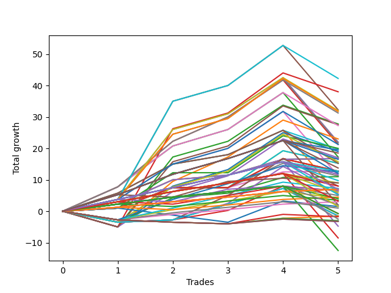

# Long Wallace Betterrerer 020 
- Symbol: ES
- Date Range: 03/18/2022 - 07/15/2022
- Trading Period: 7:20-12:30
- Number of Trades: 5



| Name | Win Percent | Profit | Avg Profit / Trade | Avg Time / Trade |      | Name | Win Percent | Profit | Avg Profit / Trade | Avg Time / Trade |
| ---- | ----------- | ------ | ------------------ | ---------------- | ---- | ---- | ----------- | ------ | ------------------ | ---------------- |
| Sorted By <br> Profit | | | | | | Sorted By <br> Win Percentage ||||
| Sixty-One | 80.00 | 21125.00 | 4225.00 | 27:44 |     | Fifty-Six | 100.00 | 8375.00 | 1675.00 | 09:42 |
| Forty-Five | 60.00 | 19000.00 | 3800.00 | 24:55 |     | Forty | 100.00 | 8375.00 | 1675.00 | 09:42 |
| Five | 80.00 | 16125.00 | 3225.00 | 28:53 |     | Zero | 100.00 | 8375.00 | 1675.00 | 09:42 |
| Sixty | 80.00 | 16000.00 | 3200.00 | 26:47 |     | Forty-Eight | 100.00 | 6375.00 | 1275.00 | 06:33 |
| Sixty-Three | 80.00 | 15875.00 | 3175.00 | 26:03 |     | One Hundred Twenty-Six | 100.00 | 3500.00 | 700.00 | 00:55 |
| Fifty-Nine | 80.00 | 15625.00 | 3125.00 | 19:03 |     | One Hundred Twenty-One | 100.00 | 3500.00 | 700.00 | 00:55 |
| Forty-Four | 60.00 | 13875.00 | 2775.00 | 23:58 |     | One Hundred Sixteen | 100.00 | 3500.00 | 700.00 | 00:55 |
| Forty-Seven | 60.00 | 13750.00 | 2750.00 | 23:14 |     | One Hundred Eleven | 100.00 | 3500.00 | 700.00 | 00:55 |
| Fifty-Eight | 80.00 | 13625.00 | 2725.00 | 18:17 |     | One Hundred One | 100.00 | 3500.00 | 700.00 | 00:55 |
| Forty-Three | 60.00 | 11500.00 | 2300.00 | 17:21 |     | Eighty-One | 100.00 | 3500.00 | 700.00 | 00:55 |
| Four | 80.00 | 11000.00 | 2200.00 | 27:56 |     | Sixty-One | 80.00 | 21125.00 | 4225.00 | 27:44 |
| Seven | 80.00 | 10875.00 | 2175.00 | 27:12 |     | Five | 80.00 | 16125.00 | 3225.00 | 28:53 |
| Sixty-Two | 80.00 | 10625.00 | 2125.00 | 19:36 |     | Sixty | 80.00 | 16000.00 | 3200.00 | 26:47 |
| Three | 80.00 | 10625.00 | 2125.00 | 20:12 |     | Sixty-Three | 80.00 | 15875.00 | 3175.00 | 26:03 |
| Fifty-Four | 80.00 | 10000.00 | 2000.00 | 09:01 |     | Fifty-Nine | 80.00 | 15625.00 | 3125.00 | 19:03 |
| Forty-One | 80.00 | 9875.00 | 1975.00 | 14:02 |     | Fifty-Eight | 80.00 | 13625.00 | 2725.00 | 18:17 |
| One Hundred Five | 80.00 | 9750.00 | 1950.00 | 06:51 |     | Four | 80.00 | 11000.00 | 2200.00 | 27:56 |
| Forty-Two | 60.00 | 9500.00 | 1900.00 | 16:35 |     | Seven | 80.00 | 10875.00 | 2175.00 | 27:12 |
| One Hundred Twenty | 80.00 | 9250.00 | 1850.00 | 07:22 |     | Sixty-Two | 80.00 | 10625.00 | 2125.00 | 19:36 |
| Two | 80.00 | 8625.00 | 1725.00 | 19:26 |     | Three | 80.00 | 10625.00 | 2125.00 | 20:12 |
| Forty-Six | 60.00 | 8500.00 | 1700.00 | 16:47 |     | Fifty-Four | 80.00 | 10000.00 | 2000.00 | 09:01 |
| Fifty-Six | 100.00 | 8375.00 | 1675.00 | 09:42 |     | Forty-One | 80.00 | 9875.00 | 1975.00 | 14:02 |
| Forty | 100.00 | 8375.00 | 1675.00 | 09:42 |     | One Hundred Five | 80.00 | 9750.00 | 1950.00 | 06:51 |
| Zero | 100.00 | 8375.00 | 1675.00 | 09:42 |     | One Hundred Twenty | 80.00 | 9250.00 | 1850.00 | 07:22 |
| One Hundred Fifteen | 80.00 | 8250.00 | 1650.00 | 07:24 |     | Two | 80.00 | 8625.00 | 1725.00 | 19:26 |
| Seventy | 60.00 | 7875.00 | 1575.00 | 15:02 |     | One Hundred Fifteen | 80.00 | 8250.00 | 1650.00 | 07:24 |
| Fifty-Seven | 80.00 | 7625.00 | 1525.00 | 14:51 |     | Fifty-Seven | 80.00 | 7625.00 | 1525.00 | 14:51 |
| Fifty-One | 80.00 | 7625.00 | 1525.00 | 09:23 |     | Fifty-One | 80.00 | 7625.00 | 1525.00 | 09:23 |
| Fifty | 80.00 | 7625.00 | 1525.00 | 09:23 |     | Fifty | 80.00 | 7625.00 | 1525.00 | 09:23 |
| One Hundred Thirty | 80.00 | 6875.00 | 1375.00 | 07:49 |     | One Hundred Thirty | 80.00 | 6875.00 | 1375.00 | 07:49 |
| Forty-Eight | 100.00 | 6375.00 | 1275.00 | 06:33 |     | One Hundred Four | 80.00 | 6375.00 | 1275.00 | 05:15 |
| One Hundred Four | 80.00 | 6375.00 | 1275.00 | 05:15 |     | Fifty-Five | 80.00 | 6375.00 | 1275.00 | 10:46 |
| Fifty-Five | 80.00 | 6375.00 | 1275.00 | 10:46 |     | Fifty-Three | 80.00 | 6375.00 | 1275.00 | 10:46 |
| Fifty-Three | 80.00 | 6375.00 | 1275.00 | 10:46 |     | Fifty-Two | 80.00 | 6375.00 | 1275.00 | 10:46 |
| Fifty-Two | 80.00 | 6375.00 | 1275.00 | 10:46 |     | One Hundred Twenty-Five | 80.00 | 6000.00 | 1200.00 | 08:13 |
| Ninety-Five | 60.00 | 6250.00 | 1250.00 | 03:51 |     | One Hundred Ninteen | 80.00 | 5875.00 | 1175.00 | 05:46 |
| One Hundred Twenty-Five | 80.00 | 6000.00 | 1200.00 | 08:13 |     | Forty-Nine | 80.00 | 5625.00 | 1125.00 | 08:53 |
| One Hundred Ninteen | 80.00 | 5875.00 | 1175.00 | 05:46 |     | Six | 80.00 | 5625.00 | 1125.00 | 20:45 |
| Forty-Nine | 80.00 | 5625.00 | 1125.00 | 08:53 |     | Sixty-Four | 80.00 | 5500.00 | 1100.00 | 09:04 |
| Six | 80.00 | 5625.00 | 1125.00 | 20:45 |     | One Hundred Fourteen | 80.00 | 4875.00 | 975.00 | 05:48 |
| Sixty-Four | 80.00 | 5500.00 | 1100.00 | 09:04 |     | One Hundred Three | 80.00 | 4500.00 | 900.00 | 04:26 |
| One Hundred Fourteen | 80.00 | 4875.00 | 975.00 | 05:48 |     | One Hundred Eighteen | 80.00 | 4000.00 | 800.00 | 04:57 |
| One Hundred Three | 80.00 | 4500.00 | 900.00 | 04:26 |     | One Hundred Twenty-Nine | 80.00 | 3500.00 | 700.00 | 06:13 |
| One Hundred Ten | 60.00 | 4500.00 | 900.00 | 02:36 |     | One Hundred Thirteen | 80.00 | 3000.00 | 600.00 | 04:59 |
| One Hundred Eighteen | 80.00 | 4000.00 | 800.00 | 04:57 |     | One Hundred Twenty-Four | 80.00 | 2625.00 | 525.00 | 06:37 |
| Sixty-Seven | 60.00 | 4000.00 | 800.00 | 14:14 |     | One | 80.00 | 2625.00 | 525.00 | 16:00 |
| Ninety-Four | 60.00 | 3625.00 | 725.00 | 02:21 |     | One Hundred Two | 80.00 | 2500.00 | 500.00 | 04:21 |
| One Hundred Twenty-Six | 100.00 | 3500.00 | 700.00 | 00:55 |     | One Hundred Six | 80.00 | 2250.00 | 450.00 | 00:52 |
| One Hundred Twenty-One | 100.00 | 3500.00 | 700.00 | 00:55 |     | One Hundred Seventeen | 80.00 | 2000.00 | 400.00 | 04:52 |
| One Hundred Sixteen | 100.00 | 3500.00 | 700.00 | 00:55 |     | One Hundred Twenty-Eight | 80.00 | 1625.00 | 325.00 | 05:24 |
| One Hundred Eleven | 100.00 | 3500.00 | 700.00 | 00:55 |     | Ninety-One | 80.00 | 1500.00 | 300.00 | 00:40 |
| One Hundred One | 100.00 | 3500.00 | 700.00 | 00:55 |     | One Hundred Twelve | 80.00 | 1000.00 | 200.00 | 04:54 |
| Eighty-One | 100.00 | 3500.00 | 700.00 | 00:55 |     | Eighty-Five | 80.00 | 1000.00 | 200.00 | 09:22 |
| One Hundred Twenty-Nine | 80.00 | 3500.00 | 700.00 | 06:13 |     | One Hundred Twenty-Three | 80.00 | 750.00 | 150.00 | 05:48 |
| One Hundred Nine | 60.00 | 3250.00 | 650.00 | 02:10 |     | One Hundred Twenty-Seven | 80.00 | -375.00 | -75.00 | 05:19 |
| One Hundred Eight | 60.00 | 3250.00 | 650.00 | 01:50 |     | One Hundred Twenty-Two | 80.00 | -1250.00 | -250.00 | 05:43 |
| One Hundred Thirteen | 80.00 | 3000.00 | 600.00 | 04:59 |     | Eighty-Four | 80.00 | -2375.00 | -475.00 | 07:46 |
| Sixty-Six | 60.00 | 2750.00 | 550.00 | 13:29 |     | Eighty-Three | 80.00 | -4250.00 | -850.00 | 06:57 |
| One Hundred Twenty-Four | 80.00 | 2625.00 | 525.00 | 06:37 |     | Eighty-Two | 80.00 | -6250.00 | -1250.00 | 06:52 |
| One | 80.00 | 2625.00 | 525.00 | 16:00 |     | Forty-Five | 60.00 | 19000.00 | 3800.00 | 24:55 |
| One Hundred Two | 80.00 | 2500.00 | 500.00 | 04:21 |     | Forty-Four | 60.00 | 13875.00 | 2775.00 | 23:58 |
| One Hundred Six | 80.00 | 2250.00 | 450.00 | 00:52 |     | Forty-Seven | 60.00 | 13750.00 | 2750.00 | 23:14 |
| Ninety-Three | 60.00 | 2125.00 | 425.00 | 01:41 |     | Forty-Three | 60.00 | 11500.00 | 2300.00 | 17:21 |
| One Hundred Seventeen | 80.00 | 2000.00 | 400.00 | 04:52 |     | Forty-Two | 60.00 | 9500.00 | 1900.00 | 16:35 |
| One Hundred Seven | 60.00 | 1750.00 | 350.00 | 01:46 |     | Forty-Six | 60.00 | 8500.00 | 1700.00 | 16:47 |
| One Hundred Twenty-Eight | 80.00 | 1625.00 | 325.00 | 05:24 |     | Seventy | 60.00 | 7875.00 | 1575.00 | 15:02 |
| Ninety-One | 80.00 | 1500.00 | 300.00 | 00:40 |     | Ninety-Five | 60.00 | 6250.00 | 1250.00 | 03:51 |
| One Hundred Twelve | 80.00 | 1000.00 | 200.00 | 04:54 |     | One Hundred Ten | 60.00 | 4500.00 | 900.00 | 02:36 |
| Eighty-Five | 80.00 | 1000.00 | 200.00 | 09:22 |     | Sixty-Seven | 60.00 | 4000.00 | 800.00 | 14:14 |
| One Hundred Twenty-Three | 80.00 | 750.00 | 150.00 | 05:48 |     | Ninety-Four | 60.00 | 3625.00 | 725.00 | 02:21 |
| Seventy-Three | 40.00 | 750.00 | 150.00 | 11:29 |     | One Hundred Nine | 60.00 | 3250.00 | 650.00 | 02:10 |
| Ninety-Two | 60.00 | 500.00 | 100.00 | 01:37 |     | One Hundred Eight | 60.00 | 3250.00 | 650.00 | 01:50 |
| One Hundred Twenty-Seven | 80.00 | -375.00 | -75.00 | 05:19 |     | Sixty-Six | 60.00 | 2750.00 | 550.00 | 13:29 |
| Sixty-Five | 60.00 | -375.00 | -75.00 | 12:48 |     | Ninety-Three | 60.00 | 2125.00 | 425.00 | 01:41 |
| Seventy-One | 60.00 | -750.00 | -150.00 | 17:57 |     | One Hundred Seven | 60.00 | 1750.00 | 350.00 | 01:46 |
| Sixty-Nine | 60.00 | -750.00 | -150.00 | 17:57 |     | Ninety-Two | 60.00 | 500.00 | 100.00 | 01:37 |
| Sixty-Eight | 60.00 | -750.00 | -150.00 | 17:57 |     | Sixty-Five | 60.00 | -375.00 | -75.00 | 12:48 |
| Ninety-Six | 40.00 | -750.00 | -150.00 | 00:27 |     | Seventy-One | 60.00 | -750.00 | -150.00 | 17:57 |
| Ninety-Eight | 20.00 | -875.00 | -175.00 | 01:08 |     | Sixty-Nine | 60.00 | -750.00 | -150.00 | 17:57 |
| One Hundred Twenty-Two | 80.00 | -1250.00 | -250.00 | 05:43 |     | Sixty-Eight | 60.00 | -750.00 | -150.00 | 17:57 |
| Ninety-Seven | 20.00 | -1500.00 | -300.00 | 01:07 |     | Seventy-Three | 40.00 | 750.00 | 150.00 | 11:29 |
| One Hundred | 20.00 | -1625.00 | -325.00 | 01:14 |     | Ninety-Six | 40.00 | -750.00 | -150.00 | 00:27 |
| Ninety-Nine | 20.00 | -1625.00 | -325.00 | 01:14 |     | Ninety-Eight | 20.00 | -875.00 | -175.00 | 01:08 |
| Eighty-Four | 80.00 | -2375.00 | -475.00 | 07:46 |     | Ninety-Seven | 20.00 | -1500.00 | -300.00 | 01:07 |
| Eighty-Three | 80.00 | -4250.00 | -850.00 | 06:57 |     | One Hundred | 20.00 | -1625.00 | -325.00 | 01:14 |
| Eighty-Two | 80.00 | -6250.00 | -1250.00 | 06:52 |     | Ninety-Nine | 20.00 | -1625.00 | -325.00 | 01:14 |

## NO STOPLOSS

### Test Zero
* Sell when price hits the middle line of the 20p bollinger
* No Stoploss
* Results:
```
Total Trades: 5
Percent Up: 100.00
Percent Down: 0.00
Total Points Moved Up: 16.75
Potential Profit: 8375.00
Total Points Ups: 16.75 Count Ups: 5
Total Points Downs: 0.00 Count Downs: 0
```

<details><summary>Trades</summary>

<code>In: 2022-05-13 11:07:00		Out: 2022-05-13 11:19:15		Total Position Time: 12:15		Total Move Up: 2.25		Total to Date: 2.25</code> <br />
<code>In: 2022-05-17 11:24:00		Out: 2022-05-17 11:31:30		Total Position Time: 07:30		Total Move Up: 7.75		Total to Date: 10.00</code> <br />
<code>In: 2022-05-25 09:29:00		Out: 2022-05-25 09:41:25		Total Position Time: 12:25		Total Move Up: 1.50		Total to Date: 11.50</code> <br />
<code>In: 2022-06-29 08:25:00		Out: 2022-06-29 08:29:10		Total Position Time: 04:10		Total Move Up: 5.00		Total to Date: 16.50</code> <br />
<code>In: 2022-07-12 11:36:00		Out: 2022-07-12 11:48:10		Total Position Time: 12:10		Total Move Up: 0.25		Total to Date: 16.75</code> <br />


</details>

### Test One
* Sell when the price hits the upper line of the 20p 1std bollinger
* No Stoploss
* Results:
```
Total Trades: 5
Percent Up: 80.00
Percent Down: 20.00
Total Points Moved Up: 5.25
Potential Profit: 2625.00
Total Points Ups: 25.75 Count Ups: 4
Total Points Downs: -20.50 Count Downs: 1
```

<details><summary>Trades</summary>

<code>In: 2022-05-13 11:07:00		Out: 2022-05-13 11:20:00		Total Position Time: 13:00		Total Move Up: 5.75		Total to Date: 5.75</code> <br />
<code>In: 2022-05-17 11:24:00		Out: 2022-05-17 11:37:35		Total Position Time: 13:35		Total Move Up: 9.25		Total to Date: 15.00</code> <br />
<code>In: 2022-05-25 09:29:00		Out: 2022-05-25 09:44:25		Total Position Time: 15:25		Total Move Up: 3.00		Total to Date: 18.00</code> <br />
<code>In: 2022-06-29 08:25:00		Out: 2022-06-29 08:33:05		Total Position Time: 08:05		Total Move Up: 7.75		Total to Date: 25.75</code> <br />
<code>In: 2022-07-12 11:36:00		Out: 2022-07-12 12:05:55		Total Position Time: 29:55		Total Move Up: -20.50		Total to Date: 5.25</code> <br />


</details>

### Test Two
* Sell when the price hits the upper line of the 20p 2std bollinger
* No Stoploss
* Results:
```
Total Trades: 5
Percent Up: 80.00
Percent Down: 20.00
Total Points Moved Up: 17.25
Potential Profit: 8625.00
Total Points Ups: 37.75 Count Ups: 4
Total Points Downs: -20.50 Count Downs: 1
```

<details><summary>Trades</summary>

<code>In: 2022-05-13 11:07:00		Out: 2022-05-13 11:31:20		Total Position Time: 24:20		Total Move Up: 7.75		Total to Date: 7.75</code> <br />
<code>In: 2022-05-17 11:24:00		Out: 2022-05-17 11:40:00		Total Position Time: 16:00		Total Move Up: 13.00		Total to Date: 20.75</code> <br />
<code>In: 2022-05-25 09:29:00		Out: 2022-05-25 09:45:20		Total Position Time: 16:20		Total Move Up: 5.25		Total to Date: 26.00</code> <br />
<code>In: 2022-06-29 08:25:00		Out: 2022-06-29 08:35:35		Total Position Time: 10:35		Total Move Up: 11.75		Total to Date: 37.75</code> <br />
<code>In: 2022-07-12 11:36:00		Out: 2022-07-12 12:05:55		Total Position Time: 29:55		Total Move Up: -20.50		Total to Date: 17.25</code> <br />


</details>

### Test Three
* Sell when price hits the middle line of the 50p bollinger
* No Stoploss
* Results:
```
Total Trades: 5
Percent Up: 80.00
Percent Down: 20.00
Total Points Moved Up: 21.25
Potential Profit: 10625.00
Total Points Ups: 41.75 Count Ups: 4
Total Points Downs: -20.50 Count Downs: 1
```

<details><summary>Trades</summary>

<code>In: 2022-05-13 11:07:00		Out: 2022-05-13 11:31:20		Total Position Time: 24:20		Total Move Up: 7.75		Total to Date: 7.75</code> <br />
<code>In: 2022-05-17 11:24:00		Out: 2022-05-17 11:40:05		Total Position Time: 16:05		Total Move Up: 14.50		Total to Date: 22.25</code> <br />
<code>In: 2022-05-25 09:29:00		Out: 2022-05-25 09:49:05		Total Position Time: 20:05		Total Move Up: 7.75		Total to Date: 30.00</code> <br />
<code>In: 2022-06-29 08:25:00		Out: 2022-06-29 08:35:35		Total Position Time: 10:35		Total Move Up: 11.75		Total to Date: 41.75</code> <br />
<code>In: 2022-07-12 11:36:00		Out: 2022-07-12 12:05:55		Total Position Time: 29:55		Total Move Up: -20.50		Total to Date: 21.25</code> <br />


</details>

### Test Four
* Sell when the price hits the upper line of the 50p 1std bollinger
* No Stoploss
* Results:
```
Total Trades: 5
Percent Up: 80.00
Percent Down: 20.00
Total Points Moved Up: 22.00
Potential Profit: 11000.00
Total Points Ups: 42.50 Count Ups: 4
Total Points Downs: -20.50 Count Downs: 1
```

<details><summary>Trades</summary>

<code>In: 2022-05-13 11:07:00		Out: 2022-05-13 11:36:55		Total Position Time: 29:55		Total Move Up: 3.75		Total to Date: 3.75</code> <br />
<code>In: 2022-05-17 11:24:00		Out: 2022-05-17 11:45:45		Total Position Time: 21:45		Total Move Up: 22.25		Total to Date: 26.00</code> <br />
<code>In: 2022-05-25 09:29:00		Out: 2022-05-25 09:58:55		Total Position Time: 29:55		Total Move Up: 5.00		Total to Date: 31.00</code> <br />
<code>In: 2022-06-29 08:25:00		Out: 2022-06-29 08:53:10		Total Position Time: 28:10		Total Move Up: 11.50		Total to Date: 42.50</code> <br />
<code>In: 2022-07-12 11:36:00		Out: 2022-07-12 12:05:55		Total Position Time: 29:55		Total Move Up: -20.50		Total to Date: 22.00</code> <br />


</details>

### Test Five
* Sell when the price hits the upper line of the 50p 2std bollinger
* No Stoploss
* Results:
```
Total Trades: 5
Percent Up: 80.00
Percent Down: 20.00
Total Points Moved Up: 32.25
Potential Profit: 16125.00
Total Points Ups: 52.75 Count Ups: 4
Total Points Downs: -20.50 Count Downs: 1
```

<details><summary>Trades</summary>

<code>In: 2022-05-13 11:07:00		Out: 2022-05-13 11:36:55		Total Position Time: 29:55		Total Move Up: 3.75		Total to Date: 3.75</code> <br />
<code>In: 2022-05-17 11:24:00		Out: 2022-05-17 11:48:45		Total Position Time: 24:45		Total Move Up: 31.25		Total to Date: 35.00</code> <br />
<code>In: 2022-05-25 09:29:00		Out: 2022-05-25 09:58:55		Total Position Time: 29:55		Total Move Up: 5.00		Total to Date: 40.00</code> <br />
<code>In: 2022-06-29 08:25:00		Out: 2022-06-29 08:54:55		Total Position Time: 29:55		Total Move Up: 12.75		Total to Date: 52.75</code> <br />
<code>In: 2022-07-12 11:36:00		Out: 2022-07-12 12:05:55		Total Position Time: 29:55		Total Move Up: -20.50		Total to Date: 32.25</code> <br />


</details>

### Test Six
* Sell when the price hits the middle line of the 1std VWAP
* No Stoploss
* Results:
```
Total Trades: 5
Percent Up: 80.00
Percent Down: 20.00
Total Points Moved Up: 11.25
Potential Profit: 5625.00
Total Points Ups: 31.75 Count Ups: 4
Total Points Downs: -20.50 Count Downs: 1
```

<details><summary>Trades</summary>

<code>In: 2022-05-13 11:07:00		Out: 2022-05-13 11:36:55		Total Position Time: 29:55		Total Move Up: 3.75		Total to Date: 3.75</code> <br />
<code>In: 2022-05-17 11:24:00		Out: 2022-05-17 11:27:25		Total Position Time: 03:25		Total Move Up: 11.25		Total to Date: 15.00</code> <br />
<code>In: 2022-05-25 09:29:00		Out: 2022-05-25 09:58:55		Total Position Time: 29:55		Total Move Up: 5.00		Total to Date: 20.00</code> <br />
<code>In: 2022-06-29 08:25:00		Out: 2022-06-29 08:35:35		Total Position Time: 10:35		Total Move Up: 11.75		Total to Date: 31.75</code> <br />
<code>In: 2022-07-12 11:36:00		Out: 2022-07-12 12:05:55		Total Position Time: 29:55		Total Move Up: -20.50		Total to Date: 11.25</code> <br />


</details>

### Test Seven
* Sell when the price hits the upper line of the 1std VWAP
* No Stoploss
* Results:
```
Total Trades: 5
Percent Up: 80.00
Percent Down: 20.00
Total Points Moved Up: 21.75
Potential Profit: 10875.00
Total Points Ups: 42.25 Count Ups: 4
Total Points Downs: -20.50 Count Downs: 1
```

<details><summary>Trades</summary>

<code>In: 2022-05-13 11:07:00		Out: 2022-05-13 11:36:55		Total Position Time: 29:55		Total Move Up: 3.75		Total to Date: 3.75</code> <br />
<code>In: 2022-05-17 11:24:00		Out: 2022-05-17 11:40:20		Total Position Time: 16:20		Total Move Up: 20.75		Total to Date: 24.50</code> <br />
<code>In: 2022-05-25 09:29:00		Out: 2022-05-25 09:58:55		Total Position Time: 29:55		Total Move Up: 5.00		Total to Date: 29.50</code> <br />
<code>In: 2022-06-29 08:25:00		Out: 2022-06-29 08:54:55		Total Position Time: 29:55		Total Move Up: 12.75		Total to Date: 42.25</code> <br />
<code>In: 2022-07-12 11:36:00		Out: 2022-07-12 12:05:55		Total Position Time: 29:55		Total Move Up: -20.50		Total to Date: 21.75</code> <br />


</details>

## STOPLOSS OF 5

### Test Forty
* Sell when price hits the middle line of the 20p bollinger
* Stoploss is 5 points
* Results:
```
Total Trades: 5
Percent Up: 100.00
Percent Down: 0.00
Total Points Moved Up: 16.75
Potential Profit: 8375.00
Total Points Ups: 16.75 Count Ups: 5
Total Points Downs: 0.00 Count Downs: 0
```

<details><summary>Trades</summary>

<code>In: 2022-05-13 11:07:00		Out: 2022-05-13 11:19:15		Total Position Time: 12:15		Total Move Up: 2.25		Total to Date: 2.25</code> <br />
<code>In: 2022-05-17 11:24:00		Out: 2022-05-17 11:31:30		Total Position Time: 07:30		Total Move Up: 7.75		Total to Date: 10.00</code> <br />
<code>In: 2022-05-25 09:29:00		Out: 2022-05-25 09:41:25		Total Position Time: 12:25		Total Move Up: 1.50		Total to Date: 11.50</code> <br />
<code>In: 2022-06-29 08:25:00		Out: 2022-06-29 08:29:10		Total Position Time: 04:10		Total Move Up: 5.00		Total to Date: 16.50</code> <br />
<code>In: 2022-07-12 11:36:00		Out: 2022-07-12 11:48:10		Total Position Time: 12:10		Total Move Up: 0.25		Total to Date: 16.75</code> <br />


</details>

### Test Forty-One
* Sell when the price hits the upper line of the 20p 1std bollinger
* Stoploss is 5 points
* Results:
```
Total Trades: 5
Percent Up: 80.00
Percent Down: 20.00
Total Points Moved Up: 19.75
Potential Profit: 9875.00
Total Points Ups: 25.75 Count Ups: 4
Total Points Downs: -6.00 Count Downs: 1
```

<details><summary>Trades</summary>

<code>In: 2022-05-13 11:07:00		Out: 2022-05-13 11:20:00		Total Position Time: 13:00		Total Move Up: 5.75		Total to Date: 5.75</code> <br />
<code>In: 2022-05-17 11:24:00		Out: 2022-05-17 11:37:35		Total Position Time: 13:35		Total Move Up: 9.25		Total to Date: 15.00</code> <br />
<code>In: 2022-05-25 09:29:00		Out: 2022-05-25 09:44:25		Total Position Time: 15:25		Total Move Up: 3.00		Total to Date: 18.00</code> <br />
<code>In: 2022-06-29 08:25:00		Out: 2022-06-29 08:33:05		Total Position Time: 08:05		Total Move Up: 7.75		Total to Date: 25.75</code> <br />
<code>In: 2022-07-12 11:36:00		Out: 2022-07-12 11:56:05		Total Position Time: 20:05		Total Move Up: -6.00		Total to Date: 19.75</code> <br />


</details>

### Test Forty-Two
* Sell when the price hits the upper line of the 20p 2std bollinger
* Stoploss is 5 points
* Results:
```
Total Trades: 5
Percent Up: 60.00
Percent Down: 40.00
Total Points Moved Up: 19.00
Potential Profit: 9500.00
Total Points Ups: 30.00 Count Ups: 3
Total Points Downs: -11.00 Count Downs: 2
```

<details><summary>Trades</summary>

<code>In: 2022-05-13 11:07:00		Out: 2022-05-13 11:26:55		Total Position Time: 19:55		Total Move Up: -5.00		Total to Date: -5.00</code> <br />
<code>In: 2022-05-17 11:24:00		Out: 2022-05-17 11:40:00		Total Position Time: 16:00		Total Move Up: 13.00		Total to Date: 8.00</code> <br />
<code>In: 2022-05-25 09:29:00		Out: 2022-05-25 09:45:20		Total Position Time: 16:20		Total Move Up: 5.25		Total to Date: 13.25</code> <br />
<code>In: 2022-06-29 08:25:00		Out: 2022-06-29 08:35:35		Total Position Time: 10:35		Total Move Up: 11.75		Total to Date: 25.00</code> <br />
<code>In: 2022-07-12 11:36:00		Out: 2022-07-12 11:56:05		Total Position Time: 20:05		Total Move Up: -6.00		Total to Date: 19.00</code> <br />


</details>

### Test Forty-Three
* Sell when price hits the middle line of the 50p bollinger
* Stoploss is 5 points
* Results:
```
Total Trades: 5
Percent Up: 60.00
Percent Down: 40.00
Total Points Moved Up: 23.00
Potential Profit: 11500.00
Total Points Ups: 34.00 Count Ups: 3
Total Points Downs: -11.00 Count Downs: 2
```

<details><summary>Trades</summary>

<code>In: 2022-05-13 11:07:00		Out: 2022-05-13 11:26:55		Total Position Time: 19:55		Total Move Up: -5.00		Total to Date: -5.00</code> <br />
<code>In: 2022-05-17 11:24:00		Out: 2022-05-17 11:40:05		Total Position Time: 16:05		Total Move Up: 14.50		Total to Date: 9.50</code> <br />
<code>In: 2022-05-25 09:29:00		Out: 2022-05-25 09:49:05		Total Position Time: 20:05		Total Move Up: 7.75		Total to Date: 17.25</code> <br />
<code>In: 2022-06-29 08:25:00		Out: 2022-06-29 08:35:35		Total Position Time: 10:35		Total Move Up: 11.75		Total to Date: 29.00</code> <br />
<code>In: 2022-07-12 11:36:00		Out: 2022-07-12 11:56:05		Total Position Time: 20:05		Total Move Up: -6.00		Total to Date: 23.00</code> <br />


</details>

### Test Forty-Four
* Sell when the price hits the upper line of the 50p 1std bollinger
* Stoploss is 5 points
* Results:
```
Total Trades: 5
Percent Up: 60.00
Percent Down: 40.00
Total Points Moved Up: 27.75
Potential Profit: 13875.00
Total Points Ups: 38.75 Count Ups: 3
Total Points Downs: -11.00 Count Downs: 2
```

<details><summary>Trades</summary>

<code>In: 2022-05-13 11:07:00		Out: 2022-05-13 11:26:55		Total Position Time: 19:55		Total Move Up: -5.00		Total to Date: -5.00</code> <br />
<code>In: 2022-05-17 11:24:00		Out: 2022-05-17 11:45:45		Total Position Time: 21:45		Total Move Up: 22.25		Total to Date: 17.25</code> <br />
<code>In: 2022-05-25 09:29:00		Out: 2022-05-25 09:58:55		Total Position Time: 29:55		Total Move Up: 5.00		Total to Date: 22.25</code> <br />
<code>In: 2022-06-29 08:25:00		Out: 2022-06-29 08:53:10		Total Position Time: 28:10		Total Move Up: 11.50		Total to Date: 33.75</code> <br />
<code>In: 2022-07-12 11:36:00		Out: 2022-07-12 11:56:05		Total Position Time: 20:05		Total Move Up: -6.00		Total to Date: 27.75</code> <br />


</details>

### Test Forty-Five
* Sell when the price hits the upper line of the 50p 2std bollinger
* Stoploss is 5 points
* Results:
```
Total Trades: 5
Percent Up: 60.00
Percent Down: 40.00
Total Points Moved Up: 38.00
Potential Profit: 19000.00
Total Points Ups: 49.00 Count Ups: 3
Total Points Downs: -11.00 Count Downs: 2
```

<details><summary>Trades</summary>

<code>In: 2022-05-13 11:07:00		Out: 2022-05-13 11:26:55		Total Position Time: 19:55		Total Move Up: -5.00		Total to Date: -5.00</code> <br />
<code>In: 2022-05-17 11:24:00		Out: 2022-05-17 11:48:45		Total Position Time: 24:45		Total Move Up: 31.25		Total to Date: 26.25</code> <br />
<code>In: 2022-05-25 09:29:00		Out: 2022-05-25 09:58:55		Total Position Time: 29:55		Total Move Up: 5.00		Total to Date: 31.25</code> <br />
<code>In: 2022-06-29 08:25:00		Out: 2022-06-29 08:54:55		Total Position Time: 29:55		Total Move Up: 12.75		Total to Date: 44.00</code> <br />
<code>In: 2022-07-12 11:36:00		Out: 2022-07-12 11:56:05		Total Position Time: 20:05		Total Move Up: -6.00		Total to Date: 38.00</code> <br />


</details>

### Test Forty-Six
* Sell when the price hits the middle line of the 1std VWAP
* Stoploss is 5 points
* Results:
```
Total Trades: 5
Percent Up: 60.00
Percent Down: 40.00
Total Points Moved Up: 17.00
Potential Profit: 8500.00
Total Points Ups: 28.00 Count Ups: 3
Total Points Downs: -11.00 Count Downs: 2
```

<details><summary>Trades</summary>

<code>In: 2022-05-13 11:07:00		Out: 2022-05-13 11:26:55		Total Position Time: 19:55		Total Move Up: -5.00		Total to Date: -5.00</code> <br />
<code>In: 2022-05-17 11:24:00		Out: 2022-05-17 11:27:25		Total Position Time: 03:25		Total Move Up: 11.25		Total to Date: 6.25</code> <br />
<code>In: 2022-05-25 09:29:00		Out: 2022-05-25 09:58:55		Total Position Time: 29:55		Total Move Up: 5.00		Total to Date: 11.25</code> <br />
<code>In: 2022-06-29 08:25:00		Out: 2022-06-29 08:35:35		Total Position Time: 10:35		Total Move Up: 11.75		Total to Date: 23.00</code> <br />
<code>In: 2022-07-12 11:36:00		Out: 2022-07-12 11:56:05		Total Position Time: 20:05		Total Move Up: -6.00		Total to Date: 17.00</code> <br />


</details>

### Test Forty-Seven
* Sell when the price hits the upper line of the 1std VWAP
* Stoploss is 5 points
* Results:
```
Total Trades: 5
Percent Up: 60.00
Percent Down: 40.00
Total Points Moved Up: 27.50
Potential Profit: 13750.00
Total Points Ups: 38.50 Count Ups: 3
Total Points Downs: -11.00 Count Downs: 2
```

<details><summary>Trades</summary>

<code>In: 2022-05-13 11:07:00		Out: 2022-05-13 11:26:55		Total Position Time: 19:55		Total Move Up: -5.00		Total to Date: -5.00</code> <br />
<code>In: 2022-05-17 11:24:00		Out: 2022-05-17 11:40:20		Total Position Time: 16:20		Total Move Up: 20.75		Total to Date: 15.75</code> <br />
<code>In: 2022-05-25 09:29:00		Out: 2022-05-25 09:58:55		Total Position Time: 29:55		Total Move Up: 5.00		Total to Date: 20.75</code> <br />
<code>In: 2022-06-29 08:25:00		Out: 2022-06-29 08:54:55		Total Position Time: 29:55		Total Move Up: 12.75		Total to Date: 33.50</code> <br />
<code>In: 2022-07-12 11:36:00		Out: 2022-07-12 11:56:05		Total Position Time: 20:05		Total Move Up: -6.00		Total to Date: 27.50</code> <br />


</details>

## TRAIL STOP OF 5

### Test Forty-Eight
* Sell when price hits the middle line of the 20p bollinger
* Trailing Stop is 5 points
* Results:
```
Total Trades: 5
Percent Up: 100.00
Percent Down: 0.00
Total Points Moved Up: 12.75
Potential Profit: 6375.00
Total Points Ups: 12.75 Count Ups: 5
Total Points Downs: 0.00 Count Downs: 0
```

<details><summary>Trades</summary>

<code>In: 2022-05-13 11:07:00		Out: 2022-05-13 11:13:40		Total Position Time: 06:40		Total Move Up: 1.00		Total to Date: 1.00</code> <br />
<code>In: 2022-05-17 11:24:00		Out: 2022-05-17 11:29:15		Total Position Time: 05:15		Total Move Up: 6.50		Total to Date: 7.50</code> <br />
<code>In: 2022-05-25 09:29:00		Out: 2022-05-25 09:33:30		Total Position Time: 04:30		Total Move Up: 0.00		Total to Date: 7.50</code> <br />
<code>In: 2022-06-29 08:25:00		Out: 2022-06-29 08:29:10		Total Position Time: 04:10		Total Move Up: 5.00		Total to Date: 12.50</code> <br />
<code>In: 2022-07-12 11:36:00		Out: 2022-07-12 11:48:10		Total Position Time: 12:10		Total Move Up: 0.25		Total to Date: 12.75</code> <br />


</details>

### Test Forty-Nine
* Sell when the price hits the upper line of the 20p 1std bollinger
* Trailing Stop is 5 points
* Results:
```
Total Trades: 5
Percent Up: 80.00
Percent Down: 20.00
Total Points Moved Up: 11.25
Potential Profit: 5625.00
Total Points Ups: 15.25 Count Ups: 4
Total Points Downs: -4.00 Count Downs: 1
```

<details><summary>Trades</summary>

<code>In: 2022-05-13 11:07:00		Out: 2022-05-13 11:13:40		Total Position Time: 06:40		Total Move Up: 1.00		Total to Date: 1.00</code> <br />
<code>In: 2022-05-17 11:24:00		Out: 2022-05-17 11:29:15		Total Position Time: 05:15		Total Move Up: 6.50		Total to Date: 7.50</code> <br />
<code>In: 2022-05-25 09:29:00		Out: 2022-05-25 09:33:30		Total Position Time: 04:30		Total Move Up: 0.00		Total to Date: 7.50</code> <br />
<code>In: 2022-06-29 08:25:00		Out: 2022-06-29 08:33:05		Total Position Time: 08:05		Total Move Up: 7.75		Total to Date: 15.25</code> <br />
<code>In: 2022-07-12 11:36:00		Out: 2022-07-12 11:55:55		Total Position Time: 19:55		Total Move Up: -4.00		Total to Date: 11.25</code> <br />


</details>

### Test Fifty
* Sell when the price hits the upper line of the 20p 2std bollinger
* Trailing Stop is 5 points
* Results:
```
Total Trades: 5
Percent Up: 80.00
Percent Down: 20.00
Total Points Moved Up: 15.25
Potential Profit: 7625.00
Total Points Ups: 19.25 Count Ups: 4
Total Points Downs: -4.00 Count Downs: 1
```

<details><summary>Trades</summary>

<code>In: 2022-05-13 11:07:00		Out: 2022-05-13 11:13:40		Total Position Time: 06:40		Total Move Up: 1.00		Total to Date: 1.00</code> <br />
<code>In: 2022-05-17 11:24:00		Out: 2022-05-17 11:29:15		Total Position Time: 05:15		Total Move Up: 6.50		Total to Date: 7.50</code> <br />
<code>In: 2022-05-25 09:29:00		Out: 2022-05-25 09:33:30		Total Position Time: 04:30		Total Move Up: 0.00		Total to Date: 7.50</code> <br />
<code>In: 2022-06-29 08:25:00		Out: 2022-06-29 08:35:35		Total Position Time: 10:35		Total Move Up: 11.75		Total to Date: 19.25</code> <br />
<code>In: 2022-07-12 11:36:00		Out: 2022-07-12 11:55:55		Total Position Time: 19:55		Total Move Up: -4.00		Total to Date: 15.25</code> <br />


</details>

### Test Fifty-One
* Sell when price hits the middle line of the 50p bollinger
* Trailing Stop is 5 points
* Results:
```
Total Trades: 5
Percent Up: 80.00
Percent Down: 20.00
Total Points Moved Up: 15.25
Potential Profit: 7625.00
Total Points Ups: 19.25 Count Ups: 4
Total Points Downs: -4.00 Count Downs: 1
```

<details><summary>Trades</summary>

<code>In: 2022-05-13 11:07:00		Out: 2022-05-13 11:13:40		Total Position Time: 06:40		Total Move Up: 1.00		Total to Date: 1.00</code> <br />
<code>In: 2022-05-17 11:24:00		Out: 2022-05-17 11:29:15		Total Position Time: 05:15		Total Move Up: 6.50		Total to Date: 7.50</code> <br />
<code>In: 2022-05-25 09:29:00		Out: 2022-05-25 09:33:30		Total Position Time: 04:30		Total Move Up: 0.00		Total to Date: 7.50</code> <br />
<code>In: 2022-06-29 08:25:00		Out: 2022-06-29 08:35:35		Total Position Time: 10:35		Total Move Up: 11.75		Total to Date: 19.25</code> <br />
<code>In: 2022-07-12 11:36:00		Out: 2022-07-12 11:55:55		Total Position Time: 19:55		Total Move Up: -4.00		Total to Date: 15.25</code> <br />


</details>

### Test Fifty-Two
* Sell when the price hits the upper line of the 50p 1std bollinger
* Trailing Stop is 5 points
* Results:
```
Total Trades: 5
Percent Up: 80.00
Percent Down: 20.00
Total Points Moved Up: 12.75
Potential Profit: 6375.00
Total Points Ups: 16.75 Count Ups: 4
Total Points Downs: -4.00 Count Downs: 1
```

<details><summary>Trades</summary>

<code>In: 2022-05-13 11:07:00		Out: 2022-05-13 11:13:40		Total Position Time: 06:40		Total Move Up: 1.00		Total to Date: 1.00</code> <br />
<code>In: 2022-05-17 11:24:00		Out: 2022-05-17 11:29:15		Total Position Time: 05:15		Total Move Up: 6.50		Total to Date: 7.50</code> <br />
<code>In: 2022-05-25 09:29:00		Out: 2022-05-25 09:33:30		Total Position Time: 04:30		Total Move Up: 0.00		Total to Date: 7.50</code> <br />
<code>In: 2022-06-29 08:25:00		Out: 2022-06-29 08:42:30		Total Position Time: 17:30		Total Move Up: 9.25		Total to Date: 16.75</code> <br />
<code>In: 2022-07-12 11:36:00		Out: 2022-07-12 11:55:55		Total Position Time: 19:55		Total Move Up: -4.00		Total to Date: 12.75</code> <br />


</details>

### Test Fifty-Three
* Sell when the price hits the upper line of the 50p 2std bollinger
* Trailing Stop is 5 points
* Results:
```
Total Trades: 5
Percent Up: 80.00
Percent Down: 20.00
Total Points Moved Up: 12.75
Potential Profit: 6375.00
Total Points Ups: 16.75 Count Ups: 4
Total Points Downs: -4.00 Count Downs: 1
```

<details><summary>Trades</summary>

<code>In: 2022-05-13 11:07:00		Out: 2022-05-13 11:13:40		Total Position Time: 06:40		Total Move Up: 1.00		Total to Date: 1.00</code> <br />
<code>In: 2022-05-17 11:24:00		Out: 2022-05-17 11:29:15		Total Position Time: 05:15		Total Move Up: 6.50		Total to Date: 7.50</code> <br />
<code>In: 2022-05-25 09:29:00		Out: 2022-05-25 09:33:30		Total Position Time: 04:30		Total Move Up: 0.00		Total to Date: 7.50</code> <br />
<code>In: 2022-06-29 08:25:00		Out: 2022-06-29 08:42:30		Total Position Time: 17:30		Total Move Up: 9.25		Total to Date: 16.75</code> <br />
<code>In: 2022-07-12 11:36:00		Out: 2022-07-12 11:55:55		Total Position Time: 19:55		Total Move Up: -4.00		Total to Date: 12.75</code> <br />


</details>

### Test Fifty-Four
* Sell when the price hits the middle line of the 1std VWAP
* Trailing Stop is 5 points
* Results:
```
Total Trades: 5
Percent Up: 80.00
Percent Down: 20.00
Total Points Moved Up: 20.00
Potential Profit: 10000.00
Total Points Ups: 24.00 Count Ups: 4
Total Points Downs: -4.00 Count Downs: 1
```

<details><summary>Trades</summary>

<code>In: 2022-05-13 11:07:00		Out: 2022-05-13 11:13:40		Total Position Time: 06:40		Total Move Up: 1.00		Total to Date: 1.00</code> <br />
<code>In: 2022-05-17 11:24:00		Out: 2022-05-17 11:27:25		Total Position Time: 03:25		Total Move Up: 11.25		Total to Date: 12.25</code> <br />
<code>In: 2022-05-25 09:29:00		Out: 2022-05-25 09:33:30		Total Position Time: 04:30		Total Move Up: 0.00		Total to Date: 12.25</code> <br />
<code>In: 2022-06-29 08:25:00		Out: 2022-06-29 08:35:35		Total Position Time: 10:35		Total Move Up: 11.75		Total to Date: 24.00</code> <br />
<code>In: 2022-07-12 11:36:00		Out: 2022-07-12 11:55:55		Total Position Time: 19:55		Total Move Up: -4.00		Total to Date: 20.00</code> <br />


</details>

### Test Fifty-Five
* Sell when the price hits the upper line of the 1std VWAP
* Trailing Stop is 5 points
* Results:
```
Total Trades: 5
Percent Up: 80.00
Percent Down: 20.00
Total Points Moved Up: 12.75
Potential Profit: 6375.00
Total Points Ups: 16.75 Count Ups: 4
Total Points Downs: -4.00 Count Downs: 1
```

<details><summary>Trades</summary>

<code>In: 2022-05-13 11:07:00		Out: 2022-05-13 11:13:40		Total Position Time: 06:40		Total Move Up: 1.00		Total to Date: 1.00</code> <br />
<code>In: 2022-05-17 11:24:00		Out: 2022-05-17 11:29:15		Total Position Time: 05:15		Total Move Up: 6.50		Total to Date: 7.50</code> <br />
<code>In: 2022-05-25 09:29:00		Out: 2022-05-25 09:33:30		Total Position Time: 04:30		Total Move Up: 0.00		Total to Date: 7.50</code> <br />
<code>In: 2022-06-29 08:25:00		Out: 2022-06-29 08:42:30		Total Position Time: 17:30		Total Move Up: 9.25		Total to Date: 16.75</code> <br />
<code>In: 2022-07-12 11:36:00		Out: 2022-07-12 11:55:55		Total Position Time: 19:55		Total Move Up: -4.00		Total to Date: 12.75</code> <br />


</details>

## STOPLOSS OF 10

### Test Fifty-Six
* Sell when price hits the middle line of the 20p bollinger
* Stoploss is 10 points
* Results:
```
Total Trades: 5
Percent Up: 100.00
Percent Down: 0.00
Total Points Moved Up: 16.75
Potential Profit: 8375.00
Total Points Ups: 16.75 Count Ups: 5
Total Points Downs: 0.00 Count Downs: 0
```

<details><summary>Trades</summary>

<code>In: 2022-05-13 11:07:00		Out: 2022-05-13 11:19:15		Total Position Time: 12:15		Total Move Up: 2.25		Total to Date: 2.25</code> <br />
<code>In: 2022-05-17 11:24:00		Out: 2022-05-17 11:31:30		Total Position Time: 07:30		Total Move Up: 7.75		Total to Date: 10.00</code> <br />
<code>In: 2022-05-25 09:29:00		Out: 2022-05-25 09:41:25		Total Position Time: 12:25		Total Move Up: 1.50		Total to Date: 11.50</code> <br />
<code>In: 2022-06-29 08:25:00		Out: 2022-06-29 08:29:10		Total Position Time: 04:10		Total Move Up: 5.00		Total to Date: 16.50</code> <br />
<code>In: 2022-07-12 11:36:00		Out: 2022-07-12 11:48:10		Total Position Time: 12:10		Total Move Up: 0.25		Total to Date: 16.75</code> <br />


</details>

### Test Fifty-Seven
* Sell when the price hits the upper line of the 20p 1std bollinger
* Stoploss is 10 points
* Results:
```
Total Trades: 5
Percent Up: 80.00
Percent Down: 20.00
Total Points Moved Up: 15.25
Potential Profit: 7625.00
Total Points Ups: 25.75 Count Ups: 4
Total Points Downs: -10.50 Count Downs: 1
```

<details><summary>Trades</summary>

<code>In: 2022-05-13 11:07:00		Out: 2022-05-13 11:20:00		Total Position Time: 13:00		Total Move Up: 5.75		Total to Date: 5.75</code> <br />
<code>In: 2022-05-17 11:24:00		Out: 2022-05-17 11:37:35		Total Position Time: 13:35		Total Move Up: 9.25		Total to Date: 15.00</code> <br />
<code>In: 2022-05-25 09:29:00		Out: 2022-05-25 09:44:25		Total Position Time: 15:25		Total Move Up: 3.00		Total to Date: 18.00</code> <br />
<code>In: 2022-06-29 08:25:00		Out: 2022-06-29 08:33:05		Total Position Time: 08:05		Total Move Up: 7.75		Total to Date: 25.75</code> <br />
<code>In: 2022-07-12 11:36:00		Out: 2022-07-12 12:00:10		Total Position Time: 24:10		Total Move Up: -10.50		Total to Date: 15.25</code> <br />


</details>

### Test Fifty-Eight
* Sell when the price hits the upper line of the 20p 2std bollinger
* Stoploss is 10 points
* Results:
```
Total Trades: 5
Percent Up: 80.00
Percent Down: 20.00
Total Points Moved Up: 27.25
Potential Profit: 13625.00
Total Points Ups: 37.75 Count Ups: 4
Total Points Downs: -10.50 Count Downs: 1
```

<details><summary>Trades</summary>

<code>In: 2022-05-13 11:07:00		Out: 2022-05-13 11:31:20		Total Position Time: 24:20		Total Move Up: 7.75		Total to Date: 7.75</code> <br />
<code>In: 2022-05-17 11:24:00		Out: 2022-05-17 11:40:00		Total Position Time: 16:00		Total Move Up: 13.00		Total to Date: 20.75</code> <br />
<code>In: 2022-05-25 09:29:00		Out: 2022-05-25 09:45:20		Total Position Time: 16:20		Total Move Up: 5.25		Total to Date: 26.00</code> <br />
<code>In: 2022-06-29 08:25:00		Out: 2022-06-29 08:35:35		Total Position Time: 10:35		Total Move Up: 11.75		Total to Date: 37.75</code> <br />
<code>In: 2022-07-12 11:36:00		Out: 2022-07-12 12:00:10		Total Position Time: 24:10		Total Move Up: -10.50		Total to Date: 27.25</code> <br />


</details>

### Test Fifty-Nine
* Sell when price hits the middle line of the 50p bollinger
* Stoploss is 10 points
* Results:
```
Total Trades: 5
Percent Up: 80.00
Percent Down: 20.00
Total Points Moved Up: 31.25
Potential Profit: 15625.00
Total Points Ups: 41.75 Count Ups: 4
Total Points Downs: -10.50 Count Downs: 1
```

<details><summary>Trades</summary>

<code>In: 2022-05-13 11:07:00		Out: 2022-05-13 11:31:20		Total Position Time: 24:20		Total Move Up: 7.75		Total to Date: 7.75</code> <br />
<code>In: 2022-05-17 11:24:00		Out: 2022-05-17 11:40:05		Total Position Time: 16:05		Total Move Up: 14.50		Total to Date: 22.25</code> <br />
<code>In: 2022-05-25 09:29:00		Out: 2022-05-25 09:49:05		Total Position Time: 20:05		Total Move Up: 7.75		Total to Date: 30.00</code> <br />
<code>In: 2022-06-29 08:25:00		Out: 2022-06-29 08:35:35		Total Position Time: 10:35		Total Move Up: 11.75		Total to Date: 41.75</code> <br />
<code>In: 2022-07-12 11:36:00		Out: 2022-07-12 12:00:10		Total Position Time: 24:10		Total Move Up: -10.50		Total to Date: 31.25</code> <br />


</details>

### Test Sixty
* Sell when the price hits the upper line of the 50p 1std bollinger
* Stoploss is 10 points
* Results:
```
Total Trades: 5
Percent Up: 80.00
Percent Down: 20.00
Total Points Moved Up: 32.00
Potential Profit: 16000.00
Total Points Ups: 42.50 Count Ups: 4
Total Points Downs: -10.50 Count Downs: 1
```

<details><summary>Trades</summary>

<code>In: 2022-05-13 11:07:00		Out: 2022-05-13 11:36:55		Total Position Time: 29:55		Total Move Up: 3.75		Total to Date: 3.75</code> <br />
<code>In: 2022-05-17 11:24:00		Out: 2022-05-17 11:45:45		Total Position Time: 21:45		Total Move Up: 22.25		Total to Date: 26.00</code> <br />
<code>In: 2022-05-25 09:29:00		Out: 2022-05-25 09:58:55		Total Position Time: 29:55		Total Move Up: 5.00		Total to Date: 31.00</code> <br />
<code>In: 2022-06-29 08:25:00		Out: 2022-06-29 08:53:10		Total Position Time: 28:10		Total Move Up: 11.50		Total to Date: 42.50</code> <br />
<code>In: 2022-07-12 11:36:00		Out: 2022-07-12 12:00:10		Total Position Time: 24:10		Total Move Up: -10.50		Total to Date: 32.00</code> <br />


</details>

### Test Sixty-One
* Sell when the price hits the upper line of the 50p 2std bollinger
* Stoploss is 10 points
* Results:
```
Total Trades: 5
Percent Up: 80.00
Percent Down: 20.00
Total Points Moved Up: 42.25
Potential Profit: 21125.00
Total Points Ups: 52.75 Count Ups: 4
Total Points Downs: -10.50 Count Downs: 1
```

<details><summary>Trades</summary>

<code>In: 2022-05-13 11:07:00		Out: 2022-05-13 11:36:55		Total Position Time: 29:55		Total Move Up: 3.75		Total to Date: 3.75</code> <br />
<code>In: 2022-05-17 11:24:00		Out: 2022-05-17 11:48:45		Total Position Time: 24:45		Total Move Up: 31.25		Total to Date: 35.00</code> <br />
<code>In: 2022-05-25 09:29:00		Out: 2022-05-25 09:58:55		Total Position Time: 29:55		Total Move Up: 5.00		Total to Date: 40.00</code> <br />
<code>In: 2022-06-29 08:25:00		Out: 2022-06-29 08:54:55		Total Position Time: 29:55		Total Move Up: 12.75		Total to Date: 52.75</code> <br />
<code>In: 2022-07-12 11:36:00		Out: 2022-07-12 12:00:10		Total Position Time: 24:10		Total Move Up: -10.50		Total to Date: 42.25</code> <br />


</details>

### Test Sixty-Two
* Sell when the price hits the middle line of the 1std VWAP
* Stoploss is 10 points
* Results:
```
Total Trades: 5
Percent Up: 80.00
Percent Down: 20.00
Total Points Moved Up: 21.25
Potential Profit: 10625.00
Total Points Ups: 31.75 Count Ups: 4
Total Points Downs: -10.50 Count Downs: 1
```

<details><summary>Trades</summary>

<code>In: 2022-05-13 11:07:00		Out: 2022-05-13 11:36:55		Total Position Time: 29:55		Total Move Up: 3.75		Total to Date: 3.75</code> <br />
<code>In: 2022-05-17 11:24:00		Out: 2022-05-17 11:27:25		Total Position Time: 03:25		Total Move Up: 11.25		Total to Date: 15.00</code> <br />
<code>In: 2022-05-25 09:29:00		Out: 2022-05-25 09:58:55		Total Position Time: 29:55		Total Move Up: 5.00		Total to Date: 20.00</code> <br />
<code>In: 2022-06-29 08:25:00		Out: 2022-06-29 08:35:35		Total Position Time: 10:35		Total Move Up: 11.75		Total to Date: 31.75</code> <br />
<code>In: 2022-07-12 11:36:00		Out: 2022-07-12 12:00:10		Total Position Time: 24:10		Total Move Up: -10.50		Total to Date: 21.25</code> <br />


</details>

### Test Sixty-Three
* Sell when the price hits the upper line of the 1std VWAP
* Stoploss is 10 points
* Results:
```
Total Trades: 5
Percent Up: 80.00
Percent Down: 20.00
Total Points Moved Up: 31.75
Potential Profit: 15875.00
Total Points Ups: 42.25 Count Ups: 4
Total Points Downs: -10.50 Count Downs: 1
```

<details><summary>Trades</summary>

<code>In: 2022-05-13 11:07:00		Out: 2022-05-13 11:36:55		Total Position Time: 29:55		Total Move Up: 3.75		Total to Date: 3.75</code> <br />
<code>In: 2022-05-17 11:24:00		Out: 2022-05-17 11:40:20		Total Position Time: 16:20		Total Move Up: 20.75		Total to Date: 24.50</code> <br />
<code>In: 2022-05-25 09:29:00		Out: 2022-05-25 09:58:55		Total Position Time: 29:55		Total Move Up: 5.00		Total to Date: 29.50</code> <br />
<code>In: 2022-06-29 08:25:00		Out: 2022-06-29 08:54:55		Total Position Time: 29:55		Total Move Up: 12.75		Total to Date: 42.25</code> <br />
<code>In: 2022-07-12 11:36:00		Out: 2022-07-12 12:00:10		Total Position Time: 24:10		Total Move Up: -10.50		Total to Date: 31.75</code> <br />


</details>

## TRAIL STOP OF 10

### Test Sixty-Four
* Sell when price hits the middle line of the 20p bollinger
* Trailing Stop is 10 points
* Results:
```
Total Trades: 5
Percent Up: 80.00
Percent Down: 20.00
Total Points Moved Up: 11.00
Potential Profit: 5500.00
Total Points Ups: 14.50 Count Ups: 4
Total Points Downs: -3.50 Count Downs: 1
```

<details><summary>Trades</summary>

<code>In: 2022-05-13 11:07:00		Out: 2022-05-13 11:16:05		Total Position Time: 09:05		Total Move Up: -3.50		Total to Date: -3.50</code> <br />
<code>In: 2022-05-17 11:24:00		Out: 2022-05-17 11:31:30		Total Position Time: 07:30		Total Move Up: 7.75		Total to Date: 4.25</code> <br />
<code>In: 2022-05-25 09:29:00		Out: 2022-05-25 09:41:25		Total Position Time: 12:25		Total Move Up: 1.50		Total to Date: 5.75</code> <br />
<code>In: 2022-06-29 08:25:00		Out: 2022-06-29 08:29:10		Total Position Time: 04:10		Total Move Up: 5.00		Total to Date: 10.75</code> <br />
<code>In: 2022-07-12 11:36:00		Out: 2022-07-12 11:48:10		Total Position Time: 12:10		Total Move Up: 0.25		Total to Date: 11.00</code> <br />


</details>

### Test Sixty-Five
* Sell when the price hits the upper line of the 20p 1std bollinger
* Trailing Stop is 10 points
* Results:
```
Total Trades: 5
Percent Up: 60.00
Percent Down: 40.00
Total Points Moved Up: -0.75
Potential Profit: -375.00
Total Points Ups: 11.50 Count Ups: 3
Total Points Downs: -12.25 Count Downs: 2
```

<details><summary>Trades</summary>

<code>In: 2022-05-13 11:07:00		Out: 2022-05-13 11:16:05		Total Position Time: 09:05		Total Move Up: -3.50		Total to Date: -3.50</code> <br />
<code>In: 2022-05-17 11:24:00		Out: 2022-05-17 11:33:15		Total Position Time: 09:15		Total Move Up: 0.75		Total to Date: -2.75</code> <br />
<code>In: 2022-05-25 09:29:00		Out: 2022-05-25 09:44:25		Total Position Time: 15:25		Total Move Up: 3.00		Total to Date: 0.25</code> <br />
<code>In: 2022-06-29 08:25:00		Out: 2022-06-29 08:33:05		Total Position Time: 08:05		Total Move Up: 7.75		Total to Date: 8.00</code> <br />
<code>In: 2022-07-12 11:36:00		Out: 2022-07-12 11:58:10		Total Position Time: 22:10		Total Move Up: -8.75		Total to Date: -0.75</code> <br />


</details>

### Test Sixty-Six
* Sell when the price hits the upper line of the 20p 2std bollinger
* Trailing Stop is 10 points
* Results:
```
Total Trades: 5
Percent Up: 60.00
Percent Down: 40.00
Total Points Moved Up: 5.50
Potential Profit: 2750.00
Total Points Ups: 17.75 Count Ups: 3
Total Points Downs: -12.25 Count Downs: 2
```

<details><summary>Trades</summary>

<code>In: 2022-05-13 11:07:00		Out: 2022-05-13 11:16:05		Total Position Time: 09:05		Total Move Up: -3.50		Total to Date: -3.50</code> <br />
<code>In: 2022-05-17 11:24:00		Out: 2022-05-17 11:33:15		Total Position Time: 09:15		Total Move Up: 0.75		Total to Date: -2.75</code> <br />
<code>In: 2022-05-25 09:29:00		Out: 2022-05-25 09:45:20		Total Position Time: 16:20		Total Move Up: 5.25		Total to Date: 2.50</code> <br />
<code>In: 2022-06-29 08:25:00		Out: 2022-06-29 08:35:35		Total Position Time: 10:35		Total Move Up: 11.75		Total to Date: 14.25</code> <br />
<code>In: 2022-07-12 11:36:00		Out: 2022-07-12 11:58:10		Total Position Time: 22:10		Total Move Up: -8.75		Total to Date: 5.50</code> <br />


</details>

### Test Sixty-Seven
* Sell when price hits the middle line of the 50p bollinger
* Trailing Stop is 10 points
* Results:
```
Total Trades: 5
Percent Up: 60.00
Percent Down: 40.00
Total Points Moved Up: 8.00
Potential Profit: 4000.00
Total Points Ups: 20.25 Count Ups: 3
Total Points Downs: -12.25 Count Downs: 2
```

<details><summary>Trades</summary>

<code>In: 2022-05-13 11:07:00		Out: 2022-05-13 11:16:05		Total Position Time: 09:05		Total Move Up: -3.50		Total to Date: -3.50</code> <br />
<code>In: 2022-05-17 11:24:00		Out: 2022-05-17 11:33:15		Total Position Time: 09:15		Total Move Up: 0.75		Total to Date: -2.75</code> <br />
<code>In: 2022-05-25 09:29:00		Out: 2022-05-25 09:49:05		Total Position Time: 20:05		Total Move Up: 7.75		Total to Date: 5.00</code> <br />
<code>In: 2022-06-29 08:25:00		Out: 2022-06-29 08:35:35		Total Position Time: 10:35		Total Move Up: 11.75		Total to Date: 16.75</code> <br />
<code>In: 2022-07-12 11:36:00		Out: 2022-07-12 11:58:10		Total Position Time: 22:10		Total Move Up: -8.75		Total to Date: 8.00</code> <br />


</details>

### Test Sixty-Eight
* Sell when the price hits the upper line of the 50p 1std bollinger
* Trailing Stop is 10 points
* Results:
```
Total Trades: 5
Percent Up: 60.00
Percent Down: 40.00
Total Points Moved Up: -1.50
Potential Profit: -750.00
Total Points Ups: 10.75 Count Ups: 3
Total Points Downs: -12.25 Count Downs: 2
```

<details><summary>Trades</summary>

<code>In: 2022-05-13 11:07:00		Out: 2022-05-13 11:16:05		Total Position Time: 09:05		Total Move Up: -3.50		Total to Date: -3.50</code> <br />
<code>In: 2022-05-17 11:24:00		Out: 2022-05-17 11:33:15		Total Position Time: 09:15		Total Move Up: 0.75		Total to Date: -2.75</code> <br />
<code>In: 2022-05-25 09:29:00		Out: 2022-05-25 09:58:55		Total Position Time: 29:55		Total Move Up: 5.00		Total to Date: 2.25</code> <br />
<code>In: 2022-06-29 08:25:00		Out: 2022-06-29 08:44:20		Total Position Time: 19:20		Total Move Up: 5.00		Total to Date: 7.25</code> <br />
<code>In: 2022-07-12 11:36:00		Out: 2022-07-12 11:58:10		Total Position Time: 22:10		Total Move Up: -8.75		Total to Date: -1.50</code> <br />


</details>

### Test Sixty-Nine
* Sell when the price hits the upper line of the 50p 2std bollinger
* Trailing Stop is 10 points
* Results:
```
Total Trades: 5
Percent Up: 60.00
Percent Down: 40.00
Total Points Moved Up: -1.50
Potential Profit: -750.00
Total Points Ups: 10.75 Count Ups: 3
Total Points Downs: -12.25 Count Downs: 2
```

<details><summary>Trades</summary>

<code>In: 2022-05-13 11:07:00		Out: 2022-05-13 11:16:05		Total Position Time: 09:05		Total Move Up: -3.50		Total to Date: -3.50</code> <br />
<code>In: 2022-05-17 11:24:00		Out: 2022-05-17 11:33:15		Total Position Time: 09:15		Total Move Up: 0.75		Total to Date: -2.75</code> <br />
<code>In: 2022-05-25 09:29:00		Out: 2022-05-25 09:58:55		Total Position Time: 29:55		Total Move Up: 5.00		Total to Date: 2.25</code> <br />
<code>In: 2022-06-29 08:25:00		Out: 2022-06-29 08:44:20		Total Position Time: 19:20		Total Move Up: 5.00		Total to Date: 7.25</code> <br />
<code>In: 2022-07-12 11:36:00		Out: 2022-07-12 11:58:10		Total Position Time: 22:10		Total Move Up: -8.75		Total to Date: -1.50</code> <br />


</details>

### Test Seventy
* Sell when the price hits the middle line of the 1std VWAP
* Trailing Stop is 10 points
* Results:
```
Total Trades: 5
Percent Up: 60.00
Percent Down: 40.00
Total Points Moved Up: 15.75
Potential Profit: 7875.00
Total Points Ups: 28.00 Count Ups: 3
Total Points Downs: -12.25 Count Downs: 2
```

<details><summary>Trades</summary>

<code>In: 2022-05-13 11:07:00		Out: 2022-05-13 11:16:05		Total Position Time: 09:05		Total Move Up: -3.50		Total to Date: -3.50</code> <br />
<code>In: 2022-05-17 11:24:00		Out: 2022-05-17 11:27:25		Total Position Time: 03:25		Total Move Up: 11.25		Total to Date: 7.75</code> <br />
<code>In: 2022-05-25 09:29:00		Out: 2022-05-25 09:58:55		Total Position Time: 29:55		Total Move Up: 5.00		Total to Date: 12.75</code> <br />
<code>In: 2022-06-29 08:25:00		Out: 2022-06-29 08:35:35		Total Position Time: 10:35		Total Move Up: 11.75		Total to Date: 24.50</code> <br />
<code>In: 2022-07-12 11:36:00		Out: 2022-07-12 11:58:10		Total Position Time: 22:10		Total Move Up: -8.75		Total to Date: 15.75</code> <br />


</details>

### Test Seventy-One
* Sell when the price hits the upper line of the 1std VWAP
* Trailing Stop is 10 points
* Results:
```
Total Trades: 5
Percent Up: 60.00
Percent Down: 40.00
Total Points Moved Up: -1.50
Potential Profit: -750.00
Total Points Ups: 10.75 Count Ups: 3
Total Points Downs: -12.25 Count Downs: 2
```

<details><summary>Trades</summary>

<code>In: 2022-05-13 11:07:00		Out: 2022-05-13 11:16:05		Total Position Time: 09:05		Total Move Up: -3.50		Total to Date: -3.50</code> <br />
<code>In: 2022-05-17 11:24:00		Out: 2022-05-17 11:33:15		Total Position Time: 09:15		Total Move Up: 0.75		Total to Date: -2.75</code> <br />
<code>In: 2022-05-25 09:29:00		Out: 2022-05-25 09:58:55		Total Position Time: 29:55		Total Move Up: 5.00		Total to Date: 2.25</code> <br />
<code>In: 2022-06-29 08:25:00		Out: 2022-06-29 08:44:20		Total Position Time: 19:20		Total Move Up: 5.00		Total to Date: 7.25</code> <br />
<code>In: 2022-07-12 11:36:00		Out: 2022-07-12 11:58:10		Total Position Time: 22:10		Total Move Up: -8.75		Total to Date: -1.50</code> <br />


</details>

## SPECIAL EXIT CONDITIONS 

### Test Seventy-Three
* Sell when the linear regression slope changes to negative
* No Stoploss
* Results:
```
Total Trades: 5
Percent Up: 40.00
Percent Down: 60.00
Total Points Moved Up: 1.50
Potential Profit: 750.00
Total Points Ups: 7.75 Count Ups: 2
Total Points Downs: -6.25 Count Downs: 3
```

<details><summary>Trades</summary>

<code>In: 2022-05-13 11:07:00		Out: 2022-05-13 11:18:05		Total Position Time: 11:05		Total Move Up: 1.00		Total to Date: 1.00</code> <br />
<code>In: 2022-05-17 11:24:00		Out: 2022-05-17 11:35:05		Total Position Time: 11:05		Total Move Up: -2.25		Total to Date: -1.25</code> <br />
<code>In: 2022-05-25 09:29:00		Out: 2022-05-25 09:36:05		Total Position Time: 07:05		Total Move Up: -2.25		Total to Date: -3.50</code> <br />
<code>In: 2022-06-29 08:25:00		Out: 2022-06-29 08:43:05		Total Position Time: 18:05		Total Move Up: 6.75		Total to Date: 3.25</code> <br />
<code>In: 2022-07-12 11:36:00		Out: 2022-07-12 11:46:05		Total Position Time: 10:05		Total Move Up: -1.75		Total to Date: 1.50</code> <br />


</details>

## TAKE PROFIT

### Test Eighty-One
* Take Profit of 1 Point
* No Stoploss
* Results:
```
Total Trades: 5
Percent Up: 100.00
Percent Down: 0.00
Total Points Moved Up: 7.00
Potential Profit: 3500.00
Total Points Ups: 7.00 Count Ups: 5
Total Points Downs: 0.00 Count Downs: 0
```

<details><summary>Trades</summary>

<code>In: 2022-05-13 11:07:00		Out: 2022-05-13 11:09:25		Total Position Time: 02:25		Total Move Up: 1.25		Total to Date: 1.25</code> <br />
<code>In: 2022-05-17 11:24:00		Out: 2022-05-17 11:24:25		Total Position Time: 00:25		Total Move Up: 1.75		Total to Date: 3.00</code> <br />
<code>In: 2022-05-25 09:29:00		Out: 2022-05-25 09:30:00		Total Position Time: 01:00		Total Move Up: 1.50		Total to Date: 4.50</code> <br />
<code>In: 2022-06-29 08:25:00		Out: 2022-06-29 08:25:15		Total Position Time: 00:15		Total Move Up: 1.75		Total to Date: 6.25</code> <br />
<code>In: 2022-07-12 11:36:00		Out: 2022-07-12 11:36:30		Total Position Time: 00:30		Total Move Up: 0.75		Total to Date: 7.00</code> <br />


</details>

### Test Eighty-Two
* Take Profit of 2 Point
* No Stoploss
* Results:
```
Total Trades: 5
Percent Up: 80.00
Percent Down: 20.00
Total Points Moved Up: -12.50
Potential Profit: -6250.00
Total Points Ups: 8.00 Count Ups: 4
Total Points Downs: -20.50 Count Downs: 1
```

<details><summary>Trades</summary>

<code>In: 2022-05-13 11:07:00		Out: 2022-05-13 11:09:30		Total Position Time: 02:30		Total Move Up: 2.25		Total to Date: 2.25</code> <br />
<code>In: 2022-05-17 11:24:00		Out: 2022-05-17 11:24:35		Total Position Time: 00:35		Total Move Up: 2.25		Total to Date: 4.50</code> <br />
<code>In: 2022-05-25 09:29:00		Out: 2022-05-25 09:30:05		Total Position Time: 01:05		Total Move Up: 1.75		Total to Date: 6.25</code> <br />
<code>In: 2022-06-29 08:25:00		Out: 2022-06-29 08:25:15		Total Position Time: 00:15		Total Move Up: 1.75		Total to Date: 8.00</code> <br />
<code>In: 2022-07-12 11:36:00		Out: 2022-07-12 12:05:55		Total Position Time: 29:55		Total Move Up: -20.50		Total to Date: -12.50</code> <br />


</details>

### Test Eighty-Three
* Take Profit of 3 Point
* No Stoploss
* Results:
```
Total Trades: 5
Percent Up: 80.00
Percent Down: 20.00
Total Points Moved Up: -8.50
Potential Profit: -4250.00
Total Points Ups: 12.00 Count Ups: 4
Total Points Downs: -20.50 Count Downs: 1
```

<details><summary>Trades</summary>

<code>In: 2022-05-13 11:07:00		Out: 2022-05-13 11:09:35		Total Position Time: 02:35		Total Move Up: 3.00		Total to Date: 3.00</code> <br />
<code>In: 2022-05-17 11:24:00		Out: 2022-05-17 11:24:40		Total Position Time: 00:40		Total Move Up: 3.25		Total to Date: 6.25</code> <br />
<code>In: 2022-05-25 09:29:00		Out: 2022-05-25 09:30:15		Total Position Time: 01:15		Total Move Up: 2.75		Total to Date: 9.00</code> <br />
<code>In: 2022-06-29 08:25:00		Out: 2022-06-29 08:25:20		Total Position Time: 00:20		Total Move Up: 3.00		Total to Date: 12.00</code> <br />
<code>In: 2022-07-12 11:36:00		Out: 2022-07-12 12:05:55		Total Position Time: 29:55		Total Move Up: -20.50		Total to Date: -8.50</code> <br />


</details>

### Test Eighty-Four
* Take Profit of 4 Point
* No Stoploss
* Results:
```
Total Trades: 5
Percent Up: 80.00
Percent Down: 20.00
Total Points Moved Up: -4.75
Potential Profit: -2375.00
Total Points Ups: 15.75 Count Ups: 4
Total Points Downs: -20.50 Count Downs: 1
```

<details><summary>Trades</summary>

<code>In: 2022-05-13 11:07:00		Out: 2022-05-13 11:10:20		Total Position Time: 03:20		Total Move Up: 3.75		Total to Date: 3.75</code> <br />
<code>In: 2022-05-17 11:24:00		Out: 2022-05-17 11:24:50		Total Position Time: 00:50		Total Move Up: 3.75		Total to Date: 7.50</code> <br />
<code>In: 2022-05-25 09:29:00		Out: 2022-05-25 09:30:30		Total Position Time: 01:30		Total Move Up: 4.00		Total to Date: 11.50</code> <br />
<code>In: 2022-06-29 08:25:00		Out: 2022-06-29 08:28:15		Total Position Time: 03:15		Total Move Up: 4.25		Total to Date: 15.75</code> <br />
<code>In: 2022-07-12 11:36:00		Out: 2022-07-12 12:05:55		Total Position Time: 29:55		Total Move Up: -20.50		Total to Date: -4.75</code> <br />


</details>

### Test Eighty-Five
* Take Profit of 5 Point
* No Stoploss
* Results:
```
Total Trades: 5
Percent Up: 80.00
Percent Down: 20.00
Total Points Moved Up: 2.00
Potential Profit: 1000.00
Total Points Ups: 22.50 Count Ups: 4
Total Points Downs: -20.50 Count Downs: 1
```

<details><summary>Trades</summary>

<code>In: 2022-05-13 11:07:00		Out: 2022-05-13 11:10:50		Total Position Time: 03:50		Total Move Up: 5.25		Total to Date: 5.25</code> <br />
<code>In: 2022-05-17 11:24:00		Out: 2022-05-17 11:26:40		Total Position Time: 02:40		Total Move Up: 6.50		Total to Date: 11.75</code> <br />
<code>In: 2022-05-25 09:29:00		Out: 2022-05-25 09:32:10		Total Position Time: 03:10		Total Move Up: 5.00		Total to Date: 16.75</code> <br />
<code>In: 2022-06-29 08:25:00		Out: 2022-06-29 08:32:15		Total Position Time: 07:15		Total Move Up: 5.75		Total to Date: 22.50</code> <br />
<code>In: 2022-07-12 11:36:00		Out: 2022-07-12 12:05:55		Total Position Time: 29:55		Total Move Up: -20.50		Total to Date: 2.00</code> <br />


</details>

## TAKE PROFIT Stoploss of Two

### Test Ninety-One
* Take Profit of 1 Point
* Stoploss is 2 points
* Results:
```
Total Trades: 5
Percent Up: 80.00
Percent Down: 20.00
Total Points Moved Up: 3.00
Potential Profit: 1500.00
Total Points Ups: 5.75 Count Ups: 4
Total Points Downs: -2.75 Count Downs: 1
```

<details><summary>Trades</summary>

<code>In: 2022-05-13 11:07:00		Out: 2022-05-13 11:08:10		Total Position Time: 01:10		Total Move Up: -2.75		Total to Date: -2.75</code> <br />
<code>In: 2022-05-17 11:24:00		Out: 2022-05-17 11:24:25		Total Position Time: 00:25		Total Move Up: 1.75		Total to Date: -1.00</code> <br />
<code>In: 2022-05-25 09:29:00		Out: 2022-05-25 09:30:00		Total Position Time: 01:00		Total Move Up: 1.50		Total to Date: 0.50</code> <br />
<code>In: 2022-06-29 08:25:00		Out: 2022-06-29 08:25:15		Total Position Time: 00:15		Total Move Up: 1.75		Total to Date: 2.25</code> <br />
<code>In: 2022-07-12 11:36:00		Out: 2022-07-12 11:36:30		Total Position Time: 00:30		Total Move Up: 0.75		Total to Date: 3.00</code> <br />


</details>

### Test Ninety-Two
* Take Profit of 2 Point
* Stoploss is 2 points
* Results:
```
Total Trades: 5
Percent Up: 60.00
Percent Down: 40.00
Total Points Moved Up: 1.00
Potential Profit: 500.00
Total Points Ups: 5.75 Count Ups: 3
Total Points Downs: -4.75 Count Downs: 2
```

<details><summary>Trades</summary>

<code>In: 2022-05-13 11:07:00		Out: 2022-05-13 11:08:10		Total Position Time: 01:10		Total Move Up: -2.75		Total to Date: -2.75</code> <br />
<code>In: 2022-05-17 11:24:00		Out: 2022-05-17 11:24:35		Total Position Time: 00:35		Total Move Up: 2.25		Total to Date: -0.50</code> <br />
<code>In: 2022-05-25 09:29:00		Out: 2022-05-25 09:30:05		Total Position Time: 01:05		Total Move Up: 1.75		Total to Date: 1.25</code> <br />
<code>In: 2022-06-29 08:25:00		Out: 2022-06-29 08:25:15		Total Position Time: 00:15		Total Move Up: 1.75		Total to Date: 3.00</code> <br />
<code>In: 2022-07-12 11:36:00		Out: 2022-07-12 11:41:00		Total Position Time: 05:00		Total Move Up: -2.00		Total to Date: 1.00</code> <br />


</details>

### Test Ninety-Three
* Take Profit of 3 Point
* Stoploss is 2 points
* Results:
```
Total Trades: 5
Percent Up: 60.00
Percent Down: 40.00
Total Points Moved Up: 4.25
Potential Profit: 2125.00
Total Points Ups: 9.00 Count Ups: 3
Total Points Downs: -4.75 Count Downs: 2
```

<details><summary>Trades</summary>

<code>In: 2022-05-13 11:07:00		Out: 2022-05-13 11:08:10		Total Position Time: 01:10		Total Move Up: -2.75		Total to Date: -2.75</code> <br />
<code>In: 2022-05-17 11:24:00		Out: 2022-05-17 11:24:40		Total Position Time: 00:40		Total Move Up: 3.25		Total to Date: 0.50</code> <br />
<code>In: 2022-05-25 09:29:00		Out: 2022-05-25 09:30:15		Total Position Time: 01:15		Total Move Up: 2.75		Total to Date: 3.25</code> <br />
<code>In: 2022-06-29 08:25:00		Out: 2022-06-29 08:25:20		Total Position Time: 00:20		Total Move Up: 3.00		Total to Date: 6.25</code> <br />
<code>In: 2022-07-12 11:36:00		Out: 2022-07-12 11:41:00		Total Position Time: 05:00		Total Move Up: -2.00		Total to Date: 4.25</code> <br />


</details>

### Test Ninety-Four
* Take Profit of 4 Point
* Stoploss is 2 points
* Results:
```
Total Trades: 5
Percent Up: 60.00
Percent Down: 40.00
Total Points Moved Up: 7.25
Potential Profit: 3625.00
Total Points Ups: 12.00 Count Ups: 3
Total Points Downs: -4.75 Count Downs: 2
```

<details><summary>Trades</summary>

<code>In: 2022-05-13 11:07:00		Out: 2022-05-13 11:08:10		Total Position Time: 01:10		Total Move Up: -2.75		Total to Date: -2.75</code> <br />
<code>In: 2022-05-17 11:24:00		Out: 2022-05-17 11:24:50		Total Position Time: 00:50		Total Move Up: 3.75		Total to Date: 1.00</code> <br />
<code>In: 2022-05-25 09:29:00		Out: 2022-05-25 09:30:30		Total Position Time: 01:30		Total Move Up: 4.00		Total to Date: 5.00</code> <br />
<code>In: 2022-06-29 08:25:00		Out: 2022-06-29 08:28:15		Total Position Time: 03:15		Total Move Up: 4.25		Total to Date: 9.25</code> <br />
<code>In: 2022-07-12 11:36:00		Out: 2022-07-12 11:41:00		Total Position Time: 05:00		Total Move Up: -2.00		Total to Date: 7.25</code> <br />


</details>

### Test Ninety-Five
* Take Profit of 5 Point
* Stoploss is 2 points
* Results:
```
Total Trades: 5
Percent Up: 60.00
Percent Down: 40.00
Total Points Moved Up: 12.50
Potential Profit: 6250.00
Total Points Ups: 17.25 Count Ups: 3
Total Points Downs: -4.75 Count Downs: 2
```

<details><summary>Trades</summary>

<code>In: 2022-05-13 11:07:00		Out: 2022-05-13 11:08:10		Total Position Time: 01:10		Total Move Up: -2.75		Total to Date: -2.75</code> <br />
<code>In: 2022-05-17 11:24:00		Out: 2022-05-17 11:26:40		Total Position Time: 02:40		Total Move Up: 6.50		Total to Date: 3.75</code> <br />
<code>In: 2022-05-25 09:29:00		Out: 2022-05-25 09:32:10		Total Position Time: 03:10		Total Move Up: 5.00		Total to Date: 8.75</code> <br />
<code>In: 2022-06-29 08:25:00		Out: 2022-06-29 08:32:15		Total Position Time: 07:15		Total Move Up: 5.75		Total to Date: 14.50</code> <br />
<code>In: 2022-07-12 11:36:00		Out: 2022-07-12 11:41:00		Total Position Time: 05:00		Total Move Up: -2.00		Total to Date: 12.50</code> <br />


</details>

## TAKE PROFIT Trailstop of Two

### Test Ninety-Six
* Take Profit of 1 Point
* Trailing stop is 2 points
* Results:
```
Total Trades: 5
Percent Up: 40.00
Percent Down: 60.00
Total Points Moved Up: -1.50
Potential Profit: -750.00
Total Points Ups: 2.50 Count Ups: 2
Total Points Downs: -4.00 Count Downs: 3
```

<details><summary>Trades</summary>

<code>In: 2022-05-13 11:07:00		Out: 2022-05-13 11:08:10		Total Position Time: 01:10		Total Move Up: -2.75		Total to Date: -2.75</code> <br />
<code>In: 2022-05-17 11:24:00		Out: 2022-05-17 11:24:10		Total Position Time: 00:10		Total Move Up: -0.75		Total to Date: -3.50</code> <br />
<code>In: 2022-05-25 09:29:00		Out: 2022-05-25 09:29:10		Total Position Time: 00:10		Total Move Up: -0.50		Total to Date: -4.00</code> <br />
<code>In: 2022-06-29 08:25:00		Out: 2022-06-29 08:25:15		Total Position Time: 00:15		Total Move Up: 1.75		Total to Date: -2.25</code> <br />
<code>In: 2022-07-12 11:36:00		Out: 2022-07-12 11:36:30		Total Position Time: 00:30		Total Move Up: 0.75		Total to Date: -1.50</code> <br />


</details>

### Test Ninety-Seven
* Take Profit of 2 Point
* Trailing stop is 2 points
* Results:
```
Total Trades: 5
Percent Up: 20.00
Percent Down: 80.00
Total Points Moved Up: -3.00
Potential Profit: -1500.00
Total Points Ups: 1.75 Count Ups: 1
Total Points Downs: -4.75 Count Downs: 4
```

<details><summary>Trades</summary>

<code>In: 2022-05-13 11:07:00		Out: 2022-05-13 11:08:10		Total Position Time: 01:10		Total Move Up: -2.75		Total to Date: -2.75</code> <br />
<code>In: 2022-05-17 11:24:00		Out: 2022-05-17 11:24:10		Total Position Time: 00:10		Total Move Up: -0.75		Total to Date: -3.50</code> <br />
<code>In: 2022-05-25 09:29:00		Out: 2022-05-25 09:29:10		Total Position Time: 00:10		Total Move Up: -0.50		Total to Date: -4.00</code> <br />
<code>In: 2022-06-29 08:25:00		Out: 2022-06-29 08:25:15		Total Position Time: 00:15		Total Move Up: 1.75		Total to Date: -2.25</code> <br />
<code>In: 2022-07-12 11:36:00		Out: 2022-07-12 11:39:50		Total Position Time: 03:50		Total Move Up: -0.75		Total to Date: -3.00</code> <br />


</details>

### Test Ninety-Eight
* Take Profit of 3 Point
* Trailing stop is 2 points
* Results:
```
Total Trades: 5
Percent Up: 20.00
Percent Down: 80.00
Total Points Moved Up: -1.75
Potential Profit: -875.00
Total Points Ups: 3.00 Count Ups: 1
Total Points Downs: -4.75 Count Downs: 4
```

<details><summary>Trades</summary>

<code>In: 2022-05-13 11:07:00		Out: 2022-05-13 11:08:10		Total Position Time: 01:10		Total Move Up: -2.75		Total to Date: -2.75</code> <br />
<code>In: 2022-05-17 11:24:00		Out: 2022-05-17 11:24:10		Total Position Time: 00:10		Total Move Up: -0.75		Total to Date: -3.50</code> <br />
<code>In: 2022-05-25 09:29:00		Out: 2022-05-25 09:29:10		Total Position Time: 00:10		Total Move Up: -0.50		Total to Date: -4.00</code> <br />
<code>In: 2022-06-29 08:25:00		Out: 2022-06-29 08:25:20		Total Position Time: 00:20		Total Move Up: 3.00		Total to Date: -1.00</code> <br />
<code>In: 2022-07-12 11:36:00		Out: 2022-07-12 11:39:50		Total Position Time: 03:50		Total Move Up: -0.75		Total to Date: -1.75</code> <br />


</details>

### Test Ninety-Nine
* Take Profit of 4 Point
* Trailing stop is 2 points
* Results:
```
Total Trades: 5
Percent Up: 20.00
Percent Down: 80.00
Total Points Moved Up: -3.25
Potential Profit: -1625.00
Total Points Ups: 1.50 Count Ups: 1
Total Points Downs: -4.75 Count Downs: 4
```

<details><summary>Trades</summary>

<code>In: 2022-05-13 11:07:00		Out: 2022-05-13 11:08:10		Total Position Time: 01:10		Total Move Up: -2.75		Total to Date: -2.75</code> <br />
<code>In: 2022-05-17 11:24:00		Out: 2022-05-17 11:24:10		Total Position Time: 00:10		Total Move Up: -0.75		Total to Date: -3.50</code> <br />
<code>In: 2022-05-25 09:29:00		Out: 2022-05-25 09:29:10		Total Position Time: 00:10		Total Move Up: -0.50		Total to Date: -4.00</code> <br />
<code>In: 2022-06-29 08:25:00		Out: 2022-06-29 08:25:50		Total Position Time: 00:50		Total Move Up: 1.50		Total to Date: -2.50</code> <br />
<code>In: 2022-07-12 11:36:00		Out: 2022-07-12 11:39:50		Total Position Time: 03:50		Total Move Up: -0.75		Total to Date: -3.25</code> <br />


</details>

### Test One Hundred
* Take Profit of 5 Point
* Trailing stop is 2 points
* Results:
```
Total Trades: 5
Percent Up: 20.00
Percent Down: 80.00
Total Points Moved Up: -3.25
Potential Profit: -1625.00
Total Points Ups: 1.50 Count Ups: 1
Total Points Downs: -4.75 Count Downs: 4
```

<details><summary>Trades</summary>

<code>In: 2022-05-13 11:07:00		Out: 2022-05-13 11:08:10		Total Position Time: 01:10		Total Move Up: -2.75		Total to Date: -2.75</code> <br />
<code>In: 2022-05-17 11:24:00		Out: 2022-05-17 11:24:10		Total Position Time: 00:10		Total Move Up: -0.75		Total to Date: -3.50</code> <br />
<code>In: 2022-05-25 09:29:00		Out: 2022-05-25 09:29:10		Total Position Time: 00:10		Total Move Up: -0.50		Total to Date: -4.00</code> <br />
<code>In: 2022-06-29 08:25:00		Out: 2022-06-29 08:25:50		Total Position Time: 00:50		Total Move Up: 1.50		Total to Date: -2.50</code> <br />
<code>In: 2022-07-12 11:36:00		Out: 2022-07-12 11:39:50		Total Position Time: 03:50		Total Move Up: -0.75		Total to Date: -3.25</code> <br />


</details>

## TAKE PROFIT Stoploss of Three

### Test One Hundred One
* Take Profit of 1 Point
* Stoploss is 3 points
* Results:
```
Total Trades: 5
Percent Up: 100.00
Percent Down: 0.00
Total Points Moved Up: 7.00
Potential Profit: 3500.00
Total Points Ups: 7.00 Count Ups: 5
Total Points Downs: 0.00 Count Downs: 0
```

<details><summary>Trades</summary>

<code>In: 2022-05-13 11:07:00		Out: 2022-05-13 11:09:25		Total Position Time: 02:25		Total Move Up: 1.25		Total to Date: 1.25</code> <br />
<code>In: 2022-05-17 11:24:00		Out: 2022-05-17 11:24:25		Total Position Time: 00:25		Total Move Up: 1.75		Total to Date: 3.00</code> <br />
<code>In: 2022-05-25 09:29:00		Out: 2022-05-25 09:30:00		Total Position Time: 01:00		Total Move Up: 1.50		Total to Date: 4.50</code> <br />
<code>In: 2022-06-29 08:25:00		Out: 2022-06-29 08:25:15		Total Position Time: 00:15		Total Move Up: 1.75		Total to Date: 6.25</code> <br />
<code>In: 2022-07-12 11:36:00		Out: 2022-07-12 11:36:30		Total Position Time: 00:30		Total Move Up: 0.75		Total to Date: 7.00</code> <br />


</details>

### Test One Hundred Two
* Take Profit of 2 Point
* Stoploss is 3 points
* Results:
```
Total Trades: 5
Percent Up: 80.00
Percent Down: 20.00
Total Points Moved Up: 5.00
Potential Profit: 2500.00
Total Points Ups: 8.00 Count Ups: 4
Total Points Downs: -3.00 Count Downs: 1
```

<details><summary>Trades</summary>

<code>In: 2022-05-13 11:07:00		Out: 2022-05-13 11:09:30		Total Position Time: 02:30		Total Move Up: 2.25		Total to Date: 2.25</code> <br />
<code>In: 2022-05-17 11:24:00		Out: 2022-05-17 11:24:35		Total Position Time: 00:35		Total Move Up: 2.25		Total to Date: 4.50</code> <br />
<code>In: 2022-05-25 09:29:00		Out: 2022-05-25 09:30:05		Total Position Time: 01:05		Total Move Up: 1.75		Total to Date: 6.25</code> <br />
<code>In: 2022-06-29 08:25:00		Out: 2022-06-29 08:25:15		Total Position Time: 00:15		Total Move Up: 1.75		Total to Date: 8.00</code> <br />
<code>In: 2022-07-12 11:36:00		Out: 2022-07-12 11:53:20		Total Position Time: 17:20		Total Move Up: -3.00		Total to Date: 5.00</code> <br />


</details>

### Test One Hundred Three
* Take Profit of 3 Point
* Stoploss is 3 points
* Results:
```
Total Trades: 5
Percent Up: 80.00
Percent Down: 20.00
Total Points Moved Up: 9.00
Potential Profit: 4500.00
Total Points Ups: 12.00 Count Ups: 4
Total Points Downs: -3.00 Count Downs: 1
```

<details><summary>Trades</summary>

<code>In: 2022-05-13 11:07:00		Out: 2022-05-13 11:09:35		Total Position Time: 02:35		Total Move Up: 3.00		Total to Date: 3.00</code> <br />
<code>In: 2022-05-17 11:24:00		Out: 2022-05-17 11:24:40		Total Position Time: 00:40		Total Move Up: 3.25		Total to Date: 6.25</code> <br />
<code>In: 2022-05-25 09:29:00		Out: 2022-05-25 09:30:15		Total Position Time: 01:15		Total Move Up: 2.75		Total to Date: 9.00</code> <br />
<code>In: 2022-06-29 08:25:00		Out: 2022-06-29 08:25:20		Total Position Time: 00:20		Total Move Up: 3.00		Total to Date: 12.00</code> <br />
<code>In: 2022-07-12 11:36:00		Out: 2022-07-12 11:53:20		Total Position Time: 17:20		Total Move Up: -3.00		Total to Date: 9.00</code> <br />


</details>

### Test One Hundred Four
* Take Profit of 4 Point
* Stoploss is 3 points
* Results:
```
Total Trades: 5
Percent Up: 80.00
Percent Down: 20.00
Total Points Moved Up: 12.75
Potential Profit: 6375.00
Total Points Ups: 15.75 Count Ups: 4
Total Points Downs: -3.00 Count Downs: 1
```

<details><summary>Trades</summary>

<code>In: 2022-05-13 11:07:00		Out: 2022-05-13 11:10:20		Total Position Time: 03:20		Total Move Up: 3.75		Total to Date: 3.75</code> <br />
<code>In: 2022-05-17 11:24:00		Out: 2022-05-17 11:24:50		Total Position Time: 00:50		Total Move Up: 3.75		Total to Date: 7.50</code> <br />
<code>In: 2022-05-25 09:29:00		Out: 2022-05-25 09:30:30		Total Position Time: 01:30		Total Move Up: 4.00		Total to Date: 11.50</code> <br />
<code>In: 2022-06-29 08:25:00		Out: 2022-06-29 08:28:15		Total Position Time: 03:15		Total Move Up: 4.25		Total to Date: 15.75</code> <br />
<code>In: 2022-07-12 11:36:00		Out: 2022-07-12 11:53:20		Total Position Time: 17:20		Total Move Up: -3.00		Total to Date: 12.75</code> <br />


</details>

### Test One Hundred Five
* Take Profit of 5 Point
* Stoploss is 3 points
* Results:
```
Total Trades: 5
Percent Up: 80.00
Percent Down: 20.00
Total Points Moved Up: 19.50
Potential Profit: 9750.00
Total Points Ups: 22.50 Count Ups: 4
Total Points Downs: -3.00 Count Downs: 1
```

<details><summary>Trades</summary>

<code>In: 2022-05-13 11:07:00		Out: 2022-05-13 11:10:50		Total Position Time: 03:50		Total Move Up: 5.25		Total to Date: 5.25</code> <br />
<code>In: 2022-05-17 11:24:00		Out: 2022-05-17 11:26:40		Total Position Time: 02:40		Total Move Up: 6.50		Total to Date: 11.75</code> <br />
<code>In: 2022-05-25 09:29:00		Out: 2022-05-25 09:32:10		Total Position Time: 03:10		Total Move Up: 5.00		Total to Date: 16.75</code> <br />
<code>In: 2022-06-29 08:25:00		Out: 2022-06-29 08:32:15		Total Position Time: 07:15		Total Move Up: 5.75		Total to Date: 22.50</code> <br />
<code>In: 2022-07-12 11:36:00		Out: 2022-07-12 11:53:20		Total Position Time: 17:20		Total Move Up: -3.00		Total to Date: 19.50</code> <br />


</details>

## TAKE PROFIT Trailstop of Three

### Test One Hundred Six
* Take Profit of 1 Point
* Trailing stop is 3 points
* Results:
```
Total Trades: 5
Percent Up: 80.00
Percent Down: 20.00
Total Points Moved Up: 4.50
Potential Profit: 2250.00
Total Points Ups: 5.25 Count Ups: 4
Total Points Downs: -0.75 Count Downs: 1
```

<details><summary>Trades</summary>

<code>In: 2022-05-13 11:07:00		Out: 2022-05-13 11:09:25		Total Position Time: 02:25		Total Move Up: 1.25		Total to Date: 1.25</code> <br />
<code>In: 2022-05-17 11:24:00		Out: 2022-05-17 11:24:10		Total Position Time: 00:10		Total Move Up: -0.75		Total to Date: 0.50</code> <br />
<code>In: 2022-05-25 09:29:00		Out: 2022-05-25 09:30:00		Total Position Time: 01:00		Total Move Up: 1.50		Total to Date: 2.00</code> <br />
<code>In: 2022-06-29 08:25:00		Out: 2022-06-29 08:25:15		Total Position Time: 00:15		Total Move Up: 1.75		Total to Date: 3.75</code> <br />
<code>In: 2022-07-12 11:36:00		Out: 2022-07-12 11:36:30		Total Position Time: 00:30		Total Move Up: 0.75		Total to Date: 4.50</code> <br />


</details>

### Test One Hundred Seven
* Take Profit of 2 Point
* Trailing stop is 3 points
* Results:
```
Total Trades: 5
Percent Up: 60.00
Percent Down: 40.00
Total Points Moved Up: 3.50
Potential Profit: 1750.00
Total Points Ups: 5.75 Count Ups: 3
Total Points Downs: -2.25 Count Downs: 2
```

<details><summary>Trades</summary>

<code>In: 2022-05-13 11:07:00		Out: 2022-05-13 11:09:30		Total Position Time: 02:30		Total Move Up: 2.25		Total to Date: 2.25</code> <br />
<code>In: 2022-05-17 11:24:00		Out: 2022-05-17 11:24:10		Total Position Time: 00:10		Total Move Up: -0.75		Total to Date: 1.50</code> <br />
<code>In: 2022-05-25 09:29:00		Out: 2022-05-25 09:30:05		Total Position Time: 01:05		Total Move Up: 1.75		Total to Date: 3.25</code> <br />
<code>In: 2022-06-29 08:25:00		Out: 2022-06-29 08:25:15		Total Position Time: 00:15		Total Move Up: 1.75		Total to Date: 5.00</code> <br />
<code>In: 2022-07-12 11:36:00		Out: 2022-07-12 11:40:50		Total Position Time: 04:50		Total Move Up: -1.50		Total to Date: 3.50</code> <br />


</details>

### Test One Hundred Eight
* Take Profit of 3 Point
* Trailing stop is 3 points
* Results:
```
Total Trades: 5
Percent Up: 60.00
Percent Down: 40.00
Total Points Moved Up: 6.50
Potential Profit: 3250.00
Total Points Ups: 8.75 Count Ups: 3
Total Points Downs: -2.25 Count Downs: 2
```

<details><summary>Trades</summary>

<code>In: 2022-05-13 11:07:00		Out: 2022-05-13 11:09:35		Total Position Time: 02:35		Total Move Up: 3.00		Total to Date: 3.00</code> <br />
<code>In: 2022-05-17 11:24:00		Out: 2022-05-17 11:24:10		Total Position Time: 00:10		Total Move Up: -0.75		Total to Date: 2.25</code> <br />
<code>In: 2022-05-25 09:29:00		Out: 2022-05-25 09:30:15		Total Position Time: 01:15		Total Move Up: 2.75		Total to Date: 5.00</code> <br />
<code>In: 2022-06-29 08:25:00		Out: 2022-06-29 08:25:20		Total Position Time: 00:20		Total Move Up: 3.00		Total to Date: 8.00</code> <br />
<code>In: 2022-07-12 11:36:00		Out: 2022-07-12 11:40:50		Total Position Time: 04:50		Total Move Up: -1.50		Total to Date: 6.50</code> <br />


</details>

### Test One Hundred Nine
* Take Profit of 4 Point
* Trailing stop is 3 points
* Results:
```
Total Trades: 5
Percent Up: 60.00
Percent Down: 40.00
Total Points Moved Up: 6.50
Potential Profit: 3250.00
Total Points Ups: 8.75 Count Ups: 3
Total Points Downs: -2.25 Count Downs: 2
```

<details><summary>Trades</summary>

<code>In: 2022-05-13 11:07:00		Out: 2022-05-13 11:10:20		Total Position Time: 03:20		Total Move Up: 3.75		Total to Date: 3.75</code> <br />
<code>In: 2022-05-17 11:24:00		Out: 2022-05-17 11:24:10		Total Position Time: 00:10		Total Move Up: -0.75		Total to Date: 3.00</code> <br />
<code>In: 2022-05-25 09:29:00		Out: 2022-05-25 09:30:30		Total Position Time: 01:30		Total Move Up: 4.00		Total to Date: 7.00</code> <br />
<code>In: 2022-06-29 08:25:00		Out: 2022-06-29 08:26:00		Total Position Time: 01:00		Total Move Up: 1.00		Total to Date: 8.00</code> <br />
<code>In: 2022-07-12 11:36:00		Out: 2022-07-12 11:40:50		Total Position Time: 04:50		Total Move Up: -1.50		Total to Date: 6.50</code> <br />


</details>

### Test One Hundred Ten
* Take Profit of 5 Point
* Trailing stop is 3 points
* Results:
```
Total Trades: 5
Percent Up: 60.00
Percent Down: 40.00
Total Points Moved Up: 9.00
Potential Profit: 4500.00
Total Points Ups: 11.25 Count Ups: 3
Total Points Downs: -2.25 Count Downs: 2
```

<details><summary>Trades</summary>

<code>In: 2022-05-13 11:07:00		Out: 2022-05-13 11:10:50		Total Position Time: 03:50		Total Move Up: 5.25		Total to Date: 5.25</code> <br />
<code>In: 2022-05-17 11:24:00		Out: 2022-05-17 11:24:10		Total Position Time: 00:10		Total Move Up: -0.75		Total to Date: 4.50</code> <br />
<code>In: 2022-05-25 09:29:00		Out: 2022-05-25 09:32:10		Total Position Time: 03:10		Total Move Up: 5.00		Total to Date: 9.50</code> <br />
<code>In: 2022-06-29 08:25:00		Out: 2022-06-29 08:26:00		Total Position Time: 01:00		Total Move Up: 1.00		Total to Date: 10.50</code> <br />
<code>In: 2022-07-12 11:36:00		Out: 2022-07-12 11:40:50		Total Position Time: 04:50		Total Move Up: -1.50		Total to Date: 9.00</code> <br />


</details>

## TAKE PROFIT Stoploss of Five

### Test One Hundred Eleven
* Take Profit of 1 Point
* Stoploss is 5 points
* Results:
```
Total Trades: 5
Percent Up: 100.00
Percent Down: 0.00
Total Points Moved Up: 7.00
Potential Profit: 3500.00
Total Points Ups: 7.00 Count Ups: 5
Total Points Downs: 0.00 Count Downs: 0
```

<details><summary>Trades</summary>

<code>In: 2022-05-13 11:07:00		Out: 2022-05-13 11:09:25		Total Position Time: 02:25		Total Move Up: 1.25		Total to Date: 1.25</code> <br />
<code>In: 2022-05-17 11:24:00		Out: 2022-05-17 11:24:25		Total Position Time: 00:25		Total Move Up: 1.75		Total to Date: 3.00</code> <br />
<code>In: 2022-05-25 09:29:00		Out: 2022-05-25 09:30:00		Total Position Time: 01:00		Total Move Up: 1.50		Total to Date: 4.50</code> <br />
<code>In: 2022-06-29 08:25:00		Out: 2022-06-29 08:25:15		Total Position Time: 00:15		Total Move Up: 1.75		Total to Date: 6.25</code> <br />
<code>In: 2022-07-12 11:36:00		Out: 2022-07-12 11:36:30		Total Position Time: 00:30		Total Move Up: 0.75		Total to Date: 7.00</code> <br />


</details>

### Test One Hundred Twelve
* Take Profit of 2 Point
* Stoploss is 5 points
* Results:
```
Total Trades: 5
Percent Up: 80.00
Percent Down: 20.00
Total Points Moved Up: 2.00
Potential Profit: 1000.00
Total Points Ups: 8.00 Count Ups: 4
Total Points Downs: -6.00 Count Downs: 1
```

<details><summary>Trades</summary>

<code>In: 2022-05-13 11:07:00		Out: 2022-05-13 11:09:30		Total Position Time: 02:30		Total Move Up: 2.25		Total to Date: 2.25</code> <br />
<code>In: 2022-05-17 11:24:00		Out: 2022-05-17 11:24:35		Total Position Time: 00:35		Total Move Up: 2.25		Total to Date: 4.50</code> <br />
<code>In: 2022-05-25 09:29:00		Out: 2022-05-25 09:30:05		Total Position Time: 01:05		Total Move Up: 1.75		Total to Date: 6.25</code> <br />
<code>In: 2022-06-29 08:25:00		Out: 2022-06-29 08:25:15		Total Position Time: 00:15		Total Move Up: 1.75		Total to Date: 8.00</code> <br />
<code>In: 2022-07-12 11:36:00		Out: 2022-07-12 11:56:05		Total Position Time: 20:05		Total Move Up: -6.00		Total to Date: 2.00</code> <br />


</details>

### Test One Hundred Thirteen
* Take Profit of 3 Point
* Stoploss is 5 points
* Results:
```
Total Trades: 5
Percent Up: 80.00
Percent Down: 20.00
Total Points Moved Up: 6.00
Potential Profit: 3000.00
Total Points Ups: 12.00 Count Ups: 4
Total Points Downs: -6.00 Count Downs: 1
```

<details><summary>Trades</summary>

<code>In: 2022-05-13 11:07:00		Out: 2022-05-13 11:09:35		Total Position Time: 02:35		Total Move Up: 3.00		Total to Date: 3.00</code> <br />
<code>In: 2022-05-17 11:24:00		Out: 2022-05-17 11:24:40		Total Position Time: 00:40		Total Move Up: 3.25		Total to Date: 6.25</code> <br />
<code>In: 2022-05-25 09:29:00		Out: 2022-05-25 09:30:15		Total Position Time: 01:15		Total Move Up: 2.75		Total to Date: 9.00</code> <br />
<code>In: 2022-06-29 08:25:00		Out: 2022-06-29 08:25:20		Total Position Time: 00:20		Total Move Up: 3.00		Total to Date: 12.00</code> <br />
<code>In: 2022-07-12 11:36:00		Out: 2022-07-12 11:56:05		Total Position Time: 20:05		Total Move Up: -6.00		Total to Date: 6.00</code> <br />


</details>

### Test One Hundred Fourteen
* Take Profit of 4 Point
* Stoploss is 5 points
* Results:
```
Total Trades: 5
Percent Up: 80.00
Percent Down: 20.00
Total Points Moved Up: 9.75
Potential Profit: 4875.00
Total Points Ups: 15.75 Count Ups: 4
Total Points Downs: -6.00 Count Downs: 1
```

<details><summary>Trades</summary>

<code>In: 2022-05-13 11:07:00		Out: 2022-05-13 11:10:20		Total Position Time: 03:20		Total Move Up: 3.75		Total to Date: 3.75</code> <br />
<code>In: 2022-05-17 11:24:00		Out: 2022-05-17 11:24:50		Total Position Time: 00:50		Total Move Up: 3.75		Total to Date: 7.50</code> <br />
<code>In: 2022-05-25 09:29:00		Out: 2022-05-25 09:30:30		Total Position Time: 01:30		Total Move Up: 4.00		Total to Date: 11.50</code> <br />
<code>In: 2022-06-29 08:25:00		Out: 2022-06-29 08:28:15		Total Position Time: 03:15		Total Move Up: 4.25		Total to Date: 15.75</code> <br />
<code>In: 2022-07-12 11:36:00		Out: 2022-07-12 11:56:05		Total Position Time: 20:05		Total Move Up: -6.00		Total to Date: 9.75</code> <br />


</details>

### Test One Hundred Fifteen
* Take Profit of 5 Point
* Stoploss is 5 points
* Results:
```
Total Trades: 5
Percent Up: 80.00
Percent Down: 20.00
Total Points Moved Up: 16.50
Potential Profit: 8250.00
Total Points Ups: 22.50 Count Ups: 4
Total Points Downs: -6.00 Count Downs: 1
```

<details><summary>Trades</summary>

<code>In: 2022-05-13 11:07:00		Out: 2022-05-13 11:10:50		Total Position Time: 03:50		Total Move Up: 5.25		Total to Date: 5.25</code> <br />
<code>In: 2022-05-17 11:24:00		Out: 2022-05-17 11:26:40		Total Position Time: 02:40		Total Move Up: 6.50		Total to Date: 11.75</code> <br />
<code>In: 2022-05-25 09:29:00		Out: 2022-05-25 09:32:10		Total Position Time: 03:10		Total Move Up: 5.00		Total to Date: 16.75</code> <br />
<code>In: 2022-06-29 08:25:00		Out: 2022-06-29 08:32:15		Total Position Time: 07:15		Total Move Up: 5.75		Total to Date: 22.50</code> <br />
<code>In: 2022-07-12 11:36:00		Out: 2022-07-12 11:56:05		Total Position Time: 20:05		Total Move Up: -6.00		Total to Date: 16.50</code> <br />


</details>

## TAKE PROFIT Trailstop of Five

### Test One Hundred Sixteen
* Take Profit of 1 Point
* Trailing stop is 5 points
* Results:
```
Total Trades: 5
Percent Up: 100.00
Percent Down: 0.00
Total Points Moved Up: 7.00
Potential Profit: 3500.00
Total Points Ups: 7.00 Count Ups: 5
Total Points Downs: 0.00 Count Downs: 0
```

<details><summary>Trades</summary>

<code>In: 2022-05-13 11:07:00		Out: 2022-05-13 11:09:25		Total Position Time: 02:25		Total Move Up: 1.25		Total to Date: 1.25</code> <br />
<code>In: 2022-05-17 11:24:00		Out: 2022-05-17 11:24:25		Total Position Time: 00:25		Total Move Up: 1.75		Total to Date: 3.00</code> <br />
<code>In: 2022-05-25 09:29:00		Out: 2022-05-25 09:30:00		Total Position Time: 01:00		Total Move Up: 1.50		Total to Date: 4.50</code> <br />
<code>In: 2022-06-29 08:25:00		Out: 2022-06-29 08:25:15		Total Position Time: 00:15		Total Move Up: 1.75		Total to Date: 6.25</code> <br />
<code>In: 2022-07-12 11:36:00		Out: 2022-07-12 11:36:30		Total Position Time: 00:30		Total Move Up: 0.75		Total to Date: 7.00</code> <br />


</details>

### Test One Hundred Seventeen
* Take Profit of 2 Point
* Trailing stop is 5 points
* Results:
```
Total Trades: 5
Percent Up: 80.00
Percent Down: 20.00
Total Points Moved Up: 4.00
Potential Profit: 2000.00
Total Points Ups: 8.00 Count Ups: 4
Total Points Downs: -4.00 Count Downs: 1
```

<details><summary>Trades</summary>

<code>In: 2022-05-13 11:07:00		Out: 2022-05-13 11:09:30		Total Position Time: 02:30		Total Move Up: 2.25		Total to Date: 2.25</code> <br />
<code>In: 2022-05-17 11:24:00		Out: 2022-05-17 11:24:35		Total Position Time: 00:35		Total Move Up: 2.25		Total to Date: 4.50</code> <br />
<code>In: 2022-05-25 09:29:00		Out: 2022-05-25 09:30:05		Total Position Time: 01:05		Total Move Up: 1.75		Total to Date: 6.25</code> <br />
<code>In: 2022-06-29 08:25:00		Out: 2022-06-29 08:25:15		Total Position Time: 00:15		Total Move Up: 1.75		Total to Date: 8.00</code> <br />
<code>In: 2022-07-12 11:36:00		Out: 2022-07-12 11:55:55		Total Position Time: 19:55		Total Move Up: -4.00		Total to Date: 4.00</code> <br />


</details>

### Test One Hundred Eighteen
* Take Profit of 3 Point
* Trailing stop is 5 points
* Results:
```
Total Trades: 5
Percent Up: 80.00
Percent Down: 20.00
Total Points Moved Up: 8.00
Potential Profit: 4000.00
Total Points Ups: 12.00 Count Ups: 4
Total Points Downs: -4.00 Count Downs: 1
```

<details><summary>Trades</summary>

<code>In: 2022-05-13 11:07:00		Out: 2022-05-13 11:09:35		Total Position Time: 02:35		Total Move Up: 3.00		Total to Date: 3.00</code> <br />
<code>In: 2022-05-17 11:24:00		Out: 2022-05-17 11:24:40		Total Position Time: 00:40		Total Move Up: 3.25		Total to Date: 6.25</code> <br />
<code>In: 2022-05-25 09:29:00		Out: 2022-05-25 09:30:15		Total Position Time: 01:15		Total Move Up: 2.75		Total to Date: 9.00</code> <br />
<code>In: 2022-06-29 08:25:00		Out: 2022-06-29 08:25:20		Total Position Time: 00:20		Total Move Up: 3.00		Total to Date: 12.00</code> <br />
<code>In: 2022-07-12 11:36:00		Out: 2022-07-12 11:55:55		Total Position Time: 19:55		Total Move Up: -4.00		Total to Date: 8.00</code> <br />


</details>

### Test One Hundred Ninteen
* Take Profit of 4 Point
* Trailing stop is 5 points
* Results:
```
Total Trades: 5
Percent Up: 80.00
Percent Down: 20.00
Total Points Moved Up: 11.75
Potential Profit: 5875.00
Total Points Ups: 15.75 Count Ups: 4
Total Points Downs: -4.00 Count Downs: 1
```

<details><summary>Trades</summary>

<code>In: 2022-05-13 11:07:00		Out: 2022-05-13 11:10:20		Total Position Time: 03:20		Total Move Up: 3.75		Total to Date: 3.75</code> <br />
<code>In: 2022-05-17 11:24:00		Out: 2022-05-17 11:24:50		Total Position Time: 00:50		Total Move Up: 3.75		Total to Date: 7.50</code> <br />
<code>In: 2022-05-25 09:29:00		Out: 2022-05-25 09:30:30		Total Position Time: 01:30		Total Move Up: 4.00		Total to Date: 11.50</code> <br />
<code>In: 2022-06-29 08:25:00		Out: 2022-06-29 08:28:15		Total Position Time: 03:15		Total Move Up: 4.25		Total to Date: 15.75</code> <br />
<code>In: 2022-07-12 11:36:00		Out: 2022-07-12 11:55:55		Total Position Time: 19:55		Total Move Up: -4.00		Total to Date: 11.75</code> <br />


</details>

### Test One Hundred Twenty
* Take Profit of 5 Point
* Trailing stop is 5 points
* Results:
```
Total Trades: 5
Percent Up: 80.00
Percent Down: 20.00
Total Points Moved Up: 18.50
Potential Profit: 9250.00
Total Points Ups: 22.50 Count Ups: 4
Total Points Downs: -4.00 Count Downs: 1
```

<details><summary>Trades</summary>

<code>In: 2022-05-13 11:07:00		Out: 2022-05-13 11:10:50		Total Position Time: 03:50		Total Move Up: 5.25		Total to Date: 5.25</code> <br />
<code>In: 2022-05-17 11:24:00		Out: 2022-05-17 11:26:40		Total Position Time: 02:40		Total Move Up: 6.50		Total to Date: 11.75</code> <br />
<code>In: 2022-05-25 09:29:00		Out: 2022-05-25 09:32:10		Total Position Time: 03:10		Total Move Up: 5.00		Total to Date: 16.75</code> <br />
<code>In: 2022-06-29 08:25:00		Out: 2022-06-29 08:32:15		Total Position Time: 07:15		Total Move Up: 5.75		Total to Date: 22.50</code> <br />
<code>In: 2022-07-12 11:36:00		Out: 2022-07-12 11:55:55		Total Position Time: 19:55		Total Move Up: -4.00		Total to Date: 18.50</code> <br />


</details>

## TAKE PROFIT Stoploss of Ten

### Test One Hundred Twenty-One
* Take Profit of 1 Point
* Stoploss is 10 points
* Results:
```
Total Trades: 5
Percent Up: 100.00
Percent Down: 0.00
Total Points Moved Up: 7.00
Potential Profit: 3500.00
Total Points Ups: 7.00 Count Ups: 5
Total Points Downs: 0.00 Count Downs: 0
```

<details><summary>Trades</summary>

<code>In: 2022-05-13 11:07:00		Out: 2022-05-13 11:09:25		Total Position Time: 02:25		Total Move Up: 1.25		Total to Date: 1.25</code> <br />
<code>In: 2022-05-17 11:24:00		Out: 2022-05-17 11:24:25		Total Position Time: 00:25		Total Move Up: 1.75		Total to Date: 3.00</code> <br />
<code>In: 2022-05-25 09:29:00		Out: 2022-05-25 09:30:00		Total Position Time: 01:00		Total Move Up: 1.50		Total to Date: 4.50</code> <br />
<code>In: 2022-06-29 08:25:00		Out: 2022-06-29 08:25:15		Total Position Time: 00:15		Total Move Up: 1.75		Total to Date: 6.25</code> <br />
<code>In: 2022-07-12 11:36:00		Out: 2022-07-12 11:36:30		Total Position Time: 00:30		Total Move Up: 0.75		Total to Date: 7.00</code> <br />


</details>

### Test One Hundred Twenty-Two
* Take Profit of 2 Point
* Stoploss is 10 points
* Results:
```
Total Trades: 5
Percent Up: 80.00
Percent Down: 20.00
Total Points Moved Up: -2.50
Potential Profit: -1250.00
Total Points Ups: 8.00 Count Ups: 4
Total Points Downs: -10.50 Count Downs: 1
```

<details><summary>Trades</summary>

<code>In: 2022-05-13 11:07:00		Out: 2022-05-13 11:09:30		Total Position Time: 02:30		Total Move Up: 2.25		Total to Date: 2.25</code> <br />
<code>In: 2022-05-17 11:24:00		Out: 2022-05-17 11:24:35		Total Position Time: 00:35		Total Move Up: 2.25		Total to Date: 4.50</code> <br />
<code>In: 2022-05-25 09:29:00		Out: 2022-05-25 09:30:05		Total Position Time: 01:05		Total Move Up: 1.75		Total to Date: 6.25</code> <br />
<code>In: 2022-06-29 08:25:00		Out: 2022-06-29 08:25:15		Total Position Time: 00:15		Total Move Up: 1.75		Total to Date: 8.00</code> <br />
<code>In: 2022-07-12 11:36:00		Out: 2022-07-12 12:00:10		Total Position Time: 24:10		Total Move Up: -10.50		Total to Date: -2.50</code> <br />


</details>

### Test One Hundred Twenty-Three
* Take Profit of 3 Point
* Stoploss is 10 points
* Results:
```
Total Trades: 5
Percent Up: 80.00
Percent Down: 20.00
Total Points Moved Up: 1.50
Potential Profit: 750.00
Total Points Ups: 12.00 Count Ups: 4
Total Points Downs: -10.50 Count Downs: 1
```

<details><summary>Trades</summary>

<code>In: 2022-05-13 11:07:00		Out: 2022-05-13 11:09:35		Total Position Time: 02:35		Total Move Up: 3.00		Total to Date: 3.00</code> <br />
<code>In: 2022-05-17 11:24:00		Out: 2022-05-17 11:24:40		Total Position Time: 00:40		Total Move Up: 3.25		Total to Date: 6.25</code> <br />
<code>In: 2022-05-25 09:29:00		Out: 2022-05-25 09:30:15		Total Position Time: 01:15		Total Move Up: 2.75		Total to Date: 9.00</code> <br />
<code>In: 2022-06-29 08:25:00		Out: 2022-06-29 08:25:20		Total Position Time: 00:20		Total Move Up: 3.00		Total to Date: 12.00</code> <br />
<code>In: 2022-07-12 11:36:00		Out: 2022-07-12 12:00:10		Total Position Time: 24:10		Total Move Up: -10.50		Total to Date: 1.50</code> <br />


</details>

### Test One Hundred Twenty-Four
* Take Profit of 4 Point
* Stoploss is 10 points
* Results:
```
Total Trades: 5
Percent Up: 80.00
Percent Down: 20.00
Total Points Moved Up: 5.25
Potential Profit: 2625.00
Total Points Ups: 15.75 Count Ups: 4
Total Points Downs: -10.50 Count Downs: 1
```

<details><summary>Trades</summary>

<code>In: 2022-05-13 11:07:00		Out: 2022-05-13 11:10:20		Total Position Time: 03:20		Total Move Up: 3.75		Total to Date: 3.75</code> <br />
<code>In: 2022-05-17 11:24:00		Out: 2022-05-17 11:24:50		Total Position Time: 00:50		Total Move Up: 3.75		Total to Date: 7.50</code> <br />
<code>In: 2022-05-25 09:29:00		Out: 2022-05-25 09:30:30		Total Position Time: 01:30		Total Move Up: 4.00		Total to Date: 11.50</code> <br />
<code>In: 2022-06-29 08:25:00		Out: 2022-06-29 08:28:15		Total Position Time: 03:15		Total Move Up: 4.25		Total to Date: 15.75</code> <br />
<code>In: 2022-07-12 11:36:00		Out: 2022-07-12 12:00:10		Total Position Time: 24:10		Total Move Up: -10.50		Total to Date: 5.25</code> <br />


</details>

### Test One Hundred Twenty-Five
* Take Profit of 5 Point
* Stoploss is 10 points
* Results:
```
Total Trades: 5
Percent Up: 80.00
Percent Down: 20.00
Total Points Moved Up: 12.00
Potential Profit: 6000.00
Total Points Ups: 22.50 Count Ups: 4
Total Points Downs: -10.50 Count Downs: 1
```

<details><summary>Trades</summary>

<code>In: 2022-05-13 11:07:00		Out: 2022-05-13 11:10:50		Total Position Time: 03:50		Total Move Up: 5.25		Total to Date: 5.25</code> <br />
<code>In: 2022-05-17 11:24:00		Out: 2022-05-17 11:26:40		Total Position Time: 02:40		Total Move Up: 6.50		Total to Date: 11.75</code> <br />
<code>In: 2022-05-25 09:29:00		Out: 2022-05-25 09:32:10		Total Position Time: 03:10		Total Move Up: 5.00		Total to Date: 16.75</code> <br />
<code>In: 2022-06-29 08:25:00		Out: 2022-06-29 08:32:15		Total Position Time: 07:15		Total Move Up: 5.75		Total to Date: 22.50</code> <br />
<code>In: 2022-07-12 11:36:00		Out: 2022-07-12 12:00:10		Total Position Time: 24:10		Total Move Up: -10.50		Total to Date: 12.00</code> <br />


</details>

## TAKE PROFIT Trailstop of Ten

### Test One Hundred Twenty-Six
* Take Profit of 1 Point
* Trailing stop is 10 points
* Results:
```
Total Trades: 5
Percent Up: 100.00
Percent Down: 0.00
Total Points Moved Up: 7.00
Potential Profit: 3500.00
Total Points Ups: 7.00 Count Ups: 5
Total Points Downs: 0.00 Count Downs: 0
```

<details><summary>Trades</summary>

<code>In: 2022-05-13 11:07:00		Out: 2022-05-13 11:09:25		Total Position Time: 02:25		Total Move Up: 1.25		Total to Date: 1.25</code> <br />
<code>In: 2022-05-17 11:24:00		Out: 2022-05-17 11:24:25		Total Position Time: 00:25		Total Move Up: 1.75		Total to Date: 3.00</code> <br />
<code>In: 2022-05-25 09:29:00		Out: 2022-05-25 09:30:00		Total Position Time: 01:00		Total Move Up: 1.50		Total to Date: 4.50</code> <br />
<code>In: 2022-06-29 08:25:00		Out: 2022-06-29 08:25:15		Total Position Time: 00:15		Total Move Up: 1.75		Total to Date: 6.25</code> <br />
<code>In: 2022-07-12 11:36:00		Out: 2022-07-12 11:36:30		Total Position Time: 00:30		Total Move Up: 0.75		Total to Date: 7.00</code> <br />


</details>

### Test One Hundred Twenty-Seven
* Take Profit of 2 Point
* Trailing stop is 10 points
* Results:
```
Total Trades: 5
Percent Up: 80.00
Percent Down: 20.00
Total Points Moved Up: -0.75
Potential Profit: -375.00
Total Points Ups: 8.00 Count Ups: 4
Total Points Downs: -8.75 Count Downs: 1
```

<details><summary>Trades</summary>

<code>In: 2022-05-13 11:07:00		Out: 2022-05-13 11:09:30		Total Position Time: 02:30		Total Move Up: 2.25		Total to Date: 2.25</code> <br />
<code>In: 2022-05-17 11:24:00		Out: 2022-05-17 11:24:35		Total Position Time: 00:35		Total Move Up: 2.25		Total to Date: 4.50</code> <br />
<code>In: 2022-05-25 09:29:00		Out: 2022-05-25 09:30:05		Total Position Time: 01:05		Total Move Up: 1.75		Total to Date: 6.25</code> <br />
<code>In: 2022-06-29 08:25:00		Out: 2022-06-29 08:25:15		Total Position Time: 00:15		Total Move Up: 1.75		Total to Date: 8.00</code> <br />
<code>In: 2022-07-12 11:36:00		Out: 2022-07-12 11:58:10		Total Position Time: 22:10		Total Move Up: -8.75		Total to Date: -0.75</code> <br />


</details>

### Test One Hundred Twenty-Eight
* Take Profit of 3 Point
* Trailing stop is 10 points
* Results:
```
Total Trades: 5
Percent Up: 80.00
Percent Down: 20.00
Total Points Moved Up: 3.25
Potential Profit: 1625.00
Total Points Ups: 12.00 Count Ups: 4
Total Points Downs: -8.75 Count Downs: 1
```

<details><summary>Trades</summary>

<code>In: 2022-05-13 11:07:00		Out: 2022-05-13 11:09:35		Total Position Time: 02:35		Total Move Up: 3.00		Total to Date: 3.00</code> <br />
<code>In: 2022-05-17 11:24:00		Out: 2022-05-17 11:24:40		Total Position Time: 00:40		Total Move Up: 3.25		Total to Date: 6.25</code> <br />
<code>In: 2022-05-25 09:29:00		Out: 2022-05-25 09:30:15		Total Position Time: 01:15		Total Move Up: 2.75		Total to Date: 9.00</code> <br />
<code>In: 2022-06-29 08:25:00		Out: 2022-06-29 08:25:20		Total Position Time: 00:20		Total Move Up: 3.00		Total to Date: 12.00</code> <br />
<code>In: 2022-07-12 11:36:00		Out: 2022-07-12 11:58:10		Total Position Time: 22:10		Total Move Up: -8.75		Total to Date: 3.25</code> <br />


</details>

### Test One Hundred Twenty-Nine
* Take Profit of 4 Point
* Trailing stop is 10 points
* Results:
```
Total Trades: 5
Percent Up: 80.00
Percent Down: 20.00
Total Points Moved Up: 7.00
Potential Profit: 3500.00
Total Points Ups: 15.75 Count Ups: 4
Total Points Downs: -8.75 Count Downs: 1
```

<details><summary>Trades</summary>

<code>In: 2022-05-13 11:07:00		Out: 2022-05-13 11:10:20		Total Position Time: 03:20		Total Move Up: 3.75		Total to Date: 3.75</code> <br />
<code>In: 2022-05-17 11:24:00		Out: 2022-05-17 11:24:50		Total Position Time: 00:50		Total Move Up: 3.75		Total to Date: 7.50</code> <br />
<code>In: 2022-05-25 09:29:00		Out: 2022-05-25 09:30:30		Total Position Time: 01:30		Total Move Up: 4.00		Total to Date: 11.50</code> <br />
<code>In: 2022-06-29 08:25:00		Out: 2022-06-29 08:28:15		Total Position Time: 03:15		Total Move Up: 4.25		Total to Date: 15.75</code> <br />
<code>In: 2022-07-12 11:36:00		Out: 2022-07-12 11:58:10		Total Position Time: 22:10		Total Move Up: -8.75		Total to Date: 7.00</code> <br />


</details>

### Test One Hundred Thirty
* Take Profit of 5 Point
* Trailing stop is 10 points
* Results:
```
Total Trades: 5
Percent Up: 80.00
Percent Down: 20.00
Total Points Moved Up: 13.75
Potential Profit: 6875.00
Total Points Ups: 22.50 Count Ups: 4
Total Points Downs: -8.75 Count Downs: 1
```

<details><summary>Trades</summary>

<code>In: 2022-05-13 11:07:00		Out: 2022-05-13 11:10:50		Total Position Time: 03:50		Total Move Up: 5.25		Total to Date: 5.25</code> <br />
<code>In: 2022-05-17 11:24:00		Out: 2022-05-17 11:26:40		Total Position Time: 02:40		Total Move Up: 6.50		Total to Date: 11.75</code> <br />
<code>In: 2022-05-25 09:29:00		Out: 2022-05-25 09:32:10		Total Position Time: 03:10		Total Move Up: 5.00		Total to Date: 16.75</code> <br />
<code>In: 2022-06-29 08:25:00		Out: 2022-06-29 08:32:15		Total Position Time: 07:15		Total Move Up: 5.75		Total to Date: 22.50</code> <br />
<code>In: 2022-07-12 11:36:00		Out: 2022-07-12 11:58:10		Total Position Time: 22:10		Total Move Up: -8.75		Total to Date: 13.75</code> <br />


</details>