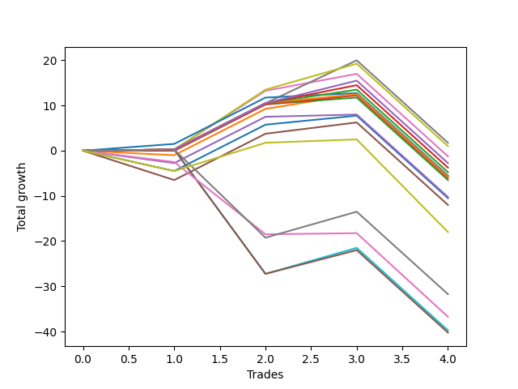

# Short Bernese 002 1v SB 
- Symbol: ES
- Date Range: 03/18/2022 - 12/30/2022
- Trading Period: 8:30-12:30
- Number of Trades: 3



| Name | Win Percent | Profit | Avg Profit / Trade | Avg Time / Trade |      | Name | Win Percent | Profit | Avg Profit / Trade | Avg Time / Trade |
| ---- | ----------- | ------ | ------------------ | ---------------- | ---- | ---- | ----------- | ------ | ------------------ | ---------------- |
| Sorted By <br> Profit | | | | | | Sorted By <br> Win Percentage ||||
| Six | 100.00 | 10000.00 | 3333.33 | 38:36 |     | Six | 100.00 | 10000.00 | 3333.33 | 38:36 |
| Seven | 100.00 | 9625.00 | 3208.33 | 41:03 |     | Seven | 100.00 | 9625.00 | 3208.33 | 41:03 |
| Five | 100.00 | 8500.00 | 2833.33 | 33:16 |     | Five | 100.00 | 8500.00 | 2833.33 | 33:16 |
| Eighty-Five | 100.00 | 7750.00 | 2583.33 | 33:23 |     | Eighty-Five | 100.00 | 7750.00 | 2583.33 | 33:23 |
| Eighty-Four | 100.00 | 7250.00 | 2416.67 | 33:16 |     | Eighty-Four | 100.00 | 7250.00 | 2416.67 | 33:16 |
| Eighty-Three | 100.00 | 6750.00 | 2250.00 | 21:36 |     | Eighty-Three | 100.00 | 6750.00 | 2250.00 | 21:36 |
| Eighty-One | 100.00 | 6375.00 | 2125.00 | 06:41 |     | Eighty-One | 100.00 | 6375.00 | 2125.00 | 06:41 |
| Eighty-Two | 100.00 | 6250.00 | 2083.33 | 21:23 |     | Eighty-Two | 100.00 | 6250.00 | 2083.33 | 21:23 |
| One | 66.67 | 6250.00 | 2083.33 | 06:41 |     | One | 66.67 | 6250.00 | 2083.33 | 06:41 |
| Two_C | 66.67 | 6125.00 | 2041.67 | 15:51 |     | Two_C | 66.67 | 6125.00 | 2041.67 | 15:51 |
| Two | 66.67 | 5875.00 | 1958.33 | 15:30 |     | Two | 66.67 | 5875.00 | 1958.33 | 15:30 |
| Three | 66.67 | 4000.00 | 1333.33 | 21:03 |     | Three | 66.67 | 4000.00 | 1333.33 | 21:03 |
| Zero | 66.67 | 3875.00 | 1291.67 | 05:30 |     | Zero | 66.67 | 3875.00 | 1291.67 | 05:30 |
| Four | 66.67 | 3125.00 | 1041.67 | 30:30 |     | Four | 66.67 | 3125.00 | 1041.67 | 30:30 |
| MALAMUTE 002 | 66.67 | 1250.00 | 416.67 | 05:25 |     | MALAMUTE 002 | 66.67 | 1250.00 | 416.67 | 05:25 |
| MALAMUTE 001 | 66.67 | -6750.00 | -2250.00 | 48:18 |     | MALAMUTE 001 | 66.67 | -6750.00 | -2250.00 | 48:18 |
| NEWFI 0000 | 33.33 | -9125.00 | -3041.67 | 09:45 |     | BB100 | 66.67 | -10750.00 | -3583.33 | 60:55 |
| BB100 | 66.67 | -10750.00 | -3583.33 | 60:55 |     | NEWFI 000 | 66.67 | -11000.00 | -3666.67 | 54:38 |
| NEWFI 000 | 66.67 | -11000.00 | -3666.67 | 54:38 |     | NEWFI 0000 | 33.33 | -9125.00 | -3041.67 | 09:45 |

## NO STOPLOSS

### Test Zero
* Sell when price hits the middle line of the 20p bollinger
* No Stoploss
* Results:
```
Total Trades: 3
Percent Up: 33.33
Percent Down: 66.67
Total Points Moved Down: 7.75
Potential Profit: 3875.00
Total Points Ups: 4.50 Count Ups: 1
Total Points Downs: 12.25 Count Downs: 2
```

<details><summary>Trades</summary>

<code>In: 2022-05-24 10:48:00		Out: 2022-05-24 11:01:15		Total Position Time: 13:15		Total Move Down: -4.50		Total to Date: -4.50</code> <br />
<code>In: 2022-07-06 11:11:00		Out: 2022-07-06 11:12:10		Total Position Time: 01:10		Total Move Down: 10.25		Total to Date: 5.75</code> <br />
<code>In: 2022-08-05 10:18:00		Out: 2022-08-05 10:20:05		Total Position Time: 02:05		Total Move Down: 2.00		Total to Date: 7.75</code> <br />


</details>

### Test One
* Sell when the price hits the lower line of the 20p 1std bollinger
* No Stoploss
* Results:
```
Total Trades: 3
Percent Up: 33.33
Percent Down: 66.67
Total Points Moved Down: 12.50
Potential Profit: 6250.00
Total Points Ups: 1.00 Count Ups: 1
Total Points Downs: 13.50 Count Downs: 2
```

<details><summary>Trades</summary>

<code>In: 2022-05-24 10:48:00		Out: 2022-05-24 11:01:40		Total Position Time: 13:40		Total Move Down: -1.00		Total to Date: -1.00</code> <br />
<code>In: 2022-07-06 11:11:00		Out: 2022-07-06 11:12:10		Total Position Time: 01:10		Total Move Down: 10.25		Total to Date: 9.25</code> <br />
<code>In: 2022-08-05 10:18:00		Out: 2022-08-05 10:23:15		Total Position Time: 05:15		Total Move Down: 3.25		Total to Date: 12.50</code> <br />


</details>

### Test Two
* Sell when the price hits the lower line of the 20p 2std bollinger
* No Stoploss
* Results:
```
Total Trades: 3
Percent Up: 33.33
Percent Down: 66.67
Total Points Moved Down: 11.75
Potential Profit: 5875.00
Total Points Ups: 0.00 Count Ups: 1
Total Points Downs: 11.75 Count Downs: 2
```

<details><summary>Trades</summary>

<code>In: 2022-05-24 10:48:00		Out: 2022-05-24 11:01:50		Total Position Time: 13:50		Total Move Down: -0.00		Total to Date: 0.00</code> <br />
<code>In: 2022-07-06 11:11:00		Out: 2022-07-06 11:12:10		Total Position Time: 01:10		Total Move Down: 10.25		Total to Date: 10.25</code> <br />
<code>In: 2022-08-05 10:18:00		Out: 2022-08-05 10:49:30		Total Position Time: 31:30		Total Move Down: 1.50		Total to Date: 11.75</code> <br />


</details>

### Test Two_C
* Sell when the price hits the lower line of the 20p 2std bollinger
* No Stoploss
* Results:
```
Total Trades: 3
Percent Up: 33.33
Percent Down: 66.67
Total Points Moved Down: 12.25
Potential Profit: 6125.00
Total Points Ups: 0.00 Count Ups: 1
Total Points Downs: 12.25 Count Downs: 2
```

<details><summary>Trades</summary>

<code>In: 2022-05-24 10:48:00		Out: 2022-05-24 11:01:50		Total Position Time: 13:50		Total Move Down: -0.00		Total to Date: 0.00</code> <br />
<code>In: 2022-07-06 11:11:00		Out: 2022-07-06 11:12:10		Total Position Time: 01:10		Total Move Down: 10.25		Total to Date: 10.25</code> <br />
<code>In: 2022-08-05 10:18:00		Out: 2022-08-05 10:50:35		Total Position Time: 32:35		Total Move Down: 2.00		Total to Date: 12.25</code> <br />


</details>

### Test Three
* Sell when price hits the middle line of the 50p bollinger
* No Stoploss
* Results:
```
Total Trades: 3
Percent Up: 33.33
Percent Down: 66.67
Total Points Moved Down: 8.00
Potential Profit: 4000.00
Total Points Ups: 2.75 Count Ups: 1
Total Points Downs: 10.75 Count Downs: 2
```

<details><summary>Trades</summary>

<code>In: 2022-05-24 10:48:00		Out: 2022-05-24 11:20:25		Total Position Time: 32:25		Total Move Down: -2.75		Total to Date: -2.75</code> <br />
<code>In: 2022-07-06 11:11:00		Out: 2022-07-06 11:12:10		Total Position Time: 01:10		Total Move Down: 10.25		Total to Date: 7.50</code> <br />
<code>In: 2022-08-05 10:18:00		Out: 2022-08-05 10:47:35		Total Position Time: 29:35		Total Move Down: 0.50		Total to Date: 8.00</code> <br />


</details>

### Test Four
* Sell when the price hits the lower line of the 50p 1std bollinger
* No Stoploss
* Results:
```
Total Trades: 3
Percent Up: 33.33
Percent Down: 66.67
Total Points Moved Down: 6.25
Potential Profit: 3125.00
Total Points Ups: 6.50 Count Ups: 1
Total Points Downs: 12.75 Count Downs: 2
```

<details><summary>Trades</summary>

<code>In: 2022-05-24 10:48:00		Out: 2022-05-24 11:44:15		Total Position Time: 56:15		Total Move Down: -6.50		Total to Date: -6.50</code> <br />
<code>In: 2022-07-06 11:11:00		Out: 2022-07-06 11:12:10		Total Position Time: 01:10		Total Move Down: 10.25		Total to Date: 3.75</code> <br />
<code>In: 2022-08-05 10:18:00		Out: 2022-08-05 10:52:05		Total Position Time: 34:05		Total Move Down: 2.50		Total to Date: 6.25</code> <br />


</details>

### Test Five
* Sell when the price hits the lower line of the 50p 2std bollinger
* No Stoploss
* Results:
```
Total Trades: 3
Percent Up: 0.00
Percent Down: 100.00
Total Points Moved Down: 17.00
Potential Profit: 8500.00
Total Points Ups: 0.00 Count Ups: 0
Total Points Downs: 17.00 Count Downs: 3
```

<details><summary>Trades</summary>

<code>In: 2022-05-24 10:48:00		Out: 2022-05-24 11:48:55		Total Position Time: 60:55		Total Move Down: 0.25		Total to Date: 0.25</code> <br />
<code>In: 2022-07-06 11:11:00		Out: 2022-07-06 11:12:15		Total Position Time: 01:15		Total Move Down: 13.00		Total to Date: 13.25</code> <br />
<code>In: 2022-08-05 10:18:00		Out: 2022-08-05 10:55:40		Total Position Time: 37:40		Total Move Down: 3.75		Total to Date: 17.00</code> <br />


</details>

### Test Six
* Sell when the price hits the middle line of the 1std VWAP
* No Stoploss
* Results:
```
Total Trades: 3
Percent Up: 0.00
Percent Down: 100.00
Total Points Moved Down: 20.00
Potential Profit: 10000.00
Total Points Ups: 0.00 Count Ups: 0
Total Points Downs: 20.00 Count Downs: 3
```

<details><summary>Trades</summary>

<code>In: 2022-05-24 10:48:00		Out: 2022-05-24 11:48:55		Total Position Time: 60:55		Total Move Down: 0.25		Total to Date: 0.25</code> <br />
<code>In: 2022-07-06 11:11:00		Out: 2022-07-06 11:12:10		Total Position Time: 01:10		Total Move Down: 10.25		Total to Date: 10.50</code> <br />
<code>In: 2022-08-05 10:18:00		Out: 2022-08-05 11:11:45		Total Position Time: 53:45		Total Move Down: 9.50		Total to Date: 20.00</code> <br />


</details>

### Test Seven
* Sell when the price hits the lower line of the 1std VWAP
* No Stoploss
* Results:
```
Total Trades: 3
Percent Up: 0.00
Percent Down: 100.00
Total Points Moved Down: 19.25
Potential Profit: 9625.00
Total Points Ups: 0.00 Count Ups: 0
Total Points Downs: 19.25 Count Downs: 3
```

<details><summary>Trades</summary>

<code>In: 2022-05-24 10:48:00		Out: 2022-05-24 11:48:55		Total Position Time: 60:55		Total Move Down: 0.25		Total to Date: 0.25</code> <br />
<code>In: 2022-07-06 11:11:00		Out: 2022-07-06 11:12:20		Total Position Time: 01:20		Total Move Down: 13.25		Total to Date: 13.50</code> <br />
<code>In: 2022-08-05 10:18:00		Out: 2022-08-05 11:18:55		Total Position Time: 60:55		Total Move Down: 5.75		Total to Date: 19.25</code> <br />


</details>

### Test BB100
* Move to BB100 Upper Band
* No Stoploss
* Results:
```
Total Trades: 3
Percent Up: 33.33
Percent Down: 66.67
Total Points Moved Down: -21.50
Potential Profit: -10750.00
Total Points Ups: 27.50 Count Ups: 1
Total Points Downs: 6.00 Count Downs: 2
```

<details><summary>Trades</summary>

<code>In: 2022-05-24 10:48:00		Out: 2022-05-24 11:48:55		Total Position Time: 60:55		Total Move Down: 0.25		Total to Date: 0.25</code> <br />
<code>In: 2022-07-06 11:11:00		Out: 2022-07-06 12:11:55		Total Position Time: 60:55		Total Move Down: -27.50		Total to Date: -27.25</code> <br />
<code>In: 2022-08-05 10:18:00		Out: 2022-08-05 11:18:55		Total Position Time: 60:55		Total Move Down: 5.75		Total to Date: -21.50</code> <br />


</details>

## TAKE PROFIT

### Test Eighty-One
* Take Profit of 1 Point
* No Stoploss
* Results:
```
Total Trades: 3
Percent Up: 0.00
Percent Down: 100.00
Total Points Moved Down: 12.75
Potential Profit: 6375.00
Total Points Ups: 0.00 Count Ups: 0
Total Points Downs: 12.75 Count Downs: 3
```

<details><summary>Trades</summary>

<code>In: 2022-05-24 10:48:00		Out: 2022-05-24 11:05:00		Total Position Time: 17:00		Total Move Down: 1.50		Total to Date: 1.50</code> <br />
<code>In: 2022-07-06 11:11:00		Out: 2022-07-06 11:12:10		Total Position Time: 01:10		Total Move Down: 10.25		Total to Date: 11.75</code> <br />
<code>In: 2022-08-05 10:18:00		Out: 2022-08-05 10:19:55		Total Position Time: 01:55		Total Move Down: 1.00		Total to Date: 12.75</code> <br />


</details>

### Test Eighty-Two
* Take Profit of 2 Point
* No Stoploss
* Results:
```
Total Trades: 3
Percent Up: 0.00
Percent Down: 100.00
Total Points Moved Down: 12.50
Potential Profit: 6250.00
Total Points Ups: 0.00 Count Ups: 0
Total Points Downs: 12.50 Count Downs: 3
```

<details><summary>Trades</summary>

<code>In: 2022-05-24 10:48:00		Out: 2022-05-24 11:48:55		Total Position Time: 60:55		Total Move Down: 0.25		Total to Date: 0.25</code> <br />
<code>In: 2022-07-06 11:11:00		Out: 2022-07-06 11:12:10		Total Position Time: 01:10		Total Move Down: 10.25		Total to Date: 10.50</code> <br />
<code>In: 2022-08-05 10:18:00		Out: 2022-08-05 10:20:05		Total Position Time: 02:05		Total Move Down: 2.00		Total to Date: 12.50</code> <br />


</details>

### Test Eighty-Three
* Take Profit of 3 Point
* No Stoploss
* Results:
```
Total Trades: 3
Percent Up: 0.00
Percent Down: 100.00
Total Points Moved Down: 13.50
Potential Profit: 6750.00
Total Points Ups: 0.00 Count Ups: 0
Total Points Downs: 13.50 Count Downs: 3
```

<details><summary>Trades</summary>

<code>In: 2022-05-24 10:48:00		Out: 2022-05-24 11:48:55		Total Position Time: 60:55		Total Move Down: 0.25		Total to Date: 0.25</code> <br />
<code>In: 2022-07-06 11:11:00		Out: 2022-07-06 11:12:10		Total Position Time: 01:10		Total Move Down: 10.25		Total to Date: 10.50</code> <br />
<code>In: 2022-08-05 10:18:00		Out: 2022-08-05 10:20:45		Total Position Time: 02:45		Total Move Down: 3.00		Total to Date: 13.50</code> <br />


</details>

### Test Eighty-Four
* Take Profit of 4 Point
* No Stoploss
* Results:
```
Total Trades: 3
Percent Up: 0.00
Percent Down: 100.00
Total Points Moved Down: 14.50
Potential Profit: 7250.00
Total Points Ups: 0.00 Count Ups: 0
Total Points Downs: 14.50 Count Downs: 3
```

<details><summary>Trades</summary>

<code>In: 2022-05-24 10:48:00		Out: 2022-05-24 11:48:55		Total Position Time: 60:55		Total Move Down: 0.25		Total to Date: 0.25</code> <br />
<code>In: 2022-07-06 11:11:00		Out: 2022-07-06 11:12:10		Total Position Time: 01:10		Total Move Down: 10.25		Total to Date: 10.50</code> <br />
<code>In: 2022-08-05 10:18:00		Out: 2022-08-05 10:55:45		Total Position Time: 37:45		Total Move Down: 4.00		Total to Date: 14.50</code> <br />


</details>

### Test Eighty-Five
* Take Profit of 5 Point
* No Stoploss
* Results:
```
Total Trades: 3
Percent Up: 0.00
Percent Down: 100.00
Total Points Moved Down: 15.50
Potential Profit: 7750.00
Total Points Ups: 0.00 Count Ups: 0
Total Points Downs: 15.50 Count Downs: 3
```

<details><summary>Trades</summary>

<code>In: 2022-05-24 10:48:00		Out: 2022-05-24 11:48:55		Total Position Time: 60:55		Total Move Down: 0.25		Total to Date: 0.25</code> <br />
<code>In: 2022-07-06 11:11:00		Out: 2022-07-06 11:12:10		Total Position Time: 01:10		Total Move Down: 10.25		Total to Date: 10.50</code> <br />
<code>In: 2022-08-05 10:18:00		Out: 2022-08-05 10:56:05		Total Position Time: 38:05		Total Move Down: 5.00		Total to Date: 15.50</code> <br />


</details>

## Indicator Exits

### Test NEWFI 000
* Newfi 0000
* No Stoploss
* Results:
```
Total Trades: 3
Percent Up: 33.33
Percent Down: 66.67
Total Points Moved Down: -22.00
Potential Profit: -11000.00
Total Points Ups: 27.50 Count Ups: 1
Total Points Downs: 5.50 Count Downs: 2
```

<details><summary>Trades</summary>

<code>In: 2022-05-24 10:48:00		Out: 2022-05-24 11:48:55		Total Position Time: 60:55		Total Move Down: 0.25		Total to Date: 0.25</code> <br />
<code>In: 2022-07-06 11:11:00		Out: 2022-07-06 12:11:55		Total Position Time: 60:55		Total Move Down: -27.50		Total to Date: -27.25</code> <br />
<code>In: 2022-08-05 10:18:00		Out: 2022-08-05 11:00:05		Total Position Time: 42:05		Total Move Down: 5.25		Total to Date: -22.00</code> <br />


</details>

### Test NEWFI 0000
* Newfi 0000
* No Stoploss
* Results:
```
Total Trades: 3
Percent Up: 66.67
Percent Down: 33.33
Total Points Moved Down: -18.25
Potential Profit: -9125.00
Total Points Ups: 18.50 Count Ups: 2
Total Points Downs: 0.25 Count Downs: 1
```

<details><summary>Trades</summary>

<code>In: 2022-05-24 10:48:00		Out: 2022-05-24 10:49:05		Total Position Time: 01:05		Total Move Down: -2.50		Total to Date: -2.50</code> <br />
<code>In: 2022-07-06 11:11:00		Out: 2022-07-06 11:38:05		Total Position Time: 27:05		Total Move Down: -16.00		Total to Date: -18.50</code> <br />
<code>In: 2022-08-05 10:18:00		Out: 2022-08-05 10:19:05		Total Position Time: 01:05		Total Move Down: 0.25		Total to Date: -18.25</code> <br />


</details>

### Test MALAMUTE 001
* Malamute 001
* No Stoploss
* Results:
```
Total Trades: 3
Percent Up: 33.33
Percent Down: 66.67
Total Points Moved Down: -13.50
Potential Profit: -6750.00
Total Points Ups: 19.50 Count Ups: 1
Total Points Downs: 6.00 Count Downs: 2
```

<details><summary>Trades</summary>

<code>In: 2022-05-24 10:48:00		Out: 2022-05-24 11:48:55		Total Position Time: 60:55		Total Move Down: 0.25		Total to Date: 0.25</code> <br />
<code>In: 2022-07-06 11:11:00		Out: 2022-07-06 11:34:05		Total Position Time: 23:05		Total Move Down: -19.50		Total to Date: -19.25</code> <br />
<code>In: 2022-08-05 10:18:00		Out: 2022-08-05 11:18:55		Total Position Time: 60:55		Total Move Down: 5.75		Total to Date: -13.50</code> <br />


</details>

### Test MALAMUTE 002
* Malamute 001
* No Stoploss
* Results:
```
Total Trades: 3
Percent Up: 33.33
Percent Down: 66.67
Total Points Moved Down: 2.50
Potential Profit: 1250.00
Total Points Ups: 4.50 Count Ups: 1
Total Points Downs: 7.00 Count Downs: 2
```

<details><summary>Trades</summary>

<code>In: 2022-05-24 10:48:00		Out: 2022-05-24 10:50:05		Total Position Time: 02:05		Total Move Down: -4.50		Total to Date: -4.50</code> <br />
<code>In: 2022-07-06 11:11:00		Out: 2022-07-06 11:18:05		Total Position Time: 07:05		Total Move Down: 6.25		Total to Date: 1.75</code> <br />
<code>In: 2022-08-05 10:18:00		Out: 2022-08-05 10:25:05		Total Position Time: 07:05		Total Move Down: 0.75		Total to Date: 2.50</code> <br />


</details>