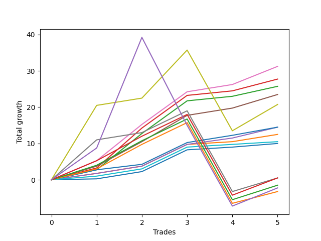

# Short Bernese 002 1v 
- Symbol: ES
- Date Range: 03/18/2022 - 09/30/2022
- Trading Period: 7:20-12:30
- Number of Trades: 5



| Name | Win Percent | Profit | Avg Profit / Trade | Avg Time / Trade |      | Name | Win Percent | Profit | Avg Profit / Trade | Avg Time / Trade |
| ---- | ----------- | ------ | ------------------ | ---------------- | ---- | ---- | ----------- | ------ | ------------------ | ---------------- |
| Sorted By <br> Profit | | | | | | Sorted By <br> Win Percentage ||||
| Five | 100.00 | 15625.00 | 3125.00 | 10:23 |     | Five | 100.00 | 15625.00 | 3125.00 | 10:23 |
| Two_C | 100.00 | 13875.00 | 2775.00 | 07:55 |     | Two_C | 100.00 | 13875.00 | 2775.00 | 07:55 |
| Two | 100.00 | 12875.00 | 2575.00 | 07:48 |     | Two | 100.00 | 12875.00 | 2575.00 | 07:48 |
| Four | 100.00 | 11750.00 | 2350.00 | 09:48 |     | Four | 100.00 | 11750.00 | 2350.00 | 09:48 |
| Seven | 80.00 | 10375.00 | 2075.00 | 23:56 |     | Eighty-Two | 100.00 | 7250.00 | 1450.00 | 07:39 |
| Eighty-Two | 100.00 | 7250.00 | 1450.00 | 07:39 |     | Three | 100.00 | 7250.00 | 1450.00 | 02:33 |
| Three | 100.00 | 7250.00 | 1450.00 | 02:33 |     | One | 100.00 | 6250.00 | 1250.00 | 04:50 |
| One | 100.00 | 6250.00 | 1250.00 | 04:50 |     | Eighty-One | 100.00 | 5250.00 | 1050.00 | 00:46 |
| Eighty-One | 100.00 | 5250.00 | 1050.00 | 00:46 |     | Zero | 100.00 | 5000.00 | 1000.00 | 00:33 |
| Zero | 100.00 | 5000.00 | 1000.00 | 00:33 |     | Seven | 80.00 | 10375.00 | 2075.00 | 23:56 |
| Eighty-Five | 80.00 | 250.00 | 50.00 | 16:24 |     | Eighty-Five | 80.00 | 250.00 | 50.00 | 16:24 |
| Six | 80.00 | 250.00 | 50.00 | 17:10 |     | Six | 80.00 | 250.00 | 50.00 | 17:10 |
| Eighty-Four | 80.00 | -750.00 | -150.00 | 16:11 |     | Eighty-Four | 80.00 | -750.00 | -150.00 | 16:11 |
| NEWFI 0000 | 60.00 | -1125.00 | -225.00 | 31:49 |     | Eighty-Three | 80.00 | -1625.00 | -325.00 | 14:53 |
| Eighty-Three | 80.00 | -1625.00 | -325.00 | 14:53 |     | NEWFI 0000 | 60.00 | -1125.00 | -225.00 | 31:49 |

## NO STOPLOSS

### Test Zero
* Sell when price hits the middle line of the 20p bollinger
* No Stoploss
* Results:
```
Total Trades: 5
Percent Up: 0.00
Percent Down: 100.00
Total Points Moved Down: 10.00
Potential Profit: 5000.00
Total Points Ups: 0.00 Count Ups: 0
Total Points Downs: 10.00 Count Downs: 5
```

<details><summary>Trades</summary>

<code>In: 2022-03-25 11:57:00		Out: 2022-03-25 11:57:15		Total Position Time: 00:15		Total Move Down: 0.25		Total to Date: 0.25</code> <br />
<code>In: 2022-06-15 11:02:00		Out: 2022-06-15 11:02:10		Total Position Time: 00:10		Total Move Down: 2.00		Total to Date: 2.25</code> <br />
<code>In: 2022-07-06 11:11:00		Out: 2022-07-06 11:11:10		Total Position Time: 00:10		Total Move Down: 6.00		Total to Date: 8.25</code> <br />
<code>In: 2022-08-17 10:33:00		Out: 2022-08-17 10:34:05		Total Position Time: 01:05		Total Move Down: 0.75		Total to Date: 9.00</code> <br />
<code>In: 2022-09-21 09:38:00		Out: 2022-09-21 09:39:05		Total Position Time: 01:05		Total Move Down: 1.00		Total to Date: 10.00</code> <br />


</details>

### Test One
* Sell when the price hits the upper line of the 20p 1std bollinger
* No Stoploss
* Results:
```
Total Trades: 5
Percent Up: 0.00
Percent Down: 100.00
Total Points Moved Down: 12.50
Potential Profit: 6250.00
Total Points Ups: 0.00 Count Ups: 0
Total Points Downs: 12.50 Count Downs: 5
```

<details><summary>Trades</summary>

<code>In: 2022-03-25 11:57:00		Out: 2022-03-25 12:00:45		Total Position Time: 03:45		Total Move Down: 1.75		Total to Date: 1.75</code> <br />
<code>In: 2022-06-15 11:02:00		Out: 2022-06-15 11:02:10		Total Position Time: 00:10		Total Move Down: 2.00		Total to Date: 3.75</code> <br />
<code>In: 2022-07-06 11:11:00		Out: 2022-07-06 11:11:10		Total Position Time: 00:10		Total Move Down: 6.00		Total to Date: 9.75</code> <br />
<code>In: 2022-08-17 10:33:00		Out: 2022-08-17 10:46:00		Total Position Time: 13:00		Total Move Down: 0.75		Total to Date: 10.50</code> <br />
<code>In: 2022-09-21 09:38:00		Out: 2022-09-21 09:45:05		Total Position Time: 07:05		Total Move Down: 2.00		Total to Date: 12.50</code> <br />


</details>

### Test Two
* Sell when the price hits the upper line of the 20p 2std bollinger
* No Stoploss
* Results:
```
Total Trades: 5
Percent Up: 0.00
Percent Down: 100.00
Total Points Moved Down: 25.75
Potential Profit: 12875.00
Total Points Ups: 0.00 Count Ups: 0
Total Points Downs: 25.75 Count Downs: 5
```

<details><summary>Trades</summary>

<code>In: 2022-03-25 11:57:00		Out: 2022-03-25 12:00:55		Total Position Time: 03:55		Total Move Down: 2.75		Total to Date: 2.75</code> <br />
<code>In: 2022-06-15 11:02:00		Out: 2022-06-15 11:03:05		Total Position Time: 01:05		Total Move Down: 10.00		Total to Date: 12.75</code> <br />
<code>In: 2022-07-06 11:11:00		Out: 2022-07-06 11:11:45		Total Position Time: 00:45		Total Move Down: 9.00		Total to Date: 21.75</code> <br />
<code>In: 2022-08-17 10:33:00		Out: 2022-08-17 10:57:00		Total Position Time: 24:00		Total Move Down: 1.25		Total to Date: 23.00</code> <br />
<code>In: 2022-09-21 09:38:00		Out: 2022-09-21 09:47:15		Total Position Time: 09:15		Total Move Down: 2.75		Total to Date: 25.75</code> <br />


</details>

### Test Two_C
* Sell when the price hits the upper line of the 20p 2std bollinger
* No Stoploss
* Results:
```
Total Trades: 5
Percent Up: 0.00
Percent Down: 100.00
Total Points Moved Down: 27.75
Potential Profit: 13875.00
Total Points Ups: 0.00 Count Ups: 0
Total Points Downs: 27.75 Count Downs: 5
```

<details><summary>Trades</summary>

<code>In: 2022-03-25 11:57:00		Out: 2022-03-25 12:01:15		Total Position Time: 04:15		Total Move Down: 3.25		Total to Date: 3.25</code> <br />
<code>In: 2022-06-15 11:02:00		Out: 2022-06-15 11:03:10		Total Position Time: 01:10		Total Move Down: 11.00		Total to Date: 14.25</code> <br />
<code>In: 2022-07-06 11:11:00		Out: 2022-07-06 11:11:45		Total Position Time: 00:45		Total Move Down: 9.00		Total to Date: 23.25</code> <br />
<code>In: 2022-08-17 10:33:00		Out: 2022-08-17 10:57:00		Total Position Time: 24:00		Total Move Down: 1.25		Total to Date: 24.50</code> <br />
<code>In: 2022-09-21 09:38:00		Out: 2022-09-21 09:47:25		Total Position Time: 09:25		Total Move Down: 3.25		Total to Date: 27.75</code> <br />


</details>

### Test Three
* Sell when price hits the middle line of the 50p bollinger
* No Stoploss
* Results:
```
Total Trades: 5
Percent Up: 0.00
Percent Down: 100.00
Total Points Moved Down: 14.50
Potential Profit: 7250.00
Total Points Ups: 0.00 Count Ups: 0
Total Points Downs: 14.50 Count Downs: 5
```

<details><summary>Trades</summary>

<code>In: 2022-03-25 11:57:00		Out: 2022-03-25 12:00:45		Total Position Time: 03:45		Total Move Down: 1.75		Total to Date: 1.75</code> <br />
<code>In: 2022-06-15 11:02:00		Out: 2022-06-15 11:02:10		Total Position Time: 00:10		Total Move Down: 2.00		Total to Date: 3.75</code> <br />
<code>In: 2022-07-06 11:11:00		Out: 2022-07-06 11:11:10		Total Position Time: 00:10		Total Move Down: 6.00		Total to Date: 9.75</code> <br />
<code>In: 2022-08-17 10:33:00		Out: 2022-08-17 10:34:10		Total Position Time: 01:10		Total Move Down: 1.75		Total to Date: 11.50</code> <br />
<code>In: 2022-09-21 09:38:00		Out: 2022-09-21 09:45:30		Total Position Time: 07:30		Total Move Down: 3.00		Total to Date: 14.50</code> <br />


</details>

### Test Four
* Sell when the price hits the upper line of the 50p 1std bollinger
* No Stoploss
* Results:
```
Total Trades: 5
Percent Up: 0.00
Percent Down: 100.00
Total Points Moved Down: 23.50
Potential Profit: 11750.00
Total Points Ups: 0.00 Count Ups: 0
Total Points Downs: 23.50 Count Downs: 5
```

<details><summary>Trades</summary>

<code>In: 2022-03-25 11:57:00		Out: 2022-03-25 12:01:35		Total Position Time: 04:35		Total Move Down: 3.75		Total to Date: 3.75</code> <br />
<code>In: 2022-06-15 11:02:00		Out: 2022-06-15 11:03:00		Total Position Time: 01:00		Total Move Down: 6.75		Total to Date: 10.50</code> <br />
<code>In: 2022-07-06 11:11:00		Out: 2022-07-06 11:11:35		Total Position Time: 00:35		Total Move Down: 7.25		Total to Date: 17.75</code> <br />
<code>In: 2022-08-17 10:33:00		Out: 2022-08-17 11:00:50		Total Position Time: 27:50		Total Move Down: 2.00		Total to Date: 19.75</code> <br />
<code>In: 2022-09-21 09:38:00		Out: 2022-09-21 09:53:00		Total Position Time: 15:00		Total Move Down: 3.75		Total to Date: 23.50</code> <br />


</details>

### Test Five
* Sell when the price hits the upper line of the 50p 2std bollinger
* No Stoploss
* Results:
```
Total Trades: 5
Percent Up: 0.00
Percent Down: 100.00
Total Points Moved Down: 31.25
Potential Profit: 15625.00
Total Points Ups: 0.00 Count Ups: 0
Total Points Downs: 31.25 Count Downs: 5
```

<details><summary>Trades</summary>

<code>In: 2022-03-25 11:57:00		Out: 2022-03-25 12:01:55		Total Position Time: 04:55		Total Move Down: 5.25		Total to Date: 5.25</code> <br />
<code>In: 2022-06-15 11:02:00		Out: 2022-06-15 11:03:05		Total Position Time: 01:05		Total Move Down: 10.00		Total to Date: 15.25</code> <br />
<code>In: 2022-07-06 11:11:00		Out: 2022-07-06 11:11:50		Total Position Time: 00:50		Total Move Down: 9.00		Total to Date: 24.25</code> <br />
<code>In: 2022-08-17 10:33:00		Out: 2022-08-17 11:01:00		Total Position Time: 28:00		Total Move Down: 2.00		Total to Date: 26.25</code> <br />
<code>In: 2022-09-21 09:38:00		Out: 2022-09-21 09:55:05		Total Position Time: 17:05		Total Move Down: 5.00		Total to Date: 31.25</code> <br />


</details>

### Test Six
* Sell when the price hits the middle line of the 1std VWAP
* No Stoploss
* Results:
```
Total Trades: 5
Percent Up: 20.00
Percent Down: 80.00
Total Points Moved Down: 0.50
Potential Profit: 250.00
Total Points Ups: 22.25 Count Ups: 1
Total Points Downs: 22.75 Count Downs: 4
```

<details><summary>Trades</summary>

<code>In: 2022-03-25 11:57:00		Out: 2022-03-25 12:07:35		Total Position Time: 10:35		Total Move Down: 11.00		Total to Date: 11.00</code> <br />
<code>In: 2022-06-15 11:02:00		Out: 2022-06-15 11:02:10		Total Position Time: 00:10		Total Move Down: 2.00		Total to Date: 13.00</code> <br />
<code>In: 2022-07-06 11:11:00		Out: 2022-07-06 11:11:10		Total Position Time: 00:10		Total Move Down: 6.00		Total to Date: 19.00</code> <br />
<code>In: 2022-08-17 10:33:00		Out: 2022-08-17 11:32:55		Total Position Time: 59:55		Total Move Down: -22.25		Total to Date: -3.25</code> <br />
<code>In: 2022-09-21 09:38:00		Out: 2022-09-21 09:53:00		Total Position Time: 15:00		Total Move Down: 3.75		Total to Date: 0.50</code> <br />


</details>

### Test Seven
* Sell when the price hits the upper line of the 1std VWAP
* No Stoploss
* Results:
```
Total Trades: 5
Percent Up: 20.00
Percent Down: 80.00
Total Points Moved Down: 20.75
Potential Profit: 10375.00
Total Points Ups: 22.25 Count Ups: 1
Total Points Downs: 43.00 Count Downs: 4
```

<details><summary>Trades</summary>

<code>In: 2022-03-25 11:57:00		Out: 2022-03-25 12:33:10		Total Position Time: 36:10		Total Move Down: 20.50		Total to Date: 20.50</code> <br />
<code>In: 2022-06-15 11:02:00		Out: 2022-06-15 11:02:10		Total Position Time: 00:10		Total Move Down: 2.00		Total to Date: 22.50</code> <br />
<code>In: 2022-07-06 11:11:00		Out: 2022-07-06 11:12:20		Total Position Time: 01:20		Total Move Down: 13.25		Total to Date: 35.75</code> <br />
<code>In: 2022-08-17 10:33:00		Out: 2022-08-17 11:32:55		Total Position Time: 59:55		Total Move Down: -22.25		Total to Date: 13.50</code> <br />
<code>In: 2022-09-21 09:38:00		Out: 2022-09-21 10:00:05		Total Position Time: 22:05		Total Move Down: 7.25		Total to Date: 20.75</code> <br />


</details>

## TAKE PROFIT

### Test Eighty-One
* Take Profit of 1 Point
* No Stoploss
* Results:
```
Total Trades: 5
Percent Up: 0.00
Percent Down: 100.00
Total Points Moved Down: 10.50
Potential Profit: 5250.00
Total Points Ups: 0.00 Count Ups: 0
Total Points Downs: 10.50 Count Downs: 5
```

<details><summary>Trades</summary>

<code>In: 2022-03-25 11:57:00		Out: 2022-03-25 11:58:45		Total Position Time: 01:45		Total Move Down: 1.00		Total to Date: 1.00</code> <br />
<code>In: 2022-06-15 11:02:00		Out: 2022-06-15 11:02:10		Total Position Time: 00:10		Total Move Down: 2.00		Total to Date: 3.00</code> <br />
<code>In: 2022-07-06 11:11:00		Out: 2022-07-06 11:11:10		Total Position Time: 00:10		Total Move Down: 6.00		Total to Date: 9.00</code> <br />
<code>In: 2022-08-17 10:33:00		Out: 2022-08-17 10:34:05		Total Position Time: 01:05		Total Move Down: 0.75		Total to Date: 9.75</code> <br />
<code>In: 2022-09-21 09:38:00		Out: 2022-09-21 09:38:40		Total Position Time: 00:40		Total Move Down: 0.75		Total to Date: 10.50</code> <br />


</details>

### Test Eighty-Two
* Take Profit of 2 Point
* No Stoploss
* Results:
```
Total Trades: 5
Percent Up: 0.00
Percent Down: 100.00
Total Points Moved Down: 14.50
Potential Profit: 7250.00
Total Points Ups: 0.00 Count Ups: 0
Total Points Downs: 14.50 Count Downs: 5
```

<details><summary>Trades</summary>

<code>In: 2022-03-25 11:57:00		Out: 2022-03-25 12:00:50		Total Position Time: 03:50		Total Move Down: 2.75		Total to Date: 2.75</code> <br />
<code>In: 2022-06-15 11:02:00		Out: 2022-06-15 11:02:45		Total Position Time: 00:45		Total Move Down: 1.50		Total to Date: 4.25</code> <br />
<code>In: 2022-07-06 11:11:00		Out: 2022-07-06 11:11:10		Total Position Time: 00:10		Total Move Down: 6.00		Total to Date: 10.25</code> <br />
<code>In: 2022-08-17 10:33:00		Out: 2022-08-17 11:00:50		Total Position Time: 27:50		Total Move Down: 2.00		Total to Date: 12.25</code> <br />
<code>In: 2022-09-21 09:38:00		Out: 2022-09-21 09:43:40		Total Position Time: 05:40		Total Move Down: 2.25		Total to Date: 14.50</code> <br />


</details>

### Test Eighty-Three
* Take Profit of 3 Point
* No Stoploss
* Results:
```
Total Trades: 5
Percent Up: 20.00
Percent Down: 80.00
Total Points Moved Down: -3.25
Potential Profit: -1625.00
Total Points Ups: 22.25 Count Ups: 1
Total Points Downs: 19.00 Count Downs: 4
```

<details><summary>Trades</summary>

<code>In: 2022-03-25 11:57:00		Out: 2022-03-25 12:01:00		Total Position Time: 04:00		Total Move Down: 3.00		Total to Date: 3.00</code> <br />
<code>In: 2022-06-15 11:02:00		Out: 2022-06-15 11:03:00		Total Position Time: 01:00		Total Move Down: 6.75		Total to Date: 9.75</code> <br />
<code>In: 2022-07-06 11:11:00		Out: 2022-07-06 11:11:10		Total Position Time: 00:10		Total Move Down: 6.00		Total to Date: 15.75</code> <br />
<code>In: 2022-08-17 10:33:00		Out: 2022-08-17 11:32:55		Total Position Time: 59:55		Total Move Down: -22.25		Total to Date: -6.50</code> <br />
<code>In: 2022-09-21 09:38:00		Out: 2022-09-21 09:47:20		Total Position Time: 09:20		Total Move Down: 3.25		Total to Date: -3.25</code> <br />


</details>

### Test Eighty-Four
* Take Profit of 4 Point
* No Stoploss
* Results:
```
Total Trades: 5
Percent Up: 20.00
Percent Down: 80.00
Total Points Moved Down: -1.50
Potential Profit: -750.00
Total Points Ups: 22.25 Count Ups: 1
Total Points Downs: 20.75 Count Downs: 4
```

<details><summary>Trades</summary>

<code>In: 2022-03-25 11:57:00		Out: 2022-03-25 12:01:45		Total Position Time: 04:45		Total Move Down: 4.00		Total to Date: 4.00</code> <br />
<code>In: 2022-06-15 11:02:00		Out: 2022-06-15 11:03:00		Total Position Time: 01:00		Total Move Down: 6.75		Total to Date: 10.75</code> <br />
<code>In: 2022-07-06 11:11:00		Out: 2022-07-06 11:11:10		Total Position Time: 00:10		Total Move Down: 6.00		Total to Date: 16.75</code> <br />
<code>In: 2022-08-17 10:33:00		Out: 2022-08-17 11:32:55		Total Position Time: 59:55		Total Move Down: -22.25		Total to Date: -5.50</code> <br />
<code>In: 2022-09-21 09:38:00		Out: 2022-09-21 09:53:05		Total Position Time: 15:05		Total Move Down: 4.00		Total to Date: -1.50</code> <br />


</details>

### Test Eighty-Five
* Take Profit of 5 Point
* No Stoploss
* Results:
```
Total Trades: 5
Percent Up: 20.00
Percent Down: 80.00
Total Points Moved Down: 0.50
Potential Profit: 250.00
Total Points Ups: 22.25 Count Ups: 1
Total Points Downs: 22.75 Count Downs: 4
```

<details><summary>Trades</summary>

<code>In: 2022-03-25 11:57:00		Out: 2022-03-25 12:01:55		Total Position Time: 04:55		Total Move Down: 5.25		Total to Date: 5.25</code> <br />
<code>In: 2022-06-15 11:02:00		Out: 2022-06-15 11:03:00		Total Position Time: 01:00		Total Move Down: 6.75		Total to Date: 12.00</code> <br />
<code>In: 2022-07-06 11:11:00		Out: 2022-07-06 11:11:10		Total Position Time: 00:10		Total Move Down: 6.00		Total to Date: 18.00</code> <br />
<code>In: 2022-08-17 10:33:00		Out: 2022-08-17 11:32:55		Total Position Time: 59:55		Total Move Down: -22.25		Total to Date: -4.25</code> <br />
<code>In: 2022-09-21 09:38:00		Out: 2022-09-21 09:54:00		Total Position Time: 16:00		Total Move Down: 4.75		Total to Date: 0.50</code> <br />


</details>

## Indicator Exits

### Test NEWFI 0000
* Newfi 0000
* No Stoploss
* Results:
```
Total Trades: 5
Percent Up: 40.00
Percent Down: 60.00
Total Points Moved Down: -2.25
Potential Profit: -1125.00
Total Points Ups: 46.50 Count Ups: 2
Total Points Downs: 44.25 Count Downs: 3
```

<details><summary>Trades</summary>

<code>In: 2022-03-25 11:57:00		Out: 2022-03-25 12:11:05		Total Position Time: 14:05		Total Move Down: 8.75		Total to Date: 8.75</code> <br />
<code>In: 2022-06-15 11:02:00		Out: 2022-06-15 11:08:05		Total Position Time: 06:05		Total Move Down: 30.50		Total to Date: 39.25</code> <br />
<code>In: 2022-07-06 11:11:00		Out: 2022-07-06 12:10:55		Total Position Time: 59:55		Total Move Down: -24.25		Total to Date: 15.00</code> <br />
<code>In: 2022-08-17 10:33:00		Out: 2022-08-17 11:32:55		Total Position Time: 59:55		Total Move Down: -22.25		Total to Date: -7.25</code> <br />
<code>In: 2022-09-21 09:38:00		Out: 2022-09-21 09:57:05		Total Position Time: 19:05		Total Move Down: 5.00		Total to Date: -2.25</code> <br />


</details>