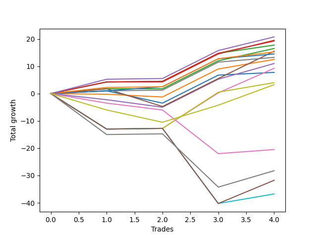

# Short Bernese 002 50 SB 
- Symbol: ES
- Date Range: 09/26/2022 - 12/30/2022
- Trading Period: 8:30-12:30
- Number of Trades: 1



| Name | Win Percent | Profit | Avg Profit / Trade | Avg Time / Trade |      | Name | Win Percent | Profit | Avg Profit / Trade | Avg Time / Trade |
| ---- | ----------- | ------ | ------------------ | ---------------- | ---- | ---- | ----------- | ------ | ------------------ | ---------------- |
| Sorted By <br> Profit | | | | | | Sorted By <br> Win Percentage ||||
| Four | 100.00 | 5000.00 | 5000.00 | 18:10 |     | Four | 100.00 | 5000.00 | 5000.00 | 18:10 |
| Five | 100.00 | 4500.00 | 4500.00 | 41:45 |     | Five | 100.00 | 4500.00 | 4500.00 | 41:45 |
| NEWFI 000 | 100.00 | 4250.00 | 4250.00 | 50:05 |     | NEWFI 000 | 100.00 | 4250.00 | 4250.00 | 50:05 |
| MALAMUTE 002 | 100.00 | 3750.00 | 3750.00 | 17:05 |     | MALAMUTE 002 | 100.00 | 3750.00 | 3750.00 | 17:05 |
| MALAMUTE 001 | 100.00 | 3000.00 | 3000.00 | 41:05 |     | MALAMUTE 001 | 100.00 | 3000.00 | 3000.00 | 41:05 |
| Three | 100.00 | 2875.00 | 2875.00 | 11:10 |     | Three | 100.00 | 2875.00 | 2875.00 | 11:10 |
| Eighty-Five | 100.00 | 2500.00 | 2500.00 | 11:05 |     | Eighty-Five | 100.00 | 2500.00 | 2500.00 | 11:05 |
| Two_C | 100.00 | 2500.00 | 2500.00 | 11:05 |     | Two_C | 100.00 | 2500.00 | 2500.00 | 11:05 |
| Eighty-Four | 100.00 | 2250.00 | 2250.00 | 11:00 |     | Eighty-Four | 100.00 | 2250.00 | 2250.00 | 11:00 |
| Two | 100.00 | 2250.00 | 2250.00 | 11:00 |     | Two | 100.00 | 2250.00 | 2250.00 | 11:00 |
| BB100 | 100.00 | 1750.00 | 1750.00 | 60:55 |     | BB100 | 100.00 | 1750.00 | 1750.00 | 60:55 |
| Seven | 100.00 | 1750.00 | 1750.00 | 60:55 |     | Seven | 100.00 | 1750.00 | 1750.00 | 60:55 |
| One | 100.00 | 1750.00 | 1750.00 | 06:05 |     | One | 100.00 | 1750.00 | 1750.00 | 06:05 |
| Eighty-Three | 100.00 | 1500.00 | 1500.00 | 05:15 |     | Eighty-Three | 100.00 | 1500.00 | 1500.00 | 05:15 |
| Eighty-Two | 100.00 | 1250.00 | 1250.00 | 05:10 |     | Eighty-Two | 100.00 | 1250.00 | 1250.00 | 05:10 |
| Eighty-One | 100.00 | 875.00 | 875.00 | 01:10 |     | Eighty-One | 100.00 | 875.00 | 875.00 | 01:10 |
| Six | 100.00 | 875.00 | 875.00 | 01:10 |     | Six | 100.00 | 875.00 | 875.00 | 01:10 |
| NEWFI 0000 | 100.00 | 750.00 | 750.00 | 01:05 |     | NEWFI 0000 | 100.00 | 750.00 | 750.00 | 01:05 |
| Zero | 100.00 | 500.00 | 500.00 | 04:05 |     | Zero | 100.00 | 500.00 | 500.00 | 04:05 |

## NO STOPLOSS

### Test Zero
* Sell when price hits the middle line of the 20p bollinger
* No Stoploss
* Results:
```
Total Trades: 1
Percent Up: 0.00
Percent Down: 100.00
Total Points Moved Down: 1.00
Potential Profit: 500.00
Total Points Ups: 0.00 Count Ups: 0
Total Points Downs: 1.00 Count Downs: 1
```

<details><summary>Trades</summary>

<code>In: 2022-10-06 09:51:00		Out: 2022-10-06 09:55:05		Total Position Time: 04:05		Total Move Down: 1.00		Total to Date: 1.00</code> <br />


</details>

### Test One
* Sell when the price hits the lower line of the 20p 1std bollinger
* No Stoploss
* Results:
```
Total Trades: 1
Percent Up: 0.00
Percent Down: 100.00
Total Points Moved Down: 3.50
Potential Profit: 1750.00
Total Points Ups: 0.00 Count Ups: 0
Total Points Downs: 3.50 Count Downs: 1
```

<details><summary>Trades</summary>

<code>In: 2022-10-06 09:51:00		Out: 2022-10-06 09:57:05		Total Position Time: 06:05		Total Move Down: 3.50		Total to Date: 3.50</code> <br />


</details>

### Test Two
* Sell when the price hits the lower line of the 20p 2std bollinger
* No Stoploss
* Results:
```
Total Trades: 1
Percent Up: 0.00
Percent Down: 100.00
Total Points Moved Down: 4.50
Potential Profit: 2250.00
Total Points Ups: 0.00 Count Ups: 0
Total Points Downs: 4.50 Count Downs: 1
```

<details><summary>Trades</summary>

<code>In: 2022-10-06 09:51:00		Out: 2022-10-06 10:02:00		Total Position Time: 11:00		Total Move Down: 4.50		Total to Date: 4.50</code> <br />


</details>

### Test Two_C
* Sell when the price hits the lower line of the 20p 2std bollinger
* No Stoploss
* Results:
```
Total Trades: 1
Percent Up: 0.00
Percent Down: 100.00
Total Points Moved Down: 5.00
Potential Profit: 2500.00
Total Points Ups: 0.00 Count Ups: 0
Total Points Downs: 5.00 Count Downs: 1
```

<details><summary>Trades</summary>

<code>In: 2022-10-06 09:51:00		Out: 2022-10-06 10:02:05		Total Position Time: 11:05		Total Move Down: 5.00		Total to Date: 5.00</code> <br />


</details>

### Test Three
* Sell when price hits the middle line of the 50p bollinger
* No Stoploss
* Results:
```
Total Trades: 1
Percent Up: 0.00
Percent Down: 100.00
Total Points Moved Down: 5.75
Potential Profit: 2875.00
Total Points Ups: 0.00 Count Ups: 0
Total Points Downs: 5.75 Count Downs: 1
```

<details><summary>Trades</summary>

<code>In: 2022-10-06 09:51:00		Out: 2022-10-06 10:02:10		Total Position Time: 11:10		Total Move Down: 5.75		Total to Date: 5.75</code> <br />


</details>

### Test Four
* Sell when the price hits the lower line of the 50p 1std bollinger
* No Stoploss
* Results:
```
Total Trades: 1
Percent Up: 0.00
Percent Down: 100.00
Total Points Moved Down: 10.00
Potential Profit: 5000.00
Total Points Ups: 0.00 Count Ups: 0
Total Points Downs: 10.00 Count Downs: 1
```

<details><summary>Trades</summary>

<code>In: 2022-10-06 09:51:00		Out: 2022-10-06 10:09:10		Total Position Time: 18:10		Total Move Down: 10.00		Total to Date: 10.00</code> <br />


</details>

### Test Five
* Sell when the price hits the lower line of the 50p 2std bollinger
* No Stoploss
* Results:
```
Total Trades: 1
Percent Up: 0.00
Percent Down: 100.00
Total Points Moved Down: 9.00
Potential Profit: 4500.00
Total Points Ups: 0.00 Count Ups: 0
Total Points Downs: 9.00 Count Downs: 1
```

<details><summary>Trades</summary>

<code>In: 2022-10-06 09:51:00		Out: 2022-10-06 10:32:45		Total Position Time: 41:45		Total Move Down: 9.00		Total to Date: 9.00</code> <br />


</details>

### Test Six
* Sell when the price hits the middle line of the 1std VWAP
* No Stoploss
* Results:
```
Total Trades: 1
Percent Up: 0.00
Percent Down: 100.00
Total Points Moved Down: 1.75
Potential Profit: 875.00
Total Points Ups: 0.00 Count Ups: 0
Total Points Downs: 1.75 Count Downs: 1
```

<details><summary>Trades</summary>

<code>In: 2022-10-06 09:51:00		Out: 2022-10-06 09:52:10		Total Position Time: 01:10		Total Move Down: 1.75		Total to Date: 1.75</code> <br />


</details>

### Test Seven
* Sell when the price hits the lower line of the 1std VWAP
* No Stoploss
* Results:
```
Total Trades: 1
Percent Up: 0.00
Percent Down: 100.00
Total Points Moved Down: 3.50
Potential Profit: 1750.00
Total Points Ups: 0.00 Count Ups: 0
Total Points Downs: 3.50 Count Downs: 1
```

<details><summary>Trades</summary>

<code>In: 2022-10-06 09:51:00		Out: 2022-10-06 10:51:55		Total Position Time: 60:55		Total Move Down: 3.50		Total to Date: 3.50</code> <br />


</details>

### Test BB100
* Move to BB100 Upper Band
* No Stoploss
* Results:
```
Total Trades: 1
Percent Up: 0.00
Percent Down: 100.00
Total Points Moved Down: 3.50
Potential Profit: 1750.00
Total Points Ups: 0.00 Count Ups: 0
Total Points Downs: 3.50 Count Downs: 1
```

<details><summary>Trades</summary>

<code>In: 2022-10-06 09:51:00		Out: 2022-10-06 10:51:55		Total Position Time: 60:55		Total Move Down: 3.50		Total to Date: 3.50</code> <br />


</details>

## TAKE PROFIT

### Test Eighty-One
* Take Profit of 1 Point
* No Stoploss
* Results:
```
Total Trades: 1
Percent Up: 0.00
Percent Down: 100.00
Total Points Moved Down: 1.75
Potential Profit: 875.00
Total Points Ups: 0.00 Count Ups: 0
Total Points Downs: 1.75 Count Downs: 1
```

<details><summary>Trades</summary>

<code>In: 2022-10-06 09:51:00		Out: 2022-10-06 09:52:10		Total Position Time: 01:10		Total Move Down: 1.75		Total to Date: 1.75</code> <br />


</details>

### Test Eighty-Two
* Take Profit of 2 Point
* No Stoploss
* Results:
```
Total Trades: 1
Percent Up: 0.00
Percent Down: 100.00
Total Points Moved Down: 2.50
Potential Profit: 1250.00
Total Points Ups: 0.00 Count Ups: 0
Total Points Downs: 2.50 Count Downs: 1
```

<details><summary>Trades</summary>

<code>In: 2022-10-06 09:51:00		Out: 2022-10-06 09:56:10		Total Position Time: 05:10		Total Move Down: 2.50		Total to Date: 2.50</code> <br />


</details>

### Test Eighty-Three
* Take Profit of 3 Point
* No Stoploss
* Results:
```
Total Trades: 1
Percent Up: 0.00
Percent Down: 100.00
Total Points Moved Down: 3.00
Potential Profit: 1500.00
Total Points Ups: 0.00 Count Ups: 0
Total Points Downs: 3.00 Count Downs: 1
```

<details><summary>Trades</summary>

<code>In: 2022-10-06 09:51:00		Out: 2022-10-06 09:56:15		Total Position Time: 05:15		Total Move Down: 3.00		Total to Date: 3.00</code> <br />


</details>

### Test Eighty-Four
* Take Profit of 4 Point
* No Stoploss
* Results:
```
Total Trades: 1
Percent Up: 0.00
Percent Down: 100.00
Total Points Moved Down: 4.50
Potential Profit: 2250.00
Total Points Ups: 0.00 Count Ups: 0
Total Points Downs: 4.50 Count Downs: 1
```

<details><summary>Trades</summary>

<code>In: 2022-10-06 09:51:00		Out: 2022-10-06 10:02:00		Total Position Time: 11:00		Total Move Down: 4.50		Total to Date: 4.50</code> <br />


</details>

### Test Eighty-Five
* Take Profit of 5 Point
* No Stoploss
* Results:
```
Total Trades: 1
Percent Up: 0.00
Percent Down: 100.00
Total Points Moved Down: 5.00
Potential Profit: 2500.00
Total Points Ups: 0.00 Count Ups: 0
Total Points Downs: 5.00 Count Downs: 1
```

<details><summary>Trades</summary>

<code>In: 2022-10-06 09:51:00		Out: 2022-10-06 10:02:05		Total Position Time: 11:05		Total Move Down: 5.00		Total to Date: 5.00</code> <br />


</details>

## Indicator Exits

### Test NEWFI 000
* Newfi 0000
* No Stoploss
* Results:
```
Total Trades: 1
Percent Up: 0.00
Percent Down: 100.00
Total Points Moved Down: 8.50
Potential Profit: 4250.00
Total Points Ups: 0.00 Count Ups: 0
Total Points Downs: 8.50 Count Downs: 1
```

<details><summary>Trades</summary>

<code>In: 2022-10-06 09:51:00		Out: 2022-10-06 10:41:05		Total Position Time: 50:05		Total Move Down: 8.50		Total to Date: 8.50</code> <br />


</details>

### Test NEWFI 0000
* Newfi 0000
* No Stoploss
* Results:
```
Total Trades: 1
Percent Up: 0.00
Percent Down: 100.00
Total Points Moved Down: 1.50
Potential Profit: 750.00
Total Points Ups: 0.00 Count Ups: 0
Total Points Downs: 1.50 Count Downs: 1
```

<details><summary>Trades</summary>

<code>In: 2022-10-06 09:51:00		Out: 2022-10-06 09:52:05		Total Position Time: 01:05		Total Move Down: 1.50		Total to Date: 1.50</code> <br />


</details>

### Test MALAMUTE 001
* Malamute 001
* No Stoploss
* Results:
```
Total Trades: 1
Percent Up: 0.00
Percent Down: 100.00
Total Points Moved Down: 6.00
Potential Profit: 3000.00
Total Points Ups: 0.00 Count Ups: 0
Total Points Downs: 6.00 Count Downs: 1
```

<details><summary>Trades</summary>

<code>In: 2022-10-06 09:51:00		Out: 2022-10-06 10:32:05		Total Position Time: 41:05		Total Move Down: 6.00		Total to Date: 6.00</code> <br />


</details>

### Test MALAMUTE 002
* Malamute 001
* No Stoploss
* Results:
```
Total Trades: 1
Percent Up: 0.00
Percent Down: 100.00
Total Points Moved Down: 7.50
Potential Profit: 3750.00
Total Points Ups: 0.00 Count Ups: 0
Total Points Downs: 7.50 Count Downs: 1
```

<details><summary>Trades</summary>

<code>In: 2022-10-06 09:51:00		Out: 2022-10-06 10:08:05		Total Position Time: 17:05		Total Move Down: 7.50		Total to Date: 7.50</code> <br />


</details>