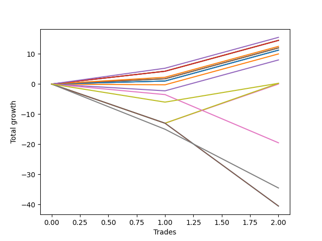

# Short Bernese 002 50 
- Symbol: ES
- Date Range: 03/18/2022 - 12/30/2022
- Trading Period: 8:30-12:30
- Number of Trades: 3



| Name | Win Percent | Profit | Avg Profit / Trade | Avg Time / Trade |      | Name | Win Percent | Profit | Avg Profit / Trade | Avg Time / Trade |
| ---- | ----------- | ------ | ------------------ | ---------------- | ---- | ---- | ----------- | ------ | ------------------ | ---------------- |
| Sorted By <br> Profit | | | | | | Sorted By <br> Win Percentage ||||
| Four | 100.00 | 11000.00 | 3666.67 | 17:11 |     | Four | 100.00 | 11000.00 | 3666.67 | 17:11 |
| Eighty-Five | 100.00 | 10250.00 | 3416.67 | 14:58 |     | Eighty-Five | 100.00 | 10250.00 | 3416.67 | 14:58 |
| Two_C | 100.00 | 9750.00 | 3250.00 | 14:51 |     | Two_C | 100.00 | 9750.00 | 3250.00 | 14:51 |
| Eighty-Four | 100.00 | 9500.00 | 3166.67 | 14:50 |     | Eighty-Four | 100.00 | 9500.00 | 3166.67 | 14:50 |
| Eighty-Three | 100.00 | 8750.00 | 2916.67 | 12:55 |     | Eighty-Three | 100.00 | 8750.00 | 2916.67 | 12:55 |
| Two | 100.00 | 8250.00 | 2750.00 | 14:48 |     | Two | 100.00 | 8250.00 | 2750.00 | 14:48 |
| Eighty-Two | 100.00 | 7500.00 | 2500.00 | 02:50 |     | Eighty-Two | 100.00 | 7500.00 | 2500.00 | 02:50 |
| Three | 66.67 | 6875.00 | 2291.67 | 12:48 |     | Eighty-One | 100.00 | 6500.00 | 2166.67 | 01:28 |
| One | 66.67 | 6750.00 | 2250.00 | 07:00 |     | Six | 100.00 | 6500.00 | 2166.67 | 01:28 |
| Eighty-One | 100.00 | 6500.00 | 2166.67 | 01:28 |     | Zero | 100.00 | 6125.00 | 2041.67 | 02:26 |
| Six | 100.00 | 6500.00 | 2166.67 | 01:28 |     | Three | 66.67 | 6875.00 | 2291.67 | 12:48 |
| Zero | 100.00 | 6125.00 | 2041.67 | 02:26 |     | One | 66.67 | 6750.00 | 2250.00 | 07:00 |
| Five | 66.67 | 4500.00 | 1500.00 | 34:38 |     | Five | 66.67 | 4500.00 | 1500.00 | 34:38 |
| MALAMUTE 002 | 66.67 | 3875.00 | 1291.67 | 09:25 |     | MALAMUTE 002 | 66.67 | 3875.00 | 1291.67 | 09:25 |
| Seven | 66.67 | 1875.00 | 625.00 | 41:03 |     | Seven | 66.67 | 1875.00 | 625.00 | 41:03 |
| NEWFI 0000 | 33.33 | -9000.00 | -3000.00 | 13:25 |     | NEWFI 0000 | 33.33 | -9000.00 | -3000.00 | 13:25 |
| MALAMUTE 001 | 33.33 | -14250.00 | -4750.00 | 38:05 |     | MALAMUTE 001 | 33.33 | -14250.00 | -4750.00 | 38:05 |
| NEWFI 000 | 33.33 | -16000.00 | -5333.33 | 57:18 |     | NEWFI 000 | 33.33 | -16000.00 | -5333.33 | 57:18 |
| BB100 | 33.33 | -18500.00 | -6166.67 | 60:55 |     | BB100 | 33.33 | -18500.00 | -6166.67 | 60:55 |

## NO STOPLOSS

### Test Zero
* Sell when price hits the middle line of the 20p bollinger
* No Stoploss
* Results:
```
Total Trades: 3
Percent Up: 0.00
Percent Down: 100.00
Total Points Moved Down: 12.25
Potential Profit: 6125.00
Total Points Ups: 0.00 Count Ups: 0
Total Points Downs: 12.25 Count Downs: 3
```

<details><summary>Trades</summary>

<code>In: 2022-04-25 09:29:00		Out: 2022-04-25 09:31:05		Total Position Time: 02:05		Total Move Down: 1.00		Total to Date: 1.00</code> <br />
<code>In: 2022-07-06 11:11:00		Out: 2022-07-06 11:12:10		Total Position Time: 01:10		Total Move Down: 10.25		Total to Date: 11.25</code> <br />
<code>In: 2022-10-06 09:51:00		Out: 2022-10-06 09:55:05		Total Position Time: 04:05		Total Move Down: 1.00		Total to Date: 12.25</code> <br />


</details>

### Test One
* Sell when the price hits the lower line of the 20p 1std bollinger
* No Stoploss
* Results:
```
Total Trades: 3
Percent Up: 33.33
Percent Down: 66.67
Total Points Moved Down: 13.50
Potential Profit: 6750.00
Total Points Ups: 0.25 Count Ups: 1
Total Points Downs: 13.75 Count Downs: 2
```

<details><summary>Trades</summary>

<code>In: 2022-04-25 09:29:00		Out: 2022-04-25 09:42:45		Total Position Time: 13:45		Total Move Down: -0.25		Total to Date: -0.25</code> <br />
<code>In: 2022-07-06 11:11:00		Out: 2022-07-06 11:12:10		Total Position Time: 01:10		Total Move Down: 10.25		Total to Date: 10.00</code> <br />
<code>In: 2022-10-06 09:51:00		Out: 2022-10-06 09:57:05		Total Position Time: 06:05		Total Move Down: 3.50		Total to Date: 13.50</code> <br />


</details>

### Test Two
* Sell when the price hits the lower line of the 20p 2std bollinger
* No Stoploss
* Results:
```
Total Trades: 3
Percent Up: 0.00
Percent Down: 100.00
Total Points Moved Down: 16.50
Potential Profit: 8250.00
Total Points Ups: 0.00 Count Ups: 0
Total Points Downs: 16.50 Count Downs: 3
```

<details><summary>Trades</summary>

<code>In: 2022-04-25 09:29:00		Out: 2022-04-25 10:01:15		Total Position Time: 32:15		Total Move Down: 1.75		Total to Date: 1.75</code> <br />
<code>In: 2022-07-06 11:11:00		Out: 2022-07-06 11:12:10		Total Position Time: 01:10		Total Move Down: 10.25		Total to Date: 12.00</code> <br />
<code>In: 2022-10-06 09:51:00		Out: 2022-10-06 10:02:00		Total Position Time: 11:00		Total Move Down: 4.50		Total to Date: 16.50</code> <br />


</details>

### Test Two_C
* Sell when the price hits the lower line of the 20p 2std bollinger
* No Stoploss
* Results:
```
Total Trades: 3
Percent Up: 0.00
Percent Down: 100.00
Total Points Moved Down: 19.50
Potential Profit: 9750.00
Total Points Ups: 0.00 Count Ups: 0
Total Points Downs: 19.50 Count Downs: 3
```

<details><summary>Trades</summary>

<code>In: 2022-04-25 09:29:00		Out: 2022-04-25 10:01:20		Total Position Time: 32:20		Total Move Down: 4.25		Total to Date: 4.25</code> <br />
<code>In: 2022-07-06 11:11:00		Out: 2022-07-06 11:12:10		Total Position Time: 01:10		Total Move Down: 10.25		Total to Date: 14.50</code> <br />
<code>In: 2022-10-06 09:51:00		Out: 2022-10-06 10:02:05		Total Position Time: 11:05		Total Move Down: 5.00		Total to Date: 19.50</code> <br />


</details>

### Test Three
* Sell when price hits the middle line of the 50p bollinger
* No Stoploss
* Results:
```
Total Trades: 3
Percent Up: 33.33
Percent Down: 66.67
Total Points Moved Down: 13.75
Potential Profit: 6875.00
Total Points Ups: 2.25 Count Ups: 1
Total Points Downs: 16.00 Count Downs: 2
```

<details><summary>Trades</summary>

<code>In: 2022-04-25 09:29:00		Out: 2022-04-25 09:55:05		Total Position Time: 26:05		Total Move Down: -2.25		Total to Date: -2.25</code> <br />
<code>In: 2022-07-06 11:11:00		Out: 2022-07-06 11:12:10		Total Position Time: 01:10		Total Move Down: 10.25		Total to Date: 8.00</code> <br />
<code>In: 2022-10-06 09:51:00		Out: 2022-10-06 10:02:10		Total Position Time: 11:10		Total Move Down: 5.75		Total to Date: 13.75</code> <br />


</details>

### Test Four
* Sell when the price hits the lower line of the 50p 1std bollinger
* No Stoploss
* Results:
```
Total Trades: 3
Percent Up: 0.00
Percent Down: 100.00
Total Points Moved Down: 22.00
Potential Profit: 11000.00
Total Points Ups: 0.00 Count Ups: 0
Total Points Downs: 22.00 Count Downs: 3
```

<details><summary>Trades</summary>

<code>In: 2022-04-25 09:29:00		Out: 2022-04-25 10:01:15		Total Position Time: 32:15		Total Move Down: 1.75		Total to Date: 1.75</code> <br />
<code>In: 2022-07-06 11:11:00		Out: 2022-07-06 11:12:10		Total Position Time: 01:10		Total Move Down: 10.25		Total to Date: 12.00</code> <br />
<code>In: 2022-10-06 09:51:00		Out: 2022-10-06 10:09:10		Total Position Time: 18:10		Total Move Down: 10.00		Total to Date: 22.00</code> <br />


</details>

### Test Five
* Sell when the price hits the lower line of the 50p 2std bollinger
* No Stoploss
* Results:
```
Total Trades: 3
Percent Up: 33.33
Percent Down: 66.67
Total Points Moved Down: 9.00
Potential Profit: 4500.00
Total Points Ups: 13.00 Count Ups: 1
Total Points Downs: 22.00 Count Downs: 2
```

<details><summary>Trades</summary>

<code>In: 2022-04-25 09:29:00		Out: 2022-04-25 10:29:55		Total Position Time: 60:55		Total Move Down: -13.00		Total to Date: -13.00</code> <br />
<code>In: 2022-07-06 11:11:00		Out: 2022-07-06 11:12:15		Total Position Time: 01:15		Total Move Down: 13.00		Total to Date: 0.00</code> <br />
<code>In: 2022-10-06 09:51:00		Out: 2022-10-06 10:32:45		Total Position Time: 41:45		Total Move Down: 9.00		Total to Date: 9.00</code> <br />


</details>

### Test Six
* Sell when the price hits the middle line of the 1std VWAP
* No Stoploss
* Results:
```
Total Trades: 3
Percent Up: 0.00
Percent Down: 100.00
Total Points Moved Down: 13.00
Potential Profit: 6500.00
Total Points Ups: 0.00 Count Ups: 0
Total Points Downs: 13.00 Count Downs: 3
```

<details><summary>Trades</summary>

<code>In: 2022-04-25 09:29:00		Out: 2022-04-25 09:31:05		Total Position Time: 02:05		Total Move Down: 1.00		Total to Date: 1.00</code> <br />
<code>In: 2022-07-06 11:11:00		Out: 2022-07-06 11:12:10		Total Position Time: 01:10		Total Move Down: 10.25		Total to Date: 11.25</code> <br />
<code>In: 2022-10-06 09:51:00		Out: 2022-10-06 09:52:10		Total Position Time: 01:10		Total Move Down: 1.75		Total to Date: 13.00</code> <br />


</details>

### Test Seven
* Sell when the price hits the lower line of the 1std VWAP
* No Stoploss
* Results:
```
Total Trades: 3
Percent Up: 33.33
Percent Down: 66.67
Total Points Moved Down: 3.75
Potential Profit: 1875.00
Total Points Ups: 13.00 Count Ups: 1
Total Points Downs: 16.75 Count Downs: 2
```

<details><summary>Trades</summary>

<code>In: 2022-04-25 09:29:00		Out: 2022-04-25 10:29:55		Total Position Time: 60:55		Total Move Down: -13.00		Total to Date: -13.00</code> <br />
<code>In: 2022-07-06 11:11:00		Out: 2022-07-06 11:12:20		Total Position Time: 01:20		Total Move Down: 13.25		Total to Date: 0.25</code> <br />
<code>In: 2022-10-06 09:51:00		Out: 2022-10-06 10:51:55		Total Position Time: 60:55		Total Move Down: 3.50		Total to Date: 3.75</code> <br />


</details>

### Test BB100
* Move to BB100 Upper Band
* No Stoploss
* Results:
```
Total Trades: 3
Percent Up: 66.67
Percent Down: 33.33
Total Points Moved Down: -37.00
Potential Profit: -18500.00
Total Points Ups: 40.50 Count Ups: 2
Total Points Downs: 3.50 Count Downs: 1
```

<details><summary>Trades</summary>

<code>In: 2022-04-25 09:29:00		Out: 2022-04-25 10:29:55		Total Position Time: 60:55		Total Move Down: -13.00		Total to Date: -13.00</code> <br />
<code>In: 2022-07-06 11:11:00		Out: 2022-07-06 12:11:55		Total Position Time: 60:55		Total Move Down: -27.50		Total to Date: -40.50</code> <br />
<code>In: 2022-10-06 09:51:00		Out: 2022-10-06 10:51:55		Total Position Time: 60:55		Total Move Down: 3.50		Total to Date: -37.00</code> <br />


</details>

## TAKE PROFIT

### Test Eighty-One
* Take Profit of 1 Point
* No Stoploss
* Results:
```
Total Trades: 3
Percent Up: 0.00
Percent Down: 100.00
Total Points Moved Down: 13.00
Potential Profit: 6500.00
Total Points Ups: 0.00 Count Ups: 0
Total Points Downs: 13.00 Count Downs: 3
```

<details><summary>Trades</summary>

<code>In: 2022-04-25 09:29:00		Out: 2022-04-25 09:31:05		Total Position Time: 02:05		Total Move Down: 1.00		Total to Date: 1.00</code> <br />
<code>In: 2022-07-06 11:11:00		Out: 2022-07-06 11:12:10		Total Position Time: 01:10		Total Move Down: 10.25		Total to Date: 11.25</code> <br />
<code>In: 2022-10-06 09:51:00		Out: 2022-10-06 09:52:10		Total Position Time: 01:10		Total Move Down: 1.75		Total to Date: 13.00</code> <br />


</details>

### Test Eighty-Two
* Take Profit of 2 Point
* No Stoploss
* Results:
```
Total Trades: 3
Percent Up: 0.00
Percent Down: 100.00
Total Points Moved Down: 15.00
Potential Profit: 7500.00
Total Points Ups: 0.00 Count Ups: 0
Total Points Downs: 15.00 Count Downs: 3
```

<details><summary>Trades</summary>

<code>In: 2022-04-25 09:29:00		Out: 2022-04-25 09:31:10		Total Position Time: 02:10		Total Move Down: 2.25		Total to Date: 2.25</code> <br />
<code>In: 2022-07-06 11:11:00		Out: 2022-07-06 11:12:10		Total Position Time: 01:10		Total Move Down: 10.25		Total to Date: 12.50</code> <br />
<code>In: 2022-10-06 09:51:00		Out: 2022-10-06 09:56:10		Total Position Time: 05:10		Total Move Down: 2.50		Total to Date: 15.00</code> <br />


</details>

### Test Eighty-Three
* Take Profit of 3 Point
* No Stoploss
* Results:
```
Total Trades: 3
Percent Up: 0.00
Percent Down: 100.00
Total Points Moved Down: 17.50
Potential Profit: 8750.00
Total Points Ups: 0.00 Count Ups: 0
Total Points Downs: 17.50 Count Downs: 3
```

<details><summary>Trades</summary>

<code>In: 2022-04-25 09:29:00		Out: 2022-04-25 10:01:20		Total Position Time: 32:20		Total Move Down: 4.25		Total to Date: 4.25</code> <br />
<code>In: 2022-07-06 11:11:00		Out: 2022-07-06 11:12:10		Total Position Time: 01:10		Total Move Down: 10.25		Total to Date: 14.50</code> <br />
<code>In: 2022-10-06 09:51:00		Out: 2022-10-06 09:56:15		Total Position Time: 05:15		Total Move Down: 3.00		Total to Date: 17.50</code> <br />


</details>

### Test Eighty-Four
* Take Profit of 4 Point
* No Stoploss
* Results:
```
Total Trades: 3
Percent Up: 0.00
Percent Down: 100.00
Total Points Moved Down: 19.00
Potential Profit: 9500.00
Total Points Ups: 0.00 Count Ups: 0
Total Points Downs: 19.00 Count Downs: 3
```

<details><summary>Trades</summary>

<code>In: 2022-04-25 09:29:00		Out: 2022-04-25 10:01:20		Total Position Time: 32:20		Total Move Down: 4.25		Total to Date: 4.25</code> <br />
<code>In: 2022-07-06 11:11:00		Out: 2022-07-06 11:12:10		Total Position Time: 01:10		Total Move Down: 10.25		Total to Date: 14.50</code> <br />
<code>In: 2022-10-06 09:51:00		Out: 2022-10-06 10:02:00		Total Position Time: 11:00		Total Move Down: 4.50		Total to Date: 19.00</code> <br />


</details>

### Test Eighty-Five
* Take Profit of 5 Point
* No Stoploss
* Results:
```
Total Trades: 3
Percent Up: 0.00
Percent Down: 100.00
Total Points Moved Down: 20.50
Potential Profit: 10250.00
Total Points Ups: 0.00 Count Ups: 0
Total Points Downs: 20.50 Count Downs: 3
```

<details><summary>Trades</summary>

<code>In: 2022-04-25 09:29:00		Out: 2022-04-25 10:01:40		Total Position Time: 32:40		Total Move Down: 5.25		Total to Date: 5.25</code> <br />
<code>In: 2022-07-06 11:11:00		Out: 2022-07-06 11:12:10		Total Position Time: 01:10		Total Move Down: 10.25		Total to Date: 15.50</code> <br />
<code>In: 2022-10-06 09:51:00		Out: 2022-10-06 10:02:05		Total Position Time: 11:05		Total Move Down: 5.00		Total to Date: 20.50</code> <br />


</details>

## Indicator Exits

### Test NEWFI 000
* Newfi 0000
* No Stoploss
* Results:
```
Total Trades: 3
Percent Up: 66.67
Percent Down: 33.33
Total Points Moved Down: -32.00
Potential Profit: -16000.00
Total Points Ups: 40.50 Count Ups: 2
Total Points Downs: 8.50 Count Downs: 1
```

<details><summary>Trades</summary>

<code>In: 2022-04-25 09:29:00		Out: 2022-04-25 10:29:55		Total Position Time: 60:55		Total Move Down: -13.00		Total to Date: -13.00</code> <br />
<code>In: 2022-07-06 11:11:00		Out: 2022-07-06 12:11:55		Total Position Time: 60:55		Total Move Down: -27.50		Total to Date: -40.50</code> <br />
<code>In: 2022-10-06 09:51:00		Out: 2022-10-06 10:41:05		Total Position Time: 50:05		Total Move Down: 8.50		Total to Date: -32.00</code> <br />


</details>

### Test NEWFI 0000
* Newfi 0000
* No Stoploss
* Results:
```
Total Trades: 3
Percent Up: 66.67
Percent Down: 33.33
Total Points Moved Down: -18.00
Potential Profit: -9000.00
Total Points Ups: 19.50 Count Ups: 2
Total Points Downs: 1.50 Count Downs: 1
```

<details><summary>Trades</summary>

<code>In: 2022-04-25 09:29:00		Out: 2022-04-25 09:41:05		Total Position Time: 12:05		Total Move Down: -3.50		Total to Date: -3.50</code> <br />
<code>In: 2022-07-06 11:11:00		Out: 2022-07-06 11:38:05		Total Position Time: 27:05		Total Move Down: -16.00		Total to Date: -19.50</code> <br />
<code>In: 2022-10-06 09:51:00		Out: 2022-10-06 09:52:05		Total Position Time: 01:05		Total Move Down: 1.50		Total to Date: -18.00</code> <br />


</details>

### Test MALAMUTE 001
* Malamute 001
* No Stoploss
* Results:
```
Total Trades: 3
Percent Up: 66.67
Percent Down: 33.33
Total Points Moved Down: -28.50
Potential Profit: -14250.00
Total Points Ups: 34.50 Count Ups: 2
Total Points Downs: 6.00 Count Downs: 1
```

<details><summary>Trades</summary>

<code>In: 2022-04-25 09:29:00		Out: 2022-04-25 10:19:05		Total Position Time: 50:05		Total Move Down: -15.00		Total to Date: -15.00</code> <br />
<code>In: 2022-07-06 11:11:00		Out: 2022-07-06 11:34:05		Total Position Time: 23:05		Total Move Down: -19.50		Total to Date: -34.50</code> <br />
<code>In: 2022-10-06 09:51:00		Out: 2022-10-06 10:32:05		Total Position Time: 41:05		Total Move Down: 6.00		Total to Date: -28.50</code> <br />


</details>

### Test MALAMUTE 002
* Malamute 001
* No Stoploss
* Results:
```
Total Trades: 3
Percent Up: 33.33
Percent Down: 66.67
Total Points Moved Down: 7.75
Potential Profit: 3875.00
Total Points Ups: 6.00 Count Ups: 1
Total Points Downs: 13.75 Count Downs: 2
```

<details><summary>Trades</summary>

<code>In: 2022-04-25 09:29:00		Out: 2022-04-25 09:33:05		Total Position Time: 04:05		Total Move Down: -6.00		Total to Date: -6.00</code> <br />
<code>In: 2022-07-06 11:11:00		Out: 2022-07-06 11:18:05		Total Position Time: 07:05		Total Move Down: 6.25		Total to Date: 0.25</code> <br />
<code>In: 2022-10-06 09:51:00		Out: 2022-10-06 10:08:05		Total Position Time: 17:05		Total Move Down: 7.50		Total to Date: 7.75</code> <br />


</details>