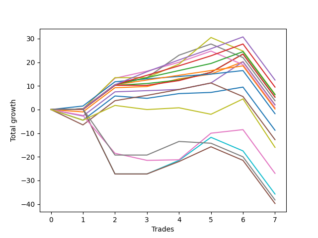

# Short Bernese 003 1v SB 
- Symbol: ES
- Date Range: 03/18/2022 - 12/30/2022
- Trading Period: 8:30-12:30
- Number of Trades: 5



| Name | Win Percent | Profit | Avg Profit / Trade | Avg Time / Trade |      | Name | Win Percent | Profit | Avg Profit / Trade | Avg Time / Trade |
| ---- | ----------- | ------ | ------------------ | ---------------- | ---- | ---- | ----------- | ------ | ------------------ | ---------------- |
| Sorted By <br> Profit | | | | | | Sorted By <br> Win Percentage ||||
| TP-9 | 80.00 | 14000.00 | 2800.00 | 46:44 |     | TP-6 | 100.00 | 12250.00 | 2450.00 | 37:42 |
| TP-10 | 80.00 | 13250.00 | 2650.00 | 48:37 |     | TP-5 | 100.00 | 10250.00 | 2050.00 | 31:07 |
| TP-6 | 100.00 | 12250.00 | 2450.00 | 37:42 |     | TP-4 | 100.00 | 8750.00 | 1750.00 | 30:40 |
| TP-8 | 80.00 | 12000.00 | 2400.00 | 44:53 |     | TP-3 | 100.00 | 7125.00 | 1425.00 | 20:39 |
| TP-7 | 80.00 | 11125.00 | 2225.00 | 41:58 |     | TP-2 | 100.00 | 4125.00 | 825.00 | 19:44 |
| TP-5 | 100.00 | 10250.00 | 2050.00 | 31:07 |     | TP-1 | 100.00 | 3125.00 | 625.00 | 10:01 |
| TP-4 | 100.00 | 8750.00 | 1750.00 | 30:40 |     | TP-9 | 80.00 | 14000.00 | 2800.00 | 46:44 |
| TP-3 | 100.00 | 7125.00 | 1425.00 | 20:39 |     | TP-10 | 80.00 | 13250.00 | 2650.00 | 48:37 |
| BB-20 U/L 2SD | 80.00 | 6625.00 | 1325.00 | 15:09 |     | TP-8 | 80.00 | 12000.00 | 2400.00 | 44:53 |
| BB-20 U/L 2SD C | 60.00 | 6625.00 | 1325.00 | 16:55 |     | TP-7 | 80.00 | 11125.00 | 2225.00 | 41:58 |
| BB-200 U/L 2SD | 60.00 | 5750.00 | 1150.00 | 54:44 |     | BB-20 U/L 2SD | 80.00 | 6625.00 | 1325.00 | 15:09 |
| V U/L 1SD | 60.00 | 5750.00 | 1150.00 | 54:44 |     | BB-50 Mid | 80.00 | 5000.00 | 1000.00 | 21:14 |
| BB-50 Mid | 80.00 | 5000.00 | 1000.00 | 21:14 |     | BB-20 U/L 1SD | 80.00 | 5000.00 | 1000.00 | 08:36 |
| BB-20 U/L 1SD | 80.00 | 5000.00 | 1000.00 | 08:36 |     | BB-200 Mid | 80.00 | 3625.00 | 725.00 | 40:24 |
| BB-100 U/L 2SD | 60.00 | 5000.00 | 1000.00 | 52:33 |     | BB-50 U/L 2SD | 80.00 | 3000.00 | 600.00 | 42:31 |
| TP-2 | 100.00 | 4125.00 | 825.00 | 19:44 |     | BB-20 U/L 2SD SL-10 | 80.00 | 1125.00 | 225.00 | 14:00 |
| BB-200 Mid | 80.00 | 3625.00 | 725.00 | 40:24 |     | BB-50 Mid SL-10 | 80.00 | 875.00 | 175.00 | 16:22 |
| TP-1 | 100.00 | 3125.00 | 625.00 | 10:01 |     | BB-20 U/L 1SD SL-10 | 80.00 | -0.00 | -0.00 | 07:29 |
| BB-50 U/L 2SD | 80.00 | 3000.00 | 600.00 | 42:31 |     | BB-20 U/L 2SD C | 60.00 | 6625.00 | 1325.00 | 16:55 |
| NEWFI 000 | 60.00 | 3000.00 | 600.00 | 49:24 |     | BB-200 U/L 2SD | 60.00 | 5750.00 | 1150.00 | 54:44 |
| BB-100 Mid | 60.00 | 2375.00 | 475.00 | 38:21 |     | V U/L 1SD | 60.00 | 5750.00 | 1150.00 | 54:44 |
| BB-20 U/L 2SD SL-10 | 80.00 | 1125.00 | 225.00 | 14:00 |     | BB-100 U/L 2SD | 60.00 | 5000.00 | 1000.00 | 52:33 |
| BB-20 U/L 2SD C SL-10 | 60.00 | 1125.00 | 225.00 | 15:46 |     | NEWFI 000 | 60.00 | 3000.00 | 600.00 | 49:24 |
| BB-50 Mid SL-10 | 80.00 | 875.00 | 175.00 | 16:22 |     | BB-100 Mid | 60.00 | 2375.00 | 475.00 | 38:21 |
| BB-200 U/L 2SD SL-10 | 40.00 | 125.00 | 25.00 | 44:10 |     | BB-20 U/L 2SD C SL-10 | 60.00 | 1125.00 | 225.00 | 15:46 |
| V U/L 1SD SL-10 | 40.00 | 125.00 | 25.00 | 44:10 |     | BB-20 Mid | 60.00 | -375.00 | -75.00 | 06:46 |
| BB-20 U/L 1SD SL-10 | 80.00 | -0.00 | -0.00 | 07:29 |     | BB-200 Mid SL-10 | 60.00 | -2000.00 | -400.00 | 29:50 |
| BB-20 Mid | 60.00 | -375.00 | -75.00 | 06:46 |     | BB-50 U/L 1SD | 60.00 | -2375.00 | -475.00 | 36:19 |
| BB-100 U/L 2SD SL-10 | 40.00 | -625.00 | -125.00 | 41:59 |     | BB-100 Mid SL-10 | 60.00 | -2625.00 | -525.00 | 27:51 |
| BB-200 Mid SL-10 | 60.00 | -2000.00 | -400.00 | 29:50 |     | BB-50 U/L 2SD SL-10 | 60.00 | -2625.00 | -525.00 | 31:57 |
| BB-50 U/L 1SD | 60.00 | -2375.00 | -475.00 | 36:19 |     | BB-20 Mid SL-10 | 60.00 | -3625.00 | -725.00 | 05:44 |
| BB-100 Mid SL-10 | 60.00 | -2625.00 | -525.00 | 27:51 |     | BB-50 U/L 1SD SL-10 | 60.00 | -4625.00 | -925.00 | 26:41 |
| BB-50 U/L 2SD SL-10 | 60.00 | -2625.00 | -525.00 | 31:57 |     | BB-200 U/L 2SD SL-10 | 40.00 | 125.00 | 25.00 | 44:10 |
| BB-20 Mid SL-10 | 60.00 | -3625.00 | -725.00 | 05:44 |     | V U/L 1SD SL-10 | 40.00 | 125.00 | 25.00 | 44:10 |
| BB-50 U/L 1SD SL-10 | 60.00 | -4625.00 | -925.00 | 26:41 |     | BB-100 U/L 2SD SL-10 | 40.00 | -625.00 | -125.00 | 41:59 |

## NO STOPLOSS

### Test BB-20 Mid
* Sell when price hits the middle line of the 20p bollinger
* No Stoploss
* Results:
```
Total Trades: 5
Percent Up: 40.00
Percent Down: 60.00
Total Points Moved Down: -0.75
Potential Profit: -375.00
Total Points Ups: 5.50 Count Ups: 2
Total Points Downs: 4.75 Count Downs: 3
```

<details><summary>Trades</summary>

<code>In: 2022-05-24 10:48:00		Out: 2022-05-24 11:01:15		Total Position Time: 13:15		Total Move Down: -4.50		Total to Date: -4.50</code> <br />
<code>In: 2022-08-04 10:31:00		Out: 2022-08-04 10:43:05		Total Position Time: 12:05		Total Move Down: -1.00		Total to Date: -5.50</code> <br />
<code>In: 2022-08-05 10:18:00		Out: 2022-08-05 10:20:05		Total Position Time: 02:05		Total Move Down: 2.00		Total to Date: -3.50</code> <br />
<code>In: 2022-09-12 10:33:00		Out: 2022-09-12 10:36:35		Total Position Time: 03:35		Total Move Down: 0.50		Total to Date: -3.00</code> <br />
<code>In: 2022-09-22 12:17:00		Out: 2022-09-22 12:19:50		Total Position Time: 02:50		Total Move Down: 2.25		Total to Date: -0.75</code> <br />


</details>

### Test BB-20 U/L 1SD
* Sell when the price hits the lower line of the 20p 1std bollinger
* No Stoploss
* Results:
```
Total Trades: 5
Percent Up: 20.00
Percent Down: 80.00
Total Points Moved Down: 10.00
Potential Profit: 5000.00
Total Points Ups: 1.00 Count Ups: 1
Total Points Downs: 11.00 Count Downs: 4
```

<details><summary>Trades</summary>

<code>In: 2022-05-24 10:48:00		Out: 2022-05-24 11:01:40		Total Position Time: 13:40		Total Move Down: -1.00		Total to Date: -1.00</code> <br />
<code>In: 2022-08-04 10:31:00		Out: 2022-08-04 10:43:15		Total Position Time: 12:15		Total Move Down: 0.50		Total to Date: -0.50</code> <br />
<code>In: 2022-08-05 10:18:00		Out: 2022-08-05 10:23:15		Total Position Time: 05:15		Total Move Down: 3.25		Total to Date: 2.75</code> <br />
<code>In: 2022-09-12 10:33:00		Out: 2022-09-12 10:41:30		Total Position Time: 08:30		Total Move Down: 2.00		Total to Date: 4.75</code> <br />
<code>In: 2022-09-22 12:17:00		Out: 2022-09-22 12:20:20		Total Position Time: 03:20		Total Move Down: 5.25		Total to Date: 10.00</code> <br />


</details>

### Test BB-20 U/L 2SD
* Sell when the price hits the lower line of the 20p 2std bollinger
* No Stoploss
* Results:
```
Total Trades: 5
Percent Up: 20.00
Percent Down: 80.00
Total Points Moved Down: 13.25
Potential Profit: 6625.00
Total Points Ups: 0.00 Count Ups: 1
Total Points Downs: 13.25 Count Downs: 4
```

<details><summary>Trades</summary>

<code>In: 2022-05-24 10:48:00		Out: 2022-05-24 11:01:50		Total Position Time: 13:50		Total Move Down: -0.00		Total to Date: 0.00</code> <br />
<code>In: 2022-08-04 10:31:00		Out: 2022-08-04 10:45:30		Total Position Time: 14:30		Total Move Down: 0.75		Total to Date: 0.75</code> <br />
<code>In: 2022-08-05 10:18:00		Out: 2022-08-05 10:49:30		Total Position Time: 31:30		Total Move Down: 1.50		Total to Date: 2.25</code> <br />
<code>In: 2022-09-12 10:33:00		Out: 2022-09-12 10:43:35		Total Position Time: 10:35		Total Move Down: 3.25		Total to Date: 5.50</code> <br />
<code>In: 2022-09-22 12:17:00		Out: 2022-09-22 12:22:20		Total Position Time: 05:20		Total Move Down: 7.75		Total to Date: 13.25</code> <br />


</details>

### Test BB-20 U/L 2SD C
* Sell when the price hits the lower line of the 20p 2std bollinger
* No Stoploss
* Results:
```
Total Trades: 5
Percent Up: 40.00
Percent Down: 60.00
Total Points Moved Down: 13.25
Potential Profit: 6625.00
Total Points Ups: 0.00 Count Ups: 2
Total Points Downs: 13.25 Count Downs: 3
```

<details><summary>Trades</summary>

<code>In: 2022-05-24 10:48:00		Out: 2022-05-24 11:01:50		Total Position Time: 13:50		Total Move Down: -0.00		Total to Date: 0.00</code> <br />
<code>In: 2022-08-04 10:31:00		Out: 2022-08-04 10:52:45		Total Position Time: 21:45		Total Move Down: -0.00		Total to Date: 0.00</code> <br />
<code>In: 2022-08-05 10:18:00		Out: 2022-08-05 10:50:35		Total Position Time: 32:35		Total Move Down: 2.00		Total to Date: 2.00</code> <br />
<code>In: 2022-09-12 10:33:00		Out: 2022-09-12 10:44:05		Total Position Time: 11:05		Total Move Down: 3.50		Total to Date: 5.50</code> <br />
<code>In: 2022-09-22 12:17:00		Out: 2022-09-22 12:22:20		Total Position Time: 05:20		Total Move Down: 7.75		Total to Date: 13.25</code> <br />


</details>

### Test BB-50 Mid
* Sell when price hits the middle line of the 50p bollinger
* No Stoploss
* Results:
```
Total Trades: 5
Percent Up: 20.00
Percent Down: 80.00
Total Points Moved Down: 10.00
Potential Profit: 5000.00
Total Points Ups: 2.75 Count Ups: 1
Total Points Downs: 12.75 Count Downs: 4
```

<details><summary>Trades</summary>

<code>In: 2022-05-24 10:48:00		Out: 2022-05-24 11:20:25		Total Position Time: 32:25		Total Move Down: -2.75		Total to Date: -2.75</code> <br />
<code>In: 2022-08-04 10:31:00		Out: 2022-08-04 10:55:50		Total Position Time: 24:50		Total Move Down: 0.50		Total to Date: -2.25</code> <br />
<code>In: 2022-08-05 10:18:00		Out: 2022-08-05 10:47:35		Total Position Time: 29:35		Total Move Down: 0.50		Total to Date: -1.75</code> <br />
<code>In: 2022-09-12 10:33:00		Out: 2022-09-12 10:42:15		Total Position Time: 09:15		Total Move Down: 2.75		Total to Date: 1.00</code> <br />
<code>In: 2022-09-22 12:17:00		Out: 2022-09-22 12:27:05		Total Position Time: 10:05		Total Move Down: 9.00		Total to Date: 10.00</code> <br />


</details>

### Test BB-50 U/L 1SD
* Sell when the price hits the lower line of the 50p 1std bollinger
* No Stoploss
* Results:
```
Total Trades: 5
Percent Up: 40.00
Percent Down: 60.00
Total Points Moved Down: -4.75
Potential Profit: -2375.00
Total Points Ups: 12.25 Count Ups: 2
Total Points Downs: 7.50 Count Downs: 3
```

<details><summary>Trades</summary>

<code>In: 2022-05-24 10:48:00		Out: 2022-05-24 11:44:15		Total Position Time: 56:15		Total Move Down: -6.50		Total to Date: -6.50</code> <br />
<code>In: 2022-08-04 10:31:00		Out: 2022-08-04 11:02:05		Total Position Time: 31:05		Total Move Down: 2.25		Total to Date: -4.25</code> <br />
<code>In: 2022-08-05 10:18:00		Out: 2022-08-05 10:52:05		Total Position Time: 34:05		Total Move Down: 2.50		Total to Date: -1.75</code> <br />
<code>In: 2022-09-12 10:33:00		Out: 2022-09-12 11:03:10		Total Position Time: 30:10		Total Move Down: 2.75		Total to Date: 1.00</code> <br />
<code>In: 2022-09-22 12:17:00		Out: 2022-09-22 12:47:00		Total Position Time: 30:00		Total Move Down: -5.75		Total to Date: -4.75</code> <br />


</details>

### Test BB-50 U/L 2SD
* Sell when the price hits the lower line of the 50p 2std bollinger
* No Stoploss
* Results:
```
Total Trades: 5
Percent Up: 20.00
Percent Down: 80.00
Total Points Moved Down: 6.00
Potential Profit: 3000.00
Total Points Ups: 5.75 Count Ups: 1
Total Points Downs: 11.75 Count Downs: 4
```

<details><summary>Trades</summary>

<code>In: 2022-05-24 10:48:00		Out: 2022-05-24 11:48:55		Total Position Time: 60:55		Total Move Down: 0.25		Total to Date: 0.25</code> <br />
<code>In: 2022-08-04 10:31:00		Out: 2022-08-04 11:10:15		Total Position Time: 39:15		Total Move Down: 3.00		Total to Date: 3.25</code> <br />
<code>In: 2022-08-05 10:18:00		Out: 2022-08-05 10:55:40		Total Position Time: 37:40		Total Move Down: 3.75		Total to Date: 7.00</code> <br />
<code>In: 2022-09-12 10:33:00		Out: 2022-09-12 11:17:45		Total Position Time: 44:45		Total Move Down: 4.75		Total to Date: 11.75</code> <br />
<code>In: 2022-09-22 12:17:00		Out: 2022-09-22 12:47:00		Total Position Time: 30:00		Total Move Down: -5.75		Total to Date: 6.00</code> <br />


</details>

### Test V U/L 1SD
* Sell when the price hits the lower line of the 1std VWAP
* No Stoploss
* Results:
```
Total Trades: 5
Percent Up: 40.00
Percent Down: 60.00
Total Points Moved Down: 11.50
Potential Profit: 5750.00
Total Points Ups: 5.75 Count Ups: 2
Total Points Downs: 17.25 Count Downs: 3
```

<details><summary>Trades</summary>

<code>In: 2022-05-24 10:48:00		Out: 2022-05-24 11:48:55		Total Position Time: 60:55		Total Move Down: 0.25		Total to Date: 0.25</code> <br />
<code>In: 2022-08-04 10:31:00		Out: 2022-08-04 11:31:55		Total Position Time: 60:55		Total Move Down: -0.00		Total to Date: 0.25</code> <br />
<code>In: 2022-08-05 10:18:00		Out: 2022-08-05 11:18:55		Total Position Time: 60:55		Total Move Down: 5.75		Total to Date: 6.00</code> <br />
<code>In: 2022-09-12 10:33:00		Out: 2022-09-12 11:33:55		Total Position Time: 60:55		Total Move Down: 11.25		Total to Date: 17.25</code> <br />
<code>In: 2022-09-22 12:17:00		Out: 2022-09-22 12:47:00		Total Position Time: 30:00		Total Move Down: -5.75		Total to Date: 11.50</code> <br />


</details>

### Test BB-100 Mid
* Move to BB100 Mid
* No Stoploss
* Results:
```
Total Trades: 5
Percent Up: 40.00
Percent Down: 60.00
Total Points Moved Down: 4.75
Potential Profit: 2375.00
Total Points Ups: 6.75 Count Ups: 2
Total Points Downs: 11.50 Count Downs: 3
```

<details><summary>Trades</summary>

<code>In: 2022-05-24 10:48:00		Out: 2022-05-24 11:48:35		Total Position Time: 60:35		Total Move Down: -1.00		Total to Date: -1.00</code> <br />
<code>In: 2022-08-04 10:31:00		Out: 2022-08-04 10:56:30		Total Position Time: 25:30		Total Move Down: 2.00		Total to Date: 1.00</code> <br />
<code>In: 2022-08-05 10:18:00		Out: 2022-08-05 10:56:25		Total Position Time: 38:25		Total Move Down: 6.00		Total to Date: 7.00</code> <br />
<code>In: 2022-09-12 10:33:00		Out: 2022-09-12 11:10:15		Total Position Time: 37:15		Total Move Down: 3.50		Total to Date: 10.50</code> <br />
<code>In: 2022-09-22 12:17:00		Out: 2022-09-22 12:47:00		Total Position Time: 30:00		Total Move Down: -5.75		Total to Date: 4.75</code> <br />


</details>

### Test BB-100 U/L 2SD
* Move to BB100 Upper Band
* No Stoploss
* Results:
```
Total Trades: 5
Percent Up: 40.00
Percent Down: 60.00
Total Points Moved Down: 10.00
Potential Profit: 5000.00
Total Points Ups: 5.75 Count Ups: 2
Total Points Downs: 15.75 Count Downs: 3
```

<details><summary>Trades</summary>

<code>In: 2022-05-24 10:48:00		Out: 2022-05-24 11:48:55		Total Position Time: 60:55		Total Move Down: 0.25		Total to Date: 0.25</code> <br />
<code>In: 2022-08-04 10:31:00		Out: 2022-08-04 11:31:55		Total Position Time: 60:55		Total Move Down: -0.00		Total to Date: 0.25</code> <br />
<code>In: 2022-08-05 10:18:00		Out: 2022-08-05 11:18:55		Total Position Time: 60:55		Total Move Down: 5.75		Total to Date: 6.00</code> <br />
<code>In: 2022-09-12 10:33:00		Out: 2022-09-12 11:23:00		Total Position Time: 50:00		Total Move Down: 9.75		Total to Date: 15.75</code> <br />
<code>In: 2022-09-22 12:17:00		Out: 2022-09-22 12:47:00		Total Position Time: 30:00		Total Move Down: -5.75		Total to Date: 10.00</code> <br />


</details>

### Test BB-200 Mid
* Move to BB200 Mid
* No Stoploss
* Results:
```
Total Trades: 5
Percent Up: 20.00
Percent Down: 80.00
Total Points Moved Down: 7.25
Potential Profit: 3625.00
Total Points Ups: 5.75 Count Ups: 1
Total Points Downs: 13.00 Count Downs: 4
```

<details><summary>Trades</summary>

<code>In: 2022-05-24 10:48:00		Out: 2022-05-24 11:48:55		Total Position Time: 60:55		Total Move Down: 0.25		Total to Date: 0.25</code> <br />
<code>In: 2022-08-04 10:31:00		Out: 2022-08-04 11:09:45		Total Position Time: 38:45		Total Move Down: 2.75		Total to Date: 3.00</code> <br />
<code>In: 2022-08-05 10:18:00		Out: 2022-08-05 11:18:55		Total Position Time: 60:55		Total Move Down: 5.75		Total to Date: 8.75</code> <br />
<code>In: 2022-09-12 10:33:00		Out: 2022-09-12 10:44:25		Total Position Time: 11:25		Total Move Down: 4.25		Total to Date: 13.00</code> <br />
<code>In: 2022-09-22 12:17:00		Out: 2022-09-22 12:47:00		Total Position Time: 30:00		Total Move Down: -5.75		Total to Date: 7.25</code> <br />


</details>

### Test BB-200 U/L 2SD
* Move to BB200 Upper Band
* No Stoploss
* Results:
```
Total Trades: 5
Percent Up: 40.00
Percent Down: 60.00
Total Points Moved Down: 11.50
Potential Profit: 5750.00
Total Points Ups: 5.75 Count Ups: 2
Total Points Downs: 17.25 Count Downs: 3
```

<details><summary>Trades</summary>

<code>In: 2022-05-24 10:48:00		Out: 2022-05-24 11:48:55		Total Position Time: 60:55		Total Move Down: 0.25		Total to Date: 0.25</code> <br />
<code>In: 2022-08-04 10:31:00		Out: 2022-08-04 11:31:55		Total Position Time: 60:55		Total Move Down: -0.00		Total to Date: 0.25</code> <br />
<code>In: 2022-08-05 10:18:00		Out: 2022-08-05 11:18:55		Total Position Time: 60:55		Total Move Down: 5.75		Total to Date: 6.00</code> <br />
<code>In: 2022-09-12 10:33:00		Out: 2022-09-12 11:33:55		Total Position Time: 60:55		Total Move Down: 11.25		Total to Date: 17.25</code> <br />
<code>In: 2022-09-22 12:17:00		Out: 2022-09-22 12:47:00		Total Position Time: 30:00		Total Move Down: -5.75		Total to Date: 11.50</code> <br />


</details>

## STOPLOSS OF 10

### Test BB-20 Mid SL-10
* Sell when price hits the middle line of the 20p bollinger
* Stoploss is -10 points
* Results:
```
Total Trades: 5
Percent Up: 40.00
Percent Down: 60.00
Total Points Moved Down: -7.25
Potential Profit: -3625.00
Total Points Ups: 12.00 Count Ups: 2
Total Points Downs: 4.75 Count Downs: 3
```

<details><summary>Trades</summary>

<code>In: 2022-05-24 10:48:00		Out: 2022-05-24 10:56:05		Total Position Time: 08:05		Total Move Down: -11.00		Total to Date: -11.00</code> <br />
<code>In: 2022-08-04 10:31:00		Out: 2022-08-04 10:43:05		Total Position Time: 12:05		Total Move Down: -1.00		Total to Date: -12.00</code> <br />
<code>In: 2022-08-05 10:18:00		Out: 2022-08-05 10:20:05		Total Position Time: 02:05		Total Move Down: 2.00		Total to Date: -10.00</code> <br />
<code>In: 2022-09-12 10:33:00		Out: 2022-09-12 10:36:35		Total Position Time: 03:35		Total Move Down: 0.50		Total to Date: -9.50</code> <br />
<code>In: 2022-09-22 12:17:00		Out: 2022-09-22 12:19:50		Total Position Time: 02:50		Total Move Down: 2.25		Total to Date: -7.25</code> <br />


</details>

### Test BB-20 U/L 1SD SL-10
* Sell when the price hits the lower line of the 20p 1std bollinger
* Stoploss is -10 points
* Results:
```
Total Trades: 5
Percent Up: 20.00
Percent Down: 80.00
Total Points Moved Down: -0.00
Potential Profit: -0.00
Total Points Ups: 11.00 Count Ups: 1
Total Points Downs: 11.00 Count Downs: 4
```

<details><summary>Trades</summary>

<code>In: 2022-05-24 10:48:00		Out: 2022-05-24 10:56:05		Total Position Time: 08:05		Total Move Down: -11.00		Total to Date: -11.00</code> <br />
<code>In: 2022-08-04 10:31:00		Out: 2022-08-04 10:43:15		Total Position Time: 12:15		Total Move Down: 0.50		Total to Date: -10.50</code> <br />
<code>In: 2022-08-05 10:18:00		Out: 2022-08-05 10:23:15		Total Position Time: 05:15		Total Move Down: 3.25		Total to Date: -7.25</code> <br />
<code>In: 2022-09-12 10:33:00		Out: 2022-09-12 10:41:30		Total Position Time: 08:30		Total Move Down: 2.00		Total to Date: -5.25</code> <br />
<code>In: 2022-09-22 12:17:00		Out: 2022-09-22 12:20:20		Total Position Time: 03:20		Total Move Down: 5.25		Total to Date: 0.00</code> <br />


</details>

### Test BB-20 U/L 2SD SL-10
* Sell when the price hits the lower line of the 20p 2std bollinger
* Stoploss is -10 points
* Results:
```
Total Trades: 5
Percent Up: 20.00
Percent Down: 80.00
Total Points Moved Down: 2.25
Potential Profit: 1125.00
Total Points Ups: 11.00 Count Ups: 1
Total Points Downs: 13.25 Count Downs: 4
```

<details><summary>Trades</summary>

<code>In: 2022-05-24 10:48:00		Out: 2022-05-24 10:56:05		Total Position Time: 08:05		Total Move Down: -11.00		Total to Date: -11.00</code> <br />
<code>In: 2022-08-04 10:31:00		Out: 2022-08-04 10:45:30		Total Position Time: 14:30		Total Move Down: 0.75		Total to Date: -10.25</code> <br />
<code>In: 2022-08-05 10:18:00		Out: 2022-08-05 10:49:30		Total Position Time: 31:30		Total Move Down: 1.50		Total to Date: -8.75</code> <br />
<code>In: 2022-09-12 10:33:00		Out: 2022-09-12 10:43:35		Total Position Time: 10:35		Total Move Down: 3.25		Total to Date: -5.50</code> <br />
<code>In: 2022-09-22 12:17:00		Out: 2022-09-22 12:22:20		Total Position Time: 05:20		Total Move Down: 7.75		Total to Date: 2.25</code> <br />


</details>

### Test BB-20 U/L 2SD C SL-10
* Sell when the price hits the lower line of the 20p 2std bollinger
* Stoploss is -10 points
* Results:
```
Total Trades: 5
Percent Up: 40.00
Percent Down: 60.00
Total Points Moved Down: 2.25
Potential Profit: 1125.00
Total Points Ups: 11.00 Count Ups: 2
Total Points Downs: 13.25 Count Downs: 3
```

<details><summary>Trades</summary>

<code>In: 2022-05-24 10:48:00		Out: 2022-05-24 10:56:05		Total Position Time: 08:05		Total Move Down: -11.00		Total to Date: -11.00</code> <br />
<code>In: 2022-08-04 10:31:00		Out: 2022-08-04 10:52:45		Total Position Time: 21:45		Total Move Down: -0.00		Total to Date: -11.00</code> <br />
<code>In: 2022-08-05 10:18:00		Out: 2022-08-05 10:50:35		Total Position Time: 32:35		Total Move Down: 2.00		Total to Date: -9.00</code> <br />
<code>In: 2022-09-12 10:33:00		Out: 2022-09-12 10:44:05		Total Position Time: 11:05		Total Move Down: 3.50		Total to Date: -5.50</code> <br />
<code>In: 2022-09-22 12:17:00		Out: 2022-09-22 12:22:20		Total Position Time: 05:20		Total Move Down: 7.75		Total to Date: 2.25</code> <br />


</details>

### Test BB-50 Mid SL-10
* Sell when price hits the middle line of the 50p bollinger
* Stoploss is -10 points
* Results:
```
Total Trades: 5
Percent Up: 20.00
Percent Down: 80.00
Total Points Moved Down: 1.75
Potential Profit: 875.00
Total Points Ups: 11.00 Count Ups: 1
Total Points Downs: 12.75 Count Downs: 4
```

<details><summary>Trades</summary>

<code>In: 2022-05-24 10:48:00		Out: 2022-05-24 10:56:05		Total Position Time: 08:05		Total Move Down: -11.00		Total to Date: -11.00</code> <br />
<code>In: 2022-08-04 10:31:00		Out: 2022-08-04 10:55:50		Total Position Time: 24:50		Total Move Down: 0.50		Total to Date: -10.50</code> <br />
<code>In: 2022-08-05 10:18:00		Out: 2022-08-05 10:47:35		Total Position Time: 29:35		Total Move Down: 0.50		Total to Date: -10.00</code> <br />
<code>In: 2022-09-12 10:33:00		Out: 2022-09-12 10:42:15		Total Position Time: 09:15		Total Move Down: 2.75		Total to Date: -7.25</code> <br />
<code>In: 2022-09-22 12:17:00		Out: 2022-09-22 12:27:05		Total Position Time: 10:05		Total Move Down: 9.00		Total to Date: 1.75</code> <br />


</details>

### Test BB-50 U/L 1SD SL-10
* Sell when the price hits the lower line of the 50p 1std bollinger
* Stoploss is -10 points
* Results:
```
Total Trades: 5
Percent Up: 40.00
Percent Down: 60.00
Total Points Moved Down: -9.25
Potential Profit: -4625.00
Total Points Ups: 16.75 Count Ups: 2
Total Points Downs: 7.50 Count Downs: 3
```

<details><summary>Trades</summary>

<code>In: 2022-05-24 10:48:00		Out: 2022-05-24 10:56:05		Total Position Time: 08:05		Total Move Down: -11.00		Total to Date: -11.00</code> <br />
<code>In: 2022-08-04 10:31:00		Out: 2022-08-04 11:02:05		Total Position Time: 31:05		Total Move Down: 2.25		Total to Date: -8.75</code> <br />
<code>In: 2022-08-05 10:18:00		Out: 2022-08-05 10:52:05		Total Position Time: 34:05		Total Move Down: 2.50		Total to Date: -6.25</code> <br />
<code>In: 2022-09-12 10:33:00		Out: 2022-09-12 11:03:10		Total Position Time: 30:10		Total Move Down: 2.75		Total to Date: -3.50</code> <br />
<code>In: 2022-09-22 12:17:00		Out: 2022-09-22 12:47:00		Total Position Time: 30:00		Total Move Down: -5.75		Total to Date: -9.25</code> <br />


</details>

### Test BB-50 U/L 2SD SL-10
* Sell when the price hits the lower line of the 50p 2std bollinger
* Stoploss is -10 points
* Results:
```
Total Trades: 5
Percent Up: 40.00
Percent Down: 60.00
Total Points Moved Down: -5.25
Potential Profit: -2625.00
Total Points Ups: 16.75 Count Ups: 2
Total Points Downs: 11.50 Count Downs: 3
```

<details><summary>Trades</summary>

<code>In: 2022-05-24 10:48:00		Out: 2022-05-24 10:56:05		Total Position Time: 08:05		Total Move Down: -11.00		Total to Date: -11.00</code> <br />
<code>In: 2022-08-04 10:31:00		Out: 2022-08-04 11:10:15		Total Position Time: 39:15		Total Move Down: 3.00		Total to Date: -8.00</code> <br />
<code>In: 2022-08-05 10:18:00		Out: 2022-08-05 10:55:40		Total Position Time: 37:40		Total Move Down: 3.75		Total to Date: -4.25</code> <br />
<code>In: 2022-09-12 10:33:00		Out: 2022-09-12 11:17:45		Total Position Time: 44:45		Total Move Down: 4.75		Total to Date: 0.50</code> <br />
<code>In: 2022-09-22 12:17:00		Out: 2022-09-22 12:47:00		Total Position Time: 30:00		Total Move Down: -5.75		Total to Date: -5.25</code> <br />


</details>

### Test V U/L 1SD SL-10
* Sell when the price hits the lower line of the 1std VWAP
* Stoploss is -10 points
* Results:
```
Total Trades: 5
Percent Up: 60.00
Percent Down: 40.00
Total Points Moved Down: 0.25
Potential Profit: 125.00
Total Points Ups: 16.75 Count Ups: 3
Total Points Downs: 17.00 Count Downs: 2
```

<details><summary>Trades</summary>

<code>In: 2022-05-24 10:48:00		Out: 2022-05-24 10:56:05		Total Position Time: 08:05		Total Move Down: -11.00		Total to Date: -11.00</code> <br />
<code>In: 2022-08-04 10:31:00		Out: 2022-08-04 11:31:55		Total Position Time: 60:55		Total Move Down: -0.00		Total to Date: -11.00</code> <br />
<code>In: 2022-08-05 10:18:00		Out: 2022-08-05 11:18:55		Total Position Time: 60:55		Total Move Down: 5.75		Total to Date: -5.25</code> <br />
<code>In: 2022-09-12 10:33:00		Out: 2022-09-12 11:33:55		Total Position Time: 60:55		Total Move Down: 11.25		Total to Date: 6.00</code> <br />
<code>In: 2022-09-22 12:17:00		Out: 2022-09-22 12:47:00		Total Position Time: 30:00		Total Move Down: -5.75		Total to Date: 0.25</code> <br />


</details>

### Test BB-100 Mid SL-10
* Move to BB100 Mid
* Stoploss is -10 points
* Results:
```
Total Trades: 5
Percent Up: 40.00
Percent Down: 60.00
Total Points Moved Down: -5.25
Potential Profit: -2625.00
Total Points Ups: 16.75 Count Ups: 2
Total Points Downs: 11.50 Count Downs: 3
```

<details><summary>Trades</summary>

<code>In: 2022-05-24 10:48:00		Out: 2022-05-24 10:56:05		Total Position Time: 08:05		Total Move Down: -11.00		Total to Date: -11.00</code> <br />
<code>In: 2022-08-04 10:31:00		Out: 2022-08-04 10:56:30		Total Position Time: 25:30		Total Move Down: 2.00		Total to Date: -9.00</code> <br />
<code>In: 2022-08-05 10:18:00		Out: 2022-08-05 10:56:25		Total Position Time: 38:25		Total Move Down: 6.00		Total to Date: -3.00</code> <br />
<code>In: 2022-09-12 10:33:00		Out: 2022-09-12 11:10:15		Total Position Time: 37:15		Total Move Down: 3.50		Total to Date: 0.50</code> <br />
<code>In: 2022-09-22 12:17:00		Out: 2022-09-22 12:47:00		Total Position Time: 30:00		Total Move Down: -5.75		Total to Date: -5.25</code> <br />


</details>

### Test BB-100 U/L 2SD SL-10
* Move to BB100 Upper Band
* Stoploss is -10 points
* Results:
```
Total Trades: 5
Percent Up: 60.00
Percent Down: 40.00
Total Points Moved Down: -1.25
Potential Profit: -625.00
Total Points Ups: 16.75 Count Ups: 3
Total Points Downs: 15.50 Count Downs: 2
```

<details><summary>Trades</summary>

<code>In: 2022-05-24 10:48:00		Out: 2022-05-24 10:56:05		Total Position Time: 08:05		Total Move Down: -11.00		Total to Date: -11.00</code> <br />
<code>In: 2022-08-04 10:31:00		Out: 2022-08-04 11:31:55		Total Position Time: 60:55		Total Move Down: -0.00		Total to Date: -11.00</code> <br />
<code>In: 2022-08-05 10:18:00		Out: 2022-08-05 11:18:55		Total Position Time: 60:55		Total Move Down: 5.75		Total to Date: -5.25</code> <br />
<code>In: 2022-09-12 10:33:00		Out: 2022-09-12 11:23:00		Total Position Time: 50:00		Total Move Down: 9.75		Total to Date: 4.50</code> <br />
<code>In: 2022-09-22 12:17:00		Out: 2022-09-22 12:47:00		Total Position Time: 30:00		Total Move Down: -5.75		Total to Date: -1.25</code> <br />


</details>

### Test BB-200 Mid SL-10
* Move to BB200 Mid
* Stoploss is -10 points
* Results:
```
Total Trades: 5
Percent Up: 40.00
Percent Down: 60.00
Total Points Moved Down: -4.00
Potential Profit: -2000.00
Total Points Ups: 16.75 Count Ups: 2
Total Points Downs: 12.75 Count Downs: 3
```

<details><summary>Trades</summary>

<code>In: 2022-05-24 10:48:00		Out: 2022-05-24 10:56:05		Total Position Time: 08:05		Total Move Down: -11.00		Total to Date: -11.00</code> <br />
<code>In: 2022-08-04 10:31:00		Out: 2022-08-04 11:09:45		Total Position Time: 38:45		Total Move Down: 2.75		Total to Date: -8.25</code> <br />
<code>In: 2022-08-05 10:18:00		Out: 2022-08-05 11:18:55		Total Position Time: 60:55		Total Move Down: 5.75		Total to Date: -2.50</code> <br />
<code>In: 2022-09-12 10:33:00		Out: 2022-09-12 10:44:25		Total Position Time: 11:25		Total Move Down: 4.25		Total to Date: 1.75</code> <br />
<code>In: 2022-09-22 12:17:00		Out: 2022-09-22 12:47:00		Total Position Time: 30:00		Total Move Down: -5.75		Total to Date: -4.00</code> <br />


</details>

### Test BB-200 U/L 2SD SL-10
* Move to BB200 Upper Band
* Stoploss is -10 points
* Results:
```
Total Trades: 5
Percent Up: 60.00
Percent Down: 40.00
Total Points Moved Down: 0.25
Potential Profit: 125.00
Total Points Ups: 16.75 Count Ups: 3
Total Points Downs: 17.00 Count Downs: 2
```

<details><summary>Trades</summary>

<code>In: 2022-05-24 10:48:00		Out: 2022-05-24 10:56:05		Total Position Time: 08:05		Total Move Down: -11.00		Total to Date: -11.00</code> <br />
<code>In: 2022-08-04 10:31:00		Out: 2022-08-04 11:31:55		Total Position Time: 60:55		Total Move Down: -0.00		Total to Date: -11.00</code> <br />
<code>In: 2022-08-05 10:18:00		Out: 2022-08-05 11:18:55		Total Position Time: 60:55		Total Move Down: 5.75		Total to Date: -5.25</code> <br />
<code>In: 2022-09-12 10:33:00		Out: 2022-09-12 11:33:55		Total Position Time: 60:55		Total Move Down: 11.25		Total to Date: 6.00</code> <br />
<code>In: 2022-09-22 12:17:00		Out: 2022-09-22 12:47:00		Total Position Time: 30:00		Total Move Down: -5.75		Total to Date: 0.25</code> <br />


</details>

## TAKE PROFIT

### Test TP-1
* Take Profit of 1 Point
* No Stoploss
* Results:
```
Total Trades: 5
Percent Up: 0.00
Percent Down: 100.00
Total Points Moved Down: 6.25
Potential Profit: 3125.00
Total Points Ups: 0.00 Count Ups: 0
Total Points Downs: 6.25 Count Downs: 5
```

<details><summary>Trades</summary>

<code>In: 2022-05-24 10:48:00		Out: 2022-05-24 11:05:00		Total Position Time: 17:00		Total Move Down: 1.50		Total to Date: 1.50</code> <br />
<code>In: 2022-08-04 10:31:00		Out: 2022-08-04 10:56:25		Total Position Time: 25:25		Total Move Down: 1.25		Total to Date: 2.75</code> <br />
<code>In: 2022-08-05 10:18:00		Out: 2022-08-05 10:19:55		Total Position Time: 01:55		Total Move Down: 1.00		Total to Date: 3.75</code> <br />
<code>In: 2022-09-12 10:33:00		Out: 2022-09-12 10:37:20		Total Position Time: 04:20		Total Move Down: 1.00		Total to Date: 4.75</code> <br />
<code>In: 2022-09-22 12:17:00		Out: 2022-09-22 12:18:25		Total Position Time: 01:25		Total Move Down: 1.50		Total to Date: 6.25</code> <br />


</details>

### Test TP-2
* Take Profit of 2 Point
* No Stoploss
* Results:
```
Total Trades: 5
Percent Up: 0.00
Percent Down: 100.00
Total Points Moved Down: 8.25
Potential Profit: 4125.00
Total Points Ups: 0.00 Count Ups: 0
Total Points Downs: 8.25 Count Downs: 5
```

<details><summary>Trades</summary>

<code>In: 2022-05-24 10:48:00		Out: 2022-05-24 11:48:55		Total Position Time: 60:55		Total Move Down: 0.25		Total to Date: 0.25</code> <br />
<code>In: 2022-08-04 10:31:00		Out: 2022-08-04 10:56:30		Total Position Time: 25:30		Total Move Down: 2.00		Total to Date: 2.25</code> <br />
<code>In: 2022-08-05 10:18:00		Out: 2022-08-05 10:20:05		Total Position Time: 02:05		Total Move Down: 2.00		Total to Date: 4.25</code> <br />
<code>In: 2022-09-12 10:33:00		Out: 2022-09-12 10:41:30		Total Position Time: 08:30		Total Move Down: 2.00		Total to Date: 6.25</code> <br />
<code>In: 2022-09-22 12:17:00		Out: 2022-09-22 12:18:40		Total Position Time: 01:40		Total Move Down: 2.00		Total to Date: 8.25</code> <br />


</details>

### Test TP-3
* Take Profit of 3 Point
* No Stoploss
* Results:
```
Total Trades: 5
Percent Up: 0.00
Percent Down: 100.00
Total Points Moved Down: 14.25
Potential Profit: 7125.00
Total Points Ups: 0.00 Count Ups: 0
Total Points Downs: 14.25 Count Downs: 5
```

<details><summary>Trades</summary>

<code>In: 2022-05-24 10:48:00		Out: 2022-05-24 11:48:55		Total Position Time: 60:55		Total Move Down: 0.25		Total to Date: 0.25</code> <br />
<code>In: 2022-08-04 10:31:00		Out: 2022-08-04 10:57:00		Total Position Time: 26:00		Total Move Down: 3.00		Total to Date: 3.25</code> <br />
<code>In: 2022-08-05 10:18:00		Out: 2022-08-05 10:20:45		Total Position Time: 02:45		Total Move Down: 3.00		Total to Date: 6.25</code> <br />
<code>In: 2022-09-12 10:33:00		Out: 2022-09-12 10:43:20		Total Position Time: 10:20		Total Move Down: 3.00		Total to Date: 9.25</code> <br />
<code>In: 2022-09-22 12:17:00		Out: 2022-09-22 12:20:15		Total Position Time: 03:15		Total Move Down: 5.00		Total to Date: 14.25</code> <br />


</details>

### Test TP-4
* Take Profit of 4 Point
* No Stoploss
* Results:
```
Total Trades: 5
Percent Up: 0.00
Percent Down: 100.00
Total Points Moved Down: 17.50
Potential Profit: 8750.00
Total Points Ups: 0.00 Count Ups: 0
Total Points Downs: 17.50 Count Downs: 5
```

<details><summary>Trades</summary>

<code>In: 2022-05-24 10:48:00		Out: 2022-05-24 11:48:55		Total Position Time: 60:55		Total Move Down: 0.25		Total to Date: 0.25</code> <br />
<code>In: 2022-08-04 10:31:00		Out: 2022-08-04 11:11:05		Total Position Time: 40:05		Total Move Down: 4.00		Total to Date: 4.25</code> <br />
<code>In: 2022-08-05 10:18:00		Out: 2022-08-05 10:55:45		Total Position Time: 37:45		Total Move Down: 4.00		Total to Date: 8.25</code> <br />
<code>In: 2022-09-12 10:33:00		Out: 2022-09-12 10:44:20		Total Position Time: 11:20		Total Move Down: 4.25		Total to Date: 12.50</code> <br />
<code>In: 2022-09-22 12:17:00		Out: 2022-09-22 12:20:15		Total Position Time: 03:15		Total Move Down: 5.00		Total to Date: 17.50</code> <br />


</details>

### Test TP-5
* Take Profit of 5 Point
* No Stoploss
* Results:
```
Total Trades: 5
Percent Up: 0.00
Percent Down: 100.00
Total Points Moved Down: 20.50
Potential Profit: 10250.00
Total Points Ups: 0.00 Count Ups: 0
Total Points Downs: 20.50 Count Downs: 5
```

<details><summary>Trades</summary>

<code>In: 2022-05-24 10:48:00		Out: 2022-05-24 11:48:55		Total Position Time: 60:55		Total Move Down: 0.25		Total to Date: 0.25</code> <br />
<code>In: 2022-08-04 10:31:00		Out: 2022-08-04 11:11:15		Total Position Time: 40:15		Total Move Down: 5.50		Total to Date: 5.75</code> <br />
<code>In: 2022-08-05 10:18:00		Out: 2022-08-05 10:56:05		Total Position Time: 38:05		Total Move Down: 5.00		Total to Date: 10.75</code> <br />
<code>In: 2022-09-12 10:33:00		Out: 2022-09-12 10:46:05		Total Position Time: 13:05		Total Move Down: 4.75		Total to Date: 15.50</code> <br />
<code>In: 2022-09-22 12:17:00		Out: 2022-09-22 12:20:15		Total Position Time: 03:15		Total Move Down: 5.00		Total to Date: 20.50</code> <br />


</details>

### Test TP-6
* Take Profit of 6 Point
* No Stoploss
* Results:
```
Total Trades: 5
Percent Up: 0.00
Percent Down: 100.00
Total Points Moved Down: 24.50
Potential Profit: 12250.00
Total Points Ups: 0.00 Count Ups: 0
Total Points Downs: 24.50 Count Downs: 5
```

<details><summary>Trades</summary>

<code>In: 2022-05-24 10:48:00		Out: 2022-05-24 11:48:55		Total Position Time: 60:55		Total Move Down: 0.25		Total to Date: 0.25</code> <br />
<code>In: 2022-08-04 10:31:00		Out: 2022-08-04 11:11:35		Total Position Time: 40:35		Total Move Down: 6.00		Total to Date: 6.25</code> <br />
<code>In: 2022-08-05 10:18:00		Out: 2022-08-05 10:56:20		Total Position Time: 38:20		Total Move Down: 6.00		Total to Date: 12.25</code> <br />
<code>In: 2022-09-12 10:33:00		Out: 2022-09-12 11:18:10		Total Position Time: 45:10		Total Move Down: 6.25		Total to Date: 18.50</code> <br />
<code>In: 2022-09-22 12:17:00		Out: 2022-09-22 12:20:30		Total Position Time: 03:30		Total Move Down: 6.00		Total to Date: 24.50</code> <br />


</details>

### Test TP-7
* Take Profit of 7 Point
* No Stoploss
* Results:
```
Total Trades: 5
Percent Up: 20.00
Percent Down: 80.00
Total Points Moved Down: 22.25
Potential Profit: 11125.00
Total Points Ups: 0.00 Count Ups: 1
Total Points Downs: 22.25 Count Downs: 4
```

<details><summary>Trades</summary>

<code>In: 2022-05-24 10:48:00		Out: 2022-05-24 11:48:55		Total Position Time: 60:55		Total Move Down: 0.25		Total to Date: 0.25</code> <br />
<code>In: 2022-08-04 10:31:00		Out: 2022-08-04 11:31:55		Total Position Time: 60:55		Total Move Down: -0.00		Total to Date: 0.25</code> <br />
<code>In: 2022-08-05 10:18:00		Out: 2022-08-05 10:56:50		Total Position Time: 38:50		Total Move Down: 7.25		Total to Date: 7.50</code> <br />
<code>In: 2022-09-12 10:33:00		Out: 2022-09-12 11:18:30		Total Position Time: 45:30		Total Move Down: 6.75		Total to Date: 14.25</code> <br />
<code>In: 2022-09-22 12:17:00		Out: 2022-09-22 12:20:40		Total Position Time: 03:40		Total Move Down: 8.00		Total to Date: 22.25</code> <br />


</details>

### Test TP-8
* Take Profit of 8 Point
* No Stoploss
* Results:
```
Total Trades: 5
Percent Up: 20.00
Percent Down: 80.00
Total Points Moved Down: 24.00
Potential Profit: 12000.00
Total Points Ups: 0.00 Count Ups: 1
Total Points Downs: 24.00 Count Downs: 4
```

<details><summary>Trades</summary>

<code>In: 2022-05-24 10:48:00		Out: 2022-05-24 11:48:55		Total Position Time: 60:55		Total Move Down: 0.25		Total to Date: 0.25</code> <br />
<code>In: 2022-08-04 10:31:00		Out: 2022-08-04 11:31:55		Total Position Time: 60:55		Total Move Down: -0.00		Total to Date: 0.25</code> <br />
<code>In: 2022-08-05 10:18:00		Out: 2022-08-05 11:10:50		Total Position Time: 52:50		Total Move Down: 7.75		Total to Date: 8.00</code> <br />
<code>In: 2022-09-12 10:33:00		Out: 2022-09-12 11:19:05		Total Position Time: 46:05		Total Move Down: 8.00		Total to Date: 16.00</code> <br />
<code>In: 2022-09-22 12:17:00		Out: 2022-09-22 12:20:40		Total Position Time: 03:40		Total Move Down: 8.00		Total to Date: 24.00</code> <br />


</details>

### Test TP-9
* Take Profit of 9 Point
* No Stoploss
* Results:
```
Total Trades: 5
Percent Up: 20.00
Percent Down: 80.00
Total Points Moved Down: 28.00
Potential Profit: 14000.00
Total Points Ups: 0.00 Count Ups: 1
Total Points Downs: 28.00 Count Downs: 4
```

<details><summary>Trades</summary>

<code>In: 2022-05-24 10:48:00		Out: 2022-05-24 11:48:55		Total Position Time: 60:55		Total Move Down: 0.25		Total to Date: 0.25</code> <br />
<code>In: 2022-08-04 10:31:00		Out: 2022-08-04 11:31:55		Total Position Time: 60:55		Total Move Down: -0.00		Total to Date: 0.25</code> <br />
<code>In: 2022-08-05 10:18:00		Out: 2022-08-05 11:11:45		Total Position Time: 53:45		Total Move Down: 9.50		Total to Date: 9.75</code> <br />
<code>In: 2022-09-12 10:33:00		Out: 2022-09-12 11:22:55		Total Position Time: 49:55		Total Move Down: 9.25		Total to Date: 19.00</code> <br />
<code>In: 2022-09-22 12:17:00		Out: 2022-09-22 12:25:10		Total Position Time: 08:10		Total Move Down: 9.00		Total to Date: 28.00</code> <br />


</details>

### Test TP-10
* Take Profit of 10 Point
* No Stoploss
* Results:
```
Total Trades: 5
Percent Up: 20.00
Percent Down: 80.00
Total Points Moved Down: 26.50
Potential Profit: 13250.00
Total Points Ups: 0.00 Count Ups: 1
Total Points Downs: 26.50 Count Downs: 4
```

<details><summary>Trades</summary>

<code>In: 2022-05-24 10:48:00		Out: 2022-05-24 11:48:55		Total Position Time: 60:55		Total Move Down: 0.25		Total to Date: 0.25</code> <br />
<code>In: 2022-08-04 10:31:00		Out: 2022-08-04 11:31:55		Total Position Time: 60:55		Total Move Down: -0.00		Total to Date: 0.25</code> <br />
<code>In: 2022-08-05 10:18:00		Out: 2022-08-05 11:18:55		Total Position Time: 60:55		Total Move Down: 5.75		Total to Date: 6.00</code> <br />
<code>In: 2022-09-12 10:33:00		Out: 2022-09-12 11:23:05		Total Position Time: 50:05		Total Move Down: 10.00		Total to Date: 16.00</code> <br />
<code>In: 2022-09-22 12:17:00		Out: 2022-09-22 12:27:15		Total Position Time: 10:15		Total Move Down: 10.50		Total to Date: 26.50</code> <br />


</details>

## Indicator Exits

### Test NEWFI 000
* Newfi 0000
* No Stoploss
* Results:
```
Total Trades: 5
Percent Up: 40.00
Percent Down: 60.00
Total Points Moved Down: 6.00
Potential Profit: 3000.00
Total Points Ups: 5.75 Count Ups: 2
Total Points Downs: 11.75 Count Downs: 3
```

<details><summary>Trades</summary>

<code>In: 2022-05-24 10:48:00		Out: 2022-05-24 11:48:55		Total Position Time: 60:55		Total Move Down: 0.25		Total to Date: 0.25</code> <br />
<code>In: 2022-08-04 10:31:00		Out: 2022-08-04 11:31:55		Total Position Time: 60:55		Total Move Down: -0.00		Total to Date: 0.25</code> <br />
<code>In: 2022-08-05 10:18:00		Out: 2022-08-05 11:00:05		Total Position Time: 42:05		Total Move Down: 5.25		Total to Date: 5.50</code> <br />
<code>In: 2022-09-12 10:33:00		Out: 2022-09-12 11:26:05		Total Position Time: 53:05		Total Move Down: 6.25		Total to Date: 11.75</code> <br />
<code>In: 2022-09-22 12:17:00		Out: 2022-09-22 12:47:00		Total Position Time: 30:00		Total Move Down: -5.75		Total to Date: 6.00</code> <br />


</details>