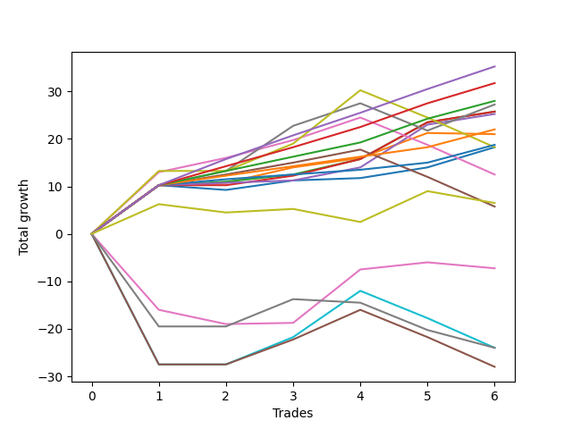

# Short Bernese 003 1v 
- Symbol: ES
- Date Range: 03/18/2022 - 09/30/2022
- Trading Period: 7:20-12:30
- Number of Trades: 20



| Name | Win Percent | Profit | Avg Profit / Trade | Avg Time / Trade |      | Name | Win Percent | Profit | Avg Profit / Trade | Avg Time / Trade |
| ---- | ----------- | ------ | ------------------ | ---------------- | ---- | ---- | ----------- | ------ | ------------------ | ---------------- |
| Sorted By <br> Profit | | | | | | Sorted By <br> Win Percentage ||||
| Four | 80.00 | 68625.00 | 3431.25 | 25:39 |     | Eighty-Two | 100.00 | 57750.00 | 2887.50 | 10:57 |
| Seven | 60.00 | 67375.00 | 3368.75 | 38:29 |     | Eighty-One | 100.00 | 51250.00 | 2562.50 | 05:32 |
| Five | 70.00 | 66375.00 | 3318.75 | 31:53 |     | Eighty-Three | 95.00 | 53625.00 | 2681.25 | 13:37 |
| Three | 80.00 | 65250.00 | 3262.50 | 16:00 |     | One | 90.00 | 51500.00 | 2575.00 | 10:34 |
| Two_C | 85.00 | 63500.00 | 3175.00 | 16:33 |     | Two_C | 85.00 | 63500.00 | 3175.00 | 16:33 |
| Two | 85.00 | 60750.00 | 3037.50 | 16:04 |     | Two | 85.00 | 60750.00 | 3037.50 | 16:04 |
| Eighty-Two | 100.00 | 57750.00 | 2887.50 | 10:57 |     | Eighty-Four | 85.00 | 48875.00 | 2443.75 | 19:18 |
| Eighty-Three | 95.00 | 53625.00 | 2681.25 | 13:37 |     | Four | 80.00 | 68625.00 | 3431.25 | 25:39 |
| One | 90.00 | 51500.00 | 2575.00 | 10:34 |     | Three | 80.00 | 65250.00 | 3262.50 | 16:00 |
| Eighty-One | 100.00 | 51250.00 | 2562.50 | 05:32 |     | Zero | 80.00 | 44000.00 | 2200.00 | 06:06 |
| Eighty-Four | 85.00 | 48875.00 | 2443.75 | 19:18 |     | Six | 75.00 | 48500.00 | 2425.00 | 26:00 |
| Six | 75.00 | 48500.00 | 2425.00 | 26:00 |     | Eighty-Five | 75.00 | 41000.00 | 2050.00 | 24:38 |
| Zero | 80.00 | 44000.00 | 2200.00 | 06:06 |     | Five | 70.00 | 66375.00 | 3318.75 | 31:53 |
| Eighty-Five | 75.00 | 41000.00 | 2050.00 | 24:38 |     | Seven | 60.00 | 67375.00 | 3368.75 | 38:29 |
| NEWFI 0000 | 50.00 | 23750.00 | 1187.50 | 45:24 |     | NEWFI 0000 | 50.00 | 23750.00 | 1187.50 | 45:24 |

## NO STOPLOSS

### Test Zero
* Sell when price hits the middle line of the 20p bollinger
* No Stoploss
* Results:
```
Total Trades: 20
Percent Up: 20.00
Percent Down: 80.00
Total Points Moved Down: 88.00
Potential Profit: 44000.00
Total Points Ups: 9.50 Count Ups: 4
Total Points Downs: 97.50 Count Downs: 16
```

<details><summary>Trades</summary>

<code>In: 2022-03-25 11:57:00		Out: 2022-03-25 11:58:10		Total Position Time: 01:10		Total Move Down: 0.25		Total to Date: 0.25</code> <br />
<code>In: 2022-04-20 09:55:00		Out: 2022-04-20 09:59:15		Total Position Time: 04:15		Total Move Down: 2.25		Total to Date: 2.50</code> <br />
<code>In: 2022-05-04 09:42:00		Out: 2022-05-04 09:45:30		Total Position Time: 03:30		Total Move Down: 3.50		Total to Date: 6.00</code> <br />
<code>In: 2022-05-24 10:44:00		Out: 2022-05-24 11:01:15		Total Position Time: 17:15		Total Move Down: -3.00		Total to Date: 3.00</code> <br />
<code>In: 2022-07-06 11:10:00		Out: 2022-07-06 11:11:10		Total Position Time: 01:10		Total Move Down: 7.50		Total to Date: 10.50</code> <br />
<code>In: 2022-07-06 11:11:00		Out: 2022-07-06 11:12:10		Total Position Time: 01:10		Total Move Down: 10.25		Total to Date: 20.75</code> <br />
<code>In: 2022-08-04 10:31:00		Out: 2022-08-04 10:43:05		Total Position Time: 12:05		Total Move Down: -1.00		Total to Date: 19.75</code> <br />
<code>In: 2022-08-05 10:10:00		Out: 2022-08-05 10:20:05		Total Position Time: 10:05		Total Move Down: -0.25		Total to Date: 19.50</code> <br />
<code>In: 2022-08-17 09:41:00		Out: 2022-08-17 09:50:30		Total Position Time: 09:30		Total Move Down: 0.50		Total to Date: 20.00</code> <br />
<code>In: 2022-08-17 10:33:00		Out: 2022-08-17 10:34:10		Total Position Time: 01:10		Total Move Down: 1.75		Total to Date: 21.75</code> <br />
<code>In: 2022-09-12 10:32:00		Out: 2022-09-12 10:33:10		Total Position Time: 01:10		Total Move Down: 19.00		Total to Date: 40.75</code> <br />
<code>In: 2022-09-12 10:33:00		Out: 2022-09-12 10:34:10		Total Position Time: 01:10		Total Move Down: 17.50		Total to Date: 58.25</code> <br />
<code>In: 2022-09-15 10:29:00		Out: 2022-09-15 10:30:10		Total Position Time: 01:10		Total Move Down: 20.50		Total to Date: 78.75</code> <br />
<code>In: 2022-09-16 11:31:00		Out: 2022-09-16 11:41:10		Total Position Time: 10:10		Total Move Down: 1.50		Total to Date: 80.25</code> <br />
<code>In: 2022-09-16 11:51:00		Out: 2022-09-16 12:11:10		Total Position Time: 20:10		Total Move Down: -5.25		Total to Date: 75.00</code> <br />
<code>In: 2022-09-21 09:38:00		Out: 2022-09-21 09:40:15		Total Position Time: 02:15		Total Move Down: 1.25		Total to Date: 76.25</code> <br />
<code>In: 2022-09-21 11:48:00		Out: 2022-09-21 12:01:05		Total Position Time: 13:05		Total Move Down: 2.50		Total to Date: 78.75</code> <br />
<code>In: 2022-09-22 12:16:00		Out: 2022-09-22 12:19:50		Total Position Time: 03:50		Total Move Down: 2.50		Total to Date: 81.25</code> <br />
<code>In: 2022-09-22 12:17:00		Out: 2022-09-22 12:19:50		Total Position Time: 02:50		Total Move Down: 2.25		Total to Date: 83.50</code> <br />
<code>In: 2022-09-29 08:57:00		Out: 2022-09-29 09:02:05		Total Position Time: 05:05		Total Move Down: 4.50		Total to Date: 88.00</code> <br />


</details>

### Test One
* Sell when the price hits the upper line of the 20p 1std bollinger
* No Stoploss
* Results:
```
Total Trades: 20
Percent Up: 10.00
Percent Down: 90.00
Total Points Moved Down: 103.00
Potential Profit: 51500.00
Total Points Ups: 10.25 Count Ups: 2
Total Points Downs: 113.25 Count Downs: 18
```

<details><summary>Trades</summary>

<code>In: 2022-03-25 11:57:00		Out: 2022-03-25 12:00:45		Total Position Time: 03:45		Total Move Down: 1.75		Total to Date: 1.75</code> <br />
<code>In: 2022-04-20 09:55:00		Out: 2022-04-20 10:08:15		Total Position Time: 13:15		Total Move Down: 3.25		Total to Date: 5.00</code> <br />
<code>In: 2022-05-04 09:42:00		Out: 2022-05-04 09:46:40		Total Position Time: 04:40		Total Move Down: 5.25		Total to Date: 10.25</code> <br />
<code>In: 2022-05-24 10:44:00		Out: 2022-05-24 11:01:40		Total Position Time: 17:40		Total Move Down: 0.50		Total to Date: 10.75</code> <br />
<code>In: 2022-07-06 11:10:00		Out: 2022-07-06 11:11:10		Total Position Time: 01:10		Total Move Down: 7.50		Total to Date: 18.25</code> <br />
<code>In: 2022-07-06 11:11:00		Out: 2022-07-06 11:12:10		Total Position Time: 01:10		Total Move Down: 10.25		Total to Date: 28.50</code> <br />
<code>In: 2022-08-04 10:31:00		Out: 2022-08-04 10:43:15		Total Position Time: 12:15		Total Move Down: 0.50		Total to Date: 29.00</code> <br />
<code>In: 2022-08-05 10:10:00		Out: 2022-08-05 10:23:15		Total Position Time: 13:15		Total Move Down: 1.00		Total to Date: 30.00</code> <br />
<code>In: 2022-08-17 09:41:00		Out: 2022-08-17 09:57:35		Total Position Time: 16:35		Total Move Down: 0.25		Total to Date: 30.25</code> <br />
<code>In: 2022-08-17 10:33:00		Out: 2022-08-17 10:46:05		Total Position Time: 13:05		Total Move Down: 0.75		Total to Date: 31.00</code> <br />
<code>In: 2022-09-12 10:32:00		Out: 2022-09-12 10:33:10		Total Position Time: 01:10		Total Move Down: 19.00		Total to Date: 50.00</code> <br />
<code>In: 2022-09-12 10:33:00		Out: 2022-09-12 10:34:10		Total Position Time: 01:10		Total Move Down: 17.50		Total to Date: 67.50</code> <br />
<code>In: 2022-09-15 10:29:00		Out: 2022-09-15 10:30:10		Total Position Time: 01:10		Total Move Down: 20.50		Total to Date: 88.00</code> <br />
<code>In: 2022-09-16 11:31:00		Out: 2022-09-16 12:14:25		Total Position Time: 43:25		Total Move Down: -8.50		Total to Date: 79.50</code> <br />
<code>In: 2022-09-16 11:51:00		Out: 2022-09-16 12:14:25		Total Position Time: 23:25		Total Move Down: -1.75		Total to Date: 77.75</code> <br />
<code>In: 2022-09-21 09:38:00		Out: 2022-09-21 09:45:25		Total Position Time: 07:25		Total Move Down: 2.50		Total to Date: 80.25</code> <br />
<code>In: 2022-09-21 11:48:00		Out: 2022-09-21 12:03:25		Total Position Time: 15:25		Total Move Down: 7.25		Total to Date: 87.50</code> <br />
<code>In: 2022-09-22 12:16:00		Out: 2022-09-22 12:20:20		Total Position Time: 04:20		Total Move Down: 5.50		Total to Date: 93.00</code> <br />
<code>In: 2022-09-22 12:17:00		Out: 2022-09-22 12:20:20		Total Position Time: 03:20		Total Move Down: 5.25		Total to Date: 98.25</code> <br />
<code>In: 2022-09-29 08:57:00		Out: 2022-09-29 09:10:55		Total Position Time: 13:55		Total Move Down: 4.75		Total to Date: 103.00</code> <br />


</details>

### Test Two
* Sell when the price hits the upper line of the 20p 2std bollinger
* No Stoploss
* Results:
```
Total Trades: 20
Percent Up: 15.00
Percent Down: 85.00
Total Points Moved Down: 121.50
Potential Profit: 60750.00
Total Points Ups: 7.50 Count Ups: 3
Total Points Downs: 129.00 Count Downs: 17
```

<details><summary>Trades</summary>

<code>In: 2022-03-25 11:57:00		Out: 2022-03-25 12:00:55		Total Position Time: 03:55		Total Move Down: 2.75		Total to Date: 2.75</code> <br />
<code>In: 2022-04-20 09:55:00		Out: 2022-04-20 10:08:15		Total Position Time: 13:15		Total Move Down: 3.25		Total to Date: 6.00</code> <br />
<code>In: 2022-05-04 09:42:00		Out: 2022-05-04 10:11:15		Total Position Time: 29:15		Total Move Down: 2.50		Total to Date: 8.50</code> <br />
<code>In: 2022-05-24 10:44:00		Out: 2022-05-24 11:01:50		Total Position Time: 17:50		Total Move Down: 1.50		Total to Date: 10.00</code> <br />
<code>In: 2022-07-06 11:10:00		Out: 2022-07-06 11:11:45		Total Position Time: 01:45		Total Move Down: 10.50		Total to Date: 20.50</code> <br />
<code>In: 2022-07-06 11:11:00		Out: 2022-07-06 11:12:10		Total Position Time: 01:10		Total Move Down: 10.25		Total to Date: 30.75</code> <br />
<code>In: 2022-08-04 10:31:00		Out: 2022-08-04 10:45:30		Total Position Time: 14:30		Total Move Down: 0.75		Total to Date: 31.50</code> <br />
<code>In: 2022-08-05 10:10:00		Out: 2022-08-05 10:49:30		Total Position Time: 39:30		Total Move Down: -0.75		Total to Date: 30.75</code> <br />
<code>In: 2022-08-17 09:41:00		Out: 2022-08-17 09:58:30		Total Position Time: 17:30		Total Move Down: 1.00		Total to Date: 31.75</code> <br />
<code>In: 2022-08-17 10:33:00		Out: 2022-08-17 11:00:50		Total Position Time: 27:50		Total Move Down: 2.00		Total to Date: 33.75</code> <br />
<code>In: 2022-09-12 10:32:00		Out: 2022-09-12 10:33:10		Total Position Time: 01:10		Total Move Down: 19.00		Total to Date: 52.75</code> <br />
<code>In: 2022-09-12 10:33:00		Out: 2022-09-12 10:34:10		Total Position Time: 01:10		Total Move Down: 17.50		Total to Date: 70.25</code> <br />
<code>In: 2022-09-15 10:29:00		Out: 2022-09-15 10:30:10		Total Position Time: 01:10		Total Move Down: 20.50		Total to Date: 90.75</code> <br />
<code>In: 2022-09-16 11:31:00		Out: 2022-09-16 12:28:05		Total Position Time: 57:05		Total Move Down: -6.75		Total to Date: 84.00</code> <br />
<code>In: 2022-09-16 11:51:00		Out: 2022-09-16 12:28:05		Total Position Time: 37:05		Total Move Down: -0.00		Total to Date: 84.00</code> <br />
<code>In: 2022-09-21 09:38:00		Out: 2022-09-21 09:47:25		Total Position Time: 09:25		Total Move Down: 3.25		Total to Date: 87.25</code> <br />
<code>In: 2022-09-21 11:48:00		Out: 2022-09-21 12:09:45		Total Position Time: 21:45		Total Move Down: 11.50		Total to Date: 98.75</code> <br />
<code>In: 2022-09-22 12:16:00		Out: 2022-09-22 12:22:20		Total Position Time: 06:20		Total Move Down: 8.00		Total to Date: 106.75</code> <br />
<code>In: 2022-09-22 12:17:00		Out: 2022-09-22 12:22:20		Total Position Time: 05:20		Total Move Down: 7.75		Total to Date: 114.50</code> <br />
<code>In: 2022-09-29 08:57:00		Out: 2022-09-29 09:11:30		Total Position Time: 14:30		Total Move Down: 7.00		Total to Date: 121.50</code> <br />


</details>

### Test Two_C
* Sell when the price hits the upper line of the 20p 2std bollinger
* No Stoploss
* Results:
```
Total Trades: 20
Percent Up: 15.00
Percent Down: 85.00
Total Points Moved Down: 127.00
Potential Profit: 63500.00
Total Points Ups: 6.50 Count Ups: 3
Total Points Downs: 133.50 Count Downs: 17
```

<details><summary>Trades</summary>

<code>In: 2022-03-25 11:57:00		Out: 2022-03-25 12:01:15		Total Position Time: 04:15		Total Move Down: 3.25		Total to Date: 3.25</code> <br />
<code>In: 2022-04-20 09:55:00		Out: 2022-04-20 10:08:15		Total Position Time: 13:15		Total Move Down: 3.25		Total to Date: 6.50</code> <br />
<code>In: 2022-05-04 09:42:00		Out: 2022-05-04 10:11:30		Total Position Time: 29:30		Total Move Down: 4.00		Total to Date: 10.50</code> <br />
<code>In: 2022-05-24 10:44:00		Out: 2022-05-24 11:01:50		Total Position Time: 17:50		Total Move Down: 1.50		Total to Date: 12.00</code> <br />
<code>In: 2022-07-06 11:10:00		Out: 2022-07-06 11:11:45		Total Position Time: 01:45		Total Move Down: 10.50		Total to Date: 22.50</code> <br />
<code>In: 2022-07-06 11:11:00		Out: 2022-07-06 11:12:10		Total Position Time: 01:10		Total Move Down: 10.25		Total to Date: 32.75</code> <br />
<code>In: 2022-08-04 10:31:00		Out: 2022-08-04 10:52:45		Total Position Time: 21:45		Total Move Down: -0.00		Total to Date: 32.75</code> <br />
<code>In: 2022-08-05 10:10:00		Out: 2022-08-05 10:50:35		Total Position Time: 40:35		Total Move Down: -0.25		Total to Date: 32.50</code> <br />
<code>In: 2022-08-17 09:41:00		Out: 2022-08-17 09:58:30		Total Position Time: 17:30		Total Move Down: 1.00		Total to Date: 33.50</code> <br />
<code>In: 2022-08-17 10:33:00		Out: 2022-08-17 11:00:50		Total Position Time: 27:50		Total Move Down: 2.00		Total to Date: 35.50</code> <br />
<code>In: 2022-09-12 10:32:00		Out: 2022-09-12 10:33:10		Total Position Time: 01:10		Total Move Down: 19.00		Total to Date: 54.50</code> <br />
<code>In: 2022-09-12 10:33:00		Out: 2022-09-12 10:34:10		Total Position Time: 01:10		Total Move Down: 17.50		Total to Date: 72.00</code> <br />
<code>In: 2022-09-15 10:29:00		Out: 2022-09-15 10:30:10		Total Position Time: 01:10		Total Move Down: 20.50		Total to Date: 92.50</code> <br />
<code>In: 2022-09-16 11:31:00		Out: 2022-09-16 12:28:15		Total Position Time: 57:15		Total Move Down: -6.25		Total to Date: 86.25</code> <br />
<code>In: 2022-09-16 11:51:00		Out: 2022-09-16 12:28:15		Total Position Time: 37:15		Total Move Down: 0.50		Total to Date: 86.75</code> <br />
<code>In: 2022-09-21 09:38:00		Out: 2022-09-21 09:47:30		Total Position Time: 09:30		Total Move Down: 3.75		Total to Date: 90.50</code> <br />
<code>In: 2022-09-21 11:48:00		Out: 2022-09-21 12:09:55		Total Position Time: 21:55		Total Move Down: 13.50		Total to Date: 104.00</code> <br />
<code>In: 2022-09-22 12:16:00		Out: 2022-09-22 12:22:20		Total Position Time: 06:20		Total Move Down: 8.00		Total to Date: 112.00</code> <br />
<code>In: 2022-09-22 12:17:00		Out: 2022-09-22 12:22:20		Total Position Time: 05:20		Total Move Down: 7.75		Total to Date: 119.75</code> <br />
<code>In: 2022-09-29 08:57:00		Out: 2022-09-29 09:11:40		Total Position Time: 14:40		Total Move Down: 7.25		Total to Date: 127.00</code> <br />


</details>

### Test Three
* Sell when price hits the middle line of the 50p bollinger
* No Stoploss
* Results:
```
Total Trades: 20
Percent Up: 20.00
Percent Down: 80.00
Total Points Moved Down: 130.50
Potential Profit: 65250.00
Total Points Ups: 9.75 Count Ups: 4
Total Points Downs: 140.25 Count Downs: 16
```

<details><summary>Trades</summary>

<code>In: 2022-03-25 11:57:00		Out: 2022-03-25 12:00:45		Total Position Time: 03:45		Total Move Down: 1.75		Total to Date: 1.75</code> <br />
<code>In: 2022-04-20 09:55:00		Out: 2022-04-20 10:08:35		Total Position Time: 13:35		Total Move Down: 4.75		Total to Date: 6.50</code> <br />
<code>In: 2022-05-04 09:42:00		Out: 2022-05-04 10:11:05		Total Position Time: 29:05		Total Move Down: 1.50		Total to Date: 8.00</code> <br />
<code>In: 2022-05-24 10:44:00		Out: 2022-05-24 11:20:25		Total Position Time: 36:25		Total Move Down: -1.25		Total to Date: 6.75</code> <br />
<code>In: 2022-07-06 11:10:00		Out: 2022-07-06 11:11:10		Total Position Time: 01:10		Total Move Down: 7.50		Total to Date: 14.25</code> <br />
<code>In: 2022-07-06 11:11:00		Out: 2022-07-06 11:12:10		Total Position Time: 01:10		Total Move Down: 10.25		Total to Date: 24.50</code> <br />
<code>In: 2022-08-04 10:31:00		Out: 2022-08-04 10:55:50		Total Position Time: 24:50		Total Move Down: 0.50		Total to Date: 25.00</code> <br />
<code>In: 2022-08-05 10:10:00		Out: 2022-08-05 10:47:35		Total Position Time: 37:35		Total Move Down: -1.75		Total to Date: 23.25</code> <br />
<code>In: 2022-08-17 09:41:00		Out: 2022-08-17 10:02:15		Total Position Time: 21:15		Total Move Down: 3.75		Total to Date: 27.00</code> <br />
<code>In: 2022-08-17 10:33:00		Out: 2022-08-17 10:34:10		Total Position Time: 01:10		Total Move Down: 1.75		Total to Date: 28.75</code> <br />
<code>In: 2022-09-12 10:32:00		Out: 2022-09-12 10:33:10		Total Position Time: 01:10		Total Move Down: 19.00		Total to Date: 47.75</code> <br />
<code>In: 2022-09-12 10:33:00		Out: 2022-09-12 10:34:10		Total Position Time: 01:10		Total Move Down: 17.50		Total to Date: 65.25</code> <br />
<code>In: 2022-09-15 10:29:00		Out: 2022-09-15 10:30:10		Total Position Time: 01:10		Total Move Down: 20.50		Total to Date: 85.75</code> <br />
<code>In: 2022-09-16 11:31:00		Out: 2022-09-16 12:19:05		Total Position Time: 48:05		Total Move Down: -6.75		Total to Date: 79.00</code> <br />
<code>In: 2022-09-16 11:51:00		Out: 2022-09-16 12:19:05		Total Position Time: 28:05		Total Move Down: -0.00		Total to Date: 79.00</code> <br />
<code>In: 2022-09-21 09:38:00		Out: 2022-09-21 09:45:30		Total Position Time: 07:30		Total Move Down: 3.00		Total to Date: 82.00</code> <br />
<code>In: 2022-09-21 11:48:00		Out: 2022-09-21 12:10:10		Total Position Time: 22:10		Total Move Down: 21.50		Total to Date: 103.50</code> <br />
<code>In: 2022-09-22 12:16:00		Out: 2022-09-22 12:27:05		Total Position Time: 11:05		Total Move Down: 9.25		Total to Date: 112.75</code> <br />
<code>In: 2022-09-22 12:17:00		Out: 2022-09-22 12:27:05		Total Position Time: 10:05		Total Move Down: 9.00		Total to Date: 121.75</code> <br />
<code>In: 2022-09-29 08:57:00		Out: 2022-09-29 09:16:35		Total Position Time: 19:35		Total Move Down: 8.75		Total to Date: 130.50</code> <br />


</details>

### Test Four
* Sell when the price hits the upper line of the 50p 1std bollinger
* No Stoploss
* Results:
```
Total Trades: 20
Percent Up: 20.00
Percent Down: 80.00
Total Points Moved Down: 137.25
Potential Profit: 68625.00
Total Points Ups: 20.50 Count Ups: 4
Total Points Downs: 157.75 Count Downs: 16
```

<details><summary>Trades</summary>

<code>In: 2022-03-25 11:57:00		Out: 2022-03-25 12:01:35		Total Position Time: 04:35		Total Move Down: 3.75		Total to Date: 3.75</code> <br />
<code>In: 2022-04-20 09:55:00		Out: 2022-04-20 10:26:35		Total Position Time: 31:35		Total Move Down: 3.50		Total to Date: 7.25</code> <br />
<code>In: 2022-05-04 09:42:00		Out: 2022-05-04 10:30:25		Total Position Time: 48:25		Total Move Down: 2.75		Total to Date: 10.00</code> <br />
<code>In: 2022-05-24 10:44:00		Out: 2022-05-24 11:44:15		Total Position Time: 60:15		Total Move Down: -5.00		Total to Date: 5.00</code> <br />
<code>In: 2022-07-06 11:10:00		Out: 2022-07-06 11:11:35		Total Position Time: 01:35		Total Move Down: 8.75		Total to Date: 13.75</code> <br />
<code>In: 2022-07-06 11:11:00		Out: 2022-07-06 11:12:10		Total Position Time: 01:10		Total Move Down: 10.25		Total to Date: 24.00</code> <br />
<code>In: 2022-08-04 10:31:00		Out: 2022-08-04 11:02:05		Total Position Time: 31:05		Total Move Down: 2.25		Total to Date: 26.25</code> <br />
<code>In: 2022-08-05 10:10:00		Out: 2022-08-05 10:52:05		Total Position Time: 42:05		Total Move Down: 0.25		Total to Date: 26.50</code> <br />
<code>In: 2022-08-17 09:41:00		Out: 2022-08-17 10:19:40		Total Position Time: 38:40		Total Move Down: 1.75		Total to Date: 28.25</code> <br />
<code>In: 2022-08-17 10:33:00		Out: 2022-08-17 11:00:50		Total Position Time: 27:50		Total Move Down: 2.00		Total to Date: 30.25</code> <br />
<code>In: 2022-09-12 10:32:00		Out: 2022-09-12 10:33:10		Total Position Time: 01:10		Total Move Down: 19.00		Total to Date: 49.25</code> <br />
<code>In: 2022-09-12 10:33:00		Out: 2022-09-12 10:34:10		Total Position Time: 01:10		Total Move Down: 17.50		Total to Date: 66.75</code> <br />
<code>In: 2022-09-15 10:29:00		Out: 2022-09-15 10:32:20		Total Position Time: 03:20		Total Move Down: 23.50		Total to Date: 90.25</code> <br />
<code>In: 2022-09-16 11:31:00		Out: 2022-09-16 12:30:25		Total Position Time: 59:25		Total Move Down: -4.25		Total to Date: 86.00</code> <br />
<code>In: 2022-09-16 11:51:00		Out: 2022-09-16 12:30:25		Total Position Time: 39:25		Total Move Down: 2.50		Total to Date: 88.50</code> <br />
<code>In: 2022-09-21 09:38:00		Out: 2022-09-21 09:53:05		Total Position Time: 15:05		Total Move Down: 4.00		Total to Date: 92.50</code> <br />
<code>In: 2022-09-21 11:48:00		Out: 2022-09-21 12:11:05		Total Position Time: 23:05		Total Move Down: 40.75		Total to Date: 133.25</code> <br />
<code>In: 2022-09-22 12:16:00		Out: 2022-09-22 12:47:00		Total Position Time: 31:00		Total Move Down: -5.50		Total to Date: 127.75</code> <br />
<code>In: 2022-09-22 12:17:00		Out: 2022-09-22 12:47:00		Total Position Time: 30:00		Total Move Down: -5.75		Total to Date: 122.00</code> <br />
<code>In: 2022-09-29 08:57:00		Out: 2022-09-29 09:19:05		Total Position Time: 22:05		Total Move Down: 15.25		Total to Date: 137.25</code> <br />


</details>

### Test Five
* Sell when the price hits the upper line of the 50p 2std bollinger
* No Stoploss
* Results:
```
Total Trades: 20
Percent Up: 30.00
Percent Down: 70.00
Total Points Moved Down: 132.75
Potential Profit: 66375.00
Total Points Ups: 33.00 Count Ups: 6
Total Points Downs: 165.75 Count Downs: 14
```

<details><summary>Trades</summary>

<code>In: 2022-03-25 11:57:00		Out: 2022-03-25 12:01:55		Total Position Time: 04:55		Total Move Down: 5.25		Total to Date: 5.25</code> <br />
<code>In: 2022-04-20 09:55:00		Out: 2022-04-20 10:55:55		Total Position Time: 60:55		Total Move Down: 1.50		Total to Date: 6.75</code> <br />
<code>In: 2022-05-04 09:42:00		Out: 2022-05-04 10:42:55		Total Position Time: 60:55		Total Move Down: 1.00		Total to Date: 7.75</code> <br />
<code>In: 2022-05-24 10:44:00		Out: 2022-05-24 11:44:55		Total Position Time: 60:55		Total Move Down: -4.25		Total to Date: 3.50</code> <br />
<code>In: 2022-07-06 11:10:00		Out: 2022-07-06 11:11:50		Total Position Time: 01:50		Total Move Down: 10.50		Total to Date: 14.00</code> <br />
<code>In: 2022-07-06 11:11:00		Out: 2022-07-06 11:12:15		Total Position Time: 01:15		Total Move Down: 13.00		Total to Date: 27.00</code> <br />
<code>In: 2022-08-04 10:31:00		Out: 2022-08-04 11:10:15		Total Position Time: 39:15		Total Move Down: 3.00		Total to Date: 30.00</code> <br />
<code>In: 2022-08-05 10:10:00		Out: 2022-08-05 10:55:40		Total Position Time: 45:40		Total Move Down: 1.50		Total to Date: 31.50</code> <br />
<code>In: 2022-08-17 09:41:00		Out: 2022-08-17 10:41:55		Total Position Time: 60:55		Total Move Down: -3.50		Total to Date: 28.00</code> <br />
<code>In: 2022-08-17 10:33:00		Out: 2022-08-17 11:01:00		Total Position Time: 28:00		Total Move Down: 2.00		Total to Date: 30.00</code> <br />
<code>In: 2022-09-12 10:32:00		Out: 2022-09-12 10:33:10		Total Position Time: 01:10		Total Move Down: 19.00		Total to Date: 49.00</code> <br />
<code>In: 2022-09-12 10:33:00		Out: 2022-09-12 10:34:10		Total Position Time: 01:10		Total Move Down: 17.50		Total to Date: 66.50</code> <br />
<code>In: 2022-09-15 10:29:00		Out: 2022-09-15 10:40:15		Total Position Time: 11:15		Total Move Down: 26.50		Total to Date: 93.00</code> <br />
<code>In: 2022-09-16 11:31:00		Out: 2022-09-16 12:31:55		Total Position Time: 60:55		Total Move Down: -6.75		Total to Date: 86.25</code> <br />
<code>In: 2022-09-16 11:51:00		Out: 2022-09-16 12:47:00		Total Position Time: 56:00		Total Move Down: -7.25		Total to Date: 79.00</code> <br />
<code>In: 2022-09-21 09:38:00		Out: 2022-09-21 09:55:30		Total Position Time: 17:30		Total Move Down: 5.00		Total to Date: 84.00</code> <br />
<code>In: 2022-09-21 11:48:00		Out: 2022-09-21 12:26:20		Total Position Time: 38:20		Total Move Down: 41.75		Total to Date: 125.75</code> <br />
<code>In: 2022-09-22 12:16:00		Out: 2022-09-22 12:47:00		Total Position Time: 31:00		Total Move Down: -5.50		Total to Date: 120.25</code> <br />
<code>In: 2022-09-22 12:17:00		Out: 2022-09-22 12:47:00		Total Position Time: 30:00		Total Move Down: -5.75		Total to Date: 114.50</code> <br />
<code>In: 2022-09-29 08:57:00		Out: 2022-09-29 09:22:45		Total Position Time: 25:45		Total Move Down: 18.25		Total to Date: 132.75</code> <br />


</details>

### Test Six
* Sell when the price hits the middle line of the 1std VWAP
* No Stoploss
* Results:
```
Total Trades: 20
Percent Up: 25.00
Percent Down: 75.00
Total Points Moved Down: 97.00
Potential Profit: 48500.00
Total Points Ups: 45.25 Count Ups: 5
Total Points Downs: 142.25 Count Downs: 15
```

<details><summary>Trades</summary>

<code>In: 2022-03-25 11:57:00		Out: 2022-03-25 12:07:35		Total Position Time: 10:35		Total Move Down: 11.00		Total to Date: 11.00</code> <br />
<code>In: 2022-04-20 09:55:00		Out: 2022-04-20 10:08:35		Total Position Time: 13:35		Total Move Down: 4.75		Total to Date: 15.75</code> <br />
<code>In: 2022-05-04 09:42:00		Out: 2022-05-04 10:42:55		Total Position Time: 60:55		Total Move Down: 1.00		Total to Date: 16.75</code> <br />
<code>In: 2022-05-24 10:44:00		Out: 2022-05-24 11:44:55		Total Position Time: 60:55		Total Move Down: -4.25		Total to Date: 12.50</code> <br />
<code>In: 2022-07-06 11:10:00		Out: 2022-07-06 11:11:10		Total Position Time: 01:10		Total Move Down: 7.50		Total to Date: 20.00</code> <br />
<code>In: 2022-07-06 11:11:00		Out: 2022-07-06 11:12:10		Total Position Time: 01:10		Total Move Down: 10.25		Total to Date: 30.25</code> <br />
<code>In: 2022-08-04 10:31:00		Out: 2022-08-04 11:10:15		Total Position Time: 39:15		Total Move Down: 3.00		Total to Date: 33.25</code> <br />
<code>In: 2022-08-05 10:10:00		Out: 2022-08-05 11:10:55		Total Position Time: 60:55		Total Move Down: 5.50		Total to Date: 38.75</code> <br />
<code>In: 2022-08-17 09:41:00		Out: 2022-08-17 10:02:15		Total Position Time: 21:15		Total Move Down: 3.75		Total to Date: 42.50</code> <br />
<code>In: 2022-08-17 10:33:00		Out: 2022-08-17 11:33:55		Total Position Time: 60:55		Total Move Down: -22.50		Total to Date: 20.00</code> <br />
<code>In: 2022-09-12 10:32:00		Out: 2022-09-12 10:33:10		Total Position Time: 01:10		Total Move Down: 19.00		Total to Date: 39.00</code> <br />
<code>In: 2022-09-12 10:33:00		Out: 2022-09-12 10:34:10		Total Position Time: 01:10		Total Move Down: 17.50		Total to Date: 56.50</code> <br />
<code>In: 2022-09-15 10:29:00		Out: 2022-09-15 10:30:10		Total Position Time: 01:10		Total Move Down: 20.50		Total to Date: 77.00</code> <br />
<code>In: 2022-09-16 11:31:00		Out: 2022-09-16 11:41:40		Total Position Time: 10:40		Total Move Down: 3.25		Total to Date: 80.25</code> <br />
<code>In: 2022-09-16 11:51:00		Out: 2022-09-16 12:47:00		Total Position Time: 56:00		Total Move Down: -7.25		Total to Date: 73.00</code> <br />
<code>In: 2022-09-21 09:38:00		Out: 2022-09-21 09:53:00		Total Position Time: 15:00		Total Move Down: 3.75		Total to Date: 76.75</code> <br />
<code>In: 2022-09-21 11:48:00		Out: 2022-09-21 12:10:05		Total Position Time: 22:05		Total Move Down: 18.50		Total to Date: 95.25</code> <br />
<code>In: 2022-09-22 12:16:00		Out: 2022-09-22 12:47:00		Total Position Time: 31:00		Total Move Down: -5.50		Total to Date: 89.75</code> <br />
<code>In: 2022-09-22 12:17:00		Out: 2022-09-22 12:47:00		Total Position Time: 30:00		Total Move Down: -5.75		Total to Date: 84.00</code> <br />
<code>In: 2022-09-29 08:57:00		Out: 2022-09-29 09:18:20		Total Position Time: 21:20		Total Move Down: 13.00		Total to Date: 97.00</code> <br />


</details>

### Test Seven
* Sell when the price hits the upper line of the 1std VWAP
* No Stoploss
* Results:
```
Total Trades: 20
Percent Up: 40.00
Percent Down: 60.00
Total Points Moved Down: 134.75
Potential Profit: 67375.00
Total Points Ups: 55.50 Count Ups: 8
Total Points Downs: 190.25 Count Downs: 12
```

<details><summary>Trades</summary>

<code>In: 2022-03-25 11:57:00		Out: 2022-03-25 12:33:10		Total Position Time: 36:10		Total Move Down: 20.50		Total to Date: 20.50</code> <br />
<code>In: 2022-04-20 09:55:00		Out: 2022-04-20 10:55:55		Total Position Time: 60:55		Total Move Down: 1.50		Total to Date: 22.00</code> <br />
<code>In: 2022-05-04 09:42:00		Out: 2022-05-04 10:42:55		Total Position Time: 60:55		Total Move Down: 1.00		Total to Date: 23.00</code> <br />
<code>In: 2022-05-24 10:44:00		Out: 2022-05-24 11:44:55		Total Position Time: 60:55		Total Move Down: -4.25		Total to Date: 18.75</code> <br />
<code>In: 2022-07-06 11:10:00		Out: 2022-07-06 11:12:20		Total Position Time: 02:20		Total Move Down: 14.75		Total to Date: 33.50</code> <br />
<code>In: 2022-07-06 11:11:00		Out: 2022-07-06 11:12:20		Total Position Time: 01:20		Total Move Down: 13.25		Total to Date: 46.75</code> <br />
<code>In: 2022-08-04 10:31:00		Out: 2022-08-04 11:31:55		Total Position Time: 60:55		Total Move Down: -0.00		Total to Date: 46.75</code> <br />
<code>In: 2022-08-05 10:10:00		Out: 2022-08-05 11:10:55		Total Position Time: 60:55		Total Move Down: 5.50		Total to Date: 52.25</code> <br />
<code>In: 2022-08-17 09:41:00		Out: 2022-08-17 10:41:55		Total Position Time: 60:55		Total Move Down: -3.50		Total to Date: 48.75</code> <br />
<code>In: 2022-08-17 10:33:00		Out: 2022-08-17 11:33:55		Total Position Time: 60:55		Total Move Down: -22.50		Total to Date: 26.25</code> <br />
<code>In: 2022-09-12 10:32:00		Out: 2022-09-12 10:33:10		Total Position Time: 01:10		Total Move Down: 19.00		Total to Date: 45.25</code> <br />
<code>In: 2022-09-12 10:33:00		Out: 2022-09-12 10:34:10		Total Position Time: 01:10		Total Move Down: 17.50		Total to Date: 62.75</code> <br />
<code>In: 2022-09-15 10:29:00		Out: 2022-09-15 10:46:20		Total Position Time: 17:20		Total Move Down: 29.25		Total to Date: 92.00</code> <br />
<code>In: 2022-09-16 11:31:00		Out: 2022-09-16 12:31:55		Total Position Time: 60:55		Total Move Down: -6.75		Total to Date: 85.25</code> <br />
<code>In: 2022-09-16 11:51:00		Out: 2022-09-16 12:47:00		Total Position Time: 56:00		Total Move Down: -7.25		Total to Date: 78.00</code> <br />
<code>In: 2022-09-21 09:38:00		Out: 2022-09-21 10:00:05		Total Position Time: 22:05		Total Move Down: 7.25		Total to Date: 85.25</code> <br />
<code>In: 2022-09-21 11:48:00		Out: 2022-09-21 12:11:05		Total Position Time: 23:05		Total Move Down: 40.75		Total to Date: 126.00</code> <br />
<code>In: 2022-09-22 12:16:00		Out: 2022-09-22 12:47:00		Total Position Time: 31:00		Total Move Down: -5.50		Total to Date: 120.50</code> <br />
<code>In: 2022-09-22 12:17:00		Out: 2022-09-22 12:47:00		Total Position Time: 30:00		Total Move Down: -5.75		Total to Date: 114.75</code> <br />
<code>In: 2022-09-29 08:57:00		Out: 2022-09-29 09:57:55		Total Position Time: 60:55		Total Move Down: 20.00		Total to Date: 134.75</code> <br />


</details>

## TAKE PROFIT

### Test Eighty-One
* Take Profit of 1 Point
* No Stoploss
* Results:
```
Total Trades: 20
Percent Up: 0.00
Percent Down: 100.00
Total Points Moved Down: 102.50
Potential Profit: 51250.00
Total Points Ups: 0.00 Count Ups: 0
Total Points Downs: 102.50 Count Downs: 20
```

<details><summary>Trades</summary>

<code>In: 2022-03-25 11:57:00		Out: 2022-03-25 11:58:45		Total Position Time: 01:45		Total Move Down: 1.00		Total to Date: 1.00</code> <br />
<code>In: 2022-04-20 09:55:00		Out: 2022-04-20 09:57:25		Total Position Time: 02:25		Total Move Down: 1.25		Total to Date: 2.25</code> <br />
<code>In: 2022-05-04 09:42:00		Out: 2022-05-04 09:43:10		Total Position Time: 01:10		Total Move Down: 2.00		Total to Date: 4.25</code> <br />
<code>In: 2022-05-24 10:44:00		Out: 2022-05-24 10:47:50		Total Position Time: 03:50		Total Move Down: 1.50		Total to Date: 5.75</code> <br />
<code>In: 2022-07-06 11:10:00		Out: 2022-07-06 11:11:10		Total Position Time: 01:10		Total Move Down: 7.50		Total to Date: 13.25</code> <br />
<code>In: 2022-07-06 11:11:00		Out: 2022-07-06 11:12:10		Total Position Time: 01:10		Total Move Down: 10.25		Total to Date: 23.50</code> <br />
<code>In: 2022-08-04 10:31:00		Out: 2022-08-04 10:56:25		Total Position Time: 25:25		Total Move Down: 1.25		Total to Date: 24.75</code> <br />
<code>In: 2022-08-05 10:10:00		Out: 2022-08-05 10:21:25		Total Position Time: 11:25		Total Move Down: 1.00		Total to Date: 25.75</code> <br />
<code>In: 2022-08-17 09:41:00		Out: 2022-08-17 09:50:55		Total Position Time: 09:55		Total Move Down: 1.50		Total to Date: 27.25</code> <br />
<code>In: 2022-08-17 10:33:00		Out: 2022-08-17 10:34:10		Total Position Time: 01:10		Total Move Down: 1.75		Total to Date: 29.00</code> <br />
<code>In: 2022-09-12 10:32:00		Out: 2022-09-12 10:33:10		Total Position Time: 01:10		Total Move Down: 19.00		Total to Date: 48.00</code> <br />
<code>In: 2022-09-12 10:33:00		Out: 2022-09-12 10:34:10		Total Position Time: 01:10		Total Move Down: 17.50		Total to Date: 65.50</code> <br />
<code>In: 2022-09-15 10:29:00		Out: 2022-09-15 10:30:10		Total Position Time: 01:10		Total Move Down: 20.50		Total to Date: 86.00</code> <br />
<code>In: 2022-09-16 11:31:00		Out: 2022-09-16 11:32:10		Total Position Time: 01:10		Total Move Down: 1.25		Total to Date: 87.25</code> <br />
<code>In: 2022-09-16 11:51:00		Out: 2022-09-16 12:30:10		Total Position Time: 39:10		Total Move Down: 1.00		Total to Date: 88.25</code> <br />
<code>In: 2022-09-21 09:38:00		Out: 2022-09-21 09:39:10		Total Position Time: 01:10		Total Move Down: 1.00		Total to Date: 89.25</code> <br />
<code>In: 2022-09-21 11:48:00		Out: 2022-09-21 11:49:10		Total Position Time: 01:10		Total Move Down: 9.50		Total to Date: 98.75</code> <br />
<code>In: 2022-09-22 12:16:00		Out: 2022-09-22 12:18:10		Total Position Time: 02:10		Total Move Down: 0.75		Total to Date: 99.50</code> <br />
<code>In: 2022-09-22 12:17:00		Out: 2022-09-22 12:18:25		Total Position Time: 01:25		Total Move Down: 1.50		Total to Date: 101.00</code> <br />
<code>In: 2022-09-29 08:57:00		Out: 2022-09-29 08:58:40		Total Position Time: 01:40		Total Move Down: 1.50		Total to Date: 102.50</code> <br />


</details>

### Test Eighty-Two
* Take Profit of 2 Point
* No Stoploss
* Results:
```
Total Trades: 20
Percent Up: 0.00
Percent Down: 100.00
Total Points Moved Down: 115.50
Potential Profit: 57750.00
Total Points Ups: 0.00 Count Ups: 0
Total Points Downs: 115.50 Count Downs: 20
```

<details><summary>Trades</summary>

<code>In: 2022-03-25 11:57:00		Out: 2022-03-25 12:00:50		Total Position Time: 03:50		Total Move Down: 2.75		Total to Date: 2.75</code> <br />
<code>In: 2022-04-20 09:55:00		Out: 2022-04-20 09:59:05		Total Position Time: 04:05		Total Move Down: 1.75		Total to Date: 4.50</code> <br />
<code>In: 2022-05-04 09:42:00		Out: 2022-05-04 09:43:10		Total Position Time: 01:10		Total Move Down: 2.00		Total to Date: 6.50</code> <br />
<code>In: 2022-05-24 10:44:00		Out: 2022-05-24 11:04:55		Total Position Time: 20:55		Total Move Down: 2.25		Total to Date: 8.75</code> <br />
<code>In: 2022-07-06 11:10:00		Out: 2022-07-06 11:11:10		Total Position Time: 01:10		Total Move Down: 7.50		Total to Date: 16.25</code> <br />
<code>In: 2022-07-06 11:11:00		Out: 2022-07-06 11:12:10		Total Position Time: 01:10		Total Move Down: 10.25		Total to Date: 26.50</code> <br />
<code>In: 2022-08-04 10:31:00		Out: 2022-08-04 10:56:30		Total Position Time: 25:30		Total Move Down: 2.00		Total to Date: 28.50</code> <br />
<code>In: 2022-08-05 10:10:00		Out: 2022-08-05 10:55:55		Total Position Time: 45:55		Total Move Down: 2.00		Total to Date: 30.50</code> <br />
<code>In: 2022-08-17 09:41:00		Out: 2022-08-17 10:02:15		Total Position Time: 21:15		Total Move Down: 3.75		Total to Date: 34.25</code> <br />
<code>In: 2022-08-17 10:33:00		Out: 2022-08-17 11:00:50		Total Position Time: 27:50		Total Move Down: 2.00		Total to Date: 36.25</code> <br />
<code>In: 2022-09-12 10:32:00		Out: 2022-09-12 10:33:10		Total Position Time: 01:10		Total Move Down: 19.00		Total to Date: 55.25</code> <br />
<code>In: 2022-09-12 10:33:00		Out: 2022-09-12 10:34:10		Total Position Time: 01:10		Total Move Down: 17.50		Total to Date: 72.75</code> <br />
<code>In: 2022-09-15 10:29:00		Out: 2022-09-15 10:30:10		Total Position Time: 01:10		Total Move Down: 20.50		Total to Date: 93.25</code> <br />
<code>In: 2022-09-16 11:31:00		Out: 2022-09-16 11:41:15		Total Position Time: 10:15		Total Move Down: 2.25		Total to Date: 95.50</code> <br />
<code>In: 2022-09-16 11:51:00		Out: 2022-09-16 12:30:25		Total Position Time: 39:25		Total Move Down: 2.50		Total to Date: 98.00</code> <br />
<code>In: 2022-09-21 09:38:00		Out: 2022-09-21 09:43:40		Total Position Time: 05:40		Total Move Down: 2.25		Total to Date: 100.25</code> <br />
<code>In: 2022-09-21 11:48:00		Out: 2022-09-21 11:49:10		Total Position Time: 01:10		Total Move Down: 9.50		Total to Date: 109.75</code> <br />
<code>In: 2022-09-22 12:16:00		Out: 2022-09-22 12:18:25		Total Position Time: 02:25		Total Move Down: 1.75		Total to Date: 111.50</code> <br />
<code>In: 2022-09-22 12:17:00		Out: 2022-09-22 12:18:40		Total Position Time: 01:40		Total Move Down: 2.00		Total to Date: 113.50</code> <br />
<code>In: 2022-09-29 08:57:00		Out: 2022-09-29 08:59:15		Total Position Time: 02:15		Total Move Down: 2.00		Total to Date: 115.50</code> <br />


</details>

### Test Eighty-Three
* Take Profit of 3 Point
* No Stoploss
* Results:
```
Total Trades: 20
Percent Up: 5.00
Percent Down: 95.00
Total Points Moved Down: 107.25
Potential Profit: 53625.00
Total Points Ups: 22.50 Count Ups: 1
Total Points Downs: 129.75 Count Downs: 19
```

<details><summary>Trades</summary>

<code>In: 2022-03-25 11:57:00		Out: 2022-03-25 12:01:00		Total Position Time: 04:00		Total Move Down: 3.00		Total to Date: 3.00</code> <br />
<code>In: 2022-04-20 09:55:00		Out: 2022-04-20 10:08:15		Total Position Time: 13:15		Total Move Down: 3.25		Total to Date: 6.25</code> <br />
<code>In: 2022-05-04 09:42:00		Out: 2022-05-04 09:45:30		Total Position Time: 03:30		Total Move Down: 3.50		Total to Date: 9.75</code> <br />
<code>In: 2022-05-24 10:44:00		Out: 2022-05-24 11:05:00		Total Position Time: 21:00		Total Move Down: 3.00		Total to Date: 12.75</code> <br />
<code>In: 2022-07-06 11:10:00		Out: 2022-07-06 11:11:10		Total Position Time: 01:10		Total Move Down: 7.50		Total to Date: 20.25</code> <br />
<code>In: 2022-07-06 11:11:00		Out: 2022-07-06 11:12:10		Total Position Time: 01:10		Total Move Down: 10.25		Total to Date: 30.50</code> <br />
<code>In: 2022-08-04 10:31:00		Out: 2022-08-04 10:57:00		Total Position Time: 26:00		Total Move Down: 3.00		Total to Date: 33.50</code> <br />
<code>In: 2022-08-05 10:10:00		Out: 2022-08-05 10:56:10		Total Position Time: 46:10		Total Move Down: 3.00		Total to Date: 36.50</code> <br />
<code>In: 2022-08-17 09:41:00		Out: 2022-08-17 10:02:15		Total Position Time: 21:15		Total Move Down: 3.75		Total to Date: 40.25</code> <br />
<code>In: 2022-08-17 10:33:00		Out: 2022-08-17 11:33:55		Total Position Time: 60:55		Total Move Down: -22.50		Total to Date: 17.75</code> <br />
<code>In: 2022-09-12 10:32:00		Out: 2022-09-12 10:33:10		Total Position Time: 01:10		Total Move Down: 19.00		Total to Date: 36.75</code> <br />
<code>In: 2022-09-12 10:33:00		Out: 2022-09-12 10:34:10		Total Position Time: 01:10		Total Move Down: 17.50		Total to Date: 54.25</code> <br />
<code>In: 2022-09-15 10:29:00		Out: 2022-09-15 10:30:10		Total Position Time: 01:10		Total Move Down: 20.50		Total to Date: 74.75</code> <br />
<code>In: 2022-09-16 11:31:00		Out: 2022-09-16 11:41:20		Total Position Time: 10:20		Total Move Down: 2.75		Total to Date: 77.50</code> <br />
<code>In: 2022-09-16 11:51:00		Out: 2022-09-16 12:30:45		Total Position Time: 39:45		Total Move Down: 3.00		Total to Date: 80.50</code> <br />
<code>In: 2022-09-21 09:38:00		Out: 2022-09-21 09:47:20		Total Position Time: 09:20		Total Move Down: 3.25		Total to Date: 83.75</code> <br />
<code>In: 2022-09-21 11:48:00		Out: 2022-09-21 11:49:10		Total Position Time: 01:10		Total Move Down: 9.50		Total to Date: 93.25</code> <br />
<code>In: 2022-09-22 12:16:00		Out: 2022-09-22 12:20:15		Total Position Time: 04:15		Total Move Down: 5.25		Total to Date: 98.50</code> <br />
<code>In: 2022-09-22 12:17:00		Out: 2022-09-22 12:20:15		Total Position Time: 03:15		Total Move Down: 5.00		Total to Date: 103.50</code> <br />
<code>In: 2022-09-29 08:57:00		Out: 2022-09-29 08:59:35		Total Position Time: 02:35		Total Move Down: 3.75		Total to Date: 107.25</code> <br />


</details>

### Test Eighty-Four
* Take Profit of 4 Point
* No Stoploss
* Results:
```
Total Trades: 20
Percent Up: 15.00
Percent Down: 85.00
Total Points Moved Down: 97.75
Potential Profit: 48875.00
Total Points Ups: 33.50 Count Ups: 3
Total Points Downs: 131.25 Count Downs: 17
```

<details><summary>Trades</summary>

<code>In: 2022-03-25 11:57:00		Out: 2022-03-25 12:01:45		Total Position Time: 04:45		Total Move Down: 4.00		Total to Date: 4.00</code> <br />
<code>In: 2022-04-20 09:55:00		Out: 2022-04-20 10:08:35		Total Position Time: 13:35		Total Move Down: 4.75		Total to Date: 8.75</code> <br />
<code>In: 2022-05-04 09:42:00		Out: 2022-05-04 09:46:15		Total Position Time: 04:15		Total Move Down: 4.25		Total to Date: 13.00</code> <br />
<code>In: 2022-05-24 10:44:00		Out: 2022-05-24 11:44:55		Total Position Time: 60:55		Total Move Down: -4.25		Total to Date: 8.75</code> <br />
<code>In: 2022-07-06 11:10:00		Out: 2022-07-06 11:11:10		Total Position Time: 01:10		Total Move Down: 7.50		Total to Date: 16.25</code> <br />
<code>In: 2022-07-06 11:11:00		Out: 2022-07-06 11:12:10		Total Position Time: 01:10		Total Move Down: 10.25		Total to Date: 26.50</code> <br />
<code>In: 2022-08-04 10:31:00		Out: 2022-08-04 11:11:05		Total Position Time: 40:05		Total Move Down: 4.00		Total to Date: 30.50</code> <br />
<code>In: 2022-08-05 10:10:00		Out: 2022-08-05 10:56:30		Total Position Time: 46:30		Total Move Down: 4.25		Total to Date: 34.75</code> <br />
<code>In: 2022-08-17 09:41:00		Out: 2022-08-17 10:02:40		Total Position Time: 21:40		Total Move Down: 3.75		Total to Date: 38.50</code> <br />
<code>In: 2022-08-17 10:33:00		Out: 2022-08-17 11:33:55		Total Position Time: 60:55		Total Move Down: -22.50		Total to Date: 16.00</code> <br />
<code>In: 2022-09-12 10:32:00		Out: 2022-09-12 10:33:10		Total Position Time: 01:10		Total Move Down: 19.00		Total to Date: 35.00</code> <br />
<code>In: 2022-09-12 10:33:00		Out: 2022-09-12 10:34:10		Total Position Time: 01:10		Total Move Down: 17.50		Total to Date: 52.50</code> <br />
<code>In: 2022-09-15 10:29:00		Out: 2022-09-15 10:30:10		Total Position Time: 01:10		Total Move Down: 20.50		Total to Date: 73.00</code> <br />
<code>In: 2022-09-16 11:31:00		Out: 2022-09-16 12:31:55		Total Position Time: 60:55		Total Move Down: -6.75		Total to Date: 66.25</code> <br />
<code>In: 2022-09-16 11:51:00		Out: 2022-09-16 12:30:50		Total Position Time: 39:50		Total Move Down: 4.00		Total to Date: 70.25</code> <br />
<code>In: 2022-09-21 09:38:00		Out: 2022-09-21 09:53:05		Total Position Time: 15:05		Total Move Down: 4.00		Total to Date: 74.25</code> <br />
<code>In: 2022-09-21 11:48:00		Out: 2022-09-21 11:49:10		Total Position Time: 01:10		Total Move Down: 9.50		Total to Date: 83.75</code> <br />
<code>In: 2022-09-22 12:16:00		Out: 2022-09-22 12:20:15		Total Position Time: 04:15		Total Move Down: 5.25		Total to Date: 89.00</code> <br />
<code>In: 2022-09-22 12:17:00		Out: 2022-09-22 12:20:15		Total Position Time: 03:15		Total Move Down: 5.00		Total to Date: 94.00</code> <br />
<code>In: 2022-09-29 08:57:00		Out: 2022-09-29 09:00:15		Total Position Time: 03:15		Total Move Down: 3.75		Total to Date: 97.75</code> <br />


</details>

### Test Eighty-Five
* Take Profit of 5 Point
* No Stoploss
* Results:
```
Total Trades: 20
Percent Up: 25.00
Percent Down: 75.00
Total Points Moved Down: 82.00
Potential Profit: 41000.00
Total Points Ups: 44.25 Count Ups: 5
Total Points Downs: 126.25 Count Downs: 15
```

<details><summary>Trades</summary>

<code>In: 2022-03-25 11:57:00		Out: 2022-03-25 12:01:55		Total Position Time: 04:55		Total Move Down: 5.25		Total to Date: 5.25</code> <br />
<code>In: 2022-04-20 09:55:00		Out: 2022-04-20 10:55:55		Total Position Time: 60:55		Total Move Down: 1.50		Total to Date: 6.75</code> <br />
<code>In: 2022-05-04 09:42:00		Out: 2022-05-04 09:46:30		Total Position Time: 04:30		Total Move Down: 5.00		Total to Date: 11.75</code> <br />
<code>In: 2022-05-24 10:44:00		Out: 2022-05-24 11:44:55		Total Position Time: 60:55		Total Move Down: -4.25		Total to Date: 7.50</code> <br />
<code>In: 2022-07-06 11:10:00		Out: 2022-07-06 11:11:10		Total Position Time: 01:10		Total Move Down: 7.50		Total to Date: 15.00</code> <br />
<code>In: 2022-07-06 11:11:00		Out: 2022-07-06 11:12:10		Total Position Time: 01:10		Total Move Down: 10.25		Total to Date: 25.25</code> <br />
<code>In: 2022-08-04 10:31:00		Out: 2022-08-04 11:11:15		Total Position Time: 40:15		Total Move Down: 5.50		Total to Date: 30.75</code> <br />
<code>In: 2022-08-05 10:10:00		Out: 2022-08-05 10:56:50		Total Position Time: 46:50		Total Move Down: 5.00		Total to Date: 35.75</code> <br />
<code>In: 2022-08-17 09:41:00		Out: 2022-08-17 10:41:55		Total Position Time: 60:55		Total Move Down: -3.50		Total to Date: 32.25</code> <br />
<code>In: 2022-08-17 10:33:00		Out: 2022-08-17 11:33:55		Total Position Time: 60:55		Total Move Down: -22.50		Total to Date: 9.75</code> <br />
<code>In: 2022-09-12 10:32:00		Out: 2022-09-12 10:33:10		Total Position Time: 01:10		Total Move Down: 19.00		Total to Date: 28.75</code> <br />
<code>In: 2022-09-12 10:33:00		Out: 2022-09-12 10:34:10		Total Position Time: 01:10		Total Move Down: 17.50		Total to Date: 46.25</code> <br />
<code>In: 2022-09-15 10:29:00		Out: 2022-09-15 10:30:10		Total Position Time: 01:10		Total Move Down: 20.50		Total to Date: 66.75</code> <br />
<code>In: 2022-09-16 11:31:00		Out: 2022-09-16 12:31:55		Total Position Time: 60:55		Total Move Down: -6.75		Total to Date: 60.00</code> <br />
<code>In: 2022-09-16 11:51:00		Out: 2022-09-16 12:47:00		Total Position Time: 56:00		Total Move Down: -7.25		Total to Date: 52.75</code> <br />
<code>In: 2022-09-21 09:38:00		Out: 2022-09-21 09:54:00		Total Position Time: 16:00		Total Move Down: 4.75		Total to Date: 57.50</code> <br />
<code>In: 2022-09-21 11:48:00		Out: 2022-09-21 11:49:10		Total Position Time: 01:10		Total Move Down: 9.50		Total to Date: 67.00</code> <br />
<code>In: 2022-09-22 12:16:00		Out: 2022-09-22 12:20:15		Total Position Time: 04:15		Total Move Down: 5.25		Total to Date: 72.25</code> <br />
<code>In: 2022-09-22 12:17:00		Out: 2022-09-22 12:20:15		Total Position Time: 03:15		Total Move Down: 5.00		Total to Date: 77.25</code> <br />
<code>In: 2022-09-29 08:57:00		Out: 2022-09-29 09:02:15		Total Position Time: 05:15		Total Move Down: 4.75		Total to Date: 82.00</code> <br />


</details>

## Indicator Exits

### Test NEWFI 0000
* Newfi 0000
* No Stoploss
* Results:
```
Total Trades: 20
Percent Up: 50.00
Percent Down: 50.00
Total Points Moved Down: 47.50
Potential Profit: 23750.00
Total Points Ups: 106.00 Count Ups: 10
Total Points Downs: 153.50 Count Downs: 10
```

<details><summary>Trades</summary>

<code>In: 2022-03-25 11:57:00		Out: 2022-03-25 12:12:05		Total Position Time: 15:05		Total Move Down: 5.50		Total to Date: 5.50</code> <br />
<code>In: 2022-04-20 09:55:00		Out: 2022-04-20 10:55:55		Total Position Time: 60:55		Total Move Down: 1.50		Total to Date: 7.00</code> <br />
<code>In: 2022-05-04 09:42:00		Out: 2022-05-04 10:34:05		Total Position Time: 52:05		Total Move Down: -0.25		Total to Date: 6.75</code> <br />
<code>In: 2022-05-24 10:44:00		Out: 2022-05-24 11:44:55		Total Position Time: 60:55		Total Move Down: -4.25		Total to Date: 2.50</code> <br />
<code>In: 2022-07-06 11:10:00		Out: 2022-07-06 12:10:55		Total Position Time: 60:55		Total Move Down: -22.75		Total to Date: -20.25</code> <br />
<code>In: 2022-07-06 11:11:00		Out: 2022-07-06 12:11:55		Total Position Time: 60:55		Total Move Down: -27.50		Total to Date: -47.75</code> <br />
<code>In: 2022-08-04 10:31:00		Out: 2022-08-04 11:14:05		Total Position Time: 43:05		Total Move Down: 4.50		Total to Date: -43.25</code> <br />
<code>In: 2022-08-05 10:10:00		Out: 2022-08-05 10:59:05		Total Position Time: 49:05		Total Move Down: 2.50		Total to Date: -40.75</code> <br />
<code>In: 2022-08-17 09:41:00		Out: 2022-08-17 10:41:55		Total Position Time: 60:55		Total Move Down: -3.50		Total to Date: -44.25</code> <br />
<code>In: 2022-08-17 10:33:00		Out: 2022-08-17 11:33:55		Total Position Time: 60:55		Total Move Down: -22.50		Total to Date: -66.75</code> <br />
<code>In: 2022-09-12 10:32:00		Out: 2022-09-12 11:22:05		Total Position Time: 50:05		Total Move Down: 27.00		Total to Date: -39.75</code> <br />
<code>In: 2022-09-12 10:33:00		Out: 2022-09-12 11:22:05		Total Position Time: 49:05		Total Move Down: 26.25		Total to Date: -13.50</code> <br />
<code>In: 2022-09-15 10:29:00		Out: 2022-09-15 10:51:05		Total Position Time: 22:05		Total Move Down: 35.25		Total to Date: 21.75</code> <br />
<code>In: 2022-09-16 11:31:00		Out: 2022-09-16 12:31:55		Total Position Time: 60:55		Total Move Down: -6.75		Total to Date: 15.00</code> <br />
<code>In: 2022-09-16 11:51:00		Out: 2022-09-16 12:47:00		Total Position Time: 56:00		Total Move Down: -7.25		Total to Date: 7.75</code> <br />
<code>In: 2022-09-21 09:38:00		Out: 2022-09-21 09:58:05		Total Position Time: 20:05		Total Move Down: 6.00		Total to Date: 13.75</code> <br />
<code>In: 2022-09-21 11:48:00		Out: 2022-09-21 12:24:05		Total Position Time: 36:05		Total Move Down: 29.50		Total to Date: 43.25</code> <br />
<code>In: 2022-09-22 12:16:00		Out: 2022-09-22 12:47:00		Total Position Time: 31:00		Total Move Down: -5.50		Total to Date: 37.75</code> <br />
<code>In: 2022-09-22 12:17:00		Out: 2022-09-22 12:47:00		Total Position Time: 30:00		Total Move Down: -5.75		Total to Date: 32.00</code> <br />
<code>In: 2022-09-29 08:57:00		Out: 2022-09-29 09:25:05		Total Position Time: 28:05		Total Move Down: 15.50		Total to Date: 47.50</code> <br />


</details>