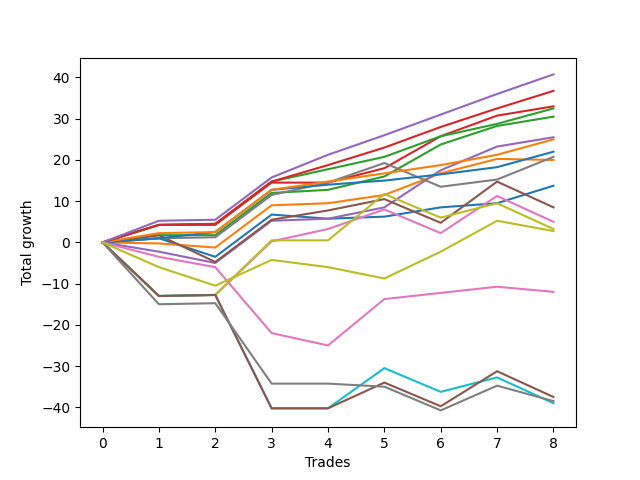

# Short Bernese 003 50 SB 
- Symbol: ES
- Date Range: 09/26/2022 - 12/30/2022
- Trading Period: 8:30-12:30
- Number of Trades: 2



| Name | Win Percent | Profit | Avg Profit / Trade | Avg Time / Trade |      | Name | Win Percent | Profit | Avg Profit / Trade | Avg Time / Trade |
| ---- | ----------- | ------ | ------------------ | ---------------- | ---- | ---- | ----------- | ------ | ------------------ | ---------------- |
| Sorted By <br> Profit | | | | | | Sorted By <br> Win Percentage ||||
| Eighty-Five | 100.00 | 4875.00 | 2437.50 | 07:17 |     | Eighty-Five | 100.00 | 4875.00 | 2437.50 | 07:17 |
| Eighty-Four | 100.00 | 4375.00 | 2187.50 | 07:12 |     | Eighty-Four | 100.00 | 4375.00 | 2187.50 | 07:12 |
| Three | 100.00 | 4000.00 | 2000.00 | 19:07 |     | Three | 100.00 | 4000.00 | 2000.00 | 19:07 |
| Six | 100.00 | 3625.00 | 1812.50 | 15:07 |     | Six | 100.00 | 3625.00 | 1812.50 | 15:07 |
| Two_C | 100.00 | 3625.00 | 1812.50 | 19:05 |     | Two_C | 100.00 | 3625.00 | 1812.50 | 19:05 |
| Eighty-Three | 100.00 | 3375.00 | 1687.50 | 04:17 |     | Eighty-Three | 100.00 | 3375.00 | 1687.50 | 04:17 |
| Two | 100.00 | 3375.00 | 1687.50 | 19:02 |     | Two | 100.00 | 3375.00 | 1687.50 | 19:02 |
| Eighty-Two | 100.00 | 3125.00 | 1562.50 | 04:15 |     | Eighty-Two | 100.00 | 3125.00 | 1562.50 | 04:15 |
| Eighty-One | 100.00 | 2750.00 | 1375.00 | 02:15 |     | Eighty-One | 100.00 | 2750.00 | 1375.00 | 02:15 |
| Zero | 100.00 | 2625.00 | 1312.50 | 03:45 |     | Zero | 100.00 | 2625.00 | 1312.50 | 03:45 |
| MALAMUTE 002 | 50.00 | 2500.00 | 1250.00 | 12:35 |     | MALAMUTE 002 | 50.00 | 2500.00 | 1250.00 | 12:35 |
| Four | 50.00 | 1875.00 | 937.50 | 39:32 |     | Four | 50.00 | 1875.00 | 937.50 | 39:32 |
| One | 50.00 | 1625.00 | 812.50 | 16:22 |     | One | 50.00 | 1625.00 | 812.50 | 16:22 |
| Five | 50.00 | 1375.00 | 687.50 | 51:20 |     | Five | 50.00 | 1375.00 | 687.50 | 51:20 |
| MALAMUTE 001 | 50.00 | 1125.00 | 562.50 | 46:05 |     | MALAMUTE 001 | 50.00 | 1125.00 | 562.50 | 46:05 |
| NEWFI 000 | 50.00 | 1125.00 | 562.50 | 55:30 |     | NEWFI 000 | 50.00 | 1125.00 | 562.50 | 55:30 |
| NEWFI 0000 | 50.00 | 125.00 | 62.50 | 06:05 |     | NEWFI 0000 | 50.00 | 125.00 | 62.50 | 06:05 |
| BB100 | 50.00 | -1375.00 | -687.50 | 60:55 |     | BB100 | 50.00 | -1375.00 | -687.50 | 60:55 |
| Seven | 50.00 | -1375.00 | -687.50 | 60:55 |     | Seven | 50.00 | -1375.00 | -687.50 | 60:55 |

## NO STOPLOSS

### Test Zero
* Sell when price hits the middle line of the 20p bollinger
* No Stoploss
* Results:
```
Total Trades: 2
Percent Up: 0.00
Percent Down: 100.00
Total Points Moved Down: 5.25
Potential Profit: 2625.00
Total Points Ups: 0.00 Count Ups: 0
Total Points Downs: 5.25 Count Downs: 2
```

<details><summary>Trades</summary>

<code>In: 2022-10-06 09:51:00		Out: 2022-10-06 09:55:05		Total Position Time: 04:05		Total Move Down: 1.00		Total to Date: 1.00</code> <br />
<code>In: 2022-11-23 11:08:00		Out: 2022-11-23 11:11:25		Total Position Time: 03:25		Total Move Down: 4.25		Total to Date: 5.25</code> <br />


</details>

### Test One
* Sell when the price hits the lower line of the 20p 1std bollinger
* No Stoploss
* Results:
```
Total Trades: 2
Percent Up: 50.00
Percent Down: 50.00
Total Points Moved Down: 3.25
Potential Profit: 1625.00
Total Points Ups: 0.25 Count Ups: 1
Total Points Downs: 3.50 Count Downs: 1
```

<details><summary>Trades</summary>

<code>In: 2022-10-06 09:51:00		Out: 2022-10-06 09:57:05		Total Position Time: 06:05		Total Move Down: 3.50		Total to Date: 3.50</code> <br />
<code>In: 2022-11-23 11:08:00		Out: 2022-11-23 11:34:40		Total Position Time: 26:40		Total Move Down: -0.25		Total to Date: 3.25</code> <br />


</details>

### Test Two
* Sell when the price hits the lower line of the 20p 2std bollinger
* No Stoploss
* Results:
```
Total Trades: 2
Percent Up: 0.00
Percent Down: 100.00
Total Points Moved Down: 6.75
Potential Profit: 3375.00
Total Points Ups: 0.00 Count Ups: 0
Total Points Downs: 6.75 Count Downs: 2
```

<details><summary>Trades</summary>

<code>In: 2022-10-06 09:51:00		Out: 2022-10-06 10:02:00		Total Position Time: 11:00		Total Move Down: 4.50		Total to Date: 4.50</code> <br />
<code>In: 2022-11-23 11:08:00		Out: 2022-11-23 11:35:05		Total Position Time: 27:05		Total Move Down: 2.25		Total to Date: 6.75</code> <br />


</details>

### Test Two_C
* Sell when the price hits the lower line of the 20p 2std bollinger
* No Stoploss
* Results:
```
Total Trades: 2
Percent Up: 0.00
Percent Down: 100.00
Total Points Moved Down: 7.25
Potential Profit: 3625.00
Total Points Ups: 0.00 Count Ups: 0
Total Points Downs: 7.25 Count Downs: 2
```

<details><summary>Trades</summary>

<code>In: 2022-10-06 09:51:00		Out: 2022-10-06 10:02:05		Total Position Time: 11:05		Total Move Down: 5.00		Total to Date: 5.00</code> <br />
<code>In: 2022-11-23 11:08:00		Out: 2022-11-23 11:35:05		Total Position Time: 27:05		Total Move Down: 2.25		Total to Date: 7.25</code> <br />


</details>

### Test Three
* Sell when price hits the middle line of the 50p bollinger
* No Stoploss
* Results:
```
Total Trades: 2
Percent Up: 0.00
Percent Down: 100.00
Total Points Moved Down: 8.00
Potential Profit: 4000.00
Total Points Ups: 0.00 Count Ups: 0
Total Points Downs: 8.00 Count Downs: 2
```

<details><summary>Trades</summary>

<code>In: 2022-10-06 09:51:00		Out: 2022-10-06 10:02:10		Total Position Time: 11:10		Total Move Down: 5.75		Total to Date: 5.75</code> <br />
<code>In: 2022-11-23 11:08:00		Out: 2022-11-23 11:35:05		Total Position Time: 27:05		Total Move Down: 2.25		Total to Date: 8.00</code> <br />


</details>

### Test Four
* Sell when the price hits the lower line of the 50p 1std bollinger
* No Stoploss
* Results:
```
Total Trades: 2
Percent Up: 50.00
Percent Down: 50.00
Total Points Moved Down: 3.75
Potential Profit: 1875.00
Total Points Ups: 6.25 Count Ups: 1
Total Points Downs: 10.00 Count Downs: 1
```

<details><summary>Trades</summary>

<code>In: 2022-10-06 09:51:00		Out: 2022-10-06 10:09:10		Total Position Time: 18:10		Total Move Down: 10.00		Total to Date: 10.00</code> <br />
<code>In: 2022-11-23 11:08:00		Out: 2022-11-23 12:08:55		Total Position Time: 60:55		Total Move Down: -6.25		Total to Date: 3.75</code> <br />


</details>

### Test Five
* Sell when the price hits the lower line of the 50p 2std bollinger
* No Stoploss
* Results:
```
Total Trades: 2
Percent Up: 50.00
Percent Down: 50.00
Total Points Moved Down: 2.75
Potential Profit: 1375.00
Total Points Ups: 6.25 Count Ups: 1
Total Points Downs: 9.00 Count Downs: 1
```

<details><summary>Trades</summary>

<code>In: 2022-10-06 09:51:00		Out: 2022-10-06 10:32:45		Total Position Time: 41:45		Total Move Down: 9.00		Total to Date: 9.00</code> <br />
<code>In: 2022-11-23 11:08:00		Out: 2022-11-23 12:08:55		Total Position Time: 60:55		Total Move Down: -6.25		Total to Date: 2.75</code> <br />


</details>

### Test Six
* Sell when the price hits the middle line of the 1std VWAP
* No Stoploss
* Results:
```
Total Trades: 2
Percent Up: 0.00
Percent Down: 100.00
Total Points Moved Down: 7.25
Potential Profit: 3625.00
Total Points Ups: 0.00 Count Ups: 0
Total Points Downs: 7.25 Count Downs: 2
```

<details><summary>Trades</summary>

<code>In: 2022-10-06 09:51:00		Out: 2022-10-06 09:52:10		Total Position Time: 01:10		Total Move Down: 1.75		Total to Date: 1.75</code> <br />
<code>In: 2022-11-23 11:08:00		Out: 2022-11-23 11:37:05		Total Position Time: 29:05		Total Move Down: 5.50		Total to Date: 7.25</code> <br />


</details>

### Test Seven
* Sell when the price hits the lower line of the 1std VWAP
* No Stoploss
* Results:
```
Total Trades: 2
Percent Up: 50.00
Percent Down: 50.00
Total Points Moved Down: -2.75
Potential Profit: -1375.00
Total Points Ups: 6.25 Count Ups: 1
Total Points Downs: 3.50 Count Downs: 1
```

<details><summary>Trades</summary>

<code>In: 2022-10-06 09:51:00		Out: 2022-10-06 10:51:55		Total Position Time: 60:55		Total Move Down: 3.50		Total to Date: 3.50</code> <br />
<code>In: 2022-11-23 11:08:00		Out: 2022-11-23 12:08:55		Total Position Time: 60:55		Total Move Down: -6.25		Total to Date: -2.75</code> <br />


</details>

### Test BB100
* Move to BB100 Upper Band
* No Stoploss
* Results:
```
Total Trades: 2
Percent Up: 50.00
Percent Down: 50.00
Total Points Moved Down: -2.75
Potential Profit: -1375.00
Total Points Ups: 6.25 Count Ups: 1
Total Points Downs: 3.50 Count Downs: 1
```

<details><summary>Trades</summary>

<code>In: 2022-10-06 09:51:00		Out: 2022-10-06 10:51:55		Total Position Time: 60:55		Total Move Down: 3.50		Total to Date: 3.50</code> <br />
<code>In: 2022-11-23 11:08:00		Out: 2022-11-23 12:08:55		Total Position Time: 60:55		Total Move Down: -6.25		Total to Date: -2.75</code> <br />


</details>

## TAKE PROFIT

### Test Eighty-One
* Take Profit of 1 Point
* No Stoploss
* Results:
```
Total Trades: 2
Percent Up: 0.00
Percent Down: 100.00
Total Points Moved Down: 5.50
Potential Profit: 2750.00
Total Points Ups: 0.00 Count Ups: 0
Total Points Downs: 5.50 Count Downs: 2
```

<details><summary>Trades</summary>

<code>In: 2022-10-06 09:51:00		Out: 2022-10-06 09:52:10		Total Position Time: 01:10		Total Move Down: 1.75		Total to Date: 1.75</code> <br />
<code>In: 2022-11-23 11:08:00		Out: 2022-11-23 11:11:20		Total Position Time: 03:20		Total Move Down: 3.75		Total to Date: 5.50</code> <br />


</details>

### Test Eighty-Two
* Take Profit of 2 Point
* No Stoploss
* Results:
```
Total Trades: 2
Percent Up: 0.00
Percent Down: 100.00
Total Points Moved Down: 6.25
Potential Profit: 3125.00
Total Points Ups: 0.00 Count Ups: 0
Total Points Downs: 6.25 Count Downs: 2
```

<details><summary>Trades</summary>

<code>In: 2022-10-06 09:51:00		Out: 2022-10-06 09:56:10		Total Position Time: 05:10		Total Move Down: 2.50		Total to Date: 2.50</code> <br />
<code>In: 2022-11-23 11:08:00		Out: 2022-11-23 11:11:20		Total Position Time: 03:20		Total Move Down: 3.75		Total to Date: 6.25</code> <br />


</details>

### Test Eighty-Three
* Take Profit of 3 Point
* No Stoploss
* Results:
```
Total Trades: 2
Percent Up: 0.00
Percent Down: 100.00
Total Points Moved Down: 6.75
Potential Profit: 3375.00
Total Points Ups: 0.00 Count Ups: 0
Total Points Downs: 6.75 Count Downs: 2
```

<details><summary>Trades</summary>

<code>In: 2022-10-06 09:51:00		Out: 2022-10-06 09:56:15		Total Position Time: 05:15		Total Move Down: 3.00		Total to Date: 3.00</code> <br />
<code>In: 2022-11-23 11:08:00		Out: 2022-11-23 11:11:20		Total Position Time: 03:20		Total Move Down: 3.75		Total to Date: 6.75</code> <br />


</details>

### Test Eighty-Four
* Take Profit of 4 Point
* No Stoploss
* Results:
```
Total Trades: 2
Percent Up: 0.00
Percent Down: 100.00
Total Points Moved Down: 8.75
Potential Profit: 4375.00
Total Points Ups: 0.00 Count Ups: 0
Total Points Downs: 8.75 Count Downs: 2
```

<details><summary>Trades</summary>

<code>In: 2022-10-06 09:51:00		Out: 2022-10-06 10:02:00		Total Position Time: 11:00		Total Move Down: 4.50		Total to Date: 4.50</code> <br />
<code>In: 2022-11-23 11:08:00		Out: 2022-11-23 11:11:25		Total Position Time: 03:25		Total Move Down: 4.25		Total to Date: 8.75</code> <br />


</details>

### Test Eighty-Five
* Take Profit of 5 Point
* No Stoploss
* Results:
```
Total Trades: 2
Percent Up: 0.00
Percent Down: 100.00
Total Points Moved Down: 9.75
Potential Profit: 4875.00
Total Points Ups: 0.00 Count Ups: 0
Total Points Downs: 9.75 Count Downs: 2
```

<details><summary>Trades</summary>

<code>In: 2022-10-06 09:51:00		Out: 2022-10-06 10:02:05		Total Position Time: 11:05		Total Move Down: 5.00		Total to Date: 5.00</code> <br />
<code>In: 2022-11-23 11:08:00		Out: 2022-11-23 11:11:30		Total Position Time: 03:30		Total Move Down: 4.75		Total to Date: 9.75</code> <br />


</details>

## Indicator Exits

### Test NEWFI 000
* Newfi 0000
* No Stoploss
* Results:
```
Total Trades: 2
Percent Up: 50.00
Percent Down: 50.00
Total Points Moved Down: 2.25
Potential Profit: 1125.00
Total Points Ups: 6.25 Count Ups: 1
Total Points Downs: 8.50 Count Downs: 1
```

<details><summary>Trades</summary>

<code>In: 2022-10-06 09:51:00		Out: 2022-10-06 10:41:05		Total Position Time: 50:05		Total Move Down: 8.50		Total to Date: 8.50</code> <br />
<code>In: 2022-11-23 11:08:00		Out: 2022-11-23 12:08:55		Total Position Time: 60:55		Total Move Down: -6.25		Total to Date: 2.25</code> <br />


</details>

### Test NEWFI 0000
* Newfi 0000
* No Stoploss
* Results:
```
Total Trades: 2
Percent Up: 50.00
Percent Down: 50.00
Total Points Moved Down: 0.25
Potential Profit: 125.00
Total Points Ups: 1.25 Count Ups: 1
Total Points Downs: 1.50 Count Downs: 1
```

<details><summary>Trades</summary>

<code>In: 2022-10-06 09:51:00		Out: 2022-10-06 09:52:05		Total Position Time: 01:05		Total Move Down: 1.50		Total to Date: 1.50</code> <br />
<code>In: 2022-11-23 11:08:00		Out: 2022-11-23 11:19:05		Total Position Time: 11:05		Total Move Down: -1.25		Total to Date: 0.25</code> <br />


</details>

### Test MALAMUTE 001
* Malamute 001
* No Stoploss
* Results:
```
Total Trades: 2
Percent Up: 50.00
Percent Down: 50.00
Total Points Moved Down: 2.25
Potential Profit: 1125.00
Total Points Ups: 3.75 Count Ups: 1
Total Points Downs: 6.00 Count Downs: 1
```

<details><summary>Trades</summary>

<code>In: 2022-10-06 09:51:00		Out: 2022-10-06 10:32:05		Total Position Time: 41:05		Total Move Down: 6.00		Total to Date: 6.00</code> <br />
<code>In: 2022-11-23 11:08:00		Out: 2022-11-23 11:59:05		Total Position Time: 51:05		Total Move Down: -3.75		Total to Date: 2.25</code> <br />


</details>

### Test MALAMUTE 002
* Malamute 001
* No Stoploss
* Results:
```
Total Trades: 2
Percent Up: 50.00
Percent Down: 50.00
Total Points Moved Down: 5.00
Potential Profit: 2500.00
Total Points Ups: 2.50 Count Ups: 1
Total Points Downs: 7.50 Count Downs: 1
```

<details><summary>Trades</summary>

<code>In: 2022-10-06 09:51:00		Out: 2022-10-06 10:08:05		Total Position Time: 17:05		Total Move Down: 7.50		Total to Date: 7.50</code> <br />
<code>In: 2022-11-23 11:08:00		Out: 2022-11-23 11:16:05		Total Position Time: 08:05		Total Move Down: -2.50		Total to Date: 5.00</code> <br />


</details>