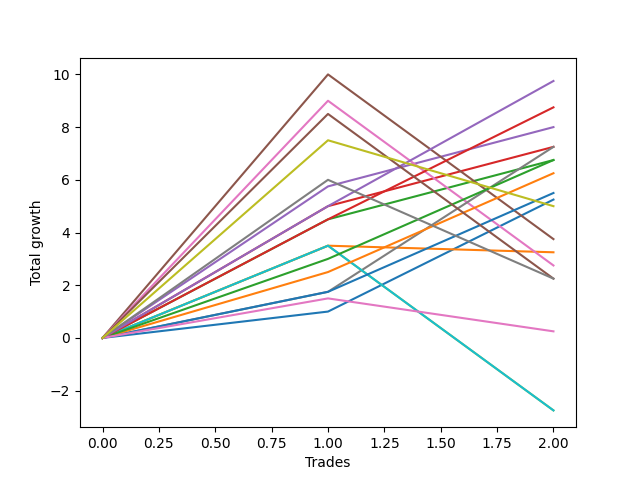

# Short Bernese 003 50 
- Symbol: ES
- Date Range: 03/18/2022 - 12/30/2022
- Trading Period: 8:30-12:30
- Number of Trades: 6



| Name | Win Percent | Profit | Avg Profit / Trade | Avg Time / Trade |      | Name | Win Percent | Profit | Avg Profit / Trade | Avg Time / Trade |
| ---- | ----------- | ------ | ------------------ | ---------------- | ---- | ---- | ----------- | ------ | ------------------ | ---------------- |
| Sorted By <br> Profit | | | | | | Sorted By <br> Win Percentage ||||
| Eighty-Five | 83.33 | 12250.00 | 2041.67 | 18:14 |     | Eighty-Five | 83.33 | 12250.00 | 2041.67 | 18:14 |
| Eighty-Four | 83.33 | 10750.00 | 1791.67 | 17:51 |     | Eighty-Four | 83.33 | 10750.00 | 1791.67 | 17:51 |
| Two_C | 66.67 | 9750.00 | 1625.00 | 15:06 |     | Eighty-Three | 83.33 | 9625.00 | 1604.17 | 15:20 |
| Eighty-Three | 83.33 | 9625.00 | 1604.17 | 15:20 |     | Two | 83.33 | 8750.00 | 1458.33 | 13:48 |
| Two | 83.33 | 8750.00 | 1458.33 | 13:48 |     | Eighty-Two | 83.33 | 6125.00 | 1020.83 | 09:40 |
| Three | 66.67 | 7000.00 | 1166.67 | 15:04 |     | Eighty-One | 83.33 | 4375.00 | 729.17 | 08:54 |
| Eighty-Two | 83.33 | 6125.00 | 1020.83 | 09:40 |     | Two_C | 66.67 | 9750.00 | 1625.00 | 15:06 |
| One | 66.67 | 5750.00 | 958.33 | 09:40 |     | Three | 66.67 | 7000.00 | 1166.67 | 15:04 |
| Eighty-One | 83.33 | 4375.00 | 729.17 | 08:54 |     | One | 66.67 | 5750.00 | 958.33 | 09:40 |
| Six | 66.67 | 3500.00 | 583.33 | 22:42 |     | Six | 66.67 | 3500.00 | 583.33 | 22:42 |
| Zero | 66.67 | 3375.00 | 562.50 | 06:47 |     | Zero | 66.67 | 3375.00 | 562.50 | 06:47 |
| Four | 66.67 | 2500.00 | 416.67 | 23:56 |     | Four | 66.67 | 2500.00 | 416.67 | 23:56 |
| Seven | 33.33 | -250.00 | -41.67 | 38:50 |     | Five | 50.00 | -2125.00 | -354.17 | 32:31 |
| MALAMUTE 002 | 33.33 | -1000.00 | -166.67 | 04:35 |     | Seven | 33.33 | -250.00 | -41.67 | 38:50 |
| Five | 50.00 | -2125.00 | -354.17 | 32:31 |     | MALAMUTE 002 | 33.33 | -1000.00 | -166.67 | 04:35 |
| NEWFI 0000 | 33.33 | -7750.00 | -1291.67 | 23:23 |     | NEWFI 0000 | 33.33 | -7750.00 | -1291.67 | 23:23 |
| BB100 | 16.67 | -21375.00 | -3562.50 | 46:57 |     | BB100 | 16.67 | -21375.00 | -3562.50 | 46:57 |
| NEWFI 000 | 16.67 | -23125.00 | -3854.17 | 47:28 |     | NEWFI 000 | 16.67 | -23125.00 | -3854.17 | 47:28 |
| MALAMUTE 001 | 0.00 | -23625.00 | -3937.50 | 35:11 |     | MALAMUTE 001 | 0.00 | -23625.00 | -3937.50 | 35:11 |

## NO STOPLOSS

### Test Zero
* Sell when price hits the middle line of the 20p bollinger
* No Stoploss
* Results:
```
Total Trades: 6
Percent Up: 33.33
Percent Down: 66.67
Total Points Moved Down: 6.75
Potential Profit: 3375.00
Total Points Ups: 7.25 Count Ups: 2
Total Points Downs: 14.00 Count Downs: 4
```

<details><summary>Trades</summary>

<code>In: 2022-04-25 09:29:00		Out: 2022-04-25 09:31:05		Total Position Time: 02:05		Total Move Down: 1.00		Total to Date: 1.00</code> <br />
<code>In: 2022-07-06 11:11:00		Out: 2022-07-06 11:12:10		Total Position Time: 01:10		Total Move Down: 10.25		Total to Date: 11.25</code> <br />
<code>In: 2022-08-04 10:31:00		Out: 2022-08-04 10:43:05		Total Position Time: 12:05		Total Move Down: -1.00		Total to Date: 10.25</code> <br />
<code>In: 2022-09-12 10:33:00		Out: 2022-09-12 10:36:35		Total Position Time: 03:35		Total Move Down: 0.50		Total to Date: 10.75</code> <br />
<code>In: 2022-09-22 12:17:00		Out: 2022-09-22 12:19:50		Total Position Time: 02:50		Total Move Down: 2.25		Total to Date: 13.00</code> <br />
<code>In: 2022-10-03 12:28:00		Out: 2022-10-03 12:47:00		Total Position Time: 19:00		Total Move Down: -6.25		Total to Date: 6.75</code> <br />


</details>

### Test One
* Sell when the price hits the lower line of the 20p 1std bollinger
* No Stoploss
* Results:
```
Total Trades: 6
Percent Up: 33.33
Percent Down: 66.67
Total Points Moved Down: 11.50
Potential Profit: 5750.00
Total Points Ups: 6.50 Count Ups: 2
Total Points Downs: 18.00 Count Downs: 4
```

<details><summary>Trades</summary>

<code>In: 2022-04-25 09:29:00		Out: 2022-04-25 09:42:45		Total Position Time: 13:45		Total Move Down: -0.25		Total to Date: -0.25</code> <br />
<code>In: 2022-07-06 11:11:00		Out: 2022-07-06 11:12:10		Total Position Time: 01:10		Total Move Down: 10.25		Total to Date: 10.00</code> <br />
<code>In: 2022-08-04 10:31:00		Out: 2022-08-04 10:43:15		Total Position Time: 12:15		Total Move Down: 0.50		Total to Date: 10.50</code> <br />
<code>In: 2022-09-12 10:33:00		Out: 2022-09-12 10:41:30		Total Position Time: 08:30		Total Move Down: 2.00		Total to Date: 12.50</code> <br />
<code>In: 2022-09-22 12:17:00		Out: 2022-09-22 12:20:20		Total Position Time: 03:20		Total Move Down: 5.25		Total to Date: 17.75</code> <br />
<code>In: 2022-10-03 12:28:00		Out: 2022-10-03 12:47:00		Total Position Time: 19:00		Total Move Down: -6.25		Total to Date: 11.50</code> <br />


</details>

### Test Two
* Sell when the price hits the lower line of the 20p 2std bollinger
* No Stoploss
* Results:
```
Total Trades: 6
Percent Up: 16.67
Percent Down: 83.33
Total Points Moved Down: 17.50
Potential Profit: 8750.00
Total Points Ups: 6.25 Count Ups: 1
Total Points Downs: 23.75 Count Downs: 5
```

<details><summary>Trades</summary>

<code>In: 2022-04-25 09:29:00		Out: 2022-04-25 10:01:15		Total Position Time: 32:15		Total Move Down: 1.75		Total to Date: 1.75</code> <br />
<code>In: 2022-07-06 11:11:00		Out: 2022-07-06 11:12:10		Total Position Time: 01:10		Total Move Down: 10.25		Total to Date: 12.00</code> <br />
<code>In: 2022-08-04 10:31:00		Out: 2022-08-04 10:45:30		Total Position Time: 14:30		Total Move Down: 0.75		Total to Date: 12.75</code> <br />
<code>In: 2022-09-12 10:33:00		Out: 2022-09-12 10:43:35		Total Position Time: 10:35		Total Move Down: 3.25		Total to Date: 16.00</code> <br />
<code>In: 2022-09-22 12:17:00		Out: 2022-09-22 12:22:20		Total Position Time: 05:20		Total Move Down: 7.75		Total to Date: 23.75</code> <br />
<code>In: 2022-10-03 12:28:00		Out: 2022-10-03 12:47:00		Total Position Time: 19:00		Total Move Down: -6.25		Total to Date: 17.50</code> <br />


</details>

### Test Two_C
* Sell when the price hits the lower line of the 20p 2std bollinger
* No Stoploss
* Results:
```
Total Trades: 6
Percent Up: 33.33
Percent Down: 66.67
Total Points Moved Down: 19.50
Potential Profit: 9750.00
Total Points Ups: 6.25 Count Ups: 2
Total Points Downs: 25.75 Count Downs: 4
```

<details><summary>Trades</summary>

<code>In: 2022-04-25 09:29:00		Out: 2022-04-25 10:01:20		Total Position Time: 32:20		Total Move Down: 4.25		Total to Date: 4.25</code> <br />
<code>In: 2022-07-06 11:11:00		Out: 2022-07-06 11:12:10		Total Position Time: 01:10		Total Move Down: 10.25		Total to Date: 14.50</code> <br />
<code>In: 2022-08-04 10:31:00		Out: 2022-08-04 10:52:45		Total Position Time: 21:45		Total Move Down: -0.00		Total to Date: 14.50</code> <br />
<code>In: 2022-09-12 10:33:00		Out: 2022-09-12 10:44:05		Total Position Time: 11:05		Total Move Down: 3.50		Total to Date: 18.00</code> <br />
<code>In: 2022-09-22 12:17:00		Out: 2022-09-22 12:22:20		Total Position Time: 05:20		Total Move Down: 7.75		Total to Date: 25.75</code> <br />
<code>In: 2022-10-03 12:28:00		Out: 2022-10-03 12:47:00		Total Position Time: 19:00		Total Move Down: -6.25		Total to Date: 19.50</code> <br />


</details>

### Test Three
* Sell when price hits the middle line of the 50p bollinger
* No Stoploss
* Results:
```
Total Trades: 6
Percent Up: 33.33
Percent Down: 66.67
Total Points Moved Down: 14.00
Potential Profit: 7000.00
Total Points Ups: 8.50 Count Ups: 2
Total Points Downs: 22.50 Count Downs: 4
```

<details><summary>Trades</summary>

<code>In: 2022-04-25 09:29:00		Out: 2022-04-25 09:55:05		Total Position Time: 26:05		Total Move Down: -2.25		Total to Date: -2.25</code> <br />
<code>In: 2022-07-06 11:11:00		Out: 2022-07-06 11:12:10		Total Position Time: 01:10		Total Move Down: 10.25		Total to Date: 8.00</code> <br />
<code>In: 2022-08-04 10:31:00		Out: 2022-08-04 10:55:50		Total Position Time: 24:50		Total Move Down: 0.50		Total to Date: 8.50</code> <br />
<code>In: 2022-09-12 10:33:00		Out: 2022-09-12 10:42:15		Total Position Time: 09:15		Total Move Down: 2.75		Total to Date: 11.25</code> <br />
<code>In: 2022-09-22 12:17:00		Out: 2022-09-22 12:27:05		Total Position Time: 10:05		Total Move Down: 9.00		Total to Date: 20.25</code> <br />
<code>In: 2022-10-03 12:28:00		Out: 2022-10-03 12:47:00		Total Position Time: 19:00		Total Move Down: -6.25		Total to Date: 14.00</code> <br />


</details>

### Test Four
* Sell when the price hits the lower line of the 50p 1std bollinger
* No Stoploss
* Results:
```
Total Trades: 6
Percent Up: 33.33
Percent Down: 66.67
Total Points Moved Down: 5.00
Potential Profit: 2500.00
Total Points Ups: 12.00 Count Ups: 2
Total Points Downs: 17.00 Count Downs: 4
```

<details><summary>Trades</summary>

<code>In: 2022-04-25 09:29:00		Out: 2022-04-25 10:01:15		Total Position Time: 32:15		Total Move Down: 1.75		Total to Date: 1.75</code> <br />
<code>In: 2022-07-06 11:11:00		Out: 2022-07-06 11:12:10		Total Position Time: 01:10		Total Move Down: 10.25		Total to Date: 12.00</code> <br />
<code>In: 2022-08-04 10:31:00		Out: 2022-08-04 11:02:05		Total Position Time: 31:05		Total Move Down: 2.25		Total to Date: 14.25</code> <br />
<code>In: 2022-09-12 10:33:00		Out: 2022-09-12 11:03:10		Total Position Time: 30:10		Total Move Down: 2.75		Total to Date: 17.00</code> <br />
<code>In: 2022-09-22 12:17:00		Out: 2022-09-22 12:47:00		Total Position Time: 30:00		Total Move Down: -5.75		Total to Date: 11.25</code> <br />
<code>In: 2022-10-03 12:28:00		Out: 2022-10-03 12:47:00		Total Position Time: 19:00		Total Move Down: -6.25		Total to Date: 5.00</code> <br />


</details>

### Test Five
* Sell when the price hits the lower line of the 50p 2std bollinger
* No Stoploss
* Results:
```
Total Trades: 6
Percent Up: 50.00
Percent Down: 50.00
Total Points Moved Down: -4.25
Potential Profit: -2125.00
Total Points Ups: 25.00 Count Ups: 3
Total Points Downs: 20.75 Count Downs: 3
```

<details><summary>Trades</summary>

<code>In: 2022-04-25 09:29:00		Out: 2022-04-25 10:29:55		Total Position Time: 60:55		Total Move Down: -13.00		Total to Date: -13.00</code> <br />
<code>In: 2022-07-06 11:11:00		Out: 2022-07-06 11:12:15		Total Position Time: 01:15		Total Move Down: 13.00		Total to Date: 0.00</code> <br />
<code>In: 2022-08-04 10:31:00		Out: 2022-08-04 11:10:15		Total Position Time: 39:15		Total Move Down: 3.00		Total to Date: 3.00</code> <br />
<code>In: 2022-09-12 10:33:00		Out: 2022-09-12 11:17:45		Total Position Time: 44:45		Total Move Down: 4.75		Total to Date: 7.75</code> <br />
<code>In: 2022-09-22 12:17:00		Out: 2022-09-22 12:47:00		Total Position Time: 30:00		Total Move Down: -5.75		Total to Date: 2.00</code> <br />
<code>In: 2022-10-03 12:28:00		Out: 2022-10-03 12:47:00		Total Position Time: 19:00		Total Move Down: -6.25		Total to Date: -4.25</code> <br />


</details>

### Test Six
* Sell when the price hits the middle line of the 1std VWAP
* No Stoploss
* Results:
```
Total Trades: 6
Percent Up: 33.33
Percent Down: 66.67
Total Points Moved Down: 7.00
Potential Profit: 3500.00
Total Points Ups: 12.00 Count Ups: 2
Total Points Downs: 19.00 Count Downs: 4
```

<details><summary>Trades</summary>

<code>In: 2022-04-25 09:29:00		Out: 2022-04-25 09:31:05		Total Position Time: 02:05		Total Move Down: 1.00		Total to Date: 1.00</code> <br />
<code>In: 2022-07-06 11:11:00		Out: 2022-07-06 11:12:10		Total Position Time: 01:10		Total Move Down: 10.25		Total to Date: 11.25</code> <br />
<code>In: 2022-08-04 10:31:00		Out: 2022-08-04 11:10:15		Total Position Time: 39:15		Total Move Down: 3.00		Total to Date: 14.25</code> <br />
<code>In: 2022-09-12 10:33:00		Out: 2022-09-12 11:17:45		Total Position Time: 44:45		Total Move Down: 4.75		Total to Date: 19.00</code> <br />
<code>In: 2022-09-22 12:17:00		Out: 2022-09-22 12:47:00		Total Position Time: 30:00		Total Move Down: -5.75		Total to Date: 13.25</code> <br />
<code>In: 2022-10-03 12:28:00		Out: 2022-10-03 12:47:00		Total Position Time: 19:00		Total Move Down: -6.25		Total to Date: 7.00</code> <br />


</details>

### Test Seven
* Sell when the price hits the lower line of the 1std VWAP
* No Stoploss
* Results:
```
Total Trades: 6
Percent Up: 66.67
Percent Down: 33.33
Total Points Moved Down: -0.50
Potential Profit: -250.00
Total Points Ups: 25.00 Count Ups: 4
Total Points Downs: 24.50 Count Downs: 2
```

<details><summary>Trades</summary>

<code>In: 2022-04-25 09:29:00		Out: 2022-04-25 10:29:55		Total Position Time: 60:55		Total Move Down: -13.00		Total to Date: -13.00</code> <br />
<code>In: 2022-07-06 11:11:00		Out: 2022-07-06 11:12:20		Total Position Time: 01:20		Total Move Down: 13.25		Total to Date: 0.25</code> <br />
<code>In: 2022-08-04 10:31:00		Out: 2022-08-04 11:31:55		Total Position Time: 60:55		Total Move Down: -0.00		Total to Date: 0.25</code> <br />
<code>In: 2022-09-12 10:33:00		Out: 2022-09-12 11:33:55		Total Position Time: 60:55		Total Move Down: 11.25		Total to Date: 11.50</code> <br />
<code>In: 2022-09-22 12:17:00		Out: 2022-09-22 12:47:00		Total Position Time: 30:00		Total Move Down: -5.75		Total to Date: 5.75</code> <br />
<code>In: 2022-10-03 12:28:00		Out: 2022-10-03 12:47:00		Total Position Time: 19:00		Total Move Down: -6.25		Total to Date: -0.50</code> <br />


</details>

### Test BB100
* Move to BB100 Upper Band
* No Stoploss
* Results:
```
Total Trades: 6
Percent Up: 83.33
Percent Down: 16.67
Total Points Moved Down: -42.75
Potential Profit: -21375.00
Total Points Ups: 52.50 Count Ups: 5
Total Points Downs: 9.75 Count Downs: 1
```

<details><summary>Trades</summary>

<code>In: 2022-04-25 09:29:00		Out: 2022-04-25 10:29:55		Total Position Time: 60:55		Total Move Down: -13.00		Total to Date: -13.00</code> <br />
<code>In: 2022-07-06 11:11:00		Out: 2022-07-06 12:11:55		Total Position Time: 60:55		Total Move Down: -27.50		Total to Date: -40.50</code> <br />
<code>In: 2022-08-04 10:31:00		Out: 2022-08-04 11:31:55		Total Position Time: 60:55		Total Move Down: -0.00		Total to Date: -40.50</code> <br />
<code>In: 2022-09-12 10:33:00		Out: 2022-09-12 11:23:00		Total Position Time: 50:00		Total Move Down: 9.75		Total to Date: -30.75</code> <br />
<code>In: 2022-09-22 12:17:00		Out: 2022-09-22 12:47:00		Total Position Time: 30:00		Total Move Down: -5.75		Total to Date: -36.50</code> <br />
<code>In: 2022-10-03 12:28:00		Out: 2022-10-03 12:47:00		Total Position Time: 19:00		Total Move Down: -6.25		Total to Date: -42.75</code> <br />


</details>

## TAKE PROFIT

### Test Eighty-One
* Take Profit of 1 Point
* No Stoploss
* Results:
```
Total Trades: 6
Percent Up: 16.67
Percent Down: 83.33
Total Points Moved Down: 8.75
Potential Profit: 4375.00
Total Points Ups: 6.25 Count Ups: 1
Total Points Downs: 15.00 Count Downs: 5
```

<details><summary>Trades</summary>

<code>In: 2022-04-25 09:29:00		Out: 2022-04-25 09:31:05		Total Position Time: 02:05		Total Move Down: 1.00		Total to Date: 1.00</code> <br />
<code>In: 2022-07-06 11:11:00		Out: 2022-07-06 11:12:10		Total Position Time: 01:10		Total Move Down: 10.25		Total to Date: 11.25</code> <br />
<code>In: 2022-08-04 10:31:00		Out: 2022-08-04 10:56:25		Total Position Time: 25:25		Total Move Down: 1.25		Total to Date: 12.50</code> <br />
<code>In: 2022-09-12 10:33:00		Out: 2022-09-12 10:37:20		Total Position Time: 04:20		Total Move Down: 1.00		Total to Date: 13.50</code> <br />
<code>In: 2022-09-22 12:17:00		Out: 2022-09-22 12:18:25		Total Position Time: 01:25		Total Move Down: 1.50		Total to Date: 15.00</code> <br />
<code>In: 2022-10-03 12:28:00		Out: 2022-10-03 12:47:00		Total Position Time: 19:00		Total Move Down: -6.25		Total to Date: 8.75</code> <br />


</details>

### Test Eighty-Two
* Take Profit of 2 Point
* No Stoploss
* Results:
```
Total Trades: 6
Percent Up: 16.67
Percent Down: 83.33
Total Points Moved Down: 12.25
Potential Profit: 6125.00
Total Points Ups: 6.25 Count Ups: 1
Total Points Downs: 18.50 Count Downs: 5
```

<details><summary>Trades</summary>

<code>In: 2022-04-25 09:29:00		Out: 2022-04-25 09:31:10		Total Position Time: 02:10		Total Move Down: 2.25		Total to Date: 2.25</code> <br />
<code>In: 2022-07-06 11:11:00		Out: 2022-07-06 11:12:10		Total Position Time: 01:10		Total Move Down: 10.25		Total to Date: 12.50</code> <br />
<code>In: 2022-08-04 10:31:00		Out: 2022-08-04 10:56:30		Total Position Time: 25:30		Total Move Down: 2.00		Total to Date: 14.50</code> <br />
<code>In: 2022-09-12 10:33:00		Out: 2022-09-12 10:41:30		Total Position Time: 08:30		Total Move Down: 2.00		Total to Date: 16.50</code> <br />
<code>In: 2022-09-22 12:17:00		Out: 2022-09-22 12:18:40		Total Position Time: 01:40		Total Move Down: 2.00		Total to Date: 18.50</code> <br />
<code>In: 2022-10-03 12:28:00		Out: 2022-10-03 12:47:00		Total Position Time: 19:00		Total Move Down: -6.25		Total to Date: 12.25</code> <br />


</details>

### Test Eighty-Three
* Take Profit of 3 Point
* No Stoploss
* Results:
```
Total Trades: 6
Percent Up: 16.67
Percent Down: 83.33
Total Points Moved Down: 19.25
Potential Profit: 9625.00
Total Points Ups: 6.25 Count Ups: 1
Total Points Downs: 25.50 Count Downs: 5
```

<details><summary>Trades</summary>

<code>In: 2022-04-25 09:29:00		Out: 2022-04-25 10:01:20		Total Position Time: 32:20		Total Move Down: 4.25		Total to Date: 4.25</code> <br />
<code>In: 2022-07-06 11:11:00		Out: 2022-07-06 11:12:10		Total Position Time: 01:10		Total Move Down: 10.25		Total to Date: 14.50</code> <br />
<code>In: 2022-08-04 10:31:00		Out: 2022-08-04 10:57:00		Total Position Time: 26:00		Total Move Down: 3.00		Total to Date: 17.50</code> <br />
<code>In: 2022-09-12 10:33:00		Out: 2022-09-12 10:43:20		Total Position Time: 10:20		Total Move Down: 3.00		Total to Date: 20.50</code> <br />
<code>In: 2022-09-22 12:17:00		Out: 2022-09-22 12:20:15		Total Position Time: 03:15		Total Move Down: 5.00		Total to Date: 25.50</code> <br />
<code>In: 2022-10-03 12:28:00		Out: 2022-10-03 12:47:00		Total Position Time: 19:00		Total Move Down: -6.25		Total to Date: 19.25</code> <br />


</details>

### Test Eighty-Four
* Take Profit of 4 Point
* No Stoploss
* Results:
```
Total Trades: 6
Percent Up: 16.67
Percent Down: 83.33
Total Points Moved Down: 21.50
Potential Profit: 10750.00
Total Points Ups: 6.25 Count Ups: 1
Total Points Downs: 27.75 Count Downs: 5
```

<details><summary>Trades</summary>

<code>In: 2022-04-25 09:29:00		Out: 2022-04-25 10:01:20		Total Position Time: 32:20		Total Move Down: 4.25		Total to Date: 4.25</code> <br />
<code>In: 2022-07-06 11:11:00		Out: 2022-07-06 11:12:10		Total Position Time: 01:10		Total Move Down: 10.25		Total to Date: 14.50</code> <br />
<code>In: 2022-08-04 10:31:00		Out: 2022-08-04 11:11:05		Total Position Time: 40:05		Total Move Down: 4.00		Total to Date: 18.50</code> <br />
<code>In: 2022-09-12 10:33:00		Out: 2022-09-12 10:44:20		Total Position Time: 11:20		Total Move Down: 4.25		Total to Date: 22.75</code> <br />
<code>In: 2022-09-22 12:17:00		Out: 2022-09-22 12:20:15		Total Position Time: 03:15		Total Move Down: 5.00		Total to Date: 27.75</code> <br />
<code>In: 2022-10-03 12:28:00		Out: 2022-10-03 12:47:00		Total Position Time: 19:00		Total Move Down: -6.25		Total to Date: 21.50</code> <br />


</details>

### Test Eighty-Five
* Take Profit of 5 Point
* No Stoploss
* Results:
```
Total Trades: 6
Percent Up: 16.67
Percent Down: 83.33
Total Points Moved Down: 24.50
Potential Profit: 12250.00
Total Points Ups: 6.25 Count Ups: 1
Total Points Downs: 30.75 Count Downs: 5
```

<details><summary>Trades</summary>

<code>In: 2022-04-25 09:29:00		Out: 2022-04-25 10:01:40		Total Position Time: 32:40		Total Move Down: 5.25		Total to Date: 5.25</code> <br />
<code>In: 2022-07-06 11:11:00		Out: 2022-07-06 11:12:10		Total Position Time: 01:10		Total Move Down: 10.25		Total to Date: 15.50</code> <br />
<code>In: 2022-08-04 10:31:00		Out: 2022-08-04 11:11:15		Total Position Time: 40:15		Total Move Down: 5.50		Total to Date: 21.00</code> <br />
<code>In: 2022-09-12 10:33:00		Out: 2022-09-12 10:46:05		Total Position Time: 13:05		Total Move Down: 4.75		Total to Date: 25.75</code> <br />
<code>In: 2022-09-22 12:17:00		Out: 2022-09-22 12:20:15		Total Position Time: 03:15		Total Move Down: 5.00		Total to Date: 30.75</code> <br />
<code>In: 2022-10-03 12:28:00		Out: 2022-10-03 12:47:00		Total Position Time: 19:00		Total Move Down: -6.25		Total to Date: 24.50</code> <br />


</details>

## Indicator Exits

### Test NEWFI 000
* Newfi 0000
* No Stoploss
* Results:
```
Total Trades: 6
Percent Up: 83.33
Percent Down: 16.67
Total Points Moved Down: -46.25
Potential Profit: -23125.00
Total Points Ups: 52.50 Count Ups: 5
Total Points Downs: 6.25 Count Downs: 1
```

<details><summary>Trades</summary>

<code>In: 2022-04-25 09:29:00		Out: 2022-04-25 10:29:55		Total Position Time: 60:55		Total Move Down: -13.00		Total to Date: -13.00</code> <br />
<code>In: 2022-07-06 11:11:00		Out: 2022-07-06 12:11:55		Total Position Time: 60:55		Total Move Down: -27.50		Total to Date: -40.50</code> <br />
<code>In: 2022-08-04 10:31:00		Out: 2022-08-04 11:31:55		Total Position Time: 60:55		Total Move Down: -0.00		Total to Date: -40.50</code> <br />
<code>In: 2022-09-12 10:33:00		Out: 2022-09-12 11:26:05		Total Position Time: 53:05		Total Move Down: 6.25		Total to Date: -34.25</code> <br />
<code>In: 2022-09-22 12:17:00		Out: 2022-09-22 12:47:00		Total Position Time: 30:00		Total Move Down: -5.75		Total to Date: -40.00</code> <br />
<code>In: 2022-10-03 12:28:00		Out: 2022-10-03 12:47:00		Total Position Time: 19:00		Total Move Down: -6.25		Total to Date: -46.25</code> <br />


</details>

### Test NEWFI 0000
* Newfi 0000
* No Stoploss
* Results:
```
Total Trades: 6
Percent Up: 66.67
Percent Down: 33.33
Total Points Moved Down: -15.50
Potential Profit: -7750.00
Total Points Ups: 28.25 Count Ups: 4
Total Points Downs: 12.75 Count Downs: 2
```

<details><summary>Trades</summary>

<code>In: 2022-04-25 09:29:00		Out: 2022-04-25 09:41:05		Total Position Time: 12:05		Total Move Down: -3.50		Total to Date: -3.50</code> <br />
<code>In: 2022-07-06 11:11:00		Out: 2022-07-06 11:38:05		Total Position Time: 27:05		Total Move Down: -16.00		Total to Date: -19.50</code> <br />
<code>In: 2022-08-04 10:31:00		Out: 2022-08-04 10:39:05		Total Position Time: 08:05		Total Move Down: -3.00		Total to Date: -22.50</code> <br />
<code>In: 2022-09-12 10:33:00		Out: 2022-09-12 11:33:55		Total Position Time: 60:55		Total Move Down: 11.25		Total to Date: -11.25</code> <br />
<code>In: 2022-09-22 12:17:00		Out: 2022-09-22 12:40:05		Total Position Time: 23:05		Total Move Down: 1.50		Total to Date: -9.75</code> <br />
<code>In: 2022-10-03 12:28:00		Out: 2022-10-03 12:37:05		Total Position Time: 09:05		Total Move Down: -5.75		Total to Date: -15.50</code> <br />


</details>

### Test MALAMUTE 001
* Malamute 001
* No Stoploss
* Results:
```
Total Trades: 6
Percent Up: 100.00
Percent Down: 0.00
Total Points Moved Down: -47.25
Potential Profit: -23625.00
Total Points Ups: 47.25 Count Ups: 6
Total Points Downs: 0.00 Count Downs: 0
```

<details><summary>Trades</summary>

<code>In: 2022-04-25 09:29:00		Out: 2022-04-25 10:19:05		Total Position Time: 50:05		Total Move Down: -15.00		Total to Date: -15.00</code> <br />
<code>In: 2022-07-06 11:11:00		Out: 2022-07-06 11:34:05		Total Position Time: 23:05		Total Move Down: -19.50		Total to Date: -34.50</code> <br />
<code>In: 2022-08-04 10:31:00		Out: 2022-08-04 11:31:55		Total Position Time: 60:55		Total Move Down: -0.00		Total to Date: -34.50</code> <br />
<code>In: 2022-09-12 10:33:00		Out: 2022-09-12 11:01:05		Total Position Time: 28:05		Total Move Down: -0.75		Total to Date: -35.25</code> <br />
<code>In: 2022-09-22 12:17:00		Out: 2022-09-22 12:47:00		Total Position Time: 30:00		Total Move Down: -5.75		Total to Date: -41.00</code> <br />
<code>In: 2022-10-03 12:28:00		Out: 2022-10-03 12:47:00		Total Position Time: 19:00		Total Move Down: -6.25		Total to Date: -47.25</code> <br />


</details>

### Test MALAMUTE 002
* Malamute 001
* No Stoploss
* Results:
```
Total Trades: 6
Percent Up: 66.67
Percent Down: 33.33
Total Points Moved Down: -2.00
Potential Profit: -1000.00
Total Points Ups: 14.75 Count Ups: 4
Total Points Downs: 12.75 Count Downs: 2
```

<details><summary>Trades</summary>

<code>In: 2022-04-25 09:29:00		Out: 2022-04-25 09:33:05		Total Position Time: 04:05		Total Move Down: -6.00		Total to Date: -6.00</code> <br />
<code>In: 2022-07-06 11:11:00		Out: 2022-07-06 11:18:05		Total Position Time: 07:05		Total Move Down: 6.25		Total to Date: 0.25</code> <br />
<code>In: 2022-08-04 10:31:00		Out: 2022-08-04 10:32:05		Total Position Time: 01:05		Total Move Down: -1.75		Total to Date: -1.50</code> <br />
<code>In: 2022-09-12 10:33:00		Out: 2022-09-12 10:35:05		Total Position Time: 02:05		Total Move Down: -2.75		Total to Date: -4.25</code> <br />
<code>In: 2022-09-22 12:17:00		Out: 2022-09-22 12:26:05		Total Position Time: 09:05		Total Move Down: 6.50		Total to Date: 2.25</code> <br />
<code>In: 2022-10-03 12:28:00		Out: 2022-10-03 12:32:05		Total Position Time: 04:05		Total Move Down: -4.25		Total to Date: -2.00</code> <br />


</details>