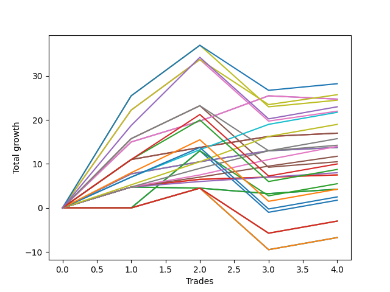

# Short Bernese 005 1v SB 
- Symbol: ES
- Date Range: 03/18/2022 - 12/30/2022
- Trading Period: 8:30-12:30
- Number of Trades: 5



| Name | Win Percent | Profit | Avg Profit / Trade | Avg Time / Trade |      | Name | Win Percent | Profit | Avg Profit / Trade | Avg Time / Trade |
| ---- | ----------- | ------ | ------------------ | ---------------- | ---- | ---- | ----------- | ------ | ------------------ | ---------------- |
| Sorted By <br> Profit | | | | | | Sorted By <br> Win Percentage ||||
| NEWFI 000 | 60.00 | 34625.00 | 6925.00 | 40:01 |     | Eighty-Five | 100.00 | 17625.00 | 3525.00 | 06:12 |
| Eighty-Five | 100.00 | 17625.00 | 3525.00 | 06:12 |     | Eighty-Four | 100.00 | 15875.00 | 3175.00 | 05:22 |
| Eighty-Four | 100.00 | 15875.00 | 3175.00 | 05:22 |     | Eighty-Three | 100.00 | 14875.00 | 2975.00 | 05:02 |
| Eighty-Three | 100.00 | 14875.00 | 2975.00 | 05:02 |     | Two | 100.00 | 14500.00 | 2900.00 | 07:52 |
| Two | 100.00 | 14500.00 | 2900.00 | 07:52 |     | Eighty-Two | 100.00 | 13125.00 | 2625.00 | 04:47 |
| Eighty-Two | 100.00 | 13125.00 | 2625.00 | 04:47 |     | One | 100.00 | 11375.00 | 2275.00 | 06:15 |
| Six | 60.00 | 12750.00 | 2550.00 | 34:21 |     | Eighty-One | 100.00 | 11000.00 | 2200.00 | 04:05 |
| Three | 80.00 | 12625.00 | 2525.00 | 20:23 |     | Three | 80.00 | 12625.00 | 2525.00 | 20:23 |
| Five | 60.00 | 11875.00 | 2375.00 | 34:15 |     | Two_C | 80.00 | 7250.00 | 1450.00 | 15:28 |
| One | 100.00 | 11375.00 | 2275.00 | 06:15 |     | NEWFI 000 | 60.00 | 34625.00 | 6925.00 | 40:01 |
| Eighty-One | 100.00 | 11000.00 | 2200.00 | 04:05 |     | Six | 60.00 | 12750.00 | 2550.00 | 34:21 |
| Four | 60.00 | 7375.00 | 1475.00 | 33:07 |     | Five | 60.00 | 11875.00 | 2375.00 | 34:15 |
| Two_C | 80.00 | 7250.00 | 1450.00 | 15:28 |     | Four | 60.00 | 7375.00 | 1475.00 | 33:07 |
| Zero | 40.00 | 3500.00 | 700.00 | 03:20 |     | Zero | 40.00 | 3500.00 | 700.00 | 03:20 |
| NEWFI 0000 | 40.00 | 250.00 | 50.00 | 09:41 |     | NEWFI 0000 | 40.00 | 250.00 | 50.00 | 09:41 |
| BB100 | 40.00 | -2750.00 | -550.00 | 49:45 |     | BB100 | 40.00 | -2750.00 | -550.00 | 49:45 |
| Seven | 40.00 | -2750.00 | -550.00 | 49:45 |     | Seven | 40.00 | -2750.00 | -550.00 | 49:45 |
| MALAMUTE 002 | 20.00 | -4000.00 | -800.00 | 05:17 |     | MALAMUTE 001 | 40.00 | -11250.00 | -2250.00 | 57:23 |
| MALAMUTE 001 | 40.00 | -11250.00 | -2250.00 | 57:23 |     | MALAMUTE 002 | 20.00 | -4000.00 | -800.00 | 05:17 |

## NO STOPLOSS

### Test Zero
* Sell when price hits the middle line of the 20p bollinger
* No Stoploss
* Results:
```
Total Trades: 5
Percent Up: 60.00
Percent Down: 40.00
Total Points Moved Down: 7.00
Potential Profit: 3500.00
Total Points Ups: 2.75 Count Ups: 3
Total Points Downs: 9.75 Count Downs: 2
```

<details><summary>Trades</summary>

<code>In: 2022-05-10 11:06:00		Out: 2022-05-10 11:07:10		Total Position Time: 01:10		Total Move Down: 4.75		Total to Date: 4.75</code> <br />
<code>In: 2022-05-25 11:37:00		Out: 2022-05-25 11:39:10		Total Position Time: 02:10		Total Move Down: 5.00		Total to Date: 9.75</code> <br />
<code>In: 2022-06-29 11:18:00		Out: 2022-06-29 11:20:00		Total Position Time: 02:00		Total Move Down: -0.25		Total to Date: 9.50</code> <br />
<code>In: 2022-07-01 10:55:00		Out: 2022-07-01 11:02:15		Total Position Time: 07:15		Total Move Down: -1.25		Total to Date: 8.25</code> <br />
<code>In: 2022-09-21 10:55:00		Out: 2022-09-21 10:59:05		Total Position Time: 04:05		Total Move Down: -1.25		Total to Date: 7.00</code> <br />


</details>

### Test One
* Sell when the price hits the lower line of the 20p 1std bollinger
* No Stoploss
* Results:
```
Total Trades: 5
Percent Up: 0.00
Percent Down: 100.00
Total Points Moved Down: 22.75
Potential Profit: 11375.00
Total Points Ups: 0.00 Count Ups: 0
Total Points Downs: 22.75 Count Downs: 5
```

<details><summary>Trades</summary>

<code>In: 2022-05-10 11:06:00		Out: 2022-05-10 11:07:10		Total Position Time: 01:10		Total Move Down: 4.75		Total to Date: 4.75</code> <br />
<code>In: 2022-05-25 11:37:00		Out: 2022-05-25 11:49:55		Total Position Time: 12:55		Total Move Down: 2.00		Total to Date: 6.75</code> <br />
<code>In: 2022-06-29 11:18:00		Out: 2022-06-29 11:20:35		Total Position Time: 02:35		Total Move Down: 1.75		Total to Date: 8.50</code> <br />
<code>In: 2022-07-01 10:55:00		Out: 2022-07-01 11:04:30		Total Position Time: 09:30		Total Move Down: 0.50		Total to Date: 9.00</code> <br />
<code>In: 2022-09-21 10:55:00		Out: 2022-09-21 11:00:05		Total Position Time: 05:05		Total Move Down: 13.75		Total to Date: 22.75</code> <br />


</details>

### Test Two
* Sell when the price hits the lower line of the 20p 2std bollinger
* No Stoploss
* Results:
```
Total Trades: 5
Percent Up: 0.00
Percent Down: 100.00
Total Points Moved Down: 29.00
Potential Profit: 14500.00
Total Points Ups: 0.00 Count Ups: 0
Total Points Downs: 29.00 Count Downs: 5
```

<details><summary>Trades</summary>

<code>In: 2022-05-10 11:06:00		Out: 2022-05-10 11:11:10		Total Position Time: 05:10		Total Move Down: 7.75		Total to Date: 7.75</code> <br />
<code>In: 2022-05-25 11:37:00		Out: 2022-05-25 11:50:00		Total Position Time: 13:00		Total Move Down: 2.25		Total to Date: 10.00</code> <br />
<code>In: 2022-06-29 11:18:00		Out: 2022-06-29 11:21:10		Total Position Time: 03:10		Total Move Down: 2.75		Total to Date: 12.75</code> <br />
<code>In: 2022-07-01 10:55:00		Out: 2022-07-01 11:07:55		Total Position Time: 12:55		Total Move Down: 2.50		Total to Date: 15.25</code> <br />
<code>In: 2022-09-21 10:55:00		Out: 2022-09-21 11:00:05		Total Position Time: 05:05		Total Move Down: 13.75		Total to Date: 29.00</code> <br />


</details>

### Test Two_C
* Sell when the price hits the lower line of the 20p 2std bollinger
* No Stoploss
* Results:
```
Total Trades: 5
Percent Up: 20.00
Percent Down: 80.00
Total Points Moved Down: 14.50
Potential Profit: 7250.00
Total Points Ups: 15.50 Count Ups: 1
Total Points Downs: 30.00 Count Downs: 4
```

<details><summary>Trades</summary>

<code>In: 2022-05-10 11:06:00		Out: 2022-05-10 11:16:05		Total Position Time: 10:05		Total Move Down: 11.00		Total to Date: 11.00</code> <br />
<code>In: 2022-05-25 11:37:00		Out: 2022-05-25 12:23:00		Total Position Time: 46:00		Total Move Down: -15.50		Total to Date: -4.50</code> <br />
<code>In: 2022-06-29 11:18:00		Out: 2022-06-29 11:21:15		Total Position Time: 03:15		Total Move Down: 2.75		Total to Date: -1.75</code> <br />
<code>In: 2022-07-01 10:55:00		Out: 2022-07-01 11:07:55		Total Position Time: 12:55		Total Move Down: 2.50		Total to Date: 0.75</code> <br />
<code>In: 2022-09-21 10:55:00		Out: 2022-09-21 11:00:05		Total Position Time: 05:05		Total Move Down: 13.75		Total to Date: 14.50</code> <br />


</details>

### Test Three
* Sell when price hits the middle line of the 50p bollinger
* No Stoploss
* Results:
```
Total Trades: 5
Percent Up: 20.00
Percent Down: 80.00
Total Points Moved Down: 25.25
Potential Profit: 12625.00
Total Points Ups: 14.00 Count Ups: 1
Total Points Downs: 39.25 Count Downs: 4
```

<details><summary>Trades</summary>

<code>In: 2022-05-10 11:06:00		Out: 2022-05-10 11:16:20		Total Position Time: 10:20		Total Move Down: 15.00		Total to Date: 15.00</code> <br />
<code>In: 2022-05-25 11:37:00		Out: 2022-05-25 12:34:20		Total Position Time: 57:20		Total Move Down: -14.00		Total to Date: 1.00</code> <br />
<code>In: 2022-06-29 11:18:00		Out: 2022-06-29 11:31:05		Total Position Time: 13:05		Total Move Down: 4.75		Total to Date: 5.75</code> <br />
<code>In: 2022-07-01 10:55:00		Out: 2022-07-01 11:11:05		Total Position Time: 16:05		Total Move Down: 5.75		Total to Date: 11.50</code> <br />
<code>In: 2022-09-21 10:55:00		Out: 2022-09-21 11:00:05		Total Position Time: 05:05		Total Move Down: 13.75		Total to Date: 25.25</code> <br />


</details>

### Test Four
* Sell when the price hits the lower line of the 50p 1std bollinger
* No Stoploss
* Results:
```
Total Trades: 5
Percent Up: 40.00
Percent Down: 60.00
Total Points Moved Down: 14.75
Potential Profit: 7375.00
Total Points Ups: 22.25 Count Ups: 2
Total Points Downs: 37.00 Count Downs: 3
```

<details><summary>Trades</summary>

<code>In: 2022-05-10 11:06:00		Out: 2022-05-10 11:24:05		Total Position Time: 18:05		Total Move Down: 15.75		Total to Date: 15.75</code> <br />
<code>In: 2022-05-25 11:37:00		Out: 2022-05-25 12:37:05		Total Position Time: 60:05		Total Move Down: -8.25		Total to Date: 7.50</code> <br />
<code>In: 2022-06-29 11:18:00		Out: 2022-06-29 11:39:25		Total Position Time: 21:25		Total Move Down: 7.50		Total to Date: 15.00</code> <br />
<code>In: 2022-07-01 10:55:00		Out: 2022-07-01 11:55:55		Total Position Time: 60:55		Total Move Down: -14.00		Total to Date: 1.00</code> <br />
<code>In: 2022-09-21 10:55:00		Out: 2022-09-21 11:00:05		Total Position Time: 05:05		Total Move Down: 13.75		Total to Date: 14.75</code> <br />


</details>

### Test Five
* Sell when the price hits the lower line of the 50p 2std bollinger
* No Stoploss
* Results:
```
Total Trades: 5
Percent Up: 40.00
Percent Down: 60.00
Total Points Moved Down: 23.75
Potential Profit: 11875.00
Total Points Ups: 23.75 Count Ups: 2
Total Points Downs: 47.50 Count Downs: 3
```

<details><summary>Trades</summary>

<code>In: 2022-05-10 11:06:00		Out: 2022-05-10 11:27:05		Total Position Time: 21:05		Total Move Down: 22.25		Total to Date: 22.25</code> <br />
<code>In: 2022-05-25 11:37:00		Out: 2022-05-25 12:37:55		Total Position Time: 60:55		Total Move Down: -9.75		Total to Date: 12.50</code> <br />
<code>In: 2022-06-29 11:18:00		Out: 2022-06-29 11:41:15		Total Position Time: 23:15		Total Move Down: 11.50		Total to Date: 24.00</code> <br />
<code>In: 2022-07-01 10:55:00		Out: 2022-07-01 11:55:55		Total Position Time: 60:55		Total Move Down: -14.00		Total to Date: 10.00</code> <br />
<code>In: 2022-09-21 10:55:00		Out: 2022-09-21 11:00:05		Total Position Time: 05:05		Total Move Down: 13.75		Total to Date: 23.75</code> <br />


</details>

### Test Six
* Sell when the price hits the middle line of the 1std VWAP
* No Stoploss
* Results:
```
Total Trades: 5
Percent Up: 40.00
Percent Down: 60.00
Total Points Moved Down: 25.50
Potential Profit: 12750.00
Total Points Ups: 23.75 Count Ups: 2
Total Points Downs: 49.25 Count Downs: 3
```

<details><summary>Trades</summary>

<code>In: 2022-05-10 11:06:00		Out: 2022-05-10 11:27:40		Total Position Time: 21:40		Total Move Down: 25.25		Total to Date: 25.25</code> <br />
<code>In: 2022-05-25 11:37:00		Out: 2022-05-25 12:37:55		Total Position Time: 60:55		Total Move Down: -9.75		Total to Date: 15.50</code> <br />
<code>In: 2022-06-29 11:18:00		Out: 2022-06-29 11:41:10		Total Position Time: 23:10		Total Move Down: 10.25		Total to Date: 25.75</code> <br />
<code>In: 2022-07-01 10:55:00		Out: 2022-07-01 11:55:55		Total Position Time: 60:55		Total Move Down: -14.00		Total to Date: 11.75</code> <br />
<code>In: 2022-09-21 10:55:00		Out: 2022-09-21 11:00:05		Total Position Time: 05:05		Total Move Down: 13.75		Total to Date: 25.50</code> <br />


</details>

### Test Seven
* Sell when the price hits the lower line of the 1std VWAP
* No Stoploss
* Results:
```
Total Trades: 5
Percent Up: 60.00
Percent Down: 40.00
Total Points Moved Down: -5.50
Potential Profit: -2750.00
Total Points Ups: 23.75 Count Ups: 3
Total Points Downs: 18.25 Count Downs: 2
```

<details><summary>Trades</summary>

<code>In: 2022-05-10 11:06:00		Out: 2022-05-10 12:06:55		Total Position Time: 60:55		Total Move Down: -0.00		Total to Date: 0.00</code> <br />
<code>In: 2022-05-25 11:37:00		Out: 2022-05-25 12:37:55		Total Position Time: 60:55		Total Move Down: -9.75		Total to Date: -9.75</code> <br />
<code>In: 2022-06-29 11:18:00		Out: 2022-06-29 12:18:55		Total Position Time: 60:55		Total Move Down: 4.50		Total to Date: -5.25</code> <br />
<code>In: 2022-07-01 10:55:00		Out: 2022-07-01 11:55:55		Total Position Time: 60:55		Total Move Down: -14.00		Total to Date: -19.25</code> <br />
<code>In: 2022-09-21 10:55:00		Out: 2022-09-21 11:00:05		Total Position Time: 05:05		Total Move Down: 13.75		Total to Date: -5.50</code> <br />


</details>

### Test BB100
* Move to BB100 Upper Band
* No Stoploss
* Results:
```
Total Trades: 5
Percent Up: 60.00
Percent Down: 40.00
Total Points Moved Down: -5.50
Potential Profit: -2750.00
Total Points Ups: 23.75 Count Ups: 3
Total Points Downs: 18.25 Count Downs: 2
```

<details><summary>Trades</summary>

<code>In: 2022-05-10 11:06:00		Out: 2022-05-10 12:06:55		Total Position Time: 60:55		Total Move Down: -0.00		Total to Date: 0.00</code> <br />
<code>In: 2022-05-25 11:37:00		Out: 2022-05-25 12:37:55		Total Position Time: 60:55		Total Move Down: -9.75		Total to Date: -9.75</code> <br />
<code>In: 2022-06-29 11:18:00		Out: 2022-06-29 12:18:55		Total Position Time: 60:55		Total Move Down: 4.50		Total to Date: -5.25</code> <br />
<code>In: 2022-07-01 10:55:00		Out: 2022-07-01 11:55:55		Total Position Time: 60:55		Total Move Down: -14.00		Total to Date: -19.25</code> <br />
<code>In: 2022-09-21 10:55:00		Out: 2022-09-21 11:00:05		Total Position Time: 05:05		Total Move Down: 13.75		Total to Date: -5.50</code> <br />


</details>

## TAKE PROFIT

### Test Eighty-One
* Take Profit of 1 Point
* No Stoploss
* Results:
```
Total Trades: 5
Percent Up: 0.00
Percent Down: 100.00
Total Points Moved Down: 22.00
Potential Profit: 11000.00
Total Points Ups: 0.00 Count Ups: 0
Total Points Downs: 22.00 Count Downs: 5
```

<details><summary>Trades</summary>

<code>In: 2022-05-10 11:06:00		Out: 2022-05-10 11:07:10		Total Position Time: 01:10		Total Move Down: 4.75		Total to Date: 4.75</code> <br />
<code>In: 2022-05-25 11:37:00		Out: 2022-05-25 11:38:50		Total Position Time: 01:50		Total Move Down: 1.25		Total to Date: 6.00</code> <br />
<code>In: 2022-06-29 11:18:00		Out: 2022-06-29 11:20:25		Total Position Time: 02:25		Total Move Down: 1.25		Total to Date: 7.25</code> <br />
<code>In: 2022-07-01 10:55:00		Out: 2022-07-01 11:04:55		Total Position Time: 09:55		Total Move Down: 1.00		Total to Date: 8.25</code> <br />
<code>In: 2022-09-21 10:55:00		Out: 2022-09-21 11:00:05		Total Position Time: 05:05		Total Move Down: 13.75		Total to Date: 22.00</code> <br />


</details>

### Test Eighty-Two
* Take Profit of 2 Point
* No Stoploss
* Results:
```
Total Trades: 5
Percent Up: 0.00
Percent Down: 100.00
Total Points Moved Down: 26.25
Potential Profit: 13125.00
Total Points Ups: 0.00 Count Ups: 0
Total Points Downs: 26.25 Count Downs: 5
```

<details><summary>Trades</summary>

<code>In: 2022-05-10 11:06:00		Out: 2022-05-10 11:07:10		Total Position Time: 01:10		Total Move Down: 4.75		Total to Date: 4.75</code> <br />
<code>In: 2022-05-25 11:37:00		Out: 2022-05-25 11:39:05		Total Position Time: 02:05		Total Move Down: 3.00		Total to Date: 7.75</code> <br />
<code>In: 2022-06-29 11:18:00		Out: 2022-06-29 11:20:40		Total Position Time: 02:40		Total Move Down: 2.25		Total to Date: 10.00</code> <br />
<code>In: 2022-07-01 10:55:00		Out: 2022-07-01 11:07:55		Total Position Time: 12:55		Total Move Down: 2.50		Total to Date: 12.50</code> <br />
<code>In: 2022-09-21 10:55:00		Out: 2022-09-21 11:00:05		Total Position Time: 05:05		Total Move Down: 13.75		Total to Date: 26.25</code> <br />


</details>

### Test Eighty-Three
* Take Profit of 3 Point
* No Stoploss
* Results:
```
Total Trades: 5
Percent Up: 0.00
Percent Down: 100.00
Total Points Moved Down: 29.75
Potential Profit: 14875.00
Total Points Ups: 0.00 Count Ups: 0
Total Points Downs: 29.75 Count Downs: 5
```

<details><summary>Trades</summary>

<code>In: 2022-05-10 11:06:00		Out: 2022-05-10 11:07:10		Total Position Time: 01:10		Total Move Down: 4.75		Total to Date: 4.75</code> <br />
<code>In: 2022-05-25 11:37:00		Out: 2022-05-25 11:39:10		Total Position Time: 02:10		Total Move Down: 5.00		Total to Date: 9.75</code> <br />
<code>In: 2022-06-29 11:18:00		Out: 2022-06-29 11:21:15		Total Position Time: 03:15		Total Move Down: 2.75		Total to Date: 12.50</code> <br />
<code>In: 2022-07-01 10:55:00		Out: 2022-07-01 11:08:30		Total Position Time: 13:30		Total Move Down: 3.50		Total to Date: 16.00</code> <br />
<code>In: 2022-09-21 10:55:00		Out: 2022-09-21 11:00:05		Total Position Time: 05:05		Total Move Down: 13.75		Total to Date: 29.75</code> <br />


</details>

### Test Eighty-Four
* Take Profit of 4 Point
* No Stoploss
* Results:
```
Total Trades: 5
Percent Up: 0.00
Percent Down: 100.00
Total Points Moved Down: 31.75
Potential Profit: 15875.00
Total Points Ups: 0.00 Count Ups: 0
Total Points Downs: 31.75 Count Downs: 5
```

<details><summary>Trades</summary>

<code>In: 2022-05-10 11:06:00		Out: 2022-05-10 11:07:10		Total Position Time: 01:10		Total Move Down: 4.75		Total to Date: 4.75</code> <br />
<code>In: 2022-05-25 11:37:00		Out: 2022-05-25 11:39:10		Total Position Time: 02:10		Total Move Down: 5.00		Total to Date: 9.75</code> <br />
<code>In: 2022-06-29 11:18:00		Out: 2022-06-29 11:22:35		Total Position Time: 04:35		Total Move Down: 4.25		Total to Date: 14.00</code> <br />
<code>In: 2022-07-01 10:55:00		Out: 2022-07-01 11:08:50		Total Position Time: 13:50		Total Move Down: 4.00		Total to Date: 18.00</code> <br />
<code>In: 2022-09-21 10:55:00		Out: 2022-09-21 11:00:05		Total Position Time: 05:05		Total Move Down: 13.75		Total to Date: 31.75</code> <br />


</details>

### Test Eighty-Five
* Take Profit of 5 Point
* No Stoploss
* Results:
```
Total Trades: 5
Percent Up: 0.00
Percent Down: 100.00
Total Points Moved Down: 35.25
Potential Profit: 17625.00
Total Points Ups: 0.00 Count Ups: 0
Total Points Downs: 35.25 Count Downs: 5
```

<details><summary>Trades</summary>

<code>In: 2022-05-10 11:06:00		Out: 2022-05-10 11:07:15		Total Position Time: 01:15		Total Move Down: 5.25		Total to Date: 5.25</code> <br />
<code>In: 2022-05-25 11:37:00		Out: 2022-05-25 11:39:25		Total Position Time: 02:25		Total Move Down: 5.25		Total to Date: 10.50</code> <br />
<code>In: 2022-06-29 11:18:00		Out: 2022-06-29 11:24:10		Total Position Time: 06:10		Total Move Down: 5.25		Total to Date: 15.75</code> <br />
<code>In: 2022-07-01 10:55:00		Out: 2022-07-01 11:11:05		Total Position Time: 16:05		Total Move Down: 5.75		Total to Date: 21.50</code> <br />
<code>In: 2022-09-21 10:55:00		Out: 2022-09-21 11:00:05		Total Position Time: 05:05		Total Move Down: 13.75		Total to Date: 35.25</code> <br />


</details>

## Indicator Exits

### Test NEWFI 000
* Newfi 0000
* No Stoploss
* Results:
```
Total Trades: 5
Percent Up: 40.00
Percent Down: 60.00
Total Points Moved Down: 69.25
Potential Profit: 34625.00
Total Points Ups: 23.75 Count Ups: 2
Total Points Downs: 93.00 Count Downs: 3
```

<details><summary>Trades</summary>

<code>In: 2022-05-10 11:06:00		Out: 2022-05-10 11:31:05		Total Position Time: 25:05		Total Move Down: 18.75		Total to Date: 18.75</code> <br />
<code>In: 2022-05-25 11:37:00		Out: 2022-05-25 12:37:55		Total Position Time: 60:55		Total Move Down: -9.75		Total to Date: 9.00</code> <br />
<code>In: 2022-06-29 11:18:00		Out: 2022-06-29 11:48:05		Total Position Time: 30:05		Total Move Down: 15.50		Total to Date: 24.50</code> <br />
<code>In: 2022-07-01 10:55:00		Out: 2022-07-01 11:55:55		Total Position Time: 60:55		Total Move Down: -14.00		Total to Date: 10.50</code> <br />
<code>In: 2022-09-21 10:55:00		Out: 2022-09-21 11:18:05		Total Position Time: 23:05		Total Move Down: 58.75		Total to Date: 69.25</code> <br />


</details>

### Test NEWFI 0000
* Newfi 0000
* No Stoploss
* Results:
```
Total Trades: 5
Percent Up: 60.00
Percent Down: 40.00
Total Points Moved Down: 0.50
Potential Profit: 250.00
Total Points Ups: 17.00 Count Ups: 3
Total Points Downs: 17.50 Count Downs: 2
```

<details><summary>Trades</summary>

<code>In: 2022-05-10 11:06:00		Out: 2022-05-10 11:07:05		Total Position Time: 01:05		Total Move Down: 3.75		Total to Date: 3.75</code> <br />
<code>In: 2022-05-25 11:37:00		Out: 2022-05-25 11:46:05		Total Position Time: 09:05		Total Move Down: -1.25		Total to Date: 2.50</code> <br />
<code>In: 2022-06-29 11:18:00		Out: 2022-06-29 11:19:05		Total Position Time: 01:05		Total Move Down: -1.50		Total to Date: 1.00</code> <br />
<code>In: 2022-07-01 10:55:00		Out: 2022-07-01 11:27:05		Total Position Time: 32:05		Total Move Down: -14.25		Total to Date: -13.25</code> <br />
<code>In: 2022-09-21 10:55:00		Out: 2022-09-21 11:00:05		Total Position Time: 05:05		Total Move Down: 13.75		Total to Date: 0.50</code> <br />


</details>

### Test MALAMUTE 001
* Malamute 001
* No Stoploss
* Results:
```
Total Trades: 5
Percent Up: 60.00
Percent Down: 40.00
Total Points Moved Down: -22.50
Potential Profit: -11250.00
Total Points Ups: 38.25 Count Ups: 3
Total Points Downs: 15.75 Count Downs: 2
```

<details><summary>Trades</summary>

<code>In: 2022-05-10 11:06:00		Out: 2022-05-10 12:01:05		Total Position Time: 55:05		Total Move Down: 11.25		Total to Date: 11.25</code> <br />
<code>In: 2022-05-25 11:37:00		Out: 2022-05-25 12:37:55		Total Position Time: 60:55		Total Move Down: -9.75		Total to Date: 1.50</code> <br />
<code>In: 2022-06-29 11:18:00		Out: 2022-06-29 12:18:55		Total Position Time: 60:55		Total Move Down: 4.50		Total to Date: 6.00</code> <br />
<code>In: 2022-07-01 10:55:00		Out: 2022-07-01 11:55:55		Total Position Time: 60:55		Total Move Down: -14.00		Total to Date: -8.00</code> <br />
<code>In: 2022-09-21 10:55:00		Out: 2022-09-21 11:44:05		Total Position Time: 49:05		Total Move Down: -14.50		Total to Date: -22.50</code> <br />


</details>

### Test MALAMUTE 002
* Malamute 001
* No Stoploss
* Results:
```
Total Trades: 5
Percent Up: 80.00
Percent Down: 20.00
Total Points Moved Down: -8.00
Potential Profit: -4000.00
Total Points Ups: 9.50 Count Ups: 4
Total Points Downs: 1.50 Count Downs: 1
```

<details><summary>Trades</summary>

<code>In: 2022-05-10 11:06:00		Out: 2022-05-10 11:14:05		Total Position Time: 08:05		Total Move Down: -1.00		Total to Date: -1.00</code> <br />
<code>In: 2022-05-25 11:37:00		Out: 2022-05-25 11:38:05		Total Position Time: 01:05		Total Move Down: -2.00		Total to Date: -3.00</code> <br />
<code>In: 2022-06-29 11:18:00		Out: 2022-06-29 11:28:05		Total Position Time: 10:05		Total Move Down: 1.50		Total to Date: -1.50</code> <br />
<code>In: 2022-07-01 10:55:00		Out: 2022-07-01 11:00:05		Total Position Time: 05:05		Total Move Down: -3.00		Total to Date: -4.50</code> <br />
<code>In: 2022-09-21 10:55:00		Out: 2022-09-21 10:57:05		Total Position Time: 02:05		Total Move Down: -3.50		Total to Date: -8.00</code> <br />


</details>