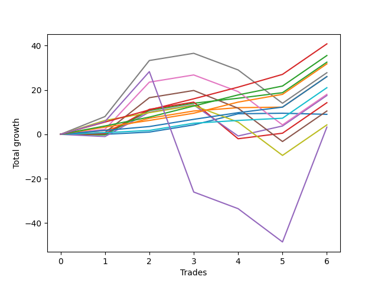

# Short Bernese 005 1v 
- Symbol: ES
- Date Range: 03/18/2022 - 09/30/2022
- Trading Period: 7:20-12:30
- Number of Trades: 6



| Name | Win Percent | Profit | Avg Profit / Trade | Avg Time / Trade |      | Name | Win Percent | Profit | Avg Profit / Trade | Avg Time / Trade |
| ---- | ----------- | ------ | ------------------ | ---------------- | ---- | ---- | ----------- | ------ | ------------------ | ---------------- |
| Sorted By <br> Profit | | | | | | Sorted By <br> Win Percentage ||||
| Eighty-Five | 100.00 | 20375.00 | 3395.83 | 11:36 |     | Eighty-Five | 100.00 | 20375.00 | 3395.83 | 11:36 |
| Eighty-Four | 100.00 | 17750.00 | 2958.33 | 11:05 |     | Eighty-Four | 100.00 | 17750.00 | 2958.33 | 11:05 |
| Two | 83.33 | 16250.00 | 2708.33 | 14:01 |     | Eighty-Three | 100.00 | 15875.00 | 2645.83 | 10:55 |
| Eighty-Three | 100.00 | 15875.00 | 2645.83 | 10:55 |     | Eighty-Two | 100.00 | 13000.00 | 2166.67 | 03:45 |
| Six | 66.67 | 13875.00 | 2312.50 | 32:43 |     | One | 100.00 | 13000.00 | 2166.67 | 04:11 |
| Eighty-Two | 100.00 | 13000.00 | 2166.67 | 03:45 |     | Eighty-One | 100.00 | 10500.00 | 1750.00 | 02:55 |
| One | 100.00 | 13000.00 | 2166.67 | 04:11 |     | Two | 83.33 | 16250.00 | 2708.33 | 14:01 |
| Eighty-One | 100.00 | 10500.00 | 1750.00 | 02:55 |     | Two_C | 83.33 | 7125.00 | 1187.50 | 19:33 |
| Five | 66.67 | 9000.00 | 1500.00 | 31:33 |     | Six | 66.67 | 13875.00 | 2312.50 | 32:43 |
| Three | 66.67 | 8750.00 | 1458.33 | 20:00 |     | Five | 66.67 | 9000.00 | 1500.00 | 31:33 |
| Two_C | 83.33 | 7125.00 | 1187.50 | 19:33 |     | Three | 66.67 | 8750.00 | 1458.33 | 20:00 |
| Four | 66.67 | 5250.00 | 875.00 | 31:04 |     | Four | 66.67 | 5250.00 | 875.00 | 31:04 |
| Zero | 66.67 | 4500.00 | 750.00 | 01:10 |     | Zero | 66.67 | 4500.00 | 750.00 | 01:10 |
| Seven | 66.67 | 2125.00 | 354.17 | 40:49 |     | Seven | 66.67 | 2125.00 | 354.17 | 40:49 |
| NEWFI 0000 | 50.00 | 1625.00 | 270.83 | 44:30 |     | NEWFI 0000 | 50.00 | 1625.00 | 270.83 | 44:30 |

## NO STOPLOSS

### Test Zero
* Sell when price hits the middle line of the 20p bollinger
* No Stoploss
* Results:
```
Total Trades: 6
Percent Up: 33.33
Percent Down: 66.67
Total Points Moved Down: 9.00
Potential Profit: 4500.00
Total Points Ups: 0.50 Count Ups: 2
Total Points Downs: 9.50 Count Downs: 4
```

<details><summary>Trades</summary>

<code>In: 2022-03-25 11:18:00		Out: 2022-03-25 11:18:10		Total Position Time: 00:10		Total Move Down: -0.00		Total to Date: 0.00</code> <br />
<code>In: 2022-05-10 11:06:00		Out: 2022-05-10 11:06:15		Total Position Time: 00:15		Total Move Down: 1.00		Total to Date: 1.00</code> <br />
<code>In: 2022-05-25 11:07:00		Out: 2022-05-25 11:07:10		Total Position Time: 00:10		Total Move Down: 3.25		Total to Date: 4.25</code> <br />
<code>In: 2022-05-25 11:37:00		Out: 2022-05-25 11:39:10		Total Position Time: 02:10		Total Move Down: 5.00		Total to Date: 9.25</code> <br />
<code>In: 2022-07-01 10:55:00		Out: 2022-07-01 10:58:45		Total Position Time: 03:45		Total Move Down: 0.25		Total to Date: 9.50</code> <br />
<code>In: 2022-09-21 10:55:00		Out: 2022-09-21 10:55:30		Total Position Time: 00:30		Total Move Down: -0.50		Total to Date: 9.00</code> <br />


</details>

### Test One
* Sell when the price hits the upper line of the 20p 1std bollinger
* No Stoploss
* Results:
```
Total Trades: 6
Percent Up: 0.00
Percent Down: 100.00
Total Points Moved Down: 26.00
Potential Profit: 13000.00
Total Points Ups: 0.00 Count Ups: 0
Total Points Downs: 26.00 Count Downs: 6
```

<details><summary>Trades</summary>

<code>In: 2022-03-25 11:18:00		Out: 2022-03-25 11:19:30		Total Position Time: 01:30		Total Move Down: 1.75		Total to Date: 1.75</code> <br />
<code>In: 2022-05-10 11:06:00		Out: 2022-05-10 11:06:45		Total Position Time: 00:45		Total Move Down: 5.50		Total to Date: 7.25</code> <br />
<code>In: 2022-05-25 11:07:00		Out: 2022-05-25 11:07:10		Total Position Time: 00:10		Total Move Down: 3.25		Total to Date: 10.50</code> <br />
<code>In: 2022-05-25 11:37:00		Out: 2022-05-25 11:45:15		Total Position Time: 08:15		Total Move Down: 1.50		Total to Date: 12.00</code> <br />
<code>In: 2022-07-01 10:55:00		Out: 2022-07-01 11:04:25		Total Position Time: 09:25		Total Move Down: 0.25		Total to Date: 12.25</code> <br />
<code>In: 2022-09-21 10:55:00		Out: 2022-09-21 11:00:05		Total Position Time: 05:05		Total Move Down: 13.75		Total to Date: 26.00</code> <br />


</details>

### Test Two
* Sell when the price hits the upper line of the 20p 2std bollinger
* No Stoploss
* Results:
```
Total Trades: 6
Percent Up: 16.67
Percent Down: 83.33
Total Points Moved Down: 32.50
Potential Profit: 16250.00
Total Points Ups: 0.25 Count Ups: 1
Total Points Downs: 32.75 Count Downs: 5
```

<details><summary>Trades</summary>

<code>In: 2022-03-25 11:18:00		Out: 2022-03-25 12:00:55		Total Position Time: 42:55		Total Move Down: -0.25		Total to Date: -0.25</code> <br />
<code>In: 2022-05-10 11:06:00		Out: 2022-05-10 11:16:05		Total Position Time: 10:05		Total Move Down: 11.00		Total to Date: 10.75</code> <br />
<code>In: 2022-05-25 11:07:00		Out: 2022-05-25 11:07:10		Total Position Time: 00:10		Total Move Down: 3.25		Total to Date: 14.00</code> <br />
<code>In: 2022-05-25 11:37:00		Out: 2022-05-25 11:50:00		Total Position Time: 13:00		Total Move Down: 2.25		Total to Date: 16.25</code> <br />
<code>In: 2022-07-01 10:55:00		Out: 2022-07-01 11:07:55		Total Position Time: 12:55		Total Move Down: 2.50		Total to Date: 18.75</code> <br />
<code>In: 2022-09-21 10:55:00		Out: 2022-09-21 11:00:05		Total Position Time: 05:05		Total Move Down: 13.75		Total to Date: 32.50</code> <br />


</details>

### Test Two_C
* Sell when the price hits the upper line of the 20p 2std bollinger
* No Stoploss
* Results:
```
Total Trades: 6
Percent Up: 16.67
Percent Down: 83.33
Total Points Moved Down: 14.25
Potential Profit: 7125.00
Total Points Ups: 16.50 Count Ups: 1
Total Points Downs: 30.75 Count Downs: 5
```

<details><summary>Trades</summary>

<code>In: 2022-03-25 11:18:00		Out: 2022-03-25 12:01:15		Total Position Time: 43:15		Total Move Down: 0.25		Total to Date: 0.25</code> <br />
<code>In: 2022-05-10 11:06:00		Out: 2022-05-10 11:16:05		Total Position Time: 10:05		Total Move Down: 11.00		Total to Date: 11.25</code> <br />
<code>In: 2022-05-25 11:07:00		Out: 2022-05-25 11:07:10		Total Position Time: 00:10		Total Move Down: 3.25		Total to Date: 14.50</code> <br />
<code>In: 2022-05-25 11:37:00		Out: 2022-05-25 12:22:50		Total Position Time: 45:50		Total Move Down: -16.50		Total to Date: -2.00</code> <br />
<code>In: 2022-07-01 10:55:00		Out: 2022-07-01 11:07:55		Total Position Time: 12:55		Total Move Down: 2.50		Total to Date: 0.50</code> <br />
<code>In: 2022-09-21 10:55:00		Out: 2022-09-21 11:00:05		Total Position Time: 05:05		Total Move Down: 13.75		Total to Date: 14.25</code> <br />


</details>

### Test Three
* Sell when price hits the middle line of the 50p bollinger
* No Stoploss
* Results:
```
Total Trades: 6
Percent Up: 33.33
Percent Down: 66.67
Total Points Moved Down: 17.50
Potential Profit: 8750.00
Total Points Ups: 15.00 Count Ups: 2
Total Points Downs: 32.50 Count Downs: 4
```

<details><summary>Trades</summary>

<code>In: 2022-03-25 11:18:00		Out: 2022-03-25 11:49:30		Total Position Time: 31:30		Total Move Down: -1.00		Total to Date: -1.00</code> <br />
<code>In: 2022-05-10 11:06:00		Out: 2022-05-10 11:16:05		Total Position Time: 10:05		Total Move Down: 11.00		Total to Date: 10.00</code> <br />
<code>In: 2022-05-25 11:07:00		Out: 2022-05-25 11:07:10		Total Position Time: 00:10		Total Move Down: 3.25		Total to Date: 13.25</code> <br />
<code>In: 2022-05-25 11:37:00		Out: 2022-05-25 12:34:20		Total Position Time: 57:20		Total Move Down: -14.00		Total to Date: -0.75</code> <br />
<code>In: 2022-07-01 10:55:00		Out: 2022-07-01 11:10:55		Total Position Time: 15:55		Total Move Down: 4.50		Total to Date: 3.75</code> <br />
<code>In: 2022-09-21 10:55:00		Out: 2022-09-21 11:00:05		Total Position Time: 05:05		Total Move Down: 13.75		Total to Date: 17.50</code> <br />


</details>

### Test Four
* Sell when the price hits the upper line of the 50p 1std bollinger
* No Stoploss
* Results:
```
Total Trades: 6
Percent Up: 33.33
Percent Down: 66.67
Total Points Moved Down: 10.50
Potential Profit: 5250.00
Total Points Ups: 23.00 Count Ups: 2
Total Points Downs: 33.50 Count Downs: 4
```

<details><summary>Trades</summary>

<code>In: 2022-03-25 11:18:00		Out: 2022-03-25 12:01:35		Total Position Time: 43:35		Total Move Down: 0.75		Total to Date: 0.75</code> <br />
<code>In: 2022-05-10 11:06:00		Out: 2022-05-10 11:24:05		Total Position Time: 18:05		Total Move Down: 15.75		Total to Date: 16.50</code> <br />
<code>In: 2022-05-25 11:07:00		Out: 2022-05-25 11:07:10		Total Position Time: 00:10		Total Move Down: 3.25		Total to Date: 19.75</code> <br />
<code>In: 2022-05-25 11:37:00		Out: 2022-05-25 12:36:35		Total Position Time: 59:35		Total Move Down: -8.00		Total to Date: 11.75</code> <br />
<code>In: 2022-07-01 10:55:00		Out: 2022-07-01 11:54:55		Total Position Time: 59:55		Total Move Down: -15.00		Total to Date: -3.25</code> <br />
<code>In: 2022-09-21 10:55:00		Out: 2022-09-21 11:00:05		Total Position Time: 05:05		Total Move Down: 13.75		Total to Date: 10.50</code> <br />


</details>

### Test Five
* Sell when the price hits the upper line of the 50p 2std bollinger
* No Stoploss
* Results:
```
Total Trades: 6
Percent Up: 33.33
Percent Down: 66.67
Total Points Moved Down: 18.00
Potential Profit: 9000.00
Total Points Ups: 22.50 Count Ups: 2
Total Points Downs: 40.50 Count Downs: 4
```

<details><summary>Trades</summary>

<code>In: 2022-03-25 11:18:00		Out: 2022-03-25 12:01:55		Total Position Time: 43:55		Total Move Down: 2.25		Total to Date: 2.25</code> <br />
<code>In: 2022-05-10 11:06:00		Out: 2022-05-10 11:26:20		Total Position Time: 20:20		Total Move Down: 21.25		Total to Date: 23.50</code> <br />
<code>In: 2022-05-25 11:07:00		Out: 2022-05-25 11:07:10		Total Position Time: 00:10		Total Move Down: 3.25		Total to Date: 26.75</code> <br />
<code>In: 2022-05-25 11:37:00		Out: 2022-05-25 12:36:55		Total Position Time: 59:55		Total Move Down: -7.50		Total to Date: 19.25</code> <br />
<code>In: 2022-07-01 10:55:00		Out: 2022-07-01 11:54:55		Total Position Time: 59:55		Total Move Down: -15.00		Total to Date: 4.25</code> <br />
<code>In: 2022-09-21 10:55:00		Out: 2022-09-21 11:00:05		Total Position Time: 05:05		Total Move Down: 13.75		Total to Date: 18.00</code> <br />


</details>

### Test Six
* Sell when the price hits the middle line of the 1std VWAP
* No Stoploss
* Results:
```
Total Trades: 6
Percent Up: 33.33
Percent Down: 66.67
Total Points Moved Down: 27.75
Potential Profit: 13875.00
Total Points Ups: 22.50 Count Ups: 2
Total Points Downs: 50.25 Count Downs: 4
```

<details><summary>Trades</summary>

<code>In: 2022-03-25 11:18:00		Out: 2022-03-25 12:07:35		Total Position Time: 49:35		Total Move Down: 8.00		Total to Date: 8.00</code> <br />
<code>In: 2022-05-10 11:06:00		Out: 2022-05-10 11:27:40		Total Position Time: 21:40		Total Move Down: 25.25		Total to Date: 33.25</code> <br />
<code>In: 2022-05-25 11:07:00		Out: 2022-05-25 11:07:10		Total Position Time: 00:10		Total Move Down: 3.25		Total to Date: 36.50</code> <br />
<code>In: 2022-05-25 11:37:00		Out: 2022-05-25 12:36:55		Total Position Time: 59:55		Total Move Down: -7.50		Total to Date: 29.00</code> <br />
<code>In: 2022-07-01 10:55:00		Out: 2022-07-01 11:54:55		Total Position Time: 59:55		Total Move Down: -15.00		Total to Date: 14.00</code> <br />
<code>In: 2022-09-21 10:55:00		Out: 2022-09-21 11:00:05		Total Position Time: 05:05		Total Move Down: 13.75		Total to Date: 27.75</code> <br />


</details>

### Test Seven
* Sell when the price hits the upper line of the 1std VWAP
* No Stoploss
* Results:
```
Total Trades: 6
Percent Up: 33.33
Percent Down: 66.67
Total Points Moved Down: 4.25
Potential Profit: 2125.00
Total Points Ups: 22.50 Count Ups: 2
Total Points Downs: 26.75 Count Downs: 4
```

<details><summary>Trades</summary>

<code>In: 2022-03-25 11:18:00		Out: 2022-03-25 12:17:55		Total Position Time: 59:55		Total Move Down: 6.25		Total to Date: 6.25</code> <br />
<code>In: 2022-05-10 11:06:00		Out: 2022-05-10 12:05:55		Total Position Time: 59:55		Total Move Down: 3.50		Total to Date: 9.75</code> <br />
<code>In: 2022-05-25 11:07:00		Out: 2022-05-25 11:07:10		Total Position Time: 00:10		Total Move Down: 3.25		Total to Date: 13.00</code> <br />
<code>In: 2022-05-25 11:37:00		Out: 2022-05-25 12:36:55		Total Position Time: 59:55		Total Move Down: -7.50		Total to Date: 5.50</code> <br />
<code>In: 2022-07-01 10:55:00		Out: 2022-07-01 11:54:55		Total Position Time: 59:55		Total Move Down: -15.00		Total to Date: -9.50</code> <br />
<code>In: 2022-09-21 10:55:00		Out: 2022-09-21 11:00:05		Total Position Time: 05:05		Total Move Down: 13.75		Total to Date: 4.25</code> <br />


</details>

## TAKE PROFIT

### Test Eighty-One
* Take Profit of 1 Point
* No Stoploss
* Results:
```
Total Trades: 6
Percent Up: 0.00
Percent Down: 100.00
Total Points Moved Down: 21.00
Potential Profit: 10500.00
Total Points Ups: 0.00 Count Ups: 0
Total Points Downs: 21.00 Count Downs: 6
```

<details><summary>Trades</summary>

<code>In: 2022-03-25 11:18:00		Out: 2022-03-25 11:18:15		Total Position Time: 00:15		Total Move Down: 0.75		Total to Date: 0.75</code> <br />
<code>In: 2022-05-10 11:06:00		Out: 2022-05-10 11:06:15		Total Position Time: 00:15		Total Move Down: 1.00		Total to Date: 1.75</code> <br />
<code>In: 2022-05-25 11:07:00		Out: 2022-05-25 11:07:10		Total Position Time: 00:10		Total Move Down: 3.25		Total to Date: 5.00</code> <br />
<code>In: 2022-05-25 11:37:00		Out: 2022-05-25 11:38:50		Total Position Time: 01:50		Total Move Down: 1.25		Total to Date: 6.25</code> <br />
<code>In: 2022-07-01 10:55:00		Out: 2022-07-01 11:04:55		Total Position Time: 09:55		Total Move Down: 1.00		Total to Date: 7.25</code> <br />
<code>In: 2022-09-21 10:55:00		Out: 2022-09-21 11:00:05		Total Position Time: 05:05		Total Move Down: 13.75		Total to Date: 21.00</code> <br />


</details>

### Test Eighty-Two
* Take Profit of 2 Point
* No Stoploss
* Results:
```
Total Trades: 6
Percent Up: 0.00
Percent Down: 100.00
Total Points Moved Down: 26.00
Potential Profit: 13000.00
Total Points Ups: 0.00 Count Ups: 0
Total Points Downs: 26.00 Count Downs: 6
```

<details><summary>Trades</summary>

<code>In: 2022-03-25 11:18:00		Out: 2022-03-25 11:19:45		Total Position Time: 01:45		Total Move Down: 1.75		Total to Date: 1.75</code> <br />
<code>In: 2022-05-10 11:06:00		Out: 2022-05-10 11:06:30		Total Position Time: 00:30		Total Move Down: 1.75		Total to Date: 3.50</code> <br />
<code>In: 2022-05-25 11:07:00		Out: 2022-05-25 11:07:10		Total Position Time: 00:10		Total Move Down: 3.25		Total to Date: 6.75</code> <br />
<code>In: 2022-05-25 11:37:00		Out: 2022-05-25 11:39:05		Total Position Time: 02:05		Total Move Down: 3.00		Total to Date: 9.75</code> <br />
<code>In: 2022-07-01 10:55:00		Out: 2022-07-01 11:07:55		Total Position Time: 12:55		Total Move Down: 2.50		Total to Date: 12.25</code> <br />
<code>In: 2022-09-21 10:55:00		Out: 2022-09-21 11:00:05		Total Position Time: 05:05		Total Move Down: 13.75		Total to Date: 26.00</code> <br />


</details>

### Test Eighty-Three
* Take Profit of 3 Point
* No Stoploss
* Results:
```
Total Trades: 6
Percent Up: 0.00
Percent Down: 100.00
Total Points Moved Down: 31.75
Potential Profit: 15875.00
Total Points Ups: 0.00 Count Ups: 0
Total Points Downs: 31.75 Count Downs: 6
```

<details><summary>Trades</summary>

<code>In: 2022-03-25 11:18:00		Out: 2022-03-25 12:02:00		Total Position Time: 44:00		Total Move Down: 3.25		Total to Date: 3.25</code> <br />
<code>In: 2022-05-10 11:06:00		Out: 2022-05-10 11:06:35		Total Position Time: 00:35		Total Move Down: 3.00		Total to Date: 6.25</code> <br />
<code>In: 2022-05-25 11:07:00		Out: 2022-05-25 11:07:10		Total Position Time: 00:10		Total Move Down: 3.25		Total to Date: 9.50</code> <br />
<code>In: 2022-05-25 11:37:00		Out: 2022-05-25 11:39:10		Total Position Time: 02:10		Total Move Down: 5.00		Total to Date: 14.50</code> <br />
<code>In: 2022-07-01 10:55:00		Out: 2022-07-01 11:08:30		Total Position Time: 13:30		Total Move Down: 3.50		Total to Date: 18.00</code> <br />
<code>In: 2022-09-21 10:55:00		Out: 2022-09-21 11:00:05		Total Position Time: 05:05		Total Move Down: 13.75		Total to Date: 31.75</code> <br />


</details>

### Test Eighty-Four
* Take Profit of 4 Point
* No Stoploss
* Results:
```
Total Trades: 6
Percent Up: 0.00
Percent Down: 100.00
Total Points Moved Down: 35.50
Potential Profit: 17750.00
Total Points Ups: 0.00 Count Ups: 0
Total Points Downs: 35.50 Count Downs: 6
```

<details><summary>Trades</summary>

<code>In: 2022-03-25 11:18:00		Out: 2022-03-25 12:02:30		Total Position Time: 44:30		Total Move Down: 3.75		Total to Date: 3.75</code> <br />
<code>In: 2022-05-10 11:06:00		Out: 2022-05-10 11:06:40		Total Position Time: 00:40		Total Move Down: 4.00		Total to Date: 7.75</code> <br />
<code>In: 2022-05-25 11:07:00		Out: 2022-05-25 11:07:15		Total Position Time: 00:15		Total Move Down: 5.00		Total to Date: 12.75</code> <br />
<code>In: 2022-05-25 11:37:00		Out: 2022-05-25 11:39:10		Total Position Time: 02:10		Total Move Down: 5.00		Total to Date: 17.75</code> <br />
<code>In: 2022-07-01 10:55:00		Out: 2022-07-01 11:08:50		Total Position Time: 13:50		Total Move Down: 4.00		Total to Date: 21.75</code> <br />
<code>In: 2022-09-21 10:55:00		Out: 2022-09-21 11:00:05		Total Position Time: 05:05		Total Move Down: 13.75		Total to Date: 35.50</code> <br />


</details>

### Test Eighty-Five
* Take Profit of 5 Point
* No Stoploss
* Results:
```
Total Trades: 6
Percent Up: 0.00
Percent Down: 100.00
Total Points Moved Down: 40.75
Potential Profit: 20375.00
Total Points Ups: 0.00 Count Ups: 0
Total Points Downs: 40.75 Count Downs: 6
```

<details><summary>Trades</summary>

<code>In: 2022-03-25 11:18:00		Out: 2022-03-25 12:03:05		Total Position Time: 45:05		Total Move Down: 5.50		Total to Date: 5.50</code> <br />
<code>In: 2022-05-10 11:06:00		Out: 2022-05-10 11:06:45		Total Position Time: 00:45		Total Move Down: 5.50		Total to Date: 11.00</code> <br />
<code>In: 2022-05-25 11:07:00		Out: 2022-05-25 11:07:15		Total Position Time: 00:15		Total Move Down: 5.00		Total to Date: 16.00</code> <br />
<code>In: 2022-05-25 11:37:00		Out: 2022-05-25 11:39:25		Total Position Time: 02:25		Total Move Down: 5.25		Total to Date: 21.25</code> <br />
<code>In: 2022-07-01 10:55:00		Out: 2022-07-01 11:11:05		Total Position Time: 16:05		Total Move Down: 5.75		Total to Date: 27.00</code> <br />
<code>In: 2022-09-21 10:55:00		Out: 2022-09-21 11:00:05		Total Position Time: 05:05		Total Move Down: 13.75		Total to Date: 40.75</code> <br />


</details>

## Indicator Exits

### Test NEWFI 0000
* Newfi 0000
* No Stoploss
* Results:
```
Total Trades: 6
Percent Up: 50.00
Percent Down: 50.00
Total Points Moved Down: 3.25
Potential Profit: 1625.00
Total Points Ups: 76.75 Count Ups: 3
Total Points Downs: 80.00 Count Downs: 3
```

<details><summary>Trades</summary>

<code>In: 2022-03-25 11:18:00		Out: 2022-03-25 12:11:05		Total Position Time: 53:05		Total Move Down: 5.75		Total to Date: 5.75</code> <br />
<code>In: 2022-05-10 11:06:00		Out: 2022-05-10 11:29:05		Total Position Time: 23:05		Total Move Down: 22.50		Total to Date: 28.25</code> <br />
<code>In: 2022-05-25 11:07:00		Out: 2022-05-25 12:06:55		Total Position Time: 59:55		Total Move Down: -54.25		Total to Date: -26.00</code> <br />
<code>In: 2022-05-25 11:37:00		Out: 2022-05-25 12:36:55		Total Position Time: 59:55		Total Move Down: -7.50		Total to Date: -33.50</code> <br />
<code>In: 2022-07-01 10:55:00		Out: 2022-07-01 11:54:55		Total Position Time: 59:55		Total Move Down: -15.00		Total to Date: -48.50</code> <br />
<code>In: 2022-09-21 10:55:00		Out: 2022-09-21 11:06:05		Total Position Time: 11:05		Total Move Down: 51.75		Total to Date: 3.25</code> <br />


</details>