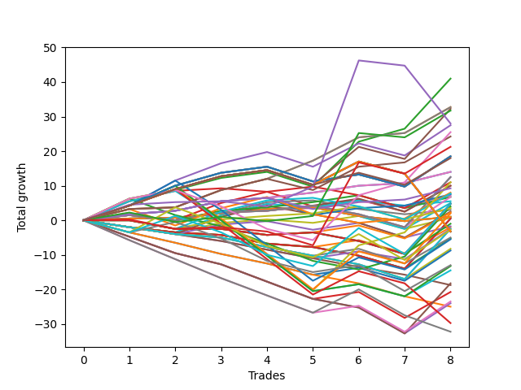

# Short Bulldog 001 
- Symbol: ES
- Date Range: 03/15/2022 - 07/08/2022
- Trading Period: 7:20-12:30
- Number of Trades: 8



| Name | Win Percent | Profit | Avg Profit / Trade |     | Name | Win Percent | Profit | Avg Profit / Trade |
| ---- | ----------- | ------ | ------------------ | --- | ---- | ----------- | ------ | ------------------ |
| Sorted By <br> Profit | | | | | Sorted By <br> Win Percentage ||||
| Two | 87.50 | 20500.00 | 2562.50 |     | Fifty-Seven | 100.00 | 16375.00 | 2046.88 |
| Fifty-Seven | 100.00 | 16375.00 | 2046.88 |     | One | 100.00 | 16375.00 | 2046.88 |
| One | 100.00 | 16375.00 | 2046.88 |     | Fifty-Six | 100.00 | 7000.00 | 875.00 |
| Five | 75.00 | 16125.00 | 2015.62 |     | Zero | 100.00 | 7000.00 | 875.00 |
| Seventy-Two | 62.50 | 15875.00 | 1984.38 |     | Two | 87.50 | 20500.00 | 2562.50 |
| Seventy-Four | 62.50 | 14000.00 | 1750.00 |     | Sixty-Five | 87.50 | 12125.00 | 1515.62 |
| Four | 75.00 | 13750.00 | 1718.75 |     | Sixty-Four | 87.50 | 4625.00 | 578.12 |
| Sixty-Six | 62.50 | 12750.00 | 1593.75 |     | Forty | 87.50 | 3750.00 | 468.75 |
| Sixty-Five | 87.50 | 12125.00 | 1515.62 |     | Sixten | 87.50 | 3625.00 | 453.12 |
| Seventy-Three | 50.00 | 10625.00 | 1328.12 |     | Nineteen | 87.50 | 2750.00 | 343.75 |
| Seventy | 75.00 | 9250.00 | 1156.25 |     | Five | 75.00 | 16125.00 | 2015.62 |
| Fifty-Four | 75.00 | 9250.00 | 1156.25 |     | Four | 75.00 | 13750.00 | 1718.75 |
| Thirty-Eight | 75.00 | 9250.00 | 1156.25 |     | Seventy | 75.00 | 9250.00 | 1156.25 |
| Twenty-Two | 75.00 | 9250.00 | 1156.25 |     | Fifty-Four | 75.00 | 9250.00 | 1156.25 |
| Six | 75.00 | 9250.00 | 1156.25 |     | Thirty-Eight | 75.00 | 9250.00 | 1156.25 |
| Seventy-Five | 75.00 | 9000.00 | 1125.00 |     | Twenty-Two | 75.00 | 9250.00 | 1156.25 |
| Fifty-Six | 100.00 | 7000.00 | 875.00 |     | Six | 75.00 | 9250.00 | 1156.25 |
| Zero | 100.00 | 7000.00 | 875.00 |     | Seventy-Five | 75.00 | 9000.00 | 1125.00 |
| Thirty-Seven | 62.50 | 6250.00 | 781.25 |     | Thirty-Five | 75.00 | 5000.00 | 625.00 |
| Thirty-Four | 62.50 | 6250.00 | 781.25 |     | Thirty-Two | 75.00 | 3375.00 | 421.88 |
| Fifty-Eight | 62.50 | 5500.00 | 687.50 |     | Seventeen | 75.00 | 1500.00 | 187.50 |
| Thirty-Three | 62.50 | 5500.00 | 687.50 |     | Twenty-One | 75.00 | 500.00 | 62.50 |
| Thirty-Five | 75.00 | 5000.00 | 625.00 |     | Twenty | 75.00 | 500.00 | 62.50 |
| Three | 62.50 | 5000.00 | 625.00 |     | Eighteen | 75.00 | 500.00 | 62.50 |
| Sixty-Four | 87.50 | 4625.00 | 578.12 |     | Seventy-Two | 62.50 | 15875.00 | 1984.38 |
| Forty-One | 62.50 | 4000.00 | 500.00 |     | Seventy-Four | 62.50 | 14000.00 | 1750.00 |
| Forty-Nine | 50.00 | 3875.00 | 484.38 |     | Sixty-Six | 62.50 | 12750.00 | 1593.75 |
| Forty | 87.50 | 3750.00 | 468.75 |     | Thirty-Seven | 62.50 | 6250.00 | 781.25 |
| Sixten | 87.50 | 3625.00 | 453.12 |     | Thirty-Four | 62.50 | 6250.00 | 781.25 |
| Thirty-Two | 75.00 | 3375.00 | 421.88 |     | Fifty-Eight | 62.50 | 5500.00 | 687.50 |
| Thirty-Six | 62.50 | 3375.00 | 421.88 |     | Thirty-Three | 62.50 | 5500.00 | 687.50 |
| Nineteen | 87.50 | 2750.00 | 343.75 |     | Three | 62.50 | 5000.00 | 625.00 |
| Nine | 37.50 | 2500.00 | 312.50 |     | Forty-One | 62.50 | 4000.00 | 500.00 |
| Sixty-Nine | 37.50 | 2375.00 | 296.88 |     | Thirty-Six | 62.50 | 3375.00 | 421.88 |
| Fifty-Three | 25.00 | 2375.00 | 296.88 |     | Forty-Eight | 62.50 | 1750.00 | 218.75 |
| Fifty | 25.00 | 2375.00 | 296.88 |     | Seventy-One | 62.50 | -1625.00 | -203.12 |
| Forty-Two | 37.50 | 2000.00 | 250.00 |     | Fifty-Five | 62.50 | -1625.00 | -203.12 |
| Forty-Eight | 62.50 | 1750.00 | 218.75 |     | Thirty-Nine | 62.50 | -1625.00 | -203.12 |
| Seventeen | 75.00 | 1500.00 | 187.50 |     | Twenty-Three | 62.50 | -1625.00 | -203.12 |
| Twenty-Five | 37.50 | 1250.00 | 156.25 |     | Seven | 62.50 | -1625.00 | -203.12 |
| Fifty-One | 37.50 | 1125.00 | 140.62 |     | Seventy-Three | 50.00 | 10625.00 | 1328.12 |
| Sixty-One | 50.00 | 1000.00 | 125.00 |     | Forty-Nine | 50.00 | 3875.00 | 484.38 |
| Twenty-One | 75.00 | 500.00 | 62.50 |     | Sixty-One | 50.00 | 1000.00 | 125.00 |
| Twenty | 75.00 | 500.00 | 62.50 |     | Eight | 50.00 | 375.00 | 46.88 |
| Eighteen | 75.00 | 500.00 | 62.50 |     | Twenty-Four | 50.00 | -875.00 | -109.38 |
| Eight | 50.00 | 375.00 | 46.88 |     | Sixty | 50.00 | -2750.00 | -343.75 |
| Thirteen | 12.50 | 250.00 | 31.25 |     | Sixty-Two | 50.00 | -6625.00 | -828.12 |
| Ten | 12.50 | 250.00 | 31.25 |     | Fifty-Nine | 50.00 | -7250.00 | -906.25 |
| Fifty-Two | 25.00 | -500.00 | -62.50 |     | Nine | 37.50 | 2500.00 | 312.50 |
| Twenty-Four | 50.00 | -875.00 | -109.38 |     | Sixty-Nine | 37.50 | 2375.00 | 296.88 |
| Eleven | 25.00 | -1000.00 | -125.00 |     | Forty-Two | 37.50 | 2000.00 | 250.00 |
| Fourteen | 25.00 | -1250.00 | -156.25 |     | Twenty-Five | 37.50 | 1250.00 | 156.25 |
| Twenty-Nine | 12.50 | -1250.00 | -156.25 |     | Fifty-One | 37.50 | 1125.00 | 140.62 |
| Twenty-Six | 12.50 | -1250.00 | -156.25 |     | Sixty-Eight | 37.50 | -1375.00 | -171.88 |
| Sixty-Eight | 37.50 | -1375.00 | -171.88 |     | Sixty-Seven | 37.50 | -6500.00 | -812.50 |
| Seventy-One | 62.50 | -1625.00 | -203.12 |     | Sixty-Three | 37.50 | -14875.00 | -1859.38 |
| Fifty-Five | 62.50 | -1625.00 | -203.12 |     | Fifty-Three | 25.00 | 2375.00 | 296.88 |
| Thirty-Nine | 62.50 | -1625.00 | -203.12 |     | Fifty | 25.00 | 2375.00 | 296.88 |
| Twenty-Three | 62.50 | -1625.00 | -203.12 |     | Fifty-Two | 25.00 | -500.00 | -62.50 |
| Seven | 62.50 | -1625.00 | -203.12 |     | Eleven | 25.00 | -1000.00 | -125.00 |
| twenty-Seven | 25.00 | -2500.00 | -312.50 |     | Fourteen | 25.00 | -1250.00 | -156.25 |
| Twelve | 12.50 | -2625.00 | -328.12 |     | twenty-Seven | 25.00 | -2500.00 | -312.50 |
| Sixty | 50.00 | -2750.00 | -343.75 |     | Thirty | 25.00 | -4375.00 | -546.88 |
| Twenty-Eight | 12.50 | -4125.00 | -515.62 |     | Forty-Three | 25.00 | -10375.00 | -1296.88 |
| Thirty | 25.00 | -4375.00 | -546.88 |     | Forty-Six | 25.00 | -11750.00 | -1468.75 |
| Sixty-Seven | 37.50 | -6500.00 | -812.50 |     | Thirteen | 12.50 | 250.00 | 31.25 |
| Sixty-Two | 50.00 | -6625.00 | -828.12 |     | Ten | 12.50 | 250.00 | 31.25 |
| Fifty-Nine | 50.00 | -7250.00 | -906.25 |     | Twenty-Nine | 12.50 | -1250.00 | -156.25 |
| Forty-Five | 12.50 | -9125.00 | -1140.62 |     | Twenty-Six | 12.50 | -1250.00 | -156.25 |
| Fifteen | 0.00 | -9375.00 | -1171.88 |     | Twelve | 12.50 | -2625.00 | -328.12 |
| Forty-Three | 25.00 | -10375.00 | -1296.88 |     | Twenty-Eight | 12.50 | -4125.00 | -515.62 |
| Forty-Six | 25.00 | -11750.00 | -1468.75 |     | Forty-Five | 12.50 | -9125.00 | -1140.62 |
| Forty-Four | 12.50 | -12000.00 | -1500.00 |     | Forty-Four | 12.50 | -12000.00 | -1500.00 |
| Thirty-One | 0.00 | -12500.00 | -1562.50 |     | Forty-Seven | 12.50 | -16125.00 | -2015.62 |
| Sixty-Three | 37.50 | -14875.00 | -1859.38 |     | Fifteen | 0.00 | -9375.00 | -1171.88 |
| Forty-Seven | 12.50 | -16125.00 | -2015.62 |     | Thirty-One | 0.00 | -12500.00 | -1562.50 |

## NO STOPLOSS

### Test Zero
* Sell when price hits the middle line of the 20p bollinger
* No Stoploss
* Results:
```
Total Trades: 8
Percent Up: 0.00
Percent Down: 100.00
Total Points Moved Down: 14.00
Potential Profit: 7000.00
Total Points Ups: 0.00 Count Ups: 0
Total Points Downs: 14.00 Count Downs: 8
```

<details><summary>Trades</summary>

<code>In: 2022-04-07 11:04:00		Out: 2022-04-07 11:15:15		Total Position Time: 11:15		Total Move Down: 1.75		Total to Date: 1.75</code> <br />
<code>In: 2022-04-18 07:28:00		Out: 2022-04-18 07:36:40		Total Position Time: 08:40		Total Move Down: 1.00		Total to Date: 2.75</code> <br />
<code>In: 2022-05-04 09:42:00		Out: 2022-05-04 09:45:25		Total Position Time: 03:25		Total Move Down: 2.75		Total to Date: 5.50</code> <br />
<code>In: 2022-05-04 09:43:00		Out: 2022-05-04 09:45:25		Total Position Time: 02:25		Total Move Down: 1.00		Total to Date: 6.50</code> <br />
<code>In: 2022-05-31 07:24:00		Out: 2022-05-31 07:36:40		Total Position Time: 12:40		Total Move Down: 1.50		Total to Date: 8.00</code> <br />
<code>In: 2022-06-15 11:02:00		Out: 2022-06-15 11:02:10		Total Position Time: 00:10		Total Move Down: 2.00		Total to Date: 10.00</code> <br />
<code>In: 2022-07-05 08:49:00		Out: 2022-07-05 08:59:20		Total Position Time: 10:20		Total Move Down: 0.75		Total to Date: 10.75</code> <br />
<code>In: 2022-07-06 11:10:00		Out: 2022-07-06 11:10:10		Total Position Time: 00:10		Total Move Down: 3.25		Total to Date: 14.00</code> <br />


</details>

### Test One
* Sell when the price hits the upper line of the 20p 1std bollinger
* No Stoploss
* Results:
```
Total Trades: 8
Percent Up: 0.00
Percent Down: 100.00
Total Points Moved Down: 32.75
Potential Profit: 16375.00
Total Points Ups: 0.00 Count Ups: 0
Total Points Downs: 32.75 Count Downs: 8
```

<details><summary>Trades</summary>

<code>In: 2022-04-07 11:04:00		Out: 2022-04-07 11:16:10		Total Position Time: 12:10		Total Move Down: 3.25		Total to Date: 3.25</code> <br />
<code>In: 2022-04-18 07:28:00		Out: 2022-04-18 07:51:30		Total Position Time: 23:30		Total Move Down: 0.50		Total to Date: 3.75</code> <br />
<code>In: 2022-05-04 09:42:00		Out: 2022-05-04 09:46:30		Total Position Time: 04:30		Total Move Down: 5.00		Total to Date: 8.75</code> <br />
<code>In: 2022-05-04 09:43:00		Out: 2022-05-04 09:46:30		Total Position Time: 03:30		Total Move Down: 3.25		Total to Date: 12.00</code> <br />
<code>In: 2022-05-31 07:24:00		Out: 2022-05-31 07:38:00		Total Position Time: 14:00		Total Move Down: 5.25		Total to Date: 17.25</code> <br />
<code>In: 2022-06-15 11:02:00		Out: 2022-06-15 11:03:00		Total Position Time: 01:00		Total Move Down: 6.75		Total to Date: 24.00</code> <br />
<code>In: 2022-07-05 08:49:00		Out: 2022-07-05 09:03:25		Total Position Time: 14:25		Total Move Down: 1.25		Total to Date: 25.25</code> <br />
<code>In: 2022-07-06 11:10:00		Out: 2022-07-06 11:11:10		Total Position Time: 01:10		Total Move Down: 7.50		Total to Date: 32.75</code> <br />


</details>

### Test Two
* Sell when the price hits the upper line of the 20p 2std bollinger
* No Stoploss
* Results:
```
Total Trades: 8
Percent Up: 12.50
Percent Down: 87.50
Total Points Moved Down: 41.00
Potential Profit: 20500.00
Total Points Ups: 4.25 Count Ups: 1
Total Points Downs: 45.25 Count Downs: 7
```

<details><summary>Trades</summary>

<code>In: 2022-04-07 11:04:00		Out: 2022-04-07 11:18:40		Total Position Time: 14:40		Total Move Down: 6.25		Total to Date: 6.25</code> <br />
<code>In: 2022-04-18 07:28:00		Out: 2022-04-18 07:51:45		Total Position Time: 23:45		Total Move Down: 2.50		Total to Date: 8.75</code> <br />
<code>In: 2022-05-04 09:42:00		Out: 2022-05-04 10:11:25		Total Position Time: 29:25		Total Move Down: 3.50		Total to Date: 12.25</code> <br />
<code>In: 2022-05-04 09:43:00		Out: 2022-05-04 10:11:25		Total Position Time: 28:25		Total Move Down: 1.75		Total to Date: 14.00</code> <br />
<code>In: 2022-05-31 07:24:00		Out: 2022-05-31 07:53:55		Total Position Time: 29:55		Total Move Down: -4.25		Total to Date: 9.75</code> <br />
<code>In: 2022-06-15 11:02:00		Out: 2022-06-15 11:03:15		Total Position Time: 01:15		Total Move Down: 13.00		Total to Date: 22.75</code> <br />
<code>In: 2022-07-05 08:49:00		Out: 2022-07-05 09:03:50		Total Position Time: 14:50		Total Move Down: 3.75		Total to Date: 26.50</code> <br />
<code>In: 2022-07-06 11:10:00		Out: 2022-07-06 11:12:15		Total Position Time: 02:15		Total Move Down: 14.50		Total to Date: 41.00</code> <br />


</details>

### Test Three
* Sell when price hits the middle line of the 50p bollinger
* No Stoploss
* Results:
```
Total Trades: 8
Percent Up: 37.50
Percent Down: 62.50
Total Points Moved Down: 10.00
Potential Profit: 5000.00
Total Points Ups: 8.75 Count Ups: 3
Total Points Downs: 18.75 Count Downs: 5
```

<details><summary>Trades</summary>

<code>In: 2022-04-07 11:04:00		Out: 2022-04-07 11:33:40		Total Position Time: 29:40		Total Move Down: 5.50		Total to Date: 5.50</code> <br />
<code>In: 2022-04-18 07:28:00		Out: 2022-04-18 07:51:50		Total Position Time: 23:50		Total Move Down: 3.00		Total to Date: 8.50</code> <br />
<code>In: 2022-05-04 09:42:00		Out: 2022-05-04 10:10:40		Total Position Time: 28:40		Total Move Down: 0.75		Total to Date: 9.25</code> <br />
<code>In: 2022-05-04 09:43:00		Out: 2022-05-04 10:10:40		Total Position Time: 27:40		Total Move Down: -1.00		Total to Date: 8.25</code> <br />
<code>In: 2022-05-31 07:24:00		Out: 2022-05-31 07:53:55		Total Position Time: 29:55		Total Move Down: -4.25		Total to Date: 4.00</code> <br />
<code>In: 2022-06-15 11:02:00		Out: 2022-06-15 11:02:10		Total Position Time: 00:10		Total Move Down: 2.00		Total to Date: 6.00</code> <br />
<code>In: 2022-07-05 08:49:00		Out: 2022-07-05 09:18:55		Total Position Time: 29:55		Total Move Down: -3.50		Total to Date: 2.50</code> <br />
<code>In: 2022-07-06 11:10:00		Out: 2022-07-06 11:11:10		Total Position Time: 01:10		Total Move Down: 7.50		Total to Date: 10.00</code> <br />


</details>

### Test Four
* Sell when the price hits the upper line of the 50p 1std bollinger
* No Stoploss
* Results:
```
Total Trades: 8
Percent Up: 25.00
Percent Down: 75.00
Total Points Moved Down: 27.50
Potential Profit: 13750.00
Total Points Ups: 7.75 Count Ups: 2
Total Points Downs: 35.25 Count Downs: 6
```

<details><summary>Trades</summary>

<code>In: 2022-04-07 11:04:00		Out: 2022-04-07 11:33:55		Total Position Time: 29:55		Total Move Down: 4.25		Total to Date: 4.25</code> <br />
<code>In: 2022-04-18 07:28:00		Out: 2022-04-18 07:57:05		Total Position Time: 29:05		Total Move Down: 7.25		Total to Date: 11.50</code> <br />
<code>In: 2022-05-04 09:42:00		Out: 2022-05-04 10:11:45		Total Position Time: 29:45		Total Move Down: 5.00		Total to Date: 16.50</code> <br />
<code>In: 2022-05-04 09:43:00		Out: 2022-05-04 10:11:45		Total Position Time: 28:45		Total Move Down: 3.25		Total to Date: 19.75</code> <br />
<code>In: 2022-05-31 07:24:00		Out: 2022-05-31 07:53:55		Total Position Time: 29:55		Total Move Down: -4.25		Total to Date: 15.50</code> <br />
<code>In: 2022-06-15 11:02:00		Out: 2022-06-15 11:03:00		Total Position Time: 01:00		Total Move Down: 6.75		Total to Date: 22.25</code> <br />
<code>In: 2022-07-05 08:49:00		Out: 2022-07-05 09:18:55		Total Position Time: 29:55		Total Move Down: -3.50		Total to Date: 18.75</code> <br />
<code>In: 2022-07-06 11:10:00		Out: 2022-07-06 11:11:35		Total Position Time: 01:35		Total Move Down: 8.75		Total to Date: 27.50</code> <br />


</details>

### Test Five
* Sell when the price hits the upper line of the 50p 2std bollinger
* No Stoploss
* Results:
```
Total Trades: 8
Percent Up: 25.00
Percent Down: 75.00
Total Points Moved Down: 32.25
Potential Profit: 16125.00
Total Points Ups: 7.75 Count Ups: 2
Total Points Downs: 40.00 Count Downs: 6
```

<details><summary>Trades</summary>

<code>In: 2022-04-07 11:04:00		Out: 2022-04-07 11:33:55		Total Position Time: 29:55		Total Move Down: 4.25		Total to Date: 4.25</code> <br />
<code>In: 2022-04-18 07:28:00		Out: 2022-04-18 07:57:55		Total Position Time: 29:55		Total Move Down: 4.75		Total to Date: 9.00</code> <br />
<code>In: 2022-05-04 09:42:00		Out: 2022-05-04 10:11:55		Total Position Time: 29:55		Total Move Down: 3.75		Total to Date: 12.75</code> <br />
<code>In: 2022-05-04 09:43:00		Out: 2022-05-04 10:12:55		Total Position Time: 29:55		Total Move Down: 1.75		Total to Date: 14.50</code> <br />
<code>In: 2022-05-31 07:24:00		Out: 2022-05-31 07:53:55		Total Position Time: 29:55		Total Move Down: -4.25		Total to Date: 10.25</code> <br />
<code>In: 2022-06-15 11:02:00		Out: 2022-06-15 11:03:10		Total Position Time: 01:10		Total Move Down: 11.00		Total to Date: 21.25</code> <br />
<code>In: 2022-07-05 08:49:00		Out: 2022-07-05 09:18:55		Total Position Time: 29:55		Total Move Down: -3.50		Total to Date: 17.75</code> <br />
<code>In: 2022-07-06 11:10:00		Out: 2022-07-06 11:12:15		Total Position Time: 02:15		Total Move Down: 14.50		Total to Date: 32.25</code> <br />


</details>

### Test Six
* Sell when the price hits the middle line of the 1std VWAP
* No Stoploss
* Results:
```
Total Trades: 8
Percent Up: 25.00
Percent Down: 75.00
Total Points Moved Down: 18.50
Potential Profit: 9250.00
Total Points Ups: 7.75 Count Ups: 2
Total Points Downs: 26.25 Count Downs: 6
```

<details><summary>Trades</summary>

<code>In: 2022-04-07 11:04:00		Out: 2022-04-07 11:33:55		Total Position Time: 29:55		Total Move Down: 4.25		Total to Date: 4.25</code> <br />
<code>In: 2022-04-18 07:28:00		Out: 2022-04-18 07:55:15		Total Position Time: 27:15		Total Move Down: 5.75		Total to Date: 10.00</code> <br />
<code>In: 2022-05-04 09:42:00		Out: 2022-05-04 10:11:55		Total Position Time: 29:55		Total Move Down: 3.75		Total to Date: 13.75</code> <br />
<code>In: 2022-05-04 09:43:00		Out: 2022-05-04 10:12:55		Total Position Time: 29:55		Total Move Down: 1.75		Total to Date: 15.50</code> <br />
<code>In: 2022-05-31 07:24:00		Out: 2022-05-31 07:53:55		Total Position Time: 29:55		Total Move Down: -4.25		Total to Date: 11.25</code> <br />
<code>In: 2022-06-15 11:02:00		Out: 2022-06-15 11:02:10		Total Position Time: 00:10		Total Move Down: 2.00		Total to Date: 13.25</code> <br />
<code>In: 2022-07-05 08:49:00		Out: 2022-07-05 09:18:55		Total Position Time: 29:55		Total Move Down: -3.50		Total to Date: 9.75</code> <br />
<code>In: 2022-07-06 11:10:00		Out: 2022-07-06 11:11:35		Total Position Time: 01:35		Total Move Down: 8.75		Total to Date: 18.50</code> <br />


</details>

### Test Seven
* Sell when the price hits the upper line of the 1std VWAP
* No Stoploss
* Results:
```
Total Trades: 8
Percent Up: 37.50
Percent Down: 62.50
Total Points Moved Down: -3.25
Potential Profit: -1625.00
Total Points Ups: 24.50 Count Ups: 3
Total Points Downs: 21.25 Count Downs: 5
```

<details><summary>Trades</summary>

<code>In: 2022-04-07 11:04:00		Out: 2022-04-07 11:33:55		Total Position Time: 29:55		Total Move Down: 4.25		Total to Date: 4.25</code> <br />
<code>In: 2022-04-18 07:28:00		Out: 2022-04-18 07:57:55		Total Position Time: 29:55		Total Move Down: 4.75		Total to Date: 9.00</code> <br />
<code>In: 2022-05-04 09:42:00		Out: 2022-05-04 10:11:55		Total Position Time: 29:55		Total Move Down: 3.75		Total to Date: 12.75</code> <br />
<code>In: 2022-05-04 09:43:00		Out: 2022-05-04 10:12:55		Total Position Time: 29:55		Total Move Down: 1.75		Total to Date: 14.50</code> <br />
<code>In: 2022-05-31 07:24:00		Out: 2022-05-31 07:53:55		Total Position Time: 29:55		Total Move Down: -4.25		Total to Date: 10.25</code> <br />
<code>In: 2022-06-15 11:02:00		Out: 2022-06-15 11:03:00		Total Position Time: 01:00		Total Move Down: 6.75		Total to Date: 17.00</code> <br />
<code>In: 2022-07-05 08:49:00		Out: 2022-07-05 09:18:55		Total Position Time: 29:55		Total Move Down: -3.50		Total to Date: 13.50</code> <br />
<code>In: 2022-07-06 11:10:00		Out: 2022-07-06 11:39:55		Total Position Time: 29:55		Total Move Down: -16.75		Total to Date: -3.25</code> <br />


</details>

## STOPLOSS OF 2

### Test Eight
* Sell when price hits the middle line of the 20p bollinger
* Stoploss is -2 points
* Results:
```
Total Trades: 8
Percent Up: 50.00
Percent Down: 50.00
Total Points Moved Down: 0.75
Potential Profit: 375.00
Total Points Ups: 8.25 Count Ups: 4
Total Points Downs: 9.00 Count Downs: 4
```

<details><summary>Trades</summary>

<code>In: 2022-04-07 11:04:00		Out: 2022-04-07 11:14:15		Total Position Time: 10:15		Total Move Down: -2.00		Total to Date: -2.00</code> <br />
<code>In: 2022-04-18 07:28:00		Out: 2022-04-18 07:34:30		Total Position Time: 06:30		Total Move Down: -1.50		Total to Date: -3.50</code> <br />
<code>In: 2022-05-04 09:42:00		Out: 2022-05-04 09:45:25		Total Position Time: 03:25		Total Move Down: 2.75		Total to Date: -0.75</code> <br />
<code>In: 2022-05-04 09:43:00		Out: 2022-05-04 09:45:25		Total Position Time: 02:25		Total Move Down: 1.00		Total to Date: 0.25</code> <br />
<code>In: 2022-05-31 07:24:00		Out: 2022-05-31 07:28:15		Total Position Time: 04:15		Total Move Down: -1.00		Total to Date: -0.75</code> <br />
<code>In: 2022-06-15 11:02:00		Out: 2022-06-15 11:02:10		Total Position Time: 00:10		Total Move Down: 2.00		Total to Date: 1.25</code> <br />
<code>In: 2022-07-05 08:49:00		Out: 2022-07-05 08:51:10		Total Position Time: 02:10		Total Move Down: -3.75		Total to Date: -2.50</code> <br />
<code>In: 2022-07-06 11:10:00		Out: 2022-07-06 11:10:10		Total Position Time: 00:10		Total Move Down: 3.25		Total to Date: 0.75</code> <br />


</details>

### Test Nine
* Sell when the price hits the upper line of the 20p 1std bollinger
* Stoploss is -2 points
* Results:
```
Total Trades: 8
Percent Up: 62.50
Percent Down: 37.50
Total Points Moved Down: 5.00
Potential Profit: 2500.00
Total Points Ups: 10.75 Count Ups: 5
Total Points Downs: 15.75 Count Downs: 3
```

<details><summary>Trades</summary>

<code>In: 2022-04-07 11:04:00		Out: 2022-04-07 11:14:15		Total Position Time: 10:15		Total Move Down: -2.00		Total to Date: -2.00</code> <br />
<code>In: 2022-04-18 07:28:00		Out: 2022-04-18 07:34:30		Total Position Time: 06:30		Total Move Down: -1.50		Total to Date: -3.50</code> <br />
<code>In: 2022-05-04 09:42:00		Out: 2022-05-04 09:46:30		Total Position Time: 04:30		Total Move Down: 5.00		Total to Date: 1.50</code> <br />
<code>In: 2022-05-04 09:43:00		Out: 2022-05-04 09:46:30		Total Position Time: 03:30		Total Move Down: 3.25		Total to Date: 4.75</code> <br />
<code>In: 2022-05-31 07:24:00		Out: 2022-05-31 07:28:15		Total Position Time: 04:15		Total Move Down: -1.00		Total to Date: 3.75</code> <br />
<code>In: 2022-06-15 11:02:00		Out: 2022-06-15 11:02:15		Total Position Time: 00:15		Total Move Down: -2.50		Total to Date: 1.25</code> <br />
<code>In: 2022-07-05 08:49:00		Out: 2022-07-05 08:51:10		Total Position Time: 02:10		Total Move Down: -3.75		Total to Date: -2.50</code> <br />
<code>In: 2022-07-06 11:10:00		Out: 2022-07-06 11:11:10		Total Position Time: 01:10		Total Move Down: 7.50		Total to Date: 5.00</code> <br />


</details>

### Test Ten
* Sell when the price hits the upper line of the 20p 2std bollinger
* Stoploss is -2 points
* Results:
```
Total Trades: 8
Percent Up: 87.50
Percent Down: 12.50
Total Points Moved Down: 0.50
Potential Profit: 250.00
Total Points Ups: 14.00 Count Ups: 7
Total Points Downs: 14.50 Count Downs: 1
```

<details><summary>Trades</summary>

<code>In: 2022-04-07 11:04:00		Out: 2022-04-07 11:14:15		Total Position Time: 10:15		Total Move Down: -2.00		Total to Date: -2.00</code> <br />
<code>In: 2022-04-18 07:28:00		Out: 2022-04-18 07:34:30		Total Position Time: 06:30		Total Move Down: -1.50		Total to Date: -3.50</code> <br />
<code>In: 2022-05-04 09:42:00		Out: 2022-05-04 09:52:50		Total Position Time: 10:50		Total Move Down: -0.75		Total to Date: -4.25</code> <br />
<code>In: 2022-05-04 09:43:00		Out: 2022-05-04 09:52:50		Total Position Time: 09:50		Total Move Down: -2.50		Total to Date: -6.75</code> <br />
<code>In: 2022-05-31 07:24:00		Out: 2022-05-31 07:28:15		Total Position Time: 04:15		Total Move Down: -1.00		Total to Date: -7.75</code> <br />
<code>In: 2022-06-15 11:02:00		Out: 2022-06-15 11:02:15		Total Position Time: 00:15		Total Move Down: -2.50		Total to Date: -10.25</code> <br />
<code>In: 2022-07-05 08:49:00		Out: 2022-07-05 08:51:10		Total Position Time: 02:10		Total Move Down: -3.75		Total to Date: -14.00</code> <br />
<code>In: 2022-07-06 11:10:00		Out: 2022-07-06 11:12:15		Total Position Time: 02:15		Total Move Down: 14.50		Total to Date: 0.50</code> <br />


</details>

### Test Eleven
* Sell when price hits the middle line of the 50p bollinger
* Stoploss is -2 points
* Results:
```
Total Trades: 8
Percent Up: 75.00
Percent Down: 25.00
Total Points Moved Down: -2.00
Potential Profit: -1000.00
Total Points Ups: 11.50 Count Ups: 6
Total Points Downs: 9.50 Count Downs: 2
```

<details><summary>Trades</summary>

<code>In: 2022-04-07 11:04:00		Out: 2022-04-07 11:14:15		Total Position Time: 10:15		Total Move Down: -2.00		Total to Date: -2.00</code> <br />
<code>In: 2022-04-18 07:28:00		Out: 2022-04-18 07:34:30		Total Position Time: 06:30		Total Move Down: -1.50		Total to Date: -3.50</code> <br />
<code>In: 2022-05-04 09:42:00		Out: 2022-05-04 09:52:50		Total Position Time: 10:50		Total Move Down: -0.75		Total to Date: -4.25</code> <br />
<code>In: 2022-05-04 09:43:00		Out: 2022-05-04 09:52:50		Total Position Time: 09:50		Total Move Down: -2.50		Total to Date: -6.75</code> <br />
<code>In: 2022-05-31 07:24:00		Out: 2022-05-31 07:28:15		Total Position Time: 04:15		Total Move Down: -1.00		Total to Date: -7.75</code> <br />
<code>In: 2022-06-15 11:02:00		Out: 2022-06-15 11:02:10		Total Position Time: 00:10		Total Move Down: 2.00		Total to Date: -5.75</code> <br />
<code>In: 2022-07-05 08:49:00		Out: 2022-07-05 08:51:10		Total Position Time: 02:10		Total Move Down: -3.75		Total to Date: -9.50</code> <br />
<code>In: 2022-07-06 11:10:00		Out: 2022-07-06 11:11:10		Total Position Time: 01:10		Total Move Down: 7.50		Total to Date: -2.00</code> <br />


</details>

### Test Twelve
* Sell when the price hits the upper line of the 50p 1std bollinger
* Stoploss is -2 points
* Results:
```
Total Trades: 8
Percent Up: 87.50
Percent Down: 12.50
Total Points Moved Down: -5.25
Potential Profit: -2625.00
Total Points Ups: 14.00 Count Ups: 7
Total Points Downs: 8.75 Count Downs: 1
```

<details><summary>Trades</summary>

<code>In: 2022-04-07 11:04:00		Out: 2022-04-07 11:14:15		Total Position Time: 10:15		Total Move Down: -2.00		Total to Date: -2.00</code> <br />
<code>In: 2022-04-18 07:28:00		Out: 2022-04-18 07:34:30		Total Position Time: 06:30		Total Move Down: -1.50		Total to Date: -3.50</code> <br />
<code>In: 2022-05-04 09:42:00		Out: 2022-05-04 09:52:50		Total Position Time: 10:50		Total Move Down: -0.75		Total to Date: -4.25</code> <br />
<code>In: 2022-05-04 09:43:00		Out: 2022-05-04 09:52:50		Total Position Time: 09:50		Total Move Down: -2.50		Total to Date: -6.75</code> <br />
<code>In: 2022-05-31 07:24:00		Out: 2022-05-31 07:28:15		Total Position Time: 04:15		Total Move Down: -1.00		Total to Date: -7.75</code> <br />
<code>In: 2022-06-15 11:02:00		Out: 2022-06-15 11:02:15		Total Position Time: 00:15		Total Move Down: -2.50		Total to Date: -10.25</code> <br />
<code>In: 2022-07-05 08:49:00		Out: 2022-07-05 08:51:10		Total Position Time: 02:10		Total Move Down: -3.75		Total to Date: -14.00</code> <br />
<code>In: 2022-07-06 11:10:00		Out: 2022-07-06 11:11:35		Total Position Time: 01:35		Total Move Down: 8.75		Total to Date: -5.25</code> <br />


</details>

### Test Thirteen
* Sell when the price hits the upper line of the 50p 2std bollinger
* Stoploss is -2 points
* Results:
```
Total Trades: 8
Percent Up: 87.50
Percent Down: 12.50
Total Points Moved Down: 0.50
Potential Profit: 250.00
Total Points Ups: 14.00 Count Ups: 7
Total Points Downs: 14.50 Count Downs: 1
```

<details><summary>Trades</summary>

<code>In: 2022-04-07 11:04:00		Out: 2022-04-07 11:14:15		Total Position Time: 10:15		Total Move Down: -2.00		Total to Date: -2.00</code> <br />
<code>In: 2022-04-18 07:28:00		Out: 2022-04-18 07:34:30		Total Position Time: 06:30		Total Move Down: -1.50		Total to Date: -3.50</code> <br />
<code>In: 2022-05-04 09:42:00		Out: 2022-05-04 09:52:50		Total Position Time: 10:50		Total Move Down: -0.75		Total to Date: -4.25</code> <br />
<code>In: 2022-05-04 09:43:00		Out: 2022-05-04 09:52:50		Total Position Time: 09:50		Total Move Down: -2.50		Total to Date: -6.75</code> <br />
<code>In: 2022-05-31 07:24:00		Out: 2022-05-31 07:28:15		Total Position Time: 04:15		Total Move Down: -1.00		Total to Date: -7.75</code> <br />
<code>In: 2022-06-15 11:02:00		Out: 2022-06-15 11:02:15		Total Position Time: 00:15		Total Move Down: -2.50		Total to Date: -10.25</code> <br />
<code>In: 2022-07-05 08:49:00		Out: 2022-07-05 08:51:10		Total Position Time: 02:10		Total Move Down: -3.75		Total to Date: -14.00</code> <br />
<code>In: 2022-07-06 11:10:00		Out: 2022-07-06 11:12:15		Total Position Time: 02:15		Total Move Down: 14.50		Total to Date: 0.50</code> <br />


</details>

### Test Fourteen
* Sell when the price hits the middle line of the 1std VWAP
* Stoploss is -2 points
* Results:
```
Total Trades: 8
Percent Up: 75.00
Percent Down: 25.00
Total Points Moved Down: -2.50
Potential Profit: -1250.00
Total Points Ups: 13.25 Count Ups: 6
Total Points Downs: 10.75 Count Downs: 2
```

<details><summary>Trades</summary>

<code>In: 2022-04-07 11:04:00		Out: 2022-04-07 11:14:15		Total Position Time: 10:15		Total Move Down: -2.00		Total to Date: -2.00</code> <br />
<code>In: 2022-04-18 07:28:00		Out: 2022-04-18 07:34:45		Total Position Time: 06:45		Total Move Down: -2.00		Total to Date: -4.00</code> <br />
<code>In: 2022-05-04 09:42:00		Out: 2022-05-04 09:54:20		Total Position Time: 12:20		Total Move Down: -2.00		Total to Date: -6.00</code> <br />
<code>In: 2022-05-04 09:43:00		Out: 2022-05-04 09:52:50		Total Position Time: 09:50		Total Move Down: -2.50		Total to Date: -8.50</code> <br />
<code>In: 2022-05-31 07:24:00		Out: 2022-05-31 07:31:15		Total Position Time: 07:15		Total Move Down: -2.50		Total to Date: -11.00</code> <br />
<code>In: 2022-06-15 11:02:00		Out: 2022-06-15 11:02:10		Total Position Time: 00:10		Total Move Down: 2.00		Total to Date: -9.00</code> <br />
<code>In: 2022-07-05 08:49:00		Out: 2022-07-05 08:51:05		Total Position Time: 02:05		Total Move Down: -2.25		Total to Date: -11.25</code> <br />
<code>In: 2022-07-06 11:10:00		Out: 2022-07-06 11:11:35		Total Position Time: 01:35		Total Move Down: 8.75		Total to Date: -2.50</code> <br />


</details>

### Test Fifteen
* Sell when the price hits the upper line of the 1std VWAP
* Stoploss is -2 points
* Results:
```
Total Trades: 8
Percent Up: 100.00
Percent Down: 0.00
Total Points Moved Down: -18.75
Potential Profit: -9375.00
Total Points Ups: 18.75 Count Ups: 8
Total Points Downs: 0.00 Count Downs: 0
```

<details><summary>Trades</summary>

<code>In: 2022-04-07 11:04:00		Out: 2022-04-07 11:14:15		Total Position Time: 10:15		Total Move Down: -2.00		Total to Date: -2.00</code> <br />
<code>In: 2022-04-18 07:28:00		Out: 2022-04-18 07:34:45		Total Position Time: 06:45		Total Move Down: -2.00		Total to Date: -4.00</code> <br />
<code>In: 2022-05-04 09:42:00		Out: 2022-05-04 09:54:20		Total Position Time: 12:20		Total Move Down: -2.00		Total to Date: -6.00</code> <br />
<code>In: 2022-05-04 09:43:00		Out: 2022-05-04 09:52:50		Total Position Time: 09:50		Total Move Down: -2.50		Total to Date: -8.50</code> <br />
<code>In: 2022-05-31 07:24:00		Out: 2022-05-31 07:31:15		Total Position Time: 07:15		Total Move Down: -2.50		Total to Date: -11.00</code> <br />
<code>In: 2022-06-15 11:02:00		Out: 2022-06-15 11:02:15		Total Position Time: 00:15		Total Move Down: -2.50		Total to Date: -13.50</code> <br />
<code>In: 2022-07-05 08:49:00		Out: 2022-07-05 08:51:05		Total Position Time: 02:05		Total Move Down: -2.25		Total to Date: -15.75</code> <br />
<code>In: 2022-07-06 11:10:00		Out: 2022-07-06 11:28:20		Total Position Time: 18:20		Total Move Down: -3.00		Total to Date: -18.75</code> <br />


</details>

## TRAIL STOP OF 2

### Test Sixten
* Sell when price hits the middle line of the 20p bollinger
* Trailing Stop is -2 points
* Results:
```
Total Trades: 8
Percent Up: 12.50
Percent Down: 87.50
Total Points Moved Down: 7.25
Potential Profit: 3625.00
Total Points Ups: 1.50 Count Ups: 1
Total Points Downs: 8.75 Count Downs: 7
```

<details><summary>Trades</summary>

<code>In: 2022-04-07 11:04:00		Out: 2022-04-07 11:05:20		Total Position Time: 01:20		Total Move Down: 0.50		Total to Date: 0.50</code> <br />
<code>In: 2022-04-18 07:28:00		Out: 2022-04-18 07:30:05		Total Position Time: 02:05		Total Move Down: 0.25		Total to Date: 0.75</code> <br />
<code>In: 2022-05-04 09:42:00		Out: 2022-05-04 09:42:50		Total Position Time: 00:50		Total Move Down: 1.25		Total to Date: 2.00</code> <br />
<code>In: 2022-05-04 09:43:00		Out: 2022-05-04 09:45:25		Total Position Time: 02:25		Total Move Down: 1.00		Total to Date: 3.00</code> <br />
<code>In: 2022-05-31 07:24:00		Out: 2022-05-31 07:24:35		Total Position Time: 00:35		Total Move Down: 0.50		Total to Date: 3.50</code> <br />
<code>In: 2022-06-15 11:02:00		Out: 2022-06-15 11:02:10		Total Position Time: 00:10		Total Move Down: 2.00		Total to Date: 5.50</code> <br />
<code>In: 2022-07-05 08:49:00		Out: 2022-07-05 08:50:40		Total Position Time: 01:40		Total Move Down: -1.50		Total to Date: 4.00</code> <br />
<code>In: 2022-07-06 11:10:00		Out: 2022-07-06 11:10:10		Total Position Time: 00:10		Total Move Down: 3.25		Total to Date: 7.25</code> <br />


</details>

### Test Seventeen
* Sell when the price hits the upper line of the 20p 1std bollinger
* Trailing Stop is -2 points
* Results:
```
Total Trades: 8
Percent Up: 25.00
Percent Down: 75.00
Total Points Moved Down: 3.00
Potential Profit: 1500.00
Total Points Ups: 4.00 Count Ups: 2
Total Points Downs: 7.00 Count Downs: 6
```

<details><summary>Trades</summary>

<code>In: 2022-04-07 11:04:00		Out: 2022-04-07 11:05:20		Total Position Time: 01:20		Total Move Down: 0.50		Total to Date: 0.50</code> <br />
<code>In: 2022-04-18 07:28:00		Out: 2022-04-18 07:30:05		Total Position Time: 02:05		Total Move Down: 0.25		Total to Date: 0.75</code> <br />
<code>In: 2022-05-04 09:42:00		Out: 2022-05-04 09:42:50		Total Position Time: 00:50		Total Move Down: 1.25		Total to Date: 2.00</code> <br />
<code>In: 2022-05-04 09:43:00		Out: 2022-05-04 09:46:30		Total Position Time: 03:30		Total Move Down: 3.25		Total to Date: 5.25</code> <br />
<code>In: 2022-05-31 07:24:00		Out: 2022-05-31 07:24:35		Total Position Time: 00:35		Total Move Down: 0.50		Total to Date: 5.75</code> <br />
<code>In: 2022-06-15 11:02:00		Out: 2022-06-15 11:02:15		Total Position Time: 00:15		Total Move Down: -2.50		Total to Date: 3.25</code> <br />
<code>In: 2022-07-05 08:49:00		Out: 2022-07-05 08:50:40		Total Position Time: 01:40		Total Move Down: -1.50		Total to Date: 1.75</code> <br />
<code>In: 2022-07-06 11:10:00		Out: 2022-07-06 11:10:45		Total Position Time: 00:45		Total Move Down: 1.25		Total to Date: 3.00</code> <br />


</details>

### Test Eighteen
* Sell when the price hits the upper line of the 20p 2std bollinger
* Trailing Stop is -2 points
* Results:
```
Total Trades: 8
Percent Up: 25.00
Percent Down: 75.00
Total Points Moved Down: 1.00
Potential Profit: 500.00
Total Points Ups: 4.00 Count Ups: 2
Total Points Downs: 5.00 Count Downs: 6
```

<details><summary>Trades</summary>

<code>In: 2022-04-07 11:04:00		Out: 2022-04-07 11:05:20		Total Position Time: 01:20		Total Move Down: 0.50		Total to Date: 0.50</code> <br />
<code>In: 2022-04-18 07:28:00		Out: 2022-04-18 07:30:05		Total Position Time: 02:05		Total Move Down: 0.25		Total to Date: 0.75</code> <br />
<code>In: 2022-05-04 09:42:00		Out: 2022-05-04 09:42:50		Total Position Time: 00:50		Total Move Down: 1.25		Total to Date: 2.00</code> <br />
<code>In: 2022-05-04 09:43:00		Out: 2022-05-04 09:48:40		Total Position Time: 05:40		Total Move Down: 1.25		Total to Date: 3.25</code> <br />
<code>In: 2022-05-31 07:24:00		Out: 2022-05-31 07:24:35		Total Position Time: 00:35		Total Move Down: 0.50		Total to Date: 3.75</code> <br />
<code>In: 2022-06-15 11:02:00		Out: 2022-06-15 11:02:15		Total Position Time: 00:15		Total Move Down: -2.50		Total to Date: 1.25</code> <br />
<code>In: 2022-07-05 08:49:00		Out: 2022-07-05 08:50:40		Total Position Time: 01:40		Total Move Down: -1.50		Total to Date: -0.25</code> <br />
<code>In: 2022-07-06 11:10:00		Out: 2022-07-06 11:10:45		Total Position Time: 00:45		Total Move Down: 1.25		Total to Date: 1.00</code> <br />


</details>

### Test Nineteen
* Sell when price hits the middle line of the 50p bollinger
* Trailing Stop is -2 points
* Results:
```
Total Trades: 8
Percent Up: 12.50
Percent Down: 87.50
Total Points Moved Down: 5.50
Potential Profit: 2750.00
Total Points Ups: 1.50 Count Ups: 1
Total Points Downs: 7.00 Count Downs: 7
```

<details><summary>Trades</summary>

<code>In: 2022-04-07 11:04:00		Out: 2022-04-07 11:05:20		Total Position Time: 01:20		Total Move Down: 0.50		Total to Date: 0.50</code> <br />
<code>In: 2022-04-18 07:28:00		Out: 2022-04-18 07:30:05		Total Position Time: 02:05		Total Move Down: 0.25		Total to Date: 0.75</code> <br />
<code>In: 2022-05-04 09:42:00		Out: 2022-05-04 09:42:50		Total Position Time: 00:50		Total Move Down: 1.25		Total to Date: 2.00</code> <br />
<code>In: 2022-05-04 09:43:00		Out: 2022-05-04 09:48:40		Total Position Time: 05:40		Total Move Down: 1.25		Total to Date: 3.25</code> <br />
<code>In: 2022-05-31 07:24:00		Out: 2022-05-31 07:24:35		Total Position Time: 00:35		Total Move Down: 0.50		Total to Date: 3.75</code> <br />
<code>In: 2022-06-15 11:02:00		Out: 2022-06-15 11:02:10		Total Position Time: 00:10		Total Move Down: 2.00		Total to Date: 5.75</code> <br />
<code>In: 2022-07-05 08:49:00		Out: 2022-07-05 08:50:40		Total Position Time: 01:40		Total Move Down: -1.50		Total to Date: 4.25</code> <br />
<code>In: 2022-07-06 11:10:00		Out: 2022-07-06 11:10:45		Total Position Time: 00:45		Total Move Down: 1.25		Total to Date: 5.50</code> <br />


</details>

### Test Twenty
* Sell when the price hits the upper line of the 50p 1std bollinger
* Trailing Stop is -2 points
* Results:
```
Total Trades: 8
Percent Up: 25.00
Percent Down: 75.00
Total Points Moved Down: 1.00
Potential Profit: 500.00
Total Points Ups: 4.00 Count Ups: 2
Total Points Downs: 5.00 Count Downs: 6
```

<details><summary>Trades</summary>

<code>In: 2022-04-07 11:04:00		Out: 2022-04-07 11:05:20		Total Position Time: 01:20		Total Move Down: 0.50		Total to Date: 0.50</code> <br />
<code>In: 2022-04-18 07:28:00		Out: 2022-04-18 07:30:05		Total Position Time: 02:05		Total Move Down: 0.25		Total to Date: 0.75</code> <br />
<code>In: 2022-05-04 09:42:00		Out: 2022-05-04 09:42:50		Total Position Time: 00:50		Total Move Down: 1.25		Total to Date: 2.00</code> <br />
<code>In: 2022-05-04 09:43:00		Out: 2022-05-04 09:48:40		Total Position Time: 05:40		Total Move Down: 1.25		Total to Date: 3.25</code> <br />
<code>In: 2022-05-31 07:24:00		Out: 2022-05-31 07:24:35		Total Position Time: 00:35		Total Move Down: 0.50		Total to Date: 3.75</code> <br />
<code>In: 2022-06-15 11:02:00		Out: 2022-06-15 11:02:15		Total Position Time: 00:15		Total Move Down: -2.50		Total to Date: 1.25</code> <br />
<code>In: 2022-07-05 08:49:00		Out: 2022-07-05 08:50:40		Total Position Time: 01:40		Total Move Down: -1.50		Total to Date: -0.25</code> <br />
<code>In: 2022-07-06 11:10:00		Out: 2022-07-06 11:10:45		Total Position Time: 00:45		Total Move Down: 1.25		Total to Date: 1.00</code> <br />


</details>

### Test Twenty-One
* Sell when the price hits the upper line of the 50p 2std bollinger
* Trailing Stop is -2 points
* Results:
```
Total Trades: 8
Percent Up: 25.00
Percent Down: 75.00
Total Points Moved Down: 1.00
Potential Profit: 500.00
Total Points Ups: 4.00 Count Ups: 2
Total Points Downs: 5.00 Count Downs: 6
```

<details><summary>Trades</summary>

<code>In: 2022-04-07 11:04:00		Out: 2022-04-07 11:05:20		Total Position Time: 01:20		Total Move Down: 0.50		Total to Date: 0.50</code> <br />
<code>In: 2022-04-18 07:28:00		Out: 2022-04-18 07:30:05		Total Position Time: 02:05		Total Move Down: 0.25		Total to Date: 0.75</code> <br />
<code>In: 2022-05-04 09:42:00		Out: 2022-05-04 09:42:50		Total Position Time: 00:50		Total Move Down: 1.25		Total to Date: 2.00</code> <br />
<code>In: 2022-05-04 09:43:00		Out: 2022-05-04 09:48:40		Total Position Time: 05:40		Total Move Down: 1.25		Total to Date: 3.25</code> <br />
<code>In: 2022-05-31 07:24:00		Out: 2022-05-31 07:24:35		Total Position Time: 00:35		Total Move Down: 0.50		Total to Date: 3.75</code> <br />
<code>In: 2022-06-15 11:02:00		Out: 2022-06-15 11:02:15		Total Position Time: 00:15		Total Move Down: -2.50		Total to Date: 1.25</code> <br />
<code>In: 2022-07-05 08:49:00		Out: 2022-07-05 08:50:40		Total Position Time: 01:40		Total Move Down: -1.50		Total to Date: -0.25</code> <br />
<code>In: 2022-07-06 11:10:00		Out: 2022-07-06 11:10:45		Total Position Time: 00:45		Total Move Down: 1.25		Total to Date: 1.00</code> <br />


</details>

### Test Twenty-Two
* Sell when the price hits the middle line of the 1std VWAP
* Trailing Stop is -2 points
* Results:
```
Total Trades: 8
Percent Up: 25.00
Percent Down: 75.00
Total Points Moved Down: 18.50
Potential Profit: 9250.00
Total Points Ups: 7.75 Count Ups: 2
Total Points Downs: 26.25 Count Downs: 6
```

<details><summary>Trades</summary>

<code>In: 2022-04-07 11:04:00		Out: 2022-04-07 11:33:55		Total Position Time: 29:55		Total Move Down: 4.25		Total to Date: 4.25</code> <br />
<code>In: 2022-04-18 07:28:00		Out: 2022-04-18 07:55:15		Total Position Time: 27:15		Total Move Down: 5.75		Total to Date: 10.00</code> <br />
<code>In: 2022-05-04 09:42:00		Out: 2022-05-04 10:11:55		Total Position Time: 29:55		Total Move Down: 3.75		Total to Date: 13.75</code> <br />
<code>In: 2022-05-04 09:43:00		Out: 2022-05-04 10:12:55		Total Position Time: 29:55		Total Move Down: 1.75		Total to Date: 15.50</code> <br />
<code>In: 2022-05-31 07:24:00		Out: 2022-05-31 07:53:55		Total Position Time: 29:55		Total Move Down: -4.25		Total to Date: 11.25</code> <br />
<code>In: 2022-06-15 11:02:00		Out: 2022-06-15 11:02:10		Total Position Time: 00:10		Total Move Down: 2.00		Total to Date: 13.25</code> <br />
<code>In: 2022-07-05 08:49:00		Out: 2022-07-05 09:18:55		Total Position Time: 29:55		Total Move Down: -3.50		Total to Date: 9.75</code> <br />
<code>In: 2022-07-06 11:10:00		Out: 2022-07-06 11:11:35		Total Position Time: 01:35		Total Move Down: 8.75		Total to Date: 18.50</code> <br />


</details>

### Test Twenty-Three
* Sell when the price hits the upper line of the 1std VWAP
* Trailing Stop is -2 points
* Results:
```
Total Trades: 8
Percent Up: 37.50
Percent Down: 62.50
Total Points Moved Down: -3.25
Potential Profit: -1625.00
Total Points Ups: 24.50 Count Ups: 3
Total Points Downs: 21.25 Count Downs: 5
```

<details><summary>Trades</summary>

<code>In: 2022-04-07 11:04:00		Out: 2022-04-07 11:33:55		Total Position Time: 29:55		Total Move Down: 4.25		Total to Date: 4.25</code> <br />
<code>In: 2022-04-18 07:28:00		Out: 2022-04-18 07:57:55		Total Position Time: 29:55		Total Move Down: 4.75		Total to Date: 9.00</code> <br />
<code>In: 2022-05-04 09:42:00		Out: 2022-05-04 10:11:55		Total Position Time: 29:55		Total Move Down: 3.75		Total to Date: 12.75</code> <br />
<code>In: 2022-05-04 09:43:00		Out: 2022-05-04 10:12:55		Total Position Time: 29:55		Total Move Down: 1.75		Total to Date: 14.50</code> <br />
<code>In: 2022-05-31 07:24:00		Out: 2022-05-31 07:53:55		Total Position Time: 29:55		Total Move Down: -4.25		Total to Date: 10.25</code> <br />
<code>In: 2022-06-15 11:02:00		Out: 2022-06-15 11:03:00		Total Position Time: 01:00		Total Move Down: 6.75		Total to Date: 17.00</code> <br />
<code>In: 2022-07-05 08:49:00		Out: 2022-07-05 09:18:55		Total Position Time: 29:55		Total Move Down: -3.50		Total to Date: 13.50</code> <br />
<code>In: 2022-07-06 11:10:00		Out: 2022-07-06 11:39:55		Total Position Time: 29:55		Total Move Down: -16.75		Total to Date: -3.25</code> <br />


</details>

## STOPLOSS OF 3

### Test Twenty-Four
* Sell when price hits the middle line of the 20p bollinger
* Stoploss is -3 points
* Results:
```
Total Trades: 8
Percent Up: 50.00
Percent Down: 50.00
Total Points Moved Down: -1.75
Potential Profit: -875.00
Total Points Ups: 10.75 Count Ups: 4
Total Points Downs: 9.00 Count Downs: 4
```

<details><summary>Trades</summary>

<code>In: 2022-04-07 11:04:00		Out: 2022-04-07 11:14:15		Total Position Time: 10:15		Total Move Down: -2.00		Total to Date: -2.00</code> <br />
<code>In: 2022-04-18 07:28:00		Out: 2022-04-18 07:34:45		Total Position Time: 06:45		Total Move Down: -2.00		Total to Date: -4.00</code> <br />
<code>In: 2022-05-04 09:42:00		Out: 2022-05-04 09:45:25		Total Position Time: 03:25		Total Move Down: 2.75		Total to Date: -1.25</code> <br />
<code>In: 2022-05-04 09:43:00		Out: 2022-05-04 09:45:25		Total Position Time: 02:25		Total Move Down: 1.00		Total to Date: -0.25</code> <br />
<code>In: 2022-05-31 07:24:00		Out: 2022-05-31 07:31:15		Total Position Time: 07:15		Total Move Down: -2.50		Total to Date: -2.75</code> <br />
<code>In: 2022-06-15 11:02:00		Out: 2022-06-15 11:02:10		Total Position Time: 00:10		Total Move Down: 2.00		Total to Date: -0.75</code> <br />
<code>In: 2022-07-05 08:49:00		Out: 2022-07-05 08:56:20		Total Position Time: 07:20		Total Move Down: -4.25		Total to Date: -5.00</code> <br />
<code>In: 2022-07-06 11:10:00		Out: 2022-07-06 11:10:10		Total Position Time: 00:10		Total Move Down: 3.25		Total to Date: -1.75</code> <br />


</details>

### Test Twenty-Five
* Sell when the price hits the upper line of the 20p 1std bollinger
* Stoploss is -3 points
* Results:
```
Total Trades: 8
Percent Up: 62.50
Percent Down: 37.50
Total Points Moved Down: 2.50
Potential Profit: 1250.00
Total Points Ups: 13.25 Count Ups: 5
Total Points Downs: 15.75 Count Downs: 3
```

<details><summary>Trades</summary>

<code>In: 2022-04-07 11:04:00		Out: 2022-04-07 11:14:15		Total Position Time: 10:15		Total Move Down: -2.00		Total to Date: -2.00</code> <br />
<code>In: 2022-04-18 07:28:00		Out: 2022-04-18 07:34:45		Total Position Time: 06:45		Total Move Down: -2.00		Total to Date: -4.00</code> <br />
<code>In: 2022-05-04 09:42:00		Out: 2022-05-04 09:46:30		Total Position Time: 04:30		Total Move Down: 5.00		Total to Date: 1.00</code> <br />
<code>In: 2022-05-04 09:43:00		Out: 2022-05-04 09:46:30		Total Position Time: 03:30		Total Move Down: 3.25		Total to Date: 4.25</code> <br />
<code>In: 2022-05-31 07:24:00		Out: 2022-05-31 07:31:15		Total Position Time: 07:15		Total Move Down: -2.50		Total to Date: 1.75</code> <br />
<code>In: 2022-06-15 11:02:00		Out: 2022-06-15 11:02:15		Total Position Time: 00:15		Total Move Down: -2.50		Total to Date: -0.75</code> <br />
<code>In: 2022-07-05 08:49:00		Out: 2022-07-05 08:56:20		Total Position Time: 07:20		Total Move Down: -4.25		Total to Date: -5.00</code> <br />
<code>In: 2022-07-06 11:10:00		Out: 2022-07-06 11:11:10		Total Position Time: 01:10		Total Move Down: 7.50		Total to Date: 2.50</code> <br />


</details>

### Test Twenty-Six
* Sell when the price hits the upper line of the 20p 2std bollinger
* Stoploss is -3 points
* Results:
```
Total Trades: 8
Percent Up: 87.50
Percent Down: 12.50
Total Points Moved Down: -2.50
Potential Profit: -1250.00
Total Points Ups: 17.00 Count Ups: 7
Total Points Downs: 14.50 Count Downs: 1
```

<details><summary>Trades</summary>

<code>In: 2022-04-07 11:04:00		Out: 2022-04-07 11:14:15		Total Position Time: 10:15		Total Move Down: -2.00		Total to Date: -2.00</code> <br />
<code>In: 2022-04-18 07:28:00		Out: 2022-04-18 07:34:45		Total Position Time: 06:45		Total Move Down: -2.00		Total to Date: -4.00</code> <br />
<code>In: 2022-05-04 09:42:00		Out: 2022-05-04 09:52:55		Total Position Time: 10:55		Total Move Down: -1.00		Total to Date: -5.00</code> <br />
<code>In: 2022-05-04 09:43:00		Out: 2022-05-04 09:52:55		Total Position Time: 09:55		Total Move Down: -2.75		Total to Date: -7.75</code> <br />
<code>In: 2022-05-31 07:24:00		Out: 2022-05-31 07:31:15		Total Position Time: 07:15		Total Move Down: -2.50		Total to Date: -10.25</code> <br />
<code>In: 2022-06-15 11:02:00		Out: 2022-06-15 11:02:15		Total Position Time: 00:15		Total Move Down: -2.50		Total to Date: -12.75</code> <br />
<code>In: 2022-07-05 08:49:00		Out: 2022-07-05 08:56:20		Total Position Time: 07:20		Total Move Down: -4.25		Total to Date: -17.00</code> <br />
<code>In: 2022-07-06 11:10:00		Out: 2022-07-06 11:12:15		Total Position Time: 02:15		Total Move Down: 14.50		Total to Date: -2.50</code> <br />


</details>

### Test twenty-Seven
* Sell when price hits the middle line of the 50p bollinger
* Stoploss is -3 points
* Results:
```
Total Trades: 8
Percent Up: 75.00
Percent Down: 25.00
Total Points Moved Down: -5.00
Potential Profit: -2500.00
Total Points Ups: 14.50 Count Ups: 6
Total Points Downs: 9.50 Count Downs: 2
```

<details><summary>Trades</summary>

<code>In: 2022-04-07 11:04:00		Out: 2022-04-07 11:14:15		Total Position Time: 10:15		Total Move Down: -2.00		Total to Date: -2.00</code> <br />
<code>In: 2022-04-18 07:28:00		Out: 2022-04-18 07:34:45		Total Position Time: 06:45		Total Move Down: -2.00		Total to Date: -4.00</code> <br />
<code>In: 2022-05-04 09:42:00		Out: 2022-05-04 09:52:55		Total Position Time: 10:55		Total Move Down: -1.00		Total to Date: -5.00</code> <br />
<code>In: 2022-05-04 09:43:00		Out: 2022-05-04 09:52:55		Total Position Time: 09:55		Total Move Down: -2.75		Total to Date: -7.75</code> <br />
<code>In: 2022-05-31 07:24:00		Out: 2022-05-31 07:31:15		Total Position Time: 07:15		Total Move Down: -2.50		Total to Date: -10.25</code> <br />
<code>In: 2022-06-15 11:02:00		Out: 2022-06-15 11:02:10		Total Position Time: 00:10		Total Move Down: 2.00		Total to Date: -8.25</code> <br />
<code>In: 2022-07-05 08:49:00		Out: 2022-07-05 08:56:20		Total Position Time: 07:20		Total Move Down: -4.25		Total to Date: -12.50</code> <br />
<code>In: 2022-07-06 11:10:00		Out: 2022-07-06 11:11:10		Total Position Time: 01:10		Total Move Down: 7.50		Total to Date: -5.00</code> <br />


</details>

### Test Twenty-Eight
* Sell when the price hits the upper line of the 50p 1std bollinger
* Stoploss is -3 points
* Results:
```
Total Trades: 8
Percent Up: 87.50
Percent Down: 12.50
Total Points Moved Down: -8.25
Potential Profit: -4125.00
Total Points Ups: 17.00 Count Ups: 7
Total Points Downs: 8.75 Count Downs: 1
```

<details><summary>Trades</summary>

<code>In: 2022-04-07 11:04:00		Out: 2022-04-07 11:14:15		Total Position Time: 10:15		Total Move Down: -2.00		Total to Date: -2.00</code> <br />
<code>In: 2022-04-18 07:28:00		Out: 2022-04-18 07:34:45		Total Position Time: 06:45		Total Move Down: -2.00		Total to Date: -4.00</code> <br />
<code>In: 2022-05-04 09:42:00		Out: 2022-05-04 09:52:55		Total Position Time: 10:55		Total Move Down: -1.00		Total to Date: -5.00</code> <br />
<code>In: 2022-05-04 09:43:00		Out: 2022-05-04 09:52:55		Total Position Time: 09:55		Total Move Down: -2.75		Total to Date: -7.75</code> <br />
<code>In: 2022-05-31 07:24:00		Out: 2022-05-31 07:31:15		Total Position Time: 07:15		Total Move Down: -2.50		Total to Date: -10.25</code> <br />
<code>In: 2022-06-15 11:02:00		Out: 2022-06-15 11:02:15		Total Position Time: 00:15		Total Move Down: -2.50		Total to Date: -12.75</code> <br />
<code>In: 2022-07-05 08:49:00		Out: 2022-07-05 08:56:20		Total Position Time: 07:20		Total Move Down: -4.25		Total to Date: -17.00</code> <br />
<code>In: 2022-07-06 11:10:00		Out: 2022-07-06 11:11:35		Total Position Time: 01:35		Total Move Down: 8.75		Total to Date: -8.25</code> <br />


</details>

### Test Twenty-Nine
* Sell when the price hits the upper line of the 50p 2std bollinger
* Stoploss is -3 points
* Results:
```
Total Trades: 8
Percent Up: 87.50
Percent Down: 12.50
Total Points Moved Down: -2.50
Potential Profit: -1250.00
Total Points Ups: 17.00 Count Ups: 7
Total Points Downs: 14.50 Count Downs: 1
```

<details><summary>Trades</summary>

<code>In: 2022-04-07 11:04:00		Out: 2022-04-07 11:14:15		Total Position Time: 10:15		Total Move Down: -2.00		Total to Date: -2.00</code> <br />
<code>In: 2022-04-18 07:28:00		Out: 2022-04-18 07:34:45		Total Position Time: 06:45		Total Move Down: -2.00		Total to Date: -4.00</code> <br />
<code>In: 2022-05-04 09:42:00		Out: 2022-05-04 09:52:55		Total Position Time: 10:55		Total Move Down: -1.00		Total to Date: -5.00</code> <br />
<code>In: 2022-05-04 09:43:00		Out: 2022-05-04 09:52:55		Total Position Time: 09:55		Total Move Down: -2.75		Total to Date: -7.75</code> <br />
<code>In: 2022-05-31 07:24:00		Out: 2022-05-31 07:31:15		Total Position Time: 07:15		Total Move Down: -2.50		Total to Date: -10.25</code> <br />
<code>In: 2022-06-15 11:02:00		Out: 2022-06-15 11:02:15		Total Position Time: 00:15		Total Move Down: -2.50		Total to Date: -12.75</code> <br />
<code>In: 2022-07-05 08:49:00		Out: 2022-07-05 08:56:20		Total Position Time: 07:20		Total Move Down: -4.25		Total to Date: -17.00</code> <br />
<code>In: 2022-07-06 11:10:00		Out: 2022-07-06 11:12:15		Total Position Time: 02:15		Total Move Down: 14.50		Total to Date: -2.50</code> <br />


</details>

### Test Thirty
* Sell when the price hits the middle line of the 1std VWAP
* Stoploss is -3 points
* Results:
```
Total Trades: 8
Percent Up: 75.00
Percent Down: 25.00
Total Points Moved Down: -8.75
Potential Profit: -4375.00
Total Points Ups: 19.50 Count Ups: 6
Total Points Downs: 10.75 Count Downs: 2
```

<details><summary>Trades</summary>

<code>In: 2022-04-07 11:04:00		Out: 2022-04-07 11:26:10		Total Position Time: 22:10		Total Move Down: -3.50		Total to Date: -3.50</code> <br />
<code>In: 2022-04-18 07:28:00		Out: 2022-04-18 07:40:00		Total Position Time: 12:00		Total Move Down: -3.00		Total to Date: -6.50</code> <br />
<code>In: 2022-05-04 09:42:00		Out: 2022-05-04 09:55:00		Total Position Time: 13:00		Total Move Down: -3.25		Total to Date: -9.75</code> <br />
<code>In: 2022-05-04 09:43:00		Out: 2022-05-04 09:52:55		Total Position Time: 09:55		Total Move Down: -2.75		Total to Date: -12.50</code> <br />
<code>In: 2022-05-31 07:24:00		Out: 2022-05-31 07:31:20		Total Position Time: 07:20		Total Move Down: -3.25		Total to Date: -15.75</code> <br />
<code>In: 2022-06-15 11:02:00		Out: 2022-06-15 11:02:10		Total Position Time: 00:10		Total Move Down: 2.00		Total to Date: -13.75</code> <br />
<code>In: 2022-07-05 08:49:00		Out: 2022-07-05 08:51:10		Total Position Time: 02:10		Total Move Down: -3.75		Total to Date: -17.50</code> <br />
<code>In: 2022-07-06 11:10:00		Out: 2022-07-06 11:11:35		Total Position Time: 01:35		Total Move Down: 8.75		Total to Date: -8.75</code> <br />


</details>

### Test Thirty-One
* Sell when the price hits the upper line of the 1std VWAP
* Stoploss is -3 points
* Results:
```
Total Trades: 8
Percent Up: 100.00
Percent Down: 0.00
Total Points Moved Down: -25.00
Potential Profit: -12500.00
Total Points Ups: 25.00 Count Ups: 8
Total Points Downs: 0.00 Count Downs: 0
```

<details><summary>Trades</summary>

<code>In: 2022-04-07 11:04:00		Out: 2022-04-07 11:26:10		Total Position Time: 22:10		Total Move Down: -3.50		Total to Date: -3.50</code> <br />
<code>In: 2022-04-18 07:28:00		Out: 2022-04-18 07:40:00		Total Position Time: 12:00		Total Move Down: -3.00		Total to Date: -6.50</code> <br />
<code>In: 2022-05-04 09:42:00		Out: 2022-05-04 09:55:00		Total Position Time: 13:00		Total Move Down: -3.25		Total to Date: -9.75</code> <br />
<code>In: 2022-05-04 09:43:00		Out: 2022-05-04 09:52:55		Total Position Time: 09:55		Total Move Down: -2.75		Total to Date: -12.50</code> <br />
<code>In: 2022-05-31 07:24:00		Out: 2022-05-31 07:31:20		Total Position Time: 07:20		Total Move Down: -3.25		Total to Date: -15.75</code> <br />
<code>In: 2022-06-15 11:02:00		Out: 2022-06-15 11:02:15		Total Position Time: 00:15		Total Move Down: -2.50		Total to Date: -18.25</code> <br />
<code>In: 2022-07-05 08:49:00		Out: 2022-07-05 08:51:10		Total Position Time: 02:10		Total Move Down: -3.75		Total to Date: -22.00</code> <br />
<code>In: 2022-07-06 11:10:00		Out: 2022-07-06 11:28:20		Total Position Time: 18:20		Total Move Down: -3.00		Total to Date: -25.00</code> <br />


</details>

## TRAIL STOP OF 3

### Test Thirty-Two
* Sell when price hits the middle line of the 20p bollinger
* Trailing Stop is -3 points
* Results:
```
Total Trades: 8
Percent Up: 25.00
Percent Down: 75.00
Total Points Moved Down: 6.75
Potential Profit: 3375.00
Total Points Ups: 5.25 Count Ups: 2
Total Points Downs: 12.00 Count Downs: 6
```

<details><summary>Trades</summary>

<code>In: 2022-04-07 11:04:00		Out: 2022-04-07 11:09:10		Total Position Time: 05:10		Total Move Down: 1.50		Total to Date: 1.50</code> <br />
<code>In: 2022-04-18 07:28:00		Out: 2022-04-18 07:34:30		Total Position Time: 06:30		Total Move Down: -1.50		Total to Date: 0.00</code> <br />
<code>In: 2022-05-04 09:42:00		Out: 2022-05-04 09:45:25		Total Position Time: 03:25		Total Move Down: 2.75		Total to Date: 2.75</code> <br />
<code>In: 2022-05-04 09:43:00		Out: 2022-05-04 09:45:25		Total Position Time: 02:25		Total Move Down: 1.00		Total to Date: 3.75</code> <br />
<code>In: 2022-05-31 07:24:00		Out: 2022-05-31 07:27:05		Total Position Time: 03:05		Total Move Down: 1.50		Total to Date: 5.25</code> <br />
<code>In: 2022-06-15 11:02:00		Out: 2022-06-15 11:02:10		Total Position Time: 00:10		Total Move Down: 2.00		Total to Date: 7.25</code> <br />
<code>In: 2022-07-05 08:49:00		Out: 2022-07-05 08:51:10		Total Position Time: 02:10		Total Move Down: -3.75		Total to Date: 3.50</code> <br />
<code>In: 2022-07-06 11:10:00		Out: 2022-07-06 11:10:10		Total Position Time: 00:10		Total Move Down: 3.25		Total to Date: 6.75</code> <br />


</details>

### Test Thirty-Three
* Sell when the price hits the upper line of the 20p 1std bollinger
* Trailing Stop is -3 points
* Results:
```
Total Trades: 8
Percent Up: 37.50
Percent Down: 62.50
Total Points Moved Down: 11.00
Potential Profit: 5500.00
Total Points Ups: 7.75 Count Ups: 3
Total Points Downs: 18.75 Count Downs: 5
```

<details><summary>Trades</summary>

<code>In: 2022-04-07 11:04:00		Out: 2022-04-07 11:09:10		Total Position Time: 05:10		Total Move Down: 1.50		Total to Date: 1.50</code> <br />
<code>In: 2022-04-18 07:28:00		Out: 2022-04-18 07:34:30		Total Position Time: 06:30		Total Move Down: -1.50		Total to Date: 0.00</code> <br />
<code>In: 2022-05-04 09:42:00		Out: 2022-05-04 09:46:30		Total Position Time: 04:30		Total Move Down: 5.00		Total to Date: 5.00</code> <br />
<code>In: 2022-05-04 09:43:00		Out: 2022-05-04 09:46:30		Total Position Time: 03:30		Total Move Down: 3.25		Total to Date: 8.25</code> <br />
<code>In: 2022-05-31 07:24:00		Out: 2022-05-31 07:27:05		Total Position Time: 03:05		Total Move Down: 1.50		Total to Date: 9.75</code> <br />
<code>In: 2022-06-15 11:02:00		Out: 2022-06-15 11:02:15		Total Position Time: 00:15		Total Move Down: -2.50		Total to Date: 7.25</code> <br />
<code>In: 2022-07-05 08:49:00		Out: 2022-07-05 08:51:10		Total Position Time: 02:10		Total Move Down: -3.75		Total to Date: 3.50</code> <br />
<code>In: 2022-07-06 11:10:00		Out: 2022-07-06 11:11:10		Total Position Time: 01:10		Total Move Down: 7.50		Total to Date: 11.00</code> <br />


</details>

### Test Thirty-Four
* Sell when the price hits the upper line of the 20p 2std bollinger
* Trailing Stop is -3 points
* Results:
```
Total Trades: 8
Percent Up: 37.50
Percent Down: 62.50
Total Points Moved Down: 12.50
Potential Profit: 6250.00
Total Points Ups: 7.75 Count Ups: 3
Total Points Downs: 20.25 Count Downs: 5
```

<details><summary>Trades</summary>

<code>In: 2022-04-07 11:04:00		Out: 2022-04-07 11:09:10		Total Position Time: 05:10		Total Move Down: 1.50		Total to Date: 1.50</code> <br />
<code>In: 2022-04-18 07:28:00		Out: 2022-04-18 07:34:30		Total Position Time: 06:30		Total Move Down: -1.50		Total to Date: 0.00</code> <br />
<code>In: 2022-05-04 09:42:00		Out: 2022-05-04 09:48:50		Total Position Time: 06:50		Total Move Down: 2.25		Total to Date: 2.25</code> <br />
<code>In: 2022-05-04 09:43:00		Out: 2022-05-04 09:48:50		Total Position Time: 05:50		Total Move Down: 0.50		Total to Date: 2.75</code> <br />
<code>In: 2022-05-31 07:24:00		Out: 2022-05-31 07:27:05		Total Position Time: 03:05		Total Move Down: 1.50		Total to Date: 4.25</code> <br />
<code>In: 2022-06-15 11:02:00		Out: 2022-06-15 11:02:15		Total Position Time: 00:15		Total Move Down: -2.50		Total to Date: 1.75</code> <br />
<code>In: 2022-07-05 08:49:00		Out: 2022-07-05 08:51:10		Total Position Time: 02:10		Total Move Down: -3.75		Total to Date: -2.00</code> <br />
<code>In: 2022-07-06 11:10:00		Out: 2022-07-06 11:12:15		Total Position Time: 02:15		Total Move Down: 14.50		Total to Date: 12.50</code> <br />


</details>

### Test Thirty-Five
* Sell when price hits the middle line of the 50p bollinger
* Trailing Stop is -3 points
* Results:
```
Total Trades: 8
Percent Up: 25.00
Percent Down: 75.00
Total Points Moved Down: 10.00
Potential Profit: 5000.00
Total Points Ups: 5.25 Count Ups: 2
Total Points Downs: 15.25 Count Downs: 6
```

<details><summary>Trades</summary>

<code>In: 2022-04-07 11:04:00		Out: 2022-04-07 11:09:10		Total Position Time: 05:10		Total Move Down: 1.50		Total to Date: 1.50</code> <br />
<code>In: 2022-04-18 07:28:00		Out: 2022-04-18 07:34:30		Total Position Time: 06:30		Total Move Down: -1.50		Total to Date: 0.00</code> <br />
<code>In: 2022-05-04 09:42:00		Out: 2022-05-04 09:48:50		Total Position Time: 06:50		Total Move Down: 2.25		Total to Date: 2.25</code> <br />
<code>In: 2022-05-04 09:43:00		Out: 2022-05-04 09:48:50		Total Position Time: 05:50		Total Move Down: 0.50		Total to Date: 2.75</code> <br />
<code>In: 2022-05-31 07:24:00		Out: 2022-05-31 07:27:05		Total Position Time: 03:05		Total Move Down: 1.50		Total to Date: 4.25</code> <br />
<code>In: 2022-06-15 11:02:00		Out: 2022-06-15 11:02:10		Total Position Time: 00:10		Total Move Down: 2.00		Total to Date: 6.25</code> <br />
<code>In: 2022-07-05 08:49:00		Out: 2022-07-05 08:51:10		Total Position Time: 02:10		Total Move Down: -3.75		Total to Date: 2.50</code> <br />
<code>In: 2022-07-06 11:10:00		Out: 2022-07-06 11:11:10		Total Position Time: 01:10		Total Move Down: 7.50		Total to Date: 10.00</code> <br />


</details>

### Test Thirty-Six
* Sell when the price hits the upper line of the 50p 1std bollinger
* Trailing Stop is -3 points
* Results:
```
Total Trades: 8
Percent Up: 37.50
Percent Down: 62.50
Total Points Moved Down: 6.75
Potential Profit: 3375.00
Total Points Ups: 7.75 Count Ups: 3
Total Points Downs: 14.50 Count Downs: 5
```

<details><summary>Trades</summary>

<code>In: 2022-04-07 11:04:00		Out: 2022-04-07 11:09:10		Total Position Time: 05:10		Total Move Down: 1.50		Total to Date: 1.50</code> <br />
<code>In: 2022-04-18 07:28:00		Out: 2022-04-18 07:34:30		Total Position Time: 06:30		Total Move Down: -1.50		Total to Date: 0.00</code> <br />
<code>In: 2022-05-04 09:42:00		Out: 2022-05-04 09:48:50		Total Position Time: 06:50		Total Move Down: 2.25		Total to Date: 2.25</code> <br />
<code>In: 2022-05-04 09:43:00		Out: 2022-05-04 09:48:50		Total Position Time: 05:50		Total Move Down: 0.50		Total to Date: 2.75</code> <br />
<code>In: 2022-05-31 07:24:00		Out: 2022-05-31 07:27:05		Total Position Time: 03:05		Total Move Down: 1.50		Total to Date: 4.25</code> <br />
<code>In: 2022-06-15 11:02:00		Out: 2022-06-15 11:02:15		Total Position Time: 00:15		Total Move Down: -2.50		Total to Date: 1.75</code> <br />
<code>In: 2022-07-05 08:49:00		Out: 2022-07-05 08:51:10		Total Position Time: 02:10		Total Move Down: -3.75		Total to Date: -2.00</code> <br />
<code>In: 2022-07-06 11:10:00		Out: 2022-07-06 11:11:35		Total Position Time: 01:35		Total Move Down: 8.75		Total to Date: 6.75</code> <br />


</details>

### Test Thirty-Seven
* Sell when the price hits the upper line of the 50p 2std bollinger
* Trailing Stop is -3 points
* Results:
```
Total Trades: 8
Percent Up: 37.50
Percent Down: 62.50
Total Points Moved Down: 12.50
Potential Profit: 6250.00
Total Points Ups: 7.75 Count Ups: 3
Total Points Downs: 20.25 Count Downs: 5
```

<details><summary>Trades</summary>

<code>In: 2022-04-07 11:04:00		Out: 2022-04-07 11:09:10		Total Position Time: 05:10		Total Move Down: 1.50		Total to Date: 1.50</code> <br />
<code>In: 2022-04-18 07:28:00		Out: 2022-04-18 07:34:30		Total Position Time: 06:30		Total Move Down: -1.50		Total to Date: 0.00</code> <br />
<code>In: 2022-05-04 09:42:00		Out: 2022-05-04 09:48:50		Total Position Time: 06:50		Total Move Down: 2.25		Total to Date: 2.25</code> <br />
<code>In: 2022-05-04 09:43:00		Out: 2022-05-04 09:48:50		Total Position Time: 05:50		Total Move Down: 0.50		Total to Date: 2.75</code> <br />
<code>In: 2022-05-31 07:24:00		Out: 2022-05-31 07:27:05		Total Position Time: 03:05		Total Move Down: 1.50		Total to Date: 4.25</code> <br />
<code>In: 2022-06-15 11:02:00		Out: 2022-06-15 11:02:15		Total Position Time: 00:15		Total Move Down: -2.50		Total to Date: 1.75</code> <br />
<code>In: 2022-07-05 08:49:00		Out: 2022-07-05 08:51:10		Total Position Time: 02:10		Total Move Down: -3.75		Total to Date: -2.00</code> <br />
<code>In: 2022-07-06 11:10:00		Out: 2022-07-06 11:12:15		Total Position Time: 02:15		Total Move Down: 14.50		Total to Date: 12.50</code> <br />


</details>

### Test Thirty-Eight
* Sell when the price hits the middle line of the 1std VWAP
* Trailing Stop is -3 points
* Results:
```
Total Trades: 8
Percent Up: 25.00
Percent Down: 75.00
Total Points Moved Down: 18.50
Potential Profit: 9250.00
Total Points Ups: 7.75 Count Ups: 2
Total Points Downs: 26.25 Count Downs: 6
```

<details><summary>Trades</summary>

<code>In: 2022-04-07 11:04:00		Out: 2022-04-07 11:33:55		Total Position Time: 29:55		Total Move Down: 4.25		Total to Date: 4.25</code> <br />
<code>In: 2022-04-18 07:28:00		Out: 2022-04-18 07:55:15		Total Position Time: 27:15		Total Move Down: 5.75		Total to Date: 10.00</code> <br />
<code>In: 2022-05-04 09:42:00		Out: 2022-05-04 10:11:55		Total Position Time: 29:55		Total Move Down: 3.75		Total to Date: 13.75</code> <br />
<code>In: 2022-05-04 09:43:00		Out: 2022-05-04 10:12:55		Total Position Time: 29:55		Total Move Down: 1.75		Total to Date: 15.50</code> <br />
<code>In: 2022-05-31 07:24:00		Out: 2022-05-31 07:53:55		Total Position Time: 29:55		Total Move Down: -4.25		Total to Date: 11.25</code> <br />
<code>In: 2022-06-15 11:02:00		Out: 2022-06-15 11:02:10		Total Position Time: 00:10		Total Move Down: 2.00		Total to Date: 13.25</code> <br />
<code>In: 2022-07-05 08:49:00		Out: 2022-07-05 09:18:55		Total Position Time: 29:55		Total Move Down: -3.50		Total to Date: 9.75</code> <br />
<code>In: 2022-07-06 11:10:00		Out: 2022-07-06 11:11:35		Total Position Time: 01:35		Total Move Down: 8.75		Total to Date: 18.50</code> <br />


</details>

### Test Thirty-Nine
* Sell when the price hits the upper line of the 1std VWAP
* Trailing Stop is -3 points
* Results:
```
Total Trades: 8
Percent Up: 37.50
Percent Down: 62.50
Total Points Moved Down: -3.25
Potential Profit: -1625.00
Total Points Ups: 24.50 Count Ups: 3
Total Points Downs: 21.25 Count Downs: 5
```

<details><summary>Trades</summary>

<code>In: 2022-04-07 11:04:00		Out: 2022-04-07 11:33:55		Total Position Time: 29:55		Total Move Down: 4.25		Total to Date: 4.25</code> <br />
<code>In: 2022-04-18 07:28:00		Out: 2022-04-18 07:57:55		Total Position Time: 29:55		Total Move Down: 4.75		Total to Date: 9.00</code> <br />
<code>In: 2022-05-04 09:42:00		Out: 2022-05-04 10:11:55		Total Position Time: 29:55		Total Move Down: 3.75		Total to Date: 12.75</code> <br />
<code>In: 2022-05-04 09:43:00		Out: 2022-05-04 10:12:55		Total Position Time: 29:55		Total Move Down: 1.75		Total to Date: 14.50</code> <br />
<code>In: 2022-05-31 07:24:00		Out: 2022-05-31 07:53:55		Total Position Time: 29:55		Total Move Down: -4.25		Total to Date: 10.25</code> <br />
<code>In: 2022-06-15 11:02:00		Out: 2022-06-15 11:03:00		Total Position Time: 01:00		Total Move Down: 6.75		Total to Date: 17.00</code> <br />
<code>In: 2022-07-05 08:49:00		Out: 2022-07-05 09:18:55		Total Position Time: 29:55		Total Move Down: -3.50		Total to Date: 13.50</code> <br />
<code>In: 2022-07-06 11:10:00		Out: 2022-07-06 11:39:55		Total Position Time: 29:55		Total Move Down: -16.75		Total to Date: -3.25</code> <br />


</details>

## STOPLOSS OF 5

### Test Forty
* Sell when price hits the middle line of the 20p bollinger
* Stoploss is -5 points
* Results:
```
Total Trades: 8
Percent Up: 12.50
Percent Down: 87.50
Total Points Moved Down: 7.50
Potential Profit: 3750.00
Total Points Ups: 5.00 Count Ups: 1
Total Points Downs: 12.50 Count Downs: 7
```

<details><summary>Trades</summary>

<code>In: 2022-04-07 11:04:00		Out: 2022-04-07 11:15:15		Total Position Time: 11:15		Total Move Down: 1.75		Total to Date: 1.75</code> <br />
<code>In: 2022-04-18 07:28:00		Out: 2022-04-18 07:36:40		Total Position Time: 08:40		Total Move Down: 1.00		Total to Date: 2.75</code> <br />
<code>In: 2022-05-04 09:42:00		Out: 2022-05-04 09:45:25		Total Position Time: 03:25		Total Move Down: 2.75		Total to Date: 5.50</code> <br />
<code>In: 2022-05-04 09:43:00		Out: 2022-05-04 09:45:25		Total Position Time: 02:25		Total Move Down: 1.00		Total to Date: 6.50</code> <br />
<code>In: 2022-05-31 07:24:00		Out: 2022-05-31 07:31:25		Total Position Time: 07:25		Total Move Down: -5.00		Total to Date: 1.50</code> <br />
<code>In: 2022-06-15 11:02:00		Out: 2022-06-15 11:02:10		Total Position Time: 00:10		Total Move Down: 2.00		Total to Date: 3.50</code> <br />
<code>In: 2022-07-05 08:49:00		Out: 2022-07-05 08:59:20		Total Position Time: 10:20		Total Move Down: 0.75		Total to Date: 4.25</code> <br />
<code>In: 2022-07-06 11:10:00		Out: 2022-07-06 11:10:10		Total Position Time: 00:10		Total Move Down: 3.25		Total to Date: 7.50</code> <br />


</details>

### Test Forty-One
* Sell when the price hits the upper line of the 20p 1std bollinger
* Stoploss is -5 points
* Results:
```
Total Trades: 8
Percent Up: 37.50
Percent Down: 62.50
Total Points Moved Down: 8.00
Potential Profit: 4000.00
Total Points Ups: 12.25 Count Ups: 3
Total Points Downs: 20.25 Count Downs: 5
```

<details><summary>Trades</summary>

<code>In: 2022-04-07 11:04:00		Out: 2022-04-07 11:16:10		Total Position Time: 12:10		Total Move Down: 3.25		Total to Date: 3.25</code> <br />
<code>In: 2022-04-18 07:28:00		Out: 2022-04-18 07:40:05		Total Position Time: 12:05		Total Move Down: -4.75		Total to Date: -1.50</code> <br />
<code>In: 2022-05-04 09:42:00		Out: 2022-05-04 09:46:30		Total Position Time: 04:30		Total Move Down: 5.00		Total to Date: 3.50</code> <br />
<code>In: 2022-05-04 09:43:00		Out: 2022-05-04 09:46:30		Total Position Time: 03:30		Total Move Down: 3.25		Total to Date: 6.75</code> <br />
<code>In: 2022-05-31 07:24:00		Out: 2022-05-31 07:31:25		Total Position Time: 07:25		Total Move Down: -5.00		Total to Date: 1.75</code> <br />
<code>In: 2022-06-15 11:02:00		Out: 2022-06-15 11:02:15		Total Position Time: 00:15		Total Move Down: -2.50		Total to Date: -0.75</code> <br />
<code>In: 2022-07-05 08:49:00		Out: 2022-07-05 09:03:25		Total Position Time: 14:25		Total Move Down: 1.25		Total to Date: 0.50</code> <br />
<code>In: 2022-07-06 11:10:00		Out: 2022-07-06 11:11:10		Total Position Time: 01:10		Total Move Down: 7.50		Total to Date: 8.00</code> <br />


</details>

### Test Forty-Two
* Sell when the price hits the upper line of the 20p 2std bollinger
* Stoploss is -5 points
* Results:
```
Total Trades: 8
Percent Up: 62.50
Percent Down: 37.50
Total Points Moved Down: 4.00
Potential Profit: 2000.00
Total Points Ups: 20.50 Count Ups: 5
Total Points Downs: 24.50 Count Downs: 3
```

<details><summary>Trades</summary>

<code>In: 2022-04-07 11:04:00		Out: 2022-04-07 11:18:40		Total Position Time: 14:40		Total Move Down: 6.25		Total to Date: 6.25</code> <br />
<code>In: 2022-04-18 07:28:00		Out: 2022-04-18 07:40:05		Total Position Time: 12:05		Total Move Down: -4.75		Total to Date: 1.50</code> <br />
<code>In: 2022-05-04 09:42:00		Out: 2022-05-04 09:55:00		Total Position Time: 13:00		Total Move Down: -3.25		Total to Date: -1.75</code> <br />
<code>In: 2022-05-04 09:43:00		Out: 2022-05-04 09:55:00		Total Position Time: 12:00		Total Move Down: -5.00		Total to Date: -6.75</code> <br />
<code>In: 2022-05-31 07:24:00		Out: 2022-05-31 07:31:25		Total Position Time: 07:25		Total Move Down: -5.00		Total to Date: -11.75</code> <br />
<code>In: 2022-06-15 11:02:00		Out: 2022-06-15 11:02:15		Total Position Time: 00:15		Total Move Down: -2.50		Total to Date: -14.25</code> <br />
<code>In: 2022-07-05 08:49:00		Out: 2022-07-05 09:03:50		Total Position Time: 14:50		Total Move Down: 3.75		Total to Date: -10.50</code> <br />
<code>In: 2022-07-06 11:10:00		Out: 2022-07-06 11:12:15		Total Position Time: 02:15		Total Move Down: 14.50		Total to Date: 4.00</code> <br />


</details>

### Test Forty-Three
* Sell when price hits the middle line of the 50p bollinger
* Stoploss is -5 points
* Results:
```
Total Trades: 8
Percent Up: 75.00
Percent Down: 25.00
Total Points Moved Down: -20.75
Potential Profit: -10375.00
Total Points Ups: 30.25 Count Ups: 6
Total Points Downs: 9.50 Count Downs: 2
```

<details><summary>Trades</summary>

<code>In: 2022-04-07 11:04:00		Out: 2022-04-07 11:26:15		Total Position Time: 22:15		Total Move Down: -4.75		Total to Date: -4.75</code> <br />
<code>In: 2022-04-18 07:28:00		Out: 2022-04-18 07:40:05		Total Position Time: 12:05		Total Move Down: -4.75		Total to Date: -9.50</code> <br />
<code>In: 2022-05-04 09:42:00		Out: 2022-05-04 09:55:00		Total Position Time: 13:00		Total Move Down: -3.25		Total to Date: -12.75</code> <br />
<code>In: 2022-05-04 09:43:00		Out: 2022-05-04 09:55:00		Total Position Time: 12:00		Total Move Down: -5.00		Total to Date: -17.75</code> <br />
<code>In: 2022-05-31 07:24:00		Out: 2022-05-31 07:31:25		Total Position Time: 07:25		Total Move Down: -5.00		Total to Date: -22.75</code> <br />
<code>In: 2022-06-15 11:02:00		Out: 2022-06-15 11:02:10		Total Position Time: 00:10		Total Move Down: 2.00		Total to Date: -20.75</code> <br />
<code>In: 2022-07-05 08:49:00		Out: 2022-07-05 09:10:50		Total Position Time: 21:50		Total Move Down: -7.50		Total to Date: -28.25</code> <br />
<code>In: 2022-07-06 11:10:00		Out: 2022-07-06 11:11:10		Total Position Time: 01:10		Total Move Down: 7.50		Total to Date: -20.75</code> <br />


</details>

### Test Forty-Four
* Sell when the price hits the upper line of the 50p 1std bollinger
* Stoploss is -5 points
* Results:
```
Total Trades: 8
Percent Up: 87.50
Percent Down: 12.50
Total Points Moved Down: -24.00
Potential Profit: -12000.00
Total Points Ups: 32.75 Count Ups: 7
Total Points Downs: 8.75 Count Downs: 1
```

<details><summary>Trades</summary>

<code>In: 2022-04-07 11:04:00		Out: 2022-04-07 11:26:15		Total Position Time: 22:15		Total Move Down: -4.75		Total to Date: -4.75</code> <br />
<code>In: 2022-04-18 07:28:00		Out: 2022-04-18 07:40:05		Total Position Time: 12:05		Total Move Down: -4.75		Total to Date: -9.50</code> <br />
<code>In: 2022-05-04 09:42:00		Out: 2022-05-04 09:55:00		Total Position Time: 13:00		Total Move Down: -3.25		Total to Date: -12.75</code> <br />
<code>In: 2022-05-04 09:43:00		Out: 2022-05-04 09:55:00		Total Position Time: 12:00		Total Move Down: -5.00		Total to Date: -17.75</code> <br />
<code>In: 2022-05-31 07:24:00		Out: 2022-05-31 07:31:25		Total Position Time: 07:25		Total Move Down: -5.00		Total to Date: -22.75</code> <br />
<code>In: 2022-06-15 11:02:00		Out: 2022-06-15 11:02:15		Total Position Time: 00:15		Total Move Down: -2.50		Total to Date: -25.25</code> <br />
<code>In: 2022-07-05 08:49:00		Out: 2022-07-05 09:10:50		Total Position Time: 21:50		Total Move Down: -7.50		Total to Date: -32.75</code> <br />
<code>In: 2022-07-06 11:10:00		Out: 2022-07-06 11:11:35		Total Position Time: 01:35		Total Move Down: 8.75		Total to Date: -24.00</code> <br />


</details>

### Test Forty-Five
* Sell when the price hits the upper line of the 50p 2std bollinger
* Stoploss is -5 points
* Results:
```
Total Trades: 8
Percent Up: 87.50
Percent Down: 12.50
Total Points Moved Down: -18.25
Potential Profit: -9125.00
Total Points Ups: 32.75 Count Ups: 7
Total Points Downs: 14.50 Count Downs: 1
```

<details><summary>Trades</summary>

<code>In: 2022-04-07 11:04:00		Out: 2022-04-07 11:26:15		Total Position Time: 22:15		Total Move Down: -4.75		Total to Date: -4.75</code> <br />
<code>In: 2022-04-18 07:28:00		Out: 2022-04-18 07:40:05		Total Position Time: 12:05		Total Move Down: -4.75		Total to Date: -9.50</code> <br />
<code>In: 2022-05-04 09:42:00		Out: 2022-05-04 09:55:00		Total Position Time: 13:00		Total Move Down: -3.25		Total to Date: -12.75</code> <br />
<code>In: 2022-05-04 09:43:00		Out: 2022-05-04 09:55:00		Total Position Time: 12:00		Total Move Down: -5.00		Total to Date: -17.75</code> <br />
<code>In: 2022-05-31 07:24:00		Out: 2022-05-31 07:31:25		Total Position Time: 07:25		Total Move Down: -5.00		Total to Date: -22.75</code> <br />
<code>In: 2022-06-15 11:02:00		Out: 2022-06-15 11:02:15		Total Position Time: 00:15		Total Move Down: -2.50		Total to Date: -25.25</code> <br />
<code>In: 2022-07-05 08:49:00		Out: 2022-07-05 09:10:50		Total Position Time: 21:50		Total Move Down: -7.50		Total to Date: -32.75</code> <br />
<code>In: 2022-07-06 11:10:00		Out: 2022-07-06 11:12:15		Total Position Time: 02:15		Total Move Down: 14.50		Total to Date: -18.25</code> <br />


</details>

### Test Forty-Six
* Sell when the price hits the middle line of the 1std VWAP
* Stoploss is -5 points
* Results:
```
Total Trades: 8
Percent Up: 75.00
Percent Down: 25.00
Total Points Moved Down: -23.50
Potential Profit: -11750.00
Total Points Ups: 34.25 Count Ups: 6
Total Points Downs: 10.75 Count Downs: 2
```

<details><summary>Trades</summary>

<code>In: 2022-04-07 11:04:00		Out: 2022-04-07 11:27:05		Total Position Time: 23:05		Total Move Down: -5.75		Total to Date: -5.75</code> <br />
<code>In: 2022-04-18 07:28:00		Out: 2022-04-18 07:40:15		Total Position Time: 12:15		Total Move Down: -5.50		Total to Date: -11.25</code> <br />
<code>In: 2022-05-04 09:42:00		Out: 2022-05-04 09:57:05		Total Position Time: 15:05		Total Move Down: -5.50		Total to Date: -16.75</code> <br />
<code>In: 2022-05-04 09:43:00		Out: 2022-05-04 09:55:00		Total Position Time: 12:00		Total Move Down: -5.00		Total to Date: -21.75</code> <br />
<code>In: 2022-05-31 07:24:00		Out: 2022-05-31 07:31:25		Total Position Time: 07:25		Total Move Down: -5.00		Total to Date: -26.75</code> <br />
<code>In: 2022-06-15 11:02:00		Out: 2022-06-15 11:02:10		Total Position Time: 00:10		Total Move Down: 2.00		Total to Date: -24.75</code> <br />
<code>In: 2022-07-05 08:49:00		Out: 2022-07-05 09:10:50		Total Position Time: 21:50		Total Move Down: -7.50		Total to Date: -32.25</code> <br />
<code>In: 2022-07-06 11:10:00		Out: 2022-07-06 11:11:35		Total Position Time: 01:35		Total Move Down: 8.75		Total to Date: -23.50</code> <br />


</details>

### Test Forty-Seven
* Sell when the price hits the upper line of the 1std VWAP
* Stoploss is -5 points
* Results:
```
Total Trades: 8
Percent Up: 87.50
Percent Down: 12.50
Total Points Moved Down: -32.25
Potential Profit: -16125.00
Total Points Ups: 39.00 Count Ups: 7
Total Points Downs: 6.75 Count Downs: 1
```

<details><summary>Trades</summary>

<code>In: 2022-04-07 11:04:00		Out: 2022-04-07 11:27:05		Total Position Time: 23:05		Total Move Down: -5.75		Total to Date: -5.75</code> <br />
<code>In: 2022-04-18 07:28:00		Out: 2022-04-18 07:40:15		Total Position Time: 12:15		Total Move Down: -5.50		Total to Date: -11.25</code> <br />
<code>In: 2022-05-04 09:42:00		Out: 2022-05-04 09:57:05		Total Position Time: 15:05		Total Move Down: -5.50		Total to Date: -16.75</code> <br />
<code>In: 2022-05-04 09:43:00		Out: 2022-05-04 09:55:00		Total Position Time: 12:00		Total Move Down: -5.00		Total to Date: -21.75</code> <br />
<code>In: 2022-05-31 07:24:00		Out: 2022-05-31 07:31:25		Total Position Time: 07:25		Total Move Down: -5.00		Total to Date: -26.75</code> <br />
<code>In: 2022-06-15 11:02:00		Out: 2022-06-15 11:03:00		Total Position Time: 01:00		Total Move Down: 6.75		Total to Date: -20.00</code> <br />
<code>In: 2022-07-05 08:49:00		Out: 2022-07-05 09:10:50		Total Position Time: 21:50		Total Move Down: -7.50		Total to Date: -27.50</code> <br />
<code>In: 2022-07-06 11:10:00		Out: 2022-07-06 11:28:30		Total Position Time: 18:30		Total Move Down: -4.75		Total to Date: -32.25</code> <br />


</details>

## TRAIL STOP OF 5

### Test Forty-Eight
* Sell when price hits the middle line of the 20p bollinger
* Trailing Stop is -5 points
* Results:
```
Total Trades: 8
Percent Up: 37.50
Percent Down: 62.50
Total Points Moved Down: 3.50
Potential Profit: 1750.00
Total Points Ups: 6.25 Count Ups: 3
Total Points Downs: 9.75 Count Downs: 5
```

<details><summary>Trades</summary>

<code>In: 2022-04-07 11:04:00		Out: 2022-04-07 11:09:45		Total Position Time: 05:45		Total Move Down: -0.00		Total to Date: 0.00</code> <br />
<code>In: 2022-04-18 07:28:00		Out: 2022-04-18 07:35:00		Total Position Time: 07:00		Total Move Down: -2.50		Total to Date: -2.50</code> <br />
<code>In: 2022-05-04 09:42:00		Out: 2022-05-04 09:45:25		Total Position Time: 03:25		Total Move Down: 2.75		Total to Date: 0.25</code> <br />
<code>In: 2022-05-04 09:43:00		Out: 2022-05-04 09:45:25		Total Position Time: 02:25		Total Move Down: 1.00		Total to Date: 1.25</code> <br />
<code>In: 2022-05-31 07:24:00		Out: 2022-05-31 07:28:05		Total Position Time: 04:05		Total Move Down: 0.75		Total to Date: 2.00</code> <br />
<code>In: 2022-06-15 11:02:00		Out: 2022-06-15 11:02:10		Total Position Time: 00:10		Total Move Down: 2.00		Total to Date: 4.00</code> <br />
<code>In: 2022-07-05 08:49:00		Out: 2022-07-05 08:54:35		Total Position Time: 05:35		Total Move Down: -3.75		Total to Date: 0.25</code> <br />
<code>In: 2022-07-06 11:10:00		Out: 2022-07-06 11:10:10		Total Position Time: 00:10		Total Move Down: 3.25		Total to Date: 3.50</code> <br />


</details>

### Test Forty-Nine
* Sell when the price hits the upper line of the 20p 1std bollinger
* Trailing Stop is -5 points
* Results:
```
Total Trades: 8
Percent Up: 50.00
Percent Down: 50.00
Total Points Moved Down: 7.75
Potential Profit: 3875.00
Total Points Ups: 8.75 Count Ups: 4
Total Points Downs: 16.50 Count Downs: 4
```

<details><summary>Trades</summary>

<code>In: 2022-04-07 11:04:00		Out: 2022-04-07 11:09:45		Total Position Time: 05:45		Total Move Down: -0.00		Total to Date: 0.00</code> <br />
<code>In: 2022-04-18 07:28:00		Out: 2022-04-18 07:35:00		Total Position Time: 07:00		Total Move Down: -2.50		Total to Date: -2.50</code> <br />
<code>In: 2022-05-04 09:42:00		Out: 2022-05-04 09:46:30		Total Position Time: 04:30		Total Move Down: 5.00		Total to Date: 2.50</code> <br />
<code>In: 2022-05-04 09:43:00		Out: 2022-05-04 09:46:30		Total Position Time: 03:30		Total Move Down: 3.25		Total to Date: 5.75</code> <br />
<code>In: 2022-05-31 07:24:00		Out: 2022-05-31 07:28:05		Total Position Time: 04:05		Total Move Down: 0.75		Total to Date: 6.50</code> <br />
<code>In: 2022-06-15 11:02:00		Out: 2022-06-15 11:02:15		Total Position Time: 00:15		Total Move Down: -2.50		Total to Date: 4.00</code> <br />
<code>In: 2022-07-05 08:49:00		Out: 2022-07-05 08:54:35		Total Position Time: 05:35		Total Move Down: -3.75		Total to Date: 0.25</code> <br />
<code>In: 2022-07-06 11:10:00		Out: 2022-07-06 11:11:10		Total Position Time: 01:10		Total Move Down: 7.50		Total to Date: 7.75</code> <br />


</details>

### Test Fifty
* Sell when the price hits the upper line of the 20p 2std bollinger
* Trailing Stop is -5 points
* Results:
```
Total Trades: 8
Percent Up: 75.00
Percent Down: 25.00
Total Points Moved Down: 4.75
Potential Profit: 2375.00
Total Points Ups: 10.50 Count Ups: 6
Total Points Downs: 15.25 Count Downs: 2
```

<details><summary>Trades</summary>

<code>In: 2022-04-07 11:04:00		Out: 2022-04-07 11:09:45		Total Position Time: 05:45		Total Move Down: -0.00		Total to Date: 0.00</code> <br />
<code>In: 2022-04-18 07:28:00		Out: 2022-04-18 07:35:00		Total Position Time: 07:00		Total Move Down: -2.50		Total to Date: -2.50</code> <br />
<code>In: 2022-05-04 09:42:00		Out: 2022-05-04 09:52:35		Total Position Time: 10:35		Total Move Down: -0.00		Total to Date: -2.50</code> <br />
<code>In: 2022-05-04 09:43:00		Out: 2022-05-04 09:52:35		Total Position Time: 09:35		Total Move Down: -1.75		Total to Date: -4.25</code> <br />
<code>In: 2022-05-31 07:24:00		Out: 2022-05-31 07:28:05		Total Position Time: 04:05		Total Move Down: 0.75		Total to Date: -3.50</code> <br />
<code>In: 2022-06-15 11:02:00		Out: 2022-06-15 11:02:15		Total Position Time: 00:15		Total Move Down: -2.50		Total to Date: -6.00</code> <br />
<code>In: 2022-07-05 08:49:00		Out: 2022-07-05 08:54:35		Total Position Time: 05:35		Total Move Down: -3.75		Total to Date: -9.75</code> <br />
<code>In: 2022-07-06 11:10:00		Out: 2022-07-06 11:12:15		Total Position Time: 02:15		Total Move Down: 14.50		Total to Date: 4.75</code> <br />


</details>

### Test Fifty-One
* Sell when price hits the middle line of the 50p bollinger
* Trailing Stop is -5 points
* Results:
```
Total Trades: 8
Percent Up: 62.50
Percent Down: 37.50
Total Points Moved Down: 2.25
Potential Profit: 1125.00
Total Points Ups: 8.00 Count Ups: 5
Total Points Downs: 10.25 Count Downs: 3
```

<details><summary>Trades</summary>

<code>In: 2022-04-07 11:04:00		Out: 2022-04-07 11:09:45		Total Position Time: 05:45		Total Move Down: -0.00		Total to Date: 0.00</code> <br />
<code>In: 2022-04-18 07:28:00		Out: 2022-04-18 07:35:00		Total Position Time: 07:00		Total Move Down: -2.50		Total to Date: -2.50</code> <br />
<code>In: 2022-05-04 09:42:00		Out: 2022-05-04 09:52:35		Total Position Time: 10:35		Total Move Down: -0.00		Total to Date: -2.50</code> <br />
<code>In: 2022-05-04 09:43:00		Out: 2022-05-04 09:52:35		Total Position Time: 09:35		Total Move Down: -1.75		Total to Date: -4.25</code> <br />
<code>In: 2022-05-31 07:24:00		Out: 2022-05-31 07:28:05		Total Position Time: 04:05		Total Move Down: 0.75		Total to Date: -3.50</code> <br />
<code>In: 2022-06-15 11:02:00		Out: 2022-06-15 11:02:10		Total Position Time: 00:10		Total Move Down: 2.00		Total to Date: -1.50</code> <br />
<code>In: 2022-07-05 08:49:00		Out: 2022-07-05 08:54:35		Total Position Time: 05:35		Total Move Down: -3.75		Total to Date: -5.25</code> <br />
<code>In: 2022-07-06 11:10:00		Out: 2022-07-06 11:11:10		Total Position Time: 01:10		Total Move Down: 7.50		Total to Date: 2.25</code> <br />


</details>

### Test Fifty-Two
* Sell when the price hits the upper line of the 50p 1std bollinger
* Trailing Stop is -5 points
* Results:
```
Total Trades: 8
Percent Up: 75.00
Percent Down: 25.00
Total Points Moved Down: -1.00
Potential Profit: -500.00
Total Points Ups: 10.50 Count Ups: 6
Total Points Downs: 9.50 Count Downs: 2
```

<details><summary>Trades</summary>

<code>In: 2022-04-07 11:04:00		Out: 2022-04-07 11:09:45		Total Position Time: 05:45		Total Move Down: -0.00		Total to Date: 0.00</code> <br />
<code>In: 2022-04-18 07:28:00		Out: 2022-04-18 07:35:00		Total Position Time: 07:00		Total Move Down: -2.50		Total to Date: -2.50</code> <br />
<code>In: 2022-05-04 09:42:00		Out: 2022-05-04 09:52:35		Total Position Time: 10:35		Total Move Down: -0.00		Total to Date: -2.50</code> <br />
<code>In: 2022-05-04 09:43:00		Out: 2022-05-04 09:52:35		Total Position Time: 09:35		Total Move Down: -1.75		Total to Date: -4.25</code> <br />
<code>In: 2022-05-31 07:24:00		Out: 2022-05-31 07:28:05		Total Position Time: 04:05		Total Move Down: 0.75		Total to Date: -3.50</code> <br />
<code>In: 2022-06-15 11:02:00		Out: 2022-06-15 11:02:15		Total Position Time: 00:15		Total Move Down: -2.50		Total to Date: -6.00</code> <br />
<code>In: 2022-07-05 08:49:00		Out: 2022-07-05 08:54:35		Total Position Time: 05:35		Total Move Down: -3.75		Total to Date: -9.75</code> <br />
<code>In: 2022-07-06 11:10:00		Out: 2022-07-06 11:11:35		Total Position Time: 01:35		Total Move Down: 8.75		Total to Date: -1.00</code> <br />


</details>

### Test Fifty-Three
* Sell when the price hits the upper line of the 50p 2std bollinger
* Trailing Stop is -5 points
* Results:
```
Total Trades: 8
Percent Up: 75.00
Percent Down: 25.00
Total Points Moved Down: 4.75
Potential Profit: 2375.00
Total Points Ups: 10.50 Count Ups: 6
Total Points Downs: 15.25 Count Downs: 2
```

<details><summary>Trades</summary>

<code>In: 2022-04-07 11:04:00		Out: 2022-04-07 11:09:45		Total Position Time: 05:45		Total Move Down: -0.00		Total to Date: 0.00</code> <br />
<code>In: 2022-04-18 07:28:00		Out: 2022-04-18 07:35:00		Total Position Time: 07:00		Total Move Down: -2.50		Total to Date: -2.50</code> <br />
<code>In: 2022-05-04 09:42:00		Out: 2022-05-04 09:52:35		Total Position Time: 10:35		Total Move Down: -0.00		Total to Date: -2.50</code> <br />
<code>In: 2022-05-04 09:43:00		Out: 2022-05-04 09:52:35		Total Position Time: 09:35		Total Move Down: -1.75		Total to Date: -4.25</code> <br />
<code>In: 2022-05-31 07:24:00		Out: 2022-05-31 07:28:05		Total Position Time: 04:05		Total Move Down: 0.75		Total to Date: -3.50</code> <br />
<code>In: 2022-06-15 11:02:00		Out: 2022-06-15 11:02:15		Total Position Time: 00:15		Total Move Down: -2.50		Total to Date: -6.00</code> <br />
<code>In: 2022-07-05 08:49:00		Out: 2022-07-05 08:54:35		Total Position Time: 05:35		Total Move Down: -3.75		Total to Date: -9.75</code> <br />
<code>In: 2022-07-06 11:10:00		Out: 2022-07-06 11:12:15		Total Position Time: 02:15		Total Move Down: 14.50		Total to Date: 4.75</code> <br />


</details>

### Test Fifty-Four
* Sell when the price hits the middle line of the 1std VWAP
* Trailing Stop is -5 points
* Results:
```
Total Trades: 8
Percent Up: 25.00
Percent Down: 75.00
Total Points Moved Down: 18.50
Potential Profit: 9250.00
Total Points Ups: 7.75 Count Ups: 2
Total Points Downs: 26.25 Count Downs: 6
```

<details><summary>Trades</summary>

<code>In: 2022-04-07 11:04:00		Out: 2022-04-07 11:33:55		Total Position Time: 29:55		Total Move Down: 4.25		Total to Date: 4.25</code> <br />
<code>In: 2022-04-18 07:28:00		Out: 2022-04-18 07:55:15		Total Position Time: 27:15		Total Move Down: 5.75		Total to Date: 10.00</code> <br />
<code>In: 2022-05-04 09:42:00		Out: 2022-05-04 10:11:55		Total Position Time: 29:55		Total Move Down: 3.75		Total to Date: 13.75</code> <br />
<code>In: 2022-05-04 09:43:00		Out: 2022-05-04 10:12:55		Total Position Time: 29:55		Total Move Down: 1.75		Total to Date: 15.50</code> <br />
<code>In: 2022-05-31 07:24:00		Out: 2022-05-31 07:53:55		Total Position Time: 29:55		Total Move Down: -4.25		Total to Date: 11.25</code> <br />
<code>In: 2022-06-15 11:02:00		Out: 2022-06-15 11:02:10		Total Position Time: 00:10		Total Move Down: 2.00		Total to Date: 13.25</code> <br />
<code>In: 2022-07-05 08:49:00		Out: 2022-07-05 09:18:55		Total Position Time: 29:55		Total Move Down: -3.50		Total to Date: 9.75</code> <br />
<code>In: 2022-07-06 11:10:00		Out: 2022-07-06 11:11:35		Total Position Time: 01:35		Total Move Down: 8.75		Total to Date: 18.50</code> <br />


</details>

### Test Fifty-Five
* Sell when the price hits the upper line of the 1std VWAP
* Trailing Stop is -5 points
* Results:
```
Total Trades: 8
Percent Up: 37.50
Percent Down: 62.50
Total Points Moved Down: -3.25
Potential Profit: -1625.00
Total Points Ups: 24.50 Count Ups: 3
Total Points Downs: 21.25 Count Downs: 5
```

<details><summary>Trades</summary>

<code>In: 2022-04-07 11:04:00		Out: 2022-04-07 11:33:55		Total Position Time: 29:55		Total Move Down: 4.25		Total to Date: 4.25</code> <br />
<code>In: 2022-04-18 07:28:00		Out: 2022-04-18 07:57:55		Total Position Time: 29:55		Total Move Down: 4.75		Total to Date: 9.00</code> <br />
<code>In: 2022-05-04 09:42:00		Out: 2022-05-04 10:11:55		Total Position Time: 29:55		Total Move Down: 3.75		Total to Date: 12.75</code> <br />
<code>In: 2022-05-04 09:43:00		Out: 2022-05-04 10:12:55		Total Position Time: 29:55		Total Move Down: 1.75		Total to Date: 14.50</code> <br />
<code>In: 2022-05-31 07:24:00		Out: 2022-05-31 07:53:55		Total Position Time: 29:55		Total Move Down: -4.25		Total to Date: 10.25</code> <br />
<code>In: 2022-06-15 11:02:00		Out: 2022-06-15 11:03:00		Total Position Time: 01:00		Total Move Down: 6.75		Total to Date: 17.00</code> <br />
<code>In: 2022-07-05 08:49:00		Out: 2022-07-05 09:18:55		Total Position Time: 29:55		Total Move Down: -3.50		Total to Date: 13.50</code> <br />
<code>In: 2022-07-06 11:10:00		Out: 2022-07-06 11:39:55		Total Position Time: 29:55		Total Move Down: -16.75		Total to Date: -3.25</code> <br />


</details>

## STOPLOSS OF 10

### Test Fifty-Six
* Sell when price hits the middle line of the 20p bollinger
* Stoploss is -10 points
* Results:
```
Total Trades: 8
Percent Up: 0.00
Percent Down: 100.00
Total Points Moved Down: 14.00
Potential Profit: 7000.00
Total Points Ups: 0.00 Count Ups: 0
Total Points Downs: 14.00 Count Downs: 8
```

<details><summary>Trades</summary>

<code>In: 2022-04-07 11:04:00		Out: 2022-04-07 11:15:15		Total Position Time: 11:15		Total Move Down: 1.75		Total to Date: 1.75</code> <br />
<code>In: 2022-04-18 07:28:00		Out: 2022-04-18 07:36:40		Total Position Time: 08:40		Total Move Down: 1.00		Total to Date: 2.75</code> <br />
<code>In: 2022-05-04 09:42:00		Out: 2022-05-04 09:45:25		Total Position Time: 03:25		Total Move Down: 2.75		Total to Date: 5.50</code> <br />
<code>In: 2022-05-04 09:43:00		Out: 2022-05-04 09:45:25		Total Position Time: 02:25		Total Move Down: 1.00		Total to Date: 6.50</code> <br />
<code>In: 2022-05-31 07:24:00		Out: 2022-05-31 07:36:40		Total Position Time: 12:40		Total Move Down: 1.50		Total to Date: 8.00</code> <br />
<code>In: 2022-06-15 11:02:00		Out: 2022-06-15 11:02:10		Total Position Time: 00:10		Total Move Down: 2.00		Total to Date: 10.00</code> <br />
<code>In: 2022-07-05 08:49:00		Out: 2022-07-05 08:59:20		Total Position Time: 10:20		Total Move Down: 0.75		Total to Date: 10.75</code> <br />
<code>In: 2022-07-06 11:10:00		Out: 2022-07-06 11:10:10		Total Position Time: 00:10		Total Move Down: 3.25		Total to Date: 14.00</code> <br />


</details>

### Test Fifty-Seven
* Sell when the price hits the upper line of the 20p 1std bollinger
* Stoploss is -10 points
* Results:
```
Total Trades: 8
Percent Up: 0.00
Percent Down: 100.00
Total Points Moved Down: 32.75
Potential Profit: 16375.00
Total Points Ups: 0.00 Count Ups: 0
Total Points Downs: 32.75 Count Downs: 8
```

<details><summary>Trades</summary>

<code>In: 2022-04-07 11:04:00		Out: 2022-04-07 11:16:10		Total Position Time: 12:10		Total Move Down: 3.25		Total to Date: 3.25</code> <br />
<code>In: 2022-04-18 07:28:00		Out: 2022-04-18 07:51:30		Total Position Time: 23:30		Total Move Down: 0.50		Total to Date: 3.75</code> <br />
<code>In: 2022-05-04 09:42:00		Out: 2022-05-04 09:46:30		Total Position Time: 04:30		Total Move Down: 5.00		Total to Date: 8.75</code> <br />
<code>In: 2022-05-04 09:43:00		Out: 2022-05-04 09:46:30		Total Position Time: 03:30		Total Move Down: 3.25		Total to Date: 12.00</code> <br />
<code>In: 2022-05-31 07:24:00		Out: 2022-05-31 07:38:00		Total Position Time: 14:00		Total Move Down: 5.25		Total to Date: 17.25</code> <br />
<code>In: 2022-06-15 11:02:00		Out: 2022-06-15 11:03:00		Total Position Time: 01:00		Total Move Down: 6.75		Total to Date: 24.00</code> <br />
<code>In: 2022-07-05 08:49:00		Out: 2022-07-05 09:03:25		Total Position Time: 14:25		Total Move Down: 1.25		Total to Date: 25.25</code> <br />
<code>In: 2022-07-06 11:10:00		Out: 2022-07-06 11:11:10		Total Position Time: 01:10		Total Move Down: 7.50		Total to Date: 32.75</code> <br />


</details>

### Test Fifty-Eight
* Sell when the price hits the upper line of the 20p 2std bollinger
* Stoploss is -10 points
* Results:
```
Total Trades: 8
Percent Up: 37.50
Percent Down: 62.50
Total Points Moved Down: 11.00
Potential Profit: 5500.00
Total Points Ups: 29.00 Count Ups: 3
Total Points Downs: 40.00 Count Downs: 5
```

<details><summary>Trades</summary>

<code>In: 2022-04-07 11:04:00		Out: 2022-04-07 11:18:40		Total Position Time: 14:40		Total Move Down: 6.25		Total to Date: 6.25</code> <br />
<code>In: 2022-04-18 07:28:00		Out: 2022-04-18 07:51:45		Total Position Time: 23:45		Total Move Down: 2.50		Total to Date: 8.75</code> <br />
<code>In: 2022-05-04 09:42:00		Out: 2022-05-04 10:01:05		Total Position Time: 19:05		Total Move Down: -8.50		Total to Date: 0.25</code> <br />
<code>In: 2022-05-04 09:43:00		Out: 2022-05-04 10:01:05		Total Position Time: 18:05		Total Move Down: -10.25		Total to Date: -10.00</code> <br />
<code>In: 2022-05-31 07:24:00		Out: 2022-05-31 07:46:55		Total Position Time: 22:55		Total Move Down: -10.25		Total to Date: -20.25</code> <br />
<code>In: 2022-06-15 11:02:00		Out: 2022-06-15 11:03:15		Total Position Time: 01:15		Total Move Down: 13.00		Total to Date: -7.25</code> <br />
<code>In: 2022-07-05 08:49:00		Out: 2022-07-05 09:03:50		Total Position Time: 14:50		Total Move Down: 3.75		Total to Date: -3.50</code> <br />
<code>In: 2022-07-06 11:10:00		Out: 2022-07-06 11:12:15		Total Position Time: 02:15		Total Move Down: 14.50		Total to Date: 11.00</code> <br />


</details>

### Test Fifty-Nine
* Sell when price hits the middle line of the 50p bollinger
* Stoploss is -10 points
* Results:
```
Total Trades: 8
Percent Up: 50.00
Percent Down: 50.00
Total Points Moved Down: -14.50
Potential Profit: -7250.00
Total Points Ups: 32.50 Count Ups: 4
Total Points Downs: 18.00 Count Downs: 4
```

<details><summary>Trades</summary>

<code>In: 2022-04-07 11:04:00		Out: 2022-04-07 11:33:40		Total Position Time: 29:40		Total Move Down: 5.50		Total to Date: 5.50</code> <br />
<code>In: 2022-04-18 07:28:00		Out: 2022-04-18 07:51:50		Total Position Time: 23:50		Total Move Down: 3.00		Total to Date: 8.50</code> <br />
<code>In: 2022-05-04 09:42:00		Out: 2022-05-04 10:01:05		Total Position Time: 19:05		Total Move Down: -8.50		Total to Date: 0.00</code> <br />
<code>In: 2022-05-04 09:43:00		Out: 2022-05-04 10:01:05		Total Position Time: 18:05		Total Move Down: -10.25		Total to Date: -10.25</code> <br />
<code>In: 2022-05-31 07:24:00		Out: 2022-05-31 07:46:55		Total Position Time: 22:55		Total Move Down: -10.25		Total to Date: -20.50</code> <br />
<code>In: 2022-06-15 11:02:00		Out: 2022-06-15 11:02:10		Total Position Time: 00:10		Total Move Down: 2.00		Total to Date: -18.50</code> <br />
<code>In: 2022-07-05 08:49:00		Out: 2022-07-05 09:18:55		Total Position Time: 29:55		Total Move Down: -3.50		Total to Date: -22.00</code> <br />
<code>In: 2022-07-06 11:10:00		Out: 2022-07-06 11:11:10		Total Position Time: 01:10		Total Move Down: 7.50		Total to Date: -14.50</code> <br />


</details>

### Test Sixty
* Sell when the price hits the upper line of the 50p 1std bollinger
* Stoploss is -10 points
* Results:
```
Total Trades: 8
Percent Up: 50.00
Percent Down: 50.00
Total Points Moved Down: -5.50
Potential Profit: -2750.00
Total Points Ups: 32.50 Count Ups: 4
Total Points Downs: 27.00 Count Downs: 4
```

<details><summary>Trades</summary>

<code>In: 2022-04-07 11:04:00		Out: 2022-04-07 11:33:55		Total Position Time: 29:55		Total Move Down: 4.25		Total to Date: 4.25</code> <br />
<code>In: 2022-04-18 07:28:00		Out: 2022-04-18 07:57:05		Total Position Time: 29:05		Total Move Down: 7.25		Total to Date: 11.50</code> <br />
<code>In: 2022-05-04 09:42:00		Out: 2022-05-04 10:01:05		Total Position Time: 19:05		Total Move Down: -8.50		Total to Date: 3.00</code> <br />
<code>In: 2022-05-04 09:43:00		Out: 2022-05-04 10:01:05		Total Position Time: 18:05		Total Move Down: -10.25		Total to Date: -7.25</code> <br />
<code>In: 2022-05-31 07:24:00		Out: 2022-05-31 07:46:55		Total Position Time: 22:55		Total Move Down: -10.25		Total to Date: -17.50</code> <br />
<code>In: 2022-06-15 11:02:00		Out: 2022-06-15 11:03:00		Total Position Time: 01:00		Total Move Down: 6.75		Total to Date: -10.75</code> <br />
<code>In: 2022-07-05 08:49:00		Out: 2022-07-05 09:18:55		Total Position Time: 29:55		Total Move Down: -3.50		Total to Date: -14.25</code> <br />
<code>In: 2022-07-06 11:10:00		Out: 2022-07-06 11:11:35		Total Position Time: 01:35		Total Move Down: 8.75		Total to Date: -5.50</code> <br />


</details>

### Test Sixty-One
* Sell when the price hits the upper line of the 50p 2std bollinger
* Stoploss is -10 points
* Results:
```
Total Trades: 8
Percent Up: 50.00
Percent Down: 50.00
Total Points Moved Down: 2.00
Potential Profit: 1000.00
Total Points Ups: 32.50 Count Ups: 4
Total Points Downs: 34.50 Count Downs: 4
```

<details><summary>Trades</summary>

<code>In: 2022-04-07 11:04:00		Out: 2022-04-07 11:33:55		Total Position Time: 29:55		Total Move Down: 4.25		Total to Date: 4.25</code> <br />
<code>In: 2022-04-18 07:28:00		Out: 2022-04-18 07:57:55		Total Position Time: 29:55		Total Move Down: 4.75		Total to Date: 9.00</code> <br />
<code>In: 2022-05-04 09:42:00		Out: 2022-05-04 10:01:05		Total Position Time: 19:05		Total Move Down: -8.50		Total to Date: 0.50</code> <br />
<code>In: 2022-05-04 09:43:00		Out: 2022-05-04 10:01:05		Total Position Time: 18:05		Total Move Down: -10.25		Total to Date: -9.75</code> <br />
<code>In: 2022-05-31 07:24:00		Out: 2022-05-31 07:46:55		Total Position Time: 22:55		Total Move Down: -10.25		Total to Date: -20.00</code> <br />
<code>In: 2022-06-15 11:02:00		Out: 2022-06-15 11:03:10		Total Position Time: 01:10		Total Move Down: 11.00		Total to Date: -9.00</code> <br />
<code>In: 2022-07-05 08:49:00		Out: 2022-07-05 09:18:55		Total Position Time: 29:55		Total Move Down: -3.50		Total to Date: -12.50</code> <br />
<code>In: 2022-07-06 11:10:00		Out: 2022-07-06 11:12:15		Total Position Time: 02:15		Total Move Down: 14.50		Total to Date: 2.00</code> <br />


</details>

### Test Sixty-Two
* Sell when the price hits the middle line of the 1std VWAP
* Stoploss is -10 points
* Results:
```
Total Trades: 8
Percent Up: 50.00
Percent Down: 50.00
Total Points Moved Down: -13.25
Potential Profit: -6625.00
Total Points Ups: 34.00 Count Ups: 4
Total Points Downs: 20.75 Count Downs: 4
```

<details><summary>Trades</summary>

<code>In: 2022-04-07 11:04:00		Out: 2022-04-07 11:33:55		Total Position Time: 29:55		Total Move Down: 4.25		Total to Date: 4.25</code> <br />
<code>In: 2022-04-18 07:28:00		Out: 2022-04-18 07:55:15		Total Position Time: 27:15		Total Move Down: 5.75		Total to Date: 10.00</code> <br />
<code>In: 2022-05-04 09:42:00		Out: 2022-05-04 10:02:35		Total Position Time: 20:35		Total Move Down: -10.00		Total to Date: 0.00</code> <br />
<code>In: 2022-05-04 09:43:00		Out: 2022-05-04 10:01:05		Total Position Time: 18:05		Total Move Down: -10.25		Total to Date: -10.25</code> <br />
<code>In: 2022-05-31 07:24:00		Out: 2022-05-31 07:46:55		Total Position Time: 22:55		Total Move Down: -10.25		Total to Date: -20.50</code> <br />
<code>In: 2022-06-15 11:02:00		Out: 2022-06-15 11:02:10		Total Position Time: 00:10		Total Move Down: 2.00		Total to Date: -18.50</code> <br />
<code>In: 2022-07-05 08:49:00		Out: 2022-07-05 09:18:55		Total Position Time: 29:55		Total Move Down: -3.50		Total to Date: -22.00</code> <br />
<code>In: 2022-07-06 11:10:00		Out: 2022-07-06 11:11:35		Total Position Time: 01:35		Total Move Down: 8.75		Total to Date: -13.25</code> <br />


</details>

### Test Sixty-Three
* Sell when the price hits the upper line of the 1std VWAP
* Stoploss is -10 points
* Results:
```
Total Trades: 8
Percent Up: 62.50
Percent Down: 37.50
Total Points Moved Down: -29.75
Potential Profit: -14875.00
Total Points Ups: 45.50 Count Ups: 5
Total Points Downs: 15.75 Count Downs: 3
```

<details><summary>Trades</summary>

<code>In: 2022-04-07 11:04:00		Out: 2022-04-07 11:33:55		Total Position Time: 29:55		Total Move Down: 4.25		Total to Date: 4.25</code> <br />
<code>In: 2022-04-18 07:28:00		Out: 2022-04-18 07:57:55		Total Position Time: 29:55		Total Move Down: 4.75		Total to Date: 9.00</code> <br />
<code>In: 2022-05-04 09:42:00		Out: 2022-05-04 10:02:35		Total Position Time: 20:35		Total Move Down: -10.00		Total to Date: -1.00</code> <br />
<code>In: 2022-05-04 09:43:00		Out: 2022-05-04 10:01:05		Total Position Time: 18:05		Total Move Down: -10.25		Total to Date: -11.25</code> <br />
<code>In: 2022-05-31 07:24:00		Out: 2022-05-31 07:46:55		Total Position Time: 22:55		Total Move Down: -10.25		Total to Date: -21.50</code> <br />
<code>In: 2022-06-15 11:02:00		Out: 2022-06-15 11:03:00		Total Position Time: 01:00		Total Move Down: 6.75		Total to Date: -14.75</code> <br />
<code>In: 2022-07-05 08:49:00		Out: 2022-07-05 09:18:55		Total Position Time: 29:55		Total Move Down: -3.50		Total to Date: -18.25</code> <br />
<code>In: 2022-07-06 11:10:00		Out: 2022-07-06 11:30:05		Total Position Time: 20:05		Total Move Down: -11.50		Total to Date: -29.75</code> <br />


</details>

## TRAIL STOP OF 10

### Test Sixty-Four
* Sell when price hits the middle line of the 20p bollinger
* Trailing Stop is -10 points
* Results:
```
Total Trades: 8
Percent Up: 12.50
Percent Down: 87.50
Total Points Moved Down: 9.25
Potential Profit: 4625.00
Total Points Ups: 3.25 Count Ups: 1
Total Points Downs: 12.50 Count Downs: 7
```

<details><summary>Trades</summary>

<code>In: 2022-04-07 11:04:00		Out: 2022-04-07 11:15:15		Total Position Time: 11:15		Total Move Down: 1.75		Total to Date: 1.75</code> <br />
<code>In: 2022-04-18 07:28:00		Out: 2022-04-18 07:36:40		Total Position Time: 08:40		Total Move Down: 1.00		Total to Date: 2.75</code> <br />
<code>In: 2022-05-04 09:42:00		Out: 2022-05-04 09:45:25		Total Position Time: 03:25		Total Move Down: 2.75		Total to Date: 5.50</code> <br />
<code>In: 2022-05-04 09:43:00		Out: 2022-05-04 09:45:25		Total Position Time: 02:25		Total Move Down: 1.00		Total to Date: 6.50</code> <br />
<code>In: 2022-05-31 07:24:00		Out: 2022-05-31 07:31:20		Total Position Time: 07:20		Total Move Down: -3.25		Total to Date: 3.25</code> <br />
<code>In: 2022-06-15 11:02:00		Out: 2022-06-15 11:02:10		Total Position Time: 00:10		Total Move Down: 2.00		Total to Date: 5.25</code> <br />
<code>In: 2022-07-05 08:49:00		Out: 2022-07-05 08:59:20		Total Position Time: 10:20		Total Move Down: 0.75		Total to Date: 6.00</code> <br />
<code>In: 2022-07-06 11:10:00		Out: 2022-07-06 11:10:10		Total Position Time: 00:10		Total Move Down: 3.25		Total to Date: 9.25</code> <br />


</details>

### Test Sixty-Five
* Sell when the price hits the upper line of the 20p 1std bollinger
* Trailing Stop is -10 points
* Results:
```
Total Trades: 8
Percent Up: 12.50
Percent Down: 87.50
Total Points Moved Down: 24.25
Potential Profit: 12125.00
Total Points Ups: 3.25 Count Ups: 1
Total Points Downs: 27.50 Count Downs: 7
```

<details><summary>Trades</summary>

<code>In: 2022-04-07 11:04:00		Out: 2022-04-07 11:16:10		Total Position Time: 12:10		Total Move Down: 3.25		Total to Date: 3.25</code> <br />
<code>In: 2022-04-18 07:28:00		Out: 2022-04-18 07:51:30		Total Position Time: 23:30		Total Move Down: 0.50		Total to Date: 3.75</code> <br />
<code>In: 2022-05-04 09:42:00		Out: 2022-05-04 09:46:30		Total Position Time: 04:30		Total Move Down: 5.00		Total to Date: 8.75</code> <br />
<code>In: 2022-05-04 09:43:00		Out: 2022-05-04 09:46:30		Total Position Time: 03:30		Total Move Down: 3.25		Total to Date: 12.00</code> <br />
<code>In: 2022-05-31 07:24:00		Out: 2022-05-31 07:31:20		Total Position Time: 07:20		Total Move Down: -3.25		Total to Date: 8.75</code> <br />
<code>In: 2022-06-15 11:02:00		Out: 2022-06-15 11:03:00		Total Position Time: 01:00		Total Move Down: 6.75		Total to Date: 15.50</code> <br />
<code>In: 2022-07-05 08:49:00		Out: 2022-07-05 09:03:25		Total Position Time: 14:25		Total Move Down: 1.25		Total to Date: 16.75</code> <br />
<code>In: 2022-07-06 11:10:00		Out: 2022-07-06 11:11:10		Total Position Time: 01:10		Total Move Down: 7.50		Total to Date: 24.25</code> <br />


</details>

### Test Sixty-Six
* Sell when the price hits the upper line of the 20p 2std bollinger
* Trailing Stop is -10 points
* Results:
```
Total Trades: 8
Percent Up: 37.50
Percent Down: 62.50
Total Points Moved Down: 25.50
Potential Profit: 12750.00
Total Points Ups: 14.50 Count Ups: 3
Total Points Downs: 40.00 Count Downs: 5
```

<details><summary>Trades</summary>

<code>In: 2022-04-07 11:04:00		Out: 2022-04-07 11:18:40		Total Position Time: 14:40		Total Move Down: 6.25		Total to Date: 6.25</code> <br />
<code>In: 2022-04-18 07:28:00		Out: 2022-04-18 07:51:45		Total Position Time: 23:45		Total Move Down: 2.50		Total to Date: 8.75</code> <br />
<code>In: 2022-05-04 09:42:00		Out: 2022-05-04 09:55:30		Total Position Time: 13:30		Total Move Down: -4.75		Total to Date: 4.00</code> <br />
<code>In: 2022-05-04 09:43:00		Out: 2022-05-04 09:55:30		Total Position Time: 12:30		Total Move Down: -6.50		Total to Date: -2.50</code> <br />
<code>In: 2022-05-31 07:24:00		Out: 2022-05-31 07:31:20		Total Position Time: 07:20		Total Move Down: -3.25		Total to Date: -5.75</code> <br />
<code>In: 2022-06-15 11:02:00		Out: 2022-06-15 11:03:15		Total Position Time: 01:15		Total Move Down: 13.00		Total to Date: 7.25</code> <br />
<code>In: 2022-07-05 08:49:00		Out: 2022-07-05 09:03:50		Total Position Time: 14:50		Total Move Down: 3.75		Total to Date: 11.00</code> <br />
<code>In: 2022-07-06 11:10:00		Out: 2022-07-06 11:12:15		Total Position Time: 02:15		Total Move Down: 14.50		Total to Date: 25.50</code> <br />


</details>

### Test Sixty-Seven
* Sell when price hits the middle line of the 50p bollinger
* Trailing Stop is -10 points
* Results:
```
Total Trades: 8
Percent Up: 62.50
Percent Down: 37.50
Total Points Moved Down: -13.00
Potential Profit: -6500.00
Total Points Ups: 25.50 Count Ups: 5
Total Points Downs: 12.50 Count Downs: 3
```

<details><summary>Trades</summary>

<code>In: 2022-04-07 11:04:00		Out: 2022-04-07 11:26:10		Total Position Time: 22:10		Total Move Down: -3.50		Total to Date: -3.50</code> <br />
<code>In: 2022-04-18 07:28:00		Out: 2022-04-18 07:51:50		Total Position Time: 23:50		Total Move Down: 3.00		Total to Date: -0.50</code> <br />
<code>In: 2022-05-04 09:42:00		Out: 2022-05-04 09:55:30		Total Position Time: 13:30		Total Move Down: -4.75		Total to Date: -5.25</code> <br />
<code>In: 2022-05-04 09:43:00		Out: 2022-05-04 09:55:30		Total Position Time: 12:30		Total Move Down: -6.50		Total to Date: -11.75</code> <br />
<code>In: 2022-05-31 07:24:00		Out: 2022-05-31 07:31:20		Total Position Time: 07:20		Total Move Down: -3.25		Total to Date: -15.00</code> <br />
<code>In: 2022-06-15 11:02:00		Out: 2022-06-15 11:02:10		Total Position Time: 00:10		Total Move Down: 2.00		Total to Date: -13.00</code> <br />
<code>In: 2022-07-05 08:49:00		Out: 2022-07-05 09:10:50		Total Position Time: 21:50		Total Move Down: -7.50		Total to Date: -20.50</code> <br />
<code>In: 2022-07-06 11:10:00		Out: 2022-07-06 11:11:10		Total Position Time: 01:10		Total Move Down: 7.50		Total to Date: -13.00</code> <br />


</details>

### Test Sixty-Eight
* Sell when the price hits the upper line of the 50p 1std bollinger
* Trailing Stop is -10 points
* Results:
```
Total Trades: 8
Percent Up: 62.50
Percent Down: 37.50
Total Points Moved Down: -2.75
Potential Profit: -1375.00
Total Points Ups: 25.50 Count Ups: 5
Total Points Downs: 22.75 Count Downs: 3
```

<details><summary>Trades</summary>

<code>In: 2022-04-07 11:04:00		Out: 2022-04-07 11:26:10		Total Position Time: 22:10		Total Move Down: -3.50		Total to Date: -3.50</code> <br />
<code>In: 2022-04-18 07:28:00		Out: 2022-04-18 07:57:05		Total Position Time: 29:05		Total Move Down: 7.25		Total to Date: 3.75</code> <br />
<code>In: 2022-05-04 09:42:00		Out: 2022-05-04 09:55:30		Total Position Time: 13:30		Total Move Down: -4.75		Total to Date: -1.00</code> <br />
<code>In: 2022-05-04 09:43:00		Out: 2022-05-04 09:55:30		Total Position Time: 12:30		Total Move Down: -6.50		Total to Date: -7.50</code> <br />
<code>In: 2022-05-31 07:24:00		Out: 2022-05-31 07:31:20		Total Position Time: 07:20		Total Move Down: -3.25		Total to Date: -10.75</code> <br />
<code>In: 2022-06-15 11:02:00		Out: 2022-06-15 11:03:00		Total Position Time: 01:00		Total Move Down: 6.75		Total to Date: -4.00</code> <br />
<code>In: 2022-07-05 08:49:00		Out: 2022-07-05 09:10:50		Total Position Time: 21:50		Total Move Down: -7.50		Total to Date: -11.50</code> <br />
<code>In: 2022-07-06 11:10:00		Out: 2022-07-06 11:11:35		Total Position Time: 01:35		Total Move Down: 8.75		Total to Date: -2.75</code> <br />


</details>

### Test Sixty-Nine
* Sell when the price hits the upper line of the 50p 2std bollinger
* Trailing Stop is -10 points
* Results:
```
Total Trades: 8
Percent Up: 62.50
Percent Down: 37.50
Total Points Moved Down: 4.75
Potential Profit: 2375.00
Total Points Ups: 25.50 Count Ups: 5
Total Points Downs: 30.25 Count Downs: 3
```

<details><summary>Trades</summary>

<code>In: 2022-04-07 11:04:00		Out: 2022-04-07 11:26:10		Total Position Time: 22:10		Total Move Down: -3.50		Total to Date: -3.50</code> <br />
<code>In: 2022-04-18 07:28:00		Out: 2022-04-18 07:57:55		Total Position Time: 29:55		Total Move Down: 4.75		Total to Date: 1.25</code> <br />
<code>In: 2022-05-04 09:42:00		Out: 2022-05-04 09:55:30		Total Position Time: 13:30		Total Move Down: -4.75		Total to Date: -3.50</code> <br />
<code>In: 2022-05-04 09:43:00		Out: 2022-05-04 09:55:30		Total Position Time: 12:30		Total Move Down: -6.50		Total to Date: -10.00</code> <br />
<code>In: 2022-05-31 07:24:00		Out: 2022-05-31 07:31:20		Total Position Time: 07:20		Total Move Down: -3.25		Total to Date: -13.25</code> <br />
<code>In: 2022-06-15 11:02:00		Out: 2022-06-15 11:03:10		Total Position Time: 01:10		Total Move Down: 11.00		Total to Date: -2.25</code> <br />
<code>In: 2022-07-05 08:49:00		Out: 2022-07-05 09:10:50		Total Position Time: 21:50		Total Move Down: -7.50		Total to Date: -9.75</code> <br />
<code>In: 2022-07-06 11:10:00		Out: 2022-07-06 11:12:15		Total Position Time: 02:15		Total Move Down: 14.50		Total to Date: 4.75</code> <br />


</details>

### Test Seventy
* Sell when the price hits the middle line of the 1std VWAP
* Trailing Stop is -10 points
* Results:
```
Total Trades: 8
Percent Up: 25.00
Percent Down: 75.00
Total Points Moved Down: 18.50
Potential Profit: 9250.00
Total Points Ups: 7.75 Count Ups: 2
Total Points Downs: 26.25 Count Downs: 6
```

<details><summary>Trades</summary>

<code>In: 2022-04-07 11:04:00		Out: 2022-04-07 11:33:55		Total Position Time: 29:55		Total Move Down: 4.25		Total to Date: 4.25</code> <br />
<code>In: 2022-04-18 07:28:00		Out: 2022-04-18 07:55:15		Total Position Time: 27:15		Total Move Down: 5.75		Total to Date: 10.00</code> <br />
<code>In: 2022-05-04 09:42:00		Out: 2022-05-04 10:11:55		Total Position Time: 29:55		Total Move Down: 3.75		Total to Date: 13.75</code> <br />
<code>In: 2022-05-04 09:43:00		Out: 2022-05-04 10:12:55		Total Position Time: 29:55		Total Move Down: 1.75		Total to Date: 15.50</code> <br />
<code>In: 2022-05-31 07:24:00		Out: 2022-05-31 07:53:55		Total Position Time: 29:55		Total Move Down: -4.25		Total to Date: 11.25</code> <br />
<code>In: 2022-06-15 11:02:00		Out: 2022-06-15 11:02:10		Total Position Time: 00:10		Total Move Down: 2.00		Total to Date: 13.25</code> <br />
<code>In: 2022-07-05 08:49:00		Out: 2022-07-05 09:18:55		Total Position Time: 29:55		Total Move Down: -3.50		Total to Date: 9.75</code> <br />
<code>In: 2022-07-06 11:10:00		Out: 2022-07-06 11:11:35		Total Position Time: 01:35		Total Move Down: 8.75		Total to Date: 18.50</code> <br />


</details>

### Test Seventy-One
* Sell when the price hits the upper line of the 1std VWAP
* Trailing Stop is -10 points
* Results:
```
Total Trades: 8
Percent Up: 37.50
Percent Down: 62.50
Total Points Moved Down: -3.25
Potential Profit: -1625.00
Total Points Ups: 24.50 Count Ups: 3
Total Points Downs: 21.25 Count Downs: 5
```

<details><summary>Trades</summary>

<code>In: 2022-04-07 11:04:00		Out: 2022-04-07 11:33:55		Total Position Time: 29:55		Total Move Down: 4.25		Total to Date: 4.25</code> <br />
<code>In: 2022-04-18 07:28:00		Out: 2022-04-18 07:57:55		Total Position Time: 29:55		Total Move Down: 4.75		Total to Date: 9.00</code> <br />
<code>In: 2022-05-04 09:42:00		Out: 2022-05-04 10:11:55		Total Position Time: 29:55		Total Move Down: 3.75		Total to Date: 12.75</code> <br />
<code>In: 2022-05-04 09:43:00		Out: 2022-05-04 10:12:55		Total Position Time: 29:55		Total Move Down: 1.75		Total to Date: 14.50</code> <br />
<code>In: 2022-05-31 07:24:00		Out: 2022-05-31 07:53:55		Total Position Time: 29:55		Total Move Down: -4.25		Total to Date: 10.25</code> <br />
<code>In: 2022-06-15 11:02:00		Out: 2022-06-15 11:03:00		Total Position Time: 01:00		Total Move Down: 6.75		Total to Date: 17.00</code> <br />
<code>In: 2022-07-05 08:49:00		Out: 2022-07-05 09:18:55		Total Position Time: 29:55		Total Move Down: -3.50		Total to Date: 13.50</code> <br />
<code>In: 2022-07-06 11:10:00		Out: 2022-07-06 11:39:55		Total Position Time: 29:55		Total Move Down: -16.75		Total to Date: -3.25</code> <br />


</details>

## SPECIAL EXIT CONDITIONS 

### Test Seventy-Two
* Sell when the linear regression slope is negative
* No Stoploss
* Results:
```
Total Trades: 8
Percent Up: 37.50
Percent Down: 62.50
Total Points Moved Down: 31.75
Potential Profit: 15875.00
Total Points Ups: 5.25 Count Ups: 3
Total Points Downs: 37.00 Count Downs: 5
```

<details><summary>Trades</summary>

<code>In: 2022-04-07 11:04:00		Out: 2022-04-07 11:05:05		Total Position Time: 01:05		Total Move Down: 2.25		Total to Date: 2.25</code> <br />
<code>In: 2022-04-18 07:28:00		Out: 2022-04-18 07:35:05		Total Position Time: 07:05		Total Move Down: -2.75		Total to Date: -0.50</code> <br />
<code>In: 2022-05-04 09:42:00		Out: 2022-05-04 09:43:05		Total Position Time: 01:05		Total Move Down: 1.50		Total to Date: 1.00</code> <br />
<code>In: 2022-05-04 09:43:00		Out: 2022-05-04 09:45:05		Total Position Time: 02:05		Total Move Down: -1.25		Total to Date: -0.25</code> <br />
<code>In: 2022-05-31 07:24:00		Out: 2022-05-31 07:25:05		Total Position Time: 01:05		Total Move Down: 1.50		Total to Date: 1.25</code> <br />
<code>In: 2022-06-15 11:02:00		Out: 2022-06-15 11:12:05		Total Position Time: 10:05		Total Move Down: 24.00		Total to Date: 25.25</code> <br />
<code>In: 2022-07-05 08:49:00		Out: 2022-07-05 08:50:05		Total Position Time: 01:05		Total Move Down: -1.25		Total to Date: 24.00</code> <br />
<code>In: 2022-07-06 11:10:00		Out: 2022-07-06 11:21:05		Total Position Time: 11:05		Total Move Down: 7.75		Total to Date: 31.75</code> <br />


</details>

### Test Seventy-Three
* Sell when the linear regression slope changes to negative
* No Stoploss
* Results:
```
Total Trades: 8
Percent Up: 50.00
Percent Down: 50.00
Total Points Moved Down: 21.25
Potential Profit: 10625.00
Total Points Ups: 11.25 Count Ups: 4
Total Points Downs: 32.50 Count Downs: 4
```

<details><summary>Trades</summary>

<code>In: 2022-04-07 11:04:00		Out: 2022-04-07 11:10:05		Total Position Time: 06:05		Total Move Down: 0.25		Total to Date: 0.25</code> <br />
<code>In: 2022-04-18 07:28:00		Out: 2022-04-18 07:35:05		Total Position Time: 07:05		Total Move Down: -2.75		Total to Date: -2.50</code> <br />
<code>In: 2022-05-04 09:42:00		Out: 2022-05-04 09:45:05		Total Position Time: 03:05		Total Move Down: 0.50		Total to Date: -2.00</code> <br />
<code>In: 2022-05-04 09:43:00		Out: 2022-05-04 09:45:05		Total Position Time: 02:05		Total Move Down: -1.25		Total to Date: -3.25</code> <br />
<code>In: 2022-05-31 07:24:00		Out: 2022-05-31 07:32:05		Total Position Time: 08:05		Total Move Down: -4.00		Total to Date: -7.25</code> <br />
<code>In: 2022-06-15 11:02:00		Out: 2022-06-15 11:12:05		Total Position Time: 10:05		Total Move Down: 24.00		Total to Date: 16.75</code> <br />
<code>In: 2022-07-05 08:49:00		Out: 2022-07-05 08:55:05		Total Position Time: 06:05		Total Move Down: -3.25		Total to Date: 13.50</code> <br />
<code>In: 2022-07-06 11:10:00		Out: 2022-07-06 11:21:05		Total Position Time: 11:05		Total Move Down: 7.75		Total to Date: 21.25</code> <br />


</details>

### Test Seventy-Four
* Sell when the bias changes to negative
* No Stoploss
* Results:
```
Total Trades: 8
Percent Up: 37.50
Percent Down: 62.50
Total Points Moved Down: 28.00
Potential Profit: 14000.00
Total Points Ups: 19.75 Count Ups: 3
Total Points Downs: 47.75 Count Downs: 5
```

<details><summary>Trades</summary>

<code>In: 2022-04-07 11:04:00		Out: 2022-04-07 11:30:05		Total Position Time: 26:05		Total Move Down: 4.50		Total to Date: 4.50</code> <br />
<code>In: 2022-04-18 07:28:00		Out: 2022-04-18 07:33:05		Total Position Time: 05:05		Total Move Down: 0.75		Total to Date: 5.25</code> <br />
<code>In: 2022-05-04 09:42:00		Out: 2022-05-04 09:53:05		Total Position Time: 11:05		Total Move Down: 0.25		Total to Date: 5.50</code> <br />
<code>In: 2022-05-04 09:43:00		Out: 2022-05-04 09:53:05		Total Position Time: 10:05		Total Move Down: -1.50		Total to Date: 4.00</code> <br />
<code>In: 2022-05-31 07:24:00		Out: 2022-05-31 07:30:05		Total Position Time: 06:05		Total Move Down: 5.75		Total to Date: 9.75</code> <br />
<code>In: 2022-06-15 11:02:00		Out: 2022-06-15 11:31:55		Total Position Time: 29:55		Total Move Down: 36.50		Total to Date: 46.25</code> <br />
<code>In: 2022-07-05 08:49:00		Out: 2022-07-05 08:59:05		Total Position Time: 10:05		Total Move Down: -1.50		Total to Date: 44.75</code> <br />
<code>In: 2022-07-06 11:10:00		Out: 2022-07-06 11:39:55		Total Position Time: 29:55		Total Move Down: -16.75		Total to Date: 28.00</code> <br />


</details>

### Test Seventy-Five
* Sell when the STDEV slope changes to negative
* No Stoploss
* Results:
```
Total Trades: 8
Percent Up: 25.00
Percent Down: 75.00
Total Points Moved Down: 18.00
Potential Profit: 9000.00
Total Points Ups: 7.75 Count Ups: 2
Total Points Downs: 25.75 Count Downs: 6
```

<details><summary>Trades</summary>

<code>In: 2022-04-07 11:04:00		Out: 2022-04-07 11:33:55		Total Position Time: 29:55		Total Move Down: 4.25		Total to Date: 4.25</code> <br />
<code>In: 2022-04-18 07:28:00		Out: 2022-04-18 07:57:55		Total Position Time: 29:55		Total Move Down: 4.75		Total to Date: 9.00</code> <br />
<code>In: 2022-05-04 09:42:00		Out: 2022-05-04 10:11:55		Total Position Time: 29:55		Total Move Down: 3.75		Total to Date: 12.75</code> <br />
<code>In: 2022-05-04 09:43:00		Out: 2022-05-04 10:12:55		Total Position Time: 29:55		Total Move Down: 1.75		Total to Date: 14.50</code> <br />
<code>In: 2022-05-31 07:24:00		Out: 2022-05-31 07:53:55		Total Position Time: 29:55		Total Move Down: -4.25		Total to Date: 10.25</code> <br />
<code>In: 2022-06-15 11:02:00		Out: 2022-06-15 11:17:05		Total Position Time: 15:05		Total Move Down: 3.50		Total to Date: 13.75</code> <br />
<code>In: 2022-07-05 08:49:00		Out: 2022-07-05 09:18:55		Total Position Time: 29:55		Total Move Down: -3.50		Total to Date: 10.25</code> <br />
<code>In: 2022-07-06 11:10:00		Out: 2022-07-06 11:21:05		Total Position Time: 11:05		Total Move Down: 7.75		Total to Date: 18.00</code> <br />


</details>