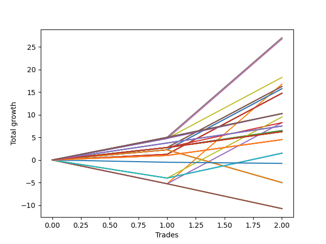

# Short Bulldog 002 
- Symbol: ES
- Date Range: 3/19/22 - 5/22/22
- Trading Period: 7:20-12:30
- Number of Trades: 2


| Name | Win Percent | Profit | Avg Profit / Trade |     | Name | Win Percent | Profit | Avg Profit / Trade |
| ---- | ----------- | ------ | ------------------ | --- | ---- | ----------- | ------ | ------------------ |
| Sorted By <br> Profit | | | | | Sorted By <br> Win Percentage ||||
| Twenty-Two | 100.00 | 13250.00 | 6625.00 |     | Twenty-Two | 100.00 | 13250.00 | 6625.00 |
| Three | 100.00 | 13250.00 | 6625.00 |     | Three | 100.00 | 13250.00 | 6625.00 |
| Four | 100.00 | 11500.00 | 5750.00 |     | Four | 100.00 | 11500.00 | 5750.00 |
| Twenty-Three | 100.00 | 9625.00 | 4812.50 |     | Twenty-Three | 100.00 | 9625.00 | 4812.50 |
| Sixteen | 50.00 | 9125.00 | 4562.50 |     | Twenty-One | 100.00 | 8125.00 | 4062.50 |
| Twenty-One | 100.00 | 8125.00 | 4062.50 |     | Twenty | 100.00 | 5500.00 | 2750.00 |
| Twenty | 100.00 | 5500.00 | 2750.00 |     | Two | 100.00 | 5500.00 | 2750.00 |
| Two | 100.00 | 5500.00 | 2750.00 |     | Nineteen | 100.00 | 2375.00 | 1187.50 |
| Seventeen | 50.00 | 5500.00 | 2750.00 |     | Eighteen | 100.00 | 2375.00 | 1187.50 |
| Fifteen | 50.00 | 5500.00 | 2750.00 |     | One | 100.00 | 2375.00 | 1187.50 |
| Eleven | 50.00 | 3250.00 | 1625.00 |     | Sixteen | 50.00 | 9125.00 | 4562.50 |
| Nine | 50.00 | 3250.00 | 1625.00 |     | Seventeen | 50.00 | 5500.00 | 2750.00 |
| Fourteen | 50.00 | 2875.00 | 1437.50 |     | Fifteen | 50.00 | 5500.00 | 2750.00 |
| Nineteen | 100.00 | 2375.00 | 1187.50 |     | Eleven | 50.00 | 3250.00 | 1625.00 |
| Eighteen | 100.00 | 2375.00 | 1187.50 |     | Nine | 50.00 | 3250.00 | 1625.00 |
| One | 100.00 | 2375.00 | 1187.50 |     | Fourteen | 50.00 | 2875.00 | 1437.50 |
| Thirty-Three | 50.00 | 1750.00 | 875.00 |     | Thirty-Three | 50.00 | 1750.00 | 875.00 |
| Thirty-Two | 50.00 | 1750.00 | 875.00 |     | Thirty-Two | 50.00 | 1750.00 | 875.00 |
| Thirty-One | 50.00 | 1750.00 | 875.00 |     | Thirty-One | 50.00 | 1750.00 | 875.00 |
| Thirty | 50.00 | 1750.00 | 875.00 |     | Thirty | 50.00 | 1750.00 | 875.00 |
| Twenty-Nine | 50.00 | 1750.00 | 875.00 |     | Twenty-Nine | 50.00 | 1750.00 | 875.00 |
| Twenty-Eight | 50.00 | 1750.00 | 875.00 |     | Twenty-Eight | 50.00 | 1750.00 | 875.00 |
| Twenty-Seven | 50.00 | 1750.00 | 875.00 |     | Twenty-Seven | 50.00 | 1750.00 | 875.00 |
| Twenty-Six | 50.00 | 1750.00 | 875.00 |     | Twenty-Six | 50.00 | 1750.00 | 875.00 |
| Twenty-Five | 50.00 | 1750.00 | 875.00 |     | Twenty-Five | 50.00 | 1750.00 | 875.00 |
| Twenty-Four | 50.00 | 1750.00 | 875.00 |     | Twenty-Four | 50.00 | 1750.00 | 875.00 |
| Seven | 50.00 | 1500.00 | 750.00 |     | Seven | 50.00 | 1500.00 | 750.00 |
| Six | 50.00 | 1500.00 | 750.00 |     | Six | 50.00 | 1500.00 | 750.00 |
| Ten | 50.00 | 1000.00 | 500.00 |     | Ten | 50.00 | 1000.00 | 500.00 |
| Eight | 50.00 | 1000.00 | 500.00 |     | Eight | 50.00 | 1000.00 | 500.00 |
| Thirteen | 50.00 | 500.00 | 250.00 |     | Thirteen | 50.00 | 500.00 | 250.00 |
| Twelve | 50.00 | 500.00 | 250.00 |     | Twelve | 50.00 | 500.00 | 250.00 |
| Thirty-Five | 0.00 | -375.00 | -187.50 |     | Thirty-Six | 50.00 | -1625.00 | -812.50 |
| Thirty-Four | 0.00 | -375.00 | -187.50 |     | Five | 50.00 | -2500.00 | -1250.00 |
| Thirty-Six | 50.00 | -1625.00 | -812.50 |     | Thirty-Five | 0.00 | -375.00 | -187.50 |
| Five | 50.00 | -2500.00 | -1250.00 |     | Thirty-Four | 0.00 | -375.00 | -187.50 |

### Test One
* Sell when price hits the middle line of the 20p bollinger
* No Stoploss
* Results:
```
Total Trades: 2
Percent Up: 0.00
Percent Down: 100.00
Total Points Moved Down: 4.75
Potential Profit: 2375.00
Total Points Ups: 0.00 Count Ups: 0
Total Points Downs: 4.75 Count Downs: 2
```

<details><summary>Trades</summary>

<code>In: 2022-04-07 11:12:00		Out: 2022-04-07 11:15:15		Total Position Time: 03:15		Total Move Down: 1.25		Total to Date: -1.25</code> <br />
<code>In: 2022-06-15 11:53:00		Out: 2022-06-15 11:53:10		Total Position Time: 00:10		Total Move Down: 3.50		Total to Date: -4.75</code> <br />


</details>

### Test Two
* Sell when the price hits the lower line of the 20p 1std bollinger
* No Stoploss
* Results:
```
Total Trades: 2
Percent Up: 0.00
Percent Down: 100.00
Total Points Moved Down: 11.00
Potential Profit: 5500.00
Total Points Ups: 0.00 Count Ups: 0
Total Points Downs: 11.00 Count Downs: 2
```

<details><summary>Trades</summary>

<code>In: 2022-04-07 11:12:00		Out: 2022-04-07 11:16:10		Total Position Time: 04:10		Total Move Down: 2.75		Total to Date: -2.75</code> <br />
<code>In: 2022-06-15 11:53:00		Out: 2022-06-15 11:57:05		Total Position Time: 04:05		Total Move Down: 8.25		Total to Date: -11.00</code> <br />


</details>

### Test Three
* Sell when the price hits the lower line of the 20p 2std bollinger
* No Stoploss
* Results:
```
Total Trades: 2
Percent Up: 0.00
Percent Down: 100.00
Total Points Moved Down: 26.50
Potential Profit: 13250.00
Total Points Ups: 0.00 Count Ups: 0
Total Points Downs: 26.50 Count Downs: 2
```

<details><summary>Trades</summary>

<code>In: 2022-04-07 11:12:00		Out: 2022-04-07 11:18:40		Total Position Time: 06:40		Total Move Down: 5.75		Total to Date: -5.75</code> <br />
<code>In: 2022-06-15 11:53:00		Out: 2022-06-15 11:57:55		Total Position Time: 04:55		Total Move Down: 20.75		Total to Date: -26.50</code> <br />


</details>

### Test Four
* Sell when the price hits the middle line of the 1std VWAP
* No Stoploss
* Results:
```
Total Trades: 2
Percent Up: 0.00
Percent Down: 100.00
Total Points Moved Down: 23.00
Potential Profit: 11500.00
Total Points Ups: 0.00 Count Ups: 0
Total Points Downs: 23.00 Count Downs: 2
```

<details><summary>Trades</summary>

<code>In: 2022-04-07 11:12:00		Out: 2022-04-07 11:41:55		Total Position Time: 29:55		Total Move Down: 2.25		Total to Date: -2.25</code> <br />
<code>In: 2022-06-15 11:53:00		Out: 2022-06-15 11:57:55		Total Position Time: 04:55		Total Move Down: 20.75		Total to Date: -23.00</code> <br />


</details>

### Test Five
* Sell when the price hits the lower line of the 1std VWAP
* No Stoploss
* Results:
```
Total Trades: 2
Percent Up: 50.00
Percent Down: 50.00
Total Points Moved Down: -5.00
Potential Profit: -2500.00
Total Points Ups: 7.25 Count Ups: 1
Total Points Downs: 2.25 Count Downs: 1
```

<details><summary>Trades</summary>

<code>In: 2022-04-07 11:12:00		Out: 2022-04-07 11:41:55		Total Position Time: 29:55		Total Move Down: 2.25		Total to Date: -2.25</code> <br />
<code>In: 2022-06-15 11:53:00		Out: 2022-06-15 12:22:55		Total Position Time: 29:55		Total Move Down: -7.25		Total to Date: 5.00</code> <br />


</details>

### Test Six
* Sell when the price hits the middle line of the 20p bollinger
* Stoploss is -2 points
* Results:
```
Total Trades: 2
Percent Up: 50.00
Percent Down: 50.00
Total Points Moved Down: 3.00
Potential Profit: 1500.00
Total Points Ups: 0.50 Count Ups: 1
Total Points Downs: 3.50 Count Downs: 1
```

<details><summary>Trades</summary>

<code>In: 2022-04-07 11:12:00		Out: 2022-04-07 11:14:05		Total Position Time: 02:05		Total Move Down: -0.50		Total to Date: 0.50</code> <br />
<code>In: 2022-06-15 11:53:00		Out: 2022-06-15 11:53:10		Total Position Time: 00:10		Total Move Down: 3.50		Total to Date: -3.00</code> <br />


</details>

### Test Seven
* Sell when the price hits the middle line of the 20p bollinger
* Trailing Stop is -2 points
* Results:
```
Total Trades: 2
Percent Up: 50.00
Percent Down: 50.00
Total Points Moved Down: 3.00
Potential Profit: 1500.00
Total Points Ups: 0.50 Count Ups: 1
Total Points Downs: 3.50 Count Downs: 1
```

<details><summary>Trades</summary>

<code>In: 2022-04-07 11:12:00		Out: 2022-04-07 11:14:05		Total Position Time: 02:05		Total Move Down: -0.50		Total to Date: 0.50</code> <br />
<code>In: 2022-06-15 11:53:00		Out: 2022-06-15 11:53:10		Total Position Time: 00:10		Total Move Down: 3.50		Total to Date: -3.00</code> <br />


</details>

### Test Eight
* Sell when the price hits the lower line of the 20p 1std bollinger
* Stoploss is -2 points
* Results:
```
Total Trades: 2
Percent Up: 50.00
Percent Down: 50.00
Total Points Moved Down: 2.00
Potential Profit: 1000.00
Total Points Ups: 0.50 Count Ups: 1
Total Points Downs: 2.50 Count Downs: 1
```

<details><summary>Trades</summary>

<code>In: 2022-04-07 11:12:00		Out: 2022-04-07 11:14:05		Total Position Time: 02:05		Total Move Down: -0.50		Total to Date: 0.50</code> <br />
<code>In: 2022-06-15 11:53:00		Out: 2022-06-15 11:55:50		Total Position Time: 02:50		Total Move Down: 2.50		Total to Date: -2.00</code> <br />


</details>

### Test Nine
* Sell when the price hits the lower line of the 20p 1std bollinger
* Trailing Stop is -2 points
* Results:
```
Total Trades: 2
Percent Up: 50.00
Percent Down: 50.00
Total Points Moved Down: 6.50
Potential Profit: 3250.00
Total Points Ups: 0.50 Count Ups: 1
Total Points Downs: 7.00 Count Downs: 1
```

<details><summary>Trades</summary>

<code>In: 2022-04-07 11:12:00		Out: 2022-04-07 11:14:05		Total Position Time: 02:05		Total Move Down: -0.50		Total to Date: 0.50</code> <br />
<code>In: 2022-06-15 11:53:00		Out: 2022-06-15 11:53:45		Total Position Time: 00:45		Total Move Down: 7.00		Total to Date: -6.50</code> <br />


</details>

### Test Ten
* Sell when the price hits the lower line of the 20p 2std bollinger
* Stoploss is -2 points
* Results:
```
Total Trades: 2
Percent Up: 50.00
Percent Down: 50.00
Total Points Moved Down: 2.00
Potential Profit: 1000.00
Total Points Ups: 0.50 Count Ups: 1
Total Points Downs: 2.50 Count Downs: 1
```

<details><summary>Trades</summary>

<code>In: 2022-04-07 11:12:00		Out: 2022-04-07 11:14:05		Total Position Time: 02:05		Total Move Down: -0.50		Total to Date: 0.50</code> <br />
<code>In: 2022-06-15 11:53:00		Out: 2022-06-15 11:55:50		Total Position Time: 02:50		Total Move Down: 2.50		Total to Date: -2.00</code> <br />


</details>

### Test Eleven
* Sell when the price hits the lower line of the 20p 2std bollinger
* Trailing Stop is -2 points
* Results:
```
Total Trades: 2
Percent Up: 50.00
Percent Down: 50.00
Total Points Moved Down: 6.50
Potential Profit: 3250.00
Total Points Ups: 0.50 Count Ups: 1
Total Points Downs: 7.00 Count Downs: 1
```

<details><summary>Trades</summary>

<code>In: 2022-04-07 11:12:00		Out: 2022-04-07 11:14:05		Total Position Time: 02:05		Total Move Down: -0.50		Total to Date: 0.50</code> <br />
<code>In: 2022-06-15 11:53:00		Out: 2022-06-15 11:53:45		Total Position Time: 00:45		Total Move Down: 7.00		Total to Date: -6.50</code> <br />


</details>

### Test Twelve
* Sell when the price hits the middle line of the 20p bollinger
* Stoploss is -3 points
* Results:
```
Total Trades: 2
Percent Up: 50.00
Percent Down: 50.00
Total Points Moved Down: 1.00
Potential Profit: 500.00
Total Points Ups: 2.50 Count Ups: 1
Total Points Downs: 3.50 Count Downs: 1
```

<details><summary>Trades</summary>

<code>In: 2022-04-07 11:12:00		Out: 2022-04-07 11:14:15		Total Position Time: 02:15		Total Move Down: -2.50		Total to Date: 2.50</code> <br />
<code>In: 2022-06-15 11:53:00		Out: 2022-06-15 11:53:10		Total Position Time: 00:10		Total Move Down: 3.50		Total to Date: -1.00</code> <br />


</details>

### Test Thirteen
* Sell when the price hits the middle line of the 20p bollinger
* Trailing Stop is -3 points
* Results:
```
Total Trades: 2
Percent Up: 50.00
Percent Down: 50.00
Total Points Moved Down: 1.00
Potential Profit: 500.00
Total Points Ups: 2.50 Count Ups: 1
Total Points Downs: 3.50 Count Downs: 1
```

<details><summary>Trades</summary>

<code>In: 2022-04-07 11:12:00		Out: 2022-04-07 11:14:15		Total Position Time: 02:15		Total Move Down: -2.50		Total to Date: 2.50</code> <br />
<code>In: 2022-06-15 11:53:00		Out: 2022-06-15 11:53:10		Total Position Time: 00:10		Total Move Down: 3.50		Total to Date: -1.00</code> <br />


</details>

### Test Fourteen
* Sell when the price hits the lower line of the 20p 1std bollinger
* Stoploss is -3 points
* Results:
```
Total Trades: 2
Percent Up: 50.00
Percent Down: 50.00
Total Points Moved Down: 5.75
Potential Profit: 2875.00
Total Points Ups: 2.50 Count Ups: 1
Total Points Downs: 8.25 Count Downs: 1
```

<details><summary>Trades</summary>

<code>In: 2022-04-07 11:12:00		Out: 2022-04-07 11:14:15		Total Position Time: 02:15		Total Move Down: -2.50		Total to Date: 2.50</code> <br />
<code>In: 2022-06-15 11:53:00		Out: 2022-06-15 11:57:05		Total Position Time: 04:05		Total Move Down: 8.25		Total to Date: -5.75</code> <br />


</details>

### Test Fifteen
* Sell when the price hits the lower line of the 20p 1std bollinger
* Trailing Stop is -3 points
* Results:
```
Total Trades: 2
Percent Up: 50.00
Percent Down: 50.00
Total Points Moved Down: 11.00
Potential Profit: 5500.00
Total Points Ups: 2.50 Count Ups: 1
Total Points Downs: 13.50 Count Downs: 1
```

<details><summary>Trades</summary>

<code>In: 2022-04-07 11:12:00		Out: 2022-04-07 11:14:15		Total Position Time: 02:15		Total Move Down: -2.50		Total to Date: 2.50</code> <br />
<code>In: 2022-06-15 11:53:00		Out: 2022-06-15 11:54:50		Total Position Time: 01:50		Total Move Down: 13.50		Total to Date: -11.00</code> <br />


</details>

### Test Sixteen
* Sell when the price hits the lower line of the 20p 2std bollinger
* Stoploss is -3 points
* Results:
```
Total Trades: 2
Percent Up: 50.00
Percent Down: 50.00
Total Points Moved Down: 18.25
Potential Profit: 9125.00
Total Points Ups: 2.50 Count Ups: 1
Total Points Downs: 20.75 Count Downs: 1
```

<details><summary>Trades</summary>

<code>In: 2022-04-07 11:12:00		Out: 2022-04-07 11:14:15		Total Position Time: 02:15		Total Move Down: -2.50		Total to Date: 2.50</code> <br />
<code>In: 2022-06-15 11:53:00		Out: 2022-06-15 11:57:55		Total Position Time: 04:55		Total Move Down: 20.75		Total to Date: -18.25</code> <br />


</details>

### Test Seventeen
* Sell when the price hits the lower line of the 20p 2std bollinger
* Trailing Stop is -3 points
* Results:
```
Total Trades: 2
Percent Up: 50.00
Percent Down: 50.00
Total Points Moved Down: 11.00
Potential Profit: 5500.00
Total Points Ups: 2.50 Count Ups: 1
Total Points Downs: 13.50 Count Downs: 1
```

<details><summary>Trades</summary>

<code>In: 2022-04-07 11:12:00		Out: 2022-04-07 11:14:15		Total Position Time: 02:15		Total Move Down: -2.50		Total to Date: 2.50</code> <br />
<code>In: 2022-06-15 11:53:00		Out: 2022-06-15 11:54:50		Total Position Time: 01:50		Total Move Down: 13.50		Total to Date: -11.00</code> <br />


</details>

### Test Eighteen
* Sell when the price hits the middle line of the 20p bollinger
* Stoploss is -5 points
* Results:
```
Total Trades: 2
Percent Up: 0.00
Percent Down: 100.00
Total Points Moved Down: 4.75
Potential Profit: 2375.00
Total Points Ups: 0.00 Count Ups: 0
Total Points Downs: 4.75 Count Downs: 2
```

<details><summary>Trades</summary>

<code>In: 2022-04-07 11:12:00		Out: 2022-04-07 11:15:15		Total Position Time: 03:15		Total Move Down: 1.25		Total to Date: -1.25</code> <br />
<code>In: 2022-06-15 11:53:00		Out: 2022-06-15 11:53:10		Total Position Time: 00:10		Total Move Down: 3.50		Total to Date: -4.75</code> <br />


</details>

### Test Nineteen
* Sell when the price hits the middle line of the 20p bollinger
* Trailing Stop is -5 points
* Results:
```
Total Trades: 2
Percent Up: 0.00
Percent Down: 100.00
Total Points Moved Down: 4.75
Potential Profit: 2375.00
Total Points Ups: 0.00 Count Ups: 0
Total Points Downs: 4.75 Count Downs: 2
```

<details><summary>Trades</summary>

<code>In: 2022-04-07 11:12:00		Out: 2022-04-07 11:15:15		Total Position Time: 03:15		Total Move Down: 1.25		Total to Date: -1.25</code> <br />
<code>In: 2022-06-15 11:53:00		Out: 2022-06-15 11:53:10		Total Position Time: 00:10		Total Move Down: 3.50		Total to Date: -4.75</code> <br />


</details>

### Test Twenty
* Sell when the price hits the lower line of the 20p 1std bollinger
* Stoploss is -5 points
* Results:
```
Total Trades: 2
Percent Up: 0.00
Percent Down: 100.00
Total Points Moved Down: 11.00
Potential Profit: 5500.00
Total Points Ups: 0.00 Count Ups: 0
Total Points Downs: 11.00 Count Downs: 2
```

<details><summary>Trades</summary>

<code>In: 2022-04-07 11:12:00		Out: 2022-04-07 11:16:10		Total Position Time: 04:10		Total Move Down: 2.75		Total to Date: -2.75</code> <br />
<code>In: 2022-06-15 11:53:00		Out: 2022-06-15 11:57:05		Total Position Time: 04:05		Total Move Down: 8.25		Total to Date: -11.00</code> <br />


</details>

### Test Twenty-One
* Sell when the price hits the lower line of the 20p 1std bollinger
* Trailing Stop is -5 points
* Results:
```
Total Trades: 2
Percent Up: 0.00
Percent Down: 100.00
Total Points Moved Down: 16.25
Potential Profit: 8125.00
Total Points Ups: 0.00 Count Ups: 0
Total Points Downs: 16.25 Count Downs: 2
```

<details><summary>Trades</summary>

<code>In: 2022-04-07 11:12:00		Out: 2022-04-07 11:16:10		Total Position Time: 04:10		Total Move Down: 2.75		Total to Date: -2.75</code> <br />
<code>In: 2022-06-15 11:53:00		Out: 2022-06-15 11:54:50		Total Position Time: 01:50		Total Move Down: 13.50		Total to Date: -16.25</code> <br />


</details>

### Test Twenty-Two
* Sell when the price hits the lower line of the 20p 2std bollinger
* Stoploss is -5 points
* Results:
```
Total Trades: 2
Percent Up: 0.00
Percent Down: 100.00
Total Points Moved Down: 26.50
Potential Profit: 13250.00
Total Points Ups: 0.00 Count Ups: 0
Total Points Downs: 26.50 Count Downs: 2
```

<details><summary>Trades</summary>

<code>In: 2022-04-07 11:12:00		Out: 2022-04-07 11:18:40		Total Position Time: 06:40		Total Move Down: 5.75		Total to Date: -5.75</code> <br />
<code>In: 2022-06-15 11:53:00		Out: 2022-06-15 11:57:55		Total Position Time: 04:55		Total Move Down: 20.75		Total to Date: -26.50</code> <br />


</details>

### Test Twenty-Three
* Sell when the price hits the lower line of the 20p 2std bollinger
* Trailing Stop is -5 points
* Results:
```
Total Trades: 2
Percent Up: 0.00
Percent Down: 100.00
Total Points Moved Down: 19.25
Potential Profit: 9625.00
Total Points Ups: 0.00 Count Ups: 0
Total Points Downs: 19.25 Count Downs: 2
```

<details><summary>Trades</summary>

<code>In: 2022-04-07 11:12:00		Out: 2022-04-07 11:18:40		Total Position Time: 06:40		Total Move Down: 5.75		Total to Date: -5.75</code> <br />
<code>In: 2022-06-15 11:53:00		Out: 2022-06-15 11:54:50		Total Position Time: 01:50		Total Move Down: 13.50		Total to Date: -19.25</code> <br />


</details>

### Test Twenty-Four
* Sell when the price hits the middle line of the 20p bollinger
* Stoploss is 10 points
* Results:
```
Total Trades: 2
Percent Up: 50.00
Percent Down: 50.00
Total Points Moved Down: 3.50
Potential Profit: 1750.00
Total Points Ups: 0.00 Count Ups: 1
Total Points Downs: 3.50 Count Downs: 1
```

<details><summary>Trades</summary>

<code>In: 2022-04-07 11:12:00		Out: 2022-04-07 11:12:10		Total Position Time: 00:10		Total Move Down: -0.00		Total to Date: -0.00</code> <br />
<code>In: 2022-06-15 11:53:00		Out: 2022-06-15 11:53:10		Total Position Time: 00:10		Total Move Down: 3.50		Total to Date: -3.50</code> <br />


</details>

### Test Twenty-Five
* Sell when the price hits the middle line of the 20p bollinger
* Trailing Stop is 10 points
* Results:
```
Total Trades: 2
Percent Up: 50.00
Percent Down: 50.00
Total Points Moved Down: 3.50
Potential Profit: 1750.00
Total Points Ups: 0.00 Count Ups: 1
Total Points Downs: 3.50 Count Downs: 1
```

<details><summary>Trades</summary>

<code>In: 2022-04-07 11:12:00		Out: 2022-04-07 11:12:10		Total Position Time: 00:10		Total Move Down: -0.00		Total to Date: -0.00</code> <br />
<code>In: 2022-06-15 11:53:00		Out: 2022-06-15 11:53:10		Total Position Time: 00:10		Total Move Down: 3.50		Total to Date: -3.50</code> <br />


</details>

### Test Twenty-Six
* Sell when the price hits the lower line of the 20p 1std bollinger
* Stoploss is 10 points
* Results:
```
Total Trades: 2
Percent Up: 50.00
Percent Down: 50.00
Total Points Moved Down: 3.50
Potential Profit: 1750.00
Total Points Ups: 0.00 Count Ups: 1
Total Points Downs: 3.50 Count Downs: 1
```

<details><summary>Trades</summary>

<code>In: 2022-04-07 11:12:00		Out: 2022-04-07 11:12:10		Total Position Time: 00:10		Total Move Down: -0.00		Total to Date: -0.00</code> <br />
<code>In: 2022-06-15 11:53:00		Out: 2022-06-15 11:53:10		Total Position Time: 00:10		Total Move Down: 3.50		Total to Date: -3.50</code> <br />


</details>

### Test Twenty-Seven
* Sell when the price hits the lower line of the 20p 1std bollinger
* Trailing Stop is 10 points
* Results:
```
Total Trades: 2
Percent Up: 50.00
Percent Down: 50.00
Total Points Moved Down: 3.50
Potential Profit: 1750.00
Total Points Ups: 0.00 Count Ups: 1
Total Points Downs: 3.50 Count Downs: 1
```

<details><summary>Trades</summary>

<code>In: 2022-04-07 11:12:00		Out: 2022-04-07 11:12:10		Total Position Time: 00:10		Total Move Down: -0.00		Total to Date: -0.00</code> <br />
<code>In: 2022-06-15 11:53:00		Out: 2022-06-15 11:53:10		Total Position Time: 00:10		Total Move Down: 3.50		Total to Date: -3.50</code> <br />


</details>

### Test Twenty-Eight
* Sell when the price hits the lower line of the 20p 2std bollinger
* Stoploss is 10 points
* Results:
```
Total Trades: 2
Percent Up: 50.00
Percent Down: 50.00
Total Points Moved Down: 3.50
Potential Profit: 1750.00
Total Points Ups: 0.00 Count Ups: 1
Total Points Downs: 3.50 Count Downs: 1
```

<details><summary>Trades</summary>

<code>In: 2022-04-07 11:12:00		Out: 2022-04-07 11:12:10		Total Position Time: 00:10		Total Move Down: -0.00		Total to Date: -0.00</code> <br />
<code>In: 2022-06-15 11:53:00		Out: 2022-06-15 11:53:10		Total Position Time: 00:10		Total Move Down: 3.50		Total to Date: -3.50</code> <br />


</details>

### Test Twenty-Nine
* Sell when the price hits the lower line of the 20p 2std bollinger
* Trailing Stop is 10 points
* Results:
```
Total Trades: 2
Percent Up: 50.00
Percent Down: 50.00
Total Points Moved Down: 3.50
Potential Profit: 1750.00
Total Points Ups: 0.00 Count Ups: 1
Total Points Downs: 3.50 Count Downs: 1
```

<details><summary>Trades</summary>

<code>In: 2022-04-07 11:12:00		Out: 2022-04-07 11:12:10		Total Position Time: 00:10		Total Move Down: -0.00		Total to Date: -0.00</code> <br />
<code>In: 2022-06-15 11:53:00		Out: 2022-06-15 11:53:10		Total Position Time: 00:10		Total Move Down: 3.50		Total to Date: -3.50</code> <br />


</details>

### Test Thirty
* Sell when the price hits the middle line of the 1std VWAP
* Stoploss is 10 points
* Results:
```
Total Trades: 2
Percent Up: 50.00
Percent Down: 50.00
Total Points Moved Down: 3.50
Potential Profit: 1750.00
Total Points Ups: 0.00 Count Ups: 1
Total Points Downs: 3.50 Count Downs: 1
```

<details><summary>Trades</summary>

<code>In: 2022-04-07 11:12:00		Out: 2022-04-07 11:12:10		Total Position Time: 00:10		Total Move Down: -0.00		Total to Date: -0.00</code> <br />
<code>In: 2022-06-15 11:53:00		Out: 2022-06-15 11:53:10		Total Position Time: 00:10		Total Move Down: 3.50		Total to Date: -3.50</code> <br />


</details>

### Test Thirty-One
* Sell when the price hits the middle line of the 1std VWAP
* Trailing Stop is 10 points
* Results:
```
Total Trades: 2
Percent Up: 50.00
Percent Down: 50.00
Total Points Moved Down: 3.50
Potential Profit: 1750.00
Total Points Ups: 0.00 Count Ups: 1
Total Points Downs: 3.50 Count Downs: 1
```

<details><summary>Trades</summary>

<code>In: 2022-04-07 11:12:00		Out: 2022-04-07 11:12:10		Total Position Time: 00:10		Total Move Down: -0.00		Total to Date: -0.00</code> <br />
<code>In: 2022-06-15 11:53:00		Out: 2022-06-15 11:53:10		Total Position Time: 00:10		Total Move Down: 3.50		Total to Date: -3.50</code> <br />


</details>

### Test Thirty-Two
* Sell when the price hits the lower line of the 1std VWAP
* Stoploss is 10 points
* Results:
```
Total Trades: 2
Percent Up: 50.00
Percent Down: 50.00
Total Points Moved Down: 3.50
Potential Profit: 1750.00
Total Points Ups: 0.00 Count Ups: 1
Total Points Downs: 3.50 Count Downs: 1
```

<details><summary>Trades</summary>

<code>In: 2022-04-07 11:12:00		Out: 2022-04-07 11:12:10		Total Position Time: 00:10		Total Move Down: -0.00		Total to Date: -0.00</code> <br />
<code>In: 2022-06-15 11:53:00		Out: 2022-06-15 11:53:10		Total Position Time: 00:10		Total Move Down: 3.50		Total to Date: -3.50</code> <br />


</details>

### Test Thirty-Three
* Sell when the price hits the lower line of the 1std VWAP
* Trailing Stop is 10 points
* Results:
```
Total Trades: 2
Percent Up: 50.00
Percent Down: 50.00
Total Points Moved Down: 3.50
Potential Profit: 1750.00
Total Points Ups: 0.00 Count Ups: 1
Total Points Downs: 3.50 Count Downs: 1
```

<details><summary>Trades</summary>

<code>In: 2022-04-07 11:12:00		Out: 2022-04-07 11:12:10		Total Position Time: 00:10		Total Move Down: -0.00		Total to Date: -0.00</code> <br />
<code>In: 2022-06-15 11:53:00		Out: 2022-06-15 11:53:10		Total Position Time: 00:10		Total Move Down: 3.50		Total to Date: -3.50</code> <br />


</details>

### Test Thirty-Four
* Sell when the linear regression slope is positive
* No Stoploss
* Results:
```
Total Trades: 2
Percent Up: 100.00
Percent Down: 0.00
Total Points Moved Down: -0.75
Potential Profit: -375.00
Total Points Ups: 0.75 Count Ups: 2
Total Points Downs: 0.00 Count Downs: 0
```

<details><summary>Trades</summary>

<code>In: 2022-04-07 11:12:00		Out: 2022-04-07 11:14:05		Total Position Time: 02:05		Total Move Down: -0.50		Total to Date: 0.50</code> <br />
<code>In: 2022-06-15 11:53:00		Out: 2022-06-15 12:01:05		Total Position Time: 08:05		Total Move Down: -0.25		Total to Date: 0.75</code> <br />


</details>

### Test Thirty-Five
* Sell when the linear regression slope changes to positive
* No Stoploss
* Results:
```
Total Trades: 2
Percent Up: 100.00
Percent Down: 0.00
Total Points Moved Down: -0.75
Potential Profit: -375.00
Total Points Ups: 0.75 Count Ups: 2
Total Points Downs: 0.00 Count Downs: 0
```

<details><summary>Trades</summary>

<code>In: 2022-04-07 11:12:00		Out: 2022-04-07 11:14:05		Total Position Time: 02:05		Total Move Down: -0.50		Total to Date: 0.50</code> <br />
<code>In: 2022-06-15 11:53:00		Out: 2022-06-15 12:01:05		Total Position Time: 08:05		Total Move Down: -0.25		Total to Date: 0.75</code> <br />


</details>

### Test Thirty-Six
* Sell when the linear regression slope changes to positive
* No Stoploss
* Results:
```
Total Trades: 2
Percent Up: 50.00
Percent Down: 50.00
Total Points Moved Down: -3.25
Potential Profit: -1625.00
Total Points Ups: 7.25 Count Ups: 1
Total Points Downs: 4.00 Count Downs: 1
```

<details><summary>Trades</summary>

<code>In: 2022-04-07 11:12:00		Out: 2022-04-07 11:30:05		Total Position Time: 18:05		Total Move Down: 4.00		Total to Date: -4.00</code> <br />
<code>In: 2022-06-15 11:53:00		Out: 2022-06-15 12:22:55		Total Position Time: 29:55		Total Move Down: -7.25		Total to Date: 3.25</code> <br />


</details>