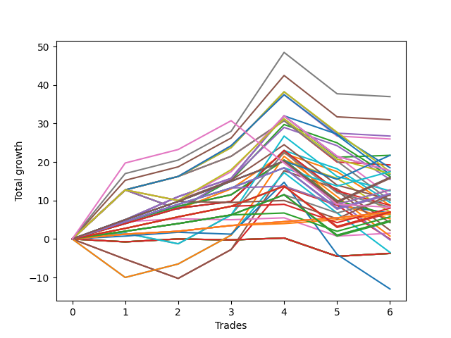

# Short Bulldog 003 DB 
- Symbol: ES
- Date Range: 03/18/2022 - 07/15/2022
- Trading Period: 7:20-12:30
- Number of Trades: 6



| Name | Win Percent | Profit | Avg Profit / Trade | Avg Time / Trade |      | Name | Win Percent | Profit | Avg Profit / Trade | Avg Time / Trade |
| ---- | ----------- | ------ | ------------------ | ---------------- | ---- | ---- | ----------- | ------ | ------------------ | ---------------- |
| Sorted By <br> Profit | | | | | | Sorted By <br> Win Percentage ||||
| Seven | 66.67 | 18500.00 | 3083.33 | 24:56 |     | One Hundred Twenty-Six | 100.00 | 3500.00 | 583.33 | 01:00 |
| Five | 66.67 | 15500.00 | 2583.33 | 24:50 |     | One Hundred Twenty-One | 100.00 | 3500.00 | 583.33 | 01:00 |
| Four | 66.67 | 13375.00 | 2229.17 | 23:14 |     | One Hundred Eleven | 100.00 | 3500.00 | 583.33 | 01:00 |
| Six | 66.67 | 13000.00 | 2166.67 | 22:53 |     | Eighty-One | 100.00 | 3500.00 | 583.33 | 01:00 |
| One Hundred Fifteen | 83.33 | 10875.00 | 1812.50 | 06:07 |     | One Hundred Sixteen | 100.00 | 3250.00 | 541.67 | 01:00 |
| Two | 83.33 | 10875.00 | 1812.50 | 18:55 |     | One Hundred Fifteen | 83.33 | 10875.00 | 1812.50 | 06:07 |
| Three | 66.67 | 9625.00 | 1604.17 | 22:10 |     | Two | 83.33 | 10875.00 | 1812.50 | 18:55 |
| Forty-Two | 66.67 | 9250.00 | 1541.67 | 10:40 |     | One Hundred Fourteen | 83.33 | 8750.00 | 1458.33 | 02:10 |
| Sixty-Six | 66.67 | 8875.00 | 1479.17 | 10:33 |     | One Hundred Thirty | 83.33 | 8000.00 | 1333.33 | 06:10 |
| Sixty-Eight | 50.00 | 8875.00 | 1479.17 | 13:10 |     | One Hundred Twenty-Five | 83.33 | 8000.00 | 1333.33 | 06:10 |
| One Hundred Fourteen | 83.33 | 8750.00 | 1458.33 | 02:10 |     | Eighty-Five | 83.33 | 7875.00 | 1312.50 | 10:49 |
| Sixty | 66.67 | 8750.00 | 1458.33 | 15:27 |     | One Hundred Ninteen | 83.33 | 6375.00 | 1062.50 | 01:57 |
| Seventy | 50.00 | 8500.00 | 1416.67 | 12:49 |     | One Hundred Thirteen | 83.33 | 6375.00 | 1062.50 | 01:38 |
| Sixty-Two | 66.67 | 8375.00 | 1395.83 | 15:06 |     | One Hundred Twenty-Nine | 83.33 | 5875.00 | 979.17 | 02:13 |
| Forty-Four | 50.00 | 8125.00 | 1354.17 | 13:26 |     | One Hundred Twenty-Four | 83.33 | 5875.00 | 979.17 | 02:13 |
| One Hundred Thirty | 83.33 | 8000.00 | 1333.33 | 06:10 |     | Eighty-Four | 83.33 | 5750.00 | 958.33 | 06:51 |
| One Hundred Twenty-Five | 83.33 | 8000.00 | 1333.33 | 06:10 |     | One Hundred Twelve | 83.33 | 5250.00 | 875.00 | 01:30 |
| Eighty-Five | 83.33 | 7875.00 | 1312.50 | 10:49 |     | One Hundred Eighteen | 83.33 | 4000.00 | 666.67 | 01:25 |
| Forty-Six | 50.00 | 7750.00 | 1291.67 | 13:05 |     | One Hundred Twenty-Eight | 83.33 | 3500.00 | 583.33 | 01:41 |
| One Hundred Ninteen | 83.33 | 6375.00 | 1062.50 | 01:57 |     | One Hundred Twenty-Three | 83.33 | 3500.00 | 583.33 | 01:41 |
| One Hundred Thirteen | 83.33 | 6375.00 | 1062.50 | 01:38 |     | Eighty-Three | 83.33 | 3375.00 | 562.50 | 06:20 |
| Seventy-One | 50.00 | 6250.00 | 1041.67 | 13:20 |     | One Hundred Seventeen | 83.33 | 2875.00 | 479.17 | 01:17 |
| One Hundred Twenty-Nine | 83.33 | 5875.00 | 979.17 | 02:13 |     | One Hundred Twenty-Seven | 83.33 | 2375.00 | 395.83 | 01:33 |
| One Hundred Twenty-Four | 83.33 | 5875.00 | 979.17 | 02:13 |     | One Hundred Twenty-Two | 83.33 | 2375.00 | 395.83 | 01:33 |
| Eighty-Four | 83.33 | 5750.00 | 958.33 | 06:51 |     | Eighty-Two | 83.33 | 2250.00 | 375.00 | 06:11 |
| One Hundred Twenty | 66.67 | 5750.00 | 958.33 | 03:06 |     | Seven | 66.67 | 18500.00 | 3083.33 | 24:56 |
| Fifty-Eight | 66.67 | 5625.00 | 937.50 | 11:43 |     | Five | 66.67 | 15500.00 | 2583.33 | 24:50 |
| One Hundred Twelve | 83.33 | 5250.00 | 875.00 | 01:30 |     | Four | 66.67 | 13375.00 | 2229.17 | 23:14 |
| Sixty-Seven | 50.00 | 5125.00 | 854.17 | 12:06 |     | Six | 66.67 | 13000.00 | 2166.67 | 22:53 |
| Fifty-Nine | 66.67 | 5000.00 | 833.33 | 14:24 |     | Three | 66.67 | 9625.00 | 1604.17 | 22:10 |
| Forty-One | 66.67 | 4750.00 | 791.67 | 10:04 |     | Forty-Two | 66.67 | 9250.00 | 1541.67 | 10:40 |
| Sixty-Five | 66.67 | 4375.00 | 729.17 | 09:56 |     | Sixty-Six | 66.67 | 8875.00 | 1479.17 | 10:33 |
| Forty-Three | 50.00 | 4375.00 | 729.17 | 12:23 |     | Sixty | 66.67 | 8750.00 | 1458.33 | 15:27 |
| TEST | 50.00 | 4125.00 | 687.50 | 29:55 |     | Sixty-Two | 66.67 | 8375.00 | 1395.83 | 15:06 |
| Sixty-Nine | 50.00 | 4125.00 | 687.50 | 13:15 |     | One Hundred Twenty | 66.67 | 5750.00 | 958.33 | 03:06 |
| One Hundred Eighteen | 83.33 | 4000.00 | 666.67 | 01:25 |     | Fifty-Eight | 66.67 | 5625.00 | 937.50 | 11:43 |
| One Hundred Twenty-Six | 100.00 | 3500.00 | 583.33 | 01:00 |     | Fifty-Nine | 66.67 | 5000.00 | 833.33 | 14:24 |
| One Hundred Twenty-One | 100.00 | 3500.00 | 583.33 | 01:00 |     | Forty-One | 66.67 | 4750.00 | 791.67 | 10:04 |
| One Hundred Eleven | 100.00 | 3500.00 | 583.33 | 01:00 |     | Sixty-Five | 66.67 | 4375.00 | 729.17 | 09:56 |
| Eighty-One | 100.00 | 3500.00 | 583.33 | 01:00 |     | Forty | 66.67 | 3500.00 | 583.33 | 05:43 |
| One Hundred Twenty-Eight | 83.33 | 3500.00 | 583.33 | 01:41 |     | Zero | 66.67 | 3375.00 | 562.50 | 10:14 |
| One Hundred Twenty-Three | 83.33 | 3500.00 | 583.33 | 01:41 |     | Sixty-Four | 66.67 | 3125.00 | 520.83 | 05:35 |
| Forty | 66.67 | 3500.00 | 583.33 | 05:43 |     | One | 66.67 | 2625.00 | 437.50 | 18:05 |
| Eighty-Three | 83.33 | 3375.00 | 562.50 | 06:20 |     | Fifty-Seven | 66.67 | 1125.00 | 187.50 | 11:06 |
| Zero | 66.67 | 3375.00 | 562.50 | 10:14 |     | Forty-Eight | 66.67 | 750.00 | 125.00 | 03:50 |
| One Hundred Sixteen | 100.00 | 3250.00 | 541.67 | 01:00 |     | Fifty-Six | 66.67 | -125.00 | -20.83 | 06:45 |
| Sixty-Four | 66.67 | 3125.00 | 520.83 | 05:35 |     | Sixty-Eight | 50.00 | 8875.00 | 1479.17 | 13:10 |
| One Hundred Seventeen | 83.33 | 2875.00 | 479.17 | 01:17 |     | Seventy | 50.00 | 8500.00 | 1416.67 | 12:49 |
| One | 66.67 | 2625.00 | 437.50 | 18:05 |     | Forty-Four | 50.00 | 8125.00 | 1354.17 | 13:26 |
| One Hundred Twenty-Seven | 83.33 | 2375.00 | 395.83 | 01:33 |     | Forty-Six | 50.00 | 7750.00 | 1291.67 | 13:05 |
| One Hundred Twenty-Two | 83.33 | 2375.00 | 395.83 | 01:33 |     | Seventy-One | 50.00 | 6250.00 | 1041.67 | 13:20 |
| Eighty-Two | 83.33 | 2250.00 | 375.00 | 06:11 |     | Sixty-Seven | 50.00 | 5125.00 | 854.17 | 12:06 |
| Forty-Seven | 33.33 | 2125.00 | 354.17 | 13:50 |     | Forty-Three | 50.00 | 4375.00 | 729.17 | 12:23 |
| Fifty-Seven | 66.67 | 1125.00 | 187.50 | 11:06 |     | TEST | 50.00 | 4125.00 | 687.50 | 29:55 |
| Forty-Eight | 66.67 | 750.00 | 125.00 | 03:50 |     | Sixty-Nine | 50.00 | 4125.00 | 687.50 | 13:15 |
| Sixty-Three | 50.00 | 375.00 | 62.50 | 15:54 |     | Sixty-Three | 50.00 | 375.00 | 62.50 | 15:54 |
| Forty-Five | 33.33 | -0.00 | -0.00 | 13:45 |     | Sixty-One | 50.00 | -1750.00 | -291.67 | 15:49 |
| Fifty-Six | 66.67 | -125.00 | -20.83 | 06:45 |     | Fifty-Five | 50.00 | -1875.00 | -312.50 | 04:17 |
| Sixty-One | 50.00 | -1750.00 | -291.67 | 15:49 |     | Fifty-Four | 50.00 | -1875.00 | -312.50 | 04:17 |
| Fifty-Five | 50.00 | -1875.00 | -312.50 | 04:17 |     | Fifty-Three | 50.00 | -1875.00 | -312.50 | 04:17 |
| Fifty-Four | 50.00 | -1875.00 | -312.50 | 04:17 |     | Fifty-Two | 50.00 | -1875.00 | -312.50 | 04:17 |
| Fifty-Three | 50.00 | -1875.00 | -312.50 | 04:17 |     | Fifty-One | 50.00 | -1875.00 | -312.50 | 04:17 |
| Fifty-Two | 50.00 | -1875.00 | -312.50 | 04:17 |     | Fifty | 50.00 | -1875.00 | -312.50 | 04:17 |
| Fifty-One | 50.00 | -1875.00 | -312.50 | 04:17 |     | Forty-Nine | 50.00 | -1875.00 | -312.50 | 04:17 |
| Fifty | 50.00 | -1875.00 | -312.50 | 04:17 |     | Seventy-Three | 50.00 | -6500.00 | -1083.33 | 08:25 |
| Forty-Nine | 50.00 | -1875.00 | -312.50 | 04:17 |     | Forty-Seven | 33.33 | 2125.00 | 354.17 | 13:50 |
| Seventy-Three | 50.00 | -6500.00 | -1083.33 | 08:25 |     | Forty-Five | 33.33 | -0.00 | -0.00 | 13:45 |

## NO STOPLOSS

### Test Zero
* Sell when price hits the middle line of the 20p bollinger
* No Stoploss
* Results:
```
Total Trades: 6
Percent Up: 33.33
Percent Down: 66.67
Total Points Moved Down: 6.75
Potential Profit: 3375.00
Total Points Ups: 13.75 Count Ups: 2
Total Points Downs: 20.50 Count Downs: 4
```

<details><summary>Trades</summary>

<code>In: 2022-04-06 10:43:00		Out: 2022-04-06 10:47:10		Total Position Time: 04:10		Total Move Down: 4.50		Total to Date: 4.50</code> <br />
<code>In: 2022-04-07 11:03:00		Out: 2022-04-07 11:15:20		Total Position Time: 12:20		Total Move Down: 4.00		Total to Date: 8.50</code> <br />
<code>In: 2022-04-18 07:27:00		Out: 2022-04-18 07:36:45		Total Position Time: 09:45		Total Move Down: 3.00		Total to Date: 11.50</code> <br />
<code>In: 2022-07-06 11:09:00		Out: 2022-07-06 11:10:10		Total Position Time: 01:10		Total Move Down: 9.00		Total to Date: 20.50</code> <br />
<code>In: 2022-07-06 11:31:00		Out: 2022-07-06 11:50:00		Total Position Time: 19:00		Total Move Down: -11.75		Total to Date: 8.75</code> <br />
<code>In: 2022-07-06 11:35:00		Out: 2022-07-06 11:50:00		Total Position Time: 15:00		Total Move Down: -2.00		Total to Date: 6.75</code> <br />


</details>

### Test One
* Sell when the price hits the upper line of the 20p 1std bollinger
* No Stoploss
* Results:
```
Total Trades: 6
Percent Up: 33.33
Percent Down: 66.67
Total Points Moved Down: 5.25
Potential Profit: 2625.00
Total Points Ups: 17.75 Count Ups: 2
Total Points Downs: 23.00 Count Downs: 4
```

<details><summary>Trades</summary>

<code>In: 2022-04-06 10:43:00		Out: 2022-04-06 10:56:55		Total Position Time: 13:55		Total Move Down: 4.00		Total to Date: 4.00</code> <br />
<code>In: 2022-04-07 11:03:00		Out: 2022-04-07 11:16:10		Total Position Time: 13:10		Total Move Down: 4.00		Total to Date: 8.00</code> <br />
<code>In: 2022-04-18 07:27:00		Out: 2022-04-18 07:51:15		Total Position Time: 24:15		Total Move Down: 1.75		Total to Date: 9.75</code> <br />
<code>In: 2022-07-06 11:09:00		Out: 2022-07-06 11:11:10		Total Position Time: 02:10		Total Move Down: 13.25		Total to Date: 23.00</code> <br />
<code>In: 2022-07-06 11:31:00		Out: 2022-07-06 12:00:30		Total Position Time: 29:30		Total Move Down: -13.75		Total to Date: 9.25</code> <br />
<code>In: 2022-07-06 11:35:00		Out: 2022-07-06 12:00:30		Total Position Time: 25:30		Total Move Down: -4.00		Total to Date: 5.25</code> <br />


</details>

### Test Two
* Sell when the price hits the upper line of the 20p 2std bollinger
* No Stoploss
* Results:
```
Total Trades: 6
Percent Up: 16.67
Percent Down: 83.33
Total Points Moved Down: 21.75
Potential Profit: 10875.00
Total Points Ups: 10.75 Count Ups: 1
Total Points Downs: 32.50 Count Downs: 5
```

<details><summary>Trades</summary>

<code>In: 2022-04-06 10:43:00		Out: 2022-04-06 10:57:20		Total Position Time: 14:20		Total Move Down: 5.00		Total to Date: 5.00</code> <br />
<code>In: 2022-04-07 11:03:00		Out: 2022-04-07 11:18:20		Total Position Time: 15:20		Total Move Down: 6.00		Total to Date: 11.00</code> <br />
<code>In: 2022-04-18 07:27:00		Out: 2022-04-18 07:51:45		Total Position Time: 24:45		Total Move Down: 4.75		Total to Date: 15.75</code> <br />
<code>In: 2022-07-06 11:09:00		Out: 2022-07-06 11:11:45		Total Position Time: 02:45		Total Move Down: 16.25		Total to Date: 32.00</code> <br />
<code>In: 2022-07-06 11:31:00		Out: 2022-07-06 12:00:55		Total Position Time: 29:55		Total Move Down: -10.75		Total to Date: 21.25</code> <br />
<code>In: 2022-07-06 11:35:00		Out: 2022-07-06 12:01:25		Total Position Time: 26:25		Total Move Down: 0.50		Total to Date: 21.75</code> <br />


</details>

### Test Three
* Sell when price hits the middle line of the 50p bollinger
* No Stoploss
* Results:
```
Total Trades: 6
Percent Up: 33.33
Percent Down: 66.67
Total Points Moved Down: 19.25
Potential Profit: 9625.00
Total Points Ups: 11.50 Count Ups: 2
Total Points Downs: 30.75 Count Downs: 4
```

<details><summary>Trades</summary>

<code>In: 2022-04-06 10:43:00		Out: 2022-04-06 11:00:10		Total Position Time: 17:10		Total Move Down: 12.75		Total to Date: 12.75</code> <br />
<code>In: 2022-04-07 11:03:00		Out: 2022-04-07 11:32:55		Total Position Time: 29:55		Total Move Down: 3.50		Total to Date: 16.25</code> <br />
<code>In: 2022-04-18 07:27:00		Out: 2022-04-18 07:51:50		Total Position Time: 24:50		Total Move Down: 5.25		Total to Date: 21.50</code> <br />
<code>In: 2022-07-06 11:09:00		Out: 2022-07-06 11:10:20		Total Position Time: 01:20		Total Move Down: 9.25		Total to Date: 30.75</code> <br />
<code>In: 2022-07-06 11:31:00		Out: 2022-07-06 12:00:55		Total Position Time: 29:55		Total Move Down: -10.75		Total to Date: 20.00</code> <br />
<code>In: 2022-07-06 11:35:00		Out: 2022-07-06 12:04:55		Total Position Time: 29:55		Total Move Down: -0.75		Total to Date: 19.25</code> <br />


</details>

### Test Four
* Sell when the price hits the upper line of the 50p 1std bollinger
* No Stoploss
* Results:
```
Total Trades: 6
Percent Up: 33.33
Percent Down: 66.67
Total Points Moved Down: 26.75
Potential Profit: 13375.00
Total Points Ups: 11.50 Count Ups: 2
Total Points Downs: 38.25 Count Downs: 4
```

<details><summary>Trades</summary>

<code>In: 2022-04-06 10:43:00		Out: 2022-04-06 11:00:10		Total Position Time: 17:10		Total Move Down: 12.75		Total to Date: 12.75</code> <br />
<code>In: 2022-04-07 11:03:00		Out: 2022-04-07 11:32:55		Total Position Time: 29:55		Total Move Down: 3.50		Total to Date: 16.25</code> <br />
<code>In: 2022-04-18 07:27:00		Out: 2022-04-18 07:56:55		Total Position Time: 29:55		Total Move Down: 7.50		Total to Date: 23.75</code> <br />
<code>In: 2022-07-06 11:09:00		Out: 2022-07-06 11:11:35		Total Position Time: 02:35		Total Move Down: 14.50		Total to Date: 38.25</code> <br />
<code>In: 2022-07-06 11:31:00		Out: 2022-07-06 12:00:55		Total Position Time: 29:55		Total Move Down: -10.75		Total to Date: 27.50</code> <br />
<code>In: 2022-07-06 11:35:00		Out: 2022-07-06 12:04:55		Total Position Time: 29:55		Total Move Down: -0.75		Total to Date: 26.75</code> <br />


</details>

### Test Five
* Sell when the price hits the upper line of the 50p 2std bollinger
* No Stoploss
* Results:
```
Total Trades: 6
Percent Up: 33.33
Percent Down: 66.67
Total Points Moved Down: 31.00
Potential Profit: 15500.00
Total Points Ups: 11.50 Count Ups: 2
Total Points Downs: 42.50 Count Downs: 4
```

<details><summary>Trades</summary>

<code>In: 2022-04-06 10:43:00		Out: 2022-04-06 11:09:35		Total Position Time: 26:35		Total Move Down: 15.25		Total to Date: 15.25</code> <br />
<code>In: 2022-04-07 11:03:00		Out: 2022-04-07 11:32:55		Total Position Time: 29:55		Total Move Down: 3.50		Total to Date: 18.75</code> <br />
<code>In: 2022-04-18 07:27:00		Out: 2022-04-18 07:56:55		Total Position Time: 29:55		Total Move Down: 7.50		Total to Date: 26.25</code> <br />
<code>In: 2022-07-06 11:09:00		Out: 2022-07-06 11:11:50		Total Position Time: 02:50		Total Move Down: 16.25		Total to Date: 42.50</code> <br />
<code>In: 2022-07-06 11:31:00		Out: 2022-07-06 12:00:55		Total Position Time: 29:55		Total Move Down: -10.75		Total to Date: 31.75</code> <br />
<code>In: 2022-07-06 11:35:00		Out: 2022-07-06 12:04:55		Total Position Time: 29:55		Total Move Down: -0.75		Total to Date: 31.00</code> <br />


</details>

### Test Six
* Sell when the price hits the middle line of the 1std VWAP
* No Stoploss
* Results:
```
Total Trades: 6
Percent Up: 33.33
Percent Down: 66.67
Total Points Moved Down: 26.00
Potential Profit: 13000.00
Total Points Ups: 11.50 Count Ups: 2
Total Points Downs: 37.50 Count Downs: 4
```

<details><summary>Trades</summary>

<code>In: 2022-04-06 10:43:00		Out: 2022-04-06 11:00:10		Total Position Time: 17:10		Total Move Down: 12.75		Total to Date: 12.75</code> <br />
<code>In: 2022-04-07 11:03:00		Out: 2022-04-07 11:32:55		Total Position Time: 29:55		Total Move Down: 3.50		Total to Date: 16.25</code> <br />
<code>In: 2022-04-18 07:27:00		Out: 2022-04-18 07:55:15		Total Position Time: 28:15		Total Move Down: 8.00		Total to Date: 24.25</code> <br />
<code>In: 2022-07-06 11:09:00		Out: 2022-07-06 11:11:10		Total Position Time: 02:10		Total Move Down: 13.25		Total to Date: 37.50</code> <br />
<code>In: 2022-07-06 11:31:00		Out: 2022-07-06 12:00:55		Total Position Time: 29:55		Total Move Down: -10.75		Total to Date: 26.75</code> <br />
<code>In: 2022-07-06 11:35:00		Out: 2022-07-06 12:04:55		Total Position Time: 29:55		Total Move Down: -0.75		Total to Date: 26.00</code> <br />


</details>

### Test Seven
* Sell when the price hits the upper line of the 1std VWAP
* No Stoploss
* Results:
```
Total Trades: 6
Percent Up: 33.33
Percent Down: 66.67
Total Points Moved Down: 37.00
Potential Profit: 18500.00
Total Points Ups: 11.50 Count Ups: 2
Total Points Downs: 48.50 Count Downs: 4
```

<details><summary>Trades</summary>

<code>In: 2022-04-06 10:43:00		Out: 2022-04-06 11:09:40		Total Position Time: 26:40		Total Move Down: 17.00		Total to Date: 17.00</code> <br />
<code>In: 2022-04-07 11:03:00		Out: 2022-04-07 11:32:55		Total Position Time: 29:55		Total Move Down: 3.50		Total to Date: 20.50</code> <br />
<code>In: 2022-04-18 07:27:00		Out: 2022-04-18 07:56:55		Total Position Time: 29:55		Total Move Down: 7.50		Total to Date: 28.00</code> <br />
<code>In: 2022-07-06 11:09:00		Out: 2022-07-06 11:12:20		Total Position Time: 03:20		Total Move Down: 20.50		Total to Date: 48.50</code> <br />
<code>In: 2022-07-06 11:31:00		Out: 2022-07-06 12:00:55		Total Position Time: 29:55		Total Move Down: -10.75		Total to Date: 37.75</code> <br />
<code>In: 2022-07-06 11:35:00		Out: 2022-07-06 12:04:55		Total Position Time: 29:55		Total Move Down: -0.75		Total to Date: 37.00</code> <br />


</details>

## STOPLOSS OF 5

### Test Forty
* Sell when price hits the middle line of the 20p bollinger
* Stoploss is -5 points
* Results:
```
Total Trades: 6
Percent Up: 33.33
Percent Down: 66.67
Total Points Moved Down: 7.00
Potential Profit: 3500.00
Total Points Ups: 13.50 Count Ups: 2
Total Points Downs: 20.50 Count Downs: 4
```

<details><summary>Trades</summary>

<code>In: 2022-04-06 10:43:00		Out: 2022-04-06 10:47:10		Total Position Time: 04:10		Total Move Down: 4.50		Total to Date: 4.50</code> <br />
<code>In: 2022-04-07 11:03:00		Out: 2022-04-07 11:15:20		Total Position Time: 12:20		Total Move Down: 4.00		Total to Date: 8.50</code> <br />
<code>In: 2022-04-18 07:27:00		Out: 2022-04-18 07:36:45		Total Position Time: 09:45		Total Move Down: 3.00		Total to Date: 11.50</code> <br />
<code>In: 2022-07-06 11:09:00		Out: 2022-07-06 11:10:10		Total Position Time: 01:10		Total Move Down: 9.00		Total to Date: 20.50</code> <br />
<code>In: 2022-07-06 11:31:00		Out: 2022-07-06 11:32:45		Total Position Time: 01:45		Total Move Down: -4.75		Total to Date: 15.75</code> <br />
<code>In: 2022-07-06 11:35:00		Out: 2022-07-06 11:40:10		Total Position Time: 05:10		Total Move Down: -8.75		Total to Date: 7.00</code> <br />


</details>

### Test Forty-One
* Sell when the price hits the upper line of the 20p 1std bollinger
* Stoploss is -5 points
* Results:
```
Total Trades: 6
Percent Up: 33.33
Percent Down: 66.67
Total Points Moved Down: 9.50
Potential Profit: 4750.00
Total Points Ups: 13.50 Count Ups: 2
Total Points Downs: 23.00 Count Downs: 4
```

<details><summary>Trades</summary>

<code>In: 2022-04-06 10:43:00		Out: 2022-04-06 10:56:55		Total Position Time: 13:55		Total Move Down: 4.00		Total to Date: 4.00</code> <br />
<code>In: 2022-04-07 11:03:00		Out: 2022-04-07 11:16:10		Total Position Time: 13:10		Total Move Down: 4.00		Total to Date: 8.00</code> <br />
<code>In: 2022-04-18 07:27:00		Out: 2022-04-18 07:51:15		Total Position Time: 24:15		Total Move Down: 1.75		Total to Date: 9.75</code> <br />
<code>In: 2022-07-06 11:09:00		Out: 2022-07-06 11:11:10		Total Position Time: 02:10		Total Move Down: 13.25		Total to Date: 23.00</code> <br />
<code>In: 2022-07-06 11:31:00		Out: 2022-07-06 11:32:45		Total Position Time: 01:45		Total Move Down: -4.75		Total to Date: 18.25</code> <br />
<code>In: 2022-07-06 11:35:00		Out: 2022-07-06 11:40:10		Total Position Time: 05:10		Total Move Down: -8.75		Total to Date: 9.50</code> <br />


</details>

### Test Forty-Two
* Sell when the price hits the upper line of the 20p 2std bollinger
* Stoploss is -5 points
* Results:
```
Total Trades: 6
Percent Up: 33.33
Percent Down: 66.67
Total Points Moved Down: 18.50
Potential Profit: 9250.00
Total Points Ups: 13.50 Count Ups: 2
Total Points Downs: 32.00 Count Downs: 4
```

<details><summary>Trades</summary>

<code>In: 2022-04-06 10:43:00		Out: 2022-04-06 10:57:20		Total Position Time: 14:20		Total Move Down: 5.00		Total to Date: 5.00</code> <br />
<code>In: 2022-04-07 11:03:00		Out: 2022-04-07 11:18:20		Total Position Time: 15:20		Total Move Down: 6.00		Total to Date: 11.00</code> <br />
<code>In: 2022-04-18 07:27:00		Out: 2022-04-18 07:51:45		Total Position Time: 24:45		Total Move Down: 4.75		Total to Date: 15.75</code> <br />
<code>In: 2022-07-06 11:09:00		Out: 2022-07-06 11:11:45		Total Position Time: 02:45		Total Move Down: 16.25		Total to Date: 32.00</code> <br />
<code>In: 2022-07-06 11:31:00		Out: 2022-07-06 11:32:45		Total Position Time: 01:45		Total Move Down: -4.75		Total to Date: 27.25</code> <br />
<code>In: 2022-07-06 11:35:00		Out: 2022-07-06 11:40:10		Total Position Time: 05:10		Total Move Down: -8.75		Total to Date: 18.50</code> <br />


</details>

### Test Forty-Three
* Sell when price hits the middle line of the 50p bollinger
* Stoploss is -5 points
* Results:
```
Total Trades: 6
Percent Up: 50.00
Percent Down: 50.00
Total Points Moved Down: 8.75
Potential Profit: 4375.00
Total Points Ups: 18.50 Count Ups: 3
Total Points Downs: 27.25 Count Downs: 3
```

<details><summary>Trades</summary>

<code>In: 2022-04-06 10:43:00		Out: 2022-04-06 11:00:10		Total Position Time: 17:10		Total Move Down: 12.75		Total to Date: 12.75</code> <br />
<code>In: 2022-04-07 11:03:00		Out: 2022-04-07 11:27:05		Total Position Time: 24:05		Total Move Down: -5.00		Total to Date: 7.75</code> <br />
<code>In: 2022-04-18 07:27:00		Out: 2022-04-18 07:51:50		Total Position Time: 24:50		Total Move Down: 5.25		Total to Date: 13.00</code> <br />
<code>In: 2022-07-06 11:09:00		Out: 2022-07-06 11:10:20		Total Position Time: 01:20		Total Move Down: 9.25		Total to Date: 22.25</code> <br />
<code>In: 2022-07-06 11:31:00		Out: 2022-07-06 11:32:45		Total Position Time: 01:45		Total Move Down: -4.75		Total to Date: 17.50</code> <br />
<code>In: 2022-07-06 11:35:00		Out: 2022-07-06 11:40:10		Total Position Time: 05:10		Total Move Down: -8.75		Total to Date: 8.75</code> <br />


</details>

### Test Forty-Four
* Sell when the price hits the upper line of the 50p 1std bollinger
* Stoploss is -5 points
* Results:
```
Total Trades: 6
Percent Up: 50.00
Percent Down: 50.00
Total Points Moved Down: 16.25
Potential Profit: 8125.00
Total Points Ups: 18.50 Count Ups: 3
Total Points Downs: 34.75 Count Downs: 3
```

<details><summary>Trades</summary>

<code>In: 2022-04-06 10:43:00		Out: 2022-04-06 11:00:10		Total Position Time: 17:10		Total Move Down: 12.75		Total to Date: 12.75</code> <br />
<code>In: 2022-04-07 11:03:00		Out: 2022-04-07 11:27:05		Total Position Time: 24:05		Total Move Down: -5.00		Total to Date: 7.75</code> <br />
<code>In: 2022-04-18 07:27:00		Out: 2022-04-18 07:56:55		Total Position Time: 29:55		Total Move Down: 7.50		Total to Date: 15.25</code> <br />
<code>In: 2022-07-06 11:09:00		Out: 2022-07-06 11:11:35		Total Position Time: 02:35		Total Move Down: 14.50		Total to Date: 29.75</code> <br />
<code>In: 2022-07-06 11:31:00		Out: 2022-07-06 11:32:45		Total Position Time: 01:45		Total Move Down: -4.75		Total to Date: 25.00</code> <br />
<code>In: 2022-07-06 11:35:00		Out: 2022-07-06 11:40:10		Total Position Time: 05:10		Total Move Down: -8.75		Total to Date: 16.25</code> <br />


</details>

### Test Forty-Five
* Sell when the price hits the upper line of the 50p 2std bollinger
* Stoploss is -5 points
* Results:
```
Total Trades: 6
Percent Up: 66.67
Percent Down: 33.33
Total Points Moved Down: -0.00
Potential Profit: -0.00
Total Points Ups: 23.75 Count Ups: 4
Total Points Downs: 23.75 Count Downs: 2
```

<details><summary>Trades</summary>

<code>In: 2022-04-06 10:43:00		Out: 2022-04-06 11:01:45		Total Position Time: 18:45		Total Move Down: -5.25		Total to Date: -5.25</code> <br />
<code>In: 2022-04-07 11:03:00		Out: 2022-04-07 11:27:05		Total Position Time: 24:05		Total Move Down: -5.00		Total to Date: -10.25</code> <br />
<code>In: 2022-04-18 07:27:00		Out: 2022-04-18 07:56:55		Total Position Time: 29:55		Total Move Down: 7.50		Total to Date: -2.75</code> <br />
<code>In: 2022-07-06 11:09:00		Out: 2022-07-06 11:11:50		Total Position Time: 02:50		Total Move Down: 16.25		Total to Date: 13.50</code> <br />
<code>In: 2022-07-06 11:31:00		Out: 2022-07-06 11:32:45		Total Position Time: 01:45		Total Move Down: -4.75		Total to Date: 8.75</code> <br />
<code>In: 2022-07-06 11:35:00		Out: 2022-07-06 11:40:10		Total Position Time: 05:10		Total Move Down: -8.75		Total to Date: 0.00</code> <br />


</details>

### Test Forty-Six
* Sell when the price hits the middle line of the 1std VWAP
* Stoploss is -5 points
* Results:
```
Total Trades: 6
Percent Up: 50.00
Percent Down: 50.00
Total Points Moved Down: 15.50
Potential Profit: 7750.00
Total Points Ups: 18.50 Count Ups: 3
Total Points Downs: 34.00 Count Downs: 3
```

<details><summary>Trades</summary>

<code>In: 2022-04-06 10:43:00		Out: 2022-04-06 11:00:10		Total Position Time: 17:10		Total Move Down: 12.75		Total to Date: 12.75</code> <br />
<code>In: 2022-04-07 11:03:00		Out: 2022-04-07 11:27:05		Total Position Time: 24:05		Total Move Down: -5.00		Total to Date: 7.75</code> <br />
<code>In: 2022-04-18 07:27:00		Out: 2022-04-18 07:55:15		Total Position Time: 28:15		Total Move Down: 8.00		Total to Date: 15.75</code> <br />
<code>In: 2022-07-06 11:09:00		Out: 2022-07-06 11:11:10		Total Position Time: 02:10		Total Move Down: 13.25		Total to Date: 29.00</code> <br />
<code>In: 2022-07-06 11:31:00		Out: 2022-07-06 11:32:45		Total Position Time: 01:45		Total Move Down: -4.75		Total to Date: 24.25</code> <br />
<code>In: 2022-07-06 11:35:00		Out: 2022-07-06 11:40:10		Total Position Time: 05:10		Total Move Down: -8.75		Total to Date: 15.50</code> <br />


</details>

### Test Forty-Seven
* Sell when the price hits the upper line of the 1std VWAP
* Stoploss is -5 points
* Results:
```
Total Trades: 6
Percent Up: 66.67
Percent Down: 33.33
Total Points Moved Down: 4.25
Potential Profit: 2125.00
Total Points Ups: 23.75 Count Ups: 4
Total Points Downs: 28.00 Count Downs: 2
```

<details><summary>Trades</summary>

<code>In: 2022-04-06 10:43:00		Out: 2022-04-06 11:01:45		Total Position Time: 18:45		Total Move Down: -5.25		Total to Date: -5.25</code> <br />
<code>In: 2022-04-07 11:03:00		Out: 2022-04-07 11:27:05		Total Position Time: 24:05		Total Move Down: -5.00		Total to Date: -10.25</code> <br />
<code>In: 2022-04-18 07:27:00		Out: 2022-04-18 07:56:55		Total Position Time: 29:55		Total Move Down: 7.50		Total to Date: -2.75</code> <br />
<code>In: 2022-07-06 11:09:00		Out: 2022-07-06 11:12:20		Total Position Time: 03:20		Total Move Down: 20.50		Total to Date: 17.75</code> <br />
<code>In: 2022-07-06 11:31:00		Out: 2022-07-06 11:32:45		Total Position Time: 01:45		Total Move Down: -4.75		Total to Date: 13.00</code> <br />
<code>In: 2022-07-06 11:35:00		Out: 2022-07-06 11:40:10		Total Position Time: 05:10		Total Move Down: -8.75		Total to Date: 4.25</code> <br />


</details>

## TRAIL STOP OF 5

### Test Forty-Eight
* Sell when price hits the middle line of the 20p bollinger
* Trailing Stop is -5 points
* Results:
```
Total Trades: 6
Percent Up: 33.33
Percent Down: 66.67
Total Points Moved Down: 1.50
Potential Profit: 750.00
Total Points Ups: 5.00 Count Ups: 2
Total Points Downs: 6.50 Count Downs: 4
```

<details><summary>Trades</summary>

<code>In: 2022-04-06 10:43:00		Out: 2022-04-06 10:47:10		Total Position Time: 04:10		Total Move Down: 4.50		Total to Date: 4.50</code> <br />
<code>In: 2022-04-07 11:03:00		Out: 2022-04-07 11:09:45		Total Position Time: 06:45		Total Move Down: 0.75		Total to Date: 5.25</code> <br />
<code>In: 2022-04-18 07:27:00		Out: 2022-04-18 07:35:00		Total Position Time: 08:00		Total Move Down: -0.25		Total to Date: 5.00</code> <br />
<code>In: 2022-07-06 11:09:00		Out: 2022-07-06 11:09:10		Total Position Time: 00:10		Total Move Down: 0.50		Total to Date: 5.50</code> <br />
<code>In: 2022-07-06 11:31:00		Out: 2022-07-06 11:31:45		Total Position Time: 00:45		Total Move Down: -4.75		Total to Date: 0.75</code> <br />
<code>In: 2022-07-06 11:35:00		Out: 2022-07-06 11:38:15		Total Position Time: 03:15		Total Move Down: 0.75		Total to Date: 1.50</code> <br />


</details>

### Test Forty-Nine
* Sell when the price hits the upper line of the 20p 1std bollinger
* Trailing Stop is -5 points
* Results:
```
Total Trades: 6
Percent Up: 50.00
Percent Down: 50.00
Total Points Moved Down: -3.75
Potential Profit: -1875.00
Total Points Ups: 5.75 Count Ups: 3
Total Points Downs: 2.00 Count Downs: 3
```

<details><summary>Trades</summary>

<code>In: 2022-04-06 10:43:00		Out: 2022-04-06 10:49:50		Total Position Time: 06:50		Total Move Down: -0.75		Total to Date: -0.75</code> <br />
<code>In: 2022-04-07 11:03:00		Out: 2022-04-07 11:09:45		Total Position Time: 06:45		Total Move Down: 0.75		Total to Date: 0.00</code> <br />
<code>In: 2022-04-18 07:27:00		Out: 2022-04-18 07:35:00		Total Position Time: 08:00		Total Move Down: -0.25		Total to Date: -0.25</code> <br />
<code>In: 2022-07-06 11:09:00		Out: 2022-07-06 11:09:10		Total Position Time: 00:10		Total Move Down: 0.50		Total to Date: 0.25</code> <br />
<code>In: 2022-07-06 11:31:00		Out: 2022-07-06 11:31:45		Total Position Time: 00:45		Total Move Down: -4.75		Total to Date: -4.50</code> <br />
<code>In: 2022-07-06 11:35:00		Out: 2022-07-06 11:38:15		Total Position Time: 03:15		Total Move Down: 0.75		Total to Date: -3.75</code> <br />


</details>

### Test Fifty
* Sell when the price hits the upper line of the 20p 2std bollinger
* Trailing Stop is -5 points
* Results:
```
Total Trades: 6
Percent Up: 50.00
Percent Down: 50.00
Total Points Moved Down: -3.75
Potential Profit: -1875.00
Total Points Ups: 5.75 Count Ups: 3
Total Points Downs: 2.00 Count Downs: 3
```

<details><summary>Trades</summary>

<code>In: 2022-04-06 10:43:00		Out: 2022-04-06 10:49:50		Total Position Time: 06:50		Total Move Down: -0.75		Total to Date: -0.75</code> <br />
<code>In: 2022-04-07 11:03:00		Out: 2022-04-07 11:09:45		Total Position Time: 06:45		Total Move Down: 0.75		Total to Date: 0.00</code> <br />
<code>In: 2022-04-18 07:27:00		Out: 2022-04-18 07:35:00		Total Position Time: 08:00		Total Move Down: -0.25		Total to Date: -0.25</code> <br />
<code>In: 2022-07-06 11:09:00		Out: 2022-07-06 11:09:10		Total Position Time: 00:10		Total Move Down: 0.50		Total to Date: 0.25</code> <br />
<code>In: 2022-07-06 11:31:00		Out: 2022-07-06 11:31:45		Total Position Time: 00:45		Total Move Down: -4.75		Total to Date: -4.50</code> <br />
<code>In: 2022-07-06 11:35:00		Out: 2022-07-06 11:38:15		Total Position Time: 03:15		Total Move Down: 0.75		Total to Date: -3.75</code> <br />


</details>

### Test Fifty-One
* Sell when price hits the middle line of the 50p bollinger
* Trailing Stop is -5 points
* Results:
```
Total Trades: 6
Percent Up: 50.00
Percent Down: 50.00
Total Points Moved Down: -3.75
Potential Profit: -1875.00
Total Points Ups: 5.75 Count Ups: 3
Total Points Downs: 2.00 Count Downs: 3
```

<details><summary>Trades</summary>

<code>In: 2022-04-06 10:43:00		Out: 2022-04-06 10:49:50		Total Position Time: 06:50		Total Move Down: -0.75		Total to Date: -0.75</code> <br />
<code>In: 2022-04-07 11:03:00		Out: 2022-04-07 11:09:45		Total Position Time: 06:45		Total Move Down: 0.75		Total to Date: 0.00</code> <br />
<code>In: 2022-04-18 07:27:00		Out: 2022-04-18 07:35:00		Total Position Time: 08:00		Total Move Down: -0.25		Total to Date: -0.25</code> <br />
<code>In: 2022-07-06 11:09:00		Out: 2022-07-06 11:09:10		Total Position Time: 00:10		Total Move Down: 0.50		Total to Date: 0.25</code> <br />
<code>In: 2022-07-06 11:31:00		Out: 2022-07-06 11:31:45		Total Position Time: 00:45		Total Move Down: -4.75		Total to Date: -4.50</code> <br />
<code>In: 2022-07-06 11:35:00		Out: 2022-07-06 11:38:15		Total Position Time: 03:15		Total Move Down: 0.75		Total to Date: -3.75</code> <br />


</details>

### Test Fifty-Two
* Sell when the price hits the upper line of the 50p 1std bollinger
* Trailing Stop is -5 points
* Results:
```
Total Trades: 6
Percent Up: 50.00
Percent Down: 50.00
Total Points Moved Down: -3.75
Potential Profit: -1875.00
Total Points Ups: 5.75 Count Ups: 3
Total Points Downs: 2.00 Count Downs: 3
```

<details><summary>Trades</summary>

<code>In: 2022-04-06 10:43:00		Out: 2022-04-06 10:49:50		Total Position Time: 06:50		Total Move Down: -0.75		Total to Date: -0.75</code> <br />
<code>In: 2022-04-07 11:03:00		Out: 2022-04-07 11:09:45		Total Position Time: 06:45		Total Move Down: 0.75		Total to Date: 0.00</code> <br />
<code>In: 2022-04-18 07:27:00		Out: 2022-04-18 07:35:00		Total Position Time: 08:00		Total Move Down: -0.25		Total to Date: -0.25</code> <br />
<code>In: 2022-07-06 11:09:00		Out: 2022-07-06 11:09:10		Total Position Time: 00:10		Total Move Down: 0.50		Total to Date: 0.25</code> <br />
<code>In: 2022-07-06 11:31:00		Out: 2022-07-06 11:31:45		Total Position Time: 00:45		Total Move Down: -4.75		Total to Date: -4.50</code> <br />
<code>In: 2022-07-06 11:35:00		Out: 2022-07-06 11:38:15		Total Position Time: 03:15		Total Move Down: 0.75		Total to Date: -3.75</code> <br />


</details>

### Test Fifty-Three
* Sell when the price hits the upper line of the 50p 2std bollinger
* Trailing Stop is -5 points
* Results:
```
Total Trades: 6
Percent Up: 50.00
Percent Down: 50.00
Total Points Moved Down: -3.75
Potential Profit: -1875.00
Total Points Ups: 5.75 Count Ups: 3
Total Points Downs: 2.00 Count Downs: 3
```

<details><summary>Trades</summary>

<code>In: 2022-04-06 10:43:00		Out: 2022-04-06 10:49:50		Total Position Time: 06:50		Total Move Down: -0.75		Total to Date: -0.75</code> <br />
<code>In: 2022-04-07 11:03:00		Out: 2022-04-07 11:09:45		Total Position Time: 06:45		Total Move Down: 0.75		Total to Date: 0.00</code> <br />
<code>In: 2022-04-18 07:27:00		Out: 2022-04-18 07:35:00		Total Position Time: 08:00		Total Move Down: -0.25		Total to Date: -0.25</code> <br />
<code>In: 2022-07-06 11:09:00		Out: 2022-07-06 11:09:10		Total Position Time: 00:10		Total Move Down: 0.50		Total to Date: 0.25</code> <br />
<code>In: 2022-07-06 11:31:00		Out: 2022-07-06 11:31:45		Total Position Time: 00:45		Total Move Down: -4.75		Total to Date: -4.50</code> <br />
<code>In: 2022-07-06 11:35:00		Out: 2022-07-06 11:38:15		Total Position Time: 03:15		Total Move Down: 0.75		Total to Date: -3.75</code> <br />


</details>

### Test Fifty-Four
* Sell when the price hits the middle line of the 1std VWAP
* Trailing Stop is -5 points
* Results:
```
Total Trades: 6
Percent Up: 50.00
Percent Down: 50.00
Total Points Moved Down: -3.75
Potential Profit: -1875.00
Total Points Ups: 5.75 Count Ups: 3
Total Points Downs: 2.00 Count Downs: 3
```

<details><summary>Trades</summary>

<code>In: 2022-04-06 10:43:00		Out: 2022-04-06 10:49:50		Total Position Time: 06:50		Total Move Down: -0.75		Total to Date: -0.75</code> <br />
<code>In: 2022-04-07 11:03:00		Out: 2022-04-07 11:09:45		Total Position Time: 06:45		Total Move Down: 0.75		Total to Date: 0.00</code> <br />
<code>In: 2022-04-18 07:27:00		Out: 2022-04-18 07:35:00		Total Position Time: 08:00		Total Move Down: -0.25		Total to Date: -0.25</code> <br />
<code>In: 2022-07-06 11:09:00		Out: 2022-07-06 11:09:10		Total Position Time: 00:10		Total Move Down: 0.50		Total to Date: 0.25</code> <br />
<code>In: 2022-07-06 11:31:00		Out: 2022-07-06 11:31:45		Total Position Time: 00:45		Total Move Down: -4.75		Total to Date: -4.50</code> <br />
<code>In: 2022-07-06 11:35:00		Out: 2022-07-06 11:38:15		Total Position Time: 03:15		Total Move Down: 0.75		Total to Date: -3.75</code> <br />


</details>

### Test Fifty-Five
* Sell when the price hits the upper line of the 1std VWAP
* Trailing Stop is -5 points
* Results:
```
Total Trades: 6
Percent Up: 50.00
Percent Down: 50.00
Total Points Moved Down: -3.75
Potential Profit: -1875.00
Total Points Ups: 5.75 Count Ups: 3
Total Points Downs: 2.00 Count Downs: 3
```

<details><summary>Trades</summary>

<code>In: 2022-04-06 10:43:00		Out: 2022-04-06 10:49:50		Total Position Time: 06:50		Total Move Down: -0.75		Total to Date: -0.75</code> <br />
<code>In: 2022-04-07 11:03:00		Out: 2022-04-07 11:09:45		Total Position Time: 06:45		Total Move Down: 0.75		Total to Date: 0.00</code> <br />
<code>In: 2022-04-18 07:27:00		Out: 2022-04-18 07:35:00		Total Position Time: 08:00		Total Move Down: -0.25		Total to Date: -0.25</code> <br />
<code>In: 2022-07-06 11:09:00		Out: 2022-07-06 11:09:10		Total Position Time: 00:10		Total Move Down: 0.50		Total to Date: 0.25</code> <br />
<code>In: 2022-07-06 11:31:00		Out: 2022-07-06 11:31:45		Total Position Time: 00:45		Total Move Down: -4.75		Total to Date: -4.50</code> <br />
<code>In: 2022-07-06 11:35:00		Out: 2022-07-06 11:38:15		Total Position Time: 03:15		Total Move Down: 0.75		Total to Date: -3.75</code> <br />


</details>

## STOPLOSS OF 10

### Test Fifty-Six
* Sell when price hits the middle line of the 20p bollinger
* Stoploss is -10 points
* Results:
```
Total Trades: 6
Percent Up: 33.33
Percent Down: 66.67
Total Points Moved Down: -0.25
Potential Profit: -125.00
Total Points Ups: 20.75 Count Ups: 2
Total Points Downs: 20.50 Count Downs: 4
```

<details><summary>Trades</summary>

<code>In: 2022-04-06 10:43:00		Out: 2022-04-06 10:47:10		Total Position Time: 04:10		Total Move Down: 4.50		Total to Date: 4.50</code> <br />
<code>In: 2022-04-07 11:03:00		Out: 2022-04-07 11:15:20		Total Position Time: 12:20		Total Move Down: 4.00		Total to Date: 8.50</code> <br />
<code>In: 2022-04-18 07:27:00		Out: 2022-04-18 07:36:45		Total Position Time: 09:45		Total Move Down: 3.00		Total to Date: 11.50</code> <br />
<code>In: 2022-07-06 11:09:00		Out: 2022-07-06 11:10:10		Total Position Time: 01:10		Total Move Down: 9.00		Total to Date: 20.50</code> <br />
<code>In: 2022-07-06 11:31:00		Out: 2022-07-06 11:33:05		Total Position Time: 02:05		Total Move Down: -10.50		Total to Date: 10.00</code> <br />
<code>In: 2022-07-06 11:35:00		Out: 2022-07-06 11:46:05		Total Position Time: 11:05		Total Move Down: -10.25		Total to Date: -0.25</code> <br />


</details>

### Test Fifty-Seven
* Sell when the price hits the upper line of the 20p 1std bollinger
* Stoploss is -10 points
* Results:
```
Total Trades: 6
Percent Up: 33.33
Percent Down: 66.67
Total Points Moved Down: 2.25
Potential Profit: 1125.00
Total Points Ups: 20.75 Count Ups: 2
Total Points Downs: 23.00 Count Downs: 4
```

<details><summary>Trades</summary>

<code>In: 2022-04-06 10:43:00		Out: 2022-04-06 10:56:55		Total Position Time: 13:55		Total Move Down: 4.00		Total to Date: 4.00</code> <br />
<code>In: 2022-04-07 11:03:00		Out: 2022-04-07 11:16:10		Total Position Time: 13:10		Total Move Down: 4.00		Total to Date: 8.00</code> <br />
<code>In: 2022-04-18 07:27:00		Out: 2022-04-18 07:51:15		Total Position Time: 24:15		Total Move Down: 1.75		Total to Date: 9.75</code> <br />
<code>In: 2022-07-06 11:09:00		Out: 2022-07-06 11:11:10		Total Position Time: 02:10		Total Move Down: 13.25		Total to Date: 23.00</code> <br />
<code>In: 2022-07-06 11:31:00		Out: 2022-07-06 11:33:05		Total Position Time: 02:05		Total Move Down: -10.50		Total to Date: 12.50</code> <br />
<code>In: 2022-07-06 11:35:00		Out: 2022-07-06 11:46:05		Total Position Time: 11:05		Total Move Down: -10.25		Total to Date: 2.25</code> <br />


</details>

### Test Fifty-Eight
* Sell when the price hits the upper line of the 20p 2std bollinger
* Stoploss is -10 points
* Results:
```
Total Trades: 6
Percent Up: 33.33
Percent Down: 66.67
Total Points Moved Down: 11.25
Potential Profit: 5625.00
Total Points Ups: 20.75 Count Ups: 2
Total Points Downs: 32.00 Count Downs: 4
```

<details><summary>Trades</summary>

<code>In: 2022-04-06 10:43:00		Out: 2022-04-06 10:57:20		Total Position Time: 14:20		Total Move Down: 5.00		Total to Date: 5.00</code> <br />
<code>In: 2022-04-07 11:03:00		Out: 2022-04-07 11:18:20		Total Position Time: 15:20		Total Move Down: 6.00		Total to Date: 11.00</code> <br />
<code>In: 2022-04-18 07:27:00		Out: 2022-04-18 07:51:45		Total Position Time: 24:45		Total Move Down: 4.75		Total to Date: 15.75</code> <br />
<code>In: 2022-07-06 11:09:00		Out: 2022-07-06 11:11:45		Total Position Time: 02:45		Total Move Down: 16.25		Total to Date: 32.00</code> <br />
<code>In: 2022-07-06 11:31:00		Out: 2022-07-06 11:33:05		Total Position Time: 02:05		Total Move Down: -10.50		Total to Date: 21.50</code> <br />
<code>In: 2022-07-06 11:35:00		Out: 2022-07-06 11:46:05		Total Position Time: 11:05		Total Move Down: -10.25		Total to Date: 11.25</code> <br />


</details>

### Test Fifty-Nine
* Sell when price hits the middle line of the 50p bollinger
* Stoploss is -10 points
* Results:
```
Total Trades: 6
Percent Up: 33.33
Percent Down: 66.67
Total Points Moved Down: 10.00
Potential Profit: 5000.00
Total Points Ups: 20.75 Count Ups: 2
Total Points Downs: 30.75 Count Downs: 4
```

<details><summary>Trades</summary>

<code>In: 2022-04-06 10:43:00		Out: 2022-04-06 11:00:10		Total Position Time: 17:10		Total Move Down: 12.75		Total to Date: 12.75</code> <br />
<code>In: 2022-04-07 11:03:00		Out: 2022-04-07 11:32:55		Total Position Time: 29:55		Total Move Down: 3.50		Total to Date: 16.25</code> <br />
<code>In: 2022-04-18 07:27:00		Out: 2022-04-18 07:51:50		Total Position Time: 24:50		Total Move Down: 5.25		Total to Date: 21.50</code> <br />
<code>In: 2022-07-06 11:09:00		Out: 2022-07-06 11:10:20		Total Position Time: 01:20		Total Move Down: 9.25		Total to Date: 30.75</code> <br />
<code>In: 2022-07-06 11:31:00		Out: 2022-07-06 11:33:05		Total Position Time: 02:05		Total Move Down: -10.50		Total to Date: 20.25</code> <br />
<code>In: 2022-07-06 11:35:00		Out: 2022-07-06 11:46:05		Total Position Time: 11:05		Total Move Down: -10.25		Total to Date: 10.00</code> <br />


</details>

### Test Sixty
* Sell when the price hits the upper line of the 50p 1std bollinger
* Stoploss is -10 points
* Results:
```
Total Trades: 6
Percent Up: 33.33
Percent Down: 66.67
Total Points Moved Down: 17.50
Potential Profit: 8750.00
Total Points Ups: 20.75 Count Ups: 2
Total Points Downs: 38.25 Count Downs: 4
```

<details><summary>Trades</summary>

<code>In: 2022-04-06 10:43:00		Out: 2022-04-06 11:00:10		Total Position Time: 17:10		Total Move Down: 12.75		Total to Date: 12.75</code> <br />
<code>In: 2022-04-07 11:03:00		Out: 2022-04-07 11:32:55		Total Position Time: 29:55		Total Move Down: 3.50		Total to Date: 16.25</code> <br />
<code>In: 2022-04-18 07:27:00		Out: 2022-04-18 07:56:55		Total Position Time: 29:55		Total Move Down: 7.50		Total to Date: 23.75</code> <br />
<code>In: 2022-07-06 11:09:00		Out: 2022-07-06 11:11:35		Total Position Time: 02:35		Total Move Down: 14.50		Total to Date: 38.25</code> <br />
<code>In: 2022-07-06 11:31:00		Out: 2022-07-06 11:33:05		Total Position Time: 02:05		Total Move Down: -10.50		Total to Date: 27.75</code> <br />
<code>In: 2022-07-06 11:35:00		Out: 2022-07-06 11:46:05		Total Position Time: 11:05		Total Move Down: -10.25		Total to Date: 17.50</code> <br />


</details>

### Test Sixty-One
* Sell when the price hits the upper line of the 50p 2std bollinger
* Stoploss is -10 points
* Results:
```
Total Trades: 6
Percent Up: 50.00
Percent Down: 50.00
Total Points Moved Down: -3.50
Potential Profit: -1750.00
Total Points Ups: 30.75 Count Ups: 3
Total Points Downs: 27.25 Count Downs: 3
```

<details><summary>Trades</summary>

<code>In: 2022-04-06 10:43:00		Out: 2022-04-06 11:02:05		Total Position Time: 19:05		Total Move Down: -10.00		Total to Date: -10.00</code> <br />
<code>In: 2022-04-07 11:03:00		Out: 2022-04-07 11:32:55		Total Position Time: 29:55		Total Move Down: 3.50		Total to Date: -6.50</code> <br />
<code>In: 2022-04-18 07:27:00		Out: 2022-04-18 07:56:55		Total Position Time: 29:55		Total Move Down: 7.50		Total to Date: 1.00</code> <br />
<code>In: 2022-07-06 11:09:00		Out: 2022-07-06 11:11:50		Total Position Time: 02:50		Total Move Down: 16.25		Total to Date: 17.25</code> <br />
<code>In: 2022-07-06 11:31:00		Out: 2022-07-06 11:33:05		Total Position Time: 02:05		Total Move Down: -10.50		Total to Date: 6.75</code> <br />
<code>In: 2022-07-06 11:35:00		Out: 2022-07-06 11:46:05		Total Position Time: 11:05		Total Move Down: -10.25		Total to Date: -3.50</code> <br />


</details>

### Test Sixty-Two
* Sell when the price hits the middle line of the 1std VWAP
* Stoploss is -10 points
* Results:
```
Total Trades: 6
Percent Up: 33.33
Percent Down: 66.67
Total Points Moved Down: 16.75
Potential Profit: 8375.00
Total Points Ups: 20.75 Count Ups: 2
Total Points Downs: 37.50 Count Downs: 4
```

<details><summary>Trades</summary>

<code>In: 2022-04-06 10:43:00		Out: 2022-04-06 11:00:10		Total Position Time: 17:10		Total Move Down: 12.75		Total to Date: 12.75</code> <br />
<code>In: 2022-04-07 11:03:00		Out: 2022-04-07 11:32:55		Total Position Time: 29:55		Total Move Down: 3.50		Total to Date: 16.25</code> <br />
<code>In: 2022-04-18 07:27:00		Out: 2022-04-18 07:55:15		Total Position Time: 28:15		Total Move Down: 8.00		Total to Date: 24.25</code> <br />
<code>In: 2022-07-06 11:09:00		Out: 2022-07-06 11:11:10		Total Position Time: 02:10		Total Move Down: 13.25		Total to Date: 37.50</code> <br />
<code>In: 2022-07-06 11:31:00		Out: 2022-07-06 11:33:05		Total Position Time: 02:05		Total Move Down: -10.50		Total to Date: 27.00</code> <br />
<code>In: 2022-07-06 11:35:00		Out: 2022-07-06 11:46:05		Total Position Time: 11:05		Total Move Down: -10.25		Total to Date: 16.75</code> <br />


</details>

### Test Sixty-Three
* Sell when the price hits the upper line of the 1std VWAP
* Stoploss is -10 points
* Results:
```
Total Trades: 6
Percent Up: 50.00
Percent Down: 50.00
Total Points Moved Down: 0.75
Potential Profit: 375.00
Total Points Ups: 30.75 Count Ups: 3
Total Points Downs: 31.50 Count Downs: 3
```

<details><summary>Trades</summary>

<code>In: 2022-04-06 10:43:00		Out: 2022-04-06 11:02:05		Total Position Time: 19:05		Total Move Down: -10.00		Total to Date: -10.00</code> <br />
<code>In: 2022-04-07 11:03:00		Out: 2022-04-07 11:32:55		Total Position Time: 29:55		Total Move Down: 3.50		Total to Date: -6.50</code> <br />
<code>In: 2022-04-18 07:27:00		Out: 2022-04-18 07:56:55		Total Position Time: 29:55		Total Move Down: 7.50		Total to Date: 1.00</code> <br />
<code>In: 2022-07-06 11:09:00		Out: 2022-07-06 11:12:20		Total Position Time: 03:20		Total Move Down: 20.50		Total to Date: 21.50</code> <br />
<code>In: 2022-07-06 11:31:00		Out: 2022-07-06 11:33:05		Total Position Time: 02:05		Total Move Down: -10.50		Total to Date: 11.00</code> <br />
<code>In: 2022-07-06 11:35:00		Out: 2022-07-06 11:46:05		Total Position Time: 11:05		Total Move Down: -10.25		Total to Date: 0.75</code> <br />


</details>

## TRAIL STOP OF 10

### Test Sixty-Four
* Sell when price hits the middle line of the 20p bollinger
* Trailing Stop is -10 points
* Results:
```
Total Trades: 6
Percent Up: 33.33
Percent Down: 66.67
Total Points Moved Down: 6.25
Potential Profit: 3125.00
Total Points Ups: 14.25 Count Ups: 2
Total Points Downs: 20.50 Count Downs: 4
```

<details><summary>Trades</summary>

<code>In: 2022-04-06 10:43:00		Out: 2022-04-06 10:47:10		Total Position Time: 04:10		Total Move Down: 4.50		Total to Date: 4.50</code> <br />
<code>In: 2022-04-07 11:03:00		Out: 2022-04-07 11:15:20		Total Position Time: 12:20		Total Move Down: 4.00		Total to Date: 8.50</code> <br />
<code>In: 2022-04-18 07:27:00		Out: 2022-04-18 07:36:45		Total Position Time: 09:45		Total Move Down: 3.00		Total to Date: 11.50</code> <br />
<code>In: 2022-07-06 11:09:00		Out: 2022-07-06 11:10:10		Total Position Time: 01:10		Total Move Down: 9.00		Total to Date: 20.50</code> <br />
<code>In: 2022-07-06 11:31:00		Out: 2022-07-06 11:33:05		Total Position Time: 02:05		Total Move Down: -10.50		Total to Date: 10.00</code> <br />
<code>In: 2022-07-06 11:35:00		Out: 2022-07-06 11:39:05		Total Position Time: 04:05		Total Move Down: -3.75		Total to Date: 6.25</code> <br />


</details>

### Test Sixty-Five
* Sell when the price hits the upper line of the 20p 1std bollinger
* Trailing Stop is -10 points
* Results:
```
Total Trades: 6
Percent Up: 33.33
Percent Down: 66.67
Total Points Moved Down: 8.75
Potential Profit: 4375.00
Total Points Ups: 14.25 Count Ups: 2
Total Points Downs: 23.00 Count Downs: 4
```

<details><summary>Trades</summary>

<code>In: 2022-04-06 10:43:00		Out: 2022-04-06 10:56:55		Total Position Time: 13:55		Total Move Down: 4.00		Total to Date: 4.00</code> <br />
<code>In: 2022-04-07 11:03:00		Out: 2022-04-07 11:16:10		Total Position Time: 13:10		Total Move Down: 4.00		Total to Date: 8.00</code> <br />
<code>In: 2022-04-18 07:27:00		Out: 2022-04-18 07:51:15		Total Position Time: 24:15		Total Move Down: 1.75		Total to Date: 9.75</code> <br />
<code>In: 2022-07-06 11:09:00		Out: 2022-07-06 11:11:10		Total Position Time: 02:10		Total Move Down: 13.25		Total to Date: 23.00</code> <br />
<code>In: 2022-07-06 11:31:00		Out: 2022-07-06 11:33:05		Total Position Time: 02:05		Total Move Down: -10.50		Total to Date: 12.50</code> <br />
<code>In: 2022-07-06 11:35:00		Out: 2022-07-06 11:39:05		Total Position Time: 04:05		Total Move Down: -3.75		Total to Date: 8.75</code> <br />


</details>

### Test Sixty-Six
* Sell when the price hits the upper line of the 20p 2std bollinger
* Trailing Stop is -10 points
* Results:
```
Total Trades: 6
Percent Up: 33.33
Percent Down: 66.67
Total Points Moved Down: 17.75
Potential Profit: 8875.00
Total Points Ups: 14.25 Count Ups: 2
Total Points Downs: 32.00 Count Downs: 4
```

<details><summary>Trades</summary>

<code>In: 2022-04-06 10:43:00		Out: 2022-04-06 10:57:20		Total Position Time: 14:20		Total Move Down: 5.00		Total to Date: 5.00</code> <br />
<code>In: 2022-04-07 11:03:00		Out: 2022-04-07 11:18:20		Total Position Time: 15:20		Total Move Down: 6.00		Total to Date: 11.00</code> <br />
<code>In: 2022-04-18 07:27:00		Out: 2022-04-18 07:51:45		Total Position Time: 24:45		Total Move Down: 4.75		Total to Date: 15.75</code> <br />
<code>In: 2022-07-06 11:09:00		Out: 2022-07-06 11:11:45		Total Position Time: 02:45		Total Move Down: 16.25		Total to Date: 32.00</code> <br />
<code>In: 2022-07-06 11:31:00		Out: 2022-07-06 11:33:05		Total Position Time: 02:05		Total Move Down: -10.50		Total to Date: 21.50</code> <br />
<code>In: 2022-07-06 11:35:00		Out: 2022-07-06 11:39:05		Total Position Time: 04:05		Total Move Down: -3.75		Total to Date: 17.75</code> <br />


</details>

### Test Sixty-Seven
* Sell when price hits the middle line of the 50p bollinger
* Trailing Stop is -10 points
* Results:
```
Total Trades: 6
Percent Up: 50.00
Percent Down: 50.00
Total Points Moved Down: 10.25
Potential Profit: 5125.00
Total Points Ups: 17.00 Count Ups: 3
Total Points Downs: 27.25 Count Downs: 3
```

<details><summary>Trades</summary>

<code>In: 2022-04-06 10:43:00		Out: 2022-04-06 11:00:10		Total Position Time: 17:10		Total Move Down: 12.75		Total to Date: 12.75</code> <br />
<code>In: 2022-04-07 11:03:00		Out: 2022-04-07 11:26:10		Total Position Time: 23:10		Total Move Down: -2.75		Total to Date: 10.00</code> <br />
<code>In: 2022-04-18 07:27:00		Out: 2022-04-18 07:51:50		Total Position Time: 24:50		Total Move Down: 5.25		Total to Date: 15.25</code> <br />
<code>In: 2022-07-06 11:09:00		Out: 2022-07-06 11:10:20		Total Position Time: 01:20		Total Move Down: 9.25		Total to Date: 24.50</code> <br />
<code>In: 2022-07-06 11:31:00		Out: 2022-07-06 11:33:05		Total Position Time: 02:05		Total Move Down: -10.50		Total to Date: 14.00</code> <br />
<code>In: 2022-07-06 11:35:00		Out: 2022-07-06 11:39:05		Total Position Time: 04:05		Total Move Down: -3.75		Total to Date: 10.25</code> <br />


</details>

### Test Sixty-Eight
* Sell when the price hits the upper line of the 50p 1std bollinger
* Trailing Stop is -10 points
* Results:
```
Total Trades: 6
Percent Up: 50.00
Percent Down: 50.00
Total Points Moved Down: 17.75
Potential Profit: 8875.00
Total Points Ups: 17.00 Count Ups: 3
Total Points Downs: 34.75 Count Downs: 3
```

<details><summary>Trades</summary>

<code>In: 2022-04-06 10:43:00		Out: 2022-04-06 11:00:10		Total Position Time: 17:10		Total Move Down: 12.75		Total to Date: 12.75</code> <br />
<code>In: 2022-04-07 11:03:00		Out: 2022-04-07 11:26:10		Total Position Time: 23:10		Total Move Down: -2.75		Total to Date: 10.00</code> <br />
<code>In: 2022-04-18 07:27:00		Out: 2022-04-18 07:56:55		Total Position Time: 29:55		Total Move Down: 7.50		Total to Date: 17.50</code> <br />
<code>In: 2022-07-06 11:09:00		Out: 2022-07-06 11:11:35		Total Position Time: 02:35		Total Move Down: 14.50		Total to Date: 32.00</code> <br />
<code>In: 2022-07-06 11:31:00		Out: 2022-07-06 11:33:05		Total Position Time: 02:05		Total Move Down: -10.50		Total to Date: 21.50</code> <br />
<code>In: 2022-07-06 11:35:00		Out: 2022-07-06 11:39:05		Total Position Time: 04:05		Total Move Down: -3.75		Total to Date: 17.75</code> <br />


</details>

### Test Sixty-Nine
* Sell when the price hits the upper line of the 50p 2std bollinger
* Trailing Stop is -10 points
* Results:
```
Total Trades: 6
Percent Up: 50.00
Percent Down: 50.00
Total Points Moved Down: 8.25
Potential Profit: 4125.00
Total Points Ups: 17.00 Count Ups: 3
Total Points Downs: 25.25 Count Downs: 3
```

<details><summary>Trades</summary>

<code>In: 2022-04-06 10:43:00		Out: 2022-04-06 11:00:25		Total Position Time: 17:25		Total Move Down: 1.50		Total to Date: 1.50</code> <br />
<code>In: 2022-04-07 11:03:00		Out: 2022-04-07 11:26:10		Total Position Time: 23:10		Total Move Down: -2.75		Total to Date: -1.25</code> <br />
<code>In: 2022-04-18 07:27:00		Out: 2022-04-18 07:56:55		Total Position Time: 29:55		Total Move Down: 7.50		Total to Date: 6.25</code> <br />
<code>In: 2022-07-06 11:09:00		Out: 2022-07-06 11:11:50		Total Position Time: 02:50		Total Move Down: 16.25		Total to Date: 22.50</code> <br />
<code>In: 2022-07-06 11:31:00		Out: 2022-07-06 11:33:05		Total Position Time: 02:05		Total Move Down: -10.50		Total to Date: 12.00</code> <br />
<code>In: 2022-07-06 11:35:00		Out: 2022-07-06 11:39:05		Total Position Time: 04:05		Total Move Down: -3.75		Total to Date: 8.25</code> <br />


</details>

### Test Seventy
* Sell when the price hits the middle line of the 1std VWAP
* Trailing Stop is -10 points
* Results:
```
Total Trades: 6
Percent Up: 50.00
Percent Down: 50.00
Total Points Moved Down: 17.00
Potential Profit: 8500.00
Total Points Ups: 17.00 Count Ups: 3
Total Points Downs: 34.00 Count Downs: 3
```

<details><summary>Trades</summary>

<code>In: 2022-04-06 10:43:00		Out: 2022-04-06 11:00:10		Total Position Time: 17:10		Total Move Down: 12.75		Total to Date: 12.75</code> <br />
<code>In: 2022-04-07 11:03:00		Out: 2022-04-07 11:26:10		Total Position Time: 23:10		Total Move Down: -2.75		Total to Date: 10.00</code> <br />
<code>In: 2022-04-18 07:27:00		Out: 2022-04-18 07:55:15		Total Position Time: 28:15		Total Move Down: 8.00		Total to Date: 18.00</code> <br />
<code>In: 2022-07-06 11:09:00		Out: 2022-07-06 11:11:10		Total Position Time: 02:10		Total Move Down: 13.25		Total to Date: 31.25</code> <br />
<code>In: 2022-07-06 11:31:00		Out: 2022-07-06 11:33:05		Total Position Time: 02:05		Total Move Down: -10.50		Total to Date: 20.75</code> <br />
<code>In: 2022-07-06 11:35:00		Out: 2022-07-06 11:39:05		Total Position Time: 04:05		Total Move Down: -3.75		Total to Date: 17.00</code> <br />


</details>

### Test Seventy-One
* Sell when the price hits the upper line of the 1std VWAP
* Trailing Stop is -10 points
* Results:
```
Total Trades: 6
Percent Up: 50.00
Percent Down: 50.00
Total Points Moved Down: 12.50
Potential Profit: 6250.00
Total Points Ups: 17.00 Count Ups: 3
Total Points Downs: 29.50 Count Downs: 3
```

<details><summary>Trades</summary>

<code>In: 2022-04-06 10:43:00		Out: 2022-04-06 11:00:25		Total Position Time: 17:25		Total Move Down: 1.50		Total to Date: 1.50</code> <br />
<code>In: 2022-04-07 11:03:00		Out: 2022-04-07 11:26:10		Total Position Time: 23:10		Total Move Down: -2.75		Total to Date: -1.25</code> <br />
<code>In: 2022-04-18 07:27:00		Out: 2022-04-18 07:56:55		Total Position Time: 29:55		Total Move Down: 7.50		Total to Date: 6.25</code> <br />
<code>In: 2022-07-06 11:09:00		Out: 2022-07-06 11:12:20		Total Position Time: 03:20		Total Move Down: 20.50		Total to Date: 26.75</code> <br />
<code>In: 2022-07-06 11:31:00		Out: 2022-07-06 11:33:05		Total Position Time: 02:05		Total Move Down: -10.50		Total to Date: 16.25</code> <br />
<code>In: 2022-07-06 11:35:00		Out: 2022-07-06 11:39:05		Total Position Time: 04:05		Total Move Down: -3.75		Total to Date: 12.50</code> <br />


</details>

## SPECIAL EXIT CONDITIONS 

### Test Seventy-Three
* Sell when the linear regression slope changes to negative
* No Stoploss
* Results:
```
Total Trades: 6
Percent Up: 50.00
Percent Down: 50.00
Total Points Moved Down: -13.00
Potential Profit: -6500.00
Total Points Ups: 28.25 Count Ups: 3
Total Points Downs: 15.25 Count Downs: 3
```

<details><summary>Trades</summary>

<code>In: 2022-04-06 10:43:00		Out: 2022-04-06 10:50:05		Total Position Time: 07:05		Total Move Down: 0.75		Total to Date: 0.75</code> <br />
<code>In: 2022-04-07 11:03:00		Out: 2022-04-07 11:10:05		Total Position Time: 07:05		Total Move Down: 1.00		Total to Date: 1.75</code> <br />
<code>In: 2022-04-18 07:27:00		Out: 2022-04-18 07:35:05		Total Position Time: 08:05		Total Move Down: -0.50		Total to Date: 1.25</code> <br />
<code>In: 2022-07-06 11:09:00		Out: 2022-07-06 11:21:05		Total Position Time: 12:05		Total Move Down: 13.50		Total to Date: 14.75</code> <br />
<code>In: 2022-07-06 11:31:00		Out: 2022-07-06 11:41:05		Total Position Time: 10:05		Total Move Down: -18.75		Total to Date: -4.00</code> <br />
<code>In: 2022-07-06 11:35:00		Out: 2022-07-06 11:41:05		Total Position Time: 06:05		Total Move Down: -9.00		Total to Date: -13.00</code> <br />


</details>

## TAKE PROFIT

### Test Eighty-One
* Take Profit of 1 Point
* No Stoploss
* Results:
```
Total Trades: 6
Percent Up: 0.00
Percent Down: 100.00
Total Points Moved Down: 7.00
Potential Profit: 3500.00
Total Points Ups: 0.00 Count Ups: 0
Total Points Downs: 7.00 Count Downs: 6
```

<details><summary>Trades</summary>

<code>In: 2022-04-06 10:43:00		Out: 2022-04-06 10:46:05		Total Position Time: 03:05		Total Move Down: 1.25		Total to Date: 1.25</code> <br />
<code>In: 2022-04-07 11:03:00		Out: 2022-04-07 11:04:00		Total Position Time: 01:00		Total Move Down: 0.75		Total to Date: 2.00</code> <br />
<code>In: 2022-04-18 07:27:00		Out: 2022-04-18 07:27:20		Total Position Time: 00:20		Total Move Down: 1.50		Total to Date: 3.50</code> <br />
<code>In: 2022-07-06 11:09:00		Out: 2022-07-06 11:09:15		Total Position Time: 00:15		Total Move Down: 1.00		Total to Date: 4.50</code> <br />
<code>In: 2022-07-06 11:31:00		Out: 2022-07-06 11:31:15		Total Position Time: 00:15		Total Move Down: 1.00		Total to Date: 5.50</code> <br />
<code>In: 2022-07-06 11:35:00		Out: 2022-07-06 11:36:10		Total Position Time: 01:10		Total Move Down: 1.50		Total to Date: 7.00</code> <br />


</details>

### Test Eighty-Two
* Take Profit of 2 Point
* No Stoploss
* Results:
```
Total Trades: 6
Percent Up: 16.67
Percent Down: 83.33
Total Points Moved Down: 4.50
Potential Profit: 2250.00
Total Points Ups: 10.75 Count Ups: 1
Total Points Downs: 15.25 Count Downs: 5
```

<details><summary>Trades</summary>

<code>In: 2022-04-06 10:43:00		Out: 2022-04-06 10:46:40		Total Position Time: 03:40		Total Move Down: 2.00		Total to Date: 2.00</code> <br />
<code>In: 2022-04-07 11:03:00		Out: 2022-04-07 11:04:05		Total Position Time: 01:05		Total Move Down: 2.00		Total to Date: 4.00</code> <br />
<code>In: 2022-04-18 07:27:00		Out: 2022-04-18 07:27:30		Total Position Time: 00:30		Total Move Down: 2.25		Total to Date: 6.25</code> <br />
<code>In: 2022-07-06 11:09:00		Out: 2022-07-06 11:09:25		Total Position Time: 00:25		Total Move Down: 5.25		Total to Date: 11.50</code> <br />
<code>In: 2022-07-06 11:31:00		Out: 2022-07-06 12:00:55		Total Position Time: 29:55		Total Move Down: -10.75		Total to Date: 0.75</code> <br />
<code>In: 2022-07-06 11:35:00		Out: 2022-07-06 11:36:35		Total Position Time: 01:35		Total Move Down: 3.75		Total to Date: 4.50</code> <br />


</details>

### Test Eighty-Three
* Take Profit of 3 Point
* No Stoploss
* Results:
```
Total Trades: 6
Percent Up: 16.67
Percent Down: 83.33
Total Points Moved Down: 6.75
Potential Profit: 3375.00
Total Points Ups: 10.75 Count Ups: 1
Total Points Downs: 17.50 Count Downs: 5
```

<details><summary>Trades</summary>

<code>In: 2022-04-06 10:43:00		Out: 2022-04-06 10:47:00		Total Position Time: 04:00		Total Move Down: 2.75		Total to Date: 2.75</code> <br />
<code>In: 2022-04-07 11:03:00		Out: 2022-04-07 11:04:20		Total Position Time: 01:20		Total Move Down: 3.00		Total to Date: 5.75</code> <br />
<code>In: 2022-04-18 07:27:00		Out: 2022-04-18 07:27:45		Total Position Time: 00:45		Total Move Down: 2.75		Total to Date: 8.50</code> <br />
<code>In: 2022-07-06 11:09:00		Out: 2022-07-06 11:09:25		Total Position Time: 00:25		Total Move Down: 5.25		Total to Date: 13.75</code> <br />
<code>In: 2022-07-06 11:31:00		Out: 2022-07-06 12:00:55		Total Position Time: 29:55		Total Move Down: -10.75		Total to Date: 3.00</code> <br />
<code>In: 2022-07-06 11:35:00		Out: 2022-07-06 11:36:35		Total Position Time: 01:35		Total Move Down: 3.75		Total to Date: 6.75</code> <br />


</details>

### Test Eighty-Four
* Take Profit of 4 Point
* No Stoploss
* Results:
```
Total Trades: 6
Percent Up: 16.67
Percent Down: 83.33
Total Points Moved Down: 11.50
Potential Profit: 5750.00
Total Points Ups: 10.75 Count Ups: 1
Total Points Downs: 22.25 Count Downs: 5
```

<details><summary>Trades</summary>

<code>In: 2022-04-06 10:43:00		Out: 2022-04-06 10:47:10		Total Position Time: 04:10		Total Move Down: 4.50		Total to Date: 4.50</code> <br />
<code>In: 2022-04-07 11:03:00		Out: 2022-04-07 11:06:10		Total Position Time: 03:10		Total Move Down: 4.50		Total to Date: 9.00</code> <br />
<code>In: 2022-04-18 07:27:00		Out: 2022-04-18 07:28:45		Total Position Time: 01:45		Total Move Down: 4.25		Total to Date: 13.25</code> <br />
<code>In: 2022-07-06 11:09:00		Out: 2022-07-06 11:09:25		Total Position Time: 00:25		Total Move Down: 5.25		Total to Date: 18.50</code> <br />
<code>In: 2022-07-06 11:31:00		Out: 2022-07-06 12:00:55		Total Position Time: 29:55		Total Move Down: -10.75		Total to Date: 7.75</code> <br />
<code>In: 2022-07-06 11:35:00		Out: 2022-07-06 11:36:45		Total Position Time: 01:45		Total Move Down: 3.75		Total to Date: 11.50</code> <br />


</details>

### Test Eighty-Five
* Take Profit of 5 Point
* No Stoploss
* Results:
```
Total Trades: 6
Percent Up: 16.67
Percent Down: 83.33
Total Points Moved Down: 15.75
Potential Profit: 7875.00
Total Points Ups: 10.75 Count Ups: 1
Total Points Downs: 26.50 Count Downs: 5
```

<details><summary>Trades</summary>

<code>In: 2022-04-06 10:43:00		Out: 2022-04-06 10:47:20		Total Position Time: 04:20		Total Move Down: 5.00		Total to Date: 5.00</code> <br />
<code>In: 2022-04-07 11:03:00		Out: 2022-04-07 11:06:15		Total Position Time: 03:15		Total Move Down: 4.75		Total to Date: 9.75</code> <br />
<code>In: 2022-04-18 07:27:00		Out: 2022-04-18 07:51:50		Total Position Time: 24:50		Total Move Down: 5.25		Total to Date: 15.00</code> <br />
<code>In: 2022-07-06 11:09:00		Out: 2022-07-06 11:09:25		Total Position Time: 00:25		Total Move Down: 5.25		Total to Date: 20.25</code> <br />
<code>In: 2022-07-06 11:31:00		Out: 2022-07-06 12:00:55		Total Position Time: 29:55		Total Move Down: -10.75		Total to Date: 9.50</code> <br />
<code>In: 2022-07-06 11:35:00		Out: 2022-07-06 11:37:10		Total Position Time: 02:10		Total Move Down: 6.25		Total to Date: 15.75</code> <br />


</details>

## TAKE PROFIT Stoploss of Five

### Test One Hundred Eleven
* Take Profit of 1 Point
* Stoploss is -5 points
* Results:
```
Total Trades: 6
Percent Up: 0.00
Percent Down: 100.00
Total Points Moved Down: 7.00
Potential Profit: 3500.00
Total Points Ups: 0.00 Count Ups: 0
Total Points Downs: 7.00 Count Downs: 6
```

<details><summary>Trades</summary>

<code>In: 2022-04-06 10:43:00		Out: 2022-04-06 10:46:05		Total Position Time: 03:05		Total Move Down: 1.25		Total to Date: 1.25</code> <br />
<code>In: 2022-04-07 11:03:00		Out: 2022-04-07 11:04:00		Total Position Time: 01:00		Total Move Down: 0.75		Total to Date: 2.00</code> <br />
<code>In: 2022-04-18 07:27:00		Out: 2022-04-18 07:27:20		Total Position Time: 00:20		Total Move Down: 1.50		Total to Date: 3.50</code> <br />
<code>In: 2022-07-06 11:09:00		Out: 2022-07-06 11:09:15		Total Position Time: 00:15		Total Move Down: 1.00		Total to Date: 4.50</code> <br />
<code>In: 2022-07-06 11:31:00		Out: 2022-07-06 11:31:15		Total Position Time: 00:15		Total Move Down: 1.00		Total to Date: 5.50</code> <br />
<code>In: 2022-07-06 11:35:00		Out: 2022-07-06 11:36:10		Total Position Time: 01:10		Total Move Down: 1.50		Total to Date: 7.00</code> <br />


</details>

### Test One Hundred Twelve
* Take Profit of 2 Point
* Stoploss is -5 points
* Results:
```
Total Trades: 6
Percent Up: 16.67
Percent Down: 83.33
Total Points Moved Down: 10.50
Potential Profit: 5250.00
Total Points Ups: 4.75 Count Ups: 1
Total Points Downs: 15.25 Count Downs: 5
```

<details><summary>Trades</summary>

<code>In: 2022-04-06 10:43:00		Out: 2022-04-06 10:46:40		Total Position Time: 03:40		Total Move Down: 2.00		Total to Date: 2.00</code> <br />
<code>In: 2022-04-07 11:03:00		Out: 2022-04-07 11:04:05		Total Position Time: 01:05		Total Move Down: 2.00		Total to Date: 4.00</code> <br />
<code>In: 2022-04-18 07:27:00		Out: 2022-04-18 07:27:30		Total Position Time: 00:30		Total Move Down: 2.25		Total to Date: 6.25</code> <br />
<code>In: 2022-07-06 11:09:00		Out: 2022-07-06 11:09:25		Total Position Time: 00:25		Total Move Down: 5.25		Total to Date: 11.50</code> <br />
<code>In: 2022-07-06 11:31:00		Out: 2022-07-06 11:32:45		Total Position Time: 01:45		Total Move Down: -4.75		Total to Date: 6.75</code> <br />
<code>In: 2022-07-06 11:35:00		Out: 2022-07-06 11:36:35		Total Position Time: 01:35		Total Move Down: 3.75		Total to Date: 10.50</code> <br />


</details>

### Test One Hundred Thirteen
* Take Profit of 3 Point
* Stoploss is -5 points
* Results:
```
Total Trades: 6
Percent Up: 16.67
Percent Down: 83.33
Total Points Moved Down: 12.75
Potential Profit: 6375.00
Total Points Ups: 4.75 Count Ups: 1
Total Points Downs: 17.50 Count Downs: 5
```

<details><summary>Trades</summary>

<code>In: 2022-04-06 10:43:00		Out: 2022-04-06 10:47:00		Total Position Time: 04:00		Total Move Down: 2.75		Total to Date: 2.75</code> <br />
<code>In: 2022-04-07 11:03:00		Out: 2022-04-07 11:04:20		Total Position Time: 01:20		Total Move Down: 3.00		Total to Date: 5.75</code> <br />
<code>In: 2022-04-18 07:27:00		Out: 2022-04-18 07:27:45		Total Position Time: 00:45		Total Move Down: 2.75		Total to Date: 8.50</code> <br />
<code>In: 2022-07-06 11:09:00		Out: 2022-07-06 11:09:25		Total Position Time: 00:25		Total Move Down: 5.25		Total to Date: 13.75</code> <br />
<code>In: 2022-07-06 11:31:00		Out: 2022-07-06 11:32:45		Total Position Time: 01:45		Total Move Down: -4.75		Total to Date: 9.00</code> <br />
<code>In: 2022-07-06 11:35:00		Out: 2022-07-06 11:36:35		Total Position Time: 01:35		Total Move Down: 3.75		Total to Date: 12.75</code> <br />


</details>

### Test One Hundred Fourteen
* Take Profit of 4 Point
* Stoploss is -5 points
* Results:
```
Total Trades: 6
Percent Up: 16.67
Percent Down: 83.33
Total Points Moved Down: 17.50
Potential Profit: 8750.00
Total Points Ups: 4.75 Count Ups: 1
Total Points Downs: 22.25 Count Downs: 5
```

<details><summary>Trades</summary>

<code>In: 2022-04-06 10:43:00		Out: 2022-04-06 10:47:10		Total Position Time: 04:10		Total Move Down: 4.50		Total to Date: 4.50</code> <br />
<code>In: 2022-04-07 11:03:00		Out: 2022-04-07 11:06:10		Total Position Time: 03:10		Total Move Down: 4.50		Total to Date: 9.00</code> <br />
<code>In: 2022-04-18 07:27:00		Out: 2022-04-18 07:28:45		Total Position Time: 01:45		Total Move Down: 4.25		Total to Date: 13.25</code> <br />
<code>In: 2022-07-06 11:09:00		Out: 2022-07-06 11:09:25		Total Position Time: 00:25		Total Move Down: 5.25		Total to Date: 18.50</code> <br />
<code>In: 2022-07-06 11:31:00		Out: 2022-07-06 11:32:45		Total Position Time: 01:45		Total Move Down: -4.75		Total to Date: 13.75</code> <br />
<code>In: 2022-07-06 11:35:00		Out: 2022-07-06 11:36:45		Total Position Time: 01:45		Total Move Down: 3.75		Total to Date: 17.50</code> <br />


</details>

### Test One Hundred Fifteen
* Take Profit of 5 Point
* Stoploss is -5 points
* Results:
```
Total Trades: 6
Percent Up: 16.67
Percent Down: 83.33
Total Points Moved Down: 21.75
Potential Profit: 10875.00
Total Points Ups: 4.75 Count Ups: 1
Total Points Downs: 26.50 Count Downs: 5
```

<details><summary>Trades</summary>

<code>In: 2022-04-06 10:43:00		Out: 2022-04-06 10:47:20		Total Position Time: 04:20		Total Move Down: 5.00		Total to Date: 5.00</code> <br />
<code>In: 2022-04-07 11:03:00		Out: 2022-04-07 11:06:15		Total Position Time: 03:15		Total Move Down: 4.75		Total to Date: 9.75</code> <br />
<code>In: 2022-04-18 07:27:00		Out: 2022-04-18 07:51:50		Total Position Time: 24:50		Total Move Down: 5.25		Total to Date: 15.00</code> <br />
<code>In: 2022-07-06 11:09:00		Out: 2022-07-06 11:09:25		Total Position Time: 00:25		Total Move Down: 5.25		Total to Date: 20.25</code> <br />
<code>In: 2022-07-06 11:31:00		Out: 2022-07-06 11:32:45		Total Position Time: 01:45		Total Move Down: -4.75		Total to Date: 15.50</code> <br />
<code>In: 2022-07-06 11:35:00		Out: 2022-07-06 11:37:10		Total Position Time: 02:10		Total Move Down: 6.25		Total to Date: 21.75</code> <br />


</details>

## TAKE PROFIT Trailstop of Five

### Test One Hundred Sixteen
* Take Profit of 1 Point
* Trailing stop is -5 points
* Results:
```
Total Trades: 6
Percent Up: 0.00
Percent Down: 100.00
Total Points Moved Down: 6.50
Potential Profit: 3250.00
Total Points Ups: 0.00 Count Ups: 0
Total Points Downs: 6.50 Count Downs: 6
```

<details><summary>Trades</summary>

<code>In: 2022-04-06 10:43:00		Out: 2022-04-06 10:46:05		Total Position Time: 03:05		Total Move Down: 1.25		Total to Date: 1.25</code> <br />
<code>In: 2022-04-07 11:03:00		Out: 2022-04-07 11:04:00		Total Position Time: 01:00		Total Move Down: 0.75		Total to Date: 2.00</code> <br />
<code>In: 2022-04-18 07:27:00		Out: 2022-04-18 07:27:20		Total Position Time: 00:20		Total Move Down: 1.50		Total to Date: 3.50</code> <br />
<code>In: 2022-07-06 11:09:00		Out: 2022-07-06 11:09:10		Total Position Time: 00:10		Total Move Down: 0.50		Total to Date: 4.00</code> <br />
<code>In: 2022-07-06 11:31:00		Out: 2022-07-06 11:31:15		Total Position Time: 00:15		Total Move Down: 1.00		Total to Date: 5.00</code> <br />
<code>In: 2022-07-06 11:35:00		Out: 2022-07-06 11:36:10		Total Position Time: 01:10		Total Move Down: 1.50		Total to Date: 6.50</code> <br />


</details>

### Test One Hundred Seventeen
* Take Profit of 2 Point
* Trailing stop is -5 points
* Results:
```
Total Trades: 6
Percent Up: 16.67
Percent Down: 83.33
Total Points Moved Down: 5.75
Potential Profit: 2875.00
Total Points Ups: 4.75 Count Ups: 1
Total Points Downs: 10.50 Count Downs: 5
```

<details><summary>Trades</summary>

<code>In: 2022-04-06 10:43:00		Out: 2022-04-06 10:46:40		Total Position Time: 03:40		Total Move Down: 2.00		Total to Date: 2.00</code> <br />
<code>In: 2022-04-07 11:03:00		Out: 2022-04-07 11:04:05		Total Position Time: 01:05		Total Move Down: 2.00		Total to Date: 4.00</code> <br />
<code>In: 2022-04-18 07:27:00		Out: 2022-04-18 07:27:30		Total Position Time: 00:30		Total Move Down: 2.25		Total to Date: 6.25</code> <br />
<code>In: 2022-07-06 11:09:00		Out: 2022-07-06 11:09:10		Total Position Time: 00:10		Total Move Down: 0.50		Total to Date: 6.75</code> <br />
<code>In: 2022-07-06 11:31:00		Out: 2022-07-06 11:31:45		Total Position Time: 00:45		Total Move Down: -4.75		Total to Date: 2.00</code> <br />
<code>In: 2022-07-06 11:35:00		Out: 2022-07-06 11:36:35		Total Position Time: 01:35		Total Move Down: 3.75		Total to Date: 5.75</code> <br />


</details>

### Test One Hundred Eighteen
* Take Profit of 3 Point
* Trailing stop is -5 points
* Results:
```
Total Trades: 6
Percent Up: 16.67
Percent Down: 83.33
Total Points Moved Down: 8.00
Potential Profit: 4000.00
Total Points Ups: 4.75 Count Ups: 1
Total Points Downs: 12.75 Count Downs: 5
```

<details><summary>Trades</summary>

<code>In: 2022-04-06 10:43:00		Out: 2022-04-06 10:47:00		Total Position Time: 04:00		Total Move Down: 2.75		Total to Date: 2.75</code> <br />
<code>In: 2022-04-07 11:03:00		Out: 2022-04-07 11:04:20		Total Position Time: 01:20		Total Move Down: 3.00		Total to Date: 5.75</code> <br />
<code>In: 2022-04-18 07:27:00		Out: 2022-04-18 07:27:45		Total Position Time: 00:45		Total Move Down: 2.75		Total to Date: 8.50</code> <br />
<code>In: 2022-07-06 11:09:00		Out: 2022-07-06 11:09:10		Total Position Time: 00:10		Total Move Down: 0.50		Total to Date: 9.00</code> <br />
<code>In: 2022-07-06 11:31:00		Out: 2022-07-06 11:31:45		Total Position Time: 00:45		Total Move Down: -4.75		Total to Date: 4.25</code> <br />
<code>In: 2022-07-06 11:35:00		Out: 2022-07-06 11:36:35		Total Position Time: 01:35		Total Move Down: 3.75		Total to Date: 8.00</code> <br />


</details>

### Test One Hundred Ninteen
* Take Profit of 4 Point
* Trailing stop is -5 points
* Results:
```
Total Trades: 6
Percent Up: 16.67
Percent Down: 83.33
Total Points Moved Down: 12.75
Potential Profit: 6375.00
Total Points Ups: 4.75 Count Ups: 1
Total Points Downs: 17.50 Count Downs: 5
```

<details><summary>Trades</summary>

<code>In: 2022-04-06 10:43:00		Out: 2022-04-06 10:47:10		Total Position Time: 04:10		Total Move Down: 4.50		Total to Date: 4.50</code> <br />
<code>In: 2022-04-07 11:03:00		Out: 2022-04-07 11:06:10		Total Position Time: 03:10		Total Move Down: 4.50		Total to Date: 9.00</code> <br />
<code>In: 2022-04-18 07:27:00		Out: 2022-04-18 07:28:45		Total Position Time: 01:45		Total Move Down: 4.25		Total to Date: 13.25</code> <br />
<code>In: 2022-07-06 11:09:00		Out: 2022-07-06 11:09:10		Total Position Time: 00:10		Total Move Down: 0.50		Total to Date: 13.75</code> <br />
<code>In: 2022-07-06 11:31:00		Out: 2022-07-06 11:31:45		Total Position Time: 00:45		Total Move Down: -4.75		Total to Date: 9.00</code> <br />
<code>In: 2022-07-06 11:35:00		Out: 2022-07-06 11:36:45		Total Position Time: 01:45		Total Move Down: 3.75		Total to Date: 12.75</code> <br />


</details>

### Test One Hundred Twenty
* Take Profit of 5 Point
* Trailing stop is -5 points
* Results:
```
Total Trades: 6
Percent Up: 33.33
Percent Down: 66.67
Total Points Moved Down: 11.50
Potential Profit: 5750.00
Total Points Ups: 5.00 Count Ups: 2
Total Points Downs: 16.50 Count Downs: 4
```

<details><summary>Trades</summary>

<code>In: 2022-04-06 10:43:00		Out: 2022-04-06 10:47:20		Total Position Time: 04:20		Total Move Down: 5.00		Total to Date: 5.00</code> <br />
<code>In: 2022-04-07 11:03:00		Out: 2022-04-07 11:06:15		Total Position Time: 03:15		Total Move Down: 4.75		Total to Date: 9.75</code> <br />
<code>In: 2022-04-18 07:27:00		Out: 2022-04-18 07:35:00		Total Position Time: 08:00		Total Move Down: -0.25		Total to Date: 9.50</code> <br />
<code>In: 2022-07-06 11:09:00		Out: 2022-07-06 11:09:10		Total Position Time: 00:10		Total Move Down: 0.50		Total to Date: 10.00</code> <br />
<code>In: 2022-07-06 11:31:00		Out: 2022-07-06 11:31:45		Total Position Time: 00:45		Total Move Down: -4.75		Total to Date: 5.25</code> <br />
<code>In: 2022-07-06 11:35:00		Out: 2022-07-06 11:37:10		Total Position Time: 02:10		Total Move Down: 6.25		Total to Date: 11.50</code> <br />


</details>

## TAKE PROFIT Stoploss of Ten

### Test One Hundred Twenty-One
* Take Profit of 1 Point
* Stoploss is -10 points
* Results:
```
Total Trades: 6
Percent Up: 0.00
Percent Down: 100.00
Total Points Moved Down: 7.00
Potential Profit: 3500.00
Total Points Ups: 0.00 Count Ups: 0
Total Points Downs: 7.00 Count Downs: 6
```

<details><summary>Trades</summary>

<code>In: 2022-04-06 10:43:00		Out: 2022-04-06 10:46:05		Total Position Time: 03:05		Total Move Down: 1.25		Total to Date: 1.25</code> <br />
<code>In: 2022-04-07 11:03:00		Out: 2022-04-07 11:04:00		Total Position Time: 01:00		Total Move Down: 0.75		Total to Date: 2.00</code> <br />
<code>In: 2022-04-18 07:27:00		Out: 2022-04-18 07:27:20		Total Position Time: 00:20		Total Move Down: 1.50		Total to Date: 3.50</code> <br />
<code>In: 2022-07-06 11:09:00		Out: 2022-07-06 11:09:15		Total Position Time: 00:15		Total Move Down: 1.00		Total to Date: 4.50</code> <br />
<code>In: 2022-07-06 11:31:00		Out: 2022-07-06 11:31:15		Total Position Time: 00:15		Total Move Down: 1.00		Total to Date: 5.50</code> <br />
<code>In: 2022-07-06 11:35:00		Out: 2022-07-06 11:36:10		Total Position Time: 01:10		Total Move Down: 1.50		Total to Date: 7.00</code> <br />


</details>

### Test One Hundred Twenty-Two
* Take Profit of 2 Point
* Stoploss is -10 points
* Results:
```
Total Trades: 6
Percent Up: 16.67
Percent Down: 83.33
Total Points Moved Down: 4.75
Potential Profit: 2375.00
Total Points Ups: 10.50 Count Ups: 1
Total Points Downs: 15.25 Count Downs: 5
```

<details><summary>Trades</summary>

<code>In: 2022-04-06 10:43:00		Out: 2022-04-06 10:46:40		Total Position Time: 03:40		Total Move Down: 2.00		Total to Date: 2.00</code> <br />
<code>In: 2022-04-07 11:03:00		Out: 2022-04-07 11:04:05		Total Position Time: 01:05		Total Move Down: 2.00		Total to Date: 4.00</code> <br />
<code>In: 2022-04-18 07:27:00		Out: 2022-04-18 07:27:30		Total Position Time: 00:30		Total Move Down: 2.25		Total to Date: 6.25</code> <br />
<code>In: 2022-07-06 11:09:00		Out: 2022-07-06 11:09:25		Total Position Time: 00:25		Total Move Down: 5.25		Total to Date: 11.50</code> <br />
<code>In: 2022-07-06 11:31:00		Out: 2022-07-06 11:33:05		Total Position Time: 02:05		Total Move Down: -10.50		Total to Date: 1.00</code> <br />
<code>In: 2022-07-06 11:35:00		Out: 2022-07-06 11:36:35		Total Position Time: 01:35		Total Move Down: 3.75		Total to Date: 4.75</code> <br />


</details>

### Test One Hundred Twenty-Three
* Take Profit of 3 Point
* Stoploss is -10 points
* Results:
```
Total Trades: 6
Percent Up: 16.67
Percent Down: 83.33
Total Points Moved Down: 7.00
Potential Profit: 3500.00
Total Points Ups: 10.50 Count Ups: 1
Total Points Downs: 17.50 Count Downs: 5
```

<details><summary>Trades</summary>

<code>In: 2022-04-06 10:43:00		Out: 2022-04-06 10:47:00		Total Position Time: 04:00		Total Move Down: 2.75		Total to Date: 2.75</code> <br />
<code>In: 2022-04-07 11:03:00		Out: 2022-04-07 11:04:20		Total Position Time: 01:20		Total Move Down: 3.00		Total to Date: 5.75</code> <br />
<code>In: 2022-04-18 07:27:00		Out: 2022-04-18 07:27:45		Total Position Time: 00:45		Total Move Down: 2.75		Total to Date: 8.50</code> <br />
<code>In: 2022-07-06 11:09:00		Out: 2022-07-06 11:09:25		Total Position Time: 00:25		Total Move Down: 5.25		Total to Date: 13.75</code> <br />
<code>In: 2022-07-06 11:31:00		Out: 2022-07-06 11:33:05		Total Position Time: 02:05		Total Move Down: -10.50		Total to Date: 3.25</code> <br />
<code>In: 2022-07-06 11:35:00		Out: 2022-07-06 11:36:35		Total Position Time: 01:35		Total Move Down: 3.75		Total to Date: 7.00</code> <br />


</details>

### Test One Hundred Twenty-Four
* Take Profit of 4 Point
* Stoploss is -10 points
* Results:
```
Total Trades: 6
Percent Up: 16.67
Percent Down: 83.33
Total Points Moved Down: 11.75
Potential Profit: 5875.00
Total Points Ups: 10.50 Count Ups: 1
Total Points Downs: 22.25 Count Downs: 5
```

<details><summary>Trades</summary>

<code>In: 2022-04-06 10:43:00		Out: 2022-04-06 10:47:10		Total Position Time: 04:10		Total Move Down: 4.50		Total to Date: 4.50</code> <br />
<code>In: 2022-04-07 11:03:00		Out: 2022-04-07 11:06:10		Total Position Time: 03:10		Total Move Down: 4.50		Total to Date: 9.00</code> <br />
<code>In: 2022-04-18 07:27:00		Out: 2022-04-18 07:28:45		Total Position Time: 01:45		Total Move Down: 4.25		Total to Date: 13.25</code> <br />
<code>In: 2022-07-06 11:09:00		Out: 2022-07-06 11:09:25		Total Position Time: 00:25		Total Move Down: 5.25		Total to Date: 18.50</code> <br />
<code>In: 2022-07-06 11:31:00		Out: 2022-07-06 11:33:05		Total Position Time: 02:05		Total Move Down: -10.50		Total to Date: 8.00</code> <br />
<code>In: 2022-07-06 11:35:00		Out: 2022-07-06 11:36:45		Total Position Time: 01:45		Total Move Down: 3.75		Total to Date: 11.75</code> <br />


</details>

### Test One Hundred Twenty-Five
* Take Profit of 5 Point
* Stoploss is -10 points
* Results:
```
Total Trades: 6
Percent Up: 16.67
Percent Down: 83.33
Total Points Moved Down: 16.00
Potential Profit: 8000.00
Total Points Ups: 10.50 Count Ups: 1
Total Points Downs: 26.50 Count Downs: 5
```

<details><summary>Trades</summary>

<code>In: 2022-04-06 10:43:00		Out: 2022-04-06 10:47:20		Total Position Time: 04:20		Total Move Down: 5.00		Total to Date: 5.00</code> <br />
<code>In: 2022-04-07 11:03:00		Out: 2022-04-07 11:06:15		Total Position Time: 03:15		Total Move Down: 4.75		Total to Date: 9.75</code> <br />
<code>In: 2022-04-18 07:27:00		Out: 2022-04-18 07:51:50		Total Position Time: 24:50		Total Move Down: 5.25		Total to Date: 15.00</code> <br />
<code>In: 2022-07-06 11:09:00		Out: 2022-07-06 11:09:25		Total Position Time: 00:25		Total Move Down: 5.25		Total to Date: 20.25</code> <br />
<code>In: 2022-07-06 11:31:00		Out: 2022-07-06 11:33:05		Total Position Time: 02:05		Total Move Down: -10.50		Total to Date: 9.75</code> <br />
<code>In: 2022-07-06 11:35:00		Out: 2022-07-06 11:37:10		Total Position Time: 02:10		Total Move Down: 6.25		Total to Date: 16.00</code> <br />


</details>

## TAKE PROFIT Trailstop of Ten

### Test One Hundred Twenty-Six
* Take Profit of 1 Point
* Trailing stop is -10 points
* Results:
```
Total Trades: 6
Percent Up: 0.00
Percent Down: 100.00
Total Points Moved Down: 7.00
Potential Profit: 3500.00
Total Points Ups: 0.00 Count Ups: 0
Total Points Downs: 7.00 Count Downs: 6
```

<details><summary>Trades</summary>

<code>In: 2022-04-06 10:43:00		Out: 2022-04-06 10:46:05		Total Position Time: 03:05		Total Move Down: 1.25		Total to Date: 1.25</code> <br />
<code>In: 2022-04-07 11:03:00		Out: 2022-04-07 11:04:00		Total Position Time: 01:00		Total Move Down: 0.75		Total to Date: 2.00</code> <br />
<code>In: 2022-04-18 07:27:00		Out: 2022-04-18 07:27:20		Total Position Time: 00:20		Total Move Down: 1.50		Total to Date: 3.50</code> <br />
<code>In: 2022-07-06 11:09:00		Out: 2022-07-06 11:09:15		Total Position Time: 00:15		Total Move Down: 1.00		Total to Date: 4.50</code> <br />
<code>In: 2022-07-06 11:31:00		Out: 2022-07-06 11:31:15		Total Position Time: 00:15		Total Move Down: 1.00		Total to Date: 5.50</code> <br />
<code>In: 2022-07-06 11:35:00		Out: 2022-07-06 11:36:10		Total Position Time: 01:10		Total Move Down: 1.50		Total to Date: 7.00</code> <br />


</details>

### Test One Hundred Twenty-Seven
* Take Profit of 2 Point
* Trailing stop is -10 points
* Results:
```
Total Trades: 6
Percent Up: 16.67
Percent Down: 83.33
Total Points Moved Down: 4.75
Potential Profit: 2375.00
Total Points Ups: 10.50 Count Ups: 1
Total Points Downs: 15.25 Count Downs: 5
```

<details><summary>Trades</summary>

<code>In: 2022-04-06 10:43:00		Out: 2022-04-06 10:46:40		Total Position Time: 03:40		Total Move Down: 2.00		Total to Date: 2.00</code> <br />
<code>In: 2022-04-07 11:03:00		Out: 2022-04-07 11:04:05		Total Position Time: 01:05		Total Move Down: 2.00		Total to Date: 4.00</code> <br />
<code>In: 2022-04-18 07:27:00		Out: 2022-04-18 07:27:30		Total Position Time: 00:30		Total Move Down: 2.25		Total to Date: 6.25</code> <br />
<code>In: 2022-07-06 11:09:00		Out: 2022-07-06 11:09:25		Total Position Time: 00:25		Total Move Down: 5.25		Total to Date: 11.50</code> <br />
<code>In: 2022-07-06 11:31:00		Out: 2022-07-06 11:33:05		Total Position Time: 02:05		Total Move Down: -10.50		Total to Date: 1.00</code> <br />
<code>In: 2022-07-06 11:35:00		Out: 2022-07-06 11:36:35		Total Position Time: 01:35		Total Move Down: 3.75		Total to Date: 4.75</code> <br />


</details>

### Test One Hundred Twenty-Eight
* Take Profit of 3 Point
* Trailing stop is -10 points
* Results:
```
Total Trades: 6
Percent Up: 16.67
Percent Down: 83.33
Total Points Moved Down: 7.00
Potential Profit: 3500.00
Total Points Ups: 10.50 Count Ups: 1
Total Points Downs: 17.50 Count Downs: 5
```

<details><summary>Trades</summary>

<code>In: 2022-04-06 10:43:00		Out: 2022-04-06 10:47:00		Total Position Time: 04:00		Total Move Down: 2.75		Total to Date: 2.75</code> <br />
<code>In: 2022-04-07 11:03:00		Out: 2022-04-07 11:04:20		Total Position Time: 01:20		Total Move Down: 3.00		Total to Date: 5.75</code> <br />
<code>In: 2022-04-18 07:27:00		Out: 2022-04-18 07:27:45		Total Position Time: 00:45		Total Move Down: 2.75		Total to Date: 8.50</code> <br />
<code>In: 2022-07-06 11:09:00		Out: 2022-07-06 11:09:25		Total Position Time: 00:25		Total Move Down: 5.25		Total to Date: 13.75</code> <br />
<code>In: 2022-07-06 11:31:00		Out: 2022-07-06 11:33:05		Total Position Time: 02:05		Total Move Down: -10.50		Total to Date: 3.25</code> <br />
<code>In: 2022-07-06 11:35:00		Out: 2022-07-06 11:36:35		Total Position Time: 01:35		Total Move Down: 3.75		Total to Date: 7.00</code> <br />


</details>

### Test One Hundred Twenty-Nine
* Take Profit of 4 Point
* Trailing stop is -10 points
* Results:
```
Total Trades: 6
Percent Up: 16.67
Percent Down: 83.33
Total Points Moved Down: 11.75
Potential Profit: 5875.00
Total Points Ups: 10.50 Count Ups: 1
Total Points Downs: 22.25 Count Downs: 5
```

<details><summary>Trades</summary>

<code>In: 2022-04-06 10:43:00		Out: 2022-04-06 10:47:10		Total Position Time: 04:10		Total Move Down: 4.50		Total to Date: 4.50</code> <br />
<code>In: 2022-04-07 11:03:00		Out: 2022-04-07 11:06:10		Total Position Time: 03:10		Total Move Down: 4.50		Total to Date: 9.00</code> <br />
<code>In: 2022-04-18 07:27:00		Out: 2022-04-18 07:28:45		Total Position Time: 01:45		Total Move Down: 4.25		Total to Date: 13.25</code> <br />
<code>In: 2022-07-06 11:09:00		Out: 2022-07-06 11:09:25		Total Position Time: 00:25		Total Move Down: 5.25		Total to Date: 18.50</code> <br />
<code>In: 2022-07-06 11:31:00		Out: 2022-07-06 11:33:05		Total Position Time: 02:05		Total Move Down: -10.50		Total to Date: 8.00</code> <br />
<code>In: 2022-07-06 11:35:00		Out: 2022-07-06 11:36:45		Total Position Time: 01:45		Total Move Down: 3.75		Total to Date: 11.75</code> <br />


</details>

### Test One Hundred Thirty
* Take Profit of 5 Point
* Trailing stop is -10 points
* Results:
```
Total Trades: 6
Percent Up: 16.67
Percent Down: 83.33
Total Points Moved Down: 16.00
Potential Profit: 8000.00
Total Points Ups: 10.50 Count Ups: 1
Total Points Downs: 26.50 Count Downs: 5
```

<details><summary>Trades</summary>

<code>In: 2022-04-06 10:43:00		Out: 2022-04-06 10:47:20		Total Position Time: 04:20		Total Move Down: 5.00		Total to Date: 5.00</code> <br />
<code>In: 2022-04-07 11:03:00		Out: 2022-04-07 11:06:15		Total Position Time: 03:15		Total Move Down: 4.75		Total to Date: 9.75</code> <br />
<code>In: 2022-04-18 07:27:00		Out: 2022-04-18 07:51:50		Total Position Time: 24:50		Total Move Down: 5.25		Total to Date: 15.00</code> <br />
<code>In: 2022-07-06 11:09:00		Out: 2022-07-06 11:09:25		Total Position Time: 00:25		Total Move Down: 5.25		Total to Date: 20.25</code> <br />
<code>In: 2022-07-06 11:31:00		Out: 2022-07-06 11:33:05		Total Position Time: 02:05		Total Move Down: -10.50		Total to Date: 9.75</code> <br />
<code>In: 2022-07-06 11:35:00		Out: 2022-07-06 11:37:10		Total Position Time: 02:10		Total Move Down: 6.25		Total to Date: 16.00</code> <br />


</details>

### Test TEST
* Move to Upper/Lower with bias, move to midline against bias
* No stop
* Results:
```
Total Trades: 6
Percent Up: 50.00
Percent Down: 50.00
Total Points Moved Down: 8.25
Potential Profit: 4125.00
Total Points Ups: 22.50 Count Ups: 3
Total Points Downs: 30.75 Count Downs: 3
```

<details><summary>Trades</summary>

<code>In: 2022-04-06 10:43:00		Out: 2022-04-06 11:12:55		Total Position Time: 29:55		Total Move Down: 19.75		Total to Date: 19.75</code> <br />
<code>In: 2022-04-07 11:03:00		Out: 2022-04-07 11:32:55		Total Position Time: 29:55		Total Move Down: 3.50		Total to Date: 23.25</code> <br />
<code>In: 2022-04-18 07:27:00		Out: 2022-04-18 07:56:55		Total Position Time: 29:55		Total Move Down: 7.50		Total to Date: 30.75</code> <br />
<code>In: 2022-07-06 11:09:00		Out: 2022-07-06 11:38:55		Total Position Time: 29:55		Total Move Down: -11.00		Total to Date: 19.75</code> <br />
<code>In: 2022-07-06 11:31:00		Out: 2022-07-06 12:00:55		Total Position Time: 29:55		Total Move Down: -10.75		Total to Date: 9.00</code> <br />
<code>In: 2022-07-06 11:35:00		Out: 2022-07-06 12:04:55		Total Position Time: 29:55		Total Move Down: -0.75		Total to Date: 8.25</code> <br />


</details>