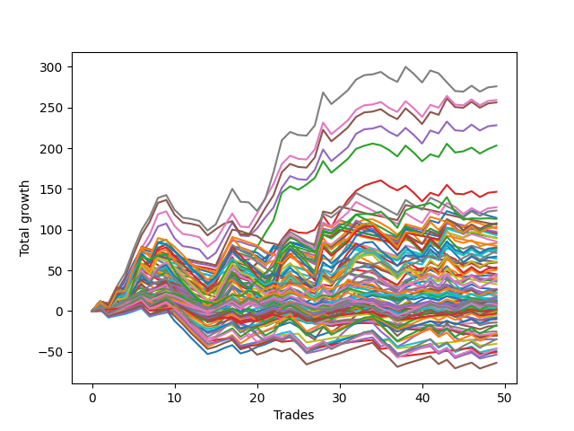

# Short Bulldog 003 
- Symbol: ES
- Date Range: 03/18/2022 - 07/08/2022
- Trading Period: 7:20-12:30
- Number of Trades: 46



| Name | Win Percent | Profit | Avg Profit / Trade |     | Name | Win Percent | Profit | Avg Profit / Trade |
| ---- | ----------- | ------ | ------------------ | --- | ---- | ----------- | ------ | ------------------ |
| Sorted By <br> Profit | | | | | Sorted By <br> Win Percentage ||||
| Seventy-One | 56.52 | 138125.00 | 3002.72 |     | Two | 65.22 | 116000.00 | 2521.74 |
| Fifty-Five | 56.52 | 138125.00 | 3002.72 |     | Five | 60.87 | 130375.00 | 2834.24 |
| Thirty-Nine | 56.52 | 138125.00 | 3002.72 |     | Seventy | 60.87 | 129750.00 | 2820.65 |
| Twenty-Three | 56.52 | 138125.00 | 3002.72 |     | Fifty-Four | 60.87 | 129750.00 | 2820.65 |
| Seven | 56.52 | 138125.00 | 3002.72 |     | Thirty-Eight | 60.87 | 129750.00 | 2820.65 |
| Five | 60.87 | 130375.00 | 2834.24 |     | Twenty-Two | 60.87 | 129750.00 | 2820.65 |
| Seventy | 60.87 | 129750.00 | 2820.65 |     | Six | 60.87 | 129750.00 | 2820.65 |
| Fifty-Four | 60.87 | 129750.00 | 2820.65 |     | Seventy-Five | 60.87 | 115875.00 | 2519.02 |
| Thirty-Eight | 60.87 | 129750.00 | 2820.65 |     | Four | 60.87 | 115500.00 | 2510.87 |
| Twenty-Two | 60.87 | 129750.00 | 2820.65 |     | Three | 60.87 | 71125.00 | 1546.20 |
| Six | 60.87 | 129750.00 | 2820.65 |     | One | 60.87 | 44125.00 | 959.24 |
| Two | 65.22 | 116000.00 | 2521.74 |     | Zero | 60.87 | 15875.00 | 345.11 |
| Seventy-Five | 60.87 | 115875.00 | 2519.02 |     | Seventy-One | 56.52 | 138125.00 | 3002.72 |
| Four | 60.87 | 115500.00 | 2510.87 |     | Fifty-Five | 56.52 | 138125.00 | 3002.72 |
| Three | 60.87 | 71125.00 | 1546.20 |     | Thirty-Nine | 56.52 | 138125.00 | 3002.72 |
| Forty-Six | 41.30 | 63000.00 | 1369.57 |     | Twenty-Three | 56.52 | 138125.00 | 3002.72 |
| Thirty | 32.61 | 61500.00 | 1336.96 |     | Seven | 56.52 | 138125.00 | 3002.72 |
| Forty-Seven | 34.78 | 61000.00 | 1326.09 |     | Seventy-Three | 54.35 | 57000.00 | 1239.13 |
| Seventy-Three | 54.35 | 57000.00 | 1239.13 |     | Seventy-Four | 54.35 | 49375.00 | 1073.37 |
| Fifteen | 21.74 | 56000.00 | 1217.39 |     | Fifty-Six | 54.35 | -23875.00 | -519.02 |
| Thirty-One | 26.09 | 55000.00 | 1195.65 |     | Seventy-Two | 52.17 | 34375.00 | 747.28 |
| Fourteen | 26.09 | 51625.00 | 1122.28 |     | Sixty-Four | 52.17 | -20125.00 | -437.50 |
| Seventy-Four | 54.35 | 49375.00 | 1073.37 |     | Fifty-Seven | 52.17 | -20750.00 | -451.09 |
| One | 60.87 | 44125.00 | 959.24 |     | Sixty-Two | 50.00 | 38625.00 | 839.67 |
| Sixty-Nine | 45.65 | 39000.00 | 847.83 |     | Sixty | 50.00 | 28375.00 | 616.85 |
| Sixty-Two | 50.00 | 38625.00 | 839.67 |     | Fifty-Eight | 50.00 | 7250.00 | 157.61 |
| Sixty-Eight | 45.65 | 36500.00 | 793.48 |     | Fifty-Nine | 50.00 | 2875.00 | 62.50 |
| Seventy-Two | 52.17 | 34375.00 | 747.28 |     | Sixty-Six | 47.83 | 25000.00 | 543.48 |
| Sixty | 50.00 | 28375.00 | 616.85 |     | Sixty-Five | 47.83 | -13125.00 | -285.33 |
| Fifty-Three | 43.48 | 27125.00 | 589.67 |     | Forty | 47.83 | -15750.00 | -342.39 |
| Sixty-Three | 43.48 | 26875.00 | 584.24 |     | Sixty-Nine | 45.65 | 39000.00 | 847.83 |
| Sixty-Six | 47.83 | 25000.00 | 543.48 |     | Sixty-Eight | 45.65 | 36500.00 | 793.48 |
| Twenty-Eight | 32.61 | 21750.00 | 472.83 |     | Sixty-Seven | 45.65 | 13125.00 | 285.33 |
| Fifty-Two | 43.48 | 21500.00 | 467.39 |     | Forty-Eight | 45.65 | 7750.00 | 168.48 |
| Twenty-Nine | 30.43 | 19500.00 | 423.91 |     | Sixty-One | 45.65 | 7000.00 | 152.17 |
| Forty-Four | 34.78 | 17750.00 | 385.87 |     | Thirty-Three | 45.65 | 5625.00 | 122.28 |
| Fifty | 43.48 | 17375.00 | 377.72 |     | Thirty-Four | 45.65 | 4250.00 | 92.39 |
| Zero | 60.87 | 15875.00 | 345.11 |     | Thirty-Six | 45.65 | 3875.00 | 84.24 |
| twenty-Seven | 34.78 | 14125.00 | 307.07 |     | Thirty-Five | 45.65 | 3000.00 | 65.22 |
| Fifty-One | 43.48 | 13625.00 | 296.20 |     | Thirty-Seven | 45.65 | 2500.00 | 54.35 |
| Sixty-Seven | 45.65 | 13125.00 | 285.33 |     | Thirty-Two | 45.65 | 1625.00 | 35.33 |
| Twenty-Six | 34.78 | 12250.00 | 266.30 |     | Fifty-Three | 43.48 | 27125.00 | 589.67 |
| Forty-Nine | 43.48 | 10500.00 | 228.26 |     | Sixty-Three | 43.48 | 26875.00 | 584.24 |
| Thirteen | 30.43 | 9125.00 | 198.37 |     | Fifty-Two | 43.48 | 21500.00 | 467.39 |
| Forty-Eight | 45.65 | 7750.00 | 168.48 |     | Fifty | 43.48 | 17375.00 | 377.72 |
| Twelve | 32.61 | 7625.00 | 165.76 |     | Fifty-One | 43.48 | 13625.00 | 296.20 |
| Fifty-Eight | 50.00 | 7250.00 | 157.61 |     | Forty-Nine | 43.48 | 10500.00 | 228.26 |
| Sixty-One | 45.65 | 7000.00 | 152.17 |     | Forty-Six | 41.30 | 63000.00 | 1369.57 |
| Forty-Five | 32.61 | 6625.00 | 144.02 |     | Twenty-Four | 41.30 | -7250.00 | -157.61 |
| Thirty-Three | 45.65 | 5625.00 | 122.28 |     | Forty-One | 39.13 | -14375.00 | -312.50 |
| Forty-Two | 36.96 | 4875.00 | 105.98 |     | Forty-Two | 36.96 | 4875.00 | 105.98 |
| Thirty-Four | 45.65 | 4250.00 | 92.39 |     | Forty-Three | 36.96 | -375.00 | -8.15 |
| Thirty-Six | 45.65 | 3875.00 | 84.24 |     | Sixten | 36.96 | -13375.00 | -290.76 |
| Thirty-Five | 45.65 | 3000.00 | 65.22 |     | Twenty-One | 36.96 | -14375.00 | -312.50 |
| Fifty-Nine | 50.00 | 2875.00 | 62.50 |     | Twenty | 36.96 | -14375.00 | -312.50 |
| Thirty-Seven | 45.65 | 2500.00 | 54.35 |     | Nineteen | 36.96 | -14375.00 | -312.50 |
| Thirty-Two | 45.65 | 1625.00 | 35.33 |     | Eighteen | 36.96 | -14375.00 | -312.50 |
| Forty-Three | 36.96 | -375.00 | -8.15 |     | Seventeen | 36.96 | -14375.00 | -312.50 |
| Twenty-Five | 34.78 | -2750.00 | -59.78 |     | Forty-Seven | 34.78 | 61000.00 | 1326.09 |
| Ten | 32.61 | -6500.00 | -141.30 |     | Forty-Four | 34.78 | 17750.00 | 385.87 |
| Twenty-Four | 41.30 | -7250.00 | -157.61 |     | twenty-Seven | 34.78 | 14125.00 | 307.07 |
| Eleven | 32.61 | -7750.00 | -168.48 |     | Twenty-Six | 34.78 | 12250.00 | 266.30 |
| Sixty-Five | 47.83 | -13125.00 | -285.33 |     | Twenty-Five | 34.78 | -2750.00 | -59.78 |
| Sixten | 36.96 | -13375.00 | -290.76 |     | Eight | 34.78 | -24875.00 | -540.76 |
| Forty-One | 39.13 | -14375.00 | -312.50 |     | Thirty | 32.61 | 61500.00 | 1336.96 |
| Twenty-One | 36.96 | -14375.00 | -312.50 |     | Twenty-Eight | 32.61 | 21750.00 | 472.83 |
| Twenty | 36.96 | -14375.00 | -312.50 |     | Twelve | 32.61 | 7625.00 | 165.76 |
| Nineteen | 36.96 | -14375.00 | -312.50 |     | Forty-Five | 32.61 | 6625.00 | 144.02 |
| Eighteen | 36.96 | -14375.00 | -312.50 |     | Ten | 32.61 | -6500.00 | -141.30 |
| Seventeen | 36.96 | -14375.00 | -312.50 |     | Eleven | 32.61 | -7750.00 | -168.48 |
| Forty | 47.83 | -15750.00 | -342.39 |     | Nine | 32.61 | -18125.00 | -394.02 |
| Nine | 32.61 | -18125.00 | -394.02 |     | Twenty-Nine | 30.43 | 19500.00 | 423.91 |
| Sixty-Four | 52.17 | -20125.00 | -437.50 |     | Thirteen | 30.43 | 9125.00 | 198.37 |
| Fifty-Seven | 52.17 | -20750.00 | -451.09 |     | Thirty-One | 26.09 | 55000.00 | 1195.65 |
| Fifty-Six | 54.35 | -23875.00 | -519.02 |     | Fourteen | 26.09 | 51625.00 | 1122.28 |
| Eight | 34.78 | -24875.00 | -540.76 |     | Fifteen | 21.74 | 56000.00 | 1217.39 |

## NO STOPLOSS

### Test Zero
* Sell when price hits the middle line of the 20p bollinger
* No Stoploss
* Results:
```
Total Trades: 46
Percent Up: 39.13
Percent Down: 60.87
Total Points Moved Down: 31.75
Potential Profit: 15875.00
Total Points Ups: 138.25 Count Ups: 18
Total Points Downs: 170.00 Count Downs: 28
```

<details><summary>Trades</summary>

<code>In: 2022-03-24 08:44:00		Out: 2022-03-24 08:50:05		Total Position Time: 06:05		Total Move Down: 3.75		Total to Date: 3.75</code> <br />
<code>In: 2022-03-25 07:26:00		Out: 2022-03-25 07:51:05		Total Position Time: 25:05		Total Move Down: -6.00		Total to Date: -2.25</code> <br />
<code>In: 2022-03-25 07:44:00		Out: 2022-03-25 07:51:05		Total Position Time: 07:05		Total Move Down: 2.50		Total to Date: 0.25</code> <br />
<code>In: 2022-04-06 10:43:00		Out: 2022-04-06 10:47:15		Total Position Time: 04:15		Total Move Down: 5.00		Total to Date: 5.25</code> <br />
<code>In: 2022-04-06 11:04:00		Out: 2022-04-06 11:05:40		Total Position Time: 01:40		Total Move Down: 11.00		Total to Date: 16.25</code> <br />
<code>In: 2022-04-06 11:05:00		Out: 2022-04-06 11:05:40		Total Position Time: 00:40		Total Move Down: 7.75		Total to Date: 24.00</code> <br />
<code>In: 2022-04-06 11:57:00		Out: 2022-04-06 12:07:45		Total Position Time: 10:45		Total Move Down: 0.50		Total to Date: 24.50</code> <br />
<code>In: 2022-04-06 12:02:00		Out: 2022-04-06 12:07:45		Total Position Time: 05:45		Total Move Down: 8.50		Total to Date: 33.00</code> <br />
<code>In: 2022-04-07 11:03:00		Out: 2022-04-07 11:15:15		Total Position Time: 12:15		Total Move Down: 2.50		Total to Date: 35.50</code> <br />
<code>In: 2022-04-07 11:50:00		Out: 2022-04-07 12:19:10		Total Position Time: 29:10		Total Move Down: -18.25		Total to Date: 17.25</code> <br />
<code>In: 2022-04-07 11:54:00		Out: 2022-04-07 12:19:10		Total Position Time: 25:10		Total Move Down: -14.75		Total to Date: 2.50</code> <br />
<code>In: 2022-04-08 07:54:00		Out: 2022-04-08 08:15:30		Total Position Time: 21:30		Total Move Down: -8.25		Total to Date: -5.75</code> <br />
<code>In: 2022-04-08 07:57:00		Out: 2022-04-08 08:15:30		Total Position Time: 18:30		Total Move Down: -6.75		Total to Date: -12.50</code> <br />
<code>In: 2022-04-13 08:06:00		Out: 2022-04-13 08:35:55		Total Position Time: 29:55		Total Move Down: -11.75		Total to Date: -24.25</code> <br />
<code>In: 2022-04-18 07:27:00		Out: 2022-04-18 07:36:40		Total Position Time: 09:40		Total Move Down: 3.25		Total to Date: -21.00</code> <br />
<code>In: 2022-05-03 07:34:00		Out: 2022-05-03 07:37:55		Total Position Time: 03:55		Total Move Down: 9.25		Total to Date: -11.75</code> <br />
<code>In: 2022-05-03 07:35:00		Out: 2022-05-03 07:37:55		Total Position Time: 02:55		Total Move Down: 8.50		Total to Date: -3.25</code> <br />
<code>In: 2022-05-03 08:06:00		Out: 2022-05-03 08:35:55		Total Position Time: 29:55		Total Move Down: -16.00		Total to Date: -19.25</code> <br />
<code>In: 2022-05-03 08:10:00		Out: 2022-05-03 08:35:55		Total Position Time: 25:55		Total Move Down: -4.25		Total to Date: -23.50</code> <br />
<code>In: 2022-05-04 10:59:00		Out: 2022-05-04 11:00:20		Total Position Time: 01:20		Total Move Down: 5.00		Total to Date: -18.50</code> <br />
<code>In: 2022-05-04 11:03:00		Out: 2022-05-04 11:06:50		Total Position Time: 03:50		Total Move Down: 2.75		Total to Date: -15.75</code> <br />
<code>In: 2022-05-04 11:07:00		Out: 2022-05-04 11:07:10		Total Position Time: 00:10		Total Move Down: 4.25		Total to Date: -11.50</code> <br />
<code>In: 2022-05-04 11:30:00		Out: 2022-05-04 11:30:45		Total Position Time: 00:45		Total Move Down: 16.50		Total to Date: 5.00</code> <br />
<code>In: 2022-05-16 09:05:00		Out: 2022-05-16 09:05:45		Total Position Time: 00:45		Total Move Down: 3.50		Total to Date: 8.50</code> <br />
<code>In: 2022-05-16 10:25:00		Out: 2022-05-16 10:42:15		Total Position Time: 17:15		Total Move Down: -5.25		Total to Date: 3.25</code> <br />
<code>In: 2022-05-19 08:40:00		Out: 2022-05-19 08:53:35		Total Position Time: 13:35		Total Move Down: -3.00		Total to Date: 0.25</code> <br />
<code>In: 2022-05-19 11:52:00		Out: 2022-05-19 11:57:50		Total Position Time: 05:50		Total Move Down: 5.25		Total to Date: 5.50</code> <br />
<code>In: 2022-05-19 12:05:00		Out: 2022-05-19 12:09:40		Total Position Time: 04:40		Total Move Down: 7.25		Total to Date: 12.75</code> <br />
<code>In: 2022-05-23 08:07:00		Out: 2022-05-23 08:21:15		Total Position Time: 14:15		Total Move Down: -2.00		Total to Date: 10.75</code> <br />
<code>In: 2022-05-24 11:13:00		Out: 2022-05-24 11:18:25		Total Position Time: 05:25		Total Move Down: 13.25		Total to Date: 24.00</code> <br />
<code>In: 2022-05-24 11:14:00		Out: 2022-05-24 11:18:25		Total Position Time: 04:25		Total Move Down: 9.50		Total to Date: 33.50</code> <br />
<code>In: 2022-05-25 07:36:00		Out: 2022-05-25 07:42:00		Total Position Time: 06:00		Total Move Down: 7.00		Total to Date: 40.50</code> <br />
<code>In: 2022-05-25 12:05:00		Out: 2022-05-25 12:17:30		Total Position Time: 12:30		Total Move Down: 1.75		Total to Date: 42.25</code> <br />
<code>In: 2022-05-27 12:10:00		Out: 2022-05-27 12:35:00		Total Position Time: 25:00		Total Move Down: -1.50		Total to Date: 40.75</code> <br />
<code>In: 2022-05-31 08:53:00		Out: 2022-05-31 09:13:00		Total Position Time: 20:00		Total Move Down: -8.75		Total to Date: 32.00</code> <br />
<code>In: 2022-06-02 08:05:00		Out: 2022-06-02 08:22:05		Total Position Time: 17:05		Total Move Down: -5.50		Total to Date: 26.50</code> <br />
<code>In: 2022-06-02 08:06:00		Out: 2022-06-02 08:22:05		Total Position Time: 16:05		Total Move Down: -7.50		Total to Date: 19.00</code> <br />
<code>In: 2022-06-23 08:15:00		Out: 2022-06-23 08:21:05		Total Position Time: 06:05		Total Move Down: 5.50		Total to Date: 24.50</code> <br />
<code>In: 2022-06-30 08:29:00		Out: 2022-06-30 08:35:10		Total Position Time: 06:10		Total Move Down: 7.00		Total to Date: 31.50</code> <br />
<code>In: 2022-06-30 08:30:00		Out: 2022-06-30 08:35:10		Total Position Time: 05:10		Total Move Down: 5.50		Total to Date: 37.00</code> <br />
<code>In: 2022-07-05 09:27:00		Out: 2022-07-05 09:40:05		Total Position Time: 13:05		Total Move Down: 3.25		Total to Date: 40.25</code> <br />
<code>In: 2022-07-05 11:34:00		Out: 2022-07-05 11:48:05		Total Position Time: 14:05		Total Move Down: -4.50		Total to Date: 35.75</code> <br />
<code>In: 2022-07-06 11:09:00		Out: 2022-07-06 11:10:10		Total Position Time: 01:10		Total Move Down: 9.00		Total to Date: 44.75</code> <br />
<code>In: 2022-07-06 11:31:00		Out: 2022-07-06 11:48:45		Total Position Time: 17:45		Total Move Down: -12.00		Total to Date: 32.75</code> <br />
<code>In: 2022-07-06 11:35:00		Out: 2022-07-06 11:48:45		Total Position Time: 13:45		Total Move Down: -2.25		Total to Date: 30.50</code> <br />
<code>In: 2022-07-07 12:18:00		Out: 2022-07-07 12:24:15		Total Position Time: 06:15		Total Move Down: 1.25		Total to Date: 31.75</code> <br />


</details>

### Test One
* Sell when the price hits the upper line of the 20p 1std bollinger
* No Stoploss
* Results:
```
Total Trades: 46
Percent Up: 39.13
Percent Down: 60.87
Total Points Moved Down: 88.25
Potential Profit: 44125.00
Total Points Ups: 145.25 Count Ups: 18
Total Points Downs: 233.50 Count Downs: 28
```

<details><summary>Trades</summary>

<code>In: 2022-03-24 08:44:00		Out: 2022-03-24 08:53:50		Total Position Time: 09:50		Total Move Down: 6.25		Total to Date: 6.25</code> <br />
<code>In: 2022-03-25 07:26:00		Out: 2022-03-25 07:53:50		Total Position Time: 27:50		Total Move Down: -4.50		Total to Date: 1.75</code> <br />
<code>In: 2022-03-25 07:44:00		Out: 2022-03-25 07:53:50		Total Position Time: 09:50		Total Move Down: 4.00		Total to Date: 5.75</code> <br />
<code>In: 2022-04-06 10:43:00		Out: 2022-04-06 10:56:55		Total Position Time: 13:55		Total Move Down: 4.00		Total to Date: 9.75</code> <br />
<code>In: 2022-04-06 11:04:00		Out: 2022-04-06 11:07:20		Total Position Time: 03:20		Total Move Down: 15.75		Total to Date: 25.50</code> <br />
<code>In: 2022-04-06 11:05:00		Out: 2022-04-06 11:07:20		Total Position Time: 02:20		Total Move Down: 12.50		Total to Date: 38.00</code> <br />
<code>In: 2022-04-06 11:57:00		Out: 2022-04-06 12:13:35		Total Position Time: 16:35		Total Move Down: 0.75		Total to Date: 38.75</code> <br />
<code>In: 2022-04-06 12:02:00		Out: 2022-04-06 12:13:35		Total Position Time: 11:35		Total Move Down: 8.75		Total to Date: 47.50</code> <br />
<code>In: 2022-04-07 11:03:00		Out: 2022-04-07 11:16:10		Total Position Time: 13:10		Total Move Down: 4.00		Total to Date: 51.50</code> <br />
<code>In: 2022-04-07 11:50:00		Out: 2022-04-07 12:19:55		Total Position Time: 29:55		Total Move Down: -18.00		Total to Date: 33.50</code> <br />
<code>In: 2022-04-07 11:54:00		Out: 2022-04-07 12:20:20		Total Position Time: 26:20		Total Move Down: -12.75		Total to Date: 20.75</code> <br />
<code>In: 2022-04-08 07:54:00		Out: 2022-04-08 08:17:05		Total Position Time: 23:05		Total Move Down: -5.00		Total to Date: 15.75</code> <br />
<code>In: 2022-04-08 07:57:00		Out: 2022-04-08 08:17:05		Total Position Time: 20:05		Total Move Down: -3.50		Total to Date: 12.25</code> <br />
<code>In: 2022-04-13 08:06:00		Out: 2022-04-13 08:35:55		Total Position Time: 29:55		Total Move Down: -11.75		Total to Date: 0.50</code> <br />
<code>In: 2022-04-18 07:27:00		Out: 2022-04-18 07:51:30		Total Position Time: 24:30		Total Move Down: 2.75		Total to Date: 3.25</code> <br />
<code>In: 2022-05-03 07:34:00		Out: 2022-05-03 07:41:20		Total Position Time: 07:20		Total Move Down: 13.50		Total to Date: 16.75</code> <br />
<code>In: 2022-05-03 07:35:00		Out: 2022-05-03 07:41:20		Total Position Time: 06:20		Total Move Down: 12.75		Total to Date: 29.50</code> <br />
<code>In: 2022-05-03 08:06:00		Out: 2022-05-03 08:35:55		Total Position Time: 29:55		Total Move Down: -16.00		Total to Date: 13.50</code> <br />
<code>In: 2022-05-03 08:10:00		Out: 2022-05-03 08:38:05		Total Position Time: 28:05		Total Move Down: -2.00		Total to Date: 11.50</code> <br />
<code>In: 2022-05-04 10:59:00		Out: 2022-05-04 11:00:25		Total Position Time: 01:25		Total Move Down: 9.50		Total to Date: 21.00</code> <br />
<code>In: 2022-05-04 11:03:00		Out: 2022-05-04 11:07:20		Total Position Time: 04:20		Total Move Down: 10.75		Total to Date: 31.75</code> <br />
<code>In: 2022-05-04 11:07:00		Out: 2022-05-04 11:07:20		Total Position Time: 00:20		Total Move Down: 9.50		Total to Date: 41.25</code> <br />
<code>In: 2022-05-04 11:30:00		Out: 2022-05-04 11:30:50		Total Position Time: 00:50		Total Move Down: 24.25		Total to Date: 65.50</code> <br />
<code>In: 2022-05-16 09:05:00		Out: 2022-05-16 09:06:10		Total Position Time: 01:10		Total Move Down: 7.00		Total to Date: 72.50</code> <br />
<code>In: 2022-05-16 10:25:00		Out: 2022-05-16 10:42:30		Total Position Time: 17:30		Total Move Down: -2.50		Total to Date: 70.00</code> <br />
<code>In: 2022-05-19 08:40:00		Out: 2022-05-19 08:54:40		Total Position Time: 14:40		Total Move Down: 2.50		Total to Date: 72.50</code> <br />
<code>In: 2022-05-19 11:52:00		Out: 2022-05-19 12:10:15		Total Position Time: 18:15		Total Move Down: 2.75		Total to Date: 75.25</code> <br />
<code>In: 2022-05-19 12:05:00		Out: 2022-05-19 12:10:15		Total Position Time: 05:15		Total Move Down: 15.50		Total to Date: 90.75</code> <br />
<code>In: 2022-05-23 08:07:00		Out: 2022-05-23 08:36:55		Total Position Time: 29:55		Total Move Down: -14.25		Total to Date: 76.50</code> <br />
<code>In: 2022-05-24 11:13:00		Out: 2022-05-24 11:31:25		Total Position Time: 18:25		Total Move Down: 13.75		Total to Date: 90.25</code> <br />
<code>In: 2022-05-24 11:14:00		Out: 2022-05-24 11:31:25		Total Position Time: 17:25		Total Move Down: 10.00		Total to Date: 100.25</code> <br />
<code>In: 2022-05-25 07:36:00		Out: 2022-05-25 07:46:40		Total Position Time: 10:40		Total Move Down: 8.50		Total to Date: 108.75</code> <br />
<code>In: 2022-05-25 12:05:00		Out: 2022-05-25 12:20:15		Total Position Time: 15:15		Total Move Down: 2.50		Total to Date: 111.25</code> <br />
<code>In: 2022-05-27 12:10:00		Out: 2022-05-27 12:35:40		Total Position Time: 25:40		Total Move Down: 0.25		Total to Date: 111.50</code> <br />
<code>In: 2022-05-31 08:53:00		Out: 2022-05-31 09:14:40		Total Position Time: 21:40		Total Move Down: -4.75		Total to Date: 106.75</code> <br />
<code>In: 2022-06-02 08:05:00		Out: 2022-06-02 08:27:30		Total Position Time: 22:30		Total Move Down: -5.75		Total to Date: 101.00</code> <br />
<code>In: 2022-06-02 08:06:00		Out: 2022-06-02 08:27:30		Total Position Time: 21:30		Total Move Down: -7.75		Total to Date: 93.25</code> <br />
<code>In: 2022-06-23 08:15:00		Out: 2022-06-23 08:23:35		Total Position Time: 08:35		Total Move Down: 9.00		Total to Date: 102.25</code> <br />
<code>In: 2022-06-30 08:29:00		Out: 2022-06-30 08:58:55		Total Position Time: 29:55		Total Move Down: -8.75		Total to Date: 93.50</code> <br />
<code>In: 2022-06-30 08:30:00		Out: 2022-06-30 08:59:55		Total Position Time: 29:55		Total Move Down: -10.50		Total to Date: 83.00</code> <br />
<code>In: 2022-07-05 09:27:00		Out: 2022-07-05 09:42:00		Total Position Time: 15:00		Total Move Down: 6.25		Total to Date: 89.25</code> <br />
<code>In: 2022-07-05 11:34:00		Out: 2022-07-05 11:53:20		Total Position Time: 19:20		Total Move Down: -4.25		Total to Date: 85.00</code> <br />
<code>In: 2022-07-06 11:09:00		Out: 2022-07-06 11:11:10		Total Position Time: 02:10		Total Move Down: 13.25		Total to Date: 98.25</code> <br />
<code>In: 2022-07-06 11:31:00		Out: 2022-07-06 12:00:50		Total Position Time: 29:50		Total Move Down: -11.50		Total to Date: 86.75</code> <br />
<code>In: 2022-07-06 11:35:00		Out: 2022-07-06 12:00:50		Total Position Time: 25:50		Total Move Down: -1.75		Total to Date: 85.00</code> <br />
<code>In: 2022-07-07 12:18:00		Out: 2022-07-07 12:25:10		Total Position Time: 07:10		Total Move Down: 3.25		Total to Date: 88.25</code> <br />


</details>

### Test Two
* Sell when the price hits the upper line of the 20p 2std bollinger
* No Stoploss
* Results:
```
Total Trades: 46
Percent Up: 34.78
Percent Down: 65.22
Total Points Moved Down: 232.00
Potential Profit: 116000.00
Total Points Ups: 129.00 Count Ups: 16
Total Points Downs: 361.00 Count Downs: 30
```

<details><summary>Trades</summary>

<code>In: 2022-03-24 08:44:00		Out: 2022-03-24 09:03:15		Total Position Time: 19:15		Total Move Down: 8.50		Total to Date: 8.50</code> <br />
<code>In: 2022-03-25 07:26:00		Out: 2022-03-25 07:54:10		Total Position Time: 28:10		Total Move Down: -3.50		Total to Date: 5.00</code> <br />
<code>In: 2022-03-25 07:44:00		Out: 2022-03-25 07:54:10		Total Position Time: 10:10		Total Move Down: 5.00		Total to Date: 10.00</code> <br />
<code>In: 2022-04-06 10:43:00		Out: 2022-04-06 10:58:00		Total Position Time: 15:00		Total Move Down: 5.75		Total to Date: 15.75</code> <br />
<code>In: 2022-04-06 11:04:00		Out: 2022-04-06 11:08:20		Total Position Time: 04:20		Total Move Down: 21.75		Total to Date: 37.50</code> <br />
<code>In: 2022-04-06 11:05:00		Out: 2022-04-06 11:08:20		Total Position Time: 03:20		Total Move Down: 18.50		Total to Date: 56.00</code> <br />
<code>In: 2022-04-06 11:57:00		Out: 2022-04-06 12:20:25		Total Position Time: 23:25		Total Move Down: 6.75		Total to Date: 62.75</code> <br />
<code>In: 2022-04-06 12:02:00		Out: 2022-04-06 12:20:25		Total Position Time: 18:25		Total Move Down: 14.75		Total to Date: 77.50</code> <br />
<code>In: 2022-04-07 11:03:00		Out: 2022-04-07 11:18:40		Total Position Time: 15:40		Total Move Down: 7.00		Total to Date: 84.50</code> <br />
<code>In: 2022-04-07 11:50:00		Out: 2022-04-07 12:19:55		Total Position Time: 29:55		Total Move Down: -18.00		Total to Date: 66.50</code> <br />
<code>In: 2022-04-07 11:54:00		Out: 2022-04-07 12:23:55		Total Position Time: 29:55		Total Move Down: -9.75		Total to Date: 56.75</code> <br />
<code>In: 2022-04-08 07:54:00		Out: 2022-04-08 08:20:35		Total Position Time: 26:35		Total Move Down: -3.50		Total to Date: 53.25</code> <br />
<code>In: 2022-04-08 07:57:00		Out: 2022-04-08 08:20:35		Total Position Time: 23:35		Total Move Down: -2.00		Total to Date: 51.25</code> <br />
<code>In: 2022-04-13 08:06:00		Out: 2022-04-13 08:35:55		Total Position Time: 29:55		Total Move Down: -11.75		Total to Date: 39.50</code> <br />
<code>In: 2022-04-18 07:27:00		Out: 2022-04-18 07:51:45		Total Position Time: 24:45		Total Move Down: 4.75		Total to Date: 44.25</code> <br />
<code>In: 2022-05-03 07:34:00		Out: 2022-05-03 07:43:50		Total Position Time: 09:50		Total Move Down: 19.00		Total to Date: 63.25</code> <br />
<code>In: 2022-05-03 07:35:00		Out: 2022-05-03 07:43:50		Total Position Time: 08:50		Total Move Down: 18.25		Total to Date: 81.50</code> <br />
<code>In: 2022-05-03 08:06:00		Out: 2022-05-03 08:35:55		Total Position Time: 29:55		Total Move Down: -16.00		Total to Date: 65.50</code> <br />
<code>In: 2022-05-03 08:10:00		Out: 2022-05-03 08:39:10		Total Position Time: 29:10		Total Move Down: 0.25		Total to Date: 65.75</code> <br />
<code>In: 2022-05-04 10:59:00		Out: 2022-05-04 11:08:05		Total Position Time: 09:05		Total Move Down: 16.00		Total to Date: 81.75</code> <br />
<code>In: 2022-05-04 11:03:00		Out: 2022-05-04 11:08:05		Total Position Time: 05:05		Total Move Down: 17.75		Total to Date: 99.50</code> <br />
<code>In: 2022-05-04 11:07:00		Out: 2022-05-04 11:08:05		Total Position Time: 01:05		Total Move Down: 16.50		Total to Date: 116.00</code> <br />
<code>In: 2022-05-04 11:30:00		Out: 2022-05-04 11:34:15		Total Position Time: 04:15		Total Move Down: 41.50		Total to Date: 157.50</code> <br />
<code>In: 2022-05-16 09:05:00		Out: 2022-05-16 09:11:40		Total Position Time: 06:40		Total Move Down: 8.25		Total to Date: 165.75</code> <br />
<code>In: 2022-05-16 10:25:00		Out: 2022-05-16 10:46:35		Total Position Time: 21:35		Total Move Down: -3.25		Total to Date: 162.50</code> <br />
<code>In: 2022-05-19 08:40:00		Out: 2022-05-19 08:55:35		Total Position Time: 15:35		Total Move Down: 5.50		Total to Date: 168.00</code> <br />
<code>In: 2022-05-19 11:52:00		Out: 2022-05-19 12:18:25		Total Position Time: 26:25		Total Move Down: 12.25		Total to Date: 180.25</code> <br />
<code>In: 2022-05-19 12:05:00		Out: 2022-05-19 12:18:25		Total Position Time: 13:25		Total Move Down: 25.00		Total to Date: 205.25</code> <br />
<code>In: 2022-05-23 08:07:00		Out: 2022-05-23 08:36:55		Total Position Time: 29:55		Total Move Down: -14.25		Total to Date: 191.00</code> <br />
<code>In: 2022-05-24 11:13:00		Out: 2022-05-24 11:42:55		Total Position Time: 29:55		Total Move Down: 8.25		Total to Date: 199.25</code> <br />
<code>In: 2022-05-24 11:14:00		Out: 2022-05-24 11:43:55		Total Position Time: 29:55		Total Move Down: 8.75		Total to Date: 208.00</code> <br />
<code>In: 2022-05-25 07:36:00		Out: 2022-05-25 07:48:20		Total Position Time: 12:20		Total Move Down: 14.00		Total to Date: 222.00</code> <br />
<code>In: 2022-05-25 12:05:00		Out: 2022-05-25 12:23:00		Total Position Time: 18:00		Total Move Down: 4.75		Total to Date: 226.75</code> <br />
<code>In: 2022-05-27 12:10:00		Out: 2022-05-27 12:38:10		Total Position Time: 28:10		Total Move Down: 3.50		Total to Date: 230.25</code> <br />
<code>In: 2022-05-31 08:53:00		Out: 2022-05-31 09:15:55		Total Position Time: 22:55		Total Move Down: -1.00		Total to Date: 229.25</code> <br />
<code>In: 2022-06-02 08:05:00		Out: 2022-06-02 08:29:05		Total Position Time: 24:05		Total Move Down: -5.75		Total to Date: 223.50</code> <br />
<code>In: 2022-06-02 08:06:00		Out: 2022-06-02 08:29:05		Total Position Time: 23:05		Total Move Down: -7.75		Total to Date: 215.75</code> <br />
<code>In: 2022-06-23 08:15:00		Out: 2022-06-23 08:31:25		Total Position Time: 16:25		Total Move Down: 14.75		Total to Date: 230.50</code> <br />
<code>In: 2022-06-30 08:29:00		Out: 2022-06-30 08:58:55		Total Position Time: 29:55		Total Move Down: -8.75		Total to Date: 221.75</code> <br />
<code>In: 2022-06-30 08:30:00		Out: 2022-06-30 08:59:55		Total Position Time: 29:55		Total Move Down: -10.50		Total to Date: 211.25</code> <br />
<code>In: 2022-07-05 09:27:00		Out: 2022-07-05 09:42:35		Total Position Time: 15:35		Total Move Down: 7.75		Total to Date: 219.00</code> <br />
<code>In: 2022-07-05 11:34:00		Out: 2022-07-05 12:01:50		Total Position Time: 27:50		Total Move Down: -2.50		Total to Date: 216.50</code> <br />
<code>In: 2022-07-06 11:09:00		Out: 2022-07-06 11:12:15		Total Position Time: 03:15		Total Move Down: 20.25		Total to Date: 236.75</code> <br />
<code>In: 2022-07-06 11:31:00		Out: 2022-07-06 12:00:55		Total Position Time: 29:55		Total Move Down: -10.75		Total to Date: 226.00</code> <br />
<code>In: 2022-07-06 11:35:00		Out: 2022-07-06 12:01:30		Total Position Time: 26:30		Total Move Down: 1.50		Total to Date: 227.50</code> <br />
<code>In: 2022-07-07 12:18:00		Out: 2022-07-07 12:28:30		Total Position Time: 10:30		Total Move Down: 4.50		Total to Date: 232.00</code> <br />


</details>

### Test Three
* Sell when price hits the middle line of the 50p bollinger
* No Stoploss
* Results:
```
Total Trades: 46
Percent Up: 39.13
Percent Down: 60.87
Total Points Moved Down: 142.25
Potential Profit: 71125.00
Total Points Ups: 128.00 Count Ups: 18
Total Points Downs: 270.25 Count Downs: 28
```

<details><summary>Trades</summary>

<code>In: 2022-03-24 08:44:00		Out: 2022-03-24 09:03:10		Total Position Time: 19:10		Total Move Down: 8.00		Total to Date: 8.00</code> <br />
<code>In: 2022-03-25 07:26:00		Out: 2022-03-25 07:55:55		Total Position Time: 29:55		Total Move Down: -2.50		Total to Date: 5.50</code> <br />
<code>In: 2022-03-25 07:44:00		Out: 2022-03-25 08:00:25		Total Position Time: 16:25		Total Move Down: 6.75		Total to Date: 12.25</code> <br />
<code>In: 2022-04-06 10:43:00		Out: 2022-04-06 11:00:10		Total Position Time: 17:10		Total Move Down: 12.75		Total to Date: 25.00</code> <br />
<code>In: 2022-04-06 11:04:00		Out: 2022-04-06 11:07:20		Total Position Time: 03:20		Total Move Down: 15.75		Total to Date: 40.75</code> <br />
<code>In: 2022-04-06 11:05:00		Out: 2022-04-06 11:07:20		Total Position Time: 02:20		Total Move Down: 12.50		Total to Date: 53.25</code> <br />
<code>In: 2022-04-06 11:57:00		Out: 2022-04-06 12:20:15		Total Position Time: 23:15		Total Move Down: 4.00		Total to Date: 57.25</code> <br />
<code>In: 2022-04-06 12:02:00		Out: 2022-04-06 12:20:15		Total Position Time: 18:15		Total Move Down: 12.00		Total to Date: 69.25</code> <br />
<code>In: 2022-04-07 11:03:00		Out: 2022-04-07 11:32:55		Total Position Time: 29:55		Total Move Down: 3.50		Total to Date: 72.75</code> <br />
<code>In: 2022-04-07 11:50:00		Out: 2022-04-07 12:19:55		Total Position Time: 29:55		Total Move Down: -18.00		Total to Date: 54.75</code> <br />
<code>In: 2022-04-07 11:54:00		Out: 2022-04-07 12:23:55		Total Position Time: 29:55		Total Move Down: -9.75		Total to Date: 45.00</code> <br />
<code>In: 2022-04-08 07:54:00		Out: 2022-04-08 08:23:55		Total Position Time: 29:55		Total Move Down: -1.50		Total to Date: 43.50</code> <br />
<code>In: 2022-04-08 07:57:00		Out: 2022-04-08 08:26:55		Total Position Time: 29:55		Total Move Down: -2.50		Total to Date: 41.00</code> <br />
<code>In: 2022-04-13 08:06:00		Out: 2022-04-13 08:35:55		Total Position Time: 29:55		Total Move Down: -11.75		Total to Date: 29.25</code> <br />
<code>In: 2022-04-18 07:27:00		Out: 2022-04-18 07:51:50		Total Position Time: 24:50		Total Move Down: 5.25		Total to Date: 34.50</code> <br />
<code>In: 2022-05-03 07:34:00		Out: 2022-05-03 07:40:40		Total Position Time: 06:40		Total Move Down: 13.50		Total to Date: 48.00</code> <br />
<code>In: 2022-05-03 07:35:00		Out: 2022-05-03 07:40:40		Total Position Time: 05:40		Total Move Down: 12.75		Total to Date: 60.75</code> <br />
<code>In: 2022-05-03 08:06:00		Out: 2022-05-03 08:35:55		Total Position Time: 29:55		Total Move Down: -16.00		Total to Date: 44.75</code> <br />
<code>In: 2022-05-03 08:10:00		Out: 2022-05-03 08:39:55		Total Position Time: 29:55		Total Move Down: -0.75		Total to Date: 44.00</code> <br />
<code>In: 2022-05-04 10:59:00		Out: 2022-05-04 11:00:25		Total Position Time: 01:25		Total Move Down: 9.50		Total to Date: 53.50</code> <br />
<code>In: 2022-05-04 11:03:00		Out: 2022-05-04 11:07:15		Total Position Time: 04:15		Total Move Down: 6.75		Total to Date: 60.25</code> <br />
<code>In: 2022-05-04 11:07:00		Out: 2022-05-04 11:07:15		Total Position Time: 00:15		Total Move Down: 5.50		Total to Date: 65.75</code> <br />
<code>In: 2022-05-04 11:30:00		Out: 2022-05-04 11:30:45		Total Position Time: 00:45		Total Move Down: 16.50		Total to Date: 82.25</code> <br />
<code>In: 2022-05-16 09:05:00		Out: 2022-05-16 09:15:55		Total Position Time: 10:55		Total Move Down: 12.50		Total to Date: 94.75</code> <br />
<code>In: 2022-05-16 10:25:00		Out: 2022-05-16 10:54:55		Total Position Time: 29:55		Total Move Down: -3.75		Total to Date: 91.00</code> <br />
<code>In: 2022-05-19 08:40:00		Out: 2022-05-19 09:09:55		Total Position Time: 29:55		Total Move Down: -0.75		Total to Date: 90.25</code> <br />
<code>In: 2022-05-19 11:52:00		Out: 2022-05-19 12:13:40		Total Position Time: 21:40		Total Move Down: 4.25		Total to Date: 94.50</code> <br />
<code>In: 2022-05-19 12:05:00		Out: 2022-05-19 12:13:40		Total Position Time: 08:40		Total Move Down: 17.00		Total to Date: 111.50</code> <br />
<code>In: 2022-05-23 08:07:00		Out: 2022-05-23 08:36:55		Total Position Time: 29:55		Total Move Down: -14.25		Total to Date: 97.25</code> <br />
<code>In: 2022-05-24 11:13:00		Out: 2022-05-24 11:20:25		Total Position Time: 07:25		Total Move Down: 18.75		Total to Date: 116.00</code> <br />
<code>In: 2022-05-24 11:14:00		Out: 2022-05-24 11:20:25		Total Position Time: 06:25		Total Move Down: 15.00		Total to Date: 131.00</code> <br />
<code>In: 2022-05-25 07:36:00		Out: 2022-05-25 07:57:20		Total Position Time: 21:20		Total Move Down: 12.00		Total to Date: 143.00</code> <br />
<code>In: 2022-05-25 12:05:00		Out: 2022-05-25 12:34:20		Total Position Time: 29:20		Total Move Down: 6.25		Total to Date: 149.25</code> <br />
<code>In: 2022-05-27 12:10:00		Out: 2022-05-27 12:38:05		Total Position Time: 28:05		Total Move Down: 2.75		Total to Date: 152.00</code> <br />
<code>In: 2022-05-31 08:53:00		Out: 2022-05-31 09:19:05		Total Position Time: 26:05		Total Move Down: 2.50		Total to Date: 154.50</code> <br />
<code>In: 2022-06-02 08:05:00		Out: 2022-06-02 08:34:55		Total Position Time: 29:55		Total Move Down: -7.25		Total to Date: 147.25</code> <br />
<code>In: 2022-06-02 08:06:00		Out: 2022-06-02 08:35:55		Total Position Time: 29:55		Total Move Down: -5.00		Total to Date: 142.25</code> <br />
<code>In: 2022-06-23 08:15:00		Out: 2022-06-23 08:21:05		Total Position Time: 06:05		Total Move Down: 5.50		Total to Date: 147.75</code> <br />
<code>In: 2022-06-30 08:29:00		Out: 2022-06-30 08:58:55		Total Position Time: 29:55		Total Move Down: -8.75		Total to Date: 139.00</code> <br />
<code>In: 2022-06-30 08:30:00		Out: 2022-06-30 08:59:55		Total Position Time: 29:55		Total Move Down: -10.50		Total to Date: 128.50</code> <br />
<code>In: 2022-07-05 09:27:00		Out: 2022-07-05 09:43:40		Total Position Time: 16:40		Total Move Down: 10.50		Total to Date: 139.00</code> <br />
<code>In: 2022-07-05 11:34:00		Out: 2022-07-05 12:03:55		Total Position Time: 29:55		Total Move Down: -3.50		Total to Date: 135.50</code> <br />
<code>In: 2022-07-06 11:09:00		Out: 2022-07-06 11:11:10		Total Position Time: 02:10		Total Move Down: 13.25		Total to Date: 148.75</code> <br />
<code>In: 2022-07-06 11:31:00		Out: 2022-07-06 12:00:55		Total Position Time: 29:55		Total Move Down: -10.75		Total to Date: 138.00</code> <br />
<code>In: 2022-07-06 11:35:00		Out: 2022-07-06 12:04:55		Total Position Time: 29:55		Total Move Down: -0.75		Total to Date: 137.25</code> <br />
<code>In: 2022-07-07 12:18:00		Out: 2022-07-07 12:28:40		Total Position Time: 10:40		Total Move Down: 5.00		Total to Date: 142.25</code> <br />


</details>

### Test Four
* Sell when the price hits the upper line of the 50p 1std bollinger
* No Stoploss
* Results:
```
Total Trades: 46
Percent Up: 39.13
Percent Down: 60.87
Total Points Moved Down: 231.00
Potential Profit: 115500.00
Total Points Ups: 128.00 Count Ups: 18
Total Points Downs: 359.00 Count Downs: 28
```

<details><summary>Trades</summary>

<code>In: 2022-03-24 08:44:00		Out: 2022-03-24 09:06:25		Total Position Time: 22:25		Total Move Down: 11.00		Total to Date: 11.00</code> <br />
<code>In: 2022-03-25 07:26:00		Out: 2022-03-25 07:55:55		Total Position Time: 29:55		Total Move Down: -2.50		Total to Date: 8.50</code> <br />
<code>In: 2022-03-25 07:44:00		Out: 2022-03-25 08:01:45		Total Position Time: 17:45		Total Move Down: 12.25		Total to Date: 20.75</code> <br />
<code>In: 2022-04-06 10:43:00		Out: 2022-04-06 11:00:10		Total Position Time: 17:10		Total Move Down: 12.75		Total to Date: 33.50</code> <br />
<code>In: 2022-04-06 11:04:00		Out: 2022-04-06 11:08:10		Total Position Time: 04:10		Total Move Down: 21.75		Total to Date: 55.25</code> <br />
<code>In: 2022-04-06 11:05:00		Out: 2022-04-06 11:08:10		Total Position Time: 03:10		Total Move Down: 18.50		Total to Date: 73.75</code> <br />
<code>In: 2022-04-06 11:57:00		Out: 2022-04-06 12:23:20		Total Position Time: 26:20		Total Move Down: 12.00		Total to Date: 85.75</code> <br />
<code>In: 2022-04-06 12:02:00		Out: 2022-04-06 12:23:20		Total Position Time: 21:20		Total Move Down: 20.00		Total to Date: 105.75</code> <br />
<code>In: 2022-04-07 11:03:00		Out: 2022-04-07 11:32:55		Total Position Time: 29:55		Total Move Down: 3.50		Total to Date: 109.25</code> <br />
<code>In: 2022-04-07 11:50:00		Out: 2022-04-07 12:19:55		Total Position Time: 29:55		Total Move Down: -18.00		Total to Date: 91.25</code> <br />
<code>In: 2022-04-07 11:54:00		Out: 2022-04-07 12:23:55		Total Position Time: 29:55		Total Move Down: -9.75		Total to Date: 81.50</code> <br />
<code>In: 2022-04-08 07:54:00		Out: 2022-04-08 08:23:55		Total Position Time: 29:55		Total Move Down: -1.50		Total to Date: 80.00</code> <br />
<code>In: 2022-04-08 07:57:00		Out: 2022-04-08 08:26:55		Total Position Time: 29:55		Total Move Down: -2.50		Total to Date: 77.50</code> <br />
<code>In: 2022-04-13 08:06:00		Out: 2022-04-13 08:35:55		Total Position Time: 29:55		Total Move Down: -11.75		Total to Date: 65.75</code> <br />
<code>In: 2022-04-18 07:27:00		Out: 2022-04-18 07:56:55		Total Position Time: 29:55		Total Move Down: 7.50		Total to Date: 73.25</code> <br />
<code>In: 2022-05-03 07:34:00		Out: 2022-05-03 07:43:50		Total Position Time: 09:50		Total Move Down: 19.00		Total to Date: 92.25</code> <br />
<code>In: 2022-05-03 07:35:00		Out: 2022-05-03 07:43:50		Total Position Time: 08:50		Total Move Down: 18.25		Total to Date: 110.50</code> <br />
<code>In: 2022-05-03 08:06:00		Out: 2022-05-03 08:35:55		Total Position Time: 29:55		Total Move Down: -16.00		Total to Date: 94.50</code> <br />
<code>In: 2022-05-03 08:10:00		Out: 2022-05-03 08:39:55		Total Position Time: 29:55		Total Move Down: -0.75		Total to Date: 93.75</code> <br />
<code>In: 2022-05-04 10:59:00		Out: 2022-05-04 11:00:25		Total Position Time: 01:25		Total Move Down: 9.50		Total to Date: 103.25</code> <br />
<code>In: 2022-05-04 11:03:00		Out: 2022-05-04 11:07:25		Total Position Time: 04:25		Total Move Down: 13.50		Total to Date: 116.75</code> <br />
<code>In: 2022-05-04 11:07:00		Out: 2022-05-04 11:07:25		Total Position Time: 00:25		Total Move Down: 12.25		Total to Date: 129.00</code> <br />
<code>In: 2022-05-04 11:30:00		Out: 2022-05-04 11:30:50		Total Position Time: 00:50		Total Move Down: 24.25		Total to Date: 153.25</code> <br />
<code>In: 2022-05-16 09:05:00		Out: 2022-05-16 09:25:35		Total Position Time: 20:35		Total Move Down: 16.25		Total to Date: 169.50</code> <br />
<code>In: 2022-05-16 10:25:00		Out: 2022-05-16 10:54:55		Total Position Time: 29:55		Total Move Down: -3.75		Total to Date: 165.75</code> <br />
<code>In: 2022-05-19 08:40:00		Out: 2022-05-19 09:09:55		Total Position Time: 29:55		Total Move Down: -0.75		Total to Date: 165.00</code> <br />
<code>In: 2022-05-19 11:52:00		Out: 2022-05-19 12:18:25		Total Position Time: 26:25		Total Move Down: 12.25		Total to Date: 177.25</code> <br />
<code>In: 2022-05-19 12:05:00		Out: 2022-05-19 12:18:25		Total Position Time: 13:25		Total Move Down: 25.00		Total to Date: 202.25</code> <br />
<code>In: 2022-05-23 08:07:00		Out: 2022-05-23 08:36:55		Total Position Time: 29:55		Total Move Down: -14.25		Total to Date: 188.00</code> <br />
<code>In: 2022-05-24 11:13:00		Out: 2022-05-24 11:42:55		Total Position Time: 29:55		Total Move Down: 8.25		Total to Date: 196.25</code> <br />
<code>In: 2022-05-24 11:14:00		Out: 2022-05-24 11:43:55		Total Position Time: 29:55		Total Move Down: 8.75		Total to Date: 205.00</code> <br />
<code>In: 2022-05-25 07:36:00		Out: 2022-05-25 08:04:45		Total Position Time: 28:45		Total Move Down: 14.75		Total to Date: 219.75</code> <br />
<code>In: 2022-05-25 12:05:00		Out: 2022-05-25 12:34:55		Total Position Time: 29:55		Total Move Down: 5.50		Total to Date: 225.25</code> <br />
<code>In: 2022-05-27 12:10:00		Out: 2022-05-27 12:39:55		Total Position Time: 29:55		Total Move Down: 1.00		Total to Date: 226.25</code> <br />
<code>In: 2022-05-31 08:53:00		Out: 2022-05-31 09:22:55		Total Position Time: 29:55		Total Move Down: 3.00		Total to Date: 229.25</code> <br />
<code>In: 2022-06-02 08:05:00		Out: 2022-06-02 08:34:55		Total Position Time: 29:55		Total Move Down: -7.25		Total to Date: 222.00</code> <br />
<code>In: 2022-06-02 08:06:00		Out: 2022-06-02 08:35:55		Total Position Time: 29:55		Total Move Down: -5.00		Total to Date: 217.00</code> <br />
<code>In: 2022-06-23 08:15:00		Out: 2022-06-23 08:23:40		Total Position Time: 08:40		Total Move Down: 10.00		Total to Date: 227.00</code> <br />
<code>In: 2022-06-30 08:29:00		Out: 2022-06-30 08:58:55		Total Position Time: 29:55		Total Move Down: -8.75		Total to Date: 218.25</code> <br />
<code>In: 2022-06-30 08:30:00		Out: 2022-06-30 08:59:55		Total Position Time: 29:55		Total Move Down: -10.50		Total to Date: 207.75</code> <br />
<code>In: 2022-07-05 09:27:00		Out: 2022-07-05 09:51:05		Total Position Time: 24:05		Total Move Down: 16.00		Total to Date: 223.75</code> <br />
<code>In: 2022-07-05 11:34:00		Out: 2022-07-05 12:03:55		Total Position Time: 29:55		Total Move Down: -3.50		Total to Date: 220.25</code> <br />
<code>In: 2022-07-06 11:09:00		Out: 2022-07-06 11:11:35		Total Position Time: 02:35		Total Move Down: 14.50		Total to Date: 234.75</code> <br />
<code>In: 2022-07-06 11:31:00		Out: 2022-07-06 12:00:55		Total Position Time: 29:55		Total Move Down: -10.75		Total to Date: 224.00</code> <br />
<code>In: 2022-07-06 11:35:00		Out: 2022-07-06 12:04:55		Total Position Time: 29:55		Total Move Down: -0.75		Total to Date: 223.25</code> <br />
<code>In: 2022-07-07 12:18:00		Out: 2022-07-07 12:38:50		Total Position Time: 20:50		Total Move Down: 7.75		Total to Date: 231.00</code> <br />


</details>

### Test Five
* Sell when the price hits the upper line of the 50p 2std bollinger
* No Stoploss
* Results:
```
Total Trades: 46
Percent Up: 39.13
Percent Down: 60.87
Total Points Moved Down: 260.75
Potential Profit: 130375.00
Total Points Ups: 128.00 Count Ups: 18
Total Points Downs: 388.75 Count Downs: 28
```

<details><summary>Trades</summary>

<code>In: 2022-03-24 08:44:00		Out: 2022-03-24 09:13:55		Total Position Time: 29:55		Total Move Down: 11.75		Total to Date: 11.75</code> <br />
<code>In: 2022-03-25 07:26:00		Out: 2022-03-25 07:55:55		Total Position Time: 29:55		Total Move Down: -2.50		Total to Date: 9.25</code> <br />
<code>In: 2022-03-25 07:44:00		Out: 2022-03-25 08:08:15		Total Position Time: 24:15		Total Move Down: 14.75		Total to Date: 24.00</code> <br />
<code>In: 2022-04-06 10:43:00		Out: 2022-04-06 11:09:40		Total Position Time: 26:40		Total Move Down: 17.00		Total to Date: 41.00</code> <br />
<code>In: 2022-04-06 11:04:00		Out: 2022-04-06 11:09:40		Total Position Time: 05:40		Total Move Down: 27.75		Total to Date: 68.75</code> <br />
<code>In: 2022-04-06 11:05:00		Out: 2022-04-06 11:09:40		Total Position Time: 04:40		Total Move Down: 24.50		Total to Date: 93.25</code> <br />
<code>In: 2022-04-06 11:57:00		Out: 2022-04-06 12:26:55		Total Position Time: 29:55		Total Move Down: 16.50		Total to Date: 109.75</code> <br />
<code>In: 2022-04-06 12:02:00		Out: 2022-04-06 12:31:55		Total Position Time: 29:55		Total Move Down: 23.25		Total to Date: 133.00</code> <br />
<code>In: 2022-04-07 11:03:00		Out: 2022-04-07 11:32:55		Total Position Time: 29:55		Total Move Down: 3.50		Total to Date: 136.50</code> <br />
<code>In: 2022-04-07 11:50:00		Out: 2022-04-07 12:19:55		Total Position Time: 29:55		Total Move Down: -18.00		Total to Date: 118.50</code> <br />
<code>In: 2022-04-07 11:54:00		Out: 2022-04-07 12:23:55		Total Position Time: 29:55		Total Move Down: -9.75		Total to Date: 108.75</code> <br />
<code>In: 2022-04-08 07:54:00		Out: 2022-04-08 08:23:55		Total Position Time: 29:55		Total Move Down: -1.50		Total to Date: 107.25</code> <br />
<code>In: 2022-04-08 07:57:00		Out: 2022-04-08 08:26:55		Total Position Time: 29:55		Total Move Down: -2.50		Total to Date: 104.75</code> <br />
<code>In: 2022-04-13 08:06:00		Out: 2022-04-13 08:35:55		Total Position Time: 29:55		Total Move Down: -11.75		Total to Date: 93.00</code> <br />
<code>In: 2022-04-18 07:27:00		Out: 2022-04-18 07:56:55		Total Position Time: 29:55		Total Move Down: 7.50		Total to Date: 100.50</code> <br />
<code>In: 2022-05-03 07:34:00		Out: 2022-05-03 08:03:55		Total Position Time: 29:55		Total Move Down: 6.75		Total to Date: 107.25</code> <br />
<code>In: 2022-05-03 07:35:00		Out: 2022-05-03 08:04:55		Total Position Time: 29:55		Total Move Down: 3.25		Total to Date: 110.50</code> <br />
<code>In: 2022-05-03 08:06:00		Out: 2022-05-03 08:35:55		Total Position Time: 29:55		Total Move Down: -16.00		Total to Date: 94.50</code> <br />
<code>In: 2022-05-03 08:10:00		Out: 2022-05-03 08:39:55		Total Position Time: 29:55		Total Move Down: -0.75		Total to Date: 93.75</code> <br />
<code>In: 2022-05-04 10:59:00		Out: 2022-05-04 11:08:05		Total Position Time: 09:05		Total Move Down: 16.00		Total to Date: 109.75</code> <br />
<code>In: 2022-05-04 11:03:00		Out: 2022-05-04 11:08:05		Total Position Time: 05:05		Total Move Down: 17.75		Total to Date: 127.50</code> <br />
<code>In: 2022-05-04 11:07:00		Out: 2022-05-04 11:08:05		Total Position Time: 01:05		Total Move Down: 16.50		Total to Date: 144.00</code> <br />
<code>In: 2022-05-04 11:30:00		Out: 2022-05-04 11:32:05		Total Position Time: 02:05		Total Move Down: 28.00		Total to Date: 172.00</code> <br />
<code>In: 2022-05-16 09:05:00		Out: 2022-05-16 09:34:55		Total Position Time: 29:55		Total Move Down: 10.25		Total to Date: 182.25</code> <br />
<code>In: 2022-05-16 10:25:00		Out: 2022-05-16 10:54:55		Total Position Time: 29:55		Total Move Down: -3.75		Total to Date: 178.50</code> <br />
<code>In: 2022-05-19 08:40:00		Out: 2022-05-19 09:09:55		Total Position Time: 29:55		Total Move Down: -0.75		Total to Date: 177.75</code> <br />
<code>In: 2022-05-19 11:52:00		Out: 2022-05-19 12:21:55		Total Position Time: 29:55		Total Move Down: 12.50		Total to Date: 190.25</code> <br />
<code>In: 2022-05-19 12:05:00		Out: 2022-05-19 12:24:45		Total Position Time: 19:45		Total Move Down: 34.00		Total to Date: 224.25</code> <br />
<code>In: 2022-05-23 08:07:00		Out: 2022-05-23 08:36:55		Total Position Time: 29:55		Total Move Down: -14.25		Total to Date: 210.00</code> <br />
<code>In: 2022-05-24 11:13:00		Out: 2022-05-24 11:42:55		Total Position Time: 29:55		Total Move Down: 8.25		Total to Date: 218.25</code> <br />
<code>In: 2022-05-24 11:14:00		Out: 2022-05-24 11:43:55		Total Position Time: 29:55		Total Move Down: 8.75		Total to Date: 227.00</code> <br />
<code>In: 2022-05-25 07:36:00		Out: 2022-05-25 08:05:55		Total Position Time: 29:55		Total Move Down: 13.00		Total to Date: 240.00</code> <br />
<code>In: 2022-05-25 12:05:00		Out: 2022-05-25 12:34:55		Total Position Time: 29:55		Total Move Down: 5.50		Total to Date: 245.50</code> <br />
<code>In: 2022-05-27 12:10:00		Out: 2022-05-27 12:39:55		Total Position Time: 29:55		Total Move Down: 1.00		Total to Date: 246.50</code> <br />
<code>In: 2022-05-31 08:53:00		Out: 2022-05-31 09:22:55		Total Position Time: 29:55		Total Move Down: 3.00		Total to Date: 249.50</code> <br />
<code>In: 2022-06-02 08:05:00		Out: 2022-06-02 08:34:55		Total Position Time: 29:55		Total Move Down: -7.25		Total to Date: 242.25</code> <br />
<code>In: 2022-06-02 08:06:00		Out: 2022-06-02 08:35:55		Total Position Time: 29:55		Total Move Down: -5.00		Total to Date: 237.25</code> <br />
<code>In: 2022-06-23 08:15:00		Out: 2022-06-23 08:31:10		Total Position Time: 16:10		Total Move Down: 13.25		Total to Date: 250.50</code> <br />
<code>In: 2022-06-30 08:29:00		Out: 2022-06-30 08:58:55		Total Position Time: 29:55		Total Move Down: -8.75		Total to Date: 241.75</code> <br />
<code>In: 2022-06-30 08:30:00		Out: 2022-06-30 08:59:55		Total Position Time: 29:55		Total Move Down: -10.50		Total to Date: 231.25</code> <br />
<code>In: 2022-07-05 09:27:00		Out: 2022-07-05 09:56:55		Total Position Time: 29:55		Total Move Down: 14.75		Total to Date: 246.00</code> <br />
<code>In: 2022-07-05 11:34:00		Out: 2022-07-05 12:03:55		Total Position Time: 29:55		Total Move Down: -3.50		Total to Date: 242.50</code> <br />
<code>In: 2022-07-06 11:09:00		Out: 2022-07-06 11:12:15		Total Position Time: 03:15		Total Move Down: 20.25		Total to Date: 262.75</code> <br />
<code>In: 2022-07-06 11:31:00		Out: 2022-07-06 12:00:55		Total Position Time: 29:55		Total Move Down: -10.75		Total to Date: 252.00</code> <br />
<code>In: 2022-07-06 11:35:00		Out: 2022-07-06 12:04:55		Total Position Time: 29:55		Total Move Down: -0.75		Total to Date: 251.25</code> <br />
<code>In: 2022-07-07 12:18:00		Out: 2022-07-07 12:46:45		Total Position Time: 28:45		Total Move Down: 9.50		Total to Date: 260.75</code> <br />


</details>

### Test Six
* Sell when the price hits the middle line of the 1std VWAP
* No Stoploss
* Results:
```
Total Trades: 46
Percent Up: 39.13
Percent Down: 60.87
Total Points Moved Down: 259.50
Potential Profit: 129750.00
Total Points Ups: 128.00 Count Ups: 18
Total Points Downs: 387.50 Count Downs: 28
```

<details><summary>Trades</summary>

<code>In: 2022-03-24 08:44:00		Out: 2022-03-24 09:13:55		Total Position Time: 29:55		Total Move Down: 11.75		Total to Date: 11.75</code> <br />
<code>In: 2022-03-25 07:26:00		Out: 2022-03-25 07:55:55		Total Position Time: 29:55		Total Move Down: -2.50		Total to Date: 9.25</code> <br />
<code>In: 2022-03-25 07:44:00		Out: 2022-03-25 08:08:15		Total Position Time: 24:15		Total Move Down: 14.75		Total to Date: 24.00</code> <br />
<code>In: 2022-04-06 10:43:00		Out: 2022-04-06 11:00:10		Total Position Time: 17:10		Total Move Down: 12.75		Total to Date: 36.75</code> <br />
<code>In: 2022-04-06 11:04:00		Out: 2022-04-06 11:08:10		Total Position Time: 04:10		Total Move Down: 21.75		Total to Date: 58.50</code> <br />
<code>In: 2022-04-06 11:05:00		Out: 2022-04-06 11:08:10		Total Position Time: 03:10		Total Move Down: 18.50		Total to Date: 77.00</code> <br />
<code>In: 2022-04-06 11:57:00		Out: 2022-04-06 12:26:50		Total Position Time: 29:50		Total Move Down: 17.00		Total to Date: 94.00</code> <br />
<code>In: 2022-04-06 12:02:00		Out: 2022-04-06 12:26:50		Total Position Time: 24:50		Total Move Down: 25.00		Total to Date: 119.00</code> <br />
<code>In: 2022-04-07 11:03:00		Out: 2022-04-07 11:32:55		Total Position Time: 29:55		Total Move Down: 3.50		Total to Date: 122.50</code> <br />
<code>In: 2022-04-07 11:50:00		Out: 2022-04-07 12:19:55		Total Position Time: 29:55		Total Move Down: -18.00		Total to Date: 104.50</code> <br />
<code>In: 2022-04-07 11:54:00		Out: 2022-04-07 12:23:55		Total Position Time: 29:55		Total Move Down: -9.75		Total to Date: 94.75</code> <br />
<code>In: 2022-04-08 07:54:00		Out: 2022-04-08 08:23:55		Total Position Time: 29:55		Total Move Down: -1.50		Total to Date: 93.25</code> <br />
<code>In: 2022-04-08 07:57:00		Out: 2022-04-08 08:26:55		Total Position Time: 29:55		Total Move Down: -2.50		Total to Date: 90.75</code> <br />
<code>In: 2022-04-13 08:06:00		Out: 2022-04-13 08:35:55		Total Position Time: 29:55		Total Move Down: -11.75		Total to Date: 79.00</code> <br />
<code>In: 2022-04-18 07:27:00		Out: 2022-04-18 07:55:15		Total Position Time: 28:15		Total Move Down: 8.00		Total to Date: 87.00</code> <br />
<code>In: 2022-05-03 07:34:00		Out: 2022-05-03 07:42:15		Total Position Time: 08:15		Total Move Down: 16.75		Total to Date: 103.75</code> <br />
<code>In: 2022-05-03 07:35:00		Out: 2022-05-03 07:42:15		Total Position Time: 07:15		Total Move Down: 16.00		Total to Date: 119.75</code> <br />
<code>In: 2022-05-03 08:06:00		Out: 2022-05-03 08:35:55		Total Position Time: 29:55		Total Move Down: -16.00		Total to Date: 103.75</code> <br />
<code>In: 2022-05-03 08:10:00		Out: 2022-05-03 08:39:55		Total Position Time: 29:55		Total Move Down: -0.75		Total to Date: 103.00</code> <br />
<code>In: 2022-05-04 10:59:00		Out: 2022-05-04 11:20:20		Total Position Time: 21:20		Total Move Down: 17.00		Total to Date: 120.00</code> <br />
<code>In: 2022-05-04 11:03:00		Out: 2022-05-04 11:20:20		Total Position Time: 17:20		Total Move Down: 18.75		Total to Date: 138.75</code> <br />
<code>In: 2022-05-04 11:07:00		Out: 2022-05-04 11:20:20		Total Position Time: 13:20		Total Move Down: 17.50		Total to Date: 156.25</code> <br />
<code>In: 2022-05-04 11:30:00		Out: 2022-05-04 11:30:50		Total Position Time: 00:50		Total Move Down: 24.25		Total to Date: 180.50</code> <br />
<code>In: 2022-05-16 09:05:00		Out: 2022-05-16 09:34:55		Total Position Time: 29:55		Total Move Down: 10.25		Total to Date: 190.75</code> <br />
<code>In: 2022-05-16 10:25:00		Out: 2022-05-16 10:54:55		Total Position Time: 29:55		Total Move Down: -3.75		Total to Date: 187.00</code> <br />
<code>In: 2022-05-19 08:40:00		Out: 2022-05-19 09:09:55		Total Position Time: 29:55		Total Move Down: -0.75		Total to Date: 186.25</code> <br />
<code>In: 2022-05-19 11:52:00		Out: 2022-05-19 12:21:55		Total Position Time: 29:55		Total Move Down: 12.50		Total to Date: 198.75</code> <br />
<code>In: 2022-05-19 12:05:00		Out: 2022-05-19 12:24:40		Total Position Time: 19:40		Total Move Down: 32.75		Total to Date: 231.50</code> <br />
<code>In: 2022-05-23 08:07:00		Out: 2022-05-23 08:36:55		Total Position Time: 29:55		Total Move Down: -14.25		Total to Date: 217.25</code> <br />
<code>In: 2022-05-24 11:13:00		Out: 2022-05-24 11:42:55		Total Position Time: 29:55		Total Move Down: 8.25		Total to Date: 225.50</code> <br />
<code>In: 2022-05-24 11:14:00		Out: 2022-05-24 11:43:55		Total Position Time: 29:55		Total Move Down: 8.75		Total to Date: 234.25</code> <br />
<code>In: 2022-05-25 07:36:00		Out: 2022-05-25 08:05:55		Total Position Time: 29:55		Total Move Down: 13.00		Total to Date: 247.25</code> <br />
<code>In: 2022-05-25 12:05:00		Out: 2022-05-25 12:34:55		Total Position Time: 29:55		Total Move Down: 5.50		Total to Date: 252.75</code> <br />
<code>In: 2022-05-27 12:10:00		Out: 2022-05-27 12:39:55		Total Position Time: 29:55		Total Move Down: 1.00		Total to Date: 253.75</code> <br />
<code>In: 2022-05-31 08:53:00		Out: 2022-05-31 09:22:55		Total Position Time: 29:55		Total Move Down: 3.00		Total to Date: 256.75</code> <br />
<code>In: 2022-06-02 08:05:00		Out: 2022-06-02 08:34:55		Total Position Time: 29:55		Total Move Down: -7.25		Total to Date: 249.50</code> <br />
<code>In: 2022-06-02 08:06:00		Out: 2022-06-02 08:35:55		Total Position Time: 29:55		Total Move Down: -5.00		Total to Date: 244.50</code> <br />
<code>In: 2022-06-23 08:15:00		Out: 2022-06-23 08:31:10		Total Position Time: 16:10		Total Move Down: 13.25		Total to Date: 257.75</code> <br />
<code>In: 2022-06-30 08:29:00		Out: 2022-06-30 08:58:55		Total Position Time: 29:55		Total Move Down: -8.75		Total to Date: 249.00</code> <br />
<code>In: 2022-06-30 08:30:00		Out: 2022-06-30 08:59:55		Total Position Time: 29:55		Total Move Down: -10.50		Total to Date: 238.50</code> <br />
<code>In: 2022-07-05 09:27:00		Out: 2022-07-05 09:56:55		Total Position Time: 29:55		Total Move Down: 14.75		Total to Date: 253.25</code> <br />
<code>In: 2022-07-05 11:34:00		Out: 2022-07-05 12:03:55		Total Position Time: 29:55		Total Move Down: -3.50		Total to Date: 249.75</code> <br />
<code>In: 2022-07-06 11:09:00		Out: 2022-07-06 11:11:35		Total Position Time: 02:35		Total Move Down: 14.50		Total to Date: 264.25</code> <br />
<code>In: 2022-07-06 11:31:00		Out: 2022-07-06 12:00:55		Total Position Time: 29:55		Total Move Down: -10.75		Total to Date: 253.50</code> <br />
<code>In: 2022-07-06 11:35:00		Out: 2022-07-06 12:04:55		Total Position Time: 29:55		Total Move Down: -0.75		Total to Date: 252.75</code> <br />
<code>In: 2022-07-07 12:18:00		Out: 2022-07-07 12:47:55		Total Position Time: 29:55		Total Move Down: 6.75		Total to Date: 259.50</code> <br />


</details>

### Test Seven
* Sell when the price hits the upper line of the 1std VWAP
* No Stoploss
* Results:
```
Total Trades: 46
Percent Up: 43.48
Percent Down: 56.52
Total Points Moved Down: 276.25
Potential Profit: 138125.00
Total Points Ups: 149.50 Count Ups: 20
Total Points Downs: 425.75 Count Downs: 26
```

<details><summary>Trades</summary>

<code>In: 2022-03-24 08:44:00		Out: 2022-03-24 09:13:55		Total Position Time: 29:55		Total Move Down: 11.75		Total to Date: 11.75</code> <br />
<code>In: 2022-03-25 07:26:00		Out: 2022-03-25 07:55:55		Total Position Time: 29:55		Total Move Down: -2.50		Total to Date: 9.25</code> <br />
<code>In: 2022-03-25 07:44:00		Out: 2022-03-25 08:09:20		Total Position Time: 25:20		Total Move Down: 20.75		Total to Date: 30.00</code> <br />
<code>In: 2022-04-06 10:43:00		Out: 2022-04-06 11:09:40		Total Position Time: 26:40		Total Move Down: 17.00		Total to Date: 47.00</code> <br />
<code>In: 2022-04-06 11:04:00		Out: 2022-04-06 11:09:40		Total Position Time: 05:40		Total Move Down: 27.75		Total to Date: 74.75</code> <br />
<code>In: 2022-04-06 11:05:00		Out: 2022-04-06 11:09:40		Total Position Time: 04:40		Total Move Down: 24.50		Total to Date: 99.25</code> <br />
<code>In: 2022-04-06 11:57:00		Out: 2022-04-06 12:26:55		Total Position Time: 29:55		Total Move Down: 16.50		Total to Date: 115.75</code> <br />
<code>In: 2022-04-06 12:02:00		Out: 2022-04-06 12:31:55		Total Position Time: 29:55		Total Move Down: 23.25		Total to Date: 139.00</code> <br />
<code>In: 2022-04-07 11:03:00		Out: 2022-04-07 11:32:55		Total Position Time: 29:55		Total Move Down: 3.50		Total to Date: 142.50</code> <br />
<code>In: 2022-04-07 11:50:00		Out: 2022-04-07 12:19:55		Total Position Time: 29:55		Total Move Down: -18.00		Total to Date: 124.50</code> <br />
<code>In: 2022-04-07 11:54:00		Out: 2022-04-07 12:23:55		Total Position Time: 29:55		Total Move Down: -9.75		Total to Date: 114.75</code> <br />
<code>In: 2022-04-08 07:54:00		Out: 2022-04-08 08:23:55		Total Position Time: 29:55		Total Move Down: -1.50		Total to Date: 113.25</code> <br />
<code>In: 2022-04-08 07:57:00		Out: 2022-04-08 08:26:55		Total Position Time: 29:55		Total Move Down: -2.50		Total to Date: 110.75</code> <br />
<code>In: 2022-04-13 08:06:00		Out: 2022-04-13 08:35:55		Total Position Time: 29:55		Total Move Down: -11.75		Total to Date: 99.00</code> <br />
<code>In: 2022-04-18 07:27:00		Out: 2022-04-18 07:56:55		Total Position Time: 29:55		Total Move Down: 7.50		Total to Date: 106.50</code> <br />
<code>In: 2022-05-03 07:34:00		Out: 2022-05-03 07:46:45		Total Position Time: 12:45		Total Move Down: 22.25		Total to Date: 128.75</code> <br />
<code>In: 2022-05-03 07:35:00		Out: 2022-05-03 07:46:45		Total Position Time: 11:45		Total Move Down: 21.50		Total to Date: 150.25</code> <br />
<code>In: 2022-05-03 08:06:00		Out: 2022-05-03 08:35:55		Total Position Time: 29:55		Total Move Down: -16.00		Total to Date: 134.25</code> <br />
<code>In: 2022-05-03 08:10:00		Out: 2022-05-03 08:39:55		Total Position Time: 29:55		Total Move Down: -0.75		Total to Date: 133.50</code> <br />
<code>In: 2022-05-04 10:59:00		Out: 2022-05-04 11:28:55		Total Position Time: 29:55		Total Move Down: -10.50		Total to Date: 123.00</code> <br />
<code>In: 2022-05-04 11:03:00		Out: 2022-05-04 11:32:55		Total Position Time: 29:55		Total Move Down: 15.00		Total to Date: 138.00</code> <br />
<code>In: 2022-05-04 11:07:00		Out: 2022-05-04 11:34:05		Total Position Time: 27:05		Total Move Down: 32.50		Total to Date: 170.50</code> <br />
<code>In: 2022-05-04 11:30:00		Out: 2022-05-04 11:34:05		Total Position Time: 04:05		Total Move Down: 39.25		Total to Date: 209.75</code> <br />
<code>In: 2022-05-16 09:05:00		Out: 2022-05-16 09:34:55		Total Position Time: 29:55		Total Move Down: 10.25		Total to Date: 220.00</code> <br />
<code>In: 2022-05-16 10:25:00		Out: 2022-05-16 10:54:55		Total Position Time: 29:55		Total Move Down: -3.75		Total to Date: 216.25</code> <br />
<code>In: 2022-05-19 08:40:00		Out: 2022-05-19 09:09:55		Total Position Time: 29:55		Total Move Down: -0.75		Total to Date: 215.50</code> <br />
<code>In: 2022-05-19 11:52:00		Out: 2022-05-19 12:21:55		Total Position Time: 29:55		Total Move Down: 12.50		Total to Date: 228.00</code> <br />
<code>In: 2022-05-19 12:05:00		Out: 2022-05-19 12:34:55		Total Position Time: 29:55		Total Move Down: 40.50		Total to Date: 268.50</code> <br />
<code>In: 2022-05-23 08:07:00		Out: 2022-05-23 08:36:55		Total Position Time: 29:55		Total Move Down: -14.25		Total to Date: 254.25</code> <br />
<code>In: 2022-05-24 11:13:00		Out: 2022-05-24 11:42:55		Total Position Time: 29:55		Total Move Down: 8.25		Total to Date: 262.50</code> <br />
<code>In: 2022-05-24 11:14:00		Out: 2022-05-24 11:43:55		Total Position Time: 29:55		Total Move Down: 8.75		Total to Date: 271.25</code> <br />
<code>In: 2022-05-25 07:36:00		Out: 2022-05-25 08:05:55		Total Position Time: 29:55		Total Move Down: 13.00		Total to Date: 284.25</code> <br />
<code>In: 2022-05-25 12:05:00		Out: 2022-05-25 12:34:55		Total Position Time: 29:55		Total Move Down: 5.50		Total to Date: 289.75</code> <br />
<code>In: 2022-05-27 12:10:00		Out: 2022-05-27 12:39:55		Total Position Time: 29:55		Total Move Down: 1.00		Total to Date: 290.75</code> <br />
<code>In: 2022-05-31 08:53:00		Out: 2022-05-31 09:22:55		Total Position Time: 29:55		Total Move Down: 3.00		Total to Date: 293.75</code> <br />
<code>In: 2022-06-02 08:05:00		Out: 2022-06-02 08:34:55		Total Position Time: 29:55		Total Move Down: -7.25		Total to Date: 286.50</code> <br />
<code>In: 2022-06-02 08:06:00		Out: 2022-06-02 08:35:55		Total Position Time: 29:55		Total Move Down: -5.00		Total to Date: 281.50</code> <br />
<code>In: 2022-06-23 08:15:00		Out: 2022-06-23 08:35:20		Total Position Time: 20:20		Total Move Down: 18.50		Total to Date: 300.00</code> <br />
<code>In: 2022-06-30 08:29:00		Out: 2022-06-30 08:58:55		Total Position Time: 29:55		Total Move Down: -8.75		Total to Date: 291.25</code> <br />
<code>In: 2022-06-30 08:30:00		Out: 2022-06-30 08:59:55		Total Position Time: 29:55		Total Move Down: -10.50		Total to Date: 280.75</code> <br />
<code>In: 2022-07-05 09:27:00		Out: 2022-07-05 09:56:55		Total Position Time: 29:55		Total Move Down: 14.75		Total to Date: 295.50</code> <br />
<code>In: 2022-07-05 11:34:00		Out: 2022-07-05 12:03:55		Total Position Time: 29:55		Total Move Down: -3.50		Total to Date: 292.00</code> <br />
<code>In: 2022-07-06 11:09:00		Out: 2022-07-06 11:38:55		Total Position Time: 29:55		Total Move Down: -11.00		Total to Date: 281.00</code> <br />
<code>In: 2022-07-06 11:31:00		Out: 2022-07-06 12:00:55		Total Position Time: 29:55		Total Move Down: -10.75		Total to Date: 270.25</code> <br />
<code>In: 2022-07-06 11:35:00		Out: 2022-07-06 12:04:55		Total Position Time: 29:55		Total Move Down: -0.75		Total to Date: 269.50</code> <br />
<code>In: 2022-07-07 12:18:00		Out: 2022-07-07 12:47:55		Total Position Time: 29:55		Total Move Down: 6.75		Total to Date: 276.25</code> <br />


</details>

## STOPLOSS OF 2

### Test Eight
* Sell when price hits the middle line of the 20p bollinger
* Stoploss is -2 points
* Results:
```
Total Trades: 46
Percent Up: 65.22
Percent Down: 34.78
Total Points Moved Down: -49.75
Potential Profit: -24875.00
Total Points Ups: 103.00 Count Ups: 30
Total Points Downs: 53.25 Count Downs: 16
```

<details><summary>Trades</summary>

<code>In: 2022-03-24 08:44:00		Out: 2022-03-24 08:50:05		Total Position Time: 06:05		Total Move Down: 3.75		Total to Date: 3.75</code> <br />
<code>In: 2022-03-25 07:26:00		Out: 2022-03-25 07:33:35		Total Position Time: 07:35		Total Move Down: -2.75		Total to Date: 1.00</code> <br />
<code>In: 2022-03-25 07:44:00		Out: 2022-03-25 07:51:05		Total Position Time: 07:05		Total Move Down: 2.50		Total to Date: 3.50</code> <br />
<code>In: 2022-04-06 10:43:00		Out: 2022-04-06 10:47:15		Total Position Time: 04:15		Total Move Down: 5.00		Total to Date: 8.50</code> <br />
<code>In: 2022-04-06 11:04:00		Out: 2022-04-06 11:05:40		Total Position Time: 01:40		Total Move Down: 11.00		Total to Date: 19.50</code> <br />
<code>In: 2022-04-06 11:05:00		Out: 2022-04-06 11:05:10		Total Position Time: 00:10		Total Move Down: 4.00		Total to Date: 23.50</code> <br />
<code>In: 2022-04-06 11:57:00		Out: 2022-04-06 11:58:45		Total Position Time: 01:45		Total Move Down: -4.25		Total to Date: 19.25</code> <br />
<code>In: 2022-04-06 12:02:00		Out: 2022-04-06 12:02:45		Total Position Time: 00:45		Total Move Down: -6.00		Total to Date: 13.25</code> <br />
<code>In: 2022-04-07 11:03:00		Out: 2022-04-07 11:14:15		Total Position Time: 11:15		Total Move Down: -1.25		Total to Date: 12.00</code> <br />
<code>In: 2022-04-07 11:50:00		Out: 2022-04-07 11:53:00		Total Position Time: 03:00		Total Move Down: -4.00		Total to Date: 8.00</code> <br />
<code>In: 2022-04-07 11:54:00		Out: 2022-04-07 11:55:10		Total Position Time: 01:10		Total Move Down: -3.50		Total to Date: 4.50</code> <br />
<code>In: 2022-04-08 07:54:00		Out: 2022-04-08 07:55:55		Total Position Time: 01:55		Total Move Down: -2.25		Total to Date: 2.25</code> <br />
<code>In: 2022-04-08 07:57:00		Out: 2022-04-08 07:58:35		Total Position Time: 01:35		Total Move Down: -2.25		Total to Date: 0.00</code> <br />
<code>In: 2022-04-13 08:06:00		Out: 2022-04-13 08:14:00		Total Position Time: 08:00		Total Move Down: -4.25		Total to Date: -4.25</code> <br />
<code>In: 2022-04-18 07:27:00		Out: 2022-04-18 07:27:10		Total Position Time: 00:10		Total Move Down: 0.25		Total to Date: -4.00</code> <br />
<code>In: 2022-05-03 07:34:00		Out: 2022-05-03 07:34:15		Total Position Time: 00:15		Total Move Down: -1.25		Total to Date: -5.25</code> <br />
<code>In: 2022-05-03 07:35:00		Out: 2022-05-03 07:35:10		Total Position Time: 00:10		Total Move Down: -1.00		Total to Date: -6.25</code> <br />
<code>In: 2022-05-03 08:06:00		Out: 2022-05-03 08:07:15		Total Position Time: 01:15		Total Move Down: -5.00		Total to Date: -11.25</code> <br />
<code>In: 2022-05-03 08:10:00		Out: 2022-05-03 08:10:25		Total Position Time: 00:25		Total Move Down: 1.00		Total to Date: -10.25</code> <br />
<code>In: 2022-05-04 10:59:00		Out: 2022-05-04 10:59:15		Total Position Time: 00:15		Total Move Down: -2.00		Total to Date: -12.25</code> <br />
<code>In: 2022-05-04 11:03:00		Out: 2022-05-04 11:03:45		Total Position Time: 00:45		Total Move Down: -7.50		Total to Date: -19.75</code> <br />
<code>In: 2022-05-04 11:07:00		Out: 2022-05-04 11:07:10		Total Position Time: 00:10		Total Move Down: 4.25		Total to Date: -15.50</code> <br />
<code>In: 2022-05-04 11:30:00		Out: 2022-05-04 11:30:10		Total Position Time: 00:10		Total Move Down: -3.50		Total to Date: -19.00</code> <br />
<code>In: 2022-05-16 09:05:00		Out: 2022-05-16 09:05:10		Total Position Time: 00:10		Total Move Down: 0.75		Total to Date: -18.25</code> <br />
<code>In: 2022-05-16 10:25:00		Out: 2022-05-16 10:26:50		Total Position Time: 01:50		Total Move Down: -2.75		Total to Date: -21.00</code> <br />
<code>In: 2022-05-19 08:40:00		Out: 2022-05-19 08:41:30		Total Position Time: 01:30		Total Move Down: -8.00		Total to Date: -29.00</code> <br />
<code>In: 2022-05-19 11:52:00		Out: 2022-05-19 11:54:30		Total Position Time: 02:30		Total Move Down: -6.25		Total to Date: -35.25</code> <br />
<code>In: 2022-05-19 12:05:00		Out: 2022-05-19 12:09:40		Total Position Time: 04:40		Total Move Down: 7.25		Total to Date: -28.00</code> <br />
<code>In: 2022-05-23 08:07:00		Out: 2022-05-23 08:08:35		Total Position Time: 01:35		Total Move Down: -2.25		Total to Date: -30.25</code> <br />
<code>In: 2022-05-24 11:13:00		Out: 2022-05-24 11:13:10		Total Position Time: 00:10		Total Move Down: 1.75		Total to Date: -28.50</code> <br />
<code>In: 2022-05-24 11:14:00		Out: 2022-05-24 11:14:10		Total Position Time: 00:10		Total Move Down: 1.25		Total to Date: -27.25</code> <br />
<code>In: 2022-05-25 07:36:00		Out: 2022-05-25 07:37:25		Total Position Time: 01:25		Total Move Down: -0.75		Total to Date: -28.00</code> <br />
<code>In: 2022-05-25 12:05:00		Out: 2022-05-25 12:08:05		Total Position Time: 03:05		Total Move Down: -0.50		Total to Date: -28.50</code> <br />
<code>In: 2022-05-27 12:10:00		Out: 2022-05-27 12:20:25		Total Position Time: 10:25		Total Move Down: -1.00		Total to Date: -29.50</code> <br />
<code>In: 2022-05-31 08:53:00		Out: 2022-05-31 08:55:35		Total Position Time: 02:35		Total Move Down: -5.25		Total to Date: -34.75</code> <br />
<code>In: 2022-06-02 08:05:00		Out: 2022-06-02 08:05:10		Total Position Time: 00:10		Total Move Down: -0.75		Total to Date: -35.50</code> <br />
<code>In: 2022-06-02 08:06:00		Out: 2022-06-02 08:09:35		Total Position Time: 03:35		Total Move Down: -5.50		Total to Date: -41.00</code> <br />
<code>In: 2022-06-23 08:15:00		Out: 2022-06-23 08:20:45		Total Position Time: 05:45		Total Move Down: -0.00		Total to Date: -41.00</code> <br />
<code>In: 2022-06-30 08:29:00		Out: 2022-06-30 08:29:10		Total Position Time: 00:10		Total Move Down: -1.50		Total to Date: -42.50</code> <br />
<code>In: 2022-06-30 08:30:00		Out: 2022-06-30 08:35:10		Total Position Time: 05:10		Total Move Down: 5.50		Total to Date: -37.00</code> <br />
<code>In: 2022-07-05 09:27:00		Out: 2022-07-05 09:40:05		Total Position Time: 13:05		Total Move Down: 3.25		Total to Date: -33.75</code> <br />
<code>In: 2022-07-05 11:34:00		Out: 2022-07-05 11:36:05		Total Position Time: 02:05		Total Move Down: -4.75		Total to Date: -38.50</code> <br />
<code>In: 2022-07-06 11:09:00		Out: 2022-07-06 11:09:10		Total Position Time: 00:10		Total Move Down: 0.50		Total to Date: -38.00</code> <br />
<code>In: 2022-07-06 11:31:00		Out: 2022-07-06 11:33:05		Total Position Time: 02:05		Total Move Down: -10.50		Total to Date: -48.50</code> <br />
<code>In: 2022-07-06 11:35:00		Out: 2022-07-06 11:35:15		Total Position Time: 00:15		Total Move Down: -2.50		Total to Date: -51.00</code> <br />
<code>In: 2022-07-07 12:18:00		Out: 2022-07-07 12:24:15		Total Position Time: 06:15		Total Move Down: 1.25		Total to Date: -49.75</code> <br />


</details>

### Test Nine
* Sell when the price hits the upper line of the 20p 1std bollinger
* Stoploss is -2 points
* Results:
```
Total Trades: 46
Percent Up: 67.39
Percent Down: 32.61
Total Points Moved Down: -36.25
Potential Profit: -18125.00
Total Points Ups: 105.00 Count Ups: 31
Total Points Downs: 68.75 Count Downs: 15
```

<details><summary>Trades</summary>

<code>In: 2022-03-24 08:44:00		Out: 2022-03-24 08:53:50		Total Position Time: 09:50		Total Move Down: 6.25		Total to Date: 6.25</code> <br />
<code>In: 2022-03-25 07:26:00		Out: 2022-03-25 07:33:35		Total Position Time: 07:35		Total Move Down: -2.75		Total to Date: 3.50</code> <br />
<code>In: 2022-03-25 07:44:00		Out: 2022-03-25 07:53:50		Total Position Time: 09:50		Total Move Down: 4.00		Total to Date: 7.50</code> <br />
<code>In: 2022-04-06 10:43:00		Out: 2022-04-06 10:56:55		Total Position Time: 13:55		Total Move Down: 4.00		Total to Date: 11.50</code> <br />
<code>In: 2022-04-06 11:04:00		Out: 2022-04-06 11:07:20		Total Position Time: 03:20		Total Move Down: 15.75		Total to Date: 27.25</code> <br />
<code>In: 2022-04-06 11:05:00		Out: 2022-04-06 11:05:10		Total Position Time: 00:10		Total Move Down: 4.00		Total to Date: 31.25</code> <br />
<code>In: 2022-04-06 11:57:00		Out: 2022-04-06 11:58:45		Total Position Time: 01:45		Total Move Down: -4.25		Total to Date: 27.00</code> <br />
<code>In: 2022-04-06 12:02:00		Out: 2022-04-06 12:02:45		Total Position Time: 00:45		Total Move Down: -6.00		Total to Date: 21.00</code> <br />
<code>In: 2022-04-07 11:03:00		Out: 2022-04-07 11:14:15		Total Position Time: 11:15		Total Move Down: -1.25		Total to Date: 19.75</code> <br />
<code>In: 2022-04-07 11:50:00		Out: 2022-04-07 11:53:00		Total Position Time: 03:00		Total Move Down: -4.00		Total to Date: 15.75</code> <br />
<code>In: 2022-04-07 11:54:00		Out: 2022-04-07 11:55:10		Total Position Time: 01:10		Total Move Down: -3.50		Total to Date: 12.25</code> <br />
<code>In: 2022-04-08 07:54:00		Out: 2022-04-08 07:55:55		Total Position Time: 01:55		Total Move Down: -2.25		Total to Date: 10.00</code> <br />
<code>In: 2022-04-08 07:57:00		Out: 2022-04-08 07:58:35		Total Position Time: 01:35		Total Move Down: -2.25		Total to Date: 7.75</code> <br />
<code>In: 2022-04-13 08:06:00		Out: 2022-04-13 08:14:00		Total Position Time: 08:00		Total Move Down: -4.25		Total to Date: 3.50</code> <br />
<code>In: 2022-04-18 07:27:00		Out: 2022-04-18 07:27:10		Total Position Time: 00:10		Total Move Down: 0.25		Total to Date: 3.75</code> <br />
<code>In: 2022-05-03 07:34:00		Out: 2022-05-03 07:34:15		Total Position Time: 00:15		Total Move Down: -1.25		Total to Date: 2.50</code> <br />
<code>In: 2022-05-03 07:35:00		Out: 2022-05-03 07:35:10		Total Position Time: 00:10		Total Move Down: -1.00		Total to Date: 1.50</code> <br />
<code>In: 2022-05-03 08:06:00		Out: 2022-05-03 08:07:15		Total Position Time: 01:15		Total Move Down: -5.00		Total to Date: -3.50</code> <br />
<code>In: 2022-05-03 08:10:00		Out: 2022-05-03 08:10:25		Total Position Time: 00:25		Total Move Down: 1.00		Total to Date: -2.50</code> <br />
<code>In: 2022-05-04 10:59:00		Out: 2022-05-04 10:59:15		Total Position Time: 00:15		Total Move Down: -2.00		Total to Date: -4.50</code> <br />
<code>In: 2022-05-04 11:03:00		Out: 2022-05-04 11:03:45		Total Position Time: 00:45		Total Move Down: -7.50		Total to Date: -12.00</code> <br />
<code>In: 2022-05-04 11:07:00		Out: 2022-05-04 11:07:10		Total Position Time: 00:10		Total Move Down: 4.25		Total to Date: -7.75</code> <br />
<code>In: 2022-05-04 11:30:00		Out: 2022-05-04 11:30:10		Total Position Time: 00:10		Total Move Down: -3.50		Total to Date: -11.25</code> <br />
<code>In: 2022-05-16 09:05:00		Out: 2022-05-16 09:05:10		Total Position Time: 00:10		Total Move Down: 0.75		Total to Date: -10.50</code> <br />
<code>In: 2022-05-16 10:25:00		Out: 2022-05-16 10:26:50		Total Position Time: 01:50		Total Move Down: -2.75		Total to Date: -13.25</code> <br />
<code>In: 2022-05-19 08:40:00		Out: 2022-05-19 08:41:30		Total Position Time: 01:30		Total Move Down: -8.00		Total to Date: -21.25</code> <br />
<code>In: 2022-05-19 11:52:00		Out: 2022-05-19 11:54:30		Total Position Time: 02:30		Total Move Down: -6.25		Total to Date: -27.50</code> <br />
<code>In: 2022-05-19 12:05:00		Out: 2022-05-19 12:10:15		Total Position Time: 05:15		Total Move Down: 15.50		Total to Date: -12.00</code> <br />
<code>In: 2022-05-23 08:07:00		Out: 2022-05-23 08:08:35		Total Position Time: 01:35		Total Move Down: -2.25		Total to Date: -14.25</code> <br />
<code>In: 2022-05-24 11:13:00		Out: 2022-05-24 11:13:10		Total Position Time: 00:10		Total Move Down: 1.75		Total to Date: -12.50</code> <br />
<code>In: 2022-05-24 11:14:00		Out: 2022-05-24 11:14:10		Total Position Time: 00:10		Total Move Down: 1.25		Total to Date: -11.25</code> <br />
<code>In: 2022-05-25 07:36:00		Out: 2022-05-25 07:37:25		Total Position Time: 01:25		Total Move Down: -0.75		Total to Date: -12.00</code> <br />
<code>In: 2022-05-25 12:05:00		Out: 2022-05-25 12:08:05		Total Position Time: 03:05		Total Move Down: -0.50		Total to Date: -12.50</code> <br />
<code>In: 2022-05-27 12:10:00		Out: 2022-05-27 12:20:25		Total Position Time: 10:25		Total Move Down: -1.00		Total to Date: -13.50</code> <br />
<code>In: 2022-05-31 08:53:00		Out: 2022-05-31 08:55:35		Total Position Time: 02:35		Total Move Down: -5.25		Total to Date: -18.75</code> <br />
<code>In: 2022-06-02 08:05:00		Out: 2022-06-02 08:05:10		Total Position Time: 00:10		Total Move Down: -0.75		Total to Date: -19.50</code> <br />
<code>In: 2022-06-02 08:06:00		Out: 2022-06-02 08:09:35		Total Position Time: 03:35		Total Move Down: -5.50		Total to Date: -25.00</code> <br />
<code>In: 2022-06-23 08:15:00		Out: 2022-06-23 08:20:45		Total Position Time: 05:45		Total Move Down: -0.00		Total to Date: -25.00</code> <br />
<code>In: 2022-06-30 08:29:00		Out: 2022-06-30 08:29:10		Total Position Time: 00:10		Total Move Down: -1.50		Total to Date: -26.50</code> <br />
<code>In: 2022-06-30 08:30:00		Out: 2022-06-30 08:44:50		Total Position Time: 14:50		Total Move Down: -2.00		Total to Date: -28.50</code> <br />
<code>In: 2022-07-05 09:27:00		Out: 2022-07-05 09:42:00		Total Position Time: 15:00		Total Move Down: 6.25		Total to Date: -22.25</code> <br />
<code>In: 2022-07-05 11:34:00		Out: 2022-07-05 11:36:05		Total Position Time: 02:05		Total Move Down: -4.75		Total to Date: -27.00</code> <br />
<code>In: 2022-07-06 11:09:00		Out: 2022-07-06 11:09:10		Total Position Time: 00:10		Total Move Down: 0.50		Total to Date: -26.50</code> <br />
<code>In: 2022-07-06 11:31:00		Out: 2022-07-06 11:33:05		Total Position Time: 02:05		Total Move Down: -10.50		Total to Date: -37.00</code> <br />
<code>In: 2022-07-06 11:35:00		Out: 2022-07-06 11:35:15		Total Position Time: 00:15		Total Move Down: -2.50		Total to Date: -39.50</code> <br />
<code>In: 2022-07-07 12:18:00		Out: 2022-07-07 12:25:10		Total Position Time: 07:10		Total Move Down: 3.25		Total to Date: -36.25</code> <br />


</details>

### Test Ten
* Sell when the price hits the upper line of the 20p 2std bollinger
* Stoploss is -2 points
* Results:
```
Total Trades: 46
Percent Up: 67.39
Percent Down: 32.61
Total Points Moved Down: -13.00
Potential Profit: -6500.00
Total Points Ups: 105.00 Count Ups: 31
Total Points Downs: 92.00 Count Downs: 15
```

<details><summary>Trades</summary>

<code>In: 2022-03-24 08:44:00		Out: 2022-03-24 09:03:15		Total Position Time: 19:15		Total Move Down: 8.50		Total to Date: 8.50</code> <br />
<code>In: 2022-03-25 07:26:00		Out: 2022-03-25 07:33:35		Total Position Time: 07:35		Total Move Down: -2.75		Total to Date: 5.75</code> <br />
<code>In: 2022-03-25 07:44:00		Out: 2022-03-25 07:54:10		Total Position Time: 10:10		Total Move Down: 5.00		Total to Date: 10.75</code> <br />
<code>In: 2022-04-06 10:43:00		Out: 2022-04-06 10:58:00		Total Position Time: 15:00		Total Move Down: 5.75		Total to Date: 16.50</code> <br />
<code>In: 2022-04-06 11:04:00		Out: 2022-04-06 11:08:20		Total Position Time: 04:20		Total Move Down: 21.75		Total to Date: 38.25</code> <br />
<code>In: 2022-04-06 11:05:00		Out: 2022-04-06 11:05:10		Total Position Time: 00:10		Total Move Down: 4.00		Total to Date: 42.25</code> <br />
<code>In: 2022-04-06 11:57:00		Out: 2022-04-06 11:58:45		Total Position Time: 01:45		Total Move Down: -4.25		Total to Date: 38.00</code> <br />
<code>In: 2022-04-06 12:02:00		Out: 2022-04-06 12:02:45		Total Position Time: 00:45		Total Move Down: -6.00		Total to Date: 32.00</code> <br />
<code>In: 2022-04-07 11:03:00		Out: 2022-04-07 11:14:15		Total Position Time: 11:15		Total Move Down: -1.25		Total to Date: 30.75</code> <br />
<code>In: 2022-04-07 11:50:00		Out: 2022-04-07 11:53:00		Total Position Time: 03:00		Total Move Down: -4.00		Total to Date: 26.75</code> <br />
<code>In: 2022-04-07 11:54:00		Out: 2022-04-07 11:55:10		Total Position Time: 01:10		Total Move Down: -3.50		Total to Date: 23.25</code> <br />
<code>In: 2022-04-08 07:54:00		Out: 2022-04-08 07:55:55		Total Position Time: 01:55		Total Move Down: -2.25		Total to Date: 21.00</code> <br />
<code>In: 2022-04-08 07:57:00		Out: 2022-04-08 07:58:35		Total Position Time: 01:35		Total Move Down: -2.25		Total to Date: 18.75</code> <br />
<code>In: 2022-04-13 08:06:00		Out: 2022-04-13 08:14:00		Total Position Time: 08:00		Total Move Down: -4.25		Total to Date: 14.50</code> <br />
<code>In: 2022-04-18 07:27:00		Out: 2022-04-18 07:27:10		Total Position Time: 00:10		Total Move Down: 0.25		Total to Date: 14.75</code> <br />
<code>In: 2022-05-03 07:34:00		Out: 2022-05-03 07:34:15		Total Position Time: 00:15		Total Move Down: -1.25		Total to Date: 13.50</code> <br />
<code>In: 2022-05-03 07:35:00		Out: 2022-05-03 07:35:10		Total Position Time: 00:10		Total Move Down: -1.00		Total to Date: 12.50</code> <br />
<code>In: 2022-05-03 08:06:00		Out: 2022-05-03 08:07:15		Total Position Time: 01:15		Total Move Down: -5.00		Total to Date: 7.50</code> <br />
<code>In: 2022-05-03 08:10:00		Out: 2022-05-03 08:10:25		Total Position Time: 00:25		Total Move Down: 1.00		Total to Date: 8.50</code> <br />
<code>In: 2022-05-04 10:59:00		Out: 2022-05-04 10:59:15		Total Position Time: 00:15		Total Move Down: -2.00		Total to Date: 6.50</code> <br />
<code>In: 2022-05-04 11:03:00		Out: 2022-05-04 11:03:45		Total Position Time: 00:45		Total Move Down: -7.50		Total to Date: -1.00</code> <br />
<code>In: 2022-05-04 11:07:00		Out: 2022-05-04 11:07:10		Total Position Time: 00:10		Total Move Down: 4.25		Total to Date: 3.25</code> <br />
<code>In: 2022-05-04 11:30:00		Out: 2022-05-04 11:30:10		Total Position Time: 00:10		Total Move Down: -3.50		Total to Date: -0.25</code> <br />
<code>In: 2022-05-16 09:05:00		Out: 2022-05-16 09:05:10		Total Position Time: 00:10		Total Move Down: 0.75		Total to Date: 0.50</code> <br />
<code>In: 2022-05-16 10:25:00		Out: 2022-05-16 10:26:50		Total Position Time: 01:50		Total Move Down: -2.75		Total to Date: -2.25</code> <br />
<code>In: 2022-05-19 08:40:00		Out: 2022-05-19 08:41:30		Total Position Time: 01:30		Total Move Down: -8.00		Total to Date: -10.25</code> <br />
<code>In: 2022-05-19 11:52:00		Out: 2022-05-19 11:54:30		Total Position Time: 02:30		Total Move Down: -6.25		Total to Date: -16.50</code> <br />
<code>In: 2022-05-19 12:05:00		Out: 2022-05-19 12:18:25		Total Position Time: 13:25		Total Move Down: 25.00		Total to Date: 8.50</code> <br />
<code>In: 2022-05-23 08:07:00		Out: 2022-05-23 08:08:35		Total Position Time: 01:35		Total Move Down: -2.25		Total to Date: 6.25</code> <br />
<code>In: 2022-05-24 11:13:00		Out: 2022-05-24 11:13:10		Total Position Time: 00:10		Total Move Down: 1.75		Total to Date: 8.00</code> <br />
<code>In: 2022-05-24 11:14:00		Out: 2022-05-24 11:14:10		Total Position Time: 00:10		Total Move Down: 1.25		Total to Date: 9.25</code> <br />
<code>In: 2022-05-25 07:36:00		Out: 2022-05-25 07:37:25		Total Position Time: 01:25		Total Move Down: -0.75		Total to Date: 8.50</code> <br />
<code>In: 2022-05-25 12:05:00		Out: 2022-05-25 12:08:05		Total Position Time: 03:05		Total Move Down: -0.50		Total to Date: 8.00</code> <br />
<code>In: 2022-05-27 12:10:00		Out: 2022-05-27 12:20:25		Total Position Time: 10:25		Total Move Down: -1.00		Total to Date: 7.00</code> <br />
<code>In: 2022-05-31 08:53:00		Out: 2022-05-31 08:55:35		Total Position Time: 02:35		Total Move Down: -5.25		Total to Date: 1.75</code> <br />
<code>In: 2022-06-02 08:05:00		Out: 2022-06-02 08:05:10		Total Position Time: 00:10		Total Move Down: -0.75		Total to Date: 1.00</code> <br />
<code>In: 2022-06-02 08:06:00		Out: 2022-06-02 08:09:35		Total Position Time: 03:35		Total Move Down: -5.50		Total to Date: -4.50</code> <br />
<code>In: 2022-06-23 08:15:00		Out: 2022-06-23 08:20:45		Total Position Time: 05:45		Total Move Down: -0.00		Total to Date: -4.50</code> <br />
<code>In: 2022-06-30 08:29:00		Out: 2022-06-30 08:29:10		Total Position Time: 00:10		Total Move Down: -1.50		Total to Date: -6.00</code> <br />
<code>In: 2022-06-30 08:30:00		Out: 2022-06-30 08:44:50		Total Position Time: 14:50		Total Move Down: -2.00		Total to Date: -8.00</code> <br />
<code>In: 2022-07-05 09:27:00		Out: 2022-07-05 09:42:35		Total Position Time: 15:35		Total Move Down: 7.75		Total to Date: -0.25</code> <br />
<code>In: 2022-07-05 11:34:00		Out: 2022-07-05 11:36:05		Total Position Time: 02:05		Total Move Down: -4.75		Total to Date: -5.00</code> <br />
<code>In: 2022-07-06 11:09:00		Out: 2022-07-06 11:09:10		Total Position Time: 00:10		Total Move Down: 0.50		Total to Date: -4.50</code> <br />
<code>In: 2022-07-06 11:31:00		Out: 2022-07-06 11:33:05		Total Position Time: 02:05		Total Move Down: -10.50		Total to Date: -15.00</code> <br />
<code>In: 2022-07-06 11:35:00		Out: 2022-07-06 11:35:15		Total Position Time: 00:15		Total Move Down: -2.50		Total to Date: -17.50</code> <br />
<code>In: 2022-07-07 12:18:00		Out: 2022-07-07 12:28:30		Total Position Time: 10:30		Total Move Down: 4.50		Total to Date: -13.00</code> <br />


</details>

### Test Eleven
* Sell when price hits the middle line of the 50p bollinger
* Stoploss is -2 points
* Results:
```
Total Trades: 46
Percent Up: 67.39
Percent Down: 32.61
Total Points Moved Down: -15.50
Potential Profit: -7750.00
Total Points Ups: 105.00 Count Ups: 31
Total Points Downs: 89.50 Count Downs: 15
```

<details><summary>Trades</summary>

<code>In: 2022-03-24 08:44:00		Out: 2022-03-24 09:03:10		Total Position Time: 19:10		Total Move Down: 8.00		Total to Date: 8.00</code> <br />
<code>In: 2022-03-25 07:26:00		Out: 2022-03-25 07:33:35		Total Position Time: 07:35		Total Move Down: -2.75		Total to Date: 5.25</code> <br />
<code>In: 2022-03-25 07:44:00		Out: 2022-03-25 08:00:25		Total Position Time: 16:25		Total Move Down: 6.75		Total to Date: 12.00</code> <br />
<code>In: 2022-04-06 10:43:00		Out: 2022-04-06 11:00:10		Total Position Time: 17:10		Total Move Down: 12.75		Total to Date: 24.75</code> <br />
<code>In: 2022-04-06 11:04:00		Out: 2022-04-06 11:07:20		Total Position Time: 03:20		Total Move Down: 15.75		Total to Date: 40.50</code> <br />
<code>In: 2022-04-06 11:05:00		Out: 2022-04-06 11:05:10		Total Position Time: 00:10		Total Move Down: 4.00		Total to Date: 44.50</code> <br />
<code>In: 2022-04-06 11:57:00		Out: 2022-04-06 11:58:45		Total Position Time: 01:45		Total Move Down: -4.25		Total to Date: 40.25</code> <br />
<code>In: 2022-04-06 12:02:00		Out: 2022-04-06 12:02:45		Total Position Time: 00:45		Total Move Down: -6.00		Total to Date: 34.25</code> <br />
<code>In: 2022-04-07 11:03:00		Out: 2022-04-07 11:14:15		Total Position Time: 11:15		Total Move Down: -1.25		Total to Date: 33.00</code> <br />
<code>In: 2022-04-07 11:50:00		Out: 2022-04-07 11:53:00		Total Position Time: 03:00		Total Move Down: -4.00		Total to Date: 29.00</code> <br />
<code>In: 2022-04-07 11:54:00		Out: 2022-04-07 11:55:10		Total Position Time: 01:10		Total Move Down: -3.50		Total to Date: 25.50</code> <br />
<code>In: 2022-04-08 07:54:00		Out: 2022-04-08 07:55:55		Total Position Time: 01:55		Total Move Down: -2.25		Total to Date: 23.25</code> <br />
<code>In: 2022-04-08 07:57:00		Out: 2022-04-08 07:58:35		Total Position Time: 01:35		Total Move Down: -2.25		Total to Date: 21.00</code> <br />
<code>In: 2022-04-13 08:06:00		Out: 2022-04-13 08:14:00		Total Position Time: 08:00		Total Move Down: -4.25		Total to Date: 16.75</code> <br />
<code>In: 2022-04-18 07:27:00		Out: 2022-04-18 07:27:10		Total Position Time: 00:10		Total Move Down: 0.25		Total to Date: 17.00</code> <br />
<code>In: 2022-05-03 07:34:00		Out: 2022-05-03 07:34:15		Total Position Time: 00:15		Total Move Down: -1.25		Total to Date: 15.75</code> <br />
<code>In: 2022-05-03 07:35:00		Out: 2022-05-03 07:35:10		Total Position Time: 00:10		Total Move Down: -1.00		Total to Date: 14.75</code> <br />
<code>In: 2022-05-03 08:06:00		Out: 2022-05-03 08:07:15		Total Position Time: 01:15		Total Move Down: -5.00		Total to Date: 9.75</code> <br />
<code>In: 2022-05-03 08:10:00		Out: 2022-05-03 08:10:25		Total Position Time: 00:25		Total Move Down: 1.00		Total to Date: 10.75</code> <br />
<code>In: 2022-05-04 10:59:00		Out: 2022-05-04 10:59:15		Total Position Time: 00:15		Total Move Down: -2.00		Total to Date: 8.75</code> <br />
<code>In: 2022-05-04 11:03:00		Out: 2022-05-04 11:03:45		Total Position Time: 00:45		Total Move Down: -7.50		Total to Date: 1.25</code> <br />
<code>In: 2022-05-04 11:07:00		Out: 2022-05-04 11:07:10		Total Position Time: 00:10		Total Move Down: 4.25		Total to Date: 5.50</code> <br />
<code>In: 2022-05-04 11:30:00		Out: 2022-05-04 11:30:10		Total Position Time: 00:10		Total Move Down: -3.50		Total to Date: 2.00</code> <br />
<code>In: 2022-05-16 09:05:00		Out: 2022-05-16 09:05:10		Total Position Time: 00:10		Total Move Down: 0.75		Total to Date: 2.75</code> <br />
<code>In: 2022-05-16 10:25:00		Out: 2022-05-16 10:26:50		Total Position Time: 01:50		Total Move Down: -2.75		Total to Date: 0.00</code> <br />
<code>In: 2022-05-19 08:40:00		Out: 2022-05-19 08:41:30		Total Position Time: 01:30		Total Move Down: -8.00		Total to Date: -8.00</code> <br />
<code>In: 2022-05-19 11:52:00		Out: 2022-05-19 11:54:30		Total Position Time: 02:30		Total Move Down: -6.25		Total to Date: -14.25</code> <br />
<code>In: 2022-05-19 12:05:00		Out: 2022-05-19 12:13:40		Total Position Time: 08:40		Total Move Down: 17.00		Total to Date: 2.75</code> <br />
<code>In: 2022-05-23 08:07:00		Out: 2022-05-23 08:08:35		Total Position Time: 01:35		Total Move Down: -2.25		Total to Date: 0.50</code> <br />
<code>In: 2022-05-24 11:13:00		Out: 2022-05-24 11:13:10		Total Position Time: 00:10		Total Move Down: 1.75		Total to Date: 2.25</code> <br />
<code>In: 2022-05-24 11:14:00		Out: 2022-05-24 11:14:10		Total Position Time: 00:10		Total Move Down: 1.25		Total to Date: 3.50</code> <br />
<code>In: 2022-05-25 07:36:00		Out: 2022-05-25 07:37:25		Total Position Time: 01:25		Total Move Down: -0.75		Total to Date: 2.75</code> <br />
<code>In: 2022-05-25 12:05:00		Out: 2022-05-25 12:08:05		Total Position Time: 03:05		Total Move Down: -0.50		Total to Date: 2.25</code> <br />
<code>In: 2022-05-27 12:10:00		Out: 2022-05-27 12:20:25		Total Position Time: 10:25		Total Move Down: -1.00		Total to Date: 1.25</code> <br />
<code>In: 2022-05-31 08:53:00		Out: 2022-05-31 08:55:35		Total Position Time: 02:35		Total Move Down: -5.25		Total to Date: -4.00</code> <br />
<code>In: 2022-06-02 08:05:00		Out: 2022-06-02 08:05:10		Total Position Time: 00:10		Total Move Down: -0.75		Total to Date: -4.75</code> <br />
<code>In: 2022-06-02 08:06:00		Out: 2022-06-02 08:09:35		Total Position Time: 03:35		Total Move Down: -5.50		Total to Date: -10.25</code> <br />
<code>In: 2022-06-23 08:15:00		Out: 2022-06-23 08:20:45		Total Position Time: 05:45		Total Move Down: -0.00		Total to Date: -10.25</code> <br />
<code>In: 2022-06-30 08:29:00		Out: 2022-06-30 08:29:10		Total Position Time: 00:10		Total Move Down: -1.50		Total to Date: -11.75</code> <br />
<code>In: 2022-06-30 08:30:00		Out: 2022-06-30 08:44:50		Total Position Time: 14:50		Total Move Down: -2.00		Total to Date: -13.75</code> <br />
<code>In: 2022-07-05 09:27:00		Out: 2022-07-05 09:43:40		Total Position Time: 16:40		Total Move Down: 10.50		Total to Date: -3.25</code> <br />
<code>In: 2022-07-05 11:34:00		Out: 2022-07-05 11:36:05		Total Position Time: 02:05		Total Move Down: -4.75		Total to Date: -8.00</code> <br />
<code>In: 2022-07-06 11:09:00		Out: 2022-07-06 11:09:10		Total Position Time: 00:10		Total Move Down: 0.50		Total to Date: -7.50</code> <br />
<code>In: 2022-07-06 11:31:00		Out: 2022-07-06 11:33:05		Total Position Time: 02:05		Total Move Down: -10.50		Total to Date: -18.00</code> <br />
<code>In: 2022-07-06 11:35:00		Out: 2022-07-06 11:35:15		Total Position Time: 00:15		Total Move Down: -2.50		Total to Date: -20.50</code> <br />
<code>In: 2022-07-07 12:18:00		Out: 2022-07-07 12:28:40		Total Position Time: 10:40		Total Move Down: 5.00		Total to Date: -15.50</code> <br />


</details>

### Test Twelve
* Sell when the price hits the upper line of the 50p 1std bollinger
* Stoploss is -2 points
* Results:
```
Total Trades: 46
Percent Up: 67.39
Percent Down: 32.61
Total Points Moved Down: 15.25
Potential Profit: 7625.00
Total Points Ups: 105.00 Count Ups: 31
Total Points Downs: 120.25 Count Downs: 15
```

<details><summary>Trades</summary>

<code>In: 2022-03-24 08:44:00		Out: 2022-03-24 09:06:25		Total Position Time: 22:25		Total Move Down: 11.00		Total to Date: 11.00</code> <br />
<code>In: 2022-03-25 07:26:00		Out: 2022-03-25 07:33:35		Total Position Time: 07:35		Total Move Down: -2.75		Total to Date: 8.25</code> <br />
<code>In: 2022-03-25 07:44:00		Out: 2022-03-25 08:01:45		Total Position Time: 17:45		Total Move Down: 12.25		Total to Date: 20.50</code> <br />
<code>In: 2022-04-06 10:43:00		Out: 2022-04-06 11:00:10		Total Position Time: 17:10		Total Move Down: 12.75		Total to Date: 33.25</code> <br />
<code>In: 2022-04-06 11:04:00		Out: 2022-04-06 11:08:10		Total Position Time: 04:10		Total Move Down: 21.75		Total to Date: 55.00</code> <br />
<code>In: 2022-04-06 11:05:00		Out: 2022-04-06 11:05:10		Total Position Time: 00:10		Total Move Down: 4.00		Total to Date: 59.00</code> <br />
<code>In: 2022-04-06 11:57:00		Out: 2022-04-06 11:58:45		Total Position Time: 01:45		Total Move Down: -4.25		Total to Date: 54.75</code> <br />
<code>In: 2022-04-06 12:02:00		Out: 2022-04-06 12:02:45		Total Position Time: 00:45		Total Move Down: -6.00		Total to Date: 48.75</code> <br />
<code>In: 2022-04-07 11:03:00		Out: 2022-04-07 11:14:15		Total Position Time: 11:15		Total Move Down: -1.25		Total to Date: 47.50</code> <br />
<code>In: 2022-04-07 11:50:00		Out: 2022-04-07 11:53:00		Total Position Time: 03:00		Total Move Down: -4.00		Total to Date: 43.50</code> <br />
<code>In: 2022-04-07 11:54:00		Out: 2022-04-07 11:55:10		Total Position Time: 01:10		Total Move Down: -3.50		Total to Date: 40.00</code> <br />
<code>In: 2022-04-08 07:54:00		Out: 2022-04-08 07:55:55		Total Position Time: 01:55		Total Move Down: -2.25		Total to Date: 37.75</code> <br />
<code>In: 2022-04-08 07:57:00		Out: 2022-04-08 07:58:35		Total Position Time: 01:35		Total Move Down: -2.25		Total to Date: 35.50</code> <br />
<code>In: 2022-04-13 08:06:00		Out: 2022-04-13 08:14:00		Total Position Time: 08:00		Total Move Down: -4.25		Total to Date: 31.25</code> <br />
<code>In: 2022-04-18 07:27:00		Out: 2022-04-18 07:27:10		Total Position Time: 00:10		Total Move Down: 0.25		Total to Date: 31.50</code> <br />
<code>In: 2022-05-03 07:34:00		Out: 2022-05-03 07:34:15		Total Position Time: 00:15		Total Move Down: -1.25		Total to Date: 30.25</code> <br />
<code>In: 2022-05-03 07:35:00		Out: 2022-05-03 07:35:10		Total Position Time: 00:10		Total Move Down: -1.00		Total to Date: 29.25</code> <br />
<code>In: 2022-05-03 08:06:00		Out: 2022-05-03 08:07:15		Total Position Time: 01:15		Total Move Down: -5.00		Total to Date: 24.25</code> <br />
<code>In: 2022-05-03 08:10:00		Out: 2022-05-03 08:10:25		Total Position Time: 00:25		Total Move Down: 1.00		Total to Date: 25.25</code> <br />
<code>In: 2022-05-04 10:59:00		Out: 2022-05-04 10:59:15		Total Position Time: 00:15		Total Move Down: -2.00		Total to Date: 23.25</code> <br />
<code>In: 2022-05-04 11:03:00		Out: 2022-05-04 11:03:45		Total Position Time: 00:45		Total Move Down: -7.50		Total to Date: 15.75</code> <br />
<code>In: 2022-05-04 11:07:00		Out: 2022-05-04 11:07:10		Total Position Time: 00:10		Total Move Down: 4.25		Total to Date: 20.00</code> <br />
<code>In: 2022-05-04 11:30:00		Out: 2022-05-04 11:30:10		Total Position Time: 00:10		Total Move Down: -3.50		Total to Date: 16.50</code> <br />
<code>In: 2022-05-16 09:05:00		Out: 2022-05-16 09:05:10		Total Position Time: 00:10		Total Move Down: 0.75		Total to Date: 17.25</code> <br />
<code>In: 2022-05-16 10:25:00		Out: 2022-05-16 10:26:50		Total Position Time: 01:50		Total Move Down: -2.75		Total to Date: 14.50</code> <br />
<code>In: 2022-05-19 08:40:00		Out: 2022-05-19 08:41:30		Total Position Time: 01:30		Total Move Down: -8.00		Total to Date: 6.50</code> <br />
<code>In: 2022-05-19 11:52:00		Out: 2022-05-19 11:54:30		Total Position Time: 02:30		Total Move Down: -6.25		Total to Date: 0.25</code> <br />
<code>In: 2022-05-19 12:05:00		Out: 2022-05-19 12:18:25		Total Position Time: 13:25		Total Move Down: 25.00		Total to Date: 25.25</code> <br />
<code>In: 2022-05-23 08:07:00		Out: 2022-05-23 08:08:35		Total Position Time: 01:35		Total Move Down: -2.25		Total to Date: 23.00</code> <br />
<code>In: 2022-05-24 11:13:00		Out: 2022-05-24 11:13:10		Total Position Time: 00:10		Total Move Down: 1.75		Total to Date: 24.75</code> <br />
<code>In: 2022-05-24 11:14:00		Out: 2022-05-24 11:14:10		Total Position Time: 00:10		Total Move Down: 1.25		Total to Date: 26.00</code> <br />
<code>In: 2022-05-25 07:36:00		Out: 2022-05-25 07:37:25		Total Position Time: 01:25		Total Move Down: -0.75		Total to Date: 25.25</code> <br />
<code>In: 2022-05-25 12:05:00		Out: 2022-05-25 12:08:05		Total Position Time: 03:05		Total Move Down: -0.50		Total to Date: 24.75</code> <br />
<code>In: 2022-05-27 12:10:00		Out: 2022-05-27 12:20:25		Total Position Time: 10:25		Total Move Down: -1.00		Total to Date: 23.75</code> <br />
<code>In: 2022-05-31 08:53:00		Out: 2022-05-31 08:55:35		Total Position Time: 02:35		Total Move Down: -5.25		Total to Date: 18.50</code> <br />
<code>In: 2022-06-02 08:05:00		Out: 2022-06-02 08:05:10		Total Position Time: 00:10		Total Move Down: -0.75		Total to Date: 17.75</code> <br />
<code>In: 2022-06-02 08:06:00		Out: 2022-06-02 08:09:35		Total Position Time: 03:35		Total Move Down: -5.50		Total to Date: 12.25</code> <br />
<code>In: 2022-06-23 08:15:00		Out: 2022-06-23 08:20:45		Total Position Time: 05:45		Total Move Down: -0.00		Total to Date: 12.25</code> <br />
<code>In: 2022-06-30 08:29:00		Out: 2022-06-30 08:29:10		Total Position Time: 00:10		Total Move Down: -1.50		Total to Date: 10.75</code> <br />
<code>In: 2022-06-30 08:30:00		Out: 2022-06-30 08:44:50		Total Position Time: 14:50		Total Move Down: -2.00		Total to Date: 8.75</code> <br />
<code>In: 2022-07-05 09:27:00		Out: 2022-07-05 09:51:05		Total Position Time: 24:05		Total Move Down: 16.00		Total to Date: 24.75</code> <br />
<code>In: 2022-07-05 11:34:00		Out: 2022-07-05 11:36:05		Total Position Time: 02:05		Total Move Down: -4.75		Total to Date: 20.00</code> <br />
<code>In: 2022-07-06 11:09:00		Out: 2022-07-06 11:09:10		Total Position Time: 00:10		Total Move Down: 0.50		Total to Date: 20.50</code> <br />
<code>In: 2022-07-06 11:31:00		Out: 2022-07-06 11:33:05		Total Position Time: 02:05		Total Move Down: -10.50		Total to Date: 10.00</code> <br />
<code>In: 2022-07-06 11:35:00		Out: 2022-07-06 11:35:15		Total Position Time: 00:15		Total Move Down: -2.50		Total to Date: 7.50</code> <br />
<code>In: 2022-07-07 12:18:00		Out: 2022-07-07 12:38:50		Total Position Time: 20:50		Total Move Down: 7.75		Total to Date: 15.25</code> <br />


</details>

### Test Thirteen
* Sell when the price hits the upper line of the 50p 2std bollinger
* Stoploss is -2 points
* Results:
```
Total Trades: 46
Percent Up: 69.57
Percent Down: 30.43
Total Points Moved Down: 18.25
Potential Profit: 9125.00
Total Points Ups: 108.00 Count Ups: 32
Total Points Downs: 126.25 Count Downs: 14
```

<details><summary>Trades</summary>

<code>In: 2022-03-24 08:44:00		Out: 2022-03-24 09:13:55		Total Position Time: 29:55		Total Move Down: 11.75		Total to Date: 11.75</code> <br />
<code>In: 2022-03-25 07:26:00		Out: 2022-03-25 07:33:35		Total Position Time: 07:35		Total Move Down: -2.75		Total to Date: 9.00</code> <br />
<code>In: 2022-03-25 07:44:00		Out: 2022-03-25 08:08:15		Total Position Time: 24:15		Total Move Down: 14.75		Total to Date: 23.75</code> <br />
<code>In: 2022-04-06 10:43:00		Out: 2022-04-06 11:00:55		Total Position Time: 17:55		Total Move Down: -3.00		Total to Date: 20.75</code> <br />
<code>In: 2022-04-06 11:04:00		Out: 2022-04-06 11:09:40		Total Position Time: 05:40		Total Move Down: 27.75		Total to Date: 48.50</code> <br />
<code>In: 2022-04-06 11:05:00		Out: 2022-04-06 11:05:10		Total Position Time: 00:10		Total Move Down: 4.00		Total to Date: 52.50</code> <br />
<code>In: 2022-04-06 11:57:00		Out: 2022-04-06 11:58:45		Total Position Time: 01:45		Total Move Down: -4.25		Total to Date: 48.25</code> <br />
<code>In: 2022-04-06 12:02:00		Out: 2022-04-06 12:02:45		Total Position Time: 00:45		Total Move Down: -6.00		Total to Date: 42.25</code> <br />
<code>In: 2022-04-07 11:03:00		Out: 2022-04-07 11:14:15		Total Position Time: 11:15		Total Move Down: -1.25		Total to Date: 41.00</code> <br />
<code>In: 2022-04-07 11:50:00		Out: 2022-04-07 11:53:00		Total Position Time: 03:00		Total Move Down: -4.00		Total to Date: 37.00</code> <br />
<code>In: 2022-04-07 11:54:00		Out: 2022-04-07 11:55:10		Total Position Time: 01:10		Total Move Down: -3.50		Total to Date: 33.50</code> <br />
<code>In: 2022-04-08 07:54:00		Out: 2022-04-08 07:55:55		Total Position Time: 01:55		Total Move Down: -2.25		Total to Date: 31.25</code> <br />
<code>In: 2022-04-08 07:57:00		Out: 2022-04-08 07:58:35		Total Position Time: 01:35		Total Move Down: -2.25		Total to Date: 29.00</code> <br />
<code>In: 2022-04-13 08:06:00		Out: 2022-04-13 08:14:00		Total Position Time: 08:00		Total Move Down: -4.25		Total to Date: 24.75</code> <br />
<code>In: 2022-04-18 07:27:00		Out: 2022-04-18 07:27:10		Total Position Time: 00:10		Total Move Down: 0.25		Total to Date: 25.00</code> <br />
<code>In: 2022-05-03 07:34:00		Out: 2022-05-03 07:34:15		Total Position Time: 00:15		Total Move Down: -1.25		Total to Date: 23.75</code> <br />
<code>In: 2022-05-03 07:35:00		Out: 2022-05-03 07:35:10		Total Position Time: 00:10		Total Move Down: -1.00		Total to Date: 22.75</code> <br />
<code>In: 2022-05-03 08:06:00		Out: 2022-05-03 08:07:15		Total Position Time: 01:15		Total Move Down: -5.00		Total to Date: 17.75</code> <br />
<code>In: 2022-05-03 08:10:00		Out: 2022-05-03 08:10:25		Total Position Time: 00:25		Total Move Down: 1.00		Total to Date: 18.75</code> <br />
<code>In: 2022-05-04 10:59:00		Out: 2022-05-04 10:59:15		Total Position Time: 00:15		Total Move Down: -2.00		Total to Date: 16.75</code> <br />
<code>In: 2022-05-04 11:03:00		Out: 2022-05-04 11:03:45		Total Position Time: 00:45		Total Move Down: -7.50		Total to Date: 9.25</code> <br />
<code>In: 2022-05-04 11:07:00		Out: 2022-05-04 11:07:10		Total Position Time: 00:10		Total Move Down: 4.25		Total to Date: 13.50</code> <br />
<code>In: 2022-05-04 11:30:00		Out: 2022-05-04 11:30:10		Total Position Time: 00:10		Total Move Down: -3.50		Total to Date: 10.00</code> <br />
<code>In: 2022-05-16 09:05:00		Out: 2022-05-16 09:05:10		Total Position Time: 00:10		Total Move Down: 0.75		Total to Date: 10.75</code> <br />
<code>In: 2022-05-16 10:25:00		Out: 2022-05-16 10:26:50		Total Position Time: 01:50		Total Move Down: -2.75		Total to Date: 8.00</code> <br />
<code>In: 2022-05-19 08:40:00		Out: 2022-05-19 08:41:30		Total Position Time: 01:30		Total Move Down: -8.00		Total to Date: 0.00</code> <br />
<code>In: 2022-05-19 11:52:00		Out: 2022-05-19 11:54:30		Total Position Time: 02:30		Total Move Down: -6.25		Total to Date: -6.25</code> <br />
<code>In: 2022-05-19 12:05:00		Out: 2022-05-19 12:24:45		Total Position Time: 19:45		Total Move Down: 34.00		Total to Date: 27.75</code> <br />
<code>In: 2022-05-23 08:07:00		Out: 2022-05-23 08:08:35		Total Position Time: 01:35		Total Move Down: -2.25		Total to Date: 25.50</code> <br />
<code>In: 2022-05-24 11:13:00		Out: 2022-05-24 11:13:10		Total Position Time: 00:10		Total Move Down: 1.75		Total to Date: 27.25</code> <br />
<code>In: 2022-05-24 11:14:00		Out: 2022-05-24 11:14:10		Total Position Time: 00:10		Total Move Down: 1.25		Total to Date: 28.50</code> <br />
<code>In: 2022-05-25 07:36:00		Out: 2022-05-25 07:37:25		Total Position Time: 01:25		Total Move Down: -0.75		Total to Date: 27.75</code> <br />
<code>In: 2022-05-25 12:05:00		Out: 2022-05-25 12:08:05		Total Position Time: 03:05		Total Move Down: -0.50		Total to Date: 27.25</code> <br />
<code>In: 2022-05-27 12:10:00		Out: 2022-05-27 12:20:25		Total Position Time: 10:25		Total Move Down: -1.00		Total to Date: 26.25</code> <br />
<code>In: 2022-05-31 08:53:00		Out: 2022-05-31 08:55:35		Total Position Time: 02:35		Total Move Down: -5.25		Total to Date: 21.00</code> <br />
<code>In: 2022-06-02 08:05:00		Out: 2022-06-02 08:05:10		Total Position Time: 00:10		Total Move Down: -0.75		Total to Date: 20.25</code> <br />
<code>In: 2022-06-02 08:06:00		Out: 2022-06-02 08:09:35		Total Position Time: 03:35		Total Move Down: -5.50		Total to Date: 14.75</code> <br />
<code>In: 2022-06-23 08:15:00		Out: 2022-06-23 08:20:45		Total Position Time: 05:45		Total Move Down: -0.00		Total to Date: 14.75</code> <br />
<code>In: 2022-06-30 08:29:00		Out: 2022-06-30 08:29:10		Total Position Time: 00:10		Total Move Down: -1.50		Total to Date: 13.25</code> <br />
<code>In: 2022-06-30 08:30:00		Out: 2022-06-30 08:44:50		Total Position Time: 14:50		Total Move Down: -2.00		Total to Date: 11.25</code> <br />
<code>In: 2022-07-05 09:27:00		Out: 2022-07-05 09:56:55		Total Position Time: 29:55		Total Move Down: 14.75		Total to Date: 26.00</code> <br />
<code>In: 2022-07-05 11:34:00		Out: 2022-07-05 11:36:05		Total Position Time: 02:05		Total Move Down: -4.75		Total to Date: 21.25</code> <br />
<code>In: 2022-07-06 11:09:00		Out: 2022-07-06 11:09:10		Total Position Time: 00:10		Total Move Down: 0.50		Total to Date: 21.75</code> <br />
<code>In: 2022-07-06 11:31:00		Out: 2022-07-06 11:33:05		Total Position Time: 02:05		Total Move Down: -10.50		Total to Date: 11.25</code> <br />
<code>In: 2022-07-06 11:35:00		Out: 2022-07-06 11:35:15		Total Position Time: 00:15		Total Move Down: -2.50		Total to Date: 8.75</code> <br />
<code>In: 2022-07-07 12:18:00		Out: 2022-07-07 12:46:45		Total Position Time: 28:45		Total Move Down: 9.50		Total to Date: 18.25</code> <br />


</details>

### Test Fourteen
* Sell when the price hits the middle line of the 1std VWAP
* Stoploss is -2 points
* Results:
```
Total Trades: 46
Percent Up: 73.91
Percent Down: 26.09
Total Points Moved Down: 103.25
Potential Profit: 51625.00
Total Points Ups: 88.00 Count Ups: 34
Total Points Downs: 191.25 Count Downs: 12
```

<details><summary>Trades</summary>

<code>In: 2022-03-24 08:44:00		Out: 2022-03-24 09:13:55		Total Position Time: 29:55		Total Move Down: 11.75		Total to Date: 11.75</code> <br />
<code>In: 2022-03-25 07:26:00		Out: 2022-03-25 07:33:35		Total Position Time: 07:35		Total Move Down: -2.75		Total to Date: 9.00</code> <br />
<code>In: 2022-03-25 07:44:00		Out: 2022-03-25 08:08:15		Total Position Time: 24:15		Total Move Down: 14.75		Total to Date: 23.75</code> <br />
<code>In: 2022-04-06 10:43:00		Out: 2022-04-06 11:00:10		Total Position Time: 17:10		Total Move Down: 12.75		Total to Date: 36.50</code> <br />
<code>In: 2022-04-06 11:04:00		Out: 2022-04-06 11:08:10		Total Position Time: 04:10		Total Move Down: 21.75		Total to Date: 58.25</code> <br />
<code>In: 2022-04-06 11:05:00		Out: 2022-04-06 11:08:10		Total Position Time: 03:10		Total Move Down: 18.50		Total to Date: 76.75</code> <br />
<code>In: 2022-04-06 11:57:00		Out: 2022-04-06 11:57:20		Total Position Time: 00:20		Total Move Down: -3.00		Total to Date: 73.75</code> <br />
<code>In: 2022-04-06 12:02:00		Out: 2022-04-06 12:02:15		Total Position Time: 00:15		Total Move Down: -2.75		Total to Date: 71.00</code> <br />
<code>In: 2022-04-07 11:03:00		Out: 2022-04-07 11:26:10		Total Position Time: 23:10		Total Move Down: -2.75		Total to Date: 68.25</code> <br />
<code>In: 2022-04-07 11:50:00		Out: 2022-04-07 11:51:25		Total Position Time: 01:25		Total Move Down: -2.00		Total to Date: 66.25</code> <br />
<code>In: 2022-04-07 11:54:00		Out: 2022-04-07 11:55:10		Total Position Time: 01:10		Total Move Down: -3.50		Total to Date: 62.75</code> <br />
<code>In: 2022-04-08 07:54:00		Out: 2022-04-08 07:55:55		Total Position Time: 01:55		Total Move Down: -2.25		Total to Date: 60.50</code> <br />
<code>In: 2022-04-08 07:57:00		Out: 2022-04-08 07:58:35		Total Position Time: 01:35		Total Move Down: -2.25		Total to Date: 58.25</code> <br />
<code>In: 2022-04-13 08:06:00		Out: 2022-04-13 08:08:45		Total Position Time: 02:45		Total Move Down: -1.75		Total to Date: 56.50</code> <br />
<code>In: 2022-04-18 07:27:00		Out: 2022-04-18 07:40:05		Total Position Time: 13:05		Total Move Down: -2.50		Total to Date: 54.00</code> <br />
<code>In: 2022-05-03 07:34:00		Out: 2022-05-03 07:42:15		Total Position Time: 08:15		Total Move Down: 16.75		Total to Date: 70.75</code> <br />
<code>In: 2022-05-03 07:35:00		Out: 2022-05-03 07:42:15		Total Position Time: 07:15		Total Move Down: 16.00		Total to Date: 86.75</code> <br />
<code>In: 2022-05-03 08:06:00		Out: 2022-05-03 08:06:10		Total Position Time: 00:10		Total Move Down: -1.75		Total to Date: 85.00</code> <br />
<code>In: 2022-05-03 08:10:00		Out: 2022-05-03 08:15:05		Total Position Time: 05:05		Total Move Down: -3.50		Total to Date: 81.50</code> <br />
<code>In: 2022-05-04 10:59:00		Out: 2022-05-04 10:59:20		Total Position Time: 00:20		Total Move Down: -2.50		Total to Date: 79.00</code> <br />
<code>In: 2022-05-04 11:03:00		Out: 2022-05-04 11:03:45		Total Position Time: 00:45		Total Move Down: -7.50		Total to Date: 71.50</code> <br />
<code>In: 2022-05-04 11:07:00		Out: 2022-05-04 11:11:55		Total Position Time: 04:55		Total Move Down: -1.75		Total to Date: 69.75</code> <br />
<code>In: 2022-05-04 11:30:00		Out: 2022-05-04 11:30:10		Total Position Time: 00:10		Total Move Down: -3.50		Total to Date: 66.25</code> <br />
<code>In: 2022-05-16 09:05:00		Out: 2022-05-16 09:34:55		Total Position Time: 29:55		Total Move Down: 10.25		Total to Date: 76.50</code> <br />
<code>In: 2022-05-16 10:25:00		Out: 2022-05-16 10:26:20		Total Position Time: 01:20		Total Move Down: -2.00		Total to Date: 74.50</code> <br />
<code>In: 2022-05-19 08:40:00		Out: 2022-05-19 08:40:20		Total Position Time: 00:20		Total Move Down: -3.25		Total to Date: 71.25</code> <br />
<code>In: 2022-05-19 11:52:00		Out: 2022-05-19 11:53:00		Total Position Time: 01:00		Total Move Down: -2.75		Total to Date: 68.50</code> <br />
<code>In: 2022-05-19 12:05:00		Out: 2022-05-19 12:24:40		Total Position Time: 19:40		Total Move Down: 32.75		Total to Date: 101.25</code> <br />
<code>In: 2022-05-23 08:07:00		Out: 2022-05-23 08:08:35		Total Position Time: 01:35		Total Move Down: -2.25		Total to Date: 99.00</code> <br />
<code>In: 2022-05-24 11:13:00		Out: 2022-05-24 11:42:55		Total Position Time: 29:55		Total Move Down: 8.25		Total to Date: 107.25</code> <br />
<code>In: 2022-05-24 11:14:00		Out: 2022-05-24 11:35:30		Total Position Time: 21:30		Total Move Down: -2.25		Total to Date: 105.00</code> <br />
<code>In: 2022-05-25 07:36:00		Out: 2022-05-25 07:38:40		Total Position Time: 02:40		Total Move Down: -2.75		Total to Date: 102.25</code> <br />
<code>In: 2022-05-25 12:05:00		Out: 2022-05-25 12:08:30		Total Position Time: 03:30		Total Move Down: -2.75		Total to Date: 99.50</code> <br />
<code>In: 2022-05-27 12:10:00		Out: 2022-05-27 12:23:35		Total Position Time: 13:35		Total Move Down: -2.25		Total to Date: 97.25</code> <br />
<code>In: 2022-05-31 08:53:00		Out: 2022-05-31 08:53:25		Total Position Time: 00:25		Total Move Down: -2.00		Total to Date: 95.25</code> <br />
<code>In: 2022-06-02 08:05:00		Out: 2022-06-02 08:08:45		Total Position Time: 03:45		Total Move Down: -2.25		Total to Date: 93.00</code> <br />
<code>In: 2022-06-02 08:06:00		Out: 2022-06-02 08:06:40		Total Position Time: 00:40		Total Move Down: -2.25		Total to Date: 90.75</code> <br />
<code>In: 2022-06-23 08:15:00		Out: 2022-06-23 08:31:10		Total Position Time: 16:10		Total Move Down: 13.25		Total to Date: 104.00</code> <br />
<code>In: 2022-06-30 08:29:00		Out: 2022-06-30 08:29:15		Total Position Time: 00:15		Total Move Down: -2.25		Total to Date: 101.75</code> <br />
<code>In: 2022-06-30 08:30:00		Out: 2022-06-30 08:44:50		Total Position Time: 14:50		Total Move Down: -2.00		Total to Date: 99.75</code> <br />
<code>In: 2022-07-05 09:27:00		Out: 2022-07-05 09:27:25		Total Position Time: 00:25		Total Move Down: -2.00		Total to Date: 97.75</code> <br />
<code>In: 2022-07-05 11:34:00		Out: 2022-07-05 11:34:45		Total Position Time: 00:45		Total Move Down: -2.25		Total to Date: 95.50</code> <br />
<code>In: 2022-07-06 11:09:00		Out: 2022-07-06 11:11:35		Total Position Time: 02:35		Total Move Down: 14.50		Total to Date: 110.00</code> <br />
<code>In: 2022-07-06 11:31:00		Out: 2022-07-06 11:31:35		Total Position Time: 00:35		Total Move Down: -2.25		Total to Date: 107.75</code> <br />
<code>In: 2022-07-06 11:35:00		Out: 2022-07-06 11:35:15		Total Position Time: 00:15		Total Move Down: -2.50		Total to Date: 105.25</code> <br />
<code>In: 2022-07-07 12:18:00		Out: 2022-07-07 12:19:15		Total Position Time: 01:15		Total Move Down: -2.00		Total to Date: 103.25</code> <br />


</details>

### Test Fifteen
* Sell when the price hits the upper line of the 1std VWAP
* Stoploss is -2 points
* Results:
```
Total Trades: 46
Percent Up: 78.26
Percent Down: 21.74
Total Points Moved Down: 112.00
Potential Profit: 56000.00
Total Points Ups: 94.00 Count Ups: 36
Total Points Downs: 206.00 Count Downs: 10
```

<details><summary>Trades</summary>

<code>In: 2022-03-24 08:44:00		Out: 2022-03-24 09:13:55		Total Position Time: 29:55		Total Move Down: 11.75		Total to Date: 11.75</code> <br />
<code>In: 2022-03-25 07:26:00		Out: 2022-03-25 07:33:35		Total Position Time: 07:35		Total Move Down: -2.75		Total to Date: 9.00</code> <br />
<code>In: 2022-03-25 07:44:00		Out: 2022-03-25 08:09:20		Total Position Time: 25:20		Total Move Down: 20.75		Total to Date: 29.75</code> <br />
<code>In: 2022-04-06 10:43:00		Out: 2022-04-06 11:00:55		Total Position Time: 17:55		Total Move Down: -3.00		Total to Date: 26.75</code> <br />
<code>In: 2022-04-06 11:04:00		Out: 2022-04-06 11:09:40		Total Position Time: 05:40		Total Move Down: 27.75		Total to Date: 54.50</code> <br />
<code>In: 2022-04-06 11:05:00		Out: 2022-04-06 11:09:40		Total Position Time: 04:40		Total Move Down: 24.50		Total to Date: 79.00</code> <br />
<code>In: 2022-04-06 11:57:00		Out: 2022-04-06 11:57:20		Total Position Time: 00:20		Total Move Down: -3.00		Total to Date: 76.00</code> <br />
<code>In: 2022-04-06 12:02:00		Out: 2022-04-06 12:02:15		Total Position Time: 00:15		Total Move Down: -2.75		Total to Date: 73.25</code> <br />
<code>In: 2022-04-07 11:03:00		Out: 2022-04-07 11:26:10		Total Position Time: 23:10		Total Move Down: -2.75		Total to Date: 70.50</code> <br />
<code>In: 2022-04-07 11:50:00		Out: 2022-04-07 11:51:25		Total Position Time: 01:25		Total Move Down: -2.00		Total to Date: 68.50</code> <br />
<code>In: 2022-04-07 11:54:00		Out: 2022-04-07 11:55:10		Total Position Time: 01:10		Total Move Down: -3.50		Total to Date: 65.00</code> <br />
<code>In: 2022-04-08 07:54:00		Out: 2022-04-08 07:55:55		Total Position Time: 01:55		Total Move Down: -2.25		Total to Date: 62.75</code> <br />
<code>In: 2022-04-08 07:57:00		Out: 2022-04-08 07:58:35		Total Position Time: 01:35		Total Move Down: -2.25		Total to Date: 60.50</code> <br />
<code>In: 2022-04-13 08:06:00		Out: 2022-04-13 08:08:45		Total Position Time: 02:45		Total Move Down: -1.75		Total to Date: 58.75</code> <br />
<code>In: 2022-04-18 07:27:00		Out: 2022-04-18 07:40:05		Total Position Time: 13:05		Total Move Down: -2.50		Total to Date: 56.25</code> <br />
<code>In: 2022-05-03 07:34:00		Out: 2022-05-03 07:46:45		Total Position Time: 12:45		Total Move Down: 22.25		Total to Date: 78.50</code> <br />
<code>In: 2022-05-03 07:35:00		Out: 2022-05-03 07:46:45		Total Position Time: 11:45		Total Move Down: 21.50		Total to Date: 100.00</code> <br />
<code>In: 2022-05-03 08:06:00		Out: 2022-05-03 08:06:10		Total Position Time: 00:10		Total Move Down: -1.75		Total to Date: 98.25</code> <br />
<code>In: 2022-05-03 08:10:00		Out: 2022-05-03 08:15:05		Total Position Time: 05:05		Total Move Down: -3.50		Total to Date: 94.75</code> <br />
<code>In: 2022-05-04 10:59:00		Out: 2022-05-04 10:59:20		Total Position Time: 00:20		Total Move Down: -2.50		Total to Date: 92.25</code> <br />
<code>In: 2022-05-04 11:03:00		Out: 2022-05-04 11:03:45		Total Position Time: 00:45		Total Move Down: -7.50		Total to Date: 84.75</code> <br />
<code>In: 2022-05-04 11:07:00		Out: 2022-05-04 11:11:55		Total Position Time: 04:55		Total Move Down: -1.75		Total to Date: 83.00</code> <br />
<code>In: 2022-05-04 11:30:00		Out: 2022-05-04 11:30:10		Total Position Time: 00:10		Total Move Down: -3.50		Total to Date: 79.50</code> <br />
<code>In: 2022-05-16 09:05:00		Out: 2022-05-16 09:34:55		Total Position Time: 29:55		Total Move Down: 10.25		Total to Date: 89.75</code> <br />
<code>In: 2022-05-16 10:25:00		Out: 2022-05-16 10:26:20		Total Position Time: 01:20		Total Move Down: -2.00		Total to Date: 87.75</code> <br />
<code>In: 2022-05-19 08:40:00		Out: 2022-05-19 08:40:20		Total Position Time: 00:20		Total Move Down: -3.25		Total to Date: 84.50</code> <br />
<code>In: 2022-05-19 11:52:00		Out: 2022-05-19 11:53:00		Total Position Time: 01:00		Total Move Down: -2.75		Total to Date: 81.75</code> <br />
<code>In: 2022-05-19 12:05:00		Out: 2022-05-19 12:34:55		Total Position Time: 29:55		Total Move Down: 40.50		Total to Date: 122.25</code> <br />
<code>In: 2022-05-23 08:07:00		Out: 2022-05-23 08:08:35		Total Position Time: 01:35		Total Move Down: -2.25		Total to Date: 120.00</code> <br />
<code>In: 2022-05-24 11:13:00		Out: 2022-05-24 11:42:55		Total Position Time: 29:55		Total Move Down: 8.25		Total to Date: 128.25</code> <br />
<code>In: 2022-05-24 11:14:00		Out: 2022-05-24 11:35:30		Total Position Time: 21:30		Total Move Down: -2.25		Total to Date: 126.00</code> <br />
<code>In: 2022-05-25 07:36:00		Out: 2022-05-25 07:38:40		Total Position Time: 02:40		Total Move Down: -2.75		Total to Date: 123.25</code> <br />
<code>In: 2022-05-25 12:05:00		Out: 2022-05-25 12:08:30		Total Position Time: 03:30		Total Move Down: -2.75		Total to Date: 120.50</code> <br />
<code>In: 2022-05-27 12:10:00		Out: 2022-05-27 12:23:35		Total Position Time: 13:35		Total Move Down: -2.25		Total to Date: 118.25</code> <br />
<code>In: 2022-05-31 08:53:00		Out: 2022-05-31 08:53:25		Total Position Time: 00:25		Total Move Down: -2.00		Total to Date: 116.25</code> <br />
<code>In: 2022-06-02 08:05:00		Out: 2022-06-02 08:08:45		Total Position Time: 03:45		Total Move Down: -2.25		Total to Date: 114.00</code> <br />
<code>In: 2022-06-02 08:06:00		Out: 2022-06-02 08:06:40		Total Position Time: 00:40		Total Move Down: -2.25		Total to Date: 111.75</code> <br />
<code>In: 2022-06-23 08:15:00		Out: 2022-06-23 08:35:20		Total Position Time: 20:20		Total Move Down: 18.50		Total to Date: 130.25</code> <br />
<code>In: 2022-06-30 08:29:00		Out: 2022-06-30 08:29:15		Total Position Time: 00:15		Total Move Down: -2.25		Total to Date: 128.00</code> <br />
<code>In: 2022-06-30 08:30:00		Out: 2022-06-30 08:44:50		Total Position Time: 14:50		Total Move Down: -2.00		Total to Date: 126.00</code> <br />
<code>In: 2022-07-05 09:27:00		Out: 2022-07-05 09:27:25		Total Position Time: 00:25		Total Move Down: -2.00		Total to Date: 124.00</code> <br />
<code>In: 2022-07-05 11:34:00		Out: 2022-07-05 11:34:45		Total Position Time: 00:45		Total Move Down: -2.25		Total to Date: 121.75</code> <br />
<code>In: 2022-07-06 11:09:00		Out: 2022-07-06 11:29:55		Total Position Time: 20:55		Total Move Down: -3.00		Total to Date: 118.75</code> <br />
<code>In: 2022-07-06 11:31:00		Out: 2022-07-06 11:31:35		Total Position Time: 00:35		Total Move Down: -2.25		Total to Date: 116.50</code> <br />
<code>In: 2022-07-06 11:35:00		Out: 2022-07-06 11:35:15		Total Position Time: 00:15		Total Move Down: -2.50		Total to Date: 114.00</code> <br />
<code>In: 2022-07-07 12:18:00		Out: 2022-07-07 12:19:15		Total Position Time: 01:15		Total Move Down: -2.00		Total to Date: 112.00</code> <br />


</details>

## TRAIL STOP OF 2

### Test Sixten
* Sell when price hits the middle line of the 20p bollinger
* Trailing Stop is -2 points
* Results:
```
Total Trades: 46
Percent Up: 63.04
Percent Down: 36.96
Total Points Moved Down: -26.75
Potential Profit: -13375.00
Total Points Ups: 53.50 Count Ups: 29
Total Points Downs: 26.75 Count Downs: 17
```

<details><summary>Trades</summary>

<code>In: 2022-03-24 08:44:00		Out: 2022-03-24 08:46:40		Total Position Time: 02:40		Total Move Down: 0.50		Total to Date: 0.50</code> <br />
<code>In: 2022-03-25 07:26:00		Out: 2022-03-25 07:26:45		Total Position Time: 00:45		Total Move Down: -1.25		Total to Date: -0.75</code> <br />
<code>In: 2022-03-25 07:44:00		Out: 2022-03-25 07:47:45		Total Position Time: 03:45		Total Move Down: -1.00		Total to Date: -1.75</code> <br />
<code>In: 2022-04-06 10:43:00		Out: 2022-04-06 10:47:15		Total Position Time: 04:15		Total Move Down: 5.00		Total to Date: 3.25</code> <br />
<code>In: 2022-04-06 11:04:00		Out: 2022-04-06 11:04:55		Total Position Time: 00:55		Total Move Down: 3.75		Total to Date: 7.00</code> <br />
<code>In: 2022-04-06 11:05:00		Out: 2022-04-06 11:05:10		Total Position Time: 00:10		Total Move Down: 4.00		Total to Date: 11.00</code> <br />
<code>In: 2022-04-06 11:57:00		Out: 2022-04-06 11:57:20		Total Position Time: 00:20		Total Move Down: -3.00		Total to Date: 8.00</code> <br />
<code>In: 2022-04-06 12:02:00		Out: 2022-04-06 12:02:25		Total Position Time: 00:25		Total Move Down: -4.25		Total to Date: 3.75</code> <br />
<code>In: 2022-04-07 11:03:00		Out: 2022-04-07 11:05:20		Total Position Time: 02:20		Total Move Down: 1.25		Total to Date: 5.00</code> <br />
<code>In: 2022-04-07 11:50:00		Out: 2022-04-07 11:50:50		Total Position Time: 00:50		Total Move Down: -0.00		Total to Date: 5.00</code> <br />
<code>In: 2022-04-07 11:54:00		Out: 2022-04-07 11:55:10		Total Position Time: 01:10		Total Move Down: -3.50		Total to Date: 1.50</code> <br />
<code>In: 2022-04-08 07:54:00		Out: 2022-04-08 07:55:55		Total Position Time: 01:55		Total Move Down: -2.25		Total to Date: -0.75</code> <br />
<code>In: 2022-04-08 07:57:00		Out: 2022-04-08 07:58:25		Total Position Time: 01:25		Total Move Down: -1.50		Total to Date: -2.25</code> <br />
<code>In: 2022-04-13 08:06:00		Out: 2022-04-13 08:08:45		Total Position Time: 02:45		Total Move Down: -1.75		Total to Date: -4.00</code> <br />
<code>In: 2022-04-18 07:27:00		Out: 2022-04-18 07:27:10		Total Position Time: 00:10		Total Move Down: 0.25		Total to Date: -3.75</code> <br />
<code>In: 2022-05-03 07:34:00		Out: 2022-05-03 07:34:15		Total Position Time: 00:15		Total Move Down: -1.25		Total to Date: -5.00</code> <br />
<code>In: 2022-05-03 07:35:00		Out: 2022-05-03 07:35:10		Total Position Time: 00:10		Total Move Down: -1.00		Total to Date: -6.00</code> <br />
<code>In: 2022-05-03 08:06:00		Out: 2022-05-03 08:06:40		Total Position Time: 00:40		Total Move Down: -3.25		Total to Date: -9.25</code> <br />
<code>In: 2022-05-03 08:10:00		Out: 2022-05-03 08:10:25		Total Position Time: 00:25		Total Move Down: 1.00		Total to Date: -8.25</code> <br />
<code>In: 2022-05-04 10:59:00		Out: 2022-05-04 10:59:15		Total Position Time: 00:15		Total Move Down: -2.00		Total to Date: -10.25</code> <br />
<code>In: 2022-05-04 11:03:00		Out: 2022-05-04 11:03:15		Total Position Time: 00:15		Total Move Down: 0.75		Total to Date: -9.50</code> <br />
<code>In: 2022-05-04 11:07:00		Out: 2022-05-04 11:07:10		Total Position Time: 00:10		Total Move Down: 4.25		Total to Date: -5.25</code> <br />
<code>In: 2022-05-04 11:30:00		Out: 2022-05-04 11:30:10		Total Position Time: 00:10		Total Move Down: -3.50		Total to Date: -8.75</code> <br />
<code>In: 2022-05-16 09:05:00		Out: 2022-05-16 09:05:10		Total Position Time: 00:10		Total Move Down: 0.75		Total to Date: -8.00</code> <br />
<code>In: 2022-05-16 10:25:00		Out: 2022-05-16 10:26:00		Total Position Time: 01:00		Total Move Down: -0.50		Total to Date: -8.50</code> <br />
<code>In: 2022-05-19 08:40:00		Out: 2022-05-19 08:40:20		Total Position Time: 00:20		Total Move Down: -3.25		Total to Date: -11.75</code> <br />
<code>In: 2022-05-19 11:52:00		Out: 2022-05-19 11:52:55		Total Position Time: 00:55		Total Move Down: -0.75		Total to Date: -12.50</code> <br />
<code>In: 2022-05-19 12:05:00		Out: 2022-05-19 12:05:20		Total Position Time: 00:20		Total Move Down: -1.25		Total to Date: -13.75</code> <br />
<code>In: 2022-05-23 08:07:00		Out: 2022-05-23 08:08:35		Total Position Time: 01:35		Total Move Down: -2.25		Total to Date: -16.00</code> <br />
<code>In: 2022-05-24 11:13:00		Out: 2022-05-24 11:13:10		Total Position Time: 00:10		Total Move Down: 1.75		Total to Date: -14.25</code> <br />
<code>In: 2022-05-24 11:14:00		Out: 2022-05-24 11:14:10		Total Position Time: 00:10		Total Move Down: 1.25		Total to Date: -13.00</code> <br />
<code>In: 2022-05-25 07:36:00		Out: 2022-05-25 07:37:15		Total Position Time: 01:15		Total Move Down: -0.00		Total to Date: -13.00</code> <br />
<code>In: 2022-05-25 12:05:00		Out: 2022-05-25 12:05:55		Total Position Time: 00:55		Total Move Down: 0.50		Total to Date: -12.50</code> <br />
<code>In: 2022-05-27 12:10:00		Out: 2022-05-27 12:13:55		Total Position Time: 03:55		Total Move Down: 0.25		Total to Date: -12.25</code> <br />
<code>In: 2022-05-31 08:53:00		Out: 2022-05-31 08:53:55		Total Position Time: 00:55		Total Move Down: -3.00		Total to Date: -15.25</code> <br />
<code>In: 2022-06-02 08:05:00		Out: 2022-06-02 08:05:10		Total Position Time: 00:10		Total Move Down: -0.75		Total to Date: -16.00</code> <br />
<code>In: 2022-06-02 08:06:00		Out: 2022-06-02 08:08:35		Total Position Time: 02:35		Total Move Down: -3.25		Total to Date: -19.25</code> <br />
<code>In: 2022-06-23 08:15:00		Out: 2022-06-23 08:16:50		Total Position Time: 01:50		Total Move Down: 0.50		Total to Date: -18.75</code> <br />
<code>In: 2022-06-30 08:29:00		Out: 2022-06-30 08:29:10		Total Position Time: 00:10		Total Move Down: -1.50		Total to Date: -20.25</code> <br />
<code>In: 2022-06-30 08:30:00		Out: 2022-06-30 08:32:35		Total Position Time: 02:35		Total Move Down: -0.00		Total to Date: -20.25</code> <br />
<code>In: 2022-07-05 09:27:00		Out: 2022-07-05 09:30:15		Total Position Time: 03:15		Total Move Down: 0.50		Total to Date: -19.75</code> <br />
<code>In: 2022-07-05 11:34:00		Out: 2022-07-05 11:34:40		Total Position Time: 00:40		Total Move Down: -1.25		Total to Date: -21.00</code> <br />
<code>In: 2022-07-06 11:09:00		Out: 2022-07-06 11:09:10		Total Position Time: 00:10		Total Move Down: 0.50		Total to Date: -20.50</code> <br />
<code>In: 2022-07-06 11:31:00		Out: 2022-07-06 11:31:30		Total Position Time: 00:30		Total Move Down: -1.75		Total to Date: -22.25</code> <br />
<code>In: 2022-07-06 11:35:00		Out: 2022-07-06 11:35:15		Total Position Time: 00:15		Total Move Down: -2.50		Total to Date: -24.75</code> <br />
<code>In: 2022-07-07 12:18:00		Out: 2022-07-07 12:19:15		Total Position Time: 01:15		Total Move Down: -2.00		Total to Date: -26.75</code> <br />


</details>

### Test Seventeen
* Sell when the price hits the upper line of the 20p 1std bollinger
* Trailing Stop is -2 points
* Results:
```
Total Trades: 46
Percent Up: 63.04
Percent Down: 36.96
Total Points Moved Down: -28.75
Potential Profit: -14375.00
Total Points Ups: 53.50 Count Ups: 29
Total Points Downs: 24.75 Count Downs: 17
```

<details><summary>Trades</summary>

<code>In: 2022-03-24 08:44:00		Out: 2022-03-24 08:46:40		Total Position Time: 02:40		Total Move Down: 0.50		Total to Date: 0.50</code> <br />
<code>In: 2022-03-25 07:26:00		Out: 2022-03-25 07:26:45		Total Position Time: 00:45		Total Move Down: -1.25		Total to Date: -0.75</code> <br />
<code>In: 2022-03-25 07:44:00		Out: 2022-03-25 07:47:45		Total Position Time: 03:45		Total Move Down: -1.00		Total to Date: -1.75</code> <br />
<code>In: 2022-04-06 10:43:00		Out: 2022-04-06 10:47:50		Total Position Time: 04:50		Total Move Down: 3.00		Total to Date: 1.25</code> <br />
<code>In: 2022-04-06 11:04:00		Out: 2022-04-06 11:04:55		Total Position Time: 00:55		Total Move Down: 3.75		Total to Date: 5.00</code> <br />
<code>In: 2022-04-06 11:05:00		Out: 2022-04-06 11:05:10		Total Position Time: 00:10		Total Move Down: 4.00		Total to Date: 9.00</code> <br />
<code>In: 2022-04-06 11:57:00		Out: 2022-04-06 11:57:20		Total Position Time: 00:20		Total Move Down: -3.00		Total to Date: 6.00</code> <br />
<code>In: 2022-04-06 12:02:00		Out: 2022-04-06 12:02:25		Total Position Time: 00:25		Total Move Down: -4.25		Total to Date: 1.75</code> <br />
<code>In: 2022-04-07 11:03:00		Out: 2022-04-07 11:05:20		Total Position Time: 02:20		Total Move Down: 1.25		Total to Date: 3.00</code> <br />
<code>In: 2022-04-07 11:50:00		Out: 2022-04-07 11:50:50		Total Position Time: 00:50		Total Move Down: -0.00		Total to Date: 3.00</code> <br />
<code>In: 2022-04-07 11:54:00		Out: 2022-04-07 11:55:10		Total Position Time: 01:10		Total Move Down: -3.50		Total to Date: -0.50</code> <br />
<code>In: 2022-04-08 07:54:00		Out: 2022-04-08 07:55:55		Total Position Time: 01:55		Total Move Down: -2.25		Total to Date: -2.75</code> <br />
<code>In: 2022-04-08 07:57:00		Out: 2022-04-08 07:58:25		Total Position Time: 01:25		Total Move Down: -1.50		Total to Date: -4.25</code> <br />
<code>In: 2022-04-13 08:06:00		Out: 2022-04-13 08:08:45		Total Position Time: 02:45		Total Move Down: -1.75		Total to Date: -6.00</code> <br />
<code>In: 2022-04-18 07:27:00		Out: 2022-04-18 07:27:10		Total Position Time: 00:10		Total Move Down: 0.25		Total to Date: -5.75</code> <br />
<code>In: 2022-05-03 07:34:00		Out: 2022-05-03 07:34:15		Total Position Time: 00:15		Total Move Down: -1.25		Total to Date: -7.00</code> <br />
<code>In: 2022-05-03 07:35:00		Out: 2022-05-03 07:35:10		Total Position Time: 00:10		Total Move Down: -1.00		Total to Date: -8.00</code> <br />
<code>In: 2022-05-03 08:06:00		Out: 2022-05-03 08:06:40		Total Position Time: 00:40		Total Move Down: -3.25		Total to Date: -11.25</code> <br />
<code>In: 2022-05-03 08:10:00		Out: 2022-05-03 08:10:25		Total Position Time: 00:25		Total Move Down: 1.00		Total to Date: -10.25</code> <br />
<code>In: 2022-05-04 10:59:00		Out: 2022-05-04 10:59:15		Total Position Time: 00:15		Total Move Down: -2.00		Total to Date: -12.25</code> <br />
<code>In: 2022-05-04 11:03:00		Out: 2022-05-04 11:03:15		Total Position Time: 00:15		Total Move Down: 0.75		Total to Date: -11.50</code> <br />
<code>In: 2022-05-04 11:07:00		Out: 2022-05-04 11:07:10		Total Position Time: 00:10		Total Move Down: 4.25		Total to Date: -7.25</code> <br />
<code>In: 2022-05-04 11:30:00		Out: 2022-05-04 11:30:10		Total Position Time: 00:10		Total Move Down: -3.50		Total to Date: -10.75</code> <br />
<code>In: 2022-05-16 09:05:00		Out: 2022-05-16 09:05:10		Total Position Time: 00:10		Total Move Down: 0.75		Total to Date: -10.00</code> <br />
<code>In: 2022-05-16 10:25:00		Out: 2022-05-16 10:26:00		Total Position Time: 01:00		Total Move Down: -0.50		Total to Date: -10.50</code> <br />
<code>In: 2022-05-19 08:40:00		Out: 2022-05-19 08:40:20		Total Position Time: 00:20		Total Move Down: -3.25		Total to Date: -13.75</code> <br />
<code>In: 2022-05-19 11:52:00		Out: 2022-05-19 11:52:55		Total Position Time: 00:55		Total Move Down: -0.75		Total to Date: -14.50</code> <br />
<code>In: 2022-05-19 12:05:00		Out: 2022-05-19 12:05:20		Total Position Time: 00:20		Total Move Down: -1.25		Total to Date: -15.75</code> <br />
<code>In: 2022-05-23 08:07:00		Out: 2022-05-23 08:08:35		Total Position Time: 01:35		Total Move Down: -2.25		Total to Date: -18.00</code> <br />
<code>In: 2022-05-24 11:13:00		Out: 2022-05-24 11:13:10		Total Position Time: 00:10		Total Move Down: 1.75		Total to Date: -16.25</code> <br />
<code>In: 2022-05-24 11:14:00		Out: 2022-05-24 11:14:10		Total Position Time: 00:10		Total Move Down: 1.25		Total to Date: -15.00</code> <br />
<code>In: 2022-05-25 07:36:00		Out: 2022-05-25 07:37:15		Total Position Time: 01:15		Total Move Down: -0.00		Total to Date: -15.00</code> <br />
<code>In: 2022-05-25 12:05:00		Out: 2022-05-25 12:05:55		Total Position Time: 00:55		Total Move Down: 0.50		Total to Date: -14.50</code> <br />
<code>In: 2022-05-27 12:10:00		Out: 2022-05-27 12:13:55		Total Position Time: 03:55		Total Move Down: 0.25		Total to Date: -14.25</code> <br />
<code>In: 2022-05-31 08:53:00		Out: 2022-05-31 08:53:55		Total Position Time: 00:55		Total Move Down: -3.00		Total to Date: -17.25</code> <br />
<code>In: 2022-06-02 08:05:00		Out: 2022-06-02 08:05:10		Total Position Time: 00:10		Total Move Down: -0.75		Total to Date: -18.00</code> <br />
<code>In: 2022-06-02 08:06:00		Out: 2022-06-02 08:08:35		Total Position Time: 02:35		Total Move Down: -3.25		Total to Date: -21.25</code> <br />
<code>In: 2022-06-23 08:15:00		Out: 2022-06-23 08:16:50		Total Position Time: 01:50		Total Move Down: 0.50		Total to Date: -20.75</code> <br />
<code>In: 2022-06-30 08:29:00		Out: 2022-06-30 08:29:10		Total Position Time: 00:10		Total Move Down: -1.50		Total to Date: -22.25</code> <br />
<code>In: 2022-06-30 08:30:00		Out: 2022-06-30 08:32:35		Total Position Time: 02:35		Total Move Down: -0.00		Total to Date: -22.25</code> <br />
<code>In: 2022-07-05 09:27:00		Out: 2022-07-05 09:30:15		Total Position Time: 03:15		Total Move Down: 0.50		Total to Date: -21.75</code> <br />
<code>In: 2022-07-05 11:34:00		Out: 2022-07-05 11:34:40		Total Position Time: 00:40		Total Move Down: -1.25		Total to Date: -23.00</code> <br />
<code>In: 2022-07-06 11:09:00		Out: 2022-07-06 11:09:10		Total Position Time: 00:10		Total Move Down: 0.50		Total to Date: -22.50</code> <br />
<code>In: 2022-07-06 11:31:00		Out: 2022-07-06 11:31:30		Total Position Time: 00:30		Total Move Down: -1.75		Total to Date: -24.25</code> <br />
<code>In: 2022-07-06 11:35:00		Out: 2022-07-06 11:35:15		Total Position Time: 00:15		Total Move Down: -2.50		Total to Date: -26.75</code> <br />
<code>In: 2022-07-07 12:18:00		Out: 2022-07-07 12:19:15		Total Position Time: 01:15		Total Move Down: -2.00		Total to Date: -28.75</code> <br />


</details>

### Test Eighteen
* Sell when the price hits the upper line of the 20p 2std bollinger
* Trailing Stop is -2 points
* Results:
```
Total Trades: 46
Percent Up: 63.04
Percent Down: 36.96
Total Points Moved Down: -28.75
Potential Profit: -14375.00
Total Points Ups: 53.50 Count Ups: 29
Total Points Downs: 24.75 Count Downs: 17
```

<details><summary>Trades</summary>

<code>In: 2022-03-24 08:44:00		Out: 2022-03-24 08:46:40		Total Position Time: 02:40		Total Move Down: 0.50		Total to Date: 0.50</code> <br />
<code>In: 2022-03-25 07:26:00		Out: 2022-03-25 07:26:45		Total Position Time: 00:45		Total Move Down: -1.25		Total to Date: -0.75</code> <br />
<code>In: 2022-03-25 07:44:00		Out: 2022-03-25 07:47:45		Total Position Time: 03:45		Total Move Down: -1.00		Total to Date: -1.75</code> <br />
<code>In: 2022-04-06 10:43:00		Out: 2022-04-06 10:47:50		Total Position Time: 04:50		Total Move Down: 3.00		Total to Date: 1.25</code> <br />
<code>In: 2022-04-06 11:04:00		Out: 2022-04-06 11:04:55		Total Position Time: 00:55		Total Move Down: 3.75		Total to Date: 5.00</code> <br />
<code>In: 2022-04-06 11:05:00		Out: 2022-04-06 11:05:10		Total Position Time: 00:10		Total Move Down: 4.00		Total to Date: 9.00</code> <br />
<code>In: 2022-04-06 11:57:00		Out: 2022-04-06 11:57:20		Total Position Time: 00:20		Total Move Down: -3.00		Total to Date: 6.00</code> <br />
<code>In: 2022-04-06 12:02:00		Out: 2022-04-06 12:02:25		Total Position Time: 00:25		Total Move Down: -4.25		Total to Date: 1.75</code> <br />
<code>In: 2022-04-07 11:03:00		Out: 2022-04-07 11:05:20		Total Position Time: 02:20		Total Move Down: 1.25		Total to Date: 3.00</code> <br />
<code>In: 2022-04-07 11:50:00		Out: 2022-04-07 11:50:50		Total Position Time: 00:50		Total Move Down: -0.00		Total to Date: 3.00</code> <br />
<code>In: 2022-04-07 11:54:00		Out: 2022-04-07 11:55:10		Total Position Time: 01:10		Total Move Down: -3.50		Total to Date: -0.50</code> <br />
<code>In: 2022-04-08 07:54:00		Out: 2022-04-08 07:55:55		Total Position Time: 01:55		Total Move Down: -2.25		Total to Date: -2.75</code> <br />
<code>In: 2022-04-08 07:57:00		Out: 2022-04-08 07:58:25		Total Position Time: 01:25		Total Move Down: -1.50		Total to Date: -4.25</code> <br />
<code>In: 2022-04-13 08:06:00		Out: 2022-04-13 08:08:45		Total Position Time: 02:45		Total Move Down: -1.75		Total to Date: -6.00</code> <br />
<code>In: 2022-04-18 07:27:00		Out: 2022-04-18 07:27:10		Total Position Time: 00:10		Total Move Down: 0.25		Total to Date: -5.75</code> <br />
<code>In: 2022-05-03 07:34:00		Out: 2022-05-03 07:34:15		Total Position Time: 00:15		Total Move Down: -1.25		Total to Date: -7.00</code> <br />
<code>In: 2022-05-03 07:35:00		Out: 2022-05-03 07:35:10		Total Position Time: 00:10		Total Move Down: -1.00		Total to Date: -8.00</code> <br />
<code>In: 2022-05-03 08:06:00		Out: 2022-05-03 08:06:40		Total Position Time: 00:40		Total Move Down: -3.25		Total to Date: -11.25</code> <br />
<code>In: 2022-05-03 08:10:00		Out: 2022-05-03 08:10:25		Total Position Time: 00:25		Total Move Down: 1.00		Total to Date: -10.25</code> <br />
<code>In: 2022-05-04 10:59:00		Out: 2022-05-04 10:59:15		Total Position Time: 00:15		Total Move Down: -2.00		Total to Date: -12.25</code> <br />
<code>In: 2022-05-04 11:03:00		Out: 2022-05-04 11:03:15		Total Position Time: 00:15		Total Move Down: 0.75		Total to Date: -11.50</code> <br />
<code>In: 2022-05-04 11:07:00		Out: 2022-05-04 11:07:10		Total Position Time: 00:10		Total Move Down: 4.25		Total to Date: -7.25</code> <br />
<code>In: 2022-05-04 11:30:00		Out: 2022-05-04 11:30:10		Total Position Time: 00:10		Total Move Down: -3.50		Total to Date: -10.75</code> <br />
<code>In: 2022-05-16 09:05:00		Out: 2022-05-16 09:05:10		Total Position Time: 00:10		Total Move Down: 0.75		Total to Date: -10.00</code> <br />
<code>In: 2022-05-16 10:25:00		Out: 2022-05-16 10:26:00		Total Position Time: 01:00		Total Move Down: -0.50		Total to Date: -10.50</code> <br />
<code>In: 2022-05-19 08:40:00		Out: 2022-05-19 08:40:20		Total Position Time: 00:20		Total Move Down: -3.25		Total to Date: -13.75</code> <br />
<code>In: 2022-05-19 11:52:00		Out: 2022-05-19 11:52:55		Total Position Time: 00:55		Total Move Down: -0.75		Total to Date: -14.50</code> <br />
<code>In: 2022-05-19 12:05:00		Out: 2022-05-19 12:05:20		Total Position Time: 00:20		Total Move Down: -1.25		Total to Date: -15.75</code> <br />
<code>In: 2022-05-23 08:07:00		Out: 2022-05-23 08:08:35		Total Position Time: 01:35		Total Move Down: -2.25		Total to Date: -18.00</code> <br />
<code>In: 2022-05-24 11:13:00		Out: 2022-05-24 11:13:10		Total Position Time: 00:10		Total Move Down: 1.75		Total to Date: -16.25</code> <br />
<code>In: 2022-05-24 11:14:00		Out: 2022-05-24 11:14:10		Total Position Time: 00:10		Total Move Down: 1.25		Total to Date: -15.00</code> <br />
<code>In: 2022-05-25 07:36:00		Out: 2022-05-25 07:37:15		Total Position Time: 01:15		Total Move Down: -0.00		Total to Date: -15.00</code> <br />
<code>In: 2022-05-25 12:05:00		Out: 2022-05-25 12:05:55		Total Position Time: 00:55		Total Move Down: 0.50		Total to Date: -14.50</code> <br />
<code>In: 2022-05-27 12:10:00		Out: 2022-05-27 12:13:55		Total Position Time: 03:55		Total Move Down: 0.25		Total to Date: -14.25</code> <br />
<code>In: 2022-05-31 08:53:00		Out: 2022-05-31 08:53:55		Total Position Time: 00:55		Total Move Down: -3.00		Total to Date: -17.25</code> <br />
<code>In: 2022-06-02 08:05:00		Out: 2022-06-02 08:05:10		Total Position Time: 00:10		Total Move Down: -0.75		Total to Date: -18.00</code> <br />
<code>In: 2022-06-02 08:06:00		Out: 2022-06-02 08:08:35		Total Position Time: 02:35		Total Move Down: -3.25		Total to Date: -21.25</code> <br />
<code>In: 2022-06-23 08:15:00		Out: 2022-06-23 08:16:50		Total Position Time: 01:50		Total Move Down: 0.50		Total to Date: -20.75</code> <br />
<code>In: 2022-06-30 08:29:00		Out: 2022-06-30 08:29:10		Total Position Time: 00:10		Total Move Down: -1.50		Total to Date: -22.25</code> <br />
<code>In: 2022-06-30 08:30:00		Out: 2022-06-30 08:32:35		Total Position Time: 02:35		Total Move Down: -0.00		Total to Date: -22.25</code> <br />
<code>In: 2022-07-05 09:27:00		Out: 2022-07-05 09:30:15		Total Position Time: 03:15		Total Move Down: 0.50		Total to Date: -21.75</code> <br />
<code>In: 2022-07-05 11:34:00		Out: 2022-07-05 11:34:40		Total Position Time: 00:40		Total Move Down: -1.25		Total to Date: -23.00</code> <br />
<code>In: 2022-07-06 11:09:00		Out: 2022-07-06 11:09:10		Total Position Time: 00:10		Total Move Down: 0.50		Total to Date: -22.50</code> <br />
<code>In: 2022-07-06 11:31:00		Out: 2022-07-06 11:31:30		Total Position Time: 00:30		Total Move Down: -1.75		Total to Date: -24.25</code> <br />
<code>In: 2022-07-06 11:35:00		Out: 2022-07-06 11:35:15		Total Position Time: 00:15		Total Move Down: -2.50		Total to Date: -26.75</code> <br />
<code>In: 2022-07-07 12:18:00		Out: 2022-07-07 12:19:15		Total Position Time: 01:15		Total Move Down: -2.00		Total to Date: -28.75</code> <br />


</details>

### Test Nineteen
* Sell when price hits the middle line of the 50p bollinger
* Trailing Stop is -2 points
* Results:
```
Total Trades: 46
Percent Up: 63.04
Percent Down: 36.96
Total Points Moved Down: -28.75
Potential Profit: -14375.00
Total Points Ups: 53.50 Count Ups: 29
Total Points Downs: 24.75 Count Downs: 17
```

<details><summary>Trades</summary>

<code>In: 2022-03-24 08:44:00		Out: 2022-03-24 08:46:40		Total Position Time: 02:40		Total Move Down: 0.50		Total to Date: 0.50</code> <br />
<code>In: 2022-03-25 07:26:00		Out: 2022-03-25 07:26:45		Total Position Time: 00:45		Total Move Down: -1.25		Total to Date: -0.75</code> <br />
<code>In: 2022-03-25 07:44:00		Out: 2022-03-25 07:47:45		Total Position Time: 03:45		Total Move Down: -1.00		Total to Date: -1.75</code> <br />
<code>In: 2022-04-06 10:43:00		Out: 2022-04-06 10:47:50		Total Position Time: 04:50		Total Move Down: 3.00		Total to Date: 1.25</code> <br />
<code>In: 2022-04-06 11:04:00		Out: 2022-04-06 11:04:55		Total Position Time: 00:55		Total Move Down: 3.75		Total to Date: 5.00</code> <br />
<code>In: 2022-04-06 11:05:00		Out: 2022-04-06 11:05:10		Total Position Time: 00:10		Total Move Down: 4.00		Total to Date: 9.00</code> <br />
<code>In: 2022-04-06 11:57:00		Out: 2022-04-06 11:57:20		Total Position Time: 00:20		Total Move Down: -3.00		Total to Date: 6.00</code> <br />
<code>In: 2022-04-06 12:02:00		Out: 2022-04-06 12:02:25		Total Position Time: 00:25		Total Move Down: -4.25		Total to Date: 1.75</code> <br />
<code>In: 2022-04-07 11:03:00		Out: 2022-04-07 11:05:20		Total Position Time: 02:20		Total Move Down: 1.25		Total to Date: 3.00</code> <br />
<code>In: 2022-04-07 11:50:00		Out: 2022-04-07 11:50:50		Total Position Time: 00:50		Total Move Down: -0.00		Total to Date: 3.00</code> <br />
<code>In: 2022-04-07 11:54:00		Out: 2022-04-07 11:55:10		Total Position Time: 01:10		Total Move Down: -3.50		Total to Date: -0.50</code> <br />
<code>In: 2022-04-08 07:54:00		Out: 2022-04-08 07:55:55		Total Position Time: 01:55		Total Move Down: -2.25		Total to Date: -2.75</code> <br />
<code>In: 2022-04-08 07:57:00		Out: 2022-04-08 07:58:25		Total Position Time: 01:25		Total Move Down: -1.50		Total to Date: -4.25</code> <br />
<code>In: 2022-04-13 08:06:00		Out: 2022-04-13 08:08:45		Total Position Time: 02:45		Total Move Down: -1.75		Total to Date: -6.00</code> <br />
<code>In: 2022-04-18 07:27:00		Out: 2022-04-18 07:27:10		Total Position Time: 00:10		Total Move Down: 0.25		Total to Date: -5.75</code> <br />
<code>In: 2022-05-03 07:34:00		Out: 2022-05-03 07:34:15		Total Position Time: 00:15		Total Move Down: -1.25		Total to Date: -7.00</code> <br />
<code>In: 2022-05-03 07:35:00		Out: 2022-05-03 07:35:10		Total Position Time: 00:10		Total Move Down: -1.00		Total to Date: -8.00</code> <br />
<code>In: 2022-05-03 08:06:00		Out: 2022-05-03 08:06:40		Total Position Time: 00:40		Total Move Down: -3.25		Total to Date: -11.25</code> <br />
<code>In: 2022-05-03 08:10:00		Out: 2022-05-03 08:10:25		Total Position Time: 00:25		Total Move Down: 1.00		Total to Date: -10.25</code> <br />
<code>In: 2022-05-04 10:59:00		Out: 2022-05-04 10:59:15		Total Position Time: 00:15		Total Move Down: -2.00		Total to Date: -12.25</code> <br />
<code>In: 2022-05-04 11:03:00		Out: 2022-05-04 11:03:15		Total Position Time: 00:15		Total Move Down: 0.75		Total to Date: -11.50</code> <br />
<code>In: 2022-05-04 11:07:00		Out: 2022-05-04 11:07:10		Total Position Time: 00:10		Total Move Down: 4.25		Total to Date: -7.25</code> <br />
<code>In: 2022-05-04 11:30:00		Out: 2022-05-04 11:30:10		Total Position Time: 00:10		Total Move Down: -3.50		Total to Date: -10.75</code> <br />
<code>In: 2022-05-16 09:05:00		Out: 2022-05-16 09:05:10		Total Position Time: 00:10		Total Move Down: 0.75		Total to Date: -10.00</code> <br />
<code>In: 2022-05-16 10:25:00		Out: 2022-05-16 10:26:00		Total Position Time: 01:00		Total Move Down: -0.50		Total to Date: -10.50</code> <br />
<code>In: 2022-05-19 08:40:00		Out: 2022-05-19 08:40:20		Total Position Time: 00:20		Total Move Down: -3.25		Total to Date: -13.75</code> <br />
<code>In: 2022-05-19 11:52:00		Out: 2022-05-19 11:52:55		Total Position Time: 00:55		Total Move Down: -0.75		Total to Date: -14.50</code> <br />
<code>In: 2022-05-19 12:05:00		Out: 2022-05-19 12:05:20		Total Position Time: 00:20		Total Move Down: -1.25		Total to Date: -15.75</code> <br />
<code>In: 2022-05-23 08:07:00		Out: 2022-05-23 08:08:35		Total Position Time: 01:35		Total Move Down: -2.25		Total to Date: -18.00</code> <br />
<code>In: 2022-05-24 11:13:00		Out: 2022-05-24 11:13:10		Total Position Time: 00:10		Total Move Down: 1.75		Total to Date: -16.25</code> <br />
<code>In: 2022-05-24 11:14:00		Out: 2022-05-24 11:14:10		Total Position Time: 00:10		Total Move Down: 1.25		Total to Date: -15.00</code> <br />
<code>In: 2022-05-25 07:36:00		Out: 2022-05-25 07:37:15		Total Position Time: 01:15		Total Move Down: -0.00		Total to Date: -15.00</code> <br />
<code>In: 2022-05-25 12:05:00		Out: 2022-05-25 12:05:55		Total Position Time: 00:55		Total Move Down: 0.50		Total to Date: -14.50</code> <br />
<code>In: 2022-05-27 12:10:00		Out: 2022-05-27 12:13:55		Total Position Time: 03:55		Total Move Down: 0.25		Total to Date: -14.25</code> <br />
<code>In: 2022-05-31 08:53:00		Out: 2022-05-31 08:53:55		Total Position Time: 00:55		Total Move Down: -3.00		Total to Date: -17.25</code> <br />
<code>In: 2022-06-02 08:05:00		Out: 2022-06-02 08:05:10		Total Position Time: 00:10		Total Move Down: -0.75		Total to Date: -18.00</code> <br />
<code>In: 2022-06-02 08:06:00		Out: 2022-06-02 08:08:35		Total Position Time: 02:35		Total Move Down: -3.25		Total to Date: -21.25</code> <br />
<code>In: 2022-06-23 08:15:00		Out: 2022-06-23 08:16:50		Total Position Time: 01:50		Total Move Down: 0.50		Total to Date: -20.75</code> <br />
<code>In: 2022-06-30 08:29:00		Out: 2022-06-30 08:29:10		Total Position Time: 00:10		Total Move Down: -1.50		Total to Date: -22.25</code> <br />
<code>In: 2022-06-30 08:30:00		Out: 2022-06-30 08:32:35		Total Position Time: 02:35		Total Move Down: -0.00		Total to Date: -22.25</code> <br />
<code>In: 2022-07-05 09:27:00		Out: 2022-07-05 09:30:15		Total Position Time: 03:15		Total Move Down: 0.50		Total to Date: -21.75</code> <br />
<code>In: 2022-07-05 11:34:00		Out: 2022-07-05 11:34:40		Total Position Time: 00:40		Total Move Down: -1.25		Total to Date: -23.00</code> <br />
<code>In: 2022-07-06 11:09:00		Out: 2022-07-06 11:09:10		Total Position Time: 00:10		Total Move Down: 0.50		Total to Date: -22.50</code> <br />
<code>In: 2022-07-06 11:31:00		Out: 2022-07-06 11:31:30		Total Position Time: 00:30		Total Move Down: -1.75		Total to Date: -24.25</code> <br />
<code>In: 2022-07-06 11:35:00		Out: 2022-07-06 11:35:15		Total Position Time: 00:15		Total Move Down: -2.50		Total to Date: -26.75</code> <br />
<code>In: 2022-07-07 12:18:00		Out: 2022-07-07 12:19:15		Total Position Time: 01:15		Total Move Down: -2.00		Total to Date: -28.75</code> <br />


</details>

### Test Twenty
* Sell when the price hits the upper line of the 50p 1std bollinger
* Trailing Stop is -2 points
* Results:
```
Total Trades: 46
Percent Up: 63.04
Percent Down: 36.96
Total Points Moved Down: -28.75
Potential Profit: -14375.00
Total Points Ups: 53.50 Count Ups: 29
Total Points Downs: 24.75 Count Downs: 17
```

<details><summary>Trades</summary>

<code>In: 2022-03-24 08:44:00		Out: 2022-03-24 08:46:40		Total Position Time: 02:40		Total Move Down: 0.50		Total to Date: 0.50</code> <br />
<code>In: 2022-03-25 07:26:00		Out: 2022-03-25 07:26:45		Total Position Time: 00:45		Total Move Down: -1.25		Total to Date: -0.75</code> <br />
<code>In: 2022-03-25 07:44:00		Out: 2022-03-25 07:47:45		Total Position Time: 03:45		Total Move Down: -1.00		Total to Date: -1.75</code> <br />
<code>In: 2022-04-06 10:43:00		Out: 2022-04-06 10:47:50		Total Position Time: 04:50		Total Move Down: 3.00		Total to Date: 1.25</code> <br />
<code>In: 2022-04-06 11:04:00		Out: 2022-04-06 11:04:55		Total Position Time: 00:55		Total Move Down: 3.75		Total to Date: 5.00</code> <br />
<code>In: 2022-04-06 11:05:00		Out: 2022-04-06 11:05:10		Total Position Time: 00:10		Total Move Down: 4.00		Total to Date: 9.00</code> <br />
<code>In: 2022-04-06 11:57:00		Out: 2022-04-06 11:57:20		Total Position Time: 00:20		Total Move Down: -3.00		Total to Date: 6.00</code> <br />
<code>In: 2022-04-06 12:02:00		Out: 2022-04-06 12:02:25		Total Position Time: 00:25		Total Move Down: -4.25		Total to Date: 1.75</code> <br />
<code>In: 2022-04-07 11:03:00		Out: 2022-04-07 11:05:20		Total Position Time: 02:20		Total Move Down: 1.25		Total to Date: 3.00</code> <br />
<code>In: 2022-04-07 11:50:00		Out: 2022-04-07 11:50:50		Total Position Time: 00:50		Total Move Down: -0.00		Total to Date: 3.00</code> <br />
<code>In: 2022-04-07 11:54:00		Out: 2022-04-07 11:55:10		Total Position Time: 01:10		Total Move Down: -3.50		Total to Date: -0.50</code> <br />
<code>In: 2022-04-08 07:54:00		Out: 2022-04-08 07:55:55		Total Position Time: 01:55		Total Move Down: -2.25		Total to Date: -2.75</code> <br />
<code>In: 2022-04-08 07:57:00		Out: 2022-04-08 07:58:25		Total Position Time: 01:25		Total Move Down: -1.50		Total to Date: -4.25</code> <br />
<code>In: 2022-04-13 08:06:00		Out: 2022-04-13 08:08:45		Total Position Time: 02:45		Total Move Down: -1.75		Total to Date: -6.00</code> <br />
<code>In: 2022-04-18 07:27:00		Out: 2022-04-18 07:27:10		Total Position Time: 00:10		Total Move Down: 0.25		Total to Date: -5.75</code> <br />
<code>In: 2022-05-03 07:34:00		Out: 2022-05-03 07:34:15		Total Position Time: 00:15		Total Move Down: -1.25		Total to Date: -7.00</code> <br />
<code>In: 2022-05-03 07:35:00		Out: 2022-05-03 07:35:10		Total Position Time: 00:10		Total Move Down: -1.00		Total to Date: -8.00</code> <br />
<code>In: 2022-05-03 08:06:00		Out: 2022-05-03 08:06:40		Total Position Time: 00:40		Total Move Down: -3.25		Total to Date: -11.25</code> <br />
<code>In: 2022-05-03 08:10:00		Out: 2022-05-03 08:10:25		Total Position Time: 00:25		Total Move Down: 1.00		Total to Date: -10.25</code> <br />
<code>In: 2022-05-04 10:59:00		Out: 2022-05-04 10:59:15		Total Position Time: 00:15		Total Move Down: -2.00		Total to Date: -12.25</code> <br />
<code>In: 2022-05-04 11:03:00		Out: 2022-05-04 11:03:15		Total Position Time: 00:15		Total Move Down: 0.75		Total to Date: -11.50</code> <br />
<code>In: 2022-05-04 11:07:00		Out: 2022-05-04 11:07:10		Total Position Time: 00:10		Total Move Down: 4.25		Total to Date: -7.25</code> <br />
<code>In: 2022-05-04 11:30:00		Out: 2022-05-04 11:30:10		Total Position Time: 00:10		Total Move Down: -3.50		Total to Date: -10.75</code> <br />
<code>In: 2022-05-16 09:05:00		Out: 2022-05-16 09:05:10		Total Position Time: 00:10		Total Move Down: 0.75		Total to Date: -10.00</code> <br />
<code>In: 2022-05-16 10:25:00		Out: 2022-05-16 10:26:00		Total Position Time: 01:00		Total Move Down: -0.50		Total to Date: -10.50</code> <br />
<code>In: 2022-05-19 08:40:00		Out: 2022-05-19 08:40:20		Total Position Time: 00:20		Total Move Down: -3.25		Total to Date: -13.75</code> <br />
<code>In: 2022-05-19 11:52:00		Out: 2022-05-19 11:52:55		Total Position Time: 00:55		Total Move Down: -0.75		Total to Date: -14.50</code> <br />
<code>In: 2022-05-19 12:05:00		Out: 2022-05-19 12:05:20		Total Position Time: 00:20		Total Move Down: -1.25		Total to Date: -15.75</code> <br />
<code>In: 2022-05-23 08:07:00		Out: 2022-05-23 08:08:35		Total Position Time: 01:35		Total Move Down: -2.25		Total to Date: -18.00</code> <br />
<code>In: 2022-05-24 11:13:00		Out: 2022-05-24 11:13:10		Total Position Time: 00:10		Total Move Down: 1.75		Total to Date: -16.25</code> <br />
<code>In: 2022-05-24 11:14:00		Out: 2022-05-24 11:14:10		Total Position Time: 00:10		Total Move Down: 1.25		Total to Date: -15.00</code> <br />
<code>In: 2022-05-25 07:36:00		Out: 2022-05-25 07:37:15		Total Position Time: 01:15		Total Move Down: -0.00		Total to Date: -15.00</code> <br />
<code>In: 2022-05-25 12:05:00		Out: 2022-05-25 12:05:55		Total Position Time: 00:55		Total Move Down: 0.50		Total to Date: -14.50</code> <br />
<code>In: 2022-05-27 12:10:00		Out: 2022-05-27 12:13:55		Total Position Time: 03:55		Total Move Down: 0.25		Total to Date: -14.25</code> <br />
<code>In: 2022-05-31 08:53:00		Out: 2022-05-31 08:53:55		Total Position Time: 00:55		Total Move Down: -3.00		Total to Date: -17.25</code> <br />
<code>In: 2022-06-02 08:05:00		Out: 2022-06-02 08:05:10		Total Position Time: 00:10		Total Move Down: -0.75		Total to Date: -18.00</code> <br />
<code>In: 2022-06-02 08:06:00		Out: 2022-06-02 08:08:35		Total Position Time: 02:35		Total Move Down: -3.25		Total to Date: -21.25</code> <br />
<code>In: 2022-06-23 08:15:00		Out: 2022-06-23 08:16:50		Total Position Time: 01:50		Total Move Down: 0.50		Total to Date: -20.75</code> <br />
<code>In: 2022-06-30 08:29:00		Out: 2022-06-30 08:29:10		Total Position Time: 00:10		Total Move Down: -1.50		Total to Date: -22.25</code> <br />
<code>In: 2022-06-30 08:30:00		Out: 2022-06-30 08:32:35		Total Position Time: 02:35		Total Move Down: -0.00		Total to Date: -22.25</code> <br />
<code>In: 2022-07-05 09:27:00		Out: 2022-07-05 09:30:15		Total Position Time: 03:15		Total Move Down: 0.50		Total to Date: -21.75</code> <br />
<code>In: 2022-07-05 11:34:00		Out: 2022-07-05 11:34:40		Total Position Time: 00:40		Total Move Down: -1.25		Total to Date: -23.00</code> <br />
<code>In: 2022-07-06 11:09:00		Out: 2022-07-06 11:09:10		Total Position Time: 00:10		Total Move Down: 0.50		Total to Date: -22.50</code> <br />
<code>In: 2022-07-06 11:31:00		Out: 2022-07-06 11:31:30		Total Position Time: 00:30		Total Move Down: -1.75		Total to Date: -24.25</code> <br />
<code>In: 2022-07-06 11:35:00		Out: 2022-07-06 11:35:15		Total Position Time: 00:15		Total Move Down: -2.50		Total to Date: -26.75</code> <br />
<code>In: 2022-07-07 12:18:00		Out: 2022-07-07 12:19:15		Total Position Time: 01:15		Total Move Down: -2.00		Total to Date: -28.75</code> <br />


</details>

### Test Twenty-One
* Sell when the price hits the upper line of the 50p 2std bollinger
* Trailing Stop is -2 points
* Results:
```
Total Trades: 46
Percent Up: 63.04
Percent Down: 36.96
Total Points Moved Down: -28.75
Potential Profit: -14375.00
Total Points Ups: 53.50 Count Ups: 29
Total Points Downs: 24.75 Count Downs: 17
```

<details><summary>Trades</summary>

<code>In: 2022-03-24 08:44:00		Out: 2022-03-24 08:46:40		Total Position Time: 02:40		Total Move Down: 0.50		Total to Date: 0.50</code> <br />
<code>In: 2022-03-25 07:26:00		Out: 2022-03-25 07:26:45		Total Position Time: 00:45		Total Move Down: -1.25		Total to Date: -0.75</code> <br />
<code>In: 2022-03-25 07:44:00		Out: 2022-03-25 07:47:45		Total Position Time: 03:45		Total Move Down: -1.00		Total to Date: -1.75</code> <br />
<code>In: 2022-04-06 10:43:00		Out: 2022-04-06 10:47:50		Total Position Time: 04:50		Total Move Down: 3.00		Total to Date: 1.25</code> <br />
<code>In: 2022-04-06 11:04:00		Out: 2022-04-06 11:04:55		Total Position Time: 00:55		Total Move Down: 3.75		Total to Date: 5.00</code> <br />
<code>In: 2022-04-06 11:05:00		Out: 2022-04-06 11:05:10		Total Position Time: 00:10		Total Move Down: 4.00		Total to Date: 9.00</code> <br />
<code>In: 2022-04-06 11:57:00		Out: 2022-04-06 11:57:20		Total Position Time: 00:20		Total Move Down: -3.00		Total to Date: 6.00</code> <br />
<code>In: 2022-04-06 12:02:00		Out: 2022-04-06 12:02:25		Total Position Time: 00:25		Total Move Down: -4.25		Total to Date: 1.75</code> <br />
<code>In: 2022-04-07 11:03:00		Out: 2022-04-07 11:05:20		Total Position Time: 02:20		Total Move Down: 1.25		Total to Date: 3.00</code> <br />
<code>In: 2022-04-07 11:50:00		Out: 2022-04-07 11:50:50		Total Position Time: 00:50		Total Move Down: -0.00		Total to Date: 3.00</code> <br />
<code>In: 2022-04-07 11:54:00		Out: 2022-04-07 11:55:10		Total Position Time: 01:10		Total Move Down: -3.50		Total to Date: -0.50</code> <br />
<code>In: 2022-04-08 07:54:00		Out: 2022-04-08 07:55:55		Total Position Time: 01:55		Total Move Down: -2.25		Total to Date: -2.75</code> <br />
<code>In: 2022-04-08 07:57:00		Out: 2022-04-08 07:58:25		Total Position Time: 01:25		Total Move Down: -1.50		Total to Date: -4.25</code> <br />
<code>In: 2022-04-13 08:06:00		Out: 2022-04-13 08:08:45		Total Position Time: 02:45		Total Move Down: -1.75		Total to Date: -6.00</code> <br />
<code>In: 2022-04-18 07:27:00		Out: 2022-04-18 07:27:10		Total Position Time: 00:10		Total Move Down: 0.25		Total to Date: -5.75</code> <br />
<code>In: 2022-05-03 07:34:00		Out: 2022-05-03 07:34:15		Total Position Time: 00:15		Total Move Down: -1.25		Total to Date: -7.00</code> <br />
<code>In: 2022-05-03 07:35:00		Out: 2022-05-03 07:35:10		Total Position Time: 00:10		Total Move Down: -1.00		Total to Date: -8.00</code> <br />
<code>In: 2022-05-03 08:06:00		Out: 2022-05-03 08:06:40		Total Position Time: 00:40		Total Move Down: -3.25		Total to Date: -11.25</code> <br />
<code>In: 2022-05-03 08:10:00		Out: 2022-05-03 08:10:25		Total Position Time: 00:25		Total Move Down: 1.00		Total to Date: -10.25</code> <br />
<code>In: 2022-05-04 10:59:00		Out: 2022-05-04 10:59:15		Total Position Time: 00:15		Total Move Down: -2.00		Total to Date: -12.25</code> <br />
<code>In: 2022-05-04 11:03:00		Out: 2022-05-04 11:03:15		Total Position Time: 00:15		Total Move Down: 0.75		Total to Date: -11.50</code> <br />
<code>In: 2022-05-04 11:07:00		Out: 2022-05-04 11:07:10		Total Position Time: 00:10		Total Move Down: 4.25		Total to Date: -7.25</code> <br />
<code>In: 2022-05-04 11:30:00		Out: 2022-05-04 11:30:10		Total Position Time: 00:10		Total Move Down: -3.50		Total to Date: -10.75</code> <br />
<code>In: 2022-05-16 09:05:00		Out: 2022-05-16 09:05:10		Total Position Time: 00:10		Total Move Down: 0.75		Total to Date: -10.00</code> <br />
<code>In: 2022-05-16 10:25:00		Out: 2022-05-16 10:26:00		Total Position Time: 01:00		Total Move Down: -0.50		Total to Date: -10.50</code> <br />
<code>In: 2022-05-19 08:40:00		Out: 2022-05-19 08:40:20		Total Position Time: 00:20		Total Move Down: -3.25		Total to Date: -13.75</code> <br />
<code>In: 2022-05-19 11:52:00		Out: 2022-05-19 11:52:55		Total Position Time: 00:55		Total Move Down: -0.75		Total to Date: -14.50</code> <br />
<code>In: 2022-05-19 12:05:00		Out: 2022-05-19 12:05:20		Total Position Time: 00:20		Total Move Down: -1.25		Total to Date: -15.75</code> <br />
<code>In: 2022-05-23 08:07:00		Out: 2022-05-23 08:08:35		Total Position Time: 01:35		Total Move Down: -2.25		Total to Date: -18.00</code> <br />
<code>In: 2022-05-24 11:13:00		Out: 2022-05-24 11:13:10		Total Position Time: 00:10		Total Move Down: 1.75		Total to Date: -16.25</code> <br />
<code>In: 2022-05-24 11:14:00		Out: 2022-05-24 11:14:10		Total Position Time: 00:10		Total Move Down: 1.25		Total to Date: -15.00</code> <br />
<code>In: 2022-05-25 07:36:00		Out: 2022-05-25 07:37:15		Total Position Time: 01:15		Total Move Down: -0.00		Total to Date: -15.00</code> <br />
<code>In: 2022-05-25 12:05:00		Out: 2022-05-25 12:05:55		Total Position Time: 00:55		Total Move Down: 0.50		Total to Date: -14.50</code> <br />
<code>In: 2022-05-27 12:10:00		Out: 2022-05-27 12:13:55		Total Position Time: 03:55		Total Move Down: 0.25		Total to Date: -14.25</code> <br />
<code>In: 2022-05-31 08:53:00		Out: 2022-05-31 08:53:55		Total Position Time: 00:55		Total Move Down: -3.00		Total to Date: -17.25</code> <br />
<code>In: 2022-06-02 08:05:00		Out: 2022-06-02 08:05:10		Total Position Time: 00:10		Total Move Down: -0.75		Total to Date: -18.00</code> <br />
<code>In: 2022-06-02 08:06:00		Out: 2022-06-02 08:08:35		Total Position Time: 02:35		Total Move Down: -3.25		Total to Date: -21.25</code> <br />
<code>In: 2022-06-23 08:15:00		Out: 2022-06-23 08:16:50		Total Position Time: 01:50		Total Move Down: 0.50		Total to Date: -20.75</code> <br />
<code>In: 2022-06-30 08:29:00		Out: 2022-06-30 08:29:10		Total Position Time: 00:10		Total Move Down: -1.50		Total to Date: -22.25</code> <br />
<code>In: 2022-06-30 08:30:00		Out: 2022-06-30 08:32:35		Total Position Time: 02:35		Total Move Down: -0.00		Total to Date: -22.25</code> <br />
<code>In: 2022-07-05 09:27:00		Out: 2022-07-05 09:30:15		Total Position Time: 03:15		Total Move Down: 0.50		Total to Date: -21.75</code> <br />
<code>In: 2022-07-05 11:34:00		Out: 2022-07-05 11:34:40		Total Position Time: 00:40		Total Move Down: -1.25		Total to Date: -23.00</code> <br />
<code>In: 2022-07-06 11:09:00		Out: 2022-07-06 11:09:10		Total Position Time: 00:10		Total Move Down: 0.50		Total to Date: -22.50</code> <br />
<code>In: 2022-07-06 11:31:00		Out: 2022-07-06 11:31:30		Total Position Time: 00:30		Total Move Down: -1.75		Total to Date: -24.25</code> <br />
<code>In: 2022-07-06 11:35:00		Out: 2022-07-06 11:35:15		Total Position Time: 00:15		Total Move Down: -2.50		Total to Date: -26.75</code> <br />
<code>In: 2022-07-07 12:18:00		Out: 2022-07-07 12:19:15		Total Position Time: 01:15		Total Move Down: -2.00		Total to Date: -28.75</code> <br />


</details>

### Test Twenty-Two
* Sell when the price hits the middle line of the 1std VWAP
* Trailing Stop is -2 points
* Results:
```
Total Trades: 46
Percent Up: 39.13
Percent Down: 60.87
Total Points Moved Down: 259.50
Potential Profit: 129750.00
Total Points Ups: 128.00 Count Ups: 18
Total Points Downs: 387.50 Count Downs: 28
```

<details><summary>Trades</summary>

<code>In: 2022-03-24 08:44:00		Out: 2022-03-24 09:13:55		Total Position Time: 29:55		Total Move Down: 11.75		Total to Date: 11.75</code> <br />
<code>In: 2022-03-25 07:26:00		Out: 2022-03-25 07:55:55		Total Position Time: 29:55		Total Move Down: -2.50		Total to Date: 9.25</code> <br />
<code>In: 2022-03-25 07:44:00		Out: 2022-03-25 08:08:15		Total Position Time: 24:15		Total Move Down: 14.75		Total to Date: 24.00</code> <br />
<code>In: 2022-04-06 10:43:00		Out: 2022-04-06 11:00:10		Total Position Time: 17:10		Total Move Down: 12.75		Total to Date: 36.75</code> <br />
<code>In: 2022-04-06 11:04:00		Out: 2022-04-06 11:08:10		Total Position Time: 04:10		Total Move Down: 21.75		Total to Date: 58.50</code> <br />
<code>In: 2022-04-06 11:05:00		Out: 2022-04-06 11:08:10		Total Position Time: 03:10		Total Move Down: 18.50		Total to Date: 77.00</code> <br />
<code>In: 2022-04-06 11:57:00		Out: 2022-04-06 12:26:50		Total Position Time: 29:50		Total Move Down: 17.00		Total to Date: 94.00</code> <br />
<code>In: 2022-04-06 12:02:00		Out: 2022-04-06 12:26:50		Total Position Time: 24:50		Total Move Down: 25.00		Total to Date: 119.00</code> <br />
<code>In: 2022-04-07 11:03:00		Out: 2022-04-07 11:32:55		Total Position Time: 29:55		Total Move Down: 3.50		Total to Date: 122.50</code> <br />
<code>In: 2022-04-07 11:50:00		Out: 2022-04-07 12:19:55		Total Position Time: 29:55		Total Move Down: -18.00		Total to Date: 104.50</code> <br />
<code>In: 2022-04-07 11:54:00		Out: 2022-04-07 12:23:55		Total Position Time: 29:55		Total Move Down: -9.75		Total to Date: 94.75</code> <br />
<code>In: 2022-04-08 07:54:00		Out: 2022-04-08 08:23:55		Total Position Time: 29:55		Total Move Down: -1.50		Total to Date: 93.25</code> <br />
<code>In: 2022-04-08 07:57:00		Out: 2022-04-08 08:26:55		Total Position Time: 29:55		Total Move Down: -2.50		Total to Date: 90.75</code> <br />
<code>In: 2022-04-13 08:06:00		Out: 2022-04-13 08:35:55		Total Position Time: 29:55		Total Move Down: -11.75		Total to Date: 79.00</code> <br />
<code>In: 2022-04-18 07:27:00		Out: 2022-04-18 07:55:15		Total Position Time: 28:15		Total Move Down: 8.00		Total to Date: 87.00</code> <br />
<code>In: 2022-05-03 07:34:00		Out: 2022-05-03 07:42:15		Total Position Time: 08:15		Total Move Down: 16.75		Total to Date: 103.75</code> <br />
<code>In: 2022-05-03 07:35:00		Out: 2022-05-03 07:42:15		Total Position Time: 07:15		Total Move Down: 16.00		Total to Date: 119.75</code> <br />
<code>In: 2022-05-03 08:06:00		Out: 2022-05-03 08:35:55		Total Position Time: 29:55		Total Move Down: -16.00		Total to Date: 103.75</code> <br />
<code>In: 2022-05-03 08:10:00		Out: 2022-05-03 08:39:55		Total Position Time: 29:55		Total Move Down: -0.75		Total to Date: 103.00</code> <br />
<code>In: 2022-05-04 10:59:00		Out: 2022-05-04 11:20:20		Total Position Time: 21:20		Total Move Down: 17.00		Total to Date: 120.00</code> <br />
<code>In: 2022-05-04 11:03:00		Out: 2022-05-04 11:20:20		Total Position Time: 17:20		Total Move Down: 18.75		Total to Date: 138.75</code> <br />
<code>In: 2022-05-04 11:07:00		Out: 2022-05-04 11:20:20		Total Position Time: 13:20		Total Move Down: 17.50		Total to Date: 156.25</code> <br />
<code>In: 2022-05-04 11:30:00		Out: 2022-05-04 11:30:50		Total Position Time: 00:50		Total Move Down: 24.25		Total to Date: 180.50</code> <br />
<code>In: 2022-05-16 09:05:00		Out: 2022-05-16 09:34:55		Total Position Time: 29:55		Total Move Down: 10.25		Total to Date: 190.75</code> <br />
<code>In: 2022-05-16 10:25:00		Out: 2022-05-16 10:54:55		Total Position Time: 29:55		Total Move Down: -3.75		Total to Date: 187.00</code> <br />
<code>In: 2022-05-19 08:40:00		Out: 2022-05-19 09:09:55		Total Position Time: 29:55		Total Move Down: -0.75		Total to Date: 186.25</code> <br />
<code>In: 2022-05-19 11:52:00		Out: 2022-05-19 12:21:55		Total Position Time: 29:55		Total Move Down: 12.50		Total to Date: 198.75</code> <br />
<code>In: 2022-05-19 12:05:00		Out: 2022-05-19 12:24:40		Total Position Time: 19:40		Total Move Down: 32.75		Total to Date: 231.50</code> <br />
<code>In: 2022-05-23 08:07:00		Out: 2022-05-23 08:36:55		Total Position Time: 29:55		Total Move Down: -14.25		Total to Date: 217.25</code> <br />
<code>In: 2022-05-24 11:13:00		Out: 2022-05-24 11:42:55		Total Position Time: 29:55		Total Move Down: 8.25		Total to Date: 225.50</code> <br />
<code>In: 2022-05-24 11:14:00		Out: 2022-05-24 11:43:55		Total Position Time: 29:55		Total Move Down: 8.75		Total to Date: 234.25</code> <br />
<code>In: 2022-05-25 07:36:00		Out: 2022-05-25 08:05:55		Total Position Time: 29:55		Total Move Down: 13.00		Total to Date: 247.25</code> <br />
<code>In: 2022-05-25 12:05:00		Out: 2022-05-25 12:34:55		Total Position Time: 29:55		Total Move Down: 5.50		Total to Date: 252.75</code> <br />
<code>In: 2022-05-27 12:10:00		Out: 2022-05-27 12:39:55		Total Position Time: 29:55		Total Move Down: 1.00		Total to Date: 253.75</code> <br />
<code>In: 2022-05-31 08:53:00		Out: 2022-05-31 09:22:55		Total Position Time: 29:55		Total Move Down: 3.00		Total to Date: 256.75</code> <br />
<code>In: 2022-06-02 08:05:00		Out: 2022-06-02 08:34:55		Total Position Time: 29:55		Total Move Down: -7.25		Total to Date: 249.50</code> <br />
<code>In: 2022-06-02 08:06:00		Out: 2022-06-02 08:35:55		Total Position Time: 29:55		Total Move Down: -5.00		Total to Date: 244.50</code> <br />
<code>In: 2022-06-23 08:15:00		Out: 2022-06-23 08:31:10		Total Position Time: 16:10		Total Move Down: 13.25		Total to Date: 257.75</code> <br />
<code>In: 2022-06-30 08:29:00		Out: 2022-06-30 08:58:55		Total Position Time: 29:55		Total Move Down: -8.75		Total to Date: 249.00</code> <br />
<code>In: 2022-06-30 08:30:00		Out: 2022-06-30 08:59:55		Total Position Time: 29:55		Total Move Down: -10.50		Total to Date: 238.50</code> <br />
<code>In: 2022-07-05 09:27:00		Out: 2022-07-05 09:56:55		Total Position Time: 29:55		Total Move Down: 14.75		Total to Date: 253.25</code> <br />
<code>In: 2022-07-05 11:34:00		Out: 2022-07-05 12:03:55		Total Position Time: 29:55		Total Move Down: -3.50		Total to Date: 249.75</code> <br />
<code>In: 2022-07-06 11:09:00		Out: 2022-07-06 11:11:35		Total Position Time: 02:35		Total Move Down: 14.50		Total to Date: 264.25</code> <br />
<code>In: 2022-07-06 11:31:00		Out: 2022-07-06 12:00:55		Total Position Time: 29:55		Total Move Down: -10.75		Total to Date: 253.50</code> <br />
<code>In: 2022-07-06 11:35:00		Out: 2022-07-06 12:04:55		Total Position Time: 29:55		Total Move Down: -0.75		Total to Date: 252.75</code> <br />
<code>In: 2022-07-07 12:18:00		Out: 2022-07-07 12:47:55		Total Position Time: 29:55		Total Move Down: 6.75		Total to Date: 259.50</code> <br />


</details>

### Test Twenty-Three
* Sell when the price hits the upper line of the 1std VWAP
* Trailing Stop is -2 points
* Results:
```
Total Trades: 46
Percent Up: 43.48
Percent Down: 56.52
Total Points Moved Down: 276.25
Potential Profit: 138125.00
Total Points Ups: 149.50 Count Ups: 20
Total Points Downs: 425.75 Count Downs: 26
```

<details><summary>Trades</summary>

<code>In: 2022-03-24 08:44:00		Out: 2022-03-24 09:13:55		Total Position Time: 29:55		Total Move Down: 11.75		Total to Date: 11.75</code> <br />
<code>In: 2022-03-25 07:26:00		Out: 2022-03-25 07:55:55		Total Position Time: 29:55		Total Move Down: -2.50		Total to Date: 9.25</code> <br />
<code>In: 2022-03-25 07:44:00		Out: 2022-03-25 08:09:20		Total Position Time: 25:20		Total Move Down: 20.75		Total to Date: 30.00</code> <br />
<code>In: 2022-04-06 10:43:00		Out: 2022-04-06 11:09:40		Total Position Time: 26:40		Total Move Down: 17.00		Total to Date: 47.00</code> <br />
<code>In: 2022-04-06 11:04:00		Out: 2022-04-06 11:09:40		Total Position Time: 05:40		Total Move Down: 27.75		Total to Date: 74.75</code> <br />
<code>In: 2022-04-06 11:05:00		Out: 2022-04-06 11:09:40		Total Position Time: 04:40		Total Move Down: 24.50		Total to Date: 99.25</code> <br />
<code>In: 2022-04-06 11:57:00		Out: 2022-04-06 12:26:55		Total Position Time: 29:55		Total Move Down: 16.50		Total to Date: 115.75</code> <br />
<code>In: 2022-04-06 12:02:00		Out: 2022-04-06 12:31:55		Total Position Time: 29:55		Total Move Down: 23.25		Total to Date: 139.00</code> <br />
<code>In: 2022-04-07 11:03:00		Out: 2022-04-07 11:32:55		Total Position Time: 29:55		Total Move Down: 3.50		Total to Date: 142.50</code> <br />
<code>In: 2022-04-07 11:50:00		Out: 2022-04-07 12:19:55		Total Position Time: 29:55		Total Move Down: -18.00		Total to Date: 124.50</code> <br />
<code>In: 2022-04-07 11:54:00		Out: 2022-04-07 12:23:55		Total Position Time: 29:55		Total Move Down: -9.75		Total to Date: 114.75</code> <br />
<code>In: 2022-04-08 07:54:00		Out: 2022-04-08 08:23:55		Total Position Time: 29:55		Total Move Down: -1.50		Total to Date: 113.25</code> <br />
<code>In: 2022-04-08 07:57:00		Out: 2022-04-08 08:26:55		Total Position Time: 29:55		Total Move Down: -2.50		Total to Date: 110.75</code> <br />
<code>In: 2022-04-13 08:06:00		Out: 2022-04-13 08:35:55		Total Position Time: 29:55		Total Move Down: -11.75		Total to Date: 99.00</code> <br />
<code>In: 2022-04-18 07:27:00		Out: 2022-04-18 07:56:55		Total Position Time: 29:55		Total Move Down: 7.50		Total to Date: 106.50</code> <br />
<code>In: 2022-05-03 07:34:00		Out: 2022-05-03 07:46:45		Total Position Time: 12:45		Total Move Down: 22.25		Total to Date: 128.75</code> <br />
<code>In: 2022-05-03 07:35:00		Out: 2022-05-03 07:46:45		Total Position Time: 11:45		Total Move Down: 21.50		Total to Date: 150.25</code> <br />
<code>In: 2022-05-03 08:06:00		Out: 2022-05-03 08:35:55		Total Position Time: 29:55		Total Move Down: -16.00		Total to Date: 134.25</code> <br />
<code>In: 2022-05-03 08:10:00		Out: 2022-05-03 08:39:55		Total Position Time: 29:55		Total Move Down: -0.75		Total to Date: 133.50</code> <br />
<code>In: 2022-05-04 10:59:00		Out: 2022-05-04 11:28:55		Total Position Time: 29:55		Total Move Down: -10.50		Total to Date: 123.00</code> <br />
<code>In: 2022-05-04 11:03:00		Out: 2022-05-04 11:32:55		Total Position Time: 29:55		Total Move Down: 15.00		Total to Date: 138.00</code> <br />
<code>In: 2022-05-04 11:07:00		Out: 2022-05-04 11:34:05		Total Position Time: 27:05		Total Move Down: 32.50		Total to Date: 170.50</code> <br />
<code>In: 2022-05-04 11:30:00		Out: 2022-05-04 11:34:05		Total Position Time: 04:05		Total Move Down: 39.25		Total to Date: 209.75</code> <br />
<code>In: 2022-05-16 09:05:00		Out: 2022-05-16 09:34:55		Total Position Time: 29:55		Total Move Down: 10.25		Total to Date: 220.00</code> <br />
<code>In: 2022-05-16 10:25:00		Out: 2022-05-16 10:54:55		Total Position Time: 29:55		Total Move Down: -3.75		Total to Date: 216.25</code> <br />
<code>In: 2022-05-19 08:40:00		Out: 2022-05-19 09:09:55		Total Position Time: 29:55		Total Move Down: -0.75		Total to Date: 215.50</code> <br />
<code>In: 2022-05-19 11:52:00		Out: 2022-05-19 12:21:55		Total Position Time: 29:55		Total Move Down: 12.50		Total to Date: 228.00</code> <br />
<code>In: 2022-05-19 12:05:00		Out: 2022-05-19 12:34:55		Total Position Time: 29:55		Total Move Down: 40.50		Total to Date: 268.50</code> <br />
<code>In: 2022-05-23 08:07:00		Out: 2022-05-23 08:36:55		Total Position Time: 29:55		Total Move Down: -14.25		Total to Date: 254.25</code> <br />
<code>In: 2022-05-24 11:13:00		Out: 2022-05-24 11:42:55		Total Position Time: 29:55		Total Move Down: 8.25		Total to Date: 262.50</code> <br />
<code>In: 2022-05-24 11:14:00		Out: 2022-05-24 11:43:55		Total Position Time: 29:55		Total Move Down: 8.75		Total to Date: 271.25</code> <br />
<code>In: 2022-05-25 07:36:00		Out: 2022-05-25 08:05:55		Total Position Time: 29:55		Total Move Down: 13.00		Total to Date: 284.25</code> <br />
<code>In: 2022-05-25 12:05:00		Out: 2022-05-25 12:34:55		Total Position Time: 29:55		Total Move Down: 5.50		Total to Date: 289.75</code> <br />
<code>In: 2022-05-27 12:10:00		Out: 2022-05-27 12:39:55		Total Position Time: 29:55		Total Move Down: 1.00		Total to Date: 290.75</code> <br />
<code>In: 2022-05-31 08:53:00		Out: 2022-05-31 09:22:55		Total Position Time: 29:55		Total Move Down: 3.00		Total to Date: 293.75</code> <br />
<code>In: 2022-06-02 08:05:00		Out: 2022-06-02 08:34:55		Total Position Time: 29:55		Total Move Down: -7.25		Total to Date: 286.50</code> <br />
<code>In: 2022-06-02 08:06:00		Out: 2022-06-02 08:35:55		Total Position Time: 29:55		Total Move Down: -5.00		Total to Date: 281.50</code> <br />
<code>In: 2022-06-23 08:15:00		Out: 2022-06-23 08:35:20		Total Position Time: 20:20		Total Move Down: 18.50		Total to Date: 300.00</code> <br />
<code>In: 2022-06-30 08:29:00		Out: 2022-06-30 08:58:55		Total Position Time: 29:55		Total Move Down: -8.75		Total to Date: 291.25</code> <br />
<code>In: 2022-06-30 08:30:00		Out: 2022-06-30 08:59:55		Total Position Time: 29:55		Total Move Down: -10.50		Total to Date: 280.75</code> <br />
<code>In: 2022-07-05 09:27:00		Out: 2022-07-05 09:56:55		Total Position Time: 29:55		Total Move Down: 14.75		Total to Date: 295.50</code> <br />
<code>In: 2022-07-05 11:34:00		Out: 2022-07-05 12:03:55		Total Position Time: 29:55		Total Move Down: -3.50		Total to Date: 292.00</code> <br />
<code>In: 2022-07-06 11:09:00		Out: 2022-07-06 11:38:55		Total Position Time: 29:55		Total Move Down: -11.00		Total to Date: 281.00</code> <br />
<code>In: 2022-07-06 11:31:00		Out: 2022-07-06 12:00:55		Total Position Time: 29:55		Total Move Down: -10.75		Total to Date: 270.25</code> <br />
<code>In: 2022-07-06 11:35:00		Out: 2022-07-06 12:04:55		Total Position Time: 29:55		Total Move Down: -0.75		Total to Date: 269.50</code> <br />
<code>In: 2022-07-07 12:18:00		Out: 2022-07-07 12:47:55		Total Position Time: 29:55		Total Move Down: 6.75		Total to Date: 276.25</code> <br />


</details>

## STOPLOSS OF 3

### Test Twenty-Four
* Sell when price hits the middle line of the 20p bollinger
* Stoploss is -3 points
* Results:
```
Total Trades: 46
Percent Up: 58.70
Percent Down: 41.30
Total Points Moved Down: -14.50
Potential Profit: -7250.00
Total Points Ups: 115.25 Count Ups: 27
Total Points Downs: 100.75 Count Downs: 19
```

<details><summary>Trades</summary>

<code>In: 2022-03-24 08:44:00		Out: 2022-03-24 08:50:05		Total Position Time: 06:05		Total Move Down: 3.75		Total to Date: 3.75</code> <br />
<code>In: 2022-03-25 07:26:00		Out: 2022-03-25 07:34:45		Total Position Time: 08:45		Total Move Down: -3.50		Total to Date: 0.25</code> <br />
<code>In: 2022-03-25 07:44:00		Out: 2022-03-25 07:51:05		Total Position Time: 07:05		Total Move Down: 2.50		Total to Date: 2.75</code> <br />
<code>In: 2022-04-06 10:43:00		Out: 2022-04-06 10:47:15		Total Position Time: 04:15		Total Move Down: 5.00		Total to Date: 7.75</code> <br />
<code>In: 2022-04-06 11:04:00		Out: 2022-04-06 11:05:40		Total Position Time: 01:40		Total Move Down: 11.00		Total to Date: 18.75</code> <br />
<code>In: 2022-04-06 11:05:00		Out: 2022-04-06 11:05:10		Total Position Time: 00:10		Total Move Down: 4.00		Total to Date: 22.75</code> <br />
<code>In: 2022-04-06 11:57:00		Out: 2022-04-06 11:59:30		Total Position Time: 02:30		Total Move Down: -5.00		Total to Date: 17.75</code> <br />
<code>In: 2022-04-06 12:02:00		Out: 2022-04-06 12:07:45		Total Position Time: 05:45		Total Move Down: 8.50		Total to Date: 26.25</code> <br />
<code>In: 2022-04-07 11:03:00		Out: 2022-04-07 11:15:15		Total Position Time: 12:15		Total Move Down: 2.50		Total to Date: 28.75</code> <br />
<code>In: 2022-04-07 11:50:00		Out: 2022-04-07 11:53:25		Total Position Time: 03:25		Total Move Down: -4.50		Total to Date: 24.25</code> <br />
<code>In: 2022-04-07 11:54:00		Out: 2022-04-07 11:55:10		Total Position Time: 01:10		Total Move Down: -3.50		Total to Date: 20.75</code> <br />
<code>In: 2022-04-08 07:54:00		Out: 2022-04-08 07:56:05		Total Position Time: 02:05		Total Move Down: -3.00		Total to Date: 17.75</code> <br />
<code>In: 2022-04-08 07:57:00		Out: 2022-04-08 07:58:40		Total Position Time: 01:40		Total Move Down: -2.75		Total to Date: 15.00</code> <br />
<code>In: 2022-04-13 08:06:00		Out: 2022-04-13 08:14:00		Total Position Time: 08:00		Total Move Down: -4.25		Total to Date: 10.75</code> <br />
<code>In: 2022-04-18 07:27:00		Out: 2022-04-18 07:36:40		Total Position Time: 09:40		Total Move Down: 3.25		Total to Date: 14.00</code> <br />
<code>In: 2022-05-03 07:34:00		Out: 2022-05-03 07:37:55		Total Position Time: 03:55		Total Move Down: 9.25		Total to Date: 23.25</code> <br />
<code>In: 2022-05-03 07:35:00		Out: 2022-05-03 07:35:10		Total Position Time: 00:10		Total Move Down: -1.00		Total to Date: 22.25</code> <br />
<code>In: 2022-05-03 08:06:00		Out: 2022-05-03 08:07:20		Total Position Time: 01:20		Total Move Down: -7.00		Total to Date: 15.25</code> <br />
<code>In: 2022-05-03 08:10:00		Out: 2022-05-03 08:15:00		Total Position Time: 05:00		Total Move Down: -1.25		Total to Date: 14.00</code> <br />
<code>In: 2022-05-04 10:59:00		Out: 2022-05-04 11:00:05		Total Position Time: 01:05		Total Move Down: -3.50		Total to Date: 10.50</code> <br />
<code>In: 2022-05-04 11:03:00		Out: 2022-05-04 11:04:25		Total Position Time: 01:25		Total Move Down: -8.25		Total to Date: 2.25</code> <br />
<code>In: 2022-05-04 11:07:00		Out: 2022-05-04 11:07:10		Total Position Time: 00:10		Total Move Down: 4.25		Total to Date: 6.50</code> <br />
<code>In: 2022-05-04 11:30:00		Out: 2022-05-04 11:30:10		Total Position Time: 00:10		Total Move Down: -3.50		Total to Date: 3.00</code> <br />
<code>In: 2022-05-16 09:05:00		Out: 2022-05-16 09:05:10		Total Position Time: 00:10		Total Move Down: 0.75		Total to Date: 3.75</code> <br />
<code>In: 2022-05-16 10:25:00		Out: 2022-05-16 10:26:55		Total Position Time: 01:55		Total Move Down: -3.50		Total to Date: 0.25</code> <br />
<code>In: 2022-05-19 08:40:00		Out: 2022-05-19 08:41:40		Total Position Time: 01:40		Total Move Down: -9.75		Total to Date: -9.50</code> <br />
<code>In: 2022-05-19 11:52:00		Out: 2022-05-19 11:54:30		Total Position Time: 02:30		Total Move Down: -6.25		Total to Date: -15.75</code> <br />
<code>In: 2022-05-19 12:05:00		Out: 2022-05-19 12:09:40		Total Position Time: 04:40		Total Move Down: 7.25		Total to Date: -8.50</code> <br />
<code>In: 2022-05-23 08:07:00		Out: 2022-05-23 08:14:00		Total Position Time: 07:00		Total Move Down: -3.25		Total to Date: -11.75</code> <br />
<code>In: 2022-05-24 11:13:00		Out: 2022-05-24 11:18:25		Total Position Time: 05:25		Total Move Down: 13.25		Total to Date: 1.50</code> <br />
<code>In: 2022-05-24 11:14:00		Out: 2022-05-24 11:18:25		Total Position Time: 04:25		Total Move Down: 9.50		Total to Date: 11.00</code> <br />
<code>In: 2022-05-25 07:36:00		Out: 2022-05-25 07:38:40		Total Position Time: 02:40		Total Move Down: -2.75		Total to Date: 8.25</code> <br />
<code>In: 2022-05-25 12:05:00		Out: 2022-05-25 12:08:30		Total Position Time: 03:30		Total Move Down: -2.75		Total to Date: 5.50</code> <br />
<code>In: 2022-05-27 12:10:00		Out: 2022-05-27 12:22:50		Total Position Time: 12:50		Total Move Down: -1.75		Total to Date: 3.75</code> <br />
<code>In: 2022-05-31 08:53:00		Out: 2022-05-31 08:56:15		Total Position Time: 03:15		Total Move Down: -6.00		Total to Date: -2.25</code> <br />
<code>In: 2022-06-02 08:05:00		Out: 2022-06-02 08:05:15		Total Position Time: 00:15		Total Move Down: -1.00		Total to Date: -3.25</code> <br />
<code>In: 2022-06-02 08:06:00		Out: 2022-06-02 08:09:35		Total Position Time: 03:35		Total Move Down: -5.50		Total to Date: -8.75</code> <br />
<code>In: 2022-06-23 08:15:00		Out: 2022-06-23 08:21:05		Total Position Time: 06:05		Total Move Down: 5.50		Total to Date: -3.25</code> <br />
<code>In: 2022-06-30 08:29:00		Out: 2022-06-30 08:29:10		Total Position Time: 00:10		Total Move Down: -1.50		Total to Date: -4.75</code> <br />
<code>In: 2022-06-30 08:30:00		Out: 2022-06-30 08:35:10		Total Position Time: 05:10		Total Move Down: 5.50		Total to Date: 0.75</code> <br />
<code>In: 2022-07-05 09:27:00		Out: 2022-07-05 09:40:05		Total Position Time: 13:05		Total Move Down: 3.25		Total to Date: 4.00</code> <br />
<code>In: 2022-07-05 11:34:00		Out: 2022-07-05 11:36:55		Total Position Time: 02:55		Total Move Down: -6.00		Total to Date: -2.00</code> <br />
<code>In: 2022-07-06 11:09:00		Out: 2022-07-06 11:09:10		Total Position Time: 00:10		Total Move Down: 0.50		Total to Date: -1.50</code> <br />
<code>In: 2022-07-06 11:31:00		Out: 2022-07-06 11:33:05		Total Position Time: 02:05		Total Move Down: -10.50		Total to Date: -12.00</code> <br />
<code>In: 2022-07-06 11:35:00		Out: 2022-07-06 11:39:05		Total Position Time: 04:05		Total Move Down: -3.75		Total to Date: -15.75</code> <br />
<code>In: 2022-07-07 12:18:00		Out: 2022-07-07 12:24:15		Total Position Time: 06:15		Total Move Down: 1.25		Total to Date: -14.50</code> <br />


</details>

### Test Twenty-Five
* Sell when the price hits the upper line of the 20p 1std bollinger
* Stoploss is -3 points
* Results:
```
Total Trades: 46
Percent Up: 65.22
Percent Down: 34.78
Total Points Moved Down: -5.50
Potential Profit: -2750.00
Total Points Ups: 119.00 Count Ups: 30
Total Points Downs: 113.50 Count Downs: 16
```

<details><summary>Trades</summary>

<code>In: 2022-03-24 08:44:00		Out: 2022-03-24 08:53:50		Total Position Time: 09:50		Total Move Down: 6.25		Total to Date: 6.25</code> <br />
<code>In: 2022-03-25 07:26:00		Out: 2022-03-25 07:34:45		Total Position Time: 08:45		Total Move Down: -3.50		Total to Date: 2.75</code> <br />
<code>In: 2022-03-25 07:44:00		Out: 2022-03-25 07:53:50		Total Position Time: 09:50		Total Move Down: 4.00		Total to Date: 6.75</code> <br />
<code>In: 2022-04-06 10:43:00		Out: 2022-04-06 10:56:55		Total Position Time: 13:55		Total Move Down: 4.00		Total to Date: 10.75</code> <br />
<code>In: 2022-04-06 11:04:00		Out: 2022-04-06 11:07:20		Total Position Time: 03:20		Total Move Down: 15.75		Total to Date: 26.50</code> <br />
<code>In: 2022-04-06 11:05:00		Out: 2022-04-06 11:05:10		Total Position Time: 00:10		Total Move Down: 4.00		Total to Date: 30.50</code> <br />
<code>In: 2022-04-06 11:57:00		Out: 2022-04-06 11:59:30		Total Position Time: 02:30		Total Move Down: -5.00		Total to Date: 25.50</code> <br />
<code>In: 2022-04-06 12:02:00		Out: 2022-04-06 12:13:35		Total Position Time: 11:35		Total Move Down: 8.75		Total to Date: 34.25</code> <br />
<code>In: 2022-04-07 11:03:00		Out: 2022-04-07 11:16:10		Total Position Time: 13:10		Total Move Down: 4.00		Total to Date: 38.25</code> <br />
<code>In: 2022-04-07 11:50:00		Out: 2022-04-07 11:53:25		Total Position Time: 03:25		Total Move Down: -4.50		Total to Date: 33.75</code> <br />
<code>In: 2022-04-07 11:54:00		Out: 2022-04-07 11:55:10		Total Position Time: 01:10		Total Move Down: -3.50		Total to Date: 30.25</code> <br />
<code>In: 2022-04-08 07:54:00		Out: 2022-04-08 07:56:05		Total Position Time: 02:05		Total Move Down: -3.00		Total to Date: 27.25</code> <br />
<code>In: 2022-04-08 07:57:00		Out: 2022-04-08 07:58:40		Total Position Time: 01:40		Total Move Down: -2.75		Total to Date: 24.50</code> <br />
<code>In: 2022-04-13 08:06:00		Out: 2022-04-13 08:14:00		Total Position Time: 08:00		Total Move Down: -4.25		Total to Date: 20.25</code> <br />
<code>In: 2022-04-18 07:27:00		Out: 2022-04-18 07:40:00		Total Position Time: 13:00		Total Move Down: -0.75		Total to Date: 19.50</code> <br />
<code>In: 2022-05-03 07:34:00		Out: 2022-05-03 07:41:20		Total Position Time: 07:20		Total Move Down: 13.50		Total to Date: 33.00</code> <br />
<code>In: 2022-05-03 07:35:00		Out: 2022-05-03 07:35:10		Total Position Time: 00:10		Total Move Down: -1.00		Total to Date: 32.00</code> <br />
<code>In: 2022-05-03 08:06:00		Out: 2022-05-03 08:07:20		Total Position Time: 01:20		Total Move Down: -7.00		Total to Date: 25.00</code> <br />
<code>In: 2022-05-03 08:10:00		Out: 2022-05-03 08:15:00		Total Position Time: 05:00		Total Move Down: -1.25		Total to Date: 23.75</code> <br />
<code>In: 2022-05-04 10:59:00		Out: 2022-05-04 11:00:05		Total Position Time: 01:05		Total Move Down: -3.50		Total to Date: 20.25</code> <br />
<code>In: 2022-05-04 11:03:00		Out: 2022-05-04 11:04:25		Total Position Time: 01:25		Total Move Down: -8.25		Total to Date: 12.00</code> <br />
<code>In: 2022-05-04 11:07:00		Out: 2022-05-04 11:07:10		Total Position Time: 00:10		Total Move Down: 4.25		Total to Date: 16.25</code> <br />
<code>In: 2022-05-04 11:30:00		Out: 2022-05-04 11:30:10		Total Position Time: 00:10		Total Move Down: -3.50		Total to Date: 12.75</code> <br />
<code>In: 2022-05-16 09:05:00		Out: 2022-05-16 09:05:10		Total Position Time: 00:10		Total Move Down: 0.75		Total to Date: 13.50</code> <br />
<code>In: 2022-05-16 10:25:00		Out: 2022-05-16 10:26:55		Total Position Time: 01:55		Total Move Down: -3.50		Total to Date: 10.00</code> <br />
<code>In: 2022-05-19 08:40:00		Out: 2022-05-19 08:41:40		Total Position Time: 01:40		Total Move Down: -9.75		Total to Date: 0.25</code> <br />
<code>In: 2022-05-19 11:52:00		Out: 2022-05-19 11:54:30		Total Position Time: 02:30		Total Move Down: -6.25		Total to Date: -6.00</code> <br />
<code>In: 2022-05-19 12:05:00		Out: 2022-05-19 12:10:15		Total Position Time: 05:15		Total Move Down: 15.50		Total to Date: 9.50</code> <br />
<code>In: 2022-05-23 08:07:00		Out: 2022-05-23 08:14:00		Total Position Time: 07:00		Total Move Down: -3.25		Total to Date: 6.25</code> <br />
<code>In: 2022-05-24 11:13:00		Out: 2022-05-24 11:31:25		Total Position Time: 18:25		Total Move Down: 13.75		Total to Date: 20.00</code> <br />
<code>In: 2022-05-24 11:14:00		Out: 2022-05-24 11:25:35		Total Position Time: 11:35		Total Move Down: -0.00		Total to Date: 20.00</code> <br />
<code>In: 2022-05-25 07:36:00		Out: 2022-05-25 07:38:40		Total Position Time: 02:40		Total Move Down: -2.75		Total to Date: 17.25</code> <br />
<code>In: 2022-05-25 12:05:00		Out: 2022-05-25 12:08:30		Total Position Time: 03:30		Total Move Down: -2.75		Total to Date: 14.50</code> <br />
<code>In: 2022-05-27 12:10:00		Out: 2022-05-27 12:22:50		Total Position Time: 12:50		Total Move Down: -1.75		Total to Date: 12.75</code> <br />
<code>In: 2022-05-31 08:53:00		Out: 2022-05-31 08:56:15		Total Position Time: 03:15		Total Move Down: -6.00		Total to Date: 6.75</code> <br />
<code>In: 2022-06-02 08:05:00		Out: 2022-06-02 08:05:15		Total Position Time: 00:15		Total Move Down: -1.00		Total to Date: 5.75</code> <br />
<code>In: 2022-06-02 08:06:00		Out: 2022-06-02 08:09:35		Total Position Time: 03:35		Total Move Down: -5.50		Total to Date: 0.25</code> <br />
<code>In: 2022-06-23 08:15:00		Out: 2022-06-23 08:23:35		Total Position Time: 08:35		Total Move Down: 9.00		Total to Date: 9.25</code> <br />
<code>In: 2022-06-30 08:29:00		Out: 2022-06-30 08:29:10		Total Position Time: 00:10		Total Move Down: -1.50		Total to Date: 7.75</code> <br />
<code>In: 2022-06-30 08:30:00		Out: 2022-06-30 08:46:50		Total Position Time: 16:50		Total Move Down: -3.00		Total to Date: 4.75</code> <br />
<code>In: 2022-07-05 09:27:00		Out: 2022-07-05 09:42:00		Total Position Time: 15:00		Total Move Down: 6.25		Total to Date: 11.00</code> <br />
<code>In: 2022-07-05 11:34:00		Out: 2022-07-05 11:36:55		Total Position Time: 02:55		Total Move Down: -6.00		Total to Date: 5.00</code> <br />
<code>In: 2022-07-06 11:09:00		Out: 2022-07-06 11:09:10		Total Position Time: 00:10		Total Move Down: 0.50		Total to Date: 5.50</code> <br />
<code>In: 2022-07-06 11:31:00		Out: 2022-07-06 11:33:05		Total Position Time: 02:05		Total Move Down: -10.50		Total to Date: -5.00</code> <br />
<code>In: 2022-07-06 11:35:00		Out: 2022-07-06 11:39:05		Total Position Time: 04:05		Total Move Down: -3.75		Total to Date: -8.75</code> <br />
<code>In: 2022-07-07 12:18:00		Out: 2022-07-07 12:25:10		Total Position Time: 07:10		Total Move Down: 3.25		Total to Date: -5.50</code> <br />


</details>

### Test Twenty-Six
* Sell when the price hits the upper line of the 20p 2std bollinger
* Stoploss is -3 points
* Results:
```
Total Trades: 46
Percent Up: 65.22
Percent Down: 34.78
Total Points Moved Down: 24.50
Potential Profit: 12250.00
Total Points Ups: 119.00 Count Ups: 30
Total Points Downs: 143.50 Count Downs: 16
```

<details><summary>Trades</summary>

<code>In: 2022-03-24 08:44:00		Out: 2022-03-24 09:03:15		Total Position Time: 19:15		Total Move Down: 8.50		Total to Date: 8.50</code> <br />
<code>In: 2022-03-25 07:26:00		Out: 2022-03-25 07:34:45		Total Position Time: 08:45		Total Move Down: -3.50		Total to Date: 5.00</code> <br />
<code>In: 2022-03-25 07:44:00		Out: 2022-03-25 07:54:10		Total Position Time: 10:10		Total Move Down: 5.00		Total to Date: 10.00</code> <br />
<code>In: 2022-04-06 10:43:00		Out: 2022-04-06 10:58:00		Total Position Time: 15:00		Total Move Down: 5.75		Total to Date: 15.75</code> <br />
<code>In: 2022-04-06 11:04:00		Out: 2022-04-06 11:08:20		Total Position Time: 04:20		Total Move Down: 21.75		Total to Date: 37.50</code> <br />
<code>In: 2022-04-06 11:05:00		Out: 2022-04-06 11:05:10		Total Position Time: 00:10		Total Move Down: 4.00		Total to Date: 41.50</code> <br />
<code>In: 2022-04-06 11:57:00		Out: 2022-04-06 11:59:30		Total Position Time: 02:30		Total Move Down: -5.00		Total to Date: 36.50</code> <br />
<code>In: 2022-04-06 12:02:00		Out: 2022-04-06 12:20:25		Total Position Time: 18:25		Total Move Down: 14.75		Total to Date: 51.25</code> <br />
<code>In: 2022-04-07 11:03:00		Out: 2022-04-07 11:18:40		Total Position Time: 15:40		Total Move Down: 7.00		Total to Date: 58.25</code> <br />
<code>In: 2022-04-07 11:50:00		Out: 2022-04-07 11:53:25		Total Position Time: 03:25		Total Move Down: -4.50		Total to Date: 53.75</code> <br />
<code>In: 2022-04-07 11:54:00		Out: 2022-04-07 11:55:10		Total Position Time: 01:10		Total Move Down: -3.50		Total to Date: 50.25</code> <br />
<code>In: 2022-04-08 07:54:00		Out: 2022-04-08 07:56:05		Total Position Time: 02:05		Total Move Down: -3.00		Total to Date: 47.25</code> <br />
<code>In: 2022-04-08 07:57:00		Out: 2022-04-08 07:58:40		Total Position Time: 01:40		Total Move Down: -2.75		Total to Date: 44.50</code> <br />
<code>In: 2022-04-13 08:06:00		Out: 2022-04-13 08:14:00		Total Position Time: 08:00		Total Move Down: -4.25		Total to Date: 40.25</code> <br />
<code>In: 2022-04-18 07:27:00		Out: 2022-04-18 07:40:00		Total Position Time: 13:00		Total Move Down: -0.75		Total to Date: 39.50</code> <br />
<code>In: 2022-05-03 07:34:00		Out: 2022-05-03 07:43:50		Total Position Time: 09:50		Total Move Down: 19.00		Total to Date: 58.50</code> <br />
<code>In: 2022-05-03 07:35:00		Out: 2022-05-03 07:35:10		Total Position Time: 00:10		Total Move Down: -1.00		Total to Date: 57.50</code> <br />
<code>In: 2022-05-03 08:06:00		Out: 2022-05-03 08:07:20		Total Position Time: 01:20		Total Move Down: -7.00		Total to Date: 50.50</code> <br />
<code>In: 2022-05-03 08:10:00		Out: 2022-05-03 08:15:00		Total Position Time: 05:00		Total Move Down: -1.25		Total to Date: 49.25</code> <br />
<code>In: 2022-05-04 10:59:00		Out: 2022-05-04 11:00:05		Total Position Time: 01:05		Total Move Down: -3.50		Total to Date: 45.75</code> <br />
<code>In: 2022-05-04 11:03:00		Out: 2022-05-04 11:04:25		Total Position Time: 01:25		Total Move Down: -8.25		Total to Date: 37.50</code> <br />
<code>In: 2022-05-04 11:07:00		Out: 2022-05-04 11:07:10		Total Position Time: 00:10		Total Move Down: 4.25		Total to Date: 41.75</code> <br />
<code>In: 2022-05-04 11:30:00		Out: 2022-05-04 11:30:10		Total Position Time: 00:10		Total Move Down: -3.50		Total to Date: 38.25</code> <br />
<code>In: 2022-05-16 09:05:00		Out: 2022-05-16 09:05:10		Total Position Time: 00:10		Total Move Down: 0.75		Total to Date: 39.00</code> <br />
<code>In: 2022-05-16 10:25:00		Out: 2022-05-16 10:26:55		Total Position Time: 01:55		Total Move Down: -3.50		Total to Date: 35.50</code> <br />
<code>In: 2022-05-19 08:40:00		Out: 2022-05-19 08:41:40		Total Position Time: 01:40		Total Move Down: -9.75		Total to Date: 25.75</code> <br />
<code>In: 2022-05-19 11:52:00		Out: 2022-05-19 11:54:30		Total Position Time: 02:30		Total Move Down: -6.25		Total to Date: 19.50</code> <br />
<code>In: 2022-05-19 12:05:00		Out: 2022-05-19 12:18:25		Total Position Time: 13:25		Total Move Down: 25.00		Total to Date: 44.50</code> <br />
<code>In: 2022-05-23 08:07:00		Out: 2022-05-23 08:14:00		Total Position Time: 07:00		Total Move Down: -3.25		Total to Date: 41.25</code> <br />
<code>In: 2022-05-24 11:13:00		Out: 2022-05-24 11:38:55		Total Position Time: 25:55		Total Move Down: 0.25		Total to Date: 41.50</code> <br />
<code>In: 2022-05-24 11:14:00		Out: 2022-05-24 11:25:35		Total Position Time: 11:35		Total Move Down: -0.00		Total to Date: 41.50</code> <br />
<code>In: 2022-05-25 07:36:00		Out: 2022-05-25 07:38:40		Total Position Time: 02:40		Total Move Down: -2.75		Total to Date: 38.75</code> <br />
<code>In: 2022-05-25 12:05:00		Out: 2022-05-25 12:08:30		Total Position Time: 03:30		Total Move Down: -2.75		Total to Date: 36.00</code> <br />
<code>In: 2022-05-27 12:10:00		Out: 2022-05-27 12:22:50		Total Position Time: 12:50		Total Move Down: -1.75		Total to Date: 34.25</code> <br />
<code>In: 2022-05-31 08:53:00		Out: 2022-05-31 08:56:15		Total Position Time: 03:15		Total Move Down: -6.00		Total to Date: 28.25</code> <br />
<code>In: 2022-06-02 08:05:00		Out: 2022-06-02 08:05:15		Total Position Time: 00:15		Total Move Down: -1.00		Total to Date: 27.25</code> <br />
<code>In: 2022-06-02 08:06:00		Out: 2022-06-02 08:09:35		Total Position Time: 03:35		Total Move Down: -5.50		Total to Date: 21.75</code> <br />
<code>In: 2022-06-23 08:15:00		Out: 2022-06-23 08:31:25		Total Position Time: 16:25		Total Move Down: 14.75		Total to Date: 36.50</code> <br />
<code>In: 2022-06-30 08:29:00		Out: 2022-06-30 08:29:10		Total Position Time: 00:10		Total Move Down: -1.50		Total to Date: 35.00</code> <br />
<code>In: 2022-06-30 08:30:00		Out: 2022-06-30 08:46:50		Total Position Time: 16:50		Total Move Down: -3.00		Total to Date: 32.00</code> <br />
<code>In: 2022-07-05 09:27:00		Out: 2022-07-05 09:42:35		Total Position Time: 15:35		Total Move Down: 7.75		Total to Date: 39.75</code> <br />
<code>In: 2022-07-05 11:34:00		Out: 2022-07-05 11:36:55		Total Position Time: 02:55		Total Move Down: -6.00		Total to Date: 33.75</code> <br />
<code>In: 2022-07-06 11:09:00		Out: 2022-07-06 11:09:10		Total Position Time: 00:10		Total Move Down: 0.50		Total to Date: 34.25</code> <br />
<code>In: 2022-07-06 11:31:00		Out: 2022-07-06 11:33:05		Total Position Time: 02:05		Total Move Down: -10.50		Total to Date: 23.75</code> <br />
<code>In: 2022-07-06 11:35:00		Out: 2022-07-06 11:39:05		Total Position Time: 04:05		Total Move Down: -3.75		Total to Date: 20.00</code> <br />
<code>In: 2022-07-07 12:18:00		Out: 2022-07-07 12:28:30		Total Position Time: 10:30		Total Move Down: 4.50		Total to Date: 24.50</code> <br />


</details>

### Test twenty-Seven
* Sell when price hits the middle line of the 50p bollinger
* Stoploss is -3 points
* Results:
```
Total Trades: 46
Percent Up: 65.22
Percent Down: 34.78
Total Points Moved Down: 28.25
Potential Profit: 14125.00
Total Points Ups: 121.75 Count Ups: 30
Total Points Downs: 150.00 Count Downs: 16
```

<details><summary>Trades</summary>

<code>In: 2022-03-24 08:44:00		Out: 2022-03-24 09:03:10		Total Position Time: 19:10		Total Move Down: 8.00		Total to Date: 8.00</code> <br />
<code>In: 2022-03-25 07:26:00		Out: 2022-03-25 07:34:45		Total Position Time: 08:45		Total Move Down: -3.50		Total to Date: 4.50</code> <br />
<code>In: 2022-03-25 07:44:00		Out: 2022-03-25 08:00:25		Total Position Time: 16:25		Total Move Down: 6.75		Total to Date: 11.25</code> <br />
<code>In: 2022-04-06 10:43:00		Out: 2022-04-06 11:00:10		Total Position Time: 17:10		Total Move Down: 12.75		Total to Date: 24.00</code> <br />
<code>In: 2022-04-06 11:04:00		Out: 2022-04-06 11:07:20		Total Position Time: 03:20		Total Move Down: 15.75		Total to Date: 39.75</code> <br />
<code>In: 2022-04-06 11:05:00		Out: 2022-04-06 11:05:10		Total Position Time: 00:10		Total Move Down: 4.00		Total to Date: 43.75</code> <br />
<code>In: 2022-04-06 11:57:00		Out: 2022-04-06 11:59:30		Total Position Time: 02:30		Total Move Down: -5.00		Total to Date: 38.75</code> <br />
<code>In: 2022-04-06 12:02:00		Out: 2022-04-06 12:20:15		Total Position Time: 18:15		Total Move Down: 12.00		Total to Date: 50.75</code> <br />
<code>In: 2022-04-07 11:03:00		Out: 2022-04-07 11:26:10		Total Position Time: 23:10		Total Move Down: -2.75		Total to Date: 48.00</code> <br />
<code>In: 2022-04-07 11:50:00		Out: 2022-04-07 11:53:25		Total Position Time: 03:25		Total Move Down: -4.50		Total to Date: 43.50</code> <br />
<code>In: 2022-04-07 11:54:00		Out: 2022-04-07 11:55:10		Total Position Time: 01:10		Total Move Down: -3.50		Total to Date: 40.00</code> <br />
<code>In: 2022-04-08 07:54:00		Out: 2022-04-08 07:56:05		Total Position Time: 02:05		Total Move Down: -3.00		Total to Date: 37.00</code> <br />
<code>In: 2022-04-08 07:57:00		Out: 2022-04-08 07:58:40		Total Position Time: 01:40		Total Move Down: -2.75		Total to Date: 34.25</code> <br />
<code>In: 2022-04-13 08:06:00		Out: 2022-04-13 08:14:00		Total Position Time: 08:00		Total Move Down: -4.25		Total to Date: 30.00</code> <br />
<code>In: 2022-04-18 07:27:00		Out: 2022-04-18 07:40:00		Total Position Time: 13:00		Total Move Down: -0.75		Total to Date: 29.25</code> <br />
<code>In: 2022-05-03 07:34:00		Out: 2022-05-03 07:40:40		Total Position Time: 06:40		Total Move Down: 13.50		Total to Date: 42.75</code> <br />
<code>In: 2022-05-03 07:35:00		Out: 2022-05-03 07:35:10		Total Position Time: 00:10		Total Move Down: -1.00		Total to Date: 41.75</code> <br />
<code>In: 2022-05-03 08:06:00		Out: 2022-05-03 08:07:20		Total Position Time: 01:20		Total Move Down: -7.00		Total to Date: 34.75</code> <br />
<code>In: 2022-05-03 08:10:00		Out: 2022-05-03 08:15:00		Total Position Time: 05:00		Total Move Down: -1.25		Total to Date: 33.50</code> <br />
<code>In: 2022-05-04 10:59:00		Out: 2022-05-04 11:00:05		Total Position Time: 01:05		Total Move Down: -3.50		Total to Date: 30.00</code> <br />
<code>In: 2022-05-04 11:03:00		Out: 2022-05-04 11:04:25		Total Position Time: 01:25		Total Move Down: -8.25		Total to Date: 21.75</code> <br />
<code>In: 2022-05-04 11:07:00		Out: 2022-05-04 11:07:10		Total Position Time: 00:10		Total Move Down: 4.25		Total to Date: 26.00</code> <br />
<code>In: 2022-05-04 11:30:00		Out: 2022-05-04 11:30:10		Total Position Time: 00:10		Total Move Down: -3.50		Total to Date: 22.50</code> <br />
<code>In: 2022-05-16 09:05:00		Out: 2022-05-16 09:05:10		Total Position Time: 00:10		Total Move Down: 0.75		Total to Date: 23.25</code> <br />
<code>In: 2022-05-16 10:25:00		Out: 2022-05-16 10:26:55		Total Position Time: 01:55		Total Move Down: -3.50		Total to Date: 19.75</code> <br />
<code>In: 2022-05-19 08:40:00		Out: 2022-05-19 08:41:40		Total Position Time: 01:40		Total Move Down: -9.75		Total to Date: 10.00</code> <br />
<code>In: 2022-05-19 11:52:00		Out: 2022-05-19 11:54:30		Total Position Time: 02:30		Total Move Down: -6.25		Total to Date: 3.75</code> <br />
<code>In: 2022-05-19 12:05:00		Out: 2022-05-19 12:13:40		Total Position Time: 08:40		Total Move Down: 17.00		Total to Date: 20.75</code> <br />
<code>In: 2022-05-23 08:07:00		Out: 2022-05-23 08:14:00		Total Position Time: 07:00		Total Move Down: -3.25		Total to Date: 17.50</code> <br />
<code>In: 2022-05-24 11:13:00		Out: 2022-05-24 11:20:25		Total Position Time: 07:25		Total Move Down: 18.75		Total to Date: 36.25</code> <br />
<code>In: 2022-05-24 11:14:00		Out: 2022-05-24 11:20:25		Total Position Time: 06:25		Total Move Down: 15.00		Total to Date: 51.25</code> <br />
<code>In: 2022-05-25 07:36:00		Out: 2022-05-25 07:38:40		Total Position Time: 02:40		Total Move Down: -2.75		Total to Date: 48.50</code> <br />
<code>In: 2022-05-25 12:05:00		Out: 2022-05-25 12:08:30		Total Position Time: 03:30		Total Move Down: -2.75		Total to Date: 45.75</code> <br />
<code>In: 2022-05-27 12:10:00		Out: 2022-05-27 12:22:50		Total Position Time: 12:50		Total Move Down: -1.75		Total to Date: 44.00</code> <br />
<code>In: 2022-05-31 08:53:00		Out: 2022-05-31 08:56:15		Total Position Time: 03:15		Total Move Down: -6.00		Total to Date: 38.00</code> <br />
<code>In: 2022-06-02 08:05:00		Out: 2022-06-02 08:05:15		Total Position Time: 00:15		Total Move Down: -1.00		Total to Date: 37.00</code> <br />
<code>In: 2022-06-02 08:06:00		Out: 2022-06-02 08:09:35		Total Position Time: 03:35		Total Move Down: -5.50		Total to Date: 31.50</code> <br />
<code>In: 2022-06-23 08:15:00		Out: 2022-06-23 08:21:05		Total Position Time: 06:05		Total Move Down: 5.50		Total to Date: 37.00</code> <br />
<code>In: 2022-06-30 08:29:00		Out: 2022-06-30 08:29:10		Total Position Time: 00:10		Total Move Down: -1.50		Total to Date: 35.50</code> <br />
<code>In: 2022-06-30 08:30:00		Out: 2022-06-30 08:46:50		Total Position Time: 16:50		Total Move Down: -3.00		Total to Date: 32.50</code> <br />
<code>In: 2022-07-05 09:27:00		Out: 2022-07-05 09:43:40		Total Position Time: 16:40		Total Move Down: 10.50		Total to Date: 43.00</code> <br />
<code>In: 2022-07-05 11:34:00		Out: 2022-07-05 11:36:55		Total Position Time: 02:55		Total Move Down: -6.00		Total to Date: 37.00</code> <br />
<code>In: 2022-07-06 11:09:00		Out: 2022-07-06 11:09:10		Total Position Time: 00:10		Total Move Down: 0.50		Total to Date: 37.50</code> <br />
<code>In: 2022-07-06 11:31:00		Out: 2022-07-06 11:33:05		Total Position Time: 02:05		Total Move Down: -10.50		Total to Date: 27.00</code> <br />
<code>In: 2022-07-06 11:35:00		Out: 2022-07-06 11:39:05		Total Position Time: 04:05		Total Move Down: -3.75		Total to Date: 23.25</code> <br />
<code>In: 2022-07-07 12:18:00		Out: 2022-07-07 12:28:40		Total Position Time: 10:40		Total Move Down: 5.00		Total to Date: 28.25</code> <br />


</details>

### Test Twenty-Eight
* Sell when the price hits the upper line of the 50p 1std bollinger
* Stoploss is -3 points
* Results:
```
Total Trades: 46
Percent Up: 67.39
Percent Down: 32.61
Total Points Moved Down: 43.50
Potential Profit: 21750.00
Total Points Ups: 121.75 Count Ups: 31
Total Points Downs: 165.25 Count Downs: 15
```

<details><summary>Trades</summary>

<code>In: 2022-03-24 08:44:00		Out: 2022-03-24 09:06:25		Total Position Time: 22:25		Total Move Down: 11.00		Total to Date: 11.00</code> <br />
<code>In: 2022-03-25 07:26:00		Out: 2022-03-25 07:34:45		Total Position Time: 08:45		Total Move Down: -3.50		Total to Date: 7.50</code> <br />
<code>In: 2022-03-25 07:44:00		Out: 2022-03-25 08:01:45		Total Position Time: 17:45		Total Move Down: 12.25		Total to Date: 19.75</code> <br />
<code>In: 2022-04-06 10:43:00		Out: 2022-04-06 11:00:10		Total Position Time: 17:10		Total Move Down: 12.75		Total to Date: 32.50</code> <br />
<code>In: 2022-04-06 11:04:00		Out: 2022-04-06 11:08:10		Total Position Time: 04:10		Total Move Down: 21.75		Total to Date: 54.25</code> <br />
<code>In: 2022-04-06 11:05:00		Out: 2022-04-06 11:05:10		Total Position Time: 00:10		Total Move Down: 4.00		Total to Date: 58.25</code> <br />
<code>In: 2022-04-06 11:57:00		Out: 2022-04-06 11:59:30		Total Position Time: 02:30		Total Move Down: -5.00		Total to Date: 53.25</code> <br />
<code>In: 2022-04-06 12:02:00		Out: 2022-04-06 12:23:20		Total Position Time: 21:20		Total Move Down: 20.00		Total to Date: 73.25</code> <br />
<code>In: 2022-04-07 11:03:00		Out: 2022-04-07 11:26:10		Total Position Time: 23:10		Total Move Down: -2.75		Total to Date: 70.50</code> <br />
<code>In: 2022-04-07 11:50:00		Out: 2022-04-07 11:53:25		Total Position Time: 03:25		Total Move Down: -4.50		Total to Date: 66.00</code> <br />
<code>In: 2022-04-07 11:54:00		Out: 2022-04-07 11:55:10		Total Position Time: 01:10		Total Move Down: -3.50		Total to Date: 62.50</code> <br />
<code>In: 2022-04-08 07:54:00		Out: 2022-04-08 07:56:05		Total Position Time: 02:05		Total Move Down: -3.00		Total to Date: 59.50</code> <br />
<code>In: 2022-04-08 07:57:00		Out: 2022-04-08 07:58:40		Total Position Time: 01:40		Total Move Down: -2.75		Total to Date: 56.75</code> <br />
<code>In: 2022-04-13 08:06:00		Out: 2022-04-13 08:14:00		Total Position Time: 08:00		Total Move Down: -4.25		Total to Date: 52.50</code> <br />
<code>In: 2022-04-18 07:27:00		Out: 2022-04-18 07:40:00		Total Position Time: 13:00		Total Move Down: -0.75		Total to Date: 51.75</code> <br />
<code>In: 2022-05-03 07:34:00		Out: 2022-05-03 07:43:50		Total Position Time: 09:50		Total Move Down: 19.00		Total to Date: 70.75</code> <br />
<code>In: 2022-05-03 07:35:00		Out: 2022-05-03 07:35:10		Total Position Time: 00:10		Total Move Down: -1.00		Total to Date: 69.75</code> <br />
<code>In: 2022-05-03 08:06:00		Out: 2022-05-03 08:07:20		Total Position Time: 01:20		Total Move Down: -7.00		Total to Date: 62.75</code> <br />
<code>In: 2022-05-03 08:10:00		Out: 2022-05-03 08:15:00		Total Position Time: 05:00		Total Move Down: -1.25		Total to Date: 61.50</code> <br />
<code>In: 2022-05-04 10:59:00		Out: 2022-05-04 11:00:05		Total Position Time: 01:05		Total Move Down: -3.50		Total to Date: 58.00</code> <br />
<code>In: 2022-05-04 11:03:00		Out: 2022-05-04 11:04:25		Total Position Time: 01:25		Total Move Down: -8.25		Total to Date: 49.75</code> <br />
<code>In: 2022-05-04 11:07:00		Out: 2022-05-04 11:07:10		Total Position Time: 00:10		Total Move Down: 4.25		Total to Date: 54.00</code> <br />
<code>In: 2022-05-04 11:30:00		Out: 2022-05-04 11:30:10		Total Position Time: 00:10		Total Move Down: -3.50		Total to Date: 50.50</code> <br />
<code>In: 2022-05-16 09:05:00		Out: 2022-05-16 09:05:10		Total Position Time: 00:10		Total Move Down: 0.75		Total to Date: 51.25</code> <br />
<code>In: 2022-05-16 10:25:00		Out: 2022-05-16 10:26:55		Total Position Time: 01:55		Total Move Down: -3.50		Total to Date: 47.75</code> <br />
<code>In: 2022-05-19 08:40:00		Out: 2022-05-19 08:41:40		Total Position Time: 01:40		Total Move Down: -9.75		Total to Date: 38.00</code> <br />
<code>In: 2022-05-19 11:52:00		Out: 2022-05-19 11:54:30		Total Position Time: 02:30		Total Move Down: -6.25		Total to Date: 31.75</code> <br />
<code>In: 2022-05-19 12:05:00		Out: 2022-05-19 12:18:25		Total Position Time: 13:25		Total Move Down: 25.00		Total to Date: 56.75</code> <br />
<code>In: 2022-05-23 08:07:00		Out: 2022-05-23 08:14:00		Total Position Time: 07:00		Total Move Down: -3.25		Total to Date: 53.50</code> <br />
<code>In: 2022-05-24 11:13:00		Out: 2022-05-24 11:38:55		Total Position Time: 25:55		Total Move Down: 0.25		Total to Date: 53.75</code> <br />
<code>In: 2022-05-24 11:14:00		Out: 2022-05-24 11:25:35		Total Position Time: 11:35		Total Move Down: -0.00		Total to Date: 53.75</code> <br />
<code>In: 2022-05-25 07:36:00		Out: 2022-05-25 07:38:40		Total Position Time: 02:40		Total Move Down: -2.75		Total to Date: 51.00</code> <br />
<code>In: 2022-05-25 12:05:00		Out: 2022-05-25 12:08:30		Total Position Time: 03:30		Total Move Down: -2.75		Total to Date: 48.25</code> <br />
<code>In: 2022-05-27 12:10:00		Out: 2022-05-27 12:22:50		Total Position Time: 12:50		Total Move Down: -1.75		Total to Date: 46.50</code> <br />
<code>In: 2022-05-31 08:53:00		Out: 2022-05-31 08:56:15		Total Position Time: 03:15		Total Move Down: -6.00		Total to Date: 40.50</code> <br />
<code>In: 2022-06-02 08:05:00		Out: 2022-06-02 08:05:15		Total Position Time: 00:15		Total Move Down: -1.00		Total to Date: 39.50</code> <br />
<code>In: 2022-06-02 08:06:00		Out: 2022-06-02 08:09:35		Total Position Time: 03:35		Total Move Down: -5.50		Total to Date: 34.00</code> <br />
<code>In: 2022-06-23 08:15:00		Out: 2022-06-23 08:23:40		Total Position Time: 08:40		Total Move Down: 10.00		Total to Date: 44.00</code> <br />
<code>In: 2022-06-30 08:29:00		Out: 2022-06-30 08:29:10		Total Position Time: 00:10		Total Move Down: -1.50		Total to Date: 42.50</code> <br />
<code>In: 2022-06-30 08:30:00		Out: 2022-06-30 08:46:50		Total Position Time: 16:50		Total Move Down: -3.00		Total to Date: 39.50</code> <br />
<code>In: 2022-07-05 09:27:00		Out: 2022-07-05 09:51:05		Total Position Time: 24:05		Total Move Down: 16.00		Total to Date: 55.50</code> <br />
<code>In: 2022-07-05 11:34:00		Out: 2022-07-05 11:36:55		Total Position Time: 02:55		Total Move Down: -6.00		Total to Date: 49.50</code> <br />
<code>In: 2022-07-06 11:09:00		Out: 2022-07-06 11:09:10		Total Position Time: 00:10		Total Move Down: 0.50		Total to Date: 50.00</code> <br />
<code>In: 2022-07-06 11:31:00		Out: 2022-07-06 11:33:05		Total Position Time: 02:05		Total Move Down: -10.50		Total to Date: 39.50</code> <br />
<code>In: 2022-07-06 11:35:00		Out: 2022-07-06 11:39:05		Total Position Time: 04:05		Total Move Down: -3.75		Total to Date: 35.75</code> <br />
<code>In: 2022-07-07 12:18:00		Out: 2022-07-07 12:38:50		Total Position Time: 20:50		Total Move Down: 7.75		Total to Date: 43.50</code> <br />


</details>

### Test Twenty-Nine
* Sell when the price hits the upper line of the 50p 2std bollinger
* Stoploss is -3 points
* Results:
```
Total Trades: 46
Percent Up: 69.57
Percent Down: 30.43
Total Points Moved Down: 39.00
Potential Profit: 19500.00
Total Points Ups: 126.50 Count Ups: 32
Total Points Downs: 165.50 Count Downs: 14
```

<details><summary>Trades</summary>

<code>In: 2022-03-24 08:44:00		Out: 2022-03-24 09:13:55		Total Position Time: 29:55		Total Move Down: 11.75		Total to Date: 11.75</code> <br />
<code>In: 2022-03-25 07:26:00		Out: 2022-03-25 07:34:45		Total Position Time: 08:45		Total Move Down: -3.50		Total to Date: 8.25</code> <br />
<code>In: 2022-03-25 07:44:00		Out: 2022-03-25 08:08:15		Total Position Time: 24:15		Total Move Down: 14.75		Total to Date: 23.00</code> <br />
<code>In: 2022-04-06 10:43:00		Out: 2022-04-06 11:01:40		Total Position Time: 18:40		Total Move Down: -4.75		Total to Date: 18.25</code> <br />
<code>In: 2022-04-06 11:04:00		Out: 2022-04-06 11:09:40		Total Position Time: 05:40		Total Move Down: 27.75		Total to Date: 46.00</code> <br />
<code>In: 2022-04-06 11:05:00		Out: 2022-04-06 11:05:10		Total Position Time: 00:10		Total Move Down: 4.00		Total to Date: 50.00</code> <br />
<code>In: 2022-04-06 11:57:00		Out: 2022-04-06 11:59:30		Total Position Time: 02:30		Total Move Down: -5.00		Total to Date: 45.00</code> <br />
<code>In: 2022-04-06 12:02:00		Out: 2022-04-06 12:31:55		Total Position Time: 29:55		Total Move Down: 23.25		Total to Date: 68.25</code> <br />
<code>In: 2022-04-07 11:03:00		Out: 2022-04-07 11:26:10		Total Position Time: 23:10		Total Move Down: -2.75		Total to Date: 65.50</code> <br />
<code>In: 2022-04-07 11:50:00		Out: 2022-04-07 11:53:25		Total Position Time: 03:25		Total Move Down: -4.50		Total to Date: 61.00</code> <br />
<code>In: 2022-04-07 11:54:00		Out: 2022-04-07 11:55:10		Total Position Time: 01:10		Total Move Down: -3.50		Total to Date: 57.50</code> <br />
<code>In: 2022-04-08 07:54:00		Out: 2022-04-08 07:56:05		Total Position Time: 02:05		Total Move Down: -3.00		Total to Date: 54.50</code> <br />
<code>In: 2022-04-08 07:57:00		Out: 2022-04-08 07:58:40		Total Position Time: 01:40		Total Move Down: -2.75		Total to Date: 51.75</code> <br />
<code>In: 2022-04-13 08:06:00		Out: 2022-04-13 08:14:00		Total Position Time: 08:00		Total Move Down: -4.25		Total to Date: 47.50</code> <br />
<code>In: 2022-04-18 07:27:00		Out: 2022-04-18 07:40:00		Total Position Time: 13:00		Total Move Down: -0.75		Total to Date: 46.75</code> <br />
<code>In: 2022-05-03 07:34:00		Out: 2022-05-03 08:03:55		Total Position Time: 29:55		Total Move Down: 6.75		Total to Date: 53.50</code> <br />
<code>In: 2022-05-03 07:35:00		Out: 2022-05-03 07:35:10		Total Position Time: 00:10		Total Move Down: -1.00		Total to Date: 52.50</code> <br />
<code>In: 2022-05-03 08:06:00		Out: 2022-05-03 08:07:20		Total Position Time: 01:20		Total Move Down: -7.00		Total to Date: 45.50</code> <br />
<code>In: 2022-05-03 08:10:00		Out: 2022-05-03 08:15:00		Total Position Time: 05:00		Total Move Down: -1.25		Total to Date: 44.25</code> <br />
<code>In: 2022-05-04 10:59:00		Out: 2022-05-04 11:00:05		Total Position Time: 01:05		Total Move Down: -3.50		Total to Date: 40.75</code> <br />
<code>In: 2022-05-04 11:03:00		Out: 2022-05-04 11:04:25		Total Position Time: 01:25		Total Move Down: -8.25		Total to Date: 32.50</code> <br />
<code>In: 2022-05-04 11:07:00		Out: 2022-05-04 11:07:10		Total Position Time: 00:10		Total Move Down: 4.25		Total to Date: 36.75</code> <br />
<code>In: 2022-05-04 11:30:00		Out: 2022-05-04 11:30:10		Total Position Time: 00:10		Total Move Down: -3.50		Total to Date: 33.25</code> <br />
<code>In: 2022-05-16 09:05:00		Out: 2022-05-16 09:05:10		Total Position Time: 00:10		Total Move Down: 0.75		Total to Date: 34.00</code> <br />
<code>In: 2022-05-16 10:25:00		Out: 2022-05-16 10:26:55		Total Position Time: 01:55		Total Move Down: -3.50		Total to Date: 30.50</code> <br />
<code>In: 2022-05-19 08:40:00		Out: 2022-05-19 08:41:40		Total Position Time: 01:40		Total Move Down: -9.75		Total to Date: 20.75</code> <br />
<code>In: 2022-05-19 11:52:00		Out: 2022-05-19 11:54:30		Total Position Time: 02:30		Total Move Down: -6.25		Total to Date: 14.50</code> <br />
<code>In: 2022-05-19 12:05:00		Out: 2022-05-19 12:24:45		Total Position Time: 19:45		Total Move Down: 34.00		Total to Date: 48.50</code> <br />
<code>In: 2022-05-23 08:07:00		Out: 2022-05-23 08:14:00		Total Position Time: 07:00		Total Move Down: -3.25		Total to Date: 45.25</code> <br />
<code>In: 2022-05-24 11:13:00		Out: 2022-05-24 11:38:55		Total Position Time: 25:55		Total Move Down: 0.25		Total to Date: 45.50</code> <br />
<code>In: 2022-05-24 11:14:00		Out: 2022-05-24 11:25:35		Total Position Time: 11:35		Total Move Down: -0.00		Total to Date: 45.50</code> <br />
<code>In: 2022-05-25 07:36:00		Out: 2022-05-25 07:38:40		Total Position Time: 02:40		Total Move Down: -2.75		Total to Date: 42.75</code> <br />
<code>In: 2022-05-25 12:05:00		Out: 2022-05-25 12:08:30		Total Position Time: 03:30		Total Move Down: -2.75		Total to Date: 40.00</code> <br />
<code>In: 2022-05-27 12:10:00		Out: 2022-05-27 12:22:50		Total Position Time: 12:50		Total Move Down: -1.75		Total to Date: 38.25</code> <br />
<code>In: 2022-05-31 08:53:00		Out: 2022-05-31 08:56:15		Total Position Time: 03:15		Total Move Down: -6.00		Total to Date: 32.25</code> <br />
<code>In: 2022-06-02 08:05:00		Out: 2022-06-02 08:05:15		Total Position Time: 00:15		Total Move Down: -1.00		Total to Date: 31.25</code> <br />
<code>In: 2022-06-02 08:06:00		Out: 2022-06-02 08:09:35		Total Position Time: 03:35		Total Move Down: -5.50		Total to Date: 25.75</code> <br />
<code>In: 2022-06-23 08:15:00		Out: 2022-06-23 08:31:10		Total Position Time: 16:10		Total Move Down: 13.25		Total to Date: 39.00</code> <br />
<code>In: 2022-06-30 08:29:00		Out: 2022-06-30 08:29:10		Total Position Time: 00:10		Total Move Down: -1.50		Total to Date: 37.50</code> <br />
<code>In: 2022-06-30 08:30:00		Out: 2022-06-30 08:46:50		Total Position Time: 16:50		Total Move Down: -3.00		Total to Date: 34.50</code> <br />
<code>In: 2022-07-05 09:27:00		Out: 2022-07-05 09:56:55		Total Position Time: 29:55		Total Move Down: 14.75		Total to Date: 49.25</code> <br />
<code>In: 2022-07-05 11:34:00		Out: 2022-07-05 11:36:55		Total Position Time: 02:55		Total Move Down: -6.00		Total to Date: 43.25</code> <br />
<code>In: 2022-07-06 11:09:00		Out: 2022-07-06 11:09:10		Total Position Time: 00:10		Total Move Down: 0.50		Total to Date: 43.75</code> <br />
<code>In: 2022-07-06 11:31:00		Out: 2022-07-06 11:33:05		Total Position Time: 02:05		Total Move Down: -10.50		Total to Date: 33.25</code> <br />
<code>In: 2022-07-06 11:35:00		Out: 2022-07-06 11:39:05		Total Position Time: 04:05		Total Move Down: -3.75		Total to Date: 29.50</code> <br />
<code>In: 2022-07-07 12:18:00		Out: 2022-07-07 12:46:45		Total Position Time: 28:45		Total Move Down: 9.50		Total to Date: 39.00</code> <br />


</details>

### Test Thirty
* Sell when the price hits the middle line of the 1std VWAP
* Stoploss is -3 points
* Results:
```
Total Trades: 46
Percent Up: 67.39
Percent Down: 32.61
Total Points Moved Down: 123.00
Potential Profit: 61500.00
Total Points Ups: 107.25 Count Ups: 31
Total Points Downs: 230.25 Count Downs: 15
```

<details><summary>Trades</summary>

<code>In: 2022-03-24 08:44:00		Out: 2022-03-24 09:13:55		Total Position Time: 29:55		Total Move Down: 11.75		Total to Date: 11.75</code> <br />
<code>In: 2022-03-25 07:26:00		Out: 2022-03-25 07:34:35		Total Position Time: 08:35		Total Move Down: -3.25		Total to Date: 8.50</code> <br />
<code>In: 2022-03-25 07:44:00		Out: 2022-03-25 08:08:15		Total Position Time: 24:15		Total Move Down: 14.75		Total to Date: 23.25</code> <br />
<code>In: 2022-04-06 10:43:00		Out: 2022-04-06 11:00:10		Total Position Time: 17:10		Total Move Down: 12.75		Total to Date: 36.00</code> <br />
<code>In: 2022-04-06 11:04:00		Out: 2022-04-06 11:08:10		Total Position Time: 04:10		Total Move Down: 21.75		Total to Date: 57.75</code> <br />
<code>In: 2022-04-06 11:05:00		Out: 2022-04-06 11:08:10		Total Position Time: 03:10		Total Move Down: 18.50		Total to Date: 76.25</code> <br />
<code>In: 2022-04-06 11:57:00		Out: 2022-04-06 11:57:20		Total Position Time: 00:20		Total Move Down: -3.00		Total to Date: 73.25</code> <br />
<code>In: 2022-04-06 12:02:00		Out: 2022-04-06 12:02:20		Total Position Time: 00:20		Total Move Down: -3.75		Total to Date: 69.50</code> <br />
<code>In: 2022-04-07 11:03:00		Out: 2022-04-07 11:26:15		Total Position Time: 23:15		Total Move Down: -4.00		Total to Date: 65.50</code> <br />
<code>In: 2022-04-07 11:50:00		Out: 2022-04-07 11:51:55		Total Position Time: 01:55		Total Move Down: -3.00		Total to Date: 62.50</code> <br />
<code>In: 2022-04-07 11:54:00		Out: 2022-04-07 11:55:10		Total Position Time: 01:10		Total Move Down: -3.50		Total to Date: 59.00</code> <br />
<code>In: 2022-04-08 07:54:00		Out: 2022-04-08 07:56:05		Total Position Time: 02:05		Total Move Down: -3.00		Total to Date: 56.00</code> <br />
<code>In: 2022-04-08 07:57:00		Out: 2022-04-08 07:59:50		Total Position Time: 02:50		Total Move Down: -4.75		Total to Date: 51.25</code> <br />
<code>In: 2022-04-13 08:06:00		Out: 2022-04-13 08:11:10		Total Position Time: 05:10		Total Move Down: -2.75		Total to Date: 48.50</code> <br />
<code>In: 2022-04-18 07:27:00		Out: 2022-04-18 07:40:15		Total Position Time: 13:15		Total Move Down: -3.25		Total to Date: 45.25</code> <br />
<code>In: 2022-05-03 07:34:00		Out: 2022-05-03 07:42:15		Total Position Time: 08:15		Total Move Down: 16.75		Total to Date: 62.00</code> <br />
<code>In: 2022-05-03 07:35:00		Out: 2022-05-03 07:42:15		Total Position Time: 07:15		Total Move Down: 16.00		Total to Date: 78.00</code> <br />
<code>In: 2022-05-03 08:06:00		Out: 2022-05-03 08:06:40		Total Position Time: 00:40		Total Move Down: -3.25		Total to Date: 74.75</code> <br />
<code>In: 2022-05-03 08:10:00		Out: 2022-05-03 08:15:05		Total Position Time: 05:05		Total Move Down: -3.50		Total to Date: 71.25</code> <br />
<code>In: 2022-05-04 10:59:00		Out: 2022-05-04 11:00:05		Total Position Time: 01:05		Total Move Down: -3.50		Total to Date: 67.75</code> <br />
<code>In: 2022-05-04 11:03:00		Out: 2022-05-04 11:03:45		Total Position Time: 00:45		Total Move Down: -7.50		Total to Date: 60.25</code> <br />
<code>In: 2022-05-04 11:07:00		Out: 2022-05-04 11:20:20		Total Position Time: 13:20		Total Move Down: 17.50		Total to Date: 77.75</code> <br />
<code>In: 2022-05-04 11:30:00		Out: 2022-05-04 11:30:10		Total Position Time: 00:10		Total Move Down: -3.50		Total to Date: 74.25</code> <br />
<code>In: 2022-05-16 09:05:00		Out: 2022-05-16 09:34:55		Total Position Time: 29:55		Total Move Down: 10.25		Total to Date: 84.50</code> <br />
<code>In: 2022-05-16 10:25:00		Out: 2022-05-16 10:26:55		Total Position Time: 01:55		Total Move Down: -3.50		Total to Date: 81.00</code> <br />
<code>In: 2022-05-19 08:40:00		Out: 2022-05-19 08:40:20		Total Position Time: 00:20		Total Move Down: -3.25		Total to Date: 77.75</code> <br />
<code>In: 2022-05-19 11:52:00		Out: 2022-05-19 11:53:25		Total Position Time: 01:25		Total Move Down: -3.75		Total to Date: 74.00</code> <br />
<code>In: 2022-05-19 12:05:00		Out: 2022-05-19 12:24:40		Total Position Time: 19:40		Total Move Down: 32.75		Total to Date: 106.75</code> <br />
<code>In: 2022-05-23 08:07:00		Out: 2022-05-23 08:14:00		Total Position Time: 07:00		Total Move Down: -3.25		Total to Date: 103.50</code> <br />
<code>In: 2022-05-24 11:13:00		Out: 2022-05-24 11:42:55		Total Position Time: 29:55		Total Move Down: 8.25		Total to Date: 111.75</code> <br />
<code>In: 2022-05-24 11:14:00		Out: 2022-05-24 11:38:55		Total Position Time: 24:55		Total Move Down: -3.50		Total to Date: 108.25</code> <br />
<code>In: 2022-05-25 07:36:00		Out: 2022-05-25 07:38:55		Total Position Time: 02:55		Total Move Down: -3.50		Total to Date: 104.75</code> <br />
<code>In: 2022-05-25 12:05:00		Out: 2022-05-25 12:08:35		Total Position Time: 03:35		Total Move Down: -2.75		Total to Date: 102.00</code> <br />
<code>In: 2022-05-27 12:10:00		Out: 2022-05-27 12:24:35		Total Position Time: 14:35		Total Move Down: -3.25		Total to Date: 98.75</code> <br />
<code>In: 2022-05-31 08:53:00		Out: 2022-05-31 08:53:55		Total Position Time: 00:55		Total Move Down: -3.00		Total to Date: 95.75</code> <br />
<code>In: 2022-06-02 08:05:00		Out: 2022-06-02 08:09:35		Total Position Time: 04:35		Total Move Down: -3.50		Total to Date: 92.25</code> <br />
<code>In: 2022-06-02 08:06:00		Out: 2022-06-02 08:08:35		Total Position Time: 02:35		Total Move Down: -3.25		Total to Date: 89.00</code> <br />
<code>In: 2022-06-23 08:15:00		Out: 2022-06-23 08:31:10		Total Position Time: 16:10		Total Move Down: 13.25		Total to Date: 102.25</code> <br />
<code>In: 2022-06-30 08:29:00		Out: 2022-06-30 08:29:25		Total Position Time: 00:25		Total Move Down: -2.75		Total to Date: 99.50</code> <br />
<code>In: 2022-06-30 08:30:00		Out: 2022-06-30 08:46:50		Total Position Time: 16:50		Total Move Down: -3.00		Total to Date: 96.50</code> <br />
<code>In: 2022-07-05 09:27:00		Out: 2022-07-05 09:56:55		Total Position Time: 29:55		Total Move Down: 14.75		Total to Date: 111.25</code> <br />
<code>In: 2022-07-05 11:34:00		Out: 2022-07-05 11:35:00		Total Position Time: 01:00		Total Move Down: -3.00		Total to Date: 108.25</code> <br />
<code>In: 2022-07-06 11:09:00		Out: 2022-07-06 11:11:35		Total Position Time: 02:35		Total Move Down: 14.50		Total to Date: 122.75</code> <br />
<code>In: 2022-07-06 11:31:00		Out: 2022-07-06 11:31:40		Total Position Time: 00:40		Total Move Down: -3.50		Total to Date: 119.25</code> <br />
<code>In: 2022-07-06 11:35:00		Out: 2022-07-06 11:35:25		Total Position Time: 00:25		Total Move Down: -3.00		Total to Date: 116.25</code> <br />
<code>In: 2022-07-07 12:18:00		Out: 2022-07-07 12:47:55		Total Position Time: 29:55		Total Move Down: 6.75		Total to Date: 123.00</code> <br />


</details>

### Test Thirty-One
* Sell when the price hits the upper line of the 1std VWAP
* Stoploss is -3 points
* Results:
```
Total Trades: 46
Percent Up: 73.91
Percent Down: 26.09
Total Points Moved Down: 110.00
Potential Profit: 55000.00
Total Points Ups: 117.50 Count Ups: 34
Total Points Downs: 227.50 Count Downs: 12
```

<details><summary>Trades</summary>

<code>In: 2022-03-24 08:44:00		Out: 2022-03-24 09:13:55		Total Position Time: 29:55		Total Move Down: 11.75		Total to Date: 11.75</code> <br />
<code>In: 2022-03-25 07:26:00		Out: 2022-03-25 07:34:35		Total Position Time: 08:35		Total Move Down: -3.25		Total to Date: 8.50</code> <br />
<code>In: 2022-03-25 07:44:00		Out: 2022-03-25 08:09:20		Total Position Time: 25:20		Total Move Down: 20.75		Total to Date: 29.25</code> <br />
<code>In: 2022-04-06 10:43:00		Out: 2022-04-06 11:01:30		Total Position Time: 18:30		Total Move Down: -3.25		Total to Date: 26.00</code> <br />
<code>In: 2022-04-06 11:04:00		Out: 2022-04-06 11:09:40		Total Position Time: 05:40		Total Move Down: 27.75		Total to Date: 53.75</code> <br />
<code>In: 2022-04-06 11:05:00		Out: 2022-04-06 11:09:40		Total Position Time: 04:40		Total Move Down: 24.50		Total to Date: 78.25</code> <br />
<code>In: 2022-04-06 11:57:00		Out: 2022-04-06 11:57:20		Total Position Time: 00:20		Total Move Down: -3.00		Total to Date: 75.25</code> <br />
<code>In: 2022-04-06 12:02:00		Out: 2022-04-06 12:02:20		Total Position Time: 00:20		Total Move Down: -3.75		Total to Date: 71.50</code> <br />
<code>In: 2022-04-07 11:03:00		Out: 2022-04-07 11:26:15		Total Position Time: 23:15		Total Move Down: -4.00		Total to Date: 67.50</code> <br />
<code>In: 2022-04-07 11:50:00		Out: 2022-04-07 11:51:55		Total Position Time: 01:55		Total Move Down: -3.00		Total to Date: 64.50</code> <br />
<code>In: 2022-04-07 11:54:00		Out: 2022-04-07 11:55:10		Total Position Time: 01:10		Total Move Down: -3.50		Total to Date: 61.00</code> <br />
<code>In: 2022-04-08 07:54:00		Out: 2022-04-08 07:56:05		Total Position Time: 02:05		Total Move Down: -3.00		Total to Date: 58.00</code> <br />
<code>In: 2022-04-08 07:57:00		Out: 2022-04-08 07:59:50		Total Position Time: 02:50		Total Move Down: -4.75		Total to Date: 53.25</code> <br />
<code>In: 2022-04-13 08:06:00		Out: 2022-04-13 08:11:10		Total Position Time: 05:10		Total Move Down: -2.75		Total to Date: 50.50</code> <br />
<code>In: 2022-04-18 07:27:00		Out: 2022-04-18 07:40:15		Total Position Time: 13:15		Total Move Down: -3.25		Total to Date: 47.25</code> <br />
<code>In: 2022-05-03 07:34:00		Out: 2022-05-03 07:46:45		Total Position Time: 12:45		Total Move Down: 22.25		Total to Date: 69.50</code> <br />
<code>In: 2022-05-03 07:35:00		Out: 2022-05-03 07:46:45		Total Position Time: 11:45		Total Move Down: 21.50		Total to Date: 91.00</code> <br />
<code>In: 2022-05-03 08:06:00		Out: 2022-05-03 08:06:40		Total Position Time: 00:40		Total Move Down: -3.25		Total to Date: 87.75</code> <br />
<code>In: 2022-05-03 08:10:00		Out: 2022-05-03 08:15:05		Total Position Time: 05:05		Total Move Down: -3.50		Total to Date: 84.25</code> <br />
<code>In: 2022-05-04 10:59:00		Out: 2022-05-04 11:00:05		Total Position Time: 01:05		Total Move Down: -3.50		Total to Date: 80.75</code> <br />
<code>In: 2022-05-04 11:03:00		Out: 2022-05-04 11:03:45		Total Position Time: 00:45		Total Move Down: -7.50		Total to Date: 73.25</code> <br />
<code>In: 2022-05-04 11:07:00		Out: 2022-05-04 11:27:35		Total Position Time: 20:35		Total Move Down: -4.00		Total to Date: 69.25</code> <br />
<code>In: 2022-05-04 11:30:00		Out: 2022-05-04 11:30:10		Total Position Time: 00:10		Total Move Down: -3.50		Total to Date: 65.75</code> <br />
<code>In: 2022-05-16 09:05:00		Out: 2022-05-16 09:34:55		Total Position Time: 29:55		Total Move Down: 10.25		Total to Date: 76.00</code> <br />
<code>In: 2022-05-16 10:25:00		Out: 2022-05-16 10:26:55		Total Position Time: 01:55		Total Move Down: -3.50		Total to Date: 72.50</code> <br />
<code>In: 2022-05-19 08:40:00		Out: 2022-05-19 08:40:20		Total Position Time: 00:20		Total Move Down: -3.25		Total to Date: 69.25</code> <br />
<code>In: 2022-05-19 11:52:00		Out: 2022-05-19 11:53:25		Total Position Time: 01:25		Total Move Down: -3.75		Total to Date: 65.50</code> <br />
<code>In: 2022-05-19 12:05:00		Out: 2022-05-19 12:34:55		Total Position Time: 29:55		Total Move Down: 40.50		Total to Date: 106.00</code> <br />
<code>In: 2022-05-23 08:07:00		Out: 2022-05-23 08:14:00		Total Position Time: 07:00		Total Move Down: -3.25		Total to Date: 102.75</code> <br />
<code>In: 2022-05-24 11:13:00		Out: 2022-05-24 11:42:55		Total Position Time: 29:55		Total Move Down: 8.25		Total to Date: 111.00</code> <br />
<code>In: 2022-05-24 11:14:00		Out: 2022-05-24 11:38:55		Total Position Time: 24:55		Total Move Down: -3.50		Total to Date: 107.50</code> <br />
<code>In: 2022-05-25 07:36:00		Out: 2022-05-25 07:38:55		Total Position Time: 02:55		Total Move Down: -3.50		Total to Date: 104.00</code> <br />
<code>In: 2022-05-25 12:05:00		Out: 2022-05-25 12:08:35		Total Position Time: 03:35		Total Move Down: -2.75		Total to Date: 101.25</code> <br />
<code>In: 2022-05-27 12:10:00		Out: 2022-05-27 12:24:35		Total Position Time: 14:35		Total Move Down: -3.25		Total to Date: 98.00</code> <br />
<code>In: 2022-05-31 08:53:00		Out: 2022-05-31 08:53:55		Total Position Time: 00:55		Total Move Down: -3.00		Total to Date: 95.00</code> <br />
<code>In: 2022-06-02 08:05:00		Out: 2022-06-02 08:09:35		Total Position Time: 04:35		Total Move Down: -3.50		Total to Date: 91.50</code> <br />
<code>In: 2022-06-02 08:06:00		Out: 2022-06-02 08:08:35		Total Position Time: 02:35		Total Move Down: -3.25		Total to Date: 88.25</code> <br />
<code>In: 2022-06-23 08:15:00		Out: 2022-06-23 08:35:20		Total Position Time: 20:20		Total Move Down: 18.50		Total to Date: 106.75</code> <br />
<code>In: 2022-06-30 08:29:00		Out: 2022-06-30 08:29:25		Total Position Time: 00:25		Total Move Down: -2.75		Total to Date: 104.00</code> <br />
<code>In: 2022-06-30 08:30:00		Out: 2022-06-30 08:46:50		Total Position Time: 16:50		Total Move Down: -3.00		Total to Date: 101.00</code> <br />
<code>In: 2022-07-05 09:27:00		Out: 2022-07-05 09:56:55		Total Position Time: 29:55		Total Move Down: 14.75		Total to Date: 115.75</code> <br />
<code>In: 2022-07-05 11:34:00		Out: 2022-07-05 11:35:00		Total Position Time: 01:00		Total Move Down: -3.00		Total to Date: 112.75</code> <br />
<code>In: 2022-07-06 11:09:00		Out: 2022-07-06 11:29:55		Total Position Time: 20:55		Total Move Down: -3.00		Total to Date: 109.75</code> <br />
<code>In: 2022-07-06 11:31:00		Out: 2022-07-06 11:31:40		Total Position Time: 00:40		Total Move Down: -3.50		Total to Date: 106.25</code> <br />
<code>In: 2022-07-06 11:35:00		Out: 2022-07-06 11:35:25		Total Position Time: 00:25		Total Move Down: -3.00		Total to Date: 103.25</code> <br />
<code>In: 2022-07-07 12:18:00		Out: 2022-07-07 12:47:55		Total Position Time: 29:55		Total Move Down: 6.75		Total to Date: 110.00</code> <br />


</details>

## TRAIL STOP OF 3

### Test Thirty-Two
* Sell when price hits the middle line of the 20p bollinger
* Trailing Stop is -3 points
* Results:
```
Total Trades: 46
Percent Up: 54.35
Percent Down: 45.65
Total Points Moved Down: 3.25
Potential Profit: 1625.00
Total Points Ups: 63.50 Count Ups: 25
Total Points Downs: 66.75 Count Downs: 21
```

<details><summary>Trades</summary>

<code>In: 2022-03-24 08:44:00		Out: 2022-03-24 08:50:05		Total Position Time: 06:05		Total Move Down: 3.75		Total to Date: 3.75</code> <br />
<code>In: 2022-03-25 07:26:00		Out: 2022-03-25 07:33:35		Total Position Time: 07:35		Total Move Down: -2.75		Total to Date: 1.00</code> <br />
<code>In: 2022-03-25 07:44:00		Out: 2022-03-25 07:51:05		Total Position Time: 07:05		Total Move Down: 2.50		Total to Date: 3.50</code> <br />
<code>In: 2022-04-06 10:43:00		Out: 2022-04-06 10:47:15		Total Position Time: 04:15		Total Move Down: 5.00		Total to Date: 8.50</code> <br />
<code>In: 2022-04-06 11:04:00		Out: 2022-04-06 11:05:00		Total Position Time: 01:00		Total Move Down: 3.25		Total to Date: 11.75</code> <br />
<code>In: 2022-04-06 11:05:00		Out: 2022-04-06 11:05:10		Total Position Time: 00:10		Total Move Down: 4.00		Total to Date: 15.75</code> <br />
<code>In: 2022-04-06 11:57:00		Out: 2022-04-06 11:58:45		Total Position Time: 01:45		Total Move Down: -4.25		Total to Date: 11.50</code> <br />
<code>In: 2022-04-06 12:02:00		Out: 2022-04-06 12:02:45		Total Position Time: 00:45		Total Move Down: -6.00		Total to Date: 5.50</code> <br />
<code>In: 2022-04-07 11:03:00		Out: 2022-04-07 11:09:10		Total Position Time: 06:10		Total Move Down: 2.25		Total to Date: 7.75</code> <br />
<code>In: 2022-04-07 11:50:00		Out: 2022-04-07 11:50:55		Total Position Time: 00:55		Total Move Down: -1.50		Total to Date: 6.25</code> <br />
<code>In: 2022-04-07 11:54:00		Out: 2022-04-07 11:55:10		Total Position Time: 01:10		Total Move Down: -3.50		Total to Date: 2.75</code> <br />
<code>In: 2022-04-08 07:54:00		Out: 2022-04-08 07:56:05		Total Position Time: 02:05		Total Move Down: -3.00		Total to Date: -0.25</code> <br />
<code>In: 2022-04-08 07:57:00		Out: 2022-04-08 07:58:40		Total Position Time: 01:40		Total Move Down: -2.75		Total to Date: -3.00</code> <br />
<code>In: 2022-04-13 08:06:00		Out: 2022-04-13 08:11:10		Total Position Time: 05:10		Total Move Down: -2.75		Total to Date: -5.75</code> <br />
<code>In: 2022-04-18 07:27:00		Out: 2022-04-18 07:34:30		Total Position Time: 07:30		Total Move Down: 0.75		Total to Date: -5.00</code> <br />
<code>In: 2022-05-03 07:34:00		Out: 2022-05-03 07:36:45		Total Position Time: 02:45		Total Move Down: 3.25		Total to Date: -1.75</code> <br />
<code>In: 2022-05-03 07:35:00		Out: 2022-05-03 07:35:10		Total Position Time: 00:10		Total Move Down: -1.00		Total to Date: -2.75</code> <br />
<code>In: 2022-05-03 08:06:00		Out: 2022-05-03 08:07:15		Total Position Time: 01:15		Total Move Down: -5.00		Total to Date: -7.75</code> <br />
<code>In: 2022-05-03 08:10:00		Out: 2022-05-03 08:11:50		Total Position Time: 01:50		Total Move Down: 3.25		Total to Date: -4.50</code> <br />
<code>In: 2022-05-04 10:59:00		Out: 2022-05-04 11:00:05		Total Position Time: 01:05		Total Move Down: -3.50		Total to Date: -8.00</code> <br />
<code>In: 2022-05-04 11:03:00		Out: 2022-05-04 11:03:35		Total Position Time: 00:35		Total Move Down: 0.75		Total to Date: -7.25</code> <br />
<code>In: 2022-05-04 11:07:00		Out: 2022-05-04 11:07:10		Total Position Time: 00:10		Total Move Down: 4.25		Total to Date: -3.00</code> <br />
<code>In: 2022-05-04 11:30:00		Out: 2022-05-04 11:30:10		Total Position Time: 00:10		Total Move Down: -3.50		Total to Date: -6.50</code> <br />
<code>In: 2022-05-16 09:05:00		Out: 2022-05-16 09:05:10		Total Position Time: 00:10		Total Move Down: 0.75		Total to Date: -5.75</code> <br />
<code>In: 2022-05-16 10:25:00		Out: 2022-05-16 10:26:05		Total Position Time: 01:05		Total Move Down: -1.25		Total to Date: -7.00</code> <br />
<code>In: 2022-05-19 08:40:00		Out: 2022-05-19 08:40:20		Total Position Time: 00:20		Total Move Down: -3.25		Total to Date: -10.25</code> <br />
<code>In: 2022-05-19 11:52:00		Out: 2022-05-19 11:53:00		Total Position Time: 01:00		Total Move Down: -2.75		Total to Date: -13.00</code> <br />
<code>In: 2022-05-19 12:05:00		Out: 2022-05-19 12:07:50		Total Position Time: 02:50		Total Move Down: 0.25		Total to Date: -12.75</code> <br />
<code>In: 2022-05-23 08:07:00		Out: 2022-05-23 08:12:15		Total Position Time: 05:15		Total Move Down: -0.25		Total to Date: -13.00</code> <br />
<code>In: 2022-05-24 11:13:00		Out: 2022-05-24 11:18:25		Total Position Time: 05:25		Total Move Down: 13.25		Total to Date: 0.25</code> <br />
<code>In: 2022-05-24 11:14:00		Out: 2022-05-24 11:18:25		Total Position Time: 04:25		Total Move Down: 9.50		Total to Date: 9.75</code> <br />
<code>In: 2022-05-25 07:36:00		Out: 2022-05-25 07:37:25		Total Position Time: 01:25		Total Move Down: -0.75		Total to Date: 9.00</code> <br />
<code>In: 2022-05-25 12:05:00		Out: 2022-05-25 12:08:00		Total Position Time: 03:00		Total Move Down: 0.25		Total to Date: 9.25</code> <br />
<code>In: 2022-05-27 12:10:00		Out: 2022-05-27 12:19:25		Total Position Time: 09:25		Total Move Down: -0.25		Total to Date: 9.00</code> <br />
<code>In: 2022-05-31 08:53:00		Out: 2022-05-31 08:55:20		Total Position Time: 02:20		Total Move Down: -4.25		Total to Date: 4.75</code> <br />
<code>In: 2022-06-02 08:05:00		Out: 2022-06-02 08:05:15		Total Position Time: 00:15		Total Move Down: -1.00		Total to Date: 3.75</code> <br />
<code>In: 2022-06-02 08:06:00		Out: 2022-06-02 08:08:45		Total Position Time: 02:45		Total Move Down: -4.25		Total to Date: -0.50</code> <br />
<code>In: 2022-06-23 08:15:00		Out: 2022-06-23 08:21:05		Total Position Time: 06:05		Total Move Down: 5.50		Total to Date: 5.00</code> <br />
<code>In: 2022-06-30 08:29:00		Out: 2022-06-30 08:29:10		Total Position Time: 00:10		Total Move Down: -1.50		Total to Date: 3.50</code> <br />
<code>In: 2022-06-30 08:30:00		Out: 2022-06-30 08:32:35		Total Position Time: 02:35		Total Move Down: -0.00		Total to Date: 3.50</code> <br />
<code>In: 2022-07-05 09:27:00		Out: 2022-07-05 09:30:25		Total Position Time: 03:25		Total Move Down: 0.25		Total to Date: 3.75</code> <br />
<code>In: 2022-07-05 11:34:00		Out: 2022-07-05 11:34:45		Total Position Time: 00:45		Total Move Down: -2.25		Total to Date: 1.50</code> <br />
<code>In: 2022-07-06 11:09:00		Out: 2022-07-06 11:09:10		Total Position Time: 00:10		Total Move Down: 0.50		Total to Date: 2.00</code> <br />
<code>In: 2022-07-06 11:31:00		Out: 2022-07-06 11:31:35		Total Position Time: 00:35		Total Move Down: -2.25		Total to Date: -0.25</code> <br />
<code>In: 2022-07-06 11:35:00		Out: 2022-07-06 11:37:40		Total Position Time: 02:40		Total Move Down: 2.25		Total to Date: 2.00</code> <br />
<code>In: 2022-07-07 12:18:00		Out: 2022-07-07 12:24:15		Total Position Time: 06:15		Total Move Down: 1.25		Total to Date: 3.25</code> <br />


</details>

### Test Thirty-Three
* Sell when the price hits the upper line of the 20p 1std bollinger
* Trailing Stop is -3 points
* Results:
```
Total Trades: 46
Percent Up: 54.35
Percent Down: 45.65
Total Points Moved Down: 11.25
Potential Profit: 5625.00
Total Points Ups: 63.50 Count Ups: 25
Total Points Downs: 74.75 Count Downs: 21
```

<details><summary>Trades</summary>

<code>In: 2022-03-24 08:44:00		Out: 2022-03-24 08:53:50		Total Position Time: 09:50		Total Move Down: 6.25		Total to Date: 6.25</code> <br />
<code>In: 2022-03-25 07:26:00		Out: 2022-03-25 07:33:35		Total Position Time: 07:35		Total Move Down: -2.75		Total to Date: 3.50</code> <br />
<code>In: 2022-03-25 07:44:00		Out: 2022-03-25 07:53:50		Total Position Time: 09:50		Total Move Down: 4.00		Total to Date: 7.50</code> <br />
<code>In: 2022-04-06 10:43:00		Out: 2022-04-06 10:49:00		Total Position Time: 06:00		Total Move Down: 2.00		Total to Date: 9.50</code> <br />
<code>In: 2022-04-06 11:04:00		Out: 2022-04-06 11:05:00		Total Position Time: 01:00		Total Move Down: 3.25		Total to Date: 12.75</code> <br />
<code>In: 2022-04-06 11:05:00		Out: 2022-04-06 11:05:10		Total Position Time: 00:10		Total Move Down: 4.00		Total to Date: 16.75</code> <br />
<code>In: 2022-04-06 11:57:00		Out: 2022-04-06 11:58:45		Total Position Time: 01:45		Total Move Down: -4.25		Total to Date: 12.50</code> <br />
<code>In: 2022-04-06 12:02:00		Out: 2022-04-06 12:02:45		Total Position Time: 00:45		Total Move Down: -6.00		Total to Date: 6.50</code> <br />
<code>In: 2022-04-07 11:03:00		Out: 2022-04-07 11:09:10		Total Position Time: 06:10		Total Move Down: 2.25		Total to Date: 8.75</code> <br />
<code>In: 2022-04-07 11:50:00		Out: 2022-04-07 11:50:55		Total Position Time: 00:55		Total Move Down: -1.50		Total to Date: 7.25</code> <br />
<code>In: 2022-04-07 11:54:00		Out: 2022-04-07 11:55:10		Total Position Time: 01:10		Total Move Down: -3.50		Total to Date: 3.75</code> <br />
<code>In: 2022-04-08 07:54:00		Out: 2022-04-08 07:56:05		Total Position Time: 02:05		Total Move Down: -3.00		Total to Date: 0.75</code> <br />
<code>In: 2022-04-08 07:57:00		Out: 2022-04-08 07:58:40		Total Position Time: 01:40		Total Move Down: -2.75		Total to Date: -2.00</code> <br />
<code>In: 2022-04-13 08:06:00		Out: 2022-04-13 08:11:10		Total Position Time: 05:10		Total Move Down: -2.75		Total to Date: -4.75</code> <br />
<code>In: 2022-04-18 07:27:00		Out: 2022-04-18 07:34:30		Total Position Time: 07:30		Total Move Down: 0.75		Total to Date: -4.00</code> <br />
<code>In: 2022-05-03 07:34:00		Out: 2022-05-03 07:36:45		Total Position Time: 02:45		Total Move Down: 3.25		Total to Date: -0.75</code> <br />
<code>In: 2022-05-03 07:35:00		Out: 2022-05-03 07:35:10		Total Position Time: 00:10		Total Move Down: -1.00		Total to Date: -1.75</code> <br />
<code>In: 2022-05-03 08:06:00		Out: 2022-05-03 08:07:15		Total Position Time: 01:15		Total Move Down: -5.00		Total to Date: -6.75</code> <br />
<code>In: 2022-05-03 08:10:00		Out: 2022-05-03 08:11:50		Total Position Time: 01:50		Total Move Down: 3.25		Total to Date: -3.50</code> <br />
<code>In: 2022-05-04 10:59:00		Out: 2022-05-04 11:00:05		Total Position Time: 01:05		Total Move Down: -3.50		Total to Date: -7.00</code> <br />
<code>In: 2022-05-04 11:03:00		Out: 2022-05-04 11:03:35		Total Position Time: 00:35		Total Move Down: 0.75		Total to Date: -6.25</code> <br />
<code>In: 2022-05-04 11:07:00		Out: 2022-05-04 11:07:10		Total Position Time: 00:10		Total Move Down: 4.25		Total to Date: -2.00</code> <br />
<code>In: 2022-05-04 11:30:00		Out: 2022-05-04 11:30:10		Total Position Time: 00:10		Total Move Down: -3.50		Total to Date: -5.50</code> <br />
<code>In: 2022-05-16 09:05:00		Out: 2022-05-16 09:05:10		Total Position Time: 00:10		Total Move Down: 0.75		Total to Date: -4.75</code> <br />
<code>In: 2022-05-16 10:25:00		Out: 2022-05-16 10:26:05		Total Position Time: 01:05		Total Move Down: -1.25		Total to Date: -6.00</code> <br />
<code>In: 2022-05-19 08:40:00		Out: 2022-05-19 08:40:20		Total Position Time: 00:20		Total Move Down: -3.25		Total to Date: -9.25</code> <br />
<code>In: 2022-05-19 11:52:00		Out: 2022-05-19 11:53:00		Total Position Time: 01:00		Total Move Down: -2.75		Total to Date: -12.00</code> <br />
<code>In: 2022-05-19 12:05:00		Out: 2022-05-19 12:07:50		Total Position Time: 02:50		Total Move Down: 0.25		Total to Date: -11.75</code> <br />
<code>In: 2022-05-23 08:07:00		Out: 2022-05-23 08:12:15		Total Position Time: 05:15		Total Move Down: -0.25		Total to Date: -12.00</code> <br />
<code>In: 2022-05-24 11:13:00		Out: 2022-05-24 11:19:50		Total Position Time: 06:50		Total Move Down: 14.00		Total to Date: 2.00</code> <br />
<code>In: 2022-05-24 11:14:00		Out: 2022-05-24 11:19:50		Total Position Time: 05:50		Total Move Down: 10.25		Total to Date: 12.25</code> <br />
<code>In: 2022-05-25 07:36:00		Out: 2022-05-25 07:37:25		Total Position Time: 01:25		Total Move Down: -0.75		Total to Date: 11.50</code> <br />
<code>In: 2022-05-25 12:05:00		Out: 2022-05-25 12:08:00		Total Position Time: 03:00		Total Move Down: 0.25		Total to Date: 11.75</code> <br />
<code>In: 2022-05-27 12:10:00		Out: 2022-05-27 12:19:25		Total Position Time: 09:25		Total Move Down: -0.25		Total to Date: 11.50</code> <br />
<code>In: 2022-05-31 08:53:00		Out: 2022-05-31 08:55:20		Total Position Time: 02:20		Total Move Down: -4.25		Total to Date: 7.25</code> <br />
<code>In: 2022-06-02 08:05:00		Out: 2022-06-02 08:05:15		Total Position Time: 00:15		Total Move Down: -1.00		Total to Date: 6.25</code> <br />
<code>In: 2022-06-02 08:06:00		Out: 2022-06-02 08:08:45		Total Position Time: 02:45		Total Move Down: -4.25		Total to Date: 2.00</code> <br />
<code>In: 2022-06-23 08:15:00		Out: 2022-06-23 08:23:35		Total Position Time: 08:35		Total Move Down: 9.00		Total to Date: 11.00</code> <br />
<code>In: 2022-06-30 08:29:00		Out: 2022-06-30 08:29:10		Total Position Time: 00:10		Total Move Down: -1.50		Total to Date: 9.50</code> <br />
<code>In: 2022-06-30 08:30:00		Out: 2022-06-30 08:32:35		Total Position Time: 02:35		Total Move Down: -0.00		Total to Date: 9.50</code> <br />
<code>In: 2022-07-05 09:27:00		Out: 2022-07-05 09:30:25		Total Position Time: 03:25		Total Move Down: 0.25		Total to Date: 9.75</code> <br />
<code>In: 2022-07-05 11:34:00		Out: 2022-07-05 11:34:45		Total Position Time: 00:45		Total Move Down: -2.25		Total to Date: 7.50</code> <br />
<code>In: 2022-07-06 11:09:00		Out: 2022-07-06 11:09:10		Total Position Time: 00:10		Total Move Down: 0.50		Total to Date: 8.00</code> <br />
<code>In: 2022-07-06 11:31:00		Out: 2022-07-06 11:31:35		Total Position Time: 00:35		Total Move Down: -2.25		Total to Date: 5.75</code> <br />
<code>In: 2022-07-06 11:35:00		Out: 2022-07-06 11:37:40		Total Position Time: 02:40		Total Move Down: 2.25		Total to Date: 8.00</code> <br />
<code>In: 2022-07-07 12:18:00		Out: 2022-07-07 12:25:10		Total Position Time: 07:10		Total Move Down: 3.25		Total to Date: 11.25</code> <br />


</details>

### Test Thirty-Four
* Sell when the price hits the upper line of the 20p 2std bollinger
* Trailing Stop is -3 points
* Results:
```
Total Trades: 46
Percent Up: 54.35
Percent Down: 45.65
Total Points Moved Down: 8.50
Potential Profit: 4250.00
Total Points Ups: 63.50 Count Ups: 25
Total Points Downs: 72.00 Count Downs: 21
```

<details><summary>Trades</summary>

<code>In: 2022-03-24 08:44:00		Out: 2022-03-24 08:55:35		Total Position Time: 11:35		Total Move Down: 3.00		Total to Date: 3.00</code> <br />
<code>In: 2022-03-25 07:26:00		Out: 2022-03-25 07:33:35		Total Position Time: 07:35		Total Move Down: -2.75		Total to Date: 0.25</code> <br />
<code>In: 2022-03-25 07:44:00		Out: 2022-03-25 07:54:10		Total Position Time: 10:10		Total Move Down: 5.00		Total to Date: 5.25</code> <br />
<code>In: 2022-04-06 10:43:00		Out: 2022-04-06 10:49:00		Total Position Time: 06:00		Total Move Down: 2.00		Total to Date: 7.25</code> <br />
<code>In: 2022-04-06 11:04:00		Out: 2022-04-06 11:05:00		Total Position Time: 01:00		Total Move Down: 3.25		Total to Date: 10.50</code> <br />
<code>In: 2022-04-06 11:05:00		Out: 2022-04-06 11:05:10		Total Position Time: 00:10		Total Move Down: 4.00		Total to Date: 14.50</code> <br />
<code>In: 2022-04-06 11:57:00		Out: 2022-04-06 11:58:45		Total Position Time: 01:45		Total Move Down: -4.25		Total to Date: 10.25</code> <br />
<code>In: 2022-04-06 12:02:00		Out: 2022-04-06 12:02:45		Total Position Time: 00:45		Total Move Down: -6.00		Total to Date: 4.25</code> <br />
<code>In: 2022-04-07 11:03:00		Out: 2022-04-07 11:09:10		Total Position Time: 06:10		Total Move Down: 2.25		Total to Date: 6.50</code> <br />
<code>In: 2022-04-07 11:50:00		Out: 2022-04-07 11:50:55		Total Position Time: 00:55		Total Move Down: -1.50		Total to Date: 5.00</code> <br />
<code>In: 2022-04-07 11:54:00		Out: 2022-04-07 11:55:10		Total Position Time: 01:10		Total Move Down: -3.50		Total to Date: 1.50</code> <br />
<code>In: 2022-04-08 07:54:00		Out: 2022-04-08 07:56:05		Total Position Time: 02:05		Total Move Down: -3.00		Total to Date: -1.50</code> <br />
<code>In: 2022-04-08 07:57:00		Out: 2022-04-08 07:58:40		Total Position Time: 01:40		Total Move Down: -2.75		Total to Date: -4.25</code> <br />
<code>In: 2022-04-13 08:06:00		Out: 2022-04-13 08:11:10		Total Position Time: 05:10		Total Move Down: -2.75		Total to Date: -7.00</code> <br />
<code>In: 2022-04-18 07:27:00		Out: 2022-04-18 07:34:30		Total Position Time: 07:30		Total Move Down: 0.75		Total to Date: -6.25</code> <br />
<code>In: 2022-05-03 07:34:00		Out: 2022-05-03 07:36:45		Total Position Time: 02:45		Total Move Down: 3.25		Total to Date: -3.00</code> <br />
<code>In: 2022-05-03 07:35:00		Out: 2022-05-03 07:35:10		Total Position Time: 00:10		Total Move Down: -1.00		Total to Date: -4.00</code> <br />
<code>In: 2022-05-03 08:06:00		Out: 2022-05-03 08:07:15		Total Position Time: 01:15		Total Move Down: -5.00		Total to Date: -9.00</code> <br />
<code>In: 2022-05-03 08:10:00		Out: 2022-05-03 08:11:50		Total Position Time: 01:50		Total Move Down: 3.25		Total to Date: -5.75</code> <br />
<code>In: 2022-05-04 10:59:00		Out: 2022-05-04 11:00:05		Total Position Time: 01:05		Total Move Down: -3.50		Total to Date: -9.25</code> <br />
<code>In: 2022-05-04 11:03:00		Out: 2022-05-04 11:03:35		Total Position Time: 00:35		Total Move Down: 0.75		Total to Date: -8.50</code> <br />
<code>In: 2022-05-04 11:07:00		Out: 2022-05-04 11:07:10		Total Position Time: 00:10		Total Move Down: 4.25		Total to Date: -4.25</code> <br />
<code>In: 2022-05-04 11:30:00		Out: 2022-05-04 11:30:10		Total Position Time: 00:10		Total Move Down: -3.50		Total to Date: -7.75</code> <br />
<code>In: 2022-05-16 09:05:00		Out: 2022-05-16 09:05:10		Total Position Time: 00:10		Total Move Down: 0.75		Total to Date: -7.00</code> <br />
<code>In: 2022-05-16 10:25:00		Out: 2022-05-16 10:26:05		Total Position Time: 01:05		Total Move Down: -1.25		Total to Date: -8.25</code> <br />
<code>In: 2022-05-19 08:40:00		Out: 2022-05-19 08:40:20		Total Position Time: 00:20		Total Move Down: -3.25		Total to Date: -11.50</code> <br />
<code>In: 2022-05-19 11:52:00		Out: 2022-05-19 11:53:00		Total Position Time: 01:00		Total Move Down: -2.75		Total to Date: -14.25</code> <br />
<code>In: 2022-05-19 12:05:00		Out: 2022-05-19 12:07:50		Total Position Time: 02:50		Total Move Down: 0.25		Total to Date: -14.00</code> <br />
<code>In: 2022-05-23 08:07:00		Out: 2022-05-23 08:12:15		Total Position Time: 05:15		Total Move Down: -0.25		Total to Date: -14.25</code> <br />
<code>In: 2022-05-24 11:13:00		Out: 2022-05-24 11:19:50		Total Position Time: 06:50		Total Move Down: 14.00		Total to Date: -0.25</code> <br />
<code>In: 2022-05-24 11:14:00		Out: 2022-05-24 11:19:50		Total Position Time: 05:50		Total Move Down: 10.25		Total to Date: 10.00</code> <br />
<code>In: 2022-05-25 07:36:00		Out: 2022-05-25 07:37:25		Total Position Time: 01:25		Total Move Down: -0.75		Total to Date: 9.25</code> <br />
<code>In: 2022-05-25 12:05:00		Out: 2022-05-25 12:08:00		Total Position Time: 03:00		Total Move Down: 0.25		Total to Date: 9.50</code> <br />
<code>In: 2022-05-27 12:10:00		Out: 2022-05-27 12:19:25		Total Position Time: 09:25		Total Move Down: -0.25		Total to Date: 9.25</code> <br />
<code>In: 2022-05-31 08:53:00		Out: 2022-05-31 08:55:20		Total Position Time: 02:20		Total Move Down: -4.25		Total to Date: 5.00</code> <br />
<code>In: 2022-06-02 08:05:00		Out: 2022-06-02 08:05:15		Total Position Time: 00:15		Total Move Down: -1.00		Total to Date: 4.00</code> <br />
<code>In: 2022-06-02 08:06:00		Out: 2022-06-02 08:08:45		Total Position Time: 02:45		Total Move Down: -4.25		Total to Date: -0.25</code> <br />
<code>In: 2022-06-23 08:15:00		Out: 2022-06-23 08:27:25		Total Position Time: 12:25		Total Move Down: 7.25		Total to Date: 7.00</code> <br />
<code>In: 2022-06-30 08:29:00		Out: 2022-06-30 08:29:10		Total Position Time: 00:10		Total Move Down: -1.50		Total to Date: 5.50</code> <br />
<code>In: 2022-06-30 08:30:00		Out: 2022-06-30 08:32:35		Total Position Time: 02:35		Total Move Down: -0.00		Total to Date: 5.50</code> <br />
<code>In: 2022-07-05 09:27:00		Out: 2022-07-05 09:30:25		Total Position Time: 03:25		Total Move Down: 0.25		Total to Date: 5.75</code> <br />
<code>In: 2022-07-05 11:34:00		Out: 2022-07-05 11:34:45		Total Position Time: 00:45		Total Move Down: -2.25		Total to Date: 3.50</code> <br />
<code>In: 2022-07-06 11:09:00		Out: 2022-07-06 11:09:10		Total Position Time: 00:10		Total Move Down: 0.50		Total to Date: 4.00</code> <br />
<code>In: 2022-07-06 11:31:00		Out: 2022-07-06 11:31:35		Total Position Time: 00:35		Total Move Down: -2.25		Total to Date: 1.75</code> <br />
<code>In: 2022-07-06 11:35:00		Out: 2022-07-06 11:37:40		Total Position Time: 02:40		Total Move Down: 2.25		Total to Date: 4.00</code> <br />
<code>In: 2022-07-07 12:18:00		Out: 2022-07-07 12:28:30		Total Position Time: 10:30		Total Move Down: 4.50		Total to Date: 8.50</code> <br />


</details>

### Test Thirty-Five
* Sell when price hits the middle line of the 50p bollinger
* Trailing Stop is -3 points
* Results:
```
Total Trades: 46
Percent Up: 54.35
Percent Down: 45.65
Total Points Moved Down: 6.00
Potential Profit: 3000.00
Total Points Ups: 63.50 Count Ups: 25
Total Points Downs: 69.50 Count Downs: 21
```

<details><summary>Trades</summary>

<code>In: 2022-03-24 08:44:00		Out: 2022-03-24 08:55:35		Total Position Time: 11:35		Total Move Down: 3.00		Total to Date: 3.00</code> <br />
<code>In: 2022-03-25 07:26:00		Out: 2022-03-25 07:33:35		Total Position Time: 07:35		Total Move Down: -2.75		Total to Date: 0.25</code> <br />
<code>In: 2022-03-25 07:44:00		Out: 2022-03-25 07:57:00		Total Position Time: 13:00		Total Move Down: 3.75		Total to Date: 4.00</code> <br />
<code>In: 2022-04-06 10:43:00		Out: 2022-04-06 10:49:00		Total Position Time: 06:00		Total Move Down: 2.00		Total to Date: 6.00</code> <br />
<code>In: 2022-04-06 11:04:00		Out: 2022-04-06 11:05:00		Total Position Time: 01:00		Total Move Down: 3.25		Total to Date: 9.25</code> <br />
<code>In: 2022-04-06 11:05:00		Out: 2022-04-06 11:05:10		Total Position Time: 00:10		Total Move Down: 4.00		Total to Date: 13.25</code> <br />
<code>In: 2022-04-06 11:57:00		Out: 2022-04-06 11:58:45		Total Position Time: 01:45		Total Move Down: -4.25		Total to Date: 9.00</code> <br />
<code>In: 2022-04-06 12:02:00		Out: 2022-04-06 12:02:45		Total Position Time: 00:45		Total Move Down: -6.00		Total to Date: 3.00</code> <br />
<code>In: 2022-04-07 11:03:00		Out: 2022-04-07 11:09:10		Total Position Time: 06:10		Total Move Down: 2.25		Total to Date: 5.25</code> <br />
<code>In: 2022-04-07 11:50:00		Out: 2022-04-07 11:50:55		Total Position Time: 00:55		Total Move Down: -1.50		Total to Date: 3.75</code> <br />
<code>In: 2022-04-07 11:54:00		Out: 2022-04-07 11:55:10		Total Position Time: 01:10		Total Move Down: -3.50		Total to Date: 0.25</code> <br />
<code>In: 2022-04-08 07:54:00		Out: 2022-04-08 07:56:05		Total Position Time: 02:05		Total Move Down: -3.00		Total to Date: -2.75</code> <br />
<code>In: 2022-04-08 07:57:00		Out: 2022-04-08 07:58:40		Total Position Time: 01:40		Total Move Down: -2.75		Total to Date: -5.50</code> <br />
<code>In: 2022-04-13 08:06:00		Out: 2022-04-13 08:11:10		Total Position Time: 05:10		Total Move Down: -2.75		Total to Date: -8.25</code> <br />
<code>In: 2022-04-18 07:27:00		Out: 2022-04-18 07:34:30		Total Position Time: 07:30		Total Move Down: 0.75		Total to Date: -7.50</code> <br />
<code>In: 2022-05-03 07:34:00		Out: 2022-05-03 07:36:45		Total Position Time: 02:45		Total Move Down: 3.25		Total to Date: -4.25</code> <br />
<code>In: 2022-05-03 07:35:00		Out: 2022-05-03 07:35:10		Total Position Time: 00:10		Total Move Down: -1.00		Total to Date: -5.25</code> <br />
<code>In: 2022-05-03 08:06:00		Out: 2022-05-03 08:07:15		Total Position Time: 01:15		Total Move Down: -5.00		Total to Date: -10.25</code> <br />
<code>In: 2022-05-03 08:10:00		Out: 2022-05-03 08:11:50		Total Position Time: 01:50		Total Move Down: 3.25		Total to Date: -7.00</code> <br />
<code>In: 2022-05-04 10:59:00		Out: 2022-05-04 11:00:05		Total Position Time: 01:05		Total Move Down: -3.50		Total to Date: -10.50</code> <br />
<code>In: 2022-05-04 11:03:00		Out: 2022-05-04 11:03:35		Total Position Time: 00:35		Total Move Down: 0.75		Total to Date: -9.75</code> <br />
<code>In: 2022-05-04 11:07:00		Out: 2022-05-04 11:07:10		Total Position Time: 00:10		Total Move Down: 4.25		Total to Date: -5.50</code> <br />
<code>In: 2022-05-04 11:30:00		Out: 2022-05-04 11:30:10		Total Position Time: 00:10		Total Move Down: -3.50		Total to Date: -9.00</code> <br />
<code>In: 2022-05-16 09:05:00		Out: 2022-05-16 09:05:10		Total Position Time: 00:10		Total Move Down: 0.75		Total to Date: -8.25</code> <br />
<code>In: 2022-05-16 10:25:00		Out: 2022-05-16 10:26:05		Total Position Time: 01:05		Total Move Down: -1.25		Total to Date: -9.50</code> <br />
<code>In: 2022-05-19 08:40:00		Out: 2022-05-19 08:40:20		Total Position Time: 00:20		Total Move Down: -3.25		Total to Date: -12.75</code> <br />
<code>In: 2022-05-19 11:52:00		Out: 2022-05-19 11:53:00		Total Position Time: 01:00		Total Move Down: -2.75		Total to Date: -15.50</code> <br />
<code>In: 2022-05-19 12:05:00		Out: 2022-05-19 12:07:50		Total Position Time: 02:50		Total Move Down: 0.25		Total to Date: -15.25</code> <br />
<code>In: 2022-05-23 08:07:00		Out: 2022-05-23 08:12:15		Total Position Time: 05:15		Total Move Down: -0.25		Total to Date: -15.50</code> <br />
<code>In: 2022-05-24 11:13:00		Out: 2022-05-24 11:19:50		Total Position Time: 06:50		Total Move Down: 14.00		Total to Date: -1.50</code> <br />
<code>In: 2022-05-24 11:14:00		Out: 2022-05-24 11:19:50		Total Position Time: 05:50		Total Move Down: 10.25		Total to Date: 8.75</code> <br />
<code>In: 2022-05-25 07:36:00		Out: 2022-05-25 07:37:25		Total Position Time: 01:25		Total Move Down: -0.75		Total to Date: 8.00</code> <br />
<code>In: 2022-05-25 12:05:00		Out: 2022-05-25 12:08:00		Total Position Time: 03:00		Total Move Down: 0.25		Total to Date: 8.25</code> <br />
<code>In: 2022-05-27 12:10:00		Out: 2022-05-27 12:19:25		Total Position Time: 09:25		Total Move Down: -0.25		Total to Date: 8.00</code> <br />
<code>In: 2022-05-31 08:53:00		Out: 2022-05-31 08:55:20		Total Position Time: 02:20		Total Move Down: -4.25		Total to Date: 3.75</code> <br />
<code>In: 2022-06-02 08:05:00		Out: 2022-06-02 08:05:15		Total Position Time: 00:15		Total Move Down: -1.00		Total to Date: 2.75</code> <br />
<code>In: 2022-06-02 08:06:00		Out: 2022-06-02 08:08:45		Total Position Time: 02:45		Total Move Down: -4.25		Total to Date: -1.50</code> <br />
<code>In: 2022-06-23 08:15:00		Out: 2022-06-23 08:21:05		Total Position Time: 06:05		Total Move Down: 5.50		Total to Date: 4.00</code> <br />
<code>In: 2022-06-30 08:29:00		Out: 2022-06-30 08:29:10		Total Position Time: 00:10		Total Move Down: -1.50		Total to Date: 2.50</code> <br />
<code>In: 2022-06-30 08:30:00		Out: 2022-06-30 08:32:35		Total Position Time: 02:35		Total Move Down: -0.00		Total to Date: 2.50</code> <br />
<code>In: 2022-07-05 09:27:00		Out: 2022-07-05 09:30:25		Total Position Time: 03:25		Total Move Down: 0.25		Total to Date: 2.75</code> <br />
<code>In: 2022-07-05 11:34:00		Out: 2022-07-05 11:34:45		Total Position Time: 00:45		Total Move Down: -2.25		Total to Date: 0.50</code> <br />
<code>In: 2022-07-06 11:09:00		Out: 2022-07-06 11:09:10		Total Position Time: 00:10		Total Move Down: 0.50		Total to Date: 1.00</code> <br />
<code>In: 2022-07-06 11:31:00		Out: 2022-07-06 11:31:35		Total Position Time: 00:35		Total Move Down: -2.25		Total to Date: -1.25</code> <br />
<code>In: 2022-07-06 11:35:00		Out: 2022-07-06 11:37:40		Total Position Time: 02:40		Total Move Down: 2.25		Total to Date: 1.00</code> <br />
<code>In: 2022-07-07 12:18:00		Out: 2022-07-07 12:28:40		Total Position Time: 10:40		Total Move Down: 5.00		Total to Date: 6.00</code> <br />


</details>

### Test Thirty-Six
* Sell when the price hits the upper line of the 50p 1std bollinger
* Trailing Stop is -3 points
* Results:
```
Total Trades: 46
Percent Up: 54.35
Percent Down: 45.65
Total Points Moved Down: 7.75
Potential Profit: 3875.00
Total Points Ups: 63.50 Count Ups: 25
Total Points Downs: 71.25 Count Downs: 21
```

<details><summary>Trades</summary>

<code>In: 2022-03-24 08:44:00		Out: 2022-03-24 08:55:35		Total Position Time: 11:35		Total Move Down: 3.00		Total to Date: 3.00</code> <br />
<code>In: 2022-03-25 07:26:00		Out: 2022-03-25 07:33:35		Total Position Time: 07:35		Total Move Down: -2.75		Total to Date: 0.25</code> <br />
<code>In: 2022-03-25 07:44:00		Out: 2022-03-25 07:57:00		Total Position Time: 13:00		Total Move Down: 3.75		Total to Date: 4.00</code> <br />
<code>In: 2022-04-06 10:43:00		Out: 2022-04-06 10:49:00		Total Position Time: 06:00		Total Move Down: 2.00		Total to Date: 6.00</code> <br />
<code>In: 2022-04-06 11:04:00		Out: 2022-04-06 11:05:00		Total Position Time: 01:00		Total Move Down: 3.25		Total to Date: 9.25</code> <br />
<code>In: 2022-04-06 11:05:00		Out: 2022-04-06 11:05:10		Total Position Time: 00:10		Total Move Down: 4.00		Total to Date: 13.25</code> <br />
<code>In: 2022-04-06 11:57:00		Out: 2022-04-06 11:58:45		Total Position Time: 01:45		Total Move Down: -4.25		Total to Date: 9.00</code> <br />
<code>In: 2022-04-06 12:02:00		Out: 2022-04-06 12:02:45		Total Position Time: 00:45		Total Move Down: -6.00		Total to Date: 3.00</code> <br />
<code>In: 2022-04-07 11:03:00		Out: 2022-04-07 11:09:10		Total Position Time: 06:10		Total Move Down: 2.25		Total to Date: 5.25</code> <br />
<code>In: 2022-04-07 11:50:00		Out: 2022-04-07 11:50:55		Total Position Time: 00:55		Total Move Down: -1.50		Total to Date: 3.75</code> <br />
<code>In: 2022-04-07 11:54:00		Out: 2022-04-07 11:55:10		Total Position Time: 01:10		Total Move Down: -3.50		Total to Date: 0.25</code> <br />
<code>In: 2022-04-08 07:54:00		Out: 2022-04-08 07:56:05		Total Position Time: 02:05		Total Move Down: -3.00		Total to Date: -2.75</code> <br />
<code>In: 2022-04-08 07:57:00		Out: 2022-04-08 07:58:40		Total Position Time: 01:40		Total Move Down: -2.75		Total to Date: -5.50</code> <br />
<code>In: 2022-04-13 08:06:00		Out: 2022-04-13 08:11:10		Total Position Time: 05:10		Total Move Down: -2.75		Total to Date: -8.25</code> <br />
<code>In: 2022-04-18 07:27:00		Out: 2022-04-18 07:34:30		Total Position Time: 07:30		Total Move Down: 0.75		Total to Date: -7.50</code> <br />
<code>In: 2022-05-03 07:34:00		Out: 2022-05-03 07:36:45		Total Position Time: 02:45		Total Move Down: 3.25		Total to Date: -4.25</code> <br />
<code>In: 2022-05-03 07:35:00		Out: 2022-05-03 07:35:10		Total Position Time: 00:10		Total Move Down: -1.00		Total to Date: -5.25</code> <br />
<code>In: 2022-05-03 08:06:00		Out: 2022-05-03 08:07:15		Total Position Time: 01:15		Total Move Down: -5.00		Total to Date: -10.25</code> <br />
<code>In: 2022-05-03 08:10:00		Out: 2022-05-03 08:11:50		Total Position Time: 01:50		Total Move Down: 3.25		Total to Date: -7.00</code> <br />
<code>In: 2022-05-04 10:59:00		Out: 2022-05-04 11:00:05		Total Position Time: 01:05		Total Move Down: -3.50		Total to Date: -10.50</code> <br />
<code>In: 2022-05-04 11:03:00		Out: 2022-05-04 11:03:35		Total Position Time: 00:35		Total Move Down: 0.75		Total to Date: -9.75</code> <br />
<code>In: 2022-05-04 11:07:00		Out: 2022-05-04 11:07:10		Total Position Time: 00:10		Total Move Down: 4.25		Total to Date: -5.50</code> <br />
<code>In: 2022-05-04 11:30:00		Out: 2022-05-04 11:30:10		Total Position Time: 00:10		Total Move Down: -3.50		Total to Date: -9.00</code> <br />
<code>In: 2022-05-16 09:05:00		Out: 2022-05-16 09:05:10		Total Position Time: 00:10		Total Move Down: 0.75		Total to Date: -8.25</code> <br />
<code>In: 2022-05-16 10:25:00		Out: 2022-05-16 10:26:05		Total Position Time: 01:05		Total Move Down: -1.25		Total to Date: -9.50</code> <br />
<code>In: 2022-05-19 08:40:00		Out: 2022-05-19 08:40:20		Total Position Time: 00:20		Total Move Down: -3.25		Total to Date: -12.75</code> <br />
<code>In: 2022-05-19 11:52:00		Out: 2022-05-19 11:53:00		Total Position Time: 01:00		Total Move Down: -2.75		Total to Date: -15.50</code> <br />
<code>In: 2022-05-19 12:05:00		Out: 2022-05-19 12:07:50		Total Position Time: 02:50		Total Move Down: 0.25		Total to Date: -15.25</code> <br />
<code>In: 2022-05-23 08:07:00		Out: 2022-05-23 08:12:15		Total Position Time: 05:15		Total Move Down: -0.25		Total to Date: -15.50</code> <br />
<code>In: 2022-05-24 11:13:00		Out: 2022-05-24 11:19:50		Total Position Time: 06:50		Total Move Down: 14.00		Total to Date: -1.50</code> <br />
<code>In: 2022-05-24 11:14:00		Out: 2022-05-24 11:19:50		Total Position Time: 05:50		Total Move Down: 10.25		Total to Date: 8.75</code> <br />
<code>In: 2022-05-25 07:36:00		Out: 2022-05-25 07:37:25		Total Position Time: 01:25		Total Move Down: -0.75		Total to Date: 8.00</code> <br />
<code>In: 2022-05-25 12:05:00		Out: 2022-05-25 12:08:00		Total Position Time: 03:00		Total Move Down: 0.25		Total to Date: 8.25</code> <br />
<code>In: 2022-05-27 12:10:00		Out: 2022-05-27 12:19:25		Total Position Time: 09:25		Total Move Down: -0.25		Total to Date: 8.00</code> <br />
<code>In: 2022-05-31 08:53:00		Out: 2022-05-31 08:55:20		Total Position Time: 02:20		Total Move Down: -4.25		Total to Date: 3.75</code> <br />
<code>In: 2022-06-02 08:05:00		Out: 2022-06-02 08:05:15		Total Position Time: 00:15		Total Move Down: -1.00		Total to Date: 2.75</code> <br />
<code>In: 2022-06-02 08:06:00		Out: 2022-06-02 08:08:45		Total Position Time: 02:45		Total Move Down: -4.25		Total to Date: -1.50</code> <br />
<code>In: 2022-06-23 08:15:00		Out: 2022-06-23 08:23:40		Total Position Time: 08:40		Total Move Down: 10.00		Total to Date: 8.50</code> <br />
<code>In: 2022-06-30 08:29:00		Out: 2022-06-30 08:29:10		Total Position Time: 00:10		Total Move Down: -1.50		Total to Date: 7.00</code> <br />
<code>In: 2022-06-30 08:30:00		Out: 2022-06-30 08:32:35		Total Position Time: 02:35		Total Move Down: -0.00		Total to Date: 7.00</code> <br />
<code>In: 2022-07-05 09:27:00		Out: 2022-07-05 09:30:25		Total Position Time: 03:25		Total Move Down: 0.25		Total to Date: 7.25</code> <br />
<code>In: 2022-07-05 11:34:00		Out: 2022-07-05 11:34:45		Total Position Time: 00:45		Total Move Down: -2.25		Total to Date: 5.00</code> <br />
<code>In: 2022-07-06 11:09:00		Out: 2022-07-06 11:09:10		Total Position Time: 00:10		Total Move Down: 0.50		Total to Date: 5.50</code> <br />
<code>In: 2022-07-06 11:31:00		Out: 2022-07-06 11:31:35		Total Position Time: 00:35		Total Move Down: -2.25		Total to Date: 3.25</code> <br />
<code>In: 2022-07-06 11:35:00		Out: 2022-07-06 11:37:40		Total Position Time: 02:40		Total Move Down: 2.25		Total to Date: 5.50</code> <br />
<code>In: 2022-07-07 12:18:00		Out: 2022-07-07 12:31:05		Total Position Time: 13:05		Total Move Down: 2.25		Total to Date: 7.75</code> <br />


</details>

### Test Thirty-Seven
* Sell when the price hits the upper line of the 50p 2std bollinger
* Trailing Stop is -3 points
* Results:
```
Total Trades: 46
Percent Up: 54.35
Percent Down: 45.65
Total Points Moved Down: 5.00
Potential Profit: 2500.00
Total Points Ups: 63.50 Count Ups: 25
Total Points Downs: 68.50 Count Downs: 21
```

<details><summary>Trades</summary>

<code>In: 2022-03-24 08:44:00		Out: 2022-03-24 08:55:35		Total Position Time: 11:35		Total Move Down: 3.00		Total to Date: 3.00</code> <br />
<code>In: 2022-03-25 07:26:00		Out: 2022-03-25 07:33:35		Total Position Time: 07:35		Total Move Down: -2.75		Total to Date: 0.25</code> <br />
<code>In: 2022-03-25 07:44:00		Out: 2022-03-25 07:57:00		Total Position Time: 13:00		Total Move Down: 3.75		Total to Date: 4.00</code> <br />
<code>In: 2022-04-06 10:43:00		Out: 2022-04-06 10:49:00		Total Position Time: 06:00		Total Move Down: 2.00		Total to Date: 6.00</code> <br />
<code>In: 2022-04-06 11:04:00		Out: 2022-04-06 11:05:00		Total Position Time: 01:00		Total Move Down: 3.25		Total to Date: 9.25</code> <br />
<code>In: 2022-04-06 11:05:00		Out: 2022-04-06 11:05:10		Total Position Time: 00:10		Total Move Down: 4.00		Total to Date: 13.25</code> <br />
<code>In: 2022-04-06 11:57:00		Out: 2022-04-06 11:58:45		Total Position Time: 01:45		Total Move Down: -4.25		Total to Date: 9.00</code> <br />
<code>In: 2022-04-06 12:02:00		Out: 2022-04-06 12:02:45		Total Position Time: 00:45		Total Move Down: -6.00		Total to Date: 3.00</code> <br />
<code>In: 2022-04-07 11:03:00		Out: 2022-04-07 11:09:10		Total Position Time: 06:10		Total Move Down: 2.25		Total to Date: 5.25</code> <br />
<code>In: 2022-04-07 11:50:00		Out: 2022-04-07 11:50:55		Total Position Time: 00:55		Total Move Down: -1.50		Total to Date: 3.75</code> <br />
<code>In: 2022-04-07 11:54:00		Out: 2022-04-07 11:55:10		Total Position Time: 01:10		Total Move Down: -3.50		Total to Date: 0.25</code> <br />
<code>In: 2022-04-08 07:54:00		Out: 2022-04-08 07:56:05		Total Position Time: 02:05		Total Move Down: -3.00		Total to Date: -2.75</code> <br />
<code>In: 2022-04-08 07:57:00		Out: 2022-04-08 07:58:40		Total Position Time: 01:40		Total Move Down: -2.75		Total to Date: -5.50</code> <br />
<code>In: 2022-04-13 08:06:00		Out: 2022-04-13 08:11:10		Total Position Time: 05:10		Total Move Down: -2.75		Total to Date: -8.25</code> <br />
<code>In: 2022-04-18 07:27:00		Out: 2022-04-18 07:34:30		Total Position Time: 07:30		Total Move Down: 0.75		Total to Date: -7.50</code> <br />
<code>In: 2022-05-03 07:34:00		Out: 2022-05-03 07:36:45		Total Position Time: 02:45		Total Move Down: 3.25		Total to Date: -4.25</code> <br />
<code>In: 2022-05-03 07:35:00		Out: 2022-05-03 07:35:10		Total Position Time: 00:10		Total Move Down: -1.00		Total to Date: -5.25</code> <br />
<code>In: 2022-05-03 08:06:00		Out: 2022-05-03 08:07:15		Total Position Time: 01:15		Total Move Down: -5.00		Total to Date: -10.25</code> <br />
<code>In: 2022-05-03 08:10:00		Out: 2022-05-03 08:11:50		Total Position Time: 01:50		Total Move Down: 3.25		Total to Date: -7.00</code> <br />
<code>In: 2022-05-04 10:59:00		Out: 2022-05-04 11:00:05		Total Position Time: 01:05		Total Move Down: -3.50		Total to Date: -10.50</code> <br />
<code>In: 2022-05-04 11:03:00		Out: 2022-05-04 11:03:35		Total Position Time: 00:35		Total Move Down: 0.75		Total to Date: -9.75</code> <br />
<code>In: 2022-05-04 11:07:00		Out: 2022-05-04 11:07:10		Total Position Time: 00:10		Total Move Down: 4.25		Total to Date: -5.50</code> <br />
<code>In: 2022-05-04 11:30:00		Out: 2022-05-04 11:30:10		Total Position Time: 00:10		Total Move Down: -3.50		Total to Date: -9.00</code> <br />
<code>In: 2022-05-16 09:05:00		Out: 2022-05-16 09:05:10		Total Position Time: 00:10		Total Move Down: 0.75		Total to Date: -8.25</code> <br />
<code>In: 2022-05-16 10:25:00		Out: 2022-05-16 10:26:05		Total Position Time: 01:05		Total Move Down: -1.25		Total to Date: -9.50</code> <br />
<code>In: 2022-05-19 08:40:00		Out: 2022-05-19 08:40:20		Total Position Time: 00:20		Total Move Down: -3.25		Total to Date: -12.75</code> <br />
<code>In: 2022-05-19 11:52:00		Out: 2022-05-19 11:53:00		Total Position Time: 01:00		Total Move Down: -2.75		Total to Date: -15.50</code> <br />
<code>In: 2022-05-19 12:05:00		Out: 2022-05-19 12:07:50		Total Position Time: 02:50		Total Move Down: 0.25		Total to Date: -15.25</code> <br />
<code>In: 2022-05-23 08:07:00		Out: 2022-05-23 08:12:15		Total Position Time: 05:15		Total Move Down: -0.25		Total to Date: -15.50</code> <br />
<code>In: 2022-05-24 11:13:00		Out: 2022-05-24 11:19:50		Total Position Time: 06:50		Total Move Down: 14.00		Total to Date: -1.50</code> <br />
<code>In: 2022-05-24 11:14:00		Out: 2022-05-24 11:19:50		Total Position Time: 05:50		Total Move Down: 10.25		Total to Date: 8.75</code> <br />
<code>In: 2022-05-25 07:36:00		Out: 2022-05-25 07:37:25		Total Position Time: 01:25		Total Move Down: -0.75		Total to Date: 8.00</code> <br />
<code>In: 2022-05-25 12:05:00		Out: 2022-05-25 12:08:00		Total Position Time: 03:00		Total Move Down: 0.25		Total to Date: 8.25</code> <br />
<code>In: 2022-05-27 12:10:00		Out: 2022-05-27 12:19:25		Total Position Time: 09:25		Total Move Down: -0.25		Total to Date: 8.00</code> <br />
<code>In: 2022-05-31 08:53:00		Out: 2022-05-31 08:55:20		Total Position Time: 02:20		Total Move Down: -4.25		Total to Date: 3.75</code> <br />
<code>In: 2022-06-02 08:05:00		Out: 2022-06-02 08:05:15		Total Position Time: 00:15		Total Move Down: -1.00		Total to Date: 2.75</code> <br />
<code>In: 2022-06-02 08:06:00		Out: 2022-06-02 08:08:45		Total Position Time: 02:45		Total Move Down: -4.25		Total to Date: -1.50</code> <br />
<code>In: 2022-06-23 08:15:00		Out: 2022-06-23 08:27:25		Total Position Time: 12:25		Total Move Down: 7.25		Total to Date: 5.75</code> <br />
<code>In: 2022-06-30 08:29:00		Out: 2022-06-30 08:29:10		Total Position Time: 00:10		Total Move Down: -1.50		Total to Date: 4.25</code> <br />
<code>In: 2022-06-30 08:30:00		Out: 2022-06-30 08:32:35		Total Position Time: 02:35		Total Move Down: -0.00		Total to Date: 4.25</code> <br />
<code>In: 2022-07-05 09:27:00		Out: 2022-07-05 09:30:25		Total Position Time: 03:25		Total Move Down: 0.25		Total to Date: 4.50</code> <br />
<code>In: 2022-07-05 11:34:00		Out: 2022-07-05 11:34:45		Total Position Time: 00:45		Total Move Down: -2.25		Total to Date: 2.25</code> <br />
<code>In: 2022-07-06 11:09:00		Out: 2022-07-06 11:09:10		Total Position Time: 00:10		Total Move Down: 0.50		Total to Date: 2.75</code> <br />
<code>In: 2022-07-06 11:31:00		Out: 2022-07-06 11:31:35		Total Position Time: 00:35		Total Move Down: -2.25		Total to Date: 0.50</code> <br />
<code>In: 2022-07-06 11:35:00		Out: 2022-07-06 11:37:40		Total Position Time: 02:40		Total Move Down: 2.25		Total to Date: 2.75</code> <br />
<code>In: 2022-07-07 12:18:00		Out: 2022-07-07 12:31:05		Total Position Time: 13:05		Total Move Down: 2.25		Total to Date: 5.00</code> <br />


</details>

### Test Thirty-Eight
* Sell when the price hits the middle line of the 1std VWAP
* Trailing Stop is -3 points
* Results:
```
Total Trades: 46
Percent Up: 39.13
Percent Down: 60.87
Total Points Moved Down: 259.50
Potential Profit: 129750.00
Total Points Ups: 128.00 Count Ups: 18
Total Points Downs: 387.50 Count Downs: 28
```

<details><summary>Trades</summary>

<code>In: 2022-03-24 08:44:00		Out: 2022-03-24 09:13:55		Total Position Time: 29:55		Total Move Down: 11.75		Total to Date: 11.75</code> <br />
<code>In: 2022-03-25 07:26:00		Out: 2022-03-25 07:55:55		Total Position Time: 29:55		Total Move Down: -2.50		Total to Date: 9.25</code> <br />
<code>In: 2022-03-25 07:44:00		Out: 2022-03-25 08:08:15		Total Position Time: 24:15		Total Move Down: 14.75		Total to Date: 24.00</code> <br />
<code>In: 2022-04-06 10:43:00		Out: 2022-04-06 11:00:10		Total Position Time: 17:10		Total Move Down: 12.75		Total to Date: 36.75</code> <br />
<code>In: 2022-04-06 11:04:00		Out: 2022-04-06 11:08:10		Total Position Time: 04:10		Total Move Down: 21.75		Total to Date: 58.50</code> <br />
<code>In: 2022-04-06 11:05:00		Out: 2022-04-06 11:08:10		Total Position Time: 03:10		Total Move Down: 18.50		Total to Date: 77.00</code> <br />
<code>In: 2022-04-06 11:57:00		Out: 2022-04-06 12:26:50		Total Position Time: 29:50		Total Move Down: 17.00		Total to Date: 94.00</code> <br />
<code>In: 2022-04-06 12:02:00		Out: 2022-04-06 12:26:50		Total Position Time: 24:50		Total Move Down: 25.00		Total to Date: 119.00</code> <br />
<code>In: 2022-04-07 11:03:00		Out: 2022-04-07 11:32:55		Total Position Time: 29:55		Total Move Down: 3.50		Total to Date: 122.50</code> <br />
<code>In: 2022-04-07 11:50:00		Out: 2022-04-07 12:19:55		Total Position Time: 29:55		Total Move Down: -18.00		Total to Date: 104.50</code> <br />
<code>In: 2022-04-07 11:54:00		Out: 2022-04-07 12:23:55		Total Position Time: 29:55		Total Move Down: -9.75		Total to Date: 94.75</code> <br />
<code>In: 2022-04-08 07:54:00		Out: 2022-04-08 08:23:55		Total Position Time: 29:55		Total Move Down: -1.50		Total to Date: 93.25</code> <br />
<code>In: 2022-04-08 07:57:00		Out: 2022-04-08 08:26:55		Total Position Time: 29:55		Total Move Down: -2.50		Total to Date: 90.75</code> <br />
<code>In: 2022-04-13 08:06:00		Out: 2022-04-13 08:35:55		Total Position Time: 29:55		Total Move Down: -11.75		Total to Date: 79.00</code> <br />
<code>In: 2022-04-18 07:27:00		Out: 2022-04-18 07:55:15		Total Position Time: 28:15		Total Move Down: 8.00		Total to Date: 87.00</code> <br />
<code>In: 2022-05-03 07:34:00		Out: 2022-05-03 07:42:15		Total Position Time: 08:15		Total Move Down: 16.75		Total to Date: 103.75</code> <br />
<code>In: 2022-05-03 07:35:00		Out: 2022-05-03 07:42:15		Total Position Time: 07:15		Total Move Down: 16.00		Total to Date: 119.75</code> <br />
<code>In: 2022-05-03 08:06:00		Out: 2022-05-03 08:35:55		Total Position Time: 29:55		Total Move Down: -16.00		Total to Date: 103.75</code> <br />
<code>In: 2022-05-03 08:10:00		Out: 2022-05-03 08:39:55		Total Position Time: 29:55		Total Move Down: -0.75		Total to Date: 103.00</code> <br />
<code>In: 2022-05-04 10:59:00		Out: 2022-05-04 11:20:20		Total Position Time: 21:20		Total Move Down: 17.00		Total to Date: 120.00</code> <br />
<code>In: 2022-05-04 11:03:00		Out: 2022-05-04 11:20:20		Total Position Time: 17:20		Total Move Down: 18.75		Total to Date: 138.75</code> <br />
<code>In: 2022-05-04 11:07:00		Out: 2022-05-04 11:20:20		Total Position Time: 13:20		Total Move Down: 17.50		Total to Date: 156.25</code> <br />
<code>In: 2022-05-04 11:30:00		Out: 2022-05-04 11:30:50		Total Position Time: 00:50		Total Move Down: 24.25		Total to Date: 180.50</code> <br />
<code>In: 2022-05-16 09:05:00		Out: 2022-05-16 09:34:55		Total Position Time: 29:55		Total Move Down: 10.25		Total to Date: 190.75</code> <br />
<code>In: 2022-05-16 10:25:00		Out: 2022-05-16 10:54:55		Total Position Time: 29:55		Total Move Down: -3.75		Total to Date: 187.00</code> <br />
<code>In: 2022-05-19 08:40:00		Out: 2022-05-19 09:09:55		Total Position Time: 29:55		Total Move Down: -0.75		Total to Date: 186.25</code> <br />
<code>In: 2022-05-19 11:52:00		Out: 2022-05-19 12:21:55		Total Position Time: 29:55		Total Move Down: 12.50		Total to Date: 198.75</code> <br />
<code>In: 2022-05-19 12:05:00		Out: 2022-05-19 12:24:40		Total Position Time: 19:40		Total Move Down: 32.75		Total to Date: 231.50</code> <br />
<code>In: 2022-05-23 08:07:00		Out: 2022-05-23 08:36:55		Total Position Time: 29:55		Total Move Down: -14.25		Total to Date: 217.25</code> <br />
<code>In: 2022-05-24 11:13:00		Out: 2022-05-24 11:42:55		Total Position Time: 29:55		Total Move Down: 8.25		Total to Date: 225.50</code> <br />
<code>In: 2022-05-24 11:14:00		Out: 2022-05-24 11:43:55		Total Position Time: 29:55		Total Move Down: 8.75		Total to Date: 234.25</code> <br />
<code>In: 2022-05-25 07:36:00		Out: 2022-05-25 08:05:55		Total Position Time: 29:55		Total Move Down: 13.00		Total to Date: 247.25</code> <br />
<code>In: 2022-05-25 12:05:00		Out: 2022-05-25 12:34:55		Total Position Time: 29:55		Total Move Down: 5.50		Total to Date: 252.75</code> <br />
<code>In: 2022-05-27 12:10:00		Out: 2022-05-27 12:39:55		Total Position Time: 29:55		Total Move Down: 1.00		Total to Date: 253.75</code> <br />
<code>In: 2022-05-31 08:53:00		Out: 2022-05-31 09:22:55		Total Position Time: 29:55		Total Move Down: 3.00		Total to Date: 256.75</code> <br />
<code>In: 2022-06-02 08:05:00		Out: 2022-06-02 08:34:55		Total Position Time: 29:55		Total Move Down: -7.25		Total to Date: 249.50</code> <br />
<code>In: 2022-06-02 08:06:00		Out: 2022-06-02 08:35:55		Total Position Time: 29:55		Total Move Down: -5.00		Total to Date: 244.50</code> <br />
<code>In: 2022-06-23 08:15:00		Out: 2022-06-23 08:31:10		Total Position Time: 16:10		Total Move Down: 13.25		Total to Date: 257.75</code> <br />
<code>In: 2022-06-30 08:29:00		Out: 2022-06-30 08:58:55		Total Position Time: 29:55		Total Move Down: -8.75		Total to Date: 249.00</code> <br />
<code>In: 2022-06-30 08:30:00		Out: 2022-06-30 08:59:55		Total Position Time: 29:55		Total Move Down: -10.50		Total to Date: 238.50</code> <br />
<code>In: 2022-07-05 09:27:00		Out: 2022-07-05 09:56:55		Total Position Time: 29:55		Total Move Down: 14.75		Total to Date: 253.25</code> <br />
<code>In: 2022-07-05 11:34:00		Out: 2022-07-05 12:03:55		Total Position Time: 29:55		Total Move Down: -3.50		Total to Date: 249.75</code> <br />
<code>In: 2022-07-06 11:09:00		Out: 2022-07-06 11:11:35		Total Position Time: 02:35		Total Move Down: 14.50		Total to Date: 264.25</code> <br />
<code>In: 2022-07-06 11:31:00		Out: 2022-07-06 12:00:55		Total Position Time: 29:55		Total Move Down: -10.75		Total to Date: 253.50</code> <br />
<code>In: 2022-07-06 11:35:00		Out: 2022-07-06 12:04:55		Total Position Time: 29:55		Total Move Down: -0.75		Total to Date: 252.75</code> <br />
<code>In: 2022-07-07 12:18:00		Out: 2022-07-07 12:47:55		Total Position Time: 29:55		Total Move Down: 6.75		Total to Date: 259.50</code> <br />


</details>

### Test Thirty-Nine
* Sell when the price hits the upper line of the 1std VWAP
* Trailing Stop is -3 points
* Results:
```
Total Trades: 46
Percent Up: 43.48
Percent Down: 56.52
Total Points Moved Down: 276.25
Potential Profit: 138125.00
Total Points Ups: 149.50 Count Ups: 20
Total Points Downs: 425.75 Count Downs: 26
```

<details><summary>Trades</summary>

<code>In: 2022-03-24 08:44:00		Out: 2022-03-24 09:13:55		Total Position Time: 29:55		Total Move Down: 11.75		Total to Date: 11.75</code> <br />
<code>In: 2022-03-25 07:26:00		Out: 2022-03-25 07:55:55		Total Position Time: 29:55		Total Move Down: -2.50		Total to Date: 9.25</code> <br />
<code>In: 2022-03-25 07:44:00		Out: 2022-03-25 08:09:20		Total Position Time: 25:20		Total Move Down: 20.75		Total to Date: 30.00</code> <br />
<code>In: 2022-04-06 10:43:00		Out: 2022-04-06 11:09:40		Total Position Time: 26:40		Total Move Down: 17.00		Total to Date: 47.00</code> <br />
<code>In: 2022-04-06 11:04:00		Out: 2022-04-06 11:09:40		Total Position Time: 05:40		Total Move Down: 27.75		Total to Date: 74.75</code> <br />
<code>In: 2022-04-06 11:05:00		Out: 2022-04-06 11:09:40		Total Position Time: 04:40		Total Move Down: 24.50		Total to Date: 99.25</code> <br />
<code>In: 2022-04-06 11:57:00		Out: 2022-04-06 12:26:55		Total Position Time: 29:55		Total Move Down: 16.50		Total to Date: 115.75</code> <br />
<code>In: 2022-04-06 12:02:00		Out: 2022-04-06 12:31:55		Total Position Time: 29:55		Total Move Down: 23.25		Total to Date: 139.00</code> <br />
<code>In: 2022-04-07 11:03:00		Out: 2022-04-07 11:32:55		Total Position Time: 29:55		Total Move Down: 3.50		Total to Date: 142.50</code> <br />
<code>In: 2022-04-07 11:50:00		Out: 2022-04-07 12:19:55		Total Position Time: 29:55		Total Move Down: -18.00		Total to Date: 124.50</code> <br />
<code>In: 2022-04-07 11:54:00		Out: 2022-04-07 12:23:55		Total Position Time: 29:55		Total Move Down: -9.75		Total to Date: 114.75</code> <br />
<code>In: 2022-04-08 07:54:00		Out: 2022-04-08 08:23:55		Total Position Time: 29:55		Total Move Down: -1.50		Total to Date: 113.25</code> <br />
<code>In: 2022-04-08 07:57:00		Out: 2022-04-08 08:26:55		Total Position Time: 29:55		Total Move Down: -2.50		Total to Date: 110.75</code> <br />
<code>In: 2022-04-13 08:06:00		Out: 2022-04-13 08:35:55		Total Position Time: 29:55		Total Move Down: -11.75		Total to Date: 99.00</code> <br />
<code>In: 2022-04-18 07:27:00		Out: 2022-04-18 07:56:55		Total Position Time: 29:55		Total Move Down: 7.50		Total to Date: 106.50</code> <br />
<code>In: 2022-05-03 07:34:00		Out: 2022-05-03 07:46:45		Total Position Time: 12:45		Total Move Down: 22.25		Total to Date: 128.75</code> <br />
<code>In: 2022-05-03 07:35:00		Out: 2022-05-03 07:46:45		Total Position Time: 11:45		Total Move Down: 21.50		Total to Date: 150.25</code> <br />
<code>In: 2022-05-03 08:06:00		Out: 2022-05-03 08:35:55		Total Position Time: 29:55		Total Move Down: -16.00		Total to Date: 134.25</code> <br />
<code>In: 2022-05-03 08:10:00		Out: 2022-05-03 08:39:55		Total Position Time: 29:55		Total Move Down: -0.75		Total to Date: 133.50</code> <br />
<code>In: 2022-05-04 10:59:00		Out: 2022-05-04 11:28:55		Total Position Time: 29:55		Total Move Down: -10.50		Total to Date: 123.00</code> <br />
<code>In: 2022-05-04 11:03:00		Out: 2022-05-04 11:32:55		Total Position Time: 29:55		Total Move Down: 15.00		Total to Date: 138.00</code> <br />
<code>In: 2022-05-04 11:07:00		Out: 2022-05-04 11:34:05		Total Position Time: 27:05		Total Move Down: 32.50		Total to Date: 170.50</code> <br />
<code>In: 2022-05-04 11:30:00		Out: 2022-05-04 11:34:05		Total Position Time: 04:05		Total Move Down: 39.25		Total to Date: 209.75</code> <br />
<code>In: 2022-05-16 09:05:00		Out: 2022-05-16 09:34:55		Total Position Time: 29:55		Total Move Down: 10.25		Total to Date: 220.00</code> <br />
<code>In: 2022-05-16 10:25:00		Out: 2022-05-16 10:54:55		Total Position Time: 29:55		Total Move Down: -3.75		Total to Date: 216.25</code> <br />
<code>In: 2022-05-19 08:40:00		Out: 2022-05-19 09:09:55		Total Position Time: 29:55		Total Move Down: -0.75		Total to Date: 215.50</code> <br />
<code>In: 2022-05-19 11:52:00		Out: 2022-05-19 12:21:55		Total Position Time: 29:55		Total Move Down: 12.50		Total to Date: 228.00</code> <br />
<code>In: 2022-05-19 12:05:00		Out: 2022-05-19 12:34:55		Total Position Time: 29:55		Total Move Down: 40.50		Total to Date: 268.50</code> <br />
<code>In: 2022-05-23 08:07:00		Out: 2022-05-23 08:36:55		Total Position Time: 29:55		Total Move Down: -14.25		Total to Date: 254.25</code> <br />
<code>In: 2022-05-24 11:13:00		Out: 2022-05-24 11:42:55		Total Position Time: 29:55		Total Move Down: 8.25		Total to Date: 262.50</code> <br />
<code>In: 2022-05-24 11:14:00		Out: 2022-05-24 11:43:55		Total Position Time: 29:55		Total Move Down: 8.75		Total to Date: 271.25</code> <br />
<code>In: 2022-05-25 07:36:00		Out: 2022-05-25 08:05:55		Total Position Time: 29:55		Total Move Down: 13.00		Total to Date: 284.25</code> <br />
<code>In: 2022-05-25 12:05:00		Out: 2022-05-25 12:34:55		Total Position Time: 29:55		Total Move Down: 5.50		Total to Date: 289.75</code> <br />
<code>In: 2022-05-27 12:10:00		Out: 2022-05-27 12:39:55		Total Position Time: 29:55		Total Move Down: 1.00		Total to Date: 290.75</code> <br />
<code>In: 2022-05-31 08:53:00		Out: 2022-05-31 09:22:55		Total Position Time: 29:55		Total Move Down: 3.00		Total to Date: 293.75</code> <br />
<code>In: 2022-06-02 08:05:00		Out: 2022-06-02 08:34:55		Total Position Time: 29:55		Total Move Down: -7.25		Total to Date: 286.50</code> <br />
<code>In: 2022-06-02 08:06:00		Out: 2022-06-02 08:35:55		Total Position Time: 29:55		Total Move Down: -5.00		Total to Date: 281.50</code> <br />
<code>In: 2022-06-23 08:15:00		Out: 2022-06-23 08:35:20		Total Position Time: 20:20		Total Move Down: 18.50		Total to Date: 300.00</code> <br />
<code>In: 2022-06-30 08:29:00		Out: 2022-06-30 08:58:55		Total Position Time: 29:55		Total Move Down: -8.75		Total to Date: 291.25</code> <br />
<code>In: 2022-06-30 08:30:00		Out: 2022-06-30 08:59:55		Total Position Time: 29:55		Total Move Down: -10.50		Total to Date: 280.75</code> <br />
<code>In: 2022-07-05 09:27:00		Out: 2022-07-05 09:56:55		Total Position Time: 29:55		Total Move Down: 14.75		Total to Date: 295.50</code> <br />
<code>In: 2022-07-05 11:34:00		Out: 2022-07-05 12:03:55		Total Position Time: 29:55		Total Move Down: -3.50		Total to Date: 292.00</code> <br />
<code>In: 2022-07-06 11:09:00		Out: 2022-07-06 11:38:55		Total Position Time: 29:55		Total Move Down: -11.00		Total to Date: 281.00</code> <br />
<code>In: 2022-07-06 11:31:00		Out: 2022-07-06 12:00:55		Total Position Time: 29:55		Total Move Down: -10.75		Total to Date: 270.25</code> <br />
<code>In: 2022-07-06 11:35:00		Out: 2022-07-06 12:04:55		Total Position Time: 29:55		Total Move Down: -0.75		Total to Date: 269.50</code> <br />
<code>In: 2022-07-07 12:18:00		Out: 2022-07-07 12:47:55		Total Position Time: 29:55		Total Move Down: 6.75		Total to Date: 276.25</code> <br />


</details>

## STOPLOSS OF 5

### Test Forty
* Sell when price hits the middle line of the 20p bollinger
* Stoploss is -5 points
* Results:
```
Total Trades: 46
Percent Up: 52.17
Percent Down: 47.83
Total Points Moved Down: -31.50
Potential Profit: -15750.00
Total Points Ups: 159.50 Count Ups: 24
Total Points Downs: 128.00 Count Downs: 22
```

<details><summary>Trades</summary>

<code>In: 2022-03-24 08:44:00		Out: 2022-03-24 08:50:05		Total Position Time: 06:05		Total Move Down: 3.75		Total to Date: 3.75</code> <br />
<code>In: 2022-03-25 07:26:00		Out: 2022-03-25 07:35:05		Total Position Time: 09:05		Total Move Down: -6.00		Total to Date: -2.25</code> <br />
<code>In: 2022-03-25 07:44:00		Out: 2022-03-25 07:51:05		Total Position Time: 07:05		Total Move Down: 2.50		Total to Date: 0.25</code> <br />
<code>In: 2022-04-06 10:43:00		Out: 2022-04-06 10:47:15		Total Position Time: 04:15		Total Move Down: 5.00		Total to Date: 5.25</code> <br />
<code>In: 2022-04-06 11:04:00		Out: 2022-04-06 11:05:40		Total Position Time: 01:40		Total Move Down: 11.00		Total to Date: 16.25</code> <br />
<code>In: 2022-04-06 11:05:00		Out: 2022-04-06 11:05:40		Total Position Time: 00:40		Total Move Down: 7.75		Total to Date: 24.00</code> <br />
<code>In: 2022-04-06 11:57:00		Out: 2022-04-06 12:00:15		Total Position Time: 03:15		Total Move Down: -7.25		Total to Date: 16.75</code> <br />
<code>In: 2022-04-06 12:02:00		Out: 2022-04-06 12:07:45		Total Position Time: 05:45		Total Move Down: 8.50		Total to Date: 25.25</code> <br />
<code>In: 2022-04-07 11:03:00		Out: 2022-04-07 11:15:15		Total Position Time: 12:15		Total Move Down: 2.50		Total to Date: 27.75</code> <br />
<code>In: 2022-04-07 11:50:00		Out: 2022-04-07 11:55:10		Total Position Time: 05:10		Total Move Down: -7.00		Total to Date: 20.75</code> <br />
<code>In: 2022-04-07 11:54:00		Out: 2022-04-07 11:59:20		Total Position Time: 05:20		Total Move Down: -6.00		Total to Date: 14.75</code> <br />
<code>In: 2022-04-08 07:54:00		Out: 2022-04-08 07:59:50		Total Position Time: 05:50		Total Move Down: -6.25		Total to Date: 8.50</code> <br />
<code>In: 2022-04-08 07:57:00		Out: 2022-04-08 07:59:50		Total Position Time: 02:50		Total Move Down: -4.75		Total to Date: 3.75</code> <br />
<code>In: 2022-04-13 08:06:00		Out: 2022-04-13 08:17:35		Total Position Time: 11:35		Total Move Down: -6.50		Total to Date: -2.75</code> <br />
<code>In: 2022-04-18 07:27:00		Out: 2022-04-18 07:36:40		Total Position Time: 09:40		Total Move Down: 3.25		Total to Date: 0.50</code> <br />
<code>In: 2022-05-03 07:34:00		Out: 2022-05-03 07:37:55		Total Position Time: 03:55		Total Move Down: 9.25		Total to Date: 9.75</code> <br />
<code>In: 2022-05-03 07:35:00		Out: 2022-05-03 07:37:55		Total Position Time: 02:55		Total Move Down: 8.50		Total to Date: 18.25</code> <br />
<code>In: 2022-05-03 08:06:00		Out: 2022-05-03 08:07:25		Total Position Time: 01:25		Total Move Down: -7.75		Total to Date: 10.50</code> <br />
<code>In: 2022-05-03 08:10:00		Out: 2022-05-03 08:15:05		Total Position Time: 05:05		Total Move Down: -3.50		Total to Date: 7.00</code> <br />
<code>In: 2022-05-04 10:59:00		Out: 2022-05-04 11:00:10		Total Position Time: 01:10		Total Move Down: -9.50		Total to Date: -2.50</code> <br />
<code>In: 2022-05-04 11:03:00		Out: 2022-05-04 11:05:10		Total Position Time: 02:10		Total Move Down: -10.25		Total to Date: -12.75</code> <br />
<code>In: 2022-05-04 11:07:00		Out: 2022-05-04 11:07:10		Total Position Time: 00:10		Total Move Down: 4.25		Total to Date: -8.50</code> <br />
<code>In: 2022-05-04 11:30:00		Out: 2022-05-04 11:30:10		Total Position Time: 00:10		Total Move Down: -3.50		Total to Date: -12.00</code> <br />
<code>In: 2022-05-16 09:05:00		Out: 2022-05-16 09:05:45		Total Position Time: 00:45		Total Move Down: 3.50		Total to Date: -8.50</code> <br />
<code>In: 2022-05-16 10:25:00		Out: 2022-05-16 10:28:15		Total Position Time: 03:15		Total Move Down: -5.75		Total to Date: -14.25</code> <br />
<code>In: 2022-05-19 08:40:00		Out: 2022-05-19 08:44:00		Total Position Time: 04:00		Total Move Down: -11.50		Total to Date: -25.75</code> <br />
<code>In: 2022-05-19 11:52:00		Out: 2022-05-19 11:57:50		Total Position Time: 05:50		Total Move Down: 5.25		Total to Date: -20.50</code> <br />
<code>In: 2022-05-19 12:05:00		Out: 2022-05-19 12:09:40		Total Position Time: 04:40		Total Move Down: 7.25		Total to Date: -13.25</code> <br />
<code>In: 2022-05-23 08:07:00		Out: 2022-05-23 08:14:50		Total Position Time: 07:50		Total Move Down: -4.75		Total to Date: -18.00</code> <br />
<code>In: 2022-05-24 11:13:00		Out: 2022-05-24 11:18:25		Total Position Time: 05:25		Total Move Down: 13.25		Total to Date: -4.75</code> <br />
<code>In: 2022-05-24 11:14:00		Out: 2022-05-24 11:18:25		Total Position Time: 04:25		Total Move Down: 9.50		Total to Date: 4.75</code> <br />
<code>In: 2022-05-25 07:36:00		Out: 2022-05-25 07:38:55		Total Position Time: 02:55		Total Move Down: -3.50		Total to Date: 1.25</code> <br />
<code>In: 2022-05-25 12:05:00		Out: 2022-05-25 12:11:05		Total Position Time: 06:05		Total Move Down: -3.50		Total to Date: -2.25</code> <br />
<code>In: 2022-05-27 12:10:00		Out: 2022-05-27 12:25:25		Total Position Time: 15:25		Total Move Down: -3.75		Total to Date: -6.00</code> <br />
<code>In: 2022-05-31 08:53:00		Out: 2022-05-31 08:56:25		Total Position Time: 03:25		Total Move Down: -8.50		Total to Date: -14.50</code> <br />
<code>In: 2022-06-02 08:05:00		Out: 2022-06-02 08:09:35		Total Position Time: 04:35		Total Move Down: -3.50		Total to Date: -18.00</code> <br />
<code>In: 2022-06-02 08:06:00		Out: 2022-06-02 08:10:20		Total Position Time: 04:20		Total Move Down: -7.75		Total to Date: -25.75</code> <br />
<code>In: 2022-06-23 08:15:00		Out: 2022-06-23 08:21:05		Total Position Time: 06:05		Total Move Down: 5.50		Total to Date: -20.25</code> <br />
<code>In: 2022-06-30 08:29:00		Out: 2022-06-30 08:35:10		Total Position Time: 06:10		Total Move Down: 7.00		Total to Date: -13.25</code> <br />
<code>In: 2022-06-30 08:30:00		Out: 2022-06-30 08:35:10		Total Position Time: 05:10		Total Move Down: 5.50		Total to Date: -7.75</code> <br />
<code>In: 2022-07-05 09:27:00		Out: 2022-07-05 09:40:05		Total Position Time: 13:05		Total Move Down: 3.25		Total to Date: -4.50</code> <br />
<code>In: 2022-07-05 11:34:00		Out: 2022-07-05 11:39:10		Total Position Time: 05:10		Total Move Down: -9.50		Total to Date: -14.00</code> <br />
<code>In: 2022-07-06 11:09:00		Out: 2022-07-06 11:09:10		Total Position Time: 00:10		Total Move Down: 0.50		Total to Date: -13.50</code> <br />
<code>In: 2022-07-06 11:31:00		Out: 2022-07-06 11:33:05		Total Position Time: 02:05		Total Move Down: -10.50		Total to Date: -24.00</code> <br />
<code>In: 2022-07-06 11:35:00		Out: 2022-07-06 11:40:10		Total Position Time: 05:10		Total Move Down: -8.75		Total to Date: -32.75</code> <br />
<code>In: 2022-07-07 12:18:00		Out: 2022-07-07 12:24:15		Total Position Time: 06:15		Total Move Down: 1.25		Total to Date: -31.50</code> <br />


</details>

### Test Forty-One
* Sell when the price hits the upper line of the 20p 1std bollinger
* Stoploss is -5 points
* Results:
```
Total Trades: 46
Percent Up: 60.87
Percent Down: 39.13
Total Points Moved Down: -28.75
Potential Profit: -14375.00
Total Points Ups: 179.75 Count Ups: 28
Total Points Downs: 151.00 Count Downs: 18
```

<details><summary>Trades</summary>

<code>In: 2022-03-24 08:44:00		Out: 2022-03-24 08:53:50		Total Position Time: 09:50		Total Move Down: 6.25		Total to Date: 6.25</code> <br />
<code>In: 2022-03-25 07:26:00		Out: 2022-03-25 07:35:05		Total Position Time: 09:05		Total Move Down: -6.00		Total to Date: 0.25</code> <br />
<code>In: 2022-03-25 07:44:00		Out: 2022-03-25 07:53:50		Total Position Time: 09:50		Total Move Down: 4.00		Total to Date: 4.25</code> <br />
<code>In: 2022-04-06 10:43:00		Out: 2022-04-06 10:56:55		Total Position Time: 13:55		Total Move Down: 4.00		Total to Date: 8.25</code> <br />
<code>In: 2022-04-06 11:04:00		Out: 2022-04-06 11:07:20		Total Position Time: 03:20		Total Move Down: 15.75		Total to Date: 24.00</code> <br />
<code>In: 2022-04-06 11:05:00		Out: 2022-04-06 11:07:20		Total Position Time: 02:20		Total Move Down: 12.50		Total to Date: 36.50</code> <br />
<code>In: 2022-04-06 11:57:00		Out: 2022-04-06 12:00:15		Total Position Time: 03:15		Total Move Down: -7.25		Total to Date: 29.25</code> <br />
<code>In: 2022-04-06 12:02:00		Out: 2022-04-06 12:13:35		Total Position Time: 11:35		Total Move Down: 8.75		Total to Date: 38.00</code> <br />
<code>In: 2022-04-07 11:03:00		Out: 2022-04-07 11:16:10		Total Position Time: 13:10		Total Move Down: 4.00		Total to Date: 42.00</code> <br />
<code>In: 2022-04-07 11:50:00		Out: 2022-04-07 11:55:10		Total Position Time: 05:10		Total Move Down: -7.00		Total to Date: 35.00</code> <br />
<code>In: 2022-04-07 11:54:00		Out: 2022-04-07 11:59:20		Total Position Time: 05:20		Total Move Down: -6.00		Total to Date: 29.00</code> <br />
<code>In: 2022-04-08 07:54:00		Out: 2022-04-08 07:59:50		Total Position Time: 05:50		Total Move Down: -6.25		Total to Date: 22.75</code> <br />
<code>In: 2022-04-08 07:57:00		Out: 2022-04-08 07:59:50		Total Position Time: 02:50		Total Move Down: -4.75		Total to Date: 18.00</code> <br />
<code>In: 2022-04-13 08:06:00		Out: 2022-04-13 08:17:35		Total Position Time: 11:35		Total Move Down: -6.50		Total to Date: 11.50</code> <br />
<code>In: 2022-04-18 07:27:00		Out: 2022-04-18 07:40:15		Total Position Time: 13:15		Total Move Down: -3.25		Total to Date: 8.25</code> <br />
<code>In: 2022-05-03 07:34:00		Out: 2022-05-03 07:41:20		Total Position Time: 07:20		Total Move Down: 13.50		Total to Date: 21.75</code> <br />
<code>In: 2022-05-03 07:35:00		Out: 2022-05-03 07:41:20		Total Position Time: 06:20		Total Move Down: 12.75		Total to Date: 34.50</code> <br />
<code>In: 2022-05-03 08:06:00		Out: 2022-05-03 08:07:25		Total Position Time: 01:25		Total Move Down: -7.75		Total to Date: 26.75</code> <br />
<code>In: 2022-05-03 08:10:00		Out: 2022-05-03 08:15:05		Total Position Time: 05:05		Total Move Down: -3.50		Total to Date: 23.25</code> <br />
<code>In: 2022-05-04 10:59:00		Out: 2022-05-04 11:00:10		Total Position Time: 01:10		Total Move Down: -9.50		Total to Date: 13.75</code> <br />
<code>In: 2022-05-04 11:03:00		Out: 2022-05-04 11:05:10		Total Position Time: 02:10		Total Move Down: -10.25		Total to Date: 3.50</code> <br />
<code>In: 2022-05-04 11:07:00		Out: 2022-05-04 11:07:10		Total Position Time: 00:10		Total Move Down: 4.25		Total to Date: 7.75</code> <br />
<code>In: 2022-05-04 11:30:00		Out: 2022-05-04 11:30:10		Total Position Time: 00:10		Total Move Down: -3.50		Total to Date: 4.25</code> <br />
<code>In: 2022-05-16 09:05:00		Out: 2022-05-16 09:06:10		Total Position Time: 01:10		Total Move Down: 7.00		Total to Date: 11.25</code> <br />
<code>In: 2022-05-16 10:25:00		Out: 2022-05-16 10:28:15		Total Position Time: 03:15		Total Move Down: -5.75		Total to Date: 5.50</code> <br />
<code>In: 2022-05-19 08:40:00		Out: 2022-05-19 08:44:00		Total Position Time: 04:00		Total Move Down: -11.50		Total to Date: -6.00</code> <br />
<code>In: 2022-05-19 11:52:00		Out: 2022-05-19 12:01:10		Total Position Time: 09:10		Total Move Down: -7.50		Total to Date: -13.50</code> <br />
<code>In: 2022-05-19 12:05:00		Out: 2022-05-19 12:10:15		Total Position Time: 05:15		Total Move Down: 15.50		Total to Date: 2.00</code> <br />
<code>In: 2022-05-23 08:07:00		Out: 2022-05-23 08:14:50		Total Position Time: 07:50		Total Move Down: -4.75		Total to Date: -2.75</code> <br />
<code>In: 2022-05-24 11:13:00		Out: 2022-05-24 11:31:25		Total Position Time: 18:25		Total Move Down: 13.75		Total to Date: 11.00</code> <br />
<code>In: 2022-05-24 11:14:00		Out: 2022-05-24 11:31:25		Total Position Time: 17:25		Total Move Down: 10.00		Total to Date: 21.00</code> <br />
<code>In: 2022-05-25 07:36:00		Out: 2022-05-25 07:38:55		Total Position Time: 02:55		Total Move Down: -3.50		Total to Date: 17.50</code> <br />
<code>In: 2022-05-25 12:05:00		Out: 2022-05-25 12:11:05		Total Position Time: 06:05		Total Move Down: -3.50		Total to Date: 14.00</code> <br />
<code>In: 2022-05-27 12:10:00		Out: 2022-05-27 12:25:25		Total Position Time: 15:25		Total Move Down: -3.75		Total to Date: 10.25</code> <br />
<code>In: 2022-05-31 08:53:00		Out: 2022-05-31 08:56:25		Total Position Time: 03:25		Total Move Down: -8.50		Total to Date: 1.75</code> <br />
<code>In: 2022-06-02 08:05:00		Out: 2022-06-02 08:09:35		Total Position Time: 04:35		Total Move Down: -3.50		Total to Date: -1.75</code> <br />
<code>In: 2022-06-02 08:06:00		Out: 2022-06-02 08:10:20		Total Position Time: 04:20		Total Move Down: -7.75		Total to Date: -9.50</code> <br />
<code>In: 2022-06-23 08:15:00		Out: 2022-06-23 08:23:35		Total Position Time: 08:35		Total Move Down: 9.00		Total to Date: -0.50</code> <br />
<code>In: 2022-06-30 08:29:00		Out: 2022-06-30 08:47:25		Total Position Time: 18:25		Total Move Down: -4.00		Total to Date: -4.50</code> <br />
<code>In: 2022-06-30 08:30:00		Out: 2022-06-30 08:47:25		Total Position Time: 17:25		Total Move Down: -5.50		Total to Date: -10.00</code> <br />
<code>In: 2022-07-05 09:27:00		Out: 2022-07-05 09:42:00		Total Position Time: 15:00		Total Move Down: 6.25		Total to Date: -3.75</code> <br />
<code>In: 2022-07-05 11:34:00		Out: 2022-07-05 11:39:10		Total Position Time: 05:10		Total Move Down: -9.50		Total to Date: -13.25</code> <br />
<code>In: 2022-07-06 11:09:00		Out: 2022-07-06 11:09:10		Total Position Time: 00:10		Total Move Down: 0.50		Total to Date: -12.75</code> <br />
<code>In: 2022-07-06 11:31:00		Out: 2022-07-06 11:33:05		Total Position Time: 02:05		Total Move Down: -10.50		Total to Date: -23.25</code> <br />
<code>In: 2022-07-06 11:35:00		Out: 2022-07-06 11:40:10		Total Position Time: 05:10		Total Move Down: -8.75		Total to Date: -32.00</code> <br />
<code>In: 2022-07-07 12:18:00		Out: 2022-07-07 12:25:10		Total Position Time: 07:10		Total Move Down: 3.25		Total to Date: -28.75</code> <br />


</details>

### Test Forty-Two
* Sell when the price hits the upper line of the 20p 2std bollinger
* Stoploss is -5 points
* Results:
```
Total Trades: 46
Percent Up: 63.04
Percent Down: 36.96
Total Points Moved Down: 9.75
Potential Profit: 4875.00
Total Points Ups: 182.00 Count Ups: 29
Total Points Downs: 191.75 Count Downs: 17
```

<details><summary>Trades</summary>

<code>In: 2022-03-24 08:44:00		Out: 2022-03-24 09:03:15		Total Position Time: 19:15		Total Move Down: 8.50		Total to Date: 8.50</code> <br />
<code>In: 2022-03-25 07:26:00		Out: 2022-03-25 07:35:05		Total Position Time: 09:05		Total Move Down: -6.00		Total to Date: 2.50</code> <br />
<code>In: 2022-03-25 07:44:00		Out: 2022-03-25 07:54:10		Total Position Time: 10:10		Total Move Down: 5.00		Total to Date: 7.50</code> <br />
<code>In: 2022-04-06 10:43:00		Out: 2022-04-06 10:58:00		Total Position Time: 15:00		Total Move Down: 5.75		Total to Date: 13.25</code> <br />
<code>In: 2022-04-06 11:04:00		Out: 2022-04-06 11:08:20		Total Position Time: 04:20		Total Move Down: 21.75		Total to Date: 35.00</code> <br />
<code>In: 2022-04-06 11:05:00		Out: 2022-04-06 11:08:20		Total Position Time: 03:20		Total Move Down: 18.50		Total to Date: 53.50</code> <br />
<code>In: 2022-04-06 11:57:00		Out: 2022-04-06 12:00:15		Total Position Time: 03:15		Total Move Down: -7.25		Total to Date: 46.25</code> <br />
<code>In: 2022-04-06 12:02:00		Out: 2022-04-06 12:20:25		Total Position Time: 18:25		Total Move Down: 14.75		Total to Date: 61.00</code> <br />
<code>In: 2022-04-07 11:03:00		Out: 2022-04-07 11:18:40		Total Position Time: 15:40		Total Move Down: 7.00		Total to Date: 68.00</code> <br />
<code>In: 2022-04-07 11:50:00		Out: 2022-04-07 11:55:10		Total Position Time: 05:10		Total Move Down: -7.00		Total to Date: 61.00</code> <br />
<code>In: 2022-04-07 11:54:00		Out: 2022-04-07 11:59:20		Total Position Time: 05:20		Total Move Down: -6.00		Total to Date: 55.00</code> <br />
<code>In: 2022-04-08 07:54:00		Out: 2022-04-08 07:59:50		Total Position Time: 05:50		Total Move Down: -6.25		Total to Date: 48.75</code> <br />
<code>In: 2022-04-08 07:57:00		Out: 2022-04-08 07:59:50		Total Position Time: 02:50		Total Move Down: -4.75		Total to Date: 44.00</code> <br />
<code>In: 2022-04-13 08:06:00		Out: 2022-04-13 08:17:35		Total Position Time: 11:35		Total Move Down: -6.50		Total to Date: 37.50</code> <br />
<code>In: 2022-04-18 07:27:00		Out: 2022-04-18 07:40:15		Total Position Time: 13:15		Total Move Down: -3.25		Total to Date: 34.25</code> <br />
<code>In: 2022-05-03 07:34:00		Out: 2022-05-03 07:43:50		Total Position Time: 09:50		Total Move Down: 19.00		Total to Date: 53.25</code> <br />
<code>In: 2022-05-03 07:35:00		Out: 2022-05-03 07:43:50		Total Position Time: 08:50		Total Move Down: 18.25		Total to Date: 71.50</code> <br />
<code>In: 2022-05-03 08:06:00		Out: 2022-05-03 08:07:25		Total Position Time: 01:25		Total Move Down: -7.75		Total to Date: 63.75</code> <br />
<code>In: 2022-05-03 08:10:00		Out: 2022-05-03 08:15:05		Total Position Time: 05:05		Total Move Down: -3.50		Total to Date: 60.25</code> <br />
<code>In: 2022-05-04 10:59:00		Out: 2022-05-04 11:00:10		Total Position Time: 01:10		Total Move Down: -9.50		Total to Date: 50.75</code> <br />
<code>In: 2022-05-04 11:03:00		Out: 2022-05-04 11:05:10		Total Position Time: 02:10		Total Move Down: -10.25		Total to Date: 40.50</code> <br />
<code>In: 2022-05-04 11:07:00		Out: 2022-05-04 11:07:10		Total Position Time: 00:10		Total Move Down: 4.25		Total to Date: 44.75</code> <br />
<code>In: 2022-05-04 11:30:00		Out: 2022-05-04 11:30:10		Total Position Time: 00:10		Total Move Down: -3.50		Total to Date: 41.25</code> <br />
<code>In: 2022-05-16 09:05:00		Out: 2022-05-16 09:11:40		Total Position Time: 06:40		Total Move Down: 8.25		Total to Date: 49.50</code> <br />
<code>In: 2022-05-16 10:25:00		Out: 2022-05-16 10:28:15		Total Position Time: 03:15		Total Move Down: -5.75		Total to Date: 43.75</code> <br />
<code>In: 2022-05-19 08:40:00		Out: 2022-05-19 08:44:00		Total Position Time: 04:00		Total Move Down: -11.50		Total to Date: 32.25</code> <br />
<code>In: 2022-05-19 11:52:00		Out: 2022-05-19 12:01:10		Total Position Time: 09:10		Total Move Down: -7.50		Total to Date: 24.75</code> <br />
<code>In: 2022-05-19 12:05:00		Out: 2022-05-19 12:18:25		Total Position Time: 13:25		Total Move Down: 25.00		Total to Date: 49.75</code> <br />
<code>In: 2022-05-23 08:07:00		Out: 2022-05-23 08:14:50		Total Position Time: 07:50		Total Move Down: -4.75		Total to Date: 45.00</code> <br />
<code>In: 2022-05-24 11:13:00		Out: 2022-05-24 11:42:55		Total Position Time: 29:55		Total Move Down: 8.25		Total to Date: 53.25</code> <br />
<code>In: 2022-05-24 11:14:00		Out: 2022-05-24 11:35:30		Total Position Time: 21:30		Total Move Down: -2.25		Total to Date: 51.00</code> <br />
<code>In: 2022-05-25 07:36:00		Out: 2022-05-25 07:38:55		Total Position Time: 02:55		Total Move Down: -3.50		Total to Date: 47.50</code> <br />
<code>In: 2022-05-25 12:05:00		Out: 2022-05-25 12:11:05		Total Position Time: 06:05		Total Move Down: -3.50		Total to Date: 44.00</code> <br />
<code>In: 2022-05-27 12:10:00		Out: 2022-05-27 12:25:25		Total Position Time: 15:25		Total Move Down: -3.75		Total to Date: 40.25</code> <br />
<code>In: 2022-05-31 08:53:00		Out: 2022-05-31 08:56:25		Total Position Time: 03:25		Total Move Down: -8.50		Total to Date: 31.75</code> <br />
<code>In: 2022-06-02 08:05:00		Out: 2022-06-02 08:09:35		Total Position Time: 04:35		Total Move Down: -3.50		Total to Date: 28.25</code> <br />
<code>In: 2022-06-02 08:06:00		Out: 2022-06-02 08:10:20		Total Position Time: 04:20		Total Move Down: -7.75		Total to Date: 20.50</code> <br />
<code>In: 2022-06-23 08:15:00		Out: 2022-06-23 08:31:25		Total Position Time: 16:25		Total Move Down: 14.75		Total to Date: 35.25</code> <br />
<code>In: 2022-06-30 08:29:00		Out: 2022-06-30 08:47:25		Total Position Time: 18:25		Total Move Down: -4.00		Total to Date: 31.25</code> <br />
<code>In: 2022-06-30 08:30:00		Out: 2022-06-30 08:47:25		Total Position Time: 17:25		Total Move Down: -5.50		Total to Date: 25.75</code> <br />
<code>In: 2022-07-05 09:27:00		Out: 2022-07-05 09:42:35		Total Position Time: 15:35		Total Move Down: 7.75		Total to Date: 33.50</code> <br />
<code>In: 2022-07-05 11:34:00		Out: 2022-07-05 11:39:10		Total Position Time: 05:10		Total Move Down: -9.50		Total to Date: 24.00</code> <br />
<code>In: 2022-07-06 11:09:00		Out: 2022-07-06 11:09:10		Total Position Time: 00:10		Total Move Down: 0.50		Total to Date: 24.50</code> <br />
<code>In: 2022-07-06 11:31:00		Out: 2022-07-06 11:33:05		Total Position Time: 02:05		Total Move Down: -10.50		Total to Date: 14.00</code> <br />
<code>In: 2022-07-06 11:35:00		Out: 2022-07-06 11:40:10		Total Position Time: 05:10		Total Move Down: -8.75		Total to Date: 5.25</code> <br />
<code>In: 2022-07-07 12:18:00		Out: 2022-07-07 12:28:30		Total Position Time: 10:30		Total Move Down: 4.50		Total to Date: 9.75</code> <br />


</details>

### Test Forty-Three
* Sell when price hits the middle line of the 50p bollinger
* Stoploss is -5 points
* Results:
```
Total Trades: 46
Percent Up: 63.04
Percent Down: 36.96
Total Points Moved Down: -0.75
Potential Profit: -375.00
Total Points Ups: 183.75 Count Ups: 29
Total Points Downs: 183.00 Count Downs: 17
```

<details><summary>Trades</summary>

<code>In: 2022-03-24 08:44:00		Out: 2022-03-24 09:03:10		Total Position Time: 19:10		Total Move Down: 8.00		Total to Date: 8.00</code> <br />
<code>In: 2022-03-25 07:26:00		Out: 2022-03-25 07:35:05		Total Position Time: 09:05		Total Move Down: -6.00		Total to Date: 2.00</code> <br />
<code>In: 2022-03-25 07:44:00		Out: 2022-03-25 08:00:25		Total Position Time: 16:25		Total Move Down: 6.75		Total to Date: 8.75</code> <br />
<code>In: 2022-04-06 10:43:00		Out: 2022-04-06 11:00:10		Total Position Time: 17:10		Total Move Down: 12.75		Total to Date: 21.50</code> <br />
<code>In: 2022-04-06 11:04:00		Out: 2022-04-06 11:07:20		Total Position Time: 03:20		Total Move Down: 15.75		Total to Date: 37.25</code> <br />
<code>In: 2022-04-06 11:05:00		Out: 2022-04-06 11:07:20		Total Position Time: 02:20		Total Move Down: 12.50		Total to Date: 49.75</code> <br />
<code>In: 2022-04-06 11:57:00		Out: 2022-04-06 12:00:15		Total Position Time: 03:15		Total Move Down: -7.25		Total to Date: 42.50</code> <br />
<code>In: 2022-04-06 12:02:00		Out: 2022-04-06 12:20:15		Total Position Time: 18:15		Total Move Down: 12.00		Total to Date: 54.50</code> <br />
<code>In: 2022-04-07 11:03:00		Out: 2022-04-07 11:26:15		Total Position Time: 23:15		Total Move Down: -4.00		Total to Date: 50.50</code> <br />
<code>In: 2022-04-07 11:50:00		Out: 2022-04-07 11:55:10		Total Position Time: 05:10		Total Move Down: -7.00		Total to Date: 43.50</code> <br />
<code>In: 2022-04-07 11:54:00		Out: 2022-04-07 11:59:20		Total Position Time: 05:20		Total Move Down: -6.00		Total to Date: 37.50</code> <br />
<code>In: 2022-04-08 07:54:00		Out: 2022-04-08 07:59:50		Total Position Time: 05:50		Total Move Down: -6.25		Total to Date: 31.25</code> <br />
<code>In: 2022-04-08 07:57:00		Out: 2022-04-08 07:59:50		Total Position Time: 02:50		Total Move Down: -4.75		Total to Date: 26.50</code> <br />
<code>In: 2022-04-13 08:06:00		Out: 2022-04-13 08:17:35		Total Position Time: 11:35		Total Move Down: -6.50		Total to Date: 20.00</code> <br />
<code>In: 2022-04-18 07:27:00		Out: 2022-04-18 07:40:15		Total Position Time: 13:15		Total Move Down: -3.25		Total to Date: 16.75</code> <br />
<code>In: 2022-05-03 07:34:00		Out: 2022-05-03 07:40:40		Total Position Time: 06:40		Total Move Down: 13.50		Total to Date: 30.25</code> <br />
<code>In: 2022-05-03 07:35:00		Out: 2022-05-03 07:40:40		Total Position Time: 05:40		Total Move Down: 12.75		Total to Date: 43.00</code> <br />
<code>In: 2022-05-03 08:06:00		Out: 2022-05-03 08:07:25		Total Position Time: 01:25		Total Move Down: -7.75		Total to Date: 35.25</code> <br />
<code>In: 2022-05-03 08:10:00		Out: 2022-05-03 08:15:05		Total Position Time: 05:05		Total Move Down: -3.50		Total to Date: 31.75</code> <br />
<code>In: 2022-05-04 10:59:00		Out: 2022-05-04 11:00:10		Total Position Time: 01:10		Total Move Down: -9.50		Total to Date: 22.25</code> <br />
<code>In: 2022-05-04 11:03:00		Out: 2022-05-04 11:05:10		Total Position Time: 02:10		Total Move Down: -10.25		Total to Date: 12.00</code> <br />
<code>In: 2022-05-04 11:07:00		Out: 2022-05-04 11:07:10		Total Position Time: 00:10		Total Move Down: 4.25		Total to Date: 16.25</code> <br />
<code>In: 2022-05-04 11:30:00		Out: 2022-05-04 11:30:10		Total Position Time: 00:10		Total Move Down: -3.50		Total to Date: 12.75</code> <br />
<code>In: 2022-05-16 09:05:00		Out: 2022-05-16 09:15:55		Total Position Time: 10:55		Total Move Down: 12.50		Total to Date: 25.25</code> <br />
<code>In: 2022-05-16 10:25:00		Out: 2022-05-16 10:28:15		Total Position Time: 03:15		Total Move Down: -5.75		Total to Date: 19.50</code> <br />
<code>In: 2022-05-19 08:40:00		Out: 2022-05-19 08:44:00		Total Position Time: 04:00		Total Move Down: -11.50		Total to Date: 8.00</code> <br />
<code>In: 2022-05-19 11:52:00		Out: 2022-05-19 12:01:10		Total Position Time: 09:10		Total Move Down: -7.50		Total to Date: 0.50</code> <br />
<code>In: 2022-05-19 12:05:00		Out: 2022-05-19 12:13:40		Total Position Time: 08:40		Total Move Down: 17.00		Total to Date: 17.50</code> <br />
<code>In: 2022-05-23 08:07:00		Out: 2022-05-23 08:14:50		Total Position Time: 07:50		Total Move Down: -4.75		Total to Date: 12.75</code> <br />
<code>In: 2022-05-24 11:13:00		Out: 2022-05-24 11:20:25		Total Position Time: 07:25		Total Move Down: 18.75		Total to Date: 31.50</code> <br />
<code>In: 2022-05-24 11:14:00		Out: 2022-05-24 11:20:25		Total Position Time: 06:25		Total Move Down: 15.00		Total to Date: 46.50</code> <br />
<code>In: 2022-05-25 07:36:00		Out: 2022-05-25 07:38:55		Total Position Time: 02:55		Total Move Down: -3.50		Total to Date: 43.00</code> <br />
<code>In: 2022-05-25 12:05:00		Out: 2022-05-25 12:11:05		Total Position Time: 06:05		Total Move Down: -3.50		Total to Date: 39.50</code> <br />
<code>In: 2022-05-27 12:10:00		Out: 2022-05-27 12:25:25		Total Position Time: 15:25		Total Move Down: -3.75		Total to Date: 35.75</code> <br />
<code>In: 2022-05-31 08:53:00		Out: 2022-05-31 08:56:25		Total Position Time: 03:25		Total Move Down: -8.50		Total to Date: 27.25</code> <br />
<code>In: 2022-06-02 08:05:00		Out: 2022-06-02 08:09:35		Total Position Time: 04:35		Total Move Down: -3.50		Total to Date: 23.75</code> <br />
<code>In: 2022-06-02 08:06:00		Out: 2022-06-02 08:10:20		Total Position Time: 04:20		Total Move Down: -7.75		Total to Date: 16.00</code> <br />
<code>In: 2022-06-23 08:15:00		Out: 2022-06-23 08:21:05		Total Position Time: 06:05		Total Move Down: 5.50		Total to Date: 21.50</code> <br />
<code>In: 2022-06-30 08:29:00		Out: 2022-06-30 08:47:25		Total Position Time: 18:25		Total Move Down: -4.00		Total to Date: 17.50</code> <br />
<code>In: 2022-06-30 08:30:00		Out: 2022-06-30 08:47:25		Total Position Time: 17:25		Total Move Down: -5.50		Total to Date: 12.00</code> <br />
<code>In: 2022-07-05 09:27:00		Out: 2022-07-05 09:43:40		Total Position Time: 16:40		Total Move Down: 10.50		Total to Date: 22.50</code> <br />
<code>In: 2022-07-05 11:34:00		Out: 2022-07-05 11:39:10		Total Position Time: 05:10		Total Move Down: -9.50		Total to Date: 13.00</code> <br />
<code>In: 2022-07-06 11:09:00		Out: 2022-07-06 11:09:10		Total Position Time: 00:10		Total Move Down: 0.50		Total to Date: 13.50</code> <br />
<code>In: 2022-07-06 11:31:00		Out: 2022-07-06 11:33:05		Total Position Time: 02:05		Total Move Down: -10.50		Total to Date: 3.00</code> <br />
<code>In: 2022-07-06 11:35:00		Out: 2022-07-06 11:40:10		Total Position Time: 05:10		Total Move Down: -8.75		Total to Date: -5.75</code> <br />
<code>In: 2022-07-07 12:18:00		Out: 2022-07-07 12:28:40		Total Position Time: 10:40		Total Move Down: 5.00		Total to Date: -0.75</code> <br />


</details>

### Test Forty-Four
* Sell when the price hits the upper line of the 50p 1std bollinger
* Stoploss is -5 points
* Results:
```
Total Trades: 46
Percent Up: 65.22
Percent Down: 34.78
Total Points Moved Down: 35.50
Potential Profit: 17750.00
Total Points Ups: 186.00 Count Ups: 30
Total Points Downs: 221.50 Count Downs: 16
```

<details><summary>Trades</summary>

<code>In: 2022-03-24 08:44:00		Out: 2022-03-24 09:06:25		Total Position Time: 22:25		Total Move Down: 11.00		Total to Date: 11.00</code> <br />
<code>In: 2022-03-25 07:26:00		Out: 2022-03-25 07:35:05		Total Position Time: 09:05		Total Move Down: -6.00		Total to Date: 5.00</code> <br />
<code>In: 2022-03-25 07:44:00		Out: 2022-03-25 08:01:45		Total Position Time: 17:45		Total Move Down: 12.25		Total to Date: 17.25</code> <br />
<code>In: 2022-04-06 10:43:00		Out: 2022-04-06 11:00:10		Total Position Time: 17:10		Total Move Down: 12.75		Total to Date: 30.00</code> <br />
<code>In: 2022-04-06 11:04:00		Out: 2022-04-06 11:08:10		Total Position Time: 04:10		Total Move Down: 21.75		Total to Date: 51.75</code> <br />
<code>In: 2022-04-06 11:05:00		Out: 2022-04-06 11:08:10		Total Position Time: 03:10		Total Move Down: 18.50		Total to Date: 70.25</code> <br />
<code>In: 2022-04-06 11:57:00		Out: 2022-04-06 12:00:15		Total Position Time: 03:15		Total Move Down: -7.25		Total to Date: 63.00</code> <br />
<code>In: 2022-04-06 12:02:00		Out: 2022-04-06 12:23:20		Total Position Time: 21:20		Total Move Down: 20.00		Total to Date: 83.00</code> <br />
<code>In: 2022-04-07 11:03:00		Out: 2022-04-07 11:26:15		Total Position Time: 23:15		Total Move Down: -4.00		Total to Date: 79.00</code> <br />
<code>In: 2022-04-07 11:50:00		Out: 2022-04-07 11:55:10		Total Position Time: 05:10		Total Move Down: -7.00		Total to Date: 72.00</code> <br />
<code>In: 2022-04-07 11:54:00		Out: 2022-04-07 11:59:20		Total Position Time: 05:20		Total Move Down: -6.00		Total to Date: 66.00</code> <br />
<code>In: 2022-04-08 07:54:00		Out: 2022-04-08 07:59:50		Total Position Time: 05:50		Total Move Down: -6.25		Total to Date: 59.75</code> <br />
<code>In: 2022-04-08 07:57:00		Out: 2022-04-08 07:59:50		Total Position Time: 02:50		Total Move Down: -4.75		Total to Date: 55.00</code> <br />
<code>In: 2022-04-13 08:06:00		Out: 2022-04-13 08:17:35		Total Position Time: 11:35		Total Move Down: -6.50		Total to Date: 48.50</code> <br />
<code>In: 2022-04-18 07:27:00		Out: 2022-04-18 07:40:15		Total Position Time: 13:15		Total Move Down: -3.25		Total to Date: 45.25</code> <br />
<code>In: 2022-05-03 07:34:00		Out: 2022-05-03 07:43:50		Total Position Time: 09:50		Total Move Down: 19.00		Total to Date: 64.25</code> <br />
<code>In: 2022-05-03 07:35:00		Out: 2022-05-03 07:43:50		Total Position Time: 08:50		Total Move Down: 18.25		Total to Date: 82.50</code> <br />
<code>In: 2022-05-03 08:06:00		Out: 2022-05-03 08:07:25		Total Position Time: 01:25		Total Move Down: -7.75		Total to Date: 74.75</code> <br />
<code>In: 2022-05-03 08:10:00		Out: 2022-05-03 08:15:05		Total Position Time: 05:05		Total Move Down: -3.50		Total to Date: 71.25</code> <br />
<code>In: 2022-05-04 10:59:00		Out: 2022-05-04 11:00:10		Total Position Time: 01:10		Total Move Down: -9.50		Total to Date: 61.75</code> <br />
<code>In: 2022-05-04 11:03:00		Out: 2022-05-04 11:05:10		Total Position Time: 02:10		Total Move Down: -10.25		Total to Date: 51.50</code> <br />
<code>In: 2022-05-04 11:07:00		Out: 2022-05-04 11:07:10		Total Position Time: 00:10		Total Move Down: 4.25		Total to Date: 55.75</code> <br />
<code>In: 2022-05-04 11:30:00		Out: 2022-05-04 11:30:10		Total Position Time: 00:10		Total Move Down: -3.50		Total to Date: 52.25</code> <br />
<code>In: 2022-05-16 09:05:00		Out: 2022-05-16 09:25:35		Total Position Time: 20:35		Total Move Down: 16.25		Total to Date: 68.50</code> <br />
<code>In: 2022-05-16 10:25:00		Out: 2022-05-16 10:28:15		Total Position Time: 03:15		Total Move Down: -5.75		Total to Date: 62.75</code> <br />
<code>In: 2022-05-19 08:40:00		Out: 2022-05-19 08:44:00		Total Position Time: 04:00		Total Move Down: -11.50		Total to Date: 51.25</code> <br />
<code>In: 2022-05-19 11:52:00		Out: 2022-05-19 12:01:10		Total Position Time: 09:10		Total Move Down: -7.50		Total to Date: 43.75</code> <br />
<code>In: 2022-05-19 12:05:00		Out: 2022-05-19 12:18:25		Total Position Time: 13:25		Total Move Down: 25.00		Total to Date: 68.75</code> <br />
<code>In: 2022-05-23 08:07:00		Out: 2022-05-23 08:14:50		Total Position Time: 07:50		Total Move Down: -4.75		Total to Date: 64.00</code> <br />
<code>In: 2022-05-24 11:13:00		Out: 2022-05-24 11:42:55		Total Position Time: 29:55		Total Move Down: 8.25		Total to Date: 72.25</code> <br />
<code>In: 2022-05-24 11:14:00		Out: 2022-05-24 11:35:30		Total Position Time: 21:30		Total Move Down: -2.25		Total to Date: 70.00</code> <br />
<code>In: 2022-05-25 07:36:00		Out: 2022-05-25 07:38:55		Total Position Time: 02:55		Total Move Down: -3.50		Total to Date: 66.50</code> <br />
<code>In: 2022-05-25 12:05:00		Out: 2022-05-25 12:11:05		Total Position Time: 06:05		Total Move Down: -3.50		Total to Date: 63.00</code> <br />
<code>In: 2022-05-27 12:10:00		Out: 2022-05-27 12:25:25		Total Position Time: 15:25		Total Move Down: -3.75		Total to Date: 59.25</code> <br />
<code>In: 2022-05-31 08:53:00		Out: 2022-05-31 08:56:25		Total Position Time: 03:25		Total Move Down: -8.50		Total to Date: 50.75</code> <br />
<code>In: 2022-06-02 08:05:00		Out: 2022-06-02 08:09:35		Total Position Time: 04:35		Total Move Down: -3.50		Total to Date: 47.25</code> <br />
<code>In: 2022-06-02 08:06:00		Out: 2022-06-02 08:10:20		Total Position Time: 04:20		Total Move Down: -7.75		Total to Date: 39.50</code> <br />
<code>In: 2022-06-23 08:15:00		Out: 2022-06-23 08:23:40		Total Position Time: 08:40		Total Move Down: 10.00		Total to Date: 49.50</code> <br />
<code>In: 2022-06-30 08:29:00		Out: 2022-06-30 08:47:25		Total Position Time: 18:25		Total Move Down: -4.00		Total to Date: 45.50</code> <br />
<code>In: 2022-06-30 08:30:00		Out: 2022-06-30 08:47:25		Total Position Time: 17:25		Total Move Down: -5.50		Total to Date: 40.00</code> <br />
<code>In: 2022-07-05 09:27:00		Out: 2022-07-05 09:51:05		Total Position Time: 24:05		Total Move Down: 16.00		Total to Date: 56.00</code> <br />
<code>In: 2022-07-05 11:34:00		Out: 2022-07-05 11:39:10		Total Position Time: 05:10		Total Move Down: -9.50		Total to Date: 46.50</code> <br />
<code>In: 2022-07-06 11:09:00		Out: 2022-07-06 11:09:10		Total Position Time: 00:10		Total Move Down: 0.50		Total to Date: 47.00</code> <br />
<code>In: 2022-07-06 11:31:00		Out: 2022-07-06 11:33:05		Total Position Time: 02:05		Total Move Down: -10.50		Total to Date: 36.50</code> <br />
<code>In: 2022-07-06 11:35:00		Out: 2022-07-06 11:40:10		Total Position Time: 05:10		Total Move Down: -8.75		Total to Date: 27.75</code> <br />
<code>In: 2022-07-07 12:18:00		Out: 2022-07-07 12:38:50		Total Position Time: 20:50		Total Move Down: 7.75		Total to Date: 35.50</code> <br />


</details>

### Test Forty-Five
* Sell when the price hits the upper line of the 50p 2std bollinger
* Stoploss is -5 points
* Results:
```
Total Trades: 46
Percent Up: 67.39
Percent Down: 32.61
Total Points Moved Down: 13.25
Potential Profit: 6625.00
Total Points Ups: 193.50 Count Ups: 31
Total Points Downs: 206.75 Count Downs: 15
```

<details><summary>Trades</summary>

<code>In: 2022-03-24 08:44:00		Out: 2022-03-24 09:13:55		Total Position Time: 29:55		Total Move Down: 11.75		Total to Date: 11.75</code> <br />
<code>In: 2022-03-25 07:26:00		Out: 2022-03-25 07:35:05		Total Position Time: 09:05		Total Move Down: -6.00		Total to Date: 5.75</code> <br />
<code>In: 2022-03-25 07:44:00		Out: 2022-03-25 08:08:15		Total Position Time: 24:15		Total Move Down: 14.75		Total to Date: 20.50</code> <br />
<code>In: 2022-04-06 10:43:00		Out: 2022-04-06 11:02:00		Total Position Time: 19:00		Total Move Down: -7.50		Total to Date: 13.00</code> <br />
<code>In: 2022-04-06 11:04:00		Out: 2022-04-06 11:09:40		Total Position Time: 05:40		Total Move Down: 27.75		Total to Date: 40.75</code> <br />
<code>In: 2022-04-06 11:05:00		Out: 2022-04-06 11:09:40		Total Position Time: 04:40		Total Move Down: 24.50		Total to Date: 65.25</code> <br />
<code>In: 2022-04-06 11:57:00		Out: 2022-04-06 12:00:15		Total Position Time: 03:15		Total Move Down: -7.25		Total to Date: 58.00</code> <br />
<code>In: 2022-04-06 12:02:00		Out: 2022-04-06 12:31:55		Total Position Time: 29:55		Total Move Down: 23.25		Total to Date: 81.25</code> <br />
<code>In: 2022-04-07 11:03:00		Out: 2022-04-07 11:26:15		Total Position Time: 23:15		Total Move Down: -4.00		Total to Date: 77.25</code> <br />
<code>In: 2022-04-07 11:50:00		Out: 2022-04-07 11:55:10		Total Position Time: 05:10		Total Move Down: -7.00		Total to Date: 70.25</code> <br />
<code>In: 2022-04-07 11:54:00		Out: 2022-04-07 11:59:20		Total Position Time: 05:20		Total Move Down: -6.00		Total to Date: 64.25</code> <br />
<code>In: 2022-04-08 07:54:00		Out: 2022-04-08 07:59:50		Total Position Time: 05:50		Total Move Down: -6.25		Total to Date: 58.00</code> <br />
<code>In: 2022-04-08 07:57:00		Out: 2022-04-08 07:59:50		Total Position Time: 02:50		Total Move Down: -4.75		Total to Date: 53.25</code> <br />
<code>In: 2022-04-13 08:06:00		Out: 2022-04-13 08:17:35		Total Position Time: 11:35		Total Move Down: -6.50		Total to Date: 46.75</code> <br />
<code>In: 2022-04-18 07:27:00		Out: 2022-04-18 07:40:15		Total Position Time: 13:15		Total Move Down: -3.25		Total to Date: 43.50</code> <br />
<code>In: 2022-05-03 07:34:00		Out: 2022-05-03 08:03:55		Total Position Time: 29:55		Total Move Down: 6.75		Total to Date: 50.25</code> <br />
<code>In: 2022-05-03 07:35:00		Out: 2022-05-03 08:04:55		Total Position Time: 29:55		Total Move Down: 3.25		Total to Date: 53.50</code> <br />
<code>In: 2022-05-03 08:06:00		Out: 2022-05-03 08:07:25		Total Position Time: 01:25		Total Move Down: -7.75		Total to Date: 45.75</code> <br />
<code>In: 2022-05-03 08:10:00		Out: 2022-05-03 08:15:05		Total Position Time: 05:05		Total Move Down: -3.50		Total to Date: 42.25</code> <br />
<code>In: 2022-05-04 10:59:00		Out: 2022-05-04 11:00:10		Total Position Time: 01:10		Total Move Down: -9.50		Total to Date: 32.75</code> <br />
<code>In: 2022-05-04 11:03:00		Out: 2022-05-04 11:05:10		Total Position Time: 02:10		Total Move Down: -10.25		Total to Date: 22.50</code> <br />
<code>In: 2022-05-04 11:07:00		Out: 2022-05-04 11:07:10		Total Position Time: 00:10		Total Move Down: 4.25		Total to Date: 26.75</code> <br />
<code>In: 2022-05-04 11:30:00		Out: 2022-05-04 11:30:10		Total Position Time: 00:10		Total Move Down: -3.50		Total to Date: 23.25</code> <br />
<code>In: 2022-05-16 09:05:00		Out: 2022-05-16 09:34:55		Total Position Time: 29:55		Total Move Down: 10.25		Total to Date: 33.50</code> <br />
<code>In: 2022-05-16 10:25:00		Out: 2022-05-16 10:28:15		Total Position Time: 03:15		Total Move Down: -5.75		Total to Date: 27.75</code> <br />
<code>In: 2022-05-19 08:40:00		Out: 2022-05-19 08:44:00		Total Position Time: 04:00		Total Move Down: -11.50		Total to Date: 16.25</code> <br />
<code>In: 2022-05-19 11:52:00		Out: 2022-05-19 12:01:10		Total Position Time: 09:10		Total Move Down: -7.50		Total to Date: 8.75</code> <br />
<code>In: 2022-05-19 12:05:00		Out: 2022-05-19 12:24:45		Total Position Time: 19:45		Total Move Down: 34.00		Total to Date: 42.75</code> <br />
<code>In: 2022-05-23 08:07:00		Out: 2022-05-23 08:14:50		Total Position Time: 07:50		Total Move Down: -4.75		Total to Date: 38.00</code> <br />
<code>In: 2022-05-24 11:13:00		Out: 2022-05-24 11:42:55		Total Position Time: 29:55		Total Move Down: 8.25		Total to Date: 46.25</code> <br />
<code>In: 2022-05-24 11:14:00		Out: 2022-05-24 11:35:30		Total Position Time: 21:30		Total Move Down: -2.25		Total to Date: 44.00</code> <br />
<code>In: 2022-05-25 07:36:00		Out: 2022-05-25 07:38:55		Total Position Time: 02:55		Total Move Down: -3.50		Total to Date: 40.50</code> <br />
<code>In: 2022-05-25 12:05:00		Out: 2022-05-25 12:11:05		Total Position Time: 06:05		Total Move Down: -3.50		Total to Date: 37.00</code> <br />
<code>In: 2022-05-27 12:10:00		Out: 2022-05-27 12:25:25		Total Position Time: 15:25		Total Move Down: -3.75		Total to Date: 33.25</code> <br />
<code>In: 2022-05-31 08:53:00		Out: 2022-05-31 08:56:25		Total Position Time: 03:25		Total Move Down: -8.50		Total to Date: 24.75</code> <br />
<code>In: 2022-06-02 08:05:00		Out: 2022-06-02 08:09:35		Total Position Time: 04:35		Total Move Down: -3.50		Total to Date: 21.25</code> <br />
<code>In: 2022-06-02 08:06:00		Out: 2022-06-02 08:10:20		Total Position Time: 04:20		Total Move Down: -7.75		Total to Date: 13.50</code> <br />
<code>In: 2022-06-23 08:15:00		Out: 2022-06-23 08:31:10		Total Position Time: 16:10		Total Move Down: 13.25		Total to Date: 26.75</code> <br />
<code>In: 2022-06-30 08:29:00		Out: 2022-06-30 08:47:25		Total Position Time: 18:25		Total Move Down: -4.00		Total to Date: 22.75</code> <br />
<code>In: 2022-06-30 08:30:00		Out: 2022-06-30 08:47:25		Total Position Time: 17:25		Total Move Down: -5.50		Total to Date: 17.25</code> <br />
<code>In: 2022-07-05 09:27:00		Out: 2022-07-05 09:56:55		Total Position Time: 29:55		Total Move Down: 14.75		Total to Date: 32.00</code> <br />
<code>In: 2022-07-05 11:34:00		Out: 2022-07-05 11:39:10		Total Position Time: 05:10		Total Move Down: -9.50		Total to Date: 22.50</code> <br />
<code>In: 2022-07-06 11:09:00		Out: 2022-07-06 11:09:10		Total Position Time: 00:10		Total Move Down: 0.50		Total to Date: 23.00</code> <br />
<code>In: 2022-07-06 11:31:00		Out: 2022-07-06 11:33:05		Total Position Time: 02:05		Total Move Down: -10.50		Total to Date: 12.50</code> <br />
<code>In: 2022-07-06 11:35:00		Out: 2022-07-06 11:40:10		Total Position Time: 05:10		Total Move Down: -8.75		Total to Date: 3.75</code> <br />
<code>In: 2022-07-07 12:18:00		Out: 2022-07-07 12:46:45		Total Position Time: 28:45		Total Move Down: 9.50		Total to Date: 13.25</code> <br />


</details>

### Test Forty-Six
* Sell when the price hits the middle line of the 1std VWAP
* Stoploss is -5 points
* Results:
```
Total Trades: 46
Percent Up: 58.70
Percent Down: 41.30
Total Points Moved Down: 126.00
Potential Profit: 63000.00
Total Points Ups: 158.25 Count Ups: 27
Total Points Downs: 284.25 Count Downs: 19
```

<details><summary>Trades</summary>

<code>In: 2022-03-24 08:44:00		Out: 2022-03-24 09:13:55		Total Position Time: 29:55		Total Move Down: 11.75		Total to Date: 11.75</code> <br />
<code>In: 2022-03-25 07:26:00		Out: 2022-03-25 07:35:05		Total Position Time: 09:05		Total Move Down: -6.00		Total to Date: 5.75</code> <br />
<code>In: 2022-03-25 07:44:00		Out: 2022-03-25 08:08:15		Total Position Time: 24:15		Total Move Down: 14.75		Total to Date: 20.50</code> <br />
<code>In: 2022-04-06 10:43:00		Out: 2022-04-06 11:00:10		Total Position Time: 17:10		Total Move Down: 12.75		Total to Date: 33.25</code> <br />
<code>In: 2022-04-06 11:04:00		Out: 2022-04-06 11:08:10		Total Position Time: 04:10		Total Move Down: 21.75		Total to Date: 55.00</code> <br />
<code>In: 2022-04-06 11:05:00		Out: 2022-04-06 11:08:10		Total Position Time: 03:10		Total Move Down: 18.50		Total to Date: 73.50</code> <br />
<code>In: 2022-04-06 11:57:00		Out: 2022-04-06 11:59:30		Total Position Time: 02:30		Total Move Down: -5.00		Total to Date: 68.50</code> <br />
<code>In: 2022-04-06 12:02:00		Out: 2022-04-06 12:02:45		Total Position Time: 00:45		Total Move Down: -6.00		Total to Date: 62.50</code> <br />
<code>In: 2022-04-07 11:03:00		Out: 2022-04-07 11:27:05		Total Position Time: 24:05		Total Move Down: -5.00		Total to Date: 57.50</code> <br />
<code>In: 2022-04-07 11:50:00		Out: 2022-04-07 11:53:35		Total Position Time: 03:35		Total Move Down: -4.75		Total to Date: 52.75</code> <br />
<code>In: 2022-04-07 11:54:00		Out: 2022-04-07 11:58:20		Total Position Time: 04:20		Total Move Down: -4.75		Total to Date: 48.00</code> <br />
<code>In: 2022-04-08 07:54:00		Out: 2022-04-08 07:59:50		Total Position Time: 05:50		Total Move Down: -6.25		Total to Date: 41.75</code> <br />
<code>In: 2022-04-08 07:57:00		Out: 2022-04-08 07:59:55		Total Position Time: 02:55		Total Move Down: -6.75		Total to Date: 35.00</code> <br />
<code>In: 2022-04-13 08:06:00		Out: 2022-04-13 08:14:45		Total Position Time: 08:45		Total Move Down: -5.00		Total to Date: 30.00</code> <br />
<code>In: 2022-04-18 07:27:00		Out: 2022-04-18 07:55:15		Total Position Time: 28:15		Total Move Down: 8.00		Total to Date: 38.00</code> <br />
<code>In: 2022-05-03 07:34:00		Out: 2022-05-03 07:42:15		Total Position Time: 08:15		Total Move Down: 16.75		Total to Date: 54.75</code> <br />
<code>In: 2022-05-03 07:35:00		Out: 2022-05-03 07:42:15		Total Position Time: 07:15		Total Move Down: 16.00		Total to Date: 70.75</code> <br />
<code>In: 2022-05-03 08:06:00		Out: 2022-05-03 08:07:20		Total Position Time: 01:20		Total Move Down: -7.00		Total to Date: 63.75</code> <br />
<code>In: 2022-05-03 08:10:00		Out: 2022-05-03 08:20:40		Total Position Time: 10:40		Total Move Down: -4.75		Total to Date: 59.00</code> <br />
<code>In: 2022-05-04 10:59:00		Out: 2022-05-04 11:00:10		Total Position Time: 01:10		Total Move Down: -9.50		Total to Date: 49.50</code> <br />
<code>In: 2022-05-04 11:03:00		Out: 2022-05-04 11:03:45		Total Position Time: 00:45		Total Move Down: -7.50		Total to Date: 42.00</code> <br />
<code>In: 2022-05-04 11:07:00		Out: 2022-05-04 11:20:20		Total Position Time: 13:20		Total Move Down: 17.50		Total to Date: 59.50</code> <br />
<code>In: 2022-05-04 11:30:00		Out: 2022-05-04 11:30:50		Total Position Time: 00:50		Total Move Down: 24.25		Total to Date: 83.75</code> <br />
<code>In: 2022-05-16 09:05:00		Out: 2022-05-16 09:34:55		Total Position Time: 29:55		Total Move Down: 10.25		Total to Date: 94.00</code> <br />
<code>In: 2022-05-16 10:25:00		Out: 2022-05-16 10:28:15		Total Position Time: 03:15		Total Move Down: -5.75		Total to Date: 88.25</code> <br />
<code>In: 2022-05-19 08:40:00		Out: 2022-05-19 08:40:55		Total Position Time: 00:55		Total Move Down: -6.00		Total to Date: 82.25</code> <br />
<code>In: 2022-05-19 11:52:00		Out: 2022-05-19 11:54:30		Total Position Time: 02:30		Total Move Down: -6.25		Total to Date: 76.00</code> <br />
<code>In: 2022-05-19 12:05:00		Out: 2022-05-19 12:24:40		Total Position Time: 19:40		Total Move Down: 32.75		Total to Date: 108.75</code> <br />
<code>In: 2022-05-23 08:07:00		Out: 2022-05-23 08:14:50		Total Position Time: 07:50		Total Move Down: -4.75		Total to Date: 104.00</code> <br />
<code>In: 2022-05-24 11:13:00		Out: 2022-05-24 11:42:55		Total Position Time: 29:55		Total Move Down: 8.25		Total to Date: 112.25</code> <br />
<code>In: 2022-05-24 11:14:00		Out: 2022-05-24 11:43:55		Total Position Time: 29:55		Total Move Down: 8.75		Total to Date: 121.00</code> <br />
<code>In: 2022-05-25 07:36:00		Out: 2022-05-25 08:05:55		Total Position Time: 29:55		Total Move Down: 13.00		Total to Date: 134.00</code> <br />
<code>In: 2022-05-25 12:05:00		Out: 2022-05-25 12:13:35		Total Position Time: 08:35		Total Move Down: -5.25		Total to Date: 128.75</code> <br />
<code>In: 2022-05-27 12:10:00		Out: 2022-05-27 12:31:30		Total Position Time: 21:30		Total Move Down: -5.25		Total to Date: 123.50</code> <br />
<code>In: 2022-05-31 08:53:00		Out: 2022-05-31 08:55:30		Total Position Time: 02:30		Total Move Down: -5.25		Total to Date: 118.25</code> <br />
<code>In: 2022-06-02 08:05:00		Out: 2022-06-02 08:10:20		Total Position Time: 05:20		Total Move Down: -5.75		Total to Date: 112.50</code> <br />
<code>In: 2022-06-02 08:06:00		Out: 2022-06-02 08:09:35		Total Position Time: 03:35		Total Move Down: -5.50		Total to Date: 107.00</code> <br />
<code>In: 2022-06-23 08:15:00		Out: 2022-06-23 08:31:10		Total Position Time: 16:10		Total Move Down: 13.25		Total to Date: 120.25</code> <br />
<code>In: 2022-06-30 08:29:00		Out: 2022-06-30 08:47:55		Total Position Time: 18:55		Total Move Down: -6.50		Total to Date: 113.75</code> <br />
<code>In: 2022-06-30 08:30:00		Out: 2022-06-30 08:47:25		Total Position Time: 17:25		Total Move Down: -5.50		Total to Date: 108.25</code> <br />
<code>In: 2022-07-05 09:27:00		Out: 2022-07-05 09:56:55		Total Position Time: 29:55		Total Move Down: 14.75		Total to Date: 123.00</code> <br />
<code>In: 2022-07-05 11:34:00		Out: 2022-07-05 11:36:05		Total Position Time: 02:05		Total Move Down: -4.75		Total to Date: 118.25</code> <br />
<code>In: 2022-07-06 11:09:00		Out: 2022-07-06 11:11:35		Total Position Time: 02:35		Total Move Down: 14.50		Total to Date: 132.75</code> <br />
<code>In: 2022-07-06 11:31:00		Out: 2022-07-06 11:32:45		Total Position Time: 01:45		Total Move Down: -4.75		Total to Date: 128.00</code> <br />
<code>In: 2022-07-06 11:35:00		Out: 2022-07-06 11:40:10		Total Position Time: 05:10		Total Move Down: -8.75		Total to Date: 119.25</code> <br />
<code>In: 2022-07-07 12:18:00		Out: 2022-07-07 12:47:55		Total Position Time: 29:55		Total Move Down: 6.75		Total to Date: 126.00</code> <br />


</details>

### Test Forty-Seven
* Sell when the price hits the upper line of the 1std VWAP
* Stoploss is -5 points
* Results:
```
Total Trades: 46
Percent Up: 65.22
Percent Down: 34.78
Total Points Moved Down: 122.00
Potential Profit: 61000.00
Total Points Ups: 174.00 Count Ups: 30
Total Points Downs: 296.00 Count Downs: 16
```

<details><summary>Trades</summary>

<code>In: 2022-03-24 08:44:00		Out: 2022-03-24 09:13:55		Total Position Time: 29:55		Total Move Down: 11.75		Total to Date: 11.75</code> <br />
<code>In: 2022-03-25 07:26:00		Out: 2022-03-25 07:35:05		Total Position Time: 09:05		Total Move Down: -6.00		Total to Date: 5.75</code> <br />
<code>In: 2022-03-25 07:44:00		Out: 2022-03-25 08:09:20		Total Position Time: 25:20		Total Move Down: 20.75		Total to Date: 26.50</code> <br />
<code>In: 2022-04-06 10:43:00		Out: 2022-04-06 11:01:45		Total Position Time: 18:45		Total Move Down: -5.25		Total to Date: 21.25</code> <br />
<code>In: 2022-04-06 11:04:00		Out: 2022-04-06 11:09:40		Total Position Time: 05:40		Total Move Down: 27.75		Total to Date: 49.00</code> <br />
<code>In: 2022-04-06 11:05:00		Out: 2022-04-06 11:09:40		Total Position Time: 04:40		Total Move Down: 24.50		Total to Date: 73.50</code> <br />
<code>In: 2022-04-06 11:57:00		Out: 2022-04-06 11:59:30		Total Position Time: 02:30		Total Move Down: -5.00		Total to Date: 68.50</code> <br />
<code>In: 2022-04-06 12:02:00		Out: 2022-04-06 12:02:45		Total Position Time: 00:45		Total Move Down: -6.00		Total to Date: 62.50</code> <br />
<code>In: 2022-04-07 11:03:00		Out: 2022-04-07 11:27:05		Total Position Time: 24:05		Total Move Down: -5.00		Total to Date: 57.50</code> <br />
<code>In: 2022-04-07 11:50:00		Out: 2022-04-07 11:53:35		Total Position Time: 03:35		Total Move Down: -4.75		Total to Date: 52.75</code> <br />
<code>In: 2022-04-07 11:54:00		Out: 2022-04-07 11:58:20		Total Position Time: 04:20		Total Move Down: -4.75		Total to Date: 48.00</code> <br />
<code>In: 2022-04-08 07:54:00		Out: 2022-04-08 07:59:50		Total Position Time: 05:50		Total Move Down: -6.25		Total to Date: 41.75</code> <br />
<code>In: 2022-04-08 07:57:00		Out: 2022-04-08 07:59:55		Total Position Time: 02:55		Total Move Down: -6.75		Total to Date: 35.00</code> <br />
<code>In: 2022-04-13 08:06:00		Out: 2022-04-13 08:14:45		Total Position Time: 08:45		Total Move Down: -5.00		Total to Date: 30.00</code> <br />
<code>In: 2022-04-18 07:27:00		Out: 2022-04-18 07:56:55		Total Position Time: 29:55		Total Move Down: 7.50		Total to Date: 37.50</code> <br />
<code>In: 2022-05-03 07:34:00		Out: 2022-05-03 07:46:45		Total Position Time: 12:45		Total Move Down: 22.25		Total to Date: 59.75</code> <br />
<code>In: 2022-05-03 07:35:00		Out: 2022-05-03 07:46:45		Total Position Time: 11:45		Total Move Down: 21.50		Total to Date: 81.25</code> <br />
<code>In: 2022-05-03 08:06:00		Out: 2022-05-03 08:07:20		Total Position Time: 01:20		Total Move Down: -7.00		Total to Date: 74.25</code> <br />
<code>In: 2022-05-03 08:10:00		Out: 2022-05-03 08:20:40		Total Position Time: 10:40		Total Move Down: -4.75		Total to Date: 69.50</code> <br />
<code>In: 2022-05-04 10:59:00		Out: 2022-05-04 11:00:10		Total Position Time: 01:10		Total Move Down: -9.50		Total to Date: 60.00</code> <br />
<code>In: 2022-05-04 11:03:00		Out: 2022-05-04 11:03:45		Total Position Time: 00:45		Total Move Down: -7.50		Total to Date: 52.50</code> <br />
<code>In: 2022-05-04 11:07:00		Out: 2022-05-04 11:27:40		Total Position Time: 20:40		Total Move Down: -4.75		Total to Date: 47.75</code> <br />
<code>In: 2022-05-04 11:30:00		Out: 2022-05-04 11:34:05		Total Position Time: 04:05		Total Move Down: 39.25		Total to Date: 87.00</code> <br />
<code>In: 2022-05-16 09:05:00		Out: 2022-05-16 09:34:55		Total Position Time: 29:55		Total Move Down: 10.25		Total to Date: 97.25</code> <br />
<code>In: 2022-05-16 10:25:00		Out: 2022-05-16 10:28:15		Total Position Time: 03:15		Total Move Down: -5.75		Total to Date: 91.50</code> <br />
<code>In: 2022-05-19 08:40:00		Out: 2022-05-19 08:40:55		Total Position Time: 00:55		Total Move Down: -6.00		Total to Date: 85.50</code> <br />
<code>In: 2022-05-19 11:52:00		Out: 2022-05-19 11:54:30		Total Position Time: 02:30		Total Move Down: -6.25		Total to Date: 79.25</code> <br />
<code>In: 2022-05-19 12:05:00		Out: 2022-05-19 12:34:55		Total Position Time: 29:55		Total Move Down: 40.50		Total to Date: 119.75</code> <br />
<code>In: 2022-05-23 08:07:00		Out: 2022-05-23 08:14:50		Total Position Time: 07:50		Total Move Down: -4.75		Total to Date: 115.00</code> <br />
<code>In: 2022-05-24 11:13:00		Out: 2022-05-24 11:42:55		Total Position Time: 29:55		Total Move Down: 8.25		Total to Date: 123.25</code> <br />
<code>In: 2022-05-24 11:14:00		Out: 2022-05-24 11:43:55		Total Position Time: 29:55		Total Move Down: 8.75		Total to Date: 132.00</code> <br />
<code>In: 2022-05-25 07:36:00		Out: 2022-05-25 08:05:55		Total Position Time: 29:55		Total Move Down: 13.00		Total to Date: 145.00</code> <br />
<code>In: 2022-05-25 12:05:00		Out: 2022-05-25 12:13:35		Total Position Time: 08:35		Total Move Down: -5.25		Total to Date: 139.75</code> <br />
<code>In: 2022-05-27 12:10:00		Out: 2022-05-27 12:31:30		Total Position Time: 21:30		Total Move Down: -5.25		Total to Date: 134.50</code> <br />
<code>In: 2022-05-31 08:53:00		Out: 2022-05-31 08:55:30		Total Position Time: 02:30		Total Move Down: -5.25		Total to Date: 129.25</code> <br />
<code>In: 2022-06-02 08:05:00		Out: 2022-06-02 08:10:20		Total Position Time: 05:20		Total Move Down: -5.75		Total to Date: 123.50</code> <br />
<code>In: 2022-06-02 08:06:00		Out: 2022-06-02 08:09:35		Total Position Time: 03:35		Total Move Down: -5.50		Total to Date: 118.00</code> <br />
<code>In: 2022-06-23 08:15:00		Out: 2022-06-23 08:35:20		Total Position Time: 20:20		Total Move Down: 18.50		Total to Date: 136.50</code> <br />
<code>In: 2022-06-30 08:29:00		Out: 2022-06-30 08:47:55		Total Position Time: 18:55		Total Move Down: -6.50		Total to Date: 130.00</code> <br />
<code>In: 2022-06-30 08:30:00		Out: 2022-06-30 08:47:25		Total Position Time: 17:25		Total Move Down: -5.50		Total to Date: 124.50</code> <br />
<code>In: 2022-07-05 09:27:00		Out: 2022-07-05 09:56:55		Total Position Time: 29:55		Total Move Down: 14.75		Total to Date: 139.25</code> <br />
<code>In: 2022-07-05 11:34:00		Out: 2022-07-05 11:36:05		Total Position Time: 02:05		Total Move Down: -4.75		Total to Date: 134.50</code> <br />
<code>In: 2022-07-06 11:09:00		Out: 2022-07-06 11:30:05		Total Position Time: 21:05		Total Move Down: -5.75		Total to Date: 128.75</code> <br />
<code>In: 2022-07-06 11:31:00		Out: 2022-07-06 11:32:45		Total Position Time: 01:45		Total Move Down: -4.75		Total to Date: 124.00</code> <br />
<code>In: 2022-07-06 11:35:00		Out: 2022-07-06 11:40:10		Total Position Time: 05:10		Total Move Down: -8.75		Total to Date: 115.25</code> <br />
<code>In: 2022-07-07 12:18:00		Out: 2022-07-07 12:47:55		Total Position Time: 29:55		Total Move Down: 6.75		Total to Date: 122.00</code> <br />


</details>

## TRAIL STOP OF 5

### Test Forty-Eight
* Sell when price hits the middle line of the 20p bollinger
* Trailing Stop is -5 points
* Results:
```
Total Trades: 46
Percent Up: 54.35
Percent Down: 45.65
Total Points Moved Down: 15.50
Potential Profit: 7750.00
Total Points Ups: 100.25 Count Ups: 25
Total Points Downs: 115.75 Count Downs: 21
```

<details><summary>Trades</summary>

<code>In: 2022-03-24 08:44:00		Out: 2022-03-24 08:50:05		Total Position Time: 06:05		Total Move Down: 3.75		Total to Date: 3.75</code> <br />
<code>In: 2022-03-25 07:26:00		Out: 2022-03-25 07:35:00		Total Position Time: 09:00		Total Move Down: -4.00		Total to Date: -0.25</code> <br />
<code>In: 2022-03-25 07:44:00		Out: 2022-03-25 07:51:05		Total Position Time: 07:05		Total Move Down: 2.50		Total to Date: 2.25</code> <br />
<code>In: 2022-04-06 10:43:00		Out: 2022-04-06 10:47:15		Total Position Time: 04:15		Total Move Down: 5.00		Total to Date: 7.25</code> <br />
<code>In: 2022-04-06 11:04:00		Out: 2022-04-06 11:05:40		Total Position Time: 01:40		Total Move Down: 11.00		Total to Date: 18.25</code> <br />
<code>In: 2022-04-06 11:05:00		Out: 2022-04-06 11:05:40		Total Position Time: 00:40		Total Move Down: 7.75		Total to Date: 26.00</code> <br />
<code>In: 2022-04-06 11:57:00		Out: 2022-04-06 12:00:05		Total Position Time: 03:05		Total Move Down: -5.50		Total to Date: 20.50</code> <br />
<code>In: 2022-04-06 12:02:00		Out: 2022-04-06 12:07:45		Total Position Time: 05:45		Total Move Down: 8.50		Total to Date: 29.00</code> <br />
<code>In: 2022-04-07 11:03:00		Out: 2022-04-07 11:09:45		Total Position Time: 06:45		Total Move Down: 0.75		Total to Date: 29.75</code> <br />
<code>In: 2022-04-07 11:50:00		Out: 2022-04-07 11:51:55		Total Position Time: 01:55		Total Move Down: -3.00		Total to Date: 26.75</code> <br />
<code>In: 2022-04-07 11:54:00		Out: 2022-04-07 11:56:00		Total Position Time: 02:00		Total Move Down: -4.25		Total to Date: 22.50</code> <br />
<code>In: 2022-04-08 07:54:00		Out: 2022-04-08 07:59:50		Total Position Time: 05:50		Total Move Down: -6.25		Total to Date: 16.25</code> <br />
<code>In: 2022-04-08 07:57:00		Out: 2022-04-08 07:59:50		Total Position Time: 02:50		Total Move Down: -4.75		Total to Date: 11.50</code> <br />
<code>In: 2022-04-13 08:06:00		Out: 2022-04-13 08:14:45		Total Position Time: 08:45		Total Move Down: -5.00		Total to Date: 6.50</code> <br />
<code>In: 2022-04-18 07:27:00		Out: 2022-04-18 07:35:00		Total Position Time: 08:00		Total Move Down: -0.25		Total to Date: 6.25</code> <br />
<code>In: 2022-05-03 07:34:00		Out: 2022-05-03 07:37:55		Total Position Time: 03:55		Total Move Down: 9.25		Total to Date: 15.50</code> <br />
<code>In: 2022-05-03 07:35:00		Out: 2022-05-03 07:37:55		Total Position Time: 02:55		Total Move Down: 8.50		Total to Date: 24.00</code> <br />
<code>In: 2022-05-03 08:06:00		Out: 2022-05-03 08:07:20		Total Position Time: 01:20		Total Move Down: -7.00		Total to Date: 17.00</code> <br />
<code>In: 2022-05-03 08:10:00		Out: 2022-05-03 08:14:55		Total Position Time: 04:55		Total Move Down: 0.50		Total to Date: 17.50</code> <br />
<code>In: 2022-05-04 10:59:00		Out: 2022-05-04 11:00:05		Total Position Time: 01:05		Total Move Down: -3.50		Total to Date: 14.00</code> <br />
<code>In: 2022-05-04 11:03:00		Out: 2022-05-04 11:03:45		Total Position Time: 00:45		Total Move Down: -7.50		Total to Date: 6.50</code> <br />
<code>In: 2022-05-04 11:07:00		Out: 2022-05-04 11:07:10		Total Position Time: 00:10		Total Move Down: 4.25		Total to Date: 10.75</code> <br />
<code>In: 2022-05-04 11:30:00		Out: 2022-05-04 11:30:10		Total Position Time: 00:10		Total Move Down: -3.50		Total to Date: 7.25</code> <br />
<code>In: 2022-05-16 09:05:00		Out: 2022-05-16 09:05:45		Total Position Time: 00:45		Total Move Down: 3.50		Total to Date: 10.75</code> <br />
<code>In: 2022-05-16 10:25:00		Out: 2022-05-16 10:26:55		Total Position Time: 01:55		Total Move Down: -3.50		Total to Date: 7.25</code> <br />
<code>In: 2022-05-19 08:40:00		Out: 2022-05-19 08:40:55		Total Position Time: 00:55		Total Move Down: -6.00		Total to Date: 1.25</code> <br />
<code>In: 2022-05-19 11:52:00		Out: 2022-05-19 11:53:25		Total Position Time: 01:25		Total Move Down: -3.75		Total to Date: -2.50</code> <br />
<code>In: 2022-05-19 12:05:00		Out: 2022-05-19 12:09:40		Total Position Time: 04:40		Total Move Down: 7.25		Total to Date: 4.75</code> <br />
<code>In: 2022-05-23 08:07:00		Out: 2022-05-23 08:13:25		Total Position Time: 06:25		Total Move Down: -1.75		Total to Date: 3.00</code> <br />
<code>In: 2022-05-24 11:13:00		Out: 2022-05-24 11:18:25		Total Position Time: 05:25		Total Move Down: 13.25		Total to Date: 16.25</code> <br />
<code>In: 2022-05-24 11:14:00		Out: 2022-05-24 11:18:25		Total Position Time: 04:25		Total Move Down: 9.50		Total to Date: 25.75</code> <br />
<code>In: 2022-05-25 07:36:00		Out: 2022-05-25 07:38:45		Total Position Time: 02:45		Total Move Down: -3.00		Total to Date: 22.75</code> <br />
<code>In: 2022-05-25 12:05:00		Out: 2022-05-25 12:08:20		Total Position Time: 03:20		Total Move Down: -1.25		Total to Date: 21.50</code> <br />
<code>In: 2022-05-27 12:10:00		Out: 2022-05-27 12:23:35		Total Position Time: 13:35		Total Move Down: -2.25		Total to Date: 19.25</code> <br />
<code>In: 2022-05-31 08:53:00		Out: 2022-05-31 08:56:15		Total Position Time: 03:15		Total Move Down: -6.00		Total to Date: 13.25</code> <br />
<code>In: 2022-06-02 08:05:00		Out: 2022-06-02 08:09:35		Total Position Time: 04:35		Total Move Down: -3.50		Total to Date: 9.75</code> <br />
<code>In: 2022-06-02 08:06:00		Out: 2022-06-02 08:09:35		Total Position Time: 03:35		Total Move Down: -5.50		Total to Date: 4.25</code> <br />
<code>In: 2022-06-23 08:15:00		Out: 2022-06-23 08:21:05		Total Position Time: 06:05		Total Move Down: 5.50		Total to Date: 9.75</code> <br />
<code>In: 2022-06-30 08:29:00		Out: 2022-06-30 08:35:10		Total Position Time: 06:10		Total Move Down: 7.00		Total to Date: 16.75</code> <br />
<code>In: 2022-06-30 08:30:00		Out: 2022-06-30 08:35:10		Total Position Time: 05:10		Total Move Down: 5.50		Total to Date: 22.25</code> <br />
<code>In: 2022-07-05 09:27:00		Out: 2022-07-05 09:38:50		Total Position Time: 11:50		Total Move Down: -0.00		Total to Date: 22.25</code> <br />
<code>In: 2022-07-05 11:34:00		Out: 2022-07-05 11:36:00		Total Position Time: 02:00		Total Move Down: -4.50		Total to Date: 17.75</code> <br />
<code>In: 2022-07-06 11:09:00		Out: 2022-07-06 11:09:10		Total Position Time: 00:10		Total Move Down: 0.50		Total to Date: 18.25</code> <br />
<code>In: 2022-07-06 11:31:00		Out: 2022-07-06 11:31:45		Total Position Time: 00:45		Total Move Down: -4.75		Total to Date: 13.50</code> <br />
<code>In: 2022-07-06 11:35:00		Out: 2022-07-06 11:38:15		Total Position Time: 03:15		Total Move Down: 0.75		Total to Date: 14.25</code> <br />
<code>In: 2022-07-07 12:18:00		Out: 2022-07-07 12:24:15		Total Position Time: 06:15		Total Move Down: 1.25		Total to Date: 15.50</code> <br />


</details>

### Test Forty-Nine
* Sell when the price hits the upper line of the 20p 1std bollinger
* Trailing Stop is -5 points
* Results:
```
Total Trades: 46
Percent Up: 56.52
Percent Down: 43.48
Total Points Moved Down: 21.00
Potential Profit: 10500.00
Total Points Ups: 101.00 Count Ups: 26
Total Points Downs: 122.00 Count Downs: 20
```

<details><summary>Trades</summary>

<code>In: 2022-03-24 08:44:00		Out: 2022-03-24 08:53:50		Total Position Time: 09:50		Total Move Down: 6.25		Total to Date: 6.25</code> <br />
<code>In: 2022-03-25 07:26:00		Out: 2022-03-25 07:35:00		Total Position Time: 09:00		Total Move Down: -4.00		Total to Date: 2.25</code> <br />
<code>In: 2022-03-25 07:44:00		Out: 2022-03-25 07:53:50		Total Position Time: 09:50		Total Move Down: 4.00		Total to Date: 6.25</code> <br />
<code>In: 2022-04-06 10:43:00		Out: 2022-04-06 10:49:50		Total Position Time: 06:50		Total Move Down: -0.75		Total to Date: 5.50</code> <br />
<code>In: 2022-04-06 11:04:00		Out: 2022-04-06 11:06:30		Total Position Time: 02:30		Total Move Down: 6.50		Total to Date: 12.00</code> <br />
<code>In: 2022-04-06 11:05:00		Out: 2022-04-06 11:06:30		Total Position Time: 01:30		Total Move Down: 3.25		Total to Date: 15.25</code> <br />
<code>In: 2022-04-06 11:57:00		Out: 2022-04-06 12:00:05		Total Position Time: 03:05		Total Move Down: -5.50		Total to Date: 9.75</code> <br />
<code>In: 2022-04-06 12:02:00		Out: 2022-04-06 12:10:10		Total Position Time: 08:10		Total Move Down: 4.00		Total to Date: 13.75</code> <br />
<code>In: 2022-04-07 11:03:00		Out: 2022-04-07 11:09:45		Total Position Time: 06:45		Total Move Down: 0.75		Total to Date: 14.50</code> <br />
<code>In: 2022-04-07 11:50:00		Out: 2022-04-07 11:51:55		Total Position Time: 01:55		Total Move Down: -3.00		Total to Date: 11.50</code> <br />
<code>In: 2022-04-07 11:54:00		Out: 2022-04-07 11:56:00		Total Position Time: 02:00		Total Move Down: -4.25		Total to Date: 7.25</code> <br />
<code>In: 2022-04-08 07:54:00		Out: 2022-04-08 07:59:50		Total Position Time: 05:50		Total Move Down: -6.25		Total to Date: 1.00</code> <br />
<code>In: 2022-04-08 07:57:00		Out: 2022-04-08 07:59:50		Total Position Time: 02:50		Total Move Down: -4.75		Total to Date: -3.75</code> <br />
<code>In: 2022-04-13 08:06:00		Out: 2022-04-13 08:14:45		Total Position Time: 08:45		Total Move Down: -5.00		Total to Date: -8.75</code> <br />
<code>In: 2022-04-18 07:27:00		Out: 2022-04-18 07:35:00		Total Position Time: 08:00		Total Move Down: -0.25		Total to Date: -9.00</code> <br />
<code>In: 2022-05-03 07:34:00		Out: 2022-05-03 07:41:20		Total Position Time: 07:20		Total Move Down: 13.50		Total to Date: 4.50</code> <br />
<code>In: 2022-05-03 07:35:00		Out: 2022-05-03 07:41:20		Total Position Time: 06:20		Total Move Down: 12.75		Total to Date: 17.25</code> <br />
<code>In: 2022-05-03 08:06:00		Out: 2022-05-03 08:07:20		Total Position Time: 01:20		Total Move Down: -7.00		Total to Date: 10.25</code> <br />
<code>In: 2022-05-03 08:10:00		Out: 2022-05-03 08:14:55		Total Position Time: 04:55		Total Move Down: 0.50		Total to Date: 10.75</code> <br />
<code>In: 2022-05-04 10:59:00		Out: 2022-05-04 11:00:05		Total Position Time: 01:05		Total Move Down: -3.50		Total to Date: 7.25</code> <br />
<code>In: 2022-05-04 11:03:00		Out: 2022-05-04 11:03:45		Total Position Time: 00:45		Total Move Down: -7.50		Total to Date: -0.25</code> <br />
<code>In: 2022-05-04 11:07:00		Out: 2022-05-04 11:07:10		Total Position Time: 00:10		Total Move Down: 4.25		Total to Date: 4.00</code> <br />
<code>In: 2022-05-04 11:30:00		Out: 2022-05-04 11:30:10		Total Position Time: 00:10		Total Move Down: -3.50		Total to Date: 0.50</code> <br />
<code>In: 2022-05-16 09:05:00		Out: 2022-05-16 09:06:10		Total Position Time: 01:10		Total Move Down: 7.00		Total to Date: 7.50</code> <br />
<code>In: 2022-05-16 10:25:00		Out: 2022-05-16 10:26:55		Total Position Time: 01:55		Total Move Down: -3.50		Total to Date: 4.00</code> <br />
<code>In: 2022-05-19 08:40:00		Out: 2022-05-19 08:40:55		Total Position Time: 00:55		Total Move Down: -6.00		Total to Date: -2.00</code> <br />
<code>In: 2022-05-19 11:52:00		Out: 2022-05-19 11:53:25		Total Position Time: 01:25		Total Move Down: -3.75		Total to Date: -5.75</code> <br />
<code>In: 2022-05-19 12:05:00		Out: 2022-05-19 12:10:15		Total Position Time: 05:15		Total Move Down: 15.50		Total to Date: 9.75</code> <br />
<code>In: 2022-05-23 08:07:00		Out: 2022-05-23 08:13:25		Total Position Time: 06:25		Total Move Down: -1.75		Total to Date: 8.00</code> <br />
<code>In: 2022-05-24 11:13:00		Out: 2022-05-24 11:21:25		Total Position Time: 08:25		Total Move Down: 13.25		Total to Date: 21.25</code> <br />
<code>In: 2022-05-24 11:14:00		Out: 2022-05-24 11:21:25		Total Position Time: 07:25		Total Move Down: 9.50		Total to Date: 30.75</code> <br />
<code>In: 2022-05-25 07:36:00		Out: 2022-05-25 07:38:45		Total Position Time: 02:45		Total Move Down: -3.00		Total to Date: 27.75</code> <br />
<code>In: 2022-05-25 12:05:00		Out: 2022-05-25 12:08:20		Total Position Time: 03:20		Total Move Down: -1.25		Total to Date: 26.50</code> <br />
<code>In: 2022-05-27 12:10:00		Out: 2022-05-27 12:23:35		Total Position Time: 13:35		Total Move Down: -2.25		Total to Date: 24.25</code> <br />
<code>In: 2022-05-31 08:53:00		Out: 2022-05-31 08:56:15		Total Position Time: 03:15		Total Move Down: -6.00		Total to Date: 18.25</code> <br />
<code>In: 2022-06-02 08:05:00		Out: 2022-06-02 08:09:35		Total Position Time: 04:35		Total Move Down: -3.50		Total to Date: 14.75</code> <br />
<code>In: 2022-06-02 08:06:00		Out: 2022-06-02 08:09:35		Total Position Time: 03:35		Total Move Down: -5.50		Total to Date: 9.25</code> <br />
<code>In: 2022-06-23 08:15:00		Out: 2022-06-23 08:23:35		Total Position Time: 08:35		Total Move Down: 9.00		Total to Date: 18.25</code> <br />
<code>In: 2022-06-30 08:29:00		Out: 2022-06-30 08:39:30		Total Position Time: 10:30		Total Move Down: 4.50		Total to Date: 22.75</code> <br />
<code>In: 2022-06-30 08:30:00		Out: 2022-06-30 08:39:30		Total Position Time: 09:30		Total Move Down: 3.00		Total to Date: 25.75</code> <br />
<code>In: 2022-07-05 09:27:00		Out: 2022-07-05 09:38:50		Total Position Time: 11:50		Total Move Down: -0.00		Total to Date: 25.75</code> <br />
<code>In: 2022-07-05 11:34:00		Out: 2022-07-05 11:36:00		Total Position Time: 02:00		Total Move Down: -4.50		Total to Date: 21.25</code> <br />
<code>In: 2022-07-06 11:09:00		Out: 2022-07-06 11:09:10		Total Position Time: 00:10		Total Move Down: 0.50		Total to Date: 21.75</code> <br />
<code>In: 2022-07-06 11:31:00		Out: 2022-07-06 11:31:45		Total Position Time: 00:45		Total Move Down: -4.75		Total to Date: 17.00</code> <br />
<code>In: 2022-07-06 11:35:00		Out: 2022-07-06 11:38:15		Total Position Time: 03:15		Total Move Down: 0.75		Total to Date: 17.75</code> <br />
<code>In: 2022-07-07 12:18:00		Out: 2022-07-07 12:25:10		Total Position Time: 07:10		Total Move Down: 3.25		Total to Date: 21.00</code> <br />


</details>

### Test Fifty
* Sell when the price hits the upper line of the 20p 2std bollinger
* Trailing Stop is -5 points
* Results:
```
Total Trades: 46
Percent Up: 56.52
Percent Down: 43.48
Total Points Moved Down: 34.75
Potential Profit: 17375.00
Total Points Ups: 101.00 Count Ups: 26
Total Points Downs: 135.75 Count Downs: 20
```

<details><summary>Trades</summary>

<code>In: 2022-03-24 08:44:00		Out: 2022-03-24 09:03:15		Total Position Time: 19:15		Total Move Down: 8.50		Total to Date: 8.50</code> <br />
<code>In: 2022-03-25 07:26:00		Out: 2022-03-25 07:35:00		Total Position Time: 09:00		Total Move Down: -4.00		Total to Date: 4.50</code> <br />
<code>In: 2022-03-25 07:44:00		Out: 2022-03-25 07:54:10		Total Position Time: 10:10		Total Move Down: 5.00		Total to Date: 9.50</code> <br />
<code>In: 2022-04-06 10:43:00		Out: 2022-04-06 10:49:50		Total Position Time: 06:50		Total Move Down: -0.75		Total to Date: 8.75</code> <br />
<code>In: 2022-04-06 11:04:00		Out: 2022-04-06 11:06:30		Total Position Time: 02:30		Total Move Down: 6.50		Total to Date: 15.25</code> <br />
<code>In: 2022-04-06 11:05:00		Out: 2022-04-06 11:06:30		Total Position Time: 01:30		Total Move Down: 3.25		Total to Date: 18.50</code> <br />
<code>In: 2022-04-06 11:57:00		Out: 2022-04-06 12:00:05		Total Position Time: 03:05		Total Move Down: -5.50		Total to Date: 13.00</code> <br />
<code>In: 2022-04-06 12:02:00		Out: 2022-04-06 12:10:10		Total Position Time: 08:10		Total Move Down: 4.00		Total to Date: 17.00</code> <br />
<code>In: 2022-04-07 11:03:00		Out: 2022-04-07 11:09:45		Total Position Time: 06:45		Total Move Down: 0.75		Total to Date: 17.75</code> <br />
<code>In: 2022-04-07 11:50:00		Out: 2022-04-07 11:51:55		Total Position Time: 01:55		Total Move Down: -3.00		Total to Date: 14.75</code> <br />
<code>In: 2022-04-07 11:54:00		Out: 2022-04-07 11:56:00		Total Position Time: 02:00		Total Move Down: -4.25		Total to Date: 10.50</code> <br />
<code>In: 2022-04-08 07:54:00		Out: 2022-04-08 07:59:50		Total Position Time: 05:50		Total Move Down: -6.25		Total to Date: 4.25</code> <br />
<code>In: 2022-04-08 07:57:00		Out: 2022-04-08 07:59:50		Total Position Time: 02:50		Total Move Down: -4.75		Total to Date: -0.50</code> <br />
<code>In: 2022-04-13 08:06:00		Out: 2022-04-13 08:14:45		Total Position Time: 08:45		Total Move Down: -5.00		Total to Date: -5.50</code> <br />
<code>In: 2022-04-18 07:27:00		Out: 2022-04-18 07:35:00		Total Position Time: 08:00		Total Move Down: -0.25		Total to Date: -5.75</code> <br />
<code>In: 2022-05-03 07:34:00		Out: 2022-05-03 07:43:50		Total Position Time: 09:50		Total Move Down: 19.00		Total to Date: 13.25</code> <br />
<code>In: 2022-05-03 07:35:00		Out: 2022-05-03 07:43:50		Total Position Time: 08:50		Total Move Down: 18.25		Total to Date: 31.50</code> <br />
<code>In: 2022-05-03 08:06:00		Out: 2022-05-03 08:07:20		Total Position Time: 01:20		Total Move Down: -7.00		Total to Date: 24.50</code> <br />
<code>In: 2022-05-03 08:10:00		Out: 2022-05-03 08:14:55		Total Position Time: 04:55		Total Move Down: 0.50		Total to Date: 25.00</code> <br />
<code>In: 2022-05-04 10:59:00		Out: 2022-05-04 11:00:05		Total Position Time: 01:05		Total Move Down: -3.50		Total to Date: 21.50</code> <br />
<code>In: 2022-05-04 11:03:00		Out: 2022-05-04 11:03:45		Total Position Time: 00:45		Total Move Down: -7.50		Total to Date: 14.00</code> <br />
<code>In: 2022-05-04 11:07:00		Out: 2022-05-04 11:07:10		Total Position Time: 00:10		Total Move Down: 4.25		Total to Date: 18.25</code> <br />
<code>In: 2022-05-04 11:30:00		Out: 2022-05-04 11:30:10		Total Position Time: 00:10		Total Move Down: -3.50		Total to Date: 14.75</code> <br />
<code>In: 2022-05-16 09:05:00		Out: 2022-05-16 09:07:50		Total Position Time: 02:50		Total Move Down: 4.00		Total to Date: 18.75</code> <br />
<code>In: 2022-05-16 10:25:00		Out: 2022-05-16 10:26:55		Total Position Time: 01:55		Total Move Down: -3.50		Total to Date: 15.25</code> <br />
<code>In: 2022-05-19 08:40:00		Out: 2022-05-19 08:40:55		Total Position Time: 00:55		Total Move Down: -6.00		Total to Date: 9.25</code> <br />
<code>In: 2022-05-19 11:52:00		Out: 2022-05-19 11:53:25		Total Position Time: 01:25		Total Move Down: -3.75		Total to Date: 5.50</code> <br />
<code>In: 2022-05-19 12:05:00		Out: 2022-05-19 12:11:30		Total Position Time: 06:30		Total Move Down: 11.00		Total to Date: 16.50</code> <br />
<code>In: 2022-05-23 08:07:00		Out: 2022-05-23 08:13:25		Total Position Time: 06:25		Total Move Down: -1.75		Total to Date: 14.75</code> <br />
<code>In: 2022-05-24 11:13:00		Out: 2022-05-24 11:21:25		Total Position Time: 08:25		Total Move Down: 13.25		Total to Date: 28.00</code> <br />
<code>In: 2022-05-24 11:14:00		Out: 2022-05-24 11:21:25		Total Position Time: 07:25		Total Move Down: 9.50		Total to Date: 37.50</code> <br />
<code>In: 2022-05-25 07:36:00		Out: 2022-05-25 07:38:45		Total Position Time: 02:45		Total Move Down: -3.00		Total to Date: 34.50</code> <br />
<code>In: 2022-05-25 12:05:00		Out: 2022-05-25 12:08:20		Total Position Time: 03:20		Total Move Down: -1.25		Total to Date: 33.25</code> <br />
<code>In: 2022-05-27 12:10:00		Out: 2022-05-27 12:23:35		Total Position Time: 13:35		Total Move Down: -2.25		Total to Date: 31.00</code> <br />
<code>In: 2022-05-31 08:53:00		Out: 2022-05-31 08:56:15		Total Position Time: 03:15		Total Move Down: -6.00		Total to Date: 25.00</code> <br />
<code>In: 2022-06-02 08:05:00		Out: 2022-06-02 08:09:35		Total Position Time: 04:35		Total Move Down: -3.50		Total to Date: 21.50</code> <br />
<code>In: 2022-06-02 08:06:00		Out: 2022-06-02 08:09:35		Total Position Time: 03:35		Total Move Down: -5.50		Total to Date: 16.00</code> <br />
<code>In: 2022-06-23 08:15:00		Out: 2022-06-23 08:31:25		Total Position Time: 16:25		Total Move Down: 14.75		Total to Date: 30.75</code> <br />
<code>In: 2022-06-30 08:29:00		Out: 2022-06-30 08:39:30		Total Position Time: 10:30		Total Move Down: 4.50		Total to Date: 35.25</code> <br />
<code>In: 2022-06-30 08:30:00		Out: 2022-06-30 08:39:30		Total Position Time: 09:30		Total Move Down: 3.00		Total to Date: 38.25</code> <br />
<code>In: 2022-07-05 09:27:00		Out: 2022-07-05 09:38:50		Total Position Time: 11:50		Total Move Down: -0.00		Total to Date: 38.25</code> <br />
<code>In: 2022-07-05 11:34:00		Out: 2022-07-05 11:36:00		Total Position Time: 02:00		Total Move Down: -4.50		Total to Date: 33.75</code> <br />
<code>In: 2022-07-06 11:09:00		Out: 2022-07-06 11:09:10		Total Position Time: 00:10		Total Move Down: 0.50		Total to Date: 34.25</code> <br />
<code>In: 2022-07-06 11:31:00		Out: 2022-07-06 11:31:45		Total Position Time: 00:45		Total Move Down: -4.75		Total to Date: 29.50</code> <br />
<code>In: 2022-07-06 11:35:00		Out: 2022-07-06 11:38:15		Total Position Time: 03:15		Total Move Down: 0.75		Total to Date: 30.25</code> <br />
<code>In: 2022-07-07 12:18:00		Out: 2022-07-07 12:28:30		Total Position Time: 10:30		Total Move Down: 4.50		Total to Date: 34.75</code> <br />


</details>

### Test Fifty-One
* Sell when price hits the middle line of the 50p bollinger
* Trailing Stop is -5 points
* Results:
```
Total Trades: 46
Percent Up: 56.52
Percent Down: 43.48
Total Points Moved Down: 27.25
Potential Profit: 13625.00
Total Points Ups: 101.00 Count Ups: 26
Total Points Downs: 128.25 Count Downs: 20
```

<details><summary>Trades</summary>

<code>In: 2022-03-24 08:44:00		Out: 2022-03-24 09:03:10		Total Position Time: 19:10		Total Move Down: 8.00		Total to Date: 8.00</code> <br />
<code>In: 2022-03-25 07:26:00		Out: 2022-03-25 07:35:00		Total Position Time: 09:00		Total Move Down: -4.00		Total to Date: 4.00</code> <br />
<code>In: 2022-03-25 07:44:00		Out: 2022-03-25 08:00:25		Total Position Time: 16:25		Total Move Down: 6.75		Total to Date: 10.75</code> <br />
<code>In: 2022-04-06 10:43:00		Out: 2022-04-06 10:49:50		Total Position Time: 06:50		Total Move Down: -0.75		Total to Date: 10.00</code> <br />
<code>In: 2022-04-06 11:04:00		Out: 2022-04-06 11:06:30		Total Position Time: 02:30		Total Move Down: 6.50		Total to Date: 16.50</code> <br />
<code>In: 2022-04-06 11:05:00		Out: 2022-04-06 11:06:30		Total Position Time: 01:30		Total Move Down: 3.25		Total to Date: 19.75</code> <br />
<code>In: 2022-04-06 11:57:00		Out: 2022-04-06 12:00:05		Total Position Time: 03:05		Total Move Down: -5.50		Total to Date: 14.25</code> <br />
<code>In: 2022-04-06 12:02:00		Out: 2022-04-06 12:10:10		Total Position Time: 08:10		Total Move Down: 4.00		Total to Date: 18.25</code> <br />
<code>In: 2022-04-07 11:03:00		Out: 2022-04-07 11:09:45		Total Position Time: 06:45		Total Move Down: 0.75		Total to Date: 19.00</code> <br />
<code>In: 2022-04-07 11:50:00		Out: 2022-04-07 11:51:55		Total Position Time: 01:55		Total Move Down: -3.00		Total to Date: 16.00</code> <br />
<code>In: 2022-04-07 11:54:00		Out: 2022-04-07 11:56:00		Total Position Time: 02:00		Total Move Down: -4.25		Total to Date: 11.75</code> <br />
<code>In: 2022-04-08 07:54:00		Out: 2022-04-08 07:59:50		Total Position Time: 05:50		Total Move Down: -6.25		Total to Date: 5.50</code> <br />
<code>In: 2022-04-08 07:57:00		Out: 2022-04-08 07:59:50		Total Position Time: 02:50		Total Move Down: -4.75		Total to Date: 0.75</code> <br />
<code>In: 2022-04-13 08:06:00		Out: 2022-04-13 08:14:45		Total Position Time: 08:45		Total Move Down: -5.00		Total to Date: -4.25</code> <br />
<code>In: 2022-04-18 07:27:00		Out: 2022-04-18 07:35:00		Total Position Time: 08:00		Total Move Down: -0.25		Total to Date: -4.50</code> <br />
<code>In: 2022-05-03 07:34:00		Out: 2022-05-03 07:40:40		Total Position Time: 06:40		Total Move Down: 13.50		Total to Date: 9.00</code> <br />
<code>In: 2022-05-03 07:35:00		Out: 2022-05-03 07:40:40		Total Position Time: 05:40		Total Move Down: 12.75		Total to Date: 21.75</code> <br />
<code>In: 2022-05-03 08:06:00		Out: 2022-05-03 08:07:20		Total Position Time: 01:20		Total Move Down: -7.00		Total to Date: 14.75</code> <br />
<code>In: 2022-05-03 08:10:00		Out: 2022-05-03 08:14:55		Total Position Time: 04:55		Total Move Down: 0.50		Total to Date: 15.25</code> <br />
<code>In: 2022-05-04 10:59:00		Out: 2022-05-04 11:00:05		Total Position Time: 01:05		Total Move Down: -3.50		Total to Date: 11.75</code> <br />
<code>In: 2022-05-04 11:03:00		Out: 2022-05-04 11:03:45		Total Position Time: 00:45		Total Move Down: -7.50		Total to Date: 4.25</code> <br />
<code>In: 2022-05-04 11:07:00		Out: 2022-05-04 11:07:10		Total Position Time: 00:10		Total Move Down: 4.25		Total to Date: 8.50</code> <br />
<code>In: 2022-05-04 11:30:00		Out: 2022-05-04 11:30:10		Total Position Time: 00:10		Total Move Down: -3.50		Total to Date: 5.00</code> <br />
<code>In: 2022-05-16 09:05:00		Out: 2022-05-16 09:07:50		Total Position Time: 02:50		Total Move Down: 4.00		Total to Date: 9.00</code> <br />
<code>In: 2022-05-16 10:25:00		Out: 2022-05-16 10:26:55		Total Position Time: 01:55		Total Move Down: -3.50		Total to Date: 5.50</code> <br />
<code>In: 2022-05-19 08:40:00		Out: 2022-05-19 08:40:55		Total Position Time: 00:55		Total Move Down: -6.00		Total to Date: -0.50</code> <br />
<code>In: 2022-05-19 11:52:00		Out: 2022-05-19 11:53:25		Total Position Time: 01:25		Total Move Down: -3.75		Total to Date: -4.25</code> <br />
<code>In: 2022-05-19 12:05:00		Out: 2022-05-19 12:11:30		Total Position Time: 06:30		Total Move Down: 11.00		Total to Date: 6.75</code> <br />
<code>In: 2022-05-23 08:07:00		Out: 2022-05-23 08:13:25		Total Position Time: 06:25		Total Move Down: -1.75		Total to Date: 5.00</code> <br />
<code>In: 2022-05-24 11:13:00		Out: 2022-05-24 11:20:25		Total Position Time: 07:25		Total Move Down: 18.75		Total to Date: 23.75</code> <br />
<code>In: 2022-05-24 11:14:00		Out: 2022-05-24 11:20:25		Total Position Time: 06:25		Total Move Down: 15.00		Total to Date: 38.75</code> <br />
<code>In: 2022-05-25 07:36:00		Out: 2022-05-25 07:38:45		Total Position Time: 02:45		Total Move Down: -3.00		Total to Date: 35.75</code> <br />
<code>In: 2022-05-25 12:05:00		Out: 2022-05-25 12:08:20		Total Position Time: 03:20		Total Move Down: -1.25		Total to Date: 34.50</code> <br />
<code>In: 2022-05-27 12:10:00		Out: 2022-05-27 12:23:35		Total Position Time: 13:35		Total Move Down: -2.25		Total to Date: 32.25</code> <br />
<code>In: 2022-05-31 08:53:00		Out: 2022-05-31 08:56:15		Total Position Time: 03:15		Total Move Down: -6.00		Total to Date: 26.25</code> <br />
<code>In: 2022-06-02 08:05:00		Out: 2022-06-02 08:09:35		Total Position Time: 04:35		Total Move Down: -3.50		Total to Date: 22.75</code> <br />
<code>In: 2022-06-02 08:06:00		Out: 2022-06-02 08:09:35		Total Position Time: 03:35		Total Move Down: -5.50		Total to Date: 17.25</code> <br />
<code>In: 2022-06-23 08:15:00		Out: 2022-06-23 08:21:05		Total Position Time: 06:05		Total Move Down: 5.50		Total to Date: 22.75</code> <br />
<code>In: 2022-06-30 08:29:00		Out: 2022-06-30 08:39:30		Total Position Time: 10:30		Total Move Down: 4.50		Total to Date: 27.25</code> <br />
<code>In: 2022-06-30 08:30:00		Out: 2022-06-30 08:39:30		Total Position Time: 09:30		Total Move Down: 3.00		Total to Date: 30.25</code> <br />
<code>In: 2022-07-05 09:27:00		Out: 2022-07-05 09:38:50		Total Position Time: 11:50		Total Move Down: -0.00		Total to Date: 30.25</code> <br />
<code>In: 2022-07-05 11:34:00		Out: 2022-07-05 11:36:00		Total Position Time: 02:00		Total Move Down: -4.50		Total to Date: 25.75</code> <br />
<code>In: 2022-07-06 11:09:00		Out: 2022-07-06 11:09:10		Total Position Time: 00:10		Total Move Down: 0.50		Total to Date: 26.25</code> <br />
<code>In: 2022-07-06 11:31:00		Out: 2022-07-06 11:31:45		Total Position Time: 00:45		Total Move Down: -4.75		Total to Date: 21.50</code> <br />
<code>In: 2022-07-06 11:35:00		Out: 2022-07-06 11:38:15		Total Position Time: 03:15		Total Move Down: 0.75		Total to Date: 22.25</code> <br />
<code>In: 2022-07-07 12:18:00		Out: 2022-07-07 12:28:40		Total Position Time: 10:40		Total Move Down: 5.00		Total to Date: 27.25</code> <br />


</details>

### Test Fifty-Two
* Sell when the price hits the upper line of the 50p 1std bollinger
* Trailing Stop is -5 points
* Results:
```
Total Trades: 46
Percent Up: 56.52
Percent Down: 43.48
Total Points Moved Down: 43.00
Potential Profit: 21500.00
Total Points Ups: 101.00 Count Ups: 26
Total Points Downs: 144.00 Count Downs: 20
```

<details><summary>Trades</summary>

<code>In: 2022-03-24 08:44:00		Out: 2022-03-24 09:06:25		Total Position Time: 22:25		Total Move Down: 11.00		Total to Date: 11.00</code> <br />
<code>In: 2022-03-25 07:26:00		Out: 2022-03-25 07:35:00		Total Position Time: 09:00		Total Move Down: -4.00		Total to Date: 7.00</code> <br />
<code>In: 2022-03-25 07:44:00		Out: 2022-03-25 08:01:45		Total Position Time: 17:45		Total Move Down: 12.25		Total to Date: 19.25</code> <br />
<code>In: 2022-04-06 10:43:00		Out: 2022-04-06 10:49:50		Total Position Time: 06:50		Total Move Down: -0.75		Total to Date: 18.50</code> <br />
<code>In: 2022-04-06 11:04:00		Out: 2022-04-06 11:06:30		Total Position Time: 02:30		Total Move Down: 6.50		Total to Date: 25.00</code> <br />
<code>In: 2022-04-06 11:05:00		Out: 2022-04-06 11:06:30		Total Position Time: 01:30		Total Move Down: 3.25		Total to Date: 28.25</code> <br />
<code>In: 2022-04-06 11:57:00		Out: 2022-04-06 12:00:05		Total Position Time: 03:05		Total Move Down: -5.50		Total to Date: 22.75</code> <br />
<code>In: 2022-04-06 12:02:00		Out: 2022-04-06 12:10:10		Total Position Time: 08:10		Total Move Down: 4.00		Total to Date: 26.75</code> <br />
<code>In: 2022-04-07 11:03:00		Out: 2022-04-07 11:09:45		Total Position Time: 06:45		Total Move Down: 0.75		Total to Date: 27.50</code> <br />
<code>In: 2022-04-07 11:50:00		Out: 2022-04-07 11:51:55		Total Position Time: 01:55		Total Move Down: -3.00		Total to Date: 24.50</code> <br />
<code>In: 2022-04-07 11:54:00		Out: 2022-04-07 11:56:00		Total Position Time: 02:00		Total Move Down: -4.25		Total to Date: 20.25</code> <br />
<code>In: 2022-04-08 07:54:00		Out: 2022-04-08 07:59:50		Total Position Time: 05:50		Total Move Down: -6.25		Total to Date: 14.00</code> <br />
<code>In: 2022-04-08 07:57:00		Out: 2022-04-08 07:59:50		Total Position Time: 02:50		Total Move Down: -4.75		Total to Date: 9.25</code> <br />
<code>In: 2022-04-13 08:06:00		Out: 2022-04-13 08:14:45		Total Position Time: 08:45		Total Move Down: -5.00		Total to Date: 4.25</code> <br />
<code>In: 2022-04-18 07:27:00		Out: 2022-04-18 07:35:00		Total Position Time: 08:00		Total Move Down: -0.25		Total to Date: 4.00</code> <br />
<code>In: 2022-05-03 07:34:00		Out: 2022-05-03 07:43:50		Total Position Time: 09:50		Total Move Down: 19.00		Total to Date: 23.00</code> <br />
<code>In: 2022-05-03 07:35:00		Out: 2022-05-03 07:43:50		Total Position Time: 08:50		Total Move Down: 18.25		Total to Date: 41.25</code> <br />
<code>In: 2022-05-03 08:06:00		Out: 2022-05-03 08:07:20		Total Position Time: 01:20		Total Move Down: -7.00		Total to Date: 34.25</code> <br />
<code>In: 2022-05-03 08:10:00		Out: 2022-05-03 08:14:55		Total Position Time: 04:55		Total Move Down: 0.50		Total to Date: 34.75</code> <br />
<code>In: 2022-05-04 10:59:00		Out: 2022-05-04 11:00:05		Total Position Time: 01:05		Total Move Down: -3.50		Total to Date: 31.25</code> <br />
<code>In: 2022-05-04 11:03:00		Out: 2022-05-04 11:03:45		Total Position Time: 00:45		Total Move Down: -7.50		Total to Date: 23.75</code> <br />
<code>In: 2022-05-04 11:07:00		Out: 2022-05-04 11:07:10		Total Position Time: 00:10		Total Move Down: 4.25		Total to Date: 28.00</code> <br />
<code>In: 2022-05-04 11:30:00		Out: 2022-05-04 11:30:10		Total Position Time: 00:10		Total Move Down: -3.50		Total to Date: 24.50</code> <br />
<code>In: 2022-05-16 09:05:00		Out: 2022-05-16 09:07:50		Total Position Time: 02:50		Total Move Down: 4.00		Total to Date: 28.50</code> <br />
<code>In: 2022-05-16 10:25:00		Out: 2022-05-16 10:26:55		Total Position Time: 01:55		Total Move Down: -3.50		Total to Date: 25.00</code> <br />
<code>In: 2022-05-19 08:40:00		Out: 2022-05-19 08:40:55		Total Position Time: 00:55		Total Move Down: -6.00		Total to Date: 19.00</code> <br />
<code>In: 2022-05-19 11:52:00		Out: 2022-05-19 11:53:25		Total Position Time: 01:25		Total Move Down: -3.75		Total to Date: 15.25</code> <br />
<code>In: 2022-05-19 12:05:00		Out: 2022-05-19 12:11:30		Total Position Time: 06:30		Total Move Down: 11.00		Total to Date: 26.25</code> <br />
<code>In: 2022-05-23 08:07:00		Out: 2022-05-23 08:13:25		Total Position Time: 06:25		Total Move Down: -1.75		Total to Date: 24.50</code> <br />
<code>In: 2022-05-24 11:13:00		Out: 2022-05-24 11:21:25		Total Position Time: 08:25		Total Move Down: 13.25		Total to Date: 37.75</code> <br />
<code>In: 2022-05-24 11:14:00		Out: 2022-05-24 11:21:25		Total Position Time: 07:25		Total Move Down: 9.50		Total to Date: 47.25</code> <br />
<code>In: 2022-05-25 07:36:00		Out: 2022-05-25 07:38:45		Total Position Time: 02:45		Total Move Down: -3.00		Total to Date: 44.25</code> <br />
<code>In: 2022-05-25 12:05:00		Out: 2022-05-25 12:08:20		Total Position Time: 03:20		Total Move Down: -1.25		Total to Date: 43.00</code> <br />
<code>In: 2022-05-27 12:10:00		Out: 2022-05-27 12:23:35		Total Position Time: 13:35		Total Move Down: -2.25		Total to Date: 40.75</code> <br />
<code>In: 2022-05-31 08:53:00		Out: 2022-05-31 08:56:15		Total Position Time: 03:15		Total Move Down: -6.00		Total to Date: 34.75</code> <br />
<code>In: 2022-06-02 08:05:00		Out: 2022-06-02 08:09:35		Total Position Time: 04:35		Total Move Down: -3.50		Total to Date: 31.25</code> <br />
<code>In: 2022-06-02 08:06:00		Out: 2022-06-02 08:09:35		Total Position Time: 03:35		Total Move Down: -5.50		Total to Date: 25.75</code> <br />
<code>In: 2022-06-23 08:15:00		Out: 2022-06-23 08:23:40		Total Position Time: 08:40		Total Move Down: 10.00		Total to Date: 35.75</code> <br />
<code>In: 2022-06-30 08:29:00		Out: 2022-06-30 08:39:30		Total Position Time: 10:30		Total Move Down: 4.50		Total to Date: 40.25</code> <br />
<code>In: 2022-06-30 08:30:00		Out: 2022-06-30 08:39:30		Total Position Time: 09:30		Total Move Down: 3.00		Total to Date: 43.25</code> <br />
<code>In: 2022-07-05 09:27:00		Out: 2022-07-05 09:38:50		Total Position Time: 11:50		Total Move Down: -0.00		Total to Date: 43.25</code> <br />
<code>In: 2022-07-05 11:34:00		Out: 2022-07-05 11:36:00		Total Position Time: 02:00		Total Move Down: -4.50		Total to Date: 38.75</code> <br />
<code>In: 2022-07-06 11:09:00		Out: 2022-07-06 11:09:10		Total Position Time: 00:10		Total Move Down: 0.50		Total to Date: 39.25</code> <br />
<code>In: 2022-07-06 11:31:00		Out: 2022-07-06 11:31:45		Total Position Time: 00:45		Total Move Down: -4.75		Total to Date: 34.50</code> <br />
<code>In: 2022-07-06 11:35:00		Out: 2022-07-06 11:38:15		Total Position Time: 03:15		Total Move Down: 0.75		Total to Date: 35.25</code> <br />
<code>In: 2022-07-07 12:18:00		Out: 2022-07-07 12:38:50		Total Position Time: 20:50		Total Move Down: 7.75		Total to Date: 43.00</code> <br />


</details>

### Test Fifty-Three
* Sell when the price hits the upper line of the 50p 2std bollinger
* Trailing Stop is -5 points
* Results:
```
Total Trades: 46
Percent Up: 56.52
Percent Down: 43.48
Total Points Moved Down: 54.25
Potential Profit: 27125.00
Total Points Ups: 101.00 Count Ups: 26
Total Points Downs: 155.25 Count Downs: 20
```

<details><summary>Trades</summary>

<code>In: 2022-03-24 08:44:00		Out: 2022-03-24 09:13:55		Total Position Time: 29:55		Total Move Down: 11.75		Total to Date: 11.75</code> <br />
<code>In: 2022-03-25 07:26:00		Out: 2022-03-25 07:35:00		Total Position Time: 09:00		Total Move Down: -4.00		Total to Date: 7.75</code> <br />
<code>In: 2022-03-25 07:44:00		Out: 2022-03-25 08:08:15		Total Position Time: 24:15		Total Move Down: 14.75		Total to Date: 22.50</code> <br />
<code>In: 2022-04-06 10:43:00		Out: 2022-04-06 10:49:50		Total Position Time: 06:50		Total Move Down: -0.75		Total to Date: 21.75</code> <br />
<code>In: 2022-04-06 11:04:00		Out: 2022-04-06 11:06:30		Total Position Time: 02:30		Total Move Down: 6.50		Total to Date: 28.25</code> <br />
<code>In: 2022-04-06 11:05:00		Out: 2022-04-06 11:06:30		Total Position Time: 01:30		Total Move Down: 3.25		Total to Date: 31.50</code> <br />
<code>In: 2022-04-06 11:57:00		Out: 2022-04-06 12:00:05		Total Position Time: 03:05		Total Move Down: -5.50		Total to Date: 26.00</code> <br />
<code>In: 2022-04-06 12:02:00		Out: 2022-04-06 12:10:10		Total Position Time: 08:10		Total Move Down: 4.00		Total to Date: 30.00</code> <br />
<code>In: 2022-04-07 11:03:00		Out: 2022-04-07 11:09:45		Total Position Time: 06:45		Total Move Down: 0.75		Total to Date: 30.75</code> <br />
<code>In: 2022-04-07 11:50:00		Out: 2022-04-07 11:51:55		Total Position Time: 01:55		Total Move Down: -3.00		Total to Date: 27.75</code> <br />
<code>In: 2022-04-07 11:54:00		Out: 2022-04-07 11:56:00		Total Position Time: 02:00		Total Move Down: -4.25		Total to Date: 23.50</code> <br />
<code>In: 2022-04-08 07:54:00		Out: 2022-04-08 07:59:50		Total Position Time: 05:50		Total Move Down: -6.25		Total to Date: 17.25</code> <br />
<code>In: 2022-04-08 07:57:00		Out: 2022-04-08 07:59:50		Total Position Time: 02:50		Total Move Down: -4.75		Total to Date: 12.50</code> <br />
<code>In: 2022-04-13 08:06:00		Out: 2022-04-13 08:14:45		Total Position Time: 08:45		Total Move Down: -5.00		Total to Date: 7.50</code> <br />
<code>In: 2022-04-18 07:27:00		Out: 2022-04-18 07:35:00		Total Position Time: 08:00		Total Move Down: -0.25		Total to Date: 7.25</code> <br />
<code>In: 2022-05-03 07:34:00		Out: 2022-05-03 07:48:45		Total Position Time: 14:45		Total Move Down: 20.50		Total to Date: 27.75</code> <br />
<code>In: 2022-05-03 07:35:00		Out: 2022-05-03 07:48:45		Total Position Time: 13:45		Total Move Down: 19.75		Total to Date: 47.50</code> <br />
<code>In: 2022-05-03 08:06:00		Out: 2022-05-03 08:07:20		Total Position Time: 01:20		Total Move Down: -7.00		Total to Date: 40.50</code> <br />
<code>In: 2022-05-03 08:10:00		Out: 2022-05-03 08:14:55		Total Position Time: 04:55		Total Move Down: 0.50		Total to Date: 41.00</code> <br />
<code>In: 2022-05-04 10:59:00		Out: 2022-05-04 11:00:05		Total Position Time: 01:05		Total Move Down: -3.50		Total to Date: 37.50</code> <br />
<code>In: 2022-05-04 11:03:00		Out: 2022-05-04 11:03:45		Total Position Time: 00:45		Total Move Down: -7.50		Total to Date: 30.00</code> <br />
<code>In: 2022-05-04 11:07:00		Out: 2022-05-04 11:07:10		Total Position Time: 00:10		Total Move Down: 4.25		Total to Date: 34.25</code> <br />
<code>In: 2022-05-04 11:30:00		Out: 2022-05-04 11:30:10		Total Position Time: 00:10		Total Move Down: -3.50		Total to Date: 30.75</code> <br />
<code>In: 2022-05-16 09:05:00		Out: 2022-05-16 09:07:50		Total Position Time: 02:50		Total Move Down: 4.00		Total to Date: 34.75</code> <br />
<code>In: 2022-05-16 10:25:00		Out: 2022-05-16 10:26:55		Total Position Time: 01:55		Total Move Down: -3.50		Total to Date: 31.25</code> <br />
<code>In: 2022-05-19 08:40:00		Out: 2022-05-19 08:40:55		Total Position Time: 00:55		Total Move Down: -6.00		Total to Date: 25.25</code> <br />
<code>In: 2022-05-19 11:52:00		Out: 2022-05-19 11:53:25		Total Position Time: 01:25		Total Move Down: -3.75		Total to Date: 21.50</code> <br />
<code>In: 2022-05-19 12:05:00		Out: 2022-05-19 12:11:30		Total Position Time: 06:30		Total Move Down: 11.00		Total to Date: 32.50</code> <br />
<code>In: 2022-05-23 08:07:00		Out: 2022-05-23 08:13:25		Total Position Time: 06:25		Total Move Down: -1.75		Total to Date: 30.75</code> <br />
<code>In: 2022-05-24 11:13:00		Out: 2022-05-24 11:21:25		Total Position Time: 08:25		Total Move Down: 13.25		Total to Date: 44.00</code> <br />
<code>In: 2022-05-24 11:14:00		Out: 2022-05-24 11:21:25		Total Position Time: 07:25		Total Move Down: 9.50		Total to Date: 53.50</code> <br />
<code>In: 2022-05-25 07:36:00		Out: 2022-05-25 07:38:45		Total Position Time: 02:45		Total Move Down: -3.00		Total to Date: 50.50</code> <br />
<code>In: 2022-05-25 12:05:00		Out: 2022-05-25 12:08:20		Total Position Time: 03:20		Total Move Down: -1.25		Total to Date: 49.25</code> <br />
<code>In: 2022-05-27 12:10:00		Out: 2022-05-27 12:23:35		Total Position Time: 13:35		Total Move Down: -2.25		Total to Date: 47.00</code> <br />
<code>In: 2022-05-31 08:53:00		Out: 2022-05-31 08:56:15		Total Position Time: 03:15		Total Move Down: -6.00		Total to Date: 41.00</code> <br />
<code>In: 2022-06-02 08:05:00		Out: 2022-06-02 08:09:35		Total Position Time: 04:35		Total Move Down: -3.50		Total to Date: 37.50</code> <br />
<code>In: 2022-06-02 08:06:00		Out: 2022-06-02 08:09:35		Total Position Time: 03:35		Total Move Down: -5.50		Total to Date: 32.00</code> <br />
<code>In: 2022-06-23 08:15:00		Out: 2022-06-23 08:31:10		Total Position Time: 16:10		Total Move Down: 13.25		Total to Date: 45.25</code> <br />
<code>In: 2022-06-30 08:29:00		Out: 2022-06-30 08:39:30		Total Position Time: 10:30		Total Move Down: 4.50		Total to Date: 49.75</code> <br />
<code>In: 2022-06-30 08:30:00		Out: 2022-06-30 08:39:30		Total Position Time: 09:30		Total Move Down: 3.00		Total to Date: 52.75</code> <br />
<code>In: 2022-07-05 09:27:00		Out: 2022-07-05 09:38:50		Total Position Time: 11:50		Total Move Down: -0.00		Total to Date: 52.75</code> <br />
<code>In: 2022-07-05 11:34:00		Out: 2022-07-05 11:36:00		Total Position Time: 02:00		Total Move Down: -4.50		Total to Date: 48.25</code> <br />
<code>In: 2022-07-06 11:09:00		Out: 2022-07-06 11:09:10		Total Position Time: 00:10		Total Move Down: 0.50		Total to Date: 48.75</code> <br />
<code>In: 2022-07-06 11:31:00		Out: 2022-07-06 11:31:45		Total Position Time: 00:45		Total Move Down: -4.75		Total to Date: 44.00</code> <br />
<code>In: 2022-07-06 11:35:00		Out: 2022-07-06 11:38:15		Total Position Time: 03:15		Total Move Down: 0.75		Total to Date: 44.75</code> <br />
<code>In: 2022-07-07 12:18:00		Out: 2022-07-07 12:46:45		Total Position Time: 28:45		Total Move Down: 9.50		Total to Date: 54.25</code> <br />


</details>

### Test Fifty-Four
* Sell when the price hits the middle line of the 1std VWAP
* Trailing Stop is -5 points
* Results:
```
Total Trades: 46
Percent Up: 39.13
Percent Down: 60.87
Total Points Moved Down: 259.50
Potential Profit: 129750.00
Total Points Ups: 128.00 Count Ups: 18
Total Points Downs: 387.50 Count Downs: 28
```

<details><summary>Trades</summary>

<code>In: 2022-03-24 08:44:00		Out: 2022-03-24 09:13:55		Total Position Time: 29:55		Total Move Down: 11.75		Total to Date: 11.75</code> <br />
<code>In: 2022-03-25 07:26:00		Out: 2022-03-25 07:55:55		Total Position Time: 29:55		Total Move Down: -2.50		Total to Date: 9.25</code> <br />
<code>In: 2022-03-25 07:44:00		Out: 2022-03-25 08:08:15		Total Position Time: 24:15		Total Move Down: 14.75		Total to Date: 24.00</code> <br />
<code>In: 2022-04-06 10:43:00		Out: 2022-04-06 11:00:10		Total Position Time: 17:10		Total Move Down: 12.75		Total to Date: 36.75</code> <br />
<code>In: 2022-04-06 11:04:00		Out: 2022-04-06 11:08:10		Total Position Time: 04:10		Total Move Down: 21.75		Total to Date: 58.50</code> <br />
<code>In: 2022-04-06 11:05:00		Out: 2022-04-06 11:08:10		Total Position Time: 03:10		Total Move Down: 18.50		Total to Date: 77.00</code> <br />
<code>In: 2022-04-06 11:57:00		Out: 2022-04-06 12:26:50		Total Position Time: 29:50		Total Move Down: 17.00		Total to Date: 94.00</code> <br />
<code>In: 2022-04-06 12:02:00		Out: 2022-04-06 12:26:50		Total Position Time: 24:50		Total Move Down: 25.00		Total to Date: 119.00</code> <br />
<code>In: 2022-04-07 11:03:00		Out: 2022-04-07 11:32:55		Total Position Time: 29:55		Total Move Down: 3.50		Total to Date: 122.50</code> <br />
<code>In: 2022-04-07 11:50:00		Out: 2022-04-07 12:19:55		Total Position Time: 29:55		Total Move Down: -18.00		Total to Date: 104.50</code> <br />
<code>In: 2022-04-07 11:54:00		Out: 2022-04-07 12:23:55		Total Position Time: 29:55		Total Move Down: -9.75		Total to Date: 94.75</code> <br />
<code>In: 2022-04-08 07:54:00		Out: 2022-04-08 08:23:55		Total Position Time: 29:55		Total Move Down: -1.50		Total to Date: 93.25</code> <br />
<code>In: 2022-04-08 07:57:00		Out: 2022-04-08 08:26:55		Total Position Time: 29:55		Total Move Down: -2.50		Total to Date: 90.75</code> <br />
<code>In: 2022-04-13 08:06:00		Out: 2022-04-13 08:35:55		Total Position Time: 29:55		Total Move Down: -11.75		Total to Date: 79.00</code> <br />
<code>In: 2022-04-18 07:27:00		Out: 2022-04-18 07:55:15		Total Position Time: 28:15		Total Move Down: 8.00		Total to Date: 87.00</code> <br />
<code>In: 2022-05-03 07:34:00		Out: 2022-05-03 07:42:15		Total Position Time: 08:15		Total Move Down: 16.75		Total to Date: 103.75</code> <br />
<code>In: 2022-05-03 07:35:00		Out: 2022-05-03 07:42:15		Total Position Time: 07:15		Total Move Down: 16.00		Total to Date: 119.75</code> <br />
<code>In: 2022-05-03 08:06:00		Out: 2022-05-03 08:35:55		Total Position Time: 29:55		Total Move Down: -16.00		Total to Date: 103.75</code> <br />
<code>In: 2022-05-03 08:10:00		Out: 2022-05-03 08:39:55		Total Position Time: 29:55		Total Move Down: -0.75		Total to Date: 103.00</code> <br />
<code>In: 2022-05-04 10:59:00		Out: 2022-05-04 11:20:20		Total Position Time: 21:20		Total Move Down: 17.00		Total to Date: 120.00</code> <br />
<code>In: 2022-05-04 11:03:00		Out: 2022-05-04 11:20:20		Total Position Time: 17:20		Total Move Down: 18.75		Total to Date: 138.75</code> <br />
<code>In: 2022-05-04 11:07:00		Out: 2022-05-04 11:20:20		Total Position Time: 13:20		Total Move Down: 17.50		Total to Date: 156.25</code> <br />
<code>In: 2022-05-04 11:30:00		Out: 2022-05-04 11:30:50		Total Position Time: 00:50		Total Move Down: 24.25		Total to Date: 180.50</code> <br />
<code>In: 2022-05-16 09:05:00		Out: 2022-05-16 09:34:55		Total Position Time: 29:55		Total Move Down: 10.25		Total to Date: 190.75</code> <br />
<code>In: 2022-05-16 10:25:00		Out: 2022-05-16 10:54:55		Total Position Time: 29:55		Total Move Down: -3.75		Total to Date: 187.00</code> <br />
<code>In: 2022-05-19 08:40:00		Out: 2022-05-19 09:09:55		Total Position Time: 29:55		Total Move Down: -0.75		Total to Date: 186.25</code> <br />
<code>In: 2022-05-19 11:52:00		Out: 2022-05-19 12:21:55		Total Position Time: 29:55		Total Move Down: 12.50		Total to Date: 198.75</code> <br />
<code>In: 2022-05-19 12:05:00		Out: 2022-05-19 12:24:40		Total Position Time: 19:40		Total Move Down: 32.75		Total to Date: 231.50</code> <br />
<code>In: 2022-05-23 08:07:00		Out: 2022-05-23 08:36:55		Total Position Time: 29:55		Total Move Down: -14.25		Total to Date: 217.25</code> <br />
<code>In: 2022-05-24 11:13:00		Out: 2022-05-24 11:42:55		Total Position Time: 29:55		Total Move Down: 8.25		Total to Date: 225.50</code> <br />
<code>In: 2022-05-24 11:14:00		Out: 2022-05-24 11:43:55		Total Position Time: 29:55		Total Move Down: 8.75		Total to Date: 234.25</code> <br />
<code>In: 2022-05-25 07:36:00		Out: 2022-05-25 08:05:55		Total Position Time: 29:55		Total Move Down: 13.00		Total to Date: 247.25</code> <br />
<code>In: 2022-05-25 12:05:00		Out: 2022-05-25 12:34:55		Total Position Time: 29:55		Total Move Down: 5.50		Total to Date: 252.75</code> <br />
<code>In: 2022-05-27 12:10:00		Out: 2022-05-27 12:39:55		Total Position Time: 29:55		Total Move Down: 1.00		Total to Date: 253.75</code> <br />
<code>In: 2022-05-31 08:53:00		Out: 2022-05-31 09:22:55		Total Position Time: 29:55		Total Move Down: 3.00		Total to Date: 256.75</code> <br />
<code>In: 2022-06-02 08:05:00		Out: 2022-06-02 08:34:55		Total Position Time: 29:55		Total Move Down: -7.25		Total to Date: 249.50</code> <br />
<code>In: 2022-06-02 08:06:00		Out: 2022-06-02 08:35:55		Total Position Time: 29:55		Total Move Down: -5.00		Total to Date: 244.50</code> <br />
<code>In: 2022-06-23 08:15:00		Out: 2022-06-23 08:31:10		Total Position Time: 16:10		Total Move Down: 13.25		Total to Date: 257.75</code> <br />
<code>In: 2022-06-30 08:29:00		Out: 2022-06-30 08:58:55		Total Position Time: 29:55		Total Move Down: -8.75		Total to Date: 249.00</code> <br />
<code>In: 2022-06-30 08:30:00		Out: 2022-06-30 08:59:55		Total Position Time: 29:55		Total Move Down: -10.50		Total to Date: 238.50</code> <br />
<code>In: 2022-07-05 09:27:00		Out: 2022-07-05 09:56:55		Total Position Time: 29:55		Total Move Down: 14.75		Total to Date: 253.25</code> <br />
<code>In: 2022-07-05 11:34:00		Out: 2022-07-05 12:03:55		Total Position Time: 29:55		Total Move Down: -3.50		Total to Date: 249.75</code> <br />
<code>In: 2022-07-06 11:09:00		Out: 2022-07-06 11:11:35		Total Position Time: 02:35		Total Move Down: 14.50		Total to Date: 264.25</code> <br />
<code>In: 2022-07-06 11:31:00		Out: 2022-07-06 12:00:55		Total Position Time: 29:55		Total Move Down: -10.75		Total to Date: 253.50</code> <br />
<code>In: 2022-07-06 11:35:00		Out: 2022-07-06 12:04:55		Total Position Time: 29:55		Total Move Down: -0.75		Total to Date: 252.75</code> <br />
<code>In: 2022-07-07 12:18:00		Out: 2022-07-07 12:47:55		Total Position Time: 29:55		Total Move Down: 6.75		Total to Date: 259.50</code> <br />


</details>

### Test Fifty-Five
* Sell when the price hits the upper line of the 1std VWAP
* Trailing Stop is -5 points
* Results:
```
Total Trades: 46
Percent Up: 43.48
Percent Down: 56.52
Total Points Moved Down: 276.25
Potential Profit: 138125.00
Total Points Ups: 149.50 Count Ups: 20
Total Points Downs: 425.75 Count Downs: 26
```

<details><summary>Trades</summary>

<code>In: 2022-03-24 08:44:00		Out: 2022-03-24 09:13:55		Total Position Time: 29:55		Total Move Down: 11.75		Total to Date: 11.75</code> <br />
<code>In: 2022-03-25 07:26:00		Out: 2022-03-25 07:55:55		Total Position Time: 29:55		Total Move Down: -2.50		Total to Date: 9.25</code> <br />
<code>In: 2022-03-25 07:44:00		Out: 2022-03-25 08:09:20		Total Position Time: 25:20		Total Move Down: 20.75		Total to Date: 30.00</code> <br />
<code>In: 2022-04-06 10:43:00		Out: 2022-04-06 11:09:40		Total Position Time: 26:40		Total Move Down: 17.00		Total to Date: 47.00</code> <br />
<code>In: 2022-04-06 11:04:00		Out: 2022-04-06 11:09:40		Total Position Time: 05:40		Total Move Down: 27.75		Total to Date: 74.75</code> <br />
<code>In: 2022-04-06 11:05:00		Out: 2022-04-06 11:09:40		Total Position Time: 04:40		Total Move Down: 24.50		Total to Date: 99.25</code> <br />
<code>In: 2022-04-06 11:57:00		Out: 2022-04-06 12:26:55		Total Position Time: 29:55		Total Move Down: 16.50		Total to Date: 115.75</code> <br />
<code>In: 2022-04-06 12:02:00		Out: 2022-04-06 12:31:55		Total Position Time: 29:55		Total Move Down: 23.25		Total to Date: 139.00</code> <br />
<code>In: 2022-04-07 11:03:00		Out: 2022-04-07 11:32:55		Total Position Time: 29:55		Total Move Down: 3.50		Total to Date: 142.50</code> <br />
<code>In: 2022-04-07 11:50:00		Out: 2022-04-07 12:19:55		Total Position Time: 29:55		Total Move Down: -18.00		Total to Date: 124.50</code> <br />
<code>In: 2022-04-07 11:54:00		Out: 2022-04-07 12:23:55		Total Position Time: 29:55		Total Move Down: -9.75		Total to Date: 114.75</code> <br />
<code>In: 2022-04-08 07:54:00		Out: 2022-04-08 08:23:55		Total Position Time: 29:55		Total Move Down: -1.50		Total to Date: 113.25</code> <br />
<code>In: 2022-04-08 07:57:00		Out: 2022-04-08 08:26:55		Total Position Time: 29:55		Total Move Down: -2.50		Total to Date: 110.75</code> <br />
<code>In: 2022-04-13 08:06:00		Out: 2022-04-13 08:35:55		Total Position Time: 29:55		Total Move Down: -11.75		Total to Date: 99.00</code> <br />
<code>In: 2022-04-18 07:27:00		Out: 2022-04-18 07:56:55		Total Position Time: 29:55		Total Move Down: 7.50		Total to Date: 106.50</code> <br />
<code>In: 2022-05-03 07:34:00		Out: 2022-05-03 07:46:45		Total Position Time: 12:45		Total Move Down: 22.25		Total to Date: 128.75</code> <br />
<code>In: 2022-05-03 07:35:00		Out: 2022-05-03 07:46:45		Total Position Time: 11:45		Total Move Down: 21.50		Total to Date: 150.25</code> <br />
<code>In: 2022-05-03 08:06:00		Out: 2022-05-03 08:35:55		Total Position Time: 29:55		Total Move Down: -16.00		Total to Date: 134.25</code> <br />
<code>In: 2022-05-03 08:10:00		Out: 2022-05-03 08:39:55		Total Position Time: 29:55		Total Move Down: -0.75		Total to Date: 133.50</code> <br />
<code>In: 2022-05-04 10:59:00		Out: 2022-05-04 11:28:55		Total Position Time: 29:55		Total Move Down: -10.50		Total to Date: 123.00</code> <br />
<code>In: 2022-05-04 11:03:00		Out: 2022-05-04 11:32:55		Total Position Time: 29:55		Total Move Down: 15.00		Total to Date: 138.00</code> <br />
<code>In: 2022-05-04 11:07:00		Out: 2022-05-04 11:34:05		Total Position Time: 27:05		Total Move Down: 32.50		Total to Date: 170.50</code> <br />
<code>In: 2022-05-04 11:30:00		Out: 2022-05-04 11:34:05		Total Position Time: 04:05		Total Move Down: 39.25		Total to Date: 209.75</code> <br />
<code>In: 2022-05-16 09:05:00		Out: 2022-05-16 09:34:55		Total Position Time: 29:55		Total Move Down: 10.25		Total to Date: 220.00</code> <br />
<code>In: 2022-05-16 10:25:00		Out: 2022-05-16 10:54:55		Total Position Time: 29:55		Total Move Down: -3.75		Total to Date: 216.25</code> <br />
<code>In: 2022-05-19 08:40:00		Out: 2022-05-19 09:09:55		Total Position Time: 29:55		Total Move Down: -0.75		Total to Date: 215.50</code> <br />
<code>In: 2022-05-19 11:52:00		Out: 2022-05-19 12:21:55		Total Position Time: 29:55		Total Move Down: 12.50		Total to Date: 228.00</code> <br />
<code>In: 2022-05-19 12:05:00		Out: 2022-05-19 12:34:55		Total Position Time: 29:55		Total Move Down: 40.50		Total to Date: 268.50</code> <br />
<code>In: 2022-05-23 08:07:00		Out: 2022-05-23 08:36:55		Total Position Time: 29:55		Total Move Down: -14.25		Total to Date: 254.25</code> <br />
<code>In: 2022-05-24 11:13:00		Out: 2022-05-24 11:42:55		Total Position Time: 29:55		Total Move Down: 8.25		Total to Date: 262.50</code> <br />
<code>In: 2022-05-24 11:14:00		Out: 2022-05-24 11:43:55		Total Position Time: 29:55		Total Move Down: 8.75		Total to Date: 271.25</code> <br />
<code>In: 2022-05-25 07:36:00		Out: 2022-05-25 08:05:55		Total Position Time: 29:55		Total Move Down: 13.00		Total to Date: 284.25</code> <br />
<code>In: 2022-05-25 12:05:00		Out: 2022-05-25 12:34:55		Total Position Time: 29:55		Total Move Down: 5.50		Total to Date: 289.75</code> <br />
<code>In: 2022-05-27 12:10:00		Out: 2022-05-27 12:39:55		Total Position Time: 29:55		Total Move Down: 1.00		Total to Date: 290.75</code> <br />
<code>In: 2022-05-31 08:53:00		Out: 2022-05-31 09:22:55		Total Position Time: 29:55		Total Move Down: 3.00		Total to Date: 293.75</code> <br />
<code>In: 2022-06-02 08:05:00		Out: 2022-06-02 08:34:55		Total Position Time: 29:55		Total Move Down: -7.25		Total to Date: 286.50</code> <br />
<code>In: 2022-06-02 08:06:00		Out: 2022-06-02 08:35:55		Total Position Time: 29:55		Total Move Down: -5.00		Total to Date: 281.50</code> <br />
<code>In: 2022-06-23 08:15:00		Out: 2022-06-23 08:35:20		Total Position Time: 20:20		Total Move Down: 18.50		Total to Date: 300.00</code> <br />
<code>In: 2022-06-30 08:29:00		Out: 2022-06-30 08:58:55		Total Position Time: 29:55		Total Move Down: -8.75		Total to Date: 291.25</code> <br />
<code>In: 2022-06-30 08:30:00		Out: 2022-06-30 08:59:55		Total Position Time: 29:55		Total Move Down: -10.50		Total to Date: 280.75</code> <br />
<code>In: 2022-07-05 09:27:00		Out: 2022-07-05 09:56:55		Total Position Time: 29:55		Total Move Down: 14.75		Total to Date: 295.50</code> <br />
<code>In: 2022-07-05 11:34:00		Out: 2022-07-05 12:03:55		Total Position Time: 29:55		Total Move Down: -3.50		Total to Date: 292.00</code> <br />
<code>In: 2022-07-06 11:09:00		Out: 2022-07-06 11:38:55		Total Position Time: 29:55		Total Move Down: -11.00		Total to Date: 281.00</code> <br />
<code>In: 2022-07-06 11:31:00		Out: 2022-07-06 12:00:55		Total Position Time: 29:55		Total Move Down: -10.75		Total to Date: 270.25</code> <br />
<code>In: 2022-07-06 11:35:00		Out: 2022-07-06 12:04:55		Total Position Time: 29:55		Total Move Down: -0.75		Total to Date: 269.50</code> <br />
<code>In: 2022-07-07 12:18:00		Out: 2022-07-07 12:47:55		Total Position Time: 29:55		Total Move Down: 6.75		Total to Date: 276.25</code> <br />


</details>

## STOPLOSS OF 10

### Test Fifty-Six
* Sell when price hits the middle line of the 20p bollinger
* Stoploss is -10 points
* Results:
```
Total Trades: 46
Percent Up: 45.65
Percent Down: 54.35
Total Points Moved Down: -47.75
Potential Profit: -23875.00
Total Points Ups: 198.00 Count Ups: 21
Total Points Downs: 150.25 Count Downs: 25
```

<details><summary>Trades</summary>

<code>In: 2022-03-24 08:44:00		Out: 2022-03-24 08:50:05		Total Position Time: 06:05		Total Move Down: 3.75		Total to Date: 3.75</code> <br />
<code>In: 2022-03-25 07:26:00		Out: 2022-03-25 07:51:05		Total Position Time: 25:05		Total Move Down: -6.00		Total to Date: -2.25</code> <br />
<code>In: 2022-03-25 07:44:00		Out: 2022-03-25 07:51:05		Total Position Time: 07:05		Total Move Down: 2.50		Total to Date: 0.25</code> <br />
<code>In: 2022-04-06 10:43:00		Out: 2022-04-06 10:47:15		Total Position Time: 04:15		Total Move Down: 5.00		Total to Date: 5.25</code> <br />
<code>In: 2022-04-06 11:04:00		Out: 2022-04-06 11:05:40		Total Position Time: 01:40		Total Move Down: 11.00		Total to Date: 16.25</code> <br />
<code>In: 2022-04-06 11:05:00		Out: 2022-04-06 11:05:40		Total Position Time: 00:40		Total Move Down: 7.75		Total to Date: 24.00</code> <br />
<code>In: 2022-04-06 11:57:00		Out: 2022-04-06 12:02:25		Total Position Time: 05:25		Total Move Down: -12.25		Total to Date: 11.75</code> <br />
<code>In: 2022-04-06 12:02:00		Out: 2022-04-06 12:07:45		Total Position Time: 05:45		Total Move Down: 8.50		Total to Date: 20.25</code> <br />
<code>In: 2022-04-07 11:03:00		Out: 2022-04-07 11:15:15		Total Position Time: 12:15		Total Move Down: 2.50		Total to Date: 22.75</code> <br />
<code>In: 2022-04-07 11:50:00		Out: 2022-04-07 11:59:55		Total Position Time: 09:55		Total Move Down: -13.50		Total to Date: 9.25</code> <br />
<code>In: 2022-04-07 11:54:00		Out: 2022-04-07 12:00:55		Total Position Time: 06:55		Total Move Down: -10.25		Total to Date: -1.00</code> <br />
<code>In: 2022-04-08 07:54:00		Out: 2022-04-08 08:01:35		Total Position Time: 07:35		Total Move Down: -11.00		Total to Date: -12.00</code> <br />
<code>In: 2022-04-08 07:57:00		Out: 2022-04-08 08:01:50		Total Position Time: 04:50		Total Move Down: -9.75		Total to Date: -21.75</code> <br />
<code>In: 2022-04-13 08:06:00		Out: 2022-04-13 08:26:55		Total Position Time: 20:55		Total Move Down: -11.50		Total to Date: -33.25</code> <br />
<code>In: 2022-04-18 07:27:00		Out: 2022-04-18 07:36:40		Total Position Time: 09:40		Total Move Down: 3.25		Total to Date: -30.00</code> <br />
<code>In: 2022-05-03 07:34:00		Out: 2022-05-03 07:37:55		Total Position Time: 03:55		Total Move Down: 9.25		Total to Date: -20.75</code> <br />
<code>In: 2022-05-03 07:35:00		Out: 2022-05-03 07:37:55		Total Position Time: 02:55		Total Move Down: 8.50		Total to Date: -12.25</code> <br />
<code>In: 2022-05-03 08:06:00		Out: 2022-05-03 08:08:10		Total Position Time: 02:10		Total Move Down: -12.00		Total to Date: -24.25</code> <br />
<code>In: 2022-05-03 08:10:00		Out: 2022-05-03 08:24:40		Total Position Time: 14:40		Total Move Down: -7.00		Total to Date: -31.25</code> <br />
<code>In: 2022-05-04 10:59:00		Out: 2022-05-04 11:00:20		Total Position Time: 01:20		Total Move Down: 5.00		Total to Date: -26.25</code> <br />
<code>In: 2022-05-04 11:03:00		Out: 2022-05-04 11:05:35		Total Position Time: 02:35		Total Move Down: -15.25		Total to Date: -41.50</code> <br />
<code>In: 2022-05-04 11:07:00		Out: 2022-05-04 11:07:10		Total Position Time: 00:10		Total Move Down: 4.25		Total to Date: -37.25</code> <br />
<code>In: 2022-05-04 11:30:00		Out: 2022-05-04 11:30:10		Total Position Time: 00:10		Total Move Down: -3.50		Total to Date: -40.75</code> <br />
<code>In: 2022-05-16 09:05:00		Out: 2022-05-16 09:05:45		Total Position Time: 00:45		Total Move Down: 3.50		Total to Date: -37.25</code> <br />
<code>In: 2022-05-16 10:25:00		Out: 2022-05-16 10:41:25		Total Position Time: 16:25		Total Move Down: -10.75		Total to Date: -48.00</code> <br />
<code>In: 2022-05-19 08:40:00		Out: 2022-05-19 08:53:35		Total Position Time: 13:35		Total Move Down: -3.00		Total to Date: -51.00</code> <br />
<code>In: 2022-05-19 11:52:00		Out: 2022-05-19 11:57:50		Total Position Time: 05:50		Total Move Down: 5.25		Total to Date: -45.75</code> <br />
<code>In: 2022-05-19 12:05:00		Out: 2022-05-19 12:09:40		Total Position Time: 04:40		Total Move Down: 7.25		Total to Date: -38.50</code> <br />
<code>In: 2022-05-23 08:07:00		Out: 2022-05-23 08:21:15		Total Position Time: 14:15		Total Move Down: -2.00		Total to Date: -40.50</code> <br />
<code>In: 2022-05-24 11:13:00		Out: 2022-05-24 11:18:25		Total Position Time: 05:25		Total Move Down: 13.25		Total to Date: -27.25</code> <br />
<code>In: 2022-05-24 11:14:00		Out: 2022-05-24 11:18:25		Total Position Time: 04:25		Total Move Down: 9.50		Total to Date: -17.75</code> <br />
<code>In: 2022-05-25 07:36:00		Out: 2022-05-25 07:42:00		Total Position Time: 06:00		Total Move Down: 7.00		Total to Date: -10.75</code> <br />
<code>In: 2022-05-25 12:05:00		Out: 2022-05-25 12:17:30		Total Position Time: 12:30		Total Move Down: 1.75		Total to Date: -9.00</code> <br />
<code>In: 2022-05-27 12:10:00		Out: 2022-05-27 12:35:00		Total Position Time: 25:00		Total Move Down: -1.50		Total to Date: -10.50</code> <br />
<code>In: 2022-05-31 08:53:00		Out: 2022-05-31 09:03:25		Total Position Time: 10:25		Total Move Down: -13.75		Total to Date: -24.25</code> <br />
<code>In: 2022-06-02 08:05:00		Out: 2022-06-02 08:10:45		Total Position Time: 05:45		Total Move Down: -8.00		Total to Date: -32.25</code> <br />
<code>In: 2022-06-02 08:06:00		Out: 2022-06-02 08:12:35		Total Position Time: 06:35		Total Move Down: -12.50		Total to Date: -44.75</code> <br />
<code>In: 2022-06-23 08:15:00		Out: 2022-06-23 08:21:05		Total Position Time: 06:05		Total Move Down: 5.50		Total to Date: -39.25</code> <br />
<code>In: 2022-06-30 08:29:00		Out: 2022-06-30 08:35:10		Total Position Time: 06:10		Total Move Down: 7.00		Total to Date: -32.25</code> <br />
<code>In: 2022-06-30 08:30:00		Out: 2022-06-30 08:35:10		Total Position Time: 05:10		Total Move Down: 5.50		Total to Date: -26.75</code> <br />
<code>In: 2022-07-05 09:27:00		Out: 2022-07-05 09:40:05		Total Position Time: 13:05		Total Move Down: 3.25		Total to Date: -23.50</code> <br />
<code>In: 2022-07-05 11:34:00		Out: 2022-07-05 11:48:05		Total Position Time: 14:05		Total Move Down: -4.50		Total to Date: -28.00</code> <br />
<code>In: 2022-07-06 11:09:00		Out: 2022-07-06 11:10:10		Total Position Time: 01:10		Total Move Down: 9.00		Total to Date: -19.00</code> <br />
<code>In: 2022-07-06 11:31:00		Out: 2022-07-06 11:40:10		Total Position Time: 09:10		Total Move Down: -18.50		Total to Date: -37.50</code> <br />
<code>In: 2022-07-06 11:35:00		Out: 2022-07-06 11:46:30		Total Position Time: 11:30		Total Move Down: -11.50		Total to Date: -49.00</code> <br />
<code>In: 2022-07-07 12:18:00		Out: 2022-07-07 12:24:15		Total Position Time: 06:15		Total Move Down: 1.25		Total to Date: -47.75</code> <br />


</details>

### Test Fifty-Seven
* Sell when the price hits the upper line of the 20p 1std bollinger
* Stoploss is -10 points
* Results:
```
Total Trades: 46
Percent Up: 47.83
Percent Down: 52.17
Total Points Moved Down: -41.50
Potential Profit: -20750.00
Total Points Ups: 231.25 Count Ups: 22
Total Points Downs: 189.75 Count Downs: 24
```

<details><summary>Trades</summary>

<code>In: 2022-03-24 08:44:00		Out: 2022-03-24 08:53:50		Total Position Time: 09:50		Total Move Down: 6.25		Total to Date: 6.25</code> <br />
<code>In: 2022-03-25 07:26:00		Out: 2022-03-25 07:53:50		Total Position Time: 27:50		Total Move Down: -4.50		Total to Date: 1.75</code> <br />
<code>In: 2022-03-25 07:44:00		Out: 2022-03-25 07:53:50		Total Position Time: 09:50		Total Move Down: 4.00		Total to Date: 5.75</code> <br />
<code>In: 2022-04-06 10:43:00		Out: 2022-04-06 10:56:55		Total Position Time: 13:55		Total Move Down: 4.00		Total to Date: 9.75</code> <br />
<code>In: 2022-04-06 11:04:00		Out: 2022-04-06 11:07:20		Total Position Time: 03:20		Total Move Down: 15.75		Total to Date: 25.50</code> <br />
<code>In: 2022-04-06 11:05:00		Out: 2022-04-06 11:07:20		Total Position Time: 02:20		Total Move Down: 12.50		Total to Date: 38.00</code> <br />
<code>In: 2022-04-06 11:57:00		Out: 2022-04-06 12:02:25		Total Position Time: 05:25		Total Move Down: -12.25		Total to Date: 25.75</code> <br />
<code>In: 2022-04-06 12:02:00		Out: 2022-04-06 12:13:35		Total Position Time: 11:35		Total Move Down: 8.75		Total to Date: 34.50</code> <br />
<code>In: 2022-04-07 11:03:00		Out: 2022-04-07 11:16:10		Total Position Time: 13:10		Total Move Down: 4.00		Total to Date: 38.50</code> <br />
<code>In: 2022-04-07 11:50:00		Out: 2022-04-07 11:59:55		Total Position Time: 09:55		Total Move Down: -13.50		Total to Date: 25.00</code> <br />
<code>In: 2022-04-07 11:54:00		Out: 2022-04-07 12:00:55		Total Position Time: 06:55		Total Move Down: -10.25		Total to Date: 14.75</code> <br />
<code>In: 2022-04-08 07:54:00		Out: 2022-04-08 08:01:35		Total Position Time: 07:35		Total Move Down: -11.00		Total to Date: 3.75</code> <br />
<code>In: 2022-04-08 07:57:00		Out: 2022-04-08 08:01:50		Total Position Time: 04:50		Total Move Down: -9.75		Total to Date: -6.00</code> <br />
<code>In: 2022-04-13 08:06:00		Out: 2022-04-13 08:26:55		Total Position Time: 20:55		Total Move Down: -11.50		Total to Date: -17.50</code> <br />
<code>In: 2022-04-18 07:27:00		Out: 2022-04-18 07:51:30		Total Position Time: 24:30		Total Move Down: 2.75		Total to Date: -14.75</code> <br />
<code>In: 2022-05-03 07:34:00		Out: 2022-05-03 07:41:20		Total Position Time: 07:20		Total Move Down: 13.50		Total to Date: -1.25</code> <br />
<code>In: 2022-05-03 07:35:00		Out: 2022-05-03 07:41:20		Total Position Time: 06:20		Total Move Down: 12.75		Total to Date: 11.50</code> <br />
<code>In: 2022-05-03 08:06:00		Out: 2022-05-03 08:08:10		Total Position Time: 02:10		Total Move Down: -12.00		Total to Date: -0.50</code> <br />
<code>In: 2022-05-03 08:10:00		Out: 2022-05-03 08:24:40		Total Position Time: 14:40		Total Move Down: -7.00		Total to Date: -7.50</code> <br />
<code>In: 2022-05-04 10:59:00		Out: 2022-05-04 11:00:25		Total Position Time: 01:25		Total Move Down: 9.50		Total to Date: 2.00</code> <br />
<code>In: 2022-05-04 11:03:00		Out: 2022-05-04 11:05:35		Total Position Time: 02:35		Total Move Down: -15.25		Total to Date: -13.25</code> <br />
<code>In: 2022-05-04 11:07:00		Out: 2022-05-04 11:07:10		Total Position Time: 00:10		Total Move Down: 4.25		Total to Date: -9.00</code> <br />
<code>In: 2022-05-04 11:30:00		Out: 2022-05-04 11:30:10		Total Position Time: 00:10		Total Move Down: -3.50		Total to Date: -12.50</code> <br />
<code>In: 2022-05-16 09:05:00		Out: 2022-05-16 09:06:10		Total Position Time: 01:10		Total Move Down: 7.00		Total to Date: -5.50</code> <br />
<code>In: 2022-05-16 10:25:00		Out: 2022-05-16 10:41:25		Total Position Time: 16:25		Total Move Down: -10.75		Total to Date: -16.25</code> <br />
<code>In: 2022-05-19 08:40:00		Out: 2022-05-19 08:54:40		Total Position Time: 14:40		Total Move Down: 2.50		Total to Date: -13.75</code> <br />
<code>In: 2022-05-19 11:52:00		Out: 2022-05-19 12:02:45		Total Position Time: 10:45		Total Move Down: -13.00		Total to Date: -26.75</code> <br />
<code>In: 2022-05-19 12:05:00		Out: 2022-05-19 12:10:15		Total Position Time: 05:15		Total Move Down: 15.50		Total to Date: -11.25</code> <br />
<code>In: 2022-05-23 08:07:00		Out: 2022-05-23 08:31:05		Total Position Time: 24:05		Total Move Down: -10.25		Total to Date: -21.50</code> <br />
<code>In: 2022-05-24 11:13:00		Out: 2022-05-24 11:31:25		Total Position Time: 18:25		Total Move Down: 13.75		Total to Date: -7.75</code> <br />
<code>In: 2022-05-24 11:14:00		Out: 2022-05-24 11:31:25		Total Position Time: 17:25		Total Move Down: 10.00		Total to Date: 2.25</code> <br />
<code>In: 2022-05-25 07:36:00		Out: 2022-05-25 07:46:40		Total Position Time: 10:40		Total Move Down: 8.50		Total to Date: 10.75</code> <br />
<code>In: 2022-05-25 12:05:00		Out: 2022-05-25 12:20:15		Total Position Time: 15:15		Total Move Down: 2.50		Total to Date: 13.25</code> <br />
<code>In: 2022-05-27 12:10:00		Out: 2022-05-27 12:35:40		Total Position Time: 25:40		Total Move Down: 0.25		Total to Date: 13.50</code> <br />
<code>In: 2022-05-31 08:53:00		Out: 2022-05-31 09:03:25		Total Position Time: 10:25		Total Move Down: -13.75		Total to Date: -0.25</code> <br />
<code>In: 2022-06-02 08:05:00		Out: 2022-06-02 08:10:45		Total Position Time: 05:45		Total Move Down: -8.00		Total to Date: -8.25</code> <br />
<code>In: 2022-06-02 08:06:00		Out: 2022-06-02 08:12:35		Total Position Time: 06:35		Total Move Down: -12.50		Total to Date: -20.75</code> <br />
<code>In: 2022-06-23 08:15:00		Out: 2022-06-23 08:23:35		Total Position Time: 08:35		Total Move Down: 9.00		Total to Date: -11.75</code> <br />
<code>In: 2022-06-30 08:29:00		Out: 2022-06-30 08:58:35		Total Position Time: 29:35		Total Move Down: -8.25		Total to Date: -20.00</code> <br />
<code>In: 2022-06-30 08:30:00		Out: 2022-06-30 08:58:40		Total Position Time: 28:40		Total Move Down: -10.00		Total to Date: -30.00</code> <br />
<code>In: 2022-07-05 09:27:00		Out: 2022-07-05 09:42:00		Total Position Time: 15:00		Total Move Down: 6.25		Total to Date: -23.75</code> <br />
<code>In: 2022-07-05 11:34:00		Out: 2022-07-05 11:53:20		Total Position Time: 19:20		Total Move Down: -4.25		Total to Date: -28.00</code> <br />
<code>In: 2022-07-06 11:09:00		Out: 2022-07-06 11:11:10		Total Position Time: 02:10		Total Move Down: 13.25		Total to Date: -14.75</code> <br />
<code>In: 2022-07-06 11:31:00		Out: 2022-07-06 11:40:10		Total Position Time: 09:10		Total Move Down: -18.50		Total to Date: -33.25</code> <br />
<code>In: 2022-07-06 11:35:00		Out: 2022-07-06 11:46:30		Total Position Time: 11:30		Total Move Down: -11.50		Total to Date: -44.75</code> <br />
<code>In: 2022-07-07 12:18:00		Out: 2022-07-07 12:25:10		Total Position Time: 07:10		Total Move Down: 3.25		Total to Date: -41.50</code> <br />


</details>

### Test Fifty-Eight
* Sell when the price hits the upper line of the 20p 2std bollinger
* Stoploss is -10 points
* Results:
```
Total Trades: 46
Percent Up: 50.00
Percent Down: 50.00
Total Points Moved Down: 14.50
Potential Profit: 7250.00
Total Points Ups: 238.25 Count Ups: 23
Total Points Downs: 252.75 Count Downs: 23
```

<details><summary>Trades</summary>

<code>In: 2022-03-24 08:44:00		Out: 2022-03-24 09:03:15		Total Position Time: 19:15		Total Move Down: 8.50		Total to Date: 8.50</code> <br />
<code>In: 2022-03-25 07:26:00		Out: 2022-03-25 07:54:10		Total Position Time: 28:10		Total Move Down: -3.50		Total to Date: 5.00</code> <br />
<code>In: 2022-03-25 07:44:00		Out: 2022-03-25 07:54:10		Total Position Time: 10:10		Total Move Down: 5.00		Total to Date: 10.00</code> <br />
<code>In: 2022-04-06 10:43:00		Out: 2022-04-06 10:58:00		Total Position Time: 15:00		Total Move Down: 5.75		Total to Date: 15.75</code> <br />
<code>In: 2022-04-06 11:04:00		Out: 2022-04-06 11:08:20		Total Position Time: 04:20		Total Move Down: 21.75		Total to Date: 37.50</code> <br />
<code>In: 2022-04-06 11:05:00		Out: 2022-04-06 11:08:20		Total Position Time: 03:20		Total Move Down: 18.50		Total to Date: 56.00</code> <br />
<code>In: 2022-04-06 11:57:00		Out: 2022-04-06 12:02:25		Total Position Time: 05:25		Total Move Down: -12.25		Total to Date: 43.75</code> <br />
<code>In: 2022-04-06 12:02:00		Out: 2022-04-06 12:20:25		Total Position Time: 18:25		Total Move Down: 14.75		Total to Date: 58.50</code> <br />
<code>In: 2022-04-07 11:03:00		Out: 2022-04-07 11:18:40		Total Position Time: 15:40		Total Move Down: 7.00		Total to Date: 65.50</code> <br />
<code>In: 2022-04-07 11:50:00		Out: 2022-04-07 11:59:55		Total Position Time: 09:55		Total Move Down: -13.50		Total to Date: 52.00</code> <br />
<code>In: 2022-04-07 11:54:00		Out: 2022-04-07 12:00:55		Total Position Time: 06:55		Total Move Down: -10.25		Total to Date: 41.75</code> <br />
<code>In: 2022-04-08 07:54:00		Out: 2022-04-08 08:01:35		Total Position Time: 07:35		Total Move Down: -11.00		Total to Date: 30.75</code> <br />
<code>In: 2022-04-08 07:57:00		Out: 2022-04-08 08:01:50		Total Position Time: 04:50		Total Move Down: -9.75		Total to Date: 21.00</code> <br />
<code>In: 2022-04-13 08:06:00		Out: 2022-04-13 08:26:55		Total Position Time: 20:55		Total Move Down: -11.50		Total to Date: 9.50</code> <br />
<code>In: 2022-04-18 07:27:00		Out: 2022-04-18 07:51:45		Total Position Time: 24:45		Total Move Down: 4.75		Total to Date: 14.25</code> <br />
<code>In: 2022-05-03 07:34:00		Out: 2022-05-03 07:43:50		Total Position Time: 09:50		Total Move Down: 19.00		Total to Date: 33.25</code> <br />
<code>In: 2022-05-03 07:35:00		Out: 2022-05-03 07:43:50		Total Position Time: 08:50		Total Move Down: 18.25		Total to Date: 51.50</code> <br />
<code>In: 2022-05-03 08:06:00		Out: 2022-05-03 08:08:10		Total Position Time: 02:10		Total Move Down: -12.00		Total to Date: 39.50</code> <br />
<code>In: 2022-05-03 08:10:00		Out: 2022-05-03 08:24:40		Total Position Time: 14:40		Total Move Down: -7.00		Total to Date: 32.50</code> <br />
<code>In: 2022-05-04 10:59:00		Out: 2022-05-04 11:00:40		Total Position Time: 01:40		Total Move Down: -9.75		Total to Date: 22.75</code> <br />
<code>In: 2022-05-04 11:03:00		Out: 2022-05-04 11:05:35		Total Position Time: 02:35		Total Move Down: -15.25		Total to Date: 7.50</code> <br />
<code>In: 2022-05-04 11:07:00		Out: 2022-05-04 11:07:10		Total Position Time: 00:10		Total Move Down: 4.25		Total to Date: 11.75</code> <br />
<code>In: 2022-05-04 11:30:00		Out: 2022-05-04 11:30:10		Total Position Time: 00:10		Total Move Down: -3.50		Total to Date: 8.25</code> <br />
<code>In: 2022-05-16 09:05:00		Out: 2022-05-16 09:11:40		Total Position Time: 06:40		Total Move Down: 8.25		Total to Date: 16.50</code> <br />
<code>In: 2022-05-16 10:25:00		Out: 2022-05-16 10:41:25		Total Position Time: 16:25		Total Move Down: -10.75		Total to Date: 5.75</code> <br />
<code>In: 2022-05-19 08:40:00		Out: 2022-05-19 08:55:35		Total Position Time: 15:35		Total Move Down: 5.50		Total to Date: 11.25</code> <br />
<code>In: 2022-05-19 11:52:00		Out: 2022-05-19 12:02:45		Total Position Time: 10:45		Total Move Down: -13.00		Total to Date: -1.75</code> <br />
<code>In: 2022-05-19 12:05:00		Out: 2022-05-19 12:18:25		Total Position Time: 13:25		Total Move Down: 25.00		Total to Date: 23.25</code> <br />
<code>In: 2022-05-23 08:07:00		Out: 2022-05-23 08:31:05		Total Position Time: 24:05		Total Move Down: -10.25		Total to Date: 13.00</code> <br />
<code>In: 2022-05-24 11:13:00		Out: 2022-05-24 11:42:55		Total Position Time: 29:55		Total Move Down: 8.25		Total to Date: 21.25</code> <br />
<code>In: 2022-05-24 11:14:00		Out: 2022-05-24 11:43:55		Total Position Time: 29:55		Total Move Down: 8.75		Total to Date: 30.00</code> <br />
<code>In: 2022-05-25 07:36:00		Out: 2022-05-25 07:48:20		Total Position Time: 12:20		Total Move Down: 14.00		Total to Date: 44.00</code> <br />
<code>In: 2022-05-25 12:05:00		Out: 2022-05-25 12:23:00		Total Position Time: 18:00		Total Move Down: 4.75		Total to Date: 48.75</code> <br />
<code>In: 2022-05-27 12:10:00		Out: 2022-05-27 12:38:10		Total Position Time: 28:10		Total Move Down: 3.50		Total to Date: 52.25</code> <br />
<code>In: 2022-05-31 08:53:00		Out: 2022-05-31 09:03:25		Total Position Time: 10:25		Total Move Down: -13.75		Total to Date: 38.50</code> <br />
<code>In: 2022-06-02 08:05:00		Out: 2022-06-02 08:10:45		Total Position Time: 05:45		Total Move Down: -8.00		Total to Date: 30.50</code> <br />
<code>In: 2022-06-02 08:06:00		Out: 2022-06-02 08:12:35		Total Position Time: 06:35		Total Move Down: -12.50		Total to Date: 18.00</code> <br />
<code>In: 2022-06-23 08:15:00		Out: 2022-06-23 08:31:25		Total Position Time: 16:25		Total Move Down: 14.75		Total to Date: 32.75</code> <br />
<code>In: 2022-06-30 08:29:00		Out: 2022-06-30 08:58:35		Total Position Time: 29:35		Total Move Down: -8.25		Total to Date: 24.50</code> <br />
<code>In: 2022-06-30 08:30:00		Out: 2022-06-30 08:58:40		Total Position Time: 28:40		Total Move Down: -10.00		Total to Date: 14.50</code> <br />
<code>In: 2022-07-05 09:27:00		Out: 2022-07-05 09:42:35		Total Position Time: 15:35		Total Move Down: 7.75		Total to Date: 22.25</code> <br />
<code>In: 2022-07-05 11:34:00		Out: 2022-07-05 12:01:50		Total Position Time: 27:50		Total Move Down: -2.50		Total to Date: 19.75</code> <br />
<code>In: 2022-07-06 11:09:00		Out: 2022-07-06 11:12:15		Total Position Time: 03:15		Total Move Down: 20.25		Total to Date: 40.00</code> <br />
<code>In: 2022-07-06 11:31:00		Out: 2022-07-06 11:40:10		Total Position Time: 09:10		Total Move Down: -18.50		Total to Date: 21.50</code> <br />
<code>In: 2022-07-06 11:35:00		Out: 2022-07-06 11:46:30		Total Position Time: 11:30		Total Move Down: -11.50		Total to Date: 10.00</code> <br />
<code>In: 2022-07-07 12:18:00		Out: 2022-07-07 12:28:30		Total Position Time: 10:30		Total Move Down: 4.50		Total to Date: 14.50</code> <br />


</details>

### Test Fifty-Nine
* Sell when price hits the middle line of the 50p bollinger
* Stoploss is -10 points
* Results:
```
Total Trades: 46
Percent Up: 50.00
Percent Down: 50.00
Total Points Moved Down: 5.75
Potential Profit: 2875.00
Total Points Ups: 229.25 Count Ups: 23
Total Points Downs: 235.00 Count Downs: 23
```

<details><summary>Trades</summary>

<code>In: 2022-03-24 08:44:00		Out: 2022-03-24 09:03:10		Total Position Time: 19:10		Total Move Down: 8.00		Total to Date: 8.00</code> <br />
<code>In: 2022-03-25 07:26:00		Out: 2022-03-25 07:55:55		Total Position Time: 29:55		Total Move Down: -2.50		Total to Date: 5.50</code> <br />
<code>In: 2022-03-25 07:44:00		Out: 2022-03-25 08:00:25		Total Position Time: 16:25		Total Move Down: 6.75		Total to Date: 12.25</code> <br />
<code>In: 2022-04-06 10:43:00		Out: 2022-04-06 11:00:10		Total Position Time: 17:10		Total Move Down: 12.75		Total to Date: 25.00</code> <br />
<code>In: 2022-04-06 11:04:00		Out: 2022-04-06 11:07:20		Total Position Time: 03:20		Total Move Down: 15.75		Total to Date: 40.75</code> <br />
<code>In: 2022-04-06 11:05:00		Out: 2022-04-06 11:07:20		Total Position Time: 02:20		Total Move Down: 12.50		Total to Date: 53.25</code> <br />
<code>In: 2022-04-06 11:57:00		Out: 2022-04-06 12:02:25		Total Position Time: 05:25		Total Move Down: -12.25		Total to Date: 41.00</code> <br />
<code>In: 2022-04-06 12:02:00		Out: 2022-04-06 12:20:15		Total Position Time: 18:15		Total Move Down: 12.00		Total to Date: 53.00</code> <br />
<code>In: 2022-04-07 11:03:00		Out: 2022-04-07 11:32:55		Total Position Time: 29:55		Total Move Down: 3.50		Total to Date: 56.50</code> <br />
<code>In: 2022-04-07 11:50:00		Out: 2022-04-07 11:59:55		Total Position Time: 09:55		Total Move Down: -13.50		Total to Date: 43.00</code> <br />
<code>In: 2022-04-07 11:54:00		Out: 2022-04-07 12:00:55		Total Position Time: 06:55		Total Move Down: -10.25		Total to Date: 32.75</code> <br />
<code>In: 2022-04-08 07:54:00		Out: 2022-04-08 08:01:35		Total Position Time: 07:35		Total Move Down: -11.00		Total to Date: 21.75</code> <br />
<code>In: 2022-04-08 07:57:00		Out: 2022-04-08 08:01:50		Total Position Time: 04:50		Total Move Down: -9.75		Total to Date: 12.00</code> <br />
<code>In: 2022-04-13 08:06:00		Out: 2022-04-13 08:26:55		Total Position Time: 20:55		Total Move Down: -11.50		Total to Date: 0.50</code> <br />
<code>In: 2022-04-18 07:27:00		Out: 2022-04-18 07:51:50		Total Position Time: 24:50		Total Move Down: 5.25		Total to Date: 5.75</code> <br />
<code>In: 2022-05-03 07:34:00		Out: 2022-05-03 07:40:40		Total Position Time: 06:40		Total Move Down: 13.50		Total to Date: 19.25</code> <br />
<code>In: 2022-05-03 07:35:00		Out: 2022-05-03 07:40:40		Total Position Time: 05:40		Total Move Down: 12.75		Total to Date: 32.00</code> <br />
<code>In: 2022-05-03 08:06:00		Out: 2022-05-03 08:08:10		Total Position Time: 02:10		Total Move Down: -12.00		Total to Date: 20.00</code> <br />
<code>In: 2022-05-03 08:10:00		Out: 2022-05-03 08:24:40		Total Position Time: 14:40		Total Move Down: -7.00		Total to Date: 13.00</code> <br />
<code>In: 2022-05-04 10:59:00		Out: 2022-05-04 11:00:25		Total Position Time: 01:25		Total Move Down: 9.50		Total to Date: 22.50</code> <br />
<code>In: 2022-05-04 11:03:00		Out: 2022-05-04 11:05:35		Total Position Time: 02:35		Total Move Down: -15.25		Total to Date: 7.25</code> <br />
<code>In: 2022-05-04 11:07:00		Out: 2022-05-04 11:07:10		Total Position Time: 00:10		Total Move Down: 4.25		Total to Date: 11.50</code> <br />
<code>In: 2022-05-04 11:30:00		Out: 2022-05-04 11:30:10		Total Position Time: 00:10		Total Move Down: -3.50		Total to Date: 8.00</code> <br />
<code>In: 2022-05-16 09:05:00		Out: 2022-05-16 09:15:55		Total Position Time: 10:55		Total Move Down: 12.50		Total to Date: 20.50</code> <br />
<code>In: 2022-05-16 10:25:00		Out: 2022-05-16 10:41:25		Total Position Time: 16:25		Total Move Down: -10.75		Total to Date: 9.75</code> <br />
<code>In: 2022-05-19 08:40:00		Out: 2022-05-19 09:09:55		Total Position Time: 29:55		Total Move Down: -0.75		Total to Date: 9.00</code> <br />
<code>In: 2022-05-19 11:52:00		Out: 2022-05-19 12:02:45		Total Position Time: 10:45		Total Move Down: -13.00		Total to Date: -4.00</code> <br />
<code>In: 2022-05-19 12:05:00		Out: 2022-05-19 12:13:40		Total Position Time: 08:40		Total Move Down: 17.00		Total to Date: 13.00</code> <br />
<code>In: 2022-05-23 08:07:00		Out: 2022-05-23 08:31:05		Total Position Time: 24:05		Total Move Down: -10.25		Total to Date: 2.75</code> <br />
<code>In: 2022-05-24 11:13:00		Out: 2022-05-24 11:20:25		Total Position Time: 07:25		Total Move Down: 18.75		Total to Date: 21.50</code> <br />
<code>In: 2022-05-24 11:14:00		Out: 2022-05-24 11:20:25		Total Position Time: 06:25		Total Move Down: 15.00		Total to Date: 36.50</code> <br />
<code>In: 2022-05-25 07:36:00		Out: 2022-05-25 07:57:20		Total Position Time: 21:20		Total Move Down: 12.00		Total to Date: 48.50</code> <br />
<code>In: 2022-05-25 12:05:00		Out: 2022-05-25 12:34:20		Total Position Time: 29:20		Total Move Down: 6.25		Total to Date: 54.75</code> <br />
<code>In: 2022-05-27 12:10:00		Out: 2022-05-27 12:38:05		Total Position Time: 28:05		Total Move Down: 2.75		Total to Date: 57.50</code> <br />
<code>In: 2022-05-31 08:53:00		Out: 2022-05-31 09:03:25		Total Position Time: 10:25		Total Move Down: -13.75		Total to Date: 43.75</code> <br />
<code>In: 2022-06-02 08:05:00		Out: 2022-06-02 08:10:45		Total Position Time: 05:45		Total Move Down: -8.00		Total to Date: 35.75</code> <br />
<code>In: 2022-06-02 08:06:00		Out: 2022-06-02 08:12:35		Total Position Time: 06:35		Total Move Down: -12.50		Total to Date: 23.25</code> <br />
<code>In: 2022-06-23 08:15:00		Out: 2022-06-23 08:21:05		Total Position Time: 06:05		Total Move Down: 5.50		Total to Date: 28.75</code> <br />
<code>In: 2022-06-30 08:29:00		Out: 2022-06-30 08:58:35		Total Position Time: 29:35		Total Move Down: -8.25		Total to Date: 20.50</code> <br />
<code>In: 2022-06-30 08:30:00		Out: 2022-06-30 08:58:40		Total Position Time: 28:40		Total Move Down: -10.00		Total to Date: 10.50</code> <br />
<code>In: 2022-07-05 09:27:00		Out: 2022-07-05 09:43:40		Total Position Time: 16:40		Total Move Down: 10.50		Total to Date: 21.00</code> <br />
<code>In: 2022-07-05 11:34:00		Out: 2022-07-05 12:03:55		Total Position Time: 29:55		Total Move Down: -3.50		Total to Date: 17.50</code> <br />
<code>In: 2022-07-06 11:09:00		Out: 2022-07-06 11:11:10		Total Position Time: 02:10		Total Move Down: 13.25		Total to Date: 30.75</code> <br />
<code>In: 2022-07-06 11:31:00		Out: 2022-07-06 11:40:10		Total Position Time: 09:10		Total Move Down: -18.50		Total to Date: 12.25</code> <br />
<code>In: 2022-07-06 11:35:00		Out: 2022-07-06 11:46:30		Total Position Time: 11:30		Total Move Down: -11.50		Total to Date: 0.75</code> <br />
<code>In: 2022-07-07 12:18:00		Out: 2022-07-07 12:28:40		Total Position Time: 10:40		Total Move Down: 5.00		Total to Date: 5.75</code> <br />


</details>

### Test Sixty
* Sell when the price hits the upper line of the 50p 1std bollinger
* Stoploss is -10 points
* Results:
```
Total Trades: 46
Percent Up: 50.00
Percent Down: 50.00
Total Points Moved Down: 56.75
Potential Profit: 28375.00
Total Points Ups: 229.25 Count Ups: 23
Total Points Downs: 286.00 Count Downs: 23
```

<details><summary>Trades</summary>

<code>In: 2022-03-24 08:44:00		Out: 2022-03-24 09:06:25		Total Position Time: 22:25		Total Move Down: 11.00		Total to Date: 11.00</code> <br />
<code>In: 2022-03-25 07:26:00		Out: 2022-03-25 07:55:55		Total Position Time: 29:55		Total Move Down: -2.50		Total to Date: 8.50</code> <br />
<code>In: 2022-03-25 07:44:00		Out: 2022-03-25 08:01:45		Total Position Time: 17:45		Total Move Down: 12.25		Total to Date: 20.75</code> <br />
<code>In: 2022-04-06 10:43:00		Out: 2022-04-06 11:00:10		Total Position Time: 17:10		Total Move Down: 12.75		Total to Date: 33.50</code> <br />
<code>In: 2022-04-06 11:04:00		Out: 2022-04-06 11:08:10		Total Position Time: 04:10		Total Move Down: 21.75		Total to Date: 55.25</code> <br />
<code>In: 2022-04-06 11:05:00		Out: 2022-04-06 11:08:10		Total Position Time: 03:10		Total Move Down: 18.50		Total to Date: 73.75</code> <br />
<code>In: 2022-04-06 11:57:00		Out: 2022-04-06 12:02:25		Total Position Time: 05:25		Total Move Down: -12.25		Total to Date: 61.50</code> <br />
<code>In: 2022-04-06 12:02:00		Out: 2022-04-06 12:23:20		Total Position Time: 21:20		Total Move Down: 20.00		Total to Date: 81.50</code> <br />
<code>In: 2022-04-07 11:03:00		Out: 2022-04-07 11:32:55		Total Position Time: 29:55		Total Move Down: 3.50		Total to Date: 85.00</code> <br />
<code>In: 2022-04-07 11:50:00		Out: 2022-04-07 11:59:55		Total Position Time: 09:55		Total Move Down: -13.50		Total to Date: 71.50</code> <br />
<code>In: 2022-04-07 11:54:00		Out: 2022-04-07 12:00:55		Total Position Time: 06:55		Total Move Down: -10.25		Total to Date: 61.25</code> <br />
<code>In: 2022-04-08 07:54:00		Out: 2022-04-08 08:01:35		Total Position Time: 07:35		Total Move Down: -11.00		Total to Date: 50.25</code> <br />
<code>In: 2022-04-08 07:57:00		Out: 2022-04-08 08:01:50		Total Position Time: 04:50		Total Move Down: -9.75		Total to Date: 40.50</code> <br />
<code>In: 2022-04-13 08:06:00		Out: 2022-04-13 08:26:55		Total Position Time: 20:55		Total Move Down: -11.50		Total to Date: 29.00</code> <br />
<code>In: 2022-04-18 07:27:00		Out: 2022-04-18 07:56:55		Total Position Time: 29:55		Total Move Down: 7.50		Total to Date: 36.50</code> <br />
<code>In: 2022-05-03 07:34:00		Out: 2022-05-03 07:43:50		Total Position Time: 09:50		Total Move Down: 19.00		Total to Date: 55.50</code> <br />
<code>In: 2022-05-03 07:35:00		Out: 2022-05-03 07:43:50		Total Position Time: 08:50		Total Move Down: 18.25		Total to Date: 73.75</code> <br />
<code>In: 2022-05-03 08:06:00		Out: 2022-05-03 08:08:10		Total Position Time: 02:10		Total Move Down: -12.00		Total to Date: 61.75</code> <br />
<code>In: 2022-05-03 08:10:00		Out: 2022-05-03 08:24:40		Total Position Time: 14:40		Total Move Down: -7.00		Total to Date: 54.75</code> <br />
<code>In: 2022-05-04 10:59:00		Out: 2022-05-04 11:00:25		Total Position Time: 01:25		Total Move Down: 9.50		Total to Date: 64.25</code> <br />
<code>In: 2022-05-04 11:03:00		Out: 2022-05-04 11:05:35		Total Position Time: 02:35		Total Move Down: -15.25		Total to Date: 49.00</code> <br />
<code>In: 2022-05-04 11:07:00		Out: 2022-05-04 11:07:10		Total Position Time: 00:10		Total Move Down: 4.25		Total to Date: 53.25</code> <br />
<code>In: 2022-05-04 11:30:00		Out: 2022-05-04 11:30:10		Total Position Time: 00:10		Total Move Down: -3.50		Total to Date: 49.75</code> <br />
<code>In: 2022-05-16 09:05:00		Out: 2022-05-16 09:25:35		Total Position Time: 20:35		Total Move Down: 16.25		Total to Date: 66.00</code> <br />
<code>In: 2022-05-16 10:25:00		Out: 2022-05-16 10:41:25		Total Position Time: 16:25		Total Move Down: -10.75		Total to Date: 55.25</code> <br />
<code>In: 2022-05-19 08:40:00		Out: 2022-05-19 09:09:55		Total Position Time: 29:55		Total Move Down: -0.75		Total to Date: 54.50</code> <br />
<code>In: 2022-05-19 11:52:00		Out: 2022-05-19 12:02:45		Total Position Time: 10:45		Total Move Down: -13.00		Total to Date: 41.50</code> <br />
<code>In: 2022-05-19 12:05:00		Out: 2022-05-19 12:18:25		Total Position Time: 13:25		Total Move Down: 25.00		Total to Date: 66.50</code> <br />
<code>In: 2022-05-23 08:07:00		Out: 2022-05-23 08:31:05		Total Position Time: 24:05		Total Move Down: -10.25		Total to Date: 56.25</code> <br />
<code>In: 2022-05-24 11:13:00		Out: 2022-05-24 11:42:55		Total Position Time: 29:55		Total Move Down: 8.25		Total to Date: 64.50</code> <br />
<code>In: 2022-05-24 11:14:00		Out: 2022-05-24 11:43:55		Total Position Time: 29:55		Total Move Down: 8.75		Total to Date: 73.25</code> <br />
<code>In: 2022-05-25 07:36:00		Out: 2022-05-25 08:04:45		Total Position Time: 28:45		Total Move Down: 14.75		Total to Date: 88.00</code> <br />
<code>In: 2022-05-25 12:05:00		Out: 2022-05-25 12:34:55		Total Position Time: 29:55		Total Move Down: 5.50		Total to Date: 93.50</code> <br />
<code>In: 2022-05-27 12:10:00		Out: 2022-05-27 12:39:55		Total Position Time: 29:55		Total Move Down: 1.00		Total to Date: 94.50</code> <br />
<code>In: 2022-05-31 08:53:00		Out: 2022-05-31 09:03:25		Total Position Time: 10:25		Total Move Down: -13.75		Total to Date: 80.75</code> <br />
<code>In: 2022-06-02 08:05:00		Out: 2022-06-02 08:10:45		Total Position Time: 05:45		Total Move Down: -8.00		Total to Date: 72.75</code> <br />
<code>In: 2022-06-02 08:06:00		Out: 2022-06-02 08:12:35		Total Position Time: 06:35		Total Move Down: -12.50		Total to Date: 60.25</code> <br />
<code>In: 2022-06-23 08:15:00		Out: 2022-06-23 08:23:40		Total Position Time: 08:40		Total Move Down: 10.00		Total to Date: 70.25</code> <br />
<code>In: 2022-06-30 08:29:00		Out: 2022-06-30 08:58:35		Total Position Time: 29:35		Total Move Down: -8.25		Total to Date: 62.00</code> <br />
<code>In: 2022-06-30 08:30:00		Out: 2022-06-30 08:58:40		Total Position Time: 28:40		Total Move Down: -10.00		Total to Date: 52.00</code> <br />
<code>In: 2022-07-05 09:27:00		Out: 2022-07-05 09:51:05		Total Position Time: 24:05		Total Move Down: 16.00		Total to Date: 68.00</code> <br />
<code>In: 2022-07-05 11:34:00		Out: 2022-07-05 12:03:55		Total Position Time: 29:55		Total Move Down: -3.50		Total to Date: 64.50</code> <br />
<code>In: 2022-07-06 11:09:00		Out: 2022-07-06 11:11:35		Total Position Time: 02:35		Total Move Down: 14.50		Total to Date: 79.00</code> <br />
<code>In: 2022-07-06 11:31:00		Out: 2022-07-06 11:40:10		Total Position Time: 09:10		Total Move Down: -18.50		Total to Date: 60.50</code> <br />
<code>In: 2022-07-06 11:35:00		Out: 2022-07-06 11:46:30		Total Position Time: 11:30		Total Move Down: -11.50		Total to Date: 49.00</code> <br />
<code>In: 2022-07-07 12:18:00		Out: 2022-07-07 12:38:50		Total Position Time: 20:50		Total Move Down: 7.75		Total to Date: 56.75</code> <br />


</details>

### Test Sixty-One
* Sell when the price hits the upper line of the 50p 2std bollinger
* Stoploss is -10 points
* Results:
```
Total Trades: 46
Percent Up: 54.35
Percent Down: 45.65
Total Points Moved Down: 14.00
Potential Profit: 7000.00
Total Points Ups: 251.75 Count Ups: 25
Total Points Downs: 265.75 Count Downs: 21
```

<details><summary>Trades</summary>

<code>In: 2022-03-24 08:44:00		Out: 2022-03-24 09:13:55		Total Position Time: 29:55		Total Move Down: 11.75		Total to Date: 11.75</code> <br />
<code>In: 2022-03-25 07:26:00		Out: 2022-03-25 07:55:55		Total Position Time: 29:55		Total Move Down: -2.50		Total to Date: 9.25</code> <br />
<code>In: 2022-03-25 07:44:00		Out: 2022-03-25 08:08:15		Total Position Time: 24:15		Total Move Down: 14.75		Total to Date: 24.00</code> <br />
<code>In: 2022-04-06 10:43:00		Out: 2022-04-06 11:02:10		Total Position Time: 19:10		Total Move Down: -12.75		Total to Date: 11.25</code> <br />
<code>In: 2022-04-06 11:04:00		Out: 2022-04-06 11:09:40		Total Position Time: 05:40		Total Move Down: 27.75		Total to Date: 39.00</code> <br />
<code>In: 2022-04-06 11:05:00		Out: 2022-04-06 11:09:40		Total Position Time: 04:40		Total Move Down: 24.50		Total to Date: 63.50</code> <br />
<code>In: 2022-04-06 11:57:00		Out: 2022-04-06 12:02:25		Total Position Time: 05:25		Total Move Down: -12.25		Total to Date: 51.25</code> <br />
<code>In: 2022-04-06 12:02:00		Out: 2022-04-06 12:31:55		Total Position Time: 29:55		Total Move Down: 23.25		Total to Date: 74.50</code> <br />
<code>In: 2022-04-07 11:03:00		Out: 2022-04-07 11:32:55		Total Position Time: 29:55		Total Move Down: 3.50		Total to Date: 78.00</code> <br />
<code>In: 2022-04-07 11:50:00		Out: 2022-04-07 11:59:55		Total Position Time: 09:55		Total Move Down: -13.50		Total to Date: 64.50</code> <br />
<code>In: 2022-04-07 11:54:00		Out: 2022-04-07 12:00:55		Total Position Time: 06:55		Total Move Down: -10.25		Total to Date: 54.25</code> <br />
<code>In: 2022-04-08 07:54:00		Out: 2022-04-08 08:01:35		Total Position Time: 07:35		Total Move Down: -11.00		Total to Date: 43.25</code> <br />
<code>In: 2022-04-08 07:57:00		Out: 2022-04-08 08:01:50		Total Position Time: 04:50		Total Move Down: -9.75		Total to Date: 33.50</code> <br />
<code>In: 2022-04-13 08:06:00		Out: 2022-04-13 08:26:55		Total Position Time: 20:55		Total Move Down: -11.50		Total to Date: 22.00</code> <br />
<code>In: 2022-04-18 07:27:00		Out: 2022-04-18 07:56:55		Total Position Time: 29:55		Total Move Down: 7.50		Total to Date: 29.50</code> <br />
<code>In: 2022-05-03 07:34:00		Out: 2022-05-03 08:03:55		Total Position Time: 29:55		Total Move Down: 6.75		Total to Date: 36.25</code> <br />
<code>In: 2022-05-03 07:35:00		Out: 2022-05-03 08:04:55		Total Position Time: 29:55		Total Move Down: 3.25		Total to Date: 39.50</code> <br />
<code>In: 2022-05-03 08:06:00		Out: 2022-05-03 08:08:10		Total Position Time: 02:10		Total Move Down: -12.00		Total to Date: 27.50</code> <br />
<code>In: 2022-05-03 08:10:00		Out: 2022-05-03 08:24:40		Total Position Time: 14:40		Total Move Down: -7.00		Total to Date: 20.50</code> <br />
<code>In: 2022-05-04 10:59:00		Out: 2022-05-04 11:00:40		Total Position Time: 01:40		Total Move Down: -9.75		Total to Date: 10.75</code> <br />
<code>In: 2022-05-04 11:03:00		Out: 2022-05-04 11:05:35		Total Position Time: 02:35		Total Move Down: -15.25		Total to Date: -4.50</code> <br />
<code>In: 2022-05-04 11:07:00		Out: 2022-05-04 11:07:10		Total Position Time: 00:10		Total Move Down: 4.25		Total to Date: -0.25</code> <br />
<code>In: 2022-05-04 11:30:00		Out: 2022-05-04 11:30:10		Total Position Time: 00:10		Total Move Down: -3.50		Total to Date: -3.75</code> <br />
<code>In: 2022-05-16 09:05:00		Out: 2022-05-16 09:34:55		Total Position Time: 29:55		Total Move Down: 10.25		Total to Date: 6.50</code> <br />
<code>In: 2022-05-16 10:25:00		Out: 2022-05-16 10:41:25		Total Position Time: 16:25		Total Move Down: -10.75		Total to Date: -4.25</code> <br />
<code>In: 2022-05-19 08:40:00		Out: 2022-05-19 09:09:55		Total Position Time: 29:55		Total Move Down: -0.75		Total to Date: -5.00</code> <br />
<code>In: 2022-05-19 11:52:00		Out: 2022-05-19 12:02:45		Total Position Time: 10:45		Total Move Down: -13.00		Total to Date: -18.00</code> <br />
<code>In: 2022-05-19 12:05:00		Out: 2022-05-19 12:24:45		Total Position Time: 19:45		Total Move Down: 34.00		Total to Date: 16.00</code> <br />
<code>In: 2022-05-23 08:07:00		Out: 2022-05-23 08:31:05		Total Position Time: 24:05		Total Move Down: -10.25		Total to Date: 5.75</code> <br />
<code>In: 2022-05-24 11:13:00		Out: 2022-05-24 11:42:55		Total Position Time: 29:55		Total Move Down: 8.25		Total to Date: 14.00</code> <br />
<code>In: 2022-05-24 11:14:00		Out: 2022-05-24 11:43:55		Total Position Time: 29:55		Total Move Down: 8.75		Total to Date: 22.75</code> <br />
<code>In: 2022-05-25 07:36:00		Out: 2022-05-25 08:05:55		Total Position Time: 29:55		Total Move Down: 13.00		Total to Date: 35.75</code> <br />
<code>In: 2022-05-25 12:05:00		Out: 2022-05-25 12:34:55		Total Position Time: 29:55		Total Move Down: 5.50		Total to Date: 41.25</code> <br />
<code>In: 2022-05-27 12:10:00		Out: 2022-05-27 12:39:55		Total Position Time: 29:55		Total Move Down: 1.00		Total to Date: 42.25</code> <br />
<code>In: 2022-05-31 08:53:00		Out: 2022-05-31 09:03:25		Total Position Time: 10:25		Total Move Down: -13.75		Total to Date: 28.50</code> <br />
<code>In: 2022-06-02 08:05:00		Out: 2022-06-02 08:10:45		Total Position Time: 05:45		Total Move Down: -8.00		Total to Date: 20.50</code> <br />
<code>In: 2022-06-02 08:06:00		Out: 2022-06-02 08:12:35		Total Position Time: 06:35		Total Move Down: -12.50		Total to Date: 8.00</code> <br />
<code>In: 2022-06-23 08:15:00		Out: 2022-06-23 08:31:10		Total Position Time: 16:10		Total Move Down: 13.25		Total to Date: 21.25</code> <br />
<code>In: 2022-06-30 08:29:00		Out: 2022-06-30 08:58:35		Total Position Time: 29:35		Total Move Down: -8.25		Total to Date: 13.00</code> <br />
<code>In: 2022-06-30 08:30:00		Out: 2022-06-30 08:58:40		Total Position Time: 28:40		Total Move Down: -10.00		Total to Date: 3.00</code> <br />
<code>In: 2022-07-05 09:27:00		Out: 2022-07-05 09:56:55		Total Position Time: 29:55		Total Move Down: 14.75		Total to Date: 17.75</code> <br />
<code>In: 2022-07-05 11:34:00		Out: 2022-07-05 12:03:55		Total Position Time: 29:55		Total Move Down: -3.50		Total to Date: 14.25</code> <br />
<code>In: 2022-07-06 11:09:00		Out: 2022-07-06 11:12:15		Total Position Time: 03:15		Total Move Down: 20.25		Total to Date: 34.50</code> <br />
<code>In: 2022-07-06 11:31:00		Out: 2022-07-06 11:40:10		Total Position Time: 09:10		Total Move Down: -18.50		Total to Date: 16.00</code> <br />
<code>In: 2022-07-06 11:35:00		Out: 2022-07-06 11:46:30		Total Position Time: 11:30		Total Move Down: -11.50		Total to Date: 4.50</code> <br />
<code>In: 2022-07-07 12:18:00		Out: 2022-07-07 12:46:45		Total Position Time: 28:45		Total Move Down: 9.50		Total to Date: 14.00</code> <br />


</details>

### Test Sixty-Two
* Sell when the price hits the middle line of the 1std VWAP
* Stoploss is -10 points
* Results:
```
Total Trades: 46
Percent Up: 50.00
Percent Down: 50.00
Total Points Moved Down: 77.25
Potential Profit: 38625.00
Total Points Ups: 242.00 Count Ups: 23
Total Points Downs: 319.25 Count Downs: 23
```

<details><summary>Trades</summary>

<code>In: 2022-03-24 08:44:00		Out: 2022-03-24 09:13:55		Total Position Time: 29:55		Total Move Down: 11.75		Total to Date: 11.75</code> <br />
<code>In: 2022-03-25 07:26:00		Out: 2022-03-25 07:43:10		Total Position Time: 17:10		Total Move Down: -10.00		Total to Date: 1.75</code> <br />
<code>In: 2022-03-25 07:44:00		Out: 2022-03-25 08:08:15		Total Position Time: 24:15		Total Move Down: 14.75		Total to Date: 16.50</code> <br />
<code>In: 2022-04-06 10:43:00		Out: 2022-04-06 11:00:10		Total Position Time: 17:10		Total Move Down: 12.75		Total to Date: 29.25</code> <br />
<code>In: 2022-04-06 11:04:00		Out: 2022-04-06 11:08:10		Total Position Time: 04:10		Total Move Down: 21.75		Total to Date: 51.00</code> <br />
<code>In: 2022-04-06 11:05:00		Out: 2022-04-06 11:08:10		Total Position Time: 03:10		Total Move Down: 18.50		Total to Date: 69.50</code> <br />
<code>In: 2022-04-06 11:57:00		Out: 2022-04-06 12:00:50		Total Position Time: 03:50		Total Move Down: -10.25		Total to Date: 59.25</code> <br />
<code>In: 2022-04-06 12:02:00		Out: 2022-04-06 12:26:50		Total Position Time: 24:50		Total Move Down: 25.00		Total to Date: 84.25</code> <br />
<code>In: 2022-04-07 11:03:00		Out: 2022-04-07 11:32:55		Total Position Time: 29:55		Total Move Down: 3.50		Total to Date: 87.75</code> <br />
<code>In: 2022-04-07 11:50:00		Out: 2022-04-07 11:59:55		Total Position Time: 09:55		Total Move Down: -13.50		Total to Date: 74.25</code> <br />
<code>In: 2022-04-07 11:54:00		Out: 2022-04-07 12:00:50		Total Position Time: 06:50		Total Move Down: -9.75		Total to Date: 64.50</code> <br />
<code>In: 2022-04-08 07:54:00		Out: 2022-04-08 08:01:35		Total Position Time: 07:35		Total Move Down: -11.00		Total to Date: 53.50</code> <br />
<code>In: 2022-04-08 07:57:00		Out: 2022-04-08 08:01:55		Total Position Time: 04:55		Total Move Down: -10.00		Total to Date: 43.50</code> <br />
<code>In: 2022-04-13 08:06:00		Out: 2022-04-13 08:25:30		Total Position Time: 19:30		Total Move Down: -10.00		Total to Date: 33.50</code> <br />
<code>In: 2022-04-18 07:27:00		Out: 2022-04-18 07:55:15		Total Position Time: 28:15		Total Move Down: 8.00		Total to Date: 41.50</code> <br />
<code>In: 2022-05-03 07:34:00		Out: 2022-05-03 07:42:15		Total Position Time: 08:15		Total Move Down: 16.75		Total to Date: 58.25</code> <br />
<code>In: 2022-05-03 07:35:00		Out: 2022-05-03 07:42:15		Total Position Time: 07:15		Total Move Down: 16.00		Total to Date: 74.25</code> <br />
<code>In: 2022-05-03 08:06:00		Out: 2022-05-03 08:07:40		Total Position Time: 01:40		Total Move Down: -10.25		Total to Date: 64.00</code> <br />
<code>In: 2022-05-03 08:10:00		Out: 2022-05-03 08:33:10		Total Position Time: 23:10		Total Move Down: -10.75		Total to Date: 53.25</code> <br />
<code>In: 2022-05-04 10:59:00		Out: 2022-05-04 11:01:05		Total Position Time: 02:05		Total Move Down: -14.50		Total to Date: 38.75</code> <br />
<code>In: 2022-05-04 11:03:00		Out: 2022-05-04 11:05:10		Total Position Time: 02:10		Total Move Down: -10.25		Total to Date: 28.50</code> <br />
<code>In: 2022-05-04 11:07:00		Out: 2022-05-04 11:20:20		Total Position Time: 13:20		Total Move Down: 17.50		Total to Date: 46.00</code> <br />
<code>In: 2022-05-04 11:30:00		Out: 2022-05-04 11:30:50		Total Position Time: 00:50		Total Move Down: 24.25		Total to Date: 70.25</code> <br />
<code>In: 2022-05-16 09:05:00		Out: 2022-05-16 09:34:55		Total Position Time: 29:55		Total Move Down: 10.25		Total to Date: 80.50</code> <br />
<code>In: 2022-05-16 10:25:00		Out: 2022-05-16 10:41:20		Total Position Time: 16:20		Total Move Down: -10.00		Total to Date: 70.50</code> <br />
<code>In: 2022-05-19 08:40:00		Out: 2022-05-19 08:41:45		Total Position Time: 01:45		Total Move Down: -10.75		Total to Date: 59.75</code> <br />
<code>In: 2022-05-19 11:52:00		Out: 2022-05-19 12:02:40		Total Position Time: 10:40		Total Move Down: -11.50		Total to Date: 48.25</code> <br />
<code>In: 2022-05-19 12:05:00		Out: 2022-05-19 12:24:40		Total Position Time: 19:40		Total Move Down: 32.75		Total to Date: 81.00</code> <br />
<code>In: 2022-05-23 08:07:00		Out: 2022-05-23 08:31:05		Total Position Time: 24:05		Total Move Down: -10.25		Total to Date: 70.75</code> <br />
<code>In: 2022-05-24 11:13:00		Out: 2022-05-24 11:42:55		Total Position Time: 29:55		Total Move Down: 8.25		Total to Date: 79.00</code> <br />
<code>In: 2022-05-24 11:14:00		Out: 2022-05-24 11:43:55		Total Position Time: 29:55		Total Move Down: 8.75		Total to Date: 87.75</code> <br />
<code>In: 2022-05-25 07:36:00		Out: 2022-05-25 08:05:55		Total Position Time: 29:55		Total Move Down: 13.00		Total to Date: 100.75</code> <br />
<code>In: 2022-05-25 12:05:00		Out: 2022-05-25 12:34:55		Total Position Time: 29:55		Total Move Down: 5.50		Total to Date: 106.25</code> <br />
<code>In: 2022-05-27 12:10:00		Out: 2022-05-27 12:39:55		Total Position Time: 29:55		Total Move Down: 1.00		Total to Date: 107.25</code> <br />
<code>In: 2022-05-31 08:53:00		Out: 2022-05-31 09:01:20		Total Position Time: 08:20		Total Move Down: -9.75		Total to Date: 97.50</code> <br />
<code>In: 2022-06-02 08:05:00		Out: 2022-06-02 08:11:50		Total Position Time: 06:50		Total Move Down: -10.00		Total to Date: 87.50</code> <br />
<code>In: 2022-06-02 08:06:00		Out: 2022-06-02 08:10:45		Total Position Time: 04:45		Total Move Down: -10.00		Total to Date: 77.50</code> <br />
<code>In: 2022-06-23 08:15:00		Out: 2022-06-23 08:31:10		Total Position Time: 16:10		Total Move Down: 13.25		Total to Date: 90.75</code> <br />
<code>In: 2022-06-30 08:29:00		Out: 2022-06-30 08:58:55		Total Position Time: 29:55		Total Move Down: -8.75		Total to Date: 82.00</code> <br />
<code>In: 2022-06-30 08:30:00		Out: 2022-06-30 08:58:40		Total Position Time: 28:40		Total Move Down: -10.00		Total to Date: 72.00</code> <br />
<code>In: 2022-07-05 09:27:00		Out: 2022-07-05 09:56:55		Total Position Time: 29:55		Total Move Down: 14.75		Total to Date: 86.75</code> <br />
<code>In: 2022-07-05 11:34:00		Out: 2022-07-05 11:39:15		Total Position Time: 05:15		Total Move Down: -10.00		Total to Date: 76.75</code> <br />
<code>In: 2022-07-06 11:09:00		Out: 2022-07-06 11:11:35		Total Position Time: 02:35		Total Move Down: 14.50		Total to Date: 91.25</code> <br />
<code>In: 2022-07-06 11:31:00		Out: 2022-07-06 11:33:05		Total Position Time: 02:05		Total Move Down: -10.50		Total to Date: 80.75</code> <br />
<code>In: 2022-07-06 11:35:00		Out: 2022-07-06 11:46:05		Total Position Time: 11:05		Total Move Down: -10.25		Total to Date: 70.50</code> <br />
<code>In: 2022-07-07 12:18:00		Out: 2022-07-07 12:47:55		Total Position Time: 29:55		Total Move Down: 6.75		Total to Date: 77.25</code> <br />


</details>

### Test Sixty-Three
* Sell when the price hits the upper line of the 1std VWAP
* Stoploss is -10 points
* Results:
```
Total Trades: 46
Percent Up: 56.52
Percent Down: 43.48
Total Points Moved Down: 53.75
Potential Profit: 26875.00
Total Points Ups: 275.50 Count Ups: 26
Total Points Downs: 329.25 Count Downs: 20
```

<details><summary>Trades</summary>

<code>In: 2022-03-24 08:44:00		Out: 2022-03-24 09:13:55		Total Position Time: 29:55		Total Move Down: 11.75		Total to Date: 11.75</code> <br />
<code>In: 2022-03-25 07:26:00		Out: 2022-03-25 07:43:10		Total Position Time: 17:10		Total Move Down: -10.00		Total to Date: 1.75</code> <br />
<code>In: 2022-03-25 07:44:00		Out: 2022-03-25 08:09:20		Total Position Time: 25:20		Total Move Down: 20.75		Total to Date: 22.50</code> <br />
<code>In: 2022-04-06 10:43:00		Out: 2022-04-06 11:02:05		Total Position Time: 19:05		Total Move Down: -10.00		Total to Date: 12.50</code> <br />
<code>In: 2022-04-06 11:04:00		Out: 2022-04-06 11:09:40		Total Position Time: 05:40		Total Move Down: 27.75		Total to Date: 40.25</code> <br />
<code>In: 2022-04-06 11:05:00		Out: 2022-04-06 11:09:40		Total Position Time: 04:40		Total Move Down: 24.50		Total to Date: 64.75</code> <br />
<code>In: 2022-04-06 11:57:00		Out: 2022-04-06 12:00:50		Total Position Time: 03:50		Total Move Down: -10.25		Total to Date: 54.50</code> <br />
<code>In: 2022-04-06 12:02:00		Out: 2022-04-06 12:31:55		Total Position Time: 29:55		Total Move Down: 23.25		Total to Date: 77.75</code> <br />
<code>In: 2022-04-07 11:03:00		Out: 2022-04-07 11:32:55		Total Position Time: 29:55		Total Move Down: 3.50		Total to Date: 81.25</code> <br />
<code>In: 2022-04-07 11:50:00		Out: 2022-04-07 11:59:55		Total Position Time: 09:55		Total Move Down: -13.50		Total to Date: 67.75</code> <br />
<code>In: 2022-04-07 11:54:00		Out: 2022-04-07 12:00:50		Total Position Time: 06:50		Total Move Down: -9.75		Total to Date: 58.00</code> <br />
<code>In: 2022-04-08 07:54:00		Out: 2022-04-08 08:01:35		Total Position Time: 07:35		Total Move Down: -11.00		Total to Date: 47.00</code> <br />
<code>In: 2022-04-08 07:57:00		Out: 2022-04-08 08:01:55		Total Position Time: 04:55		Total Move Down: -10.00		Total to Date: 37.00</code> <br />
<code>In: 2022-04-13 08:06:00		Out: 2022-04-13 08:25:30		Total Position Time: 19:30		Total Move Down: -10.00		Total to Date: 27.00</code> <br />
<code>In: 2022-04-18 07:27:00		Out: 2022-04-18 07:56:55		Total Position Time: 29:55		Total Move Down: 7.50		Total to Date: 34.50</code> <br />
<code>In: 2022-05-03 07:34:00		Out: 2022-05-03 07:46:45		Total Position Time: 12:45		Total Move Down: 22.25		Total to Date: 56.75</code> <br />
<code>In: 2022-05-03 07:35:00		Out: 2022-05-03 07:46:45		Total Position Time: 11:45		Total Move Down: 21.50		Total to Date: 78.25</code> <br />
<code>In: 2022-05-03 08:06:00		Out: 2022-05-03 08:07:40		Total Position Time: 01:40		Total Move Down: -10.25		Total to Date: 68.00</code> <br />
<code>In: 2022-05-03 08:10:00		Out: 2022-05-03 08:33:10		Total Position Time: 23:10		Total Move Down: -10.75		Total to Date: 57.25</code> <br />
<code>In: 2022-05-04 10:59:00		Out: 2022-05-04 11:01:05		Total Position Time: 02:05		Total Move Down: -14.50		Total to Date: 42.75</code> <br />
<code>In: 2022-05-04 11:03:00		Out: 2022-05-04 11:05:10		Total Position Time: 02:10		Total Move Down: -10.25		Total to Date: 32.50</code> <br />
<code>In: 2022-05-04 11:07:00		Out: 2022-05-04 11:28:05		Total Position Time: 21:05		Total Move Down: -12.00		Total to Date: 20.50</code> <br />
<code>In: 2022-05-04 11:30:00		Out: 2022-05-04 11:34:05		Total Position Time: 04:05		Total Move Down: 39.25		Total to Date: 59.75</code> <br />
<code>In: 2022-05-16 09:05:00		Out: 2022-05-16 09:34:55		Total Position Time: 29:55		Total Move Down: 10.25		Total to Date: 70.00</code> <br />
<code>In: 2022-05-16 10:25:00		Out: 2022-05-16 10:41:20		Total Position Time: 16:20		Total Move Down: -10.00		Total to Date: 60.00</code> <br />
<code>In: 2022-05-19 08:40:00		Out: 2022-05-19 08:41:45		Total Position Time: 01:45		Total Move Down: -10.75		Total to Date: 49.25</code> <br />
<code>In: 2022-05-19 11:52:00		Out: 2022-05-19 12:02:40		Total Position Time: 10:40		Total Move Down: -11.50		Total to Date: 37.75</code> <br />
<code>In: 2022-05-19 12:05:00		Out: 2022-05-19 12:34:55		Total Position Time: 29:55		Total Move Down: 40.50		Total to Date: 78.25</code> <br />
<code>In: 2022-05-23 08:07:00		Out: 2022-05-23 08:31:05		Total Position Time: 24:05		Total Move Down: -10.25		Total to Date: 68.00</code> <br />
<code>In: 2022-05-24 11:13:00		Out: 2022-05-24 11:42:55		Total Position Time: 29:55		Total Move Down: 8.25		Total to Date: 76.25</code> <br />
<code>In: 2022-05-24 11:14:00		Out: 2022-05-24 11:43:55		Total Position Time: 29:55		Total Move Down: 8.75		Total to Date: 85.00</code> <br />
<code>In: 2022-05-25 07:36:00		Out: 2022-05-25 08:05:55		Total Position Time: 29:55		Total Move Down: 13.00		Total to Date: 98.00</code> <br />
<code>In: 2022-05-25 12:05:00		Out: 2022-05-25 12:34:55		Total Position Time: 29:55		Total Move Down: 5.50		Total to Date: 103.50</code> <br />
<code>In: 2022-05-27 12:10:00		Out: 2022-05-27 12:39:55		Total Position Time: 29:55		Total Move Down: 1.00		Total to Date: 104.50</code> <br />
<code>In: 2022-05-31 08:53:00		Out: 2022-05-31 09:01:20		Total Position Time: 08:20		Total Move Down: -9.75		Total to Date: 94.75</code> <br />
<code>In: 2022-06-02 08:05:00		Out: 2022-06-02 08:11:50		Total Position Time: 06:50		Total Move Down: -10.00		Total to Date: 84.75</code> <br />
<code>In: 2022-06-02 08:06:00		Out: 2022-06-02 08:10:45		Total Position Time: 04:45		Total Move Down: -10.00		Total to Date: 74.75</code> <br />
<code>In: 2022-06-23 08:15:00		Out: 2022-06-23 08:35:20		Total Position Time: 20:20		Total Move Down: 18.50		Total to Date: 93.25</code> <br />
<code>In: 2022-06-30 08:29:00		Out: 2022-06-30 08:58:55		Total Position Time: 29:55		Total Move Down: -8.75		Total to Date: 84.50</code> <br />
<code>In: 2022-06-30 08:30:00		Out: 2022-06-30 08:58:40		Total Position Time: 28:40		Total Move Down: -10.00		Total to Date: 74.50</code> <br />
<code>In: 2022-07-05 09:27:00		Out: 2022-07-05 09:56:55		Total Position Time: 29:55		Total Move Down: 14.75		Total to Date: 89.25</code> <br />
<code>In: 2022-07-05 11:34:00		Out: 2022-07-05 11:39:15		Total Position Time: 05:15		Total Move Down: -10.00		Total to Date: 79.25</code> <br />
<code>In: 2022-07-06 11:09:00		Out: 2022-07-06 11:33:05		Total Position Time: 24:05		Total Move Down: -11.50		Total to Date: 67.75</code> <br />
<code>In: 2022-07-06 11:31:00		Out: 2022-07-06 11:33:05		Total Position Time: 02:05		Total Move Down: -10.50		Total to Date: 57.25</code> <br />
<code>In: 2022-07-06 11:35:00		Out: 2022-07-06 11:46:05		Total Position Time: 11:05		Total Move Down: -10.25		Total to Date: 47.00</code> <br />
<code>In: 2022-07-07 12:18:00		Out: 2022-07-07 12:47:55		Total Position Time: 29:55		Total Move Down: 6.75		Total to Date: 53.75</code> <br />


</details>

## TRAIL STOP OF 10

### Test Sixty-Four
* Sell when price hits the middle line of the 20p bollinger
* Trailing Stop is -10 points
* Results:
```
Total Trades: 46
Percent Up: 47.83
Percent Down: 52.17
Total Points Moved Down: -40.25
Potential Profit: -20125.00
Total Points Ups: 185.50 Count Ups: 22
Total Points Downs: 145.25 Count Downs: 24
```

<details><summary>Trades</summary>

<code>In: 2022-03-24 08:44:00		Out: 2022-03-24 08:50:05		Total Position Time: 06:05		Total Move Down: 3.75		Total to Date: 3.75</code> <br />
<code>In: 2022-03-25 07:26:00		Out: 2022-03-25 07:42:15		Total Position Time: 16:15		Total Move Down: -9.00		Total to Date: -5.25</code> <br />
<code>In: 2022-03-25 07:44:00		Out: 2022-03-25 07:51:05		Total Position Time: 07:05		Total Move Down: 2.50		Total to Date: -2.75</code> <br />
<code>In: 2022-04-06 10:43:00		Out: 2022-04-06 10:47:15		Total Position Time: 04:15		Total Move Down: 5.00		Total to Date: 2.25</code> <br />
<code>In: 2022-04-06 11:04:00		Out: 2022-04-06 11:05:40		Total Position Time: 01:40		Total Move Down: 11.00		Total to Date: 13.25</code> <br />
<code>In: 2022-04-06 11:05:00		Out: 2022-04-06 11:05:40		Total Position Time: 00:40		Total Move Down: 7.75		Total to Date: 21.00</code> <br />
<code>In: 2022-04-06 11:57:00		Out: 2022-04-06 12:00:55		Total Position Time: 03:55		Total Move Down: -10.75		Total to Date: 10.25</code> <br />
<code>In: 2022-04-06 12:02:00		Out: 2022-04-06 12:07:45		Total Position Time: 05:45		Total Move Down: 8.50		Total to Date: 18.75</code> <br />
<code>In: 2022-04-07 11:03:00		Out: 2022-04-07 11:15:15		Total Position Time: 12:15		Total Move Down: 2.50		Total to Date: 21.25</code> <br />
<code>In: 2022-04-07 11:50:00		Out: 2022-04-07 11:56:05		Total Position Time: 06:05		Total Move Down: -8.00		Total to Date: 13.25</code> <br />
<code>In: 2022-04-07 11:54:00		Out: 2022-04-07 11:59:55		Total Position Time: 05:55		Total Move Down: -10.00		Total to Date: 3.25</code> <br />
<code>In: 2022-04-08 07:54:00		Out: 2022-04-08 08:01:35		Total Position Time: 07:35		Total Move Down: -11.00		Total to Date: -7.75</code> <br />
<code>In: 2022-04-08 07:57:00		Out: 2022-04-08 08:01:35		Total Position Time: 04:35		Total Move Down: -9.50		Total to Date: -17.25</code> <br />
<code>In: 2022-04-13 08:06:00		Out: 2022-04-13 08:25:30		Total Position Time: 19:30		Total Move Down: -10.00		Total to Date: -27.25</code> <br />
<code>In: 2022-04-18 07:27:00		Out: 2022-04-18 07:36:40		Total Position Time: 09:40		Total Move Down: 3.25		Total to Date: -24.00</code> <br />
<code>In: 2022-05-03 07:34:00		Out: 2022-05-03 07:37:55		Total Position Time: 03:55		Total Move Down: 9.25		Total to Date: -14.75</code> <br />
<code>In: 2022-05-03 07:35:00		Out: 2022-05-03 07:37:55		Total Position Time: 02:55		Total Move Down: 8.50		Total to Date: -6.25</code> <br />
<code>In: 2022-05-03 08:06:00		Out: 2022-05-03 08:08:05		Total Position Time: 02:05		Total Move Down: -11.50		Total to Date: -17.75</code> <br />
<code>In: 2022-05-03 08:10:00		Out: 2022-05-03 08:15:05		Total Position Time: 05:05		Total Move Down: -3.50		Total to Date: -21.25</code> <br />
<code>In: 2022-05-04 10:59:00		Out: 2022-05-04 11:00:10		Total Position Time: 01:10		Total Move Down: -9.50		Total to Date: -30.75</code> <br />
<code>In: 2022-05-04 11:03:00		Out: 2022-05-04 11:03:45		Total Position Time: 00:45		Total Move Down: -7.50		Total to Date: -38.25</code> <br />
<code>In: 2022-05-04 11:07:00		Out: 2022-05-04 11:07:10		Total Position Time: 00:10		Total Move Down: 4.25		Total to Date: -34.00</code> <br />
<code>In: 2022-05-04 11:30:00		Out: 2022-05-04 11:30:10		Total Position Time: 00:10		Total Move Down: -3.50		Total to Date: -37.50</code> <br />
<code>In: 2022-05-16 09:05:00		Out: 2022-05-16 09:05:45		Total Position Time: 00:45		Total Move Down: 3.50		Total to Date: -34.00</code> <br />
<code>In: 2022-05-16 10:25:00		Out: 2022-05-16 10:30:30		Total Position Time: 05:30		Total Move Down: -8.75		Total to Date: -42.75</code> <br />
<code>In: 2022-05-19 08:40:00		Out: 2022-05-19 08:41:45		Total Position Time: 01:45		Total Move Down: -10.75		Total to Date: -53.50</code> <br />
<code>In: 2022-05-19 11:52:00		Out: 2022-05-19 11:57:50		Total Position Time: 05:50		Total Move Down: 5.25		Total to Date: -48.25</code> <br />
<code>In: 2022-05-19 12:05:00		Out: 2022-05-19 12:09:40		Total Position Time: 04:40		Total Move Down: 7.25		Total to Date: -41.00</code> <br />
<code>In: 2022-05-23 08:07:00		Out: 2022-05-23 08:14:55		Total Position Time: 07:55		Total Move Down: -7.25		Total to Date: -48.25</code> <br />
<code>In: 2022-05-24 11:13:00		Out: 2022-05-24 11:18:25		Total Position Time: 05:25		Total Move Down: 13.25		Total to Date: -35.00</code> <br />
<code>In: 2022-05-24 11:14:00		Out: 2022-05-24 11:18:25		Total Position Time: 04:25		Total Move Down: 9.50		Total to Date: -25.50</code> <br />
<code>In: 2022-05-25 07:36:00		Out: 2022-05-25 07:42:00		Total Position Time: 06:00		Total Move Down: 7.00		Total to Date: -18.50</code> <br />
<code>In: 2022-05-25 12:05:00		Out: 2022-05-25 12:17:30		Total Position Time: 12:30		Total Move Down: 1.75		Total to Date: -16.75</code> <br />
<code>In: 2022-05-27 12:10:00		Out: 2022-05-27 12:35:00		Total Position Time: 25:00		Total Move Down: -1.50		Total to Date: -18.25</code> <br />
<code>In: 2022-05-31 08:53:00		Out: 2022-05-31 09:02:30		Total Position Time: 09:30		Total Move Down: -11.00		Total to Date: -29.25</code> <br />
<code>In: 2022-06-02 08:05:00		Out: 2022-06-02 08:10:45		Total Position Time: 05:45		Total Move Down: -8.00		Total to Date: -37.25</code> <br />
<code>In: 2022-06-02 08:06:00		Out: 2022-06-02 08:11:05		Total Position Time: 05:05		Total Move Down: -10.75		Total to Date: -48.00</code> <br />
<code>In: 2022-06-23 08:15:00		Out: 2022-06-23 08:21:05		Total Position Time: 06:05		Total Move Down: 5.50		Total to Date: -42.50</code> <br />
<code>In: 2022-06-30 08:29:00		Out: 2022-06-30 08:35:10		Total Position Time: 06:10		Total Move Down: 7.00		Total to Date: -35.50</code> <br />
<code>In: 2022-06-30 08:30:00		Out: 2022-06-30 08:35:10		Total Position Time: 05:10		Total Move Down: 5.50		Total to Date: -30.00</code> <br />
<code>In: 2022-07-05 09:27:00		Out: 2022-07-05 09:40:05		Total Position Time: 13:05		Total Move Down: 3.25		Total to Date: -26.75</code> <br />
<code>In: 2022-07-05 11:34:00		Out: 2022-07-05 11:39:10		Total Position Time: 05:10		Total Move Down: -9.50		Total to Date: -36.25</code> <br />
<code>In: 2022-07-06 11:09:00		Out: 2022-07-06 11:10:10		Total Position Time: 01:10		Total Move Down: 9.00		Total to Date: -27.25</code> <br />
<code>In: 2022-07-06 11:31:00		Out: 2022-07-06 11:33:05		Total Position Time: 02:05		Total Move Down: -10.50		Total to Date: -37.75</code> <br />
<code>In: 2022-07-06 11:35:00		Out: 2022-07-06 11:39:05		Total Position Time: 04:05		Total Move Down: -3.75		Total to Date: -41.50</code> <br />
<code>In: 2022-07-07 12:18:00		Out: 2022-07-07 12:24:15		Total Position Time: 06:15		Total Move Down: 1.25		Total to Date: -40.25</code> <br />


</details>

### Test Sixty-Five
* Sell when the price hits the upper line of the 20p 1std bollinger
* Trailing Stop is -10 points
* Results:
```
Total Trades: 46
Percent Up: 52.17
Percent Down: 47.83
Total Points Moved Down: -26.25
Potential Profit: -13125.00
Total Points Ups: 193.00 Count Ups: 24
Total Points Downs: 166.75 Count Downs: 22
```

<details><summary>Trades</summary>

<code>In: 2022-03-24 08:44:00		Out: 2022-03-24 08:53:50		Total Position Time: 09:50		Total Move Down: 6.25		Total to Date: 6.25</code> <br />
<code>In: 2022-03-25 07:26:00		Out: 2022-03-25 07:42:15		Total Position Time: 16:15		Total Move Down: -9.00		Total to Date: -2.75</code> <br />
<code>In: 2022-03-25 07:44:00		Out: 2022-03-25 07:53:50		Total Position Time: 09:50		Total Move Down: 4.00		Total to Date: 1.25</code> <br />
<code>In: 2022-04-06 10:43:00		Out: 2022-04-06 10:56:55		Total Position Time: 13:55		Total Move Down: 4.00		Total to Date: 5.25</code> <br />
<code>In: 2022-04-06 11:04:00		Out: 2022-04-06 11:07:20		Total Position Time: 03:20		Total Move Down: 15.75		Total to Date: 21.00</code> <br />
<code>In: 2022-04-06 11:05:00		Out: 2022-04-06 11:07:20		Total Position Time: 02:20		Total Move Down: 12.50		Total to Date: 33.50</code> <br />
<code>In: 2022-04-06 11:57:00		Out: 2022-04-06 12:00:55		Total Position Time: 03:55		Total Move Down: -10.75		Total to Date: 22.75</code> <br />
<code>In: 2022-04-06 12:02:00		Out: 2022-04-06 12:13:35		Total Position Time: 11:35		Total Move Down: 8.75		Total to Date: 31.50</code> <br />
<code>In: 2022-04-07 11:03:00		Out: 2022-04-07 11:16:10		Total Position Time: 13:10		Total Move Down: 4.00		Total to Date: 35.50</code> <br />
<code>In: 2022-04-07 11:50:00		Out: 2022-04-07 11:56:05		Total Position Time: 06:05		Total Move Down: -8.00		Total to Date: 27.50</code> <br />
<code>In: 2022-04-07 11:54:00		Out: 2022-04-07 11:59:55		Total Position Time: 05:55		Total Move Down: -10.00		Total to Date: 17.50</code> <br />
<code>In: 2022-04-08 07:54:00		Out: 2022-04-08 08:01:35		Total Position Time: 07:35		Total Move Down: -11.00		Total to Date: 6.50</code> <br />
<code>In: 2022-04-08 07:57:00		Out: 2022-04-08 08:01:35		Total Position Time: 04:35		Total Move Down: -9.50		Total to Date: -3.00</code> <br />
<code>In: 2022-04-13 08:06:00		Out: 2022-04-13 08:25:30		Total Position Time: 19:30		Total Move Down: -10.00		Total to Date: -13.00</code> <br />
<code>In: 2022-04-18 07:27:00		Out: 2022-04-18 07:51:30		Total Position Time: 24:30		Total Move Down: 2.75		Total to Date: -10.25</code> <br />
<code>In: 2022-05-03 07:34:00		Out: 2022-05-03 07:41:20		Total Position Time: 07:20		Total Move Down: 13.50		Total to Date: 3.25</code> <br />
<code>In: 2022-05-03 07:35:00		Out: 2022-05-03 07:41:20		Total Position Time: 06:20		Total Move Down: 12.75		Total to Date: 16.00</code> <br />
<code>In: 2022-05-03 08:06:00		Out: 2022-05-03 08:08:05		Total Position Time: 02:05		Total Move Down: -11.50		Total to Date: 4.50</code> <br />
<code>In: 2022-05-03 08:10:00		Out: 2022-05-03 08:15:05		Total Position Time: 05:05		Total Move Down: -3.50		Total to Date: 1.00</code> <br />
<code>In: 2022-05-04 10:59:00		Out: 2022-05-04 11:00:10		Total Position Time: 01:10		Total Move Down: -9.50		Total to Date: -8.50</code> <br />
<code>In: 2022-05-04 11:03:00		Out: 2022-05-04 11:03:45		Total Position Time: 00:45		Total Move Down: -7.50		Total to Date: -16.00</code> <br />
<code>In: 2022-05-04 11:07:00		Out: 2022-05-04 11:07:10		Total Position Time: 00:10		Total Move Down: 4.25		Total to Date: -11.75</code> <br />
<code>In: 2022-05-04 11:30:00		Out: 2022-05-04 11:30:10		Total Position Time: 00:10		Total Move Down: -3.50		Total to Date: -15.25</code> <br />
<code>In: 2022-05-16 09:05:00		Out: 2022-05-16 09:06:10		Total Position Time: 01:10		Total Move Down: 7.00		Total to Date: -8.25</code> <br />
<code>In: 2022-05-16 10:25:00		Out: 2022-05-16 10:30:30		Total Position Time: 05:30		Total Move Down: -8.75		Total to Date: -17.00</code> <br />
<code>In: 2022-05-19 08:40:00		Out: 2022-05-19 08:41:45		Total Position Time: 01:45		Total Move Down: -10.75		Total to Date: -27.75</code> <br />
<code>In: 2022-05-19 11:52:00		Out: 2022-05-19 12:00:15		Total Position Time: 08:15		Total Move Down: -6.50		Total to Date: -34.25</code> <br />
<code>In: 2022-05-19 12:05:00		Out: 2022-05-19 12:10:15		Total Position Time: 05:15		Total Move Down: 15.50		Total to Date: -18.75</code> <br />
<code>In: 2022-05-23 08:07:00		Out: 2022-05-23 08:14:55		Total Position Time: 07:55		Total Move Down: -7.25		Total to Date: -26.00</code> <br />
<code>In: 2022-05-24 11:13:00		Out: 2022-05-24 11:23:25		Total Position Time: 10:25		Total Move Down: 8.25		Total to Date: -17.75</code> <br />
<code>In: 2022-05-24 11:14:00		Out: 2022-05-24 11:23:25		Total Position Time: 09:25		Total Move Down: 4.50		Total to Date: -13.25</code> <br />
<code>In: 2022-05-25 07:36:00		Out: 2022-05-25 07:46:40		Total Position Time: 10:40		Total Move Down: 8.50		Total to Date: -4.75</code> <br />
<code>In: 2022-05-25 12:05:00		Out: 2022-05-25 12:20:15		Total Position Time: 15:15		Total Move Down: 2.50		Total to Date: -2.25</code> <br />
<code>In: 2022-05-27 12:10:00		Out: 2022-05-27 12:35:40		Total Position Time: 25:40		Total Move Down: 0.25		Total to Date: -2.00</code> <br />
<code>In: 2022-05-31 08:53:00		Out: 2022-05-31 09:02:30		Total Position Time: 09:30		Total Move Down: -11.00		Total to Date: -13.00</code> <br />
<code>In: 2022-06-02 08:05:00		Out: 2022-06-02 08:10:45		Total Position Time: 05:45		Total Move Down: -8.00		Total to Date: -21.00</code> <br />
<code>In: 2022-06-02 08:06:00		Out: 2022-06-02 08:11:05		Total Position Time: 05:05		Total Move Down: -10.75		Total to Date: -31.75</code> <br />
<code>In: 2022-06-23 08:15:00		Out: 2022-06-23 08:23:35		Total Position Time: 08:35		Total Move Down: 9.00		Total to Date: -22.75</code> <br />
<code>In: 2022-06-30 08:29:00		Out: 2022-06-30 08:44:50		Total Position Time: 15:50		Total Move Down: -0.50		Total to Date: -23.25</code> <br />
<code>In: 2022-06-30 08:30:00		Out: 2022-06-30 08:44:50		Total Position Time: 14:50		Total Move Down: -2.00		Total to Date: -25.25</code> <br />
<code>In: 2022-07-05 09:27:00		Out: 2022-07-05 09:42:00		Total Position Time: 15:00		Total Move Down: 6.25		Total to Date: -19.00</code> <br />
<code>In: 2022-07-05 11:34:00		Out: 2022-07-05 11:39:10		Total Position Time: 05:10		Total Move Down: -9.50		Total to Date: -28.50</code> <br />
<code>In: 2022-07-06 11:09:00		Out: 2022-07-06 11:11:10		Total Position Time: 02:10		Total Move Down: 13.25		Total to Date: -15.25</code> <br />
<code>In: 2022-07-06 11:31:00		Out: 2022-07-06 11:33:05		Total Position Time: 02:05		Total Move Down: -10.50		Total to Date: -25.75</code> <br />
<code>In: 2022-07-06 11:35:00		Out: 2022-07-06 11:39:05		Total Position Time: 04:05		Total Move Down: -3.75		Total to Date: -29.50</code> <br />
<code>In: 2022-07-07 12:18:00		Out: 2022-07-07 12:25:10		Total Position Time: 07:10		Total Move Down: 3.25		Total to Date: -26.25</code> <br />


</details>

### Test Sixty-Six
* Sell when the price hits the upper line of the 20p 2std bollinger
* Trailing Stop is -10 points
* Results:
```
Total Trades: 46
Percent Up: 52.17
Percent Down: 47.83
Total Points Moved Down: 50.00
Potential Profit: 25000.00
Total Points Ups: 193.00 Count Ups: 24
Total Points Downs: 243.00 Count Downs: 22
```

<details><summary>Trades</summary>

<code>In: 2022-03-24 08:44:00		Out: 2022-03-24 09:03:15		Total Position Time: 19:15		Total Move Down: 8.50		Total to Date: 8.50</code> <br />
<code>In: 2022-03-25 07:26:00		Out: 2022-03-25 07:42:15		Total Position Time: 16:15		Total Move Down: -9.00		Total to Date: -0.50</code> <br />
<code>In: 2022-03-25 07:44:00		Out: 2022-03-25 07:54:10		Total Position Time: 10:10		Total Move Down: 5.00		Total to Date: 4.50</code> <br />
<code>In: 2022-04-06 10:43:00		Out: 2022-04-06 10:58:00		Total Position Time: 15:00		Total Move Down: 5.75		Total to Date: 10.25</code> <br />
<code>In: 2022-04-06 11:04:00		Out: 2022-04-06 11:08:20		Total Position Time: 04:20		Total Move Down: 21.75		Total to Date: 32.00</code> <br />
<code>In: 2022-04-06 11:05:00		Out: 2022-04-06 11:08:20		Total Position Time: 03:20		Total Move Down: 18.50		Total to Date: 50.50</code> <br />
<code>In: 2022-04-06 11:57:00		Out: 2022-04-06 12:00:55		Total Position Time: 03:55		Total Move Down: -10.75		Total to Date: 39.75</code> <br />
<code>In: 2022-04-06 12:02:00		Out: 2022-04-06 12:20:25		Total Position Time: 18:25		Total Move Down: 14.75		Total to Date: 54.50</code> <br />
<code>In: 2022-04-07 11:03:00		Out: 2022-04-07 11:18:40		Total Position Time: 15:40		Total Move Down: 7.00		Total to Date: 61.50</code> <br />
<code>In: 2022-04-07 11:50:00		Out: 2022-04-07 11:56:05		Total Position Time: 06:05		Total Move Down: -8.00		Total to Date: 53.50</code> <br />
<code>In: 2022-04-07 11:54:00		Out: 2022-04-07 11:59:55		Total Position Time: 05:55		Total Move Down: -10.00		Total to Date: 43.50</code> <br />
<code>In: 2022-04-08 07:54:00		Out: 2022-04-08 08:01:35		Total Position Time: 07:35		Total Move Down: -11.00		Total to Date: 32.50</code> <br />
<code>In: 2022-04-08 07:57:00		Out: 2022-04-08 08:01:35		Total Position Time: 04:35		Total Move Down: -9.50		Total to Date: 23.00</code> <br />
<code>In: 2022-04-13 08:06:00		Out: 2022-04-13 08:25:30		Total Position Time: 19:30		Total Move Down: -10.00		Total to Date: 13.00</code> <br />
<code>In: 2022-04-18 07:27:00		Out: 2022-04-18 07:51:45		Total Position Time: 24:45		Total Move Down: 4.75		Total to Date: 17.75</code> <br />
<code>In: 2022-05-03 07:34:00		Out: 2022-05-03 07:43:50		Total Position Time: 09:50		Total Move Down: 19.00		Total to Date: 36.75</code> <br />
<code>In: 2022-05-03 07:35:00		Out: 2022-05-03 07:43:50		Total Position Time: 08:50		Total Move Down: 18.25		Total to Date: 55.00</code> <br />
<code>In: 2022-05-03 08:06:00		Out: 2022-05-03 08:08:05		Total Position Time: 02:05		Total Move Down: -11.50		Total to Date: 43.50</code> <br />
<code>In: 2022-05-03 08:10:00		Out: 2022-05-03 08:15:05		Total Position Time: 05:05		Total Move Down: -3.50		Total to Date: 40.00</code> <br />
<code>In: 2022-05-04 10:59:00		Out: 2022-05-04 11:00:10		Total Position Time: 01:10		Total Move Down: -9.50		Total to Date: 30.50</code> <br />
<code>In: 2022-05-04 11:03:00		Out: 2022-05-04 11:03:45		Total Position Time: 00:45		Total Move Down: -7.50		Total to Date: 23.00</code> <br />
<code>In: 2022-05-04 11:07:00		Out: 2022-05-04 11:07:10		Total Position Time: 00:10		Total Move Down: 4.25		Total to Date: 27.25</code> <br />
<code>In: 2022-05-04 11:30:00		Out: 2022-05-04 11:30:10		Total Position Time: 00:10		Total Move Down: -3.50		Total to Date: 23.75</code> <br />
<code>In: 2022-05-16 09:05:00		Out: 2022-05-16 09:11:40		Total Position Time: 06:40		Total Move Down: 8.25		Total to Date: 32.00</code> <br />
<code>In: 2022-05-16 10:25:00		Out: 2022-05-16 10:30:30		Total Position Time: 05:30		Total Move Down: -8.75		Total to Date: 23.25</code> <br />
<code>In: 2022-05-19 08:40:00		Out: 2022-05-19 08:41:45		Total Position Time: 01:45		Total Move Down: -10.75		Total to Date: 12.50</code> <br />
<code>In: 2022-05-19 11:52:00		Out: 2022-05-19 12:00:15		Total Position Time: 08:15		Total Move Down: -6.50		Total to Date: 6.00</code> <br />
<code>In: 2022-05-19 12:05:00		Out: 2022-05-19 12:18:25		Total Position Time: 13:25		Total Move Down: 25.00		Total to Date: 31.00</code> <br />
<code>In: 2022-05-23 08:07:00		Out: 2022-05-23 08:14:55		Total Position Time: 07:55		Total Move Down: -7.25		Total to Date: 23.75</code> <br />
<code>In: 2022-05-24 11:13:00		Out: 2022-05-24 11:23:25		Total Position Time: 10:25		Total Move Down: 8.25		Total to Date: 32.00</code> <br />
<code>In: 2022-05-24 11:14:00		Out: 2022-05-24 11:23:25		Total Position Time: 09:25		Total Move Down: 4.50		Total to Date: 36.50</code> <br />
<code>In: 2022-05-25 07:36:00		Out: 2022-05-25 07:48:20		Total Position Time: 12:20		Total Move Down: 14.00		Total to Date: 50.50</code> <br />
<code>In: 2022-05-25 12:05:00		Out: 2022-05-25 12:23:00		Total Position Time: 18:00		Total Move Down: 4.75		Total to Date: 55.25</code> <br />
<code>In: 2022-05-27 12:10:00		Out: 2022-05-27 12:38:10		Total Position Time: 28:10		Total Move Down: 3.50		Total to Date: 58.75</code> <br />
<code>In: 2022-05-31 08:53:00		Out: 2022-05-31 09:02:30		Total Position Time: 09:30		Total Move Down: -11.00		Total to Date: 47.75</code> <br />
<code>In: 2022-06-02 08:05:00		Out: 2022-06-02 08:10:45		Total Position Time: 05:45		Total Move Down: -8.00		Total to Date: 39.75</code> <br />
<code>In: 2022-06-02 08:06:00		Out: 2022-06-02 08:11:05		Total Position Time: 05:05		Total Move Down: -10.75		Total to Date: 29.00</code> <br />
<code>In: 2022-06-23 08:15:00		Out: 2022-06-23 08:31:25		Total Position Time: 16:25		Total Move Down: 14.75		Total to Date: 43.75</code> <br />
<code>In: 2022-06-30 08:29:00		Out: 2022-06-30 08:44:50		Total Position Time: 15:50		Total Move Down: -0.50		Total to Date: 43.25</code> <br />
<code>In: 2022-06-30 08:30:00		Out: 2022-06-30 08:44:50		Total Position Time: 14:50		Total Move Down: -2.00		Total to Date: 41.25</code> <br />
<code>In: 2022-07-05 09:27:00		Out: 2022-07-05 09:42:35		Total Position Time: 15:35		Total Move Down: 7.75		Total to Date: 49.00</code> <br />
<code>In: 2022-07-05 11:34:00		Out: 2022-07-05 11:39:10		Total Position Time: 05:10		Total Move Down: -9.50		Total to Date: 39.50</code> <br />
<code>In: 2022-07-06 11:09:00		Out: 2022-07-06 11:12:15		Total Position Time: 03:15		Total Move Down: 20.25		Total to Date: 59.75</code> <br />
<code>In: 2022-07-06 11:31:00		Out: 2022-07-06 11:33:05		Total Position Time: 02:05		Total Move Down: -10.50		Total to Date: 49.25</code> <br />
<code>In: 2022-07-06 11:35:00		Out: 2022-07-06 11:39:05		Total Position Time: 04:05		Total Move Down: -3.75		Total to Date: 45.50</code> <br />
<code>In: 2022-07-07 12:18:00		Out: 2022-07-07 12:28:30		Total Position Time: 10:30		Total Move Down: 4.50		Total to Date: 50.00</code> <br />


</details>

### Test Sixty-Seven
* Sell when price hits the middle line of the 50p bollinger
* Trailing Stop is -10 points
* Results:
```
Total Trades: 46
Percent Up: 54.35
Percent Down: 45.65
Total Points Moved Down: 26.25
Potential Profit: 13125.00
Total Points Ups: 195.75 Count Ups: 25
Total Points Downs: 222.00 Count Downs: 21
```

<details><summary>Trades</summary>

<code>In: 2022-03-24 08:44:00		Out: 2022-03-24 09:03:10		Total Position Time: 19:10		Total Move Down: 8.00		Total to Date: 8.00</code> <br />
<code>In: 2022-03-25 07:26:00		Out: 2022-03-25 07:42:15		Total Position Time: 16:15		Total Move Down: -9.00		Total to Date: -1.00</code> <br />
<code>In: 2022-03-25 07:44:00		Out: 2022-03-25 08:00:25		Total Position Time: 16:25		Total Move Down: 6.75		Total to Date: 5.75</code> <br />
<code>In: 2022-04-06 10:43:00		Out: 2022-04-06 11:00:10		Total Position Time: 17:10		Total Move Down: 12.75		Total to Date: 18.50</code> <br />
<code>In: 2022-04-06 11:04:00		Out: 2022-04-06 11:07:20		Total Position Time: 03:20		Total Move Down: 15.75		Total to Date: 34.25</code> <br />
<code>In: 2022-04-06 11:05:00		Out: 2022-04-06 11:07:20		Total Position Time: 02:20		Total Move Down: 12.50		Total to Date: 46.75</code> <br />
<code>In: 2022-04-06 11:57:00		Out: 2022-04-06 12:00:55		Total Position Time: 03:55		Total Move Down: -10.75		Total to Date: 36.00</code> <br />
<code>In: 2022-04-06 12:02:00		Out: 2022-04-06 12:20:15		Total Position Time: 18:15		Total Move Down: 12.00		Total to Date: 48.00</code> <br />
<code>In: 2022-04-07 11:03:00		Out: 2022-04-07 11:26:10		Total Position Time: 23:10		Total Move Down: -2.75		Total to Date: 45.25</code> <br />
<code>In: 2022-04-07 11:50:00		Out: 2022-04-07 11:56:05		Total Position Time: 06:05		Total Move Down: -8.00		Total to Date: 37.25</code> <br />
<code>In: 2022-04-07 11:54:00		Out: 2022-04-07 11:59:55		Total Position Time: 05:55		Total Move Down: -10.00		Total to Date: 27.25</code> <br />
<code>In: 2022-04-08 07:54:00		Out: 2022-04-08 08:01:35		Total Position Time: 07:35		Total Move Down: -11.00		Total to Date: 16.25</code> <br />
<code>In: 2022-04-08 07:57:00		Out: 2022-04-08 08:01:35		Total Position Time: 04:35		Total Move Down: -9.50		Total to Date: 6.75</code> <br />
<code>In: 2022-04-13 08:06:00		Out: 2022-04-13 08:25:30		Total Position Time: 19:30		Total Move Down: -10.00		Total to Date: -3.25</code> <br />
<code>In: 2022-04-18 07:27:00		Out: 2022-04-18 07:51:50		Total Position Time: 24:50		Total Move Down: 5.25		Total to Date: 2.00</code> <br />
<code>In: 2022-05-03 07:34:00		Out: 2022-05-03 07:40:40		Total Position Time: 06:40		Total Move Down: 13.50		Total to Date: 15.50</code> <br />
<code>In: 2022-05-03 07:35:00		Out: 2022-05-03 07:40:40		Total Position Time: 05:40		Total Move Down: 12.75		Total to Date: 28.25</code> <br />
<code>In: 2022-05-03 08:06:00		Out: 2022-05-03 08:08:05		Total Position Time: 02:05		Total Move Down: -11.50		Total to Date: 16.75</code> <br />
<code>In: 2022-05-03 08:10:00		Out: 2022-05-03 08:15:05		Total Position Time: 05:05		Total Move Down: -3.50		Total to Date: 13.25</code> <br />
<code>In: 2022-05-04 10:59:00		Out: 2022-05-04 11:00:10		Total Position Time: 01:10		Total Move Down: -9.50		Total to Date: 3.75</code> <br />
<code>In: 2022-05-04 11:03:00		Out: 2022-05-04 11:03:45		Total Position Time: 00:45		Total Move Down: -7.50		Total to Date: -3.75</code> <br />
<code>In: 2022-05-04 11:07:00		Out: 2022-05-04 11:07:10		Total Position Time: 00:10		Total Move Down: 4.25		Total to Date: 0.50</code> <br />
<code>In: 2022-05-04 11:30:00		Out: 2022-05-04 11:30:10		Total Position Time: 00:10		Total Move Down: -3.50		Total to Date: -3.00</code> <br />
<code>In: 2022-05-16 09:05:00		Out: 2022-05-16 09:15:55		Total Position Time: 10:55		Total Move Down: 12.50		Total to Date: 9.50</code> <br />
<code>In: 2022-05-16 10:25:00		Out: 2022-05-16 10:30:30		Total Position Time: 05:30		Total Move Down: -8.75		Total to Date: 0.75</code> <br />
<code>In: 2022-05-19 08:40:00		Out: 2022-05-19 08:41:45		Total Position Time: 01:45		Total Move Down: -10.75		Total to Date: -10.00</code> <br />
<code>In: 2022-05-19 11:52:00		Out: 2022-05-19 12:00:15		Total Position Time: 08:15		Total Move Down: -6.50		Total to Date: -16.50</code> <br />
<code>In: 2022-05-19 12:05:00		Out: 2022-05-19 12:13:40		Total Position Time: 08:40		Total Move Down: 17.00		Total to Date: 0.50</code> <br />
<code>In: 2022-05-23 08:07:00		Out: 2022-05-23 08:14:55		Total Position Time: 07:55		Total Move Down: -7.25		Total to Date: -6.75</code> <br />
<code>In: 2022-05-24 11:13:00		Out: 2022-05-24 11:20:25		Total Position Time: 07:25		Total Move Down: 18.75		Total to Date: 12.00</code> <br />
<code>In: 2022-05-24 11:14:00		Out: 2022-05-24 11:20:25		Total Position Time: 06:25		Total Move Down: 15.00		Total to Date: 27.00</code> <br />
<code>In: 2022-05-25 07:36:00		Out: 2022-05-25 07:57:20		Total Position Time: 21:20		Total Move Down: 12.00		Total to Date: 39.00</code> <br />
<code>In: 2022-05-25 12:05:00		Out: 2022-05-25 12:34:20		Total Position Time: 29:20		Total Move Down: 6.25		Total to Date: 45.25</code> <br />
<code>In: 2022-05-27 12:10:00		Out: 2022-05-27 12:38:05		Total Position Time: 28:05		Total Move Down: 2.75		Total to Date: 48.00</code> <br />
<code>In: 2022-05-31 08:53:00		Out: 2022-05-31 09:02:30		Total Position Time: 09:30		Total Move Down: -11.00		Total to Date: 37.00</code> <br />
<code>In: 2022-06-02 08:05:00		Out: 2022-06-02 08:10:45		Total Position Time: 05:45		Total Move Down: -8.00		Total to Date: 29.00</code> <br />
<code>In: 2022-06-02 08:06:00		Out: 2022-06-02 08:11:05		Total Position Time: 05:05		Total Move Down: -10.75		Total to Date: 18.25</code> <br />
<code>In: 2022-06-23 08:15:00		Out: 2022-06-23 08:21:05		Total Position Time: 06:05		Total Move Down: 5.50		Total to Date: 23.75</code> <br />
<code>In: 2022-06-30 08:29:00		Out: 2022-06-30 08:44:50		Total Position Time: 15:50		Total Move Down: -0.50		Total to Date: 23.25</code> <br />
<code>In: 2022-06-30 08:30:00		Out: 2022-06-30 08:44:50		Total Position Time: 14:50		Total Move Down: -2.00		Total to Date: 21.25</code> <br />
<code>In: 2022-07-05 09:27:00		Out: 2022-07-05 09:43:40		Total Position Time: 16:40		Total Move Down: 10.50		Total to Date: 31.75</code> <br />
<code>In: 2022-07-05 11:34:00		Out: 2022-07-05 11:39:10		Total Position Time: 05:10		Total Move Down: -9.50		Total to Date: 22.25</code> <br />
<code>In: 2022-07-06 11:09:00		Out: 2022-07-06 11:11:10		Total Position Time: 02:10		Total Move Down: 13.25		Total to Date: 35.50</code> <br />
<code>In: 2022-07-06 11:31:00		Out: 2022-07-06 11:33:05		Total Position Time: 02:05		Total Move Down: -10.50		Total to Date: 25.00</code> <br />
<code>In: 2022-07-06 11:35:00		Out: 2022-07-06 11:39:05		Total Position Time: 04:05		Total Move Down: -3.75		Total to Date: 21.25</code> <br />
<code>In: 2022-07-07 12:18:00		Out: 2022-07-07 12:28:40		Total Position Time: 10:40		Total Move Down: 5.00		Total to Date: 26.25</code> <br />


</details>

### Test Sixty-Eight
* Sell when the price hits the upper line of the 50p 1std bollinger
* Trailing Stop is -10 points
* Results:
```
Total Trades: 46
Percent Up: 54.35
Percent Down: 45.65
Total Points Moved Down: 73.00
Potential Profit: 36500.00
Total Points Ups: 195.75 Count Ups: 25
Total Points Downs: 268.75 Count Downs: 21
```

<details><summary>Trades</summary>

<code>In: 2022-03-24 08:44:00		Out: 2022-03-24 09:06:25		Total Position Time: 22:25		Total Move Down: 11.00		Total to Date: 11.00</code> <br />
<code>In: 2022-03-25 07:26:00		Out: 2022-03-25 07:42:15		Total Position Time: 16:15		Total Move Down: -9.00		Total to Date: 2.00</code> <br />
<code>In: 2022-03-25 07:44:00		Out: 2022-03-25 08:01:45		Total Position Time: 17:45		Total Move Down: 12.25		Total to Date: 14.25</code> <br />
<code>In: 2022-04-06 10:43:00		Out: 2022-04-06 11:00:10		Total Position Time: 17:10		Total Move Down: 12.75		Total to Date: 27.00</code> <br />
<code>In: 2022-04-06 11:04:00		Out: 2022-04-06 11:08:10		Total Position Time: 04:10		Total Move Down: 21.75		Total to Date: 48.75</code> <br />
<code>In: 2022-04-06 11:05:00		Out: 2022-04-06 11:08:10		Total Position Time: 03:10		Total Move Down: 18.50		Total to Date: 67.25</code> <br />
<code>In: 2022-04-06 11:57:00		Out: 2022-04-06 12:00:55		Total Position Time: 03:55		Total Move Down: -10.75		Total to Date: 56.50</code> <br />
<code>In: 2022-04-06 12:02:00		Out: 2022-04-06 12:23:20		Total Position Time: 21:20		Total Move Down: 20.00		Total to Date: 76.50</code> <br />
<code>In: 2022-04-07 11:03:00		Out: 2022-04-07 11:26:10		Total Position Time: 23:10		Total Move Down: -2.75		Total to Date: 73.75</code> <br />
<code>In: 2022-04-07 11:50:00		Out: 2022-04-07 11:56:05		Total Position Time: 06:05		Total Move Down: -8.00		Total to Date: 65.75</code> <br />
<code>In: 2022-04-07 11:54:00		Out: 2022-04-07 11:59:55		Total Position Time: 05:55		Total Move Down: -10.00		Total to Date: 55.75</code> <br />
<code>In: 2022-04-08 07:54:00		Out: 2022-04-08 08:01:35		Total Position Time: 07:35		Total Move Down: -11.00		Total to Date: 44.75</code> <br />
<code>In: 2022-04-08 07:57:00		Out: 2022-04-08 08:01:35		Total Position Time: 04:35		Total Move Down: -9.50		Total to Date: 35.25</code> <br />
<code>In: 2022-04-13 08:06:00		Out: 2022-04-13 08:25:30		Total Position Time: 19:30		Total Move Down: -10.00		Total to Date: 25.25</code> <br />
<code>In: 2022-04-18 07:27:00		Out: 2022-04-18 07:56:55		Total Position Time: 29:55		Total Move Down: 7.50		Total to Date: 32.75</code> <br />
<code>In: 2022-05-03 07:34:00		Out: 2022-05-03 07:43:50		Total Position Time: 09:50		Total Move Down: 19.00		Total to Date: 51.75</code> <br />
<code>In: 2022-05-03 07:35:00		Out: 2022-05-03 07:43:50		Total Position Time: 08:50		Total Move Down: 18.25		Total to Date: 70.00</code> <br />
<code>In: 2022-05-03 08:06:00		Out: 2022-05-03 08:08:05		Total Position Time: 02:05		Total Move Down: -11.50		Total to Date: 58.50</code> <br />
<code>In: 2022-05-03 08:10:00		Out: 2022-05-03 08:15:05		Total Position Time: 05:05		Total Move Down: -3.50		Total to Date: 55.00</code> <br />
<code>In: 2022-05-04 10:59:00		Out: 2022-05-04 11:00:10		Total Position Time: 01:10		Total Move Down: -9.50		Total to Date: 45.50</code> <br />
<code>In: 2022-05-04 11:03:00		Out: 2022-05-04 11:03:45		Total Position Time: 00:45		Total Move Down: -7.50		Total to Date: 38.00</code> <br />
<code>In: 2022-05-04 11:07:00		Out: 2022-05-04 11:07:10		Total Position Time: 00:10		Total Move Down: 4.25		Total to Date: 42.25</code> <br />
<code>In: 2022-05-04 11:30:00		Out: 2022-05-04 11:30:10		Total Position Time: 00:10		Total Move Down: -3.50		Total to Date: 38.75</code> <br />
<code>In: 2022-05-16 09:05:00		Out: 2022-05-16 09:25:35		Total Position Time: 20:35		Total Move Down: 16.25		Total to Date: 55.00</code> <br />
<code>In: 2022-05-16 10:25:00		Out: 2022-05-16 10:30:30		Total Position Time: 05:30		Total Move Down: -8.75		Total to Date: 46.25</code> <br />
<code>In: 2022-05-19 08:40:00		Out: 2022-05-19 08:41:45		Total Position Time: 01:45		Total Move Down: -10.75		Total to Date: 35.50</code> <br />
<code>In: 2022-05-19 11:52:00		Out: 2022-05-19 12:00:15		Total Position Time: 08:15		Total Move Down: -6.50		Total to Date: 29.00</code> <br />
<code>In: 2022-05-19 12:05:00		Out: 2022-05-19 12:18:25		Total Position Time: 13:25		Total Move Down: 25.00		Total to Date: 54.00</code> <br />
<code>In: 2022-05-23 08:07:00		Out: 2022-05-23 08:14:55		Total Position Time: 07:55		Total Move Down: -7.25		Total to Date: 46.75</code> <br />
<code>In: 2022-05-24 11:13:00		Out: 2022-05-24 11:23:25		Total Position Time: 10:25		Total Move Down: 8.25		Total to Date: 55.00</code> <br />
<code>In: 2022-05-24 11:14:00		Out: 2022-05-24 11:23:25		Total Position Time: 09:25		Total Move Down: 4.50		Total to Date: 59.50</code> <br />
<code>In: 2022-05-25 07:36:00		Out: 2022-05-25 08:04:45		Total Position Time: 28:45		Total Move Down: 14.75		Total to Date: 74.25</code> <br />
<code>In: 2022-05-25 12:05:00		Out: 2022-05-25 12:34:55		Total Position Time: 29:55		Total Move Down: 5.50		Total to Date: 79.75</code> <br />
<code>In: 2022-05-27 12:10:00		Out: 2022-05-27 12:39:55		Total Position Time: 29:55		Total Move Down: 1.00		Total to Date: 80.75</code> <br />
<code>In: 2022-05-31 08:53:00		Out: 2022-05-31 09:02:30		Total Position Time: 09:30		Total Move Down: -11.00		Total to Date: 69.75</code> <br />
<code>In: 2022-06-02 08:05:00		Out: 2022-06-02 08:10:45		Total Position Time: 05:45		Total Move Down: -8.00		Total to Date: 61.75</code> <br />
<code>In: 2022-06-02 08:06:00		Out: 2022-06-02 08:11:05		Total Position Time: 05:05		Total Move Down: -10.75		Total to Date: 51.00</code> <br />
<code>In: 2022-06-23 08:15:00		Out: 2022-06-23 08:23:40		Total Position Time: 08:40		Total Move Down: 10.00		Total to Date: 61.00</code> <br />
<code>In: 2022-06-30 08:29:00		Out: 2022-06-30 08:44:50		Total Position Time: 15:50		Total Move Down: -0.50		Total to Date: 60.50</code> <br />
<code>In: 2022-06-30 08:30:00		Out: 2022-06-30 08:44:50		Total Position Time: 14:50		Total Move Down: -2.00		Total to Date: 58.50</code> <br />
<code>In: 2022-07-05 09:27:00		Out: 2022-07-05 09:51:05		Total Position Time: 24:05		Total Move Down: 16.00		Total to Date: 74.50</code> <br />
<code>In: 2022-07-05 11:34:00		Out: 2022-07-05 11:39:10		Total Position Time: 05:10		Total Move Down: -9.50		Total to Date: 65.00</code> <br />
<code>In: 2022-07-06 11:09:00		Out: 2022-07-06 11:11:35		Total Position Time: 02:35		Total Move Down: 14.50		Total to Date: 79.50</code> <br />
<code>In: 2022-07-06 11:31:00		Out: 2022-07-06 11:33:05		Total Position Time: 02:05		Total Move Down: -10.50		Total to Date: 69.00</code> <br />
<code>In: 2022-07-06 11:35:00		Out: 2022-07-06 11:39:05		Total Position Time: 04:05		Total Move Down: -3.75		Total to Date: 65.25</code> <br />
<code>In: 2022-07-07 12:18:00		Out: 2022-07-07 12:38:50		Total Position Time: 20:50		Total Move Down: 7.75		Total to Date: 73.00</code> <br />


</details>

### Test Sixty-Nine
* Sell when the price hits the upper line of the 50p 2std bollinger
* Trailing Stop is -10 points
* Results:
```
Total Trades: 46
Percent Up: 54.35
Percent Down: 45.65
Total Points Moved Down: 78.00
Potential Profit: 39000.00
Total Points Ups: 195.75 Count Ups: 25
Total Points Downs: 273.75 Count Downs: 21
```

<details><summary>Trades</summary>

<code>In: 2022-03-24 08:44:00		Out: 2022-03-24 09:13:55		Total Position Time: 29:55		Total Move Down: 11.75		Total to Date: 11.75</code> <br />
<code>In: 2022-03-25 07:26:00		Out: 2022-03-25 07:42:15		Total Position Time: 16:15		Total Move Down: -9.00		Total to Date: 2.75</code> <br />
<code>In: 2022-03-25 07:44:00		Out: 2022-03-25 08:08:15		Total Position Time: 24:15		Total Move Down: 14.75		Total to Date: 17.50</code> <br />
<code>In: 2022-04-06 10:43:00		Out: 2022-04-06 11:00:25		Total Position Time: 17:25		Total Move Down: 1.50		Total to Date: 19.00</code> <br />
<code>In: 2022-04-06 11:04:00		Out: 2022-04-06 11:09:40		Total Position Time: 05:40		Total Move Down: 27.75		Total to Date: 46.75</code> <br />
<code>In: 2022-04-06 11:05:00		Out: 2022-04-06 11:09:40		Total Position Time: 04:40		Total Move Down: 24.50		Total to Date: 71.25</code> <br />
<code>In: 2022-04-06 11:57:00		Out: 2022-04-06 12:00:55		Total Position Time: 03:55		Total Move Down: -10.75		Total to Date: 60.50</code> <br />
<code>In: 2022-04-06 12:02:00		Out: 2022-04-06 12:31:55		Total Position Time: 29:55		Total Move Down: 23.25		Total to Date: 83.75</code> <br />
<code>In: 2022-04-07 11:03:00		Out: 2022-04-07 11:26:10		Total Position Time: 23:10		Total Move Down: -2.75		Total to Date: 81.00</code> <br />
<code>In: 2022-04-07 11:50:00		Out: 2022-04-07 11:56:05		Total Position Time: 06:05		Total Move Down: -8.00		Total to Date: 73.00</code> <br />
<code>In: 2022-04-07 11:54:00		Out: 2022-04-07 11:59:55		Total Position Time: 05:55		Total Move Down: -10.00		Total to Date: 63.00</code> <br />
<code>In: 2022-04-08 07:54:00		Out: 2022-04-08 08:01:35		Total Position Time: 07:35		Total Move Down: -11.00		Total to Date: 52.00</code> <br />
<code>In: 2022-04-08 07:57:00		Out: 2022-04-08 08:01:35		Total Position Time: 04:35		Total Move Down: -9.50		Total to Date: 42.50</code> <br />
<code>In: 2022-04-13 08:06:00		Out: 2022-04-13 08:25:30		Total Position Time: 19:30		Total Move Down: -10.00		Total to Date: 32.50</code> <br />
<code>In: 2022-04-18 07:27:00		Out: 2022-04-18 07:56:55		Total Position Time: 29:55		Total Move Down: 7.50		Total to Date: 40.00</code> <br />
<code>In: 2022-05-03 07:34:00		Out: 2022-05-03 07:54:05		Total Position Time: 20:05		Total Move Down: 12.50		Total to Date: 52.50</code> <br />
<code>In: 2022-05-03 07:35:00		Out: 2022-05-03 07:54:05		Total Position Time: 19:05		Total Move Down: 11.75		Total to Date: 64.25</code> <br />
<code>In: 2022-05-03 08:06:00		Out: 2022-05-03 08:08:05		Total Position Time: 02:05		Total Move Down: -11.50		Total to Date: 52.75</code> <br />
<code>In: 2022-05-03 08:10:00		Out: 2022-05-03 08:15:05		Total Position Time: 05:05		Total Move Down: -3.50		Total to Date: 49.25</code> <br />
<code>In: 2022-05-04 10:59:00		Out: 2022-05-04 11:00:10		Total Position Time: 01:10		Total Move Down: -9.50		Total to Date: 39.75</code> <br />
<code>In: 2022-05-04 11:03:00		Out: 2022-05-04 11:03:45		Total Position Time: 00:45		Total Move Down: -7.50		Total to Date: 32.25</code> <br />
<code>In: 2022-05-04 11:07:00		Out: 2022-05-04 11:07:10		Total Position Time: 00:10		Total Move Down: 4.25		Total to Date: 36.50</code> <br />
<code>In: 2022-05-04 11:30:00		Out: 2022-05-04 11:30:10		Total Position Time: 00:10		Total Move Down: -3.50		Total to Date: 33.00</code> <br />
<code>In: 2022-05-16 09:05:00		Out: 2022-05-16 09:34:55		Total Position Time: 29:55		Total Move Down: 10.25		Total to Date: 43.25</code> <br />
<code>In: 2022-05-16 10:25:00		Out: 2022-05-16 10:30:30		Total Position Time: 05:30		Total Move Down: -8.75		Total to Date: 34.50</code> <br />
<code>In: 2022-05-19 08:40:00		Out: 2022-05-19 08:41:45		Total Position Time: 01:45		Total Move Down: -10.75		Total to Date: 23.75</code> <br />
<code>In: 2022-05-19 11:52:00		Out: 2022-05-19 12:00:15		Total Position Time: 08:15		Total Move Down: -6.50		Total to Date: 17.25</code> <br />
<code>In: 2022-05-19 12:05:00		Out: 2022-05-19 12:24:45		Total Position Time: 19:45		Total Move Down: 34.00		Total to Date: 51.25</code> <br />
<code>In: 2022-05-23 08:07:00		Out: 2022-05-23 08:14:55		Total Position Time: 07:55		Total Move Down: -7.25		Total to Date: 44.00</code> <br />
<code>In: 2022-05-24 11:13:00		Out: 2022-05-24 11:23:25		Total Position Time: 10:25		Total Move Down: 8.25		Total to Date: 52.25</code> <br />
<code>In: 2022-05-24 11:14:00		Out: 2022-05-24 11:23:25		Total Position Time: 09:25		Total Move Down: 4.50		Total to Date: 56.75</code> <br />
<code>In: 2022-05-25 07:36:00		Out: 2022-05-25 08:05:55		Total Position Time: 29:55		Total Move Down: 13.00		Total to Date: 69.75</code> <br />
<code>In: 2022-05-25 12:05:00		Out: 2022-05-25 12:34:55		Total Position Time: 29:55		Total Move Down: 5.50		Total to Date: 75.25</code> <br />
<code>In: 2022-05-27 12:10:00		Out: 2022-05-27 12:39:55		Total Position Time: 29:55		Total Move Down: 1.00		Total to Date: 76.25</code> <br />
<code>In: 2022-05-31 08:53:00		Out: 2022-05-31 09:02:30		Total Position Time: 09:30		Total Move Down: -11.00		Total to Date: 65.25</code> <br />
<code>In: 2022-06-02 08:05:00		Out: 2022-06-02 08:10:45		Total Position Time: 05:45		Total Move Down: -8.00		Total to Date: 57.25</code> <br />
<code>In: 2022-06-02 08:06:00		Out: 2022-06-02 08:11:05		Total Position Time: 05:05		Total Move Down: -10.75		Total to Date: 46.50</code> <br />
<code>In: 2022-06-23 08:15:00		Out: 2022-06-23 08:31:10		Total Position Time: 16:10		Total Move Down: 13.25		Total to Date: 59.75</code> <br />
<code>In: 2022-06-30 08:29:00		Out: 2022-06-30 08:44:50		Total Position Time: 15:50		Total Move Down: -0.50		Total to Date: 59.25</code> <br />
<code>In: 2022-06-30 08:30:00		Out: 2022-06-30 08:44:50		Total Position Time: 14:50		Total Move Down: -2.00		Total to Date: 57.25</code> <br />
<code>In: 2022-07-05 09:27:00		Out: 2022-07-05 09:56:55		Total Position Time: 29:55		Total Move Down: 14.75		Total to Date: 72.00</code> <br />
<code>In: 2022-07-05 11:34:00		Out: 2022-07-05 11:39:10		Total Position Time: 05:10		Total Move Down: -9.50		Total to Date: 62.50</code> <br />
<code>In: 2022-07-06 11:09:00		Out: 2022-07-06 11:12:15		Total Position Time: 03:15		Total Move Down: 20.25		Total to Date: 82.75</code> <br />
<code>In: 2022-07-06 11:31:00		Out: 2022-07-06 11:33:05		Total Position Time: 02:05		Total Move Down: -10.50		Total to Date: 72.25</code> <br />
<code>In: 2022-07-06 11:35:00		Out: 2022-07-06 11:39:05		Total Position Time: 04:05		Total Move Down: -3.75		Total to Date: 68.50</code> <br />
<code>In: 2022-07-07 12:18:00		Out: 2022-07-07 12:46:45		Total Position Time: 28:45		Total Move Down: 9.50		Total to Date: 78.00</code> <br />


</details>

### Test Seventy
* Sell when the price hits the middle line of the 1std VWAP
* Trailing Stop is -10 points
* Results:
```
Total Trades: 46
Percent Up: 39.13
Percent Down: 60.87
Total Points Moved Down: 259.50
Potential Profit: 129750.00
Total Points Ups: 128.00 Count Ups: 18
Total Points Downs: 387.50 Count Downs: 28
```

<details><summary>Trades</summary>

<code>In: 2022-03-24 08:44:00		Out: 2022-03-24 09:13:55		Total Position Time: 29:55		Total Move Down: 11.75		Total to Date: 11.75</code> <br />
<code>In: 2022-03-25 07:26:00		Out: 2022-03-25 07:55:55		Total Position Time: 29:55		Total Move Down: -2.50		Total to Date: 9.25</code> <br />
<code>In: 2022-03-25 07:44:00		Out: 2022-03-25 08:08:15		Total Position Time: 24:15		Total Move Down: 14.75		Total to Date: 24.00</code> <br />
<code>In: 2022-04-06 10:43:00		Out: 2022-04-06 11:00:10		Total Position Time: 17:10		Total Move Down: 12.75		Total to Date: 36.75</code> <br />
<code>In: 2022-04-06 11:04:00		Out: 2022-04-06 11:08:10		Total Position Time: 04:10		Total Move Down: 21.75		Total to Date: 58.50</code> <br />
<code>In: 2022-04-06 11:05:00		Out: 2022-04-06 11:08:10		Total Position Time: 03:10		Total Move Down: 18.50		Total to Date: 77.00</code> <br />
<code>In: 2022-04-06 11:57:00		Out: 2022-04-06 12:26:50		Total Position Time: 29:50		Total Move Down: 17.00		Total to Date: 94.00</code> <br />
<code>In: 2022-04-06 12:02:00		Out: 2022-04-06 12:26:50		Total Position Time: 24:50		Total Move Down: 25.00		Total to Date: 119.00</code> <br />
<code>In: 2022-04-07 11:03:00		Out: 2022-04-07 11:32:55		Total Position Time: 29:55		Total Move Down: 3.50		Total to Date: 122.50</code> <br />
<code>In: 2022-04-07 11:50:00		Out: 2022-04-07 12:19:55		Total Position Time: 29:55		Total Move Down: -18.00		Total to Date: 104.50</code> <br />
<code>In: 2022-04-07 11:54:00		Out: 2022-04-07 12:23:55		Total Position Time: 29:55		Total Move Down: -9.75		Total to Date: 94.75</code> <br />
<code>In: 2022-04-08 07:54:00		Out: 2022-04-08 08:23:55		Total Position Time: 29:55		Total Move Down: -1.50		Total to Date: 93.25</code> <br />
<code>In: 2022-04-08 07:57:00		Out: 2022-04-08 08:26:55		Total Position Time: 29:55		Total Move Down: -2.50		Total to Date: 90.75</code> <br />
<code>In: 2022-04-13 08:06:00		Out: 2022-04-13 08:35:55		Total Position Time: 29:55		Total Move Down: -11.75		Total to Date: 79.00</code> <br />
<code>In: 2022-04-18 07:27:00		Out: 2022-04-18 07:55:15		Total Position Time: 28:15		Total Move Down: 8.00		Total to Date: 87.00</code> <br />
<code>In: 2022-05-03 07:34:00		Out: 2022-05-03 07:42:15		Total Position Time: 08:15		Total Move Down: 16.75		Total to Date: 103.75</code> <br />
<code>In: 2022-05-03 07:35:00		Out: 2022-05-03 07:42:15		Total Position Time: 07:15		Total Move Down: 16.00		Total to Date: 119.75</code> <br />
<code>In: 2022-05-03 08:06:00		Out: 2022-05-03 08:35:55		Total Position Time: 29:55		Total Move Down: -16.00		Total to Date: 103.75</code> <br />
<code>In: 2022-05-03 08:10:00		Out: 2022-05-03 08:39:55		Total Position Time: 29:55		Total Move Down: -0.75		Total to Date: 103.00</code> <br />
<code>In: 2022-05-04 10:59:00		Out: 2022-05-04 11:20:20		Total Position Time: 21:20		Total Move Down: 17.00		Total to Date: 120.00</code> <br />
<code>In: 2022-05-04 11:03:00		Out: 2022-05-04 11:20:20		Total Position Time: 17:20		Total Move Down: 18.75		Total to Date: 138.75</code> <br />
<code>In: 2022-05-04 11:07:00		Out: 2022-05-04 11:20:20		Total Position Time: 13:20		Total Move Down: 17.50		Total to Date: 156.25</code> <br />
<code>In: 2022-05-04 11:30:00		Out: 2022-05-04 11:30:50		Total Position Time: 00:50		Total Move Down: 24.25		Total to Date: 180.50</code> <br />
<code>In: 2022-05-16 09:05:00		Out: 2022-05-16 09:34:55		Total Position Time: 29:55		Total Move Down: 10.25		Total to Date: 190.75</code> <br />
<code>In: 2022-05-16 10:25:00		Out: 2022-05-16 10:54:55		Total Position Time: 29:55		Total Move Down: -3.75		Total to Date: 187.00</code> <br />
<code>In: 2022-05-19 08:40:00		Out: 2022-05-19 09:09:55		Total Position Time: 29:55		Total Move Down: -0.75		Total to Date: 186.25</code> <br />
<code>In: 2022-05-19 11:52:00		Out: 2022-05-19 12:21:55		Total Position Time: 29:55		Total Move Down: 12.50		Total to Date: 198.75</code> <br />
<code>In: 2022-05-19 12:05:00		Out: 2022-05-19 12:24:40		Total Position Time: 19:40		Total Move Down: 32.75		Total to Date: 231.50</code> <br />
<code>In: 2022-05-23 08:07:00		Out: 2022-05-23 08:36:55		Total Position Time: 29:55		Total Move Down: -14.25		Total to Date: 217.25</code> <br />
<code>In: 2022-05-24 11:13:00		Out: 2022-05-24 11:42:55		Total Position Time: 29:55		Total Move Down: 8.25		Total to Date: 225.50</code> <br />
<code>In: 2022-05-24 11:14:00		Out: 2022-05-24 11:43:55		Total Position Time: 29:55		Total Move Down: 8.75		Total to Date: 234.25</code> <br />
<code>In: 2022-05-25 07:36:00		Out: 2022-05-25 08:05:55		Total Position Time: 29:55		Total Move Down: 13.00		Total to Date: 247.25</code> <br />
<code>In: 2022-05-25 12:05:00		Out: 2022-05-25 12:34:55		Total Position Time: 29:55		Total Move Down: 5.50		Total to Date: 252.75</code> <br />
<code>In: 2022-05-27 12:10:00		Out: 2022-05-27 12:39:55		Total Position Time: 29:55		Total Move Down: 1.00		Total to Date: 253.75</code> <br />
<code>In: 2022-05-31 08:53:00		Out: 2022-05-31 09:22:55		Total Position Time: 29:55		Total Move Down: 3.00		Total to Date: 256.75</code> <br />
<code>In: 2022-06-02 08:05:00		Out: 2022-06-02 08:34:55		Total Position Time: 29:55		Total Move Down: -7.25		Total to Date: 249.50</code> <br />
<code>In: 2022-06-02 08:06:00		Out: 2022-06-02 08:35:55		Total Position Time: 29:55		Total Move Down: -5.00		Total to Date: 244.50</code> <br />
<code>In: 2022-06-23 08:15:00		Out: 2022-06-23 08:31:10		Total Position Time: 16:10		Total Move Down: 13.25		Total to Date: 257.75</code> <br />
<code>In: 2022-06-30 08:29:00		Out: 2022-06-30 08:58:55		Total Position Time: 29:55		Total Move Down: -8.75		Total to Date: 249.00</code> <br />
<code>In: 2022-06-30 08:30:00		Out: 2022-06-30 08:59:55		Total Position Time: 29:55		Total Move Down: -10.50		Total to Date: 238.50</code> <br />
<code>In: 2022-07-05 09:27:00		Out: 2022-07-05 09:56:55		Total Position Time: 29:55		Total Move Down: 14.75		Total to Date: 253.25</code> <br />
<code>In: 2022-07-05 11:34:00		Out: 2022-07-05 12:03:55		Total Position Time: 29:55		Total Move Down: -3.50		Total to Date: 249.75</code> <br />
<code>In: 2022-07-06 11:09:00		Out: 2022-07-06 11:11:35		Total Position Time: 02:35		Total Move Down: 14.50		Total to Date: 264.25</code> <br />
<code>In: 2022-07-06 11:31:00		Out: 2022-07-06 12:00:55		Total Position Time: 29:55		Total Move Down: -10.75		Total to Date: 253.50</code> <br />
<code>In: 2022-07-06 11:35:00		Out: 2022-07-06 12:04:55		Total Position Time: 29:55		Total Move Down: -0.75		Total to Date: 252.75</code> <br />
<code>In: 2022-07-07 12:18:00		Out: 2022-07-07 12:47:55		Total Position Time: 29:55		Total Move Down: 6.75		Total to Date: 259.50</code> <br />


</details>

### Test Seventy-One
* Sell when the price hits the upper line of the 1std VWAP
* Trailing Stop is -10 points
* Results:
```
Total Trades: 46
Percent Up: 43.48
Percent Down: 56.52
Total Points Moved Down: 276.25
Potential Profit: 138125.00
Total Points Ups: 149.50 Count Ups: 20
Total Points Downs: 425.75 Count Downs: 26
```

<details><summary>Trades</summary>

<code>In: 2022-03-24 08:44:00		Out: 2022-03-24 09:13:55		Total Position Time: 29:55		Total Move Down: 11.75		Total to Date: 11.75</code> <br />
<code>In: 2022-03-25 07:26:00		Out: 2022-03-25 07:55:55		Total Position Time: 29:55		Total Move Down: -2.50		Total to Date: 9.25</code> <br />
<code>In: 2022-03-25 07:44:00		Out: 2022-03-25 08:09:20		Total Position Time: 25:20		Total Move Down: 20.75		Total to Date: 30.00</code> <br />
<code>In: 2022-04-06 10:43:00		Out: 2022-04-06 11:09:40		Total Position Time: 26:40		Total Move Down: 17.00		Total to Date: 47.00</code> <br />
<code>In: 2022-04-06 11:04:00		Out: 2022-04-06 11:09:40		Total Position Time: 05:40		Total Move Down: 27.75		Total to Date: 74.75</code> <br />
<code>In: 2022-04-06 11:05:00		Out: 2022-04-06 11:09:40		Total Position Time: 04:40		Total Move Down: 24.50		Total to Date: 99.25</code> <br />
<code>In: 2022-04-06 11:57:00		Out: 2022-04-06 12:26:55		Total Position Time: 29:55		Total Move Down: 16.50		Total to Date: 115.75</code> <br />
<code>In: 2022-04-06 12:02:00		Out: 2022-04-06 12:31:55		Total Position Time: 29:55		Total Move Down: 23.25		Total to Date: 139.00</code> <br />
<code>In: 2022-04-07 11:03:00		Out: 2022-04-07 11:32:55		Total Position Time: 29:55		Total Move Down: 3.50		Total to Date: 142.50</code> <br />
<code>In: 2022-04-07 11:50:00		Out: 2022-04-07 12:19:55		Total Position Time: 29:55		Total Move Down: -18.00		Total to Date: 124.50</code> <br />
<code>In: 2022-04-07 11:54:00		Out: 2022-04-07 12:23:55		Total Position Time: 29:55		Total Move Down: -9.75		Total to Date: 114.75</code> <br />
<code>In: 2022-04-08 07:54:00		Out: 2022-04-08 08:23:55		Total Position Time: 29:55		Total Move Down: -1.50		Total to Date: 113.25</code> <br />
<code>In: 2022-04-08 07:57:00		Out: 2022-04-08 08:26:55		Total Position Time: 29:55		Total Move Down: -2.50		Total to Date: 110.75</code> <br />
<code>In: 2022-04-13 08:06:00		Out: 2022-04-13 08:35:55		Total Position Time: 29:55		Total Move Down: -11.75		Total to Date: 99.00</code> <br />
<code>In: 2022-04-18 07:27:00		Out: 2022-04-18 07:56:55		Total Position Time: 29:55		Total Move Down: 7.50		Total to Date: 106.50</code> <br />
<code>In: 2022-05-03 07:34:00		Out: 2022-05-03 07:46:45		Total Position Time: 12:45		Total Move Down: 22.25		Total to Date: 128.75</code> <br />
<code>In: 2022-05-03 07:35:00		Out: 2022-05-03 07:46:45		Total Position Time: 11:45		Total Move Down: 21.50		Total to Date: 150.25</code> <br />
<code>In: 2022-05-03 08:06:00		Out: 2022-05-03 08:35:55		Total Position Time: 29:55		Total Move Down: -16.00		Total to Date: 134.25</code> <br />
<code>In: 2022-05-03 08:10:00		Out: 2022-05-03 08:39:55		Total Position Time: 29:55		Total Move Down: -0.75		Total to Date: 133.50</code> <br />
<code>In: 2022-05-04 10:59:00		Out: 2022-05-04 11:28:55		Total Position Time: 29:55		Total Move Down: -10.50		Total to Date: 123.00</code> <br />
<code>In: 2022-05-04 11:03:00		Out: 2022-05-04 11:32:55		Total Position Time: 29:55		Total Move Down: 15.00		Total to Date: 138.00</code> <br />
<code>In: 2022-05-04 11:07:00		Out: 2022-05-04 11:34:05		Total Position Time: 27:05		Total Move Down: 32.50		Total to Date: 170.50</code> <br />
<code>In: 2022-05-04 11:30:00		Out: 2022-05-04 11:34:05		Total Position Time: 04:05		Total Move Down: 39.25		Total to Date: 209.75</code> <br />
<code>In: 2022-05-16 09:05:00		Out: 2022-05-16 09:34:55		Total Position Time: 29:55		Total Move Down: 10.25		Total to Date: 220.00</code> <br />
<code>In: 2022-05-16 10:25:00		Out: 2022-05-16 10:54:55		Total Position Time: 29:55		Total Move Down: -3.75		Total to Date: 216.25</code> <br />
<code>In: 2022-05-19 08:40:00		Out: 2022-05-19 09:09:55		Total Position Time: 29:55		Total Move Down: -0.75		Total to Date: 215.50</code> <br />
<code>In: 2022-05-19 11:52:00		Out: 2022-05-19 12:21:55		Total Position Time: 29:55		Total Move Down: 12.50		Total to Date: 228.00</code> <br />
<code>In: 2022-05-19 12:05:00		Out: 2022-05-19 12:34:55		Total Position Time: 29:55		Total Move Down: 40.50		Total to Date: 268.50</code> <br />
<code>In: 2022-05-23 08:07:00		Out: 2022-05-23 08:36:55		Total Position Time: 29:55		Total Move Down: -14.25		Total to Date: 254.25</code> <br />
<code>In: 2022-05-24 11:13:00		Out: 2022-05-24 11:42:55		Total Position Time: 29:55		Total Move Down: 8.25		Total to Date: 262.50</code> <br />
<code>In: 2022-05-24 11:14:00		Out: 2022-05-24 11:43:55		Total Position Time: 29:55		Total Move Down: 8.75		Total to Date: 271.25</code> <br />
<code>In: 2022-05-25 07:36:00		Out: 2022-05-25 08:05:55		Total Position Time: 29:55		Total Move Down: 13.00		Total to Date: 284.25</code> <br />
<code>In: 2022-05-25 12:05:00		Out: 2022-05-25 12:34:55		Total Position Time: 29:55		Total Move Down: 5.50		Total to Date: 289.75</code> <br />
<code>In: 2022-05-27 12:10:00		Out: 2022-05-27 12:39:55		Total Position Time: 29:55		Total Move Down: 1.00		Total to Date: 290.75</code> <br />
<code>In: 2022-05-31 08:53:00		Out: 2022-05-31 09:22:55		Total Position Time: 29:55		Total Move Down: 3.00		Total to Date: 293.75</code> <br />
<code>In: 2022-06-02 08:05:00		Out: 2022-06-02 08:34:55		Total Position Time: 29:55		Total Move Down: -7.25		Total to Date: 286.50</code> <br />
<code>In: 2022-06-02 08:06:00		Out: 2022-06-02 08:35:55		Total Position Time: 29:55		Total Move Down: -5.00		Total to Date: 281.50</code> <br />
<code>In: 2022-06-23 08:15:00		Out: 2022-06-23 08:35:20		Total Position Time: 20:20		Total Move Down: 18.50		Total to Date: 300.00</code> <br />
<code>In: 2022-06-30 08:29:00		Out: 2022-06-30 08:58:55		Total Position Time: 29:55		Total Move Down: -8.75		Total to Date: 291.25</code> <br />
<code>In: 2022-06-30 08:30:00		Out: 2022-06-30 08:59:55		Total Position Time: 29:55		Total Move Down: -10.50		Total to Date: 280.75</code> <br />
<code>In: 2022-07-05 09:27:00		Out: 2022-07-05 09:56:55		Total Position Time: 29:55		Total Move Down: 14.75		Total to Date: 295.50</code> <br />
<code>In: 2022-07-05 11:34:00		Out: 2022-07-05 12:03:55		Total Position Time: 29:55		Total Move Down: -3.50		Total to Date: 292.00</code> <br />
<code>In: 2022-07-06 11:09:00		Out: 2022-07-06 11:38:55		Total Position Time: 29:55		Total Move Down: -11.00		Total to Date: 281.00</code> <br />
<code>In: 2022-07-06 11:31:00		Out: 2022-07-06 12:00:55		Total Position Time: 29:55		Total Move Down: -10.75		Total to Date: 270.25</code> <br />
<code>In: 2022-07-06 11:35:00		Out: 2022-07-06 12:04:55		Total Position Time: 29:55		Total Move Down: -0.75		Total to Date: 269.50</code> <br />
<code>In: 2022-07-07 12:18:00		Out: 2022-07-07 12:47:55		Total Position Time: 29:55		Total Move Down: 6.75		Total to Date: 276.25</code> <br />


</details>

## SPECIAL EXIT CONDITIONS 

### Test Seventy-Two
* Sell when the linear regression slope is negative
* No Stoploss
* Results:
```
Total Trades: 46
Percent Up: 47.83
Percent Down: 52.17
Total Points Moved Down: 68.75
Potential Profit: 34375.00
Total Points Ups: 46.25 Count Ups: 22
Total Points Downs: 115.00 Count Downs: 24
```

<details><summary>Trades</summary>

<code>In: 2022-03-24 08:44:00		Out: 2022-03-24 08:45:05		Total Position Time: 01:05		Total Move Down: 1.00		Total to Date: 1.00</code> <br />
<code>In: 2022-03-25 07:26:00		Out: 2022-03-25 07:27:05		Total Position Time: 01:05		Total Move Down: -1.50		Total to Date: -0.50</code> <br />
<code>In: 2022-03-25 07:44:00		Out: 2022-03-25 07:45:05		Total Position Time: 01:05		Total Move Down: 0.25		Total to Date: -0.25</code> <br />
<code>In: 2022-04-06 10:43:00		Out: 2022-04-06 10:44:05		Total Position Time: 01:05		Total Move Down: -0.75		Total to Date: -1.00</code> <br />
<code>In: 2022-04-06 11:04:00		Out: 2022-04-06 11:05:05		Total Position Time: 01:05		Total Move Down: 8.25		Total to Date: 7.25</code> <br />
<code>In: 2022-04-06 11:05:00		Out: 2022-04-06 11:21:05		Total Position Time: 16:05		Total Move Down: 32.25		Total to Date: 39.50</code> <br />
<code>In: 2022-04-06 11:57:00		Out: 2022-04-06 11:58:05		Total Position Time: 01:05		Total Move Down: -2.50		Total to Date: 37.00</code> <br />
<code>In: 2022-04-06 12:02:00		Out: 2022-04-06 12:03:05		Total Position Time: 01:05		Total Move Down: -4.50		Total to Date: 32.50</code> <br />
<code>In: 2022-04-07 11:03:00		Out: 2022-04-07 11:04:05		Total Position Time: 01:05		Total Move Down: 2.00		Total to Date: 34.50</code> <br />
<code>In: 2022-04-07 11:50:00		Out: 2022-04-07 11:51:05		Total Position Time: 01:05		Total Move Down: -1.00		Total to Date: 33.50</code> <br />
<code>In: 2022-04-07 11:54:00		Out: 2022-04-07 11:55:05		Total Position Time: 01:05		Total Move Down: -1.25		Total to Date: 32.25</code> <br />
<code>In: 2022-04-08 07:54:00		Out: 2022-04-08 07:55:05		Total Position Time: 01:05		Total Move Down: 0.25		Total to Date: 32.50</code> <br />
<code>In: 2022-04-08 07:57:00		Out: 2022-04-08 07:58:05		Total Position Time: 01:05		Total Move Down: 0.50		Total to Date: 33.00</code> <br />
<code>In: 2022-04-13 08:06:00		Out: 2022-04-13 08:07:05		Total Position Time: 01:05		Total Move Down: -1.25		Total to Date: 31.75</code> <br />
<code>In: 2022-04-18 07:27:00		Out: 2022-04-18 07:28:05		Total Position Time: 01:05		Total Move Down: 2.25		Total to Date: 34.00</code> <br />
<code>In: 2022-05-03 07:34:00		Out: 2022-05-03 07:35:05		Total Position Time: 01:05		Total Move Down: 0.25		Total to Date: 34.25</code> <br />
<code>In: 2022-05-03 07:35:00		Out: 2022-05-03 07:36:05		Total Position Time: 01:05		Total Move Down: 2.75		Total to Date: 37.00</code> <br />
<code>In: 2022-05-03 08:06:00		Out: 2022-05-03 08:07:05		Total Position Time: 01:05		Total Move Down: -3.50		Total to Date: 33.50</code> <br />
<code>In: 2022-05-03 08:10:00		Out: 2022-05-03 08:11:05		Total Position Time: 01:05		Total Move Down: 6.75		Total to Date: 40.25</code> <br />
<code>In: 2022-05-04 10:59:00		Out: 2022-05-04 11:00:05		Total Position Time: 01:05		Total Move Down: -3.50		Total to Date: 36.75</code> <br />
<code>In: 2022-05-04 11:03:00		Out: 2022-05-04 11:04:05		Total Position Time: 01:05		Total Move Down: -0.50		Total to Date: 36.25</code> <br />
<code>In: 2022-05-04 11:07:00		Out: 2022-05-04 11:24:05		Total Position Time: 17:05		Total Move Down: 8.25		Total to Date: 44.50</code> <br />
<code>In: 2022-05-04 11:30:00		Out: 2022-05-04 11:41:05		Total Position Time: 11:05		Total Move Down: 19.50		Total to Date: 64.00</code> <br />
<code>In: 2022-05-16 09:05:00		Out: 2022-05-16 09:23:05		Total Position Time: 18:05		Total Move Down: 10.25		Total to Date: 74.25</code> <br />
<code>In: 2022-05-16 10:25:00		Out: 2022-05-16 10:26:05		Total Position Time: 01:05		Total Move Down: -1.25		Total to Date: 73.00</code> <br />
<code>In: 2022-05-19 08:40:00		Out: 2022-05-19 08:41:05		Total Position Time: 01:05		Total Move Down: -5.50		Total to Date: 67.50</code> <br />
<code>In: 2022-05-19 11:52:00		Out: 2022-05-19 11:53:05		Total Position Time: 01:05		Total Move Down: -2.50		Total to Date: 65.00</code> <br />
<code>In: 2022-05-19 12:05:00		Out: 2022-05-19 12:06:05		Total Position Time: 01:05		Total Move Down: -0.50		Total to Date: 64.50</code> <br />
<code>In: 2022-05-23 08:07:00		Out: 2022-05-23 08:08:05		Total Position Time: 01:05		Total Move Down: -1.75		Total to Date: 62.75</code> <br />
<code>In: 2022-05-24 11:13:00		Out: 2022-05-24 11:14:05		Total Position Time: 01:05		Total Move Down: 3.75		Total to Date: 66.50</code> <br />
<code>In: 2022-05-24 11:14:00		Out: 2022-05-24 11:15:05		Total Position Time: 01:05		Total Move Down: 2.75		Total to Date: 69.25</code> <br />
<code>In: 2022-05-25 07:36:00		Out: 2022-05-25 07:37:05		Total Position Time: 01:05		Total Move Down: 0.50		Total to Date: 69.75</code> <br />
<code>In: 2022-05-25 12:05:00		Out: 2022-05-25 12:06:05		Total Position Time: 01:05		Total Move Down: 2.25		Total to Date: 72.00</code> <br />
<code>In: 2022-05-27 12:10:00		Out: 2022-05-27 12:11:05		Total Position Time: 01:05		Total Move Down: 1.00		Total to Date: 73.00</code> <br />
<code>In: 2022-05-31 08:53:00		Out: 2022-05-31 08:54:05		Total Position Time: 01:05		Total Move Down: -3.25		Total to Date: 69.75</code> <br />
<code>In: 2022-06-02 08:05:00		Out: 2022-06-02 08:06:05		Total Position Time: 01:05		Total Move Down: 0.75		Total to Date: 70.50</code> <br />
<code>In: 2022-06-02 08:06:00		Out: 2022-06-02 08:07:05		Total Position Time: 01:05		Total Move Down: -1.75		Total to Date: 68.75</code> <br />
<code>In: 2022-06-23 08:15:00		Out: 2022-06-23 08:16:05		Total Position Time: 01:05		Total Move Down: 2.50		Total to Date: 71.25</code> <br />
<code>In: 2022-06-30 08:29:00		Out: 2022-06-30 08:30:05		Total Position Time: 01:05		Total Move Down: 1.00		Total to Date: 72.25</code> <br />
<code>In: 2022-06-30 08:30:00		Out: 2022-06-30 08:31:05		Total Position Time: 01:05		Total Move Down: -0.50		Total to Date: 71.75</code> <br />
<code>In: 2022-07-05 09:27:00		Out: 2022-07-05 09:28:05		Total Position Time: 01:05		Total Move Down: -1.25		Total to Date: 70.50</code> <br />
<code>In: 2022-07-05 11:34:00		Out: 2022-07-05 11:35:05		Total Position Time: 01:05		Total Move Down: -2.25		Total to Date: 68.25</code> <br />
<code>In: 2022-07-06 11:09:00		Out: 2022-07-06 11:10:05		Total Position Time: 01:05		Total Move Down: 5.25		Total to Date: 73.50</code> <br />
<code>In: 2022-07-06 11:31:00		Out: 2022-07-06 11:32:05		Total Position Time: 01:05		Total Move Down: -3.75		Total to Date: 69.75</code> <br />
<code>In: 2022-07-06 11:35:00		Out: 2022-07-06 11:36:05		Total Position Time: 01:05		Total Move Down: 0.75		Total to Date: 70.50</code> <br />
<code>In: 2022-07-07 12:18:00		Out: 2022-07-07 12:19:05		Total Position Time: 01:05		Total Move Down: -1.75		Total to Date: 68.75</code> <br />


</details>

### Test Seventy-Three
* Sell when the linear regression slope changes to negative
* No Stoploss
* Results:
```
Total Trades: 46
Percent Up: 45.65
Percent Down: 54.35
Total Points Moved Down: 114.00
Potential Profit: 57000.00
Total Points Ups: 167.25 Count Ups: 21
Total Points Downs: 281.25 Count Downs: 25
```

<details><summary>Trades</summary>

<code>In: 2022-03-24 08:44:00		Out: 2022-03-24 08:57:05		Total Position Time: 13:05		Total Move Down: 4.50		Total to Date: 4.50</code> <br />
<code>In: 2022-03-25 07:26:00		Out: 2022-03-25 07:35:05		Total Position Time: 09:05		Total Move Down: -6.00		Total to Date: -1.50</code> <br />
<code>In: 2022-03-25 07:44:00		Out: 2022-03-25 07:47:05		Total Position Time: 03:05		Total Move Down: -0.25		Total to Date: -1.75</code> <br />
<code>In: 2022-04-06 10:43:00		Out: 2022-04-06 10:50:05		Total Position Time: 07:05		Total Move Down: 0.75		Total to Date: -1.00</code> <br />
<code>In: 2022-04-06 11:04:00		Out: 2022-04-06 11:21:05		Total Position Time: 17:05		Total Move Down: 35.50		Total to Date: 34.50</code> <br />
<code>In: 2022-04-06 11:05:00		Out: 2022-04-06 11:21:05		Total Position Time: 16:05		Total Move Down: 32.25		Total to Date: 66.75</code> <br />
<code>In: 2022-04-06 11:57:00		Out: 2022-04-06 12:15:05		Total Position Time: 18:05		Total Move Down: -3.25		Total to Date: 63.50</code> <br />
<code>In: 2022-04-06 12:02:00		Out: 2022-04-06 12:15:05		Total Position Time: 13:05		Total Move Down: 4.75		Total to Date: 68.25</code> <br />
<code>In: 2022-04-07 11:03:00		Out: 2022-04-07 11:10:05		Total Position Time: 07:05		Total Move Down: 1.00		Total to Date: 69.25</code> <br />
<code>In: 2022-04-07 11:50:00		Out: 2022-04-07 12:10:05		Total Position Time: 20:05		Total Move Down: -19.25		Total to Date: 50.00</code> <br />
<code>In: 2022-04-07 11:54:00		Out: 2022-04-07 12:10:05		Total Position Time: 16:05		Total Move Down: -15.75		Total to Date: 34.25</code> <br />
<code>In: 2022-04-08 07:54:00		Out: 2022-04-08 08:06:05		Total Position Time: 12:05		Total Move Down: -10.75		Total to Date: 23.50</code> <br />
<code>In: 2022-04-08 07:57:00		Out: 2022-04-08 08:06:05		Total Position Time: 09:05		Total Move Down: -9.25		Total to Date: 14.25</code> <br />
<code>In: 2022-04-13 08:06:00		Out: 2022-04-13 08:14:05		Total Position Time: 08:05		Total Move Down: -4.25		Total to Date: 10.00</code> <br />
<code>In: 2022-04-18 07:27:00		Out: 2022-04-18 07:35:05		Total Position Time: 08:05		Total Move Down: -0.50		Total to Date: 9.50</code> <br />
<code>In: 2022-05-03 07:34:00		Out: 2022-05-03 07:51:05		Total Position Time: 17:05		Total Move Down: 19.75		Total to Date: 29.25</code> <br />
<code>In: 2022-05-03 07:35:00		Out: 2022-05-03 07:51:05		Total Position Time: 16:05		Total Move Down: 19.00		Total to Date: 48.25</code> <br />
<code>In: 2022-05-03 08:06:00		Out: 2022-05-03 08:15:05		Total Position Time: 09:05		Total Move Down: -15.25		Total to Date: 33.00</code> <br />
<code>In: 2022-05-03 08:10:00		Out: 2022-05-03 08:15:05		Total Position Time: 05:05		Total Move Down: -3.50		Total to Date: 29.50</code> <br />
<code>In: 2022-05-04 10:59:00		Out: 2022-05-04 11:24:05		Total Position Time: 25:05		Total Move Down: 7.75		Total to Date: 37.25</code> <br />
<code>In: 2022-05-04 11:03:00		Out: 2022-05-04 11:24:05		Total Position Time: 21:05		Total Move Down: 9.50		Total to Date: 46.75</code> <br />
<code>In: 2022-05-04 11:07:00		Out: 2022-05-04 11:24:05		Total Position Time: 17:05		Total Move Down: 8.25		Total to Date: 55.00</code> <br />
<code>In: 2022-05-04 11:30:00		Out: 2022-05-04 11:41:05		Total Position Time: 11:05		Total Move Down: 19.50		Total to Date: 74.50</code> <br />
<code>In: 2022-05-16 09:05:00		Out: 2022-05-16 09:23:05		Total Position Time: 18:05		Total Move Down: 10.25		Total to Date: 84.75</code> <br />
<code>In: 2022-05-16 10:25:00		Out: 2022-05-16 10:36:05		Total Position Time: 11:05		Total Move Down: -9.25		Total to Date: 75.50</code> <br />
<code>In: 2022-05-19 08:40:00		Out: 2022-05-19 08:49:05		Total Position Time: 09:05		Total Move Down: -10.50		Total to Date: 65.00</code> <br />
<code>In: 2022-05-19 11:52:00		Out: 2022-05-19 12:00:05		Total Position Time: 08:05		Total Move Down: -2.75		Total to Date: 62.25</code> <br />
<code>In: 2022-05-19 12:05:00		Out: 2022-05-19 12:32:05		Total Position Time: 27:05		Total Move Down: 36.50		Total to Date: 98.75</code> <br />
<code>In: 2022-05-23 08:07:00		Out: 2022-05-23 08:14:05		Total Position Time: 07:05		Total Move Down: -2.75		Total to Date: 96.00</code> <br />
<code>In: 2022-05-24 11:13:00		Out: 2022-05-24 11:25:05		Total Position Time: 12:05		Total Move Down: 8.75		Total to Date: 104.75</code> <br />
<code>In: 2022-05-24 11:14:00		Out: 2022-05-24 11:25:05		Total Position Time: 11:05		Total Move Down: 5.00		Total to Date: 109.75</code> <br />
<code>In: 2022-05-25 07:36:00		Out: 2022-05-25 07:52:05		Total Position Time: 16:05		Total Move Down: 9.00		Total to Date: 118.75</code> <br />
<code>In: 2022-05-25 12:05:00		Out: 2022-05-25 12:26:05		Total Position Time: 21:05		Total Move Down: 0.50		Total to Date: 119.25</code> <br />
<code>In: 2022-05-27 12:10:00		Out: 2022-05-27 12:20:05		Total Position Time: 10:05		Total Move Down: -0.00		Total to Date: 119.25</code> <br />
<code>In: 2022-05-31 08:53:00		Out: 2022-05-31 09:22:55		Total Position Time: 29:55		Total Move Down: 3.00		Total to Date: 122.25</code> <br />
<code>In: 2022-06-02 08:05:00		Out: 2022-06-02 08:19:05		Total Position Time: 14:05		Total Move Down: -9.00		Total to Date: 113.25</code> <br />
<code>In: 2022-06-02 08:06:00		Out: 2022-06-02 08:19:05		Total Position Time: 13:05		Total Move Down: -11.00		Total to Date: 102.25</code> <br />
<code>In: 2022-06-23 08:15:00		Out: 2022-06-23 08:43:05		Total Position Time: 28:05		Total Move Down: 21.50		Total to Date: 123.75</code> <br />
<code>In: 2022-06-30 08:29:00		Out: 2022-06-30 08:40:05		Total Position Time: 11:05		Total Move Down: 4.00		Total to Date: 127.75</code> <br />
<code>In: 2022-06-30 08:30:00		Out: 2022-06-30 08:40:05		Total Position Time: 10:05		Total Move Down: 2.50		Total to Date: 130.25</code> <br />
<code>In: 2022-07-05 09:27:00		Out: 2022-07-05 09:38:05		Total Position Time: 11:05		Total Move Down: 2.50		Total to Date: 132.75</code> <br />
<code>In: 2022-07-05 11:34:00		Out: 2022-07-05 11:55:05		Total Position Time: 21:05		Total Move Down: -6.25		Total to Date: 126.50</code> <br />
<code>In: 2022-07-06 11:09:00		Out: 2022-07-06 11:21:05		Total Position Time: 12:05		Total Move Down: 13.50		Total to Date: 140.00</code> <br />
<code>In: 2022-07-06 11:31:00		Out: 2022-07-06 11:41:05		Total Position Time: 10:05		Total Move Down: -18.75		Total to Date: 121.25</code> <br />
<code>In: 2022-07-06 11:35:00		Out: 2022-07-06 11:41:05		Total Position Time: 06:05		Total Move Down: -9.00		Total to Date: 112.25</code> <br />
<code>In: 2022-07-07 12:18:00		Out: 2022-07-07 12:32:05		Total Position Time: 14:05		Total Move Down: 1.75		Total to Date: 114.00</code> <br />


</details>

### Test Seventy-Four
* Sell when the bias changes to negative
* No Stoploss
* Results:
```
Total Trades: 46
Percent Up: 45.65
Percent Down: 54.35
Total Points Moved Down: 98.75
Potential Profit: 49375.00
Total Points Ups: 210.50 Count Ups: 21
Total Points Downs: 309.25 Count Downs: 25
```

<details><summary>Trades</summary>

<code>In: 2022-03-24 08:44:00		Out: 2022-03-24 09:13:55		Total Position Time: 29:55		Total Move Down: 11.75		Total to Date: 11.75</code> <br />
<code>In: 2022-03-25 07:26:00		Out: 2022-03-25 07:55:55		Total Position Time: 29:55		Total Move Down: -2.50		Total to Date: 9.25</code> <br />
<code>In: 2022-03-25 07:44:00		Out: 2022-03-25 08:13:55		Total Position Time: 29:55		Total Move Down: 28.00		Total to Date: 37.25</code> <br />
<code>In: 2022-04-06 10:43:00		Out: 2022-04-06 11:08:05		Total Position Time: 25:05		Total Move Down: 7.50		Total to Date: 44.75</code> <br />
<code>In: 2022-04-06 11:04:00		Out: 2022-04-06 11:08:05		Total Position Time: 04:05		Total Move Down: 18.25		Total to Date: 63.00</code> <br />
<code>In: 2022-04-06 11:05:00		Out: 2022-04-06 11:08:05		Total Position Time: 03:05		Total Move Down: 15.00		Total to Date: 78.00</code> <br />
<code>In: 2022-04-06 11:57:00		Out: 2022-04-06 12:26:55		Total Position Time: 29:55		Total Move Down: 16.50		Total to Date: 94.50</code> <br />
<code>In: 2022-04-06 12:02:00		Out: 2022-04-06 12:31:55		Total Position Time: 29:55		Total Move Down: 23.25		Total to Date: 117.75</code> <br />
<code>In: 2022-04-07 11:03:00		Out: 2022-04-07 11:30:05		Total Position Time: 27:05		Total Move Down: 5.25		Total to Date: 123.00</code> <br />
<code>In: 2022-04-07 11:50:00		Out: 2022-04-07 12:19:55		Total Position Time: 29:55		Total Move Down: -18.00		Total to Date: 105.00</code> <br />
<code>In: 2022-04-07 11:54:00		Out: 2022-04-07 12:23:55		Total Position Time: 29:55		Total Move Down: -9.75		Total to Date: 95.25</code> <br />
<code>In: 2022-04-08 07:54:00		Out: 2022-04-08 08:23:55		Total Position Time: 29:55		Total Move Down: -1.50		Total to Date: 93.75</code> <br />
<code>In: 2022-04-08 07:57:00		Out: 2022-04-08 08:26:55		Total Position Time: 29:55		Total Move Down: -2.50		Total to Date: 91.25</code> <br />
<code>In: 2022-04-13 08:06:00		Out: 2022-04-13 08:35:55		Total Position Time: 29:55		Total Move Down: -11.75		Total to Date: 79.50</code> <br />
<code>In: 2022-04-18 07:27:00		Out: 2022-04-18 07:33:05		Total Position Time: 06:05		Total Move Down: 3.00		Total to Date: 82.50</code> <br />
<code>In: 2022-05-03 07:34:00		Out: 2022-05-03 08:03:55		Total Position Time: 29:55		Total Move Down: 6.75		Total to Date: 89.25</code> <br />
<code>In: 2022-05-03 07:35:00		Out: 2022-05-03 08:04:55		Total Position Time: 29:55		Total Move Down: 3.25		Total to Date: 92.50</code> <br />
<code>In: 2022-05-03 08:06:00		Out: 2022-05-03 08:35:55		Total Position Time: 29:55		Total Move Down: -16.00		Total to Date: 76.50</code> <br />
<code>In: 2022-05-03 08:10:00		Out: 2022-05-03 08:39:55		Total Position Time: 29:55		Total Move Down: -0.75		Total to Date: 75.75</code> <br />
<code>In: 2022-05-04 10:59:00		Out: 2022-05-04 11:28:55		Total Position Time: 29:55		Total Move Down: -10.50		Total to Date: 65.25</code> <br />
<code>In: 2022-05-04 11:03:00		Out: 2022-05-04 11:32:55		Total Position Time: 29:55		Total Move Down: 15.00		Total to Date: 80.25</code> <br />
<code>In: 2022-05-04 11:07:00		Out: 2022-05-04 11:36:55		Total Position Time: 29:55		Total Move Down: 12.75		Total to Date: 93.00</code> <br />
<code>In: 2022-05-04 11:30:00		Out: 2022-05-04 11:59:55		Total Position Time: 29:55		Total Move Down: -47.25		Total to Date: 45.75</code> <br />
<code>In: 2022-05-16 09:05:00		Out: 2022-05-16 09:34:55		Total Position Time: 29:55		Total Move Down: 10.25		Total to Date: 56.00</code> <br />
<code>In: 2022-05-16 10:25:00		Out: 2022-05-16 10:54:55		Total Position Time: 29:55		Total Move Down: -3.75		Total to Date: 52.25</code> <br />
<code>In: 2022-05-19 08:40:00		Out: 2022-05-19 09:09:55		Total Position Time: 29:55		Total Move Down: -0.75		Total to Date: 51.50</code> <br />
<code>In: 2022-05-19 11:52:00		Out: 2022-05-19 12:21:55		Total Position Time: 29:55		Total Move Down: 12.50		Total to Date: 64.00</code> <br />
<code>In: 2022-05-19 12:05:00		Out: 2022-05-19 12:34:55		Total Position Time: 29:55		Total Move Down: 40.50		Total to Date: 104.50</code> <br />
<code>In: 2022-05-23 08:07:00		Out: 2022-05-23 08:36:55		Total Position Time: 29:55		Total Move Down: -14.25		Total to Date: 90.25</code> <br />
<code>In: 2022-05-24 11:13:00		Out: 2022-05-24 11:42:55		Total Position Time: 29:55		Total Move Down: 8.25		Total to Date: 98.50</code> <br />
<code>In: 2022-05-24 11:14:00		Out: 2022-05-24 11:43:55		Total Position Time: 29:55		Total Move Down: 8.75		Total to Date: 107.25</code> <br />
<code>In: 2022-05-25 07:36:00		Out: 2022-05-25 08:05:55		Total Position Time: 29:55		Total Move Down: 13.00		Total to Date: 120.25</code> <br />
<code>In: 2022-05-25 12:05:00		Out: 2022-05-25 12:34:55		Total Position Time: 29:55		Total Move Down: 5.50		Total to Date: 125.75</code> <br />
<code>In: 2022-05-27 12:10:00		Out: 2022-05-27 12:39:55		Total Position Time: 29:55		Total Move Down: 1.00		Total to Date: 126.75</code> <br />
<code>In: 2022-05-31 08:53:00		Out: 2022-05-31 09:22:55		Total Position Time: 29:55		Total Move Down: 3.00		Total to Date: 129.75</code> <br />
<code>In: 2022-06-02 08:05:00		Out: 2022-06-02 08:34:55		Total Position Time: 29:55		Total Move Down: -7.25		Total to Date: 122.50</code> <br />
<code>In: 2022-06-02 08:06:00		Out: 2022-06-02 08:35:55		Total Position Time: 29:55		Total Move Down: -5.00		Total to Date: 117.50</code> <br />
<code>In: 2022-06-23 08:15:00		Out: 2022-06-23 08:44:55		Total Position Time: 29:55		Total Move Down: 18.75		Total to Date: 136.25</code> <br />
<code>In: 2022-06-30 08:29:00		Out: 2022-06-30 08:58:55		Total Position Time: 29:55		Total Move Down: -8.75		Total to Date: 127.50</code> <br />
<code>In: 2022-06-30 08:30:00		Out: 2022-06-30 08:59:55		Total Position Time: 29:55		Total Move Down: -10.50		Total to Date: 117.00</code> <br />
<code>In: 2022-07-05 09:27:00		Out: 2022-07-05 09:56:55		Total Position Time: 29:55		Total Move Down: 14.75		Total to Date: 131.75</code> <br />
<code>In: 2022-07-05 11:34:00		Out: 2022-07-05 12:03:55		Total Position Time: 29:55		Total Move Down: -3.50		Total to Date: 128.25</code> <br />
<code>In: 2022-07-06 11:09:00		Out: 2022-07-06 11:38:55		Total Position Time: 29:55		Total Move Down: -11.00		Total to Date: 117.25</code> <br />
<code>In: 2022-07-06 11:31:00		Out: 2022-07-06 11:47:05		Total Position Time: 16:05		Total Move Down: -17.50		Total to Date: 99.75</code> <br />
<code>In: 2022-07-06 11:35:00		Out: 2022-07-06 11:47:05		Total Position Time: 12:05		Total Move Down: -7.75		Total to Date: 92.00</code> <br />
<code>In: 2022-07-07 12:18:00		Out: 2022-07-07 12:47:55		Total Position Time: 29:55		Total Move Down: 6.75		Total to Date: 98.75</code> <br />


</details>

### Test Seventy-Five
* Sell when the STDEV slope changes to negative
* No Stoploss
* Results:
```
Total Trades: 46
Percent Up: 39.13
Percent Down: 60.87
Total Points Moved Down: 231.75
Potential Profit: 115875.00
Total Points Ups: 128.00 Count Ups: 18
Total Points Downs: 359.75 Count Downs: 28
```

<details><summary>Trades</summary>

<code>In: 2022-03-24 08:44:00		Out: 2022-03-24 09:13:55		Total Position Time: 29:55		Total Move Down: 11.75		Total to Date: 11.75</code> <br />
<code>In: 2022-03-25 07:26:00		Out: 2022-03-25 07:55:55		Total Position Time: 29:55		Total Move Down: -2.50		Total to Date: 9.25</code> <br />
<code>In: 2022-03-25 07:44:00		Out: 2022-03-25 08:13:55		Total Position Time: 29:55		Total Move Down: 28.00		Total to Date: 37.25</code> <br />
<code>In: 2022-04-06 10:43:00		Out: 2022-04-06 11:12:55		Total Position Time: 29:55		Total Move Down: 19.75		Total to Date: 57.00</code> <br />
<code>In: 2022-04-06 11:04:00		Out: 2022-04-06 11:33:05		Total Position Time: 29:05		Total Move Down: 15.00		Total to Date: 72.00</code> <br />
<code>In: 2022-04-06 11:05:00		Out: 2022-04-06 11:33:05		Total Position Time: 28:05		Total Move Down: 11.75		Total to Date: 83.75</code> <br />
<code>In: 2022-04-06 11:57:00		Out: 2022-04-06 12:26:55		Total Position Time: 29:55		Total Move Down: 16.50		Total to Date: 100.25</code> <br />
<code>In: 2022-04-06 12:02:00		Out: 2022-04-06 12:31:55		Total Position Time: 29:55		Total Move Down: 23.25		Total to Date: 123.50</code> <br />
<code>In: 2022-04-07 11:03:00		Out: 2022-04-07 11:32:55		Total Position Time: 29:55		Total Move Down: 3.50		Total to Date: 127.00</code> <br />
<code>In: 2022-04-07 11:50:00		Out: 2022-04-07 12:19:55		Total Position Time: 29:55		Total Move Down: -18.00		Total to Date: 109.00</code> <br />
<code>In: 2022-04-07 11:54:00		Out: 2022-04-07 12:23:55		Total Position Time: 29:55		Total Move Down: -9.75		Total to Date: 99.25</code> <br />
<code>In: 2022-04-08 07:54:00		Out: 2022-04-08 08:23:55		Total Position Time: 29:55		Total Move Down: -1.50		Total to Date: 97.75</code> <br />
<code>In: 2022-04-08 07:57:00		Out: 2022-04-08 08:26:55		Total Position Time: 29:55		Total Move Down: -2.50		Total to Date: 95.25</code> <br />
<code>In: 2022-04-13 08:06:00		Out: 2022-04-13 08:35:55		Total Position Time: 29:55		Total Move Down: -11.75		Total to Date: 83.50</code> <br />
<code>In: 2022-04-18 07:27:00		Out: 2022-04-18 07:56:55		Total Position Time: 29:55		Total Move Down: 7.50		Total to Date: 91.00</code> <br />
<code>In: 2022-05-03 07:34:00		Out: 2022-05-03 07:57:05		Total Position Time: 23:05		Total Move Down: 11.75		Total to Date: 102.75</code> <br />
<code>In: 2022-05-03 07:35:00		Out: 2022-05-03 07:57:05		Total Position Time: 22:05		Total Move Down: 11.00		Total to Date: 113.75</code> <br />
<code>In: 2022-05-03 08:06:00		Out: 2022-05-03 08:35:55		Total Position Time: 29:55		Total Move Down: -16.00		Total to Date: 97.75</code> <br />
<code>In: 2022-05-03 08:10:00		Out: 2022-05-03 08:39:55		Total Position Time: 29:55		Total Move Down: -0.75		Total to Date: 97.00</code> <br />
<code>In: 2022-05-04 10:59:00		Out: 2022-05-04 11:09:05		Total Position Time: 10:05		Total Move Down: 8.50		Total to Date: 105.50</code> <br />
<code>In: 2022-05-04 11:03:00		Out: 2022-05-04 11:09:05		Total Position Time: 06:05		Total Move Down: 10.25		Total to Date: 115.75</code> <br />
<code>In: 2022-05-04 11:07:00		Out: 2022-05-04 11:09:05		Total Position Time: 02:05		Total Move Down: 9.00		Total to Date: 124.75</code> <br />
<code>In: 2022-05-04 11:30:00		Out: 2022-05-04 11:37:05		Total Position Time: 07:05		Total Move Down: 18.50		Total to Date: 143.25</code> <br />
<code>In: 2022-05-16 09:05:00		Out: 2022-05-16 09:34:55		Total Position Time: 29:55		Total Move Down: 10.25		Total to Date: 153.50</code> <br />
<code>In: 2022-05-16 10:25:00		Out: 2022-05-16 10:54:55		Total Position Time: 29:55		Total Move Down: -3.75		Total to Date: 149.75</code> <br />
<code>In: 2022-05-19 08:40:00		Out: 2022-05-19 09:09:55		Total Position Time: 29:55		Total Move Down: -0.75		Total to Date: 149.00</code> <br />
<code>In: 2022-05-19 11:52:00		Out: 2022-05-19 12:21:55		Total Position Time: 29:55		Total Move Down: 12.50		Total to Date: 161.50</code> <br />
<code>In: 2022-05-19 12:05:00		Out: 2022-05-19 12:34:55		Total Position Time: 29:55		Total Move Down: 40.50		Total to Date: 202.00</code> <br />
<code>In: 2022-05-23 08:07:00		Out: 2022-05-23 08:36:55		Total Position Time: 29:55		Total Move Down: -14.25		Total to Date: 187.75</code> <br />
<code>In: 2022-05-24 11:13:00		Out: 2022-05-24 11:42:55		Total Position Time: 29:55		Total Move Down: 8.25		Total to Date: 196.00</code> <br />
<code>In: 2022-05-24 11:14:00		Out: 2022-05-24 11:43:55		Total Position Time: 29:55		Total Move Down: 8.75		Total to Date: 204.75</code> <br />
<code>In: 2022-05-25 07:36:00		Out: 2022-05-25 07:50:05		Total Position Time: 14:05		Total Move Down: 10.25		Total to Date: 215.00</code> <br />
<code>In: 2022-05-25 12:05:00		Out: 2022-05-25 12:34:55		Total Position Time: 29:55		Total Move Down: 5.50		Total to Date: 220.50</code> <br />
<code>In: 2022-05-27 12:10:00		Out: 2022-05-27 12:39:55		Total Position Time: 29:55		Total Move Down: 1.00		Total to Date: 221.50</code> <br />
<code>In: 2022-05-31 08:53:00		Out: 2022-05-31 09:22:55		Total Position Time: 29:55		Total Move Down: 3.00		Total to Date: 224.50</code> <br />
<code>In: 2022-06-02 08:05:00		Out: 2022-06-02 08:34:55		Total Position Time: 29:55		Total Move Down: -7.25		Total to Date: 217.25</code> <br />
<code>In: 2022-06-02 08:06:00		Out: 2022-06-02 08:35:55		Total Position Time: 29:55		Total Move Down: -5.00		Total to Date: 212.25</code> <br />
<code>In: 2022-06-23 08:15:00		Out: 2022-06-23 08:44:55		Total Position Time: 29:55		Total Move Down: 18.75		Total to Date: 231.00</code> <br />
<code>In: 2022-06-30 08:29:00		Out: 2022-06-30 08:58:55		Total Position Time: 29:55		Total Move Down: -8.75		Total to Date: 222.25</code> <br />
<code>In: 2022-06-30 08:30:00		Out: 2022-06-30 08:59:55		Total Position Time: 29:55		Total Move Down: -10.50		Total to Date: 211.75</code> <br />
<code>In: 2022-07-05 09:27:00		Out: 2022-07-05 09:56:55		Total Position Time: 29:55		Total Move Down: 14.75		Total to Date: 226.50</code> <br />
<code>In: 2022-07-05 11:34:00		Out: 2022-07-05 12:03:55		Total Position Time: 29:55		Total Move Down: -3.50		Total to Date: 223.00</code> <br />
<code>In: 2022-07-06 11:09:00		Out: 2022-07-06 11:21:05		Total Position Time: 12:05		Total Move Down: 13.50		Total to Date: 236.50</code> <br />
<code>In: 2022-07-06 11:31:00		Out: 2022-07-06 12:00:55		Total Position Time: 29:55		Total Move Down: -10.75		Total to Date: 225.75</code> <br />
<code>In: 2022-07-06 11:35:00		Out: 2022-07-06 12:04:55		Total Position Time: 29:55		Total Move Down: -0.75		Total to Date: 225.00</code> <br />
<code>In: 2022-07-07 12:18:00		Out: 2022-07-07 12:47:55		Total Position Time: 29:55		Total Move Down: 6.75		Total to Date: 231.75</code> <br />


</details>