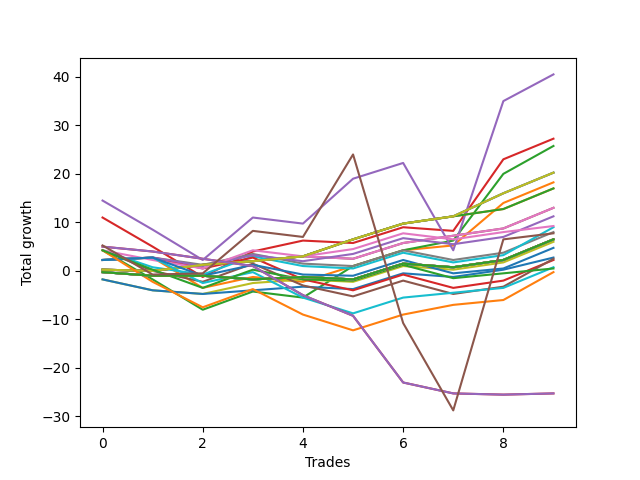

# Short Bulldog 004 
- Symbol: ES
- Date Range: 03/18/2022 - 07/15/2022
- Trading Period: 7:20-12:30
- Number of Trades: 12



| Name | Win Percent | Profit | Avg Profit / Trade | Avg Time / Trade |      | Name | Win Percent | Profit | Avg Profit / Trade | Avg Time / Trade |
| ---- | ----------- | ------ | ------------------ | ---------------- | ---- | ---- | ----------- | ------ | ------------------ | ---------------- |
| Sorted By <br> Profit | | | | | | Sorted By <br> Win Percentage ||||
| Thirty | 58.33 | 18625.00 | 1552.08 | 06:12 |     | One Hundred Six | 91.67 | 9625.00 | 802.08 | 01:45 |
| Forty-Six | 58.33 | 15625.00 | 1302.08 | 07:20 |     | One Hundred One | 91.67 | 9625.00 | 802.08 | 01:45 |
| Twenty-Eight | 58.33 | 14125.00 | 1177.08 | 05:57 |     | One Hundred Sixteen | 91.67 | 8875.00 | 739.58 | 01:46 |
| Twenty-Nine | 50.00 | 14000.00 | 1166.67 | 08:50 |     | One Hundred Eleven | 91.67 | 8750.00 | 729.17 | 01:47 |
| Thirty-One | 41.67 | 12625.00 | 1052.08 | 11:20 |     | One Hundred Twenty-Six | 91.67 | 6500.00 | 541.67 | 02:11 |
| Twenty-Four | 83.33 | 12000.00 | 1000.00 | 01:22 |     | One Hundred Twenty-One | 91.67 | 5875.00 | 489.58 | 02:16 |
| Zero | 83.33 | 12000.00 | 1000.00 | 02:22 |     | Eighty-One | 91.67 | 3625.00 | 302.08 | 04:11 |
| Sixty-Two | 58.33 | 11875.00 | 989.58 | 09:38 |     | Twenty-Four | 83.33 | 12000.00 | 1000.00 | 01:22 |
| Sixty-One | 58.33 | 11375.00 | 947.92 | 15:31 |     | Zero | 83.33 | 12000.00 | 1000.00 | 02:22 |
| Forty-Eight | 83.33 | 11250.00 | 937.50 | 01:23 |     | Forty-Eight | 83.33 | 11250.00 | 937.50 | 01:23 |
| Eight | 75.00 | 11250.00 | 937.50 | 01:09 |     | Forty | 83.33 | 11125.00 | 927.08 | 01:25 |
| Forty | 83.33 | 11125.00 | 927.08 | 01:25 |     | Thirty-Two | 83.33 | 10375.00 | 864.58 | 01:21 |
| Thirty-Two | 83.33 | 10375.00 | 864.58 | 01:21 |     | Sixty-Four | 83.33 | 8875.00 | 739.58 | 01:48 |
| Five | 58.33 | 10125.00 | 843.75 | 20:32 |     | Fifty-Six | 83.33 | 8250.00 | 687.50 | 01:53 |
| One Hundred Nine | 58.33 | 10000.00 | 833.33 | 03:17 |     | Eight | 75.00 | 11250.00 | 937.50 | 01:09 |
| One Hundred Six | 91.67 | 9625.00 | 802.08 | 01:45 |     | Sixten | 75.00 | 8375.00 | 697.92 | 01:15 |
| One Hundred One | 91.67 | 9625.00 | 802.08 | 01:45 |     | One Hundred Seventeen | 75.00 | 7500.00 | 625.00 | 04:19 |
| Forty-Four | 58.33 | 9625.00 | 802.08 | 07:49 |     | Ninety-One | 75.00 | 7250.00 | 604.17 | 00:55 |
| Six | 58.33 | 9625.00 | 802.08 | 11:34 |     | One Hundred Twelve | 75.00 | 6000.00 | 500.00 | 04:35 |
| Thirty-Eight | 58.33 | 9250.00 | 770.83 | 03:20 |     | One | 75.00 | 4625.00 | 385.42 | 09:36 |
| One Hundred Sixteen | 91.67 | 8875.00 | 739.58 | 01:46 |     | One Hundred Twenty-Seven | 75.00 | 2875.00 | 239.58 | 06:48 |
| Sixty-Four | 83.33 | 8875.00 | 739.58 | 01:48 |     | One Hundred Twenty-Two | 75.00 | 2250.00 | 187.50 | 06:53 |
| One Hundred Eleven | 91.67 | 8750.00 | 729.17 | 01:47 |     | Fifty-Seven | 75.00 | 2000.00 | 166.67 | 07:10 |
| Two | 66.67 | 8625.00 | 718.75 | 15:05 |     | Eighty-Two | 75.00 | -0.00 | -0.00 | 08:49 |
| Twenty-Six | 50.00 | 8625.00 | 718.75 | 06:09 |     | Two | 66.67 | 8625.00 | 718.75 | 15:05 |
| Sixten | 75.00 | 8375.00 | 697.92 | 01:15 |     | Sixty | 66.67 | 8125.00 | 677.08 | 10:10 |
| One Hundred Ten | 58.33 | 8375.00 | 697.92 | 03:25 |     | Thirty-Six | 66.67 | 7875.00 | 656.25 | 03:08 |
| Ninety-Four | 50.00 | 8375.00 | 697.92 | 02:10 |     | One Hundred Seven | 66.67 | 7750.00 | 645.83 | 02:53 |
| Forty-Five | 50.00 | 8375.00 | 697.92 | 11:06 |     | Thirty-Three | 66.67 | 7000.00 | 583.33 | 02:37 |
| Fifty-Six | 83.33 | 8250.00 | 687.50 | 01:53 |     | Four | 66.67 | 6875.00 | 572.92 | 15:11 |
| Sixty | 66.67 | 8125.00 | 677.08 | 10:10 |     | Fifty-Eight | 66.67 | 6500.00 | 541.67 | 11:17 |
| Fourteen | 41.67 | 8125.00 | 677.08 | 04:04 |     | One Hundred Two | 66.67 | 6375.00 | 531.25 | 03:21 |
| One Hundred Four | 58.33 | 8000.00 | 666.67 | 03:49 |     | Ninety-Six | 66.67 | 5875.00 | 489.58 | 01:06 |
| Thirty-Six | 66.67 | 7875.00 | 656.25 | 03:08 |     | One Hundred Thirteen | 66.67 | 4625.00 | 385.42 | 05:40 |
| One Hundred Seven | 66.67 | 7750.00 | 645.83 | 02:53 |     | Three | 66.67 | 4500.00 | 375.00 | 11:13 |
| One Hundred Ninteen | 58.33 | 7750.00 | 645.83 | 04:58 |     | Forty-One | 66.67 | 3500.00 | 291.67 | 05:26 |
| One Hundred Eight | 58.33 | 7750.00 | 645.83 | 03:15 |     | Fifty-Nine | 66.67 | 2500.00 | 208.33 | 07:43 |
| Fifty-Five | 50.00 | 7625.00 | 635.42 | 08:17 |     | Eighty-Three | 66.67 | 625.00 | 52.08 | 12:07 |
| One Hundred Seventeen | 75.00 | 7500.00 | 625.00 | 04:19 |     | One Hundred Twenty-Eight | 66.67 | 375.00 | 31.25 | 07:54 |
| Fifty-Four | 58.33 | 7500.00 | 625.00 | 05:19 |     | Sixty-Five | 66.67 | -375.00 | -31.25 | 06:30 |
| One Hundred Twenty | 50.00 | 7500.00 | 625.00 | 05:25 |     | One Hundred Twenty-Three | 66.67 | -1500.00 | -125.00 | 08:20 |
| Ninety-One | 75.00 | 7250.00 | 604.17 | 00:55 |     | Thirty | 58.33 | 18625.00 | 1552.08 | 06:12 |
| Forty-Two | 58.33 | 7250.00 | 604.17 | 08:07 |     | Forty-Six | 58.33 | 15625.00 | 1302.08 | 07:20 |
| Fifty-Three | 50.00 | 7250.00 | 604.17 | 06:37 |     | Twenty-Eight | 58.33 | 14125.00 | 1177.08 | 05:57 |
| Thirty-Three | 66.67 | 7000.00 | 583.33 | 02:37 |     | Sixty-Two | 58.33 | 11875.00 | 989.58 | 09:38 |
| Four | 66.67 | 6875.00 | 572.92 | 15:11 |     | Sixty-One | 58.33 | 11375.00 | 947.92 | 15:31 |
| One Hundred Twenty-Six | 91.67 | 6500.00 | 541.67 | 02:11 |     | Five | 58.33 | 10125.00 | 843.75 | 20:32 |
| Fifty-Eight | 66.67 | 6500.00 | 541.67 | 11:17 |     | One Hundred Nine | 58.33 | 10000.00 | 833.33 | 03:17 |
| One Hundred Two | 66.67 | 6375.00 | 531.25 | 03:21 |     | Forty-Four | 58.33 | 9625.00 | 802.08 | 07:49 |
| Ninety-Two | 58.33 | 6375.00 | 531.25 | 02:00 |     | Six | 58.33 | 9625.00 | 802.08 | 11:34 |
| Ninety-Five | 41.67 | 6375.00 | 531.25 | 02:45 |     | Thirty-Eight | 58.33 | 9250.00 | 770.83 | 03:20 |
| Thirty-Nine | 58.33 | 6250.00 | 520.83 | 03:45 |     | One Hundred Ten | 58.33 | 8375.00 | 697.92 | 03:25 |
| One Hundred Five | 50.00 | 6250.00 | 520.83 | 04:38 |     | One Hundred Four | 58.33 | 8000.00 | 666.67 | 03:49 |
| Forty-Seven | 41.67 | 6250.00 | 520.83 | 13:36 |     | One Hundred Ninteen | 58.33 | 7750.00 | 645.83 | 04:58 |
| One Hundred Twelve | 75.00 | 6000.00 | 500.00 | 04:35 |     | One Hundred Eight | 58.33 | 7750.00 | 645.83 | 03:15 |
| Thirty-Seven | 58.33 | 6000.00 | 500.00 | 03:30 |     | Fifty-Four | 58.33 | 7500.00 | 625.00 | 05:19 |
| One Hundred Twenty-One | 91.67 | 5875.00 | 489.58 | 02:16 |     | Forty-Two | 58.33 | 7250.00 | 604.17 | 08:07 |
| Ninety-Six | 66.67 | 5875.00 | 489.58 | 01:06 |     | Ninety-Two | 58.33 | 6375.00 | 531.25 | 02:00 |
| Ninety-Three | 50.00 | 5625.00 | 468.75 | 02:08 |     | Thirty-Nine | 58.33 | 6250.00 | 520.83 | 03:45 |
| Thirty-Five | 58.33 | 5250.00 | 437.50 | 02:52 |     | Thirty-Seven | 58.33 | 6000.00 | 500.00 | 03:30 |
| One Hundred Three | 58.33 | 5000.00 | 416.67 | 03:46 |     | Thirty-Five | 58.33 | 5250.00 | 437.50 | 02:52 |
| Ninety-Seven | 50.00 | 5000.00 | 416.67 | 01:45 |     | One Hundred Three | 58.33 | 5000.00 | 416.67 | 03:46 |
| Fifty-Two | 58.33 | 4875.00 | 406.25 | 05:12 |     | Fifty-Two | 58.33 | 4875.00 | 406.25 | 05:12 |
| Twenty-Five | 58.33 | 4875.00 | 406.25 | 03:56 |     | Twenty-Five | 58.33 | 4875.00 | 406.25 | 03:56 |
| twenty-Seven | 50.00 | 4875.00 | 406.25 | 04:24 |     | One Hundred Eighteen | 58.33 | 4750.00 | 395.83 | 04:55 |
| One Hundred Eighteen | 58.33 | 4750.00 | 395.83 | 04:55 |     | Thirty-Four | 58.33 | 4750.00 | 395.83 | 03:19 |
| Thirty-Four | 58.33 | 4750.00 | 395.83 | 03:19 |     | Forty-Three | 58.33 | 4000.00 | 333.33 | 05:58 |
| Nine | 41.67 | 4750.00 | 395.83 | 02:45 |     | One Hundred Fourteen | 58.33 | 3375.00 | 281.25 | 06:00 |
| One | 75.00 | 4625.00 | 385.42 | 09:36 |     | Forty-Nine | 58.33 | 3000.00 | 250.00 | 04:02 |
| One Hundred Thirteen | 66.67 | 4625.00 | 385.42 | 05:40 |     | Sixty-Seven | 58.33 | 125.00 | 10.42 | 07:03 |
| Twelve | 33.33 | 4625.00 | 385.42 | 03:57 |     | One Hundred Twenty-Nine | 58.33 | -2125.00 | -177.08 | 08:15 |
| Three | 66.67 | 4500.00 | 375.00 | 11:13 |     | One Hundred Twenty-Five | 58.33 | -3125.00 | -260.42 | 10:06 |
| Ninety-Nine | 50.00 | 4500.00 | 375.00 | 01:55 |     | Eighty-Five | 58.33 | -4375.00 | -364.58 | 15:07 |
| Eleven | 41.67 | 4500.00 | 375.00 | 02:59 |     | One Hundred Twenty-Four | 58.33 | -5750.00 | -479.17 | 08:41 |
| Seventy | 50.00 | 4375.00 | 364.58 | 09:00 |     | Eighty-Four | 58.33 | -7000.00 | -583.33 | 13:42 |
| Twenty-Two | 50.00 | 4375.00 | 364.58 | 01:48 |     | Twenty-Nine | 50.00 | 14000.00 | 1166.67 | 08:50 |
| Seventeen | 50.00 | 4375.00 | 364.58 | 01:47 |     | Twenty-Six | 50.00 | 8625.00 | 718.75 | 06:09 |
| Forty-Three | 58.33 | 4000.00 | 333.33 | 05:58 |     | Ninety-Four | 50.00 | 8375.00 | 697.92 | 02:10 |
| Eighty-One | 91.67 | 3625.00 | 302.08 | 04:11 |     | Forty-Five | 50.00 | 8375.00 | 697.92 | 11:06 |
| One Hundred | 50.00 | 3625.00 | 302.08 | 01:57 |     | Fifty-Five | 50.00 | 7625.00 | 635.42 | 08:17 |
| Ninety-Eight | 50.00 | 3625.00 | 302.08 | 01:55 |     | One Hundred Twenty | 50.00 | 7500.00 | 625.00 | 05:25 |
| Forty-One | 66.67 | 3500.00 | 291.67 | 05:26 |     | Fifty-Three | 50.00 | 7250.00 | 604.17 | 06:37 |
| One Hundred Fourteen | 58.33 | 3375.00 | 281.25 | 06:00 |     | One Hundred Five | 50.00 | 6250.00 | 520.83 | 04:38 |
| Fifty-One | 50.00 | 3375.00 | 281.25 | 04:40 |     | Ninety-Three | 50.00 | 5625.00 | 468.75 | 02:08 |
| Forty-Nine | 58.33 | 3000.00 | 250.00 | 04:02 |     | Ninety-Seven | 50.00 | 5000.00 | 416.67 | 01:45 |
| One Hundred Twenty-Seven | 75.00 | 2875.00 | 239.58 | 06:48 |     | twenty-Seven | 50.00 | 4875.00 | 406.25 | 04:24 |
| Twenty-Three | 50.00 | 2750.00 | 229.17 | 01:57 |     | Ninety-Nine | 50.00 | 4500.00 | 375.00 | 01:55 |
| Twenty-One | 50.00 | 2750.00 | 229.17 | 01:57 |     | Seventy | 50.00 | 4375.00 | 364.58 | 09:00 |
| Twenty | 50.00 | 2750.00 | 229.17 | 01:57 |     | Twenty-Two | 50.00 | 4375.00 | 364.58 | 01:48 |
| Nineteen | 50.00 | 2750.00 | 229.17 | 01:57 |     | Seventeen | 50.00 | 4375.00 | 364.58 | 01:47 |
| Eighteen | 50.00 | 2750.00 | 229.17 | 01:57 |     | One Hundred | 50.00 | 3625.00 | 302.08 | 01:57 |
| Thirteen | 33.33 | 2750.00 | 229.17 | 05:34 |     | Ninety-Eight | 50.00 | 3625.00 | 302.08 | 01:55 |
| Fifty-Nine | 66.67 | 2500.00 | 208.33 | 07:43 |     | Fifty-One | 50.00 | 3375.00 | 281.25 | 04:40 |
| One Hundred Twenty-Two | 75.00 | 2250.00 | 187.50 | 06:53 |     | Twenty-Three | 50.00 | 2750.00 | 229.17 | 01:57 |
| Sixty-Three | 50.00 | 2250.00 | 187.50 | 17:14 |     | Twenty-One | 50.00 | 2750.00 | 229.17 | 01:57 |
| Ten | 33.33 | 2125.00 | 177.08 | 03:50 |     | Twenty | 50.00 | 2750.00 | 229.17 | 01:57 |
| Fifty-Seven | 75.00 | 2000.00 | 166.67 | 07:10 |     | Nineteen | 50.00 | 2750.00 | 229.17 | 01:57 |
| Fifty | 50.00 | 1625.00 | 135.42 | 05:45 |     | Eighteen | 50.00 | 2750.00 | 229.17 | 01:57 |
| Fifteen | 25.00 | 1000.00 | 83.33 | 07:01 |     | Sixty-Three | 50.00 | 2250.00 | 187.50 | 17:14 |
| Eighty-Three | 66.67 | 625.00 | 52.08 | 12:07 |     | Fifty | 50.00 | 1625.00 | 135.42 | 05:45 |
| One Hundred Fifteen | 50.00 | 625.00 | 52.08 | 06:54 |     | One Hundred Fifteen | 50.00 | 625.00 | 52.08 | 06:54 |
| One Hundred Twenty-Eight | 66.67 | 375.00 | 31.25 | 07:54 |     | Sixty-Eight | 50.00 | -2125.00 | -177.08 | 08:28 |
| Sixty-Seven | 58.33 | 125.00 | 10.42 | 07:03 |     | Sixty-Six | 50.00 | -4000.00 | -333.33 | 09:52 |
| Eighty-Two | 75.00 | -0.00 | -0.00 | 08:49 |     | One Hundred Thirty | 50.00 | -4875.00 | -406.25 | 09:09 |
| Sixty-Five | 66.67 | -375.00 | -31.25 | 06:30 |     | Seven | 50.00 | -7000.00 | -583.33 | 23:10 |
| One Hundred Twenty-Three | 66.67 | -1500.00 | -125.00 | 08:20 |     | Thirty-One | 41.67 | 12625.00 | 1052.08 | 11:20 |
| One Hundred Twenty-Nine | 58.33 | -2125.00 | -177.08 | 08:15 |     | Fourteen | 41.67 | 8125.00 | 677.08 | 04:04 |
| Sixty-Eight | 50.00 | -2125.00 | -177.08 | 08:28 |     | Ninety-Five | 41.67 | 6375.00 | 531.25 | 02:45 |
| One Hundred Twenty-Five | 58.33 | -3125.00 | -260.42 | 10:06 |     | Forty-Seven | 41.67 | 6250.00 | 520.83 | 13:36 |
| Sixty-Six | 50.00 | -4000.00 | -333.33 | 09:52 |     | Nine | 41.67 | 4750.00 | 395.83 | 02:45 |
| Seventy-One | 41.67 | -4000.00 | -333.33 | 13:52 |     | Eleven | 41.67 | 4500.00 | 375.00 | 02:59 |
| Eighty-Five | 58.33 | -4375.00 | -364.58 | 15:07 |     | Seventy-One | 41.67 | -4000.00 | -333.33 | 13:52 |
| One Hundred Thirty | 50.00 | -4875.00 | -406.25 | 09:09 |     | Sixty-Nine | 41.67 | -5500.00 | -458.33 | 12:34 |
| Sixty-Nine | 41.67 | -5500.00 | -458.33 | 12:34 |     | Twelve | 33.33 | 4625.00 | 385.42 | 03:57 |
| One Hundred Twenty-Four | 58.33 | -5750.00 | -479.17 | 08:41 |     | Thirteen | 33.33 | 2750.00 | 229.17 | 05:34 |
| Eighty-Four | 58.33 | -7000.00 | -583.33 | 13:42 |     | Ten | 33.33 | 2125.00 | 177.08 | 03:50 |
| Seven | 50.00 | -7000.00 | -583.33 | 23:10 |     | Fifteen | 25.00 | 1000.00 | 83.33 | 07:01 |
| Seventy-Three | 25.00 | -11750.00 | -979.17 | 06:05 |     | Seventy-Three | 25.00 | -11750.00 | -979.17 | 06:05 |

## NO STOPLOSS

### Test Zero
* Sell when price hits the middle line of the 20p bollinger
* No Stoploss
* Results:
```
Total Trades: 12
Percent Up: 16.67
Percent Down: 83.33
Total Points Moved Down: 24.00
Potential Profit: 12000.00
Total Points Ups: 3.50 Count Ups: 2
Total Points Downs: 27.50 Count Downs: 10
```

<details><summary>Trades</summary>

<code>In: 2022-03-25 11:58:00		Out: 2022-03-25 11:58:35		Total Position Time: 00:35		Total Move Down: 0.25		Total to Date: 0.25</code> <br />
<code>In: 2022-03-28 11:13:00		Out: 2022-03-28 11:13:30		Total Position Time: 00:30		Total Move Down: -0.25		Total to Date: 0.00</code> <br />
<code>In: 2022-03-28 12:02:00		Out: 2022-03-28 12:08:15		Total Position Time: 06:15		Total Move Down: 1.00		Total to Date: 1.00</code> <br />
<code>In: 2022-03-29 08:53:00		Out: 2022-03-29 08:56:20		Total Position Time: 03:20		Total Move Down: 0.75		Total to Date: 1.75</code> <br />
<code>In: 2022-04-25 09:29:00		Out: 2022-04-25 09:31:10		Total Position Time: 02:10		Total Move Down: 2.25		Total to Date: 4.00</code> <br />
<code>In: 2022-05-02 09:26:00		Out: 2022-05-02 09:27:15		Total Position Time: 01:15		Total Move Down: 3.50		Total to Date: 7.50</code> <br />
<code>In: 2022-05-25 11:07:00		Out: 2022-05-25 11:07:10		Total Position Time: 00:10		Total Move Down: 3.25		Total to Date: 10.75</code> <br />
<code>In: 2022-06-01 11:08:00		Out: 2022-06-01 11:08:45		Total Position Time: 00:45		Total Move Down: 1.50		Total to Date: 12.25</code> <br />
<code>In: 2022-06-10 12:30:00		Out: 2022-06-10 12:30:30		Total Position Time: 00:30		Total Move Down: 4.75		Total to Date: 17.00</code> <br />
<code>In: 2022-06-16 08:31:00		Out: 2022-06-16 08:31:10		Total Position Time: 00:10		Total Move Down: 4.25		Total to Date: 21.25</code> <br />
<code>In: 2022-07-06 11:11:00		Out: 2022-07-06 11:11:10		Total Position Time: 00:10		Total Move Down: 6.00		Total to Date: 27.25</code> <br />
<code>In: 2022-07-14 08:03:00		Out: 2022-07-14 08:15:45		Total Position Time: 12:45		Total Move Down: -3.25		Total to Date: 24.00</code> <br />


</details>

### Test One
* Sell when the price hits the upper line of the 20p 1std bollinger
* No Stoploss
* Results:
```
Total Trades: 12
Percent Up: 25.00
Percent Down: 75.00
Total Points Moved Down: 9.25
Potential Profit: 4625.00
Total Points Ups: 21.75 Count Ups: 3
Total Points Downs: 31.00 Count Downs: 9
```

<details><summary>Trades</summary>

<code>In: 2022-03-25 11:58:00		Out: 2022-03-25 12:00:50		Total Position Time: 02:50		Total Move Down: 2.25		Total to Date: 2.25</code> <br />
<code>In: 2022-03-28 11:13:00		Out: 2022-03-28 11:19:35		Total Position Time: 06:35		Total Move Down: 0.50		Total to Date: 2.75</code> <br />
<code>In: 2022-03-28 12:02:00		Out: 2022-03-28 12:31:55		Total Position Time: 29:55		Total Move Down: -6.25		Total to Date: -3.50</code> <br />
<code>In: 2022-03-29 08:53:00		Out: 2022-03-29 08:58:40		Total Position Time: 05:40		Total Move Down: 2.25		Total to Date: -1.25</code> <br />
<code>In: 2022-04-25 09:29:00		Out: 2022-04-25 09:42:45		Total Position Time: 13:45		Total Move Down: -0.25		Total to Date: -1.50</code> <br />
<code>In: 2022-05-02 09:26:00		Out: 2022-05-02 09:36:10		Total Position Time: 10:10		Total Move Down: 3.25		Total to Date: 1.75</code> <br />
<code>In: 2022-05-25 11:07:00		Out: 2022-05-25 11:07:10		Total Position Time: 00:10		Total Move Down: 3.25		Total to Date: 5.00</code> <br />
<code>In: 2022-06-01 11:08:00		Out: 2022-06-01 11:18:15		Total Position Time: 10:15		Total Move Down: 1.00		Total to Date: 6.00</code> <br />
<code>In: 2022-06-10 12:30:00		Out: 2022-06-10 12:35:45		Total Position Time: 05:45		Total Move Down: 8.25		Total to Date: 14.25</code> <br />
<code>In: 2022-06-16 08:31:00		Out: 2022-06-16 08:31:10		Total Position Time: 00:10		Total Move Down: 4.25		Total to Date: 18.50</code> <br />
<code>In: 2022-07-06 11:11:00		Out: 2022-07-06 11:11:10		Total Position Time: 00:10		Total Move Down: 6.00		Total to Date: 24.50</code> <br />
<code>In: 2022-07-14 08:03:00		Out: 2022-07-14 08:32:55		Total Position Time: 29:55		Total Move Down: -15.25		Total to Date: 9.25</code> <br />


</details>

### Test Two
* Sell when the price hits the upper line of the 20p 2std bollinger
* No Stoploss
* Results:
```
Total Trades: 12
Percent Up: 33.33
Percent Down: 66.67
Total Points Moved Down: 17.25
Potential Profit: 8625.00
Total Points Ups: 28.75 Count Ups: 4
Total Points Downs: 46.00 Count Downs: 8
```

<details><summary>Trades</summary>

<code>In: 2022-03-25 11:58:00		Out: 2022-03-25 12:01:15		Total Position Time: 03:15		Total Move Down: 2.75		Total to Date: 2.75</code> <br />
<code>In: 2022-03-28 11:13:00		Out: 2022-03-28 11:42:55		Total Position Time: 29:55		Total Move Down: -6.00		Total to Date: -3.25</code> <br />
<code>In: 2022-03-28 12:02:00		Out: 2022-03-28 12:31:55		Total Position Time: 29:55		Total Move Down: -6.25		Total to Date: -9.50</code> <br />
<code>In: 2022-03-29 08:53:00		Out: 2022-03-29 09:01:40		Total Position Time: 08:40		Total Move Down: 3.75		Total to Date: -5.75</code> <br />
<code>In: 2022-04-25 09:29:00		Out: 2022-04-25 09:58:55		Total Position Time: 29:55		Total Move Down: -1.25		Total to Date: -7.00</code> <br />
<code>In: 2022-05-02 09:26:00		Out: 2022-05-02 09:39:35		Total Position Time: 13:35		Total Move Down: 5.50		Total to Date: -1.50</code> <br />
<code>In: 2022-05-25 11:07:00		Out: 2022-05-25 11:07:10		Total Position Time: 00:10		Total Move Down: 3.25		Total to Date: 1.75</code> <br />
<code>In: 2022-06-01 11:08:00		Out: 2022-06-01 11:19:20		Total Position Time: 11:20		Total Move Down: 3.25		Total to Date: 5.00</code> <br />
<code>In: 2022-06-10 12:30:00		Out: 2022-06-10 12:43:10		Total Position Time: 13:10		Total Move Down: 12.50		Total to Date: 17.50</code> <br />
<code>In: 2022-06-16 08:31:00		Out: 2022-06-16 08:41:25		Total Position Time: 10:25		Total Move Down: 6.00		Total to Date: 23.50</code> <br />
<code>In: 2022-07-06 11:11:00		Out: 2022-07-06 11:11:45		Total Position Time: 00:45		Total Move Down: 9.00		Total to Date: 32.50</code> <br />
<code>In: 2022-07-14 08:03:00		Out: 2022-07-14 08:32:55		Total Position Time: 29:55		Total Move Down: -15.25		Total to Date: 17.25</code> <br />


</details>

### Test Three
* Sell when price hits the middle line of the 50p bollinger
* No Stoploss
* Results:
```
Total Trades: 12
Percent Up: 33.33
Percent Down: 66.67
Total Points Moved Down: 9.00
Potential Profit: 4500.00
Total Points Ups: 23.00 Count Ups: 4
Total Points Downs: 32.00 Count Downs: 8
```

<details><summary>Trades</summary>

<code>In: 2022-03-25 11:58:00		Out: 2022-03-25 12:00:45		Total Position Time: 02:45		Total Move Down: 1.25		Total to Date: 1.25</code> <br />
<code>In: 2022-03-28 11:13:00		Out: 2022-03-28 11:19:20		Total Position Time: 06:20		Total Move Down: -0.00		Total to Date: 1.25</code> <br />
<code>In: 2022-03-28 12:02:00		Out: 2022-03-28 12:31:55		Total Position Time: 29:55		Total Move Down: -6.25		Total to Date: -5.00</code> <br />
<code>In: 2022-03-29 08:53:00		Out: 2022-03-29 09:01:35		Total Position Time: 08:35		Total Move Down: 3.25		Total to Date: -1.75</code> <br />
<code>In: 2022-04-25 09:29:00		Out: 2022-04-25 09:55:25		Total Position Time: 26:25		Total Move Down: -1.50		Total to Date: -3.25</code> <br />
<code>In: 2022-05-02 09:26:00		Out: 2022-05-02 09:36:20		Total Position Time: 10:20		Total Move Down: 3.25		Total to Date: 0.00</code> <br />
<code>In: 2022-05-25 11:07:00		Out: 2022-05-25 11:07:10		Total Position Time: 00:10		Total Move Down: 3.25		Total to Date: 3.25</code> <br />
<code>In: 2022-06-01 11:08:00		Out: 2022-06-01 11:19:10		Total Position Time: 11:10		Total Move Down: 2.00		Total to Date: 5.25</code> <br />
<code>In: 2022-06-10 12:30:00		Out: 2022-06-10 12:33:40		Total Position Time: 03:40		Total Move Down: 7.50		Total to Date: 12.75</code> <br />
<code>In: 2022-06-16 08:31:00		Out: 2022-06-16 08:36:15		Total Position Time: 05:15		Total Move Down: 5.50		Total to Date: 18.25</code> <br />
<code>In: 2022-07-06 11:11:00		Out: 2022-07-06 11:11:10		Total Position Time: 00:10		Total Move Down: 6.00		Total to Date: 24.25</code> <br />
<code>In: 2022-07-14 08:03:00		Out: 2022-07-14 08:32:55		Total Position Time: 29:55		Total Move Down: -15.25		Total to Date: 9.00</code> <br />


</details>

### Test Four
* Sell when the price hits the upper line of the 50p 1std bollinger
* No Stoploss
* Results:
```
Total Trades: 12
Percent Up: 33.33
Percent Down: 66.67
Total Points Moved Down: 13.75
Potential Profit: 6875.00
Total Points Ups: 40.75 Count Ups: 4
Total Points Downs: 54.50 Count Downs: 8
```

<details><summary>Trades</summary>

<code>In: 2022-03-25 11:58:00		Out: 2022-03-25 12:01:40		Total Position Time: 03:40		Total Move Down: 3.25		Total to Date: 3.25</code> <br />
<code>In: 2022-03-28 11:13:00		Out: 2022-03-28 11:20:40		Total Position Time: 07:40		Total Move Down: 0.75		Total to Date: 4.00</code> <br />
<code>In: 2022-03-28 12:02:00		Out: 2022-03-28 12:31:55		Total Position Time: 29:55		Total Move Down: -6.25		Total to Date: -2.25</code> <br />
<code>In: 2022-03-29 08:53:00		Out: 2022-03-29 09:02:15		Total Position Time: 09:15		Total Move Down: 6.75		Total to Date: 4.50</code> <br />
<code>In: 2022-04-25 09:29:00		Out: 2022-04-25 09:58:55		Total Position Time: 29:55		Total Move Down: -1.25		Total to Date: 3.25</code> <br />
<code>In: 2022-05-02 09:26:00		Out: 2022-05-02 09:43:15		Total Position Time: 17:15		Total Move Down: 9.25		Total to Date: 12.50</code> <br />
<code>In: 2022-05-25 11:07:00		Out: 2022-05-25 11:07:10		Total Position Time: 00:10		Total Move Down: 3.25		Total to Date: 15.75</code> <br />
<code>In: 2022-06-01 11:08:00		Out: 2022-06-01 11:37:55		Total Position Time: 29:55		Total Move Down: -18.00		Total to Date: -2.25</code> <br />
<code>In: 2022-06-10 12:30:00		Out: 2022-06-10 12:42:40		Total Position Time: 12:40		Total Move Down: 11.75		Total to Date: 9.50</code> <br />
<code>In: 2022-06-16 08:31:00		Out: 2022-06-16 08:42:25		Total Position Time: 11:25		Total Move Down: 12.25		Total to Date: 21.75</code> <br />
<code>In: 2022-07-06 11:11:00		Out: 2022-07-06 11:11:35		Total Position Time: 00:35		Total Move Down: 7.25		Total to Date: 29.00</code> <br />
<code>In: 2022-07-14 08:03:00		Out: 2022-07-14 08:32:55		Total Position Time: 29:55		Total Move Down: -15.25		Total to Date: 13.75</code> <br />


</details>

### Test Five
* Sell when the price hits the upper line of the 50p 2std bollinger
* No Stoploss
* Results:
```
Total Trades: 12
Percent Up: 41.67
Percent Down: 58.33
Total Points Moved Down: 20.25
Potential Profit: 10125.00
Total Points Ups: 46.75 Count Ups: 5
Total Points Downs: 67.00 Count Downs: 7
```

<details><summary>Trades</summary>

<code>In: 2022-03-25 11:58:00		Out: 2022-03-25 12:01:55		Total Position Time: 03:55		Total Move Down: 4.75		Total to Date: 4.75</code> <br />
<code>In: 2022-03-28 11:13:00		Out: 2022-03-28 11:42:55		Total Position Time: 29:55		Total Move Down: -6.00		Total to Date: -1.25</code> <br />
<code>In: 2022-03-28 12:02:00		Out: 2022-03-28 12:31:55		Total Position Time: 29:55		Total Move Down: -6.25		Total to Date: -7.50</code> <br />
<code>In: 2022-03-29 08:53:00		Out: 2022-03-29 09:10:50		Total Position Time: 17:50		Total Move Down: 9.00		Total to Date: 1.50</code> <br />
<code>In: 2022-04-25 09:29:00		Out: 2022-04-25 09:58:55		Total Position Time: 29:55		Total Move Down: -1.25		Total to Date: 0.25</code> <br />
<code>In: 2022-05-02 09:26:00		Out: 2022-05-02 09:54:10		Total Position Time: 28:10		Total Move Down: 19.00		Total to Date: 19.25</code> <br />
<code>In: 2022-05-25 11:07:00		Out: 2022-05-25 11:07:10		Total Position Time: 00:10		Total Move Down: 3.25		Total to Date: 22.50</code> <br />
<code>In: 2022-06-01 11:08:00		Out: 2022-06-01 11:37:55		Total Position Time: 29:55		Total Move Down: -18.00		Total to Date: 4.50</code> <br />
<code>In: 2022-06-10 12:30:00		Out: 2022-06-10 12:45:40		Total Position Time: 15:40		Total Move Down: 16.75		Total to Date: 21.25</code> <br />
<code>In: 2022-06-16 08:31:00		Out: 2022-06-16 09:00:55		Total Position Time: 29:55		Total Move Down: 1.25		Total to Date: 22.50</code> <br />
<code>In: 2022-07-06 11:11:00		Out: 2022-07-06 11:12:15		Total Position Time: 01:15		Total Move Down: 13.00		Total to Date: 35.50</code> <br />
<code>In: 2022-07-14 08:03:00		Out: 2022-07-14 08:32:55		Total Position Time: 29:55		Total Move Down: -15.25		Total to Date: 20.25</code> <br />


</details>

### Test Six
* Sell when the price hits the middle line of the 1std VWAP
* No Stoploss
* Results:
```
Total Trades: 12
Percent Up: 41.67
Percent Down: 58.33
Total Points Moved Down: 19.25
Potential Profit: 9625.00
Total Points Ups: 28.75 Count Ups: 5
Total Points Downs: 48.00 Count Downs: 7
```

<details><summary>Trades</summary>

<code>In: 2022-03-25 11:58:00		Out: 2022-03-25 12:20:30		Total Position Time: 22:30		Total Move Down: 11.00		Total to Date: 11.00</code> <br />
<code>In: 2022-03-28 11:13:00		Out: 2022-03-28 11:42:55		Total Position Time: 29:55		Total Move Down: -6.00		Total to Date: 5.00</code> <br />
<code>In: 2022-03-28 12:02:00		Out: 2022-03-28 12:31:55		Total Position Time: 29:55		Total Move Down: -6.25		Total to Date: -1.25</code> <br />
<code>In: 2022-03-29 08:53:00		Out: 2022-03-29 09:02:10		Total Position Time: 09:10		Total Move Down: 5.25		Total to Date: 4.00</code> <br />
<code>In: 2022-04-25 09:29:00		Out: 2022-04-25 09:31:10		Total Position Time: 02:10		Total Move Down: 2.25		Total to Date: 6.25</code> <br />
<code>In: 2022-05-02 09:26:00		Out: 2022-05-02 09:26:10		Total Position Time: 00:10		Total Move Down: -0.50		Total to Date: 5.75</code> <br />
<code>In: 2022-05-25 11:07:00		Out: 2022-05-25 11:07:10		Total Position Time: 00:10		Total Move Down: 3.25		Total to Date: 9.00</code> <br />
<code>In: 2022-06-01 11:08:00		Out: 2022-06-01 11:08:10		Total Position Time: 00:10		Total Move Down: -0.75		Total to Date: 8.25</code> <br />
<code>In: 2022-06-10 12:30:00		Out: 2022-06-10 12:44:00		Total Position Time: 14:00		Total Move Down: 14.75		Total to Date: 23.00</code> <br />
<code>In: 2022-06-16 08:31:00		Out: 2022-06-16 08:31:10		Total Position Time: 00:10		Total Move Down: 4.25		Total to Date: 27.25</code> <br />
<code>In: 2022-07-06 11:11:00		Out: 2022-07-06 11:11:35		Total Position Time: 00:35		Total Move Down: 7.25		Total to Date: 34.50</code> <br />
<code>In: 2022-07-14 08:03:00		Out: 2022-07-14 08:32:55		Total Position Time: 29:55		Total Move Down: -15.25		Total to Date: 19.25</code> <br />


</details>

### Test Seven
* Sell when the price hits the upper line of the 1std VWAP
* No Stoploss
* Results:
```
Total Trades: 12
Percent Up: 50.00
Percent Down: 50.00
Total Points Moved Down: -14.00
Potential Profit: -7000.00
Total Points Ups: 73.00 Count Ups: 6
Total Points Downs: 59.00 Count Downs: 6
```

<details><summary>Trades</summary>

<code>In: 2022-03-25 11:58:00		Out: 2022-03-25 12:27:55		Total Position Time: 29:55		Total Move Down: 14.50		Total to Date: 14.50</code> <br />
<code>In: 2022-03-28 11:13:00		Out: 2022-03-28 11:42:55		Total Position Time: 29:55		Total Move Down: -6.00		Total to Date: 8.50</code> <br />
<code>In: 2022-03-28 12:02:00		Out: 2022-03-28 12:31:55		Total Position Time: 29:55		Total Move Down: -6.25		Total to Date: 2.25</code> <br />
<code>In: 2022-03-29 08:53:00		Out: 2022-03-29 09:22:55		Total Position Time: 29:55		Total Move Down: 8.75		Total to Date: 11.00</code> <br />
<code>In: 2022-04-25 09:29:00		Out: 2022-04-25 09:58:55		Total Position Time: 29:55		Total Move Down: -1.25		Total to Date: 9.75</code> <br />
<code>In: 2022-05-02 09:26:00		Out: 2022-05-02 09:43:15		Total Position Time: 17:15		Total Move Down: 9.25		Total to Date: 19.00</code> <br />
<code>In: 2022-05-25 11:07:00		Out: 2022-05-25 11:07:10		Total Position Time: 00:10		Total Move Down: 3.25		Total to Date: 22.25</code> <br />
<code>In: 2022-06-01 11:08:00		Out: 2022-06-01 11:37:55		Total Position Time: 29:55		Total Move Down: -18.00		Total to Date: 4.25</code> <br />
<code>In: 2022-06-10 12:30:00		Out: 2022-06-10 12:46:00		Total Position Time: 16:00		Total Move Down: 17.75		Total to Date: 22.00</code> <br />
<code>In: 2022-06-16 08:31:00		Out: 2022-06-16 08:36:15		Total Position Time: 05:15		Total Move Down: 5.50		Total to Date: 27.50</code> <br />
<code>In: 2022-07-06 11:11:00		Out: 2022-07-06 11:40:55		Total Position Time: 29:55		Total Move Down: -26.25		Total to Date: 1.25</code> <br />
<code>In: 2022-07-14 08:03:00		Out: 2022-07-14 08:32:55		Total Position Time: 29:55		Total Move Down: -15.25		Total to Date: -14.00</code> <br />


</details>

## STOPLOSS OF 2

### Test Eight
* Sell when price hits the middle line of the 20p bollinger
* Stoploss is -2 points
* Results:
```
Total Trades: 12
Percent Up: 25.00
Percent Down: 75.00
Total Points Moved Down: 22.50
Potential Profit: 11250.00
Total Points Ups: 4.25 Count Ups: 3
Total Points Downs: 26.75 Count Downs: 9
```

<details><summary>Trades</summary>

<code>In: 2022-03-25 11:58:00		Out: 2022-03-25 11:58:35		Total Position Time: 00:35		Total Move Down: 0.25		Total to Date: 0.25</code> <br />
<code>In: 2022-03-28 11:13:00		Out: 2022-03-28 11:13:30		Total Position Time: 00:30		Total Move Down: -0.25		Total to Date: 0.00</code> <br />
<code>In: 2022-03-28 12:02:00		Out: 2022-03-28 12:08:15		Total Position Time: 06:15		Total Move Down: 1.00		Total to Date: 1.00</code> <br />
<code>In: 2022-03-29 08:53:00		Out: 2022-03-29 08:54:15		Total Position Time: 01:15		Total Move Down: -2.00		Total to Date: -1.00</code> <br />
<code>In: 2022-04-25 09:29:00		Out: 2022-04-25 09:31:10		Total Position Time: 02:10		Total Move Down: 2.25		Total to Date: 1.25</code> <br />
<code>In: 2022-05-02 09:26:00		Out: 2022-05-02 09:27:15		Total Position Time: 01:15		Total Move Down: 3.50		Total to Date: 4.75</code> <br />
<code>In: 2022-05-25 11:07:00		Out: 2022-05-25 11:07:10		Total Position Time: 00:10		Total Move Down: 3.25		Total to Date: 8.00</code> <br />
<code>In: 2022-06-01 11:08:00		Out: 2022-06-01 11:08:45		Total Position Time: 00:45		Total Move Down: 1.50		Total to Date: 9.50</code> <br />
<code>In: 2022-06-10 12:30:00		Out: 2022-06-10 12:30:30		Total Position Time: 00:30		Total Move Down: 4.75		Total to Date: 14.25</code> <br />
<code>In: 2022-06-16 08:31:00		Out: 2022-06-16 08:31:10		Total Position Time: 00:10		Total Move Down: 4.25		Total to Date: 18.50</code> <br />
<code>In: 2022-07-06 11:11:00		Out: 2022-07-06 11:11:10		Total Position Time: 00:10		Total Move Down: 6.00		Total to Date: 24.50</code> <br />
<code>In: 2022-07-14 08:03:00		Out: 2022-07-14 08:03:10		Total Position Time: 00:10		Total Move Down: -2.00		Total to Date: 22.50</code> <br />


</details>

### Test Nine
* Sell when the price hits the upper line of the 20p 1std bollinger
* Stoploss is -2 points
* Results:
```
Total Trades: 12
Percent Up: 58.33
Percent Down: 41.67
Total Points Moved Down: 9.50
Potential Profit: 4750.00
Total Points Ups: 14.50 Count Ups: 7
Total Points Downs: 24.00 Count Downs: 5
```

<details><summary>Trades</summary>

<code>In: 2022-03-25 11:58:00		Out: 2022-03-25 12:00:50		Total Position Time: 02:50		Total Move Down: 2.25		Total to Date: 2.25</code> <br />
<code>In: 2022-03-28 11:13:00		Out: 2022-03-28 11:14:35		Total Position Time: 01:35		Total Move Down: -2.25		Total to Date: 0.00</code> <br />
<code>In: 2022-03-28 12:02:00		Out: 2022-03-28 12:14:20		Total Position Time: 12:20		Total Move Down: -2.00		Total to Date: -2.00</code> <br />
<code>In: 2022-03-29 08:53:00		Out: 2022-03-29 08:54:15		Total Position Time: 01:15		Total Move Down: -2.00		Total to Date: -4.00</code> <br />
<code>In: 2022-04-25 09:29:00		Out: 2022-04-25 09:31:45		Total Position Time: 02:45		Total Move Down: -2.00		Total to Date: -6.00</code> <br />
<code>In: 2022-05-02 09:26:00		Out: 2022-05-02 09:30:05		Total Position Time: 04:05		Total Move Down: -2.25		Total to Date: -8.25</code> <br />
<code>In: 2022-05-25 11:07:00		Out: 2022-05-25 11:07:10		Total Position Time: 00:10		Total Move Down: 3.25		Total to Date: -5.00</code> <br />
<code>In: 2022-06-01 11:08:00		Out: 2022-06-01 11:09:45		Total Position Time: 01:45		Total Move Down: -2.00		Total to Date: -7.00</code> <br />
<code>In: 2022-06-10 12:30:00		Out: 2022-06-10 12:35:45		Total Position Time: 05:45		Total Move Down: 8.25		Total to Date: 1.25</code> <br />
<code>In: 2022-06-16 08:31:00		Out: 2022-06-16 08:31:10		Total Position Time: 00:10		Total Move Down: 4.25		Total to Date: 5.50</code> <br />
<code>In: 2022-07-06 11:11:00		Out: 2022-07-06 11:11:10		Total Position Time: 00:10		Total Move Down: 6.00		Total to Date: 11.50</code> <br />
<code>In: 2022-07-14 08:03:00		Out: 2022-07-14 08:03:10		Total Position Time: 00:10		Total Move Down: -2.00		Total to Date: 9.50</code> <br />


</details>

### Test Ten
* Sell when the price hits the upper line of the 20p 2std bollinger
* Stoploss is -2 points
* Results:
```
Total Trades: 12
Percent Up: 66.67
Percent Down: 33.33
Total Points Moved Down: 4.25
Potential Profit: 2125.00
Total Points Ups: 16.75 Count Ups: 8
Total Points Downs: 21.00 Count Downs: 4
```

<details><summary>Trades</summary>

<code>In: 2022-03-25 11:58:00		Out: 2022-03-25 12:01:15		Total Position Time: 03:15		Total Move Down: 2.75		Total to Date: 2.75</code> <br />
<code>In: 2022-03-28 11:13:00		Out: 2022-03-28 11:14:35		Total Position Time: 01:35		Total Move Down: -2.25		Total to Date: 0.50</code> <br />
<code>In: 2022-03-28 12:02:00		Out: 2022-03-28 12:14:20		Total Position Time: 12:20		Total Move Down: -2.00		Total to Date: -1.50</code> <br />
<code>In: 2022-03-29 08:53:00		Out: 2022-03-29 08:54:15		Total Position Time: 01:15		Total Move Down: -2.00		Total to Date: -3.50</code> <br />
<code>In: 2022-04-25 09:29:00		Out: 2022-04-25 09:31:45		Total Position Time: 02:45		Total Move Down: -2.00		Total to Date: -5.50</code> <br />
<code>In: 2022-05-02 09:26:00		Out: 2022-05-02 09:30:05		Total Position Time: 04:05		Total Move Down: -2.25		Total to Date: -7.75</code> <br />
<code>In: 2022-05-25 11:07:00		Out: 2022-05-25 11:07:10		Total Position Time: 00:10		Total Move Down: 3.25		Total to Date: -4.50</code> <br />
<code>In: 2022-06-01 11:08:00		Out: 2022-06-01 11:09:45		Total Position Time: 01:45		Total Move Down: -2.00		Total to Date: -6.50</code> <br />
<code>In: 2022-06-10 12:30:00		Out: 2022-06-10 12:37:40		Total Position Time: 07:40		Total Move Down: -2.25		Total to Date: -8.75</code> <br />
<code>In: 2022-06-16 08:31:00		Out: 2022-06-16 08:41:25		Total Position Time: 10:25		Total Move Down: 6.00		Total to Date: -2.75</code> <br />
<code>In: 2022-07-06 11:11:00		Out: 2022-07-06 11:11:45		Total Position Time: 00:45		Total Move Down: 9.00		Total to Date: 6.25</code> <br />
<code>In: 2022-07-14 08:03:00		Out: 2022-07-14 08:03:10		Total Position Time: 00:10		Total Move Down: -2.00		Total to Date: 4.25</code> <br />


</details>

### Test Eleven
* Sell when price hits the middle line of the 50p bollinger
* Stoploss is -2 points
* Results:
```
Total Trades: 12
Percent Up: 58.33
Percent Down: 41.67
Total Points Moved Down: 9.00
Potential Profit: 4500.00
Total Points Ups: 14.50 Count Ups: 7
Total Points Downs: 23.50 Count Downs: 5
```

<details><summary>Trades</summary>

<code>In: 2022-03-25 11:58:00		Out: 2022-03-25 12:00:45		Total Position Time: 02:45		Total Move Down: 1.25		Total to Date: 1.25</code> <br />
<code>In: 2022-03-28 11:13:00		Out: 2022-03-28 11:14:35		Total Position Time: 01:35		Total Move Down: -2.25		Total to Date: -1.00</code> <br />
<code>In: 2022-03-28 12:02:00		Out: 2022-03-28 12:14:20		Total Position Time: 12:20		Total Move Down: -2.00		Total to Date: -3.00</code> <br />
<code>In: 2022-03-29 08:53:00		Out: 2022-03-29 08:54:15		Total Position Time: 01:15		Total Move Down: -2.00		Total to Date: -5.00</code> <br />
<code>In: 2022-04-25 09:29:00		Out: 2022-04-25 09:31:45		Total Position Time: 02:45		Total Move Down: -2.00		Total to Date: -7.00</code> <br />
<code>In: 2022-05-02 09:26:00		Out: 2022-05-02 09:30:05		Total Position Time: 04:05		Total Move Down: -2.25		Total to Date: -9.25</code> <br />
<code>In: 2022-05-25 11:07:00		Out: 2022-05-25 11:07:10		Total Position Time: 00:10		Total Move Down: 3.25		Total to Date: -6.00</code> <br />
<code>In: 2022-06-01 11:08:00		Out: 2022-06-01 11:09:45		Total Position Time: 01:45		Total Move Down: -2.00		Total to Date: -8.00</code> <br />
<code>In: 2022-06-10 12:30:00		Out: 2022-06-10 12:33:40		Total Position Time: 03:40		Total Move Down: 7.50		Total to Date: -0.50</code> <br />
<code>In: 2022-06-16 08:31:00		Out: 2022-06-16 08:36:15		Total Position Time: 05:15		Total Move Down: 5.50		Total to Date: 5.00</code> <br />
<code>In: 2022-07-06 11:11:00		Out: 2022-07-06 11:11:10		Total Position Time: 00:10		Total Move Down: 6.00		Total to Date: 11.00</code> <br />
<code>In: 2022-07-14 08:03:00		Out: 2022-07-14 08:03:10		Total Position Time: 00:10		Total Move Down: -2.00		Total to Date: 9.00</code> <br />


</details>

### Test Twelve
* Sell when the price hits the upper line of the 50p 1std bollinger
* Stoploss is -2 points
* Results:
```
Total Trades: 12
Percent Up: 66.67
Percent Down: 33.33
Total Points Moved Down: 9.25
Potential Profit: 4625.00
Total Points Ups: 16.75 Count Ups: 8
Total Points Downs: 26.00 Count Downs: 4
```

<details><summary>Trades</summary>

<code>In: 2022-03-25 11:58:00		Out: 2022-03-25 12:01:40		Total Position Time: 03:40		Total Move Down: 3.25		Total to Date: 3.25</code> <br />
<code>In: 2022-03-28 11:13:00		Out: 2022-03-28 11:14:35		Total Position Time: 01:35		Total Move Down: -2.25		Total to Date: 1.00</code> <br />
<code>In: 2022-03-28 12:02:00		Out: 2022-03-28 12:14:20		Total Position Time: 12:20		Total Move Down: -2.00		Total to Date: -1.00</code> <br />
<code>In: 2022-03-29 08:53:00		Out: 2022-03-29 08:54:15		Total Position Time: 01:15		Total Move Down: -2.00		Total to Date: -3.00</code> <br />
<code>In: 2022-04-25 09:29:00		Out: 2022-04-25 09:31:45		Total Position Time: 02:45		Total Move Down: -2.00		Total to Date: -5.00</code> <br />
<code>In: 2022-05-02 09:26:00		Out: 2022-05-02 09:30:05		Total Position Time: 04:05		Total Move Down: -2.25		Total to Date: -7.25</code> <br />
<code>In: 2022-05-25 11:07:00		Out: 2022-05-25 11:07:10		Total Position Time: 00:10		Total Move Down: 3.25		Total to Date: -4.00</code> <br />
<code>In: 2022-06-01 11:08:00		Out: 2022-06-01 11:09:45		Total Position Time: 01:45		Total Move Down: -2.00		Total to Date: -6.00</code> <br />
<code>In: 2022-06-10 12:30:00		Out: 2022-06-10 12:37:40		Total Position Time: 07:40		Total Move Down: -2.25		Total to Date: -8.25</code> <br />
<code>In: 2022-06-16 08:31:00		Out: 2022-06-16 08:42:25		Total Position Time: 11:25		Total Move Down: 12.25		Total to Date: 4.00</code> <br />
<code>In: 2022-07-06 11:11:00		Out: 2022-07-06 11:11:35		Total Position Time: 00:35		Total Move Down: 7.25		Total to Date: 11.25</code> <br />
<code>In: 2022-07-14 08:03:00		Out: 2022-07-14 08:03:10		Total Position Time: 00:10		Total Move Down: -2.00		Total to Date: 9.25</code> <br />


</details>

### Test Thirteen
* Sell when the price hits the upper line of the 50p 2std bollinger
* Stoploss is -2 points
* Results:
```
Total Trades: 12
Percent Up: 66.67
Percent Down: 33.33
Total Points Moved Down: 5.50
Potential Profit: 2750.00
Total Points Ups: 16.75 Count Ups: 8
Total Points Downs: 22.25 Count Downs: 4
```

<details><summary>Trades</summary>

<code>In: 2022-03-25 11:58:00		Out: 2022-03-25 12:01:55		Total Position Time: 03:55		Total Move Down: 4.75		Total to Date: 4.75</code> <br />
<code>In: 2022-03-28 11:13:00		Out: 2022-03-28 11:14:35		Total Position Time: 01:35		Total Move Down: -2.25		Total to Date: 2.50</code> <br />
<code>In: 2022-03-28 12:02:00		Out: 2022-03-28 12:14:20		Total Position Time: 12:20		Total Move Down: -2.00		Total to Date: 0.50</code> <br />
<code>In: 2022-03-29 08:53:00		Out: 2022-03-29 08:54:15		Total Position Time: 01:15		Total Move Down: -2.00		Total to Date: -1.50</code> <br />
<code>In: 2022-04-25 09:29:00		Out: 2022-04-25 09:31:45		Total Position Time: 02:45		Total Move Down: -2.00		Total to Date: -3.50</code> <br />
<code>In: 2022-05-02 09:26:00		Out: 2022-05-02 09:30:05		Total Position Time: 04:05		Total Move Down: -2.25		Total to Date: -5.75</code> <br />
<code>In: 2022-05-25 11:07:00		Out: 2022-05-25 11:07:10		Total Position Time: 00:10		Total Move Down: 3.25		Total to Date: -2.50</code> <br />
<code>In: 2022-06-01 11:08:00		Out: 2022-06-01 11:09:45		Total Position Time: 01:45		Total Move Down: -2.00		Total to Date: -4.50</code> <br />
<code>In: 2022-06-10 12:30:00		Out: 2022-06-10 12:37:40		Total Position Time: 07:40		Total Move Down: -2.25		Total to Date: -6.75</code> <br />
<code>In: 2022-06-16 08:31:00		Out: 2022-06-16 09:00:55		Total Position Time: 29:55		Total Move Down: 1.25		Total to Date: -5.50</code> <br />
<code>In: 2022-07-06 11:11:00		Out: 2022-07-06 11:12:15		Total Position Time: 01:15		Total Move Down: 13.00		Total to Date: 7.50</code> <br />
<code>In: 2022-07-14 08:03:00		Out: 2022-07-14 08:03:10		Total Position Time: 00:10		Total Move Down: -2.00		Total to Date: 5.50</code> <br />


</details>

### Test Fourteen
* Sell when the price hits the middle line of the 1std VWAP
* Stoploss is -2 points
* Results:
```
Total Trades: 12
Percent Up: 58.33
Percent Down: 41.67
Total Points Moved Down: 16.25
Potential Profit: 8125.00
Total Points Ups: 11.75 Count Ups: 7
Total Points Downs: 28.00 Count Downs: 5
```

<details><summary>Trades</summary>

<code>In: 2022-03-25 11:58:00		Out: 2022-03-25 12:20:30		Total Position Time: 22:30		Total Move Down: 11.00		Total to Date: 11.00</code> <br />
<code>In: 2022-03-28 11:13:00		Out: 2022-03-28 11:14:35		Total Position Time: 01:35		Total Move Down: -2.25		Total to Date: 8.75</code> <br />
<code>In: 2022-03-28 12:02:00		Out: 2022-03-28 12:14:20		Total Position Time: 12:20		Total Move Down: -2.00		Total to Date: 6.75</code> <br />
<code>In: 2022-03-29 08:53:00		Out: 2022-03-29 08:54:15		Total Position Time: 01:15		Total Move Down: -2.00		Total to Date: 4.75</code> <br />
<code>In: 2022-04-25 09:29:00		Out: 2022-04-25 09:31:10		Total Position Time: 02:10		Total Move Down: 2.25		Total to Date: 7.00</code> <br />
<code>In: 2022-05-02 09:26:00		Out: 2022-05-02 09:26:10		Total Position Time: 00:10		Total Move Down: -0.50		Total to Date: 6.50</code> <br />
<code>In: 2022-05-25 11:07:00		Out: 2022-05-25 11:07:10		Total Position Time: 00:10		Total Move Down: 3.25		Total to Date: 9.75</code> <br />
<code>In: 2022-06-01 11:08:00		Out: 2022-06-01 11:08:10		Total Position Time: 00:10		Total Move Down: -0.75		Total to Date: 9.00</code> <br />
<code>In: 2022-06-10 12:30:00		Out: 2022-06-10 12:37:40		Total Position Time: 07:40		Total Move Down: -2.25		Total to Date: 6.75</code> <br />
<code>In: 2022-06-16 08:31:00		Out: 2022-06-16 08:31:10		Total Position Time: 00:10		Total Move Down: 4.25		Total to Date: 11.00</code> <br />
<code>In: 2022-07-06 11:11:00		Out: 2022-07-06 11:11:35		Total Position Time: 00:35		Total Move Down: 7.25		Total to Date: 18.25</code> <br />
<code>In: 2022-07-14 08:03:00		Out: 2022-07-14 08:03:10		Total Position Time: 00:10		Total Move Down: -2.00		Total to Date: 16.25</code> <br />


</details>

### Test Fifteen
* Sell when the price hits the upper line of the 1std VWAP
* Stoploss is -2 points
* Results:
```
Total Trades: 12
Percent Up: 75.00
Percent Down: 25.00
Total Points Moved Down: 2.00
Potential Profit: 1000.00
Total Points Ups: 21.25 Count Ups: 9
Total Points Downs: 23.25 Count Downs: 3
```

<details><summary>Trades</summary>

<code>In: 2022-03-25 11:58:00		Out: 2022-03-25 12:27:55		Total Position Time: 29:55		Total Move Down: 14.50		Total to Date: 14.50</code> <br />
<code>In: 2022-03-28 11:13:00		Out: 2022-03-28 11:14:35		Total Position Time: 01:35		Total Move Down: -2.25		Total to Date: 12.25</code> <br />
<code>In: 2022-03-28 12:02:00		Out: 2022-03-28 12:14:20		Total Position Time: 12:20		Total Move Down: -2.00		Total to Date: 10.25</code> <br />
<code>In: 2022-03-29 08:53:00		Out: 2022-03-29 08:54:15		Total Position Time: 01:15		Total Move Down: -2.00		Total to Date: 8.25</code> <br />
<code>In: 2022-04-25 09:29:00		Out: 2022-04-25 09:31:45		Total Position Time: 02:45		Total Move Down: -2.00		Total to Date: 6.25</code> <br />
<code>In: 2022-05-02 09:26:00		Out: 2022-05-02 09:30:05		Total Position Time: 04:05		Total Move Down: -2.25		Total to Date: 4.00</code> <br />
<code>In: 2022-05-25 11:07:00		Out: 2022-05-25 11:07:10		Total Position Time: 00:10		Total Move Down: 3.25		Total to Date: 7.25</code> <br />
<code>In: 2022-06-01 11:08:00		Out: 2022-06-01 11:09:45		Total Position Time: 01:45		Total Move Down: -2.00		Total to Date: 5.25</code> <br />
<code>In: 2022-06-10 12:30:00		Out: 2022-06-10 12:37:40		Total Position Time: 07:40		Total Move Down: -2.25		Total to Date: 3.00</code> <br />
<code>In: 2022-06-16 08:31:00		Out: 2022-06-16 08:36:15		Total Position Time: 05:15		Total Move Down: 5.50		Total to Date: 8.50</code> <br />
<code>In: 2022-07-06 11:11:00		Out: 2022-07-06 11:28:20		Total Position Time: 17:20		Total Move Down: -4.50		Total to Date: 4.00</code> <br />
<code>In: 2022-07-14 08:03:00		Out: 2022-07-14 08:03:10		Total Position Time: 00:10		Total Move Down: -2.00		Total to Date: 2.00</code> <br />


</details>

## TRAIL STOP OF 2

### Test Sixten
* Sell when price hits the middle line of the 20p bollinger
* Trailing Stop is -2 points
* Results:
```
Total Trades: 12
Percent Up: 25.00
Percent Down: 75.00
Total Points Moved Down: 16.75
Potential Profit: 8375.00
Total Points Ups: 4.00 Count Ups: 3
Total Points Downs: 20.75 Count Downs: 9
```

<details><summary>Trades</summary>

<code>In: 2022-03-25 11:58:00		Out: 2022-03-25 11:58:35		Total Position Time: 00:35		Total Move Down: 0.25		Total to Date: 0.25</code> <br />
<code>In: 2022-03-28 11:13:00		Out: 2022-03-28 11:13:30		Total Position Time: 00:30		Total Move Down: -0.25		Total to Date: 0.00</code> <br />
<code>In: 2022-03-28 12:02:00		Out: 2022-03-28 12:08:15		Total Position Time: 06:15		Total Move Down: 1.00		Total to Date: 1.00</code> <br />
<code>In: 2022-03-29 08:53:00		Out: 2022-03-29 08:56:20		Total Position Time: 03:20		Total Move Down: 0.75		Total to Date: 1.75</code> <br />
<code>In: 2022-04-25 09:29:00		Out: 2022-04-25 09:31:10		Total Position Time: 02:10		Total Move Down: 2.25		Total to Date: 4.00</code> <br />
<code>In: 2022-05-02 09:26:00		Out: 2022-05-02 09:26:10		Total Position Time: 00:10		Total Move Down: -0.50		Total to Date: 3.50</code> <br />
<code>In: 2022-05-25 11:07:00		Out: 2022-05-25 11:07:10		Total Position Time: 00:10		Total Move Down: 3.25		Total to Date: 6.75</code> <br />
<code>In: 2022-06-01 11:08:00		Out: 2022-06-01 11:08:45		Total Position Time: 00:45		Total Move Down: 1.50		Total to Date: 8.25</code> <br />
<code>In: 2022-06-10 12:30:00		Out: 2022-06-10 12:30:10		Total Position Time: 00:10		Total Move Down: 1.50		Total to Date: 9.75</code> <br />
<code>In: 2022-06-16 08:31:00		Out: 2022-06-16 08:31:10		Total Position Time: 00:10		Total Move Down: 4.25		Total to Date: 14.00</code> <br />
<code>In: 2022-07-06 11:11:00		Out: 2022-07-06 11:11:10		Total Position Time: 00:10		Total Move Down: 6.00		Total to Date: 20.00</code> <br />
<code>In: 2022-07-14 08:03:00		Out: 2022-07-14 08:03:45		Total Position Time: 00:45		Total Move Down: -3.25		Total to Date: 16.75</code> <br />


</details>

### Test Seventeen
* Sell when the price hits the upper line of the 20p 1std bollinger
* Trailing Stop is -2 points
* Results:
```
Total Trades: 12
Percent Up: 50.00
Percent Down: 50.00
Total Points Moved Down: 8.75
Potential Profit: 4375.00
Total Points Ups: 9.25 Count Ups: 6
Total Points Downs: 18.00 Count Downs: 6
```

<details><summary>Trades</summary>

<code>In: 2022-03-25 11:58:00		Out: 2022-03-25 11:59:40		Total Position Time: 01:40		Total Move Down: -1.75		Total to Date: -1.75</code> <br />
<code>In: 2022-03-28 11:13:00		Out: 2022-03-28 11:14:35		Total Position Time: 01:35		Total Move Down: -2.25		Total to Date: -4.00</code> <br />
<code>In: 2022-03-28 12:02:00		Out: 2022-03-28 12:09:20		Total Position Time: 07:20		Total Move Down: -0.75		Total to Date: -4.75</code> <br />
<code>In: 2022-03-29 08:53:00		Out: 2022-03-29 08:58:40		Total Position Time: 05:40		Total Move Down: 2.25		Total to Date: -2.50</code> <br />
<code>In: 2022-04-25 09:29:00		Out: 2022-04-25 09:31:30		Total Position Time: 02:30		Total Move Down: 0.75		Total to Date: -1.75</code> <br />
<code>In: 2022-05-02 09:26:00		Out: 2022-05-02 09:26:10		Total Position Time: 00:10		Total Move Down: -0.50		Total to Date: -2.25</code> <br />
<code>In: 2022-05-25 11:07:00		Out: 2022-05-25 11:07:10		Total Position Time: 00:10		Total Move Down: 3.25		Total to Date: 1.00</code> <br />
<code>In: 2022-06-01 11:08:00		Out: 2022-06-01 11:09:15		Total Position Time: 01:15		Total Move Down: -0.75		Total to Date: 0.25</code> <br />
<code>In: 2022-06-10 12:30:00		Out: 2022-06-10 12:30:10		Total Position Time: 00:10		Total Move Down: 1.50		Total to Date: 1.75</code> <br />
<code>In: 2022-06-16 08:31:00		Out: 2022-06-16 08:31:10		Total Position Time: 00:10		Total Move Down: 4.25		Total to Date: 6.00</code> <br />
<code>In: 2022-07-06 11:11:00		Out: 2022-07-06 11:11:10		Total Position Time: 00:10		Total Move Down: 6.00		Total to Date: 12.00</code> <br />
<code>In: 2022-07-14 08:03:00		Out: 2022-07-14 08:03:45		Total Position Time: 00:45		Total Move Down: -3.25		Total to Date: 8.75</code> <br />


</details>

### Test Eighteen
* Sell when the price hits the upper line of the 20p 2std bollinger
* Trailing Stop is -2 points
* Results:
```
Total Trades: 12
Percent Up: 50.00
Percent Down: 50.00
Total Points Moved Down: 5.50
Potential Profit: 2750.00
Total Points Ups: 9.25 Count Ups: 6
Total Points Downs: 14.75 Count Downs: 6
```

<details><summary>Trades</summary>

<code>In: 2022-03-25 11:58:00		Out: 2022-03-25 11:59:40		Total Position Time: 01:40		Total Move Down: -1.75		Total to Date: -1.75</code> <br />
<code>In: 2022-03-28 11:13:00		Out: 2022-03-28 11:14:35		Total Position Time: 01:35		Total Move Down: -2.25		Total to Date: -4.00</code> <br />
<code>In: 2022-03-28 12:02:00		Out: 2022-03-28 12:09:20		Total Position Time: 07:20		Total Move Down: -0.75		Total to Date: -4.75</code> <br />
<code>In: 2022-03-29 08:53:00		Out: 2022-03-29 09:00:10		Total Position Time: 07:10		Total Move Down: 0.75		Total to Date: -4.00</code> <br />
<code>In: 2022-04-25 09:29:00		Out: 2022-04-25 09:31:30		Total Position Time: 02:30		Total Move Down: 0.75		Total to Date: -3.25</code> <br />
<code>In: 2022-05-02 09:26:00		Out: 2022-05-02 09:26:10		Total Position Time: 00:10		Total Move Down: -0.50		Total to Date: -3.75</code> <br />
<code>In: 2022-05-25 11:07:00		Out: 2022-05-25 11:07:10		Total Position Time: 00:10		Total Move Down: 3.25		Total to Date: -0.50</code> <br />
<code>In: 2022-06-01 11:08:00		Out: 2022-06-01 11:09:15		Total Position Time: 01:15		Total Move Down: -0.75		Total to Date: -1.25</code> <br />
<code>In: 2022-06-10 12:30:00		Out: 2022-06-10 12:30:10		Total Position Time: 00:10		Total Move Down: 1.50		Total to Date: 0.25</code> <br />
<code>In: 2022-06-16 08:31:00		Out: 2022-06-16 08:31:35		Total Position Time: 00:35		Total Move Down: 2.50		Total to Date: 2.75</code> <br />
<code>In: 2022-07-06 11:11:00		Out: 2022-07-06 11:11:10		Total Position Time: 00:10		Total Move Down: 6.00		Total to Date: 8.75</code> <br />
<code>In: 2022-07-14 08:03:00		Out: 2022-07-14 08:03:45		Total Position Time: 00:45		Total Move Down: -3.25		Total to Date: 5.50</code> <br />


</details>

### Test Nineteen
* Sell when price hits the middle line of the 50p bollinger
* Trailing Stop is -2 points
* Results:
```
Total Trades: 12
Percent Up: 50.00
Percent Down: 50.00
Total Points Moved Down: 5.50
Potential Profit: 2750.00
Total Points Ups: 9.25 Count Ups: 6
Total Points Downs: 14.75 Count Downs: 6
```

<details><summary>Trades</summary>

<code>In: 2022-03-25 11:58:00		Out: 2022-03-25 11:59:40		Total Position Time: 01:40		Total Move Down: -1.75		Total to Date: -1.75</code> <br />
<code>In: 2022-03-28 11:13:00		Out: 2022-03-28 11:14:35		Total Position Time: 01:35		Total Move Down: -2.25		Total to Date: -4.00</code> <br />
<code>In: 2022-03-28 12:02:00		Out: 2022-03-28 12:09:20		Total Position Time: 07:20		Total Move Down: -0.75		Total to Date: -4.75</code> <br />
<code>In: 2022-03-29 08:53:00		Out: 2022-03-29 09:00:10		Total Position Time: 07:10		Total Move Down: 0.75		Total to Date: -4.00</code> <br />
<code>In: 2022-04-25 09:29:00		Out: 2022-04-25 09:31:30		Total Position Time: 02:30		Total Move Down: 0.75		Total to Date: -3.25</code> <br />
<code>In: 2022-05-02 09:26:00		Out: 2022-05-02 09:26:10		Total Position Time: 00:10		Total Move Down: -0.50		Total to Date: -3.75</code> <br />
<code>In: 2022-05-25 11:07:00		Out: 2022-05-25 11:07:10		Total Position Time: 00:10		Total Move Down: 3.25		Total to Date: -0.50</code> <br />
<code>In: 2022-06-01 11:08:00		Out: 2022-06-01 11:09:15		Total Position Time: 01:15		Total Move Down: -0.75		Total to Date: -1.25</code> <br />
<code>In: 2022-06-10 12:30:00		Out: 2022-06-10 12:30:10		Total Position Time: 00:10		Total Move Down: 1.50		Total to Date: 0.25</code> <br />
<code>In: 2022-06-16 08:31:00		Out: 2022-06-16 08:31:35		Total Position Time: 00:35		Total Move Down: 2.50		Total to Date: 2.75</code> <br />
<code>In: 2022-07-06 11:11:00		Out: 2022-07-06 11:11:10		Total Position Time: 00:10		Total Move Down: 6.00		Total to Date: 8.75</code> <br />
<code>In: 2022-07-14 08:03:00		Out: 2022-07-14 08:03:45		Total Position Time: 00:45		Total Move Down: -3.25		Total to Date: 5.50</code> <br />


</details>

### Test Twenty
* Sell when the price hits the upper line of the 50p 1std bollinger
* Trailing Stop is -2 points
* Results:
```
Total Trades: 12
Percent Up: 50.00
Percent Down: 50.00
Total Points Moved Down: 5.50
Potential Profit: 2750.00
Total Points Ups: 9.25 Count Ups: 6
Total Points Downs: 14.75 Count Downs: 6
```

<details><summary>Trades</summary>

<code>In: 2022-03-25 11:58:00		Out: 2022-03-25 11:59:40		Total Position Time: 01:40		Total Move Down: -1.75		Total to Date: -1.75</code> <br />
<code>In: 2022-03-28 11:13:00		Out: 2022-03-28 11:14:35		Total Position Time: 01:35		Total Move Down: -2.25		Total to Date: -4.00</code> <br />
<code>In: 2022-03-28 12:02:00		Out: 2022-03-28 12:09:20		Total Position Time: 07:20		Total Move Down: -0.75		Total to Date: -4.75</code> <br />
<code>In: 2022-03-29 08:53:00		Out: 2022-03-29 09:00:10		Total Position Time: 07:10		Total Move Down: 0.75		Total to Date: -4.00</code> <br />
<code>In: 2022-04-25 09:29:00		Out: 2022-04-25 09:31:30		Total Position Time: 02:30		Total Move Down: 0.75		Total to Date: -3.25</code> <br />
<code>In: 2022-05-02 09:26:00		Out: 2022-05-02 09:26:10		Total Position Time: 00:10		Total Move Down: -0.50		Total to Date: -3.75</code> <br />
<code>In: 2022-05-25 11:07:00		Out: 2022-05-25 11:07:10		Total Position Time: 00:10		Total Move Down: 3.25		Total to Date: -0.50</code> <br />
<code>In: 2022-06-01 11:08:00		Out: 2022-06-01 11:09:15		Total Position Time: 01:15		Total Move Down: -0.75		Total to Date: -1.25</code> <br />
<code>In: 2022-06-10 12:30:00		Out: 2022-06-10 12:30:10		Total Position Time: 00:10		Total Move Down: 1.50		Total to Date: 0.25</code> <br />
<code>In: 2022-06-16 08:31:00		Out: 2022-06-16 08:31:35		Total Position Time: 00:35		Total Move Down: 2.50		Total to Date: 2.75</code> <br />
<code>In: 2022-07-06 11:11:00		Out: 2022-07-06 11:11:10		Total Position Time: 00:10		Total Move Down: 6.00		Total to Date: 8.75</code> <br />
<code>In: 2022-07-14 08:03:00		Out: 2022-07-14 08:03:45		Total Position Time: 00:45		Total Move Down: -3.25		Total to Date: 5.50</code> <br />


</details>

### Test Twenty-One
* Sell when the price hits the upper line of the 50p 2std bollinger
* Trailing Stop is -2 points
* Results:
```
Total Trades: 12
Percent Up: 50.00
Percent Down: 50.00
Total Points Moved Down: 5.50
Potential Profit: 2750.00
Total Points Ups: 9.25 Count Ups: 6
Total Points Downs: 14.75 Count Downs: 6
```

<details><summary>Trades</summary>

<code>In: 2022-03-25 11:58:00		Out: 2022-03-25 11:59:40		Total Position Time: 01:40		Total Move Down: -1.75		Total to Date: -1.75</code> <br />
<code>In: 2022-03-28 11:13:00		Out: 2022-03-28 11:14:35		Total Position Time: 01:35		Total Move Down: -2.25		Total to Date: -4.00</code> <br />
<code>In: 2022-03-28 12:02:00		Out: 2022-03-28 12:09:20		Total Position Time: 07:20		Total Move Down: -0.75		Total to Date: -4.75</code> <br />
<code>In: 2022-03-29 08:53:00		Out: 2022-03-29 09:00:10		Total Position Time: 07:10		Total Move Down: 0.75		Total to Date: -4.00</code> <br />
<code>In: 2022-04-25 09:29:00		Out: 2022-04-25 09:31:30		Total Position Time: 02:30		Total Move Down: 0.75		Total to Date: -3.25</code> <br />
<code>In: 2022-05-02 09:26:00		Out: 2022-05-02 09:26:10		Total Position Time: 00:10		Total Move Down: -0.50		Total to Date: -3.75</code> <br />
<code>In: 2022-05-25 11:07:00		Out: 2022-05-25 11:07:10		Total Position Time: 00:10		Total Move Down: 3.25		Total to Date: -0.50</code> <br />
<code>In: 2022-06-01 11:08:00		Out: 2022-06-01 11:09:15		Total Position Time: 01:15		Total Move Down: -0.75		Total to Date: -1.25</code> <br />
<code>In: 2022-06-10 12:30:00		Out: 2022-06-10 12:30:10		Total Position Time: 00:10		Total Move Down: 1.50		Total to Date: 0.25</code> <br />
<code>In: 2022-06-16 08:31:00		Out: 2022-06-16 08:31:35		Total Position Time: 00:35		Total Move Down: 2.50		Total to Date: 2.75</code> <br />
<code>In: 2022-07-06 11:11:00		Out: 2022-07-06 11:11:10		Total Position Time: 00:10		Total Move Down: 6.00		Total to Date: 8.75</code> <br />
<code>In: 2022-07-14 08:03:00		Out: 2022-07-14 08:03:45		Total Position Time: 00:45		Total Move Down: -3.25		Total to Date: 5.50</code> <br />


</details>

### Test Twenty-Two
* Sell when the price hits the middle line of the 1std VWAP
* Trailing Stop is -2 points
* Results:
```
Total Trades: 12
Percent Up: 50.00
Percent Down: 50.00
Total Points Moved Down: 8.75
Potential Profit: 4375.00
Total Points Ups: 9.25 Count Ups: 6
Total Points Downs: 18.00 Count Downs: 6
```

<details><summary>Trades</summary>

<code>In: 2022-03-25 11:58:00		Out: 2022-03-25 11:59:40		Total Position Time: 01:40		Total Move Down: -1.75		Total to Date: -1.75</code> <br />
<code>In: 2022-03-28 11:13:00		Out: 2022-03-28 11:14:35		Total Position Time: 01:35		Total Move Down: -2.25		Total to Date: -4.00</code> <br />
<code>In: 2022-03-28 12:02:00		Out: 2022-03-28 12:09:20		Total Position Time: 07:20		Total Move Down: -0.75		Total to Date: -4.75</code> <br />
<code>In: 2022-03-29 08:53:00		Out: 2022-03-29 09:00:10		Total Position Time: 07:10		Total Move Down: 0.75		Total to Date: -4.00</code> <br />
<code>In: 2022-04-25 09:29:00		Out: 2022-04-25 09:31:10		Total Position Time: 02:10		Total Move Down: 2.25		Total to Date: -1.75</code> <br />
<code>In: 2022-05-02 09:26:00		Out: 2022-05-02 09:26:10		Total Position Time: 00:10		Total Move Down: -0.50		Total to Date: -2.25</code> <br />
<code>In: 2022-05-25 11:07:00		Out: 2022-05-25 11:07:10		Total Position Time: 00:10		Total Move Down: 3.25		Total to Date: 1.00</code> <br />
<code>In: 2022-06-01 11:08:00		Out: 2022-06-01 11:08:10		Total Position Time: 00:10		Total Move Down: -0.75		Total to Date: 0.25</code> <br />
<code>In: 2022-06-10 12:30:00		Out: 2022-06-10 12:30:10		Total Position Time: 00:10		Total Move Down: 1.50		Total to Date: 1.75</code> <br />
<code>In: 2022-06-16 08:31:00		Out: 2022-06-16 08:31:10		Total Position Time: 00:10		Total Move Down: 4.25		Total to Date: 6.00</code> <br />
<code>In: 2022-07-06 11:11:00		Out: 2022-07-06 11:11:10		Total Position Time: 00:10		Total Move Down: 6.00		Total to Date: 12.00</code> <br />
<code>In: 2022-07-14 08:03:00		Out: 2022-07-14 08:03:45		Total Position Time: 00:45		Total Move Down: -3.25		Total to Date: 8.75</code> <br />


</details>

### Test Twenty-Three
* Sell when the price hits the upper line of the 1std VWAP
* Trailing Stop is -2 points
* Results:
```
Total Trades: 12
Percent Up: 50.00
Percent Down: 50.00
Total Points Moved Down: 5.50
Potential Profit: 2750.00
Total Points Ups: 9.25 Count Ups: 6
Total Points Downs: 14.75 Count Downs: 6
```

<details><summary>Trades</summary>

<code>In: 2022-03-25 11:58:00		Out: 2022-03-25 11:59:40		Total Position Time: 01:40		Total Move Down: -1.75		Total to Date: -1.75</code> <br />
<code>In: 2022-03-28 11:13:00		Out: 2022-03-28 11:14:35		Total Position Time: 01:35		Total Move Down: -2.25		Total to Date: -4.00</code> <br />
<code>In: 2022-03-28 12:02:00		Out: 2022-03-28 12:09:20		Total Position Time: 07:20		Total Move Down: -0.75		Total to Date: -4.75</code> <br />
<code>In: 2022-03-29 08:53:00		Out: 2022-03-29 09:00:10		Total Position Time: 07:10		Total Move Down: 0.75		Total to Date: -4.00</code> <br />
<code>In: 2022-04-25 09:29:00		Out: 2022-04-25 09:31:30		Total Position Time: 02:30		Total Move Down: 0.75		Total to Date: -3.25</code> <br />
<code>In: 2022-05-02 09:26:00		Out: 2022-05-02 09:26:10		Total Position Time: 00:10		Total Move Down: -0.50		Total to Date: -3.75</code> <br />
<code>In: 2022-05-25 11:07:00		Out: 2022-05-25 11:07:10		Total Position Time: 00:10		Total Move Down: 3.25		Total to Date: -0.50</code> <br />
<code>In: 2022-06-01 11:08:00		Out: 2022-06-01 11:09:15		Total Position Time: 01:15		Total Move Down: -0.75		Total to Date: -1.25</code> <br />
<code>In: 2022-06-10 12:30:00		Out: 2022-06-10 12:30:10		Total Position Time: 00:10		Total Move Down: 1.50		Total to Date: 0.25</code> <br />
<code>In: 2022-06-16 08:31:00		Out: 2022-06-16 08:31:35		Total Position Time: 00:35		Total Move Down: 2.50		Total to Date: 2.75</code> <br />
<code>In: 2022-07-06 11:11:00		Out: 2022-07-06 11:11:10		Total Position Time: 00:10		Total Move Down: 6.00		Total to Date: 8.75</code> <br />
<code>In: 2022-07-14 08:03:00		Out: 2022-07-14 08:03:45		Total Position Time: 00:45		Total Move Down: -3.25		Total to Date: 5.50</code> <br />


</details>

## STOPLOSS OF 3

### Test Twenty-Four
* Sell when price hits the middle line of the 20p bollinger
* Stoploss is -3 points
* Results:
```
Total Trades: 12
Percent Up: 16.67
Percent Down: 83.33
Total Points Moved Down: 24.00
Potential Profit: 12000.00
Total Points Ups: 3.50 Count Ups: 2
Total Points Downs: 27.50 Count Downs: 10
```

<details><summary>Trades</summary>

<code>In: 2022-03-25 11:58:00		Out: 2022-03-25 11:58:35		Total Position Time: 00:35		Total Move Down: 0.25		Total to Date: 0.25</code> <br />
<code>In: 2022-03-28 11:13:00		Out: 2022-03-28 11:13:30		Total Position Time: 00:30		Total Move Down: -0.25		Total to Date: 0.00</code> <br />
<code>In: 2022-03-28 12:02:00		Out: 2022-03-28 12:08:15		Total Position Time: 06:15		Total Move Down: 1.00		Total to Date: 1.00</code> <br />
<code>In: 2022-03-29 08:53:00		Out: 2022-03-29 08:56:20		Total Position Time: 03:20		Total Move Down: 0.75		Total to Date: 1.75</code> <br />
<code>In: 2022-04-25 09:29:00		Out: 2022-04-25 09:31:10		Total Position Time: 02:10		Total Move Down: 2.25		Total to Date: 4.00</code> <br />
<code>In: 2022-05-02 09:26:00		Out: 2022-05-02 09:27:15		Total Position Time: 01:15		Total Move Down: 3.50		Total to Date: 7.50</code> <br />
<code>In: 2022-05-25 11:07:00		Out: 2022-05-25 11:07:10		Total Position Time: 00:10		Total Move Down: 3.25		Total to Date: 10.75</code> <br />
<code>In: 2022-06-01 11:08:00		Out: 2022-06-01 11:08:45		Total Position Time: 00:45		Total Move Down: 1.50		Total to Date: 12.25</code> <br />
<code>In: 2022-06-10 12:30:00		Out: 2022-06-10 12:30:30		Total Position Time: 00:30		Total Move Down: 4.75		Total to Date: 17.00</code> <br />
<code>In: 2022-06-16 08:31:00		Out: 2022-06-16 08:31:10		Total Position Time: 00:10		Total Move Down: 4.25		Total to Date: 21.25</code> <br />
<code>In: 2022-07-06 11:11:00		Out: 2022-07-06 11:11:10		Total Position Time: 00:10		Total Move Down: 6.00		Total to Date: 27.25</code> <br />
<code>In: 2022-07-14 08:03:00		Out: 2022-07-14 08:03:45		Total Position Time: 00:45		Total Move Down: -3.25		Total to Date: 24.00</code> <br />


</details>

### Test Twenty-Five
* Sell when the price hits the upper line of the 20p 1std bollinger
* Stoploss is -3 points
* Results:
```
Total Trades: 12
Percent Up: 41.67
Percent Down: 58.33
Total Points Moved Down: 9.75
Potential Profit: 4875.00
Total Points Ups: 17.00 Count Ups: 5
Total Points Downs: 26.75 Count Downs: 7
```

<details><summary>Trades</summary>

<code>In: 2022-03-25 11:58:00		Out: 2022-03-25 12:00:50		Total Position Time: 02:50		Total Move Down: 2.25		Total to Date: 2.25</code> <br />
<code>In: 2022-03-28 11:13:00		Out: 2022-03-28 11:19:35		Total Position Time: 06:35		Total Move Down: 0.50		Total to Date: 2.75</code> <br />
<code>In: 2022-03-28 12:02:00		Out: 2022-03-28 12:15:15		Total Position Time: 13:15		Total Move Down: -3.25		Total to Date: -0.50</code> <br />
<code>In: 2022-03-29 08:53:00		Out: 2022-03-29 08:58:40		Total Position Time: 05:40		Total Move Down: 2.25		Total to Date: 1.75</code> <br />
<code>In: 2022-04-25 09:29:00		Out: 2022-04-25 09:32:10		Total Position Time: 03:10		Total Move Down: -4.50		Total to Date: -2.75</code> <br />
<code>In: 2022-05-02 09:26:00		Out: 2022-05-02 09:32:30		Total Position Time: 06:30		Total Move Down: -3.25		Total to Date: -6.00</code> <br />
<code>In: 2022-05-25 11:07:00		Out: 2022-05-25 11:07:10		Total Position Time: 00:10		Total Move Down: 3.25		Total to Date: -2.75</code> <br />
<code>In: 2022-06-01 11:08:00		Out: 2022-06-01 11:10:20		Total Position Time: 02:20		Total Move Down: -2.75		Total to Date: -5.50</code> <br />
<code>In: 2022-06-10 12:30:00		Out: 2022-06-10 12:35:45		Total Position Time: 05:45		Total Move Down: 8.25		Total to Date: 2.75</code> <br />
<code>In: 2022-06-16 08:31:00		Out: 2022-06-16 08:31:10		Total Position Time: 00:10		Total Move Down: 4.25		Total to Date: 7.00</code> <br />
<code>In: 2022-07-06 11:11:00		Out: 2022-07-06 11:11:10		Total Position Time: 00:10		Total Move Down: 6.00		Total to Date: 13.00</code> <br />
<code>In: 2022-07-14 08:03:00		Out: 2022-07-14 08:03:45		Total Position Time: 00:45		Total Move Down: -3.25		Total to Date: 9.75</code> <br />


</details>

### Test Twenty-Six
* Sell when the price hits the upper line of the 20p 2std bollinger
* Stoploss is -3 points
* Results:
```
Total Trades: 12
Percent Up: 50.00
Percent Down: 50.00
Total Points Moved Down: 17.25
Potential Profit: 8625.00
Total Points Ups: 20.00 Count Ups: 6
Total Points Downs: 37.25 Count Downs: 6
```

<details><summary>Trades</summary>

<code>In: 2022-03-25 11:58:00		Out: 2022-03-25 12:01:15		Total Position Time: 03:15		Total Move Down: 2.75		Total to Date: 2.75</code> <br />
<code>In: 2022-03-28 11:13:00		Out: 2022-03-28 11:24:25		Total Position Time: 11:25		Total Move Down: -3.00		Total to Date: -0.25</code> <br />
<code>In: 2022-03-28 12:02:00		Out: 2022-03-28 12:15:15		Total Position Time: 13:15		Total Move Down: -3.25		Total to Date: -3.50</code> <br />
<code>In: 2022-03-29 08:53:00		Out: 2022-03-29 09:01:40		Total Position Time: 08:40		Total Move Down: 3.75		Total to Date: 0.25</code> <br />
<code>In: 2022-04-25 09:29:00		Out: 2022-04-25 09:32:10		Total Position Time: 03:10		Total Move Down: -4.50		Total to Date: -4.25</code> <br />
<code>In: 2022-05-02 09:26:00		Out: 2022-05-02 09:32:30		Total Position Time: 06:30		Total Move Down: -3.25		Total to Date: -7.50</code> <br />
<code>In: 2022-05-25 11:07:00		Out: 2022-05-25 11:07:10		Total Position Time: 00:10		Total Move Down: 3.25		Total to Date: -4.25</code> <br />
<code>In: 2022-06-01 11:08:00		Out: 2022-06-01 11:10:20		Total Position Time: 02:20		Total Move Down: -2.75		Total to Date: -7.00</code> <br />
<code>In: 2022-06-10 12:30:00		Out: 2022-06-10 12:43:10		Total Position Time: 13:10		Total Move Down: 12.50		Total to Date: 5.50</code> <br />
<code>In: 2022-06-16 08:31:00		Out: 2022-06-16 08:41:25		Total Position Time: 10:25		Total Move Down: 6.00		Total to Date: 11.50</code> <br />
<code>In: 2022-07-06 11:11:00		Out: 2022-07-06 11:11:45		Total Position Time: 00:45		Total Move Down: 9.00		Total to Date: 20.50</code> <br />
<code>In: 2022-07-14 08:03:00		Out: 2022-07-14 08:03:45		Total Position Time: 00:45		Total Move Down: -3.25		Total to Date: 17.25</code> <br />


</details>

### Test twenty-Seven
* Sell when price hits the middle line of the 50p bollinger
* Stoploss is -3 points
* Results:
```
Total Trades: 12
Percent Up: 50.00
Percent Down: 50.00
Total Points Moved Down: 9.75
Potential Profit: 4875.00
Total Points Ups: 17.00 Count Ups: 6
Total Points Downs: 26.75 Count Downs: 6
```

<details><summary>Trades</summary>

<code>In: 2022-03-25 11:58:00		Out: 2022-03-25 12:00:45		Total Position Time: 02:45		Total Move Down: 1.25		Total to Date: 1.25</code> <br />
<code>In: 2022-03-28 11:13:00		Out: 2022-03-28 11:19:20		Total Position Time: 06:20		Total Move Down: -0.00		Total to Date: 1.25</code> <br />
<code>In: 2022-03-28 12:02:00		Out: 2022-03-28 12:15:15		Total Position Time: 13:15		Total Move Down: -3.25		Total to Date: -2.00</code> <br />
<code>In: 2022-03-29 08:53:00		Out: 2022-03-29 09:01:35		Total Position Time: 08:35		Total Move Down: 3.25		Total to Date: 1.25</code> <br />
<code>In: 2022-04-25 09:29:00		Out: 2022-04-25 09:32:10		Total Position Time: 03:10		Total Move Down: -4.50		Total to Date: -3.25</code> <br />
<code>In: 2022-05-02 09:26:00		Out: 2022-05-02 09:32:30		Total Position Time: 06:30		Total Move Down: -3.25		Total to Date: -6.50</code> <br />
<code>In: 2022-05-25 11:07:00		Out: 2022-05-25 11:07:10		Total Position Time: 00:10		Total Move Down: 3.25		Total to Date: -3.25</code> <br />
<code>In: 2022-06-01 11:08:00		Out: 2022-06-01 11:10:20		Total Position Time: 02:20		Total Move Down: -2.75		Total to Date: -6.00</code> <br />
<code>In: 2022-06-10 12:30:00		Out: 2022-06-10 12:33:40		Total Position Time: 03:40		Total Move Down: 7.50		Total to Date: 1.50</code> <br />
<code>In: 2022-06-16 08:31:00		Out: 2022-06-16 08:36:15		Total Position Time: 05:15		Total Move Down: 5.50		Total to Date: 7.00</code> <br />
<code>In: 2022-07-06 11:11:00		Out: 2022-07-06 11:11:10		Total Position Time: 00:10		Total Move Down: 6.00		Total to Date: 13.00</code> <br />
<code>In: 2022-07-14 08:03:00		Out: 2022-07-14 08:03:45		Total Position Time: 00:45		Total Move Down: -3.25		Total to Date: 9.75</code> <br />


</details>

### Test Twenty-Eight
* Sell when the price hits the upper line of the 50p 1std bollinger
* Stoploss is -3 points
* Results:
```
Total Trades: 12
Percent Up: 41.67
Percent Down: 58.33
Total Points Moved Down: 28.25
Potential Profit: 14125.00
Total Points Ups: 17.00 Count Ups: 5
Total Points Downs: 45.25 Count Downs: 7
```

<details><summary>Trades</summary>

<code>In: 2022-03-25 11:58:00		Out: 2022-03-25 12:01:40		Total Position Time: 03:40		Total Move Down: 3.25		Total to Date: 3.25</code> <br />
<code>In: 2022-03-28 11:13:00		Out: 2022-03-28 11:20:40		Total Position Time: 07:40		Total Move Down: 0.75		Total to Date: 4.00</code> <br />
<code>In: 2022-03-28 12:02:00		Out: 2022-03-28 12:15:15		Total Position Time: 13:15		Total Move Down: -3.25		Total to Date: 0.75</code> <br />
<code>In: 2022-03-29 08:53:00		Out: 2022-03-29 09:02:15		Total Position Time: 09:15		Total Move Down: 6.75		Total to Date: 7.50</code> <br />
<code>In: 2022-04-25 09:29:00		Out: 2022-04-25 09:32:10		Total Position Time: 03:10		Total Move Down: -4.50		Total to Date: 3.00</code> <br />
<code>In: 2022-05-02 09:26:00		Out: 2022-05-02 09:32:30		Total Position Time: 06:30		Total Move Down: -3.25		Total to Date: -0.25</code> <br />
<code>In: 2022-05-25 11:07:00		Out: 2022-05-25 11:07:10		Total Position Time: 00:10		Total Move Down: 3.25		Total to Date: 3.00</code> <br />
<code>In: 2022-06-01 11:08:00		Out: 2022-06-01 11:10:20		Total Position Time: 02:20		Total Move Down: -2.75		Total to Date: 0.25</code> <br />
<code>In: 2022-06-10 12:30:00		Out: 2022-06-10 12:42:40		Total Position Time: 12:40		Total Move Down: 11.75		Total to Date: 12.00</code> <br />
<code>In: 2022-06-16 08:31:00		Out: 2022-06-16 08:42:25		Total Position Time: 11:25		Total Move Down: 12.25		Total to Date: 24.25</code> <br />
<code>In: 2022-07-06 11:11:00		Out: 2022-07-06 11:11:35		Total Position Time: 00:35		Total Move Down: 7.25		Total to Date: 31.50</code> <br />
<code>In: 2022-07-14 08:03:00		Out: 2022-07-14 08:03:45		Total Position Time: 00:45		Total Move Down: -3.25		Total to Date: 28.25</code> <br />


</details>

### Test Twenty-Nine
* Sell when the price hits the upper line of the 50p 2std bollinger
* Stoploss is -3 points
* Results:
```
Total Trades: 12
Percent Up: 50.00
Percent Down: 50.00
Total Points Moved Down: 28.00
Potential Profit: 14000.00
Total Points Ups: 20.00 Count Ups: 6
Total Points Downs: 48.00 Count Downs: 6
```

<details><summary>Trades</summary>

<code>In: 2022-03-25 11:58:00		Out: 2022-03-25 12:01:55		Total Position Time: 03:55		Total Move Down: 4.75		Total to Date: 4.75</code> <br />
<code>In: 2022-03-28 11:13:00		Out: 2022-03-28 11:24:25		Total Position Time: 11:25		Total Move Down: -3.00		Total to Date: 1.75</code> <br />
<code>In: 2022-03-28 12:02:00		Out: 2022-03-28 12:15:15		Total Position Time: 13:15		Total Move Down: -3.25		Total to Date: -1.50</code> <br />
<code>In: 2022-03-29 08:53:00		Out: 2022-03-29 09:10:50		Total Position Time: 17:50		Total Move Down: 9.00		Total to Date: 7.50</code> <br />
<code>In: 2022-04-25 09:29:00		Out: 2022-04-25 09:32:10		Total Position Time: 03:10		Total Move Down: -4.50		Total to Date: 3.00</code> <br />
<code>In: 2022-05-02 09:26:00		Out: 2022-05-02 09:32:30		Total Position Time: 06:30		Total Move Down: -3.25		Total to Date: -0.25</code> <br />
<code>In: 2022-05-25 11:07:00		Out: 2022-05-25 11:07:10		Total Position Time: 00:10		Total Move Down: 3.25		Total to Date: 3.00</code> <br />
<code>In: 2022-06-01 11:08:00		Out: 2022-06-01 11:10:20		Total Position Time: 02:20		Total Move Down: -2.75		Total to Date: 0.25</code> <br />
<code>In: 2022-06-10 12:30:00		Out: 2022-06-10 12:45:40		Total Position Time: 15:40		Total Move Down: 16.75		Total to Date: 17.00</code> <br />
<code>In: 2022-06-16 08:31:00		Out: 2022-06-16 09:00:55		Total Position Time: 29:55		Total Move Down: 1.25		Total to Date: 18.25</code> <br />
<code>In: 2022-07-06 11:11:00		Out: 2022-07-06 11:12:15		Total Position Time: 01:15		Total Move Down: 13.00		Total to Date: 31.25</code> <br />
<code>In: 2022-07-14 08:03:00		Out: 2022-07-14 08:03:45		Total Position Time: 00:45		Total Move Down: -3.25		Total to Date: 28.00</code> <br />


</details>

### Test Thirty
* Sell when the price hits the middle line of the 1std VWAP
* Stoploss is -3 points
* Results:
```
Total Trades: 12
Percent Up: 41.67
Percent Down: 58.33
Total Points Moved Down: 37.25
Potential Profit: 18625.00
Total Points Ups: 10.75 Count Ups: 5
Total Points Downs: 48.00 Count Downs: 7
```

<details><summary>Trades</summary>

<code>In: 2022-03-25 11:58:00		Out: 2022-03-25 12:20:30		Total Position Time: 22:30		Total Move Down: 11.00		Total to Date: 11.00</code> <br />
<code>In: 2022-03-28 11:13:00		Out: 2022-03-28 11:24:25		Total Position Time: 11:25		Total Move Down: -3.00		Total to Date: 8.00</code> <br />
<code>In: 2022-03-28 12:02:00		Out: 2022-03-28 12:15:15		Total Position Time: 13:15		Total Move Down: -3.25		Total to Date: 4.75</code> <br />
<code>In: 2022-03-29 08:53:00		Out: 2022-03-29 09:02:10		Total Position Time: 09:10		Total Move Down: 5.25		Total to Date: 10.00</code> <br />
<code>In: 2022-04-25 09:29:00		Out: 2022-04-25 09:31:10		Total Position Time: 02:10		Total Move Down: 2.25		Total to Date: 12.25</code> <br />
<code>In: 2022-05-02 09:26:00		Out: 2022-05-02 09:26:10		Total Position Time: 00:10		Total Move Down: -0.50		Total to Date: 11.75</code> <br />
<code>In: 2022-05-25 11:07:00		Out: 2022-05-25 11:07:10		Total Position Time: 00:10		Total Move Down: 3.25		Total to Date: 15.00</code> <br />
<code>In: 2022-06-01 11:08:00		Out: 2022-06-01 11:08:10		Total Position Time: 00:10		Total Move Down: -0.75		Total to Date: 14.25</code> <br />
<code>In: 2022-06-10 12:30:00		Out: 2022-06-10 12:44:00		Total Position Time: 14:00		Total Move Down: 14.75		Total to Date: 29.00</code> <br />
<code>In: 2022-06-16 08:31:00		Out: 2022-06-16 08:31:10		Total Position Time: 00:10		Total Move Down: 4.25		Total to Date: 33.25</code> <br />
<code>In: 2022-07-06 11:11:00		Out: 2022-07-06 11:11:35		Total Position Time: 00:35		Total Move Down: 7.25		Total to Date: 40.50</code> <br />
<code>In: 2022-07-14 08:03:00		Out: 2022-07-14 08:03:45		Total Position Time: 00:45		Total Move Down: -3.25		Total to Date: 37.25</code> <br />


</details>

### Test Thirty-One
* Sell when the price hits the upper line of the 1std VWAP
* Stoploss is -3 points
* Results:
```
Total Trades: 12
Percent Up: 58.33
Percent Down: 41.67
Total Points Moved Down: 25.25
Potential Profit: 12625.00
Total Points Ups: 24.50 Count Ups: 7
Total Points Downs: 49.75 Count Downs: 5
```

<details><summary>Trades</summary>

<code>In: 2022-03-25 11:58:00		Out: 2022-03-25 12:27:55		Total Position Time: 29:55		Total Move Down: 14.50		Total to Date: 14.50</code> <br />
<code>In: 2022-03-28 11:13:00		Out: 2022-03-28 11:24:25		Total Position Time: 11:25		Total Move Down: -3.00		Total to Date: 11.50</code> <br />
<code>In: 2022-03-28 12:02:00		Out: 2022-03-28 12:15:15		Total Position Time: 13:15		Total Move Down: -3.25		Total to Date: 8.25</code> <br />
<code>In: 2022-03-29 08:53:00		Out: 2022-03-29 09:22:55		Total Position Time: 29:55		Total Move Down: 8.75		Total to Date: 17.00</code> <br />
<code>In: 2022-04-25 09:29:00		Out: 2022-04-25 09:32:10		Total Position Time: 03:10		Total Move Down: -4.50		Total to Date: 12.50</code> <br />
<code>In: 2022-05-02 09:26:00		Out: 2022-05-02 09:32:30		Total Position Time: 06:30		Total Move Down: -3.25		Total to Date: 9.25</code> <br />
<code>In: 2022-05-25 11:07:00		Out: 2022-05-25 11:07:10		Total Position Time: 00:10		Total Move Down: 3.25		Total to Date: 12.50</code> <br />
<code>In: 2022-06-01 11:08:00		Out: 2022-06-01 11:10:20		Total Position Time: 02:20		Total Move Down: -2.75		Total to Date: 9.75</code> <br />
<code>In: 2022-06-10 12:30:00		Out: 2022-06-10 12:46:00		Total Position Time: 16:00		Total Move Down: 17.75		Total to Date: 27.50</code> <br />
<code>In: 2022-06-16 08:31:00		Out: 2022-06-16 08:36:15		Total Position Time: 05:15		Total Move Down: 5.50		Total to Date: 33.00</code> <br />
<code>In: 2022-07-06 11:11:00		Out: 2022-07-06 11:28:20		Total Position Time: 17:20		Total Move Down: -4.50		Total to Date: 28.50</code> <br />
<code>In: 2022-07-14 08:03:00		Out: 2022-07-14 08:03:45		Total Position Time: 00:45		Total Move Down: -3.25		Total to Date: 25.25</code> <br />


</details>

## TRAIL STOP OF 3

### Test Thirty-Two
* Sell when price hits the middle line of the 20p bollinger
* Trailing Stop is -3 points
* Results:
```
Total Trades: 12
Percent Up: 16.67
Percent Down: 83.33
Total Points Moved Down: 20.75
Potential Profit: 10375.00
Total Points Ups: 3.50 Count Ups: 2
Total Points Downs: 24.25 Count Downs: 10
```

<details><summary>Trades</summary>

<code>In: 2022-03-25 11:58:00		Out: 2022-03-25 11:58:35		Total Position Time: 00:35		Total Move Down: 0.25		Total to Date: 0.25</code> <br />
<code>In: 2022-03-28 11:13:00		Out: 2022-03-28 11:13:30		Total Position Time: 00:30		Total Move Down: -0.25		Total to Date: 0.00</code> <br />
<code>In: 2022-03-28 12:02:00		Out: 2022-03-28 12:08:15		Total Position Time: 06:15		Total Move Down: 1.00		Total to Date: 1.00</code> <br />
<code>In: 2022-03-29 08:53:00		Out: 2022-03-29 08:56:20		Total Position Time: 03:20		Total Move Down: 0.75		Total to Date: 1.75</code> <br />
<code>In: 2022-04-25 09:29:00		Out: 2022-04-25 09:31:10		Total Position Time: 02:10		Total Move Down: 2.25		Total to Date: 4.00</code> <br />
<code>In: 2022-05-02 09:26:00		Out: 2022-05-02 09:27:15		Total Position Time: 01:15		Total Move Down: 3.50		Total to Date: 7.50</code> <br />
<code>In: 2022-05-25 11:07:00		Out: 2022-05-25 11:07:10		Total Position Time: 00:10		Total Move Down: 3.25		Total to Date: 10.75</code> <br />
<code>In: 2022-06-01 11:08:00		Out: 2022-06-01 11:08:45		Total Position Time: 00:45		Total Move Down: 1.50		Total to Date: 12.25</code> <br />
<code>In: 2022-06-10 12:30:00		Out: 2022-06-10 12:30:10		Total Position Time: 00:10		Total Move Down: 1.50		Total to Date: 13.75</code> <br />
<code>In: 2022-06-16 08:31:00		Out: 2022-06-16 08:31:10		Total Position Time: 00:10		Total Move Down: 4.25		Total to Date: 18.00</code> <br />
<code>In: 2022-07-06 11:11:00		Out: 2022-07-06 11:11:10		Total Position Time: 00:10		Total Move Down: 6.00		Total to Date: 24.00</code> <br />
<code>In: 2022-07-14 08:03:00		Out: 2022-07-14 08:03:45		Total Position Time: 00:45		Total Move Down: -3.25		Total to Date: 20.75</code> <br />


</details>

### Test Thirty-Three
* Sell when the price hits the upper line of the 20p 1std bollinger
* Trailing Stop is -3 points
* Results:
```
Total Trades: 12
Percent Up: 33.33
Percent Down: 66.67
Total Points Moved Down: 14.00
Potential Profit: 7000.00
Total Points Ups: 7.50 Count Ups: 4
Total Points Downs: 21.50 Count Downs: 8
```

<details><summary>Trades</summary>

<code>In: 2022-03-25 11:58:00		Out: 2022-03-25 12:00:50		Total Position Time: 02:50		Total Move Down: 2.25		Total to Date: 2.25</code> <br />
<code>In: 2022-03-28 11:13:00		Out: 2022-03-28 11:19:35		Total Position Time: 06:35		Total Move Down: 0.50		Total to Date: 2.75</code> <br />
<code>In: 2022-03-28 12:02:00		Out: 2022-03-28 12:11:15		Total Position Time: 09:15		Total Move Down: -1.75		Total to Date: 1.00</code> <br />
<code>In: 2022-03-29 08:53:00		Out: 2022-03-29 08:58:40		Total Position Time: 05:40		Total Move Down: 2.25		Total to Date: 3.25</code> <br />
<code>In: 2022-04-25 09:29:00		Out: 2022-04-25 09:31:40		Total Position Time: 02:40		Total Move Down: -1.25		Total to Date: 2.00</code> <br />
<code>In: 2022-05-02 09:26:00		Out: 2022-05-02 09:27:35		Total Position Time: 01:35		Total Move Down: 1.50		Total to Date: 3.50</code> <br />
<code>In: 2022-05-25 11:07:00		Out: 2022-05-25 11:07:10		Total Position Time: 00:10		Total Move Down: 3.25		Total to Date: 6.75</code> <br />
<code>In: 2022-06-01 11:08:00		Out: 2022-06-01 11:09:30		Total Position Time: 01:30		Total Move Down: -1.25		Total to Date: 5.50</code> <br />
<code>In: 2022-06-10 12:30:00		Out: 2022-06-10 12:30:10		Total Position Time: 00:10		Total Move Down: 1.50		Total to Date: 7.00</code> <br />
<code>In: 2022-06-16 08:31:00		Out: 2022-06-16 08:31:10		Total Position Time: 00:10		Total Move Down: 4.25		Total to Date: 11.25</code> <br />
<code>In: 2022-07-06 11:11:00		Out: 2022-07-06 11:11:10		Total Position Time: 00:10		Total Move Down: 6.00		Total to Date: 17.25</code> <br />
<code>In: 2022-07-14 08:03:00		Out: 2022-07-14 08:03:45		Total Position Time: 00:45		Total Move Down: -3.25		Total to Date: 14.00</code> <br />


</details>

### Test Thirty-Four
* Sell when the price hits the upper line of the 20p 2std bollinger
* Trailing Stop is -3 points
* Results:
```
Total Trades: 12
Percent Up: 41.67
Percent Down: 58.33
Total Points Moved Down: 9.50
Potential Profit: 4750.00
Total Points Ups: 9.50 Count Ups: 5
Total Points Downs: 19.00 Count Downs: 7
```

<details><summary>Trades</summary>

<code>In: 2022-03-25 11:58:00		Out: 2022-03-25 12:01:15		Total Position Time: 03:15		Total Move Down: 2.75		Total to Date: 2.75</code> <br />
<code>In: 2022-03-28 11:13:00		Out: 2022-03-28 11:23:50		Total Position Time: 10:50		Total Move Down: -2.00		Total to Date: 0.75</code> <br />
<code>In: 2022-03-28 12:02:00		Out: 2022-03-28 12:11:15		Total Position Time: 09:15		Total Move Down: -1.75		Total to Date: -1.00</code> <br />
<code>In: 2022-03-29 08:53:00		Out: 2022-03-29 09:01:40		Total Position Time: 08:40		Total Move Down: 3.75		Total to Date: 2.75</code> <br />
<code>In: 2022-04-25 09:29:00		Out: 2022-04-25 09:31:40		Total Position Time: 02:40		Total Move Down: -1.25		Total to Date: 1.50</code> <br />
<code>In: 2022-05-02 09:26:00		Out: 2022-05-02 09:27:35		Total Position Time: 01:35		Total Move Down: 1.50		Total to Date: 3.00</code> <br />
<code>In: 2022-05-25 11:07:00		Out: 2022-05-25 11:07:10		Total Position Time: 00:10		Total Move Down: 3.25		Total to Date: 6.25</code> <br />
<code>In: 2022-06-01 11:08:00		Out: 2022-06-01 11:09:30		Total Position Time: 01:30		Total Move Down: -1.25		Total to Date: 5.00</code> <br />
<code>In: 2022-06-10 12:30:00		Out: 2022-06-10 12:30:10		Total Position Time: 00:10		Total Move Down: 1.50		Total to Date: 6.50</code> <br />
<code>In: 2022-06-16 08:31:00		Out: 2022-06-16 08:31:40		Total Position Time: 00:40		Total Move Down: 1.25		Total to Date: 7.75</code> <br />
<code>In: 2022-07-06 11:11:00		Out: 2022-07-06 11:11:20		Total Position Time: 00:20		Total Move Down: 5.00		Total to Date: 12.75</code> <br />
<code>In: 2022-07-14 08:03:00		Out: 2022-07-14 08:03:45		Total Position Time: 00:45		Total Move Down: -3.25		Total to Date: 9.50</code> <br />


</details>

### Test Thirty-Five
* Sell when price hits the middle line of the 50p bollinger
* Trailing Stop is -3 points
* Results:
```
Total Trades: 12
Percent Up: 41.67
Percent Down: 58.33
Total Points Moved Down: 10.50
Potential Profit: 5250.00
Total Points Ups: 7.50 Count Ups: 5
Total Points Downs: 18.00 Count Downs: 7
```

<details><summary>Trades</summary>

<code>In: 2022-03-25 11:58:00		Out: 2022-03-25 12:00:45		Total Position Time: 02:45		Total Move Down: 1.25		Total to Date: 1.25</code> <br />
<code>In: 2022-03-28 11:13:00		Out: 2022-03-28 11:19:20		Total Position Time: 06:20		Total Move Down: -0.00		Total to Date: 1.25</code> <br />
<code>In: 2022-03-28 12:02:00		Out: 2022-03-28 12:11:15		Total Position Time: 09:15		Total Move Down: -1.75		Total to Date: -0.50</code> <br />
<code>In: 2022-03-29 08:53:00		Out: 2022-03-29 09:01:35		Total Position Time: 08:35		Total Move Down: 3.25		Total to Date: 2.75</code> <br />
<code>In: 2022-04-25 09:29:00		Out: 2022-04-25 09:31:40		Total Position Time: 02:40		Total Move Down: -1.25		Total to Date: 1.50</code> <br />
<code>In: 2022-05-02 09:26:00		Out: 2022-05-02 09:27:35		Total Position Time: 01:35		Total Move Down: 1.50		Total to Date: 3.00</code> <br />
<code>In: 2022-05-25 11:07:00		Out: 2022-05-25 11:07:10		Total Position Time: 00:10		Total Move Down: 3.25		Total to Date: 6.25</code> <br />
<code>In: 2022-06-01 11:08:00		Out: 2022-06-01 11:09:30		Total Position Time: 01:30		Total Move Down: -1.25		Total to Date: 5.00</code> <br />
<code>In: 2022-06-10 12:30:00		Out: 2022-06-10 12:30:10		Total Position Time: 00:10		Total Move Down: 1.50		Total to Date: 6.50</code> <br />
<code>In: 2022-06-16 08:31:00		Out: 2022-06-16 08:31:40		Total Position Time: 00:40		Total Move Down: 1.25		Total to Date: 7.75</code> <br />
<code>In: 2022-07-06 11:11:00		Out: 2022-07-06 11:11:10		Total Position Time: 00:10		Total Move Down: 6.00		Total to Date: 13.75</code> <br />
<code>In: 2022-07-14 08:03:00		Out: 2022-07-14 08:03:45		Total Position Time: 00:45		Total Move Down: -3.25		Total to Date: 10.50</code> <br />


</details>

### Test Thirty-Six
* Sell when the price hits the upper line of the 50p 1std bollinger
* Trailing Stop is -3 points
* Results:
```
Total Trades: 12
Percent Up: 33.33
Percent Down: 66.67
Total Points Moved Down: 15.75
Potential Profit: 7875.00
Total Points Ups: 7.50 Count Ups: 4
Total Points Downs: 23.25 Count Downs: 8
```

<details><summary>Trades</summary>

<code>In: 2022-03-25 11:58:00		Out: 2022-03-25 12:01:40		Total Position Time: 03:40		Total Move Down: 3.25		Total to Date: 3.25</code> <br />
<code>In: 2022-03-28 11:13:00		Out: 2022-03-28 11:20:40		Total Position Time: 07:40		Total Move Down: 0.75		Total to Date: 4.00</code> <br />
<code>In: 2022-03-28 12:02:00		Out: 2022-03-28 12:11:15		Total Position Time: 09:15		Total Move Down: -1.75		Total to Date: 2.25</code> <br />
<code>In: 2022-03-29 08:53:00		Out: 2022-03-29 09:02:15		Total Position Time: 09:15		Total Move Down: 6.75		Total to Date: 9.00</code> <br />
<code>In: 2022-04-25 09:29:00		Out: 2022-04-25 09:31:40		Total Position Time: 02:40		Total Move Down: -1.25		Total to Date: 7.75</code> <br />
<code>In: 2022-05-02 09:26:00		Out: 2022-05-02 09:27:35		Total Position Time: 01:35		Total Move Down: 1.50		Total to Date: 9.25</code> <br />
<code>In: 2022-05-25 11:07:00		Out: 2022-05-25 11:07:10		Total Position Time: 00:10		Total Move Down: 3.25		Total to Date: 12.50</code> <br />
<code>In: 2022-06-01 11:08:00		Out: 2022-06-01 11:09:30		Total Position Time: 01:30		Total Move Down: -1.25		Total to Date: 11.25</code> <br />
<code>In: 2022-06-10 12:30:00		Out: 2022-06-10 12:30:10		Total Position Time: 00:10		Total Move Down: 1.50		Total to Date: 12.75</code> <br />
<code>In: 2022-06-16 08:31:00		Out: 2022-06-16 08:31:40		Total Position Time: 00:40		Total Move Down: 1.25		Total to Date: 14.00</code> <br />
<code>In: 2022-07-06 11:11:00		Out: 2022-07-06 11:11:20		Total Position Time: 00:20		Total Move Down: 5.00		Total to Date: 19.00</code> <br />
<code>In: 2022-07-14 08:03:00		Out: 2022-07-14 08:03:45		Total Position Time: 00:45		Total Move Down: -3.25		Total to Date: 15.75</code> <br />


</details>

### Test Thirty-Seven
* Sell when the price hits the upper line of the 50p 2std bollinger
* Trailing Stop is -3 points
* Results:
```
Total Trades: 12
Percent Up: 41.67
Percent Down: 58.33
Total Points Moved Down: 12.00
Potential Profit: 6000.00
Total Points Ups: 9.50 Count Ups: 5
Total Points Downs: 21.50 Count Downs: 7
```

<details><summary>Trades</summary>

<code>In: 2022-03-25 11:58:00		Out: 2022-03-25 12:01:55		Total Position Time: 03:55		Total Move Down: 4.75		Total to Date: 4.75</code> <br />
<code>In: 2022-03-28 11:13:00		Out: 2022-03-28 11:23:50		Total Position Time: 10:50		Total Move Down: -2.00		Total to Date: 2.75</code> <br />
<code>In: 2022-03-28 12:02:00		Out: 2022-03-28 12:11:15		Total Position Time: 09:15		Total Move Down: -1.75		Total to Date: 1.00</code> <br />
<code>In: 2022-03-29 08:53:00		Out: 2022-03-29 09:03:15		Total Position Time: 10:15		Total Move Down: 4.25		Total to Date: 5.25</code> <br />
<code>In: 2022-04-25 09:29:00		Out: 2022-04-25 09:31:40		Total Position Time: 02:40		Total Move Down: -1.25		Total to Date: 4.00</code> <br />
<code>In: 2022-05-02 09:26:00		Out: 2022-05-02 09:27:35		Total Position Time: 01:35		Total Move Down: 1.50		Total to Date: 5.50</code> <br />
<code>In: 2022-05-25 11:07:00		Out: 2022-05-25 11:07:10		Total Position Time: 00:10		Total Move Down: 3.25		Total to Date: 8.75</code> <br />
<code>In: 2022-06-01 11:08:00		Out: 2022-06-01 11:09:30		Total Position Time: 01:30		Total Move Down: -1.25		Total to Date: 7.50</code> <br />
<code>In: 2022-06-10 12:30:00		Out: 2022-06-10 12:30:10		Total Position Time: 00:10		Total Move Down: 1.50		Total to Date: 9.00</code> <br />
<code>In: 2022-06-16 08:31:00		Out: 2022-06-16 08:31:40		Total Position Time: 00:40		Total Move Down: 1.25		Total to Date: 10.25</code> <br />
<code>In: 2022-07-06 11:11:00		Out: 2022-07-06 11:11:20		Total Position Time: 00:20		Total Move Down: 5.00		Total to Date: 15.25</code> <br />
<code>In: 2022-07-14 08:03:00		Out: 2022-07-14 08:03:45		Total Position Time: 00:45		Total Move Down: -3.25		Total to Date: 12.00</code> <br />


</details>

### Test Thirty-Eight
* Sell when the price hits the middle line of the 1std VWAP
* Trailing Stop is -3 points
* Results:
```
Total Trades: 12
Percent Up: 41.67
Percent Down: 58.33
Total Points Moved Down: 18.50
Potential Profit: 9250.00
Total Points Ups: 8.25 Count Ups: 5
Total Points Downs: 26.75 Count Downs: 7
```

<details><summary>Trades</summary>

<code>In: 2022-03-25 11:58:00		Out: 2022-03-25 12:04:50		Total Position Time: 06:50		Total Move Down: 5.25		Total to Date: 5.25</code> <br />
<code>In: 2022-03-28 11:13:00		Out: 2022-03-28 11:23:50		Total Position Time: 10:50		Total Move Down: -2.00		Total to Date: 3.25</code> <br />
<code>In: 2022-03-28 12:02:00		Out: 2022-03-28 12:11:15		Total Position Time: 09:15		Total Move Down: -1.75		Total to Date: 1.50</code> <br />
<code>In: 2022-03-29 08:53:00		Out: 2022-03-29 09:02:10		Total Position Time: 09:10		Total Move Down: 5.25		Total to Date: 6.75</code> <br />
<code>In: 2022-04-25 09:29:00		Out: 2022-04-25 09:31:10		Total Position Time: 02:10		Total Move Down: 2.25		Total to Date: 9.00</code> <br />
<code>In: 2022-05-02 09:26:00		Out: 2022-05-02 09:26:10		Total Position Time: 00:10		Total Move Down: -0.50		Total to Date: 8.50</code> <br />
<code>In: 2022-05-25 11:07:00		Out: 2022-05-25 11:07:10		Total Position Time: 00:10		Total Move Down: 3.25		Total to Date: 11.75</code> <br />
<code>In: 2022-06-01 11:08:00		Out: 2022-06-01 11:08:10		Total Position Time: 00:10		Total Move Down: -0.75		Total to Date: 11.00</code> <br />
<code>In: 2022-06-10 12:30:00		Out: 2022-06-10 12:30:10		Total Position Time: 00:10		Total Move Down: 1.50		Total to Date: 12.50</code> <br />
<code>In: 2022-06-16 08:31:00		Out: 2022-06-16 08:31:10		Total Position Time: 00:10		Total Move Down: 4.25		Total to Date: 16.75</code> <br />
<code>In: 2022-07-06 11:11:00		Out: 2022-07-06 11:11:20		Total Position Time: 00:20		Total Move Down: 5.00		Total to Date: 21.75</code> <br />
<code>In: 2022-07-14 08:03:00		Out: 2022-07-14 08:03:45		Total Position Time: 00:45		Total Move Down: -3.25		Total to Date: 18.50</code> <br />


</details>

### Test Thirty-Nine
* Sell when the price hits the upper line of the 1std VWAP
* Trailing Stop is -3 points
* Results:
```
Total Trades: 12
Percent Up: 41.67
Percent Down: 58.33
Total Points Moved Down: 12.50
Potential Profit: 6250.00
Total Points Ups: 9.50 Count Ups: 5
Total Points Downs: 22.00 Count Downs: 7
```

<details><summary>Trades</summary>

<code>In: 2022-03-25 11:58:00		Out: 2022-03-25 12:04:50		Total Position Time: 06:50		Total Move Down: 5.25		Total to Date: 5.25</code> <br />
<code>In: 2022-03-28 11:13:00		Out: 2022-03-28 11:23:50		Total Position Time: 10:50		Total Move Down: -2.00		Total to Date: 3.25</code> <br />
<code>In: 2022-03-28 12:02:00		Out: 2022-03-28 12:11:15		Total Position Time: 09:15		Total Move Down: -1.75		Total to Date: 1.50</code> <br />
<code>In: 2022-03-29 08:53:00		Out: 2022-03-29 09:03:15		Total Position Time: 10:15		Total Move Down: 4.25		Total to Date: 5.75</code> <br />
<code>In: 2022-04-25 09:29:00		Out: 2022-04-25 09:31:40		Total Position Time: 02:40		Total Move Down: -1.25		Total to Date: 4.50</code> <br />
<code>In: 2022-05-02 09:26:00		Out: 2022-05-02 09:27:35		Total Position Time: 01:35		Total Move Down: 1.50		Total to Date: 6.00</code> <br />
<code>In: 2022-05-25 11:07:00		Out: 2022-05-25 11:07:10		Total Position Time: 00:10		Total Move Down: 3.25		Total to Date: 9.25</code> <br />
<code>In: 2022-06-01 11:08:00		Out: 2022-06-01 11:09:30		Total Position Time: 01:30		Total Move Down: -1.25		Total to Date: 8.00</code> <br />
<code>In: 2022-06-10 12:30:00		Out: 2022-06-10 12:30:10		Total Position Time: 00:10		Total Move Down: 1.50		Total to Date: 9.50</code> <br />
<code>In: 2022-06-16 08:31:00		Out: 2022-06-16 08:31:40		Total Position Time: 00:40		Total Move Down: 1.25		Total to Date: 10.75</code> <br />
<code>In: 2022-07-06 11:11:00		Out: 2022-07-06 11:11:20		Total Position Time: 00:20		Total Move Down: 5.00		Total to Date: 15.75</code> <br />
<code>In: 2022-07-14 08:03:00		Out: 2022-07-14 08:03:45		Total Position Time: 00:45		Total Move Down: -3.25		Total to Date: 12.50</code> <br />


</details>

## STOPLOSS OF 5

### Test Forty
* Sell when price hits the middle line of the 20p bollinger
* Stoploss is -5 points
* Results:
```
Total Trades: 12
Percent Up: 16.67
Percent Down: 83.33
Total Points Moved Down: 22.25
Potential Profit: 11125.00
Total Points Ups: 5.25 Count Ups: 2
Total Points Downs: 27.50 Count Downs: 10
```

<details><summary>Trades</summary>

<code>In: 2022-03-25 11:58:00		Out: 2022-03-25 11:58:35		Total Position Time: 00:35		Total Move Down: 0.25		Total to Date: 0.25</code> <br />
<code>In: 2022-03-28 11:13:00		Out: 2022-03-28 11:13:30		Total Position Time: 00:30		Total Move Down: -0.25		Total to Date: 0.00</code> <br />
<code>In: 2022-03-28 12:02:00		Out: 2022-03-28 12:08:15		Total Position Time: 06:15		Total Move Down: 1.00		Total to Date: 1.00</code> <br />
<code>In: 2022-03-29 08:53:00		Out: 2022-03-29 08:56:20		Total Position Time: 03:20		Total Move Down: 0.75		Total to Date: 1.75</code> <br />
<code>In: 2022-04-25 09:29:00		Out: 2022-04-25 09:31:10		Total Position Time: 02:10		Total Move Down: 2.25		Total to Date: 4.00</code> <br />
<code>In: 2022-05-02 09:26:00		Out: 2022-05-02 09:27:15		Total Position Time: 01:15		Total Move Down: 3.50		Total to Date: 7.50</code> <br />
<code>In: 2022-05-25 11:07:00		Out: 2022-05-25 11:07:10		Total Position Time: 00:10		Total Move Down: 3.25		Total to Date: 10.75</code> <br />
<code>In: 2022-06-01 11:08:00		Out: 2022-06-01 11:08:45		Total Position Time: 00:45		Total Move Down: 1.50		Total to Date: 12.25</code> <br />
<code>In: 2022-06-10 12:30:00		Out: 2022-06-10 12:30:30		Total Position Time: 00:30		Total Move Down: 4.75		Total to Date: 17.00</code> <br />
<code>In: 2022-06-16 08:31:00		Out: 2022-06-16 08:31:10		Total Position Time: 00:10		Total Move Down: 4.25		Total to Date: 21.25</code> <br />
<code>In: 2022-07-06 11:11:00		Out: 2022-07-06 11:11:10		Total Position Time: 00:10		Total Move Down: 6.00		Total to Date: 27.25</code> <br />
<code>In: 2022-07-14 08:03:00		Out: 2022-07-14 08:04:10		Total Position Time: 01:10		Total Move Down: -5.00		Total to Date: 22.25</code> <br />


</details>

### Test Forty-One
* Sell when the price hits the upper line of the 20p 1std bollinger
* Stoploss is -5 points
* Results:
```
Total Trades: 12
Percent Up: 33.33
Percent Down: 66.67
Total Points Moved Down: 7.00
Potential Profit: 3500.00
Total Points Ups: 20.75 Count Ups: 4
Total Points Downs: 27.75 Count Downs: 8
```

<details><summary>Trades</summary>

<code>In: 2022-03-25 11:58:00		Out: 2022-03-25 12:00:50		Total Position Time: 02:50		Total Move Down: 2.25		Total to Date: 2.25</code> <br />
<code>In: 2022-03-28 11:13:00		Out: 2022-03-28 11:19:35		Total Position Time: 06:35		Total Move Down: 0.50		Total to Date: 2.75</code> <br />
<code>In: 2022-03-28 12:02:00		Out: 2022-03-28 12:23:50		Total Position Time: 21:50		Total Move Down: -5.25		Total to Date: -2.50</code> <br />
<code>In: 2022-03-29 08:53:00		Out: 2022-03-29 08:58:40		Total Position Time: 05:40		Total Move Down: 2.25		Total to Date: -0.25</code> <br />
<code>In: 2022-04-25 09:29:00		Out: 2022-04-25 09:32:20		Total Position Time: 03:20		Total Move Down: -5.25		Total to Date: -5.50</code> <br />
<code>In: 2022-05-02 09:26:00		Out: 2022-05-02 09:33:20		Total Position Time: 07:20		Total Move Down: -5.25		Total to Date: -10.75</code> <br />
<code>In: 2022-05-25 11:07:00		Out: 2022-05-25 11:07:10		Total Position Time: 00:10		Total Move Down: 3.25		Total to Date: -7.50</code> <br />
<code>In: 2022-06-01 11:08:00		Out: 2022-06-01 11:18:15		Total Position Time: 10:15		Total Move Down: 1.00		Total to Date: -6.50</code> <br />
<code>In: 2022-06-10 12:30:00		Out: 2022-06-10 12:35:45		Total Position Time: 05:45		Total Move Down: 8.25		Total to Date: 1.75</code> <br />
<code>In: 2022-06-16 08:31:00		Out: 2022-06-16 08:31:10		Total Position Time: 00:10		Total Move Down: 4.25		Total to Date: 6.00</code> <br />
<code>In: 2022-07-06 11:11:00		Out: 2022-07-06 11:11:10		Total Position Time: 00:10		Total Move Down: 6.00		Total to Date: 12.00</code> <br />
<code>In: 2022-07-14 08:03:00		Out: 2022-07-14 08:04:10		Total Position Time: 01:10		Total Move Down: -5.00		Total to Date: 7.00</code> <br />


</details>

### Test Forty-Two
* Sell when the price hits the upper line of the 20p 2std bollinger
* Stoploss is -5 points
* Results:
```
Total Trades: 12
Percent Up: 41.67
Percent Down: 58.33
Total Points Moved Down: 14.50
Potential Profit: 7250.00
Total Points Ups: 26.00 Count Ups: 5
Total Points Downs: 40.50 Count Downs: 7
```

<details><summary>Trades</summary>

<code>In: 2022-03-25 11:58:00		Out: 2022-03-25 12:01:15		Total Position Time: 03:15		Total Move Down: 2.75		Total to Date: 2.75</code> <br />
<code>In: 2022-03-28 11:13:00		Out: 2022-03-28 11:29:05		Total Position Time: 16:05		Total Move Down: -5.25		Total to Date: -2.50</code> <br />
<code>In: 2022-03-28 12:02:00		Out: 2022-03-28 12:23:50		Total Position Time: 21:50		Total Move Down: -5.25		Total to Date: -7.75</code> <br />
<code>In: 2022-03-29 08:53:00		Out: 2022-03-29 09:01:40		Total Position Time: 08:40		Total Move Down: 3.75		Total to Date: -4.00</code> <br />
<code>In: 2022-04-25 09:29:00		Out: 2022-04-25 09:32:20		Total Position Time: 03:20		Total Move Down: -5.25		Total to Date: -9.25</code> <br />
<code>In: 2022-05-02 09:26:00		Out: 2022-05-02 09:33:20		Total Position Time: 07:20		Total Move Down: -5.25		Total to Date: -14.50</code> <br />
<code>In: 2022-05-25 11:07:00		Out: 2022-05-25 11:07:10		Total Position Time: 00:10		Total Move Down: 3.25		Total to Date: -11.25</code> <br />
<code>In: 2022-06-01 11:08:00		Out: 2022-06-01 11:19:20		Total Position Time: 11:20		Total Move Down: 3.25		Total to Date: -8.00</code> <br />
<code>In: 2022-06-10 12:30:00		Out: 2022-06-10 12:43:10		Total Position Time: 13:10		Total Move Down: 12.50		Total to Date: 4.50</code> <br />
<code>In: 2022-06-16 08:31:00		Out: 2022-06-16 08:41:25		Total Position Time: 10:25		Total Move Down: 6.00		Total to Date: 10.50</code> <br />
<code>In: 2022-07-06 11:11:00		Out: 2022-07-06 11:11:45		Total Position Time: 00:45		Total Move Down: 9.00		Total to Date: 19.50</code> <br />
<code>In: 2022-07-14 08:03:00		Out: 2022-07-14 08:04:10		Total Position Time: 01:10		Total Move Down: -5.00		Total to Date: 14.50</code> <br />


</details>

### Test Forty-Three
* Sell when price hits the middle line of the 50p bollinger
* Stoploss is -5 points
* Results:
```
Total Trades: 12
Percent Up: 41.67
Percent Down: 58.33
Total Points Moved Down: 8.00
Potential Profit: 4000.00
Total Points Ups: 20.75 Count Ups: 5
Total Points Downs: 28.75 Count Downs: 7
```

<details><summary>Trades</summary>

<code>In: 2022-03-25 11:58:00		Out: 2022-03-25 12:00:45		Total Position Time: 02:45		Total Move Down: 1.25		Total to Date: 1.25</code> <br />
<code>In: 2022-03-28 11:13:00		Out: 2022-03-28 11:19:20		Total Position Time: 06:20		Total Move Down: -0.00		Total to Date: 1.25</code> <br />
<code>In: 2022-03-28 12:02:00		Out: 2022-03-28 12:23:50		Total Position Time: 21:50		Total Move Down: -5.25		Total to Date: -4.00</code> <br />
<code>In: 2022-03-29 08:53:00		Out: 2022-03-29 09:01:35		Total Position Time: 08:35		Total Move Down: 3.25		Total to Date: -0.75</code> <br />
<code>In: 2022-04-25 09:29:00		Out: 2022-04-25 09:32:20		Total Position Time: 03:20		Total Move Down: -5.25		Total to Date: -6.00</code> <br />
<code>In: 2022-05-02 09:26:00		Out: 2022-05-02 09:33:20		Total Position Time: 07:20		Total Move Down: -5.25		Total to Date: -11.25</code> <br />
<code>In: 2022-05-25 11:07:00		Out: 2022-05-25 11:07:10		Total Position Time: 00:10		Total Move Down: 3.25		Total to Date: -8.00</code> <br />
<code>In: 2022-06-01 11:08:00		Out: 2022-06-01 11:19:10		Total Position Time: 11:10		Total Move Down: 2.00		Total to Date: -6.00</code> <br />
<code>In: 2022-06-10 12:30:00		Out: 2022-06-10 12:33:40		Total Position Time: 03:40		Total Move Down: 7.50		Total to Date: 1.50</code> <br />
<code>In: 2022-06-16 08:31:00		Out: 2022-06-16 08:36:15		Total Position Time: 05:15		Total Move Down: 5.50		Total to Date: 7.00</code> <br />
<code>In: 2022-07-06 11:11:00		Out: 2022-07-06 11:11:10		Total Position Time: 00:10		Total Move Down: 6.00		Total to Date: 13.00</code> <br />
<code>In: 2022-07-14 08:03:00		Out: 2022-07-14 08:04:10		Total Position Time: 01:10		Total Move Down: -5.00		Total to Date: 8.00</code> <br />


</details>

### Test Forty-Four
* Sell when the price hits the upper line of the 50p 1std bollinger
* Stoploss is -5 points
* Results:
```
Total Trades: 12
Percent Up: 41.67
Percent Down: 58.33
Total Points Moved Down: 19.25
Potential Profit: 9625.00
Total Points Ups: 26.00 Count Ups: 5
Total Points Downs: 45.25 Count Downs: 7
```

<details><summary>Trades</summary>

<code>In: 2022-03-25 11:58:00		Out: 2022-03-25 12:01:40		Total Position Time: 03:40		Total Move Down: 3.25		Total to Date: 3.25</code> <br />
<code>In: 2022-03-28 11:13:00		Out: 2022-03-28 11:20:40		Total Position Time: 07:40		Total Move Down: 0.75		Total to Date: 4.00</code> <br />
<code>In: 2022-03-28 12:02:00		Out: 2022-03-28 12:23:50		Total Position Time: 21:50		Total Move Down: -5.25		Total to Date: -1.25</code> <br />
<code>In: 2022-03-29 08:53:00		Out: 2022-03-29 09:02:15		Total Position Time: 09:15		Total Move Down: 6.75		Total to Date: 5.50</code> <br />
<code>In: 2022-04-25 09:29:00		Out: 2022-04-25 09:32:20		Total Position Time: 03:20		Total Move Down: -5.25		Total to Date: 0.25</code> <br />
<code>In: 2022-05-02 09:26:00		Out: 2022-05-02 09:33:20		Total Position Time: 07:20		Total Move Down: -5.25		Total to Date: -5.00</code> <br />
<code>In: 2022-05-25 11:07:00		Out: 2022-05-25 11:07:10		Total Position Time: 00:10		Total Move Down: 3.25		Total to Date: -1.75</code> <br />
<code>In: 2022-06-01 11:08:00		Out: 2022-06-01 11:22:50		Total Position Time: 14:50		Total Move Down: -5.25		Total to Date: -7.00</code> <br />
<code>In: 2022-06-10 12:30:00		Out: 2022-06-10 12:42:40		Total Position Time: 12:40		Total Move Down: 11.75		Total to Date: 4.75</code> <br />
<code>In: 2022-06-16 08:31:00		Out: 2022-06-16 08:42:25		Total Position Time: 11:25		Total Move Down: 12.25		Total to Date: 17.00</code> <br />
<code>In: 2022-07-06 11:11:00		Out: 2022-07-06 11:11:35		Total Position Time: 00:35		Total Move Down: 7.25		Total to Date: 24.25</code> <br />
<code>In: 2022-07-14 08:03:00		Out: 2022-07-14 08:04:10		Total Position Time: 01:10		Total Move Down: -5.00		Total to Date: 19.25</code> <br />


</details>

### Test Forty-Five
* Sell when the price hits the upper line of the 50p 2std bollinger
* Stoploss is -5 points
* Results:
```
Total Trades: 12
Percent Up: 50.00
Percent Down: 50.00
Total Points Moved Down: 16.75
Potential Profit: 8375.00
Total Points Ups: 31.25 Count Ups: 6
Total Points Downs: 48.00 Count Downs: 6
```

<details><summary>Trades</summary>

<code>In: 2022-03-25 11:58:00		Out: 2022-03-25 12:01:55		Total Position Time: 03:55		Total Move Down: 4.75		Total to Date: 4.75</code> <br />
<code>In: 2022-03-28 11:13:00		Out: 2022-03-28 11:29:05		Total Position Time: 16:05		Total Move Down: -5.25		Total to Date: -0.50</code> <br />
<code>In: 2022-03-28 12:02:00		Out: 2022-03-28 12:23:50		Total Position Time: 21:50		Total Move Down: -5.25		Total to Date: -5.75</code> <br />
<code>In: 2022-03-29 08:53:00		Out: 2022-03-29 09:10:50		Total Position Time: 17:50		Total Move Down: 9.00		Total to Date: 3.25</code> <br />
<code>In: 2022-04-25 09:29:00		Out: 2022-04-25 09:32:20		Total Position Time: 03:20		Total Move Down: -5.25		Total to Date: -2.00</code> <br />
<code>In: 2022-05-02 09:26:00		Out: 2022-05-02 09:33:20		Total Position Time: 07:20		Total Move Down: -5.25		Total to Date: -7.25</code> <br />
<code>In: 2022-05-25 11:07:00		Out: 2022-05-25 11:07:10		Total Position Time: 00:10		Total Move Down: 3.25		Total to Date: -4.00</code> <br />
<code>In: 2022-06-01 11:08:00		Out: 2022-06-01 11:22:50		Total Position Time: 14:50		Total Move Down: -5.25		Total to Date: -9.25</code> <br />
<code>In: 2022-06-10 12:30:00		Out: 2022-06-10 12:45:40		Total Position Time: 15:40		Total Move Down: 16.75		Total to Date: 7.50</code> <br />
<code>In: 2022-06-16 08:31:00		Out: 2022-06-16 09:00:55		Total Position Time: 29:55		Total Move Down: 1.25		Total to Date: 8.75</code> <br />
<code>In: 2022-07-06 11:11:00		Out: 2022-07-06 11:12:15		Total Position Time: 01:15		Total Move Down: 13.00		Total to Date: 21.75</code> <br />
<code>In: 2022-07-14 08:03:00		Out: 2022-07-14 08:04:10		Total Position Time: 01:10		Total Move Down: -5.00		Total to Date: 16.75</code> <br />


</details>

### Test Forty-Six
* Sell when the price hits the middle line of the 1std VWAP
* Stoploss is -5 points
* Results:
```
Total Trades: 12
Percent Up: 41.67
Percent Down: 58.33
Total Points Moved Down: 31.25
Potential Profit: 15625.00
Total Points Ups: 16.75 Count Ups: 5
Total Points Downs: 48.00 Count Downs: 7
```

<details><summary>Trades</summary>

<code>In: 2022-03-25 11:58:00		Out: 2022-03-25 12:20:30		Total Position Time: 22:30		Total Move Down: 11.00		Total to Date: 11.00</code> <br />
<code>In: 2022-03-28 11:13:00		Out: 2022-03-28 11:29:05		Total Position Time: 16:05		Total Move Down: -5.25		Total to Date: 5.75</code> <br />
<code>In: 2022-03-28 12:02:00		Out: 2022-03-28 12:23:50		Total Position Time: 21:50		Total Move Down: -5.25		Total to Date: 0.50</code> <br />
<code>In: 2022-03-29 08:53:00		Out: 2022-03-29 09:02:10		Total Position Time: 09:10		Total Move Down: 5.25		Total to Date: 5.75</code> <br />
<code>In: 2022-04-25 09:29:00		Out: 2022-04-25 09:31:10		Total Position Time: 02:10		Total Move Down: 2.25		Total to Date: 8.00</code> <br />
<code>In: 2022-05-02 09:26:00		Out: 2022-05-02 09:26:10		Total Position Time: 00:10		Total Move Down: -0.50		Total to Date: 7.50</code> <br />
<code>In: 2022-05-25 11:07:00		Out: 2022-05-25 11:07:10		Total Position Time: 00:10		Total Move Down: 3.25		Total to Date: 10.75</code> <br />
<code>In: 2022-06-01 11:08:00		Out: 2022-06-01 11:08:10		Total Position Time: 00:10		Total Move Down: -0.75		Total to Date: 10.00</code> <br />
<code>In: 2022-06-10 12:30:00		Out: 2022-06-10 12:44:00		Total Position Time: 14:00		Total Move Down: 14.75		Total to Date: 24.75</code> <br />
<code>In: 2022-06-16 08:31:00		Out: 2022-06-16 08:31:10		Total Position Time: 00:10		Total Move Down: 4.25		Total to Date: 29.00</code> <br />
<code>In: 2022-07-06 11:11:00		Out: 2022-07-06 11:11:35		Total Position Time: 00:35		Total Move Down: 7.25		Total to Date: 36.25</code> <br />
<code>In: 2022-07-14 08:03:00		Out: 2022-07-14 08:04:10		Total Position Time: 01:10		Total Move Down: -5.00		Total to Date: 31.25</code> <br />


</details>

### Test Forty-Seven
* Sell when the price hits the upper line of the 1std VWAP
* Stoploss is -5 points
* Results:
```
Total Trades: 12
Percent Up: 58.33
Percent Down: 41.67
Total Points Moved Down: 12.50
Potential Profit: 6250.00
Total Points Ups: 37.25 Count Ups: 7
Total Points Downs: 49.75 Count Downs: 5
```

<details><summary>Trades</summary>

<code>In: 2022-03-25 11:58:00		Out: 2022-03-25 12:27:55		Total Position Time: 29:55		Total Move Down: 14.50		Total to Date: 14.50</code> <br />
<code>In: 2022-03-28 11:13:00		Out: 2022-03-28 11:29:05		Total Position Time: 16:05		Total Move Down: -5.25		Total to Date: 9.25</code> <br />
<code>In: 2022-03-28 12:02:00		Out: 2022-03-28 12:23:50		Total Position Time: 21:50		Total Move Down: -5.25		Total to Date: 4.00</code> <br />
<code>In: 2022-03-29 08:53:00		Out: 2022-03-29 09:22:55		Total Position Time: 29:55		Total Move Down: 8.75		Total to Date: 12.75</code> <br />
<code>In: 2022-04-25 09:29:00		Out: 2022-04-25 09:32:20		Total Position Time: 03:20		Total Move Down: -5.25		Total to Date: 7.50</code> <br />
<code>In: 2022-05-02 09:26:00		Out: 2022-05-02 09:33:20		Total Position Time: 07:20		Total Move Down: -5.25		Total to Date: 2.25</code> <br />
<code>In: 2022-05-25 11:07:00		Out: 2022-05-25 11:07:10		Total Position Time: 00:10		Total Move Down: 3.25		Total to Date: 5.50</code> <br />
<code>In: 2022-06-01 11:08:00		Out: 2022-06-01 11:22:50		Total Position Time: 14:50		Total Move Down: -5.25		Total to Date: 0.25</code> <br />
<code>In: 2022-06-10 12:30:00		Out: 2022-06-10 12:46:00		Total Position Time: 16:00		Total Move Down: 17.75		Total to Date: 18.00</code> <br />
<code>In: 2022-06-16 08:31:00		Out: 2022-06-16 08:36:15		Total Position Time: 05:15		Total Move Down: 5.50		Total to Date: 23.50</code> <br />
<code>In: 2022-07-06 11:11:00		Out: 2022-07-06 11:28:25		Total Position Time: 17:25		Total Move Down: -6.00		Total to Date: 17.50</code> <br />
<code>In: 2022-07-14 08:03:00		Out: 2022-07-14 08:04:10		Total Position Time: 01:10		Total Move Down: -5.00		Total to Date: 12.50</code> <br />


</details>

## TRAIL STOP OF 5

### Test Forty-Eight
* Sell when price hits the middle line of the 20p bollinger
* Trailing Stop is -5 points
* Results:
```
Total Trades: 12
Percent Up: 16.67
Percent Down: 83.33
Total Points Moved Down: 22.50
Potential Profit: 11250.00
Total Points Ups: 5.00 Count Ups: 2
Total Points Downs: 27.50 Count Downs: 10
```

<details><summary>Trades</summary>

<code>In: 2022-03-25 11:58:00		Out: 2022-03-25 11:58:35		Total Position Time: 00:35		Total Move Down: 0.25		Total to Date: 0.25</code> <br />
<code>In: 2022-03-28 11:13:00		Out: 2022-03-28 11:13:30		Total Position Time: 00:30		Total Move Down: -0.25		Total to Date: 0.00</code> <br />
<code>In: 2022-03-28 12:02:00		Out: 2022-03-28 12:08:15		Total Position Time: 06:15		Total Move Down: 1.00		Total to Date: 1.00</code> <br />
<code>In: 2022-03-29 08:53:00		Out: 2022-03-29 08:56:20		Total Position Time: 03:20		Total Move Down: 0.75		Total to Date: 1.75</code> <br />
<code>In: 2022-04-25 09:29:00		Out: 2022-04-25 09:31:10		Total Position Time: 02:10		Total Move Down: 2.25		Total to Date: 4.00</code> <br />
<code>In: 2022-05-02 09:26:00		Out: 2022-05-02 09:27:15		Total Position Time: 01:15		Total Move Down: 3.50		Total to Date: 7.50</code> <br />
<code>In: 2022-05-25 11:07:00		Out: 2022-05-25 11:07:10		Total Position Time: 00:10		Total Move Down: 3.25		Total to Date: 10.75</code> <br />
<code>In: 2022-06-01 11:08:00		Out: 2022-06-01 11:08:45		Total Position Time: 00:45		Total Move Down: 1.50		Total to Date: 12.25</code> <br />
<code>In: 2022-06-10 12:30:00		Out: 2022-06-10 12:30:30		Total Position Time: 00:30		Total Move Down: 4.75		Total to Date: 17.00</code> <br />
<code>In: 2022-06-16 08:31:00		Out: 2022-06-16 08:31:10		Total Position Time: 00:10		Total Move Down: 4.25		Total to Date: 21.25</code> <br />
<code>In: 2022-07-06 11:11:00		Out: 2022-07-06 11:11:10		Total Position Time: 00:10		Total Move Down: 6.00		Total to Date: 27.25</code> <br />
<code>In: 2022-07-14 08:03:00		Out: 2022-07-14 08:03:50		Total Position Time: 00:50		Total Move Down: -4.75		Total to Date: 22.50</code> <br />


</details>

### Test Forty-Nine
* Sell when the price hits the upper line of the 20p 1std bollinger
* Trailing Stop is -5 points
* Results:
```
Total Trades: 12
Percent Up: 41.67
Percent Down: 58.33
Total Points Moved Down: 6.00
Potential Profit: 3000.00
Total Points Ups: 13.50 Count Ups: 5
Total Points Downs: 19.50 Count Downs: 7
```

<details><summary>Trades</summary>

<code>In: 2022-03-25 11:58:00		Out: 2022-03-25 12:00:50		Total Position Time: 02:50		Total Move Down: 2.25		Total to Date: 2.25</code> <br />
<code>In: 2022-03-28 11:13:00		Out: 2022-03-28 11:19:35		Total Position Time: 06:35		Total Move Down: 0.50		Total to Date: 2.75</code> <br />
<code>In: 2022-03-28 12:02:00		Out: 2022-03-28 12:21:45		Total Position Time: 19:45		Total Move Down: -3.75		Total to Date: -1.00</code> <br />
<code>In: 2022-03-29 08:53:00		Out: 2022-03-29 08:58:40		Total Position Time: 05:40		Total Move Down: 2.25		Total to Date: 1.25</code> <br />
<code>In: 2022-04-25 09:29:00		Out: 2022-04-25 09:31:45		Total Position Time: 02:45		Total Move Down: -2.00		Total to Date: -0.75</code> <br />
<code>In: 2022-05-02 09:26:00		Out: 2022-05-02 09:27:55		Total Position Time: 01:55		Total Move Down: -0.25		Total to Date: -1.00</code> <br />
<code>In: 2022-05-25 11:07:00		Out: 2022-05-25 11:07:10		Total Position Time: 00:10		Total Move Down: 3.25		Total to Date: 2.25</code> <br />
<code>In: 2022-06-01 11:08:00		Out: 2022-06-01 11:14:10		Total Position Time: 06:10		Total Move Down: -2.75		Total to Date: -0.50</code> <br />
<code>In: 2022-06-10 12:30:00		Out: 2022-06-10 12:31:30		Total Position Time: 01:30		Total Move Down: 1.00		Total to Date: 0.50</code> <br />
<code>In: 2022-06-16 08:31:00		Out: 2022-06-16 08:31:10		Total Position Time: 00:10		Total Move Down: 4.25		Total to Date: 4.75</code> <br />
<code>In: 2022-07-06 11:11:00		Out: 2022-07-06 11:11:10		Total Position Time: 00:10		Total Move Down: 6.00		Total to Date: 10.75</code> <br />
<code>In: 2022-07-14 08:03:00		Out: 2022-07-14 08:03:50		Total Position Time: 00:50		Total Move Down: -4.75		Total to Date: 6.00</code> <br />


</details>

### Test Fifty
* Sell when the price hits the upper line of the 20p 2std bollinger
* Trailing Stop is -5 points
* Results:
```
Total Trades: 12
Percent Up: 50.00
Percent Down: 50.00
Total Points Moved Down: 3.25
Potential Profit: 1625.00
Total Points Ups: 17.50 Count Ups: 6
Total Points Downs: 20.75 Count Downs: 6
```

<details><summary>Trades</summary>

<code>In: 2022-03-25 11:58:00		Out: 2022-03-25 12:01:15		Total Position Time: 03:15		Total Move Down: 2.75		Total to Date: 2.75</code> <br />
<code>In: 2022-03-28 11:13:00		Out: 2022-03-28 11:28:15		Total Position Time: 15:15		Total Move Down: -4.00		Total to Date: -1.25</code> <br />
<code>In: 2022-03-28 12:02:00		Out: 2022-03-28 12:21:45		Total Position Time: 19:45		Total Move Down: -3.75		Total to Date: -5.00</code> <br />
<code>In: 2022-03-29 08:53:00		Out: 2022-03-29 09:01:40		Total Position Time: 08:40		Total Move Down: 3.75		Total to Date: -1.25</code> <br />
<code>In: 2022-04-25 09:29:00		Out: 2022-04-25 09:31:45		Total Position Time: 02:45		Total Move Down: -2.00		Total to Date: -3.25</code> <br />
<code>In: 2022-05-02 09:26:00		Out: 2022-05-02 09:27:55		Total Position Time: 01:55		Total Move Down: -0.25		Total to Date: -3.50</code> <br />
<code>In: 2022-05-25 11:07:00		Out: 2022-05-25 11:07:10		Total Position Time: 00:10		Total Move Down: 3.25		Total to Date: -0.25</code> <br />
<code>In: 2022-06-01 11:08:00		Out: 2022-06-01 11:14:10		Total Position Time: 06:10		Total Move Down: -2.75		Total to Date: -3.00</code> <br />
<code>In: 2022-06-10 12:30:00		Out: 2022-06-10 12:31:30		Total Position Time: 01:30		Total Move Down: 1.00		Total to Date: -2.00</code> <br />
<code>In: 2022-06-16 08:31:00		Out: 2022-06-16 08:39:10		Total Position Time: 08:10		Total Move Down: 1.00		Total to Date: -1.00</code> <br />
<code>In: 2022-07-06 11:11:00		Out: 2022-07-06 11:11:45		Total Position Time: 00:45		Total Move Down: 9.00		Total to Date: 8.00</code> <br />
<code>In: 2022-07-14 08:03:00		Out: 2022-07-14 08:03:50		Total Position Time: 00:50		Total Move Down: -4.75		Total to Date: 3.25</code> <br />


</details>

### Test Fifty-One
* Sell when price hits the middle line of the 50p bollinger
* Trailing Stop is -5 points
* Results:
```
Total Trades: 12
Percent Up: 50.00
Percent Down: 50.00
Total Points Moved Down: 6.75
Potential Profit: 3375.00
Total Points Ups: 13.50 Count Ups: 6
Total Points Downs: 20.25 Count Downs: 6
```

<details><summary>Trades</summary>

<code>In: 2022-03-25 11:58:00		Out: 2022-03-25 12:00:45		Total Position Time: 02:45		Total Move Down: 1.25		Total to Date: 1.25</code> <br />
<code>In: 2022-03-28 11:13:00		Out: 2022-03-28 11:19:20		Total Position Time: 06:20		Total Move Down: -0.00		Total to Date: 1.25</code> <br />
<code>In: 2022-03-28 12:02:00		Out: 2022-03-28 12:21:45		Total Position Time: 19:45		Total Move Down: -3.75		Total to Date: -2.50</code> <br />
<code>In: 2022-03-29 08:53:00		Out: 2022-03-29 09:01:35		Total Position Time: 08:35		Total Move Down: 3.25		Total to Date: 0.75</code> <br />
<code>In: 2022-04-25 09:29:00		Out: 2022-04-25 09:31:45		Total Position Time: 02:45		Total Move Down: -2.00		Total to Date: -1.25</code> <br />
<code>In: 2022-05-02 09:26:00		Out: 2022-05-02 09:27:55		Total Position Time: 01:55		Total Move Down: -0.25		Total to Date: -1.50</code> <br />
<code>In: 2022-05-25 11:07:00		Out: 2022-05-25 11:07:10		Total Position Time: 00:10		Total Move Down: 3.25		Total to Date: 1.75</code> <br />
<code>In: 2022-06-01 11:08:00		Out: 2022-06-01 11:14:10		Total Position Time: 06:10		Total Move Down: -2.75		Total to Date: -1.00</code> <br />
<code>In: 2022-06-10 12:30:00		Out: 2022-06-10 12:31:30		Total Position Time: 01:30		Total Move Down: 1.00		Total to Date: 0.00</code> <br />
<code>In: 2022-06-16 08:31:00		Out: 2022-06-16 08:36:15		Total Position Time: 05:15		Total Move Down: 5.50		Total to Date: 5.50</code> <br />
<code>In: 2022-07-06 11:11:00		Out: 2022-07-06 11:11:10		Total Position Time: 00:10		Total Move Down: 6.00		Total to Date: 11.50</code> <br />
<code>In: 2022-07-14 08:03:00		Out: 2022-07-14 08:03:50		Total Position Time: 00:50		Total Move Down: -4.75		Total to Date: 6.75</code> <br />


</details>

### Test Fifty-Two
* Sell when the price hits the upper line of the 50p 1std bollinger
* Trailing Stop is -5 points
* Results:
```
Total Trades: 12
Percent Up: 41.67
Percent Down: 58.33
Total Points Moved Down: 9.75
Potential Profit: 4875.00
Total Points Ups: 13.50 Count Ups: 5
Total Points Downs: 23.25 Count Downs: 7
```

<details><summary>Trades</summary>

<code>In: 2022-03-25 11:58:00		Out: 2022-03-25 12:01:40		Total Position Time: 03:40		Total Move Down: 3.25		Total to Date: 3.25</code> <br />
<code>In: 2022-03-28 11:13:00		Out: 2022-03-28 11:20:40		Total Position Time: 07:40		Total Move Down: 0.75		Total to Date: 4.00</code> <br />
<code>In: 2022-03-28 12:02:00		Out: 2022-03-28 12:21:45		Total Position Time: 19:45		Total Move Down: -3.75		Total to Date: 0.25</code> <br />
<code>In: 2022-03-29 08:53:00		Out: 2022-03-29 09:02:15		Total Position Time: 09:15		Total Move Down: 6.75		Total to Date: 7.00</code> <br />
<code>In: 2022-04-25 09:29:00		Out: 2022-04-25 09:31:45		Total Position Time: 02:45		Total Move Down: -2.00		Total to Date: 5.00</code> <br />
<code>In: 2022-05-02 09:26:00		Out: 2022-05-02 09:27:55		Total Position Time: 01:55		Total Move Down: -0.25		Total to Date: 4.75</code> <br />
<code>In: 2022-05-25 11:07:00		Out: 2022-05-25 11:07:10		Total Position Time: 00:10		Total Move Down: 3.25		Total to Date: 8.00</code> <br />
<code>In: 2022-06-01 11:08:00		Out: 2022-06-01 11:14:10		Total Position Time: 06:10		Total Move Down: -2.75		Total to Date: 5.25</code> <br />
<code>In: 2022-06-10 12:30:00		Out: 2022-06-10 12:31:30		Total Position Time: 01:30		Total Move Down: 1.00		Total to Date: 6.25</code> <br />
<code>In: 2022-06-16 08:31:00		Out: 2022-06-16 08:39:10		Total Position Time: 08:10		Total Move Down: 1.00		Total to Date: 7.25</code> <br />
<code>In: 2022-07-06 11:11:00		Out: 2022-07-06 11:11:35		Total Position Time: 00:35		Total Move Down: 7.25		Total to Date: 14.50</code> <br />
<code>In: 2022-07-14 08:03:00		Out: 2022-07-14 08:03:50		Total Position Time: 00:50		Total Move Down: -4.75		Total to Date: 9.75</code> <br />


</details>

### Test Fifty-Three
* Sell when the price hits the upper line of the 50p 2std bollinger
* Trailing Stop is -5 points
* Results:
```
Total Trades: 12
Percent Up: 50.00
Percent Down: 50.00
Total Points Moved Down: 14.50
Potential Profit: 7250.00
Total Points Ups: 17.50 Count Ups: 6
Total Points Downs: 32.00 Count Downs: 6
```

<details><summary>Trades</summary>

<code>In: 2022-03-25 11:58:00		Out: 2022-03-25 12:01:55		Total Position Time: 03:55		Total Move Down: 4.75		Total to Date: 4.75</code> <br />
<code>In: 2022-03-28 11:13:00		Out: 2022-03-28 11:28:15		Total Position Time: 15:15		Total Move Down: -4.00		Total to Date: 0.75</code> <br />
<code>In: 2022-03-28 12:02:00		Out: 2022-03-28 12:21:45		Total Position Time: 19:45		Total Move Down: -3.75		Total to Date: -3.00</code> <br />
<code>In: 2022-03-29 08:53:00		Out: 2022-03-29 09:10:50		Total Position Time: 17:50		Total Move Down: 9.00		Total to Date: 6.00</code> <br />
<code>In: 2022-04-25 09:29:00		Out: 2022-04-25 09:31:45		Total Position Time: 02:45		Total Move Down: -2.00		Total to Date: 4.00</code> <br />
<code>In: 2022-05-02 09:26:00		Out: 2022-05-02 09:27:55		Total Position Time: 01:55		Total Move Down: -0.25		Total to Date: 3.75</code> <br />
<code>In: 2022-05-25 11:07:00		Out: 2022-05-25 11:07:10		Total Position Time: 00:10		Total Move Down: 3.25		Total to Date: 7.00</code> <br />
<code>In: 2022-06-01 11:08:00		Out: 2022-06-01 11:14:10		Total Position Time: 06:10		Total Move Down: -2.75		Total to Date: 4.25</code> <br />
<code>In: 2022-06-10 12:30:00		Out: 2022-06-10 12:31:30		Total Position Time: 01:30		Total Move Down: 1.00		Total to Date: 5.25</code> <br />
<code>In: 2022-06-16 08:31:00		Out: 2022-06-16 08:39:10		Total Position Time: 08:10		Total Move Down: 1.00		Total to Date: 6.25</code> <br />
<code>In: 2022-07-06 11:11:00		Out: 2022-07-06 11:12:15		Total Position Time: 01:15		Total Move Down: 13.00		Total to Date: 19.25</code> <br />
<code>In: 2022-07-14 08:03:00		Out: 2022-07-14 08:03:50		Total Position Time: 00:50		Total Move Down: -4.75		Total to Date: 14.50</code> <br />


</details>

### Test Fifty-Four
* Sell when the price hits the middle line of the 1std VWAP
* Trailing Stop is -5 points
* Results:
```
Total Trades: 12
Percent Up: 41.67
Percent Down: 58.33
Total Points Moved Down: 15.00
Potential Profit: 7500.00
Total Points Ups: 13.75 Count Ups: 5
Total Points Downs: 28.75 Count Downs: 7
```

<details><summary>Trades</summary>

<code>In: 2022-03-25 11:58:00		Out: 2022-03-25 12:12:00		Total Position Time: 14:00		Total Move Down: 5.50		Total to Date: 5.50</code> <br />
<code>In: 2022-03-28 11:13:00		Out: 2022-03-28 11:28:15		Total Position Time: 15:15		Total Move Down: -4.00		Total to Date: 1.50</code> <br />
<code>In: 2022-03-28 12:02:00		Out: 2022-03-28 12:21:45		Total Position Time: 19:45		Total Move Down: -3.75		Total to Date: -2.25</code> <br />
<code>In: 2022-03-29 08:53:00		Out: 2022-03-29 09:02:10		Total Position Time: 09:10		Total Move Down: 5.25		Total to Date: 3.00</code> <br />
<code>In: 2022-04-25 09:29:00		Out: 2022-04-25 09:31:10		Total Position Time: 02:10		Total Move Down: 2.25		Total to Date: 5.25</code> <br />
<code>In: 2022-05-02 09:26:00		Out: 2022-05-02 09:26:10		Total Position Time: 00:10		Total Move Down: -0.50		Total to Date: 4.75</code> <br />
<code>In: 2022-05-25 11:07:00		Out: 2022-05-25 11:07:10		Total Position Time: 00:10		Total Move Down: 3.25		Total to Date: 8.00</code> <br />
<code>In: 2022-06-01 11:08:00		Out: 2022-06-01 11:08:10		Total Position Time: 00:10		Total Move Down: -0.75		Total to Date: 7.25</code> <br />
<code>In: 2022-06-10 12:30:00		Out: 2022-06-10 12:31:30		Total Position Time: 01:30		Total Move Down: 1.00		Total to Date: 8.25</code> <br />
<code>In: 2022-06-16 08:31:00		Out: 2022-06-16 08:31:10		Total Position Time: 00:10		Total Move Down: 4.25		Total to Date: 12.50</code> <br />
<code>In: 2022-07-06 11:11:00		Out: 2022-07-06 11:11:35		Total Position Time: 00:35		Total Move Down: 7.25		Total to Date: 19.75</code> <br />
<code>In: 2022-07-14 08:03:00		Out: 2022-07-14 08:03:50		Total Position Time: 00:50		Total Move Down: -4.75		Total to Date: 15.00</code> <br />


</details>

### Test Fifty-Five
* Sell when the price hits the upper line of the 1std VWAP
* Trailing Stop is -5 points
* Results:
```
Total Trades: 12
Percent Up: 50.00
Percent Down: 50.00
Total Points Moved Down: 15.25
Potential Profit: 7625.00
Total Points Ups: 17.50 Count Ups: 6
Total Points Downs: 32.75 Count Downs: 6
```

<details><summary>Trades</summary>

<code>In: 2022-03-25 11:58:00		Out: 2022-03-25 12:12:00		Total Position Time: 14:00		Total Move Down: 5.50		Total to Date: 5.50</code> <br />
<code>In: 2022-03-28 11:13:00		Out: 2022-03-28 11:28:15		Total Position Time: 15:15		Total Move Down: -4.00		Total to Date: 1.50</code> <br />
<code>In: 2022-03-28 12:02:00		Out: 2022-03-28 12:21:45		Total Position Time: 19:45		Total Move Down: -3.75		Total to Date: -2.25</code> <br />
<code>In: 2022-03-29 08:53:00		Out: 2022-03-29 09:22:55		Total Position Time: 29:55		Total Move Down: 8.75		Total to Date: 6.50</code> <br />
<code>In: 2022-04-25 09:29:00		Out: 2022-04-25 09:31:45		Total Position Time: 02:45		Total Move Down: -2.00		Total to Date: 4.50</code> <br />
<code>In: 2022-05-02 09:26:00		Out: 2022-05-02 09:27:55		Total Position Time: 01:55		Total Move Down: -0.25		Total to Date: 4.25</code> <br />
<code>In: 2022-05-25 11:07:00		Out: 2022-05-25 11:07:10		Total Position Time: 00:10		Total Move Down: 3.25		Total to Date: 7.50</code> <br />
<code>In: 2022-06-01 11:08:00		Out: 2022-06-01 11:14:10		Total Position Time: 06:10		Total Move Down: -2.75		Total to Date: 4.75</code> <br />
<code>In: 2022-06-10 12:30:00		Out: 2022-06-10 12:31:30		Total Position Time: 01:30		Total Move Down: 1.00		Total to Date: 5.75</code> <br />
<code>In: 2022-06-16 08:31:00		Out: 2022-06-16 08:36:15		Total Position Time: 05:15		Total Move Down: 5.50		Total to Date: 11.25</code> <br />
<code>In: 2022-07-06 11:11:00		Out: 2022-07-06 11:13:00		Total Position Time: 02:00		Total Move Down: 8.75		Total to Date: 20.00</code> <br />
<code>In: 2022-07-14 08:03:00		Out: 2022-07-14 08:03:50		Total Position Time: 00:50		Total Move Down: -4.75		Total to Date: 15.25</code> <br />


</details>

## STOPLOSS OF 10

### Test Fifty-Six
* Sell when price hits the middle line of the 20p bollinger
* Stoploss is -10 points
* Results:
```
Total Trades: 12
Percent Up: 16.67
Percent Down: 83.33
Total Points Moved Down: 16.50
Potential Profit: 8250.00
Total Points Ups: 11.00 Count Ups: 2
Total Points Downs: 27.50 Count Downs: 10
```

<details><summary>Trades</summary>

<code>In: 2022-03-25 11:58:00		Out: 2022-03-25 11:58:35		Total Position Time: 00:35		Total Move Down: 0.25		Total to Date: 0.25</code> <br />
<code>In: 2022-03-28 11:13:00		Out: 2022-03-28 11:13:30		Total Position Time: 00:30		Total Move Down: -0.25		Total to Date: 0.00</code> <br />
<code>In: 2022-03-28 12:02:00		Out: 2022-03-28 12:08:15		Total Position Time: 06:15		Total Move Down: 1.00		Total to Date: 1.00</code> <br />
<code>In: 2022-03-29 08:53:00		Out: 2022-03-29 08:56:20		Total Position Time: 03:20		Total Move Down: 0.75		Total to Date: 1.75</code> <br />
<code>In: 2022-04-25 09:29:00		Out: 2022-04-25 09:31:10		Total Position Time: 02:10		Total Move Down: 2.25		Total to Date: 4.00</code> <br />
<code>In: 2022-05-02 09:26:00		Out: 2022-05-02 09:27:15		Total Position Time: 01:15		Total Move Down: 3.50		Total to Date: 7.50</code> <br />
<code>In: 2022-05-25 11:07:00		Out: 2022-05-25 11:07:10		Total Position Time: 00:10		Total Move Down: 3.25		Total to Date: 10.75</code> <br />
<code>In: 2022-06-01 11:08:00		Out: 2022-06-01 11:08:45		Total Position Time: 00:45		Total Move Down: 1.50		Total to Date: 12.25</code> <br />
<code>In: 2022-06-10 12:30:00		Out: 2022-06-10 12:30:30		Total Position Time: 00:30		Total Move Down: 4.75		Total to Date: 17.00</code> <br />
<code>In: 2022-06-16 08:31:00		Out: 2022-06-16 08:31:10		Total Position Time: 00:10		Total Move Down: 4.25		Total to Date: 21.25</code> <br />
<code>In: 2022-07-06 11:11:00		Out: 2022-07-06 11:11:10		Total Position Time: 00:10		Total Move Down: 6.00		Total to Date: 27.25</code> <br />
<code>In: 2022-07-14 08:03:00		Out: 2022-07-14 08:09:50		Total Position Time: 06:50		Total Move Down: -10.75		Total to Date: 16.50</code> <br />


</details>

### Test Fifty-Seven
* Sell when the price hits the upper line of the 20p 1std bollinger
* Stoploss is -10 points
* Results:
```
Total Trades: 12
Percent Up: 25.00
Percent Down: 75.00
Total Points Moved Down: 4.00
Potential Profit: 2000.00
Total Points Ups: 27.00 Count Ups: 3
Total Points Downs: 31.00 Count Downs: 9
```

<details><summary>Trades</summary>

<code>In: 2022-03-25 11:58:00		Out: 2022-03-25 12:00:50		Total Position Time: 02:50		Total Move Down: 2.25		Total to Date: 2.25</code> <br />
<code>In: 2022-03-28 11:13:00		Out: 2022-03-28 11:19:35		Total Position Time: 06:35		Total Move Down: 0.50		Total to Date: 2.75</code> <br />
<code>In: 2022-03-28 12:02:00		Out: 2022-03-28 12:31:55		Total Position Time: 29:55		Total Move Down: -6.25		Total to Date: -3.50</code> <br />
<code>In: 2022-03-29 08:53:00		Out: 2022-03-29 08:58:40		Total Position Time: 05:40		Total Move Down: 2.25		Total to Date: -1.25</code> <br />
<code>In: 2022-04-25 09:29:00		Out: 2022-04-25 09:36:35		Total Position Time: 07:35		Total Move Down: -10.00		Total to Date: -11.25</code> <br />
<code>In: 2022-05-02 09:26:00		Out: 2022-05-02 09:36:10		Total Position Time: 10:10		Total Move Down: 3.25		Total to Date: -8.00</code> <br />
<code>In: 2022-05-25 11:07:00		Out: 2022-05-25 11:07:10		Total Position Time: 00:10		Total Move Down: 3.25		Total to Date: -4.75</code> <br />
<code>In: 2022-06-01 11:08:00		Out: 2022-06-01 11:18:15		Total Position Time: 10:15		Total Move Down: 1.00		Total to Date: -3.75</code> <br />
<code>In: 2022-06-10 12:30:00		Out: 2022-06-10 12:35:45		Total Position Time: 05:45		Total Move Down: 8.25		Total to Date: 4.50</code> <br />
<code>In: 2022-06-16 08:31:00		Out: 2022-06-16 08:31:10		Total Position Time: 00:10		Total Move Down: 4.25		Total to Date: 8.75</code> <br />
<code>In: 2022-07-06 11:11:00		Out: 2022-07-06 11:11:10		Total Position Time: 00:10		Total Move Down: 6.00		Total to Date: 14.75</code> <br />
<code>In: 2022-07-14 08:03:00		Out: 2022-07-14 08:09:50		Total Position Time: 06:50		Total Move Down: -10.75		Total to Date: 4.00</code> <br />


</details>

### Test Fifty-Eight
* Sell when the price hits the upper line of the 20p 2std bollinger
* Stoploss is -10 points
* Results:
```
Total Trades: 12
Percent Up: 33.33
Percent Down: 66.67
Total Points Moved Down: 13.00
Potential Profit: 6500.00
Total Points Ups: 33.00 Count Ups: 4
Total Points Downs: 46.00 Count Downs: 8
```

<details><summary>Trades</summary>

<code>In: 2022-03-25 11:58:00		Out: 2022-03-25 12:01:15		Total Position Time: 03:15		Total Move Down: 2.75		Total to Date: 2.75</code> <br />
<code>In: 2022-03-28 11:13:00		Out: 2022-03-28 11:42:55		Total Position Time: 29:55		Total Move Down: -6.00		Total to Date: -3.25</code> <br />
<code>In: 2022-03-28 12:02:00		Out: 2022-03-28 12:31:55		Total Position Time: 29:55		Total Move Down: -6.25		Total to Date: -9.50</code> <br />
<code>In: 2022-03-29 08:53:00		Out: 2022-03-29 09:01:40		Total Position Time: 08:40		Total Move Down: 3.75		Total to Date: -5.75</code> <br />
<code>In: 2022-04-25 09:29:00		Out: 2022-04-25 09:36:35		Total Position Time: 07:35		Total Move Down: -10.00		Total to Date: -15.75</code> <br />
<code>In: 2022-05-02 09:26:00		Out: 2022-05-02 09:39:35		Total Position Time: 13:35		Total Move Down: 5.50		Total to Date: -10.25</code> <br />
<code>In: 2022-05-25 11:07:00		Out: 2022-05-25 11:07:10		Total Position Time: 00:10		Total Move Down: 3.25		Total to Date: -7.00</code> <br />
<code>In: 2022-06-01 11:08:00		Out: 2022-06-01 11:19:20		Total Position Time: 11:20		Total Move Down: 3.25		Total to Date: -3.75</code> <br />
<code>In: 2022-06-10 12:30:00		Out: 2022-06-10 12:43:10		Total Position Time: 13:10		Total Move Down: 12.50		Total to Date: 8.75</code> <br />
<code>In: 2022-06-16 08:31:00		Out: 2022-06-16 08:41:25		Total Position Time: 10:25		Total Move Down: 6.00		Total to Date: 14.75</code> <br />
<code>In: 2022-07-06 11:11:00		Out: 2022-07-06 11:11:45		Total Position Time: 00:45		Total Move Down: 9.00		Total to Date: 23.75</code> <br />
<code>In: 2022-07-14 08:03:00		Out: 2022-07-14 08:09:50		Total Position Time: 06:50		Total Move Down: -10.75		Total to Date: 13.00</code> <br />


</details>

### Test Fifty-Nine
* Sell when price hits the middle line of the 50p bollinger
* Stoploss is -10 points
* Results:
```
Total Trades: 12
Percent Up: 33.33
Percent Down: 66.67
Total Points Moved Down: 5.00
Potential Profit: 2500.00
Total Points Ups: 27.00 Count Ups: 4
Total Points Downs: 32.00 Count Downs: 8
```

<details><summary>Trades</summary>

<code>In: 2022-03-25 11:58:00		Out: 2022-03-25 12:00:45		Total Position Time: 02:45		Total Move Down: 1.25		Total to Date: 1.25</code> <br />
<code>In: 2022-03-28 11:13:00		Out: 2022-03-28 11:19:20		Total Position Time: 06:20		Total Move Down: -0.00		Total to Date: 1.25</code> <br />
<code>In: 2022-03-28 12:02:00		Out: 2022-03-28 12:31:55		Total Position Time: 29:55		Total Move Down: -6.25		Total to Date: -5.00</code> <br />
<code>In: 2022-03-29 08:53:00		Out: 2022-03-29 09:01:35		Total Position Time: 08:35		Total Move Down: 3.25		Total to Date: -1.75</code> <br />
<code>In: 2022-04-25 09:29:00		Out: 2022-04-25 09:36:35		Total Position Time: 07:35		Total Move Down: -10.00		Total to Date: -11.75</code> <br />
<code>In: 2022-05-02 09:26:00		Out: 2022-05-02 09:36:20		Total Position Time: 10:20		Total Move Down: 3.25		Total to Date: -8.50</code> <br />
<code>In: 2022-05-25 11:07:00		Out: 2022-05-25 11:07:10		Total Position Time: 00:10		Total Move Down: 3.25		Total to Date: -5.25</code> <br />
<code>In: 2022-06-01 11:08:00		Out: 2022-06-01 11:19:10		Total Position Time: 11:10		Total Move Down: 2.00		Total to Date: -3.25</code> <br />
<code>In: 2022-06-10 12:30:00		Out: 2022-06-10 12:33:40		Total Position Time: 03:40		Total Move Down: 7.50		Total to Date: 4.25</code> <br />
<code>In: 2022-06-16 08:31:00		Out: 2022-06-16 08:36:15		Total Position Time: 05:15		Total Move Down: 5.50		Total to Date: 9.75</code> <br />
<code>In: 2022-07-06 11:11:00		Out: 2022-07-06 11:11:10		Total Position Time: 00:10		Total Move Down: 6.00		Total to Date: 15.75</code> <br />
<code>In: 2022-07-14 08:03:00		Out: 2022-07-14 08:09:50		Total Position Time: 06:50		Total Move Down: -10.75		Total to Date: 5.00</code> <br />


</details>

### Test Sixty
* Sell when the price hits the upper line of the 50p 1std bollinger
* Stoploss is -10 points
* Results:
```
Total Trades: 12
Percent Up: 33.33
Percent Down: 66.67
Total Points Moved Down: 16.25
Potential Profit: 8125.00
Total Points Ups: 38.25 Count Ups: 4
Total Points Downs: 54.50 Count Downs: 8
```

<details><summary>Trades</summary>

<code>In: 2022-03-25 11:58:00		Out: 2022-03-25 12:01:40		Total Position Time: 03:40		Total Move Down: 3.25		Total to Date: 3.25</code> <br />
<code>In: 2022-03-28 11:13:00		Out: 2022-03-28 11:20:40		Total Position Time: 07:40		Total Move Down: 0.75		Total to Date: 4.00</code> <br />
<code>In: 2022-03-28 12:02:00		Out: 2022-03-28 12:31:55		Total Position Time: 29:55		Total Move Down: -6.25		Total to Date: -2.25</code> <br />
<code>In: 2022-03-29 08:53:00		Out: 2022-03-29 09:02:15		Total Position Time: 09:15		Total Move Down: 6.75		Total to Date: 4.50</code> <br />
<code>In: 2022-04-25 09:29:00		Out: 2022-04-25 09:36:35		Total Position Time: 07:35		Total Move Down: -10.00		Total to Date: -5.50</code> <br />
<code>In: 2022-05-02 09:26:00		Out: 2022-05-02 09:43:15		Total Position Time: 17:15		Total Move Down: 9.25		Total to Date: 3.75</code> <br />
<code>In: 2022-05-25 11:07:00		Out: 2022-05-25 11:07:10		Total Position Time: 00:10		Total Move Down: 3.25		Total to Date: 7.00</code> <br />
<code>In: 2022-06-01 11:08:00		Out: 2022-06-01 11:23:10		Total Position Time: 15:10		Total Move Down: -11.25		Total to Date: -4.25</code> <br />
<code>In: 2022-06-10 12:30:00		Out: 2022-06-10 12:42:40		Total Position Time: 12:40		Total Move Down: 11.75		Total to Date: 7.50</code> <br />
<code>In: 2022-06-16 08:31:00		Out: 2022-06-16 08:42:25		Total Position Time: 11:25		Total Move Down: 12.25		Total to Date: 19.75</code> <br />
<code>In: 2022-07-06 11:11:00		Out: 2022-07-06 11:11:35		Total Position Time: 00:35		Total Move Down: 7.25		Total to Date: 27.00</code> <br />
<code>In: 2022-07-14 08:03:00		Out: 2022-07-14 08:09:50		Total Position Time: 06:50		Total Move Down: -10.75		Total to Date: 16.25</code> <br />


</details>

### Test Sixty-One
* Sell when the price hits the upper line of the 50p 2std bollinger
* Stoploss is -10 points
* Results:
```
Total Trades: 12
Percent Up: 41.67
Percent Down: 58.33
Total Points Moved Down: 22.75
Potential Profit: 11375.00
Total Points Ups: 44.25 Count Ups: 5
Total Points Downs: 67.00 Count Downs: 7
```

<details><summary>Trades</summary>

<code>In: 2022-03-25 11:58:00		Out: 2022-03-25 12:01:55		Total Position Time: 03:55		Total Move Down: 4.75		Total to Date: 4.75</code> <br />
<code>In: 2022-03-28 11:13:00		Out: 2022-03-28 11:42:55		Total Position Time: 29:55		Total Move Down: -6.00		Total to Date: -1.25</code> <br />
<code>In: 2022-03-28 12:02:00		Out: 2022-03-28 12:31:55		Total Position Time: 29:55		Total Move Down: -6.25		Total to Date: -7.50</code> <br />
<code>In: 2022-03-29 08:53:00		Out: 2022-03-29 09:10:50		Total Position Time: 17:50		Total Move Down: 9.00		Total to Date: 1.50</code> <br />
<code>In: 2022-04-25 09:29:00		Out: 2022-04-25 09:36:35		Total Position Time: 07:35		Total Move Down: -10.00		Total to Date: -8.50</code> <br />
<code>In: 2022-05-02 09:26:00		Out: 2022-05-02 09:54:10		Total Position Time: 28:10		Total Move Down: 19.00		Total to Date: 10.50</code> <br />
<code>In: 2022-05-25 11:07:00		Out: 2022-05-25 11:07:10		Total Position Time: 00:10		Total Move Down: 3.25		Total to Date: 13.75</code> <br />
<code>In: 2022-06-01 11:08:00		Out: 2022-06-01 11:23:10		Total Position Time: 15:10		Total Move Down: -11.25		Total to Date: 2.50</code> <br />
<code>In: 2022-06-10 12:30:00		Out: 2022-06-10 12:45:40		Total Position Time: 15:40		Total Move Down: 16.75		Total to Date: 19.25</code> <br />
<code>In: 2022-06-16 08:31:00		Out: 2022-06-16 09:00:55		Total Position Time: 29:55		Total Move Down: 1.25		Total to Date: 20.50</code> <br />
<code>In: 2022-07-06 11:11:00		Out: 2022-07-06 11:12:15		Total Position Time: 01:15		Total Move Down: 13.00		Total to Date: 33.50</code> <br />
<code>In: 2022-07-14 08:03:00		Out: 2022-07-14 08:09:50		Total Position Time: 06:50		Total Move Down: -10.75		Total to Date: 22.75</code> <br />


</details>

### Test Sixty-Two
* Sell when the price hits the middle line of the 1std VWAP
* Stoploss is -10 points
* Results:
```
Total Trades: 12
Percent Up: 41.67
Percent Down: 58.33
Total Points Moved Down: 23.75
Potential Profit: 11875.00
Total Points Ups: 24.25 Count Ups: 5
Total Points Downs: 48.00 Count Downs: 7
```

<details><summary>Trades</summary>

<code>In: 2022-03-25 11:58:00		Out: 2022-03-25 12:20:30		Total Position Time: 22:30		Total Move Down: 11.00		Total to Date: 11.00</code> <br />
<code>In: 2022-03-28 11:13:00		Out: 2022-03-28 11:42:55		Total Position Time: 29:55		Total Move Down: -6.00		Total to Date: 5.00</code> <br />
<code>In: 2022-03-28 12:02:00		Out: 2022-03-28 12:31:55		Total Position Time: 29:55		Total Move Down: -6.25		Total to Date: -1.25</code> <br />
<code>In: 2022-03-29 08:53:00		Out: 2022-03-29 09:02:10		Total Position Time: 09:10		Total Move Down: 5.25		Total to Date: 4.00</code> <br />
<code>In: 2022-04-25 09:29:00		Out: 2022-04-25 09:31:10		Total Position Time: 02:10		Total Move Down: 2.25		Total to Date: 6.25</code> <br />
<code>In: 2022-05-02 09:26:00		Out: 2022-05-02 09:26:10		Total Position Time: 00:10		Total Move Down: -0.50		Total to Date: 5.75</code> <br />
<code>In: 2022-05-25 11:07:00		Out: 2022-05-25 11:07:10		Total Position Time: 00:10		Total Move Down: 3.25		Total to Date: 9.00</code> <br />
<code>In: 2022-06-01 11:08:00		Out: 2022-06-01 11:08:10		Total Position Time: 00:10		Total Move Down: -0.75		Total to Date: 8.25</code> <br />
<code>In: 2022-06-10 12:30:00		Out: 2022-06-10 12:44:00		Total Position Time: 14:00		Total Move Down: 14.75		Total to Date: 23.00</code> <br />
<code>In: 2022-06-16 08:31:00		Out: 2022-06-16 08:31:10		Total Position Time: 00:10		Total Move Down: 4.25		Total to Date: 27.25</code> <br />
<code>In: 2022-07-06 11:11:00		Out: 2022-07-06 11:11:35		Total Position Time: 00:35		Total Move Down: 7.25		Total to Date: 34.50</code> <br />
<code>In: 2022-07-14 08:03:00		Out: 2022-07-14 08:09:50		Total Position Time: 06:50		Total Move Down: -10.75		Total to Date: 23.75</code> <br />


</details>

### Test Sixty-Three
* Sell when the price hits the upper line of the 1std VWAP
* Stoploss is -10 points
* Results:
```
Total Trades: 12
Percent Up: 50.00
Percent Down: 50.00
Total Points Moved Down: 4.50
Potential Profit: 2250.00
Total Points Ups: 54.50 Count Ups: 6
Total Points Downs: 59.00 Count Downs: 6
```

<details><summary>Trades</summary>

<code>In: 2022-03-25 11:58:00		Out: 2022-03-25 12:27:55		Total Position Time: 29:55		Total Move Down: 14.50		Total to Date: 14.50</code> <br />
<code>In: 2022-03-28 11:13:00		Out: 2022-03-28 11:42:55		Total Position Time: 29:55		Total Move Down: -6.00		Total to Date: 8.50</code> <br />
<code>In: 2022-03-28 12:02:00		Out: 2022-03-28 12:31:55		Total Position Time: 29:55		Total Move Down: -6.25		Total to Date: 2.25</code> <br />
<code>In: 2022-03-29 08:53:00		Out: 2022-03-29 09:22:55		Total Position Time: 29:55		Total Move Down: 8.75		Total to Date: 11.00</code> <br />
<code>In: 2022-04-25 09:29:00		Out: 2022-04-25 09:36:35		Total Position Time: 07:35		Total Move Down: -10.00		Total to Date: 1.00</code> <br />
<code>In: 2022-05-02 09:26:00		Out: 2022-05-02 09:43:15		Total Position Time: 17:15		Total Move Down: 9.25		Total to Date: 10.25</code> <br />
<code>In: 2022-05-25 11:07:00		Out: 2022-05-25 11:07:10		Total Position Time: 00:10		Total Move Down: 3.25		Total to Date: 13.50</code> <br />
<code>In: 2022-06-01 11:08:00		Out: 2022-06-01 11:23:10		Total Position Time: 15:10		Total Move Down: -11.25		Total to Date: 2.25</code> <br />
<code>In: 2022-06-10 12:30:00		Out: 2022-06-10 12:46:00		Total Position Time: 16:00		Total Move Down: 17.75		Total to Date: 20.00</code> <br />
<code>In: 2022-06-16 08:31:00		Out: 2022-06-16 08:36:15		Total Position Time: 05:15		Total Move Down: 5.50		Total to Date: 25.50</code> <br />
<code>In: 2022-07-06 11:11:00		Out: 2022-07-06 11:29:55		Total Position Time: 18:55		Total Move Down: -10.25		Total to Date: 15.25</code> <br />
<code>In: 2022-07-14 08:03:00		Out: 2022-07-14 08:09:50		Total Position Time: 06:50		Total Move Down: -10.75		Total to Date: 4.50</code> <br />


</details>

## TRAIL STOP OF 10

### Test Sixty-Four
* Sell when price hits the middle line of the 20p bollinger
* Trailing Stop is -10 points
* Results:
```
Total Trades: 12
Percent Up: 16.67
Percent Down: 83.33
Total Points Moved Down: 17.75
Potential Profit: 8875.00
Total Points Ups: 9.75 Count Ups: 2
Total Points Downs: 27.50 Count Downs: 10
```

<details><summary>Trades</summary>

<code>In: 2022-03-25 11:58:00		Out: 2022-03-25 11:58:35		Total Position Time: 00:35		Total Move Down: 0.25		Total to Date: 0.25</code> <br />
<code>In: 2022-03-28 11:13:00		Out: 2022-03-28 11:13:30		Total Position Time: 00:30		Total Move Down: -0.25		Total to Date: 0.00</code> <br />
<code>In: 2022-03-28 12:02:00		Out: 2022-03-28 12:08:15		Total Position Time: 06:15		Total Move Down: 1.00		Total to Date: 1.00</code> <br />
<code>In: 2022-03-29 08:53:00		Out: 2022-03-29 08:56:20		Total Position Time: 03:20		Total Move Down: 0.75		Total to Date: 1.75</code> <br />
<code>In: 2022-04-25 09:29:00		Out: 2022-04-25 09:31:10		Total Position Time: 02:10		Total Move Down: 2.25		Total to Date: 4.00</code> <br />
<code>In: 2022-05-02 09:26:00		Out: 2022-05-02 09:27:15		Total Position Time: 01:15		Total Move Down: 3.50		Total to Date: 7.50</code> <br />
<code>In: 2022-05-25 11:07:00		Out: 2022-05-25 11:07:10		Total Position Time: 00:10		Total Move Down: 3.25		Total to Date: 10.75</code> <br />
<code>In: 2022-06-01 11:08:00		Out: 2022-06-01 11:08:45		Total Position Time: 00:45		Total Move Down: 1.50		Total to Date: 12.25</code> <br />
<code>In: 2022-06-10 12:30:00		Out: 2022-06-10 12:30:30		Total Position Time: 00:30		Total Move Down: 4.75		Total to Date: 17.00</code> <br />
<code>In: 2022-06-16 08:31:00		Out: 2022-06-16 08:31:10		Total Position Time: 00:10		Total Move Down: 4.25		Total to Date: 21.25</code> <br />
<code>In: 2022-07-06 11:11:00		Out: 2022-07-06 11:11:10		Total Position Time: 00:10		Total Move Down: 6.00		Total to Date: 27.25</code> <br />
<code>In: 2022-07-14 08:03:00		Out: 2022-07-14 08:08:50		Total Position Time: 05:50		Total Move Down: -9.50		Total to Date: 17.75</code> <br />


</details>

### Test Sixty-Five
* Sell when the price hits the upper line of the 20p 1std bollinger
* Trailing Stop is -10 points
* Results:
```
Total Trades: 12
Percent Up: 33.33
Percent Down: 66.67
Total Points Moved Down: -0.75
Potential Profit: -375.00
Total Points Ups: 28.50 Count Ups: 4
Total Points Downs: 27.75 Count Downs: 8
```

<details><summary>Trades</summary>

<code>In: 2022-03-25 11:58:00		Out: 2022-03-25 12:00:50		Total Position Time: 02:50		Total Move Down: 2.25		Total to Date: 2.25</code> <br />
<code>In: 2022-03-28 11:13:00		Out: 2022-03-28 11:19:35		Total Position Time: 06:35		Total Move Down: 0.50		Total to Date: 2.75</code> <br />
<code>In: 2022-03-28 12:02:00		Out: 2022-03-28 12:31:55		Total Position Time: 29:55		Total Move Down: -6.25		Total to Date: -3.50</code> <br />
<code>In: 2022-03-29 08:53:00		Out: 2022-03-29 08:58:40		Total Position Time: 05:40		Total Move Down: 2.25		Total to Date: -1.25</code> <br />
<code>In: 2022-04-25 09:29:00		Out: 2022-04-25 09:32:30		Total Position Time: 03:30		Total Move Down: -7.50		Total to Date: -8.75</code> <br />
<code>In: 2022-05-02 09:26:00		Out: 2022-05-02 09:33:20		Total Position Time: 07:20		Total Move Down: -5.25		Total to Date: -14.00</code> <br />
<code>In: 2022-05-25 11:07:00		Out: 2022-05-25 11:07:10		Total Position Time: 00:10		Total Move Down: 3.25		Total to Date: -10.75</code> <br />
<code>In: 2022-06-01 11:08:00		Out: 2022-06-01 11:18:15		Total Position Time: 10:15		Total Move Down: 1.00		Total to Date: -9.75</code> <br />
<code>In: 2022-06-10 12:30:00		Out: 2022-06-10 12:35:45		Total Position Time: 05:45		Total Move Down: 8.25		Total to Date: -1.50</code> <br />
<code>In: 2022-06-16 08:31:00		Out: 2022-06-16 08:31:10		Total Position Time: 00:10		Total Move Down: 4.25		Total to Date: 2.75</code> <br />
<code>In: 2022-07-06 11:11:00		Out: 2022-07-06 11:11:10		Total Position Time: 00:10		Total Move Down: 6.00		Total to Date: 8.75</code> <br />
<code>In: 2022-07-14 08:03:00		Out: 2022-07-14 08:08:50		Total Position Time: 05:50		Total Move Down: -9.50		Total to Date: -0.75</code> <br />


</details>

### Test Sixty-Six
* Sell when the price hits the upper line of the 20p 2std bollinger
* Trailing Stop is -10 points
* Results:
```
Total Trades: 12
Percent Up: 50.00
Percent Down: 50.00
Total Points Moved Down: -8.00
Potential Profit: -4000.00
Total Points Ups: 36.00 Count Ups: 6
Total Points Downs: 28.00 Count Downs: 6
```

<details><summary>Trades</summary>

<code>In: 2022-03-25 11:58:00		Out: 2022-03-25 12:01:15		Total Position Time: 03:15		Total Move Down: 2.75		Total to Date: 2.75</code> <br />
<code>In: 2022-03-28 11:13:00		Out: 2022-03-28 11:42:55		Total Position Time: 29:55		Total Move Down: -6.00		Total to Date: -3.25</code> <br />
<code>In: 2022-03-28 12:02:00		Out: 2022-03-28 12:31:55		Total Position Time: 29:55		Total Move Down: -6.25		Total to Date: -9.50</code> <br />
<code>In: 2022-03-29 08:53:00		Out: 2022-03-29 09:01:40		Total Position Time: 08:40		Total Move Down: 3.75		Total to Date: -5.75</code> <br />
<code>In: 2022-04-25 09:29:00		Out: 2022-04-25 09:32:30		Total Position Time: 03:30		Total Move Down: -7.50		Total to Date: -13.25</code> <br />
<code>In: 2022-05-02 09:26:00		Out: 2022-05-02 09:33:20		Total Position Time: 07:20		Total Move Down: -5.25		Total to Date: -18.50</code> <br />
<code>In: 2022-05-25 11:07:00		Out: 2022-05-25 11:07:10		Total Position Time: 00:10		Total Move Down: 3.25		Total to Date: -15.25</code> <br />
<code>In: 2022-06-01 11:08:00		Out: 2022-06-01 11:19:20		Total Position Time: 11:20		Total Move Down: 3.25		Total to Date: -12.00</code> <br />
<code>In: 2022-06-10 12:30:00		Out: 2022-06-10 12:37:20		Total Position Time: 07:20		Total Move Down: -1.50		Total to Date: -13.50</code> <br />
<code>In: 2022-06-16 08:31:00		Out: 2022-06-16 08:41:25		Total Position Time: 10:25		Total Move Down: 6.00		Total to Date: -7.50</code> <br />
<code>In: 2022-07-06 11:11:00		Out: 2022-07-06 11:11:45		Total Position Time: 00:45		Total Move Down: 9.00		Total to Date: 1.50</code> <br />
<code>In: 2022-07-14 08:03:00		Out: 2022-07-14 08:08:50		Total Position Time: 05:50		Total Move Down: -9.50		Total to Date: -8.00</code> <br />


</details>

### Test Sixty-Seven
* Sell when price hits the middle line of the 50p bollinger
* Trailing Stop is -10 points
* Results:
```
Total Trades: 12
Percent Up: 41.67
Percent Down: 58.33
Total Points Moved Down: 0.25
Potential Profit: 125.00
Total Points Ups: 28.50 Count Ups: 5
Total Points Downs: 28.75 Count Downs: 7
```

<details><summary>Trades</summary>

<code>In: 2022-03-25 11:58:00		Out: 2022-03-25 12:00:45		Total Position Time: 02:45		Total Move Down: 1.25		Total to Date: 1.25</code> <br />
<code>In: 2022-03-28 11:13:00		Out: 2022-03-28 11:19:20		Total Position Time: 06:20		Total Move Down: -0.00		Total to Date: 1.25</code> <br />
<code>In: 2022-03-28 12:02:00		Out: 2022-03-28 12:31:55		Total Position Time: 29:55		Total Move Down: -6.25		Total to Date: -5.00</code> <br />
<code>In: 2022-03-29 08:53:00		Out: 2022-03-29 09:01:35		Total Position Time: 08:35		Total Move Down: 3.25		Total to Date: -1.75</code> <br />
<code>In: 2022-04-25 09:29:00		Out: 2022-04-25 09:32:30		Total Position Time: 03:30		Total Move Down: -7.50		Total to Date: -9.25</code> <br />
<code>In: 2022-05-02 09:26:00		Out: 2022-05-02 09:33:20		Total Position Time: 07:20		Total Move Down: -5.25		Total to Date: -14.50</code> <br />
<code>In: 2022-05-25 11:07:00		Out: 2022-05-25 11:07:10		Total Position Time: 00:10		Total Move Down: 3.25		Total to Date: -11.25</code> <br />
<code>In: 2022-06-01 11:08:00		Out: 2022-06-01 11:19:10		Total Position Time: 11:10		Total Move Down: 2.00		Total to Date: -9.25</code> <br />
<code>In: 2022-06-10 12:30:00		Out: 2022-06-10 12:33:40		Total Position Time: 03:40		Total Move Down: 7.50		Total to Date: -1.75</code> <br />
<code>In: 2022-06-16 08:31:00		Out: 2022-06-16 08:36:15		Total Position Time: 05:15		Total Move Down: 5.50		Total to Date: 3.75</code> <br />
<code>In: 2022-07-06 11:11:00		Out: 2022-07-06 11:11:10		Total Position Time: 00:10		Total Move Down: 6.00		Total to Date: 9.75</code> <br />
<code>In: 2022-07-14 08:03:00		Out: 2022-07-14 08:08:50		Total Position Time: 05:50		Total Move Down: -9.50		Total to Date: 0.25</code> <br />


</details>

### Test Sixty-Eight
* Sell when the price hits the upper line of the 50p 1std bollinger
* Trailing Stop is -10 points
* Results:
```
Total Trades: 12
Percent Up: 50.00
Percent Down: 50.00
Total Points Moved Down: -4.25
Potential Profit: -2125.00
Total Points Ups: 37.75 Count Ups: 6
Total Points Downs: 33.50 Count Downs: 6
```

<details><summary>Trades</summary>

<code>In: 2022-03-25 11:58:00		Out: 2022-03-25 12:01:40		Total Position Time: 03:40		Total Move Down: 3.25		Total to Date: 3.25</code> <br />
<code>In: 2022-03-28 11:13:00		Out: 2022-03-28 11:20:40		Total Position Time: 07:40		Total Move Down: 0.75		Total to Date: 4.00</code> <br />
<code>In: 2022-03-28 12:02:00		Out: 2022-03-28 12:31:55		Total Position Time: 29:55		Total Move Down: -6.25		Total to Date: -2.25</code> <br />
<code>In: 2022-03-29 08:53:00		Out: 2022-03-29 09:02:15		Total Position Time: 09:15		Total Move Down: 6.75		Total to Date: 4.50</code> <br />
<code>In: 2022-04-25 09:29:00		Out: 2022-04-25 09:32:30		Total Position Time: 03:30		Total Move Down: -7.50		Total to Date: -3.00</code> <br />
<code>In: 2022-05-02 09:26:00		Out: 2022-05-02 09:33:20		Total Position Time: 07:20		Total Move Down: -5.25		Total to Date: -8.25</code> <br />
<code>In: 2022-05-25 11:07:00		Out: 2022-05-25 11:07:10		Total Position Time: 00:10		Total Move Down: 3.25		Total to Date: -5.00</code> <br />
<code>In: 2022-06-01 11:08:00		Out: 2022-06-01 11:23:05		Total Position Time: 15:05		Total Move Down: -7.75		Total to Date: -12.75</code> <br />
<code>In: 2022-06-10 12:30:00		Out: 2022-06-10 12:37:20		Total Position Time: 07:20		Total Move Down: -1.50		Total to Date: -14.25</code> <br />
<code>In: 2022-06-16 08:31:00		Out: 2022-06-16 08:42:25		Total Position Time: 11:25		Total Move Down: 12.25		Total to Date: -2.00</code> <br />
<code>In: 2022-07-06 11:11:00		Out: 2022-07-06 11:11:35		Total Position Time: 00:35		Total Move Down: 7.25		Total to Date: 5.25</code> <br />
<code>In: 2022-07-14 08:03:00		Out: 2022-07-14 08:08:50		Total Position Time: 05:50		Total Move Down: -9.50		Total to Date: -4.25</code> <br />


</details>

### Test Sixty-Nine
* Sell when the price hits the upper line of the 50p 2std bollinger
* Trailing Stop is -10 points
* Results:
```
Total Trades: 12
Percent Up: 58.33
Percent Down: 41.67
Total Points Moved Down: -11.00
Potential Profit: -5500.00
Total Points Ups: 43.75 Count Ups: 7
Total Points Downs: 32.75 Count Downs: 5
```

<details><summary>Trades</summary>

<code>In: 2022-03-25 11:58:00		Out: 2022-03-25 12:01:55		Total Position Time: 03:55		Total Move Down: 4.75		Total to Date: 4.75</code> <br />
<code>In: 2022-03-28 11:13:00		Out: 2022-03-28 11:42:55		Total Position Time: 29:55		Total Move Down: -6.00		Total to Date: -1.25</code> <br />
<code>In: 2022-03-28 12:02:00		Out: 2022-03-28 12:31:55		Total Position Time: 29:55		Total Move Down: -6.25		Total to Date: -7.50</code> <br />
<code>In: 2022-03-29 08:53:00		Out: 2022-03-29 09:10:50		Total Position Time: 17:50		Total Move Down: 9.00		Total to Date: 1.50</code> <br />
<code>In: 2022-04-25 09:29:00		Out: 2022-04-25 09:32:30		Total Position Time: 03:30		Total Move Down: -7.50		Total to Date: -6.00</code> <br />
<code>In: 2022-05-02 09:26:00		Out: 2022-05-02 09:33:20		Total Position Time: 07:20		Total Move Down: -5.25		Total to Date: -11.25</code> <br />
<code>In: 2022-05-25 11:07:00		Out: 2022-05-25 11:07:10		Total Position Time: 00:10		Total Move Down: 3.25		Total to Date: -8.00</code> <br />
<code>In: 2022-06-01 11:08:00		Out: 2022-06-01 11:23:05		Total Position Time: 15:05		Total Move Down: -7.75		Total to Date: -15.75</code> <br />
<code>In: 2022-06-10 12:30:00		Out: 2022-06-10 12:37:20		Total Position Time: 07:20		Total Move Down: -1.50		Total to Date: -17.25</code> <br />
<code>In: 2022-06-16 08:31:00		Out: 2022-06-16 08:59:45		Total Position Time: 28:45		Total Move Down: 2.75		Total to Date: -14.50</code> <br />
<code>In: 2022-07-06 11:11:00		Out: 2022-07-06 11:12:15		Total Position Time: 01:15		Total Move Down: 13.00		Total to Date: -1.50</code> <br />
<code>In: 2022-07-14 08:03:00		Out: 2022-07-14 08:08:50		Total Position Time: 05:50		Total Move Down: -9.50		Total to Date: -11.00</code> <br />


</details>

### Test Seventy
* Sell when the price hits the middle line of the 1std VWAP
* Trailing Stop is -10 points
* Results:
```
Total Trades: 12
Percent Up: 50.00
Percent Down: 50.00
Total Points Moved Down: 8.75
Potential Profit: 4375.00
Total Points Ups: 24.50 Count Ups: 6
Total Points Downs: 33.25 Count Downs: 6
```

<details><summary>Trades</summary>

<code>In: 2022-03-25 11:58:00		Out: 2022-03-25 12:20:30		Total Position Time: 22:30		Total Move Down: 11.00		Total to Date: 11.00</code> <br />
<code>In: 2022-03-28 11:13:00		Out: 2022-03-28 11:42:55		Total Position Time: 29:55		Total Move Down: -6.00		Total to Date: 5.00</code> <br />
<code>In: 2022-03-28 12:02:00		Out: 2022-03-28 12:31:55		Total Position Time: 29:55		Total Move Down: -6.25		Total to Date: -1.25</code> <br />
<code>In: 2022-03-29 08:53:00		Out: 2022-03-29 09:02:10		Total Position Time: 09:10		Total Move Down: 5.25		Total to Date: 4.00</code> <br />
<code>In: 2022-04-25 09:29:00		Out: 2022-04-25 09:31:10		Total Position Time: 02:10		Total Move Down: 2.25		Total to Date: 6.25</code> <br />
<code>In: 2022-05-02 09:26:00		Out: 2022-05-02 09:26:10		Total Position Time: 00:10		Total Move Down: -0.50		Total to Date: 5.75</code> <br />
<code>In: 2022-05-25 11:07:00		Out: 2022-05-25 11:07:10		Total Position Time: 00:10		Total Move Down: 3.25		Total to Date: 9.00</code> <br />
<code>In: 2022-06-01 11:08:00		Out: 2022-06-01 11:08:10		Total Position Time: 00:10		Total Move Down: -0.75		Total to Date: 8.25</code> <br />
<code>In: 2022-06-10 12:30:00		Out: 2022-06-10 12:37:20		Total Position Time: 07:20		Total Move Down: -1.50		Total to Date: 6.75</code> <br />
<code>In: 2022-06-16 08:31:00		Out: 2022-06-16 08:31:10		Total Position Time: 00:10		Total Move Down: 4.25		Total to Date: 11.00</code> <br />
<code>In: 2022-07-06 11:11:00		Out: 2022-07-06 11:11:35		Total Position Time: 00:35		Total Move Down: 7.25		Total to Date: 18.25</code> <br />
<code>In: 2022-07-14 08:03:00		Out: 2022-07-14 08:08:50		Total Position Time: 05:50		Total Move Down: -9.50		Total to Date: 8.75</code> <br />


</details>

### Test Seventy-One
* Sell when the price hits the upper line of the 1std VWAP
* Trailing Stop is -10 points
* Results:
```
Total Trades: 12
Percent Up: 58.33
Percent Down: 41.67
Total Points Moved Down: -8.00
Potential Profit: -4000.00
Total Points Ups: 43.75 Count Ups: 7
Total Points Downs: 35.75 Count Downs: 5
```

<details><summary>Trades</summary>

<code>In: 2022-03-25 11:58:00		Out: 2022-03-25 12:27:55		Total Position Time: 29:55		Total Move Down: 14.50		Total to Date: 14.50</code> <br />
<code>In: 2022-03-28 11:13:00		Out: 2022-03-28 11:42:55		Total Position Time: 29:55		Total Move Down: -6.00		Total to Date: 8.50</code> <br />
<code>In: 2022-03-28 12:02:00		Out: 2022-03-28 12:31:55		Total Position Time: 29:55		Total Move Down: -6.25		Total to Date: 2.25</code> <br />
<code>In: 2022-03-29 08:53:00		Out: 2022-03-29 09:22:55		Total Position Time: 29:55		Total Move Down: 8.75		Total to Date: 11.00</code> <br />
<code>In: 2022-04-25 09:29:00		Out: 2022-04-25 09:32:30		Total Position Time: 03:30		Total Move Down: -7.50		Total to Date: 3.50</code> <br />
<code>In: 2022-05-02 09:26:00		Out: 2022-05-02 09:33:20		Total Position Time: 07:20		Total Move Down: -5.25		Total to Date: -1.75</code> <br />
<code>In: 2022-05-25 11:07:00		Out: 2022-05-25 11:07:10		Total Position Time: 00:10		Total Move Down: 3.25		Total to Date: 1.50</code> <br />
<code>In: 2022-06-01 11:08:00		Out: 2022-06-01 11:23:05		Total Position Time: 15:05		Total Move Down: -7.75		Total to Date: -6.25</code> <br />
<code>In: 2022-06-10 12:30:00		Out: 2022-06-10 12:37:20		Total Position Time: 07:20		Total Move Down: -1.50		Total to Date: -7.75</code> <br />
<code>In: 2022-06-16 08:31:00		Out: 2022-06-16 08:36:15		Total Position Time: 05:15		Total Move Down: 5.50		Total to Date: -2.25</code> <br />
<code>In: 2022-07-06 11:11:00		Out: 2022-07-06 11:13:25		Total Position Time: 02:25		Total Move Down: 3.75		Total to Date: 1.50</code> <br />
<code>In: 2022-07-14 08:03:00		Out: 2022-07-14 08:08:50		Total Position Time: 05:50		Total Move Down: -9.50		Total to Date: -8.00</code> <br />


</details>

## SPECIAL EXIT CONDITIONS 

### Test Seventy-Three
* Sell when the linear regression slope changes to negative
* No Stoploss
* Results:
```
Total Trades: 12
Percent Up: 75.00
Percent Down: 25.00
Total Points Moved Down: -23.50
Potential Profit: -11750.00
Total Points Ups: 35.00 Count Ups: 9
Total Points Downs: 11.50 Count Downs: 3
```

<details><summary>Trades</summary>

<code>In: 2022-03-25 11:58:00		Out: 2022-03-25 12:12:05		Total Position Time: 14:05		Total Move Down: 5.00		Total to Date: 5.00</code> <br />
<code>In: 2022-03-28 11:13:00		Out: 2022-03-28 11:14:05		Total Position Time: 01:05		Total Move Down: -1.00		Total to Date: 4.00</code> <br />
<code>In: 2022-03-28 12:02:00		Out: 2022-03-28 12:11:05		Total Position Time: 09:05		Total Move Down: -1.50		Total to Date: 2.50</code> <br />
<code>In: 2022-03-29 08:53:00		Out: 2022-03-29 08:54:05		Total Position Time: 01:05		Total Move Down: -1.50		Total to Date: 1.00</code> <br />
<code>In: 2022-04-25 09:29:00		Out: 2022-04-25 09:33:05		Total Position Time: 04:05		Total Move Down: -6.00		Total to Date: -5.00</code> <br />
<code>In: 2022-05-02 09:26:00		Out: 2022-05-02 09:34:05		Total Position Time: 08:05		Total Move Down: -4.25		Total to Date: -9.25</code> <br />
<code>In: 2022-05-25 11:07:00		Out: 2022-05-25 11:11:05		Total Position Time: 04:05		Total Move Down: -13.75		Total to Date: -23.00</code> <br />
<code>In: 2022-06-01 11:08:00		Out: 2022-06-01 11:10:05		Total Position Time: 02:05		Total Move Down: -2.25		Total to Date: -25.25</code> <br />
<code>In: 2022-06-10 12:30:00		Out: 2022-06-10 12:39:05		Total Position Time: 09:05		Total Move Down: -0.25		Total to Date: -25.50</code> <br />
<code>In: 2022-06-16 08:31:00		Out: 2022-06-16 08:40:05		Total Position Time: 09:05		Total Move Down: 0.25		Total to Date: -25.25</code> <br />
<code>In: 2022-07-06 11:11:00		Out: 2022-07-06 11:21:05		Total Position Time: 10:05		Total Move Down: 6.25		Total to Date: -19.00</code> <br />
<code>In: 2022-07-14 08:03:00		Out: 2022-07-14 08:04:05		Total Position Time: 01:05		Total Move Down: -4.50		Total to Date: -23.50</code> <br />


</details>

## TAKE PROFIT

### Test Eighty-One
* Take Profit of 1 Point
* No Stoploss
* Results:
```
Total Trades: 12
Percent Up: 8.33
Percent Down: 91.67
Total Points Moved Down: 7.25
Potential Profit: 3625.00
Total Points Ups: 15.25 Count Ups: 1
Total Points Downs: 22.50 Count Downs: 11
```

<details><summary>Trades</summary>

<code>In: 2022-03-25 11:58:00		Out: 2022-03-25 12:00:45		Total Position Time: 02:45		Total Move Down: 1.25		Total to Date: 1.25</code> <br />
<code>In: 2022-03-28 11:13:00		Out: 2022-03-28 11:20:40		Total Position Time: 07:40		Total Move Down: 0.75		Total to Date: 2.00</code> <br />
<code>In: 2022-03-28 12:02:00		Out: 2022-03-28 12:03:05		Total Position Time: 01:05		Total Move Down: 1.00		Total to Date: 3.00</code> <br />
<code>In: 2022-03-29 08:53:00		Out: 2022-03-29 08:57:35		Total Position Time: 04:35		Total Move Down: 1.00		Total to Date: 4.00</code> <br />
<code>In: 2022-04-25 09:29:00		Out: 2022-04-25 09:31:05		Total Position Time: 02:05		Total Move Down: 1.00		Total to Date: 5.00</code> <br />
<code>In: 2022-05-02 09:26:00		Out: 2022-05-02 09:26:50		Total Position Time: 00:50		Total Move Down: 1.00		Total to Date: 6.00</code> <br />
<code>In: 2022-05-25 11:07:00		Out: 2022-05-25 11:07:10		Total Position Time: 00:10		Total Move Down: 3.25		Total to Date: 9.25</code> <br />
<code>In: 2022-06-01 11:08:00		Out: 2022-06-01 11:08:45		Total Position Time: 00:45		Total Move Down: 1.50		Total to Date: 10.75</code> <br />
<code>In: 2022-06-10 12:30:00		Out: 2022-06-10 12:30:10		Total Position Time: 00:10		Total Move Down: 1.50		Total to Date: 12.25</code> <br />
<code>In: 2022-06-16 08:31:00		Out: 2022-06-16 08:31:10		Total Position Time: 00:10		Total Move Down: 4.25		Total to Date: 16.50</code> <br />
<code>In: 2022-07-06 11:11:00		Out: 2022-07-06 11:11:10		Total Position Time: 00:10		Total Move Down: 6.00		Total to Date: 22.50</code> <br />
<code>In: 2022-07-14 08:03:00		Out: 2022-07-14 08:32:55		Total Position Time: 29:55		Total Move Down: -15.25		Total to Date: 7.25</code> <br />


</details>

### Test Eighty-Two
* Take Profit of 2 Point
* No Stoploss
* Results:
```
Total Trades: 12
Percent Up: 25.00
Percent Down: 75.00
Total Points Moved Down: -0.00
Potential Profit: -0.00
Total Points Ups: 27.50 Count Ups: 3
Total Points Downs: 27.50 Count Downs: 9
```

<details><summary>Trades</summary>

<code>In: 2022-03-25 11:58:00		Out: 2022-03-25 12:00:50		Total Position Time: 02:50		Total Move Down: 2.25		Total to Date: 2.25</code> <br />
<code>In: 2022-03-28 11:13:00		Out: 2022-03-28 11:42:55		Total Position Time: 29:55		Total Move Down: -6.00		Total to Date: -3.75</code> <br />
<code>In: 2022-03-28 12:02:00		Out: 2022-03-28 12:31:55		Total Position Time: 29:55		Total Move Down: -6.25		Total to Date: -10.00</code> <br />
<code>In: 2022-03-29 08:53:00		Out: 2022-03-29 08:58:35		Total Position Time: 05:35		Total Move Down: 2.00		Total to Date: -8.00</code> <br />
<code>In: 2022-04-25 09:29:00		Out: 2022-04-25 09:31:10		Total Position Time: 02:10		Total Move Down: 2.25		Total to Date: -5.75</code> <br />
<code>In: 2022-05-02 09:26:00		Out: 2022-05-02 09:27:10		Total Position Time: 01:10		Total Move Down: 2.25		Total to Date: -3.50</code> <br />
<code>In: 2022-05-25 11:07:00		Out: 2022-05-25 11:07:10		Total Position Time: 00:10		Total Move Down: 3.25		Total to Date: -0.25</code> <br />
<code>In: 2022-06-01 11:08:00		Out: 2022-06-01 11:11:30		Total Position Time: 03:30		Total Move Down: 2.50		Total to Date: 2.25</code> <br />
<code>In: 2022-06-10 12:30:00		Out: 2022-06-10 12:30:20		Total Position Time: 00:20		Total Move Down: 2.75		Total to Date: 5.00</code> <br />
<code>In: 2022-06-16 08:31:00		Out: 2022-06-16 08:31:10		Total Position Time: 00:10		Total Move Down: 4.25		Total to Date: 9.25</code> <br />
<code>In: 2022-07-06 11:11:00		Out: 2022-07-06 11:11:10		Total Position Time: 00:10		Total Move Down: 6.00		Total to Date: 15.25</code> <br />
<code>In: 2022-07-14 08:03:00		Out: 2022-07-14 08:32:55		Total Position Time: 29:55		Total Move Down: -15.25		Total to Date: 0.00</code> <br />


</details>

### Test Eighty-Three
* Take Profit of 3 Point
* No Stoploss
* Results:
```
Total Trades: 12
Percent Up: 33.33
Percent Down: 66.67
Total Points Moved Down: 1.25
Potential Profit: 625.00
Total Points Ups: 28.75 Count Ups: 4
Total Points Downs: 30.00 Count Downs: 8
```

<details><summary>Trades</summary>

<code>In: 2022-03-25 11:58:00		Out: 2022-03-25 12:01:40		Total Position Time: 03:40		Total Move Down: 3.25		Total to Date: 3.25</code> <br />
<code>In: 2022-03-28 11:13:00		Out: 2022-03-28 11:42:55		Total Position Time: 29:55		Total Move Down: -6.00		Total to Date: -2.75</code> <br />
<code>In: 2022-03-28 12:02:00		Out: 2022-03-28 12:31:55		Total Position Time: 29:55		Total Move Down: -6.25		Total to Date: -9.00</code> <br />
<code>In: 2022-03-29 08:53:00		Out: 2022-03-29 09:01:35		Total Position Time: 08:35		Total Move Down: 3.25		Total to Date: -5.75</code> <br />
<code>In: 2022-04-25 09:29:00		Out: 2022-04-25 09:58:55		Total Position Time: 29:55		Total Move Down: -1.25		Total to Date: -7.00</code> <br />
<code>In: 2022-05-02 09:26:00		Out: 2022-05-02 09:27:15		Total Position Time: 01:15		Total Move Down: 3.50		Total to Date: -3.50</code> <br />
<code>In: 2022-05-25 11:07:00		Out: 2022-05-25 11:07:10		Total Position Time: 00:10		Total Move Down: 3.25		Total to Date: -0.25</code> <br />
<code>In: 2022-06-01 11:08:00		Out: 2022-06-01 11:19:20		Total Position Time: 11:20		Total Move Down: 3.25		Total to Date: 3.00</code> <br />
<code>In: 2022-06-10 12:30:00		Out: 2022-06-10 12:30:25		Total Position Time: 00:25		Total Move Down: 3.25		Total to Date: 6.25</code> <br />
<code>In: 2022-06-16 08:31:00		Out: 2022-06-16 08:31:10		Total Position Time: 00:10		Total Move Down: 4.25		Total to Date: 10.50</code> <br />
<code>In: 2022-07-06 11:11:00		Out: 2022-07-06 11:11:10		Total Position Time: 00:10		Total Move Down: 6.00		Total to Date: 16.50</code> <br />
<code>In: 2022-07-14 08:03:00		Out: 2022-07-14 08:32:55		Total Position Time: 29:55		Total Move Down: -15.25		Total to Date: 1.25</code> <br />


</details>

### Test Eighty-Four
* Take Profit of 4 Point
* No Stoploss
* Results:
```
Total Trades: 12
Percent Up: 41.67
Percent Down: 58.33
Total Points Moved Down: -14.00
Potential Profit: -7000.00
Total Points Ups: 46.75 Count Ups: 5
Total Points Downs: 32.75 Count Downs: 7
```

<details><summary>Trades</summary>

<code>In: 2022-03-25 11:58:00		Out: 2022-03-25 12:01:50		Total Position Time: 03:50		Total Move Down: 4.25		Total to Date: 4.25</code> <br />
<code>In: 2022-03-28 11:13:00		Out: 2022-03-28 11:42:55		Total Position Time: 29:55		Total Move Down: -6.00		Total to Date: -1.75</code> <br />
<code>In: 2022-03-28 12:02:00		Out: 2022-03-28 12:31:55		Total Position Time: 29:55		Total Move Down: -6.25		Total to Date: -8.00</code> <br />
<code>In: 2022-03-29 08:53:00		Out: 2022-03-29 09:01:40		Total Position Time: 08:40		Total Move Down: 3.75		Total to Date: -4.25</code> <br />
<code>In: 2022-04-25 09:29:00		Out: 2022-04-25 09:58:55		Total Position Time: 29:55		Total Move Down: -1.25		Total to Date: -5.50</code> <br />
<code>In: 2022-05-02 09:26:00		Out: 2022-05-02 09:27:20		Total Position Time: 01:20		Total Move Down: 4.75		Total to Date: -0.75</code> <br />
<code>In: 2022-05-25 11:07:00		Out: 2022-05-25 11:07:15		Total Position Time: 00:15		Total Move Down: 5.00		Total to Date: 4.25</code> <br />
<code>In: 2022-06-01 11:08:00		Out: 2022-06-01 11:37:55		Total Position Time: 29:55		Total Move Down: -18.00		Total to Date: -13.75</code> <br />
<code>In: 2022-06-10 12:30:00		Out: 2022-06-10 12:30:30		Total Position Time: 00:30		Total Move Down: 4.75		Total to Date: -9.00</code> <br />
<code>In: 2022-06-16 08:31:00		Out: 2022-06-16 08:31:10		Total Position Time: 00:10		Total Move Down: 4.25		Total to Date: -4.75</code> <br />
<code>In: 2022-07-06 11:11:00		Out: 2022-07-06 11:11:10		Total Position Time: 00:10		Total Move Down: 6.00		Total to Date: 1.25</code> <br />
<code>In: 2022-07-14 08:03:00		Out: 2022-07-14 08:32:55		Total Position Time: 29:55		Total Move Down: -15.25		Total to Date: -14.00</code> <br />


</details>

### Test Eighty-Five
* Take Profit of 5 Point
* No Stoploss
* Results:
```
Total Trades: 12
Percent Up: 41.67
Percent Down: 58.33
Total Points Moved Down: -8.75
Potential Profit: -4375.00
Total Points Ups: 46.75 Count Ups: 5
Total Points Downs: 38.00 Count Downs: 7
```

<details><summary>Trades</summary>

<code>In: 2022-03-25 11:58:00		Out: 2022-03-25 12:02:00		Total Position Time: 04:00		Total Move Down: 5.75		Total to Date: 5.75</code> <br />
<code>In: 2022-03-28 11:13:00		Out: 2022-03-28 11:42:55		Total Position Time: 29:55		Total Move Down: -6.00		Total to Date: -0.25</code> <br />
<code>In: 2022-03-28 12:02:00		Out: 2022-03-28 12:31:55		Total Position Time: 29:55		Total Move Down: -6.25		Total to Date: -6.50</code> <br />
<code>In: 2022-03-29 08:53:00		Out: 2022-03-29 09:02:10		Total Position Time: 09:10		Total Move Down: 5.25		Total to Date: -1.25</code> <br />
<code>In: 2022-04-25 09:29:00		Out: 2022-04-25 09:58:55		Total Position Time: 29:55		Total Move Down: -1.25		Total to Date: -2.50</code> <br />
<code>In: 2022-05-02 09:26:00		Out: 2022-05-02 09:39:35		Total Position Time: 13:35		Total Move Down: 5.50		Total to Date: 3.00</code> <br />
<code>In: 2022-05-25 11:07:00		Out: 2022-05-25 11:07:15		Total Position Time: 00:15		Total Move Down: 5.00		Total to Date: 8.00</code> <br />
<code>In: 2022-06-01 11:08:00		Out: 2022-06-01 11:37:55		Total Position Time: 29:55		Total Move Down: -18.00		Total to Date: -10.00</code> <br />
<code>In: 2022-06-10 12:30:00		Out: 2022-06-10 12:30:35		Total Position Time: 00:35		Total Move Down: 5.25		Total to Date: -4.75</code> <br />
<code>In: 2022-06-16 08:31:00		Out: 2022-06-16 08:35:10		Total Position Time: 04:10		Total Move Down: 5.25		Total to Date: 0.50</code> <br />
<code>In: 2022-07-06 11:11:00		Out: 2022-07-06 11:11:10		Total Position Time: 00:10		Total Move Down: 6.00		Total to Date: 6.50</code> <br />
<code>In: 2022-07-14 08:03:00		Out: 2022-07-14 08:32:55		Total Position Time: 29:55		Total Move Down: -15.25		Total to Date: -8.75</code> <br />


</details>

## TAKE PROFIT Stoploss of Two

### Test Ninety-One
* Take Profit of 1 Point
* Stoploss is -2 points
* Results:
```
Total Trades: 12
Percent Up: 25.00
Percent Down: 75.00
Total Points Moved Down: 14.50
Potential Profit: 7250.00
Total Points Ups: 6.25 Count Ups: 3
Total Points Downs: 20.75 Count Downs: 9
```

<details><summary>Trades</summary>

<code>In: 2022-03-25 11:58:00		Out: 2022-03-25 12:00:45		Total Position Time: 02:45		Total Move Down: 1.25		Total to Date: 1.25</code> <br />
<code>In: 2022-03-28 11:13:00		Out: 2022-03-28 11:14:35		Total Position Time: 01:35		Total Move Down: -2.25		Total to Date: -1.00</code> <br />
<code>In: 2022-03-28 12:02:00		Out: 2022-03-28 12:03:05		Total Position Time: 01:05		Total Move Down: 1.00		Total to Date: 0.00</code> <br />
<code>In: 2022-03-29 08:53:00		Out: 2022-03-29 08:54:15		Total Position Time: 01:15		Total Move Down: -2.00		Total to Date: -2.00</code> <br />
<code>In: 2022-04-25 09:29:00		Out: 2022-04-25 09:31:05		Total Position Time: 02:05		Total Move Down: 1.00		Total to Date: -1.00</code> <br />
<code>In: 2022-05-02 09:26:00		Out: 2022-05-02 09:26:50		Total Position Time: 00:50		Total Move Down: 1.00		Total to Date: 0.00</code> <br />
<code>In: 2022-05-25 11:07:00		Out: 2022-05-25 11:07:10		Total Position Time: 00:10		Total Move Down: 3.25		Total to Date: 3.25</code> <br />
<code>In: 2022-06-01 11:08:00		Out: 2022-06-01 11:08:45		Total Position Time: 00:45		Total Move Down: 1.50		Total to Date: 4.75</code> <br />
<code>In: 2022-06-10 12:30:00		Out: 2022-06-10 12:30:10		Total Position Time: 00:10		Total Move Down: 1.50		Total to Date: 6.25</code> <br />
<code>In: 2022-06-16 08:31:00		Out: 2022-06-16 08:31:10		Total Position Time: 00:10		Total Move Down: 4.25		Total to Date: 10.50</code> <br />
<code>In: 2022-07-06 11:11:00		Out: 2022-07-06 11:11:10		Total Position Time: 00:10		Total Move Down: 6.00		Total to Date: 16.50</code> <br />
<code>In: 2022-07-14 08:03:00		Out: 2022-07-14 08:03:10		Total Position Time: 00:10		Total Move Down: -2.00		Total to Date: 14.50</code> <br />


</details>

### Test Ninety-Two
* Take Profit of 2 Point
* Stoploss is -2 points
* Results:
```
Total Trades: 12
Percent Up: 41.67
Percent Down: 58.33
Total Points Moved Down: 12.75
Potential Profit: 6375.00
Total Points Ups: 10.25 Count Ups: 5
Total Points Downs: 23.00 Count Downs: 7
```

<details><summary>Trades</summary>

<code>In: 2022-03-25 11:58:00		Out: 2022-03-25 12:00:50		Total Position Time: 02:50		Total Move Down: 2.25		Total to Date: 2.25</code> <br />
<code>In: 2022-03-28 11:13:00		Out: 2022-03-28 11:14:35		Total Position Time: 01:35		Total Move Down: -2.25		Total to Date: 0.00</code> <br />
<code>In: 2022-03-28 12:02:00		Out: 2022-03-28 12:14:20		Total Position Time: 12:20		Total Move Down: -2.00		Total to Date: -2.00</code> <br />
<code>In: 2022-03-29 08:53:00		Out: 2022-03-29 08:54:15		Total Position Time: 01:15		Total Move Down: -2.00		Total to Date: -4.00</code> <br />
<code>In: 2022-04-25 09:29:00		Out: 2022-04-25 09:31:10		Total Position Time: 02:10		Total Move Down: 2.25		Total to Date: -1.75</code> <br />
<code>In: 2022-05-02 09:26:00		Out: 2022-05-02 09:27:10		Total Position Time: 01:10		Total Move Down: 2.25		Total to Date: 0.50</code> <br />
<code>In: 2022-05-25 11:07:00		Out: 2022-05-25 11:07:10		Total Position Time: 00:10		Total Move Down: 3.25		Total to Date: 3.75</code> <br />
<code>In: 2022-06-01 11:08:00		Out: 2022-06-01 11:09:45		Total Position Time: 01:45		Total Move Down: -2.00		Total to Date: 1.75</code> <br />
<code>In: 2022-06-10 12:30:00		Out: 2022-06-10 12:30:20		Total Position Time: 00:20		Total Move Down: 2.75		Total to Date: 4.50</code> <br />
<code>In: 2022-06-16 08:31:00		Out: 2022-06-16 08:31:10		Total Position Time: 00:10		Total Move Down: 4.25		Total to Date: 8.75</code> <br />
<code>In: 2022-07-06 11:11:00		Out: 2022-07-06 11:11:10		Total Position Time: 00:10		Total Move Down: 6.00		Total to Date: 14.75</code> <br />
<code>In: 2022-07-14 08:03:00		Out: 2022-07-14 08:03:10		Total Position Time: 00:10		Total Move Down: -2.00		Total to Date: 12.75</code> <br />


</details>

### Test Ninety-Three
* Take Profit of 3 Point
* Stoploss is -2 points
* Results:
```
Total Trades: 12
Percent Up: 50.00
Percent Down: 50.00
Total Points Moved Down: 11.25
Potential Profit: 5625.00
Total Points Ups: 12.25 Count Ups: 6
Total Points Downs: 23.50 Count Downs: 6
```

<details><summary>Trades</summary>

<code>In: 2022-03-25 11:58:00		Out: 2022-03-25 12:01:40		Total Position Time: 03:40		Total Move Down: 3.25		Total to Date: 3.25</code> <br />
<code>In: 2022-03-28 11:13:00		Out: 2022-03-28 11:14:35		Total Position Time: 01:35		Total Move Down: -2.25		Total to Date: 1.00</code> <br />
<code>In: 2022-03-28 12:02:00		Out: 2022-03-28 12:14:20		Total Position Time: 12:20		Total Move Down: -2.00		Total to Date: -1.00</code> <br />
<code>In: 2022-03-29 08:53:00		Out: 2022-03-29 08:54:15		Total Position Time: 01:15		Total Move Down: -2.00		Total to Date: -3.00</code> <br />
<code>In: 2022-04-25 09:29:00		Out: 2022-04-25 09:31:45		Total Position Time: 02:45		Total Move Down: -2.00		Total to Date: -5.00</code> <br />
<code>In: 2022-05-02 09:26:00		Out: 2022-05-02 09:27:15		Total Position Time: 01:15		Total Move Down: 3.50		Total to Date: -1.50</code> <br />
<code>In: 2022-05-25 11:07:00		Out: 2022-05-25 11:07:10		Total Position Time: 00:10		Total Move Down: 3.25		Total to Date: 1.75</code> <br />
<code>In: 2022-06-01 11:08:00		Out: 2022-06-01 11:09:45		Total Position Time: 01:45		Total Move Down: -2.00		Total to Date: -0.25</code> <br />
<code>In: 2022-06-10 12:30:00		Out: 2022-06-10 12:30:25		Total Position Time: 00:25		Total Move Down: 3.25		Total to Date: 3.00</code> <br />
<code>In: 2022-06-16 08:31:00		Out: 2022-06-16 08:31:10		Total Position Time: 00:10		Total Move Down: 4.25		Total to Date: 7.25</code> <br />
<code>In: 2022-07-06 11:11:00		Out: 2022-07-06 11:11:10		Total Position Time: 00:10		Total Move Down: 6.00		Total to Date: 13.25</code> <br />
<code>In: 2022-07-14 08:03:00		Out: 2022-07-14 08:03:10		Total Position Time: 00:10		Total Move Down: -2.00		Total to Date: 11.25</code> <br />


</details>

### Test Ninety-Four
* Take Profit of 4 Point
* Stoploss is -2 points
* Results:
```
Total Trades: 12
Percent Up: 50.00
Percent Down: 50.00
Total Points Moved Down: 16.75
Potential Profit: 8375.00
Total Points Ups: 12.25 Count Ups: 6
Total Points Downs: 29.00 Count Downs: 6
```

<details><summary>Trades</summary>

<code>In: 2022-03-25 11:58:00		Out: 2022-03-25 12:01:50		Total Position Time: 03:50		Total Move Down: 4.25		Total to Date: 4.25</code> <br />
<code>In: 2022-03-28 11:13:00		Out: 2022-03-28 11:14:35		Total Position Time: 01:35		Total Move Down: -2.25		Total to Date: 2.00</code> <br />
<code>In: 2022-03-28 12:02:00		Out: 2022-03-28 12:14:20		Total Position Time: 12:20		Total Move Down: -2.00		Total to Date: 0.00</code> <br />
<code>In: 2022-03-29 08:53:00		Out: 2022-03-29 08:54:15		Total Position Time: 01:15		Total Move Down: -2.00		Total to Date: -2.00</code> <br />
<code>In: 2022-04-25 09:29:00		Out: 2022-04-25 09:31:45		Total Position Time: 02:45		Total Move Down: -2.00		Total to Date: -4.00</code> <br />
<code>In: 2022-05-02 09:26:00		Out: 2022-05-02 09:27:20		Total Position Time: 01:20		Total Move Down: 4.75		Total to Date: 0.75</code> <br />
<code>In: 2022-05-25 11:07:00		Out: 2022-05-25 11:07:15		Total Position Time: 00:15		Total Move Down: 5.00		Total to Date: 5.75</code> <br />
<code>In: 2022-06-01 11:08:00		Out: 2022-06-01 11:09:45		Total Position Time: 01:45		Total Move Down: -2.00		Total to Date: 3.75</code> <br />
<code>In: 2022-06-10 12:30:00		Out: 2022-06-10 12:30:30		Total Position Time: 00:30		Total Move Down: 4.75		Total to Date: 8.50</code> <br />
<code>In: 2022-06-16 08:31:00		Out: 2022-06-16 08:31:10		Total Position Time: 00:10		Total Move Down: 4.25		Total to Date: 12.75</code> <br />
<code>In: 2022-07-06 11:11:00		Out: 2022-07-06 11:11:10		Total Position Time: 00:10		Total Move Down: 6.00		Total to Date: 18.75</code> <br />
<code>In: 2022-07-14 08:03:00		Out: 2022-07-14 08:03:10		Total Position Time: 00:10		Total Move Down: -2.00		Total to Date: 16.75</code> <br />


</details>

### Test Ninety-Five
* Take Profit of 5 Point
* Stoploss is -2 points
* Results:
```
Total Trades: 12
Percent Up: 58.33
Percent Down: 41.67
Total Points Moved Down: 12.75
Potential Profit: 6375.00
Total Points Ups: 14.50 Count Ups: 7
Total Points Downs: 27.25 Count Downs: 5
```

<details><summary>Trades</summary>

<code>In: 2022-03-25 11:58:00		Out: 2022-03-25 12:02:00		Total Position Time: 04:00		Total Move Down: 5.75		Total to Date: 5.75</code> <br />
<code>In: 2022-03-28 11:13:00		Out: 2022-03-28 11:14:35		Total Position Time: 01:35		Total Move Down: -2.25		Total to Date: 3.50</code> <br />
<code>In: 2022-03-28 12:02:00		Out: 2022-03-28 12:14:20		Total Position Time: 12:20		Total Move Down: -2.00		Total to Date: 1.50</code> <br />
<code>In: 2022-03-29 08:53:00		Out: 2022-03-29 08:54:15		Total Position Time: 01:15		Total Move Down: -2.00		Total to Date: -0.50</code> <br />
<code>In: 2022-04-25 09:29:00		Out: 2022-04-25 09:31:45		Total Position Time: 02:45		Total Move Down: -2.00		Total to Date: -2.50</code> <br />
<code>In: 2022-05-02 09:26:00		Out: 2022-05-02 09:30:05		Total Position Time: 04:05		Total Move Down: -2.25		Total to Date: -4.75</code> <br />
<code>In: 2022-05-25 11:07:00		Out: 2022-05-25 11:07:15		Total Position Time: 00:15		Total Move Down: 5.00		Total to Date: 0.25</code> <br />
<code>In: 2022-06-01 11:08:00		Out: 2022-06-01 11:09:45		Total Position Time: 01:45		Total Move Down: -2.00		Total to Date: -1.75</code> <br />
<code>In: 2022-06-10 12:30:00		Out: 2022-06-10 12:30:35		Total Position Time: 00:35		Total Move Down: 5.25		Total to Date: 3.50</code> <br />
<code>In: 2022-06-16 08:31:00		Out: 2022-06-16 08:35:10		Total Position Time: 04:10		Total Move Down: 5.25		Total to Date: 8.75</code> <br />
<code>In: 2022-07-06 11:11:00		Out: 2022-07-06 11:11:10		Total Position Time: 00:10		Total Move Down: 6.00		Total to Date: 14.75</code> <br />
<code>In: 2022-07-14 08:03:00		Out: 2022-07-14 08:03:10		Total Position Time: 00:10		Total Move Down: -2.00		Total to Date: 12.75</code> <br />


</details>

## TAKE PROFIT Trailstop of Two

### Test Ninety-Six
* Take Profit of 1 Point
* Trailing stop is -2 points
* Results:
```
Total Trades: 12
Percent Up: 33.33
Percent Down: 66.67
Total Points Moved Down: 11.75
Potential Profit: 5875.00
Total Points Ups: 7.75 Count Ups: 4
Total Points Downs: 19.50 Count Downs: 8
```

<details><summary>Trades</summary>

<code>In: 2022-03-25 11:58:00		Out: 2022-03-25 11:59:40		Total Position Time: 01:40		Total Move Down: -1.75		Total to Date: -1.75</code> <br />
<code>In: 2022-03-28 11:13:00		Out: 2022-03-28 11:14:35		Total Position Time: 01:35		Total Move Down: -2.25		Total to Date: -4.00</code> <br />
<code>In: 2022-03-28 12:02:00		Out: 2022-03-28 12:03:05		Total Position Time: 01:05		Total Move Down: 1.00		Total to Date: -3.00</code> <br />
<code>In: 2022-03-29 08:53:00		Out: 2022-03-29 08:57:35		Total Position Time: 04:35		Total Move Down: 1.00		Total to Date: -2.00</code> <br />
<code>In: 2022-04-25 09:29:00		Out: 2022-04-25 09:31:05		Total Position Time: 02:05		Total Move Down: 1.00		Total to Date: -1.00</code> <br />
<code>In: 2022-05-02 09:26:00		Out: 2022-05-02 09:26:10		Total Position Time: 00:10		Total Move Down: -0.50		Total to Date: -1.50</code> <br />
<code>In: 2022-05-25 11:07:00		Out: 2022-05-25 11:07:10		Total Position Time: 00:10		Total Move Down: 3.25		Total to Date: 1.75</code> <br />
<code>In: 2022-06-01 11:08:00		Out: 2022-06-01 11:08:45		Total Position Time: 00:45		Total Move Down: 1.50		Total to Date: 3.25</code> <br />
<code>In: 2022-06-10 12:30:00		Out: 2022-06-10 12:30:10		Total Position Time: 00:10		Total Move Down: 1.50		Total to Date: 4.75</code> <br />
<code>In: 2022-06-16 08:31:00		Out: 2022-06-16 08:31:10		Total Position Time: 00:10		Total Move Down: 4.25		Total to Date: 9.00</code> <br />
<code>In: 2022-07-06 11:11:00		Out: 2022-07-06 11:11:10		Total Position Time: 00:10		Total Move Down: 6.00		Total to Date: 15.00</code> <br />
<code>In: 2022-07-14 08:03:00		Out: 2022-07-14 08:03:45		Total Position Time: 00:45		Total Move Down: -3.25		Total to Date: 11.75</code> <br />


</details>

### Test Ninety-Seven
* Take Profit of 2 Point
* Trailing stop is -2 points
* Results:
```
Total Trades: 12
Percent Up: 50.00
Percent Down: 50.00
Total Points Moved Down: 10.00
Potential Profit: 5000.00
Total Points Ups: 9.25 Count Ups: 6
Total Points Downs: 19.25 Count Downs: 6
```

<details><summary>Trades</summary>

<code>In: 2022-03-25 11:58:00		Out: 2022-03-25 11:59:40		Total Position Time: 01:40		Total Move Down: -1.75		Total to Date: -1.75</code> <br />
<code>In: 2022-03-28 11:13:00		Out: 2022-03-28 11:14:35		Total Position Time: 01:35		Total Move Down: -2.25		Total to Date: -4.00</code> <br />
<code>In: 2022-03-28 12:02:00		Out: 2022-03-28 12:09:20		Total Position Time: 07:20		Total Move Down: -0.75		Total to Date: -4.75</code> <br />
<code>In: 2022-03-29 08:53:00		Out: 2022-03-29 08:58:35		Total Position Time: 05:35		Total Move Down: 2.00		Total to Date: -2.75</code> <br />
<code>In: 2022-04-25 09:29:00		Out: 2022-04-25 09:31:10		Total Position Time: 02:10		Total Move Down: 2.25		Total to Date: -0.50</code> <br />
<code>In: 2022-05-02 09:26:00		Out: 2022-05-02 09:26:10		Total Position Time: 00:10		Total Move Down: -0.50		Total to Date: -1.00</code> <br />
<code>In: 2022-05-25 11:07:00		Out: 2022-05-25 11:07:10		Total Position Time: 00:10		Total Move Down: 3.25		Total to Date: 2.25</code> <br />
<code>In: 2022-06-01 11:08:00		Out: 2022-06-01 11:09:15		Total Position Time: 01:15		Total Move Down: -0.75		Total to Date: 1.50</code> <br />
<code>In: 2022-06-10 12:30:00		Out: 2022-06-10 12:30:10		Total Position Time: 00:10		Total Move Down: 1.50		Total to Date: 3.00</code> <br />
<code>In: 2022-06-16 08:31:00		Out: 2022-06-16 08:31:10		Total Position Time: 00:10		Total Move Down: 4.25		Total to Date: 7.25</code> <br />
<code>In: 2022-07-06 11:11:00		Out: 2022-07-06 11:11:10		Total Position Time: 00:10		Total Move Down: 6.00		Total to Date: 13.25</code> <br />
<code>In: 2022-07-14 08:03:00		Out: 2022-07-14 08:03:45		Total Position Time: 00:45		Total Move Down: -3.25		Total to Date: 10.00</code> <br />


</details>

### Test Ninety-Eight
* Take Profit of 3 Point
* Trailing stop is -2 points
* Results:
```
Total Trades: 12
Percent Up: 50.00
Percent Down: 50.00
Total Points Moved Down: 7.25
Potential Profit: 3625.00
Total Points Ups: 9.25 Count Ups: 6
Total Points Downs: 16.50 Count Downs: 6
```

<details><summary>Trades</summary>

<code>In: 2022-03-25 11:58:00		Out: 2022-03-25 11:59:40		Total Position Time: 01:40		Total Move Down: -1.75		Total to Date: -1.75</code> <br />
<code>In: 2022-03-28 11:13:00		Out: 2022-03-28 11:14:35		Total Position Time: 01:35		Total Move Down: -2.25		Total to Date: -4.00</code> <br />
<code>In: 2022-03-28 12:02:00		Out: 2022-03-28 12:09:20		Total Position Time: 07:20		Total Move Down: -0.75		Total to Date: -4.75</code> <br />
<code>In: 2022-03-29 08:53:00		Out: 2022-03-29 09:00:10		Total Position Time: 07:10		Total Move Down: 0.75		Total to Date: -4.00</code> <br />
<code>In: 2022-04-25 09:29:00		Out: 2022-04-25 09:31:30		Total Position Time: 02:30		Total Move Down: 0.75		Total to Date: -3.25</code> <br />
<code>In: 2022-05-02 09:26:00		Out: 2022-05-02 09:26:10		Total Position Time: 00:10		Total Move Down: -0.50		Total to Date: -3.75</code> <br />
<code>In: 2022-05-25 11:07:00		Out: 2022-05-25 11:07:10		Total Position Time: 00:10		Total Move Down: 3.25		Total to Date: -0.50</code> <br />
<code>In: 2022-06-01 11:08:00		Out: 2022-06-01 11:09:15		Total Position Time: 01:15		Total Move Down: -0.75		Total to Date: -1.25</code> <br />
<code>In: 2022-06-10 12:30:00		Out: 2022-06-10 12:30:10		Total Position Time: 00:10		Total Move Down: 1.50		Total to Date: 0.25</code> <br />
<code>In: 2022-06-16 08:31:00		Out: 2022-06-16 08:31:10		Total Position Time: 00:10		Total Move Down: 4.25		Total to Date: 4.50</code> <br />
<code>In: 2022-07-06 11:11:00		Out: 2022-07-06 11:11:10		Total Position Time: 00:10		Total Move Down: 6.00		Total to Date: 10.50</code> <br />
<code>In: 2022-07-14 08:03:00		Out: 2022-07-14 08:03:45		Total Position Time: 00:45		Total Move Down: -3.25		Total to Date: 7.25</code> <br />


</details>

### Test Ninety-Nine
* Take Profit of 4 Point
* Trailing stop is -2 points
* Results:
```
Total Trades: 12
Percent Up: 50.00
Percent Down: 50.00
Total Points Moved Down: 9.00
Potential Profit: 4500.00
Total Points Ups: 9.25 Count Ups: 6
Total Points Downs: 18.25 Count Downs: 6
```

<details><summary>Trades</summary>

<code>In: 2022-03-25 11:58:00		Out: 2022-03-25 11:59:40		Total Position Time: 01:40		Total Move Down: -1.75		Total to Date: -1.75</code> <br />
<code>In: 2022-03-28 11:13:00		Out: 2022-03-28 11:14:35		Total Position Time: 01:35		Total Move Down: -2.25		Total to Date: -4.00</code> <br />
<code>In: 2022-03-28 12:02:00		Out: 2022-03-28 12:09:20		Total Position Time: 07:20		Total Move Down: -0.75		Total to Date: -4.75</code> <br />
<code>In: 2022-03-29 08:53:00		Out: 2022-03-29 09:00:10		Total Position Time: 07:10		Total Move Down: 0.75		Total to Date: -4.00</code> <br />
<code>In: 2022-04-25 09:29:00		Out: 2022-04-25 09:31:30		Total Position Time: 02:30		Total Move Down: 0.75		Total to Date: -3.25</code> <br />
<code>In: 2022-05-02 09:26:00		Out: 2022-05-02 09:26:10		Total Position Time: 00:10		Total Move Down: -0.50		Total to Date: -3.75</code> <br />
<code>In: 2022-05-25 11:07:00		Out: 2022-05-25 11:07:15		Total Position Time: 00:15		Total Move Down: 5.00		Total to Date: 1.25</code> <br />
<code>In: 2022-06-01 11:08:00		Out: 2022-06-01 11:09:15		Total Position Time: 01:15		Total Move Down: -0.75		Total to Date: 0.50</code> <br />
<code>In: 2022-06-10 12:30:00		Out: 2022-06-10 12:30:10		Total Position Time: 00:10		Total Move Down: 1.50		Total to Date: 2.00</code> <br />
<code>In: 2022-06-16 08:31:00		Out: 2022-06-16 08:31:10		Total Position Time: 00:10		Total Move Down: 4.25		Total to Date: 6.25</code> <br />
<code>In: 2022-07-06 11:11:00		Out: 2022-07-06 11:11:10		Total Position Time: 00:10		Total Move Down: 6.00		Total to Date: 12.25</code> <br />
<code>In: 2022-07-14 08:03:00		Out: 2022-07-14 08:03:45		Total Position Time: 00:45		Total Move Down: -3.25		Total to Date: 9.00</code> <br />


</details>

### Test One Hundred
* Take Profit of 5 Point
* Trailing stop is -2 points
* Results:
```
Total Trades: 12
Percent Up: 50.00
Percent Down: 50.00
Total Points Moved Down: 7.25
Potential Profit: 3625.00
Total Points Ups: 9.25 Count Ups: 6
Total Points Downs: 16.50 Count Downs: 6
```

<details><summary>Trades</summary>

<code>In: 2022-03-25 11:58:00		Out: 2022-03-25 11:59:40		Total Position Time: 01:40		Total Move Down: -1.75		Total to Date: -1.75</code> <br />
<code>In: 2022-03-28 11:13:00		Out: 2022-03-28 11:14:35		Total Position Time: 01:35		Total Move Down: -2.25		Total to Date: -4.00</code> <br />
<code>In: 2022-03-28 12:02:00		Out: 2022-03-28 12:09:20		Total Position Time: 07:20		Total Move Down: -0.75		Total to Date: -4.75</code> <br />
<code>In: 2022-03-29 08:53:00		Out: 2022-03-29 09:00:10		Total Position Time: 07:10		Total Move Down: 0.75		Total to Date: -4.00</code> <br />
<code>In: 2022-04-25 09:29:00		Out: 2022-04-25 09:31:30		Total Position Time: 02:30		Total Move Down: 0.75		Total to Date: -3.25</code> <br />
<code>In: 2022-05-02 09:26:00		Out: 2022-05-02 09:26:10		Total Position Time: 00:10		Total Move Down: -0.50		Total to Date: -3.75</code> <br />
<code>In: 2022-05-25 11:07:00		Out: 2022-05-25 11:07:15		Total Position Time: 00:15		Total Move Down: 5.00		Total to Date: 1.25</code> <br />
<code>In: 2022-06-01 11:08:00		Out: 2022-06-01 11:09:15		Total Position Time: 01:15		Total Move Down: -0.75		Total to Date: 0.50</code> <br />
<code>In: 2022-06-10 12:30:00		Out: 2022-06-10 12:30:10		Total Position Time: 00:10		Total Move Down: 1.50		Total to Date: 2.00</code> <br />
<code>In: 2022-06-16 08:31:00		Out: 2022-06-16 08:31:35		Total Position Time: 00:35		Total Move Down: 2.50		Total to Date: 4.50</code> <br />
<code>In: 2022-07-06 11:11:00		Out: 2022-07-06 11:11:10		Total Position Time: 00:10		Total Move Down: 6.00		Total to Date: 10.50</code> <br />
<code>In: 2022-07-14 08:03:00		Out: 2022-07-14 08:03:45		Total Position Time: 00:45		Total Move Down: -3.25		Total to Date: 7.25</code> <br />


</details>

## TAKE PROFIT Stoploss of Three

### Test One Hundred One
* Take Profit of 1 Point
* Stoploss is -3 points
* Results:
```
Total Trades: 12
Percent Up: 8.33
Percent Down: 91.67
Total Points Moved Down: 19.25
Potential Profit: 9625.00
Total Points Ups: 3.25 Count Ups: 1
Total Points Downs: 22.50 Count Downs: 11
```

<details><summary>Trades</summary>

<code>In: 2022-03-25 11:58:00		Out: 2022-03-25 12:00:45		Total Position Time: 02:45		Total Move Down: 1.25		Total to Date: 1.25</code> <br />
<code>In: 2022-03-28 11:13:00		Out: 2022-03-28 11:20:40		Total Position Time: 07:40		Total Move Down: 0.75		Total to Date: 2.00</code> <br />
<code>In: 2022-03-28 12:02:00		Out: 2022-03-28 12:03:05		Total Position Time: 01:05		Total Move Down: 1.00		Total to Date: 3.00</code> <br />
<code>In: 2022-03-29 08:53:00		Out: 2022-03-29 08:57:35		Total Position Time: 04:35		Total Move Down: 1.00		Total to Date: 4.00</code> <br />
<code>In: 2022-04-25 09:29:00		Out: 2022-04-25 09:31:05		Total Position Time: 02:05		Total Move Down: 1.00		Total to Date: 5.00</code> <br />
<code>In: 2022-05-02 09:26:00		Out: 2022-05-02 09:26:50		Total Position Time: 00:50		Total Move Down: 1.00		Total to Date: 6.00</code> <br />
<code>In: 2022-05-25 11:07:00		Out: 2022-05-25 11:07:10		Total Position Time: 00:10		Total Move Down: 3.25		Total to Date: 9.25</code> <br />
<code>In: 2022-06-01 11:08:00		Out: 2022-06-01 11:08:45		Total Position Time: 00:45		Total Move Down: 1.50		Total to Date: 10.75</code> <br />
<code>In: 2022-06-10 12:30:00		Out: 2022-06-10 12:30:10		Total Position Time: 00:10		Total Move Down: 1.50		Total to Date: 12.25</code> <br />
<code>In: 2022-06-16 08:31:00		Out: 2022-06-16 08:31:10		Total Position Time: 00:10		Total Move Down: 4.25		Total to Date: 16.50</code> <br />
<code>In: 2022-07-06 11:11:00		Out: 2022-07-06 11:11:10		Total Position Time: 00:10		Total Move Down: 6.00		Total to Date: 22.50</code> <br />
<code>In: 2022-07-14 08:03:00		Out: 2022-07-14 08:03:45		Total Position Time: 00:45		Total Move Down: -3.25		Total to Date: 19.25</code> <br />


</details>

### Test One Hundred Two
* Take Profit of 2 Point
* Stoploss is -3 points
* Results:
```
Total Trades: 12
Percent Up: 33.33
Percent Down: 66.67
Total Points Moved Down: 12.75
Potential Profit: 6375.00
Total Points Ups: 12.25 Count Ups: 4
Total Points Downs: 25.00 Count Downs: 8
```

<details><summary>Trades</summary>

<code>In: 2022-03-25 11:58:00		Out: 2022-03-25 12:00:50		Total Position Time: 02:50		Total Move Down: 2.25		Total to Date: 2.25</code> <br />
<code>In: 2022-03-28 11:13:00		Out: 2022-03-28 11:24:25		Total Position Time: 11:25		Total Move Down: -3.00		Total to Date: -0.75</code> <br />
<code>In: 2022-03-28 12:02:00		Out: 2022-03-28 12:15:15		Total Position Time: 13:15		Total Move Down: -3.25		Total to Date: -4.00</code> <br />
<code>In: 2022-03-29 08:53:00		Out: 2022-03-29 08:58:35		Total Position Time: 05:35		Total Move Down: 2.00		Total to Date: -2.00</code> <br />
<code>In: 2022-04-25 09:29:00		Out: 2022-04-25 09:31:10		Total Position Time: 02:10		Total Move Down: 2.25		Total to Date: 0.25</code> <br />
<code>In: 2022-05-02 09:26:00		Out: 2022-05-02 09:27:10		Total Position Time: 01:10		Total Move Down: 2.25		Total to Date: 2.50</code> <br />
<code>In: 2022-05-25 11:07:00		Out: 2022-05-25 11:07:10		Total Position Time: 00:10		Total Move Down: 3.25		Total to Date: 5.75</code> <br />
<code>In: 2022-06-01 11:08:00		Out: 2022-06-01 11:10:20		Total Position Time: 02:20		Total Move Down: -2.75		Total to Date: 3.00</code> <br />
<code>In: 2022-06-10 12:30:00		Out: 2022-06-10 12:30:20		Total Position Time: 00:20		Total Move Down: 2.75		Total to Date: 5.75</code> <br />
<code>In: 2022-06-16 08:31:00		Out: 2022-06-16 08:31:10		Total Position Time: 00:10		Total Move Down: 4.25		Total to Date: 10.00</code> <br />
<code>In: 2022-07-06 11:11:00		Out: 2022-07-06 11:11:10		Total Position Time: 00:10		Total Move Down: 6.00		Total to Date: 16.00</code> <br />
<code>In: 2022-07-14 08:03:00		Out: 2022-07-14 08:03:45		Total Position Time: 00:45		Total Move Down: -3.25		Total to Date: 12.75</code> <br />


</details>

### Test One Hundred Three
* Take Profit of 3 Point
* Stoploss is -3 points
* Results:
```
Total Trades: 12
Percent Up: 41.67
Percent Down: 58.33
Total Points Moved Down: 10.00
Potential Profit: 5000.00
Total Points Ups: 16.75 Count Ups: 5
Total Points Downs: 26.75 Count Downs: 7
```

<details><summary>Trades</summary>

<code>In: 2022-03-25 11:58:00		Out: 2022-03-25 12:01:40		Total Position Time: 03:40		Total Move Down: 3.25		Total to Date: 3.25</code> <br />
<code>In: 2022-03-28 11:13:00		Out: 2022-03-28 11:24:25		Total Position Time: 11:25		Total Move Down: -3.00		Total to Date: 0.25</code> <br />
<code>In: 2022-03-28 12:02:00		Out: 2022-03-28 12:15:15		Total Position Time: 13:15		Total Move Down: -3.25		Total to Date: -3.00</code> <br />
<code>In: 2022-03-29 08:53:00		Out: 2022-03-29 09:01:35		Total Position Time: 08:35		Total Move Down: 3.25		Total to Date: 0.25</code> <br />
<code>In: 2022-04-25 09:29:00		Out: 2022-04-25 09:32:10		Total Position Time: 03:10		Total Move Down: -4.50		Total to Date: -4.25</code> <br />
<code>In: 2022-05-02 09:26:00		Out: 2022-05-02 09:27:15		Total Position Time: 01:15		Total Move Down: 3.50		Total to Date: -0.75</code> <br />
<code>In: 2022-05-25 11:07:00		Out: 2022-05-25 11:07:10		Total Position Time: 00:10		Total Move Down: 3.25		Total to Date: 2.50</code> <br />
<code>In: 2022-06-01 11:08:00		Out: 2022-06-01 11:10:20		Total Position Time: 02:20		Total Move Down: -2.75		Total to Date: -0.25</code> <br />
<code>In: 2022-06-10 12:30:00		Out: 2022-06-10 12:30:25		Total Position Time: 00:25		Total Move Down: 3.25		Total to Date: 3.00</code> <br />
<code>In: 2022-06-16 08:31:00		Out: 2022-06-16 08:31:10		Total Position Time: 00:10		Total Move Down: 4.25		Total to Date: 7.25</code> <br />
<code>In: 2022-07-06 11:11:00		Out: 2022-07-06 11:11:10		Total Position Time: 00:10		Total Move Down: 6.00		Total to Date: 13.25</code> <br />
<code>In: 2022-07-14 08:03:00		Out: 2022-07-14 08:03:45		Total Position Time: 00:45		Total Move Down: -3.25		Total to Date: 10.00</code> <br />


</details>

### Test One Hundred Four
* Take Profit of 4 Point
* Stoploss is -3 points
* Results:
```
Total Trades: 12
Percent Up: 41.67
Percent Down: 58.33
Total Points Moved Down: 16.00
Potential Profit: 8000.00
Total Points Ups: 16.75 Count Ups: 5
Total Points Downs: 32.75 Count Downs: 7
```

<details><summary>Trades</summary>

<code>In: 2022-03-25 11:58:00		Out: 2022-03-25 12:01:50		Total Position Time: 03:50		Total Move Down: 4.25		Total to Date: 4.25</code> <br />
<code>In: 2022-03-28 11:13:00		Out: 2022-03-28 11:24:25		Total Position Time: 11:25		Total Move Down: -3.00		Total to Date: 1.25</code> <br />
<code>In: 2022-03-28 12:02:00		Out: 2022-03-28 12:15:15		Total Position Time: 13:15		Total Move Down: -3.25		Total to Date: -2.00</code> <br />
<code>In: 2022-03-29 08:53:00		Out: 2022-03-29 09:01:40		Total Position Time: 08:40		Total Move Down: 3.75		Total to Date: 1.75</code> <br />
<code>In: 2022-04-25 09:29:00		Out: 2022-04-25 09:32:10		Total Position Time: 03:10		Total Move Down: -4.50		Total to Date: -2.75</code> <br />
<code>In: 2022-05-02 09:26:00		Out: 2022-05-02 09:27:20		Total Position Time: 01:20		Total Move Down: 4.75		Total to Date: 2.00</code> <br />
<code>In: 2022-05-25 11:07:00		Out: 2022-05-25 11:07:15		Total Position Time: 00:15		Total Move Down: 5.00		Total to Date: 7.00</code> <br />
<code>In: 2022-06-01 11:08:00		Out: 2022-06-01 11:10:20		Total Position Time: 02:20		Total Move Down: -2.75		Total to Date: 4.25</code> <br />
<code>In: 2022-06-10 12:30:00		Out: 2022-06-10 12:30:30		Total Position Time: 00:30		Total Move Down: 4.75		Total to Date: 9.00</code> <br />
<code>In: 2022-06-16 08:31:00		Out: 2022-06-16 08:31:10		Total Position Time: 00:10		Total Move Down: 4.25		Total to Date: 13.25</code> <br />
<code>In: 2022-07-06 11:11:00		Out: 2022-07-06 11:11:10		Total Position Time: 00:10		Total Move Down: 6.00		Total to Date: 19.25</code> <br />
<code>In: 2022-07-14 08:03:00		Out: 2022-07-14 08:03:45		Total Position Time: 00:45		Total Move Down: -3.25		Total to Date: 16.00</code> <br />


</details>

### Test One Hundred Five
* Take Profit of 5 Point
* Stoploss is -3 points
* Results:
```
Total Trades: 12
Percent Up: 50.00
Percent Down: 50.00
Total Points Moved Down: 12.50
Potential Profit: 6250.00
Total Points Ups: 20.00 Count Ups: 6
Total Points Downs: 32.50 Count Downs: 6
```

<details><summary>Trades</summary>

<code>In: 2022-03-25 11:58:00		Out: 2022-03-25 12:02:00		Total Position Time: 04:00		Total Move Down: 5.75		Total to Date: 5.75</code> <br />
<code>In: 2022-03-28 11:13:00		Out: 2022-03-28 11:24:25		Total Position Time: 11:25		Total Move Down: -3.00		Total to Date: 2.75</code> <br />
<code>In: 2022-03-28 12:02:00		Out: 2022-03-28 12:15:15		Total Position Time: 13:15		Total Move Down: -3.25		Total to Date: -0.50</code> <br />
<code>In: 2022-03-29 08:53:00		Out: 2022-03-29 09:02:10		Total Position Time: 09:10		Total Move Down: 5.25		Total to Date: 4.75</code> <br />
<code>In: 2022-04-25 09:29:00		Out: 2022-04-25 09:32:10		Total Position Time: 03:10		Total Move Down: -4.50		Total to Date: 0.25</code> <br />
<code>In: 2022-05-02 09:26:00		Out: 2022-05-02 09:32:30		Total Position Time: 06:30		Total Move Down: -3.25		Total to Date: -3.00</code> <br />
<code>In: 2022-05-25 11:07:00		Out: 2022-05-25 11:07:15		Total Position Time: 00:15		Total Move Down: 5.00		Total to Date: 2.00</code> <br />
<code>In: 2022-06-01 11:08:00		Out: 2022-06-01 11:10:20		Total Position Time: 02:20		Total Move Down: -2.75		Total to Date: -0.75</code> <br />
<code>In: 2022-06-10 12:30:00		Out: 2022-06-10 12:30:35		Total Position Time: 00:35		Total Move Down: 5.25		Total to Date: 4.50</code> <br />
<code>In: 2022-06-16 08:31:00		Out: 2022-06-16 08:35:10		Total Position Time: 04:10		Total Move Down: 5.25		Total to Date: 9.75</code> <br />
<code>In: 2022-07-06 11:11:00		Out: 2022-07-06 11:11:10		Total Position Time: 00:10		Total Move Down: 6.00		Total to Date: 15.75</code> <br />
<code>In: 2022-07-14 08:03:00		Out: 2022-07-14 08:03:45		Total Position Time: 00:45		Total Move Down: -3.25		Total to Date: 12.50</code> <br />


</details>

## TAKE PROFIT Trailstop of Three

### Test One Hundred Six
* Take Profit of 1 Point
* Trailing stop is -3 points
* Results:
```
Total Trades: 12
Percent Up: 8.33
Percent Down: 91.67
Total Points Moved Down: 19.25
Potential Profit: 9625.00
Total Points Ups: 3.25 Count Ups: 1
Total Points Downs: 22.50 Count Downs: 11
```

<details><summary>Trades</summary>

<code>In: 2022-03-25 11:58:00		Out: 2022-03-25 12:00:45		Total Position Time: 02:45		Total Move Down: 1.25		Total to Date: 1.25</code> <br />
<code>In: 2022-03-28 11:13:00		Out: 2022-03-28 11:20:40		Total Position Time: 07:40		Total Move Down: 0.75		Total to Date: 2.00</code> <br />
<code>In: 2022-03-28 12:02:00		Out: 2022-03-28 12:03:05		Total Position Time: 01:05		Total Move Down: 1.00		Total to Date: 3.00</code> <br />
<code>In: 2022-03-29 08:53:00		Out: 2022-03-29 08:57:35		Total Position Time: 04:35		Total Move Down: 1.00		Total to Date: 4.00</code> <br />
<code>In: 2022-04-25 09:29:00		Out: 2022-04-25 09:31:05		Total Position Time: 02:05		Total Move Down: 1.00		Total to Date: 5.00</code> <br />
<code>In: 2022-05-02 09:26:00		Out: 2022-05-02 09:26:50		Total Position Time: 00:50		Total Move Down: 1.00		Total to Date: 6.00</code> <br />
<code>In: 2022-05-25 11:07:00		Out: 2022-05-25 11:07:10		Total Position Time: 00:10		Total Move Down: 3.25		Total to Date: 9.25</code> <br />
<code>In: 2022-06-01 11:08:00		Out: 2022-06-01 11:08:45		Total Position Time: 00:45		Total Move Down: 1.50		Total to Date: 10.75</code> <br />
<code>In: 2022-06-10 12:30:00		Out: 2022-06-10 12:30:10		Total Position Time: 00:10		Total Move Down: 1.50		Total to Date: 12.25</code> <br />
<code>In: 2022-06-16 08:31:00		Out: 2022-06-16 08:31:10		Total Position Time: 00:10		Total Move Down: 4.25		Total to Date: 16.50</code> <br />
<code>In: 2022-07-06 11:11:00		Out: 2022-07-06 11:11:10		Total Position Time: 00:10		Total Move Down: 6.00		Total to Date: 22.50</code> <br />
<code>In: 2022-07-14 08:03:00		Out: 2022-07-14 08:03:45		Total Position Time: 00:45		Total Move Down: -3.25		Total to Date: 19.25</code> <br />


</details>

### Test One Hundred Seven
* Take Profit of 2 Point
* Trailing stop is -3 points
* Results:
```
Total Trades: 12
Percent Up: 33.33
Percent Down: 66.67
Total Points Moved Down: 15.50
Potential Profit: 7750.00
Total Points Ups: 8.25 Count Ups: 4
Total Points Downs: 23.75 Count Downs: 8
```

<details><summary>Trades</summary>

<code>In: 2022-03-25 11:58:00		Out: 2022-03-25 12:00:50		Total Position Time: 02:50		Total Move Down: 2.25		Total to Date: 2.25</code> <br />
<code>In: 2022-03-28 11:13:00		Out: 2022-03-28 11:23:50		Total Position Time: 10:50		Total Move Down: -2.00		Total to Date: 0.25</code> <br />
<code>In: 2022-03-28 12:02:00		Out: 2022-03-28 12:11:15		Total Position Time: 09:15		Total Move Down: -1.75		Total to Date: -1.50</code> <br />
<code>In: 2022-03-29 08:53:00		Out: 2022-03-29 08:58:35		Total Position Time: 05:35		Total Move Down: 2.00		Total to Date: 0.50</code> <br />
<code>In: 2022-04-25 09:29:00		Out: 2022-04-25 09:31:10		Total Position Time: 02:10		Total Move Down: 2.25		Total to Date: 2.75</code> <br />
<code>In: 2022-05-02 09:26:00		Out: 2022-05-02 09:27:10		Total Position Time: 01:10		Total Move Down: 2.25		Total to Date: 5.00</code> <br />
<code>In: 2022-05-25 11:07:00		Out: 2022-05-25 11:07:10		Total Position Time: 00:10		Total Move Down: 3.25		Total to Date: 8.25</code> <br />
<code>In: 2022-06-01 11:08:00		Out: 2022-06-01 11:09:30		Total Position Time: 01:30		Total Move Down: -1.25		Total to Date: 7.00</code> <br />
<code>In: 2022-06-10 12:30:00		Out: 2022-06-10 12:30:10		Total Position Time: 00:10		Total Move Down: 1.50		Total to Date: 8.50</code> <br />
<code>In: 2022-06-16 08:31:00		Out: 2022-06-16 08:31:10		Total Position Time: 00:10		Total Move Down: 4.25		Total to Date: 12.75</code> <br />
<code>In: 2022-07-06 11:11:00		Out: 2022-07-06 11:11:10		Total Position Time: 00:10		Total Move Down: 6.00		Total to Date: 18.75</code> <br />
<code>In: 2022-07-14 08:03:00		Out: 2022-07-14 08:03:45		Total Position Time: 00:45		Total Move Down: -3.25		Total to Date: 15.50</code> <br />


</details>

### Test One Hundred Eight
* Take Profit of 3 Point
* Trailing stop is -3 points
* Results:
```
Total Trades: 12
Percent Up: 41.67
Percent Down: 58.33
Total Points Moved Down: 15.50
Potential Profit: 7750.00
Total Points Ups: 9.50 Count Ups: 5
Total Points Downs: 25.00 Count Downs: 7
```

<details><summary>Trades</summary>

<code>In: 2022-03-25 11:58:00		Out: 2022-03-25 12:01:40		Total Position Time: 03:40		Total Move Down: 3.25		Total to Date: 3.25</code> <br />
<code>In: 2022-03-28 11:13:00		Out: 2022-03-28 11:23:50		Total Position Time: 10:50		Total Move Down: -2.00		Total to Date: 1.25</code> <br />
<code>In: 2022-03-28 12:02:00		Out: 2022-03-28 12:11:15		Total Position Time: 09:15		Total Move Down: -1.75		Total to Date: -0.50</code> <br />
<code>In: 2022-03-29 08:53:00		Out: 2022-03-29 09:01:35		Total Position Time: 08:35		Total Move Down: 3.25		Total to Date: 2.75</code> <br />
<code>In: 2022-04-25 09:29:00		Out: 2022-04-25 09:31:40		Total Position Time: 02:40		Total Move Down: -1.25		Total to Date: 1.50</code> <br />
<code>In: 2022-05-02 09:26:00		Out: 2022-05-02 09:27:15		Total Position Time: 01:15		Total Move Down: 3.50		Total to Date: 5.00</code> <br />
<code>In: 2022-05-25 11:07:00		Out: 2022-05-25 11:07:10		Total Position Time: 00:10		Total Move Down: 3.25		Total to Date: 8.25</code> <br />
<code>In: 2022-06-01 11:08:00		Out: 2022-06-01 11:09:30		Total Position Time: 01:30		Total Move Down: -1.25		Total to Date: 7.00</code> <br />
<code>In: 2022-06-10 12:30:00		Out: 2022-06-10 12:30:10		Total Position Time: 00:10		Total Move Down: 1.50		Total to Date: 8.50</code> <br />
<code>In: 2022-06-16 08:31:00		Out: 2022-06-16 08:31:10		Total Position Time: 00:10		Total Move Down: 4.25		Total to Date: 12.75</code> <br />
<code>In: 2022-07-06 11:11:00		Out: 2022-07-06 11:11:10		Total Position Time: 00:10		Total Move Down: 6.00		Total to Date: 18.75</code> <br />
<code>In: 2022-07-14 08:03:00		Out: 2022-07-14 08:03:45		Total Position Time: 00:45		Total Move Down: -3.25		Total to Date: 15.50</code> <br />


</details>

### Test One Hundred Nine
* Take Profit of 4 Point
* Trailing stop is -3 points
* Results:
```
Total Trades: 12
Percent Up: 41.67
Percent Down: 58.33
Total Points Moved Down: 20.00
Potential Profit: 10000.00
Total Points Ups: 9.50 Count Ups: 5
Total Points Downs: 29.50 Count Downs: 7
```

<details><summary>Trades</summary>

<code>In: 2022-03-25 11:58:00		Out: 2022-03-25 12:01:50		Total Position Time: 03:50		Total Move Down: 4.25		Total to Date: 4.25</code> <br />
<code>In: 2022-03-28 11:13:00		Out: 2022-03-28 11:23:50		Total Position Time: 10:50		Total Move Down: -2.00		Total to Date: 2.25</code> <br />
<code>In: 2022-03-28 12:02:00		Out: 2022-03-28 12:11:15		Total Position Time: 09:15		Total Move Down: -1.75		Total to Date: 0.50</code> <br />
<code>In: 2022-03-29 08:53:00		Out: 2022-03-29 09:01:40		Total Position Time: 08:40		Total Move Down: 3.75		Total to Date: 4.25</code> <br />
<code>In: 2022-04-25 09:29:00		Out: 2022-04-25 09:31:40		Total Position Time: 02:40		Total Move Down: -1.25		Total to Date: 3.00</code> <br />
<code>In: 2022-05-02 09:26:00		Out: 2022-05-02 09:27:20		Total Position Time: 01:20		Total Move Down: 4.75		Total to Date: 7.75</code> <br />
<code>In: 2022-05-25 11:07:00		Out: 2022-05-25 11:07:15		Total Position Time: 00:15		Total Move Down: 5.00		Total to Date: 12.75</code> <br />
<code>In: 2022-06-01 11:08:00		Out: 2022-06-01 11:09:30		Total Position Time: 01:30		Total Move Down: -1.25		Total to Date: 11.50</code> <br />
<code>In: 2022-06-10 12:30:00		Out: 2022-06-10 12:30:10		Total Position Time: 00:10		Total Move Down: 1.50		Total to Date: 13.00</code> <br />
<code>In: 2022-06-16 08:31:00		Out: 2022-06-16 08:31:10		Total Position Time: 00:10		Total Move Down: 4.25		Total to Date: 17.25</code> <br />
<code>In: 2022-07-06 11:11:00		Out: 2022-07-06 11:11:10		Total Position Time: 00:10		Total Move Down: 6.00		Total to Date: 23.25</code> <br />
<code>In: 2022-07-14 08:03:00		Out: 2022-07-14 08:03:45		Total Position Time: 00:45		Total Move Down: -3.25		Total to Date: 20.00</code> <br />


</details>

### Test One Hundred Ten
* Take Profit of 5 Point
* Trailing stop is -3 points
* Results:
```
Total Trades: 12
Percent Up: 41.67
Percent Down: 58.33
Total Points Moved Down: 16.75
Potential Profit: 8375.00
Total Points Ups: 9.50 Count Ups: 5
Total Points Downs: 26.25 Count Downs: 7
```

<details><summary>Trades</summary>

<code>In: 2022-03-25 11:58:00		Out: 2022-03-25 12:02:00		Total Position Time: 04:00		Total Move Down: 5.75		Total to Date: 5.75</code> <br />
<code>In: 2022-03-28 11:13:00		Out: 2022-03-28 11:23:50		Total Position Time: 10:50		Total Move Down: -2.00		Total to Date: 3.75</code> <br />
<code>In: 2022-03-28 12:02:00		Out: 2022-03-28 12:11:15		Total Position Time: 09:15		Total Move Down: -1.75		Total to Date: 2.00</code> <br />
<code>In: 2022-03-29 08:53:00		Out: 2022-03-29 09:02:10		Total Position Time: 09:10		Total Move Down: 5.25		Total to Date: 7.25</code> <br />
<code>In: 2022-04-25 09:29:00		Out: 2022-04-25 09:31:40		Total Position Time: 02:40		Total Move Down: -1.25		Total to Date: 6.00</code> <br />
<code>In: 2022-05-02 09:26:00		Out: 2022-05-02 09:27:35		Total Position Time: 01:35		Total Move Down: 1.50		Total to Date: 7.50</code> <br />
<code>In: 2022-05-25 11:07:00		Out: 2022-05-25 11:07:15		Total Position Time: 00:15		Total Move Down: 5.00		Total to Date: 12.50</code> <br />
<code>In: 2022-06-01 11:08:00		Out: 2022-06-01 11:09:30		Total Position Time: 01:30		Total Move Down: -1.25		Total to Date: 11.25</code> <br />
<code>In: 2022-06-10 12:30:00		Out: 2022-06-10 12:30:10		Total Position Time: 00:10		Total Move Down: 1.50		Total to Date: 12.75</code> <br />
<code>In: 2022-06-16 08:31:00		Out: 2022-06-16 08:31:40		Total Position Time: 00:40		Total Move Down: 1.25		Total to Date: 14.00</code> <br />
<code>In: 2022-07-06 11:11:00		Out: 2022-07-06 11:11:10		Total Position Time: 00:10		Total Move Down: 6.00		Total to Date: 20.00</code> <br />
<code>In: 2022-07-14 08:03:00		Out: 2022-07-14 08:03:45		Total Position Time: 00:45		Total Move Down: -3.25		Total to Date: 16.75</code> <br />


</details>

## TAKE PROFIT Stoploss of Five

### Test One Hundred Eleven
* Take Profit of 1 Point
* Stoploss is -5 points
* Results:
```
Total Trades: 12
Percent Up: 8.33
Percent Down: 91.67
Total Points Moved Down: 17.50
Potential Profit: 8750.00
Total Points Ups: 5.00 Count Ups: 1
Total Points Downs: 22.50 Count Downs: 11
```

<details><summary>Trades</summary>

<code>In: 2022-03-25 11:58:00		Out: 2022-03-25 12:00:45		Total Position Time: 02:45		Total Move Down: 1.25		Total to Date: 1.25</code> <br />
<code>In: 2022-03-28 11:13:00		Out: 2022-03-28 11:20:40		Total Position Time: 07:40		Total Move Down: 0.75		Total to Date: 2.00</code> <br />
<code>In: 2022-03-28 12:02:00		Out: 2022-03-28 12:03:05		Total Position Time: 01:05		Total Move Down: 1.00		Total to Date: 3.00</code> <br />
<code>In: 2022-03-29 08:53:00		Out: 2022-03-29 08:57:35		Total Position Time: 04:35		Total Move Down: 1.00		Total to Date: 4.00</code> <br />
<code>In: 2022-04-25 09:29:00		Out: 2022-04-25 09:31:05		Total Position Time: 02:05		Total Move Down: 1.00		Total to Date: 5.00</code> <br />
<code>In: 2022-05-02 09:26:00		Out: 2022-05-02 09:26:50		Total Position Time: 00:50		Total Move Down: 1.00		Total to Date: 6.00</code> <br />
<code>In: 2022-05-25 11:07:00		Out: 2022-05-25 11:07:10		Total Position Time: 00:10		Total Move Down: 3.25		Total to Date: 9.25</code> <br />
<code>In: 2022-06-01 11:08:00		Out: 2022-06-01 11:08:45		Total Position Time: 00:45		Total Move Down: 1.50		Total to Date: 10.75</code> <br />
<code>In: 2022-06-10 12:30:00		Out: 2022-06-10 12:30:10		Total Position Time: 00:10		Total Move Down: 1.50		Total to Date: 12.25</code> <br />
<code>In: 2022-06-16 08:31:00		Out: 2022-06-16 08:31:10		Total Position Time: 00:10		Total Move Down: 4.25		Total to Date: 16.50</code> <br />
<code>In: 2022-07-06 11:11:00		Out: 2022-07-06 11:11:10		Total Position Time: 00:10		Total Move Down: 6.00		Total to Date: 22.50</code> <br />
<code>In: 2022-07-14 08:03:00		Out: 2022-07-14 08:04:10		Total Position Time: 01:10		Total Move Down: -5.00		Total to Date: 17.50</code> <br />


</details>

### Test One Hundred Twelve
* Take Profit of 2 Point
* Stoploss is -5 points
* Results:
```
Total Trades: 12
Percent Up: 25.00
Percent Down: 75.00
Total Points Moved Down: 12.00
Potential Profit: 6000.00
Total Points Ups: 15.50 Count Ups: 3
Total Points Downs: 27.50 Count Downs: 9
```

<details><summary>Trades</summary>

<code>In: 2022-03-25 11:58:00		Out: 2022-03-25 12:00:50		Total Position Time: 02:50		Total Move Down: 2.25		Total to Date: 2.25</code> <br />
<code>In: 2022-03-28 11:13:00		Out: 2022-03-28 11:29:05		Total Position Time: 16:05		Total Move Down: -5.25		Total to Date: -3.00</code> <br />
<code>In: 2022-03-28 12:02:00		Out: 2022-03-28 12:23:50		Total Position Time: 21:50		Total Move Down: -5.25		Total to Date: -8.25</code> <br />
<code>In: 2022-03-29 08:53:00		Out: 2022-03-29 08:58:35		Total Position Time: 05:35		Total Move Down: 2.00		Total to Date: -6.25</code> <br />
<code>In: 2022-04-25 09:29:00		Out: 2022-04-25 09:31:10		Total Position Time: 02:10		Total Move Down: 2.25		Total to Date: -4.00</code> <br />
<code>In: 2022-05-02 09:26:00		Out: 2022-05-02 09:27:10		Total Position Time: 01:10		Total Move Down: 2.25		Total to Date: -1.75</code> <br />
<code>In: 2022-05-25 11:07:00		Out: 2022-05-25 11:07:10		Total Position Time: 00:10		Total Move Down: 3.25		Total to Date: 1.50</code> <br />
<code>In: 2022-06-01 11:08:00		Out: 2022-06-01 11:11:30		Total Position Time: 03:30		Total Move Down: 2.50		Total to Date: 4.00</code> <br />
<code>In: 2022-06-10 12:30:00		Out: 2022-06-10 12:30:20		Total Position Time: 00:20		Total Move Down: 2.75		Total to Date: 6.75</code> <br />
<code>In: 2022-06-16 08:31:00		Out: 2022-06-16 08:31:10		Total Position Time: 00:10		Total Move Down: 4.25		Total to Date: 11.00</code> <br />
<code>In: 2022-07-06 11:11:00		Out: 2022-07-06 11:11:10		Total Position Time: 00:10		Total Move Down: 6.00		Total to Date: 17.00</code> <br />
<code>In: 2022-07-14 08:03:00		Out: 2022-07-14 08:04:10		Total Position Time: 01:10		Total Move Down: -5.00		Total to Date: 12.00</code> <br />


</details>

### Test One Hundred Thirteen
* Take Profit of 3 Point
* Stoploss is -5 points
* Results:
```
Total Trades: 12
Percent Up: 33.33
Percent Down: 66.67
Total Points Moved Down: 9.25
Potential Profit: 4625.00
Total Points Ups: 20.75 Count Ups: 4
Total Points Downs: 30.00 Count Downs: 8
```

<details><summary>Trades</summary>

<code>In: 2022-03-25 11:58:00		Out: 2022-03-25 12:01:40		Total Position Time: 03:40		Total Move Down: 3.25		Total to Date: 3.25</code> <br />
<code>In: 2022-03-28 11:13:00		Out: 2022-03-28 11:29:05		Total Position Time: 16:05		Total Move Down: -5.25		Total to Date: -2.00</code> <br />
<code>In: 2022-03-28 12:02:00		Out: 2022-03-28 12:23:50		Total Position Time: 21:50		Total Move Down: -5.25		Total to Date: -7.25</code> <br />
<code>In: 2022-03-29 08:53:00		Out: 2022-03-29 09:01:35		Total Position Time: 08:35		Total Move Down: 3.25		Total to Date: -4.00</code> <br />
<code>In: 2022-04-25 09:29:00		Out: 2022-04-25 09:32:20		Total Position Time: 03:20		Total Move Down: -5.25		Total to Date: -9.25</code> <br />
<code>In: 2022-05-02 09:26:00		Out: 2022-05-02 09:27:15		Total Position Time: 01:15		Total Move Down: 3.50		Total to Date: -5.75</code> <br />
<code>In: 2022-05-25 11:07:00		Out: 2022-05-25 11:07:10		Total Position Time: 00:10		Total Move Down: 3.25		Total to Date: -2.50</code> <br />
<code>In: 2022-06-01 11:08:00		Out: 2022-06-01 11:19:20		Total Position Time: 11:20		Total Move Down: 3.25		Total to Date: 0.75</code> <br />
<code>In: 2022-06-10 12:30:00		Out: 2022-06-10 12:30:25		Total Position Time: 00:25		Total Move Down: 3.25		Total to Date: 4.00</code> <br />
<code>In: 2022-06-16 08:31:00		Out: 2022-06-16 08:31:10		Total Position Time: 00:10		Total Move Down: 4.25		Total to Date: 8.25</code> <br />
<code>In: 2022-07-06 11:11:00		Out: 2022-07-06 11:11:10		Total Position Time: 00:10		Total Move Down: 6.00		Total to Date: 14.25</code> <br />
<code>In: 2022-07-14 08:03:00		Out: 2022-07-14 08:04:10		Total Position Time: 01:10		Total Move Down: -5.00		Total to Date: 9.25</code> <br />


</details>

### Test One Hundred Fourteen
* Take Profit of 4 Point
* Stoploss is -5 points
* Results:
```
Total Trades: 12
Percent Up: 41.67
Percent Down: 58.33
Total Points Moved Down: 6.75
Potential Profit: 3375.00
Total Points Ups: 26.00 Count Ups: 5
Total Points Downs: 32.75 Count Downs: 7
```

<details><summary>Trades</summary>

<code>In: 2022-03-25 11:58:00		Out: 2022-03-25 12:01:50		Total Position Time: 03:50		Total Move Down: 4.25		Total to Date: 4.25</code> <br />
<code>In: 2022-03-28 11:13:00		Out: 2022-03-28 11:29:05		Total Position Time: 16:05		Total Move Down: -5.25		Total to Date: -1.00</code> <br />
<code>In: 2022-03-28 12:02:00		Out: 2022-03-28 12:23:50		Total Position Time: 21:50		Total Move Down: -5.25		Total to Date: -6.25</code> <br />
<code>In: 2022-03-29 08:53:00		Out: 2022-03-29 09:01:40		Total Position Time: 08:40		Total Move Down: 3.75		Total to Date: -2.50</code> <br />
<code>In: 2022-04-25 09:29:00		Out: 2022-04-25 09:32:20		Total Position Time: 03:20		Total Move Down: -5.25		Total to Date: -7.75</code> <br />
<code>In: 2022-05-02 09:26:00		Out: 2022-05-02 09:27:20		Total Position Time: 01:20		Total Move Down: 4.75		Total to Date: -3.00</code> <br />
<code>In: 2022-05-25 11:07:00		Out: 2022-05-25 11:07:15		Total Position Time: 00:15		Total Move Down: 5.00		Total to Date: 2.00</code> <br />
<code>In: 2022-06-01 11:08:00		Out: 2022-06-01 11:22:50		Total Position Time: 14:50		Total Move Down: -5.25		Total to Date: -3.25</code> <br />
<code>In: 2022-06-10 12:30:00		Out: 2022-06-10 12:30:30		Total Position Time: 00:30		Total Move Down: 4.75		Total to Date: 1.50</code> <br />
<code>In: 2022-06-16 08:31:00		Out: 2022-06-16 08:31:10		Total Position Time: 00:10		Total Move Down: 4.25		Total to Date: 5.75</code> <br />
<code>In: 2022-07-06 11:11:00		Out: 2022-07-06 11:11:10		Total Position Time: 00:10		Total Move Down: 6.00		Total to Date: 11.75</code> <br />
<code>In: 2022-07-14 08:03:00		Out: 2022-07-14 08:04:10		Total Position Time: 01:10		Total Move Down: -5.00		Total to Date: 6.75</code> <br />


</details>

### Test One Hundred Fifteen
* Take Profit of 5 Point
* Stoploss is -5 points
* Results:
```
Total Trades: 12
Percent Up: 50.00
Percent Down: 50.00
Total Points Moved Down: 1.25
Potential Profit: 625.00
Total Points Ups: 31.25 Count Ups: 6
Total Points Downs: 32.50 Count Downs: 6
```

<details><summary>Trades</summary>

<code>In: 2022-03-25 11:58:00		Out: 2022-03-25 12:02:00		Total Position Time: 04:00		Total Move Down: 5.75		Total to Date: 5.75</code> <br />
<code>In: 2022-03-28 11:13:00		Out: 2022-03-28 11:29:05		Total Position Time: 16:05		Total Move Down: -5.25		Total to Date: 0.50</code> <br />
<code>In: 2022-03-28 12:02:00		Out: 2022-03-28 12:23:50		Total Position Time: 21:50		Total Move Down: -5.25		Total to Date: -4.75</code> <br />
<code>In: 2022-03-29 08:53:00		Out: 2022-03-29 09:02:10		Total Position Time: 09:10		Total Move Down: 5.25		Total to Date: 0.50</code> <br />
<code>In: 2022-04-25 09:29:00		Out: 2022-04-25 09:32:20		Total Position Time: 03:20		Total Move Down: -5.25		Total to Date: -4.75</code> <br />
<code>In: 2022-05-02 09:26:00		Out: 2022-05-02 09:33:20		Total Position Time: 07:20		Total Move Down: -5.25		Total to Date: -10.00</code> <br />
<code>In: 2022-05-25 11:07:00		Out: 2022-05-25 11:07:15		Total Position Time: 00:15		Total Move Down: 5.00		Total to Date: -5.00</code> <br />
<code>In: 2022-06-01 11:08:00		Out: 2022-06-01 11:22:50		Total Position Time: 14:50		Total Move Down: -5.25		Total to Date: -10.25</code> <br />
<code>In: 2022-06-10 12:30:00		Out: 2022-06-10 12:30:35		Total Position Time: 00:35		Total Move Down: 5.25		Total to Date: -5.00</code> <br />
<code>In: 2022-06-16 08:31:00		Out: 2022-06-16 08:35:10		Total Position Time: 04:10		Total Move Down: 5.25		Total to Date: 0.25</code> <br />
<code>In: 2022-07-06 11:11:00		Out: 2022-07-06 11:11:10		Total Position Time: 00:10		Total Move Down: 6.00		Total to Date: 6.25</code> <br />
<code>In: 2022-07-14 08:03:00		Out: 2022-07-14 08:04:10		Total Position Time: 01:10		Total Move Down: -5.00		Total to Date: 1.25</code> <br />


</details>

## TAKE PROFIT Trailstop of Five

### Test One Hundred Sixteen
* Take Profit of 1 Point
* Trailing stop is -5 points
* Results:
```
Total Trades: 12
Percent Up: 8.33
Percent Down: 91.67
Total Points Moved Down: 17.75
Potential Profit: 8875.00
Total Points Ups: 4.75 Count Ups: 1
Total Points Downs: 22.50 Count Downs: 11
```

<details><summary>Trades</summary>

<code>In: 2022-03-25 11:58:00		Out: 2022-03-25 12:00:45		Total Position Time: 02:45		Total Move Down: 1.25		Total to Date: 1.25</code> <br />
<code>In: 2022-03-28 11:13:00		Out: 2022-03-28 11:20:40		Total Position Time: 07:40		Total Move Down: 0.75		Total to Date: 2.00</code> <br />
<code>In: 2022-03-28 12:02:00		Out: 2022-03-28 12:03:05		Total Position Time: 01:05		Total Move Down: 1.00		Total to Date: 3.00</code> <br />
<code>In: 2022-03-29 08:53:00		Out: 2022-03-29 08:57:35		Total Position Time: 04:35		Total Move Down: 1.00		Total to Date: 4.00</code> <br />
<code>In: 2022-04-25 09:29:00		Out: 2022-04-25 09:31:05		Total Position Time: 02:05		Total Move Down: 1.00		Total to Date: 5.00</code> <br />
<code>In: 2022-05-02 09:26:00		Out: 2022-05-02 09:26:50		Total Position Time: 00:50		Total Move Down: 1.00		Total to Date: 6.00</code> <br />
<code>In: 2022-05-25 11:07:00		Out: 2022-05-25 11:07:10		Total Position Time: 00:10		Total Move Down: 3.25		Total to Date: 9.25</code> <br />
<code>In: 2022-06-01 11:08:00		Out: 2022-06-01 11:08:45		Total Position Time: 00:45		Total Move Down: 1.50		Total to Date: 10.75</code> <br />
<code>In: 2022-06-10 12:30:00		Out: 2022-06-10 12:30:10		Total Position Time: 00:10		Total Move Down: 1.50		Total to Date: 12.25</code> <br />
<code>In: 2022-06-16 08:31:00		Out: 2022-06-16 08:31:10		Total Position Time: 00:10		Total Move Down: 4.25		Total to Date: 16.50</code> <br />
<code>In: 2022-07-06 11:11:00		Out: 2022-07-06 11:11:10		Total Position Time: 00:10		Total Move Down: 6.00		Total to Date: 22.50</code> <br />
<code>In: 2022-07-14 08:03:00		Out: 2022-07-14 08:03:50		Total Position Time: 00:50		Total Move Down: -4.75		Total to Date: 17.75</code> <br />


</details>

### Test One Hundred Seventeen
* Take Profit of 2 Point
* Trailing stop is -5 points
* Results:
```
Total Trades: 12
Percent Up: 25.00
Percent Down: 75.00
Total Points Moved Down: 15.00
Potential Profit: 7500.00
Total Points Ups: 12.50 Count Ups: 3
Total Points Downs: 27.50 Count Downs: 9
```

<details><summary>Trades</summary>

<code>In: 2022-03-25 11:58:00		Out: 2022-03-25 12:00:50		Total Position Time: 02:50		Total Move Down: 2.25		Total to Date: 2.25</code> <br />
<code>In: 2022-03-28 11:13:00		Out: 2022-03-28 11:28:15		Total Position Time: 15:15		Total Move Down: -4.00		Total to Date: -1.75</code> <br />
<code>In: 2022-03-28 12:02:00		Out: 2022-03-28 12:21:45		Total Position Time: 19:45		Total Move Down: -3.75		Total to Date: -5.50</code> <br />
<code>In: 2022-03-29 08:53:00		Out: 2022-03-29 08:58:35		Total Position Time: 05:35		Total Move Down: 2.00		Total to Date: -3.50</code> <br />
<code>In: 2022-04-25 09:29:00		Out: 2022-04-25 09:31:10		Total Position Time: 02:10		Total Move Down: 2.25		Total to Date: -1.25</code> <br />
<code>In: 2022-05-02 09:26:00		Out: 2022-05-02 09:27:10		Total Position Time: 01:10		Total Move Down: 2.25		Total to Date: 1.00</code> <br />
<code>In: 2022-05-25 11:07:00		Out: 2022-05-25 11:07:10		Total Position Time: 00:10		Total Move Down: 3.25		Total to Date: 4.25</code> <br />
<code>In: 2022-06-01 11:08:00		Out: 2022-06-01 11:11:30		Total Position Time: 03:30		Total Move Down: 2.50		Total to Date: 6.75</code> <br />
<code>In: 2022-06-10 12:30:00		Out: 2022-06-10 12:30:20		Total Position Time: 00:20		Total Move Down: 2.75		Total to Date: 9.50</code> <br />
<code>In: 2022-06-16 08:31:00		Out: 2022-06-16 08:31:10		Total Position Time: 00:10		Total Move Down: 4.25		Total to Date: 13.75</code> <br />
<code>In: 2022-07-06 11:11:00		Out: 2022-07-06 11:11:10		Total Position Time: 00:10		Total Move Down: 6.00		Total to Date: 19.75</code> <br />
<code>In: 2022-07-14 08:03:00		Out: 2022-07-14 08:03:50		Total Position Time: 00:50		Total Move Down: -4.75		Total to Date: 15.00</code> <br />


</details>

### Test One Hundred Eighteen
* Take Profit of 3 Point
* Trailing stop is -5 points
* Results:
```
Total Trades: 12
Percent Up: 41.67
Percent Down: 58.33
Total Points Moved Down: 9.50
Potential Profit: 4750.00
Total Points Ups: 17.25 Count Ups: 5
Total Points Downs: 26.75 Count Downs: 7
```

<details><summary>Trades</summary>

<code>In: 2022-03-25 11:58:00		Out: 2022-03-25 12:01:40		Total Position Time: 03:40		Total Move Down: 3.25		Total to Date: 3.25</code> <br />
<code>In: 2022-03-28 11:13:00		Out: 2022-03-28 11:28:15		Total Position Time: 15:15		Total Move Down: -4.00		Total to Date: -0.75</code> <br />
<code>In: 2022-03-28 12:02:00		Out: 2022-03-28 12:21:45		Total Position Time: 19:45		Total Move Down: -3.75		Total to Date: -4.50</code> <br />
<code>In: 2022-03-29 08:53:00		Out: 2022-03-29 09:01:35		Total Position Time: 08:35		Total Move Down: 3.25		Total to Date: -1.25</code> <br />
<code>In: 2022-04-25 09:29:00		Out: 2022-04-25 09:31:45		Total Position Time: 02:45		Total Move Down: -2.00		Total to Date: -3.25</code> <br />
<code>In: 2022-05-02 09:26:00		Out: 2022-05-02 09:27:15		Total Position Time: 01:15		Total Move Down: 3.50		Total to Date: 0.25</code> <br />
<code>In: 2022-05-25 11:07:00		Out: 2022-05-25 11:07:10		Total Position Time: 00:10		Total Move Down: 3.25		Total to Date: 3.50</code> <br />
<code>In: 2022-06-01 11:08:00		Out: 2022-06-01 11:14:10		Total Position Time: 06:10		Total Move Down: -2.75		Total to Date: 0.75</code> <br />
<code>In: 2022-06-10 12:30:00		Out: 2022-06-10 12:30:25		Total Position Time: 00:25		Total Move Down: 3.25		Total to Date: 4.00</code> <br />
<code>In: 2022-06-16 08:31:00		Out: 2022-06-16 08:31:10		Total Position Time: 00:10		Total Move Down: 4.25		Total to Date: 8.25</code> <br />
<code>In: 2022-07-06 11:11:00		Out: 2022-07-06 11:11:10		Total Position Time: 00:10		Total Move Down: 6.00		Total to Date: 14.25</code> <br />
<code>In: 2022-07-14 08:03:00		Out: 2022-07-14 08:03:50		Total Position Time: 00:50		Total Move Down: -4.75		Total to Date: 9.50</code> <br />


</details>

### Test One Hundred Ninteen
* Take Profit of 4 Point
* Trailing stop is -5 points
* Results:
```
Total Trades: 12
Percent Up: 41.67
Percent Down: 58.33
Total Points Moved Down: 15.50
Potential Profit: 7750.00
Total Points Ups: 17.25 Count Ups: 5
Total Points Downs: 32.75 Count Downs: 7
```

<details><summary>Trades</summary>

<code>In: 2022-03-25 11:58:00		Out: 2022-03-25 12:01:50		Total Position Time: 03:50		Total Move Down: 4.25		Total to Date: 4.25</code> <br />
<code>In: 2022-03-28 11:13:00		Out: 2022-03-28 11:28:15		Total Position Time: 15:15		Total Move Down: -4.00		Total to Date: 0.25</code> <br />
<code>In: 2022-03-28 12:02:00		Out: 2022-03-28 12:21:45		Total Position Time: 19:45		Total Move Down: -3.75		Total to Date: -3.50</code> <br />
<code>In: 2022-03-29 08:53:00		Out: 2022-03-29 09:01:40		Total Position Time: 08:40		Total Move Down: 3.75		Total to Date: 0.25</code> <br />
<code>In: 2022-04-25 09:29:00		Out: 2022-04-25 09:31:45		Total Position Time: 02:45		Total Move Down: -2.00		Total to Date: -1.75</code> <br />
<code>In: 2022-05-02 09:26:00		Out: 2022-05-02 09:27:20		Total Position Time: 01:20		Total Move Down: 4.75		Total to Date: 3.00</code> <br />
<code>In: 2022-05-25 11:07:00		Out: 2022-05-25 11:07:15		Total Position Time: 00:15		Total Move Down: 5.00		Total to Date: 8.00</code> <br />
<code>In: 2022-06-01 11:08:00		Out: 2022-06-01 11:14:10		Total Position Time: 06:10		Total Move Down: -2.75		Total to Date: 5.25</code> <br />
<code>In: 2022-06-10 12:30:00		Out: 2022-06-10 12:30:30		Total Position Time: 00:30		Total Move Down: 4.75		Total to Date: 10.00</code> <br />
<code>In: 2022-06-16 08:31:00		Out: 2022-06-16 08:31:10		Total Position Time: 00:10		Total Move Down: 4.25		Total to Date: 14.25</code> <br />
<code>In: 2022-07-06 11:11:00		Out: 2022-07-06 11:11:10		Total Position Time: 00:10		Total Move Down: 6.00		Total to Date: 20.25</code> <br />
<code>In: 2022-07-14 08:03:00		Out: 2022-07-14 08:03:50		Total Position Time: 00:50		Total Move Down: -4.75		Total to Date: 15.50</code> <br />


</details>

### Test One Hundred Twenty
* Take Profit of 5 Point
* Trailing stop is -5 points
* Results:
```
Total Trades: 12
Percent Up: 50.00
Percent Down: 50.00
Total Points Moved Down: 15.00
Potential Profit: 7500.00
Total Points Ups: 17.50 Count Ups: 6
Total Points Downs: 32.50 Count Downs: 6
```

<details><summary>Trades</summary>

<code>In: 2022-03-25 11:58:00		Out: 2022-03-25 12:02:00		Total Position Time: 04:00		Total Move Down: 5.75		Total to Date: 5.75</code> <br />
<code>In: 2022-03-28 11:13:00		Out: 2022-03-28 11:28:15		Total Position Time: 15:15		Total Move Down: -4.00		Total to Date: 1.75</code> <br />
<code>In: 2022-03-28 12:02:00		Out: 2022-03-28 12:21:45		Total Position Time: 19:45		Total Move Down: -3.75		Total to Date: -2.00</code> <br />
<code>In: 2022-03-29 08:53:00		Out: 2022-03-29 09:02:10		Total Position Time: 09:10		Total Move Down: 5.25		Total to Date: 3.25</code> <br />
<code>In: 2022-04-25 09:29:00		Out: 2022-04-25 09:31:45		Total Position Time: 02:45		Total Move Down: -2.00		Total to Date: 1.25</code> <br />
<code>In: 2022-05-02 09:26:00		Out: 2022-05-02 09:27:55		Total Position Time: 01:55		Total Move Down: -0.25		Total to Date: 1.00</code> <br />
<code>In: 2022-05-25 11:07:00		Out: 2022-05-25 11:07:15		Total Position Time: 00:15		Total Move Down: 5.00		Total to Date: 6.00</code> <br />
<code>In: 2022-06-01 11:08:00		Out: 2022-06-01 11:14:10		Total Position Time: 06:10		Total Move Down: -2.75		Total to Date: 3.25</code> <br />
<code>In: 2022-06-10 12:30:00		Out: 2022-06-10 12:30:35		Total Position Time: 00:35		Total Move Down: 5.25		Total to Date: 8.50</code> <br />
<code>In: 2022-06-16 08:31:00		Out: 2022-06-16 08:35:10		Total Position Time: 04:10		Total Move Down: 5.25		Total to Date: 13.75</code> <br />
<code>In: 2022-07-06 11:11:00		Out: 2022-07-06 11:11:10		Total Position Time: 00:10		Total Move Down: 6.00		Total to Date: 19.75</code> <br />
<code>In: 2022-07-14 08:03:00		Out: 2022-07-14 08:03:50		Total Position Time: 00:50		Total Move Down: -4.75		Total to Date: 15.00</code> <br />


</details>

## TAKE PROFIT Stoploss of Ten

### Test One Hundred Twenty-One
* Take Profit of 1 Point
* Stoploss is -10 points
* Results:
```
Total Trades: 12
Percent Up: 8.33
Percent Down: 91.67
Total Points Moved Down: 11.75
Potential Profit: 5875.00
Total Points Ups: 10.75 Count Ups: 1
Total Points Downs: 22.50 Count Downs: 11
```

<details><summary>Trades</summary>

<code>In: 2022-03-25 11:58:00		Out: 2022-03-25 12:00:45		Total Position Time: 02:45		Total Move Down: 1.25		Total to Date: 1.25</code> <br />
<code>In: 2022-03-28 11:13:00		Out: 2022-03-28 11:20:40		Total Position Time: 07:40		Total Move Down: 0.75		Total to Date: 2.00</code> <br />
<code>In: 2022-03-28 12:02:00		Out: 2022-03-28 12:03:05		Total Position Time: 01:05		Total Move Down: 1.00		Total to Date: 3.00</code> <br />
<code>In: 2022-03-29 08:53:00		Out: 2022-03-29 08:57:35		Total Position Time: 04:35		Total Move Down: 1.00		Total to Date: 4.00</code> <br />
<code>In: 2022-04-25 09:29:00		Out: 2022-04-25 09:31:05		Total Position Time: 02:05		Total Move Down: 1.00		Total to Date: 5.00</code> <br />
<code>In: 2022-05-02 09:26:00		Out: 2022-05-02 09:26:50		Total Position Time: 00:50		Total Move Down: 1.00		Total to Date: 6.00</code> <br />
<code>In: 2022-05-25 11:07:00		Out: 2022-05-25 11:07:10		Total Position Time: 00:10		Total Move Down: 3.25		Total to Date: 9.25</code> <br />
<code>In: 2022-06-01 11:08:00		Out: 2022-06-01 11:08:45		Total Position Time: 00:45		Total Move Down: 1.50		Total to Date: 10.75</code> <br />
<code>In: 2022-06-10 12:30:00		Out: 2022-06-10 12:30:10		Total Position Time: 00:10		Total Move Down: 1.50		Total to Date: 12.25</code> <br />
<code>In: 2022-06-16 08:31:00		Out: 2022-06-16 08:31:10		Total Position Time: 00:10		Total Move Down: 4.25		Total to Date: 16.50</code> <br />
<code>In: 2022-07-06 11:11:00		Out: 2022-07-06 11:11:10		Total Position Time: 00:10		Total Move Down: 6.00		Total to Date: 22.50</code> <br />
<code>In: 2022-07-14 08:03:00		Out: 2022-07-14 08:09:50		Total Position Time: 06:50		Total Move Down: -10.75		Total to Date: 11.75</code> <br />


</details>

### Test One Hundred Twenty-Two
* Take Profit of 2 Point
* Stoploss is -10 points
* Results:
```
Total Trades: 12
Percent Up: 25.00
Percent Down: 75.00
Total Points Moved Down: 4.50
Potential Profit: 2250.00
Total Points Ups: 23.00 Count Ups: 3
Total Points Downs: 27.50 Count Downs: 9
```

<details><summary>Trades</summary>

<code>In: 2022-03-25 11:58:00		Out: 2022-03-25 12:00:50		Total Position Time: 02:50		Total Move Down: 2.25		Total to Date: 2.25</code> <br />
<code>In: 2022-03-28 11:13:00		Out: 2022-03-28 11:42:55		Total Position Time: 29:55		Total Move Down: -6.00		Total to Date: -3.75</code> <br />
<code>In: 2022-03-28 12:02:00		Out: 2022-03-28 12:31:55		Total Position Time: 29:55		Total Move Down: -6.25		Total to Date: -10.00</code> <br />
<code>In: 2022-03-29 08:53:00		Out: 2022-03-29 08:58:35		Total Position Time: 05:35		Total Move Down: 2.00		Total to Date: -8.00</code> <br />
<code>In: 2022-04-25 09:29:00		Out: 2022-04-25 09:31:10		Total Position Time: 02:10		Total Move Down: 2.25		Total to Date: -5.75</code> <br />
<code>In: 2022-05-02 09:26:00		Out: 2022-05-02 09:27:10		Total Position Time: 01:10		Total Move Down: 2.25		Total to Date: -3.50</code> <br />
<code>In: 2022-05-25 11:07:00		Out: 2022-05-25 11:07:10		Total Position Time: 00:10		Total Move Down: 3.25		Total to Date: -0.25</code> <br />
<code>In: 2022-06-01 11:08:00		Out: 2022-06-01 11:11:30		Total Position Time: 03:30		Total Move Down: 2.50		Total to Date: 2.25</code> <br />
<code>In: 2022-06-10 12:30:00		Out: 2022-06-10 12:30:20		Total Position Time: 00:20		Total Move Down: 2.75		Total to Date: 5.00</code> <br />
<code>In: 2022-06-16 08:31:00		Out: 2022-06-16 08:31:10		Total Position Time: 00:10		Total Move Down: 4.25		Total to Date: 9.25</code> <br />
<code>In: 2022-07-06 11:11:00		Out: 2022-07-06 11:11:10		Total Position Time: 00:10		Total Move Down: 6.00		Total to Date: 15.25</code> <br />
<code>In: 2022-07-14 08:03:00		Out: 2022-07-14 08:09:50		Total Position Time: 06:50		Total Move Down: -10.75		Total to Date: 4.50</code> <br />


</details>

### Test One Hundred Twenty-Three
* Take Profit of 3 Point
* Stoploss is -10 points
* Results:
```
Total Trades: 12
Percent Up: 33.33
Percent Down: 66.67
Total Points Moved Down: -3.00
Potential Profit: -1500.00
Total Points Ups: 33.00 Count Ups: 4
Total Points Downs: 30.00 Count Downs: 8
```

<details><summary>Trades</summary>

<code>In: 2022-03-25 11:58:00		Out: 2022-03-25 12:01:40		Total Position Time: 03:40		Total Move Down: 3.25		Total to Date: 3.25</code> <br />
<code>In: 2022-03-28 11:13:00		Out: 2022-03-28 11:42:55		Total Position Time: 29:55		Total Move Down: -6.00		Total to Date: -2.75</code> <br />
<code>In: 2022-03-28 12:02:00		Out: 2022-03-28 12:31:55		Total Position Time: 29:55		Total Move Down: -6.25		Total to Date: -9.00</code> <br />
<code>In: 2022-03-29 08:53:00		Out: 2022-03-29 09:01:35		Total Position Time: 08:35		Total Move Down: 3.25		Total to Date: -5.75</code> <br />
<code>In: 2022-04-25 09:29:00		Out: 2022-04-25 09:36:35		Total Position Time: 07:35		Total Move Down: -10.00		Total to Date: -15.75</code> <br />
<code>In: 2022-05-02 09:26:00		Out: 2022-05-02 09:27:15		Total Position Time: 01:15		Total Move Down: 3.50		Total to Date: -12.25</code> <br />
<code>In: 2022-05-25 11:07:00		Out: 2022-05-25 11:07:10		Total Position Time: 00:10		Total Move Down: 3.25		Total to Date: -9.00</code> <br />
<code>In: 2022-06-01 11:08:00		Out: 2022-06-01 11:19:20		Total Position Time: 11:20		Total Move Down: 3.25		Total to Date: -5.75</code> <br />
<code>In: 2022-06-10 12:30:00		Out: 2022-06-10 12:30:25		Total Position Time: 00:25		Total Move Down: 3.25		Total to Date: -2.50</code> <br />
<code>In: 2022-06-16 08:31:00		Out: 2022-06-16 08:31:10		Total Position Time: 00:10		Total Move Down: 4.25		Total to Date: 1.75</code> <br />
<code>In: 2022-07-06 11:11:00		Out: 2022-07-06 11:11:10		Total Position Time: 00:10		Total Move Down: 6.00		Total to Date: 7.75</code> <br />
<code>In: 2022-07-14 08:03:00		Out: 2022-07-14 08:09:50		Total Position Time: 06:50		Total Move Down: -10.75		Total to Date: -3.00</code> <br />


</details>

### Test One Hundred Twenty-Four
* Take Profit of 4 Point
* Stoploss is -10 points
* Results:
```
Total Trades: 12
Percent Up: 41.67
Percent Down: 58.33
Total Points Moved Down: -11.50
Potential Profit: -5750.00
Total Points Ups: 44.25 Count Ups: 5
Total Points Downs: 32.75 Count Downs: 7
```

<details><summary>Trades</summary>

<code>In: 2022-03-25 11:58:00		Out: 2022-03-25 12:01:50		Total Position Time: 03:50		Total Move Down: 4.25		Total to Date: 4.25</code> <br />
<code>In: 2022-03-28 11:13:00		Out: 2022-03-28 11:42:55		Total Position Time: 29:55		Total Move Down: -6.00		Total to Date: -1.75</code> <br />
<code>In: 2022-03-28 12:02:00		Out: 2022-03-28 12:31:55		Total Position Time: 29:55		Total Move Down: -6.25		Total to Date: -8.00</code> <br />
<code>In: 2022-03-29 08:53:00		Out: 2022-03-29 09:01:40		Total Position Time: 08:40		Total Move Down: 3.75		Total to Date: -4.25</code> <br />
<code>In: 2022-04-25 09:29:00		Out: 2022-04-25 09:36:35		Total Position Time: 07:35		Total Move Down: -10.00		Total to Date: -14.25</code> <br />
<code>In: 2022-05-02 09:26:00		Out: 2022-05-02 09:27:20		Total Position Time: 01:20		Total Move Down: 4.75		Total to Date: -9.50</code> <br />
<code>In: 2022-05-25 11:07:00		Out: 2022-05-25 11:07:15		Total Position Time: 00:15		Total Move Down: 5.00		Total to Date: -4.50</code> <br />
<code>In: 2022-06-01 11:08:00		Out: 2022-06-01 11:23:10		Total Position Time: 15:10		Total Move Down: -11.25		Total to Date: -15.75</code> <br />
<code>In: 2022-06-10 12:30:00		Out: 2022-06-10 12:30:30		Total Position Time: 00:30		Total Move Down: 4.75		Total to Date: -11.00</code> <br />
<code>In: 2022-06-16 08:31:00		Out: 2022-06-16 08:31:10		Total Position Time: 00:10		Total Move Down: 4.25		Total to Date: -6.75</code> <br />
<code>In: 2022-07-06 11:11:00		Out: 2022-07-06 11:11:10		Total Position Time: 00:10		Total Move Down: 6.00		Total to Date: -0.75</code> <br />
<code>In: 2022-07-14 08:03:00		Out: 2022-07-14 08:09:50		Total Position Time: 06:50		Total Move Down: -10.75		Total to Date: -11.50</code> <br />


</details>

### Test One Hundred Twenty-Five
* Take Profit of 5 Point
* Stoploss is -10 points
* Results:
```
Total Trades: 12
Percent Up: 41.67
Percent Down: 58.33
Total Points Moved Down: -6.25
Potential Profit: -3125.00
Total Points Ups: 44.25 Count Ups: 5
Total Points Downs: 38.00 Count Downs: 7
```

<details><summary>Trades</summary>

<code>In: 2022-03-25 11:58:00		Out: 2022-03-25 12:02:00		Total Position Time: 04:00		Total Move Down: 5.75		Total to Date: 5.75</code> <br />
<code>In: 2022-03-28 11:13:00		Out: 2022-03-28 11:42:55		Total Position Time: 29:55		Total Move Down: -6.00		Total to Date: -0.25</code> <br />
<code>In: 2022-03-28 12:02:00		Out: 2022-03-28 12:31:55		Total Position Time: 29:55		Total Move Down: -6.25		Total to Date: -6.50</code> <br />
<code>In: 2022-03-29 08:53:00		Out: 2022-03-29 09:02:10		Total Position Time: 09:10		Total Move Down: 5.25		Total to Date: -1.25</code> <br />
<code>In: 2022-04-25 09:29:00		Out: 2022-04-25 09:36:35		Total Position Time: 07:35		Total Move Down: -10.00		Total to Date: -11.25</code> <br />
<code>In: 2022-05-02 09:26:00		Out: 2022-05-02 09:39:35		Total Position Time: 13:35		Total Move Down: 5.50		Total to Date: -5.75</code> <br />
<code>In: 2022-05-25 11:07:00		Out: 2022-05-25 11:07:15		Total Position Time: 00:15		Total Move Down: 5.00		Total to Date: -0.75</code> <br />
<code>In: 2022-06-01 11:08:00		Out: 2022-06-01 11:23:10		Total Position Time: 15:10		Total Move Down: -11.25		Total to Date: -12.00</code> <br />
<code>In: 2022-06-10 12:30:00		Out: 2022-06-10 12:30:35		Total Position Time: 00:35		Total Move Down: 5.25		Total to Date: -6.75</code> <br />
<code>In: 2022-06-16 08:31:00		Out: 2022-06-16 08:35:10		Total Position Time: 04:10		Total Move Down: 5.25		Total to Date: -1.50</code> <br />
<code>In: 2022-07-06 11:11:00		Out: 2022-07-06 11:11:10		Total Position Time: 00:10		Total Move Down: 6.00		Total to Date: 4.50</code> <br />
<code>In: 2022-07-14 08:03:00		Out: 2022-07-14 08:09:50		Total Position Time: 06:50		Total Move Down: -10.75		Total to Date: -6.25</code> <br />


</details>

## TAKE PROFIT Trailstop of Ten

### Test One Hundred Twenty-Six
* Take Profit of 1 Point
* Trailing stop is -10 points
* Results:
```
Total Trades: 12
Percent Up: 8.33
Percent Down: 91.67
Total Points Moved Down: 13.00
Potential Profit: 6500.00
Total Points Ups: 9.50 Count Ups: 1
Total Points Downs: 22.50 Count Downs: 11
```

<details><summary>Trades</summary>

<code>In: 2022-03-25 11:58:00		Out: 2022-03-25 12:00:45		Total Position Time: 02:45		Total Move Down: 1.25		Total to Date: 1.25</code> <br />
<code>In: 2022-03-28 11:13:00		Out: 2022-03-28 11:20:40		Total Position Time: 07:40		Total Move Down: 0.75		Total to Date: 2.00</code> <br />
<code>In: 2022-03-28 12:02:00		Out: 2022-03-28 12:03:05		Total Position Time: 01:05		Total Move Down: 1.00		Total to Date: 3.00</code> <br />
<code>In: 2022-03-29 08:53:00		Out: 2022-03-29 08:57:35		Total Position Time: 04:35		Total Move Down: 1.00		Total to Date: 4.00</code> <br />
<code>In: 2022-04-25 09:29:00		Out: 2022-04-25 09:31:05		Total Position Time: 02:05		Total Move Down: 1.00		Total to Date: 5.00</code> <br />
<code>In: 2022-05-02 09:26:00		Out: 2022-05-02 09:26:50		Total Position Time: 00:50		Total Move Down: 1.00		Total to Date: 6.00</code> <br />
<code>In: 2022-05-25 11:07:00		Out: 2022-05-25 11:07:10		Total Position Time: 00:10		Total Move Down: 3.25		Total to Date: 9.25</code> <br />
<code>In: 2022-06-01 11:08:00		Out: 2022-06-01 11:08:45		Total Position Time: 00:45		Total Move Down: 1.50		Total to Date: 10.75</code> <br />
<code>In: 2022-06-10 12:30:00		Out: 2022-06-10 12:30:10		Total Position Time: 00:10		Total Move Down: 1.50		Total to Date: 12.25</code> <br />
<code>In: 2022-06-16 08:31:00		Out: 2022-06-16 08:31:10		Total Position Time: 00:10		Total Move Down: 4.25		Total to Date: 16.50</code> <br />
<code>In: 2022-07-06 11:11:00		Out: 2022-07-06 11:11:10		Total Position Time: 00:10		Total Move Down: 6.00		Total to Date: 22.50</code> <br />
<code>In: 2022-07-14 08:03:00		Out: 2022-07-14 08:08:50		Total Position Time: 05:50		Total Move Down: -9.50		Total to Date: 13.00</code> <br />


</details>

### Test One Hundred Twenty-Seven
* Take Profit of 2 Point
* Trailing stop is -10 points
* Results:
```
Total Trades: 12
Percent Up: 25.00
Percent Down: 75.00
Total Points Moved Down: 5.75
Potential Profit: 2875.00
Total Points Ups: 21.75 Count Ups: 3
Total Points Downs: 27.50 Count Downs: 9
```

<details><summary>Trades</summary>

<code>In: 2022-03-25 11:58:00		Out: 2022-03-25 12:00:50		Total Position Time: 02:50		Total Move Down: 2.25		Total to Date: 2.25</code> <br />
<code>In: 2022-03-28 11:13:00		Out: 2022-03-28 11:42:55		Total Position Time: 29:55		Total Move Down: -6.00		Total to Date: -3.75</code> <br />
<code>In: 2022-03-28 12:02:00		Out: 2022-03-28 12:31:55		Total Position Time: 29:55		Total Move Down: -6.25		Total to Date: -10.00</code> <br />
<code>In: 2022-03-29 08:53:00		Out: 2022-03-29 08:58:35		Total Position Time: 05:35		Total Move Down: 2.00		Total to Date: -8.00</code> <br />
<code>In: 2022-04-25 09:29:00		Out: 2022-04-25 09:31:10		Total Position Time: 02:10		Total Move Down: 2.25		Total to Date: -5.75</code> <br />
<code>In: 2022-05-02 09:26:00		Out: 2022-05-02 09:27:10		Total Position Time: 01:10		Total Move Down: 2.25		Total to Date: -3.50</code> <br />
<code>In: 2022-05-25 11:07:00		Out: 2022-05-25 11:07:10		Total Position Time: 00:10		Total Move Down: 3.25		Total to Date: -0.25</code> <br />
<code>In: 2022-06-01 11:08:00		Out: 2022-06-01 11:11:30		Total Position Time: 03:30		Total Move Down: 2.50		Total to Date: 2.25</code> <br />
<code>In: 2022-06-10 12:30:00		Out: 2022-06-10 12:30:20		Total Position Time: 00:20		Total Move Down: 2.75		Total to Date: 5.00</code> <br />
<code>In: 2022-06-16 08:31:00		Out: 2022-06-16 08:31:10		Total Position Time: 00:10		Total Move Down: 4.25		Total to Date: 9.25</code> <br />
<code>In: 2022-07-06 11:11:00		Out: 2022-07-06 11:11:10		Total Position Time: 00:10		Total Move Down: 6.00		Total to Date: 15.25</code> <br />
<code>In: 2022-07-14 08:03:00		Out: 2022-07-14 08:08:50		Total Position Time: 05:50		Total Move Down: -9.50		Total to Date: 5.75</code> <br />


</details>

### Test One Hundred Twenty-Eight
* Take Profit of 3 Point
* Trailing stop is -10 points
* Results:
```
Total Trades: 12
Percent Up: 33.33
Percent Down: 66.67
Total Points Moved Down: 0.75
Potential Profit: 375.00
Total Points Ups: 29.25 Count Ups: 4
Total Points Downs: 30.00 Count Downs: 8
```

<details><summary>Trades</summary>

<code>In: 2022-03-25 11:58:00		Out: 2022-03-25 12:01:40		Total Position Time: 03:40		Total Move Down: 3.25		Total to Date: 3.25</code> <br />
<code>In: 2022-03-28 11:13:00		Out: 2022-03-28 11:42:55		Total Position Time: 29:55		Total Move Down: -6.00		Total to Date: -2.75</code> <br />
<code>In: 2022-03-28 12:02:00		Out: 2022-03-28 12:31:55		Total Position Time: 29:55		Total Move Down: -6.25		Total to Date: -9.00</code> <br />
<code>In: 2022-03-29 08:53:00		Out: 2022-03-29 09:01:35		Total Position Time: 08:35		Total Move Down: 3.25		Total to Date: -5.75</code> <br />
<code>In: 2022-04-25 09:29:00		Out: 2022-04-25 09:32:30		Total Position Time: 03:30		Total Move Down: -7.50		Total to Date: -13.25</code> <br />
<code>In: 2022-05-02 09:26:00		Out: 2022-05-02 09:27:15		Total Position Time: 01:15		Total Move Down: 3.50		Total to Date: -9.75</code> <br />
<code>In: 2022-05-25 11:07:00		Out: 2022-05-25 11:07:10		Total Position Time: 00:10		Total Move Down: 3.25		Total to Date: -6.50</code> <br />
<code>In: 2022-06-01 11:08:00		Out: 2022-06-01 11:19:20		Total Position Time: 11:20		Total Move Down: 3.25		Total to Date: -3.25</code> <br />
<code>In: 2022-06-10 12:30:00		Out: 2022-06-10 12:30:25		Total Position Time: 00:25		Total Move Down: 3.25		Total to Date: 0.00</code> <br />
<code>In: 2022-06-16 08:31:00		Out: 2022-06-16 08:31:10		Total Position Time: 00:10		Total Move Down: 4.25		Total to Date: 4.25</code> <br />
<code>In: 2022-07-06 11:11:00		Out: 2022-07-06 11:11:10		Total Position Time: 00:10		Total Move Down: 6.00		Total to Date: 10.25</code> <br />
<code>In: 2022-07-14 08:03:00		Out: 2022-07-14 08:08:50		Total Position Time: 05:50		Total Move Down: -9.50		Total to Date: 0.75</code> <br />


</details>

### Test One Hundred Twenty-Nine
* Take Profit of 4 Point
* Trailing stop is -10 points
* Results:
```
Total Trades: 12
Percent Up: 41.67
Percent Down: 58.33
Total Points Moved Down: -4.25
Potential Profit: -2125.00
Total Points Ups: 37.00 Count Ups: 5
Total Points Downs: 32.75 Count Downs: 7
```

<details><summary>Trades</summary>

<code>In: 2022-03-25 11:58:00		Out: 2022-03-25 12:01:50		Total Position Time: 03:50		Total Move Down: 4.25		Total to Date: 4.25</code> <br />
<code>In: 2022-03-28 11:13:00		Out: 2022-03-28 11:42:55		Total Position Time: 29:55		Total Move Down: -6.00		Total to Date: -1.75</code> <br />
<code>In: 2022-03-28 12:02:00		Out: 2022-03-28 12:31:55		Total Position Time: 29:55		Total Move Down: -6.25		Total to Date: -8.00</code> <br />
<code>In: 2022-03-29 08:53:00		Out: 2022-03-29 09:01:40		Total Position Time: 08:40		Total Move Down: 3.75		Total to Date: -4.25</code> <br />
<code>In: 2022-04-25 09:29:00		Out: 2022-04-25 09:32:30		Total Position Time: 03:30		Total Move Down: -7.50		Total to Date: -11.75</code> <br />
<code>In: 2022-05-02 09:26:00		Out: 2022-05-02 09:27:20		Total Position Time: 01:20		Total Move Down: 4.75		Total to Date: -7.00</code> <br />
<code>In: 2022-05-25 11:07:00		Out: 2022-05-25 11:07:15		Total Position Time: 00:15		Total Move Down: 5.00		Total to Date: -2.00</code> <br />
<code>In: 2022-06-01 11:08:00		Out: 2022-06-01 11:23:05		Total Position Time: 15:05		Total Move Down: -7.75		Total to Date: -9.75</code> <br />
<code>In: 2022-06-10 12:30:00		Out: 2022-06-10 12:30:30		Total Position Time: 00:30		Total Move Down: 4.75		Total to Date: -5.00</code> <br />
<code>In: 2022-06-16 08:31:00		Out: 2022-06-16 08:31:10		Total Position Time: 00:10		Total Move Down: 4.25		Total to Date: -0.75</code> <br />
<code>In: 2022-07-06 11:11:00		Out: 2022-07-06 11:11:10		Total Position Time: 00:10		Total Move Down: 6.00		Total to Date: 5.25</code> <br />
<code>In: 2022-07-14 08:03:00		Out: 2022-07-14 08:08:50		Total Position Time: 05:50		Total Move Down: -9.50		Total to Date: -4.25</code> <br />


</details>

### Test One Hundred Thirty
* Take Profit of 5 Point
* Trailing stop is -10 points
* Results:
```
Total Trades: 12
Percent Up: 50.00
Percent Down: 50.00
Total Points Moved Down: -9.75
Potential Profit: -4875.00
Total Points Ups: 42.25 Count Ups: 6
Total Points Downs: 32.50 Count Downs: 6
```

<details><summary>Trades</summary>

<code>In: 2022-03-25 11:58:00		Out: 2022-03-25 12:02:00		Total Position Time: 04:00		Total Move Down: 5.75		Total to Date: 5.75</code> <br />
<code>In: 2022-03-28 11:13:00		Out: 2022-03-28 11:42:55		Total Position Time: 29:55		Total Move Down: -6.00		Total to Date: -0.25</code> <br />
<code>In: 2022-03-28 12:02:00		Out: 2022-03-28 12:31:55		Total Position Time: 29:55		Total Move Down: -6.25		Total to Date: -6.50</code> <br />
<code>In: 2022-03-29 08:53:00		Out: 2022-03-29 09:02:10		Total Position Time: 09:10		Total Move Down: 5.25		Total to Date: -1.25</code> <br />
<code>In: 2022-04-25 09:29:00		Out: 2022-04-25 09:32:30		Total Position Time: 03:30		Total Move Down: -7.50		Total to Date: -8.75</code> <br />
<code>In: 2022-05-02 09:26:00		Out: 2022-05-02 09:33:20		Total Position Time: 07:20		Total Move Down: -5.25		Total to Date: -14.00</code> <br />
<code>In: 2022-05-25 11:07:00		Out: 2022-05-25 11:07:15		Total Position Time: 00:15		Total Move Down: 5.00		Total to Date: -9.00</code> <br />
<code>In: 2022-06-01 11:08:00		Out: 2022-06-01 11:23:05		Total Position Time: 15:05		Total Move Down: -7.75		Total to Date: -16.75</code> <br />
<code>In: 2022-06-10 12:30:00		Out: 2022-06-10 12:30:35		Total Position Time: 00:35		Total Move Down: 5.25		Total to Date: -11.50</code> <br />
<code>In: 2022-06-16 08:31:00		Out: 2022-06-16 08:35:10		Total Position Time: 04:10		Total Move Down: 5.25		Total to Date: -6.25</code> <br />
<code>In: 2022-07-06 11:11:00		Out: 2022-07-06 11:11:10		Total Position Time: 00:10		Total Move Down: 6.00		Total to Date: -0.25</code> <br />
<code>In: 2022-07-14 08:03:00		Out: 2022-07-14 08:08:50		Total Position Time: 05:50		Total Move Down: -9.50		Total to Date: -9.75</code> <br />


</details>