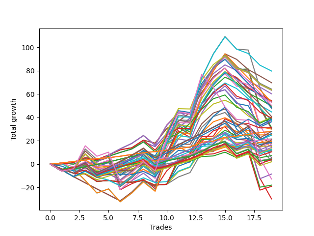

# Short Bulldog 005 DB 
- Symbol: ES
- Date Range: 03/18/2022 - 07/15/2022
- Trading Period: 7:20-12:30
- Number of Trades: 19



| Name | Win Percent | Profit | Avg Profit / Trade | Avg Time / Trade |      | Name | Win Percent | Profit | Avg Profit / Trade | Avg Time / Trade |
| ---- | ----------- | ------ | ------------------ | ---------------- | ---- | ---- | ----------- | ------ | ------------------ | ---------------- |
| Sorted By <br> Profit | | | | | | Sorted By <br> Win Percentage ||||
| Seventy-One | 47.37 | 39875.00 | 2098.68 | 18:05 |     | One Hundred Twenty-Six | 100.00 | 14000.00 | 736.84 | 02:07 |
| Forty-Seven | 36.84 | 34875.00 | 1835.53 | 16:17 |     | One Hundred Twenty-One | 100.00 | 14000.00 | 736.84 | 02:07 |
| Sixty-Nine | 47.37 | 32125.00 | 1690.79 | 15:49 |     | Eighty-One | 100.00 | 14000.00 | 736.84 | 02:07 |
| Seventy | 47.37 | 31750.00 | 1671.05 | 15:56 |     | One Hundred Eleven | 94.74 | 10750.00 | 565.79 | 01:12 |
| Sixty-Six | 63.16 | 31625.00 | 1664.47 | 13:01 |     | One Hundred Sixteen | 94.74 | 9750.00 | 513.16 | 01:13 |
| Forty-Six | 42.11 | 30125.00 | 1585.53 | 14:04 |     | One Hundred Twenty-Two | 78.95 | 2375.00 | 125.00 | 05:40 |
| Forty-Five | 36.84 | 27125.00 | 1427.63 | 14:02 |     | One Hundred Twenty-Seven | 78.95 | 2125.00 | 111.84 | 04:54 |
| Forty-Two | 52.63 | 26750.00 | 1407.89 | 12:00 |     | Eighty-Two | 78.95 | -9000.00 | -473.68 | 08:26 |
| Sixty-Eight | 47.37 | 26500.00 | 1394.74 | 14:56 |     | One Hundred Thirty | 73.68 | 14000.00 | 736.84 | 09:12 |
| Sixty-Three | 47.37 | 26500.00 | 1394.74 | 21:07 |     | One Hundred Twenty-Five | 73.68 | 13125.00 | 690.79 | 10:01 |
| Fifty-Eight | 63.16 | 25125.00 | 1322.37 | 15:31 |     | One Hundred Twenty-Nine | 73.68 | 7125.00 | 375.00 | 07:40 |
| Forty-Four | 42.11 | 24875.00 | 1309.21 | 13:04 |     | One Hundred Twenty-Four | 73.68 | 6250.00 | 328.95 | 08:29 |
| Sixty-Two | 52.63 | 24125.00 | 1269.74 | 18:53 |     | One Hundred Twelve | 73.68 | 6000.00 | 315.79 | 03:27 |
| Seven | 52.63 | 23750.00 | 1250.00 | 26:53 |     | One Hundred Seventeen | 73.68 | 3625.00 | 190.79 | 02:31 |
| Forty-One | 63.16 | 22375.00 | 1177.63 | 10:10 |     | Eighty-Five | 73.68 | 2625.00 | 138.16 | 12:50 |
| Fifty-Seven | 68.42 | 20375.00 | 1072.37 | 12:25 |     | One Hundred Twenty-Eight | 73.68 | 1875.00 | 98.68 | 07:01 |
| Forty | 68.42 | 20125.00 | 1059.21 | 05:48 |     | One Hundred Twenty-Three | 73.68 | 1000.00 | 52.63 | 07:50 |
| Sixty-Four | 68.42 | 19750.00 | 1039.47 | 07:06 |     | Eighty-Four | 73.68 | -4250.00 | -223.68 | 11:17 |
| Sixty-Five | 63.16 | 19750.00 | 1039.47 | 11:05 |     | Eighty-Three | 73.68 | -9500.00 | -500.00 | 10:38 |
| One Hundred Fifteen | 68.42 | 19250.00 | 1013.16 | 06:19 |     | Fifty-Seven | 68.42 | 20375.00 | 1072.37 | 12:25 |
| Sixty | 52.63 | 18875.00 | 993.42 | 17:53 |     | Forty | 68.42 | 20125.00 | 1059.21 | 05:48 |
| Fifty-Six | 68.42 | 18750.00 | 986.84 | 07:48 |     | Sixty-Four | 68.42 | 19750.00 | 1039.47 | 07:06 |
| Sixty-One | 47.37 | 18750.00 | 986.84 | 18:51 |     | One Hundred Fifteen | 68.42 | 19250.00 | 1013.16 | 06:19 |
| Zero | 68.42 | 18125.00 | 953.95 | 09:52 |     | Fifty-Six | 68.42 | 18750.00 | 986.84 | 07:48 |
| Two | 68.42 | 15625.00 | 822.37 | 20:06 |     | Zero | 68.42 | 18125.00 | 953.95 | 09:52 |
| Fifty-Five | 52.63 | 15625.00 | 822.37 | 07:02 |     | Two | 68.42 | 15625.00 | 822.37 | 20:06 |
| Five | 52.63 | 15125.00 | 796.05 | 24:37 |     | One | 68.42 | 15000.00 | 789.47 | 16:37 |
| One | 68.42 | 15000.00 | 789.47 | 16:37 |     | One Hundred Fourteen | 68.42 | 12375.00 | 651.32 | 04:46 |
| One Hundred Twenty-Six | 100.00 | 14000.00 | 736.84 | 02:07 |     | One Hundred Thirteen | 68.42 | 6500.00 | 342.11 | 04:08 |
| One Hundred Twenty-One | 100.00 | 14000.00 | 736.84 | 02:07 |     | One Hundred Eighteen | 68.42 | 5250.00 | 276.32 | 03:10 |
| Eighty-One | 100.00 | 14000.00 | 736.84 | 02:07 |     | Sixty-Six | 63.16 | 31625.00 | 1664.47 | 13:01 |
| One Hundred Thirty | 73.68 | 14000.00 | 736.84 | 09:12 |     | Fifty-Eight | 63.16 | 25125.00 | 1322.37 | 15:31 |
| One Hundred Twenty-Five | 73.68 | 13125.00 | 690.79 | 10:01 |     | Forty-One | 63.16 | 22375.00 | 1177.63 | 10:10 |
| Fifty-Three | 52.63 | 12625.00 | 664.47 | 06:26 |     | Sixty-Five | 63.16 | 19750.00 | 1039.47 | 11:05 |
| One Hundred Fourteen | 68.42 | 12375.00 | 651.32 | 04:46 |     | Forty-Eight | 63.16 | 9375.00 | 493.42 | 04:12 |
| One Hundred Eleven | 94.74 | 10750.00 | 565.79 | 01:12 |     | One Hundred Ninteen | 63.16 | 8125.00 | 427.63 | 03:34 |
| Fifty-Four | 52.63 | 10750.00 | 565.79 | 06:23 |     | One Hundred Twenty | 57.89 | 10375.00 | 546.05 | 04:00 |
| One Hundred Twenty | 57.89 | 10375.00 | 546.05 | 04:00 |     | Forty-Two | 52.63 | 26750.00 | 1407.89 | 12:00 |
| One Hundred Sixteen | 94.74 | 9750.00 | 513.16 | 01:13 |     | Sixty-Two | 52.63 | 24125.00 | 1269.74 | 18:53 |
| Forty-Eight | 63.16 | 9375.00 | 493.42 | 04:12 |     | Seven | 52.63 | 23750.00 | 1250.00 | 26:53 |
| Seventy-Three | 52.63 | 9250.00 | 486.84 | 09:17 |     | Sixty | 52.63 | 18875.00 | 993.42 | 17:53 |
| Fifty-Two | 52.63 | 9250.00 | 486.84 | 06:14 |     | Fifty-Five | 52.63 | 15625.00 | 822.37 | 07:02 |
| Sixty-Seven | 47.37 | 9000.00 | 473.68 | 13:07 |     | Five | 52.63 | 15125.00 | 796.05 | 24:37 |
| One Hundred Ninteen | 63.16 | 8125.00 | 427.63 | 03:34 |     | Fifty-Three | 52.63 | 12625.00 | 664.47 | 06:26 |
| Six | 52.63 | 7875.00 | 414.47 | 24:15 |     | Fifty-Four | 52.63 | 10750.00 | 565.79 | 06:23 |
| Fifty | 52.63 | 7750.00 | 407.89 | 06:08 |     | Seventy-Three | 52.63 | 9250.00 | 486.84 | 09:17 |
| Forty-Three | 42.11 | 7500.00 | 394.74 | 11:23 |     | Fifty-Two | 52.63 | 9250.00 | 486.84 | 06:14 |
| One Hundred Twenty-Nine | 73.68 | 7125.00 | 375.00 | 07:40 |     | Six | 52.63 | 7875.00 | 414.47 | 24:15 |
| One Hundred Thirteen | 68.42 | 6500.00 | 342.11 | 04:08 |     | Fifty | 52.63 | 7750.00 | 407.89 | 06:08 |
| One Hundred Twenty-Four | 73.68 | 6250.00 | 328.95 | 08:29 |     | Fifty-One | 52.63 | 5875.00 | 309.21 | 05:29 |
| One Hundred Twelve | 73.68 | 6000.00 | 315.79 | 03:27 |     | Forty-Nine | 52.63 | 5375.00 | 282.89 | 05:42 |
| Fifty-One | 52.63 | 5875.00 | 309.21 | 05:29 |     | Four | 52.63 | 2625.00 | 138.16 | 23:15 |
| Forty-Nine | 52.63 | 5375.00 | 282.89 | 05:42 |     | Fifty-Nine | 52.63 | 1375.00 | 72.37 | 16:04 |
| One Hundred Eighteen | 68.42 | 5250.00 | 276.32 | 03:10 |     | Three | 52.63 | -14875.00 | -782.89 | 21:26 |
| One Hundred Seventeen | 73.68 | 3625.00 | 190.79 | 02:31 |     | Seventy-One | 47.37 | 39875.00 | 2098.68 | 18:05 |
| Eighty-Five | 73.68 | 2625.00 | 138.16 | 12:50 |     | Sixty-Nine | 47.37 | 32125.00 | 1690.79 | 15:49 |
| Four | 52.63 | 2625.00 | 138.16 | 23:15 |     | Seventy | 47.37 | 31750.00 | 1671.05 | 15:56 |
| One Hundred Twenty-Two | 78.95 | 2375.00 | 125.00 | 05:40 |     | Sixty-Eight | 47.37 | 26500.00 | 1394.74 | 14:56 |
| One Hundred Twenty-Seven | 78.95 | 2125.00 | 111.84 | 04:54 |     | Sixty-Three | 47.37 | 26500.00 | 1394.74 | 21:07 |
| One Hundred Twenty-Eight | 73.68 | 1875.00 | 98.68 | 07:01 |     | Sixty-One | 47.37 | 18750.00 | 986.84 | 18:51 |
| Fifty-Nine | 52.63 | 1375.00 | 72.37 | 16:04 |     | Sixty-Seven | 47.37 | 9000.00 | 473.68 | 13:07 |
| One Hundred Twenty-Three | 73.68 | 1000.00 | 52.63 | 07:50 |     | Forty-Six | 42.11 | 30125.00 | 1585.53 | 14:04 |
| Eighty-Four | 73.68 | -4250.00 | -223.68 | 11:17 |     | Forty-Four | 42.11 | 24875.00 | 1309.21 | 13:04 |
| TEST | 42.11 | -6375.00 | -335.53 | 29:55 |     | Forty-Three | 42.11 | 7500.00 | 394.74 | 11:23 |
| Eighty-Two | 78.95 | -9000.00 | -473.68 | 08:26 |     | TEST | 42.11 | -6375.00 | -335.53 | 29:55 |
| Eighty-Three | 73.68 | -9500.00 | -500.00 | 10:38 |     | Forty-Seven | 36.84 | 34875.00 | 1835.53 | 16:17 |
| Three | 52.63 | -14875.00 | -782.89 | 21:26 |     | Forty-Five | 36.84 | 27125.00 | 1427.63 | 14:02 |

## NO STOPLOSS

### Test Zero
* Sell when price hits the middle line of the 20p bollinger
* No Stoploss
* Results:
```
Total Trades: 19
Percent Up: 31.58
Percent Down: 68.42
Total Points Moved Down: 36.25
Potential Profit: 18125.00
Total Points Ups: 38.75 Count Ups: 6
Total Points Downs: 75.00 Count Downs: 13
```

<details><summary>Trades</summary>

<code>In: 2022-03-29 11:38:00		Out: 2022-03-29 11:50:50		Total Position Time: 12:50		Total Move Down: 1.00		Total to Date: 1.00</code> <br />
<code>In: 2022-03-31 07:48:00		Out: 2022-03-31 08:03:05		Total Position Time: 15:05		Total Move Down: -1.00		Total to Date: 0.00</code> <br />
<code>In: 2022-04-06 10:43:00		Out: 2022-04-06 10:47:10		Total Position Time: 04:10		Total Move Down: 4.50		Total to Date: 4.50</code> <br />
<code>In: 2022-04-07 10:58:00		Out: 2022-04-07 11:15:20		Total Position Time: 17:20		Total Move Down: -1.75		Total to Date: 2.75</code> <br />
<code>In: 2022-04-07 11:03:00		Out: 2022-04-07 11:15:20		Total Position Time: 12:20		Total Move Down: 4.00		Total to Date: 6.75</code> <br />
<code>In: 2022-04-08 07:33:00		Out: 2022-04-08 07:44:35		Total Position Time: 11:35		Total Move Down: 3.25		Total to Date: 10.00</code> <br />
<code>In: 2022-04-18 07:27:00		Out: 2022-04-18 07:36:45		Total Position Time: 09:45		Total Move Down: 3.00		Total to Date: 13.00</code> <br />
<code>In: 2022-04-18 11:26:00		Out: 2022-04-18 11:28:05		Total Position Time: 02:05		Total Move Down: 6.00		Total to Date: 19.00</code> <br />
<code>In: 2022-05-04 09:24:00		Out: 2022-05-04 09:45:30		Total Position Time: 21:30		Total Move Down: -4.00		Total to Date: 15.00</code> <br />
<code>In: 2022-05-24 09:17:00		Out: 2022-05-24 09:21:35		Total Position Time: 04:35		Total Move Down: 11.00		Total to Date: 26.00</code> <br />
<code>In: 2022-05-24 09:18:00		Out: 2022-05-24 09:21:35		Total Position Time: 03:35		Total Move Down: 4.75		Total to Date: 30.75</code> <br />
<code>In: 2022-05-31 07:23:00		Out: 2022-05-31 07:30:05		Total Position Time: 07:05		Total Move Down: 8.75		Total to Date: 39.50</code> <br />
<code>In: 2022-06-13 09:40:00		Out: 2022-06-13 09:43:15		Total Position Time: 03:15		Total Move Down: 12.00		Total to Date: 51.50</code> <br />
<code>In: 2022-07-06 11:09:00		Out: 2022-07-06 11:10:10		Total Position Time: 01:10		Total Move Down: 9.00		Total to Date: 60.50</code> <br />
<code>In: 2022-07-06 11:10:00		Out: 2022-07-06 11:10:10		Total Position Time: 00:10		Total Move Down: 3.25		Total to Date: 63.75</code> <br />
<code>In: 2022-07-06 11:31:00		Out: 2022-07-06 11:50:00		Total Position Time: 19:00		Total Move Down: -11.75		Total to Date: 52.00</code> <br />
<code>In: 2022-07-06 11:35:00		Out: 2022-07-06 11:50:00		Total Position Time: 15:00		Total Move Down: -2.00		Total to Date: 50.00</code> <br />
<code>In: 2022-07-13 07:37:00		Out: 2022-07-13 08:00:30		Total Position Time: 23:30		Total Move Down: -18.25		Total to Date: 31.75</code> <br />
<code>In: 2022-07-14 08:12:00		Out: 2022-07-14 08:15:30		Total Position Time: 03:30		Total Move Down: 4.50		Total to Date: 36.25</code> <br />


</details>

### Test One
* Sell when the price hits the upper line of the 20p 1std bollinger
* No Stoploss
* Results:
```
Total Trades: 19
Percent Up: 31.58
Percent Down: 68.42
Total Points Moved Down: 30.00
Potential Profit: 15000.00
Total Points Ups: 56.50 Count Ups: 6
Total Points Downs: 86.50 Count Downs: 13
```

<details><summary>Trades</summary>

<code>In: 2022-03-29 11:38:00		Out: 2022-03-29 12:00:25		Total Position Time: 22:25		Total Move Down: 0.25		Total to Date: 0.25</code> <br />
<code>In: 2022-03-31 07:48:00		Out: 2022-03-31 08:03:30		Total Position Time: 15:30		Total Move Down: 1.25		Total to Date: 1.50</code> <br />
<code>In: 2022-04-06 10:43:00		Out: 2022-04-06 10:56:55		Total Position Time: 13:55		Total Move Down: 4.00		Total to Date: 5.50</code> <br />
<code>In: 2022-04-07 10:58:00		Out: 2022-04-07 11:16:10		Total Position Time: 18:10		Total Move Down: -1.75		Total to Date: 3.75</code> <br />
<code>In: 2022-04-07 11:03:00		Out: 2022-04-07 11:16:10		Total Position Time: 13:10		Total Move Down: 4.00		Total to Date: 7.75</code> <br />
<code>In: 2022-04-08 07:33:00		Out: 2022-04-08 07:45:55		Total Position Time: 12:55		Total Move Down: 4.50		Total to Date: 12.25</code> <br />
<code>In: 2022-04-18 07:27:00		Out: 2022-04-18 07:51:15		Total Position Time: 24:15		Total Move Down: 1.75		Total to Date: 14.00</code> <br />
<code>In: 2022-04-18 11:26:00		Out: 2022-04-18 11:41:15		Total Position Time: 15:15		Total Move Down: 6.50		Total to Date: 20.50</code> <br />
<code>In: 2022-05-04 09:24:00		Out: 2022-05-04 09:46:30		Total Position Time: 22:30		Total Move Down: -2.50		Total to Date: 18.00</code> <br />
<code>In: 2022-05-24 09:17:00		Out: 2022-05-24 09:28:55		Total Position Time: 11:55		Total Move Down: 12.50		Total to Date: 30.50</code> <br />
<code>In: 2022-05-24 09:18:00		Out: 2022-05-24 09:28:55		Total Position Time: 10:55		Total Move Down: 6.25		Total to Date: 36.75</code> <br />
<code>In: 2022-05-31 07:23:00		Out: 2022-05-31 07:38:05		Total Position Time: 15:05		Total Move Down: 7.25		Total to Date: 44.00</code> <br />
<code>In: 2022-06-13 09:40:00		Out: 2022-06-13 09:47:50		Total Position Time: 07:50		Total Move Down: 17.50		Total to Date: 61.50</code> <br />
<code>In: 2022-07-06 11:09:00		Out: 2022-07-06 11:11:10		Total Position Time: 02:10		Total Move Down: 13.25		Total to Date: 74.75</code> <br />
<code>In: 2022-07-06 11:10:00		Out: 2022-07-06 11:11:10		Total Position Time: 01:10		Total Move Down: 7.50		Total to Date: 82.25</code> <br />
<code>In: 2022-07-06 11:31:00		Out: 2022-07-06 12:00:30		Total Position Time: 29:30		Total Move Down: -13.75		Total to Date: 68.50</code> <br />
<code>In: 2022-07-06 11:35:00		Out: 2022-07-06 12:00:30		Total Position Time: 25:30		Total Move Down: -4.00		Total to Date: 64.50</code> <br />
<code>In: 2022-07-13 07:37:00		Out: 2022-07-13 08:06:55		Total Position Time: 29:55		Total Move Down: -32.50		Total to Date: 32.00</code> <br />
<code>In: 2022-07-14 08:12:00		Out: 2022-07-14 08:35:50		Total Position Time: 23:50		Total Move Down: -2.00		Total to Date: 30.00</code> <br />


</details>

### Test Two
* Sell when the price hits the upper line of the 20p 2std bollinger
* No Stoploss
* Results:
```
Total Trades: 19
Percent Up: 31.58
Percent Down: 68.42
Total Points Moved Down: 31.25
Potential Profit: 15625.00
Total Points Ups: 76.50 Count Ups: 6
Total Points Downs: 107.75 Count Downs: 13
```

<details><summary>Trades</summary>

<code>In: 2022-03-29 11:38:00		Out: 2022-03-29 12:07:55		Total Position Time: 29:55		Total Move Down: -6.00		Total to Date: -6.00</code> <br />
<code>In: 2022-03-31 07:48:00		Out: 2022-03-31 08:08:30		Total Position Time: 20:30		Total Move Down: 2.50		Total to Date: -3.50</code> <br />
<code>In: 2022-04-06 10:43:00		Out: 2022-04-06 10:57:20		Total Position Time: 14:20		Total Move Down: 5.00		Total to Date: 1.50</code> <br />
<code>In: 2022-04-07 10:58:00		Out: 2022-04-07 11:18:20		Total Position Time: 20:20		Total Move Down: 0.25		Total to Date: 1.75</code> <br />
<code>In: 2022-04-07 11:03:00		Out: 2022-04-07 11:18:20		Total Position Time: 15:20		Total Move Down: 6.00		Total to Date: 7.75</code> <br />
<code>In: 2022-04-08 07:33:00		Out: 2022-04-08 07:49:20		Total Position Time: 16:20		Total Move Down: 5.25		Total to Date: 13.00</code> <br />
<code>In: 2022-04-18 07:27:00		Out: 2022-04-18 07:51:45		Total Position Time: 24:45		Total Move Down: 4.75		Total to Date: 17.75</code> <br />
<code>In: 2022-04-18 11:26:00		Out: 2022-04-18 11:44:10		Total Position Time: 18:10		Total Move Down: 6.75		Total to Date: 24.50</code> <br />
<code>In: 2022-05-04 09:24:00		Out: 2022-05-04 09:53:55		Total Position Time: 29:55		Total Move Down: -8.00		Total to Date: 16.50</code> <br />
<code>In: 2022-05-24 09:17:00		Out: 2022-05-24 09:31:20		Total Position Time: 14:20		Total Move Down: 17.00		Total to Date: 33.50</code> <br />
<code>In: 2022-05-24 09:18:00		Out: 2022-05-24 09:31:20		Total Position Time: 13:20		Total Move Down: 10.75		Total to Date: 44.25</code> <br />
<code>In: 2022-05-31 07:23:00		Out: 2022-05-31 07:52:55		Total Position Time: 29:55		Total Move Down: -1.50		Total to Date: 42.75</code> <br />
<code>In: 2022-06-13 09:40:00		Out: 2022-06-13 09:54:20		Total Position Time: 14:20		Total Move Down: 22.25		Total to Date: 65.00</code> <br />
<code>In: 2022-07-06 11:09:00		Out: 2022-07-06 11:11:45		Total Position Time: 02:45		Total Move Down: 16.25		Total to Date: 81.25</code> <br />
<code>In: 2022-07-06 11:10:00		Out: 2022-07-06 11:11:45		Total Position Time: 01:45		Total Move Down: 10.50		Total to Date: 91.75</code> <br />
<code>In: 2022-07-06 11:31:00		Out: 2022-07-06 12:00:55		Total Position Time: 29:55		Total Move Down: -10.75		Total to Date: 81.00</code> <br />
<code>In: 2022-07-06 11:35:00		Out: 2022-07-06 12:01:25		Total Position Time: 26:25		Total Move Down: 0.50		Total to Date: 81.50</code> <br />
<code>In: 2022-07-13 07:37:00		Out: 2022-07-13 08:06:55		Total Position Time: 29:55		Total Move Down: -32.50		Total to Date: 49.00</code> <br />
<code>In: 2022-07-14 08:12:00		Out: 2022-07-14 08:41:55		Total Position Time: 29:55		Total Move Down: -17.75		Total to Date: 31.25</code> <br />


</details>

### Test Three
* Sell when price hits the middle line of the 50p bollinger
* No Stoploss
* Results:
```
Total Trades: 19
Percent Up: 47.37
Percent Down: 52.63
Total Points Moved Down: -29.75
Potential Profit: -14875.00
Total Points Ups: 111.25 Count Ups: 9
Total Points Downs: 81.50 Count Downs: 10
```

<details><summary>Trades</summary>

<code>In: 2022-03-29 11:38:00		Out: 2022-03-29 12:07:55		Total Position Time: 29:55		Total Move Down: -6.00		Total to Date: -6.00</code> <br />
<code>In: 2022-03-31 07:48:00		Out: 2022-03-31 08:15:35		Total Position Time: 27:35		Total Move Down: 1.75		Total to Date: -4.25</code> <br />
<code>In: 2022-04-06 10:43:00		Out: 2022-04-06 11:00:10		Total Position Time: 17:10		Total Move Down: 12.75		Total to Date: 8.50</code> <br />
<code>In: 2022-04-07 10:58:00		Out: 2022-04-07 11:27:55		Total Position Time: 29:55		Total Move Down: -9.00		Total to Date: -0.50</code> <br />
<code>In: 2022-04-07 11:03:00		Out: 2022-04-07 11:32:55		Total Position Time: 29:55		Total Move Down: 3.50		Total to Date: 3.00</code> <br />
<code>In: 2022-04-08 07:33:00		Out: 2022-04-08 08:02:55		Total Position Time: 29:55		Total Move Down: -25.00		Total to Date: -22.00</code> <br />
<code>In: 2022-04-18 07:27:00		Out: 2022-04-18 07:51:50		Total Position Time: 24:50		Total Move Down: 5.25		Total to Date: -16.75</code> <br />
<code>In: 2022-04-18 11:26:00		Out: 2022-04-18 11:27:45		Total Position Time: 01:45		Total Move Down: 3.75		Total to Date: -13.00</code> <br />
<code>In: 2022-05-04 09:24:00		Out: 2022-05-04 09:53:55		Total Position Time: 29:55		Total Move Down: -8.00		Total to Date: -21.00</code> <br />
<code>In: 2022-05-24 09:17:00		Out: 2022-05-24 09:31:15		Total Position Time: 14:15		Total Move Down: 15.25		Total to Date: -5.75</code> <br />
<code>In: 2022-05-24 09:18:00		Out: 2022-05-24 09:31:15		Total Position Time: 13:15		Total Move Down: 9.00		Total to Date: 3.25</code> <br />
<code>In: 2022-05-31 07:23:00		Out: 2022-05-31 07:52:55		Total Position Time: 29:55		Total Move Down: -1.50		Total to Date: 1.75</code> <br />
<code>In: 2022-06-13 09:40:00		Out: 2022-06-13 09:47:50		Total Position Time: 07:50		Total Move Down: 17.50		Total to Date: 19.25</code> <br />
<code>In: 2022-07-06 11:09:00		Out: 2022-07-06 11:10:20		Total Position Time: 01:20		Total Move Down: 9.25		Total to Date: 28.50</code> <br />
<code>In: 2022-07-06 11:10:00		Out: 2022-07-06 11:10:20		Total Position Time: 00:20		Total Move Down: 3.50		Total to Date: 32.00</code> <br />
<code>In: 2022-07-06 11:31:00		Out: 2022-07-06 12:00:55		Total Position Time: 29:55		Total Move Down: -10.75		Total to Date: 21.25</code> <br />
<code>In: 2022-07-06 11:35:00		Out: 2022-07-06 12:04:55		Total Position Time: 29:55		Total Move Down: -0.75		Total to Date: 20.50</code> <br />
<code>In: 2022-07-13 07:37:00		Out: 2022-07-13 08:06:55		Total Position Time: 29:55		Total Move Down: -32.50		Total to Date: -12.00</code> <br />
<code>In: 2022-07-14 08:12:00		Out: 2022-07-14 08:41:55		Total Position Time: 29:55		Total Move Down: -17.75		Total to Date: -29.75</code> <br />


</details>

### Test Four
* Sell when the price hits the upper line of the 50p 1std bollinger
* No Stoploss
* Results:
```
Total Trades: 19
Percent Up: 47.37
Percent Down: 52.63
Total Points Moved Down: 5.25
Potential Profit: 2625.00
Total Points Ups: 111.25 Count Ups: 9
Total Points Downs: 116.50 Count Downs: 10
```

<details><summary>Trades</summary>

<code>In: 2022-03-29 11:38:00		Out: 2022-03-29 12:07:55		Total Position Time: 29:55		Total Move Down: -6.00		Total to Date: -6.00</code> <br />
<code>In: 2022-03-31 07:48:00		Out: 2022-03-31 08:17:55		Total Position Time: 29:55		Total Move Down: 2.00		Total to Date: -4.00</code> <br />
<code>In: 2022-04-06 10:43:00		Out: 2022-04-06 11:00:10		Total Position Time: 17:10		Total Move Down: 12.75		Total to Date: 8.75</code> <br />
<code>In: 2022-04-07 10:58:00		Out: 2022-04-07 11:27:55		Total Position Time: 29:55		Total Move Down: -9.00		Total to Date: -0.25</code> <br />
<code>In: 2022-04-07 11:03:00		Out: 2022-04-07 11:32:55		Total Position Time: 29:55		Total Move Down: 3.50		Total to Date: 3.25</code> <br />
<code>In: 2022-04-08 07:33:00		Out: 2022-04-08 08:02:55		Total Position Time: 29:55		Total Move Down: -25.00		Total to Date: -21.75</code> <br />
<code>In: 2022-04-18 07:27:00		Out: 2022-04-18 07:56:55		Total Position Time: 29:55		Total Move Down: 7.50		Total to Date: -14.25</code> <br />
<code>In: 2022-04-18 11:26:00		Out: 2022-04-18 11:41:20		Total Position Time: 15:20		Total Move Down: 6.50		Total to Date: -7.75</code> <br />
<code>In: 2022-05-04 09:24:00		Out: 2022-05-04 09:53:55		Total Position Time: 29:55		Total Move Down: -8.00		Total to Date: -15.75</code> <br />
<code>In: 2022-05-24 09:17:00		Out: 2022-05-24 09:33:20		Total Position Time: 16:20		Total Move Down: 21.75		Total to Date: 6.00</code> <br />
<code>In: 2022-05-24 09:18:00		Out: 2022-05-24 09:33:20		Total Position Time: 15:20		Total Move Down: 15.50		Total to Date: 21.50</code> <br />
<code>In: 2022-05-31 07:23:00		Out: 2022-05-31 07:52:55		Total Position Time: 29:55		Total Move Down: -1.50		Total to Date: 20.00</code> <br />
<code>In: 2022-06-13 09:40:00		Out: 2022-06-13 09:54:40		Total Position Time: 14:40		Total Move Down: 23.75		Total to Date: 43.75</code> <br />
<code>In: 2022-07-06 11:09:00		Out: 2022-07-06 11:11:35		Total Position Time: 02:35		Total Move Down: 14.50		Total to Date: 58.25</code> <br />
<code>In: 2022-07-06 11:10:00		Out: 2022-07-06 11:11:35		Total Position Time: 01:35		Total Move Down: 8.75		Total to Date: 67.00</code> <br />
<code>In: 2022-07-06 11:31:00		Out: 2022-07-06 12:00:55		Total Position Time: 29:55		Total Move Down: -10.75		Total to Date: 56.25</code> <br />
<code>In: 2022-07-06 11:35:00		Out: 2022-07-06 12:04:55		Total Position Time: 29:55		Total Move Down: -0.75		Total to Date: 55.50</code> <br />
<code>In: 2022-07-13 07:37:00		Out: 2022-07-13 08:06:55		Total Position Time: 29:55		Total Move Down: -32.50		Total to Date: 23.00</code> <br />
<code>In: 2022-07-14 08:12:00		Out: 2022-07-14 08:41:55		Total Position Time: 29:55		Total Move Down: -17.75		Total to Date: 5.25</code> <br />


</details>

### Test Five
* Sell when the price hits the upper line of the 50p 2std bollinger
* No Stoploss
* Results:
```
Total Trades: 19
Percent Up: 47.37
Percent Down: 52.63
Total Points Moved Down: 30.25
Potential Profit: 15125.00
Total Points Ups: 111.25 Count Ups: 9
Total Points Downs: 141.50 Count Downs: 10
```

<details><summary>Trades</summary>

<code>In: 2022-03-29 11:38:00		Out: 2022-03-29 12:07:55		Total Position Time: 29:55		Total Move Down: -6.00		Total to Date: -6.00</code> <br />
<code>In: 2022-03-31 07:48:00		Out: 2022-03-31 08:17:55		Total Position Time: 29:55		Total Move Down: 2.00		Total to Date: -4.00</code> <br />
<code>In: 2022-04-06 10:43:00		Out: 2022-04-06 11:09:35		Total Position Time: 26:35		Total Move Down: 15.25		Total to Date: 11.25</code> <br />
<code>In: 2022-04-07 10:58:00		Out: 2022-04-07 11:27:55		Total Position Time: 29:55		Total Move Down: -9.00		Total to Date: 2.25</code> <br />
<code>In: 2022-04-07 11:03:00		Out: 2022-04-07 11:32:55		Total Position Time: 29:55		Total Move Down: 3.50		Total to Date: 5.75</code> <br />
<code>In: 2022-04-08 07:33:00		Out: 2022-04-08 08:02:55		Total Position Time: 29:55		Total Move Down: -25.00		Total to Date: -19.25</code> <br />
<code>In: 2022-04-18 07:27:00		Out: 2022-04-18 07:56:55		Total Position Time: 29:55		Total Move Down: 7.50		Total to Date: -11.75</code> <br />
<code>In: 2022-04-18 11:26:00		Out: 2022-04-18 11:47:00		Total Position Time: 21:00		Total Move Down: 10.00		Total to Date: -1.75</code> <br />
<code>In: 2022-05-04 09:24:00		Out: 2022-05-04 09:53:55		Total Position Time: 29:55		Total Move Down: -8.00		Total to Date: -9.75</code> <br />
<code>In: 2022-05-24 09:17:00		Out: 2022-05-24 09:36:50		Total Position Time: 19:50		Total Move Down: 26.75		Total to Date: 17.00</code> <br />
<code>In: 2022-05-24 09:18:00		Out: 2022-05-24 09:36:50		Total Position Time: 18:50		Total Move Down: 20.50		Total to Date: 37.50</code> <br />
<code>In: 2022-05-31 07:23:00		Out: 2022-05-31 07:52:55		Total Position Time: 29:55		Total Move Down: -1.50		Total to Date: 36.00</code> <br />
<code>In: 2022-06-13 09:40:00		Out: 2022-06-13 09:58:05		Total Position Time: 18:05		Total Move Down: 29.25		Total to Date: 65.25</code> <br />
<code>In: 2022-07-06 11:09:00		Out: 2022-07-06 11:11:50		Total Position Time: 02:50		Total Move Down: 16.25		Total to Date: 81.50</code> <br />
<code>In: 2022-07-06 11:10:00		Out: 2022-07-06 11:11:50		Total Position Time: 01:50		Total Move Down: 10.50		Total to Date: 92.00</code> <br />
<code>In: 2022-07-06 11:31:00		Out: 2022-07-06 12:00:55		Total Position Time: 29:55		Total Move Down: -10.75		Total to Date: 81.25</code> <br />
<code>In: 2022-07-06 11:35:00		Out: 2022-07-06 12:04:55		Total Position Time: 29:55		Total Move Down: -0.75		Total to Date: 80.50</code> <br />
<code>In: 2022-07-13 07:37:00		Out: 2022-07-13 08:06:55		Total Position Time: 29:55		Total Move Down: -32.50		Total to Date: 48.00</code> <br />
<code>In: 2022-07-14 08:12:00		Out: 2022-07-14 08:41:55		Total Position Time: 29:55		Total Move Down: -17.75		Total to Date: 30.25</code> <br />


</details>

### Test Six
* Sell when the price hits the middle line of the 1std VWAP
* No Stoploss
* Results:
```
Total Trades: 19
Percent Up: 47.37
Percent Down: 52.63
Total Points Moved Down: 15.75
Potential Profit: 7875.00
Total Points Ups: 111.25 Count Ups: 9
Total Points Downs: 127.00 Count Downs: 10
```

<details><summary>Trades</summary>

<code>In: 2022-03-29 11:38:00		Out: 2022-03-29 12:07:55		Total Position Time: 29:55		Total Move Down: -6.00		Total to Date: -6.00</code> <br />
<code>In: 2022-03-31 07:48:00		Out: 2022-03-31 08:17:55		Total Position Time: 29:55		Total Move Down: 2.00		Total to Date: -4.00</code> <br />
<code>In: 2022-04-06 10:43:00		Out: 2022-04-06 11:00:10		Total Position Time: 17:10		Total Move Down: 12.75		Total to Date: 8.75</code> <br />
<code>In: 2022-04-07 10:58:00		Out: 2022-04-07 11:27:55		Total Position Time: 29:55		Total Move Down: -9.00		Total to Date: -0.25</code> <br />
<code>In: 2022-04-07 11:03:00		Out: 2022-04-07 11:32:55		Total Position Time: 29:55		Total Move Down: 3.50		Total to Date: 3.25</code> <br />
<code>In: 2022-04-08 07:33:00		Out: 2022-04-08 08:02:55		Total Position Time: 29:55		Total Move Down: -25.00		Total to Date: -21.75</code> <br />
<code>In: 2022-04-18 07:27:00		Out: 2022-04-18 07:55:15		Total Position Time: 28:15		Total Move Down: 8.00		Total to Date: -13.75</code> <br />
<code>In: 2022-04-18 11:26:00		Out: 2022-04-18 11:55:55		Total Position Time: 29:55		Total Move Down: 9.50		Total to Date: -4.25</code> <br />
<code>In: 2022-05-04 09:24:00		Out: 2022-05-04 09:53:55		Total Position Time: 29:55		Total Move Down: -8.00		Total to Date: -12.25</code> <br />
<code>In: 2022-05-24 09:17:00		Out: 2022-05-24 09:36:45		Total Position Time: 19:45		Total Move Down: 26.00		Total to Date: 13.75</code> <br />
<code>In: 2022-05-24 09:18:00		Out: 2022-05-24 09:36:45		Total Position Time: 18:45		Total Move Down: 19.75		Total to Date: 33.50</code> <br />
<code>In: 2022-05-31 07:23:00		Out: 2022-05-31 07:52:55		Total Position Time: 29:55		Total Move Down: -1.50		Total to Date: 32.00</code> <br />
<code>In: 2022-06-13 09:40:00		Out: 2022-06-13 09:54:45		Total Position Time: 14:45		Total Move Down: 24.75		Total to Date: 56.75</code> <br />
<code>In: 2022-07-06 11:09:00		Out: 2022-07-06 11:11:10		Total Position Time: 02:10		Total Move Down: 13.25		Total to Date: 70.00</code> <br />
<code>In: 2022-07-06 11:10:00		Out: 2022-07-06 11:11:10		Total Position Time: 01:10		Total Move Down: 7.50		Total to Date: 77.50</code> <br />
<code>In: 2022-07-06 11:31:00		Out: 2022-07-06 12:00:55		Total Position Time: 29:55		Total Move Down: -10.75		Total to Date: 66.75</code> <br />
<code>In: 2022-07-06 11:35:00		Out: 2022-07-06 12:04:55		Total Position Time: 29:55		Total Move Down: -0.75		Total to Date: 66.00</code> <br />
<code>In: 2022-07-13 07:37:00		Out: 2022-07-13 08:06:55		Total Position Time: 29:55		Total Move Down: -32.50		Total to Date: 33.50</code> <br />
<code>In: 2022-07-14 08:12:00		Out: 2022-07-14 08:41:55		Total Position Time: 29:55		Total Move Down: -17.75		Total to Date: 15.75</code> <br />


</details>

### Test Seven
* Sell when the price hits the upper line of the 1std VWAP
* No Stoploss
* Results:
```
Total Trades: 19
Percent Up: 47.37
Percent Down: 52.63
Total Points Moved Down: 47.50
Potential Profit: 23750.00
Total Points Ups: 111.25 Count Ups: 9
Total Points Downs: 158.75 Count Downs: 10
```

<details><summary>Trades</summary>

<code>In: 2022-03-29 11:38:00		Out: 2022-03-29 12:07:55		Total Position Time: 29:55		Total Move Down: -6.00		Total to Date: -6.00</code> <br />
<code>In: 2022-03-31 07:48:00		Out: 2022-03-31 08:17:55		Total Position Time: 29:55		Total Move Down: 2.00		Total to Date: -4.00</code> <br />
<code>In: 2022-04-06 10:43:00		Out: 2022-04-06 11:09:40		Total Position Time: 26:40		Total Move Down: 17.00		Total to Date: 13.00</code> <br />
<code>In: 2022-04-07 10:58:00		Out: 2022-04-07 11:27:55		Total Position Time: 29:55		Total Move Down: -9.00		Total to Date: 4.00</code> <br />
<code>In: 2022-04-07 11:03:00		Out: 2022-04-07 11:32:55		Total Position Time: 29:55		Total Move Down: 3.50		Total to Date: 7.50</code> <br />
<code>In: 2022-04-08 07:33:00		Out: 2022-04-08 08:02:55		Total Position Time: 29:55		Total Move Down: -25.00		Total to Date: -17.50</code> <br />
<code>In: 2022-04-18 07:27:00		Out: 2022-04-18 07:56:55		Total Position Time: 29:55		Total Move Down: 7.50		Total to Date: -10.00</code> <br />
<code>In: 2022-04-18 11:26:00		Out: 2022-04-18 11:55:55		Total Position Time: 29:55		Total Move Down: 9.50		Total to Date: -0.50</code> <br />
<code>In: 2022-05-04 09:24:00		Out: 2022-05-04 09:53:55		Total Position Time: 29:55		Total Move Down: -8.00		Total to Date: -8.50</code> <br />
<code>In: 2022-05-24 09:17:00		Out: 2022-05-24 09:46:55		Total Position Time: 29:55		Total Move Down: 28.25		Total to Date: 19.75</code> <br />
<code>In: 2022-05-24 09:18:00		Out: 2022-05-24 09:47:55		Total Position Time: 29:55		Total Move Down: 22.25		Total to Date: 42.00</code> <br />
<code>In: 2022-05-31 07:23:00		Out: 2022-05-31 07:52:55		Total Position Time: 29:55		Total Move Down: -1.50		Total to Date: 40.50</code> <br />
<code>In: 2022-06-13 09:40:00		Out: 2022-06-13 10:09:55		Total Position Time: 29:55		Total Move Down: 33.50		Total to Date: 74.00</code> <br />
<code>In: 2022-07-06 11:09:00		Out: 2022-07-06 11:12:20		Total Position Time: 03:20		Total Move Down: 20.50		Total to Date: 94.50</code> <br />
<code>In: 2022-07-06 11:10:00		Out: 2022-07-06 11:12:20		Total Position Time: 02:20		Total Move Down: 14.75		Total to Date: 109.25</code> <br />
<code>In: 2022-07-06 11:31:00		Out: 2022-07-06 12:00:55		Total Position Time: 29:55		Total Move Down: -10.75		Total to Date: 98.50</code> <br />
<code>In: 2022-07-06 11:35:00		Out: 2022-07-06 12:04:55		Total Position Time: 29:55		Total Move Down: -0.75		Total to Date: 97.75</code> <br />
<code>In: 2022-07-13 07:37:00		Out: 2022-07-13 08:06:55		Total Position Time: 29:55		Total Move Down: -32.50		Total to Date: 65.25</code> <br />
<code>In: 2022-07-14 08:12:00		Out: 2022-07-14 08:41:55		Total Position Time: 29:55		Total Move Down: -17.75		Total to Date: 47.50</code> <br />


</details>

## STOPLOSS OF 5

### Test Forty
* Sell when price hits the middle line of the 20p bollinger
* Stoploss is -5 points
* Results:
```
Total Trades: 19
Percent Up: 31.58
Percent Down: 68.42
Total Points Moved Down: 40.25
Potential Profit: 20125.00
Total Points Ups: 34.75 Count Ups: 6
Total Points Downs: 75.00 Count Downs: 13
```

<details><summary>Trades</summary>

<code>In: 2022-03-29 11:38:00		Out: 2022-03-29 11:50:50		Total Position Time: 12:50		Total Move Down: 1.00		Total to Date: 1.00</code> <br />
<code>In: 2022-03-31 07:48:00		Out: 2022-03-31 07:57:20		Total Position Time: 09:20		Total Move Down: -5.75		Total to Date: -4.75</code> <br />
<code>In: 2022-04-06 10:43:00		Out: 2022-04-06 10:47:10		Total Position Time: 04:10		Total Move Down: 4.50		Total to Date: -0.25</code> <br />
<code>In: 2022-04-07 10:58:00		Out: 2022-04-07 11:01:05		Total Position Time: 03:05		Total Move Down: -5.25		Total to Date: -5.50</code> <br />
<code>In: 2022-04-07 11:03:00		Out: 2022-04-07 11:15:20		Total Position Time: 12:20		Total Move Down: 4.00		Total to Date: -1.50</code> <br />
<code>In: 2022-04-08 07:33:00		Out: 2022-04-08 07:44:35		Total Position Time: 11:35		Total Move Down: 3.25		Total to Date: 1.75</code> <br />
<code>In: 2022-04-18 07:27:00		Out: 2022-04-18 07:36:45		Total Position Time: 09:45		Total Move Down: 3.00		Total to Date: 4.75</code> <br />
<code>In: 2022-04-18 11:26:00		Out: 2022-04-18 11:28:05		Total Position Time: 02:05		Total Move Down: 6.00		Total to Date: 10.75</code> <br />
<code>In: 2022-05-04 09:24:00		Out: 2022-05-04 09:35:55		Total Position Time: 11:55		Total Move Down: -4.75		Total to Date: 6.00</code> <br />
<code>In: 2022-05-24 09:17:00		Out: 2022-05-24 09:21:35		Total Position Time: 04:35		Total Move Down: 11.00		Total to Date: 17.00</code> <br />
<code>In: 2022-05-24 09:18:00		Out: 2022-05-24 09:21:35		Total Position Time: 03:35		Total Move Down: 4.75		Total to Date: 21.75</code> <br />
<code>In: 2022-05-31 07:23:00		Out: 2022-05-31 07:30:05		Total Position Time: 07:05		Total Move Down: 8.75		Total to Date: 30.50</code> <br />
<code>In: 2022-06-13 09:40:00		Out: 2022-06-13 09:43:15		Total Position Time: 03:15		Total Move Down: 12.00		Total to Date: 42.50</code> <br />
<code>In: 2022-07-06 11:09:00		Out: 2022-07-06 11:10:10		Total Position Time: 01:10		Total Move Down: 9.00		Total to Date: 51.50</code> <br />
<code>In: 2022-07-06 11:10:00		Out: 2022-07-06 11:10:10		Total Position Time: 00:10		Total Move Down: 3.25		Total to Date: 54.75</code> <br />
<code>In: 2022-07-06 11:31:00		Out: 2022-07-06 11:32:45		Total Position Time: 01:45		Total Move Down: -4.75		Total to Date: 50.00</code> <br />
<code>In: 2022-07-06 11:35:00		Out: 2022-07-06 11:40:10		Total Position Time: 05:10		Total Move Down: -8.75		Total to Date: 41.25</code> <br />
<code>In: 2022-07-13 07:37:00		Out: 2022-07-13 07:39:55		Total Position Time: 02:55		Total Move Down: -5.50		Total to Date: 35.75</code> <br />
<code>In: 2022-07-14 08:12:00		Out: 2022-07-14 08:15:30		Total Position Time: 03:30		Total Move Down: 4.50		Total to Date: 40.25</code> <br />


</details>

### Test Forty-One
* Sell when the price hits the upper line of the 20p 1std bollinger
* Stoploss is -5 points
* Results:
```
Total Trades: 19
Percent Up: 36.84
Percent Down: 63.16
Total Points Moved Down: 44.75
Potential Profit: 22375.00
Total Points Ups: 40.50 Count Ups: 7
Total Points Downs: 85.25 Count Downs: 12
```

<details><summary>Trades</summary>

<code>In: 2022-03-29 11:38:00		Out: 2022-03-29 12:00:25		Total Position Time: 22:25		Total Move Down: 0.25		Total to Date: 0.25</code> <br />
<code>In: 2022-03-31 07:48:00		Out: 2022-03-31 07:57:20		Total Position Time: 09:20		Total Move Down: -5.75		Total to Date: -5.50</code> <br />
<code>In: 2022-04-06 10:43:00		Out: 2022-04-06 10:56:55		Total Position Time: 13:55		Total Move Down: 4.00		Total to Date: -1.50</code> <br />
<code>In: 2022-04-07 10:58:00		Out: 2022-04-07 11:01:05		Total Position Time: 03:05		Total Move Down: -5.25		Total to Date: -6.75</code> <br />
<code>In: 2022-04-07 11:03:00		Out: 2022-04-07 11:16:10		Total Position Time: 13:10		Total Move Down: 4.00		Total to Date: -2.75</code> <br />
<code>In: 2022-04-08 07:33:00		Out: 2022-04-08 07:45:55		Total Position Time: 12:55		Total Move Down: 4.50		Total to Date: 1.75</code> <br />
<code>In: 2022-04-18 07:27:00		Out: 2022-04-18 07:51:15		Total Position Time: 24:15		Total Move Down: 1.75		Total to Date: 3.50</code> <br />
<code>In: 2022-04-18 11:26:00		Out: 2022-04-18 11:41:15		Total Position Time: 15:15		Total Move Down: 6.50		Total to Date: 10.00</code> <br />
<code>In: 2022-05-04 09:24:00		Out: 2022-05-04 09:35:55		Total Position Time: 11:55		Total Move Down: -4.75		Total to Date: 5.25</code> <br />
<code>In: 2022-05-24 09:17:00		Out: 2022-05-24 09:28:55		Total Position Time: 11:55		Total Move Down: 12.50		Total to Date: 17.75</code> <br />
<code>In: 2022-05-24 09:18:00		Out: 2022-05-24 09:28:55		Total Position Time: 10:55		Total Move Down: 6.25		Total to Date: 24.00</code> <br />
<code>In: 2022-05-31 07:23:00		Out: 2022-05-31 07:38:05		Total Position Time: 15:05		Total Move Down: 7.25		Total to Date: 31.25</code> <br />
<code>In: 2022-06-13 09:40:00		Out: 2022-06-13 09:47:50		Total Position Time: 07:50		Total Move Down: 17.50		Total to Date: 48.75</code> <br />
<code>In: 2022-07-06 11:09:00		Out: 2022-07-06 11:11:10		Total Position Time: 02:10		Total Move Down: 13.25		Total to Date: 62.00</code> <br />
<code>In: 2022-07-06 11:10:00		Out: 2022-07-06 11:11:10		Total Position Time: 01:10		Total Move Down: 7.50		Total to Date: 69.50</code> <br />
<code>In: 2022-07-06 11:31:00		Out: 2022-07-06 11:32:45		Total Position Time: 01:45		Total Move Down: -4.75		Total to Date: 64.75</code> <br />
<code>In: 2022-07-06 11:35:00		Out: 2022-07-06 11:40:10		Total Position Time: 05:10		Total Move Down: -8.75		Total to Date: 56.00</code> <br />
<code>In: 2022-07-13 07:37:00		Out: 2022-07-13 07:39:55		Total Position Time: 02:55		Total Move Down: -5.50		Total to Date: 50.50</code> <br />
<code>In: 2022-07-14 08:12:00		Out: 2022-07-14 08:20:10		Total Position Time: 08:10		Total Move Down: -5.75		Total to Date: 44.75</code> <br />


</details>

### Test Forty-Two
* Sell when the price hits the upper line of the 20p 2std bollinger
* Stoploss is -5 points
* Results:
```
Total Trades: 19
Percent Up: 47.37
Percent Down: 52.63
Total Points Moved Down: 53.50
Potential Profit: 26750.00
Total Points Ups: 51.00 Count Ups: 9
Total Points Downs: 104.50 Count Downs: 10
```

<details><summary>Trades</summary>

<code>In: 2022-03-29 11:38:00		Out: 2022-03-29 12:04:35		Total Position Time: 26:35		Total Move Down: -5.00		Total to Date: -5.00</code> <br />
<code>In: 2022-03-31 07:48:00		Out: 2022-03-31 07:57:20		Total Position Time: 09:20		Total Move Down: -5.75		Total to Date: -10.75</code> <br />
<code>In: 2022-04-06 10:43:00		Out: 2022-04-06 10:57:20		Total Position Time: 14:20		Total Move Down: 5.00		Total to Date: -5.75</code> <br />
<code>In: 2022-04-07 10:58:00		Out: 2022-04-07 11:01:05		Total Position Time: 03:05		Total Move Down: -5.25		Total to Date: -11.00</code> <br />
<code>In: 2022-04-07 11:03:00		Out: 2022-04-07 11:18:20		Total Position Time: 15:20		Total Move Down: 6.00		Total to Date: -5.00</code> <br />
<code>In: 2022-04-08 07:33:00		Out: 2022-04-08 07:49:20		Total Position Time: 16:20		Total Move Down: 5.25		Total to Date: 0.25</code> <br />
<code>In: 2022-04-18 07:27:00		Out: 2022-04-18 07:51:45		Total Position Time: 24:45		Total Move Down: 4.75		Total to Date: 5.00</code> <br />
<code>In: 2022-04-18 11:26:00		Out: 2022-04-18 11:44:10		Total Position Time: 18:10		Total Move Down: 6.75		Total to Date: 11.75</code> <br />
<code>In: 2022-05-04 09:24:00		Out: 2022-05-04 09:35:55		Total Position Time: 11:55		Total Move Down: -4.75		Total to Date: 7.00</code> <br />
<code>In: 2022-05-24 09:17:00		Out: 2022-05-24 09:31:20		Total Position Time: 14:20		Total Move Down: 17.00		Total to Date: 24.00</code> <br />
<code>In: 2022-05-24 09:18:00		Out: 2022-05-24 09:31:20		Total Position Time: 13:20		Total Move Down: 10.75		Total to Date: 34.75</code> <br />
<code>In: 2022-05-31 07:23:00		Out: 2022-05-31 07:46:50		Total Position Time: 23:50		Total Move Down: -5.50		Total to Date: 29.25</code> <br />
<code>In: 2022-06-13 09:40:00		Out: 2022-06-13 09:54:20		Total Position Time: 14:20		Total Move Down: 22.25		Total to Date: 51.50</code> <br />
<code>In: 2022-07-06 11:09:00		Out: 2022-07-06 11:11:45		Total Position Time: 02:45		Total Move Down: 16.25		Total to Date: 67.75</code> <br />
<code>In: 2022-07-06 11:10:00		Out: 2022-07-06 11:11:45		Total Position Time: 01:45		Total Move Down: 10.50		Total to Date: 78.25</code> <br />
<code>In: 2022-07-06 11:31:00		Out: 2022-07-06 11:32:45		Total Position Time: 01:45		Total Move Down: -4.75		Total to Date: 73.50</code> <br />
<code>In: 2022-07-06 11:35:00		Out: 2022-07-06 11:40:10		Total Position Time: 05:10		Total Move Down: -8.75		Total to Date: 64.75</code> <br />
<code>In: 2022-07-13 07:37:00		Out: 2022-07-13 07:39:55		Total Position Time: 02:55		Total Move Down: -5.50		Total to Date: 59.25</code> <br />
<code>In: 2022-07-14 08:12:00		Out: 2022-07-14 08:20:10		Total Position Time: 08:10		Total Move Down: -5.75		Total to Date: 53.50</code> <br />


</details>

### Test Forty-Three
* Sell when price hits the middle line of the 50p bollinger
* Stoploss is -5 points
* Results:
```
Total Trades: 19
Percent Up: 57.89
Percent Down: 42.11
Total Points Moved Down: 15.00
Potential Profit: 7500.00
Total Points Ups: 61.25 Count Ups: 11
Total Points Downs: 76.25 Count Downs: 8
```

<details><summary>Trades</summary>

<code>In: 2022-03-29 11:38:00		Out: 2022-03-29 12:04:35		Total Position Time: 26:35		Total Move Down: -5.00		Total to Date: -5.00</code> <br />
<code>In: 2022-03-31 07:48:00		Out: 2022-03-31 07:57:20		Total Position Time: 09:20		Total Move Down: -5.75		Total to Date: -10.75</code> <br />
<code>In: 2022-04-06 10:43:00		Out: 2022-04-06 11:00:10		Total Position Time: 17:10		Total Move Down: 12.75		Total to Date: 2.00</code> <br />
<code>In: 2022-04-07 10:58:00		Out: 2022-04-07 11:01:05		Total Position Time: 03:05		Total Move Down: -5.25		Total to Date: -3.25</code> <br />
<code>In: 2022-04-07 11:03:00		Out: 2022-04-07 11:27:05		Total Position Time: 24:05		Total Move Down: -5.00		Total to Date: -8.25</code> <br />
<code>In: 2022-04-08 07:33:00		Out: 2022-04-08 07:51:45		Total Position Time: 18:45		Total Move Down: -5.25		Total to Date: -13.50</code> <br />
<code>In: 2022-04-18 07:27:00		Out: 2022-04-18 07:51:50		Total Position Time: 24:50		Total Move Down: 5.25		Total to Date: -8.25</code> <br />
<code>In: 2022-04-18 11:26:00		Out: 2022-04-18 11:27:45		Total Position Time: 01:45		Total Move Down: 3.75		Total to Date: -4.50</code> <br />
<code>In: 2022-05-04 09:24:00		Out: 2022-05-04 09:35:55		Total Position Time: 11:55		Total Move Down: -4.75		Total to Date: -9.25</code> <br />
<code>In: 2022-05-24 09:17:00		Out: 2022-05-24 09:31:15		Total Position Time: 14:15		Total Move Down: 15.25		Total to Date: 6.00</code> <br />
<code>In: 2022-05-24 09:18:00		Out: 2022-05-24 09:31:15		Total Position Time: 13:15		Total Move Down: 9.00		Total to Date: 15.00</code> <br />
<code>In: 2022-05-31 07:23:00		Out: 2022-05-31 07:46:50		Total Position Time: 23:50		Total Move Down: -5.50		Total to Date: 9.50</code> <br />
<code>In: 2022-06-13 09:40:00		Out: 2022-06-13 09:47:50		Total Position Time: 07:50		Total Move Down: 17.50		Total to Date: 27.00</code> <br />
<code>In: 2022-07-06 11:09:00		Out: 2022-07-06 11:10:20		Total Position Time: 01:20		Total Move Down: 9.25		Total to Date: 36.25</code> <br />
<code>In: 2022-07-06 11:10:00		Out: 2022-07-06 11:10:20		Total Position Time: 00:20		Total Move Down: 3.50		Total to Date: 39.75</code> <br />
<code>In: 2022-07-06 11:31:00		Out: 2022-07-06 11:32:45		Total Position Time: 01:45		Total Move Down: -4.75		Total to Date: 35.00</code> <br />
<code>In: 2022-07-06 11:35:00		Out: 2022-07-06 11:40:10		Total Position Time: 05:10		Total Move Down: -8.75		Total to Date: 26.25</code> <br />
<code>In: 2022-07-13 07:37:00		Out: 2022-07-13 07:39:55		Total Position Time: 02:55		Total Move Down: -5.50		Total to Date: 20.75</code> <br />
<code>In: 2022-07-14 08:12:00		Out: 2022-07-14 08:20:10		Total Position Time: 08:10		Total Move Down: -5.75		Total to Date: 15.00</code> <br />


</details>

### Test Forty-Four
* Sell when the price hits the upper line of the 50p 1std bollinger
* Stoploss is -5 points
* Results:
```
Total Trades: 19
Percent Up: 57.89
Percent Down: 42.11
Total Points Moved Down: 49.75
Potential Profit: 24875.00
Total Points Ups: 61.25 Count Ups: 11
Total Points Downs: 111.00 Count Downs: 8
```

<details><summary>Trades</summary>

<code>In: 2022-03-29 11:38:00		Out: 2022-03-29 12:04:35		Total Position Time: 26:35		Total Move Down: -5.00		Total to Date: -5.00</code> <br />
<code>In: 2022-03-31 07:48:00		Out: 2022-03-31 07:57:20		Total Position Time: 09:20		Total Move Down: -5.75		Total to Date: -10.75</code> <br />
<code>In: 2022-04-06 10:43:00		Out: 2022-04-06 11:00:10		Total Position Time: 17:10		Total Move Down: 12.75		Total to Date: 2.00</code> <br />
<code>In: 2022-04-07 10:58:00		Out: 2022-04-07 11:01:05		Total Position Time: 03:05		Total Move Down: -5.25		Total to Date: -3.25</code> <br />
<code>In: 2022-04-07 11:03:00		Out: 2022-04-07 11:27:05		Total Position Time: 24:05		Total Move Down: -5.00		Total to Date: -8.25</code> <br />
<code>In: 2022-04-08 07:33:00		Out: 2022-04-08 07:51:45		Total Position Time: 18:45		Total Move Down: -5.25		Total to Date: -13.50</code> <br />
<code>In: 2022-04-18 07:27:00		Out: 2022-04-18 07:56:55		Total Position Time: 29:55		Total Move Down: 7.50		Total to Date: -6.00</code> <br />
<code>In: 2022-04-18 11:26:00		Out: 2022-04-18 11:41:20		Total Position Time: 15:20		Total Move Down: 6.50		Total to Date: 0.50</code> <br />
<code>In: 2022-05-04 09:24:00		Out: 2022-05-04 09:35:55		Total Position Time: 11:55		Total Move Down: -4.75		Total to Date: -4.25</code> <br />
<code>In: 2022-05-24 09:17:00		Out: 2022-05-24 09:33:20		Total Position Time: 16:20		Total Move Down: 21.75		Total to Date: 17.50</code> <br />
<code>In: 2022-05-24 09:18:00		Out: 2022-05-24 09:33:20		Total Position Time: 15:20		Total Move Down: 15.50		Total to Date: 33.00</code> <br />
<code>In: 2022-05-31 07:23:00		Out: 2022-05-31 07:46:50		Total Position Time: 23:50		Total Move Down: -5.50		Total to Date: 27.50</code> <br />
<code>In: 2022-06-13 09:40:00		Out: 2022-06-13 09:54:40		Total Position Time: 14:40		Total Move Down: 23.75		Total to Date: 51.25</code> <br />
<code>In: 2022-07-06 11:09:00		Out: 2022-07-06 11:11:35		Total Position Time: 02:35		Total Move Down: 14.50		Total to Date: 65.75</code> <br />
<code>In: 2022-07-06 11:10:00		Out: 2022-07-06 11:11:35		Total Position Time: 01:35		Total Move Down: 8.75		Total to Date: 74.50</code> <br />
<code>In: 2022-07-06 11:31:00		Out: 2022-07-06 11:32:45		Total Position Time: 01:45		Total Move Down: -4.75		Total to Date: 69.75</code> <br />
<code>In: 2022-07-06 11:35:00		Out: 2022-07-06 11:40:10		Total Position Time: 05:10		Total Move Down: -8.75		Total to Date: 61.00</code> <br />
<code>In: 2022-07-13 07:37:00		Out: 2022-07-13 07:39:55		Total Position Time: 02:55		Total Move Down: -5.50		Total to Date: 55.50</code> <br />
<code>In: 2022-07-14 08:12:00		Out: 2022-07-14 08:20:10		Total Position Time: 08:10		Total Move Down: -5.75		Total to Date: 49.75</code> <br />


</details>

### Test Forty-Five
* Sell when the price hits the upper line of the 50p 2std bollinger
* Stoploss is -5 points
* Results:
```
Total Trades: 19
Percent Up: 63.16
Percent Down: 36.84
Total Points Moved Down: 54.25
Potential Profit: 27125.00
Total Points Ups: 66.50 Count Ups: 12
Total Points Downs: 120.75 Count Downs: 7
```

<details><summary>Trades</summary>

<code>In: 2022-03-29 11:38:00		Out: 2022-03-29 12:04:35		Total Position Time: 26:35		Total Move Down: -5.00		Total to Date: -5.00</code> <br />
<code>In: 2022-03-31 07:48:00		Out: 2022-03-31 07:57:20		Total Position Time: 09:20		Total Move Down: -5.75		Total to Date: -10.75</code> <br />
<code>In: 2022-04-06 10:43:00		Out: 2022-04-06 11:01:45		Total Position Time: 18:45		Total Move Down: -5.25		Total to Date: -16.00</code> <br />
<code>In: 2022-04-07 10:58:00		Out: 2022-04-07 11:01:05		Total Position Time: 03:05		Total Move Down: -5.25		Total to Date: -21.25</code> <br />
<code>In: 2022-04-07 11:03:00		Out: 2022-04-07 11:27:05		Total Position Time: 24:05		Total Move Down: -5.00		Total to Date: -26.25</code> <br />
<code>In: 2022-04-08 07:33:00		Out: 2022-04-08 07:51:45		Total Position Time: 18:45		Total Move Down: -5.25		Total to Date: -31.50</code> <br />
<code>In: 2022-04-18 07:27:00		Out: 2022-04-18 07:56:55		Total Position Time: 29:55		Total Move Down: 7.50		Total to Date: -24.00</code> <br />
<code>In: 2022-04-18 11:26:00		Out: 2022-04-18 11:47:00		Total Position Time: 21:00		Total Move Down: 10.00		Total to Date: -14.00</code> <br />
<code>In: 2022-05-04 09:24:00		Out: 2022-05-04 09:35:55		Total Position Time: 11:55		Total Move Down: -4.75		Total to Date: -18.75</code> <br />
<code>In: 2022-05-24 09:17:00		Out: 2022-05-24 09:36:50		Total Position Time: 19:50		Total Move Down: 26.75		Total to Date: 8.00</code> <br />
<code>In: 2022-05-24 09:18:00		Out: 2022-05-24 09:36:50		Total Position Time: 18:50		Total Move Down: 20.50		Total to Date: 28.50</code> <br />
<code>In: 2022-05-31 07:23:00		Out: 2022-05-31 07:46:50		Total Position Time: 23:50		Total Move Down: -5.50		Total to Date: 23.00</code> <br />
<code>In: 2022-06-13 09:40:00		Out: 2022-06-13 09:58:05		Total Position Time: 18:05		Total Move Down: 29.25		Total to Date: 52.25</code> <br />
<code>In: 2022-07-06 11:09:00		Out: 2022-07-06 11:11:50		Total Position Time: 02:50		Total Move Down: 16.25		Total to Date: 68.50</code> <br />
<code>In: 2022-07-06 11:10:00		Out: 2022-07-06 11:11:50		Total Position Time: 01:50		Total Move Down: 10.50		Total to Date: 79.00</code> <br />
<code>In: 2022-07-06 11:31:00		Out: 2022-07-06 11:32:45		Total Position Time: 01:45		Total Move Down: -4.75		Total to Date: 74.25</code> <br />
<code>In: 2022-07-06 11:35:00		Out: 2022-07-06 11:40:10		Total Position Time: 05:10		Total Move Down: -8.75		Total to Date: 65.50</code> <br />
<code>In: 2022-07-13 07:37:00		Out: 2022-07-13 07:39:55		Total Position Time: 02:55		Total Move Down: -5.50		Total to Date: 60.00</code> <br />
<code>In: 2022-07-14 08:12:00		Out: 2022-07-14 08:20:10		Total Position Time: 08:10		Total Move Down: -5.75		Total to Date: 54.25</code> <br />


</details>

### Test Forty-Six
* Sell when the price hits the middle line of the 1std VWAP
* Stoploss is -5 points
* Results:
```
Total Trades: 19
Percent Up: 57.89
Percent Down: 42.11
Total Points Moved Down: 60.25
Potential Profit: 30125.00
Total Points Ups: 61.25 Count Ups: 11
Total Points Downs: 121.50 Count Downs: 8
```

<details><summary>Trades</summary>

<code>In: 2022-03-29 11:38:00		Out: 2022-03-29 12:04:35		Total Position Time: 26:35		Total Move Down: -5.00		Total to Date: -5.00</code> <br />
<code>In: 2022-03-31 07:48:00		Out: 2022-03-31 07:57:20		Total Position Time: 09:20		Total Move Down: -5.75		Total to Date: -10.75</code> <br />
<code>In: 2022-04-06 10:43:00		Out: 2022-04-06 11:00:10		Total Position Time: 17:10		Total Move Down: 12.75		Total to Date: 2.00</code> <br />
<code>In: 2022-04-07 10:58:00		Out: 2022-04-07 11:01:05		Total Position Time: 03:05		Total Move Down: -5.25		Total to Date: -3.25</code> <br />
<code>In: 2022-04-07 11:03:00		Out: 2022-04-07 11:27:05		Total Position Time: 24:05		Total Move Down: -5.00		Total to Date: -8.25</code> <br />
<code>In: 2022-04-08 07:33:00		Out: 2022-04-08 07:51:45		Total Position Time: 18:45		Total Move Down: -5.25		Total to Date: -13.50</code> <br />
<code>In: 2022-04-18 07:27:00		Out: 2022-04-18 07:55:15		Total Position Time: 28:15		Total Move Down: 8.00		Total to Date: -5.50</code> <br />
<code>In: 2022-04-18 11:26:00		Out: 2022-04-18 11:55:55		Total Position Time: 29:55		Total Move Down: 9.50		Total to Date: 4.00</code> <br />
<code>In: 2022-05-04 09:24:00		Out: 2022-05-04 09:35:55		Total Position Time: 11:55		Total Move Down: -4.75		Total to Date: -0.75</code> <br />
<code>In: 2022-05-24 09:17:00		Out: 2022-05-24 09:36:45		Total Position Time: 19:45		Total Move Down: 26.00		Total to Date: 25.25</code> <br />
<code>In: 2022-05-24 09:18:00		Out: 2022-05-24 09:36:45		Total Position Time: 18:45		Total Move Down: 19.75		Total to Date: 45.00</code> <br />
<code>In: 2022-05-31 07:23:00		Out: 2022-05-31 07:46:50		Total Position Time: 23:50		Total Move Down: -5.50		Total to Date: 39.50</code> <br />
<code>In: 2022-06-13 09:40:00		Out: 2022-06-13 09:54:45		Total Position Time: 14:45		Total Move Down: 24.75		Total to Date: 64.25</code> <br />
<code>In: 2022-07-06 11:09:00		Out: 2022-07-06 11:11:10		Total Position Time: 02:10		Total Move Down: 13.25		Total to Date: 77.50</code> <br />
<code>In: 2022-07-06 11:10:00		Out: 2022-07-06 11:11:10		Total Position Time: 01:10		Total Move Down: 7.50		Total to Date: 85.00</code> <br />
<code>In: 2022-07-06 11:31:00		Out: 2022-07-06 11:32:45		Total Position Time: 01:45		Total Move Down: -4.75		Total to Date: 80.25</code> <br />
<code>In: 2022-07-06 11:35:00		Out: 2022-07-06 11:40:10		Total Position Time: 05:10		Total Move Down: -8.75		Total to Date: 71.50</code> <br />
<code>In: 2022-07-13 07:37:00		Out: 2022-07-13 07:39:55		Total Position Time: 02:55		Total Move Down: -5.50		Total to Date: 66.00</code> <br />
<code>In: 2022-07-14 08:12:00		Out: 2022-07-14 08:20:10		Total Position Time: 08:10		Total Move Down: -5.75		Total to Date: 60.25</code> <br />


</details>

### Test Forty-Seven
* Sell when the price hits the upper line of the 1std VWAP
* Stoploss is -5 points
* Results:
```
Total Trades: 19
Percent Up: 63.16
Percent Down: 36.84
Total Points Moved Down: 69.75
Potential Profit: 34875.00
Total Points Ups: 66.50 Count Ups: 12
Total Points Downs: 136.25 Count Downs: 7
```

<details><summary>Trades</summary>

<code>In: 2022-03-29 11:38:00		Out: 2022-03-29 12:04:35		Total Position Time: 26:35		Total Move Down: -5.00		Total to Date: -5.00</code> <br />
<code>In: 2022-03-31 07:48:00		Out: 2022-03-31 07:57:20		Total Position Time: 09:20		Total Move Down: -5.75		Total to Date: -10.75</code> <br />
<code>In: 2022-04-06 10:43:00		Out: 2022-04-06 11:01:45		Total Position Time: 18:45		Total Move Down: -5.25		Total to Date: -16.00</code> <br />
<code>In: 2022-04-07 10:58:00		Out: 2022-04-07 11:01:05		Total Position Time: 03:05		Total Move Down: -5.25		Total to Date: -21.25</code> <br />
<code>In: 2022-04-07 11:03:00		Out: 2022-04-07 11:27:05		Total Position Time: 24:05		Total Move Down: -5.00		Total to Date: -26.25</code> <br />
<code>In: 2022-04-08 07:33:00		Out: 2022-04-08 07:51:45		Total Position Time: 18:45		Total Move Down: -5.25		Total to Date: -31.50</code> <br />
<code>In: 2022-04-18 07:27:00		Out: 2022-04-18 07:56:55		Total Position Time: 29:55		Total Move Down: 7.50		Total to Date: -24.00</code> <br />
<code>In: 2022-04-18 11:26:00		Out: 2022-04-18 11:55:55		Total Position Time: 29:55		Total Move Down: 9.50		Total to Date: -14.50</code> <br />
<code>In: 2022-05-04 09:24:00		Out: 2022-05-04 09:35:55		Total Position Time: 11:55		Total Move Down: -4.75		Total to Date: -19.25</code> <br />
<code>In: 2022-05-24 09:17:00		Out: 2022-05-24 09:46:55		Total Position Time: 29:55		Total Move Down: 28.25		Total to Date: 9.00</code> <br />
<code>In: 2022-05-24 09:18:00		Out: 2022-05-24 09:47:55		Total Position Time: 29:55		Total Move Down: 22.25		Total to Date: 31.25</code> <br />
<code>In: 2022-05-31 07:23:00		Out: 2022-05-31 07:46:50		Total Position Time: 23:50		Total Move Down: -5.50		Total to Date: 25.75</code> <br />
<code>In: 2022-06-13 09:40:00		Out: 2022-06-13 10:09:55		Total Position Time: 29:55		Total Move Down: 33.50		Total to Date: 59.25</code> <br />
<code>In: 2022-07-06 11:09:00		Out: 2022-07-06 11:12:20		Total Position Time: 03:20		Total Move Down: 20.50		Total to Date: 79.75</code> <br />
<code>In: 2022-07-06 11:10:00		Out: 2022-07-06 11:12:20		Total Position Time: 02:20		Total Move Down: 14.75		Total to Date: 94.50</code> <br />
<code>In: 2022-07-06 11:31:00		Out: 2022-07-06 11:32:45		Total Position Time: 01:45		Total Move Down: -4.75		Total to Date: 89.75</code> <br />
<code>In: 2022-07-06 11:35:00		Out: 2022-07-06 11:40:10		Total Position Time: 05:10		Total Move Down: -8.75		Total to Date: 81.00</code> <br />
<code>In: 2022-07-13 07:37:00		Out: 2022-07-13 07:39:55		Total Position Time: 02:55		Total Move Down: -5.50		Total to Date: 75.50</code> <br />
<code>In: 2022-07-14 08:12:00		Out: 2022-07-14 08:20:10		Total Position Time: 08:10		Total Move Down: -5.75		Total to Date: 69.75</code> <br />


</details>

## TRAIL STOP OF 5

### Test Forty-Eight
* Sell when price hits the middle line of the 20p bollinger
* Trailing Stop is -5 points
* Results:
```
Total Trades: 19
Percent Up: 36.84
Percent Down: 63.16
Total Points Moved Down: 18.75
Potential Profit: 9375.00
Total Points Ups: 23.75 Count Ups: 7
Total Points Downs: 42.50 Count Downs: 12
```

<details><summary>Trades</summary>

<code>In: 2022-03-29 11:38:00		Out: 2022-03-29 11:50:50		Total Position Time: 12:50		Total Move Down: 1.00		Total to Date: 1.00</code> <br />
<code>In: 2022-03-31 07:48:00		Out: 2022-03-31 07:56:50		Total Position Time: 08:50		Total Move Down: -3.50		Total to Date: -2.50</code> <br />
<code>In: 2022-04-06 10:43:00		Out: 2022-04-06 10:47:10		Total Position Time: 04:10		Total Move Down: 4.50		Total to Date: 2.00</code> <br />
<code>In: 2022-04-07 10:58:00		Out: 2022-04-07 11:01:40		Total Position Time: 03:40		Total Move Down: -6.25		Total to Date: -4.25</code> <br />
<code>In: 2022-04-07 11:03:00		Out: 2022-04-07 11:09:45		Total Position Time: 06:45		Total Move Down: 0.75		Total to Date: -3.50</code> <br />
<code>In: 2022-04-08 07:33:00		Out: 2022-04-08 07:40:50		Total Position Time: 07:50		Total Move Down: -1.25		Total to Date: -4.75</code> <br />
<code>In: 2022-04-18 07:27:00		Out: 2022-04-18 07:35:00		Total Position Time: 08:00		Total Move Down: -0.25		Total to Date: -5.00</code> <br />
<code>In: 2022-04-18 11:26:00		Out: 2022-04-18 11:28:05		Total Position Time: 02:05		Total Move Down: 6.00		Total to Date: 1.00</code> <br />
<code>In: 2022-05-04 09:24:00		Out: 2022-05-04 09:28:20		Total Position Time: 04:20		Total Move Down: -4.00		Total to Date: -3.00</code> <br />
<code>In: 2022-05-24 09:17:00		Out: 2022-05-24 09:17:10		Total Position Time: 00:10		Total Move Down: 0.75		Total to Date: -2.25</code> <br />
<code>In: 2022-05-24 09:18:00		Out: 2022-05-24 09:21:35		Total Position Time: 03:35		Total Move Down: 4.75		Total to Date: 2.50</code> <br />
<code>In: 2022-05-31 07:23:00		Out: 2022-05-31 07:28:05		Total Position Time: 05:05		Total Move Down: 3.75		Total to Date: 6.25</code> <br />
<code>In: 2022-06-13 09:40:00		Out: 2022-06-13 09:43:15		Total Position Time: 03:15		Total Move Down: 12.00		Total to Date: 18.25</code> <br />
<code>In: 2022-07-06 11:09:00		Out: 2022-07-06 11:09:10		Total Position Time: 00:10		Total Move Down: 0.50		Total to Date: 18.75</code> <br />
<code>In: 2022-07-06 11:10:00		Out: 2022-07-06 11:10:10		Total Position Time: 00:10		Total Move Down: 3.25		Total to Date: 22.00</code> <br />
<code>In: 2022-07-06 11:31:00		Out: 2022-07-06 11:31:45		Total Position Time: 00:45		Total Move Down: -4.75		Total to Date: 17.25</code> <br />
<code>In: 2022-07-06 11:35:00		Out: 2022-07-06 11:38:15		Total Position Time: 03:15		Total Move Down: 0.75		Total to Date: 18.00</code> <br />
<code>In: 2022-07-13 07:37:00		Out: 2022-07-13 07:38:25		Total Position Time: 01:25		Total Move Down: -3.75		Total to Date: 14.25</code> <br />
<code>In: 2022-07-14 08:12:00		Out: 2022-07-14 08:15:30		Total Position Time: 03:30		Total Move Down: 4.50		Total to Date: 18.75</code> <br />


</details>

### Test Forty-Nine
* Sell when the price hits the upper line of the 20p 1std bollinger
* Trailing Stop is -5 points
* Results:
```
Total Trades: 19
Percent Up: 47.37
Percent Down: 52.63
Total Points Moved Down: 10.75
Potential Profit: 5375.00
Total Points Ups: 28.75 Count Ups: 9
Total Points Downs: 39.50 Count Downs: 10
```

<details><summary>Trades</summary>

<code>In: 2022-03-29 11:38:00		Out: 2022-03-29 11:56:55		Total Position Time: 18:55		Total Move Down: -4.25		Total to Date: -4.25</code> <br />
<code>In: 2022-03-31 07:48:00		Out: 2022-03-31 07:56:50		Total Position Time: 08:50		Total Move Down: -3.50		Total to Date: -7.75</code> <br />
<code>In: 2022-04-06 10:43:00		Out: 2022-04-06 10:49:50		Total Position Time: 06:50		Total Move Down: -0.75		Total to Date: -8.50</code> <br />
<code>In: 2022-04-07 10:58:00		Out: 2022-04-07 11:01:40		Total Position Time: 03:40		Total Move Down: -6.25		Total to Date: -14.75</code> <br />
<code>In: 2022-04-07 11:03:00		Out: 2022-04-07 11:09:45		Total Position Time: 06:45		Total Move Down: 0.75		Total to Date: -14.00</code> <br />
<code>In: 2022-04-08 07:33:00		Out: 2022-04-08 07:40:50		Total Position Time: 07:50		Total Move Down: -1.25		Total to Date: -15.25</code> <br />
<code>In: 2022-04-18 07:27:00		Out: 2022-04-18 07:35:00		Total Position Time: 08:00		Total Move Down: -0.25		Total to Date: -15.50</code> <br />
<code>In: 2022-04-18 11:26:00		Out: 2022-04-18 11:33:25		Total Position Time: 07:25		Total Move Down: 1.50		Total to Date: -14.00</code> <br />
<code>In: 2022-05-04 09:24:00		Out: 2022-05-04 09:28:20		Total Position Time: 04:20		Total Move Down: -4.00		Total to Date: -18.00</code> <br />
<code>In: 2022-05-24 09:17:00		Out: 2022-05-24 09:17:10		Total Position Time: 00:10		Total Move Down: 0.75		Total to Date: -17.25</code> <br />
<code>In: 2022-05-24 09:18:00		Out: 2022-05-24 09:28:55		Total Position Time: 10:55		Total Move Down: 6.25		Total to Date: -11.00</code> <br />
<code>In: 2022-05-31 07:23:00		Out: 2022-05-31 07:28:05		Total Position Time: 05:05		Total Move Down: 3.75		Total to Date: -7.25</code> <br />
<code>In: 2022-06-13 09:40:00		Out: 2022-06-13 09:47:50		Total Position Time: 07:50		Total Move Down: 17.50		Total to Date: 10.25</code> <br />
<code>In: 2022-07-06 11:09:00		Out: 2022-07-06 11:09:10		Total Position Time: 00:10		Total Move Down: 0.50		Total to Date: 10.75</code> <br />
<code>In: 2022-07-06 11:10:00		Out: 2022-07-06 11:11:10		Total Position Time: 01:10		Total Move Down: 7.50		Total to Date: 18.25</code> <br />
<code>In: 2022-07-06 11:31:00		Out: 2022-07-06 11:31:45		Total Position Time: 00:45		Total Move Down: -4.75		Total to Date: 13.50</code> <br />
<code>In: 2022-07-06 11:35:00		Out: 2022-07-06 11:38:15		Total Position Time: 03:15		Total Move Down: 0.75		Total to Date: 14.25</code> <br />
<code>In: 2022-07-13 07:37:00		Out: 2022-07-13 07:38:25		Total Position Time: 01:25		Total Move Down: -3.75		Total to Date: 10.50</code> <br />
<code>In: 2022-07-14 08:12:00		Out: 2022-07-14 08:17:15		Total Position Time: 05:15		Total Move Down: 0.25		Total to Date: 10.75</code> <br />


</details>

### Test Fifty
* Sell when the price hits the upper line of the 20p 2std bollinger
* Trailing Stop is -5 points
* Results:
```
Total Trades: 19
Percent Up: 47.37
Percent Down: 52.63
Total Points Moved Down: 15.50
Potential Profit: 7750.00
Total Points Ups: 28.75 Count Ups: 9
Total Points Downs: 44.25 Count Downs: 10
```

<details><summary>Trades</summary>

<code>In: 2022-03-29 11:38:00		Out: 2022-03-29 11:56:55		Total Position Time: 18:55		Total Move Down: -4.25		Total to Date: -4.25</code> <br />
<code>In: 2022-03-31 07:48:00		Out: 2022-03-31 07:56:50		Total Position Time: 08:50		Total Move Down: -3.50		Total to Date: -7.75</code> <br />
<code>In: 2022-04-06 10:43:00		Out: 2022-04-06 10:49:50		Total Position Time: 06:50		Total Move Down: -0.75		Total to Date: -8.50</code> <br />
<code>In: 2022-04-07 10:58:00		Out: 2022-04-07 11:01:40		Total Position Time: 03:40		Total Move Down: -6.25		Total to Date: -14.75</code> <br />
<code>In: 2022-04-07 11:03:00		Out: 2022-04-07 11:09:45		Total Position Time: 06:45		Total Move Down: 0.75		Total to Date: -14.00</code> <br />
<code>In: 2022-04-08 07:33:00		Out: 2022-04-08 07:40:50		Total Position Time: 07:50		Total Move Down: -1.25		Total to Date: -15.25</code> <br />
<code>In: 2022-04-18 07:27:00		Out: 2022-04-18 07:35:00		Total Position Time: 08:00		Total Move Down: -0.25		Total to Date: -15.50</code> <br />
<code>In: 2022-04-18 11:26:00		Out: 2022-04-18 11:33:25		Total Position Time: 07:25		Total Move Down: 1.50		Total to Date: -14.00</code> <br />
<code>In: 2022-05-04 09:24:00		Out: 2022-05-04 09:28:20		Total Position Time: 04:20		Total Move Down: -4.00		Total to Date: -18.00</code> <br />
<code>In: 2022-05-24 09:17:00		Out: 2022-05-24 09:17:10		Total Position Time: 00:10		Total Move Down: 0.75		Total to Date: -17.25</code> <br />
<code>In: 2022-05-24 09:18:00		Out: 2022-05-24 09:31:20		Total Position Time: 13:20		Total Move Down: 10.75		Total to Date: -6.50</code> <br />
<code>In: 2022-05-31 07:23:00		Out: 2022-05-31 07:28:05		Total Position Time: 05:05		Total Move Down: 3.75		Total to Date: -2.75</code> <br />
<code>In: 2022-06-13 09:40:00		Out: 2022-06-13 09:53:00		Total Position Time: 13:00		Total Move Down: 14.75		Total to Date: 12.00</code> <br />
<code>In: 2022-07-06 11:09:00		Out: 2022-07-06 11:09:10		Total Position Time: 00:10		Total Move Down: 0.50		Total to Date: 12.50</code> <br />
<code>In: 2022-07-06 11:10:00		Out: 2022-07-06 11:11:45		Total Position Time: 01:45		Total Move Down: 10.50		Total to Date: 23.00</code> <br />
<code>In: 2022-07-06 11:31:00		Out: 2022-07-06 11:31:45		Total Position Time: 00:45		Total Move Down: -4.75		Total to Date: 18.25</code> <br />
<code>In: 2022-07-06 11:35:00		Out: 2022-07-06 11:38:15		Total Position Time: 03:15		Total Move Down: 0.75		Total to Date: 19.00</code> <br />
<code>In: 2022-07-13 07:37:00		Out: 2022-07-13 07:38:25		Total Position Time: 01:25		Total Move Down: -3.75		Total to Date: 15.25</code> <br />
<code>In: 2022-07-14 08:12:00		Out: 2022-07-14 08:17:15		Total Position Time: 05:15		Total Move Down: 0.25		Total to Date: 15.50</code> <br />


</details>

### Test Fifty-One
* Sell when price hits the middle line of the 50p bollinger
* Trailing Stop is -5 points
* Results:
```
Total Trades: 19
Percent Up: 47.37
Percent Down: 52.63
Total Points Moved Down: 11.75
Potential Profit: 5875.00
Total Points Ups: 28.75 Count Ups: 9
Total Points Downs: 40.50 Count Downs: 10
```

<details><summary>Trades</summary>

<code>In: 2022-03-29 11:38:00		Out: 2022-03-29 11:56:55		Total Position Time: 18:55		Total Move Down: -4.25		Total to Date: -4.25</code> <br />
<code>In: 2022-03-31 07:48:00		Out: 2022-03-31 07:56:50		Total Position Time: 08:50		Total Move Down: -3.50		Total to Date: -7.75</code> <br />
<code>In: 2022-04-06 10:43:00		Out: 2022-04-06 10:49:50		Total Position Time: 06:50		Total Move Down: -0.75		Total to Date: -8.50</code> <br />
<code>In: 2022-04-07 10:58:00		Out: 2022-04-07 11:01:40		Total Position Time: 03:40		Total Move Down: -6.25		Total to Date: -14.75</code> <br />
<code>In: 2022-04-07 11:03:00		Out: 2022-04-07 11:09:45		Total Position Time: 06:45		Total Move Down: 0.75		Total to Date: -14.00</code> <br />
<code>In: 2022-04-08 07:33:00		Out: 2022-04-08 07:40:50		Total Position Time: 07:50		Total Move Down: -1.25		Total to Date: -15.25</code> <br />
<code>In: 2022-04-18 07:27:00		Out: 2022-04-18 07:35:00		Total Position Time: 08:00		Total Move Down: -0.25		Total to Date: -15.50</code> <br />
<code>In: 2022-04-18 11:26:00		Out: 2022-04-18 11:27:45		Total Position Time: 01:45		Total Move Down: 3.75		Total to Date: -11.75</code> <br />
<code>In: 2022-05-04 09:24:00		Out: 2022-05-04 09:28:20		Total Position Time: 04:20		Total Move Down: -4.00		Total to Date: -15.75</code> <br />
<code>In: 2022-05-24 09:17:00		Out: 2022-05-24 09:17:10		Total Position Time: 00:10		Total Move Down: 0.75		Total to Date: -15.00</code> <br />
<code>In: 2022-05-24 09:18:00		Out: 2022-05-24 09:31:15		Total Position Time: 13:15		Total Move Down: 9.00		Total to Date: -6.00</code> <br />
<code>In: 2022-05-31 07:23:00		Out: 2022-05-31 07:28:05		Total Position Time: 05:05		Total Move Down: 3.75		Total to Date: -2.25</code> <br />
<code>In: 2022-06-13 09:40:00		Out: 2022-06-13 09:47:50		Total Position Time: 07:50		Total Move Down: 17.50		Total to Date: 15.25</code> <br />
<code>In: 2022-07-06 11:09:00		Out: 2022-07-06 11:09:10		Total Position Time: 00:10		Total Move Down: 0.50		Total to Date: 15.75</code> <br />
<code>In: 2022-07-06 11:10:00		Out: 2022-07-06 11:10:20		Total Position Time: 00:20		Total Move Down: 3.50		Total to Date: 19.25</code> <br />
<code>In: 2022-07-06 11:31:00		Out: 2022-07-06 11:31:45		Total Position Time: 00:45		Total Move Down: -4.75		Total to Date: 14.50</code> <br />
<code>In: 2022-07-06 11:35:00		Out: 2022-07-06 11:38:15		Total Position Time: 03:15		Total Move Down: 0.75		Total to Date: 15.25</code> <br />
<code>In: 2022-07-13 07:37:00		Out: 2022-07-13 07:38:25		Total Position Time: 01:25		Total Move Down: -3.75		Total to Date: 11.50</code> <br />
<code>In: 2022-07-14 08:12:00		Out: 2022-07-14 08:17:15		Total Position Time: 05:15		Total Move Down: 0.25		Total to Date: 11.75</code> <br />


</details>

### Test Fifty-Two
* Sell when the price hits the upper line of the 50p 1std bollinger
* Trailing Stop is -5 points
* Results:
```
Total Trades: 19
Percent Up: 47.37
Percent Down: 52.63
Total Points Moved Down: 18.50
Potential Profit: 9250.00
Total Points Ups: 28.75 Count Ups: 9
Total Points Downs: 47.25 Count Downs: 10
```

<details><summary>Trades</summary>

<code>In: 2022-03-29 11:38:00		Out: 2022-03-29 11:56:55		Total Position Time: 18:55		Total Move Down: -4.25		Total to Date: -4.25</code> <br />
<code>In: 2022-03-31 07:48:00		Out: 2022-03-31 07:56:50		Total Position Time: 08:50		Total Move Down: -3.50		Total to Date: -7.75</code> <br />
<code>In: 2022-04-06 10:43:00		Out: 2022-04-06 10:49:50		Total Position Time: 06:50		Total Move Down: -0.75		Total to Date: -8.50</code> <br />
<code>In: 2022-04-07 10:58:00		Out: 2022-04-07 11:01:40		Total Position Time: 03:40		Total Move Down: -6.25		Total to Date: -14.75</code> <br />
<code>In: 2022-04-07 11:03:00		Out: 2022-04-07 11:09:45		Total Position Time: 06:45		Total Move Down: 0.75		Total to Date: -14.00</code> <br />
<code>In: 2022-04-08 07:33:00		Out: 2022-04-08 07:40:50		Total Position Time: 07:50		Total Move Down: -1.25		Total to Date: -15.25</code> <br />
<code>In: 2022-04-18 07:27:00		Out: 2022-04-18 07:35:00		Total Position Time: 08:00		Total Move Down: -0.25		Total to Date: -15.50</code> <br />
<code>In: 2022-04-18 11:26:00		Out: 2022-04-18 11:33:25		Total Position Time: 07:25		Total Move Down: 1.50		Total to Date: -14.00</code> <br />
<code>In: 2022-05-04 09:24:00		Out: 2022-05-04 09:28:20		Total Position Time: 04:20		Total Move Down: -4.00		Total to Date: -18.00</code> <br />
<code>In: 2022-05-24 09:17:00		Out: 2022-05-24 09:17:10		Total Position Time: 00:10		Total Move Down: 0.75		Total to Date: -17.25</code> <br />
<code>In: 2022-05-24 09:18:00		Out: 2022-05-24 09:33:20		Total Position Time: 15:20		Total Move Down: 15.50		Total to Date: -1.75</code> <br />
<code>In: 2022-05-31 07:23:00		Out: 2022-05-31 07:28:05		Total Position Time: 05:05		Total Move Down: 3.75		Total to Date: 2.00</code> <br />
<code>In: 2022-06-13 09:40:00		Out: 2022-06-13 09:53:00		Total Position Time: 13:00		Total Move Down: 14.75		Total to Date: 16.75</code> <br />
<code>In: 2022-07-06 11:09:00		Out: 2022-07-06 11:09:10		Total Position Time: 00:10		Total Move Down: 0.50		Total to Date: 17.25</code> <br />
<code>In: 2022-07-06 11:10:00		Out: 2022-07-06 11:11:35		Total Position Time: 01:35		Total Move Down: 8.75		Total to Date: 26.00</code> <br />
<code>In: 2022-07-06 11:31:00		Out: 2022-07-06 11:31:45		Total Position Time: 00:45		Total Move Down: -4.75		Total to Date: 21.25</code> <br />
<code>In: 2022-07-06 11:35:00		Out: 2022-07-06 11:38:15		Total Position Time: 03:15		Total Move Down: 0.75		Total to Date: 22.00</code> <br />
<code>In: 2022-07-13 07:37:00		Out: 2022-07-13 07:38:25		Total Position Time: 01:25		Total Move Down: -3.75		Total to Date: 18.25</code> <br />
<code>In: 2022-07-14 08:12:00		Out: 2022-07-14 08:17:15		Total Position Time: 05:15		Total Move Down: 0.25		Total to Date: 18.50</code> <br />


</details>

### Test Fifty-Three
* Sell when the price hits the upper line of the 50p 2std bollinger
* Trailing Stop is -5 points
* Results:
```
Total Trades: 19
Percent Up: 47.37
Percent Down: 52.63
Total Points Moved Down: 25.25
Potential Profit: 12625.00
Total Points Ups: 28.75 Count Ups: 9
Total Points Downs: 54.00 Count Downs: 10
```

<details><summary>Trades</summary>

<code>In: 2022-03-29 11:38:00		Out: 2022-03-29 11:56:55		Total Position Time: 18:55		Total Move Down: -4.25		Total to Date: -4.25</code> <br />
<code>In: 2022-03-31 07:48:00		Out: 2022-03-31 07:56:50		Total Position Time: 08:50		Total Move Down: -3.50		Total to Date: -7.75</code> <br />
<code>In: 2022-04-06 10:43:00		Out: 2022-04-06 10:49:50		Total Position Time: 06:50		Total Move Down: -0.75		Total to Date: -8.50</code> <br />
<code>In: 2022-04-07 10:58:00		Out: 2022-04-07 11:01:40		Total Position Time: 03:40		Total Move Down: -6.25		Total to Date: -14.75</code> <br />
<code>In: 2022-04-07 11:03:00		Out: 2022-04-07 11:09:45		Total Position Time: 06:45		Total Move Down: 0.75		Total to Date: -14.00</code> <br />
<code>In: 2022-04-08 07:33:00		Out: 2022-04-08 07:40:50		Total Position Time: 07:50		Total Move Down: -1.25		Total to Date: -15.25</code> <br />
<code>In: 2022-04-18 07:27:00		Out: 2022-04-18 07:35:00		Total Position Time: 08:00		Total Move Down: -0.25		Total to Date: -15.50</code> <br />
<code>In: 2022-04-18 11:26:00		Out: 2022-04-18 11:33:25		Total Position Time: 07:25		Total Move Down: 1.50		Total to Date: -14.00</code> <br />
<code>In: 2022-05-04 09:24:00		Out: 2022-05-04 09:28:20		Total Position Time: 04:20		Total Move Down: -4.00		Total to Date: -18.00</code> <br />
<code>In: 2022-05-24 09:17:00		Out: 2022-05-24 09:17:10		Total Position Time: 00:10		Total Move Down: 0.75		Total to Date: -17.25</code> <br />
<code>In: 2022-05-24 09:18:00		Out: 2022-05-24 09:36:50		Total Position Time: 18:50		Total Move Down: 20.50		Total to Date: 3.25</code> <br />
<code>In: 2022-05-31 07:23:00		Out: 2022-05-31 07:28:05		Total Position Time: 05:05		Total Move Down: 3.75		Total to Date: 7.00</code> <br />
<code>In: 2022-06-13 09:40:00		Out: 2022-06-13 09:53:00		Total Position Time: 13:00		Total Move Down: 14.75		Total to Date: 21.75</code> <br />
<code>In: 2022-07-06 11:09:00		Out: 2022-07-06 11:09:10		Total Position Time: 00:10		Total Move Down: 0.50		Total to Date: 22.25</code> <br />
<code>In: 2022-07-06 11:10:00		Out: 2022-07-06 11:11:50		Total Position Time: 01:50		Total Move Down: 10.50		Total to Date: 32.75</code> <br />
<code>In: 2022-07-06 11:31:00		Out: 2022-07-06 11:31:45		Total Position Time: 00:45		Total Move Down: -4.75		Total to Date: 28.00</code> <br />
<code>In: 2022-07-06 11:35:00		Out: 2022-07-06 11:38:15		Total Position Time: 03:15		Total Move Down: 0.75		Total to Date: 28.75</code> <br />
<code>In: 2022-07-13 07:37:00		Out: 2022-07-13 07:38:25		Total Position Time: 01:25		Total Move Down: -3.75		Total to Date: 25.00</code> <br />
<code>In: 2022-07-14 08:12:00		Out: 2022-07-14 08:17:15		Total Position Time: 05:15		Total Move Down: 0.25		Total to Date: 25.25</code> <br />


</details>

### Test Fifty-Four
* Sell when the price hits the middle line of the 1std VWAP
* Trailing Stop is -5 points
* Results:
```
Total Trades: 19
Percent Up: 47.37
Percent Down: 52.63
Total Points Moved Down: 21.50
Potential Profit: 10750.00
Total Points Ups: 28.75 Count Ups: 9
Total Points Downs: 50.25 Count Downs: 10
```

<details><summary>Trades</summary>

<code>In: 2022-03-29 11:38:00		Out: 2022-03-29 11:56:55		Total Position Time: 18:55		Total Move Down: -4.25		Total to Date: -4.25</code> <br />
<code>In: 2022-03-31 07:48:00		Out: 2022-03-31 07:56:50		Total Position Time: 08:50		Total Move Down: -3.50		Total to Date: -7.75</code> <br />
<code>In: 2022-04-06 10:43:00		Out: 2022-04-06 10:49:50		Total Position Time: 06:50		Total Move Down: -0.75		Total to Date: -8.50</code> <br />
<code>In: 2022-04-07 10:58:00		Out: 2022-04-07 11:01:40		Total Position Time: 03:40		Total Move Down: -6.25		Total to Date: -14.75</code> <br />
<code>In: 2022-04-07 11:03:00		Out: 2022-04-07 11:09:45		Total Position Time: 06:45		Total Move Down: 0.75		Total to Date: -14.00</code> <br />
<code>In: 2022-04-08 07:33:00		Out: 2022-04-08 07:40:50		Total Position Time: 07:50		Total Move Down: -1.25		Total to Date: -15.25</code> <br />
<code>In: 2022-04-18 07:27:00		Out: 2022-04-18 07:35:00		Total Position Time: 08:00		Total Move Down: -0.25		Total to Date: -15.50</code> <br />
<code>In: 2022-04-18 11:26:00		Out: 2022-04-18 11:33:25		Total Position Time: 07:25		Total Move Down: 1.50		Total to Date: -14.00</code> <br />
<code>In: 2022-05-04 09:24:00		Out: 2022-05-04 09:28:20		Total Position Time: 04:20		Total Move Down: -4.00		Total to Date: -18.00</code> <br />
<code>In: 2022-05-24 09:17:00		Out: 2022-05-24 09:17:10		Total Position Time: 00:10		Total Move Down: 0.75		Total to Date: -17.25</code> <br />
<code>In: 2022-05-24 09:18:00		Out: 2022-05-24 09:36:45		Total Position Time: 18:45		Total Move Down: 19.75		Total to Date: 2.50</code> <br />
<code>In: 2022-05-31 07:23:00		Out: 2022-05-31 07:28:05		Total Position Time: 05:05		Total Move Down: 3.75		Total to Date: 6.25</code> <br />
<code>In: 2022-06-13 09:40:00		Out: 2022-06-13 09:53:00		Total Position Time: 13:00		Total Move Down: 14.75		Total to Date: 21.00</code> <br />
<code>In: 2022-07-06 11:09:00		Out: 2022-07-06 11:09:10		Total Position Time: 00:10		Total Move Down: 0.50		Total to Date: 21.50</code> <br />
<code>In: 2022-07-06 11:10:00		Out: 2022-07-06 11:11:10		Total Position Time: 01:10		Total Move Down: 7.50		Total to Date: 29.00</code> <br />
<code>In: 2022-07-06 11:31:00		Out: 2022-07-06 11:31:45		Total Position Time: 00:45		Total Move Down: -4.75		Total to Date: 24.25</code> <br />
<code>In: 2022-07-06 11:35:00		Out: 2022-07-06 11:38:15		Total Position Time: 03:15		Total Move Down: 0.75		Total to Date: 25.00</code> <br />
<code>In: 2022-07-13 07:37:00		Out: 2022-07-13 07:38:25		Total Position Time: 01:25		Total Move Down: -3.75		Total to Date: 21.25</code> <br />
<code>In: 2022-07-14 08:12:00		Out: 2022-07-14 08:17:15		Total Position Time: 05:15		Total Move Down: 0.25		Total to Date: 21.50</code> <br />


</details>

### Test Fifty-Five
* Sell when the price hits the upper line of the 1std VWAP
* Trailing Stop is -5 points
* Results:
```
Total Trades: 19
Percent Up: 47.37
Percent Down: 52.63
Total Points Moved Down: 31.25
Potential Profit: 15625.00
Total Points Ups: 28.75 Count Ups: 9
Total Points Downs: 60.00 Count Downs: 10
```

<details><summary>Trades</summary>

<code>In: 2022-03-29 11:38:00		Out: 2022-03-29 11:56:55		Total Position Time: 18:55		Total Move Down: -4.25		Total to Date: -4.25</code> <br />
<code>In: 2022-03-31 07:48:00		Out: 2022-03-31 07:56:50		Total Position Time: 08:50		Total Move Down: -3.50		Total to Date: -7.75</code> <br />
<code>In: 2022-04-06 10:43:00		Out: 2022-04-06 10:49:50		Total Position Time: 06:50		Total Move Down: -0.75		Total to Date: -8.50</code> <br />
<code>In: 2022-04-07 10:58:00		Out: 2022-04-07 11:01:40		Total Position Time: 03:40		Total Move Down: -6.25		Total to Date: -14.75</code> <br />
<code>In: 2022-04-07 11:03:00		Out: 2022-04-07 11:09:45		Total Position Time: 06:45		Total Move Down: 0.75		Total to Date: -14.00</code> <br />
<code>In: 2022-04-08 07:33:00		Out: 2022-04-08 07:40:50		Total Position Time: 07:50		Total Move Down: -1.25		Total to Date: -15.25</code> <br />
<code>In: 2022-04-18 07:27:00		Out: 2022-04-18 07:35:00		Total Position Time: 08:00		Total Move Down: -0.25		Total to Date: -15.50</code> <br />
<code>In: 2022-04-18 11:26:00		Out: 2022-04-18 11:33:25		Total Position Time: 07:25		Total Move Down: 1.50		Total to Date: -14.00</code> <br />
<code>In: 2022-05-04 09:24:00		Out: 2022-05-04 09:28:20		Total Position Time: 04:20		Total Move Down: -4.00		Total to Date: -18.00</code> <br />
<code>In: 2022-05-24 09:17:00		Out: 2022-05-24 09:17:10		Total Position Time: 00:10		Total Move Down: 0.75		Total to Date: -17.25</code> <br />
<code>In: 2022-05-24 09:18:00		Out: 2022-05-24 09:47:55		Total Position Time: 29:55		Total Move Down: 22.25		Total to Date: 5.00</code> <br />
<code>In: 2022-05-31 07:23:00		Out: 2022-05-31 07:28:05		Total Position Time: 05:05		Total Move Down: 3.75		Total to Date: 8.75</code> <br />
<code>In: 2022-06-13 09:40:00		Out: 2022-06-13 09:53:00		Total Position Time: 13:00		Total Move Down: 14.75		Total to Date: 23.50</code> <br />
<code>In: 2022-07-06 11:09:00		Out: 2022-07-06 11:09:10		Total Position Time: 00:10		Total Move Down: 0.50		Total to Date: 24.00</code> <br />
<code>In: 2022-07-06 11:10:00		Out: 2022-07-06 11:12:20		Total Position Time: 02:20		Total Move Down: 14.75		Total to Date: 38.75</code> <br />
<code>In: 2022-07-06 11:31:00		Out: 2022-07-06 11:31:45		Total Position Time: 00:45		Total Move Down: -4.75		Total to Date: 34.00</code> <br />
<code>In: 2022-07-06 11:35:00		Out: 2022-07-06 11:38:15		Total Position Time: 03:15		Total Move Down: 0.75		Total to Date: 34.75</code> <br />
<code>In: 2022-07-13 07:37:00		Out: 2022-07-13 07:38:25		Total Position Time: 01:25		Total Move Down: -3.75		Total to Date: 31.00</code> <br />
<code>In: 2022-07-14 08:12:00		Out: 2022-07-14 08:17:15		Total Position Time: 05:15		Total Move Down: 0.25		Total to Date: 31.25</code> <br />


</details>

## STOPLOSS OF 10

### Test Fifty-Six
* Sell when price hits the middle line of the 20p bollinger
* Stoploss is -10 points
* Results:
```
Total Trades: 19
Percent Up: 31.58
Percent Down: 68.42
Total Points Moved Down: 37.50
Potential Profit: 18750.00
Total Points Ups: 37.50 Count Ups: 6
Total Points Downs: 75.00 Count Downs: 13
```

<details><summary>Trades</summary>

<code>In: 2022-03-29 11:38:00		Out: 2022-03-29 11:50:50		Total Position Time: 12:50		Total Move Down: 1.00		Total to Date: 1.00</code> <br />
<code>In: 2022-03-31 07:48:00		Out: 2022-03-31 08:03:05		Total Position Time: 15:05		Total Move Down: -1.00		Total to Date: 0.00</code> <br />
<code>In: 2022-04-06 10:43:00		Out: 2022-04-06 10:47:10		Total Position Time: 04:10		Total Move Down: 4.50		Total to Date: 4.50</code> <br />
<code>In: 2022-04-07 10:58:00		Out: 2022-04-07 11:15:20		Total Position Time: 17:20		Total Move Down: -1.75		Total to Date: 2.75</code> <br />
<code>In: 2022-04-07 11:03:00		Out: 2022-04-07 11:15:20		Total Position Time: 12:20		Total Move Down: 4.00		Total to Date: 6.75</code> <br />
<code>In: 2022-04-08 07:33:00		Out: 2022-04-08 07:44:35		Total Position Time: 11:35		Total Move Down: 3.25		Total to Date: 10.00</code> <br />
<code>In: 2022-04-18 07:27:00		Out: 2022-04-18 07:36:45		Total Position Time: 09:45		Total Move Down: 3.00		Total to Date: 13.00</code> <br />
<code>In: 2022-04-18 11:26:00		Out: 2022-04-18 11:28:05		Total Position Time: 02:05		Total Move Down: 6.00		Total to Date: 19.00</code> <br />
<code>In: 2022-05-04 09:24:00		Out: 2022-05-04 09:45:30		Total Position Time: 21:30		Total Move Down: -4.00		Total to Date: 15.00</code> <br />
<code>In: 2022-05-24 09:17:00		Out: 2022-05-24 09:21:35		Total Position Time: 04:35		Total Move Down: 11.00		Total to Date: 26.00</code> <br />
<code>In: 2022-05-24 09:18:00		Out: 2022-05-24 09:21:35		Total Position Time: 03:35		Total Move Down: 4.75		Total to Date: 30.75</code> <br />
<code>In: 2022-05-31 07:23:00		Out: 2022-05-31 07:30:05		Total Position Time: 07:05		Total Move Down: 8.75		Total to Date: 39.50</code> <br />
<code>In: 2022-06-13 09:40:00		Out: 2022-06-13 09:43:15		Total Position Time: 03:15		Total Move Down: 12.00		Total to Date: 51.50</code> <br />
<code>In: 2022-07-06 11:09:00		Out: 2022-07-06 11:10:10		Total Position Time: 01:10		Total Move Down: 9.00		Total to Date: 60.50</code> <br />
<code>In: 2022-07-06 11:10:00		Out: 2022-07-06 11:10:10		Total Position Time: 00:10		Total Move Down: 3.25		Total to Date: 63.75</code> <br />
<code>In: 2022-07-06 11:31:00		Out: 2022-07-06 11:33:05		Total Position Time: 02:05		Total Move Down: -10.50		Total to Date: 53.25</code> <br />
<code>In: 2022-07-06 11:35:00		Out: 2022-07-06 11:46:05		Total Position Time: 11:05		Total Move Down: -10.25		Total to Date: 43.00</code> <br />
<code>In: 2022-07-13 07:37:00		Out: 2022-07-13 07:42:10		Total Position Time: 05:10		Total Move Down: -10.00		Total to Date: 33.00</code> <br />
<code>In: 2022-07-14 08:12:00		Out: 2022-07-14 08:15:30		Total Position Time: 03:30		Total Move Down: 4.50		Total to Date: 37.50</code> <br />


</details>

### Test Fifty-Seven
* Sell when the price hits the upper line of the 20p 1std bollinger
* Stoploss is -10 points
* Results:
```
Total Trades: 19
Percent Up: 31.58
Percent Down: 68.42
Total Points Moved Down: 40.75
Potential Profit: 20375.00
Total Points Ups: 45.75 Count Ups: 6
Total Points Downs: 86.50 Count Downs: 13
```

<details><summary>Trades</summary>

<code>In: 2022-03-29 11:38:00		Out: 2022-03-29 12:00:25		Total Position Time: 22:25		Total Move Down: 0.25		Total to Date: 0.25</code> <br />
<code>In: 2022-03-31 07:48:00		Out: 2022-03-31 08:03:30		Total Position Time: 15:30		Total Move Down: 1.25		Total to Date: 1.50</code> <br />
<code>In: 2022-04-06 10:43:00		Out: 2022-04-06 10:56:55		Total Position Time: 13:55		Total Move Down: 4.00		Total to Date: 5.50</code> <br />
<code>In: 2022-04-07 10:58:00		Out: 2022-04-07 11:16:10		Total Position Time: 18:10		Total Move Down: -1.75		Total to Date: 3.75</code> <br />
<code>In: 2022-04-07 11:03:00		Out: 2022-04-07 11:16:10		Total Position Time: 13:10		Total Move Down: 4.00		Total to Date: 7.75</code> <br />
<code>In: 2022-04-08 07:33:00		Out: 2022-04-08 07:45:55		Total Position Time: 12:55		Total Move Down: 4.50		Total to Date: 12.25</code> <br />
<code>In: 2022-04-18 07:27:00		Out: 2022-04-18 07:51:15		Total Position Time: 24:15		Total Move Down: 1.75		Total to Date: 14.00</code> <br />
<code>In: 2022-04-18 11:26:00		Out: 2022-04-18 11:41:15		Total Position Time: 15:15		Total Move Down: 6.50		Total to Date: 20.50</code> <br />
<code>In: 2022-05-04 09:24:00		Out: 2022-05-04 09:46:30		Total Position Time: 22:30		Total Move Down: -2.50		Total to Date: 18.00</code> <br />
<code>In: 2022-05-24 09:17:00		Out: 2022-05-24 09:28:55		Total Position Time: 11:55		Total Move Down: 12.50		Total to Date: 30.50</code> <br />
<code>In: 2022-05-24 09:18:00		Out: 2022-05-24 09:28:55		Total Position Time: 10:55		Total Move Down: 6.25		Total to Date: 36.75</code> <br />
<code>In: 2022-05-31 07:23:00		Out: 2022-05-31 07:38:05		Total Position Time: 15:05		Total Move Down: 7.25		Total to Date: 44.00</code> <br />
<code>In: 2022-06-13 09:40:00		Out: 2022-06-13 09:47:50		Total Position Time: 07:50		Total Move Down: 17.50		Total to Date: 61.50</code> <br />
<code>In: 2022-07-06 11:09:00		Out: 2022-07-06 11:11:10		Total Position Time: 02:10		Total Move Down: 13.25		Total to Date: 74.75</code> <br />
<code>In: 2022-07-06 11:10:00		Out: 2022-07-06 11:11:10		Total Position Time: 01:10		Total Move Down: 7.50		Total to Date: 82.25</code> <br />
<code>In: 2022-07-06 11:31:00		Out: 2022-07-06 11:33:05		Total Position Time: 02:05		Total Move Down: -10.50		Total to Date: 71.75</code> <br />
<code>In: 2022-07-06 11:35:00		Out: 2022-07-06 11:46:05		Total Position Time: 11:05		Total Move Down: -10.25		Total to Date: 61.50</code> <br />
<code>In: 2022-07-13 07:37:00		Out: 2022-07-13 07:42:10		Total Position Time: 05:10		Total Move Down: -10.00		Total to Date: 51.50</code> <br />
<code>In: 2022-07-14 08:12:00		Out: 2022-07-14 08:22:35		Total Position Time: 10:35		Total Move Down: -10.75		Total to Date: 40.75</code> <br />


</details>

### Test Fifty-Eight
* Sell when the price hits the upper line of the 20p 2std bollinger
* Stoploss is -10 points
* Results:
```
Total Trades: 19
Percent Up: 36.84
Percent Down: 63.16
Total Points Moved Down: 50.25
Potential Profit: 25125.00
Total Points Ups: 57.00 Count Ups: 7
Total Points Downs: 107.25 Count Downs: 12
```

<details><summary>Trades</summary>

<code>In: 2022-03-29 11:38:00		Out: 2022-03-29 12:07:55		Total Position Time: 29:55		Total Move Down: -6.00		Total to Date: -6.00</code> <br />
<code>In: 2022-03-31 07:48:00		Out: 2022-03-31 08:08:30		Total Position Time: 20:30		Total Move Down: 2.50		Total to Date: -3.50</code> <br />
<code>In: 2022-04-06 10:43:00		Out: 2022-04-06 10:57:20		Total Position Time: 14:20		Total Move Down: 5.00		Total to Date: 1.50</code> <br />
<code>In: 2022-04-07 10:58:00		Out: 2022-04-07 11:18:20		Total Position Time: 20:20		Total Move Down: 0.25		Total to Date: 1.75</code> <br />
<code>In: 2022-04-07 11:03:00		Out: 2022-04-07 11:18:20		Total Position Time: 15:20		Total Move Down: 6.00		Total to Date: 7.75</code> <br />
<code>In: 2022-04-08 07:33:00		Out: 2022-04-08 07:49:20		Total Position Time: 16:20		Total Move Down: 5.25		Total to Date: 13.00</code> <br />
<code>In: 2022-04-18 07:27:00		Out: 2022-04-18 07:51:45		Total Position Time: 24:45		Total Move Down: 4.75		Total to Date: 17.75</code> <br />
<code>In: 2022-04-18 11:26:00		Out: 2022-04-18 11:44:10		Total Position Time: 18:10		Total Move Down: 6.75		Total to Date: 24.50</code> <br />
<code>In: 2022-05-04 09:24:00		Out: 2022-05-04 09:53:55		Total Position Time: 29:55		Total Move Down: -8.00		Total to Date: 16.50</code> <br />
<code>In: 2022-05-24 09:17:00		Out: 2022-05-24 09:31:20		Total Position Time: 14:20		Total Move Down: 17.00		Total to Date: 33.50</code> <br />
<code>In: 2022-05-24 09:18:00		Out: 2022-05-24 09:31:20		Total Position Time: 13:20		Total Move Down: 10.75		Total to Date: 44.25</code> <br />
<code>In: 2022-05-31 07:23:00		Out: 2022-05-31 07:52:55		Total Position Time: 29:55		Total Move Down: -1.50		Total to Date: 42.75</code> <br />
<code>In: 2022-06-13 09:40:00		Out: 2022-06-13 09:54:20		Total Position Time: 14:20		Total Move Down: 22.25		Total to Date: 65.00</code> <br />
<code>In: 2022-07-06 11:09:00		Out: 2022-07-06 11:11:45		Total Position Time: 02:45		Total Move Down: 16.25		Total to Date: 81.25</code> <br />
<code>In: 2022-07-06 11:10:00		Out: 2022-07-06 11:11:45		Total Position Time: 01:45		Total Move Down: 10.50		Total to Date: 91.75</code> <br />
<code>In: 2022-07-06 11:31:00		Out: 2022-07-06 11:33:05		Total Position Time: 02:05		Total Move Down: -10.50		Total to Date: 81.25</code> <br />
<code>In: 2022-07-06 11:35:00		Out: 2022-07-06 11:46:05		Total Position Time: 11:05		Total Move Down: -10.25		Total to Date: 71.00</code> <br />
<code>In: 2022-07-13 07:37:00		Out: 2022-07-13 07:42:10		Total Position Time: 05:10		Total Move Down: -10.00		Total to Date: 61.00</code> <br />
<code>In: 2022-07-14 08:12:00		Out: 2022-07-14 08:22:35		Total Position Time: 10:35		Total Move Down: -10.75		Total to Date: 50.25</code> <br />


</details>

### Test Fifty-Nine
* Sell when price hits the middle line of the 50p bollinger
* Stoploss is -10 points
* Results:
```
Total Trades: 19
Percent Up: 47.37
Percent Down: 52.63
Total Points Moved Down: 2.75
Potential Profit: 1375.00
Total Points Ups: 78.75 Count Ups: 9
Total Points Downs: 81.50 Count Downs: 10
```

<details><summary>Trades</summary>

<code>In: 2022-03-29 11:38:00		Out: 2022-03-29 12:07:55		Total Position Time: 29:55		Total Move Down: -6.00		Total to Date: -6.00</code> <br />
<code>In: 2022-03-31 07:48:00		Out: 2022-03-31 08:15:35		Total Position Time: 27:35		Total Move Down: 1.75		Total to Date: -4.25</code> <br />
<code>In: 2022-04-06 10:43:00		Out: 2022-04-06 11:00:10		Total Position Time: 17:10		Total Move Down: 12.75		Total to Date: 8.50</code> <br />
<code>In: 2022-04-07 10:58:00		Out: 2022-04-07 11:27:05		Total Position Time: 29:05		Total Move Down: -10.75		Total to Date: -2.25</code> <br />
<code>In: 2022-04-07 11:03:00		Out: 2022-04-07 11:32:55		Total Position Time: 29:55		Total Move Down: 3.50		Total to Date: 1.25</code> <br />
<code>In: 2022-04-08 07:33:00		Out: 2022-04-08 07:52:20		Total Position Time: 19:20		Total Move Down: -11.00		Total to Date: -9.75</code> <br />
<code>In: 2022-04-18 07:27:00		Out: 2022-04-18 07:51:50		Total Position Time: 24:50		Total Move Down: 5.25		Total to Date: -4.50</code> <br />
<code>In: 2022-04-18 11:26:00		Out: 2022-04-18 11:27:45		Total Position Time: 01:45		Total Move Down: 3.75		Total to Date: -0.75</code> <br />
<code>In: 2022-05-04 09:24:00		Out: 2022-05-04 09:53:55		Total Position Time: 29:55		Total Move Down: -8.00		Total to Date: -8.75</code> <br />
<code>In: 2022-05-24 09:17:00		Out: 2022-05-24 09:31:15		Total Position Time: 14:15		Total Move Down: 15.25		Total to Date: 6.50</code> <br />
<code>In: 2022-05-24 09:18:00		Out: 2022-05-24 09:31:15		Total Position Time: 13:15		Total Move Down: 9.00		Total to Date: 15.50</code> <br />
<code>In: 2022-05-31 07:23:00		Out: 2022-05-31 07:52:55		Total Position Time: 29:55		Total Move Down: -1.50		Total to Date: 14.00</code> <br />
<code>In: 2022-06-13 09:40:00		Out: 2022-06-13 09:47:50		Total Position Time: 07:50		Total Move Down: 17.50		Total to Date: 31.50</code> <br />
<code>In: 2022-07-06 11:09:00		Out: 2022-07-06 11:10:20		Total Position Time: 01:20		Total Move Down: 9.25		Total to Date: 40.75</code> <br />
<code>In: 2022-07-06 11:10:00		Out: 2022-07-06 11:10:20		Total Position Time: 00:20		Total Move Down: 3.50		Total to Date: 44.25</code> <br />
<code>In: 2022-07-06 11:31:00		Out: 2022-07-06 11:33:05		Total Position Time: 02:05		Total Move Down: -10.50		Total to Date: 33.75</code> <br />
<code>In: 2022-07-06 11:35:00		Out: 2022-07-06 11:46:05		Total Position Time: 11:05		Total Move Down: -10.25		Total to Date: 23.50</code> <br />
<code>In: 2022-07-13 07:37:00		Out: 2022-07-13 07:42:10		Total Position Time: 05:10		Total Move Down: -10.00		Total to Date: 13.50</code> <br />
<code>In: 2022-07-14 08:12:00		Out: 2022-07-14 08:22:35		Total Position Time: 10:35		Total Move Down: -10.75		Total to Date: 2.75</code> <br />


</details>

### Test Sixty
* Sell when the price hits the upper line of the 50p 1std bollinger
* Stoploss is -10 points
* Results:
```
Total Trades: 19
Percent Up: 47.37
Percent Down: 52.63
Total Points Moved Down: 37.75
Potential Profit: 18875.00
Total Points Ups: 78.75 Count Ups: 9
Total Points Downs: 116.50 Count Downs: 10
```

<details><summary>Trades</summary>

<code>In: 2022-03-29 11:38:00		Out: 2022-03-29 12:07:55		Total Position Time: 29:55		Total Move Down: -6.00		Total to Date: -6.00</code> <br />
<code>In: 2022-03-31 07:48:00		Out: 2022-03-31 08:17:55		Total Position Time: 29:55		Total Move Down: 2.00		Total to Date: -4.00</code> <br />
<code>In: 2022-04-06 10:43:00		Out: 2022-04-06 11:00:10		Total Position Time: 17:10		Total Move Down: 12.75		Total to Date: 8.75</code> <br />
<code>In: 2022-04-07 10:58:00		Out: 2022-04-07 11:27:05		Total Position Time: 29:05		Total Move Down: -10.75		Total to Date: -2.00</code> <br />
<code>In: 2022-04-07 11:03:00		Out: 2022-04-07 11:32:55		Total Position Time: 29:55		Total Move Down: 3.50		Total to Date: 1.50</code> <br />
<code>In: 2022-04-08 07:33:00		Out: 2022-04-08 07:52:20		Total Position Time: 19:20		Total Move Down: -11.00		Total to Date: -9.50</code> <br />
<code>In: 2022-04-18 07:27:00		Out: 2022-04-18 07:56:55		Total Position Time: 29:55		Total Move Down: 7.50		Total to Date: -2.00</code> <br />
<code>In: 2022-04-18 11:26:00		Out: 2022-04-18 11:41:20		Total Position Time: 15:20		Total Move Down: 6.50		Total to Date: 4.50</code> <br />
<code>In: 2022-05-04 09:24:00		Out: 2022-05-04 09:53:55		Total Position Time: 29:55		Total Move Down: -8.00		Total to Date: -3.50</code> <br />
<code>In: 2022-05-24 09:17:00		Out: 2022-05-24 09:33:20		Total Position Time: 16:20		Total Move Down: 21.75		Total to Date: 18.25</code> <br />
<code>In: 2022-05-24 09:18:00		Out: 2022-05-24 09:33:20		Total Position Time: 15:20		Total Move Down: 15.50		Total to Date: 33.75</code> <br />
<code>In: 2022-05-31 07:23:00		Out: 2022-05-31 07:52:55		Total Position Time: 29:55		Total Move Down: -1.50		Total to Date: 32.25</code> <br />
<code>In: 2022-06-13 09:40:00		Out: 2022-06-13 09:54:40		Total Position Time: 14:40		Total Move Down: 23.75		Total to Date: 56.00</code> <br />
<code>In: 2022-07-06 11:09:00		Out: 2022-07-06 11:11:35		Total Position Time: 02:35		Total Move Down: 14.50		Total to Date: 70.50</code> <br />
<code>In: 2022-07-06 11:10:00		Out: 2022-07-06 11:11:35		Total Position Time: 01:35		Total Move Down: 8.75		Total to Date: 79.25</code> <br />
<code>In: 2022-07-06 11:31:00		Out: 2022-07-06 11:33:05		Total Position Time: 02:05		Total Move Down: -10.50		Total to Date: 68.75</code> <br />
<code>In: 2022-07-06 11:35:00		Out: 2022-07-06 11:46:05		Total Position Time: 11:05		Total Move Down: -10.25		Total to Date: 58.50</code> <br />
<code>In: 2022-07-13 07:37:00		Out: 2022-07-13 07:42:10		Total Position Time: 05:10		Total Move Down: -10.00		Total to Date: 48.50</code> <br />
<code>In: 2022-07-14 08:12:00		Out: 2022-07-14 08:22:35		Total Position Time: 10:35		Total Move Down: -10.75		Total to Date: 37.75</code> <br />


</details>

### Test Sixty-One
* Sell when the price hits the upper line of the 50p 2std bollinger
* Stoploss is -10 points
* Results:
```
Total Trades: 19
Percent Up: 52.63
Percent Down: 47.37
Total Points Moved Down: 37.50
Potential Profit: 18750.00
Total Points Ups: 88.75 Count Ups: 10
Total Points Downs: 126.25 Count Downs: 9
```

<details><summary>Trades</summary>

<code>In: 2022-03-29 11:38:00		Out: 2022-03-29 12:07:55		Total Position Time: 29:55		Total Move Down: -6.00		Total to Date: -6.00</code> <br />
<code>In: 2022-03-31 07:48:00		Out: 2022-03-31 08:17:55		Total Position Time: 29:55		Total Move Down: 2.00		Total to Date: -4.00</code> <br />
<code>In: 2022-04-06 10:43:00		Out: 2022-04-06 11:02:05		Total Position Time: 19:05		Total Move Down: -10.00		Total to Date: -14.00</code> <br />
<code>In: 2022-04-07 10:58:00		Out: 2022-04-07 11:27:05		Total Position Time: 29:05		Total Move Down: -10.75		Total to Date: -24.75</code> <br />
<code>In: 2022-04-07 11:03:00		Out: 2022-04-07 11:32:55		Total Position Time: 29:55		Total Move Down: 3.50		Total to Date: -21.25</code> <br />
<code>In: 2022-04-08 07:33:00		Out: 2022-04-08 07:52:20		Total Position Time: 19:20		Total Move Down: -11.00		Total to Date: -32.25</code> <br />
<code>In: 2022-04-18 07:27:00		Out: 2022-04-18 07:56:55		Total Position Time: 29:55		Total Move Down: 7.50		Total to Date: -24.75</code> <br />
<code>In: 2022-04-18 11:26:00		Out: 2022-04-18 11:47:00		Total Position Time: 21:00		Total Move Down: 10.00		Total to Date: -14.75</code> <br />
<code>In: 2022-05-04 09:24:00		Out: 2022-05-04 09:53:55		Total Position Time: 29:55		Total Move Down: -8.00		Total to Date: -22.75</code> <br />
<code>In: 2022-05-24 09:17:00		Out: 2022-05-24 09:36:50		Total Position Time: 19:50		Total Move Down: 26.75		Total to Date: 4.00</code> <br />
<code>In: 2022-05-24 09:18:00		Out: 2022-05-24 09:36:50		Total Position Time: 18:50		Total Move Down: 20.50		Total to Date: 24.50</code> <br />
<code>In: 2022-05-31 07:23:00		Out: 2022-05-31 07:52:55		Total Position Time: 29:55		Total Move Down: -1.50		Total to Date: 23.00</code> <br />
<code>In: 2022-06-13 09:40:00		Out: 2022-06-13 09:58:05		Total Position Time: 18:05		Total Move Down: 29.25		Total to Date: 52.25</code> <br />
<code>In: 2022-07-06 11:09:00		Out: 2022-07-06 11:11:50		Total Position Time: 02:50		Total Move Down: 16.25		Total to Date: 68.50</code> <br />
<code>In: 2022-07-06 11:10:00		Out: 2022-07-06 11:11:50		Total Position Time: 01:50		Total Move Down: 10.50		Total to Date: 79.00</code> <br />
<code>In: 2022-07-06 11:31:00		Out: 2022-07-06 11:33:05		Total Position Time: 02:05		Total Move Down: -10.50		Total to Date: 68.50</code> <br />
<code>In: 2022-07-06 11:35:00		Out: 2022-07-06 11:46:05		Total Position Time: 11:05		Total Move Down: -10.25		Total to Date: 58.25</code> <br />
<code>In: 2022-07-13 07:37:00		Out: 2022-07-13 07:42:10		Total Position Time: 05:10		Total Move Down: -10.00		Total to Date: 48.25</code> <br />
<code>In: 2022-07-14 08:12:00		Out: 2022-07-14 08:22:35		Total Position Time: 10:35		Total Move Down: -10.75		Total to Date: 37.50</code> <br />


</details>

### Test Sixty-Two
* Sell when the price hits the middle line of the 1std VWAP
* Stoploss is -10 points
* Results:
```
Total Trades: 19
Percent Up: 47.37
Percent Down: 52.63
Total Points Moved Down: 48.25
Potential Profit: 24125.00
Total Points Ups: 78.75 Count Ups: 9
Total Points Downs: 127.00 Count Downs: 10
```

<details><summary>Trades</summary>

<code>In: 2022-03-29 11:38:00		Out: 2022-03-29 12:07:55		Total Position Time: 29:55		Total Move Down: -6.00		Total to Date: -6.00</code> <br />
<code>In: 2022-03-31 07:48:00		Out: 2022-03-31 08:17:55		Total Position Time: 29:55		Total Move Down: 2.00		Total to Date: -4.00</code> <br />
<code>In: 2022-04-06 10:43:00		Out: 2022-04-06 11:00:10		Total Position Time: 17:10		Total Move Down: 12.75		Total to Date: 8.75</code> <br />
<code>In: 2022-04-07 10:58:00		Out: 2022-04-07 11:27:05		Total Position Time: 29:05		Total Move Down: -10.75		Total to Date: -2.00</code> <br />
<code>In: 2022-04-07 11:03:00		Out: 2022-04-07 11:32:55		Total Position Time: 29:55		Total Move Down: 3.50		Total to Date: 1.50</code> <br />
<code>In: 2022-04-08 07:33:00		Out: 2022-04-08 07:52:20		Total Position Time: 19:20		Total Move Down: -11.00		Total to Date: -9.50</code> <br />
<code>In: 2022-04-18 07:27:00		Out: 2022-04-18 07:55:15		Total Position Time: 28:15		Total Move Down: 8.00		Total to Date: -1.50</code> <br />
<code>In: 2022-04-18 11:26:00		Out: 2022-04-18 11:55:55		Total Position Time: 29:55		Total Move Down: 9.50		Total to Date: 8.00</code> <br />
<code>In: 2022-05-04 09:24:00		Out: 2022-05-04 09:53:55		Total Position Time: 29:55		Total Move Down: -8.00		Total to Date: 0.00</code> <br />
<code>In: 2022-05-24 09:17:00		Out: 2022-05-24 09:36:45		Total Position Time: 19:45		Total Move Down: 26.00		Total to Date: 26.00</code> <br />
<code>In: 2022-05-24 09:18:00		Out: 2022-05-24 09:36:45		Total Position Time: 18:45		Total Move Down: 19.75		Total to Date: 45.75</code> <br />
<code>In: 2022-05-31 07:23:00		Out: 2022-05-31 07:52:55		Total Position Time: 29:55		Total Move Down: -1.50		Total to Date: 44.25</code> <br />
<code>In: 2022-06-13 09:40:00		Out: 2022-06-13 09:54:45		Total Position Time: 14:45		Total Move Down: 24.75		Total to Date: 69.00</code> <br />
<code>In: 2022-07-06 11:09:00		Out: 2022-07-06 11:11:10		Total Position Time: 02:10		Total Move Down: 13.25		Total to Date: 82.25</code> <br />
<code>In: 2022-07-06 11:10:00		Out: 2022-07-06 11:11:10		Total Position Time: 01:10		Total Move Down: 7.50		Total to Date: 89.75</code> <br />
<code>In: 2022-07-06 11:31:00		Out: 2022-07-06 11:33:05		Total Position Time: 02:05		Total Move Down: -10.50		Total to Date: 79.25</code> <br />
<code>In: 2022-07-06 11:35:00		Out: 2022-07-06 11:46:05		Total Position Time: 11:05		Total Move Down: -10.25		Total to Date: 69.00</code> <br />
<code>In: 2022-07-13 07:37:00		Out: 2022-07-13 07:42:10		Total Position Time: 05:10		Total Move Down: -10.00		Total to Date: 59.00</code> <br />
<code>In: 2022-07-14 08:12:00		Out: 2022-07-14 08:22:35		Total Position Time: 10:35		Total Move Down: -10.75		Total to Date: 48.25</code> <br />


</details>

### Test Sixty-Three
* Sell when the price hits the upper line of the 1std VWAP
* Stoploss is -10 points
* Results:
```
Total Trades: 19
Percent Up: 52.63
Percent Down: 47.37
Total Points Moved Down: 53.00
Potential Profit: 26500.00
Total Points Ups: 88.75 Count Ups: 10
Total Points Downs: 141.75 Count Downs: 9
```

<details><summary>Trades</summary>

<code>In: 2022-03-29 11:38:00		Out: 2022-03-29 12:07:55		Total Position Time: 29:55		Total Move Down: -6.00		Total to Date: -6.00</code> <br />
<code>In: 2022-03-31 07:48:00		Out: 2022-03-31 08:17:55		Total Position Time: 29:55		Total Move Down: 2.00		Total to Date: -4.00</code> <br />
<code>In: 2022-04-06 10:43:00		Out: 2022-04-06 11:02:05		Total Position Time: 19:05		Total Move Down: -10.00		Total to Date: -14.00</code> <br />
<code>In: 2022-04-07 10:58:00		Out: 2022-04-07 11:27:05		Total Position Time: 29:05		Total Move Down: -10.75		Total to Date: -24.75</code> <br />
<code>In: 2022-04-07 11:03:00		Out: 2022-04-07 11:32:55		Total Position Time: 29:55		Total Move Down: 3.50		Total to Date: -21.25</code> <br />
<code>In: 2022-04-08 07:33:00		Out: 2022-04-08 07:52:20		Total Position Time: 19:20		Total Move Down: -11.00		Total to Date: -32.25</code> <br />
<code>In: 2022-04-18 07:27:00		Out: 2022-04-18 07:56:55		Total Position Time: 29:55		Total Move Down: 7.50		Total to Date: -24.75</code> <br />
<code>In: 2022-04-18 11:26:00		Out: 2022-04-18 11:55:55		Total Position Time: 29:55		Total Move Down: 9.50		Total to Date: -15.25</code> <br />
<code>In: 2022-05-04 09:24:00		Out: 2022-05-04 09:53:55		Total Position Time: 29:55		Total Move Down: -8.00		Total to Date: -23.25</code> <br />
<code>In: 2022-05-24 09:17:00		Out: 2022-05-24 09:46:55		Total Position Time: 29:55		Total Move Down: 28.25		Total to Date: 5.00</code> <br />
<code>In: 2022-05-24 09:18:00		Out: 2022-05-24 09:47:55		Total Position Time: 29:55		Total Move Down: 22.25		Total to Date: 27.25</code> <br />
<code>In: 2022-05-31 07:23:00		Out: 2022-05-31 07:52:55		Total Position Time: 29:55		Total Move Down: -1.50		Total to Date: 25.75</code> <br />
<code>In: 2022-06-13 09:40:00		Out: 2022-06-13 10:09:55		Total Position Time: 29:55		Total Move Down: 33.50		Total to Date: 59.25</code> <br />
<code>In: 2022-07-06 11:09:00		Out: 2022-07-06 11:12:20		Total Position Time: 03:20		Total Move Down: 20.50		Total to Date: 79.75</code> <br />
<code>In: 2022-07-06 11:10:00		Out: 2022-07-06 11:12:20		Total Position Time: 02:20		Total Move Down: 14.75		Total to Date: 94.50</code> <br />
<code>In: 2022-07-06 11:31:00		Out: 2022-07-06 11:33:05		Total Position Time: 02:05		Total Move Down: -10.50		Total to Date: 84.00</code> <br />
<code>In: 2022-07-06 11:35:00		Out: 2022-07-06 11:46:05		Total Position Time: 11:05		Total Move Down: -10.25		Total to Date: 73.75</code> <br />
<code>In: 2022-07-13 07:37:00		Out: 2022-07-13 07:42:10		Total Position Time: 05:10		Total Move Down: -10.00		Total to Date: 63.75</code> <br />
<code>In: 2022-07-14 08:12:00		Out: 2022-07-14 08:22:35		Total Position Time: 10:35		Total Move Down: -10.75		Total to Date: 53.00</code> <br />


</details>

## TRAIL STOP OF 10

### Test Sixty-Four
* Sell when price hits the middle line of the 20p bollinger
* Trailing Stop is -10 points
* Results:
```
Total Trades: 19
Percent Up: 31.58
Percent Down: 68.42
Total Points Moved Down: 39.50
Potential Profit: 19750.00
Total Points Ups: 35.50 Count Ups: 6
Total Points Downs: 75.00 Count Downs: 13
```

<details><summary>Trades</summary>

<code>In: 2022-03-29 11:38:00		Out: 2022-03-29 11:50:50		Total Position Time: 12:50		Total Move Down: 1.00		Total to Date: 1.00</code> <br />
<code>In: 2022-03-31 07:48:00		Out: 2022-03-31 08:03:05		Total Position Time: 15:05		Total Move Down: -1.00		Total to Date: 0.00</code> <br />
<code>In: 2022-04-06 10:43:00		Out: 2022-04-06 10:47:10		Total Position Time: 04:10		Total Move Down: 4.50		Total to Date: 4.50</code> <br />
<code>In: 2022-04-07 10:58:00		Out: 2022-04-07 11:15:20		Total Position Time: 17:20		Total Move Down: -1.75		Total to Date: 2.75</code> <br />
<code>In: 2022-04-07 11:03:00		Out: 2022-04-07 11:15:20		Total Position Time: 12:20		Total Move Down: 4.00		Total to Date: 6.75</code> <br />
<code>In: 2022-04-08 07:33:00		Out: 2022-04-08 07:44:35		Total Position Time: 11:35		Total Move Down: 3.25		Total to Date: 10.00</code> <br />
<code>In: 2022-04-18 07:27:00		Out: 2022-04-18 07:36:45		Total Position Time: 09:45		Total Move Down: 3.00		Total to Date: 13.00</code> <br />
<code>In: 2022-04-18 11:26:00		Out: 2022-04-18 11:28:05		Total Position Time: 02:05		Total Move Down: 6.00		Total to Date: 19.00</code> <br />
<code>In: 2022-05-04 09:24:00		Out: 2022-05-04 09:39:20		Total Position Time: 15:20		Total Move Down: -8.50		Total to Date: 10.50</code> <br />
<code>In: 2022-05-24 09:17:00		Out: 2022-05-24 09:21:35		Total Position Time: 04:35		Total Move Down: 11.00		Total to Date: 21.50</code> <br />
<code>In: 2022-05-24 09:18:00		Out: 2022-05-24 09:21:35		Total Position Time: 03:35		Total Move Down: 4.75		Total to Date: 26.25</code> <br />
<code>In: 2022-05-31 07:23:00		Out: 2022-05-31 07:30:05		Total Position Time: 07:05		Total Move Down: 8.75		Total to Date: 35.00</code> <br />
<code>In: 2022-06-13 09:40:00		Out: 2022-06-13 09:43:15		Total Position Time: 03:15		Total Move Down: 12.00		Total to Date: 47.00</code> <br />
<code>In: 2022-07-06 11:09:00		Out: 2022-07-06 11:10:10		Total Position Time: 01:10		Total Move Down: 9.00		Total to Date: 56.00</code> <br />
<code>In: 2022-07-06 11:10:00		Out: 2022-07-06 11:10:10		Total Position Time: 00:10		Total Move Down: 3.25		Total to Date: 59.25</code> <br />
<code>In: 2022-07-06 11:31:00		Out: 2022-07-06 11:33:05		Total Position Time: 02:05		Total Move Down: -10.50		Total to Date: 48.75</code> <br />
<code>In: 2022-07-06 11:35:00		Out: 2022-07-06 11:39:05		Total Position Time: 04:05		Total Move Down: -3.75		Total to Date: 45.00</code> <br />
<code>In: 2022-07-13 07:37:00		Out: 2022-07-13 07:42:10		Total Position Time: 05:10		Total Move Down: -10.00		Total to Date: 35.00</code> <br />
<code>In: 2022-07-14 08:12:00		Out: 2022-07-14 08:15:30		Total Position Time: 03:30		Total Move Down: 4.50		Total to Date: 39.50</code> <br />


</details>

### Test Sixty-Five
* Sell when the price hits the upper line of the 20p 1std bollinger
* Trailing Stop is -10 points
* Results:
```
Total Trades: 19
Percent Up: 36.84
Percent Down: 63.16
Total Points Moved Down: 39.50
Potential Profit: 19750.00
Total Points Ups: 39.75 Count Ups: 7
Total Points Downs: 79.25 Count Downs: 12
```

<details><summary>Trades</summary>

<code>In: 2022-03-29 11:38:00		Out: 2022-03-29 12:00:25		Total Position Time: 22:25		Total Move Down: 0.25		Total to Date: 0.25</code> <br />
<code>In: 2022-03-31 07:48:00		Out: 2022-03-31 08:03:30		Total Position Time: 15:30		Total Move Down: 1.25		Total to Date: 1.50</code> <br />
<code>In: 2022-04-06 10:43:00		Out: 2022-04-06 10:56:55		Total Position Time: 13:55		Total Move Down: 4.00		Total to Date: 5.50</code> <br />
<code>In: 2022-04-07 10:58:00		Out: 2022-04-07 11:16:10		Total Position Time: 18:10		Total Move Down: -1.75		Total to Date: 3.75</code> <br />
<code>In: 2022-04-07 11:03:00		Out: 2022-04-07 11:16:10		Total Position Time: 13:10		Total Move Down: 4.00		Total to Date: 7.75</code> <br />
<code>In: 2022-04-08 07:33:00		Out: 2022-04-08 07:45:55		Total Position Time: 12:55		Total Move Down: 4.50		Total to Date: 12.25</code> <br />
<code>In: 2022-04-18 07:27:00		Out: 2022-04-18 07:51:15		Total Position Time: 24:15		Total Move Down: 1.75		Total to Date: 14.00</code> <br />
<code>In: 2022-04-18 11:26:00		Out: 2022-04-18 11:41:15		Total Position Time: 15:15		Total Move Down: 6.50		Total to Date: 20.50</code> <br />
<code>In: 2022-05-04 09:24:00		Out: 2022-05-04 09:39:20		Total Position Time: 15:20		Total Move Down: -8.50		Total to Date: 12.00</code> <br />
<code>In: 2022-05-24 09:17:00		Out: 2022-05-24 09:28:55		Total Position Time: 11:55		Total Move Down: 12.50		Total to Date: 24.50</code> <br />
<code>In: 2022-05-24 09:18:00		Out: 2022-05-24 09:28:55		Total Position Time: 10:55		Total Move Down: 6.25		Total to Date: 30.75</code> <br />
<code>In: 2022-05-31 07:23:00		Out: 2022-05-31 07:31:20		Total Position Time: 08:20		Total Move Down: -0.25		Total to Date: 30.50</code> <br />
<code>In: 2022-06-13 09:40:00		Out: 2022-06-13 09:47:50		Total Position Time: 07:50		Total Move Down: 17.50		Total to Date: 48.00</code> <br />
<code>In: 2022-07-06 11:09:00		Out: 2022-07-06 11:11:10		Total Position Time: 02:10		Total Move Down: 13.25		Total to Date: 61.25</code> <br />
<code>In: 2022-07-06 11:10:00		Out: 2022-07-06 11:11:10		Total Position Time: 01:10		Total Move Down: 7.50		Total to Date: 68.75</code> <br />
<code>In: 2022-07-06 11:31:00		Out: 2022-07-06 11:33:05		Total Position Time: 02:05		Total Move Down: -10.50		Total to Date: 58.25</code> <br />
<code>In: 2022-07-06 11:35:00		Out: 2022-07-06 11:39:05		Total Position Time: 04:05		Total Move Down: -3.75		Total to Date: 54.50</code> <br />
<code>In: 2022-07-13 07:37:00		Out: 2022-07-13 07:42:10		Total Position Time: 05:10		Total Move Down: -10.00		Total to Date: 44.50</code> <br />
<code>In: 2022-07-14 08:12:00		Out: 2022-07-14 08:18:10		Total Position Time: 06:10		Total Move Down: -5.00		Total to Date: 39.50</code> <br />


</details>

### Test Sixty-Six
* Sell when the price hits the upper line of the 20p 2std bollinger
* Trailing Stop is -10 points
* Results:
```
Total Trades: 19
Percent Up: 36.84
Percent Down: 63.16
Total Points Moved Down: 63.25
Potential Profit: 31625.00
Total Points Ups: 44.00 Count Ups: 7
Total Points Downs: 107.25 Count Downs: 12
```

<details><summary>Trades</summary>

<code>In: 2022-03-29 11:38:00		Out: 2022-03-29 12:07:55		Total Position Time: 29:55		Total Move Down: -6.00		Total to Date: -6.00</code> <br />
<code>In: 2022-03-31 07:48:00		Out: 2022-03-31 08:08:30		Total Position Time: 20:30		Total Move Down: 2.50		Total to Date: -3.50</code> <br />
<code>In: 2022-04-06 10:43:00		Out: 2022-04-06 10:57:20		Total Position Time: 14:20		Total Move Down: 5.00		Total to Date: 1.50</code> <br />
<code>In: 2022-04-07 10:58:00		Out: 2022-04-07 11:18:20		Total Position Time: 20:20		Total Move Down: 0.25		Total to Date: 1.75</code> <br />
<code>In: 2022-04-07 11:03:00		Out: 2022-04-07 11:18:20		Total Position Time: 15:20		Total Move Down: 6.00		Total to Date: 7.75</code> <br />
<code>In: 2022-04-08 07:33:00		Out: 2022-04-08 07:49:20		Total Position Time: 16:20		Total Move Down: 5.25		Total to Date: 13.00</code> <br />
<code>In: 2022-04-18 07:27:00		Out: 2022-04-18 07:51:45		Total Position Time: 24:45		Total Move Down: 4.75		Total to Date: 17.75</code> <br />
<code>In: 2022-04-18 11:26:00		Out: 2022-04-18 11:44:10		Total Position Time: 18:10		Total Move Down: 6.75		Total to Date: 24.50</code> <br />
<code>In: 2022-05-04 09:24:00		Out: 2022-05-04 09:39:20		Total Position Time: 15:20		Total Move Down: -8.50		Total to Date: 16.00</code> <br />
<code>In: 2022-05-24 09:17:00		Out: 2022-05-24 09:31:20		Total Position Time: 14:20		Total Move Down: 17.00		Total to Date: 33.00</code> <br />
<code>In: 2022-05-24 09:18:00		Out: 2022-05-24 09:31:20		Total Position Time: 13:20		Total Move Down: 10.75		Total to Date: 43.75</code> <br />
<code>In: 2022-05-31 07:23:00		Out: 2022-05-31 07:31:20		Total Position Time: 08:20		Total Move Down: -0.25		Total to Date: 43.50</code> <br />
<code>In: 2022-06-13 09:40:00		Out: 2022-06-13 09:54:20		Total Position Time: 14:20		Total Move Down: 22.25		Total to Date: 65.75</code> <br />
<code>In: 2022-07-06 11:09:00		Out: 2022-07-06 11:11:45		Total Position Time: 02:45		Total Move Down: 16.25		Total to Date: 82.00</code> <br />
<code>In: 2022-07-06 11:10:00		Out: 2022-07-06 11:11:45		Total Position Time: 01:45		Total Move Down: 10.50		Total to Date: 92.50</code> <br />
<code>In: 2022-07-06 11:31:00		Out: 2022-07-06 11:33:05		Total Position Time: 02:05		Total Move Down: -10.50		Total to Date: 82.00</code> <br />
<code>In: 2022-07-06 11:35:00		Out: 2022-07-06 11:39:05		Total Position Time: 04:05		Total Move Down: -3.75		Total to Date: 78.25</code> <br />
<code>In: 2022-07-13 07:37:00		Out: 2022-07-13 07:42:10		Total Position Time: 05:10		Total Move Down: -10.00		Total to Date: 68.25</code> <br />
<code>In: 2022-07-14 08:12:00		Out: 2022-07-14 08:18:10		Total Position Time: 06:10		Total Move Down: -5.00		Total to Date: 63.25</code> <br />


</details>

### Test Sixty-Seven
* Sell when price hits the middle line of the 50p bollinger
* Trailing Stop is -10 points
* Results:
```
Total Trades: 19
Percent Up: 52.63
Percent Down: 47.37
Total Points Moved Down: 18.00
Potential Profit: 9000.00
Total Points Ups: 60.00 Count Ups: 10
Total Points Downs: 78.00 Count Downs: 9
```

<details><summary>Trades</summary>

<code>In: 2022-03-29 11:38:00		Out: 2022-03-29 12:07:55		Total Position Time: 29:55		Total Move Down: -6.00		Total to Date: -6.00</code> <br />
<code>In: 2022-03-31 07:48:00		Out: 2022-03-31 08:15:35		Total Position Time: 27:35		Total Move Down: 1.75		Total to Date: -4.25</code> <br />
<code>In: 2022-04-06 10:43:00		Out: 2022-04-06 11:00:10		Total Position Time: 17:10		Total Move Down: 12.75		Total to Date: 8.50</code> <br />
<code>In: 2022-04-07 10:58:00		Out: 2022-04-07 11:26:10		Total Position Time: 28:10		Total Move Down: -8.50		Total to Date: 0.00</code> <br />
<code>In: 2022-04-07 11:03:00		Out: 2022-04-07 11:26:10		Total Position Time: 23:10		Total Move Down: -2.75		Total to Date: -2.75</code> <br />
<code>In: 2022-04-08 07:33:00		Out: 2022-04-08 07:51:40		Total Position Time: 18:40		Total Move Down: -4.75		Total to Date: -7.50</code> <br />
<code>In: 2022-04-18 07:27:00		Out: 2022-04-18 07:51:50		Total Position Time: 24:50		Total Move Down: 5.25		Total to Date: -2.25</code> <br />
<code>In: 2022-04-18 11:26:00		Out: 2022-04-18 11:27:45		Total Position Time: 01:45		Total Move Down: 3.75		Total to Date: 1.50</code> <br />
<code>In: 2022-05-04 09:24:00		Out: 2022-05-04 09:39:20		Total Position Time: 15:20		Total Move Down: -8.50		Total to Date: -7.00</code> <br />
<code>In: 2022-05-24 09:17:00		Out: 2022-05-24 09:31:15		Total Position Time: 14:15		Total Move Down: 15.25		Total to Date: 8.25</code> <br />
<code>In: 2022-05-24 09:18:00		Out: 2022-05-24 09:31:15		Total Position Time: 13:15		Total Move Down: 9.00		Total to Date: 17.25</code> <br />
<code>In: 2022-05-31 07:23:00		Out: 2022-05-31 07:31:20		Total Position Time: 08:20		Total Move Down: -0.25		Total to Date: 17.00</code> <br />
<code>In: 2022-06-13 09:40:00		Out: 2022-06-13 09:47:50		Total Position Time: 07:50		Total Move Down: 17.50		Total to Date: 34.50</code> <br />
<code>In: 2022-07-06 11:09:00		Out: 2022-07-06 11:10:20		Total Position Time: 01:20		Total Move Down: 9.25		Total to Date: 43.75</code> <br />
<code>In: 2022-07-06 11:10:00		Out: 2022-07-06 11:10:20		Total Position Time: 00:20		Total Move Down: 3.50		Total to Date: 47.25</code> <br />
<code>In: 2022-07-06 11:31:00		Out: 2022-07-06 11:33:05		Total Position Time: 02:05		Total Move Down: -10.50		Total to Date: 36.75</code> <br />
<code>In: 2022-07-06 11:35:00		Out: 2022-07-06 11:39:05		Total Position Time: 04:05		Total Move Down: -3.75		Total to Date: 33.00</code> <br />
<code>In: 2022-07-13 07:37:00		Out: 2022-07-13 07:42:10		Total Position Time: 05:10		Total Move Down: -10.00		Total to Date: 23.00</code> <br />
<code>In: 2022-07-14 08:12:00		Out: 2022-07-14 08:18:10		Total Position Time: 06:10		Total Move Down: -5.00		Total to Date: 18.00</code> <br />


</details>

### Test Sixty-Eight
* Sell when the price hits the upper line of the 50p 1std bollinger
* Trailing Stop is -10 points
* Results:
```
Total Trades: 19
Percent Up: 52.63
Percent Down: 47.37
Total Points Moved Down: 53.00
Potential Profit: 26500.00
Total Points Ups: 60.00 Count Ups: 10
Total Points Downs: 113.00 Count Downs: 9
```

<details><summary>Trades</summary>

<code>In: 2022-03-29 11:38:00		Out: 2022-03-29 12:07:55		Total Position Time: 29:55		Total Move Down: -6.00		Total to Date: -6.00</code> <br />
<code>In: 2022-03-31 07:48:00		Out: 2022-03-31 08:17:55		Total Position Time: 29:55		Total Move Down: 2.00		Total to Date: -4.00</code> <br />
<code>In: 2022-04-06 10:43:00		Out: 2022-04-06 11:00:10		Total Position Time: 17:10		Total Move Down: 12.75		Total to Date: 8.75</code> <br />
<code>In: 2022-04-07 10:58:00		Out: 2022-04-07 11:26:10		Total Position Time: 28:10		Total Move Down: -8.50		Total to Date: 0.25</code> <br />
<code>In: 2022-04-07 11:03:00		Out: 2022-04-07 11:26:10		Total Position Time: 23:10		Total Move Down: -2.75		Total to Date: -2.50</code> <br />
<code>In: 2022-04-08 07:33:00		Out: 2022-04-08 07:51:40		Total Position Time: 18:40		Total Move Down: -4.75		Total to Date: -7.25</code> <br />
<code>In: 2022-04-18 07:27:00		Out: 2022-04-18 07:56:55		Total Position Time: 29:55		Total Move Down: 7.50		Total to Date: 0.25</code> <br />
<code>In: 2022-04-18 11:26:00		Out: 2022-04-18 11:41:20		Total Position Time: 15:20		Total Move Down: 6.50		Total to Date: 6.75</code> <br />
<code>In: 2022-05-04 09:24:00		Out: 2022-05-04 09:39:20		Total Position Time: 15:20		Total Move Down: -8.50		Total to Date: -1.75</code> <br />
<code>In: 2022-05-24 09:17:00		Out: 2022-05-24 09:33:20		Total Position Time: 16:20		Total Move Down: 21.75		Total to Date: 20.00</code> <br />
<code>In: 2022-05-24 09:18:00		Out: 2022-05-24 09:33:20		Total Position Time: 15:20		Total Move Down: 15.50		Total to Date: 35.50</code> <br />
<code>In: 2022-05-31 07:23:00		Out: 2022-05-31 07:31:20		Total Position Time: 08:20		Total Move Down: -0.25		Total to Date: 35.25</code> <br />
<code>In: 2022-06-13 09:40:00		Out: 2022-06-13 09:54:40		Total Position Time: 14:40		Total Move Down: 23.75		Total to Date: 59.00</code> <br />
<code>In: 2022-07-06 11:09:00		Out: 2022-07-06 11:11:35		Total Position Time: 02:35		Total Move Down: 14.50		Total to Date: 73.50</code> <br />
<code>In: 2022-07-06 11:10:00		Out: 2022-07-06 11:11:35		Total Position Time: 01:35		Total Move Down: 8.75		Total to Date: 82.25</code> <br />
<code>In: 2022-07-06 11:31:00		Out: 2022-07-06 11:33:05		Total Position Time: 02:05		Total Move Down: -10.50		Total to Date: 71.75</code> <br />
<code>In: 2022-07-06 11:35:00		Out: 2022-07-06 11:39:05		Total Position Time: 04:05		Total Move Down: -3.75		Total to Date: 68.00</code> <br />
<code>In: 2022-07-13 07:37:00		Out: 2022-07-13 07:42:10		Total Position Time: 05:10		Total Move Down: -10.00		Total to Date: 58.00</code> <br />
<code>In: 2022-07-14 08:12:00		Out: 2022-07-14 08:18:10		Total Position Time: 06:10		Total Move Down: -5.00		Total to Date: 53.00</code> <br />


</details>

### Test Sixty-Nine
* Sell when the price hits the upper line of the 50p 2std bollinger
* Trailing Stop is -10 points
* Results:
```
Total Trades: 19
Percent Up: 52.63
Percent Down: 47.37
Total Points Moved Down: 64.25
Potential Profit: 32125.00
Total Points Ups: 60.00 Count Ups: 10
Total Points Downs: 124.25 Count Downs: 9
```

<details><summary>Trades</summary>

<code>In: 2022-03-29 11:38:00		Out: 2022-03-29 12:07:55		Total Position Time: 29:55		Total Move Down: -6.00		Total to Date: -6.00</code> <br />
<code>In: 2022-03-31 07:48:00		Out: 2022-03-31 08:17:55		Total Position Time: 29:55		Total Move Down: 2.00		Total to Date: -4.00</code> <br />
<code>In: 2022-04-06 10:43:00		Out: 2022-04-06 11:00:25		Total Position Time: 17:25		Total Move Down: 1.50		Total to Date: -2.50</code> <br />
<code>In: 2022-04-07 10:58:00		Out: 2022-04-07 11:26:10		Total Position Time: 28:10		Total Move Down: -8.50		Total to Date: -11.00</code> <br />
<code>In: 2022-04-07 11:03:00		Out: 2022-04-07 11:26:10		Total Position Time: 23:10		Total Move Down: -2.75		Total to Date: -13.75</code> <br />
<code>In: 2022-04-08 07:33:00		Out: 2022-04-08 07:51:40		Total Position Time: 18:40		Total Move Down: -4.75		Total to Date: -18.50</code> <br />
<code>In: 2022-04-18 07:27:00		Out: 2022-04-18 07:56:55		Total Position Time: 29:55		Total Move Down: 7.50		Total to Date: -11.00</code> <br />
<code>In: 2022-04-18 11:26:00		Out: 2022-04-18 11:47:00		Total Position Time: 21:00		Total Move Down: 10.00		Total to Date: -1.00</code> <br />
<code>In: 2022-05-04 09:24:00		Out: 2022-05-04 09:39:20		Total Position Time: 15:20		Total Move Down: -8.50		Total to Date: -9.50</code> <br />
<code>In: 2022-05-24 09:17:00		Out: 2022-05-24 09:36:50		Total Position Time: 19:50		Total Move Down: 26.75		Total to Date: 17.25</code> <br />
<code>In: 2022-05-24 09:18:00		Out: 2022-05-24 09:36:50		Total Position Time: 18:50		Total Move Down: 20.50		Total to Date: 37.75</code> <br />
<code>In: 2022-05-31 07:23:00		Out: 2022-05-31 07:31:20		Total Position Time: 08:20		Total Move Down: -0.25		Total to Date: 37.50</code> <br />
<code>In: 2022-06-13 09:40:00		Out: 2022-06-13 09:58:05		Total Position Time: 18:05		Total Move Down: 29.25		Total to Date: 66.75</code> <br />
<code>In: 2022-07-06 11:09:00		Out: 2022-07-06 11:11:50		Total Position Time: 02:50		Total Move Down: 16.25		Total to Date: 83.00</code> <br />
<code>In: 2022-07-06 11:10:00		Out: 2022-07-06 11:11:50		Total Position Time: 01:50		Total Move Down: 10.50		Total to Date: 93.50</code> <br />
<code>In: 2022-07-06 11:31:00		Out: 2022-07-06 11:33:05		Total Position Time: 02:05		Total Move Down: -10.50		Total to Date: 83.00</code> <br />
<code>In: 2022-07-06 11:35:00		Out: 2022-07-06 11:39:05		Total Position Time: 04:05		Total Move Down: -3.75		Total to Date: 79.25</code> <br />
<code>In: 2022-07-13 07:37:00		Out: 2022-07-13 07:42:10		Total Position Time: 05:10		Total Move Down: -10.00		Total to Date: 69.25</code> <br />
<code>In: 2022-07-14 08:12:00		Out: 2022-07-14 08:18:10		Total Position Time: 06:10		Total Move Down: -5.00		Total to Date: 64.25</code> <br />


</details>

### Test Seventy
* Sell when the price hits the middle line of the 1std VWAP
* Trailing Stop is -10 points
* Results:
```
Total Trades: 19
Percent Up: 52.63
Percent Down: 47.37
Total Points Moved Down: 63.50
Potential Profit: 31750.00
Total Points Ups: 60.00 Count Ups: 10
Total Points Downs: 123.50 Count Downs: 9
```

<details><summary>Trades</summary>

<code>In: 2022-03-29 11:38:00		Out: 2022-03-29 12:07:55		Total Position Time: 29:55		Total Move Down: -6.00		Total to Date: -6.00</code> <br />
<code>In: 2022-03-31 07:48:00		Out: 2022-03-31 08:17:55		Total Position Time: 29:55		Total Move Down: 2.00		Total to Date: -4.00</code> <br />
<code>In: 2022-04-06 10:43:00		Out: 2022-04-06 11:00:10		Total Position Time: 17:10		Total Move Down: 12.75		Total to Date: 8.75</code> <br />
<code>In: 2022-04-07 10:58:00		Out: 2022-04-07 11:26:10		Total Position Time: 28:10		Total Move Down: -8.50		Total to Date: 0.25</code> <br />
<code>In: 2022-04-07 11:03:00		Out: 2022-04-07 11:26:10		Total Position Time: 23:10		Total Move Down: -2.75		Total to Date: -2.50</code> <br />
<code>In: 2022-04-08 07:33:00		Out: 2022-04-08 07:51:40		Total Position Time: 18:40		Total Move Down: -4.75		Total to Date: -7.25</code> <br />
<code>In: 2022-04-18 07:27:00		Out: 2022-04-18 07:55:15		Total Position Time: 28:15		Total Move Down: 8.00		Total to Date: 0.75</code> <br />
<code>In: 2022-04-18 11:26:00		Out: 2022-04-18 11:55:55		Total Position Time: 29:55		Total Move Down: 9.50		Total to Date: 10.25</code> <br />
<code>In: 2022-05-04 09:24:00		Out: 2022-05-04 09:39:20		Total Position Time: 15:20		Total Move Down: -8.50		Total to Date: 1.75</code> <br />
<code>In: 2022-05-24 09:17:00		Out: 2022-05-24 09:36:45		Total Position Time: 19:45		Total Move Down: 26.00		Total to Date: 27.75</code> <br />
<code>In: 2022-05-24 09:18:00		Out: 2022-05-24 09:36:45		Total Position Time: 18:45		Total Move Down: 19.75		Total to Date: 47.50</code> <br />
<code>In: 2022-05-31 07:23:00		Out: 2022-05-31 07:31:20		Total Position Time: 08:20		Total Move Down: -0.25		Total to Date: 47.25</code> <br />
<code>In: 2022-06-13 09:40:00		Out: 2022-06-13 09:54:45		Total Position Time: 14:45		Total Move Down: 24.75		Total to Date: 72.00</code> <br />
<code>In: 2022-07-06 11:09:00		Out: 2022-07-06 11:11:10		Total Position Time: 02:10		Total Move Down: 13.25		Total to Date: 85.25</code> <br />
<code>In: 2022-07-06 11:10:00		Out: 2022-07-06 11:11:10		Total Position Time: 01:10		Total Move Down: 7.50		Total to Date: 92.75</code> <br />
<code>In: 2022-07-06 11:31:00		Out: 2022-07-06 11:33:05		Total Position Time: 02:05		Total Move Down: -10.50		Total to Date: 82.25</code> <br />
<code>In: 2022-07-06 11:35:00		Out: 2022-07-06 11:39:05		Total Position Time: 04:05		Total Move Down: -3.75		Total to Date: 78.50</code> <br />
<code>In: 2022-07-13 07:37:00		Out: 2022-07-13 07:42:10		Total Position Time: 05:10		Total Move Down: -10.00		Total to Date: 68.50</code> <br />
<code>In: 2022-07-14 08:12:00		Out: 2022-07-14 08:18:10		Total Position Time: 06:10		Total Move Down: -5.00		Total to Date: 63.50</code> <br />


</details>

### Test Seventy-One
* Sell when the price hits the upper line of the 1std VWAP
* Trailing Stop is -10 points
* Results:
```
Total Trades: 19
Percent Up: 52.63
Percent Down: 47.37
Total Points Moved Down: 79.75
Potential Profit: 39875.00
Total Points Ups: 60.00 Count Ups: 10
Total Points Downs: 139.75 Count Downs: 9
```

<details><summary>Trades</summary>

<code>In: 2022-03-29 11:38:00		Out: 2022-03-29 12:07:55		Total Position Time: 29:55		Total Move Down: -6.00		Total to Date: -6.00</code> <br />
<code>In: 2022-03-31 07:48:00		Out: 2022-03-31 08:17:55		Total Position Time: 29:55		Total Move Down: 2.00		Total to Date: -4.00</code> <br />
<code>In: 2022-04-06 10:43:00		Out: 2022-04-06 11:00:25		Total Position Time: 17:25		Total Move Down: 1.50		Total to Date: -2.50</code> <br />
<code>In: 2022-04-07 10:58:00		Out: 2022-04-07 11:26:10		Total Position Time: 28:10		Total Move Down: -8.50		Total to Date: -11.00</code> <br />
<code>In: 2022-04-07 11:03:00		Out: 2022-04-07 11:26:10		Total Position Time: 23:10		Total Move Down: -2.75		Total to Date: -13.75</code> <br />
<code>In: 2022-04-08 07:33:00		Out: 2022-04-08 07:51:40		Total Position Time: 18:40		Total Move Down: -4.75		Total to Date: -18.50</code> <br />
<code>In: 2022-04-18 07:27:00		Out: 2022-04-18 07:56:55		Total Position Time: 29:55		Total Move Down: 7.50		Total to Date: -11.00</code> <br />
<code>In: 2022-04-18 11:26:00		Out: 2022-04-18 11:55:55		Total Position Time: 29:55		Total Move Down: 9.50		Total to Date: -1.50</code> <br />
<code>In: 2022-05-04 09:24:00		Out: 2022-05-04 09:39:20		Total Position Time: 15:20		Total Move Down: -8.50		Total to Date: -10.00</code> <br />
<code>In: 2022-05-24 09:17:00		Out: 2022-05-24 09:46:55		Total Position Time: 29:55		Total Move Down: 28.25		Total to Date: 18.25</code> <br />
<code>In: 2022-05-24 09:18:00		Out: 2022-05-24 09:47:55		Total Position Time: 29:55		Total Move Down: 22.25		Total to Date: 40.50</code> <br />
<code>In: 2022-05-31 07:23:00		Out: 2022-05-31 07:31:20		Total Position Time: 08:20		Total Move Down: -0.25		Total to Date: 40.25</code> <br />
<code>In: 2022-06-13 09:40:00		Out: 2022-06-13 10:09:55		Total Position Time: 29:55		Total Move Down: 33.50		Total to Date: 73.75</code> <br />
<code>In: 2022-07-06 11:09:00		Out: 2022-07-06 11:12:20		Total Position Time: 03:20		Total Move Down: 20.50		Total to Date: 94.25</code> <br />
<code>In: 2022-07-06 11:10:00		Out: 2022-07-06 11:12:20		Total Position Time: 02:20		Total Move Down: 14.75		Total to Date: 109.00</code> <br />
<code>In: 2022-07-06 11:31:00		Out: 2022-07-06 11:33:05		Total Position Time: 02:05		Total Move Down: -10.50		Total to Date: 98.50</code> <br />
<code>In: 2022-07-06 11:35:00		Out: 2022-07-06 11:39:05		Total Position Time: 04:05		Total Move Down: -3.75		Total to Date: 94.75</code> <br />
<code>In: 2022-07-13 07:37:00		Out: 2022-07-13 07:42:10		Total Position Time: 05:10		Total Move Down: -10.00		Total to Date: 84.75</code> <br />
<code>In: 2022-07-14 08:12:00		Out: 2022-07-14 08:18:10		Total Position Time: 06:10		Total Move Down: -5.00		Total to Date: 79.75</code> <br />


</details>

## SPECIAL EXIT CONDITIONS 

### Test Seventy-Three
* Sell when the linear regression slope changes to negative
* No Stoploss
* Results:
```
Total Trades: 19
Percent Up: 47.37
Percent Down: 52.63
Total Points Moved Down: 18.50
Potential Profit: 9250.00
Total Points Ups: 49.00 Count Ups: 9
Total Points Downs: 67.50 Count Downs: 10
```

<details><summary>Trades</summary>

<code>In: 2022-03-29 11:38:00		Out: 2022-03-29 11:44:05		Total Position Time: 06:05		Total Move Down: -1.75		Total to Date: -1.75</code> <br />
<code>In: 2022-03-31 07:48:00		Out: 2022-03-31 07:57:05		Total Position Time: 09:05		Total Move Down: -4.25		Total to Date: -6.00</code> <br />
<code>In: 2022-04-06 10:43:00		Out: 2022-04-06 10:50:05		Total Position Time: 07:05		Total Move Down: 0.75		Total to Date: -5.25</code> <br />
<code>In: 2022-04-07 10:58:00		Out: 2022-04-07 11:10:05		Total Position Time: 12:05		Total Move Down: -4.75		Total to Date: -10.00</code> <br />
<code>In: 2022-04-07 11:03:00		Out: 2022-04-07 11:10:05		Total Position Time: 07:05		Total Move Down: 1.00		Total to Date: -9.00</code> <br />
<code>In: 2022-04-08 07:33:00		Out: 2022-04-08 07:47:05		Total Position Time: 14:05		Total Move Down: 0.50		Total to Date: -8.50</code> <br />
<code>In: 2022-04-18 07:27:00		Out: 2022-04-18 07:35:05		Total Position Time: 08:05		Total Move Down: -0.50		Total to Date: -9.00</code> <br />
<code>In: 2022-04-18 11:26:00		Out: 2022-04-18 11:34:05		Total Position Time: 08:05		Total Move Down: 2.75		Total to Date: -6.25</code> <br />
<code>In: 2022-05-04 09:24:00		Out: 2022-05-04 09:36:05		Total Position Time: 12:05		Total Move Down: -4.75		Total to Date: -11.00</code> <br />
<code>In: 2022-05-24 09:17:00		Out: 2022-05-24 09:30:05		Total Position Time: 13:05		Total Move Down: 14.50		Total to Date: 3.50</code> <br />
<code>In: 2022-05-24 09:18:00		Out: 2022-05-24 09:30:05		Total Position Time: 12:05		Total Move Down: 8.25		Total to Date: 11.75</code> <br />
<code>In: 2022-05-31 07:23:00		Out: 2022-05-31 07:32:05		Total Position Time: 09:05		Total Move Down: -1.00		Total to Date: 10.75</code> <br />
<code>In: 2022-06-13 09:40:00		Out: 2022-06-13 09:53:05		Total Position Time: 13:05		Total Move Down: 16.75		Total to Date: 27.50</code> <br />
<code>In: 2022-07-06 11:09:00		Out: 2022-07-06 11:21:05		Total Position Time: 12:05		Total Move Down: 13.50		Total to Date: 41.00</code> <br />
<code>In: 2022-07-06 11:10:00		Out: 2022-07-06 11:21:05		Total Position Time: 11:05		Total Move Down: 7.75		Total to Date: 48.75</code> <br />
<code>In: 2022-07-06 11:31:00		Out: 2022-07-06 11:41:05		Total Position Time: 10:05		Total Move Down: -18.75		Total to Date: 30.00</code> <br />
<code>In: 2022-07-06 11:35:00		Out: 2022-07-06 11:41:05		Total Position Time: 06:05		Total Move Down: -9.00		Total to Date: 21.00</code> <br />
<code>In: 2022-07-13 07:37:00		Out: 2022-07-13 07:40:05		Total Position Time: 03:05		Total Move Down: -4.25		Total to Date: 16.75</code> <br />
<code>In: 2022-07-14 08:12:00		Out: 2022-07-14 08:15:05		Total Position Time: 03:05		Total Move Down: 1.75		Total to Date: 18.50</code> <br />


</details>

## TAKE PROFIT

### Test Eighty-One
* Take Profit of 1 Point
* No Stoploss
* Results:
```
Total Trades: 19
Percent Up: 0.00
Percent Down: 100.00
Total Points Moved Down: 28.00
Potential Profit: 14000.00
Total Points Ups: 0.00 Count Ups: 0
Total Points Downs: 28.00 Count Downs: 19
```

<details><summary>Trades</summary>

<code>In: 2022-03-29 11:38:00		Out: 2022-03-29 11:42:10		Total Position Time: 04:10		Total Move Down: 1.00		Total to Date: 1.00</code> <br />
<code>In: 2022-03-31 07:48:00		Out: 2022-03-31 07:53:10		Total Position Time: 05:10		Total Move Down: 1.25		Total to Date: 2.25</code> <br />
<code>In: 2022-04-06 10:43:00		Out: 2022-04-06 10:46:05		Total Position Time: 03:05		Total Move Down: 1.25		Total to Date: 3.50</code> <br />
<code>In: 2022-04-07 10:58:00		Out: 2022-04-07 11:18:40		Total Position Time: 20:40		Total Move Down: 1.25		Total to Date: 4.75</code> <br />
<code>In: 2022-04-07 11:03:00		Out: 2022-04-07 11:04:00		Total Position Time: 01:00		Total Move Down: 0.75		Total to Date: 5.50</code> <br />
<code>In: 2022-04-08 07:33:00		Out: 2022-04-08 07:33:25		Total Position Time: 00:25		Total Move Down: 1.25		Total to Date: 6.75</code> <br />
<code>In: 2022-04-18 07:27:00		Out: 2022-04-18 07:27:20		Total Position Time: 00:20		Total Move Down: 1.50		Total to Date: 8.25</code> <br />
<code>In: 2022-04-18 11:26:00		Out: 2022-04-18 11:26:20		Total Position Time: 00:20		Total Move Down: 1.50		Total to Date: 9.75</code> <br />
<code>In: 2022-05-04 09:24:00		Out: 2022-05-04 09:24:55		Total Position Time: 00:55		Total Move Down: 1.00		Total to Date: 10.75</code> <br />
<code>In: 2022-05-24 09:17:00		Out: 2022-05-24 09:17:15		Total Position Time: 00:15		Total Move Down: 1.25		Total to Date: 12.00</code> <br />
<code>In: 2022-05-24 09:18:00		Out: 2022-05-24 09:18:50		Total Position Time: 00:50		Total Move Down: 1.25		Total to Date: 13.25</code> <br />
<code>In: 2022-05-31 07:23:00		Out: 2022-05-31 07:23:15		Total Position Time: 00:15		Total Move Down: 1.50		Total to Date: 14.75</code> <br />
<code>In: 2022-06-13 09:40:00		Out: 2022-06-13 09:40:10		Total Position Time: 00:10		Total Move Down: 4.00		Total to Date: 18.75</code> <br />
<code>In: 2022-07-06 11:09:00		Out: 2022-07-06 11:09:15		Total Position Time: 00:15		Total Move Down: 1.00		Total to Date: 19.75</code> <br />
<code>In: 2022-07-06 11:10:00		Out: 2022-07-06 11:10:10		Total Position Time: 00:10		Total Move Down: 3.25		Total to Date: 23.00</code> <br />
<code>In: 2022-07-06 11:31:00		Out: 2022-07-06 11:31:15		Total Position Time: 00:15		Total Move Down: 1.00		Total to Date: 24.00</code> <br />
<code>In: 2022-07-06 11:35:00		Out: 2022-07-06 11:36:10		Total Position Time: 01:10		Total Move Down: 1.50		Total to Date: 25.50</code> <br />
<code>In: 2022-07-13 07:37:00		Out: 2022-07-13 07:37:15		Total Position Time: 00:15		Total Move Down: 1.50		Total to Date: 27.00</code> <br />
<code>In: 2022-07-14 08:12:00		Out: 2022-07-14 08:12:45		Total Position Time: 00:45		Total Move Down: 1.00		Total to Date: 28.00</code> <br />


</details>

### Test Eighty-Two
* Take Profit of 2 Point
* No Stoploss
* Results:
```
Total Trades: 19
Percent Up: 21.05
Percent Down: 78.95
Total Points Moved Down: -18.00
Potential Profit: -9000.00
Total Points Ups: 57.25 Count Ups: 4
Total Points Downs: 39.25 Count Downs: 15
```

<details><summary>Trades</summary>

<code>In: 2022-03-29 11:38:00		Out: 2022-03-29 12:07:55		Total Position Time: 29:55		Total Move Down: -6.00		Total to Date: -6.00</code> <br />
<code>In: 2022-03-31 07:48:00		Out: 2022-03-31 07:54:45		Total Position Time: 06:45		Total Move Down: 1.75		Total to Date: -4.25</code> <br />
<code>In: 2022-04-06 10:43:00		Out: 2022-04-06 10:46:40		Total Position Time: 03:40		Total Move Down: 2.00		Total to Date: -2.25</code> <br />
<code>In: 2022-04-07 10:58:00		Out: 2022-04-07 11:19:10		Total Position Time: 21:10		Total Move Down: 2.00		Total to Date: -0.25</code> <br />
<code>In: 2022-04-07 11:03:00		Out: 2022-04-07 11:04:05		Total Position Time: 01:05		Total Move Down: 2.00		Total to Date: 1.75</code> <br />
<code>In: 2022-04-08 07:33:00		Out: 2022-04-08 07:33:35		Total Position Time: 00:35		Total Move Down: 2.50		Total to Date: 4.25</code> <br />
<code>In: 2022-04-18 07:27:00		Out: 2022-04-18 07:27:30		Total Position Time: 00:30		Total Move Down: 2.25		Total to Date: 6.50</code> <br />
<code>In: 2022-04-18 11:26:00		Out: 2022-04-18 11:26:25		Total Position Time: 00:25		Total Move Down: 1.75		Total to Date: 8.25</code> <br />
<code>In: 2022-05-04 09:24:00		Out: 2022-05-04 09:53:55		Total Position Time: 29:55		Total Move Down: -8.00		Total to Date: 0.25</code> <br />
<code>In: 2022-05-24 09:17:00		Out: 2022-05-24 09:17:35		Total Position Time: 00:35		Total Move Down: 3.00		Total to Date: 3.25</code> <br />
<code>In: 2022-05-24 09:18:00		Out: 2022-05-24 09:20:10		Total Position Time: 02:10		Total Move Down: 2.00		Total to Date: 5.25</code> <br />
<code>In: 2022-05-31 07:23:00		Out: 2022-05-31 07:23:35		Total Position Time: 00:35		Total Move Down: 2.00		Total to Date: 7.25</code> <br />
<code>In: 2022-06-13 09:40:00		Out: 2022-06-13 09:40:10		Total Position Time: 00:10		Total Move Down: 4.00		Total to Date: 11.25</code> <br />
<code>In: 2022-07-06 11:09:00		Out: 2022-07-06 11:09:25		Total Position Time: 00:25		Total Move Down: 5.25		Total to Date: 16.50</code> <br />
<code>In: 2022-07-06 11:10:00		Out: 2022-07-06 11:10:10		Total Position Time: 00:10		Total Move Down: 3.25		Total to Date: 19.75</code> <br />
<code>In: 2022-07-06 11:31:00		Out: 2022-07-06 12:00:55		Total Position Time: 29:55		Total Move Down: -10.75		Total to Date: 9.00</code> <br />
<code>In: 2022-07-06 11:35:00		Out: 2022-07-06 11:36:35		Total Position Time: 01:35		Total Move Down: 3.75		Total to Date: 12.75</code> <br />
<code>In: 2022-07-13 07:37:00		Out: 2022-07-13 08:06:55		Total Position Time: 29:55		Total Move Down: -32.50		Total to Date: -19.75</code> <br />
<code>In: 2022-07-14 08:12:00		Out: 2022-07-14 08:12:55		Total Position Time: 00:55		Total Move Down: 1.75		Total to Date: -18.00</code> <br />


</details>

### Test Eighty-Three
* Take Profit of 3 Point
* No Stoploss
* Results:
```
Total Trades: 19
Percent Up: 26.32
Percent Down: 73.68
Total Points Moved Down: -19.00
Potential Profit: -9500.00
Total Points Ups: 66.25 Count Ups: 5
Total Points Downs: 47.25 Count Downs: 14
```

<details><summary>Trades</summary>

<code>In: 2022-03-29 11:38:00		Out: 2022-03-29 12:07:55		Total Position Time: 29:55		Total Move Down: -6.00		Total to Date: -6.00</code> <br />
<code>In: 2022-03-31 07:48:00		Out: 2022-03-31 08:17:35		Total Position Time: 29:35		Total Move Down: 3.25		Total to Date: -2.75</code> <br />
<code>In: 2022-04-06 10:43:00		Out: 2022-04-06 10:47:00		Total Position Time: 04:00		Total Move Down: 2.75		Total to Date: 0.00</code> <br />
<code>In: 2022-04-07 10:58:00		Out: 2022-04-07 11:27:55		Total Position Time: 29:55		Total Move Down: -9.00		Total to Date: -9.00</code> <br />
<code>In: 2022-04-07 11:03:00		Out: 2022-04-07 11:04:20		Total Position Time: 01:20		Total Move Down: 3.00		Total to Date: -6.00</code> <br />
<code>In: 2022-04-08 07:33:00		Out: 2022-04-08 07:38:35		Total Position Time: 05:35		Total Move Down: 3.50		Total to Date: -2.50</code> <br />
<code>In: 2022-04-18 07:27:00		Out: 2022-04-18 07:27:45		Total Position Time: 00:45		Total Move Down: 2.75		Total to Date: 0.25</code> <br />
<code>In: 2022-04-18 11:26:00		Out: 2022-04-18 11:27:35		Total Position Time: 01:35		Total Move Down: 3.25		Total to Date: 3.50</code> <br />
<code>In: 2022-05-04 09:24:00		Out: 2022-05-04 09:53:55		Total Position Time: 29:55		Total Move Down: -8.00		Total to Date: -4.50</code> <br />
<code>In: 2022-05-24 09:17:00		Out: 2022-05-24 09:17:35		Total Position Time: 00:35		Total Move Down: 3.00		Total to Date: -1.50</code> <br />
<code>In: 2022-05-24 09:18:00		Out: 2022-05-24 09:21:05		Total Position Time: 03:05		Total Move Down: 3.25		Total to Date: 1.75</code> <br />
<code>In: 2022-05-31 07:23:00		Out: 2022-05-31 07:23:40		Total Position Time: 00:40		Total Move Down: 3.00		Total to Date: 4.75</code> <br />
<code>In: 2022-06-13 09:40:00		Out: 2022-06-13 09:40:10		Total Position Time: 00:10		Total Move Down: 4.00		Total to Date: 8.75</code> <br />
<code>In: 2022-07-06 11:09:00		Out: 2022-07-06 11:09:25		Total Position Time: 00:25		Total Move Down: 5.25		Total to Date: 14.00</code> <br />
<code>In: 2022-07-06 11:10:00		Out: 2022-07-06 11:10:10		Total Position Time: 00:10		Total Move Down: 3.25		Total to Date: 17.25</code> <br />
<code>In: 2022-07-06 11:31:00		Out: 2022-07-06 12:00:55		Total Position Time: 29:55		Total Move Down: -10.75		Total to Date: 6.50</code> <br />
<code>In: 2022-07-06 11:35:00		Out: 2022-07-06 11:36:35		Total Position Time: 01:35		Total Move Down: 3.75		Total to Date: 10.25</code> <br />
<code>In: 2022-07-13 07:37:00		Out: 2022-07-13 08:06:55		Total Position Time: 29:55		Total Move Down: -32.50		Total to Date: -22.25</code> <br />
<code>In: 2022-07-14 08:12:00		Out: 2022-07-14 08:15:15		Total Position Time: 03:15		Total Move Down: 3.25		Total to Date: -19.00</code> <br />


</details>

### Test Eighty-Four
* Take Profit of 4 Point
* No Stoploss
* Results:
```
Total Trades: 19
Percent Up: 26.32
Percent Down: 73.68
Total Points Moved Down: -8.50
Potential Profit: -4250.00
Total Points Ups: 66.25 Count Ups: 5
Total Points Downs: 57.75 Count Downs: 14
```

<details><summary>Trades</summary>

<code>In: 2022-03-29 11:38:00		Out: 2022-03-29 12:07:55		Total Position Time: 29:55		Total Move Down: -6.00		Total to Date: -6.00</code> <br />
<code>In: 2022-03-31 07:48:00		Out: 2022-03-31 08:17:55		Total Position Time: 29:55		Total Move Down: 2.00		Total to Date: -4.00</code> <br />
<code>In: 2022-04-06 10:43:00		Out: 2022-04-06 10:47:10		Total Position Time: 04:10		Total Move Down: 4.50		Total to Date: 0.50</code> <br />
<code>In: 2022-04-07 10:58:00		Out: 2022-04-07 11:27:55		Total Position Time: 29:55		Total Move Down: -9.00		Total to Date: -8.50</code> <br />
<code>In: 2022-04-07 11:03:00		Out: 2022-04-07 11:06:10		Total Position Time: 03:10		Total Move Down: 4.50		Total to Date: -4.00</code> <br />
<code>In: 2022-04-08 07:33:00		Out: 2022-04-08 07:45:10		Total Position Time: 12:10		Total Move Down: 4.00		Total to Date: 0.00</code> <br />
<code>In: 2022-04-18 07:27:00		Out: 2022-04-18 07:28:45		Total Position Time: 01:45		Total Move Down: 4.25		Total to Date: 4.25</code> <br />
<code>In: 2022-04-18 11:26:00		Out: 2022-04-18 11:27:55		Total Position Time: 01:55		Total Move Down: 4.00		Total to Date: 8.25</code> <br />
<code>In: 2022-05-04 09:24:00		Out: 2022-05-04 09:53:55		Total Position Time: 29:55		Total Move Down: -8.00		Total to Date: 0.25</code> <br />
<code>In: 2022-05-24 09:17:00		Out: 2022-05-24 09:17:50		Total Position Time: 00:50		Total Move Down: 3.75		Total to Date: 4.00</code> <br />
<code>In: 2022-05-24 09:18:00		Out: 2022-05-24 09:21:15		Total Position Time: 03:15		Total Move Down: 4.50		Total to Date: 8.50</code> <br />
<code>In: 2022-05-31 07:23:00		Out: 2022-05-31 07:24:05		Total Position Time: 01:05		Total Move Down: 4.00		Total to Date: 12.50</code> <br />
<code>In: 2022-06-13 09:40:00		Out: 2022-06-13 09:40:10		Total Position Time: 00:10		Total Move Down: 4.00		Total to Date: 16.50</code> <br />
<code>In: 2022-07-06 11:09:00		Out: 2022-07-06 11:09:25		Total Position Time: 00:25		Total Move Down: 5.25		Total to Date: 21.75</code> <br />
<code>In: 2022-07-06 11:10:00		Out: 2022-07-06 11:11:05		Total Position Time: 01:05		Total Move Down: 5.25		Total to Date: 27.00</code> <br />
<code>In: 2022-07-06 11:31:00		Out: 2022-07-06 12:00:55		Total Position Time: 29:55		Total Move Down: -10.75		Total to Date: 16.25</code> <br />
<code>In: 2022-07-06 11:35:00		Out: 2022-07-06 11:36:45		Total Position Time: 01:45		Total Move Down: 3.75		Total to Date: 20.00</code> <br />
<code>In: 2022-07-13 07:37:00		Out: 2022-07-13 08:06:55		Total Position Time: 29:55		Total Move Down: -32.50		Total to Date: -12.50</code> <br />
<code>In: 2022-07-14 08:12:00		Out: 2022-07-14 08:15:25		Total Position Time: 03:25		Total Move Down: 4.00		Total to Date: -8.50</code> <br />


</details>

### Test Eighty-Five
* Take Profit of 5 Point
* No Stoploss
* Results:
```
Total Trades: 19
Percent Up: 26.32
Percent Down: 73.68
Total Points Moved Down: 5.25
Potential Profit: 2625.00
Total Points Ups: 66.25 Count Ups: 5
Total Points Downs: 71.50 Count Downs: 14
```

<details><summary>Trades</summary>

<code>In: 2022-03-29 11:38:00		Out: 2022-03-29 12:07:55		Total Position Time: 29:55		Total Move Down: -6.00		Total to Date: -6.00</code> <br />
<code>In: 2022-03-31 07:48:00		Out: 2022-03-31 08:17:55		Total Position Time: 29:55		Total Move Down: 2.00		Total to Date: -4.00</code> <br />
<code>In: 2022-04-06 10:43:00		Out: 2022-04-06 10:47:20		Total Position Time: 04:20		Total Move Down: 5.00		Total to Date: 1.00</code> <br />
<code>In: 2022-04-07 10:58:00		Out: 2022-04-07 11:27:55		Total Position Time: 29:55		Total Move Down: -9.00		Total to Date: -8.00</code> <br />
<code>In: 2022-04-07 11:03:00		Out: 2022-04-07 11:06:15		Total Position Time: 03:15		Total Move Down: 4.75		Total to Date: -3.25</code> <br />
<code>In: 2022-04-08 07:33:00		Out: 2022-04-08 07:49:20		Total Position Time: 16:20		Total Move Down: 5.25		Total to Date: 2.00</code> <br />
<code>In: 2022-04-18 07:27:00		Out: 2022-04-18 07:51:50		Total Position Time: 24:50		Total Move Down: 5.25		Total to Date: 7.25</code> <br />
<code>In: 2022-04-18 11:26:00		Out: 2022-04-18 11:28:05		Total Position Time: 02:05		Total Move Down: 6.00		Total to Date: 13.25</code> <br />
<code>In: 2022-05-04 09:24:00		Out: 2022-05-04 09:53:55		Total Position Time: 29:55		Total Move Down: -8.00		Total to Date: 5.25</code> <br />
<code>In: 2022-05-24 09:17:00		Out: 2022-05-24 09:18:00		Total Position Time: 01:00		Total Move Down: 6.25		Total to Date: 11.50</code> <br />
<code>In: 2022-05-24 09:18:00		Out: 2022-05-24 09:21:30		Total Position Time: 03:30		Total Move Down: 5.00		Total to Date: 16.50</code> <br />
<code>In: 2022-05-31 07:23:00		Out: 2022-05-31 07:24:15		Total Position Time: 01:15		Total Move Down: 5.00		Total to Date: 21.50</code> <br />
<code>In: 2022-06-13 09:40:00		Out: 2022-06-13 09:40:30		Total Position Time: 00:30		Total Move Down: 4.75		Total to Date: 26.25</code> <br />
<code>In: 2022-07-06 11:09:00		Out: 2022-07-06 11:09:25		Total Position Time: 00:25		Total Move Down: 5.25		Total to Date: 31.50</code> <br />
<code>In: 2022-07-06 11:10:00		Out: 2022-07-06 11:11:05		Total Position Time: 01:05		Total Move Down: 5.25		Total to Date: 36.75</code> <br />
<code>In: 2022-07-06 11:31:00		Out: 2022-07-06 12:00:55		Total Position Time: 29:55		Total Move Down: -10.75		Total to Date: 26.00</code> <br />
<code>In: 2022-07-06 11:35:00		Out: 2022-07-06 11:37:10		Total Position Time: 02:10		Total Move Down: 6.25		Total to Date: 32.25</code> <br />
<code>In: 2022-07-13 07:37:00		Out: 2022-07-13 08:06:55		Total Position Time: 29:55		Total Move Down: -32.50		Total to Date: -0.25</code> <br />
<code>In: 2022-07-14 08:12:00		Out: 2022-07-14 08:15:45		Total Position Time: 03:45		Total Move Down: 5.50		Total to Date: 5.25</code> <br />


</details>

## TAKE PROFIT Stoploss of Five

### Test One Hundred Eleven
* Take Profit of 1 Point
* Stoploss is -5 points
* Results:
```
Total Trades: 19
Percent Up: 5.26
Percent Down: 94.74
Total Points Moved Down: 21.50
Potential Profit: 10750.00
Total Points Ups: 5.25 Count Ups: 1
Total Points Downs: 26.75 Count Downs: 18
```

<details><summary>Trades</summary>

<code>In: 2022-03-29 11:38:00		Out: 2022-03-29 11:42:10		Total Position Time: 04:10		Total Move Down: 1.00		Total to Date: 1.00</code> <br />
<code>In: 2022-03-31 07:48:00		Out: 2022-03-31 07:53:10		Total Position Time: 05:10		Total Move Down: 1.25		Total to Date: 2.25</code> <br />
<code>In: 2022-04-06 10:43:00		Out: 2022-04-06 10:46:05		Total Position Time: 03:05		Total Move Down: 1.25		Total to Date: 3.50</code> <br />
<code>In: 2022-04-07 10:58:00		Out: 2022-04-07 11:01:05		Total Position Time: 03:05		Total Move Down: -5.25		Total to Date: -1.75</code> <br />
<code>In: 2022-04-07 11:03:00		Out: 2022-04-07 11:04:00		Total Position Time: 01:00		Total Move Down: 0.75		Total to Date: -1.00</code> <br />
<code>In: 2022-04-08 07:33:00		Out: 2022-04-08 07:33:25		Total Position Time: 00:25		Total Move Down: 1.25		Total to Date: 0.25</code> <br />
<code>In: 2022-04-18 07:27:00		Out: 2022-04-18 07:27:20		Total Position Time: 00:20		Total Move Down: 1.50		Total to Date: 1.75</code> <br />
<code>In: 2022-04-18 11:26:00		Out: 2022-04-18 11:26:20		Total Position Time: 00:20		Total Move Down: 1.50		Total to Date: 3.25</code> <br />
<code>In: 2022-05-04 09:24:00		Out: 2022-05-04 09:24:55		Total Position Time: 00:55		Total Move Down: 1.00		Total to Date: 4.25</code> <br />
<code>In: 2022-05-24 09:17:00		Out: 2022-05-24 09:17:15		Total Position Time: 00:15		Total Move Down: 1.25		Total to Date: 5.50</code> <br />
<code>In: 2022-05-24 09:18:00		Out: 2022-05-24 09:18:50		Total Position Time: 00:50		Total Move Down: 1.25		Total to Date: 6.75</code> <br />
<code>In: 2022-05-31 07:23:00		Out: 2022-05-31 07:23:15		Total Position Time: 00:15		Total Move Down: 1.50		Total to Date: 8.25</code> <br />
<code>In: 2022-06-13 09:40:00		Out: 2022-06-13 09:40:10		Total Position Time: 00:10		Total Move Down: 4.00		Total to Date: 12.25</code> <br />
<code>In: 2022-07-06 11:09:00		Out: 2022-07-06 11:09:15		Total Position Time: 00:15		Total Move Down: 1.00		Total to Date: 13.25</code> <br />
<code>In: 2022-07-06 11:10:00		Out: 2022-07-06 11:10:10		Total Position Time: 00:10		Total Move Down: 3.25		Total to Date: 16.50</code> <br />
<code>In: 2022-07-06 11:31:00		Out: 2022-07-06 11:31:15		Total Position Time: 00:15		Total Move Down: 1.00		Total to Date: 17.50</code> <br />
<code>In: 2022-07-06 11:35:00		Out: 2022-07-06 11:36:10		Total Position Time: 01:10		Total Move Down: 1.50		Total to Date: 19.00</code> <br />
<code>In: 2022-07-13 07:37:00		Out: 2022-07-13 07:37:15		Total Position Time: 00:15		Total Move Down: 1.50		Total to Date: 20.50</code> <br />
<code>In: 2022-07-14 08:12:00		Out: 2022-07-14 08:12:45		Total Position Time: 00:45		Total Move Down: 1.00		Total to Date: 21.50</code> <br />


</details>

### Test One Hundred Twelve
* Take Profit of 2 Point
* Stoploss is -5 points
* Results:
```
Total Trades: 19
Percent Up: 26.32
Percent Down: 73.68
Total Points Moved Down: 12.00
Potential Profit: 6000.00
Total Points Ups: 25.25 Count Ups: 5
Total Points Downs: 37.25 Count Downs: 14
```

<details><summary>Trades</summary>

<code>In: 2022-03-29 11:38:00		Out: 2022-03-29 12:04:35		Total Position Time: 26:35		Total Move Down: -5.00		Total to Date: -5.00</code> <br />
<code>In: 2022-03-31 07:48:00		Out: 2022-03-31 07:54:45		Total Position Time: 06:45		Total Move Down: 1.75		Total to Date: -3.25</code> <br />
<code>In: 2022-04-06 10:43:00		Out: 2022-04-06 10:46:40		Total Position Time: 03:40		Total Move Down: 2.00		Total to Date: -1.25</code> <br />
<code>In: 2022-04-07 10:58:00		Out: 2022-04-07 11:01:05		Total Position Time: 03:05		Total Move Down: -5.25		Total to Date: -6.50</code> <br />
<code>In: 2022-04-07 11:03:00		Out: 2022-04-07 11:04:05		Total Position Time: 01:05		Total Move Down: 2.00		Total to Date: -4.50</code> <br />
<code>In: 2022-04-08 07:33:00		Out: 2022-04-08 07:33:35		Total Position Time: 00:35		Total Move Down: 2.50		Total to Date: -2.00</code> <br />
<code>In: 2022-04-18 07:27:00		Out: 2022-04-18 07:27:30		Total Position Time: 00:30		Total Move Down: 2.25		Total to Date: 0.25</code> <br />
<code>In: 2022-04-18 11:26:00		Out: 2022-04-18 11:26:25		Total Position Time: 00:25		Total Move Down: 1.75		Total to Date: 2.00</code> <br />
<code>In: 2022-05-04 09:24:00		Out: 2022-05-04 09:35:55		Total Position Time: 11:55		Total Move Down: -4.75		Total to Date: -2.75</code> <br />
<code>In: 2022-05-24 09:17:00		Out: 2022-05-24 09:17:35		Total Position Time: 00:35		Total Move Down: 3.00		Total to Date: 0.25</code> <br />
<code>In: 2022-05-24 09:18:00		Out: 2022-05-24 09:20:10		Total Position Time: 02:10		Total Move Down: 2.00		Total to Date: 2.25</code> <br />
<code>In: 2022-05-31 07:23:00		Out: 2022-05-31 07:23:35		Total Position Time: 00:35		Total Move Down: 2.00		Total to Date: 4.25</code> <br />
<code>In: 2022-06-13 09:40:00		Out: 2022-06-13 09:40:10		Total Position Time: 00:10		Total Move Down: 4.00		Total to Date: 8.25</code> <br />
<code>In: 2022-07-06 11:09:00		Out: 2022-07-06 11:09:25		Total Position Time: 00:25		Total Move Down: 5.25		Total to Date: 13.50</code> <br />
<code>In: 2022-07-06 11:10:00		Out: 2022-07-06 11:10:10		Total Position Time: 00:10		Total Move Down: 3.25		Total to Date: 16.75</code> <br />
<code>In: 2022-07-06 11:31:00		Out: 2022-07-06 11:32:45		Total Position Time: 01:45		Total Move Down: -4.75		Total to Date: 12.00</code> <br />
<code>In: 2022-07-06 11:35:00		Out: 2022-07-06 11:36:35		Total Position Time: 01:35		Total Move Down: 3.75		Total to Date: 15.75</code> <br />
<code>In: 2022-07-13 07:37:00		Out: 2022-07-13 07:39:55		Total Position Time: 02:55		Total Move Down: -5.50		Total to Date: 10.25</code> <br />
<code>In: 2022-07-14 08:12:00		Out: 2022-07-14 08:12:55		Total Position Time: 00:55		Total Move Down: 1.75		Total to Date: 12.00</code> <br />


</details>

### Test One Hundred Thirteen
* Take Profit of 3 Point
* Stoploss is -5 points
* Results:
```
Total Trades: 19
Percent Up: 31.58
Percent Down: 68.42
Total Points Moved Down: 13.00
Potential Profit: 6500.00
Total Points Ups: 31.00 Count Ups: 6
Total Points Downs: 44.00 Count Downs: 13
```

<details><summary>Trades</summary>

<code>In: 2022-03-29 11:38:00		Out: 2022-03-29 12:04:35		Total Position Time: 26:35		Total Move Down: -5.00		Total to Date: -5.00</code> <br />
<code>In: 2022-03-31 07:48:00		Out: 2022-03-31 07:57:20		Total Position Time: 09:20		Total Move Down: -5.75		Total to Date: -10.75</code> <br />
<code>In: 2022-04-06 10:43:00		Out: 2022-04-06 10:47:00		Total Position Time: 04:00		Total Move Down: 2.75		Total to Date: -8.00</code> <br />
<code>In: 2022-04-07 10:58:00		Out: 2022-04-07 11:01:05		Total Position Time: 03:05		Total Move Down: -5.25		Total to Date: -13.25</code> <br />
<code>In: 2022-04-07 11:03:00		Out: 2022-04-07 11:04:20		Total Position Time: 01:20		Total Move Down: 3.00		Total to Date: -10.25</code> <br />
<code>In: 2022-04-08 07:33:00		Out: 2022-04-08 07:38:35		Total Position Time: 05:35		Total Move Down: 3.50		Total to Date: -6.75</code> <br />
<code>In: 2022-04-18 07:27:00		Out: 2022-04-18 07:27:45		Total Position Time: 00:45		Total Move Down: 2.75		Total to Date: -4.00</code> <br />
<code>In: 2022-04-18 11:26:00		Out: 2022-04-18 11:27:35		Total Position Time: 01:35		Total Move Down: 3.25		Total to Date: -0.75</code> <br />
<code>In: 2022-05-04 09:24:00		Out: 2022-05-04 09:35:55		Total Position Time: 11:55		Total Move Down: -4.75		Total to Date: -5.50</code> <br />
<code>In: 2022-05-24 09:17:00		Out: 2022-05-24 09:17:35		Total Position Time: 00:35		Total Move Down: 3.00		Total to Date: -2.50</code> <br />
<code>In: 2022-05-24 09:18:00		Out: 2022-05-24 09:21:05		Total Position Time: 03:05		Total Move Down: 3.25		Total to Date: 0.75</code> <br />
<code>In: 2022-05-31 07:23:00		Out: 2022-05-31 07:23:40		Total Position Time: 00:40		Total Move Down: 3.00		Total to Date: 3.75</code> <br />
<code>In: 2022-06-13 09:40:00		Out: 2022-06-13 09:40:10		Total Position Time: 00:10		Total Move Down: 4.00		Total to Date: 7.75</code> <br />
<code>In: 2022-07-06 11:09:00		Out: 2022-07-06 11:09:25		Total Position Time: 00:25		Total Move Down: 5.25		Total to Date: 13.00</code> <br />
<code>In: 2022-07-06 11:10:00		Out: 2022-07-06 11:10:10		Total Position Time: 00:10		Total Move Down: 3.25		Total to Date: 16.25</code> <br />
<code>In: 2022-07-06 11:31:00		Out: 2022-07-06 11:32:45		Total Position Time: 01:45		Total Move Down: -4.75		Total to Date: 11.50</code> <br />
<code>In: 2022-07-06 11:35:00		Out: 2022-07-06 11:36:35		Total Position Time: 01:35		Total Move Down: 3.75		Total to Date: 15.25</code> <br />
<code>In: 2022-07-13 07:37:00		Out: 2022-07-13 07:39:55		Total Position Time: 02:55		Total Move Down: -5.50		Total to Date: 9.75</code> <br />
<code>In: 2022-07-14 08:12:00		Out: 2022-07-14 08:15:15		Total Position Time: 03:15		Total Move Down: 3.25		Total to Date: 13.00</code> <br />


</details>

### Test One Hundred Fourteen
* Take Profit of 4 Point
* Stoploss is -5 points
* Results:
```
Total Trades: 19
Percent Up: 31.58
Percent Down: 68.42
Total Points Moved Down: 24.75
Potential Profit: 12375.00
Total Points Ups: 31.00 Count Ups: 6
Total Points Downs: 55.75 Count Downs: 13
```

<details><summary>Trades</summary>

<code>In: 2022-03-29 11:38:00		Out: 2022-03-29 12:04:35		Total Position Time: 26:35		Total Move Down: -5.00		Total to Date: -5.00</code> <br />
<code>In: 2022-03-31 07:48:00		Out: 2022-03-31 07:57:20		Total Position Time: 09:20		Total Move Down: -5.75		Total to Date: -10.75</code> <br />
<code>In: 2022-04-06 10:43:00		Out: 2022-04-06 10:47:10		Total Position Time: 04:10		Total Move Down: 4.50		Total to Date: -6.25</code> <br />
<code>In: 2022-04-07 10:58:00		Out: 2022-04-07 11:01:05		Total Position Time: 03:05		Total Move Down: -5.25		Total to Date: -11.50</code> <br />
<code>In: 2022-04-07 11:03:00		Out: 2022-04-07 11:06:10		Total Position Time: 03:10		Total Move Down: 4.50		Total to Date: -7.00</code> <br />
<code>In: 2022-04-08 07:33:00		Out: 2022-04-08 07:45:10		Total Position Time: 12:10		Total Move Down: 4.00		Total to Date: -3.00</code> <br />
<code>In: 2022-04-18 07:27:00		Out: 2022-04-18 07:28:45		Total Position Time: 01:45		Total Move Down: 4.25		Total to Date: 1.25</code> <br />
<code>In: 2022-04-18 11:26:00		Out: 2022-04-18 11:27:55		Total Position Time: 01:55		Total Move Down: 4.00		Total to Date: 5.25</code> <br />
<code>In: 2022-05-04 09:24:00		Out: 2022-05-04 09:35:55		Total Position Time: 11:55		Total Move Down: -4.75		Total to Date: 0.50</code> <br />
<code>In: 2022-05-24 09:17:00		Out: 2022-05-24 09:17:50		Total Position Time: 00:50		Total Move Down: 3.75		Total to Date: 4.25</code> <br />
<code>In: 2022-05-24 09:18:00		Out: 2022-05-24 09:21:15		Total Position Time: 03:15		Total Move Down: 4.50		Total to Date: 8.75</code> <br />
<code>In: 2022-05-31 07:23:00		Out: 2022-05-31 07:24:05		Total Position Time: 01:05		Total Move Down: 4.00		Total to Date: 12.75</code> <br />
<code>In: 2022-06-13 09:40:00		Out: 2022-06-13 09:40:10		Total Position Time: 00:10		Total Move Down: 4.00		Total to Date: 16.75</code> <br />
<code>In: 2022-07-06 11:09:00		Out: 2022-07-06 11:09:25		Total Position Time: 00:25		Total Move Down: 5.25		Total to Date: 22.00</code> <br />
<code>In: 2022-07-06 11:10:00		Out: 2022-07-06 11:11:05		Total Position Time: 01:05		Total Move Down: 5.25		Total to Date: 27.25</code> <br />
<code>In: 2022-07-06 11:31:00		Out: 2022-07-06 11:32:45		Total Position Time: 01:45		Total Move Down: -4.75		Total to Date: 22.50</code> <br />
<code>In: 2022-07-06 11:35:00		Out: 2022-07-06 11:36:45		Total Position Time: 01:45		Total Move Down: 3.75		Total to Date: 26.25</code> <br />
<code>In: 2022-07-13 07:37:00		Out: 2022-07-13 07:39:55		Total Position Time: 02:55		Total Move Down: -5.50		Total to Date: 20.75</code> <br />
<code>In: 2022-07-14 08:12:00		Out: 2022-07-14 08:15:25		Total Position Time: 03:25		Total Move Down: 4.00		Total to Date: 24.75</code> <br />


</details>

### Test One Hundred Fifteen
* Take Profit of 5 Point
* Stoploss is -5 points
* Results:
```
Total Trades: 19
Percent Up: 31.58
Percent Down: 68.42
Total Points Moved Down: 38.50
Potential Profit: 19250.00
Total Points Ups: 31.00 Count Ups: 6
Total Points Downs: 69.50 Count Downs: 13
```

<details><summary>Trades</summary>

<code>In: 2022-03-29 11:38:00		Out: 2022-03-29 12:04:35		Total Position Time: 26:35		Total Move Down: -5.00		Total to Date: -5.00</code> <br />
<code>In: 2022-03-31 07:48:00		Out: 2022-03-31 07:57:20		Total Position Time: 09:20		Total Move Down: -5.75		Total to Date: -10.75</code> <br />
<code>In: 2022-04-06 10:43:00		Out: 2022-04-06 10:47:20		Total Position Time: 04:20		Total Move Down: 5.00		Total to Date: -5.75</code> <br />
<code>In: 2022-04-07 10:58:00		Out: 2022-04-07 11:01:05		Total Position Time: 03:05		Total Move Down: -5.25		Total to Date: -11.00</code> <br />
<code>In: 2022-04-07 11:03:00		Out: 2022-04-07 11:06:15		Total Position Time: 03:15		Total Move Down: 4.75		Total to Date: -6.25</code> <br />
<code>In: 2022-04-08 07:33:00		Out: 2022-04-08 07:49:20		Total Position Time: 16:20		Total Move Down: 5.25		Total to Date: -1.00</code> <br />
<code>In: 2022-04-18 07:27:00		Out: 2022-04-18 07:51:50		Total Position Time: 24:50		Total Move Down: 5.25		Total to Date: 4.25</code> <br />
<code>In: 2022-04-18 11:26:00		Out: 2022-04-18 11:28:05		Total Position Time: 02:05		Total Move Down: 6.00		Total to Date: 10.25</code> <br />
<code>In: 2022-05-04 09:24:00		Out: 2022-05-04 09:35:55		Total Position Time: 11:55		Total Move Down: -4.75		Total to Date: 5.50</code> <br />
<code>In: 2022-05-24 09:17:00		Out: 2022-05-24 09:18:00		Total Position Time: 01:00		Total Move Down: 6.25		Total to Date: 11.75</code> <br />
<code>In: 2022-05-24 09:18:00		Out: 2022-05-24 09:21:30		Total Position Time: 03:30		Total Move Down: 5.00		Total to Date: 16.75</code> <br />
<code>In: 2022-05-31 07:23:00		Out: 2022-05-31 07:24:15		Total Position Time: 01:15		Total Move Down: 5.00		Total to Date: 21.75</code> <br />
<code>In: 2022-06-13 09:40:00		Out: 2022-06-13 09:40:30		Total Position Time: 00:30		Total Move Down: 4.75		Total to Date: 26.50</code> <br />
<code>In: 2022-07-06 11:09:00		Out: 2022-07-06 11:09:25		Total Position Time: 00:25		Total Move Down: 5.25		Total to Date: 31.75</code> <br />
<code>In: 2022-07-06 11:10:00		Out: 2022-07-06 11:11:05		Total Position Time: 01:05		Total Move Down: 5.25		Total to Date: 37.00</code> <br />
<code>In: 2022-07-06 11:31:00		Out: 2022-07-06 11:32:45		Total Position Time: 01:45		Total Move Down: -4.75		Total to Date: 32.25</code> <br />
<code>In: 2022-07-06 11:35:00		Out: 2022-07-06 11:37:10		Total Position Time: 02:10		Total Move Down: 6.25		Total to Date: 38.50</code> <br />
<code>In: 2022-07-13 07:37:00		Out: 2022-07-13 07:39:55		Total Position Time: 02:55		Total Move Down: -5.50		Total to Date: 33.00</code> <br />
<code>In: 2022-07-14 08:12:00		Out: 2022-07-14 08:15:45		Total Position Time: 03:45		Total Move Down: 5.50		Total to Date: 38.50</code> <br />


</details>

## TAKE PROFIT Trailstop of Five

### Test One Hundred Sixteen
* Take Profit of 1 Point
* Trailing stop is -5 points
* Results:
```
Total Trades: 19
Percent Up: 5.26
Percent Down: 94.74
Total Points Moved Down: 19.50
Potential Profit: 9750.00
Total Points Ups: 6.25 Count Ups: 1
Total Points Downs: 25.75 Count Downs: 18
```

<details><summary>Trades</summary>

<code>In: 2022-03-29 11:38:00		Out: 2022-03-29 11:42:10		Total Position Time: 04:10		Total Move Down: 1.00		Total to Date: 1.00</code> <br />
<code>In: 2022-03-31 07:48:00		Out: 2022-03-31 07:53:10		Total Position Time: 05:10		Total Move Down: 1.25		Total to Date: 2.25</code> <br />
<code>In: 2022-04-06 10:43:00		Out: 2022-04-06 10:46:05		Total Position Time: 03:05		Total Move Down: 1.25		Total to Date: 3.50</code> <br />
<code>In: 2022-04-07 10:58:00		Out: 2022-04-07 11:01:40		Total Position Time: 03:40		Total Move Down: -6.25		Total to Date: -2.75</code> <br />
<code>In: 2022-04-07 11:03:00		Out: 2022-04-07 11:04:00		Total Position Time: 01:00		Total Move Down: 0.75		Total to Date: -2.00</code> <br />
<code>In: 2022-04-08 07:33:00		Out: 2022-04-08 07:33:25		Total Position Time: 00:25		Total Move Down: 1.25		Total to Date: -0.75</code> <br />
<code>In: 2022-04-18 07:27:00		Out: 2022-04-18 07:27:20		Total Position Time: 00:20		Total Move Down: 1.50		Total to Date: 0.75</code> <br />
<code>In: 2022-04-18 11:26:00		Out: 2022-04-18 11:26:20		Total Position Time: 00:20		Total Move Down: 1.50		Total to Date: 2.25</code> <br />
<code>In: 2022-05-04 09:24:00		Out: 2022-05-04 09:24:55		Total Position Time: 00:55		Total Move Down: 1.00		Total to Date: 3.25</code> <br />
<code>In: 2022-05-24 09:17:00		Out: 2022-05-24 09:17:10		Total Position Time: 00:10		Total Move Down: 0.75		Total to Date: 4.00</code> <br />
<code>In: 2022-05-24 09:18:00		Out: 2022-05-24 09:18:50		Total Position Time: 00:50		Total Move Down: 1.25		Total to Date: 5.25</code> <br />
<code>In: 2022-05-31 07:23:00		Out: 2022-05-31 07:23:15		Total Position Time: 00:15		Total Move Down: 1.50		Total to Date: 6.75</code> <br />
<code>In: 2022-06-13 09:40:00		Out: 2022-06-13 09:40:10		Total Position Time: 00:10		Total Move Down: 4.00		Total to Date: 10.75</code> <br />
<code>In: 2022-07-06 11:09:00		Out: 2022-07-06 11:09:10		Total Position Time: 00:10		Total Move Down: 0.50		Total to Date: 11.25</code> <br />
<code>In: 2022-07-06 11:10:00		Out: 2022-07-06 11:10:10		Total Position Time: 00:10		Total Move Down: 3.25		Total to Date: 14.50</code> <br />
<code>In: 2022-07-06 11:31:00		Out: 2022-07-06 11:31:15		Total Position Time: 00:15		Total Move Down: 1.00		Total to Date: 15.50</code> <br />
<code>In: 2022-07-06 11:35:00		Out: 2022-07-06 11:36:10		Total Position Time: 01:10		Total Move Down: 1.50		Total to Date: 17.00</code> <br />
<code>In: 2022-07-13 07:37:00		Out: 2022-07-13 07:37:15		Total Position Time: 00:15		Total Move Down: 1.50		Total to Date: 18.50</code> <br />
<code>In: 2022-07-14 08:12:00		Out: 2022-07-14 08:12:45		Total Position Time: 00:45		Total Move Down: 1.00		Total to Date: 19.50</code> <br />


</details>

### Test One Hundred Seventeen
* Take Profit of 2 Point
* Trailing stop is -5 points
* Results:
```
Total Trades: 19
Percent Up: 26.32
Percent Down: 73.68
Total Points Moved Down: 7.25
Potential Profit: 3625.00
Total Points Ups: 23.00 Count Ups: 5
Total Points Downs: 30.25 Count Downs: 14
```

<details><summary>Trades</summary>

<code>In: 2022-03-29 11:38:00		Out: 2022-03-29 11:56:55		Total Position Time: 18:55		Total Move Down: -4.25		Total to Date: -4.25</code> <br />
<code>In: 2022-03-31 07:48:00		Out: 2022-03-31 07:54:45		Total Position Time: 06:45		Total Move Down: 1.75		Total to Date: -2.50</code> <br />
<code>In: 2022-04-06 10:43:00		Out: 2022-04-06 10:46:40		Total Position Time: 03:40		Total Move Down: 2.00		Total to Date: -0.50</code> <br />
<code>In: 2022-04-07 10:58:00		Out: 2022-04-07 11:01:40		Total Position Time: 03:40		Total Move Down: -6.25		Total to Date: -6.75</code> <br />
<code>In: 2022-04-07 11:03:00		Out: 2022-04-07 11:04:05		Total Position Time: 01:05		Total Move Down: 2.00		Total to Date: -4.75</code> <br />
<code>In: 2022-04-08 07:33:00		Out: 2022-04-08 07:33:35		Total Position Time: 00:35		Total Move Down: 2.50		Total to Date: -2.25</code> <br />
<code>In: 2022-04-18 07:27:00		Out: 2022-04-18 07:27:30		Total Position Time: 00:30		Total Move Down: 2.25		Total to Date: 0.00</code> <br />
<code>In: 2022-04-18 11:26:00		Out: 2022-04-18 11:26:25		Total Position Time: 00:25		Total Move Down: 1.75		Total to Date: 1.75</code> <br />
<code>In: 2022-05-04 09:24:00		Out: 2022-05-04 09:28:20		Total Position Time: 04:20		Total Move Down: -4.00		Total to Date: -2.25</code> <br />
<code>In: 2022-05-24 09:17:00		Out: 2022-05-24 09:17:10		Total Position Time: 00:10		Total Move Down: 0.75		Total to Date: -1.50</code> <br />
<code>In: 2022-05-24 09:18:00		Out: 2022-05-24 09:20:10		Total Position Time: 02:10		Total Move Down: 2.00		Total to Date: 0.50</code> <br />
<code>In: 2022-05-31 07:23:00		Out: 2022-05-31 07:23:35		Total Position Time: 00:35		Total Move Down: 2.00		Total to Date: 2.50</code> <br />
<code>In: 2022-06-13 09:40:00		Out: 2022-06-13 09:40:10		Total Position Time: 00:10		Total Move Down: 4.00		Total to Date: 6.50</code> <br />
<code>In: 2022-07-06 11:09:00		Out: 2022-07-06 11:09:10		Total Position Time: 00:10		Total Move Down: 0.50		Total to Date: 7.00</code> <br />
<code>In: 2022-07-06 11:10:00		Out: 2022-07-06 11:10:10		Total Position Time: 00:10		Total Move Down: 3.25		Total to Date: 10.25</code> <br />
<code>In: 2022-07-06 11:31:00		Out: 2022-07-06 11:31:45		Total Position Time: 00:45		Total Move Down: -4.75		Total to Date: 5.50</code> <br />
<code>In: 2022-07-06 11:35:00		Out: 2022-07-06 11:36:35		Total Position Time: 01:35		Total Move Down: 3.75		Total to Date: 9.25</code> <br />
<code>In: 2022-07-13 07:37:00		Out: 2022-07-13 07:38:25		Total Position Time: 01:25		Total Move Down: -3.75		Total to Date: 5.50</code> <br />
<code>In: 2022-07-14 08:12:00		Out: 2022-07-14 08:12:55		Total Position Time: 00:55		Total Move Down: 1.75		Total to Date: 7.25</code> <br />


</details>

### Test One Hundred Eighteen
* Take Profit of 3 Point
* Trailing stop is -5 points
* Results:
```
Total Trades: 19
Percent Up: 31.58
Percent Down: 68.42
Total Points Moved Down: 10.50
Potential Profit: 5250.00
Total Points Ups: 26.50 Count Ups: 6
Total Points Downs: 37.00 Count Downs: 13
```

<details><summary>Trades</summary>

<code>In: 2022-03-29 11:38:00		Out: 2022-03-29 11:56:55		Total Position Time: 18:55		Total Move Down: -4.25		Total to Date: -4.25</code> <br />
<code>In: 2022-03-31 07:48:00		Out: 2022-03-31 07:56:50		Total Position Time: 08:50		Total Move Down: -3.50		Total to Date: -7.75</code> <br />
<code>In: 2022-04-06 10:43:00		Out: 2022-04-06 10:47:00		Total Position Time: 04:00		Total Move Down: 2.75		Total to Date: -5.00</code> <br />
<code>In: 2022-04-07 10:58:00		Out: 2022-04-07 11:01:40		Total Position Time: 03:40		Total Move Down: -6.25		Total to Date: -11.25</code> <br />
<code>In: 2022-04-07 11:03:00		Out: 2022-04-07 11:04:20		Total Position Time: 01:20		Total Move Down: 3.00		Total to Date: -8.25</code> <br />
<code>In: 2022-04-08 07:33:00		Out: 2022-04-08 07:38:35		Total Position Time: 05:35		Total Move Down: 3.50		Total to Date: -4.75</code> <br />
<code>In: 2022-04-18 07:27:00		Out: 2022-04-18 07:27:45		Total Position Time: 00:45		Total Move Down: 2.75		Total to Date: -2.00</code> <br />
<code>In: 2022-04-18 11:26:00		Out: 2022-04-18 11:27:35		Total Position Time: 01:35		Total Move Down: 3.25		Total to Date: 1.25</code> <br />
<code>In: 2022-05-04 09:24:00		Out: 2022-05-04 09:28:20		Total Position Time: 04:20		Total Move Down: -4.00		Total to Date: -2.75</code> <br />
<code>In: 2022-05-24 09:17:00		Out: 2022-05-24 09:17:10		Total Position Time: 00:10		Total Move Down: 0.75		Total to Date: -2.00</code> <br />
<code>In: 2022-05-24 09:18:00		Out: 2022-05-24 09:21:05		Total Position Time: 03:05		Total Move Down: 3.25		Total to Date: 1.25</code> <br />
<code>In: 2022-05-31 07:23:00		Out: 2022-05-31 07:23:40		Total Position Time: 00:40		Total Move Down: 3.00		Total to Date: 4.25</code> <br />
<code>In: 2022-06-13 09:40:00		Out: 2022-06-13 09:40:10		Total Position Time: 00:10		Total Move Down: 4.00		Total to Date: 8.25</code> <br />
<code>In: 2022-07-06 11:09:00		Out: 2022-07-06 11:09:10		Total Position Time: 00:10		Total Move Down: 0.50		Total to Date: 8.75</code> <br />
<code>In: 2022-07-06 11:10:00		Out: 2022-07-06 11:10:10		Total Position Time: 00:10		Total Move Down: 3.25		Total to Date: 12.00</code> <br />
<code>In: 2022-07-06 11:31:00		Out: 2022-07-06 11:31:45		Total Position Time: 00:45		Total Move Down: -4.75		Total to Date: 7.25</code> <br />
<code>In: 2022-07-06 11:35:00		Out: 2022-07-06 11:36:35		Total Position Time: 01:35		Total Move Down: 3.75		Total to Date: 11.00</code> <br />
<code>In: 2022-07-13 07:37:00		Out: 2022-07-13 07:38:25		Total Position Time: 01:25		Total Move Down: -3.75		Total to Date: 7.25</code> <br />
<code>In: 2022-07-14 08:12:00		Out: 2022-07-14 08:15:15		Total Position Time: 03:15		Total Move Down: 3.25		Total to Date: 10.50</code> <br />


</details>

### Test One Hundred Ninteen
* Take Profit of 4 Point
* Trailing stop is -5 points
* Results:
```
Total Trades: 19
Percent Up: 36.84
Percent Down: 63.16
Total Points Moved Down: 16.25
Potential Profit: 8125.00
Total Points Ups: 27.75 Count Ups: 7
Total Points Downs: 44.00 Count Downs: 12
```

<details><summary>Trades</summary>

<code>In: 2022-03-29 11:38:00		Out: 2022-03-29 11:56:55		Total Position Time: 18:55		Total Move Down: -4.25		Total to Date: -4.25</code> <br />
<code>In: 2022-03-31 07:48:00		Out: 2022-03-31 07:56:50		Total Position Time: 08:50		Total Move Down: -3.50		Total to Date: -7.75</code> <br />
<code>In: 2022-04-06 10:43:00		Out: 2022-04-06 10:47:10		Total Position Time: 04:10		Total Move Down: 4.50		Total to Date: -3.25</code> <br />
<code>In: 2022-04-07 10:58:00		Out: 2022-04-07 11:01:40		Total Position Time: 03:40		Total Move Down: -6.25		Total to Date: -9.50</code> <br />
<code>In: 2022-04-07 11:03:00		Out: 2022-04-07 11:06:10		Total Position Time: 03:10		Total Move Down: 4.50		Total to Date: -5.00</code> <br />
<code>In: 2022-04-08 07:33:00		Out: 2022-04-08 07:40:50		Total Position Time: 07:50		Total Move Down: -1.25		Total to Date: -6.25</code> <br />
<code>In: 2022-04-18 07:27:00		Out: 2022-04-18 07:28:45		Total Position Time: 01:45		Total Move Down: 4.25		Total to Date: -2.00</code> <br />
<code>In: 2022-04-18 11:26:00		Out: 2022-04-18 11:27:55		Total Position Time: 01:55		Total Move Down: 4.00		Total to Date: 2.00</code> <br />
<code>In: 2022-05-04 09:24:00		Out: 2022-05-04 09:28:20		Total Position Time: 04:20		Total Move Down: -4.00		Total to Date: -2.00</code> <br />
<code>In: 2022-05-24 09:17:00		Out: 2022-05-24 09:17:10		Total Position Time: 00:10		Total Move Down: 0.75		Total to Date: -1.25</code> <br />
<code>In: 2022-05-24 09:18:00		Out: 2022-05-24 09:21:15		Total Position Time: 03:15		Total Move Down: 4.50		Total to Date: 3.25</code> <br />
<code>In: 2022-05-31 07:23:00		Out: 2022-05-31 07:24:05		Total Position Time: 01:05		Total Move Down: 4.00		Total to Date: 7.25</code> <br />
<code>In: 2022-06-13 09:40:00		Out: 2022-06-13 09:40:10		Total Position Time: 00:10		Total Move Down: 4.00		Total to Date: 11.25</code> <br />
<code>In: 2022-07-06 11:09:00		Out: 2022-07-06 11:09:10		Total Position Time: 00:10		Total Move Down: 0.50		Total to Date: 11.75</code> <br />
<code>In: 2022-07-06 11:10:00		Out: 2022-07-06 11:11:05		Total Position Time: 01:05		Total Move Down: 5.25		Total to Date: 17.00</code> <br />
<code>In: 2022-07-06 11:31:00		Out: 2022-07-06 11:31:45		Total Position Time: 00:45		Total Move Down: -4.75		Total to Date: 12.25</code> <br />
<code>In: 2022-07-06 11:35:00		Out: 2022-07-06 11:36:45		Total Position Time: 01:45		Total Move Down: 3.75		Total to Date: 16.00</code> <br />
<code>In: 2022-07-13 07:37:00		Out: 2022-07-13 07:38:25		Total Position Time: 01:25		Total Move Down: -3.75		Total to Date: 12.25</code> <br />
<code>In: 2022-07-14 08:12:00		Out: 2022-07-14 08:15:25		Total Position Time: 03:25		Total Move Down: 4.00		Total to Date: 16.25</code> <br />


</details>

### Test One Hundred Twenty
* Take Profit of 5 Point
* Trailing stop is -5 points
* Results:
```
Total Trades: 19
Percent Up: 42.11
Percent Down: 57.89
Total Points Moved Down: 20.75
Potential Profit: 10375.00
Total Points Ups: 28.00 Count Ups: 8
Total Points Downs: 48.75 Count Downs: 11
```

<details><summary>Trades</summary>

<code>In: 2022-03-29 11:38:00		Out: 2022-03-29 11:56:55		Total Position Time: 18:55		Total Move Down: -4.25		Total to Date: -4.25</code> <br />
<code>In: 2022-03-31 07:48:00		Out: 2022-03-31 07:56:50		Total Position Time: 08:50		Total Move Down: -3.50		Total to Date: -7.75</code> <br />
<code>In: 2022-04-06 10:43:00		Out: 2022-04-06 10:47:20		Total Position Time: 04:20		Total Move Down: 5.00		Total to Date: -2.75</code> <br />
<code>In: 2022-04-07 10:58:00		Out: 2022-04-07 11:01:40		Total Position Time: 03:40		Total Move Down: -6.25		Total to Date: -9.00</code> <br />
<code>In: 2022-04-07 11:03:00		Out: 2022-04-07 11:06:15		Total Position Time: 03:15		Total Move Down: 4.75		Total to Date: -4.25</code> <br />
<code>In: 2022-04-08 07:33:00		Out: 2022-04-08 07:40:50		Total Position Time: 07:50		Total Move Down: -1.25		Total to Date: -5.50</code> <br />
<code>In: 2022-04-18 07:27:00		Out: 2022-04-18 07:35:00		Total Position Time: 08:00		Total Move Down: -0.25		Total to Date: -5.75</code> <br />
<code>In: 2022-04-18 11:26:00		Out: 2022-04-18 11:28:05		Total Position Time: 02:05		Total Move Down: 6.00		Total to Date: 0.25</code> <br />
<code>In: 2022-05-04 09:24:00		Out: 2022-05-04 09:28:20		Total Position Time: 04:20		Total Move Down: -4.00		Total to Date: -3.75</code> <br />
<code>In: 2022-05-24 09:17:00		Out: 2022-05-24 09:17:10		Total Position Time: 00:10		Total Move Down: 0.75		Total to Date: -3.00</code> <br />
<code>In: 2022-05-24 09:18:00		Out: 2022-05-24 09:21:30		Total Position Time: 03:30		Total Move Down: 5.00		Total to Date: 2.00</code> <br />
<code>In: 2022-05-31 07:23:00		Out: 2022-05-31 07:24:15		Total Position Time: 01:15		Total Move Down: 5.00		Total to Date: 7.00</code> <br />
<code>In: 2022-06-13 09:40:00		Out: 2022-06-13 09:40:30		Total Position Time: 00:30		Total Move Down: 4.75		Total to Date: 11.75</code> <br />
<code>In: 2022-07-06 11:09:00		Out: 2022-07-06 11:09:10		Total Position Time: 00:10		Total Move Down: 0.50		Total to Date: 12.25</code> <br />
<code>In: 2022-07-06 11:10:00		Out: 2022-07-06 11:11:05		Total Position Time: 01:05		Total Move Down: 5.25		Total to Date: 17.50</code> <br />
<code>In: 2022-07-06 11:31:00		Out: 2022-07-06 11:31:45		Total Position Time: 00:45		Total Move Down: -4.75		Total to Date: 12.75</code> <br />
<code>In: 2022-07-06 11:35:00		Out: 2022-07-06 11:37:10		Total Position Time: 02:10		Total Move Down: 6.25		Total to Date: 19.00</code> <br />
<code>In: 2022-07-13 07:37:00		Out: 2022-07-13 07:38:25		Total Position Time: 01:25		Total Move Down: -3.75		Total to Date: 15.25</code> <br />
<code>In: 2022-07-14 08:12:00		Out: 2022-07-14 08:15:45		Total Position Time: 03:45		Total Move Down: 5.50		Total to Date: 20.75</code> <br />


</details>

## TAKE PROFIT Stoploss of Ten

### Test One Hundred Twenty-One
* Take Profit of 1 Point
* Stoploss is -10 points
* Results:
```
Total Trades: 19
Percent Up: 0.00
Percent Down: 100.00
Total Points Moved Down: 28.00
Potential Profit: 14000.00
Total Points Ups: 0.00 Count Ups: 0
Total Points Downs: 28.00 Count Downs: 19
```

<details><summary>Trades</summary>

<code>In: 2022-03-29 11:38:00		Out: 2022-03-29 11:42:10		Total Position Time: 04:10		Total Move Down: 1.00		Total to Date: 1.00</code> <br />
<code>In: 2022-03-31 07:48:00		Out: 2022-03-31 07:53:10		Total Position Time: 05:10		Total Move Down: 1.25		Total to Date: 2.25</code> <br />
<code>In: 2022-04-06 10:43:00		Out: 2022-04-06 10:46:05		Total Position Time: 03:05		Total Move Down: 1.25		Total to Date: 3.50</code> <br />
<code>In: 2022-04-07 10:58:00		Out: 2022-04-07 11:18:40		Total Position Time: 20:40		Total Move Down: 1.25		Total to Date: 4.75</code> <br />
<code>In: 2022-04-07 11:03:00		Out: 2022-04-07 11:04:00		Total Position Time: 01:00		Total Move Down: 0.75		Total to Date: 5.50</code> <br />
<code>In: 2022-04-08 07:33:00		Out: 2022-04-08 07:33:25		Total Position Time: 00:25		Total Move Down: 1.25		Total to Date: 6.75</code> <br />
<code>In: 2022-04-18 07:27:00		Out: 2022-04-18 07:27:20		Total Position Time: 00:20		Total Move Down: 1.50		Total to Date: 8.25</code> <br />
<code>In: 2022-04-18 11:26:00		Out: 2022-04-18 11:26:20		Total Position Time: 00:20		Total Move Down: 1.50		Total to Date: 9.75</code> <br />
<code>In: 2022-05-04 09:24:00		Out: 2022-05-04 09:24:55		Total Position Time: 00:55		Total Move Down: 1.00		Total to Date: 10.75</code> <br />
<code>In: 2022-05-24 09:17:00		Out: 2022-05-24 09:17:15		Total Position Time: 00:15		Total Move Down: 1.25		Total to Date: 12.00</code> <br />
<code>In: 2022-05-24 09:18:00		Out: 2022-05-24 09:18:50		Total Position Time: 00:50		Total Move Down: 1.25		Total to Date: 13.25</code> <br />
<code>In: 2022-05-31 07:23:00		Out: 2022-05-31 07:23:15		Total Position Time: 00:15		Total Move Down: 1.50		Total to Date: 14.75</code> <br />
<code>In: 2022-06-13 09:40:00		Out: 2022-06-13 09:40:10		Total Position Time: 00:10		Total Move Down: 4.00		Total to Date: 18.75</code> <br />
<code>In: 2022-07-06 11:09:00		Out: 2022-07-06 11:09:15		Total Position Time: 00:15		Total Move Down: 1.00		Total to Date: 19.75</code> <br />
<code>In: 2022-07-06 11:10:00		Out: 2022-07-06 11:10:10		Total Position Time: 00:10		Total Move Down: 3.25		Total to Date: 23.00</code> <br />
<code>In: 2022-07-06 11:31:00		Out: 2022-07-06 11:31:15		Total Position Time: 00:15		Total Move Down: 1.00		Total to Date: 24.00</code> <br />
<code>In: 2022-07-06 11:35:00		Out: 2022-07-06 11:36:10		Total Position Time: 01:10		Total Move Down: 1.50		Total to Date: 25.50</code> <br />
<code>In: 2022-07-13 07:37:00		Out: 2022-07-13 07:37:15		Total Position Time: 00:15		Total Move Down: 1.50		Total to Date: 27.00</code> <br />
<code>In: 2022-07-14 08:12:00		Out: 2022-07-14 08:12:45		Total Position Time: 00:45		Total Move Down: 1.00		Total to Date: 28.00</code> <br />


</details>

### Test One Hundred Twenty-Two
* Take Profit of 2 Point
* Stoploss is -10 points
* Results:
```
Total Trades: 19
Percent Up: 21.05
Percent Down: 78.95
Total Points Moved Down: 4.75
Potential Profit: 2375.00
Total Points Ups: 34.50 Count Ups: 4
Total Points Downs: 39.25 Count Downs: 15
```

<details><summary>Trades</summary>

<code>In: 2022-03-29 11:38:00		Out: 2022-03-29 12:07:55		Total Position Time: 29:55		Total Move Down: -6.00		Total to Date: -6.00</code> <br />
<code>In: 2022-03-31 07:48:00		Out: 2022-03-31 07:54:45		Total Position Time: 06:45		Total Move Down: 1.75		Total to Date: -4.25</code> <br />
<code>In: 2022-04-06 10:43:00		Out: 2022-04-06 10:46:40		Total Position Time: 03:40		Total Move Down: 2.00		Total to Date: -2.25</code> <br />
<code>In: 2022-04-07 10:58:00		Out: 2022-04-07 11:19:10		Total Position Time: 21:10		Total Move Down: 2.00		Total to Date: -0.25</code> <br />
<code>In: 2022-04-07 11:03:00		Out: 2022-04-07 11:04:05		Total Position Time: 01:05		Total Move Down: 2.00		Total to Date: 1.75</code> <br />
<code>In: 2022-04-08 07:33:00		Out: 2022-04-08 07:33:35		Total Position Time: 00:35		Total Move Down: 2.50		Total to Date: 4.25</code> <br />
<code>In: 2022-04-18 07:27:00		Out: 2022-04-18 07:27:30		Total Position Time: 00:30		Total Move Down: 2.25		Total to Date: 6.50</code> <br />
<code>In: 2022-04-18 11:26:00		Out: 2022-04-18 11:26:25		Total Position Time: 00:25		Total Move Down: 1.75		Total to Date: 8.25</code> <br />
<code>In: 2022-05-04 09:24:00		Out: 2022-05-04 09:53:55		Total Position Time: 29:55		Total Move Down: -8.00		Total to Date: 0.25</code> <br />
<code>In: 2022-05-24 09:17:00		Out: 2022-05-24 09:17:35		Total Position Time: 00:35		Total Move Down: 3.00		Total to Date: 3.25</code> <br />
<code>In: 2022-05-24 09:18:00		Out: 2022-05-24 09:20:10		Total Position Time: 02:10		Total Move Down: 2.00		Total to Date: 5.25</code> <br />
<code>In: 2022-05-31 07:23:00		Out: 2022-05-31 07:23:35		Total Position Time: 00:35		Total Move Down: 2.00		Total to Date: 7.25</code> <br />
<code>In: 2022-06-13 09:40:00		Out: 2022-06-13 09:40:10		Total Position Time: 00:10		Total Move Down: 4.00		Total to Date: 11.25</code> <br />
<code>In: 2022-07-06 11:09:00		Out: 2022-07-06 11:09:25		Total Position Time: 00:25		Total Move Down: 5.25		Total to Date: 16.50</code> <br />
<code>In: 2022-07-06 11:10:00		Out: 2022-07-06 11:10:10		Total Position Time: 00:10		Total Move Down: 3.25		Total to Date: 19.75</code> <br />
<code>In: 2022-07-06 11:31:00		Out: 2022-07-06 11:33:05		Total Position Time: 02:05		Total Move Down: -10.50		Total to Date: 9.25</code> <br />
<code>In: 2022-07-06 11:35:00		Out: 2022-07-06 11:36:35		Total Position Time: 01:35		Total Move Down: 3.75		Total to Date: 13.00</code> <br />
<code>In: 2022-07-13 07:37:00		Out: 2022-07-13 07:42:10		Total Position Time: 05:10		Total Move Down: -10.00		Total to Date: 3.00</code> <br />
<code>In: 2022-07-14 08:12:00		Out: 2022-07-14 08:12:55		Total Position Time: 00:55		Total Move Down: 1.75		Total to Date: 4.75</code> <br />


</details>

### Test One Hundred Twenty-Three
* Take Profit of 3 Point
* Stoploss is -10 points
* Results:
```
Total Trades: 19
Percent Up: 26.32
Percent Down: 73.68
Total Points Moved Down: 2.00
Potential Profit: 1000.00
Total Points Ups: 45.25 Count Ups: 5
Total Points Downs: 47.25 Count Downs: 14
```

<details><summary>Trades</summary>

<code>In: 2022-03-29 11:38:00		Out: 2022-03-29 12:07:55		Total Position Time: 29:55		Total Move Down: -6.00		Total to Date: -6.00</code> <br />
<code>In: 2022-03-31 07:48:00		Out: 2022-03-31 08:17:35		Total Position Time: 29:35		Total Move Down: 3.25		Total to Date: -2.75</code> <br />
<code>In: 2022-04-06 10:43:00		Out: 2022-04-06 10:47:00		Total Position Time: 04:00		Total Move Down: 2.75		Total to Date: 0.00</code> <br />
<code>In: 2022-04-07 10:58:00		Out: 2022-04-07 11:27:05		Total Position Time: 29:05		Total Move Down: -10.75		Total to Date: -10.75</code> <br />
<code>In: 2022-04-07 11:03:00		Out: 2022-04-07 11:04:20		Total Position Time: 01:20		Total Move Down: 3.00		Total to Date: -7.75</code> <br />
<code>In: 2022-04-08 07:33:00		Out: 2022-04-08 07:38:35		Total Position Time: 05:35		Total Move Down: 3.50		Total to Date: -4.25</code> <br />
<code>In: 2022-04-18 07:27:00		Out: 2022-04-18 07:27:45		Total Position Time: 00:45		Total Move Down: 2.75		Total to Date: -1.50</code> <br />
<code>In: 2022-04-18 11:26:00		Out: 2022-04-18 11:27:35		Total Position Time: 01:35		Total Move Down: 3.25		Total to Date: 1.75</code> <br />
<code>In: 2022-05-04 09:24:00		Out: 2022-05-04 09:53:55		Total Position Time: 29:55		Total Move Down: -8.00		Total to Date: -6.25</code> <br />
<code>In: 2022-05-24 09:17:00		Out: 2022-05-24 09:17:35		Total Position Time: 00:35		Total Move Down: 3.00		Total to Date: -3.25</code> <br />
<code>In: 2022-05-24 09:18:00		Out: 2022-05-24 09:21:05		Total Position Time: 03:05		Total Move Down: 3.25		Total to Date: 0.00</code> <br />
<code>In: 2022-05-31 07:23:00		Out: 2022-05-31 07:23:40		Total Position Time: 00:40		Total Move Down: 3.00		Total to Date: 3.00</code> <br />
<code>In: 2022-06-13 09:40:00		Out: 2022-06-13 09:40:10		Total Position Time: 00:10		Total Move Down: 4.00		Total to Date: 7.00</code> <br />
<code>In: 2022-07-06 11:09:00		Out: 2022-07-06 11:09:25		Total Position Time: 00:25		Total Move Down: 5.25		Total to Date: 12.25</code> <br />
<code>In: 2022-07-06 11:10:00		Out: 2022-07-06 11:10:10		Total Position Time: 00:10		Total Move Down: 3.25		Total to Date: 15.50</code> <br />
<code>In: 2022-07-06 11:31:00		Out: 2022-07-06 11:33:05		Total Position Time: 02:05		Total Move Down: -10.50		Total to Date: 5.00</code> <br />
<code>In: 2022-07-06 11:35:00		Out: 2022-07-06 11:36:35		Total Position Time: 01:35		Total Move Down: 3.75		Total to Date: 8.75</code> <br />
<code>In: 2022-07-13 07:37:00		Out: 2022-07-13 07:42:10		Total Position Time: 05:10		Total Move Down: -10.00		Total to Date: -1.25</code> <br />
<code>In: 2022-07-14 08:12:00		Out: 2022-07-14 08:15:15		Total Position Time: 03:15		Total Move Down: 3.25		Total to Date: 2.00</code> <br />


</details>

### Test One Hundred Twenty-Four
* Take Profit of 4 Point
* Stoploss is -10 points
* Results:
```
Total Trades: 19
Percent Up: 26.32
Percent Down: 73.68
Total Points Moved Down: 12.50
Potential Profit: 6250.00
Total Points Ups: 45.25 Count Ups: 5
Total Points Downs: 57.75 Count Downs: 14
```

<details><summary>Trades</summary>

<code>In: 2022-03-29 11:38:00		Out: 2022-03-29 12:07:55		Total Position Time: 29:55		Total Move Down: -6.00		Total to Date: -6.00</code> <br />
<code>In: 2022-03-31 07:48:00		Out: 2022-03-31 08:17:55		Total Position Time: 29:55		Total Move Down: 2.00		Total to Date: -4.00</code> <br />
<code>In: 2022-04-06 10:43:00		Out: 2022-04-06 10:47:10		Total Position Time: 04:10		Total Move Down: 4.50		Total to Date: 0.50</code> <br />
<code>In: 2022-04-07 10:58:00		Out: 2022-04-07 11:27:05		Total Position Time: 29:05		Total Move Down: -10.75		Total to Date: -10.25</code> <br />
<code>In: 2022-04-07 11:03:00		Out: 2022-04-07 11:06:10		Total Position Time: 03:10		Total Move Down: 4.50		Total to Date: -5.75</code> <br />
<code>In: 2022-04-08 07:33:00		Out: 2022-04-08 07:45:10		Total Position Time: 12:10		Total Move Down: 4.00		Total to Date: -1.75</code> <br />
<code>In: 2022-04-18 07:27:00		Out: 2022-04-18 07:28:45		Total Position Time: 01:45		Total Move Down: 4.25		Total to Date: 2.50</code> <br />
<code>In: 2022-04-18 11:26:00		Out: 2022-04-18 11:27:55		Total Position Time: 01:55		Total Move Down: 4.00		Total to Date: 6.50</code> <br />
<code>In: 2022-05-04 09:24:00		Out: 2022-05-04 09:53:55		Total Position Time: 29:55		Total Move Down: -8.00		Total to Date: -1.50</code> <br />
<code>In: 2022-05-24 09:17:00		Out: 2022-05-24 09:17:50		Total Position Time: 00:50		Total Move Down: 3.75		Total to Date: 2.25</code> <br />
<code>In: 2022-05-24 09:18:00		Out: 2022-05-24 09:21:15		Total Position Time: 03:15		Total Move Down: 4.50		Total to Date: 6.75</code> <br />
<code>In: 2022-05-31 07:23:00		Out: 2022-05-31 07:24:05		Total Position Time: 01:05		Total Move Down: 4.00		Total to Date: 10.75</code> <br />
<code>In: 2022-06-13 09:40:00		Out: 2022-06-13 09:40:10		Total Position Time: 00:10		Total Move Down: 4.00		Total to Date: 14.75</code> <br />
<code>In: 2022-07-06 11:09:00		Out: 2022-07-06 11:09:25		Total Position Time: 00:25		Total Move Down: 5.25		Total to Date: 20.00</code> <br />
<code>In: 2022-07-06 11:10:00		Out: 2022-07-06 11:11:05		Total Position Time: 01:05		Total Move Down: 5.25		Total to Date: 25.25</code> <br />
<code>In: 2022-07-06 11:31:00		Out: 2022-07-06 11:33:05		Total Position Time: 02:05		Total Move Down: -10.50		Total to Date: 14.75</code> <br />
<code>In: 2022-07-06 11:35:00		Out: 2022-07-06 11:36:45		Total Position Time: 01:45		Total Move Down: 3.75		Total to Date: 18.50</code> <br />
<code>In: 2022-07-13 07:37:00		Out: 2022-07-13 07:42:10		Total Position Time: 05:10		Total Move Down: -10.00		Total to Date: 8.50</code> <br />
<code>In: 2022-07-14 08:12:00		Out: 2022-07-14 08:15:25		Total Position Time: 03:25		Total Move Down: 4.00		Total to Date: 12.50</code> <br />


</details>

### Test One Hundred Twenty-Five
* Take Profit of 5 Point
* Stoploss is -10 points
* Results:
```
Total Trades: 19
Percent Up: 26.32
Percent Down: 73.68
Total Points Moved Down: 26.25
Potential Profit: 13125.00
Total Points Ups: 45.25 Count Ups: 5
Total Points Downs: 71.50 Count Downs: 14
```

<details><summary>Trades</summary>

<code>In: 2022-03-29 11:38:00		Out: 2022-03-29 12:07:55		Total Position Time: 29:55		Total Move Down: -6.00		Total to Date: -6.00</code> <br />
<code>In: 2022-03-31 07:48:00		Out: 2022-03-31 08:17:55		Total Position Time: 29:55		Total Move Down: 2.00		Total to Date: -4.00</code> <br />
<code>In: 2022-04-06 10:43:00		Out: 2022-04-06 10:47:20		Total Position Time: 04:20		Total Move Down: 5.00		Total to Date: 1.00</code> <br />
<code>In: 2022-04-07 10:58:00		Out: 2022-04-07 11:27:05		Total Position Time: 29:05		Total Move Down: -10.75		Total to Date: -9.75</code> <br />
<code>In: 2022-04-07 11:03:00		Out: 2022-04-07 11:06:15		Total Position Time: 03:15		Total Move Down: 4.75		Total to Date: -5.00</code> <br />
<code>In: 2022-04-08 07:33:00		Out: 2022-04-08 07:49:20		Total Position Time: 16:20		Total Move Down: 5.25		Total to Date: 0.25</code> <br />
<code>In: 2022-04-18 07:27:00		Out: 2022-04-18 07:51:50		Total Position Time: 24:50		Total Move Down: 5.25		Total to Date: 5.50</code> <br />
<code>In: 2022-04-18 11:26:00		Out: 2022-04-18 11:28:05		Total Position Time: 02:05		Total Move Down: 6.00		Total to Date: 11.50</code> <br />
<code>In: 2022-05-04 09:24:00		Out: 2022-05-04 09:53:55		Total Position Time: 29:55		Total Move Down: -8.00		Total to Date: 3.50</code> <br />
<code>In: 2022-05-24 09:17:00		Out: 2022-05-24 09:18:00		Total Position Time: 01:00		Total Move Down: 6.25		Total to Date: 9.75</code> <br />
<code>In: 2022-05-24 09:18:00		Out: 2022-05-24 09:21:30		Total Position Time: 03:30		Total Move Down: 5.00		Total to Date: 14.75</code> <br />
<code>In: 2022-05-31 07:23:00		Out: 2022-05-31 07:24:15		Total Position Time: 01:15		Total Move Down: 5.00		Total to Date: 19.75</code> <br />
<code>In: 2022-06-13 09:40:00		Out: 2022-06-13 09:40:30		Total Position Time: 00:30		Total Move Down: 4.75		Total to Date: 24.50</code> <br />
<code>In: 2022-07-06 11:09:00		Out: 2022-07-06 11:09:25		Total Position Time: 00:25		Total Move Down: 5.25		Total to Date: 29.75</code> <br />
<code>In: 2022-07-06 11:10:00		Out: 2022-07-06 11:11:05		Total Position Time: 01:05		Total Move Down: 5.25		Total to Date: 35.00</code> <br />
<code>In: 2022-07-06 11:31:00		Out: 2022-07-06 11:33:05		Total Position Time: 02:05		Total Move Down: -10.50		Total to Date: 24.50</code> <br />
<code>In: 2022-07-06 11:35:00		Out: 2022-07-06 11:37:10		Total Position Time: 02:10		Total Move Down: 6.25		Total to Date: 30.75</code> <br />
<code>In: 2022-07-13 07:37:00		Out: 2022-07-13 07:42:10		Total Position Time: 05:10		Total Move Down: -10.00		Total to Date: 20.75</code> <br />
<code>In: 2022-07-14 08:12:00		Out: 2022-07-14 08:15:45		Total Position Time: 03:45		Total Move Down: 5.50		Total to Date: 26.25</code> <br />


</details>

## TAKE PROFIT Trailstop of Ten

### Test One Hundred Twenty-Six
* Take Profit of 1 Point
* Trailing stop is -10 points
* Results:
```
Total Trades: 19
Percent Up: 0.00
Percent Down: 100.00
Total Points Moved Down: 28.00
Potential Profit: 14000.00
Total Points Ups: 0.00 Count Ups: 0
Total Points Downs: 28.00 Count Downs: 19
```

<details><summary>Trades</summary>

<code>In: 2022-03-29 11:38:00		Out: 2022-03-29 11:42:10		Total Position Time: 04:10		Total Move Down: 1.00		Total to Date: 1.00</code> <br />
<code>In: 2022-03-31 07:48:00		Out: 2022-03-31 07:53:10		Total Position Time: 05:10		Total Move Down: 1.25		Total to Date: 2.25</code> <br />
<code>In: 2022-04-06 10:43:00		Out: 2022-04-06 10:46:05		Total Position Time: 03:05		Total Move Down: 1.25		Total to Date: 3.50</code> <br />
<code>In: 2022-04-07 10:58:00		Out: 2022-04-07 11:18:40		Total Position Time: 20:40		Total Move Down: 1.25		Total to Date: 4.75</code> <br />
<code>In: 2022-04-07 11:03:00		Out: 2022-04-07 11:04:00		Total Position Time: 01:00		Total Move Down: 0.75		Total to Date: 5.50</code> <br />
<code>In: 2022-04-08 07:33:00		Out: 2022-04-08 07:33:25		Total Position Time: 00:25		Total Move Down: 1.25		Total to Date: 6.75</code> <br />
<code>In: 2022-04-18 07:27:00		Out: 2022-04-18 07:27:20		Total Position Time: 00:20		Total Move Down: 1.50		Total to Date: 8.25</code> <br />
<code>In: 2022-04-18 11:26:00		Out: 2022-04-18 11:26:20		Total Position Time: 00:20		Total Move Down: 1.50		Total to Date: 9.75</code> <br />
<code>In: 2022-05-04 09:24:00		Out: 2022-05-04 09:24:55		Total Position Time: 00:55		Total Move Down: 1.00		Total to Date: 10.75</code> <br />
<code>In: 2022-05-24 09:17:00		Out: 2022-05-24 09:17:15		Total Position Time: 00:15		Total Move Down: 1.25		Total to Date: 12.00</code> <br />
<code>In: 2022-05-24 09:18:00		Out: 2022-05-24 09:18:50		Total Position Time: 00:50		Total Move Down: 1.25		Total to Date: 13.25</code> <br />
<code>In: 2022-05-31 07:23:00		Out: 2022-05-31 07:23:15		Total Position Time: 00:15		Total Move Down: 1.50		Total to Date: 14.75</code> <br />
<code>In: 2022-06-13 09:40:00		Out: 2022-06-13 09:40:10		Total Position Time: 00:10		Total Move Down: 4.00		Total to Date: 18.75</code> <br />
<code>In: 2022-07-06 11:09:00		Out: 2022-07-06 11:09:15		Total Position Time: 00:15		Total Move Down: 1.00		Total to Date: 19.75</code> <br />
<code>In: 2022-07-06 11:10:00		Out: 2022-07-06 11:10:10		Total Position Time: 00:10		Total Move Down: 3.25		Total to Date: 23.00</code> <br />
<code>In: 2022-07-06 11:31:00		Out: 2022-07-06 11:31:15		Total Position Time: 00:15		Total Move Down: 1.00		Total to Date: 24.00</code> <br />
<code>In: 2022-07-06 11:35:00		Out: 2022-07-06 11:36:10		Total Position Time: 01:10		Total Move Down: 1.50		Total to Date: 25.50</code> <br />
<code>In: 2022-07-13 07:37:00		Out: 2022-07-13 07:37:15		Total Position Time: 00:15		Total Move Down: 1.50		Total to Date: 27.00</code> <br />
<code>In: 2022-07-14 08:12:00		Out: 2022-07-14 08:12:45		Total Position Time: 00:45		Total Move Down: 1.00		Total to Date: 28.00</code> <br />


</details>

### Test One Hundred Twenty-Seven
* Take Profit of 2 Point
* Trailing stop is -10 points
* Results:
```
Total Trades: 19
Percent Up: 21.05
Percent Down: 78.95
Total Points Moved Down: 4.25
Potential Profit: 2125.00
Total Points Ups: 35.00 Count Ups: 4
Total Points Downs: 39.25 Count Downs: 15
```

<details><summary>Trades</summary>

<code>In: 2022-03-29 11:38:00		Out: 2022-03-29 12:07:55		Total Position Time: 29:55		Total Move Down: -6.00		Total to Date: -6.00</code> <br />
<code>In: 2022-03-31 07:48:00		Out: 2022-03-31 07:54:45		Total Position Time: 06:45		Total Move Down: 1.75		Total to Date: -4.25</code> <br />
<code>In: 2022-04-06 10:43:00		Out: 2022-04-06 10:46:40		Total Position Time: 03:40		Total Move Down: 2.00		Total to Date: -2.25</code> <br />
<code>In: 2022-04-07 10:58:00		Out: 2022-04-07 11:19:10		Total Position Time: 21:10		Total Move Down: 2.00		Total to Date: -0.25</code> <br />
<code>In: 2022-04-07 11:03:00		Out: 2022-04-07 11:04:05		Total Position Time: 01:05		Total Move Down: 2.00		Total to Date: 1.75</code> <br />
<code>In: 2022-04-08 07:33:00		Out: 2022-04-08 07:33:35		Total Position Time: 00:35		Total Move Down: 2.50		Total to Date: 4.25</code> <br />
<code>In: 2022-04-18 07:27:00		Out: 2022-04-18 07:27:30		Total Position Time: 00:30		Total Move Down: 2.25		Total to Date: 6.50</code> <br />
<code>In: 2022-04-18 11:26:00		Out: 2022-04-18 11:26:25		Total Position Time: 00:25		Total Move Down: 1.75		Total to Date: 8.25</code> <br />
<code>In: 2022-05-04 09:24:00		Out: 2022-05-04 09:39:20		Total Position Time: 15:20		Total Move Down: -8.50		Total to Date: -0.25</code> <br />
<code>In: 2022-05-24 09:17:00		Out: 2022-05-24 09:17:35		Total Position Time: 00:35		Total Move Down: 3.00		Total to Date: 2.75</code> <br />
<code>In: 2022-05-24 09:18:00		Out: 2022-05-24 09:20:10		Total Position Time: 02:10		Total Move Down: 2.00		Total to Date: 4.75</code> <br />
<code>In: 2022-05-31 07:23:00		Out: 2022-05-31 07:23:35		Total Position Time: 00:35		Total Move Down: 2.00		Total to Date: 6.75</code> <br />
<code>In: 2022-06-13 09:40:00		Out: 2022-06-13 09:40:10		Total Position Time: 00:10		Total Move Down: 4.00		Total to Date: 10.75</code> <br />
<code>In: 2022-07-06 11:09:00		Out: 2022-07-06 11:09:25		Total Position Time: 00:25		Total Move Down: 5.25		Total to Date: 16.00</code> <br />
<code>In: 2022-07-06 11:10:00		Out: 2022-07-06 11:10:10		Total Position Time: 00:10		Total Move Down: 3.25		Total to Date: 19.25</code> <br />
<code>In: 2022-07-06 11:31:00		Out: 2022-07-06 11:33:05		Total Position Time: 02:05		Total Move Down: -10.50		Total to Date: 8.75</code> <br />
<code>In: 2022-07-06 11:35:00		Out: 2022-07-06 11:36:35		Total Position Time: 01:35		Total Move Down: 3.75		Total to Date: 12.50</code> <br />
<code>In: 2022-07-13 07:37:00		Out: 2022-07-13 07:42:10		Total Position Time: 05:10		Total Move Down: -10.00		Total to Date: 2.50</code> <br />
<code>In: 2022-07-14 08:12:00		Out: 2022-07-14 08:12:55		Total Position Time: 00:55		Total Move Down: 1.75		Total to Date: 4.25</code> <br />


</details>

### Test One Hundred Twenty-Eight
* Take Profit of 3 Point
* Trailing stop is -10 points
* Results:
```
Total Trades: 19
Percent Up: 26.32
Percent Down: 73.68
Total Points Moved Down: 3.75
Potential Profit: 1875.00
Total Points Ups: 43.50 Count Ups: 5
Total Points Downs: 47.25 Count Downs: 14
```

<details><summary>Trades</summary>

<code>In: 2022-03-29 11:38:00		Out: 2022-03-29 12:07:55		Total Position Time: 29:55		Total Move Down: -6.00		Total to Date: -6.00</code> <br />
<code>In: 2022-03-31 07:48:00		Out: 2022-03-31 08:17:35		Total Position Time: 29:35		Total Move Down: 3.25		Total to Date: -2.75</code> <br />
<code>In: 2022-04-06 10:43:00		Out: 2022-04-06 10:47:00		Total Position Time: 04:00		Total Move Down: 2.75		Total to Date: 0.00</code> <br />
<code>In: 2022-04-07 10:58:00		Out: 2022-04-07 11:26:10		Total Position Time: 28:10		Total Move Down: -8.50		Total to Date: -8.50</code> <br />
<code>In: 2022-04-07 11:03:00		Out: 2022-04-07 11:04:20		Total Position Time: 01:20		Total Move Down: 3.00		Total to Date: -5.50</code> <br />
<code>In: 2022-04-08 07:33:00		Out: 2022-04-08 07:38:35		Total Position Time: 05:35		Total Move Down: 3.50		Total to Date: -2.00</code> <br />
<code>In: 2022-04-18 07:27:00		Out: 2022-04-18 07:27:45		Total Position Time: 00:45		Total Move Down: 2.75		Total to Date: 0.75</code> <br />
<code>In: 2022-04-18 11:26:00		Out: 2022-04-18 11:27:35		Total Position Time: 01:35		Total Move Down: 3.25		Total to Date: 4.00</code> <br />
<code>In: 2022-05-04 09:24:00		Out: 2022-05-04 09:39:20		Total Position Time: 15:20		Total Move Down: -8.50		Total to Date: -4.50</code> <br />
<code>In: 2022-05-24 09:17:00		Out: 2022-05-24 09:17:35		Total Position Time: 00:35		Total Move Down: 3.00		Total to Date: -1.50</code> <br />
<code>In: 2022-05-24 09:18:00		Out: 2022-05-24 09:21:05		Total Position Time: 03:05		Total Move Down: 3.25		Total to Date: 1.75</code> <br />
<code>In: 2022-05-31 07:23:00		Out: 2022-05-31 07:23:40		Total Position Time: 00:40		Total Move Down: 3.00		Total to Date: 4.75</code> <br />
<code>In: 2022-06-13 09:40:00		Out: 2022-06-13 09:40:10		Total Position Time: 00:10		Total Move Down: 4.00		Total to Date: 8.75</code> <br />
<code>In: 2022-07-06 11:09:00		Out: 2022-07-06 11:09:25		Total Position Time: 00:25		Total Move Down: 5.25		Total to Date: 14.00</code> <br />
<code>In: 2022-07-06 11:10:00		Out: 2022-07-06 11:10:10		Total Position Time: 00:10		Total Move Down: 3.25		Total to Date: 17.25</code> <br />
<code>In: 2022-07-06 11:31:00		Out: 2022-07-06 11:33:05		Total Position Time: 02:05		Total Move Down: -10.50		Total to Date: 6.75</code> <br />
<code>In: 2022-07-06 11:35:00		Out: 2022-07-06 11:36:35		Total Position Time: 01:35		Total Move Down: 3.75		Total to Date: 10.50</code> <br />
<code>In: 2022-07-13 07:37:00		Out: 2022-07-13 07:42:10		Total Position Time: 05:10		Total Move Down: -10.00		Total to Date: 0.50</code> <br />
<code>In: 2022-07-14 08:12:00		Out: 2022-07-14 08:15:15		Total Position Time: 03:15		Total Move Down: 3.25		Total to Date: 3.75</code> <br />


</details>

### Test One Hundred Twenty-Nine
* Take Profit of 4 Point
* Trailing stop is -10 points
* Results:
```
Total Trades: 19
Percent Up: 26.32
Percent Down: 73.68
Total Points Moved Down: 14.25
Potential Profit: 7125.00
Total Points Ups: 43.50 Count Ups: 5
Total Points Downs: 57.75 Count Downs: 14
```

<details><summary>Trades</summary>

<code>In: 2022-03-29 11:38:00		Out: 2022-03-29 12:07:55		Total Position Time: 29:55		Total Move Down: -6.00		Total to Date: -6.00</code> <br />
<code>In: 2022-03-31 07:48:00		Out: 2022-03-31 08:17:55		Total Position Time: 29:55		Total Move Down: 2.00		Total to Date: -4.00</code> <br />
<code>In: 2022-04-06 10:43:00		Out: 2022-04-06 10:47:10		Total Position Time: 04:10		Total Move Down: 4.50		Total to Date: 0.50</code> <br />
<code>In: 2022-04-07 10:58:00		Out: 2022-04-07 11:26:10		Total Position Time: 28:10		Total Move Down: -8.50		Total to Date: -8.00</code> <br />
<code>In: 2022-04-07 11:03:00		Out: 2022-04-07 11:06:10		Total Position Time: 03:10		Total Move Down: 4.50		Total to Date: -3.50</code> <br />
<code>In: 2022-04-08 07:33:00		Out: 2022-04-08 07:45:10		Total Position Time: 12:10		Total Move Down: 4.00		Total to Date: 0.50</code> <br />
<code>In: 2022-04-18 07:27:00		Out: 2022-04-18 07:28:45		Total Position Time: 01:45		Total Move Down: 4.25		Total to Date: 4.75</code> <br />
<code>In: 2022-04-18 11:26:00		Out: 2022-04-18 11:27:55		Total Position Time: 01:55		Total Move Down: 4.00		Total to Date: 8.75</code> <br />
<code>In: 2022-05-04 09:24:00		Out: 2022-05-04 09:39:20		Total Position Time: 15:20		Total Move Down: -8.50		Total to Date: 0.25</code> <br />
<code>In: 2022-05-24 09:17:00		Out: 2022-05-24 09:17:50		Total Position Time: 00:50		Total Move Down: 3.75		Total to Date: 4.00</code> <br />
<code>In: 2022-05-24 09:18:00		Out: 2022-05-24 09:21:15		Total Position Time: 03:15		Total Move Down: 4.50		Total to Date: 8.50</code> <br />
<code>In: 2022-05-31 07:23:00		Out: 2022-05-31 07:24:05		Total Position Time: 01:05		Total Move Down: 4.00		Total to Date: 12.50</code> <br />
<code>In: 2022-06-13 09:40:00		Out: 2022-06-13 09:40:10		Total Position Time: 00:10		Total Move Down: 4.00		Total to Date: 16.50</code> <br />
<code>In: 2022-07-06 11:09:00		Out: 2022-07-06 11:09:25		Total Position Time: 00:25		Total Move Down: 5.25		Total to Date: 21.75</code> <br />
<code>In: 2022-07-06 11:10:00		Out: 2022-07-06 11:11:05		Total Position Time: 01:05		Total Move Down: 5.25		Total to Date: 27.00</code> <br />
<code>In: 2022-07-06 11:31:00		Out: 2022-07-06 11:33:05		Total Position Time: 02:05		Total Move Down: -10.50		Total to Date: 16.50</code> <br />
<code>In: 2022-07-06 11:35:00		Out: 2022-07-06 11:36:45		Total Position Time: 01:45		Total Move Down: 3.75		Total to Date: 20.25</code> <br />
<code>In: 2022-07-13 07:37:00		Out: 2022-07-13 07:42:10		Total Position Time: 05:10		Total Move Down: -10.00		Total to Date: 10.25</code> <br />
<code>In: 2022-07-14 08:12:00		Out: 2022-07-14 08:15:25		Total Position Time: 03:25		Total Move Down: 4.00		Total to Date: 14.25</code> <br />


</details>

### Test One Hundred Thirty
* Take Profit of 5 Point
* Trailing stop is -10 points
* Results:
```
Total Trades: 19
Percent Up: 26.32
Percent Down: 73.68
Total Points Moved Down: 28.00
Potential Profit: 14000.00
Total Points Ups: 43.50 Count Ups: 5
Total Points Downs: 71.50 Count Downs: 14
```

<details><summary>Trades</summary>

<code>In: 2022-03-29 11:38:00		Out: 2022-03-29 12:07:55		Total Position Time: 29:55		Total Move Down: -6.00		Total to Date: -6.00</code> <br />
<code>In: 2022-03-31 07:48:00		Out: 2022-03-31 08:17:55		Total Position Time: 29:55		Total Move Down: 2.00		Total to Date: -4.00</code> <br />
<code>In: 2022-04-06 10:43:00		Out: 2022-04-06 10:47:20		Total Position Time: 04:20		Total Move Down: 5.00		Total to Date: 1.00</code> <br />
<code>In: 2022-04-07 10:58:00		Out: 2022-04-07 11:26:10		Total Position Time: 28:10		Total Move Down: -8.50		Total to Date: -7.50</code> <br />
<code>In: 2022-04-07 11:03:00		Out: 2022-04-07 11:06:15		Total Position Time: 03:15		Total Move Down: 4.75		Total to Date: -2.75</code> <br />
<code>In: 2022-04-08 07:33:00		Out: 2022-04-08 07:49:20		Total Position Time: 16:20		Total Move Down: 5.25		Total to Date: 2.50</code> <br />
<code>In: 2022-04-18 07:27:00		Out: 2022-04-18 07:51:50		Total Position Time: 24:50		Total Move Down: 5.25		Total to Date: 7.75</code> <br />
<code>In: 2022-04-18 11:26:00		Out: 2022-04-18 11:28:05		Total Position Time: 02:05		Total Move Down: 6.00		Total to Date: 13.75</code> <br />
<code>In: 2022-05-04 09:24:00		Out: 2022-05-04 09:39:20		Total Position Time: 15:20		Total Move Down: -8.50		Total to Date: 5.25</code> <br />
<code>In: 2022-05-24 09:17:00		Out: 2022-05-24 09:18:00		Total Position Time: 01:00		Total Move Down: 6.25		Total to Date: 11.50</code> <br />
<code>In: 2022-05-24 09:18:00		Out: 2022-05-24 09:21:30		Total Position Time: 03:30		Total Move Down: 5.00		Total to Date: 16.50</code> <br />
<code>In: 2022-05-31 07:23:00		Out: 2022-05-31 07:24:15		Total Position Time: 01:15		Total Move Down: 5.00		Total to Date: 21.50</code> <br />
<code>In: 2022-06-13 09:40:00		Out: 2022-06-13 09:40:30		Total Position Time: 00:30		Total Move Down: 4.75		Total to Date: 26.25</code> <br />
<code>In: 2022-07-06 11:09:00		Out: 2022-07-06 11:09:25		Total Position Time: 00:25		Total Move Down: 5.25		Total to Date: 31.50</code> <br />
<code>In: 2022-07-06 11:10:00		Out: 2022-07-06 11:11:05		Total Position Time: 01:05		Total Move Down: 5.25		Total to Date: 36.75</code> <br />
<code>In: 2022-07-06 11:31:00		Out: 2022-07-06 11:33:05		Total Position Time: 02:05		Total Move Down: -10.50		Total to Date: 26.25</code> <br />
<code>In: 2022-07-06 11:35:00		Out: 2022-07-06 11:37:10		Total Position Time: 02:10		Total Move Down: 6.25		Total to Date: 32.50</code> <br />
<code>In: 2022-07-13 07:37:00		Out: 2022-07-13 07:42:10		Total Position Time: 05:10		Total Move Down: -10.00		Total to Date: 22.50</code> <br />
<code>In: 2022-07-14 08:12:00		Out: 2022-07-14 08:15:45		Total Position Time: 03:45		Total Move Down: 5.50		Total to Date: 28.00</code> <br />


</details>

### Test TEST
* Move to Upper/Lower with bias, move to midline against bias
* No stop
* Results:
```
Total Trades: 19
Percent Up: 57.89
Percent Down: 42.11
Total Points Moved Down: -12.75
Potential Profit: -6375.00
Total Points Ups: 139.00 Count Ups: 11
Total Points Downs: 126.25 Count Downs: 8
```

<details><summary>Trades</summary>

<code>In: 2022-03-29 11:38:00		Out: 2022-03-29 12:07:55		Total Position Time: 29:55		Total Move Down: -6.00		Total to Date: -6.00</code> <br />
<code>In: 2022-03-31 07:48:00		Out: 2022-03-31 08:17:55		Total Position Time: 29:55		Total Move Down: 2.00		Total to Date: -4.00</code> <br />
<code>In: 2022-04-06 10:43:00		Out: 2022-04-06 11:12:55		Total Position Time: 29:55		Total Move Down: 19.75		Total to Date: 15.75</code> <br />
<code>In: 2022-04-07 10:58:00		Out: 2022-04-07 11:27:55		Total Position Time: 29:55		Total Move Down: -9.00		Total to Date: 6.75</code> <br />
<code>In: 2022-04-07 11:03:00		Out: 2022-04-07 11:32:55		Total Position Time: 29:55		Total Move Down: 3.50		Total to Date: 10.25</code> <br />
<code>In: 2022-04-08 07:33:00		Out: 2022-04-08 08:02:55		Total Position Time: 29:55		Total Move Down: -25.00		Total to Date: -14.75</code> <br />
<code>In: 2022-04-18 07:27:00		Out: 2022-04-18 07:56:55		Total Position Time: 29:55		Total Move Down: 7.50		Total to Date: -7.25</code> <br />
<code>In: 2022-04-18 11:26:00		Out: 2022-04-18 11:55:55		Total Position Time: 29:55		Total Move Down: 9.50		Total to Date: 2.25</code> <br />
<code>In: 2022-05-04 09:24:00		Out: 2022-05-04 09:53:55		Total Position Time: 29:55		Total Move Down: -8.00		Total to Date: -5.75</code> <br />
<code>In: 2022-05-24 09:17:00		Out: 2022-05-24 09:46:55		Total Position Time: 29:55		Total Move Down: 28.25		Total to Date: 22.50</code> <br />
<code>In: 2022-05-24 09:18:00		Out: 2022-05-24 09:47:55		Total Position Time: 29:55		Total Move Down: 22.25		Total to Date: 44.75</code> <br />
<code>In: 2022-05-31 07:23:00		Out: 2022-05-31 07:52:55		Total Position Time: 29:55		Total Move Down: -1.50		Total to Date: 43.25</code> <br />
<code>In: 2022-06-13 09:40:00		Out: 2022-06-13 10:09:55		Total Position Time: 29:55		Total Move Down: 33.50		Total to Date: 76.75</code> <br />
<code>In: 2022-07-06 11:09:00		Out: 2022-07-06 11:38:55		Total Position Time: 29:55		Total Move Down: -11.00		Total to Date: 65.75</code> <br />
<code>In: 2022-07-06 11:10:00		Out: 2022-07-06 11:39:55		Total Position Time: 29:55		Total Move Down: -16.75		Total to Date: 49.00</code> <br />
<code>In: 2022-07-06 11:31:00		Out: 2022-07-06 12:00:55		Total Position Time: 29:55		Total Move Down: -10.75		Total to Date: 38.25</code> <br />
<code>In: 2022-07-06 11:35:00		Out: 2022-07-06 12:04:55		Total Position Time: 29:55		Total Move Down: -0.75		Total to Date: 37.50</code> <br />
<code>In: 2022-07-13 07:37:00		Out: 2022-07-13 08:06:55		Total Position Time: 29:55		Total Move Down: -32.50		Total to Date: 5.00</code> <br />
<code>In: 2022-07-14 08:12:00		Out: 2022-07-14 08:41:55		Total Position Time: 29:55		Total Move Down: -17.75		Total to Date: -12.75</code> <br />


</details>