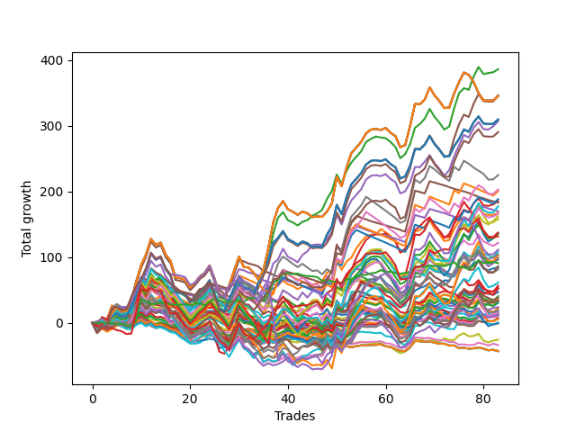

# Short Bulldog 005 
- Symbol: ES
- Date Range: 03/18/2022 - 07/08/2022
- Trading Period: 7:20-12:30
- Number of Trades: 83



| Name | Win Percent | Profit | Avg Profit / Trade |     | Name | Win Percent | Profit | Avg Profit / Trade |
| ---- | ----------- | ------ | ------------------ | --- | ---- | ----------- | ------ | ------------------ |
| Sorted By <br> Profit | | | | | Sorted By <br> Win Percentage ||||
| Two | 67.47 | 192875.00 | 2323.80 |     | Two | 67.47 | 192875.00 | 2323.80 |
| Five | 59.04 | 173125.00 | 2085.84 |     | Zero | 66.27 | 42125.00 | 507.53 |
| Seventy-One | 55.42 | 172500.00 | 2078.31 |     | Three | 63.86 | 92625.00 | 1115.96 |
| Fifty-Five | 55.42 | 172500.00 | 2078.31 |     | One | 62.65 | 83750.00 | 1009.04 |
| Thirty-Nine | 55.42 | 172500.00 | 2078.31 |     | Fifty-Six | 62.65 | 7250.00 | 87.35 |
| Twenty-Three | 55.42 | 172500.00 | 2078.31 |     | Four | 61.45 | 153375.00 | 1847.89 |
| Seven | 55.42 | 172500.00 | 2078.31 |     | Seventy-Five | 60.24 | 145125.00 | 1748.49 |
| Seventy | 59.04 | 154750.00 | 1864.46 |     | Five | 59.04 | 173125.00 | 2085.84 |
| Fifty-Four | 59.04 | 154750.00 | 1864.46 |     | Seventy | 59.04 | 154750.00 | 1864.46 |
| Thirty-Eight | 59.04 | 154750.00 | 1864.46 |     | Fifty-Four | 59.04 | 154750.00 | 1864.46 |
| Twenty-Two | 59.04 | 154750.00 | 1864.46 |     | Thirty-Eight | 59.04 | 154750.00 | 1864.46 |
| Six | 59.04 | 154750.00 | 1864.46 |     | Twenty-Two | 59.04 | 154750.00 | 1864.46 |
| Four | 61.45 | 153375.00 | 1847.89 |     | Six | 59.04 | 154750.00 | 1864.46 |
| Seventy-Five | 60.24 | 145125.00 | 1748.49 |     | Sixty-Four | 59.04 | 6125.00 | 73.80 |
| Forty-Seven | 38.55 | 112500.00 | 1355.42 |     | Fifty-Eight | 57.83 | 78875.00 | 950.30 |
| Forty-Six | 43.37 | 101500.00 | 1222.89 |     | Fifty-Nine | 56.63 | 30750.00 | 370.48 |
| Thirty-One | 25.30 | 100250.00 | 1207.83 |     | Fifty-Seven | 56.63 | 9750.00 | 117.47 |
| Thirty | 30.12 | 94125.00 | 1134.04 |     | Seventy-One | 55.42 | 172500.00 | 2078.31 |
| Three | 63.86 | 92625.00 | 1115.96 |     | Fifty-Five | 55.42 | 172500.00 | 2078.31 |
| Fifteen | 20.48 | 91500.00 | 1102.41 |     | Thirty-Nine | 55.42 | 172500.00 | 2078.31 |
| Sixty-Nine | 48.19 | 88750.00 | 1069.28 |     | Twenty-Three | 55.42 | 172500.00 | 2078.31 |
| Fourteen | 24.10 | 85000.00 | 1024.10 |     | Seven | 55.42 | 172500.00 | 2078.31 |
| One | 62.65 | 83750.00 | 1009.04 |     | Seventy-Three | 55.42 | 65875.00 | 793.67 |
| Sixty-Six | 54.22 | 83125.00 | 1001.51 |     | Sixty-Six | 54.22 | 83125.00 | 1001.51 |
| Sixty-Eight | 49.40 | 81250.00 | 978.92 |     | Sixty | 54.22 | 68250.00 | 822.29 |
| Fifty-Eight | 57.83 | 78875.00 | 950.30 |     | Seventy-Four | 54.22 | 55625.00 | 670.18 |
| Sixty-Three | 46.99 | 68750.00 | 828.31 |     | Forty | 54.22 | -375.00 | -4.52 |
| Sixty | 54.22 | 68250.00 | 822.29 |     | Sixty-Seven | 53.01 | 52250.00 | 629.52 |
| Sixty-Two | 51.81 | 67750.00 | 816.27 |     | Sixty-Two | 51.81 | 67750.00 | 816.27 |
| Seventy-Three | 55.42 | 65875.00 | 793.67 |     | Sixty-Five | 51.81 | 17250.00 | 207.83 |
| Twenty-Six | 39.76 | 60875.00 | 733.43 |     | Seventy-Two | 50.60 | 45500.00 | 548.19 |
| Seventy-Four | 54.22 | 55625.00 | 670.18 |     | Forty-Eight | 50.60 | 16500.00 | 198.80 |
| Twenty-Nine | 33.73 | 54500.00 | 656.63 |     | Sixty-Eight | 49.40 | 81250.00 | 978.92 |
| Sixty-Seven | 53.01 | 52250.00 | 629.52 |     | Sixty-One | 49.40 | 51750.00 | 623.49 |
| Sixty-One | 49.40 | 51750.00 | 623.49 |     | Sixty-Nine | 48.19 | 88750.00 | 1069.28 |
| Twenty-Eight | 36.14 | 50000.00 | 602.41 |     | Twenty-Four | 48.19 | 12000.00 | 144.58 |
| Forty-Four | 40.96 | 49375.00 | 594.88 |     | Sixty-Three | 46.99 | 68750.00 | 828.31 |
| Forty-Two | 43.37 | 48125.00 | 579.82 |     | Forty-Three | 44.58 | 26625.00 | 320.78 |
| Seventy-Two | 50.60 | 45500.00 | 548.19 |     | Forty-Six | 43.37 | 101500.00 | 1222.89 |
| Forty-Five | 38.55 | 43125.00 | 519.58 |     | Forty-Two | 43.37 | 48125.00 | 579.82 |
| Zero | 66.27 | 42125.00 | 507.53 |     | Forty-One | 43.37 | 2875.00 | 34.64 |
| twenty-Seven | 38.55 | 40750.00 | 490.96 |     | Fifty-One | 42.17 | 17625.00 | 212.35 |
| Fifty-Nine | 56.63 | 30750.00 | 370.48 |     | Thirty-Two | 42.17 | 6875.00 | 82.83 |
| Thirteen | 30.12 | 28375.00 | 341.87 |     | Forty-Four | 40.96 | 49375.00 | 594.88 |
| Forty-Three | 44.58 | 26625.00 | 320.78 |     | Forty-Nine | 40.96 | 7250.00 | 87.35 |
| Fifty-Three | 39.76 | 26125.00 | 314.76 |     | Twenty-Six | 39.76 | 60875.00 | 733.43 |
| Ten | 33.73 | 23625.00 | 284.64 |     | Fifty-Three | 39.76 | 26125.00 | 314.76 |
| Twelve | 31.33 | 20375.00 | 245.48 |     | Twenty-Five | 39.76 | 19125.00 | 230.42 |
| Twenty-Five | 39.76 | 19125.00 | 230.42 |     | Fifty-Two | 39.76 | 16625.00 | 200.30 |
| Fifty-One | 42.17 | 17625.00 | 212.35 |     | Fifty | 39.76 | 15250.00 | 183.73 |
| Sixty-Five | 51.81 | 17250.00 | 207.83 |     | Thirty-Four | 39.76 | 8625.00 | 103.92 |
| Fifty-Two | 39.76 | 16625.00 | 200.30 |     | Thirty-Seven | 39.76 | 6875.00 | 82.83 |
| Forty-Eight | 50.60 | 16500.00 | 198.80 |     | Thirty-Three | 39.76 | 6500.00 | 78.31 |
| Fifty | 39.76 | 15250.00 | 183.73 |     | Thirty-Six | 39.76 | 5375.00 | 64.76 |
| Twenty-Four | 48.19 | 12000.00 | 144.58 |     | Thirty-Five | 39.76 | 4000.00 | 48.19 |
| Eleven | 33.73 | 11000.00 | 132.53 |     | Eight | 39.76 | -12750.00 | -153.61 |
| Fifty-Seven | 56.63 | 9750.00 | 117.47 |     | Forty-Seven | 38.55 | 112500.00 | 1355.42 |
| Thirty-Four | 39.76 | 8625.00 | 103.92 |     | Forty-Five | 38.55 | 43125.00 | 519.58 |
| Fifty-Six | 62.65 | 7250.00 | 87.35 |     | twenty-Seven | 38.55 | 40750.00 | 490.96 |
| Forty-Nine | 40.96 | 7250.00 | 87.35 |     | Twenty-Eight | 36.14 | 50000.00 | 602.41 |
| Thirty-Two | 42.17 | 6875.00 | 82.83 |     | Nine | 34.94 | 375.00 | 4.52 |
| Thirty-Seven | 39.76 | 6875.00 | 82.83 |     | Twenty-Nine | 33.73 | 54500.00 | 656.63 |
| Thirty-Three | 39.76 | 6500.00 | 78.31 |     | Ten | 33.73 | 23625.00 | 284.64 |
| Sixty-Four | 59.04 | 6125.00 | 73.80 |     | Eleven | 33.73 | 11000.00 | 132.53 |
| Thirty-Six | 39.76 | 5375.00 | 64.76 |     | Sixten | 33.73 | -16750.00 | -201.81 |
| Thirty-Five | 39.76 | 4000.00 | 48.19 |     | Twenty-One | 32.53 | -21375.00 | -257.53 |
| Forty-One | 43.37 | 2875.00 | 34.64 |     | Twenty | 32.53 | -21375.00 | -257.53 |
| Nine | 34.94 | 375.00 | 4.52 |     | Nineteen | 32.53 | -21375.00 | -257.53 |
| Forty | 54.22 | -375.00 | -4.52 |     | Eighteen | 32.53 | -21375.00 | -257.53 |
| Eight | 39.76 | -12750.00 | -153.61 |     | Seventeen | 32.53 | -21375.00 | -257.53 |
| Sixten | 33.73 | -16750.00 | -201.81 |     | Twelve | 31.33 | 20375.00 | 245.48 |
| Twenty-One | 32.53 | -21375.00 | -257.53 |     | Thirty | 30.12 | 94125.00 | 1134.04 |
| Twenty | 32.53 | -21375.00 | -257.53 |     | Thirteen | 30.12 | 28375.00 | 341.87 |
| Nineteen | 32.53 | -21375.00 | -257.53 |     | Thirty-One | 25.30 | 100250.00 | 1207.83 |
| Eighteen | 32.53 | -21375.00 | -257.53 |     | Fourteen | 24.10 | 85000.00 | 1024.10 |
| Seventeen | 32.53 | -21375.00 | -257.53 |     | Fifteen | 20.48 | 91500.00 | 1102.41 |

## NO STOPLOSS

### Test Zero
* Sell when price hits the middle line of the 20p bollinger
* No Stoploss
* Results:
```
Total Trades: 83
Percent Up: 33.73
Percent Down: 66.27
Total Points Moved Down: 84.25
Potential Profit: 42125.00
Total Points Ups: 215.25 Count Ups: 28
Total Points Downs: 299.50 Count Downs: 55
```

<details><summary>Trades</summary>

<code>In: 2022-03-24 08:03:00		Out: 2022-03-24 08:04:30		Total Position Time: 01:30		Total Move Down: 2.00		Total to Date: 2.00</code> <br />
<code>In: 2022-03-24 08:44:00		Out: 2022-03-24 08:50:05		Total Position Time: 06:05		Total Move Down: 3.75		Total to Date: 5.75</code> <br />
<code>In: 2022-03-25 07:26:00		Out: 2022-03-25 07:51:05		Total Position Time: 25:05		Total Move Down: -6.00		Total to Date: -0.25</code> <br />
<code>In: 2022-03-25 07:44:00		Out: 2022-03-25 07:51:05		Total Position Time: 07:05		Total Move Down: 2.50		Total to Date: 2.25</code> <br />
<code>In: 2022-03-28 07:50:00		Out: 2022-03-28 08:00:15		Total Position Time: 10:15		Total Move Down: 0.50		Total to Date: 2.75</code> <br />
<code>In: 2022-03-29 11:38:00		Out: 2022-03-29 11:50:50		Total Position Time: 12:50		Total Move Down: 1.00		Total to Date: 3.75</code> <br />
<code>In: 2022-03-31 07:48:00		Out: 2022-03-31 08:03:05		Total Position Time: 15:05		Total Move Down: -1.00		Total to Date: 2.75</code> <br />
<code>In: 2022-04-06 10:43:00		Out: 2022-04-06 10:47:15		Total Position Time: 04:15		Total Move Down: 5.00		Total to Date: 7.75</code> <br />
<code>In: 2022-04-06 11:04:00		Out: 2022-04-06 11:05:40		Total Position Time: 01:40		Total Move Down: 11.00		Total to Date: 18.75</code> <br />
<code>In: 2022-04-06 11:05:00		Out: 2022-04-06 11:05:40		Total Position Time: 00:40		Total Move Down: 7.75		Total to Date: 26.50</code> <br />
<code>In: 2022-04-06 11:57:00		Out: 2022-04-06 12:07:45		Total Position Time: 10:45		Total Move Down: 0.50		Total to Date: 27.00</code> <br />
<code>In: 2022-04-06 12:02:00		Out: 2022-04-06 12:07:45		Total Position Time: 05:45		Total Move Down: 8.50		Total to Date: 35.50</code> <br />
<code>In: 2022-04-07 10:58:00		Out: 2022-04-07 11:15:15		Total Position Time: 17:15		Total Move Down: -3.25		Total to Date: 32.25</code> <br />
<code>In: 2022-04-07 11:03:00		Out: 2022-04-07 11:15:15		Total Position Time: 12:15		Total Move Down: 2.50		Total to Date: 34.75</code> <br />
<code>In: 2022-04-07 11:50:00		Out: 2022-04-07 12:19:10		Total Position Time: 29:10		Total Move Down: -18.25		Total to Date: 16.50</code> <br />
<code>In: 2022-04-07 11:54:00		Out: 2022-04-07 12:19:10		Total Position Time: 25:10		Total Move Down: -14.75		Total to Date: 1.75</code> <br />
<code>In: 2022-04-08 07:33:00		Out: 2022-04-08 07:44:35		Total Position Time: 11:35		Total Move Down: 3.25		Total to Date: 5.00</code> <br />
<code>In: 2022-04-08 07:54:00		Out: 2022-04-08 08:15:30		Total Position Time: 21:30		Total Move Down: -8.25		Total to Date: -3.25</code> <br />
<code>In: 2022-04-08 07:57:00		Out: 2022-04-08 08:15:30		Total Position Time: 18:30		Total Move Down: -6.75		Total to Date: -10.00</code> <br />
<code>In: 2022-04-13 08:06:00		Out: 2022-04-13 08:35:55		Total Position Time: 29:55		Total Move Down: -11.75		Total to Date: -21.75</code> <br />
<code>In: 2022-04-18 07:27:00		Out: 2022-04-18 07:36:40		Total Position Time: 09:40		Total Move Down: 3.25		Total to Date: -18.50</code> <br />
<code>In: 2022-04-18 11:26:00		Out: 2022-04-18 11:28:05		Total Position Time: 02:05		Total Move Down: 6.00		Total to Date: -12.50</code> <br />
<code>In: 2022-04-20 10:46:00		Out: 2022-04-20 10:50:05		Total Position Time: 04:05		Total Move Down: 3.25		Total to Date: -9.25</code> <br />
<code>In: 2022-04-20 10:49:00		Out: 2022-04-20 10:50:05		Total Position Time: 01:05		Total Move Down: 4.75		Total to Date: -4.50</code> <br />
<code>In: 2022-04-25 11:11:00		Out: 2022-04-25 11:39:45		Total Position Time: 28:45		Total Move Down: -19.50		Total to Date: -24.00</code> <br />
<code>In: 2022-04-25 11:17:00		Out: 2022-04-25 11:39:45		Total Position Time: 22:45		Total Move Down: -14.25		Total to Date: -38.25</code> <br />
<code>In: 2022-04-27 09:25:00		Out: 2022-04-27 09:37:00		Total Position Time: 12:00		Total Move Down: 1.75		Total to Date: -36.50</code> <br />
<code>In: 2022-05-02 07:28:00		Out: 2022-05-02 07:44:10		Total Position Time: 16:10		Total Move Down: -4.00		Total to Date: -40.50</code> <br />
<code>In: 2022-05-03 07:34:00		Out: 2022-05-03 07:37:55		Total Position Time: 03:55		Total Move Down: 9.25		Total to Date: -31.25</code> <br />
<code>In: 2022-05-03 07:35:00		Out: 2022-05-03 07:37:55		Total Position Time: 02:55		Total Move Down: 8.50		Total to Date: -22.75</code> <br />
<code>In: 2022-05-03 08:06:00		Out: 2022-05-03 08:35:55		Total Position Time: 29:55		Total Move Down: -16.00		Total to Date: -38.75</code> <br />
<code>In: 2022-05-03 08:10:00		Out: 2022-05-03 08:35:55		Total Position Time: 25:55		Total Move Down: -4.25		Total to Date: -43.00</code> <br />
<code>In: 2022-05-04 09:24:00		Out: 2022-05-04 09:45:25		Total Position Time: 21:25		Total Move Down: -4.75		Total to Date: -47.75</code> <br />
<code>In: 2022-05-04 10:59:00		Out: 2022-05-04 11:00:20		Total Position Time: 01:20		Total Move Down: 5.00		Total to Date: -42.75</code> <br />
<code>In: 2022-05-04 11:03:00		Out: 2022-05-04 11:06:50		Total Position Time: 03:50		Total Move Down: 2.75		Total to Date: -40.00</code> <br />
<code>In: 2022-05-04 11:07:00		Out: 2022-05-04 11:07:10		Total Position Time: 00:10		Total Move Down: 4.25		Total to Date: -35.75</code> <br />
<code>In: 2022-05-04 11:30:00		Out: 2022-05-04 11:30:45		Total Position Time: 00:45		Total Move Down: 16.50		Total to Date: -19.25</code> <br />
<code>In: 2022-05-04 11:31:00		Out: 2022-05-04 11:31:10		Total Position Time: 00:10		Total Move Down: 2.25		Total to Date: -17.00</code> <br />
<code>In: 2022-05-16 09:05:00		Out: 2022-05-16 09:05:45		Total Position Time: 00:45		Total Move Down: 3.50		Total to Date: -13.50</code> <br />
<code>In: 2022-05-16 10:15:00		Out: 2022-05-16 10:18:20		Total Position Time: 03:20		Total Move Down: 7.00		Total to Date: -6.50</code> <br />
<code>In: 2022-05-16 10:25:00		Out: 2022-05-16 10:42:15		Total Position Time: 17:15		Total Move Down: -5.25		Total to Date: -11.75</code> <br />
<code>In: 2022-05-16 11:07:00		Out: 2022-05-16 11:12:00		Total Position Time: 05:00		Total Move Down: 4.75		Total to Date: -7.00</code> <br />
<code>In: 2022-05-16 11:32:00		Out: 2022-05-16 11:41:50		Total Position Time: 09:50		Total Move Down: 2.75		Total to Date: -4.25</code> <br />
<code>In: 2022-05-17 09:37:00		Out: 2022-05-17 09:51:20		Total Position Time: 14:20		Total Move Down: -1.50		Total to Date: -5.75</code> <br />
<code>In: 2022-05-17 09:48:00		Out: 2022-05-17 09:51:20		Total Position Time: 03:20		Total Move Down: 2.50		Total to Date: -3.25</code> <br />
<code>In: 2022-05-17 10:15:00		Out: 2022-05-17 10:23:15		Total Position Time: 08:15		Total Move Down: 1.25		Total to Date: -2.00</code> <br />
<code>In: 2022-05-19 08:40:00		Out: 2022-05-19 08:53:35		Total Position Time: 13:35		Total Move Down: -3.00		Total to Date: -5.00</code> <br />
<code>In: 2022-05-19 10:59:00		Out: 2022-05-19 11:06:05		Total Position Time: 07:05		Total Move Down: 13.50		Total to Date: 8.50</code> <br />
<code>In: 2022-05-19 11:52:00		Out: 2022-05-19 11:57:50		Total Position Time: 05:50		Total Move Down: 5.25		Total to Date: 13.75</code> <br />
<code>In: 2022-05-19 12:05:00		Out: 2022-05-19 12:09:40		Total Position Time: 04:40		Total Move Down: 7.25		Total to Date: 21.00</code> <br />
<code>In: 2022-05-23 08:07:00		Out: 2022-05-23 08:21:15		Total Position Time: 14:15		Total Move Down: -2.00		Total to Date: 19.00</code> <br />
<code>In: 2022-05-24 09:17:00		Out: 2022-05-24 09:21:30		Total Position Time: 04:30		Total Move Down: 11.25		Total to Date: 30.25</code> <br />
<code>In: 2022-05-24 09:18:00		Out: 2022-05-24 09:21:30		Total Position Time: 03:30		Total Move Down: 5.00		Total to Date: 35.25</code> <br />
<code>In: 2022-05-24 11:13:00		Out: 2022-05-24 11:18:25		Total Position Time: 05:25		Total Move Down: 13.25		Total to Date: 48.50</code> <br />
<code>In: 2022-05-24 11:14:00		Out: 2022-05-24 11:18:25		Total Position Time: 04:25		Total Move Down: 9.50		Total to Date: 58.00</code> <br />
<code>In: 2022-05-25 07:36:00		Out: 2022-05-25 07:42:00		Total Position Time: 06:00		Total Move Down: 7.00		Total to Date: 65.00</code> <br />
<code>In: 2022-05-25 12:05:00		Out: 2022-05-25 12:17:30		Total Position Time: 12:30		Total Move Down: 1.75		Total to Date: 66.75</code> <br />
<code>In: 2022-05-27 12:10:00		Out: 2022-05-27 12:35:00		Total Position Time: 25:00		Total Move Down: -1.50		Total to Date: 65.25</code> <br />
<code>In: 2022-05-31 07:23:00		Out: 2022-05-31 07:36:40		Total Position Time: 13:40		Total Move Down: 4.50		Total to Date: 69.75</code> <br />
<code>In: 2022-05-31 08:53:00		Out: 2022-05-31 09:13:00		Total Position Time: 20:00		Total Move Down: -8.75		Total to Date: 61.00</code> <br />
<code>In: 2022-06-02 08:05:00		Out: 2022-06-02 08:22:05		Total Position Time: 17:05		Total Move Down: -5.50		Total to Date: 55.50</code> <br />
<code>In: 2022-06-02 08:06:00		Out: 2022-06-02 08:22:05		Total Position Time: 16:05		Total Move Down: -7.50		Total to Date: 48.00</code> <br />
<code>In: 2022-06-07 07:31:00		Out: 2022-06-07 07:56:25		Total Position Time: 25:25		Total Move Down: -19.50		Total to Date: 28.50</code> <br />
<code>In: 2022-06-08 08:19:00		Out: 2022-06-08 08:31:10		Total Position Time: 12:10		Total Move Down: 2.50		Total to Date: 31.00</code> <br />
<code>In: 2022-06-10 12:29:00		Out: 2022-06-10 12:30:30		Total Position Time: 01:30		Total Move Down: 6.25		Total to Date: 37.25</code> <br />
<code>In: 2022-06-13 09:40:00		Out: 2022-06-13 09:43:15		Total Position Time: 03:15		Total Move Down: 12.00		Total to Date: 49.25</code> <br />
<code>In: 2022-06-23 07:42:00		Out: 2022-06-23 07:51:10		Total Position Time: 09:10		Total Move Down: 4.00		Total to Date: 53.25</code> <br />
<code>In: 2022-06-23 07:58:00		Out: 2022-06-23 08:00:30		Total Position Time: 02:30		Total Move Down: 2.50		Total to Date: 55.75</code> <br />
<code>In: 2022-06-23 08:15:00		Out: 2022-06-23 08:21:05		Total Position Time: 06:05		Total Move Down: 5.50		Total to Date: 61.25</code> <br />
<code>In: 2022-06-30 08:12:00		Out: 2022-06-30 08:35:10		Total Position Time: 23:10		Total Move Down: -9.00		Total to Date: 52.25</code> <br />
<code>In: 2022-06-30 08:29:00		Out: 2022-06-30 08:35:10		Total Position Time: 06:10		Total Move Down: 7.00		Total to Date: 59.25</code> <br />
<code>In: 2022-06-30 08:30:00		Out: 2022-06-30 08:35:10		Total Position Time: 05:10		Total Move Down: 5.50		Total to Date: 64.75</code> <br />
<code>In: 2022-06-30 08:49:00		Out: 2022-06-30 09:03:10		Total Position Time: 14:10		Total Move Down: -0.25		Total to Date: 64.50</code> <br />
<code>In: 2022-07-05 07:40:00		Out: 2022-07-05 07:44:30		Total Position Time: 04:30		Total Move Down: 11.75		Total to Date: 76.25</code> <br />
<code>In: 2022-07-05 07:41:00		Out: 2022-07-05 07:44:30		Total Position Time: 03:30		Total Move Down: 7.25		Total to Date: 83.50</code> <br />
<code>In: 2022-07-05 09:27:00		Out: 2022-07-05 09:40:05		Total Position Time: 13:05		Total Move Down: 3.25		Total to Date: 86.75</code> <br />
<code>In: 2022-07-05 11:34:00		Out: 2022-07-05 11:48:05		Total Position Time: 14:05		Total Move Down: -4.50		Total to Date: 82.25</code> <br />
<code>In: 2022-07-06 11:09:00		Out: 2022-07-06 11:10:10		Total Position Time: 01:10		Total Move Down: 9.00		Total to Date: 91.25</code> <br />
<code>In: 2022-07-06 11:10:00		Out: 2022-07-06 11:10:10		Total Position Time: 00:10		Total Move Down: 3.25		Total to Date: 94.50</code> <br />
<code>In: 2022-07-06 11:31:00		Out: 2022-07-06 11:48:45		Total Position Time: 17:45		Total Move Down: -12.00		Total to Date: 82.50</code> <br />
<code>In: 2022-07-06 11:35:00		Out: 2022-07-06 11:48:45		Total Position Time: 13:45		Total Move Down: -2.25		Total to Date: 80.25</code> <br />
<code>In: 2022-07-07 07:56:00		Out: 2022-07-07 08:01:05		Total Position Time: 05:05		Total Move Down: 2.75		Total to Date: 83.00</code> <br />
<code>In: 2022-07-07 12:18:00		Out: 2022-07-07 12:24:15		Total Position Time: 06:15		Total Move Down: 1.25		Total to Date: 84.25</code> <br />


</details>

### Test One
* Sell when the price hits the upper line of the 20p 1std bollinger
* No Stoploss
* Results:
```
Total Trades: 83
Percent Up: 37.35
Percent Down: 62.65
Total Points Moved Down: 167.50
Potential Profit: 83750.00
Total Points Ups: 233.25 Count Ups: 31
Total Points Downs: 400.75 Count Downs: 52
```

<details><summary>Trades</summary>

<code>In: 2022-03-24 08:03:00		Out: 2022-03-24 08:32:55		Total Position Time: 29:55		Total Move Down: -15.00		Total to Date: -15.00</code> <br />
<code>In: 2022-03-24 08:44:00		Out: 2022-03-24 08:53:50		Total Position Time: 09:50		Total Move Down: 6.25		Total to Date: -8.75</code> <br />
<code>In: 2022-03-25 07:26:00		Out: 2022-03-25 07:53:50		Total Position Time: 27:50		Total Move Down: -4.50		Total to Date: -13.25</code> <br />
<code>In: 2022-03-25 07:44:00		Out: 2022-03-25 07:53:50		Total Position Time: 09:50		Total Move Down: 4.00		Total to Date: -9.25</code> <br />
<code>In: 2022-03-28 07:50:00		Out: 2022-03-28 08:01:35		Total Position Time: 11:35		Total Move Down: 5.25		Total to Date: -4.00</code> <br />
<code>In: 2022-03-29 11:38:00		Out: 2022-03-29 12:00:20		Total Position Time: 22:20		Total Move Down: -0.25		Total to Date: -4.25</code> <br />
<code>In: 2022-03-31 07:48:00		Out: 2022-03-31 08:03:25		Total Position Time: 15:25		Total Move Down: 1.25		Total to Date: -3.00</code> <br />
<code>In: 2022-04-06 10:43:00		Out: 2022-04-06 10:56:55		Total Position Time: 13:55		Total Move Down: 4.00		Total to Date: 1.00</code> <br />
<code>In: 2022-04-06 11:04:00		Out: 2022-04-06 11:07:20		Total Position Time: 03:20		Total Move Down: 15.75		Total to Date: 16.75</code> <br />
<code>In: 2022-04-06 11:05:00		Out: 2022-04-06 11:07:20		Total Position Time: 02:20		Total Move Down: 12.50		Total to Date: 29.25</code> <br />
<code>In: 2022-04-06 11:57:00		Out: 2022-04-06 12:13:35		Total Position Time: 16:35		Total Move Down: 0.75		Total to Date: 30.00</code> <br />
<code>In: 2022-04-06 12:02:00		Out: 2022-04-06 12:13:35		Total Position Time: 11:35		Total Move Down: 8.75		Total to Date: 38.75</code> <br />
<code>In: 2022-04-07 10:58:00		Out: 2022-04-07 11:16:10		Total Position Time: 18:10		Total Move Down: -1.75		Total to Date: 37.00</code> <br />
<code>In: 2022-04-07 11:03:00		Out: 2022-04-07 11:16:10		Total Position Time: 13:10		Total Move Down: 4.00		Total to Date: 41.00</code> <br />
<code>In: 2022-04-07 11:50:00		Out: 2022-04-07 12:19:55		Total Position Time: 29:55		Total Move Down: -18.00		Total to Date: 23.00</code> <br />
<code>In: 2022-04-07 11:54:00		Out: 2022-04-07 12:20:20		Total Position Time: 26:20		Total Move Down: -12.75		Total to Date: 10.25</code> <br />
<code>In: 2022-04-08 07:33:00		Out: 2022-04-08 07:45:55		Total Position Time: 12:55		Total Move Down: 4.50		Total to Date: 14.75</code> <br />
<code>In: 2022-04-08 07:54:00		Out: 2022-04-08 08:17:05		Total Position Time: 23:05		Total Move Down: -5.00		Total to Date: 9.75</code> <br />
<code>In: 2022-04-08 07:57:00		Out: 2022-04-08 08:17:05		Total Position Time: 20:05		Total Move Down: -3.50		Total to Date: 6.25</code> <br />
<code>In: 2022-04-13 08:06:00		Out: 2022-04-13 08:35:55		Total Position Time: 29:55		Total Move Down: -11.75		Total to Date: -5.50</code> <br />
<code>In: 2022-04-18 07:27:00		Out: 2022-04-18 07:51:30		Total Position Time: 24:30		Total Move Down: 2.75		Total to Date: -2.75</code> <br />
<code>In: 2022-04-18 11:26:00		Out: 2022-04-18 11:41:15		Total Position Time: 15:15		Total Move Down: 6.50		Total to Date: 3.75</code> <br />
<code>In: 2022-04-20 10:46:00		Out: 2022-04-20 10:54:05		Total Position Time: 08:05		Total Move Down: 5.50		Total to Date: 9.25</code> <br />
<code>In: 2022-04-20 10:49:00		Out: 2022-04-20 10:54:05		Total Position Time: 05:05		Total Move Down: 7.00		Total to Date: 16.25</code> <br />
<code>In: 2022-04-25 11:11:00		Out: 2022-04-25 11:40:10		Total Position Time: 29:10		Total Move Down: -16.50		Total to Date: -0.25</code> <br />
<code>In: 2022-04-25 11:17:00		Out: 2022-04-25 11:40:10		Total Position Time: 23:10		Total Move Down: -11.25		Total to Date: -11.50</code> <br />
<code>In: 2022-04-27 09:25:00		Out: 2022-04-27 09:51:25		Total Position Time: 26:25		Total Move Down: -0.25		Total to Date: -11.75</code> <br />
<code>In: 2022-05-02 07:28:00		Out: 2022-05-02 07:44:50		Total Position Time: 16:50		Total Move Down: 1.75		Total to Date: -10.00</code> <br />
<code>In: 2022-05-03 07:34:00		Out: 2022-05-03 07:41:20		Total Position Time: 07:20		Total Move Down: 13.50		Total to Date: 3.50</code> <br />
<code>In: 2022-05-03 07:35:00		Out: 2022-05-03 07:41:20		Total Position Time: 06:20		Total Move Down: 12.75		Total to Date: 16.25</code> <br />
<code>In: 2022-05-03 08:06:00		Out: 2022-05-03 08:35:55		Total Position Time: 29:55		Total Move Down: -16.00		Total to Date: 0.25</code> <br />
<code>In: 2022-05-03 08:10:00		Out: 2022-05-03 08:38:05		Total Position Time: 28:05		Total Move Down: -2.00		Total to Date: -1.75</code> <br />
<code>In: 2022-05-04 09:24:00		Out: 2022-05-04 09:46:30		Total Position Time: 22:30		Total Move Down: -2.50		Total to Date: -4.25</code> <br />
<code>In: 2022-05-04 10:59:00		Out: 2022-05-04 11:00:25		Total Position Time: 01:25		Total Move Down: 9.50		Total to Date: 5.25</code> <br />
<code>In: 2022-05-04 11:03:00		Out: 2022-05-04 11:07:20		Total Position Time: 04:20		Total Move Down: 10.75		Total to Date: 16.00</code> <br />
<code>In: 2022-05-04 11:07:00		Out: 2022-05-04 11:07:20		Total Position Time: 00:20		Total Move Down: 9.50		Total to Date: 25.50</code> <br />
<code>In: 2022-05-04 11:30:00		Out: 2022-05-04 11:30:50		Total Position Time: 00:50		Total Move Down: 24.25		Total to Date: 49.75</code> <br />
<code>In: 2022-05-04 11:31:00		Out: 2022-05-04 11:31:25		Total Position Time: 00:25		Total Move Down: 7.75		Total to Date: 57.50</code> <br />
<code>In: 2022-05-16 09:05:00		Out: 2022-05-16 09:06:10		Total Position Time: 01:10		Total Move Down: 7.00		Total to Date: 64.50</code> <br />
<code>In: 2022-05-16 10:15:00		Out: 2022-05-16 10:42:30		Total Position Time: 27:30		Total Move Down: -5.75		Total to Date: 58.75</code> <br />
<code>In: 2022-05-16 10:25:00		Out: 2022-05-16 10:42:30		Total Position Time: 17:30		Total Move Down: -2.50		Total to Date: 56.25</code> <br />
<code>In: 2022-05-16 11:07:00		Out: 2022-05-16 11:36:55		Total Position Time: 29:55		Total Move Down: -4.75		Total to Date: 51.50</code> <br />
<code>In: 2022-05-16 11:32:00		Out: 2022-05-16 11:44:50		Total Position Time: 12:50		Total Move Down: 3.75		Total to Date: 55.25</code> <br />
<code>In: 2022-05-17 09:37:00		Out: 2022-05-17 09:54:40		Total Position Time: 17:40		Total Move Down: -0.50		Total to Date: 54.75</code> <br />
<code>In: 2022-05-17 09:48:00		Out: 2022-05-17 09:54:40		Total Position Time: 06:40		Total Move Down: 3.50		Total to Date: 58.25</code> <br />
<code>In: 2022-05-17 10:15:00		Out: 2022-05-17 10:28:15		Total Position Time: 13:15		Total Move Down: 2.75		Total to Date: 61.00</code> <br />
<code>In: 2022-05-19 08:40:00		Out: 2022-05-19 08:54:40		Total Position Time: 14:40		Total Move Down: 2.50		Total to Date: 63.50</code> <br />
<code>In: 2022-05-19 10:59:00		Out: 2022-05-19 11:14:00		Total Position Time: 15:00		Total Move Down: 13.25		Total to Date: 76.75</code> <br />
<code>In: 2022-05-19 11:52:00		Out: 2022-05-19 12:10:15		Total Position Time: 18:15		Total Move Down: 2.75		Total to Date: 79.50</code> <br />
<code>In: 2022-05-19 12:05:00		Out: 2022-05-19 12:10:15		Total Position Time: 05:15		Total Move Down: 15.50		Total to Date: 95.00</code> <br />
<code>In: 2022-05-23 08:07:00		Out: 2022-05-23 08:36:55		Total Position Time: 29:55		Total Move Down: -14.25		Total to Date: 80.75</code> <br />
<code>In: 2022-05-24 09:17:00		Out: 2022-05-24 09:29:00		Total Position Time: 12:00		Total Move Down: 12.50		Total to Date: 93.25</code> <br />
<code>In: 2022-05-24 09:18:00		Out: 2022-05-24 09:29:00		Total Position Time: 11:00		Total Move Down: 6.25		Total to Date: 99.50</code> <br />
<code>In: 2022-05-24 11:13:00		Out: 2022-05-24 11:31:25		Total Position Time: 18:25		Total Move Down: 13.75		Total to Date: 113.25</code> <br />
<code>In: 2022-05-24 11:14:00		Out: 2022-05-24 11:31:25		Total Position Time: 17:25		Total Move Down: 10.00		Total to Date: 123.25</code> <br />
<code>In: 2022-05-25 07:36:00		Out: 2022-05-25 07:46:40		Total Position Time: 10:40		Total Move Down: 8.50		Total to Date: 131.75</code> <br />
<code>In: 2022-05-25 12:05:00		Out: 2022-05-25 12:20:15		Total Position Time: 15:15		Total Move Down: 2.50		Total to Date: 134.25</code> <br />
<code>In: 2022-05-27 12:10:00		Out: 2022-05-27 12:35:40		Total Position Time: 25:40		Total Move Down: 0.25		Total to Date: 134.50</code> <br />
<code>In: 2022-05-31 07:23:00		Out: 2022-05-31 07:38:00		Total Position Time: 15:00		Total Move Down: 8.25		Total to Date: 142.75</code> <br />
<code>In: 2022-05-31 08:53:00		Out: 2022-05-31 09:14:40		Total Position Time: 21:40		Total Move Down: -4.75		Total to Date: 138.00</code> <br />
<code>In: 2022-06-02 08:05:00		Out: 2022-06-02 08:27:30		Total Position Time: 22:30		Total Move Down: -5.75		Total to Date: 132.25</code> <br />
<code>In: 2022-06-02 08:06:00		Out: 2022-06-02 08:27:30		Total Position Time: 21:30		Total Move Down: -7.75		Total to Date: 124.50</code> <br />
<code>In: 2022-06-07 07:31:00		Out: 2022-06-07 07:57:55		Total Position Time: 26:55		Total Move Down: -17.25		Total to Date: 107.25</code> <br />
<code>In: 2022-06-08 08:19:00		Out: 2022-06-08 08:43:05		Total Position Time: 24:05		Total Move Down: 2.00		Total to Date: 109.25</code> <br />
<code>In: 2022-06-10 12:29:00		Out: 2022-06-10 12:35:55		Total Position Time: 06:55		Total Move Down: 10.25		Total to Date: 119.50</code> <br />
<code>In: 2022-06-13 09:40:00		Out: 2022-06-13 09:47:55		Total Position Time: 07:55		Total Move Down: 19.00		Total to Date: 138.50</code> <br />
<code>In: 2022-06-23 07:42:00		Out: 2022-06-23 08:01:10		Total Position Time: 19:10		Total Move Down: 3.00		Total to Date: 141.50</code> <br />
<code>In: 2022-06-23 07:58:00		Out: 2022-06-23 08:01:10		Total Position Time: 03:10		Total Move Down: 5.50		Total to Date: 147.00</code> <br />
<code>In: 2022-06-23 08:15:00		Out: 2022-06-23 08:23:35		Total Position Time: 08:35		Total Move Down: 9.00		Total to Date: 156.00</code> <br />
<code>In: 2022-06-30 08:12:00		Out: 2022-06-30 08:41:55		Total Position Time: 29:55		Total Move Down: -12.25		Total to Date: 143.75</code> <br />
<code>In: 2022-06-30 08:29:00		Out: 2022-06-30 08:58:55		Total Position Time: 29:55		Total Move Down: -8.75		Total to Date: 135.00</code> <br />
<code>In: 2022-06-30 08:30:00		Out: 2022-06-30 08:59:55		Total Position Time: 29:55		Total Move Down: -10.50		Total to Date: 124.50</code> <br />
<code>In: 2022-06-30 08:49:00		Out: 2022-06-30 09:05:45		Total Position Time: 16:45		Total Move Down: 1.75		Total to Date: 126.25</code> <br />
<code>In: 2022-07-05 07:40:00		Out: 2022-07-05 07:45:55		Total Position Time: 05:55		Total Move Down: 16.50		Total to Date: 142.75</code> <br />
<code>In: 2022-07-05 07:41:00		Out: 2022-07-05 07:45:55		Total Position Time: 04:55		Total Move Down: 12.00		Total to Date: 154.75</code> <br />
<code>In: 2022-07-05 09:27:00		Out: 2022-07-05 09:42:00		Total Position Time: 15:00		Total Move Down: 6.25		Total to Date: 161.00</code> <br />
<code>In: 2022-07-05 11:34:00		Out: 2022-07-05 11:53:20		Total Position Time: 19:20		Total Move Down: -4.25		Total to Date: 156.75</code> <br />
<code>In: 2022-07-06 11:09:00		Out: 2022-07-06 11:11:10		Total Position Time: 02:10		Total Move Down: 13.25		Total to Date: 170.00</code> <br />
<code>In: 2022-07-06 11:10:00		Out: 2022-07-06 11:11:10		Total Position Time: 01:10		Total Move Down: 7.50		Total to Date: 177.50</code> <br />
<code>In: 2022-07-06 11:31:00		Out: 2022-07-06 12:00:50		Total Position Time: 29:50		Total Move Down: -11.50		Total to Date: 166.00</code> <br />
<code>In: 2022-07-06 11:35:00		Out: 2022-07-06 12:00:50		Total Position Time: 25:50		Total Move Down: -1.75		Total to Date: 164.25</code> <br />
<code>In: 2022-07-07 07:56:00		Out: 2022-07-07 08:20:00		Total Position Time: 24:00		Total Move Down: -0.00		Total to Date: 164.25</code> <br />
<code>In: 2022-07-07 12:18:00		Out: 2022-07-07 12:25:10		Total Position Time: 07:10		Total Move Down: 3.25		Total to Date: 167.50</code> <br />


</details>

### Test Two
* Sell when the price hits the upper line of the 20p 2std bollinger
* No Stoploss
* Results:
```
Total Trades: 83
Percent Up: 32.53
Percent Down: 67.47
Total Points Moved Down: 385.75
Potential Profit: 192875.00
Total Points Ups: 239.50 Count Ups: 27
Total Points Downs: 625.25 Count Downs: 56
```

<details><summary>Trades</summary>

<code>In: 2022-03-24 08:03:00		Out: 2022-03-24 08:32:55		Total Position Time: 29:55		Total Move Down: -15.00		Total to Date: -15.00</code> <br />
<code>In: 2022-03-24 08:44:00		Out: 2022-03-24 09:03:15		Total Position Time: 19:15		Total Move Down: 8.50		Total to Date: -6.50</code> <br />
<code>In: 2022-03-25 07:26:00		Out: 2022-03-25 07:54:10		Total Position Time: 28:10		Total Move Down: -3.50		Total to Date: -10.00</code> <br />
<code>In: 2022-03-25 07:44:00		Out: 2022-03-25 07:54:10		Total Position Time: 10:10		Total Move Down: 5.00		Total to Date: -5.00</code> <br />
<code>In: 2022-03-28 07:50:00		Out: 2022-03-28 08:01:35		Total Position Time: 11:35		Total Move Down: 5.25		Total to Date: 0.25</code> <br />
<code>In: 2022-03-29 11:38:00		Out: 2022-03-29 12:07:55		Total Position Time: 29:55		Total Move Down: -6.00		Total to Date: -5.75</code> <br />
<code>In: 2022-03-31 07:48:00		Out: 2022-03-31 08:08:30		Total Position Time: 20:30		Total Move Down: 2.50		Total to Date: -3.25</code> <br />
<code>In: 2022-04-06 10:43:00		Out: 2022-04-06 10:58:00		Total Position Time: 15:00		Total Move Down: 5.75		Total to Date: 2.50</code> <br />
<code>In: 2022-04-06 11:04:00		Out: 2022-04-06 11:08:20		Total Position Time: 04:20		Total Move Down: 21.75		Total to Date: 24.25</code> <br />
<code>In: 2022-04-06 11:05:00		Out: 2022-04-06 11:08:20		Total Position Time: 03:20		Total Move Down: 18.50		Total to Date: 42.75</code> <br />
<code>In: 2022-04-06 11:57:00		Out: 2022-04-06 12:20:25		Total Position Time: 23:25		Total Move Down: 6.75		Total to Date: 49.50</code> <br />
<code>In: 2022-04-06 12:02:00		Out: 2022-04-06 12:20:25		Total Position Time: 18:25		Total Move Down: 14.75		Total to Date: 64.25</code> <br />
<code>In: 2022-04-07 10:58:00		Out: 2022-04-07 11:18:40		Total Position Time: 20:40		Total Move Down: 1.25		Total to Date: 65.50</code> <br />
<code>In: 2022-04-07 11:03:00		Out: 2022-04-07 11:18:40		Total Position Time: 15:40		Total Move Down: 7.00		Total to Date: 72.50</code> <br />
<code>In: 2022-04-07 11:50:00		Out: 2022-04-07 12:19:55		Total Position Time: 29:55		Total Move Down: -18.00		Total to Date: 54.50</code> <br />
<code>In: 2022-04-07 11:54:00		Out: 2022-04-07 12:23:55		Total Position Time: 29:55		Total Move Down: -9.75		Total to Date: 44.75</code> <br />
<code>In: 2022-04-08 07:33:00		Out: 2022-04-08 07:49:20		Total Position Time: 16:20		Total Move Down: 5.25		Total to Date: 50.00</code> <br />
<code>In: 2022-04-08 07:54:00		Out: 2022-04-08 08:20:35		Total Position Time: 26:35		Total Move Down: -3.50		Total to Date: 46.50</code> <br />
<code>In: 2022-04-08 07:57:00		Out: 2022-04-08 08:20:35		Total Position Time: 23:35		Total Move Down: -2.00		Total to Date: 44.50</code> <br />
<code>In: 2022-04-13 08:06:00		Out: 2022-04-13 08:35:55		Total Position Time: 29:55		Total Move Down: -11.75		Total to Date: 32.75</code> <br />
<code>In: 2022-04-18 07:27:00		Out: 2022-04-18 07:51:45		Total Position Time: 24:45		Total Move Down: 4.75		Total to Date: 37.50</code> <br />
<code>In: 2022-04-18 11:26:00		Out: 2022-04-18 11:44:10		Total Position Time: 18:10		Total Move Down: 6.75		Total to Date: 44.25</code> <br />
<code>In: 2022-04-20 10:46:00		Out: 2022-04-20 11:13:55		Total Position Time: 27:55		Total Move Down: 6.25		Total to Date: 50.50</code> <br />
<code>In: 2022-04-20 10:49:00		Out: 2022-04-20 11:13:55		Total Position Time: 24:55		Total Move Down: 7.75		Total to Date: 58.25</code> <br />
<code>In: 2022-04-25 11:11:00		Out: 2022-04-25 11:40:55		Total Position Time: 29:55		Total Move Down: -20.25		Total to Date: 38.00</code> <br />
<code>In: 2022-04-25 11:17:00		Out: 2022-04-25 11:45:15		Total Position Time: 28:15		Total Move Down: -10.50		Total to Date: 27.50</code> <br />
<code>In: 2022-04-27 09:25:00		Out: 2022-04-27 09:54:55		Total Position Time: 29:55		Total Move Down: -3.00		Total to Date: 24.50</code> <br />
<code>In: 2022-05-02 07:28:00		Out: 2022-05-02 07:47:35		Total Position Time: 19:35		Total Move Down: 5.75		Total to Date: 30.25</code> <br />
<code>In: 2022-05-03 07:34:00		Out: 2022-05-03 07:43:50		Total Position Time: 09:50		Total Move Down: 19.00		Total to Date: 49.25</code> <br />
<code>In: 2022-05-03 07:35:00		Out: 2022-05-03 07:43:50		Total Position Time: 08:50		Total Move Down: 18.25		Total to Date: 67.50</code> <br />
<code>In: 2022-05-03 08:06:00		Out: 2022-05-03 08:35:55		Total Position Time: 29:55		Total Move Down: -16.00		Total to Date: 51.50</code> <br />
<code>In: 2022-05-03 08:10:00		Out: 2022-05-03 08:39:10		Total Position Time: 29:10		Total Move Down: 0.25		Total to Date: 51.75</code> <br />
<code>In: 2022-05-04 09:24:00		Out: 2022-05-04 09:53:55		Total Position Time: 29:55		Total Move Down: -8.00		Total to Date: 43.75</code> <br />
<code>In: 2022-05-04 10:59:00		Out: 2022-05-04 11:08:05		Total Position Time: 09:05		Total Move Down: 16.00		Total to Date: 59.75</code> <br />
<code>In: 2022-05-04 11:03:00		Out: 2022-05-04 11:08:05		Total Position Time: 05:05		Total Move Down: 17.75		Total to Date: 77.50</code> <br />
<code>In: 2022-05-04 11:07:00		Out: 2022-05-04 11:08:05		Total Position Time: 01:05		Total Move Down: 16.50		Total to Date: 94.00</code> <br />
<code>In: 2022-05-04 11:30:00		Out: 2022-05-04 11:34:15		Total Position Time: 04:15		Total Move Down: 41.50		Total to Date: 135.50</code> <br />
<code>In: 2022-05-04 11:31:00		Out: 2022-05-04 11:34:15		Total Position Time: 03:15		Total Move Down: 24.75		Total to Date: 160.25</code> <br />
<code>In: 2022-05-16 09:05:00		Out: 2022-05-16 09:11:40		Total Position Time: 06:40		Total Move Down: 8.25		Total to Date: 168.50</code> <br />
<code>In: 2022-05-16 10:15:00		Out: 2022-05-16 10:44:55		Total Position Time: 29:55		Total Move Down: -12.25		Total to Date: 156.25</code> <br />
<code>In: 2022-05-16 10:25:00		Out: 2022-05-16 10:46:35		Total Position Time: 21:35		Total Move Down: -3.25		Total to Date: 153.00</code> <br />
<code>In: 2022-05-16 11:07:00		Out: 2022-05-16 11:36:55		Total Position Time: 29:55		Total Move Down: -4.75		Total to Date: 148.25</code> <br />
<code>In: 2022-05-16 11:32:00		Out: 2022-05-16 11:45:40		Total Position Time: 13:40		Total Move Down: 5.75		Total to Date: 154.00</code> <br />
<code>In: 2022-05-17 09:37:00		Out: 2022-05-17 10:01:50		Total Position Time: 24:50		Total Move Down: 2.50		Total to Date: 156.50</code> <br />
<code>In: 2022-05-17 09:48:00		Out: 2022-05-17 10:01:50		Total Position Time: 13:50		Total Move Down: 6.50		Total to Date: 163.00</code> <br />
<code>In: 2022-05-17 10:15:00		Out: 2022-05-17 10:42:05		Total Position Time: 27:05		Total Move Down: 3.50		Total to Date: 166.50</code> <br />
<code>In: 2022-05-19 08:40:00		Out: 2022-05-19 08:55:35		Total Position Time: 15:35		Total Move Down: 5.50		Total to Date: 172.00</code> <br />
<code>In: 2022-05-19 10:59:00		Out: 2022-05-19 11:20:05		Total Position Time: 21:05		Total Move Down: 16.50		Total to Date: 188.50</code> <br />
<code>In: 2022-05-19 11:52:00		Out: 2022-05-19 12:18:25		Total Position Time: 26:25		Total Move Down: 12.25		Total to Date: 200.75</code> <br />
<code>In: 2022-05-19 12:05:00		Out: 2022-05-19 12:18:25		Total Position Time: 13:25		Total Move Down: 25.00		Total to Date: 225.75</code> <br />
<code>In: 2022-05-23 08:07:00		Out: 2022-05-23 08:36:55		Total Position Time: 29:55		Total Move Down: -14.25		Total to Date: 211.50</code> <br />
<code>In: 2022-05-24 09:17:00		Out: 2022-05-24 09:32:35		Total Position Time: 15:35		Total Move Down: 19.50		Total to Date: 231.00</code> <br />
<code>In: 2022-05-24 09:18:00		Out: 2022-05-24 09:32:35		Total Position Time: 14:35		Total Move Down: 13.25		Total to Date: 244.25</code> <br />
<code>In: 2022-05-24 11:13:00		Out: 2022-05-24 11:42:55		Total Position Time: 29:55		Total Move Down: 8.25		Total to Date: 252.50</code> <br />
<code>In: 2022-05-24 11:14:00		Out: 2022-05-24 11:43:55		Total Position Time: 29:55		Total Move Down: 8.75		Total to Date: 261.25</code> <br />
<code>In: 2022-05-25 07:36:00		Out: 2022-05-25 07:48:20		Total Position Time: 12:20		Total Move Down: 14.00		Total to Date: 275.25</code> <br />
<code>In: 2022-05-25 12:05:00		Out: 2022-05-25 12:23:00		Total Position Time: 18:00		Total Move Down: 4.75		Total to Date: 280.00</code> <br />
<code>In: 2022-05-27 12:10:00		Out: 2022-05-27 12:38:10		Total Position Time: 28:10		Total Move Down: 3.50		Total to Date: 283.50</code> <br />
<code>In: 2022-05-31 07:23:00		Out: 2022-05-31 07:52:55		Total Position Time: 29:55		Total Move Down: -1.50		Total to Date: 282.00</code> <br />
<code>In: 2022-05-31 08:53:00		Out: 2022-05-31 09:15:55		Total Position Time: 22:55		Total Move Down: -1.00		Total to Date: 281.00</code> <br />
<code>In: 2022-06-02 08:05:00		Out: 2022-06-02 08:29:05		Total Position Time: 24:05		Total Move Down: -5.75		Total to Date: 275.25</code> <br />
<code>In: 2022-06-02 08:06:00		Out: 2022-06-02 08:29:05		Total Position Time: 23:05		Total Move Down: -7.75		Total to Date: 267.50</code> <br />
<code>In: 2022-06-07 07:31:00		Out: 2022-06-07 08:00:55		Total Position Time: 29:55		Total Move Down: -17.00		Total to Date: 250.50</code> <br />
<code>In: 2022-06-08 08:19:00		Out: 2022-06-08 08:44:45		Total Position Time: 25:45		Total Move Down: 6.25		Total to Date: 256.75</code> <br />
<code>In: 2022-06-10 12:29:00		Out: 2022-06-10 12:43:25		Total Position Time: 14:25		Total Move Down: 15.25		Total to Date: 272.00</code> <br />
<code>In: 2022-06-13 09:40:00		Out: 2022-06-13 09:54:45		Total Position Time: 14:45		Total Move Down: 24.75		Total to Date: 296.75</code> <br />
<code>In: 2022-06-23 07:42:00		Out: 2022-06-23 08:04:35		Total Position Time: 22:35		Total Move Down: 5.75		Total to Date: 302.50</code> <br />
<code>In: 2022-06-23 07:58:00		Out: 2022-06-23 08:04:35		Total Position Time: 06:35		Total Move Down: 8.25		Total to Date: 310.75</code> <br />
<code>In: 2022-06-23 08:15:00		Out: 2022-06-23 08:31:25		Total Position Time: 16:25		Total Move Down: 14.75		Total to Date: 325.50</code> <br />
<code>In: 2022-06-30 08:12:00		Out: 2022-06-30 08:41:55		Total Position Time: 29:55		Total Move Down: -12.25		Total to Date: 313.25</code> <br />
<code>In: 2022-06-30 08:29:00		Out: 2022-06-30 08:58:55		Total Position Time: 29:55		Total Move Down: -8.75		Total to Date: 304.50</code> <br />
<code>In: 2022-06-30 08:30:00		Out: 2022-06-30 08:59:55		Total Position Time: 29:55		Total Move Down: -10.50		Total to Date: 294.00</code> <br />
<code>In: 2022-06-30 08:49:00		Out: 2022-06-30 09:06:15		Total Position Time: 17:15		Total Move Down: 4.75		Total to Date: 298.75</code> <br />
<code>In: 2022-07-05 07:40:00		Out: 2022-07-05 08:01:10		Total Position Time: 21:10		Total Move Down: 27.50		Total to Date: 326.25</code> <br />
<code>In: 2022-07-05 07:41:00		Out: 2022-07-05 08:01:10		Total Position Time: 20:10		Total Move Down: 23.00		Total to Date: 349.25</code> <br />
<code>In: 2022-07-05 09:27:00		Out: 2022-07-05 09:42:35		Total Position Time: 15:35		Total Move Down: 7.75		Total to Date: 357.00</code> <br />
<code>In: 2022-07-05 11:34:00		Out: 2022-07-05 12:01:50		Total Position Time: 27:50		Total Move Down: -2.50		Total to Date: 354.50</code> <br />
<code>In: 2022-07-06 11:09:00		Out: 2022-07-06 11:12:15		Total Position Time: 03:15		Total Move Down: 20.25		Total to Date: 374.75</code> <br />
<code>In: 2022-07-06 11:10:00		Out: 2022-07-06 11:12:15		Total Position Time: 02:15		Total Move Down: 14.50		Total to Date: 389.25</code> <br />
<code>In: 2022-07-06 11:31:00		Out: 2022-07-06 12:00:55		Total Position Time: 29:55		Total Move Down: -10.75		Total to Date: 378.50</code> <br />
<code>In: 2022-07-06 11:35:00		Out: 2022-07-06 12:01:30		Total Position Time: 26:30		Total Move Down: 1.50		Total to Date: 380.00</code> <br />
<code>In: 2022-07-07 07:56:00		Out: 2022-07-07 08:21:00		Total Position Time: 25:00		Total Move Down: 1.25		Total to Date: 381.25</code> <br />
<code>In: 2022-07-07 12:18:00		Out: 2022-07-07 12:28:30		Total Position Time: 10:30		Total Move Down: 4.50		Total to Date: 385.75</code> <br />


</details>

### Test Three
* Sell when price hits the middle line of the 50p bollinger
* No Stoploss
* Results:
```
Total Trades: 83
Percent Up: 36.14
Percent Down: 63.86
Total Points Moved Down: 185.25
Potential Profit: 92625.00
Total Points Ups: 280.75 Count Ups: 30
Total Points Downs: 466.00 Count Downs: 53
```

<details><summary>Trades</summary>

<code>In: 2022-03-24 08:03:00		Out: 2022-03-24 08:32:55		Total Position Time: 29:55		Total Move Down: -15.00		Total to Date: -15.00</code> <br />
<code>In: 2022-03-24 08:44:00		Out: 2022-03-24 09:03:10		Total Position Time: 19:10		Total Move Down: 8.00		Total to Date: -7.00</code> <br />
<code>In: 2022-03-25 07:26:00		Out: 2022-03-25 07:55:55		Total Position Time: 29:55		Total Move Down: -2.50		Total to Date: -9.50</code> <br />
<code>In: 2022-03-25 07:44:00		Out: 2022-03-25 08:00:25		Total Position Time: 16:25		Total Move Down: 6.75		Total to Date: -2.75</code> <br />
<code>In: 2022-03-28 07:50:00		Out: 2022-03-28 08:01:35		Total Position Time: 11:35		Total Move Down: 5.25		Total to Date: 2.50</code> <br />
<code>In: 2022-03-29 11:38:00		Out: 2022-03-29 12:07:55		Total Position Time: 29:55		Total Move Down: -6.00		Total to Date: -3.50</code> <br />
<code>In: 2022-03-31 07:48:00		Out: 2022-03-31 08:15:35		Total Position Time: 27:35		Total Move Down: 1.75		Total to Date: -1.75</code> <br />
<code>In: 2022-04-06 10:43:00		Out: 2022-04-06 11:00:10		Total Position Time: 17:10		Total Move Down: 12.75		Total to Date: 11.00</code> <br />
<code>In: 2022-04-06 11:04:00		Out: 2022-04-06 11:07:20		Total Position Time: 03:20		Total Move Down: 15.75		Total to Date: 26.75</code> <br />
<code>In: 2022-04-06 11:05:00		Out: 2022-04-06 11:07:20		Total Position Time: 02:20		Total Move Down: 12.50		Total to Date: 39.25</code> <br />
<code>In: 2022-04-06 11:57:00		Out: 2022-04-06 12:20:15		Total Position Time: 23:15		Total Move Down: 4.00		Total to Date: 43.25</code> <br />
<code>In: 2022-04-06 12:02:00		Out: 2022-04-06 12:20:15		Total Position Time: 18:15		Total Move Down: 12.00		Total to Date: 55.25</code> <br />
<code>In: 2022-04-07 10:58:00		Out: 2022-04-07 11:27:55		Total Position Time: 29:55		Total Move Down: -9.00		Total to Date: 46.25</code> <br />
<code>In: 2022-04-07 11:03:00		Out: 2022-04-07 11:32:55		Total Position Time: 29:55		Total Move Down: 3.50		Total to Date: 49.75</code> <br />
<code>In: 2022-04-07 11:50:00		Out: 2022-04-07 12:19:55		Total Position Time: 29:55		Total Move Down: -18.00		Total to Date: 31.75</code> <br />
<code>In: 2022-04-07 11:54:00		Out: 2022-04-07 12:23:55		Total Position Time: 29:55		Total Move Down: -9.75		Total to Date: 22.00</code> <br />
<code>In: 2022-04-08 07:33:00		Out: 2022-04-08 08:02:55		Total Position Time: 29:55		Total Move Down: -25.00		Total to Date: -3.00</code> <br />
<code>In: 2022-04-08 07:54:00		Out: 2022-04-08 08:23:55		Total Position Time: 29:55		Total Move Down: -1.50		Total to Date: -4.50</code> <br />
<code>In: 2022-04-08 07:57:00		Out: 2022-04-08 08:26:55		Total Position Time: 29:55		Total Move Down: -2.50		Total to Date: -7.00</code> <br />
<code>In: 2022-04-13 08:06:00		Out: 2022-04-13 08:35:55		Total Position Time: 29:55		Total Move Down: -11.75		Total to Date: -18.75</code> <br />
<code>In: 2022-04-18 07:27:00		Out: 2022-04-18 07:51:50		Total Position Time: 24:50		Total Move Down: 5.25		Total to Date: -13.50</code> <br />
<code>In: 2022-04-18 11:26:00		Out: 2022-04-18 11:27:55		Total Position Time: 01:55		Total Move Down: 4.00		Total to Date: -9.50</code> <br />
<code>In: 2022-04-20 10:46:00		Out: 2022-04-20 10:50:20		Total Position Time: 04:20		Total Move Down: 4.00		Total to Date: -5.50</code> <br />
<code>In: 2022-04-20 10:49:00		Out: 2022-04-20 10:50:20		Total Position Time: 01:20		Total Move Down: 5.50		Total to Date: 0.00</code> <br />
<code>In: 2022-04-25 11:11:00		Out: 2022-04-25 11:40:55		Total Position Time: 29:55		Total Move Down: -20.25		Total to Date: -20.25</code> <br />
<code>In: 2022-04-25 11:17:00		Out: 2022-04-25 11:46:55		Total Position Time: 29:55		Total Move Down: -23.50		Total to Date: -43.75</code> <br />
<code>In: 2022-04-27 09:25:00		Out: 2022-04-27 09:54:55		Total Position Time: 29:55		Total Move Down: -3.00		Total to Date: -46.75</code> <br />
<code>In: 2022-05-02 07:28:00		Out: 2022-05-02 07:54:10		Total Position Time: 26:10		Total Move Down: 11.75		Total to Date: -35.00</code> <br />
<code>In: 2022-05-03 07:34:00		Out: 2022-05-03 07:40:40		Total Position Time: 06:40		Total Move Down: 13.50		Total to Date: -21.50</code> <br />
<code>In: 2022-05-03 07:35:00		Out: 2022-05-03 07:40:40		Total Position Time: 05:40		Total Move Down: 12.75		Total to Date: -8.75</code> <br />
<code>In: 2022-05-03 08:06:00		Out: 2022-05-03 08:35:55		Total Position Time: 29:55		Total Move Down: -16.00		Total to Date: -24.75</code> <br />
<code>In: 2022-05-03 08:10:00		Out: 2022-05-03 08:39:55		Total Position Time: 29:55		Total Move Down: -0.75		Total to Date: -25.50</code> <br />
<code>In: 2022-05-04 09:24:00		Out: 2022-05-04 09:53:55		Total Position Time: 29:55		Total Move Down: -8.00		Total to Date: -33.50</code> <br />
<code>In: 2022-05-04 10:59:00		Out: 2022-05-04 11:00:25		Total Position Time: 01:25		Total Move Down: 9.50		Total to Date: -24.00</code> <br />
<code>In: 2022-05-04 11:03:00		Out: 2022-05-04 11:07:15		Total Position Time: 04:15		Total Move Down: 6.75		Total to Date: -17.25</code> <br />
<code>In: 2022-05-04 11:07:00		Out: 2022-05-04 11:07:15		Total Position Time: 00:15		Total Move Down: 5.50		Total to Date: -11.75</code> <br />
<code>In: 2022-05-04 11:30:00		Out: 2022-05-04 11:30:45		Total Position Time: 00:45		Total Move Down: 16.50		Total to Date: 4.75</code> <br />
<code>In: 2022-05-04 11:31:00		Out: 2022-05-04 11:31:10		Total Position Time: 00:10		Total Move Down: 2.25		Total to Date: 7.00</code> <br />
<code>In: 2022-05-16 09:05:00		Out: 2022-05-16 09:15:55		Total Position Time: 10:55		Total Move Down: 12.50		Total to Date: 19.50</code> <br />
<code>In: 2022-05-16 10:15:00		Out: 2022-05-16 10:44:55		Total Position Time: 29:55		Total Move Down: -12.25		Total to Date: 7.25</code> <br />
<code>In: 2022-05-16 10:25:00		Out: 2022-05-16 10:54:55		Total Position Time: 29:55		Total Move Down: -3.75		Total to Date: 3.50</code> <br />
<code>In: 2022-05-16 11:07:00		Out: 2022-05-16 11:17:30		Total Position Time: 10:30		Total Move Down: 4.75		Total to Date: 8.25</code> <br />
<code>In: 2022-05-16 11:32:00		Out: 2022-05-16 11:49:00		Total Position Time: 17:00		Total Move Down: 9.25		Total to Date: 17.50</code> <br />
<code>In: 2022-05-17 09:37:00		Out: 2022-05-17 10:01:25		Total Position Time: 24:25		Total Move Down: 1.50		Total to Date: 19.00</code> <br />
<code>In: 2022-05-17 09:48:00		Out: 2022-05-17 10:01:25		Total Position Time: 13:25		Total Move Down: 5.50		Total to Date: 24.50</code> <br />
<code>In: 2022-05-17 10:15:00		Out: 2022-05-17 10:29:30		Total Position Time: 14:30		Total Move Down: 3.50		Total to Date: 28.00</code> <br />
<code>In: 2022-05-19 08:40:00		Out: 2022-05-19 09:09:55		Total Position Time: 29:55		Total Move Down: -0.75		Total to Date: 27.25</code> <br />
<code>In: 2022-05-19 10:59:00		Out: 2022-05-19 11:06:55		Total Position Time: 07:55		Total Move Down: 18.50		Total to Date: 45.75</code> <br />
<code>In: 2022-05-19 11:52:00		Out: 2022-05-19 12:13:40		Total Position Time: 21:40		Total Move Down: 4.25		Total to Date: 50.00</code> <br />
<code>In: 2022-05-19 12:05:00		Out: 2022-05-19 12:13:40		Total Position Time: 08:40		Total Move Down: 17.00		Total to Date: 67.00</code> <br />
<code>In: 2022-05-23 08:07:00		Out: 2022-05-23 08:36:55		Total Position Time: 29:55		Total Move Down: -14.25		Total to Date: 52.75</code> <br />
<code>In: 2022-05-24 09:17:00		Out: 2022-05-24 09:31:20		Total Position Time: 14:20		Total Move Down: 17.00		Total to Date: 69.75</code> <br />
<code>In: 2022-05-24 09:18:00		Out: 2022-05-24 09:31:20		Total Position Time: 13:20		Total Move Down: 10.75		Total to Date: 80.50</code> <br />
<code>In: 2022-05-24 11:13:00		Out: 2022-05-24 11:20:25		Total Position Time: 07:25		Total Move Down: 18.75		Total to Date: 99.25</code> <br />
<code>In: 2022-05-24 11:14:00		Out: 2022-05-24 11:20:25		Total Position Time: 06:25		Total Move Down: 15.00		Total to Date: 114.25</code> <br />
<code>In: 2022-05-25 07:36:00		Out: 2022-05-25 07:57:20		Total Position Time: 21:20		Total Move Down: 12.00		Total to Date: 126.25</code> <br />
<code>In: 2022-05-25 12:05:00		Out: 2022-05-25 12:34:20		Total Position Time: 29:20		Total Move Down: 6.25		Total to Date: 132.50</code> <br />
<code>In: 2022-05-27 12:10:00		Out: 2022-05-27 12:38:05		Total Position Time: 28:05		Total Move Down: 2.75		Total to Date: 135.25</code> <br />
<code>In: 2022-05-31 07:23:00		Out: 2022-05-31 07:52:55		Total Position Time: 29:55		Total Move Down: -1.50		Total to Date: 133.75</code> <br />
<code>In: 2022-05-31 08:53:00		Out: 2022-05-31 09:19:05		Total Position Time: 26:05		Total Move Down: 2.50		Total to Date: 136.25</code> <br />
<code>In: 2022-06-02 08:05:00		Out: 2022-06-02 08:34:55		Total Position Time: 29:55		Total Move Down: -7.25		Total to Date: 129.00</code> <br />
<code>In: 2022-06-02 08:06:00		Out: 2022-06-02 08:35:55		Total Position Time: 29:55		Total Move Down: -5.00		Total to Date: 124.00</code> <br />
<code>In: 2022-06-07 07:31:00		Out: 2022-06-07 08:00:55		Total Position Time: 29:55		Total Move Down: -17.00		Total to Date: 107.00</code> <br />
<code>In: 2022-06-08 08:19:00		Out: 2022-06-08 08:44:45		Total Position Time: 25:45		Total Move Down: 6.25		Total to Date: 113.25</code> <br />
<code>In: 2022-06-10 12:29:00		Out: 2022-06-10 12:33:40		Total Position Time: 04:40		Total Move Down: 9.00		Total to Date: 122.25</code> <br />
<code>In: 2022-06-13 09:40:00		Out: 2022-06-13 09:47:55		Total Position Time: 07:55		Total Move Down: 19.00		Total to Date: 141.25</code> <br />
<code>In: 2022-06-23 07:42:00		Out: 2022-06-23 08:04:35		Total Position Time: 22:35		Total Move Down: 5.75		Total to Date: 147.00</code> <br />
<code>In: 2022-06-23 07:58:00		Out: 2022-06-23 08:04:35		Total Position Time: 06:35		Total Move Down: 8.25		Total to Date: 155.25</code> <br />
<code>In: 2022-06-23 08:15:00		Out: 2022-06-23 08:21:05		Total Position Time: 06:05		Total Move Down: 5.50		Total to Date: 160.75</code> <br />
<code>In: 2022-06-30 08:12:00		Out: 2022-06-30 08:41:55		Total Position Time: 29:55		Total Move Down: -12.25		Total to Date: 148.50</code> <br />
<code>In: 2022-06-30 08:29:00		Out: 2022-06-30 08:58:55		Total Position Time: 29:55		Total Move Down: -8.75		Total to Date: 139.75</code> <br />
<code>In: 2022-06-30 08:30:00		Out: 2022-06-30 08:59:55		Total Position Time: 29:55		Total Move Down: -10.50		Total to Date: 129.25</code> <br />
<code>In: 2022-06-30 08:49:00		Out: 2022-06-30 09:06:20		Total Position Time: 17:20		Total Move Down: 6.00		Total to Date: 135.25</code> <br />
<code>In: 2022-07-05 07:40:00		Out: 2022-07-05 07:45:30		Total Position Time: 05:30		Total Move Down: 15.50		Total to Date: 150.75</code> <br />
<code>In: 2022-07-05 07:41:00		Out: 2022-07-05 07:45:30		Total Position Time: 04:30		Total Move Down: 11.00		Total to Date: 161.75</code> <br />
<code>In: 2022-07-05 09:27:00		Out: 2022-07-05 09:43:40		Total Position Time: 16:40		Total Move Down: 10.50		Total to Date: 172.25</code> <br />
<code>In: 2022-07-05 11:34:00		Out: 2022-07-05 12:03:55		Total Position Time: 29:55		Total Move Down: -3.50		Total to Date: 168.75</code> <br />
<code>In: 2022-07-06 11:09:00		Out: 2022-07-06 11:11:10		Total Position Time: 02:10		Total Move Down: 13.25		Total to Date: 182.00</code> <br />
<code>In: 2022-07-06 11:10:00		Out: 2022-07-06 11:11:10		Total Position Time: 01:10		Total Move Down: 7.50		Total to Date: 189.50</code> <br />
<code>In: 2022-07-06 11:31:00		Out: 2022-07-06 12:00:55		Total Position Time: 29:55		Total Move Down: -10.75		Total to Date: 178.75</code> <br />
<code>In: 2022-07-06 11:35:00		Out: 2022-07-06 12:04:55		Total Position Time: 29:55		Total Move Down: -0.75		Total to Date: 178.00</code> <br />
<code>In: 2022-07-07 07:56:00		Out: 2022-07-07 08:22:45		Total Position Time: 26:45		Total Move Down: 2.25		Total to Date: 180.25</code> <br />
<code>In: 2022-07-07 12:18:00		Out: 2022-07-07 12:28:40		Total Position Time: 10:40		Total Move Down: 5.00		Total to Date: 185.25</code> <br />


</details>

### Test Four
* Sell when the price hits the upper line of the 50p 1std bollinger
* No Stoploss
* Results:
```
Total Trades: 83
Percent Up: 38.55
Percent Down: 61.45
Total Points Moved Down: 306.75
Potential Profit: 153375.00
Total Points Ups: 286.00 Count Ups: 32
Total Points Downs: 592.75 Count Downs: 51
```

<details><summary>Trades</summary>

<code>In: 2022-03-24 08:03:00		Out: 2022-03-24 08:32:55		Total Position Time: 29:55		Total Move Down: -15.00		Total to Date: -15.00</code> <br />
<code>In: 2022-03-24 08:44:00		Out: 2022-03-24 09:06:25		Total Position Time: 22:25		Total Move Down: 11.00		Total to Date: -4.00</code> <br />
<code>In: 2022-03-25 07:26:00		Out: 2022-03-25 07:55:55		Total Position Time: 29:55		Total Move Down: -2.50		Total to Date: -6.50</code> <br />
<code>In: 2022-03-25 07:44:00		Out: 2022-03-25 08:01:45		Total Position Time: 17:45		Total Move Down: 12.25		Total to Date: 5.75</code> <br />
<code>In: 2022-03-28 07:50:00		Out: 2022-03-28 08:01:40		Total Position Time: 11:40		Total Move Down: 7.75		Total to Date: 13.50</code> <br />
<code>In: 2022-03-29 11:38:00		Out: 2022-03-29 12:07:55		Total Position Time: 29:55		Total Move Down: -6.00		Total to Date: 7.50</code> <br />
<code>In: 2022-03-31 07:48:00		Out: 2022-03-31 08:17:55		Total Position Time: 29:55		Total Move Down: 2.00		Total to Date: 9.50</code> <br />
<code>In: 2022-04-06 10:43:00		Out: 2022-04-06 11:00:10		Total Position Time: 17:10		Total Move Down: 12.75		Total to Date: 22.25</code> <br />
<code>In: 2022-04-06 11:04:00		Out: 2022-04-06 11:08:10		Total Position Time: 04:10		Total Move Down: 21.75		Total to Date: 44.00</code> <br />
<code>In: 2022-04-06 11:05:00		Out: 2022-04-06 11:08:10		Total Position Time: 03:10		Total Move Down: 18.50		Total to Date: 62.50</code> <br />
<code>In: 2022-04-06 11:57:00		Out: 2022-04-06 12:23:20		Total Position Time: 26:20		Total Move Down: 12.00		Total to Date: 74.50</code> <br />
<code>In: 2022-04-06 12:02:00		Out: 2022-04-06 12:23:20		Total Position Time: 21:20		Total Move Down: 20.00		Total to Date: 94.50</code> <br />
<code>In: 2022-04-07 10:58:00		Out: 2022-04-07 11:27:55		Total Position Time: 29:55		Total Move Down: -9.00		Total to Date: 85.50</code> <br />
<code>In: 2022-04-07 11:03:00		Out: 2022-04-07 11:32:55		Total Position Time: 29:55		Total Move Down: 3.50		Total to Date: 89.00</code> <br />
<code>In: 2022-04-07 11:50:00		Out: 2022-04-07 12:19:55		Total Position Time: 29:55		Total Move Down: -18.00		Total to Date: 71.00</code> <br />
<code>In: 2022-04-07 11:54:00		Out: 2022-04-07 12:23:55		Total Position Time: 29:55		Total Move Down: -9.75		Total to Date: 61.25</code> <br />
<code>In: 2022-04-08 07:33:00		Out: 2022-04-08 08:02:55		Total Position Time: 29:55		Total Move Down: -25.00		Total to Date: 36.25</code> <br />
<code>In: 2022-04-08 07:54:00		Out: 2022-04-08 08:23:55		Total Position Time: 29:55		Total Move Down: -1.50		Total to Date: 34.75</code> <br />
<code>In: 2022-04-08 07:57:00		Out: 2022-04-08 08:26:55		Total Position Time: 29:55		Total Move Down: -2.50		Total to Date: 32.25</code> <br />
<code>In: 2022-04-13 08:06:00		Out: 2022-04-13 08:35:55		Total Position Time: 29:55		Total Move Down: -11.75		Total to Date: 20.50</code> <br />
<code>In: 2022-04-18 07:27:00		Out: 2022-04-18 07:56:55		Total Position Time: 29:55		Total Move Down: 7.50		Total to Date: 28.00</code> <br />
<code>In: 2022-04-18 11:26:00		Out: 2022-04-18 11:44:10		Total Position Time: 18:10		Total Move Down: 6.75		Total to Date: 34.75</code> <br />
<code>In: 2022-04-20 10:46:00		Out: 2022-04-20 11:14:05		Total Position Time: 28:05		Total Move Down: 6.25		Total to Date: 41.00</code> <br />
<code>In: 2022-04-20 10:49:00		Out: 2022-04-20 11:14:05		Total Position Time: 25:05		Total Move Down: 7.75		Total to Date: 48.75</code> <br />
<code>In: 2022-04-25 11:11:00		Out: 2022-04-25 11:40:55		Total Position Time: 29:55		Total Move Down: -20.25		Total to Date: 28.50</code> <br />
<code>In: 2022-04-25 11:17:00		Out: 2022-04-25 11:46:55		Total Position Time: 29:55		Total Move Down: -23.50		Total to Date: 5.00</code> <br />
<code>In: 2022-04-27 09:25:00		Out: 2022-04-27 09:54:55		Total Position Time: 29:55		Total Move Down: -3.00		Total to Date: 2.00</code> <br />
<code>In: 2022-05-02 07:28:00		Out: 2022-05-02 07:57:55		Total Position Time: 29:55		Total Move Down: 16.50		Total to Date: 18.50</code> <br />
<code>In: 2022-05-03 07:34:00		Out: 2022-05-03 07:43:50		Total Position Time: 09:50		Total Move Down: 19.00		Total to Date: 37.50</code> <br />
<code>In: 2022-05-03 07:35:00		Out: 2022-05-03 07:43:50		Total Position Time: 08:50		Total Move Down: 18.25		Total to Date: 55.75</code> <br />
<code>In: 2022-05-03 08:06:00		Out: 2022-05-03 08:35:55		Total Position Time: 29:55		Total Move Down: -16.00		Total to Date: 39.75</code> <br />
<code>In: 2022-05-03 08:10:00		Out: 2022-05-03 08:39:55		Total Position Time: 29:55		Total Move Down: -0.75		Total to Date: 39.00</code> <br />
<code>In: 2022-05-04 09:24:00		Out: 2022-05-04 09:53:55		Total Position Time: 29:55		Total Move Down: -8.00		Total to Date: 31.00</code> <br />
<code>In: 2022-05-04 10:59:00		Out: 2022-05-04 11:00:25		Total Position Time: 01:25		Total Move Down: 9.50		Total to Date: 40.50</code> <br />
<code>In: 2022-05-04 11:03:00		Out: 2022-05-04 11:07:25		Total Position Time: 04:25		Total Move Down: 13.50		Total to Date: 54.00</code> <br />
<code>In: 2022-05-04 11:07:00		Out: 2022-05-04 11:07:25		Total Position Time: 00:25		Total Move Down: 12.25		Total to Date: 66.25</code> <br />
<code>In: 2022-05-04 11:30:00		Out: 2022-05-04 11:30:50		Total Position Time: 00:50		Total Move Down: 24.25		Total to Date: 90.50</code> <br />
<code>In: 2022-05-04 11:31:00		Out: 2022-05-04 11:31:20		Total Position Time: 00:20		Total Move Down: 6.25		Total to Date: 96.75</code> <br />
<code>In: 2022-05-16 09:05:00		Out: 2022-05-16 09:25:35		Total Position Time: 20:35		Total Move Down: 16.25		Total to Date: 113.00</code> <br />
<code>In: 2022-05-16 10:15:00		Out: 2022-05-16 10:44:55		Total Position Time: 29:55		Total Move Down: -12.25		Total to Date: 100.75</code> <br />
<code>In: 2022-05-16 10:25:00		Out: 2022-05-16 10:54:55		Total Position Time: 29:55		Total Move Down: -3.75		Total to Date: 97.00</code> <br />
<code>In: 2022-05-16 11:07:00		Out: 2022-05-16 11:36:55		Total Position Time: 29:55		Total Move Down: -4.75		Total to Date: 92.25</code> <br />
<code>In: 2022-05-16 11:32:00		Out: 2022-05-16 11:51:05		Total Position Time: 19:05		Total Move Down: 11.25		Total to Date: 103.50</code> <br />
<code>In: 2022-05-17 09:37:00		Out: 2022-05-17 10:02:15		Total Position Time: 25:15		Total Move Down: 5.50		Total to Date: 109.00</code> <br />
<code>In: 2022-05-17 09:48:00		Out: 2022-05-17 10:02:15		Total Position Time: 14:15		Total Move Down: 9.50		Total to Date: 118.50</code> <br />
<code>In: 2022-05-17 10:15:00		Out: 2022-05-17 10:44:55		Total Position Time: 29:55		Total Move Down: 1.00		Total to Date: 119.50</code> <br />
<code>In: 2022-05-19 08:40:00		Out: 2022-05-19 09:09:55		Total Position Time: 29:55		Total Move Down: -0.75		Total to Date: 118.75</code> <br />
<code>In: 2022-05-19 10:59:00		Out: 2022-05-19 11:28:55		Total Position Time: 29:55		Total Move Down: 8.00		Total to Date: 126.75</code> <br />
<code>In: 2022-05-19 11:52:00		Out: 2022-05-19 12:18:25		Total Position Time: 26:25		Total Move Down: 12.25		Total to Date: 139.00</code> <br />
<code>In: 2022-05-19 12:05:00		Out: 2022-05-19 12:18:25		Total Position Time: 13:25		Total Move Down: 25.00		Total to Date: 164.00</code> <br />
<code>In: 2022-05-23 08:07:00		Out: 2022-05-23 08:36:55		Total Position Time: 29:55		Total Move Down: -14.25		Total to Date: 149.75</code> <br />
<code>In: 2022-05-24 09:17:00		Out: 2022-05-24 09:33:15		Total Position Time: 16:15		Total Move Down: 21.50		Total to Date: 171.25</code> <br />
<code>In: 2022-05-24 09:18:00		Out: 2022-05-24 09:33:15		Total Position Time: 15:15		Total Move Down: 15.25		Total to Date: 186.50</code> <br />
<code>In: 2022-05-24 11:13:00		Out: 2022-05-24 11:42:55		Total Position Time: 29:55		Total Move Down: 8.25		Total to Date: 194.75</code> <br />
<code>In: 2022-05-24 11:14:00		Out: 2022-05-24 11:43:55		Total Position Time: 29:55		Total Move Down: 8.75		Total to Date: 203.50</code> <br />
<code>In: 2022-05-25 07:36:00		Out: 2022-05-25 08:04:45		Total Position Time: 28:45		Total Move Down: 14.75		Total to Date: 218.25</code> <br />
<code>In: 2022-05-25 12:05:00		Out: 2022-05-25 12:34:55		Total Position Time: 29:55		Total Move Down: 5.50		Total to Date: 223.75</code> <br />
<code>In: 2022-05-27 12:10:00		Out: 2022-05-27 12:39:55		Total Position Time: 29:55		Total Move Down: 1.00		Total to Date: 224.75</code> <br />
<code>In: 2022-05-31 07:23:00		Out: 2022-05-31 07:52:55		Total Position Time: 29:55		Total Move Down: -1.50		Total to Date: 223.25</code> <br />
<code>In: 2022-05-31 08:53:00		Out: 2022-05-31 09:22:55		Total Position Time: 29:55		Total Move Down: 3.00		Total to Date: 226.25</code> <br />
<code>In: 2022-06-02 08:05:00		Out: 2022-06-02 08:34:55		Total Position Time: 29:55		Total Move Down: -7.25		Total to Date: 219.00</code> <br />
<code>In: 2022-06-02 08:06:00		Out: 2022-06-02 08:35:55		Total Position Time: 29:55		Total Move Down: -5.00		Total to Date: 214.00</code> <br />
<code>In: 2022-06-07 07:31:00		Out: 2022-06-07 08:00:55		Total Position Time: 29:55		Total Move Down: -17.00		Total to Date: 197.00</code> <br />
<code>In: 2022-06-08 08:19:00		Out: 2022-06-08 08:48:55		Total Position Time: 29:55		Total Move Down: 3.25		Total to Date: 200.25</code> <br />
<code>In: 2022-06-10 12:29:00		Out: 2022-06-10 12:42:40		Total Position Time: 13:40		Total Move Down: 13.25		Total to Date: 213.50</code> <br />
<code>In: 2022-06-13 09:40:00		Out: 2022-06-13 09:54:40		Total Position Time: 14:40		Total Move Down: 23.75		Total to Date: 237.25</code> <br />
<code>In: 2022-06-23 07:42:00		Out: 2022-06-23 08:11:55		Total Position Time: 29:55		Total Move Down: -0.50		Total to Date: 236.75</code> <br />
<code>In: 2022-06-23 07:58:00		Out: 2022-06-23 08:23:40		Total Position Time: 25:40		Total Move Down: 8.50		Total to Date: 245.25</code> <br />
<code>In: 2022-06-23 08:15:00		Out: 2022-06-23 08:23:40		Total Position Time: 08:40		Total Move Down: 10.00		Total to Date: 255.25</code> <br />
<code>In: 2022-06-30 08:12:00		Out: 2022-06-30 08:41:55		Total Position Time: 29:55		Total Move Down: -12.25		Total to Date: 243.00</code> <br />
<code>In: 2022-06-30 08:29:00		Out: 2022-06-30 08:58:55		Total Position Time: 29:55		Total Move Down: -8.75		Total to Date: 234.25</code> <br />
<code>In: 2022-06-30 08:30:00		Out: 2022-06-30 08:59:55		Total Position Time: 29:55		Total Move Down: -10.50		Total to Date: 223.75</code> <br />
<code>In: 2022-06-30 08:49:00		Out: 2022-06-30 09:13:40		Total Position Time: 24:40		Total Move Down: 8.50		Total to Date: 232.25</code> <br />
<code>In: 2022-07-05 07:40:00		Out: 2022-07-05 07:55:15		Total Position Time: 15:15		Total Move Down: 21.00		Total to Date: 253.25</code> <br />
<code>In: 2022-07-05 07:41:00		Out: 2022-07-05 07:55:15		Total Position Time: 14:15		Total Move Down: 16.50		Total to Date: 269.75</code> <br />
<code>In: 2022-07-05 09:27:00		Out: 2022-07-05 09:51:05		Total Position Time: 24:05		Total Move Down: 16.00		Total to Date: 285.75</code> <br />
<code>In: 2022-07-05 11:34:00		Out: 2022-07-05 12:03:55		Total Position Time: 29:55		Total Move Down: -3.50		Total to Date: 282.25</code> <br />
<code>In: 2022-07-06 11:09:00		Out: 2022-07-06 11:11:35		Total Position Time: 02:35		Total Move Down: 14.50		Total to Date: 296.75</code> <br />
<code>In: 2022-07-06 11:10:00		Out: 2022-07-06 11:11:35		Total Position Time: 01:35		Total Move Down: 8.75		Total to Date: 305.50</code> <br />
<code>In: 2022-07-06 11:31:00		Out: 2022-07-06 12:00:55		Total Position Time: 29:55		Total Move Down: -10.75		Total to Date: 294.75</code> <br />
<code>In: 2022-07-06 11:35:00		Out: 2022-07-06 12:04:55		Total Position Time: 29:55		Total Move Down: -0.75		Total to Date: 294.00</code> <br />
<code>In: 2022-07-07 07:56:00		Out: 2022-07-07 08:23:20		Total Position Time: 27:20		Total Move Down: 5.00		Total to Date: 299.00</code> <br />
<code>In: 2022-07-07 12:18:00		Out: 2022-07-07 12:38:50		Total Position Time: 20:50		Total Move Down: 7.75		Total to Date: 306.75</code> <br />


</details>

### Test Five
* Sell when the price hits the upper line of the 50p 2std bollinger
* No Stoploss
* Results:
```
Total Trades: 83
Percent Up: 40.96
Percent Down: 59.04
Total Points Moved Down: 346.25
Potential Profit: 173125.00
Total Points Ups: 294.50 Count Ups: 34
Total Points Downs: 640.75 Count Downs: 49
```

<details><summary>Trades</summary>

<code>In: 2022-03-24 08:03:00		Out: 2022-03-24 08:32:55		Total Position Time: 29:55		Total Move Down: -15.00		Total to Date: -15.00</code> <br />
<code>In: 2022-03-24 08:44:00		Out: 2022-03-24 09:13:55		Total Position Time: 29:55		Total Move Down: 11.75		Total to Date: -3.25</code> <br />
<code>In: 2022-03-25 07:26:00		Out: 2022-03-25 07:55:55		Total Position Time: 29:55		Total Move Down: -2.50		Total to Date: -5.75</code> <br />
<code>In: 2022-03-25 07:44:00		Out: 2022-03-25 08:08:15		Total Position Time: 24:15		Total Move Down: 14.75		Total to Date: 9.00</code> <br />
<code>In: 2022-03-28 07:50:00		Out: 2022-03-28 08:01:45		Total Position Time: 11:45		Total Move Down: 9.75		Total to Date: 18.75</code> <br />
<code>In: 2022-03-29 11:38:00		Out: 2022-03-29 12:07:55		Total Position Time: 29:55		Total Move Down: -6.00		Total to Date: 12.75</code> <br />
<code>In: 2022-03-31 07:48:00		Out: 2022-03-31 08:17:55		Total Position Time: 29:55		Total Move Down: 2.00		Total to Date: 14.75</code> <br />
<code>In: 2022-04-06 10:43:00		Out: 2022-04-06 11:09:40		Total Position Time: 26:40		Total Move Down: 17.00		Total to Date: 31.75</code> <br />
<code>In: 2022-04-06 11:04:00		Out: 2022-04-06 11:09:40		Total Position Time: 05:40		Total Move Down: 27.75		Total to Date: 59.50</code> <br />
<code>In: 2022-04-06 11:05:00		Out: 2022-04-06 11:09:40		Total Position Time: 04:40		Total Move Down: 24.50		Total to Date: 84.00</code> <br />
<code>In: 2022-04-06 11:57:00		Out: 2022-04-06 12:26:55		Total Position Time: 29:55		Total Move Down: 16.50		Total to Date: 100.50</code> <br />
<code>In: 2022-04-06 12:02:00		Out: 2022-04-06 12:31:55		Total Position Time: 29:55		Total Move Down: 23.25		Total to Date: 123.75</code> <br />
<code>In: 2022-04-07 10:58:00		Out: 2022-04-07 11:27:55		Total Position Time: 29:55		Total Move Down: -9.00		Total to Date: 114.75</code> <br />
<code>In: 2022-04-07 11:03:00		Out: 2022-04-07 11:32:55		Total Position Time: 29:55		Total Move Down: 3.50		Total to Date: 118.25</code> <br />
<code>In: 2022-04-07 11:50:00		Out: 2022-04-07 12:19:55		Total Position Time: 29:55		Total Move Down: -18.00		Total to Date: 100.25</code> <br />
<code>In: 2022-04-07 11:54:00		Out: 2022-04-07 12:23:55		Total Position Time: 29:55		Total Move Down: -9.75		Total to Date: 90.50</code> <br />
<code>In: 2022-04-08 07:33:00		Out: 2022-04-08 08:02:55		Total Position Time: 29:55		Total Move Down: -25.00		Total to Date: 65.50</code> <br />
<code>In: 2022-04-08 07:54:00		Out: 2022-04-08 08:23:55		Total Position Time: 29:55		Total Move Down: -1.50		Total to Date: 64.00</code> <br />
<code>In: 2022-04-08 07:57:00		Out: 2022-04-08 08:26:55		Total Position Time: 29:55		Total Move Down: -2.50		Total to Date: 61.50</code> <br />
<code>In: 2022-04-13 08:06:00		Out: 2022-04-13 08:35:55		Total Position Time: 29:55		Total Move Down: -11.75		Total to Date: 49.75</code> <br />
<code>In: 2022-04-18 07:27:00		Out: 2022-04-18 07:56:55		Total Position Time: 29:55		Total Move Down: 7.50		Total to Date: 57.25</code> <br />
<code>In: 2022-04-18 11:26:00		Out: 2022-04-18 11:55:55		Total Position Time: 29:55		Total Move Down: 9.50		Total to Date: 66.75</code> <br />
<code>In: 2022-04-20 10:46:00		Out: 2022-04-20 11:15:55		Total Position Time: 29:55		Total Move Down: 5.50		Total to Date: 72.25</code> <br />
<code>In: 2022-04-20 10:49:00		Out: 2022-04-20 11:18:20		Total Position Time: 29:20		Total Move Down: 10.75		Total to Date: 83.00</code> <br />
<code>In: 2022-04-25 11:11:00		Out: 2022-04-25 11:40:55		Total Position Time: 29:55		Total Move Down: -20.25		Total to Date: 62.75</code> <br />
<code>In: 2022-04-25 11:17:00		Out: 2022-04-25 11:46:55		Total Position Time: 29:55		Total Move Down: -23.50		Total to Date: 39.25</code> <br />
<code>In: 2022-04-27 09:25:00		Out: 2022-04-27 09:54:55		Total Position Time: 29:55		Total Move Down: -3.00		Total to Date: 36.25</code> <br />
<code>In: 2022-05-02 07:28:00		Out: 2022-05-02 07:57:55		Total Position Time: 29:55		Total Move Down: 16.50		Total to Date: 52.75</code> <br />
<code>In: 2022-05-03 07:34:00		Out: 2022-05-03 08:03:55		Total Position Time: 29:55		Total Move Down: 6.75		Total to Date: 59.50</code> <br />
<code>In: 2022-05-03 07:35:00		Out: 2022-05-03 08:04:55		Total Position Time: 29:55		Total Move Down: 3.25		Total to Date: 62.75</code> <br />
<code>In: 2022-05-03 08:06:00		Out: 2022-05-03 08:35:55		Total Position Time: 29:55		Total Move Down: -16.00		Total to Date: 46.75</code> <br />
<code>In: 2022-05-03 08:10:00		Out: 2022-05-03 08:39:55		Total Position Time: 29:55		Total Move Down: -0.75		Total to Date: 46.00</code> <br />
<code>In: 2022-05-04 09:24:00		Out: 2022-05-04 09:53:55		Total Position Time: 29:55		Total Move Down: -8.00		Total to Date: 38.00</code> <br />
<code>In: 2022-05-04 10:59:00		Out: 2022-05-04 11:08:05		Total Position Time: 09:05		Total Move Down: 16.00		Total to Date: 54.00</code> <br />
<code>In: 2022-05-04 11:03:00		Out: 2022-05-04 11:08:05		Total Position Time: 05:05		Total Move Down: 17.75		Total to Date: 71.75</code> <br />
<code>In: 2022-05-04 11:07:00		Out: 2022-05-04 11:08:05		Total Position Time: 01:05		Total Move Down: 16.50		Total to Date: 88.25</code> <br />
<code>In: 2022-05-04 11:30:00		Out: 2022-05-04 11:32:05		Total Position Time: 02:05		Total Move Down: 28.00		Total to Date: 116.25</code> <br />
<code>In: 2022-05-04 11:31:00		Out: 2022-05-04 11:32:05		Total Position Time: 01:05		Total Move Down: 11.25		Total to Date: 127.50</code> <br />
<code>In: 2022-05-16 09:05:00		Out: 2022-05-16 09:34:55		Total Position Time: 29:55		Total Move Down: 10.25		Total to Date: 137.75</code> <br />
<code>In: 2022-05-16 10:15:00		Out: 2022-05-16 10:44:55		Total Position Time: 29:55		Total Move Down: -12.25		Total to Date: 125.50</code> <br />
<code>In: 2022-05-16 10:25:00		Out: 2022-05-16 10:54:55		Total Position Time: 29:55		Total Move Down: -3.75		Total to Date: 121.75</code> <br />
<code>In: 2022-05-16 11:07:00		Out: 2022-05-16 11:36:55		Total Position Time: 29:55		Total Move Down: -4.75		Total to Date: 117.00</code> <br />
<code>In: 2022-05-16 11:32:00		Out: 2022-05-16 12:01:55		Total Position Time: 29:55		Total Move Down: 5.00		Total to Date: 122.00</code> <br />
<code>In: 2022-05-17 09:37:00		Out: 2022-05-17 10:06:55		Total Position Time: 29:55		Total Move Down: -2.75		Total to Date: 119.25</code> <br />
<code>In: 2022-05-17 09:48:00		Out: 2022-05-17 10:17:55		Total Position Time: 29:55		Total Move Down: -5.75		Total to Date: 113.50</code> <br />
<code>In: 2022-05-17 10:15:00		Out: 2022-05-17 10:44:55		Total Position Time: 29:55		Total Move Down: 1.00		Total to Date: 114.50</code> <br />
<code>In: 2022-05-19 08:40:00		Out: 2022-05-19 09:09:55		Total Position Time: 29:55		Total Move Down: -0.75		Total to Date: 113.75</code> <br />
<code>In: 2022-05-19 10:59:00		Out: 2022-05-19 11:28:55		Total Position Time: 29:55		Total Move Down: 8.00		Total to Date: 121.75</code> <br />
<code>In: 2022-05-19 11:52:00		Out: 2022-05-19 12:21:55		Total Position Time: 29:55		Total Move Down: 12.50		Total to Date: 134.25</code> <br />
<code>In: 2022-05-19 12:05:00		Out: 2022-05-19 12:24:45		Total Position Time: 19:45		Total Move Down: 34.00		Total to Date: 168.25</code> <br />
<code>In: 2022-05-23 08:07:00		Out: 2022-05-23 08:36:55		Total Position Time: 29:55		Total Move Down: -14.25		Total to Date: 154.00</code> <br />
<code>In: 2022-05-24 09:17:00		Out: 2022-05-24 09:37:10		Total Position Time: 20:10		Total Move Down: 28.00		Total to Date: 182.00</code> <br />
<code>In: 2022-05-24 09:18:00		Out: 2022-05-24 09:37:10		Total Position Time: 19:10		Total Move Down: 21.75		Total to Date: 203.75</code> <br />
<code>In: 2022-05-24 11:13:00		Out: 2022-05-24 11:42:55		Total Position Time: 29:55		Total Move Down: 8.25		Total to Date: 212.00</code> <br />
<code>In: 2022-05-24 11:14:00		Out: 2022-05-24 11:43:55		Total Position Time: 29:55		Total Move Down: 8.75		Total to Date: 220.75</code> <br />
<code>In: 2022-05-25 07:36:00		Out: 2022-05-25 08:05:55		Total Position Time: 29:55		Total Move Down: 13.00		Total to Date: 233.75</code> <br />
<code>In: 2022-05-25 12:05:00		Out: 2022-05-25 12:34:55		Total Position Time: 29:55		Total Move Down: 5.50		Total to Date: 239.25</code> <br />
<code>In: 2022-05-27 12:10:00		Out: 2022-05-27 12:39:55		Total Position Time: 29:55		Total Move Down: 1.00		Total to Date: 240.25</code> <br />
<code>In: 2022-05-31 07:23:00		Out: 2022-05-31 07:52:55		Total Position Time: 29:55		Total Move Down: -1.50		Total to Date: 238.75</code> <br />
<code>In: 2022-05-31 08:53:00		Out: 2022-05-31 09:22:55		Total Position Time: 29:55		Total Move Down: 3.00		Total to Date: 241.75</code> <br />
<code>In: 2022-06-02 08:05:00		Out: 2022-06-02 08:34:55		Total Position Time: 29:55		Total Move Down: -7.25		Total to Date: 234.50</code> <br />
<code>In: 2022-06-02 08:06:00		Out: 2022-06-02 08:35:55		Total Position Time: 29:55		Total Move Down: -5.00		Total to Date: 229.50</code> <br />
<code>In: 2022-06-07 07:31:00		Out: 2022-06-07 08:00:55		Total Position Time: 29:55		Total Move Down: -17.00		Total to Date: 212.50</code> <br />
<code>In: 2022-06-08 08:19:00		Out: 2022-06-08 08:48:55		Total Position Time: 29:55		Total Move Down: 3.25		Total to Date: 215.75</code> <br />
<code>In: 2022-06-10 12:29:00		Out: 2022-06-10 12:45:50		Total Position Time: 16:50		Total Move Down: 19.25		Total to Date: 235.00</code> <br />
<code>In: 2022-06-13 09:40:00		Out: 2022-06-13 09:58:15		Total Position Time: 18:15		Total Move Down: 30.25		Total to Date: 265.25</code> <br />
<code>In: 2022-06-23 07:42:00		Out: 2022-06-23 08:11:55		Total Position Time: 29:55		Total Move Down: -0.50		Total to Date: 264.75</code> <br />
<code>In: 2022-06-23 07:58:00		Out: 2022-06-23 08:27:55		Total Position Time: 29:55		Total Move Down: 7.25		Total to Date: 272.00</code> <br />
<code>In: 2022-06-23 08:15:00		Out: 2022-06-23 08:31:10		Total Position Time: 16:10		Total Move Down: 13.25		Total to Date: 285.25</code> <br />
<code>In: 2022-06-30 08:12:00		Out: 2022-06-30 08:41:55		Total Position Time: 29:55		Total Move Down: -12.25		Total to Date: 273.00</code> <br />
<code>In: 2022-06-30 08:29:00		Out: 2022-06-30 08:58:55		Total Position Time: 29:55		Total Move Down: -8.75		Total to Date: 264.25</code> <br />
<code>In: 2022-06-30 08:30:00		Out: 2022-06-30 08:59:55		Total Position Time: 29:55		Total Move Down: -10.50		Total to Date: 253.75</code> <br />
<code>In: 2022-06-30 08:49:00		Out: 2022-06-30 09:18:55		Total Position Time: 29:55		Total Move Down: 0.75		Total to Date: 254.50</code> <br />
<code>In: 2022-07-05 07:40:00		Out: 2022-07-05 08:01:05		Total Position Time: 21:05		Total Move Down: 26.00		Total to Date: 280.50</code> <br />
<code>In: 2022-07-05 07:41:00		Out: 2022-07-05 08:01:05		Total Position Time: 20:05		Total Move Down: 21.50		Total to Date: 302.00</code> <br />
<code>In: 2022-07-05 09:27:00		Out: 2022-07-05 09:56:55		Total Position Time: 29:55		Total Move Down: 14.75		Total to Date: 316.75</code> <br />
<code>In: 2022-07-05 11:34:00		Out: 2022-07-05 12:03:55		Total Position Time: 29:55		Total Move Down: -3.50		Total to Date: 313.25</code> <br />
<code>In: 2022-07-06 11:09:00		Out: 2022-07-06 11:12:15		Total Position Time: 03:15		Total Move Down: 20.25		Total to Date: 333.50</code> <br />
<code>In: 2022-07-06 11:10:00		Out: 2022-07-06 11:12:15		Total Position Time: 02:15		Total Move Down: 14.50		Total to Date: 348.00</code> <br />
<code>In: 2022-07-06 11:31:00		Out: 2022-07-06 12:00:55		Total Position Time: 29:55		Total Move Down: -10.75		Total to Date: 337.25</code> <br />
<code>In: 2022-07-06 11:35:00		Out: 2022-07-06 12:04:55		Total Position Time: 29:55		Total Move Down: -0.75		Total to Date: 336.50</code> <br />
<code>In: 2022-07-07 07:56:00		Out: 2022-07-07 08:25:55		Total Position Time: 29:55		Total Move Down: 0.25		Total to Date: 336.75</code> <br />
<code>In: 2022-07-07 12:18:00		Out: 2022-07-07 12:46:45		Total Position Time: 28:45		Total Move Down: 9.50		Total to Date: 346.25</code> <br />


</details>

### Test Six
* Sell when the price hits the middle line of the 1std VWAP
* No Stoploss
* Results:
```
Total Trades: 83
Percent Up: 40.96
Percent Down: 59.04
Total Points Moved Down: 309.50
Potential Profit: 154750.00
Total Points Ups: 294.50 Count Ups: 34
Total Points Downs: 604.00 Count Downs: 49
```

<details><summary>Trades</summary>

<code>In: 2022-03-24 08:03:00		Out: 2022-03-24 08:32:55		Total Position Time: 29:55		Total Move Down: -15.00		Total to Date: -15.00</code> <br />
<code>In: 2022-03-24 08:44:00		Out: 2022-03-24 09:13:55		Total Position Time: 29:55		Total Move Down: 11.75		Total to Date: -3.25</code> <br />
<code>In: 2022-03-25 07:26:00		Out: 2022-03-25 07:55:55		Total Position Time: 29:55		Total Move Down: -2.50		Total to Date: -5.75</code> <br />
<code>In: 2022-03-25 07:44:00		Out: 2022-03-25 08:08:15		Total Position Time: 24:15		Total Move Down: 14.75		Total to Date: 9.00</code> <br />
<code>In: 2022-03-28 07:50:00		Out: 2022-03-28 08:01:35		Total Position Time: 11:35		Total Move Down: 5.25		Total to Date: 14.25</code> <br />
<code>In: 2022-03-29 11:38:00		Out: 2022-03-29 12:07:55		Total Position Time: 29:55		Total Move Down: -6.00		Total to Date: 8.25</code> <br />
<code>In: 2022-03-31 07:48:00		Out: 2022-03-31 08:17:55		Total Position Time: 29:55		Total Move Down: 2.00		Total to Date: 10.25</code> <br />
<code>In: 2022-04-06 10:43:00		Out: 2022-04-06 11:00:10		Total Position Time: 17:10		Total Move Down: 12.75		Total to Date: 23.00</code> <br />
<code>In: 2022-04-06 11:04:00		Out: 2022-04-06 11:08:10		Total Position Time: 04:10		Total Move Down: 21.75		Total to Date: 44.75</code> <br />
<code>In: 2022-04-06 11:05:00		Out: 2022-04-06 11:08:10		Total Position Time: 03:10		Total Move Down: 18.50		Total to Date: 63.25</code> <br />
<code>In: 2022-04-06 11:57:00		Out: 2022-04-06 12:26:50		Total Position Time: 29:50		Total Move Down: 17.00		Total to Date: 80.25</code> <br />
<code>In: 2022-04-06 12:02:00		Out: 2022-04-06 12:26:50		Total Position Time: 24:50		Total Move Down: 25.00		Total to Date: 105.25</code> <br />
<code>In: 2022-04-07 10:58:00		Out: 2022-04-07 11:27:55		Total Position Time: 29:55		Total Move Down: -9.00		Total to Date: 96.25</code> <br />
<code>In: 2022-04-07 11:03:00		Out: 2022-04-07 11:32:55		Total Position Time: 29:55		Total Move Down: 3.50		Total to Date: 99.75</code> <br />
<code>In: 2022-04-07 11:50:00		Out: 2022-04-07 12:19:55		Total Position Time: 29:55		Total Move Down: -18.00		Total to Date: 81.75</code> <br />
<code>In: 2022-04-07 11:54:00		Out: 2022-04-07 12:23:55		Total Position Time: 29:55		Total Move Down: -9.75		Total to Date: 72.00</code> <br />
<code>In: 2022-04-08 07:33:00		Out: 2022-04-08 08:02:55		Total Position Time: 29:55		Total Move Down: -25.00		Total to Date: 47.00</code> <br />
<code>In: 2022-04-08 07:54:00		Out: 2022-04-08 08:23:55		Total Position Time: 29:55		Total Move Down: -1.50		Total to Date: 45.50</code> <br />
<code>In: 2022-04-08 07:57:00		Out: 2022-04-08 08:26:55		Total Position Time: 29:55		Total Move Down: -2.50		Total to Date: 43.00</code> <br />
<code>In: 2022-04-13 08:06:00		Out: 2022-04-13 08:35:55		Total Position Time: 29:55		Total Move Down: -11.75		Total to Date: 31.25</code> <br />
<code>In: 2022-04-18 07:27:00		Out: 2022-04-18 07:55:15		Total Position Time: 28:15		Total Move Down: 8.00		Total to Date: 39.25</code> <br />
<code>In: 2022-04-18 11:26:00		Out: 2022-04-18 11:55:55		Total Position Time: 29:55		Total Move Down: 9.50		Total to Date: 48.75</code> <br />
<code>In: 2022-04-20 10:46:00		Out: 2022-04-20 11:15:55		Total Position Time: 29:55		Total Move Down: 5.50		Total to Date: 54.25</code> <br />
<code>In: 2022-04-20 10:49:00		Out: 2022-04-20 11:18:20		Total Position Time: 29:20		Total Move Down: 10.75		Total to Date: 65.00</code> <br />
<code>In: 2022-04-25 11:11:00		Out: 2022-04-25 11:40:55		Total Position Time: 29:55		Total Move Down: -20.25		Total to Date: 44.75</code> <br />
<code>In: 2022-04-25 11:17:00		Out: 2022-04-25 11:46:55		Total Position Time: 29:55		Total Move Down: -23.50		Total to Date: 21.25</code> <br />
<code>In: 2022-04-27 09:25:00		Out: 2022-04-27 09:54:55		Total Position Time: 29:55		Total Move Down: -3.00		Total to Date: 18.25</code> <br />
<code>In: 2022-05-02 07:28:00		Out: 2022-05-02 07:57:15		Total Position Time: 29:15		Total Move Down: 18.00		Total to Date: 36.25</code> <br />
<code>In: 2022-05-03 07:34:00		Out: 2022-05-03 07:42:15		Total Position Time: 08:15		Total Move Down: 16.75		Total to Date: 53.00</code> <br />
<code>In: 2022-05-03 07:35:00		Out: 2022-05-03 07:42:15		Total Position Time: 07:15		Total Move Down: 16.00		Total to Date: 69.00</code> <br />
<code>In: 2022-05-03 08:06:00		Out: 2022-05-03 08:35:55		Total Position Time: 29:55		Total Move Down: -16.00		Total to Date: 53.00</code> <br />
<code>In: 2022-05-03 08:10:00		Out: 2022-05-03 08:39:55		Total Position Time: 29:55		Total Move Down: -0.75		Total to Date: 52.25</code> <br />
<code>In: 2022-05-04 09:24:00		Out: 2022-05-04 09:53:55		Total Position Time: 29:55		Total Move Down: -8.00		Total to Date: 44.25</code> <br />
<code>In: 2022-05-04 10:59:00		Out: 2022-05-04 11:20:20		Total Position Time: 21:20		Total Move Down: 17.00		Total to Date: 61.25</code> <br />
<code>In: 2022-05-04 11:03:00		Out: 2022-05-04 11:20:20		Total Position Time: 17:20		Total Move Down: 18.75		Total to Date: 80.00</code> <br />
<code>In: 2022-05-04 11:07:00		Out: 2022-05-04 11:20:20		Total Position Time: 13:20		Total Move Down: 17.50		Total to Date: 97.50</code> <br />
<code>In: 2022-05-04 11:30:00		Out: 2022-05-04 11:30:50		Total Position Time: 00:50		Total Move Down: 24.25		Total to Date: 121.75</code> <br />
<code>In: 2022-05-04 11:31:00		Out: 2022-05-04 11:31:25		Total Position Time: 00:25		Total Move Down: 7.75		Total to Date: 129.50</code> <br />
<code>In: 2022-05-16 09:05:00		Out: 2022-05-16 09:34:55		Total Position Time: 29:55		Total Move Down: 10.25		Total to Date: 139.75</code> <br />
<code>In: 2022-05-16 10:15:00		Out: 2022-05-16 10:44:55		Total Position Time: 29:55		Total Move Down: -12.25		Total to Date: 127.50</code> <br />
<code>In: 2022-05-16 10:25:00		Out: 2022-05-16 10:54:55		Total Position Time: 29:55		Total Move Down: -3.75		Total to Date: 123.75</code> <br />
<code>In: 2022-05-16 11:07:00		Out: 2022-05-16 11:36:55		Total Position Time: 29:55		Total Move Down: -4.75		Total to Date: 119.00</code> <br />
<code>In: 2022-05-16 11:32:00		Out: 2022-05-16 12:01:55		Total Position Time: 29:55		Total Move Down: 5.00		Total to Date: 124.00</code> <br />
<code>In: 2022-05-17 09:37:00		Out: 2022-05-17 10:06:55		Total Position Time: 29:55		Total Move Down: -2.75		Total to Date: 121.25</code> <br />
<code>In: 2022-05-17 09:48:00		Out: 2022-05-17 10:17:55		Total Position Time: 29:55		Total Move Down: -5.75		Total to Date: 115.50</code> <br />
<code>In: 2022-05-17 10:15:00		Out: 2022-05-17 10:44:55		Total Position Time: 29:55		Total Move Down: 1.00		Total to Date: 116.50</code> <br />
<code>In: 2022-05-19 08:40:00		Out: 2022-05-19 09:09:55		Total Position Time: 29:55		Total Move Down: -0.75		Total to Date: 115.75</code> <br />
<code>In: 2022-05-19 10:59:00		Out: 2022-05-19 11:06:55		Total Position Time: 07:55		Total Move Down: 18.50		Total to Date: 134.25</code> <br />
<code>In: 2022-05-19 11:52:00		Out: 2022-05-19 12:21:55		Total Position Time: 29:55		Total Move Down: 12.50		Total to Date: 146.75</code> <br />
<code>In: 2022-05-19 12:05:00		Out: 2022-05-19 12:24:40		Total Position Time: 19:40		Total Move Down: 32.75		Total to Date: 179.50</code> <br />
<code>In: 2022-05-23 08:07:00		Out: 2022-05-23 08:36:55		Total Position Time: 29:55		Total Move Down: -14.25		Total to Date: 165.25</code> <br />
<code>In: 2022-05-24 09:17:00		Out: 2022-05-24 09:36:45		Total Position Time: 19:45		Total Move Down: 26.00		Total to Date: 191.25</code> <br />
<code>In: 2022-05-24 09:18:00		Out: 2022-05-24 09:36:45		Total Position Time: 18:45		Total Move Down: 19.75		Total to Date: 211.00</code> <br />
<code>In: 2022-05-24 11:13:00		Out: 2022-05-24 11:42:55		Total Position Time: 29:55		Total Move Down: 8.25		Total to Date: 219.25</code> <br />
<code>In: 2022-05-24 11:14:00		Out: 2022-05-24 11:43:55		Total Position Time: 29:55		Total Move Down: 8.75		Total to Date: 228.00</code> <br />
<code>In: 2022-05-25 07:36:00		Out: 2022-05-25 08:05:55		Total Position Time: 29:55		Total Move Down: 13.00		Total to Date: 241.00</code> <br />
<code>In: 2022-05-25 12:05:00		Out: 2022-05-25 12:34:55		Total Position Time: 29:55		Total Move Down: 5.50		Total to Date: 246.50</code> <br />
<code>In: 2022-05-27 12:10:00		Out: 2022-05-27 12:39:55		Total Position Time: 29:55		Total Move Down: 1.00		Total to Date: 247.50</code> <br />
<code>In: 2022-05-31 07:23:00		Out: 2022-05-31 07:52:55		Total Position Time: 29:55		Total Move Down: -1.50		Total to Date: 246.00</code> <br />
<code>In: 2022-05-31 08:53:00		Out: 2022-05-31 09:22:55		Total Position Time: 29:55		Total Move Down: 3.00		Total to Date: 249.00</code> <br />
<code>In: 2022-06-02 08:05:00		Out: 2022-06-02 08:34:55		Total Position Time: 29:55		Total Move Down: -7.25		Total to Date: 241.75</code> <br />
<code>In: 2022-06-02 08:06:00		Out: 2022-06-02 08:35:55		Total Position Time: 29:55		Total Move Down: -5.00		Total to Date: 236.75</code> <br />
<code>In: 2022-06-07 07:31:00		Out: 2022-06-07 08:00:55		Total Position Time: 29:55		Total Move Down: -17.00		Total to Date: 219.75</code> <br />
<code>In: 2022-06-08 08:19:00		Out: 2022-06-08 08:48:55		Total Position Time: 29:55		Total Move Down: 3.25		Total to Date: 223.00</code> <br />
<code>In: 2022-06-10 12:29:00		Out: 2022-06-10 12:44:00		Total Position Time: 15:00		Total Move Down: 16.25		Total to Date: 239.25</code> <br />
<code>In: 2022-06-13 09:40:00		Out: 2022-06-13 09:55:05		Total Position Time: 15:05		Total Move Down: 25.00		Total to Date: 264.25</code> <br />
<code>In: 2022-06-23 07:42:00		Out: 2022-06-23 08:11:55		Total Position Time: 29:55		Total Move Down: -0.50		Total to Date: 263.75</code> <br />
<code>In: 2022-06-23 07:58:00		Out: 2022-06-23 08:27:55		Total Position Time: 29:55		Total Move Down: 7.25		Total to Date: 271.00</code> <br />
<code>In: 2022-06-23 08:15:00		Out: 2022-06-23 08:31:10		Total Position Time: 16:10		Total Move Down: 13.25		Total to Date: 284.25</code> <br />
<code>In: 2022-06-30 08:12:00		Out: 2022-06-30 08:41:55		Total Position Time: 29:55		Total Move Down: -12.25		Total to Date: 272.00</code> <br />
<code>In: 2022-06-30 08:29:00		Out: 2022-06-30 08:58:55		Total Position Time: 29:55		Total Move Down: -8.75		Total to Date: 263.25</code> <br />
<code>In: 2022-06-30 08:30:00		Out: 2022-06-30 08:59:55		Total Position Time: 29:55		Total Move Down: -10.50		Total to Date: 252.75</code> <br />
<code>In: 2022-06-30 08:49:00		Out: 2022-06-30 09:18:55		Total Position Time: 29:55		Total Move Down: 0.75		Total to Date: 253.50</code> <br />
<code>In: 2022-07-05 07:40:00		Out: 2022-07-05 07:45:25		Total Position Time: 05:25		Total Move Down: 15.25		Total to Date: 268.75</code> <br />
<code>In: 2022-07-05 07:41:00		Out: 2022-07-05 07:45:25		Total Position Time: 04:25		Total Move Down: 10.75		Total to Date: 279.50</code> <br />
<code>In: 2022-07-05 09:27:00		Out: 2022-07-05 09:56:55		Total Position Time: 29:55		Total Move Down: 14.75		Total to Date: 294.25</code> <br />
<code>In: 2022-07-05 11:34:00		Out: 2022-07-05 12:03:55		Total Position Time: 29:55		Total Move Down: -3.50		Total to Date: 290.75</code> <br />
<code>In: 2022-07-06 11:09:00		Out: 2022-07-06 11:11:35		Total Position Time: 02:35		Total Move Down: 14.50		Total to Date: 305.25</code> <br />
<code>In: 2022-07-06 11:10:00		Out: 2022-07-06 11:11:35		Total Position Time: 01:35		Total Move Down: 8.75		Total to Date: 314.00</code> <br />
<code>In: 2022-07-06 11:31:00		Out: 2022-07-06 12:00:55		Total Position Time: 29:55		Total Move Down: -10.75		Total to Date: 303.25</code> <br />
<code>In: 2022-07-06 11:35:00		Out: 2022-07-06 12:04:55		Total Position Time: 29:55		Total Move Down: -0.75		Total to Date: 302.50</code> <br />
<code>In: 2022-07-07 07:56:00		Out: 2022-07-07 08:25:55		Total Position Time: 29:55		Total Move Down: 0.25		Total to Date: 302.75</code> <br />
<code>In: 2022-07-07 12:18:00		Out: 2022-07-07 12:47:55		Total Position Time: 29:55		Total Move Down: 6.75		Total to Date: 309.50</code> <br />


</details>

### Test Seven
* Sell when the price hits the upper line of the 1std VWAP
* No Stoploss
* Results:
```
Total Trades: 83
Percent Up: 44.58
Percent Down: 55.42
Total Points Moved Down: 345.00
Potential Profit: 172500.00
Total Points Ups: 332.75 Count Ups: 37
Total Points Downs: 677.75 Count Downs: 46
```

<details><summary>Trades</summary>

<code>In: 2022-03-24 08:03:00		Out: 2022-03-24 08:32:55		Total Position Time: 29:55		Total Move Down: -15.00		Total to Date: -15.00</code> <br />
<code>In: 2022-03-24 08:44:00		Out: 2022-03-24 09:13:55		Total Position Time: 29:55		Total Move Down: 11.75		Total to Date: -3.25</code> <br />
<code>In: 2022-03-25 07:26:00		Out: 2022-03-25 07:55:55		Total Position Time: 29:55		Total Move Down: -2.50		Total to Date: -5.75</code> <br />
<code>In: 2022-03-25 07:44:00		Out: 2022-03-25 08:09:20		Total Position Time: 25:20		Total Move Down: 20.75		Total to Date: 15.00</code> <br />
<code>In: 2022-03-28 07:50:00		Out: 2022-03-28 08:01:40		Total Position Time: 11:40		Total Move Down: 7.75		Total to Date: 22.75</code> <br />
<code>In: 2022-03-29 11:38:00		Out: 2022-03-29 12:07:55		Total Position Time: 29:55		Total Move Down: -6.00		Total to Date: 16.75</code> <br />
<code>In: 2022-03-31 07:48:00		Out: 2022-03-31 08:17:55		Total Position Time: 29:55		Total Move Down: 2.00		Total to Date: 18.75</code> <br />
<code>In: 2022-04-06 10:43:00		Out: 2022-04-06 11:09:40		Total Position Time: 26:40		Total Move Down: 17.00		Total to Date: 35.75</code> <br />
<code>In: 2022-04-06 11:04:00		Out: 2022-04-06 11:09:40		Total Position Time: 05:40		Total Move Down: 27.75		Total to Date: 63.50</code> <br />
<code>In: 2022-04-06 11:05:00		Out: 2022-04-06 11:09:40		Total Position Time: 04:40		Total Move Down: 24.50		Total to Date: 88.00</code> <br />
<code>In: 2022-04-06 11:57:00		Out: 2022-04-06 12:26:55		Total Position Time: 29:55		Total Move Down: 16.50		Total to Date: 104.50</code> <br />
<code>In: 2022-04-06 12:02:00		Out: 2022-04-06 12:31:55		Total Position Time: 29:55		Total Move Down: 23.25		Total to Date: 127.75</code> <br />
<code>In: 2022-04-07 10:58:00		Out: 2022-04-07 11:27:55		Total Position Time: 29:55		Total Move Down: -9.00		Total to Date: 118.75</code> <br />
<code>In: 2022-04-07 11:03:00		Out: 2022-04-07 11:32:55		Total Position Time: 29:55		Total Move Down: 3.50		Total to Date: 122.25</code> <br />
<code>In: 2022-04-07 11:50:00		Out: 2022-04-07 12:19:55		Total Position Time: 29:55		Total Move Down: -18.00		Total to Date: 104.25</code> <br />
<code>In: 2022-04-07 11:54:00		Out: 2022-04-07 12:23:55		Total Position Time: 29:55		Total Move Down: -9.75		Total to Date: 94.50</code> <br />
<code>In: 2022-04-08 07:33:00		Out: 2022-04-08 08:02:55		Total Position Time: 29:55		Total Move Down: -25.00		Total to Date: 69.50</code> <br />
<code>In: 2022-04-08 07:54:00		Out: 2022-04-08 08:23:55		Total Position Time: 29:55		Total Move Down: -1.50		Total to Date: 68.00</code> <br />
<code>In: 2022-04-08 07:57:00		Out: 2022-04-08 08:26:55		Total Position Time: 29:55		Total Move Down: -2.50		Total to Date: 65.50</code> <br />
<code>In: 2022-04-13 08:06:00		Out: 2022-04-13 08:35:55		Total Position Time: 29:55		Total Move Down: -11.75		Total to Date: 53.75</code> <br />
<code>In: 2022-04-18 07:27:00		Out: 2022-04-18 07:56:55		Total Position Time: 29:55		Total Move Down: 7.50		Total to Date: 61.25</code> <br />
<code>In: 2022-04-18 11:26:00		Out: 2022-04-18 11:55:55		Total Position Time: 29:55		Total Move Down: 9.50		Total to Date: 70.75</code> <br />
<code>In: 2022-04-20 10:46:00		Out: 2022-04-20 11:15:55		Total Position Time: 29:55		Total Move Down: 5.50		Total to Date: 76.25</code> <br />
<code>In: 2022-04-20 10:49:00		Out: 2022-04-20 11:18:55		Total Position Time: 29:55		Total Move Down: 11.25		Total to Date: 87.50</code> <br />
<code>In: 2022-04-25 11:11:00		Out: 2022-04-25 11:40:55		Total Position Time: 29:55		Total Move Down: -20.25		Total to Date: 67.25</code> <br />
<code>In: 2022-04-25 11:17:00		Out: 2022-04-25 11:46:55		Total Position Time: 29:55		Total Move Down: -23.50		Total to Date: 43.75</code> <br />
<code>In: 2022-04-27 09:25:00		Out: 2022-04-27 09:54:55		Total Position Time: 29:55		Total Move Down: -3.00		Total to Date: 40.75</code> <br />
<code>In: 2022-05-02 07:28:00		Out: 2022-05-02 07:57:55		Total Position Time: 29:55		Total Move Down: 16.50		Total to Date: 57.25</code> <br />
<code>In: 2022-05-03 07:34:00		Out: 2022-05-03 07:46:45		Total Position Time: 12:45		Total Move Down: 22.25		Total to Date: 79.50</code> <br />
<code>In: 2022-05-03 07:35:00		Out: 2022-05-03 07:46:45		Total Position Time: 11:45		Total Move Down: 21.50		Total to Date: 101.00</code> <br />
<code>In: 2022-05-03 08:06:00		Out: 2022-05-03 08:35:55		Total Position Time: 29:55		Total Move Down: -16.00		Total to Date: 85.00</code> <br />
<code>In: 2022-05-03 08:10:00		Out: 2022-05-03 08:39:55		Total Position Time: 29:55		Total Move Down: -0.75		Total to Date: 84.25</code> <br />
<code>In: 2022-05-04 09:24:00		Out: 2022-05-04 09:53:55		Total Position Time: 29:55		Total Move Down: -8.00		Total to Date: 76.25</code> <br />
<code>In: 2022-05-04 10:59:00		Out: 2022-05-04 11:28:55		Total Position Time: 29:55		Total Move Down: -10.50		Total to Date: 65.75</code> <br />
<code>In: 2022-05-04 11:03:00		Out: 2022-05-04 11:32:55		Total Position Time: 29:55		Total Move Down: 15.00		Total to Date: 80.75</code> <br />
<code>In: 2022-05-04 11:07:00		Out: 2022-05-04 11:34:05		Total Position Time: 27:05		Total Move Down: 32.50		Total to Date: 113.25</code> <br />
<code>In: 2022-05-04 11:30:00		Out: 2022-05-04 11:34:05		Total Position Time: 04:05		Total Move Down: 39.25		Total to Date: 152.50</code> <br />
<code>In: 2022-05-04 11:31:00		Out: 2022-05-04 11:34:05		Total Position Time: 03:05		Total Move Down: 22.50		Total to Date: 175.00</code> <br />
<code>In: 2022-05-16 09:05:00		Out: 2022-05-16 09:34:55		Total Position Time: 29:55		Total Move Down: 10.25		Total to Date: 185.25</code> <br />
<code>In: 2022-05-16 10:15:00		Out: 2022-05-16 10:44:55		Total Position Time: 29:55		Total Move Down: -12.25		Total to Date: 173.00</code> <br />
<code>In: 2022-05-16 10:25:00		Out: 2022-05-16 10:54:55		Total Position Time: 29:55		Total Move Down: -3.75		Total to Date: 169.25</code> <br />
<code>In: 2022-05-16 11:07:00		Out: 2022-05-16 11:36:55		Total Position Time: 29:55		Total Move Down: -4.75		Total to Date: 164.50</code> <br />
<code>In: 2022-05-16 11:32:00		Out: 2022-05-16 12:01:55		Total Position Time: 29:55		Total Move Down: 5.00		Total to Date: 169.50</code> <br />
<code>In: 2022-05-17 09:37:00		Out: 2022-05-17 10:06:55		Total Position Time: 29:55		Total Move Down: -2.75		Total to Date: 166.75</code> <br />
<code>In: 2022-05-17 09:48:00		Out: 2022-05-17 10:17:55		Total Position Time: 29:55		Total Move Down: -5.75		Total to Date: 161.00</code> <br />
<code>In: 2022-05-17 10:15:00		Out: 2022-05-17 10:44:55		Total Position Time: 29:55		Total Move Down: 1.00		Total to Date: 162.00</code> <br />
<code>In: 2022-05-19 08:40:00		Out: 2022-05-19 09:09:55		Total Position Time: 29:55		Total Move Down: -0.75		Total to Date: 161.25</code> <br />
<code>In: 2022-05-19 10:59:00		Out: 2022-05-19 11:28:55		Total Position Time: 29:55		Total Move Down: 8.00		Total to Date: 169.25</code> <br />
<code>In: 2022-05-19 11:52:00		Out: 2022-05-19 12:21:55		Total Position Time: 29:55		Total Move Down: 12.50		Total to Date: 181.75</code> <br />
<code>In: 2022-05-19 12:05:00		Out: 2022-05-19 12:34:55		Total Position Time: 29:55		Total Move Down: 40.50		Total to Date: 222.25</code> <br />
<code>In: 2022-05-23 08:07:00		Out: 2022-05-23 08:36:55		Total Position Time: 29:55		Total Move Down: -14.25		Total to Date: 208.00</code> <br />
<code>In: 2022-05-24 09:17:00		Out: 2022-05-24 09:46:55		Total Position Time: 29:55		Total Move Down: 28.25		Total to Date: 236.25</code> <br />
<code>In: 2022-05-24 09:18:00		Out: 2022-05-24 09:47:55		Total Position Time: 29:55		Total Move Down: 22.25		Total to Date: 258.50</code> <br />
<code>In: 2022-05-24 11:13:00		Out: 2022-05-24 11:42:55		Total Position Time: 29:55		Total Move Down: 8.25		Total to Date: 266.75</code> <br />
<code>In: 2022-05-24 11:14:00		Out: 2022-05-24 11:43:55		Total Position Time: 29:55		Total Move Down: 8.75		Total to Date: 275.50</code> <br />
<code>In: 2022-05-25 07:36:00		Out: 2022-05-25 08:05:55		Total Position Time: 29:55		Total Move Down: 13.00		Total to Date: 288.50</code> <br />
<code>In: 2022-05-25 12:05:00		Out: 2022-05-25 12:34:55		Total Position Time: 29:55		Total Move Down: 5.50		Total to Date: 294.00</code> <br />
<code>In: 2022-05-27 12:10:00		Out: 2022-05-27 12:39:55		Total Position Time: 29:55		Total Move Down: 1.00		Total to Date: 295.00</code> <br />
<code>In: 2022-05-31 07:23:00		Out: 2022-05-31 07:52:55		Total Position Time: 29:55		Total Move Down: -1.50		Total to Date: 293.50</code> <br />
<code>In: 2022-05-31 08:53:00		Out: 2022-05-31 09:22:55		Total Position Time: 29:55		Total Move Down: 3.00		Total to Date: 296.50</code> <br />
<code>In: 2022-06-02 08:05:00		Out: 2022-06-02 08:34:55		Total Position Time: 29:55		Total Move Down: -7.25		Total to Date: 289.25</code> <br />
<code>In: 2022-06-02 08:06:00		Out: 2022-06-02 08:35:55		Total Position Time: 29:55		Total Move Down: -5.00		Total to Date: 284.25</code> <br />
<code>In: 2022-06-07 07:31:00		Out: 2022-06-07 08:00:55		Total Position Time: 29:55		Total Move Down: -17.00		Total to Date: 267.25</code> <br />
<code>In: 2022-06-08 08:19:00		Out: 2022-06-08 08:48:55		Total Position Time: 29:55		Total Move Down: 3.25		Total to Date: 270.50</code> <br />
<code>In: 2022-06-10 12:29:00		Out: 2022-06-10 12:58:55		Total Position Time: 29:55		Total Move Down: 29.00		Total to Date: 299.50</code> <br />
<code>In: 2022-06-13 09:40:00		Out: 2022-06-13 10:09:55		Total Position Time: 29:55		Total Move Down: 33.50		Total to Date: 333.00</code> <br />
<code>In: 2022-06-23 07:42:00		Out: 2022-06-23 08:11:55		Total Position Time: 29:55		Total Move Down: -0.50		Total to Date: 332.50</code> <br />
<code>In: 2022-06-23 07:58:00		Out: 2022-06-23 08:27:55		Total Position Time: 29:55		Total Move Down: 7.25		Total to Date: 339.75</code> <br />
<code>In: 2022-06-23 08:15:00		Out: 2022-06-23 08:35:20		Total Position Time: 20:20		Total Move Down: 18.50		Total to Date: 358.25</code> <br />
<code>In: 2022-06-30 08:12:00		Out: 2022-06-30 08:41:55		Total Position Time: 29:55		Total Move Down: -12.25		Total to Date: 346.00</code> <br />
<code>In: 2022-06-30 08:29:00		Out: 2022-06-30 08:58:55		Total Position Time: 29:55		Total Move Down: -8.75		Total to Date: 337.25</code> <br />
<code>In: 2022-06-30 08:30:00		Out: 2022-06-30 08:59:55		Total Position Time: 29:55		Total Move Down: -10.50		Total to Date: 326.75</code> <br />
<code>In: 2022-06-30 08:49:00		Out: 2022-06-30 09:18:55		Total Position Time: 29:55		Total Move Down: 0.75		Total to Date: 327.50</code> <br />
<code>In: 2022-07-05 07:40:00		Out: 2022-07-05 07:57:05		Total Position Time: 17:05		Total Move Down: 21.50		Total to Date: 349.00</code> <br />
<code>In: 2022-07-05 07:41:00		Out: 2022-07-05 07:57:05		Total Position Time: 16:05		Total Move Down: 17.00		Total to Date: 366.00</code> <br />
<code>In: 2022-07-05 09:27:00		Out: 2022-07-05 09:56:55		Total Position Time: 29:55		Total Move Down: 14.75		Total to Date: 380.75</code> <br />
<code>In: 2022-07-05 11:34:00		Out: 2022-07-05 12:03:55		Total Position Time: 29:55		Total Move Down: -3.50		Total to Date: 377.25</code> <br />
<code>In: 2022-07-06 11:09:00		Out: 2022-07-06 11:38:55		Total Position Time: 29:55		Total Move Down: -11.00		Total to Date: 366.25</code> <br />
<code>In: 2022-07-06 11:10:00		Out: 2022-07-06 11:39:55		Total Position Time: 29:55		Total Move Down: -16.75		Total to Date: 349.50</code> <br />
<code>In: 2022-07-06 11:31:00		Out: 2022-07-06 12:00:55		Total Position Time: 29:55		Total Move Down: -10.75		Total to Date: 338.75</code> <br />
<code>In: 2022-07-06 11:35:00		Out: 2022-07-06 12:04:55		Total Position Time: 29:55		Total Move Down: -0.75		Total to Date: 338.00</code> <br />
<code>In: 2022-07-07 07:56:00		Out: 2022-07-07 08:25:55		Total Position Time: 29:55		Total Move Down: 0.25		Total to Date: 338.25</code> <br />
<code>In: 2022-07-07 12:18:00		Out: 2022-07-07 12:47:55		Total Position Time: 29:55		Total Move Down: 6.75		Total to Date: 345.00</code> <br />


</details>

## STOPLOSS OF 2

### Test Eight
* Sell when price hits the middle line of the 20p bollinger
* Stoploss is -2 points
* Results:
```
Total Trades: 83
Percent Up: 60.24
Percent Down: 39.76
Total Points Moved Down: -25.50
Potential Profit: -12750.00
Total Points Ups: 150.00 Count Ups: 50
Total Points Downs: 124.50 Count Downs: 33
```

<details><summary>Trades</summary>

<code>In: 2022-03-24 08:03:00		Out: 2022-03-24 08:04:30		Total Position Time: 01:30		Total Move Down: 2.00		Total to Date: 2.00</code> <br />
<code>In: 2022-03-24 08:44:00		Out: 2022-03-24 08:50:05		Total Position Time: 06:05		Total Move Down: 3.75		Total to Date: 5.75</code> <br />
<code>In: 2022-03-25 07:26:00		Out: 2022-03-25 07:33:35		Total Position Time: 07:35		Total Move Down: -2.75		Total to Date: 3.00</code> <br />
<code>In: 2022-03-25 07:44:00		Out: 2022-03-25 07:51:05		Total Position Time: 07:05		Total Move Down: 2.50		Total to Date: 5.50</code> <br />
<code>In: 2022-03-28 07:50:00		Out: 2022-03-28 08:00:05		Total Position Time: 10:05		Total Move Down: -3.00		Total to Date: 2.50</code> <br />
<code>In: 2022-03-29 11:38:00		Out: 2022-03-29 11:44:05		Total Position Time: 06:05		Total Move Down: -1.75		Total to Date: 0.75</code> <br />
<code>In: 2022-03-31 07:48:00		Out: 2022-03-31 07:57:05		Total Position Time: 09:05		Total Move Down: -4.25		Total to Date: -3.50</code> <br />
<code>In: 2022-04-06 10:43:00		Out: 2022-04-06 10:47:15		Total Position Time: 04:15		Total Move Down: 5.00		Total to Date: 1.50</code> <br />
<code>In: 2022-04-06 11:04:00		Out: 2022-04-06 11:05:40		Total Position Time: 01:40		Total Move Down: 11.00		Total to Date: 12.50</code> <br />
<code>In: 2022-04-06 11:05:00		Out: 2022-04-06 11:05:10		Total Position Time: 00:10		Total Move Down: 4.00		Total to Date: 16.50</code> <br />
<code>In: 2022-04-06 11:57:00		Out: 2022-04-06 11:58:45		Total Position Time: 01:45		Total Move Down: -4.25		Total to Date: 12.25</code> <br />
<code>In: 2022-04-06 12:02:00		Out: 2022-04-06 12:02:45		Total Position Time: 00:45		Total Move Down: -6.00		Total to Date: 6.25</code> <br />
<code>In: 2022-04-07 10:58:00		Out: 2022-04-07 10:59:30		Total Position Time: 01:30		Total Move Down: -2.50		Total to Date: 3.75</code> <br />
<code>In: 2022-04-07 11:03:00		Out: 2022-04-07 11:14:15		Total Position Time: 11:15		Total Move Down: -1.25		Total to Date: 2.50</code> <br />
<code>In: 2022-04-07 11:50:00		Out: 2022-04-07 11:53:00		Total Position Time: 03:00		Total Move Down: -4.00		Total to Date: -1.50</code> <br />
<code>In: 2022-04-07 11:54:00		Out: 2022-04-07 11:55:10		Total Position Time: 01:10		Total Move Down: -3.50		Total to Date: -5.00</code> <br />
<code>In: 2022-04-08 07:33:00		Out: 2022-04-08 07:44:35		Total Position Time: 11:35		Total Move Down: 3.25		Total to Date: -1.75</code> <br />
<code>In: 2022-04-08 07:54:00		Out: 2022-04-08 07:55:55		Total Position Time: 01:55		Total Move Down: -2.25		Total to Date: -4.00</code> <br />
<code>In: 2022-04-08 07:57:00		Out: 2022-04-08 07:58:35		Total Position Time: 01:35		Total Move Down: -2.25		Total to Date: -6.25</code> <br />
<code>In: 2022-04-13 08:06:00		Out: 2022-04-13 08:14:00		Total Position Time: 08:00		Total Move Down: -4.25		Total to Date: -10.50</code> <br />
<code>In: 2022-04-18 07:27:00		Out: 2022-04-18 07:27:10		Total Position Time: 00:10		Total Move Down: 0.25		Total to Date: -10.25</code> <br />
<code>In: 2022-04-18 11:26:00		Out: 2022-04-18 11:28:05		Total Position Time: 02:05		Total Move Down: 6.00		Total to Date: -4.25</code> <br />
<code>In: 2022-04-20 10:46:00		Out: 2022-04-20 10:50:05		Total Position Time: 04:05		Total Move Down: 3.25		Total to Date: -1.00</code> <br />
<code>In: 2022-04-20 10:49:00		Out: 2022-04-20 10:49:10		Total Position Time: 00:10		Total Move Down: -0.00		Total to Date: -1.00</code> <br />
<code>In: 2022-04-25 11:11:00		Out: 2022-04-25 11:11:10		Total Position Time: 00:10		Total Move Down: 0.25		Total to Date: -0.75</code> <br />
<code>In: 2022-04-25 11:17:00		Out: 2022-04-25 11:18:10		Total Position Time: 01:10		Total Move Down: -4.25		Total to Date: -5.00</code> <br />
<code>In: 2022-04-27 09:25:00		Out: 2022-04-27 09:27:40		Total Position Time: 02:40		Total Move Down: -4.50		Total to Date: -9.50</code> <br />
<code>In: 2022-05-02 07:28:00		Out: 2022-05-02 07:28:50		Total Position Time: 00:50		Total Move Down: -1.75		Total to Date: -11.25</code> <br />
<code>In: 2022-05-03 07:34:00		Out: 2022-05-03 07:34:15		Total Position Time: 00:15		Total Move Down: -1.25		Total to Date: -12.50</code> <br />
<code>In: 2022-05-03 07:35:00		Out: 2022-05-03 07:35:10		Total Position Time: 00:10		Total Move Down: -1.00		Total to Date: -13.50</code> <br />
<code>In: 2022-05-03 08:06:00		Out: 2022-05-03 08:07:15		Total Position Time: 01:15		Total Move Down: -5.00		Total to Date: -18.50</code> <br />
<code>In: 2022-05-03 08:10:00		Out: 2022-05-03 08:10:25		Total Position Time: 00:25		Total Move Down: 1.00		Total to Date: -17.50</code> <br />
<code>In: 2022-05-04 09:24:00		Out: 2022-05-04 09:26:25		Total Position Time: 02:25		Total Move Down: -1.25		Total to Date: -18.75</code> <br />
<code>In: 2022-05-04 10:59:00		Out: 2022-05-04 10:59:15		Total Position Time: 00:15		Total Move Down: -2.00		Total to Date: -20.75</code> <br />
<code>In: 2022-05-04 11:03:00		Out: 2022-05-04 11:03:45		Total Position Time: 00:45		Total Move Down: -7.50		Total to Date: -28.25</code> <br />
<code>In: 2022-05-04 11:07:00		Out: 2022-05-04 11:07:10		Total Position Time: 00:10		Total Move Down: 4.25		Total to Date: -24.00</code> <br />
<code>In: 2022-05-04 11:30:00		Out: 2022-05-04 11:30:10		Total Position Time: 00:10		Total Move Down: -3.50		Total to Date: -27.50</code> <br />
<code>In: 2022-05-04 11:31:00		Out: 2022-05-04 11:31:10		Total Position Time: 00:10		Total Move Down: 2.25		Total to Date: -25.25</code> <br />
<code>In: 2022-05-16 09:05:00		Out: 2022-05-16 09:05:10		Total Position Time: 00:10		Total Move Down: 0.75		Total to Date: -24.50</code> <br />
<code>In: 2022-05-16 10:15:00		Out: 2022-05-16 10:17:30		Total Position Time: 02:30		Total Move Down: -1.50		Total to Date: -26.00</code> <br />
<code>In: 2022-05-16 10:25:00		Out: 2022-05-16 10:26:50		Total Position Time: 01:50		Total Move Down: -2.75		Total to Date: -28.75</code> <br />
<code>In: 2022-05-16 11:07:00		Out: 2022-05-16 11:07:20		Total Position Time: 00:20		Total Move Down: -0.75		Total to Date: -29.50</code> <br />
<code>In: 2022-05-16 11:32:00		Out: 2022-05-16 11:41:50		Total Position Time: 09:50		Total Move Down: 2.75		Total to Date: -26.75</code> <br />
<code>In: 2022-05-17 09:37:00		Out: 2022-05-17 09:43:30		Total Position Time: 06:30		Total Move Down: -3.25		Total to Date: -30.00</code> <br />
<code>In: 2022-05-17 09:48:00		Out: 2022-05-17 09:49:20		Total Position Time: 01:20		Total Move Down: -1.75		Total to Date: -31.75</code> <br />
<code>In: 2022-05-17 10:15:00		Out: 2022-05-17 10:17:30		Total Position Time: 02:30		Total Move Down: -3.25		Total to Date: -35.00</code> <br />
<code>In: 2022-05-19 08:40:00		Out: 2022-05-19 08:41:30		Total Position Time: 01:30		Total Move Down: -8.00		Total to Date: -43.00</code> <br />
<code>In: 2022-05-19 10:59:00		Out: 2022-05-19 11:06:05		Total Position Time: 07:05		Total Move Down: 13.50		Total to Date: -29.50</code> <br />
<code>In: 2022-05-19 11:52:00		Out: 2022-05-19 11:54:30		Total Position Time: 02:30		Total Move Down: -6.25		Total to Date: -35.75</code> <br />
<code>In: 2022-05-19 12:05:00		Out: 2022-05-19 12:09:40		Total Position Time: 04:40		Total Move Down: 7.25		Total to Date: -28.50</code> <br />
<code>In: 2022-05-23 08:07:00		Out: 2022-05-23 08:08:35		Total Position Time: 01:35		Total Move Down: -2.25		Total to Date: -30.75</code> <br />
<code>In: 2022-05-24 09:17:00		Out: 2022-05-24 09:17:10		Total Position Time: 00:10		Total Move Down: 0.75		Total to Date: -30.00</code> <br />
<code>In: 2022-05-24 09:18:00		Out: 2022-05-24 09:18:20		Total Position Time: 00:20		Total Move Down: -1.75		Total to Date: -31.75</code> <br />
<code>In: 2022-05-24 11:13:00		Out: 2022-05-24 11:13:10		Total Position Time: 00:10		Total Move Down: 1.75		Total to Date: -30.00</code> <br />
<code>In: 2022-05-24 11:14:00		Out: 2022-05-24 11:14:10		Total Position Time: 00:10		Total Move Down: 1.25		Total to Date: -28.75</code> <br />
<code>In: 2022-05-25 07:36:00		Out: 2022-05-25 07:37:25		Total Position Time: 01:25		Total Move Down: -0.75		Total to Date: -29.50</code> <br />
<code>In: 2022-05-25 12:05:00		Out: 2022-05-25 12:08:05		Total Position Time: 03:05		Total Move Down: -0.50		Total to Date: -30.00</code> <br />
<code>In: 2022-05-27 12:10:00		Out: 2022-05-27 12:20:25		Total Position Time: 10:25		Total Move Down: -1.00		Total to Date: -31.00</code> <br />
<code>In: 2022-05-31 07:23:00		Out: 2022-05-31 07:23:10		Total Position Time: 00:10		Total Move Down: 0.75		Total to Date: -30.25</code> <br />
<code>In: 2022-05-31 08:53:00		Out: 2022-05-31 08:55:35		Total Position Time: 02:35		Total Move Down: -5.25		Total to Date: -35.50</code> <br />
<code>In: 2022-06-02 08:05:00		Out: 2022-06-02 08:05:10		Total Position Time: 00:10		Total Move Down: -0.75		Total to Date: -36.25</code> <br />
<code>In: 2022-06-02 08:06:00		Out: 2022-06-02 08:09:35		Total Position Time: 03:35		Total Move Down: -5.50		Total to Date: -41.75</code> <br />
<code>In: 2022-06-07 07:31:00		Out: 2022-06-07 07:32:30		Total Position Time: 01:30		Total Move Down: -4.25		Total to Date: -46.00</code> <br />
<code>In: 2022-06-08 08:19:00		Out: 2022-06-08 08:31:10		Total Position Time: 12:10		Total Move Down: 2.50		Total to Date: -43.50</code> <br />
<code>In: 2022-06-10 12:29:00		Out: 2022-06-10 12:30:30		Total Position Time: 01:30		Total Move Down: 6.25		Total to Date: -37.25</code> <br />
<code>In: 2022-06-13 09:40:00		Out: 2022-06-13 09:43:15		Total Position Time: 03:15		Total Move Down: 12.00		Total to Date: -25.25</code> <br />
<code>In: 2022-06-23 07:42:00		Out: 2022-06-23 07:42:10		Total Position Time: 00:10		Total Move Down: -0.50		Total to Date: -25.75</code> <br />
<code>In: 2022-06-23 07:58:00		Out: 2022-06-23 08:00:30		Total Position Time: 02:30		Total Move Down: 2.50		Total to Date: -23.25</code> <br />
<code>In: 2022-06-23 08:15:00		Out: 2022-06-23 08:20:45		Total Position Time: 05:45		Total Move Down: -0.00		Total to Date: -23.25</code> <br />
<code>In: 2022-06-30 08:12:00		Out: 2022-06-30 08:16:10		Total Position Time: 04:10		Total Move Down: -4.00		Total to Date: -27.25</code> <br />
<code>In: 2022-06-30 08:29:00		Out: 2022-06-30 08:29:10		Total Position Time: 00:10		Total Move Down: -1.50		Total to Date: -28.75</code> <br />
<code>In: 2022-06-30 08:30:00		Out: 2022-06-30 08:35:10		Total Position Time: 05:10		Total Move Down: 5.50		Total to Date: -23.25</code> <br />
<code>In: 2022-06-30 08:49:00		Out: 2022-06-30 08:49:25		Total Position Time: 00:25		Total Move Down: -2.75		Total to Date: -26.00</code> <br />
<code>In: 2022-07-05 07:40:00		Out: 2022-07-05 07:40:10		Total Position Time: 00:10		Total Move Down: -0.00		Total to Date: -26.00</code> <br />
<code>In: 2022-07-05 07:41:00		Out: 2022-07-05 07:44:30		Total Position Time: 03:30		Total Move Down: 7.25		Total to Date: -18.75</code> <br />
<code>In: 2022-07-05 09:27:00		Out: 2022-07-05 09:40:05		Total Position Time: 13:05		Total Move Down: 3.25		Total to Date: -15.50</code> <br />
<code>In: 2022-07-05 11:34:00		Out: 2022-07-05 11:36:05		Total Position Time: 02:05		Total Move Down: -4.75		Total to Date: -20.25</code> <br />
<code>In: 2022-07-06 11:09:00		Out: 2022-07-06 11:09:10		Total Position Time: 00:10		Total Move Down: 0.50		Total to Date: -19.75</code> <br />
<code>In: 2022-07-06 11:10:00		Out: 2022-07-06 11:10:10		Total Position Time: 00:10		Total Move Down: 3.25		Total to Date: -16.50</code> <br />
<code>In: 2022-07-06 11:31:00		Out: 2022-07-06 11:33:05		Total Position Time: 02:05		Total Move Down: -10.50		Total to Date: -27.00</code> <br />
<code>In: 2022-07-06 11:35:00		Out: 2022-07-06 11:35:15		Total Position Time: 00:15		Total Move Down: -2.50		Total to Date: -29.50</code> <br />
<code>In: 2022-07-07 07:56:00		Out: 2022-07-07 08:01:05		Total Position Time: 05:05		Total Move Down: 2.75		Total to Date: -26.75</code> <br />
<code>In: 2022-07-07 12:18:00		Out: 2022-07-07 12:24:15		Total Position Time: 06:15		Total Move Down: 1.25		Total to Date: -25.50</code> <br />


</details>

### Test Nine
* Sell when the price hits the upper line of the 20p 1std bollinger
* Stoploss is -2 points
* Results:
```
Total Trades: 83
Percent Up: 65.06
Percent Down: 34.94
Total Points Moved Down: 0.75
Potential Profit: 375.00
Total Points Ups: 159.75 Count Ups: 54
Total Points Downs: 160.50 Count Downs: 29
```

<details><summary>Trades</summary>

<code>In: 2022-03-24 08:03:00		Out: 2022-03-24 08:05:30		Total Position Time: 02:30		Total Move Down: -3.25		Total to Date: -3.25</code> <br />
<code>In: 2022-03-24 08:44:00		Out: 2022-03-24 08:53:50		Total Position Time: 09:50		Total Move Down: 6.25		Total to Date: 3.00</code> <br />
<code>In: 2022-03-25 07:26:00		Out: 2022-03-25 07:33:35		Total Position Time: 07:35		Total Move Down: -2.75		Total to Date: 0.25</code> <br />
<code>In: 2022-03-25 07:44:00		Out: 2022-03-25 07:53:50		Total Position Time: 09:50		Total Move Down: 4.00		Total to Date: 4.25</code> <br />
<code>In: 2022-03-28 07:50:00		Out: 2022-03-28 08:00:05		Total Position Time: 10:05		Total Move Down: -3.00		Total to Date: 1.25</code> <br />
<code>In: 2022-03-29 11:38:00		Out: 2022-03-29 11:44:05		Total Position Time: 06:05		Total Move Down: -1.75		Total to Date: -0.50</code> <br />
<code>In: 2022-03-31 07:48:00		Out: 2022-03-31 07:57:05		Total Position Time: 09:05		Total Move Down: -4.25		Total to Date: -4.75</code> <br />
<code>In: 2022-04-06 10:43:00		Out: 2022-04-06 10:56:55		Total Position Time: 13:55		Total Move Down: 4.00		Total to Date: -0.75</code> <br />
<code>In: 2022-04-06 11:04:00		Out: 2022-04-06 11:07:20		Total Position Time: 03:20		Total Move Down: 15.75		Total to Date: 15.00</code> <br />
<code>In: 2022-04-06 11:05:00		Out: 2022-04-06 11:05:10		Total Position Time: 00:10		Total Move Down: 4.00		Total to Date: 19.00</code> <br />
<code>In: 2022-04-06 11:57:00		Out: 2022-04-06 11:58:45		Total Position Time: 01:45		Total Move Down: -4.25		Total to Date: 14.75</code> <br />
<code>In: 2022-04-06 12:02:00		Out: 2022-04-06 12:02:45		Total Position Time: 00:45		Total Move Down: -6.00		Total to Date: 8.75</code> <br />
<code>In: 2022-04-07 10:58:00		Out: 2022-04-07 10:59:30		Total Position Time: 01:30		Total Move Down: -2.50		Total to Date: 6.25</code> <br />
<code>In: 2022-04-07 11:03:00		Out: 2022-04-07 11:14:15		Total Position Time: 11:15		Total Move Down: -1.25		Total to Date: 5.00</code> <br />
<code>In: 2022-04-07 11:50:00		Out: 2022-04-07 11:53:00		Total Position Time: 03:00		Total Move Down: -4.00		Total to Date: 1.00</code> <br />
<code>In: 2022-04-07 11:54:00		Out: 2022-04-07 11:55:10		Total Position Time: 01:10		Total Move Down: -3.50		Total to Date: -2.50</code> <br />
<code>In: 2022-04-08 07:33:00		Out: 2022-04-08 07:45:55		Total Position Time: 12:55		Total Move Down: 4.50		Total to Date: 2.00</code> <br />
<code>In: 2022-04-08 07:54:00		Out: 2022-04-08 07:55:55		Total Position Time: 01:55		Total Move Down: -2.25		Total to Date: -0.25</code> <br />
<code>In: 2022-04-08 07:57:00		Out: 2022-04-08 07:58:35		Total Position Time: 01:35		Total Move Down: -2.25		Total to Date: -2.50</code> <br />
<code>In: 2022-04-13 08:06:00		Out: 2022-04-13 08:14:00		Total Position Time: 08:00		Total Move Down: -4.25		Total to Date: -6.75</code> <br />
<code>In: 2022-04-18 07:27:00		Out: 2022-04-18 07:27:10		Total Position Time: 00:10		Total Move Down: 0.25		Total to Date: -6.50</code> <br />
<code>In: 2022-04-18 11:26:00		Out: 2022-04-18 11:41:15		Total Position Time: 15:15		Total Move Down: 6.50		Total to Date: 0.00</code> <br />
<code>In: 2022-04-20 10:46:00		Out: 2022-04-20 10:54:05		Total Position Time: 08:05		Total Move Down: 5.50		Total to Date: 5.50</code> <br />
<code>In: 2022-04-20 10:49:00		Out: 2022-04-20 10:49:10		Total Position Time: 00:10		Total Move Down: -0.00		Total to Date: 5.50</code> <br />
<code>In: 2022-04-25 11:11:00		Out: 2022-04-25 11:11:10		Total Position Time: 00:10		Total Move Down: 0.25		Total to Date: 5.75</code> <br />
<code>In: 2022-04-25 11:17:00		Out: 2022-04-25 11:18:10		Total Position Time: 01:10		Total Move Down: -4.25		Total to Date: 1.50</code> <br />
<code>In: 2022-04-27 09:25:00		Out: 2022-04-27 09:27:40		Total Position Time: 02:40		Total Move Down: -4.50		Total to Date: -3.00</code> <br />
<code>In: 2022-05-02 07:28:00		Out: 2022-05-02 07:28:50		Total Position Time: 00:50		Total Move Down: -1.75		Total to Date: -4.75</code> <br />
<code>In: 2022-05-03 07:34:00		Out: 2022-05-03 07:34:15		Total Position Time: 00:15		Total Move Down: -1.25		Total to Date: -6.00</code> <br />
<code>In: 2022-05-03 07:35:00		Out: 2022-05-03 07:35:10		Total Position Time: 00:10		Total Move Down: -1.00		Total to Date: -7.00</code> <br />
<code>In: 2022-05-03 08:06:00		Out: 2022-05-03 08:07:15		Total Position Time: 01:15		Total Move Down: -5.00		Total to Date: -12.00</code> <br />
<code>In: 2022-05-03 08:10:00		Out: 2022-05-03 08:10:25		Total Position Time: 00:25		Total Move Down: 1.00		Total to Date: -11.00</code> <br />
<code>In: 2022-05-04 09:24:00		Out: 2022-05-04 09:26:25		Total Position Time: 02:25		Total Move Down: -1.25		Total to Date: -12.25</code> <br />
<code>In: 2022-05-04 10:59:00		Out: 2022-05-04 10:59:15		Total Position Time: 00:15		Total Move Down: -2.00		Total to Date: -14.25</code> <br />
<code>In: 2022-05-04 11:03:00		Out: 2022-05-04 11:03:45		Total Position Time: 00:45		Total Move Down: -7.50		Total to Date: -21.75</code> <br />
<code>In: 2022-05-04 11:07:00		Out: 2022-05-04 11:07:10		Total Position Time: 00:10		Total Move Down: 4.25		Total to Date: -17.50</code> <br />
<code>In: 2022-05-04 11:30:00		Out: 2022-05-04 11:30:10		Total Position Time: 00:10		Total Move Down: -3.50		Total to Date: -21.00</code> <br />
<code>In: 2022-05-04 11:31:00		Out: 2022-05-04 11:31:10		Total Position Time: 00:10		Total Move Down: 2.25		Total to Date: -18.75</code> <br />
<code>In: 2022-05-16 09:05:00		Out: 2022-05-16 09:05:10		Total Position Time: 00:10		Total Move Down: 0.75		Total to Date: -18.00</code> <br />
<code>In: 2022-05-16 10:15:00		Out: 2022-05-16 10:17:30		Total Position Time: 02:30		Total Move Down: -1.50		Total to Date: -19.50</code> <br />
<code>In: 2022-05-16 10:25:00		Out: 2022-05-16 10:26:50		Total Position Time: 01:50		Total Move Down: -2.75		Total to Date: -22.25</code> <br />
<code>In: 2022-05-16 11:07:00		Out: 2022-05-16 11:07:20		Total Position Time: 00:20		Total Move Down: -0.75		Total to Date: -23.00</code> <br />
<code>In: 2022-05-16 11:32:00		Out: 2022-05-16 11:44:50		Total Position Time: 12:50		Total Move Down: 3.75		Total to Date: -19.25</code> <br />
<code>In: 2022-05-17 09:37:00		Out: 2022-05-17 09:43:30		Total Position Time: 06:30		Total Move Down: -3.25		Total to Date: -22.50</code> <br />
<code>In: 2022-05-17 09:48:00		Out: 2022-05-17 09:49:20		Total Position Time: 01:20		Total Move Down: -1.75		Total to Date: -24.25</code> <br />
<code>In: 2022-05-17 10:15:00		Out: 2022-05-17 10:17:30		Total Position Time: 02:30		Total Move Down: -3.25		Total to Date: -27.50</code> <br />
<code>In: 2022-05-19 08:40:00		Out: 2022-05-19 08:41:30		Total Position Time: 01:30		Total Move Down: -8.00		Total to Date: -35.50</code> <br />
<code>In: 2022-05-19 10:59:00		Out: 2022-05-19 11:14:00		Total Position Time: 15:00		Total Move Down: 13.25		Total to Date: -22.25</code> <br />
<code>In: 2022-05-19 11:52:00		Out: 2022-05-19 11:54:30		Total Position Time: 02:30		Total Move Down: -6.25		Total to Date: -28.50</code> <br />
<code>In: 2022-05-19 12:05:00		Out: 2022-05-19 12:10:15		Total Position Time: 05:15		Total Move Down: 15.50		Total to Date: -13.00</code> <br />
<code>In: 2022-05-23 08:07:00		Out: 2022-05-23 08:08:35		Total Position Time: 01:35		Total Move Down: -2.25		Total to Date: -15.25</code> <br />
<code>In: 2022-05-24 09:17:00		Out: 2022-05-24 09:17:10		Total Position Time: 00:10		Total Move Down: 0.75		Total to Date: -14.50</code> <br />
<code>In: 2022-05-24 09:18:00		Out: 2022-05-24 09:18:20		Total Position Time: 00:20		Total Move Down: -1.75		Total to Date: -16.25</code> <br />
<code>In: 2022-05-24 11:13:00		Out: 2022-05-24 11:13:10		Total Position Time: 00:10		Total Move Down: 1.75		Total to Date: -14.50</code> <br />
<code>In: 2022-05-24 11:14:00		Out: 2022-05-24 11:14:10		Total Position Time: 00:10		Total Move Down: 1.25		Total to Date: -13.25</code> <br />
<code>In: 2022-05-25 07:36:00		Out: 2022-05-25 07:37:25		Total Position Time: 01:25		Total Move Down: -0.75		Total to Date: -14.00</code> <br />
<code>In: 2022-05-25 12:05:00		Out: 2022-05-25 12:08:05		Total Position Time: 03:05		Total Move Down: -0.50		Total to Date: -14.50</code> <br />
<code>In: 2022-05-27 12:10:00		Out: 2022-05-27 12:20:25		Total Position Time: 10:25		Total Move Down: -1.00		Total to Date: -15.50</code> <br />
<code>In: 2022-05-31 07:23:00		Out: 2022-05-31 07:23:10		Total Position Time: 00:10		Total Move Down: 0.75		Total to Date: -14.75</code> <br />
<code>In: 2022-05-31 08:53:00		Out: 2022-05-31 08:55:35		Total Position Time: 02:35		Total Move Down: -5.25		Total to Date: -20.00</code> <br />
<code>In: 2022-06-02 08:05:00		Out: 2022-06-02 08:05:10		Total Position Time: 00:10		Total Move Down: -0.75		Total to Date: -20.75</code> <br />
<code>In: 2022-06-02 08:06:00		Out: 2022-06-02 08:09:35		Total Position Time: 03:35		Total Move Down: -5.50		Total to Date: -26.25</code> <br />
<code>In: 2022-06-07 07:31:00		Out: 2022-06-07 07:32:30		Total Position Time: 01:30		Total Move Down: -4.25		Total to Date: -30.50</code> <br />
<code>In: 2022-06-08 08:19:00		Out: 2022-06-08 08:40:20		Total Position Time: 21:20		Total Move Down: -2.75		Total to Date: -33.25</code> <br />
<code>In: 2022-06-10 12:29:00		Out: 2022-06-10 12:35:55		Total Position Time: 06:55		Total Move Down: 10.25		Total to Date: -23.00</code> <br />
<code>In: 2022-06-13 09:40:00		Out: 2022-06-13 09:47:55		Total Position Time: 07:55		Total Move Down: 19.00		Total to Date: -4.00</code> <br />
<code>In: 2022-06-23 07:42:00		Out: 2022-06-23 07:42:10		Total Position Time: 00:10		Total Move Down: -0.50		Total to Date: -4.50</code> <br />
<code>In: 2022-06-23 07:58:00		Out: 2022-06-23 08:01:10		Total Position Time: 03:10		Total Move Down: 5.50		Total to Date: 1.00</code> <br />
<code>In: 2022-06-23 08:15:00		Out: 2022-06-23 08:20:45		Total Position Time: 05:45		Total Move Down: -0.00		Total to Date: 1.00</code> <br />
<code>In: 2022-06-30 08:12:00		Out: 2022-06-30 08:16:10		Total Position Time: 04:10		Total Move Down: -4.00		Total to Date: -3.00</code> <br />
<code>In: 2022-06-30 08:29:00		Out: 2022-06-30 08:29:10		Total Position Time: 00:10		Total Move Down: -1.50		Total to Date: -4.50</code> <br />
<code>In: 2022-06-30 08:30:00		Out: 2022-06-30 08:44:50		Total Position Time: 14:50		Total Move Down: -2.00		Total to Date: -6.50</code> <br />
<code>In: 2022-06-30 08:49:00		Out: 2022-06-30 08:49:25		Total Position Time: 00:25		Total Move Down: -2.75		Total to Date: -9.25</code> <br />
<code>In: 2022-07-05 07:40:00		Out: 2022-07-05 07:40:10		Total Position Time: 00:10		Total Move Down: -0.00		Total to Date: -9.25</code> <br />
<code>In: 2022-07-05 07:41:00		Out: 2022-07-05 07:45:55		Total Position Time: 04:55		Total Move Down: 12.00		Total to Date: 2.75</code> <br />
<code>In: 2022-07-05 09:27:00		Out: 2022-07-05 09:42:00		Total Position Time: 15:00		Total Move Down: 6.25		Total to Date: 9.00</code> <br />
<code>In: 2022-07-05 11:34:00		Out: 2022-07-05 11:36:05		Total Position Time: 02:05		Total Move Down: -4.75		Total to Date: 4.25</code> <br />
<code>In: 2022-07-06 11:09:00		Out: 2022-07-06 11:09:10		Total Position Time: 00:10		Total Move Down: 0.50		Total to Date: 4.75</code> <br />
<code>In: 2022-07-06 11:10:00		Out: 2022-07-06 11:11:10		Total Position Time: 01:10		Total Move Down: 7.50		Total to Date: 12.25</code> <br />
<code>In: 2022-07-06 11:31:00		Out: 2022-07-06 11:33:05		Total Position Time: 02:05		Total Move Down: -10.50		Total to Date: 1.75</code> <br />
<code>In: 2022-07-06 11:35:00		Out: 2022-07-06 11:35:15		Total Position Time: 00:15		Total Move Down: -2.50		Total to Date: -0.75</code> <br />
<code>In: 2022-07-07 07:56:00		Out: 2022-07-07 08:04:00		Total Position Time: 08:00		Total Move Down: -1.75		Total to Date: -2.50</code> <br />
<code>In: 2022-07-07 12:18:00		Out: 2022-07-07 12:25:10		Total Position Time: 07:10		Total Move Down: 3.25		Total to Date: 0.75</code> <br />


</details>

### Test Ten
* Sell when the price hits the upper line of the 20p 2std bollinger
* Stoploss is -2 points
* Results:
```
Total Trades: 83
Percent Up: 66.27
Percent Down: 33.73
Total Points Moved Down: 47.25
Potential Profit: 23625.00
Total Points Ups: 159.75 Count Ups: 55
Total Points Downs: 207.00 Count Downs: 28
```

<details><summary>Trades</summary>

<code>In: 2022-03-24 08:03:00		Out: 2022-03-24 08:05:30		Total Position Time: 02:30		Total Move Down: -3.25		Total to Date: -3.25</code> <br />
<code>In: 2022-03-24 08:44:00		Out: 2022-03-24 09:03:15		Total Position Time: 19:15		Total Move Down: 8.50		Total to Date: 5.25</code> <br />
<code>In: 2022-03-25 07:26:00		Out: 2022-03-25 07:33:35		Total Position Time: 07:35		Total Move Down: -2.75		Total to Date: 2.50</code> <br />
<code>In: 2022-03-25 07:44:00		Out: 2022-03-25 07:54:10		Total Position Time: 10:10		Total Move Down: 5.00		Total to Date: 7.50</code> <br />
<code>In: 2022-03-28 07:50:00		Out: 2022-03-28 08:00:05		Total Position Time: 10:05		Total Move Down: -3.00		Total to Date: 4.50</code> <br />
<code>In: 2022-03-29 11:38:00		Out: 2022-03-29 11:44:05		Total Position Time: 06:05		Total Move Down: -1.75		Total to Date: 2.75</code> <br />
<code>In: 2022-03-31 07:48:00		Out: 2022-03-31 07:57:05		Total Position Time: 09:05		Total Move Down: -4.25		Total to Date: -1.50</code> <br />
<code>In: 2022-04-06 10:43:00		Out: 2022-04-06 10:58:00		Total Position Time: 15:00		Total Move Down: 5.75		Total to Date: 4.25</code> <br />
<code>In: 2022-04-06 11:04:00		Out: 2022-04-06 11:08:20		Total Position Time: 04:20		Total Move Down: 21.75		Total to Date: 26.00</code> <br />
<code>In: 2022-04-06 11:05:00		Out: 2022-04-06 11:05:10		Total Position Time: 00:10		Total Move Down: 4.00		Total to Date: 30.00</code> <br />
<code>In: 2022-04-06 11:57:00		Out: 2022-04-06 11:58:45		Total Position Time: 01:45		Total Move Down: -4.25		Total to Date: 25.75</code> <br />
<code>In: 2022-04-06 12:02:00		Out: 2022-04-06 12:02:45		Total Position Time: 00:45		Total Move Down: -6.00		Total to Date: 19.75</code> <br />
<code>In: 2022-04-07 10:58:00		Out: 2022-04-07 10:59:30		Total Position Time: 01:30		Total Move Down: -2.50		Total to Date: 17.25</code> <br />
<code>In: 2022-04-07 11:03:00		Out: 2022-04-07 11:14:15		Total Position Time: 11:15		Total Move Down: -1.25		Total to Date: 16.00</code> <br />
<code>In: 2022-04-07 11:50:00		Out: 2022-04-07 11:53:00		Total Position Time: 03:00		Total Move Down: -4.00		Total to Date: 12.00</code> <br />
<code>In: 2022-04-07 11:54:00		Out: 2022-04-07 11:55:10		Total Position Time: 01:10		Total Move Down: -3.50		Total to Date: 8.50</code> <br />
<code>In: 2022-04-08 07:33:00		Out: 2022-04-08 07:49:20		Total Position Time: 16:20		Total Move Down: 5.25		Total to Date: 13.75</code> <br />
<code>In: 2022-04-08 07:54:00		Out: 2022-04-08 07:55:55		Total Position Time: 01:55		Total Move Down: -2.25		Total to Date: 11.50</code> <br />
<code>In: 2022-04-08 07:57:00		Out: 2022-04-08 07:58:35		Total Position Time: 01:35		Total Move Down: -2.25		Total to Date: 9.25</code> <br />
<code>In: 2022-04-13 08:06:00		Out: 2022-04-13 08:14:00		Total Position Time: 08:00		Total Move Down: -4.25		Total to Date: 5.00</code> <br />
<code>In: 2022-04-18 07:27:00		Out: 2022-04-18 07:27:10		Total Position Time: 00:10		Total Move Down: 0.25		Total to Date: 5.25</code> <br />
<code>In: 2022-04-18 11:26:00		Out: 2022-04-18 11:44:10		Total Position Time: 18:10		Total Move Down: 6.75		Total to Date: 12.00</code> <br />
<code>In: 2022-04-20 10:46:00		Out: 2022-04-20 11:13:55		Total Position Time: 27:55		Total Move Down: 6.25		Total to Date: 18.25</code> <br />
<code>In: 2022-04-20 10:49:00		Out: 2022-04-20 10:49:10		Total Position Time: 00:10		Total Move Down: -0.00		Total to Date: 18.25</code> <br />
<code>In: 2022-04-25 11:11:00		Out: 2022-04-25 11:11:10		Total Position Time: 00:10		Total Move Down: 0.25		Total to Date: 18.50</code> <br />
<code>In: 2022-04-25 11:17:00		Out: 2022-04-25 11:18:10		Total Position Time: 01:10		Total Move Down: -4.25		Total to Date: 14.25</code> <br />
<code>In: 2022-04-27 09:25:00		Out: 2022-04-27 09:27:40		Total Position Time: 02:40		Total Move Down: -4.50		Total to Date: 9.75</code> <br />
<code>In: 2022-05-02 07:28:00		Out: 2022-05-02 07:28:50		Total Position Time: 00:50		Total Move Down: -1.75		Total to Date: 8.00</code> <br />
<code>In: 2022-05-03 07:34:00		Out: 2022-05-03 07:34:15		Total Position Time: 00:15		Total Move Down: -1.25		Total to Date: 6.75</code> <br />
<code>In: 2022-05-03 07:35:00		Out: 2022-05-03 07:35:10		Total Position Time: 00:10		Total Move Down: -1.00		Total to Date: 5.75</code> <br />
<code>In: 2022-05-03 08:06:00		Out: 2022-05-03 08:07:15		Total Position Time: 01:15		Total Move Down: -5.00		Total to Date: 0.75</code> <br />
<code>In: 2022-05-03 08:10:00		Out: 2022-05-03 08:10:25		Total Position Time: 00:25		Total Move Down: 1.00		Total to Date: 1.75</code> <br />
<code>In: 2022-05-04 09:24:00		Out: 2022-05-04 09:26:25		Total Position Time: 02:25		Total Move Down: -1.25		Total to Date: 0.50</code> <br />
<code>In: 2022-05-04 10:59:00		Out: 2022-05-04 10:59:15		Total Position Time: 00:15		Total Move Down: -2.00		Total to Date: -1.50</code> <br />
<code>In: 2022-05-04 11:03:00		Out: 2022-05-04 11:03:45		Total Position Time: 00:45		Total Move Down: -7.50		Total to Date: -9.00</code> <br />
<code>In: 2022-05-04 11:07:00		Out: 2022-05-04 11:07:10		Total Position Time: 00:10		Total Move Down: 4.25		Total to Date: -4.75</code> <br />
<code>In: 2022-05-04 11:30:00		Out: 2022-05-04 11:30:10		Total Position Time: 00:10		Total Move Down: -3.50		Total to Date: -8.25</code> <br />
<code>In: 2022-05-04 11:31:00		Out: 2022-05-04 11:31:10		Total Position Time: 00:10		Total Move Down: 2.25		Total to Date: -6.00</code> <br />
<code>In: 2022-05-16 09:05:00		Out: 2022-05-16 09:05:10		Total Position Time: 00:10		Total Move Down: 0.75		Total to Date: -5.25</code> <br />
<code>In: 2022-05-16 10:15:00		Out: 2022-05-16 10:17:30		Total Position Time: 02:30		Total Move Down: -1.50		Total to Date: -6.75</code> <br />
<code>In: 2022-05-16 10:25:00		Out: 2022-05-16 10:26:50		Total Position Time: 01:50		Total Move Down: -2.75		Total to Date: -9.50</code> <br />
<code>In: 2022-05-16 11:07:00		Out: 2022-05-16 11:07:20		Total Position Time: 00:20		Total Move Down: -0.75		Total to Date: -10.25</code> <br />
<code>In: 2022-05-16 11:32:00		Out: 2022-05-16 11:45:40		Total Position Time: 13:40		Total Move Down: 5.75		Total to Date: -4.50</code> <br />
<code>In: 2022-05-17 09:37:00		Out: 2022-05-17 09:43:30		Total Position Time: 06:30		Total Move Down: -3.25		Total to Date: -7.75</code> <br />
<code>In: 2022-05-17 09:48:00		Out: 2022-05-17 09:49:20		Total Position Time: 01:20		Total Move Down: -1.75		Total to Date: -9.50</code> <br />
<code>In: 2022-05-17 10:15:00		Out: 2022-05-17 10:17:30		Total Position Time: 02:30		Total Move Down: -3.25		Total to Date: -12.75</code> <br />
<code>In: 2022-05-19 08:40:00		Out: 2022-05-19 08:41:30		Total Position Time: 01:30		Total Move Down: -8.00		Total to Date: -20.75</code> <br />
<code>In: 2022-05-19 10:59:00		Out: 2022-05-19 11:20:05		Total Position Time: 21:05		Total Move Down: 16.50		Total to Date: -4.25</code> <br />
<code>In: 2022-05-19 11:52:00		Out: 2022-05-19 11:54:30		Total Position Time: 02:30		Total Move Down: -6.25		Total to Date: -10.50</code> <br />
<code>In: 2022-05-19 12:05:00		Out: 2022-05-19 12:18:25		Total Position Time: 13:25		Total Move Down: 25.00		Total to Date: 14.50</code> <br />
<code>In: 2022-05-23 08:07:00		Out: 2022-05-23 08:08:35		Total Position Time: 01:35		Total Move Down: -2.25		Total to Date: 12.25</code> <br />
<code>In: 2022-05-24 09:17:00		Out: 2022-05-24 09:17:10		Total Position Time: 00:10		Total Move Down: 0.75		Total to Date: 13.00</code> <br />
<code>In: 2022-05-24 09:18:00		Out: 2022-05-24 09:18:20		Total Position Time: 00:20		Total Move Down: -1.75		Total to Date: 11.25</code> <br />
<code>In: 2022-05-24 11:13:00		Out: 2022-05-24 11:13:10		Total Position Time: 00:10		Total Move Down: 1.75		Total to Date: 13.00</code> <br />
<code>In: 2022-05-24 11:14:00		Out: 2022-05-24 11:14:10		Total Position Time: 00:10		Total Move Down: 1.25		Total to Date: 14.25</code> <br />
<code>In: 2022-05-25 07:36:00		Out: 2022-05-25 07:37:25		Total Position Time: 01:25		Total Move Down: -0.75		Total to Date: 13.50</code> <br />
<code>In: 2022-05-25 12:05:00		Out: 2022-05-25 12:08:05		Total Position Time: 03:05		Total Move Down: -0.50		Total to Date: 13.00</code> <br />
<code>In: 2022-05-27 12:10:00		Out: 2022-05-27 12:20:25		Total Position Time: 10:25		Total Move Down: -1.00		Total to Date: 12.00</code> <br />
<code>In: 2022-05-31 07:23:00		Out: 2022-05-31 07:23:10		Total Position Time: 00:10		Total Move Down: 0.75		Total to Date: 12.75</code> <br />
<code>In: 2022-05-31 08:53:00		Out: 2022-05-31 08:55:35		Total Position Time: 02:35		Total Move Down: -5.25		Total to Date: 7.50</code> <br />
<code>In: 2022-06-02 08:05:00		Out: 2022-06-02 08:05:10		Total Position Time: 00:10		Total Move Down: -0.75		Total to Date: 6.75</code> <br />
<code>In: 2022-06-02 08:06:00		Out: 2022-06-02 08:09:35		Total Position Time: 03:35		Total Move Down: -5.50		Total to Date: 1.25</code> <br />
<code>In: 2022-06-07 07:31:00		Out: 2022-06-07 07:32:30		Total Position Time: 01:30		Total Move Down: -4.25		Total to Date: -3.00</code> <br />
<code>In: 2022-06-08 08:19:00		Out: 2022-06-08 08:40:20		Total Position Time: 21:20		Total Move Down: -2.75		Total to Date: -5.75</code> <br />
<code>In: 2022-06-10 12:29:00		Out: 2022-06-10 12:37:20		Total Position Time: 08:20		Total Move Down: -0.00		Total to Date: -5.75</code> <br />
<code>In: 2022-06-13 09:40:00		Out: 2022-06-13 09:54:45		Total Position Time: 14:45		Total Move Down: 24.75		Total to Date: 19.00</code> <br />
<code>In: 2022-06-23 07:42:00		Out: 2022-06-23 07:42:10		Total Position Time: 00:10		Total Move Down: -0.50		Total to Date: 18.50</code> <br />
<code>In: 2022-06-23 07:58:00		Out: 2022-06-23 08:04:35		Total Position Time: 06:35		Total Move Down: 8.25		Total to Date: 26.75</code> <br />
<code>In: 2022-06-23 08:15:00		Out: 2022-06-23 08:20:45		Total Position Time: 05:45		Total Move Down: -0.00		Total to Date: 26.75</code> <br />
<code>In: 2022-06-30 08:12:00		Out: 2022-06-30 08:16:10		Total Position Time: 04:10		Total Move Down: -4.00		Total to Date: 22.75</code> <br />
<code>In: 2022-06-30 08:29:00		Out: 2022-06-30 08:29:10		Total Position Time: 00:10		Total Move Down: -1.50		Total to Date: 21.25</code> <br />
<code>In: 2022-06-30 08:30:00		Out: 2022-06-30 08:44:50		Total Position Time: 14:50		Total Move Down: -2.00		Total to Date: 19.25</code> <br />
<code>In: 2022-06-30 08:49:00		Out: 2022-06-30 08:49:25		Total Position Time: 00:25		Total Move Down: -2.75		Total to Date: 16.50</code> <br />
<code>In: 2022-07-05 07:40:00		Out: 2022-07-05 07:40:10		Total Position Time: 00:10		Total Move Down: -0.00		Total to Date: 16.50</code> <br />
<code>In: 2022-07-05 07:41:00		Out: 2022-07-05 08:01:10		Total Position Time: 20:10		Total Move Down: 23.00		Total to Date: 39.50</code> <br />
<code>In: 2022-07-05 09:27:00		Out: 2022-07-05 09:42:35		Total Position Time: 15:35		Total Move Down: 7.75		Total to Date: 47.25</code> <br />
<code>In: 2022-07-05 11:34:00		Out: 2022-07-05 11:36:05		Total Position Time: 02:05		Total Move Down: -4.75		Total to Date: 42.50</code> <br />
<code>In: 2022-07-06 11:09:00		Out: 2022-07-06 11:09:10		Total Position Time: 00:10		Total Move Down: 0.50		Total to Date: 43.00</code> <br />
<code>In: 2022-07-06 11:10:00		Out: 2022-07-06 11:12:15		Total Position Time: 02:15		Total Move Down: 14.50		Total to Date: 57.50</code> <br />
<code>In: 2022-07-06 11:31:00		Out: 2022-07-06 11:33:05		Total Position Time: 02:05		Total Move Down: -10.50		Total to Date: 47.00</code> <br />
<code>In: 2022-07-06 11:35:00		Out: 2022-07-06 11:35:15		Total Position Time: 00:15		Total Move Down: -2.50		Total to Date: 44.50</code> <br />
<code>In: 2022-07-07 07:56:00		Out: 2022-07-07 08:04:00		Total Position Time: 08:00		Total Move Down: -1.75		Total to Date: 42.75</code> <br />
<code>In: 2022-07-07 12:18:00		Out: 2022-07-07 12:28:30		Total Position Time: 10:30		Total Move Down: 4.50		Total to Date: 47.25</code> <br />


</details>

### Test Eleven
* Sell when price hits the middle line of the 50p bollinger
* Stoploss is -2 points
* Results:
```
Total Trades: 83
Percent Up: 66.27
Percent Down: 33.73
Total Points Moved Down: 22.00
Potential Profit: 11000.00
Total Points Ups: 162.00 Count Ups: 55
Total Points Downs: 184.00 Count Downs: 28
```

<details><summary>Trades</summary>

<code>In: 2022-03-24 08:03:00		Out: 2022-03-24 08:05:30		Total Position Time: 02:30		Total Move Down: -3.25		Total to Date: -3.25</code> <br />
<code>In: 2022-03-24 08:44:00		Out: 2022-03-24 09:03:10		Total Position Time: 19:10		Total Move Down: 8.00		Total to Date: 4.75</code> <br />
<code>In: 2022-03-25 07:26:00		Out: 2022-03-25 07:33:35		Total Position Time: 07:35		Total Move Down: -2.75		Total to Date: 2.00</code> <br />
<code>In: 2022-03-25 07:44:00		Out: 2022-03-25 08:00:25		Total Position Time: 16:25		Total Move Down: 6.75		Total to Date: 8.75</code> <br />
<code>In: 2022-03-28 07:50:00		Out: 2022-03-28 08:00:05		Total Position Time: 10:05		Total Move Down: -3.00		Total to Date: 5.75</code> <br />
<code>In: 2022-03-29 11:38:00		Out: 2022-03-29 11:44:05		Total Position Time: 06:05		Total Move Down: -1.75		Total to Date: 4.00</code> <br />
<code>In: 2022-03-31 07:48:00		Out: 2022-03-31 07:57:05		Total Position Time: 09:05		Total Move Down: -4.25		Total to Date: -0.25</code> <br />
<code>In: 2022-04-06 10:43:00		Out: 2022-04-06 11:00:10		Total Position Time: 17:10		Total Move Down: 12.75		Total to Date: 12.50</code> <br />
<code>In: 2022-04-06 11:04:00		Out: 2022-04-06 11:07:20		Total Position Time: 03:20		Total Move Down: 15.75		Total to Date: 28.25</code> <br />
<code>In: 2022-04-06 11:05:00		Out: 2022-04-06 11:05:10		Total Position Time: 00:10		Total Move Down: 4.00		Total to Date: 32.25</code> <br />
<code>In: 2022-04-06 11:57:00		Out: 2022-04-06 11:58:45		Total Position Time: 01:45		Total Move Down: -4.25		Total to Date: 28.00</code> <br />
<code>In: 2022-04-06 12:02:00		Out: 2022-04-06 12:02:45		Total Position Time: 00:45		Total Move Down: -6.00		Total to Date: 22.00</code> <br />
<code>In: 2022-04-07 10:58:00		Out: 2022-04-07 10:59:30		Total Position Time: 01:30		Total Move Down: -2.50		Total to Date: 19.50</code> <br />
<code>In: 2022-04-07 11:03:00		Out: 2022-04-07 11:14:15		Total Position Time: 11:15		Total Move Down: -1.25		Total to Date: 18.25</code> <br />
<code>In: 2022-04-07 11:50:00		Out: 2022-04-07 11:53:00		Total Position Time: 03:00		Total Move Down: -4.00		Total to Date: 14.25</code> <br />
<code>In: 2022-04-07 11:54:00		Out: 2022-04-07 11:55:10		Total Position Time: 01:10		Total Move Down: -3.50		Total to Date: 10.75</code> <br />
<code>In: 2022-04-08 07:33:00		Out: 2022-04-08 07:51:25		Total Position Time: 18:25		Total Move Down: -2.25		Total to Date: 8.50</code> <br />
<code>In: 2022-04-08 07:54:00		Out: 2022-04-08 07:55:55		Total Position Time: 01:55		Total Move Down: -2.25		Total to Date: 6.25</code> <br />
<code>In: 2022-04-08 07:57:00		Out: 2022-04-08 07:58:35		Total Position Time: 01:35		Total Move Down: -2.25		Total to Date: 4.00</code> <br />
<code>In: 2022-04-13 08:06:00		Out: 2022-04-13 08:14:00		Total Position Time: 08:00		Total Move Down: -4.25		Total to Date: -0.25</code> <br />
<code>In: 2022-04-18 07:27:00		Out: 2022-04-18 07:27:10		Total Position Time: 00:10		Total Move Down: 0.25		Total to Date: 0.00</code> <br />
<code>In: 2022-04-18 11:26:00		Out: 2022-04-18 11:27:55		Total Position Time: 01:55		Total Move Down: 4.00		Total to Date: 4.00</code> <br />
<code>In: 2022-04-20 10:46:00		Out: 2022-04-20 10:50:20		Total Position Time: 04:20		Total Move Down: 4.00		Total to Date: 8.00</code> <br />
<code>In: 2022-04-20 10:49:00		Out: 2022-04-20 10:49:10		Total Position Time: 00:10		Total Move Down: -0.00		Total to Date: 8.00</code> <br />
<code>In: 2022-04-25 11:11:00		Out: 2022-04-25 11:11:10		Total Position Time: 00:10		Total Move Down: 0.25		Total to Date: 8.25</code> <br />
<code>In: 2022-04-25 11:17:00		Out: 2022-04-25 11:18:10		Total Position Time: 01:10		Total Move Down: -4.25		Total to Date: 4.00</code> <br />
<code>In: 2022-04-27 09:25:00		Out: 2022-04-27 09:27:40		Total Position Time: 02:40		Total Move Down: -4.50		Total to Date: -0.50</code> <br />
<code>In: 2022-05-02 07:28:00		Out: 2022-05-02 07:28:50		Total Position Time: 00:50		Total Move Down: -1.75		Total to Date: -2.25</code> <br />
<code>In: 2022-05-03 07:34:00		Out: 2022-05-03 07:34:15		Total Position Time: 00:15		Total Move Down: -1.25		Total to Date: -3.50</code> <br />
<code>In: 2022-05-03 07:35:00		Out: 2022-05-03 07:35:10		Total Position Time: 00:10		Total Move Down: -1.00		Total to Date: -4.50</code> <br />
<code>In: 2022-05-03 08:06:00		Out: 2022-05-03 08:07:15		Total Position Time: 01:15		Total Move Down: -5.00		Total to Date: -9.50</code> <br />
<code>In: 2022-05-03 08:10:00		Out: 2022-05-03 08:10:25		Total Position Time: 00:25		Total Move Down: 1.00		Total to Date: -8.50</code> <br />
<code>In: 2022-05-04 09:24:00		Out: 2022-05-04 09:26:25		Total Position Time: 02:25		Total Move Down: -1.25		Total to Date: -9.75</code> <br />
<code>In: 2022-05-04 10:59:00		Out: 2022-05-04 10:59:15		Total Position Time: 00:15		Total Move Down: -2.00		Total to Date: -11.75</code> <br />
<code>In: 2022-05-04 11:03:00		Out: 2022-05-04 11:03:45		Total Position Time: 00:45		Total Move Down: -7.50		Total to Date: -19.25</code> <br />
<code>In: 2022-05-04 11:07:00		Out: 2022-05-04 11:07:10		Total Position Time: 00:10		Total Move Down: 4.25		Total to Date: -15.00</code> <br />
<code>In: 2022-05-04 11:30:00		Out: 2022-05-04 11:30:10		Total Position Time: 00:10		Total Move Down: -3.50		Total to Date: -18.50</code> <br />
<code>In: 2022-05-04 11:31:00		Out: 2022-05-04 11:31:10		Total Position Time: 00:10		Total Move Down: 2.25		Total to Date: -16.25</code> <br />
<code>In: 2022-05-16 09:05:00		Out: 2022-05-16 09:05:10		Total Position Time: 00:10		Total Move Down: 0.75		Total to Date: -15.50</code> <br />
<code>In: 2022-05-16 10:15:00		Out: 2022-05-16 10:17:30		Total Position Time: 02:30		Total Move Down: -1.50		Total to Date: -17.00</code> <br />
<code>In: 2022-05-16 10:25:00		Out: 2022-05-16 10:26:50		Total Position Time: 01:50		Total Move Down: -2.75		Total to Date: -19.75</code> <br />
<code>In: 2022-05-16 11:07:00		Out: 2022-05-16 11:07:20		Total Position Time: 00:20		Total Move Down: -0.75		Total to Date: -20.50</code> <br />
<code>In: 2022-05-16 11:32:00		Out: 2022-05-16 11:49:00		Total Position Time: 17:00		Total Move Down: 9.25		Total to Date: -11.25</code> <br />
<code>In: 2022-05-17 09:37:00		Out: 2022-05-17 09:43:30		Total Position Time: 06:30		Total Move Down: -3.25		Total to Date: -14.50</code> <br />
<code>In: 2022-05-17 09:48:00		Out: 2022-05-17 09:49:20		Total Position Time: 01:20		Total Move Down: -1.75		Total to Date: -16.25</code> <br />
<code>In: 2022-05-17 10:15:00		Out: 2022-05-17 10:17:30		Total Position Time: 02:30		Total Move Down: -3.25		Total to Date: -19.50</code> <br />
<code>In: 2022-05-19 08:40:00		Out: 2022-05-19 08:41:30		Total Position Time: 01:30		Total Move Down: -8.00		Total to Date: -27.50</code> <br />
<code>In: 2022-05-19 10:59:00		Out: 2022-05-19 11:06:55		Total Position Time: 07:55		Total Move Down: 18.50		Total to Date: -9.00</code> <br />
<code>In: 2022-05-19 11:52:00		Out: 2022-05-19 11:54:30		Total Position Time: 02:30		Total Move Down: -6.25		Total to Date: -15.25</code> <br />
<code>In: 2022-05-19 12:05:00		Out: 2022-05-19 12:13:40		Total Position Time: 08:40		Total Move Down: 17.00		Total to Date: 1.75</code> <br />
<code>In: 2022-05-23 08:07:00		Out: 2022-05-23 08:08:35		Total Position Time: 01:35		Total Move Down: -2.25		Total to Date: -0.50</code> <br />
<code>In: 2022-05-24 09:17:00		Out: 2022-05-24 09:17:10		Total Position Time: 00:10		Total Move Down: 0.75		Total to Date: 0.25</code> <br />
<code>In: 2022-05-24 09:18:00		Out: 2022-05-24 09:18:20		Total Position Time: 00:20		Total Move Down: -1.75		Total to Date: -1.50</code> <br />
<code>In: 2022-05-24 11:13:00		Out: 2022-05-24 11:13:10		Total Position Time: 00:10		Total Move Down: 1.75		Total to Date: 0.25</code> <br />
<code>In: 2022-05-24 11:14:00		Out: 2022-05-24 11:14:10		Total Position Time: 00:10		Total Move Down: 1.25		Total to Date: 1.50</code> <br />
<code>In: 2022-05-25 07:36:00		Out: 2022-05-25 07:37:25		Total Position Time: 01:25		Total Move Down: -0.75		Total to Date: 0.75</code> <br />
<code>In: 2022-05-25 12:05:00		Out: 2022-05-25 12:08:05		Total Position Time: 03:05		Total Move Down: -0.50		Total to Date: 0.25</code> <br />
<code>In: 2022-05-27 12:10:00		Out: 2022-05-27 12:20:25		Total Position Time: 10:25		Total Move Down: -1.00		Total to Date: -0.75</code> <br />
<code>In: 2022-05-31 07:23:00		Out: 2022-05-31 07:23:10		Total Position Time: 00:10		Total Move Down: 0.75		Total to Date: 0.00</code> <br />
<code>In: 2022-05-31 08:53:00		Out: 2022-05-31 08:55:35		Total Position Time: 02:35		Total Move Down: -5.25		Total to Date: -5.25</code> <br />
<code>In: 2022-06-02 08:05:00		Out: 2022-06-02 08:05:10		Total Position Time: 00:10		Total Move Down: -0.75		Total to Date: -6.00</code> <br />
<code>In: 2022-06-02 08:06:00		Out: 2022-06-02 08:09:35		Total Position Time: 03:35		Total Move Down: -5.50		Total to Date: -11.50</code> <br />
<code>In: 2022-06-07 07:31:00		Out: 2022-06-07 07:32:30		Total Position Time: 01:30		Total Move Down: -4.25		Total to Date: -15.75</code> <br />
<code>In: 2022-06-08 08:19:00		Out: 2022-06-08 08:40:20		Total Position Time: 21:20		Total Move Down: -2.75		Total to Date: -18.50</code> <br />
<code>In: 2022-06-10 12:29:00		Out: 2022-06-10 12:33:40		Total Position Time: 04:40		Total Move Down: 9.00		Total to Date: -9.50</code> <br />
<code>In: 2022-06-13 09:40:00		Out: 2022-06-13 09:47:55		Total Position Time: 07:55		Total Move Down: 19.00		Total to Date: 9.50</code> <br />
<code>In: 2022-06-23 07:42:00		Out: 2022-06-23 07:42:10		Total Position Time: 00:10		Total Move Down: -0.50		Total to Date: 9.00</code> <br />
<code>In: 2022-06-23 07:58:00		Out: 2022-06-23 08:04:35		Total Position Time: 06:35		Total Move Down: 8.25		Total to Date: 17.25</code> <br />
<code>In: 2022-06-23 08:15:00		Out: 2022-06-23 08:20:45		Total Position Time: 05:45		Total Move Down: -0.00		Total to Date: 17.25</code> <br />
<code>In: 2022-06-30 08:12:00		Out: 2022-06-30 08:16:10		Total Position Time: 04:10		Total Move Down: -4.00		Total to Date: 13.25</code> <br />
<code>In: 2022-06-30 08:29:00		Out: 2022-06-30 08:29:10		Total Position Time: 00:10		Total Move Down: -1.50		Total to Date: 11.75</code> <br />
<code>In: 2022-06-30 08:30:00		Out: 2022-06-30 08:44:50		Total Position Time: 14:50		Total Move Down: -2.00		Total to Date: 9.75</code> <br />
<code>In: 2022-06-30 08:49:00		Out: 2022-06-30 08:49:25		Total Position Time: 00:25		Total Move Down: -2.75		Total to Date: 7.00</code> <br />
<code>In: 2022-07-05 07:40:00		Out: 2022-07-05 07:40:10		Total Position Time: 00:10		Total Move Down: -0.00		Total to Date: 7.00</code> <br />
<code>In: 2022-07-05 07:41:00		Out: 2022-07-05 07:45:30		Total Position Time: 04:30		Total Move Down: 11.00		Total to Date: 18.00</code> <br />
<code>In: 2022-07-05 09:27:00		Out: 2022-07-05 09:43:40		Total Position Time: 16:40		Total Move Down: 10.50		Total to Date: 28.50</code> <br />
<code>In: 2022-07-05 11:34:00		Out: 2022-07-05 11:36:05		Total Position Time: 02:05		Total Move Down: -4.75		Total to Date: 23.75</code> <br />
<code>In: 2022-07-06 11:09:00		Out: 2022-07-06 11:09:10		Total Position Time: 00:10		Total Move Down: 0.50		Total to Date: 24.25</code> <br />
<code>In: 2022-07-06 11:10:00		Out: 2022-07-06 11:11:10		Total Position Time: 01:10		Total Move Down: 7.50		Total to Date: 31.75</code> <br />
<code>In: 2022-07-06 11:31:00		Out: 2022-07-06 11:33:05		Total Position Time: 02:05		Total Move Down: -10.50		Total to Date: 21.25</code> <br />
<code>In: 2022-07-06 11:35:00		Out: 2022-07-06 11:35:15		Total Position Time: 00:15		Total Move Down: -2.50		Total to Date: 18.75</code> <br />
<code>In: 2022-07-07 07:56:00		Out: 2022-07-07 08:04:00		Total Position Time: 08:00		Total Move Down: -1.75		Total to Date: 17.00</code> <br />
<code>In: 2022-07-07 12:18:00		Out: 2022-07-07 12:28:40		Total Position Time: 10:40		Total Move Down: 5.00		Total to Date: 22.00</code> <br />


</details>

### Test Twelve
* Sell when the price hits the upper line of the 50p 1std bollinger
* Stoploss is -2 points
* Results:
```
Total Trades: 83
Percent Up: 68.67
Percent Down: 31.33
Total Points Moved Down: 40.75
Potential Profit: 20375.00
Total Points Ups: 164.75 Count Ups: 57
Total Points Downs: 205.50 Count Downs: 26
```

<details><summary>Trades</summary>

<code>In: 2022-03-24 08:03:00		Out: 2022-03-24 08:05:30		Total Position Time: 02:30		Total Move Down: -3.25		Total to Date: -3.25</code> <br />
<code>In: 2022-03-24 08:44:00		Out: 2022-03-24 09:06:25		Total Position Time: 22:25		Total Move Down: 11.00		Total to Date: 7.75</code> <br />
<code>In: 2022-03-25 07:26:00		Out: 2022-03-25 07:33:35		Total Position Time: 07:35		Total Move Down: -2.75		Total to Date: 5.00</code> <br />
<code>In: 2022-03-25 07:44:00		Out: 2022-03-25 08:01:45		Total Position Time: 17:45		Total Move Down: 12.25		Total to Date: 17.25</code> <br />
<code>In: 2022-03-28 07:50:00		Out: 2022-03-28 08:00:05		Total Position Time: 10:05		Total Move Down: -3.00		Total to Date: 14.25</code> <br />
<code>In: 2022-03-29 11:38:00		Out: 2022-03-29 11:44:05		Total Position Time: 06:05		Total Move Down: -1.75		Total to Date: 12.50</code> <br />
<code>In: 2022-03-31 07:48:00		Out: 2022-03-31 07:57:05		Total Position Time: 09:05		Total Move Down: -4.25		Total to Date: 8.25</code> <br />
<code>In: 2022-04-06 10:43:00		Out: 2022-04-06 11:00:10		Total Position Time: 17:10		Total Move Down: 12.75		Total to Date: 21.00</code> <br />
<code>In: 2022-04-06 11:04:00		Out: 2022-04-06 11:08:10		Total Position Time: 04:10		Total Move Down: 21.75		Total to Date: 42.75</code> <br />
<code>In: 2022-04-06 11:05:00		Out: 2022-04-06 11:05:10		Total Position Time: 00:10		Total Move Down: 4.00		Total to Date: 46.75</code> <br />
<code>In: 2022-04-06 11:57:00		Out: 2022-04-06 11:58:45		Total Position Time: 01:45		Total Move Down: -4.25		Total to Date: 42.50</code> <br />
<code>In: 2022-04-06 12:02:00		Out: 2022-04-06 12:02:45		Total Position Time: 00:45		Total Move Down: -6.00		Total to Date: 36.50</code> <br />
<code>In: 2022-04-07 10:58:00		Out: 2022-04-07 10:59:30		Total Position Time: 01:30		Total Move Down: -2.50		Total to Date: 34.00</code> <br />
<code>In: 2022-04-07 11:03:00		Out: 2022-04-07 11:14:15		Total Position Time: 11:15		Total Move Down: -1.25		Total to Date: 32.75</code> <br />
<code>In: 2022-04-07 11:50:00		Out: 2022-04-07 11:53:00		Total Position Time: 03:00		Total Move Down: -4.00		Total to Date: 28.75</code> <br />
<code>In: 2022-04-07 11:54:00		Out: 2022-04-07 11:55:10		Total Position Time: 01:10		Total Move Down: -3.50		Total to Date: 25.25</code> <br />
<code>In: 2022-04-08 07:33:00		Out: 2022-04-08 07:51:25		Total Position Time: 18:25		Total Move Down: -2.25		Total to Date: 23.00</code> <br />
<code>In: 2022-04-08 07:54:00		Out: 2022-04-08 07:55:55		Total Position Time: 01:55		Total Move Down: -2.25		Total to Date: 20.75</code> <br />
<code>In: 2022-04-08 07:57:00		Out: 2022-04-08 07:58:35		Total Position Time: 01:35		Total Move Down: -2.25		Total to Date: 18.50</code> <br />
<code>In: 2022-04-13 08:06:00		Out: 2022-04-13 08:14:00		Total Position Time: 08:00		Total Move Down: -4.25		Total to Date: 14.25</code> <br />
<code>In: 2022-04-18 07:27:00		Out: 2022-04-18 07:27:10		Total Position Time: 00:10		Total Move Down: 0.25		Total to Date: 14.50</code> <br />
<code>In: 2022-04-18 11:26:00		Out: 2022-04-18 11:44:10		Total Position Time: 18:10		Total Move Down: 6.75		Total to Date: 21.25</code> <br />
<code>In: 2022-04-20 10:46:00		Out: 2022-04-20 11:14:05		Total Position Time: 28:05		Total Move Down: 6.25		Total to Date: 27.50</code> <br />
<code>In: 2022-04-20 10:49:00		Out: 2022-04-20 10:49:10		Total Position Time: 00:10		Total Move Down: -0.00		Total to Date: 27.50</code> <br />
<code>In: 2022-04-25 11:11:00		Out: 2022-04-25 11:11:10		Total Position Time: 00:10		Total Move Down: 0.25		Total to Date: 27.75</code> <br />
<code>In: 2022-04-25 11:17:00		Out: 2022-04-25 11:18:10		Total Position Time: 01:10		Total Move Down: -4.25		Total to Date: 23.50</code> <br />
<code>In: 2022-04-27 09:25:00		Out: 2022-04-27 09:27:40		Total Position Time: 02:40		Total Move Down: -4.50		Total to Date: 19.00</code> <br />
<code>In: 2022-05-02 07:28:00		Out: 2022-05-02 07:28:50		Total Position Time: 00:50		Total Move Down: -1.75		Total to Date: 17.25</code> <br />
<code>In: 2022-05-03 07:34:00		Out: 2022-05-03 07:34:15		Total Position Time: 00:15		Total Move Down: -1.25		Total to Date: 16.00</code> <br />
<code>In: 2022-05-03 07:35:00		Out: 2022-05-03 07:35:10		Total Position Time: 00:10		Total Move Down: -1.00		Total to Date: 15.00</code> <br />
<code>In: 2022-05-03 08:06:00		Out: 2022-05-03 08:07:15		Total Position Time: 01:15		Total Move Down: -5.00		Total to Date: 10.00</code> <br />
<code>In: 2022-05-03 08:10:00		Out: 2022-05-03 08:10:25		Total Position Time: 00:25		Total Move Down: 1.00		Total to Date: 11.00</code> <br />
<code>In: 2022-05-04 09:24:00		Out: 2022-05-04 09:26:25		Total Position Time: 02:25		Total Move Down: -1.25		Total to Date: 9.75</code> <br />
<code>In: 2022-05-04 10:59:00		Out: 2022-05-04 10:59:15		Total Position Time: 00:15		Total Move Down: -2.00		Total to Date: 7.75</code> <br />
<code>In: 2022-05-04 11:03:00		Out: 2022-05-04 11:03:45		Total Position Time: 00:45		Total Move Down: -7.50		Total to Date: 0.25</code> <br />
<code>In: 2022-05-04 11:07:00		Out: 2022-05-04 11:07:10		Total Position Time: 00:10		Total Move Down: 4.25		Total to Date: 4.50</code> <br />
<code>In: 2022-05-04 11:30:00		Out: 2022-05-04 11:30:10		Total Position Time: 00:10		Total Move Down: -3.50		Total to Date: 1.00</code> <br />
<code>In: 2022-05-04 11:31:00		Out: 2022-05-04 11:31:10		Total Position Time: 00:10		Total Move Down: 2.25		Total to Date: 3.25</code> <br />
<code>In: 2022-05-16 09:05:00		Out: 2022-05-16 09:05:10		Total Position Time: 00:10		Total Move Down: 0.75		Total to Date: 4.00</code> <br />
<code>In: 2022-05-16 10:15:00		Out: 2022-05-16 10:17:30		Total Position Time: 02:30		Total Move Down: -1.50		Total to Date: 2.50</code> <br />
<code>In: 2022-05-16 10:25:00		Out: 2022-05-16 10:26:50		Total Position Time: 01:50		Total Move Down: -2.75		Total to Date: -0.25</code> <br />
<code>In: 2022-05-16 11:07:00		Out: 2022-05-16 11:07:20		Total Position Time: 00:20		Total Move Down: -0.75		Total to Date: -1.00</code> <br />
<code>In: 2022-05-16 11:32:00		Out: 2022-05-16 11:51:05		Total Position Time: 19:05		Total Move Down: 11.25		Total to Date: 10.25</code> <br />
<code>In: 2022-05-17 09:37:00		Out: 2022-05-17 09:43:30		Total Position Time: 06:30		Total Move Down: -3.25		Total to Date: 7.00</code> <br />
<code>In: 2022-05-17 09:48:00		Out: 2022-05-17 09:49:20		Total Position Time: 01:20		Total Move Down: -1.75		Total to Date: 5.25</code> <br />
<code>In: 2022-05-17 10:15:00		Out: 2022-05-17 10:17:30		Total Position Time: 02:30		Total Move Down: -3.25		Total to Date: 2.00</code> <br />
<code>In: 2022-05-19 08:40:00		Out: 2022-05-19 08:41:30		Total Position Time: 01:30		Total Move Down: -8.00		Total to Date: -6.00</code> <br />
<code>In: 2022-05-19 10:59:00		Out: 2022-05-19 11:28:55		Total Position Time: 29:55		Total Move Down: 8.00		Total to Date: 2.00</code> <br />
<code>In: 2022-05-19 11:52:00		Out: 2022-05-19 11:54:30		Total Position Time: 02:30		Total Move Down: -6.25		Total to Date: -4.25</code> <br />
<code>In: 2022-05-19 12:05:00		Out: 2022-05-19 12:18:25		Total Position Time: 13:25		Total Move Down: 25.00		Total to Date: 20.75</code> <br />
<code>In: 2022-05-23 08:07:00		Out: 2022-05-23 08:08:35		Total Position Time: 01:35		Total Move Down: -2.25		Total to Date: 18.50</code> <br />
<code>In: 2022-05-24 09:17:00		Out: 2022-05-24 09:17:10		Total Position Time: 00:10		Total Move Down: 0.75		Total to Date: 19.25</code> <br />
<code>In: 2022-05-24 09:18:00		Out: 2022-05-24 09:18:20		Total Position Time: 00:20		Total Move Down: -1.75		Total to Date: 17.50</code> <br />
<code>In: 2022-05-24 11:13:00		Out: 2022-05-24 11:13:10		Total Position Time: 00:10		Total Move Down: 1.75		Total to Date: 19.25</code> <br />
<code>In: 2022-05-24 11:14:00		Out: 2022-05-24 11:14:10		Total Position Time: 00:10		Total Move Down: 1.25		Total to Date: 20.50</code> <br />
<code>In: 2022-05-25 07:36:00		Out: 2022-05-25 07:37:25		Total Position Time: 01:25		Total Move Down: -0.75		Total to Date: 19.75</code> <br />
<code>In: 2022-05-25 12:05:00		Out: 2022-05-25 12:08:05		Total Position Time: 03:05		Total Move Down: -0.50		Total to Date: 19.25</code> <br />
<code>In: 2022-05-27 12:10:00		Out: 2022-05-27 12:20:25		Total Position Time: 10:25		Total Move Down: -1.00		Total to Date: 18.25</code> <br />
<code>In: 2022-05-31 07:23:00		Out: 2022-05-31 07:23:10		Total Position Time: 00:10		Total Move Down: 0.75		Total to Date: 19.00</code> <br />
<code>In: 2022-05-31 08:53:00		Out: 2022-05-31 08:55:35		Total Position Time: 02:35		Total Move Down: -5.25		Total to Date: 13.75</code> <br />
<code>In: 2022-06-02 08:05:00		Out: 2022-06-02 08:05:10		Total Position Time: 00:10		Total Move Down: -0.75		Total to Date: 13.00</code> <br />
<code>In: 2022-06-02 08:06:00		Out: 2022-06-02 08:09:35		Total Position Time: 03:35		Total Move Down: -5.50		Total to Date: 7.50</code> <br />
<code>In: 2022-06-07 07:31:00		Out: 2022-06-07 07:32:30		Total Position Time: 01:30		Total Move Down: -4.25		Total to Date: 3.25</code> <br />
<code>In: 2022-06-08 08:19:00		Out: 2022-06-08 08:40:20		Total Position Time: 21:20		Total Move Down: -2.75		Total to Date: 0.50</code> <br />
<code>In: 2022-06-10 12:29:00		Out: 2022-06-10 12:37:20		Total Position Time: 08:20		Total Move Down: -0.00		Total to Date: 0.50</code> <br />
<code>In: 2022-06-13 09:40:00		Out: 2022-06-13 09:54:40		Total Position Time: 14:40		Total Move Down: 23.75		Total to Date: 24.25</code> <br />
<code>In: 2022-06-23 07:42:00		Out: 2022-06-23 07:42:10		Total Position Time: 00:10		Total Move Down: -0.50		Total to Date: 23.75</code> <br />
<code>In: 2022-06-23 07:58:00		Out: 2022-06-23 08:13:45		Total Position Time: 15:45		Total Move Down: -2.75		Total to Date: 21.00</code> <br />
<code>In: 2022-06-23 08:15:00		Out: 2022-06-23 08:20:45		Total Position Time: 05:45		Total Move Down: -0.00		Total to Date: 21.00</code> <br />
<code>In: 2022-06-30 08:12:00		Out: 2022-06-30 08:16:10		Total Position Time: 04:10		Total Move Down: -4.00		Total to Date: 17.00</code> <br />
<code>In: 2022-06-30 08:29:00		Out: 2022-06-30 08:29:10		Total Position Time: 00:10		Total Move Down: -1.50		Total to Date: 15.50</code> <br />
<code>In: 2022-06-30 08:30:00		Out: 2022-06-30 08:44:50		Total Position Time: 14:50		Total Move Down: -2.00		Total to Date: 13.50</code> <br />
<code>In: 2022-06-30 08:49:00		Out: 2022-06-30 08:49:25		Total Position Time: 00:25		Total Move Down: -2.75		Total to Date: 10.75</code> <br />
<code>In: 2022-07-05 07:40:00		Out: 2022-07-05 07:40:10		Total Position Time: 00:10		Total Move Down: -0.00		Total to Date: 10.75</code> <br />
<code>In: 2022-07-05 07:41:00		Out: 2022-07-05 07:55:15		Total Position Time: 14:15		Total Move Down: 16.50		Total to Date: 27.25</code> <br />
<code>In: 2022-07-05 09:27:00		Out: 2022-07-05 09:51:05		Total Position Time: 24:05		Total Move Down: 16.00		Total to Date: 43.25</code> <br />
<code>In: 2022-07-05 11:34:00		Out: 2022-07-05 11:36:05		Total Position Time: 02:05		Total Move Down: -4.75		Total to Date: 38.50</code> <br />
<code>In: 2022-07-06 11:09:00		Out: 2022-07-06 11:09:10		Total Position Time: 00:10		Total Move Down: 0.50		Total to Date: 39.00</code> <br />
<code>In: 2022-07-06 11:10:00		Out: 2022-07-06 11:11:35		Total Position Time: 01:35		Total Move Down: 8.75		Total to Date: 47.75</code> <br />
<code>In: 2022-07-06 11:31:00		Out: 2022-07-06 11:33:05		Total Position Time: 02:05		Total Move Down: -10.50		Total to Date: 37.25</code> <br />
<code>In: 2022-07-06 11:35:00		Out: 2022-07-06 11:35:15		Total Position Time: 00:15		Total Move Down: -2.50		Total to Date: 34.75</code> <br />
<code>In: 2022-07-07 07:56:00		Out: 2022-07-07 08:04:00		Total Position Time: 08:00		Total Move Down: -1.75		Total to Date: 33.00</code> <br />
<code>In: 2022-07-07 12:18:00		Out: 2022-07-07 12:38:50		Total Position Time: 20:50		Total Move Down: 7.75		Total to Date: 40.75</code> <br />


</details>

### Test Thirteen
* Sell when the price hits the upper line of the 50p 2std bollinger
* Stoploss is -2 points
* Results:
```
Total Trades: 83
Percent Up: 69.88
Percent Down: 30.12
Total Points Moved Down: 56.75
Potential Profit: 28375.00
Total Points Ups: 167.75 Count Ups: 58
Total Points Downs: 224.50 Count Downs: 25
```

<details><summary>Trades</summary>

<code>In: 2022-03-24 08:03:00		Out: 2022-03-24 08:05:30		Total Position Time: 02:30		Total Move Down: -3.25		Total to Date: -3.25</code> <br />
<code>In: 2022-03-24 08:44:00		Out: 2022-03-24 09:13:55		Total Position Time: 29:55		Total Move Down: 11.75		Total to Date: 8.50</code> <br />
<code>In: 2022-03-25 07:26:00		Out: 2022-03-25 07:33:35		Total Position Time: 07:35		Total Move Down: -2.75		Total to Date: 5.75</code> <br />
<code>In: 2022-03-25 07:44:00		Out: 2022-03-25 08:08:15		Total Position Time: 24:15		Total Move Down: 14.75		Total to Date: 20.50</code> <br />
<code>In: 2022-03-28 07:50:00		Out: 2022-03-28 08:00:05		Total Position Time: 10:05		Total Move Down: -3.00		Total to Date: 17.50</code> <br />
<code>In: 2022-03-29 11:38:00		Out: 2022-03-29 11:44:05		Total Position Time: 06:05		Total Move Down: -1.75		Total to Date: 15.75</code> <br />
<code>In: 2022-03-31 07:48:00		Out: 2022-03-31 07:57:05		Total Position Time: 09:05		Total Move Down: -4.25		Total to Date: 11.50</code> <br />
<code>In: 2022-04-06 10:43:00		Out: 2022-04-06 11:00:55		Total Position Time: 17:55		Total Move Down: -3.00		Total to Date: 8.50</code> <br />
<code>In: 2022-04-06 11:04:00		Out: 2022-04-06 11:09:40		Total Position Time: 05:40		Total Move Down: 27.75		Total to Date: 36.25</code> <br />
<code>In: 2022-04-06 11:05:00		Out: 2022-04-06 11:05:10		Total Position Time: 00:10		Total Move Down: 4.00		Total to Date: 40.25</code> <br />
<code>In: 2022-04-06 11:57:00		Out: 2022-04-06 11:58:45		Total Position Time: 01:45		Total Move Down: -4.25		Total to Date: 36.00</code> <br />
<code>In: 2022-04-06 12:02:00		Out: 2022-04-06 12:02:45		Total Position Time: 00:45		Total Move Down: -6.00		Total to Date: 30.00</code> <br />
<code>In: 2022-04-07 10:58:00		Out: 2022-04-07 10:59:30		Total Position Time: 01:30		Total Move Down: -2.50		Total to Date: 27.50</code> <br />
<code>In: 2022-04-07 11:03:00		Out: 2022-04-07 11:14:15		Total Position Time: 11:15		Total Move Down: -1.25		Total to Date: 26.25</code> <br />
<code>In: 2022-04-07 11:50:00		Out: 2022-04-07 11:53:00		Total Position Time: 03:00		Total Move Down: -4.00		Total to Date: 22.25</code> <br />
<code>In: 2022-04-07 11:54:00		Out: 2022-04-07 11:55:10		Total Position Time: 01:10		Total Move Down: -3.50		Total to Date: 18.75</code> <br />
<code>In: 2022-04-08 07:33:00		Out: 2022-04-08 07:51:25		Total Position Time: 18:25		Total Move Down: -2.25		Total to Date: 16.50</code> <br />
<code>In: 2022-04-08 07:54:00		Out: 2022-04-08 07:55:55		Total Position Time: 01:55		Total Move Down: -2.25		Total to Date: 14.25</code> <br />
<code>In: 2022-04-08 07:57:00		Out: 2022-04-08 07:58:35		Total Position Time: 01:35		Total Move Down: -2.25		Total to Date: 12.00</code> <br />
<code>In: 2022-04-13 08:06:00		Out: 2022-04-13 08:14:00		Total Position Time: 08:00		Total Move Down: -4.25		Total to Date: 7.75</code> <br />
<code>In: 2022-04-18 07:27:00		Out: 2022-04-18 07:27:10		Total Position Time: 00:10		Total Move Down: 0.25		Total to Date: 8.00</code> <br />
<code>In: 2022-04-18 11:26:00		Out: 2022-04-18 11:55:55		Total Position Time: 29:55		Total Move Down: 9.50		Total to Date: 17.50</code> <br />
<code>In: 2022-04-20 10:46:00		Out: 2022-04-20 11:15:55		Total Position Time: 29:55		Total Move Down: 5.50		Total to Date: 23.00</code> <br />
<code>In: 2022-04-20 10:49:00		Out: 2022-04-20 10:49:10		Total Position Time: 00:10		Total Move Down: -0.00		Total to Date: 23.00</code> <br />
<code>In: 2022-04-25 11:11:00		Out: 2022-04-25 11:11:10		Total Position Time: 00:10		Total Move Down: 0.25		Total to Date: 23.25</code> <br />
<code>In: 2022-04-25 11:17:00		Out: 2022-04-25 11:18:10		Total Position Time: 01:10		Total Move Down: -4.25		Total to Date: 19.00</code> <br />
<code>In: 2022-04-27 09:25:00		Out: 2022-04-27 09:27:40		Total Position Time: 02:40		Total Move Down: -4.50		Total to Date: 14.50</code> <br />
<code>In: 2022-05-02 07:28:00		Out: 2022-05-02 07:28:50		Total Position Time: 00:50		Total Move Down: -1.75		Total to Date: 12.75</code> <br />
<code>In: 2022-05-03 07:34:00		Out: 2022-05-03 07:34:15		Total Position Time: 00:15		Total Move Down: -1.25		Total to Date: 11.50</code> <br />
<code>In: 2022-05-03 07:35:00		Out: 2022-05-03 07:35:10		Total Position Time: 00:10		Total Move Down: -1.00		Total to Date: 10.50</code> <br />
<code>In: 2022-05-03 08:06:00		Out: 2022-05-03 08:07:15		Total Position Time: 01:15		Total Move Down: -5.00		Total to Date: 5.50</code> <br />
<code>In: 2022-05-03 08:10:00		Out: 2022-05-03 08:10:25		Total Position Time: 00:25		Total Move Down: 1.00		Total to Date: 6.50</code> <br />
<code>In: 2022-05-04 09:24:00		Out: 2022-05-04 09:26:25		Total Position Time: 02:25		Total Move Down: -1.25		Total to Date: 5.25</code> <br />
<code>In: 2022-05-04 10:59:00		Out: 2022-05-04 10:59:15		Total Position Time: 00:15		Total Move Down: -2.00		Total to Date: 3.25</code> <br />
<code>In: 2022-05-04 11:03:00		Out: 2022-05-04 11:03:45		Total Position Time: 00:45		Total Move Down: -7.50		Total to Date: -4.25</code> <br />
<code>In: 2022-05-04 11:07:00		Out: 2022-05-04 11:07:10		Total Position Time: 00:10		Total Move Down: 4.25		Total to Date: 0.00</code> <br />
<code>In: 2022-05-04 11:30:00		Out: 2022-05-04 11:30:10		Total Position Time: 00:10		Total Move Down: -3.50		Total to Date: -3.50</code> <br />
<code>In: 2022-05-04 11:31:00		Out: 2022-05-04 11:31:10		Total Position Time: 00:10		Total Move Down: 2.25		Total to Date: -1.25</code> <br />
<code>In: 2022-05-16 09:05:00		Out: 2022-05-16 09:05:10		Total Position Time: 00:10		Total Move Down: 0.75		Total to Date: -0.50</code> <br />
<code>In: 2022-05-16 10:15:00		Out: 2022-05-16 10:17:30		Total Position Time: 02:30		Total Move Down: -1.50		Total to Date: -2.00</code> <br />
<code>In: 2022-05-16 10:25:00		Out: 2022-05-16 10:26:50		Total Position Time: 01:50		Total Move Down: -2.75		Total to Date: -4.75</code> <br />
<code>In: 2022-05-16 11:07:00		Out: 2022-05-16 11:07:20		Total Position Time: 00:20		Total Move Down: -0.75		Total to Date: -5.50</code> <br />
<code>In: 2022-05-16 11:32:00		Out: 2022-05-16 12:01:55		Total Position Time: 29:55		Total Move Down: 5.00		Total to Date: -0.50</code> <br />
<code>In: 2022-05-17 09:37:00		Out: 2022-05-17 09:43:30		Total Position Time: 06:30		Total Move Down: -3.25		Total to Date: -3.75</code> <br />
<code>In: 2022-05-17 09:48:00		Out: 2022-05-17 09:49:20		Total Position Time: 01:20		Total Move Down: -1.75		Total to Date: -5.50</code> <br />
<code>In: 2022-05-17 10:15:00		Out: 2022-05-17 10:17:30		Total Position Time: 02:30		Total Move Down: -3.25		Total to Date: -8.75</code> <br />
<code>In: 2022-05-19 08:40:00		Out: 2022-05-19 08:41:30		Total Position Time: 01:30		Total Move Down: -8.00		Total to Date: -16.75</code> <br />
<code>In: 2022-05-19 10:59:00		Out: 2022-05-19 11:28:55		Total Position Time: 29:55		Total Move Down: 8.00		Total to Date: -8.75</code> <br />
<code>In: 2022-05-19 11:52:00		Out: 2022-05-19 11:54:30		Total Position Time: 02:30		Total Move Down: -6.25		Total to Date: -15.00</code> <br />
<code>In: 2022-05-19 12:05:00		Out: 2022-05-19 12:24:45		Total Position Time: 19:45		Total Move Down: 34.00		Total to Date: 19.00</code> <br />
<code>In: 2022-05-23 08:07:00		Out: 2022-05-23 08:08:35		Total Position Time: 01:35		Total Move Down: -2.25		Total to Date: 16.75</code> <br />
<code>In: 2022-05-24 09:17:00		Out: 2022-05-24 09:17:10		Total Position Time: 00:10		Total Move Down: 0.75		Total to Date: 17.50</code> <br />
<code>In: 2022-05-24 09:18:00		Out: 2022-05-24 09:18:20		Total Position Time: 00:20		Total Move Down: -1.75		Total to Date: 15.75</code> <br />
<code>In: 2022-05-24 11:13:00		Out: 2022-05-24 11:13:10		Total Position Time: 00:10		Total Move Down: 1.75		Total to Date: 17.50</code> <br />
<code>In: 2022-05-24 11:14:00		Out: 2022-05-24 11:14:10		Total Position Time: 00:10		Total Move Down: 1.25		Total to Date: 18.75</code> <br />
<code>In: 2022-05-25 07:36:00		Out: 2022-05-25 07:37:25		Total Position Time: 01:25		Total Move Down: -0.75		Total to Date: 18.00</code> <br />
<code>In: 2022-05-25 12:05:00		Out: 2022-05-25 12:08:05		Total Position Time: 03:05		Total Move Down: -0.50		Total to Date: 17.50</code> <br />
<code>In: 2022-05-27 12:10:00		Out: 2022-05-27 12:20:25		Total Position Time: 10:25		Total Move Down: -1.00		Total to Date: 16.50</code> <br />
<code>In: 2022-05-31 07:23:00		Out: 2022-05-31 07:23:10		Total Position Time: 00:10		Total Move Down: 0.75		Total to Date: 17.25</code> <br />
<code>In: 2022-05-31 08:53:00		Out: 2022-05-31 08:55:35		Total Position Time: 02:35		Total Move Down: -5.25		Total to Date: 12.00</code> <br />
<code>In: 2022-06-02 08:05:00		Out: 2022-06-02 08:05:10		Total Position Time: 00:10		Total Move Down: -0.75		Total to Date: 11.25</code> <br />
<code>In: 2022-06-02 08:06:00		Out: 2022-06-02 08:09:35		Total Position Time: 03:35		Total Move Down: -5.50		Total to Date: 5.75</code> <br />
<code>In: 2022-06-07 07:31:00		Out: 2022-06-07 07:32:30		Total Position Time: 01:30		Total Move Down: -4.25		Total to Date: 1.50</code> <br />
<code>In: 2022-06-08 08:19:00		Out: 2022-06-08 08:40:20		Total Position Time: 21:20		Total Move Down: -2.75		Total to Date: -1.25</code> <br />
<code>In: 2022-06-10 12:29:00		Out: 2022-06-10 12:37:20		Total Position Time: 08:20		Total Move Down: -0.00		Total to Date: -1.25</code> <br />
<code>In: 2022-06-13 09:40:00		Out: 2022-06-13 09:58:15		Total Position Time: 18:15		Total Move Down: 30.25		Total to Date: 29.00</code> <br />
<code>In: 2022-06-23 07:42:00		Out: 2022-06-23 07:42:10		Total Position Time: 00:10		Total Move Down: -0.50		Total to Date: 28.50</code> <br />
<code>In: 2022-06-23 07:58:00		Out: 2022-06-23 08:13:45		Total Position Time: 15:45		Total Move Down: -2.75		Total to Date: 25.75</code> <br />
<code>In: 2022-06-23 08:15:00		Out: 2022-06-23 08:20:45		Total Position Time: 05:45		Total Move Down: -0.00		Total to Date: 25.75</code> <br />
<code>In: 2022-06-30 08:12:00		Out: 2022-06-30 08:16:10		Total Position Time: 04:10		Total Move Down: -4.00		Total to Date: 21.75</code> <br />
<code>In: 2022-06-30 08:29:00		Out: 2022-06-30 08:29:10		Total Position Time: 00:10		Total Move Down: -1.50		Total to Date: 20.25</code> <br />
<code>In: 2022-06-30 08:30:00		Out: 2022-06-30 08:44:50		Total Position Time: 14:50		Total Move Down: -2.00		Total to Date: 18.25</code> <br />
<code>In: 2022-06-30 08:49:00		Out: 2022-06-30 08:49:25		Total Position Time: 00:25		Total Move Down: -2.75		Total to Date: 15.50</code> <br />
<code>In: 2022-07-05 07:40:00		Out: 2022-07-05 07:40:10		Total Position Time: 00:10		Total Move Down: -0.00		Total to Date: 15.50</code> <br />
<code>In: 2022-07-05 07:41:00		Out: 2022-07-05 08:01:05		Total Position Time: 20:05		Total Move Down: 21.50		Total to Date: 37.00</code> <br />
<code>In: 2022-07-05 09:27:00		Out: 2022-07-05 09:56:55		Total Position Time: 29:55		Total Move Down: 14.75		Total to Date: 51.75</code> <br />
<code>In: 2022-07-05 11:34:00		Out: 2022-07-05 11:36:05		Total Position Time: 02:05		Total Move Down: -4.75		Total to Date: 47.00</code> <br />
<code>In: 2022-07-06 11:09:00		Out: 2022-07-06 11:09:10		Total Position Time: 00:10		Total Move Down: 0.50		Total to Date: 47.50</code> <br />
<code>In: 2022-07-06 11:10:00		Out: 2022-07-06 11:12:15		Total Position Time: 02:15		Total Move Down: 14.50		Total to Date: 62.00</code> <br />
<code>In: 2022-07-06 11:31:00		Out: 2022-07-06 11:33:05		Total Position Time: 02:05		Total Move Down: -10.50		Total to Date: 51.50</code> <br />
<code>In: 2022-07-06 11:35:00		Out: 2022-07-06 11:35:15		Total Position Time: 00:15		Total Move Down: -2.50		Total to Date: 49.00</code> <br />
<code>In: 2022-07-07 07:56:00		Out: 2022-07-07 08:04:00		Total Position Time: 08:00		Total Move Down: -1.75		Total to Date: 47.25</code> <br />
<code>In: 2022-07-07 12:18:00		Out: 2022-07-07 12:46:45		Total Position Time: 28:45		Total Move Down: 9.50		Total to Date: 56.75</code> <br />


</details>

### Test Fourteen
* Sell when the price hits the middle line of the 1std VWAP
* Stoploss is -2 points
* Results:
```
Total Trades: 83
Percent Up: 75.90
Percent Down: 24.10
Total Points Moved Down: 170.00
Potential Profit: 85000.00
Total Points Ups: 155.75 Count Ups: 63
Total Points Downs: 325.75 Count Downs: 20
```

<details><summary>Trades</summary>

<code>In: 2022-03-24 08:03:00		Out: 2022-03-24 08:05:30		Total Position Time: 02:30		Total Move Down: -3.25		Total to Date: -3.25</code> <br />
<code>In: 2022-03-24 08:44:00		Out: 2022-03-24 09:13:55		Total Position Time: 29:55		Total Move Down: 11.75		Total to Date: 8.50</code> <br />
<code>In: 2022-03-25 07:26:00		Out: 2022-03-25 07:33:35		Total Position Time: 07:35		Total Move Down: -2.75		Total to Date: 5.75</code> <br />
<code>In: 2022-03-25 07:44:00		Out: 2022-03-25 08:08:15		Total Position Time: 24:15		Total Move Down: 14.75		Total to Date: 20.50</code> <br />
<code>In: 2022-03-28 07:50:00		Out: 2022-03-28 07:53:50		Total Position Time: 03:50		Total Move Down: -2.25		Total to Date: 18.25</code> <br />
<code>In: 2022-03-29 11:38:00		Out: 2022-03-29 11:48:10		Total Position Time: 10:10		Total Move Down: -2.00		Total to Date: 16.25</code> <br />
<code>In: 2022-03-31 07:48:00		Out: 2022-03-31 07:48:20		Total Position Time: 00:20		Total Move Down: -2.25		Total to Date: 14.00</code> <br />
<code>In: 2022-04-06 10:43:00		Out: 2022-04-06 11:00:10		Total Position Time: 17:10		Total Move Down: 12.75		Total to Date: 26.75</code> <br />
<code>In: 2022-04-06 11:04:00		Out: 2022-04-06 11:08:10		Total Position Time: 04:10		Total Move Down: 21.75		Total to Date: 48.50</code> <br />
<code>In: 2022-04-06 11:05:00		Out: 2022-04-06 11:08:10		Total Position Time: 03:10		Total Move Down: 18.50		Total to Date: 67.00</code> <br />
<code>In: 2022-04-06 11:57:00		Out: 2022-04-06 11:57:20		Total Position Time: 00:20		Total Move Down: -3.00		Total to Date: 64.00</code> <br />
<code>In: 2022-04-06 12:02:00		Out: 2022-04-06 12:02:15		Total Position Time: 00:15		Total Move Down: -2.75		Total to Date: 61.25</code> <br />
<code>In: 2022-04-07 10:58:00		Out: 2022-04-07 10:59:25		Total Position Time: 01:25		Total Move Down: -2.00		Total to Date: 59.25</code> <br />
<code>In: 2022-04-07 11:03:00		Out: 2022-04-07 11:26:10		Total Position Time: 23:10		Total Move Down: -2.75		Total to Date: 56.50</code> <br />
<code>In: 2022-04-07 11:50:00		Out: 2022-04-07 11:51:25		Total Position Time: 01:25		Total Move Down: -2.00		Total to Date: 54.50</code> <br />
<code>In: 2022-04-07 11:54:00		Out: 2022-04-07 11:55:10		Total Position Time: 01:10		Total Move Down: -3.50		Total to Date: 51.00</code> <br />
<code>In: 2022-04-08 07:33:00		Out: 2022-04-08 07:51:25		Total Position Time: 18:25		Total Move Down: -2.25		Total to Date: 48.75</code> <br />
<code>In: 2022-04-08 07:54:00		Out: 2022-04-08 07:55:55		Total Position Time: 01:55		Total Move Down: -2.25		Total to Date: 46.50</code> <br />
<code>In: 2022-04-08 07:57:00		Out: 2022-04-08 07:58:35		Total Position Time: 01:35		Total Move Down: -2.25		Total to Date: 44.25</code> <br />
<code>In: 2022-04-13 08:06:00		Out: 2022-04-13 08:08:45		Total Position Time: 02:45		Total Move Down: -1.75		Total to Date: 42.50</code> <br />
<code>In: 2022-04-18 07:27:00		Out: 2022-04-18 07:40:05		Total Position Time: 13:05		Total Move Down: -2.50		Total to Date: 40.00</code> <br />
<code>In: 2022-04-18 11:26:00		Out: 2022-04-18 11:55:55		Total Position Time: 29:55		Total Move Down: 9.50		Total to Date: 49.50</code> <br />
<code>In: 2022-04-20 10:46:00		Out: 2022-04-20 10:47:05		Total Position Time: 01:05		Total Move Down: -2.50		Total to Date: 47.00</code> <br />
<code>In: 2022-04-20 10:49:00		Out: 2022-04-20 11:18:20		Total Position Time: 29:20		Total Move Down: 10.75		Total to Date: 57.75</code> <br />
<code>In: 2022-04-25 11:11:00		Out: 2022-04-25 11:13:35		Total Position Time: 02:35		Total Move Down: -1.75		Total to Date: 56.00</code> <br />
<code>In: 2022-04-25 11:17:00		Out: 2022-04-25 11:17:45		Total Position Time: 00:45		Total Move Down: -2.25		Total to Date: 53.75</code> <br />
<code>In: 2022-04-27 09:25:00		Out: 2022-04-27 09:27:30		Total Position Time: 02:30		Total Move Down: -2.50		Total to Date: 51.25</code> <br />
<code>In: 2022-05-02 07:28:00		Out: 2022-05-02 07:29:20		Total Position Time: 01:20		Total Move Down: -2.25		Total to Date: 49.00</code> <br />
<code>In: 2022-05-03 07:34:00		Out: 2022-05-03 07:42:15		Total Position Time: 08:15		Total Move Down: 16.75		Total to Date: 65.75</code> <br />
<code>In: 2022-05-03 07:35:00		Out: 2022-05-03 07:42:15		Total Position Time: 07:15		Total Move Down: 16.00		Total to Date: 81.75</code> <br />
<code>In: 2022-05-03 08:06:00		Out: 2022-05-03 08:06:10		Total Position Time: 00:10		Total Move Down: -1.75		Total to Date: 80.00</code> <br />
<code>In: 2022-05-03 08:10:00		Out: 2022-05-03 08:15:05		Total Position Time: 05:05		Total Move Down: -3.50		Total to Date: 76.50</code> <br />
<code>In: 2022-05-04 09:24:00		Out: 2022-05-04 09:26:55		Total Position Time: 02:55		Total Move Down: -1.75		Total to Date: 74.75</code> <br />
<code>In: 2022-05-04 10:59:00		Out: 2022-05-04 10:59:20		Total Position Time: 00:20		Total Move Down: -2.50		Total to Date: 72.25</code> <br />
<code>In: 2022-05-04 11:03:00		Out: 2022-05-04 11:03:45		Total Position Time: 00:45		Total Move Down: -7.50		Total to Date: 64.75</code> <br />
<code>In: 2022-05-04 11:07:00		Out: 2022-05-04 11:11:55		Total Position Time: 04:55		Total Move Down: -1.75		Total to Date: 63.00</code> <br />
<code>In: 2022-05-04 11:30:00		Out: 2022-05-04 11:30:10		Total Position Time: 00:10		Total Move Down: -3.50		Total to Date: 59.50</code> <br />
<code>In: 2022-05-04 11:31:00		Out: 2022-05-04 11:31:15		Total Position Time: 00:15		Total Move Down: -2.75		Total to Date: 56.75</code> <br />
<code>In: 2022-05-16 09:05:00		Out: 2022-05-16 09:34:55		Total Position Time: 29:55		Total Move Down: 10.25		Total to Date: 67.00</code> <br />
<code>In: 2022-05-16 10:15:00		Out: 2022-05-16 10:23:50		Total Position Time: 08:50		Total Move Down: -3.25		Total to Date: 63.75</code> <br />
<code>In: 2022-05-16 10:25:00		Out: 2022-05-16 10:26:20		Total Position Time: 01:20		Total Move Down: -2.00		Total to Date: 61.75</code> <br />
<code>In: 2022-05-16 11:07:00		Out: 2022-05-16 11:22:45		Total Position Time: 15:45		Total Move Down: -2.25		Total to Date: 59.50</code> <br />
<code>In: 2022-05-16 11:32:00		Out: 2022-05-16 11:32:40		Total Position Time: 00:40		Total Move Down: -3.25		Total to Date: 56.25</code> <br />
<code>In: 2022-05-17 09:37:00		Out: 2022-05-17 09:42:15		Total Position Time: 05:15		Total Move Down: -2.00		Total to Date: 54.25</code> <br />
<code>In: 2022-05-17 09:48:00		Out: 2022-05-17 10:13:05		Total Position Time: 25:05		Total Move Down: -2.00		Total to Date: 52.25</code> <br />
<code>In: 2022-05-17 10:15:00		Out: 2022-05-17 10:15:45		Total Position Time: 00:45		Total Move Down: -2.50		Total to Date: 49.75</code> <br />
<code>In: 2022-05-19 08:40:00		Out: 2022-05-19 08:40:20		Total Position Time: 00:20		Total Move Down: -3.25		Total to Date: 46.50</code> <br />
<code>In: 2022-05-19 10:59:00		Out: 2022-05-19 11:06:55		Total Position Time: 07:55		Total Move Down: 18.50		Total to Date: 65.00</code> <br />
<code>In: 2022-05-19 11:52:00		Out: 2022-05-19 11:53:00		Total Position Time: 01:00		Total Move Down: -2.75		Total to Date: 62.25</code> <br />
<code>In: 2022-05-19 12:05:00		Out: 2022-05-19 12:24:40		Total Position Time: 19:40		Total Move Down: 32.75		Total to Date: 95.00</code> <br />
<code>In: 2022-05-23 08:07:00		Out: 2022-05-23 08:08:35		Total Position Time: 01:35		Total Move Down: -2.25		Total to Date: 92.75</code> <br />
<code>In: 2022-05-24 09:17:00		Out: 2022-05-24 09:36:45		Total Position Time: 19:45		Total Move Down: 26.00		Total to Date: 118.75</code> <br />
<code>In: 2022-05-24 09:18:00		Out: 2022-05-24 09:36:45		Total Position Time: 18:45		Total Move Down: 19.75		Total to Date: 138.50</code> <br />
<code>In: 2022-05-24 11:13:00		Out: 2022-05-24 11:42:55		Total Position Time: 29:55		Total Move Down: 8.25		Total to Date: 146.75</code> <br />
<code>In: 2022-05-24 11:14:00		Out: 2022-05-24 11:35:30		Total Position Time: 21:30		Total Move Down: -2.25		Total to Date: 144.50</code> <br />
<code>In: 2022-05-25 07:36:00		Out: 2022-05-25 07:38:40		Total Position Time: 02:40		Total Move Down: -2.75		Total to Date: 141.75</code> <br />
<code>In: 2022-05-25 12:05:00		Out: 2022-05-25 12:08:30		Total Position Time: 03:30		Total Move Down: -2.75		Total to Date: 139.00</code> <br />
<code>In: 2022-05-27 12:10:00		Out: 2022-05-27 12:23:35		Total Position Time: 13:35		Total Move Down: -2.25		Total to Date: 136.75</code> <br />
<code>In: 2022-05-31 07:23:00		Out: 2022-05-31 07:31:25		Total Position Time: 08:25		Total Move Down: -2.00		Total to Date: 134.75</code> <br />
<code>In: 2022-05-31 08:53:00		Out: 2022-05-31 08:53:25		Total Position Time: 00:25		Total Move Down: -2.00		Total to Date: 132.75</code> <br />
<code>In: 2022-06-02 08:05:00		Out: 2022-06-02 08:08:45		Total Position Time: 03:45		Total Move Down: -2.25		Total to Date: 130.50</code> <br />
<code>In: 2022-06-02 08:06:00		Out: 2022-06-02 08:06:40		Total Position Time: 00:40		Total Move Down: -2.25		Total to Date: 128.25</code> <br />
<code>In: 2022-06-07 07:31:00		Out: 2022-06-07 07:31:10		Total Position Time: 00:10		Total Move Down: -2.50		Total to Date: 125.75</code> <br />
<code>In: 2022-06-08 08:19:00		Out: 2022-06-08 08:40:20		Total Position Time: 21:20		Total Move Down: -2.75		Total to Date: 123.00</code> <br />
<code>In: 2022-06-10 12:29:00		Out: 2022-06-10 12:44:00		Total Position Time: 15:00		Total Move Down: 16.25		Total to Date: 139.25</code> <br />
<code>In: 2022-06-13 09:40:00		Out: 2022-06-13 09:55:05		Total Position Time: 15:05		Total Move Down: 25.00		Total to Date: 164.25</code> <br />
<code>In: 2022-06-23 07:42:00		Out: 2022-06-23 07:47:05		Total Position Time: 05:05		Total Move Down: -2.25		Total to Date: 162.00</code> <br />
<code>In: 2022-06-23 07:58:00		Out: 2022-06-23 07:59:35		Total Position Time: 01:35		Total Move Down: -2.00		Total to Date: 160.00</code> <br />
<code>In: 2022-06-23 08:15:00		Out: 2022-06-23 08:31:10		Total Position Time: 16:10		Total Move Down: 13.25		Total to Date: 173.25</code> <br />
<code>In: 2022-06-30 08:12:00		Out: 2022-06-30 08:12:25		Total Position Time: 00:25		Total Move Down: -2.00		Total to Date: 171.25</code> <br />
<code>In: 2022-06-30 08:29:00		Out: 2022-06-30 08:29:15		Total Position Time: 00:15		Total Move Down: -2.25		Total to Date: 169.00</code> <br />
<code>In: 2022-06-30 08:30:00		Out: 2022-06-30 08:44:50		Total Position Time: 14:50		Total Move Down: -2.00		Total to Date: 167.00</code> <br />
<code>In: 2022-06-30 08:49:00		Out: 2022-06-30 08:49:25		Total Position Time: 00:25		Total Move Down: -2.75		Total to Date: 164.25</code> <br />
<code>In: 2022-07-05 07:40:00		Out: 2022-07-05 07:42:05		Total Position Time: 02:05		Total Move Down: -2.50		Total to Date: 161.75</code> <br />
<code>In: 2022-07-05 07:41:00		Out: 2022-07-05 07:41:10		Total Position Time: 00:10		Total Move Down: -2.00		Total to Date: 159.75</code> <br />
<code>In: 2022-07-05 09:27:00		Out: 2022-07-05 09:27:25		Total Position Time: 00:25		Total Move Down: -2.00		Total to Date: 157.75</code> <br />
<code>In: 2022-07-05 11:34:00		Out: 2022-07-05 11:34:45		Total Position Time: 00:45		Total Move Down: -2.25		Total to Date: 155.50</code> <br />
<code>In: 2022-07-06 11:09:00		Out: 2022-07-06 11:11:35		Total Position Time: 02:35		Total Move Down: 14.50		Total to Date: 170.00</code> <br />
<code>In: 2022-07-06 11:10:00		Out: 2022-07-06 11:11:35		Total Position Time: 01:35		Total Move Down: 8.75		Total to Date: 178.75</code> <br />
<code>In: 2022-07-06 11:31:00		Out: 2022-07-06 11:31:35		Total Position Time: 00:35		Total Move Down: -2.25		Total to Date: 176.50</code> <br />
<code>In: 2022-07-06 11:35:00		Out: 2022-07-06 11:35:15		Total Position Time: 00:15		Total Move Down: -2.50		Total to Date: 174.00</code> <br />
<code>In: 2022-07-07 07:56:00		Out: 2022-07-07 08:04:30		Total Position Time: 08:30		Total Move Down: -2.00		Total to Date: 172.00</code> <br />
<code>In: 2022-07-07 12:18:00		Out: 2022-07-07 12:19:15		Total Position Time: 01:15		Total Move Down: -2.00		Total to Date: 170.00</code> <br />


</details>

### Test Fifteen
* Sell when the price hits the upper line of the 1std VWAP
* Stoploss is -2 points
* Results:
```
Total Trades: 83
Percent Up: 79.52
Percent Down: 20.48
Total Points Moved Down: 183.00
Potential Profit: 91500.00
Total Points Ups: 164.75 Count Ups: 66
Total Points Downs: 347.75 Count Downs: 17
```

<details><summary>Trades</summary>

<code>In: 2022-03-24 08:03:00		Out: 2022-03-24 08:05:30		Total Position Time: 02:30		Total Move Down: -3.25		Total to Date: -3.25</code> <br />
<code>In: 2022-03-24 08:44:00		Out: 2022-03-24 09:13:55		Total Position Time: 29:55		Total Move Down: 11.75		Total to Date: 8.50</code> <br />
<code>In: 2022-03-25 07:26:00		Out: 2022-03-25 07:33:35		Total Position Time: 07:35		Total Move Down: -2.75		Total to Date: 5.75</code> <br />
<code>In: 2022-03-25 07:44:00		Out: 2022-03-25 08:09:20		Total Position Time: 25:20		Total Move Down: 20.75		Total to Date: 26.50</code> <br />
<code>In: 2022-03-28 07:50:00		Out: 2022-03-28 07:53:50		Total Position Time: 03:50		Total Move Down: -2.25		Total to Date: 24.25</code> <br />
<code>In: 2022-03-29 11:38:00		Out: 2022-03-29 11:48:10		Total Position Time: 10:10		Total Move Down: -2.00		Total to Date: 22.25</code> <br />
<code>In: 2022-03-31 07:48:00		Out: 2022-03-31 07:48:20		Total Position Time: 00:20		Total Move Down: -2.25		Total to Date: 20.00</code> <br />
<code>In: 2022-04-06 10:43:00		Out: 2022-04-06 11:00:55		Total Position Time: 17:55		Total Move Down: -3.00		Total to Date: 17.00</code> <br />
<code>In: 2022-04-06 11:04:00		Out: 2022-04-06 11:09:40		Total Position Time: 05:40		Total Move Down: 27.75		Total to Date: 44.75</code> <br />
<code>In: 2022-04-06 11:05:00		Out: 2022-04-06 11:09:40		Total Position Time: 04:40		Total Move Down: 24.50		Total to Date: 69.25</code> <br />
<code>In: 2022-04-06 11:57:00		Out: 2022-04-06 11:57:20		Total Position Time: 00:20		Total Move Down: -3.00		Total to Date: 66.25</code> <br />
<code>In: 2022-04-06 12:02:00		Out: 2022-04-06 12:02:15		Total Position Time: 00:15		Total Move Down: -2.75		Total to Date: 63.50</code> <br />
<code>In: 2022-04-07 10:58:00		Out: 2022-04-07 10:59:25		Total Position Time: 01:25		Total Move Down: -2.00		Total to Date: 61.50</code> <br />
<code>In: 2022-04-07 11:03:00		Out: 2022-04-07 11:26:10		Total Position Time: 23:10		Total Move Down: -2.75		Total to Date: 58.75</code> <br />
<code>In: 2022-04-07 11:50:00		Out: 2022-04-07 11:51:25		Total Position Time: 01:25		Total Move Down: -2.00		Total to Date: 56.75</code> <br />
<code>In: 2022-04-07 11:54:00		Out: 2022-04-07 11:55:10		Total Position Time: 01:10		Total Move Down: -3.50		Total to Date: 53.25</code> <br />
<code>In: 2022-04-08 07:33:00		Out: 2022-04-08 07:51:25		Total Position Time: 18:25		Total Move Down: -2.25		Total to Date: 51.00</code> <br />
<code>In: 2022-04-08 07:54:00		Out: 2022-04-08 07:55:55		Total Position Time: 01:55		Total Move Down: -2.25		Total to Date: 48.75</code> <br />
<code>In: 2022-04-08 07:57:00		Out: 2022-04-08 07:58:35		Total Position Time: 01:35		Total Move Down: -2.25		Total to Date: 46.50</code> <br />
<code>In: 2022-04-13 08:06:00		Out: 2022-04-13 08:08:45		Total Position Time: 02:45		Total Move Down: -1.75		Total to Date: 44.75</code> <br />
<code>In: 2022-04-18 07:27:00		Out: 2022-04-18 07:40:05		Total Position Time: 13:05		Total Move Down: -2.50		Total to Date: 42.25</code> <br />
<code>In: 2022-04-18 11:26:00		Out: 2022-04-18 11:55:55		Total Position Time: 29:55		Total Move Down: 9.50		Total to Date: 51.75</code> <br />
<code>In: 2022-04-20 10:46:00		Out: 2022-04-20 10:47:05		Total Position Time: 01:05		Total Move Down: -2.50		Total to Date: 49.25</code> <br />
<code>In: 2022-04-20 10:49:00		Out: 2022-04-20 11:18:55		Total Position Time: 29:55		Total Move Down: 11.25		Total to Date: 60.50</code> <br />
<code>In: 2022-04-25 11:11:00		Out: 2022-04-25 11:13:35		Total Position Time: 02:35		Total Move Down: -1.75		Total to Date: 58.75</code> <br />
<code>In: 2022-04-25 11:17:00		Out: 2022-04-25 11:17:45		Total Position Time: 00:45		Total Move Down: -2.25		Total to Date: 56.50</code> <br />
<code>In: 2022-04-27 09:25:00		Out: 2022-04-27 09:27:30		Total Position Time: 02:30		Total Move Down: -2.50		Total to Date: 54.00</code> <br />
<code>In: 2022-05-02 07:28:00		Out: 2022-05-02 07:29:20		Total Position Time: 01:20		Total Move Down: -2.25		Total to Date: 51.75</code> <br />
<code>In: 2022-05-03 07:34:00		Out: 2022-05-03 07:46:45		Total Position Time: 12:45		Total Move Down: 22.25		Total to Date: 74.00</code> <br />
<code>In: 2022-05-03 07:35:00		Out: 2022-05-03 07:46:45		Total Position Time: 11:45		Total Move Down: 21.50		Total to Date: 95.50</code> <br />
<code>In: 2022-05-03 08:06:00		Out: 2022-05-03 08:06:10		Total Position Time: 00:10		Total Move Down: -1.75		Total to Date: 93.75</code> <br />
<code>In: 2022-05-03 08:10:00		Out: 2022-05-03 08:15:05		Total Position Time: 05:05		Total Move Down: -3.50		Total to Date: 90.25</code> <br />
<code>In: 2022-05-04 09:24:00		Out: 2022-05-04 09:26:55		Total Position Time: 02:55		Total Move Down: -1.75		Total to Date: 88.50</code> <br />
<code>In: 2022-05-04 10:59:00		Out: 2022-05-04 10:59:20		Total Position Time: 00:20		Total Move Down: -2.50		Total to Date: 86.00</code> <br />
<code>In: 2022-05-04 11:03:00		Out: 2022-05-04 11:03:45		Total Position Time: 00:45		Total Move Down: -7.50		Total to Date: 78.50</code> <br />
<code>In: 2022-05-04 11:07:00		Out: 2022-05-04 11:11:55		Total Position Time: 04:55		Total Move Down: -1.75		Total to Date: 76.75</code> <br />
<code>In: 2022-05-04 11:30:00		Out: 2022-05-04 11:30:10		Total Position Time: 00:10		Total Move Down: -3.50		Total to Date: 73.25</code> <br />
<code>In: 2022-05-04 11:31:00		Out: 2022-05-04 11:31:15		Total Position Time: 00:15		Total Move Down: -2.75		Total to Date: 70.50</code> <br />
<code>In: 2022-05-16 09:05:00		Out: 2022-05-16 09:34:55		Total Position Time: 29:55		Total Move Down: 10.25		Total to Date: 80.75</code> <br />
<code>In: 2022-05-16 10:15:00		Out: 2022-05-16 10:23:50		Total Position Time: 08:50		Total Move Down: -3.25		Total to Date: 77.50</code> <br />
<code>In: 2022-05-16 10:25:00		Out: 2022-05-16 10:26:20		Total Position Time: 01:20		Total Move Down: -2.00		Total to Date: 75.50</code> <br />
<code>In: 2022-05-16 11:07:00		Out: 2022-05-16 11:22:45		Total Position Time: 15:45		Total Move Down: -2.25		Total to Date: 73.25</code> <br />
<code>In: 2022-05-16 11:32:00		Out: 2022-05-16 11:32:40		Total Position Time: 00:40		Total Move Down: -3.25		Total to Date: 70.00</code> <br />
<code>In: 2022-05-17 09:37:00		Out: 2022-05-17 09:42:15		Total Position Time: 05:15		Total Move Down: -2.00		Total to Date: 68.00</code> <br />
<code>In: 2022-05-17 09:48:00		Out: 2022-05-17 10:13:05		Total Position Time: 25:05		Total Move Down: -2.00		Total to Date: 66.00</code> <br />
<code>In: 2022-05-17 10:15:00		Out: 2022-05-17 10:15:45		Total Position Time: 00:45		Total Move Down: -2.50		Total to Date: 63.50</code> <br />
<code>In: 2022-05-19 08:40:00		Out: 2022-05-19 08:40:20		Total Position Time: 00:20		Total Move Down: -3.25		Total to Date: 60.25</code> <br />
<code>In: 2022-05-19 10:59:00		Out: 2022-05-19 11:28:55		Total Position Time: 29:55		Total Move Down: 8.00		Total to Date: 68.25</code> <br />
<code>In: 2022-05-19 11:52:00		Out: 2022-05-19 11:53:00		Total Position Time: 01:00		Total Move Down: -2.75		Total to Date: 65.50</code> <br />
<code>In: 2022-05-19 12:05:00		Out: 2022-05-19 12:34:55		Total Position Time: 29:55		Total Move Down: 40.50		Total to Date: 106.00</code> <br />
<code>In: 2022-05-23 08:07:00		Out: 2022-05-23 08:08:35		Total Position Time: 01:35		Total Move Down: -2.25		Total to Date: 103.75</code> <br />
<code>In: 2022-05-24 09:17:00		Out: 2022-05-24 09:46:55		Total Position Time: 29:55		Total Move Down: 28.25		Total to Date: 132.00</code> <br />
<code>In: 2022-05-24 09:18:00		Out: 2022-05-24 09:47:55		Total Position Time: 29:55		Total Move Down: 22.25		Total to Date: 154.25</code> <br />
<code>In: 2022-05-24 11:13:00		Out: 2022-05-24 11:42:55		Total Position Time: 29:55		Total Move Down: 8.25		Total to Date: 162.50</code> <br />
<code>In: 2022-05-24 11:14:00		Out: 2022-05-24 11:35:30		Total Position Time: 21:30		Total Move Down: -2.25		Total to Date: 160.25</code> <br />
<code>In: 2022-05-25 07:36:00		Out: 2022-05-25 07:38:40		Total Position Time: 02:40		Total Move Down: -2.75		Total to Date: 157.50</code> <br />
<code>In: 2022-05-25 12:05:00		Out: 2022-05-25 12:08:30		Total Position Time: 03:30		Total Move Down: -2.75		Total to Date: 154.75</code> <br />
<code>In: 2022-05-27 12:10:00		Out: 2022-05-27 12:23:35		Total Position Time: 13:35		Total Move Down: -2.25		Total to Date: 152.50</code> <br />
<code>In: 2022-05-31 07:23:00		Out: 2022-05-31 07:31:25		Total Position Time: 08:25		Total Move Down: -2.00		Total to Date: 150.50</code> <br />
<code>In: 2022-05-31 08:53:00		Out: 2022-05-31 08:53:25		Total Position Time: 00:25		Total Move Down: -2.00		Total to Date: 148.50</code> <br />
<code>In: 2022-06-02 08:05:00		Out: 2022-06-02 08:08:45		Total Position Time: 03:45		Total Move Down: -2.25		Total to Date: 146.25</code> <br />
<code>In: 2022-06-02 08:06:00		Out: 2022-06-02 08:06:40		Total Position Time: 00:40		Total Move Down: -2.25		Total to Date: 144.00</code> <br />
<code>In: 2022-06-07 07:31:00		Out: 2022-06-07 07:31:10		Total Position Time: 00:10		Total Move Down: -2.50		Total to Date: 141.50</code> <br />
<code>In: 2022-06-08 08:19:00		Out: 2022-06-08 08:40:20		Total Position Time: 21:20		Total Move Down: -2.75		Total to Date: 138.75</code> <br />
<code>In: 2022-06-10 12:29:00		Out: 2022-06-10 12:58:55		Total Position Time: 29:55		Total Move Down: 29.00		Total to Date: 167.75</code> <br />
<code>In: 2022-06-13 09:40:00		Out: 2022-06-13 10:09:55		Total Position Time: 29:55		Total Move Down: 33.50		Total to Date: 201.25</code> <br />
<code>In: 2022-06-23 07:42:00		Out: 2022-06-23 07:47:05		Total Position Time: 05:05		Total Move Down: -2.25		Total to Date: 199.00</code> <br />
<code>In: 2022-06-23 07:58:00		Out: 2022-06-23 07:59:35		Total Position Time: 01:35		Total Move Down: -2.00		Total to Date: 197.00</code> <br />
<code>In: 2022-06-23 08:15:00		Out: 2022-06-23 08:35:20		Total Position Time: 20:20		Total Move Down: 18.50		Total to Date: 215.50</code> <br />
<code>In: 2022-06-30 08:12:00		Out: 2022-06-30 08:12:25		Total Position Time: 00:25		Total Move Down: -2.00		Total to Date: 213.50</code> <br />
<code>In: 2022-06-30 08:29:00		Out: 2022-06-30 08:29:15		Total Position Time: 00:15		Total Move Down: -2.25		Total to Date: 211.25</code> <br />
<code>In: 2022-06-30 08:30:00		Out: 2022-06-30 08:44:50		Total Position Time: 14:50		Total Move Down: -2.00		Total to Date: 209.25</code> <br />
<code>In: 2022-06-30 08:49:00		Out: 2022-06-30 08:49:25		Total Position Time: 00:25		Total Move Down: -2.75		Total to Date: 206.50</code> <br />
<code>In: 2022-07-05 07:40:00		Out: 2022-07-05 07:42:05		Total Position Time: 02:05		Total Move Down: -2.50		Total to Date: 204.00</code> <br />
<code>In: 2022-07-05 07:41:00		Out: 2022-07-05 07:41:10		Total Position Time: 00:10		Total Move Down: -2.00		Total to Date: 202.00</code> <br />
<code>In: 2022-07-05 09:27:00		Out: 2022-07-05 09:27:25		Total Position Time: 00:25		Total Move Down: -2.00		Total to Date: 200.00</code> <br />
<code>In: 2022-07-05 11:34:00		Out: 2022-07-05 11:34:45		Total Position Time: 00:45		Total Move Down: -2.25		Total to Date: 197.75</code> <br />
<code>In: 2022-07-06 11:09:00		Out: 2022-07-06 11:29:55		Total Position Time: 20:55		Total Move Down: -3.00		Total to Date: 194.75</code> <br />
<code>In: 2022-07-06 11:10:00		Out: 2022-07-06 11:28:20		Total Position Time: 18:20		Total Move Down: -3.00		Total to Date: 191.75</code> <br />
<code>In: 2022-07-06 11:31:00		Out: 2022-07-06 11:31:35		Total Position Time: 00:35		Total Move Down: -2.25		Total to Date: 189.50</code> <br />
<code>In: 2022-07-06 11:35:00		Out: 2022-07-06 11:35:15		Total Position Time: 00:15		Total Move Down: -2.50		Total to Date: 187.00</code> <br />
<code>In: 2022-07-07 07:56:00		Out: 2022-07-07 08:04:30		Total Position Time: 08:30		Total Move Down: -2.00		Total to Date: 185.00</code> <br />
<code>In: 2022-07-07 12:18:00		Out: 2022-07-07 12:19:15		Total Position Time: 01:15		Total Move Down: -2.00		Total to Date: 183.00</code> <br />


</details>

## TRAIL STOP OF 2

### Test Sixten
* Sell when price hits the middle line of the 20p bollinger
* Trailing Stop is -2 points
* Results:
```
Total Trades: 83
Percent Up: 66.27
Percent Down: 33.73
Total Points Moved Down: -33.50
Potential Profit: -16750.00
Total Points Ups: 89.75 Count Ups: 55
Total Points Downs: 56.25 Count Downs: 28
```

<details><summary>Trades</summary>

<code>In: 2022-03-24 08:03:00		Out: 2022-03-24 08:04:30		Total Position Time: 01:30		Total Move Down: 2.00		Total to Date: 2.00</code> <br />
<code>In: 2022-03-24 08:44:00		Out: 2022-03-24 08:46:40		Total Position Time: 02:40		Total Move Down: 0.50		Total to Date: 2.50</code> <br />
<code>In: 2022-03-25 07:26:00		Out: 2022-03-25 07:26:45		Total Position Time: 00:45		Total Move Down: -1.25		Total to Date: 1.25</code> <br />
<code>In: 2022-03-25 07:44:00		Out: 2022-03-25 07:47:45		Total Position Time: 03:45		Total Move Down: -1.00		Total to Date: 0.25</code> <br />
<code>In: 2022-03-28 07:50:00		Out: 2022-03-28 07:50:55		Total Position Time: 00:55		Total Move Down: -1.00		Total to Date: -0.75</code> <br />
<code>In: 2022-03-29 11:38:00		Out: 2022-03-29 11:43:40		Total Position Time: 05:40		Total Move Down: -1.00		Total to Date: -1.75</code> <br />
<code>In: 2022-03-31 07:48:00		Out: 2022-03-31 07:48:20		Total Position Time: 00:20		Total Move Down: -2.25		Total to Date: -4.00</code> <br />
<code>In: 2022-04-06 10:43:00		Out: 2022-04-06 10:47:15		Total Position Time: 04:15		Total Move Down: 5.00		Total to Date: 1.00</code> <br />
<code>In: 2022-04-06 11:04:00		Out: 2022-04-06 11:04:55		Total Position Time: 00:55		Total Move Down: 3.75		Total to Date: 4.75</code> <br />
<code>In: 2022-04-06 11:05:00		Out: 2022-04-06 11:05:10		Total Position Time: 00:10		Total Move Down: 4.00		Total to Date: 8.75</code> <br />
<code>In: 2022-04-06 11:57:00		Out: 2022-04-06 11:57:20		Total Position Time: 00:20		Total Move Down: -3.00		Total to Date: 5.75</code> <br />
<code>In: 2022-04-06 12:02:00		Out: 2022-04-06 12:02:25		Total Position Time: 00:25		Total Move Down: -4.25		Total to Date: 1.50</code> <br />
<code>In: 2022-04-07 10:58:00		Out: 2022-04-07 10:59:30		Total Position Time: 01:30		Total Move Down: -2.50		Total to Date: -1.00</code> <br />
<code>In: 2022-04-07 11:03:00		Out: 2022-04-07 11:05:20		Total Position Time: 02:20		Total Move Down: 1.25		Total to Date: 0.25</code> <br />
<code>In: 2022-04-07 11:50:00		Out: 2022-04-07 11:50:50		Total Position Time: 00:50		Total Move Down: -0.00		Total to Date: 0.25</code> <br />
<code>In: 2022-04-07 11:54:00		Out: 2022-04-07 11:55:10		Total Position Time: 01:10		Total Move Down: -3.50		Total to Date: -3.25</code> <br />
<code>In: 2022-04-08 07:33:00		Out: 2022-04-08 07:34:00		Total Position Time: 01:00		Total Move Down: -0.00		Total to Date: -3.25</code> <br />
<code>In: 2022-04-08 07:54:00		Out: 2022-04-08 07:55:55		Total Position Time: 01:55		Total Move Down: -2.25		Total to Date: -5.50</code> <br />
<code>In: 2022-04-08 07:57:00		Out: 2022-04-08 07:58:25		Total Position Time: 01:25		Total Move Down: -1.50		Total to Date: -7.00</code> <br />
<code>In: 2022-04-13 08:06:00		Out: 2022-04-13 08:08:45		Total Position Time: 02:45		Total Move Down: -1.75		Total to Date: -8.75</code> <br />
<code>In: 2022-04-18 07:27:00		Out: 2022-04-18 07:27:10		Total Position Time: 00:10		Total Move Down: 0.25		Total to Date: -8.50</code> <br />
<code>In: 2022-04-18 11:26:00		Out: 2022-04-18 11:27:05		Total Position Time: 01:05		Total Move Down: 0.25		Total to Date: -8.25</code> <br />
<code>In: 2022-04-20 10:46:00		Out: 2022-04-20 10:47:05		Total Position Time: 01:05		Total Move Down: -2.50		Total to Date: -10.75</code> <br />
<code>In: 2022-04-20 10:49:00		Out: 2022-04-20 10:49:10		Total Position Time: 00:10		Total Move Down: -0.00		Total to Date: -10.75</code> <br />
<code>In: 2022-04-25 11:11:00		Out: 2022-04-25 11:11:10		Total Position Time: 00:10		Total Move Down: 0.25		Total to Date: -10.50</code> <br />
<code>In: 2022-04-25 11:17:00		Out: 2022-04-25 11:17:45		Total Position Time: 00:45		Total Move Down: -2.25		Total to Date: -12.75</code> <br />
<code>In: 2022-04-27 09:25:00		Out: 2022-04-27 09:25:50		Total Position Time: 00:50		Total Move Down: -0.25		Total to Date: -13.00</code> <br />
<code>In: 2022-05-02 07:28:00		Out: 2022-05-02 07:28:50		Total Position Time: 00:50		Total Move Down: -1.75		Total to Date: -14.75</code> <br />
<code>In: 2022-05-03 07:34:00		Out: 2022-05-03 07:34:15		Total Position Time: 00:15		Total Move Down: -1.25		Total to Date: -16.00</code> <br />
<code>In: 2022-05-03 07:35:00		Out: 2022-05-03 07:35:10		Total Position Time: 00:10		Total Move Down: -1.00		Total to Date: -17.00</code> <br />
<code>In: 2022-05-03 08:06:00		Out: 2022-05-03 08:06:40		Total Position Time: 00:40		Total Move Down: -3.25		Total to Date: -20.25</code> <br />
<code>In: 2022-05-03 08:10:00		Out: 2022-05-03 08:10:25		Total Position Time: 00:25		Total Move Down: 1.00		Total to Date: -19.25</code> <br />
<code>In: 2022-05-04 09:24:00		Out: 2022-05-04 09:26:25		Total Position Time: 02:25		Total Move Down: -1.25		Total to Date: -20.50</code> <br />
<code>In: 2022-05-04 10:59:00		Out: 2022-05-04 10:59:15		Total Position Time: 00:15		Total Move Down: -2.00		Total to Date: -22.50</code> <br />
<code>In: 2022-05-04 11:03:00		Out: 2022-05-04 11:03:15		Total Position Time: 00:15		Total Move Down: 0.75		Total to Date: -21.75</code> <br />
<code>In: 2022-05-04 11:07:00		Out: 2022-05-04 11:07:10		Total Position Time: 00:10		Total Move Down: 4.25		Total to Date: -17.50</code> <br />
<code>In: 2022-05-04 11:30:00		Out: 2022-05-04 11:30:10		Total Position Time: 00:10		Total Move Down: -3.50		Total to Date: -21.00</code> <br />
<code>In: 2022-05-04 11:31:00		Out: 2022-05-04 11:31:10		Total Position Time: 00:10		Total Move Down: 2.25		Total to Date: -18.75</code> <br />
<code>In: 2022-05-16 09:05:00		Out: 2022-05-16 09:05:10		Total Position Time: 00:10		Total Move Down: 0.75		Total to Date: -18.00</code> <br />
<code>In: 2022-05-16 10:15:00		Out: 2022-05-16 10:17:05		Total Position Time: 02:05		Total Move Down: -1.00		Total to Date: -19.00</code> <br />
<code>In: 2022-05-16 10:25:00		Out: 2022-05-16 10:26:00		Total Position Time: 01:00		Total Move Down: -0.50		Total to Date: -19.50</code> <br />
<code>In: 2022-05-16 11:07:00		Out: 2022-05-16 11:07:20		Total Position Time: 00:20		Total Move Down: -0.75		Total to Date: -20.25</code> <br />
<code>In: 2022-05-16 11:32:00		Out: 2022-05-16 11:32:25		Total Position Time: 00:25		Total Move Down: -1.50		Total to Date: -21.75</code> <br />
<code>In: 2022-05-17 09:37:00		Out: 2022-05-17 09:41:45		Total Position Time: 04:45		Total Move Down: -0.25		Total to Date: -22.00</code> <br />
<code>In: 2022-05-17 09:48:00		Out: 2022-05-17 09:49:10		Total Position Time: 01:10		Total Move Down: -0.50		Total to Date: -22.50</code> <br />
<code>In: 2022-05-17 10:15:00		Out: 2022-05-17 10:15:45		Total Position Time: 00:45		Total Move Down: -2.50		Total to Date: -25.00</code> <br />
<code>In: 2022-05-19 08:40:00		Out: 2022-05-19 08:40:20		Total Position Time: 00:20		Total Move Down: -3.25		Total to Date: -28.25</code> <br />
<code>In: 2022-05-19 10:59:00		Out: 2022-05-19 10:59:35		Total Position Time: 00:35		Total Move Down: 1.25		Total to Date: -27.00</code> <br />
<code>In: 2022-05-19 11:52:00		Out: 2022-05-19 11:52:55		Total Position Time: 00:55		Total Move Down: -0.75		Total to Date: -27.75</code> <br />
<code>In: 2022-05-19 12:05:00		Out: 2022-05-19 12:05:20		Total Position Time: 00:20		Total Move Down: -1.25		Total to Date: -29.00</code> <br />
<code>In: 2022-05-23 08:07:00		Out: 2022-05-23 08:08:35		Total Position Time: 01:35		Total Move Down: -2.25		Total to Date: -31.25</code> <br />
<code>In: 2022-05-24 09:17:00		Out: 2022-05-24 09:17:10		Total Position Time: 00:10		Total Move Down: 0.75		Total to Date: -30.50</code> <br />
<code>In: 2022-05-24 09:18:00		Out: 2022-05-24 09:18:20		Total Position Time: 00:20		Total Move Down: -1.75		Total to Date: -32.25</code> <br />
<code>In: 2022-05-24 11:13:00		Out: 2022-05-24 11:13:10		Total Position Time: 00:10		Total Move Down: 1.75		Total to Date: -30.50</code> <br />
<code>In: 2022-05-24 11:14:00		Out: 2022-05-24 11:14:10		Total Position Time: 00:10		Total Move Down: 1.25		Total to Date: -29.25</code> <br />
<code>In: 2022-05-25 07:36:00		Out: 2022-05-25 07:37:15		Total Position Time: 01:15		Total Move Down: -0.00		Total to Date: -29.25</code> <br />
<code>In: 2022-05-25 12:05:00		Out: 2022-05-25 12:05:55		Total Position Time: 00:55		Total Move Down: 0.50		Total to Date: -28.75</code> <br />
<code>In: 2022-05-27 12:10:00		Out: 2022-05-27 12:13:55		Total Position Time: 03:55		Total Move Down: 0.25		Total to Date: -28.50</code> <br />
<code>In: 2022-05-31 07:23:00		Out: 2022-05-31 07:23:10		Total Position Time: 00:10		Total Move Down: 0.75		Total to Date: -27.75</code> <br />
<code>In: 2022-05-31 08:53:00		Out: 2022-05-31 08:53:55		Total Position Time: 00:55		Total Move Down: -3.00		Total to Date: -30.75</code> <br />
<code>In: 2022-06-02 08:05:00		Out: 2022-06-02 08:05:10		Total Position Time: 00:10		Total Move Down: -0.75		Total to Date: -31.50</code> <br />
<code>In: 2022-06-02 08:06:00		Out: 2022-06-02 08:08:35		Total Position Time: 02:35		Total Move Down: -3.25		Total to Date: -34.75</code> <br />
<code>In: 2022-06-07 07:31:00		Out: 2022-06-07 07:32:25		Total Position Time: 01:25		Total Move Down: -2.75		Total to Date: -37.50</code> <br />
<code>In: 2022-06-08 08:19:00		Out: 2022-06-08 08:21:15		Total Position Time: 02:15		Total Move Down: -0.50		Total to Date: -38.00</code> <br />
<code>In: 2022-06-10 12:29:00		Out: 2022-06-10 12:30:30		Total Position Time: 01:30		Total Move Down: 6.25		Total to Date: -31.75</code> <br />
<code>In: 2022-06-13 09:40:00		Out: 2022-06-13 09:43:00		Total Position Time: 03:00		Total Move Down: 9.75		Total to Date: -22.00</code> <br />
<code>In: 2022-06-23 07:42:00		Out: 2022-06-23 07:42:10		Total Position Time: 00:10		Total Move Down: -0.50		Total to Date: -22.50</code> <br />
<code>In: 2022-06-23 07:58:00		Out: 2022-06-23 07:58:55		Total Position Time: 00:55		Total Move Down: -0.75		Total to Date: -23.25</code> <br />
<code>In: 2022-06-23 08:15:00		Out: 2022-06-23 08:16:50		Total Position Time: 01:50		Total Move Down: 0.50		Total to Date: -22.75</code> <br />
<code>In: 2022-06-30 08:12:00		Out: 2022-06-30 08:12:25		Total Position Time: 00:25		Total Move Down: -2.00		Total to Date: -24.75</code> <br />
<code>In: 2022-06-30 08:29:00		Out: 2022-06-30 08:29:10		Total Position Time: 00:10		Total Move Down: -1.50		Total to Date: -26.25</code> <br />
<code>In: 2022-06-30 08:30:00		Out: 2022-06-30 08:32:35		Total Position Time: 02:35		Total Move Down: -0.00		Total to Date: -26.25</code> <br />
<code>In: 2022-06-30 08:49:00		Out: 2022-06-30 08:49:25		Total Position Time: 00:25		Total Move Down: -2.75		Total to Date: -29.00</code> <br />
<code>In: 2022-07-05 07:40:00		Out: 2022-07-05 07:40:10		Total Position Time: 00:10		Total Move Down: -0.00		Total to Date: -29.00</code> <br />
<code>In: 2022-07-05 07:41:00		Out: 2022-07-05 07:41:40		Total Position Time: 00:40		Total Move Down: -4.00		Total to Date: -33.00</code> <br />
<code>In: 2022-07-05 09:27:00		Out: 2022-07-05 09:30:15		Total Position Time: 03:15		Total Move Down: 0.50		Total to Date: -32.50</code> <br />
<code>In: 2022-07-05 11:34:00		Out: 2022-07-05 11:34:40		Total Position Time: 00:40		Total Move Down: -1.25		Total to Date: -33.75</code> <br />
<code>In: 2022-07-06 11:09:00		Out: 2022-07-06 11:09:10		Total Position Time: 00:10		Total Move Down: 0.50		Total to Date: -33.25</code> <br />
<code>In: 2022-07-06 11:10:00		Out: 2022-07-06 11:10:10		Total Position Time: 00:10		Total Move Down: 3.25		Total to Date: -30.00</code> <br />
<code>In: 2022-07-06 11:31:00		Out: 2022-07-06 11:31:30		Total Position Time: 00:30		Total Move Down: -1.75		Total to Date: -31.75</code> <br />
<code>In: 2022-07-06 11:35:00		Out: 2022-07-06 11:35:15		Total Position Time: 00:15		Total Move Down: -2.50		Total to Date: -34.25</code> <br />
<code>In: 2022-07-07 07:56:00		Out: 2022-07-07 08:01:05		Total Position Time: 05:05		Total Move Down: 2.75		Total to Date: -31.50</code> <br />
<code>In: 2022-07-07 12:18:00		Out: 2022-07-07 12:19:15		Total Position Time: 01:15		Total Move Down: -2.00		Total to Date: -33.50</code> <br />


</details>

### Test Seventeen
* Sell when the price hits the upper line of the 20p 1std bollinger
* Trailing Stop is -2 points
* Results:
```
Total Trades: 83
Percent Up: 67.47
Percent Down: 32.53
Total Points Moved Down: -42.75
Potential Profit: -21375.00
Total Points Ups: 90.50 Count Ups: 56
Total Points Downs: 47.75 Count Downs: 27
```

<details><summary>Trades</summary>

<code>In: 2022-03-24 08:03:00		Out: 2022-03-24 08:05:00		Total Position Time: 02:00		Total Move Down: -0.75		Total to Date: -0.75</code> <br />
<code>In: 2022-03-24 08:44:00		Out: 2022-03-24 08:46:40		Total Position Time: 02:40		Total Move Down: 0.50		Total to Date: -0.25</code> <br />
<code>In: 2022-03-25 07:26:00		Out: 2022-03-25 07:26:45		Total Position Time: 00:45		Total Move Down: -1.25		Total to Date: -1.50</code> <br />
<code>In: 2022-03-25 07:44:00		Out: 2022-03-25 07:47:45		Total Position Time: 03:45		Total Move Down: -1.00		Total to Date: -2.50</code> <br />
<code>In: 2022-03-28 07:50:00		Out: 2022-03-28 07:50:55		Total Position Time: 00:55		Total Move Down: -1.00		Total to Date: -3.50</code> <br />
<code>In: 2022-03-29 11:38:00		Out: 2022-03-29 11:43:40		Total Position Time: 05:40		Total Move Down: -1.00		Total to Date: -4.50</code> <br />
<code>In: 2022-03-31 07:48:00		Out: 2022-03-31 07:48:20		Total Position Time: 00:20		Total Move Down: -2.25		Total to Date: -6.75</code> <br />
<code>In: 2022-04-06 10:43:00		Out: 2022-04-06 10:47:50		Total Position Time: 04:50		Total Move Down: 3.00		Total to Date: -3.75</code> <br />
<code>In: 2022-04-06 11:04:00		Out: 2022-04-06 11:04:55		Total Position Time: 00:55		Total Move Down: 3.75		Total to Date: 0.00</code> <br />
<code>In: 2022-04-06 11:05:00		Out: 2022-04-06 11:05:10		Total Position Time: 00:10		Total Move Down: 4.00		Total to Date: 4.00</code> <br />
<code>In: 2022-04-06 11:57:00		Out: 2022-04-06 11:57:20		Total Position Time: 00:20		Total Move Down: -3.00		Total to Date: 1.00</code> <br />
<code>In: 2022-04-06 12:02:00		Out: 2022-04-06 12:02:25		Total Position Time: 00:25		Total Move Down: -4.25		Total to Date: -3.25</code> <br />
<code>In: 2022-04-07 10:58:00		Out: 2022-04-07 10:59:30		Total Position Time: 01:30		Total Move Down: -2.50		Total to Date: -5.75</code> <br />
<code>In: 2022-04-07 11:03:00		Out: 2022-04-07 11:05:20		Total Position Time: 02:20		Total Move Down: 1.25		Total to Date: -4.50</code> <br />
<code>In: 2022-04-07 11:50:00		Out: 2022-04-07 11:50:50		Total Position Time: 00:50		Total Move Down: -0.00		Total to Date: -4.50</code> <br />
<code>In: 2022-04-07 11:54:00		Out: 2022-04-07 11:55:10		Total Position Time: 01:10		Total Move Down: -3.50		Total to Date: -8.00</code> <br />
<code>In: 2022-04-08 07:33:00		Out: 2022-04-08 07:34:00		Total Position Time: 01:00		Total Move Down: -0.00		Total to Date: -8.00</code> <br />
<code>In: 2022-04-08 07:54:00		Out: 2022-04-08 07:55:55		Total Position Time: 01:55		Total Move Down: -2.25		Total to Date: -10.25</code> <br />
<code>In: 2022-04-08 07:57:00		Out: 2022-04-08 07:58:25		Total Position Time: 01:25		Total Move Down: -1.50		Total to Date: -11.75</code> <br />
<code>In: 2022-04-13 08:06:00		Out: 2022-04-13 08:08:45		Total Position Time: 02:45		Total Move Down: -1.75		Total to Date: -13.50</code> <br />
<code>In: 2022-04-18 07:27:00		Out: 2022-04-18 07:27:10		Total Position Time: 00:10		Total Move Down: 0.25		Total to Date: -13.25</code> <br />
<code>In: 2022-04-18 11:26:00		Out: 2022-04-18 11:27:05		Total Position Time: 01:05		Total Move Down: 0.25		Total to Date: -13.00</code> <br />
<code>In: 2022-04-20 10:46:00		Out: 2022-04-20 10:47:05		Total Position Time: 01:05		Total Move Down: -2.50		Total to Date: -15.50</code> <br />
<code>In: 2022-04-20 10:49:00		Out: 2022-04-20 10:49:10		Total Position Time: 00:10		Total Move Down: -0.00		Total to Date: -15.50</code> <br />
<code>In: 2022-04-25 11:11:00		Out: 2022-04-25 11:11:10		Total Position Time: 00:10		Total Move Down: 0.25		Total to Date: -15.25</code> <br />
<code>In: 2022-04-25 11:17:00		Out: 2022-04-25 11:17:45		Total Position Time: 00:45		Total Move Down: -2.25		Total to Date: -17.50</code> <br />
<code>In: 2022-04-27 09:25:00		Out: 2022-04-27 09:25:50		Total Position Time: 00:50		Total Move Down: -0.25		Total to Date: -17.75</code> <br />
<code>In: 2022-05-02 07:28:00		Out: 2022-05-02 07:28:50		Total Position Time: 00:50		Total Move Down: -1.75		Total to Date: -19.50</code> <br />
<code>In: 2022-05-03 07:34:00		Out: 2022-05-03 07:34:15		Total Position Time: 00:15		Total Move Down: -1.25		Total to Date: -20.75</code> <br />
<code>In: 2022-05-03 07:35:00		Out: 2022-05-03 07:35:10		Total Position Time: 00:10		Total Move Down: -1.00		Total to Date: -21.75</code> <br />
<code>In: 2022-05-03 08:06:00		Out: 2022-05-03 08:06:40		Total Position Time: 00:40		Total Move Down: -3.25		Total to Date: -25.00</code> <br />
<code>In: 2022-05-03 08:10:00		Out: 2022-05-03 08:10:25		Total Position Time: 00:25		Total Move Down: 1.00		Total to Date: -24.00</code> <br />
<code>In: 2022-05-04 09:24:00		Out: 2022-05-04 09:26:25		Total Position Time: 02:25		Total Move Down: -1.25		Total to Date: -25.25</code> <br />
<code>In: 2022-05-04 10:59:00		Out: 2022-05-04 10:59:15		Total Position Time: 00:15		Total Move Down: -2.00		Total to Date: -27.25</code> <br />
<code>In: 2022-05-04 11:03:00		Out: 2022-05-04 11:03:15		Total Position Time: 00:15		Total Move Down: 0.75		Total to Date: -26.50</code> <br />
<code>In: 2022-05-04 11:07:00		Out: 2022-05-04 11:07:10		Total Position Time: 00:10		Total Move Down: 4.25		Total to Date: -22.25</code> <br />
<code>In: 2022-05-04 11:30:00		Out: 2022-05-04 11:30:10		Total Position Time: 00:10		Total Move Down: -3.50		Total to Date: -25.75</code> <br />
<code>In: 2022-05-04 11:31:00		Out: 2022-05-04 11:31:10		Total Position Time: 00:10		Total Move Down: 2.25		Total to Date: -23.50</code> <br />
<code>In: 2022-05-16 09:05:00		Out: 2022-05-16 09:05:10		Total Position Time: 00:10		Total Move Down: 0.75		Total to Date: -22.75</code> <br />
<code>In: 2022-05-16 10:15:00		Out: 2022-05-16 10:17:05		Total Position Time: 02:05		Total Move Down: -1.00		Total to Date: -23.75</code> <br />
<code>In: 2022-05-16 10:25:00		Out: 2022-05-16 10:26:00		Total Position Time: 01:00		Total Move Down: -0.50		Total to Date: -24.25</code> <br />
<code>In: 2022-05-16 11:07:00		Out: 2022-05-16 11:07:20		Total Position Time: 00:20		Total Move Down: -0.75		Total to Date: -25.00</code> <br />
<code>In: 2022-05-16 11:32:00		Out: 2022-05-16 11:32:25		Total Position Time: 00:25		Total Move Down: -1.50		Total to Date: -26.50</code> <br />
<code>In: 2022-05-17 09:37:00		Out: 2022-05-17 09:41:45		Total Position Time: 04:45		Total Move Down: -0.25		Total to Date: -26.75</code> <br />
<code>In: 2022-05-17 09:48:00		Out: 2022-05-17 09:49:10		Total Position Time: 01:10		Total Move Down: -0.50		Total to Date: -27.25</code> <br />
<code>In: 2022-05-17 10:15:00		Out: 2022-05-17 10:15:45		Total Position Time: 00:45		Total Move Down: -2.50		Total to Date: -29.75</code> <br />
<code>In: 2022-05-19 08:40:00		Out: 2022-05-19 08:40:20		Total Position Time: 00:20		Total Move Down: -3.25		Total to Date: -33.00</code> <br />
<code>In: 2022-05-19 10:59:00		Out: 2022-05-19 10:59:35		Total Position Time: 00:35		Total Move Down: 1.25		Total to Date: -31.75</code> <br />
<code>In: 2022-05-19 11:52:00		Out: 2022-05-19 11:52:55		Total Position Time: 00:55		Total Move Down: -0.75		Total to Date: -32.50</code> <br />
<code>In: 2022-05-19 12:05:00		Out: 2022-05-19 12:05:20		Total Position Time: 00:20		Total Move Down: -1.25		Total to Date: -33.75</code> <br />
<code>In: 2022-05-23 08:07:00		Out: 2022-05-23 08:08:35		Total Position Time: 01:35		Total Move Down: -2.25		Total to Date: -36.00</code> <br />
<code>In: 2022-05-24 09:17:00		Out: 2022-05-24 09:17:10		Total Position Time: 00:10		Total Move Down: 0.75		Total to Date: -35.25</code> <br />
<code>In: 2022-05-24 09:18:00		Out: 2022-05-24 09:18:20		Total Position Time: 00:20		Total Move Down: -1.75		Total to Date: -37.00</code> <br />
<code>In: 2022-05-24 11:13:00		Out: 2022-05-24 11:13:10		Total Position Time: 00:10		Total Move Down: 1.75		Total to Date: -35.25</code> <br />
<code>In: 2022-05-24 11:14:00		Out: 2022-05-24 11:14:10		Total Position Time: 00:10		Total Move Down: 1.25		Total to Date: -34.00</code> <br />
<code>In: 2022-05-25 07:36:00		Out: 2022-05-25 07:37:15		Total Position Time: 01:15		Total Move Down: -0.00		Total to Date: -34.00</code> <br />
<code>In: 2022-05-25 12:05:00		Out: 2022-05-25 12:05:55		Total Position Time: 00:55		Total Move Down: 0.50		Total to Date: -33.50</code> <br />
<code>In: 2022-05-27 12:10:00		Out: 2022-05-27 12:13:55		Total Position Time: 03:55		Total Move Down: 0.25		Total to Date: -33.25</code> <br />
<code>In: 2022-05-31 07:23:00		Out: 2022-05-31 07:23:10		Total Position Time: 00:10		Total Move Down: 0.75		Total to Date: -32.50</code> <br />
<code>In: 2022-05-31 08:53:00		Out: 2022-05-31 08:53:55		Total Position Time: 00:55		Total Move Down: -3.00		Total to Date: -35.50</code> <br />
<code>In: 2022-06-02 08:05:00		Out: 2022-06-02 08:05:10		Total Position Time: 00:10		Total Move Down: -0.75		Total to Date: -36.25</code> <br />
<code>In: 2022-06-02 08:06:00		Out: 2022-06-02 08:08:35		Total Position Time: 02:35		Total Move Down: -3.25		Total to Date: -39.50</code> <br />
<code>In: 2022-06-07 07:31:00		Out: 2022-06-07 07:32:25		Total Position Time: 01:25		Total Move Down: -2.75		Total to Date: -42.25</code> <br />
<code>In: 2022-06-08 08:19:00		Out: 2022-06-08 08:21:15		Total Position Time: 02:15		Total Move Down: -0.50		Total to Date: -42.75</code> <br />
<code>In: 2022-06-10 12:29:00		Out: 2022-06-10 12:31:15		Total Position Time: 02:15		Total Move Down: 5.75		Total to Date: -37.00</code> <br />
<code>In: 2022-06-13 09:40:00		Out: 2022-06-13 09:43:00		Total Position Time: 03:00		Total Move Down: 9.75		Total to Date: -27.25</code> <br />
<code>In: 2022-06-23 07:42:00		Out: 2022-06-23 07:42:10		Total Position Time: 00:10		Total Move Down: -0.50		Total to Date: -27.75</code> <br />
<code>In: 2022-06-23 07:58:00		Out: 2022-06-23 07:58:55		Total Position Time: 00:55		Total Move Down: -0.75		Total to Date: -28.50</code> <br />
<code>In: 2022-06-23 08:15:00		Out: 2022-06-23 08:16:50		Total Position Time: 01:50		Total Move Down: 0.50		Total to Date: -28.00</code> <br />
<code>In: 2022-06-30 08:12:00		Out: 2022-06-30 08:12:25		Total Position Time: 00:25		Total Move Down: -2.00		Total to Date: -30.00</code> <br />
<code>In: 2022-06-30 08:29:00		Out: 2022-06-30 08:29:10		Total Position Time: 00:10		Total Move Down: -1.50		Total to Date: -31.50</code> <br />
<code>In: 2022-06-30 08:30:00		Out: 2022-06-30 08:32:35		Total Position Time: 02:35		Total Move Down: -0.00		Total to Date: -31.50</code> <br />
<code>In: 2022-06-30 08:49:00		Out: 2022-06-30 08:49:25		Total Position Time: 00:25		Total Move Down: -2.75		Total to Date: -34.25</code> <br />
<code>In: 2022-07-05 07:40:00		Out: 2022-07-05 07:40:10		Total Position Time: 00:10		Total Move Down: -0.00		Total to Date: -34.25</code> <br />
<code>In: 2022-07-05 07:41:00		Out: 2022-07-05 07:41:40		Total Position Time: 00:40		Total Move Down: -4.00		Total to Date: -38.25</code> <br />
<code>In: 2022-07-05 09:27:00		Out: 2022-07-05 09:30:15		Total Position Time: 03:15		Total Move Down: 0.50		Total to Date: -37.75</code> <br />
<code>In: 2022-07-05 11:34:00		Out: 2022-07-05 11:34:40		Total Position Time: 00:40		Total Move Down: -1.25		Total to Date: -39.00</code> <br />
<code>In: 2022-07-06 11:09:00		Out: 2022-07-06 11:09:10		Total Position Time: 00:10		Total Move Down: 0.50		Total to Date: -38.50</code> <br />
<code>In: 2022-07-06 11:10:00		Out: 2022-07-06 11:10:45		Total Position Time: 00:45		Total Move Down: 1.25		Total to Date: -37.25</code> <br />
<code>In: 2022-07-06 11:31:00		Out: 2022-07-06 11:31:30		Total Position Time: 00:30		Total Move Down: -1.75		Total to Date: -39.00</code> <br />
<code>In: 2022-07-06 11:35:00		Out: 2022-07-06 11:35:15		Total Position Time: 00:15		Total Move Down: -2.50		Total to Date: -41.50</code> <br />
<code>In: 2022-07-07 07:56:00		Out: 2022-07-07 08:01:20		Total Position Time: 05:20		Total Move Down: 0.75		Total to Date: -40.75</code> <br />
<code>In: 2022-07-07 12:18:00		Out: 2022-07-07 12:19:15		Total Position Time: 01:15		Total Move Down: -2.00		Total to Date: -42.75</code> <br />


</details>

### Test Eighteen
* Sell when the price hits the upper line of the 20p 2std bollinger
* Trailing Stop is -2 points
* Results:
```
Total Trades: 83
Percent Up: 67.47
Percent Down: 32.53
Total Points Moved Down: -42.75
Potential Profit: -21375.00
Total Points Ups: 90.50 Count Ups: 56
Total Points Downs: 47.75 Count Downs: 27
```

<details><summary>Trades</summary>

<code>In: 2022-03-24 08:03:00		Out: 2022-03-24 08:05:00		Total Position Time: 02:00		Total Move Down: -0.75		Total to Date: -0.75</code> <br />
<code>In: 2022-03-24 08:44:00		Out: 2022-03-24 08:46:40		Total Position Time: 02:40		Total Move Down: 0.50		Total to Date: -0.25</code> <br />
<code>In: 2022-03-25 07:26:00		Out: 2022-03-25 07:26:45		Total Position Time: 00:45		Total Move Down: -1.25		Total to Date: -1.50</code> <br />
<code>In: 2022-03-25 07:44:00		Out: 2022-03-25 07:47:45		Total Position Time: 03:45		Total Move Down: -1.00		Total to Date: -2.50</code> <br />
<code>In: 2022-03-28 07:50:00		Out: 2022-03-28 07:50:55		Total Position Time: 00:55		Total Move Down: -1.00		Total to Date: -3.50</code> <br />
<code>In: 2022-03-29 11:38:00		Out: 2022-03-29 11:43:40		Total Position Time: 05:40		Total Move Down: -1.00		Total to Date: -4.50</code> <br />
<code>In: 2022-03-31 07:48:00		Out: 2022-03-31 07:48:20		Total Position Time: 00:20		Total Move Down: -2.25		Total to Date: -6.75</code> <br />
<code>In: 2022-04-06 10:43:00		Out: 2022-04-06 10:47:50		Total Position Time: 04:50		Total Move Down: 3.00		Total to Date: -3.75</code> <br />
<code>In: 2022-04-06 11:04:00		Out: 2022-04-06 11:04:55		Total Position Time: 00:55		Total Move Down: 3.75		Total to Date: 0.00</code> <br />
<code>In: 2022-04-06 11:05:00		Out: 2022-04-06 11:05:10		Total Position Time: 00:10		Total Move Down: 4.00		Total to Date: 4.00</code> <br />
<code>In: 2022-04-06 11:57:00		Out: 2022-04-06 11:57:20		Total Position Time: 00:20		Total Move Down: -3.00		Total to Date: 1.00</code> <br />
<code>In: 2022-04-06 12:02:00		Out: 2022-04-06 12:02:25		Total Position Time: 00:25		Total Move Down: -4.25		Total to Date: -3.25</code> <br />
<code>In: 2022-04-07 10:58:00		Out: 2022-04-07 10:59:30		Total Position Time: 01:30		Total Move Down: -2.50		Total to Date: -5.75</code> <br />
<code>In: 2022-04-07 11:03:00		Out: 2022-04-07 11:05:20		Total Position Time: 02:20		Total Move Down: 1.25		Total to Date: -4.50</code> <br />
<code>In: 2022-04-07 11:50:00		Out: 2022-04-07 11:50:50		Total Position Time: 00:50		Total Move Down: -0.00		Total to Date: -4.50</code> <br />
<code>In: 2022-04-07 11:54:00		Out: 2022-04-07 11:55:10		Total Position Time: 01:10		Total Move Down: -3.50		Total to Date: -8.00</code> <br />
<code>In: 2022-04-08 07:33:00		Out: 2022-04-08 07:34:00		Total Position Time: 01:00		Total Move Down: -0.00		Total to Date: -8.00</code> <br />
<code>In: 2022-04-08 07:54:00		Out: 2022-04-08 07:55:55		Total Position Time: 01:55		Total Move Down: -2.25		Total to Date: -10.25</code> <br />
<code>In: 2022-04-08 07:57:00		Out: 2022-04-08 07:58:25		Total Position Time: 01:25		Total Move Down: -1.50		Total to Date: -11.75</code> <br />
<code>In: 2022-04-13 08:06:00		Out: 2022-04-13 08:08:45		Total Position Time: 02:45		Total Move Down: -1.75		Total to Date: -13.50</code> <br />
<code>In: 2022-04-18 07:27:00		Out: 2022-04-18 07:27:10		Total Position Time: 00:10		Total Move Down: 0.25		Total to Date: -13.25</code> <br />
<code>In: 2022-04-18 11:26:00		Out: 2022-04-18 11:27:05		Total Position Time: 01:05		Total Move Down: 0.25		Total to Date: -13.00</code> <br />
<code>In: 2022-04-20 10:46:00		Out: 2022-04-20 10:47:05		Total Position Time: 01:05		Total Move Down: -2.50		Total to Date: -15.50</code> <br />
<code>In: 2022-04-20 10:49:00		Out: 2022-04-20 10:49:10		Total Position Time: 00:10		Total Move Down: -0.00		Total to Date: -15.50</code> <br />
<code>In: 2022-04-25 11:11:00		Out: 2022-04-25 11:11:10		Total Position Time: 00:10		Total Move Down: 0.25		Total to Date: -15.25</code> <br />
<code>In: 2022-04-25 11:17:00		Out: 2022-04-25 11:17:45		Total Position Time: 00:45		Total Move Down: -2.25		Total to Date: -17.50</code> <br />
<code>In: 2022-04-27 09:25:00		Out: 2022-04-27 09:25:50		Total Position Time: 00:50		Total Move Down: -0.25		Total to Date: -17.75</code> <br />
<code>In: 2022-05-02 07:28:00		Out: 2022-05-02 07:28:50		Total Position Time: 00:50		Total Move Down: -1.75		Total to Date: -19.50</code> <br />
<code>In: 2022-05-03 07:34:00		Out: 2022-05-03 07:34:15		Total Position Time: 00:15		Total Move Down: -1.25		Total to Date: -20.75</code> <br />
<code>In: 2022-05-03 07:35:00		Out: 2022-05-03 07:35:10		Total Position Time: 00:10		Total Move Down: -1.00		Total to Date: -21.75</code> <br />
<code>In: 2022-05-03 08:06:00		Out: 2022-05-03 08:06:40		Total Position Time: 00:40		Total Move Down: -3.25		Total to Date: -25.00</code> <br />
<code>In: 2022-05-03 08:10:00		Out: 2022-05-03 08:10:25		Total Position Time: 00:25		Total Move Down: 1.00		Total to Date: -24.00</code> <br />
<code>In: 2022-05-04 09:24:00		Out: 2022-05-04 09:26:25		Total Position Time: 02:25		Total Move Down: -1.25		Total to Date: -25.25</code> <br />
<code>In: 2022-05-04 10:59:00		Out: 2022-05-04 10:59:15		Total Position Time: 00:15		Total Move Down: -2.00		Total to Date: -27.25</code> <br />
<code>In: 2022-05-04 11:03:00		Out: 2022-05-04 11:03:15		Total Position Time: 00:15		Total Move Down: 0.75		Total to Date: -26.50</code> <br />
<code>In: 2022-05-04 11:07:00		Out: 2022-05-04 11:07:10		Total Position Time: 00:10		Total Move Down: 4.25		Total to Date: -22.25</code> <br />
<code>In: 2022-05-04 11:30:00		Out: 2022-05-04 11:30:10		Total Position Time: 00:10		Total Move Down: -3.50		Total to Date: -25.75</code> <br />
<code>In: 2022-05-04 11:31:00		Out: 2022-05-04 11:31:10		Total Position Time: 00:10		Total Move Down: 2.25		Total to Date: -23.50</code> <br />
<code>In: 2022-05-16 09:05:00		Out: 2022-05-16 09:05:10		Total Position Time: 00:10		Total Move Down: 0.75		Total to Date: -22.75</code> <br />
<code>In: 2022-05-16 10:15:00		Out: 2022-05-16 10:17:05		Total Position Time: 02:05		Total Move Down: -1.00		Total to Date: -23.75</code> <br />
<code>In: 2022-05-16 10:25:00		Out: 2022-05-16 10:26:00		Total Position Time: 01:00		Total Move Down: -0.50		Total to Date: -24.25</code> <br />
<code>In: 2022-05-16 11:07:00		Out: 2022-05-16 11:07:20		Total Position Time: 00:20		Total Move Down: -0.75		Total to Date: -25.00</code> <br />
<code>In: 2022-05-16 11:32:00		Out: 2022-05-16 11:32:25		Total Position Time: 00:25		Total Move Down: -1.50		Total to Date: -26.50</code> <br />
<code>In: 2022-05-17 09:37:00		Out: 2022-05-17 09:41:45		Total Position Time: 04:45		Total Move Down: -0.25		Total to Date: -26.75</code> <br />
<code>In: 2022-05-17 09:48:00		Out: 2022-05-17 09:49:10		Total Position Time: 01:10		Total Move Down: -0.50		Total to Date: -27.25</code> <br />
<code>In: 2022-05-17 10:15:00		Out: 2022-05-17 10:15:45		Total Position Time: 00:45		Total Move Down: -2.50		Total to Date: -29.75</code> <br />
<code>In: 2022-05-19 08:40:00		Out: 2022-05-19 08:40:20		Total Position Time: 00:20		Total Move Down: -3.25		Total to Date: -33.00</code> <br />
<code>In: 2022-05-19 10:59:00		Out: 2022-05-19 10:59:35		Total Position Time: 00:35		Total Move Down: 1.25		Total to Date: -31.75</code> <br />
<code>In: 2022-05-19 11:52:00		Out: 2022-05-19 11:52:55		Total Position Time: 00:55		Total Move Down: -0.75		Total to Date: -32.50</code> <br />
<code>In: 2022-05-19 12:05:00		Out: 2022-05-19 12:05:20		Total Position Time: 00:20		Total Move Down: -1.25		Total to Date: -33.75</code> <br />
<code>In: 2022-05-23 08:07:00		Out: 2022-05-23 08:08:35		Total Position Time: 01:35		Total Move Down: -2.25		Total to Date: -36.00</code> <br />
<code>In: 2022-05-24 09:17:00		Out: 2022-05-24 09:17:10		Total Position Time: 00:10		Total Move Down: 0.75		Total to Date: -35.25</code> <br />
<code>In: 2022-05-24 09:18:00		Out: 2022-05-24 09:18:20		Total Position Time: 00:20		Total Move Down: -1.75		Total to Date: -37.00</code> <br />
<code>In: 2022-05-24 11:13:00		Out: 2022-05-24 11:13:10		Total Position Time: 00:10		Total Move Down: 1.75		Total to Date: -35.25</code> <br />
<code>In: 2022-05-24 11:14:00		Out: 2022-05-24 11:14:10		Total Position Time: 00:10		Total Move Down: 1.25		Total to Date: -34.00</code> <br />
<code>In: 2022-05-25 07:36:00		Out: 2022-05-25 07:37:15		Total Position Time: 01:15		Total Move Down: -0.00		Total to Date: -34.00</code> <br />
<code>In: 2022-05-25 12:05:00		Out: 2022-05-25 12:05:55		Total Position Time: 00:55		Total Move Down: 0.50		Total to Date: -33.50</code> <br />
<code>In: 2022-05-27 12:10:00		Out: 2022-05-27 12:13:55		Total Position Time: 03:55		Total Move Down: 0.25		Total to Date: -33.25</code> <br />
<code>In: 2022-05-31 07:23:00		Out: 2022-05-31 07:23:10		Total Position Time: 00:10		Total Move Down: 0.75		Total to Date: -32.50</code> <br />
<code>In: 2022-05-31 08:53:00		Out: 2022-05-31 08:53:55		Total Position Time: 00:55		Total Move Down: -3.00		Total to Date: -35.50</code> <br />
<code>In: 2022-06-02 08:05:00		Out: 2022-06-02 08:05:10		Total Position Time: 00:10		Total Move Down: -0.75		Total to Date: -36.25</code> <br />
<code>In: 2022-06-02 08:06:00		Out: 2022-06-02 08:08:35		Total Position Time: 02:35		Total Move Down: -3.25		Total to Date: -39.50</code> <br />
<code>In: 2022-06-07 07:31:00		Out: 2022-06-07 07:32:25		Total Position Time: 01:25		Total Move Down: -2.75		Total to Date: -42.25</code> <br />
<code>In: 2022-06-08 08:19:00		Out: 2022-06-08 08:21:15		Total Position Time: 02:15		Total Move Down: -0.50		Total to Date: -42.75</code> <br />
<code>In: 2022-06-10 12:29:00		Out: 2022-06-10 12:31:15		Total Position Time: 02:15		Total Move Down: 5.75		Total to Date: -37.00</code> <br />
<code>In: 2022-06-13 09:40:00		Out: 2022-06-13 09:43:00		Total Position Time: 03:00		Total Move Down: 9.75		Total to Date: -27.25</code> <br />
<code>In: 2022-06-23 07:42:00		Out: 2022-06-23 07:42:10		Total Position Time: 00:10		Total Move Down: -0.50		Total to Date: -27.75</code> <br />
<code>In: 2022-06-23 07:58:00		Out: 2022-06-23 07:58:55		Total Position Time: 00:55		Total Move Down: -0.75		Total to Date: -28.50</code> <br />
<code>In: 2022-06-23 08:15:00		Out: 2022-06-23 08:16:50		Total Position Time: 01:50		Total Move Down: 0.50		Total to Date: -28.00</code> <br />
<code>In: 2022-06-30 08:12:00		Out: 2022-06-30 08:12:25		Total Position Time: 00:25		Total Move Down: -2.00		Total to Date: -30.00</code> <br />
<code>In: 2022-06-30 08:29:00		Out: 2022-06-30 08:29:10		Total Position Time: 00:10		Total Move Down: -1.50		Total to Date: -31.50</code> <br />
<code>In: 2022-06-30 08:30:00		Out: 2022-06-30 08:32:35		Total Position Time: 02:35		Total Move Down: -0.00		Total to Date: -31.50</code> <br />
<code>In: 2022-06-30 08:49:00		Out: 2022-06-30 08:49:25		Total Position Time: 00:25		Total Move Down: -2.75		Total to Date: -34.25</code> <br />
<code>In: 2022-07-05 07:40:00		Out: 2022-07-05 07:40:10		Total Position Time: 00:10		Total Move Down: -0.00		Total to Date: -34.25</code> <br />
<code>In: 2022-07-05 07:41:00		Out: 2022-07-05 07:41:40		Total Position Time: 00:40		Total Move Down: -4.00		Total to Date: -38.25</code> <br />
<code>In: 2022-07-05 09:27:00		Out: 2022-07-05 09:30:15		Total Position Time: 03:15		Total Move Down: 0.50		Total to Date: -37.75</code> <br />
<code>In: 2022-07-05 11:34:00		Out: 2022-07-05 11:34:40		Total Position Time: 00:40		Total Move Down: -1.25		Total to Date: -39.00</code> <br />
<code>In: 2022-07-06 11:09:00		Out: 2022-07-06 11:09:10		Total Position Time: 00:10		Total Move Down: 0.50		Total to Date: -38.50</code> <br />
<code>In: 2022-07-06 11:10:00		Out: 2022-07-06 11:10:45		Total Position Time: 00:45		Total Move Down: 1.25		Total to Date: -37.25</code> <br />
<code>In: 2022-07-06 11:31:00		Out: 2022-07-06 11:31:30		Total Position Time: 00:30		Total Move Down: -1.75		Total to Date: -39.00</code> <br />
<code>In: 2022-07-06 11:35:00		Out: 2022-07-06 11:35:15		Total Position Time: 00:15		Total Move Down: -2.50		Total to Date: -41.50</code> <br />
<code>In: 2022-07-07 07:56:00		Out: 2022-07-07 08:01:20		Total Position Time: 05:20		Total Move Down: 0.75		Total to Date: -40.75</code> <br />
<code>In: 2022-07-07 12:18:00		Out: 2022-07-07 12:19:15		Total Position Time: 01:15		Total Move Down: -2.00		Total to Date: -42.75</code> <br />


</details>

### Test Nineteen
* Sell when price hits the middle line of the 50p bollinger
* Trailing Stop is -2 points
* Results:
```
Total Trades: 83
Percent Up: 67.47
Percent Down: 32.53
Total Points Moved Down: -42.75
Potential Profit: -21375.00
Total Points Ups: 90.50 Count Ups: 56
Total Points Downs: 47.75 Count Downs: 27
```

<details><summary>Trades</summary>

<code>In: 2022-03-24 08:03:00		Out: 2022-03-24 08:05:00		Total Position Time: 02:00		Total Move Down: -0.75		Total to Date: -0.75</code> <br />
<code>In: 2022-03-24 08:44:00		Out: 2022-03-24 08:46:40		Total Position Time: 02:40		Total Move Down: 0.50		Total to Date: -0.25</code> <br />
<code>In: 2022-03-25 07:26:00		Out: 2022-03-25 07:26:45		Total Position Time: 00:45		Total Move Down: -1.25		Total to Date: -1.50</code> <br />
<code>In: 2022-03-25 07:44:00		Out: 2022-03-25 07:47:45		Total Position Time: 03:45		Total Move Down: -1.00		Total to Date: -2.50</code> <br />
<code>In: 2022-03-28 07:50:00		Out: 2022-03-28 07:50:55		Total Position Time: 00:55		Total Move Down: -1.00		Total to Date: -3.50</code> <br />
<code>In: 2022-03-29 11:38:00		Out: 2022-03-29 11:43:40		Total Position Time: 05:40		Total Move Down: -1.00		Total to Date: -4.50</code> <br />
<code>In: 2022-03-31 07:48:00		Out: 2022-03-31 07:48:20		Total Position Time: 00:20		Total Move Down: -2.25		Total to Date: -6.75</code> <br />
<code>In: 2022-04-06 10:43:00		Out: 2022-04-06 10:47:50		Total Position Time: 04:50		Total Move Down: 3.00		Total to Date: -3.75</code> <br />
<code>In: 2022-04-06 11:04:00		Out: 2022-04-06 11:04:55		Total Position Time: 00:55		Total Move Down: 3.75		Total to Date: 0.00</code> <br />
<code>In: 2022-04-06 11:05:00		Out: 2022-04-06 11:05:10		Total Position Time: 00:10		Total Move Down: 4.00		Total to Date: 4.00</code> <br />
<code>In: 2022-04-06 11:57:00		Out: 2022-04-06 11:57:20		Total Position Time: 00:20		Total Move Down: -3.00		Total to Date: 1.00</code> <br />
<code>In: 2022-04-06 12:02:00		Out: 2022-04-06 12:02:25		Total Position Time: 00:25		Total Move Down: -4.25		Total to Date: -3.25</code> <br />
<code>In: 2022-04-07 10:58:00		Out: 2022-04-07 10:59:30		Total Position Time: 01:30		Total Move Down: -2.50		Total to Date: -5.75</code> <br />
<code>In: 2022-04-07 11:03:00		Out: 2022-04-07 11:05:20		Total Position Time: 02:20		Total Move Down: 1.25		Total to Date: -4.50</code> <br />
<code>In: 2022-04-07 11:50:00		Out: 2022-04-07 11:50:50		Total Position Time: 00:50		Total Move Down: -0.00		Total to Date: -4.50</code> <br />
<code>In: 2022-04-07 11:54:00		Out: 2022-04-07 11:55:10		Total Position Time: 01:10		Total Move Down: -3.50		Total to Date: -8.00</code> <br />
<code>In: 2022-04-08 07:33:00		Out: 2022-04-08 07:34:00		Total Position Time: 01:00		Total Move Down: -0.00		Total to Date: -8.00</code> <br />
<code>In: 2022-04-08 07:54:00		Out: 2022-04-08 07:55:55		Total Position Time: 01:55		Total Move Down: -2.25		Total to Date: -10.25</code> <br />
<code>In: 2022-04-08 07:57:00		Out: 2022-04-08 07:58:25		Total Position Time: 01:25		Total Move Down: -1.50		Total to Date: -11.75</code> <br />
<code>In: 2022-04-13 08:06:00		Out: 2022-04-13 08:08:45		Total Position Time: 02:45		Total Move Down: -1.75		Total to Date: -13.50</code> <br />
<code>In: 2022-04-18 07:27:00		Out: 2022-04-18 07:27:10		Total Position Time: 00:10		Total Move Down: 0.25		Total to Date: -13.25</code> <br />
<code>In: 2022-04-18 11:26:00		Out: 2022-04-18 11:27:05		Total Position Time: 01:05		Total Move Down: 0.25		Total to Date: -13.00</code> <br />
<code>In: 2022-04-20 10:46:00		Out: 2022-04-20 10:47:05		Total Position Time: 01:05		Total Move Down: -2.50		Total to Date: -15.50</code> <br />
<code>In: 2022-04-20 10:49:00		Out: 2022-04-20 10:49:10		Total Position Time: 00:10		Total Move Down: -0.00		Total to Date: -15.50</code> <br />
<code>In: 2022-04-25 11:11:00		Out: 2022-04-25 11:11:10		Total Position Time: 00:10		Total Move Down: 0.25		Total to Date: -15.25</code> <br />
<code>In: 2022-04-25 11:17:00		Out: 2022-04-25 11:17:45		Total Position Time: 00:45		Total Move Down: -2.25		Total to Date: -17.50</code> <br />
<code>In: 2022-04-27 09:25:00		Out: 2022-04-27 09:25:50		Total Position Time: 00:50		Total Move Down: -0.25		Total to Date: -17.75</code> <br />
<code>In: 2022-05-02 07:28:00		Out: 2022-05-02 07:28:50		Total Position Time: 00:50		Total Move Down: -1.75		Total to Date: -19.50</code> <br />
<code>In: 2022-05-03 07:34:00		Out: 2022-05-03 07:34:15		Total Position Time: 00:15		Total Move Down: -1.25		Total to Date: -20.75</code> <br />
<code>In: 2022-05-03 07:35:00		Out: 2022-05-03 07:35:10		Total Position Time: 00:10		Total Move Down: -1.00		Total to Date: -21.75</code> <br />
<code>In: 2022-05-03 08:06:00		Out: 2022-05-03 08:06:40		Total Position Time: 00:40		Total Move Down: -3.25		Total to Date: -25.00</code> <br />
<code>In: 2022-05-03 08:10:00		Out: 2022-05-03 08:10:25		Total Position Time: 00:25		Total Move Down: 1.00		Total to Date: -24.00</code> <br />
<code>In: 2022-05-04 09:24:00		Out: 2022-05-04 09:26:25		Total Position Time: 02:25		Total Move Down: -1.25		Total to Date: -25.25</code> <br />
<code>In: 2022-05-04 10:59:00		Out: 2022-05-04 10:59:15		Total Position Time: 00:15		Total Move Down: -2.00		Total to Date: -27.25</code> <br />
<code>In: 2022-05-04 11:03:00		Out: 2022-05-04 11:03:15		Total Position Time: 00:15		Total Move Down: 0.75		Total to Date: -26.50</code> <br />
<code>In: 2022-05-04 11:07:00		Out: 2022-05-04 11:07:10		Total Position Time: 00:10		Total Move Down: 4.25		Total to Date: -22.25</code> <br />
<code>In: 2022-05-04 11:30:00		Out: 2022-05-04 11:30:10		Total Position Time: 00:10		Total Move Down: -3.50		Total to Date: -25.75</code> <br />
<code>In: 2022-05-04 11:31:00		Out: 2022-05-04 11:31:10		Total Position Time: 00:10		Total Move Down: 2.25		Total to Date: -23.50</code> <br />
<code>In: 2022-05-16 09:05:00		Out: 2022-05-16 09:05:10		Total Position Time: 00:10		Total Move Down: 0.75		Total to Date: -22.75</code> <br />
<code>In: 2022-05-16 10:15:00		Out: 2022-05-16 10:17:05		Total Position Time: 02:05		Total Move Down: -1.00		Total to Date: -23.75</code> <br />
<code>In: 2022-05-16 10:25:00		Out: 2022-05-16 10:26:00		Total Position Time: 01:00		Total Move Down: -0.50		Total to Date: -24.25</code> <br />
<code>In: 2022-05-16 11:07:00		Out: 2022-05-16 11:07:20		Total Position Time: 00:20		Total Move Down: -0.75		Total to Date: -25.00</code> <br />
<code>In: 2022-05-16 11:32:00		Out: 2022-05-16 11:32:25		Total Position Time: 00:25		Total Move Down: -1.50		Total to Date: -26.50</code> <br />
<code>In: 2022-05-17 09:37:00		Out: 2022-05-17 09:41:45		Total Position Time: 04:45		Total Move Down: -0.25		Total to Date: -26.75</code> <br />
<code>In: 2022-05-17 09:48:00		Out: 2022-05-17 09:49:10		Total Position Time: 01:10		Total Move Down: -0.50		Total to Date: -27.25</code> <br />
<code>In: 2022-05-17 10:15:00		Out: 2022-05-17 10:15:45		Total Position Time: 00:45		Total Move Down: -2.50		Total to Date: -29.75</code> <br />
<code>In: 2022-05-19 08:40:00		Out: 2022-05-19 08:40:20		Total Position Time: 00:20		Total Move Down: -3.25		Total to Date: -33.00</code> <br />
<code>In: 2022-05-19 10:59:00		Out: 2022-05-19 10:59:35		Total Position Time: 00:35		Total Move Down: 1.25		Total to Date: -31.75</code> <br />
<code>In: 2022-05-19 11:52:00		Out: 2022-05-19 11:52:55		Total Position Time: 00:55		Total Move Down: -0.75		Total to Date: -32.50</code> <br />
<code>In: 2022-05-19 12:05:00		Out: 2022-05-19 12:05:20		Total Position Time: 00:20		Total Move Down: -1.25		Total to Date: -33.75</code> <br />
<code>In: 2022-05-23 08:07:00		Out: 2022-05-23 08:08:35		Total Position Time: 01:35		Total Move Down: -2.25		Total to Date: -36.00</code> <br />
<code>In: 2022-05-24 09:17:00		Out: 2022-05-24 09:17:10		Total Position Time: 00:10		Total Move Down: 0.75		Total to Date: -35.25</code> <br />
<code>In: 2022-05-24 09:18:00		Out: 2022-05-24 09:18:20		Total Position Time: 00:20		Total Move Down: -1.75		Total to Date: -37.00</code> <br />
<code>In: 2022-05-24 11:13:00		Out: 2022-05-24 11:13:10		Total Position Time: 00:10		Total Move Down: 1.75		Total to Date: -35.25</code> <br />
<code>In: 2022-05-24 11:14:00		Out: 2022-05-24 11:14:10		Total Position Time: 00:10		Total Move Down: 1.25		Total to Date: -34.00</code> <br />
<code>In: 2022-05-25 07:36:00		Out: 2022-05-25 07:37:15		Total Position Time: 01:15		Total Move Down: -0.00		Total to Date: -34.00</code> <br />
<code>In: 2022-05-25 12:05:00		Out: 2022-05-25 12:05:55		Total Position Time: 00:55		Total Move Down: 0.50		Total to Date: -33.50</code> <br />
<code>In: 2022-05-27 12:10:00		Out: 2022-05-27 12:13:55		Total Position Time: 03:55		Total Move Down: 0.25		Total to Date: -33.25</code> <br />
<code>In: 2022-05-31 07:23:00		Out: 2022-05-31 07:23:10		Total Position Time: 00:10		Total Move Down: 0.75		Total to Date: -32.50</code> <br />
<code>In: 2022-05-31 08:53:00		Out: 2022-05-31 08:53:55		Total Position Time: 00:55		Total Move Down: -3.00		Total to Date: -35.50</code> <br />
<code>In: 2022-06-02 08:05:00		Out: 2022-06-02 08:05:10		Total Position Time: 00:10		Total Move Down: -0.75		Total to Date: -36.25</code> <br />
<code>In: 2022-06-02 08:06:00		Out: 2022-06-02 08:08:35		Total Position Time: 02:35		Total Move Down: -3.25		Total to Date: -39.50</code> <br />
<code>In: 2022-06-07 07:31:00		Out: 2022-06-07 07:32:25		Total Position Time: 01:25		Total Move Down: -2.75		Total to Date: -42.25</code> <br />
<code>In: 2022-06-08 08:19:00		Out: 2022-06-08 08:21:15		Total Position Time: 02:15		Total Move Down: -0.50		Total to Date: -42.75</code> <br />
<code>In: 2022-06-10 12:29:00		Out: 2022-06-10 12:31:15		Total Position Time: 02:15		Total Move Down: 5.75		Total to Date: -37.00</code> <br />
<code>In: 2022-06-13 09:40:00		Out: 2022-06-13 09:43:00		Total Position Time: 03:00		Total Move Down: 9.75		Total to Date: -27.25</code> <br />
<code>In: 2022-06-23 07:42:00		Out: 2022-06-23 07:42:10		Total Position Time: 00:10		Total Move Down: -0.50		Total to Date: -27.75</code> <br />
<code>In: 2022-06-23 07:58:00		Out: 2022-06-23 07:58:55		Total Position Time: 00:55		Total Move Down: -0.75		Total to Date: -28.50</code> <br />
<code>In: 2022-06-23 08:15:00		Out: 2022-06-23 08:16:50		Total Position Time: 01:50		Total Move Down: 0.50		Total to Date: -28.00</code> <br />
<code>In: 2022-06-30 08:12:00		Out: 2022-06-30 08:12:25		Total Position Time: 00:25		Total Move Down: -2.00		Total to Date: -30.00</code> <br />
<code>In: 2022-06-30 08:29:00		Out: 2022-06-30 08:29:10		Total Position Time: 00:10		Total Move Down: -1.50		Total to Date: -31.50</code> <br />
<code>In: 2022-06-30 08:30:00		Out: 2022-06-30 08:32:35		Total Position Time: 02:35		Total Move Down: -0.00		Total to Date: -31.50</code> <br />
<code>In: 2022-06-30 08:49:00		Out: 2022-06-30 08:49:25		Total Position Time: 00:25		Total Move Down: -2.75		Total to Date: -34.25</code> <br />
<code>In: 2022-07-05 07:40:00		Out: 2022-07-05 07:40:10		Total Position Time: 00:10		Total Move Down: -0.00		Total to Date: -34.25</code> <br />
<code>In: 2022-07-05 07:41:00		Out: 2022-07-05 07:41:40		Total Position Time: 00:40		Total Move Down: -4.00		Total to Date: -38.25</code> <br />
<code>In: 2022-07-05 09:27:00		Out: 2022-07-05 09:30:15		Total Position Time: 03:15		Total Move Down: 0.50		Total to Date: -37.75</code> <br />
<code>In: 2022-07-05 11:34:00		Out: 2022-07-05 11:34:40		Total Position Time: 00:40		Total Move Down: -1.25		Total to Date: -39.00</code> <br />
<code>In: 2022-07-06 11:09:00		Out: 2022-07-06 11:09:10		Total Position Time: 00:10		Total Move Down: 0.50		Total to Date: -38.50</code> <br />
<code>In: 2022-07-06 11:10:00		Out: 2022-07-06 11:10:45		Total Position Time: 00:45		Total Move Down: 1.25		Total to Date: -37.25</code> <br />
<code>In: 2022-07-06 11:31:00		Out: 2022-07-06 11:31:30		Total Position Time: 00:30		Total Move Down: -1.75		Total to Date: -39.00</code> <br />
<code>In: 2022-07-06 11:35:00		Out: 2022-07-06 11:35:15		Total Position Time: 00:15		Total Move Down: -2.50		Total to Date: -41.50</code> <br />
<code>In: 2022-07-07 07:56:00		Out: 2022-07-07 08:01:20		Total Position Time: 05:20		Total Move Down: 0.75		Total to Date: -40.75</code> <br />
<code>In: 2022-07-07 12:18:00		Out: 2022-07-07 12:19:15		Total Position Time: 01:15		Total Move Down: -2.00		Total to Date: -42.75</code> <br />


</details>

### Test Twenty
* Sell when the price hits the upper line of the 50p 1std bollinger
* Trailing Stop is -2 points
* Results:
```
Total Trades: 83
Percent Up: 67.47
Percent Down: 32.53
Total Points Moved Down: -42.75
Potential Profit: -21375.00
Total Points Ups: 90.50 Count Ups: 56
Total Points Downs: 47.75 Count Downs: 27
```

<details><summary>Trades</summary>

<code>In: 2022-03-24 08:03:00		Out: 2022-03-24 08:05:00		Total Position Time: 02:00		Total Move Down: -0.75		Total to Date: -0.75</code> <br />
<code>In: 2022-03-24 08:44:00		Out: 2022-03-24 08:46:40		Total Position Time: 02:40		Total Move Down: 0.50		Total to Date: -0.25</code> <br />
<code>In: 2022-03-25 07:26:00		Out: 2022-03-25 07:26:45		Total Position Time: 00:45		Total Move Down: -1.25		Total to Date: -1.50</code> <br />
<code>In: 2022-03-25 07:44:00		Out: 2022-03-25 07:47:45		Total Position Time: 03:45		Total Move Down: -1.00		Total to Date: -2.50</code> <br />
<code>In: 2022-03-28 07:50:00		Out: 2022-03-28 07:50:55		Total Position Time: 00:55		Total Move Down: -1.00		Total to Date: -3.50</code> <br />
<code>In: 2022-03-29 11:38:00		Out: 2022-03-29 11:43:40		Total Position Time: 05:40		Total Move Down: -1.00		Total to Date: -4.50</code> <br />
<code>In: 2022-03-31 07:48:00		Out: 2022-03-31 07:48:20		Total Position Time: 00:20		Total Move Down: -2.25		Total to Date: -6.75</code> <br />
<code>In: 2022-04-06 10:43:00		Out: 2022-04-06 10:47:50		Total Position Time: 04:50		Total Move Down: 3.00		Total to Date: -3.75</code> <br />
<code>In: 2022-04-06 11:04:00		Out: 2022-04-06 11:04:55		Total Position Time: 00:55		Total Move Down: 3.75		Total to Date: 0.00</code> <br />
<code>In: 2022-04-06 11:05:00		Out: 2022-04-06 11:05:10		Total Position Time: 00:10		Total Move Down: 4.00		Total to Date: 4.00</code> <br />
<code>In: 2022-04-06 11:57:00		Out: 2022-04-06 11:57:20		Total Position Time: 00:20		Total Move Down: -3.00		Total to Date: 1.00</code> <br />
<code>In: 2022-04-06 12:02:00		Out: 2022-04-06 12:02:25		Total Position Time: 00:25		Total Move Down: -4.25		Total to Date: -3.25</code> <br />
<code>In: 2022-04-07 10:58:00		Out: 2022-04-07 10:59:30		Total Position Time: 01:30		Total Move Down: -2.50		Total to Date: -5.75</code> <br />
<code>In: 2022-04-07 11:03:00		Out: 2022-04-07 11:05:20		Total Position Time: 02:20		Total Move Down: 1.25		Total to Date: -4.50</code> <br />
<code>In: 2022-04-07 11:50:00		Out: 2022-04-07 11:50:50		Total Position Time: 00:50		Total Move Down: -0.00		Total to Date: -4.50</code> <br />
<code>In: 2022-04-07 11:54:00		Out: 2022-04-07 11:55:10		Total Position Time: 01:10		Total Move Down: -3.50		Total to Date: -8.00</code> <br />
<code>In: 2022-04-08 07:33:00		Out: 2022-04-08 07:34:00		Total Position Time: 01:00		Total Move Down: -0.00		Total to Date: -8.00</code> <br />
<code>In: 2022-04-08 07:54:00		Out: 2022-04-08 07:55:55		Total Position Time: 01:55		Total Move Down: -2.25		Total to Date: -10.25</code> <br />
<code>In: 2022-04-08 07:57:00		Out: 2022-04-08 07:58:25		Total Position Time: 01:25		Total Move Down: -1.50		Total to Date: -11.75</code> <br />
<code>In: 2022-04-13 08:06:00		Out: 2022-04-13 08:08:45		Total Position Time: 02:45		Total Move Down: -1.75		Total to Date: -13.50</code> <br />
<code>In: 2022-04-18 07:27:00		Out: 2022-04-18 07:27:10		Total Position Time: 00:10		Total Move Down: 0.25		Total to Date: -13.25</code> <br />
<code>In: 2022-04-18 11:26:00		Out: 2022-04-18 11:27:05		Total Position Time: 01:05		Total Move Down: 0.25		Total to Date: -13.00</code> <br />
<code>In: 2022-04-20 10:46:00		Out: 2022-04-20 10:47:05		Total Position Time: 01:05		Total Move Down: -2.50		Total to Date: -15.50</code> <br />
<code>In: 2022-04-20 10:49:00		Out: 2022-04-20 10:49:10		Total Position Time: 00:10		Total Move Down: -0.00		Total to Date: -15.50</code> <br />
<code>In: 2022-04-25 11:11:00		Out: 2022-04-25 11:11:10		Total Position Time: 00:10		Total Move Down: 0.25		Total to Date: -15.25</code> <br />
<code>In: 2022-04-25 11:17:00		Out: 2022-04-25 11:17:45		Total Position Time: 00:45		Total Move Down: -2.25		Total to Date: -17.50</code> <br />
<code>In: 2022-04-27 09:25:00		Out: 2022-04-27 09:25:50		Total Position Time: 00:50		Total Move Down: -0.25		Total to Date: -17.75</code> <br />
<code>In: 2022-05-02 07:28:00		Out: 2022-05-02 07:28:50		Total Position Time: 00:50		Total Move Down: -1.75		Total to Date: -19.50</code> <br />
<code>In: 2022-05-03 07:34:00		Out: 2022-05-03 07:34:15		Total Position Time: 00:15		Total Move Down: -1.25		Total to Date: -20.75</code> <br />
<code>In: 2022-05-03 07:35:00		Out: 2022-05-03 07:35:10		Total Position Time: 00:10		Total Move Down: -1.00		Total to Date: -21.75</code> <br />
<code>In: 2022-05-03 08:06:00		Out: 2022-05-03 08:06:40		Total Position Time: 00:40		Total Move Down: -3.25		Total to Date: -25.00</code> <br />
<code>In: 2022-05-03 08:10:00		Out: 2022-05-03 08:10:25		Total Position Time: 00:25		Total Move Down: 1.00		Total to Date: -24.00</code> <br />
<code>In: 2022-05-04 09:24:00		Out: 2022-05-04 09:26:25		Total Position Time: 02:25		Total Move Down: -1.25		Total to Date: -25.25</code> <br />
<code>In: 2022-05-04 10:59:00		Out: 2022-05-04 10:59:15		Total Position Time: 00:15		Total Move Down: -2.00		Total to Date: -27.25</code> <br />
<code>In: 2022-05-04 11:03:00		Out: 2022-05-04 11:03:15		Total Position Time: 00:15		Total Move Down: 0.75		Total to Date: -26.50</code> <br />
<code>In: 2022-05-04 11:07:00		Out: 2022-05-04 11:07:10		Total Position Time: 00:10		Total Move Down: 4.25		Total to Date: -22.25</code> <br />
<code>In: 2022-05-04 11:30:00		Out: 2022-05-04 11:30:10		Total Position Time: 00:10		Total Move Down: -3.50		Total to Date: -25.75</code> <br />
<code>In: 2022-05-04 11:31:00		Out: 2022-05-04 11:31:10		Total Position Time: 00:10		Total Move Down: 2.25		Total to Date: -23.50</code> <br />
<code>In: 2022-05-16 09:05:00		Out: 2022-05-16 09:05:10		Total Position Time: 00:10		Total Move Down: 0.75		Total to Date: -22.75</code> <br />
<code>In: 2022-05-16 10:15:00		Out: 2022-05-16 10:17:05		Total Position Time: 02:05		Total Move Down: -1.00		Total to Date: -23.75</code> <br />
<code>In: 2022-05-16 10:25:00		Out: 2022-05-16 10:26:00		Total Position Time: 01:00		Total Move Down: -0.50		Total to Date: -24.25</code> <br />
<code>In: 2022-05-16 11:07:00		Out: 2022-05-16 11:07:20		Total Position Time: 00:20		Total Move Down: -0.75		Total to Date: -25.00</code> <br />
<code>In: 2022-05-16 11:32:00		Out: 2022-05-16 11:32:25		Total Position Time: 00:25		Total Move Down: -1.50		Total to Date: -26.50</code> <br />
<code>In: 2022-05-17 09:37:00		Out: 2022-05-17 09:41:45		Total Position Time: 04:45		Total Move Down: -0.25		Total to Date: -26.75</code> <br />
<code>In: 2022-05-17 09:48:00		Out: 2022-05-17 09:49:10		Total Position Time: 01:10		Total Move Down: -0.50		Total to Date: -27.25</code> <br />
<code>In: 2022-05-17 10:15:00		Out: 2022-05-17 10:15:45		Total Position Time: 00:45		Total Move Down: -2.50		Total to Date: -29.75</code> <br />
<code>In: 2022-05-19 08:40:00		Out: 2022-05-19 08:40:20		Total Position Time: 00:20		Total Move Down: -3.25		Total to Date: -33.00</code> <br />
<code>In: 2022-05-19 10:59:00		Out: 2022-05-19 10:59:35		Total Position Time: 00:35		Total Move Down: 1.25		Total to Date: -31.75</code> <br />
<code>In: 2022-05-19 11:52:00		Out: 2022-05-19 11:52:55		Total Position Time: 00:55		Total Move Down: -0.75		Total to Date: -32.50</code> <br />
<code>In: 2022-05-19 12:05:00		Out: 2022-05-19 12:05:20		Total Position Time: 00:20		Total Move Down: -1.25		Total to Date: -33.75</code> <br />
<code>In: 2022-05-23 08:07:00		Out: 2022-05-23 08:08:35		Total Position Time: 01:35		Total Move Down: -2.25		Total to Date: -36.00</code> <br />
<code>In: 2022-05-24 09:17:00		Out: 2022-05-24 09:17:10		Total Position Time: 00:10		Total Move Down: 0.75		Total to Date: -35.25</code> <br />
<code>In: 2022-05-24 09:18:00		Out: 2022-05-24 09:18:20		Total Position Time: 00:20		Total Move Down: -1.75		Total to Date: -37.00</code> <br />
<code>In: 2022-05-24 11:13:00		Out: 2022-05-24 11:13:10		Total Position Time: 00:10		Total Move Down: 1.75		Total to Date: -35.25</code> <br />
<code>In: 2022-05-24 11:14:00		Out: 2022-05-24 11:14:10		Total Position Time: 00:10		Total Move Down: 1.25		Total to Date: -34.00</code> <br />
<code>In: 2022-05-25 07:36:00		Out: 2022-05-25 07:37:15		Total Position Time: 01:15		Total Move Down: -0.00		Total to Date: -34.00</code> <br />
<code>In: 2022-05-25 12:05:00		Out: 2022-05-25 12:05:55		Total Position Time: 00:55		Total Move Down: 0.50		Total to Date: -33.50</code> <br />
<code>In: 2022-05-27 12:10:00		Out: 2022-05-27 12:13:55		Total Position Time: 03:55		Total Move Down: 0.25		Total to Date: -33.25</code> <br />
<code>In: 2022-05-31 07:23:00		Out: 2022-05-31 07:23:10		Total Position Time: 00:10		Total Move Down: 0.75		Total to Date: -32.50</code> <br />
<code>In: 2022-05-31 08:53:00		Out: 2022-05-31 08:53:55		Total Position Time: 00:55		Total Move Down: -3.00		Total to Date: -35.50</code> <br />
<code>In: 2022-06-02 08:05:00		Out: 2022-06-02 08:05:10		Total Position Time: 00:10		Total Move Down: -0.75		Total to Date: -36.25</code> <br />
<code>In: 2022-06-02 08:06:00		Out: 2022-06-02 08:08:35		Total Position Time: 02:35		Total Move Down: -3.25		Total to Date: -39.50</code> <br />
<code>In: 2022-06-07 07:31:00		Out: 2022-06-07 07:32:25		Total Position Time: 01:25		Total Move Down: -2.75		Total to Date: -42.25</code> <br />
<code>In: 2022-06-08 08:19:00		Out: 2022-06-08 08:21:15		Total Position Time: 02:15		Total Move Down: -0.50		Total to Date: -42.75</code> <br />
<code>In: 2022-06-10 12:29:00		Out: 2022-06-10 12:31:15		Total Position Time: 02:15		Total Move Down: 5.75		Total to Date: -37.00</code> <br />
<code>In: 2022-06-13 09:40:00		Out: 2022-06-13 09:43:00		Total Position Time: 03:00		Total Move Down: 9.75		Total to Date: -27.25</code> <br />
<code>In: 2022-06-23 07:42:00		Out: 2022-06-23 07:42:10		Total Position Time: 00:10		Total Move Down: -0.50		Total to Date: -27.75</code> <br />
<code>In: 2022-06-23 07:58:00		Out: 2022-06-23 07:58:55		Total Position Time: 00:55		Total Move Down: -0.75		Total to Date: -28.50</code> <br />
<code>In: 2022-06-23 08:15:00		Out: 2022-06-23 08:16:50		Total Position Time: 01:50		Total Move Down: 0.50		Total to Date: -28.00</code> <br />
<code>In: 2022-06-30 08:12:00		Out: 2022-06-30 08:12:25		Total Position Time: 00:25		Total Move Down: -2.00		Total to Date: -30.00</code> <br />
<code>In: 2022-06-30 08:29:00		Out: 2022-06-30 08:29:10		Total Position Time: 00:10		Total Move Down: -1.50		Total to Date: -31.50</code> <br />
<code>In: 2022-06-30 08:30:00		Out: 2022-06-30 08:32:35		Total Position Time: 02:35		Total Move Down: -0.00		Total to Date: -31.50</code> <br />
<code>In: 2022-06-30 08:49:00		Out: 2022-06-30 08:49:25		Total Position Time: 00:25		Total Move Down: -2.75		Total to Date: -34.25</code> <br />
<code>In: 2022-07-05 07:40:00		Out: 2022-07-05 07:40:10		Total Position Time: 00:10		Total Move Down: -0.00		Total to Date: -34.25</code> <br />
<code>In: 2022-07-05 07:41:00		Out: 2022-07-05 07:41:40		Total Position Time: 00:40		Total Move Down: -4.00		Total to Date: -38.25</code> <br />
<code>In: 2022-07-05 09:27:00		Out: 2022-07-05 09:30:15		Total Position Time: 03:15		Total Move Down: 0.50		Total to Date: -37.75</code> <br />
<code>In: 2022-07-05 11:34:00		Out: 2022-07-05 11:34:40		Total Position Time: 00:40		Total Move Down: -1.25		Total to Date: -39.00</code> <br />
<code>In: 2022-07-06 11:09:00		Out: 2022-07-06 11:09:10		Total Position Time: 00:10		Total Move Down: 0.50		Total to Date: -38.50</code> <br />
<code>In: 2022-07-06 11:10:00		Out: 2022-07-06 11:10:45		Total Position Time: 00:45		Total Move Down: 1.25		Total to Date: -37.25</code> <br />
<code>In: 2022-07-06 11:31:00		Out: 2022-07-06 11:31:30		Total Position Time: 00:30		Total Move Down: -1.75		Total to Date: -39.00</code> <br />
<code>In: 2022-07-06 11:35:00		Out: 2022-07-06 11:35:15		Total Position Time: 00:15		Total Move Down: -2.50		Total to Date: -41.50</code> <br />
<code>In: 2022-07-07 07:56:00		Out: 2022-07-07 08:01:20		Total Position Time: 05:20		Total Move Down: 0.75		Total to Date: -40.75</code> <br />
<code>In: 2022-07-07 12:18:00		Out: 2022-07-07 12:19:15		Total Position Time: 01:15		Total Move Down: -2.00		Total to Date: -42.75</code> <br />


</details>

### Test Twenty-One
* Sell when the price hits the upper line of the 50p 2std bollinger
* Trailing Stop is -2 points
* Results:
```
Total Trades: 83
Percent Up: 67.47
Percent Down: 32.53
Total Points Moved Down: -42.75
Potential Profit: -21375.00
Total Points Ups: 90.50 Count Ups: 56
Total Points Downs: 47.75 Count Downs: 27
```

<details><summary>Trades</summary>

<code>In: 2022-03-24 08:03:00		Out: 2022-03-24 08:05:00		Total Position Time: 02:00		Total Move Down: -0.75		Total to Date: -0.75</code> <br />
<code>In: 2022-03-24 08:44:00		Out: 2022-03-24 08:46:40		Total Position Time: 02:40		Total Move Down: 0.50		Total to Date: -0.25</code> <br />
<code>In: 2022-03-25 07:26:00		Out: 2022-03-25 07:26:45		Total Position Time: 00:45		Total Move Down: -1.25		Total to Date: -1.50</code> <br />
<code>In: 2022-03-25 07:44:00		Out: 2022-03-25 07:47:45		Total Position Time: 03:45		Total Move Down: -1.00		Total to Date: -2.50</code> <br />
<code>In: 2022-03-28 07:50:00		Out: 2022-03-28 07:50:55		Total Position Time: 00:55		Total Move Down: -1.00		Total to Date: -3.50</code> <br />
<code>In: 2022-03-29 11:38:00		Out: 2022-03-29 11:43:40		Total Position Time: 05:40		Total Move Down: -1.00		Total to Date: -4.50</code> <br />
<code>In: 2022-03-31 07:48:00		Out: 2022-03-31 07:48:20		Total Position Time: 00:20		Total Move Down: -2.25		Total to Date: -6.75</code> <br />
<code>In: 2022-04-06 10:43:00		Out: 2022-04-06 10:47:50		Total Position Time: 04:50		Total Move Down: 3.00		Total to Date: -3.75</code> <br />
<code>In: 2022-04-06 11:04:00		Out: 2022-04-06 11:04:55		Total Position Time: 00:55		Total Move Down: 3.75		Total to Date: 0.00</code> <br />
<code>In: 2022-04-06 11:05:00		Out: 2022-04-06 11:05:10		Total Position Time: 00:10		Total Move Down: 4.00		Total to Date: 4.00</code> <br />
<code>In: 2022-04-06 11:57:00		Out: 2022-04-06 11:57:20		Total Position Time: 00:20		Total Move Down: -3.00		Total to Date: 1.00</code> <br />
<code>In: 2022-04-06 12:02:00		Out: 2022-04-06 12:02:25		Total Position Time: 00:25		Total Move Down: -4.25		Total to Date: -3.25</code> <br />
<code>In: 2022-04-07 10:58:00		Out: 2022-04-07 10:59:30		Total Position Time: 01:30		Total Move Down: -2.50		Total to Date: -5.75</code> <br />
<code>In: 2022-04-07 11:03:00		Out: 2022-04-07 11:05:20		Total Position Time: 02:20		Total Move Down: 1.25		Total to Date: -4.50</code> <br />
<code>In: 2022-04-07 11:50:00		Out: 2022-04-07 11:50:50		Total Position Time: 00:50		Total Move Down: -0.00		Total to Date: -4.50</code> <br />
<code>In: 2022-04-07 11:54:00		Out: 2022-04-07 11:55:10		Total Position Time: 01:10		Total Move Down: -3.50		Total to Date: -8.00</code> <br />
<code>In: 2022-04-08 07:33:00		Out: 2022-04-08 07:34:00		Total Position Time: 01:00		Total Move Down: -0.00		Total to Date: -8.00</code> <br />
<code>In: 2022-04-08 07:54:00		Out: 2022-04-08 07:55:55		Total Position Time: 01:55		Total Move Down: -2.25		Total to Date: -10.25</code> <br />
<code>In: 2022-04-08 07:57:00		Out: 2022-04-08 07:58:25		Total Position Time: 01:25		Total Move Down: -1.50		Total to Date: -11.75</code> <br />
<code>In: 2022-04-13 08:06:00		Out: 2022-04-13 08:08:45		Total Position Time: 02:45		Total Move Down: -1.75		Total to Date: -13.50</code> <br />
<code>In: 2022-04-18 07:27:00		Out: 2022-04-18 07:27:10		Total Position Time: 00:10		Total Move Down: 0.25		Total to Date: -13.25</code> <br />
<code>In: 2022-04-18 11:26:00		Out: 2022-04-18 11:27:05		Total Position Time: 01:05		Total Move Down: 0.25		Total to Date: -13.00</code> <br />
<code>In: 2022-04-20 10:46:00		Out: 2022-04-20 10:47:05		Total Position Time: 01:05		Total Move Down: -2.50		Total to Date: -15.50</code> <br />
<code>In: 2022-04-20 10:49:00		Out: 2022-04-20 10:49:10		Total Position Time: 00:10		Total Move Down: -0.00		Total to Date: -15.50</code> <br />
<code>In: 2022-04-25 11:11:00		Out: 2022-04-25 11:11:10		Total Position Time: 00:10		Total Move Down: 0.25		Total to Date: -15.25</code> <br />
<code>In: 2022-04-25 11:17:00		Out: 2022-04-25 11:17:45		Total Position Time: 00:45		Total Move Down: -2.25		Total to Date: -17.50</code> <br />
<code>In: 2022-04-27 09:25:00		Out: 2022-04-27 09:25:50		Total Position Time: 00:50		Total Move Down: -0.25		Total to Date: -17.75</code> <br />
<code>In: 2022-05-02 07:28:00		Out: 2022-05-02 07:28:50		Total Position Time: 00:50		Total Move Down: -1.75		Total to Date: -19.50</code> <br />
<code>In: 2022-05-03 07:34:00		Out: 2022-05-03 07:34:15		Total Position Time: 00:15		Total Move Down: -1.25		Total to Date: -20.75</code> <br />
<code>In: 2022-05-03 07:35:00		Out: 2022-05-03 07:35:10		Total Position Time: 00:10		Total Move Down: -1.00		Total to Date: -21.75</code> <br />
<code>In: 2022-05-03 08:06:00		Out: 2022-05-03 08:06:40		Total Position Time: 00:40		Total Move Down: -3.25		Total to Date: -25.00</code> <br />
<code>In: 2022-05-03 08:10:00		Out: 2022-05-03 08:10:25		Total Position Time: 00:25		Total Move Down: 1.00		Total to Date: -24.00</code> <br />
<code>In: 2022-05-04 09:24:00		Out: 2022-05-04 09:26:25		Total Position Time: 02:25		Total Move Down: -1.25		Total to Date: -25.25</code> <br />
<code>In: 2022-05-04 10:59:00		Out: 2022-05-04 10:59:15		Total Position Time: 00:15		Total Move Down: -2.00		Total to Date: -27.25</code> <br />
<code>In: 2022-05-04 11:03:00		Out: 2022-05-04 11:03:15		Total Position Time: 00:15		Total Move Down: 0.75		Total to Date: -26.50</code> <br />
<code>In: 2022-05-04 11:07:00		Out: 2022-05-04 11:07:10		Total Position Time: 00:10		Total Move Down: 4.25		Total to Date: -22.25</code> <br />
<code>In: 2022-05-04 11:30:00		Out: 2022-05-04 11:30:10		Total Position Time: 00:10		Total Move Down: -3.50		Total to Date: -25.75</code> <br />
<code>In: 2022-05-04 11:31:00		Out: 2022-05-04 11:31:10		Total Position Time: 00:10		Total Move Down: 2.25		Total to Date: -23.50</code> <br />
<code>In: 2022-05-16 09:05:00		Out: 2022-05-16 09:05:10		Total Position Time: 00:10		Total Move Down: 0.75		Total to Date: -22.75</code> <br />
<code>In: 2022-05-16 10:15:00		Out: 2022-05-16 10:17:05		Total Position Time: 02:05		Total Move Down: -1.00		Total to Date: -23.75</code> <br />
<code>In: 2022-05-16 10:25:00		Out: 2022-05-16 10:26:00		Total Position Time: 01:00		Total Move Down: -0.50		Total to Date: -24.25</code> <br />
<code>In: 2022-05-16 11:07:00		Out: 2022-05-16 11:07:20		Total Position Time: 00:20		Total Move Down: -0.75		Total to Date: -25.00</code> <br />
<code>In: 2022-05-16 11:32:00		Out: 2022-05-16 11:32:25		Total Position Time: 00:25		Total Move Down: -1.50		Total to Date: -26.50</code> <br />
<code>In: 2022-05-17 09:37:00		Out: 2022-05-17 09:41:45		Total Position Time: 04:45		Total Move Down: -0.25		Total to Date: -26.75</code> <br />
<code>In: 2022-05-17 09:48:00		Out: 2022-05-17 09:49:10		Total Position Time: 01:10		Total Move Down: -0.50		Total to Date: -27.25</code> <br />
<code>In: 2022-05-17 10:15:00		Out: 2022-05-17 10:15:45		Total Position Time: 00:45		Total Move Down: -2.50		Total to Date: -29.75</code> <br />
<code>In: 2022-05-19 08:40:00		Out: 2022-05-19 08:40:20		Total Position Time: 00:20		Total Move Down: -3.25		Total to Date: -33.00</code> <br />
<code>In: 2022-05-19 10:59:00		Out: 2022-05-19 10:59:35		Total Position Time: 00:35		Total Move Down: 1.25		Total to Date: -31.75</code> <br />
<code>In: 2022-05-19 11:52:00		Out: 2022-05-19 11:52:55		Total Position Time: 00:55		Total Move Down: -0.75		Total to Date: -32.50</code> <br />
<code>In: 2022-05-19 12:05:00		Out: 2022-05-19 12:05:20		Total Position Time: 00:20		Total Move Down: -1.25		Total to Date: -33.75</code> <br />
<code>In: 2022-05-23 08:07:00		Out: 2022-05-23 08:08:35		Total Position Time: 01:35		Total Move Down: -2.25		Total to Date: -36.00</code> <br />
<code>In: 2022-05-24 09:17:00		Out: 2022-05-24 09:17:10		Total Position Time: 00:10		Total Move Down: 0.75		Total to Date: -35.25</code> <br />
<code>In: 2022-05-24 09:18:00		Out: 2022-05-24 09:18:20		Total Position Time: 00:20		Total Move Down: -1.75		Total to Date: -37.00</code> <br />
<code>In: 2022-05-24 11:13:00		Out: 2022-05-24 11:13:10		Total Position Time: 00:10		Total Move Down: 1.75		Total to Date: -35.25</code> <br />
<code>In: 2022-05-24 11:14:00		Out: 2022-05-24 11:14:10		Total Position Time: 00:10		Total Move Down: 1.25		Total to Date: -34.00</code> <br />
<code>In: 2022-05-25 07:36:00		Out: 2022-05-25 07:37:15		Total Position Time: 01:15		Total Move Down: -0.00		Total to Date: -34.00</code> <br />
<code>In: 2022-05-25 12:05:00		Out: 2022-05-25 12:05:55		Total Position Time: 00:55		Total Move Down: 0.50		Total to Date: -33.50</code> <br />
<code>In: 2022-05-27 12:10:00		Out: 2022-05-27 12:13:55		Total Position Time: 03:55		Total Move Down: 0.25		Total to Date: -33.25</code> <br />
<code>In: 2022-05-31 07:23:00		Out: 2022-05-31 07:23:10		Total Position Time: 00:10		Total Move Down: 0.75		Total to Date: -32.50</code> <br />
<code>In: 2022-05-31 08:53:00		Out: 2022-05-31 08:53:55		Total Position Time: 00:55		Total Move Down: -3.00		Total to Date: -35.50</code> <br />
<code>In: 2022-06-02 08:05:00		Out: 2022-06-02 08:05:10		Total Position Time: 00:10		Total Move Down: -0.75		Total to Date: -36.25</code> <br />
<code>In: 2022-06-02 08:06:00		Out: 2022-06-02 08:08:35		Total Position Time: 02:35		Total Move Down: -3.25		Total to Date: -39.50</code> <br />
<code>In: 2022-06-07 07:31:00		Out: 2022-06-07 07:32:25		Total Position Time: 01:25		Total Move Down: -2.75		Total to Date: -42.25</code> <br />
<code>In: 2022-06-08 08:19:00		Out: 2022-06-08 08:21:15		Total Position Time: 02:15		Total Move Down: -0.50		Total to Date: -42.75</code> <br />
<code>In: 2022-06-10 12:29:00		Out: 2022-06-10 12:31:15		Total Position Time: 02:15		Total Move Down: 5.75		Total to Date: -37.00</code> <br />
<code>In: 2022-06-13 09:40:00		Out: 2022-06-13 09:43:00		Total Position Time: 03:00		Total Move Down: 9.75		Total to Date: -27.25</code> <br />
<code>In: 2022-06-23 07:42:00		Out: 2022-06-23 07:42:10		Total Position Time: 00:10		Total Move Down: -0.50		Total to Date: -27.75</code> <br />
<code>In: 2022-06-23 07:58:00		Out: 2022-06-23 07:58:55		Total Position Time: 00:55		Total Move Down: -0.75		Total to Date: -28.50</code> <br />
<code>In: 2022-06-23 08:15:00		Out: 2022-06-23 08:16:50		Total Position Time: 01:50		Total Move Down: 0.50		Total to Date: -28.00</code> <br />
<code>In: 2022-06-30 08:12:00		Out: 2022-06-30 08:12:25		Total Position Time: 00:25		Total Move Down: -2.00		Total to Date: -30.00</code> <br />
<code>In: 2022-06-30 08:29:00		Out: 2022-06-30 08:29:10		Total Position Time: 00:10		Total Move Down: -1.50		Total to Date: -31.50</code> <br />
<code>In: 2022-06-30 08:30:00		Out: 2022-06-30 08:32:35		Total Position Time: 02:35		Total Move Down: -0.00		Total to Date: -31.50</code> <br />
<code>In: 2022-06-30 08:49:00		Out: 2022-06-30 08:49:25		Total Position Time: 00:25		Total Move Down: -2.75		Total to Date: -34.25</code> <br />
<code>In: 2022-07-05 07:40:00		Out: 2022-07-05 07:40:10		Total Position Time: 00:10		Total Move Down: -0.00		Total to Date: -34.25</code> <br />
<code>In: 2022-07-05 07:41:00		Out: 2022-07-05 07:41:40		Total Position Time: 00:40		Total Move Down: -4.00		Total to Date: -38.25</code> <br />
<code>In: 2022-07-05 09:27:00		Out: 2022-07-05 09:30:15		Total Position Time: 03:15		Total Move Down: 0.50		Total to Date: -37.75</code> <br />
<code>In: 2022-07-05 11:34:00		Out: 2022-07-05 11:34:40		Total Position Time: 00:40		Total Move Down: -1.25		Total to Date: -39.00</code> <br />
<code>In: 2022-07-06 11:09:00		Out: 2022-07-06 11:09:10		Total Position Time: 00:10		Total Move Down: 0.50		Total to Date: -38.50</code> <br />
<code>In: 2022-07-06 11:10:00		Out: 2022-07-06 11:10:45		Total Position Time: 00:45		Total Move Down: 1.25		Total to Date: -37.25</code> <br />
<code>In: 2022-07-06 11:31:00		Out: 2022-07-06 11:31:30		Total Position Time: 00:30		Total Move Down: -1.75		Total to Date: -39.00</code> <br />
<code>In: 2022-07-06 11:35:00		Out: 2022-07-06 11:35:15		Total Position Time: 00:15		Total Move Down: -2.50		Total to Date: -41.50</code> <br />
<code>In: 2022-07-07 07:56:00		Out: 2022-07-07 08:01:20		Total Position Time: 05:20		Total Move Down: 0.75		Total to Date: -40.75</code> <br />
<code>In: 2022-07-07 12:18:00		Out: 2022-07-07 12:19:15		Total Position Time: 01:15		Total Move Down: -2.00		Total to Date: -42.75</code> <br />


</details>

### Test Twenty-Two
* Sell when the price hits the middle line of the 1std VWAP
* Trailing Stop is -2 points
* Results:
```
Total Trades: 83
Percent Up: 40.96
Percent Down: 59.04
Total Points Moved Down: 309.50
Potential Profit: 154750.00
Total Points Ups: 294.50 Count Ups: 34
Total Points Downs: 604.00 Count Downs: 49
```

<details><summary>Trades</summary>

<code>In: 2022-03-24 08:03:00		Out: 2022-03-24 08:32:55		Total Position Time: 29:55		Total Move Down: -15.00		Total to Date: -15.00</code> <br />
<code>In: 2022-03-24 08:44:00		Out: 2022-03-24 09:13:55		Total Position Time: 29:55		Total Move Down: 11.75		Total to Date: -3.25</code> <br />
<code>In: 2022-03-25 07:26:00		Out: 2022-03-25 07:55:55		Total Position Time: 29:55		Total Move Down: -2.50		Total to Date: -5.75</code> <br />
<code>In: 2022-03-25 07:44:00		Out: 2022-03-25 08:08:15		Total Position Time: 24:15		Total Move Down: 14.75		Total to Date: 9.00</code> <br />
<code>In: 2022-03-28 07:50:00		Out: 2022-03-28 08:01:35		Total Position Time: 11:35		Total Move Down: 5.25		Total to Date: 14.25</code> <br />
<code>In: 2022-03-29 11:38:00		Out: 2022-03-29 12:07:55		Total Position Time: 29:55		Total Move Down: -6.00		Total to Date: 8.25</code> <br />
<code>In: 2022-03-31 07:48:00		Out: 2022-03-31 08:17:55		Total Position Time: 29:55		Total Move Down: 2.00		Total to Date: 10.25</code> <br />
<code>In: 2022-04-06 10:43:00		Out: 2022-04-06 11:00:10		Total Position Time: 17:10		Total Move Down: 12.75		Total to Date: 23.00</code> <br />
<code>In: 2022-04-06 11:04:00		Out: 2022-04-06 11:08:10		Total Position Time: 04:10		Total Move Down: 21.75		Total to Date: 44.75</code> <br />
<code>In: 2022-04-06 11:05:00		Out: 2022-04-06 11:08:10		Total Position Time: 03:10		Total Move Down: 18.50		Total to Date: 63.25</code> <br />
<code>In: 2022-04-06 11:57:00		Out: 2022-04-06 12:26:50		Total Position Time: 29:50		Total Move Down: 17.00		Total to Date: 80.25</code> <br />
<code>In: 2022-04-06 12:02:00		Out: 2022-04-06 12:26:50		Total Position Time: 24:50		Total Move Down: 25.00		Total to Date: 105.25</code> <br />
<code>In: 2022-04-07 10:58:00		Out: 2022-04-07 11:27:55		Total Position Time: 29:55		Total Move Down: -9.00		Total to Date: 96.25</code> <br />
<code>In: 2022-04-07 11:03:00		Out: 2022-04-07 11:32:55		Total Position Time: 29:55		Total Move Down: 3.50		Total to Date: 99.75</code> <br />
<code>In: 2022-04-07 11:50:00		Out: 2022-04-07 12:19:55		Total Position Time: 29:55		Total Move Down: -18.00		Total to Date: 81.75</code> <br />
<code>In: 2022-04-07 11:54:00		Out: 2022-04-07 12:23:55		Total Position Time: 29:55		Total Move Down: -9.75		Total to Date: 72.00</code> <br />
<code>In: 2022-04-08 07:33:00		Out: 2022-04-08 08:02:55		Total Position Time: 29:55		Total Move Down: -25.00		Total to Date: 47.00</code> <br />
<code>In: 2022-04-08 07:54:00		Out: 2022-04-08 08:23:55		Total Position Time: 29:55		Total Move Down: -1.50		Total to Date: 45.50</code> <br />
<code>In: 2022-04-08 07:57:00		Out: 2022-04-08 08:26:55		Total Position Time: 29:55		Total Move Down: -2.50		Total to Date: 43.00</code> <br />
<code>In: 2022-04-13 08:06:00		Out: 2022-04-13 08:35:55		Total Position Time: 29:55		Total Move Down: -11.75		Total to Date: 31.25</code> <br />
<code>In: 2022-04-18 07:27:00		Out: 2022-04-18 07:55:15		Total Position Time: 28:15		Total Move Down: 8.00		Total to Date: 39.25</code> <br />
<code>In: 2022-04-18 11:26:00		Out: 2022-04-18 11:55:55		Total Position Time: 29:55		Total Move Down: 9.50		Total to Date: 48.75</code> <br />
<code>In: 2022-04-20 10:46:00		Out: 2022-04-20 11:15:55		Total Position Time: 29:55		Total Move Down: 5.50		Total to Date: 54.25</code> <br />
<code>In: 2022-04-20 10:49:00		Out: 2022-04-20 11:18:20		Total Position Time: 29:20		Total Move Down: 10.75		Total to Date: 65.00</code> <br />
<code>In: 2022-04-25 11:11:00		Out: 2022-04-25 11:40:55		Total Position Time: 29:55		Total Move Down: -20.25		Total to Date: 44.75</code> <br />
<code>In: 2022-04-25 11:17:00		Out: 2022-04-25 11:46:55		Total Position Time: 29:55		Total Move Down: -23.50		Total to Date: 21.25</code> <br />
<code>In: 2022-04-27 09:25:00		Out: 2022-04-27 09:54:55		Total Position Time: 29:55		Total Move Down: -3.00		Total to Date: 18.25</code> <br />
<code>In: 2022-05-02 07:28:00		Out: 2022-05-02 07:57:15		Total Position Time: 29:15		Total Move Down: 18.00		Total to Date: 36.25</code> <br />
<code>In: 2022-05-03 07:34:00		Out: 2022-05-03 07:42:15		Total Position Time: 08:15		Total Move Down: 16.75		Total to Date: 53.00</code> <br />
<code>In: 2022-05-03 07:35:00		Out: 2022-05-03 07:42:15		Total Position Time: 07:15		Total Move Down: 16.00		Total to Date: 69.00</code> <br />
<code>In: 2022-05-03 08:06:00		Out: 2022-05-03 08:35:55		Total Position Time: 29:55		Total Move Down: -16.00		Total to Date: 53.00</code> <br />
<code>In: 2022-05-03 08:10:00		Out: 2022-05-03 08:39:55		Total Position Time: 29:55		Total Move Down: -0.75		Total to Date: 52.25</code> <br />
<code>In: 2022-05-04 09:24:00		Out: 2022-05-04 09:53:55		Total Position Time: 29:55		Total Move Down: -8.00		Total to Date: 44.25</code> <br />
<code>In: 2022-05-04 10:59:00		Out: 2022-05-04 11:20:20		Total Position Time: 21:20		Total Move Down: 17.00		Total to Date: 61.25</code> <br />
<code>In: 2022-05-04 11:03:00		Out: 2022-05-04 11:20:20		Total Position Time: 17:20		Total Move Down: 18.75		Total to Date: 80.00</code> <br />
<code>In: 2022-05-04 11:07:00		Out: 2022-05-04 11:20:20		Total Position Time: 13:20		Total Move Down: 17.50		Total to Date: 97.50</code> <br />
<code>In: 2022-05-04 11:30:00		Out: 2022-05-04 11:30:50		Total Position Time: 00:50		Total Move Down: 24.25		Total to Date: 121.75</code> <br />
<code>In: 2022-05-04 11:31:00		Out: 2022-05-04 11:31:25		Total Position Time: 00:25		Total Move Down: 7.75		Total to Date: 129.50</code> <br />
<code>In: 2022-05-16 09:05:00		Out: 2022-05-16 09:34:55		Total Position Time: 29:55		Total Move Down: 10.25		Total to Date: 139.75</code> <br />
<code>In: 2022-05-16 10:15:00		Out: 2022-05-16 10:44:55		Total Position Time: 29:55		Total Move Down: -12.25		Total to Date: 127.50</code> <br />
<code>In: 2022-05-16 10:25:00		Out: 2022-05-16 10:54:55		Total Position Time: 29:55		Total Move Down: -3.75		Total to Date: 123.75</code> <br />
<code>In: 2022-05-16 11:07:00		Out: 2022-05-16 11:36:55		Total Position Time: 29:55		Total Move Down: -4.75		Total to Date: 119.00</code> <br />
<code>In: 2022-05-16 11:32:00		Out: 2022-05-16 12:01:55		Total Position Time: 29:55		Total Move Down: 5.00		Total to Date: 124.00</code> <br />
<code>In: 2022-05-17 09:37:00		Out: 2022-05-17 10:06:55		Total Position Time: 29:55		Total Move Down: -2.75		Total to Date: 121.25</code> <br />
<code>In: 2022-05-17 09:48:00		Out: 2022-05-17 10:17:55		Total Position Time: 29:55		Total Move Down: -5.75		Total to Date: 115.50</code> <br />
<code>In: 2022-05-17 10:15:00		Out: 2022-05-17 10:44:55		Total Position Time: 29:55		Total Move Down: 1.00		Total to Date: 116.50</code> <br />
<code>In: 2022-05-19 08:40:00		Out: 2022-05-19 09:09:55		Total Position Time: 29:55		Total Move Down: -0.75		Total to Date: 115.75</code> <br />
<code>In: 2022-05-19 10:59:00		Out: 2022-05-19 11:06:55		Total Position Time: 07:55		Total Move Down: 18.50		Total to Date: 134.25</code> <br />
<code>In: 2022-05-19 11:52:00		Out: 2022-05-19 12:21:55		Total Position Time: 29:55		Total Move Down: 12.50		Total to Date: 146.75</code> <br />
<code>In: 2022-05-19 12:05:00		Out: 2022-05-19 12:24:40		Total Position Time: 19:40		Total Move Down: 32.75		Total to Date: 179.50</code> <br />
<code>In: 2022-05-23 08:07:00		Out: 2022-05-23 08:36:55		Total Position Time: 29:55		Total Move Down: -14.25		Total to Date: 165.25</code> <br />
<code>In: 2022-05-24 09:17:00		Out: 2022-05-24 09:36:45		Total Position Time: 19:45		Total Move Down: 26.00		Total to Date: 191.25</code> <br />
<code>In: 2022-05-24 09:18:00		Out: 2022-05-24 09:36:45		Total Position Time: 18:45		Total Move Down: 19.75		Total to Date: 211.00</code> <br />
<code>In: 2022-05-24 11:13:00		Out: 2022-05-24 11:42:55		Total Position Time: 29:55		Total Move Down: 8.25		Total to Date: 219.25</code> <br />
<code>In: 2022-05-24 11:14:00		Out: 2022-05-24 11:43:55		Total Position Time: 29:55		Total Move Down: 8.75		Total to Date: 228.00</code> <br />
<code>In: 2022-05-25 07:36:00		Out: 2022-05-25 08:05:55		Total Position Time: 29:55		Total Move Down: 13.00		Total to Date: 241.00</code> <br />
<code>In: 2022-05-25 12:05:00		Out: 2022-05-25 12:34:55		Total Position Time: 29:55		Total Move Down: 5.50		Total to Date: 246.50</code> <br />
<code>In: 2022-05-27 12:10:00		Out: 2022-05-27 12:39:55		Total Position Time: 29:55		Total Move Down: 1.00		Total to Date: 247.50</code> <br />
<code>In: 2022-05-31 07:23:00		Out: 2022-05-31 07:52:55		Total Position Time: 29:55		Total Move Down: -1.50		Total to Date: 246.00</code> <br />
<code>In: 2022-05-31 08:53:00		Out: 2022-05-31 09:22:55		Total Position Time: 29:55		Total Move Down: 3.00		Total to Date: 249.00</code> <br />
<code>In: 2022-06-02 08:05:00		Out: 2022-06-02 08:34:55		Total Position Time: 29:55		Total Move Down: -7.25		Total to Date: 241.75</code> <br />
<code>In: 2022-06-02 08:06:00		Out: 2022-06-02 08:35:55		Total Position Time: 29:55		Total Move Down: -5.00		Total to Date: 236.75</code> <br />
<code>In: 2022-06-07 07:31:00		Out: 2022-06-07 08:00:55		Total Position Time: 29:55		Total Move Down: -17.00		Total to Date: 219.75</code> <br />
<code>In: 2022-06-08 08:19:00		Out: 2022-06-08 08:48:55		Total Position Time: 29:55		Total Move Down: 3.25		Total to Date: 223.00</code> <br />
<code>In: 2022-06-10 12:29:00		Out: 2022-06-10 12:44:00		Total Position Time: 15:00		Total Move Down: 16.25		Total to Date: 239.25</code> <br />
<code>In: 2022-06-13 09:40:00		Out: 2022-06-13 09:55:05		Total Position Time: 15:05		Total Move Down: 25.00		Total to Date: 264.25</code> <br />
<code>In: 2022-06-23 07:42:00		Out: 2022-06-23 08:11:55		Total Position Time: 29:55		Total Move Down: -0.50		Total to Date: 263.75</code> <br />
<code>In: 2022-06-23 07:58:00		Out: 2022-06-23 08:27:55		Total Position Time: 29:55		Total Move Down: 7.25		Total to Date: 271.00</code> <br />
<code>In: 2022-06-23 08:15:00		Out: 2022-06-23 08:31:10		Total Position Time: 16:10		Total Move Down: 13.25		Total to Date: 284.25</code> <br />
<code>In: 2022-06-30 08:12:00		Out: 2022-06-30 08:41:55		Total Position Time: 29:55		Total Move Down: -12.25		Total to Date: 272.00</code> <br />
<code>In: 2022-06-30 08:29:00		Out: 2022-06-30 08:58:55		Total Position Time: 29:55		Total Move Down: -8.75		Total to Date: 263.25</code> <br />
<code>In: 2022-06-30 08:30:00		Out: 2022-06-30 08:59:55		Total Position Time: 29:55		Total Move Down: -10.50		Total to Date: 252.75</code> <br />
<code>In: 2022-06-30 08:49:00		Out: 2022-06-30 09:18:55		Total Position Time: 29:55		Total Move Down: 0.75		Total to Date: 253.50</code> <br />
<code>In: 2022-07-05 07:40:00		Out: 2022-07-05 07:45:25		Total Position Time: 05:25		Total Move Down: 15.25		Total to Date: 268.75</code> <br />
<code>In: 2022-07-05 07:41:00		Out: 2022-07-05 07:45:25		Total Position Time: 04:25		Total Move Down: 10.75		Total to Date: 279.50</code> <br />
<code>In: 2022-07-05 09:27:00		Out: 2022-07-05 09:56:55		Total Position Time: 29:55		Total Move Down: 14.75		Total to Date: 294.25</code> <br />
<code>In: 2022-07-05 11:34:00		Out: 2022-07-05 12:03:55		Total Position Time: 29:55		Total Move Down: -3.50		Total to Date: 290.75</code> <br />
<code>In: 2022-07-06 11:09:00		Out: 2022-07-06 11:11:35		Total Position Time: 02:35		Total Move Down: 14.50		Total to Date: 305.25</code> <br />
<code>In: 2022-07-06 11:10:00		Out: 2022-07-06 11:11:35		Total Position Time: 01:35		Total Move Down: 8.75		Total to Date: 314.00</code> <br />
<code>In: 2022-07-06 11:31:00		Out: 2022-07-06 12:00:55		Total Position Time: 29:55		Total Move Down: -10.75		Total to Date: 303.25</code> <br />
<code>In: 2022-07-06 11:35:00		Out: 2022-07-06 12:04:55		Total Position Time: 29:55		Total Move Down: -0.75		Total to Date: 302.50</code> <br />
<code>In: 2022-07-07 07:56:00		Out: 2022-07-07 08:25:55		Total Position Time: 29:55		Total Move Down: 0.25		Total to Date: 302.75</code> <br />
<code>In: 2022-07-07 12:18:00		Out: 2022-07-07 12:47:55		Total Position Time: 29:55		Total Move Down: 6.75		Total to Date: 309.50</code> <br />


</details>

### Test Twenty-Three
* Sell when the price hits the upper line of the 1std VWAP
* Trailing Stop is -2 points
* Results:
```
Total Trades: 83
Percent Up: 44.58
Percent Down: 55.42
Total Points Moved Down: 345.00
Potential Profit: 172500.00
Total Points Ups: 332.75 Count Ups: 37
Total Points Downs: 677.75 Count Downs: 46
```

<details><summary>Trades</summary>

<code>In: 2022-03-24 08:03:00		Out: 2022-03-24 08:32:55		Total Position Time: 29:55		Total Move Down: -15.00		Total to Date: -15.00</code> <br />
<code>In: 2022-03-24 08:44:00		Out: 2022-03-24 09:13:55		Total Position Time: 29:55		Total Move Down: 11.75		Total to Date: -3.25</code> <br />
<code>In: 2022-03-25 07:26:00		Out: 2022-03-25 07:55:55		Total Position Time: 29:55		Total Move Down: -2.50		Total to Date: -5.75</code> <br />
<code>In: 2022-03-25 07:44:00		Out: 2022-03-25 08:09:20		Total Position Time: 25:20		Total Move Down: 20.75		Total to Date: 15.00</code> <br />
<code>In: 2022-03-28 07:50:00		Out: 2022-03-28 08:01:40		Total Position Time: 11:40		Total Move Down: 7.75		Total to Date: 22.75</code> <br />
<code>In: 2022-03-29 11:38:00		Out: 2022-03-29 12:07:55		Total Position Time: 29:55		Total Move Down: -6.00		Total to Date: 16.75</code> <br />
<code>In: 2022-03-31 07:48:00		Out: 2022-03-31 08:17:55		Total Position Time: 29:55		Total Move Down: 2.00		Total to Date: 18.75</code> <br />
<code>In: 2022-04-06 10:43:00		Out: 2022-04-06 11:09:40		Total Position Time: 26:40		Total Move Down: 17.00		Total to Date: 35.75</code> <br />
<code>In: 2022-04-06 11:04:00		Out: 2022-04-06 11:09:40		Total Position Time: 05:40		Total Move Down: 27.75		Total to Date: 63.50</code> <br />
<code>In: 2022-04-06 11:05:00		Out: 2022-04-06 11:09:40		Total Position Time: 04:40		Total Move Down: 24.50		Total to Date: 88.00</code> <br />
<code>In: 2022-04-06 11:57:00		Out: 2022-04-06 12:26:55		Total Position Time: 29:55		Total Move Down: 16.50		Total to Date: 104.50</code> <br />
<code>In: 2022-04-06 12:02:00		Out: 2022-04-06 12:31:55		Total Position Time: 29:55		Total Move Down: 23.25		Total to Date: 127.75</code> <br />
<code>In: 2022-04-07 10:58:00		Out: 2022-04-07 11:27:55		Total Position Time: 29:55		Total Move Down: -9.00		Total to Date: 118.75</code> <br />
<code>In: 2022-04-07 11:03:00		Out: 2022-04-07 11:32:55		Total Position Time: 29:55		Total Move Down: 3.50		Total to Date: 122.25</code> <br />
<code>In: 2022-04-07 11:50:00		Out: 2022-04-07 12:19:55		Total Position Time: 29:55		Total Move Down: -18.00		Total to Date: 104.25</code> <br />
<code>In: 2022-04-07 11:54:00		Out: 2022-04-07 12:23:55		Total Position Time: 29:55		Total Move Down: -9.75		Total to Date: 94.50</code> <br />
<code>In: 2022-04-08 07:33:00		Out: 2022-04-08 08:02:55		Total Position Time: 29:55		Total Move Down: -25.00		Total to Date: 69.50</code> <br />
<code>In: 2022-04-08 07:54:00		Out: 2022-04-08 08:23:55		Total Position Time: 29:55		Total Move Down: -1.50		Total to Date: 68.00</code> <br />
<code>In: 2022-04-08 07:57:00		Out: 2022-04-08 08:26:55		Total Position Time: 29:55		Total Move Down: -2.50		Total to Date: 65.50</code> <br />
<code>In: 2022-04-13 08:06:00		Out: 2022-04-13 08:35:55		Total Position Time: 29:55		Total Move Down: -11.75		Total to Date: 53.75</code> <br />
<code>In: 2022-04-18 07:27:00		Out: 2022-04-18 07:56:55		Total Position Time: 29:55		Total Move Down: 7.50		Total to Date: 61.25</code> <br />
<code>In: 2022-04-18 11:26:00		Out: 2022-04-18 11:55:55		Total Position Time: 29:55		Total Move Down: 9.50		Total to Date: 70.75</code> <br />
<code>In: 2022-04-20 10:46:00		Out: 2022-04-20 11:15:55		Total Position Time: 29:55		Total Move Down: 5.50		Total to Date: 76.25</code> <br />
<code>In: 2022-04-20 10:49:00		Out: 2022-04-20 11:18:55		Total Position Time: 29:55		Total Move Down: 11.25		Total to Date: 87.50</code> <br />
<code>In: 2022-04-25 11:11:00		Out: 2022-04-25 11:40:55		Total Position Time: 29:55		Total Move Down: -20.25		Total to Date: 67.25</code> <br />
<code>In: 2022-04-25 11:17:00		Out: 2022-04-25 11:46:55		Total Position Time: 29:55		Total Move Down: -23.50		Total to Date: 43.75</code> <br />
<code>In: 2022-04-27 09:25:00		Out: 2022-04-27 09:54:55		Total Position Time: 29:55		Total Move Down: -3.00		Total to Date: 40.75</code> <br />
<code>In: 2022-05-02 07:28:00		Out: 2022-05-02 07:57:55		Total Position Time: 29:55		Total Move Down: 16.50		Total to Date: 57.25</code> <br />
<code>In: 2022-05-03 07:34:00		Out: 2022-05-03 07:46:45		Total Position Time: 12:45		Total Move Down: 22.25		Total to Date: 79.50</code> <br />
<code>In: 2022-05-03 07:35:00		Out: 2022-05-03 07:46:45		Total Position Time: 11:45		Total Move Down: 21.50		Total to Date: 101.00</code> <br />
<code>In: 2022-05-03 08:06:00		Out: 2022-05-03 08:35:55		Total Position Time: 29:55		Total Move Down: -16.00		Total to Date: 85.00</code> <br />
<code>In: 2022-05-03 08:10:00		Out: 2022-05-03 08:39:55		Total Position Time: 29:55		Total Move Down: -0.75		Total to Date: 84.25</code> <br />
<code>In: 2022-05-04 09:24:00		Out: 2022-05-04 09:53:55		Total Position Time: 29:55		Total Move Down: -8.00		Total to Date: 76.25</code> <br />
<code>In: 2022-05-04 10:59:00		Out: 2022-05-04 11:28:55		Total Position Time: 29:55		Total Move Down: -10.50		Total to Date: 65.75</code> <br />
<code>In: 2022-05-04 11:03:00		Out: 2022-05-04 11:32:55		Total Position Time: 29:55		Total Move Down: 15.00		Total to Date: 80.75</code> <br />
<code>In: 2022-05-04 11:07:00		Out: 2022-05-04 11:34:05		Total Position Time: 27:05		Total Move Down: 32.50		Total to Date: 113.25</code> <br />
<code>In: 2022-05-04 11:30:00		Out: 2022-05-04 11:34:05		Total Position Time: 04:05		Total Move Down: 39.25		Total to Date: 152.50</code> <br />
<code>In: 2022-05-04 11:31:00		Out: 2022-05-04 11:34:05		Total Position Time: 03:05		Total Move Down: 22.50		Total to Date: 175.00</code> <br />
<code>In: 2022-05-16 09:05:00		Out: 2022-05-16 09:34:55		Total Position Time: 29:55		Total Move Down: 10.25		Total to Date: 185.25</code> <br />
<code>In: 2022-05-16 10:15:00		Out: 2022-05-16 10:44:55		Total Position Time: 29:55		Total Move Down: -12.25		Total to Date: 173.00</code> <br />
<code>In: 2022-05-16 10:25:00		Out: 2022-05-16 10:54:55		Total Position Time: 29:55		Total Move Down: -3.75		Total to Date: 169.25</code> <br />
<code>In: 2022-05-16 11:07:00		Out: 2022-05-16 11:36:55		Total Position Time: 29:55		Total Move Down: -4.75		Total to Date: 164.50</code> <br />
<code>In: 2022-05-16 11:32:00		Out: 2022-05-16 12:01:55		Total Position Time: 29:55		Total Move Down: 5.00		Total to Date: 169.50</code> <br />
<code>In: 2022-05-17 09:37:00		Out: 2022-05-17 10:06:55		Total Position Time: 29:55		Total Move Down: -2.75		Total to Date: 166.75</code> <br />
<code>In: 2022-05-17 09:48:00		Out: 2022-05-17 10:17:55		Total Position Time: 29:55		Total Move Down: -5.75		Total to Date: 161.00</code> <br />
<code>In: 2022-05-17 10:15:00		Out: 2022-05-17 10:44:55		Total Position Time: 29:55		Total Move Down: 1.00		Total to Date: 162.00</code> <br />
<code>In: 2022-05-19 08:40:00		Out: 2022-05-19 09:09:55		Total Position Time: 29:55		Total Move Down: -0.75		Total to Date: 161.25</code> <br />
<code>In: 2022-05-19 10:59:00		Out: 2022-05-19 11:28:55		Total Position Time: 29:55		Total Move Down: 8.00		Total to Date: 169.25</code> <br />
<code>In: 2022-05-19 11:52:00		Out: 2022-05-19 12:21:55		Total Position Time: 29:55		Total Move Down: 12.50		Total to Date: 181.75</code> <br />
<code>In: 2022-05-19 12:05:00		Out: 2022-05-19 12:34:55		Total Position Time: 29:55		Total Move Down: 40.50		Total to Date: 222.25</code> <br />
<code>In: 2022-05-23 08:07:00		Out: 2022-05-23 08:36:55		Total Position Time: 29:55		Total Move Down: -14.25		Total to Date: 208.00</code> <br />
<code>In: 2022-05-24 09:17:00		Out: 2022-05-24 09:46:55		Total Position Time: 29:55		Total Move Down: 28.25		Total to Date: 236.25</code> <br />
<code>In: 2022-05-24 09:18:00		Out: 2022-05-24 09:47:55		Total Position Time: 29:55		Total Move Down: 22.25		Total to Date: 258.50</code> <br />
<code>In: 2022-05-24 11:13:00		Out: 2022-05-24 11:42:55		Total Position Time: 29:55		Total Move Down: 8.25		Total to Date: 266.75</code> <br />
<code>In: 2022-05-24 11:14:00		Out: 2022-05-24 11:43:55		Total Position Time: 29:55		Total Move Down: 8.75		Total to Date: 275.50</code> <br />
<code>In: 2022-05-25 07:36:00		Out: 2022-05-25 08:05:55		Total Position Time: 29:55		Total Move Down: 13.00		Total to Date: 288.50</code> <br />
<code>In: 2022-05-25 12:05:00		Out: 2022-05-25 12:34:55		Total Position Time: 29:55		Total Move Down: 5.50		Total to Date: 294.00</code> <br />
<code>In: 2022-05-27 12:10:00		Out: 2022-05-27 12:39:55		Total Position Time: 29:55		Total Move Down: 1.00		Total to Date: 295.00</code> <br />
<code>In: 2022-05-31 07:23:00		Out: 2022-05-31 07:52:55		Total Position Time: 29:55		Total Move Down: -1.50		Total to Date: 293.50</code> <br />
<code>In: 2022-05-31 08:53:00		Out: 2022-05-31 09:22:55		Total Position Time: 29:55		Total Move Down: 3.00		Total to Date: 296.50</code> <br />
<code>In: 2022-06-02 08:05:00		Out: 2022-06-02 08:34:55		Total Position Time: 29:55		Total Move Down: -7.25		Total to Date: 289.25</code> <br />
<code>In: 2022-06-02 08:06:00		Out: 2022-06-02 08:35:55		Total Position Time: 29:55		Total Move Down: -5.00		Total to Date: 284.25</code> <br />
<code>In: 2022-06-07 07:31:00		Out: 2022-06-07 08:00:55		Total Position Time: 29:55		Total Move Down: -17.00		Total to Date: 267.25</code> <br />
<code>In: 2022-06-08 08:19:00		Out: 2022-06-08 08:48:55		Total Position Time: 29:55		Total Move Down: 3.25		Total to Date: 270.50</code> <br />
<code>In: 2022-06-10 12:29:00		Out: 2022-06-10 12:58:55		Total Position Time: 29:55		Total Move Down: 29.00		Total to Date: 299.50</code> <br />
<code>In: 2022-06-13 09:40:00		Out: 2022-06-13 10:09:55		Total Position Time: 29:55		Total Move Down: 33.50		Total to Date: 333.00</code> <br />
<code>In: 2022-06-23 07:42:00		Out: 2022-06-23 08:11:55		Total Position Time: 29:55		Total Move Down: -0.50		Total to Date: 332.50</code> <br />
<code>In: 2022-06-23 07:58:00		Out: 2022-06-23 08:27:55		Total Position Time: 29:55		Total Move Down: 7.25		Total to Date: 339.75</code> <br />
<code>In: 2022-06-23 08:15:00		Out: 2022-06-23 08:35:20		Total Position Time: 20:20		Total Move Down: 18.50		Total to Date: 358.25</code> <br />
<code>In: 2022-06-30 08:12:00		Out: 2022-06-30 08:41:55		Total Position Time: 29:55		Total Move Down: -12.25		Total to Date: 346.00</code> <br />
<code>In: 2022-06-30 08:29:00		Out: 2022-06-30 08:58:55		Total Position Time: 29:55		Total Move Down: -8.75		Total to Date: 337.25</code> <br />
<code>In: 2022-06-30 08:30:00		Out: 2022-06-30 08:59:55		Total Position Time: 29:55		Total Move Down: -10.50		Total to Date: 326.75</code> <br />
<code>In: 2022-06-30 08:49:00		Out: 2022-06-30 09:18:55		Total Position Time: 29:55		Total Move Down: 0.75		Total to Date: 327.50</code> <br />
<code>In: 2022-07-05 07:40:00		Out: 2022-07-05 07:57:05		Total Position Time: 17:05		Total Move Down: 21.50		Total to Date: 349.00</code> <br />
<code>In: 2022-07-05 07:41:00		Out: 2022-07-05 07:57:05		Total Position Time: 16:05		Total Move Down: 17.00		Total to Date: 366.00</code> <br />
<code>In: 2022-07-05 09:27:00		Out: 2022-07-05 09:56:55		Total Position Time: 29:55		Total Move Down: 14.75		Total to Date: 380.75</code> <br />
<code>In: 2022-07-05 11:34:00		Out: 2022-07-05 12:03:55		Total Position Time: 29:55		Total Move Down: -3.50		Total to Date: 377.25</code> <br />
<code>In: 2022-07-06 11:09:00		Out: 2022-07-06 11:38:55		Total Position Time: 29:55		Total Move Down: -11.00		Total to Date: 366.25</code> <br />
<code>In: 2022-07-06 11:10:00		Out: 2022-07-06 11:39:55		Total Position Time: 29:55		Total Move Down: -16.75		Total to Date: 349.50</code> <br />
<code>In: 2022-07-06 11:31:00		Out: 2022-07-06 12:00:55		Total Position Time: 29:55		Total Move Down: -10.75		Total to Date: 338.75</code> <br />
<code>In: 2022-07-06 11:35:00		Out: 2022-07-06 12:04:55		Total Position Time: 29:55		Total Move Down: -0.75		Total to Date: 338.00</code> <br />
<code>In: 2022-07-07 07:56:00		Out: 2022-07-07 08:25:55		Total Position Time: 29:55		Total Move Down: 0.25		Total to Date: 338.25</code> <br />
<code>In: 2022-07-07 12:18:00		Out: 2022-07-07 12:47:55		Total Position Time: 29:55		Total Move Down: 6.75		Total to Date: 345.00</code> <br />


</details>

## STOPLOSS OF 3

### Test Twenty-Four
* Sell when price hits the middle line of the 20p bollinger
* Stoploss is -3 points
* Results:
```
Total Trades: 83
Percent Up: 51.81
Percent Down: 48.19
Total Points Moved Down: 24.00
Potential Profit: 12000.00
Total Points Ups: 163.50 Count Ups: 43
Total Points Downs: 187.50 Count Downs: 40
```

<details><summary>Trades</summary>

<code>In: 2022-03-24 08:03:00		Out: 2022-03-24 08:04:30		Total Position Time: 01:30		Total Move Down: 2.00		Total to Date: 2.00</code> <br />
<code>In: 2022-03-24 08:44:00		Out: 2022-03-24 08:50:05		Total Position Time: 06:05		Total Move Down: 3.75		Total to Date: 5.75</code> <br />
<code>In: 2022-03-25 07:26:00		Out: 2022-03-25 07:34:45		Total Position Time: 08:45		Total Move Down: -3.50		Total to Date: 2.25</code> <br />
<code>In: 2022-03-25 07:44:00		Out: 2022-03-25 07:51:05		Total Position Time: 07:05		Total Move Down: 2.50		Total to Date: 4.75</code> <br />
<code>In: 2022-03-28 07:50:00		Out: 2022-03-28 08:00:15		Total Position Time: 10:15		Total Move Down: 0.50		Total to Date: 5.25</code> <br />
<code>In: 2022-03-29 11:38:00		Out: 2022-03-29 11:48:45		Total Position Time: 10:45		Total Move Down: -3.00		Total to Date: 2.25</code> <br />
<code>In: 2022-03-31 07:48:00		Out: 2022-03-31 07:57:20		Total Position Time: 09:20		Total Move Down: -5.75		Total to Date: -3.50</code> <br />
<code>In: 2022-04-06 10:43:00		Out: 2022-04-06 10:47:15		Total Position Time: 04:15		Total Move Down: 5.00		Total to Date: 1.50</code> <br />
<code>In: 2022-04-06 11:04:00		Out: 2022-04-06 11:05:40		Total Position Time: 01:40		Total Move Down: 11.00		Total to Date: 12.50</code> <br />
<code>In: 2022-04-06 11:05:00		Out: 2022-04-06 11:05:10		Total Position Time: 00:10		Total Move Down: 4.00		Total to Date: 16.50</code> <br />
<code>In: 2022-04-06 11:57:00		Out: 2022-04-06 11:59:30		Total Position Time: 02:30		Total Move Down: -5.00		Total to Date: 11.50</code> <br />
<code>In: 2022-04-06 12:02:00		Out: 2022-04-06 12:07:45		Total Position Time: 05:45		Total Move Down: 8.50		Total to Date: 20.00</code> <br />
<code>In: 2022-04-07 10:58:00		Out: 2022-04-07 10:59:35		Total Position Time: 01:35		Total Move Down: -3.50		Total to Date: 16.50</code> <br />
<code>In: 2022-04-07 11:03:00		Out: 2022-04-07 11:15:15		Total Position Time: 12:15		Total Move Down: 2.50		Total to Date: 19.00</code> <br />
<code>In: 2022-04-07 11:50:00		Out: 2022-04-07 11:53:25		Total Position Time: 03:25		Total Move Down: -4.50		Total to Date: 14.50</code> <br />
<code>In: 2022-04-07 11:54:00		Out: 2022-04-07 11:55:10		Total Position Time: 01:10		Total Move Down: -3.50		Total to Date: 11.00</code> <br />
<code>In: 2022-04-08 07:33:00		Out: 2022-04-08 07:44:35		Total Position Time: 11:35		Total Move Down: 3.25		Total to Date: 14.25</code> <br />
<code>In: 2022-04-08 07:54:00		Out: 2022-04-08 07:56:05		Total Position Time: 02:05		Total Move Down: -3.00		Total to Date: 11.25</code> <br />
<code>In: 2022-04-08 07:57:00		Out: 2022-04-08 07:58:40		Total Position Time: 01:40		Total Move Down: -2.75		Total to Date: 8.50</code> <br />
<code>In: 2022-04-13 08:06:00		Out: 2022-04-13 08:14:00		Total Position Time: 08:00		Total Move Down: -4.25		Total to Date: 4.25</code> <br />
<code>In: 2022-04-18 07:27:00		Out: 2022-04-18 07:36:40		Total Position Time: 09:40		Total Move Down: 3.25		Total to Date: 7.50</code> <br />
<code>In: 2022-04-18 11:26:00		Out: 2022-04-18 11:28:05		Total Position Time: 02:05		Total Move Down: 6.00		Total to Date: 13.50</code> <br />
<code>In: 2022-04-20 10:46:00		Out: 2022-04-20 10:50:05		Total Position Time: 04:05		Total Move Down: 3.25		Total to Date: 16.75</code> <br />
<code>In: 2022-04-20 10:49:00		Out: 2022-04-20 10:49:10		Total Position Time: 00:10		Total Move Down: -0.00		Total to Date: 16.75</code> <br />
<code>In: 2022-04-25 11:11:00		Out: 2022-04-25 11:11:10		Total Position Time: 00:10		Total Move Down: 0.25		Total to Date: 17.00</code> <br />
<code>In: 2022-04-25 11:17:00		Out: 2022-04-25 11:18:35		Total Position Time: 01:35		Total Move Down: -5.75		Total to Date: 11.25</code> <br />
<code>In: 2022-04-27 09:25:00		Out: 2022-04-27 09:27:40		Total Position Time: 02:40		Total Move Down: -4.50		Total to Date: 6.75</code> <br />
<code>In: 2022-05-02 07:28:00		Out: 2022-05-02 07:29:25		Total Position Time: 01:25		Total Move Down: -2.75		Total to Date: 4.00</code> <br />
<code>In: 2022-05-03 07:34:00		Out: 2022-05-03 07:37:55		Total Position Time: 03:55		Total Move Down: 9.25		Total to Date: 13.25</code> <br />
<code>In: 2022-05-03 07:35:00		Out: 2022-05-03 07:35:10		Total Position Time: 00:10		Total Move Down: -1.00		Total to Date: 12.25</code> <br />
<code>In: 2022-05-03 08:06:00		Out: 2022-05-03 08:07:20		Total Position Time: 01:20		Total Move Down: -7.00		Total to Date: 5.25</code> <br />
<code>In: 2022-05-03 08:10:00		Out: 2022-05-03 08:15:00		Total Position Time: 05:00		Total Move Down: -1.25		Total to Date: 4.00</code> <br />
<code>In: 2022-05-04 09:24:00		Out: 2022-05-04 09:27:20		Total Position Time: 03:20		Total Move Down: -3.00		Total to Date: 1.00</code> <br />
<code>In: 2022-05-04 10:59:00		Out: 2022-05-04 11:00:05		Total Position Time: 01:05		Total Move Down: -3.50		Total to Date: -2.50</code> <br />
<code>In: 2022-05-04 11:03:00		Out: 2022-05-04 11:04:25		Total Position Time: 01:25		Total Move Down: -8.25		Total to Date: -10.75</code> <br />
<code>In: 2022-05-04 11:07:00		Out: 2022-05-04 11:07:10		Total Position Time: 00:10		Total Move Down: 4.25		Total to Date: -6.50</code> <br />
<code>In: 2022-05-04 11:30:00		Out: 2022-05-04 11:30:10		Total Position Time: 00:10		Total Move Down: -3.50		Total to Date: -10.00</code> <br />
<code>In: 2022-05-04 11:31:00		Out: 2022-05-04 11:31:10		Total Position Time: 00:10		Total Move Down: 2.25		Total to Date: -7.75</code> <br />
<code>In: 2022-05-16 09:05:00		Out: 2022-05-16 09:05:10		Total Position Time: 00:10		Total Move Down: 0.75		Total to Date: -7.00</code> <br />
<code>In: 2022-05-16 10:15:00		Out: 2022-05-16 10:18:20		Total Position Time: 03:20		Total Move Down: 7.00		Total to Date: 0.00</code> <br />
<code>In: 2022-05-16 10:25:00		Out: 2022-05-16 10:26:55		Total Position Time: 01:55		Total Move Down: -3.50		Total to Date: -3.50</code> <br />
<code>In: 2022-05-16 11:07:00		Out: 2022-05-16 11:10:00		Total Position Time: 03:00		Total Move Down: -1.75		Total to Date: -5.25</code> <br />
<code>In: 2022-05-16 11:32:00		Out: 2022-05-16 11:41:50		Total Position Time: 09:50		Total Move Down: 2.75		Total to Date: -2.50</code> <br />
<code>In: 2022-05-17 09:37:00		Out: 2022-05-17 09:46:10		Total Position Time: 09:10		Total Move Down: -4.25		Total to Date: -6.75</code> <br />
<code>In: 2022-05-17 09:48:00		Out: 2022-05-17 09:51:20		Total Position Time: 03:20		Total Move Down: 2.50		Total to Date: -4.25</code> <br />
<code>In: 2022-05-17 10:15:00		Out: 2022-05-17 10:23:15		Total Position Time: 08:15		Total Move Down: 1.25		Total to Date: -3.00</code> <br />
<code>In: 2022-05-19 08:40:00		Out: 2022-05-19 08:41:40		Total Position Time: 01:40		Total Move Down: -9.75		Total to Date: -12.75</code> <br />
<code>In: 2022-05-19 10:59:00		Out: 2022-05-19 11:06:05		Total Position Time: 07:05		Total Move Down: 13.50		Total to Date: 0.75</code> <br />
<code>In: 2022-05-19 11:52:00		Out: 2022-05-19 11:54:30		Total Position Time: 02:30		Total Move Down: -6.25		Total to Date: -5.50</code> <br />
<code>In: 2022-05-19 12:05:00		Out: 2022-05-19 12:09:40		Total Position Time: 04:40		Total Move Down: 7.25		Total to Date: 1.75</code> <br />
<code>In: 2022-05-23 08:07:00		Out: 2022-05-23 08:14:00		Total Position Time: 07:00		Total Move Down: -3.25		Total to Date: -1.50</code> <br />
<code>In: 2022-05-24 09:17:00		Out: 2022-05-24 09:17:10		Total Position Time: 00:10		Total Move Down: 0.75		Total to Date: -0.75</code> <br />
<code>In: 2022-05-24 09:18:00		Out: 2022-05-24 09:21:30		Total Position Time: 03:30		Total Move Down: 5.00		Total to Date: 4.25</code> <br />
<code>In: 2022-05-24 11:13:00		Out: 2022-05-24 11:18:25		Total Position Time: 05:25		Total Move Down: 13.25		Total to Date: 17.50</code> <br />
<code>In: 2022-05-24 11:14:00		Out: 2022-05-24 11:18:25		Total Position Time: 04:25		Total Move Down: 9.50		Total to Date: 27.00</code> <br />
<code>In: 2022-05-25 07:36:00		Out: 2022-05-25 07:38:40		Total Position Time: 02:40		Total Move Down: -2.75		Total to Date: 24.25</code> <br />
<code>In: 2022-05-25 12:05:00		Out: 2022-05-25 12:08:30		Total Position Time: 03:30		Total Move Down: -2.75		Total to Date: 21.50</code> <br />
<code>In: 2022-05-27 12:10:00		Out: 2022-05-27 12:22:50		Total Position Time: 12:50		Total Move Down: -1.75		Total to Date: 19.75</code> <br />
<code>In: 2022-05-31 07:23:00		Out: 2022-05-31 07:31:20		Total Position Time: 08:20		Total Move Down: -0.25		Total to Date: 19.50</code> <br />
<code>In: 2022-05-31 08:53:00		Out: 2022-05-31 08:56:15		Total Position Time: 03:15		Total Move Down: -6.00		Total to Date: 13.50</code> <br />
<code>In: 2022-06-02 08:05:00		Out: 2022-06-02 08:05:15		Total Position Time: 00:15		Total Move Down: -1.00		Total to Date: 12.50</code> <br />
<code>In: 2022-06-02 08:06:00		Out: 2022-06-02 08:09:35		Total Position Time: 03:35		Total Move Down: -5.50		Total to Date: 7.00</code> <br />
<code>In: 2022-06-07 07:31:00		Out: 2022-06-07 07:32:30		Total Position Time: 01:30		Total Move Down: -4.25		Total to Date: 2.75</code> <br />
<code>In: 2022-06-08 08:19:00		Out: 2022-06-08 08:31:10		Total Position Time: 12:10		Total Move Down: 2.50		Total to Date: 5.25</code> <br />
<code>In: 2022-06-10 12:29:00		Out: 2022-06-10 12:30:30		Total Position Time: 01:30		Total Move Down: 6.25		Total to Date: 11.50</code> <br />
<code>In: 2022-06-13 09:40:00		Out: 2022-06-13 09:43:15		Total Position Time: 03:15		Total Move Down: 12.00		Total to Date: 23.50</code> <br />
<code>In: 2022-06-23 07:42:00		Out: 2022-06-23 07:42:10		Total Position Time: 00:10		Total Move Down: -0.50		Total to Date: 23.00</code> <br />
<code>In: 2022-06-23 07:58:00		Out: 2022-06-23 08:00:30		Total Position Time: 02:30		Total Move Down: 2.50		Total to Date: 25.50</code> <br />
<code>In: 2022-06-23 08:15:00		Out: 2022-06-23 08:21:05		Total Position Time: 06:05		Total Move Down: 5.50		Total to Date: 31.00</code> <br />
<code>In: 2022-06-30 08:12:00		Out: 2022-06-30 08:17:35		Total Position Time: 05:35		Total Move Down: -5.25		Total to Date: 25.75</code> <br />
<code>In: 2022-06-30 08:29:00		Out: 2022-06-30 08:29:10		Total Position Time: 00:10		Total Move Down: -1.50		Total to Date: 24.25</code> <br />
<code>In: 2022-06-30 08:30:00		Out: 2022-06-30 08:35:10		Total Position Time: 05:10		Total Move Down: 5.50		Total to Date: 29.75</code> <br />
<code>In: 2022-06-30 08:49:00		Out: 2022-06-30 08:58:20		Total Position Time: 09:20		Total Move Down: -3.75		Total to Date: 26.00</code> <br />
<code>In: 2022-07-05 07:40:00		Out: 2022-07-05 07:40:10		Total Position Time: 00:10		Total Move Down: -0.00		Total to Date: 26.00</code> <br />
<code>In: 2022-07-05 07:41:00		Out: 2022-07-05 07:44:30		Total Position Time: 03:30		Total Move Down: 7.25		Total to Date: 33.25</code> <br />
<code>In: 2022-07-05 09:27:00		Out: 2022-07-05 09:40:05		Total Position Time: 13:05		Total Move Down: 3.25		Total to Date: 36.50</code> <br />
<code>In: 2022-07-05 11:34:00		Out: 2022-07-05 11:36:55		Total Position Time: 02:55		Total Move Down: -6.00		Total to Date: 30.50</code> <br />
<code>In: 2022-07-06 11:09:00		Out: 2022-07-06 11:09:10		Total Position Time: 00:10		Total Move Down: 0.50		Total to Date: 31.00</code> <br />
<code>In: 2022-07-06 11:10:00		Out: 2022-07-06 11:10:10		Total Position Time: 00:10		Total Move Down: 3.25		Total to Date: 34.25</code> <br />
<code>In: 2022-07-06 11:31:00		Out: 2022-07-06 11:33:05		Total Position Time: 02:05		Total Move Down: -10.50		Total to Date: 23.75</code> <br />
<code>In: 2022-07-06 11:35:00		Out: 2022-07-06 11:39:05		Total Position Time: 04:05		Total Move Down: -3.75		Total to Date: 20.00</code> <br />
<code>In: 2022-07-07 07:56:00		Out: 2022-07-07 08:01:05		Total Position Time: 05:05		Total Move Down: 2.75		Total to Date: 22.75</code> <br />
<code>In: 2022-07-07 12:18:00		Out: 2022-07-07 12:24:15		Total Position Time: 06:15		Total Move Down: 1.25		Total to Date: 24.00</code> <br />


</details>

### Test Twenty-Five
* Sell when the price hits the upper line of the 20p 1std bollinger
* Stoploss is -3 points
* Results:
```
Total Trades: 83
Percent Up: 60.24
Percent Down: 39.76
Total Points Moved Down: 38.25
Potential Profit: 19125.00
Total Points Ups: 180.75 Count Ups: 50
Total Points Downs: 219.00 Count Downs: 33
```

<details><summary>Trades</summary>

<code>In: 2022-03-24 08:03:00		Out: 2022-03-24 08:05:30		Total Position Time: 02:30		Total Move Down: -3.25		Total to Date: -3.25</code> <br />
<code>In: 2022-03-24 08:44:00		Out: 2022-03-24 08:53:50		Total Position Time: 09:50		Total Move Down: 6.25		Total to Date: 3.00</code> <br />
<code>In: 2022-03-25 07:26:00		Out: 2022-03-25 07:34:45		Total Position Time: 08:45		Total Move Down: -3.50		Total to Date: -0.50</code> <br />
<code>In: 2022-03-25 07:44:00		Out: 2022-03-25 07:53:50		Total Position Time: 09:50		Total Move Down: 4.00		Total to Date: 3.50</code> <br />
<code>In: 2022-03-28 07:50:00		Out: 2022-03-28 08:01:15		Total Position Time: 11:15		Total Move Down: -4.00		Total to Date: -0.50</code> <br />
<code>In: 2022-03-29 11:38:00		Out: 2022-03-29 11:48:45		Total Position Time: 10:45		Total Move Down: -3.00		Total to Date: -3.50</code> <br />
<code>In: 2022-03-31 07:48:00		Out: 2022-03-31 07:57:20		Total Position Time: 09:20		Total Move Down: -5.75		Total to Date: -9.25</code> <br />
<code>In: 2022-04-06 10:43:00		Out: 2022-04-06 10:56:55		Total Position Time: 13:55		Total Move Down: 4.00		Total to Date: -5.25</code> <br />
<code>In: 2022-04-06 11:04:00		Out: 2022-04-06 11:07:20		Total Position Time: 03:20		Total Move Down: 15.75		Total to Date: 10.50</code> <br />
<code>In: 2022-04-06 11:05:00		Out: 2022-04-06 11:05:10		Total Position Time: 00:10		Total Move Down: 4.00		Total to Date: 14.50</code> <br />
<code>In: 2022-04-06 11:57:00		Out: 2022-04-06 11:59:30		Total Position Time: 02:30		Total Move Down: -5.00		Total to Date: 9.50</code> <br />
<code>In: 2022-04-06 12:02:00		Out: 2022-04-06 12:13:35		Total Position Time: 11:35		Total Move Down: 8.75		Total to Date: 18.25</code> <br />
<code>In: 2022-04-07 10:58:00		Out: 2022-04-07 10:59:35		Total Position Time: 01:35		Total Move Down: -3.50		Total to Date: 14.75</code> <br />
<code>In: 2022-04-07 11:03:00		Out: 2022-04-07 11:16:10		Total Position Time: 13:10		Total Move Down: 4.00		Total to Date: 18.75</code> <br />
<code>In: 2022-04-07 11:50:00		Out: 2022-04-07 11:53:25		Total Position Time: 03:25		Total Move Down: -4.50		Total to Date: 14.25</code> <br />
<code>In: 2022-04-07 11:54:00		Out: 2022-04-07 11:55:10		Total Position Time: 01:10		Total Move Down: -3.50		Total to Date: 10.75</code> <br />
<code>In: 2022-04-08 07:33:00		Out: 2022-04-08 07:45:55		Total Position Time: 12:55		Total Move Down: 4.50		Total to Date: 15.25</code> <br />
<code>In: 2022-04-08 07:54:00		Out: 2022-04-08 07:56:05		Total Position Time: 02:05		Total Move Down: -3.00		Total to Date: 12.25</code> <br />
<code>In: 2022-04-08 07:57:00		Out: 2022-04-08 07:58:40		Total Position Time: 01:40		Total Move Down: -2.75		Total to Date: 9.50</code> <br />
<code>In: 2022-04-13 08:06:00		Out: 2022-04-13 08:14:00		Total Position Time: 08:00		Total Move Down: -4.25		Total to Date: 5.25</code> <br />
<code>In: 2022-04-18 07:27:00		Out: 2022-04-18 07:40:00		Total Position Time: 13:00		Total Move Down: -0.75		Total to Date: 4.50</code> <br />
<code>In: 2022-04-18 11:26:00		Out: 2022-04-18 11:41:15		Total Position Time: 15:15		Total Move Down: 6.50		Total to Date: 11.00</code> <br />
<code>In: 2022-04-20 10:46:00		Out: 2022-04-20 10:54:05		Total Position Time: 08:05		Total Move Down: 5.50		Total to Date: 16.50</code> <br />
<code>In: 2022-04-20 10:49:00		Out: 2022-04-20 10:49:10		Total Position Time: 00:10		Total Move Down: -0.00		Total to Date: 16.50</code> <br />
<code>In: 2022-04-25 11:11:00		Out: 2022-04-25 11:11:10		Total Position Time: 00:10		Total Move Down: 0.25		Total to Date: 16.75</code> <br />
<code>In: 2022-04-25 11:17:00		Out: 2022-04-25 11:18:35		Total Position Time: 01:35		Total Move Down: -5.75		Total to Date: 11.00</code> <br />
<code>In: 2022-04-27 09:25:00		Out: 2022-04-27 09:27:40		Total Position Time: 02:40		Total Move Down: -4.50		Total to Date: 6.50</code> <br />
<code>In: 2022-05-02 07:28:00		Out: 2022-05-02 07:29:25		Total Position Time: 01:25		Total Move Down: -2.75		Total to Date: 3.75</code> <br />
<code>In: 2022-05-03 07:34:00		Out: 2022-05-03 07:41:20		Total Position Time: 07:20		Total Move Down: 13.50		Total to Date: 17.25</code> <br />
<code>In: 2022-05-03 07:35:00		Out: 2022-05-03 07:35:10		Total Position Time: 00:10		Total Move Down: -1.00		Total to Date: 16.25</code> <br />
<code>In: 2022-05-03 08:06:00		Out: 2022-05-03 08:07:20		Total Position Time: 01:20		Total Move Down: -7.00		Total to Date: 9.25</code> <br />
<code>In: 2022-05-03 08:10:00		Out: 2022-05-03 08:15:00		Total Position Time: 05:00		Total Move Down: -1.25		Total to Date: 8.00</code> <br />
<code>In: 2022-05-04 09:24:00		Out: 2022-05-04 09:27:20		Total Position Time: 03:20		Total Move Down: -3.00		Total to Date: 5.00</code> <br />
<code>In: 2022-05-04 10:59:00		Out: 2022-05-04 11:00:05		Total Position Time: 01:05		Total Move Down: -3.50		Total to Date: 1.50</code> <br />
<code>In: 2022-05-04 11:03:00		Out: 2022-05-04 11:04:25		Total Position Time: 01:25		Total Move Down: -8.25		Total to Date: -6.75</code> <br />
<code>In: 2022-05-04 11:07:00		Out: 2022-05-04 11:07:10		Total Position Time: 00:10		Total Move Down: 4.25		Total to Date: -2.50</code> <br />
<code>In: 2022-05-04 11:30:00		Out: 2022-05-04 11:30:10		Total Position Time: 00:10		Total Move Down: -3.50		Total to Date: -6.00</code> <br />
<code>In: 2022-05-04 11:31:00		Out: 2022-05-04 11:31:10		Total Position Time: 00:10		Total Move Down: 2.25		Total to Date: -3.75</code> <br />
<code>In: 2022-05-16 09:05:00		Out: 2022-05-16 09:05:10		Total Position Time: 00:10		Total Move Down: 0.75		Total to Date: -3.00</code> <br />
<code>In: 2022-05-16 10:15:00		Out: 2022-05-16 10:23:50		Total Position Time: 08:50		Total Move Down: -3.25		Total to Date: -6.25</code> <br />
<code>In: 2022-05-16 10:25:00		Out: 2022-05-16 10:26:55		Total Position Time: 01:55		Total Move Down: -3.50		Total to Date: -9.75</code> <br />
<code>In: 2022-05-16 11:07:00		Out: 2022-05-16 11:10:00		Total Position Time: 03:00		Total Move Down: -1.75		Total to Date: -11.50</code> <br />
<code>In: 2022-05-16 11:32:00		Out: 2022-05-16 11:44:50		Total Position Time: 12:50		Total Move Down: 3.75		Total to Date: -7.75</code> <br />
<code>In: 2022-05-17 09:37:00		Out: 2022-05-17 09:46:10		Total Position Time: 09:10		Total Move Down: -4.25		Total to Date: -12.00</code> <br />
<code>In: 2022-05-17 09:48:00		Out: 2022-05-17 09:54:40		Total Position Time: 06:40		Total Move Down: 3.50		Total to Date: -8.50</code> <br />
<code>In: 2022-05-17 10:15:00		Out: 2022-05-17 10:28:15		Total Position Time: 13:15		Total Move Down: 2.75		Total to Date: -5.75</code> <br />
<code>In: 2022-05-19 08:40:00		Out: 2022-05-19 08:41:40		Total Position Time: 01:40		Total Move Down: -9.75		Total to Date: -15.50</code> <br />
<code>In: 2022-05-19 10:59:00		Out: 2022-05-19 11:14:00		Total Position Time: 15:00		Total Move Down: 13.25		Total to Date: -2.25</code> <br />
<code>In: 2022-05-19 11:52:00		Out: 2022-05-19 11:54:30		Total Position Time: 02:30		Total Move Down: -6.25		Total to Date: -8.50</code> <br />
<code>In: 2022-05-19 12:05:00		Out: 2022-05-19 12:10:15		Total Position Time: 05:15		Total Move Down: 15.50		Total to Date: 7.00</code> <br />
<code>In: 2022-05-23 08:07:00		Out: 2022-05-23 08:14:00		Total Position Time: 07:00		Total Move Down: -3.25		Total to Date: 3.75</code> <br />
<code>In: 2022-05-24 09:17:00		Out: 2022-05-24 09:17:10		Total Position Time: 00:10		Total Move Down: 0.75		Total to Date: 4.50</code> <br />
<code>In: 2022-05-24 09:18:00		Out: 2022-05-24 09:29:00		Total Position Time: 11:00		Total Move Down: 6.25		Total to Date: 10.75</code> <br />
<code>In: 2022-05-24 11:13:00		Out: 2022-05-24 11:31:25		Total Position Time: 18:25		Total Move Down: 13.75		Total to Date: 24.50</code> <br />
<code>In: 2022-05-24 11:14:00		Out: 2022-05-24 11:25:35		Total Position Time: 11:35		Total Move Down: -0.00		Total to Date: 24.50</code> <br />
<code>In: 2022-05-25 07:36:00		Out: 2022-05-25 07:38:40		Total Position Time: 02:40		Total Move Down: -2.75		Total to Date: 21.75</code> <br />
<code>In: 2022-05-25 12:05:00		Out: 2022-05-25 12:08:30		Total Position Time: 03:30		Total Move Down: -2.75		Total to Date: 19.00</code> <br />
<code>In: 2022-05-27 12:10:00		Out: 2022-05-27 12:22:50		Total Position Time: 12:50		Total Move Down: -1.75		Total to Date: 17.25</code> <br />
<code>In: 2022-05-31 07:23:00		Out: 2022-05-31 07:31:20		Total Position Time: 08:20		Total Move Down: -0.25		Total to Date: 17.00</code> <br />
<code>In: 2022-05-31 08:53:00		Out: 2022-05-31 08:56:15		Total Position Time: 03:15		Total Move Down: -6.00		Total to Date: 11.00</code> <br />
<code>In: 2022-06-02 08:05:00		Out: 2022-06-02 08:05:15		Total Position Time: 00:15		Total Move Down: -1.00		Total to Date: 10.00</code> <br />
<code>In: 2022-06-02 08:06:00		Out: 2022-06-02 08:09:35		Total Position Time: 03:35		Total Move Down: -5.50		Total to Date: 4.50</code> <br />
<code>In: 2022-06-07 07:31:00		Out: 2022-06-07 07:32:30		Total Position Time: 01:30		Total Move Down: -4.25		Total to Date: 0.25</code> <br />
<code>In: 2022-06-08 08:19:00		Out: 2022-06-08 08:43:05		Total Position Time: 24:05		Total Move Down: 2.00		Total to Date: 2.25</code> <br />
<code>In: 2022-06-10 12:29:00		Out: 2022-06-10 12:35:55		Total Position Time: 06:55		Total Move Down: 10.25		Total to Date: 12.50</code> <br />
<code>In: 2022-06-13 09:40:00		Out: 2022-06-13 09:47:55		Total Position Time: 07:55		Total Move Down: 19.00		Total to Date: 31.50</code> <br />
<code>In: 2022-06-23 07:42:00		Out: 2022-06-23 07:42:10		Total Position Time: 00:10		Total Move Down: -0.50		Total to Date: 31.00</code> <br />
<code>In: 2022-06-23 07:58:00		Out: 2022-06-23 08:01:10		Total Position Time: 03:10		Total Move Down: 5.50		Total to Date: 36.50</code> <br />
<code>In: 2022-06-23 08:15:00		Out: 2022-06-23 08:23:35		Total Position Time: 08:35		Total Move Down: 9.00		Total to Date: 45.50</code> <br />
<code>In: 2022-06-30 08:12:00		Out: 2022-06-30 08:17:35		Total Position Time: 05:35		Total Move Down: -5.25		Total to Date: 40.25</code> <br />
<code>In: 2022-06-30 08:29:00		Out: 2022-06-30 08:29:10		Total Position Time: 00:10		Total Move Down: -1.50		Total to Date: 38.75</code> <br />
<code>In: 2022-06-30 08:30:00		Out: 2022-06-30 08:46:50		Total Position Time: 16:50		Total Move Down: -3.00		Total to Date: 35.75</code> <br />
<code>In: 2022-06-30 08:49:00		Out: 2022-06-30 08:58:20		Total Position Time: 09:20		Total Move Down: -3.75		Total to Date: 32.00</code> <br />
<code>In: 2022-07-05 07:40:00		Out: 2022-07-05 07:40:10		Total Position Time: 00:10		Total Move Down: -0.00		Total to Date: 32.00</code> <br />
<code>In: 2022-07-05 07:41:00		Out: 2022-07-05 07:45:55		Total Position Time: 04:55		Total Move Down: 12.00		Total to Date: 44.00</code> <br />
<code>In: 2022-07-05 09:27:00		Out: 2022-07-05 09:42:00		Total Position Time: 15:00		Total Move Down: 6.25		Total to Date: 50.25</code> <br />
<code>In: 2022-07-05 11:34:00		Out: 2022-07-05 11:36:55		Total Position Time: 02:55		Total Move Down: -6.00		Total to Date: 44.25</code> <br />
<code>In: 2022-07-06 11:09:00		Out: 2022-07-06 11:09:10		Total Position Time: 00:10		Total Move Down: 0.50		Total to Date: 44.75</code> <br />
<code>In: 2022-07-06 11:10:00		Out: 2022-07-06 11:11:10		Total Position Time: 01:10		Total Move Down: 7.50		Total to Date: 52.25</code> <br />
<code>In: 2022-07-06 11:31:00		Out: 2022-07-06 11:33:05		Total Position Time: 02:05		Total Move Down: -10.50		Total to Date: 41.75</code> <br />
<code>In: 2022-07-06 11:35:00		Out: 2022-07-06 11:39:05		Total Position Time: 04:05		Total Move Down: -3.75		Total to Date: 38.00</code> <br />
<code>In: 2022-07-07 07:56:00		Out: 2022-07-07 08:04:50		Total Position Time: 08:50		Total Move Down: -3.00		Total to Date: 35.00</code> <br />
<code>In: 2022-07-07 12:18:00		Out: 2022-07-07 12:25:10		Total Position Time: 07:10		Total Move Down: 3.25		Total to Date: 38.25</code> <br />


</details>

### Test Twenty-Six
* Sell when the price hits the upper line of the 20p 2std bollinger
* Stoploss is -3 points
* Results:
```
Total Trades: 83
Percent Up: 60.24
Percent Down: 39.76
Total Points Moved Down: 121.75
Potential Profit: 60875.00
Total Points Ups: 180.75 Count Ups: 50
Total Points Downs: 302.50 Count Downs: 33
```

<details><summary>Trades</summary>

<code>In: 2022-03-24 08:03:00		Out: 2022-03-24 08:05:30		Total Position Time: 02:30		Total Move Down: -3.25		Total to Date: -3.25</code> <br />
<code>In: 2022-03-24 08:44:00		Out: 2022-03-24 09:03:15		Total Position Time: 19:15		Total Move Down: 8.50		Total to Date: 5.25</code> <br />
<code>In: 2022-03-25 07:26:00		Out: 2022-03-25 07:34:45		Total Position Time: 08:45		Total Move Down: -3.50		Total to Date: 1.75</code> <br />
<code>In: 2022-03-25 07:44:00		Out: 2022-03-25 07:54:10		Total Position Time: 10:10		Total Move Down: 5.00		Total to Date: 6.75</code> <br />
<code>In: 2022-03-28 07:50:00		Out: 2022-03-28 08:01:15		Total Position Time: 11:15		Total Move Down: -4.00		Total to Date: 2.75</code> <br />
<code>In: 2022-03-29 11:38:00		Out: 2022-03-29 11:48:45		Total Position Time: 10:45		Total Move Down: -3.00		Total to Date: -0.25</code> <br />
<code>In: 2022-03-31 07:48:00		Out: 2022-03-31 07:57:20		Total Position Time: 09:20		Total Move Down: -5.75		Total to Date: -6.00</code> <br />
<code>In: 2022-04-06 10:43:00		Out: 2022-04-06 10:58:00		Total Position Time: 15:00		Total Move Down: 5.75		Total to Date: -0.25</code> <br />
<code>In: 2022-04-06 11:04:00		Out: 2022-04-06 11:08:20		Total Position Time: 04:20		Total Move Down: 21.75		Total to Date: 21.50</code> <br />
<code>In: 2022-04-06 11:05:00		Out: 2022-04-06 11:05:10		Total Position Time: 00:10		Total Move Down: 4.00		Total to Date: 25.50</code> <br />
<code>In: 2022-04-06 11:57:00		Out: 2022-04-06 11:59:30		Total Position Time: 02:30		Total Move Down: -5.00		Total to Date: 20.50</code> <br />
<code>In: 2022-04-06 12:02:00		Out: 2022-04-06 12:20:25		Total Position Time: 18:25		Total Move Down: 14.75		Total to Date: 35.25</code> <br />
<code>In: 2022-04-07 10:58:00		Out: 2022-04-07 10:59:35		Total Position Time: 01:35		Total Move Down: -3.50		Total to Date: 31.75</code> <br />
<code>In: 2022-04-07 11:03:00		Out: 2022-04-07 11:18:40		Total Position Time: 15:40		Total Move Down: 7.00		Total to Date: 38.75</code> <br />
<code>In: 2022-04-07 11:50:00		Out: 2022-04-07 11:53:25		Total Position Time: 03:25		Total Move Down: -4.50		Total to Date: 34.25</code> <br />
<code>In: 2022-04-07 11:54:00		Out: 2022-04-07 11:55:10		Total Position Time: 01:10		Total Move Down: -3.50		Total to Date: 30.75</code> <br />
<code>In: 2022-04-08 07:33:00		Out: 2022-04-08 07:49:20		Total Position Time: 16:20		Total Move Down: 5.25		Total to Date: 36.00</code> <br />
<code>In: 2022-04-08 07:54:00		Out: 2022-04-08 07:56:05		Total Position Time: 02:05		Total Move Down: -3.00		Total to Date: 33.00</code> <br />
<code>In: 2022-04-08 07:57:00		Out: 2022-04-08 07:58:40		Total Position Time: 01:40		Total Move Down: -2.75		Total to Date: 30.25</code> <br />
<code>In: 2022-04-13 08:06:00		Out: 2022-04-13 08:14:00		Total Position Time: 08:00		Total Move Down: -4.25		Total to Date: 26.00</code> <br />
<code>In: 2022-04-18 07:27:00		Out: 2022-04-18 07:40:00		Total Position Time: 13:00		Total Move Down: -0.75		Total to Date: 25.25</code> <br />
<code>In: 2022-04-18 11:26:00		Out: 2022-04-18 11:44:10		Total Position Time: 18:10		Total Move Down: 6.75		Total to Date: 32.00</code> <br />
<code>In: 2022-04-20 10:46:00		Out: 2022-04-20 11:13:55		Total Position Time: 27:55		Total Move Down: 6.25		Total to Date: 38.25</code> <br />
<code>In: 2022-04-20 10:49:00		Out: 2022-04-20 10:49:10		Total Position Time: 00:10		Total Move Down: -0.00		Total to Date: 38.25</code> <br />
<code>In: 2022-04-25 11:11:00		Out: 2022-04-25 11:11:10		Total Position Time: 00:10		Total Move Down: 0.25		Total to Date: 38.50</code> <br />
<code>In: 2022-04-25 11:17:00		Out: 2022-04-25 11:18:35		Total Position Time: 01:35		Total Move Down: -5.75		Total to Date: 32.75</code> <br />
<code>In: 2022-04-27 09:25:00		Out: 2022-04-27 09:27:40		Total Position Time: 02:40		Total Move Down: -4.50		Total to Date: 28.25</code> <br />
<code>In: 2022-05-02 07:28:00		Out: 2022-05-02 07:29:25		Total Position Time: 01:25		Total Move Down: -2.75		Total to Date: 25.50</code> <br />
<code>In: 2022-05-03 07:34:00		Out: 2022-05-03 07:43:50		Total Position Time: 09:50		Total Move Down: 19.00		Total to Date: 44.50</code> <br />
<code>In: 2022-05-03 07:35:00		Out: 2022-05-03 07:35:10		Total Position Time: 00:10		Total Move Down: -1.00		Total to Date: 43.50</code> <br />
<code>In: 2022-05-03 08:06:00		Out: 2022-05-03 08:07:20		Total Position Time: 01:20		Total Move Down: -7.00		Total to Date: 36.50</code> <br />
<code>In: 2022-05-03 08:10:00		Out: 2022-05-03 08:15:00		Total Position Time: 05:00		Total Move Down: -1.25		Total to Date: 35.25</code> <br />
<code>In: 2022-05-04 09:24:00		Out: 2022-05-04 09:27:20		Total Position Time: 03:20		Total Move Down: -3.00		Total to Date: 32.25</code> <br />
<code>In: 2022-05-04 10:59:00		Out: 2022-05-04 11:00:05		Total Position Time: 01:05		Total Move Down: -3.50		Total to Date: 28.75</code> <br />
<code>In: 2022-05-04 11:03:00		Out: 2022-05-04 11:04:25		Total Position Time: 01:25		Total Move Down: -8.25		Total to Date: 20.50</code> <br />
<code>In: 2022-05-04 11:07:00		Out: 2022-05-04 11:07:10		Total Position Time: 00:10		Total Move Down: 4.25		Total to Date: 24.75</code> <br />
<code>In: 2022-05-04 11:30:00		Out: 2022-05-04 11:30:10		Total Position Time: 00:10		Total Move Down: -3.50		Total to Date: 21.25</code> <br />
<code>In: 2022-05-04 11:31:00		Out: 2022-05-04 11:31:10		Total Position Time: 00:10		Total Move Down: 2.25		Total to Date: 23.50</code> <br />
<code>In: 2022-05-16 09:05:00		Out: 2022-05-16 09:05:10		Total Position Time: 00:10		Total Move Down: 0.75		Total to Date: 24.25</code> <br />
<code>In: 2022-05-16 10:15:00		Out: 2022-05-16 10:23:50		Total Position Time: 08:50		Total Move Down: -3.25		Total to Date: 21.00</code> <br />
<code>In: 2022-05-16 10:25:00		Out: 2022-05-16 10:26:55		Total Position Time: 01:55		Total Move Down: -3.50		Total to Date: 17.50</code> <br />
<code>In: 2022-05-16 11:07:00		Out: 2022-05-16 11:10:00		Total Position Time: 03:00		Total Move Down: -1.75		Total to Date: 15.75</code> <br />
<code>In: 2022-05-16 11:32:00		Out: 2022-05-16 11:45:40		Total Position Time: 13:40		Total Move Down: 5.75		Total to Date: 21.50</code> <br />
<code>In: 2022-05-17 09:37:00		Out: 2022-05-17 09:46:10		Total Position Time: 09:10		Total Move Down: -4.25		Total to Date: 17.25</code> <br />
<code>In: 2022-05-17 09:48:00		Out: 2022-05-17 10:01:50		Total Position Time: 13:50		Total Move Down: 6.50		Total to Date: 23.75</code> <br />
<code>In: 2022-05-17 10:15:00		Out: 2022-05-17 10:42:05		Total Position Time: 27:05		Total Move Down: 3.50		Total to Date: 27.25</code> <br />
<code>In: 2022-05-19 08:40:00		Out: 2022-05-19 08:41:40		Total Position Time: 01:40		Total Move Down: -9.75		Total to Date: 17.50</code> <br />
<code>In: 2022-05-19 10:59:00		Out: 2022-05-19 11:20:05		Total Position Time: 21:05		Total Move Down: 16.50		Total to Date: 34.00</code> <br />
<code>In: 2022-05-19 11:52:00		Out: 2022-05-19 11:54:30		Total Position Time: 02:30		Total Move Down: -6.25		Total to Date: 27.75</code> <br />
<code>In: 2022-05-19 12:05:00		Out: 2022-05-19 12:18:25		Total Position Time: 13:25		Total Move Down: 25.00		Total to Date: 52.75</code> <br />
<code>In: 2022-05-23 08:07:00		Out: 2022-05-23 08:14:00		Total Position Time: 07:00		Total Move Down: -3.25		Total to Date: 49.50</code> <br />
<code>In: 2022-05-24 09:17:00		Out: 2022-05-24 09:17:10		Total Position Time: 00:10		Total Move Down: 0.75		Total to Date: 50.25</code> <br />
<code>In: 2022-05-24 09:18:00		Out: 2022-05-24 09:32:35		Total Position Time: 14:35		Total Move Down: 13.25		Total to Date: 63.50</code> <br />
<code>In: 2022-05-24 11:13:00		Out: 2022-05-24 11:38:55		Total Position Time: 25:55		Total Move Down: 0.25		Total to Date: 63.75</code> <br />
<code>In: 2022-05-24 11:14:00		Out: 2022-05-24 11:25:35		Total Position Time: 11:35		Total Move Down: -0.00		Total to Date: 63.75</code> <br />
<code>In: 2022-05-25 07:36:00		Out: 2022-05-25 07:38:40		Total Position Time: 02:40		Total Move Down: -2.75		Total to Date: 61.00</code> <br />
<code>In: 2022-05-25 12:05:00		Out: 2022-05-25 12:08:30		Total Position Time: 03:30		Total Move Down: -2.75		Total to Date: 58.25</code> <br />
<code>In: 2022-05-27 12:10:00		Out: 2022-05-27 12:22:50		Total Position Time: 12:50		Total Move Down: -1.75		Total to Date: 56.50</code> <br />
<code>In: 2022-05-31 07:23:00		Out: 2022-05-31 07:31:20		Total Position Time: 08:20		Total Move Down: -0.25		Total to Date: 56.25</code> <br />
<code>In: 2022-05-31 08:53:00		Out: 2022-05-31 08:56:15		Total Position Time: 03:15		Total Move Down: -6.00		Total to Date: 50.25</code> <br />
<code>In: 2022-06-02 08:05:00		Out: 2022-06-02 08:05:15		Total Position Time: 00:15		Total Move Down: -1.00		Total to Date: 49.25</code> <br />
<code>In: 2022-06-02 08:06:00		Out: 2022-06-02 08:09:35		Total Position Time: 03:35		Total Move Down: -5.50		Total to Date: 43.75</code> <br />
<code>In: 2022-06-07 07:31:00		Out: 2022-06-07 07:32:30		Total Position Time: 01:30		Total Move Down: -4.25		Total to Date: 39.50</code> <br />
<code>In: 2022-06-08 08:19:00		Out: 2022-06-08 08:44:45		Total Position Time: 25:45		Total Move Down: 6.25		Total to Date: 45.75</code> <br />
<code>In: 2022-06-10 12:29:00		Out: 2022-06-10 12:43:25		Total Position Time: 14:25		Total Move Down: 15.25		Total to Date: 61.00</code> <br />
<code>In: 2022-06-13 09:40:00		Out: 2022-06-13 09:54:45		Total Position Time: 14:45		Total Move Down: 24.75		Total to Date: 85.75</code> <br />
<code>In: 2022-06-23 07:42:00		Out: 2022-06-23 07:42:10		Total Position Time: 00:10		Total Move Down: -0.50		Total to Date: 85.25</code> <br />
<code>In: 2022-06-23 07:58:00		Out: 2022-06-23 08:04:35		Total Position Time: 06:35		Total Move Down: 8.25		Total to Date: 93.50</code> <br />
<code>In: 2022-06-23 08:15:00		Out: 2022-06-23 08:31:25		Total Position Time: 16:25		Total Move Down: 14.75		Total to Date: 108.25</code> <br />
<code>In: 2022-06-30 08:12:00		Out: 2022-06-30 08:17:35		Total Position Time: 05:35		Total Move Down: -5.25		Total to Date: 103.00</code> <br />
<code>In: 2022-06-30 08:29:00		Out: 2022-06-30 08:29:10		Total Position Time: 00:10		Total Move Down: -1.50		Total to Date: 101.50</code> <br />
<code>In: 2022-06-30 08:30:00		Out: 2022-06-30 08:46:50		Total Position Time: 16:50		Total Move Down: -3.00		Total to Date: 98.50</code> <br />
<code>In: 2022-06-30 08:49:00		Out: 2022-06-30 08:58:20		Total Position Time: 09:20		Total Move Down: -3.75		Total to Date: 94.75</code> <br />
<code>In: 2022-07-05 07:40:00		Out: 2022-07-05 07:40:10		Total Position Time: 00:10		Total Move Down: -0.00		Total to Date: 94.75</code> <br />
<code>In: 2022-07-05 07:41:00		Out: 2022-07-05 08:01:10		Total Position Time: 20:10		Total Move Down: 23.00		Total to Date: 117.75</code> <br />
<code>In: 2022-07-05 09:27:00		Out: 2022-07-05 09:42:35		Total Position Time: 15:35		Total Move Down: 7.75		Total to Date: 125.50</code> <br />
<code>In: 2022-07-05 11:34:00		Out: 2022-07-05 11:36:55		Total Position Time: 02:55		Total Move Down: -6.00		Total to Date: 119.50</code> <br />
<code>In: 2022-07-06 11:09:00		Out: 2022-07-06 11:09:10		Total Position Time: 00:10		Total Move Down: 0.50		Total to Date: 120.00</code> <br />
<code>In: 2022-07-06 11:10:00		Out: 2022-07-06 11:12:15		Total Position Time: 02:15		Total Move Down: 14.50		Total to Date: 134.50</code> <br />
<code>In: 2022-07-06 11:31:00		Out: 2022-07-06 11:33:05		Total Position Time: 02:05		Total Move Down: -10.50		Total to Date: 124.00</code> <br />
<code>In: 2022-07-06 11:35:00		Out: 2022-07-06 11:39:05		Total Position Time: 04:05		Total Move Down: -3.75		Total to Date: 120.25</code> <br />
<code>In: 2022-07-07 07:56:00		Out: 2022-07-07 08:04:50		Total Position Time: 08:50		Total Move Down: -3.00		Total to Date: 117.25</code> <br />
<code>In: 2022-07-07 12:18:00		Out: 2022-07-07 12:28:30		Total Position Time: 10:30		Total Move Down: 4.50		Total to Date: 121.75</code> <br />


</details>

### Test twenty-Seven
* Sell when price hits the middle line of the 50p bollinger
* Stoploss is -3 points
* Results:
```
Total Trades: 83
Percent Up: 61.45
Percent Down: 38.55
Total Points Moved Down: 81.50
Potential Profit: 40750.00
Total Points Ups: 188.25 Count Ups: 51
Total Points Downs: 269.75 Count Downs: 32
```

<details><summary>Trades</summary>

<code>In: 2022-03-24 08:03:00		Out: 2022-03-24 08:05:30		Total Position Time: 02:30		Total Move Down: -3.25		Total to Date: -3.25</code> <br />
<code>In: 2022-03-24 08:44:00		Out: 2022-03-24 09:03:10		Total Position Time: 19:10		Total Move Down: 8.00		Total to Date: 4.75</code> <br />
<code>In: 2022-03-25 07:26:00		Out: 2022-03-25 07:34:45		Total Position Time: 08:45		Total Move Down: -3.50		Total to Date: 1.25</code> <br />
<code>In: 2022-03-25 07:44:00		Out: 2022-03-25 08:00:25		Total Position Time: 16:25		Total Move Down: 6.75		Total to Date: 8.00</code> <br />
<code>In: 2022-03-28 07:50:00		Out: 2022-03-28 08:01:15		Total Position Time: 11:15		Total Move Down: -4.00		Total to Date: 4.00</code> <br />
<code>In: 2022-03-29 11:38:00		Out: 2022-03-29 11:48:45		Total Position Time: 10:45		Total Move Down: -3.00		Total to Date: 1.00</code> <br />
<code>In: 2022-03-31 07:48:00		Out: 2022-03-31 07:57:20		Total Position Time: 09:20		Total Move Down: -5.75		Total to Date: -4.75</code> <br />
<code>In: 2022-04-06 10:43:00		Out: 2022-04-06 11:00:10		Total Position Time: 17:10		Total Move Down: 12.75		Total to Date: 8.00</code> <br />
<code>In: 2022-04-06 11:04:00		Out: 2022-04-06 11:07:20		Total Position Time: 03:20		Total Move Down: 15.75		Total to Date: 23.75</code> <br />
<code>In: 2022-04-06 11:05:00		Out: 2022-04-06 11:05:10		Total Position Time: 00:10		Total Move Down: 4.00		Total to Date: 27.75</code> <br />
<code>In: 2022-04-06 11:57:00		Out: 2022-04-06 11:59:30		Total Position Time: 02:30		Total Move Down: -5.00		Total to Date: 22.75</code> <br />
<code>In: 2022-04-06 12:02:00		Out: 2022-04-06 12:20:15		Total Position Time: 18:15		Total Move Down: 12.00		Total to Date: 34.75</code> <br />
<code>In: 2022-04-07 10:58:00		Out: 2022-04-07 10:59:35		Total Position Time: 01:35		Total Move Down: -3.50		Total to Date: 31.25</code> <br />
<code>In: 2022-04-07 11:03:00		Out: 2022-04-07 11:26:10		Total Position Time: 23:10		Total Move Down: -2.75		Total to Date: 28.50</code> <br />
<code>In: 2022-04-07 11:50:00		Out: 2022-04-07 11:53:25		Total Position Time: 03:25		Total Move Down: -4.50		Total to Date: 24.00</code> <br />
<code>In: 2022-04-07 11:54:00		Out: 2022-04-07 11:55:10		Total Position Time: 01:10		Total Move Down: -3.50		Total to Date: 20.50</code> <br />
<code>In: 2022-04-08 07:33:00		Out: 2022-04-08 07:51:40		Total Position Time: 18:40		Total Move Down: -4.75		Total to Date: 15.75</code> <br />
<code>In: 2022-04-08 07:54:00		Out: 2022-04-08 07:56:05		Total Position Time: 02:05		Total Move Down: -3.00		Total to Date: 12.75</code> <br />
<code>In: 2022-04-08 07:57:00		Out: 2022-04-08 07:58:40		Total Position Time: 01:40		Total Move Down: -2.75		Total to Date: 10.00</code> <br />
<code>In: 2022-04-13 08:06:00		Out: 2022-04-13 08:14:00		Total Position Time: 08:00		Total Move Down: -4.25		Total to Date: 5.75</code> <br />
<code>In: 2022-04-18 07:27:00		Out: 2022-04-18 07:40:00		Total Position Time: 13:00		Total Move Down: -0.75		Total to Date: 5.00</code> <br />
<code>In: 2022-04-18 11:26:00		Out: 2022-04-18 11:27:55		Total Position Time: 01:55		Total Move Down: 4.00		Total to Date: 9.00</code> <br />
<code>In: 2022-04-20 10:46:00		Out: 2022-04-20 10:50:20		Total Position Time: 04:20		Total Move Down: 4.00		Total to Date: 13.00</code> <br />
<code>In: 2022-04-20 10:49:00		Out: 2022-04-20 10:49:10		Total Position Time: 00:10		Total Move Down: -0.00		Total to Date: 13.00</code> <br />
<code>In: 2022-04-25 11:11:00		Out: 2022-04-25 11:11:10		Total Position Time: 00:10		Total Move Down: 0.25		Total to Date: 13.25</code> <br />
<code>In: 2022-04-25 11:17:00		Out: 2022-04-25 11:18:35		Total Position Time: 01:35		Total Move Down: -5.75		Total to Date: 7.50</code> <br />
<code>In: 2022-04-27 09:25:00		Out: 2022-04-27 09:27:40		Total Position Time: 02:40		Total Move Down: -4.50		Total to Date: 3.00</code> <br />
<code>In: 2022-05-02 07:28:00		Out: 2022-05-02 07:29:25		Total Position Time: 01:25		Total Move Down: -2.75		Total to Date: 0.25</code> <br />
<code>In: 2022-05-03 07:34:00		Out: 2022-05-03 07:40:40		Total Position Time: 06:40		Total Move Down: 13.50		Total to Date: 13.75</code> <br />
<code>In: 2022-05-03 07:35:00		Out: 2022-05-03 07:35:10		Total Position Time: 00:10		Total Move Down: -1.00		Total to Date: 12.75</code> <br />
<code>In: 2022-05-03 08:06:00		Out: 2022-05-03 08:07:20		Total Position Time: 01:20		Total Move Down: -7.00		Total to Date: 5.75</code> <br />
<code>In: 2022-05-03 08:10:00		Out: 2022-05-03 08:15:00		Total Position Time: 05:00		Total Move Down: -1.25		Total to Date: 4.50</code> <br />
<code>In: 2022-05-04 09:24:00		Out: 2022-05-04 09:27:20		Total Position Time: 03:20		Total Move Down: -3.00		Total to Date: 1.50</code> <br />
<code>In: 2022-05-04 10:59:00		Out: 2022-05-04 11:00:05		Total Position Time: 01:05		Total Move Down: -3.50		Total to Date: -2.00</code> <br />
<code>In: 2022-05-04 11:03:00		Out: 2022-05-04 11:04:25		Total Position Time: 01:25		Total Move Down: -8.25		Total to Date: -10.25</code> <br />
<code>In: 2022-05-04 11:07:00		Out: 2022-05-04 11:07:10		Total Position Time: 00:10		Total Move Down: 4.25		Total to Date: -6.00</code> <br />
<code>In: 2022-05-04 11:30:00		Out: 2022-05-04 11:30:10		Total Position Time: 00:10		Total Move Down: -3.50		Total to Date: -9.50</code> <br />
<code>In: 2022-05-04 11:31:00		Out: 2022-05-04 11:31:10		Total Position Time: 00:10		Total Move Down: 2.25		Total to Date: -7.25</code> <br />
<code>In: 2022-05-16 09:05:00		Out: 2022-05-16 09:05:10		Total Position Time: 00:10		Total Move Down: 0.75		Total to Date: -6.50</code> <br />
<code>In: 2022-05-16 10:15:00		Out: 2022-05-16 10:23:50		Total Position Time: 08:50		Total Move Down: -3.25		Total to Date: -9.75</code> <br />
<code>In: 2022-05-16 10:25:00		Out: 2022-05-16 10:26:55		Total Position Time: 01:55		Total Move Down: -3.50		Total to Date: -13.25</code> <br />
<code>In: 2022-05-16 11:07:00		Out: 2022-05-16 11:10:00		Total Position Time: 03:00		Total Move Down: -1.75		Total to Date: -15.00</code> <br />
<code>In: 2022-05-16 11:32:00		Out: 2022-05-16 11:49:00		Total Position Time: 17:00		Total Move Down: 9.25		Total to Date: -5.75</code> <br />
<code>In: 2022-05-17 09:37:00		Out: 2022-05-17 09:46:10		Total Position Time: 09:10		Total Move Down: -4.25		Total to Date: -10.00</code> <br />
<code>In: 2022-05-17 09:48:00		Out: 2022-05-17 10:01:25		Total Position Time: 13:25		Total Move Down: 5.50		Total to Date: -4.50</code> <br />
<code>In: 2022-05-17 10:15:00		Out: 2022-05-17 10:29:30		Total Position Time: 14:30		Total Move Down: 3.50		Total to Date: -1.00</code> <br />
<code>In: 2022-05-19 08:40:00		Out: 2022-05-19 08:41:40		Total Position Time: 01:40		Total Move Down: -9.75		Total to Date: -10.75</code> <br />
<code>In: 2022-05-19 10:59:00		Out: 2022-05-19 11:06:55		Total Position Time: 07:55		Total Move Down: 18.50		Total to Date: 7.75</code> <br />
<code>In: 2022-05-19 11:52:00		Out: 2022-05-19 11:54:30		Total Position Time: 02:30		Total Move Down: -6.25		Total to Date: 1.50</code> <br />
<code>In: 2022-05-19 12:05:00		Out: 2022-05-19 12:13:40		Total Position Time: 08:40		Total Move Down: 17.00		Total to Date: 18.50</code> <br />
<code>In: 2022-05-23 08:07:00		Out: 2022-05-23 08:14:00		Total Position Time: 07:00		Total Move Down: -3.25		Total to Date: 15.25</code> <br />
<code>In: 2022-05-24 09:17:00		Out: 2022-05-24 09:17:10		Total Position Time: 00:10		Total Move Down: 0.75		Total to Date: 16.00</code> <br />
<code>In: 2022-05-24 09:18:00		Out: 2022-05-24 09:31:20		Total Position Time: 13:20		Total Move Down: 10.75		Total to Date: 26.75</code> <br />
<code>In: 2022-05-24 11:13:00		Out: 2022-05-24 11:20:25		Total Position Time: 07:25		Total Move Down: 18.75		Total to Date: 45.50</code> <br />
<code>In: 2022-05-24 11:14:00		Out: 2022-05-24 11:20:25		Total Position Time: 06:25		Total Move Down: 15.00		Total to Date: 60.50</code> <br />
<code>In: 2022-05-25 07:36:00		Out: 2022-05-25 07:38:40		Total Position Time: 02:40		Total Move Down: -2.75		Total to Date: 57.75</code> <br />
<code>In: 2022-05-25 12:05:00		Out: 2022-05-25 12:08:30		Total Position Time: 03:30		Total Move Down: -2.75		Total to Date: 55.00</code> <br />
<code>In: 2022-05-27 12:10:00		Out: 2022-05-27 12:22:50		Total Position Time: 12:50		Total Move Down: -1.75		Total to Date: 53.25</code> <br />
<code>In: 2022-05-31 07:23:00		Out: 2022-05-31 07:31:20		Total Position Time: 08:20		Total Move Down: -0.25		Total to Date: 53.00</code> <br />
<code>In: 2022-05-31 08:53:00		Out: 2022-05-31 08:56:15		Total Position Time: 03:15		Total Move Down: -6.00		Total to Date: 47.00</code> <br />
<code>In: 2022-06-02 08:05:00		Out: 2022-06-02 08:05:15		Total Position Time: 00:15		Total Move Down: -1.00		Total to Date: 46.00</code> <br />
<code>In: 2022-06-02 08:06:00		Out: 2022-06-02 08:09:35		Total Position Time: 03:35		Total Move Down: -5.50		Total to Date: 40.50</code> <br />
<code>In: 2022-06-07 07:31:00		Out: 2022-06-07 07:32:30		Total Position Time: 01:30		Total Move Down: -4.25		Total to Date: 36.25</code> <br />
<code>In: 2022-06-08 08:19:00		Out: 2022-06-08 08:44:45		Total Position Time: 25:45		Total Move Down: 6.25		Total to Date: 42.50</code> <br />
<code>In: 2022-06-10 12:29:00		Out: 2022-06-10 12:33:40		Total Position Time: 04:40		Total Move Down: 9.00		Total to Date: 51.50</code> <br />
<code>In: 2022-06-13 09:40:00		Out: 2022-06-13 09:47:55		Total Position Time: 07:55		Total Move Down: 19.00		Total to Date: 70.50</code> <br />
<code>In: 2022-06-23 07:42:00		Out: 2022-06-23 07:42:10		Total Position Time: 00:10		Total Move Down: -0.50		Total to Date: 70.00</code> <br />
<code>In: 2022-06-23 07:58:00		Out: 2022-06-23 08:04:35		Total Position Time: 06:35		Total Move Down: 8.25		Total to Date: 78.25</code> <br />
<code>In: 2022-06-23 08:15:00		Out: 2022-06-23 08:21:05		Total Position Time: 06:05		Total Move Down: 5.50		Total to Date: 83.75</code> <br />
<code>In: 2022-06-30 08:12:00		Out: 2022-06-30 08:17:35		Total Position Time: 05:35		Total Move Down: -5.25		Total to Date: 78.50</code> <br />
<code>In: 2022-06-30 08:29:00		Out: 2022-06-30 08:29:10		Total Position Time: 00:10		Total Move Down: -1.50		Total to Date: 77.00</code> <br />
<code>In: 2022-06-30 08:30:00		Out: 2022-06-30 08:46:50		Total Position Time: 16:50		Total Move Down: -3.00		Total to Date: 74.00</code> <br />
<code>In: 2022-06-30 08:49:00		Out: 2022-06-30 08:58:20		Total Position Time: 09:20		Total Move Down: -3.75		Total to Date: 70.25</code> <br />
<code>In: 2022-07-05 07:40:00		Out: 2022-07-05 07:40:10		Total Position Time: 00:10		Total Move Down: -0.00		Total to Date: 70.25</code> <br />
<code>In: 2022-07-05 07:41:00		Out: 2022-07-05 07:45:30		Total Position Time: 04:30		Total Move Down: 11.00		Total to Date: 81.25</code> <br />
<code>In: 2022-07-05 09:27:00		Out: 2022-07-05 09:43:40		Total Position Time: 16:40		Total Move Down: 10.50		Total to Date: 91.75</code> <br />
<code>In: 2022-07-05 11:34:00		Out: 2022-07-05 11:36:55		Total Position Time: 02:55		Total Move Down: -6.00		Total to Date: 85.75</code> <br />
<code>In: 2022-07-06 11:09:00		Out: 2022-07-06 11:09:10		Total Position Time: 00:10		Total Move Down: 0.50		Total to Date: 86.25</code> <br />
<code>In: 2022-07-06 11:10:00		Out: 2022-07-06 11:11:10		Total Position Time: 01:10		Total Move Down: 7.50		Total to Date: 93.75</code> <br />
<code>In: 2022-07-06 11:31:00		Out: 2022-07-06 11:33:05		Total Position Time: 02:05		Total Move Down: -10.50		Total to Date: 83.25</code> <br />
<code>In: 2022-07-06 11:35:00		Out: 2022-07-06 11:39:05		Total Position Time: 04:05		Total Move Down: -3.75		Total to Date: 79.50</code> <br />
<code>In: 2022-07-07 07:56:00		Out: 2022-07-07 08:04:50		Total Position Time: 08:50		Total Move Down: -3.00		Total to Date: 76.50</code> <br />
<code>In: 2022-07-07 12:18:00		Out: 2022-07-07 12:28:40		Total Position Time: 10:40		Total Move Down: 5.00		Total to Date: 81.50</code> <br />


</details>

### Test Twenty-Eight
* Sell when the price hits the upper line of the 50p 1std bollinger
* Stoploss is -3 points
* Results:
```
Total Trades: 83
Percent Up: 63.86
Percent Down: 36.14
Total Points Moved Down: 100.00
Potential Profit: 50000.00
Total Points Ups: 192.00 Count Ups: 53
Total Points Downs: 292.00 Count Downs: 30
```

<details><summary>Trades</summary>

<code>In: 2022-03-24 08:03:00		Out: 2022-03-24 08:05:30		Total Position Time: 02:30		Total Move Down: -3.25		Total to Date: -3.25</code> <br />
<code>In: 2022-03-24 08:44:00		Out: 2022-03-24 09:06:25		Total Position Time: 22:25		Total Move Down: 11.00		Total to Date: 7.75</code> <br />
<code>In: 2022-03-25 07:26:00		Out: 2022-03-25 07:34:45		Total Position Time: 08:45		Total Move Down: -3.50		Total to Date: 4.25</code> <br />
<code>In: 2022-03-25 07:44:00		Out: 2022-03-25 08:01:45		Total Position Time: 17:45		Total Move Down: 12.25		Total to Date: 16.50</code> <br />
<code>In: 2022-03-28 07:50:00		Out: 2022-03-28 08:01:15		Total Position Time: 11:15		Total Move Down: -4.00		Total to Date: 12.50</code> <br />
<code>In: 2022-03-29 11:38:00		Out: 2022-03-29 11:48:45		Total Position Time: 10:45		Total Move Down: -3.00		Total to Date: 9.50</code> <br />
<code>In: 2022-03-31 07:48:00		Out: 2022-03-31 07:57:20		Total Position Time: 09:20		Total Move Down: -5.75		Total to Date: 3.75</code> <br />
<code>In: 2022-04-06 10:43:00		Out: 2022-04-06 11:00:10		Total Position Time: 17:10		Total Move Down: 12.75		Total to Date: 16.50</code> <br />
<code>In: 2022-04-06 11:04:00		Out: 2022-04-06 11:08:10		Total Position Time: 04:10		Total Move Down: 21.75		Total to Date: 38.25</code> <br />
<code>In: 2022-04-06 11:05:00		Out: 2022-04-06 11:05:10		Total Position Time: 00:10		Total Move Down: 4.00		Total to Date: 42.25</code> <br />
<code>In: 2022-04-06 11:57:00		Out: 2022-04-06 11:59:30		Total Position Time: 02:30		Total Move Down: -5.00		Total to Date: 37.25</code> <br />
<code>In: 2022-04-06 12:02:00		Out: 2022-04-06 12:23:20		Total Position Time: 21:20		Total Move Down: 20.00		Total to Date: 57.25</code> <br />
<code>In: 2022-04-07 10:58:00		Out: 2022-04-07 10:59:35		Total Position Time: 01:35		Total Move Down: -3.50		Total to Date: 53.75</code> <br />
<code>In: 2022-04-07 11:03:00		Out: 2022-04-07 11:26:10		Total Position Time: 23:10		Total Move Down: -2.75		Total to Date: 51.00</code> <br />
<code>In: 2022-04-07 11:50:00		Out: 2022-04-07 11:53:25		Total Position Time: 03:25		Total Move Down: -4.50		Total to Date: 46.50</code> <br />
<code>In: 2022-04-07 11:54:00		Out: 2022-04-07 11:55:10		Total Position Time: 01:10		Total Move Down: -3.50		Total to Date: 43.00</code> <br />
<code>In: 2022-04-08 07:33:00		Out: 2022-04-08 07:51:40		Total Position Time: 18:40		Total Move Down: -4.75		Total to Date: 38.25</code> <br />
<code>In: 2022-04-08 07:54:00		Out: 2022-04-08 07:56:05		Total Position Time: 02:05		Total Move Down: -3.00		Total to Date: 35.25</code> <br />
<code>In: 2022-04-08 07:57:00		Out: 2022-04-08 07:58:40		Total Position Time: 01:40		Total Move Down: -2.75		Total to Date: 32.50</code> <br />
<code>In: 2022-04-13 08:06:00		Out: 2022-04-13 08:14:00		Total Position Time: 08:00		Total Move Down: -4.25		Total to Date: 28.25</code> <br />
<code>In: 2022-04-18 07:27:00		Out: 2022-04-18 07:40:00		Total Position Time: 13:00		Total Move Down: -0.75		Total to Date: 27.50</code> <br />
<code>In: 2022-04-18 11:26:00		Out: 2022-04-18 11:44:10		Total Position Time: 18:10		Total Move Down: 6.75		Total to Date: 34.25</code> <br />
<code>In: 2022-04-20 10:46:00		Out: 2022-04-20 11:14:05		Total Position Time: 28:05		Total Move Down: 6.25		Total to Date: 40.50</code> <br />
<code>In: 2022-04-20 10:49:00		Out: 2022-04-20 10:49:10		Total Position Time: 00:10		Total Move Down: -0.00		Total to Date: 40.50</code> <br />
<code>In: 2022-04-25 11:11:00		Out: 2022-04-25 11:11:10		Total Position Time: 00:10		Total Move Down: 0.25		Total to Date: 40.75</code> <br />
<code>In: 2022-04-25 11:17:00		Out: 2022-04-25 11:18:35		Total Position Time: 01:35		Total Move Down: -5.75		Total to Date: 35.00</code> <br />
<code>In: 2022-04-27 09:25:00		Out: 2022-04-27 09:27:40		Total Position Time: 02:40		Total Move Down: -4.50		Total to Date: 30.50</code> <br />
<code>In: 2022-05-02 07:28:00		Out: 2022-05-02 07:29:25		Total Position Time: 01:25		Total Move Down: -2.75		Total to Date: 27.75</code> <br />
<code>In: 2022-05-03 07:34:00		Out: 2022-05-03 07:43:50		Total Position Time: 09:50		Total Move Down: 19.00		Total to Date: 46.75</code> <br />
<code>In: 2022-05-03 07:35:00		Out: 2022-05-03 07:35:10		Total Position Time: 00:10		Total Move Down: -1.00		Total to Date: 45.75</code> <br />
<code>In: 2022-05-03 08:06:00		Out: 2022-05-03 08:07:20		Total Position Time: 01:20		Total Move Down: -7.00		Total to Date: 38.75</code> <br />
<code>In: 2022-05-03 08:10:00		Out: 2022-05-03 08:15:00		Total Position Time: 05:00		Total Move Down: -1.25		Total to Date: 37.50</code> <br />
<code>In: 2022-05-04 09:24:00		Out: 2022-05-04 09:27:20		Total Position Time: 03:20		Total Move Down: -3.00		Total to Date: 34.50</code> <br />
<code>In: 2022-05-04 10:59:00		Out: 2022-05-04 11:00:05		Total Position Time: 01:05		Total Move Down: -3.50		Total to Date: 31.00</code> <br />
<code>In: 2022-05-04 11:03:00		Out: 2022-05-04 11:04:25		Total Position Time: 01:25		Total Move Down: -8.25		Total to Date: 22.75</code> <br />
<code>In: 2022-05-04 11:07:00		Out: 2022-05-04 11:07:10		Total Position Time: 00:10		Total Move Down: 4.25		Total to Date: 27.00</code> <br />
<code>In: 2022-05-04 11:30:00		Out: 2022-05-04 11:30:10		Total Position Time: 00:10		Total Move Down: -3.50		Total to Date: 23.50</code> <br />
<code>In: 2022-05-04 11:31:00		Out: 2022-05-04 11:31:10		Total Position Time: 00:10		Total Move Down: 2.25		Total to Date: 25.75</code> <br />
<code>In: 2022-05-16 09:05:00		Out: 2022-05-16 09:05:10		Total Position Time: 00:10		Total Move Down: 0.75		Total to Date: 26.50</code> <br />
<code>In: 2022-05-16 10:15:00		Out: 2022-05-16 10:23:50		Total Position Time: 08:50		Total Move Down: -3.25		Total to Date: 23.25</code> <br />
<code>In: 2022-05-16 10:25:00		Out: 2022-05-16 10:26:55		Total Position Time: 01:55		Total Move Down: -3.50		Total to Date: 19.75</code> <br />
<code>In: 2022-05-16 11:07:00		Out: 2022-05-16 11:10:00		Total Position Time: 03:00		Total Move Down: -1.75		Total to Date: 18.00</code> <br />
<code>In: 2022-05-16 11:32:00		Out: 2022-05-16 11:51:05		Total Position Time: 19:05		Total Move Down: 11.25		Total to Date: 29.25</code> <br />
<code>In: 2022-05-17 09:37:00		Out: 2022-05-17 09:46:10		Total Position Time: 09:10		Total Move Down: -4.25		Total to Date: 25.00</code> <br />
<code>In: 2022-05-17 09:48:00		Out: 2022-05-17 10:02:15		Total Position Time: 14:15		Total Move Down: 9.50		Total to Date: 34.50</code> <br />
<code>In: 2022-05-17 10:15:00		Out: 2022-05-17 10:44:55		Total Position Time: 29:55		Total Move Down: 1.00		Total to Date: 35.50</code> <br />
<code>In: 2022-05-19 08:40:00		Out: 2022-05-19 08:41:40		Total Position Time: 01:40		Total Move Down: -9.75		Total to Date: 25.75</code> <br />
<code>In: 2022-05-19 10:59:00		Out: 2022-05-19 11:28:55		Total Position Time: 29:55		Total Move Down: 8.00		Total to Date: 33.75</code> <br />
<code>In: 2022-05-19 11:52:00		Out: 2022-05-19 11:54:30		Total Position Time: 02:30		Total Move Down: -6.25		Total to Date: 27.50</code> <br />
<code>In: 2022-05-19 12:05:00		Out: 2022-05-19 12:18:25		Total Position Time: 13:25		Total Move Down: 25.00		Total to Date: 52.50</code> <br />
<code>In: 2022-05-23 08:07:00		Out: 2022-05-23 08:14:00		Total Position Time: 07:00		Total Move Down: -3.25		Total to Date: 49.25</code> <br />
<code>In: 2022-05-24 09:17:00		Out: 2022-05-24 09:17:10		Total Position Time: 00:10		Total Move Down: 0.75		Total to Date: 50.00</code> <br />
<code>In: 2022-05-24 09:18:00		Out: 2022-05-24 09:33:15		Total Position Time: 15:15		Total Move Down: 15.25		Total to Date: 65.25</code> <br />
<code>In: 2022-05-24 11:13:00		Out: 2022-05-24 11:38:55		Total Position Time: 25:55		Total Move Down: 0.25		Total to Date: 65.50</code> <br />
<code>In: 2022-05-24 11:14:00		Out: 2022-05-24 11:25:35		Total Position Time: 11:35		Total Move Down: -0.00		Total to Date: 65.50</code> <br />
<code>In: 2022-05-25 07:36:00		Out: 2022-05-25 07:38:40		Total Position Time: 02:40		Total Move Down: -2.75		Total to Date: 62.75</code> <br />
<code>In: 2022-05-25 12:05:00		Out: 2022-05-25 12:08:30		Total Position Time: 03:30		Total Move Down: -2.75		Total to Date: 60.00</code> <br />
<code>In: 2022-05-27 12:10:00		Out: 2022-05-27 12:22:50		Total Position Time: 12:50		Total Move Down: -1.75		Total to Date: 58.25</code> <br />
<code>In: 2022-05-31 07:23:00		Out: 2022-05-31 07:31:20		Total Position Time: 08:20		Total Move Down: -0.25		Total to Date: 58.00</code> <br />
<code>In: 2022-05-31 08:53:00		Out: 2022-05-31 08:56:15		Total Position Time: 03:15		Total Move Down: -6.00		Total to Date: 52.00</code> <br />
<code>In: 2022-06-02 08:05:00		Out: 2022-06-02 08:05:15		Total Position Time: 00:15		Total Move Down: -1.00		Total to Date: 51.00</code> <br />
<code>In: 2022-06-02 08:06:00		Out: 2022-06-02 08:09:35		Total Position Time: 03:35		Total Move Down: -5.50		Total to Date: 45.50</code> <br />
<code>In: 2022-06-07 07:31:00		Out: 2022-06-07 07:32:30		Total Position Time: 01:30		Total Move Down: -4.25		Total to Date: 41.25</code> <br />
<code>In: 2022-06-08 08:19:00		Out: 2022-06-08 08:48:55		Total Position Time: 29:55		Total Move Down: 3.25		Total to Date: 44.50</code> <br />
<code>In: 2022-06-10 12:29:00		Out: 2022-06-10 12:42:40		Total Position Time: 13:40		Total Move Down: 13.25		Total to Date: 57.75</code> <br />
<code>In: 2022-06-13 09:40:00		Out: 2022-06-13 09:54:40		Total Position Time: 14:40		Total Move Down: 23.75		Total to Date: 81.50</code> <br />
<code>In: 2022-06-23 07:42:00		Out: 2022-06-23 07:42:10		Total Position Time: 00:10		Total Move Down: -0.50		Total to Date: 81.00</code> <br />
<code>In: 2022-06-23 07:58:00		Out: 2022-06-23 08:14:15		Total Position Time: 16:15		Total Move Down: -3.75		Total to Date: 77.25</code> <br />
<code>In: 2022-06-23 08:15:00		Out: 2022-06-23 08:23:40		Total Position Time: 08:40		Total Move Down: 10.00		Total to Date: 87.25</code> <br />
<code>In: 2022-06-30 08:12:00		Out: 2022-06-30 08:17:35		Total Position Time: 05:35		Total Move Down: -5.25		Total to Date: 82.00</code> <br />
<code>In: 2022-06-30 08:29:00		Out: 2022-06-30 08:29:10		Total Position Time: 00:10		Total Move Down: -1.50		Total to Date: 80.50</code> <br />
<code>In: 2022-06-30 08:30:00		Out: 2022-06-30 08:46:50		Total Position Time: 16:50		Total Move Down: -3.00		Total to Date: 77.50</code> <br />
<code>In: 2022-06-30 08:49:00		Out: 2022-06-30 08:58:20		Total Position Time: 09:20		Total Move Down: -3.75		Total to Date: 73.75</code> <br />
<code>In: 2022-07-05 07:40:00		Out: 2022-07-05 07:40:10		Total Position Time: 00:10		Total Move Down: -0.00		Total to Date: 73.75</code> <br />
<code>In: 2022-07-05 07:41:00		Out: 2022-07-05 07:55:15		Total Position Time: 14:15		Total Move Down: 16.50		Total to Date: 90.25</code> <br />
<code>In: 2022-07-05 09:27:00		Out: 2022-07-05 09:51:05		Total Position Time: 24:05		Total Move Down: 16.00		Total to Date: 106.25</code> <br />
<code>In: 2022-07-05 11:34:00		Out: 2022-07-05 11:36:55		Total Position Time: 02:55		Total Move Down: -6.00		Total to Date: 100.25</code> <br />
<code>In: 2022-07-06 11:09:00		Out: 2022-07-06 11:09:10		Total Position Time: 00:10		Total Move Down: 0.50		Total to Date: 100.75</code> <br />
<code>In: 2022-07-06 11:10:00		Out: 2022-07-06 11:11:35		Total Position Time: 01:35		Total Move Down: 8.75		Total to Date: 109.50</code> <br />
<code>In: 2022-07-06 11:31:00		Out: 2022-07-06 11:33:05		Total Position Time: 02:05		Total Move Down: -10.50		Total to Date: 99.00</code> <br />
<code>In: 2022-07-06 11:35:00		Out: 2022-07-06 11:39:05		Total Position Time: 04:05		Total Move Down: -3.75		Total to Date: 95.25</code> <br />
<code>In: 2022-07-07 07:56:00		Out: 2022-07-07 08:04:50		Total Position Time: 08:50		Total Move Down: -3.00		Total to Date: 92.25</code> <br />
<code>In: 2022-07-07 12:18:00		Out: 2022-07-07 12:38:50		Total Position Time: 20:50		Total Move Down: 7.75		Total to Date: 100.00</code> <br />


</details>

### Test Twenty-Nine
* Sell when the price hits the upper line of the 50p 2std bollinger
* Stoploss is -3 points
* Results:
```
Total Trades: 83
Percent Up: 66.27
Percent Down: 33.73
Total Points Moved Down: 109.00
Potential Profit: 54500.00
Total Points Ups: 199.25 Count Ups: 55
Total Points Downs: 308.25 Count Downs: 28
```

<details><summary>Trades</summary>

<code>In: 2022-03-24 08:03:00		Out: 2022-03-24 08:05:30		Total Position Time: 02:30		Total Move Down: -3.25		Total to Date: -3.25</code> <br />
<code>In: 2022-03-24 08:44:00		Out: 2022-03-24 09:13:55		Total Position Time: 29:55		Total Move Down: 11.75		Total to Date: 8.50</code> <br />
<code>In: 2022-03-25 07:26:00		Out: 2022-03-25 07:34:45		Total Position Time: 08:45		Total Move Down: -3.50		Total to Date: 5.00</code> <br />
<code>In: 2022-03-25 07:44:00		Out: 2022-03-25 08:08:15		Total Position Time: 24:15		Total Move Down: 14.75		Total to Date: 19.75</code> <br />
<code>In: 2022-03-28 07:50:00		Out: 2022-03-28 08:01:15		Total Position Time: 11:15		Total Move Down: -4.00		Total to Date: 15.75</code> <br />
<code>In: 2022-03-29 11:38:00		Out: 2022-03-29 11:48:45		Total Position Time: 10:45		Total Move Down: -3.00		Total to Date: 12.75</code> <br />
<code>In: 2022-03-31 07:48:00		Out: 2022-03-31 07:57:20		Total Position Time: 09:20		Total Move Down: -5.75		Total to Date: 7.00</code> <br />
<code>In: 2022-04-06 10:43:00		Out: 2022-04-06 11:01:40		Total Position Time: 18:40		Total Move Down: -4.75		Total to Date: 2.25</code> <br />
<code>In: 2022-04-06 11:04:00		Out: 2022-04-06 11:09:40		Total Position Time: 05:40		Total Move Down: 27.75		Total to Date: 30.00</code> <br />
<code>In: 2022-04-06 11:05:00		Out: 2022-04-06 11:05:10		Total Position Time: 00:10		Total Move Down: 4.00		Total to Date: 34.00</code> <br />
<code>In: 2022-04-06 11:57:00		Out: 2022-04-06 11:59:30		Total Position Time: 02:30		Total Move Down: -5.00		Total to Date: 29.00</code> <br />
<code>In: 2022-04-06 12:02:00		Out: 2022-04-06 12:31:55		Total Position Time: 29:55		Total Move Down: 23.25		Total to Date: 52.25</code> <br />
<code>In: 2022-04-07 10:58:00		Out: 2022-04-07 10:59:35		Total Position Time: 01:35		Total Move Down: -3.50		Total to Date: 48.75</code> <br />
<code>In: 2022-04-07 11:03:00		Out: 2022-04-07 11:26:10		Total Position Time: 23:10		Total Move Down: -2.75		Total to Date: 46.00</code> <br />
<code>In: 2022-04-07 11:50:00		Out: 2022-04-07 11:53:25		Total Position Time: 03:25		Total Move Down: -4.50		Total to Date: 41.50</code> <br />
<code>In: 2022-04-07 11:54:00		Out: 2022-04-07 11:55:10		Total Position Time: 01:10		Total Move Down: -3.50		Total to Date: 38.00</code> <br />
<code>In: 2022-04-08 07:33:00		Out: 2022-04-08 07:51:40		Total Position Time: 18:40		Total Move Down: -4.75		Total to Date: 33.25</code> <br />
<code>In: 2022-04-08 07:54:00		Out: 2022-04-08 07:56:05		Total Position Time: 02:05		Total Move Down: -3.00		Total to Date: 30.25</code> <br />
<code>In: 2022-04-08 07:57:00		Out: 2022-04-08 07:58:40		Total Position Time: 01:40		Total Move Down: -2.75		Total to Date: 27.50</code> <br />
<code>In: 2022-04-13 08:06:00		Out: 2022-04-13 08:14:00		Total Position Time: 08:00		Total Move Down: -4.25		Total to Date: 23.25</code> <br />
<code>In: 2022-04-18 07:27:00		Out: 2022-04-18 07:40:00		Total Position Time: 13:00		Total Move Down: -0.75		Total to Date: 22.50</code> <br />
<code>In: 2022-04-18 11:26:00		Out: 2022-04-18 11:55:55		Total Position Time: 29:55		Total Move Down: 9.50		Total to Date: 32.00</code> <br />
<code>In: 2022-04-20 10:46:00		Out: 2022-04-20 11:15:55		Total Position Time: 29:55		Total Move Down: 5.50		Total to Date: 37.50</code> <br />
<code>In: 2022-04-20 10:49:00		Out: 2022-04-20 10:49:10		Total Position Time: 00:10		Total Move Down: -0.00		Total to Date: 37.50</code> <br />
<code>In: 2022-04-25 11:11:00		Out: 2022-04-25 11:11:10		Total Position Time: 00:10		Total Move Down: 0.25		Total to Date: 37.75</code> <br />
<code>In: 2022-04-25 11:17:00		Out: 2022-04-25 11:18:35		Total Position Time: 01:35		Total Move Down: -5.75		Total to Date: 32.00</code> <br />
<code>In: 2022-04-27 09:25:00		Out: 2022-04-27 09:27:40		Total Position Time: 02:40		Total Move Down: -4.50		Total to Date: 27.50</code> <br />
<code>In: 2022-05-02 07:28:00		Out: 2022-05-02 07:29:25		Total Position Time: 01:25		Total Move Down: -2.75		Total to Date: 24.75</code> <br />
<code>In: 2022-05-03 07:34:00		Out: 2022-05-03 08:03:55		Total Position Time: 29:55		Total Move Down: 6.75		Total to Date: 31.50</code> <br />
<code>In: 2022-05-03 07:35:00		Out: 2022-05-03 07:35:10		Total Position Time: 00:10		Total Move Down: -1.00		Total to Date: 30.50</code> <br />
<code>In: 2022-05-03 08:06:00		Out: 2022-05-03 08:07:20		Total Position Time: 01:20		Total Move Down: -7.00		Total to Date: 23.50</code> <br />
<code>In: 2022-05-03 08:10:00		Out: 2022-05-03 08:15:00		Total Position Time: 05:00		Total Move Down: -1.25		Total to Date: 22.25</code> <br />
<code>In: 2022-05-04 09:24:00		Out: 2022-05-04 09:27:20		Total Position Time: 03:20		Total Move Down: -3.00		Total to Date: 19.25</code> <br />
<code>In: 2022-05-04 10:59:00		Out: 2022-05-04 11:00:05		Total Position Time: 01:05		Total Move Down: -3.50		Total to Date: 15.75</code> <br />
<code>In: 2022-05-04 11:03:00		Out: 2022-05-04 11:04:25		Total Position Time: 01:25		Total Move Down: -8.25		Total to Date: 7.50</code> <br />
<code>In: 2022-05-04 11:07:00		Out: 2022-05-04 11:07:10		Total Position Time: 00:10		Total Move Down: 4.25		Total to Date: 11.75</code> <br />
<code>In: 2022-05-04 11:30:00		Out: 2022-05-04 11:30:10		Total Position Time: 00:10		Total Move Down: -3.50		Total to Date: 8.25</code> <br />
<code>In: 2022-05-04 11:31:00		Out: 2022-05-04 11:31:10		Total Position Time: 00:10		Total Move Down: 2.25		Total to Date: 10.50</code> <br />
<code>In: 2022-05-16 09:05:00		Out: 2022-05-16 09:05:10		Total Position Time: 00:10		Total Move Down: 0.75		Total to Date: 11.25</code> <br />
<code>In: 2022-05-16 10:15:00		Out: 2022-05-16 10:23:50		Total Position Time: 08:50		Total Move Down: -3.25		Total to Date: 8.00</code> <br />
<code>In: 2022-05-16 10:25:00		Out: 2022-05-16 10:26:55		Total Position Time: 01:55		Total Move Down: -3.50		Total to Date: 4.50</code> <br />
<code>In: 2022-05-16 11:07:00		Out: 2022-05-16 11:10:00		Total Position Time: 03:00		Total Move Down: -1.75		Total to Date: 2.75</code> <br />
<code>In: 2022-05-16 11:32:00		Out: 2022-05-16 12:01:55		Total Position Time: 29:55		Total Move Down: 5.00		Total to Date: 7.75</code> <br />
<code>In: 2022-05-17 09:37:00		Out: 2022-05-17 09:46:10		Total Position Time: 09:10		Total Move Down: -4.25		Total to Date: 3.50</code> <br />
<code>In: 2022-05-17 09:48:00		Out: 2022-05-17 10:13:40		Total Position Time: 25:40		Total Move Down: -2.50		Total to Date: 1.00</code> <br />
<code>In: 2022-05-17 10:15:00		Out: 2022-05-17 10:44:55		Total Position Time: 29:55		Total Move Down: 1.00		Total to Date: 2.00</code> <br />
<code>In: 2022-05-19 08:40:00		Out: 2022-05-19 08:41:40		Total Position Time: 01:40		Total Move Down: -9.75		Total to Date: -7.75</code> <br />
<code>In: 2022-05-19 10:59:00		Out: 2022-05-19 11:28:55		Total Position Time: 29:55		Total Move Down: 8.00		Total to Date: 0.25</code> <br />
<code>In: 2022-05-19 11:52:00		Out: 2022-05-19 11:54:30		Total Position Time: 02:30		Total Move Down: -6.25		Total to Date: -6.00</code> <br />
<code>In: 2022-05-19 12:05:00		Out: 2022-05-19 12:24:45		Total Position Time: 19:45		Total Move Down: 34.00		Total to Date: 28.00</code> <br />
<code>In: 2022-05-23 08:07:00		Out: 2022-05-23 08:14:00		Total Position Time: 07:00		Total Move Down: -3.25		Total to Date: 24.75</code> <br />
<code>In: 2022-05-24 09:17:00		Out: 2022-05-24 09:17:10		Total Position Time: 00:10		Total Move Down: 0.75		Total to Date: 25.50</code> <br />
<code>In: 2022-05-24 09:18:00		Out: 2022-05-24 09:37:10		Total Position Time: 19:10		Total Move Down: 21.75		Total to Date: 47.25</code> <br />
<code>In: 2022-05-24 11:13:00		Out: 2022-05-24 11:38:55		Total Position Time: 25:55		Total Move Down: 0.25		Total to Date: 47.50</code> <br />
<code>In: 2022-05-24 11:14:00		Out: 2022-05-24 11:25:35		Total Position Time: 11:35		Total Move Down: -0.00		Total to Date: 47.50</code> <br />
<code>In: 2022-05-25 07:36:00		Out: 2022-05-25 07:38:40		Total Position Time: 02:40		Total Move Down: -2.75		Total to Date: 44.75</code> <br />
<code>In: 2022-05-25 12:05:00		Out: 2022-05-25 12:08:30		Total Position Time: 03:30		Total Move Down: -2.75		Total to Date: 42.00</code> <br />
<code>In: 2022-05-27 12:10:00		Out: 2022-05-27 12:22:50		Total Position Time: 12:50		Total Move Down: -1.75		Total to Date: 40.25</code> <br />
<code>In: 2022-05-31 07:23:00		Out: 2022-05-31 07:31:20		Total Position Time: 08:20		Total Move Down: -0.25		Total to Date: 40.00</code> <br />
<code>In: 2022-05-31 08:53:00		Out: 2022-05-31 08:56:15		Total Position Time: 03:15		Total Move Down: -6.00		Total to Date: 34.00</code> <br />
<code>In: 2022-06-02 08:05:00		Out: 2022-06-02 08:05:15		Total Position Time: 00:15		Total Move Down: -1.00		Total to Date: 33.00</code> <br />
<code>In: 2022-06-02 08:06:00		Out: 2022-06-02 08:09:35		Total Position Time: 03:35		Total Move Down: -5.50		Total to Date: 27.50</code> <br />
<code>In: 2022-06-07 07:31:00		Out: 2022-06-07 07:32:30		Total Position Time: 01:30		Total Move Down: -4.25		Total to Date: 23.25</code> <br />
<code>In: 2022-06-08 08:19:00		Out: 2022-06-08 08:48:55		Total Position Time: 29:55		Total Move Down: 3.25		Total to Date: 26.50</code> <br />
<code>In: 2022-06-10 12:29:00		Out: 2022-06-10 12:45:50		Total Position Time: 16:50		Total Move Down: 19.25		Total to Date: 45.75</code> <br />
<code>In: 2022-06-13 09:40:00		Out: 2022-06-13 09:58:15		Total Position Time: 18:15		Total Move Down: 30.25		Total to Date: 76.00</code> <br />
<code>In: 2022-06-23 07:42:00		Out: 2022-06-23 07:42:10		Total Position Time: 00:10		Total Move Down: -0.50		Total to Date: 75.50</code> <br />
<code>In: 2022-06-23 07:58:00		Out: 2022-06-23 08:14:15		Total Position Time: 16:15		Total Move Down: -3.75		Total to Date: 71.75</code> <br />
<code>In: 2022-06-23 08:15:00		Out: 2022-06-23 08:31:10		Total Position Time: 16:10		Total Move Down: 13.25		Total to Date: 85.00</code> <br />
<code>In: 2022-06-30 08:12:00		Out: 2022-06-30 08:17:35		Total Position Time: 05:35		Total Move Down: -5.25		Total to Date: 79.75</code> <br />
<code>In: 2022-06-30 08:29:00		Out: 2022-06-30 08:29:10		Total Position Time: 00:10		Total Move Down: -1.50		Total to Date: 78.25</code> <br />
<code>In: 2022-06-30 08:30:00		Out: 2022-06-30 08:46:50		Total Position Time: 16:50		Total Move Down: -3.00		Total to Date: 75.25</code> <br />
<code>In: 2022-06-30 08:49:00		Out: 2022-06-30 08:58:20		Total Position Time: 09:20		Total Move Down: -3.75		Total to Date: 71.50</code> <br />
<code>In: 2022-07-05 07:40:00		Out: 2022-07-05 07:40:10		Total Position Time: 00:10		Total Move Down: -0.00		Total to Date: 71.50</code> <br />
<code>In: 2022-07-05 07:41:00		Out: 2022-07-05 08:01:05		Total Position Time: 20:05		Total Move Down: 21.50		Total to Date: 93.00</code> <br />
<code>In: 2022-07-05 09:27:00		Out: 2022-07-05 09:56:55		Total Position Time: 29:55		Total Move Down: 14.75		Total to Date: 107.75</code> <br />
<code>In: 2022-07-05 11:34:00		Out: 2022-07-05 11:36:55		Total Position Time: 02:55		Total Move Down: -6.00		Total to Date: 101.75</code> <br />
<code>In: 2022-07-06 11:09:00		Out: 2022-07-06 11:09:10		Total Position Time: 00:10		Total Move Down: 0.50		Total to Date: 102.25</code> <br />
<code>In: 2022-07-06 11:10:00		Out: 2022-07-06 11:12:15		Total Position Time: 02:15		Total Move Down: 14.50		Total to Date: 116.75</code> <br />
<code>In: 2022-07-06 11:31:00		Out: 2022-07-06 11:33:05		Total Position Time: 02:05		Total Move Down: -10.50		Total to Date: 106.25</code> <br />
<code>In: 2022-07-06 11:35:00		Out: 2022-07-06 11:39:05		Total Position Time: 04:05		Total Move Down: -3.75		Total to Date: 102.50</code> <br />
<code>In: 2022-07-07 07:56:00		Out: 2022-07-07 08:04:50		Total Position Time: 08:50		Total Move Down: -3.00		Total to Date: 99.50</code> <br />
<code>In: 2022-07-07 12:18:00		Out: 2022-07-07 12:46:45		Total Position Time: 28:45		Total Move Down: 9.50		Total to Date: 109.00</code> <br />


</details>

### Test Thirty
* Sell when the price hits the middle line of the 1std VWAP
* Stoploss is -3 points
* Results:
```
Total Trades: 83
Percent Up: 69.88
Percent Down: 30.12
Total Points Moved Down: 188.25
Potential Profit: 94125.00
Total Points Ups: 199.50 Count Ups: 58
Total Points Downs: 387.75 Count Downs: 25
```

<details><summary>Trades</summary>

<code>In: 2022-03-24 08:03:00		Out: 2022-03-24 08:05:30		Total Position Time: 02:30		Total Move Down: -3.25		Total to Date: -3.25</code> <br />
<code>In: 2022-03-24 08:44:00		Out: 2022-03-24 09:13:55		Total Position Time: 29:55		Total Move Down: 11.75		Total to Date: 8.50</code> <br />
<code>In: 2022-03-25 07:26:00		Out: 2022-03-25 07:34:35		Total Position Time: 08:35		Total Move Down: -3.25		Total to Date: 5.25</code> <br />
<code>In: 2022-03-25 07:44:00		Out: 2022-03-25 08:08:15		Total Position Time: 24:15		Total Move Down: 14.75		Total to Date: 20.00</code> <br />
<code>In: 2022-03-28 07:50:00		Out: 2022-03-28 08:00:05		Total Position Time: 10:05		Total Move Down: -3.00		Total to Date: 17.00</code> <br />
<code>In: 2022-03-29 11:38:00		Out: 2022-03-29 11:48:45		Total Position Time: 10:45		Total Move Down: -3.00		Total to Date: 14.00</code> <br />
<code>In: 2022-03-31 07:48:00		Out: 2022-03-31 07:56:50		Total Position Time: 08:50		Total Move Down: -3.50		Total to Date: 10.50</code> <br />
<code>In: 2022-04-06 10:43:00		Out: 2022-04-06 11:00:10		Total Position Time: 17:10		Total Move Down: 12.75		Total to Date: 23.25</code> <br />
<code>In: 2022-04-06 11:04:00		Out: 2022-04-06 11:08:10		Total Position Time: 04:10		Total Move Down: 21.75		Total to Date: 45.00</code> <br />
<code>In: 2022-04-06 11:05:00		Out: 2022-04-06 11:08:10		Total Position Time: 03:10		Total Move Down: 18.50		Total to Date: 63.50</code> <br />
<code>In: 2022-04-06 11:57:00		Out: 2022-04-06 11:57:20		Total Position Time: 00:20		Total Move Down: -3.00		Total to Date: 60.50</code> <br />
<code>In: 2022-04-06 12:02:00		Out: 2022-04-06 12:02:20		Total Position Time: 00:20		Total Move Down: -3.75		Total to Date: 56.75</code> <br />
<code>In: 2022-04-07 10:58:00		Out: 2022-04-07 10:59:35		Total Position Time: 01:35		Total Move Down: -3.50		Total to Date: 53.25</code> <br />
<code>In: 2022-04-07 11:03:00		Out: 2022-04-07 11:26:15		Total Position Time: 23:15		Total Move Down: -4.00		Total to Date: 49.25</code> <br />
<code>In: 2022-04-07 11:50:00		Out: 2022-04-07 11:51:55		Total Position Time: 01:55		Total Move Down: -3.00		Total to Date: 46.25</code> <br />
<code>In: 2022-04-07 11:54:00		Out: 2022-04-07 11:55:10		Total Position Time: 01:10		Total Move Down: -3.50		Total to Date: 42.75</code> <br />
<code>In: 2022-04-08 07:33:00		Out: 2022-04-08 07:51:40		Total Position Time: 18:40		Total Move Down: -4.75		Total to Date: 38.00</code> <br />
<code>In: 2022-04-08 07:54:00		Out: 2022-04-08 07:56:05		Total Position Time: 02:05		Total Move Down: -3.00		Total to Date: 35.00</code> <br />
<code>In: 2022-04-08 07:57:00		Out: 2022-04-08 07:59:50		Total Position Time: 02:50		Total Move Down: -4.75		Total to Date: 30.25</code> <br />
<code>In: 2022-04-13 08:06:00		Out: 2022-04-13 08:11:10		Total Position Time: 05:10		Total Move Down: -2.75		Total to Date: 27.50</code> <br />
<code>In: 2022-04-18 07:27:00		Out: 2022-04-18 07:40:15		Total Position Time: 13:15		Total Move Down: -3.25		Total to Date: 24.25</code> <br />
<code>In: 2022-04-18 11:26:00		Out: 2022-04-18 11:55:55		Total Position Time: 29:55		Total Move Down: 9.50		Total to Date: 33.75</code> <br />
<code>In: 2022-04-20 10:46:00		Out: 2022-04-20 10:47:10		Total Position Time: 01:10		Total Move Down: -3.75		Total to Date: 30.00</code> <br />
<code>In: 2022-04-20 10:49:00		Out: 2022-04-20 11:18:20		Total Position Time: 29:20		Total Move Down: 10.75		Total to Date: 40.75</code> <br />
<code>In: 2022-04-25 11:11:00		Out: 2022-04-25 11:15:25		Total Position Time: 04:25		Total Move Down: -4.50		Total to Date: 36.25</code> <br />
<code>In: 2022-04-25 11:17:00		Out: 2022-04-25 11:18:10		Total Position Time: 01:10		Total Move Down: -4.25		Total to Date: 32.00</code> <br />
<code>In: 2022-04-27 09:25:00		Out: 2022-04-27 09:27:35		Total Position Time: 02:35		Total Move Down: -3.25		Total to Date: 28.75</code> <br />
<code>In: 2022-05-02 07:28:00		Out: 2022-05-02 07:29:25		Total Position Time: 01:25		Total Move Down: -2.75		Total to Date: 26.00</code> <br />
<code>In: 2022-05-03 07:34:00		Out: 2022-05-03 07:42:15		Total Position Time: 08:15		Total Move Down: 16.75		Total to Date: 42.75</code> <br />
<code>In: 2022-05-03 07:35:00		Out: 2022-05-03 07:42:15		Total Position Time: 07:15		Total Move Down: 16.00		Total to Date: 58.75</code> <br />
<code>In: 2022-05-03 08:06:00		Out: 2022-05-03 08:06:40		Total Position Time: 00:40		Total Move Down: -3.25		Total to Date: 55.50</code> <br />
<code>In: 2022-05-03 08:10:00		Out: 2022-05-03 08:15:05		Total Position Time: 05:05		Total Move Down: -3.50		Total to Date: 52.00</code> <br />
<code>In: 2022-05-04 09:24:00		Out: 2022-05-04 09:28:05		Total Position Time: 04:05		Total Move Down: -3.25		Total to Date: 48.75</code> <br />
<code>In: 2022-05-04 10:59:00		Out: 2022-05-04 11:00:05		Total Position Time: 01:05		Total Move Down: -3.50		Total to Date: 45.25</code> <br />
<code>In: 2022-05-04 11:03:00		Out: 2022-05-04 11:03:45		Total Position Time: 00:45		Total Move Down: -7.50		Total to Date: 37.75</code> <br />
<code>In: 2022-05-04 11:07:00		Out: 2022-05-04 11:20:20		Total Position Time: 13:20		Total Move Down: 17.50		Total to Date: 55.25</code> <br />
<code>In: 2022-05-04 11:30:00		Out: 2022-05-04 11:30:10		Total Position Time: 00:10		Total Move Down: -3.50		Total to Date: 51.75</code> <br />
<code>In: 2022-05-04 11:31:00		Out: 2022-05-04 11:31:25		Total Position Time: 00:25		Total Move Down: 7.75		Total to Date: 59.50</code> <br />
<code>In: 2022-05-16 09:05:00		Out: 2022-05-16 09:34:55		Total Position Time: 29:55		Total Move Down: 10.25		Total to Date: 69.75</code> <br />
<code>In: 2022-05-16 10:15:00		Out: 2022-05-16 10:23:50		Total Position Time: 08:50		Total Move Down: -3.25		Total to Date: 66.50</code> <br />
<code>In: 2022-05-16 10:25:00		Out: 2022-05-16 10:26:55		Total Position Time: 01:55		Total Move Down: -3.50		Total to Date: 63.00</code> <br />
<code>In: 2022-05-16 11:07:00		Out: 2022-05-16 11:25:30		Total Position Time: 18:30		Total Move Down: -3.50		Total to Date: 59.50</code> <br />
<code>In: 2022-05-16 11:32:00		Out: 2022-05-16 11:32:40		Total Position Time: 00:40		Total Move Down: -3.25		Total to Date: 56.25</code> <br />
<code>In: 2022-05-17 09:37:00		Out: 2022-05-17 09:43:30		Total Position Time: 06:30		Total Move Down: -3.25		Total to Date: 53.00</code> <br />
<code>In: 2022-05-17 09:48:00		Out: 2022-05-17 10:14:00		Total Position Time: 26:00		Total Move Down: -3.25		Total to Date: 49.75</code> <br />
<code>In: 2022-05-17 10:15:00		Out: 2022-05-17 10:17:30		Total Position Time: 02:30		Total Move Down: -3.25		Total to Date: 46.50</code> <br />
<code>In: 2022-05-19 08:40:00		Out: 2022-05-19 08:40:20		Total Position Time: 00:20		Total Move Down: -3.25		Total to Date: 43.25</code> <br />
<code>In: 2022-05-19 10:59:00		Out: 2022-05-19 11:06:55		Total Position Time: 07:55		Total Move Down: 18.50		Total to Date: 61.75</code> <br />
<code>In: 2022-05-19 11:52:00		Out: 2022-05-19 11:53:25		Total Position Time: 01:25		Total Move Down: -3.75		Total to Date: 58.00</code> <br />
<code>In: 2022-05-19 12:05:00		Out: 2022-05-19 12:24:40		Total Position Time: 19:40		Total Move Down: 32.75		Total to Date: 90.75</code> <br />
<code>In: 2022-05-23 08:07:00		Out: 2022-05-23 08:14:00		Total Position Time: 07:00		Total Move Down: -3.25		Total to Date: 87.50</code> <br />
<code>In: 2022-05-24 09:17:00		Out: 2022-05-24 09:36:45		Total Position Time: 19:45		Total Move Down: 26.00		Total to Date: 113.50</code> <br />
<code>In: 2022-05-24 09:18:00		Out: 2022-05-24 09:36:45		Total Position Time: 18:45		Total Move Down: 19.75		Total to Date: 133.25</code> <br />
<code>In: 2022-05-24 11:13:00		Out: 2022-05-24 11:42:55		Total Position Time: 29:55		Total Move Down: 8.25		Total to Date: 141.50</code> <br />
<code>In: 2022-05-24 11:14:00		Out: 2022-05-24 11:38:55		Total Position Time: 24:55		Total Move Down: -3.50		Total to Date: 138.00</code> <br />
<code>In: 2022-05-25 07:36:00		Out: 2022-05-25 07:38:55		Total Position Time: 02:55		Total Move Down: -3.50		Total to Date: 134.50</code> <br />
<code>In: 2022-05-25 12:05:00		Out: 2022-05-25 12:08:35		Total Position Time: 03:35		Total Move Down: -2.75		Total to Date: 131.75</code> <br />
<code>In: 2022-05-27 12:10:00		Out: 2022-05-27 12:24:35		Total Position Time: 14:35		Total Move Down: -3.25		Total to Date: 128.50</code> <br />
<code>In: 2022-05-31 07:23:00		Out: 2022-05-31 07:43:35		Total Position Time: 20:35		Total Move Down: -3.25		Total to Date: 125.25</code> <br />
<code>In: 2022-05-31 08:53:00		Out: 2022-05-31 08:53:55		Total Position Time: 00:55		Total Move Down: -3.00		Total to Date: 122.25</code> <br />
<code>In: 2022-06-02 08:05:00		Out: 2022-06-02 08:09:35		Total Position Time: 04:35		Total Move Down: -3.50		Total to Date: 118.75</code> <br />
<code>In: 2022-06-02 08:06:00		Out: 2022-06-02 08:08:35		Total Position Time: 02:35		Total Move Down: -3.25		Total to Date: 115.50</code> <br />
<code>In: 2022-06-07 07:31:00		Out: 2022-06-07 07:32:30		Total Position Time: 01:30		Total Move Down: -4.25		Total to Date: 111.25</code> <br />
<code>In: 2022-06-08 08:19:00		Out: 2022-06-08 08:40:30		Total Position Time: 21:30		Total Move Down: -3.00		Total to Date: 108.25</code> <br />
<code>In: 2022-06-10 12:29:00		Out: 2022-06-10 12:44:00		Total Position Time: 15:00		Total Move Down: 16.25		Total to Date: 124.50</code> <br />
<code>In: 2022-06-13 09:40:00		Out: 2022-06-13 09:55:05		Total Position Time: 15:05		Total Move Down: 25.00		Total to Date: 149.50</code> <br />
<code>In: 2022-06-23 07:42:00		Out: 2022-06-23 07:55:55		Total Position Time: 13:55		Total Move Down: -3.00		Total to Date: 146.50</code> <br />
<code>In: 2022-06-23 07:58:00		Out: 2022-06-23 08:13:45		Total Position Time: 15:45		Total Move Down: -2.75		Total to Date: 143.75</code> <br />
<code>In: 2022-06-23 08:15:00		Out: 2022-06-23 08:31:10		Total Position Time: 16:10		Total Move Down: 13.25		Total to Date: 157.00</code> <br />
<code>In: 2022-06-30 08:12:00		Out: 2022-06-30 08:13:55		Total Position Time: 01:55		Total Move Down: -3.25		Total to Date: 153.75</code> <br />
<code>In: 2022-06-30 08:29:00		Out: 2022-06-30 08:29:25		Total Position Time: 00:25		Total Move Down: -2.75		Total to Date: 151.00</code> <br />
<code>In: 2022-06-30 08:30:00		Out: 2022-06-30 08:46:50		Total Position Time: 16:50		Total Move Down: -3.00		Total to Date: 148.00</code> <br />
<code>In: 2022-06-30 08:49:00		Out: 2022-06-30 08:49:30		Total Position Time: 00:30		Total Move Down: -3.25		Total to Date: 144.75</code> <br />
<code>In: 2022-07-05 07:40:00		Out: 2022-07-05 07:45:25		Total Position Time: 05:25		Total Move Down: 15.25		Total to Date: 160.00</code> <br />
<code>In: 2022-07-05 07:41:00		Out: 2022-07-05 07:41:40		Total Position Time: 00:40		Total Move Down: -4.00		Total to Date: 156.00</code> <br />
<code>In: 2022-07-05 09:27:00		Out: 2022-07-05 09:56:55		Total Position Time: 29:55		Total Move Down: 14.75		Total to Date: 170.75</code> <br />
<code>In: 2022-07-05 11:34:00		Out: 2022-07-05 11:35:00		Total Position Time: 01:00		Total Move Down: -3.00		Total to Date: 167.75</code> <br />
<code>In: 2022-07-06 11:09:00		Out: 2022-07-06 11:11:35		Total Position Time: 02:35		Total Move Down: 14.50		Total to Date: 182.25</code> <br />
<code>In: 2022-07-06 11:10:00		Out: 2022-07-06 11:11:35		Total Position Time: 01:35		Total Move Down: 8.75		Total to Date: 191.00</code> <br />
<code>In: 2022-07-06 11:31:00		Out: 2022-07-06 11:31:40		Total Position Time: 00:40		Total Move Down: -3.50		Total to Date: 187.50</code> <br />
<code>In: 2022-07-06 11:35:00		Out: 2022-07-06 11:35:25		Total Position Time: 00:25		Total Move Down: -3.00		Total to Date: 184.50</code> <br />
<code>In: 2022-07-07 07:56:00		Out: 2022-07-07 08:04:50		Total Position Time: 08:50		Total Move Down: -3.00		Total to Date: 181.50</code> <br />
<code>In: 2022-07-07 12:18:00		Out: 2022-07-07 12:47:55		Total Position Time: 29:55		Total Move Down: 6.75		Total to Date: 188.25</code> <br />


</details>

### Test Thirty-One
* Sell when the price hits the upper line of the 1std VWAP
* Stoploss is -3 points
* Results:
```
Total Trades: 83
Percent Up: 74.70
Percent Down: 25.30
Total Points Moved Down: 200.50
Potential Profit: 100250.00
Total Points Ups: 212.75 Count Ups: 62
Total Points Downs: 413.25 Count Downs: 21
```

<details><summary>Trades</summary>

<code>In: 2022-03-24 08:03:00		Out: 2022-03-24 08:05:30		Total Position Time: 02:30		Total Move Down: -3.25		Total to Date: -3.25</code> <br />
<code>In: 2022-03-24 08:44:00		Out: 2022-03-24 09:13:55		Total Position Time: 29:55		Total Move Down: 11.75		Total to Date: 8.50</code> <br />
<code>In: 2022-03-25 07:26:00		Out: 2022-03-25 07:34:35		Total Position Time: 08:35		Total Move Down: -3.25		Total to Date: 5.25</code> <br />
<code>In: 2022-03-25 07:44:00		Out: 2022-03-25 08:09:20		Total Position Time: 25:20		Total Move Down: 20.75		Total to Date: 26.00</code> <br />
<code>In: 2022-03-28 07:50:00		Out: 2022-03-28 08:00:05		Total Position Time: 10:05		Total Move Down: -3.00		Total to Date: 23.00</code> <br />
<code>In: 2022-03-29 11:38:00		Out: 2022-03-29 11:48:45		Total Position Time: 10:45		Total Move Down: -3.00		Total to Date: 20.00</code> <br />
<code>In: 2022-03-31 07:48:00		Out: 2022-03-31 07:56:50		Total Position Time: 08:50		Total Move Down: -3.50		Total to Date: 16.50</code> <br />
<code>In: 2022-04-06 10:43:00		Out: 2022-04-06 11:01:30		Total Position Time: 18:30		Total Move Down: -3.25		Total to Date: 13.25</code> <br />
<code>In: 2022-04-06 11:04:00		Out: 2022-04-06 11:09:40		Total Position Time: 05:40		Total Move Down: 27.75		Total to Date: 41.00</code> <br />
<code>In: 2022-04-06 11:05:00		Out: 2022-04-06 11:09:40		Total Position Time: 04:40		Total Move Down: 24.50		Total to Date: 65.50</code> <br />
<code>In: 2022-04-06 11:57:00		Out: 2022-04-06 11:57:20		Total Position Time: 00:20		Total Move Down: -3.00		Total to Date: 62.50</code> <br />
<code>In: 2022-04-06 12:02:00		Out: 2022-04-06 12:02:20		Total Position Time: 00:20		Total Move Down: -3.75		Total to Date: 58.75</code> <br />
<code>In: 2022-04-07 10:58:00		Out: 2022-04-07 10:59:35		Total Position Time: 01:35		Total Move Down: -3.50		Total to Date: 55.25</code> <br />
<code>In: 2022-04-07 11:03:00		Out: 2022-04-07 11:26:15		Total Position Time: 23:15		Total Move Down: -4.00		Total to Date: 51.25</code> <br />
<code>In: 2022-04-07 11:50:00		Out: 2022-04-07 11:51:55		Total Position Time: 01:55		Total Move Down: -3.00		Total to Date: 48.25</code> <br />
<code>In: 2022-04-07 11:54:00		Out: 2022-04-07 11:55:10		Total Position Time: 01:10		Total Move Down: -3.50		Total to Date: 44.75</code> <br />
<code>In: 2022-04-08 07:33:00		Out: 2022-04-08 07:51:40		Total Position Time: 18:40		Total Move Down: -4.75		Total to Date: 40.00</code> <br />
<code>In: 2022-04-08 07:54:00		Out: 2022-04-08 07:56:05		Total Position Time: 02:05		Total Move Down: -3.00		Total to Date: 37.00</code> <br />
<code>In: 2022-04-08 07:57:00		Out: 2022-04-08 07:59:50		Total Position Time: 02:50		Total Move Down: -4.75		Total to Date: 32.25</code> <br />
<code>In: 2022-04-13 08:06:00		Out: 2022-04-13 08:11:10		Total Position Time: 05:10		Total Move Down: -2.75		Total to Date: 29.50</code> <br />
<code>In: 2022-04-18 07:27:00		Out: 2022-04-18 07:40:15		Total Position Time: 13:15		Total Move Down: -3.25		Total to Date: 26.25</code> <br />
<code>In: 2022-04-18 11:26:00		Out: 2022-04-18 11:55:55		Total Position Time: 29:55		Total Move Down: 9.50		Total to Date: 35.75</code> <br />
<code>In: 2022-04-20 10:46:00		Out: 2022-04-20 10:47:10		Total Position Time: 01:10		Total Move Down: -3.75		Total to Date: 32.00</code> <br />
<code>In: 2022-04-20 10:49:00		Out: 2022-04-20 11:18:55		Total Position Time: 29:55		Total Move Down: 11.25		Total to Date: 43.25</code> <br />
<code>In: 2022-04-25 11:11:00		Out: 2022-04-25 11:15:25		Total Position Time: 04:25		Total Move Down: -4.50		Total to Date: 38.75</code> <br />
<code>In: 2022-04-25 11:17:00		Out: 2022-04-25 11:18:10		Total Position Time: 01:10		Total Move Down: -4.25		Total to Date: 34.50</code> <br />
<code>In: 2022-04-27 09:25:00		Out: 2022-04-27 09:27:35		Total Position Time: 02:35		Total Move Down: -3.25		Total to Date: 31.25</code> <br />
<code>In: 2022-05-02 07:28:00		Out: 2022-05-02 07:29:25		Total Position Time: 01:25		Total Move Down: -2.75		Total to Date: 28.50</code> <br />
<code>In: 2022-05-03 07:34:00		Out: 2022-05-03 07:46:45		Total Position Time: 12:45		Total Move Down: 22.25		Total to Date: 50.75</code> <br />
<code>In: 2022-05-03 07:35:00		Out: 2022-05-03 07:46:45		Total Position Time: 11:45		Total Move Down: 21.50		Total to Date: 72.25</code> <br />
<code>In: 2022-05-03 08:06:00		Out: 2022-05-03 08:06:40		Total Position Time: 00:40		Total Move Down: -3.25		Total to Date: 69.00</code> <br />
<code>In: 2022-05-03 08:10:00		Out: 2022-05-03 08:15:05		Total Position Time: 05:05		Total Move Down: -3.50		Total to Date: 65.50</code> <br />
<code>In: 2022-05-04 09:24:00		Out: 2022-05-04 09:28:05		Total Position Time: 04:05		Total Move Down: -3.25		Total to Date: 62.25</code> <br />
<code>In: 2022-05-04 10:59:00		Out: 2022-05-04 11:00:05		Total Position Time: 01:05		Total Move Down: -3.50		Total to Date: 58.75</code> <br />
<code>In: 2022-05-04 11:03:00		Out: 2022-05-04 11:03:45		Total Position Time: 00:45		Total Move Down: -7.50		Total to Date: 51.25</code> <br />
<code>In: 2022-05-04 11:07:00		Out: 2022-05-04 11:27:35		Total Position Time: 20:35		Total Move Down: -4.00		Total to Date: 47.25</code> <br />
<code>In: 2022-05-04 11:30:00		Out: 2022-05-04 11:30:10		Total Position Time: 00:10		Total Move Down: -3.50		Total to Date: 43.75</code> <br />
<code>In: 2022-05-04 11:31:00		Out: 2022-05-04 11:34:05		Total Position Time: 03:05		Total Move Down: 22.50		Total to Date: 66.25</code> <br />
<code>In: 2022-05-16 09:05:00		Out: 2022-05-16 09:34:55		Total Position Time: 29:55		Total Move Down: 10.25		Total to Date: 76.50</code> <br />
<code>In: 2022-05-16 10:15:00		Out: 2022-05-16 10:23:50		Total Position Time: 08:50		Total Move Down: -3.25		Total to Date: 73.25</code> <br />
<code>In: 2022-05-16 10:25:00		Out: 2022-05-16 10:26:55		Total Position Time: 01:55		Total Move Down: -3.50		Total to Date: 69.75</code> <br />
<code>In: 2022-05-16 11:07:00		Out: 2022-05-16 11:25:30		Total Position Time: 18:30		Total Move Down: -3.50		Total to Date: 66.25</code> <br />
<code>In: 2022-05-16 11:32:00		Out: 2022-05-16 11:32:40		Total Position Time: 00:40		Total Move Down: -3.25		Total to Date: 63.00</code> <br />
<code>In: 2022-05-17 09:37:00		Out: 2022-05-17 09:43:30		Total Position Time: 06:30		Total Move Down: -3.25		Total to Date: 59.75</code> <br />
<code>In: 2022-05-17 09:48:00		Out: 2022-05-17 10:14:00		Total Position Time: 26:00		Total Move Down: -3.25		Total to Date: 56.50</code> <br />
<code>In: 2022-05-17 10:15:00		Out: 2022-05-17 10:17:30		Total Position Time: 02:30		Total Move Down: -3.25		Total to Date: 53.25</code> <br />
<code>In: 2022-05-19 08:40:00		Out: 2022-05-19 08:40:20		Total Position Time: 00:20		Total Move Down: -3.25		Total to Date: 50.00</code> <br />
<code>In: 2022-05-19 10:59:00		Out: 2022-05-19 11:28:55		Total Position Time: 29:55		Total Move Down: 8.00		Total to Date: 58.00</code> <br />
<code>In: 2022-05-19 11:52:00		Out: 2022-05-19 11:53:25		Total Position Time: 01:25		Total Move Down: -3.75		Total to Date: 54.25</code> <br />
<code>In: 2022-05-19 12:05:00		Out: 2022-05-19 12:34:55		Total Position Time: 29:55		Total Move Down: 40.50		Total to Date: 94.75</code> <br />
<code>In: 2022-05-23 08:07:00		Out: 2022-05-23 08:14:00		Total Position Time: 07:00		Total Move Down: -3.25		Total to Date: 91.50</code> <br />
<code>In: 2022-05-24 09:17:00		Out: 2022-05-24 09:46:55		Total Position Time: 29:55		Total Move Down: 28.25		Total to Date: 119.75</code> <br />
<code>In: 2022-05-24 09:18:00		Out: 2022-05-24 09:47:55		Total Position Time: 29:55		Total Move Down: 22.25		Total to Date: 142.00</code> <br />
<code>In: 2022-05-24 11:13:00		Out: 2022-05-24 11:42:55		Total Position Time: 29:55		Total Move Down: 8.25		Total to Date: 150.25</code> <br />
<code>In: 2022-05-24 11:14:00		Out: 2022-05-24 11:38:55		Total Position Time: 24:55		Total Move Down: -3.50		Total to Date: 146.75</code> <br />
<code>In: 2022-05-25 07:36:00		Out: 2022-05-25 07:38:55		Total Position Time: 02:55		Total Move Down: -3.50		Total to Date: 143.25</code> <br />
<code>In: 2022-05-25 12:05:00		Out: 2022-05-25 12:08:35		Total Position Time: 03:35		Total Move Down: -2.75		Total to Date: 140.50</code> <br />
<code>In: 2022-05-27 12:10:00		Out: 2022-05-27 12:24:35		Total Position Time: 14:35		Total Move Down: -3.25		Total to Date: 137.25</code> <br />
<code>In: 2022-05-31 07:23:00		Out: 2022-05-31 07:43:35		Total Position Time: 20:35		Total Move Down: -3.25		Total to Date: 134.00</code> <br />
<code>In: 2022-05-31 08:53:00		Out: 2022-05-31 08:53:55		Total Position Time: 00:55		Total Move Down: -3.00		Total to Date: 131.00</code> <br />
<code>In: 2022-06-02 08:05:00		Out: 2022-06-02 08:09:35		Total Position Time: 04:35		Total Move Down: -3.50		Total to Date: 127.50</code> <br />
<code>In: 2022-06-02 08:06:00		Out: 2022-06-02 08:08:35		Total Position Time: 02:35		Total Move Down: -3.25		Total to Date: 124.25</code> <br />
<code>In: 2022-06-07 07:31:00		Out: 2022-06-07 07:32:30		Total Position Time: 01:30		Total Move Down: -4.25		Total to Date: 120.00</code> <br />
<code>In: 2022-06-08 08:19:00		Out: 2022-06-08 08:40:30		Total Position Time: 21:30		Total Move Down: -3.00		Total to Date: 117.00</code> <br />
<code>In: 2022-06-10 12:29:00		Out: 2022-06-10 12:58:55		Total Position Time: 29:55		Total Move Down: 29.00		Total to Date: 146.00</code> <br />
<code>In: 2022-06-13 09:40:00		Out: 2022-06-13 10:09:55		Total Position Time: 29:55		Total Move Down: 33.50		Total to Date: 179.50</code> <br />
<code>In: 2022-06-23 07:42:00		Out: 2022-06-23 07:55:55		Total Position Time: 13:55		Total Move Down: -3.00		Total to Date: 176.50</code> <br />
<code>In: 2022-06-23 07:58:00		Out: 2022-06-23 08:13:45		Total Position Time: 15:45		Total Move Down: -2.75		Total to Date: 173.75</code> <br />
<code>In: 2022-06-23 08:15:00		Out: 2022-06-23 08:35:20		Total Position Time: 20:20		Total Move Down: 18.50		Total to Date: 192.25</code> <br />
<code>In: 2022-06-30 08:12:00		Out: 2022-06-30 08:13:55		Total Position Time: 01:55		Total Move Down: -3.25		Total to Date: 189.00</code> <br />
<code>In: 2022-06-30 08:29:00		Out: 2022-06-30 08:29:25		Total Position Time: 00:25		Total Move Down: -2.75		Total to Date: 186.25</code> <br />
<code>In: 2022-06-30 08:30:00		Out: 2022-06-30 08:46:50		Total Position Time: 16:50		Total Move Down: -3.00		Total to Date: 183.25</code> <br />
<code>In: 2022-06-30 08:49:00		Out: 2022-06-30 08:49:30		Total Position Time: 00:30		Total Move Down: -3.25		Total to Date: 180.00</code> <br />
<code>In: 2022-07-05 07:40:00		Out: 2022-07-05 07:57:05		Total Position Time: 17:05		Total Move Down: 21.50		Total to Date: 201.50</code> <br />
<code>In: 2022-07-05 07:41:00		Out: 2022-07-05 07:41:40		Total Position Time: 00:40		Total Move Down: -4.00		Total to Date: 197.50</code> <br />
<code>In: 2022-07-05 09:27:00		Out: 2022-07-05 09:56:55		Total Position Time: 29:55		Total Move Down: 14.75		Total to Date: 212.25</code> <br />
<code>In: 2022-07-05 11:34:00		Out: 2022-07-05 11:35:00		Total Position Time: 01:00		Total Move Down: -3.00		Total to Date: 209.25</code> <br />
<code>In: 2022-07-06 11:09:00		Out: 2022-07-06 11:29:55		Total Position Time: 20:55		Total Move Down: -3.00		Total to Date: 206.25</code> <br />
<code>In: 2022-07-06 11:10:00		Out: 2022-07-06 11:28:20		Total Position Time: 18:20		Total Move Down: -3.00		Total to Date: 203.25</code> <br />
<code>In: 2022-07-06 11:31:00		Out: 2022-07-06 11:31:40		Total Position Time: 00:40		Total Move Down: -3.50		Total to Date: 199.75</code> <br />
<code>In: 2022-07-06 11:35:00		Out: 2022-07-06 11:35:25		Total Position Time: 00:25		Total Move Down: -3.00		Total to Date: 196.75</code> <br />
<code>In: 2022-07-07 07:56:00		Out: 2022-07-07 08:04:50		Total Position Time: 08:50		Total Move Down: -3.00		Total to Date: 193.75</code> <br />
<code>In: 2022-07-07 12:18:00		Out: 2022-07-07 12:47:55		Total Position Time: 29:55		Total Move Down: 6.75		Total to Date: 200.50</code> <br />


</details>

## TRAIL STOP OF 3

### Test Thirty-Two
* Sell when price hits the middle line of the 20p bollinger
* Trailing Stop is -3 points
* Results:
```
Total Trades: 83
Percent Up: 57.83
Percent Down: 42.17
Total Points Moved Down: 13.75
Potential Profit: 6875.00
Total Points Ups: 113.50 Count Ups: 48
Total Points Downs: 127.25 Count Downs: 35
```

<details><summary>Trades</summary>

<code>In: 2022-03-24 08:03:00		Out: 2022-03-24 08:04:30		Total Position Time: 01:30		Total Move Down: 2.00		Total to Date: 2.00</code> <br />
<code>In: 2022-03-24 08:44:00		Out: 2022-03-24 08:50:05		Total Position Time: 06:05		Total Move Down: 3.75		Total to Date: 5.75</code> <br />
<code>In: 2022-03-25 07:26:00		Out: 2022-03-25 07:33:35		Total Position Time: 07:35		Total Move Down: -2.75		Total to Date: 3.00</code> <br />
<code>In: 2022-03-25 07:44:00		Out: 2022-03-25 07:51:05		Total Position Time: 07:05		Total Move Down: 2.50		Total to Date: 5.50</code> <br />
<code>In: 2022-03-28 07:50:00		Out: 2022-03-28 07:53:50		Total Position Time: 03:50		Total Move Down: -2.25		Total to Date: 3.25</code> <br />
<code>In: 2022-03-29 11:38:00		Out: 2022-03-29 11:48:10		Total Position Time: 10:10		Total Move Down: -2.00		Total to Date: 1.25</code> <br />
<code>In: 2022-03-31 07:48:00		Out: 2022-03-31 07:55:25		Total Position Time: 07:25		Total Move Down: -1.50		Total to Date: -0.25</code> <br />
<code>In: 2022-04-06 10:43:00		Out: 2022-04-06 10:47:15		Total Position Time: 04:15		Total Move Down: 5.00		Total to Date: 4.75</code> <br />
<code>In: 2022-04-06 11:04:00		Out: 2022-04-06 11:05:00		Total Position Time: 01:00		Total Move Down: 3.25		Total to Date: 8.00</code> <br />
<code>In: 2022-04-06 11:05:00		Out: 2022-04-06 11:05:10		Total Position Time: 00:10		Total Move Down: 4.00		Total to Date: 12.00</code> <br />
<code>In: 2022-04-06 11:57:00		Out: 2022-04-06 11:58:45		Total Position Time: 01:45		Total Move Down: -4.25		Total to Date: 7.75</code> <br />
<code>In: 2022-04-06 12:02:00		Out: 2022-04-06 12:02:45		Total Position Time: 00:45		Total Move Down: -6.00		Total to Date: 1.75</code> <br />
<code>In: 2022-04-07 10:58:00		Out: 2022-04-07 10:59:35		Total Position Time: 01:35		Total Move Down: -3.50		Total to Date: -1.75</code> <br />
<code>In: 2022-04-07 11:03:00		Out: 2022-04-07 11:09:10		Total Position Time: 06:10		Total Move Down: 2.25		Total to Date: 0.50</code> <br />
<code>In: 2022-04-07 11:50:00		Out: 2022-04-07 11:50:55		Total Position Time: 00:55		Total Move Down: -1.50		Total to Date: -1.00</code> <br />
<code>In: 2022-04-07 11:54:00		Out: 2022-04-07 11:55:10		Total Position Time: 01:10		Total Move Down: -3.50		Total to Date: -4.50</code> <br />
<code>In: 2022-04-08 07:33:00		Out: 2022-04-08 07:34:05		Total Position Time: 01:05		Total Move Down: -1.25		Total to Date: -5.75</code> <br />
<code>In: 2022-04-08 07:54:00		Out: 2022-04-08 07:56:05		Total Position Time: 02:05		Total Move Down: -3.00		Total to Date: -8.75</code> <br />
<code>In: 2022-04-08 07:57:00		Out: 2022-04-08 07:58:40		Total Position Time: 01:40		Total Move Down: -2.75		Total to Date: -11.50</code> <br />
<code>In: 2022-04-13 08:06:00		Out: 2022-04-13 08:11:10		Total Position Time: 05:10		Total Move Down: -2.75		Total to Date: -14.25</code> <br />
<code>In: 2022-04-18 07:27:00		Out: 2022-04-18 07:34:30		Total Position Time: 07:30		Total Move Down: 0.75		Total to Date: -13.50</code> <br />
<code>In: 2022-04-18 11:26:00		Out: 2022-04-18 11:28:05		Total Position Time: 02:05		Total Move Down: 6.00		Total to Date: -7.50</code> <br />
<code>In: 2022-04-20 10:46:00		Out: 2022-04-20 10:47:10		Total Position Time: 01:10		Total Move Down: -3.75		Total to Date: -11.25</code> <br />
<code>In: 2022-04-20 10:49:00		Out: 2022-04-20 10:49:10		Total Position Time: 00:10		Total Move Down: -0.00		Total to Date: -11.25</code> <br />
<code>In: 2022-04-25 11:11:00		Out: 2022-04-25 11:11:10		Total Position Time: 00:10		Total Move Down: 0.25		Total to Date: -11.00</code> <br />
<code>In: 2022-04-25 11:17:00		Out: 2022-04-25 11:18:10		Total Position Time: 01:10		Total Move Down: -4.25		Total to Date: -15.25</code> <br />
<code>In: 2022-04-27 09:25:00		Out: 2022-04-27 09:26:00		Total Position Time: 01:00		Total Move Down: -1.25		Total to Date: -16.50</code> <br />
<code>In: 2022-05-02 07:28:00		Out: 2022-05-02 07:29:20		Total Position Time: 01:20		Total Move Down: -2.25		Total to Date: -18.75</code> <br />
<code>In: 2022-05-03 07:34:00		Out: 2022-05-03 07:36:45		Total Position Time: 02:45		Total Move Down: 3.25		Total to Date: -15.50</code> <br />
<code>In: 2022-05-03 07:35:00		Out: 2022-05-03 07:35:10		Total Position Time: 00:10		Total Move Down: -1.00		Total to Date: -16.50</code> <br />
<code>In: 2022-05-03 08:06:00		Out: 2022-05-03 08:07:15		Total Position Time: 01:15		Total Move Down: -5.00		Total to Date: -21.50</code> <br />
<code>In: 2022-05-03 08:10:00		Out: 2022-05-03 08:11:50		Total Position Time: 01:50		Total Move Down: 3.25		Total to Date: -18.25</code> <br />
<code>In: 2022-05-04 09:24:00		Out: 2022-05-04 09:26:35		Total Position Time: 02:35		Total Move Down: -1.75		Total to Date: -20.00</code> <br />
<code>In: 2022-05-04 10:59:00		Out: 2022-05-04 11:00:05		Total Position Time: 01:05		Total Move Down: -3.50		Total to Date: -23.50</code> <br />
<code>In: 2022-05-04 11:03:00		Out: 2022-05-04 11:03:35		Total Position Time: 00:35		Total Move Down: 0.75		Total to Date: -22.75</code> <br />
<code>In: 2022-05-04 11:07:00		Out: 2022-05-04 11:07:10		Total Position Time: 00:10		Total Move Down: 4.25		Total to Date: -18.50</code> <br />
<code>In: 2022-05-04 11:30:00		Out: 2022-05-04 11:30:10		Total Position Time: 00:10		Total Move Down: -3.50		Total to Date: -22.00</code> <br />
<code>In: 2022-05-04 11:31:00		Out: 2022-05-04 11:31:10		Total Position Time: 00:10		Total Move Down: 2.25		Total to Date: -19.75</code> <br />
<code>In: 2022-05-16 09:05:00		Out: 2022-05-16 09:05:10		Total Position Time: 00:10		Total Move Down: 0.75		Total to Date: -19.00</code> <br />
<code>In: 2022-05-16 10:15:00		Out: 2022-05-16 10:18:20		Total Position Time: 03:20		Total Move Down: 7.00		Total to Date: -12.00</code> <br />
<code>In: 2022-05-16 10:25:00		Out: 2022-05-16 10:26:05		Total Position Time: 01:05		Total Move Down: -1.25		Total to Date: -13.25</code> <br />
<code>In: 2022-05-16 11:07:00		Out: 2022-05-16 11:09:50		Total Position Time: 02:50		Total Move Down: -1.50		Total to Date: -14.75</code> <br />
<code>In: 2022-05-16 11:32:00		Out: 2022-05-16 11:32:40		Total Position Time: 00:40		Total Move Down: -3.25		Total to Date: -18.00</code> <br />
<code>In: 2022-05-17 09:37:00		Out: 2022-05-17 09:42:10		Total Position Time: 05:10		Total Move Down: -1.50		Total to Date: -19.50</code> <br />
<code>In: 2022-05-17 09:48:00		Out: 2022-05-17 09:49:20		Total Position Time: 01:20		Total Move Down: -1.75		Total to Date: -21.25</code> <br />
<code>In: 2022-05-17 10:15:00		Out: 2022-05-17 10:17:30		Total Position Time: 02:30		Total Move Down: -3.25		Total to Date: -24.50</code> <br />
<code>In: 2022-05-19 08:40:00		Out: 2022-05-19 08:40:20		Total Position Time: 00:20		Total Move Down: -3.25		Total to Date: -27.75</code> <br />
<code>In: 2022-05-19 10:59:00		Out: 2022-05-19 11:02:20		Total Position Time: 03:20		Total Move Down: 8.00		Total to Date: -19.75</code> <br />
<code>In: 2022-05-19 11:52:00		Out: 2022-05-19 11:53:00		Total Position Time: 01:00		Total Move Down: -2.75		Total to Date: -22.50</code> <br />
<code>In: 2022-05-19 12:05:00		Out: 2022-05-19 12:07:50		Total Position Time: 02:50		Total Move Down: 0.25		Total to Date: -22.25</code> <br />
<code>In: 2022-05-23 08:07:00		Out: 2022-05-23 08:12:15		Total Position Time: 05:15		Total Move Down: -0.25		Total to Date: -22.50</code> <br />
<code>In: 2022-05-24 09:17:00		Out: 2022-05-24 09:17:10		Total Position Time: 00:10		Total Move Down: 0.75		Total to Date: -21.75</code> <br />
<code>In: 2022-05-24 09:18:00		Out: 2022-05-24 09:21:30		Total Position Time: 03:30		Total Move Down: 5.00		Total to Date: -16.75</code> <br />
<code>In: 2022-05-24 11:13:00		Out: 2022-05-24 11:18:25		Total Position Time: 05:25		Total Move Down: 13.25		Total to Date: -3.50</code> <br />
<code>In: 2022-05-24 11:14:00		Out: 2022-05-24 11:18:25		Total Position Time: 04:25		Total Move Down: 9.50		Total to Date: 6.00</code> <br />
<code>In: 2022-05-25 07:36:00		Out: 2022-05-25 07:37:25		Total Position Time: 01:25		Total Move Down: -0.75		Total to Date: 5.25</code> <br />
<code>In: 2022-05-25 12:05:00		Out: 2022-05-25 12:08:00		Total Position Time: 03:00		Total Move Down: 0.25		Total to Date: 5.50</code> <br />
<code>In: 2022-05-27 12:10:00		Out: 2022-05-27 12:19:25		Total Position Time: 09:25		Total Move Down: -0.25		Total to Date: 5.25</code> <br />
<code>In: 2022-05-31 07:23:00		Out: 2022-05-31 07:27:05		Total Position Time: 04:05		Total Move Down: 4.50		Total to Date: 9.75</code> <br />
<code>In: 2022-05-31 08:53:00		Out: 2022-05-31 08:55:20		Total Position Time: 02:20		Total Move Down: -4.25		Total to Date: 5.50</code> <br />
<code>In: 2022-06-02 08:05:00		Out: 2022-06-02 08:05:15		Total Position Time: 00:15		Total Move Down: -1.00		Total to Date: 4.50</code> <br />
<code>In: 2022-06-02 08:06:00		Out: 2022-06-02 08:08:45		Total Position Time: 02:45		Total Move Down: -4.25		Total to Date: 0.25</code> <br />
<code>In: 2022-06-07 07:31:00		Out: 2022-06-07 07:32:30		Total Position Time: 01:30		Total Move Down: -4.25		Total to Date: -4.00</code> <br />
<code>In: 2022-06-08 08:19:00		Out: 2022-06-08 08:27:15		Total Position Time: 08:15		Total Move Down: 0.50		Total to Date: -3.50</code> <br />
<code>In: 2022-06-10 12:29:00		Out: 2022-06-10 12:30:30		Total Position Time: 01:30		Total Move Down: 6.25		Total to Date: 2.75</code> <br />
<code>In: 2022-06-13 09:40:00		Out: 2022-06-13 09:43:15		Total Position Time: 03:15		Total Move Down: 12.00		Total to Date: 14.75</code> <br />
<code>In: 2022-06-23 07:42:00		Out: 2022-06-23 07:42:10		Total Position Time: 00:10		Total Move Down: -0.50		Total to Date: 14.25</code> <br />
<code>In: 2022-06-23 07:58:00		Out: 2022-06-23 07:59:35		Total Position Time: 01:35		Total Move Down: -2.00		Total to Date: 12.25</code> <br />
<code>In: 2022-06-23 08:15:00		Out: 2022-06-23 08:21:05		Total Position Time: 06:05		Total Move Down: 5.50		Total to Date: 17.75</code> <br />
<code>In: 2022-06-30 08:12:00		Out: 2022-06-30 08:12:35		Total Position Time: 00:35		Total Move Down: -2.50		Total to Date: 15.25</code> <br />
<code>In: 2022-06-30 08:29:00		Out: 2022-06-30 08:29:10		Total Position Time: 00:10		Total Move Down: -1.50		Total to Date: 13.75</code> <br />
<code>In: 2022-06-30 08:30:00		Out: 2022-06-30 08:32:35		Total Position Time: 02:35		Total Move Down: -0.00		Total to Date: 13.75</code> <br />
<code>In: 2022-06-30 08:49:00		Out: 2022-06-30 08:51:50		Total Position Time: 02:50		Total Move Down: -0.25		Total to Date: 13.50</code> <br />
<code>In: 2022-07-05 07:40:00		Out: 2022-07-05 07:40:10		Total Position Time: 00:10		Total Move Down: -0.00		Total to Date: 13.50</code> <br />
<code>In: 2022-07-05 07:41:00		Out: 2022-07-05 07:41:50		Total Position Time: 00:50		Total Move Down: -5.50		Total to Date: 8.00</code> <br />
<code>In: 2022-07-05 09:27:00		Out: 2022-07-05 09:30:25		Total Position Time: 03:25		Total Move Down: 0.25		Total to Date: 8.25</code> <br />
<code>In: 2022-07-05 11:34:00		Out: 2022-07-05 11:34:45		Total Position Time: 00:45		Total Move Down: -2.25		Total to Date: 6.00</code> <br />
<code>In: 2022-07-06 11:09:00		Out: 2022-07-06 11:09:10		Total Position Time: 00:10		Total Move Down: 0.50		Total to Date: 6.50</code> <br />
<code>In: 2022-07-06 11:10:00		Out: 2022-07-06 11:10:10		Total Position Time: 00:10		Total Move Down: 3.25		Total to Date: 9.75</code> <br />
<code>In: 2022-07-06 11:31:00		Out: 2022-07-06 11:31:35		Total Position Time: 00:35		Total Move Down: -2.25		Total to Date: 7.50</code> <br />
<code>In: 2022-07-06 11:35:00		Out: 2022-07-06 11:37:40		Total Position Time: 02:40		Total Move Down: 2.25		Total to Date: 9.75</code> <br />
<code>In: 2022-07-07 07:56:00		Out: 2022-07-07 08:01:05		Total Position Time: 05:05		Total Move Down: 2.75		Total to Date: 12.50</code> <br />
<code>In: 2022-07-07 12:18:00		Out: 2022-07-07 12:24:15		Total Position Time: 06:15		Total Move Down: 1.25		Total to Date: 13.75</code> <br />


</details>

### Test Thirty-Three
* Sell when the price hits the upper line of the 20p 1std bollinger
* Trailing Stop is -3 points
* Results:
```
Total Trades: 83
Percent Up: 60.24
Percent Down: 39.76
Total Points Moved Down: 13.00
Potential Profit: 6500.00
Total Points Ups: 115.25 Count Ups: 50
Total Points Downs: 128.25 Count Downs: 33
```

<details><summary>Trades</summary>

<code>In: 2022-03-24 08:03:00		Out: 2022-03-24 08:05:20		Total Position Time: 02:20		Total Move Down: -1.50		Total to Date: -1.50</code> <br />
<code>In: 2022-03-24 08:44:00		Out: 2022-03-24 08:53:50		Total Position Time: 09:50		Total Move Down: 6.25		Total to Date: 4.75</code> <br />
<code>In: 2022-03-25 07:26:00		Out: 2022-03-25 07:33:35		Total Position Time: 07:35		Total Move Down: -2.75		Total to Date: 2.00</code> <br />
<code>In: 2022-03-25 07:44:00		Out: 2022-03-25 07:53:50		Total Position Time: 09:50		Total Move Down: 4.00		Total to Date: 6.00</code> <br />
<code>In: 2022-03-28 07:50:00		Out: 2022-03-28 07:53:50		Total Position Time: 03:50		Total Move Down: -2.25		Total to Date: 3.75</code> <br />
<code>In: 2022-03-29 11:38:00		Out: 2022-03-29 11:48:10		Total Position Time: 10:10		Total Move Down: -2.00		Total to Date: 1.75</code> <br />
<code>In: 2022-03-31 07:48:00		Out: 2022-03-31 07:55:25		Total Position Time: 07:25		Total Move Down: -1.50		Total to Date: 0.25</code> <br />
<code>In: 2022-04-06 10:43:00		Out: 2022-04-06 10:49:00		Total Position Time: 06:00		Total Move Down: 2.00		Total to Date: 2.25</code> <br />
<code>In: 2022-04-06 11:04:00		Out: 2022-04-06 11:05:00		Total Position Time: 01:00		Total Move Down: 3.25		Total to Date: 5.50</code> <br />
<code>In: 2022-04-06 11:05:00		Out: 2022-04-06 11:05:10		Total Position Time: 00:10		Total Move Down: 4.00		Total to Date: 9.50</code> <br />
<code>In: 2022-04-06 11:57:00		Out: 2022-04-06 11:58:45		Total Position Time: 01:45		Total Move Down: -4.25		Total to Date: 5.25</code> <br />
<code>In: 2022-04-06 12:02:00		Out: 2022-04-06 12:02:45		Total Position Time: 00:45		Total Move Down: -6.00		Total to Date: -0.75</code> <br />
<code>In: 2022-04-07 10:58:00		Out: 2022-04-07 10:59:35		Total Position Time: 01:35		Total Move Down: -3.50		Total to Date: -4.25</code> <br />
<code>In: 2022-04-07 11:03:00		Out: 2022-04-07 11:09:10		Total Position Time: 06:10		Total Move Down: 2.25		Total to Date: -2.00</code> <br />
<code>In: 2022-04-07 11:50:00		Out: 2022-04-07 11:50:55		Total Position Time: 00:55		Total Move Down: -1.50		Total to Date: -3.50</code> <br />
<code>In: 2022-04-07 11:54:00		Out: 2022-04-07 11:55:10		Total Position Time: 01:10		Total Move Down: -3.50		Total to Date: -7.00</code> <br />
<code>In: 2022-04-08 07:33:00		Out: 2022-04-08 07:34:05		Total Position Time: 01:05		Total Move Down: -1.25		Total to Date: -8.25</code> <br />
<code>In: 2022-04-08 07:54:00		Out: 2022-04-08 07:56:05		Total Position Time: 02:05		Total Move Down: -3.00		Total to Date: -11.25</code> <br />
<code>In: 2022-04-08 07:57:00		Out: 2022-04-08 07:58:40		Total Position Time: 01:40		Total Move Down: -2.75		Total to Date: -14.00</code> <br />
<code>In: 2022-04-13 08:06:00		Out: 2022-04-13 08:11:10		Total Position Time: 05:10		Total Move Down: -2.75		Total to Date: -16.75</code> <br />
<code>In: 2022-04-18 07:27:00		Out: 2022-04-18 07:34:30		Total Position Time: 07:30		Total Move Down: 0.75		Total to Date: -16.00</code> <br />
<code>In: 2022-04-18 11:26:00		Out: 2022-04-18 11:31:00		Total Position Time: 05:00		Total Move Down: 3.75		Total to Date: -12.25</code> <br />
<code>In: 2022-04-20 10:46:00		Out: 2022-04-20 10:47:10		Total Position Time: 01:10		Total Move Down: -3.75		Total to Date: -16.00</code> <br />
<code>In: 2022-04-20 10:49:00		Out: 2022-04-20 10:49:10		Total Position Time: 00:10		Total Move Down: -0.00		Total to Date: -16.00</code> <br />
<code>In: 2022-04-25 11:11:00		Out: 2022-04-25 11:11:10		Total Position Time: 00:10		Total Move Down: 0.25		Total to Date: -15.75</code> <br />
<code>In: 2022-04-25 11:17:00		Out: 2022-04-25 11:18:10		Total Position Time: 01:10		Total Move Down: -4.25		Total to Date: -20.00</code> <br />
<code>In: 2022-04-27 09:25:00		Out: 2022-04-27 09:26:00		Total Position Time: 01:00		Total Move Down: -1.25		Total to Date: -21.25</code> <br />
<code>In: 2022-05-02 07:28:00		Out: 2022-05-02 07:29:20		Total Position Time: 01:20		Total Move Down: -2.25		Total to Date: -23.50</code> <br />
<code>In: 2022-05-03 07:34:00		Out: 2022-05-03 07:36:45		Total Position Time: 02:45		Total Move Down: 3.25		Total to Date: -20.25</code> <br />
<code>In: 2022-05-03 07:35:00		Out: 2022-05-03 07:35:10		Total Position Time: 00:10		Total Move Down: -1.00		Total to Date: -21.25</code> <br />
<code>In: 2022-05-03 08:06:00		Out: 2022-05-03 08:07:15		Total Position Time: 01:15		Total Move Down: -5.00		Total to Date: -26.25</code> <br />
<code>In: 2022-05-03 08:10:00		Out: 2022-05-03 08:11:50		Total Position Time: 01:50		Total Move Down: 3.25		Total to Date: -23.00</code> <br />
<code>In: 2022-05-04 09:24:00		Out: 2022-05-04 09:26:35		Total Position Time: 02:35		Total Move Down: -1.75		Total to Date: -24.75</code> <br />
<code>In: 2022-05-04 10:59:00		Out: 2022-05-04 11:00:05		Total Position Time: 01:05		Total Move Down: -3.50		Total to Date: -28.25</code> <br />
<code>In: 2022-05-04 11:03:00		Out: 2022-05-04 11:03:35		Total Position Time: 00:35		Total Move Down: 0.75		Total to Date: -27.50</code> <br />
<code>In: 2022-05-04 11:07:00		Out: 2022-05-04 11:07:10		Total Position Time: 00:10		Total Move Down: 4.25		Total to Date: -23.25</code> <br />
<code>In: 2022-05-04 11:30:00		Out: 2022-05-04 11:30:10		Total Position Time: 00:10		Total Move Down: -3.50		Total to Date: -26.75</code> <br />
<code>In: 2022-05-04 11:31:00		Out: 2022-05-04 11:31:10		Total Position Time: 00:10		Total Move Down: 2.25		Total to Date: -24.50</code> <br />
<code>In: 2022-05-16 09:05:00		Out: 2022-05-16 09:05:10		Total Position Time: 00:10		Total Move Down: 0.75		Total to Date: -23.75</code> <br />
<code>In: 2022-05-16 10:15:00		Out: 2022-05-16 10:18:55		Total Position Time: 03:55		Total Move Down: 4.75		Total to Date: -19.00</code> <br />
<code>In: 2022-05-16 10:25:00		Out: 2022-05-16 10:26:05		Total Position Time: 01:05		Total Move Down: -1.25		Total to Date: -20.25</code> <br />
<code>In: 2022-05-16 11:07:00		Out: 2022-05-16 11:09:50		Total Position Time: 02:50		Total Move Down: -1.50		Total to Date: -21.75</code> <br />
<code>In: 2022-05-16 11:32:00		Out: 2022-05-16 11:32:40		Total Position Time: 00:40		Total Move Down: -3.25		Total to Date: -25.00</code> <br />
<code>In: 2022-05-17 09:37:00		Out: 2022-05-17 09:42:10		Total Position Time: 05:10		Total Move Down: -1.50		Total to Date: -26.50</code> <br />
<code>In: 2022-05-17 09:48:00		Out: 2022-05-17 09:49:20		Total Position Time: 01:20		Total Move Down: -1.75		Total to Date: -28.25</code> <br />
<code>In: 2022-05-17 10:15:00		Out: 2022-05-17 10:17:30		Total Position Time: 02:30		Total Move Down: -3.25		Total to Date: -31.50</code> <br />
<code>In: 2022-05-19 08:40:00		Out: 2022-05-19 08:40:20		Total Position Time: 00:20		Total Move Down: -3.25		Total to Date: -34.75</code> <br />
<code>In: 2022-05-19 10:59:00		Out: 2022-05-19 11:02:20		Total Position Time: 03:20		Total Move Down: 8.00		Total to Date: -26.75</code> <br />
<code>In: 2022-05-19 11:52:00		Out: 2022-05-19 11:53:00		Total Position Time: 01:00		Total Move Down: -2.75		Total to Date: -29.50</code> <br />
<code>In: 2022-05-19 12:05:00		Out: 2022-05-19 12:07:50		Total Position Time: 02:50		Total Move Down: 0.25		Total to Date: -29.25</code> <br />
<code>In: 2022-05-23 08:07:00		Out: 2022-05-23 08:12:15		Total Position Time: 05:15		Total Move Down: -0.25		Total to Date: -29.50</code> <br />
<code>In: 2022-05-24 09:17:00		Out: 2022-05-24 09:17:10		Total Position Time: 00:10		Total Move Down: 0.75		Total to Date: -28.75</code> <br />
<code>In: 2022-05-24 09:18:00		Out: 2022-05-24 09:25:20		Total Position Time: 07:20		Total Move Down: 2.75		Total to Date: -26.00</code> <br />
<code>In: 2022-05-24 11:13:00		Out: 2022-05-24 11:19:50		Total Position Time: 06:50		Total Move Down: 14.00		Total to Date: -12.00</code> <br />
<code>In: 2022-05-24 11:14:00		Out: 2022-05-24 11:19:50		Total Position Time: 05:50		Total Move Down: 10.25		Total to Date: -1.75</code> <br />
<code>In: 2022-05-25 07:36:00		Out: 2022-05-25 07:37:25		Total Position Time: 01:25		Total Move Down: -0.75		Total to Date: -2.50</code> <br />
<code>In: 2022-05-25 12:05:00		Out: 2022-05-25 12:08:00		Total Position Time: 03:00		Total Move Down: 0.25		Total to Date: -2.25</code> <br />
<code>In: 2022-05-27 12:10:00		Out: 2022-05-27 12:19:25		Total Position Time: 09:25		Total Move Down: -0.25		Total to Date: -2.50</code> <br />
<code>In: 2022-05-31 07:23:00		Out: 2022-05-31 07:27:05		Total Position Time: 04:05		Total Move Down: 4.50		Total to Date: 2.00</code> <br />
<code>In: 2022-05-31 08:53:00		Out: 2022-05-31 08:55:20		Total Position Time: 02:20		Total Move Down: -4.25		Total to Date: -2.25</code> <br />
<code>In: 2022-06-02 08:05:00		Out: 2022-06-02 08:05:15		Total Position Time: 00:15		Total Move Down: -1.00		Total to Date: -3.25</code> <br />
<code>In: 2022-06-02 08:06:00		Out: 2022-06-02 08:08:45		Total Position Time: 02:45		Total Move Down: -4.25		Total to Date: -7.50</code> <br />
<code>In: 2022-06-07 07:31:00		Out: 2022-06-07 07:32:30		Total Position Time: 01:30		Total Move Down: -4.25		Total to Date: -11.75</code> <br />
<code>In: 2022-06-08 08:19:00		Out: 2022-06-08 08:27:15		Total Position Time: 08:15		Total Move Down: 0.50		Total to Date: -11.25</code> <br />
<code>In: 2022-06-10 12:29:00		Out: 2022-06-10 12:31:20		Total Position Time: 02:20		Total Move Down: 4.50		Total to Date: -6.75</code> <br />
<code>In: 2022-06-13 09:40:00		Out: 2022-06-13 09:46:10		Total Position Time: 06:10		Total Move Down: 14.00		Total to Date: 7.25</code> <br />
<code>In: 2022-06-23 07:42:00		Out: 2022-06-23 07:42:10		Total Position Time: 00:10		Total Move Down: -0.50		Total to Date: 6.75</code> <br />
<code>In: 2022-06-23 07:58:00		Out: 2022-06-23 07:59:35		Total Position Time: 01:35		Total Move Down: -2.00		Total to Date: 4.75</code> <br />
<code>In: 2022-06-23 08:15:00		Out: 2022-06-23 08:23:35		Total Position Time: 08:35		Total Move Down: 9.00		Total to Date: 13.75</code> <br />
<code>In: 2022-06-30 08:12:00		Out: 2022-06-30 08:12:35		Total Position Time: 00:35		Total Move Down: -2.50		Total to Date: 11.25</code> <br />
<code>In: 2022-06-30 08:29:00		Out: 2022-06-30 08:29:10		Total Position Time: 00:10		Total Move Down: -1.50		Total to Date: 9.75</code> <br />
<code>In: 2022-06-30 08:30:00		Out: 2022-06-30 08:32:35		Total Position Time: 02:35		Total Move Down: -0.00		Total to Date: 9.75</code> <br />
<code>In: 2022-06-30 08:49:00		Out: 2022-06-30 08:51:50		Total Position Time: 02:50		Total Move Down: -0.25		Total to Date: 9.50</code> <br />
<code>In: 2022-07-05 07:40:00		Out: 2022-07-05 07:40:10		Total Position Time: 00:10		Total Move Down: -0.00		Total to Date: 9.50</code> <br />
<code>In: 2022-07-05 07:41:00		Out: 2022-07-05 07:41:50		Total Position Time: 00:50		Total Move Down: -5.50		Total to Date: 4.00</code> <br />
<code>In: 2022-07-05 09:27:00		Out: 2022-07-05 09:30:25		Total Position Time: 03:25		Total Move Down: 0.25		Total to Date: 4.25</code> <br />
<code>In: 2022-07-05 11:34:00		Out: 2022-07-05 11:34:45		Total Position Time: 00:45		Total Move Down: -2.25		Total to Date: 2.00</code> <br />
<code>In: 2022-07-06 11:09:00		Out: 2022-07-06 11:09:10		Total Position Time: 00:10		Total Move Down: 0.50		Total to Date: 2.50</code> <br />
<code>In: 2022-07-06 11:10:00		Out: 2022-07-06 11:11:10		Total Position Time: 01:10		Total Move Down: 7.50		Total to Date: 10.00</code> <br />
<code>In: 2022-07-06 11:31:00		Out: 2022-07-06 11:31:35		Total Position Time: 00:35		Total Move Down: -2.25		Total to Date: 7.75</code> <br />
<code>In: 2022-07-06 11:35:00		Out: 2022-07-06 11:37:40		Total Position Time: 02:40		Total Move Down: 2.25		Total to Date: 10.00</code> <br />
<code>In: 2022-07-07 07:56:00		Out: 2022-07-07 08:02:40		Total Position Time: 06:40		Total Move Down: -0.25		Total to Date: 9.75</code> <br />
<code>In: 2022-07-07 12:18:00		Out: 2022-07-07 12:25:10		Total Position Time: 07:10		Total Move Down: 3.25		Total to Date: 13.00</code> <br />


</details>

### Test Thirty-Four
* Sell when the price hits the upper line of the 20p 2std bollinger
* Trailing Stop is -3 points
* Results:
```
Total Trades: 83
Percent Up: 60.24
Percent Down: 39.76
Total Points Moved Down: 17.25
Potential Profit: 8625.00
Total Points Ups: 115.25 Count Ups: 50
Total Points Downs: 132.50 Count Downs: 33
```

<details><summary>Trades</summary>

<code>In: 2022-03-24 08:03:00		Out: 2022-03-24 08:05:20		Total Position Time: 02:20		Total Move Down: -1.50		Total to Date: -1.50</code> <br />
<code>In: 2022-03-24 08:44:00		Out: 2022-03-24 08:55:35		Total Position Time: 11:35		Total Move Down: 3.00		Total to Date: 1.50</code> <br />
<code>In: 2022-03-25 07:26:00		Out: 2022-03-25 07:33:35		Total Position Time: 07:35		Total Move Down: -2.75		Total to Date: -1.25</code> <br />
<code>In: 2022-03-25 07:44:00		Out: 2022-03-25 07:54:10		Total Position Time: 10:10		Total Move Down: 5.00		Total to Date: 3.75</code> <br />
<code>In: 2022-03-28 07:50:00		Out: 2022-03-28 07:53:50		Total Position Time: 03:50		Total Move Down: -2.25		Total to Date: 1.50</code> <br />
<code>In: 2022-03-29 11:38:00		Out: 2022-03-29 11:48:10		Total Position Time: 10:10		Total Move Down: -2.00		Total to Date: -0.50</code> <br />
<code>In: 2022-03-31 07:48:00		Out: 2022-03-31 07:55:25		Total Position Time: 07:25		Total Move Down: -1.50		Total to Date: -2.00</code> <br />
<code>In: 2022-04-06 10:43:00		Out: 2022-04-06 10:49:00		Total Position Time: 06:00		Total Move Down: 2.00		Total to Date: 0.00</code> <br />
<code>In: 2022-04-06 11:04:00		Out: 2022-04-06 11:05:00		Total Position Time: 01:00		Total Move Down: 3.25		Total to Date: 3.25</code> <br />
<code>In: 2022-04-06 11:05:00		Out: 2022-04-06 11:05:10		Total Position Time: 00:10		Total Move Down: 4.00		Total to Date: 7.25</code> <br />
<code>In: 2022-04-06 11:57:00		Out: 2022-04-06 11:58:45		Total Position Time: 01:45		Total Move Down: -4.25		Total to Date: 3.00</code> <br />
<code>In: 2022-04-06 12:02:00		Out: 2022-04-06 12:02:45		Total Position Time: 00:45		Total Move Down: -6.00		Total to Date: -3.00</code> <br />
<code>In: 2022-04-07 10:58:00		Out: 2022-04-07 10:59:35		Total Position Time: 01:35		Total Move Down: -3.50		Total to Date: -6.50</code> <br />
<code>In: 2022-04-07 11:03:00		Out: 2022-04-07 11:09:10		Total Position Time: 06:10		Total Move Down: 2.25		Total to Date: -4.25</code> <br />
<code>In: 2022-04-07 11:50:00		Out: 2022-04-07 11:50:55		Total Position Time: 00:55		Total Move Down: -1.50		Total to Date: -5.75</code> <br />
<code>In: 2022-04-07 11:54:00		Out: 2022-04-07 11:55:10		Total Position Time: 01:10		Total Move Down: -3.50		Total to Date: -9.25</code> <br />
<code>In: 2022-04-08 07:33:00		Out: 2022-04-08 07:34:05		Total Position Time: 01:05		Total Move Down: -1.25		Total to Date: -10.50</code> <br />
<code>In: 2022-04-08 07:54:00		Out: 2022-04-08 07:56:05		Total Position Time: 02:05		Total Move Down: -3.00		Total to Date: -13.50</code> <br />
<code>In: 2022-04-08 07:57:00		Out: 2022-04-08 07:58:40		Total Position Time: 01:40		Total Move Down: -2.75		Total to Date: -16.25</code> <br />
<code>In: 2022-04-13 08:06:00		Out: 2022-04-13 08:11:10		Total Position Time: 05:10		Total Move Down: -2.75		Total to Date: -19.00</code> <br />
<code>In: 2022-04-18 07:27:00		Out: 2022-04-18 07:34:30		Total Position Time: 07:30		Total Move Down: 0.75		Total to Date: -18.25</code> <br />
<code>In: 2022-04-18 11:26:00		Out: 2022-04-18 11:31:00		Total Position Time: 05:00		Total Move Down: 3.75		Total to Date: -14.50</code> <br />
<code>In: 2022-04-20 10:46:00		Out: 2022-04-20 10:47:10		Total Position Time: 01:10		Total Move Down: -3.75		Total to Date: -18.25</code> <br />
<code>In: 2022-04-20 10:49:00		Out: 2022-04-20 10:49:10		Total Position Time: 00:10		Total Move Down: -0.00		Total to Date: -18.25</code> <br />
<code>In: 2022-04-25 11:11:00		Out: 2022-04-25 11:11:10		Total Position Time: 00:10		Total Move Down: 0.25		Total to Date: -18.00</code> <br />
<code>In: 2022-04-25 11:17:00		Out: 2022-04-25 11:18:10		Total Position Time: 01:10		Total Move Down: -4.25		Total to Date: -22.25</code> <br />
<code>In: 2022-04-27 09:25:00		Out: 2022-04-27 09:26:00		Total Position Time: 01:00		Total Move Down: -1.25		Total to Date: -23.50</code> <br />
<code>In: 2022-05-02 07:28:00		Out: 2022-05-02 07:29:20		Total Position Time: 01:20		Total Move Down: -2.25		Total to Date: -25.75</code> <br />
<code>In: 2022-05-03 07:34:00		Out: 2022-05-03 07:36:45		Total Position Time: 02:45		Total Move Down: 3.25		Total to Date: -22.50</code> <br />
<code>In: 2022-05-03 07:35:00		Out: 2022-05-03 07:35:10		Total Position Time: 00:10		Total Move Down: -1.00		Total to Date: -23.50</code> <br />
<code>In: 2022-05-03 08:06:00		Out: 2022-05-03 08:07:15		Total Position Time: 01:15		Total Move Down: -5.00		Total to Date: -28.50</code> <br />
<code>In: 2022-05-03 08:10:00		Out: 2022-05-03 08:11:50		Total Position Time: 01:50		Total Move Down: 3.25		Total to Date: -25.25</code> <br />
<code>In: 2022-05-04 09:24:00		Out: 2022-05-04 09:26:35		Total Position Time: 02:35		Total Move Down: -1.75		Total to Date: -27.00</code> <br />
<code>In: 2022-05-04 10:59:00		Out: 2022-05-04 11:00:05		Total Position Time: 01:05		Total Move Down: -3.50		Total to Date: -30.50</code> <br />
<code>In: 2022-05-04 11:03:00		Out: 2022-05-04 11:03:35		Total Position Time: 00:35		Total Move Down: 0.75		Total to Date: -29.75</code> <br />
<code>In: 2022-05-04 11:07:00		Out: 2022-05-04 11:07:10		Total Position Time: 00:10		Total Move Down: 4.25		Total to Date: -25.50</code> <br />
<code>In: 2022-05-04 11:30:00		Out: 2022-05-04 11:30:10		Total Position Time: 00:10		Total Move Down: -3.50		Total to Date: -29.00</code> <br />
<code>In: 2022-05-04 11:31:00		Out: 2022-05-04 11:31:10		Total Position Time: 00:10		Total Move Down: 2.25		Total to Date: -26.75</code> <br />
<code>In: 2022-05-16 09:05:00		Out: 2022-05-16 09:05:10		Total Position Time: 00:10		Total Move Down: 0.75		Total to Date: -26.00</code> <br />
<code>In: 2022-05-16 10:15:00		Out: 2022-05-16 10:18:55		Total Position Time: 03:55		Total Move Down: 4.75		Total to Date: -21.25</code> <br />
<code>In: 2022-05-16 10:25:00		Out: 2022-05-16 10:26:05		Total Position Time: 01:05		Total Move Down: -1.25		Total to Date: -22.50</code> <br />
<code>In: 2022-05-16 11:07:00		Out: 2022-05-16 11:09:50		Total Position Time: 02:50		Total Move Down: -1.50		Total to Date: -24.00</code> <br />
<code>In: 2022-05-16 11:32:00		Out: 2022-05-16 11:32:40		Total Position Time: 00:40		Total Move Down: -3.25		Total to Date: -27.25</code> <br />
<code>In: 2022-05-17 09:37:00		Out: 2022-05-17 09:42:10		Total Position Time: 05:10		Total Move Down: -1.50		Total to Date: -28.75</code> <br />
<code>In: 2022-05-17 09:48:00		Out: 2022-05-17 09:49:20		Total Position Time: 01:20		Total Move Down: -1.75		Total to Date: -30.50</code> <br />
<code>In: 2022-05-17 10:15:00		Out: 2022-05-17 10:17:30		Total Position Time: 02:30		Total Move Down: -3.25		Total to Date: -33.75</code> <br />
<code>In: 2022-05-19 08:40:00		Out: 2022-05-19 08:40:20		Total Position Time: 00:20		Total Move Down: -3.25		Total to Date: -37.00</code> <br />
<code>In: 2022-05-19 10:59:00		Out: 2022-05-19 11:02:20		Total Position Time: 03:20		Total Move Down: 8.00		Total to Date: -29.00</code> <br />
<code>In: 2022-05-19 11:52:00		Out: 2022-05-19 11:53:00		Total Position Time: 01:00		Total Move Down: -2.75		Total to Date: -31.75</code> <br />
<code>In: 2022-05-19 12:05:00		Out: 2022-05-19 12:07:50		Total Position Time: 02:50		Total Move Down: 0.25		Total to Date: -31.50</code> <br />
<code>In: 2022-05-23 08:07:00		Out: 2022-05-23 08:12:15		Total Position Time: 05:15		Total Move Down: -0.25		Total to Date: -31.75</code> <br />
<code>In: 2022-05-24 09:17:00		Out: 2022-05-24 09:17:10		Total Position Time: 00:10		Total Move Down: 0.75		Total to Date: -31.00</code> <br />
<code>In: 2022-05-24 09:18:00		Out: 2022-05-24 09:25:20		Total Position Time: 07:20		Total Move Down: 2.75		Total to Date: -28.25</code> <br />
<code>In: 2022-05-24 11:13:00		Out: 2022-05-24 11:19:50		Total Position Time: 06:50		Total Move Down: 14.00		Total to Date: -14.25</code> <br />
<code>In: 2022-05-24 11:14:00		Out: 2022-05-24 11:19:50		Total Position Time: 05:50		Total Move Down: 10.25		Total to Date: -4.00</code> <br />
<code>In: 2022-05-25 07:36:00		Out: 2022-05-25 07:37:25		Total Position Time: 01:25		Total Move Down: -0.75		Total to Date: -4.75</code> <br />
<code>In: 2022-05-25 12:05:00		Out: 2022-05-25 12:08:00		Total Position Time: 03:00		Total Move Down: 0.25		Total to Date: -4.50</code> <br />
<code>In: 2022-05-27 12:10:00		Out: 2022-05-27 12:19:25		Total Position Time: 09:25		Total Move Down: -0.25		Total to Date: -4.75</code> <br />
<code>In: 2022-05-31 07:23:00		Out: 2022-05-31 07:27:05		Total Position Time: 04:05		Total Move Down: 4.50		Total to Date: -0.25</code> <br />
<code>In: 2022-05-31 08:53:00		Out: 2022-05-31 08:55:20		Total Position Time: 02:20		Total Move Down: -4.25		Total to Date: -4.50</code> <br />
<code>In: 2022-06-02 08:05:00		Out: 2022-06-02 08:05:15		Total Position Time: 00:15		Total Move Down: -1.00		Total to Date: -5.50</code> <br />
<code>In: 2022-06-02 08:06:00		Out: 2022-06-02 08:08:45		Total Position Time: 02:45		Total Move Down: -4.25		Total to Date: -9.75</code> <br />
<code>In: 2022-06-07 07:31:00		Out: 2022-06-07 07:32:30		Total Position Time: 01:30		Total Move Down: -4.25		Total to Date: -14.00</code> <br />
<code>In: 2022-06-08 08:19:00		Out: 2022-06-08 08:27:15		Total Position Time: 08:15		Total Move Down: 0.50		Total to Date: -13.50</code> <br />
<code>In: 2022-06-10 12:29:00		Out: 2022-06-10 12:31:20		Total Position Time: 02:20		Total Move Down: 4.50		Total to Date: -9.00</code> <br />
<code>In: 2022-06-13 09:40:00		Out: 2022-06-13 09:46:10		Total Position Time: 06:10		Total Move Down: 14.00		Total to Date: 5.00</code> <br />
<code>In: 2022-06-23 07:42:00		Out: 2022-06-23 07:42:10		Total Position Time: 00:10		Total Move Down: -0.50		Total to Date: 4.50</code> <br />
<code>In: 2022-06-23 07:58:00		Out: 2022-06-23 07:59:35		Total Position Time: 01:35		Total Move Down: -2.00		Total to Date: 2.50</code> <br />
<code>In: 2022-06-23 08:15:00		Out: 2022-06-23 08:27:25		Total Position Time: 12:25		Total Move Down: 7.25		Total to Date: 9.75</code> <br />
<code>In: 2022-06-30 08:12:00		Out: 2022-06-30 08:12:35		Total Position Time: 00:35		Total Move Down: -2.50		Total to Date: 7.25</code> <br />
<code>In: 2022-06-30 08:29:00		Out: 2022-06-30 08:29:10		Total Position Time: 00:10		Total Move Down: -1.50		Total to Date: 5.75</code> <br />
<code>In: 2022-06-30 08:30:00		Out: 2022-06-30 08:32:35		Total Position Time: 02:35		Total Move Down: -0.00		Total to Date: 5.75</code> <br />
<code>In: 2022-06-30 08:49:00		Out: 2022-06-30 08:51:50		Total Position Time: 02:50		Total Move Down: -0.25		Total to Date: 5.50</code> <br />
<code>In: 2022-07-05 07:40:00		Out: 2022-07-05 07:40:10		Total Position Time: 00:10		Total Move Down: -0.00		Total to Date: 5.50</code> <br />
<code>In: 2022-07-05 07:41:00		Out: 2022-07-05 07:41:50		Total Position Time: 00:50		Total Move Down: -5.50		Total to Date: 0.00</code> <br />
<code>In: 2022-07-05 09:27:00		Out: 2022-07-05 09:30:25		Total Position Time: 03:25		Total Move Down: 0.25		Total to Date: 0.25</code> <br />
<code>In: 2022-07-05 11:34:00		Out: 2022-07-05 11:34:45		Total Position Time: 00:45		Total Move Down: -2.25		Total to Date: -2.00</code> <br />
<code>In: 2022-07-06 11:09:00		Out: 2022-07-06 11:09:10		Total Position Time: 00:10		Total Move Down: 0.50		Total to Date: -1.50</code> <br />
<code>In: 2022-07-06 11:10:00		Out: 2022-07-06 11:12:15		Total Position Time: 02:15		Total Move Down: 14.50		Total to Date: 13.00</code> <br />
<code>In: 2022-07-06 11:31:00		Out: 2022-07-06 11:31:35		Total Position Time: 00:35		Total Move Down: -2.25		Total to Date: 10.75</code> <br />
<code>In: 2022-07-06 11:35:00		Out: 2022-07-06 11:37:40		Total Position Time: 02:40		Total Move Down: 2.25		Total to Date: 13.00</code> <br />
<code>In: 2022-07-07 07:56:00		Out: 2022-07-07 08:02:40		Total Position Time: 06:40		Total Move Down: -0.25		Total to Date: 12.75</code> <br />
<code>In: 2022-07-07 12:18:00		Out: 2022-07-07 12:28:30		Total Position Time: 10:30		Total Move Down: 4.50		Total to Date: 17.25</code> <br />


</details>

### Test Thirty-Five
* Sell when price hits the middle line of the 50p bollinger
* Trailing Stop is -3 points
* Results:
```
Total Trades: 83
Percent Up: 60.24
Percent Down: 39.76
Total Points Moved Down: 8.00
Potential Profit: 4000.00
Total Points Ups: 115.25 Count Ups: 50
Total Points Downs: 123.25 Count Downs: 33
```

<details><summary>Trades</summary>

<code>In: 2022-03-24 08:03:00		Out: 2022-03-24 08:05:20		Total Position Time: 02:20		Total Move Down: -1.50		Total to Date: -1.50</code> <br />
<code>In: 2022-03-24 08:44:00		Out: 2022-03-24 08:55:35		Total Position Time: 11:35		Total Move Down: 3.00		Total to Date: 1.50</code> <br />
<code>In: 2022-03-25 07:26:00		Out: 2022-03-25 07:33:35		Total Position Time: 07:35		Total Move Down: -2.75		Total to Date: -1.25</code> <br />
<code>In: 2022-03-25 07:44:00		Out: 2022-03-25 07:57:00		Total Position Time: 13:00		Total Move Down: 3.75		Total to Date: 2.50</code> <br />
<code>In: 2022-03-28 07:50:00		Out: 2022-03-28 07:53:50		Total Position Time: 03:50		Total Move Down: -2.25		Total to Date: 0.25</code> <br />
<code>In: 2022-03-29 11:38:00		Out: 2022-03-29 11:48:10		Total Position Time: 10:10		Total Move Down: -2.00		Total to Date: -1.75</code> <br />
<code>In: 2022-03-31 07:48:00		Out: 2022-03-31 07:55:25		Total Position Time: 07:25		Total Move Down: -1.50		Total to Date: -3.25</code> <br />
<code>In: 2022-04-06 10:43:00		Out: 2022-04-06 10:49:00		Total Position Time: 06:00		Total Move Down: 2.00		Total to Date: -1.25</code> <br />
<code>In: 2022-04-06 11:04:00		Out: 2022-04-06 11:05:00		Total Position Time: 01:00		Total Move Down: 3.25		Total to Date: 2.00</code> <br />
<code>In: 2022-04-06 11:05:00		Out: 2022-04-06 11:05:10		Total Position Time: 00:10		Total Move Down: 4.00		Total to Date: 6.00</code> <br />
<code>In: 2022-04-06 11:57:00		Out: 2022-04-06 11:58:45		Total Position Time: 01:45		Total Move Down: -4.25		Total to Date: 1.75</code> <br />
<code>In: 2022-04-06 12:02:00		Out: 2022-04-06 12:02:45		Total Position Time: 00:45		Total Move Down: -6.00		Total to Date: -4.25</code> <br />
<code>In: 2022-04-07 10:58:00		Out: 2022-04-07 10:59:35		Total Position Time: 01:35		Total Move Down: -3.50		Total to Date: -7.75</code> <br />
<code>In: 2022-04-07 11:03:00		Out: 2022-04-07 11:09:10		Total Position Time: 06:10		Total Move Down: 2.25		Total to Date: -5.50</code> <br />
<code>In: 2022-04-07 11:50:00		Out: 2022-04-07 11:50:55		Total Position Time: 00:55		Total Move Down: -1.50		Total to Date: -7.00</code> <br />
<code>In: 2022-04-07 11:54:00		Out: 2022-04-07 11:55:10		Total Position Time: 01:10		Total Move Down: -3.50		Total to Date: -10.50</code> <br />
<code>In: 2022-04-08 07:33:00		Out: 2022-04-08 07:34:05		Total Position Time: 01:05		Total Move Down: -1.25		Total to Date: -11.75</code> <br />
<code>In: 2022-04-08 07:54:00		Out: 2022-04-08 07:56:05		Total Position Time: 02:05		Total Move Down: -3.00		Total to Date: -14.75</code> <br />
<code>In: 2022-04-08 07:57:00		Out: 2022-04-08 07:58:40		Total Position Time: 01:40		Total Move Down: -2.75		Total to Date: -17.50</code> <br />
<code>In: 2022-04-13 08:06:00		Out: 2022-04-13 08:11:10		Total Position Time: 05:10		Total Move Down: -2.75		Total to Date: -20.25</code> <br />
<code>In: 2022-04-18 07:27:00		Out: 2022-04-18 07:34:30		Total Position Time: 07:30		Total Move Down: 0.75		Total to Date: -19.50</code> <br />
<code>In: 2022-04-18 11:26:00		Out: 2022-04-18 11:27:55		Total Position Time: 01:55		Total Move Down: 4.00		Total to Date: -15.50</code> <br />
<code>In: 2022-04-20 10:46:00		Out: 2022-04-20 10:47:10		Total Position Time: 01:10		Total Move Down: -3.75		Total to Date: -19.25</code> <br />
<code>In: 2022-04-20 10:49:00		Out: 2022-04-20 10:49:10		Total Position Time: 00:10		Total Move Down: -0.00		Total to Date: -19.25</code> <br />
<code>In: 2022-04-25 11:11:00		Out: 2022-04-25 11:11:10		Total Position Time: 00:10		Total Move Down: 0.25		Total to Date: -19.00</code> <br />
<code>In: 2022-04-25 11:17:00		Out: 2022-04-25 11:18:10		Total Position Time: 01:10		Total Move Down: -4.25		Total to Date: -23.25</code> <br />
<code>In: 2022-04-27 09:25:00		Out: 2022-04-27 09:26:00		Total Position Time: 01:00		Total Move Down: -1.25		Total to Date: -24.50</code> <br />
<code>In: 2022-05-02 07:28:00		Out: 2022-05-02 07:29:20		Total Position Time: 01:20		Total Move Down: -2.25		Total to Date: -26.75</code> <br />
<code>In: 2022-05-03 07:34:00		Out: 2022-05-03 07:36:45		Total Position Time: 02:45		Total Move Down: 3.25		Total to Date: -23.50</code> <br />
<code>In: 2022-05-03 07:35:00		Out: 2022-05-03 07:35:10		Total Position Time: 00:10		Total Move Down: -1.00		Total to Date: -24.50</code> <br />
<code>In: 2022-05-03 08:06:00		Out: 2022-05-03 08:07:15		Total Position Time: 01:15		Total Move Down: -5.00		Total to Date: -29.50</code> <br />
<code>In: 2022-05-03 08:10:00		Out: 2022-05-03 08:11:50		Total Position Time: 01:50		Total Move Down: 3.25		Total to Date: -26.25</code> <br />
<code>In: 2022-05-04 09:24:00		Out: 2022-05-04 09:26:35		Total Position Time: 02:35		Total Move Down: -1.75		Total to Date: -28.00</code> <br />
<code>In: 2022-05-04 10:59:00		Out: 2022-05-04 11:00:05		Total Position Time: 01:05		Total Move Down: -3.50		Total to Date: -31.50</code> <br />
<code>In: 2022-05-04 11:03:00		Out: 2022-05-04 11:03:35		Total Position Time: 00:35		Total Move Down: 0.75		Total to Date: -30.75</code> <br />
<code>In: 2022-05-04 11:07:00		Out: 2022-05-04 11:07:10		Total Position Time: 00:10		Total Move Down: 4.25		Total to Date: -26.50</code> <br />
<code>In: 2022-05-04 11:30:00		Out: 2022-05-04 11:30:10		Total Position Time: 00:10		Total Move Down: -3.50		Total to Date: -30.00</code> <br />
<code>In: 2022-05-04 11:31:00		Out: 2022-05-04 11:31:10		Total Position Time: 00:10		Total Move Down: 2.25		Total to Date: -27.75</code> <br />
<code>In: 2022-05-16 09:05:00		Out: 2022-05-16 09:05:10		Total Position Time: 00:10		Total Move Down: 0.75		Total to Date: -27.00</code> <br />
<code>In: 2022-05-16 10:15:00		Out: 2022-05-16 10:18:55		Total Position Time: 03:55		Total Move Down: 4.75		Total to Date: -22.25</code> <br />
<code>In: 2022-05-16 10:25:00		Out: 2022-05-16 10:26:05		Total Position Time: 01:05		Total Move Down: -1.25		Total to Date: -23.50</code> <br />
<code>In: 2022-05-16 11:07:00		Out: 2022-05-16 11:09:50		Total Position Time: 02:50		Total Move Down: -1.50		Total to Date: -25.00</code> <br />
<code>In: 2022-05-16 11:32:00		Out: 2022-05-16 11:32:40		Total Position Time: 00:40		Total Move Down: -3.25		Total to Date: -28.25</code> <br />
<code>In: 2022-05-17 09:37:00		Out: 2022-05-17 09:42:10		Total Position Time: 05:10		Total Move Down: -1.50		Total to Date: -29.75</code> <br />
<code>In: 2022-05-17 09:48:00		Out: 2022-05-17 09:49:20		Total Position Time: 01:20		Total Move Down: -1.75		Total to Date: -31.50</code> <br />
<code>In: 2022-05-17 10:15:00		Out: 2022-05-17 10:17:30		Total Position Time: 02:30		Total Move Down: -3.25		Total to Date: -34.75</code> <br />
<code>In: 2022-05-19 08:40:00		Out: 2022-05-19 08:40:20		Total Position Time: 00:20		Total Move Down: -3.25		Total to Date: -38.00</code> <br />
<code>In: 2022-05-19 10:59:00		Out: 2022-05-19 11:02:20		Total Position Time: 03:20		Total Move Down: 8.00		Total to Date: -30.00</code> <br />
<code>In: 2022-05-19 11:52:00		Out: 2022-05-19 11:53:00		Total Position Time: 01:00		Total Move Down: -2.75		Total to Date: -32.75</code> <br />
<code>In: 2022-05-19 12:05:00		Out: 2022-05-19 12:07:50		Total Position Time: 02:50		Total Move Down: 0.25		Total to Date: -32.50</code> <br />
<code>In: 2022-05-23 08:07:00		Out: 2022-05-23 08:12:15		Total Position Time: 05:15		Total Move Down: -0.25		Total to Date: -32.75</code> <br />
<code>In: 2022-05-24 09:17:00		Out: 2022-05-24 09:17:10		Total Position Time: 00:10		Total Move Down: 0.75		Total to Date: -32.00</code> <br />
<code>In: 2022-05-24 09:18:00		Out: 2022-05-24 09:25:20		Total Position Time: 07:20		Total Move Down: 2.75		Total to Date: -29.25</code> <br />
<code>In: 2022-05-24 11:13:00		Out: 2022-05-24 11:19:50		Total Position Time: 06:50		Total Move Down: 14.00		Total to Date: -15.25</code> <br />
<code>In: 2022-05-24 11:14:00		Out: 2022-05-24 11:19:50		Total Position Time: 05:50		Total Move Down: 10.25		Total to Date: -5.00</code> <br />
<code>In: 2022-05-25 07:36:00		Out: 2022-05-25 07:37:25		Total Position Time: 01:25		Total Move Down: -0.75		Total to Date: -5.75</code> <br />
<code>In: 2022-05-25 12:05:00		Out: 2022-05-25 12:08:00		Total Position Time: 03:00		Total Move Down: 0.25		Total to Date: -5.50</code> <br />
<code>In: 2022-05-27 12:10:00		Out: 2022-05-27 12:19:25		Total Position Time: 09:25		Total Move Down: -0.25		Total to Date: -5.75</code> <br />
<code>In: 2022-05-31 07:23:00		Out: 2022-05-31 07:27:05		Total Position Time: 04:05		Total Move Down: 4.50		Total to Date: -1.25</code> <br />
<code>In: 2022-05-31 08:53:00		Out: 2022-05-31 08:55:20		Total Position Time: 02:20		Total Move Down: -4.25		Total to Date: -5.50</code> <br />
<code>In: 2022-06-02 08:05:00		Out: 2022-06-02 08:05:15		Total Position Time: 00:15		Total Move Down: -1.00		Total to Date: -6.50</code> <br />
<code>In: 2022-06-02 08:06:00		Out: 2022-06-02 08:08:45		Total Position Time: 02:45		Total Move Down: -4.25		Total to Date: -10.75</code> <br />
<code>In: 2022-06-07 07:31:00		Out: 2022-06-07 07:32:30		Total Position Time: 01:30		Total Move Down: -4.25		Total to Date: -15.00</code> <br />
<code>In: 2022-06-08 08:19:00		Out: 2022-06-08 08:27:15		Total Position Time: 08:15		Total Move Down: 0.50		Total to Date: -14.50</code> <br />
<code>In: 2022-06-10 12:29:00		Out: 2022-06-10 12:31:20		Total Position Time: 02:20		Total Move Down: 4.50		Total to Date: -10.00</code> <br />
<code>In: 2022-06-13 09:40:00		Out: 2022-06-13 09:46:10		Total Position Time: 06:10		Total Move Down: 14.00		Total to Date: 4.00</code> <br />
<code>In: 2022-06-23 07:42:00		Out: 2022-06-23 07:42:10		Total Position Time: 00:10		Total Move Down: -0.50		Total to Date: 3.50</code> <br />
<code>In: 2022-06-23 07:58:00		Out: 2022-06-23 07:59:35		Total Position Time: 01:35		Total Move Down: -2.00		Total to Date: 1.50</code> <br />
<code>In: 2022-06-23 08:15:00		Out: 2022-06-23 08:21:05		Total Position Time: 06:05		Total Move Down: 5.50		Total to Date: 7.00</code> <br />
<code>In: 2022-06-30 08:12:00		Out: 2022-06-30 08:12:35		Total Position Time: 00:35		Total Move Down: -2.50		Total to Date: 4.50</code> <br />
<code>In: 2022-06-30 08:29:00		Out: 2022-06-30 08:29:10		Total Position Time: 00:10		Total Move Down: -1.50		Total to Date: 3.00</code> <br />
<code>In: 2022-06-30 08:30:00		Out: 2022-06-30 08:32:35		Total Position Time: 02:35		Total Move Down: -0.00		Total to Date: 3.00</code> <br />
<code>In: 2022-06-30 08:49:00		Out: 2022-06-30 08:51:50		Total Position Time: 02:50		Total Move Down: -0.25		Total to Date: 2.75</code> <br />
<code>In: 2022-07-05 07:40:00		Out: 2022-07-05 07:40:10		Total Position Time: 00:10		Total Move Down: -0.00		Total to Date: 2.75</code> <br />
<code>In: 2022-07-05 07:41:00		Out: 2022-07-05 07:41:50		Total Position Time: 00:50		Total Move Down: -5.50		Total to Date: -2.75</code> <br />
<code>In: 2022-07-05 09:27:00		Out: 2022-07-05 09:30:25		Total Position Time: 03:25		Total Move Down: 0.25		Total to Date: -2.50</code> <br />
<code>In: 2022-07-05 11:34:00		Out: 2022-07-05 11:34:45		Total Position Time: 00:45		Total Move Down: -2.25		Total to Date: -4.75</code> <br />
<code>In: 2022-07-06 11:09:00		Out: 2022-07-06 11:09:10		Total Position Time: 00:10		Total Move Down: 0.50		Total to Date: -4.25</code> <br />
<code>In: 2022-07-06 11:10:00		Out: 2022-07-06 11:11:10		Total Position Time: 01:10		Total Move Down: 7.50		Total to Date: 3.25</code> <br />
<code>In: 2022-07-06 11:31:00		Out: 2022-07-06 11:31:35		Total Position Time: 00:35		Total Move Down: -2.25		Total to Date: 1.00</code> <br />
<code>In: 2022-07-06 11:35:00		Out: 2022-07-06 11:37:40		Total Position Time: 02:40		Total Move Down: 2.25		Total to Date: 3.25</code> <br />
<code>In: 2022-07-07 07:56:00		Out: 2022-07-07 08:02:40		Total Position Time: 06:40		Total Move Down: -0.25		Total to Date: 3.00</code> <br />
<code>In: 2022-07-07 12:18:00		Out: 2022-07-07 12:28:40		Total Position Time: 10:40		Total Move Down: 5.00		Total to Date: 8.00</code> <br />


</details>

### Test Thirty-Six
* Sell when the price hits the upper line of the 50p 1std bollinger
* Trailing Stop is -3 points
* Results:
```
Total Trades: 83
Percent Up: 60.24
Percent Down: 39.76
Total Points Moved Down: 10.75
Potential Profit: 5375.00
Total Points Ups: 115.25 Count Ups: 50
Total Points Downs: 126.00 Count Downs: 33
```

<details><summary>Trades</summary>

<code>In: 2022-03-24 08:03:00		Out: 2022-03-24 08:05:20		Total Position Time: 02:20		Total Move Down: -1.50		Total to Date: -1.50</code> <br />
<code>In: 2022-03-24 08:44:00		Out: 2022-03-24 08:55:35		Total Position Time: 11:35		Total Move Down: 3.00		Total to Date: 1.50</code> <br />
<code>In: 2022-03-25 07:26:00		Out: 2022-03-25 07:33:35		Total Position Time: 07:35		Total Move Down: -2.75		Total to Date: -1.25</code> <br />
<code>In: 2022-03-25 07:44:00		Out: 2022-03-25 07:57:00		Total Position Time: 13:00		Total Move Down: 3.75		Total to Date: 2.50</code> <br />
<code>In: 2022-03-28 07:50:00		Out: 2022-03-28 07:53:50		Total Position Time: 03:50		Total Move Down: -2.25		Total to Date: 0.25</code> <br />
<code>In: 2022-03-29 11:38:00		Out: 2022-03-29 11:48:10		Total Position Time: 10:10		Total Move Down: -2.00		Total to Date: -1.75</code> <br />
<code>In: 2022-03-31 07:48:00		Out: 2022-03-31 07:55:25		Total Position Time: 07:25		Total Move Down: -1.50		Total to Date: -3.25</code> <br />
<code>In: 2022-04-06 10:43:00		Out: 2022-04-06 10:49:00		Total Position Time: 06:00		Total Move Down: 2.00		Total to Date: -1.25</code> <br />
<code>In: 2022-04-06 11:04:00		Out: 2022-04-06 11:05:00		Total Position Time: 01:00		Total Move Down: 3.25		Total to Date: 2.00</code> <br />
<code>In: 2022-04-06 11:05:00		Out: 2022-04-06 11:05:10		Total Position Time: 00:10		Total Move Down: 4.00		Total to Date: 6.00</code> <br />
<code>In: 2022-04-06 11:57:00		Out: 2022-04-06 11:58:45		Total Position Time: 01:45		Total Move Down: -4.25		Total to Date: 1.75</code> <br />
<code>In: 2022-04-06 12:02:00		Out: 2022-04-06 12:02:45		Total Position Time: 00:45		Total Move Down: -6.00		Total to Date: -4.25</code> <br />
<code>In: 2022-04-07 10:58:00		Out: 2022-04-07 10:59:35		Total Position Time: 01:35		Total Move Down: -3.50		Total to Date: -7.75</code> <br />
<code>In: 2022-04-07 11:03:00		Out: 2022-04-07 11:09:10		Total Position Time: 06:10		Total Move Down: 2.25		Total to Date: -5.50</code> <br />
<code>In: 2022-04-07 11:50:00		Out: 2022-04-07 11:50:55		Total Position Time: 00:55		Total Move Down: -1.50		Total to Date: -7.00</code> <br />
<code>In: 2022-04-07 11:54:00		Out: 2022-04-07 11:55:10		Total Position Time: 01:10		Total Move Down: -3.50		Total to Date: -10.50</code> <br />
<code>In: 2022-04-08 07:33:00		Out: 2022-04-08 07:34:05		Total Position Time: 01:05		Total Move Down: -1.25		Total to Date: -11.75</code> <br />
<code>In: 2022-04-08 07:54:00		Out: 2022-04-08 07:56:05		Total Position Time: 02:05		Total Move Down: -3.00		Total to Date: -14.75</code> <br />
<code>In: 2022-04-08 07:57:00		Out: 2022-04-08 07:58:40		Total Position Time: 01:40		Total Move Down: -2.75		Total to Date: -17.50</code> <br />
<code>In: 2022-04-13 08:06:00		Out: 2022-04-13 08:11:10		Total Position Time: 05:10		Total Move Down: -2.75		Total to Date: -20.25</code> <br />
<code>In: 2022-04-18 07:27:00		Out: 2022-04-18 07:34:30		Total Position Time: 07:30		Total Move Down: 0.75		Total to Date: -19.50</code> <br />
<code>In: 2022-04-18 11:26:00		Out: 2022-04-18 11:31:00		Total Position Time: 05:00		Total Move Down: 3.75		Total to Date: -15.75</code> <br />
<code>In: 2022-04-20 10:46:00		Out: 2022-04-20 10:47:10		Total Position Time: 01:10		Total Move Down: -3.75		Total to Date: -19.50</code> <br />
<code>In: 2022-04-20 10:49:00		Out: 2022-04-20 10:49:10		Total Position Time: 00:10		Total Move Down: -0.00		Total to Date: -19.50</code> <br />
<code>In: 2022-04-25 11:11:00		Out: 2022-04-25 11:11:10		Total Position Time: 00:10		Total Move Down: 0.25		Total to Date: -19.25</code> <br />
<code>In: 2022-04-25 11:17:00		Out: 2022-04-25 11:18:10		Total Position Time: 01:10		Total Move Down: -4.25		Total to Date: -23.50</code> <br />
<code>In: 2022-04-27 09:25:00		Out: 2022-04-27 09:26:00		Total Position Time: 01:00		Total Move Down: -1.25		Total to Date: -24.75</code> <br />
<code>In: 2022-05-02 07:28:00		Out: 2022-05-02 07:29:20		Total Position Time: 01:20		Total Move Down: -2.25		Total to Date: -27.00</code> <br />
<code>In: 2022-05-03 07:34:00		Out: 2022-05-03 07:36:45		Total Position Time: 02:45		Total Move Down: 3.25		Total to Date: -23.75</code> <br />
<code>In: 2022-05-03 07:35:00		Out: 2022-05-03 07:35:10		Total Position Time: 00:10		Total Move Down: -1.00		Total to Date: -24.75</code> <br />
<code>In: 2022-05-03 08:06:00		Out: 2022-05-03 08:07:15		Total Position Time: 01:15		Total Move Down: -5.00		Total to Date: -29.75</code> <br />
<code>In: 2022-05-03 08:10:00		Out: 2022-05-03 08:11:50		Total Position Time: 01:50		Total Move Down: 3.25		Total to Date: -26.50</code> <br />
<code>In: 2022-05-04 09:24:00		Out: 2022-05-04 09:26:35		Total Position Time: 02:35		Total Move Down: -1.75		Total to Date: -28.25</code> <br />
<code>In: 2022-05-04 10:59:00		Out: 2022-05-04 11:00:05		Total Position Time: 01:05		Total Move Down: -3.50		Total to Date: -31.75</code> <br />
<code>In: 2022-05-04 11:03:00		Out: 2022-05-04 11:03:35		Total Position Time: 00:35		Total Move Down: 0.75		Total to Date: -31.00</code> <br />
<code>In: 2022-05-04 11:07:00		Out: 2022-05-04 11:07:10		Total Position Time: 00:10		Total Move Down: 4.25		Total to Date: -26.75</code> <br />
<code>In: 2022-05-04 11:30:00		Out: 2022-05-04 11:30:10		Total Position Time: 00:10		Total Move Down: -3.50		Total to Date: -30.25</code> <br />
<code>In: 2022-05-04 11:31:00		Out: 2022-05-04 11:31:10		Total Position Time: 00:10		Total Move Down: 2.25		Total to Date: -28.00</code> <br />
<code>In: 2022-05-16 09:05:00		Out: 2022-05-16 09:05:10		Total Position Time: 00:10		Total Move Down: 0.75		Total to Date: -27.25</code> <br />
<code>In: 2022-05-16 10:15:00		Out: 2022-05-16 10:18:55		Total Position Time: 03:55		Total Move Down: 4.75		Total to Date: -22.50</code> <br />
<code>In: 2022-05-16 10:25:00		Out: 2022-05-16 10:26:05		Total Position Time: 01:05		Total Move Down: -1.25		Total to Date: -23.75</code> <br />
<code>In: 2022-05-16 11:07:00		Out: 2022-05-16 11:09:50		Total Position Time: 02:50		Total Move Down: -1.50		Total to Date: -25.25</code> <br />
<code>In: 2022-05-16 11:32:00		Out: 2022-05-16 11:32:40		Total Position Time: 00:40		Total Move Down: -3.25		Total to Date: -28.50</code> <br />
<code>In: 2022-05-17 09:37:00		Out: 2022-05-17 09:42:10		Total Position Time: 05:10		Total Move Down: -1.50		Total to Date: -30.00</code> <br />
<code>In: 2022-05-17 09:48:00		Out: 2022-05-17 09:49:20		Total Position Time: 01:20		Total Move Down: -1.75		Total to Date: -31.75</code> <br />
<code>In: 2022-05-17 10:15:00		Out: 2022-05-17 10:17:30		Total Position Time: 02:30		Total Move Down: -3.25		Total to Date: -35.00</code> <br />
<code>In: 2022-05-19 08:40:00		Out: 2022-05-19 08:40:20		Total Position Time: 00:20		Total Move Down: -3.25		Total to Date: -38.25</code> <br />
<code>In: 2022-05-19 10:59:00		Out: 2022-05-19 11:02:20		Total Position Time: 03:20		Total Move Down: 8.00		Total to Date: -30.25</code> <br />
<code>In: 2022-05-19 11:52:00		Out: 2022-05-19 11:53:00		Total Position Time: 01:00		Total Move Down: -2.75		Total to Date: -33.00</code> <br />
<code>In: 2022-05-19 12:05:00		Out: 2022-05-19 12:07:50		Total Position Time: 02:50		Total Move Down: 0.25		Total to Date: -32.75</code> <br />
<code>In: 2022-05-23 08:07:00		Out: 2022-05-23 08:12:15		Total Position Time: 05:15		Total Move Down: -0.25		Total to Date: -33.00</code> <br />
<code>In: 2022-05-24 09:17:00		Out: 2022-05-24 09:17:10		Total Position Time: 00:10		Total Move Down: 0.75		Total to Date: -32.25</code> <br />
<code>In: 2022-05-24 09:18:00		Out: 2022-05-24 09:25:20		Total Position Time: 07:20		Total Move Down: 2.75		Total to Date: -29.50</code> <br />
<code>In: 2022-05-24 11:13:00		Out: 2022-05-24 11:19:50		Total Position Time: 06:50		Total Move Down: 14.00		Total to Date: -15.50</code> <br />
<code>In: 2022-05-24 11:14:00		Out: 2022-05-24 11:19:50		Total Position Time: 05:50		Total Move Down: 10.25		Total to Date: -5.25</code> <br />
<code>In: 2022-05-25 07:36:00		Out: 2022-05-25 07:37:25		Total Position Time: 01:25		Total Move Down: -0.75		Total to Date: -6.00</code> <br />
<code>In: 2022-05-25 12:05:00		Out: 2022-05-25 12:08:00		Total Position Time: 03:00		Total Move Down: 0.25		Total to Date: -5.75</code> <br />
<code>In: 2022-05-27 12:10:00		Out: 2022-05-27 12:19:25		Total Position Time: 09:25		Total Move Down: -0.25		Total to Date: -6.00</code> <br />
<code>In: 2022-05-31 07:23:00		Out: 2022-05-31 07:27:05		Total Position Time: 04:05		Total Move Down: 4.50		Total to Date: -1.50</code> <br />
<code>In: 2022-05-31 08:53:00		Out: 2022-05-31 08:55:20		Total Position Time: 02:20		Total Move Down: -4.25		Total to Date: -5.75</code> <br />
<code>In: 2022-06-02 08:05:00		Out: 2022-06-02 08:05:15		Total Position Time: 00:15		Total Move Down: -1.00		Total to Date: -6.75</code> <br />
<code>In: 2022-06-02 08:06:00		Out: 2022-06-02 08:08:45		Total Position Time: 02:45		Total Move Down: -4.25		Total to Date: -11.00</code> <br />
<code>In: 2022-06-07 07:31:00		Out: 2022-06-07 07:32:30		Total Position Time: 01:30		Total Move Down: -4.25		Total to Date: -15.25</code> <br />
<code>In: 2022-06-08 08:19:00		Out: 2022-06-08 08:27:15		Total Position Time: 08:15		Total Move Down: 0.50		Total to Date: -14.75</code> <br />
<code>In: 2022-06-10 12:29:00		Out: 2022-06-10 12:31:20		Total Position Time: 02:20		Total Move Down: 4.50		Total to Date: -10.25</code> <br />
<code>In: 2022-06-13 09:40:00		Out: 2022-06-13 09:46:10		Total Position Time: 06:10		Total Move Down: 14.00		Total to Date: 3.75</code> <br />
<code>In: 2022-06-23 07:42:00		Out: 2022-06-23 07:42:10		Total Position Time: 00:10		Total Move Down: -0.50		Total to Date: 3.25</code> <br />
<code>In: 2022-06-23 07:58:00		Out: 2022-06-23 07:59:35		Total Position Time: 01:35		Total Move Down: -2.00		Total to Date: 1.25</code> <br />
<code>In: 2022-06-23 08:15:00		Out: 2022-06-23 08:23:40		Total Position Time: 08:40		Total Move Down: 10.00		Total to Date: 11.25</code> <br />
<code>In: 2022-06-30 08:12:00		Out: 2022-06-30 08:12:35		Total Position Time: 00:35		Total Move Down: -2.50		Total to Date: 8.75</code> <br />
<code>In: 2022-06-30 08:29:00		Out: 2022-06-30 08:29:10		Total Position Time: 00:10		Total Move Down: -1.50		Total to Date: 7.25</code> <br />
<code>In: 2022-06-30 08:30:00		Out: 2022-06-30 08:32:35		Total Position Time: 02:35		Total Move Down: -0.00		Total to Date: 7.25</code> <br />
<code>In: 2022-06-30 08:49:00		Out: 2022-06-30 08:51:50		Total Position Time: 02:50		Total Move Down: -0.25		Total to Date: 7.00</code> <br />
<code>In: 2022-07-05 07:40:00		Out: 2022-07-05 07:40:10		Total Position Time: 00:10		Total Move Down: -0.00		Total to Date: 7.00</code> <br />
<code>In: 2022-07-05 07:41:00		Out: 2022-07-05 07:41:50		Total Position Time: 00:50		Total Move Down: -5.50		Total to Date: 1.50</code> <br />
<code>In: 2022-07-05 09:27:00		Out: 2022-07-05 09:30:25		Total Position Time: 03:25		Total Move Down: 0.25		Total to Date: 1.75</code> <br />
<code>In: 2022-07-05 11:34:00		Out: 2022-07-05 11:34:45		Total Position Time: 00:45		Total Move Down: -2.25		Total to Date: -0.50</code> <br />
<code>In: 2022-07-06 11:09:00		Out: 2022-07-06 11:09:10		Total Position Time: 00:10		Total Move Down: 0.50		Total to Date: 0.00</code> <br />
<code>In: 2022-07-06 11:10:00		Out: 2022-07-06 11:11:35		Total Position Time: 01:35		Total Move Down: 8.75		Total to Date: 8.75</code> <br />
<code>In: 2022-07-06 11:31:00		Out: 2022-07-06 11:31:35		Total Position Time: 00:35		Total Move Down: -2.25		Total to Date: 6.50</code> <br />
<code>In: 2022-07-06 11:35:00		Out: 2022-07-06 11:37:40		Total Position Time: 02:40		Total Move Down: 2.25		Total to Date: 8.75</code> <br />
<code>In: 2022-07-07 07:56:00		Out: 2022-07-07 08:02:40		Total Position Time: 06:40		Total Move Down: -0.25		Total to Date: 8.50</code> <br />
<code>In: 2022-07-07 12:18:00		Out: 2022-07-07 12:31:05		Total Position Time: 13:05		Total Move Down: 2.25		Total to Date: 10.75</code> <br />


</details>

### Test Thirty-Seven
* Sell when the price hits the upper line of the 50p 2std bollinger
* Trailing Stop is -3 points
* Results:
```
Total Trades: 83
Percent Up: 60.24
Percent Down: 39.76
Total Points Moved Down: 13.75
Potential Profit: 6875.00
Total Points Ups: 115.25 Count Ups: 50
Total Points Downs: 129.00 Count Downs: 33
```

<details><summary>Trades</summary>

<code>In: 2022-03-24 08:03:00		Out: 2022-03-24 08:05:20		Total Position Time: 02:20		Total Move Down: -1.50		Total to Date: -1.50</code> <br />
<code>In: 2022-03-24 08:44:00		Out: 2022-03-24 08:55:35		Total Position Time: 11:35		Total Move Down: 3.00		Total to Date: 1.50</code> <br />
<code>In: 2022-03-25 07:26:00		Out: 2022-03-25 07:33:35		Total Position Time: 07:35		Total Move Down: -2.75		Total to Date: -1.25</code> <br />
<code>In: 2022-03-25 07:44:00		Out: 2022-03-25 07:57:00		Total Position Time: 13:00		Total Move Down: 3.75		Total to Date: 2.50</code> <br />
<code>In: 2022-03-28 07:50:00		Out: 2022-03-28 07:53:50		Total Position Time: 03:50		Total Move Down: -2.25		Total to Date: 0.25</code> <br />
<code>In: 2022-03-29 11:38:00		Out: 2022-03-29 11:48:10		Total Position Time: 10:10		Total Move Down: -2.00		Total to Date: -1.75</code> <br />
<code>In: 2022-03-31 07:48:00		Out: 2022-03-31 07:55:25		Total Position Time: 07:25		Total Move Down: -1.50		Total to Date: -3.25</code> <br />
<code>In: 2022-04-06 10:43:00		Out: 2022-04-06 10:49:00		Total Position Time: 06:00		Total Move Down: 2.00		Total to Date: -1.25</code> <br />
<code>In: 2022-04-06 11:04:00		Out: 2022-04-06 11:05:00		Total Position Time: 01:00		Total Move Down: 3.25		Total to Date: 2.00</code> <br />
<code>In: 2022-04-06 11:05:00		Out: 2022-04-06 11:05:10		Total Position Time: 00:10		Total Move Down: 4.00		Total to Date: 6.00</code> <br />
<code>In: 2022-04-06 11:57:00		Out: 2022-04-06 11:58:45		Total Position Time: 01:45		Total Move Down: -4.25		Total to Date: 1.75</code> <br />
<code>In: 2022-04-06 12:02:00		Out: 2022-04-06 12:02:45		Total Position Time: 00:45		Total Move Down: -6.00		Total to Date: -4.25</code> <br />
<code>In: 2022-04-07 10:58:00		Out: 2022-04-07 10:59:35		Total Position Time: 01:35		Total Move Down: -3.50		Total to Date: -7.75</code> <br />
<code>In: 2022-04-07 11:03:00		Out: 2022-04-07 11:09:10		Total Position Time: 06:10		Total Move Down: 2.25		Total to Date: -5.50</code> <br />
<code>In: 2022-04-07 11:50:00		Out: 2022-04-07 11:50:55		Total Position Time: 00:55		Total Move Down: -1.50		Total to Date: -7.00</code> <br />
<code>In: 2022-04-07 11:54:00		Out: 2022-04-07 11:55:10		Total Position Time: 01:10		Total Move Down: -3.50		Total to Date: -10.50</code> <br />
<code>In: 2022-04-08 07:33:00		Out: 2022-04-08 07:34:05		Total Position Time: 01:05		Total Move Down: -1.25		Total to Date: -11.75</code> <br />
<code>In: 2022-04-08 07:54:00		Out: 2022-04-08 07:56:05		Total Position Time: 02:05		Total Move Down: -3.00		Total to Date: -14.75</code> <br />
<code>In: 2022-04-08 07:57:00		Out: 2022-04-08 07:58:40		Total Position Time: 01:40		Total Move Down: -2.75		Total to Date: -17.50</code> <br />
<code>In: 2022-04-13 08:06:00		Out: 2022-04-13 08:11:10		Total Position Time: 05:10		Total Move Down: -2.75		Total to Date: -20.25</code> <br />
<code>In: 2022-04-18 07:27:00		Out: 2022-04-18 07:34:30		Total Position Time: 07:30		Total Move Down: 0.75		Total to Date: -19.50</code> <br />
<code>In: 2022-04-18 11:26:00		Out: 2022-04-18 11:31:00		Total Position Time: 05:00		Total Move Down: 3.75		Total to Date: -15.75</code> <br />
<code>In: 2022-04-20 10:46:00		Out: 2022-04-20 10:47:10		Total Position Time: 01:10		Total Move Down: -3.75		Total to Date: -19.50</code> <br />
<code>In: 2022-04-20 10:49:00		Out: 2022-04-20 10:49:10		Total Position Time: 00:10		Total Move Down: -0.00		Total to Date: -19.50</code> <br />
<code>In: 2022-04-25 11:11:00		Out: 2022-04-25 11:11:10		Total Position Time: 00:10		Total Move Down: 0.25		Total to Date: -19.25</code> <br />
<code>In: 2022-04-25 11:17:00		Out: 2022-04-25 11:18:10		Total Position Time: 01:10		Total Move Down: -4.25		Total to Date: -23.50</code> <br />
<code>In: 2022-04-27 09:25:00		Out: 2022-04-27 09:26:00		Total Position Time: 01:00		Total Move Down: -1.25		Total to Date: -24.75</code> <br />
<code>In: 2022-05-02 07:28:00		Out: 2022-05-02 07:29:20		Total Position Time: 01:20		Total Move Down: -2.25		Total to Date: -27.00</code> <br />
<code>In: 2022-05-03 07:34:00		Out: 2022-05-03 07:36:45		Total Position Time: 02:45		Total Move Down: 3.25		Total to Date: -23.75</code> <br />
<code>In: 2022-05-03 07:35:00		Out: 2022-05-03 07:35:10		Total Position Time: 00:10		Total Move Down: -1.00		Total to Date: -24.75</code> <br />
<code>In: 2022-05-03 08:06:00		Out: 2022-05-03 08:07:15		Total Position Time: 01:15		Total Move Down: -5.00		Total to Date: -29.75</code> <br />
<code>In: 2022-05-03 08:10:00		Out: 2022-05-03 08:11:50		Total Position Time: 01:50		Total Move Down: 3.25		Total to Date: -26.50</code> <br />
<code>In: 2022-05-04 09:24:00		Out: 2022-05-04 09:26:35		Total Position Time: 02:35		Total Move Down: -1.75		Total to Date: -28.25</code> <br />
<code>In: 2022-05-04 10:59:00		Out: 2022-05-04 11:00:05		Total Position Time: 01:05		Total Move Down: -3.50		Total to Date: -31.75</code> <br />
<code>In: 2022-05-04 11:03:00		Out: 2022-05-04 11:03:35		Total Position Time: 00:35		Total Move Down: 0.75		Total to Date: -31.00</code> <br />
<code>In: 2022-05-04 11:07:00		Out: 2022-05-04 11:07:10		Total Position Time: 00:10		Total Move Down: 4.25		Total to Date: -26.75</code> <br />
<code>In: 2022-05-04 11:30:00		Out: 2022-05-04 11:30:10		Total Position Time: 00:10		Total Move Down: -3.50		Total to Date: -30.25</code> <br />
<code>In: 2022-05-04 11:31:00		Out: 2022-05-04 11:31:10		Total Position Time: 00:10		Total Move Down: 2.25		Total to Date: -28.00</code> <br />
<code>In: 2022-05-16 09:05:00		Out: 2022-05-16 09:05:10		Total Position Time: 00:10		Total Move Down: 0.75		Total to Date: -27.25</code> <br />
<code>In: 2022-05-16 10:15:00		Out: 2022-05-16 10:18:55		Total Position Time: 03:55		Total Move Down: 4.75		Total to Date: -22.50</code> <br />
<code>In: 2022-05-16 10:25:00		Out: 2022-05-16 10:26:05		Total Position Time: 01:05		Total Move Down: -1.25		Total to Date: -23.75</code> <br />
<code>In: 2022-05-16 11:07:00		Out: 2022-05-16 11:09:50		Total Position Time: 02:50		Total Move Down: -1.50		Total to Date: -25.25</code> <br />
<code>In: 2022-05-16 11:32:00		Out: 2022-05-16 11:32:40		Total Position Time: 00:40		Total Move Down: -3.25		Total to Date: -28.50</code> <br />
<code>In: 2022-05-17 09:37:00		Out: 2022-05-17 09:42:10		Total Position Time: 05:10		Total Move Down: -1.50		Total to Date: -30.00</code> <br />
<code>In: 2022-05-17 09:48:00		Out: 2022-05-17 09:49:20		Total Position Time: 01:20		Total Move Down: -1.75		Total to Date: -31.75</code> <br />
<code>In: 2022-05-17 10:15:00		Out: 2022-05-17 10:17:30		Total Position Time: 02:30		Total Move Down: -3.25		Total to Date: -35.00</code> <br />
<code>In: 2022-05-19 08:40:00		Out: 2022-05-19 08:40:20		Total Position Time: 00:20		Total Move Down: -3.25		Total to Date: -38.25</code> <br />
<code>In: 2022-05-19 10:59:00		Out: 2022-05-19 11:02:20		Total Position Time: 03:20		Total Move Down: 8.00		Total to Date: -30.25</code> <br />
<code>In: 2022-05-19 11:52:00		Out: 2022-05-19 11:53:00		Total Position Time: 01:00		Total Move Down: -2.75		Total to Date: -33.00</code> <br />
<code>In: 2022-05-19 12:05:00		Out: 2022-05-19 12:07:50		Total Position Time: 02:50		Total Move Down: 0.25		Total to Date: -32.75</code> <br />
<code>In: 2022-05-23 08:07:00		Out: 2022-05-23 08:12:15		Total Position Time: 05:15		Total Move Down: -0.25		Total to Date: -33.00</code> <br />
<code>In: 2022-05-24 09:17:00		Out: 2022-05-24 09:17:10		Total Position Time: 00:10		Total Move Down: 0.75		Total to Date: -32.25</code> <br />
<code>In: 2022-05-24 09:18:00		Out: 2022-05-24 09:25:20		Total Position Time: 07:20		Total Move Down: 2.75		Total to Date: -29.50</code> <br />
<code>In: 2022-05-24 11:13:00		Out: 2022-05-24 11:19:50		Total Position Time: 06:50		Total Move Down: 14.00		Total to Date: -15.50</code> <br />
<code>In: 2022-05-24 11:14:00		Out: 2022-05-24 11:19:50		Total Position Time: 05:50		Total Move Down: 10.25		Total to Date: -5.25</code> <br />
<code>In: 2022-05-25 07:36:00		Out: 2022-05-25 07:37:25		Total Position Time: 01:25		Total Move Down: -0.75		Total to Date: -6.00</code> <br />
<code>In: 2022-05-25 12:05:00		Out: 2022-05-25 12:08:00		Total Position Time: 03:00		Total Move Down: 0.25		Total to Date: -5.75</code> <br />
<code>In: 2022-05-27 12:10:00		Out: 2022-05-27 12:19:25		Total Position Time: 09:25		Total Move Down: -0.25		Total to Date: -6.00</code> <br />
<code>In: 2022-05-31 07:23:00		Out: 2022-05-31 07:27:05		Total Position Time: 04:05		Total Move Down: 4.50		Total to Date: -1.50</code> <br />
<code>In: 2022-05-31 08:53:00		Out: 2022-05-31 08:55:20		Total Position Time: 02:20		Total Move Down: -4.25		Total to Date: -5.75</code> <br />
<code>In: 2022-06-02 08:05:00		Out: 2022-06-02 08:05:15		Total Position Time: 00:15		Total Move Down: -1.00		Total to Date: -6.75</code> <br />
<code>In: 2022-06-02 08:06:00		Out: 2022-06-02 08:08:45		Total Position Time: 02:45		Total Move Down: -4.25		Total to Date: -11.00</code> <br />
<code>In: 2022-06-07 07:31:00		Out: 2022-06-07 07:32:30		Total Position Time: 01:30		Total Move Down: -4.25		Total to Date: -15.25</code> <br />
<code>In: 2022-06-08 08:19:00		Out: 2022-06-08 08:27:15		Total Position Time: 08:15		Total Move Down: 0.50		Total to Date: -14.75</code> <br />
<code>In: 2022-06-10 12:29:00		Out: 2022-06-10 12:31:20		Total Position Time: 02:20		Total Move Down: 4.50		Total to Date: -10.25</code> <br />
<code>In: 2022-06-13 09:40:00		Out: 2022-06-13 09:46:10		Total Position Time: 06:10		Total Move Down: 14.00		Total to Date: 3.75</code> <br />
<code>In: 2022-06-23 07:42:00		Out: 2022-06-23 07:42:10		Total Position Time: 00:10		Total Move Down: -0.50		Total to Date: 3.25</code> <br />
<code>In: 2022-06-23 07:58:00		Out: 2022-06-23 07:59:35		Total Position Time: 01:35		Total Move Down: -2.00		Total to Date: 1.25</code> <br />
<code>In: 2022-06-23 08:15:00		Out: 2022-06-23 08:27:25		Total Position Time: 12:25		Total Move Down: 7.25		Total to Date: 8.50</code> <br />
<code>In: 2022-06-30 08:12:00		Out: 2022-06-30 08:12:35		Total Position Time: 00:35		Total Move Down: -2.50		Total to Date: 6.00</code> <br />
<code>In: 2022-06-30 08:29:00		Out: 2022-06-30 08:29:10		Total Position Time: 00:10		Total Move Down: -1.50		Total to Date: 4.50</code> <br />
<code>In: 2022-06-30 08:30:00		Out: 2022-06-30 08:32:35		Total Position Time: 02:35		Total Move Down: -0.00		Total to Date: 4.50</code> <br />
<code>In: 2022-06-30 08:49:00		Out: 2022-06-30 08:51:50		Total Position Time: 02:50		Total Move Down: -0.25		Total to Date: 4.25</code> <br />
<code>In: 2022-07-05 07:40:00		Out: 2022-07-05 07:40:10		Total Position Time: 00:10		Total Move Down: -0.00		Total to Date: 4.25</code> <br />
<code>In: 2022-07-05 07:41:00		Out: 2022-07-05 07:41:50		Total Position Time: 00:50		Total Move Down: -5.50		Total to Date: -1.25</code> <br />
<code>In: 2022-07-05 09:27:00		Out: 2022-07-05 09:30:25		Total Position Time: 03:25		Total Move Down: 0.25		Total to Date: -1.00</code> <br />
<code>In: 2022-07-05 11:34:00		Out: 2022-07-05 11:34:45		Total Position Time: 00:45		Total Move Down: -2.25		Total to Date: -3.25</code> <br />
<code>In: 2022-07-06 11:09:00		Out: 2022-07-06 11:09:10		Total Position Time: 00:10		Total Move Down: 0.50		Total to Date: -2.75</code> <br />
<code>In: 2022-07-06 11:10:00		Out: 2022-07-06 11:12:15		Total Position Time: 02:15		Total Move Down: 14.50		Total to Date: 11.75</code> <br />
<code>In: 2022-07-06 11:31:00		Out: 2022-07-06 11:31:35		Total Position Time: 00:35		Total Move Down: -2.25		Total to Date: 9.50</code> <br />
<code>In: 2022-07-06 11:35:00		Out: 2022-07-06 11:37:40		Total Position Time: 02:40		Total Move Down: 2.25		Total to Date: 11.75</code> <br />
<code>In: 2022-07-07 07:56:00		Out: 2022-07-07 08:02:40		Total Position Time: 06:40		Total Move Down: -0.25		Total to Date: 11.50</code> <br />
<code>In: 2022-07-07 12:18:00		Out: 2022-07-07 12:31:05		Total Position Time: 13:05		Total Move Down: 2.25		Total to Date: 13.75</code> <br />


</details>

### Test Thirty-Eight
* Sell when the price hits the middle line of the 1std VWAP
* Trailing Stop is -3 points
* Results:
```
Total Trades: 83
Percent Up: 40.96
Percent Down: 59.04
Total Points Moved Down: 309.50
Potential Profit: 154750.00
Total Points Ups: 294.50 Count Ups: 34
Total Points Downs: 604.00 Count Downs: 49
```

<details><summary>Trades</summary>

<code>In: 2022-03-24 08:03:00		Out: 2022-03-24 08:32:55		Total Position Time: 29:55		Total Move Down: -15.00		Total to Date: -15.00</code> <br />
<code>In: 2022-03-24 08:44:00		Out: 2022-03-24 09:13:55		Total Position Time: 29:55		Total Move Down: 11.75		Total to Date: -3.25</code> <br />
<code>In: 2022-03-25 07:26:00		Out: 2022-03-25 07:55:55		Total Position Time: 29:55		Total Move Down: -2.50		Total to Date: -5.75</code> <br />
<code>In: 2022-03-25 07:44:00		Out: 2022-03-25 08:08:15		Total Position Time: 24:15		Total Move Down: 14.75		Total to Date: 9.00</code> <br />
<code>In: 2022-03-28 07:50:00		Out: 2022-03-28 08:01:35		Total Position Time: 11:35		Total Move Down: 5.25		Total to Date: 14.25</code> <br />
<code>In: 2022-03-29 11:38:00		Out: 2022-03-29 12:07:55		Total Position Time: 29:55		Total Move Down: -6.00		Total to Date: 8.25</code> <br />
<code>In: 2022-03-31 07:48:00		Out: 2022-03-31 08:17:55		Total Position Time: 29:55		Total Move Down: 2.00		Total to Date: 10.25</code> <br />
<code>In: 2022-04-06 10:43:00		Out: 2022-04-06 11:00:10		Total Position Time: 17:10		Total Move Down: 12.75		Total to Date: 23.00</code> <br />
<code>In: 2022-04-06 11:04:00		Out: 2022-04-06 11:08:10		Total Position Time: 04:10		Total Move Down: 21.75		Total to Date: 44.75</code> <br />
<code>In: 2022-04-06 11:05:00		Out: 2022-04-06 11:08:10		Total Position Time: 03:10		Total Move Down: 18.50		Total to Date: 63.25</code> <br />
<code>In: 2022-04-06 11:57:00		Out: 2022-04-06 12:26:50		Total Position Time: 29:50		Total Move Down: 17.00		Total to Date: 80.25</code> <br />
<code>In: 2022-04-06 12:02:00		Out: 2022-04-06 12:26:50		Total Position Time: 24:50		Total Move Down: 25.00		Total to Date: 105.25</code> <br />
<code>In: 2022-04-07 10:58:00		Out: 2022-04-07 11:27:55		Total Position Time: 29:55		Total Move Down: -9.00		Total to Date: 96.25</code> <br />
<code>In: 2022-04-07 11:03:00		Out: 2022-04-07 11:32:55		Total Position Time: 29:55		Total Move Down: 3.50		Total to Date: 99.75</code> <br />
<code>In: 2022-04-07 11:50:00		Out: 2022-04-07 12:19:55		Total Position Time: 29:55		Total Move Down: -18.00		Total to Date: 81.75</code> <br />
<code>In: 2022-04-07 11:54:00		Out: 2022-04-07 12:23:55		Total Position Time: 29:55		Total Move Down: -9.75		Total to Date: 72.00</code> <br />
<code>In: 2022-04-08 07:33:00		Out: 2022-04-08 08:02:55		Total Position Time: 29:55		Total Move Down: -25.00		Total to Date: 47.00</code> <br />
<code>In: 2022-04-08 07:54:00		Out: 2022-04-08 08:23:55		Total Position Time: 29:55		Total Move Down: -1.50		Total to Date: 45.50</code> <br />
<code>In: 2022-04-08 07:57:00		Out: 2022-04-08 08:26:55		Total Position Time: 29:55		Total Move Down: -2.50		Total to Date: 43.00</code> <br />
<code>In: 2022-04-13 08:06:00		Out: 2022-04-13 08:35:55		Total Position Time: 29:55		Total Move Down: -11.75		Total to Date: 31.25</code> <br />
<code>In: 2022-04-18 07:27:00		Out: 2022-04-18 07:55:15		Total Position Time: 28:15		Total Move Down: 8.00		Total to Date: 39.25</code> <br />
<code>In: 2022-04-18 11:26:00		Out: 2022-04-18 11:55:55		Total Position Time: 29:55		Total Move Down: 9.50		Total to Date: 48.75</code> <br />
<code>In: 2022-04-20 10:46:00		Out: 2022-04-20 11:15:55		Total Position Time: 29:55		Total Move Down: 5.50		Total to Date: 54.25</code> <br />
<code>In: 2022-04-20 10:49:00		Out: 2022-04-20 11:18:20		Total Position Time: 29:20		Total Move Down: 10.75		Total to Date: 65.00</code> <br />
<code>In: 2022-04-25 11:11:00		Out: 2022-04-25 11:40:55		Total Position Time: 29:55		Total Move Down: -20.25		Total to Date: 44.75</code> <br />
<code>In: 2022-04-25 11:17:00		Out: 2022-04-25 11:46:55		Total Position Time: 29:55		Total Move Down: -23.50		Total to Date: 21.25</code> <br />
<code>In: 2022-04-27 09:25:00		Out: 2022-04-27 09:54:55		Total Position Time: 29:55		Total Move Down: -3.00		Total to Date: 18.25</code> <br />
<code>In: 2022-05-02 07:28:00		Out: 2022-05-02 07:57:15		Total Position Time: 29:15		Total Move Down: 18.00		Total to Date: 36.25</code> <br />
<code>In: 2022-05-03 07:34:00		Out: 2022-05-03 07:42:15		Total Position Time: 08:15		Total Move Down: 16.75		Total to Date: 53.00</code> <br />
<code>In: 2022-05-03 07:35:00		Out: 2022-05-03 07:42:15		Total Position Time: 07:15		Total Move Down: 16.00		Total to Date: 69.00</code> <br />
<code>In: 2022-05-03 08:06:00		Out: 2022-05-03 08:35:55		Total Position Time: 29:55		Total Move Down: -16.00		Total to Date: 53.00</code> <br />
<code>In: 2022-05-03 08:10:00		Out: 2022-05-03 08:39:55		Total Position Time: 29:55		Total Move Down: -0.75		Total to Date: 52.25</code> <br />
<code>In: 2022-05-04 09:24:00		Out: 2022-05-04 09:53:55		Total Position Time: 29:55		Total Move Down: -8.00		Total to Date: 44.25</code> <br />
<code>In: 2022-05-04 10:59:00		Out: 2022-05-04 11:20:20		Total Position Time: 21:20		Total Move Down: 17.00		Total to Date: 61.25</code> <br />
<code>In: 2022-05-04 11:03:00		Out: 2022-05-04 11:20:20		Total Position Time: 17:20		Total Move Down: 18.75		Total to Date: 80.00</code> <br />
<code>In: 2022-05-04 11:07:00		Out: 2022-05-04 11:20:20		Total Position Time: 13:20		Total Move Down: 17.50		Total to Date: 97.50</code> <br />
<code>In: 2022-05-04 11:30:00		Out: 2022-05-04 11:30:50		Total Position Time: 00:50		Total Move Down: 24.25		Total to Date: 121.75</code> <br />
<code>In: 2022-05-04 11:31:00		Out: 2022-05-04 11:31:25		Total Position Time: 00:25		Total Move Down: 7.75		Total to Date: 129.50</code> <br />
<code>In: 2022-05-16 09:05:00		Out: 2022-05-16 09:34:55		Total Position Time: 29:55		Total Move Down: 10.25		Total to Date: 139.75</code> <br />
<code>In: 2022-05-16 10:15:00		Out: 2022-05-16 10:44:55		Total Position Time: 29:55		Total Move Down: -12.25		Total to Date: 127.50</code> <br />
<code>In: 2022-05-16 10:25:00		Out: 2022-05-16 10:54:55		Total Position Time: 29:55		Total Move Down: -3.75		Total to Date: 123.75</code> <br />
<code>In: 2022-05-16 11:07:00		Out: 2022-05-16 11:36:55		Total Position Time: 29:55		Total Move Down: -4.75		Total to Date: 119.00</code> <br />
<code>In: 2022-05-16 11:32:00		Out: 2022-05-16 12:01:55		Total Position Time: 29:55		Total Move Down: 5.00		Total to Date: 124.00</code> <br />
<code>In: 2022-05-17 09:37:00		Out: 2022-05-17 10:06:55		Total Position Time: 29:55		Total Move Down: -2.75		Total to Date: 121.25</code> <br />
<code>In: 2022-05-17 09:48:00		Out: 2022-05-17 10:17:55		Total Position Time: 29:55		Total Move Down: -5.75		Total to Date: 115.50</code> <br />
<code>In: 2022-05-17 10:15:00		Out: 2022-05-17 10:44:55		Total Position Time: 29:55		Total Move Down: 1.00		Total to Date: 116.50</code> <br />
<code>In: 2022-05-19 08:40:00		Out: 2022-05-19 09:09:55		Total Position Time: 29:55		Total Move Down: -0.75		Total to Date: 115.75</code> <br />
<code>In: 2022-05-19 10:59:00		Out: 2022-05-19 11:06:55		Total Position Time: 07:55		Total Move Down: 18.50		Total to Date: 134.25</code> <br />
<code>In: 2022-05-19 11:52:00		Out: 2022-05-19 12:21:55		Total Position Time: 29:55		Total Move Down: 12.50		Total to Date: 146.75</code> <br />
<code>In: 2022-05-19 12:05:00		Out: 2022-05-19 12:24:40		Total Position Time: 19:40		Total Move Down: 32.75		Total to Date: 179.50</code> <br />
<code>In: 2022-05-23 08:07:00		Out: 2022-05-23 08:36:55		Total Position Time: 29:55		Total Move Down: -14.25		Total to Date: 165.25</code> <br />
<code>In: 2022-05-24 09:17:00		Out: 2022-05-24 09:36:45		Total Position Time: 19:45		Total Move Down: 26.00		Total to Date: 191.25</code> <br />
<code>In: 2022-05-24 09:18:00		Out: 2022-05-24 09:36:45		Total Position Time: 18:45		Total Move Down: 19.75		Total to Date: 211.00</code> <br />
<code>In: 2022-05-24 11:13:00		Out: 2022-05-24 11:42:55		Total Position Time: 29:55		Total Move Down: 8.25		Total to Date: 219.25</code> <br />
<code>In: 2022-05-24 11:14:00		Out: 2022-05-24 11:43:55		Total Position Time: 29:55		Total Move Down: 8.75		Total to Date: 228.00</code> <br />
<code>In: 2022-05-25 07:36:00		Out: 2022-05-25 08:05:55		Total Position Time: 29:55		Total Move Down: 13.00		Total to Date: 241.00</code> <br />
<code>In: 2022-05-25 12:05:00		Out: 2022-05-25 12:34:55		Total Position Time: 29:55		Total Move Down: 5.50		Total to Date: 246.50</code> <br />
<code>In: 2022-05-27 12:10:00		Out: 2022-05-27 12:39:55		Total Position Time: 29:55		Total Move Down: 1.00		Total to Date: 247.50</code> <br />
<code>In: 2022-05-31 07:23:00		Out: 2022-05-31 07:52:55		Total Position Time: 29:55		Total Move Down: -1.50		Total to Date: 246.00</code> <br />
<code>In: 2022-05-31 08:53:00		Out: 2022-05-31 09:22:55		Total Position Time: 29:55		Total Move Down: 3.00		Total to Date: 249.00</code> <br />
<code>In: 2022-06-02 08:05:00		Out: 2022-06-02 08:34:55		Total Position Time: 29:55		Total Move Down: -7.25		Total to Date: 241.75</code> <br />
<code>In: 2022-06-02 08:06:00		Out: 2022-06-02 08:35:55		Total Position Time: 29:55		Total Move Down: -5.00		Total to Date: 236.75</code> <br />
<code>In: 2022-06-07 07:31:00		Out: 2022-06-07 08:00:55		Total Position Time: 29:55		Total Move Down: -17.00		Total to Date: 219.75</code> <br />
<code>In: 2022-06-08 08:19:00		Out: 2022-06-08 08:48:55		Total Position Time: 29:55		Total Move Down: 3.25		Total to Date: 223.00</code> <br />
<code>In: 2022-06-10 12:29:00		Out: 2022-06-10 12:44:00		Total Position Time: 15:00		Total Move Down: 16.25		Total to Date: 239.25</code> <br />
<code>In: 2022-06-13 09:40:00		Out: 2022-06-13 09:55:05		Total Position Time: 15:05		Total Move Down: 25.00		Total to Date: 264.25</code> <br />
<code>In: 2022-06-23 07:42:00		Out: 2022-06-23 08:11:55		Total Position Time: 29:55		Total Move Down: -0.50		Total to Date: 263.75</code> <br />
<code>In: 2022-06-23 07:58:00		Out: 2022-06-23 08:27:55		Total Position Time: 29:55		Total Move Down: 7.25		Total to Date: 271.00</code> <br />
<code>In: 2022-06-23 08:15:00		Out: 2022-06-23 08:31:10		Total Position Time: 16:10		Total Move Down: 13.25		Total to Date: 284.25</code> <br />
<code>In: 2022-06-30 08:12:00		Out: 2022-06-30 08:41:55		Total Position Time: 29:55		Total Move Down: -12.25		Total to Date: 272.00</code> <br />
<code>In: 2022-06-30 08:29:00		Out: 2022-06-30 08:58:55		Total Position Time: 29:55		Total Move Down: -8.75		Total to Date: 263.25</code> <br />
<code>In: 2022-06-30 08:30:00		Out: 2022-06-30 08:59:55		Total Position Time: 29:55		Total Move Down: -10.50		Total to Date: 252.75</code> <br />
<code>In: 2022-06-30 08:49:00		Out: 2022-06-30 09:18:55		Total Position Time: 29:55		Total Move Down: 0.75		Total to Date: 253.50</code> <br />
<code>In: 2022-07-05 07:40:00		Out: 2022-07-05 07:45:25		Total Position Time: 05:25		Total Move Down: 15.25		Total to Date: 268.75</code> <br />
<code>In: 2022-07-05 07:41:00		Out: 2022-07-05 07:45:25		Total Position Time: 04:25		Total Move Down: 10.75		Total to Date: 279.50</code> <br />
<code>In: 2022-07-05 09:27:00		Out: 2022-07-05 09:56:55		Total Position Time: 29:55		Total Move Down: 14.75		Total to Date: 294.25</code> <br />
<code>In: 2022-07-05 11:34:00		Out: 2022-07-05 12:03:55		Total Position Time: 29:55		Total Move Down: -3.50		Total to Date: 290.75</code> <br />
<code>In: 2022-07-06 11:09:00		Out: 2022-07-06 11:11:35		Total Position Time: 02:35		Total Move Down: 14.50		Total to Date: 305.25</code> <br />
<code>In: 2022-07-06 11:10:00		Out: 2022-07-06 11:11:35		Total Position Time: 01:35		Total Move Down: 8.75		Total to Date: 314.00</code> <br />
<code>In: 2022-07-06 11:31:00		Out: 2022-07-06 12:00:55		Total Position Time: 29:55		Total Move Down: -10.75		Total to Date: 303.25</code> <br />
<code>In: 2022-07-06 11:35:00		Out: 2022-07-06 12:04:55		Total Position Time: 29:55		Total Move Down: -0.75		Total to Date: 302.50</code> <br />
<code>In: 2022-07-07 07:56:00		Out: 2022-07-07 08:25:55		Total Position Time: 29:55		Total Move Down: 0.25		Total to Date: 302.75</code> <br />
<code>In: 2022-07-07 12:18:00		Out: 2022-07-07 12:47:55		Total Position Time: 29:55		Total Move Down: 6.75		Total to Date: 309.50</code> <br />


</details>

### Test Thirty-Nine
* Sell when the price hits the upper line of the 1std VWAP
* Trailing Stop is -3 points
* Results:
```
Total Trades: 83
Percent Up: 44.58
Percent Down: 55.42
Total Points Moved Down: 345.00
Potential Profit: 172500.00
Total Points Ups: 332.75 Count Ups: 37
Total Points Downs: 677.75 Count Downs: 46
```

<details><summary>Trades</summary>

<code>In: 2022-03-24 08:03:00		Out: 2022-03-24 08:32:55		Total Position Time: 29:55		Total Move Down: -15.00		Total to Date: -15.00</code> <br />
<code>In: 2022-03-24 08:44:00		Out: 2022-03-24 09:13:55		Total Position Time: 29:55		Total Move Down: 11.75		Total to Date: -3.25</code> <br />
<code>In: 2022-03-25 07:26:00		Out: 2022-03-25 07:55:55		Total Position Time: 29:55		Total Move Down: -2.50		Total to Date: -5.75</code> <br />
<code>In: 2022-03-25 07:44:00		Out: 2022-03-25 08:09:20		Total Position Time: 25:20		Total Move Down: 20.75		Total to Date: 15.00</code> <br />
<code>In: 2022-03-28 07:50:00		Out: 2022-03-28 08:01:40		Total Position Time: 11:40		Total Move Down: 7.75		Total to Date: 22.75</code> <br />
<code>In: 2022-03-29 11:38:00		Out: 2022-03-29 12:07:55		Total Position Time: 29:55		Total Move Down: -6.00		Total to Date: 16.75</code> <br />
<code>In: 2022-03-31 07:48:00		Out: 2022-03-31 08:17:55		Total Position Time: 29:55		Total Move Down: 2.00		Total to Date: 18.75</code> <br />
<code>In: 2022-04-06 10:43:00		Out: 2022-04-06 11:09:40		Total Position Time: 26:40		Total Move Down: 17.00		Total to Date: 35.75</code> <br />
<code>In: 2022-04-06 11:04:00		Out: 2022-04-06 11:09:40		Total Position Time: 05:40		Total Move Down: 27.75		Total to Date: 63.50</code> <br />
<code>In: 2022-04-06 11:05:00		Out: 2022-04-06 11:09:40		Total Position Time: 04:40		Total Move Down: 24.50		Total to Date: 88.00</code> <br />
<code>In: 2022-04-06 11:57:00		Out: 2022-04-06 12:26:55		Total Position Time: 29:55		Total Move Down: 16.50		Total to Date: 104.50</code> <br />
<code>In: 2022-04-06 12:02:00		Out: 2022-04-06 12:31:55		Total Position Time: 29:55		Total Move Down: 23.25		Total to Date: 127.75</code> <br />
<code>In: 2022-04-07 10:58:00		Out: 2022-04-07 11:27:55		Total Position Time: 29:55		Total Move Down: -9.00		Total to Date: 118.75</code> <br />
<code>In: 2022-04-07 11:03:00		Out: 2022-04-07 11:32:55		Total Position Time: 29:55		Total Move Down: 3.50		Total to Date: 122.25</code> <br />
<code>In: 2022-04-07 11:50:00		Out: 2022-04-07 12:19:55		Total Position Time: 29:55		Total Move Down: -18.00		Total to Date: 104.25</code> <br />
<code>In: 2022-04-07 11:54:00		Out: 2022-04-07 12:23:55		Total Position Time: 29:55		Total Move Down: -9.75		Total to Date: 94.50</code> <br />
<code>In: 2022-04-08 07:33:00		Out: 2022-04-08 08:02:55		Total Position Time: 29:55		Total Move Down: -25.00		Total to Date: 69.50</code> <br />
<code>In: 2022-04-08 07:54:00		Out: 2022-04-08 08:23:55		Total Position Time: 29:55		Total Move Down: -1.50		Total to Date: 68.00</code> <br />
<code>In: 2022-04-08 07:57:00		Out: 2022-04-08 08:26:55		Total Position Time: 29:55		Total Move Down: -2.50		Total to Date: 65.50</code> <br />
<code>In: 2022-04-13 08:06:00		Out: 2022-04-13 08:35:55		Total Position Time: 29:55		Total Move Down: -11.75		Total to Date: 53.75</code> <br />
<code>In: 2022-04-18 07:27:00		Out: 2022-04-18 07:56:55		Total Position Time: 29:55		Total Move Down: 7.50		Total to Date: 61.25</code> <br />
<code>In: 2022-04-18 11:26:00		Out: 2022-04-18 11:55:55		Total Position Time: 29:55		Total Move Down: 9.50		Total to Date: 70.75</code> <br />
<code>In: 2022-04-20 10:46:00		Out: 2022-04-20 11:15:55		Total Position Time: 29:55		Total Move Down: 5.50		Total to Date: 76.25</code> <br />
<code>In: 2022-04-20 10:49:00		Out: 2022-04-20 11:18:55		Total Position Time: 29:55		Total Move Down: 11.25		Total to Date: 87.50</code> <br />
<code>In: 2022-04-25 11:11:00		Out: 2022-04-25 11:40:55		Total Position Time: 29:55		Total Move Down: -20.25		Total to Date: 67.25</code> <br />
<code>In: 2022-04-25 11:17:00		Out: 2022-04-25 11:46:55		Total Position Time: 29:55		Total Move Down: -23.50		Total to Date: 43.75</code> <br />
<code>In: 2022-04-27 09:25:00		Out: 2022-04-27 09:54:55		Total Position Time: 29:55		Total Move Down: -3.00		Total to Date: 40.75</code> <br />
<code>In: 2022-05-02 07:28:00		Out: 2022-05-02 07:57:55		Total Position Time: 29:55		Total Move Down: 16.50		Total to Date: 57.25</code> <br />
<code>In: 2022-05-03 07:34:00		Out: 2022-05-03 07:46:45		Total Position Time: 12:45		Total Move Down: 22.25		Total to Date: 79.50</code> <br />
<code>In: 2022-05-03 07:35:00		Out: 2022-05-03 07:46:45		Total Position Time: 11:45		Total Move Down: 21.50		Total to Date: 101.00</code> <br />
<code>In: 2022-05-03 08:06:00		Out: 2022-05-03 08:35:55		Total Position Time: 29:55		Total Move Down: -16.00		Total to Date: 85.00</code> <br />
<code>In: 2022-05-03 08:10:00		Out: 2022-05-03 08:39:55		Total Position Time: 29:55		Total Move Down: -0.75		Total to Date: 84.25</code> <br />
<code>In: 2022-05-04 09:24:00		Out: 2022-05-04 09:53:55		Total Position Time: 29:55		Total Move Down: -8.00		Total to Date: 76.25</code> <br />
<code>In: 2022-05-04 10:59:00		Out: 2022-05-04 11:28:55		Total Position Time: 29:55		Total Move Down: -10.50		Total to Date: 65.75</code> <br />
<code>In: 2022-05-04 11:03:00		Out: 2022-05-04 11:32:55		Total Position Time: 29:55		Total Move Down: 15.00		Total to Date: 80.75</code> <br />
<code>In: 2022-05-04 11:07:00		Out: 2022-05-04 11:34:05		Total Position Time: 27:05		Total Move Down: 32.50		Total to Date: 113.25</code> <br />
<code>In: 2022-05-04 11:30:00		Out: 2022-05-04 11:34:05		Total Position Time: 04:05		Total Move Down: 39.25		Total to Date: 152.50</code> <br />
<code>In: 2022-05-04 11:31:00		Out: 2022-05-04 11:34:05		Total Position Time: 03:05		Total Move Down: 22.50		Total to Date: 175.00</code> <br />
<code>In: 2022-05-16 09:05:00		Out: 2022-05-16 09:34:55		Total Position Time: 29:55		Total Move Down: 10.25		Total to Date: 185.25</code> <br />
<code>In: 2022-05-16 10:15:00		Out: 2022-05-16 10:44:55		Total Position Time: 29:55		Total Move Down: -12.25		Total to Date: 173.00</code> <br />
<code>In: 2022-05-16 10:25:00		Out: 2022-05-16 10:54:55		Total Position Time: 29:55		Total Move Down: -3.75		Total to Date: 169.25</code> <br />
<code>In: 2022-05-16 11:07:00		Out: 2022-05-16 11:36:55		Total Position Time: 29:55		Total Move Down: -4.75		Total to Date: 164.50</code> <br />
<code>In: 2022-05-16 11:32:00		Out: 2022-05-16 12:01:55		Total Position Time: 29:55		Total Move Down: 5.00		Total to Date: 169.50</code> <br />
<code>In: 2022-05-17 09:37:00		Out: 2022-05-17 10:06:55		Total Position Time: 29:55		Total Move Down: -2.75		Total to Date: 166.75</code> <br />
<code>In: 2022-05-17 09:48:00		Out: 2022-05-17 10:17:55		Total Position Time: 29:55		Total Move Down: -5.75		Total to Date: 161.00</code> <br />
<code>In: 2022-05-17 10:15:00		Out: 2022-05-17 10:44:55		Total Position Time: 29:55		Total Move Down: 1.00		Total to Date: 162.00</code> <br />
<code>In: 2022-05-19 08:40:00		Out: 2022-05-19 09:09:55		Total Position Time: 29:55		Total Move Down: -0.75		Total to Date: 161.25</code> <br />
<code>In: 2022-05-19 10:59:00		Out: 2022-05-19 11:28:55		Total Position Time: 29:55		Total Move Down: 8.00		Total to Date: 169.25</code> <br />
<code>In: 2022-05-19 11:52:00		Out: 2022-05-19 12:21:55		Total Position Time: 29:55		Total Move Down: 12.50		Total to Date: 181.75</code> <br />
<code>In: 2022-05-19 12:05:00		Out: 2022-05-19 12:34:55		Total Position Time: 29:55		Total Move Down: 40.50		Total to Date: 222.25</code> <br />
<code>In: 2022-05-23 08:07:00		Out: 2022-05-23 08:36:55		Total Position Time: 29:55		Total Move Down: -14.25		Total to Date: 208.00</code> <br />
<code>In: 2022-05-24 09:17:00		Out: 2022-05-24 09:46:55		Total Position Time: 29:55		Total Move Down: 28.25		Total to Date: 236.25</code> <br />
<code>In: 2022-05-24 09:18:00		Out: 2022-05-24 09:47:55		Total Position Time: 29:55		Total Move Down: 22.25		Total to Date: 258.50</code> <br />
<code>In: 2022-05-24 11:13:00		Out: 2022-05-24 11:42:55		Total Position Time: 29:55		Total Move Down: 8.25		Total to Date: 266.75</code> <br />
<code>In: 2022-05-24 11:14:00		Out: 2022-05-24 11:43:55		Total Position Time: 29:55		Total Move Down: 8.75		Total to Date: 275.50</code> <br />
<code>In: 2022-05-25 07:36:00		Out: 2022-05-25 08:05:55		Total Position Time: 29:55		Total Move Down: 13.00		Total to Date: 288.50</code> <br />
<code>In: 2022-05-25 12:05:00		Out: 2022-05-25 12:34:55		Total Position Time: 29:55		Total Move Down: 5.50		Total to Date: 294.00</code> <br />
<code>In: 2022-05-27 12:10:00		Out: 2022-05-27 12:39:55		Total Position Time: 29:55		Total Move Down: 1.00		Total to Date: 295.00</code> <br />
<code>In: 2022-05-31 07:23:00		Out: 2022-05-31 07:52:55		Total Position Time: 29:55		Total Move Down: -1.50		Total to Date: 293.50</code> <br />
<code>In: 2022-05-31 08:53:00		Out: 2022-05-31 09:22:55		Total Position Time: 29:55		Total Move Down: 3.00		Total to Date: 296.50</code> <br />
<code>In: 2022-06-02 08:05:00		Out: 2022-06-02 08:34:55		Total Position Time: 29:55		Total Move Down: -7.25		Total to Date: 289.25</code> <br />
<code>In: 2022-06-02 08:06:00		Out: 2022-06-02 08:35:55		Total Position Time: 29:55		Total Move Down: -5.00		Total to Date: 284.25</code> <br />
<code>In: 2022-06-07 07:31:00		Out: 2022-06-07 08:00:55		Total Position Time: 29:55		Total Move Down: -17.00		Total to Date: 267.25</code> <br />
<code>In: 2022-06-08 08:19:00		Out: 2022-06-08 08:48:55		Total Position Time: 29:55		Total Move Down: 3.25		Total to Date: 270.50</code> <br />
<code>In: 2022-06-10 12:29:00		Out: 2022-06-10 12:58:55		Total Position Time: 29:55		Total Move Down: 29.00		Total to Date: 299.50</code> <br />
<code>In: 2022-06-13 09:40:00		Out: 2022-06-13 10:09:55		Total Position Time: 29:55		Total Move Down: 33.50		Total to Date: 333.00</code> <br />
<code>In: 2022-06-23 07:42:00		Out: 2022-06-23 08:11:55		Total Position Time: 29:55		Total Move Down: -0.50		Total to Date: 332.50</code> <br />
<code>In: 2022-06-23 07:58:00		Out: 2022-06-23 08:27:55		Total Position Time: 29:55		Total Move Down: 7.25		Total to Date: 339.75</code> <br />
<code>In: 2022-06-23 08:15:00		Out: 2022-06-23 08:35:20		Total Position Time: 20:20		Total Move Down: 18.50		Total to Date: 358.25</code> <br />
<code>In: 2022-06-30 08:12:00		Out: 2022-06-30 08:41:55		Total Position Time: 29:55		Total Move Down: -12.25		Total to Date: 346.00</code> <br />
<code>In: 2022-06-30 08:29:00		Out: 2022-06-30 08:58:55		Total Position Time: 29:55		Total Move Down: -8.75		Total to Date: 337.25</code> <br />
<code>In: 2022-06-30 08:30:00		Out: 2022-06-30 08:59:55		Total Position Time: 29:55		Total Move Down: -10.50		Total to Date: 326.75</code> <br />
<code>In: 2022-06-30 08:49:00		Out: 2022-06-30 09:18:55		Total Position Time: 29:55		Total Move Down: 0.75		Total to Date: 327.50</code> <br />
<code>In: 2022-07-05 07:40:00		Out: 2022-07-05 07:57:05		Total Position Time: 17:05		Total Move Down: 21.50		Total to Date: 349.00</code> <br />
<code>In: 2022-07-05 07:41:00		Out: 2022-07-05 07:57:05		Total Position Time: 16:05		Total Move Down: 17.00		Total to Date: 366.00</code> <br />
<code>In: 2022-07-05 09:27:00		Out: 2022-07-05 09:56:55		Total Position Time: 29:55		Total Move Down: 14.75		Total to Date: 380.75</code> <br />
<code>In: 2022-07-05 11:34:00		Out: 2022-07-05 12:03:55		Total Position Time: 29:55		Total Move Down: -3.50		Total to Date: 377.25</code> <br />
<code>In: 2022-07-06 11:09:00		Out: 2022-07-06 11:38:55		Total Position Time: 29:55		Total Move Down: -11.00		Total to Date: 366.25</code> <br />
<code>In: 2022-07-06 11:10:00		Out: 2022-07-06 11:39:55		Total Position Time: 29:55		Total Move Down: -16.75		Total to Date: 349.50</code> <br />
<code>In: 2022-07-06 11:31:00		Out: 2022-07-06 12:00:55		Total Position Time: 29:55		Total Move Down: -10.75		Total to Date: 338.75</code> <br />
<code>In: 2022-07-06 11:35:00		Out: 2022-07-06 12:04:55		Total Position Time: 29:55		Total Move Down: -0.75		Total to Date: 338.00</code> <br />
<code>In: 2022-07-07 07:56:00		Out: 2022-07-07 08:25:55		Total Position Time: 29:55		Total Move Down: 0.25		Total to Date: 338.25</code> <br />
<code>In: 2022-07-07 12:18:00		Out: 2022-07-07 12:47:55		Total Position Time: 29:55		Total Move Down: 6.75		Total to Date: 345.00</code> <br />


</details>

## STOPLOSS OF 5

### Test Forty
* Sell when price hits the middle line of the 20p bollinger
* Stoploss is -5 points
* Results:
```
Total Trades: 83
Percent Up: 45.78
Percent Down: 54.22
Total Points Moved Down: -0.75
Potential Profit: -375.00
Total Points Ups: 225.75 Count Ups: 38
Total Points Downs: 225.00 Count Downs: 45
```

<details><summary>Trades</summary>

<code>In: 2022-03-24 08:03:00		Out: 2022-03-24 08:04:30		Total Position Time: 01:30		Total Move Down: 2.00		Total to Date: 2.00</code> <br />
<code>In: 2022-03-24 08:44:00		Out: 2022-03-24 08:50:05		Total Position Time: 06:05		Total Move Down: 3.75		Total to Date: 5.75</code> <br />
<code>In: 2022-03-25 07:26:00		Out: 2022-03-25 07:35:05		Total Position Time: 09:05		Total Move Down: -6.00		Total to Date: -0.25</code> <br />
<code>In: 2022-03-25 07:44:00		Out: 2022-03-25 07:51:05		Total Position Time: 07:05		Total Move Down: 2.50		Total to Date: 2.25</code> <br />
<code>In: 2022-03-28 07:50:00		Out: 2022-03-28 08:00:15		Total Position Time: 10:15		Total Move Down: 0.50		Total to Date: 2.75</code> <br />
<code>In: 2022-03-29 11:38:00		Out: 2022-03-29 11:50:50		Total Position Time: 12:50		Total Move Down: 1.00		Total to Date: 3.75</code> <br />
<code>In: 2022-03-31 07:48:00		Out: 2022-03-31 08:03:05		Total Position Time: 15:05		Total Move Down: -1.00		Total to Date: 2.75</code> <br />
<code>In: 2022-04-06 10:43:00		Out: 2022-04-06 10:47:15		Total Position Time: 04:15		Total Move Down: 5.00		Total to Date: 7.75</code> <br />
<code>In: 2022-04-06 11:04:00		Out: 2022-04-06 11:05:40		Total Position Time: 01:40		Total Move Down: 11.00		Total to Date: 18.75</code> <br />
<code>In: 2022-04-06 11:05:00		Out: 2022-04-06 11:05:40		Total Position Time: 00:40		Total Move Down: 7.75		Total to Date: 26.50</code> <br />
<code>In: 2022-04-06 11:57:00		Out: 2022-04-06 12:00:15		Total Position Time: 03:15		Total Move Down: -7.25		Total to Date: 19.25</code> <br />
<code>In: 2022-04-06 12:02:00		Out: 2022-04-06 12:07:45		Total Position Time: 05:45		Total Move Down: 8.50		Total to Date: 27.75</code> <br />
<code>In: 2022-04-07 10:58:00		Out: 2022-04-07 11:01:40		Total Position Time: 03:40		Total Move Down: -6.25		Total to Date: 21.50</code> <br />
<code>In: 2022-04-07 11:03:00		Out: 2022-04-07 11:15:15		Total Position Time: 12:15		Total Move Down: 2.50		Total to Date: 24.00</code> <br />
<code>In: 2022-04-07 11:50:00		Out: 2022-04-07 11:55:10		Total Position Time: 05:10		Total Move Down: -7.00		Total to Date: 17.00</code> <br />
<code>In: 2022-04-07 11:54:00		Out: 2022-04-07 11:59:20		Total Position Time: 05:20		Total Move Down: -6.00		Total to Date: 11.00</code> <br />
<code>In: 2022-04-08 07:33:00		Out: 2022-04-08 07:44:35		Total Position Time: 11:35		Total Move Down: 3.25		Total to Date: 14.25</code> <br />
<code>In: 2022-04-08 07:54:00		Out: 2022-04-08 07:59:50		Total Position Time: 05:50		Total Move Down: -6.25		Total to Date: 8.00</code> <br />
<code>In: 2022-04-08 07:57:00		Out: 2022-04-08 07:59:50		Total Position Time: 02:50		Total Move Down: -4.75		Total to Date: 3.25</code> <br />
<code>In: 2022-04-13 08:06:00		Out: 2022-04-13 08:17:35		Total Position Time: 11:35		Total Move Down: -6.50		Total to Date: -3.25</code> <br />
<code>In: 2022-04-18 07:27:00		Out: 2022-04-18 07:36:40		Total Position Time: 09:40		Total Move Down: 3.25		Total to Date: 0.00</code> <br />
<code>In: 2022-04-18 11:26:00		Out: 2022-04-18 11:28:05		Total Position Time: 02:05		Total Move Down: 6.00		Total to Date: 6.00</code> <br />
<code>In: 2022-04-20 10:46:00		Out: 2022-04-20 10:50:05		Total Position Time: 04:05		Total Move Down: 3.25		Total to Date: 9.25</code> <br />
<code>In: 2022-04-20 10:49:00		Out: 2022-04-20 10:50:05		Total Position Time: 01:05		Total Move Down: 4.75		Total to Date: 14.00</code> <br />
<code>In: 2022-04-25 11:11:00		Out: 2022-04-25 11:13:35		Total Position Time: 02:35		Total Move Down: -1.75		Total to Date: 12.25</code> <br />
<code>In: 2022-04-25 11:17:00		Out: 2022-04-25 11:21:20		Total Position Time: 04:20		Total Move Down: -7.00		Total to Date: 5.25</code> <br />
<code>In: 2022-04-27 09:25:00		Out: 2022-04-27 09:30:05		Total Position Time: 05:05		Total Move Down: -6.25		Total to Date: -1.00</code> <br />
<code>In: 2022-05-02 07:28:00		Out: 2022-05-02 07:29:40		Total Position Time: 01:40		Total Move Down: -5.00		Total to Date: -6.00</code> <br />
<code>In: 2022-05-03 07:34:00		Out: 2022-05-03 07:37:55		Total Position Time: 03:55		Total Move Down: 9.25		Total to Date: 3.25</code> <br />
<code>In: 2022-05-03 07:35:00		Out: 2022-05-03 07:37:55		Total Position Time: 02:55		Total Move Down: 8.50		Total to Date: 11.75</code> <br />
<code>In: 2022-05-03 08:06:00		Out: 2022-05-03 08:07:25		Total Position Time: 01:25		Total Move Down: -7.75		Total to Date: 4.00</code> <br />
<code>In: 2022-05-03 08:10:00		Out: 2022-05-03 08:15:05		Total Position Time: 05:05		Total Move Down: -3.50		Total to Date: 0.50</code> <br />
<code>In: 2022-05-04 09:24:00		Out: 2022-05-04 09:30:05		Total Position Time: 06:05		Total Move Down: -5.00		Total to Date: -4.50</code> <br />
<code>In: 2022-05-04 10:59:00		Out: 2022-05-04 11:00:10		Total Position Time: 01:10		Total Move Down: -9.50		Total to Date: -14.00</code> <br />
<code>In: 2022-05-04 11:03:00		Out: 2022-05-04 11:05:10		Total Position Time: 02:10		Total Move Down: -10.25		Total to Date: -24.25</code> <br />
<code>In: 2022-05-04 11:07:00		Out: 2022-05-04 11:07:10		Total Position Time: 00:10		Total Move Down: 4.25		Total to Date: -20.00</code> <br />
<code>In: 2022-05-04 11:30:00		Out: 2022-05-04 11:30:10		Total Position Time: 00:10		Total Move Down: -3.50		Total to Date: -23.50</code> <br />
<code>In: 2022-05-04 11:31:00		Out: 2022-05-04 11:31:10		Total Position Time: 00:10		Total Move Down: 2.25		Total to Date: -21.25</code> <br />
<code>In: 2022-05-16 09:05:00		Out: 2022-05-16 09:05:45		Total Position Time: 00:45		Total Move Down: 3.50		Total to Date: -17.75</code> <br />
<code>In: 2022-05-16 10:15:00		Out: 2022-05-16 10:18:20		Total Position Time: 03:20		Total Move Down: 7.00		Total to Date: -10.75</code> <br />
<code>In: 2022-05-16 10:25:00		Out: 2022-05-16 10:28:15		Total Position Time: 03:15		Total Move Down: -5.75		Total to Date: -16.50</code> <br />
<code>In: 2022-05-16 11:07:00		Out: 2022-05-16 11:12:00		Total Position Time: 05:00		Total Move Down: 4.75		Total to Date: -11.75</code> <br />
<code>In: 2022-05-16 11:32:00		Out: 2022-05-16 11:41:50		Total Position Time: 09:50		Total Move Down: 2.75		Total to Date: -9.00</code> <br />
<code>In: 2022-05-17 09:37:00		Out: 2022-05-17 09:46:20		Total Position Time: 09:20		Total Move Down: -7.75		Total to Date: -16.75</code> <br />
<code>In: 2022-05-17 09:48:00		Out: 2022-05-17 09:51:20		Total Position Time: 03:20		Total Move Down: 2.50		Total to Date: -14.25</code> <br />
<code>In: 2022-05-17 10:15:00		Out: 2022-05-17 10:23:15		Total Position Time: 08:15		Total Move Down: 1.25		Total to Date: -13.00</code> <br />
<code>In: 2022-05-19 08:40:00		Out: 2022-05-19 08:44:00		Total Position Time: 04:00		Total Move Down: -11.50		Total to Date: -24.50</code> <br />
<code>In: 2022-05-19 10:59:00		Out: 2022-05-19 11:06:05		Total Position Time: 07:05		Total Move Down: 13.50		Total to Date: -11.00</code> <br />
<code>In: 2022-05-19 11:52:00		Out: 2022-05-19 11:57:50		Total Position Time: 05:50		Total Move Down: 5.25		Total to Date: -5.75</code> <br />
<code>In: 2022-05-19 12:05:00		Out: 2022-05-19 12:09:40		Total Position Time: 04:40		Total Move Down: 7.25		Total to Date: 1.50</code> <br />
<code>In: 2022-05-23 08:07:00		Out: 2022-05-23 08:14:50		Total Position Time: 07:50		Total Move Down: -4.75		Total to Date: -3.25</code> <br />
<code>In: 2022-05-24 09:17:00		Out: 2022-05-24 09:17:10		Total Position Time: 00:10		Total Move Down: 0.75		Total to Date: -2.50</code> <br />
<code>In: 2022-05-24 09:18:00		Out: 2022-05-24 09:21:30		Total Position Time: 03:30		Total Move Down: 5.00		Total to Date: 2.50</code> <br />
<code>In: 2022-05-24 11:13:00		Out: 2022-05-24 11:18:25		Total Position Time: 05:25		Total Move Down: 13.25		Total to Date: 15.75</code> <br />
<code>In: 2022-05-24 11:14:00		Out: 2022-05-24 11:18:25		Total Position Time: 04:25		Total Move Down: 9.50		Total to Date: 25.25</code> <br />
<code>In: 2022-05-25 07:36:00		Out: 2022-05-25 07:38:55		Total Position Time: 02:55		Total Move Down: -3.50		Total to Date: 21.75</code> <br />
<code>In: 2022-05-25 12:05:00		Out: 2022-05-25 12:11:05		Total Position Time: 06:05		Total Move Down: -3.50		Total to Date: 18.25</code> <br />
<code>In: 2022-05-27 12:10:00		Out: 2022-05-27 12:25:25		Total Position Time: 15:25		Total Move Down: -3.75		Total to Date: 14.50</code> <br />
<code>In: 2022-05-31 07:23:00		Out: 2022-05-31 07:31:25		Total Position Time: 08:25		Total Move Down: -2.00		Total to Date: 12.50</code> <br />
<code>In: 2022-05-31 08:53:00		Out: 2022-05-31 08:56:25		Total Position Time: 03:25		Total Move Down: -8.50		Total to Date: 4.00</code> <br />
<code>In: 2022-06-02 08:05:00		Out: 2022-06-02 08:09:35		Total Position Time: 04:35		Total Move Down: -3.50		Total to Date: 0.50</code> <br />
<code>In: 2022-06-02 08:06:00		Out: 2022-06-02 08:10:20		Total Position Time: 04:20		Total Move Down: -7.75		Total to Date: -7.25</code> <br />
<code>In: 2022-06-07 07:31:00		Out: 2022-06-07 07:32:40		Total Position Time: 01:40		Total Move Down: -7.25		Total to Date: -14.50</code> <br />
<code>In: 2022-06-08 08:19:00		Out: 2022-06-08 08:31:10		Total Position Time: 12:10		Total Move Down: 2.50		Total to Date: -12.00</code> <br />
<code>In: 2022-06-10 12:29:00		Out: 2022-06-10 12:30:30		Total Position Time: 01:30		Total Move Down: 6.25		Total to Date: -5.75</code> <br />
<code>In: 2022-06-13 09:40:00		Out: 2022-06-13 09:43:15		Total Position Time: 03:15		Total Move Down: 12.00		Total to Date: 6.25</code> <br />
<code>In: 2022-06-23 07:42:00		Out: 2022-06-23 07:49:00		Total Position Time: 07:00		Total Move Down: -2.75		Total to Date: 3.50</code> <br />
<code>In: 2022-06-23 07:58:00		Out: 2022-06-23 08:00:30		Total Position Time: 02:30		Total Move Down: 2.50		Total to Date: 6.00</code> <br />
<code>In: 2022-06-23 08:15:00		Out: 2022-06-23 08:21:05		Total Position Time: 06:05		Total Move Down: 5.50		Total to Date: 11.50</code> <br />
<code>In: 2022-06-30 08:12:00		Out: 2022-06-30 08:23:10		Total Position Time: 11:10		Total Move Down: -7.75		Total to Date: 3.75</code> <br />
<code>In: 2022-06-30 08:29:00		Out: 2022-06-30 08:35:10		Total Position Time: 06:10		Total Move Down: 7.00		Total to Date: 10.75</code> <br />
<code>In: 2022-06-30 08:30:00		Out: 2022-06-30 08:35:10		Total Position Time: 05:10		Total Move Down: 5.50		Total to Date: 16.25</code> <br />
<code>In: 2022-06-30 08:49:00		Out: 2022-06-30 08:58:45		Total Position Time: 09:45		Total Move Down: -5.50		Total to Date: 10.75</code> <br />
<code>In: 2022-07-05 07:40:00		Out: 2022-07-05 07:41:50		Total Position Time: 01:50		Total Move Down: -1.00		Total to Date: 9.75</code> <br />
<code>In: 2022-07-05 07:41:00		Out: 2022-07-05 07:44:30		Total Position Time: 03:30		Total Move Down: 7.25		Total to Date: 17.00</code> <br />
<code>In: 2022-07-05 09:27:00		Out: 2022-07-05 09:40:05		Total Position Time: 13:05		Total Move Down: 3.25		Total to Date: 20.25</code> <br />
<code>In: 2022-07-05 11:34:00		Out: 2022-07-05 11:39:10		Total Position Time: 05:10		Total Move Down: -9.50		Total to Date: 10.75</code> <br />
<code>In: 2022-07-06 11:09:00		Out: 2022-07-06 11:09:10		Total Position Time: 00:10		Total Move Down: 0.50		Total to Date: 11.25</code> <br />
<code>In: 2022-07-06 11:10:00		Out: 2022-07-06 11:10:10		Total Position Time: 00:10		Total Move Down: 3.25		Total to Date: 14.50</code> <br />
<code>In: 2022-07-06 11:31:00		Out: 2022-07-06 11:33:05		Total Position Time: 02:05		Total Move Down: -10.50		Total to Date: 4.00</code> <br />
<code>In: 2022-07-06 11:35:00		Out: 2022-07-06 11:40:10		Total Position Time: 05:10		Total Move Down: -8.75		Total to Date: -4.75</code> <br />
<code>In: 2022-07-07 07:56:00		Out: 2022-07-07 08:01:05		Total Position Time: 05:05		Total Move Down: 2.75		Total to Date: -2.00</code> <br />
<code>In: 2022-07-07 12:18:00		Out: 2022-07-07 12:24:15		Total Position Time: 06:15		Total Move Down: 1.25		Total to Date: -0.75</code> <br />


</details>

### Test Forty-One
* Sell when the price hits the upper line of the 20p 1std bollinger
* Stoploss is -5 points
* Results:
```
Total Trades: 83
Percent Up: 56.63
Percent Down: 43.37
Total Points Moved Down: 5.75
Potential Profit: 2875.00
Total Points Ups: 261.75 Count Ups: 47
Total Points Downs: 267.50 Count Downs: 36
```

<details><summary>Trades</summary>

<code>In: 2022-03-24 08:03:00		Out: 2022-03-24 08:06:15		Total Position Time: 03:15		Total Move Down: -5.00		Total to Date: -5.00</code> <br />
<code>In: 2022-03-24 08:44:00		Out: 2022-03-24 08:53:50		Total Position Time: 09:50		Total Move Down: 6.25		Total to Date: 1.25</code> <br />
<code>In: 2022-03-25 07:26:00		Out: 2022-03-25 07:35:05		Total Position Time: 09:05		Total Move Down: -6.00		Total to Date: -4.75</code> <br />
<code>In: 2022-03-25 07:44:00		Out: 2022-03-25 07:53:50		Total Position Time: 09:50		Total Move Down: 4.00		Total to Date: -0.75</code> <br />
<code>In: 2022-03-28 07:50:00		Out: 2022-03-28 08:01:35		Total Position Time: 11:35		Total Move Down: 5.25		Total to Date: 4.50</code> <br />
<code>In: 2022-03-29 11:38:00		Out: 2022-03-29 12:00:20		Total Position Time: 22:20		Total Move Down: -0.25		Total to Date: 4.25</code> <br />
<code>In: 2022-03-31 07:48:00		Out: 2022-03-31 08:03:25		Total Position Time: 15:25		Total Move Down: 1.25		Total to Date: 5.50</code> <br />
<code>In: 2022-04-06 10:43:00		Out: 2022-04-06 10:56:55		Total Position Time: 13:55		Total Move Down: 4.00		Total to Date: 9.50</code> <br />
<code>In: 2022-04-06 11:04:00		Out: 2022-04-06 11:07:20		Total Position Time: 03:20		Total Move Down: 15.75		Total to Date: 25.25</code> <br />
<code>In: 2022-04-06 11:05:00		Out: 2022-04-06 11:07:20		Total Position Time: 02:20		Total Move Down: 12.50		Total to Date: 37.75</code> <br />
<code>In: 2022-04-06 11:57:00		Out: 2022-04-06 12:00:15		Total Position Time: 03:15		Total Move Down: -7.25		Total to Date: 30.50</code> <br />
<code>In: 2022-04-06 12:02:00		Out: 2022-04-06 12:13:35		Total Position Time: 11:35		Total Move Down: 8.75		Total to Date: 39.25</code> <br />
<code>In: 2022-04-07 10:58:00		Out: 2022-04-07 11:01:40		Total Position Time: 03:40		Total Move Down: -6.25		Total to Date: 33.00</code> <br />
<code>In: 2022-04-07 11:03:00		Out: 2022-04-07 11:16:10		Total Position Time: 13:10		Total Move Down: 4.00		Total to Date: 37.00</code> <br />
<code>In: 2022-04-07 11:50:00		Out: 2022-04-07 11:55:10		Total Position Time: 05:10		Total Move Down: -7.00		Total to Date: 30.00</code> <br />
<code>In: 2022-04-07 11:54:00		Out: 2022-04-07 11:59:20		Total Position Time: 05:20		Total Move Down: -6.00		Total to Date: 24.00</code> <br />
<code>In: 2022-04-08 07:33:00		Out: 2022-04-08 07:45:55		Total Position Time: 12:55		Total Move Down: 4.50		Total to Date: 28.50</code> <br />
<code>In: 2022-04-08 07:54:00		Out: 2022-04-08 07:59:50		Total Position Time: 05:50		Total Move Down: -6.25		Total to Date: 22.25</code> <br />
<code>In: 2022-04-08 07:57:00		Out: 2022-04-08 07:59:50		Total Position Time: 02:50		Total Move Down: -4.75		Total to Date: 17.50</code> <br />
<code>In: 2022-04-13 08:06:00		Out: 2022-04-13 08:17:35		Total Position Time: 11:35		Total Move Down: -6.50		Total to Date: 11.00</code> <br />
<code>In: 2022-04-18 07:27:00		Out: 2022-04-18 07:40:15		Total Position Time: 13:15		Total Move Down: -3.25		Total to Date: 7.75</code> <br />
<code>In: 2022-04-18 11:26:00		Out: 2022-04-18 11:41:15		Total Position Time: 15:15		Total Move Down: 6.50		Total to Date: 14.25</code> <br />
<code>In: 2022-04-20 10:46:00		Out: 2022-04-20 10:54:05		Total Position Time: 08:05		Total Move Down: 5.50		Total to Date: 19.75</code> <br />
<code>In: 2022-04-20 10:49:00		Out: 2022-04-20 10:54:05		Total Position Time: 05:05		Total Move Down: 7.00		Total to Date: 26.75</code> <br />
<code>In: 2022-04-25 11:11:00		Out: 2022-04-25 11:13:35		Total Position Time: 02:35		Total Move Down: -1.75		Total to Date: 25.00</code> <br />
<code>In: 2022-04-25 11:17:00		Out: 2022-04-25 11:21:20		Total Position Time: 04:20		Total Move Down: -7.00		Total to Date: 18.00</code> <br />
<code>In: 2022-04-27 09:25:00		Out: 2022-04-27 09:30:05		Total Position Time: 05:05		Total Move Down: -6.25		Total to Date: 11.75</code> <br />
<code>In: 2022-05-02 07:28:00		Out: 2022-05-02 07:29:40		Total Position Time: 01:40		Total Move Down: -5.00		Total to Date: 6.75</code> <br />
<code>In: 2022-05-03 07:34:00		Out: 2022-05-03 07:41:20		Total Position Time: 07:20		Total Move Down: 13.50		Total to Date: 20.25</code> <br />
<code>In: 2022-05-03 07:35:00		Out: 2022-05-03 07:41:20		Total Position Time: 06:20		Total Move Down: 12.75		Total to Date: 33.00</code> <br />
<code>In: 2022-05-03 08:06:00		Out: 2022-05-03 08:07:25		Total Position Time: 01:25		Total Move Down: -7.75		Total to Date: 25.25</code> <br />
<code>In: 2022-05-03 08:10:00		Out: 2022-05-03 08:15:05		Total Position Time: 05:05		Total Move Down: -3.50		Total to Date: 21.75</code> <br />
<code>In: 2022-05-04 09:24:00		Out: 2022-05-04 09:30:05		Total Position Time: 06:05		Total Move Down: -5.00		Total to Date: 16.75</code> <br />
<code>In: 2022-05-04 10:59:00		Out: 2022-05-04 11:00:10		Total Position Time: 01:10		Total Move Down: -9.50		Total to Date: 7.25</code> <br />
<code>In: 2022-05-04 11:03:00		Out: 2022-05-04 11:05:10		Total Position Time: 02:10		Total Move Down: -10.25		Total to Date: -3.00</code> <br />
<code>In: 2022-05-04 11:07:00		Out: 2022-05-04 11:07:10		Total Position Time: 00:10		Total Move Down: 4.25		Total to Date: 1.25</code> <br />
<code>In: 2022-05-04 11:30:00		Out: 2022-05-04 11:30:10		Total Position Time: 00:10		Total Move Down: -3.50		Total to Date: -2.25</code> <br />
<code>In: 2022-05-04 11:31:00		Out: 2022-05-04 11:31:15		Total Position Time: 00:15		Total Move Down: -2.75		Total to Date: -5.00</code> <br />
<code>In: 2022-05-16 09:05:00		Out: 2022-05-16 09:06:10		Total Position Time: 01:10		Total Move Down: 7.00		Total to Date: 2.00</code> <br />
<code>In: 2022-05-16 10:15:00		Out: 2022-05-16 10:24:00		Total Position Time: 09:00		Total Move Down: -4.50		Total to Date: -2.50</code> <br />
<code>In: 2022-05-16 10:25:00		Out: 2022-05-16 10:28:15		Total Position Time: 03:15		Total Move Down: -5.75		Total to Date: -8.25</code> <br />
<code>In: 2022-05-16 11:07:00		Out: 2022-05-16 11:25:35		Total Position Time: 18:35		Total Move Down: -4.25		Total to Date: -12.50</code> <br />
<code>In: 2022-05-16 11:32:00		Out: 2022-05-16 11:44:50		Total Position Time: 12:50		Total Move Down: 3.75		Total to Date: -8.75</code> <br />
<code>In: 2022-05-17 09:37:00		Out: 2022-05-17 09:46:20		Total Position Time: 09:20		Total Move Down: -7.75		Total to Date: -16.50</code> <br />
<code>In: 2022-05-17 09:48:00		Out: 2022-05-17 09:54:40		Total Position Time: 06:40		Total Move Down: 3.50		Total to Date: -13.00</code> <br />
<code>In: 2022-05-17 10:15:00		Out: 2022-05-17 10:28:15		Total Position Time: 13:15		Total Move Down: 2.75		Total to Date: -10.25</code> <br />
<code>In: 2022-05-19 08:40:00		Out: 2022-05-19 08:44:00		Total Position Time: 04:00		Total Move Down: -11.50		Total to Date: -21.75</code> <br />
<code>In: 2022-05-19 10:59:00		Out: 2022-05-19 11:14:00		Total Position Time: 15:00		Total Move Down: 13.25		Total to Date: -8.50</code> <br />
<code>In: 2022-05-19 11:52:00		Out: 2022-05-19 12:01:10		Total Position Time: 09:10		Total Move Down: -7.50		Total to Date: -16.00</code> <br />
<code>In: 2022-05-19 12:05:00		Out: 2022-05-19 12:10:15		Total Position Time: 05:15		Total Move Down: 15.50		Total to Date: -0.50</code> <br />
<code>In: 2022-05-23 08:07:00		Out: 2022-05-23 08:14:50		Total Position Time: 07:50		Total Move Down: -4.75		Total to Date: -5.25</code> <br />
<code>In: 2022-05-24 09:17:00		Out: 2022-05-24 09:17:10		Total Position Time: 00:10		Total Move Down: 0.75		Total to Date: -4.50</code> <br />
<code>In: 2022-05-24 09:18:00		Out: 2022-05-24 09:29:00		Total Position Time: 11:00		Total Move Down: 6.25		Total to Date: 1.75</code> <br />
<code>In: 2022-05-24 11:13:00		Out: 2022-05-24 11:31:25		Total Position Time: 18:25		Total Move Down: 13.75		Total to Date: 15.50</code> <br />
<code>In: 2022-05-24 11:14:00		Out: 2022-05-24 11:31:25		Total Position Time: 17:25		Total Move Down: 10.00		Total to Date: 25.50</code> <br />
<code>In: 2022-05-25 07:36:00		Out: 2022-05-25 07:38:55		Total Position Time: 02:55		Total Move Down: -3.50		Total to Date: 22.00</code> <br />
<code>In: 2022-05-25 12:05:00		Out: 2022-05-25 12:11:05		Total Position Time: 06:05		Total Move Down: -3.50		Total to Date: 18.50</code> <br />
<code>In: 2022-05-27 12:10:00		Out: 2022-05-27 12:25:25		Total Position Time: 15:25		Total Move Down: -3.75		Total to Date: 14.75</code> <br />
<code>In: 2022-05-31 07:23:00		Out: 2022-05-31 07:31:25		Total Position Time: 08:25		Total Move Down: -2.00		Total to Date: 12.75</code> <br />
<code>In: 2022-05-31 08:53:00		Out: 2022-05-31 08:56:25		Total Position Time: 03:25		Total Move Down: -8.50		Total to Date: 4.25</code> <br />
<code>In: 2022-06-02 08:05:00		Out: 2022-06-02 08:09:35		Total Position Time: 04:35		Total Move Down: -3.50		Total to Date: 0.75</code> <br />
<code>In: 2022-06-02 08:06:00		Out: 2022-06-02 08:10:20		Total Position Time: 04:20		Total Move Down: -7.75		Total to Date: -7.00</code> <br />
<code>In: 2022-06-07 07:31:00		Out: 2022-06-07 07:32:40		Total Position Time: 01:40		Total Move Down: -7.25		Total to Date: -14.25</code> <br />
<code>In: 2022-06-08 08:19:00		Out: 2022-06-08 08:43:05		Total Position Time: 24:05		Total Move Down: 2.00		Total to Date: -12.25</code> <br />
<code>In: 2022-06-10 12:29:00		Out: 2022-06-10 12:35:55		Total Position Time: 06:55		Total Move Down: 10.25		Total to Date: -2.00</code> <br />
<code>In: 2022-06-13 09:40:00		Out: 2022-06-13 09:47:55		Total Position Time: 07:55		Total Move Down: 19.00		Total to Date: 17.00</code> <br />
<code>In: 2022-06-23 07:42:00		Out: 2022-06-23 07:49:00		Total Position Time: 07:00		Total Move Down: -2.75		Total to Date: 14.25</code> <br />
<code>In: 2022-06-23 07:58:00		Out: 2022-06-23 08:01:10		Total Position Time: 03:10		Total Move Down: 5.50		Total to Date: 19.75</code> <br />
<code>In: 2022-06-23 08:15:00		Out: 2022-06-23 08:23:35		Total Position Time: 08:35		Total Move Down: 9.00		Total to Date: 28.75</code> <br />
<code>In: 2022-06-30 08:12:00		Out: 2022-06-30 08:23:10		Total Position Time: 11:10		Total Move Down: -7.75		Total to Date: 21.00</code> <br />
<code>In: 2022-06-30 08:29:00		Out: 2022-06-30 08:47:25		Total Position Time: 18:25		Total Move Down: -4.00		Total to Date: 17.00</code> <br />
<code>In: 2022-06-30 08:30:00		Out: 2022-06-30 08:47:25		Total Position Time: 17:25		Total Move Down: -5.50		Total to Date: 11.50</code> <br />
<code>In: 2022-06-30 08:49:00		Out: 2022-06-30 08:58:45		Total Position Time: 09:45		Total Move Down: -5.50		Total to Date: 6.00</code> <br />
<code>In: 2022-07-05 07:40:00		Out: 2022-07-05 07:41:50		Total Position Time: 01:50		Total Move Down: -1.00		Total to Date: 5.00</code> <br />
<code>In: 2022-07-05 07:41:00		Out: 2022-07-05 07:45:55		Total Position Time: 04:55		Total Move Down: 12.00		Total to Date: 17.00</code> <br />
<code>In: 2022-07-05 09:27:00		Out: 2022-07-05 09:42:00		Total Position Time: 15:00		Total Move Down: 6.25		Total to Date: 23.25</code> <br />
<code>In: 2022-07-05 11:34:00		Out: 2022-07-05 11:39:10		Total Position Time: 05:10		Total Move Down: -9.50		Total to Date: 13.75</code> <br />
<code>In: 2022-07-06 11:09:00		Out: 2022-07-06 11:09:10		Total Position Time: 00:10		Total Move Down: 0.50		Total to Date: 14.25</code> <br />
<code>In: 2022-07-06 11:10:00		Out: 2022-07-06 11:11:10		Total Position Time: 01:10		Total Move Down: 7.50		Total to Date: 21.75</code> <br />
<code>In: 2022-07-06 11:31:00		Out: 2022-07-06 11:33:05		Total Position Time: 02:05		Total Move Down: -10.50		Total to Date: 11.25</code> <br />
<code>In: 2022-07-06 11:35:00		Out: 2022-07-06 11:40:10		Total Position Time: 05:10		Total Move Down: -8.75		Total to Date: 2.50</code> <br />
<code>In: 2022-07-07 07:56:00		Out: 2022-07-07 08:20:00		Total Position Time: 24:00		Total Move Down: -0.00		Total to Date: 2.50</code> <br />
<code>In: 2022-07-07 12:18:00		Out: 2022-07-07 12:25:10		Total Position Time: 07:10		Total Move Down: 3.25		Total to Date: 5.75</code> <br />


</details>

### Test Forty-Two
* Sell when the price hits the upper line of the 20p 2std bollinger
* Stoploss is -5 points
* Results:
```
Total Trades: 83
Percent Up: 56.63
Percent Down: 43.37
Total Points Moved Down: 96.25
Potential Profit: 48125.00
Total Points Ups: 268.75 Count Ups: 47
Total Points Downs: 365.00 Count Downs: 36
```

<details><summary>Trades</summary>

<code>In: 2022-03-24 08:03:00		Out: 2022-03-24 08:06:15		Total Position Time: 03:15		Total Move Down: -5.00		Total to Date: -5.00</code> <br />
<code>In: 2022-03-24 08:44:00		Out: 2022-03-24 09:03:15		Total Position Time: 19:15		Total Move Down: 8.50		Total to Date: 3.50</code> <br />
<code>In: 2022-03-25 07:26:00		Out: 2022-03-25 07:35:05		Total Position Time: 09:05		Total Move Down: -6.00		Total to Date: -2.50</code> <br />
<code>In: 2022-03-25 07:44:00		Out: 2022-03-25 07:54:10		Total Position Time: 10:10		Total Move Down: 5.00		Total to Date: 2.50</code> <br />
<code>In: 2022-03-28 07:50:00		Out: 2022-03-28 08:01:35		Total Position Time: 11:35		Total Move Down: 5.25		Total to Date: 7.75</code> <br />
<code>In: 2022-03-29 11:38:00		Out: 2022-03-29 12:04:35		Total Position Time: 26:35		Total Move Down: -5.00		Total to Date: 2.75</code> <br />
<code>In: 2022-03-31 07:48:00		Out: 2022-03-31 08:08:30		Total Position Time: 20:30		Total Move Down: 2.50		Total to Date: 5.25</code> <br />
<code>In: 2022-04-06 10:43:00		Out: 2022-04-06 10:58:00		Total Position Time: 15:00		Total Move Down: 5.75		Total to Date: 11.00</code> <br />
<code>In: 2022-04-06 11:04:00		Out: 2022-04-06 11:08:20		Total Position Time: 04:20		Total Move Down: 21.75		Total to Date: 32.75</code> <br />
<code>In: 2022-04-06 11:05:00		Out: 2022-04-06 11:08:20		Total Position Time: 03:20		Total Move Down: 18.50		Total to Date: 51.25</code> <br />
<code>In: 2022-04-06 11:57:00		Out: 2022-04-06 12:00:15		Total Position Time: 03:15		Total Move Down: -7.25		Total to Date: 44.00</code> <br />
<code>In: 2022-04-06 12:02:00		Out: 2022-04-06 12:20:25		Total Position Time: 18:25		Total Move Down: 14.75		Total to Date: 58.75</code> <br />
<code>In: 2022-04-07 10:58:00		Out: 2022-04-07 11:01:40		Total Position Time: 03:40		Total Move Down: -6.25		Total to Date: 52.50</code> <br />
<code>In: 2022-04-07 11:03:00		Out: 2022-04-07 11:18:40		Total Position Time: 15:40		Total Move Down: 7.00		Total to Date: 59.50</code> <br />
<code>In: 2022-04-07 11:50:00		Out: 2022-04-07 11:55:10		Total Position Time: 05:10		Total Move Down: -7.00		Total to Date: 52.50</code> <br />
<code>In: 2022-04-07 11:54:00		Out: 2022-04-07 11:59:20		Total Position Time: 05:20		Total Move Down: -6.00		Total to Date: 46.50</code> <br />
<code>In: 2022-04-08 07:33:00		Out: 2022-04-08 07:49:20		Total Position Time: 16:20		Total Move Down: 5.25		Total to Date: 51.75</code> <br />
<code>In: 2022-04-08 07:54:00		Out: 2022-04-08 07:59:50		Total Position Time: 05:50		Total Move Down: -6.25		Total to Date: 45.50</code> <br />
<code>In: 2022-04-08 07:57:00		Out: 2022-04-08 07:59:50		Total Position Time: 02:50		Total Move Down: -4.75		Total to Date: 40.75</code> <br />
<code>In: 2022-04-13 08:06:00		Out: 2022-04-13 08:17:35		Total Position Time: 11:35		Total Move Down: -6.50		Total to Date: 34.25</code> <br />
<code>In: 2022-04-18 07:27:00		Out: 2022-04-18 07:40:15		Total Position Time: 13:15		Total Move Down: -3.25		Total to Date: 31.00</code> <br />
<code>In: 2022-04-18 11:26:00		Out: 2022-04-18 11:44:10		Total Position Time: 18:10		Total Move Down: 6.75		Total to Date: 37.75</code> <br />
<code>In: 2022-04-20 10:46:00		Out: 2022-04-20 11:13:55		Total Position Time: 27:55		Total Move Down: 6.25		Total to Date: 44.00</code> <br />
<code>In: 2022-04-20 10:49:00		Out: 2022-04-20 11:13:55		Total Position Time: 24:55		Total Move Down: 7.75		Total to Date: 51.75</code> <br />
<code>In: 2022-04-25 11:11:00		Out: 2022-04-25 11:13:35		Total Position Time: 02:35		Total Move Down: -1.75		Total to Date: 50.00</code> <br />
<code>In: 2022-04-25 11:17:00		Out: 2022-04-25 11:21:20		Total Position Time: 04:20		Total Move Down: -7.00		Total to Date: 43.00</code> <br />
<code>In: 2022-04-27 09:25:00		Out: 2022-04-27 09:30:05		Total Position Time: 05:05		Total Move Down: -6.25		Total to Date: 36.75</code> <br />
<code>In: 2022-05-02 07:28:00		Out: 2022-05-02 07:29:40		Total Position Time: 01:40		Total Move Down: -5.00		Total to Date: 31.75</code> <br />
<code>In: 2022-05-03 07:34:00		Out: 2022-05-03 07:43:50		Total Position Time: 09:50		Total Move Down: 19.00		Total to Date: 50.75</code> <br />
<code>In: 2022-05-03 07:35:00		Out: 2022-05-03 07:43:50		Total Position Time: 08:50		Total Move Down: 18.25		Total to Date: 69.00</code> <br />
<code>In: 2022-05-03 08:06:00		Out: 2022-05-03 08:07:25		Total Position Time: 01:25		Total Move Down: -7.75		Total to Date: 61.25</code> <br />
<code>In: 2022-05-03 08:10:00		Out: 2022-05-03 08:15:05		Total Position Time: 05:05		Total Move Down: -3.50		Total to Date: 57.75</code> <br />
<code>In: 2022-05-04 09:24:00		Out: 2022-05-04 09:30:05		Total Position Time: 06:05		Total Move Down: -5.00		Total to Date: 52.75</code> <br />
<code>In: 2022-05-04 10:59:00		Out: 2022-05-04 11:00:10		Total Position Time: 01:10		Total Move Down: -9.50		Total to Date: 43.25</code> <br />
<code>In: 2022-05-04 11:03:00		Out: 2022-05-04 11:05:10		Total Position Time: 02:10		Total Move Down: -10.25		Total to Date: 33.00</code> <br />
<code>In: 2022-05-04 11:07:00		Out: 2022-05-04 11:07:10		Total Position Time: 00:10		Total Move Down: 4.25		Total to Date: 37.25</code> <br />
<code>In: 2022-05-04 11:30:00		Out: 2022-05-04 11:30:10		Total Position Time: 00:10		Total Move Down: -3.50		Total to Date: 33.75</code> <br />
<code>In: 2022-05-04 11:31:00		Out: 2022-05-04 11:31:15		Total Position Time: 00:15		Total Move Down: -2.75		Total to Date: 31.00</code> <br />
<code>In: 2022-05-16 09:05:00		Out: 2022-05-16 09:11:40		Total Position Time: 06:40		Total Move Down: 8.25		Total to Date: 39.25</code> <br />
<code>In: 2022-05-16 10:15:00		Out: 2022-05-16 10:24:00		Total Position Time: 09:00		Total Move Down: -4.50		Total to Date: 34.75</code> <br />
<code>In: 2022-05-16 10:25:00		Out: 2022-05-16 10:28:15		Total Position Time: 03:15		Total Move Down: -5.75		Total to Date: 29.00</code> <br />
<code>In: 2022-05-16 11:07:00		Out: 2022-05-16 11:25:35		Total Position Time: 18:35		Total Move Down: -4.25		Total to Date: 24.75</code> <br />
<code>In: 2022-05-16 11:32:00		Out: 2022-05-16 11:45:40		Total Position Time: 13:40		Total Move Down: 5.75		Total to Date: 30.50</code> <br />
<code>In: 2022-05-17 09:37:00		Out: 2022-05-17 09:46:20		Total Position Time: 09:20		Total Move Down: -7.75		Total to Date: 22.75</code> <br />
<code>In: 2022-05-17 09:48:00		Out: 2022-05-17 10:01:50		Total Position Time: 13:50		Total Move Down: 6.50		Total to Date: 29.25</code> <br />
<code>In: 2022-05-17 10:15:00		Out: 2022-05-17 10:42:05		Total Position Time: 27:05		Total Move Down: 3.50		Total to Date: 32.75</code> <br />
<code>In: 2022-05-19 08:40:00		Out: 2022-05-19 08:44:00		Total Position Time: 04:00		Total Move Down: -11.50		Total to Date: 21.25</code> <br />
<code>In: 2022-05-19 10:59:00		Out: 2022-05-19 11:20:05		Total Position Time: 21:05		Total Move Down: 16.50		Total to Date: 37.75</code> <br />
<code>In: 2022-05-19 11:52:00		Out: 2022-05-19 12:01:10		Total Position Time: 09:10		Total Move Down: -7.50		Total to Date: 30.25</code> <br />
<code>In: 2022-05-19 12:05:00		Out: 2022-05-19 12:18:25		Total Position Time: 13:25		Total Move Down: 25.00		Total to Date: 55.25</code> <br />
<code>In: 2022-05-23 08:07:00		Out: 2022-05-23 08:14:50		Total Position Time: 07:50		Total Move Down: -4.75		Total to Date: 50.50</code> <br />
<code>In: 2022-05-24 09:17:00		Out: 2022-05-24 09:17:10		Total Position Time: 00:10		Total Move Down: 0.75		Total to Date: 51.25</code> <br />
<code>In: 2022-05-24 09:18:00		Out: 2022-05-24 09:32:35		Total Position Time: 14:35		Total Move Down: 13.25		Total to Date: 64.50</code> <br />
<code>In: 2022-05-24 11:13:00		Out: 2022-05-24 11:42:55		Total Position Time: 29:55		Total Move Down: 8.25		Total to Date: 72.75</code> <br />
<code>In: 2022-05-24 11:14:00		Out: 2022-05-24 11:35:30		Total Position Time: 21:30		Total Move Down: -2.25		Total to Date: 70.50</code> <br />
<code>In: 2022-05-25 07:36:00		Out: 2022-05-25 07:38:55		Total Position Time: 02:55		Total Move Down: -3.50		Total to Date: 67.00</code> <br />
<code>In: 2022-05-25 12:05:00		Out: 2022-05-25 12:11:05		Total Position Time: 06:05		Total Move Down: -3.50		Total to Date: 63.50</code> <br />
<code>In: 2022-05-27 12:10:00		Out: 2022-05-27 12:25:25		Total Position Time: 15:25		Total Move Down: -3.75		Total to Date: 59.75</code> <br />
<code>In: 2022-05-31 07:23:00		Out: 2022-05-31 07:31:25		Total Position Time: 08:25		Total Move Down: -2.00		Total to Date: 57.75</code> <br />
<code>In: 2022-05-31 08:53:00		Out: 2022-05-31 08:56:25		Total Position Time: 03:25		Total Move Down: -8.50		Total to Date: 49.25</code> <br />
<code>In: 2022-06-02 08:05:00		Out: 2022-06-02 08:09:35		Total Position Time: 04:35		Total Move Down: -3.50		Total to Date: 45.75</code> <br />
<code>In: 2022-06-02 08:06:00		Out: 2022-06-02 08:10:20		Total Position Time: 04:20		Total Move Down: -7.75		Total to Date: 38.00</code> <br />
<code>In: 2022-06-07 07:31:00		Out: 2022-06-07 07:32:40		Total Position Time: 01:40		Total Move Down: -7.25		Total to Date: 30.75</code> <br />
<code>In: 2022-06-08 08:19:00		Out: 2022-06-08 08:44:45		Total Position Time: 25:45		Total Move Down: 6.25		Total to Date: 37.00</code> <br />
<code>In: 2022-06-10 12:29:00		Out: 2022-06-10 12:43:25		Total Position Time: 14:25		Total Move Down: 15.25		Total to Date: 52.25</code> <br />
<code>In: 2022-06-13 09:40:00		Out: 2022-06-13 09:54:45		Total Position Time: 14:45		Total Move Down: 24.75		Total to Date: 77.00</code> <br />
<code>In: 2022-06-23 07:42:00		Out: 2022-06-23 07:49:00		Total Position Time: 07:00		Total Move Down: -2.75		Total to Date: 74.25</code> <br />
<code>In: 2022-06-23 07:58:00		Out: 2022-06-23 08:04:35		Total Position Time: 06:35		Total Move Down: 8.25		Total to Date: 82.50</code> <br />
<code>In: 2022-06-23 08:15:00		Out: 2022-06-23 08:31:25		Total Position Time: 16:25		Total Move Down: 14.75		Total to Date: 97.25</code> <br />
<code>In: 2022-06-30 08:12:00		Out: 2022-06-30 08:23:10		Total Position Time: 11:10		Total Move Down: -7.75		Total to Date: 89.50</code> <br />
<code>In: 2022-06-30 08:29:00		Out: 2022-06-30 08:47:25		Total Position Time: 18:25		Total Move Down: -4.00		Total to Date: 85.50</code> <br />
<code>In: 2022-06-30 08:30:00		Out: 2022-06-30 08:47:25		Total Position Time: 17:25		Total Move Down: -5.50		Total to Date: 80.00</code> <br />
<code>In: 2022-06-30 08:49:00		Out: 2022-06-30 08:58:45		Total Position Time: 09:45		Total Move Down: -5.50		Total to Date: 74.50</code> <br />
<code>In: 2022-07-05 07:40:00		Out: 2022-07-05 07:41:50		Total Position Time: 01:50		Total Move Down: -1.00		Total to Date: 73.50</code> <br />
<code>In: 2022-07-05 07:41:00		Out: 2022-07-05 08:01:10		Total Position Time: 20:10		Total Move Down: 23.00		Total to Date: 96.50</code> <br />
<code>In: 2022-07-05 09:27:00		Out: 2022-07-05 09:42:35		Total Position Time: 15:35		Total Move Down: 7.75		Total to Date: 104.25</code> <br />
<code>In: 2022-07-05 11:34:00		Out: 2022-07-05 11:39:10		Total Position Time: 05:10		Total Move Down: -9.50		Total to Date: 94.75</code> <br />
<code>In: 2022-07-06 11:09:00		Out: 2022-07-06 11:09:10		Total Position Time: 00:10		Total Move Down: 0.50		Total to Date: 95.25</code> <br />
<code>In: 2022-07-06 11:10:00		Out: 2022-07-06 11:12:15		Total Position Time: 02:15		Total Move Down: 14.50		Total to Date: 109.75</code> <br />
<code>In: 2022-07-06 11:31:00		Out: 2022-07-06 11:33:05		Total Position Time: 02:05		Total Move Down: -10.50		Total to Date: 99.25</code> <br />
<code>In: 2022-07-06 11:35:00		Out: 2022-07-06 11:40:10		Total Position Time: 05:10		Total Move Down: -8.75		Total to Date: 90.50</code> <br />
<code>In: 2022-07-07 07:56:00		Out: 2022-07-07 08:21:00		Total Position Time: 25:00		Total Move Down: 1.25		Total to Date: 91.75</code> <br />
<code>In: 2022-07-07 12:18:00		Out: 2022-07-07 12:28:30		Total Position Time: 10:30		Total Move Down: 4.50		Total to Date: 96.25</code> <br />


</details>

### Test Forty-Three
* Sell when price hits the middle line of the 50p bollinger
* Stoploss is -5 points
* Results:
```
Total Trades: 83
Percent Up: 55.42
Percent Down: 44.58
Total Points Moved Down: 53.25
Potential Profit: 26625.00
Total Points Ups: 268.75 Count Ups: 46
Total Points Downs: 322.00 Count Downs: 37
```

<details><summary>Trades</summary>

<code>In: 2022-03-24 08:03:00		Out: 2022-03-24 08:06:15		Total Position Time: 03:15		Total Move Down: -5.00		Total to Date: -5.00</code> <br />
<code>In: 2022-03-24 08:44:00		Out: 2022-03-24 09:03:10		Total Position Time: 19:10		Total Move Down: 8.00		Total to Date: 3.00</code> <br />
<code>In: 2022-03-25 07:26:00		Out: 2022-03-25 07:35:05		Total Position Time: 09:05		Total Move Down: -6.00		Total to Date: -3.00</code> <br />
<code>In: 2022-03-25 07:44:00		Out: 2022-03-25 08:00:25		Total Position Time: 16:25		Total Move Down: 6.75		Total to Date: 3.75</code> <br />
<code>In: 2022-03-28 07:50:00		Out: 2022-03-28 08:01:35		Total Position Time: 11:35		Total Move Down: 5.25		Total to Date: 9.00</code> <br />
<code>In: 2022-03-29 11:38:00		Out: 2022-03-29 12:04:35		Total Position Time: 26:35		Total Move Down: -5.00		Total to Date: 4.00</code> <br />
<code>In: 2022-03-31 07:48:00		Out: 2022-03-31 08:15:35		Total Position Time: 27:35		Total Move Down: 1.75		Total to Date: 5.75</code> <br />
<code>In: 2022-04-06 10:43:00		Out: 2022-04-06 11:00:10		Total Position Time: 17:10		Total Move Down: 12.75		Total to Date: 18.50</code> <br />
<code>In: 2022-04-06 11:04:00		Out: 2022-04-06 11:07:20		Total Position Time: 03:20		Total Move Down: 15.75		Total to Date: 34.25</code> <br />
<code>In: 2022-04-06 11:05:00		Out: 2022-04-06 11:07:20		Total Position Time: 02:20		Total Move Down: 12.50		Total to Date: 46.75</code> <br />
<code>In: 2022-04-06 11:57:00		Out: 2022-04-06 12:00:15		Total Position Time: 03:15		Total Move Down: -7.25		Total to Date: 39.50</code> <br />
<code>In: 2022-04-06 12:02:00		Out: 2022-04-06 12:20:15		Total Position Time: 18:15		Total Move Down: 12.00		Total to Date: 51.50</code> <br />
<code>In: 2022-04-07 10:58:00		Out: 2022-04-07 11:01:40		Total Position Time: 03:40		Total Move Down: -6.25		Total to Date: 45.25</code> <br />
<code>In: 2022-04-07 11:03:00		Out: 2022-04-07 11:26:15		Total Position Time: 23:15		Total Move Down: -4.00		Total to Date: 41.25</code> <br />
<code>In: 2022-04-07 11:50:00		Out: 2022-04-07 11:55:10		Total Position Time: 05:10		Total Move Down: -7.00		Total to Date: 34.25</code> <br />
<code>In: 2022-04-07 11:54:00		Out: 2022-04-07 11:59:20		Total Position Time: 05:20		Total Move Down: -6.00		Total to Date: 28.25</code> <br />
<code>In: 2022-04-08 07:33:00		Out: 2022-04-08 07:51:45		Total Position Time: 18:45		Total Move Down: -5.25		Total to Date: 23.00</code> <br />
<code>In: 2022-04-08 07:54:00		Out: 2022-04-08 07:59:50		Total Position Time: 05:50		Total Move Down: -6.25		Total to Date: 16.75</code> <br />
<code>In: 2022-04-08 07:57:00		Out: 2022-04-08 07:59:50		Total Position Time: 02:50		Total Move Down: -4.75		Total to Date: 12.00</code> <br />
<code>In: 2022-04-13 08:06:00		Out: 2022-04-13 08:17:35		Total Position Time: 11:35		Total Move Down: -6.50		Total to Date: 5.50</code> <br />
<code>In: 2022-04-18 07:27:00		Out: 2022-04-18 07:40:15		Total Position Time: 13:15		Total Move Down: -3.25		Total to Date: 2.25</code> <br />
<code>In: 2022-04-18 11:26:00		Out: 2022-04-18 11:27:55		Total Position Time: 01:55		Total Move Down: 4.00		Total to Date: 6.25</code> <br />
<code>In: 2022-04-20 10:46:00		Out: 2022-04-20 10:50:20		Total Position Time: 04:20		Total Move Down: 4.00		Total to Date: 10.25</code> <br />
<code>In: 2022-04-20 10:49:00		Out: 2022-04-20 10:50:20		Total Position Time: 01:20		Total Move Down: 5.50		Total to Date: 15.75</code> <br />
<code>In: 2022-04-25 11:11:00		Out: 2022-04-25 11:13:35		Total Position Time: 02:35		Total Move Down: -1.75		Total to Date: 14.00</code> <br />
<code>In: 2022-04-25 11:17:00		Out: 2022-04-25 11:21:20		Total Position Time: 04:20		Total Move Down: -7.00		Total to Date: 7.00</code> <br />
<code>In: 2022-04-27 09:25:00		Out: 2022-04-27 09:30:05		Total Position Time: 05:05		Total Move Down: -6.25		Total to Date: 0.75</code> <br />
<code>In: 2022-05-02 07:28:00		Out: 2022-05-02 07:29:40		Total Position Time: 01:40		Total Move Down: -5.00		Total to Date: -4.25</code> <br />
<code>In: 2022-05-03 07:34:00		Out: 2022-05-03 07:40:40		Total Position Time: 06:40		Total Move Down: 13.50		Total to Date: 9.25</code> <br />
<code>In: 2022-05-03 07:35:00		Out: 2022-05-03 07:40:40		Total Position Time: 05:40		Total Move Down: 12.75		Total to Date: 22.00</code> <br />
<code>In: 2022-05-03 08:06:00		Out: 2022-05-03 08:07:25		Total Position Time: 01:25		Total Move Down: -7.75		Total to Date: 14.25</code> <br />
<code>In: 2022-05-03 08:10:00		Out: 2022-05-03 08:15:05		Total Position Time: 05:05		Total Move Down: -3.50		Total to Date: 10.75</code> <br />
<code>In: 2022-05-04 09:24:00		Out: 2022-05-04 09:30:05		Total Position Time: 06:05		Total Move Down: -5.00		Total to Date: 5.75</code> <br />
<code>In: 2022-05-04 10:59:00		Out: 2022-05-04 11:00:10		Total Position Time: 01:10		Total Move Down: -9.50		Total to Date: -3.75</code> <br />
<code>In: 2022-05-04 11:03:00		Out: 2022-05-04 11:05:10		Total Position Time: 02:10		Total Move Down: -10.25		Total to Date: -14.00</code> <br />
<code>In: 2022-05-04 11:07:00		Out: 2022-05-04 11:07:10		Total Position Time: 00:10		Total Move Down: 4.25		Total to Date: -9.75</code> <br />
<code>In: 2022-05-04 11:30:00		Out: 2022-05-04 11:30:10		Total Position Time: 00:10		Total Move Down: -3.50		Total to Date: -13.25</code> <br />
<code>In: 2022-05-04 11:31:00		Out: 2022-05-04 11:31:10		Total Position Time: 00:10		Total Move Down: 2.25		Total to Date: -11.00</code> <br />
<code>In: 2022-05-16 09:05:00		Out: 2022-05-16 09:15:55		Total Position Time: 10:55		Total Move Down: 12.50		Total to Date: 1.50</code> <br />
<code>In: 2022-05-16 10:15:00		Out: 2022-05-16 10:24:00		Total Position Time: 09:00		Total Move Down: -4.50		Total to Date: -3.00</code> <br />
<code>In: 2022-05-16 10:25:00		Out: 2022-05-16 10:28:15		Total Position Time: 03:15		Total Move Down: -5.75		Total to Date: -8.75</code> <br />
<code>In: 2022-05-16 11:07:00		Out: 2022-05-16 11:17:30		Total Position Time: 10:30		Total Move Down: 4.75		Total to Date: -4.00</code> <br />
<code>In: 2022-05-16 11:32:00		Out: 2022-05-16 11:49:00		Total Position Time: 17:00		Total Move Down: 9.25		Total to Date: 5.25</code> <br />
<code>In: 2022-05-17 09:37:00		Out: 2022-05-17 09:46:20		Total Position Time: 09:20		Total Move Down: -7.75		Total to Date: -2.50</code> <br />
<code>In: 2022-05-17 09:48:00		Out: 2022-05-17 10:01:25		Total Position Time: 13:25		Total Move Down: 5.50		Total to Date: 3.00</code> <br />
<code>In: 2022-05-17 10:15:00		Out: 2022-05-17 10:29:30		Total Position Time: 14:30		Total Move Down: 3.50		Total to Date: 6.50</code> <br />
<code>In: 2022-05-19 08:40:00		Out: 2022-05-19 08:44:00		Total Position Time: 04:00		Total Move Down: -11.50		Total to Date: -5.00</code> <br />
<code>In: 2022-05-19 10:59:00		Out: 2022-05-19 11:06:55		Total Position Time: 07:55		Total Move Down: 18.50		Total to Date: 13.50</code> <br />
<code>In: 2022-05-19 11:52:00		Out: 2022-05-19 12:01:10		Total Position Time: 09:10		Total Move Down: -7.50		Total to Date: 6.00</code> <br />
<code>In: 2022-05-19 12:05:00		Out: 2022-05-19 12:13:40		Total Position Time: 08:40		Total Move Down: 17.00		Total to Date: 23.00</code> <br />
<code>In: 2022-05-23 08:07:00		Out: 2022-05-23 08:14:50		Total Position Time: 07:50		Total Move Down: -4.75		Total to Date: 18.25</code> <br />
<code>In: 2022-05-24 09:17:00		Out: 2022-05-24 09:17:10		Total Position Time: 00:10		Total Move Down: 0.75		Total to Date: 19.00</code> <br />
<code>In: 2022-05-24 09:18:00		Out: 2022-05-24 09:31:20		Total Position Time: 13:20		Total Move Down: 10.75		Total to Date: 29.75</code> <br />
<code>In: 2022-05-24 11:13:00		Out: 2022-05-24 11:20:25		Total Position Time: 07:25		Total Move Down: 18.75		Total to Date: 48.50</code> <br />
<code>In: 2022-05-24 11:14:00		Out: 2022-05-24 11:20:25		Total Position Time: 06:25		Total Move Down: 15.00		Total to Date: 63.50</code> <br />
<code>In: 2022-05-25 07:36:00		Out: 2022-05-25 07:38:55		Total Position Time: 02:55		Total Move Down: -3.50		Total to Date: 60.00</code> <br />
<code>In: 2022-05-25 12:05:00		Out: 2022-05-25 12:11:05		Total Position Time: 06:05		Total Move Down: -3.50		Total to Date: 56.50</code> <br />
<code>In: 2022-05-27 12:10:00		Out: 2022-05-27 12:25:25		Total Position Time: 15:25		Total Move Down: -3.75		Total to Date: 52.75</code> <br />
<code>In: 2022-05-31 07:23:00		Out: 2022-05-31 07:31:25		Total Position Time: 08:25		Total Move Down: -2.00		Total to Date: 50.75</code> <br />
<code>In: 2022-05-31 08:53:00		Out: 2022-05-31 08:56:25		Total Position Time: 03:25		Total Move Down: -8.50		Total to Date: 42.25</code> <br />
<code>In: 2022-06-02 08:05:00		Out: 2022-06-02 08:09:35		Total Position Time: 04:35		Total Move Down: -3.50		Total to Date: 38.75</code> <br />
<code>In: 2022-06-02 08:06:00		Out: 2022-06-02 08:10:20		Total Position Time: 04:20		Total Move Down: -7.75		Total to Date: 31.00</code> <br />
<code>In: 2022-06-07 07:31:00		Out: 2022-06-07 07:32:40		Total Position Time: 01:40		Total Move Down: -7.25		Total to Date: 23.75</code> <br />
<code>In: 2022-06-08 08:19:00		Out: 2022-06-08 08:44:45		Total Position Time: 25:45		Total Move Down: 6.25		Total to Date: 30.00</code> <br />
<code>In: 2022-06-10 12:29:00		Out: 2022-06-10 12:33:40		Total Position Time: 04:40		Total Move Down: 9.00		Total to Date: 39.00</code> <br />
<code>In: 2022-06-13 09:40:00		Out: 2022-06-13 09:47:55		Total Position Time: 07:55		Total Move Down: 19.00		Total to Date: 58.00</code> <br />
<code>In: 2022-06-23 07:42:00		Out: 2022-06-23 07:49:00		Total Position Time: 07:00		Total Move Down: -2.75		Total to Date: 55.25</code> <br />
<code>In: 2022-06-23 07:58:00		Out: 2022-06-23 08:04:35		Total Position Time: 06:35		Total Move Down: 8.25		Total to Date: 63.50</code> <br />
<code>In: 2022-06-23 08:15:00		Out: 2022-06-23 08:21:05		Total Position Time: 06:05		Total Move Down: 5.50		Total to Date: 69.00</code> <br />
<code>In: 2022-06-30 08:12:00		Out: 2022-06-30 08:23:10		Total Position Time: 11:10		Total Move Down: -7.75		Total to Date: 61.25</code> <br />
<code>In: 2022-06-30 08:29:00		Out: 2022-06-30 08:47:25		Total Position Time: 18:25		Total Move Down: -4.00		Total to Date: 57.25</code> <br />
<code>In: 2022-06-30 08:30:00		Out: 2022-06-30 08:47:25		Total Position Time: 17:25		Total Move Down: -5.50		Total to Date: 51.75</code> <br />
<code>In: 2022-06-30 08:49:00		Out: 2022-06-30 08:58:45		Total Position Time: 09:45		Total Move Down: -5.50		Total to Date: 46.25</code> <br />
<code>In: 2022-07-05 07:40:00		Out: 2022-07-05 07:41:50		Total Position Time: 01:50		Total Move Down: -1.00		Total to Date: 45.25</code> <br />
<code>In: 2022-07-05 07:41:00		Out: 2022-07-05 07:45:30		Total Position Time: 04:30		Total Move Down: 11.00		Total to Date: 56.25</code> <br />
<code>In: 2022-07-05 09:27:00		Out: 2022-07-05 09:43:40		Total Position Time: 16:40		Total Move Down: 10.50		Total to Date: 66.75</code> <br />
<code>In: 2022-07-05 11:34:00		Out: 2022-07-05 11:39:10		Total Position Time: 05:10		Total Move Down: -9.50		Total to Date: 57.25</code> <br />
<code>In: 2022-07-06 11:09:00		Out: 2022-07-06 11:09:10		Total Position Time: 00:10		Total Move Down: 0.50		Total to Date: 57.75</code> <br />
<code>In: 2022-07-06 11:10:00		Out: 2022-07-06 11:11:10		Total Position Time: 01:10		Total Move Down: 7.50		Total to Date: 65.25</code> <br />
<code>In: 2022-07-06 11:31:00		Out: 2022-07-06 11:33:05		Total Position Time: 02:05		Total Move Down: -10.50		Total to Date: 54.75</code> <br />
<code>In: 2022-07-06 11:35:00		Out: 2022-07-06 11:40:10		Total Position Time: 05:10		Total Move Down: -8.75		Total to Date: 46.00</code> <br />
<code>In: 2022-07-07 07:56:00		Out: 2022-07-07 08:22:45		Total Position Time: 26:45		Total Move Down: 2.25		Total to Date: 48.25</code> <br />
<code>In: 2022-07-07 12:18:00		Out: 2022-07-07 12:28:40		Total Position Time: 10:40		Total Move Down: 5.00		Total to Date: 53.25</code> <br />


</details>

### Test Forty-Four
* Sell when the price hits the upper line of the 50p 1std bollinger
* Stoploss is -5 points
* Results:
```
Total Trades: 83
Percent Up: 59.04
Percent Down: 40.96
Total Points Moved Down: 98.75
Potential Profit: 49375.00
Total Points Ups: 278.00 Count Ups: 49
Total Points Downs: 376.75 Count Downs: 34
```

<details><summary>Trades</summary>

<code>In: 2022-03-24 08:03:00		Out: 2022-03-24 08:06:15		Total Position Time: 03:15		Total Move Down: -5.00		Total to Date: -5.00</code> <br />
<code>In: 2022-03-24 08:44:00		Out: 2022-03-24 09:06:25		Total Position Time: 22:25		Total Move Down: 11.00		Total to Date: 6.00</code> <br />
<code>In: 2022-03-25 07:26:00		Out: 2022-03-25 07:35:05		Total Position Time: 09:05		Total Move Down: -6.00		Total to Date: 0.00</code> <br />
<code>In: 2022-03-25 07:44:00		Out: 2022-03-25 08:01:45		Total Position Time: 17:45		Total Move Down: 12.25		Total to Date: 12.25</code> <br />
<code>In: 2022-03-28 07:50:00		Out: 2022-03-28 08:01:40		Total Position Time: 11:40		Total Move Down: 7.75		Total to Date: 20.00</code> <br />
<code>In: 2022-03-29 11:38:00		Out: 2022-03-29 12:04:35		Total Position Time: 26:35		Total Move Down: -5.00		Total to Date: 15.00</code> <br />
<code>In: 2022-03-31 07:48:00		Out: 2022-03-31 08:17:55		Total Position Time: 29:55		Total Move Down: 2.00		Total to Date: 17.00</code> <br />
<code>In: 2022-04-06 10:43:00		Out: 2022-04-06 11:00:10		Total Position Time: 17:10		Total Move Down: 12.75		Total to Date: 29.75</code> <br />
<code>In: 2022-04-06 11:04:00		Out: 2022-04-06 11:08:10		Total Position Time: 04:10		Total Move Down: 21.75		Total to Date: 51.50</code> <br />
<code>In: 2022-04-06 11:05:00		Out: 2022-04-06 11:08:10		Total Position Time: 03:10		Total Move Down: 18.50		Total to Date: 70.00</code> <br />
<code>In: 2022-04-06 11:57:00		Out: 2022-04-06 12:00:15		Total Position Time: 03:15		Total Move Down: -7.25		Total to Date: 62.75</code> <br />
<code>In: 2022-04-06 12:02:00		Out: 2022-04-06 12:23:20		Total Position Time: 21:20		Total Move Down: 20.00		Total to Date: 82.75</code> <br />
<code>In: 2022-04-07 10:58:00		Out: 2022-04-07 11:01:40		Total Position Time: 03:40		Total Move Down: -6.25		Total to Date: 76.50</code> <br />
<code>In: 2022-04-07 11:03:00		Out: 2022-04-07 11:26:15		Total Position Time: 23:15		Total Move Down: -4.00		Total to Date: 72.50</code> <br />
<code>In: 2022-04-07 11:50:00		Out: 2022-04-07 11:55:10		Total Position Time: 05:10		Total Move Down: -7.00		Total to Date: 65.50</code> <br />
<code>In: 2022-04-07 11:54:00		Out: 2022-04-07 11:59:20		Total Position Time: 05:20		Total Move Down: -6.00		Total to Date: 59.50</code> <br />
<code>In: 2022-04-08 07:33:00		Out: 2022-04-08 07:51:45		Total Position Time: 18:45		Total Move Down: -5.25		Total to Date: 54.25</code> <br />
<code>In: 2022-04-08 07:54:00		Out: 2022-04-08 07:59:50		Total Position Time: 05:50		Total Move Down: -6.25		Total to Date: 48.00</code> <br />
<code>In: 2022-04-08 07:57:00		Out: 2022-04-08 07:59:50		Total Position Time: 02:50		Total Move Down: -4.75		Total to Date: 43.25</code> <br />
<code>In: 2022-04-13 08:06:00		Out: 2022-04-13 08:17:35		Total Position Time: 11:35		Total Move Down: -6.50		Total to Date: 36.75</code> <br />
<code>In: 2022-04-18 07:27:00		Out: 2022-04-18 07:40:15		Total Position Time: 13:15		Total Move Down: -3.25		Total to Date: 33.50</code> <br />
<code>In: 2022-04-18 11:26:00		Out: 2022-04-18 11:44:10		Total Position Time: 18:10		Total Move Down: 6.75		Total to Date: 40.25</code> <br />
<code>In: 2022-04-20 10:46:00		Out: 2022-04-20 11:14:05		Total Position Time: 28:05		Total Move Down: 6.25		Total to Date: 46.50</code> <br />
<code>In: 2022-04-20 10:49:00		Out: 2022-04-20 11:14:05		Total Position Time: 25:05		Total Move Down: 7.75		Total to Date: 54.25</code> <br />
<code>In: 2022-04-25 11:11:00		Out: 2022-04-25 11:13:35		Total Position Time: 02:35		Total Move Down: -1.75		Total to Date: 52.50</code> <br />
<code>In: 2022-04-25 11:17:00		Out: 2022-04-25 11:21:20		Total Position Time: 04:20		Total Move Down: -7.00		Total to Date: 45.50</code> <br />
<code>In: 2022-04-27 09:25:00		Out: 2022-04-27 09:30:05		Total Position Time: 05:05		Total Move Down: -6.25		Total to Date: 39.25</code> <br />
<code>In: 2022-05-02 07:28:00		Out: 2022-05-02 07:29:40		Total Position Time: 01:40		Total Move Down: -5.00		Total to Date: 34.25</code> <br />
<code>In: 2022-05-03 07:34:00		Out: 2022-05-03 07:43:50		Total Position Time: 09:50		Total Move Down: 19.00		Total to Date: 53.25</code> <br />
<code>In: 2022-05-03 07:35:00		Out: 2022-05-03 07:43:50		Total Position Time: 08:50		Total Move Down: 18.25		Total to Date: 71.50</code> <br />
<code>In: 2022-05-03 08:06:00		Out: 2022-05-03 08:07:25		Total Position Time: 01:25		Total Move Down: -7.75		Total to Date: 63.75</code> <br />
<code>In: 2022-05-03 08:10:00		Out: 2022-05-03 08:15:05		Total Position Time: 05:05		Total Move Down: -3.50		Total to Date: 60.25</code> <br />
<code>In: 2022-05-04 09:24:00		Out: 2022-05-04 09:30:05		Total Position Time: 06:05		Total Move Down: -5.00		Total to Date: 55.25</code> <br />
<code>In: 2022-05-04 10:59:00		Out: 2022-05-04 11:00:10		Total Position Time: 01:10		Total Move Down: -9.50		Total to Date: 45.75</code> <br />
<code>In: 2022-05-04 11:03:00		Out: 2022-05-04 11:05:10		Total Position Time: 02:10		Total Move Down: -10.25		Total to Date: 35.50</code> <br />
<code>In: 2022-05-04 11:07:00		Out: 2022-05-04 11:07:10		Total Position Time: 00:10		Total Move Down: 4.25		Total to Date: 39.75</code> <br />
<code>In: 2022-05-04 11:30:00		Out: 2022-05-04 11:30:10		Total Position Time: 00:10		Total Move Down: -3.50		Total to Date: 36.25</code> <br />
<code>In: 2022-05-04 11:31:00		Out: 2022-05-04 11:31:15		Total Position Time: 00:15		Total Move Down: -2.75		Total to Date: 33.50</code> <br />
<code>In: 2022-05-16 09:05:00		Out: 2022-05-16 09:25:35		Total Position Time: 20:35		Total Move Down: 16.25		Total to Date: 49.75</code> <br />
<code>In: 2022-05-16 10:15:00		Out: 2022-05-16 10:24:00		Total Position Time: 09:00		Total Move Down: -4.50		Total to Date: 45.25</code> <br />
<code>In: 2022-05-16 10:25:00		Out: 2022-05-16 10:28:15		Total Position Time: 03:15		Total Move Down: -5.75		Total to Date: 39.50</code> <br />
<code>In: 2022-05-16 11:07:00		Out: 2022-05-16 11:25:35		Total Position Time: 18:35		Total Move Down: -4.25		Total to Date: 35.25</code> <br />
<code>In: 2022-05-16 11:32:00		Out: 2022-05-16 11:51:05		Total Position Time: 19:05		Total Move Down: 11.25		Total to Date: 46.50</code> <br />
<code>In: 2022-05-17 09:37:00		Out: 2022-05-17 09:46:20		Total Position Time: 09:20		Total Move Down: -7.75		Total to Date: 38.75</code> <br />
<code>In: 2022-05-17 09:48:00		Out: 2022-05-17 10:02:15		Total Position Time: 14:15		Total Move Down: 9.50		Total to Date: 48.25</code> <br />
<code>In: 2022-05-17 10:15:00		Out: 2022-05-17 10:44:55		Total Position Time: 29:55		Total Move Down: 1.00		Total to Date: 49.25</code> <br />
<code>In: 2022-05-19 08:40:00		Out: 2022-05-19 08:44:00		Total Position Time: 04:00		Total Move Down: -11.50		Total to Date: 37.75</code> <br />
<code>In: 2022-05-19 10:59:00		Out: 2022-05-19 11:28:55		Total Position Time: 29:55		Total Move Down: 8.00		Total to Date: 45.75</code> <br />
<code>In: 2022-05-19 11:52:00		Out: 2022-05-19 12:01:10		Total Position Time: 09:10		Total Move Down: -7.50		Total to Date: 38.25</code> <br />
<code>In: 2022-05-19 12:05:00		Out: 2022-05-19 12:18:25		Total Position Time: 13:25		Total Move Down: 25.00		Total to Date: 63.25</code> <br />
<code>In: 2022-05-23 08:07:00		Out: 2022-05-23 08:14:50		Total Position Time: 07:50		Total Move Down: -4.75		Total to Date: 58.50</code> <br />
<code>In: 2022-05-24 09:17:00		Out: 2022-05-24 09:17:10		Total Position Time: 00:10		Total Move Down: 0.75		Total to Date: 59.25</code> <br />
<code>In: 2022-05-24 09:18:00		Out: 2022-05-24 09:33:15		Total Position Time: 15:15		Total Move Down: 15.25		Total to Date: 74.50</code> <br />
<code>In: 2022-05-24 11:13:00		Out: 2022-05-24 11:42:55		Total Position Time: 29:55		Total Move Down: 8.25		Total to Date: 82.75</code> <br />
<code>In: 2022-05-24 11:14:00		Out: 2022-05-24 11:35:30		Total Position Time: 21:30		Total Move Down: -2.25		Total to Date: 80.50</code> <br />
<code>In: 2022-05-25 07:36:00		Out: 2022-05-25 07:38:55		Total Position Time: 02:55		Total Move Down: -3.50		Total to Date: 77.00</code> <br />
<code>In: 2022-05-25 12:05:00		Out: 2022-05-25 12:11:05		Total Position Time: 06:05		Total Move Down: -3.50		Total to Date: 73.50</code> <br />
<code>In: 2022-05-27 12:10:00		Out: 2022-05-27 12:25:25		Total Position Time: 15:25		Total Move Down: -3.75		Total to Date: 69.75</code> <br />
<code>In: 2022-05-31 07:23:00		Out: 2022-05-31 07:31:25		Total Position Time: 08:25		Total Move Down: -2.00		Total to Date: 67.75</code> <br />
<code>In: 2022-05-31 08:53:00		Out: 2022-05-31 08:56:25		Total Position Time: 03:25		Total Move Down: -8.50		Total to Date: 59.25</code> <br />
<code>In: 2022-06-02 08:05:00		Out: 2022-06-02 08:09:35		Total Position Time: 04:35		Total Move Down: -3.50		Total to Date: 55.75</code> <br />
<code>In: 2022-06-02 08:06:00		Out: 2022-06-02 08:10:20		Total Position Time: 04:20		Total Move Down: -7.75		Total to Date: 48.00</code> <br />
<code>In: 2022-06-07 07:31:00		Out: 2022-06-07 07:32:40		Total Position Time: 01:40		Total Move Down: -7.25		Total to Date: 40.75</code> <br />
<code>In: 2022-06-08 08:19:00		Out: 2022-06-08 08:48:55		Total Position Time: 29:55		Total Move Down: 3.25		Total to Date: 44.00</code> <br />
<code>In: 2022-06-10 12:29:00		Out: 2022-06-10 12:42:40		Total Position Time: 13:40		Total Move Down: 13.25		Total to Date: 57.25</code> <br />
<code>In: 2022-06-13 09:40:00		Out: 2022-06-13 09:54:40		Total Position Time: 14:40		Total Move Down: 23.75		Total to Date: 81.00</code> <br />
<code>In: 2022-06-23 07:42:00		Out: 2022-06-23 07:49:00		Total Position Time: 07:00		Total Move Down: -2.75		Total to Date: 78.25</code> <br />
<code>In: 2022-06-23 07:58:00		Out: 2022-06-23 08:23:40		Total Position Time: 25:40		Total Move Down: 8.50		Total to Date: 86.75</code> <br />
<code>In: 2022-06-23 08:15:00		Out: 2022-06-23 08:23:40		Total Position Time: 08:40		Total Move Down: 10.00		Total to Date: 96.75</code> <br />
<code>In: 2022-06-30 08:12:00		Out: 2022-06-30 08:23:10		Total Position Time: 11:10		Total Move Down: -7.75		Total to Date: 89.00</code> <br />
<code>In: 2022-06-30 08:29:00		Out: 2022-06-30 08:47:25		Total Position Time: 18:25		Total Move Down: -4.00		Total to Date: 85.00</code> <br />
<code>In: 2022-06-30 08:30:00		Out: 2022-06-30 08:47:25		Total Position Time: 17:25		Total Move Down: -5.50		Total to Date: 79.50</code> <br />
<code>In: 2022-06-30 08:49:00		Out: 2022-06-30 08:58:45		Total Position Time: 09:45		Total Move Down: -5.50		Total to Date: 74.00</code> <br />
<code>In: 2022-07-05 07:40:00		Out: 2022-07-05 07:41:50		Total Position Time: 01:50		Total Move Down: -1.00		Total to Date: 73.00</code> <br />
<code>In: 2022-07-05 07:41:00		Out: 2022-07-05 07:55:15		Total Position Time: 14:15		Total Move Down: 16.50		Total to Date: 89.50</code> <br />
<code>In: 2022-07-05 09:27:00		Out: 2022-07-05 09:51:05		Total Position Time: 24:05		Total Move Down: 16.00		Total to Date: 105.50</code> <br />
<code>In: 2022-07-05 11:34:00		Out: 2022-07-05 11:39:10		Total Position Time: 05:10		Total Move Down: -9.50		Total to Date: 96.00</code> <br />
<code>In: 2022-07-06 11:09:00		Out: 2022-07-06 11:09:10		Total Position Time: 00:10		Total Move Down: 0.50		Total to Date: 96.50</code> <br />
<code>In: 2022-07-06 11:10:00		Out: 2022-07-06 11:11:35		Total Position Time: 01:35		Total Move Down: 8.75		Total to Date: 105.25</code> <br />
<code>In: 2022-07-06 11:31:00		Out: 2022-07-06 11:33:05		Total Position Time: 02:05		Total Move Down: -10.50		Total to Date: 94.75</code> <br />
<code>In: 2022-07-06 11:35:00		Out: 2022-07-06 11:40:10		Total Position Time: 05:10		Total Move Down: -8.75		Total to Date: 86.00</code> <br />
<code>In: 2022-07-07 07:56:00		Out: 2022-07-07 08:23:20		Total Position Time: 27:20		Total Move Down: 5.00		Total to Date: 91.00</code> <br />
<code>In: 2022-07-07 12:18:00		Out: 2022-07-07 12:38:50		Total Position Time: 20:50		Total Move Down: 7.75		Total to Date: 98.75</code> <br />


</details>

### Test Forty-Five
* Sell when the price hits the upper line of the 50p 2std bollinger
* Stoploss is -5 points
* Results:
```
Total Trades: 83
Percent Up: 61.45
Percent Down: 38.55
Total Points Moved Down: 86.25
Potential Profit: 43125.00
Total Points Ups: 290.75 Count Ups: 51
Total Points Downs: 377.00 Count Downs: 32
```

<details><summary>Trades</summary>

<code>In: 2022-03-24 08:03:00		Out: 2022-03-24 08:06:15		Total Position Time: 03:15		Total Move Down: -5.00		Total to Date: -5.00</code> <br />
<code>In: 2022-03-24 08:44:00		Out: 2022-03-24 09:13:55		Total Position Time: 29:55		Total Move Down: 11.75		Total to Date: 6.75</code> <br />
<code>In: 2022-03-25 07:26:00		Out: 2022-03-25 07:35:05		Total Position Time: 09:05		Total Move Down: -6.00		Total to Date: 0.75</code> <br />
<code>In: 2022-03-25 07:44:00		Out: 2022-03-25 08:08:15		Total Position Time: 24:15		Total Move Down: 14.75		Total to Date: 15.50</code> <br />
<code>In: 2022-03-28 07:50:00		Out: 2022-03-28 08:01:45		Total Position Time: 11:45		Total Move Down: 9.75		Total to Date: 25.25</code> <br />
<code>In: 2022-03-29 11:38:00		Out: 2022-03-29 12:04:35		Total Position Time: 26:35		Total Move Down: -5.00		Total to Date: 20.25</code> <br />
<code>In: 2022-03-31 07:48:00		Out: 2022-03-31 08:17:55		Total Position Time: 29:55		Total Move Down: 2.00		Total to Date: 22.25</code> <br />
<code>In: 2022-04-06 10:43:00		Out: 2022-04-06 11:02:00		Total Position Time: 19:00		Total Move Down: -7.50		Total to Date: 14.75</code> <br />
<code>In: 2022-04-06 11:04:00		Out: 2022-04-06 11:09:40		Total Position Time: 05:40		Total Move Down: 27.75		Total to Date: 42.50</code> <br />
<code>In: 2022-04-06 11:05:00		Out: 2022-04-06 11:09:40		Total Position Time: 04:40		Total Move Down: 24.50		Total to Date: 67.00</code> <br />
<code>In: 2022-04-06 11:57:00		Out: 2022-04-06 12:00:15		Total Position Time: 03:15		Total Move Down: -7.25		Total to Date: 59.75</code> <br />
<code>In: 2022-04-06 12:02:00		Out: 2022-04-06 12:31:55		Total Position Time: 29:55		Total Move Down: 23.25		Total to Date: 83.00</code> <br />
<code>In: 2022-04-07 10:58:00		Out: 2022-04-07 11:01:40		Total Position Time: 03:40		Total Move Down: -6.25		Total to Date: 76.75</code> <br />
<code>In: 2022-04-07 11:03:00		Out: 2022-04-07 11:26:15		Total Position Time: 23:15		Total Move Down: -4.00		Total to Date: 72.75</code> <br />
<code>In: 2022-04-07 11:50:00		Out: 2022-04-07 11:55:10		Total Position Time: 05:10		Total Move Down: -7.00		Total to Date: 65.75</code> <br />
<code>In: 2022-04-07 11:54:00		Out: 2022-04-07 11:59:20		Total Position Time: 05:20		Total Move Down: -6.00		Total to Date: 59.75</code> <br />
<code>In: 2022-04-08 07:33:00		Out: 2022-04-08 07:51:45		Total Position Time: 18:45		Total Move Down: -5.25		Total to Date: 54.50</code> <br />
<code>In: 2022-04-08 07:54:00		Out: 2022-04-08 07:59:50		Total Position Time: 05:50		Total Move Down: -6.25		Total to Date: 48.25</code> <br />
<code>In: 2022-04-08 07:57:00		Out: 2022-04-08 07:59:50		Total Position Time: 02:50		Total Move Down: -4.75		Total to Date: 43.50</code> <br />
<code>In: 2022-04-13 08:06:00		Out: 2022-04-13 08:17:35		Total Position Time: 11:35		Total Move Down: -6.50		Total to Date: 37.00</code> <br />
<code>In: 2022-04-18 07:27:00		Out: 2022-04-18 07:40:15		Total Position Time: 13:15		Total Move Down: -3.25		Total to Date: 33.75</code> <br />
<code>In: 2022-04-18 11:26:00		Out: 2022-04-18 11:55:55		Total Position Time: 29:55		Total Move Down: 9.50		Total to Date: 43.25</code> <br />
<code>In: 2022-04-20 10:46:00		Out: 2022-04-20 11:15:55		Total Position Time: 29:55		Total Move Down: 5.50		Total to Date: 48.75</code> <br />
<code>In: 2022-04-20 10:49:00		Out: 2022-04-20 11:18:20		Total Position Time: 29:20		Total Move Down: 10.75		Total to Date: 59.50</code> <br />
<code>In: 2022-04-25 11:11:00		Out: 2022-04-25 11:13:35		Total Position Time: 02:35		Total Move Down: -1.75		Total to Date: 57.75</code> <br />
<code>In: 2022-04-25 11:17:00		Out: 2022-04-25 11:21:20		Total Position Time: 04:20		Total Move Down: -7.00		Total to Date: 50.75</code> <br />
<code>In: 2022-04-27 09:25:00		Out: 2022-04-27 09:30:05		Total Position Time: 05:05		Total Move Down: -6.25		Total to Date: 44.50</code> <br />
<code>In: 2022-05-02 07:28:00		Out: 2022-05-02 07:29:40		Total Position Time: 01:40		Total Move Down: -5.00		Total to Date: 39.50</code> <br />
<code>In: 2022-05-03 07:34:00		Out: 2022-05-03 08:03:55		Total Position Time: 29:55		Total Move Down: 6.75		Total to Date: 46.25</code> <br />
<code>In: 2022-05-03 07:35:00		Out: 2022-05-03 08:04:55		Total Position Time: 29:55		Total Move Down: 3.25		Total to Date: 49.50</code> <br />
<code>In: 2022-05-03 08:06:00		Out: 2022-05-03 08:07:25		Total Position Time: 01:25		Total Move Down: -7.75		Total to Date: 41.75</code> <br />
<code>In: 2022-05-03 08:10:00		Out: 2022-05-03 08:15:05		Total Position Time: 05:05		Total Move Down: -3.50		Total to Date: 38.25</code> <br />
<code>In: 2022-05-04 09:24:00		Out: 2022-05-04 09:30:05		Total Position Time: 06:05		Total Move Down: -5.00		Total to Date: 33.25</code> <br />
<code>In: 2022-05-04 10:59:00		Out: 2022-05-04 11:00:10		Total Position Time: 01:10		Total Move Down: -9.50		Total to Date: 23.75</code> <br />
<code>In: 2022-05-04 11:03:00		Out: 2022-05-04 11:05:10		Total Position Time: 02:10		Total Move Down: -10.25		Total to Date: 13.50</code> <br />
<code>In: 2022-05-04 11:07:00		Out: 2022-05-04 11:07:10		Total Position Time: 00:10		Total Move Down: 4.25		Total to Date: 17.75</code> <br />
<code>In: 2022-05-04 11:30:00		Out: 2022-05-04 11:30:10		Total Position Time: 00:10		Total Move Down: -3.50		Total to Date: 14.25</code> <br />
<code>In: 2022-05-04 11:31:00		Out: 2022-05-04 11:31:15		Total Position Time: 00:15		Total Move Down: -2.75		Total to Date: 11.50</code> <br />
<code>In: 2022-05-16 09:05:00		Out: 2022-05-16 09:34:55		Total Position Time: 29:55		Total Move Down: 10.25		Total to Date: 21.75</code> <br />
<code>In: 2022-05-16 10:15:00		Out: 2022-05-16 10:24:00		Total Position Time: 09:00		Total Move Down: -4.50		Total to Date: 17.25</code> <br />
<code>In: 2022-05-16 10:25:00		Out: 2022-05-16 10:28:15		Total Position Time: 03:15		Total Move Down: -5.75		Total to Date: 11.50</code> <br />
<code>In: 2022-05-16 11:07:00		Out: 2022-05-16 11:25:35		Total Position Time: 18:35		Total Move Down: -4.25		Total to Date: 7.25</code> <br />
<code>In: 2022-05-16 11:32:00		Out: 2022-05-16 12:01:55		Total Position Time: 29:55		Total Move Down: 5.00		Total to Date: 12.25</code> <br />
<code>In: 2022-05-17 09:37:00		Out: 2022-05-17 09:46:20		Total Position Time: 09:20		Total Move Down: -7.75		Total to Date: 4.50</code> <br />
<code>In: 2022-05-17 09:48:00		Out: 2022-05-17 10:15:45		Total Position Time: 27:45		Total Move Down: -5.25		Total to Date: -0.75</code> <br />
<code>In: 2022-05-17 10:15:00		Out: 2022-05-17 10:44:55		Total Position Time: 29:55		Total Move Down: 1.00		Total to Date: 0.25</code> <br />
<code>In: 2022-05-19 08:40:00		Out: 2022-05-19 08:44:00		Total Position Time: 04:00		Total Move Down: -11.50		Total to Date: -11.25</code> <br />
<code>In: 2022-05-19 10:59:00		Out: 2022-05-19 11:28:55		Total Position Time: 29:55		Total Move Down: 8.00		Total to Date: -3.25</code> <br />
<code>In: 2022-05-19 11:52:00		Out: 2022-05-19 12:01:10		Total Position Time: 09:10		Total Move Down: -7.50		Total to Date: -10.75</code> <br />
<code>In: 2022-05-19 12:05:00		Out: 2022-05-19 12:24:45		Total Position Time: 19:45		Total Move Down: 34.00		Total to Date: 23.25</code> <br />
<code>In: 2022-05-23 08:07:00		Out: 2022-05-23 08:14:50		Total Position Time: 07:50		Total Move Down: -4.75		Total to Date: 18.50</code> <br />
<code>In: 2022-05-24 09:17:00		Out: 2022-05-24 09:17:10		Total Position Time: 00:10		Total Move Down: 0.75		Total to Date: 19.25</code> <br />
<code>In: 2022-05-24 09:18:00		Out: 2022-05-24 09:37:10		Total Position Time: 19:10		Total Move Down: 21.75		Total to Date: 41.00</code> <br />
<code>In: 2022-05-24 11:13:00		Out: 2022-05-24 11:42:55		Total Position Time: 29:55		Total Move Down: 8.25		Total to Date: 49.25</code> <br />
<code>In: 2022-05-24 11:14:00		Out: 2022-05-24 11:35:30		Total Position Time: 21:30		Total Move Down: -2.25		Total to Date: 47.00</code> <br />
<code>In: 2022-05-25 07:36:00		Out: 2022-05-25 07:38:55		Total Position Time: 02:55		Total Move Down: -3.50		Total to Date: 43.50</code> <br />
<code>In: 2022-05-25 12:05:00		Out: 2022-05-25 12:11:05		Total Position Time: 06:05		Total Move Down: -3.50		Total to Date: 40.00</code> <br />
<code>In: 2022-05-27 12:10:00		Out: 2022-05-27 12:25:25		Total Position Time: 15:25		Total Move Down: -3.75		Total to Date: 36.25</code> <br />
<code>In: 2022-05-31 07:23:00		Out: 2022-05-31 07:31:25		Total Position Time: 08:25		Total Move Down: -2.00		Total to Date: 34.25</code> <br />
<code>In: 2022-05-31 08:53:00		Out: 2022-05-31 08:56:25		Total Position Time: 03:25		Total Move Down: -8.50		Total to Date: 25.75</code> <br />
<code>In: 2022-06-02 08:05:00		Out: 2022-06-02 08:09:35		Total Position Time: 04:35		Total Move Down: -3.50		Total to Date: 22.25</code> <br />
<code>In: 2022-06-02 08:06:00		Out: 2022-06-02 08:10:20		Total Position Time: 04:20		Total Move Down: -7.75		Total to Date: 14.50</code> <br />
<code>In: 2022-06-07 07:31:00		Out: 2022-06-07 07:32:40		Total Position Time: 01:40		Total Move Down: -7.25		Total to Date: 7.25</code> <br />
<code>In: 2022-06-08 08:19:00		Out: 2022-06-08 08:48:55		Total Position Time: 29:55		Total Move Down: 3.25		Total to Date: 10.50</code> <br />
<code>In: 2022-06-10 12:29:00		Out: 2022-06-10 12:45:50		Total Position Time: 16:50		Total Move Down: 19.25		Total to Date: 29.75</code> <br />
<code>In: 2022-06-13 09:40:00		Out: 2022-06-13 09:58:15		Total Position Time: 18:15		Total Move Down: 30.25		Total to Date: 60.00</code> <br />
<code>In: 2022-06-23 07:42:00		Out: 2022-06-23 07:49:00		Total Position Time: 07:00		Total Move Down: -2.75		Total to Date: 57.25</code> <br />
<code>In: 2022-06-23 07:58:00		Out: 2022-06-23 08:27:55		Total Position Time: 29:55		Total Move Down: 7.25		Total to Date: 64.50</code> <br />
<code>In: 2022-06-23 08:15:00		Out: 2022-06-23 08:31:10		Total Position Time: 16:10		Total Move Down: 13.25		Total to Date: 77.75</code> <br />
<code>In: 2022-06-30 08:12:00		Out: 2022-06-30 08:23:10		Total Position Time: 11:10		Total Move Down: -7.75		Total to Date: 70.00</code> <br />
<code>In: 2022-06-30 08:29:00		Out: 2022-06-30 08:47:25		Total Position Time: 18:25		Total Move Down: -4.00		Total to Date: 66.00</code> <br />
<code>In: 2022-06-30 08:30:00		Out: 2022-06-30 08:47:25		Total Position Time: 17:25		Total Move Down: -5.50		Total to Date: 60.50</code> <br />
<code>In: 2022-06-30 08:49:00		Out: 2022-06-30 08:58:45		Total Position Time: 09:45		Total Move Down: -5.50		Total to Date: 55.00</code> <br />
<code>In: 2022-07-05 07:40:00		Out: 2022-07-05 07:41:50		Total Position Time: 01:50		Total Move Down: -1.00		Total to Date: 54.00</code> <br />
<code>In: 2022-07-05 07:41:00		Out: 2022-07-05 08:01:05		Total Position Time: 20:05		Total Move Down: 21.50		Total to Date: 75.50</code> <br />
<code>In: 2022-07-05 09:27:00		Out: 2022-07-05 09:56:55		Total Position Time: 29:55		Total Move Down: 14.75		Total to Date: 90.25</code> <br />
<code>In: 2022-07-05 11:34:00		Out: 2022-07-05 11:39:10		Total Position Time: 05:10		Total Move Down: -9.50		Total to Date: 80.75</code> <br />
<code>In: 2022-07-06 11:09:00		Out: 2022-07-06 11:09:10		Total Position Time: 00:10		Total Move Down: 0.50		Total to Date: 81.25</code> <br />
<code>In: 2022-07-06 11:10:00		Out: 2022-07-06 11:12:15		Total Position Time: 02:15		Total Move Down: 14.50		Total to Date: 95.75</code> <br />
<code>In: 2022-07-06 11:31:00		Out: 2022-07-06 11:33:05		Total Position Time: 02:05		Total Move Down: -10.50		Total to Date: 85.25</code> <br />
<code>In: 2022-07-06 11:35:00		Out: 2022-07-06 11:40:10		Total Position Time: 05:10		Total Move Down: -8.75		Total to Date: 76.50</code> <br />
<code>In: 2022-07-07 07:56:00		Out: 2022-07-07 08:25:55		Total Position Time: 29:55		Total Move Down: 0.25		Total to Date: 76.75</code> <br />
<code>In: 2022-07-07 12:18:00		Out: 2022-07-07 12:46:45		Total Position Time: 28:45		Total Move Down: 9.50		Total to Date: 86.25</code> <br />


</details>

### Test Forty-Six
* Sell when the price hits the middle line of the 1std VWAP
* Stoploss is -5 points
* Results:
```
Total Trades: 83
Percent Up: 56.63
Percent Down: 43.37
Total Points Moved Down: 203.00
Potential Profit: 101500.00
Total Points Ups: 266.25 Count Ups: 47
Total Points Downs: 469.25 Count Downs: 36
```

<details><summary>Trades</summary>

<code>In: 2022-03-24 08:03:00		Out: 2022-03-24 08:06:25		Total Position Time: 03:25		Total Move Down: -5.25		Total to Date: -5.25</code> <br />
<code>In: 2022-03-24 08:44:00		Out: 2022-03-24 09:13:55		Total Position Time: 29:55		Total Move Down: 11.75		Total to Date: 6.50</code> <br />
<code>In: 2022-03-25 07:26:00		Out: 2022-03-25 07:35:05		Total Position Time: 09:05		Total Move Down: -6.00		Total to Date: 0.50</code> <br />
<code>In: 2022-03-25 07:44:00		Out: 2022-03-25 08:08:15		Total Position Time: 24:15		Total Move Down: 14.75		Total to Date: 15.25</code> <br />
<code>In: 2022-03-28 07:50:00		Out: 2022-03-28 08:01:35		Total Position Time: 11:35		Total Move Down: 5.25		Total to Date: 20.50</code> <br />
<code>In: 2022-03-29 11:38:00		Out: 2022-03-29 12:04:35		Total Position Time: 26:35		Total Move Down: -5.00		Total to Date: 15.50</code> <br />
<code>In: 2022-03-31 07:48:00		Out: 2022-03-31 07:57:20		Total Position Time: 09:20		Total Move Down: -5.75		Total to Date: 9.75</code> <br />
<code>In: 2022-04-06 10:43:00		Out: 2022-04-06 11:00:10		Total Position Time: 17:10		Total Move Down: 12.75		Total to Date: 22.50</code> <br />
<code>In: 2022-04-06 11:04:00		Out: 2022-04-06 11:08:10		Total Position Time: 04:10		Total Move Down: 21.75		Total to Date: 44.25</code> <br />
<code>In: 2022-04-06 11:05:00		Out: 2022-04-06 11:08:10		Total Position Time: 03:10		Total Move Down: 18.50		Total to Date: 62.75</code> <br />
<code>In: 2022-04-06 11:57:00		Out: 2022-04-06 11:59:30		Total Position Time: 02:30		Total Move Down: -5.00		Total to Date: 57.75</code> <br />
<code>In: 2022-04-06 12:02:00		Out: 2022-04-06 12:02:45		Total Position Time: 00:45		Total Move Down: -6.00		Total to Date: 51.75</code> <br />
<code>In: 2022-04-07 10:58:00		Out: 2022-04-07 11:01:05		Total Position Time: 03:05		Total Move Down: -5.25		Total to Date: 46.50</code> <br />
<code>In: 2022-04-07 11:03:00		Out: 2022-04-07 11:27:05		Total Position Time: 24:05		Total Move Down: -5.00		Total to Date: 41.50</code> <br />
<code>In: 2022-04-07 11:50:00		Out: 2022-04-07 11:53:35		Total Position Time: 03:35		Total Move Down: -4.75		Total to Date: 36.75</code> <br />
<code>In: 2022-04-07 11:54:00		Out: 2022-04-07 11:58:20		Total Position Time: 04:20		Total Move Down: -4.75		Total to Date: 32.00</code> <br />
<code>In: 2022-04-08 07:33:00		Out: 2022-04-08 07:51:45		Total Position Time: 18:45		Total Move Down: -5.25		Total to Date: 26.75</code> <br />
<code>In: 2022-04-08 07:54:00		Out: 2022-04-08 07:59:50		Total Position Time: 05:50		Total Move Down: -6.25		Total to Date: 20.50</code> <br />
<code>In: 2022-04-08 07:57:00		Out: 2022-04-08 07:59:55		Total Position Time: 02:55		Total Move Down: -6.75		Total to Date: 13.75</code> <br />
<code>In: 2022-04-13 08:06:00		Out: 2022-04-13 08:14:45		Total Position Time: 08:45		Total Move Down: -5.00		Total to Date: 8.75</code> <br />
<code>In: 2022-04-18 07:27:00		Out: 2022-04-18 07:55:15		Total Position Time: 28:15		Total Move Down: 8.00		Total to Date: 16.75</code> <br />
<code>In: 2022-04-18 11:26:00		Out: 2022-04-18 11:55:55		Total Position Time: 29:55		Total Move Down: 9.50		Total to Date: 26.25</code> <br />
<code>In: 2022-04-20 10:46:00		Out: 2022-04-20 11:15:55		Total Position Time: 29:55		Total Move Down: 5.50		Total to Date: 31.75</code> <br />
<code>In: 2022-04-20 10:49:00		Out: 2022-04-20 11:18:20		Total Position Time: 29:20		Total Move Down: 10.75		Total to Date: 42.50</code> <br />
<code>In: 2022-04-25 11:11:00		Out: 2022-04-25 11:15:40		Total Position Time: 04:40		Total Move Down: -5.75		Total to Date: 36.75</code> <br />
<code>In: 2022-04-25 11:17:00		Out: 2022-04-25 11:18:35		Total Position Time: 01:35		Total Move Down: -5.75		Total to Date: 31.00</code> <br />
<code>In: 2022-04-27 09:25:00		Out: 2022-04-27 09:28:10		Total Position Time: 03:10		Total Move Down: -5.00		Total to Date: 26.00</code> <br />
<code>In: 2022-05-02 07:28:00		Out: 2022-05-02 07:29:40		Total Position Time: 01:40		Total Move Down: -5.00		Total to Date: 21.00</code> <br />
<code>In: 2022-05-03 07:34:00		Out: 2022-05-03 07:42:15		Total Position Time: 08:15		Total Move Down: 16.75		Total to Date: 37.75</code> <br />
<code>In: 2022-05-03 07:35:00		Out: 2022-05-03 07:42:15		Total Position Time: 07:15		Total Move Down: 16.00		Total to Date: 53.75</code> <br />
<code>In: 2022-05-03 08:06:00		Out: 2022-05-03 08:07:20		Total Position Time: 01:20		Total Move Down: -7.00		Total to Date: 46.75</code> <br />
<code>In: 2022-05-03 08:10:00		Out: 2022-05-03 08:20:40		Total Position Time: 10:40		Total Move Down: -4.75		Total to Date: 42.00</code> <br />
<code>In: 2022-05-04 09:24:00		Out: 2022-05-04 09:35:55		Total Position Time: 11:55		Total Move Down: -4.75		Total to Date: 37.25</code> <br />
<code>In: 2022-05-04 10:59:00		Out: 2022-05-04 11:00:10		Total Position Time: 01:10		Total Move Down: -9.50		Total to Date: 27.75</code> <br />
<code>In: 2022-05-04 11:03:00		Out: 2022-05-04 11:03:45		Total Position Time: 00:45		Total Move Down: -7.50		Total to Date: 20.25</code> <br />
<code>In: 2022-05-04 11:07:00		Out: 2022-05-04 11:20:20		Total Position Time: 13:20		Total Move Down: 17.50		Total to Date: 37.75</code> <br />
<code>In: 2022-05-04 11:30:00		Out: 2022-05-04 11:30:50		Total Position Time: 00:50		Total Move Down: 24.25		Total to Date: 62.00</code> <br />
<code>In: 2022-05-04 11:31:00		Out: 2022-05-04 11:31:25		Total Position Time: 00:25		Total Move Down: 7.75		Total to Date: 69.75</code> <br />
<code>In: 2022-05-16 09:05:00		Out: 2022-05-16 09:34:55		Total Position Time: 29:55		Total Move Down: 10.25		Total to Date: 80.00</code> <br />
<code>In: 2022-05-16 10:15:00		Out: 2022-05-16 10:24:05		Total Position Time: 09:05		Total Move Down: -5.25		Total to Date: 74.75</code> <br />
<code>In: 2022-05-16 10:25:00		Out: 2022-05-16 10:28:15		Total Position Time: 03:15		Total Move Down: -5.75		Total to Date: 69.00</code> <br />
<code>In: 2022-05-16 11:07:00		Out: 2022-05-16 11:27:35		Total Position Time: 20:35		Total Move Down: -5.00		Total to Date: 64.00</code> <br />
<code>In: 2022-05-16 11:32:00		Out: 2022-05-16 12:01:55		Total Position Time: 29:55		Total Move Down: 5.00		Total to Date: 69.00</code> <br />
<code>In: 2022-05-17 09:37:00		Out: 2022-05-17 09:46:15		Total Position Time: 09:15		Total Move Down: -5.75		Total to Date: 63.25</code> <br />
<code>In: 2022-05-17 09:48:00		Out: 2022-05-17 10:15:45		Total Position Time: 27:45		Total Move Down: -5.25		Total to Date: 58.00</code> <br />
<code>In: 2022-05-17 10:15:00		Out: 2022-05-17 10:44:55		Total Position Time: 29:55		Total Move Down: 1.00		Total to Date: 59.00</code> <br />
<code>In: 2022-05-19 08:40:00		Out: 2022-05-19 08:40:55		Total Position Time: 00:55		Total Move Down: -6.00		Total to Date: 53.00</code> <br />
<code>In: 2022-05-19 10:59:00		Out: 2022-05-19 11:06:55		Total Position Time: 07:55		Total Move Down: 18.50		Total to Date: 71.50</code> <br />
<code>In: 2022-05-19 11:52:00		Out: 2022-05-19 11:54:30		Total Position Time: 02:30		Total Move Down: -6.25		Total to Date: 65.25</code> <br />
<code>In: 2022-05-19 12:05:00		Out: 2022-05-19 12:24:40		Total Position Time: 19:40		Total Move Down: 32.75		Total to Date: 98.00</code> <br />
<code>In: 2022-05-23 08:07:00		Out: 2022-05-23 08:14:50		Total Position Time: 07:50		Total Move Down: -4.75		Total to Date: 93.25</code> <br />
<code>In: 2022-05-24 09:17:00		Out: 2022-05-24 09:36:45		Total Position Time: 19:45		Total Move Down: 26.00		Total to Date: 119.25</code> <br />
<code>In: 2022-05-24 09:18:00		Out: 2022-05-24 09:36:45		Total Position Time: 18:45		Total Move Down: 19.75		Total to Date: 139.00</code> <br />
<code>In: 2022-05-24 11:13:00		Out: 2022-05-24 11:42:55		Total Position Time: 29:55		Total Move Down: 8.25		Total to Date: 147.25</code> <br />
<code>In: 2022-05-24 11:14:00		Out: 2022-05-24 11:43:55		Total Position Time: 29:55		Total Move Down: 8.75		Total to Date: 156.00</code> <br />
<code>In: 2022-05-25 07:36:00		Out: 2022-05-25 08:05:55		Total Position Time: 29:55		Total Move Down: 13.00		Total to Date: 169.00</code> <br />
<code>In: 2022-05-25 12:05:00		Out: 2022-05-25 12:13:35		Total Position Time: 08:35		Total Move Down: -5.25		Total to Date: 163.75</code> <br />
<code>In: 2022-05-27 12:10:00		Out: 2022-05-27 12:31:30		Total Position Time: 21:30		Total Move Down: -5.25		Total to Date: 158.50</code> <br />
<code>In: 2022-05-31 07:23:00		Out: 2022-05-31 07:46:50		Total Position Time: 23:50		Total Move Down: -5.50		Total to Date: 153.00</code> <br />
<code>In: 2022-05-31 08:53:00		Out: 2022-05-31 08:55:30		Total Position Time: 02:30		Total Move Down: -5.25		Total to Date: 147.75</code> <br />
<code>In: 2022-06-02 08:05:00		Out: 2022-06-02 08:10:20		Total Position Time: 05:20		Total Move Down: -5.75		Total to Date: 142.00</code> <br />
<code>In: 2022-06-02 08:06:00		Out: 2022-06-02 08:09:35		Total Position Time: 03:35		Total Move Down: -5.50		Total to Date: 136.50</code> <br />
<code>In: 2022-06-07 07:31:00		Out: 2022-06-07 07:32:40		Total Position Time: 01:40		Total Move Down: -7.25		Total to Date: 129.25</code> <br />
<code>In: 2022-06-08 08:19:00		Out: 2022-06-08 08:48:55		Total Position Time: 29:55		Total Move Down: 3.25		Total to Date: 132.50</code> <br />
<code>In: 2022-06-10 12:29:00		Out: 2022-06-10 12:44:00		Total Position Time: 15:00		Total Move Down: 16.25		Total to Date: 148.75</code> <br />
<code>In: 2022-06-13 09:40:00		Out: 2022-06-13 09:55:05		Total Position Time: 15:05		Total Move Down: 25.00		Total to Date: 173.75</code> <br />
<code>In: 2022-06-23 07:42:00		Out: 2022-06-23 07:57:15		Total Position Time: 15:15		Total Move Down: -5.00		Total to Date: 168.75</code> <br />
<code>In: 2022-06-23 07:58:00		Out: 2022-06-23 08:27:55		Total Position Time: 29:55		Total Move Down: 7.25		Total to Date: 176.00</code> <br />
<code>In: 2022-06-23 08:15:00		Out: 2022-06-23 08:31:10		Total Position Time: 16:10		Total Move Down: 13.25		Total to Date: 189.25</code> <br />
<code>In: 2022-06-30 08:12:00		Out: 2022-06-30 08:17:35		Total Position Time: 05:35		Total Move Down: -5.25		Total to Date: 184.00</code> <br />
<code>In: 2022-06-30 08:29:00		Out: 2022-06-30 08:47:55		Total Position Time: 18:55		Total Move Down: -6.50		Total to Date: 177.50</code> <br />
<code>In: 2022-06-30 08:30:00		Out: 2022-06-30 08:47:25		Total Position Time: 17:25		Total Move Down: -5.50		Total to Date: 172.00</code> <br />
<code>In: 2022-06-30 08:49:00		Out: 2022-06-30 08:58:45		Total Position Time: 09:45		Total Move Down: -5.50		Total to Date: 166.50</code> <br />
<code>In: 2022-07-05 07:40:00		Out: 2022-07-05 07:45:25		Total Position Time: 05:25		Total Move Down: 15.25		Total to Date: 181.75</code> <br />
<code>In: 2022-07-05 07:41:00		Out: 2022-07-05 07:41:50		Total Position Time: 00:50		Total Move Down: -5.50		Total to Date: 176.25</code> <br />
<code>In: 2022-07-05 09:27:00		Out: 2022-07-05 09:56:55		Total Position Time: 29:55		Total Move Down: 14.75		Total to Date: 191.00</code> <br />
<code>In: 2022-07-05 11:34:00		Out: 2022-07-05 11:36:05		Total Position Time: 02:05		Total Move Down: -4.75		Total to Date: 186.25</code> <br />
<code>In: 2022-07-06 11:09:00		Out: 2022-07-06 11:11:35		Total Position Time: 02:35		Total Move Down: 14.50		Total to Date: 200.75</code> <br />
<code>In: 2022-07-06 11:10:00		Out: 2022-07-06 11:11:35		Total Position Time: 01:35		Total Move Down: 8.75		Total to Date: 209.50</code> <br />
<code>In: 2022-07-06 11:31:00		Out: 2022-07-06 11:32:45		Total Position Time: 01:45		Total Move Down: -4.75		Total to Date: 204.75</code> <br />
<code>In: 2022-07-06 11:35:00		Out: 2022-07-06 11:40:10		Total Position Time: 05:10		Total Move Down: -8.75		Total to Date: 196.00</code> <br />
<code>In: 2022-07-07 07:56:00		Out: 2022-07-07 08:25:55		Total Position Time: 29:55		Total Move Down: 0.25		Total to Date: 196.25</code> <br />
<code>In: 2022-07-07 12:18:00		Out: 2022-07-07 12:47:55		Total Position Time: 29:55		Total Move Down: 6.75		Total to Date: 203.00</code> <br />


</details>

### Test Forty-Seven
* Sell when the price hits the upper line of the 1std VWAP
* Stoploss is -5 points
* Results:
```
Total Trades: 83
Percent Up: 61.45
Percent Down: 38.55
Total Points Moved Down: 225.00
Potential Profit: 112500.00
Total Points Ups: 286.75 Count Ups: 51
Total Points Downs: 511.75 Count Downs: 32
```

<details><summary>Trades</summary>

<code>In: 2022-03-24 08:03:00		Out: 2022-03-24 08:06:25		Total Position Time: 03:25		Total Move Down: -5.25		Total to Date: -5.25</code> <br />
<code>In: 2022-03-24 08:44:00		Out: 2022-03-24 09:13:55		Total Position Time: 29:55		Total Move Down: 11.75		Total to Date: 6.50</code> <br />
<code>In: 2022-03-25 07:26:00		Out: 2022-03-25 07:35:05		Total Position Time: 09:05		Total Move Down: -6.00		Total to Date: 0.50</code> <br />
<code>In: 2022-03-25 07:44:00		Out: 2022-03-25 08:09:20		Total Position Time: 25:20		Total Move Down: 20.75		Total to Date: 21.25</code> <br />
<code>In: 2022-03-28 07:50:00		Out: 2022-03-28 08:01:40		Total Position Time: 11:40		Total Move Down: 7.75		Total to Date: 29.00</code> <br />
<code>In: 2022-03-29 11:38:00		Out: 2022-03-29 12:04:35		Total Position Time: 26:35		Total Move Down: -5.00		Total to Date: 24.00</code> <br />
<code>In: 2022-03-31 07:48:00		Out: 2022-03-31 07:57:20		Total Position Time: 09:20		Total Move Down: -5.75		Total to Date: 18.25</code> <br />
<code>In: 2022-04-06 10:43:00		Out: 2022-04-06 11:01:45		Total Position Time: 18:45		Total Move Down: -5.25		Total to Date: 13.00</code> <br />
<code>In: 2022-04-06 11:04:00		Out: 2022-04-06 11:09:40		Total Position Time: 05:40		Total Move Down: 27.75		Total to Date: 40.75</code> <br />
<code>In: 2022-04-06 11:05:00		Out: 2022-04-06 11:09:40		Total Position Time: 04:40		Total Move Down: 24.50		Total to Date: 65.25</code> <br />
<code>In: 2022-04-06 11:57:00		Out: 2022-04-06 11:59:30		Total Position Time: 02:30		Total Move Down: -5.00		Total to Date: 60.25</code> <br />
<code>In: 2022-04-06 12:02:00		Out: 2022-04-06 12:02:45		Total Position Time: 00:45		Total Move Down: -6.00		Total to Date: 54.25</code> <br />
<code>In: 2022-04-07 10:58:00		Out: 2022-04-07 11:01:05		Total Position Time: 03:05		Total Move Down: -5.25		Total to Date: 49.00</code> <br />
<code>In: 2022-04-07 11:03:00		Out: 2022-04-07 11:27:05		Total Position Time: 24:05		Total Move Down: -5.00		Total to Date: 44.00</code> <br />
<code>In: 2022-04-07 11:50:00		Out: 2022-04-07 11:53:35		Total Position Time: 03:35		Total Move Down: -4.75		Total to Date: 39.25</code> <br />
<code>In: 2022-04-07 11:54:00		Out: 2022-04-07 11:58:20		Total Position Time: 04:20		Total Move Down: -4.75		Total to Date: 34.50</code> <br />
<code>In: 2022-04-08 07:33:00		Out: 2022-04-08 07:51:45		Total Position Time: 18:45		Total Move Down: -5.25		Total to Date: 29.25</code> <br />
<code>In: 2022-04-08 07:54:00		Out: 2022-04-08 07:59:50		Total Position Time: 05:50		Total Move Down: -6.25		Total to Date: 23.00</code> <br />
<code>In: 2022-04-08 07:57:00		Out: 2022-04-08 07:59:55		Total Position Time: 02:55		Total Move Down: -6.75		Total to Date: 16.25</code> <br />
<code>In: 2022-04-13 08:06:00		Out: 2022-04-13 08:14:45		Total Position Time: 08:45		Total Move Down: -5.00		Total to Date: 11.25</code> <br />
<code>In: 2022-04-18 07:27:00		Out: 2022-04-18 07:56:55		Total Position Time: 29:55		Total Move Down: 7.50		Total to Date: 18.75</code> <br />
<code>In: 2022-04-18 11:26:00		Out: 2022-04-18 11:55:55		Total Position Time: 29:55		Total Move Down: 9.50		Total to Date: 28.25</code> <br />
<code>In: 2022-04-20 10:46:00		Out: 2022-04-20 11:15:55		Total Position Time: 29:55		Total Move Down: 5.50		Total to Date: 33.75</code> <br />
<code>In: 2022-04-20 10:49:00		Out: 2022-04-20 11:18:55		Total Position Time: 29:55		Total Move Down: 11.25		Total to Date: 45.00</code> <br />
<code>In: 2022-04-25 11:11:00		Out: 2022-04-25 11:15:40		Total Position Time: 04:40		Total Move Down: -5.75		Total to Date: 39.25</code> <br />
<code>In: 2022-04-25 11:17:00		Out: 2022-04-25 11:18:35		Total Position Time: 01:35		Total Move Down: -5.75		Total to Date: 33.50</code> <br />
<code>In: 2022-04-27 09:25:00		Out: 2022-04-27 09:28:10		Total Position Time: 03:10		Total Move Down: -5.00		Total to Date: 28.50</code> <br />
<code>In: 2022-05-02 07:28:00		Out: 2022-05-02 07:29:40		Total Position Time: 01:40		Total Move Down: -5.00		Total to Date: 23.50</code> <br />
<code>In: 2022-05-03 07:34:00		Out: 2022-05-03 07:46:45		Total Position Time: 12:45		Total Move Down: 22.25		Total to Date: 45.75</code> <br />
<code>In: 2022-05-03 07:35:00		Out: 2022-05-03 07:46:45		Total Position Time: 11:45		Total Move Down: 21.50		Total to Date: 67.25</code> <br />
<code>In: 2022-05-03 08:06:00		Out: 2022-05-03 08:07:20		Total Position Time: 01:20		Total Move Down: -7.00		Total to Date: 60.25</code> <br />
<code>In: 2022-05-03 08:10:00		Out: 2022-05-03 08:20:40		Total Position Time: 10:40		Total Move Down: -4.75		Total to Date: 55.50</code> <br />
<code>In: 2022-05-04 09:24:00		Out: 2022-05-04 09:35:55		Total Position Time: 11:55		Total Move Down: -4.75		Total to Date: 50.75</code> <br />
<code>In: 2022-05-04 10:59:00		Out: 2022-05-04 11:00:10		Total Position Time: 01:10		Total Move Down: -9.50		Total to Date: 41.25</code> <br />
<code>In: 2022-05-04 11:03:00		Out: 2022-05-04 11:03:45		Total Position Time: 00:45		Total Move Down: -7.50		Total to Date: 33.75</code> <br />
<code>In: 2022-05-04 11:07:00		Out: 2022-05-04 11:27:40		Total Position Time: 20:40		Total Move Down: -4.75		Total to Date: 29.00</code> <br />
<code>In: 2022-05-04 11:30:00		Out: 2022-05-04 11:34:05		Total Position Time: 04:05		Total Move Down: 39.25		Total to Date: 68.25</code> <br />
<code>In: 2022-05-04 11:31:00		Out: 2022-05-04 11:34:05		Total Position Time: 03:05		Total Move Down: 22.50		Total to Date: 90.75</code> <br />
<code>In: 2022-05-16 09:05:00		Out: 2022-05-16 09:34:55		Total Position Time: 29:55		Total Move Down: 10.25		Total to Date: 101.00</code> <br />
<code>In: 2022-05-16 10:15:00		Out: 2022-05-16 10:24:05		Total Position Time: 09:05		Total Move Down: -5.25		Total to Date: 95.75</code> <br />
<code>In: 2022-05-16 10:25:00		Out: 2022-05-16 10:28:15		Total Position Time: 03:15		Total Move Down: -5.75		Total to Date: 90.00</code> <br />
<code>In: 2022-05-16 11:07:00		Out: 2022-05-16 11:27:35		Total Position Time: 20:35		Total Move Down: -5.00		Total to Date: 85.00</code> <br />
<code>In: 2022-05-16 11:32:00		Out: 2022-05-16 12:01:55		Total Position Time: 29:55		Total Move Down: 5.00		Total to Date: 90.00</code> <br />
<code>In: 2022-05-17 09:37:00		Out: 2022-05-17 09:46:15		Total Position Time: 09:15		Total Move Down: -5.75		Total to Date: 84.25</code> <br />
<code>In: 2022-05-17 09:48:00		Out: 2022-05-17 10:15:45		Total Position Time: 27:45		Total Move Down: -5.25		Total to Date: 79.00</code> <br />
<code>In: 2022-05-17 10:15:00		Out: 2022-05-17 10:44:55		Total Position Time: 29:55		Total Move Down: 1.00		Total to Date: 80.00</code> <br />
<code>In: 2022-05-19 08:40:00		Out: 2022-05-19 08:40:55		Total Position Time: 00:55		Total Move Down: -6.00		Total to Date: 74.00</code> <br />
<code>In: 2022-05-19 10:59:00		Out: 2022-05-19 11:28:55		Total Position Time: 29:55		Total Move Down: 8.00		Total to Date: 82.00</code> <br />
<code>In: 2022-05-19 11:52:00		Out: 2022-05-19 11:54:30		Total Position Time: 02:30		Total Move Down: -6.25		Total to Date: 75.75</code> <br />
<code>In: 2022-05-19 12:05:00		Out: 2022-05-19 12:34:55		Total Position Time: 29:55		Total Move Down: 40.50		Total to Date: 116.25</code> <br />
<code>In: 2022-05-23 08:07:00		Out: 2022-05-23 08:14:50		Total Position Time: 07:50		Total Move Down: -4.75		Total to Date: 111.50</code> <br />
<code>In: 2022-05-24 09:17:00		Out: 2022-05-24 09:46:55		Total Position Time: 29:55		Total Move Down: 28.25		Total to Date: 139.75</code> <br />
<code>In: 2022-05-24 09:18:00		Out: 2022-05-24 09:47:55		Total Position Time: 29:55		Total Move Down: 22.25		Total to Date: 162.00</code> <br />
<code>In: 2022-05-24 11:13:00		Out: 2022-05-24 11:42:55		Total Position Time: 29:55		Total Move Down: 8.25		Total to Date: 170.25</code> <br />
<code>In: 2022-05-24 11:14:00		Out: 2022-05-24 11:43:55		Total Position Time: 29:55		Total Move Down: 8.75		Total to Date: 179.00</code> <br />
<code>In: 2022-05-25 07:36:00		Out: 2022-05-25 08:05:55		Total Position Time: 29:55		Total Move Down: 13.00		Total to Date: 192.00</code> <br />
<code>In: 2022-05-25 12:05:00		Out: 2022-05-25 12:13:35		Total Position Time: 08:35		Total Move Down: -5.25		Total to Date: 186.75</code> <br />
<code>In: 2022-05-27 12:10:00		Out: 2022-05-27 12:31:30		Total Position Time: 21:30		Total Move Down: -5.25		Total to Date: 181.50</code> <br />
<code>In: 2022-05-31 07:23:00		Out: 2022-05-31 07:46:50		Total Position Time: 23:50		Total Move Down: -5.50		Total to Date: 176.00</code> <br />
<code>In: 2022-05-31 08:53:00		Out: 2022-05-31 08:55:30		Total Position Time: 02:30		Total Move Down: -5.25		Total to Date: 170.75</code> <br />
<code>In: 2022-06-02 08:05:00		Out: 2022-06-02 08:10:20		Total Position Time: 05:20		Total Move Down: -5.75		Total to Date: 165.00</code> <br />
<code>In: 2022-06-02 08:06:00		Out: 2022-06-02 08:09:35		Total Position Time: 03:35		Total Move Down: -5.50		Total to Date: 159.50</code> <br />
<code>In: 2022-06-07 07:31:00		Out: 2022-06-07 07:32:40		Total Position Time: 01:40		Total Move Down: -7.25		Total to Date: 152.25</code> <br />
<code>In: 2022-06-08 08:19:00		Out: 2022-06-08 08:48:55		Total Position Time: 29:55		Total Move Down: 3.25		Total to Date: 155.50</code> <br />
<code>In: 2022-06-10 12:29:00		Out: 2022-06-10 12:58:55		Total Position Time: 29:55		Total Move Down: 29.00		Total to Date: 184.50</code> <br />
<code>In: 2022-06-13 09:40:00		Out: 2022-06-13 10:09:55		Total Position Time: 29:55		Total Move Down: 33.50		Total to Date: 218.00</code> <br />
<code>In: 2022-06-23 07:42:00		Out: 2022-06-23 07:57:15		Total Position Time: 15:15		Total Move Down: -5.00		Total to Date: 213.00</code> <br />
<code>In: 2022-06-23 07:58:00		Out: 2022-06-23 08:27:55		Total Position Time: 29:55		Total Move Down: 7.25		Total to Date: 220.25</code> <br />
<code>In: 2022-06-23 08:15:00		Out: 2022-06-23 08:35:20		Total Position Time: 20:20		Total Move Down: 18.50		Total to Date: 238.75</code> <br />
<code>In: 2022-06-30 08:12:00		Out: 2022-06-30 08:17:35		Total Position Time: 05:35		Total Move Down: -5.25		Total to Date: 233.50</code> <br />
<code>In: 2022-06-30 08:29:00		Out: 2022-06-30 08:47:55		Total Position Time: 18:55		Total Move Down: -6.50		Total to Date: 227.00</code> <br />
<code>In: 2022-06-30 08:30:00		Out: 2022-06-30 08:47:25		Total Position Time: 17:25		Total Move Down: -5.50		Total to Date: 221.50</code> <br />
<code>In: 2022-06-30 08:49:00		Out: 2022-06-30 08:58:45		Total Position Time: 09:45		Total Move Down: -5.50		Total to Date: 216.00</code> <br />
<code>In: 2022-07-05 07:40:00		Out: 2022-07-05 07:57:05		Total Position Time: 17:05		Total Move Down: 21.50		Total to Date: 237.50</code> <br />
<code>In: 2022-07-05 07:41:00		Out: 2022-07-05 07:41:50		Total Position Time: 00:50		Total Move Down: -5.50		Total to Date: 232.00</code> <br />
<code>In: 2022-07-05 09:27:00		Out: 2022-07-05 09:56:55		Total Position Time: 29:55		Total Move Down: 14.75		Total to Date: 246.75</code> <br />
<code>In: 2022-07-05 11:34:00		Out: 2022-07-05 11:36:05		Total Position Time: 02:05		Total Move Down: -4.75		Total to Date: 242.00</code> <br />
<code>In: 2022-07-06 11:09:00		Out: 2022-07-06 11:30:05		Total Position Time: 21:05		Total Move Down: -5.75		Total to Date: 236.25</code> <br />
<code>In: 2022-07-06 11:10:00		Out: 2022-07-06 11:28:30		Total Position Time: 18:30		Total Move Down: -4.75		Total to Date: 231.50</code> <br />
<code>In: 2022-07-06 11:31:00		Out: 2022-07-06 11:32:45		Total Position Time: 01:45		Total Move Down: -4.75		Total to Date: 226.75</code> <br />
<code>In: 2022-07-06 11:35:00		Out: 2022-07-06 11:40:10		Total Position Time: 05:10		Total Move Down: -8.75		Total to Date: 218.00</code> <br />
<code>In: 2022-07-07 07:56:00		Out: 2022-07-07 08:25:55		Total Position Time: 29:55		Total Move Down: 0.25		Total to Date: 218.25</code> <br />
<code>In: 2022-07-07 12:18:00		Out: 2022-07-07 12:47:55		Total Position Time: 29:55		Total Move Down: 6.75		Total to Date: 225.00</code> <br />


</details>

## TRAIL STOP OF 5

### Test Forty-Eight
* Sell when price hits the middle line of the 20p bollinger
* Trailing Stop is -5 points
* Results:
```
Total Trades: 83
Percent Up: 49.40
Percent Down: 50.60
Total Points Moved Down: 33.00
Potential Profit: 16500.00
Total Points Ups: 162.25 Count Ups: 41
Total Points Downs: 195.25 Count Downs: 42
```

<details><summary>Trades</summary>

<code>In: 2022-03-24 08:03:00		Out: 2022-03-24 08:04:30		Total Position Time: 01:30		Total Move Down: 2.00		Total to Date: 2.00</code> <br />
<code>In: 2022-03-24 08:44:00		Out: 2022-03-24 08:50:05		Total Position Time: 06:05		Total Move Down: 3.75		Total to Date: 5.75</code> <br />
<code>In: 2022-03-25 07:26:00		Out: 2022-03-25 07:35:00		Total Position Time: 09:00		Total Move Down: -4.00		Total to Date: 1.75</code> <br />
<code>In: 2022-03-25 07:44:00		Out: 2022-03-25 07:51:05		Total Position Time: 07:05		Total Move Down: 2.50		Total to Date: 4.25</code> <br />
<code>In: 2022-03-28 07:50:00		Out: 2022-03-28 08:00:15		Total Position Time: 10:15		Total Move Down: 0.50		Total to Date: 4.75</code> <br />
<code>In: 2022-03-29 11:38:00		Out: 2022-03-29 11:50:50		Total Position Time: 12:50		Total Move Down: 1.00		Total to Date: 5.75</code> <br />
<code>In: 2022-03-31 07:48:00		Out: 2022-03-31 07:56:50		Total Position Time: 08:50		Total Move Down: -3.50		Total to Date: 2.25</code> <br />
<code>In: 2022-04-06 10:43:00		Out: 2022-04-06 10:47:15		Total Position Time: 04:15		Total Move Down: 5.00		Total to Date: 7.25</code> <br />
<code>In: 2022-04-06 11:04:00		Out: 2022-04-06 11:05:40		Total Position Time: 01:40		Total Move Down: 11.00		Total to Date: 18.25</code> <br />
<code>In: 2022-04-06 11:05:00		Out: 2022-04-06 11:05:40		Total Position Time: 00:40		Total Move Down: 7.75		Total to Date: 26.00</code> <br />
<code>In: 2022-04-06 11:57:00		Out: 2022-04-06 12:00:05		Total Position Time: 03:05		Total Move Down: -5.50		Total to Date: 20.50</code> <br />
<code>In: 2022-04-06 12:02:00		Out: 2022-04-06 12:07:45		Total Position Time: 05:45		Total Move Down: 8.50		Total to Date: 29.00</code> <br />
<code>In: 2022-04-07 10:58:00		Out: 2022-04-07 11:01:40		Total Position Time: 03:40		Total Move Down: -6.25		Total to Date: 22.75</code> <br />
<code>In: 2022-04-07 11:03:00		Out: 2022-04-07 11:09:45		Total Position Time: 06:45		Total Move Down: 0.75		Total to Date: 23.50</code> <br />
<code>In: 2022-04-07 11:50:00		Out: 2022-04-07 11:51:55		Total Position Time: 01:55		Total Move Down: -3.00		Total to Date: 20.50</code> <br />
<code>In: 2022-04-07 11:54:00		Out: 2022-04-07 11:56:00		Total Position Time: 02:00		Total Move Down: -4.25		Total to Date: 16.25</code> <br />
<code>In: 2022-04-08 07:33:00		Out: 2022-04-08 07:40:50		Total Position Time: 07:50		Total Move Down: -1.25		Total to Date: 15.00</code> <br />
<code>In: 2022-04-08 07:54:00		Out: 2022-04-08 07:59:50		Total Position Time: 05:50		Total Move Down: -6.25		Total to Date: 8.75</code> <br />
<code>In: 2022-04-08 07:57:00		Out: 2022-04-08 07:59:50		Total Position Time: 02:50		Total Move Down: -4.75		Total to Date: 4.00</code> <br />
<code>In: 2022-04-13 08:06:00		Out: 2022-04-13 08:14:45		Total Position Time: 08:45		Total Move Down: -5.00		Total to Date: -1.00</code> <br />
<code>In: 2022-04-18 07:27:00		Out: 2022-04-18 07:35:00		Total Position Time: 08:00		Total Move Down: -0.25		Total to Date: -1.25</code> <br />
<code>In: 2022-04-18 11:26:00		Out: 2022-04-18 11:28:05		Total Position Time: 02:05		Total Move Down: 6.00		Total to Date: 4.75</code> <br />
<code>In: 2022-04-20 10:46:00		Out: 2022-04-20 10:50:05		Total Position Time: 04:05		Total Move Down: 3.25		Total to Date: 8.00</code> <br />
<code>In: 2022-04-20 10:49:00		Out: 2022-04-20 10:50:05		Total Position Time: 01:05		Total Move Down: 4.75		Total to Date: 12.75</code> <br />
<code>In: 2022-04-25 11:11:00		Out: 2022-04-25 11:13:35		Total Position Time: 02:35		Total Move Down: -1.75		Total to Date: 11.00</code> <br />
<code>In: 2022-04-25 11:17:00		Out: 2022-04-25 11:18:35		Total Position Time: 01:35		Total Move Down: -5.75		Total to Date: 5.25</code> <br />
<code>In: 2022-04-27 09:25:00		Out: 2022-04-27 09:27:40		Total Position Time: 02:40		Total Move Down: -4.50		Total to Date: 0.75</code> <br />
<code>In: 2022-05-02 07:28:00		Out: 2022-05-02 07:29:35		Total Position Time: 01:35		Total Move Down: -4.50		Total to Date: -3.75</code> <br />
<code>In: 2022-05-03 07:34:00		Out: 2022-05-03 07:37:55		Total Position Time: 03:55		Total Move Down: 9.25		Total to Date: 5.50</code> <br />
<code>In: 2022-05-03 07:35:00		Out: 2022-05-03 07:37:55		Total Position Time: 02:55		Total Move Down: 8.50		Total to Date: 14.00</code> <br />
<code>In: 2022-05-03 08:06:00		Out: 2022-05-03 08:07:20		Total Position Time: 01:20		Total Move Down: -7.00		Total to Date: 7.00</code> <br />
<code>In: 2022-05-03 08:10:00		Out: 2022-05-03 08:14:55		Total Position Time: 04:55		Total Move Down: 0.50		Total to Date: 7.50</code> <br />
<code>In: 2022-05-04 09:24:00		Out: 2022-05-04 09:28:20		Total Position Time: 04:20		Total Move Down: -4.00		Total to Date: 3.50</code> <br />
<code>In: 2022-05-04 10:59:00		Out: 2022-05-04 11:00:05		Total Position Time: 01:05		Total Move Down: -3.50		Total to Date: 0.00</code> <br />
<code>In: 2022-05-04 11:03:00		Out: 2022-05-04 11:03:45		Total Position Time: 00:45		Total Move Down: -7.50		Total to Date: -7.50</code> <br />
<code>In: 2022-05-04 11:07:00		Out: 2022-05-04 11:07:10		Total Position Time: 00:10		Total Move Down: 4.25		Total to Date: -3.25</code> <br />
<code>In: 2022-05-04 11:30:00		Out: 2022-05-04 11:30:10		Total Position Time: 00:10		Total Move Down: -3.50		Total to Date: -6.75</code> <br />
<code>In: 2022-05-04 11:31:00		Out: 2022-05-04 11:31:10		Total Position Time: 00:10		Total Move Down: 2.25		Total to Date: -4.50</code> <br />
<code>In: 2022-05-16 09:05:00		Out: 2022-05-16 09:05:45		Total Position Time: 00:45		Total Move Down: 3.50		Total to Date: -1.00</code> <br />
<code>In: 2022-05-16 10:15:00		Out: 2022-05-16 10:18:20		Total Position Time: 03:20		Total Move Down: 7.00		Total to Date: 6.00</code> <br />
<code>In: 2022-05-16 10:25:00		Out: 2022-05-16 10:26:55		Total Position Time: 01:55		Total Move Down: -3.50		Total to Date: 2.50</code> <br />
<code>In: 2022-05-16 11:07:00		Out: 2022-05-16 11:12:00		Total Position Time: 05:00		Total Move Down: 4.75		Total to Date: 7.25</code> <br />
<code>In: 2022-05-16 11:32:00		Out: 2022-05-16 11:40:15		Total Position Time: 08:15		Total Move Down: -1.25		Total to Date: 6.00</code> <br />
<code>In: 2022-05-17 09:37:00		Out: 2022-05-17 09:44:05		Total Position Time: 07:05		Total Move Down: -4.00		Total to Date: 2.00</code> <br />
<code>In: 2022-05-17 09:48:00		Out: 2022-05-17 09:51:20		Total Position Time: 03:20		Total Move Down: 2.50		Total to Date: 4.50</code> <br />
<code>In: 2022-05-17 10:15:00		Out: 2022-05-17 10:23:15		Total Position Time: 08:15		Total Move Down: 1.25		Total to Date: 5.75</code> <br />
<code>In: 2022-05-19 08:40:00		Out: 2022-05-19 08:40:55		Total Position Time: 00:55		Total Move Down: -6.00		Total to Date: -0.25</code> <br />
<code>In: 2022-05-19 10:59:00		Out: 2022-05-19 11:02:45		Total Position Time: 03:45		Total Move Down: 5.50		Total to Date: 5.25</code> <br />
<code>In: 2022-05-19 11:52:00		Out: 2022-05-19 11:53:25		Total Position Time: 01:25		Total Move Down: -3.75		Total to Date: 1.50</code> <br />
<code>In: 2022-05-19 12:05:00		Out: 2022-05-19 12:09:40		Total Position Time: 04:40		Total Move Down: 7.25		Total to Date: 8.75</code> <br />
<code>In: 2022-05-23 08:07:00		Out: 2022-05-23 08:13:25		Total Position Time: 06:25		Total Move Down: -1.75		Total to Date: 7.00</code> <br />
<code>In: 2022-05-24 09:17:00		Out: 2022-05-24 09:17:10		Total Position Time: 00:10		Total Move Down: 0.75		Total to Date: 7.75</code> <br />
<code>In: 2022-05-24 09:18:00		Out: 2022-05-24 09:21:30		Total Position Time: 03:30		Total Move Down: 5.00		Total to Date: 12.75</code> <br />
<code>In: 2022-05-24 11:13:00		Out: 2022-05-24 11:18:25		Total Position Time: 05:25		Total Move Down: 13.25		Total to Date: 26.00</code> <br />
<code>In: 2022-05-24 11:14:00		Out: 2022-05-24 11:18:25		Total Position Time: 04:25		Total Move Down: 9.50		Total to Date: 35.50</code> <br />
<code>In: 2022-05-25 07:36:00		Out: 2022-05-25 07:38:45		Total Position Time: 02:45		Total Move Down: -3.00		Total to Date: 32.50</code> <br />
<code>In: 2022-05-25 12:05:00		Out: 2022-05-25 12:08:20		Total Position Time: 03:20		Total Move Down: -1.25		Total to Date: 31.25</code> <br />
<code>In: 2022-05-27 12:10:00		Out: 2022-05-27 12:23:35		Total Position Time: 13:35		Total Move Down: -2.25		Total to Date: 29.00</code> <br />
<code>In: 2022-05-31 07:23:00		Out: 2022-05-31 07:28:05		Total Position Time: 05:05		Total Move Down: 3.75		Total to Date: 32.75</code> <br />
<code>In: 2022-05-31 08:53:00		Out: 2022-05-31 08:56:15		Total Position Time: 03:15		Total Move Down: -6.00		Total to Date: 26.75</code> <br />
<code>In: 2022-06-02 08:05:00		Out: 2022-06-02 08:09:35		Total Position Time: 04:35		Total Move Down: -3.50		Total to Date: 23.25</code> <br />
<code>In: 2022-06-02 08:06:00		Out: 2022-06-02 08:09:35		Total Position Time: 03:35		Total Move Down: -5.50		Total to Date: 17.75</code> <br />
<code>In: 2022-06-07 07:31:00		Out: 2022-06-07 07:32:40		Total Position Time: 01:40		Total Move Down: -7.25		Total to Date: 10.50</code> <br />
<code>In: 2022-06-08 08:19:00		Out: 2022-06-08 08:31:10		Total Position Time: 12:10		Total Move Down: 2.50		Total to Date: 13.00</code> <br />
<code>In: 2022-06-10 12:29:00		Out: 2022-06-10 12:30:30		Total Position Time: 01:30		Total Move Down: 6.25		Total to Date: 19.25</code> <br />
<code>In: 2022-06-13 09:40:00		Out: 2022-06-13 09:43:15		Total Position Time: 03:15		Total Move Down: 12.00		Total to Date: 31.25</code> <br />
<code>In: 2022-06-23 07:42:00		Out: 2022-06-23 07:49:00		Total Position Time: 07:00		Total Move Down: -2.75		Total to Date: 28.50</code> <br />
<code>In: 2022-06-23 07:58:00		Out: 2022-06-23 08:00:30		Total Position Time: 02:30		Total Move Down: 2.50		Total to Date: 31.00</code> <br />
<code>In: 2022-06-23 08:15:00		Out: 2022-06-23 08:21:05		Total Position Time: 06:05		Total Move Down: 5.50		Total to Date: 36.50</code> <br />
<code>In: 2022-06-30 08:12:00		Out: 2022-06-30 08:17:35		Total Position Time: 05:35		Total Move Down: -5.25		Total to Date: 31.25</code> <br />
<code>In: 2022-06-30 08:29:00		Out: 2022-06-30 08:35:10		Total Position Time: 06:10		Total Move Down: 7.00		Total to Date: 38.25</code> <br />
<code>In: 2022-06-30 08:30:00		Out: 2022-06-30 08:35:10		Total Position Time: 05:10		Total Move Down: 5.50		Total to Date: 43.75</code> <br />
<code>In: 2022-06-30 08:49:00		Out: 2022-06-30 08:55:00		Total Position Time: 06:00		Total Move Down: -2.00		Total to Date: 41.75</code> <br />
<code>In: 2022-07-05 07:40:00		Out: 2022-07-05 07:41:50		Total Position Time: 01:50		Total Move Down: -1.00		Total to Date: 40.75</code> <br />
<code>In: 2022-07-05 07:41:00		Out: 2022-07-05 07:42:05		Total Position Time: 01:05		Total Move Down: -7.00		Total to Date: 33.75</code> <br />
<code>In: 2022-07-05 09:27:00		Out: 2022-07-05 09:38:50		Total Position Time: 11:50		Total Move Down: -0.00		Total to Date: 33.75</code> <br />
<code>In: 2022-07-05 11:34:00		Out: 2022-07-05 11:36:00		Total Position Time: 02:00		Total Move Down: -4.50		Total to Date: 29.25</code> <br />
<code>In: 2022-07-06 11:09:00		Out: 2022-07-06 11:09:10		Total Position Time: 00:10		Total Move Down: 0.50		Total to Date: 29.75</code> <br />
<code>In: 2022-07-06 11:10:00		Out: 2022-07-06 11:10:10		Total Position Time: 00:10		Total Move Down: 3.25		Total to Date: 33.00</code> <br />
<code>In: 2022-07-06 11:31:00		Out: 2022-07-06 11:31:45		Total Position Time: 00:45		Total Move Down: -4.75		Total to Date: 28.25</code> <br />
<code>In: 2022-07-06 11:35:00		Out: 2022-07-06 11:38:15		Total Position Time: 03:15		Total Move Down: 0.75		Total to Date: 29.00</code> <br />
<code>In: 2022-07-07 07:56:00		Out: 2022-07-07 08:01:05		Total Position Time: 05:05		Total Move Down: 2.75		Total to Date: 31.75</code> <br />
<code>In: 2022-07-07 12:18:00		Out: 2022-07-07 12:24:15		Total Position Time: 06:15		Total Move Down: 1.25		Total to Date: 33.00</code> <br />


</details>

### Test Forty-Nine
* Sell when the price hits the upper line of the 20p 1std bollinger
* Trailing Stop is -5 points
* Results:
```
Total Trades: 83
Percent Up: 59.04
Percent Down: 40.96
Total Points Moved Down: 14.50
Potential Profit: 7250.00
Total Points Ups: 182.00 Count Ups: 49
Total Points Downs: 196.50 Count Downs: 34
```

<details><summary>Trades</summary>

<code>In: 2022-03-24 08:03:00		Out: 2022-03-24 08:05:30		Total Position Time: 02:30		Total Move Down: -3.25		Total to Date: -3.25</code> <br />
<code>In: 2022-03-24 08:44:00		Out: 2022-03-24 08:53:50		Total Position Time: 09:50		Total Move Down: 6.25		Total to Date: 3.00</code> <br />
<code>In: 2022-03-25 07:26:00		Out: 2022-03-25 07:35:00		Total Position Time: 09:00		Total Move Down: -4.00		Total to Date: -1.00</code> <br />
<code>In: 2022-03-25 07:44:00		Out: 2022-03-25 07:53:50		Total Position Time: 09:50		Total Move Down: 4.00		Total to Date: 3.00</code> <br />
<code>In: 2022-03-28 07:50:00		Out: 2022-03-28 08:01:15		Total Position Time: 11:15		Total Move Down: -4.00		Total to Date: -1.00</code> <br />
<code>In: 2022-03-29 11:38:00		Out: 2022-03-29 11:56:55		Total Position Time: 18:55		Total Move Down: -4.25		Total to Date: -5.25</code> <br />
<code>In: 2022-03-31 07:48:00		Out: 2022-03-31 07:56:50		Total Position Time: 08:50		Total Move Down: -3.50		Total to Date: -8.75</code> <br />
<code>In: 2022-04-06 10:43:00		Out: 2022-04-06 10:49:50		Total Position Time: 06:50		Total Move Down: -0.75		Total to Date: -9.50</code> <br />
<code>In: 2022-04-06 11:04:00		Out: 2022-04-06 11:06:30		Total Position Time: 02:30		Total Move Down: 6.50		Total to Date: -3.00</code> <br />
<code>In: 2022-04-06 11:05:00		Out: 2022-04-06 11:06:30		Total Position Time: 01:30		Total Move Down: 3.25		Total to Date: 0.25</code> <br />
<code>In: 2022-04-06 11:57:00		Out: 2022-04-06 12:00:05		Total Position Time: 03:05		Total Move Down: -5.50		Total to Date: -5.25</code> <br />
<code>In: 2022-04-06 12:02:00		Out: 2022-04-06 12:10:10		Total Position Time: 08:10		Total Move Down: 4.00		Total to Date: -1.25</code> <br />
<code>In: 2022-04-07 10:58:00		Out: 2022-04-07 11:01:40		Total Position Time: 03:40		Total Move Down: -6.25		Total to Date: -7.50</code> <br />
<code>In: 2022-04-07 11:03:00		Out: 2022-04-07 11:09:45		Total Position Time: 06:45		Total Move Down: 0.75		Total to Date: -6.75</code> <br />
<code>In: 2022-04-07 11:50:00		Out: 2022-04-07 11:51:55		Total Position Time: 01:55		Total Move Down: -3.00		Total to Date: -9.75</code> <br />
<code>In: 2022-04-07 11:54:00		Out: 2022-04-07 11:56:00		Total Position Time: 02:00		Total Move Down: -4.25		Total to Date: -14.00</code> <br />
<code>In: 2022-04-08 07:33:00		Out: 2022-04-08 07:40:50		Total Position Time: 07:50		Total Move Down: -1.25		Total to Date: -15.25</code> <br />
<code>In: 2022-04-08 07:54:00		Out: 2022-04-08 07:59:50		Total Position Time: 05:50		Total Move Down: -6.25		Total to Date: -21.50</code> <br />
<code>In: 2022-04-08 07:57:00		Out: 2022-04-08 07:59:50		Total Position Time: 02:50		Total Move Down: -4.75		Total to Date: -26.25</code> <br />
<code>In: 2022-04-13 08:06:00		Out: 2022-04-13 08:14:45		Total Position Time: 08:45		Total Move Down: -5.00		Total to Date: -31.25</code> <br />
<code>In: 2022-04-18 07:27:00		Out: 2022-04-18 07:35:00		Total Position Time: 08:00		Total Move Down: -0.25		Total to Date: -31.50</code> <br />
<code>In: 2022-04-18 11:26:00		Out: 2022-04-18 11:33:25		Total Position Time: 07:25		Total Move Down: 1.50		Total to Date: -30.00</code> <br />
<code>In: 2022-04-20 10:46:00		Out: 2022-04-20 10:54:05		Total Position Time: 08:05		Total Move Down: 5.50		Total to Date: -24.50</code> <br />
<code>In: 2022-04-20 10:49:00		Out: 2022-04-20 10:54:05		Total Position Time: 05:05		Total Move Down: 7.00		Total to Date: -17.50</code> <br />
<code>In: 2022-04-25 11:11:00		Out: 2022-04-25 11:13:35		Total Position Time: 02:35		Total Move Down: -1.75		Total to Date: -19.25</code> <br />
<code>In: 2022-04-25 11:17:00		Out: 2022-04-25 11:18:35		Total Position Time: 01:35		Total Move Down: -5.75		Total to Date: -25.00</code> <br />
<code>In: 2022-04-27 09:25:00		Out: 2022-04-27 09:27:40		Total Position Time: 02:40		Total Move Down: -4.50		Total to Date: -29.50</code> <br />
<code>In: 2022-05-02 07:28:00		Out: 2022-05-02 07:29:35		Total Position Time: 01:35		Total Move Down: -4.50		Total to Date: -34.00</code> <br />
<code>In: 2022-05-03 07:34:00		Out: 2022-05-03 07:41:20		Total Position Time: 07:20		Total Move Down: 13.50		Total to Date: -20.50</code> <br />
<code>In: 2022-05-03 07:35:00		Out: 2022-05-03 07:41:20		Total Position Time: 06:20		Total Move Down: 12.75		Total to Date: -7.75</code> <br />
<code>In: 2022-05-03 08:06:00		Out: 2022-05-03 08:07:20		Total Position Time: 01:20		Total Move Down: -7.00		Total to Date: -14.75</code> <br />
<code>In: 2022-05-03 08:10:00		Out: 2022-05-03 08:14:55		Total Position Time: 04:55		Total Move Down: 0.50		Total to Date: -14.25</code> <br />
<code>In: 2022-05-04 09:24:00		Out: 2022-05-04 09:28:20		Total Position Time: 04:20		Total Move Down: -4.00		Total to Date: -18.25</code> <br />
<code>In: 2022-05-04 10:59:00		Out: 2022-05-04 11:00:05		Total Position Time: 01:05		Total Move Down: -3.50		Total to Date: -21.75</code> <br />
<code>In: 2022-05-04 11:03:00		Out: 2022-05-04 11:03:45		Total Position Time: 00:45		Total Move Down: -7.50		Total to Date: -29.25</code> <br />
<code>In: 2022-05-04 11:07:00		Out: 2022-05-04 11:07:10		Total Position Time: 00:10		Total Move Down: 4.25		Total to Date: -25.00</code> <br />
<code>In: 2022-05-04 11:30:00		Out: 2022-05-04 11:30:10		Total Position Time: 00:10		Total Move Down: -3.50		Total to Date: -28.50</code> <br />
<code>In: 2022-05-04 11:31:00		Out: 2022-05-04 11:31:15		Total Position Time: 00:15		Total Move Down: -2.75		Total to Date: -31.25</code> <br />
<code>In: 2022-05-16 09:05:00		Out: 2022-05-16 09:06:10		Total Position Time: 01:10		Total Move Down: 7.00		Total to Date: -24.25</code> <br />
<code>In: 2022-05-16 10:15:00		Out: 2022-05-16 10:21:55		Total Position Time: 06:55		Total Move Down: 3.50		Total to Date: -20.75</code> <br />
<code>In: 2022-05-16 10:25:00		Out: 2022-05-16 10:26:55		Total Position Time: 01:55		Total Move Down: -3.50		Total to Date: -24.25</code> <br />
<code>In: 2022-05-16 11:07:00		Out: 2022-05-16 11:16:45		Total Position Time: 09:45		Total Move Down: -1.00		Total to Date: -25.25</code> <br />
<code>In: 2022-05-16 11:32:00		Out: 2022-05-16 11:40:15		Total Position Time: 08:15		Total Move Down: -1.25		Total to Date: -26.50</code> <br />
<code>In: 2022-05-17 09:37:00		Out: 2022-05-17 09:44:05		Total Position Time: 07:05		Total Move Down: -4.00		Total to Date: -30.50</code> <br />
<code>In: 2022-05-17 09:48:00		Out: 2022-05-17 09:54:40		Total Position Time: 06:40		Total Move Down: 3.50		Total to Date: -27.00</code> <br />
<code>In: 2022-05-17 10:15:00		Out: 2022-05-17 10:28:15		Total Position Time: 13:15		Total Move Down: 2.75		Total to Date: -24.25</code> <br />
<code>In: 2022-05-19 08:40:00		Out: 2022-05-19 08:40:55		Total Position Time: 00:55		Total Move Down: -6.00		Total to Date: -30.25</code> <br />
<code>In: 2022-05-19 10:59:00		Out: 2022-05-19 11:02:45		Total Position Time: 03:45		Total Move Down: 5.50		Total to Date: -24.75</code> <br />
<code>In: 2022-05-19 11:52:00		Out: 2022-05-19 11:53:25		Total Position Time: 01:25		Total Move Down: -3.75		Total to Date: -28.50</code> <br />
<code>In: 2022-05-19 12:05:00		Out: 2022-05-19 12:10:15		Total Position Time: 05:15		Total Move Down: 15.50		Total to Date: -13.00</code> <br />
<code>In: 2022-05-23 08:07:00		Out: 2022-05-23 08:13:25		Total Position Time: 06:25		Total Move Down: -1.75		Total to Date: -14.75</code> <br />
<code>In: 2022-05-24 09:17:00		Out: 2022-05-24 09:17:10		Total Position Time: 00:10		Total Move Down: 0.75		Total to Date: -14.00</code> <br />
<code>In: 2022-05-24 09:18:00		Out: 2022-05-24 09:29:00		Total Position Time: 11:00		Total Move Down: 6.25		Total to Date: -7.75</code> <br />
<code>In: 2022-05-24 11:13:00		Out: 2022-05-24 11:21:25		Total Position Time: 08:25		Total Move Down: 13.25		Total to Date: 5.50</code> <br />
<code>In: 2022-05-24 11:14:00		Out: 2022-05-24 11:21:25		Total Position Time: 07:25		Total Move Down: 9.50		Total to Date: 15.00</code> <br />
<code>In: 2022-05-25 07:36:00		Out: 2022-05-25 07:38:45		Total Position Time: 02:45		Total Move Down: -3.00		Total to Date: 12.00</code> <br />
<code>In: 2022-05-25 12:05:00		Out: 2022-05-25 12:08:20		Total Position Time: 03:20		Total Move Down: -1.25		Total to Date: 10.75</code> <br />
<code>In: 2022-05-27 12:10:00		Out: 2022-05-27 12:23:35		Total Position Time: 13:35		Total Move Down: -2.25		Total to Date: 8.50</code> <br />
<code>In: 2022-05-31 07:23:00		Out: 2022-05-31 07:28:05		Total Position Time: 05:05		Total Move Down: 3.75		Total to Date: 12.25</code> <br />
<code>In: 2022-05-31 08:53:00		Out: 2022-05-31 08:56:15		Total Position Time: 03:15		Total Move Down: -6.00		Total to Date: 6.25</code> <br />
<code>In: 2022-06-02 08:05:00		Out: 2022-06-02 08:09:35		Total Position Time: 04:35		Total Move Down: -3.50		Total to Date: 2.75</code> <br />
<code>In: 2022-06-02 08:06:00		Out: 2022-06-02 08:09:35		Total Position Time: 03:35		Total Move Down: -5.50		Total to Date: -2.75</code> <br />
<code>In: 2022-06-07 07:31:00		Out: 2022-06-07 07:32:40		Total Position Time: 01:40		Total Move Down: -7.25		Total to Date: -10.00</code> <br />
<code>In: 2022-06-08 08:19:00		Out: 2022-06-08 08:40:15		Total Position Time: 21:15		Total Move Down: -1.25		Total to Date: -11.25</code> <br />
<code>In: 2022-06-10 12:29:00		Out: 2022-06-10 12:31:30		Total Position Time: 02:30		Total Move Down: 2.50		Total to Date: -8.75</code> <br />
<code>In: 2022-06-13 09:40:00		Out: 2022-06-13 09:47:55		Total Position Time: 07:55		Total Move Down: 19.00		Total to Date: 10.25</code> <br />
<code>In: 2022-06-23 07:42:00		Out: 2022-06-23 07:49:00		Total Position Time: 07:00		Total Move Down: -2.75		Total to Date: 7.50</code> <br />
<code>In: 2022-06-23 07:58:00		Out: 2022-06-23 08:01:10		Total Position Time: 03:10		Total Move Down: 5.50		Total to Date: 13.00</code> <br />
<code>In: 2022-06-23 08:15:00		Out: 2022-06-23 08:23:35		Total Position Time: 08:35		Total Move Down: 9.00		Total to Date: 22.00</code> <br />
<code>In: 2022-06-30 08:12:00		Out: 2022-06-30 08:17:35		Total Position Time: 05:35		Total Move Down: -5.25		Total to Date: 16.75</code> <br />
<code>In: 2022-06-30 08:29:00		Out: 2022-06-30 08:39:30		Total Position Time: 10:30		Total Move Down: 4.50		Total to Date: 21.25</code> <br />
<code>In: 2022-06-30 08:30:00		Out: 2022-06-30 08:39:30		Total Position Time: 09:30		Total Move Down: 3.00		Total to Date: 24.25</code> <br />
<code>In: 2022-06-30 08:49:00		Out: 2022-06-30 08:55:00		Total Position Time: 06:00		Total Move Down: -2.00		Total to Date: 22.25</code> <br />
<code>In: 2022-07-05 07:40:00		Out: 2022-07-05 07:41:50		Total Position Time: 01:50		Total Move Down: -1.00		Total to Date: 21.25</code> <br />
<code>In: 2022-07-05 07:41:00		Out: 2022-07-05 07:42:05		Total Position Time: 01:05		Total Move Down: -7.00		Total to Date: 14.25</code> <br />
<code>In: 2022-07-05 09:27:00		Out: 2022-07-05 09:38:50		Total Position Time: 11:50		Total Move Down: -0.00		Total to Date: 14.25</code> <br />
<code>In: 2022-07-05 11:34:00		Out: 2022-07-05 11:36:00		Total Position Time: 02:00		Total Move Down: -4.50		Total to Date: 9.75</code> <br />
<code>In: 2022-07-06 11:09:00		Out: 2022-07-06 11:09:10		Total Position Time: 00:10		Total Move Down: 0.50		Total to Date: 10.25</code> <br />
<code>In: 2022-07-06 11:10:00		Out: 2022-07-06 11:11:10		Total Position Time: 01:10		Total Move Down: 7.50		Total to Date: 17.75</code> <br />
<code>In: 2022-07-06 11:31:00		Out: 2022-07-06 11:31:45		Total Position Time: 00:45		Total Move Down: -4.75		Total to Date: 13.00</code> <br />
<code>In: 2022-07-06 11:35:00		Out: 2022-07-06 11:38:15		Total Position Time: 03:15		Total Move Down: 0.75		Total to Date: 13.75</code> <br />
<code>In: 2022-07-07 07:56:00		Out: 2022-07-07 08:04:45		Total Position Time: 08:45		Total Move Down: -2.50		Total to Date: 11.25</code> <br />
<code>In: 2022-07-07 12:18:00		Out: 2022-07-07 12:25:10		Total Position Time: 07:10		Total Move Down: 3.25		Total to Date: 14.50</code> <br />


</details>

### Test Fifty
* Sell when the price hits the upper line of the 20p 2std bollinger
* Trailing Stop is -5 points
* Results:
```
Total Trades: 83
Percent Up: 60.24
Percent Down: 39.76
Total Points Moved Down: 30.50
Potential Profit: 15250.00
Total Points Ups: 183.00 Count Ups: 50
Total Points Downs: 213.50 Count Downs: 33
```

<details><summary>Trades</summary>

<code>In: 2022-03-24 08:03:00		Out: 2022-03-24 08:05:30		Total Position Time: 02:30		Total Move Down: -3.25		Total to Date: -3.25</code> <br />
<code>In: 2022-03-24 08:44:00		Out: 2022-03-24 09:03:15		Total Position Time: 19:15		Total Move Down: 8.50		Total to Date: 5.25</code> <br />
<code>In: 2022-03-25 07:26:00		Out: 2022-03-25 07:35:00		Total Position Time: 09:00		Total Move Down: -4.00		Total to Date: 1.25</code> <br />
<code>In: 2022-03-25 07:44:00		Out: 2022-03-25 07:54:10		Total Position Time: 10:10		Total Move Down: 5.00		Total to Date: 6.25</code> <br />
<code>In: 2022-03-28 07:50:00		Out: 2022-03-28 08:01:15		Total Position Time: 11:15		Total Move Down: -4.00		Total to Date: 2.25</code> <br />
<code>In: 2022-03-29 11:38:00		Out: 2022-03-29 11:56:55		Total Position Time: 18:55		Total Move Down: -4.25		Total to Date: -2.00</code> <br />
<code>In: 2022-03-31 07:48:00		Out: 2022-03-31 07:56:50		Total Position Time: 08:50		Total Move Down: -3.50		Total to Date: -5.50</code> <br />
<code>In: 2022-04-06 10:43:00		Out: 2022-04-06 10:49:50		Total Position Time: 06:50		Total Move Down: -0.75		Total to Date: -6.25</code> <br />
<code>In: 2022-04-06 11:04:00		Out: 2022-04-06 11:06:30		Total Position Time: 02:30		Total Move Down: 6.50		Total to Date: 0.25</code> <br />
<code>In: 2022-04-06 11:05:00		Out: 2022-04-06 11:06:30		Total Position Time: 01:30		Total Move Down: 3.25		Total to Date: 3.50</code> <br />
<code>In: 2022-04-06 11:57:00		Out: 2022-04-06 12:00:05		Total Position Time: 03:05		Total Move Down: -5.50		Total to Date: -2.00</code> <br />
<code>In: 2022-04-06 12:02:00		Out: 2022-04-06 12:10:10		Total Position Time: 08:10		Total Move Down: 4.00		Total to Date: 2.00</code> <br />
<code>In: 2022-04-07 10:58:00		Out: 2022-04-07 11:01:40		Total Position Time: 03:40		Total Move Down: -6.25		Total to Date: -4.25</code> <br />
<code>In: 2022-04-07 11:03:00		Out: 2022-04-07 11:09:45		Total Position Time: 06:45		Total Move Down: 0.75		Total to Date: -3.50</code> <br />
<code>In: 2022-04-07 11:50:00		Out: 2022-04-07 11:51:55		Total Position Time: 01:55		Total Move Down: -3.00		Total to Date: -6.50</code> <br />
<code>In: 2022-04-07 11:54:00		Out: 2022-04-07 11:56:00		Total Position Time: 02:00		Total Move Down: -4.25		Total to Date: -10.75</code> <br />
<code>In: 2022-04-08 07:33:00		Out: 2022-04-08 07:40:50		Total Position Time: 07:50		Total Move Down: -1.25		Total to Date: -12.00</code> <br />
<code>In: 2022-04-08 07:54:00		Out: 2022-04-08 07:59:50		Total Position Time: 05:50		Total Move Down: -6.25		Total to Date: -18.25</code> <br />
<code>In: 2022-04-08 07:57:00		Out: 2022-04-08 07:59:50		Total Position Time: 02:50		Total Move Down: -4.75		Total to Date: -23.00</code> <br />
<code>In: 2022-04-13 08:06:00		Out: 2022-04-13 08:14:45		Total Position Time: 08:45		Total Move Down: -5.00		Total to Date: -28.00</code> <br />
<code>In: 2022-04-18 07:27:00		Out: 2022-04-18 07:35:00		Total Position Time: 08:00		Total Move Down: -0.25		Total to Date: -28.25</code> <br />
<code>In: 2022-04-18 11:26:00		Out: 2022-04-18 11:33:25		Total Position Time: 07:25		Total Move Down: 1.50		Total to Date: -26.75</code> <br />
<code>In: 2022-04-20 10:46:00		Out: 2022-04-20 11:01:40		Total Position Time: 15:40		Total Move Down: 0.75		Total to Date: -26.00</code> <br />
<code>In: 2022-04-20 10:49:00		Out: 2022-04-20 11:01:40		Total Position Time: 12:40		Total Move Down: 2.25		Total to Date: -23.75</code> <br />
<code>In: 2022-04-25 11:11:00		Out: 2022-04-25 11:13:35		Total Position Time: 02:35		Total Move Down: -1.75		Total to Date: -25.50</code> <br />
<code>In: 2022-04-25 11:17:00		Out: 2022-04-25 11:18:35		Total Position Time: 01:35		Total Move Down: -5.75		Total to Date: -31.25</code> <br />
<code>In: 2022-04-27 09:25:00		Out: 2022-04-27 09:27:40		Total Position Time: 02:40		Total Move Down: -4.50		Total to Date: -35.75</code> <br />
<code>In: 2022-05-02 07:28:00		Out: 2022-05-02 07:29:35		Total Position Time: 01:35		Total Move Down: -4.50		Total to Date: -40.25</code> <br />
<code>In: 2022-05-03 07:34:00		Out: 2022-05-03 07:43:50		Total Position Time: 09:50		Total Move Down: 19.00		Total to Date: -21.25</code> <br />
<code>In: 2022-05-03 07:35:00		Out: 2022-05-03 07:43:50		Total Position Time: 08:50		Total Move Down: 18.25		Total to Date: -3.00</code> <br />
<code>In: 2022-05-03 08:06:00		Out: 2022-05-03 08:07:20		Total Position Time: 01:20		Total Move Down: -7.00		Total to Date: -10.00</code> <br />
<code>In: 2022-05-03 08:10:00		Out: 2022-05-03 08:14:55		Total Position Time: 04:55		Total Move Down: 0.50		Total to Date: -9.50</code> <br />
<code>In: 2022-05-04 09:24:00		Out: 2022-05-04 09:28:20		Total Position Time: 04:20		Total Move Down: -4.00		Total to Date: -13.50</code> <br />
<code>In: 2022-05-04 10:59:00		Out: 2022-05-04 11:00:05		Total Position Time: 01:05		Total Move Down: -3.50		Total to Date: -17.00</code> <br />
<code>In: 2022-05-04 11:03:00		Out: 2022-05-04 11:03:45		Total Position Time: 00:45		Total Move Down: -7.50		Total to Date: -24.50</code> <br />
<code>In: 2022-05-04 11:07:00		Out: 2022-05-04 11:07:10		Total Position Time: 00:10		Total Move Down: 4.25		Total to Date: -20.25</code> <br />
<code>In: 2022-05-04 11:30:00		Out: 2022-05-04 11:30:10		Total Position Time: 00:10		Total Move Down: -3.50		Total to Date: -23.75</code> <br />
<code>In: 2022-05-04 11:31:00		Out: 2022-05-04 11:31:15		Total Position Time: 00:15		Total Move Down: -2.75		Total to Date: -26.50</code> <br />
<code>In: 2022-05-16 09:05:00		Out: 2022-05-16 09:07:50		Total Position Time: 02:50		Total Move Down: 4.00		Total to Date: -22.50</code> <br />
<code>In: 2022-05-16 10:15:00		Out: 2022-05-16 10:21:55		Total Position Time: 06:55		Total Move Down: 3.50		Total to Date: -19.00</code> <br />
<code>In: 2022-05-16 10:25:00		Out: 2022-05-16 10:26:55		Total Position Time: 01:55		Total Move Down: -3.50		Total to Date: -22.50</code> <br />
<code>In: 2022-05-16 11:07:00		Out: 2022-05-16 11:16:45		Total Position Time: 09:45		Total Move Down: -1.00		Total to Date: -23.50</code> <br />
<code>In: 2022-05-16 11:32:00		Out: 2022-05-16 11:40:15		Total Position Time: 08:15		Total Move Down: -1.25		Total to Date: -24.75</code> <br />
<code>In: 2022-05-17 09:37:00		Out: 2022-05-17 09:44:05		Total Position Time: 07:05		Total Move Down: -4.00		Total to Date: -28.75</code> <br />
<code>In: 2022-05-17 09:48:00		Out: 2022-05-17 10:01:50		Total Position Time: 13:50		Total Move Down: 6.50		Total to Date: -22.25</code> <br />
<code>In: 2022-05-17 10:15:00		Out: 2022-05-17 10:39:05		Total Position Time: 24:05		Total Move Down: -1.00		Total to Date: -23.25</code> <br />
<code>In: 2022-05-19 08:40:00		Out: 2022-05-19 08:40:55		Total Position Time: 00:55		Total Move Down: -6.00		Total to Date: -29.25</code> <br />
<code>In: 2022-05-19 10:59:00		Out: 2022-05-19 11:02:45		Total Position Time: 03:45		Total Move Down: 5.50		Total to Date: -23.75</code> <br />
<code>In: 2022-05-19 11:52:00		Out: 2022-05-19 11:53:25		Total Position Time: 01:25		Total Move Down: -3.75		Total to Date: -27.50</code> <br />
<code>In: 2022-05-19 12:05:00		Out: 2022-05-19 12:11:30		Total Position Time: 06:30		Total Move Down: 11.00		Total to Date: -16.50</code> <br />
<code>In: 2022-05-23 08:07:00		Out: 2022-05-23 08:13:25		Total Position Time: 06:25		Total Move Down: -1.75		Total to Date: -18.25</code> <br />
<code>In: 2022-05-24 09:17:00		Out: 2022-05-24 09:17:10		Total Position Time: 00:10		Total Move Down: 0.75		Total to Date: -17.50</code> <br />
<code>In: 2022-05-24 09:18:00		Out: 2022-05-24 09:32:35		Total Position Time: 14:35		Total Move Down: 13.25		Total to Date: -4.25</code> <br />
<code>In: 2022-05-24 11:13:00		Out: 2022-05-24 11:21:25		Total Position Time: 08:25		Total Move Down: 13.25		Total to Date: 9.00</code> <br />
<code>In: 2022-05-24 11:14:00		Out: 2022-05-24 11:21:25		Total Position Time: 07:25		Total Move Down: 9.50		Total to Date: 18.50</code> <br />
<code>In: 2022-05-25 07:36:00		Out: 2022-05-25 07:38:45		Total Position Time: 02:45		Total Move Down: -3.00		Total to Date: 15.50</code> <br />
<code>In: 2022-05-25 12:05:00		Out: 2022-05-25 12:08:20		Total Position Time: 03:20		Total Move Down: -1.25		Total to Date: 14.25</code> <br />
<code>In: 2022-05-27 12:10:00		Out: 2022-05-27 12:23:35		Total Position Time: 13:35		Total Move Down: -2.25		Total to Date: 12.00</code> <br />
<code>In: 2022-05-31 07:23:00		Out: 2022-05-31 07:28:05		Total Position Time: 05:05		Total Move Down: 3.75		Total to Date: 15.75</code> <br />
<code>In: 2022-05-31 08:53:00		Out: 2022-05-31 08:56:15		Total Position Time: 03:15		Total Move Down: -6.00		Total to Date: 9.75</code> <br />
<code>In: 2022-06-02 08:05:00		Out: 2022-06-02 08:09:35		Total Position Time: 04:35		Total Move Down: -3.50		Total to Date: 6.25</code> <br />
<code>In: 2022-06-02 08:06:00		Out: 2022-06-02 08:09:35		Total Position Time: 03:35		Total Move Down: -5.50		Total to Date: 0.75</code> <br />
<code>In: 2022-06-07 07:31:00		Out: 2022-06-07 07:32:40		Total Position Time: 01:40		Total Move Down: -7.25		Total to Date: -6.50</code> <br />
<code>In: 2022-06-08 08:19:00		Out: 2022-06-08 08:40:15		Total Position Time: 21:15		Total Move Down: -1.25		Total to Date: -7.75</code> <br />
<code>In: 2022-06-10 12:29:00		Out: 2022-06-10 12:31:30		Total Position Time: 02:30		Total Move Down: 2.50		Total to Date: -5.25</code> <br />
<code>In: 2022-06-13 09:40:00		Out: 2022-06-13 09:53:00		Total Position Time: 13:00		Total Move Down: 14.75		Total to Date: 9.50</code> <br />
<code>In: 2022-06-23 07:42:00		Out: 2022-06-23 07:49:00		Total Position Time: 07:00		Total Move Down: -2.75		Total to Date: 6.75</code> <br />
<code>In: 2022-06-23 07:58:00		Out: 2022-06-23 08:04:35		Total Position Time: 06:35		Total Move Down: 8.25		Total to Date: 15.00</code> <br />
<code>In: 2022-06-23 08:15:00		Out: 2022-06-23 08:31:25		Total Position Time: 16:25		Total Move Down: 14.75		Total to Date: 29.75</code> <br />
<code>In: 2022-06-30 08:12:00		Out: 2022-06-30 08:17:35		Total Position Time: 05:35		Total Move Down: -5.25		Total to Date: 24.50</code> <br />
<code>In: 2022-06-30 08:29:00		Out: 2022-06-30 08:39:30		Total Position Time: 10:30		Total Move Down: 4.50		Total to Date: 29.00</code> <br />
<code>In: 2022-06-30 08:30:00		Out: 2022-06-30 08:39:30		Total Position Time: 09:30		Total Move Down: 3.00		Total to Date: 32.00</code> <br />
<code>In: 2022-06-30 08:49:00		Out: 2022-06-30 08:55:00		Total Position Time: 06:00		Total Move Down: -2.00		Total to Date: 30.00</code> <br />
<code>In: 2022-07-05 07:40:00		Out: 2022-07-05 07:41:50		Total Position Time: 01:50		Total Move Down: -1.00		Total to Date: 29.00</code> <br />
<code>In: 2022-07-05 07:41:00		Out: 2022-07-05 07:42:05		Total Position Time: 01:05		Total Move Down: -7.00		Total to Date: 22.00</code> <br />
<code>In: 2022-07-05 09:27:00		Out: 2022-07-05 09:38:50		Total Position Time: 11:50		Total Move Down: -0.00		Total to Date: 22.00</code> <br />
<code>In: 2022-07-05 11:34:00		Out: 2022-07-05 11:36:00		Total Position Time: 02:00		Total Move Down: -4.50		Total to Date: 17.50</code> <br />
<code>In: 2022-07-06 11:09:00		Out: 2022-07-06 11:09:10		Total Position Time: 00:10		Total Move Down: 0.50		Total to Date: 18.00</code> <br />
<code>In: 2022-07-06 11:10:00		Out: 2022-07-06 11:12:15		Total Position Time: 02:15		Total Move Down: 14.50		Total to Date: 32.50</code> <br />
<code>In: 2022-07-06 11:31:00		Out: 2022-07-06 11:31:45		Total Position Time: 00:45		Total Move Down: -4.75		Total to Date: 27.75</code> <br />
<code>In: 2022-07-06 11:35:00		Out: 2022-07-06 11:38:15		Total Position Time: 03:15		Total Move Down: 0.75		Total to Date: 28.50</code> <br />
<code>In: 2022-07-07 07:56:00		Out: 2022-07-07 08:04:45		Total Position Time: 08:45		Total Move Down: -2.50		Total to Date: 26.00</code> <br />
<code>In: 2022-07-07 12:18:00		Out: 2022-07-07 12:28:30		Total Position Time: 10:30		Total Move Down: 4.50		Total to Date: 30.50</code> <br />


</details>

### Test Fifty-One
* Sell when price hits the middle line of the 50p bollinger
* Trailing Stop is -5 points
* Results:
```
Total Trades: 83
Percent Up: 57.83
Percent Down: 42.17
Total Points Moved Down: 35.25
Potential Profit: 17625.00
Total Points Ups: 179.25 Count Ups: 48
Total Points Downs: 214.50 Count Downs: 35
```

<details><summary>Trades</summary>

<code>In: 2022-03-24 08:03:00		Out: 2022-03-24 08:05:30		Total Position Time: 02:30		Total Move Down: -3.25		Total to Date: -3.25</code> <br />
<code>In: 2022-03-24 08:44:00		Out: 2022-03-24 09:03:10		Total Position Time: 19:10		Total Move Down: 8.00		Total to Date: 4.75</code> <br />
<code>In: 2022-03-25 07:26:00		Out: 2022-03-25 07:35:00		Total Position Time: 09:00		Total Move Down: -4.00		Total to Date: 0.75</code> <br />
<code>In: 2022-03-25 07:44:00		Out: 2022-03-25 08:00:25		Total Position Time: 16:25		Total Move Down: 6.75		Total to Date: 7.50</code> <br />
<code>In: 2022-03-28 07:50:00		Out: 2022-03-28 08:01:15		Total Position Time: 11:15		Total Move Down: -4.00		Total to Date: 3.50</code> <br />
<code>In: 2022-03-29 11:38:00		Out: 2022-03-29 11:56:55		Total Position Time: 18:55		Total Move Down: -4.25		Total to Date: -0.75</code> <br />
<code>In: 2022-03-31 07:48:00		Out: 2022-03-31 07:56:50		Total Position Time: 08:50		Total Move Down: -3.50		Total to Date: -4.25</code> <br />
<code>In: 2022-04-06 10:43:00		Out: 2022-04-06 10:49:50		Total Position Time: 06:50		Total Move Down: -0.75		Total to Date: -5.00</code> <br />
<code>In: 2022-04-06 11:04:00		Out: 2022-04-06 11:06:30		Total Position Time: 02:30		Total Move Down: 6.50		Total to Date: 1.50</code> <br />
<code>In: 2022-04-06 11:05:00		Out: 2022-04-06 11:06:30		Total Position Time: 01:30		Total Move Down: 3.25		Total to Date: 4.75</code> <br />
<code>In: 2022-04-06 11:57:00		Out: 2022-04-06 12:00:05		Total Position Time: 03:05		Total Move Down: -5.50		Total to Date: -0.75</code> <br />
<code>In: 2022-04-06 12:02:00		Out: 2022-04-06 12:10:10		Total Position Time: 08:10		Total Move Down: 4.00		Total to Date: 3.25</code> <br />
<code>In: 2022-04-07 10:58:00		Out: 2022-04-07 11:01:40		Total Position Time: 03:40		Total Move Down: -6.25		Total to Date: -3.00</code> <br />
<code>In: 2022-04-07 11:03:00		Out: 2022-04-07 11:09:45		Total Position Time: 06:45		Total Move Down: 0.75		Total to Date: -2.25</code> <br />
<code>In: 2022-04-07 11:50:00		Out: 2022-04-07 11:51:55		Total Position Time: 01:55		Total Move Down: -3.00		Total to Date: -5.25</code> <br />
<code>In: 2022-04-07 11:54:00		Out: 2022-04-07 11:56:00		Total Position Time: 02:00		Total Move Down: -4.25		Total to Date: -9.50</code> <br />
<code>In: 2022-04-08 07:33:00		Out: 2022-04-08 07:40:50		Total Position Time: 07:50		Total Move Down: -1.25		Total to Date: -10.75</code> <br />
<code>In: 2022-04-08 07:54:00		Out: 2022-04-08 07:59:50		Total Position Time: 05:50		Total Move Down: -6.25		Total to Date: -17.00</code> <br />
<code>In: 2022-04-08 07:57:00		Out: 2022-04-08 07:59:50		Total Position Time: 02:50		Total Move Down: -4.75		Total to Date: -21.75</code> <br />
<code>In: 2022-04-13 08:06:00		Out: 2022-04-13 08:14:45		Total Position Time: 08:45		Total Move Down: -5.00		Total to Date: -26.75</code> <br />
<code>In: 2022-04-18 07:27:00		Out: 2022-04-18 07:35:00		Total Position Time: 08:00		Total Move Down: -0.25		Total to Date: -27.00</code> <br />
<code>In: 2022-04-18 11:26:00		Out: 2022-04-18 11:27:55		Total Position Time: 01:55		Total Move Down: 4.00		Total to Date: -23.00</code> <br />
<code>In: 2022-04-20 10:46:00		Out: 2022-04-20 10:50:20		Total Position Time: 04:20		Total Move Down: 4.00		Total to Date: -19.00</code> <br />
<code>In: 2022-04-20 10:49:00		Out: 2022-04-20 10:50:20		Total Position Time: 01:20		Total Move Down: 5.50		Total to Date: -13.50</code> <br />
<code>In: 2022-04-25 11:11:00		Out: 2022-04-25 11:13:35		Total Position Time: 02:35		Total Move Down: -1.75		Total to Date: -15.25</code> <br />
<code>In: 2022-04-25 11:17:00		Out: 2022-04-25 11:18:35		Total Position Time: 01:35		Total Move Down: -5.75		Total to Date: -21.00</code> <br />
<code>In: 2022-04-27 09:25:00		Out: 2022-04-27 09:27:40		Total Position Time: 02:40		Total Move Down: -4.50		Total to Date: -25.50</code> <br />
<code>In: 2022-05-02 07:28:00		Out: 2022-05-02 07:29:35		Total Position Time: 01:35		Total Move Down: -4.50		Total to Date: -30.00</code> <br />
<code>In: 2022-05-03 07:34:00		Out: 2022-05-03 07:40:40		Total Position Time: 06:40		Total Move Down: 13.50		Total to Date: -16.50</code> <br />
<code>In: 2022-05-03 07:35:00		Out: 2022-05-03 07:40:40		Total Position Time: 05:40		Total Move Down: 12.75		Total to Date: -3.75</code> <br />
<code>In: 2022-05-03 08:06:00		Out: 2022-05-03 08:07:20		Total Position Time: 01:20		Total Move Down: -7.00		Total to Date: -10.75</code> <br />
<code>In: 2022-05-03 08:10:00		Out: 2022-05-03 08:14:55		Total Position Time: 04:55		Total Move Down: 0.50		Total to Date: -10.25</code> <br />
<code>In: 2022-05-04 09:24:00		Out: 2022-05-04 09:28:20		Total Position Time: 04:20		Total Move Down: -4.00		Total to Date: -14.25</code> <br />
<code>In: 2022-05-04 10:59:00		Out: 2022-05-04 11:00:05		Total Position Time: 01:05		Total Move Down: -3.50		Total to Date: -17.75</code> <br />
<code>In: 2022-05-04 11:03:00		Out: 2022-05-04 11:03:45		Total Position Time: 00:45		Total Move Down: -7.50		Total to Date: -25.25</code> <br />
<code>In: 2022-05-04 11:07:00		Out: 2022-05-04 11:07:10		Total Position Time: 00:10		Total Move Down: 4.25		Total to Date: -21.00</code> <br />
<code>In: 2022-05-04 11:30:00		Out: 2022-05-04 11:30:10		Total Position Time: 00:10		Total Move Down: -3.50		Total to Date: -24.50</code> <br />
<code>In: 2022-05-04 11:31:00		Out: 2022-05-04 11:31:10		Total Position Time: 00:10		Total Move Down: 2.25		Total to Date: -22.25</code> <br />
<code>In: 2022-05-16 09:05:00		Out: 2022-05-16 09:07:50		Total Position Time: 02:50		Total Move Down: 4.00		Total to Date: -18.25</code> <br />
<code>In: 2022-05-16 10:15:00		Out: 2022-05-16 10:21:55		Total Position Time: 06:55		Total Move Down: 3.50		Total to Date: -14.75</code> <br />
<code>In: 2022-05-16 10:25:00		Out: 2022-05-16 10:26:55		Total Position Time: 01:55		Total Move Down: -3.50		Total to Date: -18.25</code> <br />
<code>In: 2022-05-16 11:07:00		Out: 2022-05-16 11:16:45		Total Position Time: 09:45		Total Move Down: -1.00		Total to Date: -19.25</code> <br />
<code>In: 2022-05-16 11:32:00		Out: 2022-05-16 11:40:15		Total Position Time: 08:15		Total Move Down: -1.25		Total to Date: -20.50</code> <br />
<code>In: 2022-05-17 09:37:00		Out: 2022-05-17 09:44:05		Total Position Time: 07:05		Total Move Down: -4.00		Total to Date: -24.50</code> <br />
<code>In: 2022-05-17 09:48:00		Out: 2022-05-17 10:01:25		Total Position Time: 13:25		Total Move Down: 5.50		Total to Date: -19.00</code> <br />
<code>In: 2022-05-17 10:15:00		Out: 2022-05-17 10:29:30		Total Position Time: 14:30		Total Move Down: 3.50		Total to Date: -15.50</code> <br />
<code>In: 2022-05-19 08:40:00		Out: 2022-05-19 08:40:55		Total Position Time: 00:55		Total Move Down: -6.00		Total to Date: -21.50</code> <br />
<code>In: 2022-05-19 10:59:00		Out: 2022-05-19 11:02:45		Total Position Time: 03:45		Total Move Down: 5.50		Total to Date: -16.00</code> <br />
<code>In: 2022-05-19 11:52:00		Out: 2022-05-19 11:53:25		Total Position Time: 01:25		Total Move Down: -3.75		Total to Date: -19.75</code> <br />
<code>In: 2022-05-19 12:05:00		Out: 2022-05-19 12:11:30		Total Position Time: 06:30		Total Move Down: 11.00		Total to Date: -8.75</code> <br />
<code>In: 2022-05-23 08:07:00		Out: 2022-05-23 08:13:25		Total Position Time: 06:25		Total Move Down: -1.75		Total to Date: -10.50</code> <br />
<code>In: 2022-05-24 09:17:00		Out: 2022-05-24 09:17:10		Total Position Time: 00:10		Total Move Down: 0.75		Total to Date: -9.75</code> <br />
<code>In: 2022-05-24 09:18:00		Out: 2022-05-24 09:31:20		Total Position Time: 13:20		Total Move Down: 10.75		Total to Date: 1.00</code> <br />
<code>In: 2022-05-24 11:13:00		Out: 2022-05-24 11:20:25		Total Position Time: 07:25		Total Move Down: 18.75		Total to Date: 19.75</code> <br />
<code>In: 2022-05-24 11:14:00		Out: 2022-05-24 11:20:25		Total Position Time: 06:25		Total Move Down: 15.00		Total to Date: 34.75</code> <br />
<code>In: 2022-05-25 07:36:00		Out: 2022-05-25 07:38:45		Total Position Time: 02:45		Total Move Down: -3.00		Total to Date: 31.75</code> <br />
<code>In: 2022-05-25 12:05:00		Out: 2022-05-25 12:08:20		Total Position Time: 03:20		Total Move Down: -1.25		Total to Date: 30.50</code> <br />
<code>In: 2022-05-27 12:10:00		Out: 2022-05-27 12:23:35		Total Position Time: 13:35		Total Move Down: -2.25		Total to Date: 28.25</code> <br />
<code>In: 2022-05-31 07:23:00		Out: 2022-05-31 07:28:05		Total Position Time: 05:05		Total Move Down: 3.75		Total to Date: 32.00</code> <br />
<code>In: 2022-05-31 08:53:00		Out: 2022-05-31 08:56:15		Total Position Time: 03:15		Total Move Down: -6.00		Total to Date: 26.00</code> <br />
<code>In: 2022-06-02 08:05:00		Out: 2022-06-02 08:09:35		Total Position Time: 04:35		Total Move Down: -3.50		Total to Date: 22.50</code> <br />
<code>In: 2022-06-02 08:06:00		Out: 2022-06-02 08:09:35		Total Position Time: 03:35		Total Move Down: -5.50		Total to Date: 17.00</code> <br />
<code>In: 2022-06-07 07:31:00		Out: 2022-06-07 07:32:40		Total Position Time: 01:40		Total Move Down: -7.25		Total to Date: 9.75</code> <br />
<code>In: 2022-06-08 08:19:00		Out: 2022-06-08 08:40:15		Total Position Time: 21:15		Total Move Down: -1.25		Total to Date: 8.50</code> <br />
<code>In: 2022-06-10 12:29:00		Out: 2022-06-10 12:31:30		Total Position Time: 02:30		Total Move Down: 2.50		Total to Date: 11.00</code> <br />
<code>In: 2022-06-13 09:40:00		Out: 2022-06-13 09:47:55		Total Position Time: 07:55		Total Move Down: 19.00		Total to Date: 30.00</code> <br />
<code>In: 2022-06-23 07:42:00		Out: 2022-06-23 07:49:00		Total Position Time: 07:00		Total Move Down: -2.75		Total to Date: 27.25</code> <br />
<code>In: 2022-06-23 07:58:00		Out: 2022-06-23 08:04:35		Total Position Time: 06:35		Total Move Down: 8.25		Total to Date: 35.50</code> <br />
<code>In: 2022-06-23 08:15:00		Out: 2022-06-23 08:21:05		Total Position Time: 06:05		Total Move Down: 5.50		Total to Date: 41.00</code> <br />
<code>In: 2022-06-30 08:12:00		Out: 2022-06-30 08:17:35		Total Position Time: 05:35		Total Move Down: -5.25		Total to Date: 35.75</code> <br />
<code>In: 2022-06-30 08:29:00		Out: 2022-06-30 08:39:30		Total Position Time: 10:30		Total Move Down: 4.50		Total to Date: 40.25</code> <br />
<code>In: 2022-06-30 08:30:00		Out: 2022-06-30 08:39:30		Total Position Time: 09:30		Total Move Down: 3.00		Total to Date: 43.25</code> <br />
<code>In: 2022-06-30 08:49:00		Out: 2022-06-30 08:55:00		Total Position Time: 06:00		Total Move Down: -2.00		Total to Date: 41.25</code> <br />
<code>In: 2022-07-05 07:40:00		Out: 2022-07-05 07:41:50		Total Position Time: 01:50		Total Move Down: -1.00		Total to Date: 40.25</code> <br />
<code>In: 2022-07-05 07:41:00		Out: 2022-07-05 07:42:05		Total Position Time: 01:05		Total Move Down: -7.00		Total to Date: 33.25</code> <br />
<code>In: 2022-07-05 09:27:00		Out: 2022-07-05 09:38:50		Total Position Time: 11:50		Total Move Down: -0.00		Total to Date: 33.25</code> <br />
<code>In: 2022-07-05 11:34:00		Out: 2022-07-05 11:36:00		Total Position Time: 02:00		Total Move Down: -4.50		Total to Date: 28.75</code> <br />
<code>In: 2022-07-06 11:09:00		Out: 2022-07-06 11:09:10		Total Position Time: 00:10		Total Move Down: 0.50		Total to Date: 29.25</code> <br />
<code>In: 2022-07-06 11:10:00		Out: 2022-07-06 11:11:10		Total Position Time: 01:10		Total Move Down: 7.50		Total to Date: 36.75</code> <br />
<code>In: 2022-07-06 11:31:00		Out: 2022-07-06 11:31:45		Total Position Time: 00:45		Total Move Down: -4.75		Total to Date: 32.00</code> <br />
<code>In: 2022-07-06 11:35:00		Out: 2022-07-06 11:38:15		Total Position Time: 03:15		Total Move Down: 0.75		Total to Date: 32.75</code> <br />
<code>In: 2022-07-07 07:56:00		Out: 2022-07-07 08:04:45		Total Position Time: 08:45		Total Move Down: -2.50		Total to Date: 30.25</code> <br />
<code>In: 2022-07-07 12:18:00		Out: 2022-07-07 12:28:40		Total Position Time: 10:40		Total Move Down: 5.00		Total to Date: 35.25</code> <br />


</details>

### Test Fifty-Two
* Sell when the price hits the upper line of the 50p 1std bollinger
* Trailing Stop is -5 points
* Results:
```
Total Trades: 83
Percent Up: 60.24
Percent Down: 39.76
Total Points Moved Down: 33.25
Potential Profit: 16625.00
Total Points Ups: 183.00 Count Ups: 50
Total Points Downs: 216.25 Count Downs: 33
```

<details><summary>Trades</summary>

<code>In: 2022-03-24 08:03:00		Out: 2022-03-24 08:05:30		Total Position Time: 02:30		Total Move Down: -3.25		Total to Date: -3.25</code> <br />
<code>In: 2022-03-24 08:44:00		Out: 2022-03-24 09:06:25		Total Position Time: 22:25		Total Move Down: 11.00		Total to Date: 7.75</code> <br />
<code>In: 2022-03-25 07:26:00		Out: 2022-03-25 07:35:00		Total Position Time: 09:00		Total Move Down: -4.00		Total to Date: 3.75</code> <br />
<code>In: 2022-03-25 07:44:00		Out: 2022-03-25 08:01:45		Total Position Time: 17:45		Total Move Down: 12.25		Total to Date: 16.00</code> <br />
<code>In: 2022-03-28 07:50:00		Out: 2022-03-28 08:01:15		Total Position Time: 11:15		Total Move Down: -4.00		Total to Date: 12.00</code> <br />
<code>In: 2022-03-29 11:38:00		Out: 2022-03-29 11:56:55		Total Position Time: 18:55		Total Move Down: -4.25		Total to Date: 7.75</code> <br />
<code>In: 2022-03-31 07:48:00		Out: 2022-03-31 07:56:50		Total Position Time: 08:50		Total Move Down: -3.50		Total to Date: 4.25</code> <br />
<code>In: 2022-04-06 10:43:00		Out: 2022-04-06 10:49:50		Total Position Time: 06:50		Total Move Down: -0.75		Total to Date: 3.50</code> <br />
<code>In: 2022-04-06 11:04:00		Out: 2022-04-06 11:06:30		Total Position Time: 02:30		Total Move Down: 6.50		Total to Date: 10.00</code> <br />
<code>In: 2022-04-06 11:05:00		Out: 2022-04-06 11:06:30		Total Position Time: 01:30		Total Move Down: 3.25		Total to Date: 13.25</code> <br />
<code>In: 2022-04-06 11:57:00		Out: 2022-04-06 12:00:05		Total Position Time: 03:05		Total Move Down: -5.50		Total to Date: 7.75</code> <br />
<code>In: 2022-04-06 12:02:00		Out: 2022-04-06 12:10:10		Total Position Time: 08:10		Total Move Down: 4.00		Total to Date: 11.75</code> <br />
<code>In: 2022-04-07 10:58:00		Out: 2022-04-07 11:01:40		Total Position Time: 03:40		Total Move Down: -6.25		Total to Date: 5.50</code> <br />
<code>In: 2022-04-07 11:03:00		Out: 2022-04-07 11:09:45		Total Position Time: 06:45		Total Move Down: 0.75		Total to Date: 6.25</code> <br />
<code>In: 2022-04-07 11:50:00		Out: 2022-04-07 11:51:55		Total Position Time: 01:55		Total Move Down: -3.00		Total to Date: 3.25</code> <br />
<code>In: 2022-04-07 11:54:00		Out: 2022-04-07 11:56:00		Total Position Time: 02:00		Total Move Down: -4.25		Total to Date: -1.00</code> <br />
<code>In: 2022-04-08 07:33:00		Out: 2022-04-08 07:40:50		Total Position Time: 07:50		Total Move Down: -1.25		Total to Date: -2.25</code> <br />
<code>In: 2022-04-08 07:54:00		Out: 2022-04-08 07:59:50		Total Position Time: 05:50		Total Move Down: -6.25		Total to Date: -8.50</code> <br />
<code>In: 2022-04-08 07:57:00		Out: 2022-04-08 07:59:50		Total Position Time: 02:50		Total Move Down: -4.75		Total to Date: -13.25</code> <br />
<code>In: 2022-04-13 08:06:00		Out: 2022-04-13 08:14:45		Total Position Time: 08:45		Total Move Down: -5.00		Total to Date: -18.25</code> <br />
<code>In: 2022-04-18 07:27:00		Out: 2022-04-18 07:35:00		Total Position Time: 08:00		Total Move Down: -0.25		Total to Date: -18.50</code> <br />
<code>In: 2022-04-18 11:26:00		Out: 2022-04-18 11:33:25		Total Position Time: 07:25		Total Move Down: 1.50		Total to Date: -17.00</code> <br />
<code>In: 2022-04-20 10:46:00		Out: 2022-04-20 11:01:40		Total Position Time: 15:40		Total Move Down: 0.75		Total to Date: -16.25</code> <br />
<code>In: 2022-04-20 10:49:00		Out: 2022-04-20 11:01:40		Total Position Time: 12:40		Total Move Down: 2.25		Total to Date: -14.00</code> <br />
<code>In: 2022-04-25 11:11:00		Out: 2022-04-25 11:13:35		Total Position Time: 02:35		Total Move Down: -1.75		Total to Date: -15.75</code> <br />
<code>In: 2022-04-25 11:17:00		Out: 2022-04-25 11:18:35		Total Position Time: 01:35		Total Move Down: -5.75		Total to Date: -21.50</code> <br />
<code>In: 2022-04-27 09:25:00		Out: 2022-04-27 09:27:40		Total Position Time: 02:40		Total Move Down: -4.50		Total to Date: -26.00</code> <br />
<code>In: 2022-05-02 07:28:00		Out: 2022-05-02 07:29:35		Total Position Time: 01:35		Total Move Down: -4.50		Total to Date: -30.50</code> <br />
<code>In: 2022-05-03 07:34:00		Out: 2022-05-03 07:43:50		Total Position Time: 09:50		Total Move Down: 19.00		Total to Date: -11.50</code> <br />
<code>In: 2022-05-03 07:35:00		Out: 2022-05-03 07:43:50		Total Position Time: 08:50		Total Move Down: 18.25		Total to Date: 6.75</code> <br />
<code>In: 2022-05-03 08:06:00		Out: 2022-05-03 08:07:20		Total Position Time: 01:20		Total Move Down: -7.00		Total to Date: -0.25</code> <br />
<code>In: 2022-05-03 08:10:00		Out: 2022-05-03 08:14:55		Total Position Time: 04:55		Total Move Down: 0.50		Total to Date: 0.25</code> <br />
<code>In: 2022-05-04 09:24:00		Out: 2022-05-04 09:28:20		Total Position Time: 04:20		Total Move Down: -4.00		Total to Date: -3.75</code> <br />
<code>In: 2022-05-04 10:59:00		Out: 2022-05-04 11:00:05		Total Position Time: 01:05		Total Move Down: -3.50		Total to Date: -7.25</code> <br />
<code>In: 2022-05-04 11:03:00		Out: 2022-05-04 11:03:45		Total Position Time: 00:45		Total Move Down: -7.50		Total to Date: -14.75</code> <br />
<code>In: 2022-05-04 11:07:00		Out: 2022-05-04 11:07:10		Total Position Time: 00:10		Total Move Down: 4.25		Total to Date: -10.50</code> <br />
<code>In: 2022-05-04 11:30:00		Out: 2022-05-04 11:30:10		Total Position Time: 00:10		Total Move Down: -3.50		Total to Date: -14.00</code> <br />
<code>In: 2022-05-04 11:31:00		Out: 2022-05-04 11:31:15		Total Position Time: 00:15		Total Move Down: -2.75		Total to Date: -16.75</code> <br />
<code>In: 2022-05-16 09:05:00		Out: 2022-05-16 09:07:50		Total Position Time: 02:50		Total Move Down: 4.00		Total to Date: -12.75</code> <br />
<code>In: 2022-05-16 10:15:00		Out: 2022-05-16 10:21:55		Total Position Time: 06:55		Total Move Down: 3.50		Total to Date: -9.25</code> <br />
<code>In: 2022-05-16 10:25:00		Out: 2022-05-16 10:26:55		Total Position Time: 01:55		Total Move Down: -3.50		Total to Date: -12.75</code> <br />
<code>In: 2022-05-16 11:07:00		Out: 2022-05-16 11:16:45		Total Position Time: 09:45		Total Move Down: -1.00		Total to Date: -13.75</code> <br />
<code>In: 2022-05-16 11:32:00		Out: 2022-05-16 11:40:15		Total Position Time: 08:15		Total Move Down: -1.25		Total to Date: -15.00</code> <br />
<code>In: 2022-05-17 09:37:00		Out: 2022-05-17 09:44:05		Total Position Time: 07:05		Total Move Down: -4.00		Total to Date: -19.00</code> <br />
<code>In: 2022-05-17 09:48:00		Out: 2022-05-17 10:02:15		Total Position Time: 14:15		Total Move Down: 9.50		Total to Date: -9.50</code> <br />
<code>In: 2022-05-17 10:15:00		Out: 2022-05-17 10:39:05		Total Position Time: 24:05		Total Move Down: -1.00		Total to Date: -10.50</code> <br />
<code>In: 2022-05-19 08:40:00		Out: 2022-05-19 08:40:55		Total Position Time: 00:55		Total Move Down: -6.00		Total to Date: -16.50</code> <br />
<code>In: 2022-05-19 10:59:00		Out: 2022-05-19 11:02:45		Total Position Time: 03:45		Total Move Down: 5.50		Total to Date: -11.00</code> <br />
<code>In: 2022-05-19 11:52:00		Out: 2022-05-19 11:53:25		Total Position Time: 01:25		Total Move Down: -3.75		Total to Date: -14.75</code> <br />
<code>In: 2022-05-19 12:05:00		Out: 2022-05-19 12:11:30		Total Position Time: 06:30		Total Move Down: 11.00		Total to Date: -3.75</code> <br />
<code>In: 2022-05-23 08:07:00		Out: 2022-05-23 08:13:25		Total Position Time: 06:25		Total Move Down: -1.75		Total to Date: -5.50</code> <br />
<code>In: 2022-05-24 09:17:00		Out: 2022-05-24 09:17:10		Total Position Time: 00:10		Total Move Down: 0.75		Total to Date: -4.75</code> <br />
<code>In: 2022-05-24 09:18:00		Out: 2022-05-24 09:33:15		Total Position Time: 15:15		Total Move Down: 15.25		Total to Date: 10.50</code> <br />
<code>In: 2022-05-24 11:13:00		Out: 2022-05-24 11:21:25		Total Position Time: 08:25		Total Move Down: 13.25		Total to Date: 23.75</code> <br />
<code>In: 2022-05-24 11:14:00		Out: 2022-05-24 11:21:25		Total Position Time: 07:25		Total Move Down: 9.50		Total to Date: 33.25</code> <br />
<code>In: 2022-05-25 07:36:00		Out: 2022-05-25 07:38:45		Total Position Time: 02:45		Total Move Down: -3.00		Total to Date: 30.25</code> <br />
<code>In: 2022-05-25 12:05:00		Out: 2022-05-25 12:08:20		Total Position Time: 03:20		Total Move Down: -1.25		Total to Date: 29.00</code> <br />
<code>In: 2022-05-27 12:10:00		Out: 2022-05-27 12:23:35		Total Position Time: 13:35		Total Move Down: -2.25		Total to Date: 26.75</code> <br />
<code>In: 2022-05-31 07:23:00		Out: 2022-05-31 07:28:05		Total Position Time: 05:05		Total Move Down: 3.75		Total to Date: 30.50</code> <br />
<code>In: 2022-05-31 08:53:00		Out: 2022-05-31 08:56:15		Total Position Time: 03:15		Total Move Down: -6.00		Total to Date: 24.50</code> <br />
<code>In: 2022-06-02 08:05:00		Out: 2022-06-02 08:09:35		Total Position Time: 04:35		Total Move Down: -3.50		Total to Date: 21.00</code> <br />
<code>In: 2022-06-02 08:06:00		Out: 2022-06-02 08:09:35		Total Position Time: 03:35		Total Move Down: -5.50		Total to Date: 15.50</code> <br />
<code>In: 2022-06-07 07:31:00		Out: 2022-06-07 07:32:40		Total Position Time: 01:40		Total Move Down: -7.25		Total to Date: 8.25</code> <br />
<code>In: 2022-06-08 08:19:00		Out: 2022-06-08 08:40:15		Total Position Time: 21:15		Total Move Down: -1.25		Total to Date: 7.00</code> <br />
<code>In: 2022-06-10 12:29:00		Out: 2022-06-10 12:31:30		Total Position Time: 02:30		Total Move Down: 2.50		Total to Date: 9.50</code> <br />
<code>In: 2022-06-13 09:40:00		Out: 2022-06-13 09:53:00		Total Position Time: 13:00		Total Move Down: 14.75		Total to Date: 24.25</code> <br />
<code>In: 2022-06-23 07:42:00		Out: 2022-06-23 07:49:00		Total Position Time: 07:00		Total Move Down: -2.75		Total to Date: 21.50</code> <br />
<code>In: 2022-06-23 07:58:00		Out: 2022-06-23 08:10:00		Total Position Time: 12:00		Total Move Down: 3.50		Total to Date: 25.00</code> <br />
<code>In: 2022-06-23 08:15:00		Out: 2022-06-23 08:23:40		Total Position Time: 08:40		Total Move Down: 10.00		Total to Date: 35.00</code> <br />
<code>In: 2022-06-30 08:12:00		Out: 2022-06-30 08:17:35		Total Position Time: 05:35		Total Move Down: -5.25		Total to Date: 29.75</code> <br />
<code>In: 2022-06-30 08:29:00		Out: 2022-06-30 08:39:30		Total Position Time: 10:30		Total Move Down: 4.50		Total to Date: 34.25</code> <br />
<code>In: 2022-06-30 08:30:00		Out: 2022-06-30 08:39:30		Total Position Time: 09:30		Total Move Down: 3.00		Total to Date: 37.25</code> <br />
<code>In: 2022-06-30 08:49:00		Out: 2022-06-30 08:55:00		Total Position Time: 06:00		Total Move Down: -2.00		Total to Date: 35.25</code> <br />
<code>In: 2022-07-05 07:40:00		Out: 2022-07-05 07:41:50		Total Position Time: 01:50		Total Move Down: -1.00		Total to Date: 34.25</code> <br />
<code>In: 2022-07-05 07:41:00		Out: 2022-07-05 07:42:05		Total Position Time: 01:05		Total Move Down: -7.00		Total to Date: 27.25</code> <br />
<code>In: 2022-07-05 09:27:00		Out: 2022-07-05 09:38:50		Total Position Time: 11:50		Total Move Down: -0.00		Total to Date: 27.25</code> <br />
<code>In: 2022-07-05 11:34:00		Out: 2022-07-05 11:36:00		Total Position Time: 02:00		Total Move Down: -4.50		Total to Date: 22.75</code> <br />
<code>In: 2022-07-06 11:09:00		Out: 2022-07-06 11:09:10		Total Position Time: 00:10		Total Move Down: 0.50		Total to Date: 23.25</code> <br />
<code>In: 2022-07-06 11:10:00		Out: 2022-07-06 11:11:35		Total Position Time: 01:35		Total Move Down: 8.75		Total to Date: 32.00</code> <br />
<code>In: 2022-07-06 11:31:00		Out: 2022-07-06 11:31:45		Total Position Time: 00:45		Total Move Down: -4.75		Total to Date: 27.25</code> <br />
<code>In: 2022-07-06 11:35:00		Out: 2022-07-06 11:38:15		Total Position Time: 03:15		Total Move Down: 0.75		Total to Date: 28.00</code> <br />
<code>In: 2022-07-07 07:56:00		Out: 2022-07-07 08:04:45		Total Position Time: 08:45		Total Move Down: -2.50		Total to Date: 25.50</code> <br />
<code>In: 2022-07-07 12:18:00		Out: 2022-07-07 12:38:50		Total Position Time: 20:50		Total Move Down: 7.75		Total to Date: 33.25</code> <br />


</details>

### Test Fifty-Three
* Sell when the price hits the upper line of the 50p 2std bollinger
* Trailing Stop is -5 points
* Results:
```
Total Trades: 83
Percent Up: 60.24
Percent Down: 39.76
Total Points Moved Down: 52.25
Potential Profit: 26125.00
Total Points Ups: 183.00 Count Ups: 50
Total Points Downs: 235.25 Count Downs: 33
```

<details><summary>Trades</summary>

<code>In: 2022-03-24 08:03:00		Out: 2022-03-24 08:05:30		Total Position Time: 02:30		Total Move Down: -3.25		Total to Date: -3.25</code> <br />
<code>In: 2022-03-24 08:44:00		Out: 2022-03-24 09:13:55		Total Position Time: 29:55		Total Move Down: 11.75		Total to Date: 8.50</code> <br />
<code>In: 2022-03-25 07:26:00		Out: 2022-03-25 07:35:00		Total Position Time: 09:00		Total Move Down: -4.00		Total to Date: 4.50</code> <br />
<code>In: 2022-03-25 07:44:00		Out: 2022-03-25 08:08:15		Total Position Time: 24:15		Total Move Down: 14.75		Total to Date: 19.25</code> <br />
<code>In: 2022-03-28 07:50:00		Out: 2022-03-28 08:01:15		Total Position Time: 11:15		Total Move Down: -4.00		Total to Date: 15.25</code> <br />
<code>In: 2022-03-29 11:38:00		Out: 2022-03-29 11:56:55		Total Position Time: 18:55		Total Move Down: -4.25		Total to Date: 11.00</code> <br />
<code>In: 2022-03-31 07:48:00		Out: 2022-03-31 07:56:50		Total Position Time: 08:50		Total Move Down: -3.50		Total to Date: 7.50</code> <br />
<code>In: 2022-04-06 10:43:00		Out: 2022-04-06 10:49:50		Total Position Time: 06:50		Total Move Down: -0.75		Total to Date: 6.75</code> <br />
<code>In: 2022-04-06 11:04:00		Out: 2022-04-06 11:06:30		Total Position Time: 02:30		Total Move Down: 6.50		Total to Date: 13.25</code> <br />
<code>In: 2022-04-06 11:05:00		Out: 2022-04-06 11:06:30		Total Position Time: 01:30		Total Move Down: 3.25		Total to Date: 16.50</code> <br />
<code>In: 2022-04-06 11:57:00		Out: 2022-04-06 12:00:05		Total Position Time: 03:05		Total Move Down: -5.50		Total to Date: 11.00</code> <br />
<code>In: 2022-04-06 12:02:00		Out: 2022-04-06 12:10:10		Total Position Time: 08:10		Total Move Down: 4.00		Total to Date: 15.00</code> <br />
<code>In: 2022-04-07 10:58:00		Out: 2022-04-07 11:01:40		Total Position Time: 03:40		Total Move Down: -6.25		Total to Date: 8.75</code> <br />
<code>In: 2022-04-07 11:03:00		Out: 2022-04-07 11:09:45		Total Position Time: 06:45		Total Move Down: 0.75		Total to Date: 9.50</code> <br />
<code>In: 2022-04-07 11:50:00		Out: 2022-04-07 11:51:55		Total Position Time: 01:55		Total Move Down: -3.00		Total to Date: 6.50</code> <br />
<code>In: 2022-04-07 11:54:00		Out: 2022-04-07 11:56:00		Total Position Time: 02:00		Total Move Down: -4.25		Total to Date: 2.25</code> <br />
<code>In: 2022-04-08 07:33:00		Out: 2022-04-08 07:40:50		Total Position Time: 07:50		Total Move Down: -1.25		Total to Date: 1.00</code> <br />
<code>In: 2022-04-08 07:54:00		Out: 2022-04-08 07:59:50		Total Position Time: 05:50		Total Move Down: -6.25		Total to Date: -5.25</code> <br />
<code>In: 2022-04-08 07:57:00		Out: 2022-04-08 07:59:50		Total Position Time: 02:50		Total Move Down: -4.75		Total to Date: -10.00</code> <br />
<code>In: 2022-04-13 08:06:00		Out: 2022-04-13 08:14:45		Total Position Time: 08:45		Total Move Down: -5.00		Total to Date: -15.00</code> <br />
<code>In: 2022-04-18 07:27:00		Out: 2022-04-18 07:35:00		Total Position Time: 08:00		Total Move Down: -0.25		Total to Date: -15.25</code> <br />
<code>In: 2022-04-18 11:26:00		Out: 2022-04-18 11:33:25		Total Position Time: 07:25		Total Move Down: 1.50		Total to Date: -13.75</code> <br />
<code>In: 2022-04-20 10:46:00		Out: 2022-04-20 11:01:40		Total Position Time: 15:40		Total Move Down: 0.75		Total to Date: -13.00</code> <br />
<code>In: 2022-04-20 10:49:00		Out: 2022-04-20 11:01:40		Total Position Time: 12:40		Total Move Down: 2.25		Total to Date: -10.75</code> <br />
<code>In: 2022-04-25 11:11:00		Out: 2022-04-25 11:13:35		Total Position Time: 02:35		Total Move Down: -1.75		Total to Date: -12.50</code> <br />
<code>In: 2022-04-25 11:17:00		Out: 2022-04-25 11:18:35		Total Position Time: 01:35		Total Move Down: -5.75		Total to Date: -18.25</code> <br />
<code>In: 2022-04-27 09:25:00		Out: 2022-04-27 09:27:40		Total Position Time: 02:40		Total Move Down: -4.50		Total to Date: -22.75</code> <br />
<code>In: 2022-05-02 07:28:00		Out: 2022-05-02 07:29:35		Total Position Time: 01:35		Total Move Down: -4.50		Total to Date: -27.25</code> <br />
<code>In: 2022-05-03 07:34:00		Out: 2022-05-03 07:48:45		Total Position Time: 14:45		Total Move Down: 20.50		Total to Date: -6.75</code> <br />
<code>In: 2022-05-03 07:35:00		Out: 2022-05-03 07:48:45		Total Position Time: 13:45		Total Move Down: 19.75		Total to Date: 13.00</code> <br />
<code>In: 2022-05-03 08:06:00		Out: 2022-05-03 08:07:20		Total Position Time: 01:20		Total Move Down: -7.00		Total to Date: 6.00</code> <br />
<code>In: 2022-05-03 08:10:00		Out: 2022-05-03 08:14:55		Total Position Time: 04:55		Total Move Down: 0.50		Total to Date: 6.50</code> <br />
<code>In: 2022-05-04 09:24:00		Out: 2022-05-04 09:28:20		Total Position Time: 04:20		Total Move Down: -4.00		Total to Date: 2.50</code> <br />
<code>In: 2022-05-04 10:59:00		Out: 2022-05-04 11:00:05		Total Position Time: 01:05		Total Move Down: -3.50		Total to Date: -1.00</code> <br />
<code>In: 2022-05-04 11:03:00		Out: 2022-05-04 11:03:45		Total Position Time: 00:45		Total Move Down: -7.50		Total to Date: -8.50</code> <br />
<code>In: 2022-05-04 11:07:00		Out: 2022-05-04 11:07:10		Total Position Time: 00:10		Total Move Down: 4.25		Total to Date: -4.25</code> <br />
<code>In: 2022-05-04 11:30:00		Out: 2022-05-04 11:30:10		Total Position Time: 00:10		Total Move Down: -3.50		Total to Date: -7.75</code> <br />
<code>In: 2022-05-04 11:31:00		Out: 2022-05-04 11:31:15		Total Position Time: 00:15		Total Move Down: -2.75		Total to Date: -10.50</code> <br />
<code>In: 2022-05-16 09:05:00		Out: 2022-05-16 09:07:50		Total Position Time: 02:50		Total Move Down: 4.00		Total to Date: -6.50</code> <br />
<code>In: 2022-05-16 10:15:00		Out: 2022-05-16 10:21:55		Total Position Time: 06:55		Total Move Down: 3.50		Total to Date: -3.00</code> <br />
<code>In: 2022-05-16 10:25:00		Out: 2022-05-16 10:26:55		Total Position Time: 01:55		Total Move Down: -3.50		Total to Date: -6.50</code> <br />
<code>In: 2022-05-16 11:07:00		Out: 2022-05-16 11:16:45		Total Position Time: 09:45		Total Move Down: -1.00		Total to Date: -7.50</code> <br />
<code>In: 2022-05-16 11:32:00		Out: 2022-05-16 11:40:15		Total Position Time: 08:15		Total Move Down: -1.25		Total to Date: -8.75</code> <br />
<code>In: 2022-05-17 09:37:00		Out: 2022-05-17 09:44:05		Total Position Time: 07:05		Total Move Down: -4.00		Total to Date: -12.75</code> <br />
<code>In: 2022-05-17 09:48:00		Out: 2022-05-17 10:04:10		Total Position Time: 16:10		Total Move Down: 5.00		Total to Date: -7.75</code> <br />
<code>In: 2022-05-17 10:15:00		Out: 2022-05-17 10:39:05		Total Position Time: 24:05		Total Move Down: -1.00		Total to Date: -8.75</code> <br />
<code>In: 2022-05-19 08:40:00		Out: 2022-05-19 08:40:55		Total Position Time: 00:55		Total Move Down: -6.00		Total to Date: -14.75</code> <br />
<code>In: 2022-05-19 10:59:00		Out: 2022-05-19 11:02:45		Total Position Time: 03:45		Total Move Down: 5.50		Total to Date: -9.25</code> <br />
<code>In: 2022-05-19 11:52:00		Out: 2022-05-19 11:53:25		Total Position Time: 01:25		Total Move Down: -3.75		Total to Date: -13.00</code> <br />
<code>In: 2022-05-19 12:05:00		Out: 2022-05-19 12:11:30		Total Position Time: 06:30		Total Move Down: 11.00		Total to Date: -2.00</code> <br />
<code>In: 2022-05-23 08:07:00		Out: 2022-05-23 08:13:25		Total Position Time: 06:25		Total Move Down: -1.75		Total to Date: -3.75</code> <br />
<code>In: 2022-05-24 09:17:00		Out: 2022-05-24 09:17:10		Total Position Time: 00:10		Total Move Down: 0.75		Total to Date: -3.00</code> <br />
<code>In: 2022-05-24 09:18:00		Out: 2022-05-24 09:37:10		Total Position Time: 19:10		Total Move Down: 21.75		Total to Date: 18.75</code> <br />
<code>In: 2022-05-24 11:13:00		Out: 2022-05-24 11:21:25		Total Position Time: 08:25		Total Move Down: 13.25		Total to Date: 32.00</code> <br />
<code>In: 2022-05-24 11:14:00		Out: 2022-05-24 11:21:25		Total Position Time: 07:25		Total Move Down: 9.50		Total to Date: 41.50</code> <br />
<code>In: 2022-05-25 07:36:00		Out: 2022-05-25 07:38:45		Total Position Time: 02:45		Total Move Down: -3.00		Total to Date: 38.50</code> <br />
<code>In: 2022-05-25 12:05:00		Out: 2022-05-25 12:08:20		Total Position Time: 03:20		Total Move Down: -1.25		Total to Date: 37.25</code> <br />
<code>In: 2022-05-27 12:10:00		Out: 2022-05-27 12:23:35		Total Position Time: 13:35		Total Move Down: -2.25		Total to Date: 35.00</code> <br />
<code>In: 2022-05-31 07:23:00		Out: 2022-05-31 07:28:05		Total Position Time: 05:05		Total Move Down: 3.75		Total to Date: 38.75</code> <br />
<code>In: 2022-05-31 08:53:00		Out: 2022-05-31 08:56:15		Total Position Time: 03:15		Total Move Down: -6.00		Total to Date: 32.75</code> <br />
<code>In: 2022-06-02 08:05:00		Out: 2022-06-02 08:09:35		Total Position Time: 04:35		Total Move Down: -3.50		Total to Date: 29.25</code> <br />
<code>In: 2022-06-02 08:06:00		Out: 2022-06-02 08:09:35		Total Position Time: 03:35		Total Move Down: -5.50		Total to Date: 23.75</code> <br />
<code>In: 2022-06-07 07:31:00		Out: 2022-06-07 07:32:40		Total Position Time: 01:40		Total Move Down: -7.25		Total to Date: 16.50</code> <br />
<code>In: 2022-06-08 08:19:00		Out: 2022-06-08 08:40:15		Total Position Time: 21:15		Total Move Down: -1.25		Total to Date: 15.25</code> <br />
<code>In: 2022-06-10 12:29:00		Out: 2022-06-10 12:31:30		Total Position Time: 02:30		Total Move Down: 2.50		Total to Date: 17.75</code> <br />
<code>In: 2022-06-13 09:40:00		Out: 2022-06-13 09:53:00		Total Position Time: 13:00		Total Move Down: 14.75		Total to Date: 32.50</code> <br />
<code>In: 2022-06-23 07:42:00		Out: 2022-06-23 07:49:00		Total Position Time: 07:00		Total Move Down: -2.75		Total to Date: 29.75</code> <br />
<code>In: 2022-06-23 07:58:00		Out: 2022-06-23 08:10:00		Total Position Time: 12:00		Total Move Down: 3.50		Total to Date: 33.25</code> <br />
<code>In: 2022-06-23 08:15:00		Out: 2022-06-23 08:31:10		Total Position Time: 16:10		Total Move Down: 13.25		Total to Date: 46.50</code> <br />
<code>In: 2022-06-30 08:12:00		Out: 2022-06-30 08:17:35		Total Position Time: 05:35		Total Move Down: -5.25		Total to Date: 41.25</code> <br />
<code>In: 2022-06-30 08:29:00		Out: 2022-06-30 08:39:30		Total Position Time: 10:30		Total Move Down: 4.50		Total to Date: 45.75</code> <br />
<code>In: 2022-06-30 08:30:00		Out: 2022-06-30 08:39:30		Total Position Time: 09:30		Total Move Down: 3.00		Total to Date: 48.75</code> <br />
<code>In: 2022-06-30 08:49:00		Out: 2022-06-30 08:55:00		Total Position Time: 06:00		Total Move Down: -2.00		Total to Date: 46.75</code> <br />
<code>In: 2022-07-05 07:40:00		Out: 2022-07-05 07:41:50		Total Position Time: 01:50		Total Move Down: -1.00		Total to Date: 45.75</code> <br />
<code>In: 2022-07-05 07:41:00		Out: 2022-07-05 07:42:05		Total Position Time: 01:05		Total Move Down: -7.00		Total to Date: 38.75</code> <br />
<code>In: 2022-07-05 09:27:00		Out: 2022-07-05 09:38:50		Total Position Time: 11:50		Total Move Down: -0.00		Total to Date: 38.75</code> <br />
<code>In: 2022-07-05 11:34:00		Out: 2022-07-05 11:36:00		Total Position Time: 02:00		Total Move Down: -4.50		Total to Date: 34.25</code> <br />
<code>In: 2022-07-06 11:09:00		Out: 2022-07-06 11:09:10		Total Position Time: 00:10		Total Move Down: 0.50		Total to Date: 34.75</code> <br />
<code>In: 2022-07-06 11:10:00		Out: 2022-07-06 11:12:15		Total Position Time: 02:15		Total Move Down: 14.50		Total to Date: 49.25</code> <br />
<code>In: 2022-07-06 11:31:00		Out: 2022-07-06 11:31:45		Total Position Time: 00:45		Total Move Down: -4.75		Total to Date: 44.50</code> <br />
<code>In: 2022-07-06 11:35:00		Out: 2022-07-06 11:38:15		Total Position Time: 03:15		Total Move Down: 0.75		Total to Date: 45.25</code> <br />
<code>In: 2022-07-07 07:56:00		Out: 2022-07-07 08:04:45		Total Position Time: 08:45		Total Move Down: -2.50		Total to Date: 42.75</code> <br />
<code>In: 2022-07-07 12:18:00		Out: 2022-07-07 12:46:45		Total Position Time: 28:45		Total Move Down: 9.50		Total to Date: 52.25</code> <br />


</details>

### Test Fifty-Four
* Sell when the price hits the middle line of the 1std VWAP
* Trailing Stop is -5 points
* Results:
```
Total Trades: 83
Percent Up: 40.96
Percent Down: 59.04
Total Points Moved Down: 309.50
Potential Profit: 154750.00
Total Points Ups: 294.50 Count Ups: 34
Total Points Downs: 604.00 Count Downs: 49
```

<details><summary>Trades</summary>

<code>In: 2022-03-24 08:03:00		Out: 2022-03-24 08:32:55		Total Position Time: 29:55		Total Move Down: -15.00		Total to Date: -15.00</code> <br />
<code>In: 2022-03-24 08:44:00		Out: 2022-03-24 09:13:55		Total Position Time: 29:55		Total Move Down: 11.75		Total to Date: -3.25</code> <br />
<code>In: 2022-03-25 07:26:00		Out: 2022-03-25 07:55:55		Total Position Time: 29:55		Total Move Down: -2.50		Total to Date: -5.75</code> <br />
<code>In: 2022-03-25 07:44:00		Out: 2022-03-25 08:08:15		Total Position Time: 24:15		Total Move Down: 14.75		Total to Date: 9.00</code> <br />
<code>In: 2022-03-28 07:50:00		Out: 2022-03-28 08:01:35		Total Position Time: 11:35		Total Move Down: 5.25		Total to Date: 14.25</code> <br />
<code>In: 2022-03-29 11:38:00		Out: 2022-03-29 12:07:55		Total Position Time: 29:55		Total Move Down: -6.00		Total to Date: 8.25</code> <br />
<code>In: 2022-03-31 07:48:00		Out: 2022-03-31 08:17:55		Total Position Time: 29:55		Total Move Down: 2.00		Total to Date: 10.25</code> <br />
<code>In: 2022-04-06 10:43:00		Out: 2022-04-06 11:00:10		Total Position Time: 17:10		Total Move Down: 12.75		Total to Date: 23.00</code> <br />
<code>In: 2022-04-06 11:04:00		Out: 2022-04-06 11:08:10		Total Position Time: 04:10		Total Move Down: 21.75		Total to Date: 44.75</code> <br />
<code>In: 2022-04-06 11:05:00		Out: 2022-04-06 11:08:10		Total Position Time: 03:10		Total Move Down: 18.50		Total to Date: 63.25</code> <br />
<code>In: 2022-04-06 11:57:00		Out: 2022-04-06 12:26:50		Total Position Time: 29:50		Total Move Down: 17.00		Total to Date: 80.25</code> <br />
<code>In: 2022-04-06 12:02:00		Out: 2022-04-06 12:26:50		Total Position Time: 24:50		Total Move Down: 25.00		Total to Date: 105.25</code> <br />
<code>In: 2022-04-07 10:58:00		Out: 2022-04-07 11:27:55		Total Position Time: 29:55		Total Move Down: -9.00		Total to Date: 96.25</code> <br />
<code>In: 2022-04-07 11:03:00		Out: 2022-04-07 11:32:55		Total Position Time: 29:55		Total Move Down: 3.50		Total to Date: 99.75</code> <br />
<code>In: 2022-04-07 11:50:00		Out: 2022-04-07 12:19:55		Total Position Time: 29:55		Total Move Down: -18.00		Total to Date: 81.75</code> <br />
<code>In: 2022-04-07 11:54:00		Out: 2022-04-07 12:23:55		Total Position Time: 29:55		Total Move Down: -9.75		Total to Date: 72.00</code> <br />
<code>In: 2022-04-08 07:33:00		Out: 2022-04-08 08:02:55		Total Position Time: 29:55		Total Move Down: -25.00		Total to Date: 47.00</code> <br />
<code>In: 2022-04-08 07:54:00		Out: 2022-04-08 08:23:55		Total Position Time: 29:55		Total Move Down: -1.50		Total to Date: 45.50</code> <br />
<code>In: 2022-04-08 07:57:00		Out: 2022-04-08 08:26:55		Total Position Time: 29:55		Total Move Down: -2.50		Total to Date: 43.00</code> <br />
<code>In: 2022-04-13 08:06:00		Out: 2022-04-13 08:35:55		Total Position Time: 29:55		Total Move Down: -11.75		Total to Date: 31.25</code> <br />
<code>In: 2022-04-18 07:27:00		Out: 2022-04-18 07:55:15		Total Position Time: 28:15		Total Move Down: 8.00		Total to Date: 39.25</code> <br />
<code>In: 2022-04-18 11:26:00		Out: 2022-04-18 11:55:55		Total Position Time: 29:55		Total Move Down: 9.50		Total to Date: 48.75</code> <br />
<code>In: 2022-04-20 10:46:00		Out: 2022-04-20 11:15:55		Total Position Time: 29:55		Total Move Down: 5.50		Total to Date: 54.25</code> <br />
<code>In: 2022-04-20 10:49:00		Out: 2022-04-20 11:18:20		Total Position Time: 29:20		Total Move Down: 10.75		Total to Date: 65.00</code> <br />
<code>In: 2022-04-25 11:11:00		Out: 2022-04-25 11:40:55		Total Position Time: 29:55		Total Move Down: -20.25		Total to Date: 44.75</code> <br />
<code>In: 2022-04-25 11:17:00		Out: 2022-04-25 11:46:55		Total Position Time: 29:55		Total Move Down: -23.50		Total to Date: 21.25</code> <br />
<code>In: 2022-04-27 09:25:00		Out: 2022-04-27 09:54:55		Total Position Time: 29:55		Total Move Down: -3.00		Total to Date: 18.25</code> <br />
<code>In: 2022-05-02 07:28:00		Out: 2022-05-02 07:57:15		Total Position Time: 29:15		Total Move Down: 18.00		Total to Date: 36.25</code> <br />
<code>In: 2022-05-03 07:34:00		Out: 2022-05-03 07:42:15		Total Position Time: 08:15		Total Move Down: 16.75		Total to Date: 53.00</code> <br />
<code>In: 2022-05-03 07:35:00		Out: 2022-05-03 07:42:15		Total Position Time: 07:15		Total Move Down: 16.00		Total to Date: 69.00</code> <br />
<code>In: 2022-05-03 08:06:00		Out: 2022-05-03 08:35:55		Total Position Time: 29:55		Total Move Down: -16.00		Total to Date: 53.00</code> <br />
<code>In: 2022-05-03 08:10:00		Out: 2022-05-03 08:39:55		Total Position Time: 29:55		Total Move Down: -0.75		Total to Date: 52.25</code> <br />
<code>In: 2022-05-04 09:24:00		Out: 2022-05-04 09:53:55		Total Position Time: 29:55		Total Move Down: -8.00		Total to Date: 44.25</code> <br />
<code>In: 2022-05-04 10:59:00		Out: 2022-05-04 11:20:20		Total Position Time: 21:20		Total Move Down: 17.00		Total to Date: 61.25</code> <br />
<code>In: 2022-05-04 11:03:00		Out: 2022-05-04 11:20:20		Total Position Time: 17:20		Total Move Down: 18.75		Total to Date: 80.00</code> <br />
<code>In: 2022-05-04 11:07:00		Out: 2022-05-04 11:20:20		Total Position Time: 13:20		Total Move Down: 17.50		Total to Date: 97.50</code> <br />
<code>In: 2022-05-04 11:30:00		Out: 2022-05-04 11:30:50		Total Position Time: 00:50		Total Move Down: 24.25		Total to Date: 121.75</code> <br />
<code>In: 2022-05-04 11:31:00		Out: 2022-05-04 11:31:25		Total Position Time: 00:25		Total Move Down: 7.75		Total to Date: 129.50</code> <br />
<code>In: 2022-05-16 09:05:00		Out: 2022-05-16 09:34:55		Total Position Time: 29:55		Total Move Down: 10.25		Total to Date: 139.75</code> <br />
<code>In: 2022-05-16 10:15:00		Out: 2022-05-16 10:44:55		Total Position Time: 29:55		Total Move Down: -12.25		Total to Date: 127.50</code> <br />
<code>In: 2022-05-16 10:25:00		Out: 2022-05-16 10:54:55		Total Position Time: 29:55		Total Move Down: -3.75		Total to Date: 123.75</code> <br />
<code>In: 2022-05-16 11:07:00		Out: 2022-05-16 11:36:55		Total Position Time: 29:55		Total Move Down: -4.75		Total to Date: 119.00</code> <br />
<code>In: 2022-05-16 11:32:00		Out: 2022-05-16 12:01:55		Total Position Time: 29:55		Total Move Down: 5.00		Total to Date: 124.00</code> <br />
<code>In: 2022-05-17 09:37:00		Out: 2022-05-17 10:06:55		Total Position Time: 29:55		Total Move Down: -2.75		Total to Date: 121.25</code> <br />
<code>In: 2022-05-17 09:48:00		Out: 2022-05-17 10:17:55		Total Position Time: 29:55		Total Move Down: -5.75		Total to Date: 115.50</code> <br />
<code>In: 2022-05-17 10:15:00		Out: 2022-05-17 10:44:55		Total Position Time: 29:55		Total Move Down: 1.00		Total to Date: 116.50</code> <br />
<code>In: 2022-05-19 08:40:00		Out: 2022-05-19 09:09:55		Total Position Time: 29:55		Total Move Down: -0.75		Total to Date: 115.75</code> <br />
<code>In: 2022-05-19 10:59:00		Out: 2022-05-19 11:06:55		Total Position Time: 07:55		Total Move Down: 18.50		Total to Date: 134.25</code> <br />
<code>In: 2022-05-19 11:52:00		Out: 2022-05-19 12:21:55		Total Position Time: 29:55		Total Move Down: 12.50		Total to Date: 146.75</code> <br />
<code>In: 2022-05-19 12:05:00		Out: 2022-05-19 12:24:40		Total Position Time: 19:40		Total Move Down: 32.75		Total to Date: 179.50</code> <br />
<code>In: 2022-05-23 08:07:00		Out: 2022-05-23 08:36:55		Total Position Time: 29:55		Total Move Down: -14.25		Total to Date: 165.25</code> <br />
<code>In: 2022-05-24 09:17:00		Out: 2022-05-24 09:36:45		Total Position Time: 19:45		Total Move Down: 26.00		Total to Date: 191.25</code> <br />
<code>In: 2022-05-24 09:18:00		Out: 2022-05-24 09:36:45		Total Position Time: 18:45		Total Move Down: 19.75		Total to Date: 211.00</code> <br />
<code>In: 2022-05-24 11:13:00		Out: 2022-05-24 11:42:55		Total Position Time: 29:55		Total Move Down: 8.25		Total to Date: 219.25</code> <br />
<code>In: 2022-05-24 11:14:00		Out: 2022-05-24 11:43:55		Total Position Time: 29:55		Total Move Down: 8.75		Total to Date: 228.00</code> <br />
<code>In: 2022-05-25 07:36:00		Out: 2022-05-25 08:05:55		Total Position Time: 29:55		Total Move Down: 13.00		Total to Date: 241.00</code> <br />
<code>In: 2022-05-25 12:05:00		Out: 2022-05-25 12:34:55		Total Position Time: 29:55		Total Move Down: 5.50		Total to Date: 246.50</code> <br />
<code>In: 2022-05-27 12:10:00		Out: 2022-05-27 12:39:55		Total Position Time: 29:55		Total Move Down: 1.00		Total to Date: 247.50</code> <br />
<code>In: 2022-05-31 07:23:00		Out: 2022-05-31 07:52:55		Total Position Time: 29:55		Total Move Down: -1.50		Total to Date: 246.00</code> <br />
<code>In: 2022-05-31 08:53:00		Out: 2022-05-31 09:22:55		Total Position Time: 29:55		Total Move Down: 3.00		Total to Date: 249.00</code> <br />
<code>In: 2022-06-02 08:05:00		Out: 2022-06-02 08:34:55		Total Position Time: 29:55		Total Move Down: -7.25		Total to Date: 241.75</code> <br />
<code>In: 2022-06-02 08:06:00		Out: 2022-06-02 08:35:55		Total Position Time: 29:55		Total Move Down: -5.00		Total to Date: 236.75</code> <br />
<code>In: 2022-06-07 07:31:00		Out: 2022-06-07 08:00:55		Total Position Time: 29:55		Total Move Down: -17.00		Total to Date: 219.75</code> <br />
<code>In: 2022-06-08 08:19:00		Out: 2022-06-08 08:48:55		Total Position Time: 29:55		Total Move Down: 3.25		Total to Date: 223.00</code> <br />
<code>In: 2022-06-10 12:29:00		Out: 2022-06-10 12:44:00		Total Position Time: 15:00		Total Move Down: 16.25		Total to Date: 239.25</code> <br />
<code>In: 2022-06-13 09:40:00		Out: 2022-06-13 09:55:05		Total Position Time: 15:05		Total Move Down: 25.00		Total to Date: 264.25</code> <br />
<code>In: 2022-06-23 07:42:00		Out: 2022-06-23 08:11:55		Total Position Time: 29:55		Total Move Down: -0.50		Total to Date: 263.75</code> <br />
<code>In: 2022-06-23 07:58:00		Out: 2022-06-23 08:27:55		Total Position Time: 29:55		Total Move Down: 7.25		Total to Date: 271.00</code> <br />
<code>In: 2022-06-23 08:15:00		Out: 2022-06-23 08:31:10		Total Position Time: 16:10		Total Move Down: 13.25		Total to Date: 284.25</code> <br />
<code>In: 2022-06-30 08:12:00		Out: 2022-06-30 08:41:55		Total Position Time: 29:55		Total Move Down: -12.25		Total to Date: 272.00</code> <br />
<code>In: 2022-06-30 08:29:00		Out: 2022-06-30 08:58:55		Total Position Time: 29:55		Total Move Down: -8.75		Total to Date: 263.25</code> <br />
<code>In: 2022-06-30 08:30:00		Out: 2022-06-30 08:59:55		Total Position Time: 29:55		Total Move Down: -10.50		Total to Date: 252.75</code> <br />
<code>In: 2022-06-30 08:49:00		Out: 2022-06-30 09:18:55		Total Position Time: 29:55		Total Move Down: 0.75		Total to Date: 253.50</code> <br />
<code>In: 2022-07-05 07:40:00		Out: 2022-07-05 07:45:25		Total Position Time: 05:25		Total Move Down: 15.25		Total to Date: 268.75</code> <br />
<code>In: 2022-07-05 07:41:00		Out: 2022-07-05 07:45:25		Total Position Time: 04:25		Total Move Down: 10.75		Total to Date: 279.50</code> <br />
<code>In: 2022-07-05 09:27:00		Out: 2022-07-05 09:56:55		Total Position Time: 29:55		Total Move Down: 14.75		Total to Date: 294.25</code> <br />
<code>In: 2022-07-05 11:34:00		Out: 2022-07-05 12:03:55		Total Position Time: 29:55		Total Move Down: -3.50		Total to Date: 290.75</code> <br />
<code>In: 2022-07-06 11:09:00		Out: 2022-07-06 11:11:35		Total Position Time: 02:35		Total Move Down: 14.50		Total to Date: 305.25</code> <br />
<code>In: 2022-07-06 11:10:00		Out: 2022-07-06 11:11:35		Total Position Time: 01:35		Total Move Down: 8.75		Total to Date: 314.00</code> <br />
<code>In: 2022-07-06 11:31:00		Out: 2022-07-06 12:00:55		Total Position Time: 29:55		Total Move Down: -10.75		Total to Date: 303.25</code> <br />
<code>In: 2022-07-06 11:35:00		Out: 2022-07-06 12:04:55		Total Position Time: 29:55		Total Move Down: -0.75		Total to Date: 302.50</code> <br />
<code>In: 2022-07-07 07:56:00		Out: 2022-07-07 08:25:55		Total Position Time: 29:55		Total Move Down: 0.25		Total to Date: 302.75</code> <br />
<code>In: 2022-07-07 12:18:00		Out: 2022-07-07 12:47:55		Total Position Time: 29:55		Total Move Down: 6.75		Total to Date: 309.50</code> <br />


</details>

### Test Fifty-Five
* Sell when the price hits the upper line of the 1std VWAP
* Trailing Stop is -5 points
* Results:
```
Total Trades: 83
Percent Up: 44.58
Percent Down: 55.42
Total Points Moved Down: 345.00
Potential Profit: 172500.00
Total Points Ups: 332.75 Count Ups: 37
Total Points Downs: 677.75 Count Downs: 46
```

<details><summary>Trades</summary>

<code>In: 2022-03-24 08:03:00		Out: 2022-03-24 08:32:55		Total Position Time: 29:55		Total Move Down: -15.00		Total to Date: -15.00</code> <br />
<code>In: 2022-03-24 08:44:00		Out: 2022-03-24 09:13:55		Total Position Time: 29:55		Total Move Down: 11.75		Total to Date: -3.25</code> <br />
<code>In: 2022-03-25 07:26:00		Out: 2022-03-25 07:55:55		Total Position Time: 29:55		Total Move Down: -2.50		Total to Date: -5.75</code> <br />
<code>In: 2022-03-25 07:44:00		Out: 2022-03-25 08:09:20		Total Position Time: 25:20		Total Move Down: 20.75		Total to Date: 15.00</code> <br />
<code>In: 2022-03-28 07:50:00		Out: 2022-03-28 08:01:40		Total Position Time: 11:40		Total Move Down: 7.75		Total to Date: 22.75</code> <br />
<code>In: 2022-03-29 11:38:00		Out: 2022-03-29 12:07:55		Total Position Time: 29:55		Total Move Down: -6.00		Total to Date: 16.75</code> <br />
<code>In: 2022-03-31 07:48:00		Out: 2022-03-31 08:17:55		Total Position Time: 29:55		Total Move Down: 2.00		Total to Date: 18.75</code> <br />
<code>In: 2022-04-06 10:43:00		Out: 2022-04-06 11:09:40		Total Position Time: 26:40		Total Move Down: 17.00		Total to Date: 35.75</code> <br />
<code>In: 2022-04-06 11:04:00		Out: 2022-04-06 11:09:40		Total Position Time: 05:40		Total Move Down: 27.75		Total to Date: 63.50</code> <br />
<code>In: 2022-04-06 11:05:00		Out: 2022-04-06 11:09:40		Total Position Time: 04:40		Total Move Down: 24.50		Total to Date: 88.00</code> <br />
<code>In: 2022-04-06 11:57:00		Out: 2022-04-06 12:26:55		Total Position Time: 29:55		Total Move Down: 16.50		Total to Date: 104.50</code> <br />
<code>In: 2022-04-06 12:02:00		Out: 2022-04-06 12:31:55		Total Position Time: 29:55		Total Move Down: 23.25		Total to Date: 127.75</code> <br />
<code>In: 2022-04-07 10:58:00		Out: 2022-04-07 11:27:55		Total Position Time: 29:55		Total Move Down: -9.00		Total to Date: 118.75</code> <br />
<code>In: 2022-04-07 11:03:00		Out: 2022-04-07 11:32:55		Total Position Time: 29:55		Total Move Down: 3.50		Total to Date: 122.25</code> <br />
<code>In: 2022-04-07 11:50:00		Out: 2022-04-07 12:19:55		Total Position Time: 29:55		Total Move Down: -18.00		Total to Date: 104.25</code> <br />
<code>In: 2022-04-07 11:54:00		Out: 2022-04-07 12:23:55		Total Position Time: 29:55		Total Move Down: -9.75		Total to Date: 94.50</code> <br />
<code>In: 2022-04-08 07:33:00		Out: 2022-04-08 08:02:55		Total Position Time: 29:55		Total Move Down: -25.00		Total to Date: 69.50</code> <br />
<code>In: 2022-04-08 07:54:00		Out: 2022-04-08 08:23:55		Total Position Time: 29:55		Total Move Down: -1.50		Total to Date: 68.00</code> <br />
<code>In: 2022-04-08 07:57:00		Out: 2022-04-08 08:26:55		Total Position Time: 29:55		Total Move Down: -2.50		Total to Date: 65.50</code> <br />
<code>In: 2022-04-13 08:06:00		Out: 2022-04-13 08:35:55		Total Position Time: 29:55		Total Move Down: -11.75		Total to Date: 53.75</code> <br />
<code>In: 2022-04-18 07:27:00		Out: 2022-04-18 07:56:55		Total Position Time: 29:55		Total Move Down: 7.50		Total to Date: 61.25</code> <br />
<code>In: 2022-04-18 11:26:00		Out: 2022-04-18 11:55:55		Total Position Time: 29:55		Total Move Down: 9.50		Total to Date: 70.75</code> <br />
<code>In: 2022-04-20 10:46:00		Out: 2022-04-20 11:15:55		Total Position Time: 29:55		Total Move Down: 5.50		Total to Date: 76.25</code> <br />
<code>In: 2022-04-20 10:49:00		Out: 2022-04-20 11:18:55		Total Position Time: 29:55		Total Move Down: 11.25		Total to Date: 87.50</code> <br />
<code>In: 2022-04-25 11:11:00		Out: 2022-04-25 11:40:55		Total Position Time: 29:55		Total Move Down: -20.25		Total to Date: 67.25</code> <br />
<code>In: 2022-04-25 11:17:00		Out: 2022-04-25 11:46:55		Total Position Time: 29:55		Total Move Down: -23.50		Total to Date: 43.75</code> <br />
<code>In: 2022-04-27 09:25:00		Out: 2022-04-27 09:54:55		Total Position Time: 29:55		Total Move Down: -3.00		Total to Date: 40.75</code> <br />
<code>In: 2022-05-02 07:28:00		Out: 2022-05-02 07:57:55		Total Position Time: 29:55		Total Move Down: 16.50		Total to Date: 57.25</code> <br />
<code>In: 2022-05-03 07:34:00		Out: 2022-05-03 07:46:45		Total Position Time: 12:45		Total Move Down: 22.25		Total to Date: 79.50</code> <br />
<code>In: 2022-05-03 07:35:00		Out: 2022-05-03 07:46:45		Total Position Time: 11:45		Total Move Down: 21.50		Total to Date: 101.00</code> <br />
<code>In: 2022-05-03 08:06:00		Out: 2022-05-03 08:35:55		Total Position Time: 29:55		Total Move Down: -16.00		Total to Date: 85.00</code> <br />
<code>In: 2022-05-03 08:10:00		Out: 2022-05-03 08:39:55		Total Position Time: 29:55		Total Move Down: -0.75		Total to Date: 84.25</code> <br />
<code>In: 2022-05-04 09:24:00		Out: 2022-05-04 09:53:55		Total Position Time: 29:55		Total Move Down: -8.00		Total to Date: 76.25</code> <br />
<code>In: 2022-05-04 10:59:00		Out: 2022-05-04 11:28:55		Total Position Time: 29:55		Total Move Down: -10.50		Total to Date: 65.75</code> <br />
<code>In: 2022-05-04 11:03:00		Out: 2022-05-04 11:32:55		Total Position Time: 29:55		Total Move Down: 15.00		Total to Date: 80.75</code> <br />
<code>In: 2022-05-04 11:07:00		Out: 2022-05-04 11:34:05		Total Position Time: 27:05		Total Move Down: 32.50		Total to Date: 113.25</code> <br />
<code>In: 2022-05-04 11:30:00		Out: 2022-05-04 11:34:05		Total Position Time: 04:05		Total Move Down: 39.25		Total to Date: 152.50</code> <br />
<code>In: 2022-05-04 11:31:00		Out: 2022-05-04 11:34:05		Total Position Time: 03:05		Total Move Down: 22.50		Total to Date: 175.00</code> <br />
<code>In: 2022-05-16 09:05:00		Out: 2022-05-16 09:34:55		Total Position Time: 29:55		Total Move Down: 10.25		Total to Date: 185.25</code> <br />
<code>In: 2022-05-16 10:15:00		Out: 2022-05-16 10:44:55		Total Position Time: 29:55		Total Move Down: -12.25		Total to Date: 173.00</code> <br />
<code>In: 2022-05-16 10:25:00		Out: 2022-05-16 10:54:55		Total Position Time: 29:55		Total Move Down: -3.75		Total to Date: 169.25</code> <br />
<code>In: 2022-05-16 11:07:00		Out: 2022-05-16 11:36:55		Total Position Time: 29:55		Total Move Down: -4.75		Total to Date: 164.50</code> <br />
<code>In: 2022-05-16 11:32:00		Out: 2022-05-16 12:01:55		Total Position Time: 29:55		Total Move Down: 5.00		Total to Date: 169.50</code> <br />
<code>In: 2022-05-17 09:37:00		Out: 2022-05-17 10:06:55		Total Position Time: 29:55		Total Move Down: -2.75		Total to Date: 166.75</code> <br />
<code>In: 2022-05-17 09:48:00		Out: 2022-05-17 10:17:55		Total Position Time: 29:55		Total Move Down: -5.75		Total to Date: 161.00</code> <br />
<code>In: 2022-05-17 10:15:00		Out: 2022-05-17 10:44:55		Total Position Time: 29:55		Total Move Down: 1.00		Total to Date: 162.00</code> <br />
<code>In: 2022-05-19 08:40:00		Out: 2022-05-19 09:09:55		Total Position Time: 29:55		Total Move Down: -0.75		Total to Date: 161.25</code> <br />
<code>In: 2022-05-19 10:59:00		Out: 2022-05-19 11:28:55		Total Position Time: 29:55		Total Move Down: 8.00		Total to Date: 169.25</code> <br />
<code>In: 2022-05-19 11:52:00		Out: 2022-05-19 12:21:55		Total Position Time: 29:55		Total Move Down: 12.50		Total to Date: 181.75</code> <br />
<code>In: 2022-05-19 12:05:00		Out: 2022-05-19 12:34:55		Total Position Time: 29:55		Total Move Down: 40.50		Total to Date: 222.25</code> <br />
<code>In: 2022-05-23 08:07:00		Out: 2022-05-23 08:36:55		Total Position Time: 29:55		Total Move Down: -14.25		Total to Date: 208.00</code> <br />
<code>In: 2022-05-24 09:17:00		Out: 2022-05-24 09:46:55		Total Position Time: 29:55		Total Move Down: 28.25		Total to Date: 236.25</code> <br />
<code>In: 2022-05-24 09:18:00		Out: 2022-05-24 09:47:55		Total Position Time: 29:55		Total Move Down: 22.25		Total to Date: 258.50</code> <br />
<code>In: 2022-05-24 11:13:00		Out: 2022-05-24 11:42:55		Total Position Time: 29:55		Total Move Down: 8.25		Total to Date: 266.75</code> <br />
<code>In: 2022-05-24 11:14:00		Out: 2022-05-24 11:43:55		Total Position Time: 29:55		Total Move Down: 8.75		Total to Date: 275.50</code> <br />
<code>In: 2022-05-25 07:36:00		Out: 2022-05-25 08:05:55		Total Position Time: 29:55		Total Move Down: 13.00		Total to Date: 288.50</code> <br />
<code>In: 2022-05-25 12:05:00		Out: 2022-05-25 12:34:55		Total Position Time: 29:55		Total Move Down: 5.50		Total to Date: 294.00</code> <br />
<code>In: 2022-05-27 12:10:00		Out: 2022-05-27 12:39:55		Total Position Time: 29:55		Total Move Down: 1.00		Total to Date: 295.00</code> <br />
<code>In: 2022-05-31 07:23:00		Out: 2022-05-31 07:52:55		Total Position Time: 29:55		Total Move Down: -1.50		Total to Date: 293.50</code> <br />
<code>In: 2022-05-31 08:53:00		Out: 2022-05-31 09:22:55		Total Position Time: 29:55		Total Move Down: 3.00		Total to Date: 296.50</code> <br />
<code>In: 2022-06-02 08:05:00		Out: 2022-06-02 08:34:55		Total Position Time: 29:55		Total Move Down: -7.25		Total to Date: 289.25</code> <br />
<code>In: 2022-06-02 08:06:00		Out: 2022-06-02 08:35:55		Total Position Time: 29:55		Total Move Down: -5.00		Total to Date: 284.25</code> <br />
<code>In: 2022-06-07 07:31:00		Out: 2022-06-07 08:00:55		Total Position Time: 29:55		Total Move Down: -17.00		Total to Date: 267.25</code> <br />
<code>In: 2022-06-08 08:19:00		Out: 2022-06-08 08:48:55		Total Position Time: 29:55		Total Move Down: 3.25		Total to Date: 270.50</code> <br />
<code>In: 2022-06-10 12:29:00		Out: 2022-06-10 12:58:55		Total Position Time: 29:55		Total Move Down: 29.00		Total to Date: 299.50</code> <br />
<code>In: 2022-06-13 09:40:00		Out: 2022-06-13 10:09:55		Total Position Time: 29:55		Total Move Down: 33.50		Total to Date: 333.00</code> <br />
<code>In: 2022-06-23 07:42:00		Out: 2022-06-23 08:11:55		Total Position Time: 29:55		Total Move Down: -0.50		Total to Date: 332.50</code> <br />
<code>In: 2022-06-23 07:58:00		Out: 2022-06-23 08:27:55		Total Position Time: 29:55		Total Move Down: 7.25		Total to Date: 339.75</code> <br />
<code>In: 2022-06-23 08:15:00		Out: 2022-06-23 08:35:20		Total Position Time: 20:20		Total Move Down: 18.50		Total to Date: 358.25</code> <br />
<code>In: 2022-06-30 08:12:00		Out: 2022-06-30 08:41:55		Total Position Time: 29:55		Total Move Down: -12.25		Total to Date: 346.00</code> <br />
<code>In: 2022-06-30 08:29:00		Out: 2022-06-30 08:58:55		Total Position Time: 29:55		Total Move Down: -8.75		Total to Date: 337.25</code> <br />
<code>In: 2022-06-30 08:30:00		Out: 2022-06-30 08:59:55		Total Position Time: 29:55		Total Move Down: -10.50		Total to Date: 326.75</code> <br />
<code>In: 2022-06-30 08:49:00		Out: 2022-06-30 09:18:55		Total Position Time: 29:55		Total Move Down: 0.75		Total to Date: 327.50</code> <br />
<code>In: 2022-07-05 07:40:00		Out: 2022-07-05 07:57:05		Total Position Time: 17:05		Total Move Down: 21.50		Total to Date: 349.00</code> <br />
<code>In: 2022-07-05 07:41:00		Out: 2022-07-05 07:57:05		Total Position Time: 16:05		Total Move Down: 17.00		Total to Date: 366.00</code> <br />
<code>In: 2022-07-05 09:27:00		Out: 2022-07-05 09:56:55		Total Position Time: 29:55		Total Move Down: 14.75		Total to Date: 380.75</code> <br />
<code>In: 2022-07-05 11:34:00		Out: 2022-07-05 12:03:55		Total Position Time: 29:55		Total Move Down: -3.50		Total to Date: 377.25</code> <br />
<code>In: 2022-07-06 11:09:00		Out: 2022-07-06 11:38:55		Total Position Time: 29:55		Total Move Down: -11.00		Total to Date: 366.25</code> <br />
<code>In: 2022-07-06 11:10:00		Out: 2022-07-06 11:39:55		Total Position Time: 29:55		Total Move Down: -16.75		Total to Date: 349.50</code> <br />
<code>In: 2022-07-06 11:31:00		Out: 2022-07-06 12:00:55		Total Position Time: 29:55		Total Move Down: -10.75		Total to Date: 338.75</code> <br />
<code>In: 2022-07-06 11:35:00		Out: 2022-07-06 12:04:55		Total Position Time: 29:55		Total Move Down: -0.75		Total to Date: 338.00</code> <br />
<code>In: 2022-07-07 07:56:00		Out: 2022-07-07 08:25:55		Total Position Time: 29:55		Total Move Down: 0.25		Total to Date: 338.25</code> <br />
<code>In: 2022-07-07 12:18:00		Out: 2022-07-07 12:47:55		Total Position Time: 29:55		Total Move Down: 6.75		Total to Date: 345.00</code> <br />


</details>

## STOPLOSS OF 10

### Test Fifty-Six
* Sell when price hits the middle line of the 20p bollinger
* Stoploss is -10 points
* Results:
```
Total Trades: 83
Percent Up: 37.35
Percent Down: 62.65
Total Points Moved Down: 14.50
Potential Profit: 7250.00
Total Points Ups: 265.25 Count Ups: 31
Total Points Downs: 279.75 Count Downs: 52
```

<details><summary>Trades</summary>

<code>In: 2022-03-24 08:03:00		Out: 2022-03-24 08:04:30		Total Position Time: 01:30		Total Move Down: 2.00		Total to Date: 2.00</code> <br />
<code>In: 2022-03-24 08:44:00		Out: 2022-03-24 08:50:05		Total Position Time: 06:05		Total Move Down: 3.75		Total to Date: 5.75</code> <br />
<code>In: 2022-03-25 07:26:00		Out: 2022-03-25 07:51:05		Total Position Time: 25:05		Total Move Down: -6.00		Total to Date: -0.25</code> <br />
<code>In: 2022-03-25 07:44:00		Out: 2022-03-25 07:51:05		Total Position Time: 07:05		Total Move Down: 2.50		Total to Date: 2.25</code> <br />
<code>In: 2022-03-28 07:50:00		Out: 2022-03-28 08:00:15		Total Position Time: 10:15		Total Move Down: 0.50		Total to Date: 2.75</code> <br />
<code>In: 2022-03-29 11:38:00		Out: 2022-03-29 11:50:50		Total Position Time: 12:50		Total Move Down: 1.00		Total to Date: 3.75</code> <br />
<code>In: 2022-03-31 07:48:00		Out: 2022-03-31 08:03:05		Total Position Time: 15:05		Total Move Down: -1.00		Total to Date: 2.75</code> <br />
<code>In: 2022-04-06 10:43:00		Out: 2022-04-06 10:47:15		Total Position Time: 04:15		Total Move Down: 5.00		Total to Date: 7.75</code> <br />
<code>In: 2022-04-06 11:04:00		Out: 2022-04-06 11:05:40		Total Position Time: 01:40		Total Move Down: 11.00		Total to Date: 18.75</code> <br />
<code>In: 2022-04-06 11:05:00		Out: 2022-04-06 11:05:40		Total Position Time: 00:40		Total Move Down: 7.75		Total to Date: 26.50</code> <br />
<code>In: 2022-04-06 11:57:00		Out: 2022-04-06 12:02:25		Total Position Time: 05:25		Total Move Down: -12.25		Total to Date: 14.25</code> <br />
<code>In: 2022-04-06 12:02:00		Out: 2022-04-06 12:07:45		Total Position Time: 05:45		Total Move Down: 8.50		Total to Date: 22.75</code> <br />
<code>In: 2022-04-07 10:58:00		Out: 2022-04-07 11:15:15		Total Position Time: 17:15		Total Move Down: -3.25		Total to Date: 19.50</code> <br />
<code>In: 2022-04-07 11:03:00		Out: 2022-04-07 11:15:15		Total Position Time: 12:15		Total Move Down: 2.50		Total to Date: 22.00</code> <br />
<code>In: 2022-04-07 11:50:00		Out: 2022-04-07 11:59:55		Total Position Time: 09:55		Total Move Down: -13.50		Total to Date: 8.50</code> <br />
<code>In: 2022-04-07 11:54:00		Out: 2022-04-07 12:00:55		Total Position Time: 06:55		Total Move Down: -10.25		Total to Date: -1.75</code> <br />
<code>In: 2022-04-08 07:33:00		Out: 2022-04-08 07:44:35		Total Position Time: 11:35		Total Move Down: 3.25		Total to Date: 1.50</code> <br />
<code>In: 2022-04-08 07:54:00		Out: 2022-04-08 08:01:35		Total Position Time: 07:35		Total Move Down: -11.00		Total to Date: -9.50</code> <br />
<code>In: 2022-04-08 07:57:00		Out: 2022-04-08 08:01:50		Total Position Time: 04:50		Total Move Down: -9.75		Total to Date: -19.25</code> <br />
<code>In: 2022-04-13 08:06:00		Out: 2022-04-13 08:26:55		Total Position Time: 20:55		Total Move Down: -11.50		Total to Date: -30.75</code> <br />
<code>In: 2022-04-18 07:27:00		Out: 2022-04-18 07:36:40		Total Position Time: 09:40		Total Move Down: 3.25		Total to Date: -27.50</code> <br />
<code>In: 2022-04-18 11:26:00		Out: 2022-04-18 11:28:05		Total Position Time: 02:05		Total Move Down: 6.00		Total to Date: -21.50</code> <br />
<code>In: 2022-04-20 10:46:00		Out: 2022-04-20 10:50:05		Total Position Time: 04:05		Total Move Down: 3.25		Total to Date: -18.25</code> <br />
<code>In: 2022-04-20 10:49:00		Out: 2022-04-20 10:50:05		Total Position Time: 01:05		Total Move Down: 4.75		Total to Date: -13.50</code> <br />
<code>In: 2022-04-25 11:11:00		Out: 2022-04-25 11:15:55		Total Position Time: 04:55		Total Move Down: -5.75		Total to Date: -19.25</code> <br />
<code>In: 2022-04-25 11:17:00		Out: 2022-04-25 11:24:00		Total Position Time: 07:00		Total Move Down: -12.50		Total to Date: -31.75</code> <br />
<code>In: 2022-04-27 09:25:00		Out: 2022-04-27 09:37:00		Total Position Time: 12:00		Total Move Down: 1.75		Total to Date: -30.00</code> <br />
<code>In: 2022-05-02 07:28:00		Out: 2022-05-02 07:30:25		Total Position Time: 02:25		Total Move Down: -9.50		Total to Date: -39.50</code> <br />
<code>In: 2022-05-03 07:34:00		Out: 2022-05-03 07:37:55		Total Position Time: 03:55		Total Move Down: 9.25		Total to Date: -30.25</code> <br />
<code>In: 2022-05-03 07:35:00		Out: 2022-05-03 07:37:55		Total Position Time: 02:55		Total Move Down: 8.50		Total to Date: -21.75</code> <br />
<code>In: 2022-05-03 08:06:00		Out: 2022-05-03 08:08:10		Total Position Time: 02:10		Total Move Down: -12.00		Total to Date: -33.75</code> <br />
<code>In: 2022-05-03 08:10:00		Out: 2022-05-03 08:24:40		Total Position Time: 14:40		Total Move Down: -7.00		Total to Date: -40.75</code> <br />
<code>In: 2022-05-04 09:24:00		Out: 2022-05-04 09:39:55		Total Position Time: 15:55		Total Move Down: -9.25		Total to Date: -50.00</code> <br />
<code>In: 2022-05-04 10:59:00		Out: 2022-05-04 11:00:20		Total Position Time: 01:20		Total Move Down: 5.00		Total to Date: -45.00</code> <br />
<code>In: 2022-05-04 11:03:00		Out: 2022-05-04 11:05:35		Total Position Time: 02:35		Total Move Down: -15.25		Total to Date: -60.25</code> <br />
<code>In: 2022-05-04 11:07:00		Out: 2022-05-04 11:07:10		Total Position Time: 00:10		Total Move Down: 4.25		Total to Date: -56.00</code> <br />
<code>In: 2022-05-04 11:30:00		Out: 2022-05-04 11:30:10		Total Position Time: 00:10		Total Move Down: -3.50		Total to Date: -59.50</code> <br />
<code>In: 2022-05-04 11:31:00		Out: 2022-05-04 11:31:10		Total Position Time: 00:10		Total Move Down: 2.25		Total to Date: -57.25</code> <br />
<code>In: 2022-05-16 09:05:00		Out: 2022-05-16 09:05:45		Total Position Time: 00:45		Total Move Down: 3.50		Total to Date: -53.75</code> <br />
<code>In: 2022-05-16 10:15:00		Out: 2022-05-16 10:18:20		Total Position Time: 03:20		Total Move Down: 7.00		Total to Date: -46.75</code> <br />
<code>In: 2022-05-16 10:25:00		Out: 2022-05-16 10:41:25		Total Position Time: 16:25		Total Move Down: -10.75		Total to Date: -57.50</code> <br />
<code>In: 2022-05-16 11:07:00		Out: 2022-05-16 11:12:00		Total Position Time: 05:00		Total Move Down: 4.75		Total to Date: -52.75</code> <br />
<code>In: 2022-05-16 11:32:00		Out: 2022-05-16 11:41:50		Total Position Time: 09:50		Total Move Down: 2.75		Total to Date: -50.00</code> <br />
<code>In: 2022-05-17 09:37:00		Out: 2022-05-17 09:51:20		Total Position Time: 14:20		Total Move Down: -1.50		Total to Date: -51.50</code> <br />
<code>In: 2022-05-17 09:48:00		Out: 2022-05-17 09:51:20		Total Position Time: 03:20		Total Move Down: 2.50		Total to Date: -49.00</code> <br />
<code>In: 2022-05-17 10:15:00		Out: 2022-05-17 10:23:15		Total Position Time: 08:15		Total Move Down: 1.25		Total to Date: -47.75</code> <br />
<code>In: 2022-05-19 08:40:00		Out: 2022-05-19 08:53:35		Total Position Time: 13:35		Total Move Down: -3.00		Total to Date: -50.75</code> <br />
<code>In: 2022-05-19 10:59:00		Out: 2022-05-19 11:06:05		Total Position Time: 07:05		Total Move Down: 13.50		Total to Date: -37.25</code> <br />
<code>In: 2022-05-19 11:52:00		Out: 2022-05-19 11:57:50		Total Position Time: 05:50		Total Move Down: 5.25		Total to Date: -32.00</code> <br />
<code>In: 2022-05-19 12:05:00		Out: 2022-05-19 12:09:40		Total Position Time: 04:40		Total Move Down: 7.25		Total to Date: -24.75</code> <br />
<code>In: 2022-05-23 08:07:00		Out: 2022-05-23 08:21:15		Total Position Time: 14:15		Total Move Down: -2.00		Total to Date: -26.75</code> <br />
<code>In: 2022-05-24 09:17:00		Out: 2022-05-24 09:21:30		Total Position Time: 04:30		Total Move Down: 11.25		Total to Date: -15.50</code> <br />
<code>In: 2022-05-24 09:18:00		Out: 2022-05-24 09:21:30		Total Position Time: 03:30		Total Move Down: 5.00		Total to Date: -10.50</code> <br />
<code>In: 2022-05-24 11:13:00		Out: 2022-05-24 11:18:25		Total Position Time: 05:25		Total Move Down: 13.25		Total to Date: 2.75</code> <br />
<code>In: 2022-05-24 11:14:00		Out: 2022-05-24 11:18:25		Total Position Time: 04:25		Total Move Down: 9.50		Total to Date: 12.25</code> <br />
<code>In: 2022-05-25 07:36:00		Out: 2022-05-25 07:42:00		Total Position Time: 06:00		Total Move Down: 7.00		Total to Date: 19.25</code> <br />
<code>In: 2022-05-25 12:05:00		Out: 2022-05-25 12:17:30		Total Position Time: 12:30		Total Move Down: 1.75		Total to Date: 21.00</code> <br />
<code>In: 2022-05-27 12:10:00		Out: 2022-05-27 12:35:00		Total Position Time: 25:00		Total Move Down: -1.50		Total to Date: 19.50</code> <br />
<code>In: 2022-05-31 07:23:00		Out: 2022-05-31 07:36:40		Total Position Time: 13:40		Total Move Down: 4.50		Total to Date: 24.00</code> <br />
<code>In: 2022-05-31 08:53:00		Out: 2022-05-31 09:03:25		Total Position Time: 10:25		Total Move Down: -13.75		Total to Date: 10.25</code> <br />
<code>In: 2022-06-02 08:05:00		Out: 2022-06-02 08:10:45		Total Position Time: 05:45		Total Move Down: -8.00		Total to Date: 2.25</code> <br />
<code>In: 2022-06-02 08:06:00		Out: 2022-06-02 08:12:35		Total Position Time: 06:35		Total Move Down: -12.50		Total to Date: -10.25</code> <br />
<code>In: 2022-06-07 07:31:00		Out: 2022-06-07 07:36:20		Total Position Time: 05:20		Total Move Down: -11.00		Total to Date: -21.25</code> <br />
<code>In: 2022-06-08 08:19:00		Out: 2022-06-08 08:31:10		Total Position Time: 12:10		Total Move Down: 2.50		Total to Date: -18.75</code> <br />
<code>In: 2022-06-10 12:29:00		Out: 2022-06-10 12:30:30		Total Position Time: 01:30		Total Move Down: 6.25		Total to Date: -12.50</code> <br />
<code>In: 2022-06-13 09:40:00		Out: 2022-06-13 09:43:15		Total Position Time: 03:15		Total Move Down: 12.00		Total to Date: -0.50</code> <br />
<code>In: 2022-06-23 07:42:00		Out: 2022-06-23 07:51:10		Total Position Time: 09:10		Total Move Down: 4.00		Total to Date: 3.50</code> <br />
<code>In: 2022-06-23 07:58:00		Out: 2022-06-23 08:00:30		Total Position Time: 02:30		Total Move Down: 2.50		Total to Date: 6.00</code> <br />
<code>In: 2022-06-23 08:15:00		Out: 2022-06-23 08:21:05		Total Position Time: 06:05		Total Move Down: 5.50		Total to Date: 11.50</code> <br />
<code>In: 2022-06-30 08:12:00		Out: 2022-06-30 08:26:05		Total Position Time: 14:05		Total Move Down: -13.25		Total to Date: -1.75</code> <br />
<code>In: 2022-06-30 08:29:00		Out: 2022-06-30 08:35:10		Total Position Time: 06:10		Total Move Down: 7.00		Total to Date: 5.25</code> <br />
<code>In: 2022-06-30 08:30:00		Out: 2022-06-30 08:35:10		Total Position Time: 05:10		Total Move Down: 5.50		Total to Date: 10.75</code> <br />
<code>In: 2022-06-30 08:49:00		Out: 2022-06-30 09:03:10		Total Position Time: 14:10		Total Move Down: -0.25		Total to Date: 10.50</code> <br />
<code>In: 2022-07-05 07:40:00		Out: 2022-07-05 07:44:30		Total Position Time: 04:30		Total Move Down: 11.75		Total to Date: 22.25</code> <br />
<code>In: 2022-07-05 07:41:00		Out: 2022-07-05 07:44:30		Total Position Time: 03:30		Total Move Down: 7.25		Total to Date: 29.50</code> <br />
<code>In: 2022-07-05 09:27:00		Out: 2022-07-05 09:40:05		Total Position Time: 13:05		Total Move Down: 3.25		Total to Date: 32.75</code> <br />
<code>In: 2022-07-05 11:34:00		Out: 2022-07-05 11:48:05		Total Position Time: 14:05		Total Move Down: -4.50		Total to Date: 28.25</code> <br />
<code>In: 2022-07-06 11:09:00		Out: 2022-07-06 11:10:10		Total Position Time: 01:10		Total Move Down: 9.00		Total to Date: 37.25</code> <br />
<code>In: 2022-07-06 11:10:00		Out: 2022-07-06 11:10:10		Total Position Time: 00:10		Total Move Down: 3.25		Total to Date: 40.50</code> <br />
<code>In: 2022-07-06 11:31:00		Out: 2022-07-06 11:40:10		Total Position Time: 09:10		Total Move Down: -18.50		Total to Date: 22.00</code> <br />
<code>In: 2022-07-06 11:35:00		Out: 2022-07-06 11:46:30		Total Position Time: 11:30		Total Move Down: -11.50		Total to Date: 10.50</code> <br />
<code>In: 2022-07-07 07:56:00		Out: 2022-07-07 08:01:05		Total Position Time: 05:05		Total Move Down: 2.75		Total to Date: 13.25</code> <br />
<code>In: 2022-07-07 12:18:00		Out: 2022-07-07 12:24:15		Total Position Time: 06:15		Total Move Down: 1.25		Total to Date: 14.50</code> <br />


</details>

### Test Fifty-Seven
* Sell when the price hits the upper line of the 20p 1std bollinger
* Stoploss is -10 points
* Results:
```
Total Trades: 83
Percent Up: 43.37
Percent Down: 56.63
Total Points Moved Down: 19.50
Potential Profit: 9750.00
Total Points Ups: 335.75 Count Ups: 36
Total Points Downs: 355.25 Count Downs: 47
```

<details><summary>Trades</summary>

<code>In: 2022-03-24 08:03:00		Out: 2022-03-24 08:25:50		Total Position Time: 22:50		Total Move Down: -10.50		Total to Date: -10.50</code> <br />
<code>In: 2022-03-24 08:44:00		Out: 2022-03-24 08:53:50		Total Position Time: 09:50		Total Move Down: 6.25		Total to Date: -4.25</code> <br />
<code>In: 2022-03-25 07:26:00		Out: 2022-03-25 07:53:50		Total Position Time: 27:50		Total Move Down: -4.50		Total to Date: -8.75</code> <br />
<code>In: 2022-03-25 07:44:00		Out: 2022-03-25 07:53:50		Total Position Time: 09:50		Total Move Down: 4.00		Total to Date: -4.75</code> <br />
<code>In: 2022-03-28 07:50:00		Out: 2022-03-28 08:01:35		Total Position Time: 11:35		Total Move Down: 5.25		Total to Date: 0.50</code> <br />
<code>In: 2022-03-29 11:38:00		Out: 2022-03-29 12:00:20		Total Position Time: 22:20		Total Move Down: -0.25		Total to Date: 0.25</code> <br />
<code>In: 2022-03-31 07:48:00		Out: 2022-03-31 08:03:25		Total Position Time: 15:25		Total Move Down: 1.25		Total to Date: 1.50</code> <br />
<code>In: 2022-04-06 10:43:00		Out: 2022-04-06 10:56:55		Total Position Time: 13:55		Total Move Down: 4.00		Total to Date: 5.50</code> <br />
<code>In: 2022-04-06 11:04:00		Out: 2022-04-06 11:07:20		Total Position Time: 03:20		Total Move Down: 15.75		Total to Date: 21.25</code> <br />
<code>In: 2022-04-06 11:05:00		Out: 2022-04-06 11:07:20		Total Position Time: 02:20		Total Move Down: 12.50		Total to Date: 33.75</code> <br />
<code>In: 2022-04-06 11:57:00		Out: 2022-04-06 12:02:25		Total Position Time: 05:25		Total Move Down: -12.25		Total to Date: 21.50</code> <br />
<code>In: 2022-04-06 12:02:00		Out: 2022-04-06 12:13:35		Total Position Time: 11:35		Total Move Down: 8.75		Total to Date: 30.25</code> <br />
<code>In: 2022-04-07 10:58:00		Out: 2022-04-07 11:16:10		Total Position Time: 18:10		Total Move Down: -1.75		Total to Date: 28.50</code> <br />
<code>In: 2022-04-07 11:03:00		Out: 2022-04-07 11:16:10		Total Position Time: 13:10		Total Move Down: 4.00		Total to Date: 32.50</code> <br />
<code>In: 2022-04-07 11:50:00		Out: 2022-04-07 11:59:55		Total Position Time: 09:55		Total Move Down: -13.50		Total to Date: 19.00</code> <br />
<code>In: 2022-04-07 11:54:00		Out: 2022-04-07 12:00:55		Total Position Time: 06:55		Total Move Down: -10.25		Total to Date: 8.75</code> <br />
<code>In: 2022-04-08 07:33:00		Out: 2022-04-08 07:45:55		Total Position Time: 12:55		Total Move Down: 4.50		Total to Date: 13.25</code> <br />
<code>In: 2022-04-08 07:54:00		Out: 2022-04-08 08:01:35		Total Position Time: 07:35		Total Move Down: -11.00		Total to Date: 2.25</code> <br />
<code>In: 2022-04-08 07:57:00		Out: 2022-04-08 08:01:50		Total Position Time: 04:50		Total Move Down: -9.75		Total to Date: -7.50</code> <br />
<code>In: 2022-04-13 08:06:00		Out: 2022-04-13 08:26:55		Total Position Time: 20:55		Total Move Down: -11.50		Total to Date: -19.00</code> <br />
<code>In: 2022-04-18 07:27:00		Out: 2022-04-18 07:51:30		Total Position Time: 24:30		Total Move Down: 2.75		Total to Date: -16.25</code> <br />
<code>In: 2022-04-18 11:26:00		Out: 2022-04-18 11:41:15		Total Position Time: 15:15		Total Move Down: 6.50		Total to Date: -9.75</code> <br />
<code>In: 2022-04-20 10:46:00		Out: 2022-04-20 10:54:05		Total Position Time: 08:05		Total Move Down: 5.50		Total to Date: -4.25</code> <br />
<code>In: 2022-04-20 10:49:00		Out: 2022-04-20 10:54:05		Total Position Time: 05:05		Total Move Down: 7.00		Total to Date: 2.75</code> <br />
<code>In: 2022-04-25 11:11:00		Out: 2022-04-25 11:15:55		Total Position Time: 04:55		Total Move Down: -5.75		Total to Date: -3.00</code> <br />
<code>In: 2022-04-25 11:17:00		Out: 2022-04-25 11:24:00		Total Position Time: 07:00		Total Move Down: -12.50		Total to Date: -15.50</code> <br />
<code>In: 2022-04-27 09:25:00		Out: 2022-04-27 09:43:50		Total Position Time: 18:50		Total Move Down: -11.75		Total to Date: -27.25</code> <br />
<code>In: 2022-05-02 07:28:00		Out: 2022-05-02 07:30:25		Total Position Time: 02:25		Total Move Down: -9.50		Total to Date: -36.75</code> <br />
<code>In: 2022-05-03 07:34:00		Out: 2022-05-03 07:41:20		Total Position Time: 07:20		Total Move Down: 13.50		Total to Date: -23.25</code> <br />
<code>In: 2022-05-03 07:35:00		Out: 2022-05-03 07:41:20		Total Position Time: 06:20		Total Move Down: 12.75		Total to Date: -10.50</code> <br />
<code>In: 2022-05-03 08:06:00		Out: 2022-05-03 08:08:10		Total Position Time: 02:10		Total Move Down: -12.00		Total to Date: -22.50</code> <br />
<code>In: 2022-05-03 08:10:00		Out: 2022-05-03 08:24:40		Total Position Time: 14:40		Total Move Down: -7.00		Total to Date: -29.50</code> <br />
<code>In: 2022-05-04 09:24:00		Out: 2022-05-04 09:39:55		Total Position Time: 15:55		Total Move Down: -9.25		Total to Date: -38.75</code> <br />
<code>In: 2022-05-04 10:59:00		Out: 2022-05-04 11:00:25		Total Position Time: 01:25		Total Move Down: 9.50		Total to Date: -29.25</code> <br />
<code>In: 2022-05-04 11:03:00		Out: 2022-05-04 11:05:35		Total Position Time: 02:35		Total Move Down: -15.25		Total to Date: -44.50</code> <br />
<code>In: 2022-05-04 11:07:00		Out: 2022-05-04 11:07:10		Total Position Time: 00:10		Total Move Down: 4.25		Total to Date: -40.25</code> <br />
<code>In: 2022-05-04 11:30:00		Out: 2022-05-04 11:30:10		Total Position Time: 00:10		Total Move Down: -3.50		Total to Date: -43.75</code> <br />
<code>In: 2022-05-04 11:31:00		Out: 2022-05-04 11:31:25		Total Position Time: 00:25		Total Move Down: 7.75		Total to Date: -36.00</code> <br />
<code>In: 2022-05-16 09:05:00		Out: 2022-05-16 09:06:10		Total Position Time: 01:10		Total Move Down: 7.00		Total to Date: -29.00</code> <br />
<code>In: 2022-05-16 10:15:00		Out: 2022-05-16 10:28:20		Total Position Time: 13:20		Total Move Down: -9.75		Total to Date: -38.75</code> <br />
<code>In: 2022-05-16 10:25:00		Out: 2022-05-16 10:41:25		Total Position Time: 16:25		Total Move Down: -10.75		Total to Date: -49.50</code> <br />
<code>In: 2022-05-16 11:07:00		Out: 2022-05-16 11:29:10		Total Position Time: 22:10		Total Move Down: -8.75		Total to Date: -58.25</code> <br />
<code>In: 2022-05-16 11:32:00		Out: 2022-05-16 11:44:50		Total Position Time: 12:50		Total Move Down: 3.75		Total to Date: -54.50</code> <br />
<code>In: 2022-05-17 09:37:00		Out: 2022-05-17 09:54:40		Total Position Time: 17:40		Total Move Down: -0.50		Total to Date: -55.00</code> <br />
<code>In: 2022-05-17 09:48:00		Out: 2022-05-17 09:54:40		Total Position Time: 06:40		Total Move Down: 3.50		Total to Date: -51.50</code> <br />
<code>In: 2022-05-17 10:15:00		Out: 2022-05-17 10:28:15		Total Position Time: 13:15		Total Move Down: 2.75		Total to Date: -48.75</code> <br />
<code>In: 2022-05-19 08:40:00		Out: 2022-05-19 08:54:40		Total Position Time: 14:40		Total Move Down: 2.50		Total to Date: -46.25</code> <br />
<code>In: 2022-05-19 10:59:00		Out: 2022-05-19 11:14:00		Total Position Time: 15:00		Total Move Down: 13.25		Total to Date: -33.00</code> <br />
<code>In: 2022-05-19 11:52:00		Out: 2022-05-19 12:02:45		Total Position Time: 10:45		Total Move Down: -13.00		Total to Date: -46.00</code> <br />
<code>In: 2022-05-19 12:05:00		Out: 2022-05-19 12:10:15		Total Position Time: 05:15		Total Move Down: 15.50		Total to Date: -30.50</code> <br />
<code>In: 2022-05-23 08:07:00		Out: 2022-05-23 08:31:05		Total Position Time: 24:05		Total Move Down: -10.25		Total to Date: -40.75</code> <br />
<code>In: 2022-05-24 09:17:00		Out: 2022-05-24 09:29:00		Total Position Time: 12:00		Total Move Down: 12.50		Total to Date: -28.25</code> <br />
<code>In: 2022-05-24 09:18:00		Out: 2022-05-24 09:29:00		Total Position Time: 11:00		Total Move Down: 6.25		Total to Date: -22.00</code> <br />
<code>In: 2022-05-24 11:13:00		Out: 2022-05-24 11:31:25		Total Position Time: 18:25		Total Move Down: 13.75		Total to Date: -8.25</code> <br />
<code>In: 2022-05-24 11:14:00		Out: 2022-05-24 11:31:25		Total Position Time: 17:25		Total Move Down: 10.00		Total to Date: 1.75</code> <br />
<code>In: 2022-05-25 07:36:00		Out: 2022-05-25 07:46:40		Total Position Time: 10:40		Total Move Down: 8.50		Total to Date: 10.25</code> <br />
<code>In: 2022-05-25 12:05:00		Out: 2022-05-25 12:20:15		Total Position Time: 15:15		Total Move Down: 2.50		Total to Date: 12.75</code> <br />
<code>In: 2022-05-27 12:10:00		Out: 2022-05-27 12:35:40		Total Position Time: 25:40		Total Move Down: 0.25		Total to Date: 13.00</code> <br />
<code>In: 2022-05-31 07:23:00		Out: 2022-05-31 07:38:00		Total Position Time: 15:00		Total Move Down: 8.25		Total to Date: 21.25</code> <br />
<code>In: 2022-05-31 08:53:00		Out: 2022-05-31 09:03:25		Total Position Time: 10:25		Total Move Down: -13.75		Total to Date: 7.50</code> <br />
<code>In: 2022-06-02 08:05:00		Out: 2022-06-02 08:10:45		Total Position Time: 05:45		Total Move Down: -8.00		Total to Date: -0.50</code> <br />
<code>In: 2022-06-02 08:06:00		Out: 2022-06-02 08:12:35		Total Position Time: 06:35		Total Move Down: -12.50		Total to Date: -13.00</code> <br />
<code>In: 2022-06-07 07:31:00		Out: 2022-06-07 07:36:20		Total Position Time: 05:20		Total Move Down: -11.00		Total to Date: -24.00</code> <br />
<code>In: 2022-06-08 08:19:00		Out: 2022-06-08 08:43:05		Total Position Time: 24:05		Total Move Down: 2.00		Total to Date: -22.00</code> <br />
<code>In: 2022-06-10 12:29:00		Out: 2022-06-10 12:35:55		Total Position Time: 06:55		Total Move Down: 10.25		Total to Date: -11.75</code> <br />
<code>In: 2022-06-13 09:40:00		Out: 2022-06-13 09:47:55		Total Position Time: 07:55		Total Move Down: 19.00		Total to Date: 7.25</code> <br />
<code>In: 2022-06-23 07:42:00		Out: 2022-06-23 08:01:10		Total Position Time: 19:10		Total Move Down: 3.00		Total to Date: 10.25</code> <br />
<code>In: 2022-06-23 07:58:00		Out: 2022-06-23 08:01:10		Total Position Time: 03:10		Total Move Down: 5.50		Total to Date: 15.75</code> <br />
<code>In: 2022-06-23 08:15:00		Out: 2022-06-23 08:23:35		Total Position Time: 08:35		Total Move Down: 9.00		Total to Date: 24.75</code> <br />
<code>In: 2022-06-30 08:12:00		Out: 2022-06-30 08:26:05		Total Position Time: 14:05		Total Move Down: -13.25		Total to Date: 11.50</code> <br />
<code>In: 2022-06-30 08:29:00		Out: 2022-06-30 08:58:35		Total Position Time: 29:35		Total Move Down: -8.25		Total to Date: 3.25</code> <br />
<code>In: 2022-06-30 08:30:00		Out: 2022-06-30 08:58:40		Total Position Time: 28:40		Total Move Down: -10.00		Total to Date: -6.75</code> <br />
<code>In: 2022-06-30 08:49:00		Out: 2022-06-30 09:05:45		Total Position Time: 16:45		Total Move Down: 1.75		Total to Date: -5.00</code> <br />
<code>In: 2022-07-05 07:40:00		Out: 2022-07-05 07:45:55		Total Position Time: 05:55		Total Move Down: 16.50		Total to Date: 11.50</code> <br />
<code>In: 2022-07-05 07:41:00		Out: 2022-07-05 07:45:55		Total Position Time: 04:55		Total Move Down: 12.00		Total to Date: 23.50</code> <br />
<code>In: 2022-07-05 09:27:00		Out: 2022-07-05 09:42:00		Total Position Time: 15:00		Total Move Down: 6.25		Total to Date: 29.75</code> <br />
<code>In: 2022-07-05 11:34:00		Out: 2022-07-05 11:53:20		Total Position Time: 19:20		Total Move Down: -4.25		Total to Date: 25.50</code> <br />
<code>In: 2022-07-06 11:09:00		Out: 2022-07-06 11:11:10		Total Position Time: 02:10		Total Move Down: 13.25		Total to Date: 38.75</code> <br />
<code>In: 2022-07-06 11:10:00		Out: 2022-07-06 11:11:10		Total Position Time: 01:10		Total Move Down: 7.50		Total to Date: 46.25</code> <br />
<code>In: 2022-07-06 11:31:00		Out: 2022-07-06 11:40:10		Total Position Time: 09:10		Total Move Down: -18.50		Total to Date: 27.75</code> <br />
<code>In: 2022-07-06 11:35:00		Out: 2022-07-06 11:46:30		Total Position Time: 11:30		Total Move Down: -11.50		Total to Date: 16.25</code> <br />
<code>In: 2022-07-07 07:56:00		Out: 2022-07-07 08:20:00		Total Position Time: 24:00		Total Move Down: -0.00		Total to Date: 16.25</code> <br />
<code>In: 2022-07-07 12:18:00		Out: 2022-07-07 12:25:10		Total Position Time: 07:10		Total Move Down: 3.25		Total to Date: 19.50</code> <br />


</details>

### Test Fifty-Eight
* Sell when the price hits the upper line of the 20p 2std bollinger
* Stoploss is -10 points
* Results:
```
Total Trades: 83
Percent Up: 42.17
Percent Down: 57.83
Total Points Moved Down: 157.75
Potential Profit: 78875.00
Total Points Ups: 353.50 Count Ups: 35
Total Points Downs: 511.25 Count Downs: 48
```

<details><summary>Trades</summary>

<code>In: 2022-03-24 08:03:00		Out: 2022-03-24 08:25:50		Total Position Time: 22:50		Total Move Down: -10.50		Total to Date: -10.50</code> <br />
<code>In: 2022-03-24 08:44:00		Out: 2022-03-24 09:03:15		Total Position Time: 19:15		Total Move Down: 8.50		Total to Date: -2.00</code> <br />
<code>In: 2022-03-25 07:26:00		Out: 2022-03-25 07:54:10		Total Position Time: 28:10		Total Move Down: -3.50		Total to Date: -5.50</code> <br />
<code>In: 2022-03-25 07:44:00		Out: 2022-03-25 07:54:10		Total Position Time: 10:10		Total Move Down: 5.00		Total to Date: -0.50</code> <br />
<code>In: 2022-03-28 07:50:00		Out: 2022-03-28 08:01:35		Total Position Time: 11:35		Total Move Down: 5.25		Total to Date: 4.75</code> <br />
<code>In: 2022-03-29 11:38:00		Out: 2022-03-29 12:07:55		Total Position Time: 29:55		Total Move Down: -6.00		Total to Date: -1.25</code> <br />
<code>In: 2022-03-31 07:48:00		Out: 2022-03-31 08:08:30		Total Position Time: 20:30		Total Move Down: 2.50		Total to Date: 1.25</code> <br />
<code>In: 2022-04-06 10:43:00		Out: 2022-04-06 10:58:00		Total Position Time: 15:00		Total Move Down: 5.75		Total to Date: 7.00</code> <br />
<code>In: 2022-04-06 11:04:00		Out: 2022-04-06 11:08:20		Total Position Time: 04:20		Total Move Down: 21.75		Total to Date: 28.75</code> <br />
<code>In: 2022-04-06 11:05:00		Out: 2022-04-06 11:08:20		Total Position Time: 03:20		Total Move Down: 18.50		Total to Date: 47.25</code> <br />
<code>In: 2022-04-06 11:57:00		Out: 2022-04-06 12:02:25		Total Position Time: 05:25		Total Move Down: -12.25		Total to Date: 35.00</code> <br />
<code>In: 2022-04-06 12:02:00		Out: 2022-04-06 12:20:25		Total Position Time: 18:25		Total Move Down: 14.75		Total to Date: 49.75</code> <br />
<code>In: 2022-04-07 10:58:00		Out: 2022-04-07 11:18:40		Total Position Time: 20:40		Total Move Down: 1.25		Total to Date: 51.00</code> <br />
<code>In: 2022-04-07 11:03:00		Out: 2022-04-07 11:18:40		Total Position Time: 15:40		Total Move Down: 7.00		Total to Date: 58.00</code> <br />
<code>In: 2022-04-07 11:50:00		Out: 2022-04-07 11:59:55		Total Position Time: 09:55		Total Move Down: -13.50		Total to Date: 44.50</code> <br />
<code>In: 2022-04-07 11:54:00		Out: 2022-04-07 12:00:55		Total Position Time: 06:55		Total Move Down: -10.25		Total to Date: 34.25</code> <br />
<code>In: 2022-04-08 07:33:00		Out: 2022-04-08 07:49:20		Total Position Time: 16:20		Total Move Down: 5.25		Total to Date: 39.50</code> <br />
<code>In: 2022-04-08 07:54:00		Out: 2022-04-08 08:01:35		Total Position Time: 07:35		Total Move Down: -11.00		Total to Date: 28.50</code> <br />
<code>In: 2022-04-08 07:57:00		Out: 2022-04-08 08:01:50		Total Position Time: 04:50		Total Move Down: -9.75		Total to Date: 18.75</code> <br />
<code>In: 2022-04-13 08:06:00		Out: 2022-04-13 08:26:55		Total Position Time: 20:55		Total Move Down: -11.50		Total to Date: 7.25</code> <br />
<code>In: 2022-04-18 07:27:00		Out: 2022-04-18 07:51:45		Total Position Time: 24:45		Total Move Down: 4.75		Total to Date: 12.00</code> <br />
<code>In: 2022-04-18 11:26:00		Out: 2022-04-18 11:44:10		Total Position Time: 18:10		Total Move Down: 6.75		Total to Date: 18.75</code> <br />
<code>In: 2022-04-20 10:46:00		Out: 2022-04-20 11:13:55		Total Position Time: 27:55		Total Move Down: 6.25		Total to Date: 25.00</code> <br />
<code>In: 2022-04-20 10:49:00		Out: 2022-04-20 11:13:55		Total Position Time: 24:55		Total Move Down: 7.75		Total to Date: 32.75</code> <br />
<code>In: 2022-04-25 11:11:00		Out: 2022-04-25 11:15:55		Total Position Time: 04:55		Total Move Down: -5.75		Total to Date: 27.00</code> <br />
<code>In: 2022-04-25 11:17:00		Out: 2022-04-25 11:24:00		Total Position Time: 07:00		Total Move Down: -12.50		Total to Date: 14.50</code> <br />
<code>In: 2022-04-27 09:25:00		Out: 2022-04-27 09:43:50		Total Position Time: 18:50		Total Move Down: -11.75		Total to Date: 2.75</code> <br />
<code>In: 2022-05-02 07:28:00		Out: 2022-05-02 07:30:25		Total Position Time: 02:25		Total Move Down: -9.50		Total to Date: -6.75</code> <br />
<code>In: 2022-05-03 07:34:00		Out: 2022-05-03 07:43:50		Total Position Time: 09:50		Total Move Down: 19.00		Total to Date: 12.25</code> <br />
<code>In: 2022-05-03 07:35:00		Out: 2022-05-03 07:43:50		Total Position Time: 08:50		Total Move Down: 18.25		Total to Date: 30.50</code> <br />
<code>In: 2022-05-03 08:06:00		Out: 2022-05-03 08:08:10		Total Position Time: 02:10		Total Move Down: -12.00		Total to Date: 18.50</code> <br />
<code>In: 2022-05-03 08:10:00		Out: 2022-05-03 08:24:40		Total Position Time: 14:40		Total Move Down: -7.00		Total to Date: 11.50</code> <br />
<code>In: 2022-05-04 09:24:00		Out: 2022-05-04 09:39:55		Total Position Time: 15:55		Total Move Down: -9.25		Total to Date: 2.25</code> <br />
<code>In: 2022-05-04 10:59:00		Out: 2022-05-04 11:00:40		Total Position Time: 01:40		Total Move Down: -9.75		Total to Date: -7.50</code> <br />
<code>In: 2022-05-04 11:03:00		Out: 2022-05-04 11:05:35		Total Position Time: 02:35		Total Move Down: -15.25		Total to Date: -22.75</code> <br />
<code>In: 2022-05-04 11:07:00		Out: 2022-05-04 11:07:10		Total Position Time: 00:10		Total Move Down: 4.25		Total to Date: -18.50</code> <br />
<code>In: 2022-05-04 11:30:00		Out: 2022-05-04 11:30:10		Total Position Time: 00:10		Total Move Down: -3.50		Total to Date: -22.00</code> <br />
<code>In: 2022-05-04 11:31:00		Out: 2022-05-04 11:34:15		Total Position Time: 03:15		Total Move Down: 24.75		Total to Date: 2.75</code> <br />
<code>In: 2022-05-16 09:05:00		Out: 2022-05-16 09:11:40		Total Position Time: 06:40		Total Move Down: 8.25		Total to Date: 11.00</code> <br />
<code>In: 2022-05-16 10:15:00		Out: 2022-05-16 10:28:20		Total Position Time: 13:20		Total Move Down: -9.75		Total to Date: 1.25</code> <br />
<code>In: 2022-05-16 10:25:00		Out: 2022-05-16 10:41:25		Total Position Time: 16:25		Total Move Down: -10.75		Total to Date: -9.50</code> <br />
<code>In: 2022-05-16 11:07:00		Out: 2022-05-16 11:29:10		Total Position Time: 22:10		Total Move Down: -8.75		Total to Date: -18.25</code> <br />
<code>In: 2022-05-16 11:32:00		Out: 2022-05-16 11:45:40		Total Position Time: 13:40		Total Move Down: 5.75		Total to Date: -12.50</code> <br />
<code>In: 2022-05-17 09:37:00		Out: 2022-05-17 10:01:50		Total Position Time: 24:50		Total Move Down: 2.50		Total to Date: -10.00</code> <br />
<code>In: 2022-05-17 09:48:00		Out: 2022-05-17 10:01:50		Total Position Time: 13:50		Total Move Down: 6.50		Total to Date: -3.50</code> <br />
<code>In: 2022-05-17 10:15:00		Out: 2022-05-17 10:42:05		Total Position Time: 27:05		Total Move Down: 3.50		Total to Date: 0.00</code> <br />
<code>In: 2022-05-19 08:40:00		Out: 2022-05-19 08:55:35		Total Position Time: 15:35		Total Move Down: 5.50		Total to Date: 5.50</code> <br />
<code>In: 2022-05-19 10:59:00		Out: 2022-05-19 11:20:05		Total Position Time: 21:05		Total Move Down: 16.50		Total to Date: 22.00</code> <br />
<code>In: 2022-05-19 11:52:00		Out: 2022-05-19 12:02:45		Total Position Time: 10:45		Total Move Down: -13.00		Total to Date: 9.00</code> <br />
<code>In: 2022-05-19 12:05:00		Out: 2022-05-19 12:18:25		Total Position Time: 13:25		Total Move Down: 25.00		Total to Date: 34.00</code> <br />
<code>In: 2022-05-23 08:07:00		Out: 2022-05-23 08:31:05		Total Position Time: 24:05		Total Move Down: -10.25		Total to Date: 23.75</code> <br />
<code>In: 2022-05-24 09:17:00		Out: 2022-05-24 09:32:35		Total Position Time: 15:35		Total Move Down: 19.50		Total to Date: 43.25</code> <br />
<code>In: 2022-05-24 09:18:00		Out: 2022-05-24 09:32:35		Total Position Time: 14:35		Total Move Down: 13.25		Total to Date: 56.50</code> <br />
<code>In: 2022-05-24 11:13:00		Out: 2022-05-24 11:42:55		Total Position Time: 29:55		Total Move Down: 8.25		Total to Date: 64.75</code> <br />
<code>In: 2022-05-24 11:14:00		Out: 2022-05-24 11:43:55		Total Position Time: 29:55		Total Move Down: 8.75		Total to Date: 73.50</code> <br />
<code>In: 2022-05-25 07:36:00		Out: 2022-05-25 07:48:20		Total Position Time: 12:20		Total Move Down: 14.00		Total to Date: 87.50</code> <br />
<code>In: 2022-05-25 12:05:00		Out: 2022-05-25 12:23:00		Total Position Time: 18:00		Total Move Down: 4.75		Total to Date: 92.25</code> <br />
<code>In: 2022-05-27 12:10:00		Out: 2022-05-27 12:38:10		Total Position Time: 28:10		Total Move Down: 3.50		Total to Date: 95.75</code> <br />
<code>In: 2022-05-31 07:23:00		Out: 2022-05-31 07:46:55		Total Position Time: 23:55		Total Move Down: -7.25		Total to Date: 88.50</code> <br />
<code>In: 2022-05-31 08:53:00		Out: 2022-05-31 09:03:25		Total Position Time: 10:25		Total Move Down: -13.75		Total to Date: 74.75</code> <br />
<code>In: 2022-06-02 08:05:00		Out: 2022-06-02 08:10:45		Total Position Time: 05:45		Total Move Down: -8.00		Total to Date: 66.75</code> <br />
<code>In: 2022-06-02 08:06:00		Out: 2022-06-02 08:12:35		Total Position Time: 06:35		Total Move Down: -12.50		Total to Date: 54.25</code> <br />
<code>In: 2022-06-07 07:31:00		Out: 2022-06-07 07:36:20		Total Position Time: 05:20		Total Move Down: -11.00		Total to Date: 43.25</code> <br />
<code>In: 2022-06-08 08:19:00		Out: 2022-06-08 08:44:45		Total Position Time: 25:45		Total Move Down: 6.25		Total to Date: 49.50</code> <br />
<code>In: 2022-06-10 12:29:00		Out: 2022-06-10 12:43:25		Total Position Time: 14:25		Total Move Down: 15.25		Total to Date: 64.75</code> <br />
<code>In: 2022-06-13 09:40:00		Out: 2022-06-13 09:54:45		Total Position Time: 14:45		Total Move Down: 24.75		Total to Date: 89.50</code> <br />
<code>In: 2022-06-23 07:42:00		Out: 2022-06-23 08:04:35		Total Position Time: 22:35		Total Move Down: 5.75		Total to Date: 95.25</code> <br />
<code>In: 2022-06-23 07:58:00		Out: 2022-06-23 08:04:35		Total Position Time: 06:35		Total Move Down: 8.25		Total to Date: 103.50</code> <br />
<code>In: 2022-06-23 08:15:00		Out: 2022-06-23 08:31:25		Total Position Time: 16:25		Total Move Down: 14.75		Total to Date: 118.25</code> <br />
<code>In: 2022-06-30 08:12:00		Out: 2022-06-30 08:26:05		Total Position Time: 14:05		Total Move Down: -13.25		Total to Date: 105.00</code> <br />
<code>In: 2022-06-30 08:29:00		Out: 2022-06-30 08:58:35		Total Position Time: 29:35		Total Move Down: -8.25		Total to Date: 96.75</code> <br />
<code>In: 2022-06-30 08:30:00		Out: 2022-06-30 08:58:40		Total Position Time: 28:40		Total Move Down: -10.00		Total to Date: 86.75</code> <br />
<code>In: 2022-06-30 08:49:00		Out: 2022-06-30 09:06:15		Total Position Time: 17:15		Total Move Down: 4.75		Total to Date: 91.50</code> <br />
<code>In: 2022-07-05 07:40:00		Out: 2022-07-05 08:01:10		Total Position Time: 21:10		Total Move Down: 27.50		Total to Date: 119.00</code> <br />
<code>In: 2022-07-05 07:41:00		Out: 2022-07-05 08:01:10		Total Position Time: 20:10		Total Move Down: 23.00		Total to Date: 142.00</code> <br />
<code>In: 2022-07-05 09:27:00		Out: 2022-07-05 09:42:35		Total Position Time: 15:35		Total Move Down: 7.75		Total to Date: 149.75</code> <br />
<code>In: 2022-07-05 11:34:00		Out: 2022-07-05 12:01:50		Total Position Time: 27:50		Total Move Down: -2.50		Total to Date: 147.25</code> <br />
<code>In: 2022-07-06 11:09:00		Out: 2022-07-06 11:12:15		Total Position Time: 03:15		Total Move Down: 20.25		Total to Date: 167.50</code> <br />
<code>In: 2022-07-06 11:10:00		Out: 2022-07-06 11:12:15		Total Position Time: 02:15		Total Move Down: 14.50		Total to Date: 182.00</code> <br />
<code>In: 2022-07-06 11:31:00		Out: 2022-07-06 11:40:10		Total Position Time: 09:10		Total Move Down: -18.50		Total to Date: 163.50</code> <br />
<code>In: 2022-07-06 11:35:00		Out: 2022-07-06 11:46:30		Total Position Time: 11:30		Total Move Down: -11.50		Total to Date: 152.00</code> <br />
<code>In: 2022-07-07 07:56:00		Out: 2022-07-07 08:21:00		Total Position Time: 25:00		Total Move Down: 1.25		Total to Date: 153.25</code> <br />
<code>In: 2022-07-07 12:18:00		Out: 2022-07-07 12:28:30		Total Position Time: 10:30		Total Move Down: 4.50		Total to Date: 157.75</code> <br />


</details>

### Test Fifty-Nine
* Sell when price hits the middle line of the 50p bollinger
* Stoploss is -10 points
* Results:
```
Total Trades: 83
Percent Up: 43.37
Percent Down: 56.63
Total Points Moved Down: 61.50
Potential Profit: 30750.00
Total Points Ups: 357.50 Count Ups: 36
Total Points Downs: 419.00 Count Downs: 47
```

<details><summary>Trades</summary>

<code>In: 2022-03-24 08:03:00		Out: 2022-03-24 08:25:50		Total Position Time: 22:50		Total Move Down: -10.50		Total to Date: -10.50</code> <br />
<code>In: 2022-03-24 08:44:00		Out: 2022-03-24 09:03:10		Total Position Time: 19:10		Total Move Down: 8.00		Total to Date: -2.50</code> <br />
<code>In: 2022-03-25 07:26:00		Out: 2022-03-25 07:55:55		Total Position Time: 29:55		Total Move Down: -2.50		Total to Date: -5.00</code> <br />
<code>In: 2022-03-25 07:44:00		Out: 2022-03-25 08:00:25		Total Position Time: 16:25		Total Move Down: 6.75		Total to Date: 1.75</code> <br />
<code>In: 2022-03-28 07:50:00		Out: 2022-03-28 08:01:35		Total Position Time: 11:35		Total Move Down: 5.25		Total to Date: 7.00</code> <br />
<code>In: 2022-03-29 11:38:00		Out: 2022-03-29 12:07:55		Total Position Time: 29:55		Total Move Down: -6.00		Total to Date: 1.00</code> <br />
<code>In: 2022-03-31 07:48:00		Out: 2022-03-31 08:15:35		Total Position Time: 27:35		Total Move Down: 1.75		Total to Date: 2.75</code> <br />
<code>In: 2022-04-06 10:43:00		Out: 2022-04-06 11:00:10		Total Position Time: 17:10		Total Move Down: 12.75		Total to Date: 15.50</code> <br />
<code>In: 2022-04-06 11:04:00		Out: 2022-04-06 11:07:20		Total Position Time: 03:20		Total Move Down: 15.75		Total to Date: 31.25</code> <br />
<code>In: 2022-04-06 11:05:00		Out: 2022-04-06 11:07:20		Total Position Time: 02:20		Total Move Down: 12.50		Total to Date: 43.75</code> <br />
<code>In: 2022-04-06 11:57:00		Out: 2022-04-06 12:02:25		Total Position Time: 05:25		Total Move Down: -12.25		Total to Date: 31.50</code> <br />
<code>In: 2022-04-06 12:02:00		Out: 2022-04-06 12:20:15		Total Position Time: 18:15		Total Move Down: 12.00		Total to Date: 43.50</code> <br />
<code>In: 2022-04-07 10:58:00		Out: 2022-04-07 11:27:05		Total Position Time: 29:05		Total Move Down: -10.75		Total to Date: 32.75</code> <br />
<code>In: 2022-04-07 11:03:00		Out: 2022-04-07 11:32:55		Total Position Time: 29:55		Total Move Down: 3.50		Total to Date: 36.25</code> <br />
<code>In: 2022-04-07 11:50:00		Out: 2022-04-07 11:59:55		Total Position Time: 09:55		Total Move Down: -13.50		Total to Date: 22.75</code> <br />
<code>In: 2022-04-07 11:54:00		Out: 2022-04-07 12:00:55		Total Position Time: 06:55		Total Move Down: -10.25		Total to Date: 12.50</code> <br />
<code>In: 2022-04-08 07:33:00		Out: 2022-04-08 07:52:20		Total Position Time: 19:20		Total Move Down: -11.00		Total to Date: 1.50</code> <br />
<code>In: 2022-04-08 07:54:00		Out: 2022-04-08 08:01:35		Total Position Time: 07:35		Total Move Down: -11.00		Total to Date: -9.50</code> <br />
<code>In: 2022-04-08 07:57:00		Out: 2022-04-08 08:01:50		Total Position Time: 04:50		Total Move Down: -9.75		Total to Date: -19.25</code> <br />
<code>In: 2022-04-13 08:06:00		Out: 2022-04-13 08:26:55		Total Position Time: 20:55		Total Move Down: -11.50		Total to Date: -30.75</code> <br />
<code>In: 2022-04-18 07:27:00		Out: 2022-04-18 07:51:50		Total Position Time: 24:50		Total Move Down: 5.25		Total to Date: -25.50</code> <br />
<code>In: 2022-04-18 11:26:00		Out: 2022-04-18 11:27:55		Total Position Time: 01:55		Total Move Down: 4.00		Total to Date: -21.50</code> <br />
<code>In: 2022-04-20 10:46:00		Out: 2022-04-20 10:50:20		Total Position Time: 04:20		Total Move Down: 4.00		Total to Date: -17.50</code> <br />
<code>In: 2022-04-20 10:49:00		Out: 2022-04-20 10:50:20		Total Position Time: 01:20		Total Move Down: 5.50		Total to Date: -12.00</code> <br />
<code>In: 2022-04-25 11:11:00		Out: 2022-04-25 11:15:55		Total Position Time: 04:55		Total Move Down: -5.75		Total to Date: -17.75</code> <br />
<code>In: 2022-04-25 11:17:00		Out: 2022-04-25 11:24:00		Total Position Time: 07:00		Total Move Down: -12.50		Total to Date: -30.25</code> <br />
<code>In: 2022-04-27 09:25:00		Out: 2022-04-27 09:43:50		Total Position Time: 18:50		Total Move Down: -11.75		Total to Date: -42.00</code> <br />
<code>In: 2022-05-02 07:28:00		Out: 2022-05-02 07:30:25		Total Position Time: 02:25		Total Move Down: -9.50		Total to Date: -51.50</code> <br />
<code>In: 2022-05-03 07:34:00		Out: 2022-05-03 07:40:40		Total Position Time: 06:40		Total Move Down: 13.50		Total to Date: -38.00</code> <br />
<code>In: 2022-05-03 07:35:00		Out: 2022-05-03 07:40:40		Total Position Time: 05:40		Total Move Down: 12.75		Total to Date: -25.25</code> <br />
<code>In: 2022-05-03 08:06:00		Out: 2022-05-03 08:08:10		Total Position Time: 02:10		Total Move Down: -12.00		Total to Date: -37.25</code> <br />
<code>In: 2022-05-03 08:10:00		Out: 2022-05-03 08:24:40		Total Position Time: 14:40		Total Move Down: -7.00		Total to Date: -44.25</code> <br />
<code>In: 2022-05-04 09:24:00		Out: 2022-05-04 09:39:55		Total Position Time: 15:55		Total Move Down: -9.25		Total to Date: -53.50</code> <br />
<code>In: 2022-05-04 10:59:00		Out: 2022-05-04 11:00:25		Total Position Time: 01:25		Total Move Down: 9.50		Total to Date: -44.00</code> <br />
<code>In: 2022-05-04 11:03:00		Out: 2022-05-04 11:05:35		Total Position Time: 02:35		Total Move Down: -15.25		Total to Date: -59.25</code> <br />
<code>In: 2022-05-04 11:07:00		Out: 2022-05-04 11:07:10		Total Position Time: 00:10		Total Move Down: 4.25		Total to Date: -55.00</code> <br />
<code>In: 2022-05-04 11:30:00		Out: 2022-05-04 11:30:10		Total Position Time: 00:10		Total Move Down: -3.50		Total to Date: -58.50</code> <br />
<code>In: 2022-05-04 11:31:00		Out: 2022-05-04 11:31:10		Total Position Time: 00:10		Total Move Down: 2.25		Total to Date: -56.25</code> <br />
<code>In: 2022-05-16 09:05:00		Out: 2022-05-16 09:15:55		Total Position Time: 10:55		Total Move Down: 12.50		Total to Date: -43.75</code> <br />
<code>In: 2022-05-16 10:15:00		Out: 2022-05-16 10:28:20		Total Position Time: 13:20		Total Move Down: -9.75		Total to Date: -53.50</code> <br />
<code>In: 2022-05-16 10:25:00		Out: 2022-05-16 10:41:25		Total Position Time: 16:25		Total Move Down: -10.75		Total to Date: -64.25</code> <br />
<code>In: 2022-05-16 11:07:00		Out: 2022-05-16 11:17:30		Total Position Time: 10:30		Total Move Down: 4.75		Total to Date: -59.50</code> <br />
<code>In: 2022-05-16 11:32:00		Out: 2022-05-16 11:49:00		Total Position Time: 17:00		Total Move Down: 9.25		Total to Date: -50.25</code> <br />
<code>In: 2022-05-17 09:37:00		Out: 2022-05-17 10:01:25		Total Position Time: 24:25		Total Move Down: 1.50		Total to Date: -48.75</code> <br />
<code>In: 2022-05-17 09:48:00		Out: 2022-05-17 10:01:25		Total Position Time: 13:25		Total Move Down: 5.50		Total to Date: -43.25</code> <br />
<code>In: 2022-05-17 10:15:00		Out: 2022-05-17 10:29:30		Total Position Time: 14:30		Total Move Down: 3.50		Total to Date: -39.75</code> <br />
<code>In: 2022-05-19 08:40:00		Out: 2022-05-19 09:09:55		Total Position Time: 29:55		Total Move Down: -0.75		Total to Date: -40.50</code> <br />
<code>In: 2022-05-19 10:59:00		Out: 2022-05-19 11:06:55		Total Position Time: 07:55		Total Move Down: 18.50		Total to Date: -22.00</code> <br />
<code>In: 2022-05-19 11:52:00		Out: 2022-05-19 12:02:45		Total Position Time: 10:45		Total Move Down: -13.00		Total to Date: -35.00</code> <br />
<code>In: 2022-05-19 12:05:00		Out: 2022-05-19 12:13:40		Total Position Time: 08:40		Total Move Down: 17.00		Total to Date: -18.00</code> <br />
<code>In: 2022-05-23 08:07:00		Out: 2022-05-23 08:31:05		Total Position Time: 24:05		Total Move Down: -10.25		Total to Date: -28.25</code> <br />
<code>In: 2022-05-24 09:17:00		Out: 2022-05-24 09:31:20		Total Position Time: 14:20		Total Move Down: 17.00		Total to Date: -11.25</code> <br />
<code>In: 2022-05-24 09:18:00		Out: 2022-05-24 09:31:20		Total Position Time: 13:20		Total Move Down: 10.75		Total to Date: -0.50</code> <br />
<code>In: 2022-05-24 11:13:00		Out: 2022-05-24 11:20:25		Total Position Time: 07:25		Total Move Down: 18.75		Total to Date: 18.25</code> <br />
<code>In: 2022-05-24 11:14:00		Out: 2022-05-24 11:20:25		Total Position Time: 06:25		Total Move Down: 15.00		Total to Date: 33.25</code> <br />
<code>In: 2022-05-25 07:36:00		Out: 2022-05-25 07:57:20		Total Position Time: 21:20		Total Move Down: 12.00		Total to Date: 45.25</code> <br />
<code>In: 2022-05-25 12:05:00		Out: 2022-05-25 12:34:20		Total Position Time: 29:20		Total Move Down: 6.25		Total to Date: 51.50</code> <br />
<code>In: 2022-05-27 12:10:00		Out: 2022-05-27 12:38:05		Total Position Time: 28:05		Total Move Down: 2.75		Total to Date: 54.25</code> <br />
<code>In: 2022-05-31 07:23:00		Out: 2022-05-31 07:46:55		Total Position Time: 23:55		Total Move Down: -7.25		Total to Date: 47.00</code> <br />
<code>In: 2022-05-31 08:53:00		Out: 2022-05-31 09:03:25		Total Position Time: 10:25		Total Move Down: -13.75		Total to Date: 33.25</code> <br />
<code>In: 2022-06-02 08:05:00		Out: 2022-06-02 08:10:45		Total Position Time: 05:45		Total Move Down: -8.00		Total to Date: 25.25</code> <br />
<code>In: 2022-06-02 08:06:00		Out: 2022-06-02 08:12:35		Total Position Time: 06:35		Total Move Down: -12.50		Total to Date: 12.75</code> <br />
<code>In: 2022-06-07 07:31:00		Out: 2022-06-07 07:36:20		Total Position Time: 05:20		Total Move Down: -11.00		Total to Date: 1.75</code> <br />
<code>In: 2022-06-08 08:19:00		Out: 2022-06-08 08:44:45		Total Position Time: 25:45		Total Move Down: 6.25		Total to Date: 8.00</code> <br />
<code>In: 2022-06-10 12:29:00		Out: 2022-06-10 12:33:40		Total Position Time: 04:40		Total Move Down: 9.00		Total to Date: 17.00</code> <br />
<code>In: 2022-06-13 09:40:00		Out: 2022-06-13 09:47:55		Total Position Time: 07:55		Total Move Down: 19.00		Total to Date: 36.00</code> <br />
<code>In: 2022-06-23 07:42:00		Out: 2022-06-23 08:04:35		Total Position Time: 22:35		Total Move Down: 5.75		Total to Date: 41.75</code> <br />
<code>In: 2022-06-23 07:58:00		Out: 2022-06-23 08:04:35		Total Position Time: 06:35		Total Move Down: 8.25		Total to Date: 50.00</code> <br />
<code>In: 2022-06-23 08:15:00		Out: 2022-06-23 08:21:05		Total Position Time: 06:05		Total Move Down: 5.50		Total to Date: 55.50</code> <br />
<code>In: 2022-06-30 08:12:00		Out: 2022-06-30 08:26:05		Total Position Time: 14:05		Total Move Down: -13.25		Total to Date: 42.25</code> <br />
<code>In: 2022-06-30 08:29:00		Out: 2022-06-30 08:58:35		Total Position Time: 29:35		Total Move Down: -8.25		Total to Date: 34.00</code> <br />
<code>In: 2022-06-30 08:30:00		Out: 2022-06-30 08:58:40		Total Position Time: 28:40		Total Move Down: -10.00		Total to Date: 24.00</code> <br />
<code>In: 2022-06-30 08:49:00		Out: 2022-06-30 09:06:20		Total Position Time: 17:20		Total Move Down: 6.00		Total to Date: 30.00</code> <br />
<code>In: 2022-07-05 07:40:00		Out: 2022-07-05 07:45:30		Total Position Time: 05:30		Total Move Down: 15.50		Total to Date: 45.50</code> <br />
<code>In: 2022-07-05 07:41:00		Out: 2022-07-05 07:45:30		Total Position Time: 04:30		Total Move Down: 11.00		Total to Date: 56.50</code> <br />
<code>In: 2022-07-05 09:27:00		Out: 2022-07-05 09:43:40		Total Position Time: 16:40		Total Move Down: 10.50		Total to Date: 67.00</code> <br />
<code>In: 2022-07-05 11:34:00		Out: 2022-07-05 12:03:55		Total Position Time: 29:55		Total Move Down: -3.50		Total to Date: 63.50</code> <br />
<code>In: 2022-07-06 11:09:00		Out: 2022-07-06 11:11:10		Total Position Time: 02:10		Total Move Down: 13.25		Total to Date: 76.75</code> <br />
<code>In: 2022-07-06 11:10:00		Out: 2022-07-06 11:11:10		Total Position Time: 01:10		Total Move Down: 7.50		Total to Date: 84.25</code> <br />
<code>In: 2022-07-06 11:31:00		Out: 2022-07-06 11:40:10		Total Position Time: 09:10		Total Move Down: -18.50		Total to Date: 65.75</code> <br />
<code>In: 2022-07-06 11:35:00		Out: 2022-07-06 11:46:30		Total Position Time: 11:30		Total Move Down: -11.50		Total to Date: 54.25</code> <br />
<code>In: 2022-07-07 07:56:00		Out: 2022-07-07 08:22:45		Total Position Time: 26:45		Total Move Down: 2.25		Total to Date: 56.50</code> <br />
<code>In: 2022-07-07 12:18:00		Out: 2022-07-07 12:28:40		Total Position Time: 10:40		Total Move Down: 5.00		Total to Date: 61.50</code> <br />


</details>

### Test Sixty
* Sell when the price hits the upper line of the 50p 1std bollinger
* Stoploss is -10 points
* Results:
```
Total Trades: 83
Percent Up: 45.78
Percent Down: 54.22
Total Points Moved Down: 136.50
Potential Profit: 68250.00
Total Points Ups: 366.75 Count Ups: 38
Total Points Downs: 503.25 Count Downs: 45
```

<details><summary>Trades</summary>

<code>In: 2022-03-24 08:03:00		Out: 2022-03-24 08:25:50		Total Position Time: 22:50		Total Move Down: -10.50		Total to Date: -10.50</code> <br />
<code>In: 2022-03-24 08:44:00		Out: 2022-03-24 09:06:25		Total Position Time: 22:25		Total Move Down: 11.00		Total to Date: 0.50</code> <br />
<code>In: 2022-03-25 07:26:00		Out: 2022-03-25 07:55:55		Total Position Time: 29:55		Total Move Down: -2.50		Total to Date: -2.00</code> <br />
<code>In: 2022-03-25 07:44:00		Out: 2022-03-25 08:01:45		Total Position Time: 17:45		Total Move Down: 12.25		Total to Date: 10.25</code> <br />
<code>In: 2022-03-28 07:50:00		Out: 2022-03-28 08:01:40		Total Position Time: 11:40		Total Move Down: 7.75		Total to Date: 18.00</code> <br />
<code>In: 2022-03-29 11:38:00		Out: 2022-03-29 12:07:55		Total Position Time: 29:55		Total Move Down: -6.00		Total to Date: 12.00</code> <br />
<code>In: 2022-03-31 07:48:00		Out: 2022-03-31 08:17:55		Total Position Time: 29:55		Total Move Down: 2.00		Total to Date: 14.00</code> <br />
<code>In: 2022-04-06 10:43:00		Out: 2022-04-06 11:00:10		Total Position Time: 17:10		Total Move Down: 12.75		Total to Date: 26.75</code> <br />
<code>In: 2022-04-06 11:04:00		Out: 2022-04-06 11:08:10		Total Position Time: 04:10		Total Move Down: 21.75		Total to Date: 48.50</code> <br />
<code>In: 2022-04-06 11:05:00		Out: 2022-04-06 11:08:10		Total Position Time: 03:10		Total Move Down: 18.50		Total to Date: 67.00</code> <br />
<code>In: 2022-04-06 11:57:00		Out: 2022-04-06 12:02:25		Total Position Time: 05:25		Total Move Down: -12.25		Total to Date: 54.75</code> <br />
<code>In: 2022-04-06 12:02:00		Out: 2022-04-06 12:23:20		Total Position Time: 21:20		Total Move Down: 20.00		Total to Date: 74.75</code> <br />
<code>In: 2022-04-07 10:58:00		Out: 2022-04-07 11:27:05		Total Position Time: 29:05		Total Move Down: -10.75		Total to Date: 64.00</code> <br />
<code>In: 2022-04-07 11:03:00		Out: 2022-04-07 11:32:55		Total Position Time: 29:55		Total Move Down: 3.50		Total to Date: 67.50</code> <br />
<code>In: 2022-04-07 11:50:00		Out: 2022-04-07 11:59:55		Total Position Time: 09:55		Total Move Down: -13.50		Total to Date: 54.00</code> <br />
<code>In: 2022-04-07 11:54:00		Out: 2022-04-07 12:00:55		Total Position Time: 06:55		Total Move Down: -10.25		Total to Date: 43.75</code> <br />
<code>In: 2022-04-08 07:33:00		Out: 2022-04-08 07:52:20		Total Position Time: 19:20		Total Move Down: -11.00		Total to Date: 32.75</code> <br />
<code>In: 2022-04-08 07:54:00		Out: 2022-04-08 08:01:35		Total Position Time: 07:35		Total Move Down: -11.00		Total to Date: 21.75</code> <br />
<code>In: 2022-04-08 07:57:00		Out: 2022-04-08 08:01:50		Total Position Time: 04:50		Total Move Down: -9.75		Total to Date: 12.00</code> <br />
<code>In: 2022-04-13 08:06:00		Out: 2022-04-13 08:26:55		Total Position Time: 20:55		Total Move Down: -11.50		Total to Date: 0.50</code> <br />
<code>In: 2022-04-18 07:27:00		Out: 2022-04-18 07:56:55		Total Position Time: 29:55		Total Move Down: 7.50		Total to Date: 8.00</code> <br />
<code>In: 2022-04-18 11:26:00		Out: 2022-04-18 11:44:10		Total Position Time: 18:10		Total Move Down: 6.75		Total to Date: 14.75</code> <br />
<code>In: 2022-04-20 10:46:00		Out: 2022-04-20 11:14:05		Total Position Time: 28:05		Total Move Down: 6.25		Total to Date: 21.00</code> <br />
<code>In: 2022-04-20 10:49:00		Out: 2022-04-20 11:14:05		Total Position Time: 25:05		Total Move Down: 7.75		Total to Date: 28.75</code> <br />
<code>In: 2022-04-25 11:11:00		Out: 2022-04-25 11:15:55		Total Position Time: 04:55		Total Move Down: -5.75		Total to Date: 23.00</code> <br />
<code>In: 2022-04-25 11:17:00		Out: 2022-04-25 11:24:00		Total Position Time: 07:00		Total Move Down: -12.50		Total to Date: 10.50</code> <br />
<code>In: 2022-04-27 09:25:00		Out: 2022-04-27 09:43:50		Total Position Time: 18:50		Total Move Down: -11.75		Total to Date: -1.25</code> <br />
<code>In: 2022-05-02 07:28:00		Out: 2022-05-02 07:30:25		Total Position Time: 02:25		Total Move Down: -9.50		Total to Date: -10.75</code> <br />
<code>In: 2022-05-03 07:34:00		Out: 2022-05-03 07:43:50		Total Position Time: 09:50		Total Move Down: 19.00		Total to Date: 8.25</code> <br />
<code>In: 2022-05-03 07:35:00		Out: 2022-05-03 07:43:50		Total Position Time: 08:50		Total Move Down: 18.25		Total to Date: 26.50</code> <br />
<code>In: 2022-05-03 08:06:00		Out: 2022-05-03 08:08:10		Total Position Time: 02:10		Total Move Down: -12.00		Total to Date: 14.50</code> <br />
<code>In: 2022-05-03 08:10:00		Out: 2022-05-03 08:24:40		Total Position Time: 14:40		Total Move Down: -7.00		Total to Date: 7.50</code> <br />
<code>In: 2022-05-04 09:24:00		Out: 2022-05-04 09:39:55		Total Position Time: 15:55		Total Move Down: -9.25		Total to Date: -1.75</code> <br />
<code>In: 2022-05-04 10:59:00		Out: 2022-05-04 11:00:25		Total Position Time: 01:25		Total Move Down: 9.50		Total to Date: 7.75</code> <br />
<code>In: 2022-05-04 11:03:00		Out: 2022-05-04 11:05:35		Total Position Time: 02:35		Total Move Down: -15.25		Total to Date: -7.50</code> <br />
<code>In: 2022-05-04 11:07:00		Out: 2022-05-04 11:07:10		Total Position Time: 00:10		Total Move Down: 4.25		Total to Date: -3.25</code> <br />
<code>In: 2022-05-04 11:30:00		Out: 2022-05-04 11:30:10		Total Position Time: 00:10		Total Move Down: -3.50		Total to Date: -6.75</code> <br />
<code>In: 2022-05-04 11:31:00		Out: 2022-05-04 11:31:20		Total Position Time: 00:20		Total Move Down: 6.25		Total to Date: -0.50</code> <br />
<code>In: 2022-05-16 09:05:00		Out: 2022-05-16 09:25:35		Total Position Time: 20:35		Total Move Down: 16.25		Total to Date: 15.75</code> <br />
<code>In: 2022-05-16 10:15:00		Out: 2022-05-16 10:28:20		Total Position Time: 13:20		Total Move Down: -9.75		Total to Date: 6.00</code> <br />
<code>In: 2022-05-16 10:25:00		Out: 2022-05-16 10:41:25		Total Position Time: 16:25		Total Move Down: -10.75		Total to Date: -4.75</code> <br />
<code>In: 2022-05-16 11:07:00		Out: 2022-05-16 11:29:10		Total Position Time: 22:10		Total Move Down: -8.75		Total to Date: -13.50</code> <br />
<code>In: 2022-05-16 11:32:00		Out: 2022-05-16 11:51:05		Total Position Time: 19:05		Total Move Down: 11.25		Total to Date: -2.25</code> <br />
<code>In: 2022-05-17 09:37:00		Out: 2022-05-17 10:02:15		Total Position Time: 25:15		Total Move Down: 5.50		Total to Date: 3.25</code> <br />
<code>In: 2022-05-17 09:48:00		Out: 2022-05-17 10:02:15		Total Position Time: 14:15		Total Move Down: 9.50		Total to Date: 12.75</code> <br />
<code>In: 2022-05-17 10:15:00		Out: 2022-05-17 10:44:55		Total Position Time: 29:55		Total Move Down: 1.00		Total to Date: 13.75</code> <br />
<code>In: 2022-05-19 08:40:00		Out: 2022-05-19 09:09:55		Total Position Time: 29:55		Total Move Down: -0.75		Total to Date: 13.00</code> <br />
<code>In: 2022-05-19 10:59:00		Out: 2022-05-19 11:28:55		Total Position Time: 29:55		Total Move Down: 8.00		Total to Date: 21.00</code> <br />
<code>In: 2022-05-19 11:52:00		Out: 2022-05-19 12:02:45		Total Position Time: 10:45		Total Move Down: -13.00		Total to Date: 8.00</code> <br />
<code>In: 2022-05-19 12:05:00		Out: 2022-05-19 12:18:25		Total Position Time: 13:25		Total Move Down: 25.00		Total to Date: 33.00</code> <br />
<code>In: 2022-05-23 08:07:00		Out: 2022-05-23 08:31:05		Total Position Time: 24:05		Total Move Down: -10.25		Total to Date: 22.75</code> <br />
<code>In: 2022-05-24 09:17:00		Out: 2022-05-24 09:33:15		Total Position Time: 16:15		Total Move Down: 21.50		Total to Date: 44.25</code> <br />
<code>In: 2022-05-24 09:18:00		Out: 2022-05-24 09:33:15		Total Position Time: 15:15		Total Move Down: 15.25		Total to Date: 59.50</code> <br />
<code>In: 2022-05-24 11:13:00		Out: 2022-05-24 11:42:55		Total Position Time: 29:55		Total Move Down: 8.25		Total to Date: 67.75</code> <br />
<code>In: 2022-05-24 11:14:00		Out: 2022-05-24 11:43:55		Total Position Time: 29:55		Total Move Down: 8.75		Total to Date: 76.50</code> <br />
<code>In: 2022-05-25 07:36:00		Out: 2022-05-25 08:04:45		Total Position Time: 28:45		Total Move Down: 14.75		Total to Date: 91.25</code> <br />
<code>In: 2022-05-25 12:05:00		Out: 2022-05-25 12:34:55		Total Position Time: 29:55		Total Move Down: 5.50		Total to Date: 96.75</code> <br />
<code>In: 2022-05-27 12:10:00		Out: 2022-05-27 12:39:55		Total Position Time: 29:55		Total Move Down: 1.00		Total to Date: 97.75</code> <br />
<code>In: 2022-05-31 07:23:00		Out: 2022-05-31 07:46:55		Total Position Time: 23:55		Total Move Down: -7.25		Total to Date: 90.50</code> <br />
<code>In: 2022-05-31 08:53:00		Out: 2022-05-31 09:03:25		Total Position Time: 10:25		Total Move Down: -13.75		Total to Date: 76.75</code> <br />
<code>In: 2022-06-02 08:05:00		Out: 2022-06-02 08:10:45		Total Position Time: 05:45		Total Move Down: -8.00		Total to Date: 68.75</code> <br />
<code>In: 2022-06-02 08:06:00		Out: 2022-06-02 08:12:35		Total Position Time: 06:35		Total Move Down: -12.50		Total to Date: 56.25</code> <br />
<code>In: 2022-06-07 07:31:00		Out: 2022-06-07 07:36:20		Total Position Time: 05:20		Total Move Down: -11.00		Total to Date: 45.25</code> <br />
<code>In: 2022-06-08 08:19:00		Out: 2022-06-08 08:48:55		Total Position Time: 29:55		Total Move Down: 3.25		Total to Date: 48.50</code> <br />
<code>In: 2022-06-10 12:29:00		Out: 2022-06-10 12:42:40		Total Position Time: 13:40		Total Move Down: 13.25		Total to Date: 61.75</code> <br />
<code>In: 2022-06-13 09:40:00		Out: 2022-06-13 09:54:40		Total Position Time: 14:40		Total Move Down: 23.75		Total to Date: 85.50</code> <br />
<code>In: 2022-06-23 07:42:00		Out: 2022-06-23 08:11:55		Total Position Time: 29:55		Total Move Down: -0.50		Total to Date: 85.00</code> <br />
<code>In: 2022-06-23 07:58:00		Out: 2022-06-23 08:23:40		Total Position Time: 25:40		Total Move Down: 8.50		Total to Date: 93.50</code> <br />
<code>In: 2022-06-23 08:15:00		Out: 2022-06-23 08:23:40		Total Position Time: 08:40		Total Move Down: 10.00		Total to Date: 103.50</code> <br />
<code>In: 2022-06-30 08:12:00		Out: 2022-06-30 08:26:05		Total Position Time: 14:05		Total Move Down: -13.25		Total to Date: 90.25</code> <br />
<code>In: 2022-06-30 08:29:00		Out: 2022-06-30 08:58:35		Total Position Time: 29:35		Total Move Down: -8.25		Total to Date: 82.00</code> <br />
<code>In: 2022-06-30 08:30:00		Out: 2022-06-30 08:58:40		Total Position Time: 28:40		Total Move Down: -10.00		Total to Date: 72.00</code> <br />
<code>In: 2022-06-30 08:49:00		Out: 2022-06-30 09:13:40		Total Position Time: 24:40		Total Move Down: 8.50		Total to Date: 80.50</code> <br />
<code>In: 2022-07-05 07:40:00		Out: 2022-07-05 07:55:15		Total Position Time: 15:15		Total Move Down: 21.00		Total to Date: 101.50</code> <br />
<code>In: 2022-07-05 07:41:00		Out: 2022-07-05 07:55:15		Total Position Time: 14:15		Total Move Down: 16.50		Total to Date: 118.00</code> <br />
<code>In: 2022-07-05 09:27:00		Out: 2022-07-05 09:51:05		Total Position Time: 24:05		Total Move Down: 16.00		Total to Date: 134.00</code> <br />
<code>In: 2022-07-05 11:34:00		Out: 2022-07-05 12:03:55		Total Position Time: 29:55		Total Move Down: -3.50		Total to Date: 130.50</code> <br />
<code>In: 2022-07-06 11:09:00		Out: 2022-07-06 11:11:35		Total Position Time: 02:35		Total Move Down: 14.50		Total to Date: 145.00</code> <br />
<code>In: 2022-07-06 11:10:00		Out: 2022-07-06 11:11:35		Total Position Time: 01:35		Total Move Down: 8.75		Total to Date: 153.75</code> <br />
<code>In: 2022-07-06 11:31:00		Out: 2022-07-06 11:40:10		Total Position Time: 09:10		Total Move Down: -18.50		Total to Date: 135.25</code> <br />
<code>In: 2022-07-06 11:35:00		Out: 2022-07-06 11:46:30		Total Position Time: 11:30		Total Move Down: -11.50		Total to Date: 123.75</code> <br />
<code>In: 2022-07-07 07:56:00		Out: 2022-07-07 08:23:20		Total Position Time: 27:20		Total Move Down: 5.00		Total to Date: 128.75</code> <br />
<code>In: 2022-07-07 12:18:00		Out: 2022-07-07 12:38:50		Total Position Time: 20:50		Total Move Down: 7.75		Total to Date: 136.50</code> <br />


</details>

### Test Sixty-One
* Sell when the price hits the upper line of the 50p 2std bollinger
* Stoploss is -10 points
* Results:
```
Total Trades: 83
Percent Up: 50.60
Percent Down: 49.40
Total Points Moved Down: 103.50
Potential Profit: 51750.00
Total Points Ups: 397.75 Count Ups: 42
Total Points Downs: 501.25 Count Downs: 41
```

<details><summary>Trades</summary>

<code>In: 2022-03-24 08:03:00		Out: 2022-03-24 08:25:50		Total Position Time: 22:50		Total Move Down: -10.50		Total to Date: -10.50</code> <br />
<code>In: 2022-03-24 08:44:00		Out: 2022-03-24 09:13:55		Total Position Time: 29:55		Total Move Down: 11.75		Total to Date: 1.25</code> <br />
<code>In: 2022-03-25 07:26:00		Out: 2022-03-25 07:55:55		Total Position Time: 29:55		Total Move Down: -2.50		Total to Date: -1.25</code> <br />
<code>In: 2022-03-25 07:44:00		Out: 2022-03-25 08:08:15		Total Position Time: 24:15		Total Move Down: 14.75		Total to Date: 13.50</code> <br />
<code>In: 2022-03-28 07:50:00		Out: 2022-03-28 08:01:45		Total Position Time: 11:45		Total Move Down: 9.75		Total to Date: 23.25</code> <br />
<code>In: 2022-03-29 11:38:00		Out: 2022-03-29 12:07:55		Total Position Time: 29:55		Total Move Down: -6.00		Total to Date: 17.25</code> <br />
<code>In: 2022-03-31 07:48:00		Out: 2022-03-31 08:17:55		Total Position Time: 29:55		Total Move Down: 2.00		Total to Date: 19.25</code> <br />
<code>In: 2022-04-06 10:43:00		Out: 2022-04-06 11:02:10		Total Position Time: 19:10		Total Move Down: -12.75		Total to Date: 6.50</code> <br />
<code>In: 2022-04-06 11:04:00		Out: 2022-04-06 11:09:40		Total Position Time: 05:40		Total Move Down: 27.75		Total to Date: 34.25</code> <br />
<code>In: 2022-04-06 11:05:00		Out: 2022-04-06 11:09:40		Total Position Time: 04:40		Total Move Down: 24.50		Total to Date: 58.75</code> <br />
<code>In: 2022-04-06 11:57:00		Out: 2022-04-06 12:02:25		Total Position Time: 05:25		Total Move Down: -12.25		Total to Date: 46.50</code> <br />
<code>In: 2022-04-06 12:02:00		Out: 2022-04-06 12:31:55		Total Position Time: 29:55		Total Move Down: 23.25		Total to Date: 69.75</code> <br />
<code>In: 2022-04-07 10:58:00		Out: 2022-04-07 11:27:05		Total Position Time: 29:05		Total Move Down: -10.75		Total to Date: 59.00</code> <br />
<code>In: 2022-04-07 11:03:00		Out: 2022-04-07 11:32:55		Total Position Time: 29:55		Total Move Down: 3.50		Total to Date: 62.50</code> <br />
<code>In: 2022-04-07 11:50:00		Out: 2022-04-07 11:59:55		Total Position Time: 09:55		Total Move Down: -13.50		Total to Date: 49.00</code> <br />
<code>In: 2022-04-07 11:54:00		Out: 2022-04-07 12:00:55		Total Position Time: 06:55		Total Move Down: -10.25		Total to Date: 38.75</code> <br />
<code>In: 2022-04-08 07:33:00		Out: 2022-04-08 07:52:20		Total Position Time: 19:20		Total Move Down: -11.00		Total to Date: 27.75</code> <br />
<code>In: 2022-04-08 07:54:00		Out: 2022-04-08 08:01:35		Total Position Time: 07:35		Total Move Down: -11.00		Total to Date: 16.75</code> <br />
<code>In: 2022-04-08 07:57:00		Out: 2022-04-08 08:01:50		Total Position Time: 04:50		Total Move Down: -9.75		Total to Date: 7.00</code> <br />
<code>In: 2022-04-13 08:06:00		Out: 2022-04-13 08:26:55		Total Position Time: 20:55		Total Move Down: -11.50		Total to Date: -4.50</code> <br />
<code>In: 2022-04-18 07:27:00		Out: 2022-04-18 07:56:55		Total Position Time: 29:55		Total Move Down: 7.50		Total to Date: 3.00</code> <br />
<code>In: 2022-04-18 11:26:00		Out: 2022-04-18 11:55:55		Total Position Time: 29:55		Total Move Down: 9.50		Total to Date: 12.50</code> <br />
<code>In: 2022-04-20 10:46:00		Out: 2022-04-20 11:15:55		Total Position Time: 29:55		Total Move Down: 5.50		Total to Date: 18.00</code> <br />
<code>In: 2022-04-20 10:49:00		Out: 2022-04-20 11:18:20		Total Position Time: 29:20		Total Move Down: 10.75		Total to Date: 28.75</code> <br />
<code>In: 2022-04-25 11:11:00		Out: 2022-04-25 11:15:55		Total Position Time: 04:55		Total Move Down: -5.75		Total to Date: 23.00</code> <br />
<code>In: 2022-04-25 11:17:00		Out: 2022-04-25 11:24:00		Total Position Time: 07:00		Total Move Down: -12.50		Total to Date: 10.50</code> <br />
<code>In: 2022-04-27 09:25:00		Out: 2022-04-27 09:43:50		Total Position Time: 18:50		Total Move Down: -11.75		Total to Date: -1.25</code> <br />
<code>In: 2022-05-02 07:28:00		Out: 2022-05-02 07:30:25		Total Position Time: 02:25		Total Move Down: -9.50		Total to Date: -10.75</code> <br />
<code>In: 2022-05-03 07:34:00		Out: 2022-05-03 08:03:55		Total Position Time: 29:55		Total Move Down: 6.75		Total to Date: -4.00</code> <br />
<code>In: 2022-05-03 07:35:00		Out: 2022-05-03 08:04:55		Total Position Time: 29:55		Total Move Down: 3.25		Total to Date: -0.75</code> <br />
<code>In: 2022-05-03 08:06:00		Out: 2022-05-03 08:08:10		Total Position Time: 02:10		Total Move Down: -12.00		Total to Date: -12.75</code> <br />
<code>In: 2022-05-03 08:10:00		Out: 2022-05-03 08:24:40		Total Position Time: 14:40		Total Move Down: -7.00		Total to Date: -19.75</code> <br />
<code>In: 2022-05-04 09:24:00		Out: 2022-05-04 09:39:55		Total Position Time: 15:55		Total Move Down: -9.25		Total to Date: -29.00</code> <br />
<code>In: 2022-05-04 10:59:00		Out: 2022-05-04 11:00:40		Total Position Time: 01:40		Total Move Down: -9.75		Total to Date: -38.75</code> <br />
<code>In: 2022-05-04 11:03:00		Out: 2022-05-04 11:05:35		Total Position Time: 02:35		Total Move Down: -15.25		Total to Date: -54.00</code> <br />
<code>In: 2022-05-04 11:07:00		Out: 2022-05-04 11:07:10		Total Position Time: 00:10		Total Move Down: 4.25		Total to Date: -49.75</code> <br />
<code>In: 2022-05-04 11:30:00		Out: 2022-05-04 11:30:10		Total Position Time: 00:10		Total Move Down: -3.50		Total to Date: -53.25</code> <br />
<code>In: 2022-05-04 11:31:00		Out: 2022-05-04 11:32:05		Total Position Time: 01:05		Total Move Down: 11.25		Total to Date: -42.00</code> <br />
<code>In: 2022-05-16 09:05:00		Out: 2022-05-16 09:34:55		Total Position Time: 29:55		Total Move Down: 10.25		Total to Date: -31.75</code> <br />
<code>In: 2022-05-16 10:15:00		Out: 2022-05-16 10:28:20		Total Position Time: 13:20		Total Move Down: -9.75		Total to Date: -41.50</code> <br />
<code>In: 2022-05-16 10:25:00		Out: 2022-05-16 10:41:25		Total Position Time: 16:25		Total Move Down: -10.75		Total to Date: -52.25</code> <br />
<code>In: 2022-05-16 11:07:00		Out: 2022-05-16 11:29:10		Total Position Time: 22:10		Total Move Down: -8.75		Total to Date: -61.00</code> <br />
<code>In: 2022-05-16 11:32:00		Out: 2022-05-16 12:01:55		Total Position Time: 29:55		Total Move Down: 5.00		Total to Date: -56.00</code> <br />
<code>In: 2022-05-17 09:37:00		Out: 2022-05-17 10:06:55		Total Position Time: 29:55		Total Move Down: -2.75		Total to Date: -58.75</code> <br />
<code>In: 2022-05-17 09:48:00		Out: 2022-05-17 10:17:55		Total Position Time: 29:55		Total Move Down: -5.75		Total to Date: -64.50</code> <br />
<code>In: 2022-05-17 10:15:00		Out: 2022-05-17 10:44:55		Total Position Time: 29:55		Total Move Down: 1.00		Total to Date: -63.50</code> <br />
<code>In: 2022-05-19 08:40:00		Out: 2022-05-19 09:09:55		Total Position Time: 29:55		Total Move Down: -0.75		Total to Date: -64.25</code> <br />
<code>In: 2022-05-19 10:59:00		Out: 2022-05-19 11:28:55		Total Position Time: 29:55		Total Move Down: 8.00		Total to Date: -56.25</code> <br />
<code>In: 2022-05-19 11:52:00		Out: 2022-05-19 12:02:45		Total Position Time: 10:45		Total Move Down: -13.00		Total to Date: -69.25</code> <br />
<code>In: 2022-05-19 12:05:00		Out: 2022-05-19 12:24:45		Total Position Time: 19:45		Total Move Down: 34.00		Total to Date: -35.25</code> <br />
<code>In: 2022-05-23 08:07:00		Out: 2022-05-23 08:31:05		Total Position Time: 24:05		Total Move Down: -10.25		Total to Date: -45.50</code> <br />
<code>In: 2022-05-24 09:17:00		Out: 2022-05-24 09:37:10		Total Position Time: 20:10		Total Move Down: 28.00		Total to Date: -17.50</code> <br />
<code>In: 2022-05-24 09:18:00		Out: 2022-05-24 09:37:10		Total Position Time: 19:10		Total Move Down: 21.75		Total to Date: 4.25</code> <br />
<code>In: 2022-05-24 11:13:00		Out: 2022-05-24 11:42:55		Total Position Time: 29:55		Total Move Down: 8.25		Total to Date: 12.50</code> <br />
<code>In: 2022-05-24 11:14:00		Out: 2022-05-24 11:43:55		Total Position Time: 29:55		Total Move Down: 8.75		Total to Date: 21.25</code> <br />
<code>In: 2022-05-25 07:36:00		Out: 2022-05-25 08:05:55		Total Position Time: 29:55		Total Move Down: 13.00		Total to Date: 34.25</code> <br />
<code>In: 2022-05-25 12:05:00		Out: 2022-05-25 12:34:55		Total Position Time: 29:55		Total Move Down: 5.50		Total to Date: 39.75</code> <br />
<code>In: 2022-05-27 12:10:00		Out: 2022-05-27 12:39:55		Total Position Time: 29:55		Total Move Down: 1.00		Total to Date: 40.75</code> <br />
<code>In: 2022-05-31 07:23:00		Out: 2022-05-31 07:46:55		Total Position Time: 23:55		Total Move Down: -7.25		Total to Date: 33.50</code> <br />
<code>In: 2022-05-31 08:53:00		Out: 2022-05-31 09:03:25		Total Position Time: 10:25		Total Move Down: -13.75		Total to Date: 19.75</code> <br />
<code>In: 2022-06-02 08:05:00		Out: 2022-06-02 08:10:45		Total Position Time: 05:45		Total Move Down: -8.00		Total to Date: 11.75</code> <br />
<code>In: 2022-06-02 08:06:00		Out: 2022-06-02 08:12:35		Total Position Time: 06:35		Total Move Down: -12.50		Total to Date: -0.75</code> <br />
<code>In: 2022-06-07 07:31:00		Out: 2022-06-07 07:36:20		Total Position Time: 05:20		Total Move Down: -11.00		Total to Date: -11.75</code> <br />
<code>In: 2022-06-08 08:19:00		Out: 2022-06-08 08:48:55		Total Position Time: 29:55		Total Move Down: 3.25		Total to Date: -8.50</code> <br />
<code>In: 2022-06-10 12:29:00		Out: 2022-06-10 12:45:50		Total Position Time: 16:50		Total Move Down: 19.25		Total to Date: 10.75</code> <br />
<code>In: 2022-06-13 09:40:00		Out: 2022-06-13 09:58:15		Total Position Time: 18:15		Total Move Down: 30.25		Total to Date: 41.00</code> <br />
<code>In: 2022-06-23 07:42:00		Out: 2022-06-23 08:11:55		Total Position Time: 29:55		Total Move Down: -0.50		Total to Date: 40.50</code> <br />
<code>In: 2022-06-23 07:58:00		Out: 2022-06-23 08:27:55		Total Position Time: 29:55		Total Move Down: 7.25		Total to Date: 47.75</code> <br />
<code>In: 2022-06-23 08:15:00		Out: 2022-06-23 08:31:10		Total Position Time: 16:10		Total Move Down: 13.25		Total to Date: 61.00</code> <br />
<code>In: 2022-06-30 08:12:00		Out: 2022-06-30 08:26:05		Total Position Time: 14:05		Total Move Down: -13.25		Total to Date: 47.75</code> <br />
<code>In: 2022-06-30 08:29:00		Out: 2022-06-30 08:58:35		Total Position Time: 29:35		Total Move Down: -8.25		Total to Date: 39.50</code> <br />
<code>In: 2022-06-30 08:30:00		Out: 2022-06-30 08:58:40		Total Position Time: 28:40		Total Move Down: -10.00		Total to Date: 29.50</code> <br />
<code>In: 2022-06-30 08:49:00		Out: 2022-06-30 09:18:55		Total Position Time: 29:55		Total Move Down: 0.75		Total to Date: 30.25</code> <br />
<code>In: 2022-07-05 07:40:00		Out: 2022-07-05 08:01:05		Total Position Time: 21:05		Total Move Down: 26.00		Total to Date: 56.25</code> <br />
<code>In: 2022-07-05 07:41:00		Out: 2022-07-05 08:01:05		Total Position Time: 20:05		Total Move Down: 21.50		Total to Date: 77.75</code> <br />
<code>In: 2022-07-05 09:27:00		Out: 2022-07-05 09:56:55		Total Position Time: 29:55		Total Move Down: 14.75		Total to Date: 92.50</code> <br />
<code>In: 2022-07-05 11:34:00		Out: 2022-07-05 12:03:55		Total Position Time: 29:55		Total Move Down: -3.50		Total to Date: 89.00</code> <br />
<code>In: 2022-07-06 11:09:00		Out: 2022-07-06 11:12:15		Total Position Time: 03:15		Total Move Down: 20.25		Total to Date: 109.25</code> <br />
<code>In: 2022-07-06 11:10:00		Out: 2022-07-06 11:12:15		Total Position Time: 02:15		Total Move Down: 14.50		Total to Date: 123.75</code> <br />
<code>In: 2022-07-06 11:31:00		Out: 2022-07-06 11:40:10		Total Position Time: 09:10		Total Move Down: -18.50		Total to Date: 105.25</code> <br />
<code>In: 2022-07-06 11:35:00		Out: 2022-07-06 11:46:30		Total Position Time: 11:30		Total Move Down: -11.50		Total to Date: 93.75</code> <br />
<code>In: 2022-07-07 07:56:00		Out: 2022-07-07 08:25:55		Total Position Time: 29:55		Total Move Down: 0.25		Total to Date: 94.00</code> <br />
<code>In: 2022-07-07 12:18:00		Out: 2022-07-07 12:46:45		Total Position Time: 28:45		Total Move Down: 9.50		Total to Date: 103.50</code> <br />


</details>

### Test Sixty-Two
* Sell when the price hits the middle line of the 1std VWAP
* Stoploss is -10 points
* Results:
```
Total Trades: 83
Percent Up: 48.19
Percent Down: 51.81
Total Points Moved Down: 135.50
Potential Profit: 67750.00
Total Points Ups: 382.25 Count Ups: 40
Total Points Downs: 517.75 Count Downs: 43
```

<details><summary>Trades</summary>

<code>In: 2022-03-24 08:03:00		Out: 2022-03-24 08:25:50		Total Position Time: 22:50		Total Move Down: -10.50		Total to Date: -10.50</code> <br />
<code>In: 2022-03-24 08:44:00		Out: 2022-03-24 09:13:55		Total Position Time: 29:55		Total Move Down: 11.75		Total to Date: 1.25</code> <br />
<code>In: 2022-03-25 07:26:00		Out: 2022-03-25 07:43:10		Total Position Time: 17:10		Total Move Down: -10.00		Total to Date: -8.75</code> <br />
<code>In: 2022-03-25 07:44:00		Out: 2022-03-25 08:08:15		Total Position Time: 24:15		Total Move Down: 14.75		Total to Date: 6.00</code> <br />
<code>In: 2022-03-28 07:50:00		Out: 2022-03-28 08:01:35		Total Position Time: 11:35		Total Move Down: 5.25		Total to Date: 11.25</code> <br />
<code>In: 2022-03-29 11:38:00		Out: 2022-03-29 12:07:55		Total Position Time: 29:55		Total Move Down: -6.00		Total to Date: 5.25</code> <br />
<code>In: 2022-03-31 07:48:00		Out: 2022-03-31 08:17:55		Total Position Time: 29:55		Total Move Down: 2.00		Total to Date: 7.25</code> <br />
<code>In: 2022-04-06 10:43:00		Out: 2022-04-06 11:00:10		Total Position Time: 17:10		Total Move Down: 12.75		Total to Date: 20.00</code> <br />
<code>In: 2022-04-06 11:04:00		Out: 2022-04-06 11:08:10		Total Position Time: 04:10		Total Move Down: 21.75		Total to Date: 41.75</code> <br />
<code>In: 2022-04-06 11:05:00		Out: 2022-04-06 11:08:10		Total Position Time: 03:10		Total Move Down: 18.50		Total to Date: 60.25</code> <br />
<code>In: 2022-04-06 11:57:00		Out: 2022-04-06 12:00:50		Total Position Time: 03:50		Total Move Down: -10.25		Total to Date: 50.00</code> <br />
<code>In: 2022-04-06 12:02:00		Out: 2022-04-06 12:26:50		Total Position Time: 24:50		Total Move Down: 25.00		Total to Date: 75.00</code> <br />
<code>In: 2022-04-07 10:58:00		Out: 2022-04-07 11:27:05		Total Position Time: 29:05		Total Move Down: -10.75		Total to Date: 64.25</code> <br />
<code>In: 2022-04-07 11:03:00		Out: 2022-04-07 11:32:55		Total Position Time: 29:55		Total Move Down: 3.50		Total to Date: 67.75</code> <br />
<code>In: 2022-04-07 11:50:00		Out: 2022-04-07 11:59:55		Total Position Time: 09:55		Total Move Down: -13.50		Total to Date: 54.25</code> <br />
<code>In: 2022-04-07 11:54:00		Out: 2022-04-07 12:00:50		Total Position Time: 06:50		Total Move Down: -9.75		Total to Date: 44.50</code> <br />
<code>In: 2022-04-08 07:33:00		Out: 2022-04-08 07:52:20		Total Position Time: 19:20		Total Move Down: -11.00		Total to Date: 33.50</code> <br />
<code>In: 2022-04-08 07:54:00		Out: 2022-04-08 08:01:35		Total Position Time: 07:35		Total Move Down: -11.00		Total to Date: 22.50</code> <br />
<code>In: 2022-04-08 07:57:00		Out: 2022-04-08 08:01:55		Total Position Time: 04:55		Total Move Down: -10.00		Total to Date: 12.50</code> <br />
<code>In: 2022-04-13 08:06:00		Out: 2022-04-13 08:25:30		Total Position Time: 19:30		Total Move Down: -10.00		Total to Date: 2.50</code> <br />
<code>In: 2022-04-18 07:27:00		Out: 2022-04-18 07:55:15		Total Position Time: 28:15		Total Move Down: 8.00		Total to Date: 10.50</code> <br />
<code>In: 2022-04-18 11:26:00		Out: 2022-04-18 11:55:55		Total Position Time: 29:55		Total Move Down: 9.50		Total to Date: 20.00</code> <br />
<code>In: 2022-04-20 10:46:00		Out: 2022-04-20 11:15:55		Total Position Time: 29:55		Total Move Down: 5.50		Total to Date: 25.50</code> <br />
<code>In: 2022-04-20 10:49:00		Out: 2022-04-20 11:18:20		Total Position Time: 29:20		Total Move Down: 10.75		Total to Date: 36.25</code> <br />
<code>In: 2022-04-25 11:11:00		Out: 2022-04-25 11:18:35		Total Position Time: 07:35		Total Move Down: -11.00		Total to Date: 25.25</code> <br />
<code>In: 2022-04-25 11:17:00		Out: 2022-04-25 11:21:35		Total Position Time: 04:35		Total Move Down: -9.75		Total to Date: 15.50</code> <br />
<code>In: 2022-04-27 09:25:00		Out: 2022-04-27 09:43:40		Total Position Time: 18:40		Total Move Down: -10.25		Total to Date: 5.25</code> <br />
<code>In: 2022-05-02 07:28:00		Out: 2022-05-02 07:30:40		Total Position Time: 02:40		Total Move Down: -11.00		Total to Date: -5.75</code> <br />
<code>In: 2022-05-03 07:34:00		Out: 2022-05-03 07:42:15		Total Position Time: 08:15		Total Move Down: 16.75		Total to Date: 11.00</code> <br />
<code>In: 2022-05-03 07:35:00		Out: 2022-05-03 07:42:15		Total Position Time: 07:15		Total Move Down: 16.00		Total to Date: 27.00</code> <br />
<code>In: 2022-05-03 08:06:00		Out: 2022-05-03 08:07:40		Total Position Time: 01:40		Total Move Down: -10.25		Total to Date: 16.75</code> <br />
<code>In: 2022-05-03 08:10:00		Out: 2022-05-03 08:33:10		Total Position Time: 23:10		Total Move Down: -10.75		Total to Date: 6.00</code> <br />
<code>In: 2022-05-04 09:24:00		Out: 2022-05-04 09:53:55		Total Position Time: 29:55		Total Move Down: -8.00		Total to Date: -2.00</code> <br />
<code>In: 2022-05-04 10:59:00		Out: 2022-05-04 11:01:05		Total Position Time: 02:05		Total Move Down: -14.50		Total to Date: -16.50</code> <br />
<code>In: 2022-05-04 11:03:00		Out: 2022-05-04 11:05:10		Total Position Time: 02:10		Total Move Down: -10.25		Total to Date: -26.75</code> <br />
<code>In: 2022-05-04 11:07:00		Out: 2022-05-04 11:20:20		Total Position Time: 13:20		Total Move Down: 17.50		Total to Date: -9.25</code> <br />
<code>In: 2022-05-04 11:30:00		Out: 2022-05-04 11:30:50		Total Position Time: 00:50		Total Move Down: 24.25		Total to Date: 15.00</code> <br />
<code>In: 2022-05-04 11:31:00		Out: 2022-05-04 11:31:25		Total Position Time: 00:25		Total Move Down: 7.75		Total to Date: 22.75</code> <br />
<code>In: 2022-05-16 09:05:00		Out: 2022-05-16 09:34:55		Total Position Time: 29:55		Total Move Down: 10.25		Total to Date: 33.00</code> <br />
<code>In: 2022-05-16 10:15:00		Out: 2022-05-16 10:28:20		Total Position Time: 13:20		Total Move Down: -9.75		Total to Date: 23.25</code> <br />
<code>In: 2022-05-16 10:25:00		Out: 2022-05-16 10:41:20		Total Position Time: 16:20		Total Move Down: -10.00		Total to Date: 13.25</code> <br />
<code>In: 2022-05-16 11:07:00		Out: 2022-05-16 11:30:30		Total Position Time: 23:30		Total Move Down: -10.25		Total to Date: 3.00</code> <br />
<code>In: 2022-05-16 11:32:00		Out: 2022-05-16 12:01:55		Total Position Time: 29:55		Total Move Down: 5.00		Total to Date: 8.00</code> <br />
<code>In: 2022-05-17 09:37:00		Out: 2022-05-17 10:06:55		Total Position Time: 29:55		Total Move Down: -2.75		Total to Date: 5.25</code> <br />
<code>In: 2022-05-17 09:48:00		Out: 2022-05-17 10:17:55		Total Position Time: 29:55		Total Move Down: -5.75		Total to Date: -0.50</code> <br />
<code>In: 2022-05-17 10:15:00		Out: 2022-05-17 10:44:55		Total Position Time: 29:55		Total Move Down: 1.00		Total to Date: 0.50</code> <br />
<code>In: 2022-05-19 08:40:00		Out: 2022-05-19 08:41:45		Total Position Time: 01:45		Total Move Down: -10.75		Total to Date: -10.25</code> <br />
<code>In: 2022-05-19 10:59:00		Out: 2022-05-19 11:06:55		Total Position Time: 07:55		Total Move Down: 18.50		Total to Date: 8.25</code> <br />
<code>In: 2022-05-19 11:52:00		Out: 2022-05-19 12:02:40		Total Position Time: 10:40		Total Move Down: -11.50		Total to Date: -3.25</code> <br />
<code>In: 2022-05-19 12:05:00		Out: 2022-05-19 12:24:40		Total Position Time: 19:40		Total Move Down: 32.75		Total to Date: 29.50</code> <br />
<code>In: 2022-05-23 08:07:00		Out: 2022-05-23 08:31:05		Total Position Time: 24:05		Total Move Down: -10.25		Total to Date: 19.25</code> <br />
<code>In: 2022-05-24 09:17:00		Out: 2022-05-24 09:36:45		Total Position Time: 19:45		Total Move Down: 26.00		Total to Date: 45.25</code> <br />
<code>In: 2022-05-24 09:18:00		Out: 2022-05-24 09:36:45		Total Position Time: 18:45		Total Move Down: 19.75		Total to Date: 65.00</code> <br />
<code>In: 2022-05-24 11:13:00		Out: 2022-05-24 11:42:55		Total Position Time: 29:55		Total Move Down: 8.25		Total to Date: 73.25</code> <br />
<code>In: 2022-05-24 11:14:00		Out: 2022-05-24 11:43:55		Total Position Time: 29:55		Total Move Down: 8.75		Total to Date: 82.00</code> <br />
<code>In: 2022-05-25 07:36:00		Out: 2022-05-25 08:05:55		Total Position Time: 29:55		Total Move Down: 13.00		Total to Date: 95.00</code> <br />
<code>In: 2022-05-25 12:05:00		Out: 2022-05-25 12:34:55		Total Position Time: 29:55		Total Move Down: 5.50		Total to Date: 100.50</code> <br />
<code>In: 2022-05-27 12:10:00		Out: 2022-05-27 12:39:55		Total Position Time: 29:55		Total Move Down: 1.00		Total to Date: 101.50</code> <br />
<code>In: 2022-05-31 07:23:00		Out: 2022-05-31 07:52:55		Total Position Time: 29:55		Total Move Down: -1.50		Total to Date: 100.00</code> <br />
<code>In: 2022-05-31 08:53:00		Out: 2022-05-31 09:01:20		Total Position Time: 08:20		Total Move Down: -9.75		Total to Date: 90.25</code> <br />
<code>In: 2022-06-02 08:05:00		Out: 2022-06-02 08:11:50		Total Position Time: 06:50		Total Move Down: -10.00		Total to Date: 80.25</code> <br />
<code>In: 2022-06-02 08:06:00		Out: 2022-06-02 08:10:45		Total Position Time: 04:45		Total Move Down: -10.00		Total to Date: 70.25</code> <br />
<code>In: 2022-06-07 07:31:00		Out: 2022-06-07 07:36:20		Total Position Time: 05:20		Total Move Down: -11.00		Total to Date: 59.25</code> <br />
<code>In: 2022-06-08 08:19:00		Out: 2022-06-08 08:48:55		Total Position Time: 29:55		Total Move Down: 3.25		Total to Date: 62.50</code> <br />
<code>In: 2022-06-10 12:29:00		Out: 2022-06-10 12:44:00		Total Position Time: 15:00		Total Move Down: 16.25		Total to Date: 78.75</code> <br />
<code>In: 2022-06-13 09:40:00		Out: 2022-06-13 09:55:05		Total Position Time: 15:05		Total Move Down: 25.00		Total to Date: 103.75</code> <br />
<code>In: 2022-06-23 07:42:00		Out: 2022-06-23 08:11:55		Total Position Time: 29:55		Total Move Down: -0.50		Total to Date: 103.25</code> <br />
<code>In: 2022-06-23 07:58:00		Out: 2022-06-23 08:27:55		Total Position Time: 29:55		Total Move Down: 7.25		Total to Date: 110.50</code> <br />
<code>In: 2022-06-23 08:15:00		Out: 2022-06-23 08:31:10		Total Position Time: 16:10		Total Move Down: 13.25		Total to Date: 123.75</code> <br />
<code>In: 2022-06-30 08:12:00		Out: 2022-06-30 08:24:05		Total Position Time: 12:05		Total Move Down: -10.50		Total to Date: 113.25</code> <br />
<code>In: 2022-06-30 08:29:00		Out: 2022-06-30 08:58:55		Total Position Time: 29:55		Total Move Down: -8.75		Total to Date: 104.50</code> <br />
<code>In: 2022-06-30 08:30:00		Out: 2022-06-30 08:58:40		Total Position Time: 28:40		Total Move Down: -10.00		Total to Date: 94.50</code> <br />
<code>In: 2022-06-30 08:49:00		Out: 2022-06-30 09:18:55		Total Position Time: 29:55		Total Move Down: 0.75		Total to Date: 95.25</code> <br />
<code>In: 2022-07-05 07:40:00		Out: 2022-07-05 07:45:25		Total Position Time: 05:25		Total Move Down: 15.25		Total to Date: 110.50</code> <br />
<code>In: 2022-07-05 07:41:00		Out: 2022-07-05 07:45:25		Total Position Time: 04:25		Total Move Down: 10.75		Total to Date: 121.25</code> <br />
<code>In: 2022-07-05 09:27:00		Out: 2022-07-05 09:56:55		Total Position Time: 29:55		Total Move Down: 14.75		Total to Date: 136.00</code> <br />
<code>In: 2022-07-05 11:34:00		Out: 2022-07-05 11:39:15		Total Position Time: 05:15		Total Move Down: -10.00		Total to Date: 126.00</code> <br />
<code>In: 2022-07-06 11:09:00		Out: 2022-07-06 11:11:35		Total Position Time: 02:35		Total Move Down: 14.50		Total to Date: 140.50</code> <br />
<code>In: 2022-07-06 11:10:00		Out: 2022-07-06 11:11:35		Total Position Time: 01:35		Total Move Down: 8.75		Total to Date: 149.25</code> <br />
<code>In: 2022-07-06 11:31:00		Out: 2022-07-06 11:33:05		Total Position Time: 02:05		Total Move Down: -10.50		Total to Date: 138.75</code> <br />
<code>In: 2022-07-06 11:35:00		Out: 2022-07-06 11:46:05		Total Position Time: 11:05		Total Move Down: -10.25		Total to Date: 128.50</code> <br />
<code>In: 2022-07-07 07:56:00		Out: 2022-07-07 08:25:55		Total Position Time: 29:55		Total Move Down: 0.25		Total to Date: 128.75</code> <br />
<code>In: 2022-07-07 12:18:00		Out: 2022-07-07 12:47:55		Total Position Time: 29:55		Total Move Down: 6.75		Total to Date: 135.50</code> <br />


</details>

### Test Sixty-Three
* Sell when the price hits the upper line of the 1std VWAP
* Stoploss is -10 points
* Results:
```
Total Trades: 83
Percent Up: 53.01
Percent Down: 46.99
Total Points Moved Down: 137.50
Potential Profit: 68750.00
Total Points Ups: 427.25 Count Ups: 44
Total Points Downs: 564.75 Count Downs: 39
```

<details><summary>Trades</summary>

<code>In: 2022-03-24 08:03:00		Out: 2022-03-24 08:25:50		Total Position Time: 22:50		Total Move Down: -10.50		Total to Date: -10.50</code> <br />
<code>In: 2022-03-24 08:44:00		Out: 2022-03-24 09:13:55		Total Position Time: 29:55		Total Move Down: 11.75		Total to Date: 1.25</code> <br />
<code>In: 2022-03-25 07:26:00		Out: 2022-03-25 07:43:10		Total Position Time: 17:10		Total Move Down: -10.00		Total to Date: -8.75</code> <br />
<code>In: 2022-03-25 07:44:00		Out: 2022-03-25 08:09:20		Total Position Time: 25:20		Total Move Down: 20.75		Total to Date: 12.00</code> <br />
<code>In: 2022-03-28 07:50:00		Out: 2022-03-28 08:01:40		Total Position Time: 11:40		Total Move Down: 7.75		Total to Date: 19.75</code> <br />
<code>In: 2022-03-29 11:38:00		Out: 2022-03-29 12:07:55		Total Position Time: 29:55		Total Move Down: -6.00		Total to Date: 13.75</code> <br />
<code>In: 2022-03-31 07:48:00		Out: 2022-03-31 08:17:55		Total Position Time: 29:55		Total Move Down: 2.00		Total to Date: 15.75</code> <br />
<code>In: 2022-04-06 10:43:00		Out: 2022-04-06 11:02:05		Total Position Time: 19:05		Total Move Down: -10.00		Total to Date: 5.75</code> <br />
<code>In: 2022-04-06 11:04:00		Out: 2022-04-06 11:09:40		Total Position Time: 05:40		Total Move Down: 27.75		Total to Date: 33.50</code> <br />
<code>In: 2022-04-06 11:05:00		Out: 2022-04-06 11:09:40		Total Position Time: 04:40		Total Move Down: 24.50		Total to Date: 58.00</code> <br />
<code>In: 2022-04-06 11:57:00		Out: 2022-04-06 12:00:50		Total Position Time: 03:50		Total Move Down: -10.25		Total to Date: 47.75</code> <br />
<code>In: 2022-04-06 12:02:00		Out: 2022-04-06 12:31:55		Total Position Time: 29:55		Total Move Down: 23.25		Total to Date: 71.00</code> <br />
<code>In: 2022-04-07 10:58:00		Out: 2022-04-07 11:27:05		Total Position Time: 29:05		Total Move Down: -10.75		Total to Date: 60.25</code> <br />
<code>In: 2022-04-07 11:03:00		Out: 2022-04-07 11:32:55		Total Position Time: 29:55		Total Move Down: 3.50		Total to Date: 63.75</code> <br />
<code>In: 2022-04-07 11:50:00		Out: 2022-04-07 11:59:55		Total Position Time: 09:55		Total Move Down: -13.50		Total to Date: 50.25</code> <br />
<code>In: 2022-04-07 11:54:00		Out: 2022-04-07 12:00:50		Total Position Time: 06:50		Total Move Down: -9.75		Total to Date: 40.50</code> <br />
<code>In: 2022-04-08 07:33:00		Out: 2022-04-08 07:52:20		Total Position Time: 19:20		Total Move Down: -11.00		Total to Date: 29.50</code> <br />
<code>In: 2022-04-08 07:54:00		Out: 2022-04-08 08:01:35		Total Position Time: 07:35		Total Move Down: -11.00		Total to Date: 18.50</code> <br />
<code>In: 2022-04-08 07:57:00		Out: 2022-04-08 08:01:55		Total Position Time: 04:55		Total Move Down: -10.00		Total to Date: 8.50</code> <br />
<code>In: 2022-04-13 08:06:00		Out: 2022-04-13 08:25:30		Total Position Time: 19:30		Total Move Down: -10.00		Total to Date: -1.50</code> <br />
<code>In: 2022-04-18 07:27:00		Out: 2022-04-18 07:56:55		Total Position Time: 29:55		Total Move Down: 7.50		Total to Date: 6.00</code> <br />
<code>In: 2022-04-18 11:26:00		Out: 2022-04-18 11:55:55		Total Position Time: 29:55		Total Move Down: 9.50		Total to Date: 15.50</code> <br />
<code>In: 2022-04-20 10:46:00		Out: 2022-04-20 11:15:55		Total Position Time: 29:55		Total Move Down: 5.50		Total to Date: 21.00</code> <br />
<code>In: 2022-04-20 10:49:00		Out: 2022-04-20 11:18:55		Total Position Time: 29:55		Total Move Down: 11.25		Total to Date: 32.25</code> <br />
<code>In: 2022-04-25 11:11:00		Out: 2022-04-25 11:18:35		Total Position Time: 07:35		Total Move Down: -11.00		Total to Date: 21.25</code> <br />
<code>In: 2022-04-25 11:17:00		Out: 2022-04-25 11:21:35		Total Position Time: 04:35		Total Move Down: -9.75		Total to Date: 11.50</code> <br />
<code>In: 2022-04-27 09:25:00		Out: 2022-04-27 09:43:40		Total Position Time: 18:40		Total Move Down: -10.25		Total to Date: 1.25</code> <br />
<code>In: 2022-05-02 07:28:00		Out: 2022-05-02 07:30:40		Total Position Time: 02:40		Total Move Down: -11.00		Total to Date: -9.75</code> <br />
<code>In: 2022-05-03 07:34:00		Out: 2022-05-03 07:46:45		Total Position Time: 12:45		Total Move Down: 22.25		Total to Date: 12.50</code> <br />
<code>In: 2022-05-03 07:35:00		Out: 2022-05-03 07:46:45		Total Position Time: 11:45		Total Move Down: 21.50		Total to Date: 34.00</code> <br />
<code>In: 2022-05-03 08:06:00		Out: 2022-05-03 08:07:40		Total Position Time: 01:40		Total Move Down: -10.25		Total to Date: 23.75</code> <br />
<code>In: 2022-05-03 08:10:00		Out: 2022-05-03 08:33:10		Total Position Time: 23:10		Total Move Down: -10.75		Total to Date: 13.00</code> <br />
<code>In: 2022-05-04 09:24:00		Out: 2022-05-04 09:53:55		Total Position Time: 29:55		Total Move Down: -8.00		Total to Date: 5.00</code> <br />
<code>In: 2022-05-04 10:59:00		Out: 2022-05-04 11:01:05		Total Position Time: 02:05		Total Move Down: -14.50		Total to Date: -9.50</code> <br />
<code>In: 2022-05-04 11:03:00		Out: 2022-05-04 11:05:10		Total Position Time: 02:10		Total Move Down: -10.25		Total to Date: -19.75</code> <br />
<code>In: 2022-05-04 11:07:00		Out: 2022-05-04 11:28:05		Total Position Time: 21:05		Total Move Down: -12.00		Total to Date: -31.75</code> <br />
<code>In: 2022-05-04 11:30:00		Out: 2022-05-04 11:34:05		Total Position Time: 04:05		Total Move Down: 39.25		Total to Date: 7.50</code> <br />
<code>In: 2022-05-04 11:31:00		Out: 2022-05-04 11:34:05		Total Position Time: 03:05		Total Move Down: 22.50		Total to Date: 30.00</code> <br />
<code>In: 2022-05-16 09:05:00		Out: 2022-05-16 09:34:55		Total Position Time: 29:55		Total Move Down: 10.25		Total to Date: 40.25</code> <br />
<code>In: 2022-05-16 10:15:00		Out: 2022-05-16 10:28:20		Total Position Time: 13:20		Total Move Down: -9.75		Total to Date: 30.50</code> <br />
<code>In: 2022-05-16 10:25:00		Out: 2022-05-16 10:41:20		Total Position Time: 16:20		Total Move Down: -10.00		Total to Date: 20.50</code> <br />
<code>In: 2022-05-16 11:07:00		Out: 2022-05-16 11:30:30		Total Position Time: 23:30		Total Move Down: -10.25		Total to Date: 10.25</code> <br />
<code>In: 2022-05-16 11:32:00		Out: 2022-05-16 12:01:55		Total Position Time: 29:55		Total Move Down: 5.00		Total to Date: 15.25</code> <br />
<code>In: 2022-05-17 09:37:00		Out: 2022-05-17 10:06:55		Total Position Time: 29:55		Total Move Down: -2.75		Total to Date: 12.50</code> <br />
<code>In: 2022-05-17 09:48:00		Out: 2022-05-17 10:17:55		Total Position Time: 29:55		Total Move Down: -5.75		Total to Date: 6.75</code> <br />
<code>In: 2022-05-17 10:15:00		Out: 2022-05-17 10:44:55		Total Position Time: 29:55		Total Move Down: 1.00		Total to Date: 7.75</code> <br />
<code>In: 2022-05-19 08:40:00		Out: 2022-05-19 08:41:45		Total Position Time: 01:45		Total Move Down: -10.75		Total to Date: -3.00</code> <br />
<code>In: 2022-05-19 10:59:00		Out: 2022-05-19 11:28:55		Total Position Time: 29:55		Total Move Down: 8.00		Total to Date: 5.00</code> <br />
<code>In: 2022-05-19 11:52:00		Out: 2022-05-19 12:02:40		Total Position Time: 10:40		Total Move Down: -11.50		Total to Date: -6.50</code> <br />
<code>In: 2022-05-19 12:05:00		Out: 2022-05-19 12:34:55		Total Position Time: 29:55		Total Move Down: 40.50		Total to Date: 34.00</code> <br />
<code>In: 2022-05-23 08:07:00		Out: 2022-05-23 08:31:05		Total Position Time: 24:05		Total Move Down: -10.25		Total to Date: 23.75</code> <br />
<code>In: 2022-05-24 09:17:00		Out: 2022-05-24 09:46:55		Total Position Time: 29:55		Total Move Down: 28.25		Total to Date: 52.00</code> <br />
<code>In: 2022-05-24 09:18:00		Out: 2022-05-24 09:47:55		Total Position Time: 29:55		Total Move Down: 22.25		Total to Date: 74.25</code> <br />
<code>In: 2022-05-24 11:13:00		Out: 2022-05-24 11:42:55		Total Position Time: 29:55		Total Move Down: 8.25		Total to Date: 82.50</code> <br />
<code>In: 2022-05-24 11:14:00		Out: 2022-05-24 11:43:55		Total Position Time: 29:55		Total Move Down: 8.75		Total to Date: 91.25</code> <br />
<code>In: 2022-05-25 07:36:00		Out: 2022-05-25 08:05:55		Total Position Time: 29:55		Total Move Down: 13.00		Total to Date: 104.25</code> <br />
<code>In: 2022-05-25 12:05:00		Out: 2022-05-25 12:34:55		Total Position Time: 29:55		Total Move Down: 5.50		Total to Date: 109.75</code> <br />
<code>In: 2022-05-27 12:10:00		Out: 2022-05-27 12:39:55		Total Position Time: 29:55		Total Move Down: 1.00		Total to Date: 110.75</code> <br />
<code>In: 2022-05-31 07:23:00		Out: 2022-05-31 07:52:55		Total Position Time: 29:55		Total Move Down: -1.50		Total to Date: 109.25</code> <br />
<code>In: 2022-05-31 08:53:00		Out: 2022-05-31 09:01:20		Total Position Time: 08:20		Total Move Down: -9.75		Total to Date: 99.50</code> <br />
<code>In: 2022-06-02 08:05:00		Out: 2022-06-02 08:11:50		Total Position Time: 06:50		Total Move Down: -10.00		Total to Date: 89.50</code> <br />
<code>In: 2022-06-02 08:06:00		Out: 2022-06-02 08:10:45		Total Position Time: 04:45		Total Move Down: -10.00		Total to Date: 79.50</code> <br />
<code>In: 2022-06-07 07:31:00		Out: 2022-06-07 07:36:20		Total Position Time: 05:20		Total Move Down: -11.00		Total to Date: 68.50</code> <br />
<code>In: 2022-06-08 08:19:00		Out: 2022-06-08 08:48:55		Total Position Time: 29:55		Total Move Down: 3.25		Total to Date: 71.75</code> <br />
<code>In: 2022-06-10 12:29:00		Out: 2022-06-10 12:58:55		Total Position Time: 29:55		Total Move Down: 29.00		Total to Date: 100.75</code> <br />
<code>In: 2022-06-13 09:40:00		Out: 2022-06-13 10:09:55		Total Position Time: 29:55		Total Move Down: 33.50		Total to Date: 134.25</code> <br />
<code>In: 2022-06-23 07:42:00		Out: 2022-06-23 08:11:55		Total Position Time: 29:55		Total Move Down: -0.50		Total to Date: 133.75</code> <br />
<code>In: 2022-06-23 07:58:00		Out: 2022-06-23 08:27:55		Total Position Time: 29:55		Total Move Down: 7.25		Total to Date: 141.00</code> <br />
<code>In: 2022-06-23 08:15:00		Out: 2022-06-23 08:35:20		Total Position Time: 20:20		Total Move Down: 18.50		Total to Date: 159.50</code> <br />
<code>In: 2022-06-30 08:12:00		Out: 2022-06-30 08:24:05		Total Position Time: 12:05		Total Move Down: -10.50		Total to Date: 149.00</code> <br />
<code>In: 2022-06-30 08:29:00		Out: 2022-06-30 08:58:55		Total Position Time: 29:55		Total Move Down: -8.75		Total to Date: 140.25</code> <br />
<code>In: 2022-06-30 08:30:00		Out: 2022-06-30 08:58:40		Total Position Time: 28:40		Total Move Down: -10.00		Total to Date: 130.25</code> <br />
<code>In: 2022-06-30 08:49:00		Out: 2022-06-30 09:18:55		Total Position Time: 29:55		Total Move Down: 0.75		Total to Date: 131.00</code> <br />
<code>In: 2022-07-05 07:40:00		Out: 2022-07-05 07:57:05		Total Position Time: 17:05		Total Move Down: 21.50		Total to Date: 152.50</code> <br />
<code>In: 2022-07-05 07:41:00		Out: 2022-07-05 07:57:05		Total Position Time: 16:05		Total Move Down: 17.00		Total to Date: 169.50</code> <br />
<code>In: 2022-07-05 09:27:00		Out: 2022-07-05 09:56:55		Total Position Time: 29:55		Total Move Down: 14.75		Total to Date: 184.25</code> <br />
<code>In: 2022-07-05 11:34:00		Out: 2022-07-05 11:39:15		Total Position Time: 05:15		Total Move Down: -10.00		Total to Date: 174.25</code> <br />
<code>In: 2022-07-06 11:09:00		Out: 2022-07-06 11:33:05		Total Position Time: 24:05		Total Move Down: -11.50		Total to Date: 162.75</code> <br />
<code>In: 2022-07-06 11:10:00		Out: 2022-07-06 11:30:05		Total Position Time: 20:05		Total Move Down: -11.50		Total to Date: 151.25</code> <br />
<code>In: 2022-07-06 11:31:00		Out: 2022-07-06 11:33:05		Total Position Time: 02:05		Total Move Down: -10.50		Total to Date: 140.75</code> <br />
<code>In: 2022-07-06 11:35:00		Out: 2022-07-06 11:46:05		Total Position Time: 11:05		Total Move Down: -10.25		Total to Date: 130.50</code> <br />
<code>In: 2022-07-07 07:56:00		Out: 2022-07-07 08:25:55		Total Position Time: 29:55		Total Move Down: 0.25		Total to Date: 130.75</code> <br />
<code>In: 2022-07-07 12:18:00		Out: 2022-07-07 12:47:55		Total Position Time: 29:55		Total Move Down: 6.75		Total to Date: 137.50</code> <br />


</details>

## TRAIL STOP OF 10

### Test Sixty-Four
* Sell when price hits the middle line of the 20p bollinger
* Trailing Stop is -10 points
* Results:
```
Total Trades: 83
Percent Up: 40.96
Percent Down: 59.04
Total Points Moved Down: 12.25
Potential Profit: 6125.00
Total Points Ups: 256.25 Count Ups: 34
Total Points Downs: 268.50 Count Downs: 49
```

<details><summary>Trades</summary>

<code>In: 2022-03-24 08:03:00		Out: 2022-03-24 08:04:30		Total Position Time: 01:30		Total Move Down: 2.00		Total to Date: 2.00</code> <br />
<code>In: 2022-03-24 08:44:00		Out: 2022-03-24 08:50:05		Total Position Time: 06:05		Total Move Down: 3.75		Total to Date: 5.75</code> <br />
<code>In: 2022-03-25 07:26:00		Out: 2022-03-25 07:42:15		Total Position Time: 16:15		Total Move Down: -9.00		Total to Date: -3.25</code> <br />
<code>In: 2022-03-25 07:44:00		Out: 2022-03-25 07:51:05		Total Position Time: 07:05		Total Move Down: 2.50		Total to Date: -0.75</code> <br />
<code>In: 2022-03-28 07:50:00		Out: 2022-03-28 08:00:15		Total Position Time: 10:15		Total Move Down: 0.50		Total to Date: -0.25</code> <br />
<code>In: 2022-03-29 11:38:00		Out: 2022-03-29 11:50:50		Total Position Time: 12:50		Total Move Down: 1.00		Total to Date: 0.75</code> <br />
<code>In: 2022-03-31 07:48:00		Out: 2022-03-31 08:03:05		Total Position Time: 15:05		Total Move Down: -1.00		Total to Date: -0.25</code> <br />
<code>In: 2022-04-06 10:43:00		Out: 2022-04-06 10:47:15		Total Position Time: 04:15		Total Move Down: 5.00		Total to Date: 4.75</code> <br />
<code>In: 2022-04-06 11:04:00		Out: 2022-04-06 11:05:40		Total Position Time: 01:40		Total Move Down: 11.00		Total to Date: 15.75</code> <br />
<code>In: 2022-04-06 11:05:00		Out: 2022-04-06 11:05:40		Total Position Time: 00:40		Total Move Down: 7.75		Total to Date: 23.50</code> <br />
<code>In: 2022-04-06 11:57:00		Out: 2022-04-06 12:00:55		Total Position Time: 03:55		Total Move Down: -10.75		Total to Date: 12.75</code> <br />
<code>In: 2022-04-06 12:02:00		Out: 2022-04-06 12:07:45		Total Position Time: 05:45		Total Move Down: 8.50		Total to Date: 21.25</code> <br />
<code>In: 2022-04-07 10:58:00		Out: 2022-04-07 11:15:15		Total Position Time: 17:15		Total Move Down: -3.25		Total to Date: 18.00</code> <br />
<code>In: 2022-04-07 11:03:00		Out: 2022-04-07 11:15:15		Total Position Time: 12:15		Total Move Down: 2.50		Total to Date: 20.50</code> <br />
<code>In: 2022-04-07 11:50:00		Out: 2022-04-07 11:56:05		Total Position Time: 06:05		Total Move Down: -8.00		Total to Date: 12.50</code> <br />
<code>In: 2022-04-07 11:54:00		Out: 2022-04-07 11:59:55		Total Position Time: 05:55		Total Move Down: -10.00		Total to Date: 2.50</code> <br />
<code>In: 2022-04-08 07:33:00		Out: 2022-04-08 07:44:35		Total Position Time: 11:35		Total Move Down: 3.25		Total to Date: 5.75</code> <br />
<code>In: 2022-04-08 07:54:00		Out: 2022-04-08 08:01:35		Total Position Time: 07:35		Total Move Down: -11.00		Total to Date: -5.25</code> <br />
<code>In: 2022-04-08 07:57:00		Out: 2022-04-08 08:01:35		Total Position Time: 04:35		Total Move Down: -9.50		Total to Date: -14.75</code> <br />
<code>In: 2022-04-13 08:06:00		Out: 2022-04-13 08:25:30		Total Position Time: 19:30		Total Move Down: -10.00		Total to Date: -24.75</code> <br />
<code>In: 2022-04-18 07:27:00		Out: 2022-04-18 07:36:40		Total Position Time: 09:40		Total Move Down: 3.25		Total to Date: -21.50</code> <br />
<code>In: 2022-04-18 11:26:00		Out: 2022-04-18 11:28:05		Total Position Time: 02:05		Total Move Down: 6.00		Total to Date: -15.50</code> <br />
<code>In: 2022-04-20 10:46:00		Out: 2022-04-20 10:50:05		Total Position Time: 04:05		Total Move Down: 3.25		Total to Date: -12.25</code> <br />
<code>In: 2022-04-20 10:49:00		Out: 2022-04-20 10:50:05		Total Position Time: 01:05		Total Move Down: 4.75		Total to Date: -7.50</code> <br />
<code>In: 2022-04-25 11:11:00		Out: 2022-04-25 11:15:40		Total Position Time: 04:40		Total Move Down: -5.75		Total to Date: -13.25</code> <br />
<code>In: 2022-04-25 11:17:00		Out: 2022-04-25 11:21:40		Total Position Time: 04:40		Total Move Down: -11.25		Total to Date: -24.50</code> <br />
<code>In: 2022-04-27 09:25:00		Out: 2022-04-27 09:30:45		Total Position Time: 05:45		Total Move Down: -8.50		Total to Date: -33.00</code> <br />
<code>In: 2022-05-02 07:28:00		Out: 2022-05-02 07:30:25		Total Position Time: 02:25		Total Move Down: -9.50		Total to Date: -42.50</code> <br />
<code>In: 2022-05-03 07:34:00		Out: 2022-05-03 07:37:55		Total Position Time: 03:55		Total Move Down: 9.25		Total to Date: -33.25</code> <br />
<code>In: 2022-05-03 07:35:00		Out: 2022-05-03 07:37:55		Total Position Time: 02:55		Total Move Down: 8.50		Total to Date: -24.75</code> <br />
<code>In: 2022-05-03 08:06:00		Out: 2022-05-03 08:08:05		Total Position Time: 02:05		Total Move Down: -11.50		Total to Date: -36.25</code> <br />
<code>In: 2022-05-03 08:10:00		Out: 2022-05-03 08:15:05		Total Position Time: 05:05		Total Move Down: -3.50		Total to Date: -39.75</code> <br />
<code>In: 2022-05-04 09:24:00		Out: 2022-05-04 09:39:20		Total Position Time: 15:20		Total Move Down: -8.50		Total to Date: -48.25</code> <br />
<code>In: 2022-05-04 10:59:00		Out: 2022-05-04 11:00:10		Total Position Time: 01:10		Total Move Down: -9.50		Total to Date: -57.75</code> <br />
<code>In: 2022-05-04 11:03:00		Out: 2022-05-04 11:03:45		Total Position Time: 00:45		Total Move Down: -7.50		Total to Date: -65.25</code> <br />
<code>In: 2022-05-04 11:07:00		Out: 2022-05-04 11:07:10		Total Position Time: 00:10		Total Move Down: 4.25		Total to Date: -61.00</code> <br />
<code>In: 2022-05-04 11:30:00		Out: 2022-05-04 11:30:10		Total Position Time: 00:10		Total Move Down: -3.50		Total to Date: -64.50</code> <br />
<code>In: 2022-05-04 11:31:00		Out: 2022-05-04 11:31:10		Total Position Time: 00:10		Total Move Down: 2.25		Total to Date: -62.25</code> <br />
<code>In: 2022-05-16 09:05:00		Out: 2022-05-16 09:05:45		Total Position Time: 00:45		Total Move Down: 3.50		Total to Date: -58.75</code> <br />
<code>In: 2022-05-16 10:15:00		Out: 2022-05-16 10:18:20		Total Position Time: 03:20		Total Move Down: 7.00		Total to Date: -51.75</code> <br />
<code>In: 2022-05-16 10:25:00		Out: 2022-05-16 10:30:30		Total Position Time: 05:30		Total Move Down: -8.75		Total to Date: -60.50</code> <br />
<code>In: 2022-05-16 11:07:00		Out: 2022-05-16 11:12:00		Total Position Time: 05:00		Total Move Down: 4.75		Total to Date: -55.75</code> <br />
<code>In: 2022-05-16 11:32:00		Out: 2022-05-16 11:41:50		Total Position Time: 09:50		Total Move Down: 2.75		Total to Date: -53.00</code> <br />
<code>In: 2022-05-17 09:37:00		Out: 2022-05-17 09:51:20		Total Position Time: 14:20		Total Move Down: -1.50		Total to Date: -54.50</code> <br />
<code>In: 2022-05-17 09:48:00		Out: 2022-05-17 09:51:20		Total Position Time: 03:20		Total Move Down: 2.50		Total to Date: -52.00</code> <br />
<code>In: 2022-05-17 10:15:00		Out: 2022-05-17 10:23:15		Total Position Time: 08:15		Total Move Down: 1.25		Total to Date: -50.75</code> <br />
<code>In: 2022-05-19 08:40:00		Out: 2022-05-19 08:41:45		Total Position Time: 01:45		Total Move Down: -10.75		Total to Date: -61.50</code> <br />
<code>In: 2022-05-19 10:59:00		Out: 2022-05-19 11:06:05		Total Position Time: 07:05		Total Move Down: 13.50		Total to Date: -48.00</code> <br />
<code>In: 2022-05-19 11:52:00		Out: 2022-05-19 11:57:50		Total Position Time: 05:50		Total Move Down: 5.25		Total to Date: -42.75</code> <br />
<code>In: 2022-05-19 12:05:00		Out: 2022-05-19 12:09:40		Total Position Time: 04:40		Total Move Down: 7.25		Total to Date: -35.50</code> <br />
<code>In: 2022-05-23 08:07:00		Out: 2022-05-23 08:14:55		Total Position Time: 07:55		Total Move Down: -7.25		Total to Date: -42.75</code> <br />
<code>In: 2022-05-24 09:17:00		Out: 2022-05-24 09:21:30		Total Position Time: 04:30		Total Move Down: 11.25		Total to Date: -31.50</code> <br />
<code>In: 2022-05-24 09:18:00		Out: 2022-05-24 09:21:30		Total Position Time: 03:30		Total Move Down: 5.00		Total to Date: -26.50</code> <br />
<code>In: 2022-05-24 11:13:00		Out: 2022-05-24 11:18:25		Total Position Time: 05:25		Total Move Down: 13.25		Total to Date: -13.25</code> <br />
<code>In: 2022-05-24 11:14:00		Out: 2022-05-24 11:18:25		Total Position Time: 04:25		Total Move Down: 9.50		Total to Date: -3.75</code> <br />
<code>In: 2022-05-25 07:36:00		Out: 2022-05-25 07:42:00		Total Position Time: 06:00		Total Move Down: 7.00		Total to Date: 3.25</code> <br />
<code>In: 2022-05-25 12:05:00		Out: 2022-05-25 12:17:30		Total Position Time: 12:30		Total Move Down: 1.75		Total to Date: 5.00</code> <br />
<code>In: 2022-05-27 12:10:00		Out: 2022-05-27 12:35:00		Total Position Time: 25:00		Total Move Down: -1.50		Total to Date: 3.50</code> <br />
<code>In: 2022-05-31 07:23:00		Out: 2022-05-31 07:31:20		Total Position Time: 08:20		Total Move Down: -0.25		Total to Date: 3.25</code> <br />
<code>In: 2022-05-31 08:53:00		Out: 2022-05-31 09:02:30		Total Position Time: 09:30		Total Move Down: -11.00		Total to Date: -7.75</code> <br />
<code>In: 2022-06-02 08:05:00		Out: 2022-06-02 08:10:45		Total Position Time: 05:45		Total Move Down: -8.00		Total to Date: -15.75</code> <br />
<code>In: 2022-06-02 08:06:00		Out: 2022-06-02 08:11:05		Total Position Time: 05:05		Total Move Down: -10.75		Total to Date: -26.50</code> <br />
<code>In: 2022-06-07 07:31:00		Out: 2022-06-07 07:36:20		Total Position Time: 05:20		Total Move Down: -11.00		Total to Date: -37.50</code> <br />
<code>In: 2022-06-08 08:19:00		Out: 2022-06-08 08:31:10		Total Position Time: 12:10		Total Move Down: 2.50		Total to Date: -35.00</code> <br />
<code>In: 2022-06-10 12:29:00		Out: 2022-06-10 12:30:30		Total Position Time: 01:30		Total Move Down: 6.25		Total to Date: -28.75</code> <br />
<code>In: 2022-06-13 09:40:00		Out: 2022-06-13 09:43:15		Total Position Time: 03:15		Total Move Down: 12.00		Total to Date: -16.75</code> <br />
<code>In: 2022-06-23 07:42:00		Out: 2022-06-23 07:51:10		Total Position Time: 09:10		Total Move Down: 4.00		Total to Date: -12.75</code> <br />
<code>In: 2022-06-23 07:58:00		Out: 2022-06-23 08:00:30		Total Position Time: 02:30		Total Move Down: 2.50		Total to Date: -10.25</code> <br />
<code>In: 2022-06-23 08:15:00		Out: 2022-06-23 08:21:05		Total Position Time: 06:05		Total Move Down: 5.50		Total to Date: -4.75</code> <br />
<code>In: 2022-06-30 08:12:00		Out: 2022-06-30 08:24:00		Total Position Time: 12:00		Total Move Down: -10.00		Total to Date: -14.75</code> <br />
<code>In: 2022-06-30 08:29:00		Out: 2022-06-30 08:35:10		Total Position Time: 06:10		Total Move Down: 7.00		Total to Date: -7.75</code> <br />
<code>In: 2022-06-30 08:30:00		Out: 2022-06-30 08:35:10		Total Position Time: 05:10		Total Move Down: 5.50		Total to Date: -2.25</code> <br />
<code>In: 2022-06-30 08:49:00		Out: 2022-06-30 09:03:10		Total Position Time: 14:10		Total Move Down: -0.25		Total to Date: -2.50</code> <br />
<code>In: 2022-07-05 07:40:00		Out: 2022-07-05 07:44:30		Total Position Time: 04:30		Total Move Down: 11.75		Total to Date: 9.25</code> <br />
<code>In: 2022-07-05 07:41:00		Out: 2022-07-05 07:44:30		Total Position Time: 03:30		Total Move Down: 7.25		Total to Date: 16.50</code> <br />
<code>In: 2022-07-05 09:27:00		Out: 2022-07-05 09:40:05		Total Position Time: 13:05		Total Move Down: 3.25		Total to Date: 19.75</code> <br />
<code>In: 2022-07-05 11:34:00		Out: 2022-07-05 11:39:10		Total Position Time: 05:10		Total Move Down: -9.50		Total to Date: 10.25</code> <br />
<code>In: 2022-07-06 11:09:00		Out: 2022-07-06 11:10:10		Total Position Time: 01:10		Total Move Down: 9.00		Total to Date: 19.25</code> <br />
<code>In: 2022-07-06 11:10:00		Out: 2022-07-06 11:10:10		Total Position Time: 00:10		Total Move Down: 3.25		Total to Date: 22.50</code> <br />
<code>In: 2022-07-06 11:31:00		Out: 2022-07-06 11:33:05		Total Position Time: 02:05		Total Move Down: -10.50		Total to Date: 12.00</code> <br />
<code>In: 2022-07-06 11:35:00		Out: 2022-07-06 11:39:05		Total Position Time: 04:05		Total Move Down: -3.75		Total to Date: 8.25</code> <br />
<code>In: 2022-07-07 07:56:00		Out: 2022-07-07 08:01:05		Total Position Time: 05:05		Total Move Down: 2.75		Total to Date: 11.00</code> <br />
<code>In: 2022-07-07 12:18:00		Out: 2022-07-07 12:24:15		Total Position Time: 06:15		Total Move Down: 1.25		Total to Date: 12.25</code> <br />


</details>

### Test Sixty-Five
* Sell when the price hits the upper line of the 20p 1std bollinger
* Trailing Stop is -10 points
* Results:
```
Total Trades: 83
Percent Up: 48.19
Percent Down: 51.81
Total Points Moved Down: 34.50
Potential Profit: 17250.00
Total Points Ups: 281.25 Count Ups: 40
Total Points Downs: 315.75 Count Downs: 43
```

<details><summary>Trades</summary>

<code>In: 2022-03-24 08:03:00		Out: 2022-03-24 08:20:05		Total Position Time: 17:05		Total Move Down: -7.75		Total to Date: -7.75</code> <br />
<code>In: 2022-03-24 08:44:00		Out: 2022-03-24 08:53:50		Total Position Time: 09:50		Total Move Down: 6.25		Total to Date: -1.50</code> <br />
<code>In: 2022-03-25 07:26:00		Out: 2022-03-25 07:42:15		Total Position Time: 16:15		Total Move Down: -9.00		Total to Date: -10.50</code> <br />
<code>In: 2022-03-25 07:44:00		Out: 2022-03-25 07:53:50		Total Position Time: 09:50		Total Move Down: 4.00		Total to Date: -6.50</code> <br />
<code>In: 2022-03-28 07:50:00		Out: 2022-03-28 08:01:35		Total Position Time: 11:35		Total Move Down: 5.25		Total to Date: -1.25</code> <br />
<code>In: 2022-03-29 11:38:00		Out: 2022-03-29 12:00:20		Total Position Time: 22:20		Total Move Down: -0.25		Total to Date: -1.50</code> <br />
<code>In: 2022-03-31 07:48:00		Out: 2022-03-31 08:03:25		Total Position Time: 15:25		Total Move Down: 1.25		Total to Date: -0.25</code> <br />
<code>In: 2022-04-06 10:43:00		Out: 2022-04-06 10:56:55		Total Position Time: 13:55		Total Move Down: 4.00		Total to Date: 3.75</code> <br />
<code>In: 2022-04-06 11:04:00		Out: 2022-04-06 11:07:20		Total Position Time: 03:20		Total Move Down: 15.75		Total to Date: 19.50</code> <br />
<code>In: 2022-04-06 11:05:00		Out: 2022-04-06 11:07:20		Total Position Time: 02:20		Total Move Down: 12.50		Total to Date: 32.00</code> <br />
<code>In: 2022-04-06 11:57:00		Out: 2022-04-06 12:00:55		Total Position Time: 03:55		Total Move Down: -10.75		Total to Date: 21.25</code> <br />
<code>In: 2022-04-06 12:02:00		Out: 2022-04-06 12:13:35		Total Position Time: 11:35		Total Move Down: 8.75		Total to Date: 30.00</code> <br />
<code>In: 2022-04-07 10:58:00		Out: 2022-04-07 11:16:10		Total Position Time: 18:10		Total Move Down: -1.75		Total to Date: 28.25</code> <br />
<code>In: 2022-04-07 11:03:00		Out: 2022-04-07 11:16:10		Total Position Time: 13:10		Total Move Down: 4.00		Total to Date: 32.25</code> <br />
<code>In: 2022-04-07 11:50:00		Out: 2022-04-07 11:56:05		Total Position Time: 06:05		Total Move Down: -8.00		Total to Date: 24.25</code> <br />
<code>In: 2022-04-07 11:54:00		Out: 2022-04-07 11:59:55		Total Position Time: 05:55		Total Move Down: -10.00		Total to Date: 14.25</code> <br />
<code>In: 2022-04-08 07:33:00		Out: 2022-04-08 07:45:55		Total Position Time: 12:55		Total Move Down: 4.50		Total to Date: 18.75</code> <br />
<code>In: 2022-04-08 07:54:00		Out: 2022-04-08 08:01:35		Total Position Time: 07:35		Total Move Down: -11.00		Total to Date: 7.75</code> <br />
<code>In: 2022-04-08 07:57:00		Out: 2022-04-08 08:01:35		Total Position Time: 04:35		Total Move Down: -9.50		Total to Date: -1.75</code> <br />
<code>In: 2022-04-13 08:06:00		Out: 2022-04-13 08:25:30		Total Position Time: 19:30		Total Move Down: -10.00		Total to Date: -11.75</code> <br />
<code>In: 2022-04-18 07:27:00		Out: 2022-04-18 07:51:30		Total Position Time: 24:30		Total Move Down: 2.75		Total to Date: -9.00</code> <br />
<code>In: 2022-04-18 11:26:00		Out: 2022-04-18 11:41:15		Total Position Time: 15:15		Total Move Down: 6.50		Total to Date: -2.50</code> <br />
<code>In: 2022-04-20 10:46:00		Out: 2022-04-20 10:54:05		Total Position Time: 08:05		Total Move Down: 5.50		Total to Date: 3.00</code> <br />
<code>In: 2022-04-20 10:49:00		Out: 2022-04-20 10:54:05		Total Position Time: 05:05		Total Move Down: 7.00		Total to Date: 10.00</code> <br />
<code>In: 2022-04-25 11:11:00		Out: 2022-04-25 11:15:40		Total Position Time: 04:40		Total Move Down: -5.75		Total to Date: 4.25</code> <br />
<code>In: 2022-04-25 11:17:00		Out: 2022-04-25 11:21:40		Total Position Time: 04:40		Total Move Down: -11.25		Total to Date: -7.00</code> <br />
<code>In: 2022-04-27 09:25:00		Out: 2022-04-27 09:30:45		Total Position Time: 05:45		Total Move Down: -8.50		Total to Date: -15.50</code> <br />
<code>In: 2022-05-02 07:28:00		Out: 2022-05-02 07:30:25		Total Position Time: 02:25		Total Move Down: -9.50		Total to Date: -25.00</code> <br />
<code>In: 2022-05-03 07:34:00		Out: 2022-05-03 07:41:20		Total Position Time: 07:20		Total Move Down: 13.50		Total to Date: -11.50</code> <br />
<code>In: 2022-05-03 07:35:00		Out: 2022-05-03 07:41:20		Total Position Time: 06:20		Total Move Down: 12.75		Total to Date: 1.25</code> <br />
<code>In: 2022-05-03 08:06:00		Out: 2022-05-03 08:08:05		Total Position Time: 02:05		Total Move Down: -11.50		Total to Date: -10.25</code> <br />
<code>In: 2022-05-03 08:10:00		Out: 2022-05-03 08:15:05		Total Position Time: 05:05		Total Move Down: -3.50		Total to Date: -13.75</code> <br />
<code>In: 2022-05-04 09:24:00		Out: 2022-05-04 09:39:20		Total Position Time: 15:20		Total Move Down: -8.50		Total to Date: -22.25</code> <br />
<code>In: 2022-05-04 10:59:00		Out: 2022-05-04 11:00:10		Total Position Time: 01:10		Total Move Down: -9.50		Total to Date: -31.75</code> <br />
<code>In: 2022-05-04 11:03:00		Out: 2022-05-04 11:03:45		Total Position Time: 00:45		Total Move Down: -7.50		Total to Date: -39.25</code> <br />
<code>In: 2022-05-04 11:07:00		Out: 2022-05-04 11:07:10		Total Position Time: 00:10		Total Move Down: 4.25		Total to Date: -35.00</code> <br />
<code>In: 2022-05-04 11:30:00		Out: 2022-05-04 11:30:10		Total Position Time: 00:10		Total Move Down: -3.50		Total to Date: -38.50</code> <br />
<code>In: 2022-05-04 11:31:00		Out: 2022-05-04 11:31:25		Total Position Time: 00:25		Total Move Down: 7.75		Total to Date: -30.75</code> <br />
<code>In: 2022-05-16 09:05:00		Out: 2022-05-16 09:06:10		Total Position Time: 01:10		Total Move Down: 7.00		Total to Date: -23.75</code> <br />
<code>In: 2022-05-16 10:15:00		Out: 2022-05-16 10:23:45		Total Position Time: 08:45		Total Move Down: -2.00		Total to Date: -25.75</code> <br />
<code>In: 2022-05-16 10:25:00		Out: 2022-05-16 10:30:30		Total Position Time: 05:30		Total Move Down: -8.75		Total to Date: -34.50</code> <br />
<code>In: 2022-05-16 11:07:00		Out: 2022-05-16 11:27:35		Total Position Time: 20:35		Total Move Down: -5.00		Total to Date: -39.50</code> <br />
<code>In: 2022-05-16 11:32:00		Out: 2022-05-16 11:44:50		Total Position Time: 12:50		Total Move Down: 3.75		Total to Date: -35.75</code> <br />
<code>In: 2022-05-17 09:37:00		Out: 2022-05-17 09:54:40		Total Position Time: 17:40		Total Move Down: -0.50		Total to Date: -36.25</code> <br />
<code>In: 2022-05-17 09:48:00		Out: 2022-05-17 09:54:40		Total Position Time: 06:40		Total Move Down: 3.50		Total to Date: -32.75</code> <br />
<code>In: 2022-05-17 10:15:00		Out: 2022-05-17 10:28:15		Total Position Time: 13:15		Total Move Down: 2.75		Total to Date: -30.00</code> <br />
<code>In: 2022-05-19 08:40:00		Out: 2022-05-19 08:41:45		Total Position Time: 01:45		Total Move Down: -10.75		Total to Date: -40.75</code> <br />
<code>In: 2022-05-19 10:59:00		Out: 2022-05-19 11:10:35		Total Position Time: 11:35		Total Move Down: 8.00		Total to Date: -32.75</code> <br />
<code>In: 2022-05-19 11:52:00		Out: 2022-05-19 12:00:15		Total Position Time: 08:15		Total Move Down: -6.50		Total to Date: -39.25</code> <br />
<code>In: 2022-05-19 12:05:00		Out: 2022-05-19 12:10:15		Total Position Time: 05:15		Total Move Down: 15.50		Total to Date: -23.75</code> <br />
<code>In: 2022-05-23 08:07:00		Out: 2022-05-23 08:14:55		Total Position Time: 07:55		Total Move Down: -7.25		Total to Date: -31.00</code> <br />
<code>In: 2022-05-24 09:17:00		Out: 2022-05-24 09:29:00		Total Position Time: 12:00		Total Move Down: 12.50		Total to Date: -18.50</code> <br />
<code>In: 2022-05-24 09:18:00		Out: 2022-05-24 09:29:00		Total Position Time: 11:00		Total Move Down: 6.25		Total to Date: -12.25</code> <br />
<code>In: 2022-05-24 11:13:00		Out: 2022-05-24 11:23:25		Total Position Time: 10:25		Total Move Down: 8.25		Total to Date: -4.00</code> <br />
<code>In: 2022-05-24 11:14:00		Out: 2022-05-24 11:23:25		Total Position Time: 09:25		Total Move Down: 4.50		Total to Date: 0.50</code> <br />
<code>In: 2022-05-25 07:36:00		Out: 2022-05-25 07:46:40		Total Position Time: 10:40		Total Move Down: 8.50		Total to Date: 9.00</code> <br />
<code>In: 2022-05-25 12:05:00		Out: 2022-05-25 12:20:15		Total Position Time: 15:15		Total Move Down: 2.50		Total to Date: 11.50</code> <br />
<code>In: 2022-05-27 12:10:00		Out: 2022-05-27 12:35:40		Total Position Time: 25:40		Total Move Down: 0.25		Total to Date: 11.75</code> <br />
<code>In: 2022-05-31 07:23:00		Out: 2022-05-31 07:31:20		Total Position Time: 08:20		Total Move Down: -0.25		Total to Date: 11.50</code> <br />
<code>In: 2022-05-31 08:53:00		Out: 2022-05-31 09:02:30		Total Position Time: 09:30		Total Move Down: -11.00		Total to Date: 0.50</code> <br />
<code>In: 2022-06-02 08:05:00		Out: 2022-06-02 08:10:45		Total Position Time: 05:45		Total Move Down: -8.00		Total to Date: -7.50</code> <br />
<code>In: 2022-06-02 08:06:00		Out: 2022-06-02 08:11:05		Total Position Time: 05:05		Total Move Down: -10.75		Total to Date: -18.25</code> <br />
<code>In: 2022-06-07 07:31:00		Out: 2022-06-07 07:36:20		Total Position Time: 05:20		Total Move Down: -11.00		Total to Date: -29.25</code> <br />
<code>In: 2022-06-08 08:19:00		Out: 2022-06-08 08:43:05		Total Position Time: 24:05		Total Move Down: 2.00		Total to Date: -27.25</code> <br />
<code>In: 2022-06-10 12:29:00		Out: 2022-06-10 12:35:55		Total Position Time: 06:55		Total Move Down: 10.25		Total to Date: -17.00</code> <br />
<code>In: 2022-06-13 09:40:00		Out: 2022-06-13 09:47:55		Total Position Time: 07:55		Total Move Down: 19.00		Total to Date: 2.00</code> <br />
<code>In: 2022-06-23 07:42:00		Out: 2022-06-23 07:57:20		Total Position Time: 15:20		Total Move Down: -6.25		Total to Date: -4.25</code> <br />
<code>In: 2022-06-23 07:58:00		Out: 2022-06-23 08:01:10		Total Position Time: 03:10		Total Move Down: 5.50		Total to Date: 1.25</code> <br />
<code>In: 2022-06-23 08:15:00		Out: 2022-06-23 08:23:35		Total Position Time: 08:35		Total Move Down: 9.00		Total to Date: 10.25</code> <br />
<code>In: 2022-06-30 08:12:00		Out: 2022-06-30 08:24:00		Total Position Time: 12:00		Total Move Down: -10.00		Total to Date: 0.25</code> <br />
<code>In: 2022-06-30 08:29:00		Out: 2022-06-30 08:44:50		Total Position Time: 15:50		Total Move Down: -0.50		Total to Date: -0.25</code> <br />
<code>In: 2022-06-30 08:30:00		Out: 2022-06-30 08:44:50		Total Position Time: 14:50		Total Move Down: -2.00		Total to Date: -2.25</code> <br />
<code>In: 2022-06-30 08:49:00		Out: 2022-06-30 09:05:45		Total Position Time: 16:45		Total Move Down: 1.75		Total to Date: -0.50</code> <br />
<code>In: 2022-07-05 07:40:00		Out: 2022-07-05 07:45:55		Total Position Time: 05:55		Total Move Down: 16.50		Total to Date: 16.00</code> <br />
<code>In: 2022-07-05 07:41:00		Out: 2022-07-05 07:45:55		Total Position Time: 04:55		Total Move Down: 12.00		Total to Date: 28.00</code> <br />
<code>In: 2022-07-05 09:27:00		Out: 2022-07-05 09:42:00		Total Position Time: 15:00		Total Move Down: 6.25		Total to Date: 34.25</code> <br />
<code>In: 2022-07-05 11:34:00		Out: 2022-07-05 11:39:10		Total Position Time: 05:10		Total Move Down: -9.50		Total to Date: 24.75</code> <br />
<code>In: 2022-07-06 11:09:00		Out: 2022-07-06 11:11:10		Total Position Time: 02:10		Total Move Down: 13.25		Total to Date: 38.00</code> <br />
<code>In: 2022-07-06 11:10:00		Out: 2022-07-06 11:11:10		Total Position Time: 01:10		Total Move Down: 7.50		Total to Date: 45.50</code> <br />
<code>In: 2022-07-06 11:31:00		Out: 2022-07-06 11:33:05		Total Position Time: 02:05		Total Move Down: -10.50		Total to Date: 35.00</code> <br />
<code>In: 2022-07-06 11:35:00		Out: 2022-07-06 11:39:05		Total Position Time: 04:05		Total Move Down: -3.75		Total to Date: 31.25</code> <br />
<code>In: 2022-07-07 07:56:00		Out: 2022-07-07 08:20:00		Total Position Time: 24:00		Total Move Down: -0.00		Total to Date: 31.25</code> <br />
<code>In: 2022-07-07 12:18:00		Out: 2022-07-07 12:25:10		Total Position Time: 07:10		Total Move Down: 3.25		Total to Date: 34.50</code> <br />


</details>

### Test Sixty-Six
* Sell when the price hits the upper line of the 20p 2std bollinger
* Trailing Stop is -10 points
* Results:
```
Total Trades: 83
Percent Up: 45.78
Percent Down: 54.22
Total Points Moved Down: 166.25
Potential Profit: 83125.00
Total Points Ups: 284.75 Count Ups: 38
Total Points Downs: 451.00 Count Downs: 45
```

<details><summary>Trades</summary>

<code>In: 2022-03-24 08:03:00		Out: 2022-03-24 08:20:05		Total Position Time: 17:05		Total Move Down: -7.75		Total to Date: -7.75</code> <br />
<code>In: 2022-03-24 08:44:00		Out: 2022-03-24 09:03:15		Total Position Time: 19:15		Total Move Down: 8.50		Total to Date: 0.75</code> <br />
<code>In: 2022-03-25 07:26:00		Out: 2022-03-25 07:42:15		Total Position Time: 16:15		Total Move Down: -9.00		Total to Date: -8.25</code> <br />
<code>In: 2022-03-25 07:44:00		Out: 2022-03-25 07:54:10		Total Position Time: 10:10		Total Move Down: 5.00		Total to Date: -3.25</code> <br />
<code>In: 2022-03-28 07:50:00		Out: 2022-03-28 08:01:35		Total Position Time: 11:35		Total Move Down: 5.25		Total to Date: 2.00</code> <br />
<code>In: 2022-03-29 11:38:00		Out: 2022-03-29 12:07:55		Total Position Time: 29:55		Total Move Down: -6.00		Total to Date: -4.00</code> <br />
<code>In: 2022-03-31 07:48:00		Out: 2022-03-31 08:08:30		Total Position Time: 20:30		Total Move Down: 2.50		Total to Date: -1.50</code> <br />
<code>In: 2022-04-06 10:43:00		Out: 2022-04-06 10:58:00		Total Position Time: 15:00		Total Move Down: 5.75		Total to Date: 4.25</code> <br />
<code>In: 2022-04-06 11:04:00		Out: 2022-04-06 11:08:20		Total Position Time: 04:20		Total Move Down: 21.75		Total to Date: 26.00</code> <br />
<code>In: 2022-04-06 11:05:00		Out: 2022-04-06 11:08:20		Total Position Time: 03:20		Total Move Down: 18.50		Total to Date: 44.50</code> <br />
<code>In: 2022-04-06 11:57:00		Out: 2022-04-06 12:00:55		Total Position Time: 03:55		Total Move Down: -10.75		Total to Date: 33.75</code> <br />
<code>In: 2022-04-06 12:02:00		Out: 2022-04-06 12:20:25		Total Position Time: 18:25		Total Move Down: 14.75		Total to Date: 48.50</code> <br />
<code>In: 2022-04-07 10:58:00		Out: 2022-04-07 11:18:40		Total Position Time: 20:40		Total Move Down: 1.25		Total to Date: 49.75</code> <br />
<code>In: 2022-04-07 11:03:00		Out: 2022-04-07 11:18:40		Total Position Time: 15:40		Total Move Down: 7.00		Total to Date: 56.75</code> <br />
<code>In: 2022-04-07 11:50:00		Out: 2022-04-07 11:56:05		Total Position Time: 06:05		Total Move Down: -8.00		Total to Date: 48.75</code> <br />
<code>In: 2022-04-07 11:54:00		Out: 2022-04-07 11:59:55		Total Position Time: 05:55		Total Move Down: -10.00		Total to Date: 38.75</code> <br />
<code>In: 2022-04-08 07:33:00		Out: 2022-04-08 07:49:20		Total Position Time: 16:20		Total Move Down: 5.25		Total to Date: 44.00</code> <br />
<code>In: 2022-04-08 07:54:00		Out: 2022-04-08 08:01:35		Total Position Time: 07:35		Total Move Down: -11.00		Total to Date: 33.00</code> <br />
<code>In: 2022-04-08 07:57:00		Out: 2022-04-08 08:01:35		Total Position Time: 04:35		Total Move Down: -9.50		Total to Date: 23.50</code> <br />
<code>In: 2022-04-13 08:06:00		Out: 2022-04-13 08:25:30		Total Position Time: 19:30		Total Move Down: -10.00		Total to Date: 13.50</code> <br />
<code>In: 2022-04-18 07:27:00		Out: 2022-04-18 07:51:45		Total Position Time: 24:45		Total Move Down: 4.75		Total to Date: 18.25</code> <br />
<code>In: 2022-04-18 11:26:00		Out: 2022-04-18 11:44:10		Total Position Time: 18:10		Total Move Down: 6.75		Total to Date: 25.00</code> <br />
<code>In: 2022-04-20 10:46:00		Out: 2022-04-20 11:13:55		Total Position Time: 27:55		Total Move Down: 6.25		Total to Date: 31.25</code> <br />
<code>In: 2022-04-20 10:49:00		Out: 2022-04-20 11:13:55		Total Position Time: 24:55		Total Move Down: 7.75		Total to Date: 39.00</code> <br />
<code>In: 2022-04-25 11:11:00		Out: 2022-04-25 11:15:40		Total Position Time: 04:40		Total Move Down: -5.75		Total to Date: 33.25</code> <br />
<code>In: 2022-04-25 11:17:00		Out: 2022-04-25 11:21:40		Total Position Time: 04:40		Total Move Down: -11.25		Total to Date: 22.00</code> <br />
<code>In: 2022-04-27 09:25:00		Out: 2022-04-27 09:30:45		Total Position Time: 05:45		Total Move Down: -8.50		Total to Date: 13.50</code> <br />
<code>In: 2022-05-02 07:28:00		Out: 2022-05-02 07:30:25		Total Position Time: 02:25		Total Move Down: -9.50		Total to Date: 4.00</code> <br />
<code>In: 2022-05-03 07:34:00		Out: 2022-05-03 07:43:50		Total Position Time: 09:50		Total Move Down: 19.00		Total to Date: 23.00</code> <br />
<code>In: 2022-05-03 07:35:00		Out: 2022-05-03 07:43:50		Total Position Time: 08:50		Total Move Down: 18.25		Total to Date: 41.25</code> <br />
<code>In: 2022-05-03 08:06:00		Out: 2022-05-03 08:08:05		Total Position Time: 02:05		Total Move Down: -11.50		Total to Date: 29.75</code> <br />
<code>In: 2022-05-03 08:10:00		Out: 2022-05-03 08:15:05		Total Position Time: 05:05		Total Move Down: -3.50		Total to Date: 26.25</code> <br />
<code>In: 2022-05-04 09:24:00		Out: 2022-05-04 09:39:20		Total Position Time: 15:20		Total Move Down: -8.50		Total to Date: 17.75</code> <br />
<code>In: 2022-05-04 10:59:00		Out: 2022-05-04 11:00:10		Total Position Time: 01:10		Total Move Down: -9.50		Total to Date: 8.25</code> <br />
<code>In: 2022-05-04 11:03:00		Out: 2022-05-04 11:03:45		Total Position Time: 00:45		Total Move Down: -7.50		Total to Date: 0.75</code> <br />
<code>In: 2022-05-04 11:07:00		Out: 2022-05-04 11:07:10		Total Position Time: 00:10		Total Move Down: 4.25		Total to Date: 5.00</code> <br />
<code>In: 2022-05-04 11:30:00		Out: 2022-05-04 11:30:10		Total Position Time: 00:10		Total Move Down: -3.50		Total to Date: 1.50</code> <br />
<code>In: 2022-05-04 11:31:00		Out: 2022-05-04 11:32:55		Total Position Time: 01:55		Total Move Down: 3.75		Total to Date: 5.25</code> <br />
<code>In: 2022-05-16 09:05:00		Out: 2022-05-16 09:11:40		Total Position Time: 06:40		Total Move Down: 8.25		Total to Date: 13.50</code> <br />
<code>In: 2022-05-16 10:15:00		Out: 2022-05-16 10:23:45		Total Position Time: 08:45		Total Move Down: -2.00		Total to Date: 11.50</code> <br />
<code>In: 2022-05-16 10:25:00		Out: 2022-05-16 10:30:30		Total Position Time: 05:30		Total Move Down: -8.75		Total to Date: 2.75</code> <br />
<code>In: 2022-05-16 11:07:00		Out: 2022-05-16 11:27:35		Total Position Time: 20:35		Total Move Down: -5.00		Total to Date: -2.25</code> <br />
<code>In: 2022-05-16 11:32:00		Out: 2022-05-16 11:45:40		Total Position Time: 13:40		Total Move Down: 5.75		Total to Date: 3.50</code> <br />
<code>In: 2022-05-17 09:37:00		Out: 2022-05-17 10:01:50		Total Position Time: 24:50		Total Move Down: 2.50		Total to Date: 6.00</code> <br />
<code>In: 2022-05-17 09:48:00		Out: 2022-05-17 10:01:50		Total Position Time: 13:50		Total Move Down: 6.50		Total to Date: 12.50</code> <br />
<code>In: 2022-05-17 10:15:00		Out: 2022-05-17 10:42:05		Total Position Time: 27:05		Total Move Down: 3.50		Total to Date: 16.00</code> <br />
<code>In: 2022-05-19 08:40:00		Out: 2022-05-19 08:41:45		Total Position Time: 01:45		Total Move Down: -10.75		Total to Date: 5.25</code> <br />
<code>In: 2022-05-19 10:59:00		Out: 2022-05-19 11:10:35		Total Position Time: 11:35		Total Move Down: 8.00		Total to Date: 13.25</code> <br />
<code>In: 2022-05-19 11:52:00		Out: 2022-05-19 12:00:15		Total Position Time: 08:15		Total Move Down: -6.50		Total to Date: 6.75</code> <br />
<code>In: 2022-05-19 12:05:00		Out: 2022-05-19 12:18:25		Total Position Time: 13:25		Total Move Down: 25.00		Total to Date: 31.75</code> <br />
<code>In: 2022-05-23 08:07:00		Out: 2022-05-23 08:14:55		Total Position Time: 07:55		Total Move Down: -7.25		Total to Date: 24.50</code> <br />
<code>In: 2022-05-24 09:17:00		Out: 2022-05-24 09:32:35		Total Position Time: 15:35		Total Move Down: 19.50		Total to Date: 44.00</code> <br />
<code>In: 2022-05-24 09:18:00		Out: 2022-05-24 09:32:35		Total Position Time: 14:35		Total Move Down: 13.25		Total to Date: 57.25</code> <br />
<code>In: 2022-05-24 11:13:00		Out: 2022-05-24 11:23:25		Total Position Time: 10:25		Total Move Down: 8.25		Total to Date: 65.50</code> <br />
<code>In: 2022-05-24 11:14:00		Out: 2022-05-24 11:23:25		Total Position Time: 09:25		Total Move Down: 4.50		Total to Date: 70.00</code> <br />
<code>In: 2022-05-25 07:36:00		Out: 2022-05-25 07:48:20		Total Position Time: 12:20		Total Move Down: 14.00		Total to Date: 84.00</code> <br />
<code>In: 2022-05-25 12:05:00		Out: 2022-05-25 12:23:00		Total Position Time: 18:00		Total Move Down: 4.75		Total to Date: 88.75</code> <br />
<code>In: 2022-05-27 12:10:00		Out: 2022-05-27 12:38:10		Total Position Time: 28:10		Total Move Down: 3.50		Total to Date: 92.25</code> <br />
<code>In: 2022-05-31 07:23:00		Out: 2022-05-31 07:31:20		Total Position Time: 08:20		Total Move Down: -0.25		Total to Date: 92.00</code> <br />
<code>In: 2022-05-31 08:53:00		Out: 2022-05-31 09:02:30		Total Position Time: 09:30		Total Move Down: -11.00		Total to Date: 81.00</code> <br />
<code>In: 2022-06-02 08:05:00		Out: 2022-06-02 08:10:45		Total Position Time: 05:45		Total Move Down: -8.00		Total to Date: 73.00</code> <br />
<code>In: 2022-06-02 08:06:00		Out: 2022-06-02 08:11:05		Total Position Time: 05:05		Total Move Down: -10.75		Total to Date: 62.25</code> <br />
<code>In: 2022-06-07 07:31:00		Out: 2022-06-07 07:36:20		Total Position Time: 05:20		Total Move Down: -11.00		Total to Date: 51.25</code> <br />
<code>In: 2022-06-08 08:19:00		Out: 2022-06-08 08:44:45		Total Position Time: 25:45		Total Move Down: 6.25		Total to Date: 57.50</code> <br />
<code>In: 2022-06-10 12:29:00		Out: 2022-06-10 12:37:20		Total Position Time: 08:20		Total Move Down: -0.00		Total to Date: 57.50</code> <br />
<code>In: 2022-06-13 09:40:00		Out: 2022-06-13 09:54:45		Total Position Time: 14:45		Total Move Down: 24.75		Total to Date: 82.25</code> <br />
<code>In: 2022-06-23 07:42:00		Out: 2022-06-23 07:57:20		Total Position Time: 15:20		Total Move Down: -6.25		Total to Date: 76.00</code> <br />
<code>In: 2022-06-23 07:58:00		Out: 2022-06-23 08:04:35		Total Position Time: 06:35		Total Move Down: 8.25		Total to Date: 84.25</code> <br />
<code>In: 2022-06-23 08:15:00		Out: 2022-06-23 08:31:25		Total Position Time: 16:25		Total Move Down: 14.75		Total to Date: 99.00</code> <br />
<code>In: 2022-06-30 08:12:00		Out: 2022-06-30 08:24:00		Total Position Time: 12:00		Total Move Down: -10.00		Total to Date: 89.00</code> <br />
<code>In: 2022-06-30 08:29:00		Out: 2022-06-30 08:44:50		Total Position Time: 15:50		Total Move Down: -0.50		Total to Date: 88.50</code> <br />
<code>In: 2022-06-30 08:30:00		Out: 2022-06-30 08:44:50		Total Position Time: 14:50		Total Move Down: -2.00		Total to Date: 86.50</code> <br />
<code>In: 2022-06-30 08:49:00		Out: 2022-06-30 09:06:15		Total Position Time: 17:15		Total Move Down: 4.75		Total to Date: 91.25</code> <br />
<code>In: 2022-07-05 07:40:00		Out: 2022-07-05 08:01:10		Total Position Time: 21:10		Total Move Down: 27.50		Total to Date: 118.75</code> <br />
<code>In: 2022-07-05 07:41:00		Out: 2022-07-05 08:01:10		Total Position Time: 20:10		Total Move Down: 23.00		Total to Date: 141.75</code> <br />
<code>In: 2022-07-05 09:27:00		Out: 2022-07-05 09:42:35		Total Position Time: 15:35		Total Move Down: 7.75		Total to Date: 149.50</code> <br />
<code>In: 2022-07-05 11:34:00		Out: 2022-07-05 11:39:10		Total Position Time: 05:10		Total Move Down: -9.50		Total to Date: 140.00</code> <br />
<code>In: 2022-07-06 11:09:00		Out: 2022-07-06 11:12:15		Total Position Time: 03:15		Total Move Down: 20.25		Total to Date: 160.25</code> <br />
<code>In: 2022-07-06 11:10:00		Out: 2022-07-06 11:12:15		Total Position Time: 02:15		Total Move Down: 14.50		Total to Date: 174.75</code> <br />
<code>In: 2022-07-06 11:31:00		Out: 2022-07-06 11:33:05		Total Position Time: 02:05		Total Move Down: -10.50		Total to Date: 164.25</code> <br />
<code>In: 2022-07-06 11:35:00		Out: 2022-07-06 11:39:05		Total Position Time: 04:05		Total Move Down: -3.75		Total to Date: 160.50</code> <br />
<code>In: 2022-07-07 07:56:00		Out: 2022-07-07 08:21:00		Total Position Time: 25:00		Total Move Down: 1.25		Total to Date: 161.75</code> <br />
<code>In: 2022-07-07 12:18:00		Out: 2022-07-07 12:28:30		Total Position Time: 10:30		Total Move Down: 4.50		Total to Date: 166.25</code> <br />


</details>

### Test Sixty-Seven
* Sell when price hits the middle line of the 50p bollinger
* Trailing Stop is -10 points
* Results:
```
Total Trades: 83
Percent Up: 46.99
Percent Down: 53.01
Total Points Moved Down: 104.50
Potential Profit: 52250.00
Total Points Ups: 295.75 Count Ups: 39
Total Points Downs: 400.25 Count Downs: 44
```

<details><summary>Trades</summary>

<code>In: 2022-03-24 08:03:00		Out: 2022-03-24 08:20:05		Total Position Time: 17:05		Total Move Down: -7.75		Total to Date: -7.75</code> <br />
<code>In: 2022-03-24 08:44:00		Out: 2022-03-24 09:03:10		Total Position Time: 19:10		Total Move Down: 8.00		Total to Date: 0.25</code> <br />
<code>In: 2022-03-25 07:26:00		Out: 2022-03-25 07:42:15		Total Position Time: 16:15		Total Move Down: -9.00		Total to Date: -8.75</code> <br />
<code>In: 2022-03-25 07:44:00		Out: 2022-03-25 08:00:25		Total Position Time: 16:25		Total Move Down: 6.75		Total to Date: -2.00</code> <br />
<code>In: 2022-03-28 07:50:00		Out: 2022-03-28 08:01:35		Total Position Time: 11:35		Total Move Down: 5.25		Total to Date: 3.25</code> <br />
<code>In: 2022-03-29 11:38:00		Out: 2022-03-29 12:07:55		Total Position Time: 29:55		Total Move Down: -6.00		Total to Date: -2.75</code> <br />
<code>In: 2022-03-31 07:48:00		Out: 2022-03-31 08:15:35		Total Position Time: 27:35		Total Move Down: 1.75		Total to Date: -1.00</code> <br />
<code>In: 2022-04-06 10:43:00		Out: 2022-04-06 11:00:10		Total Position Time: 17:10		Total Move Down: 12.75		Total to Date: 11.75</code> <br />
<code>In: 2022-04-06 11:04:00		Out: 2022-04-06 11:07:20		Total Position Time: 03:20		Total Move Down: 15.75		Total to Date: 27.50</code> <br />
<code>In: 2022-04-06 11:05:00		Out: 2022-04-06 11:07:20		Total Position Time: 02:20		Total Move Down: 12.50		Total to Date: 40.00</code> <br />
<code>In: 2022-04-06 11:57:00		Out: 2022-04-06 12:00:55		Total Position Time: 03:55		Total Move Down: -10.75		Total to Date: 29.25</code> <br />
<code>In: 2022-04-06 12:02:00		Out: 2022-04-06 12:20:15		Total Position Time: 18:15		Total Move Down: 12.00		Total to Date: 41.25</code> <br />
<code>In: 2022-04-07 10:58:00		Out: 2022-04-07 11:26:10		Total Position Time: 28:10		Total Move Down: -8.50		Total to Date: 32.75</code> <br />
<code>In: 2022-04-07 11:03:00		Out: 2022-04-07 11:26:10		Total Position Time: 23:10		Total Move Down: -2.75		Total to Date: 30.00</code> <br />
<code>In: 2022-04-07 11:50:00		Out: 2022-04-07 11:56:05		Total Position Time: 06:05		Total Move Down: -8.00		Total to Date: 22.00</code> <br />
<code>In: 2022-04-07 11:54:00		Out: 2022-04-07 11:59:55		Total Position Time: 05:55		Total Move Down: -10.00		Total to Date: 12.00</code> <br />
<code>In: 2022-04-08 07:33:00		Out: 2022-04-08 07:51:40		Total Position Time: 18:40		Total Move Down: -4.75		Total to Date: 7.25</code> <br />
<code>In: 2022-04-08 07:54:00		Out: 2022-04-08 08:01:35		Total Position Time: 07:35		Total Move Down: -11.00		Total to Date: -3.75</code> <br />
<code>In: 2022-04-08 07:57:00		Out: 2022-04-08 08:01:35		Total Position Time: 04:35		Total Move Down: -9.50		Total to Date: -13.25</code> <br />
<code>In: 2022-04-13 08:06:00		Out: 2022-04-13 08:25:30		Total Position Time: 19:30		Total Move Down: -10.00		Total to Date: -23.25</code> <br />
<code>In: 2022-04-18 07:27:00		Out: 2022-04-18 07:51:50		Total Position Time: 24:50		Total Move Down: 5.25		Total to Date: -18.00</code> <br />
<code>In: 2022-04-18 11:26:00		Out: 2022-04-18 11:27:55		Total Position Time: 01:55		Total Move Down: 4.00		Total to Date: -14.00</code> <br />
<code>In: 2022-04-20 10:46:00		Out: 2022-04-20 10:50:20		Total Position Time: 04:20		Total Move Down: 4.00		Total to Date: -10.00</code> <br />
<code>In: 2022-04-20 10:49:00		Out: 2022-04-20 10:50:20		Total Position Time: 01:20		Total Move Down: 5.50		Total to Date: -4.50</code> <br />
<code>In: 2022-04-25 11:11:00		Out: 2022-04-25 11:15:40		Total Position Time: 04:40		Total Move Down: -5.75		Total to Date: -10.25</code> <br />
<code>In: 2022-04-25 11:17:00		Out: 2022-04-25 11:21:40		Total Position Time: 04:40		Total Move Down: -11.25		Total to Date: -21.50</code> <br />
<code>In: 2022-04-27 09:25:00		Out: 2022-04-27 09:30:45		Total Position Time: 05:45		Total Move Down: -8.50		Total to Date: -30.00</code> <br />
<code>In: 2022-05-02 07:28:00		Out: 2022-05-02 07:30:25		Total Position Time: 02:25		Total Move Down: -9.50		Total to Date: -39.50</code> <br />
<code>In: 2022-05-03 07:34:00		Out: 2022-05-03 07:40:40		Total Position Time: 06:40		Total Move Down: 13.50		Total to Date: -26.00</code> <br />
<code>In: 2022-05-03 07:35:00		Out: 2022-05-03 07:40:40		Total Position Time: 05:40		Total Move Down: 12.75		Total to Date: -13.25</code> <br />
<code>In: 2022-05-03 08:06:00		Out: 2022-05-03 08:08:05		Total Position Time: 02:05		Total Move Down: -11.50		Total to Date: -24.75</code> <br />
<code>In: 2022-05-03 08:10:00		Out: 2022-05-03 08:15:05		Total Position Time: 05:05		Total Move Down: -3.50		Total to Date: -28.25</code> <br />
<code>In: 2022-05-04 09:24:00		Out: 2022-05-04 09:39:20		Total Position Time: 15:20		Total Move Down: -8.50		Total to Date: -36.75</code> <br />
<code>In: 2022-05-04 10:59:00		Out: 2022-05-04 11:00:10		Total Position Time: 01:10		Total Move Down: -9.50		Total to Date: -46.25</code> <br />
<code>In: 2022-05-04 11:03:00		Out: 2022-05-04 11:03:45		Total Position Time: 00:45		Total Move Down: -7.50		Total to Date: -53.75</code> <br />
<code>In: 2022-05-04 11:07:00		Out: 2022-05-04 11:07:10		Total Position Time: 00:10		Total Move Down: 4.25		Total to Date: -49.50</code> <br />
<code>In: 2022-05-04 11:30:00		Out: 2022-05-04 11:30:10		Total Position Time: 00:10		Total Move Down: -3.50		Total to Date: -53.00</code> <br />
<code>In: 2022-05-04 11:31:00		Out: 2022-05-04 11:31:10		Total Position Time: 00:10		Total Move Down: 2.25		Total to Date: -50.75</code> <br />
<code>In: 2022-05-16 09:05:00		Out: 2022-05-16 09:15:55		Total Position Time: 10:55		Total Move Down: 12.50		Total to Date: -38.25</code> <br />
<code>In: 2022-05-16 10:15:00		Out: 2022-05-16 10:23:45		Total Position Time: 08:45		Total Move Down: -2.00		Total to Date: -40.25</code> <br />
<code>In: 2022-05-16 10:25:00		Out: 2022-05-16 10:30:30		Total Position Time: 05:30		Total Move Down: -8.75		Total to Date: -49.00</code> <br />
<code>In: 2022-05-16 11:07:00		Out: 2022-05-16 11:17:30		Total Position Time: 10:30		Total Move Down: 4.75		Total to Date: -44.25</code> <br />
<code>In: 2022-05-16 11:32:00		Out: 2022-05-16 11:49:00		Total Position Time: 17:00		Total Move Down: 9.25		Total to Date: -35.00</code> <br />
<code>In: 2022-05-17 09:37:00		Out: 2022-05-17 10:01:25		Total Position Time: 24:25		Total Move Down: 1.50		Total to Date: -33.50</code> <br />
<code>In: 2022-05-17 09:48:00		Out: 2022-05-17 10:01:25		Total Position Time: 13:25		Total Move Down: 5.50		Total to Date: -28.00</code> <br />
<code>In: 2022-05-17 10:15:00		Out: 2022-05-17 10:29:30		Total Position Time: 14:30		Total Move Down: 3.50		Total to Date: -24.50</code> <br />
<code>In: 2022-05-19 08:40:00		Out: 2022-05-19 08:41:45		Total Position Time: 01:45		Total Move Down: -10.75		Total to Date: -35.25</code> <br />
<code>In: 2022-05-19 10:59:00		Out: 2022-05-19 11:06:55		Total Position Time: 07:55		Total Move Down: 18.50		Total to Date: -16.75</code> <br />
<code>In: 2022-05-19 11:52:00		Out: 2022-05-19 12:00:15		Total Position Time: 08:15		Total Move Down: -6.50		Total to Date: -23.25</code> <br />
<code>In: 2022-05-19 12:05:00		Out: 2022-05-19 12:13:40		Total Position Time: 08:40		Total Move Down: 17.00		Total to Date: -6.25</code> <br />
<code>In: 2022-05-23 08:07:00		Out: 2022-05-23 08:14:55		Total Position Time: 07:55		Total Move Down: -7.25		Total to Date: -13.50</code> <br />
<code>In: 2022-05-24 09:17:00		Out: 2022-05-24 09:31:20		Total Position Time: 14:20		Total Move Down: 17.00		Total to Date: 3.50</code> <br />
<code>In: 2022-05-24 09:18:00		Out: 2022-05-24 09:31:20		Total Position Time: 13:20		Total Move Down: 10.75		Total to Date: 14.25</code> <br />
<code>In: 2022-05-24 11:13:00		Out: 2022-05-24 11:20:25		Total Position Time: 07:25		Total Move Down: 18.75		Total to Date: 33.00</code> <br />
<code>In: 2022-05-24 11:14:00		Out: 2022-05-24 11:20:25		Total Position Time: 06:25		Total Move Down: 15.00		Total to Date: 48.00</code> <br />
<code>In: 2022-05-25 07:36:00		Out: 2022-05-25 07:57:20		Total Position Time: 21:20		Total Move Down: 12.00		Total to Date: 60.00</code> <br />
<code>In: 2022-05-25 12:05:00		Out: 2022-05-25 12:34:20		Total Position Time: 29:20		Total Move Down: 6.25		Total to Date: 66.25</code> <br />
<code>In: 2022-05-27 12:10:00		Out: 2022-05-27 12:38:05		Total Position Time: 28:05		Total Move Down: 2.75		Total to Date: 69.00</code> <br />
<code>In: 2022-05-31 07:23:00		Out: 2022-05-31 07:31:20		Total Position Time: 08:20		Total Move Down: -0.25		Total to Date: 68.75</code> <br />
<code>In: 2022-05-31 08:53:00		Out: 2022-05-31 09:02:30		Total Position Time: 09:30		Total Move Down: -11.00		Total to Date: 57.75</code> <br />
<code>In: 2022-06-02 08:05:00		Out: 2022-06-02 08:10:45		Total Position Time: 05:45		Total Move Down: -8.00		Total to Date: 49.75</code> <br />
<code>In: 2022-06-02 08:06:00		Out: 2022-06-02 08:11:05		Total Position Time: 05:05		Total Move Down: -10.75		Total to Date: 39.00</code> <br />
<code>In: 2022-06-07 07:31:00		Out: 2022-06-07 07:36:20		Total Position Time: 05:20		Total Move Down: -11.00		Total to Date: 28.00</code> <br />
<code>In: 2022-06-08 08:19:00		Out: 2022-06-08 08:44:45		Total Position Time: 25:45		Total Move Down: 6.25		Total to Date: 34.25</code> <br />
<code>In: 2022-06-10 12:29:00		Out: 2022-06-10 12:33:40		Total Position Time: 04:40		Total Move Down: 9.00		Total to Date: 43.25</code> <br />
<code>In: 2022-06-13 09:40:00		Out: 2022-06-13 09:47:55		Total Position Time: 07:55		Total Move Down: 19.00		Total to Date: 62.25</code> <br />
<code>In: 2022-06-23 07:42:00		Out: 2022-06-23 07:57:20		Total Position Time: 15:20		Total Move Down: -6.25		Total to Date: 56.00</code> <br />
<code>In: 2022-06-23 07:58:00		Out: 2022-06-23 08:04:35		Total Position Time: 06:35		Total Move Down: 8.25		Total to Date: 64.25</code> <br />
<code>In: 2022-06-23 08:15:00		Out: 2022-06-23 08:21:05		Total Position Time: 06:05		Total Move Down: 5.50		Total to Date: 69.75</code> <br />
<code>In: 2022-06-30 08:12:00		Out: 2022-06-30 08:24:00		Total Position Time: 12:00		Total Move Down: -10.00		Total to Date: 59.75</code> <br />
<code>In: 2022-06-30 08:29:00		Out: 2022-06-30 08:44:50		Total Position Time: 15:50		Total Move Down: -0.50		Total to Date: 59.25</code> <br />
<code>In: 2022-06-30 08:30:00		Out: 2022-06-30 08:44:50		Total Position Time: 14:50		Total Move Down: -2.00		Total to Date: 57.25</code> <br />
<code>In: 2022-06-30 08:49:00		Out: 2022-06-30 09:06:20		Total Position Time: 17:20		Total Move Down: 6.00		Total to Date: 63.25</code> <br />
<code>In: 2022-07-05 07:40:00		Out: 2022-07-05 07:45:30		Total Position Time: 05:30		Total Move Down: 15.50		Total to Date: 78.75</code> <br />
<code>In: 2022-07-05 07:41:00		Out: 2022-07-05 07:45:30		Total Position Time: 04:30		Total Move Down: 11.00		Total to Date: 89.75</code> <br />
<code>In: 2022-07-05 09:27:00		Out: 2022-07-05 09:43:40		Total Position Time: 16:40		Total Move Down: 10.50		Total to Date: 100.25</code> <br />
<code>In: 2022-07-05 11:34:00		Out: 2022-07-05 11:39:10		Total Position Time: 05:10		Total Move Down: -9.50		Total to Date: 90.75</code> <br />
<code>In: 2022-07-06 11:09:00		Out: 2022-07-06 11:11:10		Total Position Time: 02:10		Total Move Down: 13.25		Total to Date: 104.00</code> <br />
<code>In: 2022-07-06 11:10:00		Out: 2022-07-06 11:11:10		Total Position Time: 01:10		Total Move Down: 7.50		Total to Date: 111.50</code> <br />
<code>In: 2022-07-06 11:31:00		Out: 2022-07-06 11:33:05		Total Position Time: 02:05		Total Move Down: -10.50		Total to Date: 101.00</code> <br />
<code>In: 2022-07-06 11:35:00		Out: 2022-07-06 11:39:05		Total Position Time: 04:05		Total Move Down: -3.75		Total to Date: 97.25</code> <br />
<code>In: 2022-07-07 07:56:00		Out: 2022-07-07 08:22:45		Total Position Time: 26:45		Total Move Down: 2.25		Total to Date: 99.50</code> <br />
<code>In: 2022-07-07 12:18:00		Out: 2022-07-07 12:28:40		Total Position Time: 10:40		Total Move Down: 5.00		Total to Date: 104.50</code> <br />


</details>

### Test Sixty-Eight
* Sell when the price hits the upper line of the 50p 1std bollinger
* Trailing Stop is -10 points
* Results:
```
Total Trades: 83
Percent Up: 50.60
Percent Down: 49.40
Total Points Moved Down: 162.50
Potential Profit: 81250.00
Total Points Ups: 301.75 Count Ups: 42
Total Points Downs: 464.25 Count Downs: 41
```

<details><summary>Trades</summary>

<code>In: 2022-03-24 08:03:00		Out: 2022-03-24 08:20:05		Total Position Time: 17:05		Total Move Down: -7.75		Total to Date: -7.75</code> <br />
<code>In: 2022-03-24 08:44:00		Out: 2022-03-24 09:06:25		Total Position Time: 22:25		Total Move Down: 11.00		Total to Date: 3.25</code> <br />
<code>In: 2022-03-25 07:26:00		Out: 2022-03-25 07:42:15		Total Position Time: 16:15		Total Move Down: -9.00		Total to Date: -5.75</code> <br />
<code>In: 2022-03-25 07:44:00		Out: 2022-03-25 08:01:45		Total Position Time: 17:45		Total Move Down: 12.25		Total to Date: 6.50</code> <br />
<code>In: 2022-03-28 07:50:00		Out: 2022-03-28 08:01:40		Total Position Time: 11:40		Total Move Down: 7.75		Total to Date: 14.25</code> <br />
<code>In: 2022-03-29 11:38:00		Out: 2022-03-29 12:07:55		Total Position Time: 29:55		Total Move Down: -6.00		Total to Date: 8.25</code> <br />
<code>In: 2022-03-31 07:48:00		Out: 2022-03-31 08:17:55		Total Position Time: 29:55		Total Move Down: 2.00		Total to Date: 10.25</code> <br />
<code>In: 2022-04-06 10:43:00		Out: 2022-04-06 11:00:10		Total Position Time: 17:10		Total Move Down: 12.75		Total to Date: 23.00</code> <br />
<code>In: 2022-04-06 11:04:00		Out: 2022-04-06 11:08:10		Total Position Time: 04:10		Total Move Down: 21.75		Total to Date: 44.75</code> <br />
<code>In: 2022-04-06 11:05:00		Out: 2022-04-06 11:08:10		Total Position Time: 03:10		Total Move Down: 18.50		Total to Date: 63.25</code> <br />
<code>In: 2022-04-06 11:57:00		Out: 2022-04-06 12:00:55		Total Position Time: 03:55		Total Move Down: -10.75		Total to Date: 52.50</code> <br />
<code>In: 2022-04-06 12:02:00		Out: 2022-04-06 12:23:20		Total Position Time: 21:20		Total Move Down: 20.00		Total to Date: 72.50</code> <br />
<code>In: 2022-04-07 10:58:00		Out: 2022-04-07 11:26:10		Total Position Time: 28:10		Total Move Down: -8.50		Total to Date: 64.00</code> <br />
<code>In: 2022-04-07 11:03:00		Out: 2022-04-07 11:26:10		Total Position Time: 23:10		Total Move Down: -2.75		Total to Date: 61.25</code> <br />
<code>In: 2022-04-07 11:50:00		Out: 2022-04-07 11:56:05		Total Position Time: 06:05		Total Move Down: -8.00		Total to Date: 53.25</code> <br />
<code>In: 2022-04-07 11:54:00		Out: 2022-04-07 11:59:55		Total Position Time: 05:55		Total Move Down: -10.00		Total to Date: 43.25</code> <br />
<code>In: 2022-04-08 07:33:00		Out: 2022-04-08 07:51:40		Total Position Time: 18:40		Total Move Down: -4.75		Total to Date: 38.50</code> <br />
<code>In: 2022-04-08 07:54:00		Out: 2022-04-08 08:01:35		Total Position Time: 07:35		Total Move Down: -11.00		Total to Date: 27.50</code> <br />
<code>In: 2022-04-08 07:57:00		Out: 2022-04-08 08:01:35		Total Position Time: 04:35		Total Move Down: -9.50		Total to Date: 18.00</code> <br />
<code>In: 2022-04-13 08:06:00		Out: 2022-04-13 08:25:30		Total Position Time: 19:30		Total Move Down: -10.00		Total to Date: 8.00</code> <br />
<code>In: 2022-04-18 07:27:00		Out: 2022-04-18 07:56:55		Total Position Time: 29:55		Total Move Down: 7.50		Total to Date: 15.50</code> <br />
<code>In: 2022-04-18 11:26:00		Out: 2022-04-18 11:44:10		Total Position Time: 18:10		Total Move Down: 6.75		Total to Date: 22.25</code> <br />
<code>In: 2022-04-20 10:46:00		Out: 2022-04-20 11:14:05		Total Position Time: 28:05		Total Move Down: 6.25		Total to Date: 28.50</code> <br />
<code>In: 2022-04-20 10:49:00		Out: 2022-04-20 11:14:05		Total Position Time: 25:05		Total Move Down: 7.75		Total to Date: 36.25</code> <br />
<code>In: 2022-04-25 11:11:00		Out: 2022-04-25 11:15:40		Total Position Time: 04:40		Total Move Down: -5.75		Total to Date: 30.50</code> <br />
<code>In: 2022-04-25 11:17:00		Out: 2022-04-25 11:21:40		Total Position Time: 04:40		Total Move Down: -11.25		Total to Date: 19.25</code> <br />
<code>In: 2022-04-27 09:25:00		Out: 2022-04-27 09:30:45		Total Position Time: 05:45		Total Move Down: -8.50		Total to Date: 10.75</code> <br />
<code>In: 2022-05-02 07:28:00		Out: 2022-05-02 07:30:25		Total Position Time: 02:25		Total Move Down: -9.50		Total to Date: 1.25</code> <br />
<code>In: 2022-05-03 07:34:00		Out: 2022-05-03 07:43:50		Total Position Time: 09:50		Total Move Down: 19.00		Total to Date: 20.25</code> <br />
<code>In: 2022-05-03 07:35:00		Out: 2022-05-03 07:43:50		Total Position Time: 08:50		Total Move Down: 18.25		Total to Date: 38.50</code> <br />
<code>In: 2022-05-03 08:06:00		Out: 2022-05-03 08:08:05		Total Position Time: 02:05		Total Move Down: -11.50		Total to Date: 27.00</code> <br />
<code>In: 2022-05-03 08:10:00		Out: 2022-05-03 08:15:05		Total Position Time: 05:05		Total Move Down: -3.50		Total to Date: 23.50</code> <br />
<code>In: 2022-05-04 09:24:00		Out: 2022-05-04 09:39:20		Total Position Time: 15:20		Total Move Down: -8.50		Total to Date: 15.00</code> <br />
<code>In: 2022-05-04 10:59:00		Out: 2022-05-04 11:00:10		Total Position Time: 01:10		Total Move Down: -9.50		Total to Date: 5.50</code> <br />
<code>In: 2022-05-04 11:03:00		Out: 2022-05-04 11:03:45		Total Position Time: 00:45		Total Move Down: -7.50		Total to Date: -2.00</code> <br />
<code>In: 2022-05-04 11:07:00		Out: 2022-05-04 11:07:10		Total Position Time: 00:10		Total Move Down: 4.25		Total to Date: 2.25</code> <br />
<code>In: 2022-05-04 11:30:00		Out: 2022-05-04 11:30:10		Total Position Time: 00:10		Total Move Down: -3.50		Total to Date: -1.25</code> <br />
<code>In: 2022-05-04 11:31:00		Out: 2022-05-04 11:31:20		Total Position Time: 00:20		Total Move Down: 6.25		Total to Date: 5.00</code> <br />
<code>In: 2022-05-16 09:05:00		Out: 2022-05-16 09:25:35		Total Position Time: 20:35		Total Move Down: 16.25		Total to Date: 21.25</code> <br />
<code>In: 2022-05-16 10:15:00		Out: 2022-05-16 10:23:45		Total Position Time: 08:45		Total Move Down: -2.00		Total to Date: 19.25</code> <br />
<code>In: 2022-05-16 10:25:00		Out: 2022-05-16 10:30:30		Total Position Time: 05:30		Total Move Down: -8.75		Total to Date: 10.50</code> <br />
<code>In: 2022-05-16 11:07:00		Out: 2022-05-16 11:27:35		Total Position Time: 20:35		Total Move Down: -5.00		Total to Date: 5.50</code> <br />
<code>In: 2022-05-16 11:32:00		Out: 2022-05-16 11:51:05		Total Position Time: 19:05		Total Move Down: 11.25		Total to Date: 16.75</code> <br />
<code>In: 2022-05-17 09:37:00		Out: 2022-05-17 10:02:15		Total Position Time: 25:15		Total Move Down: 5.50		Total to Date: 22.25</code> <br />
<code>In: 2022-05-17 09:48:00		Out: 2022-05-17 10:02:15		Total Position Time: 14:15		Total Move Down: 9.50		Total to Date: 31.75</code> <br />
<code>In: 2022-05-17 10:15:00		Out: 2022-05-17 10:44:55		Total Position Time: 29:55		Total Move Down: 1.00		Total to Date: 32.75</code> <br />
<code>In: 2022-05-19 08:40:00		Out: 2022-05-19 08:41:45		Total Position Time: 01:45		Total Move Down: -10.75		Total to Date: 22.00</code> <br />
<code>In: 2022-05-19 10:59:00		Out: 2022-05-19 11:10:35		Total Position Time: 11:35		Total Move Down: 8.00		Total to Date: 30.00</code> <br />
<code>In: 2022-05-19 11:52:00		Out: 2022-05-19 12:00:15		Total Position Time: 08:15		Total Move Down: -6.50		Total to Date: 23.50</code> <br />
<code>In: 2022-05-19 12:05:00		Out: 2022-05-19 12:18:25		Total Position Time: 13:25		Total Move Down: 25.00		Total to Date: 48.50</code> <br />
<code>In: 2022-05-23 08:07:00		Out: 2022-05-23 08:14:55		Total Position Time: 07:55		Total Move Down: -7.25		Total to Date: 41.25</code> <br />
<code>In: 2022-05-24 09:17:00		Out: 2022-05-24 09:33:15		Total Position Time: 16:15		Total Move Down: 21.50		Total to Date: 62.75</code> <br />
<code>In: 2022-05-24 09:18:00		Out: 2022-05-24 09:33:15		Total Position Time: 15:15		Total Move Down: 15.25		Total to Date: 78.00</code> <br />
<code>In: 2022-05-24 11:13:00		Out: 2022-05-24 11:23:25		Total Position Time: 10:25		Total Move Down: 8.25		Total to Date: 86.25</code> <br />
<code>In: 2022-05-24 11:14:00		Out: 2022-05-24 11:23:25		Total Position Time: 09:25		Total Move Down: 4.50		Total to Date: 90.75</code> <br />
<code>In: 2022-05-25 07:36:00		Out: 2022-05-25 08:04:45		Total Position Time: 28:45		Total Move Down: 14.75		Total to Date: 105.50</code> <br />
<code>In: 2022-05-25 12:05:00		Out: 2022-05-25 12:34:55		Total Position Time: 29:55		Total Move Down: 5.50		Total to Date: 111.00</code> <br />
<code>In: 2022-05-27 12:10:00		Out: 2022-05-27 12:39:55		Total Position Time: 29:55		Total Move Down: 1.00		Total to Date: 112.00</code> <br />
<code>In: 2022-05-31 07:23:00		Out: 2022-05-31 07:31:20		Total Position Time: 08:20		Total Move Down: -0.25		Total to Date: 111.75</code> <br />
<code>In: 2022-05-31 08:53:00		Out: 2022-05-31 09:02:30		Total Position Time: 09:30		Total Move Down: -11.00		Total to Date: 100.75</code> <br />
<code>In: 2022-06-02 08:05:00		Out: 2022-06-02 08:10:45		Total Position Time: 05:45		Total Move Down: -8.00		Total to Date: 92.75</code> <br />
<code>In: 2022-06-02 08:06:00		Out: 2022-06-02 08:11:05		Total Position Time: 05:05		Total Move Down: -10.75		Total to Date: 82.00</code> <br />
<code>In: 2022-06-07 07:31:00		Out: 2022-06-07 07:36:20		Total Position Time: 05:20		Total Move Down: -11.00		Total to Date: 71.00</code> <br />
<code>In: 2022-06-08 08:19:00		Out: 2022-06-08 08:48:55		Total Position Time: 29:55		Total Move Down: 3.25		Total to Date: 74.25</code> <br />
<code>In: 2022-06-10 12:29:00		Out: 2022-06-10 12:37:20		Total Position Time: 08:20		Total Move Down: -0.00		Total to Date: 74.25</code> <br />
<code>In: 2022-06-13 09:40:00		Out: 2022-06-13 09:54:40		Total Position Time: 14:40		Total Move Down: 23.75		Total to Date: 98.00</code> <br />
<code>In: 2022-06-23 07:42:00		Out: 2022-06-23 07:57:20		Total Position Time: 15:20		Total Move Down: -6.25		Total to Date: 91.75</code> <br />
<code>In: 2022-06-23 07:58:00		Out: 2022-06-23 08:13:20		Total Position Time: 15:20		Total Move Down: -1.00		Total to Date: 90.75</code> <br />
<code>In: 2022-06-23 08:15:00		Out: 2022-06-23 08:23:40		Total Position Time: 08:40		Total Move Down: 10.00		Total to Date: 100.75</code> <br />
<code>In: 2022-06-30 08:12:00		Out: 2022-06-30 08:24:00		Total Position Time: 12:00		Total Move Down: -10.00		Total to Date: 90.75</code> <br />
<code>In: 2022-06-30 08:29:00		Out: 2022-06-30 08:44:50		Total Position Time: 15:50		Total Move Down: -0.50		Total to Date: 90.25</code> <br />
<code>In: 2022-06-30 08:30:00		Out: 2022-06-30 08:44:50		Total Position Time: 14:50		Total Move Down: -2.00		Total to Date: 88.25</code> <br />
<code>In: 2022-06-30 08:49:00		Out: 2022-06-30 09:13:40		Total Position Time: 24:40		Total Move Down: 8.50		Total to Date: 96.75</code> <br />
<code>In: 2022-07-05 07:40:00		Out: 2022-07-05 07:55:15		Total Position Time: 15:15		Total Move Down: 21.00		Total to Date: 117.75</code> <br />
<code>In: 2022-07-05 07:41:00		Out: 2022-07-05 07:55:15		Total Position Time: 14:15		Total Move Down: 16.50		Total to Date: 134.25</code> <br />
<code>In: 2022-07-05 09:27:00		Out: 2022-07-05 09:51:05		Total Position Time: 24:05		Total Move Down: 16.00		Total to Date: 150.25</code> <br />
<code>In: 2022-07-05 11:34:00		Out: 2022-07-05 11:39:10		Total Position Time: 05:10		Total Move Down: -9.50		Total to Date: 140.75</code> <br />
<code>In: 2022-07-06 11:09:00		Out: 2022-07-06 11:11:35		Total Position Time: 02:35		Total Move Down: 14.50		Total to Date: 155.25</code> <br />
<code>In: 2022-07-06 11:10:00		Out: 2022-07-06 11:11:35		Total Position Time: 01:35		Total Move Down: 8.75		Total to Date: 164.00</code> <br />
<code>In: 2022-07-06 11:31:00		Out: 2022-07-06 11:33:05		Total Position Time: 02:05		Total Move Down: -10.50		Total to Date: 153.50</code> <br />
<code>In: 2022-07-06 11:35:00		Out: 2022-07-06 11:39:05		Total Position Time: 04:05		Total Move Down: -3.75		Total to Date: 149.75</code> <br />
<code>In: 2022-07-07 07:56:00		Out: 2022-07-07 08:23:20		Total Position Time: 27:20		Total Move Down: 5.00		Total to Date: 154.75</code> <br />
<code>In: 2022-07-07 12:18:00		Out: 2022-07-07 12:38:50		Total Position Time: 20:50		Total Move Down: 7.75		Total to Date: 162.50</code> <br />


</details>

### Test Sixty-Nine
* Sell when the price hits the upper line of the 50p 2std bollinger
* Trailing Stop is -10 points
* Results:
```
Total Trades: 83
Percent Up: 51.81
Percent Down: 48.19
Total Points Moved Down: 177.50
Potential Profit: 88750.00
Total Points Ups: 305.50 Count Ups: 43
Total Points Downs: 483.00 Count Downs: 40
```

<details><summary>Trades</summary>

<code>In: 2022-03-24 08:03:00		Out: 2022-03-24 08:20:05		Total Position Time: 17:05		Total Move Down: -7.75		Total to Date: -7.75</code> <br />
<code>In: 2022-03-24 08:44:00		Out: 2022-03-24 09:13:55		Total Position Time: 29:55		Total Move Down: 11.75		Total to Date: 4.00</code> <br />
<code>In: 2022-03-25 07:26:00		Out: 2022-03-25 07:42:15		Total Position Time: 16:15		Total Move Down: -9.00		Total to Date: -5.00</code> <br />
<code>In: 2022-03-25 07:44:00		Out: 2022-03-25 08:08:15		Total Position Time: 24:15		Total Move Down: 14.75		Total to Date: 9.75</code> <br />
<code>In: 2022-03-28 07:50:00		Out: 2022-03-28 08:01:45		Total Position Time: 11:45		Total Move Down: 9.75		Total to Date: 19.50</code> <br />
<code>In: 2022-03-29 11:38:00		Out: 2022-03-29 12:07:55		Total Position Time: 29:55		Total Move Down: -6.00		Total to Date: 13.50</code> <br />
<code>In: 2022-03-31 07:48:00		Out: 2022-03-31 08:17:55		Total Position Time: 29:55		Total Move Down: 2.00		Total to Date: 15.50</code> <br />
<code>In: 2022-04-06 10:43:00		Out: 2022-04-06 11:00:25		Total Position Time: 17:25		Total Move Down: 1.50		Total to Date: 17.00</code> <br />
<code>In: 2022-04-06 11:04:00		Out: 2022-04-06 11:09:40		Total Position Time: 05:40		Total Move Down: 27.75		Total to Date: 44.75</code> <br />
<code>In: 2022-04-06 11:05:00		Out: 2022-04-06 11:09:40		Total Position Time: 04:40		Total Move Down: 24.50		Total to Date: 69.25</code> <br />
<code>In: 2022-04-06 11:57:00		Out: 2022-04-06 12:00:55		Total Position Time: 03:55		Total Move Down: -10.75		Total to Date: 58.50</code> <br />
<code>In: 2022-04-06 12:02:00		Out: 2022-04-06 12:31:55		Total Position Time: 29:55		Total Move Down: 23.25		Total to Date: 81.75</code> <br />
<code>In: 2022-04-07 10:58:00		Out: 2022-04-07 11:26:10		Total Position Time: 28:10		Total Move Down: -8.50		Total to Date: 73.25</code> <br />
<code>In: 2022-04-07 11:03:00		Out: 2022-04-07 11:26:10		Total Position Time: 23:10		Total Move Down: -2.75		Total to Date: 70.50</code> <br />
<code>In: 2022-04-07 11:50:00		Out: 2022-04-07 11:56:05		Total Position Time: 06:05		Total Move Down: -8.00		Total to Date: 62.50</code> <br />
<code>In: 2022-04-07 11:54:00		Out: 2022-04-07 11:59:55		Total Position Time: 05:55		Total Move Down: -10.00		Total to Date: 52.50</code> <br />
<code>In: 2022-04-08 07:33:00		Out: 2022-04-08 07:51:40		Total Position Time: 18:40		Total Move Down: -4.75		Total to Date: 47.75</code> <br />
<code>In: 2022-04-08 07:54:00		Out: 2022-04-08 08:01:35		Total Position Time: 07:35		Total Move Down: -11.00		Total to Date: 36.75</code> <br />
<code>In: 2022-04-08 07:57:00		Out: 2022-04-08 08:01:35		Total Position Time: 04:35		Total Move Down: -9.50		Total to Date: 27.25</code> <br />
<code>In: 2022-04-13 08:06:00		Out: 2022-04-13 08:25:30		Total Position Time: 19:30		Total Move Down: -10.00		Total to Date: 17.25</code> <br />
<code>In: 2022-04-18 07:27:00		Out: 2022-04-18 07:56:55		Total Position Time: 29:55		Total Move Down: 7.50		Total to Date: 24.75</code> <br />
<code>In: 2022-04-18 11:26:00		Out: 2022-04-18 11:55:55		Total Position Time: 29:55		Total Move Down: 9.50		Total to Date: 34.25</code> <br />
<code>In: 2022-04-20 10:46:00		Out: 2022-04-20 11:15:55		Total Position Time: 29:55		Total Move Down: 5.50		Total to Date: 39.75</code> <br />
<code>In: 2022-04-20 10:49:00		Out: 2022-04-20 11:18:20		Total Position Time: 29:20		Total Move Down: 10.75		Total to Date: 50.50</code> <br />
<code>In: 2022-04-25 11:11:00		Out: 2022-04-25 11:15:40		Total Position Time: 04:40		Total Move Down: -5.75		Total to Date: 44.75</code> <br />
<code>In: 2022-04-25 11:17:00		Out: 2022-04-25 11:21:40		Total Position Time: 04:40		Total Move Down: -11.25		Total to Date: 33.50</code> <br />
<code>In: 2022-04-27 09:25:00		Out: 2022-04-27 09:30:45		Total Position Time: 05:45		Total Move Down: -8.50		Total to Date: 25.00</code> <br />
<code>In: 2022-05-02 07:28:00		Out: 2022-05-02 07:30:25		Total Position Time: 02:25		Total Move Down: -9.50		Total to Date: 15.50</code> <br />
<code>In: 2022-05-03 07:34:00		Out: 2022-05-03 07:54:05		Total Position Time: 20:05		Total Move Down: 12.50		Total to Date: 28.00</code> <br />
<code>In: 2022-05-03 07:35:00		Out: 2022-05-03 07:54:05		Total Position Time: 19:05		Total Move Down: 11.75		Total to Date: 39.75</code> <br />
<code>In: 2022-05-03 08:06:00		Out: 2022-05-03 08:08:05		Total Position Time: 02:05		Total Move Down: -11.50		Total to Date: 28.25</code> <br />
<code>In: 2022-05-03 08:10:00		Out: 2022-05-03 08:15:05		Total Position Time: 05:05		Total Move Down: -3.50		Total to Date: 24.75</code> <br />
<code>In: 2022-05-04 09:24:00		Out: 2022-05-04 09:39:20		Total Position Time: 15:20		Total Move Down: -8.50		Total to Date: 16.25</code> <br />
<code>In: 2022-05-04 10:59:00		Out: 2022-05-04 11:00:10		Total Position Time: 01:10		Total Move Down: -9.50		Total to Date: 6.75</code> <br />
<code>In: 2022-05-04 11:03:00		Out: 2022-05-04 11:03:45		Total Position Time: 00:45		Total Move Down: -7.50		Total to Date: -0.75</code> <br />
<code>In: 2022-05-04 11:07:00		Out: 2022-05-04 11:07:10		Total Position Time: 00:10		Total Move Down: 4.25		Total to Date: 3.50</code> <br />
<code>In: 2022-05-04 11:30:00		Out: 2022-05-04 11:30:10		Total Position Time: 00:10		Total Move Down: -3.50		Total to Date: 0.00</code> <br />
<code>In: 2022-05-04 11:31:00		Out: 2022-05-04 11:32:05		Total Position Time: 01:05		Total Move Down: 11.25		Total to Date: 11.25</code> <br />
<code>In: 2022-05-16 09:05:00		Out: 2022-05-16 09:34:55		Total Position Time: 29:55		Total Move Down: 10.25		Total to Date: 21.50</code> <br />
<code>In: 2022-05-16 10:15:00		Out: 2022-05-16 10:23:45		Total Position Time: 08:45		Total Move Down: -2.00		Total to Date: 19.50</code> <br />
<code>In: 2022-05-16 10:25:00		Out: 2022-05-16 10:30:30		Total Position Time: 05:30		Total Move Down: -8.75		Total to Date: 10.75</code> <br />
<code>In: 2022-05-16 11:07:00		Out: 2022-05-16 11:27:35		Total Position Time: 20:35		Total Move Down: -5.00		Total to Date: 5.75</code> <br />
<code>In: 2022-05-16 11:32:00		Out: 2022-05-16 12:01:55		Total Position Time: 29:55		Total Move Down: 5.00		Total to Date: 10.75</code> <br />
<code>In: 2022-05-17 09:37:00		Out: 2022-05-17 10:06:45		Total Position Time: 29:45		Total Move Down: -3.75		Total to Date: 7.00</code> <br />
<code>In: 2022-05-17 09:48:00		Out: 2022-05-17 10:06:45		Total Position Time: 18:45		Total Move Down: 0.25		Total to Date: 7.25</code> <br />
<code>In: 2022-05-17 10:15:00		Out: 2022-05-17 10:44:55		Total Position Time: 29:55		Total Move Down: 1.00		Total to Date: 8.25</code> <br />
<code>In: 2022-05-19 08:40:00		Out: 2022-05-19 08:41:45		Total Position Time: 01:45		Total Move Down: -10.75		Total to Date: -2.50</code> <br />
<code>In: 2022-05-19 10:59:00		Out: 2022-05-19 11:10:35		Total Position Time: 11:35		Total Move Down: 8.00		Total to Date: 5.50</code> <br />
<code>In: 2022-05-19 11:52:00		Out: 2022-05-19 12:00:15		Total Position Time: 08:15		Total Move Down: -6.50		Total to Date: -1.00</code> <br />
<code>In: 2022-05-19 12:05:00		Out: 2022-05-19 12:24:45		Total Position Time: 19:45		Total Move Down: 34.00		Total to Date: 33.00</code> <br />
<code>In: 2022-05-23 08:07:00		Out: 2022-05-23 08:14:55		Total Position Time: 07:55		Total Move Down: -7.25		Total to Date: 25.75</code> <br />
<code>In: 2022-05-24 09:17:00		Out: 2022-05-24 09:37:10		Total Position Time: 20:10		Total Move Down: 28.00		Total to Date: 53.75</code> <br />
<code>In: 2022-05-24 09:18:00		Out: 2022-05-24 09:37:10		Total Position Time: 19:10		Total Move Down: 21.75		Total to Date: 75.50</code> <br />
<code>In: 2022-05-24 11:13:00		Out: 2022-05-24 11:23:25		Total Position Time: 10:25		Total Move Down: 8.25		Total to Date: 83.75</code> <br />
<code>In: 2022-05-24 11:14:00		Out: 2022-05-24 11:23:25		Total Position Time: 09:25		Total Move Down: 4.50		Total to Date: 88.25</code> <br />
<code>In: 2022-05-25 07:36:00		Out: 2022-05-25 08:05:55		Total Position Time: 29:55		Total Move Down: 13.00		Total to Date: 101.25</code> <br />
<code>In: 2022-05-25 12:05:00		Out: 2022-05-25 12:34:55		Total Position Time: 29:55		Total Move Down: 5.50		Total to Date: 106.75</code> <br />
<code>In: 2022-05-27 12:10:00		Out: 2022-05-27 12:39:55		Total Position Time: 29:55		Total Move Down: 1.00		Total to Date: 107.75</code> <br />
<code>In: 2022-05-31 07:23:00		Out: 2022-05-31 07:31:20		Total Position Time: 08:20		Total Move Down: -0.25		Total to Date: 107.50</code> <br />
<code>In: 2022-05-31 08:53:00		Out: 2022-05-31 09:02:30		Total Position Time: 09:30		Total Move Down: -11.00		Total to Date: 96.50</code> <br />
<code>In: 2022-06-02 08:05:00		Out: 2022-06-02 08:10:45		Total Position Time: 05:45		Total Move Down: -8.00		Total to Date: 88.50</code> <br />
<code>In: 2022-06-02 08:06:00		Out: 2022-06-02 08:11:05		Total Position Time: 05:05		Total Move Down: -10.75		Total to Date: 77.75</code> <br />
<code>In: 2022-06-07 07:31:00		Out: 2022-06-07 07:36:20		Total Position Time: 05:20		Total Move Down: -11.00		Total to Date: 66.75</code> <br />
<code>In: 2022-06-08 08:19:00		Out: 2022-06-08 08:48:55		Total Position Time: 29:55		Total Move Down: 3.25		Total to Date: 70.00</code> <br />
<code>In: 2022-06-10 12:29:00		Out: 2022-06-10 12:37:20		Total Position Time: 08:20		Total Move Down: -0.00		Total to Date: 70.00</code> <br />
<code>In: 2022-06-13 09:40:00		Out: 2022-06-13 09:58:15		Total Position Time: 18:15		Total Move Down: 30.25		Total to Date: 100.25</code> <br />
<code>In: 2022-06-23 07:42:00		Out: 2022-06-23 07:57:20		Total Position Time: 15:20		Total Move Down: -6.25		Total to Date: 94.00</code> <br />
<code>In: 2022-06-23 07:58:00		Out: 2022-06-23 08:13:20		Total Position Time: 15:20		Total Move Down: -1.00		Total to Date: 93.00</code> <br />
<code>In: 2022-06-23 08:15:00		Out: 2022-06-23 08:31:10		Total Position Time: 16:10		Total Move Down: 13.25		Total to Date: 106.25</code> <br />
<code>In: 2022-06-30 08:12:00		Out: 2022-06-30 08:24:00		Total Position Time: 12:00		Total Move Down: -10.00		Total to Date: 96.25</code> <br />
<code>In: 2022-06-30 08:29:00		Out: 2022-06-30 08:44:50		Total Position Time: 15:50		Total Move Down: -0.50		Total to Date: 95.75</code> <br />
<code>In: 2022-06-30 08:30:00		Out: 2022-06-30 08:44:50		Total Position Time: 14:50		Total Move Down: -2.00		Total to Date: 93.75</code> <br />
<code>In: 2022-06-30 08:49:00		Out: 2022-06-30 09:18:55		Total Position Time: 29:55		Total Move Down: 0.75		Total to Date: 94.50</code> <br />
<code>In: 2022-07-05 07:40:00		Out: 2022-07-05 08:01:05		Total Position Time: 21:05		Total Move Down: 26.00		Total to Date: 120.50</code> <br />
<code>In: 2022-07-05 07:41:00		Out: 2022-07-05 08:01:05		Total Position Time: 20:05		Total Move Down: 21.50		Total to Date: 142.00</code> <br />
<code>In: 2022-07-05 09:27:00		Out: 2022-07-05 09:56:55		Total Position Time: 29:55		Total Move Down: 14.75		Total to Date: 156.75</code> <br />
<code>In: 2022-07-05 11:34:00		Out: 2022-07-05 11:39:10		Total Position Time: 05:10		Total Move Down: -9.50		Total to Date: 147.25</code> <br />
<code>In: 2022-07-06 11:09:00		Out: 2022-07-06 11:12:15		Total Position Time: 03:15		Total Move Down: 20.25		Total to Date: 167.50</code> <br />
<code>In: 2022-07-06 11:10:00		Out: 2022-07-06 11:12:15		Total Position Time: 02:15		Total Move Down: 14.50		Total to Date: 182.00</code> <br />
<code>In: 2022-07-06 11:31:00		Out: 2022-07-06 11:33:05		Total Position Time: 02:05		Total Move Down: -10.50		Total to Date: 171.50</code> <br />
<code>In: 2022-07-06 11:35:00		Out: 2022-07-06 11:39:05		Total Position Time: 04:05		Total Move Down: -3.75		Total to Date: 167.75</code> <br />
<code>In: 2022-07-07 07:56:00		Out: 2022-07-07 08:25:55		Total Position Time: 29:55		Total Move Down: 0.25		Total to Date: 168.00</code> <br />
<code>In: 2022-07-07 12:18:00		Out: 2022-07-07 12:46:45		Total Position Time: 28:45		Total Move Down: 9.50		Total to Date: 177.50</code> <br />


</details>

### Test Seventy
* Sell when the price hits the middle line of the 1std VWAP
* Trailing Stop is -10 points
* Results:
```
Total Trades: 83
Percent Up: 40.96
Percent Down: 59.04
Total Points Moved Down: 309.50
Potential Profit: 154750.00
Total Points Ups: 294.50 Count Ups: 34
Total Points Downs: 604.00 Count Downs: 49
```

<details><summary>Trades</summary>

<code>In: 2022-03-24 08:03:00		Out: 2022-03-24 08:32:55		Total Position Time: 29:55		Total Move Down: -15.00		Total to Date: -15.00</code> <br />
<code>In: 2022-03-24 08:44:00		Out: 2022-03-24 09:13:55		Total Position Time: 29:55		Total Move Down: 11.75		Total to Date: -3.25</code> <br />
<code>In: 2022-03-25 07:26:00		Out: 2022-03-25 07:55:55		Total Position Time: 29:55		Total Move Down: -2.50		Total to Date: -5.75</code> <br />
<code>In: 2022-03-25 07:44:00		Out: 2022-03-25 08:08:15		Total Position Time: 24:15		Total Move Down: 14.75		Total to Date: 9.00</code> <br />
<code>In: 2022-03-28 07:50:00		Out: 2022-03-28 08:01:35		Total Position Time: 11:35		Total Move Down: 5.25		Total to Date: 14.25</code> <br />
<code>In: 2022-03-29 11:38:00		Out: 2022-03-29 12:07:55		Total Position Time: 29:55		Total Move Down: -6.00		Total to Date: 8.25</code> <br />
<code>In: 2022-03-31 07:48:00		Out: 2022-03-31 08:17:55		Total Position Time: 29:55		Total Move Down: 2.00		Total to Date: 10.25</code> <br />
<code>In: 2022-04-06 10:43:00		Out: 2022-04-06 11:00:10		Total Position Time: 17:10		Total Move Down: 12.75		Total to Date: 23.00</code> <br />
<code>In: 2022-04-06 11:04:00		Out: 2022-04-06 11:08:10		Total Position Time: 04:10		Total Move Down: 21.75		Total to Date: 44.75</code> <br />
<code>In: 2022-04-06 11:05:00		Out: 2022-04-06 11:08:10		Total Position Time: 03:10		Total Move Down: 18.50		Total to Date: 63.25</code> <br />
<code>In: 2022-04-06 11:57:00		Out: 2022-04-06 12:26:50		Total Position Time: 29:50		Total Move Down: 17.00		Total to Date: 80.25</code> <br />
<code>In: 2022-04-06 12:02:00		Out: 2022-04-06 12:26:50		Total Position Time: 24:50		Total Move Down: 25.00		Total to Date: 105.25</code> <br />
<code>In: 2022-04-07 10:58:00		Out: 2022-04-07 11:27:55		Total Position Time: 29:55		Total Move Down: -9.00		Total to Date: 96.25</code> <br />
<code>In: 2022-04-07 11:03:00		Out: 2022-04-07 11:32:55		Total Position Time: 29:55		Total Move Down: 3.50		Total to Date: 99.75</code> <br />
<code>In: 2022-04-07 11:50:00		Out: 2022-04-07 12:19:55		Total Position Time: 29:55		Total Move Down: -18.00		Total to Date: 81.75</code> <br />
<code>In: 2022-04-07 11:54:00		Out: 2022-04-07 12:23:55		Total Position Time: 29:55		Total Move Down: -9.75		Total to Date: 72.00</code> <br />
<code>In: 2022-04-08 07:33:00		Out: 2022-04-08 08:02:55		Total Position Time: 29:55		Total Move Down: -25.00		Total to Date: 47.00</code> <br />
<code>In: 2022-04-08 07:54:00		Out: 2022-04-08 08:23:55		Total Position Time: 29:55		Total Move Down: -1.50		Total to Date: 45.50</code> <br />
<code>In: 2022-04-08 07:57:00		Out: 2022-04-08 08:26:55		Total Position Time: 29:55		Total Move Down: -2.50		Total to Date: 43.00</code> <br />
<code>In: 2022-04-13 08:06:00		Out: 2022-04-13 08:35:55		Total Position Time: 29:55		Total Move Down: -11.75		Total to Date: 31.25</code> <br />
<code>In: 2022-04-18 07:27:00		Out: 2022-04-18 07:55:15		Total Position Time: 28:15		Total Move Down: 8.00		Total to Date: 39.25</code> <br />
<code>In: 2022-04-18 11:26:00		Out: 2022-04-18 11:55:55		Total Position Time: 29:55		Total Move Down: 9.50		Total to Date: 48.75</code> <br />
<code>In: 2022-04-20 10:46:00		Out: 2022-04-20 11:15:55		Total Position Time: 29:55		Total Move Down: 5.50		Total to Date: 54.25</code> <br />
<code>In: 2022-04-20 10:49:00		Out: 2022-04-20 11:18:20		Total Position Time: 29:20		Total Move Down: 10.75		Total to Date: 65.00</code> <br />
<code>In: 2022-04-25 11:11:00		Out: 2022-04-25 11:40:55		Total Position Time: 29:55		Total Move Down: -20.25		Total to Date: 44.75</code> <br />
<code>In: 2022-04-25 11:17:00		Out: 2022-04-25 11:46:55		Total Position Time: 29:55		Total Move Down: -23.50		Total to Date: 21.25</code> <br />
<code>In: 2022-04-27 09:25:00		Out: 2022-04-27 09:54:55		Total Position Time: 29:55		Total Move Down: -3.00		Total to Date: 18.25</code> <br />
<code>In: 2022-05-02 07:28:00		Out: 2022-05-02 07:57:15		Total Position Time: 29:15		Total Move Down: 18.00		Total to Date: 36.25</code> <br />
<code>In: 2022-05-03 07:34:00		Out: 2022-05-03 07:42:15		Total Position Time: 08:15		Total Move Down: 16.75		Total to Date: 53.00</code> <br />
<code>In: 2022-05-03 07:35:00		Out: 2022-05-03 07:42:15		Total Position Time: 07:15		Total Move Down: 16.00		Total to Date: 69.00</code> <br />
<code>In: 2022-05-03 08:06:00		Out: 2022-05-03 08:35:55		Total Position Time: 29:55		Total Move Down: -16.00		Total to Date: 53.00</code> <br />
<code>In: 2022-05-03 08:10:00		Out: 2022-05-03 08:39:55		Total Position Time: 29:55		Total Move Down: -0.75		Total to Date: 52.25</code> <br />
<code>In: 2022-05-04 09:24:00		Out: 2022-05-04 09:53:55		Total Position Time: 29:55		Total Move Down: -8.00		Total to Date: 44.25</code> <br />
<code>In: 2022-05-04 10:59:00		Out: 2022-05-04 11:20:20		Total Position Time: 21:20		Total Move Down: 17.00		Total to Date: 61.25</code> <br />
<code>In: 2022-05-04 11:03:00		Out: 2022-05-04 11:20:20		Total Position Time: 17:20		Total Move Down: 18.75		Total to Date: 80.00</code> <br />
<code>In: 2022-05-04 11:07:00		Out: 2022-05-04 11:20:20		Total Position Time: 13:20		Total Move Down: 17.50		Total to Date: 97.50</code> <br />
<code>In: 2022-05-04 11:30:00		Out: 2022-05-04 11:30:50		Total Position Time: 00:50		Total Move Down: 24.25		Total to Date: 121.75</code> <br />
<code>In: 2022-05-04 11:31:00		Out: 2022-05-04 11:31:25		Total Position Time: 00:25		Total Move Down: 7.75		Total to Date: 129.50</code> <br />
<code>In: 2022-05-16 09:05:00		Out: 2022-05-16 09:34:55		Total Position Time: 29:55		Total Move Down: 10.25		Total to Date: 139.75</code> <br />
<code>In: 2022-05-16 10:15:00		Out: 2022-05-16 10:44:55		Total Position Time: 29:55		Total Move Down: -12.25		Total to Date: 127.50</code> <br />
<code>In: 2022-05-16 10:25:00		Out: 2022-05-16 10:54:55		Total Position Time: 29:55		Total Move Down: -3.75		Total to Date: 123.75</code> <br />
<code>In: 2022-05-16 11:07:00		Out: 2022-05-16 11:36:55		Total Position Time: 29:55		Total Move Down: -4.75		Total to Date: 119.00</code> <br />
<code>In: 2022-05-16 11:32:00		Out: 2022-05-16 12:01:55		Total Position Time: 29:55		Total Move Down: 5.00		Total to Date: 124.00</code> <br />
<code>In: 2022-05-17 09:37:00		Out: 2022-05-17 10:06:55		Total Position Time: 29:55		Total Move Down: -2.75		Total to Date: 121.25</code> <br />
<code>In: 2022-05-17 09:48:00		Out: 2022-05-17 10:17:55		Total Position Time: 29:55		Total Move Down: -5.75		Total to Date: 115.50</code> <br />
<code>In: 2022-05-17 10:15:00		Out: 2022-05-17 10:44:55		Total Position Time: 29:55		Total Move Down: 1.00		Total to Date: 116.50</code> <br />
<code>In: 2022-05-19 08:40:00		Out: 2022-05-19 09:09:55		Total Position Time: 29:55		Total Move Down: -0.75		Total to Date: 115.75</code> <br />
<code>In: 2022-05-19 10:59:00		Out: 2022-05-19 11:06:55		Total Position Time: 07:55		Total Move Down: 18.50		Total to Date: 134.25</code> <br />
<code>In: 2022-05-19 11:52:00		Out: 2022-05-19 12:21:55		Total Position Time: 29:55		Total Move Down: 12.50		Total to Date: 146.75</code> <br />
<code>In: 2022-05-19 12:05:00		Out: 2022-05-19 12:24:40		Total Position Time: 19:40		Total Move Down: 32.75		Total to Date: 179.50</code> <br />
<code>In: 2022-05-23 08:07:00		Out: 2022-05-23 08:36:55		Total Position Time: 29:55		Total Move Down: -14.25		Total to Date: 165.25</code> <br />
<code>In: 2022-05-24 09:17:00		Out: 2022-05-24 09:36:45		Total Position Time: 19:45		Total Move Down: 26.00		Total to Date: 191.25</code> <br />
<code>In: 2022-05-24 09:18:00		Out: 2022-05-24 09:36:45		Total Position Time: 18:45		Total Move Down: 19.75		Total to Date: 211.00</code> <br />
<code>In: 2022-05-24 11:13:00		Out: 2022-05-24 11:42:55		Total Position Time: 29:55		Total Move Down: 8.25		Total to Date: 219.25</code> <br />
<code>In: 2022-05-24 11:14:00		Out: 2022-05-24 11:43:55		Total Position Time: 29:55		Total Move Down: 8.75		Total to Date: 228.00</code> <br />
<code>In: 2022-05-25 07:36:00		Out: 2022-05-25 08:05:55		Total Position Time: 29:55		Total Move Down: 13.00		Total to Date: 241.00</code> <br />
<code>In: 2022-05-25 12:05:00		Out: 2022-05-25 12:34:55		Total Position Time: 29:55		Total Move Down: 5.50		Total to Date: 246.50</code> <br />
<code>In: 2022-05-27 12:10:00		Out: 2022-05-27 12:39:55		Total Position Time: 29:55		Total Move Down: 1.00		Total to Date: 247.50</code> <br />
<code>In: 2022-05-31 07:23:00		Out: 2022-05-31 07:52:55		Total Position Time: 29:55		Total Move Down: -1.50		Total to Date: 246.00</code> <br />
<code>In: 2022-05-31 08:53:00		Out: 2022-05-31 09:22:55		Total Position Time: 29:55		Total Move Down: 3.00		Total to Date: 249.00</code> <br />
<code>In: 2022-06-02 08:05:00		Out: 2022-06-02 08:34:55		Total Position Time: 29:55		Total Move Down: -7.25		Total to Date: 241.75</code> <br />
<code>In: 2022-06-02 08:06:00		Out: 2022-06-02 08:35:55		Total Position Time: 29:55		Total Move Down: -5.00		Total to Date: 236.75</code> <br />
<code>In: 2022-06-07 07:31:00		Out: 2022-06-07 08:00:55		Total Position Time: 29:55		Total Move Down: -17.00		Total to Date: 219.75</code> <br />
<code>In: 2022-06-08 08:19:00		Out: 2022-06-08 08:48:55		Total Position Time: 29:55		Total Move Down: 3.25		Total to Date: 223.00</code> <br />
<code>In: 2022-06-10 12:29:00		Out: 2022-06-10 12:44:00		Total Position Time: 15:00		Total Move Down: 16.25		Total to Date: 239.25</code> <br />
<code>In: 2022-06-13 09:40:00		Out: 2022-06-13 09:55:05		Total Position Time: 15:05		Total Move Down: 25.00		Total to Date: 264.25</code> <br />
<code>In: 2022-06-23 07:42:00		Out: 2022-06-23 08:11:55		Total Position Time: 29:55		Total Move Down: -0.50		Total to Date: 263.75</code> <br />
<code>In: 2022-06-23 07:58:00		Out: 2022-06-23 08:27:55		Total Position Time: 29:55		Total Move Down: 7.25		Total to Date: 271.00</code> <br />
<code>In: 2022-06-23 08:15:00		Out: 2022-06-23 08:31:10		Total Position Time: 16:10		Total Move Down: 13.25		Total to Date: 284.25</code> <br />
<code>In: 2022-06-30 08:12:00		Out: 2022-06-30 08:41:55		Total Position Time: 29:55		Total Move Down: -12.25		Total to Date: 272.00</code> <br />
<code>In: 2022-06-30 08:29:00		Out: 2022-06-30 08:58:55		Total Position Time: 29:55		Total Move Down: -8.75		Total to Date: 263.25</code> <br />
<code>In: 2022-06-30 08:30:00		Out: 2022-06-30 08:59:55		Total Position Time: 29:55		Total Move Down: -10.50		Total to Date: 252.75</code> <br />
<code>In: 2022-06-30 08:49:00		Out: 2022-06-30 09:18:55		Total Position Time: 29:55		Total Move Down: 0.75		Total to Date: 253.50</code> <br />
<code>In: 2022-07-05 07:40:00		Out: 2022-07-05 07:45:25		Total Position Time: 05:25		Total Move Down: 15.25		Total to Date: 268.75</code> <br />
<code>In: 2022-07-05 07:41:00		Out: 2022-07-05 07:45:25		Total Position Time: 04:25		Total Move Down: 10.75		Total to Date: 279.50</code> <br />
<code>In: 2022-07-05 09:27:00		Out: 2022-07-05 09:56:55		Total Position Time: 29:55		Total Move Down: 14.75		Total to Date: 294.25</code> <br />
<code>In: 2022-07-05 11:34:00		Out: 2022-07-05 12:03:55		Total Position Time: 29:55		Total Move Down: -3.50		Total to Date: 290.75</code> <br />
<code>In: 2022-07-06 11:09:00		Out: 2022-07-06 11:11:35		Total Position Time: 02:35		Total Move Down: 14.50		Total to Date: 305.25</code> <br />
<code>In: 2022-07-06 11:10:00		Out: 2022-07-06 11:11:35		Total Position Time: 01:35		Total Move Down: 8.75		Total to Date: 314.00</code> <br />
<code>In: 2022-07-06 11:31:00		Out: 2022-07-06 12:00:55		Total Position Time: 29:55		Total Move Down: -10.75		Total to Date: 303.25</code> <br />
<code>In: 2022-07-06 11:35:00		Out: 2022-07-06 12:04:55		Total Position Time: 29:55		Total Move Down: -0.75		Total to Date: 302.50</code> <br />
<code>In: 2022-07-07 07:56:00		Out: 2022-07-07 08:25:55		Total Position Time: 29:55		Total Move Down: 0.25		Total to Date: 302.75</code> <br />
<code>In: 2022-07-07 12:18:00		Out: 2022-07-07 12:47:55		Total Position Time: 29:55		Total Move Down: 6.75		Total to Date: 309.50</code> <br />


</details>

### Test Seventy-One
* Sell when the price hits the upper line of the 1std VWAP
* Trailing Stop is -10 points
* Results:
```
Total Trades: 83
Percent Up: 44.58
Percent Down: 55.42
Total Points Moved Down: 345.00
Potential Profit: 172500.00
Total Points Ups: 332.75 Count Ups: 37
Total Points Downs: 677.75 Count Downs: 46
```

<details><summary>Trades</summary>

<code>In: 2022-03-24 08:03:00		Out: 2022-03-24 08:32:55		Total Position Time: 29:55		Total Move Down: -15.00		Total to Date: -15.00</code> <br />
<code>In: 2022-03-24 08:44:00		Out: 2022-03-24 09:13:55		Total Position Time: 29:55		Total Move Down: 11.75		Total to Date: -3.25</code> <br />
<code>In: 2022-03-25 07:26:00		Out: 2022-03-25 07:55:55		Total Position Time: 29:55		Total Move Down: -2.50		Total to Date: -5.75</code> <br />
<code>In: 2022-03-25 07:44:00		Out: 2022-03-25 08:09:20		Total Position Time: 25:20		Total Move Down: 20.75		Total to Date: 15.00</code> <br />
<code>In: 2022-03-28 07:50:00		Out: 2022-03-28 08:01:40		Total Position Time: 11:40		Total Move Down: 7.75		Total to Date: 22.75</code> <br />
<code>In: 2022-03-29 11:38:00		Out: 2022-03-29 12:07:55		Total Position Time: 29:55		Total Move Down: -6.00		Total to Date: 16.75</code> <br />
<code>In: 2022-03-31 07:48:00		Out: 2022-03-31 08:17:55		Total Position Time: 29:55		Total Move Down: 2.00		Total to Date: 18.75</code> <br />
<code>In: 2022-04-06 10:43:00		Out: 2022-04-06 11:09:40		Total Position Time: 26:40		Total Move Down: 17.00		Total to Date: 35.75</code> <br />
<code>In: 2022-04-06 11:04:00		Out: 2022-04-06 11:09:40		Total Position Time: 05:40		Total Move Down: 27.75		Total to Date: 63.50</code> <br />
<code>In: 2022-04-06 11:05:00		Out: 2022-04-06 11:09:40		Total Position Time: 04:40		Total Move Down: 24.50		Total to Date: 88.00</code> <br />
<code>In: 2022-04-06 11:57:00		Out: 2022-04-06 12:26:55		Total Position Time: 29:55		Total Move Down: 16.50		Total to Date: 104.50</code> <br />
<code>In: 2022-04-06 12:02:00		Out: 2022-04-06 12:31:55		Total Position Time: 29:55		Total Move Down: 23.25		Total to Date: 127.75</code> <br />
<code>In: 2022-04-07 10:58:00		Out: 2022-04-07 11:27:55		Total Position Time: 29:55		Total Move Down: -9.00		Total to Date: 118.75</code> <br />
<code>In: 2022-04-07 11:03:00		Out: 2022-04-07 11:32:55		Total Position Time: 29:55		Total Move Down: 3.50		Total to Date: 122.25</code> <br />
<code>In: 2022-04-07 11:50:00		Out: 2022-04-07 12:19:55		Total Position Time: 29:55		Total Move Down: -18.00		Total to Date: 104.25</code> <br />
<code>In: 2022-04-07 11:54:00		Out: 2022-04-07 12:23:55		Total Position Time: 29:55		Total Move Down: -9.75		Total to Date: 94.50</code> <br />
<code>In: 2022-04-08 07:33:00		Out: 2022-04-08 08:02:55		Total Position Time: 29:55		Total Move Down: -25.00		Total to Date: 69.50</code> <br />
<code>In: 2022-04-08 07:54:00		Out: 2022-04-08 08:23:55		Total Position Time: 29:55		Total Move Down: -1.50		Total to Date: 68.00</code> <br />
<code>In: 2022-04-08 07:57:00		Out: 2022-04-08 08:26:55		Total Position Time: 29:55		Total Move Down: -2.50		Total to Date: 65.50</code> <br />
<code>In: 2022-04-13 08:06:00		Out: 2022-04-13 08:35:55		Total Position Time: 29:55		Total Move Down: -11.75		Total to Date: 53.75</code> <br />
<code>In: 2022-04-18 07:27:00		Out: 2022-04-18 07:56:55		Total Position Time: 29:55		Total Move Down: 7.50		Total to Date: 61.25</code> <br />
<code>In: 2022-04-18 11:26:00		Out: 2022-04-18 11:55:55		Total Position Time: 29:55		Total Move Down: 9.50		Total to Date: 70.75</code> <br />
<code>In: 2022-04-20 10:46:00		Out: 2022-04-20 11:15:55		Total Position Time: 29:55		Total Move Down: 5.50		Total to Date: 76.25</code> <br />
<code>In: 2022-04-20 10:49:00		Out: 2022-04-20 11:18:55		Total Position Time: 29:55		Total Move Down: 11.25		Total to Date: 87.50</code> <br />
<code>In: 2022-04-25 11:11:00		Out: 2022-04-25 11:40:55		Total Position Time: 29:55		Total Move Down: -20.25		Total to Date: 67.25</code> <br />
<code>In: 2022-04-25 11:17:00		Out: 2022-04-25 11:46:55		Total Position Time: 29:55		Total Move Down: -23.50		Total to Date: 43.75</code> <br />
<code>In: 2022-04-27 09:25:00		Out: 2022-04-27 09:54:55		Total Position Time: 29:55		Total Move Down: -3.00		Total to Date: 40.75</code> <br />
<code>In: 2022-05-02 07:28:00		Out: 2022-05-02 07:57:55		Total Position Time: 29:55		Total Move Down: 16.50		Total to Date: 57.25</code> <br />
<code>In: 2022-05-03 07:34:00		Out: 2022-05-03 07:46:45		Total Position Time: 12:45		Total Move Down: 22.25		Total to Date: 79.50</code> <br />
<code>In: 2022-05-03 07:35:00		Out: 2022-05-03 07:46:45		Total Position Time: 11:45		Total Move Down: 21.50		Total to Date: 101.00</code> <br />
<code>In: 2022-05-03 08:06:00		Out: 2022-05-03 08:35:55		Total Position Time: 29:55		Total Move Down: -16.00		Total to Date: 85.00</code> <br />
<code>In: 2022-05-03 08:10:00		Out: 2022-05-03 08:39:55		Total Position Time: 29:55		Total Move Down: -0.75		Total to Date: 84.25</code> <br />
<code>In: 2022-05-04 09:24:00		Out: 2022-05-04 09:53:55		Total Position Time: 29:55		Total Move Down: -8.00		Total to Date: 76.25</code> <br />
<code>In: 2022-05-04 10:59:00		Out: 2022-05-04 11:28:55		Total Position Time: 29:55		Total Move Down: -10.50		Total to Date: 65.75</code> <br />
<code>In: 2022-05-04 11:03:00		Out: 2022-05-04 11:32:55		Total Position Time: 29:55		Total Move Down: 15.00		Total to Date: 80.75</code> <br />
<code>In: 2022-05-04 11:07:00		Out: 2022-05-04 11:34:05		Total Position Time: 27:05		Total Move Down: 32.50		Total to Date: 113.25</code> <br />
<code>In: 2022-05-04 11:30:00		Out: 2022-05-04 11:34:05		Total Position Time: 04:05		Total Move Down: 39.25		Total to Date: 152.50</code> <br />
<code>In: 2022-05-04 11:31:00		Out: 2022-05-04 11:34:05		Total Position Time: 03:05		Total Move Down: 22.50		Total to Date: 175.00</code> <br />
<code>In: 2022-05-16 09:05:00		Out: 2022-05-16 09:34:55		Total Position Time: 29:55		Total Move Down: 10.25		Total to Date: 185.25</code> <br />
<code>In: 2022-05-16 10:15:00		Out: 2022-05-16 10:44:55		Total Position Time: 29:55		Total Move Down: -12.25		Total to Date: 173.00</code> <br />
<code>In: 2022-05-16 10:25:00		Out: 2022-05-16 10:54:55		Total Position Time: 29:55		Total Move Down: -3.75		Total to Date: 169.25</code> <br />
<code>In: 2022-05-16 11:07:00		Out: 2022-05-16 11:36:55		Total Position Time: 29:55		Total Move Down: -4.75		Total to Date: 164.50</code> <br />
<code>In: 2022-05-16 11:32:00		Out: 2022-05-16 12:01:55		Total Position Time: 29:55		Total Move Down: 5.00		Total to Date: 169.50</code> <br />
<code>In: 2022-05-17 09:37:00		Out: 2022-05-17 10:06:55		Total Position Time: 29:55		Total Move Down: -2.75		Total to Date: 166.75</code> <br />
<code>In: 2022-05-17 09:48:00		Out: 2022-05-17 10:17:55		Total Position Time: 29:55		Total Move Down: -5.75		Total to Date: 161.00</code> <br />
<code>In: 2022-05-17 10:15:00		Out: 2022-05-17 10:44:55		Total Position Time: 29:55		Total Move Down: 1.00		Total to Date: 162.00</code> <br />
<code>In: 2022-05-19 08:40:00		Out: 2022-05-19 09:09:55		Total Position Time: 29:55		Total Move Down: -0.75		Total to Date: 161.25</code> <br />
<code>In: 2022-05-19 10:59:00		Out: 2022-05-19 11:28:55		Total Position Time: 29:55		Total Move Down: 8.00		Total to Date: 169.25</code> <br />
<code>In: 2022-05-19 11:52:00		Out: 2022-05-19 12:21:55		Total Position Time: 29:55		Total Move Down: 12.50		Total to Date: 181.75</code> <br />
<code>In: 2022-05-19 12:05:00		Out: 2022-05-19 12:34:55		Total Position Time: 29:55		Total Move Down: 40.50		Total to Date: 222.25</code> <br />
<code>In: 2022-05-23 08:07:00		Out: 2022-05-23 08:36:55		Total Position Time: 29:55		Total Move Down: -14.25		Total to Date: 208.00</code> <br />
<code>In: 2022-05-24 09:17:00		Out: 2022-05-24 09:46:55		Total Position Time: 29:55		Total Move Down: 28.25		Total to Date: 236.25</code> <br />
<code>In: 2022-05-24 09:18:00		Out: 2022-05-24 09:47:55		Total Position Time: 29:55		Total Move Down: 22.25		Total to Date: 258.50</code> <br />
<code>In: 2022-05-24 11:13:00		Out: 2022-05-24 11:42:55		Total Position Time: 29:55		Total Move Down: 8.25		Total to Date: 266.75</code> <br />
<code>In: 2022-05-24 11:14:00		Out: 2022-05-24 11:43:55		Total Position Time: 29:55		Total Move Down: 8.75		Total to Date: 275.50</code> <br />
<code>In: 2022-05-25 07:36:00		Out: 2022-05-25 08:05:55		Total Position Time: 29:55		Total Move Down: 13.00		Total to Date: 288.50</code> <br />
<code>In: 2022-05-25 12:05:00		Out: 2022-05-25 12:34:55		Total Position Time: 29:55		Total Move Down: 5.50		Total to Date: 294.00</code> <br />
<code>In: 2022-05-27 12:10:00		Out: 2022-05-27 12:39:55		Total Position Time: 29:55		Total Move Down: 1.00		Total to Date: 295.00</code> <br />
<code>In: 2022-05-31 07:23:00		Out: 2022-05-31 07:52:55		Total Position Time: 29:55		Total Move Down: -1.50		Total to Date: 293.50</code> <br />
<code>In: 2022-05-31 08:53:00		Out: 2022-05-31 09:22:55		Total Position Time: 29:55		Total Move Down: 3.00		Total to Date: 296.50</code> <br />
<code>In: 2022-06-02 08:05:00		Out: 2022-06-02 08:34:55		Total Position Time: 29:55		Total Move Down: -7.25		Total to Date: 289.25</code> <br />
<code>In: 2022-06-02 08:06:00		Out: 2022-06-02 08:35:55		Total Position Time: 29:55		Total Move Down: -5.00		Total to Date: 284.25</code> <br />
<code>In: 2022-06-07 07:31:00		Out: 2022-06-07 08:00:55		Total Position Time: 29:55		Total Move Down: -17.00		Total to Date: 267.25</code> <br />
<code>In: 2022-06-08 08:19:00		Out: 2022-06-08 08:48:55		Total Position Time: 29:55		Total Move Down: 3.25		Total to Date: 270.50</code> <br />
<code>In: 2022-06-10 12:29:00		Out: 2022-06-10 12:58:55		Total Position Time: 29:55		Total Move Down: 29.00		Total to Date: 299.50</code> <br />
<code>In: 2022-06-13 09:40:00		Out: 2022-06-13 10:09:55		Total Position Time: 29:55		Total Move Down: 33.50		Total to Date: 333.00</code> <br />
<code>In: 2022-06-23 07:42:00		Out: 2022-06-23 08:11:55		Total Position Time: 29:55		Total Move Down: -0.50		Total to Date: 332.50</code> <br />
<code>In: 2022-06-23 07:58:00		Out: 2022-06-23 08:27:55		Total Position Time: 29:55		Total Move Down: 7.25		Total to Date: 339.75</code> <br />
<code>In: 2022-06-23 08:15:00		Out: 2022-06-23 08:35:20		Total Position Time: 20:20		Total Move Down: 18.50		Total to Date: 358.25</code> <br />
<code>In: 2022-06-30 08:12:00		Out: 2022-06-30 08:41:55		Total Position Time: 29:55		Total Move Down: -12.25		Total to Date: 346.00</code> <br />
<code>In: 2022-06-30 08:29:00		Out: 2022-06-30 08:58:55		Total Position Time: 29:55		Total Move Down: -8.75		Total to Date: 337.25</code> <br />
<code>In: 2022-06-30 08:30:00		Out: 2022-06-30 08:59:55		Total Position Time: 29:55		Total Move Down: -10.50		Total to Date: 326.75</code> <br />
<code>In: 2022-06-30 08:49:00		Out: 2022-06-30 09:18:55		Total Position Time: 29:55		Total Move Down: 0.75		Total to Date: 327.50</code> <br />
<code>In: 2022-07-05 07:40:00		Out: 2022-07-05 07:57:05		Total Position Time: 17:05		Total Move Down: 21.50		Total to Date: 349.00</code> <br />
<code>In: 2022-07-05 07:41:00		Out: 2022-07-05 07:57:05		Total Position Time: 16:05		Total Move Down: 17.00		Total to Date: 366.00</code> <br />
<code>In: 2022-07-05 09:27:00		Out: 2022-07-05 09:56:55		Total Position Time: 29:55		Total Move Down: 14.75		Total to Date: 380.75</code> <br />
<code>In: 2022-07-05 11:34:00		Out: 2022-07-05 12:03:55		Total Position Time: 29:55		Total Move Down: -3.50		Total to Date: 377.25</code> <br />
<code>In: 2022-07-06 11:09:00		Out: 2022-07-06 11:38:55		Total Position Time: 29:55		Total Move Down: -11.00		Total to Date: 366.25</code> <br />
<code>In: 2022-07-06 11:10:00		Out: 2022-07-06 11:39:55		Total Position Time: 29:55		Total Move Down: -16.75		Total to Date: 349.50</code> <br />
<code>In: 2022-07-06 11:31:00		Out: 2022-07-06 12:00:55		Total Position Time: 29:55		Total Move Down: -10.75		Total to Date: 338.75</code> <br />
<code>In: 2022-07-06 11:35:00		Out: 2022-07-06 12:04:55		Total Position Time: 29:55		Total Move Down: -0.75		Total to Date: 338.00</code> <br />
<code>In: 2022-07-07 07:56:00		Out: 2022-07-07 08:25:55		Total Position Time: 29:55		Total Move Down: 0.25		Total to Date: 338.25</code> <br />
<code>In: 2022-07-07 12:18:00		Out: 2022-07-07 12:47:55		Total Position Time: 29:55		Total Move Down: 6.75		Total to Date: 345.00</code> <br />


</details>

## SPECIAL EXIT CONDITIONS 

### Test Seventy-Two
* Sell when the linear regression slope is negative
* No Stoploss
* Results:
```
Total Trades: 83
Percent Up: 49.40
Percent Down: 50.60
Total Points Moved Down: 91.00
Potential Profit: 45500.00
Total Points Ups: 75.25 Count Ups: 41
Total Points Downs: 166.25 Count Downs: 42
```

<details><summary>Trades</summary>

<code>In: 2022-03-24 08:03:00		Out: 2022-03-24 08:04:05		Total Position Time: 01:05		Total Move Down: -0.00		Total to Date: 0.00</code> <br />
<code>In: 2022-03-24 08:44:00		Out: 2022-03-24 08:45:05		Total Position Time: 01:05		Total Move Down: 1.00		Total to Date: 1.00</code> <br />
<code>In: 2022-03-25 07:26:00		Out: 2022-03-25 07:27:05		Total Position Time: 01:05		Total Move Down: -1.50		Total to Date: -0.50</code> <br />
<code>In: 2022-03-25 07:44:00		Out: 2022-03-25 07:45:05		Total Position Time: 01:05		Total Move Down: 0.25		Total to Date: -0.25</code> <br />
<code>In: 2022-03-28 07:50:00		Out: 2022-03-28 07:51:05		Total Position Time: 01:05		Total Move Down: -1.25		Total to Date: -1.50</code> <br />
<code>In: 2022-03-29 11:38:00		Out: 2022-03-29 11:39:05		Total Position Time: 01:05		Total Move Down: 0.25		Total to Date: -1.25</code> <br />
<code>In: 2022-03-31 07:48:00		Out: 2022-03-31 07:49:05		Total Position Time: 01:05		Total Move Down: -2.50		Total to Date: -3.75</code> <br />
<code>In: 2022-04-06 10:43:00		Out: 2022-04-06 10:44:05		Total Position Time: 01:05		Total Move Down: -0.75		Total to Date: -4.50</code> <br />
<code>In: 2022-04-06 11:04:00		Out: 2022-04-06 11:05:05		Total Position Time: 01:05		Total Move Down: 8.25		Total to Date: 3.75</code> <br />
<code>In: 2022-04-06 11:05:00		Out: 2022-04-06 11:21:05		Total Position Time: 16:05		Total Move Down: 32.25		Total to Date: 36.00</code> <br />
<code>In: 2022-04-06 11:57:00		Out: 2022-04-06 11:58:05		Total Position Time: 01:05		Total Move Down: -2.50		Total to Date: 33.50</code> <br />
<code>In: 2022-04-06 12:02:00		Out: 2022-04-06 12:03:05		Total Position Time: 01:05		Total Move Down: -4.50		Total to Date: 29.00</code> <br />
<code>In: 2022-04-07 10:58:00		Out: 2022-04-07 10:59:05		Total Position Time: 01:05		Total Move Down: -0.00		Total to Date: 29.00</code> <br />
<code>In: 2022-04-07 11:03:00		Out: 2022-04-07 11:04:05		Total Position Time: 01:05		Total Move Down: 2.00		Total to Date: 31.00</code> <br />
<code>In: 2022-04-07 11:50:00		Out: 2022-04-07 11:51:05		Total Position Time: 01:05		Total Move Down: -1.00		Total to Date: 30.00</code> <br />
<code>In: 2022-04-07 11:54:00		Out: 2022-04-07 11:55:05		Total Position Time: 01:05		Total Move Down: -1.25		Total to Date: 28.75</code> <br />
<code>In: 2022-04-08 07:33:00		Out: 2022-04-08 07:34:05		Total Position Time: 01:05		Total Move Down: -1.25		Total to Date: 27.50</code> <br />
<code>In: 2022-04-08 07:54:00		Out: 2022-04-08 07:55:05		Total Position Time: 01:05		Total Move Down: 0.25		Total to Date: 27.75</code> <br />
<code>In: 2022-04-08 07:57:00		Out: 2022-04-08 07:58:05		Total Position Time: 01:05		Total Move Down: 0.50		Total to Date: 28.25</code> <br />
<code>In: 2022-04-13 08:06:00		Out: 2022-04-13 08:07:05		Total Position Time: 01:05		Total Move Down: -1.25		Total to Date: 27.00</code> <br />
<code>In: 2022-04-18 07:27:00		Out: 2022-04-18 07:28:05		Total Position Time: 01:05		Total Move Down: 2.25		Total to Date: 29.25</code> <br />
<code>In: 2022-04-18 11:26:00		Out: 2022-04-18 11:27:05		Total Position Time: 01:05		Total Move Down: 0.25		Total to Date: 29.50</code> <br />
<code>In: 2022-04-20 10:46:00		Out: 2022-04-20 10:47:05		Total Position Time: 01:05		Total Move Down: -2.50		Total to Date: 27.00</code> <br />
<code>In: 2022-04-20 10:49:00		Out: 2022-04-20 10:58:05		Total Position Time: 09:05		Total Move Down: 5.50		Total to Date: 32.50</code> <br />
<code>In: 2022-04-25 11:11:00		Out: 2022-04-25 11:12:05		Total Position Time: 01:05		Total Move Down: 4.50		Total to Date: 37.00</code> <br />
<code>In: 2022-04-25 11:17:00		Out: 2022-04-25 11:18:05		Total Position Time: 01:05		Total Move Down: -3.00		Total to Date: 34.00</code> <br />
<code>In: 2022-04-27 09:25:00		Out: 2022-04-27 09:26:05		Total Position Time: 01:05		Total Move Down: -1.75		Total to Date: 32.25</code> <br />
<code>In: 2022-05-02 07:28:00		Out: 2022-05-02 07:29:05		Total Position Time: 01:05		Total Move Down: -0.25		Total to Date: 32.00</code> <br />
<code>In: 2022-05-03 07:34:00		Out: 2022-05-03 07:35:05		Total Position Time: 01:05		Total Move Down: 0.25		Total to Date: 32.25</code> <br />
<code>In: 2022-05-03 07:35:00		Out: 2022-05-03 07:36:05		Total Position Time: 01:05		Total Move Down: 2.75		Total to Date: 35.00</code> <br />
<code>In: 2022-05-03 08:06:00		Out: 2022-05-03 08:07:05		Total Position Time: 01:05		Total Move Down: -3.50		Total to Date: 31.50</code> <br />
<code>In: 2022-05-03 08:10:00		Out: 2022-05-03 08:11:05		Total Position Time: 01:05		Total Move Down: 6.75		Total to Date: 38.25</code> <br />
<code>In: 2022-05-04 09:24:00		Out: 2022-05-04 09:25:05		Total Position Time: 01:05		Total Move Down: -0.00		Total to Date: 38.25</code> <br />
<code>In: 2022-05-04 10:59:00		Out: 2022-05-04 11:00:05		Total Position Time: 01:05		Total Move Down: -3.50		Total to Date: 34.75</code> <br />
<code>In: 2022-05-04 11:03:00		Out: 2022-05-04 11:04:05		Total Position Time: 01:05		Total Move Down: -0.50		Total to Date: 34.25</code> <br />
<code>In: 2022-05-04 11:07:00		Out: 2022-05-04 11:24:05		Total Position Time: 17:05		Total Move Down: 8.25		Total to Date: 42.50</code> <br />
<code>In: 2022-05-04 11:30:00		Out: 2022-05-04 11:41:05		Total Position Time: 11:05		Total Move Down: 19.50		Total to Date: 62.00</code> <br />
<code>In: 2022-05-04 11:31:00		Out: 2022-05-04 11:41:05		Total Position Time: 10:05		Total Move Down: 2.75		Total to Date: 64.75</code> <br />
<code>In: 2022-05-16 09:05:00		Out: 2022-05-16 09:23:05		Total Position Time: 18:05		Total Move Down: 10.25		Total to Date: 75.00</code> <br />
<code>In: 2022-05-16 10:15:00		Out: 2022-05-16 10:16:05		Total Position Time: 01:05		Total Move Down: 0.50		Total to Date: 75.50</code> <br />
<code>In: 2022-05-16 10:25:00		Out: 2022-05-16 10:26:05		Total Position Time: 01:05		Total Move Down: -1.25		Total to Date: 74.25</code> <br />
<code>In: 2022-05-16 11:07:00		Out: 2022-05-16 11:08:05		Total Position Time: 01:05		Total Move Down: 1.00		Total to Date: 75.25</code> <br />
<code>In: 2022-05-16 11:32:00		Out: 2022-05-16 11:33:05		Total Position Time: 01:05		Total Move Down: -2.75		Total to Date: 72.50</code> <br />
<code>In: 2022-05-17 09:37:00		Out: 2022-05-17 09:38:05		Total Position Time: 01:05		Total Move Down: -1.25		Total to Date: 71.25</code> <br />
<code>In: 2022-05-17 09:48:00		Out: 2022-05-17 09:49:05		Total Position Time: 01:05		Total Move Down: -0.25		Total to Date: 71.00</code> <br />
<code>In: 2022-05-17 10:15:00		Out: 2022-05-17 10:16:05		Total Position Time: 01:05		Total Move Down: -1.25		Total to Date: 69.75</code> <br />
<code>In: 2022-05-19 08:40:00		Out: 2022-05-19 08:41:05		Total Position Time: 01:05		Total Move Down: -5.50		Total to Date: 64.25</code> <br />
<code>In: 2022-05-19 10:59:00		Out: 2022-05-19 11:00:05		Total Position Time: 01:05		Total Move Down: 1.25		Total to Date: 65.50</code> <br />
<code>In: 2022-05-19 11:52:00		Out: 2022-05-19 11:53:05		Total Position Time: 01:05		Total Move Down: -2.50		Total to Date: 63.00</code> <br />
<code>In: 2022-05-19 12:05:00		Out: 2022-05-19 12:06:05		Total Position Time: 01:05		Total Move Down: -0.50		Total to Date: 62.50</code> <br />
<code>In: 2022-05-23 08:07:00		Out: 2022-05-23 08:08:05		Total Position Time: 01:05		Total Move Down: -1.75		Total to Date: 60.75</code> <br />
<code>In: 2022-05-24 09:17:00		Out: 2022-05-24 09:18:05		Total Position Time: 01:05		Total Move Down: 6.00		Total to Date: 66.75</code> <br />
<code>In: 2022-05-24 09:18:00		Out: 2022-05-24 09:19:05		Total Position Time: 01:05		Total Move Down: -0.50		Total to Date: 66.25</code> <br />
<code>In: 2022-05-24 11:13:00		Out: 2022-05-24 11:14:05		Total Position Time: 01:05		Total Move Down: 3.75		Total to Date: 70.00</code> <br />
<code>In: 2022-05-24 11:14:00		Out: 2022-05-24 11:15:05		Total Position Time: 01:05		Total Move Down: 2.75		Total to Date: 72.75</code> <br />
<code>In: 2022-05-25 07:36:00		Out: 2022-05-25 07:37:05		Total Position Time: 01:05		Total Move Down: 0.50		Total to Date: 73.25</code> <br />
<code>In: 2022-05-25 12:05:00		Out: 2022-05-25 12:06:05		Total Position Time: 01:05		Total Move Down: 2.25		Total to Date: 75.50</code> <br />
<code>In: 2022-05-27 12:10:00		Out: 2022-05-27 12:11:05		Total Position Time: 01:05		Total Move Down: 1.00		Total to Date: 76.50</code> <br />
<code>In: 2022-05-31 07:23:00		Out: 2022-05-31 07:24:05		Total Position Time: 01:05		Total Move Down: 4.00		Total to Date: 80.50</code> <br />
<code>In: 2022-05-31 08:53:00		Out: 2022-05-31 08:54:05		Total Position Time: 01:05		Total Move Down: -3.25		Total to Date: 77.25</code> <br />
<code>In: 2022-06-02 08:05:00		Out: 2022-06-02 08:06:05		Total Position Time: 01:05		Total Move Down: 0.75		Total to Date: 78.00</code> <br />
<code>In: 2022-06-02 08:06:00		Out: 2022-06-02 08:07:05		Total Position Time: 01:05		Total Move Down: -1.75		Total to Date: 76.25</code> <br />
<code>In: 2022-06-07 07:31:00		Out: 2022-06-07 07:32:05		Total Position Time: 01:05		Total Move Down: -1.25		Total to Date: 75.00</code> <br />
<code>In: 2022-06-08 08:19:00		Out: 2022-06-08 08:20:05		Total Position Time: 01:05		Total Move Down: 1.00		Total to Date: 76.00</code> <br />
<code>In: 2022-06-10 12:29:00		Out: 2022-06-10 12:30:05		Total Position Time: 01:05		Total Move Down: 2.00		Total to Date: 78.00</code> <br />
<code>In: 2022-06-13 09:40:00		Out: 2022-06-13 09:41:05		Total Position Time: 01:05		Total Move Down: 6.25		Total to Date: 84.25</code> <br />
<code>In: 2022-06-23 07:42:00		Out: 2022-06-23 07:43:05		Total Position Time: 01:05		Total Move Down: 1.75		Total to Date: 86.00</code> <br />
<code>In: 2022-06-23 07:58:00		Out: 2022-06-23 07:59:05		Total Position Time: 01:05		Total Move Down: -0.75		Total to Date: 85.25</code> <br />
<code>In: 2022-06-23 08:15:00		Out: 2022-06-23 08:16:05		Total Position Time: 01:05		Total Move Down: 2.50		Total to Date: 87.75</code> <br />
<code>In: 2022-06-30 08:12:00		Out: 2022-06-30 08:13:05		Total Position Time: 01:05		Total Move Down: -1.50		Total to Date: 86.25</code> <br />
<code>In: 2022-06-30 08:29:00		Out: 2022-06-30 08:30:05		Total Position Time: 01:05		Total Move Down: 1.00		Total to Date: 87.25</code> <br />
<code>In: 2022-06-30 08:30:00		Out: 2022-06-30 08:31:05		Total Position Time: 01:05		Total Move Down: -0.50		Total to Date: 86.75</code> <br />
<code>In: 2022-06-30 08:49:00		Out: 2022-06-30 08:50:05		Total Position Time: 01:05		Total Move Down: 1.75		Total to Date: 88.50</code> <br />
<code>In: 2022-07-05 07:40:00		Out: 2022-07-05 07:41:05		Total Position Time: 01:05		Total Move Down: 4.00		Total to Date: 92.50</code> <br />
<code>In: 2022-07-05 07:41:00		Out: 2022-07-05 07:42:05		Total Position Time: 01:05		Total Move Down: -7.00		Total to Date: 85.50</code> <br />
<code>In: 2022-07-05 09:27:00		Out: 2022-07-05 09:28:05		Total Position Time: 01:05		Total Move Down: -1.25		Total to Date: 84.25</code> <br />
<code>In: 2022-07-05 11:34:00		Out: 2022-07-05 11:35:05		Total Position Time: 01:05		Total Move Down: -2.25		Total to Date: 82.00</code> <br />
<code>In: 2022-07-06 11:09:00		Out: 2022-07-06 11:10:05		Total Position Time: 01:05		Total Move Down: 5.25		Total to Date: 87.25</code> <br />
<code>In: 2022-07-06 11:10:00		Out: 2022-07-06 11:21:05		Total Position Time: 11:05		Total Move Down: 7.75		Total to Date: 95.00</code> <br />
<code>In: 2022-07-06 11:31:00		Out: 2022-07-06 11:32:05		Total Position Time: 01:05		Total Move Down: -3.75		Total to Date: 91.25</code> <br />
<code>In: 2022-07-06 11:35:00		Out: 2022-07-06 11:36:05		Total Position Time: 01:05		Total Move Down: 0.75		Total to Date: 92.00</code> <br />
<code>In: 2022-07-07 07:56:00		Out: 2022-07-07 07:57:05		Total Position Time: 01:05		Total Move Down: 0.75		Total to Date: 92.75</code> <br />
<code>In: 2022-07-07 12:18:00		Out: 2022-07-07 12:19:05		Total Position Time: 01:05		Total Move Down: -1.75		Total to Date: 91.00</code> <br />


</details>

### Test Seventy-Three
* Sell when the linear regression slope changes to negative
* No Stoploss
* Results:
```
Total Trades: 83
Percent Up: 44.58
Percent Down: 55.42
Total Points Moved Down: 131.75
Potential Profit: 65875.00
Total Points Ups: 265.00 Count Ups: 37
Total Points Downs: 396.75 Count Downs: 46
```

<details><summary>Trades</summary>

<code>In: 2022-03-24 08:03:00		Out: 2022-03-24 08:13:05		Total Position Time: 10:05		Total Move Down: -6.00		Total to Date: -6.00</code> <br />
<code>In: 2022-03-24 08:44:00		Out: 2022-03-24 08:57:05		Total Position Time: 13:05		Total Move Down: 4.50		Total to Date: -1.50</code> <br />
<code>In: 2022-03-25 07:26:00		Out: 2022-03-25 07:35:05		Total Position Time: 09:05		Total Move Down: -6.00		Total to Date: -7.50</code> <br />
<code>In: 2022-03-25 07:44:00		Out: 2022-03-25 07:47:05		Total Position Time: 03:05		Total Move Down: -0.25		Total to Date: -7.75</code> <br />
<code>In: 2022-03-28 07:50:00		Out: 2022-03-28 08:00:05		Total Position Time: 10:05		Total Move Down: -3.00		Total to Date: -10.75</code> <br />
<code>In: 2022-03-29 11:38:00		Out: 2022-03-29 11:44:05		Total Position Time: 06:05		Total Move Down: -1.75		Total to Date: -12.50</code> <br />
<code>In: 2022-03-31 07:48:00		Out: 2022-03-31 07:57:05		Total Position Time: 09:05		Total Move Down: -4.25		Total to Date: -16.75</code> <br />
<code>In: 2022-04-06 10:43:00		Out: 2022-04-06 10:50:05		Total Position Time: 07:05		Total Move Down: 0.75		Total to Date: -16.00</code> <br />
<code>In: 2022-04-06 11:04:00		Out: 2022-04-06 11:21:05		Total Position Time: 17:05		Total Move Down: 35.50		Total to Date: 19.50</code> <br />
<code>In: 2022-04-06 11:05:00		Out: 2022-04-06 11:21:05		Total Position Time: 16:05		Total Move Down: 32.25		Total to Date: 51.75</code> <br />
<code>In: 2022-04-06 11:57:00		Out: 2022-04-06 12:15:05		Total Position Time: 18:05		Total Move Down: -3.25		Total to Date: 48.50</code> <br />
<code>In: 2022-04-06 12:02:00		Out: 2022-04-06 12:15:05		Total Position Time: 13:05		Total Move Down: 4.75		Total to Date: 53.25</code> <br />
<code>In: 2022-04-07 10:58:00		Out: 2022-04-07 11:10:05		Total Position Time: 12:05		Total Move Down: -4.75		Total to Date: 48.50</code> <br />
<code>In: 2022-04-07 11:03:00		Out: 2022-04-07 11:10:05		Total Position Time: 07:05		Total Move Down: 1.00		Total to Date: 49.50</code> <br />
<code>In: 2022-04-07 11:50:00		Out: 2022-04-07 12:10:05		Total Position Time: 20:05		Total Move Down: -19.25		Total to Date: 30.25</code> <br />
<code>In: 2022-04-07 11:54:00		Out: 2022-04-07 12:10:05		Total Position Time: 16:05		Total Move Down: -15.75		Total to Date: 14.50</code> <br />
<code>In: 2022-04-08 07:33:00		Out: 2022-04-08 07:47:05		Total Position Time: 14:05		Total Move Down: 0.50		Total to Date: 15.00</code> <br />
<code>In: 2022-04-08 07:54:00		Out: 2022-04-08 08:06:05		Total Position Time: 12:05		Total Move Down: -10.75		Total to Date: 4.25</code> <br />
<code>In: 2022-04-08 07:57:00		Out: 2022-04-08 08:06:05		Total Position Time: 09:05		Total Move Down: -9.25		Total to Date: -5.00</code> <br />
<code>In: 2022-04-13 08:06:00		Out: 2022-04-13 08:14:05		Total Position Time: 08:05		Total Move Down: -4.25		Total to Date: -9.25</code> <br />
<code>In: 2022-04-18 07:27:00		Out: 2022-04-18 07:35:05		Total Position Time: 08:05		Total Move Down: -0.50		Total to Date: -9.75</code> <br />
<code>In: 2022-04-18 11:26:00		Out: 2022-04-18 11:34:05		Total Position Time: 08:05		Total Move Down: 2.75		Total to Date: -7.00</code> <br />
<code>In: 2022-04-20 10:46:00		Out: 2022-04-20 10:58:05		Total Position Time: 12:05		Total Move Down: 4.00		Total to Date: -3.00</code> <br />
<code>In: 2022-04-20 10:49:00		Out: 2022-04-20 10:58:05		Total Position Time: 09:05		Total Move Down: 5.50		Total to Date: 2.50</code> <br />
<code>In: 2022-04-25 11:11:00		Out: 2022-04-25 11:28:05		Total Position Time: 17:05		Total Move Down: -17.75		Total to Date: -15.25</code> <br />
<code>In: 2022-04-25 11:17:00		Out: 2022-04-25 11:28:05		Total Position Time: 11:05		Total Move Down: -12.50		Total to Date: -27.75</code> <br />
<code>In: 2022-04-27 09:25:00		Out: 2022-04-27 09:42:05		Total Position Time: 17:05		Total Move Down: -4.25		Total to Date: -32.00</code> <br />
<code>In: 2022-05-02 07:28:00		Out: 2022-05-02 07:43:05		Total Position Time: 15:05		Total Move Down: -8.25		Total to Date: -40.25</code> <br />
<code>In: 2022-05-03 07:34:00		Out: 2022-05-03 07:51:05		Total Position Time: 17:05		Total Move Down: 19.75		Total to Date: -20.50</code> <br />
<code>In: 2022-05-03 07:35:00		Out: 2022-05-03 07:51:05		Total Position Time: 16:05		Total Move Down: 19.00		Total to Date: -1.50</code> <br />
<code>In: 2022-05-03 08:06:00		Out: 2022-05-03 08:15:05		Total Position Time: 09:05		Total Move Down: -15.25		Total to Date: -16.75</code> <br />
<code>In: 2022-05-03 08:10:00		Out: 2022-05-03 08:15:05		Total Position Time: 05:05		Total Move Down: -3.50		Total to Date: -20.25</code> <br />
<code>In: 2022-05-04 09:24:00		Out: 2022-05-04 09:36:05		Total Position Time: 12:05		Total Move Down: -4.75		Total to Date: -25.00</code> <br />
<code>In: 2022-05-04 10:59:00		Out: 2022-05-04 11:24:05		Total Position Time: 25:05		Total Move Down: 7.75		Total to Date: -17.25</code> <br />
<code>In: 2022-05-04 11:03:00		Out: 2022-05-04 11:24:05		Total Position Time: 21:05		Total Move Down: 9.50		Total to Date: -7.75</code> <br />
<code>In: 2022-05-04 11:07:00		Out: 2022-05-04 11:24:05		Total Position Time: 17:05		Total Move Down: 8.25		Total to Date: 0.50</code> <br />
<code>In: 2022-05-04 11:30:00		Out: 2022-05-04 11:41:05		Total Position Time: 11:05		Total Move Down: 19.50		Total to Date: 20.00</code> <br />
<code>In: 2022-05-04 11:31:00		Out: 2022-05-04 11:41:05		Total Position Time: 10:05		Total Move Down: 2.75		Total to Date: 22.75</code> <br />
<code>In: 2022-05-16 09:05:00		Out: 2022-05-16 09:23:05		Total Position Time: 18:05		Total Move Down: 10.25		Total to Date: 33.00</code> <br />
<code>In: 2022-05-16 10:15:00		Out: 2022-05-16 10:23:05		Total Position Time: 08:05		Total Move Down: 0.50		Total to Date: 33.50</code> <br />
<code>In: 2022-05-16 10:25:00		Out: 2022-05-16 10:36:05		Total Position Time: 11:05		Total Move Down: -9.25		Total to Date: 24.25</code> <br />
<code>In: 2022-05-16 11:07:00		Out: 2022-05-16 11:20:05		Total Position Time: 13:05		Total Move Down: 1.75		Total to Date: 26.00</code> <br />
<code>In: 2022-05-16 11:32:00		Out: 2022-05-16 11:44:05		Total Position Time: 12:05		Total Move Down: 1.00		Total to Date: 27.00</code> <br />
<code>In: 2022-05-17 09:37:00		Out: 2022-05-17 10:01:05		Total Position Time: 24:05		Total Move Down: -0.00		Total to Date: 27.00</code> <br />
<code>In: 2022-05-17 09:48:00		Out: 2022-05-17 10:01:05		Total Position Time: 13:05		Total Move Down: 4.00		Total to Date: 31.00</code> <br />
<code>In: 2022-05-17 10:15:00		Out: 2022-05-17 10:32:05		Total Position Time: 17:05		Total Move Down: 1.75		Total to Date: 32.75</code> <br />
<code>In: 2022-05-19 08:40:00		Out: 2022-05-19 08:49:05		Total Position Time: 09:05		Total Move Down: -10.50		Total to Date: 22.25</code> <br />
<code>In: 2022-05-19 10:59:00		Out: 2022-05-19 11:11:05		Total Position Time: 12:05		Total Move Down: 6.50		Total to Date: 28.75</code> <br />
<code>In: 2022-05-19 11:52:00		Out: 2022-05-19 12:00:05		Total Position Time: 08:05		Total Move Down: -2.75		Total to Date: 26.00</code> <br />
<code>In: 2022-05-19 12:05:00		Out: 2022-05-19 12:32:05		Total Position Time: 27:05		Total Move Down: 36.50		Total to Date: 62.50</code> <br />
<code>In: 2022-05-23 08:07:00		Out: 2022-05-23 08:14:05		Total Position Time: 07:05		Total Move Down: -2.75		Total to Date: 59.75</code> <br />
<code>In: 2022-05-24 09:17:00		Out: 2022-05-24 09:30:05		Total Position Time: 13:05		Total Move Down: 14.50		Total to Date: 74.25</code> <br />
<code>In: 2022-05-24 09:18:00		Out: 2022-05-24 09:30:05		Total Position Time: 12:05		Total Move Down: 8.25		Total to Date: 82.50</code> <br />
<code>In: 2022-05-24 11:13:00		Out: 2022-05-24 11:25:05		Total Position Time: 12:05		Total Move Down: 8.75		Total to Date: 91.25</code> <br />
<code>In: 2022-05-24 11:14:00		Out: 2022-05-24 11:25:05		Total Position Time: 11:05		Total Move Down: 5.00		Total to Date: 96.25</code> <br />
<code>In: 2022-05-25 07:36:00		Out: 2022-05-25 07:52:05		Total Position Time: 16:05		Total Move Down: 9.00		Total to Date: 105.25</code> <br />
<code>In: 2022-05-25 12:05:00		Out: 2022-05-25 12:26:05		Total Position Time: 21:05		Total Move Down: 0.50		Total to Date: 105.75</code> <br />
<code>In: 2022-05-27 12:10:00		Out: 2022-05-27 12:20:05		Total Position Time: 10:05		Total Move Down: -0.00		Total to Date: 105.75</code> <br />
<code>In: 2022-05-31 07:23:00		Out: 2022-05-31 07:32:05		Total Position Time: 09:05		Total Move Down: -1.00		Total to Date: 104.75</code> <br />
<code>In: 2022-05-31 08:53:00		Out: 2022-05-31 09:22:55		Total Position Time: 29:55		Total Move Down: 3.00		Total to Date: 107.75</code> <br />
<code>In: 2022-06-02 08:05:00		Out: 2022-06-02 08:19:05		Total Position Time: 14:05		Total Move Down: -9.00		Total to Date: 98.75</code> <br />
<code>In: 2022-06-02 08:06:00		Out: 2022-06-02 08:19:05		Total Position Time: 13:05		Total Move Down: -11.00		Total to Date: 87.75</code> <br />
<code>In: 2022-06-07 07:31:00		Out: 2022-06-07 07:47:05		Total Position Time: 16:05		Total Move Down: -21.75		Total to Date: 66.00</code> <br />
<code>In: 2022-06-08 08:19:00		Out: 2022-06-08 08:32:05		Total Position Time: 13:05		Total Move Down: 1.00		Total to Date: 67.00</code> <br />
<code>In: 2022-06-10 12:29:00		Out: 2022-06-10 12:39:05		Total Position Time: 10:05		Total Move Down: 1.25		Total to Date: 68.25</code> <br />
<code>In: 2022-06-13 09:40:00		Out: 2022-06-13 09:53:05		Total Position Time: 13:05		Total Move Down: 16.75		Total to Date: 85.00</code> <br />
<code>In: 2022-06-23 07:42:00		Out: 2022-06-23 07:55:05		Total Position Time: 13:05		Total Move Down: 0.25		Total to Date: 85.25</code> <br />
<code>In: 2022-06-23 07:58:00		Out: 2022-06-23 08:10:05		Total Position Time: 12:05		Total Move Down: 4.25		Total to Date: 89.50</code> <br />
<code>In: 2022-06-23 08:15:00		Out: 2022-06-23 08:43:05		Total Position Time: 28:05		Total Move Down: 21.50		Total to Date: 111.00</code> <br />
<code>In: 2022-06-30 08:12:00		Out: 2022-06-30 08:21:05		Total Position Time: 09:05		Total Move Down: -5.25		Total to Date: 105.75</code> <br />
<code>In: 2022-06-30 08:29:00		Out: 2022-06-30 08:40:05		Total Position Time: 11:05		Total Move Down: 4.00		Total to Date: 109.75</code> <br />
<code>In: 2022-06-30 08:30:00		Out: 2022-06-30 08:40:05		Total Position Time: 10:05		Total Move Down: 2.50		Total to Date: 112.25</code> <br />
<code>In: 2022-06-30 08:49:00		Out: 2022-06-30 08:52:05		Total Position Time: 03:05		Total Move Down: -1.00		Total to Date: 111.25</code> <br />
<code>In: 2022-07-05 07:40:00		Out: 2022-07-05 07:54:05		Total Position Time: 14:05		Total Move Down: 17.50		Total to Date: 128.75</code> <br />
<code>In: 2022-07-05 07:41:00		Out: 2022-07-05 07:54:05		Total Position Time: 13:05		Total Move Down: 13.00		Total to Date: 141.75</code> <br />
<code>In: 2022-07-05 09:27:00		Out: 2022-07-05 09:38:05		Total Position Time: 11:05		Total Move Down: 2.50		Total to Date: 144.25</code> <br />
<code>In: 2022-07-05 11:34:00		Out: 2022-07-05 11:55:05		Total Position Time: 21:05		Total Move Down: -6.25		Total to Date: 138.00</code> <br />
<code>In: 2022-07-06 11:09:00		Out: 2022-07-06 11:21:05		Total Position Time: 12:05		Total Move Down: 13.50		Total to Date: 151.50</code> <br />
<code>In: 2022-07-06 11:10:00		Out: 2022-07-06 11:21:05		Total Position Time: 11:05		Total Move Down: 7.75		Total to Date: 159.25</code> <br />
<code>In: 2022-07-06 11:31:00		Out: 2022-07-06 11:41:05		Total Position Time: 10:05		Total Move Down: -18.75		Total to Date: 140.50</code> <br />
<code>In: 2022-07-06 11:35:00		Out: 2022-07-06 11:41:05		Total Position Time: 06:05		Total Move Down: -9.00		Total to Date: 131.50</code> <br />
<code>In: 2022-07-07 07:56:00		Out: 2022-07-07 08:04:05		Total Position Time: 08:05		Total Move Down: -1.50		Total to Date: 130.00</code> <br />
<code>In: 2022-07-07 12:18:00		Out: 2022-07-07 12:32:05		Total Position Time: 14:05		Total Move Down: 1.75		Total to Date: 131.75</code> <br />


</details>

### Test Seventy-Four
* Sell when the bias changes to negative
* No Stoploss
* Results:
```
Total Trades: 83
Percent Up: 45.78
Percent Down: 54.22
Total Points Moved Down: 111.25
Potential Profit: 55625.00
Total Points Ups: 430.00 Count Ups: 38
Total Points Downs: 541.25 Count Downs: 45
```

<details><summary>Trades</summary>

<code>In: 2022-03-24 08:03:00		Out: 2022-03-24 08:32:55		Total Position Time: 29:55		Total Move Down: -15.00		Total to Date: -15.00</code> <br />
<code>In: 2022-03-24 08:44:00		Out: 2022-03-24 09:13:55		Total Position Time: 29:55		Total Move Down: 11.75		Total to Date: -3.25</code> <br />
<code>In: 2022-03-25 07:26:00		Out: 2022-03-25 07:55:55		Total Position Time: 29:55		Total Move Down: -2.50		Total to Date: -5.75</code> <br />
<code>In: 2022-03-25 07:44:00		Out: 2022-03-25 08:13:55		Total Position Time: 29:55		Total Move Down: 28.00		Total to Date: 22.25</code> <br />
<code>In: 2022-03-28 07:50:00		Out: 2022-03-28 08:19:55		Total Position Time: 29:55		Total Move Down: 2.25		Total to Date: 24.50</code> <br />
<code>In: 2022-03-29 11:38:00		Out: 2022-03-29 11:47:05		Total Position Time: 09:05		Total Move Down: -0.25		Total to Date: 24.25</code> <br />
<code>In: 2022-03-31 07:48:00		Out: 2022-03-31 07:54:05		Total Position Time: 06:05		Total Move Down: 0.25		Total to Date: 24.50</code> <br />
<code>In: 2022-04-06 10:43:00		Out: 2022-04-06 11:08:05		Total Position Time: 25:05		Total Move Down: 7.50		Total to Date: 32.00</code> <br />
<code>In: 2022-04-06 11:04:00		Out: 2022-04-06 11:08:05		Total Position Time: 04:05		Total Move Down: 18.25		Total to Date: 50.25</code> <br />
<code>In: 2022-04-06 11:05:00		Out: 2022-04-06 11:08:05		Total Position Time: 03:05		Total Move Down: 15.00		Total to Date: 65.25</code> <br />
<code>In: 2022-04-06 11:57:00		Out: 2022-04-06 12:26:55		Total Position Time: 29:55		Total Move Down: 16.50		Total to Date: 81.75</code> <br />
<code>In: 2022-04-06 12:02:00		Out: 2022-04-06 12:31:55		Total Position Time: 29:55		Total Move Down: 23.25		Total to Date: 105.00</code> <br />
<code>In: 2022-04-07 10:58:00		Out: 2022-04-07 11:27:55		Total Position Time: 29:55		Total Move Down: -9.00		Total to Date: 96.00</code> <br />
<code>In: 2022-04-07 11:03:00		Out: 2022-04-07 11:30:05		Total Position Time: 27:05		Total Move Down: 5.25		Total to Date: 101.25</code> <br />
<code>In: 2022-04-07 11:50:00		Out: 2022-04-07 12:19:55		Total Position Time: 29:55		Total Move Down: -18.00		Total to Date: 83.25</code> <br />
<code>In: 2022-04-07 11:54:00		Out: 2022-04-07 12:23:55		Total Position Time: 29:55		Total Move Down: -9.75		Total to Date: 73.50</code> <br />
<code>In: 2022-04-08 07:33:00		Out: 2022-04-08 07:37:05		Total Position Time: 04:05		Total Move Down: -0.00		Total to Date: 73.50</code> <br />
<code>In: 2022-04-08 07:54:00		Out: 2022-04-08 08:23:55		Total Position Time: 29:55		Total Move Down: -1.50		Total to Date: 72.00</code> <br />
<code>In: 2022-04-08 07:57:00		Out: 2022-04-08 08:26:55		Total Position Time: 29:55		Total Move Down: -2.50		Total to Date: 69.50</code> <br />
<code>In: 2022-04-13 08:06:00		Out: 2022-04-13 08:35:55		Total Position Time: 29:55		Total Move Down: -11.75		Total to Date: 57.75</code> <br />
<code>In: 2022-04-18 07:27:00		Out: 2022-04-18 07:33:05		Total Position Time: 06:05		Total Move Down: 3.00		Total to Date: 60.75</code> <br />
<code>In: 2022-04-18 11:26:00		Out: 2022-04-18 11:55:55		Total Position Time: 29:55		Total Move Down: 9.50		Total to Date: 70.25</code> <br />
<code>In: 2022-04-20 10:46:00		Out: 2022-04-20 11:15:55		Total Position Time: 29:55		Total Move Down: 5.50		Total to Date: 75.75</code> <br />
<code>In: 2022-04-20 10:49:00		Out: 2022-04-20 11:18:55		Total Position Time: 29:55		Total Move Down: 11.25		Total to Date: 87.00</code> <br />
<code>In: 2022-04-25 11:11:00		Out: 2022-04-25 11:40:55		Total Position Time: 29:55		Total Move Down: -20.25		Total to Date: 66.75</code> <br />
<code>In: 2022-04-25 11:17:00		Out: 2022-04-25 11:46:55		Total Position Time: 29:55		Total Move Down: -23.50		Total to Date: 43.25</code> <br />
<code>In: 2022-04-27 09:25:00		Out: 2022-04-27 09:54:55		Total Position Time: 29:55		Total Move Down: -3.00		Total to Date: 40.25</code> <br />
<code>In: 2022-05-02 07:28:00		Out: 2022-05-02 07:57:55		Total Position Time: 29:55		Total Move Down: 16.50		Total to Date: 56.75</code> <br />
<code>In: 2022-05-03 07:34:00		Out: 2022-05-03 08:03:55		Total Position Time: 29:55		Total Move Down: 6.75		Total to Date: 63.50</code> <br />
<code>In: 2022-05-03 07:35:00		Out: 2022-05-03 08:04:55		Total Position Time: 29:55		Total Move Down: 3.25		Total to Date: 66.75</code> <br />
<code>In: 2022-05-03 08:06:00		Out: 2022-05-03 08:35:55		Total Position Time: 29:55		Total Move Down: -16.00		Total to Date: 50.75</code> <br />
<code>In: 2022-05-03 08:10:00		Out: 2022-05-03 08:39:55		Total Position Time: 29:55		Total Move Down: -0.75		Total to Date: 50.00</code> <br />
<code>In: 2022-05-04 09:24:00		Out: 2022-05-04 09:53:05		Total Position Time: 29:05		Total Move Down: -7.25		Total to Date: 42.75</code> <br />
<code>In: 2022-05-04 10:59:00		Out: 2022-05-04 11:28:55		Total Position Time: 29:55		Total Move Down: -10.50		Total to Date: 32.25</code> <br />
<code>In: 2022-05-04 11:03:00		Out: 2022-05-04 11:32:55		Total Position Time: 29:55		Total Move Down: 15.00		Total to Date: 47.25</code> <br />
<code>In: 2022-05-04 11:07:00		Out: 2022-05-04 11:36:55		Total Position Time: 29:55		Total Move Down: 12.75		Total to Date: 60.00</code> <br />
<code>In: 2022-05-04 11:30:00		Out: 2022-05-04 11:59:55		Total Position Time: 29:55		Total Move Down: -47.25		Total to Date: 12.75</code> <br />
<code>In: 2022-05-04 11:31:00		Out: 2022-05-04 12:00:55		Total Position Time: 29:55		Total Move Down: -69.25		Total to Date: -56.50</code> <br />
<code>In: 2022-05-16 09:05:00		Out: 2022-05-16 09:34:55		Total Position Time: 29:55		Total Move Down: 10.25		Total to Date: -46.25</code> <br />
<code>In: 2022-05-16 10:15:00		Out: 2022-05-16 10:44:55		Total Position Time: 29:55		Total Move Down: -12.25		Total to Date: -58.50</code> <br />
<code>In: 2022-05-16 10:25:00		Out: 2022-05-16 10:54:55		Total Position Time: 29:55		Total Move Down: -3.75		Total to Date: -62.25</code> <br />
<code>In: 2022-05-16 11:07:00		Out: 2022-05-16 11:36:55		Total Position Time: 29:55		Total Move Down: -4.75		Total to Date: -67.00</code> <br />
<code>In: 2022-05-16 11:32:00		Out: 2022-05-16 12:01:55		Total Position Time: 29:55		Total Move Down: 5.00		Total to Date: -62.00</code> <br />
<code>In: 2022-05-17 09:37:00		Out: 2022-05-17 10:06:55		Total Position Time: 29:55		Total Move Down: -2.75		Total to Date: -64.75</code> <br />
<code>In: 2022-05-17 09:48:00		Out: 2022-05-17 10:17:55		Total Position Time: 29:55		Total Move Down: -5.75		Total to Date: -70.50</code> <br />
<code>In: 2022-05-17 10:15:00		Out: 2022-05-17 10:44:55		Total Position Time: 29:55		Total Move Down: 1.00		Total to Date: -69.50</code> <br />
<code>In: 2022-05-19 08:40:00		Out: 2022-05-19 09:09:55		Total Position Time: 29:55		Total Move Down: -0.75		Total to Date: -70.25</code> <br />
<code>In: 2022-05-19 10:59:00		Out: 2022-05-19 11:28:55		Total Position Time: 29:55		Total Move Down: 8.00		Total to Date: -62.25</code> <br />
<code>In: 2022-05-19 11:52:00		Out: 2022-05-19 12:21:55		Total Position Time: 29:55		Total Move Down: 12.50		Total to Date: -49.75</code> <br />
<code>In: 2022-05-19 12:05:00		Out: 2022-05-19 12:34:55		Total Position Time: 29:55		Total Move Down: 40.50		Total to Date: -9.25</code> <br />
<code>In: 2022-05-23 08:07:00		Out: 2022-05-23 08:36:55		Total Position Time: 29:55		Total Move Down: -14.25		Total to Date: -23.50</code> <br />
<code>In: 2022-05-24 09:17:00		Out: 2022-05-24 09:46:55		Total Position Time: 29:55		Total Move Down: 28.25		Total to Date: 4.75</code> <br />
<code>In: 2022-05-24 09:18:00		Out: 2022-05-24 09:47:55		Total Position Time: 29:55		Total Move Down: 22.25		Total to Date: 27.00</code> <br />
<code>In: 2022-05-24 11:13:00		Out: 2022-05-24 11:42:55		Total Position Time: 29:55		Total Move Down: 8.25		Total to Date: 35.25</code> <br />
<code>In: 2022-05-24 11:14:00		Out: 2022-05-24 11:43:55		Total Position Time: 29:55		Total Move Down: 8.75		Total to Date: 44.00</code> <br />
<code>In: 2022-05-25 07:36:00		Out: 2022-05-25 08:05:55		Total Position Time: 29:55		Total Move Down: 13.00		Total to Date: 57.00</code> <br />
<code>In: 2022-05-25 12:05:00		Out: 2022-05-25 12:34:55		Total Position Time: 29:55		Total Move Down: 5.50		Total to Date: 62.50</code> <br />
<code>In: 2022-05-27 12:10:00		Out: 2022-05-27 12:39:55		Total Position Time: 29:55		Total Move Down: 1.00		Total to Date: 63.50</code> <br />
<code>In: 2022-05-31 07:23:00		Out: 2022-05-31 07:30:05		Total Position Time: 07:05		Total Move Down: 8.75		Total to Date: 72.25</code> <br />
<code>In: 2022-05-31 08:53:00		Out: 2022-05-31 09:22:55		Total Position Time: 29:55		Total Move Down: 3.00		Total to Date: 75.25</code> <br />
<code>In: 2022-06-02 08:05:00		Out: 2022-06-02 08:34:55		Total Position Time: 29:55		Total Move Down: -7.25		Total to Date: 68.00</code> <br />
<code>In: 2022-06-02 08:06:00		Out: 2022-06-02 08:35:55		Total Position Time: 29:55		Total Move Down: -5.00		Total to Date: 63.00</code> <br />
<code>In: 2022-06-07 07:31:00		Out: 2022-06-07 08:00:55		Total Position Time: 29:55		Total Move Down: -17.00		Total to Date: 46.00</code> <br />
<code>In: 2022-06-08 08:19:00		Out: 2022-06-08 08:48:55		Total Position Time: 29:55		Total Move Down: 3.25		Total to Date: 49.25</code> <br />
<code>In: 2022-06-10 12:29:00		Out: 2022-06-10 12:58:55		Total Position Time: 29:55		Total Move Down: 29.00		Total to Date: 78.25</code> <br />
<code>In: 2022-06-13 09:40:00		Out: 2022-06-13 10:09:55		Total Position Time: 29:55		Total Move Down: 33.50		Total to Date: 111.75</code> <br />
<code>In: 2022-06-23 07:42:00		Out: 2022-06-23 08:11:55		Total Position Time: 29:55		Total Move Down: -0.50		Total to Date: 111.25</code> <br />
<code>In: 2022-06-23 07:58:00		Out: 2022-06-23 08:27:55		Total Position Time: 29:55		Total Move Down: 7.25		Total to Date: 118.50</code> <br />
<code>In: 2022-06-23 08:15:00		Out: 2022-06-23 08:44:55		Total Position Time: 29:55		Total Move Down: 18.75		Total to Date: 137.25</code> <br />
<code>In: 2022-06-30 08:12:00		Out: 2022-06-30 08:41:55		Total Position Time: 29:55		Total Move Down: -12.25		Total to Date: 125.00</code> <br />
<code>In: 2022-06-30 08:29:00		Out: 2022-06-30 08:58:55		Total Position Time: 29:55		Total Move Down: -8.75		Total to Date: 116.25</code> <br />
<code>In: 2022-06-30 08:30:00		Out: 2022-06-30 08:59:55		Total Position Time: 29:55		Total Move Down: -10.50		Total to Date: 105.75</code> <br />
<code>In: 2022-06-30 08:49:00		Out: 2022-06-30 09:18:55		Total Position Time: 29:55		Total Move Down: 0.75		Total to Date: 106.50</code> <br />
<code>In: 2022-07-05 07:40:00		Out: 2022-07-05 08:09:55		Total Position Time: 29:55		Total Move Down: 22.00		Total to Date: 128.50</code> <br />
<code>In: 2022-07-05 07:41:00		Out: 2022-07-05 08:10:55		Total Position Time: 29:55		Total Move Down: 17.50		Total to Date: 146.00</code> <br />
<code>In: 2022-07-05 09:27:00		Out: 2022-07-05 09:56:55		Total Position Time: 29:55		Total Move Down: 14.75		Total to Date: 160.75</code> <br />
<code>In: 2022-07-05 11:34:00		Out: 2022-07-05 12:03:55		Total Position Time: 29:55		Total Move Down: -3.50		Total to Date: 157.25</code> <br />
<code>In: 2022-07-06 11:09:00		Out: 2022-07-06 11:38:55		Total Position Time: 29:55		Total Move Down: -11.00		Total to Date: 146.25</code> <br />
<code>In: 2022-07-06 11:10:00		Out: 2022-07-06 11:39:55		Total Position Time: 29:55		Total Move Down: -16.75		Total to Date: 129.50</code> <br />
<code>In: 2022-07-06 11:31:00		Out: 2022-07-06 11:47:05		Total Position Time: 16:05		Total Move Down: -17.50		Total to Date: 112.00</code> <br />
<code>In: 2022-07-06 11:35:00		Out: 2022-07-06 11:47:05		Total Position Time: 12:05		Total Move Down: -7.75		Total to Date: 104.25</code> <br />
<code>In: 2022-07-07 07:56:00		Out: 2022-07-07 08:25:55		Total Position Time: 29:55		Total Move Down: 0.25		Total to Date: 104.50</code> <br />
<code>In: 2022-07-07 12:18:00		Out: 2022-07-07 12:47:55		Total Position Time: 29:55		Total Move Down: 6.75		Total to Date: 111.25</code> <br />


</details>

### Test Seventy-Five
* Sell when the STDEV slope changes to negative
* No Stoploss
* Results:
```
Total Trades: 83
Percent Up: 39.76
Percent Down: 60.24
Total Points Moved Down: 290.25
Potential Profit: 145125.00
Total Points Ups: 294.00 Count Ups: 33
Total Points Downs: 584.25 Count Downs: 50
```

<details><summary>Trades</summary>

<code>In: 2022-03-24 08:03:00		Out: 2022-03-24 08:32:55		Total Position Time: 29:55		Total Move Down: -15.00		Total to Date: -15.00</code> <br />
<code>In: 2022-03-24 08:44:00		Out: 2022-03-24 09:13:55		Total Position Time: 29:55		Total Move Down: 11.75		Total to Date: -3.25</code> <br />
<code>In: 2022-03-25 07:26:00		Out: 2022-03-25 07:55:55		Total Position Time: 29:55		Total Move Down: -2.50		Total to Date: -5.75</code> <br />
<code>In: 2022-03-25 07:44:00		Out: 2022-03-25 08:13:55		Total Position Time: 29:55		Total Move Down: 28.00		Total to Date: 22.25</code> <br />
<code>In: 2022-03-28 07:50:00		Out: 2022-03-28 08:14:05		Total Position Time: 24:05		Total Move Down: 2.50		Total to Date: 24.75</code> <br />
<code>In: 2022-03-29 11:38:00		Out: 2022-03-29 12:07:55		Total Position Time: 29:55		Total Move Down: -6.00		Total to Date: 18.75</code> <br />
<code>In: 2022-03-31 07:48:00		Out: 2022-03-31 08:17:55		Total Position Time: 29:55		Total Move Down: 2.00		Total to Date: 20.75</code> <br />
<code>In: 2022-04-06 10:43:00		Out: 2022-04-06 11:12:55		Total Position Time: 29:55		Total Move Down: 19.75		Total to Date: 40.50</code> <br />
<code>In: 2022-04-06 11:04:00		Out: 2022-04-06 11:33:05		Total Position Time: 29:05		Total Move Down: 15.00		Total to Date: 55.50</code> <br />
<code>In: 2022-04-06 11:05:00		Out: 2022-04-06 11:33:05		Total Position Time: 28:05		Total Move Down: 11.75		Total to Date: 67.25</code> <br />
<code>In: 2022-04-06 11:57:00		Out: 2022-04-06 12:26:55		Total Position Time: 29:55		Total Move Down: 16.50		Total to Date: 83.75</code> <br />
<code>In: 2022-04-06 12:02:00		Out: 2022-04-06 12:31:55		Total Position Time: 29:55		Total Move Down: 23.25		Total to Date: 107.00</code> <br />
<code>In: 2022-04-07 10:58:00		Out: 2022-04-07 11:27:55		Total Position Time: 29:55		Total Move Down: -9.00		Total to Date: 98.00</code> <br />
<code>In: 2022-04-07 11:03:00		Out: 2022-04-07 11:32:55		Total Position Time: 29:55		Total Move Down: 3.50		Total to Date: 101.50</code> <br />
<code>In: 2022-04-07 11:50:00		Out: 2022-04-07 12:19:55		Total Position Time: 29:55		Total Move Down: -18.00		Total to Date: 83.50</code> <br />
<code>In: 2022-04-07 11:54:00		Out: 2022-04-07 12:23:55		Total Position Time: 29:55		Total Move Down: -9.75		Total to Date: 73.75</code> <br />
<code>In: 2022-04-08 07:33:00		Out: 2022-04-08 08:02:55		Total Position Time: 29:55		Total Move Down: -25.00		Total to Date: 48.75</code> <br />
<code>In: 2022-04-08 07:54:00		Out: 2022-04-08 08:23:55		Total Position Time: 29:55		Total Move Down: -1.50		Total to Date: 47.25</code> <br />
<code>In: 2022-04-08 07:57:00		Out: 2022-04-08 08:26:55		Total Position Time: 29:55		Total Move Down: -2.50		Total to Date: 44.75</code> <br />
<code>In: 2022-04-13 08:06:00		Out: 2022-04-13 08:35:55		Total Position Time: 29:55		Total Move Down: -11.75		Total to Date: 33.00</code> <br />
<code>In: 2022-04-18 07:27:00		Out: 2022-04-18 07:56:55		Total Position Time: 29:55		Total Move Down: 7.50		Total to Date: 40.50</code> <br />
<code>In: 2022-04-18 11:26:00		Out: 2022-04-18 11:55:55		Total Position Time: 29:55		Total Move Down: 9.50		Total to Date: 50.00</code> <br />
<code>In: 2022-04-20 10:46:00		Out: 2022-04-20 11:15:55		Total Position Time: 29:55		Total Move Down: 5.50		Total to Date: 55.50</code> <br />
<code>In: 2022-04-20 10:49:00		Out: 2022-04-20 11:16:05		Total Position Time: 27:05		Total Move Down: 7.00		Total to Date: 62.50</code> <br />
<code>In: 2022-04-25 11:11:00		Out: 2022-04-25 11:40:55		Total Position Time: 29:55		Total Move Down: -20.25		Total to Date: 42.25</code> <br />
<code>In: 2022-04-25 11:17:00		Out: 2022-04-25 11:46:55		Total Position Time: 29:55		Total Move Down: -23.50		Total to Date: 18.75</code> <br />
<code>In: 2022-04-27 09:25:00		Out: 2022-04-27 09:54:55		Total Position Time: 29:55		Total Move Down: -3.00		Total to Date: 15.75</code> <br />
<code>In: 2022-05-02 07:28:00		Out: 2022-05-02 07:56:05		Total Position Time: 28:05		Total Move Down: 6.00		Total to Date: 21.75</code> <br />
<code>In: 2022-05-03 07:34:00		Out: 2022-05-03 07:57:05		Total Position Time: 23:05		Total Move Down: 11.75		Total to Date: 33.50</code> <br />
<code>In: 2022-05-03 07:35:00		Out: 2022-05-03 07:57:05		Total Position Time: 22:05		Total Move Down: 11.00		Total to Date: 44.50</code> <br />
<code>In: 2022-05-03 08:06:00		Out: 2022-05-03 08:35:55		Total Position Time: 29:55		Total Move Down: -16.00		Total to Date: 28.50</code> <br />
<code>In: 2022-05-03 08:10:00		Out: 2022-05-03 08:39:55		Total Position Time: 29:55		Total Move Down: -0.75		Total to Date: 27.75</code> <br />
<code>In: 2022-05-04 09:24:00		Out: 2022-05-04 09:53:55		Total Position Time: 29:55		Total Move Down: -8.00		Total to Date: 19.75</code> <br />
<code>In: 2022-05-04 10:59:00		Out: 2022-05-04 11:09:05		Total Position Time: 10:05		Total Move Down: 8.50		Total to Date: 28.25</code> <br />
<code>In: 2022-05-04 11:03:00		Out: 2022-05-04 11:09:05		Total Position Time: 06:05		Total Move Down: 10.25		Total to Date: 38.50</code> <br />
<code>In: 2022-05-04 11:07:00		Out: 2022-05-04 11:09:05		Total Position Time: 02:05		Total Move Down: 9.00		Total to Date: 47.50</code> <br />
<code>In: 2022-05-04 11:30:00		Out: 2022-05-04 11:37:05		Total Position Time: 07:05		Total Move Down: 18.50		Total to Date: 66.00</code> <br />
<code>In: 2022-05-04 11:31:00		Out: 2022-05-04 11:37:05		Total Position Time: 06:05		Total Move Down: 1.75		Total to Date: 67.75</code> <br />
<code>In: 2022-05-16 09:05:00		Out: 2022-05-16 09:34:55		Total Position Time: 29:55		Total Move Down: 10.25		Total to Date: 78.00</code> <br />
<code>In: 2022-05-16 10:15:00		Out: 2022-05-16 10:44:55		Total Position Time: 29:55		Total Move Down: -12.25		Total to Date: 65.75</code> <br />
<code>In: 2022-05-16 10:25:00		Out: 2022-05-16 10:54:55		Total Position Time: 29:55		Total Move Down: -3.75		Total to Date: 62.00</code> <br />
<code>In: 2022-05-16 11:07:00		Out: 2022-05-16 11:36:55		Total Position Time: 29:55		Total Move Down: -4.75		Total to Date: 57.25</code> <br />
<code>In: 2022-05-16 11:32:00		Out: 2022-05-16 12:01:55		Total Position Time: 29:55		Total Move Down: 5.00		Total to Date: 62.25</code> <br />
<code>In: 2022-05-17 09:37:00		Out: 2022-05-17 10:06:55		Total Position Time: 29:55		Total Move Down: -2.75		Total to Date: 59.50</code> <br />
<code>In: 2022-05-17 09:48:00		Out: 2022-05-17 10:17:55		Total Position Time: 29:55		Total Move Down: -5.75		Total to Date: 53.75</code> <br />
<code>In: 2022-05-17 10:15:00		Out: 2022-05-17 10:44:55		Total Position Time: 29:55		Total Move Down: 1.00		Total to Date: 54.75</code> <br />
<code>In: 2022-05-19 08:40:00		Out: 2022-05-19 09:09:55		Total Position Time: 29:55		Total Move Down: -0.75		Total to Date: 54.00</code> <br />
<code>In: 2022-05-19 10:59:00		Out: 2022-05-19 11:08:05		Total Position Time: 09:05		Total Move Down: 12.25		Total to Date: 66.25</code> <br />
<code>In: 2022-05-19 11:52:00		Out: 2022-05-19 12:21:55		Total Position Time: 29:55		Total Move Down: 12.50		Total to Date: 78.75</code> <br />
<code>In: 2022-05-19 12:05:00		Out: 2022-05-19 12:34:55		Total Position Time: 29:55		Total Move Down: 40.50		Total to Date: 119.25</code> <br />
<code>In: 2022-05-23 08:07:00		Out: 2022-05-23 08:36:55		Total Position Time: 29:55		Total Move Down: -14.25		Total to Date: 105.00</code> <br />
<code>In: 2022-05-24 09:17:00		Out: 2022-05-24 09:43:05		Total Position Time: 26:05		Total Move Down: 26.75		Total to Date: 131.75</code> <br />
<code>In: 2022-05-24 09:18:00		Out: 2022-05-24 09:43:05		Total Position Time: 25:05		Total Move Down: 20.50		Total to Date: 152.25</code> <br />
<code>In: 2022-05-24 11:13:00		Out: 2022-05-24 11:42:55		Total Position Time: 29:55		Total Move Down: 8.25		Total to Date: 160.50</code> <br />
<code>In: 2022-05-24 11:14:00		Out: 2022-05-24 11:43:55		Total Position Time: 29:55		Total Move Down: 8.75		Total to Date: 169.25</code> <br />
<code>In: 2022-05-25 07:36:00		Out: 2022-05-25 07:50:05		Total Position Time: 14:05		Total Move Down: 10.25		Total to Date: 179.50</code> <br />
<code>In: 2022-05-25 12:05:00		Out: 2022-05-25 12:34:55		Total Position Time: 29:55		Total Move Down: 5.50		Total to Date: 185.00</code> <br />
<code>In: 2022-05-27 12:10:00		Out: 2022-05-27 12:39:55		Total Position Time: 29:55		Total Move Down: 1.00		Total to Date: 186.00</code> <br />
<code>In: 2022-05-31 07:23:00		Out: 2022-05-31 07:52:55		Total Position Time: 29:55		Total Move Down: -1.50		Total to Date: 184.50</code> <br />
<code>In: 2022-05-31 08:53:00		Out: 2022-05-31 09:22:55		Total Position Time: 29:55		Total Move Down: 3.00		Total to Date: 187.50</code> <br />
<code>In: 2022-06-02 08:05:00		Out: 2022-06-02 08:34:55		Total Position Time: 29:55		Total Move Down: -7.25		Total to Date: 180.25</code> <br />
<code>In: 2022-06-02 08:06:00		Out: 2022-06-02 08:35:55		Total Position Time: 29:55		Total Move Down: -5.00		Total to Date: 175.25</code> <br />
<code>In: 2022-06-07 07:31:00		Out: 2022-06-07 08:00:55		Total Position Time: 29:55		Total Move Down: -17.00		Total to Date: 158.25</code> <br />
<code>In: 2022-06-08 08:19:00		Out: 2022-06-08 08:47:05		Total Position Time: 28:05		Total Move Down: 3.50		Total to Date: 161.75</code> <br />
<code>In: 2022-06-10 12:29:00		Out: 2022-06-10 12:58:55		Total Position Time: 29:55		Total Move Down: 29.00		Total to Date: 190.75</code> <br />
<code>In: 2022-06-13 09:40:00		Out: 2022-06-13 10:09:55		Total Position Time: 29:55		Total Move Down: 33.50		Total to Date: 224.25</code> <br />
<code>In: 2022-06-23 07:42:00		Out: 2022-06-23 08:08:05		Total Position Time: 26:05		Total Move Down: 4.00		Total to Date: 228.25</code> <br />
<code>In: 2022-06-23 07:58:00		Out: 2022-06-23 08:08:05		Total Position Time: 10:05		Total Move Down: 6.50		Total to Date: 234.75</code> <br />
<code>In: 2022-06-23 08:15:00		Out: 2022-06-23 08:44:55		Total Position Time: 29:55		Total Move Down: 18.75		Total to Date: 253.50</code> <br />
<code>In: 2022-06-30 08:12:00		Out: 2022-06-30 08:41:55		Total Position Time: 29:55		Total Move Down: -12.25		Total to Date: 241.25</code> <br />
<code>In: 2022-06-30 08:29:00		Out: 2022-06-30 08:58:55		Total Position Time: 29:55		Total Move Down: -8.75		Total to Date: 232.50</code> <br />
<code>In: 2022-06-30 08:30:00		Out: 2022-06-30 08:59:55		Total Position Time: 29:55		Total Move Down: -10.50		Total to Date: 222.00</code> <br />
<code>In: 2022-06-30 08:49:00		Out: 2022-06-30 09:18:55		Total Position Time: 29:55		Total Move Down: 0.75		Total to Date: 222.75</code> <br />
<code>In: 2022-07-05 07:40:00		Out: 2022-07-05 08:09:55		Total Position Time: 29:55		Total Move Down: 22.00		Total to Date: 244.75</code> <br />
<code>In: 2022-07-05 07:41:00		Out: 2022-07-05 08:10:55		Total Position Time: 29:55		Total Move Down: 17.50		Total to Date: 262.25</code> <br />
<code>In: 2022-07-05 09:27:00		Out: 2022-07-05 09:56:55		Total Position Time: 29:55		Total Move Down: 14.75		Total to Date: 277.00</code> <br />
<code>In: 2022-07-05 11:34:00		Out: 2022-07-05 12:03:55		Total Position Time: 29:55		Total Move Down: -3.50		Total to Date: 273.50</code> <br />
<code>In: 2022-07-06 11:09:00		Out: 2022-07-06 11:21:05		Total Position Time: 12:05		Total Move Down: 13.50		Total to Date: 287.00</code> <br />
<code>In: 2022-07-06 11:10:00		Out: 2022-07-06 11:21:05		Total Position Time: 11:05		Total Move Down: 7.75		Total to Date: 294.75</code> <br />
<code>In: 2022-07-06 11:31:00		Out: 2022-07-06 12:00:55		Total Position Time: 29:55		Total Move Down: -10.75		Total to Date: 284.00</code> <br />
<code>In: 2022-07-06 11:35:00		Out: 2022-07-06 12:04:55		Total Position Time: 29:55		Total Move Down: -0.75		Total to Date: 283.25</code> <br />
<code>In: 2022-07-07 07:56:00		Out: 2022-07-07 08:25:55		Total Position Time: 29:55		Total Move Down: 0.25		Total to Date: 283.50</code> <br />
<code>In: 2022-07-07 12:18:00		Out: 2022-07-07 12:47:55		Total Position Time: 29:55		Total Move Down: 6.75		Total to Date: 290.25</code> <br />


</details>