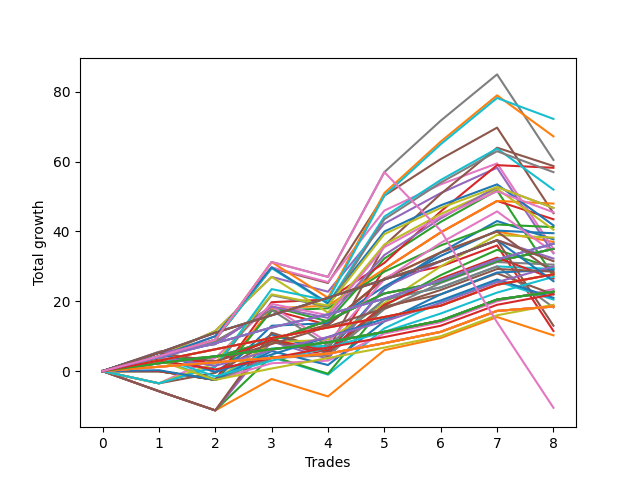

# Short Bulldog 006 DB 
- Symbol: ES
- Date Range: 03/18/2022 - 07/15/2022
- Trading Period: 7:20-12:30
- Number of Trades: 8



| Name | Win Percent | Profit | Avg Profit / Trade | Avg Time / Trade |      | Name | Win Percent | Profit | Avg Profit / Trade | Avg Time / Trade |
| ---- | ----------- | ------ | ------------------ | ---------------- | ---- | ---- | ----------- | ------ | ------------------ | ---------------- |
| Sorted By <br> Profit | | | | | | Sorted By <br> Win Percentage ||||
| Seventy-One | 62.50 | 36125.00 | 4515.62 | 16:00 |     | One Hundred Twenty-Nine | 100.00 | 18250.00 | 2281.25 | 04:48 |
| Sixty-Three | 75.00 | 33625.00 | 4203.12 | 19:28 |     | One Hundred Twenty-Four | 100.00 | 18250.00 | 2281.25 | 04:48 |
| Seven | 75.00 | 30250.00 | 3781.25 | 22:53 |     | Eighty-Four | 100.00 | 18250.00 | 2281.25 | 04:48 |
| Forty-Seven | 50.00 | 29375.00 | 3671.88 | 13:55 |     | Sixty-Four | 100.00 | 17500.00 | 2187.50 | 04:21 |
| Fifty-Five | 62.50 | 29125.00 | 3640.62 | 08:20 |     | Fifty-Six | 100.00 | 17500.00 | 2187.50 | 04:21 |
| Sixty-Nine | 62.50 | 28500.00 | 3562.50 | 12:53 |     | Forty | 100.00 | 17500.00 | 2187.50 | 04:21 |
| Sixty-One | 75.00 | 26000.00 | 3250.00 | 16:21 |     | Zero | 100.00 | 17500.00 | 2187.50 | 04:21 |
| Fifty-Three | 62.50 | 24000.00 | 3000.00 | 06:49 |     | One Hundred Twenty-Eight | 100.00 | 13875.00 | 1734.38 | 04:15 |
| Sixty-Six | 75.00 | 23375.00 | 2921.88 | 09:58 |     | One Hundred Twenty-Three | 100.00 | 13875.00 | 1734.38 | 04:15 |
| Seventy | 62.50 | 23375.00 | 2921.88 | 11:58 |     | Eighty-Three | 100.00 | 13875.00 | 1734.38 | 04:15 |
| Sixty-Eight | 62.50 | 22750.00 | 2843.75 | 11:51 |     | One Hundred Twenty-Seven | 100.00 | 11375.00 | 1421.88 | 00:46 |
| Five | 75.00 | 22625.00 | 2828.12 | 19:46 |     | One Hundred Twenty-Two | 100.00 | 11375.00 | 1421.88 | 00:46 |
| Forty-Five | 50.00 | 21750.00 | 2718.75 | 10:48 |     | One Hundred Seventeen | 100.00 | 11375.00 | 1421.88 | 00:46 |
| Sixty-Two | 75.00 | 20875.00 | 2609.38 | 15:26 |     | One Hundred Twelve | 100.00 | 11375.00 | 1421.88 | 00:46 |
| Fifty-Four | 62.50 | 20625.00 | 2578.12 | 06:38 |     | Eighty-Two | 100.00 | 11375.00 | 1421.88 | 00:46 |
| Sixty | 75.00 | 20250.00 | 2531.25 | 15:20 |     | One Hundred Twenty-Six | 100.00 | 9250.00 | 1156.25 | 00:25 |
| Fifty-Two | 62.50 | 19750.00 | 2468.75 | 06:19 |     | One Hundred Twenty-One | 100.00 | 9250.00 | 1156.25 | 00:25 |
| Fifty | 62.50 | 19125.00 | 2390.62 | 06:06 |     | One Hundred Sixteen | 100.00 | 9250.00 | 1156.25 | 00:25 |
| Forty-Two | 62.50 | 18875.00 | 2359.38 | 08:31 |     | One Hundred Eleven | 100.00 | 9250.00 | 1156.25 | 00:25 |
| One | 75.00 | 18500.00 | 2312.50 | 11:25 |     | Eighty-One | 100.00 | 9250.00 | 1156.25 | 00:25 |
| One Hundred Twenty-Nine | 100.00 | 18250.00 | 2281.25 | 04:48 |     | One Hundred Thirty | 87.50 | 15750.00 | 1968.75 | 05:23 |
| One Hundred Twenty-Four | 100.00 | 18250.00 | 2281.25 | 04:48 |     | One Hundred Ninteen | 87.50 | 15000.00 | 1875.00 | 02:22 |
| Eighty-Four | 100.00 | 18250.00 | 2281.25 | 04:48 |     | One Hundred Fourteen | 87.50 | 13500.00 | 1687.50 | 03:01 |
| Sixty-Four | 100.00 | 17500.00 | 2187.50 | 04:21 |     | One Hundred Twenty-Five | 87.50 | 12875.00 | 1609.38 | 05:56 |
| Fifty-Six | 100.00 | 17500.00 | 2187.50 | 04:21 |     | One Hundred Eighteen | 87.50 | 11000.00 | 1375.00 | 02:04 |
| Forty | 100.00 | 17500.00 | 2187.50 | 04:21 |     | One Hundred Thirteen | 87.50 | 9500.00 | 1187.50 | 02:43 |
| Zero | 100.00 | 17500.00 | 2187.50 | 04:21 |     | Eighty-Five | 87.50 | 6500.00 | 812.50 | 08:28 |
| Six | 75.00 | 17500.00 | 2187.50 | 18:51 |     | Sixty-Three | 75.00 | 33625.00 | 4203.12 | 19:28 |
| Fifty-Eight | 75.00 | 17000.00 | 2125.00 | 12:28 |     | Seven | 75.00 | 30250.00 | 3781.25 | 22:53 |
| Four | 75.00 | 16875.00 | 2109.38 | 18:45 |     | Sixty-One | 75.00 | 26000.00 | 3250.00 | 16:21 |
| Forty-Six | 50.00 | 16125.00 | 2015.62 | 10:12 |     | Sixty-Six | 75.00 | 23375.00 | 2921.88 | 09:58 |
| One Hundred Thirty | 87.50 | 15750.00 | 1968.75 | 05:23 |     | Five | 75.00 | 22625.00 | 2828.12 | 19:46 |
| Forty-Nine | 62.50 | 15250.00 | 1906.25 | 05:01 |     | Sixty-Two | 75.00 | 20875.00 | 2609.38 | 15:26 |
| One Hundred Ninteen | 87.50 | 15000.00 | 1875.00 | 02:22 |     | Sixty | 75.00 | 20250.00 | 2531.25 | 15:20 |
| Forty-Four | 50.00 | 14750.00 | 1843.75 | 09:52 |     | One | 75.00 | 18500.00 | 2312.50 | 11:25 |
| Fifty-One | 62.50 | 14625.00 | 1828.12 | 05:12 |     | Six | 75.00 | 17500.00 | 2187.50 | 18:51 |
| Seventy-Three | 75.00 | 14500.00 | 1812.50 | 08:35 |     | Fifty-Eight | 75.00 | 17000.00 | 2125.00 | 12:28 |
| One Hundred Twenty | 75.00 | 14250.00 | 1781.25 | 02:44 |     | Four | 75.00 | 16875.00 | 2109.38 | 18:45 |
| Fifty-Seven | 75.00 | 14125.00 | 1765.62 | 09:46 |     | Seventy-Three | 75.00 | 14500.00 | 1812.50 | 08:35 |
| One Hundred Twenty-Eight | 100.00 | 13875.00 | 1734.38 | 04:15 |     | One Hundred Twenty | 75.00 | 14250.00 | 1781.25 | 02:44 |
| One Hundred Twenty-Three | 100.00 | 13875.00 | 1734.38 | 04:15 |     | Fifty-Seven | 75.00 | 14125.00 | 1765.62 | 09:46 |
| Eighty-Three | 100.00 | 13875.00 | 1734.38 | 04:15 |     | Two | 75.00 | 13625.00 | 1703.12 | 15:53 |
| Two | 75.00 | 13625.00 | 1703.12 | 15:53 |     | Forty-Eight | 75.00 | 11750.00 | 1468.75 | 03:11 |
| One Hundred Fourteen | 87.50 | 13500.00 | 1687.50 | 03:01 |     | One Hundred Fifteen | 75.00 | 10500.00 | 1312.50 | 03:30 |
| Sixty-Five | 62.50 | 13250.00 | 1656.25 | 08:22 |     | Fifty-Nine | 75.00 | 9125.00 | 1140.62 | 13:19 |
| One Hundred Twenty-Five | 87.50 | 12875.00 | 1609.38 | 05:56 |     | Three | 75.00 | 5750.00 | 718.75 | 16:44 |
| Forty-Eight | 75.00 | 11750.00 | 1468.75 | 03:11 |     | Seventy-One | 62.50 | 36125.00 | 4515.62 | 16:00 |
| One Hundred Twenty-Seven | 100.00 | 11375.00 | 1421.88 | 00:46 |     | Fifty-Five | 62.50 | 29125.00 | 3640.62 | 08:20 |
| One Hundred Twenty-Two | 100.00 | 11375.00 | 1421.88 | 00:46 |     | Sixty-Nine | 62.50 | 28500.00 | 3562.50 | 12:53 |
| One Hundred Seventeen | 100.00 | 11375.00 | 1421.88 | 00:46 |     | Fifty-Three | 62.50 | 24000.00 | 3000.00 | 06:49 |
| One Hundred Twelve | 100.00 | 11375.00 | 1421.88 | 00:46 |     | Seventy | 62.50 | 23375.00 | 2921.88 | 11:58 |
| Eighty-Two | 100.00 | 11375.00 | 1421.88 | 00:46 |     | Sixty-Eight | 62.50 | 22750.00 | 2843.75 | 11:51 |
| One Hundred Eighteen | 87.50 | 11000.00 | 1375.00 | 02:04 |     | Fifty-Four | 62.50 | 20625.00 | 2578.12 | 06:38 |
| Sixty-Seven | 62.50 | 11000.00 | 1375.00 | 09:53 |     | Fifty-Two | 62.50 | 19750.00 | 2468.75 | 06:19 |
| One Hundred Fifteen | 75.00 | 10500.00 | 1312.50 | 03:30 |     | Fifty | 62.50 | 19125.00 | 2390.62 | 06:06 |
| Forty-One | 62.50 | 10250.00 | 1281.25 | 07:00 |     | Forty-Two | 62.50 | 18875.00 | 2359.38 | 08:31 |
| One Hundred Thirteen | 87.50 | 9500.00 | 1187.50 | 02:43 |     | Forty-Nine | 62.50 | 15250.00 | 1906.25 | 05:01 |
| One Hundred Twenty-Six | 100.00 | 9250.00 | 1156.25 | 00:25 |     | Fifty-One | 62.50 | 14625.00 | 1828.12 | 05:12 |
| One Hundred Twenty-One | 100.00 | 9250.00 | 1156.25 | 00:25 |     | Sixty-Five | 62.50 | 13250.00 | 1656.25 | 08:22 |
| One Hundred Sixteen | 100.00 | 9250.00 | 1156.25 | 00:25 |     | Sixty-Seven | 62.50 | 11000.00 | 1375.00 | 09:53 |
| One Hundred Eleven | 100.00 | 9250.00 | 1156.25 | 00:25 |     | Forty-One | 62.50 | 10250.00 | 1281.25 | 07:00 |
| Eighty-One | 100.00 | 9250.00 | 1156.25 | 00:25 |     | Forty-Seven | 50.00 | 29375.00 | 3671.88 | 13:55 |
| Fifty-Nine | 75.00 | 9125.00 | 1140.62 | 13:19 |     | Forty-Five | 50.00 | 21750.00 | 2718.75 | 10:48 |
| Eighty-Five | 87.50 | 6500.00 | 812.50 | 08:28 |     | Forty-Six | 50.00 | 16125.00 | 2015.62 | 10:12 |
| Three | 75.00 | 5750.00 | 718.75 | 16:44 |     | Forty-Four | 50.00 | 14750.00 | 1843.75 | 09:52 |
| Forty-Three | 50.00 | 5125.00 | 640.62 | 08:33 |     | Forty-Three | 50.00 | 5125.00 | 640.62 | 08:33 |
| TEST | 50.00 | -5250.00 | -656.25 | 29:55 |     | TEST | 50.00 | -5250.00 | -656.25 | 29:55 |

## NO STOPLOSS

### Test Zero
* Sell when price hits the middle line of the 20p bollinger
* No Stoploss
* Results:
```
Total Trades: 8
Percent Up: 0.00
Percent Down: 100.00
Total Points Moved Down: 35.00
Potential Profit: 17500.00
Total Points Ups: 0.00 Count Ups: 0
Total Points Downs: 35.00 Count Downs: 8
```

<details><summary>Trades</summary>

<code>In: 2022-04-07 11:04:00		Out: 2022-04-07 11:15:20		Total Position Time: 11:20		Total Move Down: 3.25		Total to Date: 3.25</code> <br />
<code>In: 2022-04-18 07:28:00		Out: 2022-04-18 07:36:45		Total Position Time: 08:45		Total Move Down: 0.75		Total to Date: 4.00</code> <br />
<code>In: 2022-05-24 09:18:00		Out: 2022-05-24 09:21:35		Total Position Time: 03:35		Total Move Down: 4.75		Total to Date: 8.75</code> <br />
<code>In: 2022-05-31 07:24:00		Out: 2022-05-31 07:30:05		Total Position Time: 06:05		Total Move Down: 5.75		Total to Date: 14.50</code> <br />
<code>In: 2022-06-13 09:41:00		Out: 2022-06-13 09:43:15		Total Position Time: 02:15		Total Move Down: 7.75		Total to Date: 22.25</code> <br />
<code>In: 2022-07-06 11:10:00		Out: 2022-07-06 11:10:10		Total Position Time: 00:10		Total Move Down: 3.25		Total to Date: 25.50</code> <br />
<code>In: 2022-07-06 11:11:00		Out: 2022-07-06 11:11:10		Total Position Time: 00:10		Total Move Down: 6.00		Total to Date: 31.50</code> <br />
<code>In: 2022-07-14 08:13:00		Out: 2022-07-14 08:15:30		Total Position Time: 02:30		Total Move Down: 3.50		Total to Date: 35.00</code> <br />


</details>

### Test One
* Sell when the price hits the upper line of the 20p 1std bollinger
* No Stoploss
* Results:
```
Total Trades: 8
Percent Up: 25.00
Percent Down: 75.00
Total Points Moved Down: 37.00
Potential Profit: 18500.00
Total Points Ups: 3.50 Count Ups: 2
Total Points Downs: 40.50 Count Downs: 6
```

<details><summary>Trades</summary>

<code>In: 2022-04-07 11:04:00		Out: 2022-04-07 11:16:10		Total Position Time: 12:10		Total Move Down: 3.25		Total to Date: 3.25</code> <br />
<code>In: 2022-04-18 07:28:00		Out: 2022-04-18 07:51:15		Total Position Time: 23:15		Total Move Down: -0.50		Total to Date: 2.75</code> <br />
<code>In: 2022-05-24 09:18:00		Out: 2022-05-24 09:28:55		Total Position Time: 10:55		Total Move Down: 6.25		Total to Date: 9.00</code> <br />
<code>In: 2022-05-31 07:24:00		Out: 2022-05-31 07:38:05		Total Position Time: 14:05		Total Move Down: 4.25		Total to Date: 13.25</code> <br />
<code>In: 2022-06-13 09:41:00		Out: 2022-06-13 09:47:50		Total Position Time: 06:50		Total Move Down: 13.25		Total to Date: 26.50</code> <br />
<code>In: 2022-07-06 11:10:00		Out: 2022-07-06 11:11:10		Total Position Time: 01:10		Total Move Down: 7.50		Total to Date: 34.00</code> <br />
<code>In: 2022-07-06 11:11:00		Out: 2022-07-06 11:11:10		Total Position Time: 00:10		Total Move Down: 6.00		Total to Date: 40.00</code> <br />
<code>In: 2022-07-14 08:13:00		Out: 2022-07-14 08:35:50		Total Position Time: 22:50		Total Move Down: -3.00		Total to Date: 37.00</code> <br />


</details>

### Test Two
* Sell when the price hits the upper line of the 20p 2std bollinger
* No Stoploss
* Results:
```
Total Trades: 8
Percent Up: 25.00
Percent Down: 75.00
Total Points Moved Down: 27.25
Potential Profit: 13625.00
Total Points Ups: 28.75 Count Ups: 2
Total Points Downs: 56.00 Count Downs: 6
```

<details><summary>Trades</summary>

<code>In: 2022-04-07 11:04:00		Out: 2022-04-07 11:18:20		Total Position Time: 14:20		Total Move Down: 5.25		Total to Date: 5.25</code> <br />
<code>In: 2022-04-18 07:28:00		Out: 2022-04-18 07:51:45		Total Position Time: 23:45		Total Move Down: 2.50		Total to Date: 7.75</code> <br />
<code>In: 2022-05-24 09:18:00		Out: 2022-05-24 09:31:20		Total Position Time: 13:20		Total Move Down: 10.75		Total to Date: 18.50</code> <br />
<code>In: 2022-05-31 07:24:00		Out: 2022-05-31 07:53:55		Total Position Time: 29:55		Total Move Down: -4.25		Total to Date: 14.25</code> <br />
<code>In: 2022-06-13 09:41:00		Out: 2022-06-13 09:54:20		Total Position Time: 13:20		Total Move Down: 18.00		Total to Date: 32.25</code> <br />
<code>In: 2022-07-06 11:10:00		Out: 2022-07-06 11:11:45		Total Position Time: 01:45		Total Move Down: 10.50		Total to Date: 42.75</code> <br />
<code>In: 2022-07-06 11:11:00		Out: 2022-07-06 11:11:45		Total Position Time: 00:45		Total Move Down: 9.00		Total to Date: 51.75</code> <br />
<code>In: 2022-07-14 08:13:00		Out: 2022-07-14 08:42:55		Total Position Time: 29:55		Total Move Down: -24.50		Total to Date: 27.25</code> <br />


</details>

### Test Three
* Sell when price hits the middle line of the 50p bollinger
* No Stoploss
* Results:
```
Total Trades: 8
Percent Up: 25.00
Percent Down: 75.00
Total Points Moved Down: 11.50
Potential Profit: 5750.00
Total Points Ups: 28.75 Count Ups: 2
Total Points Downs: 40.25 Count Downs: 6
```

<details><summary>Trades</summary>

<code>In: 2022-04-07 11:04:00		Out: 2022-04-07 11:33:40		Total Position Time: 29:40		Total Move Down: 5.50		Total to Date: 5.50</code> <br />
<code>In: 2022-04-18 07:28:00		Out: 2022-04-18 07:51:50		Total Position Time: 23:50		Total Move Down: 3.00		Total to Date: 8.50</code> <br />
<code>In: 2022-05-24 09:18:00		Out: 2022-05-24 09:31:15		Total Position Time: 13:15		Total Move Down: 9.00		Total to Date: 17.50</code> <br />
<code>In: 2022-05-31 07:24:00		Out: 2022-05-31 07:53:55		Total Position Time: 29:55		Total Move Down: -4.25		Total to Date: 13.25</code> <br />
<code>In: 2022-06-13 09:41:00		Out: 2022-06-13 09:47:50		Total Position Time: 06:50		Total Move Down: 13.25		Total to Date: 26.50</code> <br />
<code>In: 2022-07-06 11:10:00		Out: 2022-07-06 11:10:20		Total Position Time: 00:20		Total Move Down: 3.50		Total to Date: 30.00</code> <br />
<code>In: 2022-07-06 11:11:00		Out: 2022-07-06 11:11:10		Total Position Time: 00:10		Total Move Down: 6.00		Total to Date: 36.00</code> <br />
<code>In: 2022-07-14 08:13:00		Out: 2022-07-14 08:42:55		Total Position Time: 29:55		Total Move Down: -24.50		Total to Date: 11.50</code> <br />


</details>

### Test Four
* Sell when the price hits the upper line of the 50p 1std bollinger
* No Stoploss
* Results:
```
Total Trades: 8
Percent Up: 25.00
Percent Down: 75.00
Total Points Moved Down: 33.75
Potential Profit: 16875.00
Total Points Ups: 28.75 Count Ups: 2
Total Points Downs: 62.50 Count Downs: 6
```

<details><summary>Trades</summary>

<code>In: 2022-04-07 11:04:00		Out: 2022-04-07 11:33:55		Total Position Time: 29:55		Total Move Down: 4.25		Total to Date: 4.25</code> <br />
<code>In: 2022-04-18 07:28:00		Out: 2022-04-18 07:57:05		Total Position Time: 29:05		Total Move Down: 7.25		Total to Date: 11.50</code> <br />
<code>In: 2022-05-24 09:18:00		Out: 2022-05-24 09:33:20		Total Position Time: 15:20		Total Move Down: 15.50		Total to Date: 27.00</code> <br />
<code>In: 2022-05-31 07:24:00		Out: 2022-05-31 07:53:55		Total Position Time: 29:55		Total Move Down: -4.25		Total to Date: 22.75</code> <br />
<code>In: 2022-06-13 09:41:00		Out: 2022-06-13 09:54:40		Total Position Time: 13:40		Total Move Down: 19.50		Total to Date: 42.25</code> <br />
<code>In: 2022-07-06 11:10:00		Out: 2022-07-06 11:11:35		Total Position Time: 01:35		Total Move Down: 8.75		Total to Date: 51.00</code> <br />
<code>In: 2022-07-06 11:11:00		Out: 2022-07-06 11:11:35		Total Position Time: 00:35		Total Move Down: 7.25		Total to Date: 58.25</code> <br />
<code>In: 2022-07-14 08:13:00		Out: 2022-07-14 08:42:55		Total Position Time: 29:55		Total Move Down: -24.50		Total to Date: 33.75</code> <br />


</details>

### Test Five
* Sell when the price hits the upper line of the 50p 2std bollinger
* No Stoploss
* Results:
```
Total Trades: 8
Percent Up: 25.00
Percent Down: 75.00
Total Points Moved Down: 45.25
Potential Profit: 22625.00
Total Points Ups: 28.75 Count Ups: 2
Total Points Downs: 74.00 Count Downs: 6
```

<details><summary>Trades</summary>

<code>In: 2022-04-07 11:04:00		Out: 2022-04-07 11:33:55		Total Position Time: 29:55		Total Move Down: 4.25		Total to Date: 4.25</code> <br />
<code>In: 2022-04-18 07:28:00		Out: 2022-04-18 07:57:55		Total Position Time: 29:55		Total Move Down: 4.75		Total to Date: 9.00</code> <br />
<code>In: 2022-05-24 09:18:00		Out: 2022-05-24 09:36:50		Total Position Time: 18:50		Total Move Down: 20.50		Total to Date: 29.50</code> <br />
<code>In: 2022-05-31 07:24:00		Out: 2022-05-31 07:53:55		Total Position Time: 29:55		Total Move Down: -4.25		Total to Date: 25.25</code> <br />
<code>In: 2022-06-13 09:41:00		Out: 2022-06-13 09:58:05		Total Position Time: 17:05		Total Move Down: 25.00		Total to Date: 50.25</code> <br />
<code>In: 2022-07-06 11:10:00		Out: 2022-07-06 11:11:50		Total Position Time: 01:50		Total Move Down: 10.50		Total to Date: 60.75</code> <br />
<code>In: 2022-07-06 11:11:00		Out: 2022-07-06 11:11:50		Total Position Time: 00:50		Total Move Down: 9.00		Total to Date: 69.75</code> <br />
<code>In: 2022-07-14 08:13:00		Out: 2022-07-14 08:42:55		Total Position Time: 29:55		Total Move Down: -24.50		Total to Date: 45.25</code> <br />


</details>

### Test Six
* Sell when the price hits the middle line of the 1std VWAP
* No Stoploss
* Results:
```
Total Trades: 8
Percent Up: 25.00
Percent Down: 75.00
Total Points Moved Down: 35.00
Potential Profit: 17500.00
Total Points Ups: 28.75 Count Ups: 2
Total Points Downs: 63.75 Count Downs: 6
```

<details><summary>Trades</summary>

<code>In: 2022-04-07 11:04:00		Out: 2022-04-07 11:33:55		Total Position Time: 29:55		Total Move Down: 4.25		Total to Date: 4.25</code> <br />
<code>In: 2022-04-18 07:28:00		Out: 2022-04-18 07:55:15		Total Position Time: 27:15		Total Move Down: 5.75		Total to Date: 10.00</code> <br />
<code>In: 2022-05-24 09:18:00		Out: 2022-05-24 09:36:45		Total Position Time: 18:45		Total Move Down: 19.75		Total to Date: 29.75</code> <br />
<code>In: 2022-05-31 07:24:00		Out: 2022-05-31 07:53:55		Total Position Time: 29:55		Total Move Down: -4.25		Total to Date: 25.50</code> <br />
<code>In: 2022-06-13 09:41:00		Out: 2022-06-13 09:54:45		Total Position Time: 13:45		Total Move Down: 20.50		Total to Date: 46.00</code> <br />
<code>In: 2022-07-06 11:10:00		Out: 2022-07-06 11:11:10		Total Position Time: 01:10		Total Move Down: 7.50		Total to Date: 53.50</code> <br />
<code>In: 2022-07-06 11:11:00		Out: 2022-07-06 11:11:10		Total Position Time: 00:10		Total Move Down: 6.00		Total to Date: 59.50</code> <br />
<code>In: 2022-07-14 08:13:00		Out: 2022-07-14 08:42:55		Total Position Time: 29:55		Total Move Down: -24.50		Total to Date: 35.00</code> <br />


</details>

### Test Seven
* Sell when the price hits the upper line of the 1std VWAP
* No Stoploss
* Results:
```
Total Trades: 8
Percent Up: 25.00
Percent Down: 75.00
Total Points Moved Down: 60.50
Potential Profit: 30250.00
Total Points Ups: 28.75 Count Ups: 2
Total Points Downs: 89.25 Count Downs: 6
```

<details><summary>Trades</summary>

<code>In: 2022-04-07 11:04:00		Out: 2022-04-07 11:33:55		Total Position Time: 29:55		Total Move Down: 4.25		Total to Date: 4.25</code> <br />
<code>In: 2022-04-18 07:28:00		Out: 2022-04-18 07:57:55		Total Position Time: 29:55		Total Move Down: 4.75		Total to Date: 9.00</code> <br />
<code>In: 2022-05-24 09:18:00		Out: 2022-05-24 09:47:55		Total Position Time: 29:55		Total Move Down: 22.25		Total to Date: 31.25</code> <br />
<code>In: 2022-05-31 07:24:00		Out: 2022-05-31 07:53:55		Total Position Time: 29:55		Total Move Down: -4.25		Total to Date: 27.00</code> <br />
<code>In: 2022-06-13 09:41:00		Out: 2022-06-13 10:10:55		Total Position Time: 29:55		Total Move Down: 30.00		Total to Date: 57.00</code> <br />
<code>In: 2022-07-06 11:10:00		Out: 2022-07-06 11:12:20		Total Position Time: 02:20		Total Move Down: 14.75		Total to Date: 71.75</code> <br />
<code>In: 2022-07-06 11:11:00		Out: 2022-07-06 11:12:20		Total Position Time: 01:20		Total Move Down: 13.25		Total to Date: 85.00</code> <br />
<code>In: 2022-07-14 08:13:00		Out: 2022-07-14 08:42:55		Total Position Time: 29:55		Total Move Down: -24.50		Total to Date: 60.50</code> <br />


</details>

## STOPLOSS OF 5

### Test Forty
* Sell when price hits the middle line of the 20p bollinger
* Stoploss is -5 points
* Results:
```
Total Trades: 8
Percent Up: 0.00
Percent Down: 100.00
Total Points Moved Down: 35.00
Potential Profit: 17500.00
Total Points Ups: 0.00 Count Ups: 0
Total Points Downs: 35.00 Count Downs: 8
```

<details><summary>Trades</summary>

<code>In: 2022-04-07 11:04:00		Out: 2022-04-07 11:15:20		Total Position Time: 11:20		Total Move Down: 3.25		Total to Date: 3.25</code> <br />
<code>In: 2022-04-18 07:28:00		Out: 2022-04-18 07:36:45		Total Position Time: 08:45		Total Move Down: 0.75		Total to Date: 4.00</code> <br />
<code>In: 2022-05-24 09:18:00		Out: 2022-05-24 09:21:35		Total Position Time: 03:35		Total Move Down: 4.75		Total to Date: 8.75</code> <br />
<code>In: 2022-05-31 07:24:00		Out: 2022-05-31 07:30:05		Total Position Time: 06:05		Total Move Down: 5.75		Total to Date: 14.50</code> <br />
<code>In: 2022-06-13 09:41:00		Out: 2022-06-13 09:43:15		Total Position Time: 02:15		Total Move Down: 7.75		Total to Date: 22.25</code> <br />
<code>In: 2022-07-06 11:10:00		Out: 2022-07-06 11:10:10		Total Position Time: 00:10		Total Move Down: 3.25		Total to Date: 25.50</code> <br />
<code>In: 2022-07-06 11:11:00		Out: 2022-07-06 11:11:10		Total Position Time: 00:10		Total Move Down: 6.00		Total to Date: 31.50</code> <br />
<code>In: 2022-07-14 08:13:00		Out: 2022-07-14 08:15:30		Total Position Time: 02:30		Total Move Down: 3.50		Total to Date: 35.00</code> <br />


</details>

### Test Forty-One
* Sell when the price hits the upper line of the 20p 1std bollinger
* Stoploss is -5 points
* Results:
```
Total Trades: 8
Percent Up: 37.50
Percent Down: 62.50
Total Points Moved Down: 20.50
Potential Profit: 10250.00
Total Points Ups: 15.75 Count Ups: 3
Total Points Downs: 36.25 Count Downs: 5
```

<details><summary>Trades</summary>

<code>In: 2022-04-07 11:04:00		Out: 2022-04-07 11:16:10		Total Position Time: 12:10		Total Move Down: 3.25		Total to Date: 3.25</code> <br />
<code>In: 2022-04-18 07:28:00		Out: 2022-04-18 07:40:15		Total Position Time: 12:15		Total Move Down: -5.50		Total to Date: -2.25</code> <br />
<code>In: 2022-05-24 09:18:00		Out: 2022-05-24 09:28:55		Total Position Time: 10:55		Total Move Down: 6.25		Total to Date: 4.00</code> <br />
<code>In: 2022-05-31 07:24:00		Out: 2022-05-31 07:31:25		Total Position Time: 07:25		Total Move Down: -5.00		Total to Date: -1.00</code> <br />
<code>In: 2022-06-13 09:41:00		Out: 2022-06-13 09:47:50		Total Position Time: 06:50		Total Move Down: 13.25		Total to Date: 12.25</code> <br />
<code>In: 2022-07-06 11:10:00		Out: 2022-07-06 11:11:10		Total Position Time: 01:10		Total Move Down: 7.50		Total to Date: 19.75</code> <br />
<code>In: 2022-07-06 11:11:00		Out: 2022-07-06 11:11:10		Total Position Time: 00:10		Total Move Down: 6.00		Total to Date: 25.75</code> <br />
<code>In: 2022-07-14 08:13:00		Out: 2022-07-14 08:18:05		Total Position Time: 05:05		Total Move Down: -5.25		Total to Date: 20.50</code> <br />


</details>

### Test Forty-Two
* Sell when the price hits the upper line of the 20p 2std bollinger
* Stoploss is -5 points
* Results:
```
Total Trades: 8
Percent Up: 37.50
Percent Down: 62.50
Total Points Moved Down: 37.75
Potential Profit: 18875.00
Total Points Ups: 15.75 Count Ups: 3
Total Points Downs: 53.50 Count Downs: 5
```

<details><summary>Trades</summary>

<code>In: 2022-04-07 11:04:00		Out: 2022-04-07 11:18:20		Total Position Time: 14:20		Total Move Down: 5.25		Total to Date: 5.25</code> <br />
<code>In: 2022-04-18 07:28:00		Out: 2022-04-18 07:40:15		Total Position Time: 12:15		Total Move Down: -5.50		Total to Date: -0.25</code> <br />
<code>In: 2022-05-24 09:18:00		Out: 2022-05-24 09:31:20		Total Position Time: 13:20		Total Move Down: 10.75		Total to Date: 10.50</code> <br />
<code>In: 2022-05-31 07:24:00		Out: 2022-05-31 07:31:25		Total Position Time: 07:25		Total Move Down: -5.00		Total to Date: 5.50</code> <br />
<code>In: 2022-06-13 09:41:00		Out: 2022-06-13 09:54:20		Total Position Time: 13:20		Total Move Down: 18.00		Total to Date: 23.50</code> <br />
<code>In: 2022-07-06 11:10:00		Out: 2022-07-06 11:11:45		Total Position Time: 01:45		Total Move Down: 10.50		Total to Date: 34.00</code> <br />
<code>In: 2022-07-06 11:11:00		Out: 2022-07-06 11:11:45		Total Position Time: 00:45		Total Move Down: 9.00		Total to Date: 43.00</code> <br />
<code>In: 2022-07-14 08:13:00		Out: 2022-07-14 08:18:05		Total Position Time: 05:05		Total Move Down: -5.25		Total to Date: 37.75</code> <br />


</details>

### Test Forty-Three
* Sell when price hits the middle line of the 50p bollinger
* Stoploss is -5 points
* Results:
```
Total Trades: 8
Percent Up: 50.00
Percent Down: 50.00
Total Points Moved Down: 10.25
Potential Profit: 5125.00
Total Points Ups: 21.50 Count Ups: 4
Total Points Downs: 31.75 Count Downs: 4
```

<details><summary>Trades</summary>

<code>In: 2022-04-07 11:04:00		Out: 2022-04-07 11:27:05		Total Position Time: 23:05		Total Move Down: -5.75		Total to Date: -5.75</code> <br />
<code>In: 2022-04-18 07:28:00		Out: 2022-04-18 07:40:15		Total Position Time: 12:15		Total Move Down: -5.50		Total to Date: -11.25</code> <br />
<code>In: 2022-05-24 09:18:00		Out: 2022-05-24 09:31:15		Total Position Time: 13:15		Total Move Down: 9.00		Total to Date: -2.25</code> <br />
<code>In: 2022-05-31 07:24:00		Out: 2022-05-31 07:31:25		Total Position Time: 07:25		Total Move Down: -5.00		Total to Date: -7.25</code> <br />
<code>In: 2022-06-13 09:41:00		Out: 2022-06-13 09:47:50		Total Position Time: 06:50		Total Move Down: 13.25		Total to Date: 6.00</code> <br />
<code>In: 2022-07-06 11:10:00		Out: 2022-07-06 11:10:20		Total Position Time: 00:20		Total Move Down: 3.50		Total to Date: 9.50</code> <br />
<code>In: 2022-07-06 11:11:00		Out: 2022-07-06 11:11:10		Total Position Time: 00:10		Total Move Down: 6.00		Total to Date: 15.50</code> <br />
<code>In: 2022-07-14 08:13:00		Out: 2022-07-14 08:18:05		Total Position Time: 05:05		Total Move Down: -5.25		Total to Date: 10.25</code> <br />


</details>

### Test Forty-Four
* Sell when the price hits the upper line of the 50p 1std bollinger
* Stoploss is -5 points
* Results:
```
Total Trades: 8
Percent Up: 50.00
Percent Down: 50.00
Total Points Moved Down: 29.50
Potential Profit: 14750.00
Total Points Ups: 21.50 Count Ups: 4
Total Points Downs: 51.00 Count Downs: 4
```

<details><summary>Trades</summary>

<code>In: 2022-04-07 11:04:00		Out: 2022-04-07 11:27:05		Total Position Time: 23:05		Total Move Down: -5.75		Total to Date: -5.75</code> <br />
<code>In: 2022-04-18 07:28:00		Out: 2022-04-18 07:40:15		Total Position Time: 12:15		Total Move Down: -5.50		Total to Date: -11.25</code> <br />
<code>In: 2022-05-24 09:18:00		Out: 2022-05-24 09:33:20		Total Position Time: 15:20		Total Move Down: 15.50		Total to Date: 4.25</code> <br />
<code>In: 2022-05-31 07:24:00		Out: 2022-05-31 07:31:25		Total Position Time: 07:25		Total Move Down: -5.00		Total to Date: -0.75</code> <br />
<code>In: 2022-06-13 09:41:00		Out: 2022-06-13 09:54:40		Total Position Time: 13:40		Total Move Down: 19.50		Total to Date: 18.75</code> <br />
<code>In: 2022-07-06 11:10:00		Out: 2022-07-06 11:11:35		Total Position Time: 01:35		Total Move Down: 8.75		Total to Date: 27.50</code> <br />
<code>In: 2022-07-06 11:11:00		Out: 2022-07-06 11:11:35		Total Position Time: 00:35		Total Move Down: 7.25		Total to Date: 34.75</code> <br />
<code>In: 2022-07-14 08:13:00		Out: 2022-07-14 08:18:05		Total Position Time: 05:05		Total Move Down: -5.25		Total to Date: 29.50</code> <br />


</details>

### Test Forty-Five
* Sell when the price hits the upper line of the 50p 2std bollinger
* Stoploss is -5 points
* Results:
```
Total Trades: 8
Percent Up: 50.00
Percent Down: 50.00
Total Points Moved Down: 43.50
Potential Profit: 21750.00
Total Points Ups: 21.50 Count Ups: 4
Total Points Downs: 65.00 Count Downs: 4
```

<details><summary>Trades</summary>

<code>In: 2022-04-07 11:04:00		Out: 2022-04-07 11:27:05		Total Position Time: 23:05		Total Move Down: -5.75		Total to Date: -5.75</code> <br />
<code>In: 2022-04-18 07:28:00		Out: 2022-04-18 07:40:15		Total Position Time: 12:15		Total Move Down: -5.50		Total to Date: -11.25</code> <br />
<code>In: 2022-05-24 09:18:00		Out: 2022-05-24 09:36:50		Total Position Time: 18:50		Total Move Down: 20.50		Total to Date: 9.25</code> <br />
<code>In: 2022-05-31 07:24:00		Out: 2022-05-31 07:31:25		Total Position Time: 07:25		Total Move Down: -5.00		Total to Date: 4.25</code> <br />
<code>In: 2022-06-13 09:41:00		Out: 2022-06-13 09:58:05		Total Position Time: 17:05		Total Move Down: 25.00		Total to Date: 29.25</code> <br />
<code>In: 2022-07-06 11:10:00		Out: 2022-07-06 11:11:50		Total Position Time: 01:50		Total Move Down: 10.50		Total to Date: 39.75</code> <br />
<code>In: 2022-07-06 11:11:00		Out: 2022-07-06 11:11:50		Total Position Time: 00:50		Total Move Down: 9.00		Total to Date: 48.75</code> <br />
<code>In: 2022-07-14 08:13:00		Out: 2022-07-14 08:18:05		Total Position Time: 05:05		Total Move Down: -5.25		Total to Date: 43.50</code> <br />


</details>

### Test Forty-Six
* Sell when the price hits the middle line of the 1std VWAP
* Stoploss is -5 points
* Results:
```
Total Trades: 8
Percent Up: 50.00
Percent Down: 50.00
Total Points Moved Down: 32.25
Potential Profit: 16125.00
Total Points Ups: 21.50 Count Ups: 4
Total Points Downs: 53.75 Count Downs: 4
```

<details><summary>Trades</summary>

<code>In: 2022-04-07 11:04:00		Out: 2022-04-07 11:27:05		Total Position Time: 23:05		Total Move Down: -5.75		Total to Date: -5.75</code> <br />
<code>In: 2022-04-18 07:28:00		Out: 2022-04-18 07:40:15		Total Position Time: 12:15		Total Move Down: -5.50		Total to Date: -11.25</code> <br />
<code>In: 2022-05-24 09:18:00		Out: 2022-05-24 09:36:45		Total Position Time: 18:45		Total Move Down: 19.75		Total to Date: 8.50</code> <br />
<code>In: 2022-05-31 07:24:00		Out: 2022-05-31 07:31:25		Total Position Time: 07:25		Total Move Down: -5.00		Total to Date: 3.50</code> <br />
<code>In: 2022-06-13 09:41:00		Out: 2022-06-13 09:54:45		Total Position Time: 13:45		Total Move Down: 20.50		Total to Date: 24.00</code> <br />
<code>In: 2022-07-06 11:10:00		Out: 2022-07-06 11:11:10		Total Position Time: 01:10		Total Move Down: 7.50		Total to Date: 31.50</code> <br />
<code>In: 2022-07-06 11:11:00		Out: 2022-07-06 11:11:10		Total Position Time: 00:10		Total Move Down: 6.00		Total to Date: 37.50</code> <br />
<code>In: 2022-07-14 08:13:00		Out: 2022-07-14 08:18:05		Total Position Time: 05:05		Total Move Down: -5.25		Total to Date: 32.25</code> <br />


</details>

### Test Forty-Seven
* Sell when the price hits the upper line of the 1std VWAP
* Stoploss is -5 points
* Results:
```
Total Trades: 8
Percent Up: 50.00
Percent Down: 50.00
Total Points Moved Down: 58.75
Potential Profit: 29375.00
Total Points Ups: 21.50 Count Ups: 4
Total Points Downs: 80.25 Count Downs: 4
```

<details><summary>Trades</summary>

<code>In: 2022-04-07 11:04:00		Out: 2022-04-07 11:27:05		Total Position Time: 23:05		Total Move Down: -5.75		Total to Date: -5.75</code> <br />
<code>In: 2022-04-18 07:28:00		Out: 2022-04-18 07:40:15		Total Position Time: 12:15		Total Move Down: -5.50		Total to Date: -11.25</code> <br />
<code>In: 2022-05-24 09:18:00		Out: 2022-05-24 09:47:55		Total Position Time: 29:55		Total Move Down: 22.25		Total to Date: 11.00</code> <br />
<code>In: 2022-05-31 07:24:00		Out: 2022-05-31 07:31:25		Total Position Time: 07:25		Total Move Down: -5.00		Total to Date: 6.00</code> <br />
<code>In: 2022-06-13 09:41:00		Out: 2022-06-13 10:10:55		Total Position Time: 29:55		Total Move Down: 30.00		Total to Date: 36.00</code> <br />
<code>In: 2022-07-06 11:10:00		Out: 2022-07-06 11:12:20		Total Position Time: 02:20		Total Move Down: 14.75		Total to Date: 50.75</code> <br />
<code>In: 2022-07-06 11:11:00		Out: 2022-07-06 11:12:20		Total Position Time: 01:20		Total Move Down: 13.25		Total to Date: 64.00</code> <br />
<code>In: 2022-07-14 08:13:00		Out: 2022-07-14 08:18:05		Total Position Time: 05:05		Total Move Down: -5.25		Total to Date: 58.75</code> <br />


</details>

## TRAIL STOP OF 5

### Test Forty-Eight
* Sell when price hits the middle line of the 20p bollinger
* Trailing Stop is -5 points
* Results:
```
Total Trades: 8
Percent Up: 25.00
Percent Down: 75.00
Total Points Moved Down: 23.50
Potential Profit: 11750.00
Total Points Ups: 2.50 Count Ups: 2
Total Points Downs: 26.00 Count Downs: 6
```

<details><summary>Trades</summary>

<code>In: 2022-04-07 11:04:00		Out: 2022-04-07 11:09:45		Total Position Time: 05:45		Total Move Down: -0.00		Total to Date: 0.00</code> <br />
<code>In: 2022-04-18 07:28:00		Out: 2022-04-18 07:35:00		Total Position Time: 07:00		Total Move Down: -2.50		Total to Date: -2.50</code> <br />
<code>In: 2022-05-24 09:18:00		Out: 2022-05-24 09:21:35		Total Position Time: 03:35		Total Move Down: 4.75		Total to Date: 2.25</code> <br />
<code>In: 2022-05-31 07:24:00		Out: 2022-05-31 07:28:05		Total Position Time: 04:05		Total Move Down: 0.75		Total to Date: 3.00</code> <br />
<code>In: 2022-06-13 09:41:00		Out: 2022-06-13 09:43:15		Total Position Time: 02:15		Total Move Down: 7.75		Total to Date: 10.75</code> <br />
<code>In: 2022-07-06 11:10:00		Out: 2022-07-06 11:10:10		Total Position Time: 00:10		Total Move Down: 3.25		Total to Date: 14.00</code> <br />
<code>In: 2022-07-06 11:11:00		Out: 2022-07-06 11:11:10		Total Position Time: 00:10		Total Move Down: 6.00		Total to Date: 20.00</code> <br />
<code>In: 2022-07-14 08:13:00		Out: 2022-07-14 08:15:30		Total Position Time: 02:30		Total Move Down: 3.50		Total to Date: 23.50</code> <br />


</details>

### Test Forty-Nine
* Sell when the price hits the upper line of the 20p 1std bollinger
* Trailing Stop is -5 points
* Results:
```
Total Trades: 8
Percent Up: 37.50
Percent Down: 62.50
Total Points Moved Down: 30.50
Potential Profit: 15250.00
Total Points Ups: 3.25 Count Ups: 3
Total Points Downs: 33.75 Count Downs: 5
```

<details><summary>Trades</summary>

<code>In: 2022-04-07 11:04:00		Out: 2022-04-07 11:09:45		Total Position Time: 05:45		Total Move Down: -0.00		Total to Date: 0.00</code> <br />
<code>In: 2022-04-18 07:28:00		Out: 2022-04-18 07:35:00		Total Position Time: 07:00		Total Move Down: -2.50		Total to Date: -2.50</code> <br />
<code>In: 2022-05-24 09:18:00		Out: 2022-05-24 09:28:55		Total Position Time: 10:55		Total Move Down: 6.25		Total to Date: 3.75</code> <br />
<code>In: 2022-05-31 07:24:00		Out: 2022-05-31 07:28:05		Total Position Time: 04:05		Total Move Down: 0.75		Total to Date: 4.50</code> <br />
<code>In: 2022-06-13 09:41:00		Out: 2022-06-13 09:47:50		Total Position Time: 06:50		Total Move Down: 13.25		Total to Date: 17.75</code> <br />
<code>In: 2022-07-06 11:10:00		Out: 2022-07-06 11:11:10		Total Position Time: 01:10		Total Move Down: 7.50		Total to Date: 25.25</code> <br />
<code>In: 2022-07-06 11:11:00		Out: 2022-07-06 11:11:10		Total Position Time: 00:10		Total Move Down: 6.00		Total to Date: 31.25</code> <br />
<code>In: 2022-07-14 08:13:00		Out: 2022-07-14 08:17:15		Total Position Time: 04:15		Total Move Down: -0.75		Total to Date: 30.50</code> <br />


</details>

### Test Fifty
* Sell when the price hits the upper line of the 20p 2std bollinger
* Trailing Stop is -5 points
* Results:
```
Total Trades: 8
Percent Up: 37.50
Percent Down: 62.50
Total Points Moved Down: 38.25
Potential Profit: 19125.00
Total Points Ups: 3.25 Count Ups: 3
Total Points Downs: 41.50 Count Downs: 5
```

<details><summary>Trades</summary>

<code>In: 2022-04-07 11:04:00		Out: 2022-04-07 11:09:45		Total Position Time: 05:45		Total Move Down: -0.00		Total to Date: 0.00</code> <br />
<code>In: 2022-04-18 07:28:00		Out: 2022-04-18 07:35:00		Total Position Time: 07:00		Total Move Down: -2.50		Total to Date: -2.50</code> <br />
<code>In: 2022-05-24 09:18:00		Out: 2022-05-24 09:31:20		Total Position Time: 13:20		Total Move Down: 10.75		Total to Date: 8.25</code> <br />
<code>In: 2022-05-31 07:24:00		Out: 2022-05-31 07:28:05		Total Position Time: 04:05		Total Move Down: 0.75		Total to Date: 9.00</code> <br />
<code>In: 2022-06-13 09:41:00		Out: 2022-06-13 09:53:00		Total Position Time: 12:00		Total Move Down: 10.50		Total to Date: 19.50</code> <br />
<code>In: 2022-07-06 11:10:00		Out: 2022-07-06 11:11:45		Total Position Time: 01:45		Total Move Down: 10.50		Total to Date: 30.00</code> <br />
<code>In: 2022-07-06 11:11:00		Out: 2022-07-06 11:11:45		Total Position Time: 00:45		Total Move Down: 9.00		Total to Date: 39.00</code> <br />
<code>In: 2022-07-14 08:13:00		Out: 2022-07-14 08:17:15		Total Position Time: 04:15		Total Move Down: -0.75		Total to Date: 38.25</code> <br />


</details>

### Test Fifty-One
* Sell when price hits the middle line of the 50p bollinger
* Trailing Stop is -5 points
* Results:
```
Total Trades: 8
Percent Up: 37.50
Percent Down: 62.50
Total Points Moved Down: 29.25
Potential Profit: 14625.00
Total Points Ups: 3.25 Count Ups: 3
Total Points Downs: 32.50 Count Downs: 5
```

<details><summary>Trades</summary>

<code>In: 2022-04-07 11:04:00		Out: 2022-04-07 11:09:45		Total Position Time: 05:45		Total Move Down: -0.00		Total to Date: 0.00</code> <br />
<code>In: 2022-04-18 07:28:00		Out: 2022-04-18 07:35:00		Total Position Time: 07:00		Total Move Down: -2.50		Total to Date: -2.50</code> <br />
<code>In: 2022-05-24 09:18:00		Out: 2022-05-24 09:31:15		Total Position Time: 13:15		Total Move Down: 9.00		Total to Date: 6.50</code> <br />
<code>In: 2022-05-31 07:24:00		Out: 2022-05-31 07:28:05		Total Position Time: 04:05		Total Move Down: 0.75		Total to Date: 7.25</code> <br />
<code>In: 2022-06-13 09:41:00		Out: 2022-06-13 09:47:50		Total Position Time: 06:50		Total Move Down: 13.25		Total to Date: 20.50</code> <br />
<code>In: 2022-07-06 11:10:00		Out: 2022-07-06 11:10:20		Total Position Time: 00:20		Total Move Down: 3.50		Total to Date: 24.00</code> <br />
<code>In: 2022-07-06 11:11:00		Out: 2022-07-06 11:11:10		Total Position Time: 00:10		Total Move Down: 6.00		Total to Date: 30.00</code> <br />
<code>In: 2022-07-14 08:13:00		Out: 2022-07-14 08:17:15		Total Position Time: 04:15		Total Move Down: -0.75		Total to Date: 29.25</code> <br />


</details>

### Test Fifty-Two
* Sell when the price hits the upper line of the 50p 1std bollinger
* Trailing Stop is -5 points
* Results:
```
Total Trades: 8
Percent Up: 37.50
Percent Down: 62.50
Total Points Moved Down: 39.50
Potential Profit: 19750.00
Total Points Ups: 3.25 Count Ups: 3
Total Points Downs: 42.75 Count Downs: 5
```

<details><summary>Trades</summary>

<code>In: 2022-04-07 11:04:00		Out: 2022-04-07 11:09:45		Total Position Time: 05:45		Total Move Down: -0.00		Total to Date: 0.00</code> <br />
<code>In: 2022-04-18 07:28:00		Out: 2022-04-18 07:35:00		Total Position Time: 07:00		Total Move Down: -2.50		Total to Date: -2.50</code> <br />
<code>In: 2022-05-24 09:18:00		Out: 2022-05-24 09:33:20		Total Position Time: 15:20		Total Move Down: 15.50		Total to Date: 13.00</code> <br />
<code>In: 2022-05-31 07:24:00		Out: 2022-05-31 07:28:05		Total Position Time: 04:05		Total Move Down: 0.75		Total to Date: 13.75</code> <br />
<code>In: 2022-06-13 09:41:00		Out: 2022-06-13 09:53:00		Total Position Time: 12:00		Total Move Down: 10.50		Total to Date: 24.25</code> <br />
<code>In: 2022-07-06 11:10:00		Out: 2022-07-06 11:11:35		Total Position Time: 01:35		Total Move Down: 8.75		Total to Date: 33.00</code> <br />
<code>In: 2022-07-06 11:11:00		Out: 2022-07-06 11:11:35		Total Position Time: 00:35		Total Move Down: 7.25		Total to Date: 40.25</code> <br />
<code>In: 2022-07-14 08:13:00		Out: 2022-07-14 08:17:15		Total Position Time: 04:15		Total Move Down: -0.75		Total to Date: 39.50</code> <br />


</details>

### Test Fifty-Three
* Sell when the price hits the upper line of the 50p 2std bollinger
* Trailing Stop is -5 points
* Results:
```
Total Trades: 8
Percent Up: 37.50
Percent Down: 62.50
Total Points Moved Down: 48.00
Potential Profit: 24000.00
Total Points Ups: 3.25 Count Ups: 3
Total Points Downs: 51.25 Count Downs: 5
```

<details><summary>Trades</summary>

<code>In: 2022-04-07 11:04:00		Out: 2022-04-07 11:09:45		Total Position Time: 05:45		Total Move Down: -0.00		Total to Date: 0.00</code> <br />
<code>In: 2022-04-18 07:28:00		Out: 2022-04-18 07:35:00		Total Position Time: 07:00		Total Move Down: -2.50		Total to Date: -2.50</code> <br />
<code>In: 2022-05-24 09:18:00		Out: 2022-05-24 09:36:50		Total Position Time: 18:50		Total Move Down: 20.50		Total to Date: 18.00</code> <br />
<code>In: 2022-05-31 07:24:00		Out: 2022-05-31 07:28:05		Total Position Time: 04:05		Total Move Down: 0.75		Total to Date: 18.75</code> <br />
<code>In: 2022-06-13 09:41:00		Out: 2022-06-13 09:53:00		Total Position Time: 12:00		Total Move Down: 10.50		Total to Date: 29.25</code> <br />
<code>In: 2022-07-06 11:10:00		Out: 2022-07-06 11:11:50		Total Position Time: 01:50		Total Move Down: 10.50		Total to Date: 39.75</code> <br />
<code>In: 2022-07-06 11:11:00		Out: 2022-07-06 11:11:50		Total Position Time: 00:50		Total Move Down: 9.00		Total to Date: 48.75</code> <br />
<code>In: 2022-07-14 08:13:00		Out: 2022-07-14 08:17:15		Total Position Time: 04:15		Total Move Down: -0.75		Total to Date: 48.00</code> <br />


</details>

### Test Fifty-Four
* Sell when the price hits the middle line of the 1std VWAP
* Trailing Stop is -5 points
* Results:
```
Total Trades: 8
Percent Up: 37.50
Percent Down: 62.50
Total Points Moved Down: 41.25
Potential Profit: 20625.00
Total Points Ups: 3.25 Count Ups: 3
Total Points Downs: 44.50 Count Downs: 5
```

<details><summary>Trades</summary>

<code>In: 2022-04-07 11:04:00		Out: 2022-04-07 11:09:45		Total Position Time: 05:45		Total Move Down: -0.00		Total to Date: 0.00</code> <br />
<code>In: 2022-04-18 07:28:00		Out: 2022-04-18 07:35:00		Total Position Time: 07:00		Total Move Down: -2.50		Total to Date: -2.50</code> <br />
<code>In: 2022-05-24 09:18:00		Out: 2022-05-24 09:36:45		Total Position Time: 18:45		Total Move Down: 19.75		Total to Date: 17.25</code> <br />
<code>In: 2022-05-31 07:24:00		Out: 2022-05-31 07:28:05		Total Position Time: 04:05		Total Move Down: 0.75		Total to Date: 18.00</code> <br />
<code>In: 2022-06-13 09:41:00		Out: 2022-06-13 09:53:00		Total Position Time: 12:00		Total Move Down: 10.50		Total to Date: 28.50</code> <br />
<code>In: 2022-07-06 11:10:00		Out: 2022-07-06 11:11:10		Total Position Time: 01:10		Total Move Down: 7.50		Total to Date: 36.00</code> <br />
<code>In: 2022-07-06 11:11:00		Out: 2022-07-06 11:11:10		Total Position Time: 00:10		Total Move Down: 6.00		Total to Date: 42.00</code> <br />
<code>In: 2022-07-14 08:13:00		Out: 2022-07-14 08:17:15		Total Position Time: 04:15		Total Move Down: -0.75		Total to Date: 41.25</code> <br />


</details>

### Test Fifty-Five
* Sell when the price hits the upper line of the 1std VWAP
* Trailing Stop is -5 points
* Results:
```
Total Trades: 8
Percent Up: 37.50
Percent Down: 62.50
Total Points Moved Down: 58.25
Potential Profit: 29125.00
Total Points Ups: 3.25 Count Ups: 3
Total Points Downs: 61.50 Count Downs: 5
```

<details><summary>Trades</summary>

<code>In: 2022-04-07 11:04:00		Out: 2022-04-07 11:09:45		Total Position Time: 05:45		Total Move Down: -0.00		Total to Date: 0.00</code> <br />
<code>In: 2022-04-18 07:28:00		Out: 2022-04-18 07:35:00		Total Position Time: 07:00		Total Move Down: -2.50		Total to Date: -2.50</code> <br />
<code>In: 2022-05-24 09:18:00		Out: 2022-05-24 09:47:55		Total Position Time: 29:55		Total Move Down: 22.25		Total to Date: 19.75</code> <br />
<code>In: 2022-05-31 07:24:00		Out: 2022-05-31 07:28:05		Total Position Time: 04:05		Total Move Down: 0.75		Total to Date: 20.50</code> <br />
<code>In: 2022-06-13 09:41:00		Out: 2022-06-13 09:53:00		Total Position Time: 12:00		Total Move Down: 10.50		Total to Date: 31.00</code> <br />
<code>In: 2022-07-06 11:10:00		Out: 2022-07-06 11:12:20		Total Position Time: 02:20		Total Move Down: 14.75		Total to Date: 45.75</code> <br />
<code>In: 2022-07-06 11:11:00		Out: 2022-07-06 11:12:20		Total Position Time: 01:20		Total Move Down: 13.25		Total to Date: 59.00</code> <br />
<code>In: 2022-07-14 08:13:00		Out: 2022-07-14 08:17:15		Total Position Time: 04:15		Total Move Down: -0.75		Total to Date: 58.25</code> <br />


</details>

## STOPLOSS OF 10

### Test Fifty-Six
* Sell when price hits the middle line of the 20p bollinger
* Stoploss is -10 points
* Results:
```
Total Trades: 8
Percent Up: 0.00
Percent Down: 100.00
Total Points Moved Down: 35.00
Potential Profit: 17500.00
Total Points Ups: 0.00 Count Ups: 0
Total Points Downs: 35.00 Count Downs: 8
```

<details><summary>Trades</summary>

<code>In: 2022-04-07 11:04:00		Out: 2022-04-07 11:15:20		Total Position Time: 11:20		Total Move Down: 3.25		Total to Date: 3.25</code> <br />
<code>In: 2022-04-18 07:28:00		Out: 2022-04-18 07:36:45		Total Position Time: 08:45		Total Move Down: 0.75		Total to Date: 4.00</code> <br />
<code>In: 2022-05-24 09:18:00		Out: 2022-05-24 09:21:35		Total Position Time: 03:35		Total Move Down: 4.75		Total to Date: 8.75</code> <br />
<code>In: 2022-05-31 07:24:00		Out: 2022-05-31 07:30:05		Total Position Time: 06:05		Total Move Down: 5.75		Total to Date: 14.50</code> <br />
<code>In: 2022-06-13 09:41:00		Out: 2022-06-13 09:43:15		Total Position Time: 02:15		Total Move Down: 7.75		Total to Date: 22.25</code> <br />
<code>In: 2022-07-06 11:10:00		Out: 2022-07-06 11:10:10		Total Position Time: 00:10		Total Move Down: 3.25		Total to Date: 25.50</code> <br />
<code>In: 2022-07-06 11:11:00		Out: 2022-07-06 11:11:10		Total Position Time: 00:10		Total Move Down: 6.00		Total to Date: 31.50</code> <br />
<code>In: 2022-07-14 08:13:00		Out: 2022-07-14 08:15:30		Total Position Time: 02:30		Total Move Down: 3.50		Total to Date: 35.00</code> <br />


</details>

### Test Fifty-Seven
* Sell when the price hits the upper line of the 20p 1std bollinger
* Stoploss is -10 points
* Results:
```
Total Trades: 8
Percent Up: 25.00
Percent Down: 75.00
Total Points Moved Down: 28.25
Potential Profit: 14125.00
Total Points Ups: 12.25 Count Ups: 2
Total Points Downs: 40.50 Count Downs: 6
```

<details><summary>Trades</summary>

<code>In: 2022-04-07 11:04:00		Out: 2022-04-07 11:16:10		Total Position Time: 12:10		Total Move Down: 3.25		Total to Date: 3.25</code> <br />
<code>In: 2022-04-18 07:28:00		Out: 2022-04-18 07:51:15		Total Position Time: 23:15		Total Move Down: -0.50		Total to Date: 2.75</code> <br />
<code>In: 2022-05-24 09:18:00		Out: 2022-05-24 09:28:55		Total Position Time: 10:55		Total Move Down: 6.25		Total to Date: 9.00</code> <br />
<code>In: 2022-05-31 07:24:00		Out: 2022-05-31 07:38:05		Total Position Time: 14:05		Total Move Down: 4.25		Total to Date: 13.25</code> <br />
<code>In: 2022-06-13 09:41:00		Out: 2022-06-13 09:47:50		Total Position Time: 06:50		Total Move Down: 13.25		Total to Date: 26.50</code> <br />
<code>In: 2022-07-06 11:10:00		Out: 2022-07-06 11:11:10		Total Position Time: 01:10		Total Move Down: 7.50		Total to Date: 34.00</code> <br />
<code>In: 2022-07-06 11:11:00		Out: 2022-07-06 11:11:10		Total Position Time: 00:10		Total Move Down: 6.00		Total to Date: 40.00</code> <br />
<code>In: 2022-07-14 08:13:00		Out: 2022-07-14 08:22:35		Total Position Time: 09:35		Total Move Down: -11.75		Total to Date: 28.25</code> <br />


</details>

### Test Fifty-Eight
* Sell when the price hits the upper line of the 20p 2std bollinger
* Stoploss is -10 points
* Results:
```
Total Trades: 8
Percent Up: 25.00
Percent Down: 75.00
Total Points Moved Down: 34.00
Potential Profit: 17000.00
Total Points Ups: 22.00 Count Ups: 2
Total Points Downs: 56.00 Count Downs: 6
```

<details><summary>Trades</summary>

<code>In: 2022-04-07 11:04:00		Out: 2022-04-07 11:18:20		Total Position Time: 14:20		Total Move Down: 5.25		Total to Date: 5.25</code> <br />
<code>In: 2022-04-18 07:28:00		Out: 2022-04-18 07:51:45		Total Position Time: 23:45		Total Move Down: 2.50		Total to Date: 7.75</code> <br />
<code>In: 2022-05-24 09:18:00		Out: 2022-05-24 09:31:20		Total Position Time: 13:20		Total Move Down: 10.75		Total to Date: 18.50</code> <br />
<code>In: 2022-05-31 07:24:00		Out: 2022-05-31 07:46:55		Total Position Time: 22:55		Total Move Down: -10.25		Total to Date: 8.25</code> <br />
<code>In: 2022-06-13 09:41:00		Out: 2022-06-13 09:54:20		Total Position Time: 13:20		Total Move Down: 18.00		Total to Date: 26.25</code> <br />
<code>In: 2022-07-06 11:10:00		Out: 2022-07-06 11:11:45		Total Position Time: 01:45		Total Move Down: 10.50		Total to Date: 36.75</code> <br />
<code>In: 2022-07-06 11:11:00		Out: 2022-07-06 11:11:45		Total Position Time: 00:45		Total Move Down: 9.00		Total to Date: 45.75</code> <br />
<code>In: 2022-07-14 08:13:00		Out: 2022-07-14 08:22:35		Total Position Time: 09:35		Total Move Down: -11.75		Total to Date: 34.00</code> <br />


</details>

### Test Fifty-Nine
* Sell when price hits the middle line of the 50p bollinger
* Stoploss is -10 points
* Results:
```
Total Trades: 8
Percent Up: 25.00
Percent Down: 75.00
Total Points Moved Down: 18.25
Potential Profit: 9125.00
Total Points Ups: 22.00 Count Ups: 2
Total Points Downs: 40.25 Count Downs: 6
```

<details><summary>Trades</summary>

<code>In: 2022-04-07 11:04:00		Out: 2022-04-07 11:33:40		Total Position Time: 29:40		Total Move Down: 5.50		Total to Date: 5.50</code> <br />
<code>In: 2022-04-18 07:28:00		Out: 2022-04-18 07:51:50		Total Position Time: 23:50		Total Move Down: 3.00		Total to Date: 8.50</code> <br />
<code>In: 2022-05-24 09:18:00		Out: 2022-05-24 09:31:15		Total Position Time: 13:15		Total Move Down: 9.00		Total to Date: 17.50</code> <br />
<code>In: 2022-05-31 07:24:00		Out: 2022-05-31 07:46:55		Total Position Time: 22:55		Total Move Down: -10.25		Total to Date: 7.25</code> <br />
<code>In: 2022-06-13 09:41:00		Out: 2022-06-13 09:47:50		Total Position Time: 06:50		Total Move Down: 13.25		Total to Date: 20.50</code> <br />
<code>In: 2022-07-06 11:10:00		Out: 2022-07-06 11:10:20		Total Position Time: 00:20		Total Move Down: 3.50		Total to Date: 24.00</code> <br />
<code>In: 2022-07-06 11:11:00		Out: 2022-07-06 11:11:10		Total Position Time: 00:10		Total Move Down: 6.00		Total to Date: 30.00</code> <br />
<code>In: 2022-07-14 08:13:00		Out: 2022-07-14 08:22:35		Total Position Time: 09:35		Total Move Down: -11.75		Total to Date: 18.25</code> <br />


</details>

### Test Sixty
* Sell when the price hits the upper line of the 50p 1std bollinger
* Stoploss is -10 points
* Results:
```
Total Trades: 8
Percent Up: 25.00
Percent Down: 75.00
Total Points Moved Down: 40.50
Potential Profit: 20250.00
Total Points Ups: 22.00 Count Ups: 2
Total Points Downs: 62.50 Count Downs: 6
```

<details><summary>Trades</summary>

<code>In: 2022-04-07 11:04:00		Out: 2022-04-07 11:33:55		Total Position Time: 29:55		Total Move Down: 4.25		Total to Date: 4.25</code> <br />
<code>In: 2022-04-18 07:28:00		Out: 2022-04-18 07:57:05		Total Position Time: 29:05		Total Move Down: 7.25		Total to Date: 11.50</code> <br />
<code>In: 2022-05-24 09:18:00		Out: 2022-05-24 09:33:20		Total Position Time: 15:20		Total Move Down: 15.50		Total to Date: 27.00</code> <br />
<code>In: 2022-05-31 07:24:00		Out: 2022-05-31 07:46:55		Total Position Time: 22:55		Total Move Down: -10.25		Total to Date: 16.75</code> <br />
<code>In: 2022-06-13 09:41:00		Out: 2022-06-13 09:54:40		Total Position Time: 13:40		Total Move Down: 19.50		Total to Date: 36.25</code> <br />
<code>In: 2022-07-06 11:10:00		Out: 2022-07-06 11:11:35		Total Position Time: 01:35		Total Move Down: 8.75		Total to Date: 45.00</code> <br />
<code>In: 2022-07-06 11:11:00		Out: 2022-07-06 11:11:35		Total Position Time: 00:35		Total Move Down: 7.25		Total to Date: 52.25</code> <br />
<code>In: 2022-07-14 08:13:00		Out: 2022-07-14 08:22:35		Total Position Time: 09:35		Total Move Down: -11.75		Total to Date: 40.50</code> <br />


</details>

### Test Sixty-One
* Sell when the price hits the upper line of the 50p 2std bollinger
* Stoploss is -10 points
* Results:
```
Total Trades: 8
Percent Up: 25.00
Percent Down: 75.00
Total Points Moved Down: 52.00
Potential Profit: 26000.00
Total Points Ups: 22.00 Count Ups: 2
Total Points Downs: 74.00 Count Downs: 6
```

<details><summary>Trades</summary>

<code>In: 2022-04-07 11:04:00		Out: 2022-04-07 11:33:55		Total Position Time: 29:55		Total Move Down: 4.25		Total to Date: 4.25</code> <br />
<code>In: 2022-04-18 07:28:00		Out: 2022-04-18 07:57:55		Total Position Time: 29:55		Total Move Down: 4.75		Total to Date: 9.00</code> <br />
<code>In: 2022-05-24 09:18:00		Out: 2022-05-24 09:36:50		Total Position Time: 18:50		Total Move Down: 20.50		Total to Date: 29.50</code> <br />
<code>In: 2022-05-31 07:24:00		Out: 2022-05-31 07:46:55		Total Position Time: 22:55		Total Move Down: -10.25		Total to Date: 19.25</code> <br />
<code>In: 2022-06-13 09:41:00		Out: 2022-06-13 09:58:05		Total Position Time: 17:05		Total Move Down: 25.00		Total to Date: 44.25</code> <br />
<code>In: 2022-07-06 11:10:00		Out: 2022-07-06 11:11:50		Total Position Time: 01:50		Total Move Down: 10.50		Total to Date: 54.75</code> <br />
<code>In: 2022-07-06 11:11:00		Out: 2022-07-06 11:11:50		Total Position Time: 00:50		Total Move Down: 9.00		Total to Date: 63.75</code> <br />
<code>In: 2022-07-14 08:13:00		Out: 2022-07-14 08:22:35		Total Position Time: 09:35		Total Move Down: -11.75		Total to Date: 52.00</code> <br />


</details>

### Test Sixty-Two
* Sell when the price hits the middle line of the 1std VWAP
* Stoploss is -10 points
* Results:
```
Total Trades: 8
Percent Up: 25.00
Percent Down: 75.00
Total Points Moved Down: 41.75
Potential Profit: 20875.00
Total Points Ups: 22.00 Count Ups: 2
Total Points Downs: 63.75 Count Downs: 6
```

<details><summary>Trades</summary>

<code>In: 2022-04-07 11:04:00		Out: 2022-04-07 11:33:55		Total Position Time: 29:55		Total Move Down: 4.25		Total to Date: 4.25</code> <br />
<code>In: 2022-04-18 07:28:00		Out: 2022-04-18 07:55:15		Total Position Time: 27:15		Total Move Down: 5.75		Total to Date: 10.00</code> <br />
<code>In: 2022-05-24 09:18:00		Out: 2022-05-24 09:36:45		Total Position Time: 18:45		Total Move Down: 19.75		Total to Date: 29.75</code> <br />
<code>In: 2022-05-31 07:24:00		Out: 2022-05-31 07:46:55		Total Position Time: 22:55		Total Move Down: -10.25		Total to Date: 19.50</code> <br />
<code>In: 2022-06-13 09:41:00		Out: 2022-06-13 09:54:45		Total Position Time: 13:45		Total Move Down: 20.50		Total to Date: 40.00</code> <br />
<code>In: 2022-07-06 11:10:00		Out: 2022-07-06 11:11:10		Total Position Time: 01:10		Total Move Down: 7.50		Total to Date: 47.50</code> <br />
<code>In: 2022-07-06 11:11:00		Out: 2022-07-06 11:11:10		Total Position Time: 00:10		Total Move Down: 6.00		Total to Date: 53.50</code> <br />
<code>In: 2022-07-14 08:13:00		Out: 2022-07-14 08:22:35		Total Position Time: 09:35		Total Move Down: -11.75		Total to Date: 41.75</code> <br />


</details>

### Test Sixty-Three
* Sell when the price hits the upper line of the 1std VWAP
* Stoploss is -10 points
* Results:
```
Total Trades: 8
Percent Up: 25.00
Percent Down: 75.00
Total Points Moved Down: 67.25
Potential Profit: 33625.00
Total Points Ups: 22.00 Count Ups: 2
Total Points Downs: 89.25 Count Downs: 6
```

<details><summary>Trades</summary>

<code>In: 2022-04-07 11:04:00		Out: 2022-04-07 11:33:55		Total Position Time: 29:55		Total Move Down: 4.25		Total to Date: 4.25</code> <br />
<code>In: 2022-04-18 07:28:00		Out: 2022-04-18 07:57:55		Total Position Time: 29:55		Total Move Down: 4.75		Total to Date: 9.00</code> <br />
<code>In: 2022-05-24 09:18:00		Out: 2022-05-24 09:47:55		Total Position Time: 29:55		Total Move Down: 22.25		Total to Date: 31.25</code> <br />
<code>In: 2022-05-31 07:24:00		Out: 2022-05-31 07:46:55		Total Position Time: 22:55		Total Move Down: -10.25		Total to Date: 21.00</code> <br />
<code>In: 2022-06-13 09:41:00		Out: 2022-06-13 10:10:55		Total Position Time: 29:55		Total Move Down: 30.00		Total to Date: 51.00</code> <br />
<code>In: 2022-07-06 11:10:00		Out: 2022-07-06 11:12:20		Total Position Time: 02:20		Total Move Down: 14.75		Total to Date: 65.75</code> <br />
<code>In: 2022-07-06 11:11:00		Out: 2022-07-06 11:12:20		Total Position Time: 01:20		Total Move Down: 13.25		Total to Date: 79.00</code> <br />
<code>In: 2022-07-14 08:13:00		Out: 2022-07-14 08:22:35		Total Position Time: 09:35		Total Move Down: -11.75		Total to Date: 67.25</code> <br />


</details>

## TRAIL STOP OF 10

### Test Sixty-Four
* Sell when price hits the middle line of the 20p bollinger
* Trailing Stop is -10 points
* Results:
```
Total Trades: 8
Percent Up: 0.00
Percent Down: 100.00
Total Points Moved Down: 35.00
Potential Profit: 17500.00
Total Points Ups: 0.00 Count Ups: 0
Total Points Downs: 35.00 Count Downs: 8
```

<details><summary>Trades</summary>

<code>In: 2022-04-07 11:04:00		Out: 2022-04-07 11:15:20		Total Position Time: 11:20		Total Move Down: 3.25		Total to Date: 3.25</code> <br />
<code>In: 2022-04-18 07:28:00		Out: 2022-04-18 07:36:45		Total Position Time: 08:45		Total Move Down: 0.75		Total to Date: 4.00</code> <br />
<code>In: 2022-05-24 09:18:00		Out: 2022-05-24 09:21:35		Total Position Time: 03:35		Total Move Down: 4.75		Total to Date: 8.75</code> <br />
<code>In: 2022-05-31 07:24:00		Out: 2022-05-31 07:30:05		Total Position Time: 06:05		Total Move Down: 5.75		Total to Date: 14.50</code> <br />
<code>In: 2022-06-13 09:41:00		Out: 2022-06-13 09:43:15		Total Position Time: 02:15		Total Move Down: 7.75		Total to Date: 22.25</code> <br />
<code>In: 2022-07-06 11:10:00		Out: 2022-07-06 11:10:10		Total Position Time: 00:10		Total Move Down: 3.25		Total to Date: 25.50</code> <br />
<code>In: 2022-07-06 11:11:00		Out: 2022-07-06 11:11:10		Total Position Time: 00:10		Total Move Down: 6.00		Total to Date: 31.50</code> <br />
<code>In: 2022-07-14 08:13:00		Out: 2022-07-14 08:15:30		Total Position Time: 02:30		Total Move Down: 3.50		Total to Date: 35.00</code> <br />


</details>

### Test Sixty-Five
* Sell when the price hits the upper line of the 20p 1std bollinger
* Trailing Stop is -10 points
* Results:
```
Total Trades: 8
Percent Up: 37.50
Percent Down: 62.50
Total Points Moved Down: 26.50
Potential Profit: 13250.00
Total Points Ups: 9.75 Count Ups: 3
Total Points Downs: 36.25 Count Downs: 5
```

<details><summary>Trades</summary>

<code>In: 2022-04-07 11:04:00		Out: 2022-04-07 11:16:10		Total Position Time: 12:10		Total Move Down: 3.25		Total to Date: 3.25</code> <br />
<code>In: 2022-04-18 07:28:00		Out: 2022-04-18 07:51:15		Total Position Time: 23:15		Total Move Down: -0.50		Total to Date: 2.75</code> <br />
<code>In: 2022-05-24 09:18:00		Out: 2022-05-24 09:28:55		Total Position Time: 10:55		Total Move Down: 6.25		Total to Date: 9.00</code> <br />
<code>In: 2022-05-31 07:24:00		Out: 2022-05-31 07:31:20		Total Position Time: 07:20		Total Move Down: -3.25		Total to Date: 5.75</code> <br />
<code>In: 2022-06-13 09:41:00		Out: 2022-06-13 09:47:50		Total Position Time: 06:50		Total Move Down: 13.25		Total to Date: 19.00</code> <br />
<code>In: 2022-07-06 11:10:00		Out: 2022-07-06 11:11:10		Total Position Time: 01:10		Total Move Down: 7.50		Total to Date: 26.50</code> <br />
<code>In: 2022-07-06 11:11:00		Out: 2022-07-06 11:11:10		Total Position Time: 00:10		Total Move Down: 6.00		Total to Date: 32.50</code> <br />
<code>In: 2022-07-14 08:13:00		Out: 2022-07-14 08:18:10		Total Position Time: 05:10		Total Move Down: -6.00		Total to Date: 26.50</code> <br />


</details>

### Test Sixty-Six
* Sell when the price hits the upper line of the 20p 2std bollinger
* Trailing Stop is -10 points
* Results:
```
Total Trades: 8
Percent Up: 25.00
Percent Down: 75.00
Total Points Moved Down: 46.75
Potential Profit: 23375.00
Total Points Ups: 9.25 Count Ups: 2
Total Points Downs: 56.00 Count Downs: 6
```

<details><summary>Trades</summary>

<code>In: 2022-04-07 11:04:00		Out: 2022-04-07 11:18:20		Total Position Time: 14:20		Total Move Down: 5.25		Total to Date: 5.25</code> <br />
<code>In: 2022-04-18 07:28:00		Out: 2022-04-18 07:51:45		Total Position Time: 23:45		Total Move Down: 2.50		Total to Date: 7.75</code> <br />
<code>In: 2022-05-24 09:18:00		Out: 2022-05-24 09:31:20		Total Position Time: 13:20		Total Move Down: 10.75		Total to Date: 18.50</code> <br />
<code>In: 2022-05-31 07:24:00		Out: 2022-05-31 07:31:20		Total Position Time: 07:20		Total Move Down: -3.25		Total to Date: 15.25</code> <br />
<code>In: 2022-06-13 09:41:00		Out: 2022-06-13 09:54:20		Total Position Time: 13:20		Total Move Down: 18.00		Total to Date: 33.25</code> <br />
<code>In: 2022-07-06 11:10:00		Out: 2022-07-06 11:11:45		Total Position Time: 01:45		Total Move Down: 10.50		Total to Date: 43.75</code> <br />
<code>In: 2022-07-06 11:11:00		Out: 2022-07-06 11:11:45		Total Position Time: 00:45		Total Move Down: 9.00		Total to Date: 52.75</code> <br />
<code>In: 2022-07-14 08:13:00		Out: 2022-07-14 08:18:10		Total Position Time: 05:10		Total Move Down: -6.00		Total to Date: 46.75</code> <br />


</details>

### Test Sixty-Seven
* Sell when price hits the middle line of the 50p bollinger
* Trailing Stop is -10 points
* Results:
```
Total Trades: 8
Percent Up: 37.50
Percent Down: 62.50
Total Points Moved Down: 22.00
Potential Profit: 11000.00
Total Points Ups: 12.75 Count Ups: 3
Total Points Downs: 34.75 Count Downs: 5
```

<details><summary>Trades</summary>

<code>In: 2022-04-07 11:04:00		Out: 2022-04-07 11:26:10		Total Position Time: 22:10		Total Move Down: -3.50		Total to Date: -3.50</code> <br />
<code>In: 2022-04-18 07:28:00		Out: 2022-04-18 07:51:50		Total Position Time: 23:50		Total Move Down: 3.00		Total to Date: -0.50</code> <br />
<code>In: 2022-05-24 09:18:00		Out: 2022-05-24 09:31:15		Total Position Time: 13:15		Total Move Down: 9.00		Total to Date: 8.50</code> <br />
<code>In: 2022-05-31 07:24:00		Out: 2022-05-31 07:31:20		Total Position Time: 07:20		Total Move Down: -3.25		Total to Date: 5.25</code> <br />
<code>In: 2022-06-13 09:41:00		Out: 2022-06-13 09:47:50		Total Position Time: 06:50		Total Move Down: 13.25		Total to Date: 18.50</code> <br />
<code>In: 2022-07-06 11:10:00		Out: 2022-07-06 11:10:20		Total Position Time: 00:20		Total Move Down: 3.50		Total to Date: 22.00</code> <br />
<code>In: 2022-07-06 11:11:00		Out: 2022-07-06 11:11:10		Total Position Time: 00:10		Total Move Down: 6.00		Total to Date: 28.00</code> <br />
<code>In: 2022-07-14 08:13:00		Out: 2022-07-14 08:18:10		Total Position Time: 05:10		Total Move Down: -6.00		Total to Date: 22.00</code> <br />


</details>

### Test Sixty-Eight
* Sell when the price hits the upper line of the 50p 1std bollinger
* Trailing Stop is -10 points
* Results:
```
Total Trades: 8
Percent Up: 37.50
Percent Down: 62.50
Total Points Moved Down: 45.50
Potential Profit: 22750.00
Total Points Ups: 12.75 Count Ups: 3
Total Points Downs: 58.25 Count Downs: 5
```

<details><summary>Trades</summary>

<code>In: 2022-04-07 11:04:00		Out: 2022-04-07 11:26:10		Total Position Time: 22:10		Total Move Down: -3.50		Total to Date: -3.50</code> <br />
<code>In: 2022-04-18 07:28:00		Out: 2022-04-18 07:57:05		Total Position Time: 29:05		Total Move Down: 7.25		Total to Date: 3.75</code> <br />
<code>In: 2022-05-24 09:18:00		Out: 2022-05-24 09:33:20		Total Position Time: 15:20		Total Move Down: 15.50		Total to Date: 19.25</code> <br />
<code>In: 2022-05-31 07:24:00		Out: 2022-05-31 07:31:20		Total Position Time: 07:20		Total Move Down: -3.25		Total to Date: 16.00</code> <br />
<code>In: 2022-06-13 09:41:00		Out: 2022-06-13 09:54:40		Total Position Time: 13:40		Total Move Down: 19.50		Total to Date: 35.50</code> <br />
<code>In: 2022-07-06 11:10:00		Out: 2022-07-06 11:11:35		Total Position Time: 01:35		Total Move Down: 8.75		Total to Date: 44.25</code> <br />
<code>In: 2022-07-06 11:11:00		Out: 2022-07-06 11:11:35		Total Position Time: 00:35		Total Move Down: 7.25		Total to Date: 51.50</code> <br />
<code>In: 2022-07-14 08:13:00		Out: 2022-07-14 08:18:10		Total Position Time: 05:10		Total Move Down: -6.00		Total to Date: 45.50</code> <br />


</details>

### Test Sixty-Nine
* Sell when the price hits the upper line of the 50p 2std bollinger
* Trailing Stop is -10 points
* Results:
```
Total Trades: 8
Percent Up: 37.50
Percent Down: 62.50
Total Points Moved Down: 57.00
Potential Profit: 28500.00
Total Points Ups: 12.75 Count Ups: 3
Total Points Downs: 69.75 Count Downs: 5
```

<details><summary>Trades</summary>

<code>In: 2022-04-07 11:04:00		Out: 2022-04-07 11:26:10		Total Position Time: 22:10		Total Move Down: -3.50		Total to Date: -3.50</code> <br />
<code>In: 2022-04-18 07:28:00		Out: 2022-04-18 07:57:55		Total Position Time: 29:55		Total Move Down: 4.75		Total to Date: 1.25</code> <br />
<code>In: 2022-05-24 09:18:00		Out: 2022-05-24 09:36:50		Total Position Time: 18:50		Total Move Down: 20.50		Total to Date: 21.75</code> <br />
<code>In: 2022-05-31 07:24:00		Out: 2022-05-31 07:31:20		Total Position Time: 07:20		Total Move Down: -3.25		Total to Date: 18.50</code> <br />
<code>In: 2022-06-13 09:41:00		Out: 2022-06-13 09:58:05		Total Position Time: 17:05		Total Move Down: 25.00		Total to Date: 43.50</code> <br />
<code>In: 2022-07-06 11:10:00		Out: 2022-07-06 11:11:50		Total Position Time: 01:50		Total Move Down: 10.50		Total to Date: 54.00</code> <br />
<code>In: 2022-07-06 11:11:00		Out: 2022-07-06 11:11:50		Total Position Time: 00:50		Total Move Down: 9.00		Total to Date: 63.00</code> <br />
<code>In: 2022-07-14 08:13:00		Out: 2022-07-14 08:18:10		Total Position Time: 05:10		Total Move Down: -6.00		Total to Date: 57.00</code> <br />


</details>

### Test Seventy
* Sell when the price hits the middle line of the 1std VWAP
* Trailing Stop is -10 points
* Results:
```
Total Trades: 8
Percent Up: 37.50
Percent Down: 62.50
Total Points Moved Down: 46.75
Potential Profit: 23375.00
Total Points Ups: 12.75 Count Ups: 3
Total Points Downs: 59.50 Count Downs: 5
```

<details><summary>Trades</summary>

<code>In: 2022-04-07 11:04:00		Out: 2022-04-07 11:26:10		Total Position Time: 22:10		Total Move Down: -3.50		Total to Date: -3.50</code> <br />
<code>In: 2022-04-18 07:28:00		Out: 2022-04-18 07:55:15		Total Position Time: 27:15		Total Move Down: 5.75		Total to Date: 2.25</code> <br />
<code>In: 2022-05-24 09:18:00		Out: 2022-05-24 09:36:45		Total Position Time: 18:45		Total Move Down: 19.75		Total to Date: 22.00</code> <br />
<code>In: 2022-05-31 07:24:00		Out: 2022-05-31 07:31:20		Total Position Time: 07:20		Total Move Down: -3.25		Total to Date: 18.75</code> <br />
<code>In: 2022-06-13 09:41:00		Out: 2022-06-13 09:54:45		Total Position Time: 13:45		Total Move Down: 20.50		Total to Date: 39.25</code> <br />
<code>In: 2022-07-06 11:10:00		Out: 2022-07-06 11:11:10		Total Position Time: 01:10		Total Move Down: 7.50		Total to Date: 46.75</code> <br />
<code>In: 2022-07-06 11:11:00		Out: 2022-07-06 11:11:10		Total Position Time: 00:10		Total Move Down: 6.00		Total to Date: 52.75</code> <br />
<code>In: 2022-07-14 08:13:00		Out: 2022-07-14 08:18:10		Total Position Time: 05:10		Total Move Down: -6.00		Total to Date: 46.75</code> <br />


</details>

### Test Seventy-One
* Sell when the price hits the upper line of the 1std VWAP
* Trailing Stop is -10 points
* Results:
```
Total Trades: 8
Percent Up: 37.50
Percent Down: 62.50
Total Points Moved Down: 72.25
Potential Profit: 36125.00
Total Points Ups: 12.75 Count Ups: 3
Total Points Downs: 85.00 Count Downs: 5
```

<details><summary>Trades</summary>

<code>In: 2022-04-07 11:04:00		Out: 2022-04-07 11:26:10		Total Position Time: 22:10		Total Move Down: -3.50		Total to Date: -3.50</code> <br />
<code>In: 2022-04-18 07:28:00		Out: 2022-04-18 07:57:55		Total Position Time: 29:55		Total Move Down: 4.75		Total to Date: 1.25</code> <br />
<code>In: 2022-05-24 09:18:00		Out: 2022-05-24 09:47:55		Total Position Time: 29:55		Total Move Down: 22.25		Total to Date: 23.50</code> <br />
<code>In: 2022-05-31 07:24:00		Out: 2022-05-31 07:31:20		Total Position Time: 07:20		Total Move Down: -3.25		Total to Date: 20.25</code> <br />
<code>In: 2022-06-13 09:41:00		Out: 2022-06-13 10:10:55		Total Position Time: 29:55		Total Move Down: 30.00		Total to Date: 50.25</code> <br />
<code>In: 2022-07-06 11:10:00		Out: 2022-07-06 11:12:20		Total Position Time: 02:20		Total Move Down: 14.75		Total to Date: 65.00</code> <br />
<code>In: 2022-07-06 11:11:00		Out: 2022-07-06 11:12:20		Total Position Time: 01:20		Total Move Down: 13.25		Total to Date: 78.25</code> <br />
<code>In: 2022-07-14 08:13:00		Out: 2022-07-14 08:18:10		Total Position Time: 05:10		Total Move Down: -6.00		Total to Date: 72.25</code> <br />


</details>

## SPECIAL EXIT CONDITIONS 

### Test Seventy-Three
* Sell when the linear regression slope changes to negative
* No Stoploss
* Results:
```
Total Trades: 8
Percent Up: 25.00
Percent Down: 75.00
Total Points Moved Down: 29.00
Potential Profit: 14500.00
Total Points Ups: 6.75 Count Ups: 2
Total Points Downs: 35.75 Count Downs: 6
```

<details><summary>Trades</summary>

<code>In: 2022-04-07 11:04:00		Out: 2022-04-07 11:10:05		Total Position Time: 06:05		Total Move Down: 0.25		Total to Date: 0.25</code> <br />
<code>In: 2022-04-18 07:28:00		Out: 2022-04-18 07:35:05		Total Position Time: 07:05		Total Move Down: -2.75		Total to Date: -2.50</code> <br />
<code>In: 2022-05-24 09:18:00		Out: 2022-05-24 09:30:05		Total Position Time: 12:05		Total Move Down: 8.25		Total to Date: 5.75</code> <br />
<code>In: 2022-05-31 07:24:00		Out: 2022-05-31 07:32:05		Total Position Time: 08:05		Total Move Down: -4.00		Total to Date: 1.75</code> <br />
<code>In: 2022-06-13 09:41:00		Out: 2022-06-13 09:53:05		Total Position Time: 12:05		Total Move Down: 12.50		Total to Date: 14.25</code> <br />
<code>In: 2022-07-06 11:10:00		Out: 2022-07-06 11:21:05		Total Position Time: 11:05		Total Move Down: 7.75		Total to Date: 22.00</code> <br />
<code>In: 2022-07-06 11:11:00		Out: 2022-07-06 11:21:05		Total Position Time: 10:05		Total Move Down: 6.25		Total to Date: 28.25</code> <br />
<code>In: 2022-07-14 08:13:00		Out: 2022-07-14 08:15:05		Total Position Time: 02:05		Total Move Down: 0.75		Total to Date: 29.00</code> <br />


</details>

## TAKE PROFIT

### Test Eighty-One
* Take Profit of 1 Point
* No Stoploss
* Results:
```
Total Trades: 8
Percent Up: 0.00
Percent Down: 100.00
Total Points Moved Down: 18.50
Potential Profit: 9250.00
Total Points Ups: 0.00 Count Ups: 0
Total Points Downs: 18.50 Count Downs: 8
```

<details><summary>Trades</summary>

<code>In: 2022-04-07 11:04:00		Out: 2022-04-07 11:04:10		Total Position Time: 00:10		Total Move Down: 1.25		Total to Date: 1.25</code> <br />
<code>In: 2022-04-18 07:28:00		Out: 2022-04-18 07:28:15		Total Position Time: 00:15		Total Move Down: 1.25		Total to Date: 2.50</code> <br />
<code>In: 2022-05-24 09:18:00		Out: 2022-05-24 09:18:50		Total Position Time: 00:50		Total Move Down: 1.25		Total to Date: 3.75</code> <br />
<code>In: 2022-05-31 07:24:00		Out: 2022-05-31 07:24:10		Total Position Time: 00:10		Total Move Down: 1.25		Total to Date: 5.00</code> <br />
<code>In: 2022-06-13 09:41:00		Out: 2022-06-13 09:41:10		Total Position Time: 00:10		Total Move Down: 3.00		Total to Date: 8.00</code> <br />
<code>In: 2022-07-06 11:10:00		Out: 2022-07-06 11:10:10		Total Position Time: 00:10		Total Move Down: 3.25		Total to Date: 11.25</code> <br />
<code>In: 2022-07-06 11:11:00		Out: 2022-07-06 11:11:10		Total Position Time: 00:10		Total Move Down: 6.00		Total to Date: 17.25</code> <br />
<code>In: 2022-07-14 08:13:00		Out: 2022-07-14 08:14:30		Total Position Time: 01:30		Total Move Down: 1.25		Total to Date: 18.50</code> <br />


</details>

### Test Eighty-Two
* Take Profit of 2 Point
* No Stoploss
* Results:
```
Total Trades: 8
Percent Up: 0.00
Percent Down: 100.00
Total Points Moved Down: 22.75
Potential Profit: 11375.00
Total Points Ups: 0.00 Count Ups: 0
Total Points Downs: 22.75 Count Downs: 8
```

<details><summary>Trades</summary>

<code>In: 2022-04-07 11:04:00		Out: 2022-04-07 11:04:20		Total Position Time: 00:20		Total Move Down: 2.25		Total to Date: 2.25</code> <br />
<code>In: 2022-04-18 07:28:00		Out: 2022-04-18 07:28:45		Total Position Time: 00:45		Total Move Down: 2.00		Total to Date: 4.25</code> <br />
<code>In: 2022-05-24 09:18:00		Out: 2022-05-24 09:20:10		Total Position Time: 02:10		Total Move Down: 2.00		Total to Date: 6.25</code> <br />
<code>In: 2022-05-31 07:24:00		Out: 2022-05-31 07:24:15		Total Position Time: 00:15		Total Move Down: 2.00		Total to Date: 8.25</code> <br />
<code>In: 2022-06-13 09:41:00		Out: 2022-06-13 09:41:10		Total Position Time: 00:10		Total Move Down: 3.00		Total to Date: 11.25</code> <br />
<code>In: 2022-07-06 11:10:00		Out: 2022-07-06 11:10:10		Total Position Time: 00:10		Total Move Down: 3.25		Total to Date: 14.50</code> <br />
<code>In: 2022-07-06 11:11:00		Out: 2022-07-06 11:11:10		Total Position Time: 00:10		Total Move Down: 6.00		Total to Date: 20.50</code> <br />
<code>In: 2022-07-14 08:13:00		Out: 2022-07-14 08:15:15		Total Position Time: 02:15		Total Move Down: 2.25		Total to Date: 22.75</code> <br />


</details>

### Test Eighty-Three
* Take Profit of 3 Point
* No Stoploss
* Results:
```
Total Trades: 8
Percent Up: 0.00
Percent Down: 100.00
Total Points Moved Down: 27.75
Potential Profit: 13875.00
Total Points Ups: 0.00 Count Ups: 0
Total Points Downs: 27.75 Count Downs: 8
```

<details><summary>Trades</summary>

<code>In: 2022-04-07 11:04:00		Out: 2022-04-07 11:06:00		Total Position Time: 02:00		Total Move Down: 3.00		Total to Date: 3.00</code> <br />
<code>In: 2022-04-18 07:28:00		Out: 2022-04-18 07:52:25		Total Position Time: 24:25		Total Move Down: 3.25		Total to Date: 6.25</code> <br />
<code>In: 2022-05-24 09:18:00		Out: 2022-05-24 09:21:05		Total Position Time: 03:05		Total Move Down: 3.25		Total to Date: 9.50</code> <br />
<code>In: 2022-05-31 07:24:00		Out: 2022-05-31 07:25:35		Total Position Time: 01:35		Total Move Down: 3.00		Total to Date: 12.50</code> <br />
<code>In: 2022-06-13 09:41:00		Out: 2022-06-13 09:41:10		Total Position Time: 00:10		Total Move Down: 3.00		Total to Date: 15.50</code> <br />
<code>In: 2022-07-06 11:10:00		Out: 2022-07-06 11:10:10		Total Position Time: 00:10		Total Move Down: 3.25		Total to Date: 18.75</code> <br />
<code>In: 2022-07-06 11:11:00		Out: 2022-07-06 11:11:10		Total Position Time: 00:10		Total Move Down: 6.00		Total to Date: 24.75</code> <br />
<code>In: 2022-07-14 08:13:00		Out: 2022-07-14 08:15:25		Total Position Time: 02:25		Total Move Down: 3.00		Total to Date: 27.75</code> <br />


</details>

### Test Eighty-Four
* Take Profit of 4 Point
* No Stoploss
* Results:
```
Total Trades: 8
Percent Up: 0.00
Percent Down: 100.00
Total Points Moved Down: 36.50
Potential Profit: 18250.00
Total Points Ups: 0.00 Count Ups: 0
Total Points Downs: 36.50 Count Downs: 8
```

<details><summary>Trades</summary>

<code>In: 2022-04-07 11:04:00		Out: 2022-04-07 11:06:15		Total Position Time: 02:15		Total Move Down: 4.00		Total to Date: 4.00</code> <br />
<code>In: 2022-04-18 07:28:00		Out: 2022-04-18 07:54:25		Total Position Time: 26:25		Total Move Down: 4.00		Total to Date: 8.00</code> <br />
<code>In: 2022-05-24 09:18:00		Out: 2022-05-24 09:21:15		Total Position Time: 03:15		Total Move Down: 4.50		Total to Date: 12.50</code> <br />
<code>In: 2022-05-31 07:24:00		Out: 2022-05-31 07:26:15		Total Position Time: 02:15		Total Move Down: 3.75		Total to Date: 16.25</code> <br />
<code>In: 2022-06-13 09:41:00		Out: 2022-06-13 09:41:15		Total Position Time: 00:15		Total Move Down: 4.50		Total to Date: 20.75</code> <br />
<code>In: 2022-07-06 11:10:00		Out: 2022-07-06 11:11:05		Total Position Time: 01:05		Total Move Down: 5.25		Total to Date: 26.00</code> <br />
<code>In: 2022-07-06 11:11:00		Out: 2022-07-06 11:11:10		Total Position Time: 00:10		Total Move Down: 6.00		Total to Date: 32.00</code> <br />
<code>In: 2022-07-14 08:13:00		Out: 2022-07-14 08:15:45		Total Position Time: 02:45		Total Move Down: 4.50		Total to Date: 36.50</code> <br />


</details>

### Test Eighty-Five
* Take Profit of 5 Point
* No Stoploss
* Results:
```
Total Trades: 8
Percent Up: 12.50
Percent Down: 87.50
Total Points Moved Down: 13.00
Potential Profit: 6500.00
Total Points Ups: 24.50 Count Ups: 1
Total Points Downs: 37.50 Count Downs: 7
```

<details><summary>Trades</summary>

<code>In: 2022-04-07 11:04:00		Out: 2022-04-07 11:06:40		Total Position Time: 02:40		Total Move Down: 5.25		Total to Date: 5.25</code> <br />
<code>In: 2022-04-18 07:28:00		Out: 2022-04-18 07:55:15		Total Position Time: 27:15		Total Move Down: 5.75		Total to Date: 11.00</code> <br />
<code>In: 2022-05-24 09:18:00		Out: 2022-05-24 09:21:30		Total Position Time: 03:30		Total Move Down: 5.00		Total to Date: 16.00</code> <br />
<code>In: 2022-05-31 07:24:00		Out: 2022-05-31 07:26:30		Total Position Time: 02:30		Total Move Down: 5.00		Total to Date: 21.00</code> <br />
<code>In: 2022-06-13 09:41:00		Out: 2022-06-13 09:41:45		Total Position Time: 00:45		Total Move Down: 5.25		Total to Date: 26.25</code> <br />
<code>In: 2022-07-06 11:10:00		Out: 2022-07-06 11:11:05		Total Position Time: 01:05		Total Move Down: 5.25		Total to Date: 31.50</code> <br />
<code>In: 2022-07-06 11:11:00		Out: 2022-07-06 11:11:10		Total Position Time: 00:10		Total Move Down: 6.00		Total to Date: 37.50</code> <br />
<code>In: 2022-07-14 08:13:00		Out: 2022-07-14 08:42:55		Total Position Time: 29:55		Total Move Down: -24.50		Total to Date: 13.00</code> <br />


</details>

## TAKE PROFIT Stoploss of Five

### Test One Hundred Eleven
* Take Profit of 1 Point
* Stoploss is -5 points
* Results:
```
Total Trades: 8
Percent Up: 0.00
Percent Down: 100.00
Total Points Moved Down: 18.50
Potential Profit: 9250.00
Total Points Ups: 0.00 Count Ups: 0
Total Points Downs: 18.50 Count Downs: 8
```

<details><summary>Trades</summary>

<code>In: 2022-04-07 11:04:00		Out: 2022-04-07 11:04:10		Total Position Time: 00:10		Total Move Down: 1.25		Total to Date: 1.25</code> <br />
<code>In: 2022-04-18 07:28:00		Out: 2022-04-18 07:28:15		Total Position Time: 00:15		Total Move Down: 1.25		Total to Date: 2.50</code> <br />
<code>In: 2022-05-24 09:18:00		Out: 2022-05-24 09:18:50		Total Position Time: 00:50		Total Move Down: 1.25		Total to Date: 3.75</code> <br />
<code>In: 2022-05-31 07:24:00		Out: 2022-05-31 07:24:10		Total Position Time: 00:10		Total Move Down: 1.25		Total to Date: 5.00</code> <br />
<code>In: 2022-06-13 09:41:00		Out: 2022-06-13 09:41:10		Total Position Time: 00:10		Total Move Down: 3.00		Total to Date: 8.00</code> <br />
<code>In: 2022-07-06 11:10:00		Out: 2022-07-06 11:10:10		Total Position Time: 00:10		Total Move Down: 3.25		Total to Date: 11.25</code> <br />
<code>In: 2022-07-06 11:11:00		Out: 2022-07-06 11:11:10		Total Position Time: 00:10		Total Move Down: 6.00		Total to Date: 17.25</code> <br />
<code>In: 2022-07-14 08:13:00		Out: 2022-07-14 08:14:30		Total Position Time: 01:30		Total Move Down: 1.25		Total to Date: 18.50</code> <br />


</details>

### Test One Hundred Twelve
* Take Profit of 2 Point
* Stoploss is -5 points
* Results:
```
Total Trades: 8
Percent Up: 0.00
Percent Down: 100.00
Total Points Moved Down: 22.75
Potential Profit: 11375.00
Total Points Ups: 0.00 Count Ups: 0
Total Points Downs: 22.75 Count Downs: 8
```

<details><summary>Trades</summary>

<code>In: 2022-04-07 11:04:00		Out: 2022-04-07 11:04:20		Total Position Time: 00:20		Total Move Down: 2.25		Total to Date: 2.25</code> <br />
<code>In: 2022-04-18 07:28:00		Out: 2022-04-18 07:28:45		Total Position Time: 00:45		Total Move Down: 2.00		Total to Date: 4.25</code> <br />
<code>In: 2022-05-24 09:18:00		Out: 2022-05-24 09:20:10		Total Position Time: 02:10		Total Move Down: 2.00		Total to Date: 6.25</code> <br />
<code>In: 2022-05-31 07:24:00		Out: 2022-05-31 07:24:15		Total Position Time: 00:15		Total Move Down: 2.00		Total to Date: 8.25</code> <br />
<code>In: 2022-06-13 09:41:00		Out: 2022-06-13 09:41:10		Total Position Time: 00:10		Total Move Down: 3.00		Total to Date: 11.25</code> <br />
<code>In: 2022-07-06 11:10:00		Out: 2022-07-06 11:10:10		Total Position Time: 00:10		Total Move Down: 3.25		Total to Date: 14.50</code> <br />
<code>In: 2022-07-06 11:11:00		Out: 2022-07-06 11:11:10		Total Position Time: 00:10		Total Move Down: 6.00		Total to Date: 20.50</code> <br />
<code>In: 2022-07-14 08:13:00		Out: 2022-07-14 08:15:15		Total Position Time: 02:15		Total Move Down: 2.25		Total to Date: 22.75</code> <br />


</details>

### Test One Hundred Thirteen
* Take Profit of 3 Point
* Stoploss is -5 points
* Results:
```
Total Trades: 8
Percent Up: 12.50
Percent Down: 87.50
Total Points Moved Down: 19.00
Potential Profit: 9500.00
Total Points Ups: 5.50 Count Ups: 1
Total Points Downs: 24.50 Count Downs: 7
```

<details><summary>Trades</summary>

<code>In: 2022-04-07 11:04:00		Out: 2022-04-07 11:06:00		Total Position Time: 02:00		Total Move Down: 3.00		Total to Date: 3.00</code> <br />
<code>In: 2022-04-18 07:28:00		Out: 2022-04-18 07:40:15		Total Position Time: 12:15		Total Move Down: -5.50		Total to Date: -2.50</code> <br />
<code>In: 2022-05-24 09:18:00		Out: 2022-05-24 09:21:05		Total Position Time: 03:05		Total Move Down: 3.25		Total to Date: 0.75</code> <br />
<code>In: 2022-05-31 07:24:00		Out: 2022-05-31 07:25:35		Total Position Time: 01:35		Total Move Down: 3.00		Total to Date: 3.75</code> <br />
<code>In: 2022-06-13 09:41:00		Out: 2022-06-13 09:41:10		Total Position Time: 00:10		Total Move Down: 3.00		Total to Date: 6.75</code> <br />
<code>In: 2022-07-06 11:10:00		Out: 2022-07-06 11:10:10		Total Position Time: 00:10		Total Move Down: 3.25		Total to Date: 10.00</code> <br />
<code>In: 2022-07-06 11:11:00		Out: 2022-07-06 11:11:10		Total Position Time: 00:10		Total Move Down: 6.00		Total to Date: 16.00</code> <br />
<code>In: 2022-07-14 08:13:00		Out: 2022-07-14 08:15:25		Total Position Time: 02:25		Total Move Down: 3.00		Total to Date: 19.00</code> <br />


</details>

### Test One Hundred Fourteen
* Take Profit of 4 Point
* Stoploss is -5 points
* Results:
```
Total Trades: 8
Percent Up: 12.50
Percent Down: 87.50
Total Points Moved Down: 27.00
Potential Profit: 13500.00
Total Points Ups: 5.50 Count Ups: 1
Total Points Downs: 32.50 Count Downs: 7
```

<details><summary>Trades</summary>

<code>In: 2022-04-07 11:04:00		Out: 2022-04-07 11:06:15		Total Position Time: 02:15		Total Move Down: 4.00		Total to Date: 4.00</code> <br />
<code>In: 2022-04-18 07:28:00		Out: 2022-04-18 07:40:15		Total Position Time: 12:15		Total Move Down: -5.50		Total to Date: -1.50</code> <br />
<code>In: 2022-05-24 09:18:00		Out: 2022-05-24 09:21:15		Total Position Time: 03:15		Total Move Down: 4.50		Total to Date: 3.00</code> <br />
<code>In: 2022-05-31 07:24:00		Out: 2022-05-31 07:26:15		Total Position Time: 02:15		Total Move Down: 3.75		Total to Date: 6.75</code> <br />
<code>In: 2022-06-13 09:41:00		Out: 2022-06-13 09:41:15		Total Position Time: 00:15		Total Move Down: 4.50		Total to Date: 11.25</code> <br />
<code>In: 2022-07-06 11:10:00		Out: 2022-07-06 11:11:05		Total Position Time: 01:05		Total Move Down: 5.25		Total to Date: 16.50</code> <br />
<code>In: 2022-07-06 11:11:00		Out: 2022-07-06 11:11:10		Total Position Time: 00:10		Total Move Down: 6.00		Total to Date: 22.50</code> <br />
<code>In: 2022-07-14 08:13:00		Out: 2022-07-14 08:15:45		Total Position Time: 02:45		Total Move Down: 4.50		Total to Date: 27.00</code> <br />


</details>

### Test One Hundred Fifteen
* Take Profit of 5 Point
* Stoploss is -5 points
* Results:
```
Total Trades: 8
Percent Up: 25.00
Percent Down: 75.00
Total Points Moved Down: 21.00
Potential Profit: 10500.00
Total Points Ups: 10.75 Count Ups: 2
Total Points Downs: 31.75 Count Downs: 6
```

<details><summary>Trades</summary>

<code>In: 2022-04-07 11:04:00		Out: 2022-04-07 11:06:40		Total Position Time: 02:40		Total Move Down: 5.25		Total to Date: 5.25</code> <br />
<code>In: 2022-04-18 07:28:00		Out: 2022-04-18 07:40:15		Total Position Time: 12:15		Total Move Down: -5.50		Total to Date: -0.25</code> <br />
<code>In: 2022-05-24 09:18:00		Out: 2022-05-24 09:21:30		Total Position Time: 03:30		Total Move Down: 5.00		Total to Date: 4.75</code> <br />
<code>In: 2022-05-31 07:24:00		Out: 2022-05-31 07:26:30		Total Position Time: 02:30		Total Move Down: 5.00		Total to Date: 9.75</code> <br />
<code>In: 2022-06-13 09:41:00		Out: 2022-06-13 09:41:45		Total Position Time: 00:45		Total Move Down: 5.25		Total to Date: 15.00</code> <br />
<code>In: 2022-07-06 11:10:00		Out: 2022-07-06 11:11:05		Total Position Time: 01:05		Total Move Down: 5.25		Total to Date: 20.25</code> <br />
<code>In: 2022-07-06 11:11:00		Out: 2022-07-06 11:11:10		Total Position Time: 00:10		Total Move Down: 6.00		Total to Date: 26.25</code> <br />
<code>In: 2022-07-14 08:13:00		Out: 2022-07-14 08:18:05		Total Position Time: 05:05		Total Move Down: -5.25		Total to Date: 21.00</code> <br />


</details>

## TAKE PROFIT Trailstop of Five

### Test One Hundred Sixteen
* Take Profit of 1 Point
* Trailing stop is -5 points
* Results:
```
Total Trades: 8
Percent Up: 0.00
Percent Down: 100.00
Total Points Moved Down: 18.50
Potential Profit: 9250.00
Total Points Ups: 0.00 Count Ups: 0
Total Points Downs: 18.50 Count Downs: 8
```

<details><summary>Trades</summary>

<code>In: 2022-04-07 11:04:00		Out: 2022-04-07 11:04:10		Total Position Time: 00:10		Total Move Down: 1.25		Total to Date: 1.25</code> <br />
<code>In: 2022-04-18 07:28:00		Out: 2022-04-18 07:28:15		Total Position Time: 00:15		Total Move Down: 1.25		Total to Date: 2.50</code> <br />
<code>In: 2022-05-24 09:18:00		Out: 2022-05-24 09:18:50		Total Position Time: 00:50		Total Move Down: 1.25		Total to Date: 3.75</code> <br />
<code>In: 2022-05-31 07:24:00		Out: 2022-05-31 07:24:10		Total Position Time: 00:10		Total Move Down: 1.25		Total to Date: 5.00</code> <br />
<code>In: 2022-06-13 09:41:00		Out: 2022-06-13 09:41:10		Total Position Time: 00:10		Total Move Down: 3.00		Total to Date: 8.00</code> <br />
<code>In: 2022-07-06 11:10:00		Out: 2022-07-06 11:10:10		Total Position Time: 00:10		Total Move Down: 3.25		Total to Date: 11.25</code> <br />
<code>In: 2022-07-06 11:11:00		Out: 2022-07-06 11:11:10		Total Position Time: 00:10		Total Move Down: 6.00		Total to Date: 17.25</code> <br />
<code>In: 2022-07-14 08:13:00		Out: 2022-07-14 08:14:30		Total Position Time: 01:30		Total Move Down: 1.25		Total to Date: 18.50</code> <br />


</details>

### Test One Hundred Seventeen
* Take Profit of 2 Point
* Trailing stop is -5 points
* Results:
```
Total Trades: 8
Percent Up: 0.00
Percent Down: 100.00
Total Points Moved Down: 22.75
Potential Profit: 11375.00
Total Points Ups: 0.00 Count Ups: 0
Total Points Downs: 22.75 Count Downs: 8
```

<details><summary>Trades</summary>

<code>In: 2022-04-07 11:04:00		Out: 2022-04-07 11:04:20		Total Position Time: 00:20		Total Move Down: 2.25		Total to Date: 2.25</code> <br />
<code>In: 2022-04-18 07:28:00		Out: 2022-04-18 07:28:45		Total Position Time: 00:45		Total Move Down: 2.00		Total to Date: 4.25</code> <br />
<code>In: 2022-05-24 09:18:00		Out: 2022-05-24 09:20:10		Total Position Time: 02:10		Total Move Down: 2.00		Total to Date: 6.25</code> <br />
<code>In: 2022-05-31 07:24:00		Out: 2022-05-31 07:24:15		Total Position Time: 00:15		Total Move Down: 2.00		Total to Date: 8.25</code> <br />
<code>In: 2022-06-13 09:41:00		Out: 2022-06-13 09:41:10		Total Position Time: 00:10		Total Move Down: 3.00		Total to Date: 11.25</code> <br />
<code>In: 2022-07-06 11:10:00		Out: 2022-07-06 11:10:10		Total Position Time: 00:10		Total Move Down: 3.25		Total to Date: 14.50</code> <br />
<code>In: 2022-07-06 11:11:00		Out: 2022-07-06 11:11:10		Total Position Time: 00:10		Total Move Down: 6.00		Total to Date: 20.50</code> <br />
<code>In: 2022-07-14 08:13:00		Out: 2022-07-14 08:15:15		Total Position Time: 02:15		Total Move Down: 2.25		Total to Date: 22.75</code> <br />


</details>

### Test One Hundred Eighteen
* Take Profit of 3 Point
* Trailing stop is -5 points
* Results:
```
Total Trades: 8
Percent Up: 12.50
Percent Down: 87.50
Total Points Moved Down: 22.00
Potential Profit: 11000.00
Total Points Ups: 2.50 Count Ups: 1
Total Points Downs: 24.50 Count Downs: 7
```

<details><summary>Trades</summary>

<code>In: 2022-04-07 11:04:00		Out: 2022-04-07 11:06:00		Total Position Time: 02:00		Total Move Down: 3.00		Total to Date: 3.00</code> <br />
<code>In: 2022-04-18 07:28:00		Out: 2022-04-18 07:35:00		Total Position Time: 07:00		Total Move Down: -2.50		Total to Date: 0.50</code> <br />
<code>In: 2022-05-24 09:18:00		Out: 2022-05-24 09:21:05		Total Position Time: 03:05		Total Move Down: 3.25		Total to Date: 3.75</code> <br />
<code>In: 2022-05-31 07:24:00		Out: 2022-05-31 07:25:35		Total Position Time: 01:35		Total Move Down: 3.00		Total to Date: 6.75</code> <br />
<code>In: 2022-06-13 09:41:00		Out: 2022-06-13 09:41:10		Total Position Time: 00:10		Total Move Down: 3.00		Total to Date: 9.75</code> <br />
<code>In: 2022-07-06 11:10:00		Out: 2022-07-06 11:10:10		Total Position Time: 00:10		Total Move Down: 3.25		Total to Date: 13.00</code> <br />
<code>In: 2022-07-06 11:11:00		Out: 2022-07-06 11:11:10		Total Position Time: 00:10		Total Move Down: 6.00		Total to Date: 19.00</code> <br />
<code>In: 2022-07-14 08:13:00		Out: 2022-07-14 08:15:25		Total Position Time: 02:25		Total Move Down: 3.00		Total to Date: 22.00</code> <br />


</details>

### Test One Hundred Ninteen
* Take Profit of 4 Point
* Trailing stop is -5 points
* Results:
```
Total Trades: 8
Percent Up: 12.50
Percent Down: 87.50
Total Points Moved Down: 30.00
Potential Profit: 15000.00
Total Points Ups: 2.50 Count Ups: 1
Total Points Downs: 32.50 Count Downs: 7
```

<details><summary>Trades</summary>

<code>In: 2022-04-07 11:04:00		Out: 2022-04-07 11:06:15		Total Position Time: 02:15		Total Move Down: 4.00		Total to Date: 4.00</code> <br />
<code>In: 2022-04-18 07:28:00		Out: 2022-04-18 07:35:00		Total Position Time: 07:00		Total Move Down: -2.50		Total to Date: 1.50</code> <br />
<code>In: 2022-05-24 09:18:00		Out: 2022-05-24 09:21:15		Total Position Time: 03:15		Total Move Down: 4.50		Total to Date: 6.00</code> <br />
<code>In: 2022-05-31 07:24:00		Out: 2022-05-31 07:26:15		Total Position Time: 02:15		Total Move Down: 3.75		Total to Date: 9.75</code> <br />
<code>In: 2022-06-13 09:41:00		Out: 2022-06-13 09:41:15		Total Position Time: 00:15		Total Move Down: 4.50		Total to Date: 14.25</code> <br />
<code>In: 2022-07-06 11:10:00		Out: 2022-07-06 11:11:05		Total Position Time: 01:05		Total Move Down: 5.25		Total to Date: 19.50</code> <br />
<code>In: 2022-07-06 11:11:00		Out: 2022-07-06 11:11:10		Total Position Time: 00:10		Total Move Down: 6.00		Total to Date: 25.50</code> <br />
<code>In: 2022-07-14 08:13:00		Out: 2022-07-14 08:15:45		Total Position Time: 02:45		Total Move Down: 4.50		Total to Date: 30.00</code> <br />


</details>

### Test One Hundred Twenty
* Take Profit of 5 Point
* Trailing stop is -5 points
* Results:
```
Total Trades: 8
Percent Up: 25.00
Percent Down: 75.00
Total Points Moved Down: 28.50
Potential Profit: 14250.00
Total Points Ups: 3.25 Count Ups: 2
Total Points Downs: 31.75 Count Downs: 6
```

<details><summary>Trades</summary>

<code>In: 2022-04-07 11:04:00		Out: 2022-04-07 11:06:40		Total Position Time: 02:40		Total Move Down: 5.25		Total to Date: 5.25</code> <br />
<code>In: 2022-04-18 07:28:00		Out: 2022-04-18 07:35:00		Total Position Time: 07:00		Total Move Down: -2.50		Total to Date: 2.75</code> <br />
<code>In: 2022-05-24 09:18:00		Out: 2022-05-24 09:21:30		Total Position Time: 03:30		Total Move Down: 5.00		Total to Date: 7.75</code> <br />
<code>In: 2022-05-31 07:24:00		Out: 2022-05-31 07:26:30		Total Position Time: 02:30		Total Move Down: 5.00		Total to Date: 12.75</code> <br />
<code>In: 2022-06-13 09:41:00		Out: 2022-06-13 09:41:45		Total Position Time: 00:45		Total Move Down: 5.25		Total to Date: 18.00</code> <br />
<code>In: 2022-07-06 11:10:00		Out: 2022-07-06 11:11:05		Total Position Time: 01:05		Total Move Down: 5.25		Total to Date: 23.25</code> <br />
<code>In: 2022-07-06 11:11:00		Out: 2022-07-06 11:11:10		Total Position Time: 00:10		Total Move Down: 6.00		Total to Date: 29.25</code> <br />
<code>In: 2022-07-14 08:13:00		Out: 2022-07-14 08:17:15		Total Position Time: 04:15		Total Move Down: -0.75		Total to Date: 28.50</code> <br />


</details>

## TAKE PROFIT Stoploss of Ten

### Test One Hundred Twenty-One
* Take Profit of 1 Point
* Stoploss is -10 points
* Results:
```
Total Trades: 8
Percent Up: 0.00
Percent Down: 100.00
Total Points Moved Down: 18.50
Potential Profit: 9250.00
Total Points Ups: 0.00 Count Ups: 0
Total Points Downs: 18.50 Count Downs: 8
```

<details><summary>Trades</summary>

<code>In: 2022-04-07 11:04:00		Out: 2022-04-07 11:04:10		Total Position Time: 00:10		Total Move Down: 1.25		Total to Date: 1.25</code> <br />
<code>In: 2022-04-18 07:28:00		Out: 2022-04-18 07:28:15		Total Position Time: 00:15		Total Move Down: 1.25		Total to Date: 2.50</code> <br />
<code>In: 2022-05-24 09:18:00		Out: 2022-05-24 09:18:50		Total Position Time: 00:50		Total Move Down: 1.25		Total to Date: 3.75</code> <br />
<code>In: 2022-05-31 07:24:00		Out: 2022-05-31 07:24:10		Total Position Time: 00:10		Total Move Down: 1.25		Total to Date: 5.00</code> <br />
<code>In: 2022-06-13 09:41:00		Out: 2022-06-13 09:41:10		Total Position Time: 00:10		Total Move Down: 3.00		Total to Date: 8.00</code> <br />
<code>In: 2022-07-06 11:10:00		Out: 2022-07-06 11:10:10		Total Position Time: 00:10		Total Move Down: 3.25		Total to Date: 11.25</code> <br />
<code>In: 2022-07-06 11:11:00		Out: 2022-07-06 11:11:10		Total Position Time: 00:10		Total Move Down: 6.00		Total to Date: 17.25</code> <br />
<code>In: 2022-07-14 08:13:00		Out: 2022-07-14 08:14:30		Total Position Time: 01:30		Total Move Down: 1.25		Total to Date: 18.50</code> <br />


</details>

### Test One Hundred Twenty-Two
* Take Profit of 2 Point
* Stoploss is -10 points
* Results:
```
Total Trades: 8
Percent Up: 0.00
Percent Down: 100.00
Total Points Moved Down: 22.75
Potential Profit: 11375.00
Total Points Ups: 0.00 Count Ups: 0
Total Points Downs: 22.75 Count Downs: 8
```

<details><summary>Trades</summary>

<code>In: 2022-04-07 11:04:00		Out: 2022-04-07 11:04:20		Total Position Time: 00:20		Total Move Down: 2.25		Total to Date: 2.25</code> <br />
<code>In: 2022-04-18 07:28:00		Out: 2022-04-18 07:28:45		Total Position Time: 00:45		Total Move Down: 2.00		Total to Date: 4.25</code> <br />
<code>In: 2022-05-24 09:18:00		Out: 2022-05-24 09:20:10		Total Position Time: 02:10		Total Move Down: 2.00		Total to Date: 6.25</code> <br />
<code>In: 2022-05-31 07:24:00		Out: 2022-05-31 07:24:15		Total Position Time: 00:15		Total Move Down: 2.00		Total to Date: 8.25</code> <br />
<code>In: 2022-06-13 09:41:00		Out: 2022-06-13 09:41:10		Total Position Time: 00:10		Total Move Down: 3.00		Total to Date: 11.25</code> <br />
<code>In: 2022-07-06 11:10:00		Out: 2022-07-06 11:10:10		Total Position Time: 00:10		Total Move Down: 3.25		Total to Date: 14.50</code> <br />
<code>In: 2022-07-06 11:11:00		Out: 2022-07-06 11:11:10		Total Position Time: 00:10		Total Move Down: 6.00		Total to Date: 20.50</code> <br />
<code>In: 2022-07-14 08:13:00		Out: 2022-07-14 08:15:15		Total Position Time: 02:15		Total Move Down: 2.25		Total to Date: 22.75</code> <br />


</details>

### Test One Hundred Twenty-Three
* Take Profit of 3 Point
* Stoploss is -10 points
* Results:
```
Total Trades: 8
Percent Up: 0.00
Percent Down: 100.00
Total Points Moved Down: 27.75
Potential Profit: 13875.00
Total Points Ups: 0.00 Count Ups: 0
Total Points Downs: 27.75 Count Downs: 8
```

<details><summary>Trades</summary>

<code>In: 2022-04-07 11:04:00		Out: 2022-04-07 11:06:00		Total Position Time: 02:00		Total Move Down: 3.00		Total to Date: 3.00</code> <br />
<code>In: 2022-04-18 07:28:00		Out: 2022-04-18 07:52:25		Total Position Time: 24:25		Total Move Down: 3.25		Total to Date: 6.25</code> <br />
<code>In: 2022-05-24 09:18:00		Out: 2022-05-24 09:21:05		Total Position Time: 03:05		Total Move Down: 3.25		Total to Date: 9.50</code> <br />
<code>In: 2022-05-31 07:24:00		Out: 2022-05-31 07:25:35		Total Position Time: 01:35		Total Move Down: 3.00		Total to Date: 12.50</code> <br />
<code>In: 2022-06-13 09:41:00		Out: 2022-06-13 09:41:10		Total Position Time: 00:10		Total Move Down: 3.00		Total to Date: 15.50</code> <br />
<code>In: 2022-07-06 11:10:00		Out: 2022-07-06 11:10:10		Total Position Time: 00:10		Total Move Down: 3.25		Total to Date: 18.75</code> <br />
<code>In: 2022-07-06 11:11:00		Out: 2022-07-06 11:11:10		Total Position Time: 00:10		Total Move Down: 6.00		Total to Date: 24.75</code> <br />
<code>In: 2022-07-14 08:13:00		Out: 2022-07-14 08:15:25		Total Position Time: 02:25		Total Move Down: 3.00		Total to Date: 27.75</code> <br />


</details>

### Test One Hundred Twenty-Four
* Take Profit of 4 Point
* Stoploss is -10 points
* Results:
```
Total Trades: 8
Percent Up: 0.00
Percent Down: 100.00
Total Points Moved Down: 36.50
Potential Profit: 18250.00
Total Points Ups: 0.00 Count Ups: 0
Total Points Downs: 36.50 Count Downs: 8
```

<details><summary>Trades</summary>

<code>In: 2022-04-07 11:04:00		Out: 2022-04-07 11:06:15		Total Position Time: 02:15		Total Move Down: 4.00		Total to Date: 4.00</code> <br />
<code>In: 2022-04-18 07:28:00		Out: 2022-04-18 07:54:25		Total Position Time: 26:25		Total Move Down: 4.00		Total to Date: 8.00</code> <br />
<code>In: 2022-05-24 09:18:00		Out: 2022-05-24 09:21:15		Total Position Time: 03:15		Total Move Down: 4.50		Total to Date: 12.50</code> <br />
<code>In: 2022-05-31 07:24:00		Out: 2022-05-31 07:26:15		Total Position Time: 02:15		Total Move Down: 3.75		Total to Date: 16.25</code> <br />
<code>In: 2022-06-13 09:41:00		Out: 2022-06-13 09:41:15		Total Position Time: 00:15		Total Move Down: 4.50		Total to Date: 20.75</code> <br />
<code>In: 2022-07-06 11:10:00		Out: 2022-07-06 11:11:05		Total Position Time: 01:05		Total Move Down: 5.25		Total to Date: 26.00</code> <br />
<code>In: 2022-07-06 11:11:00		Out: 2022-07-06 11:11:10		Total Position Time: 00:10		Total Move Down: 6.00		Total to Date: 32.00</code> <br />
<code>In: 2022-07-14 08:13:00		Out: 2022-07-14 08:15:45		Total Position Time: 02:45		Total Move Down: 4.50		Total to Date: 36.50</code> <br />


</details>

### Test One Hundred Twenty-Five
* Take Profit of 5 Point
* Stoploss is -10 points
* Results:
```
Total Trades: 8
Percent Up: 12.50
Percent Down: 87.50
Total Points Moved Down: 25.75
Potential Profit: 12875.00
Total Points Ups: 11.75 Count Ups: 1
Total Points Downs: 37.50 Count Downs: 7
```

<details><summary>Trades</summary>

<code>In: 2022-04-07 11:04:00		Out: 2022-04-07 11:06:40		Total Position Time: 02:40		Total Move Down: 5.25		Total to Date: 5.25</code> <br />
<code>In: 2022-04-18 07:28:00		Out: 2022-04-18 07:55:15		Total Position Time: 27:15		Total Move Down: 5.75		Total to Date: 11.00</code> <br />
<code>In: 2022-05-24 09:18:00		Out: 2022-05-24 09:21:30		Total Position Time: 03:30		Total Move Down: 5.00		Total to Date: 16.00</code> <br />
<code>In: 2022-05-31 07:24:00		Out: 2022-05-31 07:26:30		Total Position Time: 02:30		Total Move Down: 5.00		Total to Date: 21.00</code> <br />
<code>In: 2022-06-13 09:41:00		Out: 2022-06-13 09:41:45		Total Position Time: 00:45		Total Move Down: 5.25		Total to Date: 26.25</code> <br />
<code>In: 2022-07-06 11:10:00		Out: 2022-07-06 11:11:05		Total Position Time: 01:05		Total Move Down: 5.25		Total to Date: 31.50</code> <br />
<code>In: 2022-07-06 11:11:00		Out: 2022-07-06 11:11:10		Total Position Time: 00:10		Total Move Down: 6.00		Total to Date: 37.50</code> <br />
<code>In: 2022-07-14 08:13:00		Out: 2022-07-14 08:22:35		Total Position Time: 09:35		Total Move Down: -11.75		Total to Date: 25.75</code> <br />


</details>

## TAKE PROFIT Trailstop of Ten

### Test One Hundred Twenty-Six
* Take Profit of 1 Point
* Trailing stop is -10 points
* Results:
```
Total Trades: 8
Percent Up: 0.00
Percent Down: 100.00
Total Points Moved Down: 18.50
Potential Profit: 9250.00
Total Points Ups: 0.00 Count Ups: 0
Total Points Downs: 18.50 Count Downs: 8
```

<details><summary>Trades</summary>

<code>In: 2022-04-07 11:04:00		Out: 2022-04-07 11:04:10		Total Position Time: 00:10		Total Move Down: 1.25		Total to Date: 1.25</code> <br />
<code>In: 2022-04-18 07:28:00		Out: 2022-04-18 07:28:15		Total Position Time: 00:15		Total Move Down: 1.25		Total to Date: 2.50</code> <br />
<code>In: 2022-05-24 09:18:00		Out: 2022-05-24 09:18:50		Total Position Time: 00:50		Total Move Down: 1.25		Total to Date: 3.75</code> <br />
<code>In: 2022-05-31 07:24:00		Out: 2022-05-31 07:24:10		Total Position Time: 00:10		Total Move Down: 1.25		Total to Date: 5.00</code> <br />
<code>In: 2022-06-13 09:41:00		Out: 2022-06-13 09:41:10		Total Position Time: 00:10		Total Move Down: 3.00		Total to Date: 8.00</code> <br />
<code>In: 2022-07-06 11:10:00		Out: 2022-07-06 11:10:10		Total Position Time: 00:10		Total Move Down: 3.25		Total to Date: 11.25</code> <br />
<code>In: 2022-07-06 11:11:00		Out: 2022-07-06 11:11:10		Total Position Time: 00:10		Total Move Down: 6.00		Total to Date: 17.25</code> <br />
<code>In: 2022-07-14 08:13:00		Out: 2022-07-14 08:14:30		Total Position Time: 01:30		Total Move Down: 1.25		Total to Date: 18.50</code> <br />


</details>

### Test One Hundred Twenty-Seven
* Take Profit of 2 Point
* Trailing stop is -10 points
* Results:
```
Total Trades: 8
Percent Up: 0.00
Percent Down: 100.00
Total Points Moved Down: 22.75
Potential Profit: 11375.00
Total Points Ups: 0.00 Count Ups: 0
Total Points Downs: 22.75 Count Downs: 8
```

<details><summary>Trades</summary>

<code>In: 2022-04-07 11:04:00		Out: 2022-04-07 11:04:20		Total Position Time: 00:20		Total Move Down: 2.25		Total to Date: 2.25</code> <br />
<code>In: 2022-04-18 07:28:00		Out: 2022-04-18 07:28:45		Total Position Time: 00:45		Total Move Down: 2.00		Total to Date: 4.25</code> <br />
<code>In: 2022-05-24 09:18:00		Out: 2022-05-24 09:20:10		Total Position Time: 02:10		Total Move Down: 2.00		Total to Date: 6.25</code> <br />
<code>In: 2022-05-31 07:24:00		Out: 2022-05-31 07:24:15		Total Position Time: 00:15		Total Move Down: 2.00		Total to Date: 8.25</code> <br />
<code>In: 2022-06-13 09:41:00		Out: 2022-06-13 09:41:10		Total Position Time: 00:10		Total Move Down: 3.00		Total to Date: 11.25</code> <br />
<code>In: 2022-07-06 11:10:00		Out: 2022-07-06 11:10:10		Total Position Time: 00:10		Total Move Down: 3.25		Total to Date: 14.50</code> <br />
<code>In: 2022-07-06 11:11:00		Out: 2022-07-06 11:11:10		Total Position Time: 00:10		Total Move Down: 6.00		Total to Date: 20.50</code> <br />
<code>In: 2022-07-14 08:13:00		Out: 2022-07-14 08:15:15		Total Position Time: 02:15		Total Move Down: 2.25		Total to Date: 22.75</code> <br />


</details>

### Test One Hundred Twenty-Eight
* Take Profit of 3 Point
* Trailing stop is -10 points
* Results:
```
Total Trades: 8
Percent Up: 0.00
Percent Down: 100.00
Total Points Moved Down: 27.75
Potential Profit: 13875.00
Total Points Ups: 0.00 Count Ups: 0
Total Points Downs: 27.75 Count Downs: 8
```

<details><summary>Trades</summary>

<code>In: 2022-04-07 11:04:00		Out: 2022-04-07 11:06:00		Total Position Time: 02:00		Total Move Down: 3.00		Total to Date: 3.00</code> <br />
<code>In: 2022-04-18 07:28:00		Out: 2022-04-18 07:52:25		Total Position Time: 24:25		Total Move Down: 3.25		Total to Date: 6.25</code> <br />
<code>In: 2022-05-24 09:18:00		Out: 2022-05-24 09:21:05		Total Position Time: 03:05		Total Move Down: 3.25		Total to Date: 9.50</code> <br />
<code>In: 2022-05-31 07:24:00		Out: 2022-05-31 07:25:35		Total Position Time: 01:35		Total Move Down: 3.00		Total to Date: 12.50</code> <br />
<code>In: 2022-06-13 09:41:00		Out: 2022-06-13 09:41:10		Total Position Time: 00:10		Total Move Down: 3.00		Total to Date: 15.50</code> <br />
<code>In: 2022-07-06 11:10:00		Out: 2022-07-06 11:10:10		Total Position Time: 00:10		Total Move Down: 3.25		Total to Date: 18.75</code> <br />
<code>In: 2022-07-06 11:11:00		Out: 2022-07-06 11:11:10		Total Position Time: 00:10		Total Move Down: 6.00		Total to Date: 24.75</code> <br />
<code>In: 2022-07-14 08:13:00		Out: 2022-07-14 08:15:25		Total Position Time: 02:25		Total Move Down: 3.00		Total to Date: 27.75</code> <br />


</details>

### Test One Hundred Twenty-Nine
* Take Profit of 4 Point
* Trailing stop is -10 points
* Results:
```
Total Trades: 8
Percent Up: 0.00
Percent Down: 100.00
Total Points Moved Down: 36.50
Potential Profit: 18250.00
Total Points Ups: 0.00 Count Ups: 0
Total Points Downs: 36.50 Count Downs: 8
```

<details><summary>Trades</summary>

<code>In: 2022-04-07 11:04:00		Out: 2022-04-07 11:06:15		Total Position Time: 02:15		Total Move Down: 4.00		Total to Date: 4.00</code> <br />
<code>In: 2022-04-18 07:28:00		Out: 2022-04-18 07:54:25		Total Position Time: 26:25		Total Move Down: 4.00		Total to Date: 8.00</code> <br />
<code>In: 2022-05-24 09:18:00		Out: 2022-05-24 09:21:15		Total Position Time: 03:15		Total Move Down: 4.50		Total to Date: 12.50</code> <br />
<code>In: 2022-05-31 07:24:00		Out: 2022-05-31 07:26:15		Total Position Time: 02:15		Total Move Down: 3.75		Total to Date: 16.25</code> <br />
<code>In: 2022-06-13 09:41:00		Out: 2022-06-13 09:41:15		Total Position Time: 00:15		Total Move Down: 4.50		Total to Date: 20.75</code> <br />
<code>In: 2022-07-06 11:10:00		Out: 2022-07-06 11:11:05		Total Position Time: 01:05		Total Move Down: 5.25		Total to Date: 26.00</code> <br />
<code>In: 2022-07-06 11:11:00		Out: 2022-07-06 11:11:10		Total Position Time: 00:10		Total Move Down: 6.00		Total to Date: 32.00</code> <br />
<code>In: 2022-07-14 08:13:00		Out: 2022-07-14 08:15:45		Total Position Time: 02:45		Total Move Down: 4.50		Total to Date: 36.50</code> <br />


</details>

### Test One Hundred Thirty
* Take Profit of 5 Point
* Trailing stop is -10 points
* Results:
```
Total Trades: 8
Percent Up: 12.50
Percent Down: 87.50
Total Points Moved Down: 31.50
Potential Profit: 15750.00
Total Points Ups: 6.00 Count Ups: 1
Total Points Downs: 37.50 Count Downs: 7
```

<details><summary>Trades</summary>

<code>In: 2022-04-07 11:04:00		Out: 2022-04-07 11:06:40		Total Position Time: 02:40		Total Move Down: 5.25		Total to Date: 5.25</code> <br />
<code>In: 2022-04-18 07:28:00		Out: 2022-04-18 07:55:15		Total Position Time: 27:15		Total Move Down: 5.75		Total to Date: 11.00</code> <br />
<code>In: 2022-05-24 09:18:00		Out: 2022-05-24 09:21:30		Total Position Time: 03:30		Total Move Down: 5.00		Total to Date: 16.00</code> <br />
<code>In: 2022-05-31 07:24:00		Out: 2022-05-31 07:26:30		Total Position Time: 02:30		Total Move Down: 5.00		Total to Date: 21.00</code> <br />
<code>In: 2022-06-13 09:41:00		Out: 2022-06-13 09:41:45		Total Position Time: 00:45		Total Move Down: 5.25		Total to Date: 26.25</code> <br />
<code>In: 2022-07-06 11:10:00		Out: 2022-07-06 11:11:05		Total Position Time: 01:05		Total Move Down: 5.25		Total to Date: 31.50</code> <br />
<code>In: 2022-07-06 11:11:00		Out: 2022-07-06 11:11:10		Total Position Time: 00:10		Total Move Down: 6.00		Total to Date: 37.50</code> <br />
<code>In: 2022-07-14 08:13:00		Out: 2022-07-14 08:18:10		Total Position Time: 05:10		Total Move Down: -6.00		Total to Date: 31.50</code> <br />


</details>

### Test TEST
* Move to Upper/Lower with bias, move to midline against bias
* No stop
* Results:
```
Total Trades: 8
Percent Up: 50.00
Percent Down: 50.00
Total Points Moved Down: -10.50
Potential Profit: -5250.00
Total Points Ups: 71.75 Count Ups: 4
Total Points Downs: 61.25 Count Downs: 4
```

<details><summary>Trades</summary>

<code>In: 2022-04-07 11:04:00		Out: 2022-04-07 11:33:55		Total Position Time: 29:55		Total Move Down: 4.25		Total to Date: 4.25</code> <br />
<code>In: 2022-04-18 07:28:00		Out: 2022-04-18 07:57:55		Total Position Time: 29:55		Total Move Down: 4.75		Total to Date: 9.00</code> <br />
<code>In: 2022-05-24 09:18:00		Out: 2022-05-24 09:47:55		Total Position Time: 29:55		Total Move Down: 22.25		Total to Date: 31.25</code> <br />
<code>In: 2022-05-31 07:24:00		Out: 2022-05-31 07:53:55		Total Position Time: 29:55		Total Move Down: -4.25		Total to Date: 27.00</code> <br />
<code>In: 2022-06-13 09:41:00		Out: 2022-06-13 10:10:55		Total Position Time: 29:55		Total Move Down: 30.00		Total to Date: 57.00</code> <br />
<code>In: 2022-07-06 11:10:00		Out: 2022-07-06 11:39:55		Total Position Time: 29:55		Total Move Down: -16.75		Total to Date: 40.25</code> <br />
<code>In: 2022-07-06 11:11:00		Out: 2022-07-06 11:40:55		Total Position Time: 29:55		Total Move Down: -26.25		Total to Date: 14.00</code> <br />
<code>In: 2022-07-14 08:13:00		Out: 2022-07-14 08:42:55		Total Position Time: 29:55		Total Move Down: -24.50		Total to Date: -10.50</code> <br />


</details>