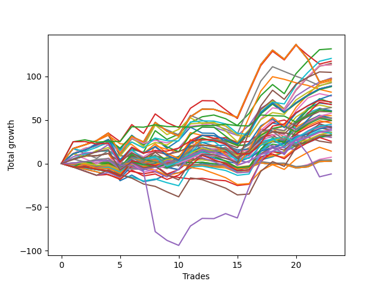

# Short Bulldog 006 
- Symbol: ES
- Date Range: 03/15/2022 - 07/08/2022
- Trading Period: 7:20-12:30
- Number of Trades: 23



| Name | Win Percent | Profit | Avg Profit / Trade |     | Name | Win Percent | Profit | Avg Profit / Trade |
| ---- | ----------- | ------ | ------------------ | --- | ---- | ----------- | ------ | ------------------ |
| Sorted By <br> Profit | | | | | Sorted By <br> Win Percentage ||||
| Two | 73.91 | 65875.00 | 2864.13 |     | Fifty-Six | 82.61 | 19125.00 | 831.52 |
| Sixty-Nine | 56.52 | 60375.00 | 2625.00 |     | Zero | 82.61 | 16125.00 | 701.09 |
| Sixty-Three | 56.52 | 58750.00 | 2554.35 |     | Forty | 78.26 | 21125.00 | 918.48 |
| Sixty-Six | 69.57 | 56750.00 | 2467.39 |     | Sixty-Four | 78.26 | 19375.00 | 842.39 |
| Fifty-Eight | 69.57 | 56750.00 | 2467.39 |     | Two | 73.91 | 65875.00 | 2864.13 |
| Five | 60.87 | 55250.00 | 2402.17 |     | Three | 73.91 | 24625.00 | 1070.65 |
| Seventy-Five | 60.87 | 52375.00 | 2277.17 |     | Fifty-Nine | 73.91 | 22500.00 | 978.26 |
| Four | 69.57 | 49125.00 | 2135.87 |     | Sixty-Six | 69.57 | 56750.00 | 2467.39 |
| Seventy-One | 56.52 | 48500.00 | 2108.70 |     | Fifty-Eight | 69.57 | 56750.00 | 2467.39 |
| Fifty-Five | 56.52 | 48500.00 | 2108.70 |     | Four | 69.57 | 49125.00 | 2135.87 |
| Thirty-Nine | 56.52 | 48500.00 | 2108.70 |     | Sixty-Seven | 69.57 | 32125.00 | 1396.74 |
| Twenty-Three | 56.52 | 48500.00 | 2108.70 |     | One | 69.57 | 27500.00 | 1195.65 |
| Sixty-One | 56.52 | 47625.00 | 2070.65 |     | Fifty-Seven | 69.57 | 26125.00 | 1135.87 |
| Sixty-Eight | 60.87 | 46875.00 | 2038.04 |     | Twenty-Four | 69.57 | 21625.00 | 940.22 |
| Forty-Seven | 39.13 | 46375.00 | 2016.30 |     | Forty-Eight | 69.57 | 17875.00 | 777.17 |
| Seventy | 65.22 | 44500.00 | 1934.78 |     | Thirty-Two | 69.57 | 16500.00 | 717.39 |
| Fifty-Four | 65.22 | 44500.00 | 1934.78 |     | Seventy | 65.22 | 44500.00 | 1934.78 |
| Thirty-Eight | 65.22 | 44500.00 | 1934.78 |     | Fifty-Four | 65.22 | 44500.00 | 1934.78 |
| Twenty-Two | 65.22 | 44500.00 | 1934.78 |     | Thirty-Eight | 65.22 | 44500.00 | 1934.78 |
| Six | 65.22 | 44500.00 | 1934.78 |     | Twenty-Two | 65.22 | 44500.00 | 1934.78 |
| Sixty-Two | 65.22 | 44125.00 | 1918.48 |     | Six | 65.22 | 44500.00 | 1934.78 |
| Thirty-One | 26.09 | 41000.00 | 1782.61 |     | Sixty-Two | 65.22 | 44125.00 | 1918.48 |
| Seven | 56.52 | 39750.00 | 1728.26 |     | Sixty | 65.22 | 39250.00 | 1706.52 |
| Sixty | 65.22 | 39250.00 | 1706.52 |     | Sixty-Five | 65.22 | 29750.00 | 1293.48 |
| Twenty-Six | 47.83 | 38750.00 | 1684.78 |     | Five | 60.87 | 55250.00 | 2402.17 |
| Seventy-Three | 60.87 | 35375.00 | 1538.04 |     | Seventy-Five | 60.87 | 52375.00 | 2277.17 |
| Forty-Two | 47.83 | 35000.00 | 1521.74 |     | Sixty-Eight | 60.87 | 46875.00 | 2038.04 |
| Ten | 39.13 | 34000.00 | 1478.26 |     | Seventy-Three | 60.87 | 35375.00 | 1538.04 |
| Fifty-Three | 52.17 | 33875.00 | 1472.83 |     | Fifty-One | 60.87 | 23250.00 | 1010.87 |
| Twenty-Eight | 47.83 | 32250.00 | 1402.17 |     | Thirty-Seven | 60.87 | 20875.00 | 907.61 |
| Sixty-Seven | 69.57 | 32125.00 | 1396.74 |     | Thirty-Six | 60.87 | 20375.00 | 885.87 |
| Fifty | 52.17 | 30375.00 | 1320.65 |     | Thirty-Four | 60.87 | 20375.00 | 885.87 |
| Twenty-Nine | 39.13 | 30250.00 | 1315.22 |     | Thirty-Three | 60.87 | 17750.00 | 771.74 |
| Seventy-Two | 47.83 | 29875.00 | 1298.91 |     | Eight | 60.87 | 16625.00 | 722.83 |
| Sixty-Five | 65.22 | 29750.00 | 1293.48 |     | Thirty-Five | 60.87 | 16250.00 | 706.52 |
| Forty-Six | 47.83 | 28875.00 | 1255.43 |     | Sixten | 60.87 | 3625.00 | 157.61 |
| One | 69.57 | 27500.00 | 1195.65 |     | Sixty-Nine | 56.52 | 60375.00 | 2625.00 |
| Fifty-Seven | 69.57 | 26125.00 | 1135.87 |     | Sixty-Three | 56.52 | 58750.00 | 2554.35 |
| Thirty | 34.78 | 26125.00 | 1135.87 |     | Seventy-One | 56.52 | 48500.00 | 2108.70 |
| Thirteen | 34.78 | 26000.00 | 1130.43 |     | Fifty-Five | 56.52 | 48500.00 | 2108.70 |
| Twelve | 39.13 | 25000.00 | 1086.96 |     | Thirty-Nine | 56.52 | 48500.00 | 2108.70 |
| twenty-Seven | 52.17 | 24875.00 | 1081.52 |     | Twenty-Three | 56.52 | 48500.00 | 2108.70 |
| Fifty-Two | 52.17 | 24750.00 | 1076.09 |     | Sixty-One | 56.52 | 47625.00 | 2070.65 |
| Three | 73.91 | 24625.00 | 1070.65 |     | Seven | 56.52 | 39750.00 | 1728.26 |
| Fifty-One | 60.87 | 23250.00 | 1010.87 |     | Forty-Nine | 56.52 | 17250.00 | 750.00 |
| Fifty-Nine | 73.91 | 22500.00 | 978.26 |     | Seventeen | 56.52 | 2125.00 | 92.39 |
| Twenty-Four | 69.57 | 21625.00 | 940.22 |     | Twenty-One | 56.52 | 1375.00 | 59.78 |
| Forty | 78.26 | 21125.00 | 918.48 |     | Twenty | 56.52 | 1375.00 | 59.78 |
| Thirty-Seven | 60.87 | 20875.00 | 907.61 |     | Nineteen | 56.52 | 1375.00 | 59.78 |
| Forty-Five | 34.78 | 20625.00 | 896.74 |     | Eighteen | 56.52 | 1375.00 | 59.78 |
| Thirty-Six | 60.87 | 20375.00 | 885.87 |     | Fifty-Three | 52.17 | 33875.00 | 1472.83 |
| Thirty-Four | 60.87 | 20375.00 | 885.87 |     | Fifty | 52.17 | 30375.00 | 1320.65 |
| Forty-Four | 43.48 | 20125.00 | 875.00 |     | twenty-Seven | 52.17 | 24875.00 | 1081.52 |
| Sixty-Four | 78.26 | 19375.00 | 842.39 |     | Fifty-Two | 52.17 | 24750.00 | 1076.09 |
| Fifty-Six | 82.61 | 19125.00 | 831.52 |     | Twenty-Five | 52.17 | 19125.00 | 831.52 |
| Twenty-Five | 52.17 | 19125.00 | 831.52 |     | Forty-Three | 52.17 | 12750.00 | 554.35 |
| Nine | 43.48 | 18125.00 | 788.04 |     | Seventy-Four | 52.17 | -6000.00 | -260.87 |
| Forty-Eight | 69.57 | 17875.00 | 777.17 |     | Twenty-Six | 47.83 | 38750.00 | 1684.78 |
| Thirty-Three | 60.87 | 17750.00 | 771.74 |     | Forty-Two | 47.83 | 35000.00 | 1521.74 |
| Forty-Nine | 56.52 | 17250.00 | 750.00 |     | Twenty-Eight | 47.83 | 32250.00 | 1402.17 |
| Eight | 60.87 | 16625.00 | 722.83 |     | Seventy-Two | 47.83 | 29875.00 | 1298.91 |
| Thirty-Two | 69.57 | 16500.00 | 717.39 |     | Forty-Six | 47.83 | 28875.00 | 1255.43 |
| Thirty-Five | 60.87 | 16250.00 | 706.52 |     | Forty-One | 47.83 | 7125.00 | 309.78 |
| Zero | 82.61 | 16125.00 | 701.09 |     | Forty-Four | 43.48 | 20125.00 | 875.00 |
| Eleven | 43.48 | 15125.00 | 657.61 |     | Nine | 43.48 | 18125.00 | 788.04 |
| Fourteen | 21.74 | 15000.00 | 652.17 |     | Eleven | 43.48 | 15125.00 | 657.61 |
| Forty-Three | 52.17 | 12750.00 | 554.35 |     | Forty-Seven | 39.13 | 46375.00 | 2016.30 |
| Fifteen | 13.04 | 11875.00 | 516.30 |     | Ten | 39.13 | 34000.00 | 1478.26 |
| Forty-One | 47.83 | 7125.00 | 309.78 |     | Twenty-Nine | 39.13 | 30250.00 | 1315.22 |
| Sixten | 60.87 | 3625.00 | 157.61 |     | Twelve | 39.13 | 25000.00 | 1086.96 |
| Seventeen | 56.52 | 2125.00 | 92.39 |     | Thirty | 34.78 | 26125.00 | 1135.87 |
| Twenty-One | 56.52 | 1375.00 | 59.78 |     | Thirteen | 34.78 | 26000.00 | 1130.43 |
| Twenty | 56.52 | 1375.00 | 59.78 |     | Forty-Five | 34.78 | 20625.00 | 896.74 |
| Nineteen | 56.52 | 1375.00 | 59.78 |     | Thirty-One | 26.09 | 41000.00 | 1782.61 |
| Eighteen | 56.52 | 1375.00 | 59.78 |     | Fourteen | 21.74 | 15000.00 | 652.17 |
| Seventy-Four | 52.17 | -6000.00 | -260.87 |     | Fifteen | 13.04 | 11875.00 | 516.30 |

## NO STOPLOSS

### Test Zero
* Sell when price hits the middle line of the 20p bollinger
* No Stoploss
* Results:
```
Total Trades: 23
Percent Up: 17.39
Percent Down: 82.61
Total Points Moved Down: 32.25
Potential Profit: 16125.00
Total Points Ups: 41.50 Count Ups: 4
Total Points Downs: 73.75 Count Downs: 19
```

<details><summary>Trades</summary>

<code>In: 2022-04-06 11:06:00		Out: 2022-04-06 11:06:10		Total Position Time: 00:10		Total Move Down: 0.50		Total to Date: 0.50</code> <br />
<code>In: 2022-04-07 11:04:00		Out: 2022-04-07 11:15:15		Total Position Time: 11:15		Total Move Down: 1.75		Total to Date: 2.25</code> <br />
<code>In: 2022-04-18 07:28:00		Out: 2022-04-18 07:36:40		Total Position Time: 08:40		Total Move Down: 1.00		Total to Date: 3.25</code> <br />
<code>In: 2022-04-20 10:50:00		Out: 2022-04-20 10:50:10		Total Position Time: 00:10		Total Move Down: 0.50		Total to Date: 3.75</code> <br />
<code>In: 2022-04-25 11:12:00		Out: 2022-04-25 11:39:45		Total Position Time: 27:45		Total Move Down: -23.50		Total to Date: -19.75</code> <br />
<code>In: 2022-05-03 07:36:00		Out: 2022-05-03 07:37:55		Total Position Time: 01:55		Total Move Down: 6.50		Total to Date: -13.25</code> <br />
<code>In: 2022-05-03 08:11:00		Out: 2022-05-03 08:35:55		Total Position Time: 24:55		Total Move Down: -7.50		Total to Date: -20.75</code> <br />
<code>In: 2022-05-04 11:31:00		Out: 2022-05-04 11:31:10		Total Position Time: 00:10		Total Move Down: 2.25		Total to Date: -18.50</code> <br />
<code>In: 2022-05-16 10:16:00		Out: 2022-05-16 10:18:20		Total Position Time: 02:20		Total Move Down: 6.00		Total to Date: -12.50</code> <br />
<code>In: 2022-05-17 09:49:00		Out: 2022-05-17 09:51:20		Total Position Time: 02:20		Total Move Down: 2.00		Total to Date: -10.50</code> <br />
<code>In: 2022-05-24 09:18:00		Out: 2022-05-24 09:21:30		Total Position Time: 03:30		Total Move Down: 5.00		Total to Date: -5.50</code> <br />
<code>In: 2022-05-24 11:15:00		Out: 2022-05-24 11:18:25		Total Position Time: 03:25		Total Move Down: 6.25		Total to Date: 0.75</code> <br />
<code>In: 2022-05-27 12:11:00		Out: 2022-05-27 12:35:00		Total Position Time: 24:00		Total Move Down: -3.00		Total to Date: -2.25</code> <br />
<code>In: 2022-05-31 07:24:00		Out: 2022-05-31 07:36:40		Total Position Time: 12:40		Total Move Down: 1.50		Total to Date: -0.75</code> <br />
<code>In: 2022-06-02 08:06:00		Out: 2022-06-02 08:22:05		Total Position Time: 16:05		Total Move Down: -7.50		Total to Date: -8.25</code> <br />
<code>In: 2022-06-10 12:30:00		Out: 2022-06-10 12:30:30		Total Position Time: 00:30		Total Move Down: 4.75		Total to Date: -3.50</code> <br />
<code>In: 2022-06-13 09:41:00		Out: 2022-06-13 09:43:15		Total Position Time: 02:15		Total Move Down: 7.75		Total to Date: 4.25</code> <br />
<code>In: 2022-06-23 08:16:00		Out: 2022-06-23 08:21:05		Total Position Time: 05:05		Total Move Down: 3.50		Total to Date: 7.75</code> <br />
<code>In: 2022-06-30 08:30:00		Out: 2022-06-30 08:35:10		Total Position Time: 05:10		Total Move Down: 5.50		Total to Date: 13.25</code> <br />
<code>In: 2022-07-05 07:41:00		Out: 2022-07-05 07:44:30		Total Position Time: 03:30		Total Move Down: 7.25		Total to Date: 20.50</code> <br />
<code>In: 2022-07-06 11:10:00		Out: 2022-07-06 11:10:10		Total Position Time: 00:10		Total Move Down: 3.25		Total to Date: 23.75</code> <br />
<code>In: 2022-07-06 11:11:00		Out: 2022-07-06 11:11:10		Total Position Time: 00:10		Total Move Down: 6.00		Total to Date: 29.75</code> <br />
<code>In: 2022-07-07 07:57:00		Out: 2022-07-07 08:01:05		Total Position Time: 04:05		Total Move Down: 2.50		Total to Date: 32.25</code> <br />


</details>

### Test One
* Sell when the price hits the upper line of the 20p 1std bollinger
* No Stoploss
* Results:
```
Total Trades: 23
Percent Up: 30.43
Percent Down: 69.57
Total Points Moved Down: 55.00
Potential Profit: 27500.00
Total Points Ups: 52.25 Count Ups: 7
Total Points Downs: 107.25 Count Downs: 16
```

<details><summary>Trades</summary>

<code>In: 2022-04-06 11:06:00		Out: 2022-04-06 11:07:20		Total Position Time: 01:20		Total Move Down: 5.25		Total to Date: 5.25</code> <br />
<code>In: 2022-04-07 11:04:00		Out: 2022-04-07 11:16:10		Total Position Time: 12:10		Total Move Down: 3.25		Total to Date: 8.50</code> <br />
<code>In: 2022-04-18 07:28:00		Out: 2022-04-18 07:51:30		Total Position Time: 23:30		Total Move Down: 0.50		Total to Date: 9.00</code> <br />
<code>In: 2022-04-20 10:50:00		Out: 2022-04-20 10:54:05		Total Position Time: 04:05		Total Move Down: 2.50		Total to Date: 11.50</code> <br />
<code>In: 2022-04-25 11:12:00		Out: 2022-04-25 11:40:10		Total Position Time: 28:10		Total Move Down: -20.50		Total to Date: -9.00</code> <br />
<code>In: 2022-05-03 07:36:00		Out: 2022-05-03 07:41:20		Total Position Time: 05:20		Total Move Down: 10.75		Total to Date: 1.75</code> <br />
<code>In: 2022-05-03 08:11:00		Out: 2022-05-03 08:38:05		Total Position Time: 27:05		Total Move Down: -5.25		Total to Date: -3.50</code> <br />
<code>In: 2022-05-04 11:31:00		Out: 2022-05-04 11:31:25		Total Position Time: 00:25		Total Move Down: 7.75		Total to Date: 4.25</code> <br />
<code>In: 2022-05-16 10:16:00		Out: 2022-05-16 10:42:30		Total Position Time: 26:30		Total Move Down: -6.75		Total to Date: -2.50</code> <br />
<code>In: 2022-05-17 09:49:00		Out: 2022-05-17 09:54:40		Total Position Time: 05:40		Total Move Down: 3.00		Total to Date: 0.50</code> <br />
<code>In: 2022-05-24 09:18:00		Out: 2022-05-24 09:29:00		Total Position Time: 11:00		Total Move Down: 6.25		Total to Date: 6.75</code> <br />
<code>In: 2022-05-24 11:15:00		Out: 2022-05-24 11:31:25		Total Position Time: 16:25		Total Move Down: 6.75		Total to Date: 13.50</code> <br />
<code>In: 2022-05-27 12:11:00		Out: 2022-05-27 12:35:40		Total Position Time: 24:40		Total Move Down: -1.25		Total to Date: 12.25</code> <br />
<code>In: 2022-05-31 07:24:00		Out: 2022-05-31 07:38:00		Total Position Time: 14:00		Total Move Down: 5.25		Total to Date: 17.50</code> <br />
<code>In: 2022-06-02 08:06:00		Out: 2022-06-02 08:27:30		Total Position Time: 21:30		Total Move Down: -7.75		Total to Date: 9.75</code> <br />
<code>In: 2022-06-10 12:30:00		Out: 2022-06-10 12:35:55		Total Position Time: 05:55		Total Move Down: 8.75		Total to Date: 18.50</code> <br />
<code>In: 2022-06-13 09:41:00		Out: 2022-06-13 09:47:55		Total Position Time: 06:55		Total Move Down: 14.75		Total to Date: 33.25</code> <br />
<code>In: 2022-06-23 08:16:00		Out: 2022-06-23 08:23:35		Total Position Time: 07:35		Total Move Down: 7.00		Total to Date: 40.25</code> <br />
<code>In: 2022-06-30 08:30:00		Out: 2022-06-30 08:59:55		Total Position Time: 29:55		Total Move Down: -10.50		Total to Date: 29.75</code> <br />
<code>In: 2022-07-05 07:41:00		Out: 2022-07-05 07:45:55		Total Position Time: 04:55		Total Move Down: 12.00		Total to Date: 41.75</code> <br />
<code>In: 2022-07-06 11:10:00		Out: 2022-07-06 11:11:10		Total Position Time: 01:10		Total Move Down: 7.50		Total to Date: 49.25</code> <br />
<code>In: 2022-07-06 11:11:00		Out: 2022-07-06 11:11:10		Total Position Time: 00:10		Total Move Down: 6.00		Total to Date: 55.25</code> <br />
<code>In: 2022-07-07 07:57:00		Out: 2022-07-07 08:20:00		Total Position Time: 23:00		Total Move Down: -0.25		Total to Date: 55.00</code> <br />


</details>

### Test Two
* Sell when the price hits the upper line of the 20p 2std bollinger
* No Stoploss
* Results:
```
Total Trades: 23
Percent Up: 26.09
Percent Down: 73.91
Total Points Moved Down: 131.75
Potential Profit: 65875.00
Total Points Ups: 59.00 Count Ups: 6
Total Points Downs: 190.75 Count Downs: 17
```

<details><summary>Trades</summary>

<code>In: 2022-04-06 11:06:00		Out: 2022-04-06 11:08:20		Total Position Time: 02:20		Total Move Down: 11.25		Total to Date: 11.25</code> <br />
<code>In: 2022-04-07 11:04:00		Out: 2022-04-07 11:18:40		Total Position Time: 14:40		Total Move Down: 6.25		Total to Date: 17.50</code> <br />
<code>In: 2022-04-18 07:28:00		Out: 2022-04-18 07:51:45		Total Position Time: 23:45		Total Move Down: 2.50		Total to Date: 20.00</code> <br />
<code>In: 2022-04-20 10:50:00		Out: 2022-04-20 11:13:55		Total Position Time: 23:55		Total Move Down: 3.25		Total to Date: 23.25</code> <br />
<code>In: 2022-04-25 11:12:00		Out: 2022-04-25 11:41:55		Total Position Time: 29:55		Total Move Down: -23.50		Total to Date: -0.25</code> <br />
<code>In: 2022-05-03 07:36:00		Out: 2022-05-03 07:43:50		Total Position Time: 07:50		Total Move Down: 16.25		Total to Date: 16.00</code> <br />
<code>In: 2022-05-03 08:11:00		Out: 2022-05-03 08:39:10		Total Position Time: 28:10		Total Move Down: -3.00		Total to Date: 13.00</code> <br />
<code>In: 2022-05-04 11:31:00		Out: 2022-05-04 11:34:15		Total Position Time: 03:15		Total Move Down: 24.75		Total to Date: 37.75</code> <br />
<code>In: 2022-05-16 10:16:00		Out: 2022-05-16 10:45:55		Total Position Time: 29:55		Total Move Down: -10.00		Total to Date: 27.75</code> <br />
<code>In: 2022-05-17 09:49:00		Out: 2022-05-17 10:01:50		Total Position Time: 12:50		Total Move Down: 6.00		Total to Date: 33.75</code> <br />
<code>In: 2022-05-24 09:18:00		Out: 2022-05-24 09:32:35		Total Position Time: 14:35		Total Move Down: 13.25		Total to Date: 47.00</code> <br />
<code>In: 2022-05-24 11:15:00		Out: 2022-05-24 11:44:00		Total Position Time: 29:00		Total Move Down: 6.75		Total to Date: 53.75</code> <br />
<code>In: 2022-05-27 12:11:00		Out: 2022-05-27 12:38:10		Total Position Time: 27:10		Total Move Down: 2.00		Total to Date: 55.75</code> <br />
<code>In: 2022-05-31 07:24:00		Out: 2022-05-31 07:53:55		Total Position Time: 29:55		Total Move Down: -4.25		Total to Date: 51.50</code> <br />
<code>In: 2022-06-02 08:06:00		Out: 2022-06-02 08:29:05		Total Position Time: 23:05		Total Move Down: -7.75		Total to Date: 43.75</code> <br />
<code>In: 2022-06-10 12:30:00		Out: 2022-06-10 12:43:25		Total Position Time: 13:25		Total Move Down: 13.75		Total to Date: 57.50</code> <br />
<code>In: 2022-06-13 09:41:00		Out: 2022-06-13 09:54:45		Total Position Time: 13:45		Total Move Down: 20.50		Total to Date: 78.00</code> <br />
<code>In: 2022-06-23 08:16:00		Out: 2022-06-23 08:31:25		Total Position Time: 15:25		Total Move Down: 12.75		Total to Date: 90.75</code> <br />
<code>In: 2022-06-30 08:30:00		Out: 2022-06-30 08:59:55		Total Position Time: 29:55		Total Move Down: -10.50		Total to Date: 80.25</code> <br />
<code>In: 2022-07-05 07:41:00		Out: 2022-07-05 08:01:10		Total Position Time: 20:10		Total Move Down: 23.00		Total to Date: 103.25</code> <br />
<code>In: 2022-07-06 11:10:00		Out: 2022-07-06 11:12:15		Total Position Time: 02:15		Total Move Down: 14.50		Total to Date: 117.75</code> <br />
<code>In: 2022-07-06 11:11:00		Out: 2022-07-06 11:12:15		Total Position Time: 01:15		Total Move Down: 13.00		Total to Date: 130.75</code> <br />
<code>In: 2022-07-07 07:57:00		Out: 2022-07-07 08:21:00		Total Position Time: 24:00		Total Move Down: 1.00		Total to Date: 131.75</code> <br />


</details>

### Test Three
* Sell when price hits the middle line of the 50p bollinger
* No Stoploss
* Results:
```
Total Trades: 23
Percent Up: 26.09
Percent Down: 73.91
Total Points Moved Down: 49.25
Potential Profit: 24625.00
Total Points Ups: 59.50 Count Ups: 6
Total Points Downs: 108.75 Count Downs: 17
```

<details><summary>Trades</summary>

<code>In: 2022-04-06 11:06:00		Out: 2022-04-06 11:07:20		Total Position Time: 01:20		Total Move Down: 5.25		Total to Date: 5.25</code> <br />
<code>In: 2022-04-07 11:04:00		Out: 2022-04-07 11:33:40		Total Position Time: 29:40		Total Move Down: 5.50		Total to Date: 10.75</code> <br />
<code>In: 2022-04-18 07:28:00		Out: 2022-04-18 07:51:50		Total Position Time: 23:50		Total Move Down: 3.00		Total to Date: 13.75</code> <br />
<code>In: 2022-04-20 10:50:00		Out: 2022-04-20 10:50:20		Total Position Time: 00:20		Total Move Down: 1.00		Total to Date: 14.75</code> <br />
<code>In: 2022-04-25 11:12:00		Out: 2022-04-25 11:41:55		Total Position Time: 29:55		Total Move Down: -23.50		Total to Date: -8.75</code> <br />
<code>In: 2022-05-03 07:36:00		Out: 2022-05-03 07:40:40		Total Position Time: 04:40		Total Move Down: 10.75		Total to Date: 2.00</code> <br />
<code>In: 2022-05-03 08:11:00		Out: 2022-05-03 08:40:55		Total Position Time: 29:55		Total Move Down: -6.25		Total to Date: -4.25</code> <br />
<code>In: 2022-05-04 11:31:00		Out: 2022-05-04 11:31:10		Total Position Time: 00:10		Total Move Down: 2.25		Total to Date: -2.00</code> <br />
<code>In: 2022-05-16 10:16:00		Out: 2022-05-16 10:45:55		Total Position Time: 29:55		Total Move Down: -10.00		Total to Date: -12.00</code> <br />
<code>In: 2022-05-17 09:49:00		Out: 2022-05-17 10:01:25		Total Position Time: 12:25		Total Move Down: 5.00		Total to Date: -7.00</code> <br />
<code>In: 2022-05-24 09:18:00		Out: 2022-05-24 09:31:20		Total Position Time: 13:20		Total Move Down: 10.75		Total to Date: 3.75</code> <br />
<code>In: 2022-05-24 11:15:00		Out: 2022-05-24 11:20:25		Total Position Time: 05:25		Total Move Down: 11.75		Total to Date: 15.50</code> <br />
<code>In: 2022-05-27 12:11:00		Out: 2022-05-27 12:38:05		Total Position Time: 27:05		Total Move Down: 1.25		Total to Date: 16.75</code> <br />
<code>In: 2022-05-31 07:24:00		Out: 2022-05-31 07:53:55		Total Position Time: 29:55		Total Move Down: -4.25		Total to Date: 12.50</code> <br />
<code>In: 2022-06-02 08:06:00		Out: 2022-06-02 08:35:55		Total Position Time: 29:55		Total Move Down: -5.00		Total to Date: 7.50</code> <br />
<code>In: 2022-06-10 12:30:00		Out: 2022-06-10 12:33:40		Total Position Time: 03:40		Total Move Down: 7.50		Total to Date: 15.00</code> <br />
<code>In: 2022-06-13 09:41:00		Out: 2022-06-13 09:47:55		Total Position Time: 06:55		Total Move Down: 14.75		Total to Date: 29.75</code> <br />
<code>In: 2022-06-23 08:16:00		Out: 2022-06-23 08:21:05		Total Position Time: 05:05		Total Move Down: 3.50		Total to Date: 33.25</code> <br />
<code>In: 2022-06-30 08:30:00		Out: 2022-06-30 08:59:55		Total Position Time: 29:55		Total Move Down: -10.50		Total to Date: 22.75</code> <br />
<code>In: 2022-07-05 07:41:00		Out: 2022-07-05 07:45:30		Total Position Time: 04:30		Total Move Down: 11.00		Total to Date: 33.75</code> <br />
<code>In: 2022-07-06 11:10:00		Out: 2022-07-06 11:11:10		Total Position Time: 01:10		Total Move Down: 7.50		Total to Date: 41.25</code> <br />
<code>In: 2022-07-06 11:11:00		Out: 2022-07-06 11:11:10		Total Position Time: 00:10		Total Move Down: 6.00		Total to Date: 47.25</code> <br />
<code>In: 2022-07-07 07:57:00		Out: 2022-07-07 08:22:45		Total Position Time: 25:45		Total Move Down: 2.00		Total to Date: 49.25</code> <br />


</details>

### Test Four
* Sell when the price hits the upper line of the 50p 1std bollinger
* No Stoploss
* Results:
```
Total Trades: 23
Percent Up: 30.43
Percent Down: 69.57
Total Points Moved Down: 98.25
Potential Profit: 49125.00
Total Points Ups: 59.75 Count Ups: 7
Total Points Downs: 158.00 Count Downs: 16
```

<details><summary>Trades</summary>

<code>In: 2022-04-06 11:06:00		Out: 2022-04-06 11:08:10		Total Position Time: 02:10		Total Move Down: 11.25		Total to Date: 11.25</code> <br />
<code>In: 2022-04-07 11:04:00		Out: 2022-04-07 11:33:55		Total Position Time: 29:55		Total Move Down: 4.25		Total to Date: 15.50</code> <br />
<code>In: 2022-04-18 07:28:00		Out: 2022-04-18 07:57:05		Total Position Time: 29:05		Total Move Down: 7.25		Total to Date: 22.75</code> <br />
<code>In: 2022-04-20 10:50:00		Out: 2022-04-20 11:14:05		Total Position Time: 24:05		Total Move Down: 3.25		Total to Date: 26.00</code> <br />
<code>In: 2022-04-25 11:12:00		Out: 2022-04-25 11:41:55		Total Position Time: 29:55		Total Move Down: -23.50		Total to Date: 2.50</code> <br />
<code>In: 2022-05-03 07:36:00		Out: 2022-05-03 07:43:50		Total Position Time: 07:50		Total Move Down: 16.25		Total to Date: 18.75</code> <br />
<code>In: 2022-05-03 08:11:00		Out: 2022-05-03 08:40:55		Total Position Time: 29:55		Total Move Down: -6.25		Total to Date: 12.50</code> <br />
<code>In: 2022-05-04 11:31:00		Out: 2022-05-04 11:31:20		Total Position Time: 00:20		Total Move Down: 6.25		Total to Date: 18.75</code> <br />
<code>In: 2022-05-16 10:16:00		Out: 2022-05-16 10:45:55		Total Position Time: 29:55		Total Move Down: -10.00		Total to Date: 8.75</code> <br />
<code>In: 2022-05-17 09:49:00		Out: 2022-05-17 10:02:15		Total Position Time: 13:15		Total Move Down: 9.00		Total to Date: 17.75</code> <br />
<code>In: 2022-05-24 09:18:00		Out: 2022-05-24 09:33:15		Total Position Time: 15:15		Total Move Down: 15.25		Total to Date: 33.00</code> <br />
<code>In: 2022-05-24 11:15:00		Out: 2022-05-24 11:44:55		Total Position Time: 29:55		Total Move Down: 8.75		Total to Date: 41.75</code> <br />
<code>In: 2022-05-27 12:11:00		Out: 2022-05-27 12:40:55		Total Position Time: 29:55		Total Move Down: -0.25		Total to Date: 41.50</code> <br />
<code>In: 2022-05-31 07:24:00		Out: 2022-05-31 07:53:55		Total Position Time: 29:55		Total Move Down: -4.25		Total to Date: 37.25</code> <br />
<code>In: 2022-06-02 08:06:00		Out: 2022-06-02 08:35:55		Total Position Time: 29:55		Total Move Down: -5.00		Total to Date: 32.25</code> <br />
<code>In: 2022-06-10 12:30:00		Out: 2022-06-10 12:42:40		Total Position Time: 12:40		Total Move Down: 11.75		Total to Date: 44.00</code> <br />
<code>In: 2022-06-13 09:41:00		Out: 2022-06-13 09:54:40		Total Position Time: 13:40		Total Move Down: 19.50		Total to Date: 63.50</code> <br />
<code>In: 2022-06-23 08:16:00		Out: 2022-06-23 08:23:40		Total Position Time: 07:40		Total Move Down: 8.00		Total to Date: 71.50</code> <br />
<code>In: 2022-06-30 08:30:00		Out: 2022-06-30 08:59:55		Total Position Time: 29:55		Total Move Down: -10.50		Total to Date: 61.00</code> <br />
<code>In: 2022-07-05 07:41:00		Out: 2022-07-05 07:55:15		Total Position Time: 14:15		Total Move Down: 16.50		Total to Date: 77.50</code> <br />
<code>In: 2022-07-06 11:10:00		Out: 2022-07-06 11:11:35		Total Position Time: 01:35		Total Move Down: 8.75		Total to Date: 86.25</code> <br />
<code>In: 2022-07-06 11:11:00		Out: 2022-07-06 11:11:35		Total Position Time: 00:35		Total Move Down: 7.25		Total to Date: 93.50</code> <br />
<code>In: 2022-07-07 07:57:00		Out: 2022-07-07 08:23:20		Total Position Time: 26:20		Total Move Down: 4.75		Total to Date: 98.25</code> <br />


</details>

### Test Five
* Sell when the price hits the upper line of the 50p 2std bollinger
* No Stoploss
* Results:
```
Total Trades: 23
Percent Up: 39.13
Percent Down: 60.87
Total Points Moved Down: 110.50
Potential Profit: 55250.00
Total Points Ups: 66.50 Count Ups: 9
Total Points Downs: 177.00 Count Downs: 14
```

<details><summary>Trades</summary>

<code>In: 2022-04-06 11:06:00		Out: 2022-04-06 11:09:40		Total Position Time: 03:40		Total Move Down: 17.25		Total to Date: 17.25</code> <br />
<code>In: 2022-04-07 11:04:00		Out: 2022-04-07 11:33:55		Total Position Time: 29:55		Total Move Down: 4.25		Total to Date: 21.50</code> <br />
<code>In: 2022-04-18 07:28:00		Out: 2022-04-18 07:57:55		Total Position Time: 29:55		Total Move Down: 4.75		Total to Date: 26.25</code> <br />
<code>In: 2022-04-20 10:50:00		Out: 2022-04-20 11:18:20		Total Position Time: 28:20		Total Move Down: 6.25		Total to Date: 32.50</code> <br />
<code>In: 2022-04-25 11:12:00		Out: 2022-04-25 11:41:55		Total Position Time: 29:55		Total Move Down: -23.50		Total to Date: 9.00</code> <br />
<code>In: 2022-05-03 07:36:00		Out: 2022-05-03 08:05:55		Total Position Time: 29:55		Total Move Down: -1.00		Total to Date: 8.00</code> <br />
<code>In: 2022-05-03 08:11:00		Out: 2022-05-03 08:40:55		Total Position Time: 29:55		Total Move Down: -6.25		Total to Date: 1.75</code> <br />
<code>In: 2022-05-04 11:31:00		Out: 2022-05-04 11:32:05		Total Position Time: 01:05		Total Move Down: 11.25		Total to Date: 13.00</code> <br />
<code>In: 2022-05-16 10:16:00		Out: 2022-05-16 10:45:55		Total Position Time: 29:55		Total Move Down: -10.00		Total to Date: 3.00</code> <br />
<code>In: 2022-05-17 09:49:00		Out: 2022-05-17 10:18:55		Total Position Time: 29:55		Total Move Down: -5.75		Total to Date: -2.75</code> <br />
<code>In: 2022-05-24 09:18:00		Out: 2022-05-24 09:37:10		Total Position Time: 19:10		Total Move Down: 21.75		Total to Date: 19.00</code> <br />
<code>In: 2022-05-24 11:15:00		Out: 2022-05-24 11:44:55		Total Position Time: 29:55		Total Move Down: 8.75		Total to Date: 27.75</code> <br />
<code>In: 2022-05-27 12:11:00		Out: 2022-05-27 12:40:55		Total Position Time: 29:55		Total Move Down: -0.25		Total to Date: 27.50</code> <br />
<code>In: 2022-05-31 07:24:00		Out: 2022-05-31 07:53:55		Total Position Time: 29:55		Total Move Down: -4.25		Total to Date: 23.25</code> <br />
<code>In: 2022-06-02 08:06:00		Out: 2022-06-02 08:35:55		Total Position Time: 29:55		Total Move Down: -5.00		Total to Date: 18.25</code> <br />
<code>In: 2022-06-10 12:30:00		Out: 2022-06-10 12:45:00		Total Position Time: 15:00		Total Move Down: 13.25		Total to Date: 31.50</code> <br />
<code>In: 2022-06-13 09:41:00		Out: 2022-06-13 09:58:15		Total Position Time: 17:15		Total Move Down: 26.00		Total to Date: 57.50</code> <br />
<code>In: 2022-06-23 08:16:00		Out: 2022-06-23 08:31:10		Total Position Time: 15:10		Total Move Down: 11.25		Total to Date: 68.75</code> <br />
<code>In: 2022-06-30 08:30:00		Out: 2022-06-30 08:59:55		Total Position Time: 29:55		Total Move Down: -10.50		Total to Date: 58.25</code> <br />
<code>In: 2022-07-05 07:41:00		Out: 2022-07-05 08:01:05		Total Position Time: 20:05		Total Move Down: 21.50		Total to Date: 79.75</code> <br />
<code>In: 2022-07-06 11:10:00		Out: 2022-07-06 11:12:15		Total Position Time: 02:15		Total Move Down: 14.50		Total to Date: 94.25</code> <br />
<code>In: 2022-07-06 11:11:00		Out: 2022-07-06 11:12:15		Total Position Time: 01:15		Total Move Down: 13.00		Total to Date: 107.25</code> <br />
<code>In: 2022-07-07 07:57:00		Out: 2022-07-07 08:26:55		Total Position Time: 29:55		Total Move Down: 3.25		Total to Date: 110.50</code> <br />


</details>

### Test Six
* Sell when the price hits the middle line of the 1std VWAP
* No Stoploss
* Results:
```
Total Trades: 23
Percent Up: 34.78
Percent Down: 65.22
Total Points Moved Down: 89.00
Potential Profit: 44500.00
Total Points Ups: 65.50 Count Ups: 8
Total Points Downs: 154.50 Count Downs: 15
```

<details><summary>Trades</summary>

<code>In: 2022-04-06 11:06:00		Out: 2022-04-06 11:08:10		Total Position Time: 02:10		Total Move Down: 11.25		Total to Date: 11.25</code> <br />
<code>In: 2022-04-07 11:04:00		Out: 2022-04-07 11:33:55		Total Position Time: 29:55		Total Move Down: 4.25		Total to Date: 15.50</code> <br />
<code>In: 2022-04-18 07:28:00		Out: 2022-04-18 07:55:15		Total Position Time: 27:15		Total Move Down: 5.75		Total to Date: 21.25</code> <br />
<code>In: 2022-04-20 10:50:00		Out: 2022-04-20 11:18:20		Total Position Time: 28:20		Total Move Down: 6.25		Total to Date: 27.50</code> <br />
<code>In: 2022-04-25 11:12:00		Out: 2022-04-25 11:41:55		Total Position Time: 29:55		Total Move Down: -23.50		Total to Date: 4.00</code> <br />
<code>In: 2022-05-03 07:36:00		Out: 2022-05-03 07:42:15		Total Position Time: 06:15		Total Move Down: 14.00		Total to Date: 18.00</code> <br />
<code>In: 2022-05-03 08:11:00		Out: 2022-05-03 08:40:55		Total Position Time: 29:55		Total Move Down: -6.25		Total to Date: 11.75</code> <br />
<code>In: 2022-05-04 11:31:00		Out: 2022-05-04 11:31:25		Total Position Time: 00:25		Total Move Down: 7.75		Total to Date: 19.50</code> <br />
<code>In: 2022-05-16 10:16:00		Out: 2022-05-16 10:45:55		Total Position Time: 29:55		Total Move Down: -10.00		Total to Date: 9.50</code> <br />
<code>In: 2022-05-17 09:49:00		Out: 2022-05-17 10:18:55		Total Position Time: 29:55		Total Move Down: -5.75		Total to Date: 3.75</code> <br />
<code>In: 2022-05-24 09:18:00		Out: 2022-05-24 09:36:45		Total Position Time: 18:45		Total Move Down: 19.75		Total to Date: 23.50</code> <br />
<code>In: 2022-05-24 11:15:00		Out: 2022-05-24 11:44:55		Total Position Time: 29:55		Total Move Down: 8.75		Total to Date: 32.25</code> <br />
<code>In: 2022-05-27 12:11:00		Out: 2022-05-27 12:40:55		Total Position Time: 29:55		Total Move Down: -0.25		Total to Date: 32.00</code> <br />
<code>In: 2022-05-31 07:24:00		Out: 2022-05-31 07:53:55		Total Position Time: 29:55		Total Move Down: -4.25		Total to Date: 27.75</code> <br />
<code>In: 2022-06-02 08:06:00		Out: 2022-06-02 08:35:55		Total Position Time: 29:55		Total Move Down: -5.00		Total to Date: 22.75</code> <br />
<code>In: 2022-06-10 12:30:00		Out: 2022-06-10 12:44:00		Total Position Time: 14:00		Total Move Down: 14.75		Total to Date: 37.50</code> <br />
<code>In: 2022-06-13 09:41:00		Out: 2022-06-13 09:55:05		Total Position Time: 14:05		Total Move Down: 20.75		Total to Date: 58.25</code> <br />
<code>In: 2022-06-23 08:16:00		Out: 2022-06-23 08:31:10		Total Position Time: 15:10		Total Move Down: 11.25		Total to Date: 69.50</code> <br />
<code>In: 2022-06-30 08:30:00		Out: 2022-06-30 08:59:55		Total Position Time: 29:55		Total Move Down: -10.50		Total to Date: 59.00</code> <br />
<code>In: 2022-07-05 07:41:00		Out: 2022-07-05 07:45:25		Total Position Time: 04:25		Total Move Down: 10.75		Total to Date: 69.75</code> <br />
<code>In: 2022-07-06 11:10:00		Out: 2022-07-06 11:11:35		Total Position Time: 01:35		Total Move Down: 8.75		Total to Date: 78.50</code> <br />
<code>In: 2022-07-06 11:11:00		Out: 2022-07-06 11:11:35		Total Position Time: 00:35		Total Move Down: 7.25		Total to Date: 85.75</code> <br />
<code>In: 2022-07-07 07:57:00		Out: 2022-07-07 08:26:55		Total Position Time: 29:55		Total Move Down: 3.25		Total to Date: 89.00</code> <br />


</details>

### Test Seven
* Sell when the price hits the upper line of the 1std VWAP
* No Stoploss
* Results:
```
Total Trades: 23
Percent Up: 43.48
Percent Down: 56.52
Total Points Moved Down: 79.50
Potential Profit: 39750.00
Total Points Ups: 108.50 Count Ups: 10
Total Points Downs: 188.00 Count Downs: 13
```

<details><summary>Trades</summary>

<code>In: 2022-04-06 11:06:00		Out: 2022-04-06 11:09:40		Total Position Time: 03:40		Total Move Down: 17.25		Total to Date: 17.25</code> <br />
<code>In: 2022-04-07 11:04:00		Out: 2022-04-07 11:33:55		Total Position Time: 29:55		Total Move Down: 4.25		Total to Date: 21.50</code> <br />
<code>In: 2022-04-18 07:28:00		Out: 2022-04-18 07:57:55		Total Position Time: 29:55		Total Move Down: 4.75		Total to Date: 26.25</code> <br />
<code>In: 2022-04-20 10:50:00		Out: 2022-04-20 11:19:55		Total Position Time: 29:55		Total Move Down: 8.75		Total to Date: 35.00</code> <br />
<code>In: 2022-04-25 11:12:00		Out: 2022-04-25 11:41:55		Total Position Time: 29:55		Total Move Down: -23.50		Total to Date: 11.50</code> <br />
<code>In: 2022-05-03 07:36:00		Out: 2022-05-03 07:46:45		Total Position Time: 10:45		Total Move Down: 19.50		Total to Date: 31.00</code> <br />
<code>In: 2022-05-03 08:11:00		Out: 2022-05-03 08:40:55		Total Position Time: 29:55		Total Move Down: -6.25		Total to Date: 24.75</code> <br />
<code>In: 2022-05-04 11:31:00		Out: 2022-05-04 11:34:05		Total Position Time: 03:05		Total Move Down: 22.50		Total to Date: 47.25</code> <br />
<code>In: 2022-05-16 10:16:00		Out: 2022-05-16 10:45:55		Total Position Time: 29:55		Total Move Down: -10.00		Total to Date: 37.25</code> <br />
<code>In: 2022-05-17 09:49:00		Out: 2022-05-17 10:18:55		Total Position Time: 29:55		Total Move Down: -5.75		Total to Date: 31.50</code> <br />
<code>In: 2022-05-24 09:18:00		Out: 2022-05-24 09:47:55		Total Position Time: 29:55		Total Move Down: 22.25		Total to Date: 53.75</code> <br />
<code>In: 2022-05-24 11:15:00		Out: 2022-05-24 11:44:55		Total Position Time: 29:55		Total Move Down: 8.75		Total to Date: 62.50</code> <br />
<code>In: 2022-05-27 12:11:00		Out: 2022-05-27 12:40:55		Total Position Time: 29:55		Total Move Down: -0.25		Total to Date: 62.25</code> <br />
<code>In: 2022-05-31 07:24:00		Out: 2022-05-31 07:53:55		Total Position Time: 29:55		Total Move Down: -4.25		Total to Date: 58.00</code> <br />
<code>In: 2022-06-02 08:06:00		Out: 2022-06-02 08:35:55		Total Position Time: 29:55		Total Move Down: -5.00		Total to Date: 53.00</code> <br />
<code>In: 2022-06-10 12:30:00		Out: 2022-06-10 12:45:00		Total Position Time: 15:00		Total Move Down: 13.25		Total to Date: 66.25</code> <br />
<code>In: 2022-06-13 09:41:00		Out: 2022-06-13 10:10:55		Total Position Time: 29:55		Total Move Down: 30.00		Total to Date: 96.25</code> <br />
<code>In: 2022-06-23 08:16:00		Out: 2022-06-23 08:35:20		Total Position Time: 19:20		Total Move Down: 16.50		Total to Date: 112.75</code> <br />
<code>In: 2022-06-30 08:30:00		Out: 2022-06-30 08:59:55		Total Position Time: 29:55		Total Move Down: -10.50		Total to Date: 102.25</code> <br />
<code>In: 2022-07-05 07:41:00		Out: 2022-07-05 07:57:05		Total Position Time: 16:05		Total Move Down: 17.00		Total to Date: 119.25</code> <br />
<code>In: 2022-07-06 11:10:00		Out: 2022-07-06 11:39:55		Total Position Time: 29:55		Total Move Down: -16.75		Total to Date: 102.50</code> <br />
<code>In: 2022-07-06 11:11:00		Out: 2022-07-06 11:40:55		Total Position Time: 29:55		Total Move Down: -26.25		Total to Date: 76.25</code> <br />
<code>In: 2022-07-07 07:57:00		Out: 2022-07-07 08:26:55		Total Position Time: 29:55		Total Move Down: 3.25		Total to Date: 79.50</code> <br />


</details>

## STOPLOSS OF 2

### Test Eight
* Sell when price hits the middle line of the 20p bollinger
* Stoploss is -2 points
* Results:
```
Total Trades: 23
Percent Up: 39.13
Percent Down: 60.87
Total Points Moved Down: 33.25
Potential Profit: 16625.00
Total Points Ups: 20.50 Count Ups: 9
Total Points Downs: 53.75 Count Downs: 14
```

<details><summary>Trades</summary>

<code>In: 2022-04-06 11:06:00		Out: 2022-04-06 11:06:10		Total Position Time: 00:10		Total Move Down: 0.50		Total to Date: 0.50</code> <br />
<code>In: 2022-04-07 11:04:00		Out: 2022-04-07 11:14:15		Total Position Time: 10:15		Total Move Down: -2.00		Total to Date: -1.50</code> <br />
<code>In: 2022-04-18 07:28:00		Out: 2022-04-18 07:34:30		Total Position Time: 06:30		Total Move Down: -1.50		Total to Date: -3.00</code> <br />
<code>In: 2022-04-20 10:50:00		Out: 2022-04-20 10:50:10		Total Position Time: 00:10		Total Move Down: 0.50		Total to Date: -2.50</code> <br />
<code>In: 2022-04-25 11:12:00		Out: 2022-04-25 11:13:20		Total Position Time: 01:20		Total Move Down: -2.00		Total to Date: -4.50</code> <br />
<code>In: 2022-05-03 07:36:00		Out: 2022-05-03 07:37:55		Total Position Time: 01:55		Total Move Down: 6.50		Total to Date: 2.00</code> <br />
<code>In: 2022-05-03 08:11:00		Out: 2022-05-03 08:14:55		Total Position Time: 03:55		Total Move Down: -2.75		Total to Date: -0.75</code> <br />
<code>In: 2022-05-04 11:31:00		Out: 2022-05-04 11:31:10		Total Position Time: 00:10		Total Move Down: 2.25		Total to Date: 1.50</code> <br />
<code>In: 2022-05-16 10:16:00		Out: 2022-05-16 10:18:20		Total Position Time: 02:20		Total Move Down: 6.00		Total to Date: 7.50</code> <br />
<code>In: 2022-05-17 09:49:00		Out: 2022-05-17 09:49:20		Total Position Time: 00:20		Total Move Down: -2.25		Total to Date: 5.25</code> <br />
<code>In: 2022-05-24 09:18:00		Out: 2022-05-24 09:18:20		Total Position Time: 00:20		Total Move Down: -1.75		Total to Date: 3.50</code> <br />
<code>In: 2022-05-24 11:15:00		Out: 2022-05-24 11:15:10		Total Position Time: 00:10		Total Move Down: 0.75		Total to Date: 4.25</code> <br />
<code>In: 2022-05-27 12:11:00		Out: 2022-05-27 12:15:15		Total Position Time: 04:15		Total Move Down: -1.75		Total to Date: 2.50</code> <br />
<code>In: 2022-05-31 07:24:00		Out: 2022-05-31 07:28:15		Total Position Time: 04:15		Total Move Down: -1.00		Total to Date: 1.50</code> <br />
<code>In: 2022-06-02 08:06:00		Out: 2022-06-02 08:09:35		Total Position Time: 03:35		Total Move Down: -5.50		Total to Date: -4.00</code> <br />
<code>In: 2022-06-10 12:30:00		Out: 2022-06-10 12:30:10		Total Position Time: 00:10		Total Move Down: 1.50		Total to Date: -2.50</code> <br />
<code>In: 2022-06-13 09:41:00		Out: 2022-06-13 09:43:15		Total Position Time: 02:15		Total Move Down: 7.75		Total to Date: 5.25</code> <br />
<code>In: 2022-06-23 08:16:00		Out: 2022-06-23 08:21:05		Total Position Time: 05:05		Total Move Down: 3.50		Total to Date: 8.75</code> <br />
<code>In: 2022-06-30 08:30:00		Out: 2022-06-30 08:35:10		Total Position Time: 05:10		Total Move Down: 5.50		Total to Date: 14.25</code> <br />
<code>In: 2022-07-05 07:41:00		Out: 2022-07-05 07:44:30		Total Position Time: 03:30		Total Move Down: 7.25		Total to Date: 21.50</code> <br />
<code>In: 2022-07-06 11:10:00		Out: 2022-07-06 11:10:10		Total Position Time: 00:10		Total Move Down: 3.25		Total to Date: 24.75</code> <br />
<code>In: 2022-07-06 11:11:00		Out: 2022-07-06 11:11:10		Total Position Time: 00:10		Total Move Down: 6.00		Total to Date: 30.75</code> <br />
<code>In: 2022-07-07 07:57:00		Out: 2022-07-07 08:01:05		Total Position Time: 04:05		Total Move Down: 2.50		Total to Date: 33.25</code> <br />


</details>

### Test Nine
* Sell when the price hits the upper line of the 20p 1std bollinger
* Stoploss is -2 points
* Results:
```
Total Trades: 23
Percent Up: 56.52
Percent Down: 43.48
Total Points Moved Down: 36.25
Potential Profit: 18125.00
Total Points Ups: 28.75 Count Ups: 13
Total Points Downs: 65.00 Count Downs: 10
```

<details><summary>Trades</summary>

<code>In: 2022-04-06 11:06:00		Out: 2022-04-06 11:06:15		Total Position Time: 00:15		Total Move Down: -0.50		Total to Date: -0.50</code> <br />
<code>In: 2022-04-07 11:04:00		Out: 2022-04-07 11:14:15		Total Position Time: 10:15		Total Move Down: -2.00		Total to Date: -2.50</code> <br />
<code>In: 2022-04-18 07:28:00		Out: 2022-04-18 07:34:30		Total Position Time: 06:30		Total Move Down: -1.50		Total to Date: -4.00</code> <br />
<code>In: 2022-04-20 10:50:00		Out: 2022-04-20 10:54:05		Total Position Time: 04:05		Total Move Down: 2.50		Total to Date: -1.50</code> <br />
<code>In: 2022-04-25 11:12:00		Out: 2022-04-25 11:13:20		Total Position Time: 01:20		Total Move Down: -2.00		Total to Date: -3.50</code> <br />
<code>In: 2022-05-03 07:36:00		Out: 2022-05-03 07:41:20		Total Position Time: 05:20		Total Move Down: 10.75		Total to Date: 7.25</code> <br />
<code>In: 2022-05-03 08:11:00		Out: 2022-05-03 08:14:55		Total Position Time: 03:55		Total Move Down: -2.75		Total to Date: 4.50</code> <br />
<code>In: 2022-05-04 11:31:00		Out: 2022-05-04 11:31:10		Total Position Time: 00:10		Total Move Down: 2.25		Total to Date: 6.75</code> <br />
<code>In: 2022-05-16 10:16:00		Out: 2022-05-16 10:23:50		Total Position Time: 07:50		Total Move Down: -4.25		Total to Date: 2.50</code> <br />
<code>In: 2022-05-17 09:49:00		Out: 2022-05-17 09:49:20		Total Position Time: 00:20		Total Move Down: -2.25		Total to Date: 0.25</code> <br />
<code>In: 2022-05-24 09:18:00		Out: 2022-05-24 09:18:20		Total Position Time: 00:20		Total Move Down: -1.75		Total to Date: -1.50</code> <br />
<code>In: 2022-05-24 11:15:00		Out: 2022-05-24 11:15:10		Total Position Time: 00:10		Total Move Down: 0.75		Total to Date: -0.75</code> <br />
<code>In: 2022-05-27 12:11:00		Out: 2022-05-27 12:15:15		Total Position Time: 04:15		Total Move Down: -1.75		Total to Date: -2.50</code> <br />
<code>In: 2022-05-31 07:24:00		Out: 2022-05-31 07:28:15		Total Position Time: 04:15		Total Move Down: -1.00		Total to Date: -3.50</code> <br />
<code>In: 2022-06-02 08:06:00		Out: 2022-06-02 08:09:35		Total Position Time: 03:35		Total Move Down: -5.50		Total to Date: -9.00</code> <br />
<code>In: 2022-06-10 12:30:00		Out: 2022-06-10 12:30:10		Total Position Time: 00:10		Total Move Down: 1.50		Total to Date: -7.50</code> <br />
<code>In: 2022-06-13 09:41:00		Out: 2022-06-13 09:47:55		Total Position Time: 06:55		Total Move Down: 14.75		Total to Date: 7.25</code> <br />
<code>In: 2022-06-23 08:16:00		Out: 2022-06-23 08:23:35		Total Position Time: 07:35		Total Move Down: 7.00		Total to Date: 14.25</code> <br />
<code>In: 2022-06-30 08:30:00		Out: 2022-06-30 08:44:50		Total Position Time: 14:50		Total Move Down: -2.00		Total to Date: 12.25</code> <br />
<code>In: 2022-07-05 07:41:00		Out: 2022-07-05 07:45:55		Total Position Time: 04:55		Total Move Down: 12.00		Total to Date: 24.25</code> <br />
<code>In: 2022-07-06 11:10:00		Out: 2022-07-06 11:11:10		Total Position Time: 01:10		Total Move Down: 7.50		Total to Date: 31.75</code> <br />
<code>In: 2022-07-06 11:11:00		Out: 2022-07-06 11:11:10		Total Position Time: 00:10		Total Move Down: 6.00		Total to Date: 37.75</code> <br />
<code>In: 2022-07-07 07:57:00		Out: 2022-07-07 08:03:30		Total Position Time: 06:30		Total Move Down: -1.50		Total to Date: 36.25</code> <br />


</details>

### Test Ten
* Sell when the price hits the upper line of the 20p 2std bollinger
* Stoploss is -2 points
* Results:
```
Total Trades: 23
Percent Up: 60.87
Percent Down: 39.13
Total Points Moved Down: 68.00
Potential Profit: 34000.00
Total Points Ups: 29.50 Count Ups: 14
Total Points Downs: 97.50 Count Downs: 9
```

<details><summary>Trades</summary>

<code>In: 2022-04-06 11:06:00		Out: 2022-04-06 11:06:15		Total Position Time: 00:15		Total Move Down: -0.50		Total to Date: -0.50</code> <br />
<code>In: 2022-04-07 11:04:00		Out: 2022-04-07 11:14:15		Total Position Time: 10:15		Total Move Down: -2.00		Total to Date: -2.50</code> <br />
<code>In: 2022-04-18 07:28:00		Out: 2022-04-18 07:34:30		Total Position Time: 06:30		Total Move Down: -1.50		Total to Date: -4.00</code> <br />
<code>In: 2022-04-20 10:50:00		Out: 2022-04-20 10:58:55		Total Position Time: 08:55		Total Move Down: -0.75		Total to Date: -4.75</code> <br />
<code>In: 2022-04-25 11:12:00		Out: 2022-04-25 11:13:20		Total Position Time: 01:20		Total Move Down: -2.00		Total to Date: -6.75</code> <br />
<code>In: 2022-05-03 07:36:00		Out: 2022-05-03 07:43:50		Total Position Time: 07:50		Total Move Down: 16.25		Total to Date: 9.50</code> <br />
<code>In: 2022-05-03 08:11:00		Out: 2022-05-03 08:14:55		Total Position Time: 03:55		Total Move Down: -2.75		Total to Date: 6.75</code> <br />
<code>In: 2022-05-04 11:31:00		Out: 2022-05-04 11:31:10		Total Position Time: 00:10		Total Move Down: 2.25		Total to Date: 9.00</code> <br />
<code>In: 2022-05-16 10:16:00		Out: 2022-05-16 10:23:50		Total Position Time: 07:50		Total Move Down: -4.25		Total to Date: 4.75</code> <br />
<code>In: 2022-05-17 09:49:00		Out: 2022-05-17 09:49:20		Total Position Time: 00:20		Total Move Down: -2.25		Total to Date: 2.50</code> <br />
<code>In: 2022-05-24 09:18:00		Out: 2022-05-24 09:18:20		Total Position Time: 00:20		Total Move Down: -1.75		Total to Date: 0.75</code> <br />
<code>In: 2022-05-24 11:15:00		Out: 2022-05-24 11:15:10		Total Position Time: 00:10		Total Move Down: 0.75		Total to Date: 1.50</code> <br />
<code>In: 2022-05-27 12:11:00		Out: 2022-05-27 12:15:15		Total Position Time: 04:15		Total Move Down: -1.75		Total to Date: -0.25</code> <br />
<code>In: 2022-05-31 07:24:00		Out: 2022-05-31 07:28:15		Total Position Time: 04:15		Total Move Down: -1.00		Total to Date: -1.25</code> <br />
<code>In: 2022-06-02 08:06:00		Out: 2022-06-02 08:09:35		Total Position Time: 03:35		Total Move Down: -5.50		Total to Date: -6.75</code> <br />
<code>In: 2022-06-10 12:30:00		Out: 2022-06-10 12:30:10		Total Position Time: 00:10		Total Move Down: 1.50		Total to Date: -5.25</code> <br />
<code>In: 2022-06-13 09:41:00		Out: 2022-06-13 09:54:45		Total Position Time: 13:45		Total Move Down: 20.50		Total to Date: 15.25</code> <br />
<code>In: 2022-06-23 08:16:00		Out: 2022-06-23 08:31:25		Total Position Time: 15:25		Total Move Down: 12.75		Total to Date: 28.00</code> <br />
<code>In: 2022-06-30 08:30:00		Out: 2022-06-30 08:44:50		Total Position Time: 14:50		Total Move Down: -2.00		Total to Date: 26.00</code> <br />
<code>In: 2022-07-05 07:41:00		Out: 2022-07-05 08:01:10		Total Position Time: 20:10		Total Move Down: 23.00		Total to Date: 49.00</code> <br />
<code>In: 2022-07-06 11:10:00		Out: 2022-07-06 11:12:15		Total Position Time: 02:15		Total Move Down: 14.50		Total to Date: 63.50</code> <br />
<code>In: 2022-07-06 11:11:00		Out: 2022-07-06 11:11:10		Total Position Time: 00:10		Total Move Down: 6.00		Total to Date: 69.50</code> <br />
<code>In: 2022-07-07 07:57:00		Out: 2022-07-07 08:03:30		Total Position Time: 06:30		Total Move Down: -1.50		Total to Date: 68.00</code> <br />


</details>

### Test Eleven
* Sell when price hits the middle line of the 50p bollinger
* Stoploss is -2 points
* Results:
```
Total Trades: 23
Percent Up: 56.52
Percent Down: 43.48
Total Points Moved Down: 30.25
Potential Profit: 15125.00
Total Points Ups: 28.75 Count Ups: 13
Total Points Downs: 59.00 Count Downs: 10
```

<details><summary>Trades</summary>

<code>In: 2022-04-06 11:06:00		Out: 2022-04-06 11:06:15		Total Position Time: 00:15		Total Move Down: -0.50		Total to Date: -0.50</code> <br />
<code>In: 2022-04-07 11:04:00		Out: 2022-04-07 11:14:15		Total Position Time: 10:15		Total Move Down: -2.00		Total to Date: -2.50</code> <br />
<code>In: 2022-04-18 07:28:00		Out: 2022-04-18 07:34:30		Total Position Time: 06:30		Total Move Down: -1.50		Total to Date: -4.00</code> <br />
<code>In: 2022-04-20 10:50:00		Out: 2022-04-20 10:50:20		Total Position Time: 00:20		Total Move Down: 1.00		Total to Date: -3.00</code> <br />
<code>In: 2022-04-25 11:12:00		Out: 2022-04-25 11:13:20		Total Position Time: 01:20		Total Move Down: -2.00		Total to Date: -5.00</code> <br />
<code>In: 2022-05-03 07:36:00		Out: 2022-05-03 07:40:40		Total Position Time: 04:40		Total Move Down: 10.75		Total to Date: 5.75</code> <br />
<code>In: 2022-05-03 08:11:00		Out: 2022-05-03 08:14:55		Total Position Time: 03:55		Total Move Down: -2.75		Total to Date: 3.00</code> <br />
<code>In: 2022-05-04 11:31:00		Out: 2022-05-04 11:31:10		Total Position Time: 00:10		Total Move Down: 2.25		Total to Date: 5.25</code> <br />
<code>In: 2022-05-16 10:16:00		Out: 2022-05-16 10:23:50		Total Position Time: 07:50		Total Move Down: -4.25		Total to Date: 1.00</code> <br />
<code>In: 2022-05-17 09:49:00		Out: 2022-05-17 09:49:20		Total Position Time: 00:20		Total Move Down: -2.25		Total to Date: -1.25</code> <br />
<code>In: 2022-05-24 09:18:00		Out: 2022-05-24 09:18:20		Total Position Time: 00:20		Total Move Down: -1.75		Total to Date: -3.00</code> <br />
<code>In: 2022-05-24 11:15:00		Out: 2022-05-24 11:15:10		Total Position Time: 00:10		Total Move Down: 0.75		Total to Date: -2.25</code> <br />
<code>In: 2022-05-27 12:11:00		Out: 2022-05-27 12:15:15		Total Position Time: 04:15		Total Move Down: -1.75		Total to Date: -4.00</code> <br />
<code>In: 2022-05-31 07:24:00		Out: 2022-05-31 07:28:15		Total Position Time: 04:15		Total Move Down: -1.00		Total to Date: -5.00</code> <br />
<code>In: 2022-06-02 08:06:00		Out: 2022-06-02 08:09:35		Total Position Time: 03:35		Total Move Down: -5.50		Total to Date: -10.50</code> <br />
<code>In: 2022-06-10 12:30:00		Out: 2022-06-10 12:30:10		Total Position Time: 00:10		Total Move Down: 1.50		Total to Date: -9.00</code> <br />
<code>In: 2022-06-13 09:41:00		Out: 2022-06-13 09:47:55		Total Position Time: 06:55		Total Move Down: 14.75		Total to Date: 5.75</code> <br />
<code>In: 2022-06-23 08:16:00		Out: 2022-06-23 08:21:05		Total Position Time: 05:05		Total Move Down: 3.50		Total to Date: 9.25</code> <br />
<code>In: 2022-06-30 08:30:00		Out: 2022-06-30 08:44:50		Total Position Time: 14:50		Total Move Down: -2.00		Total to Date: 7.25</code> <br />
<code>In: 2022-07-05 07:41:00		Out: 2022-07-05 07:45:30		Total Position Time: 04:30		Total Move Down: 11.00		Total to Date: 18.25</code> <br />
<code>In: 2022-07-06 11:10:00		Out: 2022-07-06 11:11:10		Total Position Time: 01:10		Total Move Down: 7.50		Total to Date: 25.75</code> <br />
<code>In: 2022-07-06 11:11:00		Out: 2022-07-06 11:11:10		Total Position Time: 00:10		Total Move Down: 6.00		Total to Date: 31.75</code> <br />
<code>In: 2022-07-07 07:57:00		Out: 2022-07-07 08:03:30		Total Position Time: 06:30		Total Move Down: -1.50		Total to Date: 30.25</code> <br />


</details>

### Test Twelve
* Sell when the price hits the upper line of the 50p 1std bollinger
* Stoploss is -2 points
* Results:
```
Total Trades: 23
Percent Up: 60.87
Percent Down: 39.13
Total Points Moved Down: 50.00
Potential Profit: 25000.00
Total Points Ups: 29.50 Count Ups: 14
Total Points Downs: 79.50 Count Downs: 9
```

<details><summary>Trades</summary>

<code>In: 2022-04-06 11:06:00		Out: 2022-04-06 11:06:15		Total Position Time: 00:15		Total Move Down: -0.50		Total to Date: -0.50</code> <br />
<code>In: 2022-04-07 11:04:00		Out: 2022-04-07 11:14:15		Total Position Time: 10:15		Total Move Down: -2.00		Total to Date: -2.50</code> <br />
<code>In: 2022-04-18 07:28:00		Out: 2022-04-18 07:34:30		Total Position Time: 06:30		Total Move Down: -1.50		Total to Date: -4.00</code> <br />
<code>In: 2022-04-20 10:50:00		Out: 2022-04-20 10:58:55		Total Position Time: 08:55		Total Move Down: -0.75		Total to Date: -4.75</code> <br />
<code>In: 2022-04-25 11:12:00		Out: 2022-04-25 11:13:20		Total Position Time: 01:20		Total Move Down: -2.00		Total to Date: -6.75</code> <br />
<code>In: 2022-05-03 07:36:00		Out: 2022-05-03 07:43:50		Total Position Time: 07:50		Total Move Down: 16.25		Total to Date: 9.50</code> <br />
<code>In: 2022-05-03 08:11:00		Out: 2022-05-03 08:14:55		Total Position Time: 03:55		Total Move Down: -2.75		Total to Date: 6.75</code> <br />
<code>In: 2022-05-04 11:31:00		Out: 2022-05-04 11:31:10		Total Position Time: 00:10		Total Move Down: 2.25		Total to Date: 9.00</code> <br />
<code>In: 2022-05-16 10:16:00		Out: 2022-05-16 10:23:50		Total Position Time: 07:50		Total Move Down: -4.25		Total to Date: 4.75</code> <br />
<code>In: 2022-05-17 09:49:00		Out: 2022-05-17 09:49:20		Total Position Time: 00:20		Total Move Down: -2.25		Total to Date: 2.50</code> <br />
<code>In: 2022-05-24 09:18:00		Out: 2022-05-24 09:18:20		Total Position Time: 00:20		Total Move Down: -1.75		Total to Date: 0.75</code> <br />
<code>In: 2022-05-24 11:15:00		Out: 2022-05-24 11:15:10		Total Position Time: 00:10		Total Move Down: 0.75		Total to Date: 1.50</code> <br />
<code>In: 2022-05-27 12:11:00		Out: 2022-05-27 12:15:15		Total Position Time: 04:15		Total Move Down: -1.75		Total to Date: -0.25</code> <br />
<code>In: 2022-05-31 07:24:00		Out: 2022-05-31 07:28:15		Total Position Time: 04:15		Total Move Down: -1.00		Total to Date: -1.25</code> <br />
<code>In: 2022-06-02 08:06:00		Out: 2022-06-02 08:09:35		Total Position Time: 03:35		Total Move Down: -5.50		Total to Date: -6.75</code> <br />
<code>In: 2022-06-10 12:30:00		Out: 2022-06-10 12:30:10		Total Position Time: 00:10		Total Move Down: 1.50		Total to Date: -5.25</code> <br />
<code>In: 2022-06-13 09:41:00		Out: 2022-06-13 09:54:40		Total Position Time: 13:40		Total Move Down: 19.50		Total to Date: 14.25</code> <br />
<code>In: 2022-06-23 08:16:00		Out: 2022-06-23 08:23:40		Total Position Time: 07:40		Total Move Down: 8.00		Total to Date: 22.25</code> <br />
<code>In: 2022-06-30 08:30:00		Out: 2022-06-30 08:44:50		Total Position Time: 14:50		Total Move Down: -2.00		Total to Date: 20.25</code> <br />
<code>In: 2022-07-05 07:41:00		Out: 2022-07-05 07:55:15		Total Position Time: 14:15		Total Move Down: 16.50		Total to Date: 36.75</code> <br />
<code>In: 2022-07-06 11:10:00		Out: 2022-07-06 11:11:35		Total Position Time: 01:35		Total Move Down: 8.75		Total to Date: 45.50</code> <br />
<code>In: 2022-07-06 11:11:00		Out: 2022-07-06 11:11:10		Total Position Time: 00:10		Total Move Down: 6.00		Total to Date: 51.50</code> <br />
<code>In: 2022-07-07 07:57:00		Out: 2022-07-07 08:03:30		Total Position Time: 06:30		Total Move Down: -1.50		Total to Date: 50.00</code> <br />


</details>

### Test Thirteen
* Sell when the price hits the upper line of the 50p 2std bollinger
* Stoploss is -2 points
* Results:
```
Total Trades: 23
Percent Up: 65.22
Percent Down: 34.78
Total Points Moved Down: 52.00
Potential Profit: 26000.00
Total Points Ups: 31.75 Count Ups: 15
Total Points Downs: 83.75 Count Downs: 8
```

<details><summary>Trades</summary>

<code>In: 2022-04-06 11:06:00		Out: 2022-04-06 11:06:15		Total Position Time: 00:15		Total Move Down: -0.50		Total to Date: -0.50</code> <br />
<code>In: 2022-04-07 11:04:00		Out: 2022-04-07 11:14:15		Total Position Time: 10:15		Total Move Down: -2.00		Total to Date: -2.50</code> <br />
<code>In: 2022-04-18 07:28:00		Out: 2022-04-18 07:34:30		Total Position Time: 06:30		Total Move Down: -1.50		Total to Date: -4.00</code> <br />
<code>In: 2022-04-20 10:50:00		Out: 2022-04-20 10:58:55		Total Position Time: 08:55		Total Move Down: -0.75		Total to Date: -4.75</code> <br />
<code>In: 2022-04-25 11:12:00		Out: 2022-04-25 11:13:20		Total Position Time: 01:20		Total Move Down: -2.00		Total to Date: -6.75</code> <br />
<code>In: 2022-05-03 07:36:00		Out: 2022-05-03 08:05:00		Total Position Time: 29:00		Total Move Down: -2.25		Total to Date: -9.00</code> <br />
<code>In: 2022-05-03 08:11:00		Out: 2022-05-03 08:14:55		Total Position Time: 03:55		Total Move Down: -2.75		Total to Date: -11.75</code> <br />
<code>In: 2022-05-04 11:31:00		Out: 2022-05-04 11:31:10		Total Position Time: 00:10		Total Move Down: 2.25		Total to Date: -9.50</code> <br />
<code>In: 2022-05-16 10:16:00		Out: 2022-05-16 10:23:50		Total Position Time: 07:50		Total Move Down: -4.25		Total to Date: -13.75</code> <br />
<code>In: 2022-05-17 09:49:00		Out: 2022-05-17 09:49:20		Total Position Time: 00:20		Total Move Down: -2.25		Total to Date: -16.00</code> <br />
<code>In: 2022-05-24 09:18:00		Out: 2022-05-24 09:18:20		Total Position Time: 00:20		Total Move Down: -1.75		Total to Date: -17.75</code> <br />
<code>In: 2022-05-24 11:15:00		Out: 2022-05-24 11:15:10		Total Position Time: 00:10		Total Move Down: 0.75		Total to Date: -17.00</code> <br />
<code>In: 2022-05-27 12:11:00		Out: 2022-05-27 12:15:15		Total Position Time: 04:15		Total Move Down: -1.75		Total to Date: -18.75</code> <br />
<code>In: 2022-05-31 07:24:00		Out: 2022-05-31 07:28:15		Total Position Time: 04:15		Total Move Down: -1.00		Total to Date: -19.75</code> <br />
<code>In: 2022-06-02 08:06:00		Out: 2022-06-02 08:09:35		Total Position Time: 03:35		Total Move Down: -5.50		Total to Date: -25.25</code> <br />
<code>In: 2022-06-10 12:30:00		Out: 2022-06-10 12:30:10		Total Position Time: 00:10		Total Move Down: 1.50		Total to Date: -23.75</code> <br />
<code>In: 2022-06-13 09:41:00		Out: 2022-06-13 09:58:15		Total Position Time: 17:15		Total Move Down: 26.00		Total to Date: 2.25</code> <br />
<code>In: 2022-06-23 08:16:00		Out: 2022-06-23 08:31:10		Total Position Time: 15:10		Total Move Down: 11.25		Total to Date: 13.50</code> <br />
<code>In: 2022-06-30 08:30:00		Out: 2022-06-30 08:44:50		Total Position Time: 14:50		Total Move Down: -2.00		Total to Date: 11.50</code> <br />
<code>In: 2022-07-05 07:41:00		Out: 2022-07-05 08:01:05		Total Position Time: 20:05		Total Move Down: 21.50		Total to Date: 33.00</code> <br />
<code>In: 2022-07-06 11:10:00		Out: 2022-07-06 11:12:15		Total Position Time: 02:15		Total Move Down: 14.50		Total to Date: 47.50</code> <br />
<code>In: 2022-07-06 11:11:00		Out: 2022-07-06 11:11:10		Total Position Time: 00:10		Total Move Down: 6.00		Total to Date: 53.50</code> <br />
<code>In: 2022-07-07 07:57:00		Out: 2022-07-07 08:03:30		Total Position Time: 06:30		Total Move Down: -1.50		Total to Date: 52.00</code> <br />


</details>

### Test Fourteen
* Sell when the price hits the middle line of the 1std VWAP
* Stoploss is -2 points
* Results:
```
Total Trades: 23
Percent Up: 78.26
Percent Down: 21.74
Total Points Moved Down: 30.00
Potential Profit: 15000.00
Total Points Ups: 40.50 Count Ups: 18
Total Points Downs: 70.50 Count Downs: 5
```

<details><summary>Trades</summary>

<code>In: 2022-04-06 11:06:00		Out: 2022-04-06 11:06:20		Total Position Time: 00:20		Total Move Down: -3.00		Total to Date: -3.00</code> <br />
<code>In: 2022-04-07 11:04:00		Out: 2022-04-07 11:14:15		Total Position Time: 10:15		Total Move Down: -2.00		Total to Date: -5.00</code> <br />
<code>In: 2022-04-18 07:28:00		Out: 2022-04-18 07:34:45		Total Position Time: 06:45		Total Move Down: -2.00		Total to Date: -7.00</code> <br />
<code>In: 2022-04-20 10:50:00		Out: 2022-04-20 11:01:40		Total Position Time: 11:40		Total Move Down: -2.25		Total to Date: -9.25</code> <br />
<code>In: 2022-04-25 11:12:00		Out: 2022-04-25 11:13:20		Total Position Time: 01:20		Total Move Down: -2.00		Total to Date: -11.25</code> <br />
<code>In: 2022-05-03 07:36:00		Out: 2022-05-03 07:42:15		Total Position Time: 06:15		Total Move Down: 14.00		Total to Date: 2.75</code> <br />
<code>In: 2022-05-03 08:11:00		Out: 2022-05-03 08:14:55		Total Position Time: 03:55		Total Move Down: -2.75		Total to Date: 0.00</code> <br />
<code>In: 2022-05-04 11:31:00		Out: 2022-05-04 11:31:15		Total Position Time: 00:15		Total Move Down: -2.75		Total to Date: -2.75</code> <br />
<code>In: 2022-05-16 10:16:00		Out: 2022-05-16 10:17:05		Total Position Time: 01:05		Total Move Down: -2.00		Total to Date: -4.75</code> <br />
<code>In: 2022-05-17 09:49:00		Out: 2022-05-17 09:49:20		Total Position Time: 00:20		Total Move Down: -2.25		Total to Date: -7.00</code> <br />
<code>In: 2022-05-24 09:18:00		Out: 2022-05-24 09:36:45		Total Position Time: 18:45		Total Move Down: 19.75		Total to Date: 12.75</code> <br />
<code>In: 2022-05-24 11:15:00		Out: 2022-05-24 11:25:30		Total Position Time: 10:30		Total Move Down: -2.00		Total to Date: 10.75</code> <br />
<code>In: 2022-05-27 12:11:00		Out: 2022-05-27 12:20:25		Total Position Time: 09:25		Total Move Down: -2.50		Total to Date: 8.25</code> <br />
<code>In: 2022-05-31 07:24:00		Out: 2022-05-31 07:31:15		Total Position Time: 07:15		Total Move Down: -2.50		Total to Date: 5.75</code> <br />
<code>In: 2022-06-02 08:06:00		Out: 2022-06-02 08:06:40		Total Position Time: 00:40		Total Move Down: -2.25		Total to Date: 3.50</code> <br />
<code>In: 2022-06-10 12:30:00		Out: 2022-06-10 12:37:40		Total Position Time: 07:40		Total Move Down: -2.25		Total to Date: 1.25</code> <br />
<code>In: 2022-06-13 09:41:00		Out: 2022-06-13 09:55:05		Total Position Time: 14:05		Total Move Down: 20.75		Total to Date: 22.00</code> <br />
<code>In: 2022-06-23 08:16:00		Out: 2022-06-23 08:20:45		Total Position Time: 04:45		Total Move Down: -2.00		Total to Date: 20.00</code> <br />
<code>In: 2022-06-30 08:30:00		Out: 2022-06-30 08:44:50		Total Position Time: 14:50		Total Move Down: -2.00		Total to Date: 18.00</code> <br />
<code>In: 2022-07-05 07:41:00		Out: 2022-07-05 07:41:10		Total Position Time: 00:10		Total Move Down: -2.00		Total to Date: 16.00</code> <br />
<code>In: 2022-07-06 11:10:00		Out: 2022-07-06 11:11:35		Total Position Time: 01:35		Total Move Down: 8.75		Total to Date: 24.75</code> <br />
<code>In: 2022-07-06 11:11:00		Out: 2022-07-06 11:11:35		Total Position Time: 00:35		Total Move Down: 7.25		Total to Date: 32.00</code> <br />
<code>In: 2022-07-07 07:57:00		Out: 2022-07-07 08:04:00		Total Position Time: 07:00		Total Move Down: -2.00		Total to Date: 30.00</code> <br />


</details>

### Test Fifteen
* Sell when the price hits the upper line of the 1std VWAP
* Stoploss is -2 points
* Results:
```
Total Trades: 23
Percent Up: 86.96
Percent Down: 13.04
Total Points Moved Down: 23.75
Potential Profit: 11875.00
Total Points Ups: 48.00 Count Ups: 20
Total Points Downs: 71.75 Count Downs: 3
```

<details><summary>Trades</summary>

<code>In: 2022-04-06 11:06:00		Out: 2022-04-06 11:06:20		Total Position Time: 00:20		Total Move Down: -3.00		Total to Date: -3.00</code> <br />
<code>In: 2022-04-07 11:04:00		Out: 2022-04-07 11:14:15		Total Position Time: 10:15		Total Move Down: -2.00		Total to Date: -5.00</code> <br />
<code>In: 2022-04-18 07:28:00		Out: 2022-04-18 07:34:45		Total Position Time: 06:45		Total Move Down: -2.00		Total to Date: -7.00</code> <br />
<code>In: 2022-04-20 10:50:00		Out: 2022-04-20 11:01:40		Total Position Time: 11:40		Total Move Down: -2.25		Total to Date: -9.25</code> <br />
<code>In: 2022-04-25 11:12:00		Out: 2022-04-25 11:13:20		Total Position Time: 01:20		Total Move Down: -2.00		Total to Date: -11.25</code> <br />
<code>In: 2022-05-03 07:36:00		Out: 2022-05-03 07:46:45		Total Position Time: 10:45		Total Move Down: 19.50		Total to Date: 8.25</code> <br />
<code>In: 2022-05-03 08:11:00		Out: 2022-05-03 08:14:55		Total Position Time: 03:55		Total Move Down: -2.75		Total to Date: 5.50</code> <br />
<code>In: 2022-05-04 11:31:00		Out: 2022-05-04 11:31:15		Total Position Time: 00:15		Total Move Down: -2.75		Total to Date: 2.75</code> <br />
<code>In: 2022-05-16 10:16:00		Out: 2022-05-16 10:17:05		Total Position Time: 01:05		Total Move Down: -2.00		Total to Date: 0.75</code> <br />
<code>In: 2022-05-17 09:49:00		Out: 2022-05-17 09:49:20		Total Position Time: 00:20		Total Move Down: -2.25		Total to Date: -1.50</code> <br />
<code>In: 2022-05-24 09:18:00		Out: 2022-05-24 09:47:55		Total Position Time: 29:55		Total Move Down: 22.25		Total to Date: 20.75</code> <br />
<code>In: 2022-05-24 11:15:00		Out: 2022-05-24 11:25:30		Total Position Time: 10:30		Total Move Down: -2.00		Total to Date: 18.75</code> <br />
<code>In: 2022-05-27 12:11:00		Out: 2022-05-27 12:20:25		Total Position Time: 09:25		Total Move Down: -2.50		Total to Date: 16.25</code> <br />
<code>In: 2022-05-31 07:24:00		Out: 2022-05-31 07:31:15		Total Position Time: 07:15		Total Move Down: -2.50		Total to Date: 13.75</code> <br />
<code>In: 2022-06-02 08:06:00		Out: 2022-06-02 08:06:40		Total Position Time: 00:40		Total Move Down: -2.25		Total to Date: 11.50</code> <br />
<code>In: 2022-06-10 12:30:00		Out: 2022-06-10 12:37:40		Total Position Time: 07:40		Total Move Down: -2.25		Total to Date: 9.25</code> <br />
<code>In: 2022-06-13 09:41:00		Out: 2022-06-13 10:10:55		Total Position Time: 29:55		Total Move Down: 30.00		Total to Date: 39.25</code> <br />
<code>In: 2022-06-23 08:16:00		Out: 2022-06-23 08:20:45		Total Position Time: 04:45		Total Move Down: -2.00		Total to Date: 37.25</code> <br />
<code>In: 2022-06-30 08:30:00		Out: 2022-06-30 08:44:50		Total Position Time: 14:50		Total Move Down: -2.00		Total to Date: 35.25</code> <br />
<code>In: 2022-07-05 07:41:00		Out: 2022-07-05 07:41:10		Total Position Time: 00:10		Total Move Down: -2.00		Total to Date: 33.25</code> <br />
<code>In: 2022-07-06 11:10:00		Out: 2022-07-06 11:28:20		Total Position Time: 18:20		Total Move Down: -3.00		Total to Date: 30.25</code> <br />
<code>In: 2022-07-06 11:11:00		Out: 2022-07-06 11:28:20		Total Position Time: 17:20		Total Move Down: -4.50		Total to Date: 25.75</code> <br />
<code>In: 2022-07-07 07:57:00		Out: 2022-07-07 08:04:00		Total Position Time: 07:00		Total Move Down: -2.00		Total to Date: 23.75</code> <br />


</details>

## TRAIL STOP OF 2

### Test Sixten
* Sell when price hits the middle line of the 20p bollinger
* Trailing Stop is -2 points
* Results:
```
Total Trades: 23
Percent Up: 39.13
Percent Down: 60.87
Total Points Moved Down: 7.25
Potential Profit: 3625.00
Total Points Ups: 18.75 Count Ups: 9
Total Points Downs: 26.00 Count Downs: 14
```

<details><summary>Trades</summary>

<code>In: 2022-04-06 11:06:00		Out: 2022-04-06 11:06:10		Total Position Time: 00:10		Total Move Down: 0.50		Total to Date: 0.50</code> <br />
<code>In: 2022-04-07 11:04:00		Out: 2022-04-07 11:05:20		Total Position Time: 01:20		Total Move Down: 0.50		Total to Date: 1.00</code> <br />
<code>In: 2022-04-18 07:28:00		Out: 2022-04-18 07:30:05		Total Position Time: 02:05		Total Move Down: 0.25		Total to Date: 1.25</code> <br />
<code>In: 2022-04-20 10:50:00		Out: 2022-04-20 10:50:10		Total Position Time: 00:10		Total Move Down: 0.50		Total to Date: 1.75</code> <br />
<code>In: 2022-04-25 11:12:00		Out: 2022-04-25 11:13:20		Total Position Time: 01:20		Total Move Down: -2.00		Total to Date: -0.25</code> <br />
<code>In: 2022-05-03 07:36:00		Out: 2022-05-03 07:36:15		Total Position Time: 00:15		Total Move Down: 1.25		Total to Date: 1.00</code> <br />
<code>In: 2022-05-03 08:11:00		Out: 2022-05-03 08:11:45		Total Position Time: 00:45		Total Move Down: 0.75		Total to Date: 1.75</code> <br />
<code>In: 2022-05-04 11:31:00		Out: 2022-05-04 11:31:10		Total Position Time: 00:10		Total Move Down: 2.25		Total to Date: 4.00</code> <br />
<code>In: 2022-05-16 10:16:00		Out: 2022-05-16 10:17:30		Total Position Time: 01:30		Total Move Down: -2.50		Total to Date: 1.50</code> <br />
<code>In: 2022-05-17 09:49:00		Out: 2022-05-17 09:49:20		Total Position Time: 00:20		Total Move Down: -2.25		Total to Date: -0.75</code> <br />
<code>In: 2022-05-24 09:18:00		Out: 2022-05-24 09:18:20		Total Position Time: 00:20		Total Move Down: -1.75		Total to Date: -2.50</code> <br />
<code>In: 2022-05-24 11:15:00		Out: 2022-05-24 11:15:10		Total Position Time: 00:10		Total Move Down: 0.75		Total to Date: -1.75</code> <br />
<code>In: 2022-05-27 12:11:00		Out: 2022-05-27 12:13:55		Total Position Time: 02:55		Total Move Down: -1.25		Total to Date: -3.00</code> <br />
<code>In: 2022-05-31 07:24:00		Out: 2022-05-31 07:24:35		Total Position Time: 00:35		Total Move Down: 0.50		Total to Date: -2.50</code> <br />
<code>In: 2022-06-02 08:06:00		Out: 2022-06-02 08:08:35		Total Position Time: 02:35		Total Move Down: -3.25		Total to Date: -5.75</code> <br />
<code>In: 2022-06-10 12:30:00		Out: 2022-06-10 12:30:10		Total Position Time: 00:10		Total Move Down: 1.50		Total to Date: -4.25</code> <br />
<code>In: 2022-06-13 09:41:00		Out: 2022-06-13 09:43:00		Total Position Time: 02:00		Total Move Down: 5.50		Total to Date: 1.25</code> <br />
<code>In: 2022-06-23 08:16:00		Out: 2022-06-23 08:16:55		Total Position Time: 00:55		Total Move Down: -1.75		Total to Date: -0.50</code> <br />
<code>In: 2022-06-30 08:30:00		Out: 2022-06-30 08:32:35		Total Position Time: 02:35		Total Move Down: -0.00		Total to Date: -0.50</code> <br />
<code>In: 2022-07-05 07:41:00		Out: 2022-07-05 07:41:40		Total Position Time: 00:40		Total Move Down: -4.00		Total to Date: -4.50</code> <br />
<code>In: 2022-07-06 11:10:00		Out: 2022-07-06 11:10:10		Total Position Time: 00:10		Total Move Down: 3.25		Total to Date: -1.25</code> <br />
<code>In: 2022-07-06 11:11:00		Out: 2022-07-06 11:11:10		Total Position Time: 00:10		Total Move Down: 6.00		Total to Date: 4.75</code> <br />
<code>In: 2022-07-07 07:57:00		Out: 2022-07-07 08:01:05		Total Position Time: 04:05		Total Move Down: 2.50		Total to Date: 7.25</code> <br />


</details>

### Test Seventeen
* Sell when the price hits the upper line of the 20p 1std bollinger
* Trailing Stop is -2 points
* Results:
```
Total Trades: 23
Percent Up: 43.48
Percent Down: 56.52
Total Points Moved Down: 4.25
Potential Profit: 2125.00
Total Points Ups: 19.25 Count Ups: 10
Total Points Downs: 23.50 Count Downs: 13
```

<details><summary>Trades</summary>

<code>In: 2022-04-06 11:06:00		Out: 2022-04-06 11:06:15		Total Position Time: 00:15		Total Move Down: -0.50		Total to Date: -0.50</code> <br />
<code>In: 2022-04-07 11:04:00		Out: 2022-04-07 11:05:20		Total Position Time: 01:20		Total Move Down: 0.50		Total to Date: 0.00</code> <br />
<code>In: 2022-04-18 07:28:00		Out: 2022-04-18 07:30:05		Total Position Time: 02:05		Total Move Down: 0.25		Total to Date: 0.25</code> <br />
<code>In: 2022-04-20 10:50:00		Out: 2022-04-20 10:54:05		Total Position Time: 04:05		Total Move Down: 2.50		Total to Date: 2.75</code> <br />
<code>In: 2022-04-25 11:12:00		Out: 2022-04-25 11:13:20		Total Position Time: 01:20		Total Move Down: -2.00		Total to Date: 0.75</code> <br />
<code>In: 2022-05-03 07:36:00		Out: 2022-05-03 07:36:15		Total Position Time: 00:15		Total Move Down: 1.25		Total to Date: 2.00</code> <br />
<code>In: 2022-05-03 08:11:00		Out: 2022-05-03 08:11:45		Total Position Time: 00:45		Total Move Down: 0.75		Total to Date: 2.75</code> <br />
<code>In: 2022-05-04 11:31:00		Out: 2022-05-04 11:31:10		Total Position Time: 00:10		Total Move Down: 2.25		Total to Date: 5.00</code> <br />
<code>In: 2022-05-16 10:16:00		Out: 2022-05-16 10:17:30		Total Position Time: 01:30		Total Move Down: -2.50		Total to Date: 2.50</code> <br />
<code>In: 2022-05-17 09:49:00		Out: 2022-05-17 09:49:20		Total Position Time: 00:20		Total Move Down: -2.25		Total to Date: 0.25</code> <br />
<code>In: 2022-05-24 09:18:00		Out: 2022-05-24 09:18:20		Total Position Time: 00:20		Total Move Down: -1.75		Total to Date: -1.50</code> <br />
<code>In: 2022-05-24 11:15:00		Out: 2022-05-24 11:15:10		Total Position Time: 00:10		Total Move Down: 0.75		Total to Date: -0.75</code> <br />
<code>In: 2022-05-27 12:11:00		Out: 2022-05-27 12:13:55		Total Position Time: 02:55		Total Move Down: -1.25		Total to Date: -2.00</code> <br />
<code>In: 2022-05-31 07:24:00		Out: 2022-05-31 07:24:35		Total Position Time: 00:35		Total Move Down: 0.50		Total to Date: -1.50</code> <br />
<code>In: 2022-06-02 08:06:00		Out: 2022-06-02 08:08:35		Total Position Time: 02:35		Total Move Down: -3.25		Total to Date: -4.75</code> <br />
<code>In: 2022-06-10 12:30:00		Out: 2022-06-10 12:30:10		Total Position Time: 00:10		Total Move Down: 1.50		Total to Date: -3.25</code> <br />
<code>In: 2022-06-13 09:41:00		Out: 2022-06-13 09:43:00		Total Position Time: 02:00		Total Move Down: 5.50		Total to Date: 2.25</code> <br />
<code>In: 2022-06-23 08:16:00		Out: 2022-06-23 08:16:55		Total Position Time: 00:55		Total Move Down: -1.75		Total to Date: 0.50</code> <br />
<code>In: 2022-06-30 08:30:00		Out: 2022-06-30 08:32:35		Total Position Time: 02:35		Total Move Down: -0.00		Total to Date: 0.50</code> <br />
<code>In: 2022-07-05 07:41:00		Out: 2022-07-05 07:41:40		Total Position Time: 00:40		Total Move Down: -4.00		Total to Date: -3.50</code> <br />
<code>In: 2022-07-06 11:10:00		Out: 2022-07-06 11:10:45		Total Position Time: 00:45		Total Move Down: 1.25		Total to Date: -2.25</code> <br />
<code>In: 2022-07-06 11:11:00		Out: 2022-07-06 11:11:10		Total Position Time: 00:10		Total Move Down: 6.00		Total to Date: 3.75</code> <br />
<code>In: 2022-07-07 07:57:00		Out: 2022-07-07 08:01:20		Total Position Time: 04:20		Total Move Down: 0.50		Total to Date: 4.25</code> <br />


</details>

### Test Eighteen
* Sell when the price hits the upper line of the 20p 2std bollinger
* Trailing Stop is -2 points
* Results:
```
Total Trades: 23
Percent Up: 43.48
Percent Down: 56.52
Total Points Moved Down: 2.75
Potential Profit: 1375.00
Total Points Ups: 19.25 Count Ups: 10
Total Points Downs: 22.00 Count Downs: 13
```

<details><summary>Trades</summary>

<code>In: 2022-04-06 11:06:00		Out: 2022-04-06 11:06:15		Total Position Time: 00:15		Total Move Down: -0.50		Total to Date: -0.50</code> <br />
<code>In: 2022-04-07 11:04:00		Out: 2022-04-07 11:05:20		Total Position Time: 01:20		Total Move Down: 0.50		Total to Date: 0.00</code> <br />
<code>In: 2022-04-18 07:28:00		Out: 2022-04-18 07:30:05		Total Position Time: 02:05		Total Move Down: 0.25		Total to Date: 0.25</code> <br />
<code>In: 2022-04-20 10:50:00		Out: 2022-04-20 10:57:00		Total Position Time: 07:00		Total Move Down: 1.00		Total to Date: 1.25</code> <br />
<code>In: 2022-04-25 11:12:00		Out: 2022-04-25 11:13:20		Total Position Time: 01:20		Total Move Down: -2.00		Total to Date: -0.75</code> <br />
<code>In: 2022-05-03 07:36:00		Out: 2022-05-03 07:36:15		Total Position Time: 00:15		Total Move Down: 1.25		Total to Date: 0.50</code> <br />
<code>In: 2022-05-03 08:11:00		Out: 2022-05-03 08:11:45		Total Position Time: 00:45		Total Move Down: 0.75		Total to Date: 1.25</code> <br />
<code>In: 2022-05-04 11:31:00		Out: 2022-05-04 11:31:10		Total Position Time: 00:10		Total Move Down: 2.25		Total to Date: 3.50</code> <br />
<code>In: 2022-05-16 10:16:00		Out: 2022-05-16 10:17:30		Total Position Time: 01:30		Total Move Down: -2.50		Total to Date: 1.00</code> <br />
<code>In: 2022-05-17 09:49:00		Out: 2022-05-17 09:49:20		Total Position Time: 00:20		Total Move Down: -2.25		Total to Date: -1.25</code> <br />
<code>In: 2022-05-24 09:18:00		Out: 2022-05-24 09:18:20		Total Position Time: 00:20		Total Move Down: -1.75		Total to Date: -3.00</code> <br />
<code>In: 2022-05-24 11:15:00		Out: 2022-05-24 11:15:10		Total Position Time: 00:10		Total Move Down: 0.75		Total to Date: -2.25</code> <br />
<code>In: 2022-05-27 12:11:00		Out: 2022-05-27 12:13:55		Total Position Time: 02:55		Total Move Down: -1.25		Total to Date: -3.50</code> <br />
<code>In: 2022-05-31 07:24:00		Out: 2022-05-31 07:24:35		Total Position Time: 00:35		Total Move Down: 0.50		Total to Date: -3.00</code> <br />
<code>In: 2022-06-02 08:06:00		Out: 2022-06-02 08:08:35		Total Position Time: 02:35		Total Move Down: -3.25		Total to Date: -6.25</code> <br />
<code>In: 2022-06-10 12:30:00		Out: 2022-06-10 12:30:10		Total Position Time: 00:10		Total Move Down: 1.50		Total to Date: -4.75</code> <br />
<code>In: 2022-06-13 09:41:00		Out: 2022-06-13 09:43:00		Total Position Time: 02:00		Total Move Down: 5.50		Total to Date: 0.75</code> <br />
<code>In: 2022-06-23 08:16:00		Out: 2022-06-23 08:16:55		Total Position Time: 00:55		Total Move Down: -1.75		Total to Date: -1.00</code> <br />
<code>In: 2022-06-30 08:30:00		Out: 2022-06-30 08:32:35		Total Position Time: 02:35		Total Move Down: -0.00		Total to Date: -1.00</code> <br />
<code>In: 2022-07-05 07:41:00		Out: 2022-07-05 07:41:40		Total Position Time: 00:40		Total Move Down: -4.00		Total to Date: -5.00</code> <br />
<code>In: 2022-07-06 11:10:00		Out: 2022-07-06 11:10:45		Total Position Time: 00:45		Total Move Down: 1.25		Total to Date: -3.75</code> <br />
<code>In: 2022-07-06 11:11:00		Out: 2022-07-06 11:11:10		Total Position Time: 00:10		Total Move Down: 6.00		Total to Date: 2.25</code> <br />
<code>In: 2022-07-07 07:57:00		Out: 2022-07-07 08:01:20		Total Position Time: 04:20		Total Move Down: 0.50		Total to Date: 2.75</code> <br />


</details>

### Test Nineteen
* Sell when price hits the middle line of the 50p bollinger
* Trailing Stop is -2 points
* Results:
```
Total Trades: 23
Percent Up: 43.48
Percent Down: 56.52
Total Points Moved Down: 2.75
Potential Profit: 1375.00
Total Points Ups: 19.25 Count Ups: 10
Total Points Downs: 22.00 Count Downs: 13
```

<details><summary>Trades</summary>

<code>In: 2022-04-06 11:06:00		Out: 2022-04-06 11:06:15		Total Position Time: 00:15		Total Move Down: -0.50		Total to Date: -0.50</code> <br />
<code>In: 2022-04-07 11:04:00		Out: 2022-04-07 11:05:20		Total Position Time: 01:20		Total Move Down: 0.50		Total to Date: 0.00</code> <br />
<code>In: 2022-04-18 07:28:00		Out: 2022-04-18 07:30:05		Total Position Time: 02:05		Total Move Down: 0.25		Total to Date: 0.25</code> <br />
<code>In: 2022-04-20 10:50:00		Out: 2022-04-20 10:50:20		Total Position Time: 00:20		Total Move Down: 1.00		Total to Date: 1.25</code> <br />
<code>In: 2022-04-25 11:12:00		Out: 2022-04-25 11:13:20		Total Position Time: 01:20		Total Move Down: -2.00		Total to Date: -0.75</code> <br />
<code>In: 2022-05-03 07:36:00		Out: 2022-05-03 07:36:15		Total Position Time: 00:15		Total Move Down: 1.25		Total to Date: 0.50</code> <br />
<code>In: 2022-05-03 08:11:00		Out: 2022-05-03 08:11:45		Total Position Time: 00:45		Total Move Down: 0.75		Total to Date: 1.25</code> <br />
<code>In: 2022-05-04 11:31:00		Out: 2022-05-04 11:31:10		Total Position Time: 00:10		Total Move Down: 2.25		Total to Date: 3.50</code> <br />
<code>In: 2022-05-16 10:16:00		Out: 2022-05-16 10:17:30		Total Position Time: 01:30		Total Move Down: -2.50		Total to Date: 1.00</code> <br />
<code>In: 2022-05-17 09:49:00		Out: 2022-05-17 09:49:20		Total Position Time: 00:20		Total Move Down: -2.25		Total to Date: -1.25</code> <br />
<code>In: 2022-05-24 09:18:00		Out: 2022-05-24 09:18:20		Total Position Time: 00:20		Total Move Down: -1.75		Total to Date: -3.00</code> <br />
<code>In: 2022-05-24 11:15:00		Out: 2022-05-24 11:15:10		Total Position Time: 00:10		Total Move Down: 0.75		Total to Date: -2.25</code> <br />
<code>In: 2022-05-27 12:11:00		Out: 2022-05-27 12:13:55		Total Position Time: 02:55		Total Move Down: -1.25		Total to Date: -3.50</code> <br />
<code>In: 2022-05-31 07:24:00		Out: 2022-05-31 07:24:35		Total Position Time: 00:35		Total Move Down: 0.50		Total to Date: -3.00</code> <br />
<code>In: 2022-06-02 08:06:00		Out: 2022-06-02 08:08:35		Total Position Time: 02:35		Total Move Down: -3.25		Total to Date: -6.25</code> <br />
<code>In: 2022-06-10 12:30:00		Out: 2022-06-10 12:30:10		Total Position Time: 00:10		Total Move Down: 1.50		Total to Date: -4.75</code> <br />
<code>In: 2022-06-13 09:41:00		Out: 2022-06-13 09:43:00		Total Position Time: 02:00		Total Move Down: 5.50		Total to Date: 0.75</code> <br />
<code>In: 2022-06-23 08:16:00		Out: 2022-06-23 08:16:55		Total Position Time: 00:55		Total Move Down: -1.75		Total to Date: -1.00</code> <br />
<code>In: 2022-06-30 08:30:00		Out: 2022-06-30 08:32:35		Total Position Time: 02:35		Total Move Down: -0.00		Total to Date: -1.00</code> <br />
<code>In: 2022-07-05 07:41:00		Out: 2022-07-05 07:41:40		Total Position Time: 00:40		Total Move Down: -4.00		Total to Date: -5.00</code> <br />
<code>In: 2022-07-06 11:10:00		Out: 2022-07-06 11:10:45		Total Position Time: 00:45		Total Move Down: 1.25		Total to Date: -3.75</code> <br />
<code>In: 2022-07-06 11:11:00		Out: 2022-07-06 11:11:10		Total Position Time: 00:10		Total Move Down: 6.00		Total to Date: 2.25</code> <br />
<code>In: 2022-07-07 07:57:00		Out: 2022-07-07 08:01:20		Total Position Time: 04:20		Total Move Down: 0.50		Total to Date: 2.75</code> <br />


</details>

### Test Twenty
* Sell when the price hits the upper line of the 50p 1std bollinger
* Trailing Stop is -2 points
* Results:
```
Total Trades: 23
Percent Up: 43.48
Percent Down: 56.52
Total Points Moved Down: 2.75
Potential Profit: 1375.00
Total Points Ups: 19.25 Count Ups: 10
Total Points Downs: 22.00 Count Downs: 13
```

<details><summary>Trades</summary>

<code>In: 2022-04-06 11:06:00		Out: 2022-04-06 11:06:15		Total Position Time: 00:15		Total Move Down: -0.50		Total to Date: -0.50</code> <br />
<code>In: 2022-04-07 11:04:00		Out: 2022-04-07 11:05:20		Total Position Time: 01:20		Total Move Down: 0.50		Total to Date: 0.00</code> <br />
<code>In: 2022-04-18 07:28:00		Out: 2022-04-18 07:30:05		Total Position Time: 02:05		Total Move Down: 0.25		Total to Date: 0.25</code> <br />
<code>In: 2022-04-20 10:50:00		Out: 2022-04-20 10:57:00		Total Position Time: 07:00		Total Move Down: 1.00		Total to Date: 1.25</code> <br />
<code>In: 2022-04-25 11:12:00		Out: 2022-04-25 11:13:20		Total Position Time: 01:20		Total Move Down: -2.00		Total to Date: -0.75</code> <br />
<code>In: 2022-05-03 07:36:00		Out: 2022-05-03 07:36:15		Total Position Time: 00:15		Total Move Down: 1.25		Total to Date: 0.50</code> <br />
<code>In: 2022-05-03 08:11:00		Out: 2022-05-03 08:11:45		Total Position Time: 00:45		Total Move Down: 0.75		Total to Date: 1.25</code> <br />
<code>In: 2022-05-04 11:31:00		Out: 2022-05-04 11:31:10		Total Position Time: 00:10		Total Move Down: 2.25		Total to Date: 3.50</code> <br />
<code>In: 2022-05-16 10:16:00		Out: 2022-05-16 10:17:30		Total Position Time: 01:30		Total Move Down: -2.50		Total to Date: 1.00</code> <br />
<code>In: 2022-05-17 09:49:00		Out: 2022-05-17 09:49:20		Total Position Time: 00:20		Total Move Down: -2.25		Total to Date: -1.25</code> <br />
<code>In: 2022-05-24 09:18:00		Out: 2022-05-24 09:18:20		Total Position Time: 00:20		Total Move Down: -1.75		Total to Date: -3.00</code> <br />
<code>In: 2022-05-24 11:15:00		Out: 2022-05-24 11:15:10		Total Position Time: 00:10		Total Move Down: 0.75		Total to Date: -2.25</code> <br />
<code>In: 2022-05-27 12:11:00		Out: 2022-05-27 12:13:55		Total Position Time: 02:55		Total Move Down: -1.25		Total to Date: -3.50</code> <br />
<code>In: 2022-05-31 07:24:00		Out: 2022-05-31 07:24:35		Total Position Time: 00:35		Total Move Down: 0.50		Total to Date: -3.00</code> <br />
<code>In: 2022-06-02 08:06:00		Out: 2022-06-02 08:08:35		Total Position Time: 02:35		Total Move Down: -3.25		Total to Date: -6.25</code> <br />
<code>In: 2022-06-10 12:30:00		Out: 2022-06-10 12:30:10		Total Position Time: 00:10		Total Move Down: 1.50		Total to Date: -4.75</code> <br />
<code>In: 2022-06-13 09:41:00		Out: 2022-06-13 09:43:00		Total Position Time: 02:00		Total Move Down: 5.50		Total to Date: 0.75</code> <br />
<code>In: 2022-06-23 08:16:00		Out: 2022-06-23 08:16:55		Total Position Time: 00:55		Total Move Down: -1.75		Total to Date: -1.00</code> <br />
<code>In: 2022-06-30 08:30:00		Out: 2022-06-30 08:32:35		Total Position Time: 02:35		Total Move Down: -0.00		Total to Date: -1.00</code> <br />
<code>In: 2022-07-05 07:41:00		Out: 2022-07-05 07:41:40		Total Position Time: 00:40		Total Move Down: -4.00		Total to Date: -5.00</code> <br />
<code>In: 2022-07-06 11:10:00		Out: 2022-07-06 11:10:45		Total Position Time: 00:45		Total Move Down: 1.25		Total to Date: -3.75</code> <br />
<code>In: 2022-07-06 11:11:00		Out: 2022-07-06 11:11:10		Total Position Time: 00:10		Total Move Down: 6.00		Total to Date: 2.25</code> <br />
<code>In: 2022-07-07 07:57:00		Out: 2022-07-07 08:01:20		Total Position Time: 04:20		Total Move Down: 0.50		Total to Date: 2.75</code> <br />


</details>

### Test Twenty-One
* Sell when the price hits the upper line of the 50p 2std bollinger
* Trailing Stop is -2 points
* Results:
```
Total Trades: 23
Percent Up: 43.48
Percent Down: 56.52
Total Points Moved Down: 2.75
Potential Profit: 1375.00
Total Points Ups: 19.25 Count Ups: 10
Total Points Downs: 22.00 Count Downs: 13
```

<details><summary>Trades</summary>

<code>In: 2022-04-06 11:06:00		Out: 2022-04-06 11:06:15		Total Position Time: 00:15		Total Move Down: -0.50		Total to Date: -0.50</code> <br />
<code>In: 2022-04-07 11:04:00		Out: 2022-04-07 11:05:20		Total Position Time: 01:20		Total Move Down: 0.50		Total to Date: 0.00</code> <br />
<code>In: 2022-04-18 07:28:00		Out: 2022-04-18 07:30:05		Total Position Time: 02:05		Total Move Down: 0.25		Total to Date: 0.25</code> <br />
<code>In: 2022-04-20 10:50:00		Out: 2022-04-20 10:57:00		Total Position Time: 07:00		Total Move Down: 1.00		Total to Date: 1.25</code> <br />
<code>In: 2022-04-25 11:12:00		Out: 2022-04-25 11:13:20		Total Position Time: 01:20		Total Move Down: -2.00		Total to Date: -0.75</code> <br />
<code>In: 2022-05-03 07:36:00		Out: 2022-05-03 07:36:15		Total Position Time: 00:15		Total Move Down: 1.25		Total to Date: 0.50</code> <br />
<code>In: 2022-05-03 08:11:00		Out: 2022-05-03 08:11:45		Total Position Time: 00:45		Total Move Down: 0.75		Total to Date: 1.25</code> <br />
<code>In: 2022-05-04 11:31:00		Out: 2022-05-04 11:31:10		Total Position Time: 00:10		Total Move Down: 2.25		Total to Date: 3.50</code> <br />
<code>In: 2022-05-16 10:16:00		Out: 2022-05-16 10:17:30		Total Position Time: 01:30		Total Move Down: -2.50		Total to Date: 1.00</code> <br />
<code>In: 2022-05-17 09:49:00		Out: 2022-05-17 09:49:20		Total Position Time: 00:20		Total Move Down: -2.25		Total to Date: -1.25</code> <br />
<code>In: 2022-05-24 09:18:00		Out: 2022-05-24 09:18:20		Total Position Time: 00:20		Total Move Down: -1.75		Total to Date: -3.00</code> <br />
<code>In: 2022-05-24 11:15:00		Out: 2022-05-24 11:15:10		Total Position Time: 00:10		Total Move Down: 0.75		Total to Date: -2.25</code> <br />
<code>In: 2022-05-27 12:11:00		Out: 2022-05-27 12:13:55		Total Position Time: 02:55		Total Move Down: -1.25		Total to Date: -3.50</code> <br />
<code>In: 2022-05-31 07:24:00		Out: 2022-05-31 07:24:35		Total Position Time: 00:35		Total Move Down: 0.50		Total to Date: -3.00</code> <br />
<code>In: 2022-06-02 08:06:00		Out: 2022-06-02 08:08:35		Total Position Time: 02:35		Total Move Down: -3.25		Total to Date: -6.25</code> <br />
<code>In: 2022-06-10 12:30:00		Out: 2022-06-10 12:30:10		Total Position Time: 00:10		Total Move Down: 1.50		Total to Date: -4.75</code> <br />
<code>In: 2022-06-13 09:41:00		Out: 2022-06-13 09:43:00		Total Position Time: 02:00		Total Move Down: 5.50		Total to Date: 0.75</code> <br />
<code>In: 2022-06-23 08:16:00		Out: 2022-06-23 08:16:55		Total Position Time: 00:55		Total Move Down: -1.75		Total to Date: -1.00</code> <br />
<code>In: 2022-06-30 08:30:00		Out: 2022-06-30 08:32:35		Total Position Time: 02:35		Total Move Down: -0.00		Total to Date: -1.00</code> <br />
<code>In: 2022-07-05 07:41:00		Out: 2022-07-05 07:41:40		Total Position Time: 00:40		Total Move Down: -4.00		Total to Date: -5.00</code> <br />
<code>In: 2022-07-06 11:10:00		Out: 2022-07-06 11:10:45		Total Position Time: 00:45		Total Move Down: 1.25		Total to Date: -3.75</code> <br />
<code>In: 2022-07-06 11:11:00		Out: 2022-07-06 11:11:10		Total Position Time: 00:10		Total Move Down: 6.00		Total to Date: 2.25</code> <br />
<code>In: 2022-07-07 07:57:00		Out: 2022-07-07 08:01:20		Total Position Time: 04:20		Total Move Down: 0.50		Total to Date: 2.75</code> <br />


</details>

### Test Twenty-Two
* Sell when the price hits the middle line of the 1std VWAP
* Trailing Stop is -2 points
* Results:
```
Total Trades: 23
Percent Up: 34.78
Percent Down: 65.22
Total Points Moved Down: 89.00
Potential Profit: 44500.00
Total Points Ups: 65.50 Count Ups: 8
Total Points Downs: 154.50 Count Downs: 15
```

<details><summary>Trades</summary>

<code>In: 2022-04-06 11:06:00		Out: 2022-04-06 11:08:10		Total Position Time: 02:10		Total Move Down: 11.25		Total to Date: 11.25</code> <br />
<code>In: 2022-04-07 11:04:00		Out: 2022-04-07 11:33:55		Total Position Time: 29:55		Total Move Down: 4.25		Total to Date: 15.50</code> <br />
<code>In: 2022-04-18 07:28:00		Out: 2022-04-18 07:55:15		Total Position Time: 27:15		Total Move Down: 5.75		Total to Date: 21.25</code> <br />
<code>In: 2022-04-20 10:50:00		Out: 2022-04-20 11:18:20		Total Position Time: 28:20		Total Move Down: 6.25		Total to Date: 27.50</code> <br />
<code>In: 2022-04-25 11:12:00		Out: 2022-04-25 11:41:55		Total Position Time: 29:55		Total Move Down: -23.50		Total to Date: 4.00</code> <br />
<code>In: 2022-05-03 07:36:00		Out: 2022-05-03 07:42:15		Total Position Time: 06:15		Total Move Down: 14.00		Total to Date: 18.00</code> <br />
<code>In: 2022-05-03 08:11:00		Out: 2022-05-03 08:40:55		Total Position Time: 29:55		Total Move Down: -6.25		Total to Date: 11.75</code> <br />
<code>In: 2022-05-04 11:31:00		Out: 2022-05-04 11:31:25		Total Position Time: 00:25		Total Move Down: 7.75		Total to Date: 19.50</code> <br />
<code>In: 2022-05-16 10:16:00		Out: 2022-05-16 10:45:55		Total Position Time: 29:55		Total Move Down: -10.00		Total to Date: 9.50</code> <br />
<code>In: 2022-05-17 09:49:00		Out: 2022-05-17 10:18:55		Total Position Time: 29:55		Total Move Down: -5.75		Total to Date: 3.75</code> <br />
<code>In: 2022-05-24 09:18:00		Out: 2022-05-24 09:36:45		Total Position Time: 18:45		Total Move Down: 19.75		Total to Date: 23.50</code> <br />
<code>In: 2022-05-24 11:15:00		Out: 2022-05-24 11:44:55		Total Position Time: 29:55		Total Move Down: 8.75		Total to Date: 32.25</code> <br />
<code>In: 2022-05-27 12:11:00		Out: 2022-05-27 12:40:55		Total Position Time: 29:55		Total Move Down: -0.25		Total to Date: 32.00</code> <br />
<code>In: 2022-05-31 07:24:00		Out: 2022-05-31 07:53:55		Total Position Time: 29:55		Total Move Down: -4.25		Total to Date: 27.75</code> <br />
<code>In: 2022-06-02 08:06:00		Out: 2022-06-02 08:35:55		Total Position Time: 29:55		Total Move Down: -5.00		Total to Date: 22.75</code> <br />
<code>In: 2022-06-10 12:30:00		Out: 2022-06-10 12:44:00		Total Position Time: 14:00		Total Move Down: 14.75		Total to Date: 37.50</code> <br />
<code>In: 2022-06-13 09:41:00		Out: 2022-06-13 09:55:05		Total Position Time: 14:05		Total Move Down: 20.75		Total to Date: 58.25</code> <br />
<code>In: 2022-06-23 08:16:00		Out: 2022-06-23 08:31:10		Total Position Time: 15:10		Total Move Down: 11.25		Total to Date: 69.50</code> <br />
<code>In: 2022-06-30 08:30:00		Out: 2022-06-30 08:59:55		Total Position Time: 29:55		Total Move Down: -10.50		Total to Date: 59.00</code> <br />
<code>In: 2022-07-05 07:41:00		Out: 2022-07-05 07:45:25		Total Position Time: 04:25		Total Move Down: 10.75		Total to Date: 69.75</code> <br />
<code>In: 2022-07-06 11:10:00		Out: 2022-07-06 11:11:35		Total Position Time: 01:35		Total Move Down: 8.75		Total to Date: 78.50</code> <br />
<code>In: 2022-07-06 11:11:00		Out: 2022-07-06 11:11:35		Total Position Time: 00:35		Total Move Down: 7.25		Total to Date: 85.75</code> <br />
<code>In: 2022-07-07 07:57:00		Out: 2022-07-07 08:26:55		Total Position Time: 29:55		Total Move Down: 3.25		Total to Date: 89.00</code> <br />


</details>

### Test Twenty-Three
* Sell when the price hits the upper line of the 1std VWAP
* Trailing Stop is -2 points
* Results:
```
Total Trades: 23
Percent Up: 43.48
Percent Down: 56.52
Total Points Moved Down: 97.00
Potential Profit: 48500.00
Total Points Ups: 108.50 Count Ups: 10
Total Points Downs: 205.50 Count Downs: 13
```

<details><summary>Trades</summary>

<code>In: 2022-04-06 11:06:00		Out: 2022-04-06 11:09:40		Total Position Time: 03:40		Total Move Down: 17.25		Total to Date: 17.25</code> <br />
<code>In: 2022-04-07 11:04:00		Out: 2022-04-07 11:33:55		Total Position Time: 29:55		Total Move Down: 4.25		Total to Date: 21.50</code> <br />
<code>In: 2022-04-18 07:28:00		Out: 2022-04-18 07:57:55		Total Position Time: 29:55		Total Move Down: 4.75		Total to Date: 26.25</code> <br />
<code>In: 2022-04-20 10:50:00		Out: 2022-04-20 11:19:55		Total Position Time: 29:55		Total Move Down: 8.75		Total to Date: 35.00</code> <br />
<code>In: 2022-04-25 11:12:00		Out: 2022-04-25 11:41:55		Total Position Time: 29:55		Total Move Down: -23.50		Total to Date: 11.50</code> <br />
<code>In: 2022-05-03 07:36:00		Out: 2022-05-03 07:46:45		Total Position Time: 10:45		Total Move Down: 19.50		Total to Date: 31.00</code> <br />
<code>In: 2022-05-03 08:11:00		Out: 2022-05-03 08:40:55		Total Position Time: 29:55		Total Move Down: -6.25		Total to Date: 24.75</code> <br />
<code>In: 2022-05-04 11:31:00		Out: 2022-05-04 11:34:05		Total Position Time: 03:05		Total Move Down: 22.50		Total to Date: 47.25</code> <br />
<code>In: 2022-05-16 10:16:00		Out: 2022-05-16 10:45:55		Total Position Time: 29:55		Total Move Down: -10.00		Total to Date: 37.25</code> <br />
<code>In: 2022-05-17 09:49:00		Out: 2022-05-17 10:18:55		Total Position Time: 29:55		Total Move Down: -5.75		Total to Date: 31.50</code> <br />
<code>In: 2022-05-24 09:18:00		Out: 2022-05-24 09:47:55		Total Position Time: 29:55		Total Move Down: 22.25		Total to Date: 53.75</code> <br />
<code>In: 2022-05-24 11:15:00		Out: 2022-05-24 11:44:55		Total Position Time: 29:55		Total Move Down: 8.75		Total to Date: 62.50</code> <br />
<code>In: 2022-05-27 12:11:00		Out: 2022-05-27 12:40:55		Total Position Time: 29:55		Total Move Down: -0.25		Total to Date: 62.25</code> <br />
<code>In: 2022-05-31 07:24:00		Out: 2022-05-31 07:53:55		Total Position Time: 29:55		Total Move Down: -4.25		Total to Date: 58.00</code> <br />
<code>In: 2022-06-02 08:06:00		Out: 2022-06-02 08:35:55		Total Position Time: 29:55		Total Move Down: -5.00		Total to Date: 53.00</code> <br />
<code>In: 2022-06-10 12:30:00		Out: 2022-06-10 12:59:20		Total Position Time: 29:20		Total Move Down: 30.75		Total to Date: 83.75</code> <br />
<code>In: 2022-06-13 09:41:00		Out: 2022-06-13 10:10:55		Total Position Time: 29:55		Total Move Down: 30.00		Total to Date: 113.75</code> <br />
<code>In: 2022-06-23 08:16:00		Out: 2022-06-23 08:35:20		Total Position Time: 19:20		Total Move Down: 16.50		Total to Date: 130.25</code> <br />
<code>In: 2022-06-30 08:30:00		Out: 2022-06-30 08:59:55		Total Position Time: 29:55		Total Move Down: -10.50		Total to Date: 119.75</code> <br />
<code>In: 2022-07-05 07:41:00		Out: 2022-07-05 07:57:05		Total Position Time: 16:05		Total Move Down: 17.00		Total to Date: 136.75</code> <br />
<code>In: 2022-07-06 11:10:00		Out: 2022-07-06 11:39:55		Total Position Time: 29:55		Total Move Down: -16.75		Total to Date: 120.00</code> <br />
<code>In: 2022-07-06 11:11:00		Out: 2022-07-06 11:40:55		Total Position Time: 29:55		Total Move Down: -26.25		Total to Date: 93.75</code> <br />
<code>In: 2022-07-07 07:57:00		Out: 2022-07-07 08:26:55		Total Position Time: 29:55		Total Move Down: 3.25		Total to Date: 97.00</code> <br />


</details>

## STOPLOSS OF 3

### Test Twenty-Four
* Sell when price hits the middle line of the 20p bollinger
* Stoploss is -3 points
* Results:
```
Total Trades: 23
Percent Up: 30.43
Percent Down: 69.57
Total Points Moved Down: 43.25
Potential Profit: 21625.00
Total Points Ups: 23.00 Count Ups: 7
Total Points Downs: 66.25 Count Downs: 16
```

<details><summary>Trades</summary>

<code>In: 2022-04-06 11:06:00		Out: 2022-04-06 11:06:10		Total Position Time: 00:10		Total Move Down: 0.50		Total to Date: 0.50</code> <br />
<code>In: 2022-04-07 11:04:00		Out: 2022-04-07 11:14:15		Total Position Time: 10:15		Total Move Down: -2.00		Total to Date: -1.50</code> <br />
<code>In: 2022-04-18 07:28:00		Out: 2022-04-18 07:34:45		Total Position Time: 06:45		Total Move Down: -2.00		Total to Date: -3.50</code> <br />
<code>In: 2022-04-20 10:50:00		Out: 2022-04-20 10:50:10		Total Position Time: 00:10		Total Move Down: 0.50		Total to Date: -3.00</code> <br />
<code>In: 2022-04-25 11:12:00		Out: 2022-04-25 11:13:25		Total Position Time: 01:25		Total Move Down: -4.00		Total to Date: -7.00</code> <br />
<code>In: 2022-05-03 07:36:00		Out: 2022-05-03 07:37:55		Total Position Time: 01:55		Total Move Down: 6.50		Total to Date: -0.50</code> <br />
<code>In: 2022-05-03 08:11:00		Out: 2022-05-03 08:15:00		Total Position Time: 04:00		Total Move Down: -4.50		Total to Date: -5.00</code> <br />
<code>In: 2022-05-04 11:31:00		Out: 2022-05-04 11:31:10		Total Position Time: 00:10		Total Move Down: 2.25		Total to Date: -2.75</code> <br />
<code>In: 2022-05-16 10:16:00		Out: 2022-05-16 10:18:20		Total Position Time: 02:20		Total Move Down: 6.00		Total to Date: 3.25</code> <br />
<code>In: 2022-05-17 09:49:00		Out: 2022-05-17 09:51:20		Total Position Time: 02:20		Total Move Down: 2.00		Total to Date: 5.25</code> <br />
<code>In: 2022-05-24 09:18:00		Out: 2022-05-24 09:21:30		Total Position Time: 03:30		Total Move Down: 5.00		Total to Date: 10.25</code> <br />
<code>In: 2022-05-24 11:15:00		Out: 2022-05-24 11:18:25		Total Position Time: 03:25		Total Move Down: 6.25		Total to Date: 16.50</code> <br />
<code>In: 2022-05-27 12:11:00		Out: 2022-05-27 12:22:30		Total Position Time: 11:30		Total Move Down: -2.50		Total to Date: 14.00</code> <br />
<code>In: 2022-05-31 07:24:00		Out: 2022-05-31 07:31:15		Total Position Time: 07:15		Total Move Down: -2.50		Total to Date: 11.50</code> <br />
<code>In: 2022-06-02 08:06:00		Out: 2022-06-02 08:09:35		Total Position Time: 03:35		Total Move Down: -5.50		Total to Date: 6.00</code> <br />
<code>In: 2022-06-10 12:30:00		Out: 2022-06-10 12:30:10		Total Position Time: 00:10		Total Move Down: 1.50		Total to Date: 7.50</code> <br />
<code>In: 2022-06-13 09:41:00		Out: 2022-06-13 09:43:15		Total Position Time: 02:15		Total Move Down: 7.75		Total to Date: 15.25</code> <br />
<code>In: 2022-06-23 08:16:00		Out: 2022-06-23 08:21:05		Total Position Time: 05:05		Total Move Down: 3.50		Total to Date: 18.75</code> <br />
<code>In: 2022-06-30 08:30:00		Out: 2022-06-30 08:35:10		Total Position Time: 05:10		Total Move Down: 5.50		Total to Date: 24.25</code> <br />
<code>In: 2022-07-05 07:41:00		Out: 2022-07-05 07:44:30		Total Position Time: 03:30		Total Move Down: 7.25		Total to Date: 31.50</code> <br />
<code>In: 2022-07-06 11:10:00		Out: 2022-07-06 11:10:10		Total Position Time: 00:10		Total Move Down: 3.25		Total to Date: 34.75</code> <br />
<code>In: 2022-07-06 11:11:00		Out: 2022-07-06 11:11:10		Total Position Time: 00:10		Total Move Down: 6.00		Total to Date: 40.75</code> <br />
<code>In: 2022-07-07 07:57:00		Out: 2022-07-07 08:01:05		Total Position Time: 04:05		Total Move Down: 2.50		Total to Date: 43.25</code> <br />


</details>

### Test Twenty-Five
* Sell when the price hits the upper line of the 20p 1std bollinger
* Stoploss is -3 points
* Results:
```
Total Trades: 23
Percent Up: 47.83
Percent Down: 52.17
Total Points Moved Down: 38.25
Potential Profit: 19125.00
Total Points Ups: 36.00 Count Ups: 11
Total Points Downs: 74.25 Count Downs: 12
```

<details><summary>Trades</summary>

<code>In: 2022-04-06 11:06:00		Out: 2022-04-06 11:06:20		Total Position Time: 00:20		Total Move Down: -3.00		Total to Date: -3.00</code> <br />
<code>In: 2022-04-07 11:04:00		Out: 2022-04-07 11:14:15		Total Position Time: 10:15		Total Move Down: -2.00		Total to Date: -5.00</code> <br />
<code>In: 2022-04-18 07:28:00		Out: 2022-04-18 07:34:45		Total Position Time: 06:45		Total Move Down: -2.00		Total to Date: -7.00</code> <br />
<code>In: 2022-04-20 10:50:00		Out: 2022-04-20 10:54:05		Total Position Time: 04:05		Total Move Down: 2.50		Total to Date: -4.50</code> <br />
<code>In: 2022-04-25 11:12:00		Out: 2022-04-25 11:13:25		Total Position Time: 01:25		Total Move Down: -4.00		Total to Date: -8.50</code> <br />
<code>In: 2022-05-03 07:36:00		Out: 2022-05-03 07:41:20		Total Position Time: 05:20		Total Move Down: 10.75		Total to Date: 2.25</code> <br />
<code>In: 2022-05-03 08:11:00		Out: 2022-05-03 08:15:00		Total Position Time: 04:00		Total Move Down: -4.50		Total to Date: -2.25</code> <br />
<code>In: 2022-05-04 11:31:00		Out: 2022-05-04 11:31:10		Total Position Time: 00:10		Total Move Down: 2.25		Total to Date: 0.00</code> <br />
<code>In: 2022-05-16 10:16:00		Out: 2022-05-16 10:23:50		Total Position Time: 07:50		Total Move Down: -4.25		Total to Date: -4.25</code> <br />
<code>In: 2022-05-17 09:49:00		Out: 2022-05-17 09:54:40		Total Position Time: 05:40		Total Move Down: 3.00		Total to Date: -1.25</code> <br />
<code>In: 2022-05-24 09:18:00		Out: 2022-05-24 09:29:00		Total Position Time: 11:00		Total Move Down: 6.25		Total to Date: 5.00</code> <br />
<code>In: 2022-05-24 11:15:00		Out: 2022-05-24 11:25:00		Total Position Time: 10:00		Total Move Down: 0.75		Total to Date: 5.75</code> <br />
<code>In: 2022-05-27 12:11:00		Out: 2022-05-27 12:22:30		Total Position Time: 11:30		Total Move Down: -2.50		Total to Date: 3.25</code> <br />
<code>In: 2022-05-31 07:24:00		Out: 2022-05-31 07:31:15		Total Position Time: 07:15		Total Move Down: -2.50		Total to Date: 0.75</code> <br />
<code>In: 2022-06-02 08:06:00		Out: 2022-06-02 08:09:35		Total Position Time: 03:35		Total Move Down: -5.50		Total to Date: -4.75</code> <br />
<code>In: 2022-06-10 12:30:00		Out: 2022-06-10 12:30:10		Total Position Time: 00:10		Total Move Down: 1.50		Total to Date: -3.25</code> <br />
<code>In: 2022-06-13 09:41:00		Out: 2022-06-13 09:47:55		Total Position Time: 06:55		Total Move Down: 14.75		Total to Date: 11.50</code> <br />
<code>In: 2022-06-23 08:16:00		Out: 2022-06-23 08:23:35		Total Position Time: 07:35		Total Move Down: 7.00		Total to Date: 18.50</code> <br />
<code>In: 2022-06-30 08:30:00		Out: 2022-06-30 08:46:50		Total Position Time: 16:50		Total Move Down: -3.00		Total to Date: 15.50</code> <br />
<code>In: 2022-07-05 07:41:00		Out: 2022-07-05 07:45:55		Total Position Time: 04:55		Total Move Down: 12.00		Total to Date: 27.50</code> <br />
<code>In: 2022-07-06 11:10:00		Out: 2022-07-06 11:11:10		Total Position Time: 01:10		Total Move Down: 7.50		Total to Date: 35.00</code> <br />
<code>In: 2022-07-06 11:11:00		Out: 2022-07-06 11:11:10		Total Position Time: 00:10		Total Move Down: 6.00		Total to Date: 41.00</code> <br />
<code>In: 2022-07-07 07:57:00		Out: 2022-07-07 08:04:45		Total Position Time: 07:45		Total Move Down: -2.75		Total to Date: 38.25</code> <br />


</details>

### Test Twenty-Six
* Sell when the price hits the upper line of the 20p 2std bollinger
* Stoploss is -3 points
* Results:
```
Total Trades: 23
Percent Up: 52.17
Percent Down: 47.83
Total Points Moved Down: 77.50
Potential Profit: 38750.00
Total Points Ups: 38.25 Count Ups: 12
Total Points Downs: 115.75 Count Downs: 11
```

<details><summary>Trades</summary>

<code>In: 2022-04-06 11:06:00		Out: 2022-04-06 11:06:20		Total Position Time: 00:20		Total Move Down: -3.00		Total to Date: -3.00</code> <br />
<code>In: 2022-04-07 11:04:00		Out: 2022-04-07 11:14:15		Total Position Time: 10:15		Total Move Down: -2.00		Total to Date: -5.00</code> <br />
<code>In: 2022-04-18 07:28:00		Out: 2022-04-18 07:34:45		Total Position Time: 06:45		Total Move Down: -2.00		Total to Date: -7.00</code> <br />
<code>In: 2022-04-20 10:50:00		Out: 2022-04-20 11:01:40		Total Position Time: 11:40		Total Move Down: -2.25		Total to Date: -9.25</code> <br />
<code>In: 2022-04-25 11:12:00		Out: 2022-04-25 11:13:25		Total Position Time: 01:25		Total Move Down: -4.00		Total to Date: -13.25</code> <br />
<code>In: 2022-05-03 07:36:00		Out: 2022-05-03 07:43:50		Total Position Time: 07:50		Total Move Down: 16.25		Total to Date: 3.00</code> <br />
<code>In: 2022-05-03 08:11:00		Out: 2022-05-03 08:15:00		Total Position Time: 04:00		Total Move Down: -4.50		Total to Date: -1.50</code> <br />
<code>In: 2022-05-04 11:31:00		Out: 2022-05-04 11:31:10		Total Position Time: 00:10		Total Move Down: 2.25		Total to Date: 0.75</code> <br />
<code>In: 2022-05-16 10:16:00		Out: 2022-05-16 10:23:50		Total Position Time: 07:50		Total Move Down: -4.25		Total to Date: -3.50</code> <br />
<code>In: 2022-05-17 09:49:00		Out: 2022-05-17 10:01:50		Total Position Time: 12:50		Total Move Down: 6.00		Total to Date: 2.50</code> <br />
<code>In: 2022-05-24 09:18:00		Out: 2022-05-24 09:32:35		Total Position Time: 14:35		Total Move Down: 13.25		Total to Date: 15.75</code> <br />
<code>In: 2022-05-24 11:15:00		Out: 2022-05-24 11:25:00		Total Position Time: 10:00		Total Move Down: 0.75		Total to Date: 16.50</code> <br />
<code>In: 2022-05-27 12:11:00		Out: 2022-05-27 12:22:30		Total Position Time: 11:30		Total Move Down: -2.50		Total to Date: 14.00</code> <br />
<code>In: 2022-05-31 07:24:00		Out: 2022-05-31 07:31:15		Total Position Time: 07:15		Total Move Down: -2.50		Total to Date: 11.50</code> <br />
<code>In: 2022-06-02 08:06:00		Out: 2022-06-02 08:09:35		Total Position Time: 03:35		Total Move Down: -5.50		Total to Date: 6.00</code> <br />
<code>In: 2022-06-10 12:30:00		Out: 2022-06-10 12:30:10		Total Position Time: 00:10		Total Move Down: 1.50		Total to Date: 7.50</code> <br />
<code>In: 2022-06-13 09:41:00		Out: 2022-06-13 09:54:45		Total Position Time: 13:45		Total Move Down: 20.50		Total to Date: 28.00</code> <br />
<code>In: 2022-06-23 08:16:00		Out: 2022-06-23 08:31:25		Total Position Time: 15:25		Total Move Down: 12.75		Total to Date: 40.75</code> <br />
<code>In: 2022-06-30 08:30:00		Out: 2022-06-30 08:46:50		Total Position Time: 16:50		Total Move Down: -3.00		Total to Date: 37.75</code> <br />
<code>In: 2022-07-05 07:41:00		Out: 2022-07-05 08:01:10		Total Position Time: 20:10		Total Move Down: 23.00		Total to Date: 60.75</code> <br />
<code>In: 2022-07-06 11:10:00		Out: 2022-07-06 11:12:15		Total Position Time: 02:15		Total Move Down: 14.50		Total to Date: 75.25</code> <br />
<code>In: 2022-07-06 11:11:00		Out: 2022-07-06 11:11:20		Total Position Time: 00:20		Total Move Down: 5.00		Total to Date: 80.25</code> <br />
<code>In: 2022-07-07 07:57:00		Out: 2022-07-07 08:04:45		Total Position Time: 07:45		Total Move Down: -2.75		Total to Date: 77.50</code> <br />


</details>

### Test twenty-Seven
* Sell when price hits the middle line of the 50p bollinger
* Stoploss is -3 points
* Results:
```
Total Trades: 23
Percent Up: 47.83
Percent Down: 52.17
Total Points Moved Down: 49.75
Potential Profit: 24875.00
Total Points Ups: 36.00 Count Ups: 11
Total Points Downs: 85.75 Count Downs: 12
```

<details><summary>Trades</summary>

<code>In: 2022-04-06 11:06:00		Out: 2022-04-06 11:06:20		Total Position Time: 00:20		Total Move Down: -3.00		Total to Date: -3.00</code> <br />
<code>In: 2022-04-07 11:04:00		Out: 2022-04-07 11:14:15		Total Position Time: 10:15		Total Move Down: -2.00		Total to Date: -5.00</code> <br />
<code>In: 2022-04-18 07:28:00		Out: 2022-04-18 07:34:45		Total Position Time: 06:45		Total Move Down: -2.00		Total to Date: -7.00</code> <br />
<code>In: 2022-04-20 10:50:00		Out: 2022-04-20 10:50:20		Total Position Time: 00:20		Total Move Down: 1.00		Total to Date: -6.00</code> <br />
<code>In: 2022-04-25 11:12:00		Out: 2022-04-25 11:13:25		Total Position Time: 01:25		Total Move Down: -4.00		Total to Date: -10.00</code> <br />
<code>In: 2022-05-03 07:36:00		Out: 2022-05-03 07:40:40		Total Position Time: 04:40		Total Move Down: 10.75		Total to Date: 0.75</code> <br />
<code>In: 2022-05-03 08:11:00		Out: 2022-05-03 08:15:00		Total Position Time: 04:00		Total Move Down: -4.50		Total to Date: -3.75</code> <br />
<code>In: 2022-05-04 11:31:00		Out: 2022-05-04 11:31:10		Total Position Time: 00:10		Total Move Down: 2.25		Total to Date: -1.50</code> <br />
<code>In: 2022-05-16 10:16:00		Out: 2022-05-16 10:23:50		Total Position Time: 07:50		Total Move Down: -4.25		Total to Date: -5.75</code> <br />
<code>In: 2022-05-17 09:49:00		Out: 2022-05-17 10:01:25		Total Position Time: 12:25		Total Move Down: 5.00		Total to Date: -0.75</code> <br />
<code>In: 2022-05-24 09:18:00		Out: 2022-05-24 09:31:20		Total Position Time: 13:20		Total Move Down: 10.75		Total to Date: 10.00</code> <br />
<code>In: 2022-05-24 11:15:00		Out: 2022-05-24 11:20:25		Total Position Time: 05:25		Total Move Down: 11.75		Total to Date: 21.75</code> <br />
<code>In: 2022-05-27 12:11:00		Out: 2022-05-27 12:22:30		Total Position Time: 11:30		Total Move Down: -2.50		Total to Date: 19.25</code> <br />
<code>In: 2022-05-31 07:24:00		Out: 2022-05-31 07:31:15		Total Position Time: 07:15		Total Move Down: -2.50		Total to Date: 16.75</code> <br />
<code>In: 2022-06-02 08:06:00		Out: 2022-06-02 08:09:35		Total Position Time: 03:35		Total Move Down: -5.50		Total to Date: 11.25</code> <br />
<code>In: 2022-06-10 12:30:00		Out: 2022-06-10 12:30:10		Total Position Time: 00:10		Total Move Down: 1.50		Total to Date: 12.75</code> <br />
<code>In: 2022-06-13 09:41:00		Out: 2022-06-13 09:47:55		Total Position Time: 06:55		Total Move Down: 14.75		Total to Date: 27.50</code> <br />
<code>In: 2022-06-23 08:16:00		Out: 2022-06-23 08:21:05		Total Position Time: 05:05		Total Move Down: 3.50		Total to Date: 31.00</code> <br />
<code>In: 2022-06-30 08:30:00		Out: 2022-06-30 08:46:50		Total Position Time: 16:50		Total Move Down: -3.00		Total to Date: 28.00</code> <br />
<code>In: 2022-07-05 07:41:00		Out: 2022-07-05 07:45:30		Total Position Time: 04:30		Total Move Down: 11.00		Total to Date: 39.00</code> <br />
<code>In: 2022-07-06 11:10:00		Out: 2022-07-06 11:11:10		Total Position Time: 01:10		Total Move Down: 7.50		Total to Date: 46.50</code> <br />
<code>In: 2022-07-06 11:11:00		Out: 2022-07-06 11:11:10		Total Position Time: 00:10		Total Move Down: 6.00		Total to Date: 52.50</code> <br />
<code>In: 2022-07-07 07:57:00		Out: 2022-07-07 08:04:45		Total Position Time: 07:45		Total Move Down: -2.75		Total to Date: 49.75</code> <br />


</details>

### Test Twenty-Eight
* Sell when the price hits the upper line of the 50p 1std bollinger
* Stoploss is -3 points
* Results:
```
Total Trades: 23
Percent Up: 52.17
Percent Down: 47.83
Total Points Moved Down: 64.50
Potential Profit: 32250.00
Total Points Ups: 38.25 Count Ups: 12
Total Points Downs: 102.75 Count Downs: 11
```

<details><summary>Trades</summary>

<code>In: 2022-04-06 11:06:00		Out: 2022-04-06 11:06:20		Total Position Time: 00:20		Total Move Down: -3.00		Total to Date: -3.00</code> <br />
<code>In: 2022-04-07 11:04:00		Out: 2022-04-07 11:14:15		Total Position Time: 10:15		Total Move Down: -2.00		Total to Date: -5.00</code> <br />
<code>In: 2022-04-18 07:28:00		Out: 2022-04-18 07:34:45		Total Position Time: 06:45		Total Move Down: -2.00		Total to Date: -7.00</code> <br />
<code>In: 2022-04-20 10:50:00		Out: 2022-04-20 11:01:40		Total Position Time: 11:40		Total Move Down: -2.25		Total to Date: -9.25</code> <br />
<code>In: 2022-04-25 11:12:00		Out: 2022-04-25 11:13:25		Total Position Time: 01:25		Total Move Down: -4.00		Total to Date: -13.25</code> <br />
<code>In: 2022-05-03 07:36:00		Out: 2022-05-03 07:43:50		Total Position Time: 07:50		Total Move Down: 16.25		Total to Date: 3.00</code> <br />
<code>In: 2022-05-03 08:11:00		Out: 2022-05-03 08:15:00		Total Position Time: 04:00		Total Move Down: -4.50		Total to Date: -1.50</code> <br />
<code>In: 2022-05-04 11:31:00		Out: 2022-05-04 11:31:10		Total Position Time: 00:10		Total Move Down: 2.25		Total to Date: 0.75</code> <br />
<code>In: 2022-05-16 10:16:00		Out: 2022-05-16 10:23:50		Total Position Time: 07:50		Total Move Down: -4.25		Total to Date: -3.50</code> <br />
<code>In: 2022-05-17 09:49:00		Out: 2022-05-17 10:02:15		Total Position Time: 13:15		Total Move Down: 9.00		Total to Date: 5.50</code> <br />
<code>In: 2022-05-24 09:18:00		Out: 2022-05-24 09:33:15		Total Position Time: 15:15		Total Move Down: 15.25		Total to Date: 20.75</code> <br />
<code>In: 2022-05-24 11:15:00		Out: 2022-05-24 11:25:00		Total Position Time: 10:00		Total Move Down: 0.75		Total to Date: 21.50</code> <br />
<code>In: 2022-05-27 12:11:00		Out: 2022-05-27 12:22:30		Total Position Time: 11:30		Total Move Down: -2.50		Total to Date: 19.00</code> <br />
<code>In: 2022-05-31 07:24:00		Out: 2022-05-31 07:31:15		Total Position Time: 07:15		Total Move Down: -2.50		Total to Date: 16.50</code> <br />
<code>In: 2022-06-02 08:06:00		Out: 2022-06-02 08:09:35		Total Position Time: 03:35		Total Move Down: -5.50		Total to Date: 11.00</code> <br />
<code>In: 2022-06-10 12:30:00		Out: 2022-06-10 12:30:10		Total Position Time: 00:10		Total Move Down: 1.50		Total to Date: 12.50</code> <br />
<code>In: 2022-06-13 09:41:00		Out: 2022-06-13 09:54:40		Total Position Time: 13:40		Total Move Down: 19.50		Total to Date: 32.00</code> <br />
<code>In: 2022-06-23 08:16:00		Out: 2022-06-23 08:23:40		Total Position Time: 07:40		Total Move Down: 8.00		Total to Date: 40.00</code> <br />
<code>In: 2022-06-30 08:30:00		Out: 2022-06-30 08:46:50		Total Position Time: 16:50		Total Move Down: -3.00		Total to Date: 37.00</code> <br />
<code>In: 2022-07-05 07:41:00		Out: 2022-07-05 07:55:15		Total Position Time: 14:15		Total Move Down: 16.50		Total to Date: 53.50</code> <br />
<code>In: 2022-07-06 11:10:00		Out: 2022-07-06 11:11:35		Total Position Time: 01:35		Total Move Down: 8.75		Total to Date: 62.25</code> <br />
<code>In: 2022-07-06 11:11:00		Out: 2022-07-06 11:11:20		Total Position Time: 00:20		Total Move Down: 5.00		Total to Date: 67.25</code> <br />
<code>In: 2022-07-07 07:57:00		Out: 2022-07-07 08:04:45		Total Position Time: 07:45		Total Move Down: -2.75		Total to Date: 64.50</code> <br />


</details>

### Test Twenty-Nine
* Sell when the price hits the upper line of the 50p 2std bollinger
* Stoploss is -3 points
* Results:
```
Total Trades: 23
Percent Up: 60.87
Percent Down: 39.13
Total Points Moved Down: 60.50
Potential Profit: 30250.00
Total Points Ups: 44.00 Count Ups: 14
Total Points Downs: 104.50 Count Downs: 9
```

<details><summary>Trades</summary>

<code>In: 2022-04-06 11:06:00		Out: 2022-04-06 11:06:20		Total Position Time: 00:20		Total Move Down: -3.00		Total to Date: -3.00</code> <br />
<code>In: 2022-04-07 11:04:00		Out: 2022-04-07 11:14:15		Total Position Time: 10:15		Total Move Down: -2.00		Total to Date: -5.00</code> <br />
<code>In: 2022-04-18 07:28:00		Out: 2022-04-18 07:34:45		Total Position Time: 06:45		Total Move Down: -2.00		Total to Date: -7.00</code> <br />
<code>In: 2022-04-20 10:50:00		Out: 2022-04-20 11:01:40		Total Position Time: 11:40		Total Move Down: -2.25		Total to Date: -9.25</code> <br />
<code>In: 2022-04-25 11:12:00		Out: 2022-04-25 11:13:25		Total Position Time: 01:25		Total Move Down: -4.00		Total to Date: -13.25</code> <br />
<code>In: 2022-05-03 07:36:00		Out: 2022-05-03 08:05:00		Total Position Time: 29:00		Total Move Down: -2.25		Total to Date: -15.50</code> <br />
<code>In: 2022-05-03 08:11:00		Out: 2022-05-03 08:15:00		Total Position Time: 04:00		Total Move Down: -4.50		Total to Date: -20.00</code> <br />
<code>In: 2022-05-04 11:31:00		Out: 2022-05-04 11:31:10		Total Position Time: 00:10		Total Move Down: 2.25		Total to Date: -17.75</code> <br />
<code>In: 2022-05-16 10:16:00		Out: 2022-05-16 10:23:50		Total Position Time: 07:50		Total Move Down: -4.25		Total to Date: -22.00</code> <br />
<code>In: 2022-05-17 09:49:00		Out: 2022-05-17 10:13:50		Total Position Time: 24:50		Total Move Down: -3.50		Total to Date: -25.50</code> <br />
<code>In: 2022-05-24 09:18:00		Out: 2022-05-24 09:37:10		Total Position Time: 19:10		Total Move Down: 21.75		Total to Date: -3.75</code> <br />
<code>In: 2022-05-24 11:15:00		Out: 2022-05-24 11:25:00		Total Position Time: 10:00		Total Move Down: 0.75		Total to Date: -3.00</code> <br />
<code>In: 2022-05-27 12:11:00		Out: 2022-05-27 12:22:30		Total Position Time: 11:30		Total Move Down: -2.50		Total to Date: -5.50</code> <br />
<code>In: 2022-05-31 07:24:00		Out: 2022-05-31 07:31:15		Total Position Time: 07:15		Total Move Down: -2.50		Total to Date: -8.00</code> <br />
<code>In: 2022-06-02 08:06:00		Out: 2022-06-02 08:09:35		Total Position Time: 03:35		Total Move Down: -5.50		Total to Date: -13.50</code> <br />
<code>In: 2022-06-10 12:30:00		Out: 2022-06-10 12:30:10		Total Position Time: 00:10		Total Move Down: 1.50		Total to Date: -12.00</code> <br />
<code>In: 2022-06-13 09:41:00		Out: 2022-06-13 09:58:15		Total Position Time: 17:15		Total Move Down: 26.00		Total to Date: 14.00</code> <br />
<code>In: 2022-06-23 08:16:00		Out: 2022-06-23 08:31:10		Total Position Time: 15:10		Total Move Down: 11.25		Total to Date: 25.25</code> <br />
<code>In: 2022-06-30 08:30:00		Out: 2022-06-30 08:46:50		Total Position Time: 16:50		Total Move Down: -3.00		Total to Date: 22.25</code> <br />
<code>In: 2022-07-05 07:41:00		Out: 2022-07-05 08:01:05		Total Position Time: 20:05		Total Move Down: 21.50		Total to Date: 43.75</code> <br />
<code>In: 2022-07-06 11:10:00		Out: 2022-07-06 11:12:15		Total Position Time: 02:15		Total Move Down: 14.50		Total to Date: 58.25</code> <br />
<code>In: 2022-07-06 11:11:00		Out: 2022-07-06 11:11:20		Total Position Time: 00:20		Total Move Down: 5.00		Total to Date: 63.25</code> <br />
<code>In: 2022-07-07 07:57:00		Out: 2022-07-07 08:04:45		Total Position Time: 07:45		Total Move Down: -2.75		Total to Date: 60.50</code> <br />


</details>

### Test Thirty
* Sell when the price hits the middle line of the 1std VWAP
* Stoploss is -3 points
* Results:
```
Total Trades: 23
Percent Up: 65.22
Percent Down: 34.78
Total Points Moved Down: 52.25
Potential Profit: 26125.00
Total Points Ups: 52.00 Count Ups: 15
Total Points Downs: 104.25 Count Downs: 8
```

<details><summary>Trades</summary>

<code>In: 2022-04-06 11:06:00		Out: 2022-04-06 11:06:20		Total Position Time: 00:20		Total Move Down: -3.00		Total to Date: -3.00</code> <br />
<code>In: 2022-04-07 11:04:00		Out: 2022-04-07 11:26:10		Total Position Time: 22:10		Total Move Down: -3.50		Total to Date: -6.50</code> <br />
<code>In: 2022-04-18 07:28:00		Out: 2022-04-18 07:40:00		Total Position Time: 12:00		Total Move Down: -3.00		Total to Date: -9.50</code> <br />
<code>In: 2022-04-20 10:50:00		Out: 2022-04-20 11:01:45		Total Position Time: 11:45		Total Move Down: -3.50		Total to Date: -13.00</code> <br />
<code>In: 2022-04-25 11:12:00		Out: 2022-04-25 11:13:25		Total Position Time: 01:25		Total Move Down: -4.00		Total to Date: -17.00</code> <br />
<code>In: 2022-05-03 07:36:00		Out: 2022-05-03 07:42:15		Total Position Time: 06:15		Total Move Down: 14.00		Total to Date: -3.00</code> <br />
<code>In: 2022-05-03 08:11:00		Out: 2022-05-03 08:15:00		Total Position Time: 04:00		Total Move Down: -4.50		Total to Date: -7.50</code> <br />
<code>In: 2022-05-04 11:31:00		Out: 2022-05-04 11:31:25		Total Position Time: 00:25		Total Move Down: 7.75		Total to Date: 0.25</code> <br />
<code>In: 2022-05-16 10:16:00		Out: 2022-05-16 10:23:50		Total Position Time: 07:50		Total Move Down: -4.25		Total to Date: -4.00</code> <br />
<code>In: 2022-05-17 09:49:00		Out: 2022-05-17 10:13:40		Total Position Time: 24:40		Total Move Down: -3.00		Total to Date: -7.00</code> <br />
<code>In: 2022-05-24 09:18:00		Out: 2022-05-24 09:36:45		Total Position Time: 18:45		Total Move Down: 19.75		Total to Date: 12.75</code> <br />
<code>In: 2022-05-24 11:15:00		Out: 2022-05-24 11:25:35		Total Position Time: 10:35		Total Move Down: -3.25		Total to Date: 9.50</code> <br />
<code>In: 2022-05-27 12:11:00		Out: 2022-05-27 12:22:50		Total Position Time: 11:50		Total Move Down: -3.25		Total to Date: 6.25</code> <br />
<code>In: 2022-05-31 07:24:00		Out: 2022-05-31 07:31:20		Total Position Time: 07:20		Total Move Down: -3.25		Total to Date: 3.00</code> <br />
<code>In: 2022-06-02 08:06:00		Out: 2022-06-02 08:08:35		Total Position Time: 02:35		Total Move Down: -3.25		Total to Date: -0.25</code> <br />
<code>In: 2022-06-10 12:30:00		Out: 2022-06-10 12:44:00		Total Position Time: 14:00		Total Move Down: 14.75		Total to Date: 14.50</code> <br />
<code>In: 2022-06-13 09:41:00		Out: 2022-06-13 09:55:05		Total Position Time: 14:05		Total Move Down: 20.75		Total to Date: 35.25</code> <br />
<code>In: 2022-06-23 08:16:00		Out: 2022-06-23 08:31:10		Total Position Time: 15:10		Total Move Down: 11.25		Total to Date: 46.50</code> <br />
<code>In: 2022-06-30 08:30:00		Out: 2022-06-30 08:46:50		Total Position Time: 16:50		Total Move Down: -3.00		Total to Date: 43.50</code> <br />
<code>In: 2022-07-05 07:41:00		Out: 2022-07-05 07:41:40		Total Position Time: 00:40		Total Move Down: -4.00		Total to Date: 39.50</code> <br />
<code>In: 2022-07-06 11:10:00		Out: 2022-07-06 11:11:35		Total Position Time: 01:35		Total Move Down: 8.75		Total to Date: 48.25</code> <br />
<code>In: 2022-07-06 11:11:00		Out: 2022-07-06 11:11:35		Total Position Time: 00:35		Total Move Down: 7.25		Total to Date: 55.50</code> <br />
<code>In: 2022-07-07 07:57:00		Out: 2022-07-07 08:04:50		Total Position Time: 07:50		Total Move Down: -3.25		Total to Date: 52.25</code> <br />


</details>

### Test Thirty-One
* Sell when the price hits the upper line of the 1std VWAP
* Stoploss is -3 points
* Results:
```
Total Trades: 23
Percent Up: 73.91
Percent Down: 26.09
Total Points Moved Down: 82.00
Potential Profit: 41000.00
Total Points Ups: 59.50 Count Ups: 17
Total Points Downs: 141.50 Count Downs: 6
```

<details><summary>Trades</summary>

<code>In: 2022-04-06 11:06:00		Out: 2022-04-06 11:06:20		Total Position Time: 00:20		Total Move Down: -3.00		Total to Date: -3.00</code> <br />
<code>In: 2022-04-07 11:04:00		Out: 2022-04-07 11:26:10		Total Position Time: 22:10		Total Move Down: -3.50		Total to Date: -6.50</code> <br />
<code>In: 2022-04-18 07:28:00		Out: 2022-04-18 07:40:00		Total Position Time: 12:00		Total Move Down: -3.00		Total to Date: -9.50</code> <br />
<code>In: 2022-04-20 10:50:00		Out: 2022-04-20 11:01:45		Total Position Time: 11:45		Total Move Down: -3.50		Total to Date: -13.00</code> <br />
<code>In: 2022-04-25 11:12:00		Out: 2022-04-25 11:13:25		Total Position Time: 01:25		Total Move Down: -4.00		Total to Date: -17.00</code> <br />
<code>In: 2022-05-03 07:36:00		Out: 2022-05-03 07:46:45		Total Position Time: 10:45		Total Move Down: 19.50		Total to Date: 2.50</code> <br />
<code>In: 2022-05-03 08:11:00		Out: 2022-05-03 08:15:00		Total Position Time: 04:00		Total Move Down: -4.50		Total to Date: -2.00</code> <br />
<code>In: 2022-05-04 11:31:00		Out: 2022-05-04 11:34:05		Total Position Time: 03:05		Total Move Down: 22.50		Total to Date: 20.50</code> <br />
<code>In: 2022-05-16 10:16:00		Out: 2022-05-16 10:23:50		Total Position Time: 07:50		Total Move Down: -4.25		Total to Date: 16.25</code> <br />
<code>In: 2022-05-17 09:49:00		Out: 2022-05-17 10:13:40		Total Position Time: 24:40		Total Move Down: -3.00		Total to Date: 13.25</code> <br />
<code>In: 2022-05-24 09:18:00		Out: 2022-05-24 09:47:55		Total Position Time: 29:55		Total Move Down: 22.25		Total to Date: 35.50</code> <br />
<code>In: 2022-05-24 11:15:00		Out: 2022-05-24 11:25:35		Total Position Time: 10:35		Total Move Down: -3.25		Total to Date: 32.25</code> <br />
<code>In: 2022-05-27 12:11:00		Out: 2022-05-27 12:22:50		Total Position Time: 11:50		Total Move Down: -3.25		Total to Date: 29.00</code> <br />
<code>In: 2022-05-31 07:24:00		Out: 2022-05-31 07:31:20		Total Position Time: 07:20		Total Move Down: -3.25		Total to Date: 25.75</code> <br />
<code>In: 2022-06-02 08:06:00		Out: 2022-06-02 08:08:35		Total Position Time: 02:35		Total Move Down: -3.25		Total to Date: 22.50</code> <br />
<code>In: 2022-06-10 12:30:00		Out: 2022-06-10 12:59:20		Total Position Time: 29:20		Total Move Down: 30.75		Total to Date: 53.25</code> <br />
<code>In: 2022-06-13 09:41:00		Out: 2022-06-13 10:10:55		Total Position Time: 29:55		Total Move Down: 30.00		Total to Date: 83.25</code> <br />
<code>In: 2022-06-23 08:16:00		Out: 2022-06-23 08:35:20		Total Position Time: 19:20		Total Move Down: 16.50		Total to Date: 99.75</code> <br />
<code>In: 2022-06-30 08:30:00		Out: 2022-06-30 08:46:50		Total Position Time: 16:50		Total Move Down: -3.00		Total to Date: 96.75</code> <br />
<code>In: 2022-07-05 07:41:00		Out: 2022-07-05 07:41:40		Total Position Time: 00:40		Total Move Down: -4.00		Total to Date: 92.75</code> <br />
<code>In: 2022-07-06 11:10:00		Out: 2022-07-06 11:28:20		Total Position Time: 18:20		Total Move Down: -3.00		Total to Date: 89.75</code> <br />
<code>In: 2022-07-06 11:11:00		Out: 2022-07-06 11:28:20		Total Position Time: 17:20		Total Move Down: -4.50		Total to Date: 85.25</code> <br />
<code>In: 2022-07-07 07:57:00		Out: 2022-07-07 08:04:50		Total Position Time: 07:50		Total Move Down: -3.25		Total to Date: 82.00</code> <br />


</details>

## TRAIL STOP OF 3

### Test Thirty-Two
* Sell when price hits the middle line of the 20p bollinger
* Trailing Stop is -3 points
* Results:
```
Total Trades: 23
Percent Up: 30.43
Percent Down: 69.57
Total Points Moved Down: 33.00
Potential Profit: 16500.00
Total Points Ups: 17.50 Count Ups: 7
Total Points Downs: 50.50 Count Downs: 16
```

<details><summary>Trades</summary>

<code>In: 2022-04-06 11:06:00		Out: 2022-04-06 11:06:10		Total Position Time: 00:10		Total Move Down: 0.50		Total to Date: 0.50</code> <br />
<code>In: 2022-04-07 11:04:00		Out: 2022-04-07 11:09:10		Total Position Time: 05:10		Total Move Down: 1.50		Total to Date: 2.00</code> <br />
<code>In: 2022-04-18 07:28:00		Out: 2022-04-18 07:34:30		Total Position Time: 06:30		Total Move Down: -1.50		Total to Date: 0.50</code> <br />
<code>In: 2022-04-20 10:50:00		Out: 2022-04-20 10:50:10		Total Position Time: 00:10		Total Move Down: 0.50		Total to Date: 1.00</code> <br />
<code>In: 2022-04-25 11:12:00		Out: 2022-04-25 11:13:25		Total Position Time: 01:25		Total Move Down: -4.00		Total to Date: -3.00</code> <br />
<code>In: 2022-05-03 07:36:00		Out: 2022-05-03 07:36:45		Total Position Time: 00:45		Total Move Down: 0.50		Total to Date: -2.50</code> <br />
<code>In: 2022-05-03 08:11:00		Out: 2022-05-03 08:12:05		Total Position Time: 01:05		Total Move Down: -0.50		Total to Date: -3.00</code> <br />
<code>In: 2022-05-04 11:31:00		Out: 2022-05-04 11:31:10		Total Position Time: 00:10		Total Move Down: 2.25		Total to Date: -0.75</code> <br />
<code>In: 2022-05-16 10:16:00		Out: 2022-05-16 10:18:20		Total Position Time: 02:20		Total Move Down: 6.00		Total to Date: 5.25</code> <br />
<code>In: 2022-05-17 09:49:00		Out: 2022-05-17 09:51:20		Total Position Time: 02:20		Total Move Down: 2.00		Total to Date: 7.25</code> <br />
<code>In: 2022-05-24 09:18:00		Out: 2022-05-24 09:21:30		Total Position Time: 03:30		Total Move Down: 5.00		Total to Date: 12.25</code> <br />
<code>In: 2022-05-24 11:15:00		Out: 2022-05-24 11:18:25		Total Position Time: 03:25		Total Move Down: 6.25		Total to Date: 18.50</code> <br />
<code>In: 2022-05-27 12:11:00		Out: 2022-05-27 12:19:25		Total Position Time: 08:25		Total Move Down: -1.75		Total to Date: 16.75</code> <br />
<code>In: 2022-05-31 07:24:00		Out: 2022-05-31 07:27:05		Total Position Time: 03:05		Total Move Down: 1.50		Total to Date: 18.25</code> <br />
<code>In: 2022-06-02 08:06:00		Out: 2022-06-02 08:08:45		Total Position Time: 02:45		Total Move Down: -4.25		Total to Date: 14.00</code> <br />
<code>In: 2022-06-10 12:30:00		Out: 2022-06-10 12:30:10		Total Position Time: 00:10		Total Move Down: 1.50		Total to Date: 15.50</code> <br />
<code>In: 2022-06-13 09:41:00		Out: 2022-06-13 09:43:15		Total Position Time: 02:15		Total Move Down: 7.75		Total to Date: 23.25</code> <br />
<code>In: 2022-06-23 08:16:00		Out: 2022-06-23 08:21:05		Total Position Time: 05:05		Total Move Down: 3.50		Total to Date: 26.75</code> <br />
<code>In: 2022-06-30 08:30:00		Out: 2022-06-30 08:32:35		Total Position Time: 02:35		Total Move Down: -0.00		Total to Date: 26.75</code> <br />
<code>In: 2022-07-05 07:41:00		Out: 2022-07-05 07:41:50		Total Position Time: 00:50		Total Move Down: -5.50		Total to Date: 21.25</code> <br />
<code>In: 2022-07-06 11:10:00		Out: 2022-07-06 11:10:10		Total Position Time: 00:10		Total Move Down: 3.25		Total to Date: 24.50</code> <br />
<code>In: 2022-07-06 11:11:00		Out: 2022-07-06 11:11:10		Total Position Time: 00:10		Total Move Down: 6.00		Total to Date: 30.50</code> <br />
<code>In: 2022-07-07 07:57:00		Out: 2022-07-07 08:01:05		Total Position Time: 04:05		Total Move Down: 2.50		Total to Date: 33.00</code> <br />


</details>

### Test Thirty-Three
* Sell when the price hits the upper line of the 20p 1std bollinger
* Trailing Stop is -3 points
* Results:
```
Total Trades: 23
Percent Up: 39.13
Percent Down: 60.87
Total Points Moved Down: 35.50
Potential Profit: 17750.00
Total Points Ups: 21.00 Count Ups: 9
Total Points Downs: 56.50 Count Downs: 14
```

<details><summary>Trades</summary>

<code>In: 2022-04-06 11:06:00		Out: 2022-04-06 11:06:20		Total Position Time: 00:20		Total Move Down: -3.00		Total to Date: -3.00</code> <br />
<code>In: 2022-04-07 11:04:00		Out: 2022-04-07 11:09:10		Total Position Time: 05:10		Total Move Down: 1.50		Total to Date: -1.50</code> <br />
<code>In: 2022-04-18 07:28:00		Out: 2022-04-18 07:34:30		Total Position Time: 06:30		Total Move Down: -1.50		Total to Date: -3.00</code> <br />
<code>In: 2022-04-20 10:50:00		Out: 2022-04-20 10:54:05		Total Position Time: 04:05		Total Move Down: 2.50		Total to Date: -0.50</code> <br />
<code>In: 2022-04-25 11:12:00		Out: 2022-04-25 11:13:25		Total Position Time: 01:25		Total Move Down: -4.00		Total to Date: -4.50</code> <br />
<code>In: 2022-05-03 07:36:00		Out: 2022-05-03 07:36:45		Total Position Time: 00:45		Total Move Down: 0.50		Total to Date: -4.00</code> <br />
<code>In: 2022-05-03 08:11:00		Out: 2022-05-03 08:12:05		Total Position Time: 01:05		Total Move Down: -0.50		Total to Date: -4.50</code> <br />
<code>In: 2022-05-04 11:31:00		Out: 2022-05-04 11:31:10		Total Position Time: 00:10		Total Move Down: 2.25		Total to Date: -2.25</code> <br />
<code>In: 2022-05-16 10:16:00		Out: 2022-05-16 10:18:55		Total Position Time: 02:55		Total Move Down: 3.75		Total to Date: 1.50</code> <br />
<code>In: 2022-05-17 09:49:00		Out: 2022-05-17 09:54:40		Total Position Time: 05:40		Total Move Down: 3.00		Total to Date: 4.50</code> <br />
<code>In: 2022-05-24 09:18:00		Out: 2022-05-24 09:25:20		Total Position Time: 07:20		Total Move Down: 2.75		Total to Date: 7.25</code> <br />
<code>In: 2022-05-24 11:15:00		Out: 2022-05-24 11:19:50		Total Position Time: 04:50		Total Move Down: 7.00		Total to Date: 14.25</code> <br />
<code>In: 2022-05-27 12:11:00		Out: 2022-05-27 12:19:25		Total Position Time: 08:25		Total Move Down: -1.75		Total to Date: 12.50</code> <br />
<code>In: 2022-05-31 07:24:00		Out: 2022-05-31 07:27:05		Total Position Time: 03:05		Total Move Down: 1.50		Total to Date: 14.00</code> <br />
<code>In: 2022-06-02 08:06:00		Out: 2022-06-02 08:08:45		Total Position Time: 02:45		Total Move Down: -4.25		Total to Date: 9.75</code> <br />
<code>In: 2022-06-10 12:30:00		Out: 2022-06-10 12:30:10		Total Position Time: 00:10		Total Move Down: 1.50		Total to Date: 11.25</code> <br />
<code>In: 2022-06-13 09:41:00		Out: 2022-06-13 09:46:10		Total Position Time: 05:10		Total Move Down: 9.75		Total to Date: 21.00</code> <br />
<code>In: 2022-06-23 08:16:00		Out: 2022-06-23 08:23:35		Total Position Time: 07:35		Total Move Down: 7.00		Total to Date: 28.00</code> <br />
<code>In: 2022-06-30 08:30:00		Out: 2022-06-30 08:32:35		Total Position Time: 02:35		Total Move Down: -0.00		Total to Date: 28.00</code> <br />
<code>In: 2022-07-05 07:41:00		Out: 2022-07-05 07:41:50		Total Position Time: 00:50		Total Move Down: -5.50		Total to Date: 22.50</code> <br />
<code>In: 2022-07-06 11:10:00		Out: 2022-07-06 11:11:10		Total Position Time: 01:10		Total Move Down: 7.50		Total to Date: 30.00</code> <br />
<code>In: 2022-07-06 11:11:00		Out: 2022-07-06 11:11:10		Total Position Time: 00:10		Total Move Down: 6.00		Total to Date: 36.00</code> <br />
<code>In: 2022-07-07 07:57:00		Out: 2022-07-07 08:02:40		Total Position Time: 05:40		Total Move Down: -0.50		Total to Date: 35.50</code> <br />


</details>

### Test Thirty-Four
* Sell when the price hits the upper line of the 20p 2std bollinger
* Trailing Stop is -3 points
* Results:
```
Total Trades: 23
Percent Up: 39.13
Percent Down: 60.87
Total Points Moved Down: 40.75
Potential Profit: 20375.00
Total Points Ups: 21.00 Count Ups: 9
Total Points Downs: 61.75 Count Downs: 14
```

<details><summary>Trades</summary>

<code>In: 2022-04-06 11:06:00		Out: 2022-04-06 11:06:20		Total Position Time: 00:20		Total Move Down: -3.00		Total to Date: -3.00</code> <br />
<code>In: 2022-04-07 11:04:00		Out: 2022-04-07 11:09:10		Total Position Time: 05:10		Total Move Down: 1.50		Total to Date: -1.50</code> <br />
<code>In: 2022-04-18 07:28:00		Out: 2022-04-18 07:34:30		Total Position Time: 06:30		Total Move Down: -1.50		Total to Date: -3.00</code> <br />
<code>In: 2022-04-20 10:50:00		Out: 2022-04-20 10:57:30		Total Position Time: 07:30		Total Move Down: 0.50		Total to Date: -2.50</code> <br />
<code>In: 2022-04-25 11:12:00		Out: 2022-04-25 11:13:25		Total Position Time: 01:25		Total Move Down: -4.00		Total to Date: -6.50</code> <br />
<code>In: 2022-05-03 07:36:00		Out: 2022-05-03 07:36:45		Total Position Time: 00:45		Total Move Down: 0.50		Total to Date: -6.00</code> <br />
<code>In: 2022-05-03 08:11:00		Out: 2022-05-03 08:12:05		Total Position Time: 01:05		Total Move Down: -0.50		Total to Date: -6.50</code> <br />
<code>In: 2022-05-04 11:31:00		Out: 2022-05-04 11:31:10		Total Position Time: 00:10		Total Move Down: 2.25		Total to Date: -4.25</code> <br />
<code>In: 2022-05-16 10:16:00		Out: 2022-05-16 10:18:55		Total Position Time: 02:55		Total Move Down: 3.75		Total to Date: -0.50</code> <br />
<code>In: 2022-05-17 09:49:00		Out: 2022-05-17 10:01:50		Total Position Time: 12:50		Total Move Down: 6.00		Total to Date: 5.50</code> <br />
<code>In: 2022-05-24 09:18:00		Out: 2022-05-24 09:25:20		Total Position Time: 07:20		Total Move Down: 2.75		Total to Date: 8.25</code> <br />
<code>In: 2022-05-24 11:15:00		Out: 2022-05-24 11:19:50		Total Position Time: 04:50		Total Move Down: 7.00		Total to Date: 15.25</code> <br />
<code>In: 2022-05-27 12:11:00		Out: 2022-05-27 12:19:25		Total Position Time: 08:25		Total Move Down: -1.75		Total to Date: 13.50</code> <br />
<code>In: 2022-05-31 07:24:00		Out: 2022-05-31 07:27:05		Total Position Time: 03:05		Total Move Down: 1.50		Total to Date: 15.00</code> <br />
<code>In: 2022-06-02 08:06:00		Out: 2022-06-02 08:08:45		Total Position Time: 02:45		Total Move Down: -4.25		Total to Date: 10.75</code> <br />
<code>In: 2022-06-10 12:30:00		Out: 2022-06-10 12:30:10		Total Position Time: 00:10		Total Move Down: 1.50		Total to Date: 12.25</code> <br />
<code>In: 2022-06-13 09:41:00		Out: 2022-06-13 09:46:10		Total Position Time: 05:10		Total Move Down: 9.75		Total to Date: 22.00</code> <br />
<code>In: 2022-06-23 08:16:00		Out: 2022-06-23 08:27:25		Total Position Time: 11:25		Total Move Down: 5.25		Total to Date: 27.25</code> <br />
<code>In: 2022-06-30 08:30:00		Out: 2022-06-30 08:32:35		Total Position Time: 02:35		Total Move Down: -0.00		Total to Date: 27.25</code> <br />
<code>In: 2022-07-05 07:41:00		Out: 2022-07-05 07:41:50		Total Position Time: 00:50		Total Move Down: -5.50		Total to Date: 21.75</code> <br />
<code>In: 2022-07-06 11:10:00		Out: 2022-07-06 11:12:15		Total Position Time: 02:15		Total Move Down: 14.50		Total to Date: 36.25</code> <br />
<code>In: 2022-07-06 11:11:00		Out: 2022-07-06 11:11:20		Total Position Time: 00:20		Total Move Down: 5.00		Total to Date: 41.25</code> <br />
<code>In: 2022-07-07 07:57:00		Out: 2022-07-07 08:02:40		Total Position Time: 05:40		Total Move Down: -0.50		Total to Date: 40.75</code> <br />


</details>

### Test Thirty-Five
* Sell when price hits the middle line of the 50p bollinger
* Trailing Stop is -3 points
* Results:
```
Total Trades: 23
Percent Up: 39.13
Percent Down: 60.87
Total Points Moved Down: 32.50
Potential Profit: 16250.00
Total Points Ups: 21.00 Count Ups: 9
Total Points Downs: 53.50 Count Downs: 14
```

<details><summary>Trades</summary>

<code>In: 2022-04-06 11:06:00		Out: 2022-04-06 11:06:20		Total Position Time: 00:20		Total Move Down: -3.00		Total to Date: -3.00</code> <br />
<code>In: 2022-04-07 11:04:00		Out: 2022-04-07 11:09:10		Total Position Time: 05:10		Total Move Down: 1.50		Total to Date: -1.50</code> <br />
<code>In: 2022-04-18 07:28:00		Out: 2022-04-18 07:34:30		Total Position Time: 06:30		Total Move Down: -1.50		Total to Date: -3.00</code> <br />
<code>In: 2022-04-20 10:50:00		Out: 2022-04-20 10:50:20		Total Position Time: 00:20		Total Move Down: 1.00		Total to Date: -2.00</code> <br />
<code>In: 2022-04-25 11:12:00		Out: 2022-04-25 11:13:25		Total Position Time: 01:25		Total Move Down: -4.00		Total to Date: -6.00</code> <br />
<code>In: 2022-05-03 07:36:00		Out: 2022-05-03 07:36:45		Total Position Time: 00:45		Total Move Down: 0.50		Total to Date: -5.50</code> <br />
<code>In: 2022-05-03 08:11:00		Out: 2022-05-03 08:12:05		Total Position Time: 01:05		Total Move Down: -0.50		Total to Date: -6.00</code> <br />
<code>In: 2022-05-04 11:31:00		Out: 2022-05-04 11:31:10		Total Position Time: 00:10		Total Move Down: 2.25		Total to Date: -3.75</code> <br />
<code>In: 2022-05-16 10:16:00		Out: 2022-05-16 10:18:55		Total Position Time: 02:55		Total Move Down: 3.75		Total to Date: 0.00</code> <br />
<code>In: 2022-05-17 09:49:00		Out: 2022-05-17 10:01:25		Total Position Time: 12:25		Total Move Down: 5.00		Total to Date: 5.00</code> <br />
<code>In: 2022-05-24 09:18:00		Out: 2022-05-24 09:25:20		Total Position Time: 07:20		Total Move Down: 2.75		Total to Date: 7.75</code> <br />
<code>In: 2022-05-24 11:15:00		Out: 2022-05-24 11:19:50		Total Position Time: 04:50		Total Move Down: 7.00		Total to Date: 14.75</code> <br />
<code>In: 2022-05-27 12:11:00		Out: 2022-05-27 12:19:25		Total Position Time: 08:25		Total Move Down: -1.75		Total to Date: 13.00</code> <br />
<code>In: 2022-05-31 07:24:00		Out: 2022-05-31 07:27:05		Total Position Time: 03:05		Total Move Down: 1.50		Total to Date: 14.50</code> <br />
<code>In: 2022-06-02 08:06:00		Out: 2022-06-02 08:08:45		Total Position Time: 02:45		Total Move Down: -4.25		Total to Date: 10.25</code> <br />
<code>In: 2022-06-10 12:30:00		Out: 2022-06-10 12:30:10		Total Position Time: 00:10		Total Move Down: 1.50		Total to Date: 11.75</code> <br />
<code>In: 2022-06-13 09:41:00		Out: 2022-06-13 09:46:10		Total Position Time: 05:10		Total Move Down: 9.75		Total to Date: 21.50</code> <br />
<code>In: 2022-06-23 08:16:00		Out: 2022-06-23 08:21:05		Total Position Time: 05:05		Total Move Down: 3.50		Total to Date: 25.00</code> <br />
<code>In: 2022-06-30 08:30:00		Out: 2022-06-30 08:32:35		Total Position Time: 02:35		Total Move Down: -0.00		Total to Date: 25.00</code> <br />
<code>In: 2022-07-05 07:41:00		Out: 2022-07-05 07:41:50		Total Position Time: 00:50		Total Move Down: -5.50		Total to Date: 19.50</code> <br />
<code>In: 2022-07-06 11:10:00		Out: 2022-07-06 11:11:10		Total Position Time: 01:10		Total Move Down: 7.50		Total to Date: 27.00</code> <br />
<code>In: 2022-07-06 11:11:00		Out: 2022-07-06 11:11:10		Total Position Time: 00:10		Total Move Down: 6.00		Total to Date: 33.00</code> <br />
<code>In: 2022-07-07 07:57:00		Out: 2022-07-07 08:02:40		Total Position Time: 05:40		Total Move Down: -0.50		Total to Date: 32.50</code> <br />


</details>

### Test Thirty-Six
* Sell when the price hits the upper line of the 50p 1std bollinger
* Trailing Stop is -3 points
* Results:
```
Total Trades: 23
Percent Up: 39.13
Percent Down: 60.87
Total Points Moved Down: 40.75
Potential Profit: 20375.00
Total Points Ups: 21.00 Count Ups: 9
Total Points Downs: 61.75 Count Downs: 14
```

<details><summary>Trades</summary>

<code>In: 2022-04-06 11:06:00		Out: 2022-04-06 11:06:20		Total Position Time: 00:20		Total Move Down: -3.00		Total to Date: -3.00</code> <br />
<code>In: 2022-04-07 11:04:00		Out: 2022-04-07 11:09:10		Total Position Time: 05:10		Total Move Down: 1.50		Total to Date: -1.50</code> <br />
<code>In: 2022-04-18 07:28:00		Out: 2022-04-18 07:34:30		Total Position Time: 06:30		Total Move Down: -1.50		Total to Date: -3.00</code> <br />
<code>In: 2022-04-20 10:50:00		Out: 2022-04-20 10:57:30		Total Position Time: 07:30		Total Move Down: 0.50		Total to Date: -2.50</code> <br />
<code>In: 2022-04-25 11:12:00		Out: 2022-04-25 11:13:25		Total Position Time: 01:25		Total Move Down: -4.00		Total to Date: -6.50</code> <br />
<code>In: 2022-05-03 07:36:00		Out: 2022-05-03 07:36:45		Total Position Time: 00:45		Total Move Down: 0.50		Total to Date: -6.00</code> <br />
<code>In: 2022-05-03 08:11:00		Out: 2022-05-03 08:12:05		Total Position Time: 01:05		Total Move Down: -0.50		Total to Date: -6.50</code> <br />
<code>In: 2022-05-04 11:31:00		Out: 2022-05-04 11:31:10		Total Position Time: 00:10		Total Move Down: 2.25		Total to Date: -4.25</code> <br />
<code>In: 2022-05-16 10:16:00		Out: 2022-05-16 10:18:55		Total Position Time: 02:55		Total Move Down: 3.75		Total to Date: -0.50</code> <br />
<code>In: 2022-05-17 09:49:00		Out: 2022-05-17 10:02:15		Total Position Time: 13:15		Total Move Down: 9.00		Total to Date: 8.50</code> <br />
<code>In: 2022-05-24 09:18:00		Out: 2022-05-24 09:25:20		Total Position Time: 07:20		Total Move Down: 2.75		Total to Date: 11.25</code> <br />
<code>In: 2022-05-24 11:15:00		Out: 2022-05-24 11:19:50		Total Position Time: 04:50		Total Move Down: 7.00		Total to Date: 18.25</code> <br />
<code>In: 2022-05-27 12:11:00		Out: 2022-05-27 12:19:25		Total Position Time: 08:25		Total Move Down: -1.75		Total to Date: 16.50</code> <br />
<code>In: 2022-05-31 07:24:00		Out: 2022-05-31 07:27:05		Total Position Time: 03:05		Total Move Down: 1.50		Total to Date: 18.00</code> <br />
<code>In: 2022-06-02 08:06:00		Out: 2022-06-02 08:08:45		Total Position Time: 02:45		Total Move Down: -4.25		Total to Date: 13.75</code> <br />
<code>In: 2022-06-10 12:30:00		Out: 2022-06-10 12:30:10		Total Position Time: 00:10		Total Move Down: 1.50		Total to Date: 15.25</code> <br />
<code>In: 2022-06-13 09:41:00		Out: 2022-06-13 09:46:10		Total Position Time: 05:10		Total Move Down: 9.75		Total to Date: 25.00</code> <br />
<code>In: 2022-06-23 08:16:00		Out: 2022-06-23 08:23:40		Total Position Time: 07:40		Total Move Down: 8.00		Total to Date: 33.00</code> <br />
<code>In: 2022-06-30 08:30:00		Out: 2022-06-30 08:32:35		Total Position Time: 02:35		Total Move Down: -0.00		Total to Date: 33.00</code> <br />
<code>In: 2022-07-05 07:41:00		Out: 2022-07-05 07:41:50		Total Position Time: 00:50		Total Move Down: -5.50		Total to Date: 27.50</code> <br />
<code>In: 2022-07-06 11:10:00		Out: 2022-07-06 11:11:35		Total Position Time: 01:35		Total Move Down: 8.75		Total to Date: 36.25</code> <br />
<code>In: 2022-07-06 11:11:00		Out: 2022-07-06 11:11:20		Total Position Time: 00:20		Total Move Down: 5.00		Total to Date: 41.25</code> <br />
<code>In: 2022-07-07 07:57:00		Out: 2022-07-07 08:02:40		Total Position Time: 05:40		Total Move Down: -0.50		Total to Date: 40.75</code> <br />


</details>

### Test Thirty-Seven
* Sell when the price hits the upper line of the 50p 2std bollinger
* Trailing Stop is -3 points
* Results:
```
Total Trades: 23
Percent Up: 39.13
Percent Down: 60.87
Total Points Moved Down: 41.75
Potential Profit: 20875.00
Total Points Ups: 21.00 Count Ups: 9
Total Points Downs: 62.75 Count Downs: 14
```

<details><summary>Trades</summary>

<code>In: 2022-04-06 11:06:00		Out: 2022-04-06 11:06:20		Total Position Time: 00:20		Total Move Down: -3.00		Total to Date: -3.00</code> <br />
<code>In: 2022-04-07 11:04:00		Out: 2022-04-07 11:09:10		Total Position Time: 05:10		Total Move Down: 1.50		Total to Date: -1.50</code> <br />
<code>In: 2022-04-18 07:28:00		Out: 2022-04-18 07:34:30		Total Position Time: 06:30		Total Move Down: -1.50		Total to Date: -3.00</code> <br />
<code>In: 2022-04-20 10:50:00		Out: 2022-04-20 10:57:30		Total Position Time: 07:30		Total Move Down: 0.50		Total to Date: -2.50</code> <br />
<code>In: 2022-04-25 11:12:00		Out: 2022-04-25 11:13:25		Total Position Time: 01:25		Total Move Down: -4.00		Total to Date: -6.50</code> <br />
<code>In: 2022-05-03 07:36:00		Out: 2022-05-03 07:36:45		Total Position Time: 00:45		Total Move Down: 0.50		Total to Date: -6.00</code> <br />
<code>In: 2022-05-03 08:11:00		Out: 2022-05-03 08:12:05		Total Position Time: 01:05		Total Move Down: -0.50		Total to Date: -6.50</code> <br />
<code>In: 2022-05-04 11:31:00		Out: 2022-05-04 11:31:10		Total Position Time: 00:10		Total Move Down: 2.25		Total to Date: -4.25</code> <br />
<code>In: 2022-05-16 10:16:00		Out: 2022-05-16 10:18:55		Total Position Time: 02:55		Total Move Down: 3.75		Total to Date: -0.50</code> <br />
<code>In: 2022-05-17 09:49:00		Out: 2022-05-17 10:02:40		Total Position Time: 13:40		Total Move Down: 7.00		Total to Date: 6.50</code> <br />
<code>In: 2022-05-24 09:18:00		Out: 2022-05-24 09:25:20		Total Position Time: 07:20		Total Move Down: 2.75		Total to Date: 9.25</code> <br />
<code>In: 2022-05-24 11:15:00		Out: 2022-05-24 11:19:50		Total Position Time: 04:50		Total Move Down: 7.00		Total to Date: 16.25</code> <br />
<code>In: 2022-05-27 12:11:00		Out: 2022-05-27 12:19:25		Total Position Time: 08:25		Total Move Down: -1.75		Total to Date: 14.50</code> <br />
<code>In: 2022-05-31 07:24:00		Out: 2022-05-31 07:27:05		Total Position Time: 03:05		Total Move Down: 1.50		Total to Date: 16.00</code> <br />
<code>In: 2022-06-02 08:06:00		Out: 2022-06-02 08:08:45		Total Position Time: 02:45		Total Move Down: -4.25		Total to Date: 11.75</code> <br />
<code>In: 2022-06-10 12:30:00		Out: 2022-06-10 12:30:10		Total Position Time: 00:10		Total Move Down: 1.50		Total to Date: 13.25</code> <br />
<code>In: 2022-06-13 09:41:00		Out: 2022-06-13 09:46:10		Total Position Time: 05:10		Total Move Down: 9.75		Total to Date: 23.00</code> <br />
<code>In: 2022-06-23 08:16:00		Out: 2022-06-23 08:27:25		Total Position Time: 11:25		Total Move Down: 5.25		Total to Date: 28.25</code> <br />
<code>In: 2022-06-30 08:30:00		Out: 2022-06-30 08:32:35		Total Position Time: 02:35		Total Move Down: -0.00		Total to Date: 28.25</code> <br />
<code>In: 2022-07-05 07:41:00		Out: 2022-07-05 07:41:50		Total Position Time: 00:50		Total Move Down: -5.50		Total to Date: 22.75</code> <br />
<code>In: 2022-07-06 11:10:00		Out: 2022-07-06 11:12:15		Total Position Time: 02:15		Total Move Down: 14.50		Total to Date: 37.25</code> <br />
<code>In: 2022-07-06 11:11:00		Out: 2022-07-06 11:11:20		Total Position Time: 00:20		Total Move Down: 5.00		Total to Date: 42.25</code> <br />
<code>In: 2022-07-07 07:57:00		Out: 2022-07-07 08:02:40		Total Position Time: 05:40		Total Move Down: -0.50		Total to Date: 41.75</code> <br />


</details>

### Test Thirty-Eight
* Sell when the price hits the middle line of the 1std VWAP
* Trailing Stop is -3 points
* Results:
```
Total Trades: 23
Percent Up: 34.78
Percent Down: 65.22
Total Points Moved Down: 89.00
Potential Profit: 44500.00
Total Points Ups: 65.50 Count Ups: 8
Total Points Downs: 154.50 Count Downs: 15
```

<details><summary>Trades</summary>

<code>In: 2022-04-06 11:06:00		Out: 2022-04-06 11:08:10		Total Position Time: 02:10		Total Move Down: 11.25		Total to Date: 11.25</code> <br />
<code>In: 2022-04-07 11:04:00		Out: 2022-04-07 11:33:55		Total Position Time: 29:55		Total Move Down: 4.25		Total to Date: 15.50</code> <br />
<code>In: 2022-04-18 07:28:00		Out: 2022-04-18 07:55:15		Total Position Time: 27:15		Total Move Down: 5.75		Total to Date: 21.25</code> <br />
<code>In: 2022-04-20 10:50:00		Out: 2022-04-20 11:18:20		Total Position Time: 28:20		Total Move Down: 6.25		Total to Date: 27.50</code> <br />
<code>In: 2022-04-25 11:12:00		Out: 2022-04-25 11:41:55		Total Position Time: 29:55		Total Move Down: -23.50		Total to Date: 4.00</code> <br />
<code>In: 2022-05-03 07:36:00		Out: 2022-05-03 07:42:15		Total Position Time: 06:15		Total Move Down: 14.00		Total to Date: 18.00</code> <br />
<code>In: 2022-05-03 08:11:00		Out: 2022-05-03 08:40:55		Total Position Time: 29:55		Total Move Down: -6.25		Total to Date: 11.75</code> <br />
<code>In: 2022-05-04 11:31:00		Out: 2022-05-04 11:31:25		Total Position Time: 00:25		Total Move Down: 7.75		Total to Date: 19.50</code> <br />
<code>In: 2022-05-16 10:16:00		Out: 2022-05-16 10:45:55		Total Position Time: 29:55		Total Move Down: -10.00		Total to Date: 9.50</code> <br />
<code>In: 2022-05-17 09:49:00		Out: 2022-05-17 10:18:55		Total Position Time: 29:55		Total Move Down: -5.75		Total to Date: 3.75</code> <br />
<code>In: 2022-05-24 09:18:00		Out: 2022-05-24 09:36:45		Total Position Time: 18:45		Total Move Down: 19.75		Total to Date: 23.50</code> <br />
<code>In: 2022-05-24 11:15:00		Out: 2022-05-24 11:44:55		Total Position Time: 29:55		Total Move Down: 8.75		Total to Date: 32.25</code> <br />
<code>In: 2022-05-27 12:11:00		Out: 2022-05-27 12:40:55		Total Position Time: 29:55		Total Move Down: -0.25		Total to Date: 32.00</code> <br />
<code>In: 2022-05-31 07:24:00		Out: 2022-05-31 07:53:55		Total Position Time: 29:55		Total Move Down: -4.25		Total to Date: 27.75</code> <br />
<code>In: 2022-06-02 08:06:00		Out: 2022-06-02 08:35:55		Total Position Time: 29:55		Total Move Down: -5.00		Total to Date: 22.75</code> <br />
<code>In: 2022-06-10 12:30:00		Out: 2022-06-10 12:44:00		Total Position Time: 14:00		Total Move Down: 14.75		Total to Date: 37.50</code> <br />
<code>In: 2022-06-13 09:41:00		Out: 2022-06-13 09:55:05		Total Position Time: 14:05		Total Move Down: 20.75		Total to Date: 58.25</code> <br />
<code>In: 2022-06-23 08:16:00		Out: 2022-06-23 08:31:10		Total Position Time: 15:10		Total Move Down: 11.25		Total to Date: 69.50</code> <br />
<code>In: 2022-06-30 08:30:00		Out: 2022-06-30 08:59:55		Total Position Time: 29:55		Total Move Down: -10.50		Total to Date: 59.00</code> <br />
<code>In: 2022-07-05 07:41:00		Out: 2022-07-05 07:45:25		Total Position Time: 04:25		Total Move Down: 10.75		Total to Date: 69.75</code> <br />
<code>In: 2022-07-06 11:10:00		Out: 2022-07-06 11:11:35		Total Position Time: 01:35		Total Move Down: 8.75		Total to Date: 78.50</code> <br />
<code>In: 2022-07-06 11:11:00		Out: 2022-07-06 11:11:35		Total Position Time: 00:35		Total Move Down: 7.25		Total to Date: 85.75</code> <br />
<code>In: 2022-07-07 07:57:00		Out: 2022-07-07 08:26:55		Total Position Time: 29:55		Total Move Down: 3.25		Total to Date: 89.00</code> <br />


</details>

### Test Thirty-Nine
* Sell when the price hits the upper line of the 1std VWAP
* Trailing Stop is -3 points
* Results:
```
Total Trades: 23
Percent Up: 43.48
Percent Down: 56.52
Total Points Moved Down: 97.00
Potential Profit: 48500.00
Total Points Ups: 108.50 Count Ups: 10
Total Points Downs: 205.50 Count Downs: 13
```

<details><summary>Trades</summary>

<code>In: 2022-04-06 11:06:00		Out: 2022-04-06 11:09:40		Total Position Time: 03:40		Total Move Down: 17.25		Total to Date: 17.25</code> <br />
<code>In: 2022-04-07 11:04:00		Out: 2022-04-07 11:33:55		Total Position Time: 29:55		Total Move Down: 4.25		Total to Date: 21.50</code> <br />
<code>In: 2022-04-18 07:28:00		Out: 2022-04-18 07:57:55		Total Position Time: 29:55		Total Move Down: 4.75		Total to Date: 26.25</code> <br />
<code>In: 2022-04-20 10:50:00		Out: 2022-04-20 11:19:55		Total Position Time: 29:55		Total Move Down: 8.75		Total to Date: 35.00</code> <br />
<code>In: 2022-04-25 11:12:00		Out: 2022-04-25 11:41:55		Total Position Time: 29:55		Total Move Down: -23.50		Total to Date: 11.50</code> <br />
<code>In: 2022-05-03 07:36:00		Out: 2022-05-03 07:46:45		Total Position Time: 10:45		Total Move Down: 19.50		Total to Date: 31.00</code> <br />
<code>In: 2022-05-03 08:11:00		Out: 2022-05-03 08:40:55		Total Position Time: 29:55		Total Move Down: -6.25		Total to Date: 24.75</code> <br />
<code>In: 2022-05-04 11:31:00		Out: 2022-05-04 11:34:05		Total Position Time: 03:05		Total Move Down: 22.50		Total to Date: 47.25</code> <br />
<code>In: 2022-05-16 10:16:00		Out: 2022-05-16 10:45:55		Total Position Time: 29:55		Total Move Down: -10.00		Total to Date: 37.25</code> <br />
<code>In: 2022-05-17 09:49:00		Out: 2022-05-17 10:18:55		Total Position Time: 29:55		Total Move Down: -5.75		Total to Date: 31.50</code> <br />
<code>In: 2022-05-24 09:18:00		Out: 2022-05-24 09:47:55		Total Position Time: 29:55		Total Move Down: 22.25		Total to Date: 53.75</code> <br />
<code>In: 2022-05-24 11:15:00		Out: 2022-05-24 11:44:55		Total Position Time: 29:55		Total Move Down: 8.75		Total to Date: 62.50</code> <br />
<code>In: 2022-05-27 12:11:00		Out: 2022-05-27 12:40:55		Total Position Time: 29:55		Total Move Down: -0.25		Total to Date: 62.25</code> <br />
<code>In: 2022-05-31 07:24:00		Out: 2022-05-31 07:53:55		Total Position Time: 29:55		Total Move Down: -4.25		Total to Date: 58.00</code> <br />
<code>In: 2022-06-02 08:06:00		Out: 2022-06-02 08:35:55		Total Position Time: 29:55		Total Move Down: -5.00		Total to Date: 53.00</code> <br />
<code>In: 2022-06-10 12:30:00		Out: 2022-06-10 12:59:20		Total Position Time: 29:20		Total Move Down: 30.75		Total to Date: 83.75</code> <br />
<code>In: 2022-06-13 09:41:00		Out: 2022-06-13 10:10:55		Total Position Time: 29:55		Total Move Down: 30.00		Total to Date: 113.75</code> <br />
<code>In: 2022-06-23 08:16:00		Out: 2022-06-23 08:35:20		Total Position Time: 19:20		Total Move Down: 16.50		Total to Date: 130.25</code> <br />
<code>In: 2022-06-30 08:30:00		Out: 2022-06-30 08:59:55		Total Position Time: 29:55		Total Move Down: -10.50		Total to Date: 119.75</code> <br />
<code>In: 2022-07-05 07:41:00		Out: 2022-07-05 07:57:05		Total Position Time: 16:05		Total Move Down: 17.00		Total to Date: 136.75</code> <br />
<code>In: 2022-07-06 11:10:00		Out: 2022-07-06 11:39:55		Total Position Time: 29:55		Total Move Down: -16.75		Total to Date: 120.00</code> <br />
<code>In: 2022-07-06 11:11:00		Out: 2022-07-06 11:40:55		Total Position Time: 29:55		Total Move Down: -26.25		Total to Date: 93.75</code> <br />
<code>In: 2022-07-07 07:57:00		Out: 2022-07-07 08:26:55		Total Position Time: 29:55		Total Move Down: 3.25		Total to Date: 97.00</code> <br />


</details>

## STOPLOSS OF 5

### Test Forty
* Sell when price hits the middle line of the 20p bollinger
* Stoploss is -5 points
* Results:
```
Total Trades: 23
Percent Up: 21.74
Percent Down: 78.26
Total Points Moved Down: 42.25
Potential Profit: 21125.00
Total Points Ups: 30.00 Count Ups: 5
Total Points Downs: 72.25 Count Downs: 18
```

<details><summary>Trades</summary>

<code>In: 2022-04-06 11:06:00		Out: 2022-04-06 11:06:10		Total Position Time: 00:10		Total Move Down: 0.50		Total to Date: 0.50</code> <br />
<code>In: 2022-04-07 11:04:00		Out: 2022-04-07 11:15:15		Total Position Time: 11:15		Total Move Down: 1.75		Total to Date: 2.25</code> <br />
<code>In: 2022-04-18 07:28:00		Out: 2022-04-18 07:36:40		Total Position Time: 08:40		Total Move Down: 1.00		Total to Date: 3.25</code> <br />
<code>In: 2022-04-20 10:50:00		Out: 2022-04-20 10:50:10		Total Position Time: 00:10		Total Move Down: 0.50		Total to Date: 3.75</code> <br />
<code>In: 2022-04-25 11:12:00		Out: 2022-04-25 11:13:35		Total Position Time: 01:35		Total Move Down: -5.75		Total to Date: -2.00</code> <br />
<code>In: 2022-05-03 07:36:00		Out: 2022-05-03 07:37:55		Total Position Time: 01:55		Total Move Down: 6.50		Total to Date: 4.50</code> <br />
<code>In: 2022-05-03 08:11:00		Out: 2022-05-03 08:15:05		Total Position Time: 04:05		Total Move Down: -6.75		Total to Date: -2.25</code> <br />
<code>In: 2022-05-04 11:31:00		Out: 2022-05-04 11:31:10		Total Position Time: 00:10		Total Move Down: 2.25		Total to Date: 0.00</code> <br />
<code>In: 2022-05-16 10:16:00		Out: 2022-05-16 10:18:20		Total Position Time: 02:20		Total Move Down: 6.00		Total to Date: 6.00</code> <br />
<code>In: 2022-05-17 09:49:00		Out: 2022-05-17 09:51:20		Total Position Time: 02:20		Total Move Down: 2.00		Total to Date: 8.00</code> <br />
<code>In: 2022-05-24 09:18:00		Out: 2022-05-24 09:21:30		Total Position Time: 03:30		Total Move Down: 5.00		Total to Date: 13.00</code> <br />
<code>In: 2022-05-24 11:15:00		Out: 2022-05-24 11:18:25		Total Position Time: 03:25		Total Move Down: 6.25		Total to Date: 19.25</code> <br />
<code>In: 2022-05-27 12:11:00		Out: 2022-05-27 12:24:35		Total Position Time: 13:35		Total Move Down: -4.75		Total to Date: 14.50</code> <br />
<code>In: 2022-05-31 07:24:00		Out: 2022-05-31 07:31:25		Total Position Time: 07:25		Total Move Down: -5.00		Total to Date: 9.50</code> <br />
<code>In: 2022-06-02 08:06:00		Out: 2022-06-02 08:10:20		Total Position Time: 04:20		Total Move Down: -7.75		Total to Date: 1.75</code> <br />
<code>In: 2022-06-10 12:30:00		Out: 2022-06-10 12:30:30		Total Position Time: 00:30		Total Move Down: 4.75		Total to Date: 6.50</code> <br />
<code>In: 2022-06-13 09:41:00		Out: 2022-06-13 09:43:15		Total Position Time: 02:15		Total Move Down: 7.75		Total to Date: 14.25</code> <br />
<code>In: 2022-06-23 08:16:00		Out: 2022-06-23 08:21:05		Total Position Time: 05:05		Total Move Down: 3.50		Total to Date: 17.75</code> <br />
<code>In: 2022-06-30 08:30:00		Out: 2022-06-30 08:35:10		Total Position Time: 05:10		Total Move Down: 5.50		Total to Date: 23.25</code> <br />
<code>In: 2022-07-05 07:41:00		Out: 2022-07-05 07:44:30		Total Position Time: 03:30		Total Move Down: 7.25		Total to Date: 30.50</code> <br />
<code>In: 2022-07-06 11:10:00		Out: 2022-07-06 11:10:10		Total Position Time: 00:10		Total Move Down: 3.25		Total to Date: 33.75</code> <br />
<code>In: 2022-07-06 11:11:00		Out: 2022-07-06 11:11:10		Total Position Time: 00:10		Total Move Down: 6.00		Total to Date: 39.75</code> <br />
<code>In: 2022-07-07 07:57:00		Out: 2022-07-07 08:01:05		Total Position Time: 04:05		Total Move Down: 2.50		Total to Date: 42.25</code> <br />


</details>

### Test Forty-One
* Sell when the price hits the upper line of the 20p 1std bollinger
* Stoploss is -5 points
* Results:
```
Total Trades: 23
Percent Up: 52.17
Percent Down: 47.83
Total Points Moved Down: 14.25
Potential Profit: 7125.00
Total Points Ups: 59.75 Count Ups: 12
Total Points Downs: 74.00 Count Downs: 11
```

<details><summary>Trades</summary>

<code>In: 2022-04-06 11:06:00		Out: 2022-04-06 11:06:30		Total Position Time: 00:30		Total Move Down: -4.00		Total to Date: -4.00</code> <br />
<code>In: 2022-04-07 11:04:00		Out: 2022-04-07 11:16:10		Total Position Time: 12:10		Total Move Down: 3.25		Total to Date: -0.75</code> <br />
<code>In: 2022-04-18 07:28:00		Out: 2022-04-18 07:40:05		Total Position Time: 12:05		Total Move Down: -4.75		Total to Date: -5.50</code> <br />
<code>In: 2022-04-20 10:50:00		Out: 2022-04-20 10:54:05		Total Position Time: 04:05		Total Move Down: 2.50		Total to Date: -3.00</code> <br />
<code>In: 2022-04-25 11:12:00		Out: 2022-04-25 11:13:35		Total Position Time: 01:35		Total Move Down: -5.75		Total to Date: -8.75</code> <br />
<code>In: 2022-05-03 07:36:00		Out: 2022-05-03 07:41:20		Total Position Time: 05:20		Total Move Down: 10.75		Total to Date: 2.00</code> <br />
<code>In: 2022-05-03 08:11:00		Out: 2022-05-03 08:15:05		Total Position Time: 04:05		Total Move Down: -6.75		Total to Date: -4.75</code> <br />
<code>In: 2022-05-04 11:31:00		Out: 2022-05-04 11:31:15		Total Position Time: 00:15		Total Move Down: -2.75		Total to Date: -7.50</code> <br />
<code>In: 2022-05-16 10:16:00		Out: 2022-05-16 10:24:05		Total Position Time: 08:05		Total Move Down: -6.25		Total to Date: -13.75</code> <br />
<code>In: 2022-05-17 09:49:00		Out: 2022-05-17 09:54:40		Total Position Time: 05:40		Total Move Down: 3.00		Total to Date: -10.75</code> <br />
<code>In: 2022-05-24 09:18:00		Out: 2022-05-24 09:29:00		Total Position Time: 11:00		Total Move Down: 6.25		Total to Date: -4.50</code> <br />
<code>In: 2022-05-24 11:15:00		Out: 2022-05-24 11:25:30		Total Position Time: 10:30		Total Move Down: -2.00		Total to Date: -6.50</code> <br />
<code>In: 2022-05-27 12:11:00		Out: 2022-05-27 12:24:35		Total Position Time: 13:35		Total Move Down: -4.75		Total to Date: -11.25</code> <br />
<code>In: 2022-05-31 07:24:00		Out: 2022-05-31 07:31:25		Total Position Time: 07:25		Total Move Down: -5.00		Total to Date: -16.25</code> <br />
<code>In: 2022-06-02 08:06:00		Out: 2022-06-02 08:10:20		Total Position Time: 04:20		Total Move Down: -7.75		Total to Date: -24.00</code> <br />
<code>In: 2022-06-10 12:30:00		Out: 2022-06-10 12:31:30		Total Position Time: 01:30		Total Move Down: 1.00		Total to Date: -23.00</code> <br />
<code>In: 2022-06-13 09:41:00		Out: 2022-06-13 09:47:55		Total Position Time: 06:55		Total Move Down: 14.75		Total to Date: -8.25</code> <br />
<code>In: 2022-06-23 08:16:00		Out: 2022-06-23 08:23:35		Total Position Time: 07:35		Total Move Down: 7.00		Total to Date: -1.25</code> <br />
<code>In: 2022-06-30 08:30:00		Out: 2022-06-30 08:47:25		Total Position Time: 17:25		Total Move Down: -5.50		Total to Date: -6.75</code> <br />
<code>In: 2022-07-05 07:41:00		Out: 2022-07-05 07:45:55		Total Position Time: 04:55		Total Move Down: 12.00		Total to Date: 5.25</code> <br />
<code>In: 2022-07-06 11:10:00		Out: 2022-07-06 11:11:10		Total Position Time: 01:10		Total Move Down: 7.50		Total to Date: 12.75</code> <br />
<code>In: 2022-07-06 11:11:00		Out: 2022-07-06 11:11:10		Total Position Time: 00:10		Total Move Down: 6.00		Total to Date: 18.75</code> <br />
<code>In: 2022-07-07 07:57:00		Out: 2022-07-07 08:06:30		Total Position Time: 09:30		Total Move Down: -4.50		Total to Date: 14.25</code> <br />


</details>

### Test Forty-Two
* Sell when the price hits the upper line of the 20p 2std bollinger
* Stoploss is -5 points
* Results:
```
Total Trades: 23
Percent Up: 52.17
Percent Down: 47.83
Total Points Moved Down: 70.00
Potential Profit: 35000.00
Total Points Ups: 59.75 Count Ups: 12
Total Points Downs: 129.75 Count Downs: 11
```

<details><summary>Trades</summary>

<code>In: 2022-04-06 11:06:00		Out: 2022-04-06 11:06:30		Total Position Time: 00:30		Total Move Down: -4.00		Total to Date: -4.00</code> <br />
<code>In: 2022-04-07 11:04:00		Out: 2022-04-07 11:18:40		Total Position Time: 14:40		Total Move Down: 6.25		Total to Date: 2.25</code> <br />
<code>In: 2022-04-18 07:28:00		Out: 2022-04-18 07:40:05		Total Position Time: 12:05		Total Move Down: -4.75		Total to Date: -2.50</code> <br />
<code>In: 2022-04-20 10:50:00		Out: 2022-04-20 11:13:55		Total Position Time: 23:55		Total Move Down: 3.25		Total to Date: 0.75</code> <br />
<code>In: 2022-04-25 11:12:00		Out: 2022-04-25 11:13:35		Total Position Time: 01:35		Total Move Down: -5.75		Total to Date: -5.00</code> <br />
<code>In: 2022-05-03 07:36:00		Out: 2022-05-03 07:43:50		Total Position Time: 07:50		Total Move Down: 16.25		Total to Date: 11.25</code> <br />
<code>In: 2022-05-03 08:11:00		Out: 2022-05-03 08:15:05		Total Position Time: 04:05		Total Move Down: -6.75		Total to Date: 4.50</code> <br />
<code>In: 2022-05-04 11:31:00		Out: 2022-05-04 11:31:15		Total Position Time: 00:15		Total Move Down: -2.75		Total to Date: 1.75</code> <br />
<code>In: 2022-05-16 10:16:00		Out: 2022-05-16 10:24:05		Total Position Time: 08:05		Total Move Down: -6.25		Total to Date: -4.50</code> <br />
<code>In: 2022-05-17 09:49:00		Out: 2022-05-17 10:01:50		Total Position Time: 12:50		Total Move Down: 6.00		Total to Date: 1.50</code> <br />
<code>In: 2022-05-24 09:18:00		Out: 2022-05-24 09:32:35		Total Position Time: 14:35		Total Move Down: 13.25		Total to Date: 14.75</code> <br />
<code>In: 2022-05-24 11:15:00		Out: 2022-05-24 11:25:30		Total Position Time: 10:30		Total Move Down: -2.00		Total to Date: 12.75</code> <br />
<code>In: 2022-05-27 12:11:00		Out: 2022-05-27 12:24:35		Total Position Time: 13:35		Total Move Down: -4.75		Total to Date: 8.00</code> <br />
<code>In: 2022-05-31 07:24:00		Out: 2022-05-31 07:31:25		Total Position Time: 07:25		Total Move Down: -5.00		Total to Date: 3.00</code> <br />
<code>In: 2022-06-02 08:06:00		Out: 2022-06-02 08:10:20		Total Position Time: 04:20		Total Move Down: -7.75		Total to Date: -4.75</code> <br />
<code>In: 2022-06-10 12:30:00		Out: 2022-06-10 12:31:30		Total Position Time: 01:30		Total Move Down: 1.00		Total to Date: -3.75</code> <br />
<code>In: 2022-06-13 09:41:00		Out: 2022-06-13 09:54:45		Total Position Time: 13:45		Total Move Down: 20.50		Total to Date: 16.75</code> <br />
<code>In: 2022-06-23 08:16:00		Out: 2022-06-23 08:31:25		Total Position Time: 15:25		Total Move Down: 12.75		Total to Date: 29.50</code> <br />
<code>In: 2022-06-30 08:30:00		Out: 2022-06-30 08:47:25		Total Position Time: 17:25		Total Move Down: -5.50		Total to Date: 24.00</code> <br />
<code>In: 2022-07-05 07:41:00		Out: 2022-07-05 08:01:10		Total Position Time: 20:10		Total Move Down: 23.00		Total to Date: 47.00</code> <br />
<code>In: 2022-07-06 11:10:00		Out: 2022-07-06 11:12:15		Total Position Time: 02:15		Total Move Down: 14.50		Total to Date: 61.50</code> <br />
<code>In: 2022-07-06 11:11:00		Out: 2022-07-06 11:12:15		Total Position Time: 01:15		Total Move Down: 13.00		Total to Date: 74.50</code> <br />
<code>In: 2022-07-07 07:57:00		Out: 2022-07-07 08:06:30		Total Position Time: 09:30		Total Move Down: -4.50		Total to Date: 70.00</code> <br />


</details>

### Test Forty-Three
* Sell when price hits the middle line of the 50p bollinger
* Stoploss is -5 points
* Results:
```
Total Trades: 23
Percent Up: 47.83
Percent Down: 52.17
Total Points Moved Down: 25.50
Potential Profit: 12750.00
Total Points Ups: 59.75 Count Ups: 11
Total Points Downs: 85.25 Count Downs: 12
```

<details><summary>Trades</summary>

<code>In: 2022-04-06 11:06:00		Out: 2022-04-06 11:06:30		Total Position Time: 00:30		Total Move Down: -4.00		Total to Date: -4.00</code> <br />
<code>In: 2022-04-07 11:04:00		Out: 2022-04-07 11:26:15		Total Position Time: 22:15		Total Move Down: -4.75		Total to Date: -8.75</code> <br />
<code>In: 2022-04-18 07:28:00		Out: 2022-04-18 07:40:05		Total Position Time: 12:05		Total Move Down: -4.75		Total to Date: -13.50</code> <br />
<code>In: 2022-04-20 10:50:00		Out: 2022-04-20 10:50:20		Total Position Time: 00:20		Total Move Down: 1.00		Total to Date: -12.50</code> <br />
<code>In: 2022-04-25 11:12:00		Out: 2022-04-25 11:13:35		Total Position Time: 01:35		Total Move Down: -5.75		Total to Date: -18.25</code> <br />
<code>In: 2022-05-03 07:36:00		Out: 2022-05-03 07:40:40		Total Position Time: 04:40		Total Move Down: 10.75		Total to Date: -7.50</code> <br />
<code>In: 2022-05-03 08:11:00		Out: 2022-05-03 08:15:05		Total Position Time: 04:05		Total Move Down: -6.75		Total to Date: -14.25</code> <br />
<code>In: 2022-05-04 11:31:00		Out: 2022-05-04 11:31:10		Total Position Time: 00:10		Total Move Down: 2.25		Total to Date: -12.00</code> <br />
<code>In: 2022-05-16 10:16:00		Out: 2022-05-16 10:24:05		Total Position Time: 08:05		Total Move Down: -6.25		Total to Date: -18.25</code> <br />
<code>In: 2022-05-17 09:49:00		Out: 2022-05-17 10:01:25		Total Position Time: 12:25		Total Move Down: 5.00		Total to Date: -13.25</code> <br />
<code>In: 2022-05-24 09:18:00		Out: 2022-05-24 09:31:20		Total Position Time: 13:20		Total Move Down: 10.75		Total to Date: -2.50</code> <br />
<code>In: 2022-05-24 11:15:00		Out: 2022-05-24 11:20:25		Total Position Time: 05:25		Total Move Down: 11.75		Total to Date: 9.25</code> <br />
<code>In: 2022-05-27 12:11:00		Out: 2022-05-27 12:24:35		Total Position Time: 13:35		Total Move Down: -4.75		Total to Date: 4.50</code> <br />
<code>In: 2022-05-31 07:24:00		Out: 2022-05-31 07:31:25		Total Position Time: 07:25		Total Move Down: -5.00		Total to Date: -0.50</code> <br />
<code>In: 2022-06-02 08:06:00		Out: 2022-06-02 08:10:20		Total Position Time: 04:20		Total Move Down: -7.75		Total to Date: -8.25</code> <br />
<code>In: 2022-06-10 12:30:00		Out: 2022-06-10 12:31:30		Total Position Time: 01:30		Total Move Down: 1.00		Total to Date: -7.25</code> <br />
<code>In: 2022-06-13 09:41:00		Out: 2022-06-13 09:47:55		Total Position Time: 06:55		Total Move Down: 14.75		Total to Date: 7.50</code> <br />
<code>In: 2022-06-23 08:16:00		Out: 2022-06-23 08:21:05		Total Position Time: 05:05		Total Move Down: 3.50		Total to Date: 11.00</code> <br />
<code>In: 2022-06-30 08:30:00		Out: 2022-06-30 08:47:25		Total Position Time: 17:25		Total Move Down: -5.50		Total to Date: 5.50</code> <br />
<code>In: 2022-07-05 07:41:00		Out: 2022-07-05 07:45:30		Total Position Time: 04:30		Total Move Down: 11.00		Total to Date: 16.50</code> <br />
<code>In: 2022-07-06 11:10:00		Out: 2022-07-06 11:11:10		Total Position Time: 01:10		Total Move Down: 7.50		Total to Date: 24.00</code> <br />
<code>In: 2022-07-06 11:11:00		Out: 2022-07-06 11:11:10		Total Position Time: 00:10		Total Move Down: 6.00		Total to Date: 30.00</code> <br />
<code>In: 2022-07-07 07:57:00		Out: 2022-07-07 08:06:30		Total Position Time: 09:30		Total Move Down: -4.50		Total to Date: 25.50</code> <br />


</details>

### Test Forty-Four
* Sell when the price hits the upper line of the 50p 1std bollinger
* Stoploss is -5 points
* Results:
```
Total Trades: 23
Percent Up: 56.52
Percent Down: 43.48
Total Points Moved Down: 40.25
Potential Profit: 20125.00
Total Points Ups: 64.50 Count Ups: 13
Total Points Downs: 104.75 Count Downs: 10
```

<details><summary>Trades</summary>

<code>In: 2022-04-06 11:06:00		Out: 2022-04-06 11:06:30		Total Position Time: 00:30		Total Move Down: -4.00		Total to Date: -4.00</code> <br />
<code>In: 2022-04-07 11:04:00		Out: 2022-04-07 11:26:15		Total Position Time: 22:15		Total Move Down: -4.75		Total to Date: -8.75</code> <br />
<code>In: 2022-04-18 07:28:00		Out: 2022-04-18 07:40:05		Total Position Time: 12:05		Total Move Down: -4.75		Total to Date: -13.50</code> <br />
<code>In: 2022-04-20 10:50:00		Out: 2022-04-20 11:14:05		Total Position Time: 24:05		Total Move Down: 3.25		Total to Date: -10.25</code> <br />
<code>In: 2022-04-25 11:12:00		Out: 2022-04-25 11:13:35		Total Position Time: 01:35		Total Move Down: -5.75		Total to Date: -16.00</code> <br />
<code>In: 2022-05-03 07:36:00		Out: 2022-05-03 07:43:50		Total Position Time: 07:50		Total Move Down: 16.25		Total to Date: 0.25</code> <br />
<code>In: 2022-05-03 08:11:00		Out: 2022-05-03 08:15:05		Total Position Time: 04:05		Total Move Down: -6.75		Total to Date: -6.50</code> <br />
<code>In: 2022-05-04 11:31:00		Out: 2022-05-04 11:31:15		Total Position Time: 00:15		Total Move Down: -2.75		Total to Date: -9.25</code> <br />
<code>In: 2022-05-16 10:16:00		Out: 2022-05-16 10:24:05		Total Position Time: 08:05		Total Move Down: -6.25		Total to Date: -15.50</code> <br />
<code>In: 2022-05-17 09:49:00		Out: 2022-05-17 10:02:15		Total Position Time: 13:15		Total Move Down: 9.00		Total to Date: -6.50</code> <br />
<code>In: 2022-05-24 09:18:00		Out: 2022-05-24 09:33:15		Total Position Time: 15:15		Total Move Down: 15.25		Total to Date: 8.75</code> <br />
<code>In: 2022-05-24 11:15:00		Out: 2022-05-24 11:25:30		Total Position Time: 10:30		Total Move Down: -2.00		Total to Date: 6.75</code> <br />
<code>In: 2022-05-27 12:11:00		Out: 2022-05-27 12:24:35		Total Position Time: 13:35		Total Move Down: -4.75		Total to Date: 2.00</code> <br />
<code>In: 2022-05-31 07:24:00		Out: 2022-05-31 07:31:25		Total Position Time: 07:25		Total Move Down: -5.00		Total to Date: -3.00</code> <br />
<code>In: 2022-06-02 08:06:00		Out: 2022-06-02 08:10:20		Total Position Time: 04:20		Total Move Down: -7.75		Total to Date: -10.75</code> <br />
<code>In: 2022-06-10 12:30:00		Out: 2022-06-10 12:31:30		Total Position Time: 01:30		Total Move Down: 1.00		Total to Date: -9.75</code> <br />
<code>In: 2022-06-13 09:41:00		Out: 2022-06-13 09:54:40		Total Position Time: 13:40		Total Move Down: 19.50		Total to Date: 9.75</code> <br />
<code>In: 2022-06-23 08:16:00		Out: 2022-06-23 08:23:40		Total Position Time: 07:40		Total Move Down: 8.00		Total to Date: 17.75</code> <br />
<code>In: 2022-06-30 08:30:00		Out: 2022-06-30 08:47:25		Total Position Time: 17:25		Total Move Down: -5.50		Total to Date: 12.25</code> <br />
<code>In: 2022-07-05 07:41:00		Out: 2022-07-05 07:55:15		Total Position Time: 14:15		Total Move Down: 16.50		Total to Date: 28.75</code> <br />
<code>In: 2022-07-06 11:10:00		Out: 2022-07-06 11:11:35		Total Position Time: 01:35		Total Move Down: 8.75		Total to Date: 37.50</code> <br />
<code>In: 2022-07-06 11:11:00		Out: 2022-07-06 11:11:35		Total Position Time: 00:35		Total Move Down: 7.25		Total to Date: 44.75</code> <br />
<code>In: 2022-07-07 07:57:00		Out: 2022-07-07 08:06:30		Total Position Time: 09:30		Total Move Down: -4.50		Total to Date: 40.25</code> <br />


</details>

### Test Forty-Five
* Sell when the price hits the upper line of the 50p 2std bollinger
* Stoploss is -5 points
* Results:
```
Total Trades: 23
Percent Up: 65.22
Percent Down: 34.78
Total Points Moved Down: 41.25
Potential Profit: 20625.00
Total Points Ups: 74.00 Count Ups: 15
Total Points Downs: 115.25 Count Downs: 8
```

<details><summary>Trades</summary>

<code>In: 2022-04-06 11:06:00		Out: 2022-04-06 11:06:30		Total Position Time: 00:30		Total Move Down: -4.00		Total to Date: -4.00</code> <br />
<code>In: 2022-04-07 11:04:00		Out: 2022-04-07 11:26:15		Total Position Time: 22:15		Total Move Down: -4.75		Total to Date: -8.75</code> <br />
<code>In: 2022-04-18 07:28:00		Out: 2022-04-18 07:40:05		Total Position Time: 12:05		Total Move Down: -4.75		Total to Date: -13.50</code> <br />
<code>In: 2022-04-20 10:50:00		Out: 2022-04-20 11:18:20		Total Position Time: 28:20		Total Move Down: 6.25		Total to Date: -7.25</code> <br />
<code>In: 2022-04-25 11:12:00		Out: 2022-04-25 11:13:35		Total Position Time: 01:35		Total Move Down: -5.75		Total to Date: -13.00</code> <br />
<code>In: 2022-05-03 07:36:00		Out: 2022-05-03 08:05:05		Total Position Time: 29:05		Total Move Down: -3.75		Total to Date: -16.75</code> <br />
<code>In: 2022-05-03 08:11:00		Out: 2022-05-03 08:15:05		Total Position Time: 04:05		Total Move Down: -6.75		Total to Date: -23.50</code> <br />
<code>In: 2022-05-04 11:31:00		Out: 2022-05-04 11:31:15		Total Position Time: 00:15		Total Move Down: -2.75		Total to Date: -26.25</code> <br />
<code>In: 2022-05-16 10:16:00		Out: 2022-05-16 10:24:05		Total Position Time: 08:05		Total Move Down: -6.25		Total to Date: -32.50</code> <br />
<code>In: 2022-05-17 09:49:00		Out: 2022-05-17 10:15:45		Total Position Time: 26:45		Total Move Down: -5.75		Total to Date: -38.25</code> <br />
<code>In: 2022-05-24 09:18:00		Out: 2022-05-24 09:37:10		Total Position Time: 19:10		Total Move Down: 21.75		Total to Date: -16.50</code> <br />
<code>In: 2022-05-24 11:15:00		Out: 2022-05-24 11:25:30		Total Position Time: 10:30		Total Move Down: -2.00		Total to Date: -18.50</code> <br />
<code>In: 2022-05-27 12:11:00		Out: 2022-05-27 12:24:35		Total Position Time: 13:35		Total Move Down: -4.75		Total to Date: -23.25</code> <br />
<code>In: 2022-05-31 07:24:00		Out: 2022-05-31 07:31:25		Total Position Time: 07:25		Total Move Down: -5.00		Total to Date: -28.25</code> <br />
<code>In: 2022-06-02 08:06:00		Out: 2022-06-02 08:10:20		Total Position Time: 04:20		Total Move Down: -7.75		Total to Date: -36.00</code> <br />
<code>In: 2022-06-10 12:30:00		Out: 2022-06-10 12:31:30		Total Position Time: 01:30		Total Move Down: 1.00		Total to Date: -35.00</code> <br />
<code>In: 2022-06-13 09:41:00		Out: 2022-06-13 09:58:15		Total Position Time: 17:15		Total Move Down: 26.00		Total to Date: -9.00</code> <br />
<code>In: 2022-06-23 08:16:00		Out: 2022-06-23 08:31:10		Total Position Time: 15:10		Total Move Down: 11.25		Total to Date: 2.25</code> <br />
<code>In: 2022-06-30 08:30:00		Out: 2022-06-30 08:47:25		Total Position Time: 17:25		Total Move Down: -5.50		Total to Date: -3.25</code> <br />
<code>In: 2022-07-05 07:41:00		Out: 2022-07-05 08:01:05		Total Position Time: 20:05		Total Move Down: 21.50		Total to Date: 18.25</code> <br />
<code>In: 2022-07-06 11:10:00		Out: 2022-07-06 11:12:15		Total Position Time: 02:15		Total Move Down: 14.50		Total to Date: 32.75</code> <br />
<code>In: 2022-07-06 11:11:00		Out: 2022-07-06 11:12:15		Total Position Time: 01:15		Total Move Down: 13.00		Total to Date: 45.75</code> <br />
<code>In: 2022-07-07 07:57:00		Out: 2022-07-07 08:06:30		Total Position Time: 09:30		Total Move Down: -4.50		Total to Date: 41.25</code> <br />


</details>

### Test Forty-Six
* Sell when the price hits the middle line of the 1std VWAP
* Stoploss is -5 points
* Results:
```
Total Trades: 23
Percent Up: 52.17
Percent Down: 47.83
Total Points Moved Down: 57.75
Potential Profit: 28875.00
Total Points Ups: 67.25 Count Ups: 12
Total Points Downs: 125.00 Count Downs: 11
```

<details><summary>Trades</summary>

<code>In: 2022-04-06 11:06:00		Out: 2022-04-06 11:08:10		Total Position Time: 02:10		Total Move Down: 11.25		Total to Date: 11.25</code> <br />
<code>In: 2022-04-07 11:04:00		Out: 2022-04-07 11:27:05		Total Position Time: 23:05		Total Move Down: -5.75		Total to Date: 5.50</code> <br />
<code>In: 2022-04-18 07:28:00		Out: 2022-04-18 07:40:15		Total Position Time: 12:15		Total Move Down: -5.50		Total to Date: 0.00</code> <br />
<code>In: 2022-04-20 10:50:00		Out: 2022-04-20 11:18:20		Total Position Time: 28:20		Total Move Down: 6.25		Total to Date: 6.25</code> <br />
<code>In: 2022-04-25 11:12:00		Out: 2022-04-25 11:13:35		Total Position Time: 01:35		Total Move Down: -5.75		Total to Date: 0.50</code> <br />
<code>In: 2022-05-03 07:36:00		Out: 2022-05-03 07:42:15		Total Position Time: 06:15		Total Move Down: 14.00		Total to Date: 14.50</code> <br />
<code>In: 2022-05-03 08:11:00		Out: 2022-05-03 08:15:05		Total Position Time: 04:05		Total Move Down: -6.75		Total to Date: 7.75</code> <br />
<code>In: 2022-05-04 11:31:00		Out: 2022-05-04 11:31:25		Total Position Time: 00:25		Total Move Down: 7.75		Total to Date: 15.50</code> <br />
<code>In: 2022-05-16 10:16:00		Out: 2022-05-16 10:24:00		Total Position Time: 08:00		Total Move Down: -5.50		Total to Date: 10.00</code> <br />
<code>In: 2022-05-17 09:49:00		Out: 2022-05-17 10:15:45		Total Position Time: 26:45		Total Move Down: -5.75		Total to Date: 4.25</code> <br />
<code>In: 2022-05-24 09:18:00		Out: 2022-05-24 09:36:45		Total Position Time: 18:45		Total Move Down: 19.75		Total to Date: 24.00</code> <br />
<code>In: 2022-05-24 11:15:00		Out: 2022-05-24 11:35:30		Total Position Time: 20:30		Total Move Down: -5.50		Total to Date: 18.50</code> <br />
<code>In: 2022-05-27 12:11:00		Out: 2022-05-27 12:25:25		Total Position Time: 14:25		Total Move Down: -5.25		Total to Date: 13.25</code> <br />
<code>In: 2022-05-31 07:24:00		Out: 2022-05-31 07:31:25		Total Position Time: 07:25		Total Move Down: -5.00		Total to Date: 8.25</code> <br />
<code>In: 2022-06-02 08:06:00		Out: 2022-06-02 08:09:35		Total Position Time: 03:35		Total Move Down: -5.50		Total to Date: 2.75</code> <br />
<code>In: 2022-06-10 12:30:00		Out: 2022-06-10 12:44:00		Total Position Time: 14:00		Total Move Down: 14.75		Total to Date: 17.50</code> <br />
<code>In: 2022-06-13 09:41:00		Out: 2022-06-13 09:55:05		Total Position Time: 14:05		Total Move Down: 20.75		Total to Date: 38.25</code> <br />
<code>In: 2022-06-23 08:16:00		Out: 2022-06-23 08:31:10		Total Position Time: 15:10		Total Move Down: 11.25		Total to Date: 49.50</code> <br />
<code>In: 2022-06-30 08:30:00		Out: 2022-06-30 08:47:25		Total Position Time: 17:25		Total Move Down: -5.50		Total to Date: 44.00</code> <br />
<code>In: 2022-07-05 07:41:00		Out: 2022-07-05 07:41:50		Total Position Time: 00:50		Total Move Down: -5.50		Total to Date: 38.50</code> <br />
<code>In: 2022-07-06 11:10:00		Out: 2022-07-06 11:11:35		Total Position Time: 01:35		Total Move Down: 8.75		Total to Date: 47.25</code> <br />
<code>In: 2022-07-06 11:11:00		Out: 2022-07-06 11:11:35		Total Position Time: 00:35		Total Move Down: 7.25		Total to Date: 54.50</code> <br />
<code>In: 2022-07-07 07:57:00		Out: 2022-07-07 08:26:55		Total Position Time: 29:55		Total Move Down: 3.25		Total to Date: 57.75</code> <br />


</details>

### Test Forty-Seven
* Sell when the price hits the upper line of the 1std VWAP
* Stoploss is -5 points
* Results:
```
Total Trades: 23
Percent Up: 60.87
Percent Down: 39.13
Total Points Moved Down: 92.75
Potential Profit: 46375.00
Total Points Ups: 78.00 Count Ups: 14
Total Points Downs: 170.75 Count Downs: 9
```

<details><summary>Trades</summary>

<code>In: 2022-04-06 11:06:00		Out: 2022-04-06 11:09:40		Total Position Time: 03:40		Total Move Down: 17.25		Total to Date: 17.25</code> <br />
<code>In: 2022-04-07 11:04:00		Out: 2022-04-07 11:27:05		Total Position Time: 23:05		Total Move Down: -5.75		Total to Date: 11.50</code> <br />
<code>In: 2022-04-18 07:28:00		Out: 2022-04-18 07:40:15		Total Position Time: 12:15		Total Move Down: -5.50		Total to Date: 6.00</code> <br />
<code>In: 2022-04-20 10:50:00		Out: 2022-04-20 11:19:55		Total Position Time: 29:55		Total Move Down: 8.75		Total to Date: 14.75</code> <br />
<code>In: 2022-04-25 11:12:00		Out: 2022-04-25 11:13:35		Total Position Time: 01:35		Total Move Down: -5.75		Total to Date: 9.00</code> <br />
<code>In: 2022-05-03 07:36:00		Out: 2022-05-03 07:46:45		Total Position Time: 10:45		Total Move Down: 19.50		Total to Date: 28.50</code> <br />
<code>In: 2022-05-03 08:11:00		Out: 2022-05-03 08:15:05		Total Position Time: 04:05		Total Move Down: -6.75		Total to Date: 21.75</code> <br />
<code>In: 2022-05-04 11:31:00		Out: 2022-05-04 11:34:05		Total Position Time: 03:05		Total Move Down: 22.50		Total to Date: 44.25</code> <br />
<code>In: 2022-05-16 10:16:00		Out: 2022-05-16 10:24:00		Total Position Time: 08:00		Total Move Down: -5.50		Total to Date: 38.75</code> <br />
<code>In: 2022-05-17 09:49:00		Out: 2022-05-17 10:15:45		Total Position Time: 26:45		Total Move Down: -5.75		Total to Date: 33.00</code> <br />
<code>In: 2022-05-24 09:18:00		Out: 2022-05-24 09:47:55		Total Position Time: 29:55		Total Move Down: 22.25		Total to Date: 55.25</code> <br />
<code>In: 2022-05-24 11:15:00		Out: 2022-05-24 11:35:30		Total Position Time: 20:30		Total Move Down: -5.50		Total to Date: 49.75</code> <br />
<code>In: 2022-05-27 12:11:00		Out: 2022-05-27 12:25:25		Total Position Time: 14:25		Total Move Down: -5.25		Total to Date: 44.50</code> <br />
<code>In: 2022-05-31 07:24:00		Out: 2022-05-31 07:31:25		Total Position Time: 07:25		Total Move Down: -5.00		Total to Date: 39.50</code> <br />
<code>In: 2022-06-02 08:06:00		Out: 2022-06-02 08:09:35		Total Position Time: 03:35		Total Move Down: -5.50		Total to Date: 34.00</code> <br />
<code>In: 2022-06-10 12:30:00		Out: 2022-06-10 12:59:20		Total Position Time: 29:20		Total Move Down: 30.75		Total to Date: 64.75</code> <br />
<code>In: 2022-06-13 09:41:00		Out: 2022-06-13 10:10:55		Total Position Time: 29:55		Total Move Down: 30.00		Total to Date: 94.75</code> <br />
<code>In: 2022-06-23 08:16:00		Out: 2022-06-23 08:35:20		Total Position Time: 19:20		Total Move Down: 16.50		Total to Date: 111.25</code> <br />
<code>In: 2022-06-30 08:30:00		Out: 2022-06-30 08:47:25		Total Position Time: 17:25		Total Move Down: -5.50		Total to Date: 105.75</code> <br />
<code>In: 2022-07-05 07:41:00		Out: 2022-07-05 07:41:50		Total Position Time: 00:50		Total Move Down: -5.50		Total to Date: 100.25</code> <br />
<code>In: 2022-07-06 11:10:00		Out: 2022-07-06 11:28:30		Total Position Time: 18:30		Total Move Down: -4.75		Total to Date: 95.50</code> <br />
<code>In: 2022-07-06 11:11:00		Out: 2022-07-06 11:28:25		Total Position Time: 17:25		Total Move Down: -6.00		Total to Date: 89.50</code> <br />
<code>In: 2022-07-07 07:57:00		Out: 2022-07-07 08:26:55		Total Position Time: 29:55		Total Move Down: 3.25		Total to Date: 92.75</code> <br />


</details>

## TRAIL STOP OF 5

### Test Forty-Eight
* Sell when price hits the middle line of the 20p bollinger
* Trailing Stop is -5 points
* Results:
```
Total Trades: 23
Percent Up: 30.43
Percent Down: 69.57
Total Points Moved Down: 35.75
Potential Profit: 17875.00
Total Points Ups: 27.25 Count Ups: 7
Total Points Downs: 63.00 Count Downs: 16
```

<details><summary>Trades</summary>

<code>In: 2022-04-06 11:06:00		Out: 2022-04-06 11:06:10		Total Position Time: 00:10		Total Move Down: 0.50		Total to Date: 0.50</code> <br />
<code>In: 2022-04-07 11:04:00		Out: 2022-04-07 11:09:45		Total Position Time: 05:45		Total Move Down: -0.00		Total to Date: 0.50</code> <br />
<code>In: 2022-04-18 07:28:00		Out: 2022-04-18 07:35:00		Total Position Time: 07:00		Total Move Down: -2.50		Total to Date: -2.00</code> <br />
<code>In: 2022-04-20 10:50:00		Out: 2022-04-20 10:50:10		Total Position Time: 00:10		Total Move Down: 0.50		Total to Date: -1.50</code> <br />
<code>In: 2022-04-25 11:12:00		Out: 2022-04-25 11:13:35		Total Position Time: 01:35		Total Move Down: -5.75		Total to Date: -7.25</code> <br />
<code>In: 2022-05-03 07:36:00		Out: 2022-05-03 07:37:55		Total Position Time: 01:55		Total Move Down: 6.50		Total to Date: -0.75</code> <br />
<code>In: 2022-05-03 08:11:00		Out: 2022-05-03 08:14:55		Total Position Time: 03:55		Total Move Down: -2.75		Total to Date: -3.50</code> <br />
<code>In: 2022-05-04 11:31:00		Out: 2022-05-04 11:31:10		Total Position Time: 00:10		Total Move Down: 2.25		Total to Date: -1.25</code> <br />
<code>In: 2022-05-16 10:16:00		Out: 2022-05-16 10:18:20		Total Position Time: 02:20		Total Move Down: 6.00		Total to Date: 4.75</code> <br />
<code>In: 2022-05-17 09:49:00		Out: 2022-05-17 09:51:20		Total Position Time: 02:20		Total Move Down: 2.00		Total to Date: 6.75</code> <br />
<code>In: 2022-05-24 09:18:00		Out: 2022-05-24 09:21:30		Total Position Time: 03:30		Total Move Down: 5.00		Total to Date: 11.75</code> <br />
<code>In: 2022-05-24 11:15:00		Out: 2022-05-24 11:18:25		Total Position Time: 03:25		Total Move Down: 6.25		Total to Date: 18.00</code> <br />
<code>In: 2022-05-27 12:11:00		Out: 2022-05-27 12:23:35		Total Position Time: 12:35		Total Move Down: -3.75		Total to Date: 14.25</code> <br />
<code>In: 2022-05-31 07:24:00		Out: 2022-05-31 07:28:05		Total Position Time: 04:05		Total Move Down: 0.75		Total to Date: 15.00</code> <br />
<code>In: 2022-06-02 08:06:00		Out: 2022-06-02 08:09:35		Total Position Time: 03:35		Total Move Down: -5.50		Total to Date: 9.50</code> <br />
<code>In: 2022-06-10 12:30:00		Out: 2022-06-10 12:30:30		Total Position Time: 00:30		Total Move Down: 4.75		Total to Date: 14.25</code> <br />
<code>In: 2022-06-13 09:41:00		Out: 2022-06-13 09:43:15		Total Position Time: 02:15		Total Move Down: 7.75		Total to Date: 22.00</code> <br />
<code>In: 2022-06-23 08:16:00		Out: 2022-06-23 08:21:05		Total Position Time: 05:05		Total Move Down: 3.50		Total to Date: 25.50</code> <br />
<code>In: 2022-06-30 08:30:00		Out: 2022-06-30 08:35:10		Total Position Time: 05:10		Total Move Down: 5.50		Total to Date: 31.00</code> <br />
<code>In: 2022-07-05 07:41:00		Out: 2022-07-05 07:42:05		Total Position Time: 01:05		Total Move Down: -7.00		Total to Date: 24.00</code> <br />
<code>In: 2022-07-06 11:10:00		Out: 2022-07-06 11:10:10		Total Position Time: 00:10		Total Move Down: 3.25		Total to Date: 27.25</code> <br />
<code>In: 2022-07-06 11:11:00		Out: 2022-07-06 11:11:10		Total Position Time: 00:10		Total Move Down: 6.00		Total to Date: 33.25</code> <br />
<code>In: 2022-07-07 07:57:00		Out: 2022-07-07 08:01:05		Total Position Time: 04:05		Total Move Down: 2.50		Total to Date: 35.75</code> <br />


</details>

### Test Forty-Nine
* Sell when the price hits the upper line of the 20p 1std bollinger
* Trailing Stop is -5 points
* Results:
```
Total Trades: 23
Percent Up: 43.48
Percent Down: 56.52
Total Points Moved Down: 34.50
Potential Profit: 17250.00
Total Points Ups: 36.75 Count Ups: 10
Total Points Downs: 71.25 Count Downs: 13
```

<details><summary>Trades</summary>

<code>In: 2022-04-06 11:06:00		Out: 2022-04-06 11:06:30		Total Position Time: 00:30		Total Move Down: -4.00		Total to Date: -4.00</code> <br />
<code>In: 2022-04-07 11:04:00		Out: 2022-04-07 11:09:45		Total Position Time: 05:45		Total Move Down: -0.00		Total to Date: -4.00</code> <br />
<code>In: 2022-04-18 07:28:00		Out: 2022-04-18 07:35:00		Total Position Time: 07:00		Total Move Down: -2.50		Total to Date: -6.50</code> <br />
<code>In: 2022-04-20 10:50:00		Out: 2022-04-20 10:54:05		Total Position Time: 04:05		Total Move Down: 2.50		Total to Date: -4.00</code> <br />
<code>In: 2022-04-25 11:12:00		Out: 2022-04-25 11:13:35		Total Position Time: 01:35		Total Move Down: -5.75		Total to Date: -9.75</code> <br />
<code>In: 2022-05-03 07:36:00		Out: 2022-05-03 07:41:20		Total Position Time: 05:20		Total Move Down: 10.75		Total to Date: 1.00</code> <br />
<code>In: 2022-05-03 08:11:00		Out: 2022-05-03 08:14:55		Total Position Time: 03:55		Total Move Down: -2.75		Total to Date: -1.75</code> <br />
<code>In: 2022-05-04 11:31:00		Out: 2022-05-04 11:31:15		Total Position Time: 00:15		Total Move Down: -2.75		Total to Date: -4.50</code> <br />
<code>In: 2022-05-16 10:16:00		Out: 2022-05-16 10:21:55		Total Position Time: 05:55		Total Move Down: 2.50		Total to Date: -2.00</code> <br />
<code>In: 2022-05-17 09:49:00		Out: 2022-05-17 09:54:40		Total Position Time: 05:40		Total Move Down: 3.00		Total to Date: 1.00</code> <br />
<code>In: 2022-05-24 09:18:00		Out: 2022-05-24 09:29:00		Total Position Time: 11:00		Total Move Down: 6.25		Total to Date: 7.25</code> <br />
<code>In: 2022-05-24 11:15:00		Out: 2022-05-24 11:21:25		Total Position Time: 06:25		Total Move Down: 6.25		Total to Date: 13.50</code> <br />
<code>In: 2022-05-27 12:11:00		Out: 2022-05-27 12:23:35		Total Position Time: 12:35		Total Move Down: -3.75		Total to Date: 9.75</code> <br />
<code>In: 2022-05-31 07:24:00		Out: 2022-05-31 07:28:05		Total Position Time: 04:05		Total Move Down: 0.75		Total to Date: 10.50</code> <br />
<code>In: 2022-06-02 08:06:00		Out: 2022-06-02 08:09:35		Total Position Time: 03:35		Total Move Down: -5.50		Total to Date: 5.00</code> <br />
<code>In: 2022-06-10 12:30:00		Out: 2022-06-10 12:31:30		Total Position Time: 01:30		Total Move Down: 1.00		Total to Date: 6.00</code> <br />
<code>In: 2022-06-13 09:41:00		Out: 2022-06-13 09:47:55		Total Position Time: 06:55		Total Move Down: 14.75		Total to Date: 20.75</code> <br />
<code>In: 2022-06-23 08:16:00		Out: 2022-06-23 08:23:35		Total Position Time: 07:35		Total Move Down: 7.00		Total to Date: 27.75</code> <br />
<code>In: 2022-06-30 08:30:00		Out: 2022-06-30 08:39:30		Total Position Time: 09:30		Total Move Down: 3.00		Total to Date: 30.75</code> <br />
<code>In: 2022-07-05 07:41:00		Out: 2022-07-05 07:42:05		Total Position Time: 01:05		Total Move Down: -7.00		Total to Date: 23.75</code> <br />
<code>In: 2022-07-06 11:10:00		Out: 2022-07-06 11:11:10		Total Position Time: 01:10		Total Move Down: 7.50		Total to Date: 31.25</code> <br />
<code>In: 2022-07-06 11:11:00		Out: 2022-07-06 11:11:10		Total Position Time: 00:10		Total Move Down: 6.00		Total to Date: 37.25</code> <br />
<code>In: 2022-07-07 07:57:00		Out: 2022-07-07 08:04:45		Total Position Time: 07:45		Total Move Down: -2.75		Total to Date: 34.50</code> <br />


</details>

### Test Fifty
* Sell when the price hits the upper line of the 20p 2std bollinger
* Trailing Stop is -5 points
* Results:
```
Total Trades: 23
Percent Up: 47.83
Percent Down: 52.17
Total Points Moved Down: 60.75
Potential Profit: 30375.00
Total Points Ups: 39.00 Count Ups: 11
Total Points Downs: 99.75 Count Downs: 12
```

<details><summary>Trades</summary>

<code>In: 2022-04-06 11:06:00		Out: 2022-04-06 11:06:30		Total Position Time: 00:30		Total Move Down: -4.00		Total to Date: -4.00</code> <br />
<code>In: 2022-04-07 11:04:00		Out: 2022-04-07 11:09:45		Total Position Time: 05:45		Total Move Down: -0.00		Total to Date: -4.00</code> <br />
<code>In: 2022-04-18 07:28:00		Out: 2022-04-18 07:35:00		Total Position Time: 07:00		Total Move Down: -2.50		Total to Date: -6.50</code> <br />
<code>In: 2022-04-20 10:50:00		Out: 2022-04-20 11:01:40		Total Position Time: 11:40		Total Move Down: -2.25		Total to Date: -8.75</code> <br />
<code>In: 2022-04-25 11:12:00		Out: 2022-04-25 11:13:35		Total Position Time: 01:35		Total Move Down: -5.75		Total to Date: -14.50</code> <br />
<code>In: 2022-05-03 07:36:00		Out: 2022-05-03 07:43:50		Total Position Time: 07:50		Total Move Down: 16.25		Total to Date: 1.75</code> <br />
<code>In: 2022-05-03 08:11:00		Out: 2022-05-03 08:14:55		Total Position Time: 03:55		Total Move Down: -2.75		Total to Date: -1.00</code> <br />
<code>In: 2022-05-04 11:31:00		Out: 2022-05-04 11:31:15		Total Position Time: 00:15		Total Move Down: -2.75		Total to Date: -3.75</code> <br />
<code>In: 2022-05-16 10:16:00		Out: 2022-05-16 10:21:55		Total Position Time: 05:55		Total Move Down: 2.50		Total to Date: -1.25</code> <br />
<code>In: 2022-05-17 09:49:00		Out: 2022-05-17 10:01:50		Total Position Time: 12:50		Total Move Down: 6.00		Total to Date: 4.75</code> <br />
<code>In: 2022-05-24 09:18:00		Out: 2022-05-24 09:32:35		Total Position Time: 14:35		Total Move Down: 13.25		Total to Date: 18.00</code> <br />
<code>In: 2022-05-24 11:15:00		Out: 2022-05-24 11:21:25		Total Position Time: 06:25		Total Move Down: 6.25		Total to Date: 24.25</code> <br />
<code>In: 2022-05-27 12:11:00		Out: 2022-05-27 12:23:35		Total Position Time: 12:35		Total Move Down: -3.75		Total to Date: 20.50</code> <br />
<code>In: 2022-05-31 07:24:00		Out: 2022-05-31 07:28:05		Total Position Time: 04:05		Total Move Down: 0.75		Total to Date: 21.25</code> <br />
<code>In: 2022-06-02 08:06:00		Out: 2022-06-02 08:09:35		Total Position Time: 03:35		Total Move Down: -5.50		Total to Date: 15.75</code> <br />
<code>In: 2022-06-10 12:30:00		Out: 2022-06-10 12:31:30		Total Position Time: 01:30		Total Move Down: 1.00		Total to Date: 16.75</code> <br />
<code>In: 2022-06-13 09:41:00		Out: 2022-06-13 09:53:00		Total Position Time: 12:00		Total Move Down: 10.50		Total to Date: 27.25</code> <br />
<code>In: 2022-06-23 08:16:00		Out: 2022-06-23 08:31:25		Total Position Time: 15:25		Total Move Down: 12.75		Total to Date: 40.00</code> <br />
<code>In: 2022-06-30 08:30:00		Out: 2022-06-30 08:39:30		Total Position Time: 09:30		Total Move Down: 3.00		Total to Date: 43.00</code> <br />
<code>In: 2022-07-05 07:41:00		Out: 2022-07-05 07:42:05		Total Position Time: 01:05		Total Move Down: -7.00		Total to Date: 36.00</code> <br />
<code>In: 2022-07-06 11:10:00		Out: 2022-07-06 11:12:15		Total Position Time: 02:15		Total Move Down: 14.50		Total to Date: 50.50</code> <br />
<code>In: 2022-07-06 11:11:00		Out: 2022-07-06 11:12:15		Total Position Time: 01:15		Total Move Down: 13.00		Total to Date: 63.50</code> <br />
<code>In: 2022-07-07 07:57:00		Out: 2022-07-07 08:04:45		Total Position Time: 07:45		Total Move Down: -2.75		Total to Date: 60.75</code> <br />


</details>

### Test Fifty-One
* Sell when price hits the middle line of the 50p bollinger
* Trailing Stop is -5 points
* Results:
```
Total Trades: 23
Percent Up: 39.13
Percent Down: 60.87
Total Points Moved Down: 46.50
Potential Profit: 23250.00
Total Points Ups: 34.00 Count Ups: 9
Total Points Downs: 80.50 Count Downs: 14
```

<details><summary>Trades</summary>

<code>In: 2022-04-06 11:06:00		Out: 2022-04-06 11:06:30		Total Position Time: 00:30		Total Move Down: -4.00		Total to Date: -4.00</code> <br />
<code>In: 2022-04-07 11:04:00		Out: 2022-04-07 11:09:45		Total Position Time: 05:45		Total Move Down: -0.00		Total to Date: -4.00</code> <br />
<code>In: 2022-04-18 07:28:00		Out: 2022-04-18 07:35:00		Total Position Time: 07:00		Total Move Down: -2.50		Total to Date: -6.50</code> <br />
<code>In: 2022-04-20 10:50:00		Out: 2022-04-20 10:50:20		Total Position Time: 00:20		Total Move Down: 1.00		Total to Date: -5.50</code> <br />
<code>In: 2022-04-25 11:12:00		Out: 2022-04-25 11:13:35		Total Position Time: 01:35		Total Move Down: -5.75		Total to Date: -11.25</code> <br />
<code>In: 2022-05-03 07:36:00		Out: 2022-05-03 07:40:40		Total Position Time: 04:40		Total Move Down: 10.75		Total to Date: -0.50</code> <br />
<code>In: 2022-05-03 08:11:00		Out: 2022-05-03 08:14:55		Total Position Time: 03:55		Total Move Down: -2.75		Total to Date: -3.25</code> <br />
<code>In: 2022-05-04 11:31:00		Out: 2022-05-04 11:31:10		Total Position Time: 00:10		Total Move Down: 2.25		Total to Date: -1.00</code> <br />
<code>In: 2022-05-16 10:16:00		Out: 2022-05-16 10:21:55		Total Position Time: 05:55		Total Move Down: 2.50		Total to Date: 1.50</code> <br />
<code>In: 2022-05-17 09:49:00		Out: 2022-05-17 10:01:25		Total Position Time: 12:25		Total Move Down: 5.00		Total to Date: 6.50</code> <br />
<code>In: 2022-05-24 09:18:00		Out: 2022-05-24 09:31:20		Total Position Time: 13:20		Total Move Down: 10.75		Total to Date: 17.25</code> <br />
<code>In: 2022-05-24 11:15:00		Out: 2022-05-24 11:20:25		Total Position Time: 05:25		Total Move Down: 11.75		Total to Date: 29.00</code> <br />
<code>In: 2022-05-27 12:11:00		Out: 2022-05-27 12:23:35		Total Position Time: 12:35		Total Move Down: -3.75		Total to Date: 25.25</code> <br />
<code>In: 2022-05-31 07:24:00		Out: 2022-05-31 07:28:05		Total Position Time: 04:05		Total Move Down: 0.75		Total to Date: 26.00</code> <br />
<code>In: 2022-06-02 08:06:00		Out: 2022-06-02 08:09:35		Total Position Time: 03:35		Total Move Down: -5.50		Total to Date: 20.50</code> <br />
<code>In: 2022-06-10 12:30:00		Out: 2022-06-10 12:31:30		Total Position Time: 01:30		Total Move Down: 1.00		Total to Date: 21.50</code> <br />
<code>In: 2022-06-13 09:41:00		Out: 2022-06-13 09:47:55		Total Position Time: 06:55		Total Move Down: 14.75		Total to Date: 36.25</code> <br />
<code>In: 2022-06-23 08:16:00		Out: 2022-06-23 08:21:05		Total Position Time: 05:05		Total Move Down: 3.50		Total to Date: 39.75</code> <br />
<code>In: 2022-06-30 08:30:00		Out: 2022-06-30 08:39:30		Total Position Time: 09:30		Total Move Down: 3.00		Total to Date: 42.75</code> <br />
<code>In: 2022-07-05 07:41:00		Out: 2022-07-05 07:42:05		Total Position Time: 01:05		Total Move Down: -7.00		Total to Date: 35.75</code> <br />
<code>In: 2022-07-06 11:10:00		Out: 2022-07-06 11:11:10		Total Position Time: 01:10		Total Move Down: 7.50		Total to Date: 43.25</code> <br />
<code>In: 2022-07-06 11:11:00		Out: 2022-07-06 11:11:10		Total Position Time: 00:10		Total Move Down: 6.00		Total to Date: 49.25</code> <br />
<code>In: 2022-07-07 07:57:00		Out: 2022-07-07 08:04:45		Total Position Time: 07:45		Total Move Down: -2.75		Total to Date: 46.50</code> <br />


</details>

### Test Fifty-Two
* Sell when the price hits the upper line of the 50p 1std bollinger
* Trailing Stop is -5 points
* Results:
```
Total Trades: 23
Percent Up: 47.83
Percent Down: 52.17
Total Points Moved Down: 49.50
Potential Profit: 24750.00
Total Points Ups: 39.00 Count Ups: 11
Total Points Downs: 88.50 Count Downs: 12
```

<details><summary>Trades</summary>

<code>In: 2022-04-06 11:06:00		Out: 2022-04-06 11:06:30		Total Position Time: 00:30		Total Move Down: -4.00		Total to Date: -4.00</code> <br />
<code>In: 2022-04-07 11:04:00		Out: 2022-04-07 11:09:45		Total Position Time: 05:45		Total Move Down: -0.00		Total to Date: -4.00</code> <br />
<code>In: 2022-04-18 07:28:00		Out: 2022-04-18 07:35:00		Total Position Time: 07:00		Total Move Down: -2.50		Total to Date: -6.50</code> <br />
<code>In: 2022-04-20 10:50:00		Out: 2022-04-20 11:01:40		Total Position Time: 11:40		Total Move Down: -2.25		Total to Date: -8.75</code> <br />
<code>In: 2022-04-25 11:12:00		Out: 2022-04-25 11:13:35		Total Position Time: 01:35		Total Move Down: -5.75		Total to Date: -14.50</code> <br />
<code>In: 2022-05-03 07:36:00		Out: 2022-05-03 07:43:50		Total Position Time: 07:50		Total Move Down: 16.25		Total to Date: 1.75</code> <br />
<code>In: 2022-05-03 08:11:00		Out: 2022-05-03 08:14:55		Total Position Time: 03:55		Total Move Down: -2.75		Total to Date: -1.00</code> <br />
<code>In: 2022-05-04 11:31:00		Out: 2022-05-04 11:31:15		Total Position Time: 00:15		Total Move Down: -2.75		Total to Date: -3.75</code> <br />
<code>In: 2022-05-16 10:16:00		Out: 2022-05-16 10:21:55		Total Position Time: 05:55		Total Move Down: 2.50		Total to Date: -1.25</code> <br />
<code>In: 2022-05-17 09:49:00		Out: 2022-05-17 10:02:15		Total Position Time: 13:15		Total Move Down: 9.00		Total to Date: 7.75</code> <br />
<code>In: 2022-05-24 09:18:00		Out: 2022-05-24 09:33:15		Total Position Time: 15:15		Total Move Down: 15.25		Total to Date: 23.00</code> <br />
<code>In: 2022-05-24 11:15:00		Out: 2022-05-24 11:21:25		Total Position Time: 06:25		Total Move Down: 6.25		Total to Date: 29.25</code> <br />
<code>In: 2022-05-27 12:11:00		Out: 2022-05-27 12:23:35		Total Position Time: 12:35		Total Move Down: -3.75		Total to Date: 25.50</code> <br />
<code>In: 2022-05-31 07:24:00		Out: 2022-05-31 07:28:05		Total Position Time: 04:05		Total Move Down: 0.75		Total to Date: 26.25</code> <br />
<code>In: 2022-06-02 08:06:00		Out: 2022-06-02 08:09:35		Total Position Time: 03:35		Total Move Down: -5.50		Total to Date: 20.75</code> <br />
<code>In: 2022-06-10 12:30:00		Out: 2022-06-10 12:31:30		Total Position Time: 01:30		Total Move Down: 1.00		Total to Date: 21.75</code> <br />
<code>In: 2022-06-13 09:41:00		Out: 2022-06-13 09:53:00		Total Position Time: 12:00		Total Move Down: 10.50		Total to Date: 32.25</code> <br />
<code>In: 2022-06-23 08:16:00		Out: 2022-06-23 08:23:40		Total Position Time: 07:40		Total Move Down: 8.00		Total to Date: 40.25</code> <br />
<code>In: 2022-06-30 08:30:00		Out: 2022-06-30 08:39:30		Total Position Time: 09:30		Total Move Down: 3.00		Total to Date: 43.25</code> <br />
<code>In: 2022-07-05 07:41:00		Out: 2022-07-05 07:42:05		Total Position Time: 01:05		Total Move Down: -7.00		Total to Date: 36.25</code> <br />
<code>In: 2022-07-06 11:10:00		Out: 2022-07-06 11:11:35		Total Position Time: 01:35		Total Move Down: 8.75		Total to Date: 45.00</code> <br />
<code>In: 2022-07-06 11:11:00		Out: 2022-07-06 11:11:35		Total Position Time: 00:35		Total Move Down: 7.25		Total to Date: 52.25</code> <br />
<code>In: 2022-07-07 07:57:00		Out: 2022-07-07 08:04:45		Total Position Time: 07:45		Total Move Down: -2.75		Total to Date: 49.50</code> <br />


</details>

### Test Fifty-Three
* Sell when the price hits the upper line of the 50p 2std bollinger
* Trailing Stop is -5 points
* Results:
```
Total Trades: 23
Percent Up: 47.83
Percent Down: 52.17
Total Points Moved Down: 67.75
Potential Profit: 33875.00
Total Points Ups: 39.00 Count Ups: 11
Total Points Downs: 106.75 Count Downs: 12
```

<details><summary>Trades</summary>

<code>In: 2022-04-06 11:06:00		Out: 2022-04-06 11:06:30		Total Position Time: 00:30		Total Move Down: -4.00		Total to Date: -4.00</code> <br />
<code>In: 2022-04-07 11:04:00		Out: 2022-04-07 11:09:45		Total Position Time: 05:45		Total Move Down: -0.00		Total to Date: -4.00</code> <br />
<code>In: 2022-04-18 07:28:00		Out: 2022-04-18 07:35:00		Total Position Time: 07:00		Total Move Down: -2.50		Total to Date: -6.50</code> <br />
<code>In: 2022-04-20 10:50:00		Out: 2022-04-20 11:01:40		Total Position Time: 11:40		Total Move Down: -2.25		Total to Date: -8.75</code> <br />
<code>In: 2022-04-25 11:12:00		Out: 2022-04-25 11:13:35		Total Position Time: 01:35		Total Move Down: -5.75		Total to Date: -14.50</code> <br />
<code>In: 2022-05-03 07:36:00		Out: 2022-05-03 07:48:45		Total Position Time: 12:45		Total Move Down: 17.75		Total to Date: 3.25</code> <br />
<code>In: 2022-05-03 08:11:00		Out: 2022-05-03 08:14:55		Total Position Time: 03:55		Total Move Down: -2.75		Total to Date: 0.50</code> <br />
<code>In: 2022-05-04 11:31:00		Out: 2022-05-04 11:31:15		Total Position Time: 00:15		Total Move Down: -2.75		Total to Date: -2.25</code> <br />
<code>In: 2022-05-16 10:16:00		Out: 2022-05-16 10:21:55		Total Position Time: 05:55		Total Move Down: 2.50		Total to Date: 0.25</code> <br />
<code>In: 2022-05-17 09:49:00		Out: 2022-05-17 10:04:10		Total Position Time: 15:10		Total Move Down: 4.50		Total to Date: 4.75</code> <br />
<code>In: 2022-05-24 09:18:00		Out: 2022-05-24 09:37:10		Total Position Time: 19:10		Total Move Down: 21.75		Total to Date: 26.50</code> <br />
<code>In: 2022-05-24 11:15:00		Out: 2022-05-24 11:21:25		Total Position Time: 06:25		Total Move Down: 6.25		Total to Date: 32.75</code> <br />
<code>In: 2022-05-27 12:11:00		Out: 2022-05-27 12:23:35		Total Position Time: 12:35		Total Move Down: -3.75		Total to Date: 29.00</code> <br />
<code>In: 2022-05-31 07:24:00		Out: 2022-05-31 07:28:05		Total Position Time: 04:05		Total Move Down: 0.75		Total to Date: 29.75</code> <br />
<code>In: 2022-06-02 08:06:00		Out: 2022-06-02 08:09:35		Total Position Time: 03:35		Total Move Down: -5.50		Total to Date: 24.25</code> <br />
<code>In: 2022-06-10 12:30:00		Out: 2022-06-10 12:31:30		Total Position Time: 01:30		Total Move Down: 1.00		Total to Date: 25.25</code> <br />
<code>In: 2022-06-13 09:41:00		Out: 2022-06-13 09:53:00		Total Position Time: 12:00		Total Move Down: 10.50		Total to Date: 35.75</code> <br />
<code>In: 2022-06-23 08:16:00		Out: 2022-06-23 08:31:10		Total Position Time: 15:10		Total Move Down: 11.25		Total to Date: 47.00</code> <br />
<code>In: 2022-06-30 08:30:00		Out: 2022-06-30 08:39:30		Total Position Time: 09:30		Total Move Down: 3.00		Total to Date: 50.00</code> <br />
<code>In: 2022-07-05 07:41:00		Out: 2022-07-05 07:42:05		Total Position Time: 01:05		Total Move Down: -7.00		Total to Date: 43.00</code> <br />
<code>In: 2022-07-06 11:10:00		Out: 2022-07-06 11:12:15		Total Position Time: 02:15		Total Move Down: 14.50		Total to Date: 57.50</code> <br />
<code>In: 2022-07-06 11:11:00		Out: 2022-07-06 11:12:15		Total Position Time: 01:15		Total Move Down: 13.00		Total to Date: 70.50</code> <br />
<code>In: 2022-07-07 07:57:00		Out: 2022-07-07 08:04:45		Total Position Time: 07:45		Total Move Down: -2.75		Total to Date: 67.75</code> <br />


</details>

### Test Fifty-Four
* Sell when the price hits the middle line of the 1std VWAP
* Trailing Stop is -5 points
* Results:
```
Total Trades: 23
Percent Up: 34.78
Percent Down: 65.22
Total Points Moved Down: 89.00
Potential Profit: 44500.00
Total Points Ups: 65.50 Count Ups: 8
Total Points Downs: 154.50 Count Downs: 15
```

<details><summary>Trades</summary>

<code>In: 2022-04-06 11:06:00		Out: 2022-04-06 11:08:10		Total Position Time: 02:10		Total Move Down: 11.25		Total to Date: 11.25</code> <br />
<code>In: 2022-04-07 11:04:00		Out: 2022-04-07 11:33:55		Total Position Time: 29:55		Total Move Down: 4.25		Total to Date: 15.50</code> <br />
<code>In: 2022-04-18 07:28:00		Out: 2022-04-18 07:55:15		Total Position Time: 27:15		Total Move Down: 5.75		Total to Date: 21.25</code> <br />
<code>In: 2022-04-20 10:50:00		Out: 2022-04-20 11:18:20		Total Position Time: 28:20		Total Move Down: 6.25		Total to Date: 27.50</code> <br />
<code>In: 2022-04-25 11:12:00		Out: 2022-04-25 11:41:55		Total Position Time: 29:55		Total Move Down: -23.50		Total to Date: 4.00</code> <br />
<code>In: 2022-05-03 07:36:00		Out: 2022-05-03 07:42:15		Total Position Time: 06:15		Total Move Down: 14.00		Total to Date: 18.00</code> <br />
<code>In: 2022-05-03 08:11:00		Out: 2022-05-03 08:40:55		Total Position Time: 29:55		Total Move Down: -6.25		Total to Date: 11.75</code> <br />
<code>In: 2022-05-04 11:31:00		Out: 2022-05-04 11:31:25		Total Position Time: 00:25		Total Move Down: 7.75		Total to Date: 19.50</code> <br />
<code>In: 2022-05-16 10:16:00		Out: 2022-05-16 10:45:55		Total Position Time: 29:55		Total Move Down: -10.00		Total to Date: 9.50</code> <br />
<code>In: 2022-05-17 09:49:00		Out: 2022-05-17 10:18:55		Total Position Time: 29:55		Total Move Down: -5.75		Total to Date: 3.75</code> <br />
<code>In: 2022-05-24 09:18:00		Out: 2022-05-24 09:36:45		Total Position Time: 18:45		Total Move Down: 19.75		Total to Date: 23.50</code> <br />
<code>In: 2022-05-24 11:15:00		Out: 2022-05-24 11:44:55		Total Position Time: 29:55		Total Move Down: 8.75		Total to Date: 32.25</code> <br />
<code>In: 2022-05-27 12:11:00		Out: 2022-05-27 12:40:55		Total Position Time: 29:55		Total Move Down: -0.25		Total to Date: 32.00</code> <br />
<code>In: 2022-05-31 07:24:00		Out: 2022-05-31 07:53:55		Total Position Time: 29:55		Total Move Down: -4.25		Total to Date: 27.75</code> <br />
<code>In: 2022-06-02 08:06:00		Out: 2022-06-02 08:35:55		Total Position Time: 29:55		Total Move Down: -5.00		Total to Date: 22.75</code> <br />
<code>In: 2022-06-10 12:30:00		Out: 2022-06-10 12:44:00		Total Position Time: 14:00		Total Move Down: 14.75		Total to Date: 37.50</code> <br />
<code>In: 2022-06-13 09:41:00		Out: 2022-06-13 09:55:05		Total Position Time: 14:05		Total Move Down: 20.75		Total to Date: 58.25</code> <br />
<code>In: 2022-06-23 08:16:00		Out: 2022-06-23 08:31:10		Total Position Time: 15:10		Total Move Down: 11.25		Total to Date: 69.50</code> <br />
<code>In: 2022-06-30 08:30:00		Out: 2022-06-30 08:59:55		Total Position Time: 29:55		Total Move Down: -10.50		Total to Date: 59.00</code> <br />
<code>In: 2022-07-05 07:41:00		Out: 2022-07-05 07:45:25		Total Position Time: 04:25		Total Move Down: 10.75		Total to Date: 69.75</code> <br />
<code>In: 2022-07-06 11:10:00		Out: 2022-07-06 11:11:35		Total Position Time: 01:35		Total Move Down: 8.75		Total to Date: 78.50</code> <br />
<code>In: 2022-07-06 11:11:00		Out: 2022-07-06 11:11:35		Total Position Time: 00:35		Total Move Down: 7.25		Total to Date: 85.75</code> <br />
<code>In: 2022-07-07 07:57:00		Out: 2022-07-07 08:26:55		Total Position Time: 29:55		Total Move Down: 3.25		Total to Date: 89.00</code> <br />


</details>

### Test Fifty-Five
* Sell when the price hits the upper line of the 1std VWAP
* Trailing Stop is -5 points
* Results:
```
Total Trades: 23
Percent Up: 43.48
Percent Down: 56.52
Total Points Moved Down: 97.00
Potential Profit: 48500.00
Total Points Ups: 108.50 Count Ups: 10
Total Points Downs: 205.50 Count Downs: 13
```

<details><summary>Trades</summary>

<code>In: 2022-04-06 11:06:00		Out: 2022-04-06 11:09:40		Total Position Time: 03:40		Total Move Down: 17.25		Total to Date: 17.25</code> <br />
<code>In: 2022-04-07 11:04:00		Out: 2022-04-07 11:33:55		Total Position Time: 29:55		Total Move Down: 4.25		Total to Date: 21.50</code> <br />
<code>In: 2022-04-18 07:28:00		Out: 2022-04-18 07:57:55		Total Position Time: 29:55		Total Move Down: 4.75		Total to Date: 26.25</code> <br />
<code>In: 2022-04-20 10:50:00		Out: 2022-04-20 11:19:55		Total Position Time: 29:55		Total Move Down: 8.75		Total to Date: 35.00</code> <br />
<code>In: 2022-04-25 11:12:00		Out: 2022-04-25 11:41:55		Total Position Time: 29:55		Total Move Down: -23.50		Total to Date: 11.50</code> <br />
<code>In: 2022-05-03 07:36:00		Out: 2022-05-03 07:46:45		Total Position Time: 10:45		Total Move Down: 19.50		Total to Date: 31.00</code> <br />
<code>In: 2022-05-03 08:11:00		Out: 2022-05-03 08:40:55		Total Position Time: 29:55		Total Move Down: -6.25		Total to Date: 24.75</code> <br />
<code>In: 2022-05-04 11:31:00		Out: 2022-05-04 11:34:05		Total Position Time: 03:05		Total Move Down: 22.50		Total to Date: 47.25</code> <br />
<code>In: 2022-05-16 10:16:00		Out: 2022-05-16 10:45:55		Total Position Time: 29:55		Total Move Down: -10.00		Total to Date: 37.25</code> <br />
<code>In: 2022-05-17 09:49:00		Out: 2022-05-17 10:18:55		Total Position Time: 29:55		Total Move Down: -5.75		Total to Date: 31.50</code> <br />
<code>In: 2022-05-24 09:18:00		Out: 2022-05-24 09:47:55		Total Position Time: 29:55		Total Move Down: 22.25		Total to Date: 53.75</code> <br />
<code>In: 2022-05-24 11:15:00		Out: 2022-05-24 11:44:55		Total Position Time: 29:55		Total Move Down: 8.75		Total to Date: 62.50</code> <br />
<code>In: 2022-05-27 12:11:00		Out: 2022-05-27 12:40:55		Total Position Time: 29:55		Total Move Down: -0.25		Total to Date: 62.25</code> <br />
<code>In: 2022-05-31 07:24:00		Out: 2022-05-31 07:53:55		Total Position Time: 29:55		Total Move Down: -4.25		Total to Date: 58.00</code> <br />
<code>In: 2022-06-02 08:06:00		Out: 2022-06-02 08:35:55		Total Position Time: 29:55		Total Move Down: -5.00		Total to Date: 53.00</code> <br />
<code>In: 2022-06-10 12:30:00		Out: 2022-06-10 12:59:20		Total Position Time: 29:20		Total Move Down: 30.75		Total to Date: 83.75</code> <br />
<code>In: 2022-06-13 09:41:00		Out: 2022-06-13 10:10:55		Total Position Time: 29:55		Total Move Down: 30.00		Total to Date: 113.75</code> <br />
<code>In: 2022-06-23 08:16:00		Out: 2022-06-23 08:35:20		Total Position Time: 19:20		Total Move Down: 16.50		Total to Date: 130.25</code> <br />
<code>In: 2022-06-30 08:30:00		Out: 2022-06-30 08:59:55		Total Position Time: 29:55		Total Move Down: -10.50		Total to Date: 119.75</code> <br />
<code>In: 2022-07-05 07:41:00		Out: 2022-07-05 07:57:05		Total Position Time: 16:05		Total Move Down: 17.00		Total to Date: 136.75</code> <br />
<code>In: 2022-07-06 11:10:00		Out: 2022-07-06 11:39:55		Total Position Time: 29:55		Total Move Down: -16.75		Total to Date: 120.00</code> <br />
<code>In: 2022-07-06 11:11:00		Out: 2022-07-06 11:40:55		Total Position Time: 29:55		Total Move Down: -26.25		Total to Date: 93.75</code> <br />
<code>In: 2022-07-07 07:57:00		Out: 2022-07-07 08:26:55		Total Position Time: 29:55		Total Move Down: 3.25		Total to Date: 97.00</code> <br />


</details>

## STOPLOSS OF 10

### Test Fifty-Six
* Sell when price hits the middle line of the 20p bollinger
* Stoploss is -10 points
* Results:
```
Total Trades: 23
Percent Up: 17.39
Percent Down: 82.61
Total Points Moved Down: 38.25
Potential Profit: 19125.00
Total Points Ups: 35.50 Count Ups: 4
Total Points Downs: 73.75 Count Downs: 19
```

<details><summary>Trades</summary>

<code>In: 2022-04-06 11:06:00		Out: 2022-04-06 11:06:10		Total Position Time: 00:10		Total Move Down: 0.50		Total to Date: 0.50</code> <br />
<code>In: 2022-04-07 11:04:00		Out: 2022-04-07 11:15:15		Total Position Time: 11:15		Total Move Down: 1.75		Total to Date: 2.25</code> <br />
<code>In: 2022-04-18 07:28:00		Out: 2022-04-18 07:36:40		Total Position Time: 08:40		Total Move Down: 1.00		Total to Date: 3.25</code> <br />
<code>In: 2022-04-20 10:50:00		Out: 2022-04-20 10:50:10		Total Position Time: 00:10		Total Move Down: 0.50		Total to Date: 3.75</code> <br />
<code>In: 2022-04-25 11:12:00		Out: 2022-04-25 11:15:55		Total Position Time: 03:55		Total Move Down: -9.75		Total to Date: -6.00</code> <br />
<code>In: 2022-05-03 07:36:00		Out: 2022-05-03 07:37:55		Total Position Time: 01:55		Total Move Down: 6.50		Total to Date: 0.50</code> <br />
<code>In: 2022-05-03 08:11:00		Out: 2022-05-03 08:24:40		Total Position Time: 13:40		Total Move Down: -10.25		Total to Date: -9.75</code> <br />
<code>In: 2022-05-04 11:31:00		Out: 2022-05-04 11:31:10		Total Position Time: 00:10		Total Move Down: 2.25		Total to Date: -7.50</code> <br />
<code>In: 2022-05-16 10:16:00		Out: 2022-05-16 10:18:20		Total Position Time: 02:20		Total Move Down: 6.00		Total to Date: -1.50</code> <br />
<code>In: 2022-05-17 09:49:00		Out: 2022-05-17 09:51:20		Total Position Time: 02:20		Total Move Down: 2.00		Total to Date: 0.50</code> <br />
<code>In: 2022-05-24 09:18:00		Out: 2022-05-24 09:21:30		Total Position Time: 03:30		Total Move Down: 5.00		Total to Date: 5.50</code> <br />
<code>In: 2022-05-24 11:15:00		Out: 2022-05-24 11:18:25		Total Position Time: 03:25		Total Move Down: 6.25		Total to Date: 11.75</code> <br />
<code>In: 2022-05-27 12:11:00		Out: 2022-05-27 12:35:00		Total Position Time: 24:00		Total Move Down: -3.00		Total to Date: 8.75</code> <br />
<code>In: 2022-05-31 07:24:00		Out: 2022-05-31 07:36:40		Total Position Time: 12:40		Total Move Down: 1.50		Total to Date: 10.25</code> <br />
<code>In: 2022-06-02 08:06:00		Out: 2022-06-02 08:12:35		Total Position Time: 06:35		Total Move Down: -12.50		Total to Date: -2.25</code> <br />
<code>In: 2022-06-10 12:30:00		Out: 2022-06-10 12:30:30		Total Position Time: 00:30		Total Move Down: 4.75		Total to Date: 2.50</code> <br />
<code>In: 2022-06-13 09:41:00		Out: 2022-06-13 09:43:15		Total Position Time: 02:15		Total Move Down: 7.75		Total to Date: 10.25</code> <br />
<code>In: 2022-06-23 08:16:00		Out: 2022-06-23 08:21:05		Total Position Time: 05:05		Total Move Down: 3.50		Total to Date: 13.75</code> <br />
<code>In: 2022-06-30 08:30:00		Out: 2022-06-30 08:35:10		Total Position Time: 05:10		Total Move Down: 5.50		Total to Date: 19.25</code> <br />
<code>In: 2022-07-05 07:41:00		Out: 2022-07-05 07:44:30		Total Position Time: 03:30		Total Move Down: 7.25		Total to Date: 26.50</code> <br />
<code>In: 2022-07-06 11:10:00		Out: 2022-07-06 11:10:10		Total Position Time: 00:10		Total Move Down: 3.25		Total to Date: 29.75</code> <br />
<code>In: 2022-07-06 11:11:00		Out: 2022-07-06 11:11:10		Total Position Time: 00:10		Total Move Down: 6.00		Total to Date: 35.75</code> <br />
<code>In: 2022-07-07 07:57:00		Out: 2022-07-07 08:01:05		Total Position Time: 04:05		Total Move Down: 2.50		Total to Date: 38.25</code> <br />


</details>

### Test Fifty-Seven
* Sell when the price hits the upper line of the 20p 1std bollinger
* Stoploss is -10 points
* Results:
```
Total Trades: 23
Percent Up: 30.43
Percent Down: 69.57
Total Points Moved Down: 52.25
Potential Profit: 26125.00
Total Points Ups: 55.00 Count Ups: 7
Total Points Downs: 107.25 Count Downs: 16
```

<details><summary>Trades</summary>

<code>In: 2022-04-06 11:06:00		Out: 2022-04-06 11:07:20		Total Position Time: 01:20		Total Move Down: 5.25		Total to Date: 5.25</code> <br />
<code>In: 2022-04-07 11:04:00		Out: 2022-04-07 11:16:10		Total Position Time: 12:10		Total Move Down: 3.25		Total to Date: 8.50</code> <br />
<code>In: 2022-04-18 07:28:00		Out: 2022-04-18 07:51:30		Total Position Time: 23:30		Total Move Down: 0.50		Total to Date: 9.00</code> <br />
<code>In: 2022-04-20 10:50:00		Out: 2022-04-20 10:54:05		Total Position Time: 04:05		Total Move Down: 2.50		Total to Date: 11.50</code> <br />
<code>In: 2022-04-25 11:12:00		Out: 2022-04-25 11:15:55		Total Position Time: 03:55		Total Move Down: -9.75		Total to Date: 1.75</code> <br />
<code>In: 2022-05-03 07:36:00		Out: 2022-05-03 07:41:20		Total Position Time: 05:20		Total Move Down: 10.75		Total to Date: 12.50</code> <br />
<code>In: 2022-05-03 08:11:00		Out: 2022-05-03 08:24:40		Total Position Time: 13:40		Total Move Down: -10.25		Total to Date: 2.25</code> <br />
<code>In: 2022-05-04 11:31:00		Out: 2022-05-04 11:31:25		Total Position Time: 00:25		Total Move Down: 7.75		Total to Date: 10.00</code> <br />
<code>In: 2022-05-16 10:16:00		Out: 2022-05-16 10:29:15		Total Position Time: 13:15		Total Move Down: -11.00		Total to Date: -1.00</code> <br />
<code>In: 2022-05-17 09:49:00		Out: 2022-05-17 09:54:40		Total Position Time: 05:40		Total Move Down: 3.00		Total to Date: 2.00</code> <br />
<code>In: 2022-05-24 09:18:00		Out: 2022-05-24 09:29:00		Total Position Time: 11:00		Total Move Down: 6.25		Total to Date: 8.25</code> <br />
<code>In: 2022-05-24 11:15:00		Out: 2022-05-24 11:31:25		Total Position Time: 16:25		Total Move Down: 6.75		Total to Date: 15.00</code> <br />
<code>In: 2022-05-27 12:11:00		Out: 2022-05-27 12:35:40		Total Position Time: 24:40		Total Move Down: -1.25		Total to Date: 13.75</code> <br />
<code>In: 2022-05-31 07:24:00		Out: 2022-05-31 07:38:00		Total Position Time: 14:00		Total Move Down: 5.25		Total to Date: 19.00</code> <br />
<code>In: 2022-06-02 08:06:00		Out: 2022-06-02 08:12:35		Total Position Time: 06:35		Total Move Down: -12.50		Total to Date: 6.50</code> <br />
<code>In: 2022-06-10 12:30:00		Out: 2022-06-10 12:35:55		Total Position Time: 05:55		Total Move Down: 8.75		Total to Date: 15.25</code> <br />
<code>In: 2022-06-13 09:41:00		Out: 2022-06-13 09:47:55		Total Position Time: 06:55		Total Move Down: 14.75		Total to Date: 30.00</code> <br />
<code>In: 2022-06-23 08:16:00		Out: 2022-06-23 08:23:35		Total Position Time: 07:35		Total Move Down: 7.00		Total to Date: 37.00</code> <br />
<code>In: 2022-06-30 08:30:00		Out: 2022-06-30 08:58:40		Total Position Time: 28:40		Total Move Down: -10.00		Total to Date: 27.00</code> <br />
<code>In: 2022-07-05 07:41:00		Out: 2022-07-05 07:45:55		Total Position Time: 04:55		Total Move Down: 12.00		Total to Date: 39.00</code> <br />
<code>In: 2022-07-06 11:10:00		Out: 2022-07-06 11:11:10		Total Position Time: 01:10		Total Move Down: 7.50		Total to Date: 46.50</code> <br />
<code>In: 2022-07-06 11:11:00		Out: 2022-07-06 11:11:10		Total Position Time: 00:10		Total Move Down: 6.00		Total to Date: 52.50</code> <br />
<code>In: 2022-07-07 07:57:00		Out: 2022-07-07 08:20:00		Total Position Time: 23:00		Total Move Down: -0.25		Total to Date: 52.25</code> <br />


</details>

### Test Fifty-Eight
* Sell when the price hits the upper line of the 20p 2std bollinger
* Stoploss is -10 points
* Results:
```
Total Trades: 23
Percent Up: 30.43
Percent Down: 69.57
Total Points Moved Down: 113.50
Potential Profit: 56750.00
Total Points Ups: 70.50 Count Ups: 7
Total Points Downs: 184.00 Count Downs: 16
```

<details><summary>Trades</summary>

<code>In: 2022-04-06 11:06:00		Out: 2022-04-06 11:08:20		Total Position Time: 02:20		Total Move Down: 11.25		Total to Date: 11.25</code> <br />
<code>In: 2022-04-07 11:04:00		Out: 2022-04-07 11:18:40		Total Position Time: 14:40		Total Move Down: 6.25		Total to Date: 17.50</code> <br />
<code>In: 2022-04-18 07:28:00		Out: 2022-04-18 07:51:45		Total Position Time: 23:45		Total Move Down: 2.50		Total to Date: 20.00</code> <br />
<code>In: 2022-04-20 10:50:00		Out: 2022-04-20 11:13:55		Total Position Time: 23:55		Total Move Down: 3.25		Total to Date: 23.25</code> <br />
<code>In: 2022-04-25 11:12:00		Out: 2022-04-25 11:15:55		Total Position Time: 03:55		Total Move Down: -9.75		Total to Date: 13.50</code> <br />
<code>In: 2022-05-03 07:36:00		Out: 2022-05-03 07:43:50		Total Position Time: 07:50		Total Move Down: 16.25		Total to Date: 29.75</code> <br />
<code>In: 2022-05-03 08:11:00		Out: 2022-05-03 08:24:40		Total Position Time: 13:40		Total Move Down: -10.25		Total to Date: 19.50</code> <br />
<code>In: 2022-05-04 11:31:00		Out: 2022-05-04 11:34:15		Total Position Time: 03:15		Total Move Down: 24.75		Total to Date: 44.25</code> <br />
<code>In: 2022-05-16 10:16:00		Out: 2022-05-16 10:29:15		Total Position Time: 13:15		Total Move Down: -11.00		Total to Date: 33.25</code> <br />
<code>In: 2022-05-17 09:49:00		Out: 2022-05-17 10:01:50		Total Position Time: 12:50		Total Move Down: 6.00		Total to Date: 39.25</code> <br />
<code>In: 2022-05-24 09:18:00		Out: 2022-05-24 09:32:35		Total Position Time: 14:35		Total Move Down: 13.25		Total to Date: 52.50</code> <br />
<code>In: 2022-05-24 11:15:00		Out: 2022-05-24 11:38:55		Total Position Time: 23:55		Total Move Down: -6.75		Total to Date: 45.75</code> <br />
<code>In: 2022-05-27 12:11:00		Out: 2022-05-27 12:38:10		Total Position Time: 27:10		Total Move Down: 2.00		Total to Date: 47.75</code> <br />
<code>In: 2022-05-31 07:24:00		Out: 2022-05-31 07:46:55		Total Position Time: 22:55		Total Move Down: -10.25		Total to Date: 37.50</code> <br />
<code>In: 2022-06-02 08:06:00		Out: 2022-06-02 08:12:35		Total Position Time: 06:35		Total Move Down: -12.50		Total to Date: 25.00</code> <br />
<code>In: 2022-06-10 12:30:00		Out: 2022-06-10 12:43:25		Total Position Time: 13:25		Total Move Down: 13.75		Total to Date: 38.75</code> <br />
<code>In: 2022-06-13 09:41:00		Out: 2022-06-13 09:54:45		Total Position Time: 13:45		Total Move Down: 20.50		Total to Date: 59.25</code> <br />
<code>In: 2022-06-23 08:16:00		Out: 2022-06-23 08:31:25		Total Position Time: 15:25		Total Move Down: 12.75		Total to Date: 72.00</code> <br />
<code>In: 2022-06-30 08:30:00		Out: 2022-06-30 08:58:40		Total Position Time: 28:40		Total Move Down: -10.00		Total to Date: 62.00</code> <br />
<code>In: 2022-07-05 07:41:00		Out: 2022-07-05 08:01:10		Total Position Time: 20:10		Total Move Down: 23.00		Total to Date: 85.00</code> <br />
<code>In: 2022-07-06 11:10:00		Out: 2022-07-06 11:12:15		Total Position Time: 02:15		Total Move Down: 14.50		Total to Date: 99.50</code> <br />
<code>In: 2022-07-06 11:11:00		Out: 2022-07-06 11:12:15		Total Position Time: 01:15		Total Move Down: 13.00		Total to Date: 112.50</code> <br />
<code>In: 2022-07-07 07:57:00		Out: 2022-07-07 08:21:00		Total Position Time: 24:00		Total Move Down: 1.00		Total to Date: 113.50</code> <br />


</details>

### Test Fifty-Nine
* Sell when price hits the middle line of the 50p bollinger
* Stoploss is -10 points
* Results:
```
Total Trades: 23
Percent Up: 26.09
Percent Down: 73.91
Total Points Moved Down: 45.00
Potential Profit: 22500.00
Total Points Ups: 63.75 Count Ups: 6
Total Points Downs: 108.75 Count Downs: 17
```

<details><summary>Trades</summary>

<code>In: 2022-04-06 11:06:00		Out: 2022-04-06 11:07:20		Total Position Time: 01:20		Total Move Down: 5.25		Total to Date: 5.25</code> <br />
<code>In: 2022-04-07 11:04:00		Out: 2022-04-07 11:33:40		Total Position Time: 29:40		Total Move Down: 5.50		Total to Date: 10.75</code> <br />
<code>In: 2022-04-18 07:28:00		Out: 2022-04-18 07:51:50		Total Position Time: 23:50		Total Move Down: 3.00		Total to Date: 13.75</code> <br />
<code>In: 2022-04-20 10:50:00		Out: 2022-04-20 10:50:20		Total Position Time: 00:20		Total Move Down: 1.00		Total to Date: 14.75</code> <br />
<code>In: 2022-04-25 11:12:00		Out: 2022-04-25 11:15:55		Total Position Time: 03:55		Total Move Down: -9.75		Total to Date: 5.00</code> <br />
<code>In: 2022-05-03 07:36:00		Out: 2022-05-03 07:40:40		Total Position Time: 04:40		Total Move Down: 10.75		Total to Date: 15.75</code> <br />
<code>In: 2022-05-03 08:11:00		Out: 2022-05-03 08:24:40		Total Position Time: 13:40		Total Move Down: -10.25		Total to Date: 5.50</code> <br />
<code>In: 2022-05-04 11:31:00		Out: 2022-05-04 11:31:10		Total Position Time: 00:10		Total Move Down: 2.25		Total to Date: 7.75</code> <br />
<code>In: 2022-05-16 10:16:00		Out: 2022-05-16 10:29:15		Total Position Time: 13:15		Total Move Down: -11.00		Total to Date: -3.25</code> <br />
<code>In: 2022-05-17 09:49:00		Out: 2022-05-17 10:01:25		Total Position Time: 12:25		Total Move Down: 5.00		Total to Date: 1.75</code> <br />
<code>In: 2022-05-24 09:18:00		Out: 2022-05-24 09:31:20		Total Position Time: 13:20		Total Move Down: 10.75		Total to Date: 12.50</code> <br />
<code>In: 2022-05-24 11:15:00		Out: 2022-05-24 11:20:25		Total Position Time: 05:25		Total Move Down: 11.75		Total to Date: 24.25</code> <br />
<code>In: 2022-05-27 12:11:00		Out: 2022-05-27 12:38:05		Total Position Time: 27:05		Total Move Down: 1.25		Total to Date: 25.50</code> <br />
<code>In: 2022-05-31 07:24:00		Out: 2022-05-31 07:46:55		Total Position Time: 22:55		Total Move Down: -10.25		Total to Date: 15.25</code> <br />
<code>In: 2022-06-02 08:06:00		Out: 2022-06-02 08:12:35		Total Position Time: 06:35		Total Move Down: -12.50		Total to Date: 2.75</code> <br />
<code>In: 2022-06-10 12:30:00		Out: 2022-06-10 12:33:40		Total Position Time: 03:40		Total Move Down: 7.50		Total to Date: 10.25</code> <br />
<code>In: 2022-06-13 09:41:00		Out: 2022-06-13 09:47:55		Total Position Time: 06:55		Total Move Down: 14.75		Total to Date: 25.00</code> <br />
<code>In: 2022-06-23 08:16:00		Out: 2022-06-23 08:21:05		Total Position Time: 05:05		Total Move Down: 3.50		Total to Date: 28.50</code> <br />
<code>In: 2022-06-30 08:30:00		Out: 2022-06-30 08:58:40		Total Position Time: 28:40		Total Move Down: -10.00		Total to Date: 18.50</code> <br />
<code>In: 2022-07-05 07:41:00		Out: 2022-07-05 07:45:30		Total Position Time: 04:30		Total Move Down: 11.00		Total to Date: 29.50</code> <br />
<code>In: 2022-07-06 11:10:00		Out: 2022-07-06 11:11:10		Total Position Time: 01:10		Total Move Down: 7.50		Total to Date: 37.00</code> <br />
<code>In: 2022-07-06 11:11:00		Out: 2022-07-06 11:11:10		Total Position Time: 00:10		Total Move Down: 6.00		Total to Date: 43.00</code> <br />
<code>In: 2022-07-07 07:57:00		Out: 2022-07-07 08:22:45		Total Position Time: 25:45		Total Move Down: 2.00		Total to Date: 45.00</code> <br />


</details>

### Test Sixty
* Sell when the price hits the upper line of the 50p 1std bollinger
* Stoploss is -10 points
* Results:
```
Total Trades: 23
Percent Up: 34.78
Percent Down: 65.22
Total Points Moved Down: 78.50
Potential Profit: 39250.00
Total Points Ups: 70.75 Count Ups: 8
Total Points Downs: 149.25 Count Downs: 15
```

<details><summary>Trades</summary>

<code>In: 2022-04-06 11:06:00		Out: 2022-04-06 11:08:10		Total Position Time: 02:10		Total Move Down: 11.25		Total to Date: 11.25</code> <br />
<code>In: 2022-04-07 11:04:00		Out: 2022-04-07 11:33:55		Total Position Time: 29:55		Total Move Down: 4.25		Total to Date: 15.50</code> <br />
<code>In: 2022-04-18 07:28:00		Out: 2022-04-18 07:57:05		Total Position Time: 29:05		Total Move Down: 7.25		Total to Date: 22.75</code> <br />
<code>In: 2022-04-20 10:50:00		Out: 2022-04-20 11:14:05		Total Position Time: 24:05		Total Move Down: 3.25		Total to Date: 26.00</code> <br />
<code>In: 2022-04-25 11:12:00		Out: 2022-04-25 11:15:55		Total Position Time: 03:55		Total Move Down: -9.75		Total to Date: 16.25</code> <br />
<code>In: 2022-05-03 07:36:00		Out: 2022-05-03 07:43:50		Total Position Time: 07:50		Total Move Down: 16.25		Total to Date: 32.50</code> <br />
<code>In: 2022-05-03 08:11:00		Out: 2022-05-03 08:24:40		Total Position Time: 13:40		Total Move Down: -10.25		Total to Date: 22.25</code> <br />
<code>In: 2022-05-04 11:31:00		Out: 2022-05-04 11:31:20		Total Position Time: 00:20		Total Move Down: 6.25		Total to Date: 28.50</code> <br />
<code>In: 2022-05-16 10:16:00		Out: 2022-05-16 10:29:15		Total Position Time: 13:15		Total Move Down: -11.00		Total to Date: 17.50</code> <br />
<code>In: 2022-05-17 09:49:00		Out: 2022-05-17 10:02:15		Total Position Time: 13:15		Total Move Down: 9.00		Total to Date: 26.50</code> <br />
<code>In: 2022-05-24 09:18:00		Out: 2022-05-24 09:33:15		Total Position Time: 15:15		Total Move Down: 15.25		Total to Date: 41.75</code> <br />
<code>In: 2022-05-24 11:15:00		Out: 2022-05-24 11:38:55		Total Position Time: 23:55		Total Move Down: -6.75		Total to Date: 35.00</code> <br />
<code>In: 2022-05-27 12:11:00		Out: 2022-05-27 12:40:55		Total Position Time: 29:55		Total Move Down: -0.25		Total to Date: 34.75</code> <br />
<code>In: 2022-05-31 07:24:00		Out: 2022-05-31 07:46:55		Total Position Time: 22:55		Total Move Down: -10.25		Total to Date: 24.50</code> <br />
<code>In: 2022-06-02 08:06:00		Out: 2022-06-02 08:12:35		Total Position Time: 06:35		Total Move Down: -12.50		Total to Date: 12.00</code> <br />
<code>In: 2022-06-10 12:30:00		Out: 2022-06-10 12:42:40		Total Position Time: 12:40		Total Move Down: 11.75		Total to Date: 23.75</code> <br />
<code>In: 2022-06-13 09:41:00		Out: 2022-06-13 09:54:40		Total Position Time: 13:40		Total Move Down: 19.50		Total to Date: 43.25</code> <br />
<code>In: 2022-06-23 08:16:00		Out: 2022-06-23 08:23:40		Total Position Time: 07:40		Total Move Down: 8.00		Total to Date: 51.25</code> <br />
<code>In: 2022-06-30 08:30:00		Out: 2022-06-30 08:58:40		Total Position Time: 28:40		Total Move Down: -10.00		Total to Date: 41.25</code> <br />
<code>In: 2022-07-05 07:41:00		Out: 2022-07-05 07:55:15		Total Position Time: 14:15		Total Move Down: 16.50		Total to Date: 57.75</code> <br />
<code>In: 2022-07-06 11:10:00		Out: 2022-07-06 11:11:35		Total Position Time: 01:35		Total Move Down: 8.75		Total to Date: 66.50</code> <br />
<code>In: 2022-07-06 11:11:00		Out: 2022-07-06 11:11:35		Total Position Time: 00:35		Total Move Down: 7.25		Total to Date: 73.75</code> <br />
<code>In: 2022-07-07 07:57:00		Out: 2022-07-07 08:23:20		Total Position Time: 26:20		Total Move Down: 4.75		Total to Date: 78.50</code> <br />


</details>

### Test Sixty-One
* Sell when the price hits the upper line of the 50p 2std bollinger
* Stoploss is -10 points
* Results:
```
Total Trades: 23
Percent Up: 43.48
Percent Down: 56.52
Total Points Moved Down: 95.25
Potential Profit: 47625.00
Total Points Ups: 77.50 Count Ups: 10
Total Points Downs: 172.75 Count Downs: 13
```

<details><summary>Trades</summary>

<code>In: 2022-04-06 11:06:00		Out: 2022-04-06 11:09:40		Total Position Time: 03:40		Total Move Down: 17.25		Total to Date: 17.25</code> <br />
<code>In: 2022-04-07 11:04:00		Out: 2022-04-07 11:33:55		Total Position Time: 29:55		Total Move Down: 4.25		Total to Date: 21.50</code> <br />
<code>In: 2022-04-18 07:28:00		Out: 2022-04-18 07:57:55		Total Position Time: 29:55		Total Move Down: 4.75		Total to Date: 26.25</code> <br />
<code>In: 2022-04-20 10:50:00		Out: 2022-04-20 11:18:20		Total Position Time: 28:20		Total Move Down: 6.25		Total to Date: 32.50</code> <br />
<code>In: 2022-04-25 11:12:00		Out: 2022-04-25 11:15:55		Total Position Time: 03:55		Total Move Down: -9.75		Total to Date: 22.75</code> <br />
<code>In: 2022-05-03 07:36:00		Out: 2022-05-03 08:05:55		Total Position Time: 29:55		Total Move Down: -1.00		Total to Date: 21.75</code> <br />
<code>In: 2022-05-03 08:11:00		Out: 2022-05-03 08:24:40		Total Position Time: 13:40		Total Move Down: -10.25		Total to Date: 11.50</code> <br />
<code>In: 2022-05-04 11:31:00		Out: 2022-05-04 11:32:05		Total Position Time: 01:05		Total Move Down: 11.25		Total to Date: 22.75</code> <br />
<code>In: 2022-05-16 10:16:00		Out: 2022-05-16 10:29:15		Total Position Time: 13:15		Total Move Down: -11.00		Total to Date: 11.75</code> <br />
<code>In: 2022-05-17 09:49:00		Out: 2022-05-17 10:18:55		Total Position Time: 29:55		Total Move Down: -5.75		Total to Date: 6.00</code> <br />
<code>In: 2022-05-24 09:18:00		Out: 2022-05-24 09:37:10		Total Position Time: 19:10		Total Move Down: 21.75		Total to Date: 27.75</code> <br />
<code>In: 2022-05-24 11:15:00		Out: 2022-05-24 11:38:55		Total Position Time: 23:55		Total Move Down: -6.75		Total to Date: 21.00</code> <br />
<code>In: 2022-05-27 12:11:00		Out: 2022-05-27 12:40:55		Total Position Time: 29:55		Total Move Down: -0.25		Total to Date: 20.75</code> <br />
<code>In: 2022-05-31 07:24:00		Out: 2022-05-31 07:46:55		Total Position Time: 22:55		Total Move Down: -10.25		Total to Date: 10.50</code> <br />
<code>In: 2022-06-02 08:06:00		Out: 2022-06-02 08:12:35		Total Position Time: 06:35		Total Move Down: -12.50		Total to Date: -2.00</code> <br />
<code>In: 2022-06-10 12:30:00		Out: 2022-06-10 12:45:50		Total Position Time: 15:50		Total Move Down: 17.75		Total to Date: 15.75</code> <br />
<code>In: 2022-06-13 09:41:00		Out: 2022-06-13 09:58:15		Total Position Time: 17:15		Total Move Down: 26.00		Total to Date: 41.75</code> <br />
<code>In: 2022-06-23 08:16:00		Out: 2022-06-23 08:31:10		Total Position Time: 15:10		Total Move Down: 11.25		Total to Date: 53.00</code> <br />
<code>In: 2022-06-30 08:30:00		Out: 2022-06-30 08:58:40		Total Position Time: 28:40		Total Move Down: -10.00		Total to Date: 43.00</code> <br />
<code>In: 2022-07-05 07:41:00		Out: 2022-07-05 08:01:05		Total Position Time: 20:05		Total Move Down: 21.50		Total to Date: 64.50</code> <br />
<code>In: 2022-07-06 11:10:00		Out: 2022-07-06 11:12:15		Total Position Time: 02:15		Total Move Down: 14.50		Total to Date: 79.00</code> <br />
<code>In: 2022-07-06 11:11:00		Out: 2022-07-06 11:12:15		Total Position Time: 01:15		Total Move Down: 13.00		Total to Date: 92.00</code> <br />
<code>In: 2022-07-07 07:57:00		Out: 2022-07-07 08:26:55		Total Position Time: 29:55		Total Move Down: 3.25		Total to Date: 95.25</code> <br />


</details>

### Test Sixty-Two
* Sell when the price hits the middle line of the 1std VWAP
* Stoploss is -10 points
* Results:
```
Total Trades: 23
Percent Up: 34.78
Percent Down: 65.22
Total Points Moved Down: 88.25
Potential Profit: 44125.00
Total Points Ups: 66.25 Count Ups: 8
Total Points Downs: 154.50 Count Downs: 15
```

<details><summary>Trades</summary>

<code>In: 2022-04-06 11:06:00		Out: 2022-04-06 11:08:10		Total Position Time: 02:10		Total Move Down: 11.25		Total to Date: 11.25</code> <br />
<code>In: 2022-04-07 11:04:00		Out: 2022-04-07 11:33:55		Total Position Time: 29:55		Total Move Down: 4.25		Total to Date: 15.50</code> <br />
<code>In: 2022-04-18 07:28:00		Out: 2022-04-18 07:55:15		Total Position Time: 27:15		Total Move Down: 5.75		Total to Date: 21.25</code> <br />
<code>In: 2022-04-20 10:50:00		Out: 2022-04-20 11:18:20		Total Position Time: 28:20		Total Move Down: 6.25		Total to Date: 27.50</code> <br />
<code>In: 2022-04-25 11:12:00		Out: 2022-04-25 11:15:55		Total Position Time: 03:55		Total Move Down: -9.75		Total to Date: 17.75</code> <br />
<code>In: 2022-05-03 07:36:00		Out: 2022-05-03 07:42:15		Total Position Time: 06:15		Total Move Down: 14.00		Total to Date: 31.75</code> <br />
<code>In: 2022-05-03 08:11:00		Out: 2022-05-03 08:24:40		Total Position Time: 13:40		Total Move Down: -10.25		Total to Date: 21.50</code> <br />
<code>In: 2022-05-04 11:31:00		Out: 2022-05-04 11:31:25		Total Position Time: 00:25		Total Move Down: 7.75		Total to Date: 29.25</code> <br />
<code>In: 2022-05-16 10:16:00		Out: 2022-05-16 10:28:15		Total Position Time: 12:15		Total Move Down: -10.00		Total to Date: 19.25</code> <br />
<code>In: 2022-05-17 09:49:00		Out: 2022-05-17 10:18:55		Total Position Time: 29:55		Total Move Down: -5.75		Total to Date: 13.50</code> <br />
<code>In: 2022-05-24 09:18:00		Out: 2022-05-24 09:36:45		Total Position Time: 18:45		Total Move Down: 19.75		Total to Date: 33.25</code> <br />
<code>In: 2022-05-24 11:15:00		Out: 2022-05-24 11:44:55		Total Position Time: 29:55		Total Move Down: 8.75		Total to Date: 42.00</code> <br />
<code>In: 2022-05-27 12:11:00		Out: 2022-05-27 12:40:55		Total Position Time: 29:55		Total Move Down: -0.25		Total to Date: 41.75</code> <br />
<code>In: 2022-05-31 07:24:00		Out: 2022-05-31 07:46:55		Total Position Time: 22:55		Total Move Down: -10.25		Total to Date: 31.50</code> <br />
<code>In: 2022-06-02 08:06:00		Out: 2022-06-02 08:10:45		Total Position Time: 04:45		Total Move Down: -10.00		Total to Date: 21.50</code> <br />
<code>In: 2022-06-10 12:30:00		Out: 2022-06-10 12:44:00		Total Position Time: 14:00		Total Move Down: 14.75		Total to Date: 36.25</code> <br />
<code>In: 2022-06-13 09:41:00		Out: 2022-06-13 09:55:05		Total Position Time: 14:05		Total Move Down: 20.75		Total to Date: 57.00</code> <br />
<code>In: 2022-06-23 08:16:00		Out: 2022-06-23 08:31:10		Total Position Time: 15:10		Total Move Down: 11.25		Total to Date: 68.25</code> <br />
<code>In: 2022-06-30 08:30:00		Out: 2022-06-30 08:58:40		Total Position Time: 28:40		Total Move Down: -10.00		Total to Date: 58.25</code> <br />
<code>In: 2022-07-05 07:41:00		Out: 2022-07-05 07:45:25		Total Position Time: 04:25		Total Move Down: 10.75		Total to Date: 69.00</code> <br />
<code>In: 2022-07-06 11:10:00		Out: 2022-07-06 11:11:35		Total Position Time: 01:35		Total Move Down: 8.75		Total to Date: 77.75</code> <br />
<code>In: 2022-07-06 11:11:00		Out: 2022-07-06 11:11:35		Total Position Time: 00:35		Total Move Down: 7.25		Total to Date: 85.00</code> <br />
<code>In: 2022-07-07 07:57:00		Out: 2022-07-07 08:26:55		Total Position Time: 29:55		Total Move Down: 3.25		Total to Date: 88.25</code> <br />


</details>

### Test Sixty-Three
* Sell when the price hits the upper line of the 1std VWAP
* Stoploss is -10 points
* Results:
```
Total Trades: 23
Percent Up: 43.48
Percent Down: 56.52
Total Points Moved Down: 117.50
Potential Profit: 58750.00
Total Points Ups: 88.00 Count Ups: 10
Total Points Downs: 205.50 Count Downs: 13
```

<details><summary>Trades</summary>

<code>In: 2022-04-06 11:06:00		Out: 2022-04-06 11:09:40		Total Position Time: 03:40		Total Move Down: 17.25		Total to Date: 17.25</code> <br />
<code>In: 2022-04-07 11:04:00		Out: 2022-04-07 11:33:55		Total Position Time: 29:55		Total Move Down: 4.25		Total to Date: 21.50</code> <br />
<code>In: 2022-04-18 07:28:00		Out: 2022-04-18 07:57:55		Total Position Time: 29:55		Total Move Down: 4.75		Total to Date: 26.25</code> <br />
<code>In: 2022-04-20 10:50:00		Out: 2022-04-20 11:19:55		Total Position Time: 29:55		Total Move Down: 8.75		Total to Date: 35.00</code> <br />
<code>In: 2022-04-25 11:12:00		Out: 2022-04-25 11:15:55		Total Position Time: 03:55		Total Move Down: -9.75		Total to Date: 25.25</code> <br />
<code>In: 2022-05-03 07:36:00		Out: 2022-05-03 07:46:45		Total Position Time: 10:45		Total Move Down: 19.50		Total to Date: 44.75</code> <br />
<code>In: 2022-05-03 08:11:00		Out: 2022-05-03 08:24:40		Total Position Time: 13:40		Total Move Down: -10.25		Total to Date: 34.50</code> <br />
<code>In: 2022-05-04 11:31:00		Out: 2022-05-04 11:34:05		Total Position Time: 03:05		Total Move Down: 22.50		Total to Date: 57.00</code> <br />
<code>In: 2022-05-16 10:16:00		Out: 2022-05-16 10:28:15		Total Position Time: 12:15		Total Move Down: -10.00		Total to Date: 47.00</code> <br />
<code>In: 2022-05-17 09:49:00		Out: 2022-05-17 10:18:55		Total Position Time: 29:55		Total Move Down: -5.75		Total to Date: 41.25</code> <br />
<code>In: 2022-05-24 09:18:00		Out: 2022-05-24 09:47:55		Total Position Time: 29:55		Total Move Down: 22.25		Total to Date: 63.50</code> <br />
<code>In: 2022-05-24 11:15:00		Out: 2022-05-24 11:44:55		Total Position Time: 29:55		Total Move Down: 8.75		Total to Date: 72.25</code> <br />
<code>In: 2022-05-27 12:11:00		Out: 2022-05-27 12:40:55		Total Position Time: 29:55		Total Move Down: -0.25		Total to Date: 72.00</code> <br />
<code>In: 2022-05-31 07:24:00		Out: 2022-05-31 07:46:55		Total Position Time: 22:55		Total Move Down: -10.25		Total to Date: 61.75</code> <br />
<code>In: 2022-06-02 08:06:00		Out: 2022-06-02 08:10:45		Total Position Time: 04:45		Total Move Down: -10.00		Total to Date: 51.75</code> <br />
<code>In: 2022-06-10 12:30:00		Out: 2022-06-10 12:59:20		Total Position Time: 29:20		Total Move Down: 30.75		Total to Date: 82.50</code> <br />
<code>In: 2022-06-13 09:41:00		Out: 2022-06-13 10:10:55		Total Position Time: 29:55		Total Move Down: 30.00		Total to Date: 112.50</code> <br />
<code>In: 2022-06-23 08:16:00		Out: 2022-06-23 08:35:20		Total Position Time: 19:20		Total Move Down: 16.50		Total to Date: 129.00</code> <br />
<code>In: 2022-06-30 08:30:00		Out: 2022-06-30 08:58:40		Total Position Time: 28:40		Total Move Down: -10.00		Total to Date: 119.00</code> <br />
<code>In: 2022-07-05 07:41:00		Out: 2022-07-05 07:57:05		Total Position Time: 16:05		Total Move Down: 17.00		Total to Date: 136.00</code> <br />
<code>In: 2022-07-06 11:10:00		Out: 2022-07-06 11:30:05		Total Position Time: 20:05		Total Move Down: -11.50		Total to Date: 124.50</code> <br />
<code>In: 2022-07-06 11:11:00		Out: 2022-07-06 11:29:55		Total Position Time: 18:55		Total Move Down: -10.25		Total to Date: 114.25</code> <br />
<code>In: 2022-07-07 07:57:00		Out: 2022-07-07 08:26:55		Total Position Time: 29:55		Total Move Down: 3.25		Total to Date: 117.50</code> <br />


</details>

## TRAIL STOP OF 10

### Test Sixty-Four
* Sell when price hits the middle line of the 20p bollinger
* Trailing Stop is -10 points
* Results:
```
Total Trades: 23
Percent Up: 21.74
Percent Down: 78.26
Total Points Moved Down: 38.75
Potential Profit: 19375.00
Total Points Ups: 33.50 Count Ups: 5
Total Points Downs: 72.25 Count Downs: 18
```

<details><summary>Trades</summary>

<code>In: 2022-04-06 11:06:00		Out: 2022-04-06 11:06:10		Total Position Time: 00:10		Total Move Down: 0.50		Total to Date: 0.50</code> <br />
<code>In: 2022-04-07 11:04:00		Out: 2022-04-07 11:15:15		Total Position Time: 11:15		Total Move Down: 1.75		Total to Date: 2.25</code> <br />
<code>In: 2022-04-18 07:28:00		Out: 2022-04-18 07:36:40		Total Position Time: 08:40		Total Move Down: 1.00		Total to Date: 3.25</code> <br />
<code>In: 2022-04-20 10:50:00		Out: 2022-04-20 10:50:10		Total Position Time: 00:10		Total Move Down: 0.50		Total to Date: 3.75</code> <br />
<code>In: 2022-04-25 11:12:00		Out: 2022-04-25 11:15:55		Total Position Time: 03:55		Total Move Down: -9.75		Total to Date: -6.00</code> <br />
<code>In: 2022-05-03 07:36:00		Out: 2022-05-03 07:37:55		Total Position Time: 01:55		Total Move Down: 6.50		Total to Date: 0.50</code> <br />
<code>In: 2022-05-03 08:11:00		Out: 2022-05-03 08:15:05		Total Position Time: 04:05		Total Move Down: -6.75		Total to Date: -6.25</code> <br />
<code>In: 2022-05-04 11:31:00		Out: 2022-05-04 11:31:10		Total Position Time: 00:10		Total Move Down: 2.25		Total to Date: -4.00</code> <br />
<code>In: 2022-05-16 10:16:00		Out: 2022-05-16 10:18:20		Total Position Time: 02:20		Total Move Down: 6.00		Total to Date: 2.00</code> <br />
<code>In: 2022-05-17 09:49:00		Out: 2022-05-17 09:51:20		Total Position Time: 02:20		Total Move Down: 2.00		Total to Date: 4.00</code> <br />
<code>In: 2022-05-24 09:18:00		Out: 2022-05-24 09:21:30		Total Position Time: 03:30		Total Move Down: 5.00		Total to Date: 9.00</code> <br />
<code>In: 2022-05-24 11:15:00		Out: 2022-05-24 11:18:25		Total Position Time: 03:25		Total Move Down: 6.25		Total to Date: 15.25</code> <br />
<code>In: 2022-05-27 12:11:00		Out: 2022-05-27 12:35:00		Total Position Time: 24:00		Total Move Down: -3.00		Total to Date: 12.25</code> <br />
<code>In: 2022-05-31 07:24:00		Out: 2022-05-31 07:31:20		Total Position Time: 07:20		Total Move Down: -3.25		Total to Date: 9.00</code> <br />
<code>In: 2022-06-02 08:06:00		Out: 2022-06-02 08:11:05		Total Position Time: 05:05		Total Move Down: -10.75		Total to Date: -1.75</code> <br />
<code>In: 2022-06-10 12:30:00		Out: 2022-06-10 12:30:30		Total Position Time: 00:30		Total Move Down: 4.75		Total to Date: 3.00</code> <br />
<code>In: 2022-06-13 09:41:00		Out: 2022-06-13 09:43:15		Total Position Time: 02:15		Total Move Down: 7.75		Total to Date: 10.75</code> <br />
<code>In: 2022-06-23 08:16:00		Out: 2022-06-23 08:21:05		Total Position Time: 05:05		Total Move Down: 3.50		Total to Date: 14.25</code> <br />
<code>In: 2022-06-30 08:30:00		Out: 2022-06-30 08:35:10		Total Position Time: 05:10		Total Move Down: 5.50		Total to Date: 19.75</code> <br />
<code>In: 2022-07-05 07:41:00		Out: 2022-07-05 07:44:30		Total Position Time: 03:30		Total Move Down: 7.25		Total to Date: 27.00</code> <br />
<code>In: 2022-07-06 11:10:00		Out: 2022-07-06 11:10:10		Total Position Time: 00:10		Total Move Down: 3.25		Total to Date: 30.25</code> <br />
<code>In: 2022-07-06 11:11:00		Out: 2022-07-06 11:11:10		Total Position Time: 00:10		Total Move Down: 6.00		Total to Date: 36.25</code> <br />
<code>In: 2022-07-07 07:57:00		Out: 2022-07-07 08:01:05		Total Position Time: 04:05		Total Move Down: 2.50		Total to Date: 38.75</code> <br />


</details>

### Test Sixty-Five
* Sell when the price hits the upper line of the 20p 1std bollinger
* Trailing Stop is -10 points
* Results:
```
Total Trades: 23
Percent Up: 34.78
Percent Down: 65.22
Total Points Moved Down: 59.50
Potential Profit: 29750.00
Total Points Ups: 37.00 Count Ups: 8
Total Points Downs: 96.50 Count Downs: 15
```

<details><summary>Trades</summary>

<code>In: 2022-04-06 11:06:00		Out: 2022-04-06 11:07:20		Total Position Time: 01:20		Total Move Down: 5.25		Total to Date: 5.25</code> <br />
<code>In: 2022-04-07 11:04:00		Out: 2022-04-07 11:16:10		Total Position Time: 12:10		Total Move Down: 3.25		Total to Date: 8.50</code> <br />
<code>In: 2022-04-18 07:28:00		Out: 2022-04-18 07:51:30		Total Position Time: 23:30		Total Move Down: 0.50		Total to Date: 9.00</code> <br />
<code>In: 2022-04-20 10:50:00		Out: 2022-04-20 10:54:05		Total Position Time: 04:05		Total Move Down: 2.50		Total to Date: 11.50</code> <br />
<code>In: 2022-04-25 11:12:00		Out: 2022-04-25 11:15:55		Total Position Time: 03:55		Total Move Down: -9.75		Total to Date: 1.75</code> <br />
<code>In: 2022-05-03 07:36:00		Out: 2022-05-03 07:41:20		Total Position Time: 05:20		Total Move Down: 10.75		Total to Date: 12.50</code> <br />
<code>In: 2022-05-03 08:11:00		Out: 2022-05-03 08:15:05		Total Position Time: 04:05		Total Move Down: -6.75		Total to Date: 5.75</code> <br />
<code>In: 2022-05-04 11:31:00		Out: 2022-05-04 11:31:25		Total Position Time: 00:25		Total Move Down: 7.75		Total to Date: 13.50</code> <br />
<code>In: 2022-05-16 10:16:00		Out: 2022-05-16 10:23:45		Total Position Time: 07:45		Total Move Down: -3.00		Total to Date: 10.50</code> <br />
<code>In: 2022-05-17 09:49:00		Out: 2022-05-17 09:54:40		Total Position Time: 05:40		Total Move Down: 3.00		Total to Date: 13.50</code> <br />
<code>In: 2022-05-24 09:18:00		Out: 2022-05-24 09:29:00		Total Position Time: 11:00		Total Move Down: 6.25		Total to Date: 19.75</code> <br />
<code>In: 2022-05-24 11:15:00		Out: 2022-05-24 11:23:25		Total Position Time: 08:25		Total Move Down: 1.25		Total to Date: 21.00</code> <br />
<code>In: 2022-05-27 12:11:00		Out: 2022-05-27 12:35:40		Total Position Time: 24:40		Total Move Down: -1.25		Total to Date: 19.75</code> <br />
<code>In: 2022-05-31 07:24:00		Out: 2022-05-31 07:31:20		Total Position Time: 07:20		Total Move Down: -3.25		Total to Date: 16.50</code> <br />
<code>In: 2022-06-02 08:06:00		Out: 2022-06-02 08:11:05		Total Position Time: 05:05		Total Move Down: -10.75		Total to Date: 5.75</code> <br />
<code>In: 2022-06-10 12:30:00		Out: 2022-06-10 12:35:55		Total Position Time: 05:55		Total Move Down: 8.75		Total to Date: 14.50</code> <br />
<code>In: 2022-06-13 09:41:00		Out: 2022-06-13 09:47:55		Total Position Time: 06:55		Total Move Down: 14.75		Total to Date: 29.25</code> <br />
<code>In: 2022-06-23 08:16:00		Out: 2022-06-23 08:23:35		Total Position Time: 07:35		Total Move Down: 7.00		Total to Date: 36.25</code> <br />
<code>In: 2022-06-30 08:30:00		Out: 2022-06-30 08:44:50		Total Position Time: 14:50		Total Move Down: -2.00		Total to Date: 34.25</code> <br />
<code>In: 2022-07-05 07:41:00		Out: 2022-07-05 07:45:55		Total Position Time: 04:55		Total Move Down: 12.00		Total to Date: 46.25</code> <br />
<code>In: 2022-07-06 11:10:00		Out: 2022-07-06 11:11:10		Total Position Time: 01:10		Total Move Down: 7.50		Total to Date: 53.75</code> <br />
<code>In: 2022-07-06 11:11:00		Out: 2022-07-06 11:11:10		Total Position Time: 00:10		Total Move Down: 6.00		Total to Date: 59.75</code> <br />
<code>In: 2022-07-07 07:57:00		Out: 2022-07-07 08:20:00		Total Position Time: 23:00		Total Move Down: -0.25		Total to Date: 59.50</code> <br />


</details>

### Test Sixty-Six
* Sell when the price hits the upper line of the 20p 2std bollinger
* Trailing Stop is -10 points
* Results:
```
Total Trades: 23
Percent Up: 30.43
Percent Down: 69.57
Total Points Moved Down: 113.50
Potential Profit: 56750.00
Total Points Ups: 37.00 Count Ups: 7
Total Points Downs: 150.50 Count Downs: 16
```

<details><summary>Trades</summary>

<code>In: 2022-04-06 11:06:00		Out: 2022-04-06 11:08:20		Total Position Time: 02:20		Total Move Down: 11.25		Total to Date: 11.25</code> <br />
<code>In: 2022-04-07 11:04:00		Out: 2022-04-07 11:18:40		Total Position Time: 14:40		Total Move Down: 6.25		Total to Date: 17.50</code> <br />
<code>In: 2022-04-18 07:28:00		Out: 2022-04-18 07:51:45		Total Position Time: 23:45		Total Move Down: 2.50		Total to Date: 20.00</code> <br />
<code>In: 2022-04-20 10:50:00		Out: 2022-04-20 11:13:55		Total Position Time: 23:55		Total Move Down: 3.25		Total to Date: 23.25</code> <br />
<code>In: 2022-04-25 11:12:00		Out: 2022-04-25 11:15:55		Total Position Time: 03:55		Total Move Down: -9.75		Total to Date: 13.50</code> <br />
<code>In: 2022-05-03 07:36:00		Out: 2022-05-03 07:43:50		Total Position Time: 07:50		Total Move Down: 16.25		Total to Date: 29.75</code> <br />
<code>In: 2022-05-03 08:11:00		Out: 2022-05-03 08:15:05		Total Position Time: 04:05		Total Move Down: -6.75		Total to Date: 23.00</code> <br />
<code>In: 2022-05-04 11:31:00		Out: 2022-05-04 11:32:55		Total Position Time: 01:55		Total Move Down: 3.75		Total to Date: 26.75</code> <br />
<code>In: 2022-05-16 10:16:00		Out: 2022-05-16 10:23:45		Total Position Time: 07:45		Total Move Down: -3.00		Total to Date: 23.75</code> <br />
<code>In: 2022-05-17 09:49:00		Out: 2022-05-17 10:01:50		Total Position Time: 12:50		Total Move Down: 6.00		Total to Date: 29.75</code> <br />
<code>In: 2022-05-24 09:18:00		Out: 2022-05-24 09:32:35		Total Position Time: 14:35		Total Move Down: 13.25		Total to Date: 43.00</code> <br />
<code>In: 2022-05-24 11:15:00		Out: 2022-05-24 11:23:25		Total Position Time: 08:25		Total Move Down: 1.25		Total to Date: 44.25</code> <br />
<code>In: 2022-05-27 12:11:00		Out: 2022-05-27 12:38:10		Total Position Time: 27:10		Total Move Down: 2.00		Total to Date: 46.25</code> <br />
<code>In: 2022-05-31 07:24:00		Out: 2022-05-31 07:31:20		Total Position Time: 07:20		Total Move Down: -3.25		Total to Date: 43.00</code> <br />
<code>In: 2022-06-02 08:06:00		Out: 2022-06-02 08:11:05		Total Position Time: 05:05		Total Move Down: -10.75		Total to Date: 32.25</code> <br />
<code>In: 2022-06-10 12:30:00		Out: 2022-06-10 12:37:20		Total Position Time: 07:20		Total Move Down: -1.50		Total to Date: 30.75</code> <br />
<code>In: 2022-06-13 09:41:00		Out: 2022-06-13 09:54:45		Total Position Time: 13:45		Total Move Down: 20.50		Total to Date: 51.25</code> <br />
<code>In: 2022-06-23 08:16:00		Out: 2022-06-23 08:31:25		Total Position Time: 15:25		Total Move Down: 12.75		Total to Date: 64.00</code> <br />
<code>In: 2022-06-30 08:30:00		Out: 2022-06-30 08:44:50		Total Position Time: 14:50		Total Move Down: -2.00		Total to Date: 62.00</code> <br />
<code>In: 2022-07-05 07:41:00		Out: 2022-07-05 08:01:10		Total Position Time: 20:10		Total Move Down: 23.00		Total to Date: 85.00</code> <br />
<code>In: 2022-07-06 11:10:00		Out: 2022-07-06 11:12:15		Total Position Time: 02:15		Total Move Down: 14.50		Total to Date: 99.50</code> <br />
<code>In: 2022-07-06 11:11:00		Out: 2022-07-06 11:12:15		Total Position Time: 01:15		Total Move Down: 13.00		Total to Date: 112.50</code> <br />
<code>In: 2022-07-07 07:57:00		Out: 2022-07-07 08:21:00		Total Position Time: 24:00		Total Move Down: 1.00		Total to Date: 113.50</code> <br />


</details>

### Test Sixty-Seven
* Sell when price hits the middle line of the 50p bollinger
* Trailing Stop is -10 points
* Results:
```
Total Trades: 23
Percent Up: 30.43
Percent Down: 69.57
Total Points Moved Down: 64.25
Potential Profit: 32125.00
Total Points Ups: 39.00 Count Ups: 7
Total Points Downs: 103.25 Count Downs: 16
```

<details><summary>Trades</summary>

<code>In: 2022-04-06 11:06:00		Out: 2022-04-06 11:07:20		Total Position Time: 01:20		Total Move Down: 5.25		Total to Date: 5.25</code> <br />
<code>In: 2022-04-07 11:04:00		Out: 2022-04-07 11:26:10		Total Position Time: 22:10		Total Move Down: -3.50		Total to Date: 1.75</code> <br />
<code>In: 2022-04-18 07:28:00		Out: 2022-04-18 07:51:50		Total Position Time: 23:50		Total Move Down: 3.00		Total to Date: 4.75</code> <br />
<code>In: 2022-04-20 10:50:00		Out: 2022-04-20 10:50:20		Total Position Time: 00:20		Total Move Down: 1.00		Total to Date: 5.75</code> <br />
<code>In: 2022-04-25 11:12:00		Out: 2022-04-25 11:15:55		Total Position Time: 03:55		Total Move Down: -9.75		Total to Date: -4.00</code> <br />
<code>In: 2022-05-03 07:36:00		Out: 2022-05-03 07:40:40		Total Position Time: 04:40		Total Move Down: 10.75		Total to Date: 6.75</code> <br />
<code>In: 2022-05-03 08:11:00		Out: 2022-05-03 08:15:05		Total Position Time: 04:05		Total Move Down: -6.75		Total to Date: 0.00</code> <br />
<code>In: 2022-05-04 11:31:00		Out: 2022-05-04 11:31:10		Total Position Time: 00:10		Total Move Down: 2.25		Total to Date: 2.25</code> <br />
<code>In: 2022-05-16 10:16:00		Out: 2022-05-16 10:23:45		Total Position Time: 07:45		Total Move Down: -3.00		Total to Date: -0.75</code> <br />
<code>In: 2022-05-17 09:49:00		Out: 2022-05-17 10:01:25		Total Position Time: 12:25		Total Move Down: 5.00		Total to Date: 4.25</code> <br />
<code>In: 2022-05-24 09:18:00		Out: 2022-05-24 09:31:20		Total Position Time: 13:20		Total Move Down: 10.75		Total to Date: 15.00</code> <br />
<code>In: 2022-05-24 11:15:00		Out: 2022-05-24 11:20:25		Total Position Time: 05:25		Total Move Down: 11.75		Total to Date: 26.75</code> <br />
<code>In: 2022-05-27 12:11:00		Out: 2022-05-27 12:38:05		Total Position Time: 27:05		Total Move Down: 1.25		Total to Date: 28.00</code> <br />
<code>In: 2022-05-31 07:24:00		Out: 2022-05-31 07:31:20		Total Position Time: 07:20		Total Move Down: -3.25		Total to Date: 24.75</code> <br />
<code>In: 2022-06-02 08:06:00		Out: 2022-06-02 08:11:05		Total Position Time: 05:05		Total Move Down: -10.75		Total to Date: 14.00</code> <br />
<code>In: 2022-06-10 12:30:00		Out: 2022-06-10 12:33:40		Total Position Time: 03:40		Total Move Down: 7.50		Total to Date: 21.50</code> <br />
<code>In: 2022-06-13 09:41:00		Out: 2022-06-13 09:47:55		Total Position Time: 06:55		Total Move Down: 14.75		Total to Date: 36.25</code> <br />
<code>In: 2022-06-23 08:16:00		Out: 2022-06-23 08:21:05		Total Position Time: 05:05		Total Move Down: 3.50		Total to Date: 39.75</code> <br />
<code>In: 2022-06-30 08:30:00		Out: 2022-06-30 08:44:50		Total Position Time: 14:50		Total Move Down: -2.00		Total to Date: 37.75</code> <br />
<code>In: 2022-07-05 07:41:00		Out: 2022-07-05 07:45:30		Total Position Time: 04:30		Total Move Down: 11.00		Total to Date: 48.75</code> <br />
<code>In: 2022-07-06 11:10:00		Out: 2022-07-06 11:11:10		Total Position Time: 01:10		Total Move Down: 7.50		Total to Date: 56.25</code> <br />
<code>In: 2022-07-06 11:11:00		Out: 2022-07-06 11:11:10		Total Position Time: 00:10		Total Move Down: 6.00		Total to Date: 62.25</code> <br />
<code>In: 2022-07-07 07:57:00		Out: 2022-07-07 08:22:45		Total Position Time: 25:45		Total Move Down: 2.00		Total to Date: 64.25</code> <br />


</details>

### Test Sixty-Eight
* Sell when the price hits the upper line of the 50p 1std bollinger
* Trailing Stop is -10 points
* Results:
```
Total Trades: 23
Percent Up: 39.13
Percent Down: 60.87
Total Points Moved Down: 93.75
Potential Profit: 46875.00
Total Points Ups: 40.75 Count Ups: 9
Total Points Downs: 134.50 Count Downs: 14
```

<details><summary>Trades</summary>

<code>In: 2022-04-06 11:06:00		Out: 2022-04-06 11:08:10		Total Position Time: 02:10		Total Move Down: 11.25		Total to Date: 11.25</code> <br />
<code>In: 2022-04-07 11:04:00		Out: 2022-04-07 11:26:10		Total Position Time: 22:10		Total Move Down: -3.50		Total to Date: 7.75</code> <br />
<code>In: 2022-04-18 07:28:00		Out: 2022-04-18 07:57:05		Total Position Time: 29:05		Total Move Down: 7.25		Total to Date: 15.00</code> <br />
<code>In: 2022-04-20 10:50:00		Out: 2022-04-20 11:14:05		Total Position Time: 24:05		Total Move Down: 3.25		Total to Date: 18.25</code> <br />
<code>In: 2022-04-25 11:12:00		Out: 2022-04-25 11:15:55		Total Position Time: 03:55		Total Move Down: -9.75		Total to Date: 8.50</code> <br />
<code>In: 2022-05-03 07:36:00		Out: 2022-05-03 07:43:50		Total Position Time: 07:50		Total Move Down: 16.25		Total to Date: 24.75</code> <br />
<code>In: 2022-05-03 08:11:00		Out: 2022-05-03 08:15:05		Total Position Time: 04:05		Total Move Down: -6.75		Total to Date: 18.00</code> <br />
<code>In: 2022-05-04 11:31:00		Out: 2022-05-04 11:31:20		Total Position Time: 00:20		Total Move Down: 6.25		Total to Date: 24.25</code> <br />
<code>In: 2022-05-16 10:16:00		Out: 2022-05-16 10:23:45		Total Position Time: 07:45		Total Move Down: -3.00		Total to Date: 21.25</code> <br />
<code>In: 2022-05-17 09:49:00		Out: 2022-05-17 10:02:15		Total Position Time: 13:15		Total Move Down: 9.00		Total to Date: 30.25</code> <br />
<code>In: 2022-05-24 09:18:00		Out: 2022-05-24 09:33:15		Total Position Time: 15:15		Total Move Down: 15.25		Total to Date: 45.50</code> <br />
<code>In: 2022-05-24 11:15:00		Out: 2022-05-24 11:23:25		Total Position Time: 08:25		Total Move Down: 1.25		Total to Date: 46.75</code> <br />
<code>In: 2022-05-27 12:11:00		Out: 2022-05-27 12:40:55		Total Position Time: 29:55		Total Move Down: -0.25		Total to Date: 46.50</code> <br />
<code>In: 2022-05-31 07:24:00		Out: 2022-05-31 07:31:20		Total Position Time: 07:20		Total Move Down: -3.25		Total to Date: 43.25</code> <br />
<code>In: 2022-06-02 08:06:00		Out: 2022-06-02 08:11:05		Total Position Time: 05:05		Total Move Down: -10.75		Total to Date: 32.50</code> <br />
<code>In: 2022-06-10 12:30:00		Out: 2022-06-10 12:37:20		Total Position Time: 07:20		Total Move Down: -1.50		Total to Date: 31.00</code> <br />
<code>In: 2022-06-13 09:41:00		Out: 2022-06-13 09:54:40		Total Position Time: 13:40		Total Move Down: 19.50		Total to Date: 50.50</code> <br />
<code>In: 2022-06-23 08:16:00		Out: 2022-06-23 08:23:40		Total Position Time: 07:40		Total Move Down: 8.00		Total to Date: 58.50</code> <br />
<code>In: 2022-06-30 08:30:00		Out: 2022-06-30 08:44:50		Total Position Time: 14:50		Total Move Down: -2.00		Total to Date: 56.50</code> <br />
<code>In: 2022-07-05 07:41:00		Out: 2022-07-05 07:55:15		Total Position Time: 14:15		Total Move Down: 16.50		Total to Date: 73.00</code> <br />
<code>In: 2022-07-06 11:10:00		Out: 2022-07-06 11:11:35		Total Position Time: 01:35		Total Move Down: 8.75		Total to Date: 81.75</code> <br />
<code>In: 2022-07-06 11:11:00		Out: 2022-07-06 11:11:35		Total Position Time: 00:35		Total Move Down: 7.25		Total to Date: 89.00</code> <br />
<code>In: 2022-07-07 07:57:00		Out: 2022-07-07 08:23:20		Total Position Time: 26:20		Total Move Down: 4.75		Total to Date: 93.75</code> <br />


</details>

### Test Sixty-Nine
* Sell when the price hits the upper line of the 50p 2std bollinger
* Trailing Stop is -10 points
* Results:
```
Total Trades: 23
Percent Up: 43.48
Percent Down: 56.52
Total Points Moved Down: 120.75
Potential Profit: 60375.00
Total Points Ups: 41.00 Count Ups: 10
Total Points Downs: 161.75 Count Downs: 13
```

<details><summary>Trades</summary>

<code>In: 2022-04-06 11:06:00		Out: 2022-04-06 11:09:40		Total Position Time: 03:40		Total Move Down: 17.25		Total to Date: 17.25</code> <br />
<code>In: 2022-04-07 11:04:00		Out: 2022-04-07 11:26:10		Total Position Time: 22:10		Total Move Down: -3.50		Total to Date: 13.75</code> <br />
<code>In: 2022-04-18 07:28:00		Out: 2022-04-18 07:57:55		Total Position Time: 29:55		Total Move Down: 4.75		Total to Date: 18.50</code> <br />
<code>In: 2022-04-20 10:50:00		Out: 2022-04-20 11:18:20		Total Position Time: 28:20		Total Move Down: 6.25		Total to Date: 24.75</code> <br />
<code>In: 2022-04-25 11:12:00		Out: 2022-04-25 11:15:55		Total Position Time: 03:55		Total Move Down: -9.75		Total to Date: 15.00</code> <br />
<code>In: 2022-05-03 07:36:00		Out: 2022-05-03 07:54:05		Total Position Time: 18:05		Total Move Down: 9.75		Total to Date: 24.75</code> <br />
<code>In: 2022-05-03 08:11:00		Out: 2022-05-03 08:15:05		Total Position Time: 04:05		Total Move Down: -6.75		Total to Date: 18.00</code> <br />
<code>In: 2022-05-04 11:31:00		Out: 2022-05-04 11:32:05		Total Position Time: 01:05		Total Move Down: 11.25		Total to Date: 29.25</code> <br />
<code>In: 2022-05-16 10:16:00		Out: 2022-05-16 10:23:45		Total Position Time: 07:45		Total Move Down: -3.00		Total to Date: 26.25</code> <br />
<code>In: 2022-05-17 09:49:00		Out: 2022-05-17 10:06:45		Total Position Time: 17:45		Total Move Down: -0.25		Total to Date: 26.00</code> <br />
<code>In: 2022-05-24 09:18:00		Out: 2022-05-24 09:37:10		Total Position Time: 19:10		Total Move Down: 21.75		Total to Date: 47.75</code> <br />
<code>In: 2022-05-24 11:15:00		Out: 2022-05-24 11:23:25		Total Position Time: 08:25		Total Move Down: 1.25		Total to Date: 49.00</code> <br />
<code>In: 2022-05-27 12:11:00		Out: 2022-05-27 12:40:55		Total Position Time: 29:55		Total Move Down: -0.25		Total to Date: 48.75</code> <br />
<code>In: 2022-05-31 07:24:00		Out: 2022-05-31 07:31:20		Total Position Time: 07:20		Total Move Down: -3.25		Total to Date: 45.50</code> <br />
<code>In: 2022-06-02 08:06:00		Out: 2022-06-02 08:11:05		Total Position Time: 05:05		Total Move Down: -10.75		Total to Date: 34.75</code> <br />
<code>In: 2022-06-10 12:30:00		Out: 2022-06-10 12:37:20		Total Position Time: 07:20		Total Move Down: -1.50		Total to Date: 33.25</code> <br />
<code>In: 2022-06-13 09:41:00		Out: 2022-06-13 09:58:15		Total Position Time: 17:15		Total Move Down: 26.00		Total to Date: 59.25</code> <br />
<code>In: 2022-06-23 08:16:00		Out: 2022-06-23 08:31:10		Total Position Time: 15:10		Total Move Down: 11.25		Total to Date: 70.50</code> <br />
<code>In: 2022-06-30 08:30:00		Out: 2022-06-30 08:44:50		Total Position Time: 14:50		Total Move Down: -2.00		Total to Date: 68.50</code> <br />
<code>In: 2022-07-05 07:41:00		Out: 2022-07-05 08:01:05		Total Position Time: 20:05		Total Move Down: 21.50		Total to Date: 90.00</code> <br />
<code>In: 2022-07-06 11:10:00		Out: 2022-07-06 11:12:15		Total Position Time: 02:15		Total Move Down: 14.50		Total to Date: 104.50</code> <br />
<code>In: 2022-07-06 11:11:00		Out: 2022-07-06 11:12:15		Total Position Time: 01:15		Total Move Down: 13.00		Total to Date: 117.50</code> <br />
<code>In: 2022-07-07 07:57:00		Out: 2022-07-07 08:26:55		Total Position Time: 29:55		Total Move Down: 3.25		Total to Date: 120.75</code> <br />


</details>

### Test Seventy
* Sell when the price hits the middle line of the 1std VWAP
* Trailing Stop is -10 points
* Results:
```
Total Trades: 23
Percent Up: 34.78
Percent Down: 65.22
Total Points Moved Down: 89.00
Potential Profit: 44500.00
Total Points Ups: 65.50 Count Ups: 8
Total Points Downs: 154.50 Count Downs: 15
```

<details><summary>Trades</summary>

<code>In: 2022-04-06 11:06:00		Out: 2022-04-06 11:08:10		Total Position Time: 02:10		Total Move Down: 11.25		Total to Date: 11.25</code> <br />
<code>In: 2022-04-07 11:04:00		Out: 2022-04-07 11:33:55		Total Position Time: 29:55		Total Move Down: 4.25		Total to Date: 15.50</code> <br />
<code>In: 2022-04-18 07:28:00		Out: 2022-04-18 07:55:15		Total Position Time: 27:15		Total Move Down: 5.75		Total to Date: 21.25</code> <br />
<code>In: 2022-04-20 10:50:00		Out: 2022-04-20 11:18:20		Total Position Time: 28:20		Total Move Down: 6.25		Total to Date: 27.50</code> <br />
<code>In: 2022-04-25 11:12:00		Out: 2022-04-25 11:41:55		Total Position Time: 29:55		Total Move Down: -23.50		Total to Date: 4.00</code> <br />
<code>In: 2022-05-03 07:36:00		Out: 2022-05-03 07:42:15		Total Position Time: 06:15		Total Move Down: 14.00		Total to Date: 18.00</code> <br />
<code>In: 2022-05-03 08:11:00		Out: 2022-05-03 08:40:55		Total Position Time: 29:55		Total Move Down: -6.25		Total to Date: 11.75</code> <br />
<code>In: 2022-05-04 11:31:00		Out: 2022-05-04 11:31:25		Total Position Time: 00:25		Total Move Down: 7.75		Total to Date: 19.50</code> <br />
<code>In: 2022-05-16 10:16:00		Out: 2022-05-16 10:45:55		Total Position Time: 29:55		Total Move Down: -10.00		Total to Date: 9.50</code> <br />
<code>In: 2022-05-17 09:49:00		Out: 2022-05-17 10:18:55		Total Position Time: 29:55		Total Move Down: -5.75		Total to Date: 3.75</code> <br />
<code>In: 2022-05-24 09:18:00		Out: 2022-05-24 09:36:45		Total Position Time: 18:45		Total Move Down: 19.75		Total to Date: 23.50</code> <br />
<code>In: 2022-05-24 11:15:00		Out: 2022-05-24 11:44:55		Total Position Time: 29:55		Total Move Down: 8.75		Total to Date: 32.25</code> <br />
<code>In: 2022-05-27 12:11:00		Out: 2022-05-27 12:40:55		Total Position Time: 29:55		Total Move Down: -0.25		Total to Date: 32.00</code> <br />
<code>In: 2022-05-31 07:24:00		Out: 2022-05-31 07:53:55		Total Position Time: 29:55		Total Move Down: -4.25		Total to Date: 27.75</code> <br />
<code>In: 2022-06-02 08:06:00		Out: 2022-06-02 08:35:55		Total Position Time: 29:55		Total Move Down: -5.00		Total to Date: 22.75</code> <br />
<code>In: 2022-06-10 12:30:00		Out: 2022-06-10 12:44:00		Total Position Time: 14:00		Total Move Down: 14.75		Total to Date: 37.50</code> <br />
<code>In: 2022-06-13 09:41:00		Out: 2022-06-13 09:55:05		Total Position Time: 14:05		Total Move Down: 20.75		Total to Date: 58.25</code> <br />
<code>In: 2022-06-23 08:16:00		Out: 2022-06-23 08:31:10		Total Position Time: 15:10		Total Move Down: 11.25		Total to Date: 69.50</code> <br />
<code>In: 2022-06-30 08:30:00		Out: 2022-06-30 08:59:55		Total Position Time: 29:55		Total Move Down: -10.50		Total to Date: 59.00</code> <br />
<code>In: 2022-07-05 07:41:00		Out: 2022-07-05 07:45:25		Total Position Time: 04:25		Total Move Down: 10.75		Total to Date: 69.75</code> <br />
<code>In: 2022-07-06 11:10:00		Out: 2022-07-06 11:11:35		Total Position Time: 01:35		Total Move Down: 8.75		Total to Date: 78.50</code> <br />
<code>In: 2022-07-06 11:11:00		Out: 2022-07-06 11:11:35		Total Position Time: 00:35		Total Move Down: 7.25		Total to Date: 85.75</code> <br />
<code>In: 2022-07-07 07:57:00		Out: 2022-07-07 08:26:55		Total Position Time: 29:55		Total Move Down: 3.25		Total to Date: 89.00</code> <br />


</details>

### Test Seventy-One
* Sell when the price hits the upper line of the 1std VWAP
* Trailing Stop is -10 points
* Results:
```
Total Trades: 23
Percent Up: 43.48
Percent Down: 56.52
Total Points Moved Down: 97.00
Potential Profit: 48500.00
Total Points Ups: 108.50 Count Ups: 10
Total Points Downs: 205.50 Count Downs: 13
```

<details><summary>Trades</summary>

<code>In: 2022-04-06 11:06:00		Out: 2022-04-06 11:09:40		Total Position Time: 03:40		Total Move Down: 17.25		Total to Date: 17.25</code> <br />
<code>In: 2022-04-07 11:04:00		Out: 2022-04-07 11:33:55		Total Position Time: 29:55		Total Move Down: 4.25		Total to Date: 21.50</code> <br />
<code>In: 2022-04-18 07:28:00		Out: 2022-04-18 07:57:55		Total Position Time: 29:55		Total Move Down: 4.75		Total to Date: 26.25</code> <br />
<code>In: 2022-04-20 10:50:00		Out: 2022-04-20 11:19:55		Total Position Time: 29:55		Total Move Down: 8.75		Total to Date: 35.00</code> <br />
<code>In: 2022-04-25 11:12:00		Out: 2022-04-25 11:41:55		Total Position Time: 29:55		Total Move Down: -23.50		Total to Date: 11.50</code> <br />
<code>In: 2022-05-03 07:36:00		Out: 2022-05-03 07:46:45		Total Position Time: 10:45		Total Move Down: 19.50		Total to Date: 31.00</code> <br />
<code>In: 2022-05-03 08:11:00		Out: 2022-05-03 08:40:55		Total Position Time: 29:55		Total Move Down: -6.25		Total to Date: 24.75</code> <br />
<code>In: 2022-05-04 11:31:00		Out: 2022-05-04 11:34:05		Total Position Time: 03:05		Total Move Down: 22.50		Total to Date: 47.25</code> <br />
<code>In: 2022-05-16 10:16:00		Out: 2022-05-16 10:45:55		Total Position Time: 29:55		Total Move Down: -10.00		Total to Date: 37.25</code> <br />
<code>In: 2022-05-17 09:49:00		Out: 2022-05-17 10:18:55		Total Position Time: 29:55		Total Move Down: -5.75		Total to Date: 31.50</code> <br />
<code>In: 2022-05-24 09:18:00		Out: 2022-05-24 09:47:55		Total Position Time: 29:55		Total Move Down: 22.25		Total to Date: 53.75</code> <br />
<code>In: 2022-05-24 11:15:00		Out: 2022-05-24 11:44:55		Total Position Time: 29:55		Total Move Down: 8.75		Total to Date: 62.50</code> <br />
<code>In: 2022-05-27 12:11:00		Out: 2022-05-27 12:40:55		Total Position Time: 29:55		Total Move Down: -0.25		Total to Date: 62.25</code> <br />
<code>In: 2022-05-31 07:24:00		Out: 2022-05-31 07:53:55		Total Position Time: 29:55		Total Move Down: -4.25		Total to Date: 58.00</code> <br />
<code>In: 2022-06-02 08:06:00		Out: 2022-06-02 08:35:55		Total Position Time: 29:55		Total Move Down: -5.00		Total to Date: 53.00</code> <br />
<code>In: 2022-06-10 12:30:00		Out: 2022-06-10 12:59:20		Total Position Time: 29:20		Total Move Down: 30.75		Total to Date: 83.75</code> <br />
<code>In: 2022-06-13 09:41:00		Out: 2022-06-13 10:10:55		Total Position Time: 29:55		Total Move Down: 30.00		Total to Date: 113.75</code> <br />
<code>In: 2022-06-23 08:16:00		Out: 2022-06-23 08:35:20		Total Position Time: 19:20		Total Move Down: 16.50		Total to Date: 130.25</code> <br />
<code>In: 2022-06-30 08:30:00		Out: 2022-06-30 08:59:55		Total Position Time: 29:55		Total Move Down: -10.50		Total to Date: 119.75</code> <br />
<code>In: 2022-07-05 07:41:00		Out: 2022-07-05 07:57:05		Total Position Time: 16:05		Total Move Down: 17.00		Total to Date: 136.75</code> <br />
<code>In: 2022-07-06 11:10:00		Out: 2022-07-06 11:39:55		Total Position Time: 29:55		Total Move Down: -16.75		Total to Date: 120.00</code> <br />
<code>In: 2022-07-06 11:11:00		Out: 2022-07-06 11:40:55		Total Position Time: 29:55		Total Move Down: -26.25		Total to Date: 93.75</code> <br />
<code>In: 2022-07-07 07:57:00		Out: 2022-07-07 08:26:55		Total Position Time: 29:55		Total Move Down: 3.25		Total to Date: 97.00</code> <br />


</details>

## SPECIAL EXIT CONDITIONS 

### Test Seventy-Two
* Sell when the linear regression slope is negative
* No Stoploss
* Results:
```
Total Trades: 23
Percent Up: 52.17
Percent Down: 47.83
Total Points Moved Down: 59.75
Potential Profit: 29875.00
Total Points Ups: 18.25 Count Ups: 12
Total Points Downs: 78.00 Count Downs: 11
```

<details><summary>Trades</summary>

<code>In: 2022-04-06 11:06:00		Out: 2022-04-06 11:21:05		Total Position Time: 15:05		Total Move Down: 25.00		Total to Date: 25.00</code> <br />
<code>In: 2022-04-07 11:04:00		Out: 2022-04-07 11:05:05		Total Position Time: 01:05		Total Move Down: 2.25		Total to Date: 27.25</code> <br />
<code>In: 2022-04-18 07:28:00		Out: 2022-04-18 07:35:05		Total Position Time: 07:05		Total Move Down: -2.75		Total to Date: 24.50</code> <br />
<code>In: 2022-04-20 10:50:00		Out: 2022-04-20 10:58:05		Total Position Time: 08:05		Total Move Down: 1.00		Total to Date: 25.50</code> <br />
<code>In: 2022-04-25 11:12:00		Out: 2022-04-25 11:13:05		Total Position Time: 01:05		Total Move Down: -0.25		Total to Date: 25.25</code> <br />
<code>In: 2022-05-03 07:36:00		Out: 2022-05-03 07:51:05		Total Position Time: 15:05		Total Move Down: 17.00		Total to Date: 42.25</code> <br />
<code>In: 2022-05-03 08:11:00		Out: 2022-05-03 08:12:05		Total Position Time: 01:05		Total Move Down: -0.50		Total to Date: 41.75</code> <br />
<code>In: 2022-05-04 11:31:00		Out: 2022-05-04 11:41:05		Total Position Time: 10:05		Total Move Down: 2.75		Total to Date: 44.50</code> <br />
<code>In: 2022-05-16 10:16:00		Out: 2022-05-16 10:17:05		Total Position Time: 01:05		Total Move Down: -2.00		Total to Date: 42.50</code> <br />
<code>In: 2022-05-17 09:49:00		Out: 2022-05-17 09:50:05		Total Position Time: 01:05		Total Move Down: -0.25		Total to Date: 42.25</code> <br />
<code>In: 2022-05-24 09:18:00		Out: 2022-05-24 09:19:05		Total Position Time: 01:05		Total Move Down: -0.50		Total to Date: 41.75</code> <br />
<code>In: 2022-05-24 11:15:00		Out: 2022-05-24 11:25:05		Total Position Time: 10:05		Total Move Down: 1.75		Total to Date: 43.50</code> <br />
<code>In: 2022-05-27 12:11:00		Out: 2022-05-27 12:12:05		Total Position Time: 01:05		Total Move Down: 0.25		Total to Date: 43.75</code> <br />
<code>In: 2022-05-31 07:24:00		Out: 2022-05-31 07:25:05		Total Position Time: 01:05		Total Move Down: 1.50		Total to Date: 45.25</code> <br />
<code>In: 2022-06-02 08:06:00		Out: 2022-06-02 08:07:05		Total Position Time: 01:05		Total Move Down: -1.75		Total to Date: 43.50</code> <br />
<code>In: 2022-06-10 12:30:00		Out: 2022-06-10 12:39:05		Total Position Time: 09:05		Total Move Down: -0.25		Total to Date: 43.25</code> <br />
<code>In: 2022-06-13 09:41:00		Out: 2022-06-13 09:53:05		Total Position Time: 12:05		Total Move Down: 12.50		Total to Date: 55.75</code> <br />
<code>In: 2022-06-23 08:16:00		Out: 2022-06-23 08:17:05		Total Position Time: 01:05		Total Move Down: -0.75		Total to Date: 55.00</code> <br />
<code>In: 2022-06-30 08:30:00		Out: 2022-06-30 08:31:05		Total Position Time: 01:05		Total Move Down: -0.50		Total to Date: 54.50</code> <br />
<code>In: 2022-07-05 07:41:00		Out: 2022-07-05 07:42:05		Total Position Time: 01:05		Total Move Down: -7.00		Total to Date: 47.50</code> <br />
<code>In: 2022-07-06 11:10:00		Out: 2022-07-06 11:21:05		Total Position Time: 11:05		Total Move Down: 7.75		Total to Date: 55.25</code> <br />
<code>In: 2022-07-06 11:11:00		Out: 2022-07-06 11:21:05		Total Position Time: 10:05		Total Move Down: 6.25		Total to Date: 61.50</code> <br />
<code>In: 2022-07-07 07:57:00		Out: 2022-07-07 08:04:05		Total Position Time: 07:05		Total Move Down: -1.75		Total to Date: 59.75</code> <br />


</details>

### Test Seventy-Three
* Sell when the linear regression slope changes to negative
* No Stoploss
* Results:
```
Total Trades: 23
Percent Up: 39.13
Percent Down: 60.87
Total Points Moved Down: 70.75
Potential Profit: 35375.00
Total Points Ups: 50.25 Count Ups: 9
Total Points Downs: 121.00 Count Downs: 14
```

<details><summary>Trades</summary>

<code>In: 2022-04-06 11:06:00		Out: 2022-04-06 11:21:05		Total Position Time: 15:05		Total Move Down: 25.00		Total to Date: 25.00</code> <br />
<code>In: 2022-04-07 11:04:00		Out: 2022-04-07 11:10:05		Total Position Time: 06:05		Total Move Down: 0.25		Total to Date: 25.25</code> <br />
<code>In: 2022-04-18 07:28:00		Out: 2022-04-18 07:35:05		Total Position Time: 07:05		Total Move Down: -2.75		Total to Date: 22.50</code> <br />
<code>In: 2022-04-20 10:50:00		Out: 2022-04-20 10:58:05		Total Position Time: 08:05		Total Move Down: 1.00		Total to Date: 23.50</code> <br />
<code>In: 2022-04-25 11:12:00		Out: 2022-04-25 11:28:05		Total Position Time: 16:05		Total Move Down: -21.75		Total to Date: 1.75</code> <br />
<code>In: 2022-05-03 07:36:00		Out: 2022-05-03 07:51:05		Total Position Time: 15:05		Total Move Down: 17.00		Total to Date: 18.75</code> <br />
<code>In: 2022-05-03 08:11:00		Out: 2022-05-03 08:15:05		Total Position Time: 04:05		Total Move Down: -6.75		Total to Date: 12.00</code> <br />
<code>In: 2022-05-04 11:31:00		Out: 2022-05-04 11:41:05		Total Position Time: 10:05		Total Move Down: 2.75		Total to Date: 14.75</code> <br />
<code>In: 2022-05-16 10:16:00		Out: 2022-05-16 10:23:05		Total Position Time: 07:05		Total Move Down: -0.50		Total to Date: 14.25</code> <br />
<code>In: 2022-05-17 09:49:00		Out: 2022-05-17 10:01:05		Total Position Time: 12:05		Total Move Down: 3.50		Total to Date: 17.75</code> <br />
<code>In: 2022-05-24 09:18:00		Out: 2022-05-24 09:30:05		Total Position Time: 12:05		Total Move Down: 8.25		Total to Date: 26.00</code> <br />
<code>In: 2022-05-24 11:15:00		Out: 2022-05-24 11:25:05		Total Position Time: 10:05		Total Move Down: 1.75		Total to Date: 27.75</code> <br />
<code>In: 2022-05-27 12:11:00		Out: 2022-05-27 12:20:05		Total Position Time: 09:05		Total Move Down: -1.50		Total to Date: 26.25</code> <br />
<code>In: 2022-05-31 07:24:00		Out: 2022-05-31 07:32:05		Total Position Time: 08:05		Total Move Down: -4.00		Total to Date: 22.25</code> <br />
<code>In: 2022-06-02 08:06:00		Out: 2022-06-02 08:19:05		Total Position Time: 13:05		Total Move Down: -11.00		Total to Date: 11.25</code> <br />
<code>In: 2022-06-10 12:30:00		Out: 2022-06-10 12:39:05		Total Position Time: 09:05		Total Move Down: -0.25		Total to Date: 11.00</code> <br />
<code>In: 2022-06-13 09:41:00		Out: 2022-06-13 09:53:05		Total Position Time: 12:05		Total Move Down: 12.50		Total to Date: 23.50</code> <br />
<code>In: 2022-06-23 08:16:00		Out: 2022-06-23 08:43:05		Total Position Time: 27:05		Total Move Down: 19.50		Total to Date: 43.00</code> <br />
<code>In: 2022-06-30 08:30:00		Out: 2022-06-30 08:40:05		Total Position Time: 10:05		Total Move Down: 2.50		Total to Date: 45.50</code> <br />
<code>In: 2022-07-05 07:41:00		Out: 2022-07-05 07:54:05		Total Position Time: 13:05		Total Move Down: 13.00		Total to Date: 58.50</code> <br />
<code>In: 2022-07-06 11:10:00		Out: 2022-07-06 11:21:05		Total Position Time: 11:05		Total Move Down: 7.75		Total to Date: 66.25</code> <br />
<code>In: 2022-07-06 11:11:00		Out: 2022-07-06 11:21:05		Total Position Time: 10:05		Total Move Down: 6.25		Total to Date: 72.50</code> <br />
<code>In: 2022-07-07 07:57:00		Out: 2022-07-07 08:04:05		Total Position Time: 07:05		Total Move Down: -1.75		Total to Date: 70.75</code> <br />


</details>

### Test Seventy-Four
* Sell when the bias changes to negative
* No Stoploss
* Results:
```
Total Trades: 23
Percent Up: 47.83
Percent Down: 52.17
Total Points Moved Down: -12.00
Potential Profit: -6000.00
Total Points Ups: 174.50 Count Ups: 11
Total Points Downs: 162.50 Count Downs: 12
```

<details><summary>Trades</summary>

<code>In: 2022-04-06 11:06:00		Out: 2022-04-06 11:08:05		Total Position Time: 02:05		Total Move Down: 7.75		Total to Date: 7.75</code> <br />
<code>In: 2022-04-07 11:04:00		Out: 2022-04-07 11:30:05		Total Position Time: 26:05		Total Move Down: 4.50		Total to Date: 12.25</code> <br />
<code>In: 2022-04-18 07:28:00		Out: 2022-04-18 07:33:05		Total Position Time: 05:05		Total Move Down: 0.75		Total to Date: 13.00</code> <br />
<code>In: 2022-04-20 10:50:00		Out: 2022-04-20 11:19:55		Total Position Time: 29:55		Total Move Down: 8.75		Total to Date: 21.75</code> <br />
<code>In: 2022-04-25 11:12:00		Out: 2022-04-25 11:41:55		Total Position Time: 29:55		Total Move Down: -23.50		Total to Date: -1.75</code> <br />
<code>In: 2022-05-03 07:36:00		Out: 2022-05-03 08:05:55		Total Position Time: 29:55		Total Move Down: -1.00		Total to Date: -2.75</code> <br />
<code>In: 2022-05-03 08:11:00		Out: 2022-05-03 08:40:55		Total Position Time: 29:55		Total Move Down: -6.25		Total to Date: -9.00</code> <br />
<code>In: 2022-05-04 11:31:00		Out: 2022-05-04 12:00:55		Total Position Time: 29:55		Total Move Down: -69.25		Total to Date: -78.25</code> <br />
<code>In: 2022-05-16 10:16:00		Out: 2022-05-16 10:45:55		Total Position Time: 29:55		Total Move Down: -10.00		Total to Date: -88.25</code> <br />
<code>In: 2022-05-17 09:49:00		Out: 2022-05-17 10:18:55		Total Position Time: 29:55		Total Move Down: -5.75		Total to Date: -94.00</code> <br />
<code>In: 2022-05-24 09:18:00		Out: 2022-05-24 09:47:55		Total Position Time: 29:55		Total Move Down: 22.25		Total to Date: -71.75</code> <br />
<code>In: 2022-05-24 11:15:00		Out: 2022-05-24 11:44:55		Total Position Time: 29:55		Total Move Down: 8.75		Total to Date: -63.00</code> <br />
<code>In: 2022-05-27 12:11:00		Out: 2022-05-27 12:40:55		Total Position Time: 29:55		Total Move Down: -0.25		Total to Date: -63.25</code> <br />
<code>In: 2022-05-31 07:24:00		Out: 2022-05-31 07:30:05		Total Position Time: 06:05		Total Move Down: 5.75		Total to Date: -57.50</code> <br />
<code>In: 2022-06-02 08:06:00		Out: 2022-06-02 08:35:55		Total Position Time: 29:55		Total Move Down: -5.00		Total to Date: -62.50</code> <br />
<code>In: 2022-06-10 12:30:00		Out: 2022-06-10 12:59:55		Total Position Time: 29:55		Total Move Down: 35.25		Total to Date: -27.25</code> <br />
<code>In: 2022-06-13 09:41:00		Out: 2022-06-13 10:10:55		Total Position Time: 29:55		Total Move Down: 30.00		Total to Date: 2.75</code> <br />
<code>In: 2022-06-23 08:16:00		Out: 2022-06-23 08:45:55		Total Position Time: 29:55		Total Move Down: 18.00		Total to Date: 20.75</code> <br />
<code>In: 2022-06-30 08:30:00		Out: 2022-06-30 08:59:55		Total Position Time: 29:55		Total Move Down: -10.50		Total to Date: 10.25</code> <br />
<code>In: 2022-07-05 07:41:00		Out: 2022-07-05 08:10:55		Total Position Time: 29:55		Total Move Down: 17.50		Total to Date: 27.75</code> <br />
<code>In: 2022-07-06 11:10:00		Out: 2022-07-06 11:39:55		Total Position Time: 29:55		Total Move Down: -16.75		Total to Date: 11.00</code> <br />
<code>In: 2022-07-06 11:11:00		Out: 2022-07-06 11:40:55		Total Position Time: 29:55		Total Move Down: -26.25		Total to Date: -15.25</code> <br />
<code>In: 2022-07-07 07:57:00		Out: 2022-07-07 08:26:55		Total Position Time: 29:55		Total Move Down: 3.25		Total to Date: -12.00</code> <br />


</details>

### Test Seventy-Five
* Sell when the STDEV slope changes to negative
* No Stoploss
* Results:
```
Total Trades: 23
Percent Up: 39.13
Percent Down: 60.87
Total Points Moved Down: 104.75
Potential Profit: 52375.00
Total Points Ups: 66.00 Count Ups: 9
Total Points Downs: 170.75 Count Downs: 14
```

<details><summary>Trades</summary>

<code>In: 2022-04-06 11:06:00		Out: 2022-04-06 11:33:05		Total Position Time: 27:05		Total Move Down: 4.50		Total to Date: 4.50</code> <br />
<code>In: 2022-04-07 11:04:00		Out: 2022-04-07 11:33:55		Total Position Time: 29:55		Total Move Down: 4.25		Total to Date: 8.75</code> <br />
<code>In: 2022-04-18 07:28:00		Out: 2022-04-18 07:57:55		Total Position Time: 29:55		Total Move Down: 4.75		Total to Date: 13.50</code> <br />
<code>In: 2022-04-20 10:50:00		Out: 2022-04-20 11:16:05		Total Position Time: 26:05		Total Move Down: 2.50		Total to Date: 16.00</code> <br />
<code>In: 2022-04-25 11:12:00		Out: 2022-04-25 11:41:55		Total Position Time: 29:55		Total Move Down: -23.50		Total to Date: -7.50</code> <br />
<code>In: 2022-05-03 07:36:00		Out: 2022-05-03 07:57:05		Total Position Time: 21:05		Total Move Down: 9.00		Total to Date: 1.50</code> <br />
<code>In: 2022-05-03 08:11:00		Out: 2022-05-03 08:40:55		Total Position Time: 29:55		Total Move Down: -6.25		Total to Date: -4.75</code> <br />
<code>In: 2022-05-04 11:31:00		Out: 2022-05-04 11:37:05		Total Position Time: 06:05		Total Move Down: 1.75		Total to Date: -3.00</code> <br />
<code>In: 2022-05-16 10:16:00		Out: 2022-05-16 10:45:55		Total Position Time: 29:55		Total Move Down: -10.00		Total to Date: -13.00</code> <br />
<code>In: 2022-05-17 09:49:00		Out: 2022-05-17 10:18:55		Total Position Time: 29:55		Total Move Down: -5.75		Total to Date: -18.75</code> <br />
<code>In: 2022-05-24 09:18:00		Out: 2022-05-24 09:43:05		Total Position Time: 25:05		Total Move Down: 20.50		Total to Date: 1.75</code> <br />
<code>In: 2022-05-24 11:15:00		Out: 2022-05-24 11:44:55		Total Position Time: 29:55		Total Move Down: 8.75		Total to Date: 10.50</code> <br />
<code>In: 2022-05-27 12:11:00		Out: 2022-05-27 12:40:55		Total Position Time: 29:55		Total Move Down: -0.25		Total to Date: 10.25</code> <br />
<code>In: 2022-05-31 07:24:00		Out: 2022-05-31 07:53:55		Total Position Time: 29:55		Total Move Down: -4.25		Total to Date: 6.00</code> <br />
<code>In: 2022-06-02 08:06:00		Out: 2022-06-02 08:35:55		Total Position Time: 29:55		Total Move Down: -5.00		Total to Date: 1.00</code> <br />
<code>In: 2022-06-10 12:30:00		Out: 2022-06-10 12:59:55		Total Position Time: 29:55		Total Move Down: 35.25		Total to Date: 36.25</code> <br />
<code>In: 2022-06-13 09:41:00		Out: 2022-06-13 10:10:55		Total Position Time: 29:55		Total Move Down: 30.00		Total to Date: 66.25</code> <br />
<code>In: 2022-06-23 08:16:00		Out: 2022-06-23 08:45:55		Total Position Time: 29:55		Total Move Down: 18.00		Total to Date: 84.25</code> <br />
<code>In: 2022-06-30 08:30:00		Out: 2022-06-30 08:59:55		Total Position Time: 29:55		Total Move Down: -10.50		Total to Date: 73.75</code> <br />
<code>In: 2022-07-05 07:41:00		Out: 2022-07-05 08:10:55		Total Position Time: 29:55		Total Move Down: 17.50		Total to Date: 91.25</code> <br />
<code>In: 2022-07-06 11:10:00		Out: 2022-07-06 11:21:05		Total Position Time: 11:05		Total Move Down: 7.75		Total to Date: 99.00</code> <br />
<code>In: 2022-07-06 11:11:00		Out: 2022-07-06 11:21:05		Total Position Time: 10:05		Total Move Down: 6.25		Total to Date: 105.25</code> <br />
<code>In: 2022-07-07 07:57:00		Out: 2022-07-07 08:26:05		Total Position Time: 29:05		Total Move Down: -0.50		Total to Date: 104.75</code> <br />


</details>