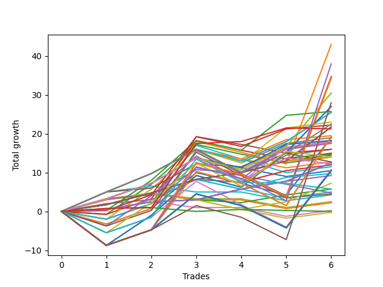

# Short Entry Wallace MJ 007 
- Symbol: ES
- Date Range: 03/18/2022 - 07/15/2022
- Trading Period: 7:20-12:30
- Number of Trades: 4



| Name | Win Percent | Profit | Avg Profit / Trade | Avg Time / Trade |      | Name | Win Percent | Profit | Avg Profit / Trade | Avg Time / Trade |
| ---- | ----------- | ------ | ------------------ | ---------------- | ---- | ---- | ----------- | ------ | ------------------ | ---------------- |
| Sorted By <br> Profit | | | | | | Sorted By <br> Win Percentage ||||
| Sixty-Three | 75.00 | 9500.00 | 2375.00 | 29:55 |     | One Hundred Twenty-Nine | 100.00 | 8250.00 | 2062.50 | 10:35 |
| Seven | 75.00 | 9500.00 | 2375.00 | 29:55 |     | One Hundred Twenty-Four | 100.00 | 8250.00 | 2062.50 | 10:35 |
| Sixty | 75.00 | 8875.00 | 2218.75 | 24:13 |     | One Hundred Fourteen | 100.00 | 8250.00 | 2062.50 | 10:35 |
| Four | 75.00 | 8875.00 | 2218.75 | 24:13 |     | Eighty-Four | 100.00 | 8250.00 | 2062.50 | 10:35 |
| Sixty-One | 75.00 | 8500.00 | 2125.00 | 28:48 |     | One Hundred Twenty-Eight | 100.00 | 5750.00 | 1437.50 | 08:28 |
| Five | 75.00 | 8500.00 | 2125.00 | 28:48 |     | One Hundred Twenty-Three | 100.00 | 5750.00 | 1437.50 | 08:28 |
| One Hundred Twenty-Nine | 100.00 | 8250.00 | 2062.50 | 10:35 |     | One Hundred Thirteen | 100.00 | 5750.00 | 1437.50 | 08:28 |
| One Hundred Twenty-Four | 100.00 | 8250.00 | 2062.50 | 10:35 |     | Eighty-Three | 100.00 | 5750.00 | 1437.50 | 08:28 |
| One Hundred Fourteen | 100.00 | 8250.00 | 2062.50 | 10:35 |     | One Hundred Twenty-Seven | 100.00 | 4125.00 | 1031.25 | 00:57 |
| Eighty-Four | 100.00 | 8250.00 | 2062.50 | 10:35 |     | One Hundred Twenty-Two | 100.00 | 4125.00 | 1031.25 | 00:57 |
| Seventy-One | 75.00 | 8000.00 | 2000.00 | 28:06 |     | One Hundred Seventeen | 100.00 | 4125.00 | 1031.25 | 00:57 |
| Sixty-Two | 75.00 | 7750.00 | 1937.50 | 28:46 |     | One Hundred Twelve | 100.00 | 4125.00 | 1031.25 | 00:57 |
| Six | 75.00 | 7750.00 | 1937.50 | 28:46 |     | One Hundred Two | 100.00 | 4125.00 | 1031.25 | 00:57 |
| Sixty-Eight | 75.00 | 7375.00 | 1843.75 | 22:25 |     | Ninety-Two | 100.00 | 4125.00 | 1031.25 | 00:57 |
| Sixty-Nine | 75.00 | 7000.00 | 1750.00 | 27:00 |     | Eighty-Two | 100.00 | 4125.00 | 1031.25 | 00:57 |
| Seventy | 75.00 | 6250.00 | 1562.50 | 26:57 |     | Sixty-Five | 100.00 | 3750.00 | 937.50 | 15:13 |
| One Hundred Twenty-Eight | 100.00 | 5750.00 | 1437.50 | 08:28 |     | Fifty-Seven | 100.00 | 3750.00 | 937.50 | 15:13 |
| One Hundred Twenty-Three | 100.00 | 5750.00 | 1437.50 | 08:28 |     | One | 100.00 | 3750.00 | 937.50 | 15:13 |
| One Hundred Thirteen | 100.00 | 5750.00 | 1437.50 | 08:28 |     | One Hundred Seven | 100.00 | 3125.00 | 781.25 | 00:48 |
| Eighty-Three | 100.00 | 5750.00 | 1437.50 | 08:28 |     | Ninety-Seven | 100.00 | 3125.00 | 781.25 | 00:48 |
| One Hundred Twenty-Five | 75.00 | 5625.00 | 1406.25 | 23:22 |     | One Hundred Twenty-Six | 100.00 | 2625.00 | 656.25 | 00:26 |
| Eighty-Five | 75.00 | 5625.00 | 1406.25 | 23:22 |     | One Hundred Twenty-One | 100.00 | 2625.00 | 656.25 | 00:26 |
| One Hundred Four | 75.00 | 4625.00 | 1156.25 | 06:01 |     | One Hundred Sixteen | 100.00 | 2625.00 | 656.25 | 00:26 |
| One Hundred Twenty-Seven | 100.00 | 4125.00 | 1031.25 | 00:57 |     | One Hundred Eleven | 100.00 | 2625.00 | 656.25 | 00:26 |
| One Hundred Twenty-Two | 100.00 | 4125.00 | 1031.25 | 00:57 |     | One Hundred One | 100.00 | 2625.00 | 656.25 | 00:26 |
| One Hundred Seventeen | 100.00 | 4125.00 | 1031.25 | 00:57 |     | Ninety-One | 100.00 | 2625.00 | 656.25 | 00:26 |
| One Hundred Twelve | 100.00 | 4125.00 | 1031.25 | 00:57 |     | Eighty-One | 100.00 | 2625.00 | 656.25 | 00:26 |
| One Hundred Two | 100.00 | 4125.00 | 1031.25 | 00:57 |     | One Hundred Six | 100.00 | 2000.00 | 500.00 | 00:23 |
| Ninety-Two | 100.00 | 4125.00 | 1031.25 | 00:57 |     | Ninety-Six | 100.00 | 2000.00 | 500.00 | 00:23 |
| Eighty-Two | 100.00 | 4125.00 | 1031.25 | 00:57 |     | Sixty-Three | 75.00 | 9500.00 | 2375.00 | 29:55 |
| One Hundred Thirty | 75.00 | 4125.00 | 1031.25 | 21:33 |     | Seven | 75.00 | 9500.00 | 2375.00 | 29:55 |
| Sixty-Four | 75.00 | 4125.00 | 1031.25 | 05:28 |     | Sixty | 75.00 | 8875.00 | 2218.75 | 24:13 |
| Fifty-Six | 75.00 | 4125.00 | 1031.25 | 05:28 |     | Four | 75.00 | 8875.00 | 2218.75 | 24:13 |
| Forty | 75.00 | 4125.00 | 1031.25 | 05:28 |     | Sixty-One | 75.00 | 8500.00 | 2125.00 | 28:48 |
| Zero | 75.00 | 4125.00 | 1031.25 | 05:28 |     | Five | 75.00 | 8500.00 | 2125.00 | 28:48 |
| Fifty-Nine | 75.00 | 4000.00 | 1000.00 | 22:07 |     | Seventy-One | 75.00 | 8000.00 | 2000.00 | 28:06 |
| Three | 75.00 | 4000.00 | 1000.00 | 22:07 |     | Sixty-Two | 75.00 | 7750.00 | 1937.50 | 28:46 |
| Sixty-Five | 100.00 | 3750.00 | 937.50 | 15:13 |     | Six | 75.00 | 7750.00 | 1937.50 | 28:46 |
| Fifty-Seven | 100.00 | 3750.00 | 937.50 | 15:13 |     | Sixty-Eight | 75.00 | 7375.00 | 1843.75 | 22:25 |
| One | 100.00 | 3750.00 | 937.50 | 15:13 |     | Sixty-Nine | 75.00 | 7000.00 | 1750.00 | 27:00 |
| One Hundred Seven | 100.00 | 3125.00 | 781.25 | 00:48 |     | Seventy | 75.00 | 6250.00 | 1562.50 | 26:57 |
| Ninety-Seven | 100.00 | 3125.00 | 781.25 | 00:48 |     | One Hundred Twenty-Five | 75.00 | 5625.00 | 1406.25 | 23:22 |
| Fifty-Eight | 75.00 | 3125.00 | 781.25 | 20:51 |     | Eighty-Five | 75.00 | 5625.00 | 1406.25 | 23:22 |
| Two | 75.00 | 3125.00 | 781.25 | 20:51 |     | One Hundred Four | 75.00 | 4625.00 | 1156.25 | 06:01 |
| One Hundred Three | 75.00 | 2750.00 | 687.50 | 03:58 |     | One Hundred Thirty | 75.00 | 4125.00 | 1031.25 | 21:33 |
| One Hundred Twenty-Six | 100.00 | 2625.00 | 656.25 | 00:26 |     | Sixty-Four | 75.00 | 4125.00 | 1031.25 | 05:28 |
| One Hundred Twenty-One | 100.00 | 2625.00 | 656.25 | 00:26 |     | Fifty-Six | 75.00 | 4125.00 | 1031.25 | 05:28 |
| One Hundred Sixteen | 100.00 | 2625.00 | 656.25 | 00:26 |     | Forty | 75.00 | 4125.00 | 1031.25 | 05:28 |
| One Hundred Eleven | 100.00 | 2625.00 | 656.25 | 00:26 |     | Zero | 75.00 | 4125.00 | 1031.25 | 05:28 |
| One Hundred One | 100.00 | 2625.00 | 656.25 | 00:26 |     | Fifty-Nine | 75.00 | 4000.00 | 1000.00 | 22:07 |
| Ninety-One | 100.00 | 2625.00 | 656.25 | 00:26 |     | Three | 75.00 | 4000.00 | 1000.00 | 22:07 |
| Eighty-One | 100.00 | 2625.00 | 656.25 | 00:26 |     | Fifty-Eight | 75.00 | 3125.00 | 781.25 | 20:51 |
| Sixty-Seven | 75.00 | 2500.00 | 625.00 | 20:18 |     | Two | 75.00 | 3125.00 | 781.25 | 20:51 |
| Ninety-Four | 50.00 | 2250.00 | 562.50 | 05:07 |     | One Hundred Three | 75.00 | 2750.00 | 687.50 | 03:58 |
| One Hundred Six | 100.00 | 2000.00 | 500.00 | 00:23 |     | Sixty-Seven | 75.00 | 2500.00 | 625.00 | 20:18 |
| Ninety-Six | 100.00 | 2000.00 | 500.00 | 00:23 |     | Ninety-Eight | 75.00 | 1875.00 | 468.75 | 01:53 |
| Ninety-Eight | 75.00 | 1875.00 | 468.75 | 01:53 |     | Sixty-Six | 75.00 | 1625.00 | 406.25 | 19:02 |
| Sixty-Six | 75.00 | 1625.00 | 406.25 | 19:02 |     | One Hundred | 75.00 | 1125.00 | 281.25 | 02:55 |
| One Hundred Ninteen | 50.00 | 1625.00 | 406.25 | 05:20 |     | Ninety-Nine | 75.00 | 1125.00 | 281.25 | 02:55 |
| One Hundred | 75.00 | 1125.00 | 281.25 | 02:55 |     | Forty-One | 75.00 | 250.00 | 62.50 | 13:45 |
| Ninety-Nine | 75.00 | 1125.00 | 281.25 | 02:55 |     | Ninety-Four | 50.00 | 2250.00 | 562.50 | 05:07 |
| One Hundred Eight | 50.00 | 1000.00 | 250.00 | 02:35 |     | One Hundred Ninteen | 50.00 | 1625.00 | 406.25 | 05:20 |
| Ninety-Three | 50.00 | 1000.00 | 250.00 | 03:07 |     | One Hundred Eight | 50.00 | 1000.00 | 250.00 | 02:35 |
| Forty-Four | 50.00 | 750.00 | 187.50 | 20:36 |     | Ninety-Three | 50.00 | 1000.00 | 250.00 | 03:07 |
| Forty-Eight | 50.00 | 500.00 | 125.00 | 03:15 |     | Forty-Four | 50.00 | 750.00 | 187.50 | 20:36 |
| One Hundred Eighteen | 50.00 | 375.00 | 93.75 | 03:20 |     | Forty-Eight | 50.00 | 500.00 | 125.00 | 03:15 |
| Forty-One | 75.00 | 250.00 | 62.50 | 13:45 |     | One Hundred Eighteen | 50.00 | 375.00 | 93.75 | 03:20 |
| Fifty-Two | 25.00 | 125.00 | 31.25 | 08:27 |     | One Hundred Ten | 50.00 | -0.00 | -0.00 | 03:42 |
| One Hundred Ten | 50.00 | -0.00 | -0.00 | 03:42 |     | One Hundred Nine | 50.00 | -0.00 | -0.00 | 03:42 |
| One Hundred Nine | 50.00 | -0.00 | -0.00 | 03:42 |     | Seventy-Three | 50.00 | -875.00 | -218.75 | 07:35 |
| Ninety-Five | 25.00 | -375.00 | -93.75 | 06:36 |     | One Hundred Fifteen | 50.00 | -1125.00 | -281.25 | 19:51 |
| Seventy-Three | 50.00 | -875.00 | -218.75 | 07:35 |     | Forty-Three | 50.00 | -1750.00 | -437.50 | 18:48 |
| One Hundred Twenty | 25.00 | -1000.00 | -250.00 | 06:48 |     | Forty-Seven | 50.00 | -1875.00 | -468.75 | 23:43 |
| Fifty-One | 25.00 | -1000.00 | -250.00 | 06:48 |     | Forty-Six | 50.00 | -1875.00 | -468.75 | 23:43 |
| One Hundred Fifteen | 50.00 | -1125.00 | -281.25 | 19:51 |     | Forty-Five | 50.00 | -1875.00 | -468.75 | 23:43 |
| Forty-Three | 50.00 | -1750.00 | -437.50 | 18:48 |     | Forty-Two | 50.00 | -2875.00 | -718.75 | 17:31 |
| Fifty-Five | 25.00 | -1750.00 | -437.50 | 10:41 |     | Fifty-Two | 25.00 | 125.00 | 31.25 | 08:27 |
| Fifty-Four | 25.00 | -1750.00 | -437.50 | 10:41 |     | Ninety-Five | 25.00 | -375.00 | -93.75 | 06:36 |
| Fifty-Three | 25.00 | -1750.00 | -437.50 | 10:41 |     | One Hundred Twenty | 25.00 | -1000.00 | -250.00 | 06:48 |
| Forty-Seven | 50.00 | -1875.00 | -468.75 | 23:43 |     | Fifty-One | 25.00 | -1000.00 | -250.00 | 06:48 |
| Forty-Six | 50.00 | -1875.00 | -468.75 | 23:43 |     | Fifty-Five | 25.00 | -1750.00 | -437.50 | 10:41 |
| Forty-Five | 50.00 | -1875.00 | -468.75 | 23:43 |     | Fifty-Four | 25.00 | -1750.00 | -437.50 | 10:41 |
| One Hundred Five | 25.00 | -1875.00 | -468.75 | 11:27 |     | Fifty-Three | 25.00 | -1750.00 | -437.50 | 10:41 |
| Forty-Nine | 25.00 | -2000.00 | -500.00 | 04:38 |     | One Hundred Five | 25.00 | -1875.00 | -468.75 | 11:27 |
| Fifty | 25.00 | -2125.00 | -531.25 | 05:31 |     | Forty-Nine | 25.00 | -2000.00 | -500.00 | 04:38 |
| Forty-Two | 50.00 | -2875.00 | -718.75 | 17:31 |     | Fifty | 25.00 | -2125.00 | -531.25 | 05:31 |

## NO STOPLOSS

### Test Zero
* Sell when price hits the middle line of the 20p bollinger
* No Stoploss
* Results:
```
Total Trades: 4
Percent Up: 25.00
Percent Down: 75.00
Total Points Moved Down: 8.25
Potential Profit: 4125.00
Total Points Ups: 0.75 Count Ups: 1
Total Points Downs: 9.00 Count Downs: 3
```

<details><summary>Trades</summary>

<code>In: 2022-04-13 08:36:00		Out: 2022-04-13 08:37:35		Total Position Time: 01:35		Total Move Down: 2.00		Total to Date: 2.00</code> <br />
<code>In: 2022-04-28 10:17:00		Out: 2022-04-28 10:22:05		Total Position Time: 05:05		Total Move Down: 2.75		Total to Date: 4.75</code> <br />
<code>In: 2022-05-31 07:49:00		Out: 2022-05-31 07:50:05		Total Position Time: 01:05		Total Move Down: 4.25		Total to Date: 9.00</code> <br />
<code>In: 2022-07-07 07:57:00		Out: 2022-07-07 08:11:10		Total Position Time: 14:10		Total Move Down: -0.75		Total to Date: 8.25</code> <br />


</details>

### Test One
* Sell when the price hits the upper line of the 20p 1std bollinger
* No Stoploss
* Results:
```
Total Trades: 4
Percent Up: 0.00
Percent Down: 100.00
Total Points Moved Down: 7.50
Potential Profit: 3750.00
Total Points Ups: 0.00 Count Ups: 0
Total Points Downs: 7.50 Count Downs: 4
```

<details><summary>Trades</summary>

<code>In: 2022-04-13 08:36:00		Out: 2022-04-13 08:41:45		Total Position Time: 05:45		Total Move Down: 3.50		Total to Date: 3.50</code> <br />
<code>In: 2022-04-28 10:17:00		Out: 2022-04-28 10:30:45		Total Position Time: 13:45		Total Move Down: 1.75		Total to Date: 5.25</code> <br />
<code>In: 2022-05-31 07:49:00		Out: 2022-05-31 08:07:20		Total Position Time: 18:20		Total Move Down: 2.00		Total to Date: 7.25</code> <br />
<code>In: 2022-07-07 07:57:00		Out: 2022-07-07 08:20:05		Total Position Time: 23:05		Total Move Down: 0.25		Total to Date: 7.50</code> <br />


</details>

### Test Two
* Sell when the price hits the upper line of the 20p 2std bollinger
* No Stoploss
* Results:
```
Total Trades: 4
Percent Up: 25.00
Percent Down: 75.00
Total Points Moved Down: 6.25
Potential Profit: 3125.00
Total Points Ups: 3.00 Count Ups: 1
Total Points Downs: 9.25 Count Downs: 3
```

<details><summary>Trades</summary>

<code>In: 2022-04-13 08:36:00		Out: 2022-04-13 08:45:15		Total Position Time: 09:15		Total Move Down: 3.25		Total to Date: 3.25</code> <br />
<code>In: 2022-04-28 10:17:00		Out: 2022-04-28 10:46:55		Total Position Time: 29:55		Total Move Down: -3.00		Total to Date: 0.25</code> <br />
<code>In: 2022-05-31 07:49:00		Out: 2022-05-31 08:07:30		Total Position Time: 18:30		Total Move Down: 4.00		Total to Date: 4.25</code> <br />
<code>In: 2022-07-07 07:57:00		Out: 2022-07-07 08:22:45		Total Position Time: 25:45		Total Move Down: 2.00		Total to Date: 6.25</code> <br />


</details>

### Test Three
* Sell when price hits the middle line of the 50p bollinger
* No Stoploss
* Results:
```
Total Trades: 4
Percent Up: 25.00
Percent Down: 75.00
Total Points Moved Down: 8.00
Potential Profit: 4000.00
Total Points Ups: 3.00 Count Ups: 1
Total Points Downs: 11.00 Count Downs: 3
```

<details><summary>Trades</summary>

<code>In: 2022-04-13 08:36:00		Out: 2022-04-13 08:50:25		Total Position Time: 14:25		Total Move Down: 5.50		Total to Date: 5.50</code> <br />
<code>In: 2022-04-28 10:17:00		Out: 2022-04-28 10:46:55		Total Position Time: 29:55		Total Move Down: -3.00		Total to Date: 2.50</code> <br />
<code>In: 2022-05-31 07:49:00		Out: 2022-05-31 08:07:25		Total Position Time: 18:25		Total Move Down: 3.50		Total to Date: 6.00</code> <br />
<code>In: 2022-07-07 07:57:00		Out: 2022-07-07 08:22:45		Total Position Time: 25:45		Total Move Down: 2.00		Total to Date: 8.00</code> <br />


</details>

### Test Four
* Sell when the price hits the upper line of the 50p 1std bollinger
* No Stoploss
* Results:
```
Total Trades: 4
Percent Up: 25.00
Percent Down: 75.00
Total Points Moved Down: 17.75
Potential Profit: 8875.00
Total Points Ups: 3.00 Count Ups: 1
Total Points Downs: 20.75 Count Downs: 3
```

<details><summary>Trades</summary>

<code>In: 2022-04-13 08:36:00		Out: 2022-04-13 08:57:00		Total Position Time: 21:00		Total Move Down: 7.75		Total to Date: 7.75</code> <br />
<code>In: 2022-04-28 10:17:00		Out: 2022-04-28 10:46:55		Total Position Time: 29:55		Total Move Down: -3.00		Total to Date: 4.75</code> <br />
<code>In: 2022-05-31 07:49:00		Out: 2022-05-31 08:08:40		Total Position Time: 19:40		Total Move Down: 8.25		Total to Date: 13.00</code> <br />
<code>In: 2022-07-07 07:57:00		Out: 2022-07-07 08:23:20		Total Position Time: 26:20		Total Move Down: 4.75		Total to Date: 17.75</code> <br />


</details>

### Test Five
* Sell when the price hits the upper line of the 50p 2std bollinger
* No Stoploss
* Results:
```
Total Trades: 4
Percent Up: 25.00
Percent Down: 75.00
Total Points Moved Down: 17.00
Potential Profit: 8500.00
Total Points Ups: 3.00 Count Ups: 1
Total Points Downs: 20.00 Count Downs: 3
```

<details><summary>Trades</summary>

<code>In: 2022-04-13 08:36:00		Out: 2022-04-13 09:05:55		Total Position Time: 29:55		Total Move Down: 4.00		Total to Date: 4.00</code> <br />
<code>In: 2022-04-28 10:17:00		Out: 2022-04-28 10:46:55		Total Position Time: 29:55		Total Move Down: -3.00		Total to Date: 1.00</code> <br />
<code>In: 2022-05-31 07:49:00		Out: 2022-05-31 08:14:30		Total Position Time: 25:30		Total Move Down: 12.75		Total to Date: 13.75</code> <br />
<code>In: 2022-07-07 07:57:00		Out: 2022-07-07 08:26:55		Total Position Time: 29:55		Total Move Down: 3.25		Total to Date: 17.00</code> <br />


</details>

### Test Six
* Sell when the price hits the middle line of the 1std VWAP
* No Stoploss
* Results:
```
Total Trades: 4
Percent Up: 25.00
Percent Down: 75.00
Total Points Moved Down: 15.50
Potential Profit: 7750.00
Total Points Ups: 3.00 Count Ups: 1
Total Points Downs: 18.50 Count Downs: 3
```

<details><summary>Trades</summary>

<code>In: 2022-04-13 08:36:00		Out: 2022-04-13 09:05:55		Total Position Time: 29:55		Total Move Down: 4.00		Total to Date: 4.00</code> <br />
<code>In: 2022-04-28 10:17:00		Out: 2022-04-28 10:46:55		Total Position Time: 29:55		Total Move Down: -3.00		Total to Date: 1.00</code> <br />
<code>In: 2022-05-31 07:49:00		Out: 2022-05-31 08:14:20		Total Position Time: 25:20		Total Move Down: 11.25		Total to Date: 12.25</code> <br />
<code>In: 2022-07-07 07:57:00		Out: 2022-07-07 08:26:55		Total Position Time: 29:55		Total Move Down: 3.25		Total to Date: 15.50</code> <br />


</details>

### Test Seven
* Sell when the price hits the upper line of the 1std VWAP
* No Stoploss
* Results:
```
Total Trades: 4
Percent Up: 25.00
Percent Down: 75.00
Total Points Moved Down: 19.00
Potential Profit: 9500.00
Total Points Ups: 3.00 Count Ups: 1
Total Points Downs: 22.00 Count Downs: 3
```

<details><summary>Trades</summary>

<code>In: 2022-04-13 08:36:00		Out: 2022-04-13 09:05:55		Total Position Time: 29:55		Total Move Down: 4.00		Total to Date: 4.00</code> <br />
<code>In: 2022-04-28 10:17:00		Out: 2022-04-28 10:46:55		Total Position Time: 29:55		Total Move Down: -3.00		Total to Date: 1.00</code> <br />
<code>In: 2022-05-31 07:49:00		Out: 2022-05-31 08:18:55		Total Position Time: 29:55		Total Move Down: 14.75		Total to Date: 15.75</code> <br />
<code>In: 2022-07-07 07:57:00		Out: 2022-07-07 08:26:55		Total Position Time: 29:55		Total Move Down: 3.25		Total to Date: 19.00</code> <br />


</details>

## STOPLOSS OF 5

### Test Forty
* Sell when price hits the middle line of the 20p bollinger
* Stoploss is -5 points
* Results:
```
Total Trades: 4
Percent Up: 25.00
Percent Down: 75.00
Total Points Moved Down: 8.25
Potential Profit: 4125.00
Total Points Ups: 0.75 Count Ups: 1
Total Points Downs: 9.00 Count Downs: 3
```

<details><summary>Trades</summary>

<code>In: 2022-04-13 08:36:00		Out: 2022-04-13 08:37:35		Total Position Time: 01:35		Total Move Down: 2.00		Total to Date: 2.00</code> <br />
<code>In: 2022-04-28 10:17:00		Out: 2022-04-28 10:22:05		Total Position Time: 05:05		Total Move Down: 2.75		Total to Date: 4.75</code> <br />
<code>In: 2022-05-31 07:49:00		Out: 2022-05-31 07:50:05		Total Position Time: 01:05		Total Move Down: 4.25		Total to Date: 9.00</code> <br />
<code>In: 2022-07-07 07:57:00		Out: 2022-07-07 08:11:10		Total Position Time: 14:10		Total Move Down: -0.75		Total to Date: 8.25</code> <br />


</details>

### Test Forty-One
* Sell when the price hits the upper line of the 20p 1std bollinger
* Stoploss is -5 points
* Results:
```
Total Trades: 4
Percent Up: 25.00
Percent Down: 75.00
Total Points Moved Down: 0.50
Potential Profit: 250.00
Total Points Ups: 5.00 Count Ups: 1
Total Points Downs: 5.50 Count Downs: 3
```

<details><summary>Trades</summary>

<code>In: 2022-04-13 08:36:00		Out: 2022-04-13 08:41:45		Total Position Time: 05:45		Total Move Down: 3.50		Total to Date: 3.50</code> <br />
<code>In: 2022-04-28 10:17:00		Out: 2022-04-28 10:30:45		Total Position Time: 13:45		Total Move Down: 1.75		Total to Date: 5.25</code> <br />
<code>In: 2022-05-31 07:49:00		Out: 2022-05-31 08:01:25		Total Position Time: 12:25		Total Move Down: -5.00		Total to Date: 0.25</code> <br />
<code>In: 2022-07-07 07:57:00		Out: 2022-07-07 08:20:05		Total Position Time: 23:05		Total Move Down: 0.25		Total to Date: 0.50</code> <br />


</details>

### Test Forty-Two
* Sell when the price hits the upper line of the 20p 2std bollinger
* Stoploss is -5 points
* Results:
```
Total Trades: 4
Percent Up: 50.00
Percent Down: 50.00
Total Points Moved Down: -5.75
Potential Profit: -2875.00
Total Points Ups: 11.00 Count Ups: 2
Total Points Downs: 5.25 Count Downs: 2
```

<details><summary>Trades</summary>

<code>In: 2022-04-13 08:36:00		Out: 2022-04-13 08:45:15		Total Position Time: 09:15		Total Move Down: 3.25		Total to Date: 3.25</code> <br />
<code>In: 2022-04-28 10:17:00		Out: 2022-04-28 10:39:40		Total Position Time: 22:40		Total Move Down: -6.00		Total to Date: -2.75</code> <br />
<code>In: 2022-05-31 07:49:00		Out: 2022-05-31 08:01:25		Total Position Time: 12:25		Total Move Down: -5.00		Total to Date: -7.75</code> <br />
<code>In: 2022-07-07 07:57:00		Out: 2022-07-07 08:22:45		Total Position Time: 25:45		Total Move Down: 2.00		Total to Date: -5.75</code> <br />


</details>

### Test Forty-Three
* Sell when price hits the middle line of the 50p bollinger
* Stoploss is -5 points
* Results:
```
Total Trades: 4
Percent Up: 50.00
Percent Down: 50.00
Total Points Moved Down: -3.50
Potential Profit: -1750.00
Total Points Ups: 11.00 Count Ups: 2
Total Points Downs: 7.50 Count Downs: 2
```

<details><summary>Trades</summary>

<code>In: 2022-04-13 08:36:00		Out: 2022-04-13 08:50:25		Total Position Time: 14:25		Total Move Down: 5.50		Total to Date: 5.50</code> <br />
<code>In: 2022-04-28 10:17:00		Out: 2022-04-28 10:39:40		Total Position Time: 22:40		Total Move Down: -6.00		Total to Date: -0.50</code> <br />
<code>In: 2022-05-31 07:49:00		Out: 2022-05-31 08:01:25		Total Position Time: 12:25		Total Move Down: -5.00		Total to Date: -5.50</code> <br />
<code>In: 2022-07-07 07:57:00		Out: 2022-07-07 08:22:45		Total Position Time: 25:45		Total Move Down: 2.00		Total to Date: -3.50</code> <br />


</details>

### Test Forty-Four
* Sell when the price hits the upper line of the 50p 1std bollinger
* Stoploss is -5 points
* Results:
```
Total Trades: 4
Percent Up: 50.00
Percent Down: 50.00
Total Points Moved Down: 1.50
Potential Profit: 750.00
Total Points Ups: 11.00 Count Ups: 2
Total Points Downs: 12.50 Count Downs: 2
```

<details><summary>Trades</summary>

<code>In: 2022-04-13 08:36:00		Out: 2022-04-13 08:57:00		Total Position Time: 21:00		Total Move Down: 7.75		Total to Date: 7.75</code> <br />
<code>In: 2022-04-28 10:17:00		Out: 2022-04-28 10:39:40		Total Position Time: 22:40		Total Move Down: -6.00		Total to Date: 1.75</code> <br />
<code>In: 2022-05-31 07:49:00		Out: 2022-05-31 08:01:25		Total Position Time: 12:25		Total Move Down: -5.00		Total to Date: -3.25</code> <br />
<code>In: 2022-07-07 07:57:00		Out: 2022-07-07 08:23:20		Total Position Time: 26:20		Total Move Down: 4.75		Total to Date: 1.50</code> <br />


</details>

### Test Forty-Five
* Sell when the price hits the upper line of the 50p 2std bollinger
* Stoploss is -5 points
* Results:
```
Total Trades: 4
Percent Up: 50.00
Percent Down: 50.00
Total Points Moved Down: -3.75
Potential Profit: -1875.00
Total Points Ups: 11.00 Count Ups: 2
Total Points Downs: 7.25 Count Downs: 2
```

<details><summary>Trades</summary>

<code>In: 2022-04-13 08:36:00		Out: 2022-04-13 09:05:55		Total Position Time: 29:55		Total Move Down: 4.00		Total to Date: 4.00</code> <br />
<code>In: 2022-04-28 10:17:00		Out: 2022-04-28 10:39:40		Total Position Time: 22:40		Total Move Down: -6.00		Total to Date: -2.00</code> <br />
<code>In: 2022-05-31 07:49:00		Out: 2022-05-31 08:01:25		Total Position Time: 12:25		Total Move Down: -5.00		Total to Date: -7.00</code> <br />
<code>In: 2022-07-07 07:57:00		Out: 2022-07-07 08:26:55		Total Position Time: 29:55		Total Move Down: 3.25		Total to Date: -3.75</code> <br />


</details>

### Test Forty-Six
* Sell when the price hits the middle line of the 1std VWAP
* Stoploss is -5 points
* Results:
```
Total Trades: 4
Percent Up: 50.00
Percent Down: 50.00
Total Points Moved Down: -3.75
Potential Profit: -1875.00
Total Points Ups: 11.00 Count Ups: 2
Total Points Downs: 7.25 Count Downs: 2
```

<details><summary>Trades</summary>

<code>In: 2022-04-13 08:36:00		Out: 2022-04-13 09:05:55		Total Position Time: 29:55		Total Move Down: 4.00		Total to Date: 4.00</code> <br />
<code>In: 2022-04-28 10:17:00		Out: 2022-04-28 10:39:40		Total Position Time: 22:40		Total Move Down: -6.00		Total to Date: -2.00</code> <br />
<code>In: 2022-05-31 07:49:00		Out: 2022-05-31 08:01:25		Total Position Time: 12:25		Total Move Down: -5.00		Total to Date: -7.00</code> <br />
<code>In: 2022-07-07 07:57:00		Out: 2022-07-07 08:26:55		Total Position Time: 29:55		Total Move Down: 3.25		Total to Date: -3.75</code> <br />


</details>

### Test Forty-Seven
* Sell when the price hits the upper line of the 1std VWAP
* Stoploss is -5 points
* Results:
```
Total Trades: 4
Percent Up: 50.00
Percent Down: 50.00
Total Points Moved Down: -3.75
Potential Profit: -1875.00
Total Points Ups: 11.00 Count Ups: 2
Total Points Downs: 7.25 Count Downs: 2
```

<details><summary>Trades</summary>

<code>In: 2022-04-13 08:36:00		Out: 2022-04-13 09:05:55		Total Position Time: 29:55		Total Move Down: 4.00		Total to Date: 4.00</code> <br />
<code>In: 2022-04-28 10:17:00		Out: 2022-04-28 10:39:40		Total Position Time: 22:40		Total Move Down: -6.00		Total to Date: -2.00</code> <br />
<code>In: 2022-05-31 07:49:00		Out: 2022-05-31 08:01:25		Total Position Time: 12:25		Total Move Down: -5.00		Total to Date: -7.00</code> <br />
<code>In: 2022-07-07 07:57:00		Out: 2022-07-07 08:26:55		Total Position Time: 29:55		Total Move Down: 3.25		Total to Date: -3.75</code> <br />


</details>

## TRAIL STOP OF 5

### Test Forty-Eight
* Sell when price hits the middle line of the 20p bollinger
* Trailing Stop is -5 points
* Results:
```
Total Trades: 4
Percent Up: 50.00
Percent Down: 50.00
Total Points Moved Down: 1.00
Potential Profit: 500.00
Total Points Ups: 5.25 Count Ups: 2
Total Points Downs: 6.25 Count Downs: 2
```

<details><summary>Trades</summary>

<code>In: 2022-04-13 08:36:00		Out: 2022-04-13 08:37:35		Total Position Time: 01:35		Total Move Down: 2.00		Total to Date: 2.00</code> <br />
<code>In: 2022-04-28 10:17:00		Out: 2022-04-28 10:19:35		Total Position Time: 02:35		Total Move Down: -2.50		Total to Date: -0.50</code> <br />
<code>In: 2022-05-31 07:49:00		Out: 2022-05-31 07:50:05		Total Position Time: 01:05		Total Move Down: 4.25		Total to Date: 3.75</code> <br />
<code>In: 2022-07-07 07:57:00		Out: 2022-07-07 08:04:45		Total Position Time: 07:45		Total Move Down: -2.75		Total to Date: 1.00</code> <br />


</details>

### Test Forty-Nine
* Sell when the price hits the upper line of the 20p 1std bollinger
* Trailing Stop is -5 points
* Results:
```
Total Trades: 4
Percent Up: 75.00
Percent Down: 25.00
Total Points Moved Down: -4.00
Potential Profit: -2000.00
Total Points Ups: 7.50 Count Ups: 3
Total Points Downs: 3.50 Count Downs: 1
```

<details><summary>Trades</summary>

<code>In: 2022-04-13 08:36:00		Out: 2022-04-13 08:41:45		Total Position Time: 05:45		Total Move Down: 3.50		Total to Date: 3.50</code> <br />
<code>In: 2022-04-28 10:17:00		Out: 2022-04-28 10:19:35		Total Position Time: 02:35		Total Move Down: -2.50		Total to Date: 1.00</code> <br />
<code>In: 2022-05-31 07:49:00		Out: 2022-05-31 07:51:30		Total Position Time: 02:30		Total Move Down: -2.25		Total to Date: -1.25</code> <br />
<code>In: 2022-07-07 07:57:00		Out: 2022-07-07 08:04:45		Total Position Time: 07:45		Total Move Down: -2.75		Total to Date: -4.00</code> <br />


</details>

### Test Fifty
* Sell when the price hits the upper line of the 20p 2std bollinger
* Trailing Stop is -5 points
* Results:
```
Total Trades: 4
Percent Up: 75.00
Percent Down: 25.00
Total Points Moved Down: -4.25
Potential Profit: -2125.00
Total Points Ups: 7.50 Count Ups: 3
Total Points Downs: 3.25 Count Downs: 1
```

<details><summary>Trades</summary>

<code>In: 2022-04-13 08:36:00		Out: 2022-04-13 08:45:15		Total Position Time: 09:15		Total Move Down: 3.25		Total to Date: 3.25</code> <br />
<code>In: 2022-04-28 10:17:00		Out: 2022-04-28 10:19:35		Total Position Time: 02:35		Total Move Down: -2.50		Total to Date: 0.75</code> <br />
<code>In: 2022-05-31 07:49:00		Out: 2022-05-31 07:51:30		Total Position Time: 02:30		Total Move Down: -2.25		Total to Date: -1.50</code> <br />
<code>In: 2022-07-07 07:57:00		Out: 2022-07-07 08:04:45		Total Position Time: 07:45		Total Move Down: -2.75		Total to Date: -4.25</code> <br />


</details>

### Test Fifty-One
* Sell when price hits the middle line of the 50p bollinger
* Trailing Stop is -5 points
* Results:
```
Total Trades: 4
Percent Up: 75.00
Percent Down: 25.00
Total Points Moved Down: -2.00
Potential Profit: -1000.00
Total Points Ups: 7.50 Count Ups: 3
Total Points Downs: 5.50 Count Downs: 1
```

<details><summary>Trades</summary>

<code>In: 2022-04-13 08:36:00		Out: 2022-04-13 08:50:25		Total Position Time: 14:25		Total Move Down: 5.50		Total to Date: 5.50</code> <br />
<code>In: 2022-04-28 10:17:00		Out: 2022-04-28 10:19:35		Total Position Time: 02:35		Total Move Down: -2.50		Total to Date: 3.00</code> <br />
<code>In: 2022-05-31 07:49:00		Out: 2022-05-31 07:51:30		Total Position Time: 02:30		Total Move Down: -2.25		Total to Date: 0.75</code> <br />
<code>In: 2022-07-07 07:57:00		Out: 2022-07-07 08:04:45		Total Position Time: 07:45		Total Move Down: -2.75		Total to Date: -2.00</code> <br />


</details>

### Test Fifty-Two
* Sell when the price hits the upper line of the 50p 1std bollinger
* Trailing Stop is -5 points
* Results:
```
Total Trades: 4
Percent Up: 75.00
Percent Down: 25.00
Total Points Moved Down: 0.25
Potential Profit: 125.00
Total Points Ups: 7.50 Count Ups: 3
Total Points Downs: 7.75 Count Downs: 1
```

<details><summary>Trades</summary>

<code>In: 2022-04-13 08:36:00		Out: 2022-04-13 08:57:00		Total Position Time: 21:00		Total Move Down: 7.75		Total to Date: 7.75</code> <br />
<code>In: 2022-04-28 10:17:00		Out: 2022-04-28 10:19:35		Total Position Time: 02:35		Total Move Down: -2.50		Total to Date: 5.25</code> <br />
<code>In: 2022-05-31 07:49:00		Out: 2022-05-31 07:51:30		Total Position Time: 02:30		Total Move Down: -2.25		Total to Date: 3.00</code> <br />
<code>In: 2022-07-07 07:57:00		Out: 2022-07-07 08:04:45		Total Position Time: 07:45		Total Move Down: -2.75		Total to Date: 0.25</code> <br />


</details>

### Test Fifty-Three
* Sell when the price hits the upper line of the 50p 2std bollinger
* Trailing Stop is -5 points
* Results:
```
Total Trades: 4
Percent Up: 75.00
Percent Down: 25.00
Total Points Moved Down: -3.50
Potential Profit: -1750.00
Total Points Ups: 7.50 Count Ups: 3
Total Points Downs: 4.00 Count Downs: 1
```

<details><summary>Trades</summary>

<code>In: 2022-04-13 08:36:00		Out: 2022-04-13 09:05:55		Total Position Time: 29:55		Total Move Down: 4.00		Total to Date: 4.00</code> <br />
<code>In: 2022-04-28 10:17:00		Out: 2022-04-28 10:19:35		Total Position Time: 02:35		Total Move Down: -2.50		Total to Date: 1.50</code> <br />
<code>In: 2022-05-31 07:49:00		Out: 2022-05-31 07:51:30		Total Position Time: 02:30		Total Move Down: -2.25		Total to Date: -0.75</code> <br />
<code>In: 2022-07-07 07:57:00		Out: 2022-07-07 08:04:45		Total Position Time: 07:45		Total Move Down: -2.75		Total to Date: -3.50</code> <br />


</details>

### Test Fifty-Four
* Sell when the price hits the middle line of the 1std VWAP
* Trailing Stop is -5 points
* Results:
```
Total Trades: 4
Percent Up: 75.00
Percent Down: 25.00
Total Points Moved Down: -3.50
Potential Profit: -1750.00
Total Points Ups: 7.50 Count Ups: 3
Total Points Downs: 4.00 Count Downs: 1
```

<details><summary>Trades</summary>

<code>In: 2022-04-13 08:36:00		Out: 2022-04-13 09:05:55		Total Position Time: 29:55		Total Move Down: 4.00		Total to Date: 4.00</code> <br />
<code>In: 2022-04-28 10:17:00		Out: 2022-04-28 10:19:35		Total Position Time: 02:35		Total Move Down: -2.50		Total to Date: 1.50</code> <br />
<code>In: 2022-05-31 07:49:00		Out: 2022-05-31 07:51:30		Total Position Time: 02:30		Total Move Down: -2.25		Total to Date: -0.75</code> <br />
<code>In: 2022-07-07 07:57:00		Out: 2022-07-07 08:04:45		Total Position Time: 07:45		Total Move Down: -2.75		Total to Date: -3.50</code> <br />


</details>

### Test Fifty-Five
* Sell when the price hits the upper line of the 1std VWAP
* Trailing Stop is -5 points
* Results:
```
Total Trades: 4
Percent Up: 75.00
Percent Down: 25.00
Total Points Moved Down: -3.50
Potential Profit: -1750.00
Total Points Ups: 7.50 Count Ups: 3
Total Points Downs: 4.00 Count Downs: 1
```

<details><summary>Trades</summary>

<code>In: 2022-04-13 08:36:00		Out: 2022-04-13 09:05:55		Total Position Time: 29:55		Total Move Down: 4.00		Total to Date: 4.00</code> <br />
<code>In: 2022-04-28 10:17:00		Out: 2022-04-28 10:19:35		Total Position Time: 02:35		Total Move Down: -2.50		Total to Date: 1.50</code> <br />
<code>In: 2022-05-31 07:49:00		Out: 2022-05-31 07:51:30		Total Position Time: 02:30		Total Move Down: -2.25		Total to Date: -0.75</code> <br />
<code>In: 2022-07-07 07:57:00		Out: 2022-07-07 08:04:45		Total Position Time: 07:45		Total Move Down: -2.75		Total to Date: -3.50</code> <br />


</details>

## STOPLOSS OF 10

### Test Fifty-Six
* Sell when price hits the middle line of the 20p bollinger
* Stoploss is -10 points
* Results:
```
Total Trades: 4
Percent Up: 25.00
Percent Down: 75.00
Total Points Moved Down: 8.25
Potential Profit: 4125.00
Total Points Ups: 0.75 Count Ups: 1
Total Points Downs: 9.00 Count Downs: 3
```

<details><summary>Trades</summary>

<code>In: 2022-04-13 08:36:00		Out: 2022-04-13 08:37:35		Total Position Time: 01:35		Total Move Down: 2.00		Total to Date: 2.00</code> <br />
<code>In: 2022-04-28 10:17:00		Out: 2022-04-28 10:22:05		Total Position Time: 05:05		Total Move Down: 2.75		Total to Date: 4.75</code> <br />
<code>In: 2022-05-31 07:49:00		Out: 2022-05-31 07:50:05		Total Position Time: 01:05		Total Move Down: 4.25		Total to Date: 9.00</code> <br />
<code>In: 2022-07-07 07:57:00		Out: 2022-07-07 08:11:10		Total Position Time: 14:10		Total Move Down: -0.75		Total to Date: 8.25</code> <br />


</details>

### Test Fifty-Seven
* Sell when the price hits the upper line of the 20p 1std bollinger
* Stoploss is -10 points
* Results:
```
Total Trades: 4
Percent Up: 0.00
Percent Down: 100.00
Total Points Moved Down: 7.50
Potential Profit: 3750.00
Total Points Ups: 0.00 Count Ups: 0
Total Points Downs: 7.50 Count Downs: 4
```

<details><summary>Trades</summary>

<code>In: 2022-04-13 08:36:00		Out: 2022-04-13 08:41:45		Total Position Time: 05:45		Total Move Down: 3.50		Total to Date: 3.50</code> <br />
<code>In: 2022-04-28 10:17:00		Out: 2022-04-28 10:30:45		Total Position Time: 13:45		Total Move Down: 1.75		Total to Date: 5.25</code> <br />
<code>In: 2022-05-31 07:49:00		Out: 2022-05-31 08:07:20		Total Position Time: 18:20		Total Move Down: 2.00		Total to Date: 7.25</code> <br />
<code>In: 2022-07-07 07:57:00		Out: 2022-07-07 08:20:05		Total Position Time: 23:05		Total Move Down: 0.25		Total to Date: 7.50</code> <br />


</details>

### Test Fifty-Eight
* Sell when the price hits the upper line of the 20p 2std bollinger
* Stoploss is -10 points
* Results:
```
Total Trades: 4
Percent Up: 25.00
Percent Down: 75.00
Total Points Moved Down: 6.25
Potential Profit: 3125.00
Total Points Ups: 3.00 Count Ups: 1
Total Points Downs: 9.25 Count Downs: 3
```

<details><summary>Trades</summary>

<code>In: 2022-04-13 08:36:00		Out: 2022-04-13 08:45:15		Total Position Time: 09:15		Total Move Down: 3.25		Total to Date: 3.25</code> <br />
<code>In: 2022-04-28 10:17:00		Out: 2022-04-28 10:46:55		Total Position Time: 29:55		Total Move Down: -3.00		Total to Date: 0.25</code> <br />
<code>In: 2022-05-31 07:49:00		Out: 2022-05-31 08:07:30		Total Position Time: 18:30		Total Move Down: 4.00		Total to Date: 4.25</code> <br />
<code>In: 2022-07-07 07:57:00		Out: 2022-07-07 08:22:45		Total Position Time: 25:45		Total Move Down: 2.00		Total to Date: 6.25</code> <br />


</details>

### Test Fifty-Nine
* Sell when price hits the middle line of the 50p bollinger
* Stoploss is -10 points
* Results:
```
Total Trades: 4
Percent Up: 25.00
Percent Down: 75.00
Total Points Moved Down: 8.00
Potential Profit: 4000.00
Total Points Ups: 3.00 Count Ups: 1
Total Points Downs: 11.00 Count Downs: 3
```

<details><summary>Trades</summary>

<code>In: 2022-04-13 08:36:00		Out: 2022-04-13 08:50:25		Total Position Time: 14:25		Total Move Down: 5.50		Total to Date: 5.50</code> <br />
<code>In: 2022-04-28 10:17:00		Out: 2022-04-28 10:46:55		Total Position Time: 29:55		Total Move Down: -3.00		Total to Date: 2.50</code> <br />
<code>In: 2022-05-31 07:49:00		Out: 2022-05-31 08:07:25		Total Position Time: 18:25		Total Move Down: 3.50		Total to Date: 6.00</code> <br />
<code>In: 2022-07-07 07:57:00		Out: 2022-07-07 08:22:45		Total Position Time: 25:45		Total Move Down: 2.00		Total to Date: 8.00</code> <br />


</details>

### Test Sixty
* Sell when the price hits the upper line of the 50p 1std bollinger
* Stoploss is -10 points
* Results:
```
Total Trades: 4
Percent Up: 25.00
Percent Down: 75.00
Total Points Moved Down: 17.75
Potential Profit: 8875.00
Total Points Ups: 3.00 Count Ups: 1
Total Points Downs: 20.75 Count Downs: 3
```

<details><summary>Trades</summary>

<code>In: 2022-04-13 08:36:00		Out: 2022-04-13 08:57:00		Total Position Time: 21:00		Total Move Down: 7.75		Total to Date: 7.75</code> <br />
<code>In: 2022-04-28 10:17:00		Out: 2022-04-28 10:46:55		Total Position Time: 29:55		Total Move Down: -3.00		Total to Date: 4.75</code> <br />
<code>In: 2022-05-31 07:49:00		Out: 2022-05-31 08:08:40		Total Position Time: 19:40		Total Move Down: 8.25		Total to Date: 13.00</code> <br />
<code>In: 2022-07-07 07:57:00		Out: 2022-07-07 08:23:20		Total Position Time: 26:20		Total Move Down: 4.75		Total to Date: 17.75</code> <br />


</details>

### Test Sixty-One
* Sell when the price hits the upper line of the 50p 2std bollinger
* Stoploss is -10 points
* Results:
```
Total Trades: 4
Percent Up: 25.00
Percent Down: 75.00
Total Points Moved Down: 17.00
Potential Profit: 8500.00
Total Points Ups: 3.00 Count Ups: 1
Total Points Downs: 20.00 Count Downs: 3
```

<details><summary>Trades</summary>

<code>In: 2022-04-13 08:36:00		Out: 2022-04-13 09:05:55		Total Position Time: 29:55		Total Move Down: 4.00		Total to Date: 4.00</code> <br />
<code>In: 2022-04-28 10:17:00		Out: 2022-04-28 10:46:55		Total Position Time: 29:55		Total Move Down: -3.00		Total to Date: 1.00</code> <br />
<code>In: 2022-05-31 07:49:00		Out: 2022-05-31 08:14:30		Total Position Time: 25:30		Total Move Down: 12.75		Total to Date: 13.75</code> <br />
<code>In: 2022-07-07 07:57:00		Out: 2022-07-07 08:26:55		Total Position Time: 29:55		Total Move Down: 3.25		Total to Date: 17.00</code> <br />


</details>

### Test Sixty-Two
* Sell when the price hits the middle line of the 1std VWAP
* Stoploss is -10 points
* Results:
```
Total Trades: 4
Percent Up: 25.00
Percent Down: 75.00
Total Points Moved Down: 15.50
Potential Profit: 7750.00
Total Points Ups: 3.00 Count Ups: 1
Total Points Downs: 18.50 Count Downs: 3
```

<details><summary>Trades</summary>

<code>In: 2022-04-13 08:36:00		Out: 2022-04-13 09:05:55		Total Position Time: 29:55		Total Move Down: 4.00		Total to Date: 4.00</code> <br />
<code>In: 2022-04-28 10:17:00		Out: 2022-04-28 10:46:55		Total Position Time: 29:55		Total Move Down: -3.00		Total to Date: 1.00</code> <br />
<code>In: 2022-05-31 07:49:00		Out: 2022-05-31 08:14:20		Total Position Time: 25:20		Total Move Down: 11.25		Total to Date: 12.25</code> <br />
<code>In: 2022-07-07 07:57:00		Out: 2022-07-07 08:26:55		Total Position Time: 29:55		Total Move Down: 3.25		Total to Date: 15.50</code> <br />


</details>

### Test Sixty-Three
* Sell when the price hits the upper line of the 1std VWAP
* Stoploss is -10 points
* Results:
```
Total Trades: 4
Percent Up: 25.00
Percent Down: 75.00
Total Points Moved Down: 19.00
Potential Profit: 9500.00
Total Points Ups: 3.00 Count Ups: 1
Total Points Downs: 22.00 Count Downs: 3
```

<details><summary>Trades</summary>

<code>In: 2022-04-13 08:36:00		Out: 2022-04-13 09:05:55		Total Position Time: 29:55		Total Move Down: 4.00		Total to Date: 4.00</code> <br />
<code>In: 2022-04-28 10:17:00		Out: 2022-04-28 10:46:55		Total Position Time: 29:55		Total Move Down: -3.00		Total to Date: 1.00</code> <br />
<code>In: 2022-05-31 07:49:00		Out: 2022-05-31 08:18:55		Total Position Time: 29:55		Total Move Down: 14.75		Total to Date: 15.75</code> <br />
<code>In: 2022-07-07 07:57:00		Out: 2022-07-07 08:26:55		Total Position Time: 29:55		Total Move Down: 3.25		Total to Date: 19.00</code> <br />


</details>

## TRAIL STOP OF 10

### Test Sixty-Four
* Sell when price hits the middle line of the 20p bollinger
* Trailing Stop is -10 points
* Results:
```
Total Trades: 4
Percent Up: 25.00
Percent Down: 75.00
Total Points Moved Down: 8.25
Potential Profit: 4125.00
Total Points Ups: 0.75 Count Ups: 1
Total Points Downs: 9.00 Count Downs: 3
```

<details><summary>Trades</summary>

<code>In: 2022-04-13 08:36:00		Out: 2022-04-13 08:37:35		Total Position Time: 01:35		Total Move Down: 2.00		Total to Date: 2.00</code> <br />
<code>In: 2022-04-28 10:17:00		Out: 2022-04-28 10:22:05		Total Position Time: 05:05		Total Move Down: 2.75		Total to Date: 4.75</code> <br />
<code>In: 2022-05-31 07:49:00		Out: 2022-05-31 07:50:05		Total Position Time: 01:05		Total Move Down: 4.25		Total to Date: 9.00</code> <br />
<code>In: 2022-07-07 07:57:00		Out: 2022-07-07 08:11:10		Total Position Time: 14:10		Total Move Down: -0.75		Total to Date: 8.25</code> <br />


</details>

### Test Sixty-Five
* Sell when the price hits the upper line of the 20p 1std bollinger
* Trailing Stop is -10 points
* Results:
```
Total Trades: 4
Percent Up: 0.00
Percent Down: 100.00
Total Points Moved Down: 7.50
Potential Profit: 3750.00
Total Points Ups: 0.00 Count Ups: 0
Total Points Downs: 7.50 Count Downs: 4
```

<details><summary>Trades</summary>

<code>In: 2022-04-13 08:36:00		Out: 2022-04-13 08:41:45		Total Position Time: 05:45		Total Move Down: 3.50		Total to Date: 3.50</code> <br />
<code>In: 2022-04-28 10:17:00		Out: 2022-04-28 10:30:45		Total Position Time: 13:45		Total Move Down: 1.75		Total to Date: 5.25</code> <br />
<code>In: 2022-05-31 07:49:00		Out: 2022-05-31 08:07:20		Total Position Time: 18:20		Total Move Down: 2.00		Total to Date: 7.25</code> <br />
<code>In: 2022-07-07 07:57:00		Out: 2022-07-07 08:20:05		Total Position Time: 23:05		Total Move Down: 0.25		Total to Date: 7.50</code> <br />


</details>

### Test Sixty-Six
* Sell when the price hits the upper line of the 20p 2std bollinger
* Trailing Stop is -10 points
* Results:
```
Total Trades: 4
Percent Up: 25.00
Percent Down: 75.00
Total Points Moved Down: 3.25
Potential Profit: 1625.00
Total Points Ups: 6.00 Count Ups: 1
Total Points Downs: 9.25 Count Downs: 3
```

<details><summary>Trades</summary>

<code>In: 2022-04-13 08:36:00		Out: 2022-04-13 08:45:15		Total Position Time: 09:15		Total Move Down: 3.25		Total to Date: 3.25</code> <br />
<code>In: 2022-04-28 10:17:00		Out: 2022-04-28 10:39:40		Total Position Time: 22:40		Total Move Down: -6.00		Total to Date: -2.75</code> <br />
<code>In: 2022-05-31 07:49:00		Out: 2022-05-31 08:07:30		Total Position Time: 18:30		Total Move Down: 4.00		Total to Date: 1.25</code> <br />
<code>In: 2022-07-07 07:57:00		Out: 2022-07-07 08:22:45		Total Position Time: 25:45		Total Move Down: 2.00		Total to Date: 3.25</code> <br />


</details>

### Test Sixty-Seven
* Sell when price hits the middle line of the 50p bollinger
* Trailing Stop is -10 points
* Results:
```
Total Trades: 4
Percent Up: 25.00
Percent Down: 75.00
Total Points Moved Down: 5.00
Potential Profit: 2500.00
Total Points Ups: 6.00 Count Ups: 1
Total Points Downs: 11.00 Count Downs: 3
```

<details><summary>Trades</summary>

<code>In: 2022-04-13 08:36:00		Out: 2022-04-13 08:50:25		Total Position Time: 14:25		Total Move Down: 5.50		Total to Date: 5.50</code> <br />
<code>In: 2022-04-28 10:17:00		Out: 2022-04-28 10:39:40		Total Position Time: 22:40		Total Move Down: -6.00		Total to Date: -0.50</code> <br />
<code>In: 2022-05-31 07:49:00		Out: 2022-05-31 08:07:25		Total Position Time: 18:25		Total Move Down: 3.50		Total to Date: 3.00</code> <br />
<code>In: 2022-07-07 07:57:00		Out: 2022-07-07 08:22:45		Total Position Time: 25:45		Total Move Down: 2.00		Total to Date: 5.00</code> <br />


</details>

### Test Sixty-Eight
* Sell when the price hits the upper line of the 50p 1std bollinger
* Trailing Stop is -10 points
* Results:
```
Total Trades: 4
Percent Up: 25.00
Percent Down: 75.00
Total Points Moved Down: 14.75
Potential Profit: 7375.00
Total Points Ups: 6.00 Count Ups: 1
Total Points Downs: 20.75 Count Downs: 3
```

<details><summary>Trades</summary>

<code>In: 2022-04-13 08:36:00		Out: 2022-04-13 08:57:00		Total Position Time: 21:00		Total Move Down: 7.75		Total to Date: 7.75</code> <br />
<code>In: 2022-04-28 10:17:00		Out: 2022-04-28 10:39:40		Total Position Time: 22:40		Total Move Down: -6.00		Total to Date: 1.75</code> <br />
<code>In: 2022-05-31 07:49:00		Out: 2022-05-31 08:08:40		Total Position Time: 19:40		Total Move Down: 8.25		Total to Date: 10.00</code> <br />
<code>In: 2022-07-07 07:57:00		Out: 2022-07-07 08:23:20		Total Position Time: 26:20		Total Move Down: 4.75		Total to Date: 14.75</code> <br />


</details>

### Test Sixty-Nine
* Sell when the price hits the upper line of the 50p 2std bollinger
* Trailing Stop is -10 points
* Results:
```
Total Trades: 4
Percent Up: 25.00
Percent Down: 75.00
Total Points Moved Down: 14.00
Potential Profit: 7000.00
Total Points Ups: 6.00 Count Ups: 1
Total Points Downs: 20.00 Count Downs: 3
```

<details><summary>Trades</summary>

<code>In: 2022-04-13 08:36:00		Out: 2022-04-13 09:05:55		Total Position Time: 29:55		Total Move Down: 4.00		Total to Date: 4.00</code> <br />
<code>In: 2022-04-28 10:17:00		Out: 2022-04-28 10:39:40		Total Position Time: 22:40		Total Move Down: -6.00		Total to Date: -2.00</code> <br />
<code>In: 2022-05-31 07:49:00		Out: 2022-05-31 08:14:30		Total Position Time: 25:30		Total Move Down: 12.75		Total to Date: 10.75</code> <br />
<code>In: 2022-07-07 07:57:00		Out: 2022-07-07 08:26:55		Total Position Time: 29:55		Total Move Down: 3.25		Total to Date: 14.00</code> <br />


</details>

### Test Seventy
* Sell when the price hits the middle line of the 1std VWAP
* Trailing Stop is -10 points
* Results:
```
Total Trades: 4
Percent Up: 25.00
Percent Down: 75.00
Total Points Moved Down: 12.50
Potential Profit: 6250.00
Total Points Ups: 6.00 Count Ups: 1
Total Points Downs: 18.50 Count Downs: 3
```

<details><summary>Trades</summary>

<code>In: 2022-04-13 08:36:00		Out: 2022-04-13 09:05:55		Total Position Time: 29:55		Total Move Down: 4.00		Total to Date: 4.00</code> <br />
<code>In: 2022-04-28 10:17:00		Out: 2022-04-28 10:39:40		Total Position Time: 22:40		Total Move Down: -6.00		Total to Date: -2.00</code> <br />
<code>In: 2022-05-31 07:49:00		Out: 2022-05-31 08:14:20		Total Position Time: 25:20		Total Move Down: 11.25		Total to Date: 9.25</code> <br />
<code>In: 2022-07-07 07:57:00		Out: 2022-07-07 08:26:55		Total Position Time: 29:55		Total Move Down: 3.25		Total to Date: 12.50</code> <br />


</details>

### Test Seventy-One
* Sell when the price hits the upper line of the 1std VWAP
* Trailing Stop is -10 points
* Results:
```
Total Trades: 4
Percent Up: 25.00
Percent Down: 75.00
Total Points Moved Down: 16.00
Potential Profit: 8000.00
Total Points Ups: 6.00 Count Ups: 1
Total Points Downs: 22.00 Count Downs: 3
```

<details><summary>Trades</summary>

<code>In: 2022-04-13 08:36:00		Out: 2022-04-13 09:05:55		Total Position Time: 29:55		Total Move Down: 4.00		Total to Date: 4.00</code> <br />
<code>In: 2022-04-28 10:17:00		Out: 2022-04-28 10:39:40		Total Position Time: 22:40		Total Move Down: -6.00		Total to Date: -2.00</code> <br />
<code>In: 2022-05-31 07:49:00		Out: 2022-05-31 08:18:55		Total Position Time: 29:55		Total Move Down: 14.75		Total to Date: 12.75</code> <br />
<code>In: 2022-07-07 07:57:00		Out: 2022-07-07 08:26:55		Total Position Time: 29:55		Total Move Down: 3.25		Total to Date: 16.00</code> <br />


</details>

## SPECIAL EXIT CONDITIONS 

### Test Seventy-Three
* Sell when the linear regression slope changes to negative
* No Stoploss
* Results:
```
Total Trades: 4
Percent Up: 50.00
Percent Down: 50.00
Total Points Moved Down: -1.75
Potential Profit: -875.00
Total Points Ups: 2.50 Count Ups: 2
Total Points Downs: 0.75 Count Downs: 2
```

<details><summary>Trades</summary>

<code>In: 2022-04-13 08:36:00		Out: 2022-04-13 08:43:05		Total Position Time: 07:05		Total Move Down: 0.25		Total to Date: 0.25</code> <br />
<code>In: 2022-04-28 10:17:00		Out: 2022-04-28 10:27:05		Total Position Time: 10:05		Total Move Down: 0.50		Total to Date: 0.75</code> <br />
<code>In: 2022-05-31 07:49:00		Out: 2022-05-31 07:55:05		Total Position Time: 06:05		Total Move Down: -0.75		Total to Date: 0.00</code> <br />
<code>In: 2022-07-07 07:57:00		Out: 2022-07-07 08:04:05		Total Position Time: 07:05		Total Move Down: -1.75		Total to Date: -1.75</code> <br />


</details>

## TAKE PROFIT

### Test Eighty-One
* Take Profit of 1 Point
* No Stoploss
* Results:
```
Total Trades: 4
Percent Up: 0.00
Percent Down: 100.00
Total Points Moved Down: 5.25
Potential Profit: 2625.00
Total Points Ups: 0.00 Count Ups: 0
Total Points Downs: 5.25 Count Downs: 4
```

<details><summary>Trades</summary>

<code>In: 2022-04-13 08:36:00		Out: 2022-04-13 08:37:05		Total Position Time: 01:05		Total Move Down: 1.00		Total to Date: 1.00</code> <br />
<code>In: 2022-04-28 10:17:00		Out: 2022-04-28 10:17:10		Total Position Time: 00:10		Total Move Down: 1.50		Total to Date: 2.50</code> <br />
<code>In: 2022-05-31 07:49:00		Out: 2022-05-31 07:49:20		Total Position Time: 00:20		Total Move Down: 1.50		Total to Date: 4.00</code> <br />
<code>In: 2022-07-07 07:57:00		Out: 2022-07-07 07:57:10		Total Position Time: 00:10		Total Move Down: 1.25		Total to Date: 5.25</code> <br />


</details>

### Test Eighty-Two
* Take Profit of 2 Point
* No Stoploss
* Results:
```
Total Trades: 4
Percent Up: 0.00
Percent Down: 100.00
Total Points Moved Down: 8.25
Potential Profit: 4125.00
Total Points Ups: 0.00 Count Ups: 0
Total Points Downs: 8.25 Count Downs: 4
```

<details><summary>Trades</summary>

<code>In: 2022-04-13 08:36:00		Out: 2022-04-13 08:37:20		Total Position Time: 01:20		Total Move Down: 2.00		Total to Date: 2.00</code> <br />
<code>In: 2022-04-28 10:17:00		Out: 2022-04-28 10:17:20		Total Position Time: 00:20		Total Move Down: 2.25		Total to Date: 4.25</code> <br />
<code>In: 2022-05-31 07:49:00		Out: 2022-05-31 07:49:45		Total Position Time: 00:45		Total Move Down: 2.25		Total to Date: 6.50</code> <br />
<code>In: 2022-07-07 07:57:00		Out: 2022-07-07 07:58:25		Total Position Time: 01:25		Total Move Down: 1.75		Total to Date: 8.25</code> <br />


</details>

### Test Eighty-Three
* Take Profit of 3 Point
* No Stoploss
* Results:
```
Total Trades: 4
Percent Up: 0.00
Percent Down: 100.00
Total Points Moved Down: 11.50
Potential Profit: 5750.00
Total Points Ups: 0.00 Count Ups: 0
Total Points Downs: 11.50 Count Downs: 4
```

<details><summary>Trades</summary>

<code>In: 2022-04-13 08:36:00		Out: 2022-04-13 08:38:10		Total Position Time: 02:10		Total Move Down: 3.00		Total to Date: 3.00</code> <br />
<code>In: 2022-04-28 10:17:00		Out: 2022-04-28 10:22:05		Total Position Time: 05:05		Total Move Down: 2.75		Total to Date: 5.75</code> <br />
<code>In: 2022-05-31 07:49:00		Out: 2022-05-31 07:49:50		Total Position Time: 00:50		Total Move Down: 3.00		Total to Date: 8.75</code> <br />
<code>In: 2022-07-07 07:57:00		Out: 2022-07-07 08:22:50		Total Position Time: 25:50		Total Move Down: 2.75		Total to Date: 11.50</code> <br />


</details>

### Test Eighty-Four
* Take Profit of 4 Point
* No Stoploss
* Results:
```
Total Trades: 4
Percent Up: 0.00
Percent Down: 100.00
Total Points Moved Down: 16.50
Potential Profit: 8250.00
Total Points Ups: 0.00 Count Ups: 0
Total Points Downs: 16.50 Count Downs: 4
```

<details><summary>Trades</summary>

<code>In: 2022-04-13 08:36:00		Out: 2022-04-13 08:45:55		Total Position Time: 09:55		Total Move Down: 4.25		Total to Date: 4.25</code> <br />
<code>In: 2022-04-28 10:17:00		Out: 2022-04-28 10:22:15		Total Position Time: 05:15		Total Move Down: 4.00		Total to Date: 8.25</code> <br />
<code>In: 2022-05-31 07:49:00		Out: 2022-05-31 07:50:05		Total Position Time: 01:05		Total Move Down: 4.25		Total to Date: 12.50</code> <br />
<code>In: 2022-07-07 07:57:00		Out: 2022-07-07 08:23:05		Total Position Time: 26:05		Total Move Down: 4.00		Total to Date: 16.50</code> <br />


</details>

### Test Eighty-Five
* Take Profit of 5 Point
* No Stoploss
* Results:
```
Total Trades: 4
Percent Up: 25.00
Percent Down: 75.00
Total Points Moved Down: 11.25
Potential Profit: 5625.00
Total Points Ups: 3.00 Count Ups: 1
Total Points Downs: 14.25 Count Downs: 3
```

<details><summary>Trades</summary>

<code>In: 2022-04-13 08:36:00		Out: 2022-04-13 08:50:25		Total Position Time: 14:25		Total Move Down: 5.50		Total to Date: 5.50</code> <br />
<code>In: 2022-04-28 10:17:00		Out: 2022-04-28 10:46:55		Total Position Time: 29:55		Total Move Down: -3.00		Total to Date: 2.50</code> <br />
<code>In: 2022-05-31 07:49:00		Out: 2022-05-31 08:08:15		Total Position Time: 19:15		Total Move Down: 5.50		Total to Date: 8.00</code> <br />
<code>In: 2022-07-07 07:57:00		Out: 2022-07-07 08:26:55		Total Position Time: 29:55		Total Move Down: 3.25		Total to Date: 11.25</code> <br />


</details>

## TAKE PROFIT Stoploss of Two

### Test Ninety-One
* Take Profit of 1 Point
* Stoploss is -2 points
* Results:
```
Total Trades: 4
Percent Up: 0.00
Percent Down: 100.00
Total Points Moved Down: 5.25
Potential Profit: 2625.00
Total Points Ups: 0.00 Count Ups: 0
Total Points Downs: 5.25 Count Downs: 4
```

<details><summary>Trades</summary>

<code>In: 2022-04-13 08:36:00		Out: 2022-04-13 08:37:05		Total Position Time: 01:05		Total Move Down: 1.00		Total to Date: 1.00</code> <br />
<code>In: 2022-04-28 10:17:00		Out: 2022-04-28 10:17:10		Total Position Time: 00:10		Total Move Down: 1.50		Total to Date: 2.50</code> <br />
<code>In: 2022-05-31 07:49:00		Out: 2022-05-31 07:49:20		Total Position Time: 00:20		Total Move Down: 1.50		Total to Date: 4.00</code> <br />
<code>In: 2022-07-07 07:57:00		Out: 2022-07-07 07:57:10		Total Position Time: 00:10		Total Move Down: 1.25		Total to Date: 5.25</code> <br />


</details>

### Test Ninety-Two
* Take Profit of 2 Point
* Stoploss is -2 points
* Results:
```
Total Trades: 4
Percent Up: 0.00
Percent Down: 100.00
Total Points Moved Down: 8.25
Potential Profit: 4125.00
Total Points Ups: 0.00 Count Ups: 0
Total Points Downs: 8.25 Count Downs: 4
```

<details><summary>Trades</summary>

<code>In: 2022-04-13 08:36:00		Out: 2022-04-13 08:37:20		Total Position Time: 01:20		Total Move Down: 2.00		Total to Date: 2.00</code> <br />
<code>In: 2022-04-28 10:17:00		Out: 2022-04-28 10:17:20		Total Position Time: 00:20		Total Move Down: 2.25		Total to Date: 4.25</code> <br />
<code>In: 2022-05-31 07:49:00		Out: 2022-05-31 07:49:45		Total Position Time: 00:45		Total Move Down: 2.25		Total to Date: 6.50</code> <br />
<code>In: 2022-07-07 07:57:00		Out: 2022-07-07 07:58:25		Total Position Time: 01:25		Total Move Down: 1.75		Total to Date: 8.25</code> <br />


</details>

### Test Ninety-Three
* Take Profit of 3 Point
* Stoploss is -2 points
* Results:
```
Total Trades: 4
Percent Up: 50.00
Percent Down: 50.00
Total Points Moved Down: 2.00
Potential Profit: 1000.00
Total Points Ups: 4.00 Count Ups: 2
Total Points Downs: 6.00 Count Downs: 2
```

<details><summary>Trades</summary>

<code>In: 2022-04-13 08:36:00		Out: 2022-04-13 08:38:10		Total Position Time: 02:10		Total Move Down: 3.00		Total to Date: 3.00</code> <br />
<code>In: 2022-04-28 10:17:00		Out: 2022-04-28 10:19:30		Total Position Time: 02:30		Total Move Down: -2.00		Total to Date: 1.00</code> <br />
<code>In: 2022-05-31 07:49:00		Out: 2022-05-31 07:49:50		Total Position Time: 00:50		Total Move Down: 3.00		Total to Date: 4.00</code> <br />
<code>In: 2022-07-07 07:57:00		Out: 2022-07-07 08:04:00		Total Position Time: 07:00		Total Move Down: -2.00		Total to Date: 2.00</code> <br />


</details>

### Test Ninety-Four
* Take Profit of 4 Point
* Stoploss is -2 points
* Results:
```
Total Trades: 4
Percent Up: 50.00
Percent Down: 50.00
Total Points Moved Down: 4.50
Potential Profit: 2250.00
Total Points Ups: 4.00 Count Ups: 2
Total Points Downs: 8.50 Count Downs: 2
```

<details><summary>Trades</summary>

<code>In: 2022-04-13 08:36:00		Out: 2022-04-13 08:45:55		Total Position Time: 09:55		Total Move Down: 4.25		Total to Date: 4.25</code> <br />
<code>In: 2022-04-28 10:17:00		Out: 2022-04-28 10:19:30		Total Position Time: 02:30		Total Move Down: -2.00		Total to Date: 2.25</code> <br />
<code>In: 2022-05-31 07:49:00		Out: 2022-05-31 07:50:05		Total Position Time: 01:05		Total Move Down: 4.25		Total to Date: 6.50</code> <br />
<code>In: 2022-07-07 07:57:00		Out: 2022-07-07 08:04:00		Total Position Time: 07:00		Total Move Down: -2.00		Total to Date: 4.50</code> <br />


</details>

### Test Ninety-Five
* Take Profit of 5 Point
* Stoploss is -2 points
* Results:
```
Total Trades: 4
Percent Up: 75.00
Percent Down: 25.00
Total Points Moved Down: -0.75
Potential Profit: -375.00
Total Points Ups: 6.25 Count Ups: 3
Total Points Downs: 5.50 Count Downs: 1
```

<details><summary>Trades</summary>

<code>In: 2022-04-13 08:36:00		Out: 2022-04-13 08:50:25		Total Position Time: 14:25		Total Move Down: 5.50		Total to Date: 5.50</code> <br />
<code>In: 2022-04-28 10:17:00		Out: 2022-04-28 10:19:30		Total Position Time: 02:30		Total Move Down: -2.00		Total to Date: 3.50</code> <br />
<code>In: 2022-05-31 07:49:00		Out: 2022-05-31 07:51:30		Total Position Time: 02:30		Total Move Down: -2.25		Total to Date: 1.25</code> <br />
<code>In: 2022-07-07 07:57:00		Out: 2022-07-07 08:04:00		Total Position Time: 07:00		Total Move Down: -2.00		Total to Date: -0.75</code> <br />


</details>

## TAKE PROFIT Trailstop of Two

### Test Ninety-Six
* Take Profit of 1 Point
* Trailing stop is -2 points
* Results:
```
Total Trades: 4
Percent Up: 0.00
Percent Down: 100.00
Total Points Moved Down: 4.00
Potential Profit: 2000.00
Total Points Ups: 0.00 Count Ups: 0
Total Points Downs: 4.00 Count Downs: 4
```

<details><summary>Trades</summary>

<code>In: 2022-04-13 08:36:00		Out: 2022-04-13 08:37:05		Total Position Time: 01:05		Total Move Down: 1.00		Total to Date: 1.00</code> <br />
<code>In: 2022-04-28 10:17:00		Out: 2022-04-28 10:17:10		Total Position Time: 00:10		Total Move Down: 1.50		Total to Date: 2.50</code> <br />
<code>In: 2022-05-31 07:49:00		Out: 2022-05-31 07:49:10		Total Position Time: 00:10		Total Move Down: 0.25		Total to Date: 2.75</code> <br />
<code>In: 2022-07-07 07:57:00		Out: 2022-07-07 07:57:10		Total Position Time: 00:10		Total Move Down: 1.25		Total to Date: 4.00</code> <br />


</details>

### Test Ninety-Seven
* Take Profit of 2 Point
* Trailing stop is -2 points
* Results:
```
Total Trades: 4
Percent Up: 0.00
Percent Down: 100.00
Total Points Moved Down: 6.25
Potential Profit: 3125.00
Total Points Ups: 0.00 Count Ups: 0
Total Points Downs: 6.25 Count Downs: 4
```

<details><summary>Trades</summary>

<code>In: 2022-04-13 08:36:00		Out: 2022-04-13 08:37:20		Total Position Time: 01:20		Total Move Down: 2.00		Total to Date: 2.00</code> <br />
<code>In: 2022-04-28 10:17:00		Out: 2022-04-28 10:17:20		Total Position Time: 00:20		Total Move Down: 2.25		Total to Date: 4.25</code> <br />
<code>In: 2022-05-31 07:49:00		Out: 2022-05-31 07:49:10		Total Position Time: 00:10		Total Move Down: 0.25		Total to Date: 4.50</code> <br />
<code>In: 2022-07-07 07:57:00		Out: 2022-07-07 07:58:25		Total Position Time: 01:25		Total Move Down: 1.75		Total to Date: 6.25</code> <br />


</details>

### Test Ninety-Eight
* Take Profit of 3 Point
* Trailing stop is -2 points
* Results:
```
Total Trades: 4
Percent Up: 25.00
Percent Down: 75.00
Total Points Moved Down: 3.75
Potential Profit: 1875.00
Total Points Ups: 0.00 Count Ups: 1
Total Points Downs: 3.75 Count Downs: 3
```

<details><summary>Trades</summary>

<code>In: 2022-04-13 08:36:00		Out: 2022-04-13 08:38:10		Total Position Time: 02:10		Total Move Down: 3.00		Total to Date: 3.00</code> <br />
<code>In: 2022-04-28 10:17:00		Out: 2022-04-28 10:17:55		Total Position Time: 00:55		Total Move Down: -0.00		Total to Date: 3.00</code> <br />
<code>In: 2022-05-31 07:49:00		Out: 2022-05-31 07:49:10		Total Position Time: 00:10		Total Move Down: 0.25		Total to Date: 3.25</code> <br />
<code>In: 2022-07-07 07:57:00		Out: 2022-07-07 08:01:20		Total Position Time: 04:20		Total Move Down: 0.50		Total to Date: 3.75</code> <br />


</details>

### Test Ninety-Nine
* Take Profit of 4 Point
* Trailing stop is -2 points
* Results:
```
Total Trades: 4
Percent Up: 25.00
Percent Down: 75.00
Total Points Moved Down: 2.25
Potential Profit: 1125.00
Total Points Ups: 0.00 Count Ups: 1
Total Points Downs: 2.25 Count Downs: 3
```

<details><summary>Trades</summary>

<code>In: 2022-04-13 08:36:00		Out: 2022-04-13 08:42:15		Total Position Time: 06:15		Total Move Down: 1.50		Total to Date: 1.50</code> <br />
<code>In: 2022-04-28 10:17:00		Out: 2022-04-28 10:17:55		Total Position Time: 00:55		Total Move Down: -0.00		Total to Date: 1.50</code> <br />
<code>In: 2022-05-31 07:49:00		Out: 2022-05-31 07:49:10		Total Position Time: 00:10		Total Move Down: 0.25		Total to Date: 1.75</code> <br />
<code>In: 2022-07-07 07:57:00		Out: 2022-07-07 08:01:20		Total Position Time: 04:20		Total Move Down: 0.50		Total to Date: 2.25</code> <br />


</details>

### Test One Hundred
* Take Profit of 5 Point
* Trailing stop is -2 points
* Results:
```
Total Trades: 4
Percent Up: 25.00
Percent Down: 75.00
Total Points Moved Down: 2.25
Potential Profit: 1125.00
Total Points Ups: 0.00 Count Ups: 1
Total Points Downs: 2.25 Count Downs: 3
```

<details><summary>Trades</summary>

<code>In: 2022-04-13 08:36:00		Out: 2022-04-13 08:42:15		Total Position Time: 06:15		Total Move Down: 1.50		Total to Date: 1.50</code> <br />
<code>In: 2022-04-28 10:17:00		Out: 2022-04-28 10:17:55		Total Position Time: 00:55		Total Move Down: -0.00		Total to Date: 1.50</code> <br />
<code>In: 2022-05-31 07:49:00		Out: 2022-05-31 07:49:10		Total Position Time: 00:10		Total Move Down: 0.25		Total to Date: 1.75</code> <br />
<code>In: 2022-07-07 07:57:00		Out: 2022-07-07 08:01:20		Total Position Time: 04:20		Total Move Down: 0.50		Total to Date: 2.25</code> <br />


</details>

## TAKE PROFIT Stoploss of Three

### Test One Hundred One
* Take Profit of 1 Point
* Stoploss is -3 points
* Results:
```
Total Trades: 4
Percent Up: 0.00
Percent Down: 100.00
Total Points Moved Down: 5.25
Potential Profit: 2625.00
Total Points Ups: 0.00 Count Ups: 0
Total Points Downs: 5.25 Count Downs: 4
```

<details><summary>Trades</summary>

<code>In: 2022-04-13 08:36:00		Out: 2022-04-13 08:37:05		Total Position Time: 01:05		Total Move Down: 1.00		Total to Date: 1.00</code> <br />
<code>In: 2022-04-28 10:17:00		Out: 2022-04-28 10:17:10		Total Position Time: 00:10		Total Move Down: 1.50		Total to Date: 2.50</code> <br />
<code>In: 2022-05-31 07:49:00		Out: 2022-05-31 07:49:20		Total Position Time: 00:20		Total Move Down: 1.50		Total to Date: 4.00</code> <br />
<code>In: 2022-07-07 07:57:00		Out: 2022-07-07 07:57:10		Total Position Time: 00:10		Total Move Down: 1.25		Total to Date: 5.25</code> <br />


</details>

### Test One Hundred Two
* Take Profit of 2 Point
* Stoploss is -3 points
* Results:
```
Total Trades: 4
Percent Up: 0.00
Percent Down: 100.00
Total Points Moved Down: 8.25
Potential Profit: 4125.00
Total Points Ups: 0.00 Count Ups: 0
Total Points Downs: 8.25 Count Downs: 4
```

<details><summary>Trades</summary>

<code>In: 2022-04-13 08:36:00		Out: 2022-04-13 08:37:20		Total Position Time: 01:20		Total Move Down: 2.00		Total to Date: 2.00</code> <br />
<code>In: 2022-04-28 10:17:00		Out: 2022-04-28 10:17:20		Total Position Time: 00:20		Total Move Down: 2.25		Total to Date: 4.25</code> <br />
<code>In: 2022-05-31 07:49:00		Out: 2022-05-31 07:49:45		Total Position Time: 00:45		Total Move Down: 2.25		Total to Date: 6.50</code> <br />
<code>In: 2022-07-07 07:57:00		Out: 2022-07-07 07:58:25		Total Position Time: 01:25		Total Move Down: 1.75		Total to Date: 8.25</code> <br />


</details>

### Test One Hundred Three
* Take Profit of 3 Point
* Stoploss is -3 points
* Results:
```
Total Trades: 4
Percent Up: 25.00
Percent Down: 75.00
Total Points Moved Down: 5.50
Potential Profit: 2750.00
Total Points Ups: 3.25 Count Ups: 1
Total Points Downs: 8.75 Count Downs: 3
```

<details><summary>Trades</summary>

<code>In: 2022-04-13 08:36:00		Out: 2022-04-13 08:38:10		Total Position Time: 02:10		Total Move Down: 3.00		Total to Date: 3.00</code> <br />
<code>In: 2022-04-28 10:17:00		Out: 2022-04-28 10:22:05		Total Position Time: 05:05		Total Move Down: 2.75		Total to Date: 5.75</code> <br />
<code>In: 2022-05-31 07:49:00		Out: 2022-05-31 07:49:50		Total Position Time: 00:50		Total Move Down: 3.00		Total to Date: 8.75</code> <br />
<code>In: 2022-07-07 07:57:00		Out: 2022-07-07 08:04:50		Total Position Time: 07:50		Total Move Down: -3.25		Total to Date: 5.50</code> <br />


</details>

### Test One Hundred Four
* Take Profit of 4 Point
* Stoploss is -3 points
* Results:
```
Total Trades: 4
Percent Up: 25.00
Percent Down: 75.00
Total Points Moved Down: 9.25
Potential Profit: 4625.00
Total Points Ups: 3.25 Count Ups: 1
Total Points Downs: 12.50 Count Downs: 3
```

<details><summary>Trades</summary>

<code>In: 2022-04-13 08:36:00		Out: 2022-04-13 08:45:55		Total Position Time: 09:55		Total Move Down: 4.25		Total to Date: 4.25</code> <br />
<code>In: 2022-04-28 10:17:00		Out: 2022-04-28 10:22:15		Total Position Time: 05:15		Total Move Down: 4.00		Total to Date: 8.25</code> <br />
<code>In: 2022-05-31 07:49:00		Out: 2022-05-31 07:50:05		Total Position Time: 01:05		Total Move Down: 4.25		Total to Date: 12.50</code> <br />
<code>In: 2022-07-07 07:57:00		Out: 2022-07-07 08:04:50		Total Position Time: 07:50		Total Move Down: -3.25		Total to Date: 9.25</code> <br />


</details>

### Test One Hundred Five
* Take Profit of 5 Point
* Stoploss is -3 points
* Results:
```
Total Trades: 4
Percent Up: 75.00
Percent Down: 25.00
Total Points Moved Down: -3.75
Potential Profit: -1875.00
Total Points Ups: 9.25 Count Ups: 3
Total Points Downs: 5.50 Count Downs: 1
```

<details><summary>Trades</summary>

<code>In: 2022-04-13 08:36:00		Out: 2022-04-13 08:50:25		Total Position Time: 14:25		Total Move Down: 5.50		Total to Date: 5.50</code> <br />
<code>In: 2022-04-28 10:17:00		Out: 2022-04-28 10:29:00		Total Position Time: 12:00		Total Move Down: -2.75		Total to Date: 2.75</code> <br />
<code>In: 2022-05-31 07:49:00		Out: 2022-05-31 08:00:35		Total Position Time: 11:35		Total Move Down: -3.25		Total to Date: -0.50</code> <br />
<code>In: 2022-07-07 07:57:00		Out: 2022-07-07 08:04:50		Total Position Time: 07:50		Total Move Down: -3.25		Total to Date: -3.75</code> <br />


</details>

## TAKE PROFIT Trailstop of Three

### Test One Hundred Six
* Take Profit of 1 Point
* Trailing stop is -3 points
* Results:
```
Total Trades: 4
Percent Up: 0.00
Percent Down: 100.00
Total Points Moved Down: 4.00
Potential Profit: 2000.00
Total Points Ups: 0.00 Count Ups: 0
Total Points Downs: 4.00 Count Downs: 4
```

<details><summary>Trades</summary>

<code>In: 2022-04-13 08:36:00		Out: 2022-04-13 08:37:05		Total Position Time: 01:05		Total Move Down: 1.00		Total to Date: 1.00</code> <br />
<code>In: 2022-04-28 10:17:00		Out: 2022-04-28 10:17:10		Total Position Time: 00:10		Total Move Down: 1.50		Total to Date: 2.50</code> <br />
<code>In: 2022-05-31 07:49:00		Out: 2022-05-31 07:49:10		Total Position Time: 00:10		Total Move Down: 0.25		Total to Date: 2.75</code> <br />
<code>In: 2022-07-07 07:57:00		Out: 2022-07-07 07:57:10		Total Position Time: 00:10		Total Move Down: 1.25		Total to Date: 4.00</code> <br />


</details>

### Test One Hundred Seven
* Take Profit of 2 Point
* Trailing stop is -3 points
* Results:
```
Total Trades: 4
Percent Up: 0.00
Percent Down: 100.00
Total Points Moved Down: 6.25
Potential Profit: 3125.00
Total Points Ups: 0.00 Count Ups: 0
Total Points Downs: 6.25 Count Downs: 4
```

<details><summary>Trades</summary>

<code>In: 2022-04-13 08:36:00		Out: 2022-04-13 08:37:20		Total Position Time: 01:20		Total Move Down: 2.00		Total to Date: 2.00</code> <br />
<code>In: 2022-04-28 10:17:00		Out: 2022-04-28 10:17:20		Total Position Time: 00:20		Total Move Down: 2.25		Total to Date: 4.25</code> <br />
<code>In: 2022-05-31 07:49:00		Out: 2022-05-31 07:49:10		Total Position Time: 00:10		Total Move Down: 0.25		Total to Date: 4.50</code> <br />
<code>In: 2022-07-07 07:57:00		Out: 2022-07-07 07:58:25		Total Position Time: 01:25		Total Move Down: 1.75		Total to Date: 6.25</code> <br />


</details>

### Test One Hundred Eight
* Take Profit of 3 Point
* Trailing stop is -3 points
* Results:
```
Total Trades: 4
Percent Up: 50.00
Percent Down: 50.00
Total Points Moved Down: 2.00
Potential Profit: 1000.00
Total Points Ups: 1.25 Count Ups: 2
Total Points Downs: 3.25 Count Downs: 2
```

<details><summary>Trades</summary>

<code>In: 2022-04-13 08:36:00		Out: 2022-04-13 08:38:10		Total Position Time: 02:10		Total Move Down: 3.00		Total to Date: 3.00</code> <br />
<code>In: 2022-04-28 10:17:00		Out: 2022-04-28 10:19:20		Total Position Time: 02:20		Total Move Down: -0.75		Total to Date: 2.25</code> <br />
<code>In: 2022-05-31 07:49:00		Out: 2022-05-31 07:49:10		Total Position Time: 00:10		Total Move Down: 0.25		Total to Date: 2.50</code> <br />
<code>In: 2022-07-07 07:57:00		Out: 2022-07-07 08:02:40		Total Position Time: 05:40		Total Move Down: -0.50		Total to Date: 2.00</code> <br />


</details>

### Test One Hundred Nine
* Take Profit of 4 Point
* Trailing stop is -3 points
* Results:
```
Total Trades: 4
Percent Up: 50.00
Percent Down: 50.00
Total Points Moved Down: -0.00
Potential Profit: -0.00
Total Points Ups: 1.25 Count Ups: 2
Total Points Downs: 1.25 Count Downs: 2
```

<details><summary>Trades</summary>

<code>In: 2022-04-13 08:36:00		Out: 2022-04-13 08:42:40		Total Position Time: 06:40		Total Move Down: 1.00		Total to Date: 1.00</code> <br />
<code>In: 2022-04-28 10:17:00		Out: 2022-04-28 10:19:20		Total Position Time: 02:20		Total Move Down: -0.75		Total to Date: 0.25</code> <br />
<code>In: 2022-05-31 07:49:00		Out: 2022-05-31 07:49:10		Total Position Time: 00:10		Total Move Down: 0.25		Total to Date: 0.50</code> <br />
<code>In: 2022-07-07 07:57:00		Out: 2022-07-07 08:02:40		Total Position Time: 05:40		Total Move Down: -0.50		Total to Date: 0.00</code> <br />


</details>

### Test One Hundred Ten
* Take Profit of 5 Point
* Trailing stop is -3 points
* Results:
```
Total Trades: 4
Percent Up: 50.00
Percent Down: 50.00
Total Points Moved Down: -0.00
Potential Profit: -0.00
Total Points Ups: 1.25 Count Ups: 2
Total Points Downs: 1.25 Count Downs: 2
```

<details><summary>Trades</summary>

<code>In: 2022-04-13 08:36:00		Out: 2022-04-13 08:42:40		Total Position Time: 06:40		Total Move Down: 1.00		Total to Date: 1.00</code> <br />
<code>In: 2022-04-28 10:17:00		Out: 2022-04-28 10:19:20		Total Position Time: 02:20		Total Move Down: -0.75		Total to Date: 0.25</code> <br />
<code>In: 2022-05-31 07:49:00		Out: 2022-05-31 07:49:10		Total Position Time: 00:10		Total Move Down: 0.25		Total to Date: 0.50</code> <br />
<code>In: 2022-07-07 07:57:00		Out: 2022-07-07 08:02:40		Total Position Time: 05:40		Total Move Down: -0.50		Total to Date: 0.00</code> <br />


</details>

## TAKE PROFIT Stoploss of Five

### Test One Hundred Eleven
* Take Profit of 1 Point
* Stoploss is -5 points
* Results:
```
Total Trades: 4
Percent Up: 0.00
Percent Down: 100.00
Total Points Moved Down: 5.25
Potential Profit: 2625.00
Total Points Ups: 0.00 Count Ups: 0
Total Points Downs: 5.25 Count Downs: 4
```

<details><summary>Trades</summary>

<code>In: 2022-04-13 08:36:00		Out: 2022-04-13 08:37:05		Total Position Time: 01:05		Total Move Down: 1.00		Total to Date: 1.00</code> <br />
<code>In: 2022-04-28 10:17:00		Out: 2022-04-28 10:17:10		Total Position Time: 00:10		Total Move Down: 1.50		Total to Date: 2.50</code> <br />
<code>In: 2022-05-31 07:49:00		Out: 2022-05-31 07:49:20		Total Position Time: 00:20		Total Move Down: 1.50		Total to Date: 4.00</code> <br />
<code>In: 2022-07-07 07:57:00		Out: 2022-07-07 07:57:10		Total Position Time: 00:10		Total Move Down: 1.25		Total to Date: 5.25</code> <br />


</details>

### Test One Hundred Twelve
* Take Profit of 2 Point
* Stoploss is -5 points
* Results:
```
Total Trades: 4
Percent Up: 0.00
Percent Down: 100.00
Total Points Moved Down: 8.25
Potential Profit: 4125.00
Total Points Ups: 0.00 Count Ups: 0
Total Points Downs: 8.25 Count Downs: 4
```

<details><summary>Trades</summary>

<code>In: 2022-04-13 08:36:00		Out: 2022-04-13 08:37:20		Total Position Time: 01:20		Total Move Down: 2.00		Total to Date: 2.00</code> <br />
<code>In: 2022-04-28 10:17:00		Out: 2022-04-28 10:17:20		Total Position Time: 00:20		Total Move Down: 2.25		Total to Date: 4.25</code> <br />
<code>In: 2022-05-31 07:49:00		Out: 2022-05-31 07:49:45		Total Position Time: 00:45		Total Move Down: 2.25		Total to Date: 6.50</code> <br />
<code>In: 2022-07-07 07:57:00		Out: 2022-07-07 07:58:25		Total Position Time: 01:25		Total Move Down: 1.75		Total to Date: 8.25</code> <br />


</details>

### Test One Hundred Thirteen
* Take Profit of 3 Point
* Stoploss is -5 points
* Results:
```
Total Trades: 4
Percent Up: 0.00
Percent Down: 100.00
Total Points Moved Down: 11.50
Potential Profit: 5750.00
Total Points Ups: 0.00 Count Ups: 0
Total Points Downs: 11.50 Count Downs: 4
```

<details><summary>Trades</summary>

<code>In: 2022-04-13 08:36:00		Out: 2022-04-13 08:38:10		Total Position Time: 02:10		Total Move Down: 3.00		Total to Date: 3.00</code> <br />
<code>In: 2022-04-28 10:17:00		Out: 2022-04-28 10:22:05		Total Position Time: 05:05		Total Move Down: 2.75		Total to Date: 5.75</code> <br />
<code>In: 2022-05-31 07:49:00		Out: 2022-05-31 07:49:50		Total Position Time: 00:50		Total Move Down: 3.00		Total to Date: 8.75</code> <br />
<code>In: 2022-07-07 07:57:00		Out: 2022-07-07 08:22:50		Total Position Time: 25:50		Total Move Down: 2.75		Total to Date: 11.50</code> <br />


</details>

### Test One Hundred Fourteen
* Take Profit of 4 Point
* Stoploss is -5 points
* Results:
```
Total Trades: 4
Percent Up: 0.00
Percent Down: 100.00
Total Points Moved Down: 16.50
Potential Profit: 8250.00
Total Points Ups: 0.00 Count Ups: 0
Total Points Downs: 16.50 Count Downs: 4
```

<details><summary>Trades</summary>

<code>In: 2022-04-13 08:36:00		Out: 2022-04-13 08:45:55		Total Position Time: 09:55		Total Move Down: 4.25		Total to Date: 4.25</code> <br />
<code>In: 2022-04-28 10:17:00		Out: 2022-04-28 10:22:15		Total Position Time: 05:15		Total Move Down: 4.00		Total to Date: 8.25</code> <br />
<code>In: 2022-05-31 07:49:00		Out: 2022-05-31 07:50:05		Total Position Time: 01:05		Total Move Down: 4.25		Total to Date: 12.50</code> <br />
<code>In: 2022-07-07 07:57:00		Out: 2022-07-07 08:23:05		Total Position Time: 26:05		Total Move Down: 4.00		Total to Date: 16.50</code> <br />


</details>

### Test One Hundred Fifteen
* Take Profit of 5 Point
* Stoploss is -5 points
* Results:
```
Total Trades: 4
Percent Up: 50.00
Percent Down: 50.00
Total Points Moved Down: -2.25
Potential Profit: -1125.00
Total Points Ups: 11.00 Count Ups: 2
Total Points Downs: 8.75 Count Downs: 2
```

<details><summary>Trades</summary>

<code>In: 2022-04-13 08:36:00		Out: 2022-04-13 08:50:25		Total Position Time: 14:25		Total Move Down: 5.50		Total to Date: 5.50</code> <br />
<code>In: 2022-04-28 10:17:00		Out: 2022-04-28 10:39:40		Total Position Time: 22:40		Total Move Down: -6.00		Total to Date: -0.50</code> <br />
<code>In: 2022-05-31 07:49:00		Out: 2022-05-31 08:01:25		Total Position Time: 12:25		Total Move Down: -5.00		Total to Date: -5.50</code> <br />
<code>In: 2022-07-07 07:57:00		Out: 2022-07-07 08:26:55		Total Position Time: 29:55		Total Move Down: 3.25		Total to Date: -2.25</code> <br />


</details>

## TAKE PROFIT Trailstop of Five

### Test One Hundred Sixteen
* Take Profit of 1 Point
* Trailing stop is -5 points
* Results:
```
Total Trades: 4
Percent Up: 0.00
Percent Down: 100.00
Total Points Moved Down: 5.25
Potential Profit: 2625.00
Total Points Ups: 0.00 Count Ups: 0
Total Points Downs: 5.25 Count Downs: 4
```

<details><summary>Trades</summary>

<code>In: 2022-04-13 08:36:00		Out: 2022-04-13 08:37:05		Total Position Time: 01:05		Total Move Down: 1.00		Total to Date: 1.00</code> <br />
<code>In: 2022-04-28 10:17:00		Out: 2022-04-28 10:17:10		Total Position Time: 00:10		Total Move Down: 1.50		Total to Date: 2.50</code> <br />
<code>In: 2022-05-31 07:49:00		Out: 2022-05-31 07:49:20		Total Position Time: 00:20		Total Move Down: 1.50		Total to Date: 4.00</code> <br />
<code>In: 2022-07-07 07:57:00		Out: 2022-07-07 07:57:10		Total Position Time: 00:10		Total Move Down: 1.25		Total to Date: 5.25</code> <br />


</details>

### Test One Hundred Seventeen
* Take Profit of 2 Point
* Trailing stop is -5 points
* Results:
```
Total Trades: 4
Percent Up: 0.00
Percent Down: 100.00
Total Points Moved Down: 8.25
Potential Profit: 4125.00
Total Points Ups: 0.00 Count Ups: 0
Total Points Downs: 8.25 Count Downs: 4
```

<details><summary>Trades</summary>

<code>In: 2022-04-13 08:36:00		Out: 2022-04-13 08:37:20		Total Position Time: 01:20		Total Move Down: 2.00		Total to Date: 2.00</code> <br />
<code>In: 2022-04-28 10:17:00		Out: 2022-04-28 10:17:20		Total Position Time: 00:20		Total Move Down: 2.25		Total to Date: 4.25</code> <br />
<code>In: 2022-05-31 07:49:00		Out: 2022-05-31 07:49:45		Total Position Time: 00:45		Total Move Down: 2.25		Total to Date: 6.50</code> <br />
<code>In: 2022-07-07 07:57:00		Out: 2022-07-07 07:58:25		Total Position Time: 01:25		Total Move Down: 1.75		Total to Date: 8.25</code> <br />


</details>

### Test One Hundred Eighteen
* Take Profit of 3 Point
* Trailing stop is -5 points
* Results:
```
Total Trades: 4
Percent Up: 50.00
Percent Down: 50.00
Total Points Moved Down: 0.75
Potential Profit: 375.00
Total Points Ups: 5.25 Count Ups: 2
Total Points Downs: 6.00 Count Downs: 2
```

<details><summary>Trades</summary>

<code>In: 2022-04-13 08:36:00		Out: 2022-04-13 08:38:10		Total Position Time: 02:10		Total Move Down: 3.00		Total to Date: 3.00</code> <br />
<code>In: 2022-04-28 10:17:00		Out: 2022-04-28 10:19:35		Total Position Time: 02:35		Total Move Down: -2.50		Total to Date: 0.50</code> <br />
<code>In: 2022-05-31 07:49:00		Out: 2022-05-31 07:49:50		Total Position Time: 00:50		Total Move Down: 3.00		Total to Date: 3.50</code> <br />
<code>In: 2022-07-07 07:57:00		Out: 2022-07-07 08:04:45		Total Position Time: 07:45		Total Move Down: -2.75		Total to Date: 0.75</code> <br />


</details>

### Test One Hundred Ninteen
* Take Profit of 4 Point
* Trailing stop is -5 points
* Results:
```
Total Trades: 4
Percent Up: 50.00
Percent Down: 50.00
Total Points Moved Down: 3.25
Potential Profit: 1625.00
Total Points Ups: 5.25 Count Ups: 2
Total Points Downs: 8.50 Count Downs: 2
```

<details><summary>Trades</summary>

<code>In: 2022-04-13 08:36:00		Out: 2022-04-13 08:45:55		Total Position Time: 09:55		Total Move Down: 4.25		Total to Date: 4.25</code> <br />
<code>In: 2022-04-28 10:17:00		Out: 2022-04-28 10:19:35		Total Position Time: 02:35		Total Move Down: -2.50		Total to Date: 1.75</code> <br />
<code>In: 2022-05-31 07:49:00		Out: 2022-05-31 07:50:05		Total Position Time: 01:05		Total Move Down: 4.25		Total to Date: 6.00</code> <br />
<code>In: 2022-07-07 07:57:00		Out: 2022-07-07 08:04:45		Total Position Time: 07:45		Total Move Down: -2.75		Total to Date: 3.25</code> <br />


</details>

### Test One Hundred Twenty
* Take Profit of 5 Point
* Trailing stop is -5 points
* Results:
```
Total Trades: 4
Percent Up: 75.00
Percent Down: 25.00
Total Points Moved Down: -2.00
Potential Profit: -1000.00
Total Points Ups: 7.50 Count Ups: 3
Total Points Downs: 5.50 Count Downs: 1
```

<details><summary>Trades</summary>

<code>In: 2022-04-13 08:36:00		Out: 2022-04-13 08:50:25		Total Position Time: 14:25		Total Move Down: 5.50		Total to Date: 5.50</code> <br />
<code>In: 2022-04-28 10:17:00		Out: 2022-04-28 10:19:35		Total Position Time: 02:35		Total Move Down: -2.50		Total to Date: 3.00</code> <br />
<code>In: 2022-05-31 07:49:00		Out: 2022-05-31 07:51:30		Total Position Time: 02:30		Total Move Down: -2.25		Total to Date: 0.75</code> <br />
<code>In: 2022-07-07 07:57:00		Out: 2022-07-07 08:04:45		Total Position Time: 07:45		Total Move Down: -2.75		Total to Date: -2.00</code> <br />


</details>

## TAKE PROFIT Stoploss of Ten

### Test One Hundred Twenty-One
* Take Profit of 1 Point
* Stoploss is -10 points
* Results:
```
Total Trades: 4
Percent Up: 0.00
Percent Down: 100.00
Total Points Moved Down: 5.25
Potential Profit: 2625.00
Total Points Ups: 0.00 Count Ups: 0
Total Points Downs: 5.25 Count Downs: 4
```

<details><summary>Trades</summary>

<code>In: 2022-04-13 08:36:00		Out: 2022-04-13 08:37:05		Total Position Time: 01:05		Total Move Down: 1.00		Total to Date: 1.00</code> <br />
<code>In: 2022-04-28 10:17:00		Out: 2022-04-28 10:17:10		Total Position Time: 00:10		Total Move Down: 1.50		Total to Date: 2.50</code> <br />
<code>In: 2022-05-31 07:49:00		Out: 2022-05-31 07:49:20		Total Position Time: 00:20		Total Move Down: 1.50		Total to Date: 4.00</code> <br />
<code>In: 2022-07-07 07:57:00		Out: 2022-07-07 07:57:10		Total Position Time: 00:10		Total Move Down: 1.25		Total to Date: 5.25</code> <br />


</details>

### Test One Hundred Twenty-Two
* Take Profit of 2 Point
* Stoploss is -10 points
* Results:
```
Total Trades: 4
Percent Up: 0.00
Percent Down: 100.00
Total Points Moved Down: 8.25
Potential Profit: 4125.00
Total Points Ups: 0.00 Count Ups: 0
Total Points Downs: 8.25 Count Downs: 4
```

<details><summary>Trades</summary>

<code>In: 2022-04-13 08:36:00		Out: 2022-04-13 08:37:20		Total Position Time: 01:20		Total Move Down: 2.00		Total to Date: 2.00</code> <br />
<code>In: 2022-04-28 10:17:00		Out: 2022-04-28 10:17:20		Total Position Time: 00:20		Total Move Down: 2.25		Total to Date: 4.25</code> <br />
<code>In: 2022-05-31 07:49:00		Out: 2022-05-31 07:49:45		Total Position Time: 00:45		Total Move Down: 2.25		Total to Date: 6.50</code> <br />
<code>In: 2022-07-07 07:57:00		Out: 2022-07-07 07:58:25		Total Position Time: 01:25		Total Move Down: 1.75		Total to Date: 8.25</code> <br />


</details>

### Test One Hundred Twenty-Three
* Take Profit of 3 Point
* Stoploss is -10 points
* Results:
```
Total Trades: 4
Percent Up: 0.00
Percent Down: 100.00
Total Points Moved Down: 11.50
Potential Profit: 5750.00
Total Points Ups: 0.00 Count Ups: 0
Total Points Downs: 11.50 Count Downs: 4
```

<details><summary>Trades</summary>

<code>In: 2022-04-13 08:36:00		Out: 2022-04-13 08:38:10		Total Position Time: 02:10		Total Move Down: 3.00		Total to Date: 3.00</code> <br />
<code>In: 2022-04-28 10:17:00		Out: 2022-04-28 10:22:05		Total Position Time: 05:05		Total Move Down: 2.75		Total to Date: 5.75</code> <br />
<code>In: 2022-05-31 07:49:00		Out: 2022-05-31 07:49:50		Total Position Time: 00:50		Total Move Down: 3.00		Total to Date: 8.75</code> <br />
<code>In: 2022-07-07 07:57:00		Out: 2022-07-07 08:22:50		Total Position Time: 25:50		Total Move Down: 2.75		Total to Date: 11.50</code> <br />


</details>

### Test One Hundred Twenty-Four
* Take Profit of 4 Point
* Stoploss is -10 points
* Results:
```
Total Trades: 4
Percent Up: 0.00
Percent Down: 100.00
Total Points Moved Down: 16.50
Potential Profit: 8250.00
Total Points Ups: 0.00 Count Ups: 0
Total Points Downs: 16.50 Count Downs: 4
```

<details><summary>Trades</summary>

<code>In: 2022-04-13 08:36:00		Out: 2022-04-13 08:45:55		Total Position Time: 09:55		Total Move Down: 4.25		Total to Date: 4.25</code> <br />
<code>In: 2022-04-28 10:17:00		Out: 2022-04-28 10:22:15		Total Position Time: 05:15		Total Move Down: 4.00		Total to Date: 8.25</code> <br />
<code>In: 2022-05-31 07:49:00		Out: 2022-05-31 07:50:05		Total Position Time: 01:05		Total Move Down: 4.25		Total to Date: 12.50</code> <br />
<code>In: 2022-07-07 07:57:00		Out: 2022-07-07 08:23:05		Total Position Time: 26:05		Total Move Down: 4.00		Total to Date: 16.50</code> <br />


</details>

### Test One Hundred Twenty-Five
* Take Profit of 5 Point
* Stoploss is -10 points
* Results:
```
Total Trades: 4
Percent Up: 25.00
Percent Down: 75.00
Total Points Moved Down: 11.25
Potential Profit: 5625.00
Total Points Ups: 3.00 Count Ups: 1
Total Points Downs: 14.25 Count Downs: 3
```

<details><summary>Trades</summary>

<code>In: 2022-04-13 08:36:00		Out: 2022-04-13 08:50:25		Total Position Time: 14:25		Total Move Down: 5.50		Total to Date: 5.50</code> <br />
<code>In: 2022-04-28 10:17:00		Out: 2022-04-28 10:46:55		Total Position Time: 29:55		Total Move Down: -3.00		Total to Date: 2.50</code> <br />
<code>In: 2022-05-31 07:49:00		Out: 2022-05-31 08:08:15		Total Position Time: 19:15		Total Move Down: 5.50		Total to Date: 8.00</code> <br />
<code>In: 2022-07-07 07:57:00		Out: 2022-07-07 08:26:55		Total Position Time: 29:55		Total Move Down: 3.25		Total to Date: 11.25</code> <br />


</details>

## TAKE PROFIT Trailstop of Ten

### Test One Hundred Twenty-Six
* Take Profit of 1 Point
* Trailing stop is -10 points
* Results:
```
Total Trades: 4
Percent Up: 0.00
Percent Down: 100.00
Total Points Moved Down: 5.25
Potential Profit: 2625.00
Total Points Ups: 0.00 Count Ups: 0
Total Points Downs: 5.25 Count Downs: 4
```

<details><summary>Trades</summary>

<code>In: 2022-04-13 08:36:00		Out: 2022-04-13 08:37:05		Total Position Time: 01:05		Total Move Down: 1.00		Total to Date: 1.00</code> <br />
<code>In: 2022-04-28 10:17:00		Out: 2022-04-28 10:17:10		Total Position Time: 00:10		Total Move Down: 1.50		Total to Date: 2.50</code> <br />
<code>In: 2022-05-31 07:49:00		Out: 2022-05-31 07:49:20		Total Position Time: 00:20		Total Move Down: 1.50		Total to Date: 4.00</code> <br />
<code>In: 2022-07-07 07:57:00		Out: 2022-07-07 07:57:10		Total Position Time: 00:10		Total Move Down: 1.25		Total to Date: 5.25</code> <br />


</details>

### Test One Hundred Twenty-Seven
* Take Profit of 2 Point
* Trailing stop is -10 points
* Results:
```
Total Trades: 4
Percent Up: 0.00
Percent Down: 100.00
Total Points Moved Down: 8.25
Potential Profit: 4125.00
Total Points Ups: 0.00 Count Ups: 0
Total Points Downs: 8.25 Count Downs: 4
```

<details><summary>Trades</summary>

<code>In: 2022-04-13 08:36:00		Out: 2022-04-13 08:37:20		Total Position Time: 01:20		Total Move Down: 2.00		Total to Date: 2.00</code> <br />
<code>In: 2022-04-28 10:17:00		Out: 2022-04-28 10:17:20		Total Position Time: 00:20		Total Move Down: 2.25		Total to Date: 4.25</code> <br />
<code>In: 2022-05-31 07:49:00		Out: 2022-05-31 07:49:45		Total Position Time: 00:45		Total Move Down: 2.25		Total to Date: 6.50</code> <br />
<code>In: 2022-07-07 07:57:00		Out: 2022-07-07 07:58:25		Total Position Time: 01:25		Total Move Down: 1.75		Total to Date: 8.25</code> <br />


</details>

### Test One Hundred Twenty-Eight
* Take Profit of 3 Point
* Trailing stop is -10 points
* Results:
```
Total Trades: 4
Percent Up: 0.00
Percent Down: 100.00
Total Points Moved Down: 11.50
Potential Profit: 5750.00
Total Points Ups: 0.00 Count Ups: 0
Total Points Downs: 11.50 Count Downs: 4
```

<details><summary>Trades</summary>

<code>In: 2022-04-13 08:36:00		Out: 2022-04-13 08:38:10		Total Position Time: 02:10		Total Move Down: 3.00		Total to Date: 3.00</code> <br />
<code>In: 2022-04-28 10:17:00		Out: 2022-04-28 10:22:05		Total Position Time: 05:05		Total Move Down: 2.75		Total to Date: 5.75</code> <br />
<code>In: 2022-05-31 07:49:00		Out: 2022-05-31 07:49:50		Total Position Time: 00:50		Total Move Down: 3.00		Total to Date: 8.75</code> <br />
<code>In: 2022-07-07 07:57:00		Out: 2022-07-07 08:22:50		Total Position Time: 25:50		Total Move Down: 2.75		Total to Date: 11.50</code> <br />


</details>

### Test One Hundred Twenty-Nine
* Take Profit of 4 Point
* Trailing stop is -10 points
* Results:
```
Total Trades: 4
Percent Up: 0.00
Percent Down: 100.00
Total Points Moved Down: 16.50
Potential Profit: 8250.00
Total Points Ups: 0.00 Count Ups: 0
Total Points Downs: 16.50 Count Downs: 4
```

<details><summary>Trades</summary>

<code>In: 2022-04-13 08:36:00		Out: 2022-04-13 08:45:55		Total Position Time: 09:55		Total Move Down: 4.25		Total to Date: 4.25</code> <br />
<code>In: 2022-04-28 10:17:00		Out: 2022-04-28 10:22:15		Total Position Time: 05:15		Total Move Down: 4.00		Total to Date: 8.25</code> <br />
<code>In: 2022-05-31 07:49:00		Out: 2022-05-31 07:50:05		Total Position Time: 01:05		Total Move Down: 4.25		Total to Date: 12.50</code> <br />
<code>In: 2022-07-07 07:57:00		Out: 2022-07-07 08:23:05		Total Position Time: 26:05		Total Move Down: 4.00		Total to Date: 16.50</code> <br />


</details>

### Test One Hundred Thirty
* Take Profit of 5 Point
* Trailing stop is -10 points
* Results:
```
Total Trades: 4
Percent Up: 25.00
Percent Down: 75.00
Total Points Moved Down: 8.25
Potential Profit: 4125.00
Total Points Ups: 6.00 Count Ups: 1
Total Points Downs: 14.25 Count Downs: 3
```

<details><summary>Trades</summary>

<code>In: 2022-04-13 08:36:00		Out: 2022-04-13 08:50:25		Total Position Time: 14:25		Total Move Down: 5.50		Total to Date: 5.50</code> <br />
<code>In: 2022-04-28 10:17:00		Out: 2022-04-28 10:39:40		Total Position Time: 22:40		Total Move Down: -6.00		Total to Date: -0.50</code> <br />
<code>In: 2022-05-31 07:49:00		Out: 2022-05-31 08:08:15		Total Position Time: 19:15		Total Move Down: 5.50		Total to Date: 5.00</code> <br />
<code>In: 2022-07-07 07:57:00		Out: 2022-07-07 08:26:55		Total Position Time: 29:55		Total Move Down: 3.25		Total to Date: 8.25</code> <br />


</details>