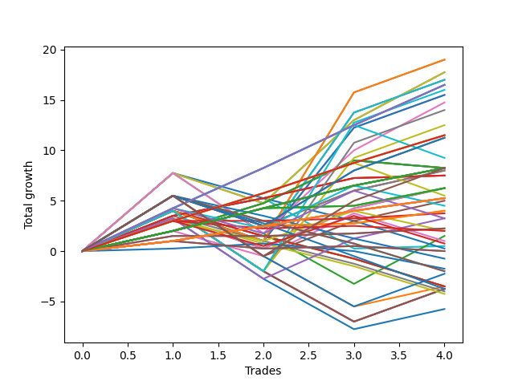

# Short Entry Wallace MJ 007 
- Symbol: ES
- Date Range: 3/18/22 - 6/24/22
- Trading Period: 7:20-12:30
- Number of Trades: 6


| Name | Win Percent | Profit | Avg Profit / Trade |     | Name | Win Percent | Profit | Avg Profit / Trade |
| ---- | ----------- | ------ | ------------------ | --- | ---- | ----------- | ------ | ------------------ |
| Sorted By <br> Profit | | | | | Sorted By <br> Win Percentage ||||
| Thirty-Six | 50.00 | 19000.00 | 3166.67 |     | Two | 100.00 | 10875.00 | 1812.50 |
| Five | 50.00 | 17250.00 | 2875.00 |     | Fourteen | 100.00 | 7250.00 | 1208.33 |
| Three | 83.33 | 15250.00 | 2541.67 |     | Twenty | 100.00 | 7000.00 | 1166.67 |
| Two | 100.00 | 10875.00 | 1812.50 |     | Eighteen | 100.00 | 6250.00 | 1041.67 |
| Thirty-Five | 83.33 | 10625.00 | 1770.83 |     | One | 100.00 | 6250.00 | 1041.67 |
| Twenty-Three | 83.33 | 9125.00 | 1520.83 |     | Twelve | 100.00 | 4625.00 | 770.83 |
| Sixteen | 83.33 | 8875.00 | 1479.17 |     | Three | 83.33 | 15250.00 | 2541.67 |
| Seventeen | 83.33 | 8750.00 | 1458.33 |     | Thirty-Five | 83.33 | 10625.00 | 1770.83 |
| Twenty-Two | 83.33 | 7375.00 | 1229.17 |     | Twenty-Three | 83.33 | 9125.00 | 1520.83 |
| Fourteen | 100.00 | 7250.00 | 1208.33 |     | Sixteen | 83.33 | 8875.00 | 1479.17 |
| Twenty | 100.00 | 7000.00 | 1166.67 |     | Seventeen | 83.33 | 8750.00 | 1458.33 |
| Eighteen | 100.00 | 6250.00 | 1041.67 |     | Twenty-Two | 83.33 | 7375.00 | 1229.17 |
| One | 100.00 | 6250.00 | 1041.67 |     | Fifteen | 83.33 | 6000.00 | 1000.00 |
| Fifteen | 83.33 | 6000.00 | 1000.00 |     | Twenty-One | 83.33 | 4875.00 | 812.50 |
| Ten | 66.67 | 5250.00 | 875.00 |     | Nineteen | 83.33 | 3625.00 | 604.17 |
| Four | 50.00 | 5250.00 | 875.00 |     | Thirteen | 83.33 | 2875.00 | 479.17 |
| Twenty-One | 83.33 | 4875.00 | 812.50 |     | Ten | 66.67 | 5250.00 | 875.00 |
| Twelve | 100.00 | 4625.00 | 770.83 |     | Eight | 66.67 | 2500.00 | 416.67 |
| Nineteen | 83.33 | 3625.00 | 604.17 |     | Six | 66.67 | -125.00 | -20.83 |
| Thirteen | 83.33 | 2875.00 | 479.17 |     | Thirty-Six | 50.00 | 19000.00 | 3166.67 |
| Eight | 66.67 | 2500.00 | 416.67 |     | Five | 50.00 | 17250.00 | 2875.00 |
| Eleven | 50.00 | 1250.00 | 208.33 |     | Four | 50.00 | 5250.00 | 875.00 |
| Nine | 50.00 | 1250.00 | 208.33 |     | Eleven | 50.00 | 1250.00 | 208.33 |
| Thirty-Three | 33.33 | 500.00 | 83.33 |     | Nine | 50.00 | 1250.00 | 208.33 |
| Thirty-Two | 33.33 | 500.00 | 83.33 |     | Seven | 50.00 | 125.00 | 20.83 |
| Thirty-One | 33.33 | 500.00 | 83.33 |     | Thirty-Four | 50.00 | -0.00 | -0.00 |
| Thirty | 33.33 | 500.00 | 83.33 |     | Thirty-Three | 33.33 | 500.00 | 83.33 |
| Twenty-Nine | 33.33 | 500.00 | 83.33 |     | Thirty-Two | 33.33 | 500.00 | 83.33 |
| Twenty-Eight | 33.33 | 500.00 | 83.33 |     | Thirty-One | 33.33 | 500.00 | 83.33 |
| Twenty-Seven | 33.33 | 500.00 | 83.33 |     | Thirty | 33.33 | 500.00 | 83.33 |
| Twenty-Six | 33.33 | 500.00 | 83.33 |     | Twenty-Nine | 33.33 | 500.00 | 83.33 |
| Twenty-Five | 33.33 | 500.00 | 83.33 |     | Twenty-Eight | 33.33 | 500.00 | 83.33 |
| Twenty-Four | 33.33 | 500.00 | 83.33 |     | Twenty-Seven | 33.33 | 500.00 | 83.33 |
| Seven | 50.00 | 125.00 | 20.83 |     | Twenty-Six | 33.33 | 500.00 | 83.33 |
| Thirty-Four | 50.00 | -0.00 | -0.00 |     | Twenty-Five | 33.33 | 500.00 | 83.33 |
| Six | 66.67 | -125.00 | -20.83 |     | Twenty-Four | 33.33 | 500.00 | 83.33 |

### Test One
* Sell when price hits the middle line of the 20p bollinger
* No Stoploss
* Results:
```
Total Trades: 6
Percent Up: 0.00
Percent Down: 100.00
Total Points Moved Down: 12.50
Potential Profit: 6250.00
Total Points Ups: 0.00 Count Ups: 0
Total Points Downs: 12.50 Count Downs: 6
```

<details><summary>Trades</summary>

<code>In: 2022-03-29 11:16:00		Out: 2022-03-29 11:16:25		Total Position Time: 00:25		Total Move Down: 0.50		Total to Date: -0.50</code> <br />
<code>In: 2022-04-13 08:36:00		Out: 2022-04-13 08:37:20		Total Position Time: 01:20		Total Move Down: 2.00		Total to Date: -2.50</code> <br />
<code>In: 2022-04-20 07:58:00		Out: 2022-04-20 08:00:20		Total Position Time: 02:20		Total Move Down: 0.50		Total to Date: -3.00</code> <br />
<code>In: 2022-04-28 10:17:00		Out: 2022-04-28 10:22:05		Total Position Time: 05:05		Total Move Down: 2.75		Total to Date: -5.75</code> <br />
<code>In: 2022-05-17 09:49:00		Out: 2022-05-17 09:51:20		Total Position Time: 02:20		Total Move Down: 2.00		Total to Date: -7.75</code> <br />
<code>In: 2022-06-10 12:30:00		Out: 2022-06-10 12:30:30		Total Position Time: 00:30		Total Move Down: 4.75		Total to Date: -12.50</code> <br />


</details>

### Test Two
* Sell when the price hits the lower line of the 20p 1std bollinger
* No Stoploss
* Results:
```
Total Trades: 6
Percent Up: 0.00
Percent Down: 100.00
Total Points Moved Down: 21.75
Potential Profit: 10875.00
Total Points Ups: 0.00 Count Ups: 0
Total Points Downs: 21.75 Count Downs: 6
```

<details><summary>Trades</summary>

<code>In: 2022-03-29 11:16:00		Out: 2022-03-29 11:18:30		Total Position Time: 02:30		Total Move Down: 1.75		Total to Date: -1.75</code> <br />
<code>In: 2022-04-13 08:36:00		Out: 2022-04-13 08:41:35		Total Position Time: 05:35		Total Move Down: 3.00		Total to Date: -4.75</code> <br />
<code>In: 2022-04-20 07:58:00		Out: 2022-04-20 08:00:40		Total Position Time: 02:40		Total Move Down: 3.50		Total to Date: -8.25</code> <br />
<code>In: 2022-04-28 10:17:00		Out: 2022-04-28 10:30:45		Total Position Time: 13:45		Total Move Down: 1.75		Total to Date: -10.00</code> <br />
<code>In: 2022-05-17 09:49:00		Out: 2022-05-17 09:54:40		Total Position Time: 05:40		Total Move Down: 3.00		Total to Date: -13.00</code> <br />
<code>In: 2022-06-10 12:30:00		Out: 2022-06-10 12:35:55		Total Position Time: 05:55		Total Move Down: 8.75		Total to Date: -21.75</code> <br />


</details>

### Test Three
* Sell when the price hits the lower line of the 20p 2std bollinger
* No Stoploss
* Results:
```
Total Trades: 6
Percent Up: 16.67
Percent Down: 83.33
Total Points Moved Down: 30.50
Potential Profit: 15250.00
Total Points Ups: 3.00 Count Ups: 1
Total Points Downs: 33.50 Count Downs: 5
```

<details><summary>Trades</summary>

<code>In: 2022-03-29 11:16:00		Out: 2022-03-29 11:18:50		Total Position Time: 02:50		Total Move Down: 3.25		Total to Date: -3.25</code> <br />
<code>In: 2022-04-13 08:36:00		Out: 2022-04-13 08:45:50		Total Position Time: 09:50		Total Move Down: 4.00		Total to Date: -7.25</code> <br />
<code>In: 2022-04-20 07:58:00		Out: 2022-04-20 08:01:10		Total Position Time: 03:10		Total Move Down: 6.50		Total to Date: -13.75</code> <br />
<code>In: 2022-04-28 10:17:00		Out: 2022-04-28 10:46:55		Total Position Time: 29:55		Total Move Down: -3.00		Total to Date: -10.75</code> <br />
<code>In: 2022-05-17 09:49:00		Out: 2022-05-17 10:01:50		Total Position Time: 12:50		Total Move Down: 6.00		Total to Date: -16.75</code> <br />
<code>In: 2022-06-10 12:30:00		Out: 2022-06-10 12:43:25		Total Position Time: 13:25		Total Move Down: 13.75		Total to Date: -30.50</code> <br />


</details>

### Test Four
* Sell when the price hits the middle line of the 1std VWAP
* No Stoploss
* Results:
```
Total Trades: 6
Percent Up: 50.00
Percent Down: 50.00
Total Points Moved Down: 10.50
Potential Profit: 5250.00
Total Points Ups: 17.50 Count Ups: 3
Total Points Downs: 28.00 Count Downs: 3
```

<details><summary>Trades</summary>

<code>In: 2022-03-29 11:16:00		Out: 2022-03-29 11:45:55		Total Position Time: 29:55		Total Move Down: -8.75		Total to Date: 8.75</code> <br />
<code>In: 2022-04-13 08:36:00		Out: 2022-04-13 09:05:55		Total Position Time: 29:55		Total Move Down: 4.00		Total to Date: 4.75</code> <br />
<code>In: 2022-04-20 07:58:00		Out: 2022-04-20 08:08:10		Total Position Time: 10:10		Total Move Down: 9.25		Total to Date: -4.50</code> <br />
<code>In: 2022-04-28 10:17:00		Out: 2022-04-28 10:46:55		Total Position Time: 29:55		Total Move Down: -3.00		Total to Date: -1.50</code> <br />
<code>In: 2022-05-17 09:49:00		Out: 2022-05-17 10:18:55		Total Position Time: 29:55		Total Move Down: -5.75		Total to Date: 4.25</code> <br />
<code>In: 2022-06-10 12:30:00		Out: 2022-06-10 12:44:00		Total Position Time: 14:00		Total Move Down: 14.75		Total to Date: -10.50</code> <br />


</details>

### Test Five
* Sell when the price hits the lower line of the 1std VWAP
* No Stoploss
* Results:
```
Total Trades: 6
Percent Up: 50.00
Percent Down: 50.00
Total Points Moved Down: 34.50
Potential Profit: 17250.00
Total Points Ups: 17.50 Count Ups: 3
Total Points Downs: 52.00 Count Downs: 3
```

<details><summary>Trades</summary>

<code>In: 2022-03-29 11:16:00		Out: 2022-03-29 11:45:55		Total Position Time: 29:55		Total Move Down: -8.75		Total to Date: 8.75</code> <br />
<code>In: 2022-04-13 08:36:00		Out: 2022-04-13 09:05:55		Total Position Time: 29:55		Total Move Down: 4.00		Total to Date: 4.75</code> <br />
<code>In: 2022-04-20 07:58:00		Out: 2022-04-20 08:23:25		Total Position Time: 25:25		Total Move Down: 17.25		Total to Date: -12.50</code> <br />
<code>In: 2022-04-28 10:17:00		Out: 2022-04-28 10:46:55		Total Position Time: 29:55		Total Move Down: -3.00		Total to Date: -9.50</code> <br />
<code>In: 2022-05-17 09:49:00		Out: 2022-05-17 10:18:55		Total Position Time: 29:55		Total Move Down: -5.75		Total to Date: -3.75</code> <br />
<code>In: 2022-06-10 12:30:00		Out: 2022-06-10 12:59:20		Total Position Time: 29:20		Total Move Down: 30.75		Total to Date: -34.50</code> <br />


</details>

### Test Six
* Sell when the price hits the middle line of the 20p bollinger
* Stoploss is -2 points
* Results:
```
Total Trades: 6
Percent Up: 33.33
Percent Down: 66.67
Total Points Moved Down: -0.25
Potential Profit: -125.00
Total Points Ups: 4.75 Count Ups: 2
Total Points Downs: 4.50 Count Downs: 4
```

<details><summary>Trades</summary>

<code>In: 2022-03-29 11:16:00		Out: 2022-03-29 11:16:25		Total Position Time: 00:25		Total Move Down: 0.50		Total to Date: -0.50</code> <br />
<code>In: 2022-04-13 08:36:00		Out: 2022-04-13 08:37:20		Total Position Time: 01:20		Total Move Down: 2.00		Total to Date: -2.50</code> <br />
<code>In: 2022-04-20 07:58:00		Out: 2022-04-20 08:00:20		Total Position Time: 02:20		Total Move Down: 0.50		Total to Date: -3.00</code> <br />
<code>In: 2022-04-28 10:17:00		Out: 2022-04-28 10:19:35		Total Position Time: 02:35		Total Move Down: -2.50		Total to Date: -0.50</code> <br />
<code>In: 2022-05-17 09:49:00		Out: 2022-05-17 09:49:20		Total Position Time: 00:20		Total Move Down: -2.25		Total to Date: 1.75</code> <br />
<code>In: 2022-06-10 12:30:00		Out: 2022-06-10 12:30:10		Total Position Time: 00:10		Total Move Down: 1.50		Total to Date: 0.25</code> <br />


</details>

### Test Seven
* Sell when the price hits the middle line of the 20p bollinger
* Trailing Stop is -2 points
* Results:
```
Total Trades: 6
Percent Up: 50.00
Percent Down: 50.00
Total Points Moved Down: 0.25
Potential Profit: 125.00
Total Points Ups: 3.75 Count Ups: 3
Total Points Downs: 4.00 Count Downs: 3
```

<details><summary>Trades</summary>

<code>In: 2022-03-29 11:16:00		Out: 2022-03-29 11:16:25		Total Position Time: 00:25		Total Move Down: 0.50		Total to Date: -0.50</code> <br />
<code>In: 2022-04-13 08:36:00		Out: 2022-04-13 08:37:20		Total Position Time: 01:20		Total Move Down: 2.00		Total to Date: -2.50</code> <br />
<code>In: 2022-04-20 07:58:00		Out: 2022-04-20 08:00:00		Total Position Time: 02:00		Total Move Down: -1.50		Total to Date: -1.00</code> <br />
<code>In: 2022-04-28 10:17:00		Out: 2022-04-28 10:17:55		Total Position Time: 00:55		Total Move Down: -0.00		Total to Date: -1.00</code> <br />
<code>In: 2022-05-17 09:49:00		Out: 2022-05-17 09:49:20		Total Position Time: 00:20		Total Move Down: -2.25		Total to Date: 1.25</code> <br />
<code>In: 2022-06-10 12:30:00		Out: 2022-06-10 12:30:10		Total Position Time: 00:10		Total Move Down: 1.50		Total to Date: -0.25</code> <br />


</details>

### Test Eight
* Sell when the price hits the lower line of the 20p 1std bollinger
* Stoploss is -2 points
* Results:
```
Total Trades: 6
Percent Up: 33.33
Percent Down: 66.67
Total Points Moved Down: 5.00
Potential Profit: 2500.00
Total Points Ups: 4.75 Count Ups: 2
Total Points Downs: 9.75 Count Downs: 4
```

<details><summary>Trades</summary>

<code>In: 2022-03-29 11:16:00		Out: 2022-03-29 11:18:30		Total Position Time: 02:30		Total Move Down: 1.75		Total to Date: -1.75</code> <br />
<code>In: 2022-04-13 08:36:00		Out: 2022-04-13 08:41:35		Total Position Time: 05:35		Total Move Down: 3.00		Total to Date: -4.75</code> <br />
<code>In: 2022-04-20 07:58:00		Out: 2022-04-20 08:00:40		Total Position Time: 02:40		Total Move Down: 3.50		Total to Date: -8.25</code> <br />
<code>In: 2022-04-28 10:17:00		Out: 2022-04-28 10:19:35		Total Position Time: 02:35		Total Move Down: -2.50		Total to Date: -5.75</code> <br />
<code>In: 2022-05-17 09:49:00		Out: 2022-05-17 09:49:20		Total Position Time: 00:20		Total Move Down: -2.25		Total to Date: -3.50</code> <br />
<code>In: 2022-06-10 12:30:00		Out: 2022-06-10 12:30:10		Total Position Time: 00:10		Total Move Down: 1.50		Total to Date: -5.00</code> <br />


</details>

### Test Nine
* Sell when the price hits the lower line of the 20p 1std bollinger
* Trailing Stop is -2 points
* Results:
```
Total Trades: 6
Percent Up: 50.00
Percent Down: 50.00
Total Points Moved Down: 2.50
Potential Profit: 1250.00
Total Points Ups: 3.75 Count Ups: 3
Total Points Downs: 6.25 Count Downs: 3
```

<details><summary>Trades</summary>

<code>In: 2022-03-29 11:16:00		Out: 2022-03-29 11:18:30		Total Position Time: 02:30		Total Move Down: 1.75		Total to Date: -1.75</code> <br />
<code>In: 2022-04-13 08:36:00		Out: 2022-04-13 08:41:35		Total Position Time: 05:35		Total Move Down: 3.00		Total to Date: -4.75</code> <br />
<code>In: 2022-04-20 07:58:00		Out: 2022-04-20 08:00:00		Total Position Time: 02:00		Total Move Down: -1.50		Total to Date: -3.25</code> <br />
<code>In: 2022-04-28 10:17:00		Out: 2022-04-28 10:17:55		Total Position Time: 00:55		Total Move Down: -0.00		Total to Date: -3.25</code> <br />
<code>In: 2022-05-17 09:49:00		Out: 2022-05-17 09:49:20		Total Position Time: 00:20		Total Move Down: -2.25		Total to Date: -1.00</code> <br />
<code>In: 2022-06-10 12:30:00		Out: 2022-06-10 12:30:10		Total Position Time: 00:10		Total Move Down: 1.50		Total to Date: -2.50</code> <br />


</details>

### Test Ten
* Sell when the price hits the lower line of the 20p 2std bollinger
* Stoploss is -2 points
* Results:
```
Total Trades: 6
Percent Up: 33.33
Percent Down: 66.67
Total Points Moved Down: 10.50
Potential Profit: 5250.00
Total Points Ups: 4.75 Count Ups: 2
Total Points Downs: 15.25 Count Downs: 4
```

<details><summary>Trades</summary>

<code>In: 2022-03-29 11:16:00		Out: 2022-03-29 11:18:50		Total Position Time: 02:50		Total Move Down: 3.25		Total to Date: -3.25</code> <br />
<code>In: 2022-04-13 08:36:00		Out: 2022-04-13 08:45:50		Total Position Time: 09:50		Total Move Down: 4.00		Total to Date: -7.25</code> <br />
<code>In: 2022-04-20 07:58:00		Out: 2022-04-20 08:01:10		Total Position Time: 03:10		Total Move Down: 6.50		Total to Date: -13.75</code> <br />
<code>In: 2022-04-28 10:17:00		Out: 2022-04-28 10:19:35		Total Position Time: 02:35		Total Move Down: -2.50		Total to Date: -11.25</code> <br />
<code>In: 2022-05-17 09:49:00		Out: 2022-05-17 09:49:20		Total Position Time: 00:20		Total Move Down: -2.25		Total to Date: -9.00</code> <br />
<code>In: 2022-06-10 12:30:00		Out: 2022-06-10 12:30:10		Total Position Time: 00:10		Total Move Down: 1.50		Total to Date: -10.50</code> <br />


</details>

### Test Eleven
* Sell when the price hits the lower line of the 20p 2std bollinger
* Trailing Stop is -2 points
* Results:
```
Total Trades: 6
Percent Up: 50.00
Percent Down: 50.00
Total Points Moved Down: 2.50
Potential Profit: 1250.00
Total Points Ups: 3.75 Count Ups: 3
Total Points Downs: 6.25 Count Downs: 3
```

<details><summary>Trades</summary>

<code>In: 2022-03-29 11:16:00		Out: 2022-03-29 11:18:50		Total Position Time: 02:50		Total Move Down: 3.25		Total to Date: -3.25</code> <br />
<code>In: 2022-04-13 08:36:00		Out: 2022-04-13 08:42:15		Total Position Time: 06:15		Total Move Down: 1.50		Total to Date: -4.75</code> <br />
<code>In: 2022-04-20 07:58:00		Out: 2022-04-20 08:00:00		Total Position Time: 02:00		Total Move Down: -1.50		Total to Date: -3.25</code> <br />
<code>In: 2022-04-28 10:17:00		Out: 2022-04-28 10:17:55		Total Position Time: 00:55		Total Move Down: -0.00		Total to Date: -3.25</code> <br />
<code>In: 2022-05-17 09:49:00		Out: 2022-05-17 09:49:20		Total Position Time: 00:20		Total Move Down: -2.25		Total to Date: -1.00</code> <br />
<code>In: 2022-06-10 12:30:00		Out: 2022-06-10 12:30:10		Total Position Time: 00:10		Total Move Down: 1.50		Total to Date: -2.50</code> <br />


</details>

### Test Twelve
* Sell when the price hits the middle line of the 20p bollinger
* Stoploss is -3 points
* Results:
```
Total Trades: 6
Percent Up: 0.00
Percent Down: 100.00
Total Points Moved Down: 9.25
Potential Profit: 4625.00
Total Points Ups: 0.00 Count Ups: 0
Total Points Downs: 9.25 Count Downs: 6
```

<details><summary>Trades</summary>

<code>In: 2022-03-29 11:16:00		Out: 2022-03-29 11:16:25		Total Position Time: 00:25		Total Move Down: 0.50		Total to Date: -0.50</code> <br />
<code>In: 2022-04-13 08:36:00		Out: 2022-04-13 08:37:20		Total Position Time: 01:20		Total Move Down: 2.00		Total to Date: -2.50</code> <br />
<code>In: 2022-04-20 07:58:00		Out: 2022-04-20 08:00:20		Total Position Time: 02:20		Total Move Down: 0.50		Total to Date: -3.00</code> <br />
<code>In: 2022-04-28 10:17:00		Out: 2022-04-28 10:22:05		Total Position Time: 05:05		Total Move Down: 2.75		Total to Date: -5.75</code> <br />
<code>In: 2022-05-17 09:49:00		Out: 2022-05-17 09:51:20		Total Position Time: 02:20		Total Move Down: 2.00		Total to Date: -7.75</code> <br />
<code>In: 2022-06-10 12:30:00		Out: 2022-06-10 12:30:10		Total Position Time: 00:10		Total Move Down: 1.50		Total to Date: -9.25</code> <br />


</details>

### Test Thirteen
* Sell when the price hits the middle line of the 20p bollinger
* Trailing Stop is -3 points
* Results:
```
Total Trades: 6
Percent Up: 16.67
Percent Down: 83.33
Total Points Moved Down: 5.75
Potential Profit: 2875.00
Total Points Ups: 0.75 Count Ups: 1
Total Points Downs: 6.50 Count Downs: 5
```

<details><summary>Trades</summary>

<code>In: 2022-03-29 11:16:00		Out: 2022-03-29 11:16:25		Total Position Time: 00:25		Total Move Down: 0.50		Total to Date: -0.50</code> <br />
<code>In: 2022-04-13 08:36:00		Out: 2022-04-13 08:37:20		Total Position Time: 01:20		Total Move Down: 2.00		Total to Date: -2.50</code> <br />
<code>In: 2022-04-20 07:58:00		Out: 2022-04-20 08:00:20		Total Position Time: 02:20		Total Move Down: 0.50		Total to Date: -3.00</code> <br />
<code>In: 2022-04-28 10:17:00		Out: 2022-04-28 10:19:20		Total Position Time: 02:20		Total Move Down: -0.75		Total to Date: -2.25</code> <br />
<code>In: 2022-05-17 09:49:00		Out: 2022-05-17 09:51:20		Total Position Time: 02:20		Total Move Down: 2.00		Total to Date: -4.25</code> <br />
<code>In: 2022-06-10 12:30:00		Out: 2022-06-10 12:30:10		Total Position Time: 00:10		Total Move Down: 1.50		Total to Date: -5.75</code> <br />


</details>

### Test Fourteen
* Sell when the price hits the lower line of the 20p 1std bollinger
* Stoploss is -3 points
* Results:
```
Total Trades: 6
Percent Up: 0.00
Percent Down: 100.00
Total Points Moved Down: 14.50
Potential Profit: 7250.00
Total Points Ups: 0.00 Count Ups: 0
Total Points Downs: 14.50 Count Downs: 6
```

<details><summary>Trades</summary>

<code>In: 2022-03-29 11:16:00		Out: 2022-03-29 11:18:30		Total Position Time: 02:30		Total Move Down: 1.75		Total to Date: -1.75</code> <br />
<code>In: 2022-04-13 08:36:00		Out: 2022-04-13 08:41:35		Total Position Time: 05:35		Total Move Down: 3.00		Total to Date: -4.75</code> <br />
<code>In: 2022-04-20 07:58:00		Out: 2022-04-20 08:00:40		Total Position Time: 02:40		Total Move Down: 3.50		Total to Date: -8.25</code> <br />
<code>In: 2022-04-28 10:17:00		Out: 2022-04-28 10:30:45		Total Position Time: 13:45		Total Move Down: 1.75		Total to Date: -10.00</code> <br />
<code>In: 2022-05-17 09:49:00		Out: 2022-05-17 09:54:40		Total Position Time: 05:40		Total Move Down: 3.00		Total to Date: -13.00</code> <br />
<code>In: 2022-06-10 12:30:00		Out: 2022-06-10 12:30:10		Total Position Time: 00:10		Total Move Down: 1.50		Total to Date: -14.50</code> <br />


</details>

### Test Fifteen
* Sell when the price hits the lower line of the 20p 1std bollinger
* Trailing Stop is -3 points
* Results:
```
Total Trades: 6
Percent Up: 16.67
Percent Down: 83.33
Total Points Moved Down: 12.00
Potential Profit: 6000.00
Total Points Ups: 0.75 Count Ups: 1
Total Points Downs: 12.75 Count Downs: 5
```

<details><summary>Trades</summary>

<code>In: 2022-03-29 11:16:00		Out: 2022-03-29 11:18:30		Total Position Time: 02:30		Total Move Down: 1.75		Total to Date: -1.75</code> <br />
<code>In: 2022-04-13 08:36:00		Out: 2022-04-13 08:41:35		Total Position Time: 05:35		Total Move Down: 3.00		Total to Date: -4.75</code> <br />
<code>In: 2022-04-20 07:58:00		Out: 2022-04-20 08:00:40		Total Position Time: 02:40		Total Move Down: 3.50		Total to Date: -8.25</code> <br />
<code>In: 2022-04-28 10:17:00		Out: 2022-04-28 10:19:20		Total Position Time: 02:20		Total Move Down: -0.75		Total to Date: -7.50</code> <br />
<code>In: 2022-05-17 09:49:00		Out: 2022-05-17 09:54:40		Total Position Time: 05:40		Total Move Down: 3.00		Total to Date: -10.50</code> <br />
<code>In: 2022-06-10 12:30:00		Out: 2022-06-10 12:30:10		Total Position Time: 00:10		Total Move Down: 1.50		Total to Date: -12.00</code> <br />


</details>

### Test Sixteen
* Sell when the price hits the lower line of the 20p 2std bollinger
* Stoploss is -3 points
* Results:
```
Total Trades: 6
Percent Up: 16.67
Percent Down: 83.33
Total Points Moved Down: 17.75
Potential Profit: 8875.00
Total Points Ups: 3.50 Count Ups: 1
Total Points Downs: 21.25 Count Downs: 5
```

<details><summary>Trades</summary>

<code>In: 2022-03-29 11:16:00		Out: 2022-03-29 11:18:50		Total Position Time: 02:50		Total Move Down: 3.25		Total to Date: -3.25</code> <br />
<code>In: 2022-04-13 08:36:00		Out: 2022-04-13 08:45:50		Total Position Time: 09:50		Total Move Down: 4.00		Total to Date: -7.25</code> <br />
<code>In: 2022-04-20 07:58:00		Out: 2022-04-20 08:01:10		Total Position Time: 03:10		Total Move Down: 6.50		Total to Date: -13.75</code> <br />
<code>In: 2022-04-28 10:17:00		Out: 2022-04-28 10:33:50		Total Position Time: 16:50		Total Move Down: -3.50		Total to Date: -10.25</code> <br />
<code>In: 2022-05-17 09:49:00		Out: 2022-05-17 10:01:50		Total Position Time: 12:50		Total Move Down: 6.00		Total to Date: -16.25</code> <br />
<code>In: 2022-06-10 12:30:00		Out: 2022-06-10 12:30:10		Total Position Time: 00:10		Total Move Down: 1.50		Total to Date: -17.75</code> <br />


</details>

### Test Seventeen
* Sell when the price hits the lower line of the 20p 2std bollinger
* Trailing Stop is -3 points
* Results:
```
Total Trades: 6
Percent Up: 16.67
Percent Down: 83.33
Total Points Moved Down: 17.50
Potential Profit: 8750.00
Total Points Ups: 0.75 Count Ups: 1
Total Points Downs: 18.25 Count Downs: 5
```

<details><summary>Trades</summary>

<code>In: 2022-03-29 11:16:00		Out: 2022-03-29 11:18:50		Total Position Time: 02:50		Total Move Down: 3.25		Total to Date: -3.25</code> <br />
<code>In: 2022-04-13 08:36:00		Out: 2022-04-13 08:42:40		Total Position Time: 06:40		Total Move Down: 1.00		Total to Date: -4.25</code> <br />
<code>In: 2022-04-20 07:58:00		Out: 2022-04-20 08:01:10		Total Position Time: 03:10		Total Move Down: 6.50		Total to Date: -10.75</code> <br />
<code>In: 2022-04-28 10:17:00		Out: 2022-04-28 10:19:20		Total Position Time: 02:20		Total Move Down: -0.75		Total to Date: -10.00</code> <br />
<code>In: 2022-05-17 09:49:00		Out: 2022-05-17 10:01:50		Total Position Time: 12:50		Total Move Down: 6.00		Total to Date: -16.00</code> <br />
<code>In: 2022-06-10 12:30:00		Out: 2022-06-10 12:30:10		Total Position Time: 00:10		Total Move Down: 1.50		Total to Date: -17.50</code> <br />


</details>

### Test Eighteen
* Sell when the price hits the middle line of the 20p bollinger
* Stoploss is -5 points
* Results:
```
Total Trades: 6
Percent Up: 0.00
Percent Down: 100.00
Total Points Moved Down: 12.50
Potential Profit: 6250.00
Total Points Ups: 0.00 Count Ups: 0
Total Points Downs: 12.50 Count Downs: 6
```

<details><summary>Trades</summary>

<code>In: 2022-03-29 11:16:00		Out: 2022-03-29 11:16:25		Total Position Time: 00:25		Total Move Down: 0.50		Total to Date: -0.50</code> <br />
<code>In: 2022-04-13 08:36:00		Out: 2022-04-13 08:37:20		Total Position Time: 01:20		Total Move Down: 2.00		Total to Date: -2.50</code> <br />
<code>In: 2022-04-20 07:58:00		Out: 2022-04-20 08:00:20		Total Position Time: 02:20		Total Move Down: 0.50		Total to Date: -3.00</code> <br />
<code>In: 2022-04-28 10:17:00		Out: 2022-04-28 10:22:05		Total Position Time: 05:05		Total Move Down: 2.75		Total to Date: -5.75</code> <br />
<code>In: 2022-05-17 09:49:00		Out: 2022-05-17 09:51:20		Total Position Time: 02:20		Total Move Down: 2.00		Total to Date: -7.75</code> <br />
<code>In: 2022-06-10 12:30:00		Out: 2022-06-10 12:30:30		Total Position Time: 00:30		Total Move Down: 4.75		Total to Date: -12.50</code> <br />


</details>

### Test Nineteen
* Sell when the price hits the middle line of the 20p bollinger
* Trailing Stop is -5 points
* Results:
```
Total Trades: 6
Percent Up: 16.67
Percent Down: 83.33
Total Points Moved Down: 7.25
Potential Profit: 3625.00
Total Points Ups: 2.50 Count Ups: 1
Total Points Downs: 9.75 Count Downs: 5
```

<details><summary>Trades</summary>

<code>In: 2022-03-29 11:16:00		Out: 2022-03-29 11:16:25		Total Position Time: 00:25		Total Move Down: 0.50		Total to Date: -0.50</code> <br />
<code>In: 2022-04-13 08:36:00		Out: 2022-04-13 08:37:20		Total Position Time: 01:20		Total Move Down: 2.00		Total to Date: -2.50</code> <br />
<code>In: 2022-04-20 07:58:00		Out: 2022-04-20 08:00:20		Total Position Time: 02:20		Total Move Down: 0.50		Total to Date: -3.00</code> <br />
<code>In: 2022-04-28 10:17:00		Out: 2022-04-28 10:19:35		Total Position Time: 02:35		Total Move Down: -2.50		Total to Date: -0.50</code> <br />
<code>In: 2022-05-17 09:49:00		Out: 2022-05-17 09:51:20		Total Position Time: 02:20		Total Move Down: 2.00		Total to Date: -2.50</code> <br />
<code>In: 2022-06-10 12:30:00		Out: 2022-06-10 12:30:30		Total Position Time: 00:30		Total Move Down: 4.75		Total to Date: -7.25</code> <br />


</details>

### Test Twenty
* Sell when the price hits the lower line of the 20p 1std bollinger
* Stoploss is -5 points
* Results:
```
Total Trades: 6
Percent Up: 0.00
Percent Down: 100.00
Total Points Moved Down: 14.00
Potential Profit: 7000.00
Total Points Ups: 0.00 Count Ups: 0
Total Points Downs: 14.00 Count Downs: 6
```

<details><summary>Trades</summary>

<code>In: 2022-03-29 11:16:00		Out: 2022-03-29 11:18:30		Total Position Time: 02:30		Total Move Down: 1.75		Total to Date: -1.75</code> <br />
<code>In: 2022-04-13 08:36:00		Out: 2022-04-13 08:41:35		Total Position Time: 05:35		Total Move Down: 3.00		Total to Date: -4.75</code> <br />
<code>In: 2022-04-20 07:58:00		Out: 2022-04-20 08:00:40		Total Position Time: 02:40		Total Move Down: 3.50		Total to Date: -8.25</code> <br />
<code>In: 2022-04-28 10:17:00		Out: 2022-04-28 10:30:45		Total Position Time: 13:45		Total Move Down: 1.75		Total to Date: -10.00</code> <br />
<code>In: 2022-05-17 09:49:00		Out: 2022-05-17 09:54:40		Total Position Time: 05:40		Total Move Down: 3.00		Total to Date: -13.00</code> <br />
<code>In: 2022-06-10 12:30:00		Out: 2022-06-10 12:31:30		Total Position Time: 01:30		Total Move Down: 1.00		Total to Date: -14.00</code> <br />


</details>

### Test Twenty-One
* Sell when the price hits the lower line of the 20p 1std bollinger
* Trailing Stop is -5 points
* Results:
```
Total Trades: 6
Percent Up: 16.67
Percent Down: 83.33
Total Points Moved Down: 9.75
Potential Profit: 4875.00
Total Points Ups: 2.50 Count Ups: 1
Total Points Downs: 12.25 Count Downs: 5
```

<details><summary>Trades</summary>

<code>In: 2022-03-29 11:16:00		Out: 2022-03-29 11:18:30		Total Position Time: 02:30		Total Move Down: 1.75		Total to Date: -1.75</code> <br />
<code>In: 2022-04-13 08:36:00		Out: 2022-04-13 08:41:35		Total Position Time: 05:35		Total Move Down: 3.00		Total to Date: -4.75</code> <br />
<code>In: 2022-04-20 07:58:00		Out: 2022-04-20 08:00:40		Total Position Time: 02:40		Total Move Down: 3.50		Total to Date: -8.25</code> <br />
<code>In: 2022-04-28 10:17:00		Out: 2022-04-28 10:19:35		Total Position Time: 02:35		Total Move Down: -2.50		Total to Date: -5.75</code> <br />
<code>In: 2022-05-17 09:49:00		Out: 2022-05-17 09:54:40		Total Position Time: 05:40		Total Move Down: 3.00		Total to Date: -8.75</code> <br />
<code>In: 2022-06-10 12:30:00		Out: 2022-06-10 12:31:30		Total Position Time: 01:30		Total Move Down: 1.00		Total to Date: -9.75</code> <br />


</details>

### Test Twenty-Two
* Sell when the price hits the lower line of the 20p 2std bollinger
* Stoploss is -5 points
* Results:
```
Total Trades: 6
Percent Up: 16.67
Percent Down: 83.33
Total Points Moved Down: 14.75
Potential Profit: 7375.00
Total Points Ups: 6.00 Count Ups: 1
Total Points Downs: 20.75 Count Downs: 5
```

<details><summary>Trades</summary>

<code>In: 2022-03-29 11:16:00		Out: 2022-03-29 11:18:50		Total Position Time: 02:50		Total Move Down: 3.25		Total to Date: -3.25</code> <br />
<code>In: 2022-04-13 08:36:00		Out: 2022-04-13 08:45:50		Total Position Time: 09:50		Total Move Down: 4.00		Total to Date: -7.25</code> <br />
<code>In: 2022-04-20 07:58:00		Out: 2022-04-20 08:01:10		Total Position Time: 03:10		Total Move Down: 6.50		Total to Date: -13.75</code> <br />
<code>In: 2022-04-28 10:17:00		Out: 2022-04-28 10:39:40		Total Position Time: 22:40		Total Move Down: -6.00		Total to Date: -7.75</code> <br />
<code>In: 2022-05-17 09:49:00		Out: 2022-05-17 10:01:50		Total Position Time: 12:50		Total Move Down: 6.00		Total to Date: -13.75</code> <br />
<code>In: 2022-06-10 12:30:00		Out: 2022-06-10 12:31:30		Total Position Time: 01:30		Total Move Down: 1.00		Total to Date: -14.75</code> <br />


</details>

### Test Twenty-Three
* Sell when the price hits the lower line of the 20p 2std bollinger
* Trailing Stop is -5 points
* Results:
```
Total Trades: 6
Percent Up: 16.67
Percent Down: 83.33
Total Points Moved Down: 18.25
Potential Profit: 9125.00
Total Points Ups: 2.50 Count Ups: 1
Total Points Downs: 20.75 Count Downs: 5
```

<details><summary>Trades</summary>

<code>In: 2022-03-29 11:16:00		Out: 2022-03-29 11:18:50		Total Position Time: 02:50		Total Move Down: 3.25		Total to Date: -3.25</code> <br />
<code>In: 2022-04-13 08:36:00		Out: 2022-04-13 08:45:50		Total Position Time: 09:50		Total Move Down: 4.00		Total to Date: -7.25</code> <br />
<code>In: 2022-04-20 07:58:00		Out: 2022-04-20 08:01:10		Total Position Time: 03:10		Total Move Down: 6.50		Total to Date: -13.75</code> <br />
<code>In: 2022-04-28 10:17:00		Out: 2022-04-28 10:19:35		Total Position Time: 02:35		Total Move Down: -2.50		Total to Date: -11.25</code> <br />
<code>In: 2022-05-17 09:49:00		Out: 2022-05-17 10:01:50		Total Position Time: 12:50		Total Move Down: 6.00		Total to Date: -17.25</code> <br />
<code>In: 2022-06-10 12:30:00		Out: 2022-06-10 12:31:30		Total Position Time: 01:30		Total Move Down: 1.00		Total to Date: -18.25</code> <br />


</details>

### Test Twenty-Four
* Sell when the price hits the middle line of the 20p bollinger
* Stoploss is 10 points
* Results:
```
Total Trades: 6
Percent Up: 66.67
Percent Down: 33.33
Total Points Moved Down: 1.00
Potential Profit: 500.00
Total Points Ups: 2.00 Count Ups: 4
Total Points Downs: 3.00 Count Downs: 2
```

<details><summary>Trades</summary>

<code>In: 2022-03-29 11:16:00		Out: 2022-03-29 11:16:10		Total Position Time: 00:10		Total Move Down: -0.00		Total to Date: -0.00</code> <br />
<code>In: 2022-04-13 08:36:00		Out: 2022-04-13 08:36:10		Total Position Time: 00:10		Total Move Down: -0.50		Total to Date: 0.50</code> <br />
<code>In: 2022-04-20 07:58:00		Out: 2022-04-20 07:58:10		Total Position Time: 00:10		Total Move Down: -0.50		Total to Date: 1.00</code> <br />
<code>In: 2022-04-28 10:17:00		Out: 2022-04-28 10:17:10		Total Position Time: 00:10		Total Move Down: 1.50		Total to Date: -0.50</code> <br />
<code>In: 2022-05-17 09:49:00		Out: 2022-05-17 09:49:10		Total Position Time: 00:10		Total Move Down: -1.00		Total to Date: 0.50</code> <br />
<code>In: 2022-06-10 12:30:00		Out: 2022-06-10 12:30:10		Total Position Time: 00:10		Total Move Down: 1.50		Total to Date: -1.00</code> <br />


</details>

### Test Twenty-Five
* Sell when the price hits the middle line of the 20p bollinger
* Trailing Stop is 10 points
* Results:
```
Total Trades: 6
Percent Up: 66.67
Percent Down: 33.33
Total Points Moved Down: 1.00
Potential Profit: 500.00
Total Points Ups: 2.00 Count Ups: 4
Total Points Downs: 3.00 Count Downs: 2
```

<details><summary>Trades</summary>

<code>In: 2022-03-29 11:16:00		Out: 2022-03-29 11:16:10		Total Position Time: 00:10		Total Move Down: -0.00		Total to Date: -0.00</code> <br />
<code>In: 2022-04-13 08:36:00		Out: 2022-04-13 08:36:10		Total Position Time: 00:10		Total Move Down: -0.50		Total to Date: 0.50</code> <br />
<code>In: 2022-04-20 07:58:00		Out: 2022-04-20 07:58:10		Total Position Time: 00:10		Total Move Down: -0.50		Total to Date: 1.00</code> <br />
<code>In: 2022-04-28 10:17:00		Out: 2022-04-28 10:17:10		Total Position Time: 00:10		Total Move Down: 1.50		Total to Date: -0.50</code> <br />
<code>In: 2022-05-17 09:49:00		Out: 2022-05-17 09:49:10		Total Position Time: 00:10		Total Move Down: -1.00		Total to Date: 0.50</code> <br />
<code>In: 2022-06-10 12:30:00		Out: 2022-06-10 12:30:10		Total Position Time: 00:10		Total Move Down: 1.50		Total to Date: -1.00</code> <br />


</details>

### Test Twenty-Six
* Sell when the price hits the lower line of the 20p 1std bollinger
* Stoploss is 10 points
* Results:
```
Total Trades: 6
Percent Up: 66.67
Percent Down: 33.33
Total Points Moved Down: 1.00
Potential Profit: 500.00
Total Points Ups: 2.00 Count Ups: 4
Total Points Downs: 3.00 Count Downs: 2
```

<details><summary>Trades</summary>

<code>In: 2022-03-29 11:16:00		Out: 2022-03-29 11:16:10		Total Position Time: 00:10		Total Move Down: -0.00		Total to Date: -0.00</code> <br />
<code>In: 2022-04-13 08:36:00		Out: 2022-04-13 08:36:10		Total Position Time: 00:10		Total Move Down: -0.50		Total to Date: 0.50</code> <br />
<code>In: 2022-04-20 07:58:00		Out: 2022-04-20 07:58:10		Total Position Time: 00:10		Total Move Down: -0.50		Total to Date: 1.00</code> <br />
<code>In: 2022-04-28 10:17:00		Out: 2022-04-28 10:17:10		Total Position Time: 00:10		Total Move Down: 1.50		Total to Date: -0.50</code> <br />
<code>In: 2022-05-17 09:49:00		Out: 2022-05-17 09:49:10		Total Position Time: 00:10		Total Move Down: -1.00		Total to Date: 0.50</code> <br />
<code>In: 2022-06-10 12:30:00		Out: 2022-06-10 12:30:10		Total Position Time: 00:10		Total Move Down: 1.50		Total to Date: -1.00</code> <br />


</details>

### Test Twenty-Seven
* Sell when the price hits the lower line of the 20p 1std bollinger
* Trailing Stop is 10 points
* Results:
```
Total Trades: 6
Percent Up: 66.67
Percent Down: 33.33
Total Points Moved Down: 1.00
Potential Profit: 500.00
Total Points Ups: 2.00 Count Ups: 4
Total Points Downs: 3.00 Count Downs: 2
```

<details><summary>Trades</summary>

<code>In: 2022-03-29 11:16:00		Out: 2022-03-29 11:16:10		Total Position Time: 00:10		Total Move Down: -0.00		Total to Date: -0.00</code> <br />
<code>In: 2022-04-13 08:36:00		Out: 2022-04-13 08:36:10		Total Position Time: 00:10		Total Move Down: -0.50		Total to Date: 0.50</code> <br />
<code>In: 2022-04-20 07:58:00		Out: 2022-04-20 07:58:10		Total Position Time: 00:10		Total Move Down: -0.50		Total to Date: 1.00</code> <br />
<code>In: 2022-04-28 10:17:00		Out: 2022-04-28 10:17:10		Total Position Time: 00:10		Total Move Down: 1.50		Total to Date: -0.50</code> <br />
<code>In: 2022-05-17 09:49:00		Out: 2022-05-17 09:49:10		Total Position Time: 00:10		Total Move Down: -1.00		Total to Date: 0.50</code> <br />
<code>In: 2022-06-10 12:30:00		Out: 2022-06-10 12:30:10		Total Position Time: 00:10		Total Move Down: 1.50		Total to Date: -1.00</code> <br />


</details>

### Test Twenty-Eight
* Sell when the price hits the lower line of the 20p 2std bollinger
* Stoploss is 10 points
* Results:
```
Total Trades: 6
Percent Up: 66.67
Percent Down: 33.33
Total Points Moved Down: 1.00
Potential Profit: 500.00
Total Points Ups: 2.00 Count Ups: 4
Total Points Downs: 3.00 Count Downs: 2
```

<details><summary>Trades</summary>

<code>In: 2022-03-29 11:16:00		Out: 2022-03-29 11:16:10		Total Position Time: 00:10		Total Move Down: -0.00		Total to Date: -0.00</code> <br />
<code>In: 2022-04-13 08:36:00		Out: 2022-04-13 08:36:10		Total Position Time: 00:10		Total Move Down: -0.50		Total to Date: 0.50</code> <br />
<code>In: 2022-04-20 07:58:00		Out: 2022-04-20 07:58:10		Total Position Time: 00:10		Total Move Down: -0.50		Total to Date: 1.00</code> <br />
<code>In: 2022-04-28 10:17:00		Out: 2022-04-28 10:17:10		Total Position Time: 00:10		Total Move Down: 1.50		Total to Date: -0.50</code> <br />
<code>In: 2022-05-17 09:49:00		Out: 2022-05-17 09:49:10		Total Position Time: 00:10		Total Move Down: -1.00		Total to Date: 0.50</code> <br />
<code>In: 2022-06-10 12:30:00		Out: 2022-06-10 12:30:10		Total Position Time: 00:10		Total Move Down: 1.50		Total to Date: -1.00</code> <br />


</details>

### Test Twenty-Nine
* Sell when the price hits the lower line of the 20p 2std bollinger
* Trailing Stop is 10 points
* Results:
```
Total Trades: 6
Percent Up: 66.67
Percent Down: 33.33
Total Points Moved Down: 1.00
Potential Profit: 500.00
Total Points Ups: 2.00 Count Ups: 4
Total Points Downs: 3.00 Count Downs: 2
```

<details><summary>Trades</summary>

<code>In: 2022-03-29 11:16:00		Out: 2022-03-29 11:16:10		Total Position Time: 00:10		Total Move Down: -0.00		Total to Date: -0.00</code> <br />
<code>In: 2022-04-13 08:36:00		Out: 2022-04-13 08:36:10		Total Position Time: 00:10		Total Move Down: -0.50		Total to Date: 0.50</code> <br />
<code>In: 2022-04-20 07:58:00		Out: 2022-04-20 07:58:10		Total Position Time: 00:10		Total Move Down: -0.50		Total to Date: 1.00</code> <br />
<code>In: 2022-04-28 10:17:00		Out: 2022-04-28 10:17:10		Total Position Time: 00:10		Total Move Down: 1.50		Total to Date: -0.50</code> <br />
<code>In: 2022-05-17 09:49:00		Out: 2022-05-17 09:49:10		Total Position Time: 00:10		Total Move Down: -1.00		Total to Date: 0.50</code> <br />
<code>In: 2022-06-10 12:30:00		Out: 2022-06-10 12:30:10		Total Position Time: 00:10		Total Move Down: 1.50		Total to Date: -1.00</code> <br />


</details>

### Test Thirty
* Sell when the price hits the middle line of the 1std VWAP
* Stoploss is 10 points
* Results:
```
Total Trades: 6
Percent Up: 66.67
Percent Down: 33.33
Total Points Moved Down: 1.00
Potential Profit: 500.00
Total Points Ups: 2.00 Count Ups: 4
Total Points Downs: 3.00 Count Downs: 2
```

<details><summary>Trades</summary>

<code>In: 2022-03-29 11:16:00		Out: 2022-03-29 11:16:10		Total Position Time: 00:10		Total Move Down: -0.00		Total to Date: -0.00</code> <br />
<code>In: 2022-04-13 08:36:00		Out: 2022-04-13 08:36:10		Total Position Time: 00:10		Total Move Down: -0.50		Total to Date: 0.50</code> <br />
<code>In: 2022-04-20 07:58:00		Out: 2022-04-20 07:58:10		Total Position Time: 00:10		Total Move Down: -0.50		Total to Date: 1.00</code> <br />
<code>In: 2022-04-28 10:17:00		Out: 2022-04-28 10:17:10		Total Position Time: 00:10		Total Move Down: 1.50		Total to Date: -0.50</code> <br />
<code>In: 2022-05-17 09:49:00		Out: 2022-05-17 09:49:10		Total Position Time: 00:10		Total Move Down: -1.00		Total to Date: 0.50</code> <br />
<code>In: 2022-06-10 12:30:00		Out: 2022-06-10 12:30:10		Total Position Time: 00:10		Total Move Down: 1.50		Total to Date: -1.00</code> <br />


</details>

### Test Thirty-One
* Sell when the price hits the middle line of the 1std VWAP
* Trailing Stop is 10 points
* Results:
```
Total Trades: 6
Percent Up: 66.67
Percent Down: 33.33
Total Points Moved Down: 1.00
Potential Profit: 500.00
Total Points Ups: 2.00 Count Ups: 4
Total Points Downs: 3.00 Count Downs: 2
```

<details><summary>Trades</summary>

<code>In: 2022-03-29 11:16:00		Out: 2022-03-29 11:16:10		Total Position Time: 00:10		Total Move Down: -0.00		Total to Date: -0.00</code> <br />
<code>In: 2022-04-13 08:36:00		Out: 2022-04-13 08:36:10		Total Position Time: 00:10		Total Move Down: -0.50		Total to Date: 0.50</code> <br />
<code>In: 2022-04-20 07:58:00		Out: 2022-04-20 07:58:10		Total Position Time: 00:10		Total Move Down: -0.50		Total to Date: 1.00</code> <br />
<code>In: 2022-04-28 10:17:00		Out: 2022-04-28 10:17:10		Total Position Time: 00:10		Total Move Down: 1.50		Total to Date: -0.50</code> <br />
<code>In: 2022-05-17 09:49:00		Out: 2022-05-17 09:49:10		Total Position Time: 00:10		Total Move Down: -1.00		Total to Date: 0.50</code> <br />
<code>In: 2022-06-10 12:30:00		Out: 2022-06-10 12:30:10		Total Position Time: 00:10		Total Move Down: 1.50		Total to Date: -1.00</code> <br />


</details>

### Test Thirty-Two
* Sell when the price hits the lower line of the 1std VWAP
* Stoploss is 10 points
* Results:
```
Total Trades: 6
Percent Up: 66.67
Percent Down: 33.33
Total Points Moved Down: 1.00
Potential Profit: 500.00
Total Points Ups: 2.00 Count Ups: 4
Total Points Downs: 3.00 Count Downs: 2
```

<details><summary>Trades</summary>

<code>In: 2022-03-29 11:16:00		Out: 2022-03-29 11:16:10		Total Position Time: 00:10		Total Move Down: -0.00		Total to Date: -0.00</code> <br />
<code>In: 2022-04-13 08:36:00		Out: 2022-04-13 08:36:10		Total Position Time: 00:10		Total Move Down: -0.50		Total to Date: 0.50</code> <br />
<code>In: 2022-04-20 07:58:00		Out: 2022-04-20 07:58:10		Total Position Time: 00:10		Total Move Down: -0.50		Total to Date: 1.00</code> <br />
<code>In: 2022-04-28 10:17:00		Out: 2022-04-28 10:17:10		Total Position Time: 00:10		Total Move Down: 1.50		Total to Date: -0.50</code> <br />
<code>In: 2022-05-17 09:49:00		Out: 2022-05-17 09:49:10		Total Position Time: 00:10		Total Move Down: -1.00		Total to Date: 0.50</code> <br />
<code>In: 2022-06-10 12:30:00		Out: 2022-06-10 12:30:10		Total Position Time: 00:10		Total Move Down: 1.50		Total to Date: -1.00</code> <br />


</details>

### Test Thirty-Three
* Sell when the price hits the lower line of the 1std VWAP
* Trailing Stop is 10 points
* Results:
```
Total Trades: 6
Percent Up: 66.67
Percent Down: 33.33
Total Points Moved Down: 1.00
Potential Profit: 500.00
Total Points Ups: 2.00 Count Ups: 4
Total Points Downs: 3.00 Count Downs: 2
```

<details><summary>Trades</summary>

<code>In: 2022-03-29 11:16:00		Out: 2022-03-29 11:16:10		Total Position Time: 00:10		Total Move Down: -0.00		Total to Date: -0.00</code> <br />
<code>In: 2022-04-13 08:36:00		Out: 2022-04-13 08:36:10		Total Position Time: 00:10		Total Move Down: -0.50		Total to Date: 0.50</code> <br />
<code>In: 2022-04-20 07:58:00		Out: 2022-04-20 07:58:10		Total Position Time: 00:10		Total Move Down: -0.50		Total to Date: 1.00</code> <br />
<code>In: 2022-04-28 10:17:00		Out: 2022-04-28 10:17:10		Total Position Time: 00:10		Total Move Down: 1.50		Total to Date: -0.50</code> <br />
<code>In: 2022-05-17 09:49:00		Out: 2022-05-17 09:49:10		Total Position Time: 00:10		Total Move Down: -1.00		Total to Date: 0.50</code> <br />
<code>In: 2022-06-10 12:30:00		Out: 2022-06-10 12:30:10		Total Position Time: 00:10		Total Move Down: 1.50		Total to Date: -1.00</code> <br />


</details>

### Test Thirty-Four
* Sell when the linear regression slope is positive
* No Stoploss
* Results:
```
Total Trades: 6
Percent Up: 50.00
Percent Down: 50.00
Total Points Moved Down: -0.00
Potential Profit: -0.00
Total Points Ups: 1.50 Count Ups: 3
Total Points Downs: 1.50 Count Downs: 3
```

<details><summary>Trades</summary>

<code>In: 2022-03-29 11:16:00		Out: 2022-03-29 11:24:05		Total Position Time: 08:05		Total Move Down: 0.75		Total to Date: -0.75</code> <br />
<code>In: 2022-04-13 08:36:00		Out: 2022-04-13 08:43:05		Total Position Time: 07:05		Total Move Down: 0.25		Total to Date: -1.00</code> <br />
<code>In: 2022-04-20 07:58:00		Out: 2022-04-20 07:59:05		Total Position Time: 01:05		Total Move Down: -1.00		Total to Date: -0.00</code> <br />
<code>In: 2022-04-28 10:17:00		Out: 2022-04-28 10:27:05		Total Position Time: 10:05		Total Move Down: 0.50		Total to Date: -0.50</code> <br />
<code>In: 2022-05-17 09:49:00		Out: 2022-05-17 09:50:05		Total Position Time: 01:05		Total Move Down: -0.25		Total to Date: -0.25</code> <br />
<code>In: 2022-06-10 12:30:00		Out: 2022-06-10 12:39:05		Total Position Time: 09:05		Total Move Down: -0.25		Total to Date: -0.00</code> <br />


</details>

### Test Thirty-Five
* Sell when the linear regression slope changes to positive
* No Stoploss
* Results:
```
Total Trades: 6
Percent Up: 16.67
Percent Down: 83.33
Total Points Moved Down: 21.25
Potential Profit: 10625.00
Total Points Ups: 0.25 Count Ups: 1
Total Points Downs: 21.50 Count Downs: 5
```

<details><summary>Trades</summary>

<code>In: 2022-03-29 11:16:00		Out: 2022-03-29 11:24:05		Total Position Time: 08:05		Total Move Down: 0.75		Total to Date: -0.75</code> <br />
<code>In: 2022-04-13 08:36:00		Out: 2022-04-13 08:43:05		Total Position Time: 07:05		Total Move Down: 0.25		Total to Date: -1.00</code> <br />
<code>In: 2022-04-20 07:58:00		Out: 2022-04-20 08:26:05		Total Position Time: 28:05		Total Move Down: 16.50		Total to Date: -17.50</code> <br />
<code>In: 2022-04-28 10:17:00		Out: 2022-04-28 10:27:05		Total Position Time: 10:05		Total Move Down: 0.50		Total to Date: -18.00</code> <br />
<code>In: 2022-05-17 09:49:00		Out: 2022-05-17 10:01:05		Total Position Time: 12:05		Total Move Down: 3.50		Total to Date: -21.50</code> <br />
<code>In: 2022-06-10 12:30:00		Out: 2022-06-10 12:39:05		Total Position Time: 09:05		Total Move Down: -0.25		Total to Date: -21.25</code> <br />


</details>

### Test Thirty-Six
* Sell when the linear regression slope changes to positive
* No Stoploss
* Results:
```
Total Trades: 6
Percent Up: 50.00
Percent Down: 50.00
Total Points Moved Down: 38.00
Potential Profit: 19000.00
Total Points Ups: 17.50 Count Ups: 3
Total Points Downs: 55.50 Count Downs: 3
```

<details><summary>Trades</summary>

<code>In: 2022-03-29 11:16:00		Out: 2022-03-29 11:45:55		Total Position Time: 29:55		Total Move Down: -8.75		Total to Date: 8.75</code> <br />
<code>In: 2022-04-13 08:36:00		Out: 2022-04-13 09:05:55		Total Position Time: 29:55		Total Move Down: 4.00		Total to Date: 4.75</code> <br />
<code>In: 2022-04-20 07:58:00		Out: 2022-04-20 08:27:55		Total Position Time: 29:55		Total Move Down: 16.25		Total to Date: -11.50</code> <br />
<code>In: 2022-04-28 10:17:00		Out: 2022-04-28 10:46:55		Total Position Time: 29:55		Total Move Down: -3.00		Total to Date: -8.50</code> <br />
<code>In: 2022-05-17 09:49:00		Out: 2022-05-17 10:18:55		Total Position Time: 29:55		Total Move Down: -5.75		Total to Date: -2.75</code> <br />
<code>In: 2022-06-10 12:30:00		Out: 2022-06-10 12:59:55		Total Position Time: 29:55		Total Move Down: 35.25		Total to Date: -38.00</code> <br />


</details>