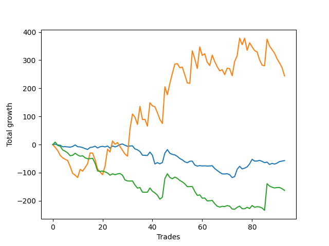

# Short Golden Two 
- Symbol: ES
- Date Range: 3/19/22 - 5/22/22
- Trading Period: 7:20-12:30
- Number of Trades: 93



| Name | Win Percent | Profit | Avg Profit / Trade |     | Name | Win Percent | Profit | Avg Profit / Trade |
| ---- | ----------- | ------ | ------------------ | --- | ---- | ----------- | ------ | ------------------ |
| Sorted By <br> Profit | | | | | Sorted By <br> Win Percentage ||||
| Seventy-Four | 33.33 | 122125.00 | 1313.17 |     | Seventy-Three | 46.24 | -28375.00 | -305.11 |
| Seventy-Three | 46.24 | -28375.00 | -305.11 |     | Seventy-Five | 35.48 | -81375.00 | -875.00 |
| Seventy-Five | 35.48 | -81375.00 | -875.00 |     | Seventy-Four | 33.33 | 122125.00 | 1313.17 |

### Test Seventy-Three
* Sell when the linear regression slope changes to negative
* No Stoploss
* Results:
```
Total Trades: 93
Percent Up: 53.76
Percent Down: 46.24
Total Points Moved Down: -56.75
Potential Profit: -28375.00
Total Points Ups: 281.00 Count Ups: 50
Total Points Downs: 224.25 Count Downs: 43
```

<details><summary>Trades</summary>

<code>In: 2022-03-21 06:54:00		Out: 2022-03-21 07:03:05		Total Position Time: 09:05		Total Move Down: 1.50		Total to Date: 1.50</code> <br />
<code>In: 2022-03-21 10:02:00		Out: 2022-03-21 10:08:05		Total Position Time: 06:05		Total Move Down: -2.75		Total to Date: -1.25</code> <br />
<code>In: 2022-03-23 06:46:00		Out: 2022-03-23 06:54:05		Total Position Time: 08:05		Total Move Down: -1.25		Total to Date: -2.50</code> <br />
<code>In: 2022-03-23 10:31:00		Out: 2022-03-23 10:33:05		Total Position Time: 02:05		Total Move Down: -5.25		Total to Date: -7.75</code> <br />
<code>In: 2022-03-25 06:46:00		Out: 2022-03-25 07:07:05		Total Position Time: 21:05		Total Move Down: 0.50		Total to Date: -7.25</code> <br />
<code>In: 2022-03-25 07:04:00		Out: 2022-03-25 07:07:05		Total Position Time: 03:05		Total Move Down: -1.00		Total to Date: -8.25</code> <br />
<code>In: 2022-03-25 08:31:00		Out: 2022-03-25 08:35:05		Total Position Time: 04:05		Total Move Down: -1.00		Total to Date: -9.25</code> <br />
<code>In: 2022-03-28 08:35:00		Out: 2022-03-28 08:45:05		Total Position Time: 10:05		Total Move Down: 2.50		Total to Date: -6.75</code> <br />
<code>In: 2022-03-29 06:46:00		Out: 2022-03-29 06:58:05		Total Position Time: 12:05		Total Move Down: 5.50		Total to Date: -1.25</code> <br />
<code>In: 2022-03-30 06:46:00		Out: 2022-03-30 06:50:05		Total Position Time: 04:05		Total Move Down: -6.25		Total to Date: -7.50</code> <br />
<code>In: 2022-03-30 07:32:00		Out: 2022-03-30 07:36:05		Total Position Time: 04:05		Total Move Down: -0.75		Total to Date: -8.25</code> <br />
<code>In: 2022-03-31 06:46:00		Out: 2022-03-31 06:57:05		Total Position Time: 11:05		Total Move Down: -2.50		Total to Date: -10.75</code> <br />
<code>In: 2022-03-31 09:35:00		Out: 2022-03-31 09:38:05		Total Position Time: 03:05		Total Move Down: -3.50		Total to Date: -14.25</code> <br />
<code>In: 2022-04-01 06:46:00		Out: 2022-04-01 06:48:05		Total Position Time: 02:05		Total Move Down: -3.00		Total to Date: -17.25</code> <br />
<code>In: 2022-04-05 07:13:00		Out: 2022-04-05 07:20:05		Total Position Time: 07:05		Total Move Down: 7.00		Total to Date: -10.25</code> <br />
<code>In: 2022-04-06 06:46:00		Out: 2022-04-06 06:55:05		Total Position Time: 09:05		Total Move Down: 1.25		Total to Date: -9.00</code> <br />
<code>In: 2022-04-06 11:14:00		Out: 2022-04-06 11:22:05		Total Position Time: 08:05		Total Move Down: 3.25		Total to Date: -5.75</code> <br />
<code>In: 2022-04-06 11:17:00		Out: 2022-04-06 11:22:05		Total Position Time: 05:05		Total Move Down: -6.25		Total to Date: -12.00</code> <br />
<code>In: 2022-04-07 07:20:00		Out: 2022-04-07 07:28:05		Total Position Time: 08:05		Total Move Down: 4.25		Total to Date: -7.75</code> <br />
<code>In: 2022-04-08 06:46:00		Out: 2022-04-08 06:50:05		Total Position Time: 04:05		Total Move Down: 1.50		Total to Date: -6.25</code> <br />
<code>In: 2022-04-11 06:46:00		Out: 2022-04-11 06:49:05		Total Position Time: 03:05		Total Move Down: -2.00		Total to Date: -8.25</code> <br />
<code>In: 2022-04-12 07:48:00		Out: 2022-04-12 07:58:05		Total Position Time: 10:05		Total Move Down: 3.25		Total to Date: -5.00</code> <br />
<code>In: 2022-04-13 07:13:00		Out: 2022-04-13 07:17:05		Total Position Time: 04:05		Total Move Down: -7.75		Total to Date: -12.75</code> <br />
<code>In: 2022-04-14 06:46:00		Out: 2022-04-14 06:57:05		Total Position Time: 11:05		Total Move Down: 8.00		Total to Date: -4.75</code> <br />
<code>In: 2022-04-18 06:57:00		Out: 2022-04-18 07:03:05		Total Position Time: 06:05		Total Move Down: -3.50		Total to Date: -8.25</code> <br />
<code>In: 2022-04-18 08:30:00		Out: 2022-04-18 08:37:05		Total Position Time: 07:05		Total Move Down: 3.25		Total to Date: -5.00</code> <br />
<code>In: 2022-04-20 06:46:00		Out: 2022-04-20 06:56:05		Total Position Time: 10:05		Total Move Down: 5.25		Total to Date: 0.25</code> <br />
<code>In: 2022-04-20 09:19:00		Out: 2022-04-20 09:30:05		Total Position Time: 11:05		Total Move Down: 2.00		Total to Date: 2.25</code> <br />
<code>In: 2022-04-20 11:58:00		Out: 2022-04-20 12:02:05		Total Position Time: 04:05		Total Move Down: -4.75		Total to Date: -2.50</code> <br />
<code>In: 2022-04-21 06:46:00		Out: 2022-04-21 06:48:05		Total Position Time: 02:05		Total Move Down: -3.50		Total to Date: -6.00</code> <br />
<code>In: 2022-04-21 07:09:00		Out: 2022-04-21 07:13:05		Total Position Time: 04:05		Total Move Down: 1.00		Total to Date: -5.00</code> <br />
<code>In: 2022-04-22 06:46:00		Out: 2022-04-22 06:48:05		Total Position Time: 02:05		Total Move Down: 0.50		Total to Date: -4.50</code> <br />
<code>In: 2022-04-25 06:47:00		Out: 2022-04-25 06:52:05		Total Position Time: 05:05		Total Move Down: -11.00		Total to Date: -15.50</code> <br />
<code>In: 2022-04-25 08:02:00		Out: 2022-04-25 08:04:05		Total Position Time: 02:05		Total Move Down: -3.00		Total to Date: -18.50</code> <br />
<code>In: 2022-04-26 06:46:00		Out: 2022-04-26 06:49:05		Total Position Time: 03:05		Total Move Down: -6.25		Total to Date: -24.75</code> <br />
<code>In: 2022-04-27 07:18:00		Out: 2022-04-27 07:23:05		Total Position Time: 05:05		Total Move Down: -13.00		Total to Date: -37.75</code> <br />
<code>In: 2022-04-28 06:46:00		Out: 2022-04-28 06:54:05		Total Position Time: 08:05		Total Move Down: -0.50		Total to Date: -38.25</code> <br />
<code>In: 2022-04-29 06:46:00		Out: 2022-04-29 06:50:05		Total Position Time: 04:05		Total Move Down: -0.50		Total to Date: -38.75</code> <br />
<code>In: 2022-04-29 07:23:00		Out: 2022-04-29 07:40:05		Total Position Time: 17:05		Total Move Down: 12.25		Total to Date: -26.50</code> <br />
<code>In: 2022-05-02 06:46:00		Out: 2022-05-02 06:53:05		Total Position Time: 07:05		Total Move Down: -11.50		Total to Date: -38.00</code> <br />
<code>In: 2022-05-02 07:19:00		Out: 2022-05-02 07:44:05		Total Position Time: 25:05		Total Move Down: -31.00		Total to Date: -69.00</code> <br />
<code>In: 2022-05-02 08:34:00		Out: 2022-05-02 08:45:05		Total Position Time: 11:05		Total Move Down: 5.00		Total to Date: -64.00</code> <br />
<code>In: 2022-05-03 06:46:00		Out: 2022-05-03 06:50:05		Total Position Time: 04:05		Total Move Down: -4.50		Total to Date: -68.50</code> <br />
<code>In: 2022-05-04 07:00:00		Out: 2022-05-04 07:12:05		Total Position Time: 12:05		Total Move Down: 4.75		Total to Date: -63.75</code> <br />
<code>In: 2022-05-05 06:46:00		Out: 2022-05-05 07:16:05		Total Position Time: 30:05		Total Move Down: 33.25		Total to Date: -30.50</code> <br />
<code>In: 2022-05-06 06:46:00		Out: 2022-05-06 07:00:05		Total Position Time: 14:05		Total Move Down: 12.75		Total to Date: -17.75</code> <br />
<code>In: 2022-05-09 06:48:00		Out: 2022-05-09 06:53:05		Total Position Time: 05:05		Total Move Down: -13.25		Total to Date: -31.00</code> <br />
<code>In: 2022-05-10 06:46:00		Out: 2022-05-10 06:54:05		Total Position Time: 08:05		Total Move Down: -3.75		Total to Date: -34.75</code> <br />
<code>In: 2022-05-11 09:47:00		Out: 2022-05-11 09:51:05		Total Position Time: 04:05		Total Move Down: -2.00		Total to Date: -36.75</code> <br />
<code>In: 2022-05-12 06:46:00		Out: 2022-05-12 06:55:05		Total Position Time: 09:05		Total Move Down: -5.25		Total to Date: -42.00</code> <br />
<code>In: 2022-05-12 07:05:00		Out: 2022-05-12 07:07:05		Total Position Time: 02:05		Total Move Down: -7.50		Total to Date: -49.50</code> <br />
<code>In: 2022-05-12 10:24:00		Out: 2022-05-12 10:27:05		Total Position Time: 03:05		Total Move Down: -4.75		Total to Date: -54.25</code> <br />
<code>In: 2022-05-16 06:48:00		Out: 2022-05-16 06:54:05		Total Position Time: 06:05		Total Move Down: -7.00		Total to Date: -61.25</code> <br />
<code>In: 2022-05-16 08:05:00		Out: 2022-05-16 08:10:05		Total Position Time: 05:05		Total Move Down: -3.25		Total to Date: -64.50</code> <br />
<code>In: 2022-05-17 06:46:00		Out: 2022-05-17 06:58:05		Total Position Time: 12:05		Total Move Down: 5.25		Total to Date: -59.25</code> <br />
<code>In: 2022-05-18 06:46:00		Out: 2022-05-18 06:49:05		Total Position Time: 03:05		Total Move Down: 0.50		Total to Date: -58.75</code> <br />
<code>In: 2022-05-19 06:48:00		Out: 2022-05-19 06:56:05		Total Position Time: 08:05		Total Move Down: -14.00		Total to Date: -72.75</code> <br />
<code>In: 2022-05-19 07:49:00		Out: 2022-05-19 07:54:05		Total Position Time: 05:05		Total Move Down: -3.75		Total to Date: -76.50</code> <br />
<code>In: 2022-05-20 06:50:00		Out: 2022-05-20 06:56:05		Total Position Time: 06:05		Total Move Down: 1.75		Total to Date: -74.75</code> <br />
<code>In: 2022-05-23 07:05:00		Out: 2022-05-23 07:07:05		Total Position Time: 02:05		Total Move Down: -1.25		Total to Date: -76.00</code> <br />
<code>In: 2022-05-24 06:46:00		Out: 2022-05-24 06:53:05		Total Position Time: 07:05		Total Move Down: 0.50		Total to Date: -75.50</code> <br />
<code>In: 2022-05-25 09:46:00		Out: 2022-05-25 09:53:05		Total Position Time: 07:05		Total Move Down: -0.75		Total to Date: -76.25</code> <br />
<code>In: 2022-05-31 06:46:00		Out: 2022-05-31 07:01:05		Total Position Time: 15:05		Total Move Down: 0.25		Total to Date: -76.00</code> <br />
<code>In: 2022-06-01 06:46:00		Out: 2022-06-01 06:53:05		Total Position Time: 07:05		Total Move Down: 1.00		Total to Date: -75.00</code> <br />
<code>In: 2022-06-02 06:57:00		Out: 2022-06-02 07:01:05		Total Position Time: 04:05		Total Move Down: -10.25		Total to Date: -85.25</code> <br />
<code>In: 2022-06-02 07:29:00		Out: 2022-06-02 07:31:05		Total Position Time: 02:05		Total Move Down: -6.75		Total to Date: -92.00</code> <br />
<code>In: 2022-06-03 06:46:00		Out: 2022-06-03 06:50:05		Total Position Time: 04:05		Total Move Down: -6.50		Total to Date: -98.50</code> <br />
<code>In: 2022-06-03 07:39:00		Out: 2022-06-03 07:47:05		Total Position Time: 08:05		Total Move Down: -5.75		Total to Date: -104.25</code> <br />
<code>In: 2022-06-06 06:46:00		Out: 2022-06-06 06:57:05		Total Position Time: 11:05		Total Move Down: -0.25		Total to Date: -104.50</code> <br />
<code>In: 2022-06-06 08:32:00		Out: 2022-06-06 08:42:05		Total Position Time: 10:05		Total Move Down: 1.00		Total to Date: -103.50</code> <br />
<code>In: 2022-06-08 09:47:00		Out: 2022-06-08 09:49:05		Total Position Time: 02:05		Total Move Down: -3.75		Total to Date: -107.25</code> <br />
<code>In: 2022-06-09 06:46:00		Out: 2022-06-09 06:49:05		Total Position Time: 03:05		Total Move Down: -10.00		Total to Date: -117.25</code> <br />
<code>In: 2022-06-09 07:59:00		Out: 2022-06-09 08:12:05		Total Position Time: 13:05		Total Move Down: 3.50		Total to Date: -113.75</code> <br />
<code>In: 2022-06-10 06:46:00		Out: 2022-06-10 07:01:05		Total Position Time: 15:05		Total Move Down: 25.75		Total to Date: -88.00</code> <br />
<code>In: 2022-06-13 06:46:00		Out: 2022-06-13 06:52:05		Total Position Time: 06:05		Total Move Down: 10.75		Total to Date: -77.25</code> <br />
<code>In: 2022-06-14 06:46:00		Out: 2022-06-14 06:48:05		Total Position Time: 02:05		Total Move Down: -9.25		Total to Date: -86.50</code> <br />
<code>In: 2022-06-14 07:20:00		Out: 2022-06-14 07:24:05		Total Position Time: 04:05		Total Move Down: 2.75		Total to Date: -83.75</code> <br />
<code>In: 2022-06-15 07:50:00		Out: 2022-06-15 07:52:05		Total Position Time: 02:05		Total Move Down: 4.50		Total to Date: -79.25</code> <br />
<code>In: 2022-06-16 06:46:00		Out: 2022-06-16 07:03:05		Total Position Time: 17:05		Total Move Down: 10.75		Total to Date: -68.50</code> <br />
<code>In: 2022-06-17 07:19:00		Out: 2022-06-17 07:28:05		Total Position Time: 09:05		Total Move Down: 16.25		Total to Date: -52.25</code> <br />
<code>In: 2022-06-23 06:46:00		Out: 2022-06-23 06:48:05		Total Position Time: 02:05		Total Move Down: -6.50		Total to Date: -58.75</code> <br />
<code>In: 2022-06-23 07:17:00		Out: 2022-06-23 07:33:05		Total Position Time: 16:05		Total Move Down: 0.25		Total to Date: -58.50</code> <br />
<code>In: 2022-06-23 09:04:00		Out: 2022-06-23 09:12:05		Total Position Time: 08:05		Total Move Down: 2.50		Total to Date: -56.00</code> <br />
<code>In: 2022-06-27 06:46:00		Out: 2022-06-27 06:54:05		Total Position Time: 08:05		Total Move Down: -3.75		Total to Date: -59.75</code> <br />
<code>In: 2022-06-27 11:11:00		Out: 2022-06-27 11:34:05		Total Position Time: 23:05		Total Move Down: -4.50		Total to Date: -64.25</code> <br />
<code>In: 2022-06-28 07:06:00		Out: 2022-06-28 07:14:05		Total Position Time: 08:05		Total Move Down: 2.00		Total to Date: -62.25</code> <br />
<code>In: 2022-06-29 06:46:00		Out: 2022-06-29 06:49:05		Total Position Time: 03:05		Total Move Down: -8.50		Total to Date: -70.75</code> <br />
<code>In: 2022-06-29 09:08:00		Out: 2022-06-29 09:18:05		Total Position Time: 10:05		Total Move Down: 4.00		Total to Date: -66.75</code> <br />
<code>In: 2022-06-30 06:46:00		Out: 2022-06-30 06:49:05		Total Position Time: 03:05		Total Move Down: -2.50		Total to Date: -69.25</code> <br />
<code>In: 2022-07-01 07:20:00		Out: 2022-07-01 07:23:05		Total Position Time: 03:05		Total Move Down: 3.25		Total to Date: -66.00</code> <br />
<code>In: 2022-07-05 06:46:00		Out: 2022-07-05 07:03:05		Total Position Time: 17:05		Total Move Down: 5.75		Total to Date: -60.25</code> <br />
<code>In: 2022-07-05 08:05:00		Out: 2022-07-05 08:09:05		Total Position Time: 04:05		Total Move Down: 1.50		Total to Date: -58.75</code> <br />
<code>In: 2022-07-06 06:46:00		Out: 2022-07-06 06:50:05		Total Position Time: 04:05		Total Move Down: 2.00		Total to Date: -56.75</code> <br />


</details>

### Test Seventy-Four
* Sell when the bias changes to negative
* No Stoploss
* Results:
```
Total Trades: 93
Percent Up: 66.67
Percent Down: 33.33
Total Points Moved Down: 244.25
Potential Profit: 122125.00
Total Points Ups: 1067.75 Count Ups: 62
Total Points Downs: 1312.00 Count Downs: 31
```

<details><summary>Trades</summary>

<code>In: 2022-03-21 06:54:00		Out: 2022-03-21 08:38:05		Total Position Time: 104:05		Total Move Down: -10.00		Total to Date: -10.00</code> <br />
<code>In: 2022-03-21 10:02:00		Out: 2022-03-21 12:31:00		Total Position Time: 149:00		Total Move Down: -11.25		Total to Date: -21.25</code> <br />
<code>In: 2022-03-23 06:46:00		Out: 2022-03-23 07:17:05		Total Position Time: 31:05		Total Move Down: -17.00		Total to Date: -38.25</code> <br />
<code>In: 2022-03-23 10:31:00		Out: 2022-03-23 12:31:00		Total Position Time: 120:00		Total Move Down: -8.75		Total to Date: -47.00</code> <br />
<code>In: 2022-03-25 06:46:00		Out: 2022-03-25 06:53:05		Total Position Time: 07:05		Total Move Down: -5.25		Total to Date: -52.25</code> <br />
<code>In: 2022-03-25 07:04:00		Out: 2022-03-25 07:16:05		Total Position Time: 12:05		Total Move Down: -4.50		Total to Date: -56.75</code> <br />
<code>In: 2022-03-25 08:31:00		Out: 2022-03-25 12:06:05		Total Position Time: 215:05		Total Move Down: -21.00		Total to Date: -77.75</code> <br />
<code>In: 2022-03-28 08:35:00		Out: 2022-03-28 12:06:05		Total Position Time: 211:05		Total Move Down: -24.50		Total to Date: -102.25</code> <br />
<code>In: 2022-03-29 06:46:00		Out: 2022-03-29 11:48:05		Total Position Time: 302:05		Total Move Down: -6.50		Total to Date: -108.75</code> <br />
<code>In: 2022-03-30 06:46:00		Out: 2022-03-30 07:01:05		Total Position Time: 15:05		Total Move Down: -8.50		Total to Date: -117.25</code> <br />
<code>In: 2022-03-30 07:32:00		Out: 2022-03-30 12:31:00		Total Position Time: 299:00		Total Move Down: 29.00		Total to Date: -88.25</code> <br />
<code>In: 2022-03-31 06:46:00		Out: 2022-03-31 07:55:05		Total Position Time: 69:05		Total Move Down: -6.25		Total to Date: -94.50</code> <br />
<code>In: 2022-03-31 09:35:00		Out: 2022-03-31 12:31:00		Total Position Time: 176:00		Total Move Down: 12.75		Total to Date: -81.75</code> <br />
<code>In: 2022-04-01 06:46:00		Out: 2022-04-01 12:31:00		Total Position Time: 345:00		Total Move Down: 14.00		Total to Date: -67.75</code> <br />
<code>In: 2022-04-05 07:13:00		Out: 2022-04-05 12:31:00		Total Position Time: 318:00		Total Move Down: 38.00		Total to Date: -29.75</code> <br />
<code>In: 2022-04-06 06:46:00		Out: 2022-04-06 11:09:05		Total Position Time: 263:05		Total Move Down: -0.50		Total to Date: -30.25</code> <br />
<code>In: 2022-04-06 11:14:00		Out: 2022-04-06 11:55:05		Total Position Time: 41:05		Total Move Down: -23.50		Total to Date: -53.75</code> <br />
<code>In: 2022-04-06 11:17:00		Out: 2022-04-06 11:55:05		Total Position Time: 38:05		Total Move Down: -33.00		Total to Date: -86.75</code> <br />
<code>In: 2022-04-07 07:20:00		Out: 2022-04-07 11:31:05		Total Position Time: 251:05		Total Move Down: -10.50		Total to Date: -97.25</code> <br />
<code>In: 2022-04-08 06:46:00		Out: 2022-04-08 07:38:05		Total Position Time: 52:05		Total Move Down: -9.75		Total to Date: -107.00</code> <br />
<code>In: 2022-04-11 06:46:00		Out: 2022-04-11 12:31:00		Total Position Time: 345:00		Total Move Down: 30.00		Total to Date: -77.00</code> <br />
<code>In: 2022-04-12 07:48:00		Out: 2022-04-12 12:31:00		Total Position Time: 283:00		Total Move Down: 60.50		Total to Date: -16.50</code> <br />
<code>In: 2022-04-13 07:13:00		Out: 2022-04-13 07:26:05		Total Position Time: 13:05		Total Move Down: -9.75		Total to Date: -26.25</code> <br />
<code>In: 2022-04-14 06:46:00		Out: 2022-04-14 12:31:00		Total Position Time: 345:00		Total Move Down: 39.25		Total to Date: 13.00</code> <br />
<code>In: 2022-04-18 06:57:00		Out: 2022-04-18 07:34:05		Total Position Time: 37:05		Total Move Down: -12.00		Total to Date: 1.00</code> <br />
<code>In: 2022-04-18 08:30:00		Out: 2022-04-18 12:31:00		Total Position Time: 241:00		Total Move Down: 6.25		Total to Date: 7.25</code> <br />
<code>In: 2022-04-20 06:46:00		Out: 2022-04-20 07:51:05		Total Position Time: 65:05		Total Move Down: -13.75		Total to Date: -6.50</code> <br />
<code>In: 2022-04-20 09:19:00		Out: 2022-04-20 10:04:05		Total Position Time: 45:05		Total Move Down: -13.75		Total to Date: -20.25</code> <br />
<code>In: 2022-04-20 11:58:00		Out: 2022-04-20 12:31:00		Total Position Time: 33:00		Total Move Down: -13.50		Total to Date: -33.75</code> <br />
<code>In: 2022-04-21 06:46:00		Out: 2022-04-21 06:52:05		Total Position Time: 06:05		Total Move Down: -7.25		Total to Date: -41.00</code> <br />
<code>In: 2022-04-21 07:09:00		Out: 2022-04-21 12:31:00		Total Position Time: 322:00		Total Move Down: 96.25		Total to Date: 55.25</code> <br />
<code>In: 2022-04-22 06:46:00		Out: 2022-04-22 12:31:00		Total Position Time: 345:00		Total Move Down: 53.25		Total to Date: 108.50</code> <br />
<code>In: 2022-04-25 06:47:00		Out: 2022-04-25 07:41:05		Total Position Time: 54:05		Total Move Down: -11.25		Total to Date: 97.25</code> <br />
<code>In: 2022-04-25 08:02:00		Out: 2022-04-25 10:33:05		Total Position Time: 151:05		Total Move Down: -25.50		Total to Date: 71.75</code> <br />
<code>In: 2022-04-26 06:46:00		Out: 2022-04-26 12:31:00		Total Position Time: 345:00		Total Move Down: 64.25		Total to Date: 136.00</code> <br />
<code>In: 2022-04-27 07:18:00		Out: 2022-04-27 08:39:05		Total Position Time: 81:05		Total Move Down: -47.00		Total to Date: 89.00</code> <br />
<code>In: 2022-04-28 06:46:00		Out: 2022-04-28 08:59:05		Total Position Time: 133:05		Total Move Down: 1.00		Total to Date: 90.00</code> <br />
<code>In: 2022-04-29 06:46:00		Out: 2022-04-29 07:00:05		Total Position Time: 14:05		Total Move Down: -24.50		Total to Date: 65.50</code> <br />
<code>In: 2022-04-29 07:23:00		Out: 2022-04-29 12:31:00		Total Position Time: 308:00		Total Move Down: 83.25		Total to Date: 148.75</code> <br />
<code>In: 2022-05-02 06:46:00		Out: 2022-05-02 06:54:05		Total Position Time: 08:05		Total Move Down: -11.00		Total to Date: 137.75</code> <br />
<code>In: 2022-05-02 07:19:00		Out: 2022-05-02 07:23:05		Total Position Time: 04:05		Total Move Down: -3.25		Total to Date: 134.50</code> <br />
<code>In: 2022-05-02 08:34:00		Out: 2022-05-02 12:31:00		Total Position Time: 237:00		Total Move Down: -21.00		Total to Date: 113.50</code> <br />
<code>In: 2022-05-03 06:46:00		Out: 2022-05-03 07:02:05		Total Position Time: 16:05		Total Move Down: -24.00		Total to Date: 89.50</code> <br />
<code>In: 2022-05-04 07:00:00		Out: 2022-05-04 09:54:05		Total Position Time: 174:05		Total Move Down: -14.50		Total to Date: 75.00</code> <br />
<code>In: 2022-05-05 06:46:00		Out: 2022-05-05 12:31:00		Total Position Time: 345:00		Total Move Down: 130.50		Total to Date: 205.50</code> <br />
<code>In: 2022-05-06 06:46:00		Out: 2022-05-06 07:28:05		Total Position Time: 42:05		Total Move Down: -28.25		Total to Date: 177.25</code> <br />
<code>In: 2022-05-09 06:48:00		Out: 2022-05-09 12:31:00		Total Position Time: 343:00		Total Move Down: 40.50		Total to Date: 217.75</code> <br />
<code>In: 2022-05-10 06:46:00		Out: 2022-05-10 12:31:00		Total Position Time: 345:00		Total Move Down: 35.00		Total to Date: 252.75</code> <br />
<code>In: 2022-05-11 09:47:00		Out: 2022-05-11 12:31:00		Total Position Time: 164:00		Total Move Down: 33.50		Total to Date: 286.25</code> <br />
<code>In: 2022-05-12 06:46:00		Out: 2022-05-12 06:51:05		Total Position Time: 05:05		Total Move Down: 1.50		Total to Date: 287.75</code> <br />
<code>In: 2022-05-12 07:05:00		Out: 2022-05-12 07:08:05		Total Position Time: 03:05		Total Move Down: -14.25		Total to Date: 273.50</code> <br />
<code>In: 2022-05-12 10:24:00		Out: 2022-05-12 12:31:00		Total Position Time: 127:00		Total Move Down: 2.00		Total to Date: 275.50</code> <br />
<code>In: 2022-05-16 06:48:00		Out: 2022-05-16 07:21:05		Total Position Time: 33:05		Total Move Down: -27.50		Total to Date: 248.00</code> <br />
<code>In: 2022-05-16 08:05:00		Out: 2022-05-16 08:58:05		Total Position Time: 53:05		Total Move Down: -28.75		Total to Date: 219.25</code> <br />
<code>In: 2022-05-17 06:46:00		Out: 2022-05-17 09:30:05		Total Position Time: 164:05		Total Move Down: -1.50		Total to Date: 217.75</code> <br />
<code>In: 2022-05-18 06:46:00		Out: 2022-05-18 12:31:00		Total Position Time: 345:00		Total Move Down: 115.75		Total to Date: 333.50</code> <br />
<code>In: 2022-05-19 06:48:00		Out: 2022-05-19 07:18:05		Total Position Time: 30:05		Total Move Down: -28.75		Total to Date: 304.75</code> <br />
<code>In: 2022-05-19 07:49:00		Out: 2022-05-19 08:38:05		Total Position Time: 49:05		Total Move Down: -34.25		Total to Date: 270.50</code> <br />
<code>In: 2022-05-20 06:50:00		Out: 2022-05-20 12:31:00		Total Position Time: 341:00		Total Move Down: 76.75		Total to Date: 347.25</code> <br />
<code>In: 2022-05-23 07:05:00		Out: 2022-05-23 07:34:05		Total Position Time: 29:05		Total Move Down: -30.25		Total to Date: 317.00</code> <br />
<code>In: 2022-05-24 06:46:00		Out: 2022-05-24 10:50:05		Total Position Time: 244:05		Total Move Down: 6.00		Total to Date: 323.00</code> <br />
<code>In: 2022-05-25 09:46:00		Out: 2022-05-25 11:48:05		Total Position Time: 122:05		Total Move Down: -30.25		Total to Date: 292.75</code> <br />
<code>In: 2022-05-31 06:46:00		Out: 2022-05-31 07:31:05		Total Position Time: 45:05		Total Move Down: -11.75		Total to Date: 281.00</code> <br />
<code>In: 2022-06-01 06:46:00		Out: 2022-06-01 12:31:00		Total Position Time: 345:00		Total Move Down: 37.25		Total to Date: 318.25</code> <br />
<code>In: 2022-06-02 06:57:00		Out: 2022-06-02 07:16:05		Total Position Time: 19:05		Total Move Down: -23.00		Total to Date: 295.25</code> <br />
<code>In: 2022-06-02 07:29:00		Out: 2022-06-02 07:49:05		Total Position Time: 20:05		Total Move Down: -18.25		Total to Date: 277.00</code> <br />
<code>In: 2022-06-03 06:46:00		Out: 2022-06-03 07:06:05		Total Position Time: 20:05		Total Move Down: -14.75		Total to Date: 262.25</code> <br />
<code>In: 2022-06-03 07:39:00		Out: 2022-06-03 12:31:00		Total Position Time: 292:00		Total Move Down: 4.25		Total to Date: 266.50</code> <br />
<code>In: 2022-06-06 06:46:00		Out: 2022-06-06 07:04:05		Total Position Time: 18:05		Total Move Down: -18.00		Total to Date: 248.50</code> <br />
<code>In: 2022-06-06 08:32:00		Out: 2022-06-06 12:31:00		Total Position Time: 239:00		Total Move Down: 23.25		Total to Date: 271.75</code> <br />
<code>In: 2022-06-08 09:47:00		Out: 2022-06-08 12:31:00		Total Position Time: 164:00		Total Move Down: -2.00		Total to Date: 269.75</code> <br />
<code>In: 2022-06-09 06:46:00		Out: 2022-06-09 06:55:05		Total Position Time: 09:05		Total Move Down: -25.00		Total to Date: 244.75</code> <br />
<code>In: 2022-06-09 07:59:00		Out: 2022-06-09 12:31:00		Total Position Time: 272:00		Total Move Down: 50.50		Total to Date: 295.25</code> <br />
<code>In: 2022-06-10 06:46:00		Out: 2022-06-10 12:31:00		Total Position Time: 345:00		Total Move Down: 20.50		Total to Date: 315.75</code> <br />
<code>In: 2022-06-13 06:46:00		Out: 2022-06-13 12:31:00		Total Position Time: 345:00		Total Move Down: 62.75		Total to Date: 378.50</code> <br />
<code>In: 2022-06-14 06:46:00		Out: 2022-06-14 07:02:05		Total Position Time: 16:05		Total Move Down: -23.25		Total to Date: 355.25</code> <br />
<code>In: 2022-06-14 07:20:00		Out: 2022-06-14 12:31:00		Total Position Time: 311:00		Total Move Down: 23.00		Total to Date: 378.25</code> <br />
<code>In: 2022-06-15 07:50:00		Out: 2022-06-15 12:31:00		Total Position Time: 281:00		Total Move Down: -43.00		Total to Date: 335.25</code> <br />
<code>In: 2022-06-16 06:46:00		Out: 2022-06-16 12:31:00		Total Position Time: 345:00		Total Move Down: 26.50		Total to Date: 361.75</code> <br />
<code>In: 2022-06-17 07:19:00		Out: 2022-06-17 10:34:05		Total Position Time: 195:05		Total Move Down: -14.25		Total to Date: 347.50</code> <br />
<code>In: 2022-06-23 06:46:00		Out: 2022-06-23 07:05:05		Total Position Time: 19:05		Total Move Down: -13.25		Total to Date: 334.25</code> <br />
<code>In: 2022-06-23 07:17:00		Out: 2022-06-23 07:24:05		Total Position Time: 07:05		Total Move Down: -4.75		Total to Date: 329.50</code> <br />
<code>In: 2022-06-23 09:04:00		Out: 2022-06-23 12:31:00		Total Position Time: 207:00		Total Move Down: -28.25		Total to Date: 301.25</code> <br />
<code>In: 2022-06-27 06:46:00		Out: 2022-06-27 07:54:05		Total Position Time: 68:05		Total Move Down: -18.75		Total to Date: 282.50</code> <br />
<code>In: 2022-06-27 11:11:00		Out: 2022-06-27 12:31:00		Total Position Time: 80:00		Total Move Down: -2.50		Total to Date: 280.00</code> <br />
<code>In: 2022-06-28 07:06:00		Out: 2022-06-28 12:31:00		Total Position Time: 325:00		Total Move Down: 94.75		Total to Date: 374.75</code> <br />
<code>In: 2022-06-29 06:46:00		Out: 2022-06-29 06:56:05		Total Position Time: 10:05		Total Move Down: -24.50		Total to Date: 350.25</code> <br />
<code>In: 2022-06-29 09:08:00		Out: 2022-06-29 12:31:00		Total Position Time: 203:00		Total Move Down: -12.25		Total to Date: 338.00</code> <br />
<code>In: 2022-06-30 06:46:00		Out: 2022-06-30 08:08:05		Total Position Time: 82:05		Total Move Down: -13.00		Total to Date: 325.00</code> <br />
<code>In: 2022-07-01 07:20:00		Out: 2022-07-01 11:06:05		Total Position Time: 226:05		Total Move Down: -20.00		Total to Date: 305.00</code> <br />
<code>In: 2022-07-05 06:46:00		Out: 2022-07-05 07:40:05		Total Position Time: 54:05		Total Move Down: -14.25		Total to Date: 290.75</code> <br />
<code>In: 2022-07-05 08:05:00		Out: 2022-07-05 09:00:05		Total Position Time: 55:05		Total Move Down: -16.75		Total to Date: 274.00</code> <br />
<code>In: 2022-07-06 06:46:00		Out: 2022-07-06 11:48:05		Total Position Time: 302:05		Total Move Down: -29.75		Total to Date: 244.25</code> <br />


</details>

### Test Seventy-Five
* Sell when the STDEV slope changes to negative
* No Stoploss
* Results:
```
Total Trades: 93
Percent Up: 64.52
Percent Down: 35.48
Total Points Moved Down: -162.75
Potential Profit: -81375.00
Total Points Ups: 446.00 Count Ups: 60
Total Points Downs: 283.25 Count Downs: 33
```

<details><summary>Trades</summary>

<code>In: 2022-03-21 06:54:00		Out: 2022-03-21 07:40:05		Total Position Time: 46:05		Total Move Down: 9.00		Total to Date: 9.00</code> <br />
<code>In: 2022-03-21 10:02:00		Out: 2022-03-21 11:24:05		Total Position Time: 82:05		Total Move Down: -12.00		Total to Date: -3.00</code> <br />
<code>In: 2022-03-23 06:46:00		Out: 2022-03-23 06:55:05		Total Position Time: 09:05		Total Move Down: -2.75		Total to Date: -5.75</code> <br />
<code>In: 2022-03-23 10:31:00		Out: 2022-03-23 11:50:05		Total Position Time: 79:05		Total Move Down: -13.25		Total to Date: -19.00</code> <br />
<code>In: 2022-03-25 06:46:00		Out: 2022-03-25 07:10:05		Total Position Time: 24:05		Total Move Down: -4.50		Total to Date: -23.50</code> <br />
<code>In: 2022-03-25 07:04:00		Out: 2022-03-25 07:10:05		Total Position Time: 06:05		Total Move Down: -6.00		Total to Date: -29.50</code> <br />
<code>In: 2022-03-25 08:31:00		Out: 2022-03-25 09:20:05		Total Position Time: 49:05		Total Move Down: -10.25		Total to Date: -39.75</code> <br />
<code>In: 2022-03-28 08:35:00		Out: 2022-03-28 09:54:05		Total Position Time: 79:05		Total Move Down: 1.75		Total to Date: -38.00</code> <br />
<code>In: 2022-03-29 06:46:00		Out: 2022-03-29 07:00:05		Total Position Time: 14:05		Total Move Down: 7.25		Total to Date: -30.75</code> <br />
<code>In: 2022-03-30 06:46:00		Out: 2022-03-30 06:50:05		Total Position Time: 04:05		Total Move Down: -6.25		Total to Date: -37.00</code> <br />
<code>In: 2022-03-30 07:32:00		Out: 2022-03-30 07:47:05		Total Position Time: 15:05		Total Move Down: -4.25		Total to Date: -41.25</code> <br />
<code>In: 2022-03-31 06:46:00		Out: 2022-03-31 06:48:05		Total Position Time: 02:05		Total Move Down: 1.50		Total to Date: -39.75</code> <br />
<code>In: 2022-03-31 09:35:00		Out: 2022-03-31 10:52:05		Total Position Time: 77:05		Total Move Down: -7.25		Total to Date: -47.00</code> <br />
<code>In: 2022-04-01 06:46:00		Out: 2022-04-01 06:49:05		Total Position Time: 03:05		Total Move Down: -3.50		Total to Date: -50.50</code> <br />
<code>In: 2022-04-05 07:13:00		Out: 2022-04-05 07:50:05		Total Position Time: 37:05		Total Move Down: 0.50		Total to Date: -50.00</code> <br />
<code>In: 2022-04-06 06:46:00		Out: 2022-04-06 06:55:05		Total Position Time: 09:05		Total Move Down: 1.25		Total to Date: -48.75</code> <br />
<code>In: 2022-04-06 11:14:00		Out: 2022-04-06 11:34:05		Total Position Time: 20:05		Total Move Down: -17.75		Total to Date: -66.50</code> <br />
<code>In: 2022-04-06 11:17:00		Out: 2022-04-06 11:34:05		Total Position Time: 17:05		Total Move Down: -27.25		Total to Date: -93.75</code> <br />
<code>In: 2022-04-07 07:20:00		Out: 2022-04-07 07:36:05		Total Position Time: 16:05		Total Move Down: -1.75		Total to Date: -95.50</code> <br />
<code>In: 2022-04-08 06:46:00		Out: 2022-04-08 06:50:05		Total Position Time: 04:05		Total Move Down: 1.50		Total to Date: -94.00</code> <br />
<code>In: 2022-04-11 06:46:00		Out: 2022-04-11 06:54:05		Total Position Time: 08:05		Total Move Down: -3.00		Total to Date: -97.00</code> <br />
<code>In: 2022-04-12 07:48:00		Out: 2022-04-12 08:20:05		Total Position Time: 32:05		Total Move Down: -4.00		Total to Date: -101.00</code> <br />
<code>In: 2022-04-13 07:13:00		Out: 2022-04-13 07:17:05		Total Position Time: 04:05		Total Move Down: -7.75		Total to Date: -108.75</code> <br />
<code>In: 2022-04-14 06:46:00		Out: 2022-04-14 07:02:05		Total Position Time: 16:05		Total Move Down: 4.75		Total to Date: -104.00</code> <br />
<code>In: 2022-04-18 06:57:00		Out: 2022-04-18 07:06:05		Total Position Time: 09:05		Total Move Down: -3.00		Total to Date: -107.00</code> <br />
<code>In: 2022-04-18 08:30:00		Out: 2022-04-18 10:09:05		Total Position Time: 99:05		Total Move Down: 2.75		Total to Date: -104.25</code> <br />
<code>In: 2022-04-20 06:46:00		Out: 2022-04-20 07:14:05		Total Position Time: 28:05		Total Move Down: 1.50		Total to Date: -102.75</code> <br />
<code>In: 2022-04-20 09:19:00		Out: 2022-04-20 09:36:05		Total Position Time: 17:05		Total Move Down: -6.25		Total to Date: -109.00</code> <br />
<code>In: 2022-04-20 11:58:00		Out: 2022-04-20 12:27:05		Total Position Time: 29:05		Total Move Down: -16.75		Total to Date: -125.75</code> <br />
<code>In: 2022-04-21 06:46:00		Out: 2022-04-21 06:48:05		Total Position Time: 02:05		Total Move Down: -3.50		Total to Date: -129.25</code> <br />
<code>In: 2022-04-21 07:09:00		Out: 2022-04-21 07:31:05		Total Position Time: 22:05		Total Move Down: -0.50		Total to Date: -129.75</code> <br />
<code>In: 2022-04-22 06:46:00		Out: 2022-04-22 06:48:05		Total Position Time: 02:05		Total Move Down: 0.50		Total to Date: -129.25</code> <br />
<code>In: 2022-04-25 06:47:00		Out: 2022-04-25 06:51:05		Total Position Time: 04:05		Total Move Down: -14.50		Total to Date: -143.75</code> <br />
<code>In: 2022-04-25 08:02:00		Out: 2022-04-25 08:27:05		Total Position Time: 25:05		Total Move Down: -11.00		Total to Date: -154.75</code> <br />
<code>In: 2022-04-26 06:46:00		Out: 2022-04-26 06:50:05		Total Position Time: 04:05		Total Move Down: 2.00		Total to Date: -152.75</code> <br />
<code>In: 2022-04-27 07:18:00		Out: 2022-04-27 07:41:05		Total Position Time: 23:05		Total Move Down: -16.25		Total to Date: -169.00</code> <br />
<code>In: 2022-04-28 06:46:00		Out: 2022-04-28 06:54:05		Total Position Time: 08:05		Total Move Down: -0.50		Total to Date: -169.50</code> <br />
<code>In: 2022-04-29 06:46:00		Out: 2022-04-29 06:52:05		Total Position Time: 06:05		Total Move Down: 0.25		Total to Date: -169.25</code> <br />
<code>In: 2022-04-29 07:23:00		Out: 2022-04-29 08:25:05		Total Position Time: 62:05		Total Move Down: 15.00		Total to Date: -154.25</code> <br />
<code>In: 2022-05-02 06:46:00		Out: 2022-05-02 06:53:05		Total Position Time: 07:05		Total Move Down: -11.50		Total to Date: -165.75</code> <br />
<code>In: 2022-05-02 07:19:00		Out: 2022-05-02 07:20:05		Total Position Time: 01:05		Total Move Down: -6.00		Total to Date: -171.75</code> <br />
<code>In: 2022-05-02 08:34:00		Out: 2022-05-02 09:01:05		Total Position Time: 27:05		Total Move Down: -8.00		Total to Date: -179.75</code> <br />
<code>In: 2022-05-03 06:46:00		Out: 2022-05-03 06:52:05		Total Position Time: 06:05		Total Move Down: -14.50		Total to Date: -194.25</code> <br />
<code>In: 2022-05-04 07:00:00		Out: 2022-05-04 07:28:05		Total Position Time: 28:05		Total Move Down: 7.25		Total to Date: -187.00</code> <br />
<code>In: 2022-05-05 06:46:00		Out: 2022-05-05 08:38:05		Total Position Time: 112:05		Total Move Down: 66.00		Total to Date: -121.00</code> <br />
<code>In: 2022-05-06 06:46:00		Out: 2022-05-06 07:03:05		Total Position Time: 17:05		Total Move Down: 17.25		Total to Date: -103.75</code> <br />
<code>In: 2022-05-09 06:48:00		Out: 2022-05-09 06:53:05		Total Position Time: 05:05		Total Move Down: -13.25		Total to Date: -117.00</code> <br />
<code>In: 2022-05-10 06:46:00		Out: 2022-05-10 06:55:05		Total Position Time: 09:05		Total Move Down: -4.50		Total to Date: -121.50</code> <br />
<code>In: 2022-05-11 09:47:00		Out: 2022-05-11 11:46:05		Total Position Time: 119:05		Total Move Down: 6.00		Total to Date: -115.50</code> <br />
<code>In: 2022-05-12 06:46:00		Out: 2022-05-12 06:53:05		Total Position Time: 07:05		Total Move Down: -4.50		Total to Date: -120.00</code> <br />
<code>In: 2022-05-12 07:05:00		Out: 2022-05-12 07:07:05		Total Position Time: 02:05		Total Move Down: -7.50		Total to Date: -127.50</code> <br />
<code>In: 2022-05-12 10:24:00		Out: 2022-05-12 12:22:05		Total Position Time: 118:05		Total Move Down: -5.00		Total to Date: -132.50</code> <br />
<code>In: 2022-05-16 06:48:00		Out: 2022-05-16 06:54:05		Total Position Time: 06:05		Total Move Down: -7.00		Total to Date: -139.50</code> <br />
<code>In: 2022-05-16 08:05:00		Out: 2022-05-16 08:18:05		Total Position Time: 13:05		Total Move Down: -10.00		Total to Date: -149.50</code> <br />
<code>In: 2022-05-17 06:46:00		Out: 2022-05-17 07:01:05		Total Position Time: 15:05		Total Move Down: -0.00		Total to Date: -149.50</code> <br />
<code>In: 2022-05-18 06:46:00		Out: 2022-05-18 06:49:05		Total Position Time: 03:05		Total Move Down: 0.50		Total to Date: -149.00</code> <br />
<code>In: 2022-05-19 06:48:00		Out: 2022-05-19 06:57:05		Total Position Time: 09:05		Total Move Down: -17.50		Total to Date: -166.50</code> <br />
<code>In: 2022-05-19 07:49:00		Out: 2022-05-19 07:56:05		Total Position Time: 07:05		Total Move Down: -14.00		Total to Date: -180.50</code> <br />
<code>In: 2022-05-20 06:50:00		Out: 2022-05-20 06:56:05		Total Position Time: 06:05		Total Move Down: 1.75		Total to Date: -178.75</code> <br />
<code>In: 2022-05-23 07:05:00		Out: 2022-05-23 07:14:05		Total Position Time: 09:05		Total Move Down: -11.75		Total to Date: -190.50</code> <br />
<code>In: 2022-05-24 06:46:00		Out: 2022-05-24 06:53:05		Total Position Time: 07:05		Total Move Down: 0.50		Total to Date: -190.00</code> <br />
<code>In: 2022-05-25 09:46:00		Out: 2022-05-25 10:37:05		Total Position Time: 51:05		Total Move Down: -10.25		Total to Date: -200.25</code> <br />
<code>In: 2022-05-31 06:46:00		Out: 2022-05-31 06:47:05		Total Position Time: 01:05		Total Move Down: 0.50		Total to Date: -199.75</code> <br />
<code>In: 2022-06-01 06:46:00		Out: 2022-06-01 06:54:05		Total Position Time: 08:05		Total Move Down: 1.25		Total to Date: -198.50</code> <br />
<code>In: 2022-06-02 06:57:00		Out: 2022-06-02 07:02:05		Total Position Time: 05:05		Total Move Down: -11.50		Total to Date: -210.00</code> <br />
<code>In: 2022-06-02 07:29:00		Out: 2022-06-02 07:37:05		Total Position Time: 08:05		Total Move Down: -9.00		Total to Date: -219.00</code> <br />
<code>In: 2022-06-03 06:46:00		Out: 2022-06-03 06:51:05		Total Position Time: 05:05		Total Move Down: -3.25		Total to Date: -222.25</code> <br />
<code>In: 2022-06-03 07:39:00		Out: 2022-06-03 08:39:05		Total Position Time: 60:05		Total Move Down: 2.75		Total to Date: -219.50</code> <br />
<code>In: 2022-06-06 06:46:00		Out: 2022-06-06 06:54:05		Total Position Time: 08:05		Total Move Down: -1.00		Total to Date: -220.50</code> <br />
<code>In: 2022-06-06 08:32:00		Out: 2022-06-06 10:39:05		Total Position Time: 127:05		Total Move Down: 3.75		Total to Date: -216.75</code> <br />
<code>In: 2022-06-08 09:47:00		Out: 2022-06-08 12:25:05		Total Position Time: 158:05		Total Move Down: -2.25		Total to Date: -219.00</code> <br />
<code>In: 2022-06-09 06:46:00		Out: 2022-06-09 06:49:05		Total Position Time: 03:05		Total Move Down: -10.00		Total to Date: -229.00</code> <br />
<code>In: 2022-06-09 07:59:00		Out: 2022-06-09 08:42:05		Total Position Time: 43:05		Total Move Down: -1.00		Total to Date: -230.00</code> <br />
<code>In: 2022-06-10 06:46:00		Out: 2022-06-10 06:49:05		Total Position Time: 03:05		Total Move Down: 7.00		Total to Date: -223.00</code> <br />
<code>In: 2022-06-13 06:46:00		Out: 2022-06-13 06:47:05		Total Position Time: 01:05		Total Move Down: 4.25		Total to Date: -218.75</code> <br />
<code>In: 2022-06-14 06:46:00		Out: 2022-06-14 06:48:05		Total Position Time: 02:05		Total Move Down: -9.25		Total to Date: -228.00</code> <br />
<code>In: 2022-06-14 07:20:00		Out: 2022-06-14 07:49:05		Total Position Time: 29:05		Total Move Down: -0.25		Total to Date: -228.25</code> <br />
<code>In: 2022-06-15 07:50:00		Out: 2022-06-15 08:42:05		Total Position Time: 52:05		Total Move Down: 5.25		Total to Date: -223.00</code> <br />
<code>In: 2022-06-16 06:46:00		Out: 2022-06-16 06:47:05		Total Position Time: 01:05		Total Move Down: -4.50		Total to Date: -227.50</code> <br />
<code>In: 2022-06-17 07:19:00		Out: 2022-06-17 08:04:05		Total Position Time: 45:05		Total Move Down: 11.00		Total to Date: -216.50</code> <br />
<code>In: 2022-06-23 06:46:00		Out: 2022-06-23 06:48:05		Total Position Time: 02:05		Total Move Down: -6.50		Total to Date: -223.00</code> <br />
<code>In: 2022-06-23 07:17:00		Out: 2022-06-23 07:18:05		Total Position Time: 01:05		Total Move Down: 2.25		Total to Date: -220.75</code> <br />
<code>In: 2022-06-23 09:04:00		Out: 2022-06-23 10:53:05		Total Position Time: 109:05		Total Move Down: -1.00		Total to Date: -221.75</code> <br />
<code>In: 2022-06-27 06:46:00		Out: 2022-06-27 06:54:05		Total Position Time: 08:05		Total Move Down: -3.75		Total to Date: -225.50</code> <br />
<code>In: 2022-06-27 11:11:00		Out: 2022-06-27 11:40:05		Total Position Time: 29:05		Total Move Down: -8.25		Total to Date: -233.75</code> <br />
<code>In: 2022-06-28 07:06:00		Out: 2022-06-28 12:31:00		Total Position Time: 325:00		Total Move Down: 94.75		Total to Date: -139.00</code> <br />
<code>In: 2022-06-29 06:46:00		Out: 2022-06-29 06:49:05		Total Position Time: 03:05		Total Move Down: -8.50		Total to Date: -147.50</code> <br />
<code>In: 2022-06-29 09:08:00		Out: 2022-06-29 10:11:05		Total Position Time: 63:05		Total Move Down: -4.00		Total to Date: -151.50</code> <br />
<code>In: 2022-06-30 06:46:00		Out: 2022-06-30 06:48:05		Total Position Time: 02:05		Total Move Down: -2.75		Total to Date: -154.25</code> <br />
<code>In: 2022-07-01 07:20:00		Out: 2022-07-01 07:58:05		Total Position Time: 38:05		Total Move Down: 1.50		Total to Date: -152.75</code> <br />
<code>In: 2022-07-05 06:46:00		Out: 2022-07-05 06:47:05		Total Position Time: 01:05		Total Move Down: 0.25		Total to Date: -152.50</code> <br />
<code>In: 2022-07-05 08:05:00		Out: 2022-07-05 08:34:05		Total Position Time: 29:05		Total Move Down: -4.25		Total to Date: -156.75</code> <br />
<code>In: 2022-07-06 06:46:00		Out: 2022-07-06 06:58:05		Total Position Time: 12:05		Total Move Down: -6.00		Total to Date: -162.75</code> <br />


</details>