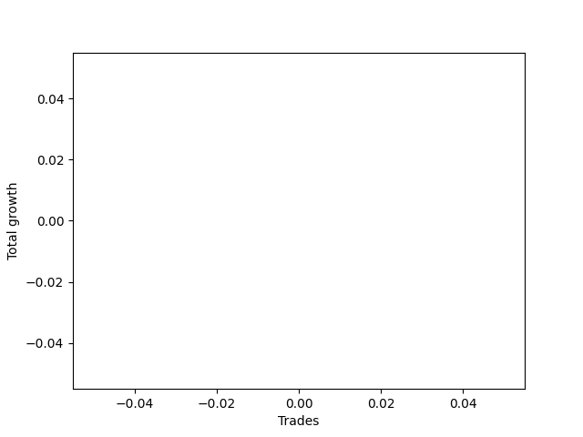

# Short Labrador 001 
- Symbol: ES
- Date Range: 03/18/2022 - 12/30/2022
- Trading Period: 8:30-12:30
- Number of Trades: 1



| Name | Win Percent | Profit | Avg Profit / Trade | Avg Time / Trade |      | Name | Win Percent | Profit | Avg Profit / Trade | Avg Time / Trade |
| ---- | ----------- | ------ | ------------------ | ---------------- | ---- | ---- | ----------- | ------ | ------------------ | ---------------- |
| Sorted By <br> Profit | | | | | | Sorted By <br> Win Percentage ||||
| Three | 100.00 | 16750.00 | 16750.00 | 09:05 |     | Three | 100.00 | 16750.00 | 16750.00 | 09:05 |
| One | 100.00 | 16125.00 | 16125.00 | 08:55 |     | One | 100.00 | 16125.00 | 16125.00 | 08:55 |
| Two_C | 100.00 | 13875.00 | 13875.00 | 24:05 |     | Two_C | 100.00 | 13875.00 | 13875.00 | 24:05 |
| Two | 100.00 | 13875.00 | 13875.00 | 24:05 |     | Two | 100.00 | 13875.00 | 13875.00 | 24:05 |
| Six | 100.00 | 12500.00 | 12500.00 | 05:50 |     | Six | 100.00 | 12500.00 | 12500.00 | 05:50 |
| Zero | 100.00 | 11750.00 | 11750.00 | 03:35 |     | Zero | 100.00 | 11750.00 | 11750.00 | 03:35 |
| MALAMUTE 002 | 100.00 | 5625.00 | 5625.00 | 12:05 |     | MALAMUTE 002 | 100.00 | 5625.00 | 5625.00 | 12:05 |
| MALAMUTE 001 | 100.00 | 4625.00 | 4625.00 | 58:00 |     | MALAMUTE 001 | 100.00 | 4625.00 | 4625.00 | 58:00 |
| NEWFI 000 | 100.00 | 4625.00 | 4625.00 | 58:00 |     | NEWFI 000 | 100.00 | 4625.00 | 4625.00 | 58:00 |
| BB100 | 100.00 | 4625.00 | 4625.00 | 58:00 |     | BB100 | 100.00 | 4625.00 | 4625.00 | 58:00 |
| Seven | 100.00 | 4625.00 | 4625.00 | 58:00 |     | Seven | 100.00 | 4625.00 | 4625.00 | 58:00 |
| Five | 100.00 | 4625.00 | 4625.00 | 58:00 |     | Five | 100.00 | 4625.00 | 4625.00 | 58:00 |
| Four | 100.00 | 4625.00 | 4625.00 | 58:00 |     | Four | 100.00 | 4625.00 | 4625.00 | 58:00 |
| Eighty-Five | 100.00 | 2500.00 | 2500.00 | 01:25 |     | Eighty-Five | 100.00 | 2500.00 | 2500.00 | 01:25 |
| Eighty-Four | 100.00 | 2500.00 | 2500.00 | 01:25 |     | Eighty-Four | 100.00 | 2500.00 | 2500.00 | 01:25 |
| Eighty-Two | 100.00 | 1500.00 | 1500.00 | 01:15 |     | Eighty-Two | 100.00 | 1500.00 | 1500.00 | 01:15 |
| Eighty-Three | 100.00 | 1375.00 | 1375.00 | 01:20 |     | Eighty-Three | 100.00 | 1375.00 | 1375.00 | 01:20 |
| Eighty-One | 100.00 | 375.00 | 375.00 | 01:10 |     | Eighty-One | 100.00 | 375.00 | 375.00 | 01:10 |
| NEWFI 0000 | 0.00 | -10375.00 | -10375.00 | 43:05 |     | NEWFI 0000 | 0.00 | -10375.00 | -10375.00 | 43:05 |

## NO STOPLOSS

### Test Zero
* Sell when price hits the middle line of the 20p bollinger
* No Stoploss
* Results:
```
Total Trades: 1
Percent Up: 0.00
Percent Down: 100.00
Total Points Moved Down: 23.50
Potential Profit: 11750.00
Total Points Ups: 0.00 Count Ups: 0
Total Points Downs: 23.50 Count Downs: 1
```

<details><summary>Trades</summary>

<code>In: 2022-06-15 11:49:00		Out: 2022-06-15 11:52:35		Total Position Time: 03:35		Total Move Down: 23.50		Total to Date: 23.50</code> <br />


</details>

### Test One
* Sell when the price hits the lower line of the 20p 1std bollinger
* No Stoploss
* Results:
```
Total Trades: 1
Percent Up: 0.00
Percent Down: 100.00
Total Points Moved Down: 32.25
Potential Profit: 16125.00
Total Points Ups: 0.00 Count Ups: 0
Total Points Downs: 32.25 Count Downs: 1
```

<details><summary>Trades</summary>

<code>In: 2022-06-15 11:49:00		Out: 2022-06-15 11:57:55		Total Position Time: 08:55		Total Move Down: 32.25		Total to Date: 32.25</code> <br />


</details>

### Test Two
* Sell when the price hits the lower line of the 20p 2std bollinger
* No Stoploss
* Results:
```
Total Trades: 1
Percent Up: 0.00
Percent Down: 100.00
Total Points Moved Down: 27.75
Potential Profit: 13875.00
Total Points Ups: 0.00 Count Ups: 0
Total Points Downs: 27.75 Count Downs: 1
```

<details><summary>Trades</summary>

<code>In: 2022-06-15 11:49:00		Out: 2022-06-15 12:13:05		Total Position Time: 24:05		Total Move Down: 27.75		Total to Date: 27.75</code> <br />


</details>

### Test Two_C
* Sell when the price hits the lower line of the 20p 2std bollinger
* No Stoploss
* Results:
```
Total Trades: 1
Percent Up: 0.00
Percent Down: 100.00
Total Points Moved Down: 27.75
Potential Profit: 13875.00
Total Points Ups: 0.00 Count Ups: 0
Total Points Downs: 27.75 Count Downs: 1
```

<details><summary>Trades</summary>

<code>In: 2022-06-15 11:49:00		Out: 2022-06-15 12:13:05		Total Position Time: 24:05		Total Move Down: 27.75		Total to Date: 27.75</code> <br />


</details>

### Test Three
* Sell when price hits the middle line of the 50p bollinger
* No Stoploss
* Results:
```
Total Trades: 1
Percent Up: 0.00
Percent Down: 100.00
Total Points Moved Down: 33.50
Potential Profit: 16750.00
Total Points Ups: 0.00 Count Ups: 0
Total Points Downs: 33.50 Count Downs: 1
```

<details><summary>Trades</summary>

<code>In: 2022-06-15 11:49:00		Out: 2022-06-15 11:58:05		Total Position Time: 09:05		Total Move Down: 33.50		Total to Date: 33.50</code> <br />


</details>

### Test Four
* Sell when the price hits the lower line of the 50p 1std bollinger
* No Stoploss
* Results:
```
Total Trades: 1
Percent Up: 0.00
Percent Down: 100.00
Total Points Moved Down: 9.25
Potential Profit: 4625.00
Total Points Ups: 0.00 Count Ups: 0
Total Points Downs: 9.25 Count Downs: 1
```

<details><summary>Trades</summary>

<code>In: 2022-06-15 11:49:00		Out: 2022-06-15 12:47:00		Total Position Time: 58:00		Total Move Down: 9.25		Total to Date: 9.25</code> <br />


</details>

### Test Five
* Sell when the price hits the lower line of the 50p 2std bollinger
* No Stoploss
* Results:
```
Total Trades: 1
Percent Up: 0.00
Percent Down: 100.00
Total Points Moved Down: 9.25
Potential Profit: 4625.00
Total Points Ups: 0.00 Count Ups: 0
Total Points Downs: 9.25 Count Downs: 1
```

<details><summary>Trades</summary>

<code>In: 2022-06-15 11:49:00		Out: 2022-06-15 12:47:00		Total Position Time: 58:00		Total Move Down: 9.25		Total to Date: 9.25</code> <br />


</details>

### Test Six
* Sell when the price hits the middle line of the 1std VWAP
* No Stoploss
* Results:
```
Total Trades: 1
Percent Up: 0.00
Percent Down: 100.00
Total Points Moved Down: 25.00
Potential Profit: 12500.00
Total Points Ups: 0.00 Count Ups: 0
Total Points Downs: 25.00 Count Downs: 1
```

<details><summary>Trades</summary>

<code>In: 2022-06-15 11:49:00		Out: 2022-06-15 11:54:50		Total Position Time: 05:50		Total Move Down: 25.00		Total to Date: 25.00</code> <br />


</details>

### Test Seven
* Sell when the price hits the lower line of the 1std VWAP
* No Stoploss
* Results:
```
Total Trades: 1
Percent Up: 0.00
Percent Down: 100.00
Total Points Moved Down: 9.25
Potential Profit: 4625.00
Total Points Ups: 0.00 Count Ups: 0
Total Points Downs: 9.25 Count Downs: 1
```

<details><summary>Trades</summary>

<code>In: 2022-06-15 11:49:00		Out: 2022-06-15 12:47:00		Total Position Time: 58:00		Total Move Down: 9.25		Total to Date: 9.25</code> <br />


</details>

### Test BB100
* Move to BB100 Upper Band
* No Stoploss
* Results:
```
Total Trades: 1
Percent Up: 0.00
Percent Down: 100.00
Total Points Moved Down: 9.25
Potential Profit: 4625.00
Total Points Ups: 0.00 Count Ups: 0
Total Points Downs: 9.25 Count Downs: 1
```

<details><summary>Trades</summary>

<code>In: 2022-06-15 11:49:00		Out: 2022-06-15 12:47:00		Total Position Time: 58:00		Total Move Down: 9.25		Total to Date: 9.25</code> <br />


</details>

## TAKE PROFIT

### Test Eighty-One
* Take Profit of 1 Point
* No Stoploss
* Results:
```
Total Trades: 1
Percent Up: 0.00
Percent Down: 100.00
Total Points Moved Down: 0.75
Potential Profit: 375.00
Total Points Ups: 0.00 Count Ups: 0
Total Points Downs: 0.75 Count Downs: 1
```

<details><summary>Trades</summary>

<code>In: 2022-06-15 11:49:00		Out: 2022-06-15 11:50:10		Total Position Time: 01:10		Total Move Down: 0.75		Total to Date: 0.75</code> <br />


</details>

### Test Eighty-Two
* Take Profit of 2 Point
* No Stoploss
* Results:
```
Total Trades: 1
Percent Up: 0.00
Percent Down: 100.00
Total Points Moved Down: 3.00
Potential Profit: 1500.00
Total Points Ups: 0.00 Count Ups: 0
Total Points Downs: 3.00 Count Downs: 1
```

<details><summary>Trades</summary>

<code>In: 2022-06-15 11:49:00		Out: 2022-06-15 11:50:15		Total Position Time: 01:15		Total Move Down: 3.00		Total to Date: 3.00</code> <br />


</details>

### Test Eighty-Three
* Take Profit of 3 Point
* No Stoploss
* Results:
```
Total Trades: 1
Percent Up: 0.00
Percent Down: 100.00
Total Points Moved Down: 2.75
Potential Profit: 1375.00
Total Points Ups: 0.00 Count Ups: 0
Total Points Downs: 2.75 Count Downs: 1
```

<details><summary>Trades</summary>

<code>In: 2022-06-15 11:49:00		Out: 2022-06-15 11:50:20		Total Position Time: 01:20		Total Move Down: 2.75		Total to Date: 2.75</code> <br />


</details>

### Test Eighty-Four
* Take Profit of 4 Point
* No Stoploss
* Results:
```
Total Trades: 1
Percent Up: 0.00
Percent Down: 100.00
Total Points Moved Down: 5.00
Potential Profit: 2500.00
Total Points Ups: 0.00 Count Ups: 0
Total Points Downs: 5.00 Count Downs: 1
```

<details><summary>Trades</summary>

<code>In: 2022-06-15 11:49:00		Out: 2022-06-15 11:50:25		Total Position Time: 01:25		Total Move Down: 5.00		Total to Date: 5.00</code> <br />


</details>

### Test Eighty-Five
* Take Profit of 5 Point
* No Stoploss
* Results:
```
Total Trades: 1
Percent Up: 0.00
Percent Down: 100.00
Total Points Moved Down: 5.00
Potential Profit: 2500.00
Total Points Ups: 0.00 Count Ups: 0
Total Points Downs: 5.00 Count Downs: 1
```

<details><summary>Trades</summary>

<code>In: 2022-06-15 11:49:00		Out: 2022-06-15 11:50:25		Total Position Time: 01:25		Total Move Down: 5.00		Total to Date: 5.00</code> <br />


</details>

## Indicator Exits

### Test NEWFI 000
* Newfi 0000
* No Stoploss
* Results:
```
Total Trades: 1
Percent Up: 0.00
Percent Down: 100.00
Total Points Moved Down: 9.25
Potential Profit: 4625.00
Total Points Ups: 0.00 Count Ups: 0
Total Points Downs: 9.25 Count Downs: 1
```

<details><summary>Trades</summary>

<code>In: 2022-06-15 11:49:00		Out: 2022-06-15 12:47:00		Total Position Time: 58:00		Total Move Down: 9.25		Total to Date: 9.25</code> <br />


</details>

### Test NEWFI 0000
* Newfi 0000
* No Stoploss
* Results:
```
Total Trades: 1
Percent Up: 100.00
Percent Down: 0.00
Total Points Moved Down: -20.75
Potential Profit: -10375.00
Total Points Ups: 20.75 Count Ups: 1
Total Points Downs: 0.00 Count Downs: 0
```

<details><summary>Trades</summary>

<code>In: 2022-06-15 11:49:00		Out: 2022-06-15 12:32:05		Total Position Time: 43:05		Total Move Down: -20.75		Total to Date: -20.75</code> <br />


</details>

### Test MALAMUTE 001
* Malamute 001
* No Stoploss
* Results:
```
Total Trades: 1
Percent Up: 0.00
Percent Down: 100.00
Total Points Moved Down: 9.25
Potential Profit: 4625.00
Total Points Ups: 0.00 Count Ups: 0
Total Points Downs: 9.25 Count Downs: 1
```

<details><summary>Trades</summary>

<code>In: 2022-06-15 11:49:00		Out: 2022-06-15 12:47:00		Total Position Time: 58:00		Total Move Down: 9.25		Total to Date: 9.25</code> <br />


</details>

### Test MALAMUTE 002
* Malamute 001
* No Stoploss
* Results:
```
Total Trades: 1
Percent Up: 0.00
Percent Down: 100.00
Total Points Moved Down: 11.25
Potential Profit: 5625.00
Total Points Ups: 0.00 Count Ups: 0
Total Points Downs: 11.25 Count Downs: 1
```

<details><summary>Trades</summary>

<code>In: 2022-06-15 11:49:00		Out: 2022-06-15 12:01:05		Total Position Time: 12:05		Total Move Down: 11.25		Total to Date: 11.25</code> <br />


</details>