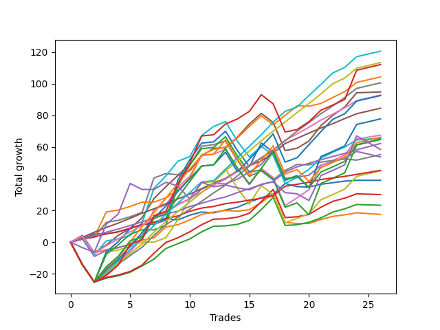

# Short Labrador 002 
- Symbol: ES
- Date Range: 09/26/2022 - 12/30/2022
- Trading Period: 8:30-12:30
- Number of Trades: 9



| Name | Win Percent | Profit | Avg Profit / Trade | Avg Time / Trade |      | Name | Win Percent | Profit | Avg Profit / Trade | Avg Time / Trade |
| ---- | ----------- | ------ | ------------------ | ---------------- | ---- | ---- | ----------- | ------ | ------------------ | ---------------- |
| Sorted By <br> Profit | | | | | | Sorted By <br> Win Percentage ||||
| Four | 100.00 | 23625.00 | 2625.00 | 19:28 |     | Four | 100.00 | 23625.00 | 2625.00 | 19:28 |
| Eighty-Five | 100.00 | 22625.00 | 2513.89 | 22:34 |     | Eighty-Five | 100.00 | 22625.00 | 2513.89 | 22:34 |
| Seven | 100.00 | 20750.00 | 2305.56 | 30:57 |     | Seven | 100.00 | 20750.00 | 2305.56 | 30:57 |
| Eighty-Four | 100.00 | 17625.00 | 1958.33 | 19:36 |     | Eighty-Four | 100.00 | 17625.00 | 1958.33 | 19:36 |
| MALAMUTE 002 | 44.44 | 14625.00 | 1625.00 | 20:11 |     | Eighty-Three | 100.00 | 14500.00 | 1611.11 | 16:13 |
| Eighty-Three | 100.00 | 14500.00 | 1611.11 | 16:13 |     | Eighty-Two | 100.00 | 12250.00 | 1361.11 | 15:12 |
| Eighty-Two | 100.00 | 12250.00 | 1361.11 | 15:12 |     | Eighty-One | 100.00 | 5125.00 | 569.44 | 10:52 |
| Two_C | 88.89 | 8125.00 | 902.78 | 08:30 |     | Two_C | 88.89 | 8125.00 | 902.78 | 08:30 |
| Two | 88.89 | 7250.00 | 805.56 | 08:30 |     | Two | 88.89 | 7250.00 | 805.56 | 08:30 |
| Three | 66.67 | 5375.00 | 597.22 | 12:42 |     | Six | 77.78 | 4375.00 | 486.11 | 11:45 |
| Eighty-One | 100.00 | 5125.00 | 569.44 | 10:52 |     | Five | 77.78 | 4375.00 | 486.11 | 45:53 |
| Six | 77.78 | 4375.00 | 486.11 | 11:45 |     | NEWFI 000 | 77.78 | 3125.00 | 347.22 | 47:26 |
| Five | 77.78 | 4375.00 | 486.11 | 45:53 |     | Three | 66.67 | 5375.00 | 597.22 | 12:42 |
| NEWFI 000 | 77.78 | 3125.00 | 347.22 | 47:26 |     | One | 66.67 | 3000.00 | 333.33 | 05:32 |
| One | 66.67 | 3000.00 | 333.33 | 05:32 |     | BB100 | 66.67 | 1250.00 | 138.89 | 54:04 |
| NEWFI 0000 | 44.44 | 3000.00 | 333.33 | 31:41 |     | Zero | 66.67 | 1250.00 | 138.89 | 03:04 |
| BB100 | 66.67 | 1250.00 | 138.89 | 54:04 |     | MALAMUTE 001 | 66.67 | 125.00 | 13.89 | 55:24 |
| Zero | 66.67 | 1250.00 | 138.89 | 03:04 |     | MALAMUTE 002 | 44.44 | 14625.00 | 1625.00 | 20:11 |
| MALAMUTE 001 | 66.67 | 125.00 | 13.89 | 55:24 |     | NEWFI 0000 | 44.44 | 3000.00 | 333.33 | 31:41 |

## NO STOPLOSS

### Test Zero
* Sell when price hits the middle line of the 20p bollinger
* No Stoploss
* Results:
```
Total Trades: 9
Percent Up: 33.33
Percent Down: 66.67
Total Points Moved Down: 2.50
Potential Profit: 1250.00
Total Points Ups: 2.25 Count Ups: 3
Total Points Downs: 4.75 Count Downs: 6
```

<details><summary>Trades</summary>

<code>In: 2022-10-17 08:44:00		Out: 2022-10-17 08:59:05		Total Position Time: 15:05		Total Move Down: -2.00		Total to Date: -2.00</code> <br />
<code>In: 2022-10-19 11:21:00		Out: 2022-10-19 11:22:10		Total Position Time: 01:10		Total Move Down: -0.25		Total to Date: -2.25</code> <br />
<code>In: 2022-10-27 10:25:00		Out: 2022-10-27 10:26:10		Total Position Time: 01:10		Total Move Down: 1.75		Total to Date: -0.50</code> <br />
<code>In: 2022-11-01 10:25:00		Out: 2022-11-01 10:26:10		Total Position Time: 01:10		Total Move Down: 1.00		Total to Date: 0.50</code> <br />
<code>In: 2022-11-01 12:12:00		Out: 2022-11-01 12:13:10		Total Position Time: 01:10		Total Move Down: 1.00		Total to Date: 1.50</code> <br />
<code>In: 2022-11-18 08:35:00		Out: 2022-11-18 08:37:10		Total Position Time: 02:10		Total Move Down: 0.50		Total to Date: 2.00</code> <br />
<code>In: 2022-11-21 10:24:00		Out: 2022-11-21 10:27:25		Total Position Time: 03:25		Total Move Down: -0.00		Total to Date: 2.00</code> <br />
<code>In: 2022-11-23 10:51:00		Out: 2022-11-23 10:52:10		Total Position Time: 01:10		Total Move Down: 0.25		Total to Date: 2.25</code> <br />
<code>In: 2022-11-23 10:51:00		Out: 2022-11-23 10:52:10		Total Position Time: 01:10		Total Move Down: 0.25		Total to Date: 2.50</code> <br />


</details>

### Test One
* Sell when the price hits the lower line of the 20p 1std bollinger
* No Stoploss
* Results:
```
Total Trades: 9
Percent Up: 33.33
Percent Down: 66.67
Total Points Moved Down: 6.00
Potential Profit: 3000.00
Total Points Ups: 1.25 Count Ups: 3
Total Points Downs: 7.25 Count Downs: 6
```

<details><summary>Trades</summary>

<code>In: 2022-10-17 08:44:00		Out: 2022-10-17 09:04:15		Total Position Time: 20:15		Total Move Down: -0.75		Total to Date: -0.75</code> <br />
<code>In: 2022-10-19 11:21:00		Out: 2022-10-19 11:28:05		Total Position Time: 07:05		Total Move Down: -0.00		Total to Date: -0.75</code> <br />
<code>In: 2022-10-27 10:25:00		Out: 2022-10-27 10:26:20		Total Position Time: 01:20		Total Move Down: 2.50		Total to Date: 1.75</code> <br />
<code>In: 2022-11-01 10:25:00		Out: 2022-11-01 10:30:05		Total Position Time: 05:05		Total Move Down: 2.00		Total to Date: 3.75</code> <br />
<code>In: 2022-11-01 12:12:00		Out: 2022-11-01 12:14:30		Total Position Time: 02:30		Total Move Down: 1.00		Total to Date: 4.75</code> <br />
<code>In: 2022-11-18 08:35:00		Out: 2022-11-18 08:37:20		Total Position Time: 02:20		Total Move Down: 1.25		Total to Date: 6.00</code> <br />
<code>In: 2022-11-21 10:24:00		Out: 2022-11-21 10:33:00		Total Position Time: 09:00		Total Move Down: -0.50		Total to Date: 5.50</code> <br />
<code>In: 2022-11-23 10:51:00		Out: 2022-11-23 10:52:10		Total Position Time: 01:10		Total Move Down: 0.25		Total to Date: 5.75</code> <br />
<code>In: 2022-11-23 10:51:00		Out: 2022-11-23 10:52:10		Total Position Time: 01:10		Total Move Down: 0.25		Total to Date: 6.00</code> <br />


</details>

### Test Two
* Sell when the price hits the lower line of the 20p 2std bollinger
* No Stoploss
* Results:
```
Total Trades: 9
Percent Up: 11.11
Percent Down: 88.89
Total Points Moved Down: 14.50
Potential Profit: 7250.00
Total Points Ups: 0.25 Count Ups: 1
Total Points Downs: 14.75 Count Downs: 8
```

<details><summary>Trades</summary>

<code>In: 2022-10-17 08:44:00		Out: 2022-10-17 09:12:25		Total Position Time: 28:25		Total Move Down: 0.50		Total to Date: 0.50</code> <br />
<code>In: 2022-10-19 11:21:00		Out: 2022-10-19 11:40:50		Total Position Time: 19:50		Total Move Down: 1.50		Total to Date: 2.00</code> <br />
<code>In: 2022-10-27 10:25:00		Out: 2022-10-27 10:27:05		Total Position Time: 02:05		Total Move Down: 2.75		Total to Date: 4.75</code> <br />
<code>In: 2022-11-01 10:25:00		Out: 2022-11-01 10:31:40		Total Position Time: 06:40		Total Move Down: 3.75		Total to Date: 8.50</code> <br />
<code>In: 2022-11-01 12:12:00		Out: 2022-11-01 12:16:15		Total Position Time: 04:15		Total Move Down: 2.00		Total to Date: 10.50</code> <br />
<code>In: 2022-11-18 08:35:00		Out: 2022-11-18 08:38:05		Total Position Time: 03:05		Total Move Down: 2.75		Total to Date: 13.25</code> <br />
<code>In: 2022-11-21 10:24:00		Out: 2022-11-21 10:33:10		Total Position Time: 09:10		Total Move Down: -0.25		Total to Date: 13.00</code> <br />
<code>In: 2022-11-23 10:51:00		Out: 2022-11-23 10:52:30		Total Position Time: 01:30		Total Move Down: 0.75		Total to Date: 13.75</code> <br />
<code>In: 2022-11-23 10:51:00		Out: 2022-11-23 10:52:30		Total Position Time: 01:30		Total Move Down: 0.75		Total to Date: 14.50</code> <br />


</details>

### Test Two_C
* Sell when the price hits the lower line of the 20p 2std bollinger
* No Stoploss
* Results:
```
Total Trades: 9
Percent Up: 11.11
Percent Down: 88.89
Total Points Moved Down: 16.25
Potential Profit: 8125.00
Total Points Ups: 0.25 Count Ups: 1
Total Points Downs: 16.50 Count Downs: 8
```

<details><summary>Trades</summary>

<code>In: 2022-10-17 08:44:00		Out: 2022-10-17 09:12:25		Total Position Time: 28:25		Total Move Down: 0.50		Total to Date: 0.50</code> <br />
<code>In: 2022-10-19 11:21:00		Out: 2022-10-19 11:40:50		Total Position Time: 19:50		Total Move Down: 1.50		Total to Date: 2.00</code> <br />
<code>In: 2022-10-27 10:25:00		Out: 2022-10-27 10:27:10		Total Position Time: 02:10		Total Move Down: 4.50		Total to Date: 6.50</code> <br />
<code>In: 2022-11-01 10:25:00		Out: 2022-11-01 10:31:40		Total Position Time: 06:40		Total Move Down: 3.75		Total to Date: 10.25</code> <br />
<code>In: 2022-11-01 12:12:00		Out: 2022-11-01 12:16:15		Total Position Time: 04:15		Total Move Down: 2.00		Total to Date: 12.25</code> <br />
<code>In: 2022-11-18 08:35:00		Out: 2022-11-18 08:38:05		Total Position Time: 03:05		Total Move Down: 2.75		Total to Date: 15.00</code> <br />
<code>In: 2022-11-21 10:24:00		Out: 2022-11-21 10:33:10		Total Position Time: 09:10		Total Move Down: -0.25		Total to Date: 14.75</code> <br />
<code>In: 2022-11-23 10:51:00		Out: 2022-11-23 10:52:30		Total Position Time: 01:30		Total Move Down: 0.75		Total to Date: 15.50</code> <br />
<code>In: 2022-11-23 10:51:00		Out: 2022-11-23 10:52:30		Total Position Time: 01:30		Total Move Down: 0.75		Total to Date: 16.25</code> <br />


</details>

### Test Three
* Sell when price hits the middle line of the 50p bollinger
* No Stoploss
* Results:
```
Total Trades: 9
Percent Up: 33.33
Percent Down: 66.67
Total Points Moved Down: 10.75
Potential Profit: 5375.00
Total Points Ups: 6.25 Count Ups: 3
Total Points Downs: 17.00 Count Downs: 6
```

<details><summary>Trades</summary>

<code>In: 2022-10-17 08:44:00		Out: 2022-10-17 09:12:25		Total Position Time: 28:25		Total Move Down: 0.50		Total to Date: 0.50</code> <br />
<code>In: 2022-10-19 11:21:00		Out: 2022-10-19 11:40:50		Total Position Time: 19:50		Total Move Down: 1.50		Total to Date: 2.00</code> <br />
<code>In: 2022-10-27 10:25:00		Out: 2022-10-27 10:28:15		Total Position Time: 03:15		Total Move Down: 6.25		Total to Date: 8.25</code> <br />
<code>In: 2022-11-01 10:25:00		Out: 2022-11-01 10:30:55		Total Position Time: 05:55		Total Move Down: 2.25		Total to Date: 10.50</code> <br />
<code>In: 2022-11-01 12:12:00		Out: 2022-11-01 12:16:15		Total Position Time: 04:15		Total Move Down: 2.00		Total to Date: 12.50</code> <br />
<code>In: 2022-11-18 08:35:00		Out: 2022-11-18 08:38:30		Total Position Time: 03:30		Total Move Down: 4.50		Total to Date: 17.00</code> <br />
<code>In: 2022-11-21 10:24:00		Out: 2022-11-21 10:54:25		Total Position Time: 30:25		Total Move Down: -1.75		Total to Date: 15.25</code> <br />
<code>In: 2022-11-23 10:51:00		Out: 2022-11-23 11:00:25		Total Position Time: 09:25		Total Move Down: -2.25		Total to Date: 13.00</code> <br />
<code>In: 2022-11-23 10:51:00		Out: 2022-11-23 11:00:25		Total Position Time: 09:25		Total Move Down: -2.25		Total to Date: 10.75</code> <br />


</details>

### Test Four
* Sell when the price hits the lower line of the 50p 1std bollinger
* No Stoploss
* Results:
```
Total Trades: 9
Percent Up: 0.00
Percent Down: 100.00
Total Points Moved Down: 47.25
Potential Profit: 23625.00
Total Points Ups: 0.00 Count Ups: 0
Total Points Downs: 47.25 Count Downs: 9
```

<details><summary>Trades</summary>

<code>In: 2022-10-17 08:44:00		Out: 2022-10-17 09:19:00		Total Position Time: 35:00		Total Move Down: 1.50		Total to Date: 1.50</code> <br />
<code>In: 2022-10-19 11:21:00		Out: 2022-10-19 11:47:05		Total Position Time: 26:05		Total Move Down: 4.50		Total to Date: 6.00</code> <br />
<code>In: 2022-10-27 10:25:00		Out: 2022-10-27 10:37:15		Total Position Time: 12:15		Total Move Down: 9.75		Total to Date: 15.75</code> <br />
<code>In: 2022-11-01 10:25:00		Out: 2022-11-01 10:36:00		Total Position Time: 11:00		Total Move Down: 6.50		Total to Date: 22.25</code> <br />
<code>In: 2022-11-01 12:12:00		Out: 2022-11-01 12:32:40		Total Position Time: 20:40		Total Move Down: 5.25		Total to Date: 27.50</code> <br />
<code>In: 2022-11-18 08:35:00		Out: 2022-11-18 08:49:50		Total Position Time: 14:50		Total Move Down: 9.00		Total to Date: 36.50</code> <br />
<code>In: 2022-11-21 10:24:00		Out: 2022-11-21 10:59:25		Total Position Time: 35:25		Total Move Down: 0.25		Total to Date: 36.75</code> <br />
<code>In: 2022-11-23 10:51:00		Out: 2022-11-23 11:01:00		Total Position Time: 10:00		Total Move Down: 5.25		Total to Date: 42.00</code> <br />
<code>In: 2022-11-23 10:51:00		Out: 2022-11-23 11:01:00		Total Position Time: 10:00		Total Move Down: 5.25		Total to Date: 47.25</code> <br />


</details>

### Test Five
* Sell when the price hits the lower line of the 50p 2std bollinger
* No Stoploss
* Results:
```
Total Trades: 9
Percent Up: 22.22
Percent Down: 77.78
Total Points Moved Down: 8.75
Potential Profit: 4375.00
Total Points Ups: 34.50 Count Ups: 2
Total Points Downs: 43.25 Count Downs: 7
```

<details><summary>Trades</summary>

<code>In: 2022-10-17 08:44:00		Out: 2022-10-17 09:22:05		Total Position Time: 38:05		Total Move Down: 5.00		Total to Date: 5.00</code> <br />
<code>In: 2022-10-19 11:21:00		Out: 2022-10-19 11:53:05		Total Position Time: 32:05		Total Move Down: 5.00		Total to Date: 10.00</code> <br />
<code>In: 2022-10-27 10:25:00		Out: 2022-10-27 10:59:35		Total Position Time: 34:35		Total Move Down: 15.25		Total to Date: 25.25</code> <br />
<code>In: 2022-11-01 10:25:00		Out: 2022-11-01 11:25:55		Total Position Time: 60:55		Total Move Down: 3.25		Total to Date: 28.50</code> <br />
<code>In: 2022-11-01 12:12:00		Out: 2022-11-01 12:47:00		Total Position Time: 35:00		Total Move Down: 3.50		Total to Date: 32.00</code> <br />
<code>In: 2022-11-18 08:35:00		Out: 2022-11-18 09:07:20		Total Position Time: 32:20		Total Move Down: 10.00		Total to Date: 42.00</code> <br />
<code>In: 2022-11-21 10:24:00		Out: 2022-11-21 11:22:10		Total Position Time: 58:10		Total Move Down: 1.25		Total to Date: 43.25</code> <br />
<code>In: 2022-11-23 10:51:00		Out: 2022-11-23 11:51:55		Total Position Time: 60:55		Total Move Down: -17.25		Total to Date: 26.00</code> <br />
<code>In: 2022-11-23 10:51:00		Out: 2022-11-23 11:51:55		Total Position Time: 60:55		Total Move Down: -17.25		Total to Date: 8.75</code> <br />


</details>

### Test Six
* Sell when the price hits the middle line of the 1std VWAP
* No Stoploss
* Results:
```
Total Trades: 9
Percent Up: 22.22
Percent Down: 77.78
Total Points Moved Down: 8.75
Potential Profit: 4375.00
Total Points Ups: 1.00 Count Ups: 2
Total Points Downs: 9.75 Count Downs: 7
```

<details><summary>Trades</summary>

<code>In: 2022-10-17 08:44:00		Out: 2022-10-17 09:20:40		Total Position Time: 36:40		Total Move Down: 3.75		Total to Date: 3.75</code> <br />
<code>In: 2022-10-19 11:21:00		Out: 2022-10-19 11:22:10		Total Position Time: 01:10		Total Move Down: -0.25		Total to Date: 3.50</code> <br />
<code>In: 2022-10-27 10:25:00		Out: 2022-10-27 10:26:10		Total Position Time: 01:10		Total Move Down: 1.75		Total to Date: 5.25</code> <br />
<code>In: 2022-11-01 10:25:00		Out: 2022-11-01 10:26:10		Total Position Time: 01:10		Total Move Down: 1.00		Total to Date: 6.25</code> <br />
<code>In: 2022-11-01 12:12:00		Out: 2022-11-01 12:13:10		Total Position Time: 01:10		Total Move Down: 1.00		Total to Date: 7.25</code> <br />
<code>In: 2022-11-18 08:35:00		Out: 2022-11-18 08:36:10		Total Position Time: 01:10		Total Move Down: -0.75		Total to Date: 6.50</code> <br />
<code>In: 2022-11-21 10:24:00		Out: 2022-11-21 11:24:55		Total Position Time: 60:55		Total Move Down: 1.75		Total to Date: 8.25</code> <br />
<code>In: 2022-11-23 10:51:00		Out: 2022-11-23 10:52:10		Total Position Time: 01:10		Total Move Down: 0.25		Total to Date: 8.50</code> <br />
<code>In: 2022-11-23 10:51:00		Out: 2022-11-23 10:52:10		Total Position Time: 01:10		Total Move Down: 0.25		Total to Date: 8.75</code> <br />


</details>

### Test Seven
* Sell when the price hits the lower line of the 1std VWAP
* No Stoploss
* Results:
```
Total Trades: 9
Percent Up: 0.00
Percent Down: 100.00
Total Points Moved Down: 41.50
Potential Profit: 20750.00
Total Points Ups: 0.00 Count Ups: 0
Total Points Downs: 41.50 Count Downs: 9
```

<details><summary>Trades</summary>

<code>In: 2022-10-17 08:44:00		Out: 2022-10-17 09:44:55		Total Position Time: 60:55		Total Move Down: 2.75		Total to Date: 2.75</code> <br />
<code>In: 2022-10-19 11:21:00		Out: 2022-10-19 11:41:20		Total Position Time: 20:20		Total Move Down: 3.00		Total to Date: 5.75</code> <br />
<code>In: 2022-10-27 10:25:00		Out: 2022-10-27 10:33:15		Total Position Time: 08:15		Total Move Down: 8.75		Total to Date: 14.50</code> <br />
<code>In: 2022-11-01 10:25:00		Out: 2022-11-01 11:25:55		Total Position Time: 60:55		Total Move Down: 3.25		Total to Date: 17.75</code> <br />
<code>In: 2022-11-01 12:12:00		Out: 2022-11-01 12:47:00		Total Position Time: 35:00		Total Move Down: 3.50		Total to Date: 21.25</code> <br />
<code>In: 2022-11-18 08:35:00		Out: 2022-11-18 08:47:20		Total Position Time: 12:20		Total Move Down: 8.00		Total to Date: 29.25</code> <br />
<code>In: 2022-11-21 10:24:00		Out: 2022-11-21 11:24:55		Total Position Time: 60:55		Total Move Down: 1.75		Total to Date: 31.00</code> <br />
<code>In: 2022-11-23 10:51:00		Out: 2022-11-23 11:01:00		Total Position Time: 10:00		Total Move Down: 5.25		Total to Date: 36.25</code> <br />
<code>In: 2022-11-23 10:51:00		Out: 2022-11-23 11:01:00		Total Position Time: 10:00		Total Move Down: 5.25		Total to Date: 41.50</code> <br />


</details>

### Test BB100
* Move to BB100 Upper Band
* No Stoploss
* Results:
```
Total Trades: 9
Percent Up: 33.33
Percent Down: 66.67
Total Points Moved Down: 2.50
Potential Profit: 1250.00
Total Points Ups: 42.00 Count Ups: 3
Total Points Downs: 44.50 Count Downs: 6
```

<details><summary>Trades</summary>

<code>In: 2022-10-17 08:44:00		Out: 2022-10-17 09:44:55		Total Position Time: 60:55		Total Move Down: 2.75		Total to Date: 2.75</code> <br />
<code>In: 2022-10-19 11:21:00		Out: 2022-10-19 12:21:55		Total Position Time: 60:55		Total Move Down: -7.50		Total to Date: -4.75</code> <br />
<code>In: 2022-10-27 10:25:00		Out: 2022-10-27 11:10:50		Total Position Time: 45:50		Total Move Down: 19.75		Total to Date: 15.00</code> <br />
<code>In: 2022-11-01 10:25:00		Out: 2022-11-01 11:25:55		Total Position Time: 60:55		Total Move Down: 3.25		Total to Date: 18.25</code> <br />
<code>In: 2022-11-01 12:12:00		Out: 2022-11-01 12:47:00		Total Position Time: 35:00		Total Move Down: 3.50		Total to Date: 21.75</code> <br />
<code>In: 2022-11-18 08:35:00		Out: 2022-11-18 09:15:20		Total Position Time: 40:20		Total Move Down: 13.50		Total to Date: 35.25</code> <br />
<code>In: 2022-11-21 10:24:00		Out: 2022-11-21 11:24:55		Total Position Time: 60:55		Total Move Down: 1.75		Total to Date: 37.00</code> <br />
<code>In: 2022-11-23 10:51:00		Out: 2022-11-23 11:51:55		Total Position Time: 60:55		Total Move Down: -17.25		Total to Date: 19.75</code> <br />
<code>In: 2022-11-23 10:51:00		Out: 2022-11-23 11:51:55		Total Position Time: 60:55		Total Move Down: -17.25		Total to Date: 2.50</code> <br />


</details>

## TAKE PROFIT

### Test Eighty-One
* Take Profit of 1 Point
* No Stoploss
* Results:
```
Total Trades: 9
Percent Up: 0.00
Percent Down: 100.00
Total Points Moved Down: 10.25
Potential Profit: 5125.00
Total Points Ups: 0.00 Count Ups: 0
Total Points Downs: 10.25 Count Downs: 9
```

<details><summary>Trades</summary>

<code>In: 2022-10-17 08:44:00		Out: 2022-10-17 09:12:30		Total Position Time: 28:30		Total Move Down: 1.25		Total to Date: 1.25</code> <br />
<code>In: 2022-10-19 11:21:00		Out: 2022-10-19 11:22:40		Total Position Time: 01:40		Total Move Down: 1.25		Total to Date: 2.50</code> <br />
<code>In: 2022-10-27 10:25:00		Out: 2022-10-27 10:26:10		Total Position Time: 01:10		Total Move Down: 1.75		Total to Date: 4.25</code> <br />
<code>In: 2022-11-01 10:25:00		Out: 2022-11-01 10:26:10		Total Position Time: 01:10		Total Move Down: 1.00		Total to Date: 5.25</code> <br />
<code>In: 2022-11-01 12:12:00		Out: 2022-11-01 12:13:50		Total Position Time: 01:50		Total Move Down: 1.00		Total to Date: 6.25</code> <br />
<code>In: 2022-11-18 08:35:00		Out: 2022-11-18 08:37:20		Total Position Time: 02:20		Total Move Down: 1.25		Total to Date: 7.50</code> <br />
<code>In: 2022-11-21 10:24:00		Out: 2022-11-21 11:22:10		Total Position Time: 58:10		Total Move Down: 1.25		Total to Date: 8.75</code> <br />
<code>In: 2022-11-23 10:51:00		Out: 2022-11-23 10:52:30		Total Position Time: 01:30		Total Move Down: 0.75		Total to Date: 9.50</code> <br />
<code>In: 2022-11-23 10:51:00		Out: 2022-11-23 10:52:30		Total Position Time: 01:30		Total Move Down: 0.75		Total to Date: 10.25</code> <br />


</details>

### Test Eighty-Two
* Take Profit of 2 Point
* No Stoploss
* Results:
```
Total Trades: 9
Percent Up: 0.00
Percent Down: 100.00
Total Points Moved Down: 24.50
Potential Profit: 12250.00
Total Points Ups: 0.00 Count Ups: 0
Total Points Downs: 24.50 Count Downs: 9
```

<details><summary>Trades</summary>

<code>In: 2022-10-17 08:44:00		Out: 2022-10-17 09:12:40		Total Position Time: 28:40		Total Move Down: 3.25		Total to Date: 3.25</code> <br />
<code>In: 2022-10-19 11:21:00		Out: 2022-10-19 11:40:55		Total Position Time: 19:55		Total Move Down: 2.25		Total to Date: 5.50</code> <br />
<code>In: 2022-10-27 10:25:00		Out: 2022-10-27 10:26:15		Total Position Time: 01:15		Total Move Down: 2.25		Total to Date: 7.75</code> <br />
<code>In: 2022-11-01 10:25:00		Out: 2022-11-01 10:27:05		Total Position Time: 02:05		Total Move Down: 2.00		Total to Date: 9.75</code> <br />
<code>In: 2022-11-01 12:12:00		Out: 2022-11-01 12:16:15		Total Position Time: 04:15		Total Move Down: 2.00		Total to Date: 11.75</code> <br />
<code>In: 2022-11-18 08:35:00		Out: 2022-11-18 08:37:30		Total Position Time: 02:30		Total Move Down: 2.25		Total to Date: 14.00</code> <br />
<code>In: 2022-11-21 10:24:00		Out: 2022-11-21 11:22:25		Total Position Time: 58:25		Total Move Down: 2.00		Total to Date: 16.00</code> <br />
<code>In: 2022-11-23 10:51:00		Out: 2022-11-23 11:00:55		Total Position Time: 09:55		Total Move Down: 4.25		Total to Date: 20.25</code> <br />
<code>In: 2022-11-23 10:51:00		Out: 2022-11-23 11:00:55		Total Position Time: 09:55		Total Move Down: 4.25		Total to Date: 24.50</code> <br />


</details>

### Test Eighty-Three
* Take Profit of 3 Point
* No Stoploss
* Results:
```
Total Trades: 9
Percent Up: 0.00
Percent Down: 100.00
Total Points Moved Down: 29.00
Potential Profit: 14500.00
Total Points Ups: 0.00 Count Ups: 0
Total Points Downs: 29.00 Count Downs: 9
```

<details><summary>Trades</summary>

<code>In: 2022-10-17 08:44:00		Out: 2022-10-17 09:12:40		Total Position Time: 28:40		Total Move Down: 3.25		Total to Date: 3.25</code> <br />
<code>In: 2022-10-19 11:21:00		Out: 2022-10-19 11:41:15		Total Position Time: 20:15		Total Move Down: 3.25		Total to Date: 6.50</code> <br />
<code>In: 2022-10-27 10:25:00		Out: 2022-10-27 10:26:40		Total Position Time: 01:40		Total Move Down: 3.25		Total to Date: 9.75</code> <br />
<code>In: 2022-11-01 10:25:00		Out: 2022-11-01 10:31:35		Total Position Time: 06:35		Total Move Down: 2.75		Total to Date: 12.50</code> <br />
<code>In: 2022-11-01 12:12:00		Out: 2022-11-01 12:17:10		Total Position Time: 05:10		Total Move Down: 3.25		Total to Date: 15.75</code> <br />
<code>In: 2022-11-18 08:35:00		Out: 2022-11-18 08:38:00		Total Position Time: 03:00		Total Move Down: 3.00		Total to Date: 18.75</code> <br />
<code>In: 2022-11-21 10:24:00		Out: 2022-11-21 11:24:55		Total Position Time: 60:55		Total Move Down: 1.75		Total to Date: 20.50</code> <br />
<code>In: 2022-11-23 10:51:00		Out: 2022-11-23 11:00:55		Total Position Time: 09:55		Total Move Down: 4.25		Total to Date: 24.75</code> <br />
<code>In: 2022-11-23 10:51:00		Out: 2022-11-23 11:00:55		Total Position Time: 09:55		Total Move Down: 4.25		Total to Date: 29.00</code> <br />


</details>

### Test Eighty-Four
* Take Profit of 4 Point
* No Stoploss
* Results:
```
Total Trades: 9
Percent Up: 0.00
Percent Down: 100.00
Total Points Moved Down: 35.25
Potential Profit: 17625.00
Total Points Ups: 0.00 Count Ups: 0
Total Points Downs: 35.25 Count Downs: 9
```

<details><summary>Trades</summary>

<code>In: 2022-10-17 08:44:00		Out: 2022-10-17 09:21:25		Total Position Time: 37:25		Total Move Down: 4.00		Total to Date: 4.00</code> <br />
<code>In: 2022-10-19 11:21:00		Out: 2022-10-19 11:47:00		Total Position Time: 26:00		Total Move Down: 4.25		Total to Date: 8.25</code> <br />
<code>In: 2022-10-27 10:25:00		Out: 2022-10-27 10:27:10		Total Position Time: 02:10		Total Move Down: 4.50		Total to Date: 12.75</code> <br />
<code>In: 2022-11-01 10:25:00		Out: 2022-11-01 10:34:10		Total Position Time: 09:10		Total Move Down: 3.75		Total to Date: 16.50</code> <br />
<code>In: 2022-11-01 12:12:00		Out: 2022-11-01 12:29:30		Total Position Time: 17:30		Total Move Down: 4.00		Total to Date: 20.50</code> <br />
<code>In: 2022-11-18 08:35:00		Out: 2022-11-18 08:38:30		Total Position Time: 03:30		Total Move Down: 4.50		Total to Date: 25.00</code> <br />
<code>In: 2022-11-21 10:24:00		Out: 2022-11-21 11:24:55		Total Position Time: 60:55		Total Move Down: 1.75		Total to Date: 26.75</code> <br />
<code>In: 2022-11-23 10:51:00		Out: 2022-11-23 11:00:55		Total Position Time: 09:55		Total Move Down: 4.25		Total to Date: 31.00</code> <br />
<code>In: 2022-11-23 10:51:00		Out: 2022-11-23 11:00:55		Total Position Time: 09:55		Total Move Down: 4.25		Total to Date: 35.25</code> <br />


</details>

### Test Eighty-Five
* Take Profit of 5 Point
* No Stoploss
* Results:
```
Total Trades: 9
Percent Up: 0.00
Percent Down: 100.00
Total Points Moved Down: 45.25
Potential Profit: 22625.00
Total Points Ups: 0.00 Count Ups: 0
Total Points Downs: 45.25 Count Downs: 9
```

<details><summary>Trades</summary>

<code>In: 2022-10-17 08:44:00		Out: 2022-10-17 09:43:35		Total Position Time: 59:35		Total Move Down: 6.00		Total to Date: 6.00</code> <br />
<code>In: 2022-10-19 11:21:00		Out: 2022-10-19 11:49:15		Total Position Time: 28:15		Total Move Down: 5.50		Total to Date: 11.50</code> <br />
<code>In: 2022-10-27 10:25:00		Out: 2022-10-27 10:27:30		Total Position Time: 02:30		Total Move Down: 5.50		Total to Date: 17.00</code> <br />
<code>In: 2022-11-01 10:25:00		Out: 2022-11-01 10:34:45		Total Position Time: 09:45		Total Move Down: 5.00		Total to Date: 22.00</code> <br />
<code>In: 2022-11-01 12:12:00		Out: 2022-11-01 12:29:50		Total Position Time: 17:50		Total Move Down: 5.25		Total to Date: 27.25</code> <br />
<code>In: 2022-11-18 08:35:00		Out: 2022-11-18 08:39:20		Total Position Time: 04:20		Total Move Down: 5.75		Total to Date: 33.00</code> <br />
<code>In: 2022-11-21 10:24:00		Out: 2022-11-21 11:24:55		Total Position Time: 60:55		Total Move Down: 1.75		Total to Date: 34.75</code> <br />
<code>In: 2022-11-23 10:51:00		Out: 2022-11-23 11:01:00		Total Position Time: 10:00		Total Move Down: 5.25		Total to Date: 40.00</code> <br />
<code>In: 2022-11-23 10:51:00		Out: 2022-11-23 11:01:00		Total Position Time: 10:00		Total Move Down: 5.25		Total to Date: 45.25</code> <br />


</details>

## Indicator Exits

### Test NEWFI 000
* Newfi 0000
* No Stoploss
* Results:
```
Total Trades: 9
Percent Up: 22.22
Percent Down: 77.78
Total Points Moved Down: 6.25
Potential Profit: 3125.00
Total Points Ups: 34.50 Count Ups: 2
Total Points Downs: 40.75 Count Downs: 7
```

<details><summary>Trades</summary>

<code>In: 2022-10-17 08:44:00		Out: 2022-10-17 09:25:05		Total Position Time: 41:05		Total Move Down: 1.50		Total to Date: 1.50</code> <br />
<code>In: 2022-10-19 11:21:00		Out: 2022-10-19 11:57:05		Total Position Time: 36:05		Total Move Down: 5.00		Total to Date: 6.50</code> <br />
<code>In: 2022-10-27 10:25:00		Out: 2022-10-27 10:43:05		Total Position Time: 18:05		Total Move Down: 7.25		Total to Date: 13.75</code> <br />
<code>In: 2022-11-01 10:25:00		Out: 2022-11-01 11:25:55		Total Position Time: 60:55		Total Move Down: 3.25		Total to Date: 17.00</code> <br />
<code>In: 2022-11-01 12:12:00		Out: 2022-11-01 12:47:00		Total Position Time: 35:00		Total Move Down: 3.50		Total to Date: 20.50</code> <br />
<code>In: 2022-11-18 08:35:00		Out: 2022-11-18 09:28:05		Total Position Time: 53:05		Total Move Down: 18.50		Total to Date: 39.00</code> <br />
<code>In: 2022-11-21 10:24:00		Out: 2022-11-21 11:24:55		Total Position Time: 60:55		Total Move Down: 1.75		Total to Date: 40.75</code> <br />
<code>In: 2022-11-23 10:51:00		Out: 2022-11-23 11:51:55		Total Position Time: 60:55		Total Move Down: -17.25		Total to Date: 23.50</code> <br />
<code>In: 2022-11-23 10:51:00		Out: 2022-11-23 11:51:55		Total Position Time: 60:55		Total Move Down: -17.25		Total to Date: 6.25</code> <br />


</details>

### Test NEWFI 0000
* Newfi 0000
* No Stoploss
* Results:
```
Total Trades: 9
Percent Up: 55.56
Percent Down: 44.44
Total Points Moved Down: 6.00
Potential Profit: 3000.00
Total Points Ups: 34.75 Count Ups: 5
Total Points Downs: 40.75 Count Downs: 4
```

<details><summary>Trades</summary>

<code>In: 2022-10-17 08:44:00		Out: 2022-10-17 08:45:05		Total Position Time: 01:05		Total Move Down: -0.75		Total to Date: -0.75</code> <br />
<code>In: 2022-10-19 11:21:00		Out: 2022-10-19 11:35:05		Total Position Time: 14:05		Total Move Down: -4.25		Total to Date: -5.00</code> <br />
<code>In: 2022-10-27 10:25:00		Out: 2022-10-27 11:25:55		Total Position Time: 60:55		Total Move Down: 15.75		Total to Date: 10.75</code> <br />
<code>In: 2022-11-01 10:25:00		Out: 2022-11-01 11:25:55		Total Position Time: 60:55		Total Move Down: 3.25		Total to Date: 14.00</code> <br />
<code>In: 2022-11-01 12:12:00		Out: 2022-11-01 12:47:00		Total Position Time: 35:00		Total Move Down: 3.50		Total to Date: 17.50</code> <br />
<code>In: 2022-11-18 08:35:00		Out: 2022-11-18 09:35:55		Total Position Time: 60:55		Total Move Down: 18.25		Total to Date: 35.75</code> <br />
<code>In: 2022-11-21 10:24:00		Out: 2022-11-21 10:42:05		Total Position Time: 18:05		Total Move Down: -4.25		Total to Date: 31.50</code> <br />
<code>In: 2022-11-23 10:51:00		Out: 2022-11-23 11:08:05		Total Position Time: 17:05		Total Move Down: -12.75		Total to Date: 18.75</code> <br />
<code>In: 2022-11-23 10:51:00		Out: 2022-11-23 11:08:05		Total Position Time: 17:05		Total Move Down: -12.75		Total to Date: 6.00</code> <br />


</details>

### Test MALAMUTE 001
* Malamute 001
* No Stoploss
* Results:
```
Total Trades: 9
Percent Up: 33.33
Percent Down: 66.67
Total Points Moved Down: 0.25
Potential Profit: 125.00
Total Points Ups: 42.25 Count Ups: 3
Total Points Downs: 42.50 Count Downs: 6
```

<details><summary>Trades</summary>

<code>In: 2022-10-17 08:44:00		Out: 2022-10-17 09:44:55		Total Position Time: 60:55		Total Move Down: 2.75		Total to Date: 2.75</code> <br />
<code>In: 2022-10-19 11:21:00		Out: 2022-10-19 12:20:05		Total Position Time: 59:05		Total Move Down: -7.75		Total to Date: -5.00</code> <br />
<code>In: 2022-10-27 10:25:00		Out: 2022-10-27 11:25:55		Total Position Time: 60:55		Total Move Down: 15.75		Total to Date: 10.75</code> <br />
<code>In: 2022-11-01 10:25:00		Out: 2022-11-01 11:04:05		Total Position Time: 39:05		Total Move Down: 0.50		Total to Date: 11.25</code> <br />
<code>In: 2022-11-01 12:12:00		Out: 2022-11-01 12:47:00		Total Position Time: 35:00		Total Move Down: 3.50		Total to Date: 14.75</code> <br />
<code>In: 2022-11-18 08:35:00		Out: 2022-11-18 09:35:55		Total Position Time: 60:55		Total Move Down: 18.25		Total to Date: 33.00</code> <br />
<code>In: 2022-11-21 10:24:00		Out: 2022-11-21 11:24:55		Total Position Time: 60:55		Total Move Down: 1.75		Total to Date: 34.75</code> <br />
<code>In: 2022-11-23 10:51:00		Out: 2022-11-23 11:51:55		Total Position Time: 60:55		Total Move Down: -17.25		Total to Date: 17.50</code> <br />
<code>In: 2022-11-23 10:51:00		Out: 2022-11-23 11:51:55		Total Position Time: 60:55		Total Move Down: -17.25		Total to Date: 0.25</code> <br />


</details>

### Test MALAMUTE 002
* Malamute 001
* No Stoploss
* Results:
```
Total Trades: 9
Percent Up: 55.56
Percent Down: 44.44
Total Points Moved Down: 29.25
Potential Profit: 14625.00
Total Points Ups: 6.50 Count Ups: 5
Total Points Downs: 35.75 Count Downs: 4
```

<details><summary>Trades</summary>

<code>In: 2022-10-17 08:44:00		Out: 2022-10-17 09:44:05		Total Position Time: 60:05		Total Move Down: 6.00		Total to Date: 6.00</code> <br />
<code>In: 2022-10-19 11:21:00		Out: 2022-10-19 11:26:05		Total Position Time: 05:05		Total Move Down: -4.00		Total to Date: 2.00</code> <br />
<code>In: 2022-10-27 10:25:00		Out: 2022-10-27 10:41:05		Total Position Time: 16:05		Total Move Down: 7.25		Total to Date: 9.25</code> <br />
<code>In: 2022-11-01 10:25:00		Out: 2022-11-01 10:41:05		Total Position Time: 16:05		Total Move Down: 4.25		Total to Date: 13.50</code> <br />
<code>In: 2022-11-01 12:12:00		Out: 2022-11-01 12:20:05		Total Position Time: 08:05		Total Move Down: -0.25		Total to Date: 13.25</code> <br />
<code>In: 2022-11-18 08:35:00		Out: 2022-11-18 09:35:05		Total Position Time: 60:05		Total Move Down: 18.25		Total to Date: 31.50</code> <br />
<code>In: 2022-11-21 10:24:00		Out: 2022-11-21 10:28:05		Total Position Time: 04:05		Total Move Down: -1.75		Total to Date: 29.75</code> <br />
<code>In: 2022-11-23 10:51:00		Out: 2022-11-23 10:57:05		Total Position Time: 06:05		Total Move Down: -0.25		Total to Date: 29.50</code> <br />
<code>In: 2022-11-23 10:51:00		Out: 2022-11-23 10:57:05		Total Position Time: 06:05		Total Move Down: -0.25		Total to Date: 29.25</code> <br />


</details>