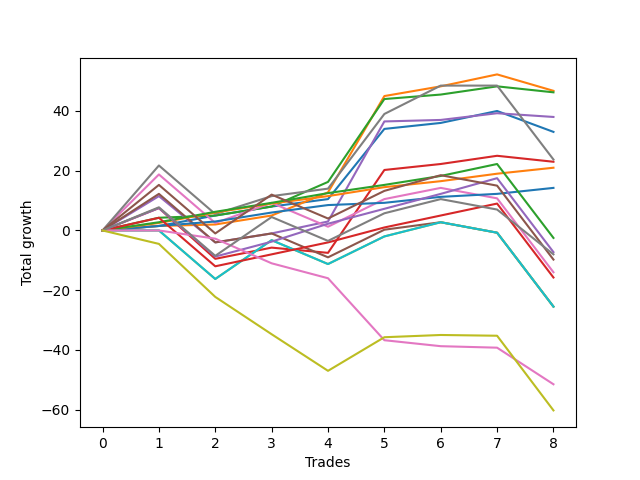

# Short Labrador 003 
- Symbol: ES
- Date Range: 03/18/2022 - 12/30/2022
- Trading Period: 8:30-12:30
- Number of Trades: 7



| Name | Win Percent | Profit | Avg Profit / Trade | Avg Time / Trade |      | Name | Win Percent | Profit | Avg Profit / Trade | Avg Time / Trade |
| ---- | ----------- | ------ | ------------------ | ---------------- | ---- | ---- | ----------- | ------ | ------------------ | ---------------- |
| Sorted By <br> Profit | | | | | | Sorted By <br> Win Percentage ||||
| V Mid | 100.00 | 21000.00 | 3000.00 | 23:05 |     | V Mid | 100.00 | 21000.00 | 3000.00 | 23:05 |
| TP-9 | 85.71 | 14500.00 | 2071.43 | 30:19 |     | TP-3 | 100.00 | 9750.00 | 1392.86 | 11:10 |
| TP-8 | 85.71 | 11875.00 | 1696.43 | 29:56 |     | TP-2 | 100.00 | 8250.00 | 1178.57 | 10:06 |
| TP-3 | 100.00 | 9750.00 | 1392.86 | 11:10 |     | TP-1 | 100.00 | 6125.00 | 875.00 | 09:35 |
| TP-7 | 85.71 | 9625.00 | 1375.00 | 27:27 |     | TP-9 | 85.71 | 14500.00 | 2071.43 | 30:19 |
| TP-2 | 100.00 | 8250.00 | 1178.57 | 10:06 |     | TP-8 | 85.71 | 11875.00 | 1696.43 | 29:56 |
| NEWFI 000 | 71.43 | 8250.00 | 1178.57 | 43:09 |     | TP-7 | 85.71 | 9625.00 | 1375.00 | 27:27 |
| TP-6 | 85.71 | 7500.00 | 1071.43 | 26:32 |     | TP-6 | 85.71 | 7500.00 | 1071.43 | 26:32 |
| TP-1 | 100.00 | 6125.00 | 875.00 | 09:35 |     | TP-5 | 85.71 | 5875.00 | 839.29 | 26:19 |
| BB-50 U/L 2SD | 71.43 | 6125.00 | 875.00 | 40:00 |     | BB-20 Mid | 85.71 | 5500.00 | 785.71 | 01:49 |
| TP-5 | 85.71 | 5875.00 | 839.29 | 26:19 |     | TP-4 | 85.71 | 1625.00 | 232.14 | 22:37 |
| TP-10 | 71.43 | 5875.00 | 839.29 | 39:12 |     | NEWFI 000 | 71.43 | 8250.00 | 1178.57 | 43:09 |
| BB-20 Mid | 85.71 | 5500.00 | 785.71 | 01:49 |     | BB-50 U/L 2SD | 71.43 | 6125.00 | 875.00 | 40:00 |
| BB-100 Mid | 71.43 | 3625.00 | 517.86 | 33:46 |     | TP-10 | 71.43 | 5875.00 | 839.29 | 39:12 |
| BB-50 Mid | 71.43 | 1875.00 | 267.86 | 20:07 |     | BB-100 Mid | 71.43 | 3625.00 | 517.86 | 33:46 |
| TP-4 | 85.71 | 1625.00 | 232.14 | 22:37 |     | BB-50 Mid | 71.43 | 1875.00 | 267.86 | 20:07 |
| BB-20 U/L 2SD | 71.43 | 1000.00 | 142.86 | 17:40 |     | BB-20 U/L 2SD | 71.43 | 1000.00 | 142.86 | 17:40 |
| BB-50 U/L 1SD | 71.43 | 375.00 | 53.57 | 32:11 |     | BB-50 U/L 1SD | 71.43 | 375.00 | 53.57 | 32:11 |
| BB-200 Mid | 71.43 | 125.00 | 17.86 | 36:08 |     | BB-200 Mid | 71.43 | 125.00 | 17.86 | 36:08 |
| BB-20 U/L 1SD | 71.43 | -375.00 | -53.57 | 09:32 |     | BB-20 U/L 1SD | 71.43 | -375.00 | -53.57 | 09:32 |
| BB-20 U/L 2SD C | 57.14 | -1500.00 | -214.29 | 23:40 |     | BB-20 U/L 2SD C | 57.14 | -1500.00 | -214.29 | 23:40 |
| BB-200 U/L 2SD | 57.14 | -2000.00 | -285.71 | 52:56 |     | BB-200 U/L 2SD | 57.14 | -2000.00 | -285.71 | 52:56 |
| BB-100 U/L 2SD | 57.14 | -2000.00 | -285.71 | 52:56 |     | BB-100 U/L 2SD | 57.14 | -2000.00 | -285.71 | 52:56 |
| V U/L 1SD | 57.14 | -2000.00 | -285.71 | 52:56 |     | V U/L 1SD | 57.14 | -2000.00 | -285.71 | 52:56 |
| NEWFI 0000 | 14.29 | -12625.00 | -1803.57 | 29:19 |     | NEWFI 0000 | 14.29 | -12625.00 | -1803.57 | 29:19 |

## NO STOPLOSS

### Test BB-20 Mid
* Sell when price hits the middle line of the 20p bollinger
* No Stoploss
* Results:
```
Total Trades: 7
Percent Up: 14.29
Percent Down: 85.71
Total Points Moved Down: 11.00
Potential Profit: 5500.00
Total Points Ups: 0.00 Count Ups: 1
Total Points Downs: 11.00 Count Downs: 6
```

<details><summary>Trades</summary>

<code>In: 2022-05-10 11:07:00		Out: 2022-05-10 11:08:10		Total Position Time: 01:10		Total Move Down: 1.50		Total to Date: 1.50</code> <br />
<code>In: 2022-06-10 12:22:00		Out: 2022-06-10 12:23:10		Total Position Time: 01:10		Total Move Down: 3.00		Total to Date: 4.50</code> <br />
<code>In: 2022-06-13 08:47:00		Out: 2022-06-13 08:48:10		Total Position Time: 01:10		Total Move Down: 2.50		Total to Date: 7.00</code> <br />
<code>In: 2022-08-05 10:19:00		Out: 2022-08-05 10:20:10		Total Position Time: 01:10		Total Move Down: 2.00		Total to Date: 9.00</code> <br />
<code>In: 2022-10-06 09:52:00		Out: 2022-10-06 09:55:05		Total Position Time: 03:05		Total Move Down: 0.25		Total to Date: 9.25</code> <br />
<code>In: 2022-11-21 10:24:00		Out: 2022-11-21 10:27:25		Total Position Time: 03:25		Total Move Down: -0.00		Total to Date: 9.25</code> <br />
<code>In: 2022-12-16 12:06:00		Out: 2022-12-16 12:07:35		Total Position Time: 01:35		Total Move Down: 1.75		Total to Date: 11.00</code> <br />


</details>

### Test BB-20 U/L 1SD
* Sell when the price hits the lower line of the 20p 1std bollinger
* No Stoploss
* Results:
```
Total Trades: 7
Percent Up: 28.57
Percent Down: 71.43
Total Points Moved Down: -0.75
Potential Profit: -375.00
Total Points Ups: 19.00 Count Ups: 2
Total Points Downs: 18.25 Count Downs: 5
```

<details><summary>Trades</summary>

<code>In: 2022-05-10 11:07:00		Out: 2022-05-10 11:08:10		Total Position Time: 01:10		Total Move Down: 1.50		Total to Date: 1.50</code> <br />
<code>In: 2022-06-10 12:22:00		Out: 2022-06-10 12:23:10		Total Position Time: 01:10		Total Move Down: 3.00		Total to Date: 4.50</code> <br />
<code>In: 2022-06-13 08:47:00		Out: 2022-06-13 08:52:05		Total Position Time: 05:05		Total Move Down: 7.75		Total to Date: 12.25</code> <br />
<code>In: 2022-08-05 10:19:00		Out: 2022-08-05 10:23:15		Total Position Time: 04:15		Total Move Down: 3.25		Total to Date: 15.50</code> <br />
<code>In: 2022-10-06 09:52:00		Out: 2022-10-06 09:57:05		Total Position Time: 05:05		Total Move Down: 2.75		Total to Date: 18.25</code> <br />
<code>In: 2022-11-21 10:24:00		Out: 2022-11-21 10:33:00		Total Position Time: 09:00		Total Move Down: -0.50		Total to Date: 17.75</code> <br />
<code>In: 2022-12-16 12:06:00		Out: 2022-12-16 12:47:00		Total Position Time: 41:00		Total Move Down: -18.50		Total to Date: -0.75</code> <br />


</details>

### Test BB-20 U/L 2SD
* Sell when the price hits the lower line of the 20p 2std bollinger
* No Stoploss
* Results:
```
Total Trades: 7
Percent Up: 28.57
Percent Down: 71.43
Total Points Moved Down: 2.00
Potential Profit: 1000.00
Total Points Ups: 18.75 Count Ups: 2
Total Points Downs: 20.75 Count Downs: 5
```

<details><summary>Trades</summary>

<code>In: 2022-05-10 11:07:00		Out: 2022-05-10 11:11:10		Total Position Time: 04:10		Total Move Down: 4.25		Total to Date: 4.25</code> <br />
<code>In: 2022-06-10 12:22:00		Out: 2022-06-10 12:42:45		Total Position Time: 20:45		Total Move Down: 3.00		Total to Date: 7.25</code> <br />
<code>In: 2022-06-13 08:47:00		Out: 2022-06-13 08:55:10		Total Position Time: 08:10		Total Move Down: 8.25		Total to Date: 15.50</code> <br />
<code>In: 2022-08-05 10:19:00		Out: 2022-08-05 10:49:30		Total Position Time: 30:30		Total Move Down: 1.50		Total to Date: 17.00</code> <br />
<code>In: 2022-10-06 09:52:00		Out: 2022-10-06 10:02:00		Total Position Time: 10:00		Total Move Down: 3.75		Total to Date: 20.75</code> <br />
<code>In: 2022-11-21 10:24:00		Out: 2022-11-21 10:33:10		Total Position Time: 09:10		Total Move Down: -0.25		Total to Date: 20.50</code> <br />
<code>In: 2022-12-16 12:06:00		Out: 2022-12-16 12:47:00		Total Position Time: 41:00		Total Move Down: -18.50		Total to Date: 2.00</code> <br />


</details>

### Test BB-20 U/L 2SD C
* Sell when the price hits the lower line of the 20p 2std bollinger
* No Stoploss
* Results:
```
Total Trades: 7
Percent Up: 42.86
Percent Down: 57.14
Total Points Moved Down: -3.00
Potential Profit: -1500.00
Total Points Ups: 20.50 Count Ups: 3
Total Points Downs: 17.50 Count Downs: 4
```

<details><summary>Trades</summary>

<code>In: 2022-05-10 11:07:00		Out: 2022-05-10 11:16:05		Total Position Time: 09:05		Total Move Down: 7.50		Total to Date: 7.50</code> <br />
<code>In: 2022-06-10 12:22:00		Out: 2022-06-10 12:43:10		Total Position Time: 21:10		Total Move Down: 3.75		Total to Date: 11.25</code> <br />
<code>In: 2022-06-13 08:47:00		Out: 2022-06-13 09:30:35		Total Position Time: 43:35		Total Move Down: -1.75		Total to Date: 9.50</code> <br />
<code>In: 2022-08-05 10:19:00		Out: 2022-08-05 10:50:35		Total Position Time: 31:35		Total Move Down: 2.00		Total to Date: 11.50</code> <br />
<code>In: 2022-10-06 09:52:00		Out: 2022-10-06 10:02:05		Total Position Time: 10:05		Total Move Down: 4.25		Total to Date: 15.75</code> <br />
<code>In: 2022-11-21 10:24:00		Out: 2022-11-21 10:33:10		Total Position Time: 09:10		Total Move Down: -0.25		Total to Date: 15.50</code> <br />
<code>In: 2022-12-16 12:06:00		Out: 2022-12-16 12:47:00		Total Position Time: 41:00		Total Move Down: -18.50		Total to Date: -3.00</code> <br />


</details>

### Test BB-50 Mid
* Sell when price hits the middle line of the 50p bollinger
* No Stoploss
* Results:
```
Total Trades: 7
Percent Up: 28.57
Percent Down: 71.43
Total Points Moved Down: 3.75
Potential Profit: 1875.00
Total Points Ups: 20.25 Count Ups: 2
Total Points Downs: 24.00 Count Downs: 5
```

<details><summary>Trades</summary>

<code>In: 2022-05-10 11:07:00		Out: 2022-05-10 11:16:20		Total Position Time: 09:20		Total Move Down: 11.50		Total to Date: 11.50</code> <br />
<code>In: 2022-06-10 12:22:00		Out: 2022-06-10 12:23:10		Total Position Time: 01:10		Total Move Down: 3.00		Total to Date: 14.50</code> <br />
<code>In: 2022-06-13 08:47:00		Out: 2022-06-13 09:07:15		Total Position Time: 20:15		Total Move Down: 4.00		Total to Date: 18.50</code> <br />
<code>In: 2022-08-05 10:19:00		Out: 2022-08-05 10:47:35		Total Position Time: 28:35		Total Move Down: 0.50		Total to Date: 19.00</code> <br />
<code>In: 2022-10-06 09:52:00		Out: 2022-10-06 10:02:10		Total Position Time: 10:10		Total Move Down: 5.00		Total to Date: 24.00</code> <br />
<code>In: 2022-11-21 10:24:00		Out: 2022-11-21 10:54:25		Total Position Time: 30:25		Total Move Down: -1.75		Total to Date: 22.25</code> <br />
<code>In: 2022-12-16 12:06:00		Out: 2022-12-16 12:47:00		Total Position Time: 41:00		Total Move Down: -18.50		Total to Date: 3.75</code> <br />


</details>

### Test BB-50 U/L 1SD
* Sell when the price hits the lower line of the 50p 1std bollinger
* No Stoploss
* Results:
```
Total Trades: 7
Percent Up: 28.57
Percent Down: 71.43
Total Points Moved Down: 0.75
Potential Profit: 375.00
Total Points Ups: 26.50 Count Ups: 2
Total Points Downs: 27.25 Count Downs: 5
```

<details><summary>Trades</summary>

<code>In: 2022-05-10 11:07:00		Out: 2022-05-10 11:24:05		Total Position Time: 17:05		Total Move Down: 12.25		Total to Date: 12.25</code> <br />
<code>In: 2022-06-10 12:22:00		Out: 2022-06-10 12:42:40		Total Position Time: 20:40		Total Move Down: 3.00		Total to Date: 15.25</code> <br />
<code>In: 2022-06-13 08:47:00		Out: 2022-06-13 09:47:55		Total Position Time: 60:55		Total Move Down: -8.00		Total to Date: 7.25</code> <br />
<code>In: 2022-08-05 10:19:00		Out: 2022-08-05 10:52:05		Total Position Time: 33:05		Total Move Down: 2.50		Total to Date: 9.75</code> <br />
<code>In: 2022-10-06 09:52:00		Out: 2022-10-06 10:09:10		Total Position Time: 17:10		Total Move Down: 9.25		Total to Date: 19.00</code> <br />
<code>In: 2022-11-21 10:24:00		Out: 2022-11-21 10:59:25		Total Position Time: 35:25		Total Move Down: 0.25		Total to Date: 19.25</code> <br />
<code>In: 2022-12-16 12:06:00		Out: 2022-12-16 12:47:00		Total Position Time: 41:00		Total Move Down: -18.50		Total to Date: 0.75</code> <br />


</details>

### Test BB-50 U/L 2SD
* Sell when the price hits the lower line of the 50p 2std bollinger
* No Stoploss
* Results:
```
Total Trades: 7
Percent Up: 28.57
Percent Down: 71.43
Total Points Moved Down: 12.25
Potential Profit: 6125.00
Total Points Ups: 26.50 Count Ups: 2
Total Points Downs: 38.75 Count Downs: 5
```

<details><summary>Trades</summary>

<code>In: 2022-05-10 11:07:00		Out: 2022-05-10 11:27:05		Total Position Time: 20:05		Total Move Down: 18.75		Total to Date: 18.75</code> <br />
<code>In: 2022-06-10 12:22:00		Out: 2022-06-10 12:44:30		Total Position Time: 22:30		Total Move Down: 6.75		Total to Date: 25.50</code> <br />
<code>In: 2022-06-13 08:47:00		Out: 2022-06-13 09:47:55		Total Position Time: 60:55		Total Move Down: -8.00		Total to Date: 17.50</code> <br />
<code>In: 2022-08-05 10:19:00		Out: 2022-08-05 10:55:40		Total Position Time: 36:40		Total Move Down: 3.75		Total to Date: 21.25</code> <br />
<code>In: 2022-10-06 09:52:00		Out: 2022-10-06 10:32:45		Total Position Time: 40:45		Total Move Down: 8.25		Total to Date: 29.50</code> <br />
<code>In: 2022-11-21 10:24:00		Out: 2022-11-21 11:22:10		Total Position Time: 58:10		Total Move Down: 1.25		Total to Date: 30.75</code> <br />
<code>In: 2022-12-16 12:06:00		Out: 2022-12-16 12:47:00		Total Position Time: 41:00		Total Move Down: -18.50		Total to Date: 12.25</code> <br />


</details>

### Test V Mid
* Sell when the price hits the middle line of the 1std VWAP
* No Stoploss
* Results:
```
Total Trades: 7
Percent Up: 0.00
Percent Down: 100.00
Total Points Moved Down: 42.00
Potential Profit: 21000.00
Total Points Ups: 0.00 Count Ups: 0
Total Points Downs: 42.00 Count Downs: 7
```

<details><summary>Trades</summary>

<code>In: 2022-05-10 11:07:00		Out: 2022-05-10 11:27:40		Total Position Time: 20:40		Total Move Down: 21.75		Total to Date: 21.75</code> <br />
<code>In: 2022-06-10 12:22:00		Out: 2022-06-10 12:43:55		Total Position Time: 21:55		Total Move Down: 6.00		Total to Date: 27.75</code> <br />
<code>In: 2022-06-13 08:47:00		Out: 2022-06-13 08:48:10		Total Position Time: 01:10		Total Move Down: 2.50		Total to Date: 30.25</code> <br />
<code>In: 2022-08-05 10:19:00		Out: 2022-08-05 11:11:45		Total Position Time: 52:45		Total Move Down: 9.50		Total to Date: 39.75</code> <br />
<code>In: 2022-10-06 09:52:00		Out: 2022-10-06 09:55:05		Total Position Time: 03:05		Total Move Down: 0.25		Total to Date: 40.00</code> <br />
<code>In: 2022-11-21 10:24:00		Out: 2022-11-21 11:24:55		Total Position Time: 60:55		Total Move Down: 1.75		Total to Date: 41.75</code> <br />
<code>In: 2022-12-16 12:06:00		Out: 2022-12-16 12:07:10		Total Position Time: 01:10		Total Move Down: 0.25		Total to Date: 42.00</code> <br />


</details>

### Test V U/L 1SD
* Sell when the price hits the lower line of the 1std VWAP
* No Stoploss
* Results:
```
Total Trades: 7
Percent Up: 42.86
Percent Down: 57.14
Total Points Moved Down: -4.00
Potential Profit: -2000.00
Total Points Ups: 26.50 Count Ups: 3
Total Points Downs: 22.50 Count Downs: 4
```

<details><summary>Trades</summary>

<code>In: 2022-05-10 11:07:00		Out: 2022-05-10 12:07:55		Total Position Time: 60:55		Total Move Down: -0.00		Total to Date: 0.00</code> <br />
<code>In: 2022-06-10 12:22:00		Out: 2022-06-10 12:47:00		Total Position Time: 25:00		Total Move Down: 13.00		Total to Date: 13.00</code> <br />
<code>In: 2022-06-13 08:47:00		Out: 2022-06-13 09:47:55		Total Position Time: 60:55		Total Move Down: -8.00		Total to Date: 5.00</code> <br />
<code>In: 2022-08-05 10:19:00		Out: 2022-08-05 11:19:55		Total Position Time: 60:55		Total Move Down: 4.75		Total to Date: 9.75</code> <br />
<code>In: 2022-10-06 09:52:00		Out: 2022-10-06 10:52:55		Total Position Time: 60:55		Total Move Down: 3.00		Total to Date: 12.75</code> <br />
<code>In: 2022-11-21 10:24:00		Out: 2022-11-21 11:24:55		Total Position Time: 60:55		Total Move Down: 1.75		Total to Date: 14.50</code> <br />
<code>In: 2022-12-16 12:06:00		Out: 2022-12-16 12:47:00		Total Position Time: 41:00		Total Move Down: -18.50		Total to Date: -4.00</code> <br />


</details>

### Test BB-100 Mid
* Move to BB100 Mid
* No Stoploss
* Results:
```
Total Trades: 7
Percent Up: 28.57
Percent Down: 71.43
Total Points Moved Down: 7.25
Potential Profit: 3625.00
Total Points Ups: 26.50 Count Ups: 2
Total Points Downs: 33.75 Count Downs: 5
```

<details><summary>Trades</summary>

<code>In: 2022-05-10 11:07:00		Out: 2022-05-10 11:40:30		Total Position Time: 33:30		Total Move Down: 22.00		Total to Date: 22.00</code> <br />
<code>In: 2022-06-10 12:22:00		Out: 2022-06-10 12:23:10		Total Position Time: 01:10		Total Move Down: 3.00		Total to Date: 25.00</code> <br />
<code>In: 2022-06-13 08:47:00		Out: 2022-06-13 09:47:55		Total Position Time: 60:55		Total Move Down: -8.00		Total to Date: 17.00</code> <br />
<code>In: 2022-08-05 10:19:00		Out: 2022-08-05 10:56:25		Total Position Time: 37:25		Total Move Down: 6.00		Total to Date: 23.00</code> <br />
<code>In: 2022-10-06 09:52:00		Out: 2022-10-06 09:56:20		Total Position Time: 04:20		Total Move Down: 2.25		Total to Date: 25.25</code> <br />
<code>In: 2022-11-21 10:24:00		Out: 2022-11-21 11:22:05		Total Position Time: 58:05		Total Move Down: 0.50		Total to Date: 25.75</code> <br />
<code>In: 2022-12-16 12:06:00		Out: 2022-12-16 12:47:00		Total Position Time: 41:00		Total Move Down: -18.50		Total to Date: 7.25</code> <br />


</details>

### Test BB-100 U/L 2SD
* Move to BB100 Upper Band
* No Stoploss
* Results:
```
Total Trades: 7
Percent Up: 42.86
Percent Down: 57.14
Total Points Moved Down: -4.00
Potential Profit: -2000.00
Total Points Ups: 26.50 Count Ups: 3
Total Points Downs: 22.50 Count Downs: 4
```

<details><summary>Trades</summary>

<code>In: 2022-05-10 11:07:00		Out: 2022-05-10 12:07:55		Total Position Time: 60:55		Total Move Down: -0.00		Total to Date: 0.00</code> <br />
<code>In: 2022-06-10 12:22:00		Out: 2022-06-10 12:47:00		Total Position Time: 25:00		Total Move Down: 13.00		Total to Date: 13.00</code> <br />
<code>In: 2022-06-13 08:47:00		Out: 2022-06-13 09:47:55		Total Position Time: 60:55		Total Move Down: -8.00		Total to Date: 5.00</code> <br />
<code>In: 2022-08-05 10:19:00		Out: 2022-08-05 11:19:55		Total Position Time: 60:55		Total Move Down: 4.75		Total to Date: 9.75</code> <br />
<code>In: 2022-10-06 09:52:00		Out: 2022-10-06 10:52:55		Total Position Time: 60:55		Total Move Down: 3.00		Total to Date: 12.75</code> <br />
<code>In: 2022-11-21 10:24:00		Out: 2022-11-21 11:24:55		Total Position Time: 60:55		Total Move Down: 1.75		Total to Date: 14.50</code> <br />
<code>In: 2022-12-16 12:06:00		Out: 2022-12-16 12:47:00		Total Position Time: 41:00		Total Move Down: -18.50		Total to Date: -4.00</code> <br />


</details>

### Test BB-200 Mid
* Move to BB200 Mid
* No Stoploss
* Results:
```
Total Trades: 7
Percent Up: 28.57
Percent Down: 71.43
Total Points Moved Down: 0.25
Potential Profit: 125.00
Total Points Ups: 18.50 Count Ups: 2
Total Points Downs: 18.75 Count Downs: 5
```

<details><summary>Trades</summary>

<code>In: 2022-05-10 11:07:00		Out: 2022-05-10 12:07:55		Total Position Time: 60:55		Total Move Down: -0.00		Total to Date: 0.00</code> <br />
<code>In: 2022-06-10 12:22:00		Out: 2022-06-10 12:45:45		Total Position Time: 23:45		Total Move Down: 7.50		Total to Date: 7.50</code> <br />
<code>In: 2022-06-13 08:47:00		Out: 2022-06-13 08:48:10		Total Position Time: 01:10		Total Move Down: 2.50		Total to Date: 10.00</code> <br />
<code>In: 2022-08-05 10:19:00		Out: 2022-08-05 11:19:55		Total Position Time: 60:55		Total Move Down: 4.75		Total to Date: 14.75</code> <br />
<code>In: 2022-10-06 09:52:00		Out: 2022-10-06 09:56:20		Total Position Time: 04:20		Total Move Down: 2.25		Total to Date: 17.00</code> <br />
<code>In: 2022-11-21 10:24:00		Out: 2022-11-21 11:24:55		Total Position Time: 60:55		Total Move Down: 1.75		Total to Date: 18.75</code> <br />
<code>In: 2022-12-16 12:06:00		Out: 2022-12-16 12:47:00		Total Position Time: 41:00		Total Move Down: -18.50		Total to Date: 0.25</code> <br />


</details>

### Test BB-200 U/L 2SD
* Move to BB200 Upper Band
* No Stoploss
* Results:
```
Total Trades: 7
Percent Up: 42.86
Percent Down: 57.14
Total Points Moved Down: -4.00
Potential Profit: -2000.00
Total Points Ups: 26.50 Count Ups: 3
Total Points Downs: 22.50 Count Downs: 4
```

<details><summary>Trades</summary>

<code>In: 2022-05-10 11:07:00		Out: 2022-05-10 12:07:55		Total Position Time: 60:55		Total Move Down: -0.00		Total to Date: 0.00</code> <br />
<code>In: 2022-06-10 12:22:00		Out: 2022-06-10 12:47:00		Total Position Time: 25:00		Total Move Down: 13.00		Total to Date: 13.00</code> <br />
<code>In: 2022-06-13 08:47:00		Out: 2022-06-13 09:47:55		Total Position Time: 60:55		Total Move Down: -8.00		Total to Date: 5.00</code> <br />
<code>In: 2022-08-05 10:19:00		Out: 2022-08-05 11:19:55		Total Position Time: 60:55		Total Move Down: 4.75		Total to Date: 9.75</code> <br />
<code>In: 2022-10-06 09:52:00		Out: 2022-10-06 10:52:55		Total Position Time: 60:55		Total Move Down: 3.00		Total to Date: 12.75</code> <br />
<code>In: 2022-11-21 10:24:00		Out: 2022-11-21 11:24:55		Total Position Time: 60:55		Total Move Down: 1.75		Total to Date: 14.50</code> <br />
<code>In: 2022-12-16 12:06:00		Out: 2022-12-16 12:47:00		Total Position Time: 41:00		Total Move Down: -18.50		Total to Date: -4.00</code> <br />


</details>

## TAKE PROFIT

### Test TP-1
* Take Profit of 1 Point
* No Stoploss
* Results:
```
Total Trades: 7
Percent Up: 0.00
Percent Down: 100.00
Total Points Moved Down: 12.25
Potential Profit: 6125.00
Total Points Ups: 0.00 Count Ups: 0
Total Points Downs: 12.25 Count Downs: 7
```

<details><summary>Trades</summary>

<code>In: 2022-05-10 11:07:00		Out: 2022-05-10 11:08:10		Total Position Time: 01:10		Total Move Down: 1.50		Total to Date: 1.50</code> <br />
<code>In: 2022-06-10 12:22:00		Out: 2022-06-10 12:23:10		Total Position Time: 01:10		Total Move Down: 3.00		Total to Date: 4.50</code> <br />
<code>In: 2022-06-13 08:47:00		Out: 2022-06-13 08:48:10		Total Position Time: 01:10		Total Move Down: 2.50		Total to Date: 7.00</code> <br />
<code>In: 2022-08-05 10:19:00		Out: 2022-08-05 10:20:10		Total Position Time: 01:10		Total Move Down: 2.00		Total to Date: 9.00</code> <br />
<code>In: 2022-10-06 09:52:00		Out: 2022-10-06 09:55:00		Total Position Time: 03:00		Total Move Down: 1.00		Total to Date: 10.00</code> <br />
<code>In: 2022-11-21 10:24:00		Out: 2022-11-21 11:22:10		Total Position Time: 58:10		Total Move Down: 1.25		Total to Date: 11.25</code> <br />
<code>In: 2022-12-16 12:06:00		Out: 2022-12-16 12:07:20		Total Position Time: 01:20		Total Move Down: 1.00		Total to Date: 12.25</code> <br />


</details>

### Test TP-2
* Take Profit of 2 Point
* No Stoploss
* Results:
```
Total Trades: 7
Percent Up: 0.00
Percent Down: 100.00
Total Points Moved Down: 16.50
Potential Profit: 8250.00
Total Points Ups: 0.00 Count Ups: 0
Total Points Downs: 16.50 Count Downs: 7
```

<details><summary>Trades</summary>

<code>In: 2022-05-10 11:07:00		Out: 2022-05-10 11:09:55		Total Position Time: 02:55		Total Move Down: 2.50		Total to Date: 2.50</code> <br />
<code>In: 2022-06-10 12:22:00		Out: 2022-06-10 12:23:10		Total Position Time: 01:10		Total Move Down: 3.00		Total to Date: 5.50</code> <br />
<code>In: 2022-06-13 08:47:00		Out: 2022-06-13 08:48:10		Total Position Time: 01:10		Total Move Down: 2.50		Total to Date: 8.00</code> <br />
<code>In: 2022-08-05 10:19:00		Out: 2022-08-05 10:20:10		Total Position Time: 01:10		Total Move Down: 2.00		Total to Date: 10.00</code> <br />
<code>In: 2022-10-06 09:52:00		Out: 2022-10-06 09:56:15		Total Position Time: 04:15		Total Move Down: 2.25		Total to Date: 12.25</code> <br />
<code>In: 2022-11-21 10:24:00		Out: 2022-11-21 11:22:25		Total Position Time: 58:25		Total Move Down: 2.00		Total to Date: 14.25</code> <br />
<code>In: 2022-12-16 12:06:00		Out: 2022-12-16 12:07:40		Total Position Time: 01:40		Total Move Down: 2.25		Total to Date: 16.50</code> <br />


</details>

### Test TP-3
* Take Profit of 3 Point
* No Stoploss
* Results:
```
Total Trades: 7
Percent Up: 0.00
Percent Down: 100.00
Total Points Moved Down: 19.50
Potential Profit: 9750.00
Total Points Ups: 0.00 Count Ups: 0
Total Points Downs: 19.50 Count Downs: 7
```

<details><summary>Trades</summary>

<code>In: 2022-05-10 11:07:00		Out: 2022-05-10 11:10:15		Total Position Time: 03:15		Total Move Down: 2.75		Total to Date: 2.75</code> <br />
<code>In: 2022-06-10 12:22:00		Out: 2022-06-10 12:23:10		Total Position Time: 01:10		Total Move Down: 3.00		Total to Date: 5.75</code> <br />
<code>In: 2022-06-13 08:47:00		Out: 2022-06-13 08:51:10		Total Position Time: 04:10		Total Move Down: 3.25		Total to Date: 9.00</code> <br />
<code>In: 2022-08-05 10:19:00		Out: 2022-08-05 10:20:45		Total Position Time: 01:45		Total Move Down: 3.00		Total to Date: 12.00</code> <br />
<code>In: 2022-10-06 09:52:00		Out: 2022-10-06 09:57:00		Total Position Time: 05:00		Total Move Down: 2.75		Total to Date: 14.75</code> <br />
<code>In: 2022-11-21 10:24:00		Out: 2022-11-21 11:24:55		Total Position Time: 60:55		Total Move Down: 1.75		Total to Date: 16.50</code> <br />
<code>In: 2022-12-16 12:06:00		Out: 2022-12-16 12:07:55		Total Position Time: 01:55		Total Move Down: 3.00		Total to Date: 19.50</code> <br />


</details>

### Test TP-4
* Take Profit of 4 Point
* No Stoploss
* Results:
```
Total Trades: 7
Percent Up: 14.29
Percent Down: 85.71
Total Points Moved Down: 3.25
Potential Profit: 1625.00
Total Points Ups: 18.50 Count Ups: 1
Total Points Downs: 21.75 Count Downs: 6
```

<details><summary>Trades</summary>

<code>In: 2022-05-10 11:07:00		Out: 2022-05-10 11:11:10		Total Position Time: 04:10		Total Move Down: 4.25		Total to Date: 4.25</code> <br />
<code>In: 2022-06-10 12:22:00		Out: 2022-06-10 12:23:15		Total Position Time: 01:15		Total Move Down: 4.00		Total to Date: 8.25</code> <br />
<code>In: 2022-06-13 08:47:00		Out: 2022-06-13 08:51:15		Total Position Time: 04:15		Total Move Down: 4.00		Total to Date: 12.25</code> <br />
<code>In: 2022-08-05 10:19:00		Out: 2022-08-05 10:55:45		Total Position Time: 36:45		Total Move Down: 4.00		Total to Date: 16.25</code> <br />
<code>In: 2022-10-06 09:52:00		Out: 2022-10-06 10:02:00		Total Position Time: 10:00		Total Move Down: 3.75		Total to Date: 20.00</code> <br />
<code>In: 2022-11-21 10:24:00		Out: 2022-11-21 11:24:55		Total Position Time: 60:55		Total Move Down: 1.75		Total to Date: 21.75</code> <br />
<code>In: 2022-12-16 12:06:00		Out: 2022-12-16 12:47:00		Total Position Time: 41:00		Total Move Down: -18.50		Total to Date: 3.25</code> <br />


</details>

### Test TP-5
* Take Profit of 5 Point
* No Stoploss
* Results:
```
Total Trades: 7
Percent Up: 14.29
Percent Down: 85.71
Total Points Moved Down: 11.75
Potential Profit: 5875.00
Total Points Ups: 18.50 Count Ups: 1
Total Points Downs: 30.25 Count Downs: 6
```

<details><summary>Trades</summary>

<code>In: 2022-05-10 11:07:00		Out: 2022-05-10 11:16:05		Total Position Time: 09:05		Total Move Down: 7.50		Total to Date: 7.50</code> <br />
<code>In: 2022-06-10 12:22:00		Out: 2022-06-10 12:43:25		Total Position Time: 21:25		Total Move Down: 5.00		Total to Date: 12.50</code> <br />
<code>In: 2022-06-13 08:47:00		Out: 2022-06-13 08:51:35		Total Position Time: 04:35		Total Move Down: 6.00		Total to Date: 18.50</code> <br />
<code>In: 2022-08-05 10:19:00		Out: 2022-08-05 10:56:05		Total Position Time: 37:05		Total Move Down: 5.00		Total to Date: 23.50</code> <br />
<code>In: 2022-10-06 09:52:00		Out: 2022-10-06 10:02:10		Total Position Time: 10:10		Total Move Down: 5.00		Total to Date: 28.50</code> <br />
<code>In: 2022-11-21 10:24:00		Out: 2022-11-21 11:24:55		Total Position Time: 60:55		Total Move Down: 1.75		Total to Date: 30.25</code> <br />
<code>In: 2022-12-16 12:06:00		Out: 2022-12-16 12:47:00		Total Position Time: 41:00		Total Move Down: -18.50		Total to Date: 11.75</code> <br />


</details>

### Test TP-6
* Take Profit of 6 Point
* No Stoploss
* Results:
```
Total Trades: 7
Percent Up: 14.29
Percent Down: 85.71
Total Points Moved Down: 15.00
Potential Profit: 7500.00
Total Points Ups: 18.50 Count Ups: 1
Total Points Downs: 33.50 Count Downs: 6
```

<details><summary>Trades</summary>

<code>In: 2022-05-10 11:07:00		Out: 2022-05-10 11:16:05		Total Position Time: 09:05		Total Move Down: 7.50		Total to Date: 7.50</code> <br />
<code>In: 2022-06-10 12:22:00		Out: 2022-06-10 12:44:00		Total Position Time: 22:00		Total Move Down: 6.00		Total to Date: 13.50</code> <br />
<code>In: 2022-06-13 08:47:00		Out: 2022-06-13 08:51:35		Total Position Time: 04:35		Total Move Down: 6.00		Total to Date: 19.50</code> <br />
<code>In: 2022-08-05 10:19:00		Out: 2022-08-05 10:56:20		Total Position Time: 37:20		Total Move Down: 6.00		Total to Date: 25.50</code> <br />
<code>In: 2022-10-06 09:52:00		Out: 2022-10-06 10:02:50		Total Position Time: 10:50		Total Move Down: 6.25		Total to Date: 31.75</code> <br />
<code>In: 2022-11-21 10:24:00		Out: 2022-11-21 11:24:55		Total Position Time: 60:55		Total Move Down: 1.75		Total to Date: 33.50</code> <br />
<code>In: 2022-12-16 12:06:00		Out: 2022-12-16 12:47:00		Total Position Time: 41:00		Total Move Down: -18.50		Total to Date: 15.00</code> <br />


</details>

### Test TP-7
* Take Profit of 7 Point
* No Stoploss
* Results:
```
Total Trades: 7
Percent Up: 14.29
Percent Down: 85.71
Total Points Moved Down: 19.25
Potential Profit: 9625.00
Total Points Ups: 18.50 Count Ups: 1
Total Points Downs: 37.75 Count Downs: 6
```

<details><summary>Trades</summary>

<code>In: 2022-05-10 11:07:00		Out: 2022-05-10 11:16:05		Total Position Time: 09:05		Total Move Down: 7.50		Total to Date: 7.50</code> <br />
<code>In: 2022-06-10 12:22:00		Out: 2022-06-10 12:44:10		Total Position Time: 22:10		Total Move Down: 6.75		Total to Date: 14.25</code> <br />
<code>In: 2022-06-13 08:47:00		Out: 2022-06-13 08:52:05		Total Position Time: 05:05		Total Move Down: 7.75		Total to Date: 22.00</code> <br />
<code>In: 2022-08-05 10:19:00		Out: 2022-08-05 10:56:50		Total Position Time: 37:50		Total Move Down: 7.25		Total to Date: 29.25</code> <br />
<code>In: 2022-10-06 09:52:00		Out: 2022-10-06 10:08:10		Total Position Time: 16:10		Total Move Down: 6.75		Total to Date: 36.00</code> <br />
<code>In: 2022-11-21 10:24:00		Out: 2022-11-21 11:24:55		Total Position Time: 60:55		Total Move Down: 1.75		Total to Date: 37.75</code> <br />
<code>In: 2022-12-16 12:06:00		Out: 2022-12-16 12:47:00		Total Position Time: 41:00		Total Move Down: -18.50		Total to Date: 19.25</code> <br />


</details>

### Test TP-8
* Take Profit of 8 Point
* No Stoploss
* Results:
```
Total Trades: 7
Percent Up: 14.29
Percent Down: 85.71
Total Points Moved Down: 23.75
Potential Profit: 11875.00
Total Points Ups: 18.50 Count Ups: 1
Total Points Downs: 42.25 Count Downs: 6
```

<details><summary>Trades</summary>

<code>In: 2022-05-10 11:07:00		Out: 2022-05-10 11:16:15		Total Position Time: 09:15		Total Move Down: 9.00		Total to Date: 9.00</code> <br />
<code>In: 2022-06-10 12:22:00		Out: 2022-06-10 12:45:40		Total Position Time: 23:40		Total Move Down: 8.00		Total to Date: 17.00</code> <br />
<code>In: 2022-06-13 08:47:00		Out: 2022-06-13 08:53:05		Total Position Time: 06:05		Total Move Down: 7.75		Total to Date: 24.75</code> <br />
<code>In: 2022-08-05 10:19:00		Out: 2022-08-05 11:10:50		Total Position Time: 51:50		Total Move Down: 7.75		Total to Date: 32.50</code> <br />
<code>In: 2022-10-06 09:52:00		Out: 2022-10-06 10:08:50		Total Position Time: 16:50		Total Move Down: 8.00		Total to Date: 40.50</code> <br />
<code>In: 2022-11-21 10:24:00		Out: 2022-11-21 11:24:55		Total Position Time: 60:55		Total Move Down: 1.75		Total to Date: 42.25</code> <br />
<code>In: 2022-12-16 12:06:00		Out: 2022-12-16 12:47:00		Total Position Time: 41:00		Total Move Down: -18.50		Total to Date: 23.75</code> <br />


</details>

### Test TP-9
* Take Profit of 9 Point
* No Stoploss
* Results:
```
Total Trades: 7
Percent Up: 14.29
Percent Down: 85.71
Total Points Moved Down: 29.00
Potential Profit: 14500.00
Total Points Ups: 18.50 Count Ups: 1
Total Points Downs: 47.50 Count Downs: 6
```

<details><summary>Trades</summary>

<code>In: 2022-05-10 11:07:00		Out: 2022-05-10 11:16:15		Total Position Time: 09:15		Total Move Down: 9.00		Total to Date: 9.00</code> <br />
<code>In: 2022-06-10 12:22:00		Out: 2022-06-10 12:45:50		Total Position Time: 23:50		Total Move Down: 9.00		Total to Date: 18.00</code> <br />
<code>In: 2022-06-13 08:47:00		Out: 2022-06-13 08:54:20		Total Position Time: 07:20		Total Move Down: 9.00		Total to Date: 27.00</code> <br />
<code>In: 2022-08-05 10:19:00		Out: 2022-08-05 11:11:45		Total Position Time: 52:45		Total Move Down: 9.50		Total to Date: 36.50</code> <br />
<code>In: 2022-10-06 09:52:00		Out: 2022-10-06 10:09:10		Total Position Time: 17:10		Total Move Down: 9.25		Total to Date: 45.75</code> <br />
<code>In: 2022-11-21 10:24:00		Out: 2022-11-21 11:24:55		Total Position Time: 60:55		Total Move Down: 1.75		Total to Date: 47.50</code> <br />
<code>In: 2022-12-16 12:06:00		Out: 2022-12-16 12:47:00		Total Position Time: 41:00		Total Move Down: -18.50		Total to Date: 29.00</code> <br />


</details>

### Test TP-10
* Take Profit of 10 Point
* No Stoploss
* Results:
```
Total Trades: 7
Percent Up: 28.57
Percent Down: 71.43
Total Points Moved Down: 11.75
Potential Profit: 5875.00
Total Points Ups: 26.50 Count Ups: 2
Total Points Downs: 38.25 Count Downs: 5
```

<details><summary>Trades</summary>

<code>In: 2022-05-10 11:07:00		Out: 2022-05-10 11:16:20		Total Position Time: 09:20		Total Move Down: 11.50		Total to Date: 11.50</code> <br />
<code>In: 2022-06-10 12:22:00		Out: 2022-06-10 12:46:05		Total Position Time: 24:05		Total Move Down: 10.00		Total to Date: 21.50</code> <br />
<code>In: 2022-06-13 08:47:00		Out: 2022-06-13 09:47:55		Total Position Time: 60:55		Total Move Down: -8.00		Total to Date: 13.50</code> <br />
<code>In: 2022-08-05 10:19:00		Out: 2022-08-05 11:19:55		Total Position Time: 60:55		Total Move Down: 4.75		Total to Date: 18.25</code> <br />
<code>In: 2022-10-06 09:52:00		Out: 2022-10-06 10:09:20		Total Position Time: 17:20		Total Move Down: 10.25		Total to Date: 28.50</code> <br />
<code>In: 2022-11-21 10:24:00		Out: 2022-11-21 11:24:55		Total Position Time: 60:55		Total Move Down: 1.75		Total to Date: 30.25</code> <br />
<code>In: 2022-12-16 12:06:00		Out: 2022-12-16 12:47:00		Total Position Time: 41:00		Total Move Down: -18.50		Total to Date: 11.75</code> <br />


</details>

## Indicator Exits

### Test NEWFI 000
* Newfi 0000
* No Stoploss
* Results:
```
Total Trades: 7
Percent Up: 28.57
Percent Down: 71.43
Total Points Moved Down: 16.50
Potential Profit: 8250.00
Total Points Ups: 26.50 Count Ups: 2
Total Points Downs: 43.00 Count Downs: 5
```

<details><summary>Trades</summary>

<code>In: 2022-05-10 11:07:00		Out: 2022-05-10 11:31:05		Total Position Time: 24:05		Total Move Down: 15.25		Total to Date: 15.25</code> <br />
<code>In: 2022-06-10 12:22:00		Out: 2022-06-10 12:47:00		Total Position Time: 25:00		Total Move Down: 13.00		Total to Date: 28.25</code> <br />
<code>In: 2022-06-13 08:47:00		Out: 2022-06-13 09:47:55		Total Position Time: 60:55		Total Move Down: -8.00		Total to Date: 20.25</code> <br />
<code>In: 2022-08-05 10:19:00		Out: 2022-08-05 11:00:05		Total Position Time: 41:05		Total Move Down: 5.25		Total to Date: 25.50</code> <br />
<code>In: 2022-10-06 09:52:00		Out: 2022-10-06 10:41:05		Total Position Time: 49:05		Total Move Down: 7.75		Total to Date: 33.25</code> <br />
<code>In: 2022-11-21 10:24:00		Out: 2022-11-21 11:24:55		Total Position Time: 60:55		Total Move Down: 1.75		Total to Date: 35.00</code> <br />
<code>In: 2022-12-16 12:06:00		Out: 2022-12-16 12:47:00		Total Position Time: 41:00		Total Move Down: -18.50		Total to Date: 16.50</code> <br />


</details>

### Test NEWFI 0000
* Newfi 0000
* No Stoploss
* Results:
```
Total Trades: 7
Percent Up: 85.71
Percent Down: 14.29
Total Points Moved Down: -25.25
Potential Profit: -12625.00
Total Points Ups: 28.25 Count Ups: 6
Total Points Downs: 3.00 Count Downs: 1
```

<details><summary>Trades</summary>

<code>In: 2022-05-10 11:07:00		Out: 2022-05-10 12:07:55		Total Position Time: 60:55		Total Move Down: -0.00		Total to Date: 0.00</code> <br />
<code>In: 2022-06-10 12:22:00		Out: 2022-06-10 12:30:05		Total Position Time: 08:05		Total Move Down: -8.25		Total to Date: -8.25</code> <br />
<code>In: 2022-06-13 08:47:00		Out: 2022-06-13 09:11:05		Total Position Time: 24:05		Total Move Down: -5.00		Total to Date: -13.25</code> <br />
<code>In: 2022-08-05 10:19:00		Out: 2022-08-05 10:39:05		Total Position Time: 20:05		Total Move Down: -2.00		Total to Date: -15.25</code> <br />
<code>In: 2022-10-06 09:52:00		Out: 2022-10-06 10:52:55		Total Position Time: 60:55		Total Move Down: 3.00		Total to Date: -12.25</code> <br />
<code>In: 2022-11-21 10:24:00		Out: 2022-11-21 10:42:05		Total Position Time: 18:05		Total Move Down: -4.25		Total to Date: -16.50</code> <br />
<code>In: 2022-12-16 12:06:00		Out: 2022-12-16 12:19:05		Total Position Time: 13:05		Total Move Down: -8.75		Total to Date: -25.25</code> <br />


</details>