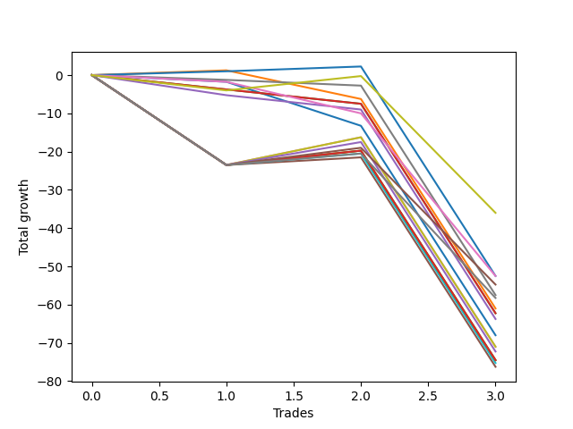

# Short Labrador 004 
- Symbol: ES
- Date Range: 03/18/2022 - 12/30/2022
- Trading Period: 8:30-12:30
- Number of Trades: 4



| Name | Win Percent | Profit | Avg Profit / Trade | Avg Time / Trade |      | Name | Win Percent | Profit | Avg Profit / Trade | Avg Time / Trade |
| ---- | ----------- | ------ | ------------------ | ---------------- | ---- | ---- | ----------- | ------ | ------------------ | ---------------- |
| Sorted By <br> Profit | | | | | | Sorted By <br> Win Percentage ||||
| MALAMUTE 002 | 75.00 | 6250.00 | 1562.50 | 21:05 |     | Eighty-One | 100.00 | 3250.00 | 812.50 | 09:27 |
| Five | 75.00 | 5000.00 | 1250.00 | 33:33 |     | MALAMUTE 002 | 75.00 | 6250.00 | 1562.50 | 21:05 |
| Eighty-One | 100.00 | 3250.00 | 812.50 | 09:27 |     | Five | 75.00 | 5000.00 | 1250.00 | 33:33 |
| Three | 50.00 | -625.00 | -156.25 | 15:40 |     | One | 75.00 | -1000.00 | -250.00 | 08:32 |
| Six | 25.00 | -750.00 | -187.50 | 01:10 |     | Seven | 75.00 | -1500.00 | -375.00 | 29:48 |
| Two_C | 50.00 | -875.00 | -218.75 | 15:07 |     | Four | 75.00 | -2000.00 | -500.00 | 24:41 |
| One | 75.00 | -1000.00 | -250.00 | 08:32 |     | Eighty-Five | 75.00 | -3000.00 | -750.00 | 29:38 |
| Two | 50.00 | -1250.00 | -312.50 | 15:03 |     | Eighty-Four | 75.00 | -4875.00 | -1218.75 | 23:48 |
| Seven | 75.00 | -1500.00 | -375.00 | 29:48 |     | Eighty-Three | 75.00 | -7000.00 | -1750.00 | 23:00 |
| Four | 75.00 | -2000.00 | -500.00 | 24:41 |     | Eighty-Two | 75.00 | -7500.00 | -1875.00 | 22:51 |
| Eighty-Five | 75.00 | -3000.00 | -750.00 | 29:38 |     | Three | 50.00 | -625.00 | -156.25 | 15:40 |
| Eighty-Four | 75.00 | -4875.00 | -1218.75 | 23:48 |     | Two_C | 50.00 | -875.00 | -218.75 | 15:07 |
| Zero | 50.00 | -5125.00 | -1281.25 | 07:46 |     | Two | 50.00 | -1250.00 | -312.50 | 15:03 |
| Eighty-Three | 75.00 | -7000.00 | -1750.00 | 23:00 |     | Zero | 50.00 | -5125.00 | -1281.25 | 07:46 |
| Eighty-Two | 75.00 | -7500.00 | -1875.00 | 22:51 |     | NEWFI 000 | 50.00 | -9750.00 | -2437.50 | 49:30 |
| NEWFI 000 | 50.00 | -9750.00 | -2437.50 | 49:30 |     | Six | 25.00 | -750.00 | -187.50 | 01:10 |
| NEWFI 0000 | 0.00 | -15250.00 | -3812.50 | 24:50 |     | MALAMUTE 001 | 25.00 | -15750.00 | -3937.50 | 47:45 |
| MALAMUTE 001 | 25.00 | -15750.00 | -3937.50 | 47:45 |     | BB100 | 25.00 | -18875.00 | -4718.75 | 60:55 |
| BB100 | 25.00 | -18875.00 | -4718.75 | 60:55 |     | NEWFI 0000 | 0.00 | -15250.00 | -3812.50 | 24:50 |

## NO STOPLOSS

### Test Zero
* Sell when price hits the middle line of the 20p bollinger
* No Stoploss
* Results:
```
Total Trades: 4
Percent Up: 50.00
Percent Down: 50.00
Total Points Moved Down: -10.25
Potential Profit: -5125.00
Total Points Ups: 13.25 Count Ups: 2
Total Points Downs: 3.00 Count Downs: 2
```

<details><summary>Trades</summary>

<code>In: 2022-06-01 10:24:00		Out: 2022-06-01 10:30:35		Total Position Time: 06:35		Total Move Down: -1.75		Total to Date: -1.75</code> <br />
<code>In: 2022-06-03 09:52:00		Out: 2022-06-03 10:13:25		Total Position Time: 21:25		Total Move Down: -11.50		Total to Date: -13.25</code> <br />
<code>In: 2022-09-26 11:21:00		Out: 2022-09-26 11:22:55		Total Position Time: 01:55		Total Move Down: 0.25		Total to Date: -13.00</code> <br />
<code>In: 2022-10-18 09:58:00		Out: 2022-10-18 09:59:10		Total Position Time: 01:10		Total Move Down: 2.75		Total to Date: -10.25</code> <br />


</details>

### Test One
* Sell when the price hits the lower line of the 20p 1std bollinger
* No Stoploss
* Results:
```
Total Trades: 4
Percent Up: 25.00
Percent Down: 75.00
Total Points Moved Down: -2.00
Potential Profit: -1000.00
Total Points Ups: 7.50 Count Ups: 1
Total Points Downs: 5.50 Count Downs: 3
```

<details><summary>Trades</summary>

<code>In: 2022-06-01 10:24:00		Out: 2022-06-01 10:31:45		Total Position Time: 07:45		Total Move Down: 1.25		Total to Date: 1.25</code> <br />
<code>In: 2022-06-03 09:52:00		Out: 2022-06-03 10:15:10		Total Position Time: 23:10		Total Move Down: -7.50		Total to Date: -6.25</code> <br />
<code>In: 2022-09-26 11:21:00		Out: 2022-09-26 11:23:05		Total Position Time: 02:05		Total Move Down: 1.50		Total to Date: -4.75</code> <br />
<code>In: 2022-10-18 09:58:00		Out: 2022-10-18 09:59:10		Total Position Time: 01:10		Total Move Down: 2.75		Total to Date: -2.00</code> <br />


</details>

### Test Two
* Sell when the price hits the lower line of the 20p 2std bollinger
* No Stoploss
* Results:
```
Total Trades: 4
Percent Up: 50.00
Percent Down: 50.00
Total Points Moved Down: -2.50
Potential Profit: -1250.00
Total Points Ups: 7.50 Count Ups: 2
Total Points Downs: 5.00 Count Downs: 2
```

<details><summary>Trades</summary>

<code>In: 2022-06-01 10:24:00		Out: 2022-06-01 10:54:35		Total Position Time: 30:35		Total Move Down: -3.75		Total to Date: -3.75</code> <br />
<code>In: 2022-06-03 09:52:00		Out: 2022-06-03 10:17:55		Total Position Time: 25:55		Total Move Down: -3.75		Total to Date: -7.50</code> <br />
<code>In: 2022-09-26 11:21:00		Out: 2022-09-26 11:23:30		Total Position Time: 02:30		Total Move Down: 2.75		Total to Date: -4.75</code> <br />
<code>In: 2022-10-18 09:58:00		Out: 2022-10-18 09:59:15		Total Position Time: 01:15		Total Move Down: 2.25		Total to Date: -2.50</code> <br />


</details>

### Test Two_C
* Sell when the price hits the lower line of the 20p 2std bollinger
* No Stoploss
* Results:
```
Total Trades: 4
Percent Up: 50.00
Percent Down: 50.00
Total Points Moved Down: -1.75
Potential Profit: -875.00
Total Points Ups: 7.50 Count Ups: 2
Total Points Downs: 5.75 Count Downs: 2
```

<details><summary>Trades</summary>

<code>In: 2022-06-01 10:24:00		Out: 2022-06-01 10:54:35		Total Position Time: 30:35		Total Move Down: -3.75		Total to Date: -3.75</code> <br />
<code>In: 2022-06-03 09:52:00		Out: 2022-06-03 10:17:55		Total Position Time: 25:55		Total Move Down: -3.75		Total to Date: -7.50</code> <br />
<code>In: 2022-09-26 11:21:00		Out: 2022-09-26 11:23:40		Total Position Time: 02:40		Total Move Down: 3.00		Total to Date: -4.50</code> <br />
<code>In: 2022-10-18 09:58:00		Out: 2022-10-18 09:59:20		Total Position Time: 01:20		Total Move Down: 2.75		Total to Date: -1.75</code> <br />


</details>

### Test Three
* Sell when price hits the middle line of the 50p bollinger
* No Stoploss
* Results:
```
Total Trades: 4
Percent Up: 50.00
Percent Down: 50.00
Total Points Moved Down: -1.25
Potential Profit: -625.00
Total Points Ups: 9.00 Count Ups: 2
Total Points Downs: 7.75 Count Downs: 2
```

<details><summary>Trades</summary>

<code>In: 2022-06-01 10:24:00		Out: 2022-06-01 10:54:40		Total Position Time: 30:40		Total Move Down: -5.25		Total to Date: -5.25</code> <br />
<code>In: 2022-06-03 09:52:00		Out: 2022-06-03 10:17:55		Total Position Time: 25:55		Total Move Down: -3.75		Total to Date: -9.00</code> <br />
<code>In: 2022-09-26 11:21:00		Out: 2022-09-26 11:25:50		Total Position Time: 04:50		Total Move Down: 5.50		Total to Date: -3.50</code> <br />
<code>In: 2022-10-18 09:58:00		Out: 2022-10-18 09:59:15		Total Position Time: 01:15		Total Move Down: 2.25		Total to Date: -1.25</code> <br />


</details>

### Test Four
* Sell when the price hits the lower line of the 50p 1std bollinger
* No Stoploss
* Results:
```
Total Trades: 4
Percent Up: 25.00
Percent Down: 75.00
Total Points Moved Down: -4.00
Potential Profit: -2000.00
Total Points Ups: 23.50 Count Ups: 1
Total Points Downs: 19.50 Count Downs: 3
```

<details><summary>Trades</summary>

<code>In: 2022-06-01 10:24:00		Out: 2022-06-01 11:24:55		Total Position Time: 60:55		Total Move Down: -23.50		Total to Date: -23.50</code> <br />
<code>In: 2022-06-03 09:52:00		Out: 2022-06-03 10:19:00		Total Position Time: 27:00		Total Move Down: 2.00		Total to Date: -21.50</code> <br />
<code>In: 2022-09-26 11:21:00		Out: 2022-09-26 11:28:50		Total Position Time: 07:50		Total Move Down: 8.75		Total to Date: -12.75</code> <br />
<code>In: 2022-10-18 09:58:00		Out: 2022-10-18 10:01:00		Total Position Time: 03:00		Total Move Down: 8.75		Total to Date: -4.00</code> <br />


</details>

### Test Five
* Sell when the price hits the lower line of the 50p 2std bollinger
* No Stoploss
* Results:
```
Total Trades: 4
Percent Up: 25.00
Percent Down: 75.00
Total Points Moved Down: 10.00
Potential Profit: 5000.00
Total Points Ups: 23.50 Count Ups: 1
Total Points Downs: 33.50 Count Downs: 3
```

<details><summary>Trades</summary>

<code>In: 2022-06-01 10:24:00		Out: 2022-06-01 11:24:55		Total Position Time: 60:55		Total Move Down: -23.50		Total to Date: -23.50</code> <br />
<code>In: 2022-06-03 09:52:00		Out: 2022-06-03 10:42:55		Total Position Time: 50:55		Total Move Down: 7.25		Total to Date: -16.25</code> <br />
<code>In: 2022-09-26 11:21:00		Out: 2022-09-26 11:37:30		Total Position Time: 16:30		Total Move Down: 13.50		Total to Date: -2.75</code> <br />
<code>In: 2022-10-18 09:58:00		Out: 2022-10-18 10:03:55		Total Position Time: 05:55		Total Move Down: 12.75		Total to Date: 10.00</code> <br />


</details>

### Test Six
* Sell when the price hits the middle line of the 1std VWAP
* No Stoploss
* Results:
```
Total Trades: 4
Percent Up: 75.00
Percent Down: 25.00
Total Points Moved Down: -1.50
Potential Profit: -750.00
Total Points Ups: 4.25 Count Ups: 3
Total Points Downs: 2.75 Count Downs: 1
```

<details><summary>Trades</summary>

<code>In: 2022-06-01 10:24:00		Out: 2022-06-01 10:25:10		Total Position Time: 01:10		Total Move Down: -1.25		Total to Date: -1.25</code> <br />
<code>In: 2022-06-03 09:52:00		Out: 2022-06-03 09:53:10		Total Position Time: 01:10		Total Move Down: -1.50		Total to Date: -2.75</code> <br />
<code>In: 2022-09-26 11:21:00		Out: 2022-09-26 11:22:10		Total Position Time: 01:10		Total Move Down: -1.50		Total to Date: -4.25</code> <br />
<code>In: 2022-10-18 09:58:00		Out: 2022-10-18 09:59:10		Total Position Time: 01:10		Total Move Down: 2.75		Total to Date: -1.50</code> <br />


</details>

### Test Seven
* Sell when the price hits the lower line of the 1std VWAP
* No Stoploss
* Results:
```
Total Trades: 4
Percent Up: 25.00
Percent Down: 75.00
Total Points Moved Down: -3.00
Potential Profit: -1500.00
Total Points Ups: 23.50 Count Ups: 1
Total Points Downs: 20.50 Count Downs: 3
```

<details><summary>Trades</summary>

<code>In: 2022-06-01 10:24:00		Out: 2022-06-01 11:24:55		Total Position Time: 60:55		Total Move Down: -23.50		Total to Date: -23.50</code> <br />
<code>In: 2022-06-03 09:52:00		Out: 2022-06-03 10:42:15		Total Position Time: 50:15		Total Move Down: 7.25		Total to Date: -16.25</code> <br />
<code>In: 2022-09-26 11:21:00		Out: 2022-09-26 11:23:00		Total Position Time: 02:00		Total Move Down: 1.00		Total to Date: -15.25</code> <br />
<code>In: 2022-10-18 09:58:00		Out: 2022-10-18 10:04:05		Total Position Time: 06:05		Total Move Down: 12.25		Total to Date: -3.00</code> <br />


</details>

### Test BB100
* Move to BB100 Upper Band
* No Stoploss
* Results:
```
Total Trades: 4
Percent Up: 75.00
Percent Down: 25.00
Total Points Moved Down: -37.75
Potential Profit: -18875.00
Total Points Ups: 40.75 Count Ups: 3
Total Points Downs: 3.00 Count Downs: 1
```

<details><summary>Trades</summary>

<code>In: 2022-06-01 10:24:00		Out: 2022-06-01 11:24:55		Total Position Time: 60:55		Total Move Down: -23.50		Total to Date: -23.50</code> <br />
<code>In: 2022-06-03 09:52:00		Out: 2022-06-03 10:52:55		Total Position Time: 60:55		Total Move Down: 3.00		Total to Date: -20.50</code> <br />
<code>In: 2022-09-26 11:21:00		Out: 2022-09-26 12:21:55		Total Position Time: 60:55		Total Move Down: -5.25		Total to Date: -25.75</code> <br />
<code>In: 2022-10-18 09:58:00		Out: 2022-10-18 10:58:55		Total Position Time: 60:55		Total Move Down: -12.00		Total to Date: -37.75</code> <br />


</details>

## TAKE PROFIT

### Test Eighty-One
* Take Profit of 1 Point
* No Stoploss
* Results:
```
Total Trades: 4
Percent Up: 0.00
Percent Down: 100.00
Total Points Moved Down: 6.50
Potential Profit: 3250.00
Total Points Ups: 0.00 Count Ups: 0
Total Points Downs: 6.50 Count Downs: 4
```

<details><summary>Trades</summary>

<code>In: 2022-06-01 10:24:00		Out: 2022-06-01 10:31:40		Total Position Time: 07:40		Total Move Down: 1.00		Total to Date: 1.00</code> <br />
<code>In: 2022-06-03 09:52:00		Out: 2022-06-03 10:18:55		Total Position Time: 26:55		Total Move Down: 1.25		Total to Date: 2.25</code> <br />
<code>In: 2022-09-26 11:21:00		Out: 2022-09-26 11:23:05		Total Position Time: 02:05		Total Move Down: 1.50		Total to Date: 3.75</code> <br />
<code>In: 2022-10-18 09:58:00		Out: 2022-10-18 09:59:10		Total Position Time: 01:10		Total Move Down: 2.75		Total to Date: 6.50</code> <br />


</details>

### Test Eighty-Two
* Take Profit of 2 Point
* No Stoploss
* Results:
```
Total Trades: 4
Percent Up: 25.00
Percent Down: 75.00
Total Points Moved Down: -15.00
Potential Profit: -7500.00
Total Points Ups: 23.50 Count Ups: 1
Total Points Downs: 8.50 Count Downs: 3
```

<details><summary>Trades</summary>

<code>In: 2022-06-01 10:24:00		Out: 2022-06-01 11:24:55		Total Position Time: 60:55		Total Move Down: -23.50		Total to Date: -23.50</code> <br />
<code>In: 2022-06-03 09:52:00		Out: 2022-06-03 10:19:05		Total Position Time: 27:05		Total Move Down: 3.75		Total to Date: -19.75</code> <br />
<code>In: 2022-09-26 11:21:00		Out: 2022-09-26 11:23:15		Total Position Time: 02:15		Total Move Down: 2.00		Total to Date: -17.75</code> <br />
<code>In: 2022-10-18 09:58:00		Out: 2022-10-18 09:59:10		Total Position Time: 01:10		Total Move Down: 2.75		Total to Date: -15.00</code> <br />


</details>

### Test Eighty-Three
* Take Profit of 3 Point
* No Stoploss
* Results:
```
Total Trades: 4
Percent Up: 25.00
Percent Down: 75.00
Total Points Moved Down: -14.00
Potential Profit: -7000.00
Total Points Ups: 23.50 Count Ups: 1
Total Points Downs: 9.50 Count Downs: 3
```

<details><summary>Trades</summary>

<code>In: 2022-06-01 10:24:00		Out: 2022-06-01 11:24:55		Total Position Time: 60:55		Total Move Down: -23.50		Total to Date: -23.50</code> <br />
<code>In: 2022-06-03 09:52:00		Out: 2022-06-03 10:19:05		Total Position Time: 27:05		Total Move Down: 3.75		Total to Date: -19.75</code> <br />
<code>In: 2022-09-26 11:21:00		Out: 2022-09-26 11:23:40		Total Position Time: 02:40		Total Move Down: 3.00		Total to Date: -16.75</code> <br />
<code>In: 2022-10-18 09:58:00		Out: 2022-10-18 09:59:20		Total Position Time: 01:20		Total Move Down: 2.75		Total to Date: -14.00</code> <br />


</details>

### Test Eighty-Four
* Take Profit of 4 Point
* No Stoploss
* Results:
```
Total Trades: 4
Percent Up: 25.00
Percent Down: 75.00
Total Points Moved Down: -9.75
Potential Profit: -4875.00
Total Points Ups: 23.50 Count Ups: 1
Total Points Downs: 13.75 Count Downs: 3
```

<details><summary>Trades</summary>

<code>In: 2022-06-01 10:24:00		Out: 2022-06-01 11:24:55		Total Position Time: 60:55		Total Move Down: -23.50		Total to Date: -23.50</code> <br />
<code>In: 2022-06-03 09:52:00		Out: 2022-06-03 10:19:05		Total Position Time: 27:05		Total Move Down: 3.75		Total to Date: -19.75</code> <br />
<code>In: 2022-09-26 11:21:00		Out: 2022-09-26 11:25:50		Total Position Time: 04:50		Total Move Down: 5.50		Total to Date: -14.25</code> <br />
<code>In: 2022-10-18 09:58:00		Out: 2022-10-18 10:00:25		Total Position Time: 02:25		Total Move Down: 4.50		Total to Date: -9.75</code> <br />


</details>

### Test Eighty-Five
* Take Profit of 5 Point
* No Stoploss
* Results:
```
Total Trades: 4
Percent Up: 25.00
Percent Down: 75.00
Total Points Moved Down: -6.00
Potential Profit: -3000.00
Total Points Ups: 23.50 Count Ups: 1
Total Points Downs: 17.50 Count Downs: 3
```

<details><summary>Trades</summary>

<code>In: 2022-06-01 10:24:00		Out: 2022-06-01 11:24:55		Total Position Time: 60:55		Total Move Down: -23.50		Total to Date: -23.50</code> <br />
<code>In: 2022-06-03 09:52:00		Out: 2022-06-03 10:41:55		Total Position Time: 49:55		Total Move Down: 6.00		Total to Date: -17.50</code> <br />
<code>In: 2022-09-26 11:21:00		Out: 2022-09-26 11:25:50		Total Position Time: 04:50		Total Move Down: 5.50		Total to Date: -12.00</code> <br />
<code>In: 2022-10-18 09:58:00		Out: 2022-10-18 10:00:55		Total Position Time: 02:55		Total Move Down: 6.00		Total to Date: -6.00</code> <br />


</details>

## Indicator Exits

### Test NEWFI 000
* Newfi 0000
* No Stoploss
* Results:
```
Total Trades: 4
Percent Up: 50.00
Percent Down: 50.00
Total Points Moved Down: -19.50
Potential Profit: -9750.00
Total Points Ups: 35.50 Count Ups: 2
Total Points Downs: 16.00 Count Downs: 2
```

<details><summary>Trades</summary>

<code>In: 2022-06-01 10:24:00		Out: 2022-06-01 11:24:55		Total Position Time: 60:55		Total Move Down: -23.50		Total to Date: -23.50</code> <br />
<code>In: 2022-06-03 09:52:00		Out: 2022-06-03 10:47:05		Total Position Time: 55:05		Total Move Down: 4.50		Total to Date: -19.00</code> <br />
<code>In: 2022-09-26 11:21:00		Out: 2022-09-26 11:42:05		Total Position Time: 21:05		Total Move Down: 11.50		Total to Date: -7.50</code> <br />
<code>In: 2022-10-18 09:58:00		Out: 2022-10-18 10:58:55		Total Position Time: 60:55		Total Move Down: -12.00		Total to Date: -19.50</code> <br />


</details>

### Test NEWFI 0000
* Newfi 0000
* No Stoploss
* Results:
```
Total Trades: 4
Percent Up: 100.00
Percent Down: 0.00
Total Points Moved Down: -30.50
Potential Profit: -15250.00
Total Points Ups: 30.50 Count Ups: 4
Total Points Downs: 0.00 Count Downs: 0
```

<details><summary>Trades</summary>

<code>In: 2022-06-01 10:24:00		Out: 2022-06-01 10:30:05		Total Position Time: 06:05		Total Move Down: -1.75		Total to Date: -1.75</code> <br />
<code>In: 2022-06-03 09:52:00		Out: 2022-06-03 10:00:05		Total Position Time: 08:05		Total Move Down: -8.25		Total to Date: -10.00</code> <br />
<code>In: 2022-09-26 11:21:00		Out: 2022-09-26 12:05:05		Total Position Time: 44:05		Total Move Down: -10.00		Total to Date: -20.00</code> <br />
<code>In: 2022-10-18 09:58:00		Out: 2022-10-18 10:39:05		Total Position Time: 41:05		Total Move Down: -10.50		Total to Date: -30.50</code> <br />


</details>

### Test MALAMUTE 001
* Malamute 001
* No Stoploss
* Results:
```
Total Trades: 4
Percent Up: 75.00
Percent Down: 25.00
Total Points Moved Down: -31.50
Potential Profit: -15750.00
Total Points Ups: 34.50 Count Ups: 3
Total Points Downs: 3.00 Count Downs: 1
```

<details><summary>Trades</summary>

<code>In: 2022-06-01 10:24:00		Out: 2022-06-01 11:24:55		Total Position Time: 60:55		Total Move Down: -23.50		Total to Date: -23.50</code> <br />
<code>In: 2022-06-03 09:52:00		Out: 2022-06-03 10:52:55		Total Position Time: 60:55		Total Move Down: 3.00		Total to Date: -20.50</code> <br />
<code>In: 2022-09-26 11:21:00		Out: 2022-09-26 11:57:05		Total Position Time: 36:05		Total Move Down: -7.75		Total to Date: -28.25</code> <br />
<code>In: 2022-10-18 09:58:00		Out: 2022-10-18 10:31:05		Total Position Time: 33:05		Total Move Down: -3.25		Total to Date: -31.50</code> <br />


</details>

### Test MALAMUTE 002
* Malamute 001
* No Stoploss
* Results:
```
Total Trades: 4
Percent Up: 25.00
Percent Down: 75.00
Total Points Moved Down: 12.50
Potential Profit: 6250.00
Total Points Ups: 4.00 Count Ups: 1
Total Points Downs: 16.50 Count Downs: 3
```

<details><summary>Trades</summary>

<code>In: 2022-06-01 10:24:00		Out: 2022-06-01 10:26:05		Total Position Time: 02:05		Total Move Down: -4.00		Total to Date: -4.00</code> <br />
<code>In: 2022-06-03 09:52:00		Out: 2022-06-03 10:52:05		Total Position Time: 60:05		Total Move Down: 3.75		Total to Date: -0.25</code> <br />
<code>In: 2022-09-26 11:21:00		Out: 2022-09-26 11:33:05		Total Position Time: 12:05		Total Move Down: 4.75		Total to Date: 4.50</code> <br />
<code>In: 2022-10-18 09:58:00		Out: 2022-10-18 10:08:05		Total Position Time: 10:05		Total Move Down: 8.00		Total to Date: 12.50</code> <br />


</details>