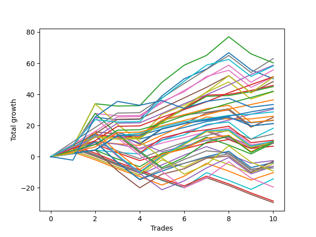

# Short Labrador 006 
- Symbol: ES
- Date Range: 03/18/2022 - 12/30/2022
- Trading Period: 8:30-12:30
- Number of Trades: 1



| Name | Win Percent | Profit | Avg Profit / Trade | Avg Time / Trade |      | Name | Win Percent | Profit | Avg Profit / Trade | Avg Time / Trade |
| ---- | ----------- | ------ | ------------------ | ---------------- | ---- | ---- | ----------- | ------ | ------------------ | ---------------- |
| Sorted By <br> Profit | | | | | | Sorted By <br> Win Percentage ||||
| BB100 | 100.00 | 4500.00 | 4500.00 | 23:30 |     | BB100 | 100.00 | 4500.00 | 4500.00 | 23:30 |
| NEWFI 000 | 100.00 | 3875.00 | 3875.00 | 27:05 |     | NEWFI 000 | 100.00 | 3875.00 | 3875.00 | 27:05 |
| Eighty-Five | 100.00 | 2625.00 | 2625.00 | 01:55 |     | Eighty-Five | 100.00 | 2625.00 | 2625.00 | 01:55 |
| MALAMUTE 001 | 100.00 | 2125.00 | 2125.00 | 54:05 |     | MALAMUTE 001 | 100.00 | 2125.00 | 2125.00 | 54:05 |
| Eighty-Four | 100.00 | 2125.00 | 2125.00 | 01:35 |     | Eighty-Four | 100.00 | 2125.00 | 2125.00 | 01:35 |
| Five | 100.00 | 2125.00 | 2125.00 | 02:05 |     | Five | 100.00 | 2125.00 | 2125.00 | 02:05 |
| Eighty-Three | 100.00 | 1625.00 | 1625.00 | 01:30 |     | Eighty-Three | 100.00 | 1625.00 | 1625.00 | 01:30 |
| Eighty-Two | 100.00 | 1625.00 | 1625.00 | 01:30 |     | Eighty-Two | 100.00 | 1625.00 | 1625.00 | 01:30 |
| Eighty-One | 100.00 | 1625.00 | 1625.00 | 01:30 |     | Eighty-One | 100.00 | 1625.00 | 1625.00 | 01:30 |
| Four | 100.00 | 1625.00 | 1625.00 | 01:30 |     | Four | 100.00 | 1625.00 | 1625.00 | 01:30 |
| Two_C | 100.00 | 1625.00 | 1625.00 | 01:30 |     | Two_C | 100.00 | 1625.00 | 1625.00 | 01:30 |
| Two | 100.00 | 1625.00 | 1625.00 | 01:30 |     | Two | 100.00 | 1625.00 | 1625.00 | 01:30 |
| MALAMUTE 002 | 100.00 | 1375.00 | 1375.00 | 07:05 |     | MALAMUTE 002 | 100.00 | 1375.00 | 1375.00 | 07:05 |
| Three | 0.00 | -125.00 | -125.00 | 01:15 |     | Three | 0.00 | -125.00 | -125.00 | 01:15 |
| NEWFI 0000 | 0.00 | -250.00 | -250.00 | 01:05 |     | NEWFI 0000 | 0.00 | -250.00 | -250.00 | 01:05 |
| Seven | 0.00 | -375.00 | -375.00 | 01:10 |     | Seven | 0.00 | -375.00 | -375.00 | 01:10 |
| Six | 0.00 | -375.00 | -375.00 | 01:10 |     | Six | 0.00 | -375.00 | -375.00 | 01:10 |
| One | 0.00 | -375.00 | -375.00 | 01:10 |     | One | 0.00 | -375.00 | -375.00 | 01:10 |
| Zero | 0.00 | -375.00 | -375.00 | 01:10 |     | Zero | 0.00 | -375.00 | -375.00 | 01:10 |

## NO STOPLOSS

### Test Zero
* Sell when price hits the middle line of the 20p bollinger
* No Stoploss
* Results:
```
Total Trades: 1
Percent Up: 100.00
Percent Down: 0.00
Total Points Moved Down: -0.75
Potential Profit: -375.00
Total Points Ups: 0.75 Count Ups: 1
Total Points Downs: 0.00 Count Downs: 0
```

<details><summary>Trades</summary>

<code>In: 2022-10-12 11:09:00		Out: 2022-10-12 11:10:10		Total Position Time: 01:10		Total Move Down: -0.75		Total to Date: -0.75</code> <br />


</details>

### Test One
* Sell when the price hits the lower line of the 20p 1std bollinger
* No Stoploss
* Results:
```
Total Trades: 1
Percent Up: 100.00
Percent Down: 0.00
Total Points Moved Down: -0.75
Potential Profit: -375.00
Total Points Ups: 0.75 Count Ups: 1
Total Points Downs: 0.00 Count Downs: 0
```

<details><summary>Trades</summary>

<code>In: 2022-10-12 11:09:00		Out: 2022-10-12 11:10:10		Total Position Time: 01:10		Total Move Down: -0.75		Total to Date: -0.75</code> <br />


</details>

### Test Two
* Sell when the price hits the lower line of the 20p 2std bollinger
* No Stoploss
* Results:
```
Total Trades: 1
Percent Up: 0.00
Percent Down: 100.00
Total Points Moved Down: 3.25
Potential Profit: 1625.00
Total Points Ups: 0.00 Count Ups: 0
Total Points Downs: 3.25 Count Downs: 1
```

<details><summary>Trades</summary>

<code>In: 2022-10-12 11:09:00		Out: 2022-10-12 11:10:30		Total Position Time: 01:30		Total Move Down: 3.25		Total to Date: 3.25</code> <br />


</details>

### Test Two_C
* Sell when the price hits the lower line of the 20p 2std bollinger
* No Stoploss
* Results:
```
Total Trades: 1
Percent Up: 0.00
Percent Down: 100.00
Total Points Moved Down: 3.25
Potential Profit: 1625.00
Total Points Ups: 0.00 Count Ups: 0
Total Points Downs: 3.25 Count Downs: 1
```

<details><summary>Trades</summary>

<code>In: 2022-10-12 11:09:00		Out: 2022-10-12 11:10:30		Total Position Time: 01:30		Total Move Down: 3.25		Total to Date: 3.25</code> <br />


</details>

### Test Three
* Sell when price hits the middle line of the 50p bollinger
* No Stoploss
* Results:
```
Total Trades: 1
Percent Up: 100.00
Percent Down: 0.00
Total Points Moved Down: -0.25
Potential Profit: -125.00
Total Points Ups: 0.25 Count Ups: 1
Total Points Downs: 0.00 Count Downs: 0
```

<details><summary>Trades</summary>

<code>In: 2022-10-12 11:09:00		Out: 2022-10-12 11:10:15		Total Position Time: 01:15		Total Move Down: -0.25		Total to Date: -0.25</code> <br />


</details>

### Test Four
* Sell when the price hits the lower line of the 50p 1std bollinger
* No Stoploss
* Results:
```
Total Trades: 1
Percent Up: 0.00
Percent Down: 100.00
Total Points Moved Down: 3.25
Potential Profit: 1625.00
Total Points Ups: 0.00 Count Ups: 0
Total Points Downs: 3.25 Count Downs: 1
```

<details><summary>Trades</summary>

<code>In: 2022-10-12 11:09:00		Out: 2022-10-12 11:10:30		Total Position Time: 01:30		Total Move Down: 3.25		Total to Date: 3.25</code> <br />


</details>

### Test Five
* Sell when the price hits the lower line of the 50p 2std bollinger
* No Stoploss
* Results:
```
Total Trades: 1
Percent Up: 0.00
Percent Down: 100.00
Total Points Moved Down: 4.25
Potential Profit: 2125.00
Total Points Ups: 0.00 Count Ups: 0
Total Points Downs: 4.25 Count Downs: 1
```

<details><summary>Trades</summary>

<code>In: 2022-10-12 11:09:00		Out: 2022-10-12 11:11:05		Total Position Time: 02:05		Total Move Down: 4.25		Total to Date: 4.25</code> <br />


</details>

### Test Six
* Sell when the price hits the middle line of the 1std VWAP
* No Stoploss
* Results:
```
Total Trades: 1
Percent Up: 100.00
Percent Down: 0.00
Total Points Moved Down: -0.75
Potential Profit: -375.00
Total Points Ups: 0.75 Count Ups: 1
Total Points Downs: 0.00 Count Downs: 0
```

<details><summary>Trades</summary>

<code>In: 2022-10-12 11:09:00		Out: 2022-10-12 11:10:10		Total Position Time: 01:10		Total Move Down: -0.75		Total to Date: -0.75</code> <br />


</details>

### Test Seven
* Sell when the price hits the lower line of the 1std VWAP
* No Stoploss
* Results:
```
Total Trades: 1
Percent Up: 100.00
Percent Down: 0.00
Total Points Moved Down: -0.75
Potential Profit: -375.00
Total Points Ups: 0.75 Count Ups: 1
Total Points Downs: 0.00 Count Downs: 0
```

<details><summary>Trades</summary>

<code>In: 2022-10-12 11:09:00		Out: 2022-10-12 11:10:10		Total Position Time: 01:10		Total Move Down: -0.75		Total to Date: -0.75</code> <br />


</details>

### Test BB100
* Move to BB100 Upper Band
* No Stoploss
* Results:
```
Total Trades: 1
Percent Up: 0.00
Percent Down: 100.00
Total Points Moved Down: 9.00
Potential Profit: 4500.00
Total Points Ups: 0.00 Count Ups: 0
Total Points Downs: 9.00 Count Downs: 1
```

<details><summary>Trades</summary>

<code>In: 2022-10-12 11:09:00		Out: 2022-10-12 11:32:30		Total Position Time: 23:30		Total Move Down: 9.00		Total to Date: 9.00</code> <br />


</details>

## TAKE PROFIT

### Test Eighty-One
* Take Profit of 1 Point
* No Stoploss
* Results:
```
Total Trades: 1
Percent Up: 0.00
Percent Down: 100.00
Total Points Moved Down: 3.25
Potential Profit: 1625.00
Total Points Ups: 0.00 Count Ups: 0
Total Points Downs: 3.25 Count Downs: 1
```

<details><summary>Trades</summary>

<code>In: 2022-10-12 11:09:00		Out: 2022-10-12 11:10:30		Total Position Time: 01:30		Total Move Down: 3.25		Total to Date: 3.25</code> <br />


</details>

### Test Eighty-Two
* Take Profit of 2 Point
* No Stoploss
* Results:
```
Total Trades: 1
Percent Up: 0.00
Percent Down: 100.00
Total Points Moved Down: 3.25
Potential Profit: 1625.00
Total Points Ups: 0.00 Count Ups: 0
Total Points Downs: 3.25 Count Downs: 1
```

<details><summary>Trades</summary>

<code>In: 2022-10-12 11:09:00		Out: 2022-10-12 11:10:30		Total Position Time: 01:30		Total Move Down: 3.25		Total to Date: 3.25</code> <br />


</details>

### Test Eighty-Three
* Take Profit of 3 Point
* No Stoploss
* Results:
```
Total Trades: 1
Percent Up: 0.00
Percent Down: 100.00
Total Points Moved Down: 3.25
Potential Profit: 1625.00
Total Points Ups: 0.00 Count Ups: 0
Total Points Downs: 3.25 Count Downs: 1
```

<details><summary>Trades</summary>

<code>In: 2022-10-12 11:09:00		Out: 2022-10-12 11:10:30		Total Position Time: 01:30		Total Move Down: 3.25		Total to Date: 3.25</code> <br />


</details>

### Test Eighty-Four
* Take Profit of 4 Point
* No Stoploss
* Results:
```
Total Trades: 1
Percent Up: 0.00
Percent Down: 100.00
Total Points Moved Down: 4.25
Potential Profit: 2125.00
Total Points Ups: 0.00 Count Ups: 0
Total Points Downs: 4.25 Count Downs: 1
```

<details><summary>Trades</summary>

<code>In: 2022-10-12 11:09:00		Out: 2022-10-12 11:10:35		Total Position Time: 01:35		Total Move Down: 4.25		Total to Date: 4.25</code> <br />


</details>

### Test Eighty-Five
* Take Profit of 5 Point
* No Stoploss
* Results:
```
Total Trades: 1
Percent Up: 0.00
Percent Down: 100.00
Total Points Moved Down: 5.25
Potential Profit: 2625.00
Total Points Ups: 0.00 Count Ups: 0
Total Points Downs: 5.25 Count Downs: 1
```

<details><summary>Trades</summary>

<code>In: 2022-10-12 11:09:00		Out: 2022-10-12 11:10:55		Total Position Time: 01:55		Total Move Down: 5.25		Total to Date: 5.25</code> <br />


</details>

## Indicator Exits

### Test NEWFI 000
* Newfi 0000
* No Stoploss
* Results:
```
Total Trades: 1
Percent Up: 0.00
Percent Down: 100.00
Total Points Moved Down: 7.75
Potential Profit: 3875.00
Total Points Ups: 0.00 Count Ups: 0
Total Points Downs: 7.75 Count Downs: 1
```

<details><summary>Trades</summary>

<code>In: 2022-10-12 11:09:00		Out: 2022-10-12 11:36:05		Total Position Time: 27:05		Total Move Down: 7.75		Total to Date: 7.75</code> <br />


</details>

### Test NEWFI 0000
* Newfi 0000
* No Stoploss
* Results:
```
Total Trades: 1
Percent Up: 100.00
Percent Down: 0.00
Total Points Moved Down: -0.50
Potential Profit: -250.00
Total Points Ups: 0.50 Count Ups: 1
Total Points Downs: 0.00 Count Downs: 0
```

<details><summary>Trades</summary>

<code>In: 2022-10-12 11:09:00		Out: 2022-10-12 11:10:05		Total Position Time: 01:05		Total Move Down: -0.50		Total to Date: -0.50</code> <br />


</details>

### Test MALAMUTE 001
* Malamute 001
* No Stoploss
* Results:
```
Total Trades: 1
Percent Up: 0.00
Percent Down: 100.00
Total Points Moved Down: 4.25
Potential Profit: 2125.00
Total Points Ups: 0.00 Count Ups: 0
Total Points Downs: 4.25 Count Downs: 1
```

<details><summary>Trades</summary>

<code>In: 2022-10-12 11:09:00		Out: 2022-10-12 12:03:05		Total Position Time: 54:05		Total Move Down: 4.25		Total to Date: 4.25</code> <br />


</details>

### Test MALAMUTE 002
* Malamute 001
* No Stoploss
* Results:
```
Total Trades: 1
Percent Up: 0.00
Percent Down: 100.00
Total Points Moved Down: 2.75
Potential Profit: 1375.00
Total Points Ups: 0.00 Count Ups: 0
Total Points Downs: 2.75 Count Downs: 1
```

<details><summary>Trades</summary>

<code>In: 2022-10-12 11:09:00		Out: 2022-10-12 11:16:05		Total Position Time: 07:05		Total Move Down: 2.75		Total to Date: 2.75</code> <br />


</details>