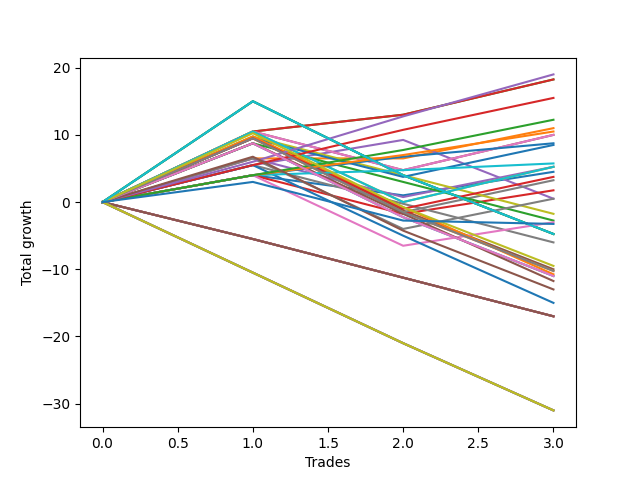

# Short Labrador 007 
- Symbol: ES
- Date Range: 03/18/2022 - 12/30/2022
- Trading Period: 8:30-12:30
- Number of Trades: 3



| Name | Win Percent | Profit | Avg Profit / Trade | Avg Time / Trade |      | Name | Win Percent | Profit | Avg Profit / Trade | Avg Time / Trade |
| ---- | ----------- | ------ | ------------------ | ---------------- | ---- | ---- | ----------- | ------ | ------------------ | ---------------- |
| Sorted By <br> Profit | | | | | | Sorted By <br> Win Percentage ||||
| TP-6 | 100.00 | 9500.00 | 3166.67 | 10:08 |     | TP-6 | 100.00 | 9500.00 | 3166.67 | 10:08 |
| BB-20 U/L 2SD C | 100.00 | 9125.00 | 3041.67 | 08:58 |     | BB-20 U/L 2SD C | 100.00 | 9125.00 | 3041.67 | 08:58 |
| BB-20 U/L 2SD | 100.00 | 9125.00 | 3041.67 | 08:58 |     | BB-20 U/L 2SD | 100.00 | 9125.00 | 3041.67 | 08:58 |
| TP-5 | 100.00 | 7750.00 | 2583.33 | 09:56 |     | TP-5 | 100.00 | 7750.00 | 2583.33 | 09:56 |
| TP-4 | 100.00 | 6125.00 | 2041.67 | 09:35 |     | TP-4 | 100.00 | 6125.00 | 2041.67 | 09:35 |
| BB-20 U/L 1SD | 66.67 | 5500.00 | 1833.33 | 07:38 |     | TP-3 | 100.00 | 5250.00 | 1750.00 | 07:05 |
| TP-3 | 100.00 | 5250.00 | 1750.00 | 07:05 |     | TP-2 | 100.00 | 4375.00 | 1458.33 | 05:51 |
| BB-20 U/L 2SD C SL-5 | 66.67 | 5000.00 | 1666.67 | 05:20 |     | TP-1 | 100.00 | 2875.00 | 958.33 | 05:40 |
| BB-20 U/L 2SD SL-5 | 66.67 | 5000.00 | 1666.67 | 05:20 |     | BB-20 U/L 1SD | 66.67 | 5500.00 | 1833.33 | 07:38 |
| TP-2 | 100.00 | 4375.00 | 1458.33 | 05:51 |     | BB-20 U/L 2SD C SL-5 | 66.67 | 5000.00 | 1666.67 | 05:20 |
| V Mid SL-5 | 66.67 | 4250.00 | 1416.67 | 05:05 |     | BB-20 U/L 2SD SL-5 | 66.67 | 5000.00 | 1666.67 | 05:20 |
| TP-1 | 100.00 | 2875.00 | 958.33 | 05:40 |     | V Mid SL-5 | 66.67 | 4250.00 | 1416.67 | 05:05 |
| BB-20 U/L 2SD C SL-10 | 66.67 | 2625.00 | 875.00 | 06:16 |     | BB-20 U/L 2SD C SL-10 | 66.67 | 2625.00 | 875.00 | 06:16 |
| BB-20 U/L 2SD SL-10 | 66.67 | 2625.00 | 875.00 | 06:16 |     | BB-20 U/L 2SD SL-10 | 66.67 | 2625.00 | 875.00 | 06:16 |
| BB-20 U/L 1SD SL-5 | 66.67 | 2625.00 | 875.00 | 04:40 |     | BB-20 U/L 1SD SL-5 | 66.67 | 2625.00 | 875.00 | 04:40 |
| BB-20 Mid | 66.67 | 2250.00 | 750.00 | 05:56 |     | BB-20 Mid | 66.67 | 2250.00 | 750.00 | 05:56 |
| V Mid SL-10 | 66.67 | 1875.00 | 625.00 | 06:01 |     | V Mid SL-10 | 66.67 | 1875.00 | 625.00 | 06:01 |
| V Mid | 66.67 | 1625.00 | 541.67 | 16:56 |     | V Mid | 66.67 | 1625.00 | 541.67 | 16:56 |
| BB-20 Mid SL-5 | 66.67 | 875.00 | 291.67 | 03:08 |     | BB-20 Mid SL-5 | 66.67 | 875.00 | 291.67 | 03:08 |
| BB-20 U/L 1SD SL-10 | 66.67 | 250.00 | 83.33 | 05:36 |     | BB-20 U/L 1SD SL-10 | 66.67 | 250.00 | 83.33 | 05:36 |
| BB-50 Mid | 66.67 | 250.00 | 83.33 | 18:26 |     | BB-50 Mid | 66.67 | 250.00 | 83.33 | 18:26 |
| BB-50 U/L 1SD SL-5 | 33.33 | -875.00 | -291.67 | 08:08 |     | BB-20 Mid SL-10 | 66.67 | -1500.00 | -500.00 | 04:05 |
| BB-100 Mid SL-5 | 33.33 | -1375.00 | -458.33 | 07:56 |     | BB-50 U/L 1SD SL-5 | 33.33 | -875.00 | -291.67 | 08:08 |
| BB-20 Mid SL-10 | 66.67 | -1500.00 | -500.00 | 04:05 |     | BB-100 Mid SL-5 | 33.33 | -1375.00 | -458.33 | 07:56 |
| NEWFI 0000 | 33.33 | -1625.00 | -541.67 | 09:45 |     | NEWFI 0000 | 33.33 | -1625.00 | -541.67 | 09:45 |
| NEWFI 06 | 33.33 | -2375.00 | -791.67 | 39:20 |     | NEWFI 06 | 33.33 | -2375.00 | -791.67 | 39:20 |
| NEWFI 000 | 33.33 | -2375.00 | -791.67 | 39:20 |     | NEWFI 000 | 33.33 | -2375.00 | -791.67 | 39:20 |
| BB-200 U/L 2SD | 33.33 | -2375.00 | -791.67 | 39:20 |     | BB-200 U/L 2SD | 33.33 | -2375.00 | -791.67 | 39:20 |
| BB-100 U/L 2SD | 33.33 | -2375.00 | -791.67 | 39:20 |     | BB-100 U/L 2SD | 33.33 | -2375.00 | -791.67 | 39:20 |
| V U/L 1SD | 33.33 | -2375.00 | -791.67 | 39:20 |     | V U/L 1SD | 33.33 | -2375.00 | -791.67 | 39:20 |
| BB-50 Mid SL-5 | 33.33 | -3000.00 | -1000.00 | 07:35 |     | BB-50 Mid SL-5 | 33.33 | -3000.00 | -1000.00 | 07:35 |
| TP-10 | 33.33 | -4750.00 | -1583.33 | 25:40 |     | TP-10 | 33.33 | -4750.00 | -1583.33 | 25:40 |
| BB-50 U/L 1SD | 33.33 | -5000.00 | -1666.67 | 25:38 |     | BB-50 U/L 1SD | 33.33 | -5000.00 | -1666.67 | 25:38 |
| TP-9 | 33.33 | -5125.00 | -1708.33 | 25:30 |     | TP-9 | 33.33 | -5125.00 | -1708.33 | 25:30 |
| BB-200 Mid | 33.33 | -5125.00 | -1708.33 | 38:55 |     | BB-200 Mid | 33.33 | -5125.00 | -1708.33 | 38:55 |
| BB-50 U/L 1SD SL-10 | 33.33 | -5375.00 | -1791.67 | 13:11 |     | BB-50 U/L 1SD SL-10 | 33.33 | -5375.00 | -1791.67 | 13:11 |
| TP-8 | 33.33 | -5500.00 | -1833.33 | 25:26 |     | TP-8 | 33.33 | -5500.00 | -1833.33 | 25:26 |
| BB-100 Mid | 33.33 | -5500.00 | -1833.33 | 25:26 |     | BB-100 Mid | 33.33 | -5500.00 | -1833.33 | 25:26 |
| BB-50 U/L 2SD | 33.33 | -5500.00 | -1833.33 | 38:30 |     | BB-50 U/L 2SD | 33.33 | -5500.00 | -1833.33 | 38:30 |
| BB-100 Mid SL-10 | 33.33 | -5875.00 | -1958.33 | 13:00 |     | BB-100 Mid SL-10 | 33.33 | -5875.00 | -1958.33 | 13:00 |
| TP-7 | 33.33 | -6500.00 | -2166.67 | 25:23 |     | TP-7 | 33.33 | -6500.00 | -2166.67 | 25:23 |
| BB-50 Mid SL-10 | 33.33 | -7500.00 | -2500.00 | 12:38 |     | BB-50 Mid SL-10 | 33.33 | -7500.00 | -2500.00 | 12:38 |
| BB-200 U/L 2SD SL-5 | 0.00 | -8500.00 | -2833.33 | 12:36 |     | BB-200 U/L 2SD SL-5 | 0.00 | -8500.00 | -2833.33 | 12:36 |
| BB-200 Mid SL-5 | 0.00 | -8500.00 | -2833.33 | 12:36 |     | BB-200 Mid SL-5 | 0.00 | -8500.00 | -2833.33 | 12:36 |
| BB-100 U/L 2SD SL-5 | 0.00 | -8500.00 | -2833.33 | 12:36 |     | BB-100 U/L 2SD SL-5 | 0.00 | -8500.00 | -2833.33 | 12:36 |
| V U/L 1SD SL-5 | 0.00 | -8500.00 | -2833.33 | 12:36 |     | V U/L 1SD SL-5 | 0.00 | -8500.00 | -2833.33 | 12:36 |
| BB-50 U/L 2SD SL-5 | 0.00 | -8500.00 | -2833.33 | 12:36 |     | BB-50 U/L 2SD SL-5 | 0.00 | -8500.00 | -2833.33 | 12:36 |
| BB-200 U/L 2SD SL-10 | 0.00 | -15500.00 | -5166.67 | 19:55 |     | BB-200 U/L 2SD SL-10 | 0.00 | -15500.00 | -5166.67 | 19:55 |
| BB-200 Mid SL-10 | 0.00 | -15500.00 | -5166.67 | 19:55 |     | BB-200 Mid SL-10 | 0.00 | -15500.00 | -5166.67 | 19:55 |
| BB-100 U/L 2SD SL-10 | 0.00 | -15500.00 | -5166.67 | 19:55 |     | BB-100 U/L 2SD SL-10 | 0.00 | -15500.00 | -5166.67 | 19:55 |
| V U/L 1SD SL-10 | 0.00 | -15500.00 | -5166.67 | 19:55 |     | V U/L 1SD SL-10 | 0.00 | -15500.00 | -5166.67 | 19:55 |
| BB-50 U/L 2SD SL-10 | 0.00 | -15500.00 | -5166.67 | 19:55 |     | BB-50 U/L 2SD SL-10 | 0.00 | -15500.00 | -5166.67 | 19:55 |

## NO STOPLOSS

### Test BB-20 Mid
* Sell when price hits the middle line of the 20p bollinger
* No Stoploss
* Results:
```
Total Trades: 3
Percent Up: 33.33
Percent Down: 66.67
Total Points Moved Down: 4.50
Potential Profit: 2250.00
Total Points Ups: 3.00 Count Ups: 1
Total Points Downs: 7.50 Count Downs: 2
```

<details><summary>Trades</summary>

<code>In: 2022-06-10 12:03:00		Out: 2022-06-10 12:04:10		Total Position Time: 01:10		Total Move Down: 4.00		Total to Date: 4.00</code> <br />
<code>In: 2022-09-22 12:08:00		Out: 2022-09-22 12:19:50		Total Position Time: 11:50		Total Move Down: -3.00		Total to Date: 1.00</code> <br />
<code>In: 2022-11-18 12:12:00		Out: 2022-11-18 12:16:50		Total Position Time: 04:50		Total Move Down: 3.50		Total to Date: 4.50</code> <br />


</details>

### Test BB-20 U/L 1SD
* Sell when the price hits the lower line of the 20p 1std bollinger
* No Stoploss
* Results:
```
Total Trades: 3
Percent Up: 33.33
Percent Down: 66.67
Total Points Moved Down: 11.00
Potential Profit: 5500.00
Total Points Ups: 0.00 Count Ups: 1
Total Points Downs: 11.00 Count Downs: 2
```

<details><summary>Trades</summary>

<code>In: 2022-06-10 12:03:00		Out: 2022-06-10 12:05:05		Total Position Time: 02:05		Total Move Down: 6.50		Total to Date: 6.50</code> <br />
<code>In: 2022-09-22 12:08:00		Out: 2022-09-22 12:20:20		Total Position Time: 12:20		Total Move Down: -0.00		Total to Date: 6.50</code> <br />
<code>In: 2022-11-18 12:12:00		Out: 2022-11-18 12:20:30		Total Position Time: 08:30		Total Move Down: 4.50		Total to Date: 11.00</code> <br />


</details>

### Test BB-20 U/L 2SD
* Sell when the price hits the lower line of the 20p 2std bollinger
* No Stoploss
* Results:
```
Total Trades: 3
Percent Up: 0.00
Percent Down: 100.00
Total Points Moved Down: 18.25
Potential Profit: 9125.00
Total Points Ups: 0.00 Count Ups: 0
Total Points Downs: 18.25 Count Downs: 3
```

<details><summary>Trades</summary>

<code>In: 2022-06-10 12:03:00		Out: 2022-06-10 12:06:05		Total Position Time: 03:05		Total Move Down: 10.50		Total to Date: 10.50</code> <br />
<code>In: 2022-09-22 12:08:00		Out: 2022-09-22 12:22:20		Total Position Time: 14:20		Total Move Down: 2.50		Total to Date: 13.00</code> <br />
<code>In: 2022-11-18 12:12:00		Out: 2022-11-18 12:21:30		Total Position Time: 09:30		Total Move Down: 5.25		Total to Date: 18.25</code> <br />


</details>

### Test BB-20 U/L 2SD C
* Sell when the price hits the lower line of the 20p 2std bollinger
* No Stoploss
* Results:
```
Total Trades: 3
Percent Up: 0.00
Percent Down: 100.00
Total Points Moved Down: 18.25
Potential Profit: 9125.00
Total Points Ups: 0.00 Count Ups: 0
Total Points Downs: 18.25 Count Downs: 3
```

<details><summary>Trades</summary>

<code>In: 2022-06-10 12:03:00		Out: 2022-06-10 12:06:05		Total Position Time: 03:05		Total Move Down: 10.50		Total to Date: 10.50</code> <br />
<code>In: 2022-09-22 12:08:00		Out: 2022-09-22 12:22:20		Total Position Time: 14:20		Total Move Down: 2.50		Total to Date: 13.00</code> <br />
<code>In: 2022-11-18 12:12:00		Out: 2022-11-18 12:21:30		Total Position Time: 09:30		Total Move Down: 5.25		Total to Date: 18.25</code> <br />


</details>

### Test BB-50 Mid
* Sell when price hits the middle line of the 50p bollinger
* No Stoploss
* Results:
```
Total Trades: 3
Percent Up: 33.33
Percent Down: 66.67
Total Points Moved Down: 0.50
Potential Profit: 250.00
Total Points Ups: 8.75 Count Ups: 1
Total Points Downs: 9.25 Count Downs: 2
```

<details><summary>Trades</summary>

<code>In: 2022-06-10 12:03:00		Out: 2022-06-10 12:04:15		Total Position Time: 01:15		Total Move Down: 5.50		Total to Date: 5.50</code> <br />
<code>In: 2022-09-22 12:08:00		Out: 2022-09-22 12:27:05		Total Position Time: 19:05		Total Move Down: 3.75		Total to Date: 9.25</code> <br />
<code>In: 2022-11-18 12:12:00		Out: 2022-11-18 12:47:00		Total Position Time: 35:00		Total Move Down: -8.75		Total to Date: 0.50</code> <br />


</details>

### Test BB-50 U/L 1SD
* Sell when the price hits the lower line of the 50p 1std bollinger
* No Stoploss
* Results:
```
Total Trades: 3
Percent Up: 66.67
Percent Down: 33.33
Total Points Moved Down: -10.00
Potential Profit: -5000.00
Total Points Ups: 19.75 Count Ups: 2
Total Points Downs: 9.75 Count Downs: 1
```

<details><summary>Trades</summary>

<code>In: 2022-06-10 12:03:00		Out: 2022-06-10 12:05:55		Total Position Time: 02:55		Total Move Down: 9.75		Total to Date: 9.75</code> <br />
<code>In: 2022-09-22 12:08:00		Out: 2022-09-22 12:47:00		Total Position Time: 39:00		Total Move Down: -11.00		Total to Date: -1.25</code> <br />
<code>In: 2022-11-18 12:12:00		Out: 2022-11-18 12:47:00		Total Position Time: 35:00		Total Move Down: -8.75		Total to Date: -10.00</code> <br />


</details>

### Test BB-50 U/L 2SD
* Sell when the price hits the lower line of the 50p 2std bollinger
* No Stoploss
* Results:
```
Total Trades: 3
Percent Up: 66.67
Percent Down: 33.33
Total Points Moved Down: -11.00
Potential Profit: -5500.00
Total Points Ups: 19.75 Count Ups: 2
Total Points Downs: 8.75 Count Downs: 1
```

<details><summary>Trades</summary>

<code>In: 2022-06-10 12:03:00		Out: 2022-06-10 12:44:30		Total Position Time: 41:30		Total Move Down: 8.75		Total to Date: 8.75</code> <br />
<code>In: 2022-09-22 12:08:00		Out: 2022-09-22 12:47:00		Total Position Time: 39:00		Total Move Down: -11.00		Total to Date: -2.25</code> <br />
<code>In: 2022-11-18 12:12:00		Out: 2022-11-18 12:47:00		Total Position Time: 35:00		Total Move Down: -8.75		Total to Date: -11.00</code> <br />


</details>

### Test V Mid
* Sell when the price hits the middle line of the 1std VWAP
* No Stoploss
* Results:
```
Total Trades: 3
Percent Up: 33.33
Percent Down: 66.67
Total Points Moved Down: 3.25
Potential Profit: 1625.00
Total Points Ups: 11.00 Count Ups: 1
Total Points Downs: 14.25 Count Downs: 2
```

<details><summary>Trades</summary>

<code>In: 2022-06-10 12:03:00		Out: 2022-06-10 12:05:30		Total Position Time: 02:30		Total Move Down: 9.50		Total to Date: 9.50</code> <br />
<code>In: 2022-09-22 12:08:00		Out: 2022-09-22 12:47:00		Total Position Time: 39:00		Total Move Down: -11.00		Total to Date: -1.50</code> <br />
<code>In: 2022-11-18 12:12:00		Out: 2022-11-18 12:21:20		Total Position Time: 09:20		Total Move Down: 4.75		Total to Date: 3.25</code> <br />


</details>

### Test V U/L 1SD
* Sell when the price hits the lower line of the 1std VWAP
* No Stoploss
* Results:
```
Total Trades: 3
Percent Up: 66.67
Percent Down: 33.33
Total Points Moved Down: -4.75
Potential Profit: -2375.00
Total Points Ups: 19.75 Count Ups: 2
Total Points Downs: 15.00 Count Downs: 1
```

<details><summary>Trades</summary>

<code>In: 2022-06-10 12:03:00		Out: 2022-06-10 12:47:00		Total Position Time: 44:00		Total Move Down: 15.00		Total to Date: 15.00</code> <br />
<code>In: 2022-09-22 12:08:00		Out: 2022-09-22 12:47:00		Total Position Time: 39:00		Total Move Down: -11.00		Total to Date: 4.00</code> <br />
<code>In: 2022-11-18 12:12:00		Out: 2022-11-18 12:47:00		Total Position Time: 35:00		Total Move Down: -8.75		Total to Date: -4.75</code> <br />


</details>

### Test BB-100 Mid
* Move to BB100 Mid
* No Stoploss
* Results:
```
Total Trades: 3
Percent Up: 66.67
Percent Down: 33.33
Total Points Moved Down: -11.00
Potential Profit: -5500.00
Total Points Ups: 19.75 Count Ups: 2
Total Points Downs: 8.75 Count Downs: 1
```

<details><summary>Trades</summary>

<code>In: 2022-06-10 12:03:00		Out: 2022-06-10 12:05:20		Total Position Time: 02:20		Total Move Down: 8.75		Total to Date: 8.75</code> <br />
<code>In: 2022-09-22 12:08:00		Out: 2022-09-22 12:47:00		Total Position Time: 39:00		Total Move Down: -11.00		Total to Date: -2.25</code> <br />
<code>In: 2022-11-18 12:12:00		Out: 2022-11-18 12:47:00		Total Position Time: 35:00		Total Move Down: -8.75		Total to Date: -11.00</code> <br />


</details>

### Test BB-100 U/L 2SD
* Move to BB100 Upper Band
* No Stoploss
* Results:
```
Total Trades: 3
Percent Up: 66.67
Percent Down: 33.33
Total Points Moved Down: -4.75
Potential Profit: -2375.00
Total Points Ups: 19.75 Count Ups: 2
Total Points Downs: 15.00 Count Downs: 1
```

<details><summary>Trades</summary>

<code>In: 2022-06-10 12:03:00		Out: 2022-06-10 12:47:00		Total Position Time: 44:00		Total Move Down: 15.00		Total to Date: 15.00</code> <br />
<code>In: 2022-09-22 12:08:00		Out: 2022-09-22 12:47:00		Total Position Time: 39:00		Total Move Down: -11.00		Total to Date: 4.00</code> <br />
<code>In: 2022-11-18 12:12:00		Out: 2022-11-18 12:47:00		Total Position Time: 35:00		Total Move Down: -8.75		Total to Date: -4.75</code> <br />


</details>

### Test BB-200 Mid
* Move to BB200 Mid
* No Stoploss
* Results:
```
Total Trades: 3
Percent Up: 66.67
Percent Down: 33.33
Total Points Moved Down: -10.25
Potential Profit: -5125.00
Total Points Ups: 19.75 Count Ups: 2
Total Points Downs: 9.50 Count Downs: 1
```

<details><summary>Trades</summary>

<code>In: 2022-06-10 12:03:00		Out: 2022-06-10 12:45:45		Total Position Time: 42:45		Total Move Down: 9.50		Total to Date: 9.50</code> <br />
<code>In: 2022-09-22 12:08:00		Out: 2022-09-22 12:47:00		Total Position Time: 39:00		Total Move Down: -11.00		Total to Date: -1.50</code> <br />
<code>In: 2022-11-18 12:12:00		Out: 2022-11-18 12:47:00		Total Position Time: 35:00		Total Move Down: -8.75		Total to Date: -10.25</code> <br />


</details>

### Test BB-200 U/L 2SD
* Move to BB200 Upper Band
* No Stoploss
* Results:
```
Total Trades: 3
Percent Up: 66.67
Percent Down: 33.33
Total Points Moved Down: -4.75
Potential Profit: -2375.00
Total Points Ups: 19.75 Count Ups: 2
Total Points Downs: 15.00 Count Downs: 1
```

<details><summary>Trades</summary>

<code>In: 2022-06-10 12:03:00		Out: 2022-06-10 12:47:00		Total Position Time: 44:00		Total Move Down: 15.00		Total to Date: 15.00</code> <br />
<code>In: 2022-09-22 12:08:00		Out: 2022-09-22 12:47:00		Total Position Time: 39:00		Total Move Down: -11.00		Total to Date: 4.00</code> <br />
<code>In: 2022-11-18 12:12:00		Out: 2022-11-18 12:47:00		Total Position Time: 35:00		Total Move Down: -8.75		Total to Date: -4.75</code> <br />


</details>

## STOPLOSS OF 5

### Test BB-20 Mid SL-5
* Sell when price hits the middle line of the 20p bollinger
* Stoploss is -5 points
* Results:
```
Total Trades: 3
Percent Up: 33.33
Percent Down: 66.67
Total Points Moved Down: 1.75
Potential Profit: 875.00
Total Points Ups: 5.75 Count Ups: 1
Total Points Downs: 7.50 Count Downs: 2
```

<details><summary>Trades</summary>

<code>In: 2022-06-10 12:03:00		Out: 2022-06-10 12:04:10		Total Position Time: 01:10		Total Move Down: 4.00		Total to Date: 4.00</code> <br />
<code>In: 2022-09-22 12:08:00		Out: 2022-09-22 12:11:25		Total Position Time: 03:25		Total Move Down: -5.75		Total to Date: -1.75</code> <br />
<code>In: 2022-11-18 12:12:00		Out: 2022-11-18 12:16:50		Total Position Time: 04:50		Total Move Down: 3.50		Total to Date: 1.75</code> <br />


</details>

### Test BB-20 U/L 1SD SL-5
* Sell when the price hits the lower line of the 20p 1std bollinger
* Stoploss is -5 points
* Results:
```
Total Trades: 3
Percent Up: 33.33
Percent Down: 66.67
Total Points Moved Down: 5.25
Potential Profit: 2625.00
Total Points Ups: 5.75 Count Ups: 1
Total Points Downs: 11.00 Count Downs: 2
```

<details><summary>Trades</summary>

<code>In: 2022-06-10 12:03:00		Out: 2022-06-10 12:05:05		Total Position Time: 02:05		Total Move Down: 6.50		Total to Date: 6.50</code> <br />
<code>In: 2022-09-22 12:08:00		Out: 2022-09-22 12:11:25		Total Position Time: 03:25		Total Move Down: -5.75		Total to Date: 0.75</code> <br />
<code>In: 2022-11-18 12:12:00		Out: 2022-11-18 12:20:30		Total Position Time: 08:30		Total Move Down: 4.50		Total to Date: 5.25</code> <br />


</details>

### Test BB-20 U/L 2SD SL-5
* Sell when the price hits the lower line of the 20p 2std bollinger
* Stoploss is -5 points
* Results:
```
Total Trades: 3
Percent Up: 33.33
Percent Down: 66.67
Total Points Moved Down: 10.00
Potential Profit: 5000.00
Total Points Ups: 5.75 Count Ups: 1
Total Points Downs: 15.75 Count Downs: 2
```

<details><summary>Trades</summary>

<code>In: 2022-06-10 12:03:00		Out: 2022-06-10 12:06:05		Total Position Time: 03:05		Total Move Down: 10.50		Total to Date: 10.50</code> <br />
<code>In: 2022-09-22 12:08:00		Out: 2022-09-22 12:11:25		Total Position Time: 03:25		Total Move Down: -5.75		Total to Date: 4.75</code> <br />
<code>In: 2022-11-18 12:12:00		Out: 2022-11-18 12:21:30		Total Position Time: 09:30		Total Move Down: 5.25		Total to Date: 10.00</code> <br />


</details>

### Test BB-20 U/L 2SD C SL-5
* Sell when the price hits the lower line of the 20p 2std bollinger
* Stoploss is -5 points
* Results:
```
Total Trades: 3
Percent Up: 33.33
Percent Down: 66.67
Total Points Moved Down: 10.00
Potential Profit: 5000.00
Total Points Ups: 5.75 Count Ups: 1
Total Points Downs: 15.75 Count Downs: 2
```

<details><summary>Trades</summary>

<code>In: 2022-06-10 12:03:00		Out: 2022-06-10 12:06:05		Total Position Time: 03:05		Total Move Down: 10.50		Total to Date: 10.50</code> <br />
<code>In: 2022-09-22 12:08:00		Out: 2022-09-22 12:11:25		Total Position Time: 03:25		Total Move Down: -5.75		Total to Date: 4.75</code> <br />
<code>In: 2022-11-18 12:12:00		Out: 2022-11-18 12:21:30		Total Position Time: 09:30		Total Move Down: 5.25		Total to Date: 10.00</code> <br />


</details>

### Test BB-50 Mid SL-5
* Sell when price hits the middle line of the 50p bollinger
* Stoploss is -5 points
* Results:
```
Total Trades: 3
Percent Up: 66.67
Percent Down: 33.33
Total Points Moved Down: -6.00
Potential Profit: -3000.00
Total Points Ups: 11.50 Count Ups: 2
Total Points Downs: 5.50 Count Downs: 1
```

<details><summary>Trades</summary>

<code>In: 2022-06-10 12:03:00		Out: 2022-06-10 12:04:15		Total Position Time: 01:15		Total Move Down: 5.50		Total to Date: 5.50</code> <br />
<code>In: 2022-09-22 12:08:00		Out: 2022-09-22 12:11:25		Total Position Time: 03:25		Total Move Down: -5.75		Total to Date: -0.25</code> <br />
<code>In: 2022-11-18 12:12:00		Out: 2022-11-18 12:30:05		Total Position Time: 18:05		Total Move Down: -5.75		Total to Date: -6.00</code> <br />


</details>

### Test BB-50 U/L 1SD SL-5
* Sell when the price hits the lower line of the 50p 1std bollinger
* Stoploss is -5 points
* Results:
```
Total Trades: 3
Percent Up: 66.67
Percent Down: 33.33
Total Points Moved Down: -1.75
Potential Profit: -875.00
Total Points Ups: 11.50 Count Ups: 2
Total Points Downs: 9.75 Count Downs: 1
```

<details><summary>Trades</summary>

<code>In: 2022-06-10 12:03:00		Out: 2022-06-10 12:05:55		Total Position Time: 02:55		Total Move Down: 9.75		Total to Date: 9.75</code> <br />
<code>In: 2022-09-22 12:08:00		Out: 2022-09-22 12:11:25		Total Position Time: 03:25		Total Move Down: -5.75		Total to Date: 4.00</code> <br />
<code>In: 2022-11-18 12:12:00		Out: 2022-11-18 12:30:05		Total Position Time: 18:05		Total Move Down: -5.75		Total to Date: -1.75</code> <br />


</details>

### Test BB-50 U/L 2SD SL-5
* Sell when the price hits the lower line of the 50p 2std bollinger
* Stoploss is -5 points
* Results:
```
Total Trades: 3
Percent Up: 100.00
Percent Down: 0.00
Total Points Moved Down: -17.00
Potential Profit: -8500.00
Total Points Ups: 17.00 Count Ups: 3
Total Points Downs: 0.00 Count Downs: 0
```

<details><summary>Trades</summary>

<code>In: 2022-06-10 12:03:00		Out: 2022-06-10 12:19:20		Total Position Time: 16:20		Total Move Down: -5.50		Total to Date: -5.50</code> <br />
<code>In: 2022-09-22 12:08:00		Out: 2022-09-22 12:11:25		Total Position Time: 03:25		Total Move Down: -5.75		Total to Date: -11.25</code> <br />
<code>In: 2022-11-18 12:12:00		Out: 2022-11-18 12:30:05		Total Position Time: 18:05		Total Move Down: -5.75		Total to Date: -17.00</code> <br />


</details>

### Test V Mid SL-5
* Sell when the price hits the middle line of the 1std VWAP
* Stoploss is -5 points
* Results:
```
Total Trades: 3
Percent Up: 33.33
Percent Down: 66.67
Total Points Moved Down: 8.50
Potential Profit: 4250.00
Total Points Ups: 5.75 Count Ups: 1
Total Points Downs: 14.25 Count Downs: 2
```

<details><summary>Trades</summary>

<code>In: 2022-06-10 12:03:00		Out: 2022-06-10 12:05:30		Total Position Time: 02:30		Total Move Down: 9.50		Total to Date: 9.50</code> <br />
<code>In: 2022-09-22 12:08:00		Out: 2022-09-22 12:11:25		Total Position Time: 03:25		Total Move Down: -5.75		Total to Date: 3.75</code> <br />
<code>In: 2022-11-18 12:12:00		Out: 2022-11-18 12:21:20		Total Position Time: 09:20		Total Move Down: 4.75		Total to Date: 8.50</code> <br />


</details>

### Test V U/L 1SD SL-5
* Sell when the price hits the lower line of the 1std VWAP
* Stoploss is -5 points
* Results:
```
Total Trades: 3
Percent Up: 100.00
Percent Down: 0.00
Total Points Moved Down: -17.00
Potential Profit: -8500.00
Total Points Ups: 17.00 Count Ups: 3
Total Points Downs: 0.00 Count Downs: 0
```

<details><summary>Trades</summary>

<code>In: 2022-06-10 12:03:00		Out: 2022-06-10 12:19:20		Total Position Time: 16:20		Total Move Down: -5.50		Total to Date: -5.50</code> <br />
<code>In: 2022-09-22 12:08:00		Out: 2022-09-22 12:11:25		Total Position Time: 03:25		Total Move Down: -5.75		Total to Date: -11.25</code> <br />
<code>In: 2022-11-18 12:12:00		Out: 2022-11-18 12:30:05		Total Position Time: 18:05		Total Move Down: -5.75		Total to Date: -17.00</code> <br />


</details>

### Test BB-100 Mid SL-5
* Move to BB100 Mid
* Stoploss is -5 points
* Results:
```
Total Trades: 3
Percent Up: 66.67
Percent Down: 33.33
Total Points Moved Down: -2.75
Potential Profit: -1375.00
Total Points Ups: 11.50 Count Ups: 2
Total Points Downs: 8.75 Count Downs: 1
```

<details><summary>Trades</summary>

<code>In: 2022-06-10 12:03:00		Out: 2022-06-10 12:05:20		Total Position Time: 02:20		Total Move Down: 8.75		Total to Date: 8.75</code> <br />
<code>In: 2022-09-22 12:08:00		Out: 2022-09-22 12:11:25		Total Position Time: 03:25		Total Move Down: -5.75		Total to Date: 3.00</code> <br />
<code>In: 2022-11-18 12:12:00		Out: 2022-11-18 12:30:05		Total Position Time: 18:05		Total Move Down: -5.75		Total to Date: -2.75</code> <br />


</details>

### Test BB-100 U/L 2SD SL-5
* Move to BB100 Upper Band
* Stoploss is -5 points
* Results:
```
Total Trades: 3
Percent Up: 100.00
Percent Down: 0.00
Total Points Moved Down: -17.00
Potential Profit: -8500.00
Total Points Ups: 17.00 Count Ups: 3
Total Points Downs: 0.00 Count Downs: 0
```

<details><summary>Trades</summary>

<code>In: 2022-06-10 12:03:00		Out: 2022-06-10 12:19:20		Total Position Time: 16:20		Total Move Down: -5.50		Total to Date: -5.50</code> <br />
<code>In: 2022-09-22 12:08:00		Out: 2022-09-22 12:11:25		Total Position Time: 03:25		Total Move Down: -5.75		Total to Date: -11.25</code> <br />
<code>In: 2022-11-18 12:12:00		Out: 2022-11-18 12:30:05		Total Position Time: 18:05		Total Move Down: -5.75		Total to Date: -17.00</code> <br />


</details>

### Test BB-200 Mid SL-5
* Move to BB200 Mid
* Stoploss is -5 points
* Results:
```
Total Trades: 3
Percent Up: 100.00
Percent Down: 0.00
Total Points Moved Down: -17.00
Potential Profit: -8500.00
Total Points Ups: 17.00 Count Ups: 3
Total Points Downs: 0.00 Count Downs: 0
```

<details><summary>Trades</summary>

<code>In: 2022-06-10 12:03:00		Out: 2022-06-10 12:19:20		Total Position Time: 16:20		Total Move Down: -5.50		Total to Date: -5.50</code> <br />
<code>In: 2022-09-22 12:08:00		Out: 2022-09-22 12:11:25		Total Position Time: 03:25		Total Move Down: -5.75		Total to Date: -11.25</code> <br />
<code>In: 2022-11-18 12:12:00		Out: 2022-11-18 12:30:05		Total Position Time: 18:05		Total Move Down: -5.75		Total to Date: -17.00</code> <br />


</details>

### Test BB-200 U/L 2SD SL-5
* Move to BB200 Upper Band
* Stoploss is -5 points
* Results:
```
Total Trades: 3
Percent Up: 100.00
Percent Down: 0.00
Total Points Moved Down: -17.00
Potential Profit: -8500.00
Total Points Ups: 17.00 Count Ups: 3
Total Points Downs: 0.00 Count Downs: 0
```

<details><summary>Trades</summary>

<code>In: 2022-06-10 12:03:00		Out: 2022-06-10 12:19:20		Total Position Time: 16:20		Total Move Down: -5.50		Total to Date: -5.50</code> <br />
<code>In: 2022-09-22 12:08:00		Out: 2022-09-22 12:11:25		Total Position Time: 03:25		Total Move Down: -5.75		Total to Date: -11.25</code> <br />
<code>In: 2022-11-18 12:12:00		Out: 2022-11-18 12:30:05		Total Position Time: 18:05		Total Move Down: -5.75		Total to Date: -17.00</code> <br />


</details>

## STOPLOSS OF 10

### Test BB-20 Mid SL-10
* Sell when price hits the middle line of the 20p bollinger
* Stoploss is -10 points
* Results:
```
Total Trades: 3
Percent Up: 33.33
Percent Down: 66.67
Total Points Moved Down: -3.00
Potential Profit: -1500.00
Total Points Ups: 10.50 Count Ups: 1
Total Points Downs: 7.50 Count Downs: 2
```

<details><summary>Trades</summary>

<code>In: 2022-06-10 12:03:00		Out: 2022-06-10 12:04:10		Total Position Time: 01:10		Total Move Down: 4.00		Total to Date: 4.00</code> <br />
<code>In: 2022-09-22 12:08:00		Out: 2022-09-22 12:14:15		Total Position Time: 06:15		Total Move Down: -10.50		Total to Date: -6.50</code> <br />
<code>In: 2022-11-18 12:12:00		Out: 2022-11-18 12:16:50		Total Position Time: 04:50		Total Move Down: 3.50		Total to Date: -3.00</code> <br />


</details>

### Test BB-20 U/L 1SD SL-10
* Sell when the price hits the lower line of the 20p 1std bollinger
* Stoploss is -10 points
* Results:
```
Total Trades: 3
Percent Up: 33.33
Percent Down: 66.67
Total Points Moved Down: 0.50
Potential Profit: 250.00
Total Points Ups: 10.50 Count Ups: 1
Total Points Downs: 11.00 Count Downs: 2
```

<details><summary>Trades</summary>

<code>In: 2022-06-10 12:03:00		Out: 2022-06-10 12:05:05		Total Position Time: 02:05		Total Move Down: 6.50		Total to Date: 6.50</code> <br />
<code>In: 2022-09-22 12:08:00		Out: 2022-09-22 12:14:15		Total Position Time: 06:15		Total Move Down: -10.50		Total to Date: -4.00</code> <br />
<code>In: 2022-11-18 12:12:00		Out: 2022-11-18 12:20:30		Total Position Time: 08:30		Total Move Down: 4.50		Total to Date: 0.50</code> <br />


</details>

### Test BB-20 U/L 2SD SL-10
* Sell when the price hits the lower line of the 20p 2std bollinger
* Stoploss is -10 points
* Results:
```
Total Trades: 3
Percent Up: 33.33
Percent Down: 66.67
Total Points Moved Down: 5.25
Potential Profit: 2625.00
Total Points Ups: 10.50 Count Ups: 1
Total Points Downs: 15.75 Count Downs: 2
```

<details><summary>Trades</summary>

<code>In: 2022-06-10 12:03:00		Out: 2022-06-10 12:06:05		Total Position Time: 03:05		Total Move Down: 10.50		Total to Date: 10.50</code> <br />
<code>In: 2022-09-22 12:08:00		Out: 2022-09-22 12:14:15		Total Position Time: 06:15		Total Move Down: -10.50		Total to Date: 0.00</code> <br />
<code>In: 2022-11-18 12:12:00		Out: 2022-11-18 12:21:30		Total Position Time: 09:30		Total Move Down: 5.25		Total to Date: 5.25</code> <br />


</details>

### Test BB-20 U/L 2SD C SL-10
* Sell when the price hits the lower line of the 20p 2std bollinger
* Stoploss is -10 points
* Results:
```
Total Trades: 3
Percent Up: 33.33
Percent Down: 66.67
Total Points Moved Down: 5.25
Potential Profit: 2625.00
Total Points Ups: 10.50 Count Ups: 1
Total Points Downs: 15.75 Count Downs: 2
```

<details><summary>Trades</summary>

<code>In: 2022-06-10 12:03:00		Out: 2022-06-10 12:06:05		Total Position Time: 03:05		Total Move Down: 10.50		Total to Date: 10.50</code> <br />
<code>In: 2022-09-22 12:08:00		Out: 2022-09-22 12:14:15		Total Position Time: 06:15		Total Move Down: -10.50		Total to Date: 0.00</code> <br />
<code>In: 2022-11-18 12:12:00		Out: 2022-11-18 12:21:30		Total Position Time: 09:30		Total Move Down: 5.25		Total to Date: 5.25</code> <br />


</details>

### Test BB-50 Mid SL-10
* Sell when price hits the middle line of the 50p bollinger
* Stoploss is -10 points
* Results:
```
Total Trades: 3
Percent Up: 66.67
Percent Down: 33.33
Total Points Moved Down: -15.00
Potential Profit: -7500.00
Total Points Ups: 20.50 Count Ups: 2
Total Points Downs: 5.50 Count Downs: 1
```

<details><summary>Trades</summary>

<code>In: 2022-06-10 12:03:00		Out: 2022-06-10 12:04:15		Total Position Time: 01:15		Total Move Down: 5.50		Total to Date: 5.50</code> <br />
<code>In: 2022-09-22 12:08:00		Out: 2022-09-22 12:14:15		Total Position Time: 06:15		Total Move Down: -10.50		Total to Date: -5.00</code> <br />
<code>In: 2022-11-18 12:12:00		Out: 2022-11-18 12:42:25		Total Position Time: 30:25		Total Move Down: -10.00		Total to Date: -15.00</code> <br />


</details>

### Test BB-50 U/L 1SD SL-10
* Sell when the price hits the lower line of the 50p 1std bollinger
* Stoploss is -10 points
* Results:
```
Total Trades: 3
Percent Up: 66.67
Percent Down: 33.33
Total Points Moved Down: -10.75
Potential Profit: -5375.00
Total Points Ups: 20.50 Count Ups: 2
Total Points Downs: 9.75 Count Downs: 1
```

<details><summary>Trades</summary>

<code>In: 2022-06-10 12:03:00		Out: 2022-06-10 12:05:55		Total Position Time: 02:55		Total Move Down: 9.75		Total to Date: 9.75</code> <br />
<code>In: 2022-09-22 12:08:00		Out: 2022-09-22 12:14:15		Total Position Time: 06:15		Total Move Down: -10.50		Total to Date: -0.75</code> <br />
<code>In: 2022-11-18 12:12:00		Out: 2022-11-18 12:42:25		Total Position Time: 30:25		Total Move Down: -10.00		Total to Date: -10.75</code> <br />


</details>

### Test BB-50 U/L 2SD SL-10
* Sell when the price hits the lower line of the 50p 2std bollinger
* Stoploss is -10 points
* Results:
```
Total Trades: 3
Percent Up: 100.00
Percent Down: 0.00
Total Points Moved Down: -31.00
Potential Profit: -15500.00
Total Points Ups: 31.00 Count Ups: 3
Total Points Downs: 0.00 Count Downs: 0
```

<details><summary>Trades</summary>

<code>In: 2022-06-10 12:03:00		Out: 2022-06-10 12:26:05		Total Position Time: 23:05		Total Move Down: -10.50		Total to Date: -10.50</code> <br />
<code>In: 2022-09-22 12:08:00		Out: 2022-09-22 12:14:15		Total Position Time: 06:15		Total Move Down: -10.50		Total to Date: -21.00</code> <br />
<code>In: 2022-11-18 12:12:00		Out: 2022-11-18 12:42:25		Total Position Time: 30:25		Total Move Down: -10.00		Total to Date: -31.00</code> <br />


</details>

### Test V Mid SL-10
* Sell when the price hits the middle line of the 1std VWAP
* Stoploss is -10 points
* Results:
```
Total Trades: 3
Percent Up: 33.33
Percent Down: 66.67
Total Points Moved Down: 3.75
Potential Profit: 1875.00
Total Points Ups: 10.50 Count Ups: 1
Total Points Downs: 14.25 Count Downs: 2
```

<details><summary>Trades</summary>

<code>In: 2022-06-10 12:03:00		Out: 2022-06-10 12:05:30		Total Position Time: 02:30		Total Move Down: 9.50		Total to Date: 9.50</code> <br />
<code>In: 2022-09-22 12:08:00		Out: 2022-09-22 12:14:15		Total Position Time: 06:15		Total Move Down: -10.50		Total to Date: -1.00</code> <br />
<code>In: 2022-11-18 12:12:00		Out: 2022-11-18 12:21:20		Total Position Time: 09:20		Total Move Down: 4.75		Total to Date: 3.75</code> <br />


</details>

### Test V U/L 1SD SL-10
* Sell when the price hits the lower line of the 1std VWAP
* Stoploss is -10 points
* Results:
```
Total Trades: 3
Percent Up: 100.00
Percent Down: 0.00
Total Points Moved Down: -31.00
Potential Profit: -15500.00
Total Points Ups: 31.00 Count Ups: 3
Total Points Downs: 0.00 Count Downs: 0
```

<details><summary>Trades</summary>

<code>In: 2022-06-10 12:03:00		Out: 2022-06-10 12:26:05		Total Position Time: 23:05		Total Move Down: -10.50		Total to Date: -10.50</code> <br />
<code>In: 2022-09-22 12:08:00		Out: 2022-09-22 12:14:15		Total Position Time: 06:15		Total Move Down: -10.50		Total to Date: -21.00</code> <br />
<code>In: 2022-11-18 12:12:00		Out: 2022-11-18 12:42:25		Total Position Time: 30:25		Total Move Down: -10.00		Total to Date: -31.00</code> <br />


</details>

### Test BB-100 Mid SL-10
* Move to BB100 Mid
* Stoploss is -10 points
* Results:
```
Total Trades: 3
Percent Up: 66.67
Percent Down: 33.33
Total Points Moved Down: -11.75
Potential Profit: -5875.00
Total Points Ups: 20.50 Count Ups: 2
Total Points Downs: 8.75 Count Downs: 1
```

<details><summary>Trades</summary>

<code>In: 2022-06-10 12:03:00		Out: 2022-06-10 12:05:20		Total Position Time: 02:20		Total Move Down: 8.75		Total to Date: 8.75</code> <br />
<code>In: 2022-09-22 12:08:00		Out: 2022-09-22 12:14:15		Total Position Time: 06:15		Total Move Down: -10.50		Total to Date: -1.75</code> <br />
<code>In: 2022-11-18 12:12:00		Out: 2022-11-18 12:42:25		Total Position Time: 30:25		Total Move Down: -10.00		Total to Date: -11.75</code> <br />


</details>

### Test BB-100 U/L 2SD SL-10
* Move to BB100 Upper Band
* Stoploss is -10 points
* Results:
```
Total Trades: 3
Percent Up: 100.00
Percent Down: 0.00
Total Points Moved Down: -31.00
Potential Profit: -15500.00
Total Points Ups: 31.00 Count Ups: 3
Total Points Downs: 0.00 Count Downs: 0
```

<details><summary>Trades</summary>

<code>In: 2022-06-10 12:03:00		Out: 2022-06-10 12:26:05		Total Position Time: 23:05		Total Move Down: -10.50		Total to Date: -10.50</code> <br />
<code>In: 2022-09-22 12:08:00		Out: 2022-09-22 12:14:15		Total Position Time: 06:15		Total Move Down: -10.50		Total to Date: -21.00</code> <br />
<code>In: 2022-11-18 12:12:00		Out: 2022-11-18 12:42:25		Total Position Time: 30:25		Total Move Down: -10.00		Total to Date: -31.00</code> <br />


</details>

### Test BB-200 Mid SL-10
* Move to BB200 Mid
* Stoploss is -10 points
* Results:
```
Total Trades: 3
Percent Up: 100.00
Percent Down: 0.00
Total Points Moved Down: -31.00
Potential Profit: -15500.00
Total Points Ups: 31.00 Count Ups: 3
Total Points Downs: 0.00 Count Downs: 0
```

<details><summary>Trades</summary>

<code>In: 2022-06-10 12:03:00		Out: 2022-06-10 12:26:05		Total Position Time: 23:05		Total Move Down: -10.50		Total to Date: -10.50</code> <br />
<code>In: 2022-09-22 12:08:00		Out: 2022-09-22 12:14:15		Total Position Time: 06:15		Total Move Down: -10.50		Total to Date: -21.00</code> <br />
<code>In: 2022-11-18 12:12:00		Out: 2022-11-18 12:42:25		Total Position Time: 30:25		Total Move Down: -10.00		Total to Date: -31.00</code> <br />


</details>

### Test BB-200 U/L 2SD SL-10
* Move to BB200 Upper Band
* Stoploss is -10 points
* Results:
```
Total Trades: 3
Percent Up: 100.00
Percent Down: 0.00
Total Points Moved Down: -31.00
Potential Profit: -15500.00
Total Points Ups: 31.00 Count Ups: 3
Total Points Downs: 0.00 Count Downs: 0
```

<details><summary>Trades</summary>

<code>In: 2022-06-10 12:03:00		Out: 2022-06-10 12:26:05		Total Position Time: 23:05		Total Move Down: -10.50		Total to Date: -10.50</code> <br />
<code>In: 2022-09-22 12:08:00		Out: 2022-09-22 12:14:15		Total Position Time: 06:15		Total Move Down: -10.50		Total to Date: -21.00</code> <br />
<code>In: 2022-11-18 12:12:00		Out: 2022-11-18 12:42:25		Total Position Time: 30:25		Total Move Down: -10.00		Total to Date: -31.00</code> <br />


</details>

## TAKE PROFIT

### Test TP-1
* Take Profit of 1 Point
* No Stoploss
* Results:
```
Total Trades: 3
Percent Up: 0.00
Percent Down: 100.00
Total Points Moved Down: 5.75
Potential Profit: 2875.00
Total Points Ups: 0.00 Count Ups: 0
Total Points Downs: 5.75 Count Downs: 3
```

<details><summary>Trades</summary>

<code>In: 2022-06-10 12:03:00		Out: 2022-06-10 12:04:10		Total Position Time: 01:10		Total Move Down: 4.00		Total to Date: 4.00</code> <br />
<code>In: 2022-09-22 12:08:00		Out: 2022-09-22 12:20:30		Total Position Time: 12:30		Total Move Down: 0.75		Total to Date: 4.75</code> <br />
<code>In: 2022-11-18 12:12:00		Out: 2022-11-18 12:15:20		Total Position Time: 03:20		Total Move Down: 1.00		Total to Date: 5.75</code> <br />


</details>

### Test TP-2
* Take Profit of 2 Point
* No Stoploss
* Results:
```
Total Trades: 3
Percent Up: 0.00
Percent Down: 100.00
Total Points Moved Down: 8.75
Potential Profit: 4375.00
Total Points Ups: 0.00 Count Ups: 0
Total Points Downs: 8.75 Count Downs: 3
```

<details><summary>Trades</summary>

<code>In: 2022-06-10 12:03:00		Out: 2022-06-10 12:04:10		Total Position Time: 01:10		Total Move Down: 4.00		Total to Date: 4.00</code> <br />
<code>In: 2022-09-22 12:08:00		Out: 2022-09-22 12:20:40		Total Position Time: 12:40		Total Move Down: 2.75		Total to Date: 6.75</code> <br />
<code>In: 2022-11-18 12:12:00		Out: 2022-11-18 12:15:45		Total Position Time: 03:45		Total Move Down: 2.00		Total to Date: 8.75</code> <br />


</details>

### Test TP-3
* Take Profit of 3 Point
* No Stoploss
* Results:
```
Total Trades: 3
Percent Up: 0.00
Percent Down: 100.00
Total Points Moved Down: 10.50
Potential Profit: 5250.00
Total Points Ups: 0.00 Count Ups: 0
Total Points Downs: 10.50 Count Downs: 3
```

<details><summary>Trades</summary>

<code>In: 2022-06-10 12:03:00		Out: 2022-06-10 12:04:10		Total Position Time: 01:10		Total Move Down: 4.00		Total to Date: 4.00</code> <br />
<code>In: 2022-09-22 12:08:00		Out: 2022-09-22 12:23:15		Total Position Time: 15:15		Total Move Down: 3.00		Total to Date: 7.00</code> <br />
<code>In: 2022-11-18 12:12:00		Out: 2022-11-18 12:16:50		Total Position Time: 04:50		Total Move Down: 3.50		Total to Date: 10.50</code> <br />


</details>

### Test TP-4
* Take Profit of 4 Point
* No Stoploss
* Results:
```
Total Trades: 3
Percent Up: 0.00
Percent Down: 100.00
Total Points Moved Down: 12.25
Potential Profit: 6125.00
Total Points Ups: 0.00 Count Ups: 0
Total Points Downs: 12.25 Count Downs: 3
```

<details><summary>Trades</summary>

<code>In: 2022-06-10 12:03:00		Out: 2022-06-10 12:04:10		Total Position Time: 01:10		Total Move Down: 4.00		Total to Date: 4.00</code> <br />
<code>In: 2022-09-22 12:08:00		Out: 2022-09-22 12:27:05		Total Position Time: 19:05		Total Move Down: 3.75		Total to Date: 7.75</code> <br />
<code>In: 2022-11-18 12:12:00		Out: 2022-11-18 12:20:30		Total Position Time: 08:30		Total Move Down: 4.50		Total to Date: 12.25</code> <br />


</details>

### Test TP-5
* Take Profit of 5 Point
* No Stoploss
* Results:
```
Total Trades: 3
Percent Up: 0.00
Percent Down: 100.00
Total Points Moved Down: 15.50
Potential Profit: 7750.00
Total Points Ups: 0.00 Count Ups: 0
Total Points Downs: 15.50 Count Downs: 3
```

<details><summary>Trades</summary>

<code>In: 2022-06-10 12:03:00		Out: 2022-06-10 12:04:15		Total Position Time: 01:15		Total Move Down: 5.50		Total to Date: 5.50</code> <br />
<code>In: 2022-09-22 12:08:00		Out: 2022-09-22 12:27:15		Total Position Time: 19:15		Total Move Down: 5.25		Total to Date: 10.75</code> <br />
<code>In: 2022-11-18 12:12:00		Out: 2022-11-18 12:21:20		Total Position Time: 09:20		Total Move Down: 4.75		Total to Date: 15.50</code> <br />


</details>

### Test TP-6
* Take Profit of 6 Point
* No Stoploss
* Results:
```
Total Trades: 3
Percent Up: 0.00
Percent Down: 100.00
Total Points Moved Down: 19.00
Potential Profit: 9500.00
Total Points Ups: 0.00 Count Ups: 0
Total Points Downs: 19.00 Count Downs: 3
```

<details><summary>Trades</summary>

<code>In: 2022-06-10 12:03:00		Out: 2022-06-10 12:04:20		Total Position Time: 01:20		Total Move Down: 6.00		Total to Date: 6.00</code> <br />
<code>In: 2022-09-22 12:08:00		Out: 2022-09-22 12:27:20		Total Position Time: 19:20		Total Move Down: 6.75		Total to Date: 12.75</code> <br />
<code>In: 2022-11-18 12:12:00		Out: 2022-11-18 12:21:45		Total Position Time: 09:45		Total Move Down: 6.25		Total to Date: 19.00</code> <br />


</details>

### Test TP-7
* Take Profit of 7 Point
* No Stoploss
* Results:
```
Total Trades: 3
Percent Up: 66.67
Percent Down: 33.33
Total Points Moved Down: -13.00
Potential Profit: -6500.00
Total Points Ups: 19.75 Count Ups: 2
Total Points Downs: 6.75 Count Downs: 1
```

<details><summary>Trades</summary>

<code>In: 2022-06-10 12:03:00		Out: 2022-06-10 12:05:10		Total Position Time: 02:10		Total Move Down: 6.75		Total to Date: 6.75</code> <br />
<code>In: 2022-09-22 12:08:00		Out: 2022-09-22 12:47:00		Total Position Time: 39:00		Total Move Down: -11.00		Total to Date: -4.25</code> <br />
<code>In: 2022-11-18 12:12:00		Out: 2022-11-18 12:47:00		Total Position Time: 35:00		Total Move Down: -8.75		Total to Date: -13.00</code> <br />


</details>

### Test TP-8
* Take Profit of 8 Point
* No Stoploss
* Results:
```
Total Trades: 3
Percent Up: 66.67
Percent Down: 33.33
Total Points Moved Down: -11.00
Potential Profit: -5500.00
Total Points Ups: 19.75 Count Ups: 2
Total Points Downs: 8.75 Count Downs: 1
```

<details><summary>Trades</summary>

<code>In: 2022-06-10 12:03:00		Out: 2022-06-10 12:05:20		Total Position Time: 02:20		Total Move Down: 8.75		Total to Date: 8.75</code> <br />
<code>In: 2022-09-22 12:08:00		Out: 2022-09-22 12:47:00		Total Position Time: 39:00		Total Move Down: -11.00		Total to Date: -2.25</code> <br />
<code>In: 2022-11-18 12:12:00		Out: 2022-11-18 12:47:00		Total Position Time: 35:00		Total Move Down: -8.75		Total to Date: -11.00</code> <br />


</details>

### Test TP-9
* Take Profit of 9 Point
* No Stoploss
* Results:
```
Total Trades: 3
Percent Up: 66.67
Percent Down: 33.33
Total Points Moved Down: -10.25
Potential Profit: -5125.00
Total Points Ups: 19.75 Count Ups: 2
Total Points Downs: 9.50 Count Downs: 1
```

<details><summary>Trades</summary>

<code>In: 2022-06-10 12:03:00		Out: 2022-06-10 12:05:30		Total Position Time: 02:30		Total Move Down: 9.50		Total to Date: 9.50</code> <br />
<code>In: 2022-09-22 12:08:00		Out: 2022-09-22 12:47:00		Total Position Time: 39:00		Total Move Down: -11.00		Total to Date: -1.50</code> <br />
<code>In: 2022-11-18 12:12:00		Out: 2022-11-18 12:47:00		Total Position Time: 35:00		Total Move Down: -8.75		Total to Date: -10.25</code> <br />


</details>

### Test TP-10
* Take Profit of 10 Point
* No Stoploss
* Results:
```
Total Trades: 3
Percent Up: 66.67
Percent Down: 33.33
Total Points Moved Down: -9.50
Potential Profit: -4750.00
Total Points Ups: 19.75 Count Ups: 2
Total Points Downs: 10.25 Count Downs: 1
```

<details><summary>Trades</summary>

<code>In: 2022-06-10 12:03:00		Out: 2022-06-10 12:06:00		Total Position Time: 03:00		Total Move Down: 10.25		Total to Date: 10.25</code> <br />
<code>In: 2022-09-22 12:08:00		Out: 2022-09-22 12:47:00		Total Position Time: 39:00		Total Move Down: -11.00		Total to Date: -0.75</code> <br />
<code>In: 2022-11-18 12:12:00		Out: 2022-11-18 12:47:00		Total Position Time: 35:00		Total Move Down: -8.75		Total to Date: -9.50</code> <br />


</details>

## Indicator Exits

### Test NEWFI 000
* Newfi 0000
* No Stoploss
* Results:
```
Total Trades: 3
Percent Up: 66.67
Percent Down: 33.33
Total Points Moved Down: -4.75
Potential Profit: -2375.00
Total Points Ups: 19.75 Count Ups: 2
Total Points Downs: 15.00 Count Downs: 1
```

<details><summary>Trades</summary>

<code>In: 2022-06-10 12:03:00		Out: 2022-06-10 12:47:00		Total Position Time: 44:00		Total Move Down: 15.00		Total to Date: 15.00</code> <br />
<code>In: 2022-09-22 12:08:00		Out: 2022-09-22 12:47:00		Total Position Time: 39:00		Total Move Down: -11.00		Total to Date: 4.00</code> <br />
<code>In: 2022-11-18 12:12:00		Out: 2022-11-18 12:47:00		Total Position Time: 35:00		Total Move Down: -8.75		Total to Date: -4.75</code> <br />


</details>

### Test NEWFI 0000
* Newfi 0000
* No Stoploss
* Results:
```
Total Trades: 3
Percent Up: 66.67
Percent Down: 33.33
Total Points Moved Down: -3.25
Potential Profit: -1625.00
Total Points Ups: 6.25 Count Ups: 2
Total Points Downs: 3.00 Count Downs: 1
```

<details><summary>Trades</summary>

<code>In: 2022-06-10 12:03:00		Out: 2022-06-10 12:22:05		Total Position Time: 19:05		Total Move Down: 3.00		Total to Date: 3.00</code> <br />
<code>In: 2022-09-22 12:08:00		Out: 2022-09-22 12:17:05		Total Position Time: 09:05		Total Move Down: -5.75		Total to Date: -2.75</code> <br />
<code>In: 2022-11-18 12:12:00		Out: 2022-11-18 12:13:05		Total Position Time: 01:05		Total Move Down: -0.50		Total to Date: -3.25</code> <br />


</details>

### Test NEWFI 06
* Newfi 06
* No Stoploss
* Results:
```
Total Trades: 3
Percent Up: 66.67
Percent Down: 33.33
Total Points Moved Down: -4.75
Potential Profit: -2375.00
Total Points Ups: 19.75 Count Ups: 2
Total Points Downs: 15.00 Count Downs: 1
```

<details><summary>Trades</summary>

<code>In: 2022-06-10 12:03:00		Out: 2022-06-10 12:47:00		Total Position Time: 44:00		Total Move Down: 15.00		Total to Date: 15.00</code> <br />
<code>In: 2022-09-22 12:08:00		Out: 2022-09-22 12:47:00		Total Position Time: 39:00		Total Move Down: -11.00		Total to Date: 4.00</code> <br />
<code>In: 2022-11-18 12:12:00		Out: 2022-11-18 12:47:00		Total Position Time: 35:00		Total Move Down: -8.75		Total to Date: -4.75</code> <br />


</details>