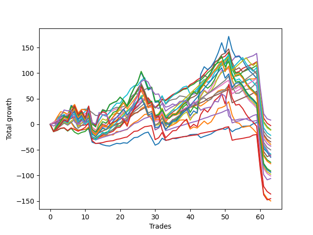

# Short Labrador 008 
- Symbol: ES
- Date Range: 03/18/2022 - 12/30/2022
- Trading Period: 8:30-12:30
- Number of Trades: 50



| Name | Win Percent | Profit | Avg Profit / Trade | Avg Time / Trade |      | Name | Win Percent | Profit | Avg Profit / Trade | Avg Time / Trade |
| ---- | ----------- | ------ | ------------------ | ---------------- | ---- | ---- | ----------- | ------ | ------------------ | ---------------- |
| Sorted By <br> Profit | | | | | | Sorted By <br> Win Percentage ||||
| NEWFI 0000 | 56.00 | 50250.00 | 1005.00 | 27:50 |     | TP-3 | 90.00 | 20375.00 | 407.50 | 11:19 |
| BB-50 Mid | 74.00 | 46750.00 | 935.00 | 16:56 |     | TP-2 | 90.00 | -375.00 | -7.50 | 09:24 |
| BB-20 U/L 2SD C SL-5 | 66.00 | 42000.00 | 840.00 | 10:23 |     | TP-1 | 90.00 | -18125.00 | -362.50 | 07:50 |
| TP-6 | 78.00 | 38125.00 | 762.50 | 24:03 |     | TP-4 | 86.00 | 24500.00 | 490.00 | 15:46 |
| BB-50 U/L 1SD SL-5 | 56.00 | 38000.00 | 760.00 | 14:16 |     | BB-20 U/L 2SD C | 80.00 | 37500.00 | 750.00 | 17:39 |
| BB-20 U/L 2SD C | 80.00 | 37500.00 | 750.00 | 17:39 |     | BB-20 U/L 2SD | 80.00 | 37375.00 | 747.50 | 17:03 |
| BB-20 U/L 2SD | 80.00 | 37375.00 | 747.50 | 17:03 |     | TP-5 | 80.00 | 25750.00 | 515.00 | 21:30 |
| BB-20 U/L 2SD SL-5 | 66.00 | 36500.00 | 730.00 | 09:54 |     | TP-6 | 78.00 | 38125.00 | 762.50 | 24:03 |
| BB-20 U/L 1SD | 76.00 | 35625.00 | 712.50 | 10:28 |     | BB-20 U/L 1SD | 76.00 | 35625.00 | 712.50 | 10:28 |
| BB-20 U/L 2SD C SL-10 | 76.00 | 35500.00 | 710.00 | 12:42 |     | BB-20 U/L 2SD C SL-10 | 76.00 | 35500.00 | 710.00 | 12:42 |
| BB-20 U/L 2SD SL-10 | 76.00 | 30000.00 | 600.00 | 12:12 |     | BB-20 U/L 2SD SL-10 | 76.00 | 30000.00 | 600.00 | 12:12 |
| TP-7 | 74.00 | 28000.00 | 560.00 | 29:03 |     | BB-50 Mid | 74.00 | 46750.00 | 935.00 | 16:56 |
| BB-20 U/L 1SD SL-5 | 68.00 | 27875.00 | 557.50 | 05:44 |     | TP-7 | 74.00 | 28000.00 | 560.00 | 29:03 |
| BB-50 Mid SL-5 | 64.00 | 27375.00 | 547.50 | 08:42 |     | BB-20 U/L 1SD SL-10 | 74.00 | 20500.00 | 410.00 | 07:26 |
| BB-50 U/L 1SD SL-10 | 64.00 | 26875.00 | 537.50 | 18:31 |     | BB-50 Mid SL-10 | 72.00 | 18625.00 | 372.50 | 11:48 |
| BB-50 U/L 1SD | 70.00 | 26500.00 | 530.00 | 27:45 |     | BB-50 U/L 1SD | 70.00 | 26500.00 | 530.00 | 27:45 |
| TP-5 | 80.00 | 25750.00 | 515.00 | 21:30 |     | BB-100 Mid | 70.00 | 18125.00 | 362.50 | 27:05 |
| BB-100 Mid SL-5 | 56.00 | 24750.00 | 495.00 | 13:04 |     | BB-20 Mid SL-10 | 70.00 | -5125.00 | -102.50 | 05:08 |
| TP-4 | 86.00 | 24500.00 | 490.00 | 15:46 |     | BB-20 Mid | 70.00 | -5250.00 | -105.00 | 07:25 |
| BB-100 U/L 2SD SL-5 | 38.00 | 21625.00 | 432.50 | 27:51 |     | BB-20 U/L 1SD SL-5 | 68.00 | 27875.00 | 557.50 | 05:44 |
| BB-20 U/L 1SD SL-10 | 74.00 | 20500.00 | 410.00 | 07:26 |     | TP-8 | 68.00 | 11250.00 | 225.00 | 33:13 |
| TP-3 | 90.00 | 20375.00 | 407.50 | 11:19 |     | BB-20 Mid SL-5 | 68.00 | 3875.00 | 77.50 | 03:51 |
| BB-50 Mid SL-10 | 72.00 | 18625.00 | 372.50 | 11:48 |     | BB-20 U/L 2SD C SL-5 | 66.00 | 42000.00 | 840.00 | 10:23 |
| BB-100 Mid | 70.00 | 18125.00 | 362.50 | 27:05 |     | BB-20 U/L 2SD SL-5 | 66.00 | 36500.00 | 730.00 | 09:54 |
| BB-200 U/L 2SD SL-5 | 38.00 | 17750.00 | 355.00 | 30:34 |     | TP-9 | 66.00 | 17250.00 | 345.00 | 36:45 |
| TP-9 | 66.00 | 17250.00 | 345.00 | 36:45 |     | BB-50 Mid SL-5 | 64.00 | 27375.00 | 547.50 | 08:42 |
| BB-100 Mid SL-10 | 64.00 | 13250.00 | 265.00 | 17:39 |     | BB-50 U/L 1SD SL-10 | 64.00 | 26875.00 | 537.50 | 18:31 |
| BB-200 Mid SL-5 | 48.00 | 12500.00 | 250.00 | 11:32 |     | BB-100 Mid SL-10 | 64.00 | 13250.00 | 265.00 | 17:39 |
| V Mid | 64.00 | 12250.00 | 245.00 | 16:50 |     | V Mid | 64.00 | 12250.00 | 245.00 | 16:50 |
| V U/L 1SD SL-5 | 40.00 | 11625.00 | 232.50 | 23:32 |     | TP-10 | 62.00 | 8000.00 | 160.00 | 40:13 |
| TP-8 | 68.00 | 11250.00 | 225.00 | 33:13 |     | V Mid SL-10 | 60.00 | 5250.00 | 105.00 | 11:28 |
| V Mid SL-5 | 54.00 | 10625.00 | 212.50 | 08:22 |     | NEWFI 000 | 58.00 | -3875.00 | -77.50 | 46:12 |
| BB-100 U/L 2SD SL-10 | 48.00 | 10000.00 | 200.00 | 36:47 |     | V U/L 1SD | 58.00 | -10750.00 | -215.00 | 44:13 |
| BB-100 U/L 2SD | 56.00 | 8250.00 | 165.00 | 49:55 |     | NEWFI 0000 | 56.00 | 50250.00 | 1005.00 | 27:50 |
| TP-10 | 62.00 | 8000.00 | 160.00 | 40:13 |     | BB-50 U/L 1SD SL-5 | 56.00 | 38000.00 | 760.00 | 14:16 |
| BB-200 U/L 2SD SL-10 | 48.00 | 7375.00 | 147.50 | 39:36 |     | BB-100 Mid SL-5 | 56.00 | 24750.00 | 495.00 | 13:04 |
| BB-200 U/L 2SD | 56.00 | 5625.00 | 112.50 | 52:44 |     | BB-100 U/L 2SD | 56.00 | 8250.00 | 165.00 | 49:55 |
| V Mid SL-10 | 60.00 | 5250.00 | 105.00 | 11:28 |     | BB-200 U/L 2SD | 56.00 | 5625.00 | 112.50 | 52:44 |
| BB-50 U/L 2SD SL-5 | 40.00 | 4000.00 | 80.00 | 21:32 |     | NEWFI 06 | 56.00 | 1625.00 | 32.50 | 52:59 |
| BB-20 Mid SL-5 | 68.00 | 3875.00 | 77.50 | 03:51 |     | BB-50 U/L 2SD | 56.00 | -16750.00 | -335.00 | 41:47 |
| NEWFI 06 | 56.00 | 1625.00 | 32.50 | 52:59 |     | BB-200 Mid | 56.00 | -24125.00 | -482.50 | 23:00 |
| TP-2 | 90.00 | -375.00 | -7.50 | 09:24 |     | V Mid SL-5 | 54.00 | 10625.00 | 212.50 | 08:22 |
| NEWFI 000 | 58.00 | -3875.00 | -77.50 | 46:12 |     | BB-200 Mid SL-10 | 54.00 | -4250.00 | -85.00 | 15:32 |
| BB-200 Mid SL-10 | 54.00 | -4250.00 | -85.00 | 15:32 |     | V U/L 1SD SL-10 | 50.00 | -5375.00 | -107.50 | 31:32 |
| BB-20 Mid SL-10 | 70.00 | -5125.00 | -102.50 | 05:08 |     | BB-50 U/L 2SD SL-10 | 50.00 | -8000.00 | -160.00 | 29:35 |
| BB-20 Mid | 70.00 | -5250.00 | -105.00 | 07:25 |     | BB-200 Mid SL-5 | 48.00 | 12500.00 | 250.00 | 11:32 |
| V U/L 1SD SL-10 | 50.00 | -5375.00 | -107.50 | 31:32 |     | BB-100 U/L 2SD SL-10 | 48.00 | 10000.00 | 200.00 | 36:47 |
| BB-50 U/L 2SD SL-10 | 50.00 | -8000.00 | -160.00 | 29:35 |     | BB-200 U/L 2SD SL-10 | 48.00 | 7375.00 | 147.50 | 39:36 |
| V U/L 1SD | 58.00 | -10750.00 | -215.00 | 44:13 |     | V U/L 1SD SL-5 | 40.00 | 11625.00 | 232.50 | 23:32 |
| BB-50 U/L 2SD | 56.00 | -16750.00 | -335.00 | 41:47 |     | BB-50 U/L 2SD SL-5 | 40.00 | 4000.00 | 80.00 | 21:32 |
| TP-1 | 90.00 | -18125.00 | -362.50 | 07:50 |     | BB-100 U/L 2SD SL-5 | 38.00 | 21625.00 | 432.50 | 27:51 |
| BB-200 Mid | 56.00 | -24125.00 | -482.50 | 23:00 |     | BB-200 U/L 2SD SL-5 | 38.00 | 17750.00 | 355.00 | 30:34 |

## NO STOPLOSS

### Test BB-20 Mid
* Sell when price hits the middle line of the 20p bollinger
* No Stoploss
* Results:
```
Total Trades: 50
Percent Up: 30.00
Percent Down: 70.00
Total Points Moved Down: -10.50
Potential Profit: -5250.00
Total Points Ups: 90.00 Count Ups: 15
Total Points Downs: 79.50 Count Downs: 35
```

<details><summary>Trades</summary>

<code>In: 2022-03-25 10:23:00		Out: 2022-03-25 10:24:10		Total Position Time: 01:10		Total Move Down: 2.00		Total to Date: 2.00</code> <br />
<code>In: 2022-03-25 11:58:00		Out: 2022-03-25 12:00:05		Total Position Time: 02:05		Total Move Down: -0.75		Total to Date: 1.25</code> <br />
<code>In: 2022-03-29 08:53:00		Out: 2022-03-29 08:56:20		Total Position Time: 03:20		Total Move Down: 0.75		Total to Date: 2.00</code> <br />
<code>In: 2022-03-30 09:47:00		Out: 2022-03-30 09:50:55		Total Position Time: 03:55		Total Move Down: 0.75		Total to Date: 2.75</code> <br />
<code>In: 2022-04-01 11:09:00		Out: 2022-04-01 11:25:25		Total Position Time: 16:25		Total Move Down: -0.25		Total to Date: 2.50</code> <br />
<code>In: 2022-04-07 10:17:00		Out: 2022-04-07 10:37:30		Total Position Time: 20:30		Total Move Down: -6.00		Total to Date: -3.50</code> <br />
<code>In: 2022-04-18 11:00:00		Out: 2022-04-18 11:01:10		Total Position Time: 01:10		Total Move Down: -0.00		Total to Date: -3.50</code> <br />
<code>In: 2022-04-25 09:29:00		Out: 2022-04-25 09:31:05		Total Position Time: 02:05		Total Move Down: 1.00		Total to Date: -2.50</code> <br />
<code>In: 2022-04-26 09:32:00		Out: 2022-04-26 09:37:15		Total Position Time: 05:15		Total Move Down: 1.00		Total to Date: -1.50</code> <br />
<code>In: 2022-05-02 12:18:00		Out: 2022-05-02 12:43:40		Total Position Time: 25:40		Total Move Down: -25.75		Total to Date: -27.25</code> <br />
<code>In: 2022-05-09 09:21:00		Out: 2022-05-09 09:26:05		Total Position Time: 05:05		Total Move Down: 0.25		Total to Date: -27.00</code> <br />
<code>In: 2022-05-16 08:52:00		Out: 2022-05-16 09:05:50		Total Position Time: 13:50		Total Move Down: -2.75		Total to Date: -29.75</code> <br />
<code>In: 2022-05-24 10:45:00		Out: 2022-05-24 11:01:15		Total Position Time: 16:15		Total Move Down: -1.75		Total to Date: -31.50</code> <br />
<code>In: 2022-06-01 11:30:00		Out: 2022-06-01 11:40:05		Total Position Time: 10:05		Total Move Down: 2.75		Total to Date: -28.75</code> <br />
<code>In: 2022-06-01 12:25:00		Out: 2022-06-01 12:26:10		Total Position Time: 01:10		Total Move Down: 2.50		Total to Date: -26.25</code> <br />
<code>In: 2022-06-09 09:38:00		Out: 2022-06-09 09:49:20		Total Position Time: 11:20		Total Move Down: -0.75		Total to Date: -27.00</code> <br />
<code>In: 2022-06-10 10:54:00		Out: 2022-06-10 10:55:10		Total Position Time: 01:10		Total Move Down: 2.00		Total to Date: -25.00</code> <br />
<code>In: 2022-06-10 11:36:00		Out: 2022-06-10 11:37:15		Total Position Time: 01:15		Total Move Down: -1.00		Total to Date: -26.00</code> <br />
<code>In: 2022-06-10 12:30:00		Out: 2022-06-10 12:31:10		Total Position Time: 01:10		Total Move Down: 5.50		Total to Date: -20.50</code> <br />
<code>In: 2022-06-14 08:48:00		Out: 2022-06-14 08:49:10		Total Position Time: 01:10		Total Move Down: 5.50		Total to Date: -15.00</code> <br />
<code>In: 2022-06-16 08:31:00		Out: 2022-06-16 08:32:10		Total Position Time: 01:10		Total Move Down: 0.75		Total to Date: -14.25</code> <br />
<code>In: 2022-06-16 10:12:00		Out: 2022-06-16 10:13:10		Total Position Time: 01:10		Total Move Down: 4.25		Total to Date: -10.00</code> <br />
<code>In: 2022-06-17 09:30:00		Out: 2022-06-17 09:31:10		Total Position Time: 01:10		Total Move Down: 4.00		Total to Date: -6.00</code> <br />
<code>In: 2022-06-23 11:42:00		Out: 2022-06-23 11:46:05		Total Position Time: 04:05		Total Move Down: 1.75		Total to Date: -4.25</code> <br />
<code>In: 2022-06-29 10:47:00		Out: 2022-06-29 11:20:00		Total Position Time: 33:00		Total Move Down: -12.25		Total to Date: -16.50</code> <br />
<code>In: 2022-07-01 10:36:00		Out: 2022-07-01 11:02:15		Total Position Time: 26:15		Total Move Down: -13.25		Total to Date: -29.75</code> <br />
<code>In: 2022-07-05 08:59:00		Out: 2022-07-05 09:03:00		Total Position Time: 04:00		Total Move Down: 3.25		Total to Date: -26.50</code> <br />
<code>In: 2022-07-12 08:34:00		Out: 2022-07-12 08:37:00		Total Position Time: 03:00		Total Move Down: 1.50		Total to Date: -25.00</code> <br />
<code>In: 2022-07-26 10:14:00		Out: 2022-07-26 10:15:10		Total Position Time: 01:10		Total Move Down: 2.50		Total to Date: -22.50</code> <br />
<code>In: 2022-08-01 12:12:00		Out: 2022-08-01 12:20:15		Total Position Time: 08:15		Total Move Down: -0.50		Total to Date: -23.00</code> <br />
<code>In: 2022-08-04 10:40:00		Out: 2022-08-04 10:43:05		Total Position Time: 03:05		Total Move Down: 2.00		Total to Date: -21.00</code> <br />
<code>In: 2022-08-11 10:22:00		Out: 2022-08-11 10:27:30		Total Position Time: 05:30		Total Move Down: 2.00		Total to Date: -19.00</code> <br />
<code>In: 2022-08-22 08:45:00		Out: 2022-08-22 08:47:30		Total Position Time: 02:30		Total Move Down: 0.25		Total to Date: -18.75</code> <br />
<code>In: 2022-09-01 10:33:00		Out: 2022-09-01 10:36:40		Total Position Time: 03:40		Total Move Down: 3.50		Total to Date: -15.25</code> <br />
<code>In: 2022-09-12 10:33:00		Out: 2022-09-12 10:36:35		Total Position Time: 03:35		Total Move Down: 0.50		Total to Date: -14.75</code> <br />
<code>In: 2022-09-16 10:41:00		Out: 2022-09-16 10:45:30		Total Position Time: 04:30		Total Move Down: 0.25		Total to Date: -14.50</code> <br />
<code>In: 2022-09-22 09:56:00		Out: 2022-09-22 09:58:35		Total Position Time: 02:35		Total Move Down: 2.75		Total to Date: -11.75</code> <br />
<code>In: 2022-09-22 12:17:00		Out: 2022-09-22 12:19:50		Total Position Time: 02:50		Total Move Down: 2.25		Total to Date: -9.50</code> <br />
<code>In: 2022-10-06 09:48:00		Out: 2022-10-06 09:55:05		Total Position Time: 07:05		Total Move Down: 2.50		Total to Date: -7.00</code> <br />
<code>In: 2022-10-10 10:58:00		Out: 2022-10-10 11:04:05		Total Position Time: 06:05		Total Move Down: 4.75		Total to Date: -2.25</code> <br />
<code>In: 2022-10-18 10:39:00		Out: 2022-10-18 10:46:40		Total Position Time: 07:40		Total Move Down: 3.75		Total to Date: 1.50</code> <br />
<code>In: 2022-10-27 10:25:00		Out: 2022-10-27 10:26:10		Total Position Time: 01:10		Total Move Down: 1.75		Total to Date: 3.25</code> <br />
<code>In: 2022-11-04 12:01:00		Out: 2022-11-04 12:20:25		Total Position Time: 19:25		Total Move Down: -8.00		Total to Date: -4.75</code> <br />
<code>In: 2022-11-04 12:15:00		Out: 2022-11-04 12:20:25		Total Position Time: 05:25		Total Move Down: 4.50		Total to Date: -0.25</code> <br />
<code>In: 2022-11-16 08:31:00		Out: 2022-11-16 08:35:05		Total Position Time: 04:05		Total Move Down: 1.75		Total to Date: 1.50</code> <br />
<code>In: 2022-11-18 12:10:00		Out: 2022-11-18 12:16:50		Total Position Time: 06:50		Total Move Down: 4.25		Total to Date: 5.75</code> <br />
<code>In: 2022-11-21 09:40:00		Out: 2022-11-21 09:49:20		Total Position Time: 09:20		Total Move Down: 0.50		Total to Date: 6.25</code> <br />
<code>In: 2022-11-21 09:48:00		Out: 2022-11-21 09:49:20		Total Position Time: 01:20		Total Move Down: 0.25		Total to Date: 6.50</code> <br />
<code>In: 2022-12-16 12:20:00		Out: 2022-12-16 12:45:00		Total Position Time: 25:00		Total Move Down: -7.25		Total to Date: -0.75</code> <br />
<code>In: 2022-12-22 12:13:00		Out: 2022-12-22 12:35:15		Total Position Time: 22:15		Total Move Down: -9.75		Total to Date: -10.50</code> <br />


</details>

### Test BB-20 U/L 1SD
* Sell when the price hits the lower line of the 20p 1std bollinger
* No Stoploss
* Results:
```
Total Trades: 50
Percent Up: 24.00
Percent Down: 76.00
Total Points Moved Down: 71.25
Potential Profit: 35625.00
Total Points Ups: 77.75 Count Ups: 12
Total Points Downs: 149.00 Count Downs: 38
```

<details><summary>Trades</summary>

<code>In: 2022-03-25 10:23:00		Out: 2022-03-25 10:24:15		Total Position Time: 01:15		Total Move Down: 3.00		Total to Date: 3.00</code> <br />
<code>In: 2022-03-25 11:58:00		Out: 2022-03-25 12:00:45		Total Position Time: 02:45		Total Move Down: 1.25		Total to Date: 4.25</code> <br />
<code>In: 2022-03-29 08:53:00		Out: 2022-03-29 08:58:40		Total Position Time: 05:40		Total Move Down: 2.25		Total to Date: 6.50</code> <br />
<code>In: 2022-03-30 09:47:00		Out: 2022-03-30 10:00:45		Total Position Time: 13:45		Total Move Down: -0.00		Total to Date: 6.50</code> <br />
<code>In: 2022-04-01 11:09:00		Out: 2022-04-01 11:50:15		Total Position Time: 41:15		Total Move Down: -6.50		Total to Date: 0.00</code> <br />
<code>In: 2022-04-07 10:17:00		Out: 2022-04-07 10:40:00		Total Position Time: 23:00		Total Move Down: -4.25		Total to Date: -4.25</code> <br />
<code>In: 2022-04-18 11:00:00		Out: 2022-04-18 11:06:35		Total Position Time: 06:35		Total Move Down: 1.75		Total to Date: -2.50</code> <br />
<code>In: 2022-04-25 09:29:00		Out: 2022-04-25 09:42:45		Total Position Time: 13:45		Total Move Down: -0.25		Total to Date: -2.75</code> <br />
<code>In: 2022-04-26 09:32:00		Out: 2022-04-26 09:38:05		Total Position Time: 06:05		Total Move Down: 5.00		Total to Date: 2.25</code> <br />
<code>In: 2022-05-02 12:18:00		Out: 2022-05-02 12:44:05		Total Position Time: 26:05		Total Move Down: -22.00		Total to Date: -19.75</code> <br />
<code>In: 2022-05-09 09:21:00		Out: 2022-05-09 09:27:05		Total Position Time: 06:05		Total Move Down: 2.25		Total to Date: -17.50</code> <br />
<code>In: 2022-05-16 08:52:00		Out: 2022-05-16 09:06:25		Total Position Time: 14:25		Total Move Down: 2.50		Total to Date: -15.00</code> <br />
<code>In: 2022-05-24 10:45:00		Out: 2022-05-24 11:01:40		Total Position Time: 16:40		Total Move Down: 1.75		Total to Date: -13.25</code> <br />
<code>In: 2022-06-01 11:30:00		Out: 2022-06-01 11:46:40		Total Position Time: 16:40		Total Move Down: -0.25		Total to Date: -13.50</code> <br />
<code>In: 2022-06-01 12:25:00		Out: 2022-06-01 12:30:05		Total Position Time: 05:05		Total Move Down: 6.75		Total to Date: -6.75</code> <br />
<code>In: 2022-06-09 09:38:00		Out: 2022-06-09 09:54:45		Total Position Time: 16:45		Total Move Down: -0.50		Total to Date: -7.25</code> <br />
<code>In: 2022-06-10 10:54:00		Out: 2022-06-10 10:56:05		Total Position Time: 02:05		Total Move Down: 2.75		Total to Date: -4.50</code> <br />
<code>In: 2022-06-10 11:36:00		Out: 2022-06-10 11:38:10		Total Position Time: 02:10		Total Move Down: 1.50		Total to Date: -3.00</code> <br />
<code>In: 2022-06-10 12:30:00		Out: 2022-06-10 12:35:45		Total Position Time: 05:45		Total Move Down: 8.25		Total to Date: 5.25</code> <br />
<code>In: 2022-06-14 08:48:00		Out: 2022-06-14 08:49:10		Total Position Time: 01:10		Total Move Down: 5.50		Total to Date: 10.75</code> <br />
<code>In: 2022-06-16 08:31:00		Out: 2022-06-16 08:32:30		Total Position Time: 01:30		Total Move Down: 3.50		Total to Date: 14.25</code> <br />
<code>In: 2022-06-16 10:12:00		Out: 2022-06-16 10:19:25		Total Position Time: 07:25		Total Move Down: 6.00		Total to Date: 20.25</code> <br />
<code>In: 2022-06-17 09:30:00		Out: 2022-06-17 09:36:10		Total Position Time: 06:10		Total Move Down: 6.25		Total to Date: 26.50</code> <br />
<code>In: 2022-06-23 11:42:00		Out: 2022-06-23 11:53:10		Total Position Time: 11:10		Total Move Down: 0.75		Total to Date: 27.25</code> <br />
<code>In: 2022-06-29 10:47:00		Out: 2022-06-29 11:20:35		Total Position Time: 33:35		Total Move Down: -10.25		Total to Date: 17.00</code> <br />
<code>In: 2022-07-01 10:36:00		Out: 2022-07-01 11:04:30		Total Position Time: 28:30		Total Move Down: -11.50		Total to Date: 5.50</code> <br />
<code>In: 2022-07-05 08:59:00		Out: 2022-07-05 09:03:30		Total Position Time: 04:30		Total Move Down: 4.75		Total to Date: 10.25</code> <br />
<code>In: 2022-07-12 08:34:00		Out: 2022-07-12 08:38:10		Total Position Time: 04:10		Total Move Down: 4.50		Total to Date: 14.75</code> <br />
<code>In: 2022-07-26 10:14:00		Out: 2022-07-26 10:19:10		Total Position Time: 05:10		Total Move Down: 4.25		Total to Date: 19.00</code> <br />
<code>In: 2022-08-01 12:12:00		Out: 2022-08-01 12:21:45		Total Position Time: 09:45		Total Move Down: 1.50		Total to Date: 20.50</code> <br />
<code>In: 2022-08-04 10:40:00		Out: 2022-08-04 10:43:15		Total Position Time: 03:15		Total Move Down: 3.50		Total to Date: 24.00</code> <br />
<code>In: 2022-08-11 10:22:00		Out: 2022-08-11 10:31:50		Total Position Time: 09:50		Total Move Down: 3.25		Total to Date: 27.25</code> <br />
<code>In: 2022-08-22 08:45:00		Out: 2022-08-22 08:48:20		Total Position Time: 03:20		Total Move Down: 2.50		Total to Date: 29.75</code> <br />
<code>In: 2022-09-01 10:33:00		Out: 2022-09-01 10:41:50		Total Position Time: 08:50		Total Move Down: 5.25		Total to Date: 35.00</code> <br />
<code>In: 2022-09-12 10:33:00		Out: 2022-09-12 10:41:30		Total Position Time: 08:30		Total Move Down: 2.00		Total to Date: 37.00</code> <br />
<code>In: 2022-09-16 10:41:00		Out: 2022-09-16 10:47:20		Total Position Time: 06:20		Total Move Down: 3.00		Total to Date: 40.00</code> <br />
<code>In: 2022-09-22 09:56:00		Out: 2022-09-22 09:59:15		Total Position Time: 03:15		Total Move Down: 4.50		Total to Date: 44.50</code> <br />
<code>In: 2022-09-22 12:17:00		Out: 2022-09-22 12:20:20		Total Position Time: 03:20		Total Move Down: 5.25		Total to Date: 49.75</code> <br />
<code>In: 2022-10-06 09:48:00		Out: 2022-10-06 09:57:05		Total Position Time: 09:05		Total Move Down: 5.00		Total to Date: 54.75</code> <br />
<code>In: 2022-10-10 10:58:00		Out: 2022-10-10 11:06:05		Total Position Time: 08:05		Total Move Down: 7.75		Total to Date: 62.50</code> <br />
<code>In: 2022-10-18 10:39:00		Out: 2022-10-18 10:47:10		Total Position Time: 08:10		Total Move Down: 6.75		Total to Date: 69.25</code> <br />
<code>In: 2022-10-27 10:25:00		Out: 2022-10-27 10:26:20		Total Position Time: 01:20		Total Move Down: 2.50		Total to Date: 71.75</code> <br />
<code>In: 2022-11-04 12:01:00		Out: 2022-11-04 12:22:20		Total Position Time: 21:20		Total Move Down: -5.50		Total to Date: 66.25</code> <br />
<code>In: 2022-11-04 12:15:00		Out: 2022-11-04 12:22:20		Total Position Time: 07:20		Total Move Down: 7.00		Total to Date: 73.25</code> <br />
<code>In: 2022-11-16 08:31:00		Out: 2022-11-16 08:38:25		Total Position Time: 07:25		Total Move Down: 3.75		Total to Date: 77.00</code> <br />
<code>In: 2022-11-18 12:10:00		Out: 2022-11-18 12:20:30		Total Position Time: 10:30		Total Move Down: 5.25		Total to Date: 82.25</code> <br />
<code>In: 2022-11-21 09:40:00		Out: 2022-11-21 09:50:20		Total Position Time: 10:20		Total Move Down: 3.00		Total to Date: 85.25</code> <br />
<code>In: 2022-11-21 09:48:00		Out: 2022-11-21 09:50:20		Total Position Time: 02:20		Total Move Down: 2.75		Total to Date: 88.00</code> <br />
<code>In: 2022-12-16 12:20:00		Out: 2022-12-16 12:47:00		Total Position Time: 27:00		Total Move Down: -10.00		Total to Date: 78.00</code> <br />
<code>In: 2022-12-22 12:13:00		Out: 2022-12-22 12:37:50		Total Position Time: 24:50		Total Move Down: -6.75		Total to Date: 71.25</code> <br />


</details>

### Test BB-20 U/L 2SD
* Sell when the price hits the lower line of the 20p 2std bollinger
* No Stoploss
* Results:
```
Total Trades: 50
Percent Up: 20.00
Percent Down: 80.00
Total Points Moved Down: 74.75
Potential Profit: 37375.00
Total Points Ups: 115.25 Count Ups: 10
Total Points Downs: 190.00 Count Downs: 40
```

<details><summary>Trades</summary>

<code>In: 2022-03-25 10:23:00		Out: 2022-03-25 11:23:55		Total Position Time: 60:55		Total Move Down: -14.25		Total to Date: -14.25</code> <br />
<code>In: 2022-03-25 11:58:00		Out: 2022-03-25 12:00:55		Total Position Time: 02:55		Total Move Down: 2.25		Total to Date: -12.00</code> <br />
<code>In: 2022-03-29 08:53:00		Out: 2022-03-29 09:01:40		Total Position Time: 08:40		Total Move Down: 3.75		Total to Date: -8.25</code> <br />
<code>In: 2022-03-30 09:47:00		Out: 2022-03-30 10:01:15		Total Position Time: 14:15		Total Move Down: 1.00		Total to Date: -7.25</code> <br />
<code>In: 2022-04-01 11:09:00		Out: 2022-04-01 11:50:20		Total Position Time: 41:20		Total Move Down: -6.00		Total to Date: -13.25</code> <br />
<code>In: 2022-04-07 10:17:00		Out: 2022-04-07 10:45:15		Total Position Time: 28:15		Total Move Down: -3.50		Total to Date: -16.75</code> <br />
<code>In: 2022-04-18 11:00:00		Out: 2022-04-18 11:10:40		Total Position Time: 10:40		Total Move Down: 3.25		Total to Date: -13.50</code> <br />
<code>In: 2022-04-25 09:29:00		Out: 2022-04-25 10:01:15		Total Position Time: 32:15		Total Move Down: 1.75		Total to Date: -11.75</code> <br />
<code>In: 2022-04-26 09:32:00		Out: 2022-04-26 09:40:15		Total Position Time: 08:15		Total Move Down: 6.75		Total to Date: -5.00</code> <br />
<code>In: 2022-05-02 12:18:00		Out: 2022-05-02 12:45:05		Total Position Time: 27:05		Total Move Down: -16.75		Total to Date: -21.75</code> <br />
<code>In: 2022-05-09 09:21:00		Out: 2022-05-09 09:37:50		Total Position Time: 16:50		Total Move Down: 5.75		Total to Date: -16.00</code> <br />
<code>In: 2022-05-16 08:52:00		Out: 2022-05-16 09:11:45		Total Position Time: 19:45		Total Move Down: 3.50		Total to Date: -12.50</code> <br />
<code>In: 2022-05-24 10:45:00		Out: 2022-05-24 11:01:50		Total Position Time: 16:50		Total Move Down: 2.75		Total to Date: -9.75</code> <br />
<code>In: 2022-06-01 11:30:00		Out: 2022-06-01 11:51:10		Total Position Time: 21:10		Total Move Down: 2.75		Total to Date: -7.00</code> <br />
<code>In: 2022-06-01 12:25:00		Out: 2022-06-01 12:30:05		Total Position Time: 05:05		Total Move Down: 6.75		Total to Date: -0.25</code> <br />
<code>In: 2022-06-09 09:38:00		Out: 2022-06-09 09:55:00		Total Position Time: 17:00		Total Move Down: 1.25		Total to Date: 1.00</code> <br />
<code>In: 2022-06-10 10:54:00		Out: 2022-06-10 11:01:00		Total Position Time: 07:00		Total Move Down: 7.50		Total to Date: 8.50</code> <br />
<code>In: 2022-06-10 11:36:00		Out: 2022-06-10 11:40:10		Total Position Time: 04:10		Total Move Down: 3.75		Total to Date: 12.25</code> <br />
<code>In: 2022-06-10 12:30:00		Out: 2022-06-10 12:42:45		Total Position Time: 12:45		Total Move Down: 11.75		Total to Date: 24.00</code> <br />
<code>In: 2022-06-14 08:48:00		Out: 2022-06-14 08:51:40		Total Position Time: 03:40		Total Move Down: 9.00		Total to Date: 33.00</code> <br />
<code>In: 2022-06-16 08:31:00		Out: 2022-06-16 08:36:10		Total Position Time: 05:10		Total Move Down: 5.50		Total to Date: 38.50</code> <br />
<code>In: 2022-06-16 10:12:00		Out: 2022-06-16 10:20:20		Total Position Time: 08:20		Total Move Down: 7.25		Total to Date: 45.75</code> <br />
<code>In: 2022-06-17 09:30:00		Out: 2022-06-17 09:53:15		Total Position Time: 23:15		Total Move Down: 5.50		Total to Date: 51.25</code> <br />
<code>In: 2022-06-23 11:42:00		Out: 2022-06-23 12:01:10		Total Position Time: 19:10		Total Move Down: 3.00		Total to Date: 54.25</code> <br />
<code>In: 2022-06-29 10:47:00		Out: 2022-06-29 11:21:10		Total Position Time: 34:10		Total Move Down: -9.25		Total to Date: 45.00</code> <br />
<code>In: 2022-07-01 10:36:00		Out: 2022-07-01 11:07:55		Total Position Time: 31:55		Total Move Down: -9.50		Total to Date: 35.50</code> <br />
<code>In: 2022-07-05 08:59:00		Out: 2022-07-05 09:05:50		Total Position Time: 06:50		Total Move Down: 6.00		Total to Date: 41.50</code> <br />
<code>In: 2022-07-12 08:34:00		Out: 2022-07-12 08:41:10		Total Position Time: 07:10		Total Move Down: 5.50		Total to Date: 47.00</code> <br />
<code>In: 2022-07-26 10:14:00		Out: 2022-07-26 10:32:35		Total Position Time: 18:35		Total Move Down: 4.75		Total to Date: 51.75</code> <br />
<code>In: 2022-08-01 12:12:00		Out: 2022-08-01 12:22:35		Total Position Time: 10:35		Total Move Down: 3.50		Total to Date: 55.25</code> <br />
<code>In: 2022-08-04 10:40:00		Out: 2022-08-04 10:45:30		Total Position Time: 05:30		Total Move Down: 3.75		Total to Date: 59.00</code> <br />
<code>In: 2022-08-11 10:22:00		Out: 2022-08-11 10:33:20		Total Position Time: 11:20		Total Move Down: 4.50		Total to Date: 63.50</code> <br />
<code>In: 2022-08-22 08:45:00		Out: 2022-08-22 09:08:15		Total Position Time: 23:15		Total Move Down: 1.50		Total to Date: 65.00</code> <br />
<code>In: 2022-09-01 10:33:00		Out: 2022-09-01 10:45:10		Total Position Time: 12:10		Total Move Down: 5.75		Total to Date: 70.75</code> <br />
<code>In: 2022-09-12 10:33:00		Out: 2022-09-12 10:43:35		Total Position Time: 10:35		Total Move Down: 3.25		Total to Date: 74.00</code> <br />
<code>In: 2022-09-16 10:41:00		Out: 2022-09-16 10:49:25		Total Position Time: 08:25		Total Move Down: 5.50		Total to Date: 79.50</code> <br />
<code>In: 2022-09-22 09:56:00		Out: 2022-09-22 10:03:25		Total Position Time: 07:25		Total Move Down: 6.75		Total to Date: 86.25</code> <br />
<code>In: 2022-09-22 12:17:00		Out: 2022-09-22 12:22:20		Total Position Time: 05:20		Total Move Down: 7.75		Total to Date: 94.00</code> <br />
<code>In: 2022-10-06 09:48:00		Out: 2022-10-06 10:02:00		Total Position Time: 14:00		Total Move Down: 6.00		Total to Date: 100.00</code> <br />
<code>In: 2022-10-10 10:58:00		Out: 2022-10-10 11:07:05		Total Position Time: 09:05		Total Move Down: 9.50		Total to Date: 109.50</code> <br />
<code>In: 2022-10-18 10:39:00		Out: 2022-10-18 11:04:45		Total Position Time: 25:45		Total Move Down: 4.00		Total to Date: 113.50</code> <br />
<code>In: 2022-10-27 10:25:00		Out: 2022-10-27 10:27:05		Total Position Time: 02:05		Total Move Down: 2.75		Total to Date: 116.25</code> <br />
<code>In: 2022-11-04 12:01:00		Out: 2022-11-04 12:47:00		Total Position Time: 46:00		Total Move Down: -26.50		Total to Date: 89.75</code> <br />
<code>In: 2022-11-04 12:15:00		Out: 2022-11-04 12:47:00		Total Position Time: 32:00		Total Move Down: -14.00		Total to Date: 75.75</code> <br />
<code>In: 2022-11-16 08:31:00		Out: 2022-11-16 09:01:40		Total Position Time: 30:40		Total Move Down: 2.25		Total to Date: 78.00</code> <br />
<code>In: 2022-11-18 12:10:00		Out: 2022-11-18 12:21:30		Total Position Time: 11:30		Total Move Down: 6.00		Total to Date: 84.00</code> <br />
<code>In: 2022-11-21 09:40:00		Out: 2022-11-21 09:53:05		Total Position Time: 13:05		Total Move Down: 3.25		Total to Date: 87.25</code> <br />
<code>In: 2022-11-21 09:48:00		Out: 2022-11-21 09:53:05		Total Position Time: 05:05		Total Move Down: 3.00		Total to Date: 90.25</code> <br />
<code>In: 2022-12-16 12:20:00		Out: 2022-12-16 12:47:00		Total Position Time: 27:00		Total Move Down: -10.00		Total to Date: 80.25</code> <br />
<code>In: 2022-12-22 12:13:00		Out: 2022-12-22 12:41:15		Total Position Time: 28:15		Total Move Down: -5.50		Total to Date: 74.75</code> <br />


</details>

### Test BB-20 U/L 2SD C
* Sell when the price hits the lower line of the 20p 2std bollinger
* No Stoploss
* Results:
```
Total Trades: 50
Percent Up: 20.00
Percent Down: 80.00
Total Points Moved Down: 75.00
Potential Profit: 37500.00
Total Points Ups: 128.50 Count Ups: 10
Total Points Downs: 203.50 Count Downs: 40
```

<details><summary>Trades</summary>

<code>In: 2022-03-25 10:23:00		Out: 2022-03-25 11:23:55		Total Position Time: 60:55		Total Move Down: -14.25		Total to Date: -14.25</code> <br />
<code>In: 2022-03-25 11:58:00		Out: 2022-03-25 12:01:15		Total Position Time: 03:15		Total Move Down: 2.75		Total to Date: -11.50</code> <br />
<code>In: 2022-03-29 08:53:00		Out: 2022-03-29 09:01:40		Total Position Time: 08:40		Total Move Down: 3.75		Total to Date: -7.75</code> <br />
<code>In: 2022-03-30 09:47:00		Out: 2022-03-30 10:01:15		Total Position Time: 14:15		Total Move Down: 1.00		Total to Date: -6.75</code> <br />
<code>In: 2022-04-01 11:09:00		Out: 2022-04-01 11:50:45		Total Position Time: 41:45		Total Move Down: -5.50		Total to Date: -12.25</code> <br />
<code>In: 2022-04-07 10:17:00		Out: 2022-04-07 10:48:00		Total Position Time: 31:00		Total Move Down: -3.25		Total to Date: -15.50</code> <br />
<code>In: 2022-04-18 11:00:00		Out: 2022-04-18 11:10:40		Total Position Time: 10:40		Total Move Down: 3.25		Total to Date: -12.25</code> <br />
<code>In: 2022-04-25 09:29:00		Out: 2022-04-25 10:01:20		Total Position Time: 32:20		Total Move Down: 4.25		Total to Date: -8.00</code> <br />
<code>In: 2022-04-26 09:32:00		Out: 2022-04-26 09:47:10		Total Position Time: 15:10		Total Move Down: 9.50		Total to Date: 1.50</code> <br />
<code>In: 2022-05-02 12:18:00		Out: 2022-05-02 12:47:00		Total Position Time: 29:00		Total Move Down: -31.75		Total to Date: -30.25</code> <br />
<code>In: 2022-05-09 09:21:00		Out: 2022-05-09 09:37:50		Total Position Time: 16:50		Total Move Down: 5.75		Total to Date: -24.50</code> <br />
<code>In: 2022-05-16 08:52:00		Out: 2022-05-16 09:11:45		Total Position Time: 19:45		Total Move Down: 3.50		Total to Date: -21.00</code> <br />
<code>In: 2022-05-24 10:45:00		Out: 2022-05-24 11:01:50		Total Position Time: 16:50		Total Move Down: 2.75		Total to Date: -18.25</code> <br />
<code>In: 2022-06-01 11:30:00		Out: 2022-06-01 11:51:10		Total Position Time: 21:10		Total Move Down: 2.75		Total to Date: -15.50</code> <br />
<code>In: 2022-06-01 12:25:00		Out: 2022-06-01 12:30:05		Total Position Time: 05:05		Total Move Down: 6.75		Total to Date: -8.75</code> <br />
<code>In: 2022-06-09 09:38:00		Out: 2022-06-09 09:55:00		Total Position Time: 17:00		Total Move Down: 1.25		Total to Date: -7.50</code> <br />
<code>In: 2022-06-10 10:54:00		Out: 2022-06-10 11:01:10		Total Position Time: 07:10		Total Move Down: 8.50		Total to Date: 1.00</code> <br />
<code>In: 2022-06-10 11:36:00		Out: 2022-06-10 11:40:10		Total Position Time: 04:10		Total Move Down: 3.75		Total to Date: 4.75</code> <br />
<code>In: 2022-06-10 12:30:00		Out: 2022-06-10 12:43:10		Total Position Time: 13:10		Total Move Down: 12.50		Total to Date: 17.25</code> <br />
<code>In: 2022-06-14 08:48:00		Out: 2022-06-14 08:51:45		Total Position Time: 03:45		Total Move Down: 9.25		Total to Date: 26.50</code> <br />
<code>In: 2022-06-16 08:31:00		Out: 2022-06-16 08:41:35		Total Position Time: 10:35		Total Move Down: 6.25		Total to Date: 32.75</code> <br />
<code>In: 2022-06-16 10:12:00		Out: 2022-06-16 10:20:25		Total Position Time: 08:25		Total Move Down: 7.75		Total to Date: 40.50</code> <br />
<code>In: 2022-06-17 09:30:00		Out: 2022-06-17 09:53:20		Total Position Time: 23:20		Total Move Down: 6.25		Total to Date: 46.75</code> <br />
<code>In: 2022-06-23 11:42:00		Out: 2022-06-23 12:01:10		Total Position Time: 19:10		Total Move Down: 3.00		Total to Date: 49.75</code> <br />
<code>In: 2022-06-29 10:47:00		Out: 2022-06-29 11:21:15		Total Position Time: 34:15		Total Move Down: -9.25		Total to Date: 40.50</code> <br />
<code>In: 2022-07-01 10:36:00		Out: 2022-07-01 11:07:55		Total Position Time: 31:55		Total Move Down: -9.50		Total to Date: 31.00</code> <br />
<code>In: 2022-07-05 08:59:00		Out: 2022-07-05 09:05:50		Total Position Time: 06:50		Total Move Down: 6.00		Total to Date: 37.00</code> <br />
<code>In: 2022-07-12 08:34:00		Out: 2022-07-12 08:41:10		Total Position Time: 07:10		Total Move Down: 5.50		Total to Date: 42.50</code> <br />
<code>In: 2022-07-26 10:14:00		Out: 2022-07-26 10:33:10		Total Position Time: 19:10		Total Move Down: 5.25		Total to Date: 47.75</code> <br />
<code>In: 2022-08-01 12:12:00		Out: 2022-08-01 12:22:35		Total Position Time: 10:35		Total Move Down: 3.50		Total to Date: 51.25</code> <br />
<code>In: 2022-08-04 10:40:00		Out: 2022-08-04 10:52:45		Total Position Time: 12:45		Total Move Down: 3.00		Total to Date: 54.25</code> <br />
<code>In: 2022-08-11 10:22:00		Out: 2022-08-11 10:33:25		Total Position Time: 11:25		Total Move Down: 5.00		Total to Date: 59.25</code> <br />
<code>In: 2022-08-22 08:45:00		Out: 2022-08-22 09:08:15		Total Position Time: 23:15		Total Move Down: 1.50		Total to Date: 60.75</code> <br />
<code>In: 2022-09-01 10:33:00		Out: 2022-09-01 10:45:15		Total Position Time: 12:15		Total Move Down: 6.75		Total to Date: 67.50</code> <br />
<code>In: 2022-09-12 10:33:00		Out: 2022-09-12 10:44:05		Total Position Time: 11:05		Total Move Down: 3.50		Total to Date: 71.00</code> <br />
<code>In: 2022-09-16 10:41:00		Out: 2022-09-16 10:49:25		Total Position Time: 08:25		Total Move Down: 5.50		Total to Date: 76.50</code> <br />
<code>In: 2022-09-22 09:56:00		Out: 2022-09-22 10:03:30		Total Position Time: 07:30		Total Move Down: 7.25		Total to Date: 83.75</code> <br />
<code>In: 2022-09-22 12:17:00		Out: 2022-09-22 12:22:20		Total Position Time: 05:20		Total Move Down: 7.75		Total to Date: 91.50</code> <br />
<code>In: 2022-10-06 09:48:00		Out: 2022-10-06 10:02:05		Total Position Time: 14:05		Total Move Down: 6.50		Total to Date: 98.00</code> <br />
<code>In: 2022-10-10 10:58:00		Out: 2022-10-10 11:09:10		Total Position Time: 11:10		Total Move Down: 9.00		Total to Date: 107.00</code> <br />
<code>In: 2022-10-18 10:39:00		Out: 2022-10-18 11:04:50		Total Position Time: 25:50		Total Move Down: 4.00		Total to Date: 111.00</code> <br />
<code>In: 2022-10-27 10:25:00		Out: 2022-10-27 10:27:10		Total Position Time: 02:10		Total Move Down: 4.50		Total to Date: 115.50</code> <br />
<code>In: 2022-11-04 12:01:00		Out: 2022-11-04 12:47:00		Total Position Time: 46:00		Total Move Down: -26.50		Total to Date: 89.00</code> <br />
<code>In: 2022-11-04 12:15:00		Out: 2022-11-04 12:47:00		Total Position Time: 32:00		Total Move Down: -14.00		Total to Date: 75.00</code> <br />
<code>In: 2022-11-16 08:31:00		Out: 2022-11-16 09:01:40		Total Position Time: 30:40		Total Move Down: 2.25		Total to Date: 77.25</code> <br />
<code>In: 2022-11-18 12:10:00		Out: 2022-11-18 12:21:30		Total Position Time: 11:30		Total Move Down: 6.00		Total to Date: 83.25</code> <br />
<code>In: 2022-11-21 09:40:00		Out: 2022-11-21 09:53:05		Total Position Time: 13:05		Total Move Down: 3.25		Total to Date: 86.50</code> <br />
<code>In: 2022-11-21 09:48:00		Out: 2022-11-21 09:53:05		Total Position Time: 05:05		Total Move Down: 3.00		Total to Date: 89.50</code> <br />
<code>In: 2022-12-16 12:20:00		Out: 2022-12-16 12:47:00		Total Position Time: 27:00		Total Move Down: -10.00		Total to Date: 79.50</code> <br />
<code>In: 2022-12-22 12:13:00		Out: 2022-12-22 12:41:45		Total Position Time: 28:45		Total Move Down: -4.50		Total to Date: 75.00</code> <br />


</details>

### Test BB-50 Mid
* Sell when price hits the middle line of the 50p bollinger
* No Stoploss
* Results:
```
Total Trades: 50
Percent Up: 26.00
Percent Down: 74.00
Total Points Moved Down: 93.50
Potential Profit: 46750.00
Total Points Ups: 83.75 Count Ups: 13
Total Points Downs: 177.25 Count Downs: 37
```

<details><summary>Trades</summary>

<code>In: 2022-03-25 10:23:00		Out: 2022-03-25 10:24:10		Total Position Time: 01:10		Total Move Down: 2.00		Total to Date: 2.00</code> <br />
<code>In: 2022-03-25 11:58:00		Out: 2022-03-25 12:00:45		Total Position Time: 02:45		Total Move Down: 1.25		Total to Date: 3.25</code> <br />
<code>In: 2022-03-29 08:53:00		Out: 2022-03-29 09:01:25		Total Position Time: 08:25		Total Move Down: 2.75		Total to Date: 6.00</code> <br />
<code>In: 2022-03-30 09:47:00		Out: 2022-03-30 10:01:50		Total Position Time: 14:50		Total Move Down: 1.75		Total to Date: 7.75</code> <br />
<code>In: 2022-04-01 11:09:00		Out: 2022-04-01 11:58:00		Total Position Time: 49:00		Total Move Down: -4.75		Total to Date: 3.00</code> <br />
<code>In: 2022-04-07 10:17:00		Out: 2022-04-07 10:52:05		Total Position Time: 35:05		Total Move Down: -2.25		Total to Date: 0.75</code> <br />
<code>In: 2022-04-18 11:00:00		Out: 2022-04-18 11:16:45		Total Position Time: 16:45		Total Move Down: 4.50		Total to Date: 5.25</code> <br />
<code>In: 2022-04-25 09:29:00		Out: 2022-04-25 09:55:05		Total Position Time: 26:05		Total Move Down: -2.25		Total to Date: 3.00</code> <br />
<code>In: 2022-04-26 09:32:00		Out: 2022-04-26 09:46:10		Total Position Time: 14:10		Total Move Down: 8.25		Total to Date: 11.25</code> <br />
<code>In: 2022-05-02 12:18:00		Out: 2022-05-02 12:47:00		Total Position Time: 29:00		Total Move Down: -31.75		Total to Date: -20.50</code> <br />
<code>In: 2022-05-09 09:21:00		Out: 2022-05-09 09:37:50		Total Position Time: 16:50		Total Move Down: 5.75		Total to Date: -14.75</code> <br />
<code>In: 2022-05-16 08:52:00		Out: 2022-05-16 09:15:30		Total Position Time: 23:30		Total Move Down: 5.00		Total to Date: -9.75</code> <br />
<code>In: 2022-05-24 10:45:00		Out: 2022-05-24 11:20:25		Total Position Time: 35:25		Total Move Down: -0.00		Total to Date: -9.75</code> <br />
<code>In: 2022-06-01 11:30:00		Out: 2022-06-01 11:54:50		Total Position Time: 24:50		Total Move Down: 5.50		Total to Date: -4.25</code> <br />
<code>In: 2022-06-01 12:25:00		Out: 2022-06-01 12:28:10		Total Position Time: 03:10		Total Move Down: 3.75		Total to Date: -0.50</code> <br />
<code>In: 2022-06-09 09:38:00		Out: 2022-06-09 09:55:50		Total Position Time: 17:50		Total Move Down: 2.75		Total to Date: 2.25</code> <br />
<code>In: 2022-06-10 10:54:00		Out: 2022-06-10 10:58:20		Total Position Time: 04:20		Total Move Down: 6.50		Total to Date: 8.75</code> <br />
<code>In: 2022-06-10 11:36:00		Out: 2022-06-10 11:38:20		Total Position Time: 02:20		Total Move Down: 2.25		Total to Date: 11.00</code> <br />
<code>In: 2022-06-10 12:30:00		Out: 2022-06-10 12:33:40		Total Position Time: 03:40		Total Move Down: 7.50		Total to Date: 18.50</code> <br />
<code>In: 2022-06-14 08:48:00		Out: 2022-06-14 08:49:10		Total Position Time: 01:10		Total Move Down: 5.50		Total to Date: 24.00</code> <br />
<code>In: 2022-06-16 08:31:00		Out: 2022-06-16 08:36:10		Total Position Time: 05:10		Total Move Down: 5.50		Total to Date: 29.50</code> <br />
<code>In: 2022-06-16 10:12:00		Out: 2022-06-16 10:16:50		Total Position Time: 04:50		Total Move Down: 6.25		Total to Date: 35.75</code> <br />
<code>In: 2022-06-17 09:30:00		Out: 2022-06-17 09:31:25		Total Position Time: 01:25		Total Move Down: 6.00		Total to Date: 41.75</code> <br />
<code>In: 2022-06-23 11:42:00		Out: 2022-06-23 12:18:20		Total Position Time: 36:20		Total Move Down: -1.00		Total to Date: 40.75</code> <br />
<code>In: 2022-06-29 10:47:00		Out: 2022-06-29 11:31:05		Total Position Time: 44:05		Total Move Down: -7.25		Total to Date: 33.50</code> <br />
<code>In: 2022-07-01 10:36:00		Out: 2022-07-01 11:11:05		Total Position Time: 35:05		Total Move Down: -6.25		Total to Date: 27.25</code> <br />
<code>In: 2022-07-05 08:59:00		Out: 2022-07-05 09:43:40		Total Position Time: 44:40		Total Move Down: -3.50		Total to Date: 23.75</code> <br />
<code>In: 2022-07-12 08:34:00		Out: 2022-07-12 08:38:20		Total Position Time: 04:20		Total Move Down: 5.25		Total to Date: 29.00</code> <br />
<code>In: 2022-07-26 10:14:00		Out: 2022-07-26 10:32:30		Total Position Time: 18:30		Total Move Down: 3.75		Total to Date: 32.75</code> <br />
<code>In: 2022-08-01 12:12:00		Out: 2022-08-01 12:22:40		Total Position Time: 10:40		Total Move Down: 3.50		Total to Date: 36.25</code> <br />
<code>In: 2022-08-04 10:40:00		Out: 2022-08-04 10:55:50		Total Position Time: 15:50		Total Move Down: 3.50		Total to Date: 39.75</code> <br />
<code>In: 2022-08-11 10:22:00		Out: 2022-08-11 10:27:35		Total Position Time: 05:35		Total Move Down: 3.25		Total to Date: 43.00</code> <br />
<code>In: 2022-08-22 08:45:00		Out: 2022-08-22 08:48:20		Total Position Time: 03:20		Total Move Down: 2.50		Total to Date: 45.50</code> <br />
<code>In: 2022-09-01 10:33:00		Out: 2022-09-01 10:47:15		Total Position Time: 14:15		Total Move Down: 9.00		Total to Date: 54.50</code> <br />
<code>In: 2022-09-12 10:33:00		Out: 2022-09-12 10:42:15		Total Position Time: 09:15		Total Move Down: 2.75		Total to Date: 57.25</code> <br />
<code>In: 2022-09-16 10:41:00		Out: 2022-09-16 10:46:05		Total Position Time: 05:05		Total Move Down: 1.75		Total to Date: 59.00</code> <br />
<code>In: 2022-09-22 09:56:00		Out: 2022-09-22 10:01:50		Total Position Time: 05:50		Total Move Down: 4.75		Total to Date: 63.75</code> <br />
<code>In: 2022-09-22 12:17:00		Out: 2022-09-22 12:27:05		Total Position Time: 10:05		Total Move Down: 9.00		Total to Date: 72.75</code> <br />
<code>In: 2022-10-06 09:48:00		Out: 2022-10-06 10:02:10		Total Position Time: 14:10		Total Move Down: 7.25		Total to Date: 80.00</code> <br />
<code>In: 2022-10-10 10:58:00		Out: 2022-10-10 11:14:55		Total Position Time: 16:55		Total Move Down: 12.75		Total to Date: 92.75</code> <br />
<code>In: 2022-10-18 10:39:00		Out: 2022-10-18 11:04:45		Total Position Time: 25:45		Total Move Down: 4.00		Total to Date: 96.75</code> <br />
<code>In: 2022-10-27 10:25:00		Out: 2022-10-27 10:28:15		Total Position Time: 03:15		Total Move Down: 6.25		Total to Date: 103.00</code> <br />
<code>In: 2022-11-04 12:01:00		Out: 2022-11-04 12:30:40		Total Position Time: 29:40		Total Move Down: -4.25		Total to Date: 98.75</code> <br />
<code>In: 2022-11-04 12:15:00		Out: 2022-11-04 12:30:40		Total Position Time: 15:40		Total Move Down: 8.25		Total to Date: 107.00</code> <br />
<code>In: 2022-11-16 08:31:00		Out: 2022-11-16 09:01:25		Total Position Time: 30:25		Total Move Down: 1.25		Total to Date: 108.25</code> <br />
<code>In: 2022-11-18 12:10:00		Out: 2022-11-18 12:47:00		Total Position Time: 37:00		Total Move Down: -8.00		Total to Date: 100.25</code> <br />
<code>In: 2022-11-21 09:40:00		Out: 2022-11-21 09:50:20		Total Position Time: 10:20		Total Move Down: 3.00		Total to Date: 103.25</code> <br />
<code>In: 2022-11-21 09:48:00		Out: 2022-11-21 09:50:20		Total Position Time: 02:20		Total Move Down: 2.75		Total to Date: 106.00</code> <br />
<code>In: 2022-12-16 12:20:00		Out: 2022-12-16 12:47:00		Total Position Time: 27:00		Total Move Down: -10.00		Total to Date: 96.00</code> <br />
<code>In: 2022-12-22 12:13:00		Out: 2022-12-22 12:42:50		Total Position Time: 29:50		Total Move Down: -2.50		Total to Date: 93.50</code> <br />


</details>

### Test BB-50 U/L 1SD
* Sell when the price hits the lower line of the 50p 1std bollinger
* No Stoploss
* Results:
```
Total Trades: 50
Percent Up: 30.00
Percent Down: 70.00
Total Points Moved Down: 53.00
Potential Profit: 26500.00
Total Points Ups: 192.00 Count Ups: 15
Total Points Downs: 245.00 Count Downs: 35
```

<details><summary>Trades</summary>

<code>In: 2022-03-25 10:23:00		Out: 2022-03-25 10:27:15		Total Position Time: 04:15		Total Move Down: 4.25		Total to Date: 4.25</code> <br />
<code>In: 2022-03-25 11:58:00		Out: 2022-03-25 12:01:35		Total Position Time: 03:35		Total Move Down: 3.25		Total to Date: 7.50</code> <br />
<code>In: 2022-03-29 08:53:00		Out: 2022-03-29 09:02:15		Total Position Time: 09:15		Total Move Down: 6.75		Total to Date: 14.25</code> <br />
<code>In: 2022-03-30 09:47:00		Out: 2022-03-30 10:06:45		Total Position Time: 19:45		Total Move Down: 3.75		Total to Date: 18.00</code> <br />
<code>In: 2022-04-01 11:09:00		Out: 2022-04-01 12:09:35		Total Position Time: 60:35		Total Move Down: -3.50		Total to Date: 14.50</code> <br />
<code>In: 2022-04-07 10:17:00		Out: 2022-04-07 11:17:55		Total Position Time: 60:55		Total Move Down: -16.75		Total to Date: -2.25</code> <br />
<code>In: 2022-04-18 11:00:00		Out: 2022-04-18 11:22:10		Total Position Time: 22:10		Total Move Down: 5.75		Total to Date: 3.50</code> <br />
<code>In: 2022-04-25 09:29:00		Out: 2022-04-25 10:01:15		Total Position Time: 32:15		Total Move Down: 1.75		Total to Date: 5.25</code> <br />
<code>In: 2022-04-26 09:32:00		Out: 2022-04-26 10:02:50		Total Position Time: 30:50		Total Move Down: 7.75		Total to Date: 13.00</code> <br />
<code>In: 2022-05-02 12:18:00		Out: 2022-05-02 12:47:00		Total Position Time: 29:00		Total Move Down: -31.75		Total to Date: -18.75</code> <br />
<code>In: 2022-05-09 09:21:00		Out: 2022-05-09 09:39:55		Total Position Time: 18:55		Total Move Down: 11.50		Total to Date: -7.25</code> <br />
<code>In: 2022-05-16 08:52:00		Out: 2022-05-16 09:30:55		Total Position Time: 38:55		Total Move Down: 8.25		Total to Date: 1.00</code> <br />
<code>In: 2022-05-24 10:45:00		Out: 2022-05-24 11:44:15		Total Position Time: 59:15		Total Move Down: -3.75		Total to Date: -2.75</code> <br />
<code>In: 2022-06-01 11:30:00		Out: 2022-06-01 12:03:40		Total Position Time: 33:40		Total Move Down: 10.50		Total to Date: 7.75</code> <br />
<code>In: 2022-06-01 12:25:00		Out: 2022-06-01 12:31:00		Total Position Time: 06:00		Total Move Down: 7.50		Total to Date: 15.25</code> <br />
<code>In: 2022-06-09 09:38:00		Out: 2022-06-09 10:24:05		Total Position Time: 46:05		Total Move Down: -1.00		Total to Date: 14.25</code> <br />
<code>In: 2022-06-10 10:54:00		Out: 2022-06-10 11:15:25		Total Position Time: 21:25		Total Move Down: 8.75		Total to Date: 23.00</code> <br />
<code>In: 2022-06-10 11:36:00		Out: 2022-06-10 11:41:45		Total Position Time: 05:45		Total Move Down: 7.00		Total to Date: 30.00</code> <br />
<code>In: 2022-06-10 12:30:00		Out: 2022-06-10 12:42:40		Total Position Time: 12:40		Total Move Down: 11.75		Total to Date: 41.75</code> <br />
<code>In: 2022-06-14 08:48:00		Out: 2022-06-14 08:51:40		Total Position Time: 03:40		Total Move Down: 9.00		Total to Date: 50.75</code> <br />
<code>In: 2022-06-16 08:31:00		Out: 2022-06-16 08:42:25		Total Position Time: 11:25		Total Move Down: 12.25		Total to Date: 63.00</code> <br />
<code>In: 2022-06-16 10:12:00		Out: 2022-06-16 10:21:15		Total Position Time: 09:15		Total Move Down: 10.25		Total to Date: 73.25</code> <br />
<code>In: 2022-06-17 09:30:00		Out: 2022-06-17 10:30:55		Total Position Time: 60:55		Total Move Down: -15.00		Total to Date: 58.25</code> <br />
<code>In: 2022-06-23 11:42:00		Out: 2022-06-23 12:42:55		Total Position Time: 60:55		Total Move Down: -19.25		Total to Date: 39.00</code> <br />
<code>In: 2022-06-29 10:47:00		Out: 2022-06-29 11:39:25		Total Position Time: 52:25		Total Move Down: -4.50		Total to Date: 34.50</code> <br />
<code>In: 2022-07-01 10:36:00		Out: 2022-07-01 11:36:55		Total Position Time: 60:55		Total Move Down: -27.50		Total to Date: 7.00</code> <br />
<code>In: 2022-07-05 08:59:00		Out: 2022-07-05 09:47:10		Total Position Time: 48:10		Total Move Down: 1.25		Total to Date: 8.25</code> <br />
<code>In: 2022-07-12 08:34:00		Out: 2022-07-12 08:43:55		Total Position Time: 09:55		Total Move Down: 8.25		Total to Date: 16.50</code> <br />
<code>In: 2022-07-26 10:14:00		Out: 2022-07-26 10:38:25		Total Position Time: 24:25		Total Move Down: 5.75		Total to Date: 22.25</code> <br />
<code>In: 2022-08-01 12:12:00		Out: 2022-08-01 12:43:55		Total Position Time: 31:55		Total Move Down: 5.00		Total to Date: 27.25</code> <br />
<code>In: 2022-08-04 10:40:00		Out: 2022-08-04 11:02:05		Total Position Time: 22:05		Total Move Down: 5.25		Total to Date: 32.50</code> <br />
<code>In: 2022-08-11 10:22:00		Out: 2022-08-11 10:34:20		Total Position Time: 12:20		Total Move Down: 6.25		Total to Date: 38.75</code> <br />
<code>In: 2022-08-22 08:45:00		Out: 2022-08-22 09:08:20		Total Position Time: 23:20		Total Move Down: 1.50		Total to Date: 40.25</code> <br />
<code>In: 2022-09-01 10:33:00		Out: 2022-09-01 11:02:50		Total Position Time: 29:50		Total Move Down: 9.25		Total to Date: 49.50</code> <br />
<code>In: 2022-09-12 10:33:00		Out: 2022-09-12 11:03:10		Total Position Time: 30:10		Total Move Down: 2.75		Total to Date: 52.25</code> <br />
<code>In: 2022-09-16 10:41:00		Out: 2022-09-16 10:49:20		Total Position Time: 08:20		Total Move Down: 4.50		Total to Date: 56.75</code> <br />
<code>In: 2022-09-22 09:56:00		Out: 2022-09-22 10:07:35		Total Position Time: 11:35		Total Move Down: 6.75		Total to Date: 63.50</code> <br />
<code>In: 2022-09-22 12:17:00		Out: 2022-09-22 12:47:00		Total Position Time: 30:00		Total Move Down: -5.75		Total to Date: 57.75</code> <br />
<code>In: 2022-10-06 09:48:00		Out: 2022-10-06 10:09:10		Total Position Time: 21:10		Total Move Down: 11.50		Total to Date: 69.25</code> <br />
<code>In: 2022-10-10 10:58:00		Out: 2022-10-10 11:23:05		Total Position Time: 25:05		Total Move Down: 18.25		Total to Date: 87.50</code> <br />
<code>In: 2022-10-18 10:39:00		Out: 2022-10-18 11:15:50		Total Position Time: 36:50		Total Move Down: 5.50		Total to Date: 93.00</code> <br />
<code>In: 2022-10-27 10:25:00		Out: 2022-10-27 10:37:15		Total Position Time: 12:15		Total Move Down: 9.75		Total to Date: 102.75</code> <br />
<code>In: 2022-11-04 12:01:00		Out: 2022-11-04 12:47:00		Total Position Time: 46:00		Total Move Down: -26.50		Total to Date: 76.25</code> <br />
<code>In: 2022-11-04 12:15:00		Out: 2022-11-04 12:47:00		Total Position Time: 32:00		Total Move Down: -14.00		Total to Date: 62.25</code> <br />
<code>In: 2022-11-16 08:31:00		Out: 2022-11-16 09:04:10		Total Position Time: 33:10		Total Move Down: 3.75		Total to Date: 66.00</code> <br />
<code>In: 2022-11-18 12:10:00		Out: 2022-11-18 12:47:00		Total Position Time: 37:00		Total Move Down: -8.00		Total to Date: 58.00</code> <br />
<code>In: 2022-11-21 09:40:00		Out: 2022-11-21 09:57:20		Total Position Time: 17:20		Total Move Down: 5.00		Total to Date: 63.00</code> <br />
<code>In: 2022-11-21 09:48:00		Out: 2022-11-21 09:57:20		Total Position Time: 09:20		Total Move Down: 4.75		Total to Date: 67.75</code> <br />
<code>In: 2022-12-16 12:20:00		Out: 2022-12-16 12:47:00		Total Position Time: 27:00		Total Move Down: -10.00		Total to Date: 57.75</code> <br />
<code>In: 2022-12-22 12:13:00		Out: 2022-12-22 12:47:00		Total Position Time: 34:00		Total Move Down: -4.75		Total to Date: 53.00</code> <br />


</details>

### Test BB-50 U/L 2SD
* Sell when the price hits the lower line of the 50p 2std bollinger
* No Stoploss
* Results:
```
Total Trades: 50
Percent Up: 44.00
Percent Down: 56.00
Total Points Moved Down: -33.50
Potential Profit: -16750.00
Total Points Ups: 271.25 Count Ups: 22
Total Points Downs: 237.75 Count Downs: 28
```

<details><summary>Trades</summary>

<code>In: 2022-03-25 10:23:00		Out: 2022-03-25 11:23:55		Total Position Time: 60:55		Total Move Down: -14.25		Total to Date: -14.25</code> <br />
<code>In: 2022-03-25 11:58:00		Out: 2022-03-25 12:01:55		Total Position Time: 03:55		Total Move Down: 4.75		Total to Date: -9.50</code> <br />
<code>In: 2022-03-29 08:53:00		Out: 2022-03-29 09:10:45		Total Position Time: 17:45		Total Move Down: 8.50		Total to Date: -1.00</code> <br />
<code>In: 2022-03-30 09:47:00		Out: 2022-03-30 10:07:20		Total Position Time: 20:20		Total Move Down: 5.50		Total to Date: 4.50</code> <br />
<code>In: 2022-04-01 11:09:00		Out: 2022-04-01 12:09:55		Total Position Time: 60:55		Total Move Down: -4.00		Total to Date: 0.50</code> <br />
<code>In: 2022-04-07 10:17:00		Out: 2022-04-07 11:17:55		Total Position Time: 60:55		Total Move Down: -16.75		Total to Date: -16.25</code> <br />
<code>In: 2022-04-18 11:00:00		Out: 2022-04-18 11:47:00		Total Position Time: 47:00		Total Move Down: 7.25		Total to Date: -9.00</code> <br />
<code>In: 2022-04-25 09:29:00		Out: 2022-04-25 10:29:55		Total Position Time: 60:55		Total Move Down: -13.00		Total to Date: -22.00</code> <br />
<code>In: 2022-04-26 09:32:00		Out: 2022-04-26 10:14:35		Total Position Time: 42:35		Total Move Down: 14.00		Total to Date: -8.00</code> <br />
<code>In: 2022-05-02 12:18:00		Out: 2022-05-02 12:47:00		Total Position Time: 29:00		Total Move Down: -31.75		Total to Date: -39.75</code> <br />
<code>In: 2022-05-09 09:21:00		Out: 2022-05-09 10:00:45		Total Position Time: 39:45		Total Move Down: 25.25		Total to Date: -14.50</code> <br />
<code>In: 2022-05-16 08:52:00		Out: 2022-05-16 09:39:35		Total Position Time: 47:35		Total Move Down: 10.75		Total to Date: -3.75</code> <br />
<code>In: 2022-05-24 10:45:00		Out: 2022-05-24 11:45:55		Total Position Time: 60:55		Total Move Down: -2.75		Total to Date: -6.50</code> <br />
<code>In: 2022-06-01 11:30:00		Out: 2022-06-01 12:30:55		Total Position Time: 60:55		Total Move Down: 3.75		Total to Date: -2.75</code> <br />
<code>In: 2022-06-01 12:25:00		Out: 2022-06-01 12:47:00		Total Position Time: 22:00		Total Move Down: 2.75		Total to Date: 0.00</code> <br />
<code>In: 2022-06-09 09:38:00		Out: 2022-06-09 10:27:20		Total Position Time: 49:20		Total Move Down: 2.75		Total to Date: 2.75</code> <br />
<code>In: 2022-06-10 10:54:00		Out: 2022-06-10 11:54:55		Total Position Time: 60:55		Total Move Down: -6.75		Total to Date: -4.00</code> <br />
<code>In: 2022-06-10 11:36:00		Out: 2022-06-10 12:36:55		Total Position Time: 60:55		Total Move Down: -11.50		Total to Date: -15.50</code> <br />
<code>In: 2022-06-10 12:30:00		Out: 2022-06-10 12:44:30		Total Position Time: 14:30		Total Move Down: 15.50		Total to Date: 0.00</code> <br />
<code>In: 2022-06-14 08:48:00		Out: 2022-06-14 09:04:05		Total Position Time: 16:05		Total Move Down: 12.50		Total to Date: 12.50</code> <br />
<code>In: 2022-06-16 08:31:00		Out: 2022-06-16 09:07:40		Total Position Time: 36:40		Total Move Down: 12.25		Total to Date: 24.75</code> <br />
<code>In: 2022-06-16 10:12:00		Out: 2022-06-16 10:24:10		Total Position Time: 12:10		Total Move Down: 13.25		Total to Date: 38.00</code> <br />
<code>In: 2022-06-17 09:30:00		Out: 2022-06-17 10:30:55		Total Position Time: 60:55		Total Move Down: -15.00		Total to Date: 23.00</code> <br />
<code>In: 2022-06-23 11:42:00		Out: 2022-06-23 12:42:55		Total Position Time: 60:55		Total Move Down: -19.25		Total to Date: 3.75</code> <br />
<code>In: 2022-06-29 10:47:00		Out: 2022-06-29 11:41:15		Total Position Time: 54:15		Total Move Down: -0.50		Total to Date: 3.25</code> <br />
<code>In: 2022-07-01 10:36:00		Out: 2022-07-01 11:36:55		Total Position Time: 60:55		Total Move Down: -27.50		Total to Date: -24.25</code> <br />
<code>In: 2022-07-05 08:59:00		Out: 2022-07-05 09:59:55		Total Position Time: 60:55		Total Move Down: 1.00		Total to Date: -23.25</code> <br />
<code>In: 2022-07-12 08:34:00		Out: 2022-07-12 09:34:55		Total Position Time: 60:55		Total Move Down: -2.25		Total to Date: -25.50</code> <br />
<code>In: 2022-07-26 10:14:00		Out: 2022-07-26 10:47:00		Total Position Time: 33:00		Total Move Down: 7.50		Total to Date: -18.00</code> <br />
<code>In: 2022-08-01 12:12:00		Out: 2022-08-01 12:47:00		Total Position Time: 35:00		Total Move Down: 0.75		Total to Date: -17.25</code> <br />
<code>In: 2022-08-04 10:40:00		Out: 2022-08-04 11:10:15		Total Position Time: 30:15		Total Move Down: 6.00		Total to Date: -11.25</code> <br />
<code>In: 2022-08-11 10:22:00		Out: 2022-08-11 10:53:40		Total Position Time: 31:40		Total Move Down: 8.25		Total to Date: -3.00</code> <br />
<code>In: 2022-08-22 08:45:00		Out: 2022-08-22 09:12:35		Total Position Time: 27:35		Total Move Down: 4.00		Total to Date: 1.00</code> <br />
<code>In: 2022-09-01 10:33:00		Out: 2022-09-01 11:33:55		Total Position Time: 60:55		Total Move Down: -16.25		Total to Date: -15.25</code> <br />
<code>In: 2022-09-12 10:33:00		Out: 2022-09-12 11:17:45		Total Position Time: 44:45		Total Move Down: 4.75		Total to Date: -10.50</code> <br />
<code>In: 2022-09-16 10:41:00		Out: 2022-09-16 10:50:55		Total Position Time: 09:55		Total Move Down: 7.25		Total to Date: -3.25</code> <br />
<code>In: 2022-09-22 09:56:00		Out: 2022-09-22 10:10:05		Total Position Time: 14:05		Total Move Down: 10.25		Total to Date: 7.00</code> <br />
<code>In: 2022-09-22 12:17:00		Out: 2022-09-22 12:47:00		Total Position Time: 30:00		Total Move Down: -5.75		Total to Date: 1.25</code> <br />
<code>In: 2022-10-06 09:48:00		Out: 2022-10-06 10:32:45		Total Position Time: 44:45		Total Move Down: 10.50		Total to Date: 11.75</code> <br />
<code>In: 2022-10-10 10:58:00		Out: 2022-10-10 11:58:55		Total Position Time: 60:55		Total Move Down: 11.00		Total to Date: 22.75</code> <br />
<code>In: 2022-10-18 10:39:00		Out: 2022-10-18 11:20:25		Total Position Time: 41:25		Total Move Down: 7.25		Total to Date: 30.00</code> <br />
<code>In: 2022-10-27 10:25:00		Out: 2022-10-27 10:59:35		Total Position Time: 34:35		Total Move Down: 15.25		Total to Date: 45.25</code> <br />
<code>In: 2022-11-04 12:01:00		Out: 2022-11-04 12:47:00		Total Position Time: 46:00		Total Move Down: -26.50		Total to Date: 18.75</code> <br />
<code>In: 2022-11-04 12:15:00		Out: 2022-11-04 12:47:00		Total Position Time: 32:00		Total Move Down: -14.00		Total to Date: 4.75</code> <br />
<code>In: 2022-11-16 08:31:00		Out: 2022-11-16 09:19:25		Total Position Time: 48:25		Total Move Down: 5.25		Total to Date: 10.00</code> <br />
<code>In: 2022-11-18 12:10:00		Out: 2022-11-18 12:47:00		Total Position Time: 37:00		Total Move Down: -8.00		Total to Date: 2.00</code> <br />
<code>In: 2022-11-21 09:40:00		Out: 2022-11-21 10:40:55		Total Position Time: 60:55		Total Move Down: -11.75		Total to Date: -9.75</code> <br />
<code>In: 2022-11-21 09:48:00		Out: 2022-11-21 10:48:55		Total Position Time: 60:55		Total Move Down: -9.00		Total to Date: -18.75</code> <br />
<code>In: 2022-12-16 12:20:00		Out: 2022-12-16 12:47:00		Total Position Time: 27:00		Total Move Down: -10.00		Total to Date: -28.75</code> <br />
<code>In: 2022-12-22 12:13:00		Out: 2022-12-22 12:47:00		Total Position Time: 34:00		Total Move Down: -4.75		Total to Date: -33.50</code> <br />


</details>

### Test V Mid
* Sell when the price hits the middle line of the 1std VWAP
* No Stoploss
* Results:
```
Total Trades: 50
Percent Up: 36.00
Percent Down: 64.00
Total Points Moved Down: 24.50
Potential Profit: 12250.00
Total Points Ups: 113.50 Count Ups: 18
Total Points Downs: 138.00 Count Downs: 32
```

<details><summary>Trades</summary>

<code>In: 2022-03-25 10:23:00		Out: 2022-03-25 10:24:10		Total Position Time: 01:10		Total Move Down: 2.00		Total to Date: 2.00</code> <br />
<code>In: 2022-03-25 11:58:00		Out: 2022-03-25 12:07:35		Total Position Time: 09:35		Total Move Down: 10.50		Total to Date: 12.50</code> <br />
<code>In: 2022-03-29 08:53:00		Out: 2022-03-29 09:02:10		Total Position Time: 09:10		Total Move Down: 5.25		Total to Date: 17.75</code> <br />
<code>In: 2022-03-30 09:47:00		Out: 2022-03-30 09:48:10		Total Position Time: 01:10		Total Move Down: -1.00		Total to Date: 16.75</code> <br />
<code>In: 2022-04-01 11:09:00		Out: 2022-04-01 11:10:10		Total Position Time: 01:10		Total Move Down: 2.25		Total to Date: 19.00</code> <br />
<code>In: 2022-04-07 10:17:00		Out: 2022-04-07 11:17:55		Total Position Time: 60:55		Total Move Down: -16.75		Total to Date: 2.25</code> <br />
<code>In: 2022-04-18 11:00:00		Out: 2022-04-18 12:00:55		Total Position Time: 60:55		Total Move Down: 7.25		Total to Date: 9.50</code> <br />
<code>In: 2022-04-25 09:29:00		Out: 2022-04-25 09:31:05		Total Position Time: 02:05		Total Move Down: 1.00		Total to Date: 10.50</code> <br />
<code>In: 2022-04-26 09:32:00		Out: 2022-04-26 09:33:10		Total Position Time: 01:10		Total Move Down: -1.75		Total to Date: 8.75</code> <br />
<code>In: 2022-05-02 12:18:00		Out: 2022-05-02 12:19:40		Total Position Time: 01:40		Total Move Down: -5.25		Total to Date: 3.50</code> <br />
<code>In: 2022-05-09 09:21:00		Out: 2022-05-09 09:23:05		Total Position Time: 02:05		Total Move Down: -0.25		Total to Date: 3.25</code> <br />
<code>In: 2022-05-16 08:52:00		Out: 2022-05-16 09:40:05		Total Position Time: 48:05		Total Move Down: 12.00		Total to Date: 15.25</code> <br />
<code>In: 2022-05-24 10:45:00		Out: 2022-05-24 11:45:55		Total Position Time: 60:55		Total Move Down: -2.75		Total to Date: 12.50</code> <br />
<code>In: 2022-06-01 11:30:00		Out: 2022-06-01 12:30:55		Total Position Time: 60:55		Total Move Down: 3.75		Total to Date: 16.25</code> <br />
<code>In: 2022-06-01 12:25:00		Out: 2022-06-01 12:47:00		Total Position Time: 22:00		Total Move Down: 2.75		Total to Date: 19.00</code> <br />
<code>In: 2022-06-09 09:38:00		Out: 2022-06-09 09:39:10		Total Position Time: 01:10		Total Move Down: -0.50		Total to Date: 18.50</code> <br />
<code>In: 2022-06-10 10:54:00		Out: 2022-06-10 10:55:10		Total Position Time: 01:10		Total Move Down: 2.00		Total to Date: 20.50</code> <br />
<code>In: 2022-06-10 11:36:00		Out: 2022-06-10 11:40:10		Total Position Time: 04:10		Total Move Down: 3.75		Total to Date: 24.25</code> <br />
<code>In: 2022-06-10 12:30:00		Out: 2022-06-10 12:43:55		Total Position Time: 13:55		Total Move Down: 14.75		Total to Date: 39.00</code> <br />
<code>In: 2022-06-14 08:48:00		Out: 2022-06-14 08:49:10		Total Position Time: 01:10		Total Move Down: 5.50		Total to Date: 44.50</code> <br />
<code>In: 2022-06-16 08:31:00		Out: 2022-06-16 08:32:10		Total Position Time: 01:10		Total Move Down: 0.75		Total to Date: 45.25</code> <br />
<code>In: 2022-06-16 10:12:00		Out: 2022-06-16 10:13:10		Total Position Time: 01:10		Total Move Down: 4.25		Total to Date: 49.50</code> <br />
<code>In: 2022-06-17 09:30:00		Out: 2022-06-17 09:31:10		Total Position Time: 01:10		Total Move Down: 4.00		Total to Date: 53.50</code> <br />
<code>In: 2022-06-23 11:42:00		Out: 2022-06-23 12:01:15		Total Position Time: 19:15		Total Move Down: 3.25		Total to Date: 56.75</code> <br />
<code>In: 2022-06-29 10:47:00		Out: 2022-06-29 10:48:10		Total Position Time: 01:10		Total Move Down: -0.25		Total to Date: 56.50</code> <br />
<code>In: 2022-07-01 10:36:00		Out: 2022-07-01 11:36:55		Total Position Time: 60:55		Total Move Down: -27.50		Total to Date: 29.00</code> <br />
<code>In: 2022-07-05 08:59:00		Out: 2022-07-05 09:59:55		Total Position Time: 60:55		Total Move Down: 1.00		Total to Date: 30.00</code> <br />
<code>In: 2022-07-12 08:34:00		Out: 2022-07-12 08:41:50		Total Position Time: 07:50		Total Move Down: 6.75		Total to Date: 36.75</code> <br />
<code>In: 2022-07-26 10:14:00		Out: 2022-07-26 10:15:10		Total Position Time: 01:10		Total Move Down: 2.50		Total to Date: 39.25</code> <br />
<code>In: 2022-08-01 12:12:00		Out: 2022-08-01 12:20:45		Total Position Time: 08:45		Total Move Down: 1.00		Total to Date: 40.25</code> <br />
<code>In: 2022-08-04 10:40:00		Out: 2022-08-04 11:10:15		Total Position Time: 30:15		Total Move Down: 6.00		Total to Date: 46.25</code> <br />
<code>In: 2022-08-11 10:22:00		Out: 2022-08-11 10:23:50		Total Position Time: 01:50		Total Move Down: -1.00		Total to Date: 45.25</code> <br />
<code>In: 2022-08-22 08:45:00		Out: 2022-08-22 08:46:10		Total Position Time: 01:10		Total Move Down: -1.75		Total to Date: 43.50</code> <br />
<code>In: 2022-09-01 10:33:00		Out: 2022-09-01 11:33:55		Total Position Time: 60:55		Total Move Down: -16.25		Total to Date: 27.25</code> <br />
<code>In: 2022-09-12 10:33:00		Out: 2022-09-12 11:17:45		Total Position Time: 44:45		Total Move Down: 4.75		Total to Date: 32.00</code> <br />
<code>In: 2022-09-16 10:41:00		Out: 2022-09-16 10:42:10		Total Position Time: 01:10		Total Move Down: -2.25		Total to Date: 29.75</code> <br />
<code>In: 2022-09-22 09:56:00		Out: 2022-09-22 09:59:10		Total Position Time: 03:10		Total Move Down: 3.50		Total to Date: 33.25</code> <br />
<code>In: 2022-09-22 12:17:00		Out: 2022-09-22 12:47:00		Total Position Time: 30:00		Total Move Down: -5.75		Total to Date: 27.50</code> <br />
<code>In: 2022-10-06 09:48:00		Out: 2022-10-06 09:51:30		Total Position Time: 03:30		Total Move Down: 3.25		Total to Date: 30.75</code> <br />
<code>In: 2022-10-10 10:58:00		Out: 2022-10-10 11:06:50		Total Position Time: 08:50		Total Move Down: 9.25		Total to Date: 40.00</code> <br />
<code>In: 2022-10-18 10:39:00		Out: 2022-10-18 10:46:45		Total Position Time: 07:45		Total Move Down: 4.50		Total to Date: 44.50</code> <br />
<code>In: 2022-10-27 10:25:00		Out: 2022-10-27 10:26:10		Total Position Time: 01:10		Total Move Down: 1.75		Total to Date: 46.25</code> <br />
<code>In: 2022-11-04 12:01:00		Out: 2022-11-04 12:02:15		Total Position Time: 01:15		Total Move Down: -1.75		Total to Date: 44.50</code> <br />
<code>In: 2022-11-04 12:15:00		Out: 2022-11-04 12:47:00		Total Position Time: 32:00		Total Move Down: -14.00		Total to Date: 30.50</code> <br />
<code>In: 2022-11-16 08:31:00		Out: 2022-11-16 08:34:15		Total Position Time: 03:15		Total Move Down: 0.50		Total to Date: 31.00</code> <br />
<code>In: 2022-11-18 12:10:00		Out: 2022-11-18 12:21:20		Total Position Time: 11:20		Total Move Down: 5.50		Total to Date: 36.50</code> <br />
<code>In: 2022-11-21 09:40:00		Out: 2022-11-21 09:49:30		Total Position Time: 09:30		Total Move Down: 1.50		Total to Date: 38.00</code> <br />
<code>In: 2022-11-21 09:48:00		Out: 2022-11-21 09:49:30		Total Position Time: 01:30		Total Move Down: 1.25		Total to Date: 39.25</code> <br />
<code>In: 2022-12-16 12:20:00		Out: 2022-12-16 12:47:00		Total Position Time: 27:00		Total Move Down: -10.00		Total to Date: 29.25</code> <br />
<code>In: 2022-12-22 12:13:00		Out: 2022-12-22 12:47:00		Total Position Time: 34:00		Total Move Down: -4.75		Total to Date: 24.50</code> <br />


</details>

### Test V U/L 1SD
* Sell when the price hits the lower line of the 1std VWAP
* No Stoploss
* Results:
```
Total Trades: 50
Percent Up: 42.00
Percent Down: 58.00
Total Points Moved Down: -21.50
Potential Profit: -10750.00
Total Points Ups: 270.75 Count Ups: 21
Total Points Downs: 249.25 Count Downs: 29
```

<details><summary>Trades</summary>

<code>In: 2022-03-25 10:23:00		Out: 2022-03-25 11:23:55		Total Position Time: 60:55		Total Move Down: -14.25		Total to Date: -14.25</code> <br />
<code>In: 2022-03-25 11:58:00		Out: 2022-03-25 12:33:10		Total Position Time: 35:10		Total Move Down: 20.00		Total to Date: 5.75</code> <br />
<code>In: 2022-03-29 08:53:00		Out: 2022-03-29 09:27:55		Total Position Time: 34:55		Total Move Down: 13.50		Total to Date: 19.25</code> <br />
<code>In: 2022-03-30 09:47:00		Out: 2022-03-30 10:06:45		Total Position Time: 19:45		Total Move Down: 3.75		Total to Date: 23.00</code> <br />
<code>In: 2022-04-01 11:09:00		Out: 2022-04-01 12:09:55		Total Position Time: 60:55		Total Move Down: -4.00		Total to Date: 19.00</code> <br />
<code>In: 2022-04-07 10:17:00		Out: 2022-04-07 11:17:55		Total Position Time: 60:55		Total Move Down: -16.75		Total to Date: 2.25</code> <br />
<code>In: 2022-04-18 11:00:00		Out: 2022-04-18 12:00:55		Total Position Time: 60:55		Total Move Down: 7.25		Total to Date: 9.50</code> <br />
<code>In: 2022-04-25 09:29:00		Out: 2022-04-25 10:29:55		Total Position Time: 60:55		Total Move Down: -13.00		Total to Date: -3.50</code> <br />
<code>In: 2022-04-26 09:32:00		Out: 2022-04-26 10:14:15		Total Position Time: 42:15		Total Move Down: 12.75		Total to Date: 9.25</code> <br />
<code>In: 2022-05-02 12:18:00		Out: 2022-05-02 12:47:00		Total Position Time: 29:00		Total Move Down: -31.75		Total to Date: -22.50</code> <br />
<code>In: 2022-05-09 09:21:00		Out: 2022-05-09 09:45:30		Total Position Time: 24:30		Total Move Down: 16.50		Total to Date: -6.00</code> <br />
<code>In: 2022-05-16 08:52:00		Out: 2022-05-16 09:52:55		Total Position Time: 60:55		Total Move Down: 9.75		Total to Date: 3.75</code> <br />
<code>In: 2022-05-24 10:45:00		Out: 2022-05-24 11:45:55		Total Position Time: 60:55		Total Move Down: -2.75		Total to Date: 1.00</code> <br />
<code>In: 2022-06-01 11:30:00		Out: 2022-06-01 12:30:55		Total Position Time: 60:55		Total Move Down: 3.75		Total to Date: 4.75</code> <br />
<code>In: 2022-06-01 12:25:00		Out: 2022-06-01 12:47:00		Total Position Time: 22:00		Total Move Down: 2.75		Total to Date: 7.50</code> <br />
<code>In: 2022-06-09 09:38:00		Out: 2022-06-09 10:30:30		Total Position Time: 52:30		Total Move Down: 6.50		Total to Date: 14.00</code> <br />
<code>In: 2022-06-10 10:54:00		Out: 2022-06-10 11:54:55		Total Position Time: 60:55		Total Move Down: -6.75		Total to Date: 7.25</code> <br />
<code>In: 2022-06-10 11:36:00		Out: 2022-06-10 12:36:55		Total Position Time: 60:55		Total Move Down: -11.50		Total to Date: -4.25</code> <br />
<code>In: 2022-06-10 12:30:00		Out: 2022-06-10 12:47:00		Total Position Time: 17:00		Total Move Down: 21.75		Total to Date: 17.50</code> <br />
<code>In: 2022-06-14 08:48:00		Out: 2022-06-14 08:49:10		Total Position Time: 01:10		Total Move Down: 5.50		Total to Date: 23.00</code> <br />
<code>In: 2022-06-16 08:31:00		Out: 2022-06-16 08:35:30		Total Position Time: 04:30		Total Move Down: 5.25		Total to Date: 28.25</code> <br />
<code>In: 2022-06-16 10:12:00		Out: 2022-06-16 10:22:05		Total Position Time: 10:05		Total Move Down: 13.25		Total to Date: 41.50</code> <br />
<code>In: 2022-06-17 09:30:00		Out: 2022-06-17 10:30:55		Total Position Time: 60:55		Total Move Down: -15.00		Total to Date: 26.50</code> <br />
<code>In: 2022-06-23 11:42:00		Out: 2022-06-23 12:42:55		Total Position Time: 60:55		Total Move Down: -19.25		Total to Date: 7.25</code> <br />
<code>In: 2022-06-29 10:47:00		Out: 2022-06-29 11:47:55		Total Position Time: 60:55		Total Move Down: 3.50		Total to Date: 10.75</code> <br />
<code>In: 2022-07-01 10:36:00		Out: 2022-07-01 11:36:55		Total Position Time: 60:55		Total Move Down: -27.50		Total to Date: -16.75</code> <br />
<code>In: 2022-07-05 08:59:00		Out: 2022-07-05 09:59:55		Total Position Time: 60:55		Total Move Down: 1.00		Total to Date: -15.75</code> <br />
<code>In: 2022-07-12 08:34:00		Out: 2022-07-12 09:34:55		Total Position Time: 60:55		Total Move Down: -2.25		Total to Date: -18.00</code> <br />
<code>In: 2022-07-26 10:14:00		Out: 2022-07-26 10:57:05		Total Position Time: 43:05		Total Move Down: 8.00		Total to Date: -10.00</code> <br />
<code>In: 2022-08-01 12:12:00		Out: 2022-08-01 12:47:00		Total Position Time: 35:00		Total Move Down: 0.75		Total to Date: -9.25</code> <br />
<code>In: 2022-08-04 10:40:00		Out: 2022-08-04 11:40:55		Total Position Time: 60:55		Total Move Down: 7.75		Total to Date: -1.50</code> <br />
<code>In: 2022-08-11 10:22:00		Out: 2022-08-11 10:53:40		Total Position Time: 31:40		Total Move Down: 8.25		Total to Date: 6.75</code> <br />
<code>In: 2022-08-22 08:45:00		Out: 2022-08-22 09:44:55		Total Position Time: 59:55		Total Move Down: 4.75		Total to Date: 11.50</code> <br />
<code>In: 2022-09-01 10:33:00		Out: 2022-09-01 11:33:55		Total Position Time: 60:55		Total Move Down: -16.25		Total to Date: -4.75</code> <br />
<code>In: 2022-09-12 10:33:00		Out: 2022-09-12 11:33:55		Total Position Time: 60:55		Total Move Down: 11.25		Total to Date: 6.50</code> <br />
<code>In: 2022-09-16 10:41:00		Out: 2022-09-16 10:47:20		Total Position Time: 06:20		Total Move Down: 3.00		Total to Date: 9.50</code> <br />
<code>In: 2022-09-22 09:56:00		Out: 2022-09-22 10:13:20		Total Position Time: 17:20		Total Move Down: 11.75		Total to Date: 21.25</code> <br />
<code>In: 2022-09-22 12:17:00		Out: 2022-09-22 12:47:00		Total Position Time: 30:00		Total Move Down: -5.75		Total to Date: 15.50</code> <br />
<code>In: 2022-10-06 09:48:00		Out: 2022-10-06 10:48:55		Total Position Time: 60:55		Total Move Down: 6.00		Total to Date: 21.50</code> <br />
<code>In: 2022-10-10 10:58:00		Out: 2022-10-10 11:58:55		Total Position Time: 60:55		Total Move Down: 11.00		Total to Date: 32.50</code> <br />
<code>In: 2022-10-18 10:39:00		Out: 2022-10-18 11:39:55		Total Position Time: 60:55		Total Move Down: 16.00		Total to Date: 48.50</code> <br />
<code>In: 2022-10-27 10:25:00		Out: 2022-10-27 10:33:15		Total Position Time: 08:15		Total Move Down: 8.75		Total to Date: 57.25</code> <br />
<code>In: 2022-11-04 12:01:00		Out: 2022-11-04 12:47:00		Total Position Time: 46:00		Total Move Down: -26.50		Total to Date: 30.75</code> <br />
<code>In: 2022-11-04 12:15:00		Out: 2022-11-04 12:47:00		Total Position Time: 32:00		Total Move Down: -14.00		Total to Date: 16.75</code> <br />
<code>In: 2022-11-16 08:31:00		Out: 2022-11-16 09:19:25		Total Position Time: 48:25		Total Move Down: 5.25		Total to Date: 22.00</code> <br />
<code>In: 2022-11-18 12:10:00		Out: 2022-11-18 12:47:00		Total Position Time: 37:00		Total Move Down: -8.00		Total to Date: 14.00</code> <br />
<code>In: 2022-11-21 09:40:00		Out: 2022-11-21 10:40:55		Total Position Time: 60:55		Total Move Down: -11.75		Total to Date: 2.25</code> <br />
<code>In: 2022-11-21 09:48:00		Out: 2022-11-21 10:48:55		Total Position Time: 60:55		Total Move Down: -9.00		Total to Date: -6.75</code> <br />
<code>In: 2022-12-16 12:20:00		Out: 2022-12-16 12:47:00		Total Position Time: 27:00		Total Move Down: -10.00		Total to Date: -16.75</code> <br />
<code>In: 2022-12-22 12:13:00		Out: 2022-12-22 12:47:00		Total Position Time: 34:00		Total Move Down: -4.75		Total to Date: -21.50</code> <br />


</details>

### Test BB-100 Mid
* Move to BB100 Mid
* No Stoploss
* Results:
```
Total Trades: 50
Percent Up: 30.00
Percent Down: 70.00
Total Points Moved Down: 36.25
Potential Profit: 18125.00
Total Points Ups: 187.75 Count Ups: 15
Total Points Downs: 224.00 Count Downs: 35
```

<details><summary>Trades</summary>

<code>In: 2022-03-25 10:23:00		Out: 2022-03-25 10:24:15		Total Position Time: 01:15		Total Move Down: 3.00		Total to Date: 3.00</code> <br />
<code>In: 2022-03-25 11:58:00		Out: 2022-03-25 12:02:30		Total Position Time: 04:30		Total Move Down: 6.25		Total to Date: 9.25</code> <br />
<code>In: 2022-03-29 08:53:00		Out: 2022-03-29 09:02:15		Total Position Time: 09:15		Total Move Down: 6.75		Total to Date: 16.00</code> <br />
<code>In: 2022-03-30 09:47:00		Out: 2022-03-30 10:05:15		Total Position Time: 18:15		Total Move Down: 3.25		Total to Date: 19.25</code> <br />
<code>In: 2022-04-01 11:09:00		Out: 2022-04-01 12:09:55		Total Position Time: 60:55		Total Move Down: -4.00		Total to Date: 15.25</code> <br />
<code>In: 2022-04-07 10:17:00		Out: 2022-04-07 11:17:55		Total Position Time: 60:55		Total Move Down: -16.75		Total to Date: -1.50</code> <br />
<code>In: 2022-04-18 11:00:00		Out: 2022-04-18 11:46:55		Total Position Time: 46:55		Total Move Down: 7.00		Total to Date: 5.50</code> <br />
<code>In: 2022-04-25 09:29:00		Out: 2022-04-25 10:01:50		Total Position Time: 32:50		Total Move Down: 6.25		Total to Date: 11.75</code> <br />
<code>In: 2022-04-26 09:32:00		Out: 2022-04-26 09:47:10		Total Position Time: 15:10		Total Move Down: 9.50		Total to Date: 21.25</code> <br />
<code>In: 2022-05-02 12:18:00		Out: 2022-05-02 12:47:00		Total Position Time: 29:00		Total Move Down: -31.75		Total to Date: -10.50</code> <br />
<code>In: 2022-05-09 09:21:00		Out: 2022-05-09 09:39:55		Total Position Time: 18:55		Total Move Down: 11.50		Total to Date: 1.00</code> <br />
<code>In: 2022-05-16 08:52:00		Out: 2022-05-16 09:39:05		Total Position Time: 47:05		Total Move Down: 10.00		Total to Date: 11.00</code> <br />
<code>In: 2022-05-24 10:45:00		Out: 2022-05-24 11:45:55		Total Position Time: 60:55		Total Move Down: -2.75		Total to Date: 8.25</code> <br />
<code>In: 2022-06-01 11:30:00		Out: 2022-06-01 12:03:55		Total Position Time: 33:55		Total Move Down: 10.50		Total to Date: 18.75</code> <br />
<code>In: 2022-06-01 12:25:00		Out: 2022-06-01 12:35:05		Total Position Time: 10:05		Total Move Down: 7.75		Total to Date: 26.50</code> <br />
<code>In: 2022-06-09 09:38:00		Out: 2022-06-09 10:25:10		Total Position Time: 47:10		Total Move Down: -0.00		Total to Date: 26.50</code> <br />
<code>In: 2022-06-10 10:54:00		Out: 2022-06-10 11:04:35		Total Position Time: 10:35		Total Move Down: 10.50		Total to Date: 37.00</code> <br />
<code>In: 2022-06-10 11:36:00		Out: 2022-06-10 11:41:25		Total Position Time: 05:25		Total Move Down: 6.25		Total to Date: 43.25</code> <br />
<code>In: 2022-06-10 12:30:00		Out: 2022-06-10 12:42:40		Total Position Time: 12:40		Total Move Down: 11.75		Total to Date: 55.00</code> <br />
<code>In: 2022-06-14 08:48:00		Out: 2022-06-14 08:49:10		Total Position Time: 01:10		Total Move Down: 5.50		Total to Date: 60.50</code> <br />
<code>In: 2022-06-16 08:31:00		Out: 2022-06-16 08:32:10		Total Position Time: 01:10		Total Move Down: 0.75		Total to Date: 61.25</code> <br />
<code>In: 2022-06-16 10:12:00		Out: 2022-06-16 10:20:50		Total Position Time: 08:50		Total Move Down: 9.25		Total to Date: 70.50</code> <br />
<code>In: 2022-06-17 09:30:00		Out: 2022-06-17 09:31:25		Total Position Time: 01:25		Total Move Down: 6.00		Total to Date: 76.50</code> <br />
<code>In: 2022-06-23 11:42:00		Out: 2022-06-23 12:42:55		Total Position Time: 60:55		Total Move Down: -19.25		Total to Date: 57.25</code> <br />
<code>In: 2022-06-29 10:47:00		Out: 2022-06-29 11:41:15		Total Position Time: 54:15		Total Move Down: -0.50		Total to Date: 56.75</code> <br />
<code>In: 2022-07-01 10:36:00		Out: 2022-07-01 11:36:55		Total Position Time: 60:55		Total Move Down: -27.50		Total to Date: 29.25</code> <br />
<code>In: 2022-07-05 08:59:00		Out: 2022-07-05 09:59:05		Total Position Time: 60:05		Total Move Down: 1.50		Total to Date: 30.75</code> <br />
<code>In: 2022-07-12 08:34:00		Out: 2022-07-12 08:54:25		Total Position Time: 20:25		Total Move Down: 8.50		Total to Date: 39.25</code> <br />
<code>In: 2022-07-26 10:14:00		Out: 2022-07-26 10:46:30		Total Position Time: 32:30		Total Move Down: 6.50		Total to Date: 45.75</code> <br />
<code>In: 2022-08-01 12:12:00		Out: 2022-08-01 12:44:35		Total Position Time: 32:35		Total Move Down: 5.75		Total to Date: 51.50</code> <br />
<code>In: 2022-08-04 10:40:00		Out: 2022-08-04 10:56:30		Total Position Time: 16:30		Total Move Down: 5.00		Total to Date: 56.50</code> <br />
<code>In: 2022-08-11 10:22:00		Out: 2022-08-11 10:34:20		Total Position Time: 12:20		Total Move Down: 6.25		Total to Date: 62.75</code> <br />
<code>In: 2022-08-22 08:45:00		Out: 2022-08-22 08:48:15		Total Position Time: 03:15		Total Move Down: 2.25		Total to Date: 65.00</code> <br />
<code>In: 2022-09-01 10:33:00		Out: 2022-09-01 11:33:55		Total Position Time: 60:55		Total Move Down: -16.25		Total to Date: 48.75</code> <br />
<code>In: 2022-09-12 10:33:00		Out: 2022-09-12 11:10:15		Total Position Time: 37:15		Total Move Down: 3.50		Total to Date: 52.25</code> <br />
<code>In: 2022-09-16 10:41:00		Out: 2022-09-16 10:47:00		Total Position Time: 06:00		Total Move Down: 2.75		Total to Date: 55.00</code> <br />
<code>In: 2022-09-22 09:56:00		Out: 2022-09-22 10:03:25		Total Position Time: 07:25		Total Move Down: 6.75		Total to Date: 61.75</code> <br />
<code>In: 2022-09-22 12:17:00		Out: 2022-09-22 12:47:00		Total Position Time: 30:00		Total Move Down: -5.75		Total to Date: 56.00</code> <br />
<code>In: 2022-10-06 09:48:00		Out: 2022-10-06 09:56:20		Total Position Time: 08:20		Total Move Down: 4.50		Total to Date: 60.50</code> <br />
<code>In: 2022-10-10 10:58:00		Out: 2022-10-10 11:57:05		Total Position Time: 59:05		Total Move Down: 14.75		Total to Date: 75.25</code> <br />
<code>In: 2022-10-18 10:39:00		Out: 2022-10-18 11:19:55		Total Position Time: 40:55		Total Move Down: 6.50		Total to Date: 81.75</code> <br />
<code>In: 2022-10-27 10:25:00		Out: 2022-10-27 10:31:15		Total Position Time: 06:15		Total Move Down: 7.00		Total to Date: 88.75</code> <br />
<code>In: 2022-11-04 12:01:00		Out: 2022-11-04 12:47:00		Total Position Time: 46:00		Total Move Down: -26.50		Total to Date: 62.25</code> <br />
<code>In: 2022-11-04 12:15:00		Out: 2022-11-04 12:47:00		Total Position Time: 32:00		Total Move Down: -14.00		Total to Date: 48.25</code> <br />
<code>In: 2022-11-16 08:31:00		Out: 2022-11-16 08:35:55		Total Position Time: 04:55		Total Move Down: 3.00		Total to Date: 51.25</code> <br />
<code>In: 2022-11-18 12:10:00		Out: 2022-11-18 12:47:00		Total Position Time: 37:00		Total Move Down: -8.00		Total to Date: 43.25</code> <br />
<code>In: 2022-11-21 09:40:00		Out: 2022-11-21 09:56:35		Total Position Time: 16:35		Total Move Down: 4.00		Total to Date: 47.25</code> <br />
<code>In: 2022-11-21 09:48:00		Out: 2022-11-21 09:56:35		Total Position Time: 08:35		Total Move Down: 3.75		Total to Date: 51.00</code> <br />
<code>In: 2022-12-16 12:20:00		Out: 2022-12-16 12:47:00		Total Position Time: 27:00		Total Move Down: -10.00		Total to Date: 41.00</code> <br />
<code>In: 2022-12-22 12:13:00		Out: 2022-12-22 12:47:00		Total Position Time: 34:00		Total Move Down: -4.75		Total to Date: 36.25</code> <br />


</details>

### Test BB-100 U/L 2SD
* Move to BB100 Upper Band
* No Stoploss
* Results:
```
Total Trades: 50
Percent Up: 44.00
Percent Down: 56.00
Total Points Moved Down: 16.50
Potential Profit: 8250.00
Total Points Ups: 275.25 Count Ups: 22
Total Points Downs: 291.75 Count Downs: 28
```

<details><summary>Trades</summary>

<code>In: 2022-03-25 10:23:00		Out: 2022-03-25 11:23:55		Total Position Time: 60:55		Total Move Down: -14.25		Total to Date: -14.25</code> <br />
<code>In: 2022-03-25 11:58:00		Out: 2022-03-25 12:21:35		Total Position Time: 23:35		Total Move Down: 13.25		Total to Date: -1.00</code> <br />
<code>In: 2022-03-29 08:53:00		Out: 2022-03-29 09:26:35		Total Position Time: 33:35		Total Move Down: 12.00		Total to Date: 11.00</code> <br />
<code>In: 2022-03-30 09:47:00		Out: 2022-03-30 10:18:55		Total Position Time: 31:55		Total Move Down: 6.75		Total to Date: 17.75</code> <br />
<code>In: 2022-04-01 11:09:00		Out: 2022-04-01 12:09:55		Total Position Time: 60:55		Total Move Down: -4.00		Total to Date: 13.75</code> <br />
<code>In: 2022-04-07 10:17:00		Out: 2022-04-07 11:17:55		Total Position Time: 60:55		Total Move Down: -16.75		Total to Date: -3.00</code> <br />
<code>In: 2022-04-18 11:00:00		Out: 2022-04-18 12:00:55		Total Position Time: 60:55		Total Move Down: 7.25		Total to Date: 4.25</code> <br />
<code>In: 2022-04-25 09:29:00		Out: 2022-04-25 10:29:55		Total Position Time: 60:55		Total Move Down: -13.00		Total to Date: -8.75</code> <br />
<code>In: 2022-04-26 09:32:00		Out: 2022-04-26 10:23:30		Total Position Time: 51:30		Total Move Down: 22.00		Total to Date: 13.25</code> <br />
<code>In: 2022-05-02 12:18:00		Out: 2022-05-02 12:47:00		Total Position Time: 29:00		Total Move Down: -31.75		Total to Date: -18.50</code> <br />
<code>In: 2022-05-09 09:21:00		Out: 2022-05-09 10:21:55		Total Position Time: 60:55		Total Move Down: 22.50		Total to Date: 4.00</code> <br />
<code>In: 2022-05-16 08:52:00		Out: 2022-05-16 09:52:55		Total Position Time: 60:55		Total Move Down: 9.75		Total to Date: 13.75</code> <br />
<code>In: 2022-05-24 10:45:00		Out: 2022-05-24 11:45:55		Total Position Time: 60:55		Total Move Down: -2.75		Total to Date: 11.00</code> <br />
<code>In: 2022-06-01 11:30:00		Out: 2022-06-01 12:30:55		Total Position Time: 60:55		Total Move Down: 3.75		Total to Date: 14.75</code> <br />
<code>In: 2022-06-01 12:25:00		Out: 2022-06-01 12:47:00		Total Position Time: 22:00		Total Move Down: 2.75		Total to Date: 17.50</code> <br />
<code>In: 2022-06-09 09:38:00		Out: 2022-06-09 10:38:55		Total Position Time: 60:55		Total Move Down: 8.00		Total to Date: 25.50</code> <br />
<code>In: 2022-06-10 10:54:00		Out: 2022-06-10 11:54:55		Total Position Time: 60:55		Total Move Down: -6.75		Total to Date: 18.75</code> <br />
<code>In: 2022-06-10 11:36:00		Out: 2022-06-10 12:36:55		Total Position Time: 60:55		Total Move Down: -11.50		Total to Date: 7.25</code> <br />
<code>In: 2022-06-10 12:30:00		Out: 2022-06-10 12:47:00		Total Position Time: 17:00		Total Move Down: 21.75		Total to Date: 29.00</code> <br />
<code>In: 2022-06-14 08:48:00		Out: 2022-06-14 09:07:10		Total Position Time: 19:10		Total Move Down: 15.25		Total to Date: 44.25</code> <br />
<code>In: 2022-06-16 08:31:00		Out: 2022-06-16 09:31:55		Total Position Time: 60:55		Total Move Down: 11.00		Total to Date: 55.25</code> <br />
<code>In: 2022-06-16 10:12:00		Out: 2022-06-16 10:56:00		Total Position Time: 44:00		Total Move Down: 18.75		Total to Date: 74.00</code> <br />
<code>In: 2022-06-17 09:30:00		Out: 2022-06-17 10:30:55		Total Position Time: 60:55		Total Move Down: -15.00		Total to Date: 59.00</code> <br />
<code>In: 2022-06-23 11:42:00		Out: 2022-06-23 12:42:55		Total Position Time: 60:55		Total Move Down: -19.25		Total to Date: 39.75</code> <br />
<code>In: 2022-06-29 10:47:00		Out: 2022-06-29 11:47:55		Total Position Time: 60:55		Total Move Down: 3.50		Total to Date: 43.25</code> <br />
<code>In: 2022-07-01 10:36:00		Out: 2022-07-01 11:36:55		Total Position Time: 60:55		Total Move Down: -27.50		Total to Date: 15.75</code> <br />
<code>In: 2022-07-05 08:59:00		Out: 2022-07-05 09:59:55		Total Position Time: 60:55		Total Move Down: 1.00		Total to Date: 16.75</code> <br />
<code>In: 2022-07-12 08:34:00		Out: 2022-07-12 09:34:55		Total Position Time: 60:55		Total Move Down: -2.25		Total to Date: 14.50</code> <br />
<code>In: 2022-07-26 10:14:00		Out: 2022-07-26 11:14:55		Total Position Time: 60:55		Total Move Down: 7.25		Total to Date: 21.75</code> <br />
<code>In: 2022-08-01 12:12:00		Out: 2022-08-01 12:47:00		Total Position Time: 35:00		Total Move Down: 0.75		Total to Date: 22.50</code> <br />
<code>In: 2022-08-04 10:40:00		Out: 2022-08-04 11:40:55		Total Position Time: 60:55		Total Move Down: 7.75		Total to Date: 30.25</code> <br />
<code>In: 2022-08-11 10:22:00		Out: 2022-08-11 11:01:35		Total Position Time: 39:35		Total Move Down: 11.50		Total to Date: 41.75</code> <br />
<code>In: 2022-08-22 08:45:00		Out: 2022-08-22 09:45:25		Total Position Time: 60:25		Total Move Down: 6.50		Total to Date: 48.25</code> <br />
<code>In: 2022-09-01 10:33:00		Out: 2022-09-01 11:33:55		Total Position Time: 60:55		Total Move Down: -16.25		Total to Date: 32.00</code> <br />
<code>In: 2022-09-12 10:33:00		Out: 2022-09-12 11:23:00		Total Position Time: 50:00		Total Move Down: 9.75		Total to Date: 41.75</code> <br />
<code>In: 2022-09-16 10:41:00		Out: 2022-09-16 11:41:55		Total Position Time: 60:55		Total Move Down: -4.50		Total to Date: 37.25</code> <br />
<code>In: 2022-09-22 09:56:00		Out: 2022-09-22 10:17:15		Total Position Time: 21:15		Total Move Down: 14.75		Total to Date: 52.00</code> <br />
<code>In: 2022-09-22 12:17:00		Out: 2022-09-22 12:47:00		Total Position Time: 30:00		Total Move Down: -5.75		Total to Date: 46.25</code> <br />
<code>In: 2022-10-06 09:48:00		Out: 2022-10-06 10:48:55		Total Position Time: 60:55		Total Move Down: 6.00		Total to Date: 52.25</code> <br />
<code>In: 2022-10-10 10:58:00		Out: 2022-10-10 11:58:55		Total Position Time: 60:55		Total Move Down: 11.00		Total to Date: 63.25</code> <br />
<code>In: 2022-10-18 10:39:00		Out: 2022-10-18 11:39:55		Total Position Time: 60:55		Total Move Down: 16.00		Total to Date: 79.25</code> <br />
<code>In: 2022-10-27 10:25:00		Out: 2022-10-27 11:10:50		Total Position Time: 45:50		Total Move Down: 19.75		Total to Date: 99.00</code> <br />
<code>In: 2022-11-04 12:01:00		Out: 2022-11-04 12:47:00		Total Position Time: 46:00		Total Move Down: -26.50		Total to Date: 72.50</code> <br />
<code>In: 2022-11-04 12:15:00		Out: 2022-11-04 12:47:00		Total Position Time: 32:00		Total Move Down: -14.00		Total to Date: 58.50</code> <br />
<code>In: 2022-11-16 08:31:00		Out: 2022-11-16 09:31:55		Total Position Time: 60:55		Total Move Down: 1.50		Total to Date: 60.00</code> <br />
<code>In: 2022-11-18 12:10:00		Out: 2022-11-18 12:47:00		Total Position Time: 37:00		Total Move Down: -8.00		Total to Date: 52.00</code> <br />
<code>In: 2022-11-21 09:40:00		Out: 2022-11-21 10:40:55		Total Position Time: 60:55		Total Move Down: -11.75		Total to Date: 40.25</code> <br />
<code>In: 2022-11-21 09:48:00		Out: 2022-11-21 10:48:55		Total Position Time: 60:55		Total Move Down: -9.00		Total to Date: 31.25</code> <br />
<code>In: 2022-12-16 12:20:00		Out: 2022-12-16 12:47:00		Total Position Time: 27:00		Total Move Down: -10.00		Total to Date: 21.25</code> <br />
<code>In: 2022-12-22 12:13:00		Out: 2022-12-22 12:47:00		Total Position Time: 34:00		Total Move Down: -4.75		Total to Date: 16.50</code> <br />


</details>

### Test BB-200 Mid
* Move to BB200 Mid
* No Stoploss
* Results:
```
Total Trades: 50
Percent Up: 44.00
Percent Down: 56.00
Total Points Moved Down: -48.25
Potential Profit: -24125.00
Total Points Ups: 210.25 Count Ups: 22
Total Points Downs: 162.00 Count Downs: 28
```

<details><summary>Trades</summary>

<code>In: 2022-03-25 10:23:00		Out: 2022-03-25 10:24:10		Total Position Time: 01:10		Total Move Down: 2.00		Total to Date: 2.00</code> <br />
<code>In: 2022-03-25 11:58:00		Out: 2022-03-25 12:20:40		Total Position Time: 22:40		Total Move Down: 12.00		Total to Date: 14.00</code> <br />
<code>In: 2022-03-29 08:53:00		Out: 2022-03-29 09:21:50		Total Position Time: 28:50		Total Move Down: 10.50		Total to Date: 24.50</code> <br />
<code>In: 2022-03-30 09:47:00		Out: 2022-03-30 09:48:10		Total Position Time: 01:10		Total Move Down: -1.00		Total to Date: 23.50</code> <br />
<code>In: 2022-04-01 11:09:00		Out: 2022-04-01 12:09:55		Total Position Time: 60:55		Total Move Down: -4.00		Total to Date: 19.50</code> <br />
<code>In: 2022-04-07 10:17:00		Out: 2022-04-07 11:17:55		Total Position Time: 60:55		Total Move Down: -16.75		Total to Date: 2.75</code> <br />
<code>In: 2022-04-18 11:00:00		Out: 2022-04-18 12:00:55		Total Position Time: 60:55		Total Move Down: 7.25		Total to Date: 10.00</code> <br />
<code>In: 2022-04-25 09:29:00		Out: 2022-04-25 09:30:10		Total Position Time: 01:10		Total Move Down: -1.50		Total to Date: 8.50</code> <br />
<code>In: 2022-04-26 09:32:00		Out: 2022-04-26 09:33:10		Total Position Time: 01:10		Total Move Down: -1.75		Total to Date: 6.75</code> <br />
<code>In: 2022-05-02 12:18:00		Out: 2022-05-02 12:47:00		Total Position Time: 29:00		Total Move Down: -31.75		Total to Date: -25.00</code> <br />
<code>In: 2022-05-09 09:21:00		Out: 2022-05-09 09:22:10		Total Position Time: 01:10		Total Move Down: -1.00		Total to Date: -26.00</code> <br />
<code>In: 2022-05-16 08:52:00		Out: 2022-05-16 09:24:25		Total Position Time: 32:25		Total Move Down: 9.75		Total to Date: -16.25</code> <br />
<code>In: 2022-05-24 10:45:00		Out: 2022-05-24 11:45:55		Total Position Time: 60:55		Total Move Down: -2.75		Total to Date: -19.00</code> <br />
<code>In: 2022-06-01 11:30:00		Out: 2022-06-01 12:30:55		Total Position Time: 60:55		Total Move Down: 3.75		Total to Date: -15.25</code> <br />
<code>In: 2022-06-01 12:25:00		Out: 2022-06-01 12:47:00		Total Position Time: 22:00		Total Move Down: 2.75		Total to Date: -12.50</code> <br />
<code>In: 2022-06-09 09:38:00		Out: 2022-06-09 09:39:10		Total Position Time: 01:10		Total Move Down: -0.50		Total to Date: -13.00</code> <br />
<code>In: 2022-06-10 10:54:00		Out: 2022-06-10 11:04:35		Total Position Time: 10:35		Total Move Down: 10.50		Total to Date: -2.50</code> <br />
<code>In: 2022-06-10 11:36:00		Out: 2022-06-10 12:36:55		Total Position Time: 60:55		Total Move Down: -11.50		Total to Date: -14.00</code> <br />
<code>In: 2022-06-10 12:30:00		Out: 2022-06-10 12:45:45		Total Position Time: 15:45		Total Move Down: 16.25		Total to Date: 2.25</code> <br />
<code>In: 2022-06-14 08:48:00		Out: 2022-06-14 08:49:10		Total Position Time: 01:10		Total Move Down: 5.50		Total to Date: 7.75</code> <br />
<code>In: 2022-06-16 08:31:00		Out: 2022-06-16 08:32:10		Total Position Time: 01:10		Total Move Down: 0.75		Total to Date: 8.50</code> <br />
<code>In: 2022-06-16 10:12:00		Out: 2022-06-16 10:20:30		Total Position Time: 08:30		Total Move Down: 8.00		Total to Date: 16.50</code> <br />
<code>In: 2022-06-17 09:30:00		Out: 2022-06-17 09:31:10		Total Position Time: 01:10		Total Move Down: 4.00		Total to Date: 20.50</code> <br />
<code>In: 2022-06-23 11:42:00		Out: 2022-06-23 12:42:55		Total Position Time: 60:55		Total Move Down: -19.25		Total to Date: 1.25</code> <br />
<code>In: 2022-06-29 10:47:00		Out: 2022-06-29 10:48:55		Total Position Time: 01:55		Total Move Down: 1.25		Total to Date: 2.50</code> <br />
<code>In: 2022-07-01 10:36:00		Out: 2022-07-01 11:36:55		Total Position Time: 60:55		Total Move Down: -27.50		Total to Date: -25.00</code> <br />
<code>In: 2022-07-05 08:59:00		Out: 2022-07-05 09:00:10		Total Position Time: 01:10		Total Move Down: 3.75		Total to Date: -21.25</code> <br />
<code>In: 2022-07-12 08:34:00		Out: 2022-07-12 08:38:25		Total Position Time: 04:25		Total Move Down: 5.50		Total to Date: -15.75</code> <br />
<code>In: 2022-07-26 10:14:00		Out: 2022-07-26 10:15:10		Total Position Time: 01:10		Total Move Down: 2.50		Total to Date: -13.25</code> <br />
<code>In: 2022-08-01 12:12:00		Out: 2022-08-01 12:22:35		Total Position Time: 10:35		Total Move Down: 3.50		Total to Date: -9.75</code> <br />
<code>In: 2022-08-04 10:40:00		Out: 2022-08-04 11:09:45		Total Position Time: 29:45		Total Move Down: 5.75		Total to Date: -4.00</code> <br />
<code>In: 2022-08-11 10:22:00		Out: 2022-08-11 10:26:35		Total Position Time: 04:35		Total Move Down: 0.75		Total to Date: -3.25</code> <br />
<code>In: 2022-08-22 08:45:00		Out: 2022-08-22 08:46:10		Total Position Time: 01:10		Total Move Down: -1.75		Total to Date: -5.00</code> <br />
<code>In: 2022-09-01 10:33:00		Out: 2022-09-01 11:33:55		Total Position Time: 60:55		Total Move Down: -16.25		Total to Date: -21.25</code> <br />
<code>In: 2022-09-12 10:33:00		Out: 2022-09-12 10:44:25		Total Position Time: 11:25		Total Move Down: 4.25		Total to Date: -17.00</code> <br />
<code>In: 2022-09-16 10:41:00		Out: 2022-09-16 10:42:10		Total Position Time: 01:10		Total Move Down: -2.25		Total to Date: -19.25</code> <br />
<code>In: 2022-09-22 09:56:00		Out: 2022-09-22 10:03:25		Total Position Time: 07:25		Total Move Down: 6.75		Total to Date: -12.50</code> <br />
<code>In: 2022-09-22 12:17:00		Out: 2022-09-22 12:47:00		Total Position Time: 30:00		Total Move Down: -5.75		Total to Date: -18.25</code> <br />
<code>In: 2022-10-06 09:48:00		Out: 2022-10-06 09:56:20		Total Position Time: 08:20		Total Move Down: 4.50		Total to Date: -13.75</code> <br />
<code>In: 2022-10-10 10:58:00		Out: 2022-10-10 11:58:55		Total Position Time: 60:55		Total Move Down: 11.00		Total to Date: -2.75</code> <br />
<code>In: 2022-10-18 10:39:00		Out: 2022-10-18 11:37:30		Total Position Time: 58:30		Total Move Down: 15.00		Total to Date: 12.25</code> <br />
<code>In: 2022-10-27 10:25:00		Out: 2022-10-27 10:26:10		Total Position Time: 01:10		Total Move Down: 1.75		Total to Date: 14.00</code> <br />
<code>In: 2022-11-04 12:01:00		Out: 2022-11-04 12:47:00		Total Position Time: 46:00		Total Move Down: -26.50		Total to Date: -12.50</code> <br />
<code>In: 2022-11-04 12:15:00		Out: 2022-11-04 12:47:00		Total Position Time: 32:00		Total Move Down: -14.00		Total to Date: -26.50</code> <br />
<code>In: 2022-11-16 08:31:00		Out: 2022-11-16 08:32:10		Total Position Time: 01:10		Total Move Down: -1.75		Total to Date: -28.25</code> <br />
<code>In: 2022-11-18 12:10:00		Out: 2022-11-18 12:47:00		Total Position Time: 37:00		Total Move Down: -8.00		Total to Date: -36.25</code> <br />
<code>In: 2022-11-21 09:40:00		Out: 2022-11-21 09:49:30		Total Position Time: 09:30		Total Move Down: 1.50		Total to Date: -34.75</code> <br />
<code>In: 2022-11-21 09:48:00		Out: 2022-11-21 09:49:30		Total Position Time: 01:30		Total Move Down: 1.25		Total to Date: -33.50</code> <br />
<code>In: 2022-12-16 12:20:00		Out: 2022-12-16 12:47:00		Total Position Time: 27:00		Total Move Down: -10.00		Total to Date: -43.50</code> <br />
<code>In: 2022-12-22 12:13:00		Out: 2022-12-22 12:47:00		Total Position Time: 34:00		Total Move Down: -4.75		Total to Date: -48.25</code> <br />


</details>

### Test BB-200 U/L 2SD
* Move to BB200 Upper Band
* No Stoploss
* Results:
```
Total Trades: 50
Percent Up: 44.00
Percent Down: 56.00
Total Points Moved Down: 11.25
Potential Profit: 5625.00
Total Points Ups: 275.25 Count Ups: 22
Total Points Downs: 286.50 Count Downs: 28
```

<details><summary>Trades</summary>

<code>In: 2022-03-25 10:23:00		Out: 2022-03-25 11:23:55		Total Position Time: 60:55		Total Move Down: -14.25		Total to Date: -14.25</code> <br />
<code>In: 2022-03-25 11:58:00		Out: 2022-03-25 12:47:00		Total Position Time: 49:00		Total Move Down: 5.50		Total to Date: -8.75</code> <br />
<code>In: 2022-03-29 08:53:00		Out: 2022-03-29 09:53:55		Total Position Time: 60:55		Total Move Down: 14.25		Total to Date: 5.50</code> <br />
<code>In: 2022-03-30 09:47:00		Out: 2022-03-30 10:40:05		Total Position Time: 53:05		Total Move Down: 10.25		Total to Date: 15.75</code> <br />
<code>In: 2022-04-01 11:09:00		Out: 2022-04-01 12:09:55		Total Position Time: 60:55		Total Move Down: -4.00		Total to Date: 11.75</code> <br />
<code>In: 2022-04-07 10:17:00		Out: 2022-04-07 11:17:55		Total Position Time: 60:55		Total Move Down: -16.75		Total to Date: -5.00</code> <br />
<code>In: 2022-04-18 11:00:00		Out: 2022-04-18 12:00:55		Total Position Time: 60:55		Total Move Down: 7.25		Total to Date: 2.25</code> <br />
<code>In: 2022-04-25 09:29:00		Out: 2022-04-25 10:29:55		Total Position Time: 60:55		Total Move Down: -13.00		Total to Date: -10.75</code> <br />
<code>In: 2022-04-26 09:32:00		Out: 2022-04-26 10:28:45		Total Position Time: 56:45		Total Move Down: 24.50		Total to Date: 13.75</code> <br />
<code>In: 2022-05-02 12:18:00		Out: 2022-05-02 12:47:00		Total Position Time: 29:00		Total Move Down: -31.75		Total to Date: -18.00</code> <br />
<code>In: 2022-05-09 09:21:00		Out: 2022-05-09 10:21:55		Total Position Time: 60:55		Total Move Down: 22.50		Total to Date: 4.50</code> <br />
<code>In: 2022-05-16 08:52:00		Out: 2022-05-16 09:52:55		Total Position Time: 60:55		Total Move Down: 9.75		Total to Date: 14.25</code> <br />
<code>In: 2022-05-24 10:45:00		Out: 2022-05-24 11:45:55		Total Position Time: 60:55		Total Move Down: -2.75		Total to Date: 11.50</code> <br />
<code>In: 2022-06-01 11:30:00		Out: 2022-06-01 12:30:55		Total Position Time: 60:55		Total Move Down: 3.75		Total to Date: 15.25</code> <br />
<code>In: 2022-06-01 12:25:00		Out: 2022-06-01 12:47:00		Total Position Time: 22:00		Total Move Down: 2.75		Total to Date: 18.00</code> <br />
<code>In: 2022-06-09 09:38:00		Out: 2022-06-09 10:38:55		Total Position Time: 60:55		Total Move Down: 8.00		Total to Date: 26.00</code> <br />
<code>In: 2022-06-10 10:54:00		Out: 2022-06-10 11:54:55		Total Position Time: 60:55		Total Move Down: -6.75		Total to Date: 19.25</code> <br />
<code>In: 2022-06-10 11:36:00		Out: 2022-06-10 12:36:55		Total Position Time: 60:55		Total Move Down: -11.50		Total to Date: 7.75</code> <br />
<code>In: 2022-06-10 12:30:00		Out: 2022-06-10 12:47:00		Total Position Time: 17:00		Total Move Down: 21.75		Total to Date: 29.50</code> <br />
<code>In: 2022-06-14 08:48:00		Out: 2022-06-14 09:04:20		Total Position Time: 16:20		Total Move Down: 14.00		Total to Date: 43.50</code> <br />
<code>In: 2022-06-16 08:31:00		Out: 2022-06-16 09:31:55		Total Position Time: 60:55		Total Move Down: 11.00		Total to Date: 54.50</code> <br />
<code>In: 2022-06-16 10:12:00		Out: 2022-06-16 10:58:15		Total Position Time: 46:15		Total Move Down: 21.75		Total to Date: 76.25</code> <br />
<code>In: 2022-06-17 09:30:00		Out: 2022-06-17 10:30:55		Total Position Time: 60:55		Total Move Down: -15.00		Total to Date: 61.25</code> <br />
<code>In: 2022-06-23 11:42:00		Out: 2022-06-23 12:42:55		Total Position Time: 60:55		Total Move Down: -19.25		Total to Date: 42.00</code> <br />
<code>In: 2022-06-29 10:47:00		Out: 2022-06-29 11:47:55		Total Position Time: 60:55		Total Move Down: 3.50		Total to Date: 45.50</code> <br />
<code>In: 2022-07-01 10:36:00		Out: 2022-07-01 11:36:55		Total Position Time: 60:55		Total Move Down: -27.50		Total to Date: 18.00</code> <br />
<code>In: 2022-07-05 08:59:00		Out: 2022-07-05 09:59:55		Total Position Time: 60:55		Total Move Down: 1.00		Total to Date: 19.00</code> <br />
<code>In: 2022-07-12 08:34:00		Out: 2022-07-12 09:34:55		Total Position Time: 60:55		Total Move Down: -2.25		Total to Date: 16.75</code> <br />
<code>In: 2022-07-26 10:14:00		Out: 2022-07-26 11:14:55		Total Position Time: 60:55		Total Move Down: 7.25		Total to Date: 24.00</code> <br />
<code>In: 2022-08-01 12:12:00		Out: 2022-08-01 12:47:00		Total Position Time: 35:00		Total Move Down: 0.75		Total to Date: 24.75</code> <br />
<code>In: 2022-08-04 10:40:00		Out: 2022-08-04 11:40:55		Total Position Time: 60:55		Total Move Down: 7.75		Total to Date: 32.50</code> <br />
<code>In: 2022-08-11 10:22:00		Out: 2022-08-11 11:12:50		Total Position Time: 50:50		Total Move Down: 16.50		Total to Date: 49.00</code> <br />
<code>In: 2022-08-22 08:45:00		Out: 2022-08-22 09:45:55		Total Position Time: 60:55		Total Move Down: 6.00		Total to Date: 55.00</code> <br />
<code>In: 2022-09-01 10:33:00		Out: 2022-09-01 11:33:55		Total Position Time: 60:55		Total Move Down: -16.25		Total to Date: 38.75</code> <br />
<code>In: 2022-09-12 10:33:00		Out: 2022-09-12 11:33:55		Total Position Time: 60:55		Total Move Down: 11.25		Total to Date: 50.00</code> <br />
<code>In: 2022-09-16 10:41:00		Out: 2022-09-16 11:41:55		Total Position Time: 60:55		Total Move Down: -4.50		Total to Date: 45.50</code> <br />
<code>In: 2022-09-22 09:56:00		Out: 2022-09-22 10:56:55		Total Position Time: 60:55		Total Move Down: 1.25		Total to Date: 46.75</code> <br />
<code>In: 2022-09-22 12:17:00		Out: 2022-09-22 12:47:00		Total Position Time: 30:00		Total Move Down: -5.75		Total to Date: 41.00</code> <br />
<code>In: 2022-10-06 09:48:00		Out: 2022-10-06 10:48:55		Total Position Time: 60:55		Total Move Down: 6.00		Total to Date: 47.00</code> <br />
<code>In: 2022-10-10 10:58:00		Out: 2022-10-10 11:58:55		Total Position Time: 60:55		Total Move Down: 11.00		Total to Date: 58.00</code> <br />
<code>In: 2022-10-18 10:39:00		Out: 2022-10-18 11:39:55		Total Position Time: 60:55		Total Move Down: 16.00		Total to Date: 74.00</code> <br />
<code>In: 2022-10-27 10:25:00		Out: 2022-10-27 11:10:50		Total Position Time: 45:50		Total Move Down: 19.75		Total to Date: 93.75</code> <br />
<code>In: 2022-11-04 12:01:00		Out: 2022-11-04 12:47:00		Total Position Time: 46:00		Total Move Down: -26.50		Total to Date: 67.25</code> <br />
<code>In: 2022-11-04 12:15:00		Out: 2022-11-04 12:47:00		Total Position Time: 32:00		Total Move Down: -14.00		Total to Date: 53.25</code> <br />
<code>In: 2022-11-16 08:31:00		Out: 2022-11-16 09:31:55		Total Position Time: 60:55		Total Move Down: 1.50		Total to Date: 54.75</code> <br />
<code>In: 2022-11-18 12:10:00		Out: 2022-11-18 12:47:00		Total Position Time: 37:00		Total Move Down: -8.00		Total to Date: 46.75</code> <br />
<code>In: 2022-11-21 09:40:00		Out: 2022-11-21 10:40:55		Total Position Time: 60:55		Total Move Down: -11.75		Total to Date: 35.00</code> <br />
<code>In: 2022-11-21 09:48:00		Out: 2022-11-21 10:48:55		Total Position Time: 60:55		Total Move Down: -9.00		Total to Date: 26.00</code> <br />
<code>In: 2022-12-16 12:20:00		Out: 2022-12-16 12:47:00		Total Position Time: 27:00		Total Move Down: -10.00		Total to Date: 16.00</code> <br />
<code>In: 2022-12-22 12:13:00		Out: 2022-12-22 12:47:00		Total Position Time: 34:00		Total Move Down: -4.75		Total to Date: 11.25</code> <br />


</details>

## STOPLOSS OF 5

### Test BB-20 Mid SL-5
* Sell when price hits the middle line of the 20p bollinger
* Stoploss is -5 points
* Results:
```
Total Trades: 50
Percent Up: 32.00
Percent Down: 68.00
Total Points Moved Down: 7.75
Potential Profit: 3875.00
Total Points Ups: 71.50 Count Ups: 16
Total Points Downs: 79.25 Count Downs: 34
```

<details><summary>Trades</summary>

<code>In: 2022-03-25 10:23:00		Out: 2022-03-25 10:24:10		Total Position Time: 01:10		Total Move Down: 2.00		Total to Date: 2.00</code> <br />
<code>In: 2022-03-25 11:58:00		Out: 2022-03-25 12:00:05		Total Position Time: 02:05		Total Move Down: -0.75		Total to Date: 1.25</code> <br />
<code>In: 2022-03-29 08:53:00		Out: 2022-03-29 08:56:20		Total Position Time: 03:20		Total Move Down: 0.75		Total to Date: 2.00</code> <br />
<code>In: 2022-03-30 09:47:00		Out: 2022-03-30 09:50:55		Total Position Time: 03:55		Total Move Down: 0.75		Total to Date: 2.75</code> <br />
<code>In: 2022-04-01 11:09:00		Out: 2022-04-01 11:25:25		Total Position Time: 16:25		Total Move Down: -0.25		Total to Date: 2.50</code> <br />
<code>In: 2022-04-07 10:17:00		Out: 2022-04-07 10:19:30		Total Position Time: 02:30		Total Move Down: -4.75		Total to Date: -2.25</code> <br />
<code>In: 2022-04-18 11:00:00		Out: 2022-04-18 11:01:10		Total Position Time: 01:10		Total Move Down: -0.00		Total to Date: -2.25</code> <br />
<code>In: 2022-04-25 09:29:00		Out: 2022-04-25 09:31:05		Total Position Time: 02:05		Total Move Down: 1.00		Total to Date: -1.25</code> <br />
<code>In: 2022-04-26 09:32:00		Out: 2022-04-26 09:37:15		Total Position Time: 05:15		Total Move Down: 1.00		Total to Date: -0.25</code> <br />
<code>In: 2022-05-02 12:18:00		Out: 2022-05-02 12:19:10		Total Position Time: 01:10		Total Move Down: -7.00		Total to Date: -7.25</code> <br />
<code>In: 2022-05-09 09:21:00		Out: 2022-05-09 09:24:05		Total Position Time: 03:05		Total Move Down: -5.50		Total to Date: -12.75</code> <br />
<code>In: 2022-05-16 08:52:00		Out: 2022-05-16 08:55:00		Total Position Time: 03:00		Total Move Down: -5.00		Total to Date: -17.75</code> <br />
<code>In: 2022-05-24 10:45:00		Out: 2022-05-24 10:46:20		Total Position Time: 01:20		Total Move Down: -5.00		Total to Date: -22.75</code> <br />
<code>In: 2022-06-01 11:30:00		Out: 2022-06-01 11:40:05		Total Position Time: 10:05		Total Move Down: 2.75		Total to Date: -20.00</code> <br />
<code>In: 2022-06-01 12:25:00		Out: 2022-06-01 12:26:10		Total Position Time: 01:10		Total Move Down: 2.50		Total to Date: -17.50</code> <br />
<code>In: 2022-06-09 09:38:00		Out: 2022-06-09 09:44:25		Total Position Time: 06:25		Total Move Down: -5.25		Total to Date: -22.75</code> <br />
<code>In: 2022-06-10 10:54:00		Out: 2022-06-10 10:55:10		Total Position Time: 01:10		Total Move Down: 2.00		Total to Date: -20.75</code> <br />
<code>In: 2022-06-10 11:36:00		Out: 2022-06-10 11:37:15		Total Position Time: 01:15		Total Move Down: -1.00		Total to Date: -21.75</code> <br />
<code>In: 2022-06-10 12:30:00		Out: 2022-06-10 12:31:10		Total Position Time: 01:10		Total Move Down: 5.50		Total to Date: -16.25</code> <br />
<code>In: 2022-06-14 08:48:00		Out: 2022-06-14 08:49:10		Total Position Time: 01:10		Total Move Down: 5.50		Total to Date: -10.75</code> <br />
<code>In: 2022-06-16 08:31:00		Out: 2022-06-16 08:32:10		Total Position Time: 01:10		Total Move Down: 0.75		Total to Date: -10.00</code> <br />
<code>In: 2022-06-16 10:12:00		Out: 2022-06-16 10:13:10		Total Position Time: 01:10		Total Move Down: 4.25		Total to Date: -5.75</code> <br />
<code>In: 2022-06-17 09:30:00		Out: 2022-06-17 09:31:10		Total Position Time: 01:10		Total Move Down: 4.00		Total to Date: -1.75</code> <br />
<code>In: 2022-06-23 11:42:00		Out: 2022-06-23 11:46:05		Total Position Time: 04:05		Total Move Down: 1.75		Total to Date: 0.00</code> <br />
<code>In: 2022-06-29 10:47:00		Out: 2022-06-29 10:57:00		Total Position Time: 10:00		Total Move Down: -4.75		Total to Date: -4.75</code> <br />
<code>In: 2022-07-01 10:36:00		Out: 2022-07-01 10:38:45		Total Position Time: 02:45		Total Move Down: -11.75		Total to Date: -16.50</code> <br />
<code>In: 2022-07-05 08:59:00		Out: 2022-07-05 09:03:00		Total Position Time: 04:00		Total Move Down: 3.25		Total to Date: -13.25</code> <br />
<code>In: 2022-07-12 08:34:00		Out: 2022-07-12 08:37:00		Total Position Time: 03:00		Total Move Down: 1.50		Total to Date: -11.75</code> <br />
<code>In: 2022-07-26 10:14:00		Out: 2022-07-26 10:15:10		Total Position Time: 01:10		Total Move Down: 2.50		Total to Date: -9.25</code> <br />
<code>In: 2022-08-01 12:12:00		Out: 2022-08-01 12:16:00		Total Position Time: 04:00		Total Move Down: -5.25		Total to Date: -14.50</code> <br />
<code>In: 2022-08-04 10:40:00		Out: 2022-08-04 10:43:05		Total Position Time: 03:05		Total Move Down: 2.00		Total to Date: -12.50</code> <br />
<code>In: 2022-08-11 10:22:00		Out: 2022-08-11 10:27:30		Total Position Time: 05:30		Total Move Down: 2.00		Total to Date: -10.50</code> <br />
<code>In: 2022-08-22 08:45:00		Out: 2022-08-22 08:47:30		Total Position Time: 02:30		Total Move Down: 0.25		Total to Date: -10.25</code> <br />
<code>In: 2022-09-01 10:33:00		Out: 2022-09-01 10:36:40		Total Position Time: 03:40		Total Move Down: 3.50		Total to Date: -6.75</code> <br />
<code>In: 2022-09-12 10:33:00		Out: 2022-09-12 10:36:35		Total Position Time: 03:35		Total Move Down: 0.50		Total to Date: -6.25</code> <br />
<code>In: 2022-09-16 10:41:00		Out: 2022-09-16 10:45:30		Total Position Time: 04:30		Total Move Down: 0.25		Total to Date: -6.00</code> <br />
<code>In: 2022-09-22 09:56:00		Out: 2022-09-22 09:58:35		Total Position Time: 02:35		Total Move Down: 2.75		Total to Date: -3.25</code> <br />
<code>In: 2022-09-22 12:17:00		Out: 2022-09-22 12:19:50		Total Position Time: 02:50		Total Move Down: 2.25		Total to Date: -1.00</code> <br />
<code>In: 2022-10-06 09:48:00		Out: 2022-10-06 09:55:05		Total Position Time: 07:05		Total Move Down: 2.50		Total to Date: 1.50</code> <br />
<code>In: 2022-10-10 10:58:00		Out: 2022-10-10 11:04:05		Total Position Time: 06:05		Total Move Down: 4.75		Total to Date: 6.25</code> <br />
<code>In: 2022-10-18 10:39:00		Out: 2022-10-18 10:46:40		Total Position Time: 07:40		Total Move Down: 3.75		Total to Date: 10.00</code> <br />
<code>In: 2022-10-27 10:25:00		Out: 2022-10-27 10:26:10		Total Position Time: 01:10		Total Move Down: 1.75		Total to Date: 11.75</code> <br />
<code>In: 2022-11-04 12:01:00		Out: 2022-11-04 12:04:25		Total Position Time: 03:25		Total Move Down: -5.25		Total to Date: 6.50</code> <br />
<code>In: 2022-11-04 12:15:00		Out: 2022-11-04 12:20:25		Total Position Time: 05:25		Total Move Down: 4.50		Total to Date: 11.00</code> <br />
<code>In: 2022-11-16 08:31:00		Out: 2022-11-16 08:35:05		Total Position Time: 04:05		Total Move Down: 1.75		Total to Date: 12.75</code> <br />
<code>In: 2022-11-18 12:10:00		Out: 2022-11-18 12:16:50		Total Position Time: 06:50		Total Move Down: 4.25		Total to Date: 17.00</code> <br />
<code>In: 2022-11-21 09:40:00		Out: 2022-11-21 09:49:20		Total Position Time: 09:20		Total Move Down: 0.50		Total to Date: 17.50</code> <br />
<code>In: 2022-11-21 09:48:00		Out: 2022-11-21 09:49:20		Total Position Time: 01:20		Total Move Down: 0.25		Total to Date: 17.75</code> <br />
<code>In: 2022-12-16 12:20:00		Out: 2022-12-16 12:25:10		Total Position Time: 05:10		Total Move Down: -4.75		Total to Date: 13.00</code> <br />
<code>In: 2022-12-22 12:13:00		Out: 2022-12-22 12:18:35		Total Position Time: 05:35		Total Move Down: -5.25		Total to Date: 7.75</code> <br />


</details>

### Test BB-20 U/L 1SD SL-5
* Sell when the price hits the lower line of the 20p 1std bollinger
* Stoploss is -5 points
* Results:
```
Total Trades: 50
Percent Up: 32.00
Percent Down: 68.00
Total Points Moved Down: 55.75
Potential Profit: 27875.00
Total Points Ups: 85.25 Count Ups: 16
Total Points Downs: 141.00 Count Downs: 34
```

<details><summary>Trades</summary>

<code>In: 2022-03-25 10:23:00		Out: 2022-03-25 10:24:15		Total Position Time: 01:15		Total Move Down: 3.00		Total to Date: 3.00</code> <br />
<code>In: 2022-03-25 11:58:00		Out: 2022-03-25 12:00:45		Total Position Time: 02:45		Total Move Down: 1.25		Total to Date: 4.25</code> <br />
<code>In: 2022-03-29 08:53:00		Out: 2022-03-29 08:58:40		Total Position Time: 05:40		Total Move Down: 2.25		Total to Date: 6.50</code> <br />
<code>In: 2022-03-30 09:47:00		Out: 2022-03-30 10:00:45		Total Position Time: 13:45		Total Move Down: -0.00		Total to Date: 6.50</code> <br />
<code>In: 2022-04-01 11:09:00		Out: 2022-04-01 11:26:35		Total Position Time: 17:35		Total Move Down: -5.00		Total to Date: 1.50</code> <br />
<code>In: 2022-04-07 10:17:00		Out: 2022-04-07 10:19:30		Total Position Time: 02:30		Total Move Down: -4.75		Total to Date: -3.25</code> <br />
<code>In: 2022-04-18 11:00:00		Out: 2022-04-18 11:06:35		Total Position Time: 06:35		Total Move Down: 1.75		Total to Date: -1.50</code> <br />
<code>In: 2022-04-25 09:29:00		Out: 2022-04-25 09:32:20		Total Position Time: 03:20		Total Move Down: -5.25		Total to Date: -6.75</code> <br />
<code>In: 2022-04-26 09:32:00		Out: 2022-04-26 09:38:05		Total Position Time: 06:05		Total Move Down: 5.00		Total to Date: -1.75</code> <br />
<code>In: 2022-05-02 12:18:00		Out: 2022-05-02 12:19:10		Total Position Time: 01:10		Total Move Down: -7.00		Total to Date: -8.75</code> <br />
<code>In: 2022-05-09 09:21:00		Out: 2022-05-09 09:24:05		Total Position Time: 03:05		Total Move Down: -5.50		Total to Date: -14.25</code> <br />
<code>In: 2022-05-16 08:52:00		Out: 2022-05-16 08:55:00		Total Position Time: 03:00		Total Move Down: -5.00		Total to Date: -19.25</code> <br />
<code>In: 2022-05-24 10:45:00		Out: 2022-05-24 10:46:20		Total Position Time: 01:20		Total Move Down: -5.00		Total to Date: -24.25</code> <br />
<code>In: 2022-06-01 11:30:00		Out: 2022-06-01 11:43:50		Total Position Time: 13:50		Total Move Down: -5.50		Total to Date: -29.75</code> <br />
<code>In: 2022-06-01 12:25:00		Out: 2022-06-01 12:30:05		Total Position Time: 05:05		Total Move Down: 6.75		Total to Date: -23.00</code> <br />
<code>In: 2022-06-09 09:38:00		Out: 2022-06-09 09:44:25		Total Position Time: 06:25		Total Move Down: -5.25		Total to Date: -28.25</code> <br />
<code>In: 2022-06-10 10:54:00		Out: 2022-06-10 10:56:05		Total Position Time: 02:05		Total Move Down: 2.75		Total to Date: -25.50</code> <br />
<code>In: 2022-06-10 11:36:00		Out: 2022-06-10 11:38:10		Total Position Time: 02:10		Total Move Down: 1.50		Total to Date: -24.00</code> <br />
<code>In: 2022-06-10 12:30:00		Out: 2022-06-10 12:35:45		Total Position Time: 05:45		Total Move Down: 8.25		Total to Date: -15.75</code> <br />
<code>In: 2022-06-14 08:48:00		Out: 2022-06-14 08:49:10		Total Position Time: 01:10		Total Move Down: 5.50		Total to Date: -10.25</code> <br />
<code>In: 2022-06-16 08:31:00		Out: 2022-06-16 08:32:30		Total Position Time: 01:30		Total Move Down: 3.50		Total to Date: -6.75</code> <br />
<code>In: 2022-06-16 10:12:00		Out: 2022-06-16 10:19:25		Total Position Time: 07:25		Total Move Down: 6.00		Total to Date: -0.75</code> <br />
<code>In: 2022-06-17 09:30:00		Out: 2022-06-17 09:36:10		Total Position Time: 06:10		Total Move Down: 6.25		Total to Date: 5.50</code> <br />
<code>In: 2022-06-23 11:42:00		Out: 2022-06-23 11:53:10		Total Position Time: 11:10		Total Move Down: 0.75		Total to Date: 6.25</code> <br />
<code>In: 2022-06-29 10:47:00		Out: 2022-06-29 10:57:00		Total Position Time: 10:00		Total Move Down: -4.75		Total to Date: 1.50</code> <br />
<code>In: 2022-07-01 10:36:00		Out: 2022-07-01 10:38:45		Total Position Time: 02:45		Total Move Down: -11.75		Total to Date: -10.25</code> <br />
<code>In: 2022-07-05 08:59:00		Out: 2022-07-05 09:03:30		Total Position Time: 04:30		Total Move Down: 4.75		Total to Date: -5.50</code> <br />
<code>In: 2022-07-12 08:34:00		Out: 2022-07-12 08:38:10		Total Position Time: 04:10		Total Move Down: 4.50		Total to Date: -1.00</code> <br />
<code>In: 2022-07-26 10:14:00		Out: 2022-07-26 10:19:10		Total Position Time: 05:10		Total Move Down: 4.25		Total to Date: 3.25</code> <br />
<code>In: 2022-08-01 12:12:00		Out: 2022-08-01 12:16:00		Total Position Time: 04:00		Total Move Down: -5.25		Total to Date: -2.00</code> <br />
<code>In: 2022-08-04 10:40:00		Out: 2022-08-04 10:43:15		Total Position Time: 03:15		Total Move Down: 3.50		Total to Date: 1.50</code> <br />
<code>In: 2022-08-11 10:22:00		Out: 2022-08-11 10:31:50		Total Position Time: 09:50		Total Move Down: 3.25		Total to Date: 4.75</code> <br />
<code>In: 2022-08-22 08:45:00		Out: 2022-08-22 08:48:20		Total Position Time: 03:20		Total Move Down: 2.50		Total to Date: 7.25</code> <br />
<code>In: 2022-09-01 10:33:00		Out: 2022-09-01 10:41:50		Total Position Time: 08:50		Total Move Down: 5.25		Total to Date: 12.50</code> <br />
<code>In: 2022-09-12 10:33:00		Out: 2022-09-12 10:41:30		Total Position Time: 08:30		Total Move Down: 2.00		Total to Date: 14.50</code> <br />
<code>In: 2022-09-16 10:41:00		Out: 2022-09-16 10:47:20		Total Position Time: 06:20		Total Move Down: 3.00		Total to Date: 17.50</code> <br />
<code>In: 2022-09-22 09:56:00		Out: 2022-09-22 09:59:15		Total Position Time: 03:15		Total Move Down: 4.50		Total to Date: 22.00</code> <br />
<code>In: 2022-09-22 12:17:00		Out: 2022-09-22 12:20:20		Total Position Time: 03:20		Total Move Down: 5.25		Total to Date: 27.25</code> <br />
<code>In: 2022-10-06 09:48:00		Out: 2022-10-06 09:57:05		Total Position Time: 09:05		Total Move Down: 5.00		Total to Date: 32.25</code> <br />
<code>In: 2022-10-10 10:58:00		Out: 2022-10-10 11:06:05		Total Position Time: 08:05		Total Move Down: 7.75		Total to Date: 40.00</code> <br />
<code>In: 2022-10-18 10:39:00		Out: 2022-10-18 10:47:10		Total Position Time: 08:10		Total Move Down: 6.75		Total to Date: 46.75</code> <br />
<code>In: 2022-10-27 10:25:00		Out: 2022-10-27 10:26:20		Total Position Time: 01:20		Total Move Down: 2.50		Total to Date: 49.25</code> <br />
<code>In: 2022-11-04 12:01:00		Out: 2022-11-04 12:04:25		Total Position Time: 03:25		Total Move Down: -5.25		Total to Date: 44.00</code> <br />
<code>In: 2022-11-04 12:15:00		Out: 2022-11-04 12:22:20		Total Position Time: 07:20		Total Move Down: 7.00		Total to Date: 51.00</code> <br />
<code>In: 2022-11-16 08:31:00		Out: 2022-11-16 08:38:25		Total Position Time: 07:25		Total Move Down: 3.75		Total to Date: 54.75</code> <br />
<code>In: 2022-11-18 12:10:00		Out: 2022-11-18 12:20:30		Total Position Time: 10:30		Total Move Down: 5.25		Total to Date: 60.00</code> <br />
<code>In: 2022-11-21 09:40:00		Out: 2022-11-21 09:50:20		Total Position Time: 10:20		Total Move Down: 3.00		Total to Date: 63.00</code> <br />
<code>In: 2022-11-21 09:48:00		Out: 2022-11-21 09:50:20		Total Position Time: 02:20		Total Move Down: 2.75		Total to Date: 65.75</code> <br />
<code>In: 2022-12-16 12:20:00		Out: 2022-12-16 12:25:10		Total Position Time: 05:10		Total Move Down: -4.75		Total to Date: 61.00</code> <br />
<code>In: 2022-12-22 12:13:00		Out: 2022-12-22 12:18:35		Total Position Time: 05:35		Total Move Down: -5.25		Total to Date: 55.75</code> <br />


</details>

### Test BB-20 U/L 2SD SL-5
* Sell when the price hits the lower line of the 20p 2std bollinger
* Stoploss is -5 points
* Results:
```
Total Trades: 50
Percent Up: 34.00
Percent Down: 66.00
Total Points Moved Down: 73.00
Potential Profit: 36500.00
Total Points Ups: 95.75 Count Ups: 17
Total Points Downs: 168.75 Count Downs: 33
```

<details><summary>Trades</summary>

<code>In: 2022-03-25 10:23:00		Out: 2022-03-25 10:44:45		Total Position Time: 21:45		Total Move Down: -5.00		Total to Date: -5.00</code> <br />
<code>In: 2022-03-25 11:58:00		Out: 2022-03-25 12:00:55		Total Position Time: 02:55		Total Move Down: 2.25		Total to Date: -2.75</code> <br />
<code>In: 2022-03-29 08:53:00		Out: 2022-03-29 09:01:40		Total Position Time: 08:40		Total Move Down: 3.75		Total to Date: 1.00</code> <br />
<code>In: 2022-03-30 09:47:00		Out: 2022-03-30 10:01:15		Total Position Time: 14:15		Total Move Down: 1.00		Total to Date: 2.00</code> <br />
<code>In: 2022-04-01 11:09:00		Out: 2022-04-01 11:26:35		Total Position Time: 17:35		Total Move Down: -5.00		Total to Date: -3.00</code> <br />
<code>In: 2022-04-07 10:17:00		Out: 2022-04-07 10:19:30		Total Position Time: 02:30		Total Move Down: -4.75		Total to Date: -7.75</code> <br />
<code>In: 2022-04-18 11:00:00		Out: 2022-04-18 11:10:40		Total Position Time: 10:40		Total Move Down: 3.25		Total to Date: -4.50</code> <br />
<code>In: 2022-04-25 09:29:00		Out: 2022-04-25 09:32:20		Total Position Time: 03:20		Total Move Down: -5.25		Total to Date: -9.75</code> <br />
<code>In: 2022-04-26 09:32:00		Out: 2022-04-26 09:40:15		Total Position Time: 08:15		Total Move Down: 6.75		Total to Date: -3.00</code> <br />
<code>In: 2022-05-02 12:18:00		Out: 2022-05-02 12:19:10		Total Position Time: 01:10		Total Move Down: -7.00		Total to Date: -10.00</code> <br />
<code>In: 2022-05-09 09:21:00		Out: 2022-05-09 09:24:05		Total Position Time: 03:05		Total Move Down: -5.50		Total to Date: -15.50</code> <br />
<code>In: 2022-05-16 08:52:00		Out: 2022-05-16 08:55:00		Total Position Time: 03:00		Total Move Down: -5.00		Total to Date: -20.50</code> <br />
<code>In: 2022-05-24 10:45:00		Out: 2022-05-24 10:46:20		Total Position Time: 01:20		Total Move Down: -5.00		Total to Date: -25.50</code> <br />
<code>In: 2022-06-01 11:30:00		Out: 2022-06-01 11:43:50		Total Position Time: 13:50		Total Move Down: -5.50		Total to Date: -31.00</code> <br />
<code>In: 2022-06-01 12:25:00		Out: 2022-06-01 12:30:05		Total Position Time: 05:05		Total Move Down: 6.75		Total to Date: -24.25</code> <br />
<code>In: 2022-06-09 09:38:00		Out: 2022-06-09 09:44:25		Total Position Time: 06:25		Total Move Down: -5.25		Total to Date: -29.50</code> <br />
<code>In: 2022-06-10 10:54:00		Out: 2022-06-10 11:01:00		Total Position Time: 07:00		Total Move Down: 7.50		Total to Date: -22.00</code> <br />
<code>In: 2022-06-10 11:36:00		Out: 2022-06-10 11:40:10		Total Position Time: 04:10		Total Move Down: 3.75		Total to Date: -18.25</code> <br />
<code>In: 2022-06-10 12:30:00		Out: 2022-06-10 12:42:45		Total Position Time: 12:45		Total Move Down: 11.75		Total to Date: -6.50</code> <br />
<code>In: 2022-06-14 08:48:00		Out: 2022-06-14 08:51:40		Total Position Time: 03:40		Total Move Down: 9.00		Total to Date: 2.50</code> <br />
<code>In: 2022-06-16 08:31:00		Out: 2022-06-16 08:36:10		Total Position Time: 05:10		Total Move Down: 5.50		Total to Date: 8.00</code> <br />
<code>In: 2022-06-16 10:12:00		Out: 2022-06-16 10:20:20		Total Position Time: 08:20		Total Move Down: 7.25		Total to Date: 15.25</code> <br />
<code>In: 2022-06-17 09:30:00		Out: 2022-06-17 09:53:15		Total Position Time: 23:15		Total Move Down: 5.50		Total to Date: 20.75</code> <br />
<code>In: 2022-06-23 11:42:00		Out: 2022-06-23 12:01:10		Total Position Time: 19:10		Total Move Down: 3.00		Total to Date: 23.75</code> <br />
<code>In: 2022-06-29 10:47:00		Out: 2022-06-29 10:57:00		Total Position Time: 10:00		Total Move Down: -4.75		Total to Date: 19.00</code> <br />
<code>In: 2022-07-01 10:36:00		Out: 2022-07-01 10:38:45		Total Position Time: 02:45		Total Move Down: -11.75		Total to Date: 7.25</code> <br />
<code>In: 2022-07-05 08:59:00		Out: 2022-07-05 09:05:50		Total Position Time: 06:50		Total Move Down: 6.00		Total to Date: 13.25</code> <br />
<code>In: 2022-07-12 08:34:00		Out: 2022-07-12 08:41:10		Total Position Time: 07:10		Total Move Down: 5.50		Total to Date: 18.75</code> <br />
<code>In: 2022-07-26 10:14:00		Out: 2022-07-26 10:32:35		Total Position Time: 18:35		Total Move Down: 4.75		Total to Date: 23.50</code> <br />
<code>In: 2022-08-01 12:12:00		Out: 2022-08-01 12:16:00		Total Position Time: 04:00		Total Move Down: -5.25		Total to Date: 18.25</code> <br />
<code>In: 2022-08-04 10:40:00		Out: 2022-08-04 10:45:30		Total Position Time: 05:30		Total Move Down: 3.75		Total to Date: 22.00</code> <br />
<code>In: 2022-08-11 10:22:00		Out: 2022-08-11 10:33:20		Total Position Time: 11:20		Total Move Down: 4.50		Total to Date: 26.50</code> <br />
<code>In: 2022-08-22 08:45:00		Out: 2022-08-22 09:08:15		Total Position Time: 23:15		Total Move Down: 1.50		Total to Date: 28.00</code> <br />
<code>In: 2022-09-01 10:33:00		Out: 2022-09-01 10:45:10		Total Position Time: 12:10		Total Move Down: 5.75		Total to Date: 33.75</code> <br />
<code>In: 2022-09-12 10:33:00		Out: 2022-09-12 10:43:35		Total Position Time: 10:35		Total Move Down: 3.25		Total to Date: 37.00</code> <br />
<code>In: 2022-09-16 10:41:00		Out: 2022-09-16 10:49:25		Total Position Time: 08:25		Total Move Down: 5.50		Total to Date: 42.50</code> <br />
<code>In: 2022-09-22 09:56:00		Out: 2022-09-22 10:03:25		Total Position Time: 07:25		Total Move Down: 6.75		Total to Date: 49.25</code> <br />
<code>In: 2022-09-22 12:17:00		Out: 2022-09-22 12:22:20		Total Position Time: 05:20		Total Move Down: 7.75		Total to Date: 57.00</code> <br />
<code>In: 2022-10-06 09:48:00		Out: 2022-10-06 10:02:00		Total Position Time: 14:00		Total Move Down: 6.00		Total to Date: 63.00</code> <br />
<code>In: 2022-10-10 10:58:00		Out: 2022-10-10 11:07:05		Total Position Time: 09:05		Total Move Down: 9.50		Total to Date: 72.50</code> <br />
<code>In: 2022-10-18 10:39:00		Out: 2022-10-18 11:04:45		Total Position Time: 25:45		Total Move Down: 4.00		Total to Date: 76.50</code> <br />
<code>In: 2022-10-27 10:25:00		Out: 2022-10-27 10:27:05		Total Position Time: 02:05		Total Move Down: 2.75		Total to Date: 79.25</code> <br />
<code>In: 2022-11-04 12:01:00		Out: 2022-11-04 12:04:25		Total Position Time: 03:25		Total Move Down: -5.25		Total to Date: 74.00</code> <br />
<code>In: 2022-11-04 12:15:00		Out: 2022-11-04 12:44:15		Total Position Time: 29:15		Total Move Down: -5.50		Total to Date: 68.50</code> <br />
<code>In: 2022-11-16 08:31:00		Out: 2022-11-16 09:01:40		Total Position Time: 30:40		Total Move Down: 2.25		Total to Date: 70.75</code> <br />
<code>In: 2022-11-18 12:10:00		Out: 2022-11-18 12:21:30		Total Position Time: 11:30		Total Move Down: 6.00		Total to Date: 76.75</code> <br />
<code>In: 2022-11-21 09:40:00		Out: 2022-11-21 09:53:05		Total Position Time: 13:05		Total Move Down: 3.25		Total to Date: 80.00</code> <br />
<code>In: 2022-11-21 09:48:00		Out: 2022-11-21 09:53:05		Total Position Time: 05:05		Total Move Down: 3.00		Total to Date: 83.00</code> <br />
<code>In: 2022-12-16 12:20:00		Out: 2022-12-16 12:25:10		Total Position Time: 05:10		Total Move Down: -4.75		Total to Date: 78.25</code> <br />
<code>In: 2022-12-22 12:13:00		Out: 2022-12-22 12:18:35		Total Position Time: 05:35		Total Move Down: -5.25		Total to Date: 73.00</code> <br />


</details>

### Test BB-20 U/L 2SD C SL-5
* Sell when the price hits the lower line of the 20p 2std bollinger
* Stoploss is -5 points
* Results:
```
Total Trades: 50
Percent Up: 34.00
Percent Down: 66.00
Total Points Moved Down: 84.00
Potential Profit: 42000.00
Total Points Ups: 95.75 Count Ups: 17
Total Points Downs: 179.75 Count Downs: 33
```

<details><summary>Trades</summary>

<code>In: 2022-03-25 10:23:00		Out: 2022-03-25 10:44:45		Total Position Time: 21:45		Total Move Down: -5.00		Total to Date: -5.00</code> <br />
<code>In: 2022-03-25 11:58:00		Out: 2022-03-25 12:01:15		Total Position Time: 03:15		Total Move Down: 2.75		Total to Date: -2.25</code> <br />
<code>In: 2022-03-29 08:53:00		Out: 2022-03-29 09:01:40		Total Position Time: 08:40		Total Move Down: 3.75		Total to Date: 1.50</code> <br />
<code>In: 2022-03-30 09:47:00		Out: 2022-03-30 10:01:15		Total Position Time: 14:15		Total Move Down: 1.00		Total to Date: 2.50</code> <br />
<code>In: 2022-04-01 11:09:00		Out: 2022-04-01 11:26:35		Total Position Time: 17:35		Total Move Down: -5.00		Total to Date: -2.50</code> <br />
<code>In: 2022-04-07 10:17:00		Out: 2022-04-07 10:19:30		Total Position Time: 02:30		Total Move Down: -4.75		Total to Date: -7.25</code> <br />
<code>In: 2022-04-18 11:00:00		Out: 2022-04-18 11:10:40		Total Position Time: 10:40		Total Move Down: 3.25		Total to Date: -4.00</code> <br />
<code>In: 2022-04-25 09:29:00		Out: 2022-04-25 09:32:20		Total Position Time: 03:20		Total Move Down: -5.25		Total to Date: -9.25</code> <br />
<code>In: 2022-04-26 09:32:00		Out: 2022-04-26 09:47:10		Total Position Time: 15:10		Total Move Down: 9.50		Total to Date: 0.25</code> <br />
<code>In: 2022-05-02 12:18:00		Out: 2022-05-02 12:19:10		Total Position Time: 01:10		Total Move Down: -7.00		Total to Date: -6.75</code> <br />
<code>In: 2022-05-09 09:21:00		Out: 2022-05-09 09:24:05		Total Position Time: 03:05		Total Move Down: -5.50		Total to Date: -12.25</code> <br />
<code>In: 2022-05-16 08:52:00		Out: 2022-05-16 08:55:00		Total Position Time: 03:00		Total Move Down: -5.00		Total to Date: -17.25</code> <br />
<code>In: 2022-05-24 10:45:00		Out: 2022-05-24 10:46:20		Total Position Time: 01:20		Total Move Down: -5.00		Total to Date: -22.25</code> <br />
<code>In: 2022-06-01 11:30:00		Out: 2022-06-01 11:43:50		Total Position Time: 13:50		Total Move Down: -5.50		Total to Date: -27.75</code> <br />
<code>In: 2022-06-01 12:25:00		Out: 2022-06-01 12:30:05		Total Position Time: 05:05		Total Move Down: 6.75		Total to Date: -21.00</code> <br />
<code>In: 2022-06-09 09:38:00		Out: 2022-06-09 09:44:25		Total Position Time: 06:25		Total Move Down: -5.25		Total to Date: -26.25</code> <br />
<code>In: 2022-06-10 10:54:00		Out: 2022-06-10 11:01:10		Total Position Time: 07:10		Total Move Down: 8.50		Total to Date: -17.75</code> <br />
<code>In: 2022-06-10 11:36:00		Out: 2022-06-10 11:40:10		Total Position Time: 04:10		Total Move Down: 3.75		Total to Date: -14.00</code> <br />
<code>In: 2022-06-10 12:30:00		Out: 2022-06-10 12:43:10		Total Position Time: 13:10		Total Move Down: 12.50		Total to Date: -1.50</code> <br />
<code>In: 2022-06-14 08:48:00		Out: 2022-06-14 08:51:45		Total Position Time: 03:45		Total Move Down: 9.25		Total to Date: 7.75</code> <br />
<code>In: 2022-06-16 08:31:00		Out: 2022-06-16 08:41:35		Total Position Time: 10:35		Total Move Down: 6.25		Total to Date: 14.00</code> <br />
<code>In: 2022-06-16 10:12:00		Out: 2022-06-16 10:20:25		Total Position Time: 08:25		Total Move Down: 7.75		Total to Date: 21.75</code> <br />
<code>In: 2022-06-17 09:30:00		Out: 2022-06-17 09:53:20		Total Position Time: 23:20		Total Move Down: 6.25		Total to Date: 28.00</code> <br />
<code>In: 2022-06-23 11:42:00		Out: 2022-06-23 12:01:10		Total Position Time: 19:10		Total Move Down: 3.00		Total to Date: 31.00</code> <br />
<code>In: 2022-06-29 10:47:00		Out: 2022-06-29 10:57:00		Total Position Time: 10:00		Total Move Down: -4.75		Total to Date: 26.25</code> <br />
<code>In: 2022-07-01 10:36:00		Out: 2022-07-01 10:38:45		Total Position Time: 02:45		Total Move Down: -11.75		Total to Date: 14.50</code> <br />
<code>In: 2022-07-05 08:59:00		Out: 2022-07-05 09:05:50		Total Position Time: 06:50		Total Move Down: 6.00		Total to Date: 20.50</code> <br />
<code>In: 2022-07-12 08:34:00		Out: 2022-07-12 08:41:10		Total Position Time: 07:10		Total Move Down: 5.50		Total to Date: 26.00</code> <br />
<code>In: 2022-07-26 10:14:00		Out: 2022-07-26 10:33:10		Total Position Time: 19:10		Total Move Down: 5.25		Total to Date: 31.25</code> <br />
<code>In: 2022-08-01 12:12:00		Out: 2022-08-01 12:16:00		Total Position Time: 04:00		Total Move Down: -5.25		Total to Date: 26.00</code> <br />
<code>In: 2022-08-04 10:40:00		Out: 2022-08-04 10:52:45		Total Position Time: 12:45		Total Move Down: 3.00		Total to Date: 29.00</code> <br />
<code>In: 2022-08-11 10:22:00		Out: 2022-08-11 10:33:25		Total Position Time: 11:25		Total Move Down: 5.00		Total to Date: 34.00</code> <br />
<code>In: 2022-08-22 08:45:00		Out: 2022-08-22 09:08:15		Total Position Time: 23:15		Total Move Down: 1.50		Total to Date: 35.50</code> <br />
<code>In: 2022-09-01 10:33:00		Out: 2022-09-01 10:45:15		Total Position Time: 12:15		Total Move Down: 6.75		Total to Date: 42.25</code> <br />
<code>In: 2022-09-12 10:33:00		Out: 2022-09-12 10:44:05		Total Position Time: 11:05		Total Move Down: 3.50		Total to Date: 45.75</code> <br />
<code>In: 2022-09-16 10:41:00		Out: 2022-09-16 10:49:25		Total Position Time: 08:25		Total Move Down: 5.50		Total to Date: 51.25</code> <br />
<code>In: 2022-09-22 09:56:00		Out: 2022-09-22 10:03:30		Total Position Time: 07:30		Total Move Down: 7.25		Total to Date: 58.50</code> <br />
<code>In: 2022-09-22 12:17:00		Out: 2022-09-22 12:22:20		Total Position Time: 05:20		Total Move Down: 7.75		Total to Date: 66.25</code> <br />
<code>In: 2022-10-06 09:48:00		Out: 2022-10-06 10:02:05		Total Position Time: 14:05		Total Move Down: 6.50		Total to Date: 72.75</code> <br />
<code>In: 2022-10-10 10:58:00		Out: 2022-10-10 11:09:10		Total Position Time: 11:10		Total Move Down: 9.00		Total to Date: 81.75</code> <br />
<code>In: 2022-10-18 10:39:00		Out: 2022-10-18 11:04:50		Total Position Time: 25:50		Total Move Down: 4.00		Total to Date: 85.75</code> <br />
<code>In: 2022-10-27 10:25:00		Out: 2022-10-27 10:27:10		Total Position Time: 02:10		Total Move Down: 4.50		Total to Date: 90.25</code> <br />
<code>In: 2022-11-04 12:01:00		Out: 2022-11-04 12:04:25		Total Position Time: 03:25		Total Move Down: -5.25		Total to Date: 85.00</code> <br />
<code>In: 2022-11-04 12:15:00		Out: 2022-11-04 12:44:15		Total Position Time: 29:15		Total Move Down: -5.50		Total to Date: 79.50</code> <br />
<code>In: 2022-11-16 08:31:00		Out: 2022-11-16 09:01:40		Total Position Time: 30:40		Total Move Down: 2.25		Total to Date: 81.75</code> <br />
<code>In: 2022-11-18 12:10:00		Out: 2022-11-18 12:21:30		Total Position Time: 11:30		Total Move Down: 6.00		Total to Date: 87.75</code> <br />
<code>In: 2022-11-21 09:40:00		Out: 2022-11-21 09:53:05		Total Position Time: 13:05		Total Move Down: 3.25		Total to Date: 91.00</code> <br />
<code>In: 2022-11-21 09:48:00		Out: 2022-11-21 09:53:05		Total Position Time: 05:05		Total Move Down: 3.00		Total to Date: 94.00</code> <br />
<code>In: 2022-12-16 12:20:00		Out: 2022-12-16 12:25:10		Total Position Time: 05:10		Total Move Down: -4.75		Total to Date: 89.25</code> <br />
<code>In: 2022-12-22 12:13:00		Out: 2022-12-22 12:18:35		Total Position Time: 05:35		Total Move Down: -5.25		Total to Date: 84.00</code> <br />


</details>

### Test BB-50 Mid SL-5
* Sell when price hits the middle line of the 50p bollinger
* Stoploss is -5 points
* Results:
```
Total Trades: 50
Percent Up: 36.00
Percent Down: 64.00
Total Points Moved Down: 54.75
Potential Profit: 27375.00
Total Points Ups: 100.00 Count Ups: 18
Total Points Downs: 154.75 Count Downs: 32
```

<details><summary>Trades</summary>

<code>In: 2022-03-25 10:23:00		Out: 2022-03-25 10:24:10		Total Position Time: 01:10		Total Move Down: 2.00		Total to Date: 2.00</code> <br />
<code>In: 2022-03-25 11:58:00		Out: 2022-03-25 12:00:45		Total Position Time: 02:45		Total Move Down: 1.25		Total to Date: 3.25</code> <br />
<code>In: 2022-03-29 08:53:00		Out: 2022-03-29 09:01:25		Total Position Time: 08:25		Total Move Down: 2.75		Total to Date: 6.00</code> <br />
<code>In: 2022-03-30 09:47:00		Out: 2022-03-30 10:01:50		Total Position Time: 14:50		Total Move Down: 1.75		Total to Date: 7.75</code> <br />
<code>In: 2022-04-01 11:09:00		Out: 2022-04-01 11:26:35		Total Position Time: 17:35		Total Move Down: -5.00		Total to Date: 2.75</code> <br />
<code>In: 2022-04-07 10:17:00		Out: 2022-04-07 10:19:30		Total Position Time: 02:30		Total Move Down: -4.75		Total to Date: -2.00</code> <br />
<code>In: 2022-04-18 11:00:00		Out: 2022-04-18 11:16:45		Total Position Time: 16:45		Total Move Down: 4.50		Total to Date: 2.50</code> <br />
<code>In: 2022-04-25 09:29:00		Out: 2022-04-25 09:32:20		Total Position Time: 03:20		Total Move Down: -5.25		Total to Date: -2.75</code> <br />
<code>In: 2022-04-26 09:32:00		Out: 2022-04-26 09:46:10		Total Position Time: 14:10		Total Move Down: 8.25		Total to Date: 5.50</code> <br />
<code>In: 2022-05-02 12:18:00		Out: 2022-05-02 12:19:10		Total Position Time: 01:10		Total Move Down: -7.00		Total to Date: -1.50</code> <br />
<code>In: 2022-05-09 09:21:00		Out: 2022-05-09 09:24:05		Total Position Time: 03:05		Total Move Down: -5.50		Total to Date: -7.00</code> <br />
<code>In: 2022-05-16 08:52:00		Out: 2022-05-16 08:55:00		Total Position Time: 03:00		Total Move Down: -5.00		Total to Date: -12.00</code> <br />
<code>In: 2022-05-24 10:45:00		Out: 2022-05-24 10:46:20		Total Position Time: 01:20		Total Move Down: -5.00		Total to Date: -17.00</code> <br />
<code>In: 2022-06-01 11:30:00		Out: 2022-06-01 11:43:50		Total Position Time: 13:50		Total Move Down: -5.50		Total to Date: -22.50</code> <br />
<code>In: 2022-06-01 12:25:00		Out: 2022-06-01 12:28:10		Total Position Time: 03:10		Total Move Down: 3.75		Total to Date: -18.75</code> <br />
<code>In: 2022-06-09 09:38:00		Out: 2022-06-09 09:44:25		Total Position Time: 06:25		Total Move Down: -5.25		Total to Date: -24.00</code> <br />
<code>In: 2022-06-10 10:54:00		Out: 2022-06-10 10:58:20		Total Position Time: 04:20		Total Move Down: 6.50		Total to Date: -17.50</code> <br />
<code>In: 2022-06-10 11:36:00		Out: 2022-06-10 11:38:20		Total Position Time: 02:20		Total Move Down: 2.25		Total to Date: -15.25</code> <br />
<code>In: 2022-06-10 12:30:00		Out: 2022-06-10 12:33:40		Total Position Time: 03:40		Total Move Down: 7.50		Total to Date: -7.75</code> <br />
<code>In: 2022-06-14 08:48:00		Out: 2022-06-14 08:49:10		Total Position Time: 01:10		Total Move Down: 5.50		Total to Date: -2.25</code> <br />
<code>In: 2022-06-16 08:31:00		Out: 2022-06-16 08:36:10		Total Position Time: 05:10		Total Move Down: 5.50		Total to Date: 3.25</code> <br />
<code>In: 2022-06-16 10:12:00		Out: 2022-06-16 10:16:50		Total Position Time: 04:50		Total Move Down: 6.25		Total to Date: 9.50</code> <br />
<code>In: 2022-06-17 09:30:00		Out: 2022-06-17 09:31:25		Total Position Time: 01:25		Total Move Down: 6.00		Total to Date: 15.50</code> <br />
<code>In: 2022-06-23 11:42:00		Out: 2022-06-23 12:07:05		Total Position Time: 25:05		Total Move Down: -4.75		Total to Date: 10.75</code> <br />
<code>In: 2022-06-29 10:47:00		Out: 2022-06-29 10:57:00		Total Position Time: 10:00		Total Move Down: -4.75		Total to Date: 6.00</code> <br />
<code>In: 2022-07-01 10:36:00		Out: 2022-07-01 10:38:45		Total Position Time: 02:45		Total Move Down: -11.75		Total to Date: -5.75</code> <br />
<code>In: 2022-07-05 08:59:00		Out: 2022-07-05 09:11:00		Total Position Time: 12:00		Total Move Down: -5.00		Total to Date: -10.75</code> <br />
<code>In: 2022-07-12 08:34:00		Out: 2022-07-12 08:38:20		Total Position Time: 04:20		Total Move Down: 5.25		Total to Date: -5.50</code> <br />
<code>In: 2022-07-26 10:14:00		Out: 2022-07-26 10:32:30		Total Position Time: 18:30		Total Move Down: 3.75		Total to Date: -1.75</code> <br />
<code>In: 2022-08-01 12:12:00		Out: 2022-08-01 12:16:00		Total Position Time: 04:00		Total Move Down: -5.25		Total to Date: -7.00</code> <br />
<code>In: 2022-08-04 10:40:00		Out: 2022-08-04 10:55:50		Total Position Time: 15:50		Total Move Down: 3.50		Total to Date: -3.50</code> <br />
<code>In: 2022-08-11 10:22:00		Out: 2022-08-11 10:27:35		Total Position Time: 05:35		Total Move Down: 3.25		Total to Date: -0.25</code> <br />
<code>In: 2022-08-22 08:45:00		Out: 2022-08-22 08:48:20		Total Position Time: 03:20		Total Move Down: 2.50		Total to Date: 2.25</code> <br />
<code>In: 2022-09-01 10:33:00		Out: 2022-09-01 10:47:15		Total Position Time: 14:15		Total Move Down: 9.00		Total to Date: 11.25</code> <br />
<code>In: 2022-09-12 10:33:00		Out: 2022-09-12 10:42:15		Total Position Time: 09:15		Total Move Down: 2.75		Total to Date: 14.00</code> <br />
<code>In: 2022-09-16 10:41:00		Out: 2022-09-16 10:46:05		Total Position Time: 05:05		Total Move Down: 1.75		Total to Date: 15.75</code> <br />
<code>In: 2022-09-22 09:56:00		Out: 2022-09-22 10:01:50		Total Position Time: 05:50		Total Move Down: 4.75		Total to Date: 20.50</code> <br />
<code>In: 2022-09-22 12:17:00		Out: 2022-09-22 12:27:05		Total Position Time: 10:05		Total Move Down: 9.00		Total to Date: 29.50</code> <br />
<code>In: 2022-10-06 09:48:00		Out: 2022-10-06 10:02:10		Total Position Time: 14:10		Total Move Down: 7.25		Total to Date: 36.75</code> <br />
<code>In: 2022-10-10 10:58:00		Out: 2022-10-10 11:14:55		Total Position Time: 16:55		Total Move Down: 12.75		Total to Date: 49.50</code> <br />
<code>In: 2022-10-18 10:39:00		Out: 2022-10-18 11:04:45		Total Position Time: 25:45		Total Move Down: 4.00		Total to Date: 53.50</code> <br />
<code>In: 2022-10-27 10:25:00		Out: 2022-10-27 10:28:15		Total Position Time: 03:15		Total Move Down: 6.25		Total to Date: 59.75</code> <br />
<code>In: 2022-11-04 12:01:00		Out: 2022-11-04 12:04:25		Total Position Time: 03:25		Total Move Down: -5.25		Total to Date: 54.50</code> <br />
<code>In: 2022-11-04 12:15:00		Out: 2022-11-04 12:30:40		Total Position Time: 15:40		Total Move Down: 8.25		Total to Date: 62.75</code> <br />
<code>In: 2022-11-16 08:31:00		Out: 2022-11-16 09:01:25		Total Position Time: 30:25		Total Move Down: 1.25		Total to Date: 64.00</code> <br />
<code>In: 2022-11-18 12:10:00		Out: 2022-11-18 12:30:05		Total Position Time: 20:05		Total Move Down: -5.00		Total to Date: 59.00</code> <br />
<code>In: 2022-11-21 09:40:00		Out: 2022-11-21 09:50:20		Total Position Time: 10:20		Total Move Down: 3.00		Total to Date: 62.00</code> <br />
<code>In: 2022-11-21 09:48:00		Out: 2022-11-21 09:50:20		Total Position Time: 02:20		Total Move Down: 2.75		Total to Date: 64.75</code> <br />
<code>In: 2022-12-16 12:20:00		Out: 2022-12-16 12:25:10		Total Position Time: 05:10		Total Move Down: -4.75		Total to Date: 60.00</code> <br />
<code>In: 2022-12-22 12:13:00		Out: 2022-12-22 12:18:35		Total Position Time: 05:35		Total Move Down: -5.25		Total to Date: 54.75</code> <br />


</details>

### Test BB-50 U/L 1SD SL-5
* Sell when the price hits the lower line of the 50p 1std bollinger
* Stoploss is -5 points
* Results:
```
Total Trades: 50
Percent Up: 44.00
Percent Down: 56.00
Total Points Moved Down: 76.00
Potential Profit: 38000.00
Total Points Ups: 123.00 Count Ups: 22
Total Points Downs: 199.00 Count Downs: 28
```

<details><summary>Trades</summary>

<code>In: 2022-03-25 10:23:00		Out: 2022-03-25 10:27:15		Total Position Time: 04:15		Total Move Down: 4.25		Total to Date: 4.25</code> <br />
<code>In: 2022-03-25 11:58:00		Out: 2022-03-25 12:01:35		Total Position Time: 03:35		Total Move Down: 3.25		Total to Date: 7.50</code> <br />
<code>In: 2022-03-29 08:53:00		Out: 2022-03-29 09:02:15		Total Position Time: 09:15		Total Move Down: 6.75		Total to Date: 14.25</code> <br />
<code>In: 2022-03-30 09:47:00		Out: 2022-03-30 10:06:45		Total Position Time: 19:45		Total Move Down: 3.75		Total to Date: 18.00</code> <br />
<code>In: 2022-04-01 11:09:00		Out: 2022-04-01 11:26:35		Total Position Time: 17:35		Total Move Down: -5.00		Total to Date: 13.00</code> <br />
<code>In: 2022-04-07 10:17:00		Out: 2022-04-07 10:19:30		Total Position Time: 02:30		Total Move Down: -4.75		Total to Date: 8.25</code> <br />
<code>In: 2022-04-18 11:00:00		Out: 2022-04-18 11:22:10		Total Position Time: 22:10		Total Move Down: 5.75		Total to Date: 14.00</code> <br />
<code>In: 2022-04-25 09:29:00		Out: 2022-04-25 09:32:20		Total Position Time: 03:20		Total Move Down: -5.25		Total to Date: 8.75</code> <br />
<code>In: 2022-04-26 09:32:00		Out: 2022-04-26 09:58:00		Total Position Time: 26:00		Total Move Down: -6.50		Total to Date: 2.25</code> <br />
<code>In: 2022-05-02 12:18:00		Out: 2022-05-02 12:19:10		Total Position Time: 01:10		Total Move Down: -7.00		Total to Date: -4.75</code> <br />
<code>In: 2022-05-09 09:21:00		Out: 2022-05-09 09:24:05		Total Position Time: 03:05		Total Move Down: -5.50		Total to Date: -10.25</code> <br />
<code>In: 2022-05-16 08:52:00		Out: 2022-05-16 08:55:00		Total Position Time: 03:00		Total Move Down: -5.00		Total to Date: -15.25</code> <br />
<code>In: 2022-05-24 10:45:00		Out: 2022-05-24 10:46:20		Total Position Time: 01:20		Total Move Down: -5.00		Total to Date: -20.25</code> <br />
<code>In: 2022-06-01 11:30:00		Out: 2022-06-01 11:43:50		Total Position Time: 13:50		Total Move Down: -5.50		Total to Date: -25.75</code> <br />
<code>In: 2022-06-01 12:25:00		Out: 2022-06-01 12:31:00		Total Position Time: 06:00		Total Move Down: 7.50		Total to Date: -18.25</code> <br />
<code>In: 2022-06-09 09:38:00		Out: 2022-06-09 09:44:25		Total Position Time: 06:25		Total Move Down: -5.25		Total to Date: -23.50</code> <br />
<code>In: 2022-06-10 10:54:00		Out: 2022-06-10 11:15:25		Total Position Time: 21:25		Total Move Down: 8.75		Total to Date: -14.75</code> <br />
<code>In: 2022-06-10 11:36:00		Out: 2022-06-10 11:41:45		Total Position Time: 05:45		Total Move Down: 7.00		Total to Date: -7.75</code> <br />
<code>In: 2022-06-10 12:30:00		Out: 2022-06-10 12:42:40		Total Position Time: 12:40		Total Move Down: 11.75		Total to Date: 4.00</code> <br />
<code>In: 2022-06-14 08:48:00		Out: 2022-06-14 08:51:40		Total Position Time: 03:40		Total Move Down: 9.00		Total to Date: 13.00</code> <br />
<code>In: 2022-06-16 08:31:00		Out: 2022-06-16 08:42:25		Total Position Time: 11:25		Total Move Down: 12.25		Total to Date: 25.25</code> <br />
<code>In: 2022-06-16 10:12:00		Out: 2022-06-16 10:21:15		Total Position Time: 09:15		Total Move Down: 10.25		Total to Date: 35.50</code> <br />
<code>In: 2022-06-17 09:30:00		Out: 2022-06-17 10:02:15		Total Position Time: 32:15		Total Move Down: -5.75		Total to Date: 29.75</code> <br />
<code>In: 2022-06-23 11:42:00		Out: 2022-06-23 12:07:05		Total Position Time: 25:05		Total Move Down: -4.75		Total to Date: 25.00</code> <br />
<code>In: 2022-06-29 10:47:00		Out: 2022-06-29 10:57:00		Total Position Time: 10:00		Total Move Down: -4.75		Total to Date: 20.25</code> <br />
<code>In: 2022-07-01 10:36:00		Out: 2022-07-01 10:38:45		Total Position Time: 02:45		Total Move Down: -11.75		Total to Date: 8.50</code> <br />
<code>In: 2022-07-05 08:59:00		Out: 2022-07-05 09:11:00		Total Position Time: 12:00		Total Move Down: -5.00		Total to Date: 3.50</code> <br />
<code>In: 2022-07-12 08:34:00		Out: 2022-07-12 08:43:55		Total Position Time: 09:55		Total Move Down: 8.25		Total to Date: 11.75</code> <br />
<code>In: 2022-07-26 10:14:00		Out: 2022-07-26 10:38:25		Total Position Time: 24:25		Total Move Down: 5.75		Total to Date: 17.50</code> <br />
<code>In: 2022-08-01 12:12:00		Out: 2022-08-01 12:16:00		Total Position Time: 04:00		Total Move Down: -5.25		Total to Date: 12.25</code> <br />
<code>In: 2022-08-04 10:40:00		Out: 2022-08-04 11:02:05		Total Position Time: 22:05		Total Move Down: 5.25		Total to Date: 17.50</code> <br />
<code>In: 2022-08-11 10:22:00		Out: 2022-08-11 10:34:20		Total Position Time: 12:20		Total Move Down: 6.25		Total to Date: 23.75</code> <br />
<code>In: 2022-08-22 08:45:00		Out: 2022-08-22 09:08:20		Total Position Time: 23:20		Total Move Down: 1.50		Total to Date: 25.25</code> <br />
<code>In: 2022-09-01 10:33:00		Out: 2022-09-01 11:02:50		Total Position Time: 29:50		Total Move Down: 9.25		Total to Date: 34.50</code> <br />
<code>In: 2022-09-12 10:33:00		Out: 2022-09-12 11:03:10		Total Position Time: 30:10		Total Move Down: 2.75		Total to Date: 37.25</code> <br />
<code>In: 2022-09-16 10:41:00		Out: 2022-09-16 10:49:20		Total Position Time: 08:20		Total Move Down: 4.50		Total to Date: 41.75</code> <br />
<code>In: 2022-09-22 09:56:00		Out: 2022-09-22 10:07:35		Total Position Time: 11:35		Total Move Down: 6.75		Total to Date: 48.50</code> <br />
<code>In: 2022-09-22 12:17:00		Out: 2022-09-22 12:46:45		Total Position Time: 29:45		Total Move Down: -5.25		Total to Date: 43.25</code> <br />
<code>In: 2022-10-06 09:48:00		Out: 2022-10-06 10:09:10		Total Position Time: 21:10		Total Move Down: 11.50		Total to Date: 54.75</code> <br />
<code>In: 2022-10-10 10:58:00		Out: 2022-10-10 11:23:05		Total Position Time: 25:05		Total Move Down: 18.25		Total to Date: 73.00</code> <br />
<code>In: 2022-10-18 10:39:00		Out: 2022-10-18 11:15:50		Total Position Time: 36:50		Total Move Down: 5.50		Total to Date: 78.50</code> <br />
<code>In: 2022-10-27 10:25:00		Out: 2022-10-27 10:37:15		Total Position Time: 12:15		Total Move Down: 9.75		Total to Date: 88.25</code> <br />
<code>In: 2022-11-04 12:01:00		Out: 2022-11-04 12:04:25		Total Position Time: 03:25		Total Move Down: -5.25		Total to Date: 83.00</code> <br />
<code>In: 2022-11-04 12:15:00		Out: 2022-11-04 12:44:15		Total Position Time: 29:15		Total Move Down: -5.50		Total to Date: 77.50</code> <br />
<code>In: 2022-11-16 08:31:00		Out: 2022-11-16 09:04:10		Total Position Time: 33:10		Total Move Down: 3.75		Total to Date: 81.25</code> <br />
<code>In: 2022-11-18 12:10:00		Out: 2022-11-18 12:30:05		Total Position Time: 20:05		Total Move Down: -5.00		Total to Date: 76.25</code> <br />
<code>In: 2022-11-21 09:40:00		Out: 2022-11-21 09:57:20		Total Position Time: 17:20		Total Move Down: 5.00		Total to Date: 81.25</code> <br />
<code>In: 2022-11-21 09:48:00		Out: 2022-11-21 09:57:20		Total Position Time: 09:20		Total Move Down: 4.75		Total to Date: 86.00</code> <br />
<code>In: 2022-12-16 12:20:00		Out: 2022-12-16 12:25:10		Total Position Time: 05:10		Total Move Down: -4.75		Total to Date: 81.25</code> <br />
<code>In: 2022-12-22 12:13:00		Out: 2022-12-22 12:18:35		Total Position Time: 05:35		Total Move Down: -5.25		Total to Date: 76.00</code> <br />


</details>

### Test BB-50 U/L 2SD SL-5
* Sell when the price hits the lower line of the 50p 2std bollinger
* Stoploss is -5 points
* Results:
```
Total Trades: 50
Percent Up: 60.00
Percent Down: 40.00
Total Points Moved Down: 8.00
Potential Profit: 4000.00
Total Points Ups: 164.25 Count Ups: 30
Total Points Downs: 172.25 Count Downs: 20
```

<details><summary>Trades</summary>

<code>In: 2022-03-25 10:23:00		Out: 2022-03-25 10:44:45		Total Position Time: 21:45		Total Move Down: -5.00		Total to Date: -5.00</code> <br />
<code>In: 2022-03-25 11:58:00		Out: 2022-03-25 12:01:55		Total Position Time: 03:55		Total Move Down: 4.75		Total to Date: -0.25</code> <br />
<code>In: 2022-03-29 08:53:00		Out: 2022-03-29 09:10:45		Total Position Time: 17:45		Total Move Down: 8.50		Total to Date: 8.25</code> <br />
<code>In: 2022-03-30 09:47:00		Out: 2022-03-30 10:07:20		Total Position Time: 20:20		Total Move Down: 5.50		Total to Date: 13.75</code> <br />
<code>In: 2022-04-01 11:09:00		Out: 2022-04-01 11:26:35		Total Position Time: 17:35		Total Move Down: -5.00		Total to Date: 8.75</code> <br />
<code>In: 2022-04-07 10:17:00		Out: 2022-04-07 10:19:30		Total Position Time: 02:30		Total Move Down: -4.75		Total to Date: 4.00</code> <br />
<code>In: 2022-04-18 11:00:00		Out: 2022-04-18 11:25:15		Total Position Time: 25:15		Total Move Down: -5.25		Total to Date: -1.25</code> <br />
<code>In: 2022-04-25 09:29:00		Out: 2022-04-25 09:32:20		Total Position Time: 03:20		Total Move Down: -5.25		Total to Date: -6.50</code> <br />
<code>In: 2022-04-26 09:32:00		Out: 2022-04-26 09:58:00		Total Position Time: 26:00		Total Move Down: -6.50		Total to Date: -13.00</code> <br />
<code>In: 2022-05-02 12:18:00		Out: 2022-05-02 12:19:10		Total Position Time: 01:10		Total Move Down: -7.00		Total to Date: -20.00</code> <br />
<code>In: 2022-05-09 09:21:00		Out: 2022-05-09 09:24:05		Total Position Time: 03:05		Total Move Down: -5.50		Total to Date: -25.50</code> <br />
<code>In: 2022-05-16 08:52:00		Out: 2022-05-16 08:55:00		Total Position Time: 03:00		Total Move Down: -5.00		Total to Date: -30.50</code> <br />
<code>In: 2022-05-24 10:45:00		Out: 2022-05-24 10:46:20		Total Position Time: 01:20		Total Move Down: -5.00		Total to Date: -35.50</code> <br />
<code>In: 2022-06-01 11:30:00		Out: 2022-06-01 11:43:50		Total Position Time: 13:50		Total Move Down: -5.50		Total to Date: -41.00</code> <br />
<code>In: 2022-06-01 12:25:00		Out: 2022-06-01 12:47:00		Total Position Time: 22:00		Total Move Down: 2.75		Total to Date: -38.25</code> <br />
<code>In: 2022-06-09 09:38:00		Out: 2022-06-09 09:44:25		Total Position Time: 06:25		Total Move Down: -5.25		Total to Date: -43.50</code> <br />
<code>In: 2022-06-10 10:54:00		Out: 2022-06-10 11:20:50		Total Position Time: 26:50		Total Move Down: -5.00		Total to Date: -48.50</code> <br />
<code>In: 2022-06-10 11:36:00		Out: 2022-06-10 11:49:55		Total Position Time: 13:55		Total Move Down: -5.00		Total to Date: -53.50</code> <br />
<code>In: 2022-06-10 12:30:00		Out: 2022-06-10 12:44:30		Total Position Time: 14:30		Total Move Down: 15.50		Total to Date: -38.00</code> <br />
<code>In: 2022-06-14 08:48:00		Out: 2022-06-14 09:04:05		Total Position Time: 16:05		Total Move Down: 12.50		Total to Date: -25.50</code> <br />
<code>In: 2022-06-16 08:31:00		Out: 2022-06-16 09:07:40		Total Position Time: 36:40		Total Move Down: 12.25		Total to Date: -13.25</code> <br />
<code>In: 2022-06-16 10:12:00		Out: 2022-06-16 10:24:10		Total Position Time: 12:10		Total Move Down: 13.25		Total to Date: 0.00</code> <br />
<code>In: 2022-06-17 09:30:00		Out: 2022-06-17 10:02:15		Total Position Time: 32:15		Total Move Down: -5.75		Total to Date: -5.75</code> <br />
<code>In: 2022-06-23 11:42:00		Out: 2022-06-23 12:07:05		Total Position Time: 25:05		Total Move Down: -4.75		Total to Date: -10.50</code> <br />
<code>In: 2022-06-29 10:47:00		Out: 2022-06-29 10:57:00		Total Position Time: 10:00		Total Move Down: -4.75		Total to Date: -15.25</code> <br />
<code>In: 2022-07-01 10:36:00		Out: 2022-07-01 10:38:45		Total Position Time: 02:45		Total Move Down: -11.75		Total to Date: -27.00</code> <br />
<code>In: 2022-07-05 08:59:00		Out: 2022-07-05 09:11:00		Total Position Time: 12:00		Total Move Down: -5.00		Total to Date: -32.00</code> <br />
<code>In: 2022-07-12 08:34:00		Out: 2022-07-12 09:34:55		Total Position Time: 60:55		Total Move Down: -2.25		Total to Date: -34.25</code> <br />
<code>In: 2022-07-26 10:14:00		Out: 2022-07-26 10:47:00		Total Position Time: 33:00		Total Move Down: 7.50		Total to Date: -26.75</code> <br />
<code>In: 2022-08-01 12:12:00		Out: 2022-08-01 12:16:00		Total Position Time: 04:00		Total Move Down: -5.25		Total to Date: -32.00</code> <br />
<code>In: 2022-08-04 10:40:00		Out: 2022-08-04 11:10:15		Total Position Time: 30:15		Total Move Down: 6.00		Total to Date: -26.00</code> <br />
<code>In: 2022-08-11 10:22:00		Out: 2022-08-11 10:53:40		Total Position Time: 31:40		Total Move Down: 8.25		Total to Date: -17.75</code> <br />
<code>In: 2022-08-22 08:45:00		Out: 2022-08-22 09:12:35		Total Position Time: 27:35		Total Move Down: 4.00		Total to Date: -13.75</code> <br />
<code>In: 2022-09-01 10:33:00		Out: 2022-09-01 11:22:00		Total Position Time: 49:00		Total Move Down: -6.00		Total to Date: -19.75</code> <br />
<code>In: 2022-09-12 10:33:00		Out: 2022-09-12 11:17:45		Total Position Time: 44:45		Total Move Down: 4.75		Total to Date: -15.00</code> <br />
<code>In: 2022-09-16 10:41:00		Out: 2022-09-16 10:50:55		Total Position Time: 09:55		Total Move Down: 7.25		Total to Date: -7.75</code> <br />
<code>In: 2022-09-22 09:56:00		Out: 2022-09-22 10:10:05		Total Position Time: 14:05		Total Move Down: 10.25		Total to Date: 2.50</code> <br />
<code>In: 2022-09-22 12:17:00		Out: 2022-09-22 12:46:45		Total Position Time: 29:45		Total Move Down: -5.25		Total to Date: -2.75</code> <br />
<code>In: 2022-10-06 09:48:00		Out: 2022-10-06 10:32:45		Total Position Time: 44:45		Total Move Down: 10.50		Total to Date: 7.75</code> <br />
<code>In: 2022-10-10 10:58:00		Out: 2022-10-10 11:58:55		Total Position Time: 60:55		Total Move Down: 11.00		Total to Date: 18.75</code> <br />
<code>In: 2022-10-18 10:39:00		Out: 2022-10-18 11:20:25		Total Position Time: 41:25		Total Move Down: 7.25		Total to Date: 26.00</code> <br />
<code>In: 2022-10-27 10:25:00		Out: 2022-10-27 10:59:35		Total Position Time: 34:35		Total Move Down: 15.25		Total to Date: 41.25</code> <br />
<code>In: 2022-11-04 12:01:00		Out: 2022-11-04 12:04:25		Total Position Time: 03:25		Total Move Down: -5.25		Total to Date: 36.00</code> <br />
<code>In: 2022-11-04 12:15:00		Out: 2022-11-04 12:44:15		Total Position Time: 29:15		Total Move Down: -5.50		Total to Date: 30.50</code> <br />
<code>In: 2022-11-16 08:31:00		Out: 2022-11-16 09:19:25		Total Position Time: 48:25		Total Move Down: 5.25		Total to Date: 35.75</code> <br />
<code>In: 2022-11-18 12:10:00		Out: 2022-11-18 12:30:05		Total Position Time: 20:05		Total Move Down: -5.00		Total to Date: 30.75</code> <br />
<code>In: 2022-11-21 09:40:00		Out: 2022-11-21 10:12:40		Total Position Time: 32:40		Total Move Down: -6.25		Total to Date: 24.50</code> <br />
<code>In: 2022-11-21 09:48:00		Out: 2022-11-21 10:12:40		Total Position Time: 24:40		Total Move Down: -6.50		Total to Date: 18.00</code> <br />
<code>In: 2022-12-16 12:20:00		Out: 2022-12-16 12:25:10		Total Position Time: 05:10		Total Move Down: -4.75		Total to Date: 13.25</code> <br />
<code>In: 2022-12-22 12:13:00		Out: 2022-12-22 12:18:35		Total Position Time: 05:35		Total Move Down: -5.25		Total to Date: 8.00</code> <br />


</details>

### Test V Mid SL-5
* Sell when the price hits the middle line of the 1std VWAP
* Stoploss is -5 points
* Results:
```
Total Trades: 50
Percent Up: 46.00
Percent Down: 54.00
Total Points Moved Down: 21.25
Potential Profit: 10625.00
Total Points Ups: 91.75 Count Ups: 23
Total Points Downs: 113.00 Count Downs: 27
```

<details><summary>Trades</summary>

<code>In: 2022-03-25 10:23:00		Out: 2022-03-25 10:24:10		Total Position Time: 01:10		Total Move Down: 2.00		Total to Date: 2.00</code> <br />
<code>In: 2022-03-25 11:58:00		Out: 2022-03-25 12:07:35		Total Position Time: 09:35		Total Move Down: 10.50		Total to Date: 12.50</code> <br />
<code>In: 2022-03-29 08:53:00		Out: 2022-03-29 09:02:10		Total Position Time: 09:10		Total Move Down: 5.25		Total to Date: 17.75</code> <br />
<code>In: 2022-03-30 09:47:00		Out: 2022-03-30 09:48:10		Total Position Time: 01:10		Total Move Down: -1.00		Total to Date: 16.75</code> <br />
<code>In: 2022-04-01 11:09:00		Out: 2022-04-01 11:10:10		Total Position Time: 01:10		Total Move Down: 2.25		Total to Date: 19.00</code> <br />
<code>In: 2022-04-07 10:17:00		Out: 2022-04-07 10:19:30		Total Position Time: 02:30		Total Move Down: -4.75		Total to Date: 14.25</code> <br />
<code>In: 2022-04-18 11:00:00		Out: 2022-04-18 11:25:15		Total Position Time: 25:15		Total Move Down: -5.25		Total to Date: 9.00</code> <br />
<code>In: 2022-04-25 09:29:00		Out: 2022-04-25 09:31:05		Total Position Time: 02:05		Total Move Down: 1.00		Total to Date: 10.00</code> <br />
<code>In: 2022-04-26 09:32:00		Out: 2022-04-26 09:33:10		Total Position Time: 01:10		Total Move Down: -1.75		Total to Date: 8.25</code> <br />
<code>In: 2022-05-02 12:18:00		Out: 2022-05-02 12:19:10		Total Position Time: 01:10		Total Move Down: -7.00		Total to Date: 1.25</code> <br />
<code>In: 2022-05-09 09:21:00		Out: 2022-05-09 09:23:05		Total Position Time: 02:05		Total Move Down: -0.25		Total to Date: 1.00</code> <br />
<code>In: 2022-05-16 08:52:00		Out: 2022-05-16 08:55:00		Total Position Time: 03:00		Total Move Down: -5.00		Total to Date: -4.00</code> <br />
<code>In: 2022-05-24 10:45:00		Out: 2022-05-24 10:46:20		Total Position Time: 01:20		Total Move Down: -5.00		Total to Date: -9.00</code> <br />
<code>In: 2022-06-01 11:30:00		Out: 2022-06-01 11:43:50		Total Position Time: 13:50		Total Move Down: -5.50		Total to Date: -14.50</code> <br />
<code>In: 2022-06-01 12:25:00		Out: 2022-06-01 12:47:00		Total Position Time: 22:00		Total Move Down: 2.75		Total to Date: -11.75</code> <br />
<code>In: 2022-06-09 09:38:00		Out: 2022-06-09 09:39:10		Total Position Time: 01:10		Total Move Down: -0.50		Total to Date: -12.25</code> <br />
<code>In: 2022-06-10 10:54:00		Out: 2022-06-10 10:55:10		Total Position Time: 01:10		Total Move Down: 2.00		Total to Date: -10.25</code> <br />
<code>In: 2022-06-10 11:36:00		Out: 2022-06-10 11:40:10		Total Position Time: 04:10		Total Move Down: 3.75		Total to Date: -6.50</code> <br />
<code>In: 2022-06-10 12:30:00		Out: 2022-06-10 12:43:55		Total Position Time: 13:55		Total Move Down: 14.75		Total to Date: 8.25</code> <br />
<code>In: 2022-06-14 08:48:00		Out: 2022-06-14 08:49:10		Total Position Time: 01:10		Total Move Down: 5.50		Total to Date: 13.75</code> <br />
<code>In: 2022-06-16 08:31:00		Out: 2022-06-16 08:32:10		Total Position Time: 01:10		Total Move Down: 0.75		Total to Date: 14.50</code> <br />
<code>In: 2022-06-16 10:12:00		Out: 2022-06-16 10:13:10		Total Position Time: 01:10		Total Move Down: 4.25		Total to Date: 18.75</code> <br />
<code>In: 2022-06-17 09:30:00		Out: 2022-06-17 09:31:10		Total Position Time: 01:10		Total Move Down: 4.00		Total to Date: 22.75</code> <br />
<code>In: 2022-06-23 11:42:00		Out: 2022-06-23 12:01:15		Total Position Time: 19:15		Total Move Down: 3.25		Total to Date: 26.00</code> <br />
<code>In: 2022-06-29 10:47:00		Out: 2022-06-29 10:48:10		Total Position Time: 01:10		Total Move Down: -0.25		Total to Date: 25.75</code> <br />
<code>In: 2022-07-01 10:36:00		Out: 2022-07-01 10:38:45		Total Position Time: 02:45		Total Move Down: -11.75		Total to Date: 14.00</code> <br />
<code>In: 2022-07-05 08:59:00		Out: 2022-07-05 09:11:00		Total Position Time: 12:00		Total Move Down: -5.00		Total to Date: 9.00</code> <br />
<code>In: 2022-07-12 08:34:00		Out: 2022-07-12 08:41:50		Total Position Time: 07:50		Total Move Down: 6.75		Total to Date: 15.75</code> <br />
<code>In: 2022-07-26 10:14:00		Out: 2022-07-26 10:15:10		Total Position Time: 01:10		Total Move Down: 2.50		Total to Date: 18.25</code> <br />
<code>In: 2022-08-01 12:12:00		Out: 2022-08-01 12:16:00		Total Position Time: 04:00		Total Move Down: -5.25		Total to Date: 13.00</code> <br />
<code>In: 2022-08-04 10:40:00		Out: 2022-08-04 11:10:15		Total Position Time: 30:15		Total Move Down: 6.00		Total to Date: 19.00</code> <br />
<code>In: 2022-08-11 10:22:00		Out: 2022-08-11 10:23:50		Total Position Time: 01:50		Total Move Down: -1.00		Total to Date: 18.00</code> <br />
<code>In: 2022-08-22 08:45:00		Out: 2022-08-22 08:46:10		Total Position Time: 01:10		Total Move Down: -1.75		Total to Date: 16.25</code> <br />
<code>In: 2022-09-01 10:33:00		Out: 2022-09-01 11:22:00		Total Position Time: 49:00		Total Move Down: -6.00		Total to Date: 10.25</code> <br />
<code>In: 2022-09-12 10:33:00		Out: 2022-09-12 11:17:45		Total Position Time: 44:45		Total Move Down: 4.75		Total to Date: 15.00</code> <br />
<code>In: 2022-09-16 10:41:00		Out: 2022-09-16 10:42:10		Total Position Time: 01:10		Total Move Down: -2.25		Total to Date: 12.75</code> <br />
<code>In: 2022-09-22 09:56:00		Out: 2022-09-22 09:59:10		Total Position Time: 03:10		Total Move Down: 3.50		Total to Date: 16.25</code> <br />
<code>In: 2022-09-22 12:17:00		Out: 2022-09-22 12:46:45		Total Position Time: 29:45		Total Move Down: -5.25		Total to Date: 11.00</code> <br />
<code>In: 2022-10-06 09:48:00		Out: 2022-10-06 09:51:30		Total Position Time: 03:30		Total Move Down: 3.25		Total to Date: 14.25</code> <br />
<code>In: 2022-10-10 10:58:00		Out: 2022-10-10 11:06:50		Total Position Time: 08:50		Total Move Down: 9.25		Total to Date: 23.50</code> <br />
<code>In: 2022-10-18 10:39:00		Out: 2022-10-18 10:46:45		Total Position Time: 07:45		Total Move Down: 4.50		Total to Date: 28.00</code> <br />
<code>In: 2022-10-27 10:25:00		Out: 2022-10-27 10:26:10		Total Position Time: 01:10		Total Move Down: 1.75		Total to Date: 29.75</code> <br />
<code>In: 2022-11-04 12:01:00		Out: 2022-11-04 12:02:15		Total Position Time: 01:15		Total Move Down: -1.75		Total to Date: 28.00</code> <br />
<code>In: 2022-11-04 12:15:00		Out: 2022-11-04 12:44:15		Total Position Time: 29:15		Total Move Down: -5.50		Total to Date: 22.50</code> <br />
<code>In: 2022-11-16 08:31:00		Out: 2022-11-16 08:34:15		Total Position Time: 03:15		Total Move Down: 0.50		Total to Date: 23.00</code> <br />
<code>In: 2022-11-18 12:10:00		Out: 2022-11-18 12:21:20		Total Position Time: 11:20		Total Move Down: 5.50		Total to Date: 28.50</code> <br />
<code>In: 2022-11-21 09:40:00		Out: 2022-11-21 09:49:30		Total Position Time: 09:30		Total Move Down: 1.50		Total to Date: 30.00</code> <br />
<code>In: 2022-11-21 09:48:00		Out: 2022-11-21 09:49:30		Total Position Time: 01:30		Total Move Down: 1.25		Total to Date: 31.25</code> <br />
<code>In: 2022-12-16 12:20:00		Out: 2022-12-16 12:25:10		Total Position Time: 05:10		Total Move Down: -4.75		Total to Date: 26.50</code> <br />
<code>In: 2022-12-22 12:13:00		Out: 2022-12-22 12:18:35		Total Position Time: 05:35		Total Move Down: -5.25		Total to Date: 21.25</code> <br />


</details>

### Test V U/L 1SD SL-5
* Sell when the price hits the lower line of the 1std VWAP
* Stoploss is -5 points
* Results:
```
Total Trades: 50
Percent Up: 60.00
Percent Down: 40.00
Total Points Moved Down: 23.25
Potential Profit: 11625.00
Total Points Ups: 164.25 Count Ups: 30
Total Points Downs: 187.50 Count Downs: 20
```

<details><summary>Trades</summary>

<code>In: 2022-03-25 10:23:00		Out: 2022-03-25 10:44:45		Total Position Time: 21:45		Total Move Down: -5.00		Total to Date: -5.00</code> <br />
<code>In: 2022-03-25 11:58:00		Out: 2022-03-25 12:33:10		Total Position Time: 35:10		Total Move Down: 20.00		Total to Date: 15.00</code> <br />
<code>In: 2022-03-29 08:53:00		Out: 2022-03-29 09:27:55		Total Position Time: 34:55		Total Move Down: 13.50		Total to Date: 28.50</code> <br />
<code>In: 2022-03-30 09:47:00		Out: 2022-03-30 10:06:45		Total Position Time: 19:45		Total Move Down: 3.75		Total to Date: 32.25</code> <br />
<code>In: 2022-04-01 11:09:00		Out: 2022-04-01 11:26:35		Total Position Time: 17:35		Total Move Down: -5.00		Total to Date: 27.25</code> <br />
<code>In: 2022-04-07 10:17:00		Out: 2022-04-07 10:19:30		Total Position Time: 02:30		Total Move Down: -4.75		Total to Date: 22.50</code> <br />
<code>In: 2022-04-18 11:00:00		Out: 2022-04-18 11:25:15		Total Position Time: 25:15		Total Move Down: -5.25		Total to Date: 17.25</code> <br />
<code>In: 2022-04-25 09:29:00		Out: 2022-04-25 09:32:20		Total Position Time: 03:20		Total Move Down: -5.25		Total to Date: 12.00</code> <br />
<code>In: 2022-04-26 09:32:00		Out: 2022-04-26 09:58:00		Total Position Time: 26:00		Total Move Down: -6.50		Total to Date: 5.50</code> <br />
<code>In: 2022-05-02 12:18:00		Out: 2022-05-02 12:19:10		Total Position Time: 01:10		Total Move Down: -7.00		Total to Date: -1.50</code> <br />
<code>In: 2022-05-09 09:21:00		Out: 2022-05-09 09:24:05		Total Position Time: 03:05		Total Move Down: -5.50		Total to Date: -7.00</code> <br />
<code>In: 2022-05-16 08:52:00		Out: 2022-05-16 08:55:00		Total Position Time: 03:00		Total Move Down: -5.00		Total to Date: -12.00</code> <br />
<code>In: 2022-05-24 10:45:00		Out: 2022-05-24 10:46:20		Total Position Time: 01:20		Total Move Down: -5.00		Total to Date: -17.00</code> <br />
<code>In: 2022-06-01 11:30:00		Out: 2022-06-01 11:43:50		Total Position Time: 13:50		Total Move Down: -5.50		Total to Date: -22.50</code> <br />
<code>In: 2022-06-01 12:25:00		Out: 2022-06-01 12:47:00		Total Position Time: 22:00		Total Move Down: 2.75		Total to Date: -19.75</code> <br />
<code>In: 2022-06-09 09:38:00		Out: 2022-06-09 09:44:25		Total Position Time: 06:25		Total Move Down: -5.25		Total to Date: -25.00</code> <br />
<code>In: 2022-06-10 10:54:00		Out: 2022-06-10 11:20:50		Total Position Time: 26:50		Total Move Down: -5.00		Total to Date: -30.00</code> <br />
<code>In: 2022-06-10 11:36:00		Out: 2022-06-10 11:49:55		Total Position Time: 13:55		Total Move Down: -5.00		Total to Date: -35.00</code> <br />
<code>In: 2022-06-10 12:30:00		Out: 2022-06-10 12:47:00		Total Position Time: 17:00		Total Move Down: 21.75		Total to Date: -13.25</code> <br />
<code>In: 2022-06-14 08:48:00		Out: 2022-06-14 08:49:10		Total Position Time: 01:10		Total Move Down: 5.50		Total to Date: -7.75</code> <br />
<code>In: 2022-06-16 08:31:00		Out: 2022-06-16 08:35:30		Total Position Time: 04:30		Total Move Down: 5.25		Total to Date: -2.50</code> <br />
<code>In: 2022-06-16 10:12:00		Out: 2022-06-16 10:22:05		Total Position Time: 10:05		Total Move Down: 13.25		Total to Date: 10.75</code> <br />
<code>In: 2022-06-17 09:30:00		Out: 2022-06-17 10:02:15		Total Position Time: 32:15		Total Move Down: -5.75		Total to Date: 5.00</code> <br />
<code>In: 2022-06-23 11:42:00		Out: 2022-06-23 12:07:05		Total Position Time: 25:05		Total Move Down: -4.75		Total to Date: 0.25</code> <br />
<code>In: 2022-06-29 10:47:00		Out: 2022-06-29 10:57:00		Total Position Time: 10:00		Total Move Down: -4.75		Total to Date: -4.50</code> <br />
<code>In: 2022-07-01 10:36:00		Out: 2022-07-01 10:38:45		Total Position Time: 02:45		Total Move Down: -11.75		Total to Date: -16.25</code> <br />
<code>In: 2022-07-05 08:59:00		Out: 2022-07-05 09:11:00		Total Position Time: 12:00		Total Move Down: -5.00		Total to Date: -21.25</code> <br />
<code>In: 2022-07-12 08:34:00		Out: 2022-07-12 09:34:55		Total Position Time: 60:55		Total Move Down: -2.25		Total to Date: -23.50</code> <br />
<code>In: 2022-07-26 10:14:00		Out: 2022-07-26 10:57:05		Total Position Time: 43:05		Total Move Down: 8.00		Total to Date: -15.50</code> <br />
<code>In: 2022-08-01 12:12:00		Out: 2022-08-01 12:16:00		Total Position Time: 04:00		Total Move Down: -5.25		Total to Date: -20.75</code> <br />
<code>In: 2022-08-04 10:40:00		Out: 2022-08-04 11:40:55		Total Position Time: 60:55		Total Move Down: 7.75		Total to Date: -13.00</code> <br />
<code>In: 2022-08-11 10:22:00		Out: 2022-08-11 10:53:40		Total Position Time: 31:40		Total Move Down: 8.25		Total to Date: -4.75</code> <br />
<code>In: 2022-08-22 08:45:00		Out: 2022-08-22 09:44:55		Total Position Time: 59:55		Total Move Down: 4.75		Total to Date: 0.00</code> <br />
<code>In: 2022-09-01 10:33:00		Out: 2022-09-01 11:22:00		Total Position Time: 49:00		Total Move Down: -6.00		Total to Date: -6.00</code> <br />
<code>In: 2022-09-12 10:33:00		Out: 2022-09-12 11:33:55		Total Position Time: 60:55		Total Move Down: 11.25		Total to Date: 5.25</code> <br />
<code>In: 2022-09-16 10:41:00		Out: 2022-09-16 10:47:20		Total Position Time: 06:20		Total Move Down: 3.00		Total to Date: 8.25</code> <br />
<code>In: 2022-09-22 09:56:00		Out: 2022-09-22 10:13:20		Total Position Time: 17:20		Total Move Down: 11.75		Total to Date: 20.00</code> <br />
<code>In: 2022-09-22 12:17:00		Out: 2022-09-22 12:46:45		Total Position Time: 29:45		Total Move Down: -5.25		Total to Date: 14.75</code> <br />
<code>In: 2022-10-06 09:48:00		Out: 2022-10-06 10:48:55		Total Position Time: 60:55		Total Move Down: 6.00		Total to Date: 20.75</code> <br />
<code>In: 2022-10-10 10:58:00		Out: 2022-10-10 11:58:55		Total Position Time: 60:55		Total Move Down: 11.00		Total to Date: 31.75</code> <br />
<code>In: 2022-10-18 10:39:00		Out: 2022-10-18 11:39:55		Total Position Time: 60:55		Total Move Down: 16.00		Total to Date: 47.75</code> <br />
<code>In: 2022-10-27 10:25:00		Out: 2022-10-27 10:33:15		Total Position Time: 08:15		Total Move Down: 8.75		Total to Date: 56.50</code> <br />
<code>In: 2022-11-04 12:01:00		Out: 2022-11-04 12:04:25		Total Position Time: 03:25		Total Move Down: -5.25		Total to Date: 51.25</code> <br />
<code>In: 2022-11-04 12:15:00		Out: 2022-11-04 12:44:15		Total Position Time: 29:15		Total Move Down: -5.50		Total to Date: 45.75</code> <br />
<code>In: 2022-11-16 08:31:00		Out: 2022-11-16 09:19:25		Total Position Time: 48:25		Total Move Down: 5.25		Total to Date: 51.00</code> <br />
<code>In: 2022-11-18 12:10:00		Out: 2022-11-18 12:30:05		Total Position Time: 20:05		Total Move Down: -5.00		Total to Date: 46.00</code> <br />
<code>In: 2022-11-21 09:40:00		Out: 2022-11-21 10:12:40		Total Position Time: 32:40		Total Move Down: -6.25		Total to Date: 39.75</code> <br />
<code>In: 2022-11-21 09:48:00		Out: 2022-11-21 10:12:40		Total Position Time: 24:40		Total Move Down: -6.50		Total to Date: 33.25</code> <br />
<code>In: 2022-12-16 12:20:00		Out: 2022-12-16 12:25:10		Total Position Time: 05:10		Total Move Down: -4.75		Total to Date: 28.50</code> <br />
<code>In: 2022-12-22 12:13:00		Out: 2022-12-22 12:18:35		Total Position Time: 05:35		Total Move Down: -5.25		Total to Date: 23.25</code> <br />


</details>

### Test BB-100 Mid SL-5
* Move to BB100 Mid
* Stoploss is -5 points
* Results:
```
Total Trades: 50
Percent Up: 44.00
Percent Down: 56.00
Total Points Moved Down: 49.50
Potential Profit: 24750.00
Total Points Ups: 122.00 Count Ups: 22
Total Points Downs: 171.50 Count Downs: 28
```

<details><summary>Trades</summary>

<code>In: 2022-03-25 10:23:00		Out: 2022-03-25 10:24:15		Total Position Time: 01:15		Total Move Down: 3.00		Total to Date: 3.00</code> <br />
<code>In: 2022-03-25 11:58:00		Out: 2022-03-25 12:02:30		Total Position Time: 04:30		Total Move Down: 6.25		Total to Date: 9.25</code> <br />
<code>In: 2022-03-29 08:53:00		Out: 2022-03-29 09:02:15		Total Position Time: 09:15		Total Move Down: 6.75		Total to Date: 16.00</code> <br />
<code>In: 2022-03-30 09:47:00		Out: 2022-03-30 10:05:15		Total Position Time: 18:15		Total Move Down: 3.25		Total to Date: 19.25</code> <br />
<code>In: 2022-04-01 11:09:00		Out: 2022-04-01 11:26:35		Total Position Time: 17:35		Total Move Down: -5.00		Total to Date: 14.25</code> <br />
<code>In: 2022-04-07 10:17:00		Out: 2022-04-07 10:19:30		Total Position Time: 02:30		Total Move Down: -4.75		Total to Date: 9.50</code> <br />
<code>In: 2022-04-18 11:00:00		Out: 2022-04-18 11:25:15		Total Position Time: 25:15		Total Move Down: -5.25		Total to Date: 4.25</code> <br />
<code>In: 2022-04-25 09:29:00		Out: 2022-04-25 09:32:20		Total Position Time: 03:20		Total Move Down: -5.25		Total to Date: -1.00</code> <br />
<code>In: 2022-04-26 09:32:00		Out: 2022-04-26 09:47:10		Total Position Time: 15:10		Total Move Down: 9.50		Total to Date: 8.50</code> <br />
<code>In: 2022-05-02 12:18:00		Out: 2022-05-02 12:19:10		Total Position Time: 01:10		Total Move Down: -7.00		Total to Date: 1.50</code> <br />
<code>In: 2022-05-09 09:21:00		Out: 2022-05-09 09:24:05		Total Position Time: 03:05		Total Move Down: -5.50		Total to Date: -4.00</code> <br />
<code>In: 2022-05-16 08:52:00		Out: 2022-05-16 08:55:00		Total Position Time: 03:00		Total Move Down: -5.00		Total to Date: -9.00</code> <br />
<code>In: 2022-05-24 10:45:00		Out: 2022-05-24 10:46:20		Total Position Time: 01:20		Total Move Down: -5.00		Total to Date: -14.00</code> <br />
<code>In: 2022-06-01 11:30:00		Out: 2022-06-01 11:43:50		Total Position Time: 13:50		Total Move Down: -5.50		Total to Date: -19.50</code> <br />
<code>In: 2022-06-01 12:25:00		Out: 2022-06-01 12:35:05		Total Position Time: 10:05		Total Move Down: 7.75		Total to Date: -11.75</code> <br />
<code>In: 2022-06-09 09:38:00		Out: 2022-06-09 09:44:25		Total Position Time: 06:25		Total Move Down: -5.25		Total to Date: -17.00</code> <br />
<code>In: 2022-06-10 10:54:00		Out: 2022-06-10 11:04:35		Total Position Time: 10:35		Total Move Down: 10.50		Total to Date: -6.50</code> <br />
<code>In: 2022-06-10 11:36:00		Out: 2022-06-10 11:41:25		Total Position Time: 05:25		Total Move Down: 6.25		Total to Date: -0.25</code> <br />
<code>In: 2022-06-10 12:30:00		Out: 2022-06-10 12:42:40		Total Position Time: 12:40		Total Move Down: 11.75		Total to Date: 11.50</code> <br />
<code>In: 2022-06-14 08:48:00		Out: 2022-06-14 08:49:10		Total Position Time: 01:10		Total Move Down: 5.50		Total to Date: 17.00</code> <br />
<code>In: 2022-06-16 08:31:00		Out: 2022-06-16 08:32:10		Total Position Time: 01:10		Total Move Down: 0.75		Total to Date: 17.75</code> <br />
<code>In: 2022-06-16 10:12:00		Out: 2022-06-16 10:20:50		Total Position Time: 08:50		Total Move Down: 9.25		Total to Date: 27.00</code> <br />
<code>In: 2022-06-17 09:30:00		Out: 2022-06-17 09:31:25		Total Position Time: 01:25		Total Move Down: 6.00		Total to Date: 33.00</code> <br />
<code>In: 2022-06-23 11:42:00		Out: 2022-06-23 12:07:05		Total Position Time: 25:05		Total Move Down: -4.75		Total to Date: 28.25</code> <br />
<code>In: 2022-06-29 10:47:00		Out: 2022-06-29 10:57:00		Total Position Time: 10:00		Total Move Down: -4.75		Total to Date: 23.50</code> <br />
<code>In: 2022-07-01 10:36:00		Out: 2022-07-01 10:38:45		Total Position Time: 02:45		Total Move Down: -11.75		Total to Date: 11.75</code> <br />
<code>In: 2022-07-05 08:59:00		Out: 2022-07-05 09:11:00		Total Position Time: 12:00		Total Move Down: -5.00		Total to Date: 6.75</code> <br />
<code>In: 2022-07-12 08:34:00		Out: 2022-07-12 08:54:25		Total Position Time: 20:25		Total Move Down: 8.50		Total to Date: 15.25</code> <br />
<code>In: 2022-07-26 10:14:00		Out: 2022-07-26 10:46:30		Total Position Time: 32:30		Total Move Down: 6.50		Total to Date: 21.75</code> <br />
<code>In: 2022-08-01 12:12:00		Out: 2022-08-01 12:16:00		Total Position Time: 04:00		Total Move Down: -5.25		Total to Date: 16.50</code> <br />
<code>In: 2022-08-04 10:40:00		Out: 2022-08-04 10:56:30		Total Position Time: 16:30		Total Move Down: 5.00		Total to Date: 21.50</code> <br />
<code>In: 2022-08-11 10:22:00		Out: 2022-08-11 10:34:20		Total Position Time: 12:20		Total Move Down: 6.25		Total to Date: 27.75</code> <br />
<code>In: 2022-08-22 08:45:00		Out: 2022-08-22 08:48:15		Total Position Time: 03:15		Total Move Down: 2.25		Total to Date: 30.00</code> <br />
<code>In: 2022-09-01 10:33:00		Out: 2022-09-01 11:22:00		Total Position Time: 49:00		Total Move Down: -6.00		Total to Date: 24.00</code> <br />
<code>In: 2022-09-12 10:33:00		Out: 2022-09-12 11:10:15		Total Position Time: 37:15		Total Move Down: 3.50		Total to Date: 27.50</code> <br />
<code>In: 2022-09-16 10:41:00		Out: 2022-09-16 10:47:00		Total Position Time: 06:00		Total Move Down: 2.75		Total to Date: 30.25</code> <br />
<code>In: 2022-09-22 09:56:00		Out: 2022-09-22 10:03:25		Total Position Time: 07:25		Total Move Down: 6.75		Total to Date: 37.00</code> <br />
<code>In: 2022-09-22 12:17:00		Out: 2022-09-22 12:46:45		Total Position Time: 29:45		Total Move Down: -5.25		Total to Date: 31.75</code> <br />
<code>In: 2022-10-06 09:48:00		Out: 2022-10-06 09:56:20		Total Position Time: 08:20		Total Move Down: 4.50		Total to Date: 36.25</code> <br />
<code>In: 2022-10-10 10:58:00		Out: 2022-10-10 11:57:05		Total Position Time: 59:05		Total Move Down: 14.75		Total to Date: 51.00</code> <br />
<code>In: 2022-10-18 10:39:00		Out: 2022-10-18 11:19:55		Total Position Time: 40:55		Total Move Down: 6.50		Total to Date: 57.50</code> <br />
<code>In: 2022-10-27 10:25:00		Out: 2022-10-27 10:31:15		Total Position Time: 06:15		Total Move Down: 7.00		Total to Date: 64.50</code> <br />
<code>In: 2022-11-04 12:01:00		Out: 2022-11-04 12:04:25		Total Position Time: 03:25		Total Move Down: -5.25		Total to Date: 59.25</code> <br />
<code>In: 2022-11-04 12:15:00		Out: 2022-11-04 12:44:15		Total Position Time: 29:15		Total Move Down: -5.50		Total to Date: 53.75</code> <br />
<code>In: 2022-11-16 08:31:00		Out: 2022-11-16 08:35:55		Total Position Time: 04:55		Total Move Down: 3.00		Total to Date: 56.75</code> <br />
<code>In: 2022-11-18 12:10:00		Out: 2022-11-18 12:30:05		Total Position Time: 20:05		Total Move Down: -5.00		Total to Date: 51.75</code> <br />
<code>In: 2022-11-21 09:40:00		Out: 2022-11-21 09:56:35		Total Position Time: 16:35		Total Move Down: 4.00		Total to Date: 55.75</code> <br />
<code>In: 2022-11-21 09:48:00		Out: 2022-11-21 09:56:35		Total Position Time: 08:35		Total Move Down: 3.75		Total to Date: 59.50</code> <br />
<code>In: 2022-12-16 12:20:00		Out: 2022-12-16 12:25:10		Total Position Time: 05:10		Total Move Down: -4.75		Total to Date: 54.75</code> <br />
<code>In: 2022-12-22 12:13:00		Out: 2022-12-22 12:18:35		Total Position Time: 05:35		Total Move Down: -5.25		Total to Date: 49.50</code> <br />


</details>

### Test BB-100 U/L 2SD SL-5
* Move to BB100 Upper Band
* Stoploss is -5 points
* Results:
```
Total Trades: 50
Percent Up: 62.00
Percent Down: 38.00
Total Points Moved Down: 43.25
Potential Profit: 21625.00
Total Points Ups: 170.00 Count Ups: 31
Total Points Downs: 213.25 Count Downs: 19
```

<details><summary>Trades</summary>

<code>In: 2022-03-25 10:23:00		Out: 2022-03-25 10:44:45		Total Position Time: 21:45		Total Move Down: -5.00		Total to Date: -5.00</code> <br />
<code>In: 2022-03-25 11:58:00		Out: 2022-03-25 12:21:35		Total Position Time: 23:35		Total Move Down: 13.25		Total to Date: 8.25</code> <br />
<code>In: 2022-03-29 08:53:00		Out: 2022-03-29 09:26:35		Total Position Time: 33:35		Total Move Down: 12.00		Total to Date: 20.25</code> <br />
<code>In: 2022-03-30 09:47:00		Out: 2022-03-30 10:18:55		Total Position Time: 31:55		Total Move Down: 6.75		Total to Date: 27.00</code> <br />
<code>In: 2022-04-01 11:09:00		Out: 2022-04-01 11:26:35		Total Position Time: 17:35		Total Move Down: -5.00		Total to Date: 22.00</code> <br />
<code>In: 2022-04-07 10:17:00		Out: 2022-04-07 10:19:30		Total Position Time: 02:30		Total Move Down: -4.75		Total to Date: 17.25</code> <br />
<code>In: 2022-04-18 11:00:00		Out: 2022-04-18 11:25:15		Total Position Time: 25:15		Total Move Down: -5.25		Total to Date: 12.00</code> <br />
<code>In: 2022-04-25 09:29:00		Out: 2022-04-25 09:32:20		Total Position Time: 03:20		Total Move Down: -5.25		Total to Date: 6.75</code> <br />
<code>In: 2022-04-26 09:32:00		Out: 2022-04-26 09:58:00		Total Position Time: 26:00		Total Move Down: -6.50		Total to Date: 0.25</code> <br />
<code>In: 2022-05-02 12:18:00		Out: 2022-05-02 12:19:10		Total Position Time: 01:10		Total Move Down: -7.00		Total to Date: -6.75</code> <br />
<code>In: 2022-05-09 09:21:00		Out: 2022-05-09 09:24:05		Total Position Time: 03:05		Total Move Down: -5.50		Total to Date: -12.25</code> <br />
<code>In: 2022-05-16 08:52:00		Out: 2022-05-16 08:55:00		Total Position Time: 03:00		Total Move Down: -5.00		Total to Date: -17.25</code> <br />
<code>In: 2022-05-24 10:45:00		Out: 2022-05-24 10:46:20		Total Position Time: 01:20		Total Move Down: -5.00		Total to Date: -22.25</code> <br />
<code>In: 2022-06-01 11:30:00		Out: 2022-06-01 11:43:50		Total Position Time: 13:50		Total Move Down: -5.50		Total to Date: -27.75</code> <br />
<code>In: 2022-06-01 12:25:00		Out: 2022-06-01 12:47:00		Total Position Time: 22:00		Total Move Down: 2.75		Total to Date: -25.00</code> <br />
<code>In: 2022-06-09 09:38:00		Out: 2022-06-09 09:44:25		Total Position Time: 06:25		Total Move Down: -5.25		Total to Date: -30.25</code> <br />
<code>In: 2022-06-10 10:54:00		Out: 2022-06-10 11:20:50		Total Position Time: 26:50		Total Move Down: -5.00		Total to Date: -35.25</code> <br />
<code>In: 2022-06-10 11:36:00		Out: 2022-06-10 11:49:55		Total Position Time: 13:55		Total Move Down: -5.00		Total to Date: -40.25</code> <br />
<code>In: 2022-06-10 12:30:00		Out: 2022-06-10 12:47:00		Total Position Time: 17:00		Total Move Down: 21.75		Total to Date: -18.50</code> <br />
<code>In: 2022-06-14 08:48:00		Out: 2022-06-14 09:07:10		Total Position Time: 19:10		Total Move Down: 15.25		Total to Date: -3.25</code> <br />
<code>In: 2022-06-16 08:31:00		Out: 2022-06-16 09:31:55		Total Position Time: 60:55		Total Move Down: 11.00		Total to Date: 7.75</code> <br />
<code>In: 2022-06-16 10:12:00		Out: 2022-06-16 10:56:00		Total Position Time: 44:00		Total Move Down: 18.75		Total to Date: 26.50</code> <br />
<code>In: 2022-06-17 09:30:00		Out: 2022-06-17 10:02:15		Total Position Time: 32:15		Total Move Down: -5.75		Total to Date: 20.75</code> <br />
<code>In: 2022-06-23 11:42:00		Out: 2022-06-23 12:07:05		Total Position Time: 25:05		Total Move Down: -4.75		Total to Date: 16.00</code> <br />
<code>In: 2022-06-29 10:47:00		Out: 2022-06-29 10:57:00		Total Position Time: 10:00		Total Move Down: -4.75		Total to Date: 11.25</code> <br />
<code>In: 2022-07-01 10:36:00		Out: 2022-07-01 10:38:45		Total Position Time: 02:45		Total Move Down: -11.75		Total to Date: -0.50</code> <br />
<code>In: 2022-07-05 08:59:00		Out: 2022-07-05 09:11:00		Total Position Time: 12:00		Total Move Down: -5.00		Total to Date: -5.50</code> <br />
<code>In: 2022-07-12 08:34:00		Out: 2022-07-12 09:34:55		Total Position Time: 60:55		Total Move Down: -2.25		Total to Date: -7.75</code> <br />
<code>In: 2022-07-26 10:14:00		Out: 2022-07-26 11:14:55		Total Position Time: 60:55		Total Move Down: 7.25		Total to Date: -0.50</code> <br />
<code>In: 2022-08-01 12:12:00		Out: 2022-08-01 12:16:00		Total Position Time: 04:00		Total Move Down: -5.25		Total to Date: -5.75</code> <br />
<code>In: 2022-08-04 10:40:00		Out: 2022-08-04 11:40:55		Total Position Time: 60:55		Total Move Down: 7.75		Total to Date: 2.00</code> <br />
<code>In: 2022-08-11 10:22:00		Out: 2022-08-11 11:01:35		Total Position Time: 39:35		Total Move Down: 11.50		Total to Date: 13.50</code> <br />
<code>In: 2022-08-22 08:45:00		Out: 2022-08-22 09:45:25		Total Position Time: 60:25		Total Move Down: 6.50		Total to Date: 20.00</code> <br />
<code>In: 2022-09-01 10:33:00		Out: 2022-09-01 11:22:00		Total Position Time: 49:00		Total Move Down: -6.00		Total to Date: 14.00</code> <br />
<code>In: 2022-09-12 10:33:00		Out: 2022-09-12 11:23:00		Total Position Time: 50:00		Total Move Down: 9.75		Total to Date: 23.75</code> <br />
<code>In: 2022-09-16 10:41:00		Out: 2022-09-16 11:26:25		Total Position Time: 45:25		Total Move Down: -5.75		Total to Date: 18.00</code> <br />
<code>In: 2022-09-22 09:56:00		Out: 2022-09-22 10:17:15		Total Position Time: 21:15		Total Move Down: 14.75		Total to Date: 32.75</code> <br />
<code>In: 2022-09-22 12:17:00		Out: 2022-09-22 12:46:45		Total Position Time: 29:45		Total Move Down: -5.25		Total to Date: 27.50</code> <br />
<code>In: 2022-10-06 09:48:00		Out: 2022-10-06 10:48:55		Total Position Time: 60:55		Total Move Down: 6.00		Total to Date: 33.50</code> <br />
<code>In: 2022-10-10 10:58:00		Out: 2022-10-10 11:58:55		Total Position Time: 60:55		Total Move Down: 11.00		Total to Date: 44.50</code> <br />
<code>In: 2022-10-18 10:39:00		Out: 2022-10-18 11:39:55		Total Position Time: 60:55		Total Move Down: 16.00		Total to Date: 60.50</code> <br />
<code>In: 2022-10-27 10:25:00		Out: 2022-10-27 11:10:50		Total Position Time: 45:50		Total Move Down: 19.75		Total to Date: 80.25</code> <br />
<code>In: 2022-11-04 12:01:00		Out: 2022-11-04 12:04:25		Total Position Time: 03:25		Total Move Down: -5.25		Total to Date: 75.00</code> <br />
<code>In: 2022-11-04 12:15:00		Out: 2022-11-04 12:44:15		Total Position Time: 29:15		Total Move Down: -5.50		Total to Date: 69.50</code> <br />
<code>In: 2022-11-16 08:31:00		Out: 2022-11-16 09:31:55		Total Position Time: 60:55		Total Move Down: 1.50		Total to Date: 71.00</code> <br />
<code>In: 2022-11-18 12:10:00		Out: 2022-11-18 12:30:05		Total Position Time: 20:05		Total Move Down: -5.00		Total to Date: 66.00</code> <br />
<code>In: 2022-11-21 09:40:00		Out: 2022-11-21 10:12:40		Total Position Time: 32:40		Total Move Down: -6.25		Total to Date: 59.75</code> <br />
<code>In: 2022-11-21 09:48:00		Out: 2022-11-21 10:12:40		Total Position Time: 24:40		Total Move Down: -6.50		Total to Date: 53.25</code> <br />
<code>In: 2022-12-16 12:20:00		Out: 2022-12-16 12:25:10		Total Position Time: 05:10		Total Move Down: -4.75		Total to Date: 48.50</code> <br />
<code>In: 2022-12-22 12:13:00		Out: 2022-12-22 12:18:35		Total Position Time: 05:35		Total Move Down: -5.25		Total to Date: 43.25</code> <br />


</details>

### Test BB-200 Mid SL-5
* Move to BB200 Mid
* Stoploss is -5 points
* Results:
```
Total Trades: 50
Percent Up: 52.00
Percent Down: 48.00
Total Points Moved Down: 25.00
Potential Profit: 12500.00
Total Points Ups: 112.75 Count Ups: 26
Total Points Downs: 137.75 Count Downs: 24
```

<details><summary>Trades</summary>

<code>In: 2022-03-25 10:23:00		Out: 2022-03-25 10:24:10		Total Position Time: 01:10		Total Move Down: 2.00		Total to Date: 2.00</code> <br />
<code>In: 2022-03-25 11:58:00		Out: 2022-03-25 12:20:40		Total Position Time: 22:40		Total Move Down: 12.00		Total to Date: 14.00</code> <br />
<code>In: 2022-03-29 08:53:00		Out: 2022-03-29 09:21:50		Total Position Time: 28:50		Total Move Down: 10.50		Total to Date: 24.50</code> <br />
<code>In: 2022-03-30 09:47:00		Out: 2022-03-30 09:48:10		Total Position Time: 01:10		Total Move Down: -1.00		Total to Date: 23.50</code> <br />
<code>In: 2022-04-01 11:09:00		Out: 2022-04-01 11:26:35		Total Position Time: 17:35		Total Move Down: -5.00		Total to Date: 18.50</code> <br />
<code>In: 2022-04-07 10:17:00		Out: 2022-04-07 10:19:30		Total Position Time: 02:30		Total Move Down: -4.75		Total to Date: 13.75</code> <br />
<code>In: 2022-04-18 11:00:00		Out: 2022-04-18 11:25:15		Total Position Time: 25:15		Total Move Down: -5.25		Total to Date: 8.50</code> <br />
<code>In: 2022-04-25 09:29:00		Out: 2022-04-25 09:30:10		Total Position Time: 01:10		Total Move Down: -1.50		Total to Date: 7.00</code> <br />
<code>In: 2022-04-26 09:32:00		Out: 2022-04-26 09:33:10		Total Position Time: 01:10		Total Move Down: -1.75		Total to Date: 5.25</code> <br />
<code>In: 2022-05-02 12:18:00		Out: 2022-05-02 12:19:10		Total Position Time: 01:10		Total Move Down: -7.00		Total to Date: -1.75</code> <br />
<code>In: 2022-05-09 09:21:00		Out: 2022-05-09 09:22:10		Total Position Time: 01:10		Total Move Down: -1.00		Total to Date: -2.75</code> <br />
<code>In: 2022-05-16 08:52:00		Out: 2022-05-16 08:55:00		Total Position Time: 03:00		Total Move Down: -5.00		Total to Date: -7.75</code> <br />
<code>In: 2022-05-24 10:45:00		Out: 2022-05-24 10:46:20		Total Position Time: 01:20		Total Move Down: -5.00		Total to Date: -12.75</code> <br />
<code>In: 2022-06-01 11:30:00		Out: 2022-06-01 11:43:50		Total Position Time: 13:50		Total Move Down: -5.50		Total to Date: -18.25</code> <br />
<code>In: 2022-06-01 12:25:00		Out: 2022-06-01 12:47:00		Total Position Time: 22:00		Total Move Down: 2.75		Total to Date: -15.50</code> <br />
<code>In: 2022-06-09 09:38:00		Out: 2022-06-09 09:39:10		Total Position Time: 01:10		Total Move Down: -0.50		Total to Date: -16.00</code> <br />
<code>In: 2022-06-10 10:54:00		Out: 2022-06-10 11:04:35		Total Position Time: 10:35		Total Move Down: 10.50		Total to Date: -5.50</code> <br />
<code>In: 2022-06-10 11:36:00		Out: 2022-06-10 11:49:55		Total Position Time: 13:55		Total Move Down: -5.00		Total to Date: -10.50</code> <br />
<code>In: 2022-06-10 12:30:00		Out: 2022-06-10 12:45:45		Total Position Time: 15:45		Total Move Down: 16.25		Total to Date: 5.75</code> <br />
<code>In: 2022-06-14 08:48:00		Out: 2022-06-14 08:49:10		Total Position Time: 01:10		Total Move Down: 5.50		Total to Date: 11.25</code> <br />
<code>In: 2022-06-16 08:31:00		Out: 2022-06-16 08:32:10		Total Position Time: 01:10		Total Move Down: 0.75		Total to Date: 12.00</code> <br />
<code>In: 2022-06-16 10:12:00		Out: 2022-06-16 10:20:30		Total Position Time: 08:30		Total Move Down: 8.00		Total to Date: 20.00</code> <br />
<code>In: 2022-06-17 09:30:00		Out: 2022-06-17 09:31:10		Total Position Time: 01:10		Total Move Down: 4.00		Total to Date: 24.00</code> <br />
<code>In: 2022-06-23 11:42:00		Out: 2022-06-23 12:07:05		Total Position Time: 25:05		Total Move Down: -4.75		Total to Date: 19.25</code> <br />
<code>In: 2022-06-29 10:47:00		Out: 2022-06-29 10:48:55		Total Position Time: 01:55		Total Move Down: 1.25		Total to Date: 20.50</code> <br />
<code>In: 2022-07-01 10:36:00		Out: 2022-07-01 10:38:45		Total Position Time: 02:45		Total Move Down: -11.75		Total to Date: 8.75</code> <br />
<code>In: 2022-07-05 08:59:00		Out: 2022-07-05 09:00:10		Total Position Time: 01:10		Total Move Down: 3.75		Total to Date: 12.50</code> <br />
<code>In: 2022-07-12 08:34:00		Out: 2022-07-12 08:38:25		Total Position Time: 04:25		Total Move Down: 5.50		Total to Date: 18.00</code> <br />
<code>In: 2022-07-26 10:14:00		Out: 2022-07-26 10:15:10		Total Position Time: 01:10		Total Move Down: 2.50		Total to Date: 20.50</code> <br />
<code>In: 2022-08-01 12:12:00		Out: 2022-08-01 12:16:00		Total Position Time: 04:00		Total Move Down: -5.25		Total to Date: 15.25</code> <br />
<code>In: 2022-08-04 10:40:00		Out: 2022-08-04 11:09:45		Total Position Time: 29:45		Total Move Down: 5.75		Total to Date: 21.00</code> <br />
<code>In: 2022-08-11 10:22:00		Out: 2022-08-11 10:26:35		Total Position Time: 04:35		Total Move Down: 0.75		Total to Date: 21.75</code> <br />
<code>In: 2022-08-22 08:45:00		Out: 2022-08-22 08:46:10		Total Position Time: 01:10		Total Move Down: -1.75		Total to Date: 20.00</code> <br />
<code>In: 2022-09-01 10:33:00		Out: 2022-09-01 11:22:00		Total Position Time: 49:00		Total Move Down: -6.00		Total to Date: 14.00</code> <br />
<code>In: 2022-09-12 10:33:00		Out: 2022-09-12 10:44:25		Total Position Time: 11:25		Total Move Down: 4.25		Total to Date: 18.25</code> <br />
<code>In: 2022-09-16 10:41:00		Out: 2022-09-16 10:42:10		Total Position Time: 01:10		Total Move Down: -2.25		Total to Date: 16.00</code> <br />
<code>In: 2022-09-22 09:56:00		Out: 2022-09-22 10:03:25		Total Position Time: 07:25		Total Move Down: 6.75		Total to Date: 22.75</code> <br />
<code>In: 2022-09-22 12:17:00		Out: 2022-09-22 12:46:45		Total Position Time: 29:45		Total Move Down: -5.25		Total to Date: 17.50</code> <br />
<code>In: 2022-10-06 09:48:00		Out: 2022-10-06 09:56:20		Total Position Time: 08:20		Total Move Down: 4.50		Total to Date: 22.00</code> <br />
<code>In: 2022-10-10 10:58:00		Out: 2022-10-10 11:58:55		Total Position Time: 60:55		Total Move Down: 11.00		Total to Date: 33.00</code> <br />
<code>In: 2022-10-18 10:39:00		Out: 2022-10-18 11:37:30		Total Position Time: 58:30		Total Move Down: 15.00		Total to Date: 48.00</code> <br />
<code>In: 2022-10-27 10:25:00		Out: 2022-10-27 10:26:10		Total Position Time: 01:10		Total Move Down: 1.75		Total to Date: 49.75</code> <br />
<code>In: 2022-11-04 12:01:00		Out: 2022-11-04 12:04:25		Total Position Time: 03:25		Total Move Down: -5.25		Total to Date: 44.50</code> <br />
<code>In: 2022-11-04 12:15:00		Out: 2022-11-04 12:44:15		Total Position Time: 29:15		Total Move Down: -5.50		Total to Date: 39.00</code> <br />
<code>In: 2022-11-16 08:31:00		Out: 2022-11-16 08:32:10		Total Position Time: 01:10		Total Move Down: -1.75		Total to Date: 37.25</code> <br />
<code>In: 2022-11-18 12:10:00		Out: 2022-11-18 12:30:05		Total Position Time: 20:05		Total Move Down: -5.00		Total to Date: 32.25</code> <br />
<code>In: 2022-11-21 09:40:00		Out: 2022-11-21 09:49:30		Total Position Time: 09:30		Total Move Down: 1.50		Total to Date: 33.75</code> <br />
<code>In: 2022-11-21 09:48:00		Out: 2022-11-21 09:49:30		Total Position Time: 01:30		Total Move Down: 1.25		Total to Date: 35.00</code> <br />
<code>In: 2022-12-16 12:20:00		Out: 2022-12-16 12:25:10		Total Position Time: 05:10		Total Move Down: -4.75		Total to Date: 30.25</code> <br />
<code>In: 2022-12-22 12:13:00		Out: 2022-12-22 12:18:35		Total Position Time: 05:35		Total Move Down: -5.25		Total to Date: 25.00</code> <br />


</details>

### Test BB-200 U/L 2SD SL-5
* Move to BB200 Upper Band
* Stoploss is -5 points
* Results:
```
Total Trades: 50
Percent Up: 62.00
Percent Down: 38.00
Total Points Moved Down: 35.50
Potential Profit: 17750.00
Total Points Ups: 170.00 Count Ups: 31
Total Points Downs: 205.50 Count Downs: 19
```

<details><summary>Trades</summary>

<code>In: 2022-03-25 10:23:00		Out: 2022-03-25 10:44:45		Total Position Time: 21:45		Total Move Down: -5.00		Total to Date: -5.00</code> <br />
<code>In: 2022-03-25 11:58:00		Out: 2022-03-25 12:47:00		Total Position Time: 49:00		Total Move Down: 5.50		Total to Date: 0.50</code> <br />
<code>In: 2022-03-29 08:53:00		Out: 2022-03-29 09:53:55		Total Position Time: 60:55		Total Move Down: 14.25		Total to Date: 14.75</code> <br />
<code>In: 2022-03-30 09:47:00		Out: 2022-03-30 10:40:05		Total Position Time: 53:05		Total Move Down: 10.25		Total to Date: 25.00</code> <br />
<code>In: 2022-04-01 11:09:00		Out: 2022-04-01 11:26:35		Total Position Time: 17:35		Total Move Down: -5.00		Total to Date: 20.00</code> <br />
<code>In: 2022-04-07 10:17:00		Out: 2022-04-07 10:19:30		Total Position Time: 02:30		Total Move Down: -4.75		Total to Date: 15.25</code> <br />
<code>In: 2022-04-18 11:00:00		Out: 2022-04-18 11:25:15		Total Position Time: 25:15		Total Move Down: -5.25		Total to Date: 10.00</code> <br />
<code>In: 2022-04-25 09:29:00		Out: 2022-04-25 09:32:20		Total Position Time: 03:20		Total Move Down: -5.25		Total to Date: 4.75</code> <br />
<code>In: 2022-04-26 09:32:00		Out: 2022-04-26 09:58:00		Total Position Time: 26:00		Total Move Down: -6.50		Total to Date: -1.75</code> <br />
<code>In: 2022-05-02 12:18:00		Out: 2022-05-02 12:19:10		Total Position Time: 01:10		Total Move Down: -7.00		Total to Date: -8.75</code> <br />
<code>In: 2022-05-09 09:21:00		Out: 2022-05-09 09:24:05		Total Position Time: 03:05		Total Move Down: -5.50		Total to Date: -14.25</code> <br />
<code>In: 2022-05-16 08:52:00		Out: 2022-05-16 08:55:00		Total Position Time: 03:00		Total Move Down: -5.00		Total to Date: -19.25</code> <br />
<code>In: 2022-05-24 10:45:00		Out: 2022-05-24 10:46:20		Total Position Time: 01:20		Total Move Down: -5.00		Total to Date: -24.25</code> <br />
<code>In: 2022-06-01 11:30:00		Out: 2022-06-01 11:43:50		Total Position Time: 13:50		Total Move Down: -5.50		Total to Date: -29.75</code> <br />
<code>In: 2022-06-01 12:25:00		Out: 2022-06-01 12:47:00		Total Position Time: 22:00		Total Move Down: 2.75		Total to Date: -27.00</code> <br />
<code>In: 2022-06-09 09:38:00		Out: 2022-06-09 09:44:25		Total Position Time: 06:25		Total Move Down: -5.25		Total to Date: -32.25</code> <br />
<code>In: 2022-06-10 10:54:00		Out: 2022-06-10 11:20:50		Total Position Time: 26:50		Total Move Down: -5.00		Total to Date: -37.25</code> <br />
<code>In: 2022-06-10 11:36:00		Out: 2022-06-10 11:49:55		Total Position Time: 13:55		Total Move Down: -5.00		Total to Date: -42.25</code> <br />
<code>In: 2022-06-10 12:30:00		Out: 2022-06-10 12:47:00		Total Position Time: 17:00		Total Move Down: 21.75		Total to Date: -20.50</code> <br />
<code>In: 2022-06-14 08:48:00		Out: 2022-06-14 09:04:20		Total Position Time: 16:20		Total Move Down: 14.00		Total to Date: -6.50</code> <br />
<code>In: 2022-06-16 08:31:00		Out: 2022-06-16 09:31:55		Total Position Time: 60:55		Total Move Down: 11.00		Total to Date: 4.50</code> <br />
<code>In: 2022-06-16 10:12:00		Out: 2022-06-16 10:58:15		Total Position Time: 46:15		Total Move Down: 21.75		Total to Date: 26.25</code> <br />
<code>In: 2022-06-17 09:30:00		Out: 2022-06-17 10:02:15		Total Position Time: 32:15		Total Move Down: -5.75		Total to Date: 20.50</code> <br />
<code>In: 2022-06-23 11:42:00		Out: 2022-06-23 12:07:05		Total Position Time: 25:05		Total Move Down: -4.75		Total to Date: 15.75</code> <br />
<code>In: 2022-06-29 10:47:00		Out: 2022-06-29 10:57:00		Total Position Time: 10:00		Total Move Down: -4.75		Total to Date: 11.00</code> <br />
<code>In: 2022-07-01 10:36:00		Out: 2022-07-01 10:38:45		Total Position Time: 02:45		Total Move Down: -11.75		Total to Date: -0.75</code> <br />
<code>In: 2022-07-05 08:59:00		Out: 2022-07-05 09:11:00		Total Position Time: 12:00		Total Move Down: -5.00		Total to Date: -5.75</code> <br />
<code>In: 2022-07-12 08:34:00		Out: 2022-07-12 09:34:55		Total Position Time: 60:55		Total Move Down: -2.25		Total to Date: -8.00</code> <br />
<code>In: 2022-07-26 10:14:00		Out: 2022-07-26 11:14:55		Total Position Time: 60:55		Total Move Down: 7.25		Total to Date: -0.75</code> <br />
<code>In: 2022-08-01 12:12:00		Out: 2022-08-01 12:16:00		Total Position Time: 04:00		Total Move Down: -5.25		Total to Date: -6.00</code> <br />
<code>In: 2022-08-04 10:40:00		Out: 2022-08-04 11:40:55		Total Position Time: 60:55		Total Move Down: 7.75		Total to Date: 1.75</code> <br />
<code>In: 2022-08-11 10:22:00		Out: 2022-08-11 11:12:50		Total Position Time: 50:50		Total Move Down: 16.50		Total to Date: 18.25</code> <br />
<code>In: 2022-08-22 08:45:00		Out: 2022-08-22 09:45:55		Total Position Time: 60:55		Total Move Down: 6.00		Total to Date: 24.25</code> <br />
<code>In: 2022-09-01 10:33:00		Out: 2022-09-01 11:22:00		Total Position Time: 49:00		Total Move Down: -6.00		Total to Date: 18.25</code> <br />
<code>In: 2022-09-12 10:33:00		Out: 2022-09-12 11:33:55		Total Position Time: 60:55		Total Move Down: 11.25		Total to Date: 29.50</code> <br />
<code>In: 2022-09-16 10:41:00		Out: 2022-09-16 11:26:25		Total Position Time: 45:25		Total Move Down: -5.75		Total to Date: 23.75</code> <br />
<code>In: 2022-09-22 09:56:00		Out: 2022-09-22 10:56:55		Total Position Time: 60:55		Total Move Down: 1.25		Total to Date: 25.00</code> <br />
<code>In: 2022-09-22 12:17:00		Out: 2022-09-22 12:46:45		Total Position Time: 29:45		Total Move Down: -5.25		Total to Date: 19.75</code> <br />
<code>In: 2022-10-06 09:48:00		Out: 2022-10-06 10:48:55		Total Position Time: 60:55		Total Move Down: 6.00		Total to Date: 25.75</code> <br />
<code>In: 2022-10-10 10:58:00		Out: 2022-10-10 11:58:55		Total Position Time: 60:55		Total Move Down: 11.00		Total to Date: 36.75</code> <br />
<code>In: 2022-10-18 10:39:00		Out: 2022-10-18 11:39:55		Total Position Time: 60:55		Total Move Down: 16.00		Total to Date: 52.75</code> <br />
<code>In: 2022-10-27 10:25:00		Out: 2022-10-27 11:10:50		Total Position Time: 45:50		Total Move Down: 19.75		Total to Date: 72.50</code> <br />
<code>In: 2022-11-04 12:01:00		Out: 2022-11-04 12:04:25		Total Position Time: 03:25		Total Move Down: -5.25		Total to Date: 67.25</code> <br />
<code>In: 2022-11-04 12:15:00		Out: 2022-11-04 12:44:15		Total Position Time: 29:15		Total Move Down: -5.50		Total to Date: 61.75</code> <br />
<code>In: 2022-11-16 08:31:00		Out: 2022-11-16 09:31:55		Total Position Time: 60:55		Total Move Down: 1.50		Total to Date: 63.25</code> <br />
<code>In: 2022-11-18 12:10:00		Out: 2022-11-18 12:30:05		Total Position Time: 20:05		Total Move Down: -5.00		Total to Date: 58.25</code> <br />
<code>In: 2022-11-21 09:40:00		Out: 2022-11-21 10:12:40		Total Position Time: 32:40		Total Move Down: -6.25		Total to Date: 52.00</code> <br />
<code>In: 2022-11-21 09:48:00		Out: 2022-11-21 10:12:40		Total Position Time: 24:40		Total Move Down: -6.50		Total to Date: 45.50</code> <br />
<code>In: 2022-12-16 12:20:00		Out: 2022-12-16 12:25:10		Total Position Time: 05:10		Total Move Down: -4.75		Total to Date: 40.75</code> <br />
<code>In: 2022-12-22 12:13:00		Out: 2022-12-22 12:18:35		Total Position Time: 05:35		Total Move Down: -5.25		Total to Date: 35.50</code> <br />


</details>

## STOPLOSS OF 10

### Test BB-20 Mid SL-10
* Sell when price hits the middle line of the 20p bollinger
* Stoploss is -10 points
* Results:
```
Total Trades: 50
Percent Up: 30.00
Percent Down: 70.00
Total Points Moved Down: -10.25
Potential Profit: -5125.00
Total Points Ups: 89.75 Count Ups: 15
Total Points Downs: 79.50 Count Downs: 35
```

<details><summary>Trades</summary>

<code>In: 2022-03-25 10:23:00		Out: 2022-03-25 10:24:10		Total Position Time: 01:10		Total Move Down: 2.00		Total to Date: 2.00</code> <br />
<code>In: 2022-03-25 11:58:00		Out: 2022-03-25 12:00:05		Total Position Time: 02:05		Total Move Down: -0.75		Total to Date: 1.25</code> <br />
<code>In: 2022-03-29 08:53:00		Out: 2022-03-29 08:56:20		Total Position Time: 03:20		Total Move Down: 0.75		Total to Date: 2.00</code> <br />
<code>In: 2022-03-30 09:47:00		Out: 2022-03-30 09:50:55		Total Position Time: 03:55		Total Move Down: 0.75		Total to Date: 2.75</code> <br />
<code>In: 2022-04-01 11:09:00		Out: 2022-04-01 11:25:25		Total Position Time: 16:25		Total Move Down: -0.25		Total to Date: 2.50</code> <br />
<code>In: 2022-04-07 10:17:00		Out: 2022-04-07 10:28:35		Total Position Time: 11:35		Total Move Down: -9.75		Total to Date: -7.25</code> <br />
<code>In: 2022-04-18 11:00:00		Out: 2022-04-18 11:01:10		Total Position Time: 01:10		Total Move Down: -0.00		Total to Date: -7.25</code> <br />
<code>In: 2022-04-25 09:29:00		Out: 2022-04-25 09:31:05		Total Position Time: 02:05		Total Move Down: 1.00		Total to Date: -6.25</code> <br />
<code>In: 2022-04-26 09:32:00		Out: 2022-04-26 09:37:15		Total Position Time: 05:15		Total Move Down: 1.00		Total to Date: -5.25</code> <br />
<code>In: 2022-05-02 12:18:00		Out: 2022-05-02 12:20:25		Total Position Time: 02:25		Total Move Down: -12.00		Total to Date: -17.25</code> <br />
<code>In: 2022-05-09 09:21:00		Out: 2022-05-09 09:26:05		Total Position Time: 05:05		Total Move Down: 0.25		Total to Date: -17.00</code> <br />
<code>In: 2022-05-16 08:52:00		Out: 2022-05-16 09:04:05		Total Position Time: 12:05		Total Move Down: -10.25		Total to Date: -27.25</code> <br />
<code>In: 2022-05-24 10:45:00		Out: 2022-05-24 11:01:15		Total Position Time: 16:15		Total Move Down: -1.75		Total to Date: -29.00</code> <br />
<code>In: 2022-06-01 11:30:00		Out: 2022-06-01 11:40:05		Total Position Time: 10:05		Total Move Down: 2.75		Total to Date: -26.25</code> <br />
<code>In: 2022-06-01 12:25:00		Out: 2022-06-01 12:26:10		Total Position Time: 01:10		Total Move Down: 2.50		Total to Date: -23.75</code> <br />
<code>In: 2022-06-09 09:38:00		Out: 2022-06-09 09:49:20		Total Position Time: 11:20		Total Move Down: -0.75		Total to Date: -24.50</code> <br />
<code>In: 2022-06-10 10:54:00		Out: 2022-06-10 10:55:10		Total Position Time: 01:10		Total Move Down: 2.00		Total to Date: -22.50</code> <br />
<code>In: 2022-06-10 11:36:00		Out: 2022-06-10 11:37:15		Total Position Time: 01:15		Total Move Down: -1.00		Total to Date: -23.50</code> <br />
<code>In: 2022-06-10 12:30:00		Out: 2022-06-10 12:31:10		Total Position Time: 01:10		Total Move Down: 5.50		Total to Date: -18.00</code> <br />
<code>In: 2022-06-14 08:48:00		Out: 2022-06-14 08:49:10		Total Position Time: 01:10		Total Move Down: 5.50		Total to Date: -12.50</code> <br />
<code>In: 2022-06-16 08:31:00		Out: 2022-06-16 08:32:10		Total Position Time: 01:10		Total Move Down: 0.75		Total to Date: -11.75</code> <br />
<code>In: 2022-06-16 10:12:00		Out: 2022-06-16 10:13:10		Total Position Time: 01:10		Total Move Down: 4.25		Total to Date: -7.50</code> <br />
<code>In: 2022-06-17 09:30:00		Out: 2022-06-17 09:31:10		Total Position Time: 01:10		Total Move Down: 4.00		Total to Date: -3.50</code> <br />
<code>In: 2022-06-23 11:42:00		Out: 2022-06-23 11:46:05		Total Position Time: 04:05		Total Move Down: 1.75		Total to Date: -1.75</code> <br />
<code>In: 2022-06-29 10:47:00		Out: 2022-06-29 11:02:00		Total Position Time: 15:00		Total Move Down: -10.50		Total to Date: -12.25</code> <br />
<code>In: 2022-07-01 10:36:00		Out: 2022-07-01 10:39:15		Total Position Time: 03:15		Total Move Down: -10.50		Total to Date: -22.75</code> <br />
<code>In: 2022-07-05 08:59:00		Out: 2022-07-05 09:03:00		Total Position Time: 04:00		Total Move Down: 3.25		Total to Date: -19.50</code> <br />
<code>In: 2022-07-12 08:34:00		Out: 2022-07-12 08:37:00		Total Position Time: 03:00		Total Move Down: 1.50		Total to Date: -18.00</code> <br />
<code>In: 2022-07-26 10:14:00		Out: 2022-07-26 10:15:10		Total Position Time: 01:10		Total Move Down: 2.50		Total to Date: -15.50</code> <br />
<code>In: 2022-08-01 12:12:00		Out: 2022-08-01 12:20:15		Total Position Time: 08:15		Total Move Down: -0.50		Total to Date: -16.00</code> <br />
<code>In: 2022-08-04 10:40:00		Out: 2022-08-04 10:43:05		Total Position Time: 03:05		Total Move Down: 2.00		Total to Date: -14.00</code> <br />
<code>In: 2022-08-11 10:22:00		Out: 2022-08-11 10:27:30		Total Position Time: 05:30		Total Move Down: 2.00		Total to Date: -12.00</code> <br />
<code>In: 2022-08-22 08:45:00		Out: 2022-08-22 08:47:30		Total Position Time: 02:30		Total Move Down: 0.25		Total to Date: -11.75</code> <br />
<code>In: 2022-09-01 10:33:00		Out: 2022-09-01 10:36:40		Total Position Time: 03:40		Total Move Down: 3.50		Total to Date: -8.25</code> <br />
<code>In: 2022-09-12 10:33:00		Out: 2022-09-12 10:36:35		Total Position Time: 03:35		Total Move Down: 0.50		Total to Date: -7.75</code> <br />
<code>In: 2022-09-16 10:41:00		Out: 2022-09-16 10:45:30		Total Position Time: 04:30		Total Move Down: 0.25		Total to Date: -7.50</code> <br />
<code>In: 2022-09-22 09:56:00		Out: 2022-09-22 09:58:35		Total Position Time: 02:35		Total Move Down: 2.75		Total to Date: -4.75</code> <br />
<code>In: 2022-09-22 12:17:00		Out: 2022-09-22 12:19:50		Total Position Time: 02:50		Total Move Down: 2.25		Total to Date: -2.50</code> <br />
<code>In: 2022-10-06 09:48:00		Out: 2022-10-06 09:55:05		Total Position Time: 07:05		Total Move Down: 2.50		Total to Date: 0.00</code> <br />
<code>In: 2022-10-10 10:58:00		Out: 2022-10-10 11:04:05		Total Position Time: 06:05		Total Move Down: 4.75		Total to Date: 4.75</code> <br />
<code>In: 2022-10-18 10:39:00		Out: 2022-10-18 10:46:40		Total Position Time: 07:40		Total Move Down: 3.75		Total to Date: 8.50</code> <br />
<code>In: 2022-10-27 10:25:00		Out: 2022-10-27 10:26:10		Total Position Time: 01:10		Total Move Down: 1.75		Total to Date: 10.25</code> <br />
<code>In: 2022-11-04 12:01:00		Out: 2022-11-04 12:09:10		Total Position Time: 08:10		Total Move Down: -10.25		Total to Date: 0.00</code> <br />
<code>In: 2022-11-04 12:15:00		Out: 2022-11-04 12:20:25		Total Position Time: 05:25		Total Move Down: 4.50		Total to Date: 4.50</code> <br />
<code>In: 2022-11-16 08:31:00		Out: 2022-11-16 08:35:05		Total Position Time: 04:05		Total Move Down: 1.75		Total to Date: 6.25</code> <br />
<code>In: 2022-11-18 12:10:00		Out: 2022-11-18 12:16:50		Total Position Time: 06:50		Total Move Down: 4.25		Total to Date: 10.50</code> <br />
<code>In: 2022-11-21 09:40:00		Out: 2022-11-21 09:49:20		Total Position Time: 09:20		Total Move Down: 0.50		Total to Date: 11.00</code> <br />
<code>In: 2022-11-21 09:48:00		Out: 2022-11-21 09:49:20		Total Position Time: 01:20		Total Move Down: 0.25		Total to Date: 11.25</code> <br />
<code>In: 2022-12-16 12:20:00		Out: 2022-12-16 12:30:40		Total Position Time: 10:40		Total Move Down: -11.50		Total to Date: -0.25</code> <br />
<code>In: 2022-12-22 12:13:00		Out: 2022-12-22 12:21:40		Total Position Time: 08:40		Total Move Down: -10.00		Total to Date: -10.25</code> <br />


</details>

### Test BB-20 U/L 1SD SL-10
* Sell when the price hits the lower line of the 20p 1std bollinger
* Stoploss is -10 points
* Results:
```
Total Trades: 50
Percent Up: 26.00
Percent Down: 74.00
Total Points Moved Down: 41.00
Potential Profit: 20500.00
Total Points Ups: 105.50 Count Ups: 13
Total Points Downs: 146.50 Count Downs: 37
```

<details><summary>Trades</summary>

<code>In: 2022-03-25 10:23:00		Out: 2022-03-25 10:24:15		Total Position Time: 01:15		Total Move Down: 3.00		Total to Date: 3.00</code> <br />
<code>In: 2022-03-25 11:58:00		Out: 2022-03-25 12:00:45		Total Position Time: 02:45		Total Move Down: 1.25		Total to Date: 4.25</code> <br />
<code>In: 2022-03-29 08:53:00		Out: 2022-03-29 08:58:40		Total Position Time: 05:40		Total Move Down: 2.25		Total to Date: 6.50</code> <br />
<code>In: 2022-03-30 09:47:00		Out: 2022-03-30 10:00:45		Total Position Time: 13:45		Total Move Down: -0.00		Total to Date: 6.50</code> <br />
<code>In: 2022-04-01 11:09:00		Out: 2022-04-01 11:32:25		Total Position Time: 23:25		Total Move Down: -10.00		Total to Date: -3.50</code> <br />
<code>In: 2022-04-07 10:17:00		Out: 2022-04-07 10:28:35		Total Position Time: 11:35		Total Move Down: -9.75		Total to Date: -13.25</code> <br />
<code>In: 2022-04-18 11:00:00		Out: 2022-04-18 11:06:35		Total Position Time: 06:35		Total Move Down: 1.75		Total to Date: -11.50</code> <br />
<code>In: 2022-04-25 09:29:00		Out: 2022-04-25 09:36:35		Total Position Time: 07:35		Total Move Down: -10.00		Total to Date: -21.50</code> <br />
<code>In: 2022-04-26 09:32:00		Out: 2022-04-26 09:38:05		Total Position Time: 06:05		Total Move Down: 5.00		Total to Date: -16.50</code> <br />
<code>In: 2022-05-02 12:18:00		Out: 2022-05-02 12:20:25		Total Position Time: 02:25		Total Move Down: -12.00		Total to Date: -28.50</code> <br />
<code>In: 2022-05-09 09:21:00		Out: 2022-05-09 09:27:05		Total Position Time: 06:05		Total Move Down: 2.25		Total to Date: -26.25</code> <br />
<code>In: 2022-05-16 08:52:00		Out: 2022-05-16 09:04:05		Total Position Time: 12:05		Total Move Down: -10.25		Total to Date: -36.50</code> <br />
<code>In: 2022-05-24 10:45:00		Out: 2022-05-24 11:01:40		Total Position Time: 16:40		Total Move Down: 1.75		Total to Date: -34.75</code> <br />
<code>In: 2022-06-01 11:30:00		Out: 2022-06-01 11:46:40		Total Position Time: 16:40		Total Move Down: -0.25		Total to Date: -35.00</code> <br />
<code>In: 2022-06-01 12:25:00		Out: 2022-06-01 12:30:05		Total Position Time: 05:05		Total Move Down: 6.75		Total to Date: -28.25</code> <br />
<code>In: 2022-06-09 09:38:00		Out: 2022-06-09 09:54:45		Total Position Time: 16:45		Total Move Down: -0.50		Total to Date: -28.75</code> <br />
<code>In: 2022-06-10 10:54:00		Out: 2022-06-10 10:56:05		Total Position Time: 02:05		Total Move Down: 2.75		Total to Date: -26.00</code> <br />
<code>In: 2022-06-10 11:36:00		Out: 2022-06-10 11:38:10		Total Position Time: 02:10		Total Move Down: 1.50		Total to Date: -24.50</code> <br />
<code>In: 2022-06-10 12:30:00		Out: 2022-06-10 12:35:45		Total Position Time: 05:45		Total Move Down: 8.25		Total to Date: -16.25</code> <br />
<code>In: 2022-06-14 08:48:00		Out: 2022-06-14 08:49:10		Total Position Time: 01:10		Total Move Down: 5.50		Total to Date: -10.75</code> <br />
<code>In: 2022-06-16 08:31:00		Out: 2022-06-16 08:32:30		Total Position Time: 01:30		Total Move Down: 3.50		Total to Date: -7.25</code> <br />
<code>In: 2022-06-16 10:12:00		Out: 2022-06-16 10:19:25		Total Position Time: 07:25		Total Move Down: 6.00		Total to Date: -1.25</code> <br />
<code>In: 2022-06-17 09:30:00		Out: 2022-06-17 09:36:10		Total Position Time: 06:10		Total Move Down: 6.25		Total to Date: 5.00</code> <br />
<code>In: 2022-06-23 11:42:00		Out: 2022-06-23 11:53:10		Total Position Time: 11:10		Total Move Down: 0.75		Total to Date: 5.75</code> <br />
<code>In: 2022-06-29 10:47:00		Out: 2022-06-29 11:02:00		Total Position Time: 15:00		Total Move Down: -10.50		Total to Date: -4.75</code> <br />
<code>In: 2022-07-01 10:36:00		Out: 2022-07-01 10:39:15		Total Position Time: 03:15		Total Move Down: -10.50		Total to Date: -15.25</code> <br />
<code>In: 2022-07-05 08:59:00		Out: 2022-07-05 09:03:30		Total Position Time: 04:30		Total Move Down: 4.75		Total to Date: -10.50</code> <br />
<code>In: 2022-07-12 08:34:00		Out: 2022-07-12 08:38:10		Total Position Time: 04:10		Total Move Down: 4.50		Total to Date: -6.00</code> <br />
<code>In: 2022-07-26 10:14:00		Out: 2022-07-26 10:19:10		Total Position Time: 05:10		Total Move Down: 4.25		Total to Date: -1.75</code> <br />
<code>In: 2022-08-01 12:12:00		Out: 2022-08-01 12:21:45		Total Position Time: 09:45		Total Move Down: 1.50		Total to Date: -0.25</code> <br />
<code>In: 2022-08-04 10:40:00		Out: 2022-08-04 10:43:15		Total Position Time: 03:15		Total Move Down: 3.50		Total to Date: 3.25</code> <br />
<code>In: 2022-08-11 10:22:00		Out: 2022-08-11 10:31:50		Total Position Time: 09:50		Total Move Down: 3.25		Total to Date: 6.50</code> <br />
<code>In: 2022-08-22 08:45:00		Out: 2022-08-22 08:48:20		Total Position Time: 03:20		Total Move Down: 2.50		Total to Date: 9.00</code> <br />
<code>In: 2022-09-01 10:33:00		Out: 2022-09-01 10:41:50		Total Position Time: 08:50		Total Move Down: 5.25		Total to Date: 14.25</code> <br />
<code>In: 2022-09-12 10:33:00		Out: 2022-09-12 10:41:30		Total Position Time: 08:30		Total Move Down: 2.00		Total to Date: 16.25</code> <br />
<code>In: 2022-09-16 10:41:00		Out: 2022-09-16 10:47:20		Total Position Time: 06:20		Total Move Down: 3.00		Total to Date: 19.25</code> <br />
<code>In: 2022-09-22 09:56:00		Out: 2022-09-22 09:59:15		Total Position Time: 03:15		Total Move Down: 4.50		Total to Date: 23.75</code> <br />
<code>In: 2022-09-22 12:17:00		Out: 2022-09-22 12:20:20		Total Position Time: 03:20		Total Move Down: 5.25		Total to Date: 29.00</code> <br />
<code>In: 2022-10-06 09:48:00		Out: 2022-10-06 09:57:05		Total Position Time: 09:05		Total Move Down: 5.00		Total to Date: 34.00</code> <br />
<code>In: 2022-10-10 10:58:00		Out: 2022-10-10 11:06:05		Total Position Time: 08:05		Total Move Down: 7.75		Total to Date: 41.75</code> <br />
<code>In: 2022-10-18 10:39:00		Out: 2022-10-18 10:47:10		Total Position Time: 08:10		Total Move Down: 6.75		Total to Date: 48.50</code> <br />
<code>In: 2022-10-27 10:25:00		Out: 2022-10-27 10:26:20		Total Position Time: 01:20		Total Move Down: 2.50		Total to Date: 51.00</code> <br />
<code>In: 2022-11-04 12:01:00		Out: 2022-11-04 12:09:10		Total Position Time: 08:10		Total Move Down: -10.25		Total to Date: 40.75</code> <br />
<code>In: 2022-11-04 12:15:00		Out: 2022-11-04 12:22:20		Total Position Time: 07:20		Total Move Down: 7.00		Total to Date: 47.75</code> <br />
<code>In: 2022-11-16 08:31:00		Out: 2022-11-16 08:38:25		Total Position Time: 07:25		Total Move Down: 3.75		Total to Date: 51.50</code> <br />
<code>In: 2022-11-18 12:10:00		Out: 2022-11-18 12:20:30		Total Position Time: 10:30		Total Move Down: 5.25		Total to Date: 56.75</code> <br />
<code>In: 2022-11-21 09:40:00		Out: 2022-11-21 09:50:20		Total Position Time: 10:20		Total Move Down: 3.00		Total to Date: 59.75</code> <br />
<code>In: 2022-11-21 09:48:00		Out: 2022-11-21 09:50:20		Total Position Time: 02:20		Total Move Down: 2.75		Total to Date: 62.50</code> <br />
<code>In: 2022-12-16 12:20:00		Out: 2022-12-16 12:30:40		Total Position Time: 10:40		Total Move Down: -11.50		Total to Date: 51.00</code> <br />
<code>In: 2022-12-22 12:13:00		Out: 2022-12-22 12:21:40		Total Position Time: 08:40		Total Move Down: -10.00		Total to Date: 41.00</code> <br />


</details>

### Test BB-20 U/L 2SD SL-10
* Sell when the price hits the lower line of the 20p 2std bollinger
* Stoploss is -10 points
* Results:
```
Total Trades: 50
Percent Up: 24.00
Percent Down: 76.00
Total Points Moved Down: 60.00
Potential Profit: 30000.00
Total Points Ups: 124.75 Count Ups: 12
Total Points Downs: 184.75 Count Downs: 38
```

<details><summary>Trades</summary>

<code>In: 2022-03-25 10:23:00		Out: 2022-03-25 10:57:05		Total Position Time: 34:05		Total Move Down: -10.25		Total to Date: -10.25</code> <br />
<code>In: 2022-03-25 11:58:00		Out: 2022-03-25 12:00:55		Total Position Time: 02:55		Total Move Down: 2.25		Total to Date: -8.00</code> <br />
<code>In: 2022-03-29 08:53:00		Out: 2022-03-29 09:01:40		Total Position Time: 08:40		Total Move Down: 3.75		Total to Date: -4.25</code> <br />
<code>In: 2022-03-30 09:47:00		Out: 2022-03-30 10:01:15		Total Position Time: 14:15		Total Move Down: 1.00		Total to Date: -3.25</code> <br />
<code>In: 2022-04-01 11:09:00		Out: 2022-04-01 11:32:25		Total Position Time: 23:25		Total Move Down: -10.00		Total to Date: -13.25</code> <br />
<code>In: 2022-04-07 10:17:00		Out: 2022-04-07 10:28:35		Total Position Time: 11:35		Total Move Down: -9.75		Total to Date: -23.00</code> <br />
<code>In: 2022-04-18 11:00:00		Out: 2022-04-18 11:10:40		Total Position Time: 10:40		Total Move Down: 3.25		Total to Date: -19.75</code> <br />
<code>In: 2022-04-25 09:29:00		Out: 2022-04-25 09:36:35		Total Position Time: 07:35		Total Move Down: -10.00		Total to Date: -29.75</code> <br />
<code>In: 2022-04-26 09:32:00		Out: 2022-04-26 09:40:15		Total Position Time: 08:15		Total Move Down: 6.75		Total to Date: -23.00</code> <br />
<code>In: 2022-05-02 12:18:00		Out: 2022-05-02 12:20:25		Total Position Time: 02:25		Total Move Down: -12.00		Total to Date: -35.00</code> <br />
<code>In: 2022-05-09 09:21:00		Out: 2022-05-09 09:37:50		Total Position Time: 16:50		Total Move Down: 5.75		Total to Date: -29.25</code> <br />
<code>In: 2022-05-16 08:52:00		Out: 2022-05-16 09:04:05		Total Position Time: 12:05		Total Move Down: -10.25		Total to Date: -39.50</code> <br />
<code>In: 2022-05-24 10:45:00		Out: 2022-05-24 11:01:50		Total Position Time: 16:50		Total Move Down: 2.75		Total to Date: -36.75</code> <br />
<code>In: 2022-06-01 11:30:00		Out: 2022-06-01 11:51:10		Total Position Time: 21:10		Total Move Down: 2.75		Total to Date: -34.00</code> <br />
<code>In: 2022-06-01 12:25:00		Out: 2022-06-01 12:30:05		Total Position Time: 05:05		Total Move Down: 6.75		Total to Date: -27.25</code> <br />
<code>In: 2022-06-09 09:38:00		Out: 2022-06-09 09:55:00		Total Position Time: 17:00		Total Move Down: 1.25		Total to Date: -26.00</code> <br />
<code>In: 2022-06-10 10:54:00		Out: 2022-06-10 11:01:00		Total Position Time: 07:00		Total Move Down: 7.50		Total to Date: -18.50</code> <br />
<code>In: 2022-06-10 11:36:00		Out: 2022-06-10 11:40:10		Total Position Time: 04:10		Total Move Down: 3.75		Total to Date: -14.75</code> <br />
<code>In: 2022-06-10 12:30:00		Out: 2022-06-10 12:42:45		Total Position Time: 12:45		Total Move Down: 11.75		Total to Date: -3.00</code> <br />
<code>In: 2022-06-14 08:48:00		Out: 2022-06-14 08:51:40		Total Position Time: 03:40		Total Move Down: 9.00		Total to Date: 6.00</code> <br />
<code>In: 2022-06-16 08:31:00		Out: 2022-06-16 08:36:10		Total Position Time: 05:10		Total Move Down: 5.50		Total to Date: 11.50</code> <br />
<code>In: 2022-06-16 10:12:00		Out: 2022-06-16 10:20:20		Total Position Time: 08:20		Total Move Down: 7.25		Total to Date: 18.75</code> <br />
<code>In: 2022-06-17 09:30:00		Out: 2022-06-17 09:53:15		Total Position Time: 23:15		Total Move Down: 5.50		Total to Date: 24.25</code> <br />
<code>In: 2022-06-23 11:42:00		Out: 2022-06-23 12:01:10		Total Position Time: 19:10		Total Move Down: 3.00		Total to Date: 27.25</code> <br />
<code>In: 2022-06-29 10:47:00		Out: 2022-06-29 11:02:00		Total Position Time: 15:00		Total Move Down: -10.50		Total to Date: 16.75</code> <br />
<code>In: 2022-07-01 10:36:00		Out: 2022-07-01 10:39:15		Total Position Time: 03:15		Total Move Down: -10.50		Total to Date: 6.25</code> <br />
<code>In: 2022-07-05 08:59:00		Out: 2022-07-05 09:05:50		Total Position Time: 06:50		Total Move Down: 6.00		Total to Date: 12.25</code> <br />
<code>In: 2022-07-12 08:34:00		Out: 2022-07-12 08:41:10		Total Position Time: 07:10		Total Move Down: 5.50		Total to Date: 17.75</code> <br />
<code>In: 2022-07-26 10:14:00		Out: 2022-07-26 10:32:35		Total Position Time: 18:35		Total Move Down: 4.75		Total to Date: 22.50</code> <br />
<code>In: 2022-08-01 12:12:00		Out: 2022-08-01 12:22:35		Total Position Time: 10:35		Total Move Down: 3.50		Total to Date: 26.00</code> <br />
<code>In: 2022-08-04 10:40:00		Out: 2022-08-04 10:45:30		Total Position Time: 05:30		Total Move Down: 3.75		Total to Date: 29.75</code> <br />
<code>In: 2022-08-11 10:22:00		Out: 2022-08-11 10:33:20		Total Position Time: 11:20		Total Move Down: 4.50		Total to Date: 34.25</code> <br />
<code>In: 2022-08-22 08:45:00		Out: 2022-08-22 09:08:15		Total Position Time: 23:15		Total Move Down: 1.50		Total to Date: 35.75</code> <br />
<code>In: 2022-09-01 10:33:00		Out: 2022-09-01 10:45:10		Total Position Time: 12:10		Total Move Down: 5.75		Total to Date: 41.50</code> <br />
<code>In: 2022-09-12 10:33:00		Out: 2022-09-12 10:43:35		Total Position Time: 10:35		Total Move Down: 3.25		Total to Date: 44.75</code> <br />
<code>In: 2022-09-16 10:41:00		Out: 2022-09-16 10:49:25		Total Position Time: 08:25		Total Move Down: 5.50		Total to Date: 50.25</code> <br />
<code>In: 2022-09-22 09:56:00		Out: 2022-09-22 10:03:25		Total Position Time: 07:25		Total Move Down: 6.75		Total to Date: 57.00</code> <br />
<code>In: 2022-09-22 12:17:00		Out: 2022-09-22 12:22:20		Total Position Time: 05:20		Total Move Down: 7.75		Total to Date: 64.75</code> <br />
<code>In: 2022-10-06 09:48:00		Out: 2022-10-06 10:02:00		Total Position Time: 14:00		Total Move Down: 6.00		Total to Date: 70.75</code> <br />
<code>In: 2022-10-10 10:58:00		Out: 2022-10-10 11:07:05		Total Position Time: 09:05		Total Move Down: 9.50		Total to Date: 80.25</code> <br />
<code>In: 2022-10-18 10:39:00		Out: 2022-10-18 11:04:45		Total Position Time: 25:45		Total Move Down: 4.00		Total to Date: 84.25</code> <br />
<code>In: 2022-10-27 10:25:00		Out: 2022-10-27 10:27:05		Total Position Time: 02:05		Total Move Down: 2.75		Total to Date: 87.00</code> <br />
<code>In: 2022-11-04 12:01:00		Out: 2022-11-04 12:09:10		Total Position Time: 08:10		Total Move Down: -10.25		Total to Date: 76.75</code> <br />
<code>In: 2022-11-04 12:15:00		Out: 2022-11-04 12:45:15		Total Position Time: 30:15		Total Move Down: -9.75		Total to Date: 67.00</code> <br />
<code>In: 2022-11-16 08:31:00		Out: 2022-11-16 09:01:40		Total Position Time: 30:40		Total Move Down: 2.25		Total to Date: 69.25</code> <br />
<code>In: 2022-11-18 12:10:00		Out: 2022-11-18 12:21:30		Total Position Time: 11:30		Total Move Down: 6.00		Total to Date: 75.25</code> <br />
<code>In: 2022-11-21 09:40:00		Out: 2022-11-21 09:53:05		Total Position Time: 13:05		Total Move Down: 3.25		Total to Date: 78.50</code> <br />
<code>In: 2022-11-21 09:48:00		Out: 2022-11-21 09:53:05		Total Position Time: 05:05		Total Move Down: 3.00		Total to Date: 81.50</code> <br />
<code>In: 2022-12-16 12:20:00		Out: 2022-12-16 12:30:40		Total Position Time: 10:40		Total Move Down: -11.50		Total to Date: 70.00</code> <br />
<code>In: 2022-12-22 12:13:00		Out: 2022-12-22 12:21:40		Total Position Time: 08:40		Total Move Down: -10.00		Total to Date: 60.00</code> <br />


</details>

### Test BB-20 U/L 2SD C SL-10
* Sell when the price hits the lower line of the 20p 2std bollinger
* Stoploss is -10 points
* Results:
```
Total Trades: 50
Percent Up: 24.00
Percent Down: 76.00
Total Points Moved Down: 71.00
Potential Profit: 35500.00
Total Points Ups: 124.75 Count Ups: 12
Total Points Downs: 195.75 Count Downs: 38
```

<details><summary>Trades</summary>

<code>In: 2022-03-25 10:23:00		Out: 2022-03-25 10:57:05		Total Position Time: 34:05		Total Move Down: -10.25		Total to Date: -10.25</code> <br />
<code>In: 2022-03-25 11:58:00		Out: 2022-03-25 12:01:15		Total Position Time: 03:15		Total Move Down: 2.75		Total to Date: -7.50</code> <br />
<code>In: 2022-03-29 08:53:00		Out: 2022-03-29 09:01:40		Total Position Time: 08:40		Total Move Down: 3.75		Total to Date: -3.75</code> <br />
<code>In: 2022-03-30 09:47:00		Out: 2022-03-30 10:01:15		Total Position Time: 14:15		Total Move Down: 1.00		Total to Date: -2.75</code> <br />
<code>In: 2022-04-01 11:09:00		Out: 2022-04-01 11:32:25		Total Position Time: 23:25		Total Move Down: -10.00		Total to Date: -12.75</code> <br />
<code>In: 2022-04-07 10:17:00		Out: 2022-04-07 10:28:35		Total Position Time: 11:35		Total Move Down: -9.75		Total to Date: -22.50</code> <br />
<code>In: 2022-04-18 11:00:00		Out: 2022-04-18 11:10:40		Total Position Time: 10:40		Total Move Down: 3.25		Total to Date: -19.25</code> <br />
<code>In: 2022-04-25 09:29:00		Out: 2022-04-25 09:36:35		Total Position Time: 07:35		Total Move Down: -10.00		Total to Date: -29.25</code> <br />
<code>In: 2022-04-26 09:32:00		Out: 2022-04-26 09:47:10		Total Position Time: 15:10		Total Move Down: 9.50		Total to Date: -19.75</code> <br />
<code>In: 2022-05-02 12:18:00		Out: 2022-05-02 12:20:25		Total Position Time: 02:25		Total Move Down: -12.00		Total to Date: -31.75</code> <br />
<code>In: 2022-05-09 09:21:00		Out: 2022-05-09 09:37:50		Total Position Time: 16:50		Total Move Down: 5.75		Total to Date: -26.00</code> <br />
<code>In: 2022-05-16 08:52:00		Out: 2022-05-16 09:04:05		Total Position Time: 12:05		Total Move Down: -10.25		Total to Date: -36.25</code> <br />
<code>In: 2022-05-24 10:45:00		Out: 2022-05-24 11:01:50		Total Position Time: 16:50		Total Move Down: 2.75		Total to Date: -33.50</code> <br />
<code>In: 2022-06-01 11:30:00		Out: 2022-06-01 11:51:10		Total Position Time: 21:10		Total Move Down: 2.75		Total to Date: -30.75</code> <br />
<code>In: 2022-06-01 12:25:00		Out: 2022-06-01 12:30:05		Total Position Time: 05:05		Total Move Down: 6.75		Total to Date: -24.00</code> <br />
<code>In: 2022-06-09 09:38:00		Out: 2022-06-09 09:55:00		Total Position Time: 17:00		Total Move Down: 1.25		Total to Date: -22.75</code> <br />
<code>In: 2022-06-10 10:54:00		Out: 2022-06-10 11:01:10		Total Position Time: 07:10		Total Move Down: 8.50		Total to Date: -14.25</code> <br />
<code>In: 2022-06-10 11:36:00		Out: 2022-06-10 11:40:10		Total Position Time: 04:10		Total Move Down: 3.75		Total to Date: -10.50</code> <br />
<code>In: 2022-06-10 12:30:00		Out: 2022-06-10 12:43:10		Total Position Time: 13:10		Total Move Down: 12.50		Total to Date: 2.00</code> <br />
<code>In: 2022-06-14 08:48:00		Out: 2022-06-14 08:51:45		Total Position Time: 03:45		Total Move Down: 9.25		Total to Date: 11.25</code> <br />
<code>In: 2022-06-16 08:31:00		Out: 2022-06-16 08:41:35		Total Position Time: 10:35		Total Move Down: 6.25		Total to Date: 17.50</code> <br />
<code>In: 2022-06-16 10:12:00		Out: 2022-06-16 10:20:25		Total Position Time: 08:25		Total Move Down: 7.75		Total to Date: 25.25</code> <br />
<code>In: 2022-06-17 09:30:00		Out: 2022-06-17 09:53:20		Total Position Time: 23:20		Total Move Down: 6.25		Total to Date: 31.50</code> <br />
<code>In: 2022-06-23 11:42:00		Out: 2022-06-23 12:01:10		Total Position Time: 19:10		Total Move Down: 3.00		Total to Date: 34.50</code> <br />
<code>In: 2022-06-29 10:47:00		Out: 2022-06-29 11:02:00		Total Position Time: 15:00		Total Move Down: -10.50		Total to Date: 24.00</code> <br />
<code>In: 2022-07-01 10:36:00		Out: 2022-07-01 10:39:15		Total Position Time: 03:15		Total Move Down: -10.50		Total to Date: 13.50</code> <br />
<code>In: 2022-07-05 08:59:00		Out: 2022-07-05 09:05:50		Total Position Time: 06:50		Total Move Down: 6.00		Total to Date: 19.50</code> <br />
<code>In: 2022-07-12 08:34:00		Out: 2022-07-12 08:41:10		Total Position Time: 07:10		Total Move Down: 5.50		Total to Date: 25.00</code> <br />
<code>In: 2022-07-26 10:14:00		Out: 2022-07-26 10:33:10		Total Position Time: 19:10		Total Move Down: 5.25		Total to Date: 30.25</code> <br />
<code>In: 2022-08-01 12:12:00		Out: 2022-08-01 12:22:35		Total Position Time: 10:35		Total Move Down: 3.50		Total to Date: 33.75</code> <br />
<code>In: 2022-08-04 10:40:00		Out: 2022-08-04 10:52:45		Total Position Time: 12:45		Total Move Down: 3.00		Total to Date: 36.75</code> <br />
<code>In: 2022-08-11 10:22:00		Out: 2022-08-11 10:33:25		Total Position Time: 11:25		Total Move Down: 5.00		Total to Date: 41.75</code> <br />
<code>In: 2022-08-22 08:45:00		Out: 2022-08-22 09:08:15		Total Position Time: 23:15		Total Move Down: 1.50		Total to Date: 43.25</code> <br />
<code>In: 2022-09-01 10:33:00		Out: 2022-09-01 10:45:15		Total Position Time: 12:15		Total Move Down: 6.75		Total to Date: 50.00</code> <br />
<code>In: 2022-09-12 10:33:00		Out: 2022-09-12 10:44:05		Total Position Time: 11:05		Total Move Down: 3.50		Total to Date: 53.50</code> <br />
<code>In: 2022-09-16 10:41:00		Out: 2022-09-16 10:49:25		Total Position Time: 08:25		Total Move Down: 5.50		Total to Date: 59.00</code> <br />
<code>In: 2022-09-22 09:56:00		Out: 2022-09-22 10:03:30		Total Position Time: 07:30		Total Move Down: 7.25		Total to Date: 66.25</code> <br />
<code>In: 2022-09-22 12:17:00		Out: 2022-09-22 12:22:20		Total Position Time: 05:20		Total Move Down: 7.75		Total to Date: 74.00</code> <br />
<code>In: 2022-10-06 09:48:00		Out: 2022-10-06 10:02:05		Total Position Time: 14:05		Total Move Down: 6.50		Total to Date: 80.50</code> <br />
<code>In: 2022-10-10 10:58:00		Out: 2022-10-10 11:09:10		Total Position Time: 11:10		Total Move Down: 9.00		Total to Date: 89.50</code> <br />
<code>In: 2022-10-18 10:39:00		Out: 2022-10-18 11:04:50		Total Position Time: 25:50		Total Move Down: 4.00		Total to Date: 93.50</code> <br />
<code>In: 2022-10-27 10:25:00		Out: 2022-10-27 10:27:10		Total Position Time: 02:10		Total Move Down: 4.50		Total to Date: 98.00</code> <br />
<code>In: 2022-11-04 12:01:00		Out: 2022-11-04 12:09:10		Total Position Time: 08:10		Total Move Down: -10.25		Total to Date: 87.75</code> <br />
<code>In: 2022-11-04 12:15:00		Out: 2022-11-04 12:45:15		Total Position Time: 30:15		Total Move Down: -9.75		Total to Date: 78.00</code> <br />
<code>In: 2022-11-16 08:31:00		Out: 2022-11-16 09:01:40		Total Position Time: 30:40		Total Move Down: 2.25		Total to Date: 80.25</code> <br />
<code>In: 2022-11-18 12:10:00		Out: 2022-11-18 12:21:30		Total Position Time: 11:30		Total Move Down: 6.00		Total to Date: 86.25</code> <br />
<code>In: 2022-11-21 09:40:00		Out: 2022-11-21 09:53:05		Total Position Time: 13:05		Total Move Down: 3.25		Total to Date: 89.50</code> <br />
<code>In: 2022-11-21 09:48:00		Out: 2022-11-21 09:53:05		Total Position Time: 05:05		Total Move Down: 3.00		Total to Date: 92.50</code> <br />
<code>In: 2022-12-16 12:20:00		Out: 2022-12-16 12:30:40		Total Position Time: 10:40		Total Move Down: -11.50		Total to Date: 81.00</code> <br />
<code>In: 2022-12-22 12:13:00		Out: 2022-12-22 12:21:40		Total Position Time: 08:40		Total Move Down: -10.00		Total to Date: 71.00</code> <br />


</details>

### Test BB-50 Mid SL-10
* Sell when price hits the middle line of the 50p bollinger
* Stoploss is -10 points
* Results:
```
Total Trades: 50
Percent Up: 28.00
Percent Down: 72.00
Total Points Moved Down: 37.25
Potential Profit: 18625.00
Total Points Ups: 135.00 Count Ups: 14
Total Points Downs: 172.25 Count Downs: 36
```

<details><summary>Trades</summary>

<code>In: 2022-03-25 10:23:00		Out: 2022-03-25 10:24:10		Total Position Time: 01:10		Total Move Down: 2.00		Total to Date: 2.00</code> <br />
<code>In: 2022-03-25 11:58:00		Out: 2022-03-25 12:00:45		Total Position Time: 02:45		Total Move Down: 1.25		Total to Date: 3.25</code> <br />
<code>In: 2022-03-29 08:53:00		Out: 2022-03-29 09:01:25		Total Position Time: 08:25		Total Move Down: 2.75		Total to Date: 6.00</code> <br />
<code>In: 2022-03-30 09:47:00		Out: 2022-03-30 10:01:50		Total Position Time: 14:50		Total Move Down: 1.75		Total to Date: 7.75</code> <br />
<code>In: 2022-04-01 11:09:00		Out: 2022-04-01 11:32:25		Total Position Time: 23:25		Total Move Down: -10.00		Total to Date: -2.25</code> <br />
<code>In: 2022-04-07 10:17:00		Out: 2022-04-07 10:28:35		Total Position Time: 11:35		Total Move Down: -9.75		Total to Date: -12.00</code> <br />
<code>In: 2022-04-18 11:00:00		Out: 2022-04-18 11:16:45		Total Position Time: 16:45		Total Move Down: 4.50		Total to Date: -7.50</code> <br />
<code>In: 2022-04-25 09:29:00		Out: 2022-04-25 09:36:35		Total Position Time: 07:35		Total Move Down: -10.00		Total to Date: -17.50</code> <br />
<code>In: 2022-04-26 09:32:00		Out: 2022-04-26 09:46:10		Total Position Time: 14:10		Total Move Down: 8.25		Total to Date: -9.25</code> <br />
<code>In: 2022-05-02 12:18:00		Out: 2022-05-02 12:20:25		Total Position Time: 02:25		Total Move Down: -12.00		Total to Date: -21.25</code> <br />
<code>In: 2022-05-09 09:21:00		Out: 2022-05-09 09:37:50		Total Position Time: 16:50		Total Move Down: 5.75		Total to Date: -15.50</code> <br />
<code>In: 2022-05-16 08:52:00		Out: 2022-05-16 09:04:05		Total Position Time: 12:05		Total Move Down: -10.25		Total to Date: -25.75</code> <br />
<code>In: 2022-05-24 10:45:00		Out: 2022-05-24 11:09:30		Total Position Time: 24:30		Total Move Down: -11.25		Total to Date: -37.00</code> <br />
<code>In: 2022-06-01 11:30:00		Out: 2022-06-01 11:54:50		Total Position Time: 24:50		Total Move Down: 5.50		Total to Date: -31.50</code> <br />
<code>In: 2022-06-01 12:25:00		Out: 2022-06-01 12:28:10		Total Position Time: 03:10		Total Move Down: 3.75		Total to Date: -27.75</code> <br />
<code>In: 2022-06-09 09:38:00		Out: 2022-06-09 09:55:50		Total Position Time: 17:50		Total Move Down: 2.75		Total to Date: -25.00</code> <br />
<code>In: 2022-06-10 10:54:00		Out: 2022-06-10 10:58:20		Total Position Time: 04:20		Total Move Down: 6.50		Total to Date: -18.50</code> <br />
<code>In: 2022-06-10 11:36:00		Out: 2022-06-10 11:38:20		Total Position Time: 02:20		Total Move Down: 2.25		Total to Date: -16.25</code> <br />
<code>In: 2022-06-10 12:30:00		Out: 2022-06-10 12:33:40		Total Position Time: 03:40		Total Move Down: 7.50		Total to Date: -8.75</code> <br />
<code>In: 2022-06-14 08:48:00		Out: 2022-06-14 08:49:10		Total Position Time: 01:10		Total Move Down: 5.50		Total to Date: -3.25</code> <br />
<code>In: 2022-06-16 08:31:00		Out: 2022-06-16 08:36:10		Total Position Time: 05:10		Total Move Down: 5.50		Total to Date: 2.25</code> <br />
<code>In: 2022-06-16 10:12:00		Out: 2022-06-16 10:16:50		Total Position Time: 04:50		Total Move Down: 6.25		Total to Date: 8.50</code> <br />
<code>In: 2022-06-17 09:30:00		Out: 2022-06-17 09:31:25		Total Position Time: 01:25		Total Move Down: 6.00		Total to Date: 14.50</code> <br />
<code>In: 2022-06-23 11:42:00		Out: 2022-06-23 12:18:20		Total Position Time: 36:20		Total Move Down: -1.00		Total to Date: 13.50</code> <br />
<code>In: 2022-06-29 10:47:00		Out: 2022-06-29 11:02:00		Total Position Time: 15:00		Total Move Down: -10.50		Total to Date: 3.00</code> <br />
<code>In: 2022-07-01 10:36:00		Out: 2022-07-01 10:39:15		Total Position Time: 03:15		Total Move Down: -10.50		Total to Date: -7.50</code> <br />
<code>In: 2022-07-05 08:59:00		Out: 2022-07-05 09:23:30		Total Position Time: 24:30		Total Move Down: -10.00		Total to Date: -17.50</code> <br />
<code>In: 2022-07-12 08:34:00		Out: 2022-07-12 08:38:20		Total Position Time: 04:20		Total Move Down: 5.25		Total to Date: -12.25</code> <br />
<code>In: 2022-07-26 10:14:00		Out: 2022-07-26 10:32:30		Total Position Time: 18:30		Total Move Down: 3.75		Total to Date: -8.50</code> <br />
<code>In: 2022-08-01 12:12:00		Out: 2022-08-01 12:22:40		Total Position Time: 10:40		Total Move Down: 3.50		Total to Date: -5.00</code> <br />
<code>In: 2022-08-04 10:40:00		Out: 2022-08-04 10:55:50		Total Position Time: 15:50		Total Move Down: 3.50		Total to Date: -1.50</code> <br />
<code>In: 2022-08-11 10:22:00		Out: 2022-08-11 10:27:35		Total Position Time: 05:35		Total Move Down: 3.25		Total to Date: 1.75</code> <br />
<code>In: 2022-08-22 08:45:00		Out: 2022-08-22 08:48:20		Total Position Time: 03:20		Total Move Down: 2.50		Total to Date: 4.25</code> <br />
<code>In: 2022-09-01 10:33:00		Out: 2022-09-01 10:47:15		Total Position Time: 14:15		Total Move Down: 9.00		Total to Date: 13.25</code> <br />
<code>In: 2022-09-12 10:33:00		Out: 2022-09-12 10:42:15		Total Position Time: 09:15		Total Move Down: 2.75		Total to Date: 16.00</code> <br />
<code>In: 2022-09-16 10:41:00		Out: 2022-09-16 10:46:05		Total Position Time: 05:05		Total Move Down: 1.75		Total to Date: 17.75</code> <br />
<code>In: 2022-09-22 09:56:00		Out: 2022-09-22 10:01:50		Total Position Time: 05:50		Total Move Down: 4.75		Total to Date: 22.50</code> <br />
<code>In: 2022-09-22 12:17:00		Out: 2022-09-22 12:27:05		Total Position Time: 10:05		Total Move Down: 9.00		Total to Date: 31.50</code> <br />
<code>In: 2022-10-06 09:48:00		Out: 2022-10-06 10:02:10		Total Position Time: 14:10		Total Move Down: 7.25		Total to Date: 38.75</code> <br />
<code>In: 2022-10-10 10:58:00		Out: 2022-10-10 11:14:55		Total Position Time: 16:55		Total Move Down: 12.75		Total to Date: 51.50</code> <br />
<code>In: 2022-10-18 10:39:00		Out: 2022-10-18 11:04:45		Total Position Time: 25:45		Total Move Down: 4.00		Total to Date: 55.50</code> <br />
<code>In: 2022-10-27 10:25:00		Out: 2022-10-27 10:28:15		Total Position Time: 03:15		Total Move Down: 6.25		Total to Date: 61.75</code> <br />
<code>In: 2022-11-04 12:01:00		Out: 2022-11-04 12:09:10		Total Position Time: 08:10		Total Move Down: -10.25		Total to Date: 51.50</code> <br />
<code>In: 2022-11-04 12:15:00		Out: 2022-11-04 12:30:40		Total Position Time: 15:40		Total Move Down: 8.25		Total to Date: 59.75</code> <br />
<code>In: 2022-11-16 08:31:00		Out: 2022-11-16 09:01:25		Total Position Time: 30:25		Total Move Down: 1.25		Total to Date: 61.00</code> <br />
<code>In: 2022-11-18 12:10:00		Out: 2022-11-18 12:47:00		Total Position Time: 37:00		Total Move Down: -8.00		Total to Date: 53.00</code> <br />
<code>In: 2022-11-21 09:40:00		Out: 2022-11-21 09:50:20		Total Position Time: 10:20		Total Move Down: 3.00		Total to Date: 56.00</code> <br />
<code>In: 2022-11-21 09:48:00		Out: 2022-11-21 09:50:20		Total Position Time: 02:20		Total Move Down: 2.75		Total to Date: 58.75</code> <br />
<code>In: 2022-12-16 12:20:00		Out: 2022-12-16 12:30:40		Total Position Time: 10:40		Total Move Down: -11.50		Total to Date: 47.25</code> <br />
<code>In: 2022-12-22 12:13:00		Out: 2022-12-22 12:21:40		Total Position Time: 08:40		Total Move Down: -10.00		Total to Date: 37.25</code> <br />


</details>

### Test BB-50 U/L 1SD SL-10
* Sell when the price hits the lower line of the 50p 1std bollinger
* Stoploss is -10 points
* Results:
```
Total Trades: 50
Percent Up: 36.00
Percent Down: 64.00
Total Points Moved Down: 53.75
Potential Profit: 26875.00
Total Points Ups: 180.00 Count Ups: 18
Total Points Downs: 233.75 Count Downs: 32
```

<details><summary>Trades</summary>

<code>In: 2022-03-25 10:23:00		Out: 2022-03-25 10:27:15		Total Position Time: 04:15		Total Move Down: 4.25		Total to Date: 4.25</code> <br />
<code>In: 2022-03-25 11:58:00		Out: 2022-03-25 12:01:35		Total Position Time: 03:35		Total Move Down: 3.25		Total to Date: 7.50</code> <br />
<code>In: 2022-03-29 08:53:00		Out: 2022-03-29 09:02:15		Total Position Time: 09:15		Total Move Down: 6.75		Total to Date: 14.25</code> <br />
<code>In: 2022-03-30 09:47:00		Out: 2022-03-30 10:06:45		Total Position Time: 19:45		Total Move Down: 3.75		Total to Date: 18.00</code> <br />
<code>In: 2022-04-01 11:09:00		Out: 2022-04-01 11:32:25		Total Position Time: 23:25		Total Move Down: -10.00		Total to Date: 8.00</code> <br />
<code>In: 2022-04-07 10:17:00		Out: 2022-04-07 10:28:35		Total Position Time: 11:35		Total Move Down: -9.75		Total to Date: -1.75</code> <br />
<code>In: 2022-04-18 11:00:00		Out: 2022-04-18 11:22:10		Total Position Time: 22:10		Total Move Down: 5.75		Total to Date: 4.00</code> <br />
<code>In: 2022-04-25 09:29:00		Out: 2022-04-25 09:36:35		Total Position Time: 07:35		Total Move Down: -10.00		Total to Date: -6.00</code> <br />
<code>In: 2022-04-26 09:32:00		Out: 2022-04-26 10:02:50		Total Position Time: 30:50		Total Move Down: 7.75		Total to Date: 1.75</code> <br />
<code>In: 2022-05-02 12:18:00		Out: 2022-05-02 12:20:25		Total Position Time: 02:25		Total Move Down: -12.00		Total to Date: -10.25</code> <br />
<code>In: 2022-05-09 09:21:00		Out: 2022-05-09 09:39:55		Total Position Time: 18:55		Total Move Down: 11.50		Total to Date: 1.25</code> <br />
<code>In: 2022-05-16 08:52:00		Out: 2022-05-16 09:04:05		Total Position Time: 12:05		Total Move Down: -10.25		Total to Date: -9.00</code> <br />
<code>In: 2022-05-24 10:45:00		Out: 2022-05-24 11:09:30		Total Position Time: 24:30		Total Move Down: -11.25		Total to Date: -20.25</code> <br />
<code>In: 2022-06-01 11:30:00		Out: 2022-06-01 12:03:40		Total Position Time: 33:40		Total Move Down: 10.50		Total to Date: -9.75</code> <br />
<code>In: 2022-06-01 12:25:00		Out: 2022-06-01 12:31:00		Total Position Time: 06:00		Total Move Down: 7.50		Total to Date: -2.25</code> <br />
<code>In: 2022-06-09 09:38:00		Out: 2022-06-09 10:02:35		Total Position Time: 24:35		Total Move Down: -10.25		Total to Date: -12.50</code> <br />
<code>In: 2022-06-10 10:54:00		Out: 2022-06-10 11:15:25		Total Position Time: 21:25		Total Move Down: 8.75		Total to Date: -3.75</code> <br />
<code>In: 2022-06-10 11:36:00		Out: 2022-06-10 11:41:45		Total Position Time: 05:45		Total Move Down: 7.00		Total to Date: 3.25</code> <br />
<code>In: 2022-06-10 12:30:00		Out: 2022-06-10 12:42:40		Total Position Time: 12:40		Total Move Down: 11.75		Total to Date: 15.00</code> <br />
<code>In: 2022-06-14 08:48:00		Out: 2022-06-14 08:51:40		Total Position Time: 03:40		Total Move Down: 9.00		Total to Date: 24.00</code> <br />
<code>In: 2022-06-16 08:31:00		Out: 2022-06-16 08:42:25		Total Position Time: 11:25		Total Move Down: 12.25		Total to Date: 36.25</code> <br />
<code>In: 2022-06-16 10:12:00		Out: 2022-06-16 10:21:15		Total Position Time: 09:15		Total Move Down: 10.25		Total to Date: 46.50</code> <br />
<code>In: 2022-06-17 09:30:00		Out: 2022-06-17 10:05:05		Total Position Time: 35:05		Total Move Down: -10.25		Total to Date: 36.25</code> <br />
<code>In: 2022-06-23 11:42:00		Out: 2022-06-23 12:27:35		Total Position Time: 45:35		Total Move Down: -10.00		Total to Date: 26.25</code> <br />
<code>In: 2022-06-29 10:47:00		Out: 2022-06-29 11:02:00		Total Position Time: 15:00		Total Move Down: -10.50		Total to Date: 15.75</code> <br />
<code>In: 2022-07-01 10:36:00		Out: 2022-07-01 10:39:15		Total Position Time: 03:15		Total Move Down: -10.50		Total to Date: 5.25</code> <br />
<code>In: 2022-07-05 08:59:00		Out: 2022-07-05 09:23:30		Total Position Time: 24:30		Total Move Down: -10.00		Total to Date: -4.75</code> <br />
<code>In: 2022-07-12 08:34:00		Out: 2022-07-12 08:43:55		Total Position Time: 09:55		Total Move Down: 8.25		Total to Date: 3.50</code> <br />
<code>In: 2022-07-26 10:14:00		Out: 2022-07-26 10:38:25		Total Position Time: 24:25		Total Move Down: 5.75		Total to Date: 9.25</code> <br />
<code>In: 2022-08-01 12:12:00		Out: 2022-08-01 12:43:55		Total Position Time: 31:55		Total Move Down: 5.00		Total to Date: 14.25</code> <br />
<code>In: 2022-08-04 10:40:00		Out: 2022-08-04 11:02:05		Total Position Time: 22:05		Total Move Down: 5.25		Total to Date: 19.50</code> <br />
<code>In: 2022-08-11 10:22:00		Out: 2022-08-11 10:34:20		Total Position Time: 12:20		Total Move Down: 6.25		Total to Date: 25.75</code> <br />
<code>In: 2022-08-22 08:45:00		Out: 2022-08-22 09:08:20		Total Position Time: 23:20		Total Move Down: 1.50		Total to Date: 27.25</code> <br />
<code>In: 2022-09-01 10:33:00		Out: 2022-09-01 11:02:50		Total Position Time: 29:50		Total Move Down: 9.25		Total to Date: 36.50</code> <br />
<code>In: 2022-09-12 10:33:00		Out: 2022-09-12 11:03:10		Total Position Time: 30:10		Total Move Down: 2.75		Total to Date: 39.25</code> <br />
<code>In: 2022-09-16 10:41:00		Out: 2022-09-16 10:49:20		Total Position Time: 08:20		Total Move Down: 4.50		Total to Date: 43.75</code> <br />
<code>In: 2022-09-22 09:56:00		Out: 2022-09-22 10:07:35		Total Position Time: 11:35		Total Move Down: 6.75		Total to Date: 50.50</code> <br />
<code>In: 2022-09-22 12:17:00		Out: 2022-09-22 12:47:00		Total Position Time: 30:00		Total Move Down: -5.75		Total to Date: 44.75</code> <br />
<code>In: 2022-10-06 09:48:00		Out: 2022-10-06 10:09:10		Total Position Time: 21:10		Total Move Down: 11.50		Total to Date: 56.25</code> <br />
<code>In: 2022-10-10 10:58:00		Out: 2022-10-10 11:23:05		Total Position Time: 25:05		Total Move Down: 18.25		Total to Date: 74.50</code> <br />
<code>In: 2022-10-18 10:39:00		Out: 2022-10-18 11:15:50		Total Position Time: 36:50		Total Move Down: 5.50		Total to Date: 80.00</code> <br />
<code>In: 2022-10-27 10:25:00		Out: 2022-10-27 10:37:15		Total Position Time: 12:15		Total Move Down: 9.75		Total to Date: 89.75</code> <br />
<code>In: 2022-11-04 12:01:00		Out: 2022-11-04 12:09:10		Total Position Time: 08:10		Total Move Down: -10.25		Total to Date: 79.50</code> <br />
<code>In: 2022-11-04 12:15:00		Out: 2022-11-04 12:45:15		Total Position Time: 30:15		Total Move Down: -9.75		Total to Date: 69.75</code> <br />
<code>In: 2022-11-16 08:31:00		Out: 2022-11-16 09:04:10		Total Position Time: 33:10		Total Move Down: 3.75		Total to Date: 73.50</code> <br />
<code>In: 2022-11-18 12:10:00		Out: 2022-11-18 12:47:00		Total Position Time: 37:00		Total Move Down: -8.00		Total to Date: 65.50</code> <br />
<code>In: 2022-11-21 09:40:00		Out: 2022-11-21 09:57:20		Total Position Time: 17:20		Total Move Down: 5.00		Total to Date: 70.50</code> <br />
<code>In: 2022-11-21 09:48:00		Out: 2022-11-21 09:57:20		Total Position Time: 09:20		Total Move Down: 4.75		Total to Date: 75.25</code> <br />
<code>In: 2022-12-16 12:20:00		Out: 2022-12-16 12:30:40		Total Position Time: 10:40		Total Move Down: -11.50		Total to Date: 63.75</code> <br />
<code>In: 2022-12-22 12:13:00		Out: 2022-12-22 12:21:40		Total Position Time: 08:40		Total Move Down: -10.00		Total to Date: 53.75</code> <br />


</details>

### Test BB-50 U/L 2SD SL-10
* Sell when the price hits the lower line of the 50p 2std bollinger
* Stoploss is -10 points
* Results:
```
Total Trades: 50
Percent Up: 50.00
Percent Down: 50.00
Total Points Moved Down: -16.00
Potential Profit: -8000.00
Total Points Ups: 239.25 Count Ups: 25
Total Points Downs: 223.25 Count Downs: 25
```

<details><summary>Trades</summary>

<code>In: 2022-03-25 10:23:00		Out: 2022-03-25 10:57:05		Total Position Time: 34:05		Total Move Down: -10.25		Total to Date: -10.25</code> <br />
<code>In: 2022-03-25 11:58:00		Out: 2022-03-25 12:01:55		Total Position Time: 03:55		Total Move Down: 4.75		Total to Date: -5.50</code> <br />
<code>In: 2022-03-29 08:53:00		Out: 2022-03-29 09:10:45		Total Position Time: 17:45		Total Move Down: 8.50		Total to Date: 3.00</code> <br />
<code>In: 2022-03-30 09:47:00		Out: 2022-03-30 10:07:20		Total Position Time: 20:20		Total Move Down: 5.50		Total to Date: 8.50</code> <br />
<code>In: 2022-04-01 11:09:00		Out: 2022-04-01 11:32:25		Total Position Time: 23:25		Total Move Down: -10.00		Total to Date: -1.50</code> <br />
<code>In: 2022-04-07 10:17:00		Out: 2022-04-07 10:28:35		Total Position Time: 11:35		Total Move Down: -9.75		Total to Date: -11.25</code> <br />
<code>In: 2022-04-18 11:00:00		Out: 2022-04-18 11:47:00		Total Position Time: 47:00		Total Move Down: 7.25		Total to Date: -4.00</code> <br />
<code>In: 2022-04-25 09:29:00		Out: 2022-04-25 09:36:35		Total Position Time: 07:35		Total Move Down: -10.00		Total to Date: -14.00</code> <br />
<code>In: 2022-04-26 09:32:00		Out: 2022-04-26 10:14:35		Total Position Time: 42:35		Total Move Down: 14.00		Total to Date: 0.00</code> <br />
<code>In: 2022-05-02 12:18:00		Out: 2022-05-02 12:20:25		Total Position Time: 02:25		Total Move Down: -12.00		Total to Date: -12.00</code> <br />
<code>In: 2022-05-09 09:21:00		Out: 2022-05-09 10:00:45		Total Position Time: 39:45		Total Move Down: 25.25		Total to Date: 13.25</code> <br />
<code>In: 2022-05-16 08:52:00		Out: 2022-05-16 09:04:05		Total Position Time: 12:05		Total Move Down: -10.25		Total to Date: 3.00</code> <br />
<code>In: 2022-05-24 10:45:00		Out: 2022-05-24 11:09:30		Total Position Time: 24:30		Total Move Down: -11.25		Total to Date: -8.25</code> <br />
<code>In: 2022-06-01 11:30:00		Out: 2022-06-01 12:30:55		Total Position Time: 60:55		Total Move Down: 3.75		Total to Date: -4.50</code> <br />
<code>In: 2022-06-01 12:25:00		Out: 2022-06-01 12:47:00		Total Position Time: 22:00		Total Move Down: 2.75		Total to Date: -1.75</code> <br />
<code>In: 2022-06-09 09:38:00		Out: 2022-06-09 10:02:35		Total Position Time: 24:35		Total Move Down: -10.25		Total to Date: -12.00</code> <br />
<code>In: 2022-06-10 10:54:00		Out: 2022-06-10 11:54:55		Total Position Time: 60:55		Total Move Down: -6.75		Total to Date: -18.75</code> <br />
<code>In: 2022-06-10 11:36:00		Out: 2022-06-10 11:57:35		Total Position Time: 21:35		Total Move Down: -10.25		Total to Date: -29.00</code> <br />
<code>In: 2022-06-10 12:30:00		Out: 2022-06-10 12:44:30		Total Position Time: 14:30		Total Move Down: 15.50		Total to Date: -13.50</code> <br />
<code>In: 2022-06-14 08:48:00		Out: 2022-06-14 09:04:05		Total Position Time: 16:05		Total Move Down: 12.50		Total to Date: -1.00</code> <br />
<code>In: 2022-06-16 08:31:00		Out: 2022-06-16 09:07:40		Total Position Time: 36:40		Total Move Down: 12.25		Total to Date: 11.25</code> <br />
<code>In: 2022-06-16 10:12:00		Out: 2022-06-16 10:24:10		Total Position Time: 12:10		Total Move Down: 13.25		Total to Date: 24.50</code> <br />
<code>In: 2022-06-17 09:30:00		Out: 2022-06-17 10:05:05		Total Position Time: 35:05		Total Move Down: -10.25		Total to Date: 14.25</code> <br />
<code>In: 2022-06-23 11:42:00		Out: 2022-06-23 12:27:35		Total Position Time: 45:35		Total Move Down: -10.00		Total to Date: 4.25</code> <br />
<code>In: 2022-06-29 10:47:00		Out: 2022-06-29 11:02:00		Total Position Time: 15:00		Total Move Down: -10.50		Total to Date: -6.25</code> <br />
<code>In: 2022-07-01 10:36:00		Out: 2022-07-01 10:39:15		Total Position Time: 03:15		Total Move Down: -10.50		Total to Date: -16.75</code> <br />
<code>In: 2022-07-05 08:59:00		Out: 2022-07-05 09:23:30		Total Position Time: 24:30		Total Move Down: -10.00		Total to Date: -26.75</code> <br />
<code>In: 2022-07-12 08:34:00		Out: 2022-07-12 09:34:55		Total Position Time: 60:55		Total Move Down: -2.25		Total to Date: -29.00</code> <br />
<code>In: 2022-07-26 10:14:00		Out: 2022-07-26 10:47:00		Total Position Time: 33:00		Total Move Down: 7.50		Total to Date: -21.50</code> <br />
<code>In: 2022-08-01 12:12:00		Out: 2022-08-01 12:47:00		Total Position Time: 35:00		Total Move Down: 0.75		Total to Date: -20.75</code> <br />
<code>In: 2022-08-04 10:40:00		Out: 2022-08-04 11:10:15		Total Position Time: 30:15		Total Move Down: 6.00		Total to Date: -14.75</code> <br />
<code>In: 2022-08-11 10:22:00		Out: 2022-08-11 10:53:40		Total Position Time: 31:40		Total Move Down: 8.25		Total to Date: -6.50</code> <br />
<code>In: 2022-08-22 08:45:00		Out: 2022-08-22 09:12:35		Total Position Time: 27:35		Total Move Down: 4.00		Total to Date: -2.50</code> <br />
<code>In: 2022-09-01 10:33:00		Out: 2022-09-01 11:24:35		Total Position Time: 51:35		Total Move Down: -10.00		Total to Date: -12.50</code> <br />
<code>In: 2022-09-12 10:33:00		Out: 2022-09-12 11:17:45		Total Position Time: 44:45		Total Move Down: 4.75		Total to Date: -7.75</code> <br />
<code>In: 2022-09-16 10:41:00		Out: 2022-09-16 10:50:55		Total Position Time: 09:55		Total Move Down: 7.25		Total to Date: -0.50</code> <br />
<code>In: 2022-09-22 09:56:00		Out: 2022-09-22 10:10:05		Total Position Time: 14:05		Total Move Down: 10.25		Total to Date: 9.75</code> <br />
<code>In: 2022-09-22 12:17:00		Out: 2022-09-22 12:47:00		Total Position Time: 30:00		Total Move Down: -5.75		Total to Date: 4.00</code> <br />
<code>In: 2022-10-06 09:48:00		Out: 2022-10-06 10:32:45		Total Position Time: 44:45		Total Move Down: 10.50		Total to Date: 14.50</code> <br />
<code>In: 2022-10-10 10:58:00		Out: 2022-10-10 11:58:55		Total Position Time: 60:55		Total Move Down: 11.00		Total to Date: 25.50</code> <br />
<code>In: 2022-10-18 10:39:00		Out: 2022-10-18 11:20:25		Total Position Time: 41:25		Total Move Down: 7.25		Total to Date: 32.75</code> <br />
<code>In: 2022-10-27 10:25:00		Out: 2022-10-27 10:59:35		Total Position Time: 34:35		Total Move Down: 15.25		Total to Date: 48.00</code> <br />
<code>In: 2022-11-04 12:01:00		Out: 2022-11-04 12:09:10		Total Position Time: 08:10		Total Move Down: -10.25		Total to Date: 37.75</code> <br />
<code>In: 2022-11-04 12:15:00		Out: 2022-11-04 12:45:15		Total Position Time: 30:15		Total Move Down: -9.75		Total to Date: 28.00</code> <br />
<code>In: 2022-11-16 08:31:00		Out: 2022-11-16 09:19:25		Total Position Time: 48:25		Total Move Down: 5.25		Total to Date: 33.25</code> <br />
<code>In: 2022-11-18 12:10:00		Out: 2022-11-18 12:47:00		Total Position Time: 37:00		Total Move Down: -8.00		Total to Date: 25.25</code> <br />
<code>In: 2022-11-21 09:40:00		Out: 2022-11-21 10:36:55		Total Position Time: 56:55		Total Move Down: -9.75		Total to Date: 15.50</code> <br />
<code>In: 2022-11-21 09:48:00		Out: 2022-11-21 10:36:55		Total Position Time: 48:55		Total Move Down: -10.00		Total to Date: 5.50</code> <br />
<code>In: 2022-12-16 12:20:00		Out: 2022-12-16 12:30:40		Total Position Time: 10:40		Total Move Down: -11.50		Total to Date: -6.00</code> <br />
<code>In: 2022-12-22 12:13:00		Out: 2022-12-22 12:21:40		Total Position Time: 08:40		Total Move Down: -10.00		Total to Date: -16.00</code> <br />


</details>

### Test V Mid SL-10
* Sell when the price hits the middle line of the 1std VWAP
* Stoploss is -10 points
* Results:
```
Total Trades: 50
Percent Up: 40.00
Percent Down: 60.00
Total Points Moved Down: 10.50
Potential Profit: 5250.00
Total Points Ups: 114.50 Count Ups: 20
Total Points Downs: 125.00 Count Downs: 30
```

<details><summary>Trades</summary>

<code>In: 2022-03-25 10:23:00		Out: 2022-03-25 10:24:10		Total Position Time: 01:10		Total Move Down: 2.00		Total to Date: 2.00</code> <br />
<code>In: 2022-03-25 11:58:00		Out: 2022-03-25 12:07:35		Total Position Time: 09:35		Total Move Down: 10.50		Total to Date: 12.50</code> <br />
<code>In: 2022-03-29 08:53:00		Out: 2022-03-29 09:02:10		Total Position Time: 09:10		Total Move Down: 5.25		Total to Date: 17.75</code> <br />
<code>In: 2022-03-30 09:47:00		Out: 2022-03-30 09:48:10		Total Position Time: 01:10		Total Move Down: -1.00		Total to Date: 16.75</code> <br />
<code>In: 2022-04-01 11:09:00		Out: 2022-04-01 11:10:10		Total Position Time: 01:10		Total Move Down: 2.25		Total to Date: 19.00</code> <br />
<code>In: 2022-04-07 10:17:00		Out: 2022-04-07 10:28:35		Total Position Time: 11:35		Total Move Down: -9.75		Total to Date: 9.25</code> <br />
<code>In: 2022-04-18 11:00:00		Out: 2022-04-18 12:00:55		Total Position Time: 60:55		Total Move Down: 7.25		Total to Date: 16.50</code> <br />
<code>In: 2022-04-25 09:29:00		Out: 2022-04-25 09:31:05		Total Position Time: 02:05		Total Move Down: 1.00		Total to Date: 17.50</code> <br />
<code>In: 2022-04-26 09:32:00		Out: 2022-04-26 09:33:10		Total Position Time: 01:10		Total Move Down: -1.75		Total to Date: 15.75</code> <br />
<code>In: 2022-05-02 12:18:00		Out: 2022-05-02 12:19:40		Total Position Time: 01:40		Total Move Down: -5.25		Total to Date: 10.50</code> <br />
<code>In: 2022-05-09 09:21:00		Out: 2022-05-09 09:23:05		Total Position Time: 02:05		Total Move Down: -0.25		Total to Date: 10.25</code> <br />
<code>In: 2022-05-16 08:52:00		Out: 2022-05-16 09:04:05		Total Position Time: 12:05		Total Move Down: -10.25		Total to Date: 0.00</code> <br />
<code>In: 2022-05-24 10:45:00		Out: 2022-05-24 11:09:30		Total Position Time: 24:30		Total Move Down: -11.25		Total to Date: -11.25</code> <br />
<code>In: 2022-06-01 11:30:00		Out: 2022-06-01 12:30:55		Total Position Time: 60:55		Total Move Down: 3.75		Total to Date: -7.50</code> <br />
<code>In: 2022-06-01 12:25:00		Out: 2022-06-01 12:47:00		Total Position Time: 22:00		Total Move Down: 2.75		Total to Date: -4.75</code> <br />
<code>In: 2022-06-09 09:38:00		Out: 2022-06-09 09:39:10		Total Position Time: 01:10		Total Move Down: -0.50		Total to Date: -5.25</code> <br />
<code>In: 2022-06-10 10:54:00		Out: 2022-06-10 10:55:10		Total Position Time: 01:10		Total Move Down: 2.00		Total to Date: -3.25</code> <br />
<code>In: 2022-06-10 11:36:00		Out: 2022-06-10 11:40:10		Total Position Time: 04:10		Total Move Down: 3.75		Total to Date: 0.50</code> <br />
<code>In: 2022-06-10 12:30:00		Out: 2022-06-10 12:43:55		Total Position Time: 13:55		Total Move Down: 14.75		Total to Date: 15.25</code> <br />
<code>In: 2022-06-14 08:48:00		Out: 2022-06-14 08:49:10		Total Position Time: 01:10		Total Move Down: 5.50		Total to Date: 20.75</code> <br />
<code>In: 2022-06-16 08:31:00		Out: 2022-06-16 08:32:10		Total Position Time: 01:10		Total Move Down: 0.75		Total to Date: 21.50</code> <br />
<code>In: 2022-06-16 10:12:00		Out: 2022-06-16 10:13:10		Total Position Time: 01:10		Total Move Down: 4.25		Total to Date: 25.75</code> <br />
<code>In: 2022-06-17 09:30:00		Out: 2022-06-17 09:31:10		Total Position Time: 01:10		Total Move Down: 4.00		Total to Date: 29.75</code> <br />
<code>In: 2022-06-23 11:42:00		Out: 2022-06-23 12:01:15		Total Position Time: 19:15		Total Move Down: 3.25		Total to Date: 33.00</code> <br />
<code>In: 2022-06-29 10:47:00		Out: 2022-06-29 10:48:10		Total Position Time: 01:10		Total Move Down: -0.25		Total to Date: 32.75</code> <br />
<code>In: 2022-07-01 10:36:00		Out: 2022-07-01 10:39:15		Total Position Time: 03:15		Total Move Down: -10.50		Total to Date: 22.25</code> <br />
<code>In: 2022-07-05 08:59:00		Out: 2022-07-05 09:23:30		Total Position Time: 24:30		Total Move Down: -10.00		Total to Date: 12.25</code> <br />
<code>In: 2022-07-12 08:34:00		Out: 2022-07-12 08:41:50		Total Position Time: 07:50		Total Move Down: 6.75		Total to Date: 19.00</code> <br />
<code>In: 2022-07-26 10:14:00		Out: 2022-07-26 10:15:10		Total Position Time: 01:10		Total Move Down: 2.50		Total to Date: 21.50</code> <br />
<code>In: 2022-08-01 12:12:00		Out: 2022-08-01 12:20:45		Total Position Time: 08:45		Total Move Down: 1.00		Total to Date: 22.50</code> <br />
<code>In: 2022-08-04 10:40:00		Out: 2022-08-04 11:10:15		Total Position Time: 30:15		Total Move Down: 6.00		Total to Date: 28.50</code> <br />
<code>In: 2022-08-11 10:22:00		Out: 2022-08-11 10:23:50		Total Position Time: 01:50		Total Move Down: -1.00		Total to Date: 27.50</code> <br />
<code>In: 2022-08-22 08:45:00		Out: 2022-08-22 08:46:10		Total Position Time: 01:10		Total Move Down: -1.75		Total to Date: 25.75</code> <br />
<code>In: 2022-09-01 10:33:00		Out: 2022-09-01 11:24:35		Total Position Time: 51:35		Total Move Down: -10.00		Total to Date: 15.75</code> <br />
<code>In: 2022-09-12 10:33:00		Out: 2022-09-12 11:17:45		Total Position Time: 44:45		Total Move Down: 4.75		Total to Date: 20.50</code> <br />
<code>In: 2022-09-16 10:41:00		Out: 2022-09-16 10:42:10		Total Position Time: 01:10		Total Move Down: -2.25		Total to Date: 18.25</code> <br />
<code>In: 2022-09-22 09:56:00		Out: 2022-09-22 09:59:10		Total Position Time: 03:10		Total Move Down: 3.50		Total to Date: 21.75</code> <br />
<code>In: 2022-09-22 12:17:00		Out: 2022-09-22 12:47:00		Total Position Time: 30:00		Total Move Down: -5.75		Total to Date: 16.00</code> <br />
<code>In: 2022-10-06 09:48:00		Out: 2022-10-06 09:51:30		Total Position Time: 03:30		Total Move Down: 3.25		Total to Date: 19.25</code> <br />
<code>In: 2022-10-10 10:58:00		Out: 2022-10-10 11:06:50		Total Position Time: 08:50		Total Move Down: 9.25		Total to Date: 28.50</code> <br />
<code>In: 2022-10-18 10:39:00		Out: 2022-10-18 10:46:45		Total Position Time: 07:45		Total Move Down: 4.50		Total to Date: 33.00</code> <br />
<code>In: 2022-10-27 10:25:00		Out: 2022-10-27 10:26:10		Total Position Time: 01:10		Total Move Down: 1.75		Total to Date: 34.75</code> <br />
<code>In: 2022-11-04 12:01:00		Out: 2022-11-04 12:02:15		Total Position Time: 01:15		Total Move Down: -1.75		Total to Date: 33.00</code> <br />
<code>In: 2022-11-04 12:15:00		Out: 2022-11-04 12:45:15		Total Position Time: 30:15		Total Move Down: -9.75		Total to Date: 23.25</code> <br />
<code>In: 2022-11-16 08:31:00		Out: 2022-11-16 08:34:15		Total Position Time: 03:15		Total Move Down: 0.50		Total to Date: 23.75</code> <br />
<code>In: 2022-11-18 12:10:00		Out: 2022-11-18 12:21:20		Total Position Time: 11:20		Total Move Down: 5.50		Total to Date: 29.25</code> <br />
<code>In: 2022-11-21 09:40:00		Out: 2022-11-21 09:49:30		Total Position Time: 09:30		Total Move Down: 1.50		Total to Date: 30.75</code> <br />
<code>In: 2022-11-21 09:48:00		Out: 2022-11-21 09:49:30		Total Position Time: 01:30		Total Move Down: 1.25		Total to Date: 32.00</code> <br />
<code>In: 2022-12-16 12:20:00		Out: 2022-12-16 12:30:40		Total Position Time: 10:40		Total Move Down: -11.50		Total to Date: 20.50</code> <br />
<code>In: 2022-12-22 12:13:00		Out: 2022-12-22 12:21:40		Total Position Time: 08:40		Total Move Down: -10.00		Total to Date: 10.50</code> <br />


</details>

### Test V U/L 1SD SL-10
* Sell when the price hits the lower line of the 1std VWAP
* Stoploss is -10 points
* Results:
```
Total Trades: 50
Percent Up: 50.00
Percent Down: 50.00
Total Points Moved Down: -10.75
Potential Profit: -5375.00
Total Points Ups: 239.25 Count Ups: 25
Total Points Downs: 228.50 Count Downs: 25
```

<details><summary>Trades</summary>

<code>In: 2022-03-25 10:23:00		Out: 2022-03-25 10:57:05		Total Position Time: 34:05		Total Move Down: -10.25		Total to Date: -10.25</code> <br />
<code>In: 2022-03-25 11:58:00		Out: 2022-03-25 12:33:10		Total Position Time: 35:10		Total Move Down: 20.00		Total to Date: 9.75</code> <br />
<code>In: 2022-03-29 08:53:00		Out: 2022-03-29 09:27:55		Total Position Time: 34:55		Total Move Down: 13.50		Total to Date: 23.25</code> <br />
<code>In: 2022-03-30 09:47:00		Out: 2022-03-30 10:06:45		Total Position Time: 19:45		Total Move Down: 3.75		Total to Date: 27.00</code> <br />
<code>In: 2022-04-01 11:09:00		Out: 2022-04-01 11:32:25		Total Position Time: 23:25		Total Move Down: -10.00		Total to Date: 17.00</code> <br />
<code>In: 2022-04-07 10:17:00		Out: 2022-04-07 10:28:35		Total Position Time: 11:35		Total Move Down: -9.75		Total to Date: 7.25</code> <br />
<code>In: 2022-04-18 11:00:00		Out: 2022-04-18 12:00:55		Total Position Time: 60:55		Total Move Down: 7.25		Total to Date: 14.50</code> <br />
<code>In: 2022-04-25 09:29:00		Out: 2022-04-25 09:36:35		Total Position Time: 07:35		Total Move Down: -10.00		Total to Date: 4.50</code> <br />
<code>In: 2022-04-26 09:32:00		Out: 2022-04-26 10:14:15		Total Position Time: 42:15		Total Move Down: 12.75		Total to Date: 17.25</code> <br />
<code>In: 2022-05-02 12:18:00		Out: 2022-05-02 12:20:25		Total Position Time: 02:25		Total Move Down: -12.00		Total to Date: 5.25</code> <br />
<code>In: 2022-05-09 09:21:00		Out: 2022-05-09 09:45:30		Total Position Time: 24:30		Total Move Down: 16.50		Total to Date: 21.75</code> <br />
<code>In: 2022-05-16 08:52:00		Out: 2022-05-16 09:04:05		Total Position Time: 12:05		Total Move Down: -10.25		Total to Date: 11.50</code> <br />
<code>In: 2022-05-24 10:45:00		Out: 2022-05-24 11:09:30		Total Position Time: 24:30		Total Move Down: -11.25		Total to Date: 0.25</code> <br />
<code>In: 2022-06-01 11:30:00		Out: 2022-06-01 12:30:55		Total Position Time: 60:55		Total Move Down: 3.75		Total to Date: 4.00</code> <br />
<code>In: 2022-06-01 12:25:00		Out: 2022-06-01 12:47:00		Total Position Time: 22:00		Total Move Down: 2.75		Total to Date: 6.75</code> <br />
<code>In: 2022-06-09 09:38:00		Out: 2022-06-09 10:02:35		Total Position Time: 24:35		Total Move Down: -10.25		Total to Date: -3.50</code> <br />
<code>In: 2022-06-10 10:54:00		Out: 2022-06-10 11:54:55		Total Position Time: 60:55		Total Move Down: -6.75		Total to Date: -10.25</code> <br />
<code>In: 2022-06-10 11:36:00		Out: 2022-06-10 11:57:35		Total Position Time: 21:35		Total Move Down: -10.25		Total to Date: -20.50</code> <br />
<code>In: 2022-06-10 12:30:00		Out: 2022-06-10 12:47:00		Total Position Time: 17:00		Total Move Down: 21.75		Total to Date: 1.25</code> <br />
<code>In: 2022-06-14 08:48:00		Out: 2022-06-14 08:49:10		Total Position Time: 01:10		Total Move Down: 5.50		Total to Date: 6.75</code> <br />
<code>In: 2022-06-16 08:31:00		Out: 2022-06-16 08:35:30		Total Position Time: 04:30		Total Move Down: 5.25		Total to Date: 12.00</code> <br />
<code>In: 2022-06-16 10:12:00		Out: 2022-06-16 10:22:05		Total Position Time: 10:05		Total Move Down: 13.25		Total to Date: 25.25</code> <br />
<code>In: 2022-06-17 09:30:00		Out: 2022-06-17 10:05:05		Total Position Time: 35:05		Total Move Down: -10.25		Total to Date: 15.00</code> <br />
<code>In: 2022-06-23 11:42:00		Out: 2022-06-23 12:27:35		Total Position Time: 45:35		Total Move Down: -10.00		Total to Date: 5.00</code> <br />
<code>In: 2022-06-29 10:47:00		Out: 2022-06-29 11:02:00		Total Position Time: 15:00		Total Move Down: -10.50		Total to Date: -5.50</code> <br />
<code>In: 2022-07-01 10:36:00		Out: 2022-07-01 10:39:15		Total Position Time: 03:15		Total Move Down: -10.50		Total to Date: -16.00</code> <br />
<code>In: 2022-07-05 08:59:00		Out: 2022-07-05 09:23:30		Total Position Time: 24:30		Total Move Down: -10.00		Total to Date: -26.00</code> <br />
<code>In: 2022-07-12 08:34:00		Out: 2022-07-12 09:34:55		Total Position Time: 60:55		Total Move Down: -2.25		Total to Date: -28.25</code> <br />
<code>In: 2022-07-26 10:14:00		Out: 2022-07-26 10:57:05		Total Position Time: 43:05		Total Move Down: 8.00		Total to Date: -20.25</code> <br />
<code>In: 2022-08-01 12:12:00		Out: 2022-08-01 12:47:00		Total Position Time: 35:00		Total Move Down: 0.75		Total to Date: -19.50</code> <br />
<code>In: 2022-08-04 10:40:00		Out: 2022-08-04 11:40:55		Total Position Time: 60:55		Total Move Down: 7.75		Total to Date: -11.75</code> <br />
<code>In: 2022-08-11 10:22:00		Out: 2022-08-11 10:53:40		Total Position Time: 31:40		Total Move Down: 8.25		Total to Date: -3.50</code> <br />
<code>In: 2022-08-22 08:45:00		Out: 2022-08-22 09:44:55		Total Position Time: 59:55		Total Move Down: 4.75		Total to Date: 1.25</code> <br />
<code>In: 2022-09-01 10:33:00		Out: 2022-09-01 11:24:35		Total Position Time: 51:35		Total Move Down: -10.00		Total to Date: -8.75</code> <br />
<code>In: 2022-09-12 10:33:00		Out: 2022-09-12 11:33:55		Total Position Time: 60:55		Total Move Down: 11.25		Total to Date: 2.50</code> <br />
<code>In: 2022-09-16 10:41:00		Out: 2022-09-16 10:47:20		Total Position Time: 06:20		Total Move Down: 3.00		Total to Date: 5.50</code> <br />
<code>In: 2022-09-22 09:56:00		Out: 2022-09-22 10:13:20		Total Position Time: 17:20		Total Move Down: 11.75		Total to Date: 17.25</code> <br />
<code>In: 2022-09-22 12:17:00		Out: 2022-09-22 12:47:00		Total Position Time: 30:00		Total Move Down: -5.75		Total to Date: 11.50</code> <br />
<code>In: 2022-10-06 09:48:00		Out: 2022-10-06 10:48:55		Total Position Time: 60:55		Total Move Down: 6.00		Total to Date: 17.50</code> <br />
<code>In: 2022-10-10 10:58:00		Out: 2022-10-10 11:58:55		Total Position Time: 60:55		Total Move Down: 11.00		Total to Date: 28.50</code> <br />
<code>In: 2022-10-18 10:39:00		Out: 2022-10-18 11:39:55		Total Position Time: 60:55		Total Move Down: 16.00		Total to Date: 44.50</code> <br />
<code>In: 2022-10-27 10:25:00		Out: 2022-10-27 10:33:15		Total Position Time: 08:15		Total Move Down: 8.75		Total to Date: 53.25</code> <br />
<code>In: 2022-11-04 12:01:00		Out: 2022-11-04 12:09:10		Total Position Time: 08:10		Total Move Down: -10.25		Total to Date: 43.00</code> <br />
<code>In: 2022-11-04 12:15:00		Out: 2022-11-04 12:45:15		Total Position Time: 30:15		Total Move Down: -9.75		Total to Date: 33.25</code> <br />
<code>In: 2022-11-16 08:31:00		Out: 2022-11-16 09:19:25		Total Position Time: 48:25		Total Move Down: 5.25		Total to Date: 38.50</code> <br />
<code>In: 2022-11-18 12:10:00		Out: 2022-11-18 12:47:00		Total Position Time: 37:00		Total Move Down: -8.00		Total to Date: 30.50</code> <br />
<code>In: 2022-11-21 09:40:00		Out: 2022-11-21 10:36:55		Total Position Time: 56:55		Total Move Down: -9.75		Total to Date: 20.75</code> <br />
<code>In: 2022-11-21 09:48:00		Out: 2022-11-21 10:36:55		Total Position Time: 48:55		Total Move Down: -10.00		Total to Date: 10.75</code> <br />
<code>In: 2022-12-16 12:20:00		Out: 2022-12-16 12:30:40		Total Position Time: 10:40		Total Move Down: -11.50		Total to Date: -0.75</code> <br />
<code>In: 2022-12-22 12:13:00		Out: 2022-12-22 12:21:40		Total Position Time: 08:40		Total Move Down: -10.00		Total to Date: -10.75</code> <br />


</details>

### Test BB-100 Mid SL-10
* Move to BB100 Mid
* Stoploss is -10 points
* Results:
```
Total Trades: 50
Percent Up: 36.00
Percent Down: 64.00
Total Points Moved Down: 26.50
Potential Profit: 13250.00
Total Points Ups: 179.75 Count Ups: 18
Total Points Downs: 206.25 Count Downs: 32
```

<details><summary>Trades</summary>

<code>In: 2022-03-25 10:23:00		Out: 2022-03-25 10:24:15		Total Position Time: 01:15		Total Move Down: 3.00		Total to Date: 3.00</code> <br />
<code>In: 2022-03-25 11:58:00		Out: 2022-03-25 12:02:30		Total Position Time: 04:30		Total Move Down: 6.25		Total to Date: 9.25</code> <br />
<code>In: 2022-03-29 08:53:00		Out: 2022-03-29 09:02:15		Total Position Time: 09:15		Total Move Down: 6.75		Total to Date: 16.00</code> <br />
<code>In: 2022-03-30 09:47:00		Out: 2022-03-30 10:05:15		Total Position Time: 18:15		Total Move Down: 3.25		Total to Date: 19.25</code> <br />
<code>In: 2022-04-01 11:09:00		Out: 2022-04-01 11:32:25		Total Position Time: 23:25		Total Move Down: -10.00		Total to Date: 9.25</code> <br />
<code>In: 2022-04-07 10:17:00		Out: 2022-04-07 10:28:35		Total Position Time: 11:35		Total Move Down: -9.75		Total to Date: -0.50</code> <br />
<code>In: 2022-04-18 11:00:00		Out: 2022-04-18 11:46:55		Total Position Time: 46:55		Total Move Down: 7.00		Total to Date: 6.50</code> <br />
<code>In: 2022-04-25 09:29:00		Out: 2022-04-25 09:36:35		Total Position Time: 07:35		Total Move Down: -10.00		Total to Date: -3.50</code> <br />
<code>In: 2022-04-26 09:32:00		Out: 2022-04-26 09:47:10		Total Position Time: 15:10		Total Move Down: 9.50		Total to Date: 6.00</code> <br />
<code>In: 2022-05-02 12:18:00		Out: 2022-05-02 12:20:25		Total Position Time: 02:25		Total Move Down: -12.00		Total to Date: -6.00</code> <br />
<code>In: 2022-05-09 09:21:00		Out: 2022-05-09 09:39:55		Total Position Time: 18:55		Total Move Down: 11.50		Total to Date: 5.50</code> <br />
<code>In: 2022-05-16 08:52:00		Out: 2022-05-16 09:04:05		Total Position Time: 12:05		Total Move Down: -10.25		Total to Date: -4.75</code> <br />
<code>In: 2022-05-24 10:45:00		Out: 2022-05-24 11:09:30		Total Position Time: 24:30		Total Move Down: -11.25		Total to Date: -16.00</code> <br />
<code>In: 2022-06-01 11:30:00		Out: 2022-06-01 12:03:55		Total Position Time: 33:55		Total Move Down: 10.50		Total to Date: -5.50</code> <br />
<code>In: 2022-06-01 12:25:00		Out: 2022-06-01 12:35:05		Total Position Time: 10:05		Total Move Down: 7.75		Total to Date: 2.25</code> <br />
<code>In: 2022-06-09 09:38:00		Out: 2022-06-09 10:02:35		Total Position Time: 24:35		Total Move Down: -10.25		Total to Date: -8.00</code> <br />
<code>In: 2022-06-10 10:54:00		Out: 2022-06-10 11:04:35		Total Position Time: 10:35		Total Move Down: 10.50		Total to Date: 2.50</code> <br />
<code>In: 2022-06-10 11:36:00		Out: 2022-06-10 11:41:25		Total Position Time: 05:25		Total Move Down: 6.25		Total to Date: 8.75</code> <br />
<code>In: 2022-06-10 12:30:00		Out: 2022-06-10 12:42:40		Total Position Time: 12:40		Total Move Down: 11.75		Total to Date: 20.50</code> <br />
<code>In: 2022-06-14 08:48:00		Out: 2022-06-14 08:49:10		Total Position Time: 01:10		Total Move Down: 5.50		Total to Date: 26.00</code> <br />
<code>In: 2022-06-16 08:31:00		Out: 2022-06-16 08:32:10		Total Position Time: 01:10		Total Move Down: 0.75		Total to Date: 26.75</code> <br />
<code>In: 2022-06-16 10:12:00		Out: 2022-06-16 10:20:50		Total Position Time: 08:50		Total Move Down: 9.25		Total to Date: 36.00</code> <br />
<code>In: 2022-06-17 09:30:00		Out: 2022-06-17 09:31:25		Total Position Time: 01:25		Total Move Down: 6.00		Total to Date: 42.00</code> <br />
<code>In: 2022-06-23 11:42:00		Out: 2022-06-23 12:27:35		Total Position Time: 45:35		Total Move Down: -10.00		Total to Date: 32.00</code> <br />
<code>In: 2022-06-29 10:47:00		Out: 2022-06-29 11:02:00		Total Position Time: 15:00		Total Move Down: -10.50		Total to Date: 21.50</code> <br />
<code>In: 2022-07-01 10:36:00		Out: 2022-07-01 10:39:15		Total Position Time: 03:15		Total Move Down: -10.50		Total to Date: 11.00</code> <br />
<code>In: 2022-07-05 08:59:00		Out: 2022-07-05 09:23:30		Total Position Time: 24:30		Total Move Down: -10.00		Total to Date: 1.00</code> <br />
<code>In: 2022-07-12 08:34:00		Out: 2022-07-12 08:54:25		Total Position Time: 20:25		Total Move Down: 8.50		Total to Date: 9.50</code> <br />
<code>In: 2022-07-26 10:14:00		Out: 2022-07-26 10:46:30		Total Position Time: 32:30		Total Move Down: 6.50		Total to Date: 16.00</code> <br />
<code>In: 2022-08-01 12:12:00		Out: 2022-08-01 12:44:35		Total Position Time: 32:35		Total Move Down: 5.75		Total to Date: 21.75</code> <br />
<code>In: 2022-08-04 10:40:00		Out: 2022-08-04 10:56:30		Total Position Time: 16:30		Total Move Down: 5.00		Total to Date: 26.75</code> <br />
<code>In: 2022-08-11 10:22:00		Out: 2022-08-11 10:34:20		Total Position Time: 12:20		Total Move Down: 6.25		Total to Date: 33.00</code> <br />
<code>In: 2022-08-22 08:45:00		Out: 2022-08-22 08:48:15		Total Position Time: 03:15		Total Move Down: 2.25		Total to Date: 35.25</code> <br />
<code>In: 2022-09-01 10:33:00		Out: 2022-09-01 11:24:35		Total Position Time: 51:35		Total Move Down: -10.00		Total to Date: 25.25</code> <br />
<code>In: 2022-09-12 10:33:00		Out: 2022-09-12 11:10:15		Total Position Time: 37:15		Total Move Down: 3.50		Total to Date: 28.75</code> <br />
<code>In: 2022-09-16 10:41:00		Out: 2022-09-16 10:47:00		Total Position Time: 06:00		Total Move Down: 2.75		Total to Date: 31.50</code> <br />
<code>In: 2022-09-22 09:56:00		Out: 2022-09-22 10:03:25		Total Position Time: 07:25		Total Move Down: 6.75		Total to Date: 38.25</code> <br />
<code>In: 2022-09-22 12:17:00		Out: 2022-09-22 12:47:00		Total Position Time: 30:00		Total Move Down: -5.75		Total to Date: 32.50</code> <br />
<code>In: 2022-10-06 09:48:00		Out: 2022-10-06 09:56:20		Total Position Time: 08:20		Total Move Down: 4.50		Total to Date: 37.00</code> <br />
<code>In: 2022-10-10 10:58:00		Out: 2022-10-10 11:57:05		Total Position Time: 59:05		Total Move Down: 14.75		Total to Date: 51.75</code> <br />
<code>In: 2022-10-18 10:39:00		Out: 2022-10-18 11:19:55		Total Position Time: 40:55		Total Move Down: 6.50		Total to Date: 58.25</code> <br />
<code>In: 2022-10-27 10:25:00		Out: 2022-10-27 10:31:15		Total Position Time: 06:15		Total Move Down: 7.00		Total to Date: 65.25</code> <br />
<code>In: 2022-11-04 12:01:00		Out: 2022-11-04 12:09:10		Total Position Time: 08:10		Total Move Down: -10.25		Total to Date: 55.00</code> <br />
<code>In: 2022-11-04 12:15:00		Out: 2022-11-04 12:45:15		Total Position Time: 30:15		Total Move Down: -9.75		Total to Date: 45.25</code> <br />
<code>In: 2022-11-16 08:31:00		Out: 2022-11-16 08:35:55		Total Position Time: 04:55		Total Move Down: 3.00		Total to Date: 48.25</code> <br />
<code>In: 2022-11-18 12:10:00		Out: 2022-11-18 12:47:00		Total Position Time: 37:00		Total Move Down: -8.00		Total to Date: 40.25</code> <br />
<code>In: 2022-11-21 09:40:00		Out: 2022-11-21 09:56:35		Total Position Time: 16:35		Total Move Down: 4.00		Total to Date: 44.25</code> <br />
<code>In: 2022-11-21 09:48:00		Out: 2022-11-21 09:56:35		Total Position Time: 08:35		Total Move Down: 3.75		Total to Date: 48.00</code> <br />
<code>In: 2022-12-16 12:20:00		Out: 2022-12-16 12:30:40		Total Position Time: 10:40		Total Move Down: -11.50		Total to Date: 36.50</code> <br />
<code>In: 2022-12-22 12:13:00		Out: 2022-12-22 12:21:40		Total Position Time: 08:40		Total Move Down: -10.00		Total to Date: 26.50</code> <br />


</details>

### Test BB-100 U/L 2SD SL-10
* Move to BB100 Upper Band
* Stoploss is -10 points
* Results:
```
Total Trades: 50
Percent Up: 52.00
Percent Down: 48.00
Total Points Moved Down: 20.00
Potential Profit: 10000.00
Total Points Ups: 249.50 Count Ups: 26
Total Points Downs: 269.50 Count Downs: 24
```

<details><summary>Trades</summary>

<code>In: 2022-03-25 10:23:00		Out: 2022-03-25 10:57:05		Total Position Time: 34:05		Total Move Down: -10.25		Total to Date: -10.25</code> <br />
<code>In: 2022-03-25 11:58:00		Out: 2022-03-25 12:21:35		Total Position Time: 23:35		Total Move Down: 13.25		Total to Date: 3.00</code> <br />
<code>In: 2022-03-29 08:53:00		Out: 2022-03-29 09:26:35		Total Position Time: 33:35		Total Move Down: 12.00		Total to Date: 15.00</code> <br />
<code>In: 2022-03-30 09:47:00		Out: 2022-03-30 10:18:55		Total Position Time: 31:55		Total Move Down: 6.75		Total to Date: 21.75</code> <br />
<code>In: 2022-04-01 11:09:00		Out: 2022-04-01 11:32:25		Total Position Time: 23:25		Total Move Down: -10.00		Total to Date: 11.75</code> <br />
<code>In: 2022-04-07 10:17:00		Out: 2022-04-07 10:28:35		Total Position Time: 11:35		Total Move Down: -9.75		Total to Date: 2.00</code> <br />
<code>In: 2022-04-18 11:00:00		Out: 2022-04-18 12:00:55		Total Position Time: 60:55		Total Move Down: 7.25		Total to Date: 9.25</code> <br />
<code>In: 2022-04-25 09:29:00		Out: 2022-04-25 09:36:35		Total Position Time: 07:35		Total Move Down: -10.00		Total to Date: -0.75</code> <br />
<code>In: 2022-04-26 09:32:00		Out: 2022-04-26 10:23:30		Total Position Time: 51:30		Total Move Down: 22.00		Total to Date: 21.25</code> <br />
<code>In: 2022-05-02 12:18:00		Out: 2022-05-02 12:20:25		Total Position Time: 02:25		Total Move Down: -12.00		Total to Date: 9.25</code> <br />
<code>In: 2022-05-09 09:21:00		Out: 2022-05-09 10:21:55		Total Position Time: 60:55		Total Move Down: 22.50		Total to Date: 31.75</code> <br />
<code>In: 2022-05-16 08:52:00		Out: 2022-05-16 09:04:05		Total Position Time: 12:05		Total Move Down: -10.25		Total to Date: 21.50</code> <br />
<code>In: 2022-05-24 10:45:00		Out: 2022-05-24 11:09:30		Total Position Time: 24:30		Total Move Down: -11.25		Total to Date: 10.25</code> <br />
<code>In: 2022-06-01 11:30:00		Out: 2022-06-01 12:30:55		Total Position Time: 60:55		Total Move Down: 3.75		Total to Date: 14.00</code> <br />
<code>In: 2022-06-01 12:25:00		Out: 2022-06-01 12:47:00		Total Position Time: 22:00		Total Move Down: 2.75		Total to Date: 16.75</code> <br />
<code>In: 2022-06-09 09:38:00		Out: 2022-06-09 10:02:35		Total Position Time: 24:35		Total Move Down: -10.25		Total to Date: 6.50</code> <br />
<code>In: 2022-06-10 10:54:00		Out: 2022-06-10 11:54:55		Total Position Time: 60:55		Total Move Down: -6.75		Total to Date: -0.25</code> <br />
<code>In: 2022-06-10 11:36:00		Out: 2022-06-10 11:57:35		Total Position Time: 21:35		Total Move Down: -10.25		Total to Date: -10.50</code> <br />
<code>In: 2022-06-10 12:30:00		Out: 2022-06-10 12:47:00		Total Position Time: 17:00		Total Move Down: 21.75		Total to Date: 11.25</code> <br />
<code>In: 2022-06-14 08:48:00		Out: 2022-06-14 09:07:10		Total Position Time: 19:10		Total Move Down: 15.25		Total to Date: 26.50</code> <br />
<code>In: 2022-06-16 08:31:00		Out: 2022-06-16 09:31:55		Total Position Time: 60:55		Total Move Down: 11.00		Total to Date: 37.50</code> <br />
<code>In: 2022-06-16 10:12:00		Out: 2022-06-16 10:56:00		Total Position Time: 44:00		Total Move Down: 18.75		Total to Date: 56.25</code> <br />
<code>In: 2022-06-17 09:30:00		Out: 2022-06-17 10:05:05		Total Position Time: 35:05		Total Move Down: -10.25		Total to Date: 46.00</code> <br />
<code>In: 2022-06-23 11:42:00		Out: 2022-06-23 12:27:35		Total Position Time: 45:35		Total Move Down: -10.00		Total to Date: 36.00</code> <br />
<code>In: 2022-06-29 10:47:00		Out: 2022-06-29 11:02:00		Total Position Time: 15:00		Total Move Down: -10.50		Total to Date: 25.50</code> <br />
<code>In: 2022-07-01 10:36:00		Out: 2022-07-01 10:39:15		Total Position Time: 03:15		Total Move Down: -10.50		Total to Date: 15.00</code> <br />
<code>In: 2022-07-05 08:59:00		Out: 2022-07-05 09:23:30		Total Position Time: 24:30		Total Move Down: -10.00		Total to Date: 5.00</code> <br />
<code>In: 2022-07-12 08:34:00		Out: 2022-07-12 09:34:55		Total Position Time: 60:55		Total Move Down: -2.25		Total to Date: 2.75</code> <br />
<code>In: 2022-07-26 10:14:00		Out: 2022-07-26 11:14:55		Total Position Time: 60:55		Total Move Down: 7.25		Total to Date: 10.00</code> <br />
<code>In: 2022-08-01 12:12:00		Out: 2022-08-01 12:47:00		Total Position Time: 35:00		Total Move Down: 0.75		Total to Date: 10.75</code> <br />
<code>In: 2022-08-04 10:40:00		Out: 2022-08-04 11:40:55		Total Position Time: 60:55		Total Move Down: 7.75		Total to Date: 18.50</code> <br />
<code>In: 2022-08-11 10:22:00		Out: 2022-08-11 11:01:35		Total Position Time: 39:35		Total Move Down: 11.50		Total to Date: 30.00</code> <br />
<code>In: 2022-08-22 08:45:00		Out: 2022-08-22 09:45:25		Total Position Time: 60:25		Total Move Down: 6.50		Total to Date: 36.50</code> <br />
<code>In: 2022-09-01 10:33:00		Out: 2022-09-01 11:24:35		Total Position Time: 51:35		Total Move Down: -10.00		Total to Date: 26.50</code> <br />
<code>In: 2022-09-12 10:33:00		Out: 2022-09-12 11:23:00		Total Position Time: 50:00		Total Move Down: 9.75		Total to Date: 36.25</code> <br />
<code>In: 2022-09-16 10:41:00		Out: 2022-09-16 11:27:15		Total Position Time: 46:15		Total Move Down: -10.25		Total to Date: 26.00</code> <br />
<code>In: 2022-09-22 09:56:00		Out: 2022-09-22 10:17:15		Total Position Time: 21:15		Total Move Down: 14.75		Total to Date: 40.75</code> <br />
<code>In: 2022-09-22 12:17:00		Out: 2022-09-22 12:47:00		Total Position Time: 30:00		Total Move Down: -5.75		Total to Date: 35.00</code> <br />
<code>In: 2022-10-06 09:48:00		Out: 2022-10-06 10:48:55		Total Position Time: 60:55		Total Move Down: 6.00		Total to Date: 41.00</code> <br />
<code>In: 2022-10-10 10:58:00		Out: 2022-10-10 11:58:55		Total Position Time: 60:55		Total Move Down: 11.00		Total to Date: 52.00</code> <br />
<code>In: 2022-10-18 10:39:00		Out: 2022-10-18 11:39:55		Total Position Time: 60:55		Total Move Down: 16.00		Total to Date: 68.00</code> <br />
<code>In: 2022-10-27 10:25:00		Out: 2022-10-27 11:10:50		Total Position Time: 45:50		Total Move Down: 19.75		Total to Date: 87.75</code> <br />
<code>In: 2022-11-04 12:01:00		Out: 2022-11-04 12:09:10		Total Position Time: 08:10		Total Move Down: -10.25		Total to Date: 77.50</code> <br />
<code>In: 2022-11-04 12:15:00		Out: 2022-11-04 12:45:15		Total Position Time: 30:15		Total Move Down: -9.75		Total to Date: 67.75</code> <br />
<code>In: 2022-11-16 08:31:00		Out: 2022-11-16 09:31:55		Total Position Time: 60:55		Total Move Down: 1.50		Total to Date: 69.25</code> <br />
<code>In: 2022-11-18 12:10:00		Out: 2022-11-18 12:47:00		Total Position Time: 37:00		Total Move Down: -8.00		Total to Date: 61.25</code> <br />
<code>In: 2022-11-21 09:40:00		Out: 2022-11-21 10:36:55		Total Position Time: 56:55		Total Move Down: -9.75		Total to Date: 51.50</code> <br />
<code>In: 2022-11-21 09:48:00		Out: 2022-11-21 10:36:55		Total Position Time: 48:55		Total Move Down: -10.00		Total to Date: 41.50</code> <br />
<code>In: 2022-12-16 12:20:00		Out: 2022-12-16 12:30:40		Total Position Time: 10:40		Total Move Down: -11.50		Total to Date: 30.00</code> <br />
<code>In: 2022-12-22 12:13:00		Out: 2022-12-22 12:21:40		Total Position Time: 08:40		Total Move Down: -10.00		Total to Date: 20.00</code> <br />


</details>

### Test BB-200 Mid SL-10
* Move to BB200 Mid
* Stoploss is -10 points
* Results:
```
Total Trades: 50
Percent Up: 46.00
Percent Down: 54.00
Total Points Moved Down: -8.50
Potential Profit: -4250.00
Total Points Ups: 160.75 Count Ups: 23
Total Points Downs: 152.25 Count Downs: 27
```

<details><summary>Trades</summary>

<code>In: 2022-03-25 10:23:00		Out: 2022-03-25 10:24:10		Total Position Time: 01:10		Total Move Down: 2.00		Total to Date: 2.00</code> <br />
<code>In: 2022-03-25 11:58:00		Out: 2022-03-25 12:20:40		Total Position Time: 22:40		Total Move Down: 12.00		Total to Date: 14.00</code> <br />
<code>In: 2022-03-29 08:53:00		Out: 2022-03-29 09:21:50		Total Position Time: 28:50		Total Move Down: 10.50		Total to Date: 24.50</code> <br />
<code>In: 2022-03-30 09:47:00		Out: 2022-03-30 09:48:10		Total Position Time: 01:10		Total Move Down: -1.00		Total to Date: 23.50</code> <br />
<code>In: 2022-04-01 11:09:00		Out: 2022-04-01 11:32:25		Total Position Time: 23:25		Total Move Down: -10.00		Total to Date: 13.50</code> <br />
<code>In: 2022-04-07 10:17:00		Out: 2022-04-07 10:28:35		Total Position Time: 11:35		Total Move Down: -9.75		Total to Date: 3.75</code> <br />
<code>In: 2022-04-18 11:00:00		Out: 2022-04-18 12:00:55		Total Position Time: 60:55		Total Move Down: 7.25		Total to Date: 11.00</code> <br />
<code>In: 2022-04-25 09:29:00		Out: 2022-04-25 09:30:10		Total Position Time: 01:10		Total Move Down: -1.50		Total to Date: 9.50</code> <br />
<code>In: 2022-04-26 09:32:00		Out: 2022-04-26 09:33:10		Total Position Time: 01:10		Total Move Down: -1.75		Total to Date: 7.75</code> <br />
<code>In: 2022-05-02 12:18:00		Out: 2022-05-02 12:20:25		Total Position Time: 02:25		Total Move Down: -12.00		Total to Date: -4.25</code> <br />
<code>In: 2022-05-09 09:21:00		Out: 2022-05-09 09:22:10		Total Position Time: 01:10		Total Move Down: -1.00		Total to Date: -5.25</code> <br />
<code>In: 2022-05-16 08:52:00		Out: 2022-05-16 09:04:05		Total Position Time: 12:05		Total Move Down: -10.25		Total to Date: -15.50</code> <br />
<code>In: 2022-05-24 10:45:00		Out: 2022-05-24 11:09:30		Total Position Time: 24:30		Total Move Down: -11.25		Total to Date: -26.75</code> <br />
<code>In: 2022-06-01 11:30:00		Out: 2022-06-01 12:30:55		Total Position Time: 60:55		Total Move Down: 3.75		Total to Date: -23.00</code> <br />
<code>In: 2022-06-01 12:25:00		Out: 2022-06-01 12:47:00		Total Position Time: 22:00		Total Move Down: 2.75		Total to Date: -20.25</code> <br />
<code>In: 2022-06-09 09:38:00		Out: 2022-06-09 09:39:10		Total Position Time: 01:10		Total Move Down: -0.50		Total to Date: -20.75</code> <br />
<code>In: 2022-06-10 10:54:00		Out: 2022-06-10 11:04:35		Total Position Time: 10:35		Total Move Down: 10.50		Total to Date: -10.25</code> <br />
<code>In: 2022-06-10 11:36:00		Out: 2022-06-10 11:57:35		Total Position Time: 21:35		Total Move Down: -10.25		Total to Date: -20.50</code> <br />
<code>In: 2022-06-10 12:30:00		Out: 2022-06-10 12:45:45		Total Position Time: 15:45		Total Move Down: 16.25		Total to Date: -4.25</code> <br />
<code>In: 2022-06-14 08:48:00		Out: 2022-06-14 08:49:10		Total Position Time: 01:10		Total Move Down: 5.50		Total to Date: 1.25</code> <br />
<code>In: 2022-06-16 08:31:00		Out: 2022-06-16 08:32:10		Total Position Time: 01:10		Total Move Down: 0.75		Total to Date: 2.00</code> <br />
<code>In: 2022-06-16 10:12:00		Out: 2022-06-16 10:20:30		Total Position Time: 08:30		Total Move Down: 8.00		Total to Date: 10.00</code> <br />
<code>In: 2022-06-17 09:30:00		Out: 2022-06-17 09:31:10		Total Position Time: 01:10		Total Move Down: 4.00		Total to Date: 14.00</code> <br />
<code>In: 2022-06-23 11:42:00		Out: 2022-06-23 12:27:35		Total Position Time: 45:35		Total Move Down: -10.00		Total to Date: 4.00</code> <br />
<code>In: 2022-06-29 10:47:00		Out: 2022-06-29 10:48:55		Total Position Time: 01:55		Total Move Down: 1.25		Total to Date: 5.25</code> <br />
<code>In: 2022-07-01 10:36:00		Out: 2022-07-01 10:39:15		Total Position Time: 03:15		Total Move Down: -10.50		Total to Date: -5.25</code> <br />
<code>In: 2022-07-05 08:59:00		Out: 2022-07-05 09:00:10		Total Position Time: 01:10		Total Move Down: 3.75		Total to Date: -1.50</code> <br />
<code>In: 2022-07-12 08:34:00		Out: 2022-07-12 08:38:25		Total Position Time: 04:25		Total Move Down: 5.50		Total to Date: 4.00</code> <br />
<code>In: 2022-07-26 10:14:00		Out: 2022-07-26 10:15:10		Total Position Time: 01:10		Total Move Down: 2.50		Total to Date: 6.50</code> <br />
<code>In: 2022-08-01 12:12:00		Out: 2022-08-01 12:22:35		Total Position Time: 10:35		Total Move Down: 3.50		Total to Date: 10.00</code> <br />
<code>In: 2022-08-04 10:40:00		Out: 2022-08-04 11:09:45		Total Position Time: 29:45		Total Move Down: 5.75		Total to Date: 15.75</code> <br />
<code>In: 2022-08-11 10:22:00		Out: 2022-08-11 10:26:35		Total Position Time: 04:35		Total Move Down: 0.75		Total to Date: 16.50</code> <br />
<code>In: 2022-08-22 08:45:00		Out: 2022-08-22 08:46:10		Total Position Time: 01:10		Total Move Down: -1.75		Total to Date: 14.75</code> <br />
<code>In: 2022-09-01 10:33:00		Out: 2022-09-01 11:24:35		Total Position Time: 51:35		Total Move Down: -10.00		Total to Date: 4.75</code> <br />
<code>In: 2022-09-12 10:33:00		Out: 2022-09-12 10:44:25		Total Position Time: 11:25		Total Move Down: 4.25		Total to Date: 9.00</code> <br />
<code>In: 2022-09-16 10:41:00		Out: 2022-09-16 10:42:10		Total Position Time: 01:10		Total Move Down: -2.25		Total to Date: 6.75</code> <br />
<code>In: 2022-09-22 09:56:00		Out: 2022-09-22 10:03:25		Total Position Time: 07:25		Total Move Down: 6.75		Total to Date: 13.50</code> <br />
<code>In: 2022-09-22 12:17:00		Out: 2022-09-22 12:47:00		Total Position Time: 30:00		Total Move Down: -5.75		Total to Date: 7.75</code> <br />
<code>In: 2022-10-06 09:48:00		Out: 2022-10-06 09:56:20		Total Position Time: 08:20		Total Move Down: 4.50		Total to Date: 12.25</code> <br />
<code>In: 2022-10-10 10:58:00		Out: 2022-10-10 11:58:55		Total Position Time: 60:55		Total Move Down: 11.00		Total to Date: 23.25</code> <br />
<code>In: 2022-10-18 10:39:00		Out: 2022-10-18 11:37:30		Total Position Time: 58:30		Total Move Down: 15.00		Total to Date: 38.25</code> <br />
<code>In: 2022-10-27 10:25:00		Out: 2022-10-27 10:26:10		Total Position Time: 01:10		Total Move Down: 1.75		Total to Date: 40.00</code> <br />
<code>In: 2022-11-04 12:01:00		Out: 2022-11-04 12:09:10		Total Position Time: 08:10		Total Move Down: -10.25		Total to Date: 29.75</code> <br />
<code>In: 2022-11-04 12:15:00		Out: 2022-11-04 12:45:15		Total Position Time: 30:15		Total Move Down: -9.75		Total to Date: 20.00</code> <br />
<code>In: 2022-11-16 08:31:00		Out: 2022-11-16 08:32:10		Total Position Time: 01:10		Total Move Down: -1.75		Total to Date: 18.25</code> <br />
<code>In: 2022-11-18 12:10:00		Out: 2022-11-18 12:47:00		Total Position Time: 37:00		Total Move Down: -8.00		Total to Date: 10.25</code> <br />
<code>In: 2022-11-21 09:40:00		Out: 2022-11-21 09:49:30		Total Position Time: 09:30		Total Move Down: 1.50		Total to Date: 11.75</code> <br />
<code>In: 2022-11-21 09:48:00		Out: 2022-11-21 09:49:30		Total Position Time: 01:30		Total Move Down: 1.25		Total to Date: 13.00</code> <br />
<code>In: 2022-12-16 12:20:00		Out: 2022-12-16 12:30:40		Total Position Time: 10:40		Total Move Down: -11.50		Total to Date: 1.50</code> <br />
<code>In: 2022-12-22 12:13:00		Out: 2022-12-22 12:21:40		Total Position Time: 08:40		Total Move Down: -10.00		Total to Date: -8.50</code> <br />


</details>

### Test BB-200 U/L 2SD SL-10
* Move to BB200 Upper Band
* Stoploss is -10 points
* Results:
```
Total Trades: 50
Percent Up: 52.00
Percent Down: 48.00
Total Points Moved Down: 14.75
Potential Profit: 7375.00
Total Points Ups: 249.50 Count Ups: 26
Total Points Downs: 264.25 Count Downs: 24
```

<details><summary>Trades</summary>

<code>In: 2022-03-25 10:23:00		Out: 2022-03-25 10:57:05		Total Position Time: 34:05		Total Move Down: -10.25		Total to Date: -10.25</code> <br />
<code>In: 2022-03-25 11:58:00		Out: 2022-03-25 12:47:00		Total Position Time: 49:00		Total Move Down: 5.50		Total to Date: -4.75</code> <br />
<code>In: 2022-03-29 08:53:00		Out: 2022-03-29 09:53:55		Total Position Time: 60:55		Total Move Down: 14.25		Total to Date: 9.50</code> <br />
<code>In: 2022-03-30 09:47:00		Out: 2022-03-30 10:40:05		Total Position Time: 53:05		Total Move Down: 10.25		Total to Date: 19.75</code> <br />
<code>In: 2022-04-01 11:09:00		Out: 2022-04-01 11:32:25		Total Position Time: 23:25		Total Move Down: -10.00		Total to Date: 9.75</code> <br />
<code>In: 2022-04-07 10:17:00		Out: 2022-04-07 10:28:35		Total Position Time: 11:35		Total Move Down: -9.75		Total to Date: 0.00</code> <br />
<code>In: 2022-04-18 11:00:00		Out: 2022-04-18 12:00:55		Total Position Time: 60:55		Total Move Down: 7.25		Total to Date: 7.25</code> <br />
<code>In: 2022-04-25 09:29:00		Out: 2022-04-25 09:36:35		Total Position Time: 07:35		Total Move Down: -10.00		Total to Date: -2.75</code> <br />
<code>In: 2022-04-26 09:32:00		Out: 2022-04-26 10:28:45		Total Position Time: 56:45		Total Move Down: 24.50		Total to Date: 21.75</code> <br />
<code>In: 2022-05-02 12:18:00		Out: 2022-05-02 12:20:25		Total Position Time: 02:25		Total Move Down: -12.00		Total to Date: 9.75</code> <br />
<code>In: 2022-05-09 09:21:00		Out: 2022-05-09 10:21:55		Total Position Time: 60:55		Total Move Down: 22.50		Total to Date: 32.25</code> <br />
<code>In: 2022-05-16 08:52:00		Out: 2022-05-16 09:04:05		Total Position Time: 12:05		Total Move Down: -10.25		Total to Date: 22.00</code> <br />
<code>In: 2022-05-24 10:45:00		Out: 2022-05-24 11:09:30		Total Position Time: 24:30		Total Move Down: -11.25		Total to Date: 10.75</code> <br />
<code>In: 2022-06-01 11:30:00		Out: 2022-06-01 12:30:55		Total Position Time: 60:55		Total Move Down: 3.75		Total to Date: 14.50</code> <br />
<code>In: 2022-06-01 12:25:00		Out: 2022-06-01 12:47:00		Total Position Time: 22:00		Total Move Down: 2.75		Total to Date: 17.25</code> <br />
<code>In: 2022-06-09 09:38:00		Out: 2022-06-09 10:02:35		Total Position Time: 24:35		Total Move Down: -10.25		Total to Date: 7.00</code> <br />
<code>In: 2022-06-10 10:54:00		Out: 2022-06-10 11:54:55		Total Position Time: 60:55		Total Move Down: -6.75		Total to Date: 0.25</code> <br />
<code>In: 2022-06-10 11:36:00		Out: 2022-06-10 11:57:35		Total Position Time: 21:35		Total Move Down: -10.25		Total to Date: -10.00</code> <br />
<code>In: 2022-06-10 12:30:00		Out: 2022-06-10 12:47:00		Total Position Time: 17:00		Total Move Down: 21.75		Total to Date: 11.75</code> <br />
<code>In: 2022-06-14 08:48:00		Out: 2022-06-14 09:04:20		Total Position Time: 16:20		Total Move Down: 14.00		Total to Date: 25.75</code> <br />
<code>In: 2022-06-16 08:31:00		Out: 2022-06-16 09:31:55		Total Position Time: 60:55		Total Move Down: 11.00		Total to Date: 36.75</code> <br />
<code>In: 2022-06-16 10:12:00		Out: 2022-06-16 10:58:15		Total Position Time: 46:15		Total Move Down: 21.75		Total to Date: 58.50</code> <br />
<code>In: 2022-06-17 09:30:00		Out: 2022-06-17 10:05:05		Total Position Time: 35:05		Total Move Down: -10.25		Total to Date: 48.25</code> <br />
<code>In: 2022-06-23 11:42:00		Out: 2022-06-23 12:27:35		Total Position Time: 45:35		Total Move Down: -10.00		Total to Date: 38.25</code> <br />
<code>In: 2022-06-29 10:47:00		Out: 2022-06-29 11:02:00		Total Position Time: 15:00		Total Move Down: -10.50		Total to Date: 27.75</code> <br />
<code>In: 2022-07-01 10:36:00		Out: 2022-07-01 10:39:15		Total Position Time: 03:15		Total Move Down: -10.50		Total to Date: 17.25</code> <br />
<code>In: 2022-07-05 08:59:00		Out: 2022-07-05 09:23:30		Total Position Time: 24:30		Total Move Down: -10.00		Total to Date: 7.25</code> <br />
<code>In: 2022-07-12 08:34:00		Out: 2022-07-12 09:34:55		Total Position Time: 60:55		Total Move Down: -2.25		Total to Date: 5.00</code> <br />
<code>In: 2022-07-26 10:14:00		Out: 2022-07-26 11:14:55		Total Position Time: 60:55		Total Move Down: 7.25		Total to Date: 12.25</code> <br />
<code>In: 2022-08-01 12:12:00		Out: 2022-08-01 12:47:00		Total Position Time: 35:00		Total Move Down: 0.75		Total to Date: 13.00</code> <br />
<code>In: 2022-08-04 10:40:00		Out: 2022-08-04 11:40:55		Total Position Time: 60:55		Total Move Down: 7.75		Total to Date: 20.75</code> <br />
<code>In: 2022-08-11 10:22:00		Out: 2022-08-11 11:12:50		Total Position Time: 50:50		Total Move Down: 16.50		Total to Date: 37.25</code> <br />
<code>In: 2022-08-22 08:45:00		Out: 2022-08-22 09:45:55		Total Position Time: 60:55		Total Move Down: 6.00		Total to Date: 43.25</code> <br />
<code>In: 2022-09-01 10:33:00		Out: 2022-09-01 11:24:35		Total Position Time: 51:35		Total Move Down: -10.00		Total to Date: 33.25</code> <br />
<code>In: 2022-09-12 10:33:00		Out: 2022-09-12 11:33:55		Total Position Time: 60:55		Total Move Down: 11.25		Total to Date: 44.50</code> <br />
<code>In: 2022-09-16 10:41:00		Out: 2022-09-16 11:27:15		Total Position Time: 46:15		Total Move Down: -10.25		Total to Date: 34.25</code> <br />
<code>In: 2022-09-22 09:56:00		Out: 2022-09-22 10:56:55		Total Position Time: 60:55		Total Move Down: 1.25		Total to Date: 35.50</code> <br />
<code>In: 2022-09-22 12:17:00		Out: 2022-09-22 12:47:00		Total Position Time: 30:00		Total Move Down: -5.75		Total to Date: 29.75</code> <br />
<code>In: 2022-10-06 09:48:00		Out: 2022-10-06 10:48:55		Total Position Time: 60:55		Total Move Down: 6.00		Total to Date: 35.75</code> <br />
<code>In: 2022-10-10 10:58:00		Out: 2022-10-10 11:58:55		Total Position Time: 60:55		Total Move Down: 11.00		Total to Date: 46.75</code> <br />
<code>In: 2022-10-18 10:39:00		Out: 2022-10-18 11:39:55		Total Position Time: 60:55		Total Move Down: 16.00		Total to Date: 62.75</code> <br />
<code>In: 2022-10-27 10:25:00		Out: 2022-10-27 11:10:50		Total Position Time: 45:50		Total Move Down: 19.75		Total to Date: 82.50</code> <br />
<code>In: 2022-11-04 12:01:00		Out: 2022-11-04 12:09:10		Total Position Time: 08:10		Total Move Down: -10.25		Total to Date: 72.25</code> <br />
<code>In: 2022-11-04 12:15:00		Out: 2022-11-04 12:45:15		Total Position Time: 30:15		Total Move Down: -9.75		Total to Date: 62.50</code> <br />
<code>In: 2022-11-16 08:31:00		Out: 2022-11-16 09:31:55		Total Position Time: 60:55		Total Move Down: 1.50		Total to Date: 64.00</code> <br />
<code>In: 2022-11-18 12:10:00		Out: 2022-11-18 12:47:00		Total Position Time: 37:00		Total Move Down: -8.00		Total to Date: 56.00</code> <br />
<code>In: 2022-11-21 09:40:00		Out: 2022-11-21 10:36:55		Total Position Time: 56:55		Total Move Down: -9.75		Total to Date: 46.25</code> <br />
<code>In: 2022-11-21 09:48:00		Out: 2022-11-21 10:36:55		Total Position Time: 48:55		Total Move Down: -10.00		Total to Date: 36.25</code> <br />
<code>In: 2022-12-16 12:20:00		Out: 2022-12-16 12:30:40		Total Position Time: 10:40		Total Move Down: -11.50		Total to Date: 24.75</code> <br />
<code>In: 2022-12-22 12:13:00		Out: 2022-12-22 12:21:40		Total Position Time: 08:40		Total Move Down: -10.00		Total to Date: 14.75</code> <br />


</details>

## TAKE PROFIT

### Test TP-1
* Take Profit of 1 Point
* No Stoploss
* Results:
```
Total Trades: 50
Percent Up: 10.00
Percent Down: 90.00
Total Points Moved Down: -36.25
Potential Profit: -18125.00
Total Points Ups: 112.50 Count Ups: 5
Total Points Downs: 76.25 Count Downs: 45
```

<details><summary>Trades</summary>

<code>In: 2022-03-25 10:23:00		Out: 2022-03-25 10:24:10		Total Position Time: 01:10		Total Move Down: 2.00		Total to Date: 2.00</code> <br />
<code>In: 2022-03-25 11:58:00		Out: 2022-03-25 12:00:45		Total Position Time: 02:45		Total Move Down: 1.25		Total to Date: 3.25</code> <br />
<code>In: 2022-03-29 08:53:00		Out: 2022-03-29 08:57:35		Total Position Time: 04:35		Total Move Down: 1.00		Total to Date: 4.25</code> <br />
<code>In: 2022-03-30 09:47:00		Out: 2022-03-30 10:01:15		Total Position Time: 14:15		Total Move Down: 1.00		Total to Date: 5.25</code> <br />
<code>In: 2022-04-01 11:09:00		Out: 2022-04-01 11:10:10		Total Position Time: 01:10		Total Move Down: 2.25		Total to Date: 7.50</code> <br />
<code>In: 2022-04-07 10:17:00		Out: 2022-04-07 11:17:55		Total Position Time: 60:55		Total Move Down: -16.75		Total to Date: -9.25</code> <br />
<code>In: 2022-04-18 11:00:00		Out: 2022-04-18 11:06:30		Total Position Time: 06:30		Total Move Down: 0.75		Total to Date: -8.50</code> <br />
<code>In: 2022-04-25 09:29:00		Out: 2022-04-25 09:31:05		Total Position Time: 02:05		Total Move Down: 1.00		Total to Date: -7.50</code> <br />
<code>In: 2022-04-26 09:32:00		Out: 2022-04-26 09:37:15		Total Position Time: 05:15		Total Move Down: 1.00		Total to Date: -6.50</code> <br />
<code>In: 2022-05-02 12:18:00		Out: 2022-05-02 12:47:00		Total Position Time: 29:00		Total Move Down: -31.75		Total to Date: -38.25</code> <br />
<code>In: 2022-05-09 09:21:00		Out: 2022-05-09 09:26:10		Total Position Time: 05:10		Total Move Down: 0.75		Total to Date: -37.50</code> <br />
<code>In: 2022-05-16 08:52:00		Out: 2022-05-16 09:06:10		Total Position Time: 14:10		Total Move Down: 1.00		Total to Date: -36.50</code> <br />
<code>In: 2022-05-24 10:45:00		Out: 2022-05-24 10:47:45		Total Position Time: 02:45		Total Move Down: 2.00		Total to Date: -34.50</code> <br />
<code>In: 2022-06-01 11:30:00		Out: 2022-06-01 11:39:45		Total Position Time: 09:45		Total Move Down: 0.75		Total to Date: -33.75</code> <br />
<code>In: 2022-06-01 12:25:00		Out: 2022-06-01 12:26:10		Total Position Time: 01:10		Total Move Down: 2.50		Total to Date: -31.25</code> <br />
<code>In: 2022-06-09 09:38:00		Out: 2022-06-09 09:55:00		Total Position Time: 17:00		Total Move Down: 1.25		Total to Date: -30.00</code> <br />
<code>In: 2022-06-10 10:54:00		Out: 2022-06-10 10:55:10		Total Position Time: 01:10		Total Move Down: 2.00		Total to Date: -28.00</code> <br />
<code>In: 2022-06-10 11:36:00		Out: 2022-06-10 11:38:10		Total Position Time: 02:10		Total Move Down: 1.50		Total to Date: -26.50</code> <br />
<code>In: 2022-06-10 12:30:00		Out: 2022-06-10 12:31:10		Total Position Time: 01:10		Total Move Down: 5.50		Total to Date: -21.00</code> <br />
<code>In: 2022-06-14 08:48:00		Out: 2022-06-14 08:49:10		Total Position Time: 01:10		Total Move Down: 5.50		Total to Date: -15.50</code> <br />
<code>In: 2022-06-16 08:31:00		Out: 2022-06-16 08:32:10		Total Position Time: 01:10		Total Move Down: 0.75		Total to Date: -14.75</code> <br />
<code>In: 2022-06-16 10:12:00		Out: 2022-06-16 10:13:10		Total Position Time: 01:10		Total Move Down: 4.25		Total to Date: -10.50</code> <br />
<code>In: 2022-06-17 09:30:00		Out: 2022-06-17 09:31:10		Total Position Time: 01:10		Total Move Down: 4.00		Total to Date: -6.50</code> <br />
<code>In: 2022-06-23 11:42:00		Out: 2022-06-23 11:45:45		Total Position Time: 03:45		Total Move Down: 1.00		Total to Date: -5.50</code> <br />
<code>In: 2022-06-29 10:47:00		Out: 2022-06-29 10:48:55		Total Position Time: 01:55		Total Move Down: 1.25		Total to Date: -4.25</code> <br />
<code>In: 2022-07-01 10:36:00		Out: 2022-07-01 11:36:55		Total Position Time: 60:55		Total Move Down: -27.50		Total to Date: -31.75</code> <br />
<code>In: 2022-07-05 08:59:00		Out: 2022-07-05 09:00:10		Total Position Time: 01:10		Total Move Down: 3.75		Total to Date: -28.00</code> <br />
<code>In: 2022-07-12 08:34:00		Out: 2022-07-12 08:36:55		Total Position Time: 02:55		Total Move Down: 1.25		Total to Date: -26.75</code> <br />
<code>In: 2022-07-26 10:14:00		Out: 2022-07-26 10:15:10		Total Position Time: 01:10		Total Move Down: 2.50		Total to Date: -24.25</code> <br />
<code>In: 2022-08-01 12:12:00		Out: 2022-08-01 12:20:45		Total Position Time: 08:45		Total Move Down: 1.00		Total to Date: -23.25</code> <br />
<code>In: 2022-08-04 10:40:00		Out: 2022-08-04 10:42:50		Total Position Time: 02:50		Total Move Down: 1.00		Total to Date: -22.25</code> <br />
<code>In: 2022-08-11 10:22:00		Out: 2022-08-11 10:26:45		Total Position Time: 04:45		Total Move Down: 1.00		Total to Date: -21.25</code> <br />
<code>In: 2022-08-22 08:45:00		Out: 2022-08-22 08:47:45		Total Position Time: 02:45		Total Move Down: 1.25		Total to Date: -20.00</code> <br />
<code>In: 2022-09-01 10:33:00		Out: 2022-09-01 10:36:10		Total Position Time: 03:10		Total Move Down: 1.00		Total to Date: -19.00</code> <br />
<code>In: 2022-09-12 10:33:00		Out: 2022-09-12 10:37:20		Total Position Time: 04:20		Total Move Down: 1.00		Total to Date: -18.00</code> <br />
<code>In: 2022-09-16 10:41:00		Out: 2022-09-16 10:45:40		Total Position Time: 04:40		Total Move Down: 0.75		Total to Date: -17.25</code> <br />
<code>In: 2022-09-22 09:56:00		Out: 2022-09-22 09:58:20		Total Position Time: 02:20		Total Move Down: 1.25		Total to Date: -16.00</code> <br />
<code>In: 2022-09-22 12:17:00		Out: 2022-09-22 12:18:25		Total Position Time: 01:25		Total Move Down: 1.50		Total to Date: -14.50</code> <br />
<code>In: 2022-10-06 09:48:00		Out: 2022-10-06 09:49:30		Total Position Time: 01:30		Total Move Down: 1.00		Total to Date: -13.50</code> <br />
<code>In: 2022-10-10 10:58:00		Out: 2022-10-10 10:59:10		Total Position Time: 01:10		Total Move Down: 1.50		Total to Date: -12.00</code> <br />
<code>In: 2022-10-18 10:39:00		Out: 2022-10-18 10:41:15		Total Position Time: 02:15		Total Move Down: 1.50		Total to Date: -10.50</code> <br />
<code>In: 2022-10-27 10:25:00		Out: 2022-10-27 10:26:10		Total Position Time: 01:10		Total Move Down: 1.75		Total to Date: -8.75</code> <br />
<code>In: 2022-11-04 12:01:00		Out: 2022-11-04 12:47:00		Total Position Time: 46:00		Total Move Down: -26.50		Total to Date: -35.25</code> <br />
<code>In: 2022-11-04 12:15:00		Out: 2022-11-04 12:16:40		Total Position Time: 01:40		Total Move Down: 1.75		Total to Date: -33.50</code> <br />
<code>In: 2022-11-16 08:31:00		Out: 2022-11-16 08:34:40		Total Position Time: 03:40		Total Move Down: 1.00		Total to Date: -32.50</code> <br />
<code>In: 2022-11-18 12:10:00		Out: 2022-11-18 12:11:55		Total Position Time: 01:55		Total Move Down: 1.00		Total to Date: -31.50</code> <br />
<code>In: 2022-11-21 09:40:00		Out: 2022-11-21 09:49:30		Total Position Time: 09:30		Total Move Down: 1.50		Total to Date: -30.00</code> <br />
<code>In: 2022-11-21 09:48:00		Out: 2022-11-21 09:49:30		Total Position Time: 01:30		Total Move Down: 1.25		Total to Date: -28.75</code> <br />
<code>In: 2022-12-16 12:20:00		Out: 2022-12-16 12:47:00		Total Position Time: 27:00		Total Move Down: -10.00		Total to Date: -38.75</code> <br />
<code>In: 2022-12-22 12:13:00		Out: 2022-12-22 12:14:10		Total Position Time: 01:10		Total Move Down: 2.50		Total to Date: -36.25</code> <br />


</details>

### Test TP-2
* Take Profit of 2 Point
* No Stoploss
* Results:
```
Total Trades: 50
Percent Up: 10.00
Percent Down: 90.00
Total Points Moved Down: -0.75
Potential Profit: -375.00
Total Points Ups: 112.50 Count Ups: 5
Total Points Downs: 111.75 Count Downs: 45
```

<details><summary>Trades</summary>

<code>In: 2022-03-25 10:23:00		Out: 2022-03-25 10:24:10		Total Position Time: 01:10		Total Move Down: 2.00		Total to Date: 2.00</code> <br />
<code>In: 2022-03-25 11:58:00		Out: 2022-03-25 12:00:50		Total Position Time: 02:50		Total Move Down: 2.25		Total to Date: 4.25</code> <br />
<code>In: 2022-03-29 08:53:00		Out: 2022-03-29 08:58:35		Total Position Time: 05:35		Total Move Down: 2.00		Total to Date: 6.25</code> <br />
<code>In: 2022-03-30 09:47:00		Out: 2022-03-30 10:02:10		Total Position Time: 15:10		Total Move Down: 1.75		Total to Date: 8.00</code> <br />
<code>In: 2022-04-01 11:09:00		Out: 2022-04-01 11:10:10		Total Position Time: 01:10		Total Move Down: 2.25		Total to Date: 10.25</code> <br />
<code>In: 2022-04-07 10:17:00		Out: 2022-04-07 11:17:55		Total Position Time: 60:55		Total Move Down: -16.75		Total to Date: -6.50</code> <br />
<code>In: 2022-04-18 11:00:00		Out: 2022-04-18 11:06:40		Total Position Time: 06:40		Total Move Down: 2.50		Total to Date: -4.00</code> <br />
<code>In: 2022-04-25 09:29:00		Out: 2022-04-25 09:31:10		Total Position Time: 02:10		Total Move Down: 2.25		Total to Date: -1.75</code> <br />
<code>In: 2022-04-26 09:32:00		Out: 2022-04-26 09:37:30		Total Position Time: 05:30		Total Move Down: 2.25		Total to Date: 0.50</code> <br />
<code>In: 2022-05-02 12:18:00		Out: 2022-05-02 12:47:00		Total Position Time: 29:00		Total Move Down: -31.75		Total to Date: -31.25</code> <br />
<code>In: 2022-05-09 09:21:00		Out: 2022-05-09 09:26:20		Total Position Time: 05:20		Total Move Down: 2.50		Total to Date: -28.75</code> <br />
<code>In: 2022-05-16 08:52:00		Out: 2022-05-16 09:06:25		Total Position Time: 14:25		Total Move Down: 2.50		Total to Date: -26.25</code> <br />
<code>In: 2022-05-24 10:45:00		Out: 2022-05-24 10:47:45		Total Position Time: 02:45		Total Move Down: 2.00		Total to Date: -24.25</code> <br />
<code>In: 2022-06-01 11:30:00		Out: 2022-06-01 11:40:00		Total Position Time: 10:00		Total Move Down: 2.75		Total to Date: -21.50</code> <br />
<code>In: 2022-06-01 12:25:00		Out: 2022-06-01 12:26:10		Total Position Time: 01:10		Total Move Down: 2.50		Total to Date: -19.00</code> <br />
<code>In: 2022-06-09 09:38:00		Out: 2022-06-09 09:55:45		Total Position Time: 17:45		Total Move Down: 2.50		Total to Date: -16.50</code> <br />
<code>In: 2022-06-10 10:54:00		Out: 2022-06-10 10:55:10		Total Position Time: 01:10		Total Move Down: 2.00		Total to Date: -14.50</code> <br />
<code>In: 2022-06-10 11:36:00		Out: 2022-06-10 11:38:20		Total Position Time: 02:20		Total Move Down: 2.25		Total to Date: -12.25</code> <br />
<code>In: 2022-06-10 12:30:00		Out: 2022-06-10 12:31:10		Total Position Time: 01:10		Total Move Down: 5.50		Total to Date: -6.75</code> <br />
<code>In: 2022-06-14 08:48:00		Out: 2022-06-14 08:49:10		Total Position Time: 01:10		Total Move Down: 5.50		Total to Date: -1.25</code> <br />
<code>In: 2022-06-16 08:31:00		Out: 2022-06-16 08:32:20		Total Position Time: 01:20		Total Move Down: 2.00		Total to Date: 0.75</code> <br />
<code>In: 2022-06-16 10:12:00		Out: 2022-06-16 10:13:10		Total Position Time: 01:10		Total Move Down: 4.25		Total to Date: 5.00</code> <br />
<code>In: 2022-06-17 09:30:00		Out: 2022-06-17 09:31:10		Total Position Time: 01:10		Total Move Down: 4.00		Total to Date: 9.00</code> <br />
<code>In: 2022-06-23 11:42:00		Out: 2022-06-23 11:46:10		Total Position Time: 04:10		Total Move Down: 2.00		Total to Date: 11.00</code> <br />
<code>In: 2022-06-29 10:47:00		Out: 2022-06-29 11:45:00		Total Position Time: 58:00		Total Move Down: 2.75		Total to Date: 13.75</code> <br />
<code>In: 2022-07-01 10:36:00		Out: 2022-07-01 11:36:55		Total Position Time: 60:55		Total Move Down: -27.50		Total to Date: -13.75</code> <br />
<code>In: 2022-07-05 08:59:00		Out: 2022-07-05 09:00:10		Total Position Time: 01:10		Total Move Down: 3.75		Total to Date: -10.00</code> <br />
<code>In: 2022-07-12 08:34:00		Out: 2022-07-12 08:37:05		Total Position Time: 03:05		Total Move Down: 2.00		Total to Date: -8.00</code> <br />
<code>In: 2022-07-26 10:14:00		Out: 2022-07-26 10:15:10		Total Position Time: 01:10		Total Move Down: 2.50		Total to Date: -5.50</code> <br />
<code>In: 2022-08-01 12:12:00		Out: 2022-08-01 12:21:55		Total Position Time: 09:55		Total Move Down: 2.25		Total to Date: -3.25</code> <br />
<code>In: 2022-08-04 10:40:00		Out: 2022-08-04 10:43:05		Total Position Time: 03:05		Total Move Down: 2.00		Total to Date: -1.25</code> <br />
<code>In: 2022-08-11 10:22:00		Out: 2022-08-11 10:27:30		Total Position Time: 05:30		Total Move Down: 2.00		Total to Date: 0.75</code> <br />
<code>In: 2022-08-22 08:45:00		Out: 2022-08-22 08:48:15		Total Position Time: 03:15		Total Move Down: 2.25		Total to Date: 3.00</code> <br />
<code>In: 2022-09-01 10:33:00		Out: 2022-09-01 10:36:25		Total Position Time: 03:25		Total Move Down: 2.00		Total to Date: 5.00</code> <br />
<code>In: 2022-09-12 10:33:00		Out: 2022-09-12 10:41:30		Total Position Time: 08:30		Total Move Down: 2.00		Total to Date: 7.00</code> <br />
<code>In: 2022-09-16 10:41:00		Out: 2022-09-16 10:46:05		Total Position Time: 05:05		Total Move Down: 1.75		Total to Date: 8.75</code> <br />
<code>In: 2022-09-22 09:56:00		Out: 2022-09-22 09:58:30		Total Position Time: 02:30		Total Move Down: 2.50		Total to Date: 11.25</code> <br />
<code>In: 2022-09-22 12:17:00		Out: 2022-09-22 12:18:40		Total Position Time: 01:40		Total Move Down: 2.00		Total to Date: 13.25</code> <br />
<code>In: 2022-10-06 09:48:00		Out: 2022-10-06 09:51:10		Total Position Time: 03:10		Total Move Down: 3.00		Total to Date: 16.25</code> <br />
<code>In: 2022-10-10 10:58:00		Out: 2022-10-10 10:59:20		Total Position Time: 01:20		Total Move Down: 2.00		Total to Date: 18.25</code> <br />
<code>In: 2022-10-18 10:39:00		Out: 2022-10-18 10:41:55		Total Position Time: 02:55		Total Move Down: 2.25		Total to Date: 20.50</code> <br />
<code>In: 2022-10-27 10:25:00		Out: 2022-10-27 10:26:15		Total Position Time: 01:15		Total Move Down: 2.25		Total to Date: 22.75</code> <br />
<code>In: 2022-11-04 12:01:00		Out: 2022-11-04 12:47:00		Total Position Time: 46:00		Total Move Down: -26.50		Total to Date: -3.75</code> <br />
<code>In: 2022-11-04 12:15:00		Out: 2022-11-04 12:18:10		Total Position Time: 03:10		Total Move Down: 2.25		Total to Date: -1.50</code> <br />
<code>In: 2022-11-16 08:31:00		Out: 2022-11-16 08:35:05		Total Position Time: 04:05		Total Move Down: 1.75		Total to Date: 0.25</code> <br />
<code>In: 2022-11-18 12:10:00		Out: 2022-11-18 12:15:35		Total Position Time: 05:35		Total Move Down: 2.25		Total to Date: 2.50</code> <br />
<code>In: 2022-11-21 09:40:00		Out: 2022-11-21 09:50:10		Total Position Time: 10:10		Total Move Down: 2.00		Total to Date: 4.50</code> <br />
<code>In: 2022-11-21 09:48:00		Out: 2022-11-21 09:50:15		Total Position Time: 02:15		Total Move Down: 2.25		Total to Date: 6.75</code> <br />
<code>In: 2022-12-16 12:20:00		Out: 2022-12-16 12:47:00		Total Position Time: 27:00		Total Move Down: -10.00		Total to Date: -3.25</code> <br />
<code>In: 2022-12-22 12:13:00		Out: 2022-12-22 12:14:10		Total Position Time: 01:10		Total Move Down: 2.50		Total to Date: -0.75</code> <br />


</details>

### Test TP-3
* Take Profit of 3 Point
* No Stoploss
* Results:
```
Total Trades: 50
Percent Up: 10.00
Percent Down: 90.00
Total Points Moved Down: 40.75
Potential Profit: 20375.00
Total Points Ups: 112.50 Count Ups: 5
Total Points Downs: 153.25 Count Downs: 45
```

<details><summary>Trades</summary>

<code>In: 2022-03-25 10:23:00		Out: 2022-03-25 10:24:15		Total Position Time: 01:15		Total Move Down: 3.00		Total to Date: 3.00</code> <br />
<code>In: 2022-03-25 11:58:00		Out: 2022-03-25 12:01:40		Total Position Time: 03:40		Total Move Down: 3.25		Total to Date: 6.25</code> <br />
<code>In: 2022-03-29 08:53:00		Out: 2022-03-29 09:01:35		Total Position Time: 08:35		Total Move Down: 3.25		Total to Date: 9.50</code> <br />
<code>In: 2022-03-30 09:47:00		Out: 2022-03-30 10:05:15		Total Position Time: 18:15		Total Move Down: 3.25		Total to Date: 12.75</code> <br />
<code>In: 2022-04-01 11:09:00		Out: 2022-04-01 11:11:15		Total Position Time: 02:15		Total Move Down: 3.75		Total to Date: 16.50</code> <br />
<code>In: 2022-04-07 10:17:00		Out: 2022-04-07 11:17:55		Total Position Time: 60:55		Total Move Down: -16.75		Total to Date: -0.25</code> <br />
<code>In: 2022-04-18 11:00:00		Out: 2022-04-18 11:10:35		Total Position Time: 10:35		Total Move Down: 2.75		Total to Date: 2.50</code> <br />
<code>In: 2022-04-25 09:29:00		Out: 2022-04-25 10:01:20		Total Position Time: 32:20		Total Move Down: 4.25		Total to Date: 6.75</code> <br />
<code>In: 2022-04-26 09:32:00		Out: 2022-04-26 09:37:40		Total Position Time: 05:40		Total Move Down: 3.75		Total to Date: 10.50</code> <br />
<code>In: 2022-05-02 12:18:00		Out: 2022-05-02 12:47:00		Total Position Time: 29:00		Total Move Down: -31.75		Total to Date: -21.25</code> <br />
<code>In: 2022-05-09 09:21:00		Out: 2022-05-09 09:27:00		Total Position Time: 06:00		Total Move Down: 3.00		Total to Date: -18.25</code> <br />
<code>In: 2022-05-16 08:52:00		Out: 2022-05-16 09:11:45		Total Position Time: 19:45		Total Move Down: 3.50		Total to Date: -14.75</code> <br />
<code>In: 2022-05-24 10:45:00		Out: 2022-05-24 10:47:50		Total Position Time: 02:50		Total Move Down: 2.75		Total to Date: -12.00</code> <br />
<code>In: 2022-06-01 11:30:00		Out: 2022-06-01 11:40:15		Total Position Time: 10:15		Total Move Down: 3.25		Total to Date: -8.75</code> <br />
<code>In: 2022-06-01 12:25:00		Out: 2022-06-01 12:28:05		Total Position Time: 03:05		Total Move Down: 3.25		Total to Date: -5.50</code> <br />
<code>In: 2022-06-09 09:38:00		Out: 2022-06-09 09:56:10		Total Position Time: 18:10		Total Move Down: 3.00		Total to Date: -2.50</code> <br />
<code>In: 2022-06-10 10:54:00		Out: 2022-06-10 10:55:15		Total Position Time: 01:15		Total Move Down: 3.00		Total to Date: 0.50</code> <br />
<code>In: 2022-06-10 11:36:00		Out: 2022-06-10 11:40:10		Total Position Time: 04:10		Total Move Down: 3.75		Total to Date: 4.25</code> <br />
<code>In: 2022-06-10 12:30:00		Out: 2022-06-10 12:31:10		Total Position Time: 01:10		Total Move Down: 5.50		Total to Date: 9.75</code> <br />
<code>In: 2022-06-14 08:48:00		Out: 2022-06-14 08:49:10		Total Position Time: 01:10		Total Move Down: 5.50		Total to Date: 15.25</code> <br />
<code>In: 2022-06-16 08:31:00		Out: 2022-06-16 08:32:30		Total Position Time: 01:30		Total Move Down: 3.50		Total to Date: 18.75</code> <br />
<code>In: 2022-06-16 10:12:00		Out: 2022-06-16 10:13:10		Total Position Time: 01:10		Total Move Down: 4.25		Total to Date: 23.00</code> <br />
<code>In: 2022-06-17 09:30:00		Out: 2022-06-17 09:31:10		Total Position Time: 01:10		Total Move Down: 4.00		Total to Date: 27.00</code> <br />
<code>In: 2022-06-23 11:42:00		Out: 2022-06-23 11:46:50		Total Position Time: 04:50		Total Move Down: 3.00		Total to Date: 30.00</code> <br />
<code>In: 2022-06-29 10:47:00		Out: 2022-06-29 11:47:15		Total Position Time: 60:15		Total Move Down: 3.50		Total to Date: 33.50</code> <br />
<code>In: 2022-07-01 10:36:00		Out: 2022-07-01 11:36:55		Total Position Time: 60:55		Total Move Down: -27.50		Total to Date: 6.00</code> <br />
<code>In: 2022-07-05 08:59:00		Out: 2022-07-05 09:00:10		Total Position Time: 01:10		Total Move Down: 3.75		Total to Date: 9.75</code> <br />
<code>In: 2022-07-12 08:34:00		Out: 2022-07-12 08:38:05		Total Position Time: 04:05		Total Move Down: 4.00		Total to Date: 13.75</code> <br />
<code>In: 2022-07-26 10:14:00		Out: 2022-07-26 10:16:30		Total Position Time: 02:30		Total Move Down: 3.25		Total to Date: 17.00</code> <br />
<code>In: 2022-08-01 12:12:00		Out: 2022-08-01 12:22:35		Total Position Time: 10:35		Total Move Down: 3.50		Total to Date: 20.50</code> <br />
<code>In: 2022-08-04 10:40:00		Out: 2022-08-04 10:43:15		Total Position Time: 03:15		Total Move Down: 3.50		Total to Date: 24.00</code> <br />
<code>In: 2022-08-11 10:22:00		Out: 2022-08-11 10:27:35		Total Position Time: 05:35		Total Move Down: 3.25		Total to Date: 27.25</code> <br />
<code>In: 2022-08-22 08:45:00		Out: 2022-08-22 09:10:05		Total Position Time: 25:05		Total Move Down: 3.00		Total to Date: 30.25</code> <br />
<code>In: 2022-09-01 10:33:00		Out: 2022-09-01 10:36:30		Total Position Time: 03:30		Total Move Down: 3.00		Total to Date: 33.25</code> <br />
<code>In: 2022-09-12 10:33:00		Out: 2022-09-12 10:43:20		Total Position Time: 10:20		Total Move Down: 3.00		Total to Date: 36.25</code> <br />
<code>In: 2022-09-16 10:41:00		Out: 2022-09-16 10:47:00		Total Position Time: 06:00		Total Move Down: 2.75		Total to Date: 39.00</code> <br />
<code>In: 2022-09-22 09:56:00		Out: 2022-09-22 09:58:50		Total Position Time: 02:50		Total Move Down: 3.00		Total to Date: 42.00</code> <br />
<code>In: 2022-09-22 12:17:00		Out: 2022-09-22 12:20:15		Total Position Time: 03:15		Total Move Down: 5.00		Total to Date: 47.00</code> <br />
<code>In: 2022-10-06 09:48:00		Out: 2022-10-06 09:51:15		Total Position Time: 03:15		Total Move Down: 3.00		Total to Date: 50.00</code> <br />
<code>In: 2022-10-10 10:58:00		Out: 2022-10-10 10:59:50		Total Position Time: 01:50		Total Move Down: 3.00		Total to Date: 53.00</code> <br />
<code>In: 2022-10-18 10:39:00		Out: 2022-10-18 10:45:55		Total Position Time: 06:55		Total Move Down: 2.75		Total to Date: 55.75</code> <br />
<code>In: 2022-10-27 10:25:00		Out: 2022-10-27 10:26:40		Total Position Time: 01:40		Total Move Down: 3.25		Total to Date: 59.00</code> <br />
<code>In: 2022-11-04 12:01:00		Out: 2022-11-04 12:47:00		Total Position Time: 46:00		Total Move Down: -26.50		Total to Date: 32.50</code> <br />
<code>In: 2022-11-04 12:15:00		Out: 2022-11-04 12:20:15		Total Position Time: 05:15		Total Move Down: 3.25		Total to Date: 35.75</code> <br />
<code>In: 2022-11-16 08:31:00		Out: 2022-11-16 08:35:55		Total Position Time: 04:55		Total Move Down: 3.00		Total to Date: 38.75</code> <br />
<code>In: 2022-11-18 12:10:00		Out: 2022-11-18 12:16:35		Total Position Time: 06:35		Total Move Down: 3.00		Total to Date: 41.75</code> <br />
<code>In: 2022-11-21 09:40:00		Out: 2022-11-21 09:50:20		Total Position Time: 10:20		Total Move Down: 3.00		Total to Date: 44.75</code> <br />
<code>In: 2022-11-21 09:48:00		Out: 2022-11-21 09:50:20		Total Position Time: 02:20		Total Move Down: 2.75		Total to Date: 47.50</code> <br />
<code>In: 2022-12-16 12:20:00		Out: 2022-12-16 12:47:00		Total Position Time: 27:00		Total Move Down: -10.00		Total to Date: 37.50</code> <br />
<code>In: 2022-12-22 12:13:00		Out: 2022-12-22 12:14:25		Total Position Time: 01:25		Total Move Down: 3.25		Total to Date: 40.75</code> <br />


</details>

### Test TP-4
* Take Profit of 4 Point
* No Stoploss
* Results:
```
Total Trades: 50
Percent Up: 14.00
Percent Down: 86.00
Total Points Moved Down: 49.00
Potential Profit: 24500.00
Total Points Ups: 136.50 Count Ups: 7
Total Points Downs: 185.50 Count Downs: 43
```

<details><summary>Trades</summary>

<code>In: 2022-03-25 10:23:00		Out: 2022-03-25 10:27:05		Total Position Time: 04:05		Total Move Down: 3.75		Total to Date: 3.75</code> <br />
<code>In: 2022-03-25 11:58:00		Out: 2022-03-25 12:01:50		Total Position Time: 03:50		Total Move Down: 4.25		Total to Date: 8.00</code> <br />
<code>In: 2022-03-29 08:53:00		Out: 2022-03-29 09:01:40		Total Position Time: 08:40		Total Move Down: 3.75		Total to Date: 11.75</code> <br />
<code>In: 2022-03-30 09:47:00		Out: 2022-03-30 10:06:55		Total Position Time: 19:55		Total Move Down: 4.00		Total to Date: 15.75</code> <br />
<code>In: 2022-04-01 11:09:00		Out: 2022-04-01 11:11:20		Total Position Time: 02:20		Total Move Down: 4.00		Total to Date: 19.75</code> <br />
<code>In: 2022-04-07 10:17:00		Out: 2022-04-07 11:17:55		Total Position Time: 60:55		Total Move Down: -16.75		Total to Date: 3.00</code> <br />
<code>In: 2022-04-18 11:00:00		Out: 2022-04-18 11:11:10		Total Position Time: 11:10		Total Move Down: 4.00		Total to Date: 7.00</code> <br />
<code>In: 2022-04-25 09:29:00		Out: 2022-04-25 10:01:20		Total Position Time: 32:20		Total Move Down: 4.25		Total to Date: 11.25</code> <br />
<code>In: 2022-04-26 09:32:00		Out: 2022-04-26 09:37:55		Total Position Time: 05:55		Total Move Down: 4.25		Total to Date: 15.50</code> <br />
<code>In: 2022-05-02 12:18:00		Out: 2022-05-02 12:47:00		Total Position Time: 29:00		Total Move Down: -31.75		Total to Date: -16.25</code> <br />
<code>In: 2022-05-09 09:21:00		Out: 2022-05-09 09:37:50		Total Position Time: 16:50		Total Move Down: 5.75		Total to Date: -10.50</code> <br />
<code>In: 2022-05-16 08:52:00		Out: 2022-05-16 09:11:55		Total Position Time: 19:55		Total Move Down: 4.00		Total to Date: -6.50</code> <br />
<code>In: 2022-05-24 10:45:00		Out: 2022-05-24 11:05:00		Total Position Time: 20:00		Total Move Down: 4.25		Total to Date: -2.25</code> <br />
<code>In: 2022-06-01 11:30:00		Out: 2022-06-01 11:51:15		Total Position Time: 21:15		Total Move Down: 4.25		Total to Date: 2.00</code> <br />
<code>In: 2022-06-01 12:25:00		Out: 2022-06-01 12:28:15		Total Position Time: 03:15		Total Move Down: 4.00		Total to Date: 6.00</code> <br />
<code>In: 2022-06-09 09:38:00		Out: 2022-06-09 10:29:15		Total Position Time: 51:15		Total Move Down: 4.25		Total to Date: 10.25</code> <br />
<code>In: 2022-06-10 10:54:00		Out: 2022-06-10 10:56:15		Total Position Time: 02:15		Total Move Down: 4.00		Total to Date: 14.25</code> <br />
<code>In: 2022-06-10 11:36:00		Out: 2022-06-10 11:41:15		Total Position Time: 05:15		Total Move Down: 4.00		Total to Date: 18.25</code> <br />
<code>In: 2022-06-10 12:30:00		Out: 2022-06-10 12:31:10		Total Position Time: 01:10		Total Move Down: 5.50		Total to Date: 23.75</code> <br />
<code>In: 2022-06-14 08:48:00		Out: 2022-06-14 08:49:10		Total Position Time: 01:10		Total Move Down: 5.50		Total to Date: 29.25</code> <br />
<code>In: 2022-06-16 08:31:00		Out: 2022-06-16 08:34:05		Total Position Time: 03:05		Total Move Down: 4.25		Total to Date: 33.50</code> <br />
<code>In: 2022-06-16 10:12:00		Out: 2022-06-16 10:13:10		Total Position Time: 01:10		Total Move Down: 4.25		Total to Date: 37.75</code> <br />
<code>In: 2022-06-17 09:30:00		Out: 2022-06-17 09:31:15		Total Position Time: 01:15		Total Move Down: 5.75		Total to Date: 43.50</code> <br />
<code>In: 2022-06-23 11:42:00		Out: 2022-06-23 12:42:55		Total Position Time: 60:55		Total Move Down: -19.25		Total to Date: 24.25</code> <br />
<code>In: 2022-06-29 10:47:00		Out: 2022-06-29 11:47:30		Total Position Time: 60:30		Total Move Down: 4.00		Total to Date: 28.25</code> <br />
<code>In: 2022-07-01 10:36:00		Out: 2022-07-01 11:36:55		Total Position Time: 60:55		Total Move Down: -27.50		Total to Date: 0.75</code> <br />
<code>In: 2022-07-05 08:59:00		Out: 2022-07-05 09:03:30		Total Position Time: 04:30		Total Move Down: 4.75		Total to Date: 5.50</code> <br />
<code>In: 2022-07-12 08:34:00		Out: 2022-07-12 08:38:10		Total Position Time: 04:10		Total Move Down: 4.50		Total to Date: 10.00</code> <br />
<code>In: 2022-07-26 10:14:00		Out: 2022-07-26 10:16:35		Total Position Time: 02:35		Total Move Down: 3.75		Total to Date: 13.75</code> <br />
<code>In: 2022-08-01 12:12:00		Out: 2022-08-01 12:22:55		Total Position Time: 10:55		Total Move Down: 4.50		Total to Date: 18.25</code> <br />
<code>In: 2022-08-04 10:40:00		Out: 2022-08-04 10:56:25		Total Position Time: 16:25		Total Move Down: 4.25		Total to Date: 22.50</code> <br />
<code>In: 2022-08-11 10:22:00		Out: 2022-08-11 10:32:10		Total Position Time: 10:10		Total Move Down: 4.00		Total to Date: 26.50</code> <br />
<code>In: 2022-08-22 08:45:00		Out: 2022-08-22 09:12:35		Total Position Time: 27:35		Total Move Down: 4.00		Total to Date: 30.50</code> <br />
<code>In: 2022-09-01 10:33:00		Out: 2022-09-01 10:37:25		Total Position Time: 04:25		Total Move Down: 3.75		Total to Date: 34.25</code> <br />
<code>In: 2022-09-12 10:33:00		Out: 2022-09-12 10:44:20		Total Position Time: 11:20		Total Move Down: 4.25		Total to Date: 38.50</code> <br />
<code>In: 2022-09-16 10:41:00		Out: 2022-09-16 10:48:35		Total Position Time: 07:35		Total Move Down: 3.75		Total to Date: 42.25</code> <br />
<code>In: 2022-09-22 09:56:00		Out: 2022-09-22 09:59:15		Total Position Time: 03:15		Total Move Down: 4.50		Total to Date: 46.75</code> <br />
<code>In: 2022-09-22 12:17:00		Out: 2022-09-22 12:20:15		Total Position Time: 03:15		Total Move Down: 5.00		Total to Date: 51.75</code> <br />
<code>In: 2022-10-06 09:48:00		Out: 2022-10-06 09:56:10		Total Position Time: 08:10		Total Move Down: 4.00		Total to Date: 55.75</code> <br />
<code>In: 2022-10-10 10:58:00		Out: 2022-10-10 11:01:05		Total Position Time: 03:05		Total Move Down: 4.25		Total to Date: 60.00</code> <br />
<code>In: 2022-10-18 10:39:00		Out: 2022-10-18 10:46:45		Total Position Time: 07:45		Total Move Down: 4.50		Total to Date: 64.50</code> <br />
<code>In: 2022-10-27 10:25:00		Out: 2022-10-27 10:27:10		Total Position Time: 02:10		Total Move Down: 4.50		Total to Date: 69.00</code> <br />
<code>In: 2022-11-04 12:01:00		Out: 2022-11-04 12:47:00		Total Position Time: 46:00		Total Move Down: -26.50		Total to Date: 42.50</code> <br />
<code>In: 2022-11-04 12:15:00		Out: 2022-11-04 12:20:25		Total Position Time: 05:25		Total Move Down: 4.50		Total to Date: 47.00</code> <br />
<code>In: 2022-11-16 08:31:00		Out: 2022-11-16 08:38:30		Total Position Time: 07:30		Total Move Down: 3.75		Total to Date: 50.75</code> <br />
<code>In: 2022-11-18 12:10:00		Out: 2022-11-18 12:16:50		Total Position Time: 06:50		Total Move Down: 4.25		Total to Date: 55.00</code> <br />
<code>In: 2022-11-21 09:40:00		Out: 2022-11-21 09:56:35		Total Position Time: 16:35		Total Move Down: 4.00		Total to Date: 59.00</code> <br />
<code>In: 2022-11-21 09:48:00		Out: 2022-11-21 09:57:20		Total Position Time: 09:20		Total Move Down: 4.75		Total to Date: 63.75</code> <br />
<code>In: 2022-12-16 12:20:00		Out: 2022-12-16 12:47:00		Total Position Time: 27:00		Total Move Down: -10.00		Total to Date: 53.75</code> <br />
<code>In: 2022-12-22 12:13:00		Out: 2022-12-22 12:47:00		Total Position Time: 34:00		Total Move Down: -4.75		Total to Date: 49.00</code> <br />


</details>

### Test TP-5
* Take Profit of 5 Point
* No Stoploss
* Results:
```
Total Trades: 50
Percent Up: 20.00
Percent Down: 80.00
Total Points Moved Down: 51.50
Potential Profit: 25750.00
Total Points Ups: 157.50 Count Ups: 10
Total Points Downs: 209.00 Count Downs: 40
```

<details><summary>Trades</summary>

<code>In: 2022-03-25 10:23:00		Out: 2022-03-25 11:23:55		Total Position Time: 60:55		Total Move Down: -14.25		Total to Date: -14.25</code> <br />
<code>In: 2022-03-25 11:58:00		Out: 2022-03-25 12:02:00		Total Position Time: 04:00		Total Move Down: 5.75		Total to Date: -8.50</code> <br />
<code>In: 2022-03-29 08:53:00		Out: 2022-03-29 09:02:10		Total Position Time: 09:10		Total Move Down: 5.25		Total to Date: -3.25</code> <br />
<code>In: 2022-03-30 09:47:00		Out: 2022-03-30 10:07:20		Total Position Time: 20:20		Total Move Down: 5.50		Total to Date: 2.25</code> <br />
<code>In: 2022-04-01 11:09:00		Out: 2022-04-01 12:09:55		Total Position Time: 60:55		Total Move Down: -4.00		Total to Date: -1.75</code> <br />
<code>In: 2022-04-07 10:17:00		Out: 2022-04-07 11:17:55		Total Position Time: 60:55		Total Move Down: -16.75		Total to Date: -18.50</code> <br />
<code>In: 2022-04-18 11:00:00		Out: 2022-04-18 11:16:50		Total Position Time: 16:50		Total Move Down: 5.25		Total to Date: -13.25</code> <br />
<code>In: 2022-04-25 09:29:00		Out: 2022-04-25 10:01:40		Total Position Time: 32:40		Total Move Down: 5.25		Total to Date: -8.00</code> <br />
<code>In: 2022-04-26 09:32:00		Out: 2022-04-26 09:38:05		Total Position Time: 06:05		Total Move Down: 5.00		Total to Date: -3.00</code> <br />
<code>In: 2022-05-02 12:18:00		Out: 2022-05-02 12:47:00		Total Position Time: 29:00		Total Move Down: -31.75		Total to Date: -34.75</code> <br />
<code>In: 2022-05-09 09:21:00		Out: 2022-05-09 09:37:50		Total Position Time: 16:50		Total Move Down: 5.75		Total to Date: -29.00</code> <br />
<code>In: 2022-05-16 08:52:00		Out: 2022-05-16 09:15:25		Total Position Time: 23:25		Total Move Down: 5.25		Total to Date: -23.75</code> <br />
<code>In: 2022-05-24 10:45:00		Out: 2022-05-24 11:45:55		Total Position Time: 60:55		Total Move Down: -2.75		Total to Date: -26.50</code> <br />
<code>In: 2022-06-01 11:30:00		Out: 2022-06-01 11:54:40		Total Position Time: 24:40		Total Move Down: 4.75		Total to Date: -21.75</code> <br />
<code>In: 2022-06-01 12:25:00		Out: 2022-06-01 12:30:05		Total Position Time: 05:05		Total Move Down: 6.75		Total to Date: -15.00</code> <br />
<code>In: 2022-06-09 09:38:00		Out: 2022-06-09 10:30:10		Total Position Time: 52:10		Total Move Down: 5.75		Total to Date: -9.25</code> <br />
<code>In: 2022-06-10 10:54:00		Out: 2022-06-10 10:57:30		Total Position Time: 03:30		Total Move Down: 5.25		Total to Date: -4.00</code> <br />
<code>In: 2022-06-10 11:36:00		Out: 2022-06-10 11:41:20		Total Position Time: 05:20		Total Move Down: 5.50		Total to Date: 1.50</code> <br />
<code>In: 2022-06-10 12:30:00		Out: 2022-06-10 12:31:10		Total Position Time: 01:10		Total Move Down: 5.50		Total to Date: 7.00</code> <br />
<code>In: 2022-06-14 08:48:00		Out: 2022-06-14 08:49:10		Total Position Time: 01:10		Total Move Down: 5.50		Total to Date: 12.50</code> <br />
<code>In: 2022-06-16 08:31:00		Out: 2022-06-16 08:35:10		Total Position Time: 04:10		Total Move Down: 5.25		Total to Date: 17.75</code> <br />
<code>In: 2022-06-16 10:12:00		Out: 2022-06-16 10:13:25		Total Position Time: 01:25		Total Move Down: 5.25		Total to Date: 23.00</code> <br />
<code>In: 2022-06-17 09:30:00		Out: 2022-06-17 09:31:15		Total Position Time: 01:15		Total Move Down: 5.75		Total to Date: 28.75</code> <br />
<code>In: 2022-06-23 11:42:00		Out: 2022-06-23 12:42:55		Total Position Time: 60:55		Total Move Down: -19.25		Total to Date: 9.50</code> <br />
<code>In: 2022-06-29 10:47:00		Out: 2022-06-29 11:47:55		Total Position Time: 60:55		Total Move Down: 3.50		Total to Date: 13.00</code> <br />
<code>In: 2022-07-01 10:36:00		Out: 2022-07-01 11:36:55		Total Position Time: 60:55		Total Move Down: -27.50		Total to Date: -14.50</code> <br />
<code>In: 2022-07-05 08:59:00		Out: 2022-07-05 09:03:45		Total Position Time: 04:45		Total Move Down: 4.75		Total to Date: -9.75</code> <br />
<code>In: 2022-07-12 08:34:00		Out: 2022-07-12 08:38:15		Total Position Time: 04:15		Total Move Down: 5.00		Total to Date: -4.75</code> <br />
<code>In: 2022-07-26 10:14:00		Out: 2022-07-26 10:33:10		Total Position Time: 19:10		Total Move Down: 5.25		Total to Date: 0.50</code> <br />
<code>In: 2022-08-01 12:12:00		Out: 2022-08-01 12:25:10		Total Position Time: 13:10		Total Move Down: 5.25		Total to Date: 5.75</code> <br />
<code>In: 2022-08-04 10:40:00		Out: 2022-08-04 10:56:30		Total Position Time: 16:30		Total Move Down: 5.00		Total to Date: 10.75</code> <br />
<code>In: 2022-08-11 10:22:00		Out: 2022-08-11 10:33:25		Total Position Time: 11:25		Total Move Down: 5.00		Total to Date: 15.75</code> <br />
<code>In: 2022-08-22 08:45:00		Out: 2022-08-22 09:45:15		Total Position Time: 60:15		Total Move Down: 5.25		Total to Date: 21.00</code> <br />
<code>In: 2022-09-01 10:33:00		Out: 2022-09-01 10:41:40		Total Position Time: 08:40		Total Move Down: 4.75		Total to Date: 25.75</code> <br />
<code>In: 2022-09-12 10:33:00		Out: 2022-09-12 10:46:05		Total Position Time: 13:05		Total Move Down: 4.75		Total to Date: 30.50</code> <br />
<code>In: 2022-09-16 10:41:00		Out: 2022-09-16 10:49:25		Total Position Time: 08:25		Total Move Down: 5.50		Total to Date: 36.00</code> <br />
<code>In: 2022-09-22 09:56:00		Out: 2022-09-22 10:02:45		Total Position Time: 06:45		Total Move Down: 5.00		Total to Date: 41.00</code> <br />
<code>In: 2022-09-22 12:17:00		Out: 2022-09-22 12:20:15		Total Position Time: 03:15		Total Move Down: 5.00		Total to Date: 46.00</code> <br />
<code>In: 2022-10-06 09:48:00		Out: 2022-10-06 09:56:30		Total Position Time: 08:30		Total Move Down: 4.75		Total to Date: 50.75</code> <br />
<code>In: 2022-10-10 10:58:00		Out: 2022-10-10 11:01:25		Total Position Time: 03:25		Total Move Down: 5.50		Total to Date: 56.25</code> <br />
<code>In: 2022-10-18 10:39:00		Out: 2022-10-18 10:46:50		Total Position Time: 07:50		Total Move Down: 5.00		Total to Date: 61.25</code> <br />
<code>In: 2022-10-27 10:25:00		Out: 2022-10-27 10:27:30		Total Position Time: 02:30		Total Move Down: 5.50		Total to Date: 66.75</code> <br />
<code>In: 2022-11-04 12:01:00		Out: 2022-11-04 12:47:00		Total Position Time: 46:00		Total Move Down: -26.50		Total to Date: 40.25</code> <br />
<code>In: 2022-11-04 12:15:00		Out: 2022-11-04 12:20:35		Total Position Time: 05:35		Total Move Down: 5.50		Total to Date: 45.75</code> <br />
<code>In: 2022-11-16 08:31:00		Out: 2022-11-16 09:19:25		Total Position Time: 48:25		Total Move Down: 5.25		Total to Date: 51.00</code> <br />
<code>In: 2022-11-18 12:10:00		Out: 2022-11-18 12:20:30		Total Position Time: 10:30		Total Move Down: 5.25		Total to Date: 56.25</code> <br />
<code>In: 2022-11-21 09:40:00		Out: 2022-11-21 09:57:20		Total Position Time: 17:20		Total Move Down: 5.00		Total to Date: 61.25</code> <br />
<code>In: 2022-11-21 09:48:00		Out: 2022-11-21 09:58:05		Total Position Time: 10:05		Total Move Down: 5.00		Total to Date: 66.25</code> <br />
<code>In: 2022-12-16 12:20:00		Out: 2022-12-16 12:47:00		Total Position Time: 27:00		Total Move Down: -10.00		Total to Date: 56.25</code> <br />
<code>In: 2022-12-22 12:13:00		Out: 2022-12-22 12:47:00		Total Position Time: 34:00		Total Move Down: -4.75		Total to Date: 51.50</code> <br />


</details>

### Test TP-6
* Take Profit of 6 Point
* No Stoploss
* Results:
```
Total Trades: 50
Percent Up: 22.00
Percent Down: 78.00
Total Points Moved Down: 76.25
Potential Profit: 38125.00
Total Points Ups: 166.50 Count Ups: 11
Total Points Downs: 242.75 Count Downs: 39
```

<details><summary>Trades</summary>

<code>In: 2022-03-25 10:23:00		Out: 2022-03-25 11:23:55		Total Position Time: 60:55		Total Move Down: -14.25		Total to Date: -14.25</code> <br />
<code>In: 2022-03-25 11:58:00		Out: 2022-03-25 12:02:30		Total Position Time: 04:30		Total Move Down: 6.25		Total to Date: -8.00</code> <br />
<code>In: 2022-03-29 08:53:00		Out: 2022-03-29 09:02:15		Total Position Time: 09:15		Total Move Down: 6.75		Total to Date: -1.25</code> <br />
<code>In: 2022-03-30 09:47:00		Out: 2022-03-30 10:08:30		Total Position Time: 21:30		Total Move Down: 6.00		Total to Date: 4.75</code> <br />
<code>In: 2022-04-01 11:09:00		Out: 2022-04-01 12:09:55		Total Position Time: 60:55		Total Move Down: -4.00		Total to Date: 0.75</code> <br />
<code>In: 2022-04-07 10:17:00		Out: 2022-04-07 11:17:55		Total Position Time: 60:55		Total Move Down: -16.75		Total to Date: -16.00</code> <br />
<code>In: 2022-04-18 11:00:00		Out: 2022-04-18 11:17:05		Total Position Time: 17:05		Total Move Down: 7.00		Total to Date: -9.00</code> <br />
<code>In: 2022-04-25 09:29:00		Out: 2022-04-25 10:01:50		Total Position Time: 32:50		Total Move Down: 6.25		Total to Date: -2.75</code> <br />
<code>In: 2022-04-26 09:32:00		Out: 2022-04-26 09:38:30		Total Position Time: 06:30		Total Move Down: 6.00		Total to Date: 3.25</code> <br />
<code>In: 2022-05-02 12:18:00		Out: 2022-05-02 12:47:00		Total Position Time: 29:00		Total Move Down: -31.75		Total to Date: -28.50</code> <br />
<code>In: 2022-05-09 09:21:00		Out: 2022-05-09 09:38:05		Total Position Time: 17:05		Total Move Down: 7.75		Total to Date: -20.75</code> <br />
<code>In: 2022-05-16 08:52:00		Out: 2022-05-16 09:15:55		Total Position Time: 23:55		Total Move Down: 6.50		Total to Date: -14.25</code> <br />
<code>In: 2022-05-24 10:45:00		Out: 2022-05-24 11:45:55		Total Position Time: 60:55		Total Move Down: -2.75		Total to Date: -17.00</code> <br />
<code>In: 2022-06-01 11:30:00		Out: 2022-06-01 11:57:10		Total Position Time: 27:10		Total Move Down: 6.25		Total to Date: -10.75</code> <br />
<code>In: 2022-06-01 12:25:00		Out: 2022-06-01 12:30:05		Total Position Time: 05:05		Total Move Down: 6.75		Total to Date: -4.00</code> <br />
<code>In: 2022-06-09 09:38:00		Out: 2022-06-09 10:30:20		Total Position Time: 52:20		Total Move Down: 6.00		Total to Date: 2.00</code> <br />
<code>In: 2022-06-10 10:54:00		Out: 2022-06-10 10:57:55		Total Position Time: 03:55		Total Move Down: 6.00		Total to Date: 8.00</code> <br />
<code>In: 2022-06-10 11:36:00		Out: 2022-06-10 11:41:25		Total Position Time: 05:25		Total Move Down: 6.25		Total to Date: 14.25</code> <br />
<code>In: 2022-06-10 12:30:00		Out: 2022-06-10 12:33:10		Total Position Time: 03:10		Total Move Down: 6.25		Total to Date: 20.50</code> <br />
<code>In: 2022-06-14 08:48:00		Out: 2022-06-14 08:49:15		Total Position Time: 01:15		Total Move Down: 6.25		Total to Date: 26.75</code> <br />
<code>In: 2022-06-16 08:31:00		Out: 2022-06-16 08:37:05		Total Position Time: 06:05		Total Move Down: 5.75		Total to Date: 32.50</code> <br />
<code>In: 2022-06-16 10:12:00		Out: 2022-06-16 10:13:35		Total Position Time: 01:35		Total Move Down: 6.75		Total to Date: 39.25</code> <br />
<code>In: 2022-06-17 09:30:00		Out: 2022-06-17 09:31:25		Total Position Time: 01:25		Total Move Down: 6.00		Total to Date: 45.25</code> <br />
<code>In: 2022-06-23 11:42:00		Out: 2022-06-23 12:42:55		Total Position Time: 60:55		Total Move Down: -19.25		Total to Date: 26.00</code> <br />
<code>In: 2022-06-29 10:47:00		Out: 2022-06-29 11:47:55		Total Position Time: 60:55		Total Move Down: 3.50		Total to Date: 29.50</code> <br />
<code>In: 2022-07-01 10:36:00		Out: 2022-07-01 11:36:55		Total Position Time: 60:55		Total Move Down: -27.50		Total to Date: 2.00</code> <br />
<code>In: 2022-07-05 08:59:00		Out: 2022-07-05 09:03:50		Total Position Time: 04:50		Total Move Down: 6.50		Total to Date: 8.50</code> <br />
<code>In: 2022-07-12 08:34:00		Out: 2022-07-12 08:41:15		Total Position Time: 07:15		Total Move Down: 6.00		Total to Date: 14.50</code> <br />
<code>In: 2022-07-26 10:14:00		Out: 2022-07-26 10:39:30		Total Position Time: 25:30		Total Move Down: 6.00		Total to Date: 20.50</code> <br />
<code>In: 2022-08-01 12:12:00		Out: 2022-08-01 12:28:05		Total Position Time: 16:05		Total Move Down: 6.50		Total to Date: 27.00</code> <br />
<code>In: 2022-08-04 10:40:00		Out: 2022-08-04 10:57:00		Total Position Time: 17:00		Total Move Down: 6.00		Total to Date: 33.00</code> <br />
<code>In: 2022-08-11 10:22:00		Out: 2022-08-11 10:34:20		Total Position Time: 12:20		Total Move Down: 6.25		Total to Date: 39.25</code> <br />
<code>In: 2022-08-22 08:45:00		Out: 2022-08-22 09:45:25		Total Position Time: 60:25		Total Move Down: 6.50		Total to Date: 45.75</code> <br />
<code>In: 2022-09-01 10:33:00		Out: 2022-09-01 10:45:15		Total Position Time: 12:15		Total Move Down: 6.75		Total to Date: 52.50</code> <br />
<code>In: 2022-09-12 10:33:00		Out: 2022-09-12 11:18:10		Total Position Time: 45:10		Total Move Down: 6.25		Total to Date: 58.75</code> <br />
<code>In: 2022-09-16 10:41:00		Out: 2022-09-16 10:50:15		Total Position Time: 09:15		Total Move Down: 6.25		Total to Date: 65.00</code> <br />
<code>In: 2022-09-22 09:56:00		Out: 2022-09-22 10:03:20		Total Position Time: 07:20		Total Move Down: 6.50		Total to Date: 71.50</code> <br />
<code>In: 2022-09-22 12:17:00		Out: 2022-09-22 12:20:30		Total Position Time: 03:30		Total Move Down: 6.00		Total to Date: 77.50</code> <br />
<code>In: 2022-10-06 09:48:00		Out: 2022-10-06 10:02:00		Total Position Time: 14:00		Total Move Down: 6.00		Total to Date: 83.50</code> <br />
<code>In: 2022-10-10 10:58:00		Out: 2022-10-10 11:05:15		Total Position Time: 07:15		Total Move Down: 6.25		Total to Date: 89.75</code> <br />
<code>In: 2022-10-18 10:39:00		Out: 2022-10-18 10:47:05		Total Position Time: 08:05		Total Move Down: 6.25		Total to Date: 96.00</code> <br />
<code>In: 2022-10-27 10:25:00		Out: 2022-10-27 10:28:10		Total Position Time: 03:10		Total Move Down: 6.00		Total to Date: 102.00</code> <br />
<code>In: 2022-11-04 12:01:00		Out: 2022-11-04 12:47:00		Total Position Time: 46:00		Total Move Down: -26.50		Total to Date: 75.50</code> <br />
<code>In: 2022-11-04 12:15:00		Out: 2022-11-04 12:20:45		Total Position Time: 05:45		Total Move Down: 6.25		Total to Date: 81.75</code> <br />
<code>In: 2022-11-16 08:31:00		Out: 2022-11-16 09:21:20		Total Position Time: 50:20		Total Move Down: 6.25		Total to Date: 88.00</code> <br />
<code>In: 2022-11-18 12:10:00		Out: 2022-11-18 12:21:30		Total Position Time: 11:30		Total Move Down: 6.00		Total to Date: 94.00</code> <br />
<code>In: 2022-11-21 09:40:00		Out: 2022-11-21 09:58:15		Total Position Time: 18:15		Total Move Down: 6.00		Total to Date: 100.00</code> <br />
<code>In: 2022-11-21 09:48:00		Out: 2022-11-21 10:48:55		Total Position Time: 60:55		Total Move Down: -9.00		Total to Date: 91.00</code> <br />
<code>In: 2022-12-16 12:20:00		Out: 2022-12-16 12:47:00		Total Position Time: 27:00		Total Move Down: -10.00		Total to Date: 81.00</code> <br />
<code>In: 2022-12-22 12:13:00		Out: 2022-12-22 12:47:00		Total Position Time: 34:00		Total Move Down: -4.75		Total to Date: 76.25</code> <br />


</details>

### Test TP-7
* Take Profit of 7 Point
* No Stoploss
* Results:
```
Total Trades: 50
Percent Up: 26.00
Percent Down: 74.00
Total Points Moved Down: 56.00
Potential Profit: 28000.00
Total Points Ups: 191.25 Count Ups: 13
Total Points Downs: 247.25 Count Downs: 37
```

<details><summary>Trades</summary>

<code>In: 2022-03-25 10:23:00		Out: 2022-03-25 11:23:55		Total Position Time: 60:55		Total Move Down: -14.25		Total to Date: -14.25</code> <br />
<code>In: 2022-03-25 11:58:00		Out: 2022-03-25 12:02:50		Total Position Time: 04:50		Total Move Down: 7.00		Total to Date: -7.25</code> <br />
<code>In: 2022-03-29 08:53:00		Out: 2022-03-29 09:02:15		Total Position Time: 09:15		Total Move Down: 6.75		Total to Date: -0.50</code> <br />
<code>In: 2022-03-30 09:47:00		Out: 2022-03-30 10:20:20		Total Position Time: 33:20		Total Move Down: 6.75		Total to Date: 6.25</code> <br />
<code>In: 2022-04-01 11:09:00		Out: 2022-04-01 12:09:55		Total Position Time: 60:55		Total Move Down: -4.00		Total to Date: 2.25</code> <br />
<code>In: 2022-04-07 10:17:00		Out: 2022-04-07 11:17:55		Total Position Time: 60:55		Total Move Down: -16.75		Total to Date: -14.50</code> <br />
<code>In: 2022-04-18 11:00:00		Out: 2022-04-18 11:17:10		Total Position Time: 17:10		Total Move Down: 8.00		Total to Date: -6.50</code> <br />
<code>In: 2022-04-25 09:29:00		Out: 2022-04-25 10:29:55		Total Position Time: 60:55		Total Move Down: -13.00		Total to Date: -19.50</code> <br />
<code>In: 2022-04-26 09:32:00		Out: 2022-04-26 09:41:20		Total Position Time: 09:20		Total Move Down: 7.00		Total to Date: -12.50</code> <br />
<code>In: 2022-05-02 12:18:00		Out: 2022-05-02 12:47:00		Total Position Time: 29:00		Total Move Down: -31.75		Total to Date: -44.25</code> <br />
<code>In: 2022-05-09 09:21:00		Out: 2022-05-09 09:38:05		Total Position Time: 17:05		Total Move Down: 7.75		Total to Date: -36.50</code> <br />
<code>In: 2022-05-16 08:52:00		Out: 2022-05-16 09:16:05		Total Position Time: 24:05		Total Move Down: 7.25		Total to Date: -29.25</code> <br />
<code>In: 2022-05-24 10:45:00		Out: 2022-05-24 11:45:55		Total Position Time: 60:55		Total Move Down: -2.75		Total to Date: -32.00</code> <br />
<code>In: 2022-06-01 11:30:00		Out: 2022-06-01 11:57:30		Total Position Time: 27:30		Total Move Down: 7.00		Total to Date: -25.00</code> <br />
<code>In: 2022-06-01 12:25:00		Out: 2022-06-01 12:30:55		Total Position Time: 05:55		Total Move Down: 7.00		Total to Date: -18.00</code> <br />
<code>In: 2022-06-09 09:38:00		Out: 2022-06-09 10:31:15		Total Position Time: 53:15		Total Move Down: 7.00		Total to Date: -11.00</code> <br />
<code>In: 2022-06-10 10:54:00		Out: 2022-06-10 11:00:50		Total Position Time: 06:50		Total Move Down: 6.75		Total to Date: -4.25</code> <br />
<code>In: 2022-06-10 11:36:00		Out: 2022-06-10 11:41:45		Total Position Time: 05:45		Total Move Down: 7.00		Total to Date: 2.75</code> <br />
<code>In: 2022-06-10 12:30:00		Out: 2022-06-10 12:33:15		Total Position Time: 03:15		Total Move Down: 7.00		Total to Date: 9.75</code> <br />
<code>In: 2022-06-14 08:48:00		Out: 2022-06-14 08:50:15		Total Position Time: 02:15		Total Move Down: 7.25		Total to Date: 17.00</code> <br />
<code>In: 2022-06-16 08:31:00		Out: 2022-06-16 08:41:55		Total Position Time: 10:55		Total Move Down: 7.75		Total to Date: 24.75</code> <br />
<code>In: 2022-06-16 10:12:00		Out: 2022-06-16 10:13:40		Total Position Time: 01:40		Total Move Down: 7.00		Total to Date: 31.75</code> <br />
<code>In: 2022-06-17 09:30:00		Out: 2022-06-17 09:36:15		Total Position Time: 06:15		Total Move Down: 7.00		Total to Date: 38.75</code> <br />
<code>In: 2022-06-23 11:42:00		Out: 2022-06-23 12:42:55		Total Position Time: 60:55		Total Move Down: -19.25		Total to Date: 19.50</code> <br />
<code>In: 2022-06-29 10:47:00		Out: 2022-06-29 11:47:55		Total Position Time: 60:55		Total Move Down: 3.50		Total to Date: 23.00</code> <br />
<code>In: 2022-07-01 10:36:00		Out: 2022-07-01 11:36:55		Total Position Time: 60:55		Total Move Down: -27.50		Total to Date: -4.50</code> <br />
<code>In: 2022-07-05 08:59:00		Out: 2022-07-05 09:59:55		Total Position Time: 60:55		Total Move Down: 1.00		Total to Date: -3.50</code> <br />
<code>In: 2022-07-12 08:34:00		Out: 2022-07-12 08:42:20		Total Position Time: 08:20		Total Move Down: 7.25		Total to Date: 3.75</code> <br />
<code>In: 2022-07-26 10:14:00		Out: 2022-07-26 10:46:55		Total Position Time: 32:55		Total Move Down: 7.25		Total to Date: 11.00</code> <br />
<code>In: 2022-08-01 12:12:00		Out: 2022-08-01 12:47:00		Total Position Time: 35:00		Total Move Down: 0.75		Total to Date: 11.75</code> <br />
<code>In: 2022-08-04 10:40:00		Out: 2022-08-04 11:11:05		Total Position Time: 31:05		Total Move Down: 7.00		Total to Date: 18.75</code> <br />
<code>In: 2022-08-11 10:22:00		Out: 2022-08-11 10:47:50		Total Position Time: 25:50		Total Move Down: 7.00		Total to Date: 25.75</code> <br />
<code>In: 2022-08-22 08:45:00		Out: 2022-08-22 09:45:55		Total Position Time: 60:55		Total Move Down: 6.00		Total to Date: 31.75</code> <br />
<code>In: 2022-09-01 10:33:00		Out: 2022-09-01 10:45:25		Total Position Time: 12:25		Total Move Down: 6.75		Total to Date: 38.50</code> <br />
<code>In: 2022-09-12 10:33:00		Out: 2022-09-12 11:18:30		Total Position Time: 45:30		Total Move Down: 6.75		Total to Date: 45.25</code> <br />
<code>In: 2022-09-16 10:41:00		Out: 2022-09-16 10:50:55		Total Position Time: 09:55		Total Move Down: 7.25		Total to Date: 52.50</code> <br />
<code>In: 2022-09-22 09:56:00		Out: 2022-09-22 10:03:30		Total Position Time: 07:30		Total Move Down: 7.25		Total to Date: 59.75</code> <br />
<code>In: 2022-09-22 12:17:00		Out: 2022-09-22 12:20:40		Total Position Time: 03:40		Total Move Down: 8.00		Total to Date: 67.75</code> <br />
<code>In: 2022-10-06 09:48:00		Out: 2022-10-06 10:02:10		Total Position Time: 14:10		Total Move Down: 7.25		Total to Date: 75.00</code> <br />
<code>In: 2022-10-10 10:58:00		Out: 2022-10-10 11:06:05		Total Position Time: 08:05		Total Move Down: 7.75		Total to Date: 82.75</code> <br />
<code>In: 2022-10-18 10:39:00		Out: 2022-10-18 11:16:20		Total Position Time: 37:20		Total Move Down: 7.00		Total to Date: 89.75</code> <br />
<code>In: 2022-10-27 10:25:00		Out: 2022-10-27 10:31:15		Total Position Time: 06:15		Total Move Down: 7.00		Total to Date: 96.75</code> <br />
<code>In: 2022-11-04 12:01:00		Out: 2022-11-04 12:47:00		Total Position Time: 46:00		Total Move Down: -26.50		Total to Date: 70.25</code> <br />
<code>In: 2022-11-04 12:15:00		Out: 2022-11-04 12:20:50		Total Position Time: 05:50		Total Move Down: 7.00		Total to Date: 77.25</code> <br />
<code>In: 2022-11-16 08:31:00		Out: 2022-11-16 09:22:15		Total Position Time: 51:15		Total Move Down: 7.25		Total to Date: 84.50</code> <br />
<code>In: 2022-11-18 12:10:00		Out: 2022-11-18 12:21:45		Total Position Time: 11:45		Total Move Down: 7.00		Total to Date: 91.50</code> <br />
<code>In: 2022-11-21 09:40:00		Out: 2022-11-21 10:40:55		Total Position Time: 60:55		Total Move Down: -11.75		Total to Date: 79.75</code> <br />
<code>In: 2022-11-21 09:48:00		Out: 2022-11-21 10:48:55		Total Position Time: 60:55		Total Move Down: -9.00		Total to Date: 70.75</code> <br />
<code>In: 2022-12-16 12:20:00		Out: 2022-12-16 12:47:00		Total Position Time: 27:00		Total Move Down: -10.00		Total to Date: 60.75</code> <br />
<code>In: 2022-12-22 12:13:00		Out: 2022-12-22 12:47:00		Total Position Time: 34:00		Total Move Down: -4.75		Total to Date: 56.00</code> <br />


</details>

### Test TP-8
* Take Profit of 8 Point
* No Stoploss
* Results:
```
Total Trades: 50
Percent Up: 32.00
Percent Down: 68.00
Total Points Moved Down: 22.50
Potential Profit: 11250.00
Total Points Ups: 225.75 Count Ups: 16
Total Points Downs: 248.25 Count Downs: 34
```

<details><summary>Trades</summary>

<code>In: 2022-03-25 10:23:00		Out: 2022-03-25 11:23:55		Total Position Time: 60:55		Total Move Down: -14.25		Total to Date: -14.25</code> <br />
<code>In: 2022-03-25 11:58:00		Out: 2022-03-25 12:03:10		Total Position Time: 05:10		Total Move Down: 8.00		Total to Date: -6.25</code> <br />
<code>In: 2022-03-29 08:53:00		Out: 2022-03-29 09:10:20		Total Position Time: 17:20		Total Move Down: 7.75		Total to Date: 1.50</code> <br />
<code>In: 2022-03-30 09:47:00		Out: 2022-03-30 10:21:40		Total Position Time: 34:40		Total Move Down: 8.00		Total to Date: 9.50</code> <br />
<code>In: 2022-04-01 11:09:00		Out: 2022-04-01 12:09:55		Total Position Time: 60:55		Total Move Down: -4.00		Total to Date: 5.50</code> <br />
<code>In: 2022-04-07 10:17:00		Out: 2022-04-07 11:17:55		Total Position Time: 60:55		Total Move Down: -16.75		Total to Date: -11.25</code> <br />
<code>In: 2022-04-18 11:00:00		Out: 2022-04-18 11:18:00		Total Position Time: 18:00		Total Move Down: 8.00		Total to Date: -3.25</code> <br />
<code>In: 2022-04-25 09:29:00		Out: 2022-04-25 10:29:55		Total Position Time: 60:55		Total Move Down: -13.00		Total to Date: -16.25</code> <br />
<code>In: 2022-04-26 09:32:00		Out: 2022-04-26 09:46:10		Total Position Time: 14:10		Total Move Down: 8.25		Total to Date: -8.00</code> <br />
<code>In: 2022-05-02 12:18:00		Out: 2022-05-02 12:47:00		Total Position Time: 29:00		Total Move Down: -31.75		Total to Date: -39.75</code> <br />
<code>In: 2022-05-09 09:21:00		Out: 2022-05-09 09:38:10		Total Position Time: 17:10		Total Move Down: 8.75		Total to Date: -31.00</code> <br />
<code>In: 2022-05-16 08:52:00		Out: 2022-05-16 09:18:00		Total Position Time: 26:00		Total Move Down: 8.50		Total to Date: -22.50</code> <br />
<code>In: 2022-05-24 10:45:00		Out: 2022-05-24 11:45:55		Total Position Time: 60:55		Total Move Down: -2.75		Total to Date: -25.25</code> <br />
<code>In: 2022-06-01 11:30:00		Out: 2022-06-01 11:57:50		Total Position Time: 27:50		Total Move Down: 8.00		Total to Date: -17.25</code> <br />
<code>In: 2022-06-01 12:25:00		Out: 2022-06-01 12:35:05		Total Position Time: 10:05		Total Move Down: 7.75		Total to Date: -9.50</code> <br />
<code>In: 2022-06-09 09:38:00		Out: 2022-06-09 10:31:40		Total Position Time: 53:40		Total Move Down: 8.00		Total to Date: -1.50</code> <br />
<code>In: 2022-06-10 10:54:00		Out: 2022-06-10 11:01:05		Total Position Time: 07:05		Total Move Down: 8.00		Total to Date: 6.50</code> <br />
<code>In: 2022-06-10 11:36:00		Out: 2022-06-10 12:36:55		Total Position Time: 60:55		Total Move Down: -11.50		Total to Date: -5.00</code> <br />
<code>In: 2022-06-10 12:30:00		Out: 2022-06-10 12:35:45		Total Position Time: 05:45		Total Move Down: 8.25		Total to Date: 3.25</code> <br />
<code>In: 2022-06-14 08:48:00		Out: 2022-06-14 08:51:25		Total Position Time: 03:25		Total Move Down: 8.25		Total to Date: 11.50</code> <br />
<code>In: 2022-06-16 08:31:00		Out: 2022-06-16 08:42:05		Total Position Time: 11:05		Total Move Down: 9.25		Total to Date: 20.75</code> <br />
<code>In: 2022-06-16 10:12:00		Out: 2022-06-16 10:20:30		Total Position Time: 08:30		Total Move Down: 8.00		Total to Date: 28.75</code> <br />
<code>In: 2022-06-17 09:30:00		Out: 2022-06-17 10:30:55		Total Position Time: 60:55		Total Move Down: -15.00		Total to Date: 13.75</code> <br />
<code>In: 2022-06-23 11:42:00		Out: 2022-06-23 12:42:55		Total Position Time: 60:55		Total Move Down: -19.25		Total to Date: -5.50</code> <br />
<code>In: 2022-06-29 10:47:00		Out: 2022-06-29 11:47:55		Total Position Time: 60:55		Total Move Down: 3.50		Total to Date: -2.00</code> <br />
<code>In: 2022-07-01 10:36:00		Out: 2022-07-01 11:36:55		Total Position Time: 60:55		Total Move Down: -27.50		Total to Date: -29.50</code> <br />
<code>In: 2022-07-05 08:59:00		Out: 2022-07-05 09:59:55		Total Position Time: 60:55		Total Move Down: 1.00		Total to Date: -28.50</code> <br />
<code>In: 2022-07-12 08:34:00		Out: 2022-07-12 08:43:30		Total Position Time: 09:30		Total Move Down: 7.75		Total to Date: -20.75</code> <br />
<code>In: 2022-07-26 10:14:00		Out: 2022-07-26 10:56:55		Total Position Time: 42:55		Total Move Down: 8.00		Total to Date: -12.75</code> <br />
<code>In: 2022-08-01 12:12:00		Out: 2022-08-01 12:47:00		Total Position Time: 35:00		Total Move Down: 0.75		Total to Date: -12.00</code> <br />
<code>In: 2022-08-04 10:40:00		Out: 2022-08-04 11:11:15		Total Position Time: 31:15		Total Move Down: 8.50		Total to Date: -3.50</code> <br />
<code>In: 2022-08-11 10:22:00		Out: 2022-08-11 10:53:30		Total Position Time: 31:30		Total Move Down: 8.00		Total to Date: 4.50</code> <br />
<code>In: 2022-08-22 08:45:00		Out: 2022-08-22 09:45:55		Total Position Time: 60:55		Total Move Down: 6.00		Total to Date: 10.50</code> <br />
<code>In: 2022-09-01 10:33:00		Out: 2022-09-01 10:46:50		Total Position Time: 13:50		Total Move Down: 8.00		Total to Date: 18.50</code> <br />
<code>In: 2022-09-12 10:33:00		Out: 2022-09-12 11:19:05		Total Position Time: 46:05		Total Move Down: 8.00		Total to Date: 26.50</code> <br />
<code>In: 2022-09-16 10:41:00		Out: 2022-09-16 10:52:10		Total Position Time: 11:10		Total Move Down: 8.00		Total to Date: 34.50</code> <br />
<code>In: 2022-09-22 09:56:00		Out: 2022-09-22 10:07:50		Total Position Time: 11:50		Total Move Down: 8.00		Total to Date: 42.50</code> <br />
<code>In: 2022-09-22 12:17:00		Out: 2022-09-22 12:20:40		Total Position Time: 03:40		Total Move Down: 8.00		Total to Date: 50.50</code> <br />
<code>In: 2022-10-06 09:48:00		Out: 2022-10-06 10:02:20		Total Position Time: 14:20		Total Move Down: 8.00		Total to Date: 58.50</code> <br />
<code>In: 2022-10-10 10:58:00		Out: 2022-10-10 11:06:10		Total Position Time: 08:10		Total Move Down: 8.00		Total to Date: 66.50</code> <br />
<code>In: 2022-10-18 10:39:00		Out: 2022-10-18 11:20:50		Total Position Time: 41:50		Total Move Down: 8.25		Total to Date: 74.75</code> <br />
<code>In: 2022-10-27 10:25:00		Out: 2022-10-27 10:31:20		Total Position Time: 06:20		Total Move Down: 8.25		Total to Date: 83.00</code> <br />
<code>In: 2022-11-04 12:01:00		Out: 2022-11-04 12:47:00		Total Position Time: 46:00		Total Move Down: -26.50		Total to Date: 56.50</code> <br />
<code>In: 2022-11-04 12:15:00		Out: 2022-11-04 12:22:30		Total Position Time: 07:30		Total Move Down: 8.00		Total to Date: 64.50</code> <br />
<code>In: 2022-11-16 08:31:00		Out: 2022-11-16 09:31:55		Total Position Time: 60:55		Total Move Down: 1.50		Total to Date: 66.00</code> <br />
<code>In: 2022-11-18 12:10:00		Out: 2022-11-18 12:47:00		Total Position Time: 37:00		Total Move Down: -8.00		Total to Date: 58.00</code> <br />
<code>In: 2022-11-21 09:40:00		Out: 2022-11-21 10:40:55		Total Position Time: 60:55		Total Move Down: -11.75		Total to Date: 46.25</code> <br />
<code>In: 2022-11-21 09:48:00		Out: 2022-11-21 10:48:55		Total Position Time: 60:55		Total Move Down: -9.00		Total to Date: 37.25</code> <br />
<code>In: 2022-12-16 12:20:00		Out: 2022-12-16 12:47:00		Total Position Time: 27:00		Total Move Down: -10.00		Total to Date: 27.25</code> <br />
<code>In: 2022-12-22 12:13:00		Out: 2022-12-22 12:47:00		Total Position Time: 34:00		Total Move Down: -4.75		Total to Date: 22.50</code> <br />


</details>

### Test TP-9
* Take Profit of 9 Point
* No Stoploss
* Results:
```
Total Trades: 50
Percent Up: 34.00
Percent Down: 66.00
Total Points Moved Down: 34.50
Potential Profit: 17250.00
Total Points Ups: 230.25 Count Ups: 17
Total Points Downs: 264.75 Count Downs: 33
```

<details><summary>Trades</summary>

<code>In: 2022-03-25 10:23:00		Out: 2022-03-25 11:23:55		Total Position Time: 60:55		Total Move Down: -14.25		Total to Date: -14.25</code> <br />
<code>In: 2022-03-25 11:58:00		Out: 2022-03-25 12:07:25		Total Position Time: 09:25		Total Move Down: 9.25		Total to Date: -5.00</code> <br />
<code>In: 2022-03-29 08:53:00		Out: 2022-03-29 09:10:50		Total Position Time: 17:50		Total Move Down: 9.00		Total to Date: 4.00</code> <br />
<code>In: 2022-03-30 09:47:00		Out: 2022-03-30 10:25:35		Total Position Time: 38:35		Total Move Down: 9.00		Total to Date: 13.00</code> <br />
<code>In: 2022-04-01 11:09:00		Out: 2022-04-01 12:09:55		Total Position Time: 60:55		Total Move Down: -4.00		Total to Date: 9.00</code> <br />
<code>In: 2022-04-07 10:17:00		Out: 2022-04-07 11:17:55		Total Position Time: 60:55		Total Move Down: -16.75		Total to Date: -7.75</code> <br />
<code>In: 2022-04-18 11:00:00		Out: 2022-04-18 12:00:55		Total Position Time: 60:55		Total Move Down: 7.25		Total to Date: -0.50</code> <br />
<code>In: 2022-04-25 09:29:00		Out: 2022-04-25 10:29:55		Total Position Time: 60:55		Total Move Down: -13.00		Total to Date: -13.50</code> <br />
<code>In: 2022-04-26 09:32:00		Out: 2022-04-26 09:47:10		Total Position Time: 15:10		Total Move Down: 9.50		Total to Date: -4.00</code> <br />
<code>In: 2022-05-02 12:18:00		Out: 2022-05-02 12:47:00		Total Position Time: 29:00		Total Move Down: -31.75		Total to Date: -35.75</code> <br />
<code>In: 2022-05-09 09:21:00		Out: 2022-05-09 09:38:10		Total Position Time: 17:10		Total Move Down: 8.75		Total to Date: -27.00</code> <br />
<code>In: 2022-05-16 08:52:00		Out: 2022-05-16 09:24:25		Total Position Time: 32:25		Total Move Down: 9.75		Total to Date: -17.25</code> <br />
<code>In: 2022-05-24 10:45:00		Out: 2022-05-24 11:45:55		Total Position Time: 60:55		Total Move Down: -2.75		Total to Date: -20.00</code> <br />
<code>In: 2022-06-01 11:30:00		Out: 2022-06-01 12:03:20		Total Position Time: 33:20		Total Move Down: 8.75		Total to Date: -11.25</code> <br />
<code>In: 2022-06-01 12:25:00		Out: 2022-06-01 12:35:10		Total Position Time: 10:10		Total Move Down: 9.00		Total to Date: -2.25</code> <br />
<code>In: 2022-06-09 09:38:00		Out: 2022-06-09 10:32:45		Total Position Time: 54:45		Total Move Down: 9.00		Total to Date: 6.75</code> <br />
<code>In: 2022-06-10 10:54:00		Out: 2022-06-10 11:01:15		Total Position Time: 07:15		Total Move Down: 9.25		Total to Date: 16.00</code> <br />
<code>In: 2022-06-10 11:36:00		Out: 2022-06-10 12:36:55		Total Position Time: 60:55		Total Move Down: -11.50		Total to Date: 4.50</code> <br />
<code>In: 2022-06-10 12:30:00		Out: 2022-06-10 12:35:55		Total Position Time: 05:55		Total Move Down: 8.75		Total to Date: 13.25</code> <br />
<code>In: 2022-06-14 08:48:00		Out: 2022-06-14 08:51:40		Total Position Time: 03:40		Total Move Down: 9.00		Total to Date: 22.25</code> <br />
<code>In: 2022-06-16 08:31:00		Out: 2022-06-16 08:42:05		Total Position Time: 11:05		Total Move Down: 9.25		Total to Date: 31.50</code> <br />
<code>In: 2022-06-16 10:12:00		Out: 2022-06-16 10:20:35		Total Position Time: 08:35		Total Move Down: 9.25		Total to Date: 40.75</code> <br />
<code>In: 2022-06-17 09:30:00		Out: 2022-06-17 10:30:55		Total Position Time: 60:55		Total Move Down: -15.00		Total to Date: 25.75</code> <br />
<code>In: 2022-06-23 11:42:00		Out: 2022-06-23 12:42:55		Total Position Time: 60:55		Total Move Down: -19.25		Total to Date: 6.50</code> <br />
<code>In: 2022-06-29 10:47:00		Out: 2022-06-29 11:47:55		Total Position Time: 60:55		Total Move Down: 3.50		Total to Date: 10.00</code> <br />
<code>In: 2022-07-01 10:36:00		Out: 2022-07-01 11:36:55		Total Position Time: 60:55		Total Move Down: -27.50		Total to Date: -17.50</code> <br />
<code>In: 2022-07-05 08:59:00		Out: 2022-07-05 09:59:55		Total Position Time: 60:55		Total Move Down: 1.00		Total to Date: -16.50</code> <br />
<code>In: 2022-07-12 08:34:00		Out: 2022-07-12 08:55:10		Total Position Time: 21:10		Total Move Down: 9.00		Total to Date: -7.50</code> <br />
<code>In: 2022-07-26 10:14:00		Out: 2022-07-26 11:14:55		Total Position Time: 60:55		Total Move Down: 7.25		Total to Date: -0.25</code> <br />
<code>In: 2022-08-01 12:12:00		Out: 2022-08-01 12:47:00		Total Position Time: 35:00		Total Move Down: 0.75		Total to Date: 0.50</code> <br />
<code>In: 2022-08-04 10:40:00		Out: 2022-08-04 11:11:35		Total Position Time: 31:35		Total Move Down: 9.00		Total to Date: 9.50</code> <br />
<code>In: 2022-08-11 10:22:00		Out: 2022-08-11 10:54:05		Total Position Time: 32:05		Total Move Down: 9.25		Total to Date: 18.75</code> <br />
<code>In: 2022-08-22 08:45:00		Out: 2022-08-22 09:45:55		Total Position Time: 60:55		Total Move Down: 6.00		Total to Date: 24.75</code> <br />
<code>In: 2022-09-01 10:33:00		Out: 2022-09-01 10:47:15		Total Position Time: 14:15		Total Move Down: 9.00		Total to Date: 33.75</code> <br />
<code>In: 2022-09-12 10:33:00		Out: 2022-09-12 11:22:55		Total Position Time: 49:55		Total Move Down: 9.25		Total to Date: 43.00</code> <br />
<code>In: 2022-09-16 10:41:00		Out: 2022-09-16 11:41:55		Total Position Time: 60:55		Total Move Down: -4.50		Total to Date: 38.50</code> <br />
<code>In: 2022-09-22 09:56:00		Out: 2022-09-22 10:08:15		Total Position Time: 12:15		Total Move Down: 9.50		Total to Date: 48.00</code> <br />
<code>In: 2022-09-22 12:17:00		Out: 2022-09-22 12:25:10		Total Position Time: 08:10		Total Move Down: 9.00		Total to Date: 57.00</code> <br />
<code>In: 2022-10-06 09:48:00		Out: 2022-10-06 10:02:55		Total Position Time: 14:55		Total Move Down: 9.25		Total to Date: 66.25</code> <br />
<code>In: 2022-10-10 10:58:00		Out: 2022-10-10 11:06:35		Total Position Time: 08:35		Total Move Down: 9.00		Total to Date: 75.25</code> <br />
<code>In: 2022-10-18 10:39:00		Out: 2022-10-18 11:37:00		Total Position Time: 58:00		Total Move Down: 9.75		Total to Date: 85.00</code> <br />
<code>In: 2022-10-27 10:25:00		Out: 2022-10-27 10:33:15		Total Position Time: 08:15		Total Move Down: 8.75		Total to Date: 93.75</code> <br />
<code>In: 2022-11-04 12:01:00		Out: 2022-11-04 12:47:00		Total Position Time: 46:00		Total Move Down: -26.50		Total to Date: 67.25</code> <br />
<code>In: 2022-11-04 12:15:00		Out: 2022-11-04 12:24:05		Total Position Time: 09:05		Total Move Down: 9.25		Total to Date: 76.50</code> <br />
<code>In: 2022-11-16 08:31:00		Out: 2022-11-16 09:31:55		Total Position Time: 60:55		Total Move Down: 1.50		Total to Date: 78.00</code> <br />
<code>In: 2022-11-18 12:10:00		Out: 2022-11-18 12:47:00		Total Position Time: 37:00		Total Move Down: -8.00		Total to Date: 70.00</code> <br />
<code>In: 2022-11-21 09:40:00		Out: 2022-11-21 10:40:55		Total Position Time: 60:55		Total Move Down: -11.75		Total to Date: 58.25</code> <br />
<code>In: 2022-11-21 09:48:00		Out: 2022-11-21 10:48:55		Total Position Time: 60:55		Total Move Down: -9.00		Total to Date: 49.25</code> <br />
<code>In: 2022-12-16 12:20:00		Out: 2022-12-16 12:47:00		Total Position Time: 27:00		Total Move Down: -10.00		Total to Date: 39.25</code> <br />
<code>In: 2022-12-22 12:13:00		Out: 2022-12-22 12:47:00		Total Position Time: 34:00		Total Move Down: -4.75		Total to Date: 34.50</code> <br />


</details>

### Test TP-10
* Take Profit of 10 Point
* No Stoploss
* Results:
```
Total Trades: 50
Percent Up: 38.00
Percent Down: 62.00
Total Points Moved Down: 16.00
Potential Profit: 8000.00
Total Points Ups: 246.50 Count Ups: 19
Total Points Downs: 262.50 Count Downs: 31
```

<details><summary>Trades</summary>

<code>In: 2022-03-25 10:23:00		Out: 2022-03-25 11:23:55		Total Position Time: 60:55		Total Move Down: -14.25		Total to Date: -14.25</code> <br />
<code>In: 2022-03-25 11:58:00		Out: 2022-03-25 12:07:35		Total Position Time: 09:35		Total Move Down: 10.50		Total to Date: -3.75</code> <br />
<code>In: 2022-03-29 08:53:00		Out: 2022-03-29 09:21:45		Total Position Time: 28:45		Total Move Down: 10.00		Total to Date: 6.25</code> <br />
<code>In: 2022-03-30 09:47:00		Out: 2022-03-30 10:39:40		Total Position Time: 52:40		Total Move Down: 10.00		Total to Date: 16.25</code> <br />
<code>In: 2022-04-01 11:09:00		Out: 2022-04-01 12:09:55		Total Position Time: 60:55		Total Move Down: -4.00		Total to Date: 12.25</code> <br />
<code>In: 2022-04-07 10:17:00		Out: 2022-04-07 11:17:55		Total Position Time: 60:55		Total Move Down: -16.75		Total to Date: -4.50</code> <br />
<code>In: 2022-04-18 11:00:00		Out: 2022-04-18 12:00:55		Total Position Time: 60:55		Total Move Down: 7.25		Total to Date: 2.75</code> <br />
<code>In: 2022-04-25 09:29:00		Out: 2022-04-25 10:29:55		Total Position Time: 60:55		Total Move Down: -13.00		Total to Date: -10.25</code> <br />
<code>In: 2022-04-26 09:32:00		Out: 2022-04-26 09:47:15		Total Position Time: 15:15		Total Move Down: 10.00		Total to Date: -0.25</code> <br />
<code>In: 2022-05-02 12:18:00		Out: 2022-05-02 12:47:00		Total Position Time: 29:00		Total Move Down: -31.75		Total to Date: -32.00</code> <br />
<code>In: 2022-05-09 09:21:00		Out: 2022-05-09 09:38:25		Total Position Time: 17:25		Total Move Down: 10.00		Total to Date: -22.00</code> <br />
<code>In: 2022-05-16 08:52:00		Out: 2022-05-16 09:25:35		Total Position Time: 33:35		Total Move Down: 10.25		Total to Date: -11.75</code> <br />
<code>In: 2022-05-24 10:45:00		Out: 2022-05-24 11:45:55		Total Position Time: 60:55		Total Move Down: -2.75		Total to Date: -14.50</code> <br />
<code>In: 2022-06-01 11:30:00		Out: 2022-06-01 12:03:40		Total Position Time: 33:40		Total Move Down: 10.50		Total to Date: -4.00</code> <br />
<code>In: 2022-06-01 12:25:00		Out: 2022-06-01 12:47:00		Total Position Time: 22:00		Total Move Down: 2.75		Total to Date: -1.25</code> <br />
<code>In: 2022-06-09 09:38:00		Out: 2022-06-09 10:35:40		Total Position Time: 57:40		Total Move Down: 10.00		Total to Date: 8.75</code> <br />
<code>In: 2022-06-10 10:54:00		Out: 2022-06-10 11:04:35		Total Position Time: 10:35		Total Move Down: 10.50		Total to Date: 19.25</code> <br />
<code>In: 2022-06-10 11:36:00		Out: 2022-06-10 12:36:55		Total Position Time: 60:55		Total Move Down: -11.50		Total to Date: 7.75</code> <br />
<code>In: 2022-06-10 12:30:00		Out: 2022-06-10 12:42:35		Total Position Time: 12:35		Total Move Down: 10.00		Total to Date: 17.75</code> <br />
<code>In: 2022-06-14 08:48:00		Out: 2022-06-14 08:52:55		Total Position Time: 04:55		Total Move Down: 10.50		Total to Date: 28.25</code> <br />
<code>In: 2022-06-16 08:31:00		Out: 2022-06-16 08:42:10		Total Position Time: 11:10		Total Move Down: 10.25		Total to Date: 38.50</code> <br />
<code>In: 2022-06-16 10:12:00		Out: 2022-06-16 10:21:15		Total Position Time: 09:15		Total Move Down: 10.25		Total to Date: 48.75</code> <br />
<code>In: 2022-06-17 09:30:00		Out: 2022-06-17 10:30:55		Total Position Time: 60:55		Total Move Down: -15.00		Total to Date: 33.75</code> <br />
<code>In: 2022-06-23 11:42:00		Out: 2022-06-23 12:42:55		Total Position Time: 60:55		Total Move Down: -19.25		Total to Date: 14.50</code> <br />
<code>In: 2022-06-29 10:47:00		Out: 2022-06-29 11:47:55		Total Position Time: 60:55		Total Move Down: 3.50		Total to Date: 18.00</code> <br />
<code>In: 2022-07-01 10:36:00		Out: 2022-07-01 11:36:55		Total Position Time: 60:55		Total Move Down: -27.50		Total to Date: -9.50</code> <br />
<code>In: 2022-07-05 08:59:00		Out: 2022-07-05 09:59:55		Total Position Time: 60:55		Total Move Down: 1.00		Total to Date: -8.50</code> <br />
<code>In: 2022-07-12 08:34:00		Out: 2022-07-12 09:34:55		Total Position Time: 60:55		Total Move Down: -2.25		Total to Date: -10.75</code> <br />
<code>In: 2022-07-26 10:14:00		Out: 2022-07-26 11:14:55		Total Position Time: 60:55		Total Move Down: 7.25		Total to Date: -3.50</code> <br />
<code>In: 2022-08-01 12:12:00		Out: 2022-08-01 12:47:00		Total Position Time: 35:00		Total Move Down: 0.75		Total to Date: -2.75</code> <br />
<code>In: 2022-08-04 10:40:00		Out: 2022-08-04 11:40:55		Total Position Time: 60:55		Total Move Down: 7.75		Total to Date: 5.00</code> <br />
<code>In: 2022-08-11 10:22:00		Out: 2022-08-11 11:00:55		Total Position Time: 38:55		Total Move Down: 10.50		Total to Date: 15.50</code> <br />
<code>In: 2022-08-22 08:45:00		Out: 2022-08-22 09:45:55		Total Position Time: 60:55		Total Move Down: 6.00		Total to Date: 21.50</code> <br />
<code>In: 2022-09-01 10:33:00		Out: 2022-09-01 10:48:55		Total Position Time: 15:55		Total Move Down: 10.00		Total to Date: 31.50</code> <br />
<code>In: 2022-09-12 10:33:00		Out: 2022-09-12 11:23:05		Total Position Time: 50:05		Total Move Down: 10.00		Total to Date: 41.50</code> <br />
<code>In: 2022-09-16 10:41:00		Out: 2022-09-16 11:41:55		Total Position Time: 60:55		Total Move Down: -4.50		Total to Date: 37.00</code> <br />
<code>In: 2022-09-22 09:56:00		Out: 2022-09-22 10:08:20		Total Position Time: 12:20		Total Move Down: 9.75		Total to Date: 46.75</code> <br />
<code>In: 2022-09-22 12:17:00		Out: 2022-09-22 12:27:15		Total Position Time: 10:15		Total Move Down: 10.50		Total to Date: 57.25</code> <br />
<code>In: 2022-10-06 09:48:00		Out: 2022-10-06 10:08:50		Total Position Time: 20:50		Total Move Down: 10.25		Total to Date: 67.50</code> <br />
<code>In: 2022-10-10 10:58:00		Out: 2022-10-10 11:13:15		Total Position Time: 15:15		Total Move Down: 11.50		Total to Date: 79.00</code> <br />
<code>In: 2022-10-18 10:39:00		Out: 2022-10-18 11:37:00		Total Position Time: 58:00		Total Move Down: 9.75		Total to Date: 88.75</code> <br />
<code>In: 2022-10-27 10:25:00		Out: 2022-10-27 10:37:20		Total Position Time: 12:20		Total Move Down: 9.75		Total to Date: 98.50</code> <br />
<code>In: 2022-11-04 12:01:00		Out: 2022-11-04 12:47:00		Total Position Time: 46:00		Total Move Down: -26.50		Total to Date: 72.00</code> <br />
<code>In: 2022-11-04 12:15:00		Out: 2022-11-04 12:47:00		Total Position Time: 32:00		Total Move Down: -14.00		Total to Date: 58.00</code> <br />
<code>In: 2022-11-16 08:31:00		Out: 2022-11-16 09:31:55		Total Position Time: 60:55		Total Move Down: 1.50		Total to Date: 59.50</code> <br />
<code>In: 2022-11-18 12:10:00		Out: 2022-11-18 12:47:00		Total Position Time: 37:00		Total Move Down: -8.00		Total to Date: 51.50</code> <br />
<code>In: 2022-11-21 09:40:00		Out: 2022-11-21 10:40:55		Total Position Time: 60:55		Total Move Down: -11.75		Total to Date: 39.75</code> <br />
<code>In: 2022-11-21 09:48:00		Out: 2022-11-21 10:48:55		Total Position Time: 60:55		Total Move Down: -9.00		Total to Date: 30.75</code> <br />
<code>In: 2022-12-16 12:20:00		Out: 2022-12-16 12:47:00		Total Position Time: 27:00		Total Move Down: -10.00		Total to Date: 20.75</code> <br />
<code>In: 2022-12-22 12:13:00		Out: 2022-12-22 12:47:00		Total Position Time: 34:00		Total Move Down: -4.75		Total to Date: 16.00</code> <br />


</details>

## Indicator Exits

### Test NEWFI 000
* Newfi 0000
* No Stoploss
* Results:
```
Total Trades: 50
Percent Up: 42.00
Percent Down: 58.00
Total Points Moved Down: -7.75
Potential Profit: -3875.00
Total Points Ups: 273.00 Count Ups: 21
Total Points Downs: 265.25 Count Downs: 29
```

<details><summary>Trades</summary>

<code>In: 2022-03-25 10:23:00		Out: 2022-03-25 11:23:55		Total Position Time: 60:55		Total Move Down: -14.25		Total to Date: -14.25</code> <br />
<code>In: 2022-03-25 11:58:00		Out: 2022-03-25 12:13:05		Total Position Time: 15:05		Total Move Down: 6.00		Total to Date: -8.25</code> <br />
<code>In: 2022-03-29 08:53:00		Out: 2022-03-29 09:14:05		Total Position Time: 21:05		Total Move Down: 7.50		Total to Date: -0.75</code> <br />
<code>In: 2022-03-30 09:47:00		Out: 2022-03-30 10:26:05		Total Position Time: 39:05		Total Move Down: 9.25		Total to Date: 8.50</code> <br />
<code>In: 2022-04-01 11:09:00		Out: 2022-04-01 12:09:55		Total Position Time: 60:55		Total Move Down: -4.00		Total to Date: 4.50</code> <br />
<code>In: 2022-04-07 10:17:00		Out: 2022-04-07 11:17:55		Total Position Time: 60:55		Total Move Down: -16.75		Total to Date: -12.25</code> <br />
<code>In: 2022-04-18 11:00:00		Out: 2022-04-18 12:00:55		Total Position Time: 60:55		Total Move Down: 7.25		Total to Date: -5.00</code> <br />
<code>In: 2022-04-25 09:29:00		Out: 2022-04-25 10:29:55		Total Position Time: 60:55		Total Move Down: -13.00		Total to Date: -18.00</code> <br />
<code>In: 2022-04-26 09:32:00		Out: 2022-04-26 10:28:05		Total Position Time: 56:05		Total Move Down: 22.25		Total to Date: 4.25</code> <br />
<code>In: 2022-05-02 12:18:00		Out: 2022-05-02 12:47:00		Total Position Time: 29:00		Total Move Down: -31.75		Total to Date: -27.50</code> <br />
<code>In: 2022-05-09 09:21:00		Out: 2022-05-09 09:51:05		Total Position Time: 30:05		Total Move Down: 19.00		Total to Date: -8.50</code> <br />
<code>In: 2022-05-16 08:52:00		Out: 2022-05-16 09:49:05		Total Position Time: 57:05		Total Move Down: 7.00		Total to Date: -1.50</code> <br />
<code>In: 2022-05-24 10:45:00		Out: 2022-05-24 11:45:55		Total Position Time: 60:55		Total Move Down: -2.75		Total to Date: -4.25</code> <br />
<code>In: 2022-06-01 11:30:00		Out: 2022-06-01 12:30:55		Total Position Time: 60:55		Total Move Down: 3.75		Total to Date: -0.50</code> <br />
<code>In: 2022-06-01 12:25:00		Out: 2022-06-01 12:47:00		Total Position Time: 22:00		Total Move Down: 2.75		Total to Date: 2.25</code> <br />
<code>In: 2022-06-09 09:38:00		Out: 2022-06-09 10:38:55		Total Position Time: 60:55		Total Move Down: 8.00		Total to Date: 10.25</code> <br />
<code>In: 2022-06-10 10:54:00		Out: 2022-06-10 11:54:55		Total Position Time: 60:55		Total Move Down: -6.75		Total to Date: 3.50</code> <br />
<code>In: 2022-06-10 11:36:00		Out: 2022-06-10 12:36:55		Total Position Time: 60:55		Total Move Down: -11.50		Total to Date: -8.00</code> <br />
<code>In: 2022-06-10 12:30:00		Out: 2022-06-10 12:47:00		Total Position Time: 17:00		Total Move Down: 21.75		Total to Date: 13.75</code> <br />
<code>In: 2022-06-14 08:48:00		Out: 2022-06-14 09:11:05		Total Position Time: 23:05		Total Move Down: 12.50		Total to Date: 26.25</code> <br />
<code>In: 2022-06-16 08:31:00		Out: 2022-06-16 09:13:05		Total Position Time: 42:05		Total Move Down: 14.25		Total to Date: 40.50</code> <br />
<code>In: 2022-06-16 10:12:00		Out: 2022-06-16 11:12:05		Total Position Time: 60:05		Total Move Down: 29.00		Total to Date: 69.50</code> <br />
<code>In: 2022-06-17 09:30:00		Out: 2022-06-17 10:30:55		Total Position Time: 60:55		Total Move Down: -15.00		Total to Date: 54.50</code> <br />
<code>In: 2022-06-23 11:42:00		Out: 2022-06-23 12:42:55		Total Position Time: 60:55		Total Move Down: -19.25		Total to Date: 35.25</code> <br />
<code>In: 2022-06-29 10:47:00		Out: 2022-06-29 11:47:55		Total Position Time: 60:55		Total Move Down: 3.50		Total to Date: 38.75</code> <br />
<code>In: 2022-07-01 10:36:00		Out: 2022-07-01 11:36:55		Total Position Time: 60:55		Total Move Down: -27.50		Total to Date: 11.25</code> <br />
<code>In: 2022-07-05 08:59:00		Out: 2022-07-05 09:59:55		Total Position Time: 60:55		Total Move Down: 1.00		Total to Date: 12.25</code> <br />
<code>In: 2022-07-12 08:34:00		Out: 2022-07-12 08:58:05		Total Position Time: 24:05		Total Move Down: 6.50		Total to Date: 18.75</code> <br />
<code>In: 2022-07-26 10:14:00		Out: 2022-07-26 10:50:05		Total Position Time: 36:05		Total Move Down: 7.00		Total to Date: 25.75</code> <br />
<code>In: 2022-08-01 12:12:00		Out: 2022-08-01 12:47:00		Total Position Time: 35:00		Total Move Down: 0.75		Total to Date: 26.50</code> <br />
<code>In: 2022-08-04 10:40:00		Out: 2022-08-04 11:40:55		Total Position Time: 60:55		Total Move Down: 7.75		Total to Date: 34.25</code> <br />
<code>In: 2022-08-11 10:22:00		Out: 2022-08-11 11:00:05		Total Position Time: 38:05		Total Move Down: 8.25		Total to Date: 42.50</code> <br />
<code>In: 2022-08-22 08:45:00		Out: 2022-08-22 09:45:55		Total Position Time: 60:55		Total Move Down: 6.00		Total to Date: 48.50</code> <br />
<code>In: 2022-09-01 10:33:00		Out: 2022-09-01 11:33:55		Total Position Time: 60:55		Total Move Down: -16.25		Total to Date: 32.25</code> <br />
<code>In: 2022-09-12 10:33:00		Out: 2022-09-12 11:26:05		Total Position Time: 53:05		Total Move Down: 6.25		Total to Date: 38.50</code> <br />
<code>In: 2022-09-16 10:41:00		Out: 2022-09-16 11:41:55		Total Position Time: 60:55		Total Move Down: -4.50		Total to Date: 34.00</code> <br />
<code>In: 2022-09-22 09:56:00		Out: 2022-09-22 10:21:05		Total Position Time: 25:05		Total Move Down: 10.50		Total to Date: 44.50</code> <br />
<code>In: 2022-09-22 12:17:00		Out: 2022-09-22 12:47:00		Total Position Time: 30:00		Total Move Down: -5.75		Total to Date: 38.75</code> <br />
<code>In: 2022-10-06 09:48:00		Out: 2022-10-06 10:41:05		Total Position Time: 53:05		Total Move Down: 10.00		Total to Date: 48.75</code> <br />
<code>In: 2022-10-10 10:58:00		Out: 2022-10-10 11:27:05		Total Position Time: 29:05		Total Move Down: 12.75		Total to Date: 61.50</code> <br />
<code>In: 2022-10-18 10:39:00		Out: 2022-10-18 11:20:05		Total Position Time: 41:05		Total Move Down: 6.00		Total to Date: 67.50</code> <br />
<code>In: 2022-10-27 10:25:00		Out: 2022-10-27 10:43:05		Total Position Time: 18:05		Total Move Down: 7.25		Total to Date: 74.75</code> <br />
<code>In: 2022-11-04 12:01:00		Out: 2022-11-04 12:47:00		Total Position Time: 46:00		Total Move Down: -26.50		Total to Date: 48.25</code> <br />
<code>In: 2022-11-04 12:15:00		Out: 2022-11-04 12:47:00		Total Position Time: 32:00		Total Move Down: -14.00		Total to Date: 34.25</code> <br />
<code>In: 2022-11-16 08:31:00		Out: 2022-11-16 09:31:55		Total Position Time: 60:55		Total Move Down: 1.50		Total to Date: 35.75</code> <br />
<code>In: 2022-11-18 12:10:00		Out: 2022-11-18 12:47:00		Total Position Time: 37:00		Total Move Down: -8.00		Total to Date: 27.75</code> <br />
<code>In: 2022-11-21 09:40:00		Out: 2022-11-21 10:40:55		Total Position Time: 60:55		Total Move Down: -11.75		Total to Date: 16.00</code> <br />
<code>In: 2022-11-21 09:48:00		Out: 2022-11-21 10:48:55		Total Position Time: 60:55		Total Move Down: -9.00		Total to Date: 7.00</code> <br />
<code>In: 2022-12-16 12:20:00		Out: 2022-12-16 12:47:00		Total Position Time: 27:00		Total Move Down: -10.00		Total to Date: -3.00</code> <br />
<code>In: 2022-12-22 12:13:00		Out: 2022-12-22 12:47:00		Total Position Time: 34:00		Total Move Down: -4.75		Total to Date: -7.75</code> <br />


</details>

### Test NEWFI 0000
* Newfi 0000
* No Stoploss
* Results:
```
Total Trades: 50
Percent Up: 44.00
Percent Down: 56.00
Total Points Moved Down: 100.50
Potential Profit: 50250.00
Total Points Ups: 138.25 Count Ups: 22
Total Points Downs: 238.75 Count Downs: 28
```

<details><summary>Trades</summary>

<code>In: 2022-03-25 10:23:00		Out: 2022-03-25 10:40:05		Total Position Time: 17:05		Total Move Down: -3.50		Total to Date: -3.50</code> <br />
<code>In: 2022-03-25 11:58:00		Out: 2022-03-25 12:47:00		Total Position Time: 49:00		Total Move Down: 5.50		Total to Date: 2.00</code> <br />
<code>In: 2022-03-29 08:53:00		Out: 2022-03-29 09:53:55		Total Position Time: 60:55		Total Move Down: 14.25		Total to Date: 16.25</code> <br />
<code>In: 2022-03-30 09:47:00		Out: 2022-03-30 10:47:55		Total Position Time: 60:55		Total Move Down: 11.75		Total to Date: 28.00</code> <br />
<code>In: 2022-04-01 11:09:00		Out: 2022-04-01 11:18:05		Total Position Time: 09:05		Total Move Down: -1.75		Total to Date: 26.25</code> <br />
<code>In: 2022-04-07 10:17:00		Out: 2022-04-07 10:23:05		Total Position Time: 06:05		Total Move Down: -4.75		Total to Date: 21.50</code> <br />
<code>In: 2022-04-18 11:00:00		Out: 2022-04-18 12:00:55		Total Position Time: 60:55		Total Move Down: 7.25		Total to Date: 28.75</code> <br />
<code>In: 2022-04-25 09:29:00		Out: 2022-04-25 09:41:05		Total Position Time: 12:05		Total Move Down: -3.50		Total to Date: 25.25</code> <br />
<code>In: 2022-04-26 09:32:00		Out: 2022-04-26 10:32:55		Total Position Time: 60:55		Total Move Down: 24.75		Total to Date: 50.00</code> <br />
<code>In: 2022-05-02 12:18:00		Out: 2022-05-02 12:28:05		Total Position Time: 10:05		Total Move Down: -25.00		Total to Date: 25.00</code> <br />
<code>In: 2022-05-09 09:21:00		Out: 2022-05-09 10:21:55		Total Position Time: 60:55		Total Move Down: 22.50		Total to Date: 47.50</code> <br />
<code>In: 2022-05-16 08:52:00		Out: 2022-05-16 08:58:05		Total Position Time: 06:05		Total Move Down: -5.25		Total to Date: 42.25</code> <br />
<code>In: 2022-05-24 10:45:00		Out: 2022-05-24 10:48:05		Total Position Time: 03:05		Total Move Down: 1.50		Total to Date: 43.75</code> <br />
<code>In: 2022-06-01 11:30:00		Out: 2022-06-01 11:40:05		Total Position Time: 10:05		Total Move Down: 2.75		Total to Date: 46.50</code> <br />
<code>In: 2022-06-01 12:25:00		Out: 2022-06-01 12:45:05		Total Position Time: 20:05		Total Move Down: 4.50		Total to Date: 51.00</code> <br />
<code>In: 2022-06-09 09:38:00		Out: 2022-06-09 09:39:05		Total Position Time: 01:05		Total Move Down: -0.50		Total to Date: 50.50</code> <br />
<code>In: 2022-06-10 10:54:00		Out: 2022-06-10 11:27:05		Total Position Time: 33:05		Total Move Down: -2.25		Total to Date: 48.25</code> <br />
<code>In: 2022-06-10 11:36:00		Out: 2022-06-10 11:55:05		Total Position Time: 19:05		Total Move Down: -6.00		Total to Date: 42.25</code> <br />
<code>In: 2022-06-10 12:30:00		Out: 2022-06-10 12:47:00		Total Position Time: 17:00		Total Move Down: 21.75		Total to Date: 64.00</code> <br />
<code>In: 2022-06-14 08:48:00		Out: 2022-06-14 09:48:55		Total Position Time: 60:55		Total Move Down: 17.00		Total to Date: 81.00</code> <br />
<code>In: 2022-06-16 08:31:00		Out: 2022-06-16 09:31:55		Total Position Time: 60:55		Total Move Down: 11.00		Total to Date: 92.00</code> <br />
<code>In: 2022-06-16 10:12:00		Out: 2022-06-16 11:12:55		Total Position Time: 60:55		Total Move Down: 28.50		Total to Date: 120.50</code> <br />
<code>In: 2022-06-17 09:30:00		Out: 2022-06-17 09:52:05		Total Position Time: 22:05		Total Move Down: 3.50		Total to Date: 124.00</code> <br />
<code>In: 2022-06-23 11:42:00		Out: 2022-06-23 12:15:05		Total Position Time: 33:05		Total Move Down: -4.50		Total to Date: 119.50</code> <br />
<code>In: 2022-06-29 10:47:00		Out: 2022-06-29 11:07:05		Total Position Time: 20:05		Total Move Down: -14.50		Total to Date: 105.00</code> <br />
<code>In: 2022-07-01 10:36:00		Out: 2022-07-01 10:45:05		Total Position Time: 09:05		Total Move Down: -9.50		Total to Date: 95.50</code> <br />
<code>In: 2022-07-05 08:59:00		Out: 2022-07-05 09:15:05		Total Position Time: 16:05		Total Move Down: 0.75		Total to Date: 96.25</code> <br />
<code>In: 2022-07-12 08:34:00		Out: 2022-07-12 09:29:05		Total Position Time: 55:05		Total Move Down: 2.00		Total to Date: 98.25</code> <br />
<code>In: 2022-07-26 10:14:00		Out: 2022-07-26 10:33:05		Total Position Time: 19:05		Total Move Down: 4.25		Total to Date: 102.50</code> <br />
<code>In: 2022-08-01 12:12:00		Out: 2022-08-01 12:19:05		Total Position Time: 07:05		Total Move Down: -2.75		Total to Date: 99.75</code> <br />
<code>In: 2022-08-04 10:40:00		Out: 2022-08-04 11:40:55		Total Position Time: 60:55		Total Move Down: 7.75		Total to Date: 107.50</code> <br />
<code>In: 2022-08-11 10:22:00		Out: 2022-08-11 10:25:05		Total Position Time: 03:05		Total Move Down: 0.75		Total to Date: 108.25</code> <br />
<code>In: 2022-08-22 08:45:00		Out: 2022-08-22 08:59:05		Total Position Time: 14:05		Total Move Down: -0.25		Total to Date: 108.00</code> <br />
<code>In: 2022-09-01 10:33:00		Out: 2022-09-01 11:29:05		Total Position Time: 56:05		Total Move Down: -12.00		Total to Date: 96.00</code> <br />
<code>In: 2022-09-12 10:33:00		Out: 2022-09-12 11:33:55		Total Position Time: 60:55		Total Move Down: 11.25		Total to Date: 107.25</code> <br />
<code>In: 2022-09-16 10:41:00		Out: 2022-09-16 11:31:05		Total Position Time: 50:05		Total Move Down: -6.50		Total to Date: 100.75</code> <br />
<code>In: 2022-09-22 09:56:00		Out: 2022-09-22 09:59:05		Total Position Time: 03:05		Total Move Down: 3.50		Total to Date: 104.25</code> <br />
<code>In: 2022-09-22 12:17:00		Out: 2022-09-22 12:40:05		Total Position Time: 23:05		Total Move Down: 1.50		Total to Date: 105.75</code> <br />
<code>In: 2022-10-06 09:48:00		Out: 2022-10-06 09:51:05		Total Position Time: 03:05		Total Move Down: 1.50		Total to Date: 107.25</code> <br />
<code>In: 2022-10-10 10:58:00		Out: 2022-10-10 11:58:55		Total Position Time: 60:55		Total Move Down: 11.00		Total to Date: 118.25</code> <br />
<code>In: 2022-10-18 10:39:00		Out: 2022-10-18 10:58:05		Total Position Time: 19:05		Total Move Down: -1.25		Total to Date: 117.00</code> <br />
<code>In: 2022-10-27 10:25:00		Out: 2022-10-27 11:25:55		Total Position Time: 60:55		Total Move Down: 15.75		Total to Date: 132.75</code> <br />
<code>In: 2022-11-04 12:01:00		Out: 2022-11-04 12:08:05		Total Position Time: 07:05		Total Move Down: -8.00		Total to Date: 124.75</code> <br />
<code>In: 2022-11-04 12:15:00		Out: 2022-11-04 12:38:05		Total Position Time: 23:05		Total Move Down: -0.25		Total to Date: 124.50</code> <br />
<code>In: 2022-11-16 08:31:00		Out: 2022-11-16 08:35:05		Total Position Time: 04:05		Total Move Down: 1.75		Total to Date: 126.25</code> <br />
<code>In: 2022-11-18 12:10:00		Out: 2022-11-18 12:13:05		Total Position Time: 03:05		Total Move Down: 0.25		Total to Date: 126.50</code> <br />
<code>In: 2022-11-21 09:40:00		Out: 2022-11-21 09:48:05		Total Position Time: 08:05		Total Move Down: 0.25		Total to Date: 126.75</code> <br />
<code>In: 2022-11-21 09:48:00		Out: 2022-11-21 10:10:05		Total Position Time: 22:05		Total Move Down: -3.25		Total to Date: 123.50</code> <br />
<code>In: 2022-12-16 12:20:00		Out: 2022-12-16 12:35:05		Total Position Time: 15:05		Total Move Down: -10.50		Total to Date: 113.00</code> <br />
<code>In: 2022-12-22 12:13:00		Out: 2022-12-22 12:25:05		Total Position Time: 12:05		Total Move Down: -12.50		Total to Date: 100.50</code> <br />


</details>

### Test NEWFI 06
* Newfi 06
* No Stoploss
* Results:
```
Total Trades: 50
Percent Up: 44.00
Percent Down: 56.00
Total Points Moved Down: 3.25
Potential Profit: 1625.00
Total Points Ups: 275.25 Count Ups: 22
Total Points Downs: 278.50 Count Downs: 28
```

<details><summary>Trades</summary>

<code>In: 2022-03-25 10:23:00		Out: 2022-03-25 11:23:55		Total Position Time: 60:55		Total Move Down: -14.25		Total to Date: -14.25</code> <br />
<code>In: 2022-03-25 11:58:00		Out: 2022-03-25 12:47:00		Total Position Time: 49:00		Total Move Down: 5.50		Total to Date: -8.75</code> <br />
<code>In: 2022-03-29 08:53:00		Out: 2022-03-29 09:53:55		Total Position Time: 60:55		Total Move Down: 14.25		Total to Date: 5.50</code> <br />
<code>In: 2022-03-30 09:47:00		Out: 2022-03-30 10:47:55		Total Position Time: 60:55		Total Move Down: 11.75		Total to Date: 17.25</code> <br />
<code>In: 2022-04-01 11:09:00		Out: 2022-04-01 12:09:55		Total Position Time: 60:55		Total Move Down: -4.00		Total to Date: 13.25</code> <br />
<code>In: 2022-04-07 10:17:00		Out: 2022-04-07 11:17:55		Total Position Time: 60:55		Total Move Down: -16.75		Total to Date: -3.50</code> <br />
<code>In: 2022-04-18 11:00:00		Out: 2022-04-18 12:00:55		Total Position Time: 60:55		Total Move Down: 7.25		Total to Date: 3.75</code> <br />
<code>In: 2022-04-25 09:29:00		Out: 2022-04-25 10:29:55		Total Position Time: 60:55		Total Move Down: -13.00		Total to Date: -9.25</code> <br />
<code>In: 2022-04-26 09:32:00		Out: 2022-04-26 10:32:55		Total Position Time: 60:55		Total Move Down: 24.75		Total to Date: 15.50</code> <br />
<code>In: 2022-05-02 12:18:00		Out: 2022-05-02 12:47:00		Total Position Time: 29:00		Total Move Down: -31.75		Total to Date: -16.25</code> <br />
<code>In: 2022-05-09 09:21:00		Out: 2022-05-09 10:21:55		Total Position Time: 60:55		Total Move Down: 22.50		Total to Date: 6.25</code> <br />
<code>In: 2022-05-16 08:52:00		Out: 2022-05-16 09:49:05		Total Position Time: 57:05		Total Move Down: 7.00		Total to Date: 13.25</code> <br />
<code>In: 2022-05-24 10:45:00		Out: 2022-05-24 11:45:55		Total Position Time: 60:55		Total Move Down: -2.75		Total to Date: 10.50</code> <br />
<code>In: 2022-06-01 11:30:00		Out: 2022-06-01 12:30:55		Total Position Time: 60:55		Total Move Down: 3.75		Total to Date: 14.25</code> <br />
<code>In: 2022-06-01 12:25:00		Out: 2022-06-01 12:47:00		Total Position Time: 22:00		Total Move Down: 2.75		Total to Date: 17.00</code> <br />
<code>In: 2022-06-09 09:38:00		Out: 2022-06-09 10:38:55		Total Position Time: 60:55		Total Move Down: 8.00		Total to Date: 25.00</code> <br />
<code>In: 2022-06-10 10:54:00		Out: 2022-06-10 11:54:55		Total Position Time: 60:55		Total Move Down: -6.75		Total to Date: 18.25</code> <br />
<code>In: 2022-06-10 11:36:00		Out: 2022-06-10 12:36:55		Total Position Time: 60:55		Total Move Down: -11.50		Total to Date: 6.75</code> <br />
<code>In: 2022-06-10 12:30:00		Out: 2022-06-10 12:47:00		Total Position Time: 17:00		Total Move Down: 21.75		Total to Date: 28.50</code> <br />
<code>In: 2022-06-14 08:48:00		Out: 2022-06-14 09:11:05		Total Position Time: 23:05		Total Move Down: 12.50		Total to Date: 41.00</code> <br />
<code>In: 2022-06-16 08:31:00		Out: 2022-06-16 09:31:55		Total Position Time: 60:55		Total Move Down: 11.00		Total to Date: 52.00</code> <br />
<code>In: 2022-06-16 10:12:00		Out: 2022-06-16 11:12:55		Total Position Time: 60:55		Total Move Down: 28.50		Total to Date: 80.50</code> <br />
<code>In: 2022-06-17 09:30:00		Out: 2022-06-17 10:30:55		Total Position Time: 60:55		Total Move Down: -15.00		Total to Date: 65.50</code> <br />
<code>In: 2022-06-23 11:42:00		Out: 2022-06-23 12:42:55		Total Position Time: 60:55		Total Move Down: -19.25		Total to Date: 46.25</code> <br />
<code>In: 2022-06-29 10:47:00		Out: 2022-06-29 11:47:55		Total Position Time: 60:55		Total Move Down: 3.50		Total to Date: 49.75</code> <br />
<code>In: 2022-07-01 10:36:00		Out: 2022-07-01 11:36:55		Total Position Time: 60:55		Total Move Down: -27.50		Total to Date: 22.25</code> <br />
<code>In: 2022-07-05 08:59:00		Out: 2022-07-05 09:59:55		Total Position Time: 60:55		Total Move Down: 1.00		Total to Date: 23.25</code> <br />
<code>In: 2022-07-12 08:34:00		Out: 2022-07-12 09:34:55		Total Position Time: 60:55		Total Move Down: -2.25		Total to Date: 21.00</code> <br />
<code>In: 2022-07-26 10:14:00		Out: 2022-07-26 11:14:55		Total Position Time: 60:55		Total Move Down: 7.25		Total to Date: 28.25</code> <br />
<code>In: 2022-08-01 12:12:00		Out: 2022-08-01 12:47:00		Total Position Time: 35:00		Total Move Down: 0.75		Total to Date: 29.00</code> <br />
<code>In: 2022-08-04 10:40:00		Out: 2022-08-04 11:40:55		Total Position Time: 60:55		Total Move Down: 7.75		Total to Date: 36.75</code> <br />
<code>In: 2022-08-11 10:22:00		Out: 2022-08-11 11:22:55		Total Position Time: 60:55		Total Move Down: 16.75		Total to Date: 53.50</code> <br />
<code>In: 2022-08-22 08:45:00		Out: 2022-08-22 09:45:55		Total Position Time: 60:55		Total Move Down: 6.00		Total to Date: 59.50</code> <br />
<code>In: 2022-09-01 10:33:00		Out: 2022-09-01 11:33:55		Total Position Time: 60:55		Total Move Down: -16.25		Total to Date: 43.25</code> <br />
<code>In: 2022-09-12 10:33:00		Out: 2022-09-12 11:33:55		Total Position Time: 60:55		Total Move Down: 11.25		Total to Date: 54.50</code> <br />
<code>In: 2022-09-16 10:41:00		Out: 2022-09-16 11:41:55		Total Position Time: 60:55		Total Move Down: -4.50		Total to Date: 50.00</code> <br />
<code>In: 2022-09-22 09:56:00		Out: 2022-09-22 10:56:55		Total Position Time: 60:55		Total Move Down: 1.25		Total to Date: 51.25</code> <br />
<code>In: 2022-09-22 12:17:00		Out: 2022-09-22 12:47:00		Total Position Time: 30:00		Total Move Down: -5.75		Total to Date: 45.50</code> <br />
<code>In: 2022-10-06 09:48:00		Out: 2022-10-06 10:48:55		Total Position Time: 60:55		Total Move Down: 6.00		Total to Date: 51.50</code> <br />
<code>In: 2022-10-10 10:58:00		Out: 2022-10-10 11:58:55		Total Position Time: 60:55		Total Move Down: 11.00		Total to Date: 62.50</code> <br />
<code>In: 2022-10-18 10:39:00		Out: 2022-10-18 11:39:55		Total Position Time: 60:55		Total Move Down: 16.00		Total to Date: 78.50</code> <br />
<code>In: 2022-10-27 10:25:00		Out: 2022-10-27 10:43:05		Total Position Time: 18:05		Total Move Down: 7.25		Total to Date: 85.75</code> <br />
<code>In: 2022-11-04 12:01:00		Out: 2022-11-04 12:47:00		Total Position Time: 46:00		Total Move Down: -26.50		Total to Date: 59.25</code> <br />
<code>In: 2022-11-04 12:15:00		Out: 2022-11-04 12:47:00		Total Position Time: 32:00		Total Move Down: -14.00		Total to Date: 45.25</code> <br />
<code>In: 2022-11-16 08:31:00		Out: 2022-11-16 09:31:55		Total Position Time: 60:55		Total Move Down: 1.50		Total to Date: 46.75</code> <br />
<code>In: 2022-11-18 12:10:00		Out: 2022-11-18 12:47:00		Total Position Time: 37:00		Total Move Down: -8.00		Total to Date: 38.75</code> <br />
<code>In: 2022-11-21 09:40:00		Out: 2022-11-21 10:40:55		Total Position Time: 60:55		Total Move Down: -11.75		Total to Date: 27.00</code> <br />
<code>In: 2022-11-21 09:48:00		Out: 2022-11-21 10:48:55		Total Position Time: 60:55		Total Move Down: -9.00		Total to Date: 18.00</code> <br />
<code>In: 2022-12-16 12:20:00		Out: 2022-12-16 12:47:00		Total Position Time: 27:00		Total Move Down: -10.00		Total to Date: 8.00</code> <br />
<code>In: 2022-12-22 12:13:00		Out: 2022-12-22 12:47:00		Total Position Time: 34:00		Total Move Down: -4.75		Total to Date: 3.25</code> <br />


</details>