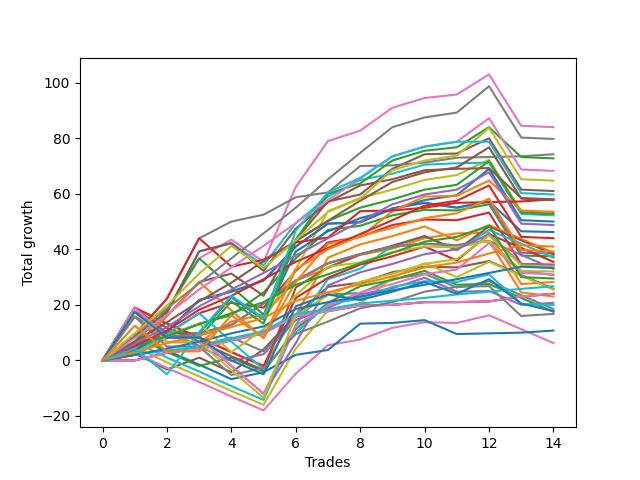

# Short Labrador 009 
- Symbol: ES
- Date Range: 03/18/2022 - 12/30/2022
- Trading Period: 8:30-12:30
- Number of Trades: 14



| Name | Win Percent | Profit | Avg Profit / Trade | Avg Time / Trade |      | Name | Win Percent | Profit | Avg Profit / Trade | Avg Time / Trade |
| ---- | ----------- | ------ | ------------------ | ---------------- | ---- | ---- | ----------- | ------ | ------------------ | ---------------- |
| Sorted By <br> Profit | | | | | | Sorted By <br> Win Percentage ||||
| BB-50 U/L 2SD | 78.57 | 42000.00 | 3000.00 | 33:24 |     | V Mid | 100.00 | 37125.00 | 2651.79 | 16:57 |
| TP-9 | 85.71 | 39875.00 | 2848.21 | 25:24 |     | TP-1 | 100.00 | 13375.00 | 955.36 | 05:50 |
| V Mid | 100.00 | 37125.00 | 2651.79 | 16:57 |     | TP-3 | 92.86 | 20500.00 | 1464.29 | 09:13 |
| TP-8 | 85.71 | 34125.00 | 2437.50 | 25:02 |     | TP-2 | 92.86 | 16625.00 | 1187.50 | 08:28 |
| TP-10 | 78.57 | 32375.00 | 2312.50 | 31:06 |     | TP-9 | 85.71 | 39875.00 | 2848.21 | 25:24 |
| BB-50 U/L 1SD | 78.57 | 30500.00 | 2178.57 | 26:11 |     | TP-8 | 85.71 | 34125.00 | 2437.50 | 25:02 |
| NEWFI 000 | 64.29 | 29875.00 | 2133.93 | 37:05 |     | TP-7 | 85.71 | 28875.00 | 2062.50 | 23:07 |
| TP-7 | 85.71 | 28875.00 | 2062.50 | 23:07 |     | TP-6 | 85.71 | 24375.00 | 1741.07 | 20:30 |
| V U/L 1SD | 64.29 | 26625.00 | 1901.79 | 42:04 |     | TP-5 | 85.71 | 22000.00 | 1571.43 | 18:58 |
| BB-200 U/L 2SD | 64.29 | 26375.00 | 1883.93 | 46:54 |     | TP-4 | 85.71 | 14750.00 | 1053.57 | 16:59 |
| BB-100 Mid | 78.57 | 26125.00 | 1866.07 | 24:33 |     | BB-20 Mid | 85.71 | 12000.00 | 857.14 | 02:02 |
| BB-100 U/L 2SD | 64.29 | 25000.00 | 1785.71 | 49:02 |     | BB-50 U/L 2SD | 78.57 | 42000.00 | 3000.00 | 33:24 |
| TP-6 | 85.71 | 24375.00 | 1741.07 | 20:30 |     | TP-10 | 78.57 | 32375.00 | 2312.50 | 31:06 |
| TP-5 | 85.71 | 22000.00 | 1571.43 | 18:58 |     | BB-50 U/L 1SD | 78.57 | 30500.00 | 2178.57 | 26:11 |
| TP-3 | 92.86 | 20500.00 | 1464.29 | 09:13 |     | BB-100 Mid | 78.57 | 26125.00 | 1866.07 | 24:33 |
| BB-50 Mid | 78.57 | 19250.00 | 1375.00 | 15:15 |     | BB-50 Mid | 78.57 | 19250.00 | 1375.00 | 15:15 |
| BB-20 U/L 2SD | 78.57 | 18750.00 | 1339.29 | 13:51 |     | BB-20 U/L 2SD | 78.57 | 18750.00 | 1339.29 | 13:51 |
| BB-20 U/L 2SD C | 71.43 | 17250.00 | 1232.14 | 16:53 |     | BB-200 Mid | 78.57 | 14125.00 | 1008.93 | 25:58 |
| TP-2 | 92.86 | 16625.00 | 1187.50 | 08:28 |     | BB-20 U/L 1SD | 78.57 | 11500.00 | 821.43 | 08:29 |
| TP-4 | 85.71 | 14750.00 | 1053.57 | 16:59 |     | BB-20 U/L 2SD C | 71.43 | 17250.00 | 1232.14 | 16:53 |
| BB-200 Mid | 78.57 | 14125.00 | 1008.93 | 25:58 |     | NEWFI 000 | 64.29 | 29875.00 | 2133.93 | 37:05 |
| TP-1 | 100.00 | 13375.00 | 955.36 | 05:50 |     | V U/L 1SD | 64.29 | 26625.00 | 1901.79 | 42:04 |
| BB-20 Mid | 85.71 | 12000.00 | 857.14 | 02:02 |     | BB-200 U/L 2SD | 64.29 | 26375.00 | 1883.93 | 46:54 |
| BB-20 U/L 1SD | 78.57 | 11500.00 | 821.43 | 08:29 |     | BB-100 U/L 2SD | 64.29 | 25000.00 | 1785.71 | 49:02 |
| NEWFI 0000 | 42.86 | 8875.00 | 633.93 | 38:56 |     | NEWFI 0000 | 42.86 | 8875.00 | 633.93 | 38:56 |

## NO STOPLOSS

### Test BB-20 Mid
* Sell when price hits the middle line of the 20p bollinger
* No Stoploss
* Results:
```
Total Trades: 14
Percent Up: 14.29
Percent Down: 85.71
Total Points Moved Down: 24.00
Potential Profit: 12000.00
Total Points Ups: 0.00 Count Ups: 2
Total Points Downs: 24.00 Count Downs: 12
```

<details><summary>Trades</summary>

<code>In: 2022-04-01 11:48:00		Out: 2022-04-01 11:49:10		Total Position Time: 01:10		Total Move Down: -0.00		Total to Date: 0.00</code> <br />
<code>In: 2022-04-25 10:19:00		Out: 2022-04-25 10:26:50		Total Position Time: 07:50		Total Move Down: 2.75		Total to Date: 2.75</code> <br />
<code>In: 2022-05-10 11:07:00		Out: 2022-05-10 11:08:10		Total Position Time: 01:10		Total Move Down: 1.50		Total to Date: 4.25</code> <br />
<code>In: 2022-06-10 12:22:00		Out: 2022-06-10 12:23:10		Total Position Time: 01:10		Total Move Down: 3.00		Total to Date: 7.25</code> <br />
<code>In: 2022-06-13 08:47:00		Out: 2022-06-13 08:48:10		Total Position Time: 01:10		Total Move Down: 2.50		Total to Date: 9.75</code> <br />
<code>In: 2022-06-14 10:26:00		Out: 2022-06-14 10:27:10		Total Position Time: 01:10		Total Move Down: 6.25		Total to Date: 16.00</code> <br />
<code>In: 2022-06-17 08:35:00		Out: 2022-06-17 08:36:10		Total Position Time: 01:10		Total Move Down: 1.75		Total to Date: 17.75</code> <br />
<code>In: 2022-08-05 10:19:00		Out: 2022-08-05 10:20:10		Total Position Time: 01:10		Total Move Down: 2.00		Total to Date: 19.75</code> <br />
<code>In: 2022-10-06 09:52:00		Out: 2022-10-06 09:55:05		Total Position Time: 03:05		Total Move Down: 0.25		Total to Date: 20.00</code> <br />
<code>In: 2022-11-01 12:12:00		Out: 2022-11-01 12:13:10		Total Position Time: 01:10		Total Move Down: 1.00		Total to Date: 21.00</code> <br />
<code>In: 2022-11-21 10:24:00		Out: 2022-11-21 10:27:25		Total Position Time: 03:25		Total Move Down: -0.00		Total to Date: 21.00</code> <br />
<code>In: 2022-12-07 11:43:00		Out: 2022-12-07 11:44:10		Total Position Time: 01:10		Total Move Down: 0.25		Total to Date: 21.25</code> <br />
<code>In: 2022-12-16 12:06:00		Out: 2022-12-16 12:07:35		Total Position Time: 01:35		Total Move Down: 1.75		Total to Date: 23.00</code> <br />
<code>In: 2022-12-27 12:21:00		Out: 2022-12-27 12:23:10		Total Position Time: 02:10		Total Move Down: 1.00		Total to Date: 24.00</code> <br />


</details>

### Test BB-20 U/L 1SD
* Sell when the price hits the lower line of the 20p 1std bollinger
* No Stoploss
* Results:
```
Total Trades: 14
Percent Up: 21.43
Percent Down: 78.57
Total Points Moved Down: 23.00
Potential Profit: 11500.00
Total Points Ups: 20.50 Count Ups: 3
Total Points Downs: 43.50 Count Downs: 11
```

<details><summary>Trades</summary>

<code>In: 2022-04-01 11:48:00		Out: 2022-04-01 11:50:15		Total Position Time: 02:15		Total Move Down: 2.00		Total to Date: 2.00</code> <br />
<code>In: 2022-04-25 10:19:00		Out: 2022-04-25 10:27:55		Total Position Time: 08:55		Total Move Down: 6.25		Total to Date: 8.25</code> <br />
<code>In: 2022-05-10 11:07:00		Out: 2022-05-10 11:08:10		Total Position Time: 01:10		Total Move Down: 1.50		Total to Date: 9.75</code> <br />
<code>In: 2022-06-10 12:22:00		Out: 2022-06-10 12:23:10		Total Position Time: 01:10		Total Move Down: 3.00		Total to Date: 12.75</code> <br />
<code>In: 2022-06-13 08:47:00		Out: 2022-06-13 08:52:05		Total Position Time: 05:05		Total Move Down: 7.75		Total to Date: 20.50</code> <br />
<code>In: 2022-06-14 10:26:00		Out: 2022-06-14 10:29:05		Total Position Time: 03:05		Total Move Down: 8.25		Total to Date: 28.75</code> <br />
<code>In: 2022-06-17 08:35:00		Out: 2022-06-17 08:39:05		Total Position Time: 04:05		Total Move Down: 6.25		Total to Date: 35.00</code> <br />
<code>In: 2022-08-05 10:19:00		Out: 2022-08-05 10:23:15		Total Position Time: 04:15		Total Move Down: 3.25		Total to Date: 38.25</code> <br />
<code>In: 2022-10-06 09:52:00		Out: 2022-10-06 09:57:05		Total Position Time: 05:05		Total Move Down: 2.75		Total to Date: 41.00</code> <br />
<code>In: 2022-11-01 12:12:00		Out: 2022-11-01 12:14:30		Total Position Time: 02:30		Total Move Down: 1.00		Total to Date: 42.00</code> <br />
<code>In: 2022-11-21 10:24:00		Out: 2022-11-21 10:33:00		Total Position Time: 09:00		Total Move Down: -0.50		Total to Date: 41.50</code> <br />
<code>In: 2022-12-07 11:43:00		Out: 2022-12-07 11:50:15		Total Position Time: 07:15		Total Move Down: 1.50		Total to Date: 43.00</code> <br />
<code>In: 2022-12-16 12:06:00		Out: 2022-12-16 12:47:00		Total Position Time: 41:00		Total Move Down: -18.50		Total to Date: 24.50</code> <br />
<code>In: 2022-12-27 12:21:00		Out: 2022-12-27 12:45:05		Total Position Time: 24:05		Total Move Down: -1.50		Total to Date: 23.00</code> <br />


</details>

### Test BB-20 U/L 2SD
* Sell when the price hits the lower line of the 20p 2std bollinger
* No Stoploss
* Results:
```
Total Trades: 14
Percent Up: 21.43
Percent Down: 78.57
Total Points Moved Down: 37.50
Potential Profit: 18750.00
Total Points Ups: 19.00 Count Ups: 3
Total Points Downs: 56.50 Count Downs: 11
```

<details><summary>Trades</summary>

<code>In: 2022-04-01 11:48:00		Out: 2022-04-01 11:50:20		Total Position Time: 02:20		Total Move Down: 2.50		Total to Date: 2.50</code> <br />
<code>In: 2022-04-25 10:19:00		Out: 2022-04-25 10:33:35		Total Position Time: 14:35		Total Move Down: 6.50		Total to Date: 9.00</code> <br />
<code>In: 2022-05-10 11:07:00		Out: 2022-05-10 11:11:10		Total Position Time: 04:10		Total Move Down: 4.25		Total to Date: 13.25</code> <br />
<code>In: 2022-06-10 12:22:00		Out: 2022-06-10 12:42:45		Total Position Time: 20:45		Total Move Down: 3.00		Total to Date: 16.25</code> <br />
<code>In: 2022-06-13 08:47:00		Out: 2022-06-13 08:55:10		Total Position Time: 08:10		Total Move Down: 8.25		Total to Date: 24.50</code> <br />
<code>In: 2022-06-14 10:26:00		Out: 2022-06-14 10:31:00		Total Position Time: 05:00		Total Move Down: 12.25		Total to Date: 36.75</code> <br />
<code>In: 2022-06-17 08:35:00		Out: 2022-06-17 08:45:15		Total Position Time: 10:15		Total Move Down: 10.25		Total to Date: 47.00</code> <br />
<code>In: 2022-08-05 10:19:00		Out: 2022-08-05 10:49:30		Total Position Time: 30:30		Total Move Down: 1.50		Total to Date: 48.50</code> <br />
<code>In: 2022-10-06 09:52:00		Out: 2022-10-06 10:02:00		Total Position Time: 10:00		Total Move Down: 3.75		Total to Date: 52.25</code> <br />
<code>In: 2022-11-01 12:12:00		Out: 2022-11-01 12:16:15		Total Position Time: 04:15		Total Move Down: 2.00		Total to Date: 54.25</code> <br />
<code>In: 2022-11-21 10:24:00		Out: 2022-11-21 10:33:10		Total Position Time: 09:10		Total Move Down: -0.25		Total to Date: 54.00</code> <br />
<code>In: 2022-12-07 11:43:00		Out: 2022-12-07 11:52:20		Total Position Time: 09:20		Total Move Down: 2.25		Total to Date: 56.25</code> <br />
<code>In: 2022-12-16 12:06:00		Out: 2022-12-16 12:47:00		Total Position Time: 41:00		Total Move Down: -18.50		Total to Date: 37.75</code> <br />
<code>In: 2022-12-27 12:21:00		Out: 2022-12-27 12:45:25		Total Position Time: 24:25		Total Move Down: -0.25		Total to Date: 37.50</code> <br />


</details>

### Test BB-20 U/L 2SD C
* Sell when the price hits the lower line of the 20p 2std bollinger
* No Stoploss
* Results:
```
Total Trades: 14
Percent Up: 28.57
Percent Down: 71.43
Total Points Moved Down: 34.50
Potential Profit: 17250.00
Total Points Ups: 20.75 Count Ups: 4
Total Points Downs: 55.25 Count Downs: 10
```

<details><summary>Trades</summary>

<code>In: 2022-04-01 11:48:00		Out: 2022-04-01 11:50:45		Total Position Time: 02:45		Total Move Down: 3.00		Total to Date: 3.00</code> <br />
<code>In: 2022-04-25 10:19:00		Out: 2022-04-25 10:33:35		Total Position Time: 14:35		Total Move Down: 6.50		Total to Date: 9.50</code> <br />
<code>In: 2022-05-10 11:07:00		Out: 2022-05-10 11:16:05		Total Position Time: 09:05		Total Move Down: 7.50		Total to Date: 17.00</code> <br />
<code>In: 2022-06-10 12:22:00		Out: 2022-06-10 12:43:10		Total Position Time: 21:10		Total Move Down: 3.75		Total to Date: 20.75</code> <br />
<code>In: 2022-06-13 08:47:00		Out: 2022-06-13 09:30:35		Total Position Time: 43:35		Total Move Down: -1.75		Total to Date: 19.00</code> <br />
<code>In: 2022-06-14 10:26:00		Out: 2022-06-14 10:31:10		Total Position Time: 05:10		Total Move Down: 13.25		Total to Date: 32.25</code> <br />
<code>In: 2022-06-17 08:35:00		Out: 2022-06-17 08:45:15		Total Position Time: 10:15		Total Move Down: 10.25		Total to Date: 42.50</code> <br />
<code>In: 2022-08-05 10:19:00		Out: 2022-08-05 10:50:35		Total Position Time: 31:35		Total Move Down: 2.00		Total to Date: 44.50</code> <br />
<code>In: 2022-10-06 09:52:00		Out: 2022-10-06 10:02:05		Total Position Time: 10:05		Total Move Down: 4.25		Total to Date: 48.75</code> <br />
<code>In: 2022-11-01 12:12:00		Out: 2022-11-01 12:16:15		Total Position Time: 04:15		Total Move Down: 2.00		Total to Date: 50.75</code> <br />
<code>In: 2022-11-21 10:24:00		Out: 2022-11-21 10:33:10		Total Position Time: 09:10		Total Move Down: -0.25		Total to Date: 50.50</code> <br />
<code>In: 2022-12-07 11:43:00		Out: 2022-12-07 11:52:30		Total Position Time: 09:30		Total Move Down: 2.75		Total to Date: 53.25</code> <br />
<code>In: 2022-12-16 12:06:00		Out: 2022-12-16 12:47:00		Total Position Time: 41:00		Total Move Down: -18.50		Total to Date: 34.75</code> <br />
<code>In: 2022-12-27 12:21:00		Out: 2022-12-27 12:45:25		Total Position Time: 24:25		Total Move Down: -0.25		Total to Date: 34.50</code> <br />


</details>

### Test BB-50 Mid
* Sell when price hits the middle line of the 50p bollinger
* No Stoploss
* Results:
```
Total Trades: 14
Percent Up: 21.43
Percent Down: 78.57
Total Points Moved Down: 38.50
Potential Profit: 19250.00
Total Points Ups: 20.50 Count Ups: 3
Total Points Downs: 59.00 Count Downs: 11
```

<details><summary>Trades</summary>

<code>In: 2022-04-01 11:48:00		Out: 2022-04-01 11:58:00		Total Position Time: 10:00		Total Move Down: 3.75		Total to Date: 3.75</code> <br />
<code>In: 2022-04-25 10:19:00		Out: 2022-04-25 10:28:15		Total Position Time: 09:15		Total Move Down: 6.50		Total to Date: 10.25</code> <br />
<code>In: 2022-05-10 11:07:00		Out: 2022-05-10 11:16:20		Total Position Time: 09:20		Total Move Down: 11.50		Total to Date: 21.75</code> <br />
<code>In: 2022-06-10 12:22:00		Out: 2022-06-10 12:23:10		Total Position Time: 01:10		Total Move Down: 3.00		Total to Date: 24.75</code> <br />
<code>In: 2022-06-13 08:47:00		Out: 2022-06-13 09:07:15		Total Position Time: 20:15		Total Move Down: 4.00		Total to Date: 28.75</code> <br />
<code>In: 2022-06-14 10:26:00		Out: 2022-06-14 10:31:00		Total Position Time: 05:00		Total Move Down: 12.25		Total to Date: 41.00</code> <br />
<code>In: 2022-06-17 08:35:00		Out: 2022-06-17 08:45:05		Total Position Time: 10:05		Total Move Down: 8.25		Total to Date: 49.25</code> <br />
<code>In: 2022-08-05 10:19:00		Out: 2022-08-05 10:47:35		Total Position Time: 28:35		Total Move Down: 0.50		Total to Date: 49.75</code> <br />
<code>In: 2022-10-06 09:52:00		Out: 2022-10-06 10:02:10		Total Position Time: 10:10		Total Move Down: 5.00		Total to Date: 54.75</code> <br />
<code>In: 2022-11-01 12:12:00		Out: 2022-11-01 12:16:15		Total Position Time: 04:15		Total Move Down: 2.00		Total to Date: 56.75</code> <br />
<code>In: 2022-11-21 10:24:00		Out: 2022-11-21 10:54:25		Total Position Time: 30:25		Total Move Down: -1.75		Total to Date: 55.00</code> <br />
<code>In: 2022-12-07 11:43:00		Out: 2022-12-07 11:52:20		Total Position Time: 09:20		Total Move Down: 2.25		Total to Date: 57.25</code> <br />
<code>In: 2022-12-16 12:06:00		Out: 2022-12-16 12:47:00		Total Position Time: 41:00		Total Move Down: -18.50		Total to Date: 38.75</code> <br />
<code>In: 2022-12-27 12:21:00		Out: 2022-12-27 12:45:45		Total Position Time: 24:45		Total Move Down: -0.25		Total to Date: 38.50</code> <br />


</details>

### Test BB-50 U/L 1SD
* Sell when the price hits the lower line of the 50p 1std bollinger
* No Stoploss
* Results:
```
Total Trades: 14
Percent Up: 21.43
Percent Down: 78.57
Total Points Moved Down: 61.00
Potential Profit: 30500.00
Total Points Ups: 27.00 Count Ups: 3
Total Points Downs: 88.00 Count Downs: 11
```

<details><summary>Trades</summary>

<code>In: 2022-04-01 11:48:00		Out: 2022-04-01 12:09:35		Total Position Time: 21:35		Total Move Down: 5.00		Total to Date: 5.00</code> <br />
<code>In: 2022-04-25 10:19:00		Out: 2022-04-25 10:51:45		Total Position Time: 32:45		Total Move Down: 11.00		Total to Date: 16.00</code> <br />
<code>In: 2022-05-10 11:07:00		Out: 2022-05-10 11:24:05		Total Position Time: 17:05		Total Move Down: 12.25		Total to Date: 28.25</code> <br />
<code>In: 2022-06-10 12:22:00		Out: 2022-06-10 12:42:40		Total Position Time: 20:40		Total Move Down: 3.00		Total to Date: 31.25</code> <br />
<code>In: 2022-06-13 08:47:00		Out: 2022-06-13 09:47:55		Total Position Time: 60:55		Total Move Down: -8.00		Total to Date: 23.25</code> <br />
<code>In: 2022-06-14 10:26:00		Out: 2022-06-14 10:36:10		Total Position Time: 10:10		Total Move Down: 20.25		Total to Date: 43.50</code> <br />
<code>In: 2022-06-17 08:35:00		Out: 2022-06-17 08:51:25		Total Position Time: 16:25		Total Move Down: 13.75		Total to Date: 57.25</code> <br />
<code>In: 2022-08-05 10:19:00		Out: 2022-08-05 10:52:05		Total Position Time: 33:05		Total Move Down: 2.50		Total to Date: 59.75</code> <br />
<code>In: 2022-10-06 09:52:00		Out: 2022-10-06 10:09:10		Total Position Time: 17:10		Total Move Down: 9.25		Total to Date: 69.00</code> <br />
<code>In: 2022-11-01 12:12:00		Out: 2022-11-01 12:32:40		Total Position Time: 20:40		Total Move Down: 5.25		Total to Date: 74.25</code> <br />
<code>In: 2022-11-21 10:24:00		Out: 2022-11-21 10:59:25		Total Position Time: 35:25		Total Move Down: 0.25		Total to Date: 74.50</code> <br />
<code>In: 2022-12-07 11:43:00		Out: 2022-12-07 11:56:40		Total Position Time: 13:40		Total Move Down: 5.50		Total to Date: 80.00</code> <br />
<code>In: 2022-12-16 12:06:00		Out: 2022-12-16 12:47:00		Total Position Time: 41:00		Total Move Down: -18.50		Total to Date: 61.50</code> <br />
<code>In: 2022-12-27 12:21:00		Out: 2022-12-27 12:47:00		Total Position Time: 26:00		Total Move Down: -0.50		Total to Date: 61.00</code> <br />


</details>

### Test BB-50 U/L 2SD
* Sell when the price hits the lower line of the 50p 2std bollinger
* No Stoploss
* Results:
```
Total Trades: 14
Percent Up: 21.43
Percent Down: 78.57
Total Points Moved Down: 84.00
Potential Profit: 42000.00
Total Points Ups: 27.00 Count Ups: 3
Total Points Downs: 111.00 Count Downs: 11
```

<details><summary>Trades</summary>

<code>In: 2022-04-01 11:48:00		Out: 2022-04-01 12:11:20		Total Position Time: 23:20		Total Move Down: 6.75		Total to Date: 6.75</code> <br />
<code>In: 2022-04-25 10:19:00		Out: 2022-04-25 11:01:35		Total Position Time: 42:35		Total Move Down: 11.25		Total to Date: 18.00</code> <br />
<code>In: 2022-05-10 11:07:00		Out: 2022-05-10 11:27:05		Total Position Time: 20:05		Total Move Down: 18.75		Total to Date: 36.75</code> <br />
<code>In: 2022-06-10 12:22:00		Out: 2022-06-10 12:44:30		Total Position Time: 22:30		Total Move Down: 6.75		Total to Date: 43.50</code> <br />
<code>In: 2022-06-13 08:47:00		Out: 2022-06-13 09:47:55		Total Position Time: 60:55		Total Move Down: -8.00		Total to Date: 35.50</code> <br />
<code>In: 2022-06-14 10:26:00		Out: 2022-06-14 10:43:05		Total Position Time: 17:05		Total Move Down: 27.00		Total to Date: 62.50</code> <br />
<code>In: 2022-06-17 08:35:00		Out: 2022-06-17 08:52:10		Total Position Time: 17:10		Total Move Down: 16.50		Total to Date: 79.00</code> <br />
<code>In: 2022-08-05 10:19:00		Out: 2022-08-05 10:55:40		Total Position Time: 36:40		Total Move Down: 3.75		Total to Date: 82.75</code> <br />
<code>In: 2022-10-06 09:52:00		Out: 2022-10-06 10:32:45		Total Position Time: 40:45		Total Move Down: 8.25		Total to Date: 91.00</code> <br />
<code>In: 2022-11-01 12:12:00		Out: 2022-11-01 12:47:00		Total Position Time: 35:00		Total Move Down: 3.50		Total to Date: 94.50</code> <br />
<code>In: 2022-11-21 10:24:00		Out: 2022-11-21 11:22:10		Total Position Time: 58:10		Total Move Down: 1.25		Total to Date: 95.75</code> <br />
<code>In: 2022-12-07 11:43:00		Out: 2022-12-07 12:09:30		Total Position Time: 26:30		Total Move Down: 7.25		Total to Date: 103.00</code> <br />
<code>In: 2022-12-16 12:06:00		Out: 2022-12-16 12:47:00		Total Position Time: 41:00		Total Move Down: -18.50		Total to Date: 84.50</code> <br />
<code>In: 2022-12-27 12:21:00		Out: 2022-12-27 12:47:00		Total Position Time: 26:00		Total Move Down: -0.50		Total to Date: 84.00</code> <br />


</details>

### Test V Mid
* Sell when the price hits the middle line of the 1std VWAP
* No Stoploss
* Results:
```
Total Trades: 14
Percent Up: 0.00
Percent Down: 100.00
Total Points Moved Down: 74.25
Potential Profit: 37125.00
Total Points Ups: 0.00 Count Ups: 0
Total Points Downs: 74.25 Count Downs: 14
```

<details><summary>Trades</summary>

<code>In: 2022-04-01 11:48:00		Out: 2022-04-01 12:12:40		Total Position Time: 24:40		Total Move Down: 9.25		Total to Date: 9.25</code> <br />
<code>In: 2022-04-25 10:19:00		Out: 2022-04-25 11:04:10		Total Position Time: 45:10		Total Move Down: 13.00		Total to Date: 22.25</code> <br />
<code>In: 2022-05-10 11:07:00		Out: 2022-05-10 11:27:40		Total Position Time: 20:40		Total Move Down: 21.75		Total to Date: 44.00</code> <br />
<code>In: 2022-06-10 12:22:00		Out: 2022-06-10 12:43:55		Total Position Time: 21:55		Total Move Down: 6.00		Total to Date: 50.00</code> <br />
<code>In: 2022-06-13 08:47:00		Out: 2022-06-13 08:48:10		Total Position Time: 01:10		Total Move Down: 2.50		Total to Date: 52.50</code> <br />
<code>In: 2022-06-14 10:26:00		Out: 2022-06-14 10:27:10		Total Position Time: 01:10		Total Move Down: 6.25		Total to Date: 58.75</code> <br />
<code>In: 2022-06-17 08:35:00		Out: 2022-06-17 08:36:10		Total Position Time: 01:10		Total Move Down: 1.75		Total to Date: 60.50</code> <br />
<code>In: 2022-08-05 10:19:00		Out: 2022-08-05 11:11:45		Total Position Time: 52:45		Total Move Down: 9.50		Total to Date: 70.00</code> <br />
<code>In: 2022-10-06 09:52:00		Out: 2022-10-06 09:55:05		Total Position Time: 03:05		Total Move Down: 0.25		Total to Date: 70.25</code> <br />
<code>In: 2022-11-01 12:12:00		Out: 2022-11-01 12:13:10		Total Position Time: 01:10		Total Move Down: 1.00		Total to Date: 71.25</code> <br />
<code>In: 2022-11-21 10:24:00		Out: 2022-11-21 11:24:55		Total Position Time: 60:55		Total Move Down: 1.75		Total to Date: 73.00</code> <br />
<code>In: 2022-12-07 11:43:00		Out: 2022-12-07 11:44:10		Total Position Time: 01:10		Total Move Down: 0.25		Total to Date: 73.25</code> <br />
<code>In: 2022-12-16 12:06:00		Out: 2022-12-16 12:07:10		Total Position Time: 01:10		Total Move Down: 0.25		Total to Date: 73.50</code> <br />
<code>In: 2022-12-27 12:21:00		Out: 2022-12-27 12:22:10		Total Position Time: 01:10		Total Move Down: 0.75		Total to Date: 74.25</code> <br />


</details>

### Test V U/L 1SD
* Sell when the price hits the lower line of the 1std VWAP
* No Stoploss
* Results:
```
Total Trades: 14
Percent Up: 35.71
Percent Down: 64.29
Total Points Moved Down: 53.25
Potential Profit: 26625.00
Total Points Ups: 36.25 Count Ups: 5
Total Points Downs: 89.50 Count Downs: 9
```

<details><summary>Trades</summary>

<code>In: 2022-04-01 11:48:00		Out: 2022-04-01 12:33:30		Total Position Time: 45:30		Total Move Down: 19.00		Total to Date: 19.00</code> <br />
<code>In: 2022-04-25 10:19:00		Out: 2022-04-25 11:19:55		Total Position Time: 60:55		Total Move Down: -9.25		Total to Date: 9.75</code> <br />
<code>In: 2022-05-10 11:07:00		Out: 2022-05-10 12:07:55		Total Position Time: 60:55		Total Move Down: -0.00		Total to Date: 9.75</code> <br />
<code>In: 2022-06-10 12:22:00		Out: 2022-06-10 12:47:00		Total Position Time: 25:00		Total Move Down: 13.00		Total to Date: 22.75</code> <br />
<code>In: 2022-06-13 08:47:00		Out: 2022-06-13 09:47:55		Total Position Time: 60:55		Total Move Down: -8.00		Total to Date: 14.75</code> <br />
<code>In: 2022-06-14 10:26:00		Out: 2022-06-14 10:35:05		Total Position Time: 09:05		Total Move Down: 18.25		Total to Date: 33.00</code> <br />
<code>In: 2022-06-17 08:35:00		Out: 2022-06-17 09:03:15		Total Position Time: 28:15		Total Move Down: 20.75		Total to Date: 53.75</code> <br />
<code>In: 2022-08-05 10:19:00		Out: 2022-08-05 11:19:55		Total Position Time: 60:55		Total Move Down: 4.75		Total to Date: 58.50</code> <br />
<code>In: 2022-10-06 09:52:00		Out: 2022-10-06 10:52:55		Total Position Time: 60:55		Total Move Down: 3.00		Total to Date: 61.50</code> <br />
<code>In: 2022-11-01 12:12:00		Out: 2022-11-01 12:47:00		Total Position Time: 35:00		Total Move Down: 3.50		Total to Date: 65.00</code> <br />
<code>In: 2022-11-21 10:24:00		Out: 2022-11-21 11:24:55		Total Position Time: 60:55		Total Move Down: 1.75		Total to Date: 66.75</code> <br />
<code>In: 2022-12-07 11:43:00		Out: 2022-12-07 11:56:40		Total Position Time: 13:40		Total Move Down: 5.50		Total to Date: 72.25</code> <br />
<code>In: 2022-12-16 12:06:00		Out: 2022-12-16 12:47:00		Total Position Time: 41:00		Total Move Down: -18.50		Total to Date: 53.75</code> <br />
<code>In: 2022-12-27 12:21:00		Out: 2022-12-27 12:47:00		Total Position Time: 26:00		Total Move Down: -0.50		Total to Date: 53.25</code> <br />


</details>

### Test BB-100 Mid
* Move to BB100 Mid
* No Stoploss
* Results:
```
Total Trades: 14
Percent Up: 21.43
Percent Down: 78.57
Total Points Moved Down: 52.25
Potential Profit: 26125.00
Total Points Ups: 27.00 Count Ups: 3
Total Points Downs: 79.25 Count Downs: 11
```

<details><summary>Trades</summary>

<code>In: 2022-04-01 11:48:00		Out: 2022-04-01 12:12:25		Total Position Time: 24:25		Total Move Down: 8.75		Total to Date: 8.75</code> <br />
<code>In: 2022-04-25 10:19:00		Out: 2022-04-25 10:51:15		Total Position Time: 32:15		Total Move Down: 8.50		Total to Date: 17.25</code> <br />
<code>In: 2022-05-10 11:07:00		Out: 2022-05-10 11:40:30		Total Position Time: 33:30		Total Move Down: 22.00		Total to Date: 39.25</code> <br />
<code>In: 2022-06-10 12:22:00		Out: 2022-06-10 12:23:10		Total Position Time: 01:10		Total Move Down: 3.00		Total to Date: 42.25</code> <br />
<code>In: 2022-06-13 08:47:00		Out: 2022-06-13 09:47:55		Total Position Time: 60:55		Total Move Down: -8.00		Total to Date: 34.25</code> <br />
<code>In: 2022-06-14 10:26:00		Out: 2022-06-14 10:34:00		Total Position Time: 08:00		Total Move Down: 15.25		Total to Date: 49.50</code> <br />
<code>In: 2022-06-17 08:35:00		Out: 2022-06-17 08:45:25		Total Position Time: 10:25		Total Move Down: 9.50		Total to Date: 59.00</code> <br />
<code>In: 2022-08-05 10:19:00		Out: 2022-08-05 10:56:25		Total Position Time: 37:25		Total Move Down: 6.00		Total to Date: 65.00</code> <br />
<code>In: 2022-10-06 09:52:00		Out: 2022-10-06 09:56:20		Total Position Time: 04:20		Total Move Down: 2.25		Total to Date: 67.25</code> <br />
<code>In: 2022-11-01 12:12:00		Out: 2022-11-01 12:17:10		Total Position Time: 05:10		Total Move Down: 3.25		Total to Date: 70.50</code> <br />
<code>In: 2022-11-21 10:24:00		Out: 2022-11-21 11:22:05		Total Position Time: 58:05		Total Move Down: 0.50		Total to Date: 71.00</code> <br />
<code>In: 2022-12-07 11:43:00		Out: 2022-12-07 11:44:10		Total Position Time: 01:10		Total Move Down: 0.25		Total to Date: 71.25</code> <br />
<code>In: 2022-12-16 12:06:00		Out: 2022-12-16 12:47:00		Total Position Time: 41:00		Total Move Down: -18.50		Total to Date: 52.75</code> <br />
<code>In: 2022-12-27 12:21:00		Out: 2022-12-27 12:47:00		Total Position Time: 26:00		Total Move Down: -0.50		Total to Date: 52.25</code> <br />


</details>

### Test BB-100 U/L 2SD
* Move to BB100 Upper Band
* No Stoploss
* Results:
```
Total Trades: 14
Percent Up: 35.71
Percent Down: 64.29
Total Points Moved Down: 50.00
Potential Profit: 25000.00
Total Points Ups: 36.25 Count Ups: 5
Total Points Downs: 86.25 Count Downs: 9
```

<details><summary>Trades</summary>

<code>In: 2022-04-01 11:48:00		Out: 2022-04-01 12:33:30		Total Position Time: 45:30		Total Move Down: 19.00		Total to Date: 19.00</code> <br />
<code>In: 2022-04-25 10:19:00		Out: 2022-04-25 11:19:55		Total Position Time: 60:55		Total Move Down: -9.25		Total to Date: 9.75</code> <br />
<code>In: 2022-05-10 11:07:00		Out: 2022-05-10 12:07:55		Total Position Time: 60:55		Total Move Down: -0.00		Total to Date: 9.75</code> <br />
<code>In: 2022-06-10 12:22:00		Out: 2022-06-10 12:47:00		Total Position Time: 25:00		Total Move Down: 13.00		Total to Date: 22.75</code> <br />
<code>In: 2022-06-13 08:47:00		Out: 2022-06-13 09:47:55		Total Position Time: 60:55		Total Move Down: -8.00		Total to Date: 14.75</code> <br />
<code>In: 2022-06-14 10:26:00		Out: 2022-06-14 11:26:55		Total Position Time: 60:55		Total Move Down: 24.50		Total to Date: 39.25</code> <br />
<code>In: 2022-06-17 08:35:00		Out: 2022-06-17 09:35:55		Total Position Time: 60:55		Total Move Down: 7.25		Total to Date: 46.50</code> <br />
<code>In: 2022-08-05 10:19:00		Out: 2022-08-05 11:19:55		Total Position Time: 60:55		Total Move Down: 4.75		Total to Date: 51.25</code> <br />
<code>In: 2022-10-06 09:52:00		Out: 2022-10-06 10:52:55		Total Position Time: 60:55		Total Move Down: 3.00		Total to Date: 54.25</code> <br />
<code>In: 2022-11-01 12:12:00		Out: 2022-11-01 12:47:00		Total Position Time: 35:00		Total Move Down: 3.50		Total to Date: 57.75</code> <br />
<code>In: 2022-11-21 10:24:00		Out: 2022-11-21 11:24:55		Total Position Time: 60:55		Total Move Down: 1.75		Total to Date: 59.50</code> <br />
<code>In: 2022-12-07 11:43:00		Out: 2022-12-07 12:09:50		Total Position Time: 26:50		Total Move Down: 9.50		Total to Date: 69.00</code> <br />
<code>In: 2022-12-16 12:06:00		Out: 2022-12-16 12:47:00		Total Position Time: 41:00		Total Move Down: -18.50		Total to Date: 50.50</code> <br />
<code>In: 2022-12-27 12:21:00		Out: 2022-12-27 12:47:00		Total Position Time: 26:00		Total Move Down: -0.50		Total to Date: 50.00</code> <br />


</details>

### Test BB-200 Mid
* Move to BB200 Mid
* No Stoploss
* Results:
```
Total Trades: 14
Percent Up: 21.43
Percent Down: 78.57
Total Points Moved Down: 28.25
Potential Profit: 14125.00
Total Points Ups: 27.75 Count Ups: 3
Total Points Downs: 56.00 Count Downs: 11
```

<details><summary>Trades</summary>

<code>In: 2022-04-01 11:48:00		Out: 2022-04-01 12:20:35		Total Position Time: 32:35		Total Move Down: 15.75		Total to Date: 15.75</code> <br />
<code>In: 2022-04-25 10:19:00		Out: 2022-04-25 11:19:55		Total Position Time: 60:55		Total Move Down: -9.25		Total to Date: 6.50</code> <br />
<code>In: 2022-05-10 11:07:00		Out: 2022-05-10 12:07:55		Total Position Time: 60:55		Total Move Down: -0.00		Total to Date: 6.50</code> <br />
<code>In: 2022-06-10 12:22:00		Out: 2022-06-10 12:45:45		Total Position Time: 23:45		Total Move Down: 7.50		Total to Date: 14.00</code> <br />
<code>In: 2022-06-13 08:47:00		Out: 2022-06-13 08:48:10		Total Position Time: 01:10		Total Move Down: 2.50		Total to Date: 16.50</code> <br />
<code>In: 2022-06-14 10:26:00		Out: 2022-06-14 10:31:00		Total Position Time: 05:00		Total Move Down: 12.25		Total to Date: 28.75</code> <br />
<code>In: 2022-06-17 08:35:00		Out: 2022-06-17 08:38:50		Total Position Time: 03:50		Total Move Down: 4.50		Total to Date: 33.25</code> <br />
<code>In: 2022-08-05 10:19:00		Out: 2022-08-05 11:19:55		Total Position Time: 60:55		Total Move Down: 4.75		Total to Date: 38.00</code> <br />
<code>In: 2022-10-06 09:52:00		Out: 2022-10-06 09:56:20		Total Position Time: 04:20		Total Move Down: 2.25		Total to Date: 40.25</code> <br />
<code>In: 2022-11-01 12:12:00		Out: 2022-11-01 12:17:55		Total Position Time: 05:55		Total Move Down: 3.75		Total to Date: 44.00</code> <br />
<code>In: 2022-11-21 10:24:00		Out: 2022-11-21 11:24:55		Total Position Time: 60:55		Total Move Down: 1.75		Total to Date: 45.75</code> <br />
<code>In: 2022-12-07 11:43:00		Out: 2022-12-07 11:44:10		Total Position Time: 01:10		Total Move Down: 0.25		Total to Date: 46.00</code> <br />
<code>In: 2022-12-16 12:06:00		Out: 2022-12-16 12:47:00		Total Position Time: 41:00		Total Move Down: -18.50		Total to Date: 27.50</code> <br />
<code>In: 2022-12-27 12:21:00		Out: 2022-12-27 12:22:10		Total Position Time: 01:10		Total Move Down: 0.75		Total to Date: 28.25</code> <br />


</details>

### Test BB-200 U/L 2SD
* Move to BB200 Upper Band
* No Stoploss
* Results:
```
Total Trades: 14
Percent Up: 35.71
Percent Down: 64.29
Total Points Moved Down: 52.75
Potential Profit: 26375.00
Total Points Ups: 36.25 Count Ups: 5
Total Points Downs: 89.00 Count Downs: 9
```

<details><summary>Trades</summary>

<code>In: 2022-04-01 11:48:00		Out: 2022-04-01 12:47:00		Total Position Time: 59:00		Total Move Down: 17.50		Total to Date: 17.50</code> <br />
<code>In: 2022-04-25 10:19:00		Out: 2022-04-25 11:19:55		Total Position Time: 60:55		Total Move Down: -9.25		Total to Date: 8.25</code> <br />
<code>In: 2022-05-10 11:07:00		Out: 2022-05-10 12:07:55		Total Position Time: 60:55		Total Move Down: -0.00		Total to Date: 8.25</code> <br />
<code>In: 2022-06-10 12:22:00		Out: 2022-06-10 12:47:00		Total Position Time: 25:00		Total Move Down: 13.00		Total to Date: 21.25</code> <br />
<code>In: 2022-06-13 08:47:00		Out: 2022-06-13 09:47:55		Total Position Time: 60:55		Total Move Down: -8.00		Total to Date: 13.25</code> <br />
<code>In: 2022-06-14 10:26:00		Out: 2022-06-14 10:43:45		Total Position Time: 17:45		Total Move Down: 29.75		Total to Date: 43.00</code> <br />
<code>In: 2022-06-17 08:35:00		Out: 2022-06-17 09:35:55		Total Position Time: 60:55		Total Move Down: 7.25		Total to Date: 50.25</code> <br />
<code>In: 2022-08-05 10:19:00		Out: 2022-08-05 11:19:55		Total Position Time: 60:55		Total Move Down: 4.75		Total to Date: 55.00</code> <br />
<code>In: 2022-10-06 09:52:00		Out: 2022-10-06 10:52:55		Total Position Time: 60:55		Total Move Down: 3.00		Total to Date: 58.00</code> <br />
<code>In: 2022-11-01 12:12:00		Out: 2022-11-01 12:47:00		Total Position Time: 35:00		Total Move Down: 3.50		Total to Date: 61.50</code> <br />
<code>In: 2022-11-21 10:24:00		Out: 2022-11-21 11:24:55		Total Position Time: 60:55		Total Move Down: 1.75		Total to Date: 63.25</code> <br />
<code>In: 2022-12-07 11:43:00		Out: 2022-12-07 12:09:35		Total Position Time: 26:35		Total Move Down: 8.50		Total to Date: 71.75</code> <br />
<code>In: 2022-12-16 12:06:00		Out: 2022-12-16 12:47:00		Total Position Time: 41:00		Total Move Down: -18.50		Total to Date: 53.25</code> <br />
<code>In: 2022-12-27 12:21:00		Out: 2022-12-27 12:47:00		Total Position Time: 26:00		Total Move Down: -0.50		Total to Date: 52.75</code> <br />


</details>

## TAKE PROFIT

### Test TP-1
* Take Profit of 1 Point
* No Stoploss
* Results:
```
Total Trades: 14
Percent Up: 0.00
Percent Down: 100.00
Total Points Moved Down: 26.75
Potential Profit: 13375.00
Total Points Ups: 0.00 Count Ups: 0
Total Points Downs: 26.75 Count Downs: 14
```

<details><summary>Trades</summary>

<code>In: 2022-04-01 11:48:00		Out: 2022-04-01 11:50:15		Total Position Time: 02:15		Total Move Down: 2.00		Total to Date: 2.00</code> <br />
<code>In: 2022-04-25 10:19:00		Out: 2022-04-25 10:22:15		Total Position Time: 03:15		Total Move Down: 1.50		Total to Date: 3.50</code> <br />
<code>In: 2022-05-10 11:07:00		Out: 2022-05-10 11:08:10		Total Position Time: 01:10		Total Move Down: 1.50		Total to Date: 5.00</code> <br />
<code>In: 2022-06-10 12:22:00		Out: 2022-06-10 12:23:10		Total Position Time: 01:10		Total Move Down: 3.00		Total to Date: 8.00</code> <br />
<code>In: 2022-06-13 08:47:00		Out: 2022-06-13 08:48:10		Total Position Time: 01:10		Total Move Down: 2.50		Total to Date: 10.50</code> <br />
<code>In: 2022-06-14 10:26:00		Out: 2022-06-14 10:27:10		Total Position Time: 01:10		Total Move Down: 6.25		Total to Date: 16.75</code> <br />
<code>In: 2022-06-17 08:35:00		Out: 2022-06-17 08:36:10		Total Position Time: 01:10		Total Move Down: 1.75		Total to Date: 18.50</code> <br />
<code>In: 2022-08-05 10:19:00		Out: 2022-08-05 10:20:10		Total Position Time: 01:10		Total Move Down: 2.00		Total to Date: 20.50</code> <br />
<code>In: 2022-10-06 09:52:00		Out: 2022-10-06 09:55:00		Total Position Time: 03:00		Total Move Down: 1.00		Total to Date: 21.50</code> <br />
<code>In: 2022-11-01 12:12:00		Out: 2022-11-01 12:13:50		Total Position Time: 01:50		Total Move Down: 1.00		Total to Date: 22.50</code> <br />
<code>In: 2022-11-21 10:24:00		Out: 2022-11-21 11:22:10		Total Position Time: 58:10		Total Move Down: 1.25		Total to Date: 23.75</code> <br />
<code>In: 2022-12-07 11:43:00		Out: 2022-12-07 11:46:40		Total Position Time: 03:40		Total Move Down: 1.00		Total to Date: 24.75</code> <br />
<code>In: 2022-12-16 12:06:00		Out: 2022-12-16 12:07:20		Total Position Time: 01:20		Total Move Down: 1.00		Total to Date: 25.75</code> <br />
<code>In: 2022-12-27 12:21:00		Out: 2022-12-27 12:22:20		Total Position Time: 01:20		Total Move Down: 1.00		Total to Date: 26.75</code> <br />


</details>

### Test TP-2
* Take Profit of 2 Point
* No Stoploss
* Results:
```
Total Trades: 14
Percent Up: 7.14
Percent Down: 92.86
Total Points Moved Down: 33.25
Potential Profit: 16625.00
Total Points Ups: 0.50 Count Ups: 1
Total Points Downs: 33.75 Count Downs: 13
```

<details><summary>Trades</summary>

<code>In: 2022-04-01 11:48:00		Out: 2022-04-01 11:50:15		Total Position Time: 02:15		Total Move Down: 2.00		Total to Date: 2.00</code> <br />
<code>In: 2022-04-25 10:19:00		Out: 2022-04-25 10:22:40		Total Position Time: 03:40		Total Move Down: 2.25		Total to Date: 4.25</code> <br />
<code>In: 2022-05-10 11:07:00		Out: 2022-05-10 11:09:55		Total Position Time: 02:55		Total Move Down: 2.50		Total to Date: 6.75</code> <br />
<code>In: 2022-06-10 12:22:00		Out: 2022-06-10 12:23:10		Total Position Time: 01:10		Total Move Down: 3.00		Total to Date: 9.75</code> <br />
<code>In: 2022-06-13 08:47:00		Out: 2022-06-13 08:48:10		Total Position Time: 01:10		Total Move Down: 2.50		Total to Date: 12.25</code> <br />
<code>In: 2022-06-14 10:26:00		Out: 2022-06-14 10:27:10		Total Position Time: 01:10		Total Move Down: 6.25		Total to Date: 18.50</code> <br />
<code>In: 2022-06-17 08:35:00		Out: 2022-06-17 08:36:15		Total Position Time: 01:15		Total Move Down: 2.50		Total to Date: 21.00</code> <br />
<code>In: 2022-08-05 10:19:00		Out: 2022-08-05 10:20:10		Total Position Time: 01:10		Total Move Down: 2.00		Total to Date: 23.00</code> <br />
<code>In: 2022-10-06 09:52:00		Out: 2022-10-06 09:56:15		Total Position Time: 04:15		Total Move Down: 2.25		Total to Date: 25.25</code> <br />
<code>In: 2022-11-01 12:12:00		Out: 2022-11-01 12:16:15		Total Position Time: 04:15		Total Move Down: 2.00		Total to Date: 27.25</code> <br />
<code>In: 2022-11-21 10:24:00		Out: 2022-11-21 11:22:25		Total Position Time: 58:25		Total Move Down: 2.00		Total to Date: 29.25</code> <br />
<code>In: 2022-12-07 11:43:00		Out: 2022-12-07 11:52:20		Total Position Time: 09:20		Total Move Down: 2.25		Total to Date: 31.50</code> <br />
<code>In: 2022-12-16 12:06:00		Out: 2022-12-16 12:07:40		Total Position Time: 01:40		Total Move Down: 2.25		Total to Date: 33.75</code> <br />
<code>In: 2022-12-27 12:21:00		Out: 2022-12-27 12:47:00		Total Position Time: 26:00		Total Move Down: -0.50		Total to Date: 33.25</code> <br />


</details>

### Test TP-3
* Take Profit of 3 Point
* No Stoploss
* Results:
```
Total Trades: 14
Percent Up: 7.14
Percent Down: 92.86
Total Points Moved Down: 41.00
Potential Profit: 20500.00
Total Points Ups: 0.50 Count Ups: 1
Total Points Downs: 41.50 Count Downs: 13
```

<details><summary>Trades</summary>

<code>In: 2022-04-01 11:48:00		Out: 2022-04-01 11:50:55		Total Position Time: 02:55		Total Move Down: 3.00		Total to Date: 3.00</code> <br />
<code>In: 2022-04-25 10:19:00		Out: 2022-04-25 10:23:05		Total Position Time: 04:05		Total Move Down: 3.25		Total to Date: 6.25</code> <br />
<code>In: 2022-05-10 11:07:00		Out: 2022-05-10 11:10:15		Total Position Time: 03:15		Total Move Down: 2.75		Total to Date: 9.00</code> <br />
<code>In: 2022-06-10 12:22:00		Out: 2022-06-10 12:23:10		Total Position Time: 01:10		Total Move Down: 3.00		Total to Date: 12.00</code> <br />
<code>In: 2022-06-13 08:47:00		Out: 2022-06-13 08:51:10		Total Position Time: 04:10		Total Move Down: 3.25		Total to Date: 15.25</code> <br />
<code>In: 2022-06-14 10:26:00		Out: 2022-06-14 10:27:10		Total Position Time: 01:10		Total Move Down: 6.25		Total to Date: 21.50</code> <br />
<code>In: 2022-06-17 08:35:00		Out: 2022-06-17 08:36:55		Total Position Time: 01:55		Total Move Down: 3.00		Total to Date: 24.50</code> <br />
<code>In: 2022-08-05 10:19:00		Out: 2022-08-05 10:20:45		Total Position Time: 01:45		Total Move Down: 3.00		Total to Date: 27.50</code> <br />
<code>In: 2022-10-06 09:52:00		Out: 2022-10-06 09:57:00		Total Position Time: 05:00		Total Move Down: 2.75		Total to Date: 30.25</code> <br />
<code>In: 2022-11-01 12:12:00		Out: 2022-11-01 12:17:10		Total Position Time: 05:10		Total Move Down: 3.25		Total to Date: 33.50</code> <br />
<code>In: 2022-11-21 10:24:00		Out: 2022-11-21 11:24:55		Total Position Time: 60:55		Total Move Down: 1.75		Total to Date: 35.25</code> <br />
<code>In: 2022-12-07 11:43:00		Out: 2022-12-07 11:52:40		Total Position Time: 09:40		Total Move Down: 3.25		Total to Date: 38.50</code> <br />
<code>In: 2022-12-16 12:06:00		Out: 2022-12-16 12:07:55		Total Position Time: 01:55		Total Move Down: 3.00		Total to Date: 41.50</code> <br />
<code>In: 2022-12-27 12:21:00		Out: 2022-12-27 12:47:00		Total Position Time: 26:00		Total Move Down: -0.50		Total to Date: 41.00</code> <br />


</details>

### Test TP-4
* Take Profit of 4 Point
* No Stoploss
* Results:
```
Total Trades: 14
Percent Up: 14.29
Percent Down: 85.71
Total Points Moved Down: 29.50
Potential Profit: 14750.00
Total Points Ups: 19.00 Count Ups: 2
Total Points Downs: 48.50 Count Downs: 12
```

<details><summary>Trades</summary>

<code>In: 2022-04-01 11:48:00		Out: 2022-04-01 11:58:10		Total Position Time: 10:10		Total Move Down: 5.00		Total to Date: 5.00</code> <br />
<code>In: 2022-04-25 10:19:00		Out: 2022-04-25 10:27:00		Total Position Time: 08:00		Total Move Down: 3.75		Total to Date: 8.75</code> <br />
<code>In: 2022-05-10 11:07:00		Out: 2022-05-10 11:11:10		Total Position Time: 04:10		Total Move Down: 4.25		Total to Date: 13.00</code> <br />
<code>In: 2022-06-10 12:22:00		Out: 2022-06-10 12:23:15		Total Position Time: 01:15		Total Move Down: 4.00		Total to Date: 17.00</code> <br />
<code>In: 2022-06-13 08:47:00		Out: 2022-06-13 08:51:15		Total Position Time: 04:15		Total Move Down: 4.00		Total to Date: 21.00</code> <br />
<code>In: 2022-06-14 10:26:00		Out: 2022-06-14 10:27:10		Total Position Time: 01:10		Total Move Down: 6.25		Total to Date: 27.25</code> <br />
<code>In: 2022-06-17 08:35:00		Out: 2022-06-17 08:38:35		Total Position Time: 03:35		Total Move Down: 3.75		Total to Date: 31.00</code> <br />
<code>In: 2022-08-05 10:19:00		Out: 2022-08-05 10:55:45		Total Position Time: 36:45		Total Move Down: 4.00		Total to Date: 35.00</code> <br />
<code>In: 2022-10-06 09:52:00		Out: 2022-10-06 10:02:00		Total Position Time: 10:00		Total Move Down: 3.75		Total to Date: 38.75</code> <br />
<code>In: 2022-11-01 12:12:00		Out: 2022-11-01 12:29:30		Total Position Time: 17:30		Total Move Down: 4.00		Total to Date: 42.75</code> <br />
<code>In: 2022-11-21 10:24:00		Out: 2022-11-21 11:24:55		Total Position Time: 60:55		Total Move Down: 1.75		Total to Date: 44.50</code> <br />
<code>In: 2022-12-07 11:43:00		Out: 2022-12-07 11:56:10		Total Position Time: 13:10		Total Move Down: 4.00		Total to Date: 48.50</code> <br />
<code>In: 2022-12-16 12:06:00		Out: 2022-12-16 12:47:00		Total Position Time: 41:00		Total Move Down: -18.50		Total to Date: 30.00</code> <br />
<code>In: 2022-12-27 12:21:00		Out: 2022-12-27 12:47:00		Total Position Time: 26:00		Total Move Down: -0.50		Total to Date: 29.50</code> <br />


</details>

### Test TP-5
* Take Profit of 5 Point
* No Stoploss
* Results:
```
Total Trades: 14
Percent Up: 14.29
Percent Down: 85.71
Total Points Moved Down: 44.00
Potential Profit: 22000.00
Total Points Ups: 19.00 Count Ups: 2
Total Points Downs: 63.00 Count Downs: 12
```

<details><summary>Trades</summary>

<code>In: 2022-04-01 11:48:00		Out: 2022-04-01 11:58:30		Total Position Time: 10:30		Total Move Down: 5.25		Total to Date: 5.25</code> <br />
<code>In: 2022-04-25 10:19:00		Out: 2022-04-25 10:27:10		Total Position Time: 08:10		Total Move Down: 5.50		Total to Date: 10.75</code> <br />
<code>In: 2022-05-10 11:07:00		Out: 2022-05-10 11:16:05		Total Position Time: 09:05		Total Move Down: 7.50		Total to Date: 18.25</code> <br />
<code>In: 2022-06-10 12:22:00		Out: 2022-06-10 12:43:25		Total Position Time: 21:25		Total Move Down: 5.00		Total to Date: 23.25</code> <br />
<code>In: 2022-06-13 08:47:00		Out: 2022-06-13 08:51:35		Total Position Time: 04:35		Total Move Down: 6.00		Total to Date: 29.25</code> <br />
<code>In: 2022-06-14 10:26:00		Out: 2022-06-14 10:27:10		Total Position Time: 01:10		Total Move Down: 6.25		Total to Date: 35.50</code> <br />
<code>In: 2022-06-17 08:35:00		Out: 2022-06-17 08:39:00		Total Position Time: 04:00		Total Move Down: 5.00		Total to Date: 40.50</code> <br />
<code>In: 2022-08-05 10:19:00		Out: 2022-08-05 10:56:05		Total Position Time: 37:05		Total Move Down: 5.00		Total to Date: 45.50</code> <br />
<code>In: 2022-10-06 09:52:00		Out: 2022-10-06 10:02:10		Total Position Time: 10:10		Total Move Down: 5.00		Total to Date: 50.50</code> <br />
<code>In: 2022-11-01 12:12:00		Out: 2022-11-01 12:29:50		Total Position Time: 17:50		Total Move Down: 5.25		Total to Date: 55.75</code> <br />
<code>In: 2022-11-21 10:24:00		Out: 2022-11-21 11:24:55		Total Position Time: 60:55		Total Move Down: 1.75		Total to Date: 57.50</code> <br />
<code>In: 2022-12-07 11:43:00		Out: 2022-12-07 11:56:40		Total Position Time: 13:40		Total Move Down: 5.50		Total to Date: 63.00</code> <br />
<code>In: 2022-12-16 12:06:00		Out: 2022-12-16 12:47:00		Total Position Time: 41:00		Total Move Down: -18.50		Total to Date: 44.50</code> <br />
<code>In: 2022-12-27 12:21:00		Out: 2022-12-27 12:47:00		Total Position Time: 26:00		Total Move Down: -0.50		Total to Date: 44.00</code> <br />


</details>

### Test TP-6
* Take Profit of 6 Point
* No Stoploss
* Results:
```
Total Trades: 14
Percent Up: 14.29
Percent Down: 85.71
Total Points Moved Down: 48.75
Potential Profit: 24375.00
Total Points Ups: 19.00 Count Ups: 2
Total Points Downs: 67.75 Count Downs: 12
```

<details><summary>Trades</summary>

<code>In: 2022-04-01 11:48:00		Out: 2022-04-01 11:58:45		Total Position Time: 10:45		Total Move Down: 6.00		Total to Date: 6.00</code> <br />
<code>In: 2022-04-25 10:19:00		Out: 2022-04-25 10:27:25		Total Position Time: 08:25		Total Move Down: 6.00		Total to Date: 12.00</code> <br />
<code>In: 2022-05-10 11:07:00		Out: 2022-05-10 11:16:05		Total Position Time: 09:05		Total Move Down: 7.50		Total to Date: 19.50</code> <br />
<code>In: 2022-06-10 12:22:00		Out: 2022-06-10 12:44:00		Total Position Time: 22:00		Total Move Down: 6.00		Total to Date: 25.50</code> <br />
<code>In: 2022-06-13 08:47:00		Out: 2022-06-13 08:51:35		Total Position Time: 04:35		Total Move Down: 6.00		Total to Date: 31.50</code> <br />
<code>In: 2022-06-14 10:26:00		Out: 2022-06-14 10:27:10		Total Position Time: 01:10		Total Move Down: 6.25		Total to Date: 37.75</code> <br />
<code>In: 2022-06-17 08:35:00		Out: 2022-06-17 08:39:05		Total Position Time: 04:05		Total Move Down: 6.25		Total to Date: 44.00</code> <br />
<code>In: 2022-08-05 10:19:00		Out: 2022-08-05 10:56:20		Total Position Time: 37:20		Total Move Down: 6.00		Total to Date: 50.00</code> <br />
<code>In: 2022-10-06 09:52:00		Out: 2022-10-06 10:02:50		Total Position Time: 10:50		Total Move Down: 6.25		Total to Date: 56.25</code> <br />
<code>In: 2022-11-01 12:12:00		Out: 2022-11-01 12:47:00		Total Position Time: 35:00		Total Move Down: 3.50		Total to Date: 59.75</code> <br />
<code>In: 2022-11-21 10:24:00		Out: 2022-11-21 11:24:55		Total Position Time: 60:55		Total Move Down: 1.75		Total to Date: 61.50</code> <br />
<code>In: 2022-12-07 11:43:00		Out: 2022-12-07 11:58:55		Total Position Time: 15:55		Total Move Down: 6.25		Total to Date: 67.75</code> <br />
<code>In: 2022-12-16 12:06:00		Out: 2022-12-16 12:47:00		Total Position Time: 41:00		Total Move Down: -18.50		Total to Date: 49.25</code> <br />
<code>In: 2022-12-27 12:21:00		Out: 2022-12-27 12:47:00		Total Position Time: 26:00		Total Move Down: -0.50		Total to Date: 48.75</code> <br />


</details>

### Test TP-7
* Take Profit of 7 Point
* No Stoploss
* Results:
```
Total Trades: 14
Percent Up: 14.29
Percent Down: 85.71
Total Points Moved Down: 57.75
Potential Profit: 28875.00
Total Points Ups: 19.00 Count Ups: 2
Total Points Downs: 76.75 Count Downs: 12
```

<details><summary>Trades</summary>

<code>In: 2022-04-01 11:48:00		Out: 2022-04-01 12:11:20		Total Position Time: 23:20		Total Move Down: 6.75		Total to Date: 6.75</code> <br />
<code>In: 2022-04-25 10:19:00		Out: 2022-04-25 10:28:20		Total Position Time: 09:20		Total Move Down: 7.00		Total to Date: 13.75</code> <br />
<code>In: 2022-05-10 11:07:00		Out: 2022-05-10 11:16:05		Total Position Time: 09:05		Total Move Down: 7.50		Total to Date: 21.25</code> <br />
<code>In: 2022-06-10 12:22:00		Out: 2022-06-10 12:44:10		Total Position Time: 22:10		Total Move Down: 6.75		Total to Date: 28.00</code> <br />
<code>In: 2022-06-13 08:47:00		Out: 2022-06-13 08:52:05		Total Position Time: 05:05		Total Move Down: 7.75		Total to Date: 35.75</code> <br />
<code>In: 2022-06-14 10:26:00		Out: 2022-06-14 10:27:25		Total Position Time: 01:25		Total Move Down: 7.25		Total to Date: 43.00</code> <br />
<code>In: 2022-06-17 08:35:00		Out: 2022-06-17 08:45:00		Total Position Time: 10:00		Total Move Down: 7.25		Total to Date: 50.25</code> <br />
<code>In: 2022-08-05 10:19:00		Out: 2022-08-05 10:56:50		Total Position Time: 37:50		Total Move Down: 7.25		Total to Date: 57.50</code> <br />
<code>In: 2022-10-06 09:52:00		Out: 2022-10-06 10:08:10		Total Position Time: 16:10		Total Move Down: 6.75		Total to Date: 64.25</code> <br />
<code>In: 2022-11-01 12:12:00		Out: 2022-11-01 12:47:00		Total Position Time: 35:00		Total Move Down: 3.50		Total to Date: 67.75</code> <br />
<code>In: 2022-11-21 10:24:00		Out: 2022-11-21 11:24:55		Total Position Time: 60:55		Total Move Down: 1.75		Total to Date: 69.50</code> <br />
<code>In: 2022-12-07 11:43:00		Out: 2022-12-07 12:09:30		Total Position Time: 26:30		Total Move Down: 7.25		Total to Date: 76.75</code> <br />
<code>In: 2022-12-16 12:06:00		Out: 2022-12-16 12:47:00		Total Position Time: 41:00		Total Move Down: -18.50		Total to Date: 58.25</code> <br />
<code>In: 2022-12-27 12:21:00		Out: 2022-12-27 12:47:00		Total Position Time: 26:00		Total Move Down: -0.50		Total to Date: 57.75</code> <br />


</details>

### Test TP-8
* Take Profit of 8 Point
* No Stoploss
* Results:
```
Total Trades: 14
Percent Up: 14.29
Percent Down: 85.71
Total Points Moved Down: 68.25
Potential Profit: 34125.00
Total Points Ups: 19.00 Count Ups: 2
Total Points Downs: 87.25 Count Downs: 12
```

<details><summary>Trades</summary>

<code>In: 2022-04-01 11:48:00		Out: 2022-04-01 12:11:25		Total Position Time: 23:25		Total Move Down: 8.00		Total to Date: 8.00</code> <br />
<code>In: 2022-04-25 10:19:00		Out: 2022-04-25 10:35:45		Total Position Time: 16:45		Total Move Down: 8.50		Total to Date: 16.50</code> <br />
<code>In: 2022-05-10 11:07:00		Out: 2022-05-10 11:16:15		Total Position Time: 09:15		Total Move Down: 9.00		Total to Date: 25.50</code> <br />
<code>In: 2022-06-10 12:22:00		Out: 2022-06-10 12:45:40		Total Position Time: 23:40		Total Move Down: 8.00		Total to Date: 33.50</code> <br />
<code>In: 2022-06-13 08:47:00		Out: 2022-06-13 08:53:05		Total Position Time: 06:05		Total Move Down: 7.75		Total to Date: 41.25</code> <br />
<code>In: 2022-06-14 10:26:00		Out: 2022-06-14 10:29:05		Total Position Time: 03:05		Total Move Down: 8.25		Total to Date: 49.50</code> <br />
<code>In: 2022-06-17 08:35:00		Out: 2022-06-17 08:45:05		Total Position Time: 10:05		Total Move Down: 8.25		Total to Date: 57.75</code> <br />
<code>In: 2022-08-05 10:19:00		Out: 2022-08-05 11:10:50		Total Position Time: 51:50		Total Move Down: 7.75		Total to Date: 65.50</code> <br />
<code>In: 2022-10-06 09:52:00		Out: 2022-10-06 10:08:50		Total Position Time: 16:50		Total Move Down: 8.00		Total to Date: 73.50</code> <br />
<code>In: 2022-11-01 12:12:00		Out: 2022-11-01 12:47:00		Total Position Time: 35:00		Total Move Down: 3.50		Total to Date: 77.00</code> <br />
<code>In: 2022-11-21 10:24:00		Out: 2022-11-21 11:24:55		Total Position Time: 60:55		Total Move Down: 1.75		Total to Date: 78.75</code> <br />
<code>In: 2022-12-07 11:43:00		Out: 2022-12-07 12:09:35		Total Position Time: 26:35		Total Move Down: 8.50		Total to Date: 87.25</code> <br />
<code>In: 2022-12-16 12:06:00		Out: 2022-12-16 12:47:00		Total Position Time: 41:00		Total Move Down: -18.50		Total to Date: 68.75</code> <br />
<code>In: 2022-12-27 12:21:00		Out: 2022-12-27 12:47:00		Total Position Time: 26:00		Total Move Down: -0.50		Total to Date: 68.25</code> <br />


</details>

### Test TP-9
* Take Profit of 9 Point
* No Stoploss
* Results:
```
Total Trades: 14
Percent Up: 14.29
Percent Down: 85.71
Total Points Moved Down: 79.75
Potential Profit: 39875.00
Total Points Ups: 19.00 Count Ups: 2
Total Points Downs: 98.75 Count Downs: 12
```

<details><summary>Trades</summary>

<code>In: 2022-04-01 11:48:00		Out: 2022-04-01 12:12:40		Total Position Time: 24:40		Total Move Down: 9.25		Total to Date: 9.25</code> <br />
<code>In: 2022-04-25 10:19:00		Out: 2022-04-25 10:36:35		Total Position Time: 17:35		Total Move Down: 9.50		Total to Date: 18.75</code> <br />
<code>In: 2022-05-10 11:07:00		Out: 2022-05-10 11:16:15		Total Position Time: 09:15		Total Move Down: 9.00		Total to Date: 27.75</code> <br />
<code>In: 2022-06-10 12:22:00		Out: 2022-06-10 12:45:50		Total Position Time: 23:50		Total Move Down: 9.00		Total to Date: 36.75</code> <br />
<code>In: 2022-06-13 08:47:00		Out: 2022-06-13 08:54:20		Total Position Time: 07:20		Total Move Down: 9.00		Total to Date: 45.75</code> <br />
<code>In: 2022-06-14 10:26:00		Out: 2022-06-14 10:29:10		Total Position Time: 03:10		Total Move Down: 9.25		Total to Date: 55.00</code> <br />
<code>In: 2022-06-17 08:35:00		Out: 2022-06-17 08:45:15		Total Position Time: 10:15		Total Move Down: 10.25		Total to Date: 65.25</code> <br />
<code>In: 2022-08-05 10:19:00		Out: 2022-08-05 11:11:45		Total Position Time: 52:45		Total Move Down: 9.50		Total to Date: 74.75</code> <br />
<code>In: 2022-10-06 09:52:00		Out: 2022-10-06 10:09:10		Total Position Time: 17:10		Total Move Down: 9.25		Total to Date: 84.00</code> <br />
<code>In: 2022-11-01 12:12:00		Out: 2022-11-01 12:47:00		Total Position Time: 35:00		Total Move Down: 3.50		Total to Date: 87.50</code> <br />
<code>In: 2022-11-21 10:24:00		Out: 2022-11-21 11:24:55		Total Position Time: 60:55		Total Move Down: 1.75		Total to Date: 89.25</code> <br />
<code>In: 2022-12-07 11:43:00		Out: 2022-12-07 12:09:50		Total Position Time: 26:50		Total Move Down: 9.50		Total to Date: 98.75</code> <br />
<code>In: 2022-12-16 12:06:00		Out: 2022-12-16 12:47:00		Total Position Time: 41:00		Total Move Down: -18.50		Total to Date: 80.25</code> <br />
<code>In: 2022-12-27 12:21:00		Out: 2022-12-27 12:47:00		Total Position Time: 26:00		Total Move Down: -0.50		Total to Date: 79.75</code> <br />


</details>

### Test TP-10
* Take Profit of 10 Point
* No Stoploss
* Results:
```
Total Trades: 14
Percent Up: 21.43
Percent Down: 78.57
Total Points Moved Down: 64.75
Potential Profit: 32375.00
Total Points Ups: 27.00 Count Ups: 3
Total Points Downs: 91.75 Count Downs: 11
```

<details><summary>Trades</summary>

<code>In: 2022-04-01 11:48:00		Out: 2022-04-01 12:18:30		Total Position Time: 30:30		Total Move Down: 9.75		Total to Date: 9.75</code> <br />
<code>In: 2022-04-25 10:19:00		Out: 2022-04-25 10:36:45		Total Position Time: 17:45		Total Move Down: 10.00		Total to Date: 19.75</code> <br />
<code>In: 2022-05-10 11:07:00		Out: 2022-05-10 11:16:20		Total Position Time: 09:20		Total Move Down: 11.50		Total to Date: 31.25</code> <br />
<code>In: 2022-06-10 12:22:00		Out: 2022-06-10 12:46:05		Total Position Time: 24:05		Total Move Down: 10.00		Total to Date: 41.25</code> <br />
<code>In: 2022-06-13 08:47:00		Out: 2022-06-13 09:47:55		Total Position Time: 60:55		Total Move Down: -8.00		Total to Date: 33.25</code> <br />
<code>In: 2022-06-14 10:26:00		Out: 2022-06-14 10:29:40		Total Position Time: 03:40		Total Move Down: 10.00		Total to Date: 43.25</code> <br />
<code>In: 2022-06-17 08:35:00		Out: 2022-06-17 08:45:15		Total Position Time: 10:15		Total Move Down: 10.25		Total to Date: 53.50</code> <br />
<code>In: 2022-08-05 10:19:00		Out: 2022-08-05 11:19:55		Total Position Time: 60:55		Total Move Down: 4.75		Total to Date: 58.25</code> <br />
<code>In: 2022-10-06 09:52:00		Out: 2022-10-06 10:09:20		Total Position Time: 17:20		Total Move Down: 10.25		Total to Date: 68.50</code> <br />
<code>In: 2022-11-01 12:12:00		Out: 2022-11-01 12:47:00		Total Position Time: 35:00		Total Move Down: 3.50		Total to Date: 72.00</code> <br />
<code>In: 2022-11-21 10:24:00		Out: 2022-11-21 11:24:55		Total Position Time: 60:55		Total Move Down: 1.75		Total to Date: 73.75</code> <br />
<code>In: 2022-12-07 11:43:00		Out: 2022-12-07 12:20:45		Total Position Time: 37:45		Total Move Down: 10.00		Total to Date: 83.75</code> <br />
<code>In: 2022-12-16 12:06:00		Out: 2022-12-16 12:47:00		Total Position Time: 41:00		Total Move Down: -18.50		Total to Date: 65.25</code> <br />
<code>In: 2022-12-27 12:21:00		Out: 2022-12-27 12:47:00		Total Position Time: 26:00		Total Move Down: -0.50		Total to Date: 64.75</code> <br />


</details>

## Indicator Exits

### Test NEWFI 000
* Newfi 0000
* No Stoploss
* Results:
```
Total Trades: 14
Percent Up: 35.71
Percent Down: 64.29
Total Points Moved Down: 59.75
Potential Profit: 29875.00
Total Points Ups: 36.25 Count Ups: 5
Total Points Downs: 96.00 Count Downs: 9
```

<details><summary>Trades</summary>

<code>In: 2022-04-01 11:48:00		Out: 2022-04-01 12:16:05		Total Position Time: 28:05		Total Move Down: 4.25		Total to Date: 4.25</code> <br />
<code>In: 2022-04-25 10:19:00		Out: 2022-04-25 11:19:55		Total Position Time: 60:55		Total Move Down: -9.25		Total to Date: -5.00</code> <br />
<code>In: 2022-05-10 11:07:00		Out: 2022-05-10 11:31:05		Total Position Time: 24:05		Total Move Down: 15.25		Total to Date: 10.25</code> <br />
<code>In: 2022-06-10 12:22:00		Out: 2022-06-10 12:47:00		Total Position Time: 25:00		Total Move Down: 13.00		Total to Date: 23.25</code> <br />
<code>In: 2022-06-13 08:47:00		Out: 2022-06-13 09:47:55		Total Position Time: 60:55		Total Move Down: -8.00		Total to Date: 15.25</code> <br />
<code>In: 2022-06-14 10:26:00		Out: 2022-06-14 10:48:05		Total Position Time: 22:05		Total Move Down: 31.50		Total to Date: 46.75</code> <br />
<code>In: 2022-06-17 08:35:00		Out: 2022-06-17 09:00:05		Total Position Time: 25:05		Total Move Down: 13.75		Total to Date: 60.50</code> <br />
<code>In: 2022-08-05 10:19:00		Out: 2022-08-05 11:00:05		Total Position Time: 41:05		Total Move Down: 5.25		Total to Date: 65.75</code> <br />
<code>In: 2022-10-06 09:52:00		Out: 2022-10-06 10:41:05		Total Position Time: 49:05		Total Move Down: 7.75		Total to Date: 73.50</code> <br />
<code>In: 2022-11-01 12:12:00		Out: 2022-11-01 12:47:00		Total Position Time: 35:00		Total Move Down: 3.50		Total to Date: 77.00</code> <br />
<code>In: 2022-11-21 10:24:00		Out: 2022-11-21 11:24:55		Total Position Time: 60:55		Total Move Down: 1.75		Total to Date: 78.75</code> <br />
<code>In: 2022-12-07 11:43:00		Out: 2022-12-07 12:03:05		Total Position Time: 20:05		Total Move Down: -0.00		Total to Date: 78.75</code> <br />
<code>In: 2022-12-16 12:06:00		Out: 2022-12-16 12:47:00		Total Position Time: 41:00		Total Move Down: -18.50		Total to Date: 60.25</code> <br />
<code>In: 2022-12-27 12:21:00		Out: 2022-12-27 12:47:00		Total Position Time: 26:00		Total Move Down: -0.50		Total to Date: 59.75</code> <br />


</details>

### Test NEWFI 0000
* Newfi 0000
* No Stoploss
* Results:
```
Total Trades: 14
Percent Up: 57.14
Percent Down: 42.86
Total Points Moved Down: 17.75
Potential Profit: 8875.00
Total Points Ups: 40.25 Count Ups: 8
Total Points Downs: 58.00 Count Downs: 6
```

<details><summary>Trades</summary>

<code>In: 2022-04-01 11:48:00		Out: 2022-04-01 12:47:00		Total Position Time: 59:00		Total Move Down: 17.50		Total to Date: 17.50</code> <br />
<code>In: 2022-04-25 10:19:00		Out: 2022-04-25 11:19:55		Total Position Time: 60:55		Total Move Down: -9.25		Total to Date: 8.25</code> <br />
<code>In: 2022-05-10 11:07:00		Out: 2022-05-10 12:07:55		Total Position Time: 60:55		Total Move Down: -0.00		Total to Date: 8.25</code> <br />
<code>In: 2022-06-10 12:22:00		Out: 2022-06-10 12:30:05		Total Position Time: 08:05		Total Move Down: -8.25		Total to Date: 0.00</code> <br />
<code>In: 2022-06-13 08:47:00		Out: 2022-06-13 09:11:05		Total Position Time: 24:05		Total Move Down: -5.00		Total to Date: -5.00</code> <br />
<code>In: 2022-06-14 10:26:00		Out: 2022-06-14 11:26:55		Total Position Time: 60:55		Total Move Down: 24.50		Total to Date: 19.50</code> <br />
<code>In: 2022-06-17 08:35:00		Out: 2022-06-17 09:30:05		Total Position Time: 55:05		Total Move Down: 4.25		Total to Date: 23.75</code> <br />
<code>In: 2022-08-05 10:19:00		Out: 2022-08-05 10:39:05		Total Position Time: 20:05		Total Move Down: -2.00		Total to Date: 21.75</code> <br />
<code>In: 2022-10-06 09:52:00		Out: 2022-10-06 10:52:55		Total Position Time: 60:55		Total Move Down: 3.00		Total to Date: 24.75</code> <br />
<code>In: 2022-11-01 12:12:00		Out: 2022-11-01 12:47:00		Total Position Time: 35:00		Total Move Down: 3.50		Total to Date: 28.25</code> <br />
<code>In: 2022-11-21 10:24:00		Out: 2022-11-21 10:42:05		Total Position Time: 18:05		Total Move Down: -4.25		Total to Date: 24.00</code> <br />
<code>In: 2022-12-07 11:43:00		Out: 2022-12-07 12:43:55		Total Position Time: 60:55		Total Move Down: 5.25		Total to Date: 29.25</code> <br />
<code>In: 2022-12-16 12:06:00		Out: 2022-12-16 12:19:05		Total Position Time: 13:05		Total Move Down: -8.75		Total to Date: 20.50</code> <br />
<code>In: 2022-12-27 12:21:00		Out: 2022-12-27 12:29:05		Total Position Time: 08:05		Total Move Down: -2.75		Total to Date: 17.75</code> <br />


</details>