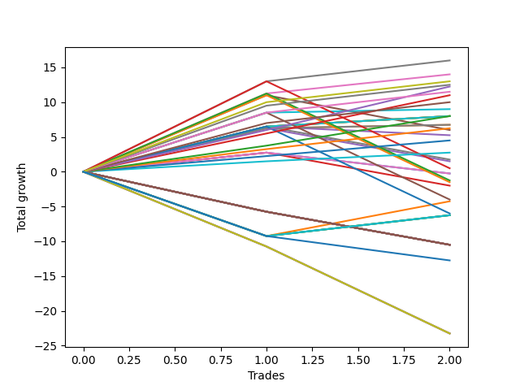

# Short Labrador 010 
- Symbol: ES
- Date Range: 03/18/2022 - 12/30/2022
- Trading Period: 8:30-12:30
- Number of Trades: 4



| Name | Win Percent | Profit | Avg Profit / Trade | Avg Time / Trade |      | Name | Win Percent | Profit | Avg Profit / Trade | Avg Time / Trade |
| ---- | ----------- | ------ | ------------------ | ---------------- | ---- | ---- | ----------- | ------ | ------------------ | ---------------- |
| Sorted By <br> Profit | | | | | | Sorted By <br> Win Percentage ||||
| BB-100 Mid | 100.00 | 22375.00 | 5593.75 | 27:02 |     | BB-100 Mid | 100.00 | 22375.00 | 5593.75 | 27:02 |
| V Mid | 100.00 | 20750.00 | 5187.50 | 29:12 |     | V Mid | 100.00 | 20750.00 | 5187.50 | 29:12 |
| BB-20 U/L 1SD | 100.00 | 20000.00 | 5000.00 | 08:53 |     | BB-20 U/L 1SD | 100.00 | 20000.00 | 5000.00 | 08:53 |
| BB-50 Mid | 75.00 | 20000.00 | 5000.00 | 13:47 |     | BB-20 U/L 2SD C | 100.00 | 19250.00 | 4812.50 | 15:00 |
| BB-20 U/L 2SD C | 100.00 | 19250.00 | 4812.50 | 15:00 |     | BB-20 U/L 2SD | 100.00 | 19250.00 | 4812.50 | 14:56 |
| BB-20 U/L 2SD | 100.00 | 19250.00 | 4812.50 | 14:56 |     | TP-10 | 100.00 | 17875.00 | 4468.75 | 28:32 |
| TP-10 | 100.00 | 17875.00 | 4468.75 | 28:32 |     | TP-9 | 100.00 | 17125.00 | 4281.25 | 26:55 |
| TP-9 | 100.00 | 17125.00 | 4281.25 | 26:55 |     | TP-8 | 100.00 | 16125.00 | 4031.25 | 26:22 |
| TP-8 | 100.00 | 16125.00 | 4031.25 | 26:22 |     | BB-50 U/L 2SD | 100.00 | 13750.00 | 3437.50 | 44:03 |
| BB-50 U/L 2SD | 100.00 | 13750.00 | 3437.50 | 44:03 |     | TP-7 | 100.00 | 12500.00 | 3125.00 | 22:26 |
| BB-200 Mid | 50.00 | 12875.00 | 3218.75 | 32:52 |     | TP-6 | 100.00 | 12500.00 | 3125.00 | 21:57 |
| TP-7 | 100.00 | 12500.00 | 3125.00 | 22:26 |     | TP-5 | 100.00 | 10500.00 | 2625.00 | 21:30 |
| TP-6 | 100.00 | 12500.00 | 3125.00 | 21:57 |     | TP-4 | 100.00 | 8500.00 | 2125.00 | 21:16 |
| BB-20 Mid | 50.00 | 11625.00 | 2906.25 | 07:06 |     | TP-3 | 100.00 | 5875.00 | 1468.75 | 07:28 |
| TP-5 | 100.00 | 10500.00 | 2625.00 | 21:30 |     | TP-2 | 100.00 | 4750.00 | 1187.50 | 07:00 |
| BB-50 U/L 1SD | 75.00 | 9375.00 | 2343.75 | 38:51 |     | TP-1 | 100.00 | 2250.00 | 562.50 | 05:33 |
| TP-4 | 100.00 | 8500.00 | 2125.00 | 21:16 |     | BB-50 Mid | 75.00 | 20000.00 | 5000.00 | 13:47 |
| BB-200 U/L 2SD | 75.00 | 7500.00 | 1875.00 | 55:53 |     | BB-50 U/L 1SD | 75.00 | 9375.00 | 2343.75 | 38:51 |
| TP-3 | 100.00 | 5875.00 | 1468.75 | 07:28 |     | BB-200 U/L 2SD | 75.00 | 7500.00 | 1875.00 | 55:53 |
| NEWFI 000 | 75.00 | 5000.00 | 1250.00 | 50:43 |     | NEWFI 000 | 75.00 | 5000.00 | 1250.00 | 50:43 |
| TP-2 | 100.00 | 4750.00 | 1187.50 | 07:00 |     | BB-100 U/L 2SD | 75.00 | 4750.00 | 1187.50 | 49:02 |
| BB-100 U/L 2SD | 75.00 | 4750.00 | 1187.50 | 49:02 |     | V U/L 1SD | 75.00 | 3500.00 | 875.00 | 48:47 |
| V U/L 1SD | 75.00 | 3500.00 | 875.00 | 48:47 |     | BB-200 Mid | 50.00 | 12875.00 | 3218.75 | 32:52 |
| TP-1 | 100.00 | 2250.00 | 562.50 | 05:33 |     | BB-20 Mid | 50.00 | 11625.00 | 2906.25 | 07:06 |
| NEWFI 0000 | 25.00 | -13125.00 | -3281.25 | 43:30 |     | NEWFI 0000 | 25.00 | -13125.00 | -3281.25 | 43:30 |

## NO STOPLOSS

### Test BB-20 Mid
* Sell when price hits the middle line of the 20p bollinger
* No Stoploss
* Results:
```
Total Trades: 4
Percent Up: 50.00
Percent Down: 50.00
Total Points Moved Down: 23.25
Potential Profit: 11625.00
Total Points Ups: 3.00 Count Ups: 2
Total Points Downs: 26.25 Count Downs: 2
```

<details><summary>Trades</summary>

<code>In: 2022-04-25 10:19:00		Out: 2022-04-25 10:26:50		Total Position Time: 07:50		Total Move Down: 2.75		Total to Date: 2.75</code> <br />
<code>In: 2022-05-24 10:49:00		Out: 2022-05-24 11:01:15		Total Position Time: 12:15		Total Move Down: -3.00		Total to Date: -0.25</code> <br />
<code>In: 2022-06-15 11:49:00		Out: 2022-06-15 11:52:35		Total Position Time: 03:35		Total Move Down: 23.50		Total to Date: 23.25</code> <br />
<code>In: 2022-11-02 08:52:00		Out: 2022-11-02 08:56:45		Total Position Time: 04:45		Total Move Down: -0.00		Total to Date: 23.25</code> <br />


</details>

### Test BB-20 U/L 1SD
* Sell when the price hits the lower line of the 20p 1std bollinger
* No Stoploss
* Results:
```
Total Trades: 4
Percent Up: 0.00
Percent Down: 100.00
Total Points Moved Down: 40.00
Potential Profit: 20000.00
Total Points Ups: 0.00 Count Ups: 0
Total Points Downs: 40.00 Count Downs: 4
```

<details><summary>Trades</summary>

<code>In: 2022-04-25 10:19:00		Out: 2022-04-25 10:27:55		Total Position Time: 08:55		Total Move Down: 6.25		Total to Date: 6.25</code> <br />
<code>In: 2022-05-24 10:49:00		Out: 2022-05-24 11:01:40		Total Position Time: 12:40		Total Move Down: 0.50		Total to Date: 6.75</code> <br />
<code>In: 2022-06-15 11:49:00		Out: 2022-06-15 11:57:55		Total Position Time: 08:55		Total Move Down: 32.25		Total to Date: 39.00</code> <br />
<code>In: 2022-11-02 08:52:00		Out: 2022-11-02 08:57:05		Total Position Time: 05:05		Total Move Down: 1.00		Total to Date: 40.00</code> <br />


</details>

### Test BB-20 U/L 2SD
* Sell when the price hits the lower line of the 20p 2std bollinger
* No Stoploss
* Results:
```
Total Trades: 4
Percent Up: 0.00
Percent Down: 100.00
Total Points Moved Down: 38.50
Potential Profit: 19250.00
Total Points Ups: 0.00 Count Ups: 0
Total Points Downs: 38.50 Count Downs: 4
```

<details><summary>Trades</summary>

<code>In: 2022-04-25 10:19:00		Out: 2022-04-25 10:33:35		Total Position Time: 14:35		Total Move Down: 6.50		Total to Date: 6.50</code> <br />
<code>In: 2022-05-24 10:49:00		Out: 2022-05-24 11:01:50		Total Position Time: 12:50		Total Move Down: 1.50		Total to Date: 8.00</code> <br />
<code>In: 2022-06-15 11:49:00		Out: 2022-06-15 12:13:05		Total Position Time: 24:05		Total Move Down: 27.75		Total to Date: 35.75</code> <br />
<code>In: 2022-11-02 08:52:00		Out: 2022-11-02 09:00:15		Total Position Time: 08:15		Total Move Down: 2.75		Total to Date: 38.50</code> <br />


</details>

### Test BB-20 U/L 2SD C
* Sell when the price hits the lower line of the 20p 2std bollinger
* No Stoploss
* Results:
```
Total Trades: 4
Percent Up: 0.00
Percent Down: 100.00
Total Points Moved Down: 38.50
Potential Profit: 19250.00
Total Points Ups: 0.00 Count Ups: 0
Total Points Downs: 38.50 Count Downs: 4
```

<details><summary>Trades</summary>

<code>In: 2022-04-25 10:19:00		Out: 2022-04-25 10:33:35		Total Position Time: 14:35		Total Move Down: 6.50		Total to Date: 6.50</code> <br />
<code>In: 2022-05-24 10:49:00		Out: 2022-05-24 11:01:50		Total Position Time: 12:50		Total Move Down: 1.50		Total to Date: 8.00</code> <br />
<code>In: 2022-06-15 11:49:00		Out: 2022-06-15 12:13:05		Total Position Time: 24:05		Total Move Down: 27.75		Total to Date: 35.75</code> <br />
<code>In: 2022-11-02 08:52:00		Out: 2022-11-02 09:00:30		Total Position Time: 08:30		Total Move Down: 2.75		Total to Date: 38.50</code> <br />


</details>

### Test BB-50 Mid
* Sell when price hits the middle line of the 50p bollinger
* No Stoploss
* Results:
```
Total Trades: 4
Percent Up: 25.00
Percent Down: 75.00
Total Points Moved Down: 40.00
Potential Profit: 20000.00
Total Points Ups: 1.25 Count Ups: 1
Total Points Downs: 41.25 Count Downs: 3
```

<details><summary>Trades</summary>

<code>In: 2022-04-25 10:19:00		Out: 2022-04-25 10:28:15		Total Position Time: 09:15		Total Move Down: 6.50		Total to Date: 6.50</code> <br />
<code>In: 2022-05-24 10:49:00		Out: 2022-05-24 11:20:25		Total Position Time: 31:25		Total Move Down: -1.25		Total to Date: 5.25</code> <br />
<code>In: 2022-06-15 11:49:00		Out: 2022-06-15 11:58:05		Total Position Time: 09:05		Total Move Down: 33.50		Total to Date: 38.75</code> <br />
<code>In: 2022-11-02 08:52:00		Out: 2022-11-02 08:57:25		Total Position Time: 05:25		Total Move Down: 1.25		Total to Date: 40.00</code> <br />


</details>

### Test BB-50 U/L 1SD
* Sell when the price hits the lower line of the 50p 1std bollinger
* No Stoploss
* Results:
```
Total Trades: 4
Percent Up: 25.00
Percent Down: 75.00
Total Points Moved Down: 18.75
Potential Profit: 9375.00
Total Points Ups: 5.00 Count Ups: 1
Total Points Downs: 23.75 Count Downs: 3
```

<details><summary>Trades</summary>

<code>In: 2022-04-25 10:19:00		Out: 2022-04-25 10:51:45		Total Position Time: 32:45		Total Move Down: 11.00		Total to Date: 11.00</code> <br />
<code>In: 2022-05-24 10:49:00		Out: 2022-05-24 11:44:15		Total Position Time: 55:15		Total Move Down: -5.00		Total to Date: 6.00</code> <br />
<code>In: 2022-06-15 11:49:00		Out: 2022-06-15 12:47:00		Total Position Time: 58:00		Total Move Down: 9.25		Total to Date: 15.25</code> <br />
<code>In: 2022-11-02 08:52:00		Out: 2022-11-02 09:01:25		Total Position Time: 09:25		Total Move Down: 3.50		Total to Date: 18.75</code> <br />


</details>

### Test BB-50 U/L 2SD
* Sell when the price hits the lower line of the 50p 2std bollinger
* No Stoploss
* Results:
```
Total Trades: 4
Percent Up: 0.00
Percent Down: 100.00
Total Points Moved Down: 27.50
Potential Profit: 13750.00
Total Points Ups: 0.00 Count Ups: 0
Total Points Downs: 27.50 Count Downs: 4
```

<details><summary>Trades</summary>

<code>In: 2022-04-25 10:19:00		Out: 2022-04-25 11:01:35		Total Position Time: 42:35		Total Move Down: 11.25		Total to Date: 11.25</code> <br />
<code>In: 2022-05-24 10:49:00		Out: 2022-05-24 11:49:10		Total Position Time: 60:10		Total Move Down: 2.75		Total to Date: 14.00</code> <br />
<code>In: 2022-06-15 11:49:00		Out: 2022-06-15 12:47:00		Total Position Time: 58:00		Total Move Down: 9.25		Total to Date: 23.25</code> <br />
<code>In: 2022-11-02 08:52:00		Out: 2022-11-02 09:07:30		Total Position Time: 15:30		Total Move Down: 4.25		Total to Date: 27.50</code> <br />


</details>

### Test V Mid
* Sell when the price hits the middle line of the 1std VWAP
* No Stoploss
* Results:
```
Total Trades: 4
Percent Up: 0.00
Percent Down: 100.00
Total Points Moved Down: 41.50
Potential Profit: 20750.00
Total Points Ups: 0.00 Count Ups: 0
Total Points Downs: 41.50 Count Downs: 4
```

<details><summary>Trades</summary>

<code>In: 2022-04-25 10:19:00		Out: 2022-04-25 11:04:10		Total Position Time: 45:10		Total Move Down: 13.00		Total to Date: 13.00</code> <br />
<code>In: 2022-05-24 10:49:00		Out: 2022-05-24 11:49:55		Total Position Time: 60:55		Total Move Down: 3.00		Total to Date: 16.00</code> <br />
<code>In: 2022-06-15 11:49:00		Out: 2022-06-15 11:54:50		Total Position Time: 05:50		Total Move Down: 25.00		Total to Date: 41.00</code> <br />
<code>In: 2022-11-02 08:52:00		Out: 2022-11-02 08:56:55		Total Position Time: 04:55		Total Move Down: 0.50		Total to Date: 41.50</code> <br />


</details>

### Test V U/L 1SD
* Sell when the price hits the lower line of the 1std VWAP
* No Stoploss
* Results:
```
Total Trades: 4
Percent Up: 25.00
Percent Down: 75.00
Total Points Moved Down: 7.00
Potential Profit: 3500.00
Total Points Ups: 9.25 Count Ups: 1
Total Points Downs: 16.25 Count Downs: 3
```

<details><summary>Trades</summary>

<code>In: 2022-04-25 10:19:00		Out: 2022-04-25 11:19:55		Total Position Time: 60:55		Total Move Down: -9.25		Total to Date: -9.25</code> <br />
<code>In: 2022-05-24 10:49:00		Out: 2022-05-24 11:49:55		Total Position Time: 60:55		Total Move Down: 3.00		Total to Date: -6.25</code> <br />
<code>In: 2022-06-15 11:49:00		Out: 2022-06-15 12:47:00		Total Position Time: 58:00		Total Move Down: 9.25		Total to Date: 3.00</code> <br />
<code>In: 2022-11-02 08:52:00		Out: 2022-11-02 09:07:20		Total Position Time: 15:20		Total Move Down: 4.00		Total to Date: 7.00</code> <br />


</details>

### Test BB-100 Mid
* Move to BB100 Mid
* No Stoploss
* Results:
```
Total Trades: 4
Percent Up: 0.00
Percent Down: 100.00
Total Points Moved Down: 44.75
Potential Profit: 22375.00
Total Points Ups: 0.00 Count Ups: 0
Total Points Downs: 44.75 Count Downs: 4
```

<details><summary>Trades</summary>

<code>In: 2022-04-25 10:19:00		Out: 2022-04-25 10:51:15		Total Position Time: 32:15		Total Move Down: 8.50		Total to Date: 8.50</code> <br />
<code>In: 2022-05-24 10:49:00		Out: 2022-05-24 11:48:35		Total Position Time: 59:35		Total Move Down: 0.50		Total to Date: 9.00</code> <br />
<code>In: 2022-06-15 11:49:00		Out: 2022-06-15 11:58:05		Total Position Time: 09:05		Total Move Down: 33.50		Total to Date: 42.50</code> <br />
<code>In: 2022-11-02 08:52:00		Out: 2022-11-02 08:59:15		Total Position Time: 07:15		Total Move Down: 2.25		Total to Date: 44.75</code> <br />


</details>

### Test BB-100 U/L 2SD
* Move to BB100 Upper Band
* No Stoploss
* Results:
```
Total Trades: 4
Percent Up: 25.00
Percent Down: 75.00
Total Points Moved Down: 9.50
Potential Profit: 4750.00
Total Points Ups: 9.25 Count Ups: 1
Total Points Downs: 18.75 Count Downs: 3
```

<details><summary>Trades</summary>

<code>In: 2022-04-25 10:19:00		Out: 2022-04-25 11:19:55		Total Position Time: 60:55		Total Move Down: -9.25		Total to Date: -9.25</code> <br />
<code>In: 2022-05-24 10:49:00		Out: 2022-05-24 11:49:55		Total Position Time: 60:55		Total Move Down: 3.00		Total to Date: -6.25</code> <br />
<code>In: 2022-06-15 11:49:00		Out: 2022-06-15 12:47:00		Total Position Time: 58:00		Total Move Down: 9.25		Total to Date: 3.00</code> <br />
<code>In: 2022-11-02 08:52:00		Out: 2022-11-02 09:08:20		Total Position Time: 16:20		Total Move Down: 6.50		Total to Date: 9.50</code> <br />


</details>

### Test BB-200 Mid
* Move to BB200 Mid
* No Stoploss
* Results:
```
Total Trades: 4
Percent Up: 50.00
Percent Down: 50.00
Total Points Moved Down: 25.75
Potential Profit: 12875.00
Total Points Ups: 10.50 Count Ups: 2
Total Points Downs: 36.25 Count Downs: 2
```

<details><summary>Trades</summary>

<code>In: 2022-04-25 10:19:00		Out: 2022-04-25 11:19:55		Total Position Time: 60:55		Total Move Down: -9.25		Total to Date: -9.25</code> <br />
<code>In: 2022-05-24 10:49:00		Out: 2022-05-24 11:49:25		Total Position Time: 60:25		Total Move Down: 5.00		Total to Date: -4.25</code> <br />
<code>In: 2022-06-15 11:49:00		Out: 2022-06-15 11:58:00		Total Position Time: 09:00		Total Move Down: 31.25		Total to Date: 27.00</code> <br />
<code>In: 2022-11-02 08:52:00		Out: 2022-11-02 08:53:10		Total Position Time: 01:10		Total Move Down: -1.25		Total to Date: 25.75</code> <br />


</details>

### Test BB-200 U/L 2SD
* Move to BB200 Upper Band
* No Stoploss
* Results:
```
Total Trades: 4
Percent Up: 25.00
Percent Down: 75.00
Total Points Moved Down: 15.00
Potential Profit: 7500.00
Total Points Ups: 9.25 Count Ups: 1
Total Points Downs: 24.25 Count Downs: 3
```

<details><summary>Trades</summary>

<code>In: 2022-04-25 10:19:00		Out: 2022-04-25 11:19:55		Total Position Time: 60:55		Total Move Down: -9.25		Total to Date: -9.25</code> <br />
<code>In: 2022-05-24 10:49:00		Out: 2022-05-24 11:49:55		Total Position Time: 60:55		Total Move Down: 3.00		Total to Date: -6.25</code> <br />
<code>In: 2022-06-15 11:49:00		Out: 2022-06-15 12:47:00		Total Position Time: 58:00		Total Move Down: 9.25		Total to Date: 3.00</code> <br />
<code>In: 2022-11-02 08:52:00		Out: 2022-11-02 09:35:45		Total Position Time: 43:45		Total Move Down: 12.00		Total to Date: 15.00</code> <br />


</details>

## TAKE PROFIT

### Test TP-1
* Take Profit of 1 Point
* No Stoploss
* Results:
```
Total Trades: 4
Percent Up: 0.00
Percent Down: 100.00
Total Points Moved Down: 4.50
Potential Profit: 2250.00
Total Points Ups: 0.00 Count Ups: 0
Total Points Downs: 4.50 Count Downs: 4
```

<details><summary>Trades</summary>

<code>In: 2022-04-25 10:19:00		Out: 2022-04-25 10:22:15		Total Position Time: 03:15		Total Move Down: 1.50		Total to Date: 1.50</code> <br />
<code>In: 2022-05-24 10:49:00		Out: 2022-05-24 11:01:45		Total Position Time: 12:45		Total Move Down: 1.25		Total to Date: 2.75</code> <br />
<code>In: 2022-06-15 11:49:00		Out: 2022-06-15 11:50:10		Total Position Time: 01:10		Total Move Down: 0.75		Total to Date: 3.50</code> <br />
<code>In: 2022-11-02 08:52:00		Out: 2022-11-02 08:57:05		Total Position Time: 05:05		Total Move Down: 1.00		Total to Date: 4.50</code> <br />


</details>

### Test TP-2
* Take Profit of 2 Point
* No Stoploss
* Results:
```
Total Trades: 4
Percent Up: 0.00
Percent Down: 100.00
Total Points Moved Down: 9.50
Potential Profit: 4750.00
Total Points Ups: 0.00 Count Ups: 0
Total Points Downs: 9.50 Count Downs: 4
```

<details><summary>Trades</summary>

<code>In: 2022-04-25 10:19:00		Out: 2022-04-25 10:22:40		Total Position Time: 03:40		Total Move Down: 2.25		Total to Date: 2.25</code> <br />
<code>In: 2022-05-24 10:49:00		Out: 2022-05-24 11:04:55		Total Position Time: 15:55		Total Move Down: 2.25		Total to Date: 4.50</code> <br />
<code>In: 2022-06-15 11:49:00		Out: 2022-06-15 11:50:15		Total Position Time: 01:15		Total Move Down: 3.00		Total to Date: 7.50</code> <br />
<code>In: 2022-11-02 08:52:00		Out: 2022-11-02 08:59:10		Total Position Time: 07:10		Total Move Down: 2.00		Total to Date: 9.50</code> <br />


</details>

### Test TP-3
* Take Profit of 3 Point
* No Stoploss
* Results:
```
Total Trades: 4
Percent Up: 0.00
Percent Down: 100.00
Total Points Moved Down: 11.75
Potential Profit: 5875.00
Total Points Ups: 0.00 Count Ups: 0
Total Points Downs: 11.75 Count Downs: 4
```

<details><summary>Trades</summary>

<code>In: 2022-04-25 10:19:00		Out: 2022-04-25 10:23:05		Total Position Time: 04:05		Total Move Down: 3.25		Total to Date: 3.25</code> <br />
<code>In: 2022-05-24 10:49:00		Out: 2022-05-24 11:05:00		Total Position Time: 16:00		Total Move Down: 3.00		Total to Date: 6.25</code> <br />
<code>In: 2022-06-15 11:49:00		Out: 2022-06-15 11:50:20		Total Position Time: 01:20		Total Move Down: 2.75		Total to Date: 9.00</code> <br />
<code>In: 2022-11-02 08:52:00		Out: 2022-11-02 09:00:30		Total Position Time: 08:30		Total Move Down: 2.75		Total to Date: 11.75</code> <br />


</details>

### Test TP-4
* Take Profit of 4 Point
* No Stoploss
* Results:
```
Total Trades: 4
Percent Up: 0.00
Percent Down: 100.00
Total Points Moved Down: 17.00
Potential Profit: 8500.00
Total Points Ups: 0.00 Count Ups: 0
Total Points Downs: 17.00 Count Downs: 4
```

<details><summary>Trades</summary>

<code>In: 2022-04-25 10:19:00		Out: 2022-04-25 10:27:00		Total Position Time: 08:00		Total Move Down: 3.75		Total to Date: 3.75</code> <br />
<code>In: 2022-05-24 10:49:00		Out: 2022-05-24 11:49:20		Total Position Time: 60:20		Total Move Down: 4.25		Total to Date: 8.00</code> <br />
<code>In: 2022-06-15 11:49:00		Out: 2022-06-15 11:50:25		Total Position Time: 01:25		Total Move Down: 5.00		Total to Date: 13.00</code> <br />
<code>In: 2022-11-02 08:52:00		Out: 2022-11-02 09:07:20		Total Position Time: 15:20		Total Move Down: 4.00		Total to Date: 17.00</code> <br />


</details>

### Test TP-5
* Take Profit of 5 Point
* No Stoploss
* Results:
```
Total Trades: 4
Percent Up: 0.00
Percent Down: 100.00
Total Points Moved Down: 21.00
Potential Profit: 10500.00
Total Points Ups: 0.00 Count Ups: 0
Total Points Downs: 21.00 Count Downs: 4
```

<details><summary>Trades</summary>

<code>In: 2022-04-25 10:19:00		Out: 2022-04-25 10:27:10		Total Position Time: 08:10		Total Move Down: 5.50		Total to Date: 5.50</code> <br />
<code>In: 2022-05-24 10:49:00		Out: 2022-05-24 11:49:30		Total Position Time: 60:30		Total Move Down: 5.50		Total to Date: 11.00</code> <br />
<code>In: 2022-06-15 11:49:00		Out: 2022-06-15 11:50:25		Total Position Time: 01:25		Total Move Down: 5.00		Total to Date: 16.00</code> <br />
<code>In: 2022-11-02 08:52:00		Out: 2022-11-02 09:07:55		Total Position Time: 15:55		Total Move Down: 5.00		Total to Date: 21.00</code> <br />


</details>

### Test TP-6
* Take Profit of 6 Point
* No Stoploss
* Results:
```
Total Trades: 4
Percent Up: 0.00
Percent Down: 100.00
Total Points Moved Down: 25.00
Potential Profit: 12500.00
Total Points Ups: 0.00 Count Ups: 0
Total Points Downs: 25.00 Count Downs: 4
```

<details><summary>Trades</summary>

<code>In: 2022-04-25 10:19:00		Out: 2022-04-25 10:27:25		Total Position Time: 08:25		Total Move Down: 6.00		Total to Date: 6.00</code> <br />
<code>In: 2022-05-24 10:49:00		Out: 2022-05-24 11:49:35		Total Position Time: 60:35		Total Move Down: 6.25		Total to Date: 12.25</code> <br />
<code>In: 2022-06-15 11:49:00		Out: 2022-06-15 11:51:30		Total Position Time: 02:30		Total Move Down: 6.25		Total to Date: 18.50</code> <br />
<code>In: 2022-11-02 08:52:00		Out: 2022-11-02 09:08:20		Total Position Time: 16:20		Total Move Down: 6.50		Total to Date: 25.00</code> <br />


</details>

### Test TP-7
* Take Profit of 7 Point
* No Stoploss
* Results:
```
Total Trades: 4
Percent Up: 0.00
Percent Down: 100.00
Total Points Moved Down: 25.00
Potential Profit: 12500.00
Total Points Ups: 0.00 Count Ups: 0
Total Points Downs: 25.00 Count Downs: 4
```

<details><summary>Trades</summary>

<code>In: 2022-04-25 10:19:00		Out: 2022-04-25 10:28:20		Total Position Time: 09:20		Total Move Down: 7.00		Total to Date: 7.00</code> <br />
<code>In: 2022-05-24 10:49:00		Out: 2022-05-24 11:49:55		Total Position Time: 60:55		Total Move Down: 3.00		Total to Date: 10.00</code> <br />
<code>In: 2022-06-15 11:49:00		Out: 2022-06-15 11:52:05		Total Position Time: 03:05		Total Move Down: 8.00		Total to Date: 18.00</code> <br />
<code>In: 2022-11-02 08:52:00		Out: 2022-11-02 09:08:25		Total Position Time: 16:25		Total Move Down: 7.00		Total to Date: 25.00</code> <br />


</details>

### Test TP-8
* Take Profit of 8 Point
* No Stoploss
* Results:
```
Total Trades: 4
Percent Up: 0.00
Percent Down: 100.00
Total Points Moved Down: 32.25
Potential Profit: 16125.00
Total Points Ups: 0.00 Count Ups: 0
Total Points Downs: 32.25 Count Downs: 4
```

<details><summary>Trades</summary>

<code>In: 2022-04-25 10:19:00		Out: 2022-04-25 10:35:45		Total Position Time: 16:45		Total Move Down: 8.50		Total to Date: 8.50</code> <br />
<code>In: 2022-05-24 10:49:00		Out: 2022-05-24 11:49:55		Total Position Time: 60:55		Total Move Down: 3.00		Total to Date: 11.50</code> <br />
<code>In: 2022-06-15 11:49:00		Out: 2022-06-15 11:52:10		Total Position Time: 03:10		Total Move Down: 12.75		Total to Date: 24.25</code> <br />
<code>In: 2022-11-02 08:52:00		Out: 2022-11-02 09:16:40		Total Position Time: 24:40		Total Move Down: 8.00		Total to Date: 32.25</code> <br />


</details>

### Test TP-9
* Take Profit of 9 Point
* No Stoploss
* Results:
```
Total Trades: 4
Percent Up: 0.00
Percent Down: 100.00
Total Points Moved Down: 34.25
Potential Profit: 17125.00
Total Points Ups: 0.00 Count Ups: 0
Total Points Downs: 34.25 Count Downs: 4
```

<details><summary>Trades</summary>

<code>In: 2022-04-25 10:19:00		Out: 2022-04-25 10:36:35		Total Position Time: 17:35		Total Move Down: 9.50		Total to Date: 9.50</code> <br />
<code>In: 2022-05-24 10:49:00		Out: 2022-05-24 11:49:55		Total Position Time: 60:55		Total Move Down: 3.00		Total to Date: 12.50</code> <br />
<code>In: 2022-06-15 11:49:00		Out: 2022-06-15 11:52:10		Total Position Time: 03:10		Total Move Down: 12.75		Total to Date: 25.25</code> <br />
<code>In: 2022-11-02 08:52:00		Out: 2022-11-02 09:18:00		Total Position Time: 26:00		Total Move Down: 9.00		Total to Date: 34.25</code> <br />


</details>

### Test TP-10
* Take Profit of 10 Point
* No Stoploss
* Results:
```
Total Trades: 4
Percent Up: 0.00
Percent Down: 100.00
Total Points Moved Down: 35.75
Potential Profit: 17875.00
Total Points Ups: 0.00 Count Ups: 0
Total Points Downs: 35.75 Count Downs: 4
```

<details><summary>Trades</summary>

<code>In: 2022-04-25 10:19:00		Out: 2022-04-25 10:36:45		Total Position Time: 17:45		Total Move Down: 10.00		Total to Date: 10.00</code> <br />
<code>In: 2022-05-24 10:49:00		Out: 2022-05-24 11:49:55		Total Position Time: 60:55		Total Move Down: 3.00		Total to Date: 13.00</code> <br />
<code>In: 2022-06-15 11:49:00		Out: 2022-06-15 11:52:10		Total Position Time: 03:10		Total Move Down: 12.75		Total to Date: 25.75</code> <br />
<code>In: 2022-11-02 08:52:00		Out: 2022-11-02 09:24:20		Total Position Time: 32:20		Total Move Down: 10.00		Total to Date: 35.75</code> <br />


</details>

## Indicator Exits

### Test NEWFI 000
* Newfi 0000
* No Stoploss
* Results:
```
Total Trades: 4
Percent Up: 25.00
Percent Down: 75.00
Total Points Moved Down: 10.00
Potential Profit: 5000.00
Total Points Ups: 9.25 Count Ups: 1
Total Points Downs: 19.25 Count Downs: 3
```

<details><summary>Trades</summary>

<code>In: 2022-04-25 10:19:00		Out: 2022-04-25 11:19:55		Total Position Time: 60:55		Total Move Down: -9.25		Total to Date: -9.25</code> <br />
<code>In: 2022-05-24 10:49:00		Out: 2022-05-24 11:49:55		Total Position Time: 60:55		Total Move Down: 3.00		Total to Date: -6.25</code> <br />
<code>In: 2022-06-15 11:49:00		Out: 2022-06-15 12:47:00		Total Position Time: 58:00		Total Move Down: 9.25		Total to Date: 3.00</code> <br />
<code>In: 2022-11-02 08:52:00		Out: 2022-11-02 09:15:05		Total Position Time: 23:05		Total Move Down: 7.00		Total to Date: 10.00</code> <br />


</details>

### Test NEWFI 0000
* Newfi 0000
* No Stoploss
* Results:
```
Total Trades: 4
Percent Up: 75.00
Percent Down: 25.00
Total Points Moved Down: -26.25
Potential Profit: -13125.00
Total Points Ups: 33.50 Count Ups: 3
Total Points Downs: 7.25 Count Downs: 1
```

<details><summary>Trades</summary>

<code>In: 2022-04-25 10:19:00		Out: 2022-04-25 11:19:55		Total Position Time: 60:55		Total Move Down: -9.25		Total to Date: -9.25</code> <br />
<code>In: 2022-05-24 10:49:00		Out: 2022-05-24 10:58:05		Total Position Time: 09:05		Total Move Down: -3.50		Total to Date: -12.75</code> <br />
<code>In: 2022-06-15 11:49:00		Out: 2022-06-15 12:32:05		Total Position Time: 43:05		Total Move Down: -20.75		Total to Date: -33.50</code> <br />
<code>In: 2022-11-02 08:52:00		Out: 2022-11-02 09:52:55		Total Position Time: 60:55		Total Move Down: 7.25		Total to Date: -26.25</code> <br />


</details>