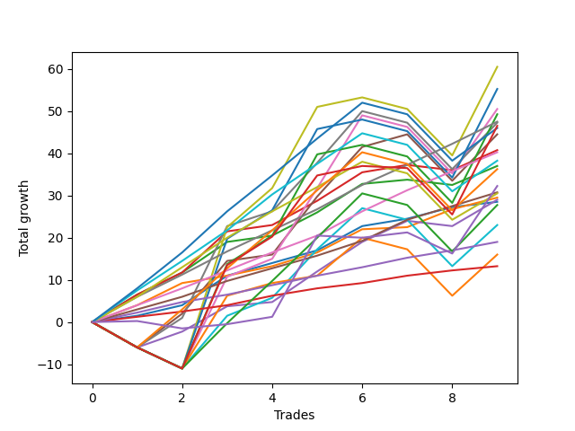

# Short Labrador 011 
- Symbol: ES
- Date Range: 03/18/2022 - 12/30/2022
- Trading Period: 8:30-12:30
- Number of Trades: 13



| Name | Win Percent | Profit | Avg Profit / Trade | Avg Time / Trade |      | Name | Win Percent | Profit | Avg Profit / Trade | Avg Time / Trade |
| ---- | ----------- | ------ | ------------------ | ---------------- | ---- | ---- | ----------- | ------ | ------------------ | ---------------- |
| Sorted By <br> Profit | | | | | | Sorted By <br> Win Percentage ||||
| BB-20 U/L 2SD | 84.62 | 24875.00 | 1913.46 | 16:41 |     | TP-3 | 100.00 | 21625.00 | 1663.46 | 03:48 |
| TP-3 | 100.00 | 21625.00 | 1663.46 | 03:48 |     | BB-20 Mid | 100.00 | 20750.00 | 1596.15 | 02:38 |
| BB-20 Mid | 100.00 | 20750.00 | 1596.15 | 02:38 |     | TP-2 | 100.00 | 15375.00 | 1182.69 | 03:18 |
| BB-20 U/L 1SD | 92.31 | 18000.00 | 1384.62 | 09:23 |     | TP-1 | 100.00 | 12500.00 | 961.54 | 01:50 |
| TP-8 | 69.23 | 16125.00 | 1240.38 | 31:35 |     | BB-20 U/L 1SD | 92.31 | 18000.00 | 1384.62 | 09:23 |
| TP-2 | 100.00 | 15375.00 | 1182.69 | 03:18 |     | BB-20 U/L 2SD | 84.62 | 24875.00 | 1913.46 | 16:41 |
| NEWFI 0000 | 53.85 | 15000.00 | 1153.85 | 17:54 |     | TP-5 | 84.62 | 13875.00 | 1067.31 | 17:10 |
| TP-5 | 84.62 | 13875.00 | 1067.31 | 17:10 |     | TP-4 | 84.62 | 10125.00 | 778.85 | 16:38 |
| TP-1 | 100.00 | 12500.00 | 961.54 | 01:50 |     | BB-20 U/L 2SD C | 76.92 | 9000.00 | 692.31 | 21:50 |
| TP-7 | 69.23 | 11250.00 | 865.38 | 29:55 |     | TP-8 | 69.23 | 16125.00 | 1240.38 | 31:35 |
| TP-4 | 84.62 | 10125.00 | 778.85 | 16:38 |     | TP-7 | 69.23 | 11250.00 | 865.38 | 29:55 |
| BB-20 U/L 2SD C | 76.92 | 9000.00 | 692.31 | 21:50 |     | TP-6 | 69.23 | 6500.00 | 500.00 | 28:32 |
| TP-9 | 61.54 | 7875.00 | 605.77 | 36:39 |     | TP-9 | 61.54 | 7875.00 | 605.77 | 36:39 |
| TP-6 | 69.23 | 6500.00 | 500.00 | 28:32 |     | BB-50 U/L 1SD | 61.54 | -6500.00 | -500.00 | 37:27 |
| V U/L 1SD | 46.15 | 1000.00 | 76.92 | 51:42 |     | NEWFI 0000 | 53.85 | 15000.00 | 1153.85 | 17:54 |
| BB-100 U/L 2SD | 46.15 | -1625.00 | -125.00 | 52:20 |     | V Mid | 53.85 | -5625.00 | -432.69 | 38:13 |
| BB-50 U/L 2SD | 46.15 | -4000.00 | -307.69 | 44:13 |     | BB-50 Mid | 53.85 | -18750.00 | -1442.31 | 33:16 |
| BB-200 U/L 2SD | 46.15 | -4625.00 | -355.77 | 53:15 |     | V U/L 1SD | 46.15 | 1000.00 | 76.92 | 51:42 |
| V Mid | 53.85 | -5625.00 | -432.69 | 38:13 |     | BB-100 U/L 2SD | 46.15 | -1625.00 | -125.00 | 52:20 |
| NEWFI 000 | 46.15 | -6000.00 | -461.54 | 47:08 |     | BB-50 U/L 2SD | 46.15 | -4000.00 | -307.69 | 44:13 |
| BB-50 U/L 1SD | 61.54 | -6500.00 | -500.00 | 37:27 |     | BB-200 U/L 2SD | 46.15 | -4625.00 | -355.77 | 53:15 |
| TP-10 | 46.15 | -15375.00 | -1182.69 | 43:25 |     | NEWFI 000 | 46.15 | -6000.00 | -461.54 | 47:08 |
| BB-100 Mid | 46.15 | -17750.00 | -1365.38 | 43:01 |     | TP-10 | 46.15 | -15375.00 | -1182.69 | 43:25 |
| BB-50 Mid | 53.85 | -18750.00 | -1442.31 | 33:16 |     | BB-100 Mid | 46.15 | -17750.00 | -1365.38 | 43:01 |
| BB-200 Mid | 46.15 | -21250.00 | -1634.62 | 38:52 |     | BB-200 Mid | 46.15 | -21250.00 | -1634.62 | 38:52 |

## NO STOPLOSS

### Test BB-20 Mid
* Sell when price hits the middle line of the 20p bollinger
* No Stoploss
* Results:
```
Total Trades: 13
Percent Up: 0.00
Percent Down: 100.00
Total Points Moved Down: 41.50
Potential Profit: 20750.00
Total Points Ups: 0.00 Count Ups: 0
Total Points Downs: 41.50 Count Downs: 13
```

<details><summary>Trades</summary>

<code>In: 2022-04-07 12:18:00		Out: 2022-04-07 12:19:15		Total Position Time: 01:15		Total Move Down: 1.50		Total to Date: 1.50</code> <br />
<code>In: 2022-05-17 08:39:00		Out: 2022-05-17 08:44:50		Total Position Time: 05:50		Total Move Down: 2.50		Total to Date: 4.00</code> <br />
<code>In: 2022-05-19 11:56:00		Out: 2022-05-19 11:57:50		Total Position Time: 01:50		Total Move Down: 7.00		Total to Date: 11.00</code> <br />
<code>In: 2022-05-25 11:33:00		Out: 2022-05-25 11:39:10		Total Position Time: 06:10		Total Move Down: 2.75		Total to Date: 13.75</code> <br />
<code>In: 2022-05-25 11:39:00		Out: 2022-05-25 11:40:10		Total Position Time: 01:10		Total Move Down: 3.75		Total to Date: 17.50</code> <br />
<code>In: 2022-07-06 11:48:00		Out: 2022-07-06 11:50:05		Total Position Time: 02:05		Total Move Down: 4.00		Total to Date: 21.50</code> <br />
<code>In: 2022-08-04 09:02:00		Out: 2022-08-04 09:03:25		Total Position Time: 01:25		Total Move Down: 3.00		Total to Date: 24.50</code> <br />
<code>In: 2022-09-29 08:59:00		Out: 2022-09-29 09:02:05		Total Position Time: 03:05		Total Move Down: 3.00		Total to Date: 27.50</code> <br />
<code>In: 2022-10-04 11:58:00		Out: 2022-10-04 12:03:15		Total Position Time: 05:15		Total Move Down: 5.75		Total to Date: 33.25</code> <br />
<code>In: 2022-11-07 11:42:00		Out: 2022-11-07 11:43:10		Total Position Time: 01:10		Total Move Down: 1.75		Total to Date: 35.00</code> <br />
<code>In: 2022-11-11 10:36:00		Out: 2022-11-11 10:37:50		Total Position Time: 01:50		Total Move Down: 2.75		Total to Date: 37.75</code> <br />
<code>In: 2022-11-30 11:32:00		Out: 2022-11-30 11:33:20		Total Position Time: 01:20		Total Move Down: 2.50		Total to Date: 40.25</code> <br />
<code>In: 2022-12-08 10:49:00		Out: 2022-12-08 10:51:00		Total Position Time: 02:00		Total Move Down: 1.25		Total to Date: 41.50</code> <br />


</details>

### Test BB-20 U/L 1SD
* Sell when the price hits the lower line of the 20p 1std bollinger
* No Stoploss
* Results:
```
Total Trades: 13
Percent Up: 7.69
Percent Down: 92.31
Total Points Moved Down: 36.00
Potential Profit: 18000.00
Total Points Ups: 0.25 Count Ups: 1
Total Points Downs: 36.25 Count Downs: 12
```

<details><summary>Trades</summary>

<code>In: 2022-04-07 12:18:00		Out: 2022-04-07 12:21:05		Total Position Time: 03:05		Total Move Down: 4.00		Total to Date: 4.00</code> <br />
<code>In: 2022-05-17 08:39:00		Out: 2022-05-17 08:47:25		Total Position Time: 08:25		Total Move Down: 5.25		Total to Date: 9.25</code> <br />
<code>In: 2022-05-19 11:56:00		Out: 2022-05-19 12:10:10		Total Position Time: 14:10		Total Move Down: 1.75		Total to Date: 11.00</code> <br />
<code>In: 2022-05-25 11:33:00		Out: 2022-05-25 11:49:55		Total Position Time: 16:55		Total Move Down: -0.25		Total to Date: 10.75</code> <br />
<code>In: 2022-05-25 11:39:00		Out: 2022-05-25 11:49:55		Total Position Time: 10:55		Total Move Down: 0.50		Total to Date: 11.25</code> <br />
<code>In: 2022-07-06 11:48:00		Out: 2022-07-06 12:00:45		Total Position Time: 12:45		Total Move Down: 3.00		Total to Date: 14.25</code> <br />
<code>In: 2022-08-04 09:02:00		Out: 2022-08-04 09:16:05		Total Position Time: 14:05		Total Move Down: 2.25		Total to Date: 16.50</code> <br />
<code>In: 2022-09-29 08:59:00		Out: 2022-09-29 09:10:55		Total Position Time: 11:55		Total Move Down: 3.25		Total to Date: 19.75</code> <br />
<code>In: 2022-10-04 11:58:00		Out: 2022-10-04 12:05:20		Total Position Time: 07:20		Total Move Down: 5.50		Total to Date: 25.25</code> <br />
<code>In: 2022-11-07 11:42:00		Out: 2022-11-07 11:52:10		Total Position Time: 10:10		Total Move Down: 0.50		Total to Date: 25.75</code> <br />
<code>In: 2022-11-11 10:36:00		Out: 2022-11-11 10:38:10		Total Position Time: 02:10		Total Move Down: 4.25		Total to Date: 30.00</code> <br />
<code>In: 2022-11-30 11:32:00		Out: 2022-11-30 11:38:05		Total Position Time: 06:05		Total Move Down: 3.25		Total to Date: 33.25</code> <br />
<code>In: 2022-12-08 10:49:00		Out: 2022-12-08 10:53:00		Total Position Time: 04:00		Total Move Down: 2.75		Total to Date: 36.00</code> <br />


</details>

### Test BB-20 U/L 2SD
* Sell when the price hits the lower line of the 20p 2std bollinger
* No Stoploss
* Results:
```
Total Trades: 13
Percent Up: 15.38
Percent Down: 84.62
Total Points Moved Down: 49.75
Potential Profit: 24875.00
Total Points Ups: 1.25 Count Ups: 2
Total Points Downs: 51.00 Count Downs: 11
```

<details><summary>Trades</summary>

<code>In: 2022-04-07 12:18:00		Out: 2022-04-07 12:22:45		Total Position Time: 04:45		Total Move Down: 6.50		Total to Date: 6.50</code> <br />
<code>In: 2022-05-17 08:39:00		Out: 2022-05-17 09:06:00		Total Position Time: 27:00		Total Move Down: 5.25		Total to Date: 11.75</code> <br />
<code>In: 2022-05-19 11:56:00		Out: 2022-05-19 12:14:00		Total Position Time: 18:00		Total Move Down: 7.25		Total to Date: 19.00</code> <br />
<code>In: 2022-05-25 11:33:00		Out: 2022-05-25 11:50:00		Total Position Time: 17:00		Total Move Down: -0.00		Total to Date: 19.00</code> <br />
<code>In: 2022-05-25 11:39:00		Out: 2022-05-25 11:50:00		Total Position Time: 11:00		Total Move Down: 0.75		Total to Date: 19.75</code> <br />
<code>In: 2022-07-06 11:48:00		Out: 2022-07-06 12:01:25		Total Position Time: 13:25		Total Move Down: 6.25		Total to Date: 26.00</code> <br />
<code>In: 2022-08-04 09:02:00		Out: 2022-08-04 09:38:50		Total Position Time: 36:50		Total Move Down: 1.50		Total to Date: 27.50</code> <br />
<code>In: 2022-09-29 08:59:00		Out: 2022-09-29 09:11:30		Total Position Time: 12:30		Total Move Down: 5.50		Total to Date: 33.00</code> <br />
<code>In: 2022-10-04 11:58:00		Out: 2022-10-04 12:07:25		Total Position Time: 09:25		Total Move Down: 6.75		Total to Date: 39.75</code> <br />
<code>In: 2022-11-07 11:42:00		Out: 2022-11-07 11:56:15		Total Position Time: 14:15		Total Move Down: 1.00		Total to Date: 40.75</code> <br />
<code>In: 2022-11-11 10:36:00		Out: 2022-11-11 11:17:05		Total Position Time: 41:05		Total Move Down: -1.25		Total to Date: 39.50</code> <br />
<code>In: 2022-11-30 11:32:00		Out: 2022-11-30 11:38:35		Total Position Time: 06:35		Total Move Down: 5.75		Total to Date: 45.25</code> <br />
<code>In: 2022-12-08 10:49:00		Out: 2022-12-08 10:54:15		Total Position Time: 05:15		Total Move Down: 4.50		Total to Date: 49.75</code> <br />


</details>

### Test BB-20 U/L 2SD C
* Sell when the price hits the lower line of the 20p 2std bollinger
* No Stoploss
* Results:
```
Total Trades: 13
Percent Up: 23.08
Percent Down: 76.92
Total Points Moved Down: 18.00
Potential Profit: 9000.00
Total Points Ups: 36.00 Count Ups: 3
Total Points Downs: 54.00 Count Downs: 10
```

<details><summary>Trades</summary>

<code>In: 2022-04-07 12:18:00		Out: 2022-04-07 12:22:45		Total Position Time: 04:45		Total Move Down: 6.50		Total to Date: 6.50</code> <br />
<code>In: 2022-05-17 08:39:00		Out: 2022-05-17 09:06:00		Total Position Time: 27:00		Total Move Down: 5.25		Total to Date: 11.75</code> <br />
<code>In: 2022-05-19 11:56:00		Out: 2022-05-19 12:14:05		Total Position Time: 18:05		Total Move Down: 9.75		Total to Date: 21.50</code> <br />
<code>In: 2022-05-25 11:33:00		Out: 2022-05-25 12:23:00		Total Position Time: 50:00		Total Move Down: -17.75		Total to Date: 3.75</code> <br />
<code>In: 2022-05-25 11:39:00		Out: 2022-05-25 12:23:00		Total Position Time: 44:00		Total Move Down: -17.00		Total to Date: -13.25</code> <br />
<code>In: 2022-07-06 11:48:00		Out: 2022-07-06 12:01:25		Total Position Time: 13:25		Total Move Down: 6.25		Total to Date: -7.00</code> <br />
<code>In: 2022-08-04 09:02:00		Out: 2022-08-04 09:38:50		Total Position Time: 36:50		Total Move Down: 1.50		Total to Date: -5.50</code> <br />
<code>In: 2022-09-29 08:59:00		Out: 2022-09-29 09:11:40		Total Position Time: 12:40		Total Move Down: 5.75		Total to Date: 0.25</code> <br />
<code>In: 2022-10-04 11:58:00		Out: 2022-10-04 12:07:25		Total Position Time: 09:25		Total Move Down: 6.75		Total to Date: 7.00</code> <br />
<code>In: 2022-11-07 11:42:00		Out: 2022-11-07 11:56:25		Total Position Time: 14:25		Total Move Down: 1.75		Total to Date: 8.75</code> <br />
<code>In: 2022-11-11 10:36:00		Out: 2022-11-11 11:17:05		Total Position Time: 41:05		Total Move Down: -1.25		Total to Date: 7.50</code> <br />
<code>In: 2022-11-30 11:32:00		Out: 2022-11-30 11:38:35		Total Position Time: 06:35		Total Move Down: 5.75		Total to Date: 13.25</code> <br />
<code>In: 2022-12-08 10:49:00		Out: 2022-12-08 10:54:35		Total Position Time: 05:35		Total Move Down: 4.75		Total to Date: 18.00</code> <br />


</details>

### Test BB-50 Mid
* Sell when price hits the middle line of the 50p bollinger
* No Stoploss
* Results:
```
Total Trades: 13
Percent Up: 46.15
Percent Down: 53.85
Total Points Moved Down: -37.50
Potential Profit: -18750.00
Total Points Ups: 73.75 Count Ups: 6
Total Points Downs: 36.25 Count Downs: 7
```

<details><summary>Trades</summary>

<code>In: 2022-04-07 12:18:00		Out: 2022-04-07 12:47:00		Total Position Time: 29:00		Total Move Down: -6.00		Total to Date: -6.00</code> <br />
<code>In: 2022-05-17 08:39:00		Out: 2022-05-17 09:05:55		Total Position Time: 26:55		Total Move Down: 3.75		Total to Date: -2.25</code> <br />
<code>In: 2022-05-19 11:56:00		Out: 2022-05-19 12:13:40		Total Position Time: 17:40		Total Move Down: 6.00		Total to Date: 3.75</code> <br />
<code>In: 2022-05-25 11:33:00		Out: 2022-05-25 12:33:55		Total Position Time: 60:55		Total Move Down: -19.50		Total to Date: -15.75</code> <br />
<code>In: 2022-05-25 11:39:00		Out: 2022-05-25 12:34:20		Total Position Time: 55:20		Total Move Down: -15.50		Total to Date: -31.25</code> <br />
<code>In: 2022-07-06 11:48:00		Out: 2022-07-06 12:42:05		Total Position Time: 54:05		Total Move Down: -2.75		Total to Date: -34.00</code> <br />
<code>In: 2022-08-04 09:02:00		Out: 2022-08-04 09:36:55		Total Position Time: 34:55		Total Move Down: 1.00		Total to Date: -33.00</code> <br />
<code>In: 2022-09-29 08:59:00		Out: 2022-09-29 09:16:35		Total Position Time: 17:35		Total Move Down: 7.25		Total to Date: -25.75</code> <br />
<code>In: 2022-10-04 11:58:00		Out: 2022-10-04 12:07:35		Total Position Time: 09:35		Total Move Down: 7.00		Total to Date: -18.75</code> <br />
<code>In: 2022-11-07 11:42:00		Out: 2022-11-07 11:59:00		Total Position Time: 17:00		Total Move Down: 5.00		Total to Date: -13.75</code> <br />
<code>In: 2022-11-11 10:36:00		Out: 2022-11-11 11:17:05		Total Position Time: 41:05		Total Move Down: -1.25		Total to Date: -15.00</code> <br />
<code>In: 2022-11-30 11:32:00		Out: 2022-11-30 12:32:55		Total Position Time: 60:55		Total Move Down: -28.75		Total to Date: -43.75</code> <br />
<code>In: 2022-12-08 10:49:00		Out: 2022-12-08 10:56:30		Total Position Time: 07:30		Total Move Down: 6.25		Total to Date: -37.50</code> <br />


</details>

### Test BB-50 U/L 1SD
* Sell when the price hits the lower line of the 50p 1std bollinger
* No Stoploss
* Results:
```
Total Trades: 13
Percent Up: 38.46
Percent Down: 61.54
Total Points Moved Down: -13.00
Potential Profit: -6500.00
Total Points Ups: 75.00 Count Ups: 5
Total Points Downs: 62.00 Count Downs: 8
```

<details><summary>Trades</summary>

<code>In: 2022-04-07 12:18:00		Out: 2022-04-07 12:47:00		Total Position Time: 29:00		Total Move Down: -6.00		Total to Date: -6.00</code> <br />
<code>In: 2022-05-17 08:39:00		Out: 2022-05-17 09:07:05		Total Position Time: 28:05		Total Move Down: 8.00		Total to Date: 2.00</code> <br />
<code>In: 2022-05-19 11:56:00		Out: 2022-05-19 12:18:30		Total Position Time: 22:30		Total Move Down: 12.50		Total to Date: 14.50</code> <br />
<code>In: 2022-05-25 11:33:00		Out: 2022-05-25 12:33:55		Total Position Time: 60:55		Total Move Down: -19.50		Total to Date: -5.00</code> <br />
<code>In: 2022-05-25 11:39:00		Out: 2022-05-25 12:37:05		Total Position Time: 58:05		Total Move Down: -9.75		Total to Date: -14.75</code> <br />
<code>In: 2022-07-06 11:48:00		Out: 2022-07-06 12:47:00		Total Position Time: 59:00		Total Move Down: 0.50		Total to Date: -14.25</code> <br />
<code>In: 2022-08-04 09:02:00		Out: 2022-08-04 09:38:50		Total Position Time: 36:50		Total Move Down: 1.50		Total to Date: -12.75</code> <br />
<code>In: 2022-09-29 08:59:00		Out: 2022-09-29 09:19:05		Total Position Time: 20:05		Total Move Down: 13.75		Total to Date: 1.00</code> <br />
<code>In: 2022-10-04 11:58:00		Out: 2022-10-04 12:10:20		Total Position Time: 12:20		Total Move Down: 11.75		Total to Date: 12.75</code> <br />
<code>In: 2022-11-07 11:42:00		Out: 2022-11-07 12:08:05		Total Position Time: 26:05		Total Move Down: 3.00		Total to Date: 15.75</code> <br />
<code>In: 2022-11-11 10:36:00		Out: 2022-11-11 11:36:55		Total Position Time: 60:55		Total Move Down: -11.00		Total to Date: 4.75</code> <br />
<code>In: 2022-11-30 11:32:00		Out: 2022-11-30 12:32:55		Total Position Time: 60:55		Total Move Down: -28.75		Total to Date: -24.00</code> <br />
<code>In: 2022-12-08 10:49:00		Out: 2022-12-08 11:01:15		Total Position Time: 12:15		Total Move Down: 11.00		Total to Date: -13.00</code> <br />


</details>

### Test BB-50 U/L 2SD
* Sell when the price hits the lower line of the 50p 2std bollinger
* No Stoploss
* Results:
```
Total Trades: 13
Percent Up: 53.85
Percent Down: 46.15
Total Points Moved Down: -8.00
Potential Profit: -4000.00
Total Points Ups: 83.75 Count Ups: 7
Total Points Downs: 75.75 Count Downs: 6
```

<details><summary>Trades</summary>

<code>In: 2022-04-07 12:18:00		Out: 2022-04-07 12:47:00		Total Position Time: 29:00		Total Move Down: -6.00		Total to Date: -6.00</code> <br />
<code>In: 2022-05-17 08:39:00		Out: 2022-05-17 09:39:55		Total Position Time: 60:55		Total Move Down: -5.00		Total to Date: -11.00</code> <br />
<code>In: 2022-05-19 11:56:00		Out: 2022-05-19 12:24:40		Total Position Time: 28:40		Total Move Down: 21.75		Total to Date: 10.75</code> <br />
<code>In: 2022-05-25 11:33:00		Out: 2022-05-25 12:33:55		Total Position Time: 60:55		Total Move Down: -19.50		Total to Date: -8.75</code> <br />
<code>In: 2022-05-25 11:39:00		Out: 2022-05-25 12:39:55		Total Position Time: 60:55		Total Move Down: -10.75		Total to Date: -19.50</code> <br />
<code>In: 2022-07-06 11:48:00		Out: 2022-07-06 12:47:00		Total Position Time: 59:00		Total Move Down: 0.50		Total to Date: -19.00</code> <br />
<code>In: 2022-08-04 09:02:00		Out: 2022-08-04 09:42:00		Total Position Time: 40:00		Total Move Down: 4.25		Total to Date: -14.75</code> <br />
<code>In: 2022-09-29 08:59:00		Out: 2022-09-29 09:22:45		Total Position Time: 23:45		Total Move Down: 16.75		Total to Date: 2.00</code> <br />
<code>In: 2022-10-04 11:58:00		Out: 2022-10-04 12:11:25		Total Position Time: 13:25		Total Move Down: 17.25		Total to Date: 19.25</code> <br />
<code>In: 2022-11-07 11:42:00		Out: 2022-11-07 12:42:55		Total Position Time: 60:55		Total Move Down: -2.75		Total to Date: 16.50</code> <br />
<code>In: 2022-11-11 10:36:00		Out: 2022-11-11 11:36:55		Total Position Time: 60:55		Total Move Down: -11.00		Total to Date: 5.50</code> <br />
<code>In: 2022-11-30 11:32:00		Out: 2022-11-30 12:32:55		Total Position Time: 60:55		Total Move Down: -28.75		Total to Date: -23.25</code> <br />
<code>In: 2022-12-08 10:49:00		Out: 2022-12-08 11:04:40		Total Position Time: 15:40		Total Move Down: 15.25		Total to Date: -8.00</code> <br />


</details>

### Test V Mid
* Sell when the price hits the middle line of the 1std VWAP
* No Stoploss
* Results:
```
Total Trades: 13
Percent Up: 46.15
Percent Down: 53.85
Total Points Moved Down: -11.25
Potential Profit: -5625.00
Total Points Ups: 78.75 Count Ups: 6
Total Points Downs: 67.50 Count Downs: 7
```

<details><summary>Trades</summary>

<code>In: 2022-04-07 12:18:00		Out: 2022-04-07 12:47:00		Total Position Time: 29:00		Total Move Down: -6.00		Total to Date: -6.00</code> <br />
<code>In: 2022-05-17 08:39:00		Out: 2022-05-17 09:06:45		Total Position Time: 27:45		Total Move Down: 7.00		Total to Date: 1.00</code> <br />
<code>In: 2022-05-19 11:56:00		Out: 2022-05-19 12:24:40		Total Position Time: 28:40		Total Move Down: 21.75		Total to Date: 22.75</code> <br />
<code>In: 2022-05-25 11:33:00		Out: 2022-05-25 12:33:55		Total Position Time: 60:55		Total Move Down: -19.50		Total to Date: 3.25</code> <br />
<code>In: 2022-05-25 11:39:00		Out: 2022-05-25 12:39:55		Total Position Time: 60:55		Total Move Down: -10.75		Total to Date: -7.50</code> <br />
<code>In: 2022-07-06 11:48:00		Out: 2022-07-06 12:47:00		Total Position Time: 59:00		Total Move Down: 0.50		Total to Date: -7.00</code> <br />
<code>In: 2022-08-04 09:02:00		Out: 2022-08-04 09:06:00		Total Position Time: 04:00		Total Move Down: 3.50		Total to Date: -3.50</code> <br />
<code>In: 2022-09-29 08:59:00		Out: 2022-09-29 09:18:20		Total Position Time: 19:20		Total Move Down: 11.50		Total to Date: 8.00</code> <br />
<code>In: 2022-10-04 11:58:00		Out: 2022-10-04 12:10:15		Total Position Time: 12:15		Total Move Down: 12.25		Total to Date: 20.25</code> <br />
<code>In: 2022-11-07 11:42:00		Out: 2022-11-07 12:42:55		Total Position Time: 60:55		Total Move Down: -2.75		Total to Date: 17.50</code> <br />
<code>In: 2022-11-11 10:36:00		Out: 2022-11-11 11:36:55		Total Position Time: 60:55		Total Move Down: -11.00		Total to Date: 6.50</code> <br />
<code>In: 2022-11-30 11:32:00		Out: 2022-11-30 12:32:55		Total Position Time: 60:55		Total Move Down: -28.75		Total to Date: -22.25</code> <br />
<code>In: 2022-12-08 10:49:00		Out: 2022-12-08 11:01:15		Total Position Time: 12:15		Total Move Down: 11.00		Total to Date: -11.25</code> <br />


</details>

### Test V U/L 1SD
* Sell when the price hits the lower line of the 1std VWAP
* No Stoploss
* Results:
```
Total Trades: 13
Percent Up: 53.85
Percent Down: 46.15
Total Points Moved Down: 2.00
Potential Profit: 1000.00
Total Points Ups: 83.75 Count Ups: 7
Total Points Downs: 85.75 Count Downs: 6
```

<details><summary>Trades</summary>

<code>In: 2022-04-07 12:18:00		Out: 2022-04-07 12:47:00		Total Position Time: 29:00		Total Move Down: -6.00		Total to Date: -6.00</code> <br />
<code>In: 2022-05-17 08:39:00		Out: 2022-05-17 09:39:55		Total Position Time: 60:55		Total Move Down: -5.00		Total to Date: -11.00</code> <br />
<code>In: 2022-05-19 11:56:00		Out: 2022-05-19 12:42:30		Total Position Time: 46:30		Total Move Down: 33.50		Total to Date: 22.50</code> <br />
<code>In: 2022-05-25 11:33:00		Out: 2022-05-25 12:33:55		Total Position Time: 60:55		Total Move Down: -19.50		Total to Date: 3.00</code> <br />
<code>In: 2022-05-25 11:39:00		Out: 2022-05-25 12:39:55		Total Position Time: 60:55		Total Move Down: -10.75		Total to Date: -7.75</code> <br />
<code>In: 2022-07-06 11:48:00		Out: 2022-07-06 12:47:00		Total Position Time: 59:00		Total Move Down: 0.50		Total to Date: -7.25</code> <br />
<code>In: 2022-08-04 09:02:00		Out: 2022-08-04 09:47:20		Total Position Time: 45:20		Total Move Down: 9.25		Total to Date: 2.00</code> <br />
<code>In: 2022-09-29 08:59:00		Out: 2022-09-29 09:59:55		Total Position Time: 60:55		Total Move Down: 19.25		Total to Date: 21.25</code> <br />
<code>In: 2022-10-04 11:58:00		Out: 2022-10-04 12:47:00		Total Position Time: 49:00		Total Move Down: 2.25		Total to Date: 23.50</code> <br />
<code>In: 2022-11-07 11:42:00		Out: 2022-11-07 12:42:55		Total Position Time: 60:55		Total Move Down: -2.75		Total to Date: 20.75</code> <br />
<code>In: 2022-11-11 10:36:00		Out: 2022-11-11 11:36:55		Total Position Time: 60:55		Total Move Down: -11.00		Total to Date: 9.75</code> <br />
<code>In: 2022-11-30 11:32:00		Out: 2022-11-30 12:32:55		Total Position Time: 60:55		Total Move Down: -28.75		Total to Date: -19.00</code> <br />
<code>In: 2022-12-08 10:49:00		Out: 2022-12-08 11:05:55		Total Position Time: 16:55		Total Move Down: 21.00		Total to Date: 2.00</code> <br />


</details>

### Test BB-100 Mid
* Move to BB100 Mid
* No Stoploss
* Results:
```
Total Trades: 13
Percent Up: 53.85
Percent Down: 46.15
Total Points Moved Down: -35.50
Potential Profit: -17750.00
Total Points Ups: 83.75 Count Ups: 7
Total Points Downs: 48.25 Count Downs: 6
```

<details><summary>Trades</summary>

<code>In: 2022-04-07 12:18:00		Out: 2022-04-07 12:47:00		Total Position Time: 29:00		Total Move Down: -6.00		Total to Date: -6.00</code> <br />
<code>In: 2022-05-17 08:39:00		Out: 2022-05-17 09:39:55		Total Position Time: 60:55		Total Move Down: -5.00		Total to Date: -11.00</code> <br />
<code>In: 2022-05-19 11:56:00		Out: 2022-05-19 12:18:20		Total Position Time: 22:20		Total Move Down: 12.50		Total to Date: 1.50</code> <br />
<code>In: 2022-05-25 11:33:00		Out: 2022-05-25 12:33:55		Total Position Time: 60:55		Total Move Down: -19.50		Total to Date: -18.00</code> <br />
<code>In: 2022-05-25 11:39:00		Out: 2022-05-25 12:39:55		Total Position Time: 60:55		Total Move Down: -10.75		Total to Date: -28.75</code> <br />
<code>In: 2022-07-06 11:48:00		Out: 2022-07-06 12:47:00		Total Position Time: 59:00		Total Move Down: 0.50		Total to Date: -28.25</code> <br />
<code>In: 2022-08-04 09:02:00		Out: 2022-08-04 09:42:00		Total Position Time: 40:00		Total Move Down: 4.25		Total to Date: -24.00</code> <br />
<code>In: 2022-09-29 08:59:00		Out: 2022-09-29 09:18:20		Total Position Time: 19:20		Total Move Down: 11.50		Total to Date: -12.50</code> <br />
<code>In: 2022-10-04 11:58:00		Out: 2022-10-04 12:10:05		Total Position Time: 12:05		Total Move Down: 9.75		Total to Date: -2.75</code> <br />
<code>In: 2022-11-07 11:42:00		Out: 2022-11-07 12:42:55		Total Position Time: 60:55		Total Move Down: -2.75		Total to Date: -5.50</code> <br />
<code>In: 2022-11-11 10:36:00		Out: 2022-11-11 11:36:55		Total Position Time: 60:55		Total Move Down: -11.00		Total to Date: -16.50</code> <br />
<code>In: 2022-11-30 11:32:00		Out: 2022-11-30 12:32:55		Total Position Time: 60:55		Total Move Down: -28.75		Total to Date: -45.25</code> <br />
<code>In: 2022-12-08 10:49:00		Out: 2022-12-08 11:01:10		Total Position Time: 12:10		Total Move Down: 9.75		Total to Date: -35.50</code> <br />


</details>

### Test BB-100 U/L 2SD
* Move to BB100 Upper Band
* No Stoploss
* Results:
```
Total Trades: 13
Percent Up: 53.85
Percent Down: 46.15
Total Points Moved Down: -3.25
Potential Profit: -1625.00
Total Points Ups: 83.75 Count Ups: 7
Total Points Downs: 80.50 Count Downs: 6
```

<details><summary>Trades</summary>

<code>In: 2022-04-07 12:18:00		Out: 2022-04-07 12:47:00		Total Position Time: 29:00		Total Move Down: -6.00		Total to Date: -6.00</code> <br />
<code>In: 2022-05-17 08:39:00		Out: 2022-05-17 09:39:55		Total Position Time: 60:55		Total Move Down: -5.00		Total to Date: -11.00</code> <br />
<code>In: 2022-05-19 11:56:00		Out: 2022-05-19 12:35:05		Total Position Time: 39:05		Total Move Down: 30.75		Total to Date: 19.75</code> <br />
<code>In: 2022-05-25 11:33:00		Out: 2022-05-25 12:33:55		Total Position Time: 60:55		Total Move Down: -19.50		Total to Date: 0.25</code> <br />
<code>In: 2022-05-25 11:39:00		Out: 2022-05-25 12:39:55		Total Position Time: 60:55		Total Move Down: -10.75		Total to Date: -10.50</code> <br />
<code>In: 2022-07-06 11:48:00		Out: 2022-07-06 12:47:00		Total Position Time: 59:00		Total Move Down: 0.50		Total to Date: -10.00</code> <br />
<code>In: 2022-08-04 09:02:00		Out: 2022-08-04 10:02:55		Total Position Time: 60:55		Total Move Down: 6.75		Total to Date: -3.25</code> <br />
<code>In: 2022-09-29 08:59:00		Out: 2022-09-29 09:59:55		Total Position Time: 60:55		Total Move Down: 19.25		Total to Date: 16.00</code> <br />
<code>In: 2022-10-04 11:58:00		Out: 2022-10-04 12:47:00		Total Position Time: 49:00		Total Move Down: 2.25		Total to Date: 18.25</code> <br />
<code>In: 2022-11-07 11:42:00		Out: 2022-11-07 12:42:55		Total Position Time: 60:55		Total Move Down: -2.75		Total to Date: 15.50</code> <br />
<code>In: 2022-11-11 10:36:00		Out: 2022-11-11 11:36:55		Total Position Time: 60:55		Total Move Down: -11.00		Total to Date: 4.50</code> <br />
<code>In: 2022-11-30 11:32:00		Out: 2022-11-30 12:32:55		Total Position Time: 60:55		Total Move Down: -28.75		Total to Date: -24.25</code> <br />
<code>In: 2022-12-08 10:49:00		Out: 2022-12-08 11:05:55		Total Position Time: 16:55		Total Move Down: 21.00		Total to Date: -3.25</code> <br />


</details>

### Test BB-200 Mid
* Move to BB200 Mid
* No Stoploss
* Results:
```
Total Trades: 13
Percent Up: 53.85
Percent Down: 46.15
Total Points Moved Down: -42.50
Potential Profit: -21250.00
Total Points Ups: 83.75 Count Ups: 7
Total Points Downs: 41.25 Count Downs: 6
```

<details><summary>Trades</summary>

<code>In: 2022-04-07 12:18:00		Out: 2022-04-07 12:47:00		Total Position Time: 29:00		Total Move Down: -6.00		Total to Date: -6.00</code> <br />
<code>In: 2022-05-17 08:39:00		Out: 2022-05-17 09:39:55		Total Position Time: 60:55		Total Move Down: -5.00		Total to Date: -11.00</code> <br />
<code>In: 2022-05-19 11:56:00		Out: 2022-05-19 12:22:10		Total Position Time: 26:10		Total Move Down: 17.25		Total to Date: 6.25</code> <br />
<code>In: 2022-05-25 11:33:00		Out: 2022-05-25 12:33:55		Total Position Time: 60:55		Total Move Down: -19.50		Total to Date: -13.25</code> <br />
<code>In: 2022-05-25 11:39:00		Out: 2022-05-25 12:39:55		Total Position Time: 60:55		Total Move Down: -10.75		Total to Date: -24.00</code> <br />
<code>In: 2022-07-06 11:48:00		Out: 2022-07-06 12:47:00		Total Position Time: 59:00		Total Move Down: 0.50		Total to Date: -23.50</code> <br />
<code>In: 2022-08-04 09:02:00		Out: 2022-08-04 09:04:00		Total Position Time: 02:00		Total Move Down: 3.00		Total to Date: -20.50</code> <br />
<code>In: 2022-09-29 08:59:00		Out: 2022-09-29 09:00:10		Total Position Time: 01:10		Total Move Down: 1.75		Total to Date: -18.75</code> <br />
<code>In: 2022-10-04 11:58:00		Out: 2022-10-04 12:08:20		Total Position Time: 10:20		Total Move Down: 9.00		Total to Date: -9.75</code> <br />
<code>In: 2022-11-07 11:42:00		Out: 2022-11-07 12:42:55		Total Position Time: 60:55		Total Move Down: -2.75		Total to Date: -12.50</code> <br />
<code>In: 2022-11-11 10:36:00		Out: 2022-11-11 11:36:55		Total Position Time: 60:55		Total Move Down: -11.00		Total to Date: -23.50</code> <br />
<code>In: 2022-11-30 11:32:00		Out: 2022-11-30 12:32:55		Total Position Time: 60:55		Total Move Down: -28.75		Total to Date: -52.25</code> <br />
<code>In: 2022-12-08 10:49:00		Out: 2022-12-08 11:01:10		Total Position Time: 12:10		Total Move Down: 9.75		Total to Date: -42.50</code> <br />


</details>

### Test BB-200 U/L 2SD
* Move to BB200 Upper Band
* No Stoploss
* Results:
```
Total Trades: 13
Percent Up: 53.85
Percent Down: 46.15
Total Points Moved Down: -9.25
Potential Profit: -4625.00
Total Points Ups: 83.75 Count Ups: 7
Total Points Downs: 74.50 Count Downs: 6
```

<details><summary>Trades</summary>

<code>In: 2022-04-07 12:18:00		Out: 2022-04-07 12:47:00		Total Position Time: 29:00		Total Move Down: -6.00		Total to Date: -6.00</code> <br />
<code>In: 2022-05-17 08:39:00		Out: 2022-05-17 09:39:55		Total Position Time: 60:55		Total Move Down: -5.00		Total to Date: -11.00</code> <br />
<code>In: 2022-05-19 11:56:00		Out: 2022-05-19 12:47:00		Total Position Time: 51:00		Total Move Down: 24.75		Total to Date: 13.75</code> <br />
<code>In: 2022-05-25 11:33:00		Out: 2022-05-25 12:33:55		Total Position Time: 60:55		Total Move Down: -19.50		Total to Date: -5.75</code> <br />
<code>In: 2022-05-25 11:39:00		Out: 2022-05-25 12:39:55		Total Position Time: 60:55		Total Move Down: -10.75		Total to Date: -16.50</code> <br />
<code>In: 2022-07-06 11:48:00		Out: 2022-07-06 12:47:00		Total Position Time: 59:00		Total Move Down: 0.50		Total to Date: -16.00</code> <br />
<code>In: 2022-08-04 09:02:00		Out: 2022-08-04 10:02:55		Total Position Time: 60:55		Total Move Down: 6.75		Total to Date: -9.25</code> <br />
<code>In: 2022-09-29 08:59:00		Out: 2022-09-29 09:59:55		Total Position Time: 60:55		Total Move Down: 19.25		Total to Date: 10.00</code> <br />
<code>In: 2022-10-04 11:58:00		Out: 2022-10-04 12:47:00		Total Position Time: 49:00		Total Move Down: 2.25		Total to Date: 12.25</code> <br />
<code>In: 2022-11-07 11:42:00		Out: 2022-11-07 12:42:55		Total Position Time: 60:55		Total Move Down: -2.75		Total to Date: 9.50</code> <br />
<code>In: 2022-11-11 10:36:00		Out: 2022-11-11 11:36:55		Total Position Time: 60:55		Total Move Down: -11.00		Total to Date: -1.50</code> <br />
<code>In: 2022-11-30 11:32:00		Out: 2022-11-30 12:32:55		Total Position Time: 60:55		Total Move Down: -28.75		Total to Date: -30.25</code> <br />
<code>In: 2022-12-08 10:49:00		Out: 2022-12-08 11:05:55		Total Position Time: 16:55		Total Move Down: 21.00		Total to Date: -9.25</code> <br />


</details>

## TAKE PROFIT

### Test TP-1
* Take Profit of 1 Point
* No Stoploss
* Results:
```
Total Trades: 13
Percent Up: 0.00
Percent Down: 100.00
Total Points Moved Down: 25.00
Potential Profit: 12500.00
Total Points Ups: 0.00 Count Ups: 0
Total Points Downs: 25.00 Count Downs: 13
```

<details><summary>Trades</summary>

<code>In: 2022-04-07 12:18:00		Out: 2022-04-07 12:19:10		Total Position Time: 01:10		Total Move Down: 1.25		Total to Date: 1.25</code> <br />
<code>In: 2022-05-17 08:39:00		Out: 2022-05-17 08:42:50		Total Position Time: 03:50		Total Move Down: 1.25		Total to Date: 2.50</code> <br />
<code>In: 2022-05-19 11:56:00		Out: 2022-05-19 11:57:20		Total Position Time: 01:20		Total Move Down: 1.50		Total to Date: 4.00</code> <br />
<code>In: 2022-05-25 11:33:00		Out: 2022-05-25 11:39:10		Total Position Time: 06:10		Total Move Down: 2.75		Total to Date: 6.75</code> <br />
<code>In: 2022-05-25 11:39:00		Out: 2022-05-25 11:40:10		Total Position Time: 01:10		Total Move Down: 3.75		Total to Date: 10.50</code> <br />
<code>In: 2022-07-06 11:48:00		Out: 2022-07-06 11:49:10		Total Position Time: 01:10		Total Move Down: 2.50		Total to Date: 13.00</code> <br />
<code>In: 2022-08-04 09:02:00		Out: 2022-08-04 09:03:10		Total Position Time: 01:10		Total Move Down: 2.25		Total to Date: 15.25</code> <br />
<code>In: 2022-09-29 08:59:00		Out: 2022-09-29 09:00:10		Total Position Time: 01:10		Total Move Down: 1.75		Total to Date: 17.00</code> <br />
<code>In: 2022-10-04 11:58:00		Out: 2022-10-04 11:59:20		Total Position Time: 01:20		Total Move Down: 1.25		Total to Date: 18.25</code> <br />
<code>In: 2022-11-07 11:42:00		Out: 2022-11-07 11:43:10		Total Position Time: 01:10		Total Move Down: 1.75		Total to Date: 20.00</code> <br />
<code>In: 2022-11-11 10:36:00		Out: 2022-11-11 10:37:10		Total Position Time: 01:10		Total Move Down: 1.25		Total to Date: 21.25</code> <br />
<code>In: 2022-11-30 11:32:00		Out: 2022-11-30 11:33:10		Total Position Time: 01:10		Total Move Down: 2.75		Total to Date: 24.00</code> <br />
<code>In: 2022-12-08 10:49:00		Out: 2022-12-08 10:50:55		Total Position Time: 01:55		Total Move Down: 1.00		Total to Date: 25.00</code> <br />


</details>

### Test TP-2
* Take Profit of 2 Point
* No Stoploss
* Results:
```
Total Trades: 13
Percent Up: 0.00
Percent Down: 100.00
Total Points Moved Down: 30.75
Potential Profit: 15375.00
Total Points Ups: 0.00 Count Ups: 0
Total Points Downs: 30.75 Count Downs: 13
```

<details><summary>Trades</summary>

<code>In: 2022-04-07 12:18:00		Out: 2022-04-07 12:19:40		Total Position Time: 01:40		Total Move Down: 2.25		Total to Date: 2.25</code> <br />
<code>In: 2022-05-17 08:39:00		Out: 2022-05-17 08:44:50		Total Position Time: 05:50		Total Move Down: 2.50		Total to Date: 4.75</code> <br />
<code>In: 2022-05-19 11:56:00		Out: 2022-05-19 11:57:25		Total Position Time: 01:25		Total Move Down: 1.75		Total to Date: 6.50</code> <br />
<code>In: 2022-05-25 11:33:00		Out: 2022-05-25 11:39:10		Total Position Time: 06:10		Total Move Down: 2.75		Total to Date: 9.25</code> <br />
<code>In: 2022-05-25 11:39:00		Out: 2022-05-25 11:40:10		Total Position Time: 01:10		Total Move Down: 3.75		Total to Date: 13.00</code> <br />
<code>In: 2022-07-06 11:48:00		Out: 2022-07-06 11:49:10		Total Position Time: 01:10		Total Move Down: 2.50		Total to Date: 15.50</code> <br />
<code>In: 2022-08-04 09:02:00		Out: 2022-08-04 09:03:10		Total Position Time: 01:10		Total Move Down: 2.25		Total to Date: 17.75</code> <br />
<code>In: 2022-09-29 08:59:00		Out: 2022-09-29 09:00:15		Total Position Time: 01:15		Total Move Down: 2.25		Total to Date: 20.00</code> <br />
<code>In: 2022-10-04 11:58:00		Out: 2022-10-04 12:00:05		Total Position Time: 02:05		Total Move Down: 2.00		Total to Date: 22.00</code> <br />
<code>In: 2022-11-07 11:42:00		Out: 2022-11-07 11:56:45		Total Position Time: 14:45		Total Move Down: 2.25		Total to Date: 24.25</code> <br />
<code>In: 2022-11-11 10:36:00		Out: 2022-11-11 10:37:40		Total Position Time: 01:40		Total Move Down: 1.75		Total to Date: 26.00</code> <br />
<code>In: 2022-11-30 11:32:00		Out: 2022-11-30 11:33:10		Total Position Time: 01:10		Total Move Down: 2.75		Total to Date: 28.75</code> <br />
<code>In: 2022-12-08 10:49:00		Out: 2022-12-08 10:52:30		Total Position Time: 03:30		Total Move Down: 2.00		Total to Date: 30.75</code> <br />


</details>

### Test TP-3
* Take Profit of 3 Point
* No Stoploss
* Results:
```
Total Trades: 13
Percent Up: 0.00
Percent Down: 100.00
Total Points Moved Down: 43.25
Potential Profit: 21625.00
Total Points Ups: 0.00 Count Ups: 0
Total Points Downs: 43.25 Count Downs: 13
```

<details><summary>Trades</summary>

<code>In: 2022-04-07 12:18:00		Out: 2022-04-07 12:20:05		Total Position Time: 02:05		Total Move Down: 3.00		Total to Date: 3.00</code> <br />
<code>In: 2022-05-17 08:39:00		Out: 2022-05-17 08:46:00		Total Position Time: 07:00		Total Move Down: 3.00		Total to Date: 6.00</code> <br />
<code>In: 2022-05-19 11:56:00		Out: 2022-05-19 11:57:30		Total Position Time: 01:30		Total Move Down: 3.75		Total to Date: 9.75</code> <br />
<code>In: 2022-05-25 11:33:00		Out: 2022-05-25 11:39:55		Total Position Time: 06:55		Total Move Down: 3.00		Total to Date: 12.75</code> <br />
<code>In: 2022-05-25 11:39:00		Out: 2022-05-25 11:40:10		Total Position Time: 01:10		Total Move Down: 3.75		Total to Date: 16.50</code> <br />
<code>In: 2022-07-06 11:48:00		Out: 2022-07-06 11:49:20		Total Position Time: 01:20		Total Move Down: 3.00		Total to Date: 19.50</code> <br />
<code>In: 2022-08-04 09:02:00		Out: 2022-08-04 09:03:25		Total Position Time: 01:25		Total Move Down: 3.00		Total to Date: 22.50</code> <br />
<code>In: 2022-09-29 08:59:00		Out: 2022-09-29 09:00:20		Total Position Time: 01:20		Total Move Down: 3.00		Total to Date: 25.50</code> <br />
<code>In: 2022-10-04 11:58:00		Out: 2022-10-04 12:00:40		Total Position Time: 02:40		Total Move Down: 3.50		Total to Date: 29.00</code> <br />
<code>In: 2022-11-07 11:42:00		Out: 2022-11-07 11:59:00		Total Position Time: 17:00		Total Move Down: 5.00		Total to Date: 34.00</code> <br />
<code>In: 2022-11-11 10:36:00		Out: 2022-11-11 10:37:55		Total Position Time: 01:55		Total Move Down: 3.25		Total to Date: 37.25</code> <br />
<code>In: 2022-11-30 11:32:00		Out: 2022-11-30 11:33:10		Total Position Time: 01:10		Total Move Down: 2.75		Total to Date: 40.00</code> <br />
<code>In: 2022-12-08 10:49:00		Out: 2022-12-08 10:53:05		Total Position Time: 04:05		Total Move Down: 3.25		Total to Date: 43.25</code> <br />


</details>

### Test TP-4
* Take Profit of 4 Point
* No Stoploss
* Results:
```
Total Trades: 13
Percent Up: 15.38
Percent Down: 84.62
Total Points Moved Down: 20.25
Potential Profit: 10125.00
Total Points Ups: 30.25 Count Ups: 2
Total Points Downs: 50.50 Count Downs: 11
```

<details><summary>Trades</summary>

<code>In: 2022-04-07 12:18:00		Out: 2022-04-07 12:20:55		Total Position Time: 02:55		Total Move Down: 4.00		Total to Date: 4.00</code> <br />
<code>In: 2022-05-17 08:39:00		Out: 2022-05-17 08:47:20		Total Position Time: 08:20		Total Move Down: 4.00		Total to Date: 8.00</code> <br />
<code>In: 2022-05-19 11:56:00		Out: 2022-05-19 11:57:35		Total Position Time: 01:35		Total Move Down: 4.25		Total to Date: 12.25</code> <br />
<code>In: 2022-05-25 11:33:00		Out: 2022-05-25 12:33:55		Total Position Time: 60:55		Total Move Down: -19.50		Total to Date: -7.25</code> <br />
<code>In: 2022-05-25 11:39:00		Out: 2022-05-25 12:39:55		Total Position Time: 60:55		Total Move Down: -10.75		Total to Date: -18.00</code> <br />
<code>In: 2022-07-06 11:48:00		Out: 2022-07-06 11:50:15		Total Position Time: 02:15		Total Move Down: 4.50		Total to Date: -13.50</code> <br />
<code>In: 2022-08-04 09:02:00		Out: 2022-08-04 09:42:00		Total Position Time: 40:00		Total Move Down: 4.25		Total to Date: -9.25</code> <br />
<code>In: 2022-09-29 08:59:00		Out: 2022-09-29 09:02:20		Total Position Time: 03:20		Total Move Down: 4.00		Total to Date: -5.25</code> <br />
<code>In: 2022-10-04 11:58:00		Out: 2022-10-04 12:03:15		Total Position Time: 05:15		Total Move Down: 5.75		Total to Date: 0.50</code> <br />
<code>In: 2022-11-07 11:42:00		Out: 2022-11-07 11:59:00		Total Position Time: 17:00		Total Move Down: 5.00		Total to Date: 5.50</code> <br />
<code>In: 2022-11-11 10:36:00		Out: 2022-11-11 10:38:05		Total Position Time: 02:05		Total Move Down: 4.50		Total to Date: 10.00</code> <br />
<code>In: 2022-11-30 11:32:00		Out: 2022-11-30 11:38:35		Total Position Time: 06:35		Total Move Down: 5.75		Total to Date: 15.75</code> <br />
<code>In: 2022-12-08 10:49:00		Out: 2022-12-08 10:54:10		Total Position Time: 05:10		Total Move Down: 4.50		Total to Date: 20.25</code> <br />


</details>

### Test TP-5
* Take Profit of 5 Point
* No Stoploss
* Results:
```
Total Trades: 13
Percent Up: 15.38
Percent Down: 84.62
Total Points Moved Down: 27.75
Potential Profit: 13875.00
Total Points Ups: 30.25 Count Ups: 2
Total Points Downs: 58.00 Count Downs: 11
```

<details><summary>Trades</summary>

<code>In: 2022-04-07 12:18:00		Out: 2022-04-07 12:21:20		Total Position Time: 03:20		Total Move Down: 6.00		Total to Date: 6.00</code> <br />
<code>In: 2022-05-17 08:39:00		Out: 2022-05-17 08:47:25		Total Position Time: 08:25		Total Move Down: 5.25		Total to Date: 11.25</code> <br />
<code>In: 2022-05-19 11:56:00		Out: 2022-05-19 11:57:40		Total Position Time: 01:40		Total Move Down: 5.50		Total to Date: 16.75</code> <br />
<code>In: 2022-05-25 11:33:00		Out: 2022-05-25 12:33:55		Total Position Time: 60:55		Total Move Down: -19.50		Total to Date: -2.75</code> <br />
<code>In: 2022-05-25 11:39:00		Out: 2022-05-25 12:39:55		Total Position Time: 60:55		Total Move Down: -10.75		Total to Date: -13.50</code> <br />
<code>In: 2022-07-06 11:48:00		Out: 2022-07-06 11:50:20		Total Position Time: 02:20		Total Move Down: 4.75		Total to Date: -8.75</code> <br />
<code>In: 2022-08-04 09:02:00		Out: 2022-08-04 09:46:45		Total Position Time: 44:45		Total Move Down: 5.00		Total to Date: -3.75</code> <br />
<code>In: 2022-09-29 08:59:00		Out: 2022-09-29 09:02:40		Total Position Time: 03:40		Total Move Down: 5.00		Total to Date: 1.25</code> <br />
<code>In: 2022-10-04 11:58:00		Out: 2022-10-04 12:03:15		Total Position Time: 05:15		Total Move Down: 5.75		Total to Date: 7.00</code> <br />
<code>In: 2022-11-07 11:42:00		Out: 2022-11-07 11:59:05		Total Position Time: 17:05		Total Move Down: 4.75		Total to Date: 11.75</code> <br />
<code>In: 2022-11-11 10:36:00		Out: 2022-11-11 10:38:30		Total Position Time: 02:30		Total Move Down: 5.00		Total to Date: 16.75</code> <br />
<code>In: 2022-11-30 11:32:00		Out: 2022-11-30 11:38:35		Total Position Time: 06:35		Total Move Down: 5.75		Total to Date: 22.50</code> <br />
<code>In: 2022-12-08 10:49:00		Out: 2022-12-08 10:54:45		Total Position Time: 05:45		Total Move Down: 5.25		Total to Date: 27.75</code> <br />


</details>

### Test TP-6
* Take Profit of 6 Point
* No Stoploss
* Results:
```
Total Trades: 13
Percent Up: 30.77
Percent Down: 69.23
Total Points Moved Down: 13.00
Potential Profit: 6500.00
Total Points Ups: 44.00 Count Ups: 4
Total Points Downs: 57.00 Count Downs: 9
```

<details><summary>Trades</summary>

<code>In: 2022-04-07 12:18:00		Out: 2022-04-07 12:21:20		Total Position Time: 03:20		Total Move Down: 6.00		Total to Date: 6.00</code> <br />
<code>In: 2022-05-17 08:39:00		Out: 2022-05-17 09:06:45		Total Position Time: 27:45		Total Move Down: 7.00		Total to Date: 13.00</code> <br />
<code>In: 2022-05-19 11:56:00		Out: 2022-05-19 11:57:50		Total Position Time: 01:50		Total Move Down: 7.00		Total to Date: 20.00</code> <br />
<code>In: 2022-05-25 11:33:00		Out: 2022-05-25 12:33:55		Total Position Time: 60:55		Total Move Down: -19.50		Total to Date: 0.50</code> <br />
<code>In: 2022-05-25 11:39:00		Out: 2022-05-25 12:39:55		Total Position Time: 60:55		Total Move Down: -10.75		Total to Date: -10.25</code> <br />
<code>In: 2022-07-06 11:48:00		Out: 2022-07-06 12:01:25		Total Position Time: 13:25		Total Move Down: 6.25		Total to Date: -4.00</code> <br />
<code>In: 2022-08-04 09:02:00		Out: 2022-08-04 09:46:50		Total Position Time: 44:50		Total Move Down: 6.25		Total to Date: 2.25</code> <br />
<code>In: 2022-09-29 08:59:00		Out: 2022-09-29 09:11:40		Total Position Time: 12:40		Total Move Down: 5.75		Total to Date: 8.00</code> <br />
<code>In: 2022-10-04 11:58:00		Out: 2022-10-04 12:07:20		Total Position Time: 09:20		Total Move Down: 6.00		Total to Date: 14.00</code> <br />
<code>In: 2022-11-07 11:42:00		Out: 2022-11-07 12:42:55		Total Position Time: 60:55		Total Move Down: -2.75		Total to Date: 11.25</code> <br />
<code>In: 2022-11-11 10:36:00		Out: 2022-11-11 11:36:55		Total Position Time: 60:55		Total Move Down: -11.00		Total to Date: 0.25</code> <br />
<code>In: 2022-11-30 11:32:00		Out: 2022-11-30 11:38:40		Total Position Time: 06:40		Total Move Down: 6.50		Total to Date: 6.75</code> <br />
<code>In: 2022-12-08 10:49:00		Out: 2022-12-08 10:56:30		Total Position Time: 07:30		Total Move Down: 6.25		Total to Date: 13.00</code> <br />


</details>

### Test TP-7
* Take Profit of 7 Point
* No Stoploss
* Results:
```
Total Trades: 13
Percent Up: 30.77
Percent Down: 69.23
Total Points Moved Down: 22.50
Potential Profit: 11250.00
Total Points Ups: 44.00 Count Ups: 4
Total Points Downs: 66.50 Count Downs: 9
```

<details><summary>Trades</summary>

<code>In: 2022-04-07 12:18:00		Out: 2022-04-07 12:24:10		Total Position Time: 06:10		Total Move Down: 7.50		Total to Date: 7.50</code> <br />
<code>In: 2022-05-17 08:39:00		Out: 2022-05-17 09:06:45		Total Position Time: 27:45		Total Move Down: 7.00		Total to Date: 14.50</code> <br />
<code>In: 2022-05-19 11:56:00		Out: 2022-05-19 11:57:55		Total Position Time: 01:55		Total Move Down: 7.25		Total to Date: 21.75</code> <br />
<code>In: 2022-05-25 11:33:00		Out: 2022-05-25 12:33:55		Total Position Time: 60:55		Total Move Down: -19.50		Total to Date: 2.25</code> <br />
<code>In: 2022-05-25 11:39:00		Out: 2022-05-25 12:39:55		Total Position Time: 60:55		Total Move Down: -10.75		Total to Date: -8.50</code> <br />
<code>In: 2022-07-06 11:48:00		Out: 2022-07-06 12:01:30		Total Position Time: 13:30		Total Move Down: 7.25		Total to Date: -1.25</code> <br />
<code>In: 2022-08-04 09:02:00		Out: 2022-08-04 09:47:10		Total Position Time: 45:10		Total Move Down: 8.50		Total to Date: 7.25</code> <br />
<code>In: 2022-09-29 08:59:00		Out: 2022-09-29 09:16:35		Total Position Time: 17:35		Total Move Down: 7.25		Total to Date: 14.50</code> <br />
<code>In: 2022-10-04 11:58:00		Out: 2022-10-04 12:07:30		Total Position Time: 09:30		Total Move Down: 7.25		Total to Date: 21.75</code> <br />
<code>In: 2022-11-07 11:42:00		Out: 2022-11-07 12:42:55		Total Position Time: 60:55		Total Move Down: -2.75		Total to Date: 19.00</code> <br />
<code>In: 2022-11-11 10:36:00		Out: 2022-11-11 11:36:55		Total Position Time: 60:55		Total Move Down: -11.00		Total to Date: 8.00</code> <br />
<code>In: 2022-11-30 11:32:00		Out: 2022-11-30 11:43:50		Total Position Time: 11:50		Total Move Down: 7.25		Total to Date: 15.25</code> <br />
<code>In: 2022-12-08 10:49:00		Out: 2022-12-08 11:00:50		Total Position Time: 11:50		Total Move Down: 7.25		Total to Date: 22.50</code> <br />


</details>

### Test TP-8
* Take Profit of 8 Point
* No Stoploss
* Results:
```
Total Trades: 13
Percent Up: 30.77
Percent Down: 69.23
Total Points Moved Down: 32.25
Potential Profit: 16125.00
Total Points Ups: 44.00 Count Ups: 4
Total Points Downs: 76.25 Count Downs: 9
```

<details><summary>Trades</summary>

<code>In: 2022-04-07 12:18:00		Out: 2022-04-07 12:27:40		Total Position Time: 09:40		Total Move Down: 8.00		Total to Date: 8.00</code> <br />
<code>In: 2022-05-17 08:39:00		Out: 2022-05-17 09:06:50		Total Position Time: 27:50		Total Move Down: 8.50		Total to Date: 16.50</code> <br />
<code>In: 2022-05-19 11:56:00		Out: 2022-05-19 12:14:05		Total Position Time: 18:05		Total Move Down: 9.75		Total to Date: 26.25</code> <br />
<code>In: 2022-05-25 11:33:00		Out: 2022-05-25 12:33:55		Total Position Time: 60:55		Total Move Down: -19.50		Total to Date: 6.75</code> <br />
<code>In: 2022-05-25 11:39:00		Out: 2022-05-25 12:39:55		Total Position Time: 60:55		Total Move Down: -10.75		Total to Date: -4.00</code> <br />
<code>In: 2022-07-06 11:48:00		Out: 2022-07-06 12:01:40		Total Position Time: 13:40		Total Move Down: 8.25		Total to Date: 4.25</code> <br />
<code>In: 2022-08-04 09:02:00		Out: 2022-08-04 09:47:10		Total Position Time: 45:10		Total Move Down: 8.50		Total to Date: 12.75</code> <br />
<code>In: 2022-09-29 08:59:00		Out: 2022-09-29 09:17:25		Total Position Time: 18:25		Total Move Down: 8.75		Total to Date: 21.50</code> <br />
<code>In: 2022-10-04 11:58:00		Out: 2022-10-04 12:08:05		Total Position Time: 10:05		Total Move Down: 8.50		Total to Date: 30.00</code> <br />
<code>In: 2022-11-07 11:42:00		Out: 2022-11-07 12:42:55		Total Position Time: 60:55		Total Move Down: -2.75		Total to Date: 27.25</code> <br />
<code>In: 2022-11-11 10:36:00		Out: 2022-11-11 11:36:55		Total Position Time: 60:55		Total Move Down: -11.00		Total to Date: 16.25</code> <br />
<code>In: 2022-11-30 11:32:00		Out: 2022-11-30 11:44:05		Total Position Time: 12:05		Total Move Down: 8.25		Total to Date: 24.50</code> <br />
<code>In: 2022-12-08 10:49:00		Out: 2022-12-08 11:00:55		Total Position Time: 11:55		Total Move Down: 7.75		Total to Date: 32.25</code> <br />


</details>

### Test TP-9
* Take Profit of 9 Point
* No Stoploss
* Results:
```
Total Trades: 13
Percent Up: 38.46
Percent Down: 61.54
Total Points Moved Down: 15.75
Potential Profit: 7875.00
Total Points Ups: 50.00 Count Ups: 5
Total Points Downs: 65.75 Count Downs: 8
```

<details><summary>Trades</summary>

<code>In: 2022-04-07 12:18:00		Out: 2022-04-07 12:47:00		Total Position Time: 29:00		Total Move Down: -6.00		Total to Date: -6.00</code> <br />
<code>In: 2022-05-17 08:39:00		Out: 2022-05-17 09:07:15		Total Position Time: 28:15		Total Move Down: 9.00		Total to Date: 3.00</code> <br />
<code>In: 2022-05-19 11:56:00		Out: 2022-05-19 12:14:05		Total Position Time: 18:05		Total Move Down: 9.75		Total to Date: 12.75</code> <br />
<code>In: 2022-05-25 11:33:00		Out: 2022-05-25 12:33:55		Total Position Time: 60:55		Total Move Down: -19.50		Total to Date: -6.75</code> <br />
<code>In: 2022-05-25 11:39:00		Out: 2022-05-25 12:39:55		Total Position Time: 60:55		Total Move Down: -10.75		Total to Date: -17.50</code> <br />
<code>In: 2022-07-06 11:48:00		Out: 2022-07-06 12:47:00		Total Position Time: 59:00		Total Move Down: 0.50		Total to Date: -17.00</code> <br />
<code>In: 2022-08-04 09:02:00		Out: 2022-08-04 09:47:15		Total Position Time: 45:15		Total Move Down: 9.00		Total to Date: -8.00</code> <br />
<code>In: 2022-09-29 08:59:00		Out: 2022-09-29 09:17:30		Total Position Time: 18:30		Total Move Down: 9.50		Total to Date: 1.50</code> <br />
<code>In: 2022-10-04 11:58:00		Out: 2022-10-04 12:08:20		Total Position Time: 10:20		Total Move Down: 9.00		Total to Date: 10.50</code> <br />
<code>In: 2022-11-07 11:42:00		Out: 2022-11-07 12:42:55		Total Position Time: 60:55		Total Move Down: -2.75		Total to Date: 7.75</code> <br />
<code>In: 2022-11-11 10:36:00		Out: 2022-11-11 11:36:55		Total Position Time: 60:55		Total Move Down: -11.00		Total to Date: -3.25</code> <br />
<code>In: 2022-11-30 11:32:00		Out: 2022-11-30 11:44:15		Total Position Time: 12:15		Total Move Down: 9.25		Total to Date: 6.00</code> <br />
<code>In: 2022-12-08 10:49:00		Out: 2022-12-08 11:01:10		Total Position Time: 12:10		Total Move Down: 9.75		Total to Date: 15.75</code> <br />


</details>

### Test TP-10
* Take Profit of 10 Point
* No Stoploss
* Results:
```
Total Trades: 13
Percent Up: 53.85
Percent Down: 46.15
Total Points Moved Down: -30.75
Potential Profit: -15375.00
Total Points Ups: 83.75 Count Ups: 7
Total Points Downs: 53.00 Count Downs: 6
```

<details><summary>Trades</summary>

<code>In: 2022-04-07 12:18:00		Out: 2022-04-07 12:47:00		Total Position Time: 29:00		Total Move Down: -6.00		Total to Date: -6.00</code> <br />
<code>In: 2022-05-17 08:39:00		Out: 2022-05-17 09:39:55		Total Position Time: 60:55		Total Move Down: -5.00		Total to Date: -11.00</code> <br />
<code>In: 2022-05-19 11:56:00		Out: 2022-05-19 12:18:15		Total Position Time: 22:15		Total Move Down: 10.75		Total to Date: -0.25</code> <br />
<code>In: 2022-05-25 11:33:00		Out: 2022-05-25 12:33:55		Total Position Time: 60:55		Total Move Down: -19.50		Total to Date: -19.75</code> <br />
<code>In: 2022-05-25 11:39:00		Out: 2022-05-25 12:39:55		Total Position Time: 60:55		Total Move Down: -10.75		Total to Date: -30.50</code> <br />
<code>In: 2022-07-06 11:48:00		Out: 2022-07-06 12:47:00		Total Position Time: 59:00		Total Move Down: 0.50		Total to Date: -30.00</code> <br />
<code>In: 2022-08-04 09:02:00		Out: 2022-08-04 09:47:45		Total Position Time: 45:45		Total Move Down: 10.00		Total to Date: -20.00</code> <br />
<code>In: 2022-09-29 08:59:00		Out: 2022-09-29 09:17:35		Total Position Time: 18:35		Total Move Down: 10.25		Total to Date: -9.75</code> <br />
<code>In: 2022-10-04 11:58:00		Out: 2022-10-04 12:10:10		Total Position Time: 12:10		Total Move Down: 10.50		Total to Date: 0.75</code> <br />
<code>In: 2022-11-07 11:42:00		Out: 2022-11-07 12:42:55		Total Position Time: 60:55		Total Move Down: -2.75		Total to Date: -2.00</code> <br />
<code>In: 2022-11-11 10:36:00		Out: 2022-11-11 11:36:55		Total Position Time: 60:55		Total Move Down: -11.00		Total to Date: -13.00</code> <br />
<code>In: 2022-11-30 11:32:00		Out: 2022-11-30 12:32:55		Total Position Time: 60:55		Total Move Down: -28.75		Total to Date: -41.75</code> <br />
<code>In: 2022-12-08 10:49:00		Out: 2022-12-08 11:01:15		Total Position Time: 12:15		Total Move Down: 11.00		Total to Date: -30.75</code> <br />


</details>

## Indicator Exits

### Test NEWFI 000
* Newfi 0000
* No Stoploss
* Results:
```
Total Trades: 13
Percent Up: 53.85
Percent Down: 46.15
Total Points Moved Down: -12.00
Potential Profit: -6000.00
Total Points Ups: 81.50 Count Ups: 7
Total Points Downs: 69.50 Count Downs: 6
```

<details><summary>Trades</summary>

<code>In: 2022-04-07 12:18:00		Out: 2022-04-07 12:47:00		Total Position Time: 29:00		Total Move Down: -6.00		Total to Date: -6.00</code> <br />
<code>In: 2022-05-17 08:39:00		Out: 2022-05-17 09:39:55		Total Position Time: 60:55		Total Move Down: -5.00		Total to Date: -11.00</code> <br />
<code>In: 2022-05-19 11:56:00		Out: 2022-05-19 12:28:05		Total Position Time: 32:05		Total Move Down: 24.50		Total to Date: 13.50</code> <br />
<code>In: 2022-05-25 11:33:00		Out: 2022-05-25 12:33:55		Total Position Time: 60:55		Total Move Down: -19.50		Total to Date: -6.00</code> <br />
<code>In: 2022-05-25 11:39:00		Out: 2022-05-25 12:39:55		Total Position Time: 60:55		Total Move Down: -10.75		Total to Date: -16.75</code> <br />
<code>In: 2022-07-06 11:48:00		Out: 2022-07-06 12:47:00		Total Position Time: 59:00		Total Move Down: 0.50		Total to Date: -16.25</code> <br />
<code>In: 2022-08-04 09:02:00		Out: 2022-08-04 10:02:55		Total Position Time: 60:55		Total Move Down: 6.75		Total to Date: -9.50</code> <br />
<code>In: 2022-09-29 08:59:00		Out: 2022-09-29 09:26:05		Total Position Time: 27:05		Total Move Down: 14.50		Total to Date: 5.00</code> <br />
<code>In: 2022-10-04 11:58:00		Out: 2022-10-04 12:47:00		Total Position Time: 49:00		Total Move Down: 2.25		Total to Date: 7.25</code> <br />
<code>In: 2022-11-07 11:42:00		Out: 2022-11-07 12:11:05		Total Position Time: 29:05		Total Move Down: -0.50		Total to Date: 6.75</code> <br />
<code>In: 2022-11-11 10:36:00		Out: 2022-11-11 11:36:55		Total Position Time: 60:55		Total Move Down: -11.00		Total to Date: -4.25</code> <br />
<code>In: 2022-11-30 11:32:00		Out: 2022-11-30 12:32:55		Total Position Time: 60:55		Total Move Down: -28.75		Total to Date: -33.00</code> <br />
<code>In: 2022-12-08 10:49:00		Out: 2022-12-08 11:11:05		Total Position Time: 22:05		Total Move Down: 21.00		Total to Date: -12.00</code> <br />


</details>

### Test NEWFI 0000
* Newfi 0000
* No Stoploss
* Results:
```
Total Trades: 13
Percent Up: 46.15
Percent Down: 53.85
Total Points Moved Down: 30.00
Potential Profit: 15000.00
Total Points Ups: 12.50 Count Ups: 6
Total Points Downs: 42.50 Count Downs: 7
```

<details><summary>Trades</summary>

<code>In: 2022-04-07 12:18:00		Out: 2022-04-07 12:19:05		Total Position Time: 01:05		Total Move Down: 0.25		Total to Date: 0.25</code> <br />
<code>In: 2022-05-17 08:39:00		Out: 2022-05-17 09:31:05		Total Position Time: 52:05		Total Move Down: -1.75		Total to Date: -1.50</code> <br />
<code>In: 2022-05-19 11:56:00		Out: 2022-05-19 11:57:05		Total Position Time: 01:05		Total Move Down: 1.00		Total to Date: -0.50</code> <br />
<code>In: 2022-05-25 11:33:00		Out: 2022-05-25 11:34:05		Total Position Time: 01:05		Total Move Down: -2.00		Total to Date: -2.50</code> <br />
<code>In: 2022-05-25 11:39:00		Out: 2022-05-25 11:46:05		Total Position Time: 07:05		Total Move Down: -2.75		Total to Date: -5.25</code> <br />
<code>In: 2022-07-06 11:48:00		Out: 2022-07-06 11:49:05		Total Position Time: 01:05		Total Move Down: 3.00		Total to Date: -2.25</code> <br />
<code>In: 2022-08-04 09:02:00		Out: 2022-08-04 09:03:05		Total Position Time: 01:05		Total Move Down: 1.75		Total to Date: -0.50</code> <br />
<code>In: 2022-09-29 08:59:00		Out: 2022-09-29 09:59:55		Total Position Time: 60:55		Total Move Down: 19.25		Total to Date: 18.75</code> <br />
<code>In: 2022-10-04 11:58:00		Out: 2022-10-04 11:59:05		Total Position Time: 01:05		Total Move Down: -0.50		Total to Date: 18.25</code> <br />
<code>In: 2022-11-07 11:42:00		Out: 2022-11-07 11:43:05		Total Position Time: 01:05		Total Move Down: 1.25		Total to Date: 19.50</code> <br />
<code>In: 2022-11-11 10:36:00		Out: 2022-11-11 10:57:05		Total Position Time: 21:05		Total Move Down: -5.00		Total to Date: 14.50</code> <br />
<code>In: 2022-11-30 11:32:00		Out: 2022-11-30 11:55:05		Total Position Time: 23:05		Total Move Down: -0.50		Total to Date: 14.00</code> <br />
<code>In: 2022-12-08 10:49:00		Out: 2022-12-08 11:49:55		Total Position Time: 60:55		Total Move Down: 16.00		Total to Date: 30.00</code> <br />


</details>