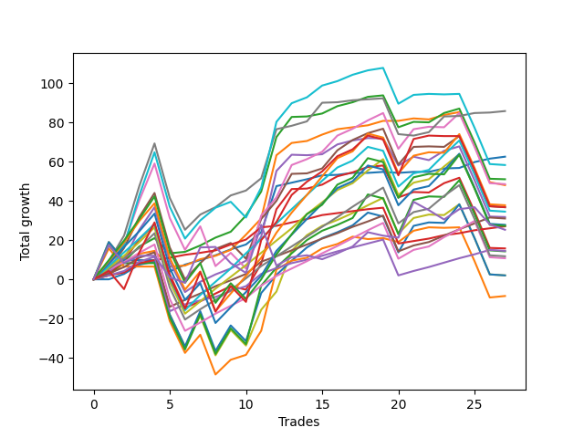

# Short Labrador 012 
- Symbol: ES
- Date Range: 03/18/2022 - 12/30/2022
- Trading Period: 8:30-12:30
- Number of Trades: 22



| Name | Win Percent | Profit | Avg Profit / Trade | Avg Time / Trade |      | Name | Win Percent | Profit | Avg Profit / Trade | Avg Time / Trade |
| ---- | ----------- | ------ | ------------------ | ---------------- | ---- | ---- | ----------- | ------ | ------------------ | ---------------- |
| Sorted By <br> Profit | | | | | | Sorted By <br> Win Percentage ||||
| V Mid | 90.91 | 48125.00 | 2187.50 | 15:34 |     | TP-1 | 95.45 | 10375.00 | 471.59 | 06:55 |
| BB-50 U/L 2SD SL-10 | 68.18 | 46625.00 | 2119.32 | 26:54 |     | V Mid | 90.91 | 48125.00 | 2187.50 | 15:34 |
| V Mid SL-10 | 86.36 | 44125.00 | 2005.68 | 12:35 |     | TP-3 | 90.91 | 23250.00 | 1056.82 | 12:40 |
| BB-100 Mid SL-10 | 77.27 | 43875.00 | 1994.32 | 18:38 |     | TP-2 | 90.91 | 15750.00 | 715.91 | 08:42 |
| BB-50 U/L 2SD | 72.73 | 39625.00 | 1801.14 | 35:45 |     | V Mid SL-10 | 86.36 | 44125.00 | 2005.68 | 12:35 |
| BB-50 U/L 1SD SL-10 | 72.73 | 38000.00 | 1727.27 | 19:44 |     | TP-4 | 86.36 | 20500.00 | 931.82 | 18:38 |
| BB-50 U/L 1SD | 77.27 | 34125.00 | 1551.14 | 27:08 |     | BB-20 Mid SL-10 | 86.36 | 19375.00 | 880.68 | 02:26 |
| BB-100 Mid | 77.27 | 33375.00 | 1517.05 | 25:16 |     | BB-20 Mid SL-5 | 86.36 | 19375.00 | 880.68 | 02:26 |
| NEWFI 000 | 59.09 | 32375.00 | 1471.59 | 41:55 |     | BB-20 Mid | 86.36 | 19375.00 | 880.68 | 02:26 |
| TP-9 | 72.73 | 30125.00 | 1369.32 | 30:17 |     | TP-6 | 81.82 | 26125.00 | 1187.50 | 23:29 |
| NEWFI 0000 | 54.55 | 28625.00 | 1301.14 | 32:25 |     | TP-5 | 81.82 | 19625.00 | 892.05 | 21:47 |
| TP-7 | 77.27 | 27875.00 | 1267.05 | 25:55 |     | BB-100 Mid SL-10 | 77.27 | 43875.00 | 1994.32 | 18:38 |
| BB-50 Mid SL-10 | 68.18 | 27000.00 | 1227.27 | 13:23 |     | BB-50 U/L 1SD | 77.27 | 34125.00 | 1551.14 | 27:08 |
| TP-6 | 81.82 | 26125.00 | 1187.50 | 23:29 |     | BB-100 Mid | 77.27 | 33375.00 | 1517.05 | 25:16 |
| TP-10 | 68.18 | 24375.00 | 1107.95 | 34:06 |     | TP-7 | 77.27 | 27875.00 | 1267.05 | 25:55 |
| TP-3 | 90.91 | 23250.00 | 1056.82 | 12:40 |     | BB-20 U/L 1SD SL-10 | 77.27 | 17375.00 | 789.77 | 06:46 |
| BB-200 U/L 2SD SL-10 | 50.00 | 21750.00 | 988.64 | 41:10 |     | BB-20 U/L 2SD | 77.27 | 11375.00 | 517.05 | 16:54 |
| TP-8 | 72.73 | 21500.00 | 977.27 | 29:39 |     | BB-20 U/L 1SD | 77.27 | 10000.00 | 454.55 | 09:39 |
| TP-4 | 86.36 | 20500.00 | 931.82 | 18:38 |     | BB-50 U/L 2SD | 72.73 | 39625.00 | 1801.14 | 35:45 |
| BB-200 U/L 2SD SL-5 | 40.91 | 20000.00 | 909.09 | 26:16 |     | BB-50 U/L 1SD SL-10 | 72.73 | 38000.00 | 1727.27 | 19:44 |
| TP-5 | 81.82 | 19625.00 | 892.05 | 21:47 |     | TP-9 | 72.73 | 30125.00 | 1369.32 | 30:17 |
| V U/L 1SD SL-10 | 54.55 | 19625.00 | 892.05 | 33:30 |     | TP-8 | 72.73 | 21500.00 | 977.27 | 29:39 |
| BB-20 Mid SL-10 | 86.36 | 19375.00 | 880.68 | 02:26 |     | BB-20 U/L 1SD SL-5 | 72.73 | 18000.00 | 818.18 | 05:56 |
| BB-20 Mid SL-5 | 86.36 | 19375.00 | 880.68 | 02:26 |     | BB-20 U/L 2SD SL-10 | 72.73 | 15250.00 | 693.18 | 11:56 |
| BB-20 Mid | 86.36 | 19375.00 | 880.68 | 02:26 |     | BB-20 U/L 2SD C | 72.73 | 11500.00 | 522.73 | 19:09 |
| BB-200 U/L 2SD | 54.55 | 18625.00 | 846.59 | 50:13 |     | BB-50 U/L 2SD SL-10 | 68.18 | 46625.00 | 2119.32 | 26:54 |
| BB-100 U/L 2SD SL-10 | 50.00 | 18375.00 | 835.23 | 42:30 |     | BB-50 Mid SL-10 | 68.18 | 27000.00 | 1227.27 | 13:23 |
| BB-20 U/L 1SD SL-5 | 72.73 | 18000.00 | 818.18 | 05:56 |     | TP-10 | 68.18 | 24375.00 | 1107.95 | 34:06 |
| BB-50 Mid | 68.18 | 17750.00 | 806.82 | 17:59 |     | BB-50 Mid | 68.18 | 17750.00 | 806.82 | 17:59 |
| BB-20 U/L 1SD SL-10 | 77.27 | 17375.00 | 789.77 | 06:46 |     | BB-20 U/L 2SD C SL-10 | 68.18 | 10875.00 | 494.32 | 13:22 |
| BB-100 U/L 2SD SL-5 | 40.91 | 16625.00 | 755.68 | 27:37 |     | V Mid SL-5 | 68.18 | 6625.00 | 301.14 | 07:38 |
| V U/L 1SD | 59.09 | 16500.00 | 750.00 | 42:33 |     | BB-200 Mid | 68.18 | 2875.00 | 130.68 | 25:04 |
| TP-2 | 90.91 | 15750.00 | 715.91 | 08:42 |     | BB-200 Mid SL-10 | 63.64 | 5625.00 | 255.68 | 19:48 |
| BB-20 U/L 2SD SL-10 | 72.73 | 15250.00 | 693.18 | 11:56 |     | NEWFI 000 | 59.09 | 32375.00 | 1471.59 | 41:55 |
| BB-100 U/L 2SD | 54.55 | 15250.00 | 693.18 | 51:34 |     | V U/L 1SD | 59.09 | 16500.00 | 750.00 | 42:33 |
| V U/L 1SD SL-5 | 40.91 | 14375.00 | 653.41 | 20:06 |     | BB-20 U/L 2SD SL-5 | 59.09 | 10250.00 | 465.91 | 09:38 |
| BB-50 U/L 2SD SL-5 | 40.91 | 12625.00 | 573.86 | 18:17 |     | BB-200 Mid SL-5 | 59.09 | 10000.00 | 454.55 | 10:07 |
| NEWFI 06 | 54.55 | 12375.00 | 562.50 | 54:02 |     | NEWFI 0000 | 54.55 | 28625.00 | 1301.14 | 32:25 |
| BB-20 U/L 2SD C | 72.73 | 11500.00 | 522.73 | 19:09 |     | V U/L 1SD SL-10 | 54.55 | 19625.00 | 892.05 | 33:30 |
| BB-20 U/L 2SD | 77.27 | 11375.00 | 517.05 | 16:54 |     | BB-200 U/L 2SD | 54.55 | 18625.00 | 846.59 | 50:13 |
| BB-20 U/L 2SD C SL-10 | 68.18 | 10875.00 | 494.32 | 13:22 |     | BB-100 U/L 2SD | 54.55 | 15250.00 | 693.18 | 51:34 |
| BB-50 U/L 1SD SL-5 | 45.45 | 10750.00 | 488.64 | 14:04 |     | NEWFI 06 | 54.55 | 12375.00 | 562.50 | 54:02 |
| TP-1 | 95.45 | 10375.00 | 471.59 | 06:55 |     | BB-100 Mid SL-5 | 54.55 | 8125.00 | 369.32 | 10:44 |
| BB-20 U/L 2SD SL-5 | 59.09 | 10250.00 | 465.91 | 09:38 |     | BB-50 Mid SL-5 | 54.55 | 1750.00 | 79.55 | 10:11 |
| BB-20 U/L 1SD | 77.27 | 10000.00 | 454.55 | 09:39 |     | BB-200 U/L 2SD SL-10 | 50.00 | 21750.00 | 988.64 | 41:10 |
| BB-200 Mid SL-5 | 59.09 | 10000.00 | 454.55 | 10:07 |     | BB-100 U/L 2SD SL-10 | 50.00 | 18375.00 | 835.23 | 42:30 |
| BB-100 Mid SL-5 | 54.55 | 8125.00 | 369.32 | 10:44 |     | BB-50 U/L 1SD SL-5 | 45.45 | 10750.00 | 488.64 | 14:04 |
| V Mid SL-5 | 68.18 | 6625.00 | 301.14 | 07:38 |     | BB-20 U/L 2SD C SL-5 | 45.45 | -6125.00 | -278.41 | 10:28 |
| BB-200 Mid SL-10 | 63.64 | 5625.00 | 255.68 | 19:48 |     | BB-200 U/L 2SD SL-5 | 40.91 | 20000.00 | 909.09 | 26:16 |
| BB-200 Mid | 68.18 | 2875.00 | 130.68 | 25:04 |     | BB-100 U/L 2SD SL-5 | 40.91 | 16625.00 | 755.68 | 27:37 |
| BB-50 Mid SL-5 | 54.55 | 1750.00 | 79.55 | 10:11 |     | V U/L 1SD SL-5 | 40.91 | 14375.00 | 653.41 | 20:06 |
| BB-20 U/L 2SD C SL-5 | 45.45 | -6125.00 | -278.41 | 10:28 |     | BB-50 U/L 2SD SL-5 | 40.91 | 12625.00 | 573.86 | 18:17 |

## NO STOPLOSS

### Test BB-20 Mid
* Sell when price hits the middle line of the 20p bollinger
* No Stoploss
* Results:
```
Total Trades: 22
Percent Up: 13.64
Percent Down: 86.36
Total Points Moved Down: 38.75
Potential Profit: 19375.00
Total Points Ups: 0.50 Count Ups: 3
Total Points Downs: 39.25 Count Downs: 19
```

<details><summary>Trades</summary>

<code>In: 2022-04-01 11:48:00		Out: 2022-04-01 11:49:10		Total Position Time: 01:10		Total Move Down: -0.00		Total to Date: 0.00</code> <br />
<code>In: 2022-04-25 10:19:00		Out: 2022-04-25 10:26:50		Total Position Time: 07:50		Total Move Down: 2.75		Total to Date: 2.75</code> <br />
<code>In: 2022-05-10 11:06:00		Out: 2022-05-10 11:07:10		Total Position Time: 01:10		Total Move Down: 4.75		Total to Date: 7.50</code> <br />
<code>In: 2022-05-10 11:07:00		Out: 2022-05-10 11:08:10		Total Position Time: 01:10		Total Move Down: 1.50		Total to Date: 9.00</code> <br />
<code>In: 2022-06-09 10:09:00		Out: 2022-06-09 10:16:50		Total Position Time: 07:50		Total Move Down: 2.25		Total to Date: 11.25</code> <br />
<code>In: 2022-06-10 11:27:00		Out: 2022-06-10 11:28:25		Total Position Time: 01:25		Total Move Down: 2.50		Total to Date: 13.75</code> <br />
<code>In: 2022-06-10 12:22:00		Out: 2022-06-10 12:23:10		Total Position Time: 01:10		Total Move Down: 3.00		Total to Date: 16.75</code> <br />
<code>In: 2022-06-13 08:47:00		Out: 2022-06-13 08:48:10		Total Position Time: 01:10		Total Move Down: 2.50		Total to Date: 19.25</code> <br />
<code>In: 2022-06-14 10:26:00		Out: 2022-06-14 10:27:10		Total Position Time: 01:10		Total Move Down: 6.25		Total to Date: 25.50</code> <br />
<code>In: 2022-06-17 08:35:00		Out: 2022-06-17 08:36:10		Total Position Time: 01:10		Total Move Down: 1.75		Total to Date: 27.25</code> <br />
<code>In: 2022-08-04 09:03:00		Out: 2022-08-04 09:04:10		Total Position Time: 01:10		Total Move Down: 1.75		Total to Date: 29.00</code> <br />
<code>In: 2022-08-05 10:19:00		Out: 2022-08-05 10:20:10		Total Position Time: 01:10		Total Move Down: 2.00		Total to Date: 31.00</code> <br />
<code>In: 2022-10-06 09:52:00		Out: 2022-10-06 09:55:05		Total Position Time: 03:05		Total Move Down: 0.25		Total to Date: 31.25</code> <br />
<code>In: 2022-11-01 12:12:00		Out: 2022-11-01 12:13:10		Total Position Time: 01:10		Total Move Down: 1.00		Total to Date: 32.25</code> <br />
<code>In: 2022-11-16 08:35:00		Out: 2022-11-16 08:36:10		Total Position Time: 01:10		Total Move Down: 0.50		Total to Date: 32.75</code> <br />
<code>In: 2022-11-17 08:42:00		Out: 2022-11-17 08:49:45		Total Position Time: 07:45		Total Move Down: -0.50		Total to Date: 32.25</code> <br />
<code>In: 2022-11-18 08:35:00		Out: 2022-11-18 08:37:10		Total Position Time: 02:10		Total Move Down: 0.50		Total to Date: 32.75</code> <br />
<code>In: 2022-11-21 10:24:00		Out: 2022-11-21 10:27:25		Total Position Time: 03:25		Total Move Down: -0.00		Total to Date: 32.75</code> <br />
<code>In: 2022-12-07 11:43:00		Out: 2022-12-07 11:44:10		Total Position Time: 01:10		Total Move Down: 0.25		Total to Date: 33.00</code> <br />
<code>In: 2022-12-16 12:05:00		Out: 2022-12-16 12:07:35		Total Position Time: 02:35		Total Move Down: 3.00		Total to Date: 36.00</code> <br />
<code>In: 2022-12-16 12:06:00		Out: 2022-12-16 12:07:35		Total Position Time: 01:35		Total Move Down: 1.75		Total to Date: 37.75</code> <br />
<code>In: 2022-12-27 12:21:00		Out: 2022-12-27 12:23:10		Total Position Time: 02:10		Total Move Down: 1.00		Total to Date: 38.75</code> <br />


</details>

### Test BB-20 U/L 1SD
* Sell when the price hits the lower line of the 20p 1std bollinger
* No Stoploss
* Results:
```
Total Trades: 22
Percent Up: 22.73
Percent Down: 77.27
Total Points Moved Down: 20.00
Potential Profit: 10000.00
Total Points Ups: 37.75 Count Ups: 5
Total Points Downs: 57.75 Count Downs: 17
```

<details><summary>Trades</summary>

<code>In: 2022-04-01 11:48:00		Out: 2022-04-01 11:50:15		Total Position Time: 02:15		Total Move Down: 2.00		Total to Date: 2.00</code> <br />
<code>In: 2022-04-25 10:19:00		Out: 2022-04-25 10:27:55		Total Position Time: 08:55		Total Move Down: 6.25		Total to Date: 8.25</code> <br />
<code>In: 2022-05-10 11:06:00		Out: 2022-05-10 11:07:10		Total Position Time: 01:10		Total Move Down: 4.75		Total to Date: 13.00</code> <br />
<code>In: 2022-05-10 11:07:00		Out: 2022-05-10 11:08:10		Total Position Time: 01:10		Total Move Down: 1.50		Total to Date: 14.50</code> <br />
<code>In: 2022-06-09 10:09:00		Out: 2022-06-09 10:18:50		Total Position Time: 09:50		Total Move Down: 3.25		Total to Date: 17.75</code> <br />
<code>In: 2022-06-10 11:27:00		Out: 2022-06-10 11:38:10		Total Position Time: 11:10		Total Move Down: 1.75		Total to Date: 19.50</code> <br />
<code>In: 2022-06-10 12:22:00		Out: 2022-06-10 12:23:10		Total Position Time: 01:10		Total Move Down: 3.00		Total to Date: 22.50</code> <br />
<code>In: 2022-06-13 08:47:00		Out: 2022-06-13 08:52:05		Total Position Time: 05:05		Total Move Down: 7.75		Total to Date: 30.25</code> <br />
<code>In: 2022-06-14 10:26:00		Out: 2022-06-14 10:29:05		Total Position Time: 03:05		Total Move Down: 8.25		Total to Date: 38.50</code> <br />
<code>In: 2022-06-17 08:35:00		Out: 2022-06-17 08:39:05		Total Position Time: 04:05		Total Move Down: 6.25		Total to Date: 44.75</code> <br />
<code>In: 2022-08-04 09:03:00		Out: 2022-08-04 09:16:05		Total Position Time: 13:05		Total Move Down: 1.00		Total to Date: 45.75</code> <br />
<code>In: 2022-08-05 10:19:00		Out: 2022-08-05 10:23:15		Total Position Time: 04:15		Total Move Down: 3.25		Total to Date: 49.00</code> <br />
<code>In: 2022-10-06 09:52:00		Out: 2022-10-06 09:57:05		Total Position Time: 05:05		Total Move Down: 2.75		Total to Date: 51.75</code> <br />
<code>In: 2022-11-01 12:12:00		Out: 2022-11-01 12:14:30		Total Position Time: 02:30		Total Move Down: 1.00		Total to Date: 52.75</code> <br />
<code>In: 2022-11-16 08:35:00		Out: 2022-11-16 08:38:25		Total Position Time: 03:25		Total Move Down: 2.25		Total to Date: 55.00</code> <br />
<code>In: 2022-11-17 08:42:00		Out: 2022-11-17 08:52:30		Total Position Time: 10:30		Total Move Down: -0.00		Total to Date: 55.00</code> <br />
<code>In: 2022-11-18 08:35:00		Out: 2022-11-18 08:37:20		Total Position Time: 02:20		Total Move Down: 1.25		Total to Date: 56.25</code> <br />
<code>In: 2022-11-21 10:24:00		Out: 2022-11-21 10:33:00		Total Position Time: 09:00		Total Move Down: -0.50		Total to Date: 55.75</code> <br />
<code>In: 2022-12-07 11:43:00		Out: 2022-12-07 11:50:15		Total Position Time: 07:15		Total Move Down: 1.50		Total to Date: 57.25</code> <br />
<code>In: 2022-12-16 12:05:00		Out: 2022-12-16 12:47:00		Total Position Time: 42:00		Total Move Down: -17.25		Total to Date: 40.00</code> <br />
<code>In: 2022-12-16 12:06:00		Out: 2022-12-16 12:47:00		Total Position Time: 41:00		Total Move Down: -18.50		Total to Date: 21.50</code> <br />
<code>In: 2022-12-27 12:21:00		Out: 2022-12-27 12:45:05		Total Position Time: 24:05		Total Move Down: -1.50		Total to Date: 20.00</code> <br />


</details>

### Test BB-20 U/L 2SD
* Sell when the price hits the lower line of the 20p 2std bollinger
* No Stoploss
* Results:
```
Total Trades: 22
Percent Up: 22.73
Percent Down: 77.27
Total Points Moved Down: 22.75
Potential Profit: 11375.00
Total Points Ups: 52.50 Count Ups: 5
Total Points Downs: 75.25 Count Downs: 17
```

<details><summary>Trades</summary>

<code>In: 2022-04-01 11:48:00		Out: 2022-04-01 11:50:20		Total Position Time: 02:20		Total Move Down: 2.50		Total to Date: 2.50</code> <br />
<code>In: 2022-04-25 10:19:00		Out: 2022-04-25 10:33:35		Total Position Time: 14:35		Total Move Down: 6.50		Total to Date: 9.00</code> <br />
<code>In: 2022-05-10 11:06:00		Out: 2022-05-10 11:11:10		Total Position Time: 05:10		Total Move Down: 7.75		Total to Date: 16.75</code> <br />
<code>In: 2022-05-10 11:07:00		Out: 2022-05-10 11:11:10		Total Position Time: 04:10		Total Move Down: 4.25		Total to Date: 21.00</code> <br />
<code>In: 2022-06-09 10:09:00		Out: 2022-06-09 10:19:05		Total Position Time: 10:05		Total Move Down: 3.25		Total to Date: 24.25</code> <br />
<code>In: 2022-06-10 11:27:00		Out: 2022-06-10 11:40:10		Total Position Time: 13:10		Total Move Down: 4.00		Total to Date: 28.25</code> <br />
<code>In: 2022-06-10 12:22:00		Out: 2022-06-10 12:42:45		Total Position Time: 20:45		Total Move Down: 3.00		Total to Date: 31.25</code> <br />
<code>In: 2022-06-13 08:47:00		Out: 2022-06-13 08:55:10		Total Position Time: 08:10		Total Move Down: 8.25		Total to Date: 39.50</code> <br />
<code>In: 2022-06-14 10:26:00		Out: 2022-06-14 10:31:00		Total Position Time: 05:00		Total Move Down: 12.25		Total to Date: 51.75</code> <br />
<code>In: 2022-06-17 08:35:00		Out: 2022-06-17 08:45:15		Total Position Time: 10:15		Total Move Down: 10.25		Total to Date: 62.00</code> <br />
<code>In: 2022-08-04 09:03:00		Out: 2022-08-04 09:38:50		Total Position Time: 35:50		Total Move Down: 0.25		Total to Date: 62.25</code> <br />
<code>In: 2022-08-05 10:19:00		Out: 2022-08-05 10:49:30		Total Position Time: 30:30		Total Move Down: 1.50		Total to Date: 63.75</code> <br />
<code>In: 2022-10-06 09:52:00		Out: 2022-10-06 10:02:00		Total Position Time: 10:00		Total Move Down: 3.75		Total to Date: 67.50</code> <br />
<code>In: 2022-11-01 12:12:00		Out: 2022-11-01 12:16:15		Total Position Time: 04:15		Total Move Down: 2.00		Total to Date: 69.50</code> <br />
<code>In: 2022-11-16 08:35:00		Out: 2022-11-16 09:01:40		Total Position Time: 26:40		Total Move Down: 0.75		Total to Date: 70.25</code> <br />
<code>In: 2022-11-17 08:42:00		Out: 2022-11-17 09:23:55		Total Position Time: 41:55		Total Move Down: -16.25		Total to Date: 54.00</code> <br />
<code>In: 2022-11-18 08:35:00		Out: 2022-11-18 08:38:05		Total Position Time: 03:05		Total Move Down: 2.75		Total to Date: 56.75</code> <br />
<code>In: 2022-11-21 10:24:00		Out: 2022-11-21 10:33:10		Total Position Time: 09:10		Total Move Down: -0.25		Total to Date: 56.50</code> <br />
<code>In: 2022-12-07 11:43:00		Out: 2022-12-07 11:52:20		Total Position Time: 09:20		Total Move Down: 2.25		Total to Date: 58.75</code> <br />
<code>In: 2022-12-16 12:05:00		Out: 2022-12-16 12:47:00		Total Position Time: 42:00		Total Move Down: -17.25		Total to Date: 41.50</code> <br />
<code>In: 2022-12-16 12:06:00		Out: 2022-12-16 12:47:00		Total Position Time: 41:00		Total Move Down: -18.50		Total to Date: 23.00</code> <br />
<code>In: 2022-12-27 12:21:00		Out: 2022-12-27 12:45:25		Total Position Time: 24:25		Total Move Down: -0.25		Total to Date: 22.75</code> <br />


</details>

### Test BB-20 U/L 2SD C
* Sell when the price hits the lower line of the 20p 2std bollinger
* No Stoploss
* Results:
```
Total Trades: 22
Percent Up: 27.27
Percent Down: 72.73
Total Points Moved Down: 23.00
Potential Profit: 11500.00
Total Points Ups: 54.25 Count Ups: 6
Total Points Downs: 77.25 Count Downs: 16
```

<details><summary>Trades</summary>

<code>In: 2022-04-01 11:48:00		Out: 2022-04-01 11:50:45		Total Position Time: 02:45		Total Move Down: 3.00		Total to Date: 3.00</code> <br />
<code>In: 2022-04-25 10:19:00		Out: 2022-04-25 10:33:35		Total Position Time: 14:35		Total Move Down: 6.50		Total to Date: 9.50</code> <br />
<code>In: 2022-05-10 11:06:00		Out: 2022-05-10 11:16:05		Total Position Time: 10:05		Total Move Down: 11.00		Total to Date: 20.50</code> <br />
<code>In: 2022-05-10 11:07:00		Out: 2022-05-10 11:16:05		Total Position Time: 09:05		Total Move Down: 7.50		Total to Date: 28.00</code> <br />
<code>In: 2022-06-09 10:09:00		Out: 2022-06-09 10:21:10		Total Position Time: 12:10		Total Move Down: 3.25		Total to Date: 31.25</code> <br />
<code>In: 2022-06-10 11:27:00		Out: 2022-06-10 11:40:10		Total Position Time: 13:10		Total Move Down: 4.00		Total to Date: 35.25</code> <br />
<code>In: 2022-06-10 12:22:00		Out: 2022-06-10 12:43:10		Total Position Time: 21:10		Total Move Down: 3.75		Total to Date: 39.00</code> <br />
<code>In: 2022-06-13 08:47:00		Out: 2022-06-13 09:30:35		Total Position Time: 43:35		Total Move Down: -1.75		Total to Date: 37.25</code> <br />
<code>In: 2022-06-14 10:26:00		Out: 2022-06-14 10:31:10		Total Position Time: 05:10		Total Move Down: 13.25		Total to Date: 50.50</code> <br />
<code>In: 2022-06-17 08:35:00		Out: 2022-06-17 08:45:15		Total Position Time: 10:15		Total Move Down: 10.25		Total to Date: 60.75</code> <br />
<code>In: 2022-08-04 09:03:00		Out: 2022-08-04 09:38:50		Total Position Time: 35:50		Total Move Down: 0.25		Total to Date: 61.00</code> <br />
<code>In: 2022-08-05 10:19:00		Out: 2022-08-05 10:50:35		Total Position Time: 31:35		Total Move Down: 2.00		Total to Date: 63.00</code> <br />
<code>In: 2022-10-06 09:52:00		Out: 2022-10-06 10:02:05		Total Position Time: 10:05		Total Move Down: 4.25		Total to Date: 67.25</code> <br />
<code>In: 2022-11-01 12:12:00		Out: 2022-11-01 12:16:15		Total Position Time: 04:15		Total Move Down: 2.00		Total to Date: 69.25</code> <br />
<code>In: 2022-11-16 08:35:00		Out: 2022-11-16 09:01:40		Total Position Time: 26:40		Total Move Down: 0.75		Total to Date: 70.00</code> <br />
<code>In: 2022-11-17 08:42:00		Out: 2022-11-17 09:23:55		Total Position Time: 41:55		Total Move Down: -16.25		Total to Date: 53.75</code> <br />
<code>In: 2022-11-18 08:35:00		Out: 2022-11-18 08:38:05		Total Position Time: 03:05		Total Move Down: 2.75		Total to Date: 56.50</code> <br />
<code>In: 2022-11-21 10:24:00		Out: 2022-11-21 10:33:10		Total Position Time: 09:10		Total Move Down: -0.25		Total to Date: 56.25</code> <br />
<code>In: 2022-12-07 11:43:00		Out: 2022-12-07 11:52:30		Total Position Time: 09:30		Total Move Down: 2.75		Total to Date: 59.00</code> <br />
<code>In: 2022-12-16 12:05:00		Out: 2022-12-16 12:47:00		Total Position Time: 42:00		Total Move Down: -17.25		Total to Date: 41.75</code> <br />
<code>In: 2022-12-16 12:06:00		Out: 2022-12-16 12:47:00		Total Position Time: 41:00		Total Move Down: -18.50		Total to Date: 23.25</code> <br />
<code>In: 2022-12-27 12:21:00		Out: 2022-12-27 12:45:25		Total Position Time: 24:25		Total Move Down: -0.25		Total to Date: 23.00</code> <br />


</details>

### Test BB-50 Mid
* Sell when price hits the middle line of the 50p bollinger
* No Stoploss
* Results:
```
Total Trades: 22
Percent Up: 31.82
Percent Down: 68.18
Total Points Moved Down: 35.50
Potential Profit: 17750.00
Total Points Ups: 52.00 Count Ups: 7
Total Points Downs: 87.50 Count Downs: 15
```

<details><summary>Trades</summary>

<code>In: 2022-04-01 11:48:00		Out: 2022-04-01 11:58:00		Total Position Time: 10:00		Total Move Down: 3.75		Total to Date: 3.75</code> <br />
<code>In: 2022-04-25 10:19:00		Out: 2022-04-25 10:28:15		Total Position Time: 09:15		Total Move Down: 6.50		Total to Date: 10.25</code> <br />
<code>In: 2022-05-10 11:06:00		Out: 2022-05-10 11:16:20		Total Position Time: 10:20		Total Move Down: 15.00		Total to Date: 25.25</code> <br />
<code>In: 2022-05-10 11:07:00		Out: 2022-05-10 11:16:20		Total Position Time: 09:20		Total Move Down: 11.50		Total to Date: 36.75</code> <br />
<code>In: 2022-06-09 10:09:00		Out: 2022-06-09 10:22:05		Total Position Time: 13:05		Total Move Down: 5.25		Total to Date: 42.00</code> <br />
<code>In: 2022-06-10 11:27:00		Out: 2022-06-10 11:28:30		Total Position Time: 01:30		Total Move Down: 3.75		Total to Date: 45.75</code> <br />
<code>In: 2022-06-10 12:22:00		Out: 2022-06-10 12:23:10		Total Position Time: 01:10		Total Move Down: 3.00		Total to Date: 48.75</code> <br />
<code>In: 2022-06-13 08:47:00		Out: 2022-06-13 09:07:15		Total Position Time: 20:15		Total Move Down: 4.00		Total to Date: 52.75</code> <br />
<code>In: 2022-06-14 10:26:00		Out: 2022-06-14 10:31:00		Total Position Time: 05:00		Total Move Down: 12.25		Total to Date: 65.00</code> <br />
<code>In: 2022-06-17 08:35:00		Out: 2022-06-17 08:45:05		Total Position Time: 10:05		Total Move Down: 8.25		Total to Date: 73.25</code> <br />
<code>In: 2022-08-04 09:03:00		Out: 2022-08-04 09:36:55		Total Position Time: 33:55		Total Move Down: -0.25		Total to Date: 73.00</code> <br />
<code>In: 2022-08-05 10:19:00		Out: 2022-08-05 10:47:35		Total Position Time: 28:35		Total Move Down: 0.50		Total to Date: 73.50</code> <br />
<code>In: 2022-10-06 09:52:00		Out: 2022-10-06 10:02:10		Total Position Time: 10:10		Total Move Down: 5.00		Total to Date: 78.50</code> <br />
<code>In: 2022-11-01 12:12:00		Out: 2022-11-01 12:16:15		Total Position Time: 04:15		Total Move Down: 2.00		Total to Date: 80.50</code> <br />
<code>In: 2022-11-16 08:35:00		Out: 2022-11-16 09:01:25		Total Position Time: 26:25		Total Move Down: -0.25		Total to Date: 80.25</code> <br />
<code>In: 2022-11-17 08:42:00		Out: 2022-11-17 09:33:35		Total Position Time: 51:35		Total Move Down: -13.75		Total to Date: 66.50</code> <br />
<code>In: 2022-11-18 08:35:00		Out: 2022-11-18 08:38:30		Total Position Time: 03:30		Total Move Down: 4.50		Total to Date: 71.00</code> <br />
<code>In: 2022-11-21 10:24:00		Out: 2022-11-21 10:54:25		Total Position Time: 30:25		Total Move Down: -1.75		Total to Date: 69.25</code> <br />
<code>In: 2022-12-07 11:43:00		Out: 2022-12-07 11:52:20		Total Position Time: 09:20		Total Move Down: 2.25		Total to Date: 71.50</code> <br />
<code>In: 2022-12-16 12:05:00		Out: 2022-12-16 12:47:00		Total Position Time: 42:00		Total Move Down: -17.25		Total to Date: 54.25</code> <br />
<code>In: 2022-12-16 12:06:00		Out: 2022-12-16 12:47:00		Total Position Time: 41:00		Total Move Down: -18.50		Total to Date: 35.75</code> <br />
<code>In: 2022-12-27 12:21:00		Out: 2022-12-27 12:45:45		Total Position Time: 24:45		Total Move Down: -0.25		Total to Date: 35.50</code> <br />


</details>

### Test BB-50 U/L 1SD
* Sell when the price hits the lower line of the 50p 1std bollinger
* No Stoploss
* Results:
```
Total Trades: 22
Percent Up: 22.73
Percent Down: 77.27
Total Points Moved Down: 68.25
Potential Profit: 34125.00
Total Points Ups: 62.50 Count Ups: 5
Total Points Downs: 130.75 Count Downs: 17
```

<details><summary>Trades</summary>

<code>In: 2022-04-01 11:48:00		Out: 2022-04-01 12:09:35		Total Position Time: 21:35		Total Move Down: 5.00		Total to Date: 5.00</code> <br />
<code>In: 2022-04-25 10:19:00		Out: 2022-04-25 10:51:45		Total Position Time: 32:45		Total Move Down: 11.00		Total to Date: 16.00</code> <br />
<code>In: 2022-05-10 11:06:00		Out: 2022-05-10 11:24:05		Total Position Time: 18:05		Total Move Down: 15.75		Total to Date: 31.75</code> <br />
<code>In: 2022-05-10 11:07:00		Out: 2022-05-10 11:24:05		Total Position Time: 17:05		Total Move Down: 12.25		Total to Date: 44.00</code> <br />
<code>In: 2022-06-09 10:09:00		Out: 2022-06-09 10:24:05		Total Position Time: 15:05		Total Move Down: 8.25		Total to Date: 52.25</code> <br />
<code>In: 2022-06-10 11:27:00		Out: 2022-06-10 11:41:45		Total Position Time: 14:45		Total Move Down: 7.25		Total to Date: 59.50</code> <br />
<code>In: 2022-06-10 12:22:00		Out: 2022-06-10 12:42:40		Total Position Time: 20:40		Total Move Down: 3.00		Total to Date: 62.50</code> <br />
<code>In: 2022-06-13 08:47:00		Out: 2022-06-13 09:47:55		Total Position Time: 60:55		Total Move Down: -8.00		Total to Date: 54.50</code> <br />
<code>In: 2022-06-14 10:26:00		Out: 2022-06-14 10:36:10		Total Position Time: 10:10		Total Move Down: 20.25		Total to Date: 74.75</code> <br />
<code>In: 2022-06-17 08:35:00		Out: 2022-06-17 08:51:25		Total Position Time: 16:25		Total Move Down: 13.75		Total to Date: 88.50</code> <br />
<code>In: 2022-08-04 09:03:00		Out: 2022-08-04 09:38:50		Total Position Time: 35:50		Total Move Down: 0.25		Total to Date: 88.75</code> <br />
<code>In: 2022-08-05 10:19:00		Out: 2022-08-05 10:52:05		Total Position Time: 33:05		Total Move Down: 2.50		Total to Date: 91.25</code> <br />
<code>In: 2022-10-06 09:52:00		Out: 2022-10-06 10:09:10		Total Position Time: 17:10		Total Move Down: 9.25		Total to Date: 100.50</code> <br />
<code>In: 2022-11-01 12:12:00		Out: 2022-11-01 12:32:40		Total Position Time: 20:40		Total Move Down: 5.25		Total to Date: 105.75</code> <br />
<code>In: 2022-11-16 08:35:00		Out: 2022-11-16 09:04:10		Total Position Time: 29:10		Total Move Down: 2.25		Total to Date: 108.00</code> <br />
<code>In: 2022-11-17 08:42:00		Out: 2022-11-17 09:42:55		Total Position Time: 60:55		Total Move Down: -18.25		Total to Date: 89.75</code> <br />
<code>In: 2022-11-18 08:35:00		Out: 2022-11-18 08:49:50		Total Position Time: 14:50		Total Move Down: 9.00		Total to Date: 98.75</code> <br />
<code>In: 2022-11-21 10:24:00		Out: 2022-11-21 10:59:25		Total Position Time: 35:25		Total Move Down: 0.25		Total to Date: 99.00</code> <br />
<code>In: 2022-12-07 11:43:00		Out: 2022-12-07 11:56:40		Total Position Time: 13:40		Total Move Down: 5.50		Total to Date: 104.50</code> <br />
<code>In: 2022-12-16 12:05:00		Out: 2022-12-16 12:47:00		Total Position Time: 42:00		Total Move Down: -17.25		Total to Date: 87.25</code> <br />
<code>In: 2022-12-16 12:06:00		Out: 2022-12-16 12:47:00		Total Position Time: 41:00		Total Move Down: -18.50		Total to Date: 68.75</code> <br />
<code>In: 2022-12-27 12:21:00		Out: 2022-12-27 12:47:00		Total Position Time: 26:00		Total Move Down: -0.50		Total to Date: 68.25</code> <br />


</details>

### Test BB-50 U/L 2SD
* Sell when the price hits the lower line of the 50p 2std bollinger
* No Stoploss
* Results:
```
Total Trades: 22
Percent Up: 27.27
Percent Down: 72.73
Total Points Moved Down: 79.25
Potential Profit: 39625.00
Total Points Ups: 82.75 Count Ups: 6
Total Points Downs: 162.00 Count Downs: 16
```

<details><summary>Trades</summary>

<code>In: 2022-04-01 11:48:00		Out: 2022-04-01 12:11:20		Total Position Time: 23:20		Total Move Down: 6.75		Total to Date: 6.75</code> <br />
<code>In: 2022-04-25 10:19:00		Out: 2022-04-25 11:01:35		Total Position Time: 42:35		Total Move Down: 11.25		Total to Date: 18.00</code> <br />
<code>In: 2022-05-10 11:06:00		Out: 2022-05-10 11:27:05		Total Position Time: 21:05		Total Move Down: 22.25		Total to Date: 40.25</code> <br />
<code>In: 2022-05-10 11:07:00		Out: 2022-05-10 11:27:05		Total Position Time: 20:05		Total Move Down: 18.75		Total to Date: 59.00</code> <br />
<code>In: 2022-06-09 10:09:00		Out: 2022-06-09 10:27:20		Total Position Time: 18:20		Total Move Down: 12.00		Total to Date: 71.00</code> <br />
<code>In: 2022-06-10 11:27:00		Out: 2022-06-10 12:27:55		Total Position Time: 60:55		Total Move Down: -20.25		Total to Date: 50.75</code> <br />
<code>In: 2022-06-10 12:22:00		Out: 2022-06-10 12:44:30		Total Position Time: 22:30		Total Move Down: 6.75		Total to Date: 57.50</code> <br />
<code>In: 2022-06-13 08:47:00		Out: 2022-06-13 09:47:55		Total Position Time: 60:55		Total Move Down: -8.00		Total to Date: 49.50</code> <br />
<code>In: 2022-06-14 10:26:00		Out: 2022-06-14 10:43:05		Total Position Time: 17:05		Total Move Down: 27.00		Total to Date: 76.50</code> <br />
<code>In: 2022-06-17 08:35:00		Out: 2022-06-17 08:52:10		Total Position Time: 17:10		Total Move Down: 16.50		Total to Date: 93.00</code> <br />
<code>In: 2022-08-04 09:03:00		Out: 2022-08-04 09:42:00		Total Position Time: 39:00		Total Move Down: 3.00		Total to Date: 96.00</code> <br />
<code>In: 2022-08-05 10:19:00		Out: 2022-08-05 10:55:40		Total Position Time: 36:40		Total Move Down: 3.75		Total to Date: 99.75</code> <br />
<code>In: 2022-10-06 09:52:00		Out: 2022-10-06 10:32:45		Total Position Time: 40:45		Total Move Down: 8.25		Total to Date: 108.00</code> <br />
<code>In: 2022-11-01 12:12:00		Out: 2022-11-01 12:47:00		Total Position Time: 35:00		Total Move Down: 3.50		Total to Date: 111.50</code> <br />
<code>In: 2022-11-16 08:35:00		Out: 2022-11-16 09:19:25		Total Position Time: 44:25		Total Move Down: 3.75		Total to Date: 115.25</code> <br />
<code>In: 2022-11-17 08:42:00		Out: 2022-11-17 09:42:55		Total Position Time: 60:55		Total Move Down: -18.25		Total to Date: 97.00</code> <br />
<code>In: 2022-11-18 08:35:00		Out: 2022-11-18 09:07:20		Total Position Time: 32:20		Total Move Down: 10.00		Total to Date: 107.00</code> <br />
<code>In: 2022-11-21 10:24:00		Out: 2022-11-21 11:22:10		Total Position Time: 58:10		Total Move Down: 1.25		Total to Date: 108.25</code> <br />
<code>In: 2022-12-07 11:43:00		Out: 2022-12-07 12:09:30		Total Position Time: 26:30		Total Move Down: 7.25		Total to Date: 115.50</code> <br />
<code>In: 2022-12-16 12:05:00		Out: 2022-12-16 12:47:00		Total Position Time: 42:00		Total Move Down: -17.25		Total to Date: 98.25</code> <br />
<code>In: 2022-12-16 12:06:00		Out: 2022-12-16 12:47:00		Total Position Time: 41:00		Total Move Down: -18.50		Total to Date: 79.75</code> <br />
<code>In: 2022-12-27 12:21:00		Out: 2022-12-27 12:47:00		Total Position Time: 26:00		Total Move Down: -0.50		Total to Date: 79.25</code> <br />


</details>

### Test V Mid
* Sell when the price hits the middle line of the 1std VWAP
* No Stoploss
* Results:
```
Total Trades: 22
Percent Up: 9.09
Percent Down: 90.91
Total Points Moved Down: 96.25
Potential Profit: 48125.00
Total Points Ups: 19.00 Count Ups: 2
Total Points Downs: 115.25 Count Downs: 20
```

<details><summary>Trades</summary>

<code>In: 2022-04-01 11:48:00		Out: 2022-04-01 12:12:40		Total Position Time: 24:40		Total Move Down: 9.25		Total to Date: 9.25</code> <br />
<code>In: 2022-04-25 10:19:00		Out: 2022-04-25 11:04:10		Total Position Time: 45:10		Total Move Down: 13.00		Total to Date: 22.25</code> <br />
<code>In: 2022-05-10 11:06:00		Out: 2022-05-10 11:27:40		Total Position Time: 21:40		Total Move Down: 25.25		Total to Date: 47.50</code> <br />
<code>In: 2022-05-10 11:07:00		Out: 2022-05-10 11:27:40		Total Position Time: 20:40		Total Move Down: 21.75		Total to Date: 69.25</code> <br />
<code>In: 2022-06-09 10:09:00		Out: 2022-06-09 10:23:45		Total Position Time: 14:45		Total Move Down: 7.75		Total to Date: 77.00</code> <br />
<code>In: 2022-06-10 11:27:00		Out: 2022-06-10 11:28:30		Total Position Time: 01:30		Total Move Down: 3.75		Total to Date: 80.75</code> <br />
<code>In: 2022-06-10 12:22:00		Out: 2022-06-10 12:43:55		Total Position Time: 21:55		Total Move Down: 6.00		Total to Date: 86.75</code> <br />
<code>In: 2022-06-13 08:47:00		Out: 2022-06-13 08:48:10		Total Position Time: 01:10		Total Move Down: 2.50		Total to Date: 89.25</code> <br />
<code>In: 2022-06-14 10:26:00		Out: 2022-06-14 10:27:10		Total Position Time: 01:10		Total Move Down: 6.25		Total to Date: 95.50</code> <br />
<code>In: 2022-06-17 08:35:00		Out: 2022-06-17 08:36:10		Total Position Time: 01:10		Total Move Down: 1.75		Total to Date: 97.25</code> <br />
<code>In: 2022-08-04 09:03:00		Out: 2022-08-04 09:06:00		Total Position Time: 03:00		Total Move Down: 2.25		Total to Date: 99.50</code> <br />
<code>In: 2022-08-05 10:19:00		Out: 2022-08-05 11:11:45		Total Position Time: 52:45		Total Move Down: 9.50		Total to Date: 109.00</code> <br />
<code>In: 2022-10-06 09:52:00		Out: 2022-10-06 09:55:05		Total Position Time: 03:05		Total Move Down: 0.25		Total to Date: 109.25</code> <br />
<code>In: 2022-11-01 12:12:00		Out: 2022-11-01 12:13:10		Total Position Time: 01:10		Total Move Down: 1.00		Total to Date: 110.25</code> <br />
<code>In: 2022-11-16 08:35:00		Out: 2022-11-16 08:36:10		Total Position Time: 01:10		Total Move Down: 0.50		Total to Date: 110.75</code> <br />
<code>In: 2022-11-17 08:42:00		Out: 2022-11-17 09:42:55		Total Position Time: 60:55		Total Move Down: -18.25		Total to Date: 92.50</code> <br />
<code>In: 2022-11-18 08:35:00		Out: 2022-11-18 08:36:10		Total Position Time: 01:10		Total Move Down: -0.75		Total to Date: 91.75</code> <br />
<code>In: 2022-11-21 10:24:00		Out: 2022-11-21 11:24:55		Total Position Time: 60:55		Total Move Down: 1.75		Total to Date: 93.50</code> <br />
<code>In: 2022-12-07 11:43:00		Out: 2022-12-07 11:44:10		Total Position Time: 01:10		Total Move Down: 0.25		Total to Date: 93.75</code> <br />
<code>In: 2022-12-16 12:05:00		Out: 2022-12-16 12:06:10		Total Position Time: 01:10		Total Move Down: 1.50		Total to Date: 95.25</code> <br />
<code>In: 2022-12-16 12:06:00		Out: 2022-12-16 12:07:10		Total Position Time: 01:10		Total Move Down: 0.25		Total to Date: 95.50</code> <br />
<code>In: 2022-12-27 12:21:00		Out: 2022-12-27 12:22:10		Total Position Time: 01:10		Total Move Down: 0.75		Total to Date: 96.25</code> <br />


</details>

### Test V U/L 1SD
* Sell when the price hits the lower line of the 1std VWAP
* No Stoploss
* Results:
```
Total Trades: 22
Percent Up: 40.91
Percent Down: 59.09
Total Points Moved Down: 33.00
Potential Profit: 16500.00
Total Points Ups: 92.00 Count Ups: 9
Total Points Downs: 125.00 Count Downs: 13
```

<details><summary>Trades</summary>

<code>In: 2022-04-01 11:48:00		Out: 2022-04-01 12:33:30		Total Position Time: 45:30		Total Move Down: 19.00		Total to Date: 19.00</code> <br />
<code>In: 2022-04-25 10:19:00		Out: 2022-04-25 11:19:55		Total Position Time: 60:55		Total Move Down: -9.25		Total to Date: 9.75</code> <br />
<code>In: 2022-05-10 11:06:00		Out: 2022-05-10 12:06:55		Total Position Time: 60:55		Total Move Down: -0.00		Total to Date: 9.75</code> <br />
<code>In: 2022-05-10 11:07:00		Out: 2022-05-10 12:07:55		Total Position Time: 60:55		Total Move Down: -0.00		Total to Date: 9.75</code> <br />
<code>In: 2022-06-09 10:09:00		Out: 2022-06-09 10:30:30		Total Position Time: 21:30		Total Move Down: 15.75		Total to Date: 25.50</code> <br />
<code>In: 2022-06-10 11:27:00		Out: 2022-06-10 12:27:55		Total Position Time: 60:55		Total Move Down: -20.25		Total to Date: 5.25</code> <br />
<code>In: 2022-06-10 12:22:00		Out: 2022-06-10 12:47:00		Total Position Time: 25:00		Total Move Down: 13.00		Total to Date: 18.25</code> <br />
<code>In: 2022-06-13 08:47:00		Out: 2022-06-13 09:47:55		Total Position Time: 60:55		Total Move Down: -8.00		Total to Date: 10.25</code> <br />
<code>In: 2022-06-14 10:26:00		Out: 2022-06-14 10:35:05		Total Position Time: 09:05		Total Move Down: 18.25		Total to Date: 28.50</code> <br />
<code>In: 2022-06-17 08:35:00		Out: 2022-06-17 09:03:15		Total Position Time: 28:15		Total Move Down: 20.75		Total to Date: 49.25</code> <br />
<code>In: 2022-08-04 09:03:00		Out: 2022-08-04 09:47:20		Total Position Time: 44:20		Total Move Down: 8.00		Total to Date: 57.25</code> <br />
<code>In: 2022-08-05 10:19:00		Out: 2022-08-05 11:19:55		Total Position Time: 60:55		Total Move Down: 4.75		Total to Date: 62.00</code> <br />
<code>In: 2022-10-06 09:52:00		Out: 2022-10-06 10:52:55		Total Position Time: 60:55		Total Move Down: 3.00		Total to Date: 65.00</code> <br />
<code>In: 2022-11-01 12:12:00		Out: 2022-11-01 12:47:00		Total Position Time: 35:00		Total Move Down: 3.50		Total to Date: 68.50</code> <br />
<code>In: 2022-11-16 08:35:00		Out: 2022-11-16 09:19:25		Total Position Time: 44:25		Total Move Down: 3.75		Total to Date: 72.25</code> <br />
<code>In: 2022-11-17 08:42:00		Out: 2022-11-17 09:42:55		Total Position Time: 60:55		Total Move Down: -18.25		Total to Date: 54.00</code> <br />
<code>In: 2022-11-18 08:35:00		Out: 2022-11-18 08:47:20		Total Position Time: 12:20		Total Move Down: 8.00		Total to Date: 62.00</code> <br />
<code>In: 2022-11-21 10:24:00		Out: 2022-11-21 11:24:55		Total Position Time: 60:55		Total Move Down: 1.75		Total to Date: 63.75</code> <br />
<code>In: 2022-12-07 11:43:00		Out: 2022-12-07 11:56:40		Total Position Time: 13:40		Total Move Down: 5.50		Total to Date: 69.25</code> <br />
<code>In: 2022-12-16 12:05:00		Out: 2022-12-16 12:47:00		Total Position Time: 42:00		Total Move Down: -17.25		Total to Date: 52.00</code> <br />
<code>In: 2022-12-16 12:06:00		Out: 2022-12-16 12:47:00		Total Position Time: 41:00		Total Move Down: -18.50		Total to Date: 33.50</code> <br />
<code>In: 2022-12-27 12:21:00		Out: 2022-12-27 12:47:00		Total Position Time: 26:00		Total Move Down: -0.50		Total to Date: 33.00</code> <br />


</details>

### Test BB-100 Mid
* Move to BB100 Mid
* No Stoploss
* Results:
```
Total Trades: 22
Percent Up: 22.73
Percent Down: 77.27
Total Points Moved Down: 66.75
Potential Profit: 33375.00
Total Points Ups: 62.50 Count Ups: 5
Total Points Downs: 129.25 Count Downs: 17
```

<details><summary>Trades</summary>

<code>In: 2022-04-01 11:48:00		Out: 2022-04-01 12:12:25		Total Position Time: 24:25		Total Move Down: 8.75		Total to Date: 8.75</code> <br />
<code>In: 2022-04-25 10:19:00		Out: 2022-04-25 10:51:15		Total Position Time: 32:15		Total Move Down: 8.50		Total to Date: 17.25</code> <br />
<code>In: 2022-05-10 11:06:00		Out: 2022-05-10 11:40:30		Total Position Time: 34:30		Total Move Down: 25.50		Total to Date: 42.75</code> <br />
<code>In: 2022-05-10 11:07:00		Out: 2022-05-10 11:40:30		Total Position Time: 33:30		Total Move Down: 22.00		Total to Date: 64.75</code> <br />
<code>In: 2022-06-09 10:09:00		Out: 2022-06-09 10:25:10		Total Position Time: 16:10		Total Move Down: 9.25		Total to Date: 74.00</code> <br />
<code>In: 2022-06-10 11:27:00		Out: 2022-06-10 11:41:25		Total Position Time: 14:25		Total Move Down: 6.50		Total to Date: 80.50</code> <br />
<code>In: 2022-06-10 12:22:00		Out: 2022-06-10 12:23:10		Total Position Time: 01:10		Total Move Down: 3.00		Total to Date: 83.50</code> <br />
<code>In: 2022-06-13 08:47:00		Out: 2022-06-13 09:47:55		Total Position Time: 60:55		Total Move Down: -8.00		Total to Date: 75.50</code> <br />
<code>In: 2022-06-14 10:26:00		Out: 2022-06-14 10:34:00		Total Position Time: 08:00		Total Move Down: 15.25		Total to Date: 90.75</code> <br />
<code>In: 2022-06-17 08:35:00		Out: 2022-06-17 08:45:25		Total Position Time: 10:25		Total Move Down: 9.50		Total to Date: 100.25</code> <br />
<code>In: 2022-08-04 09:03:00		Out: 2022-08-04 09:42:00		Total Position Time: 39:00		Total Move Down: 3.00		Total to Date: 103.25</code> <br />
<code>In: 2022-08-05 10:19:00		Out: 2022-08-05 10:56:25		Total Position Time: 37:25		Total Move Down: 6.00		Total to Date: 109.25</code> <br />
<code>In: 2022-10-06 09:52:00		Out: 2022-10-06 09:56:20		Total Position Time: 04:20		Total Move Down: 2.25		Total to Date: 111.50</code> <br />
<code>In: 2022-11-01 12:12:00		Out: 2022-11-01 12:17:10		Total Position Time: 05:10		Total Move Down: 3.25		Total to Date: 114.75</code> <br />
<code>In: 2022-11-16 08:35:00		Out: 2022-11-16 08:36:40		Total Position Time: 01:40		Total Move Down: 1.25		Total to Date: 116.00</code> <br />
<code>In: 2022-11-17 08:42:00		Out: 2022-11-17 09:42:55		Total Position Time: 60:55		Total Move Down: -18.25		Total to Date: 97.75</code> <br />
<code>In: 2022-11-18 08:35:00		Out: 2022-11-18 08:38:30		Total Position Time: 03:30		Total Move Down: 4.50		Total to Date: 102.25</code> <br />
<code>In: 2022-11-21 10:24:00		Out: 2022-11-21 11:22:05		Total Position Time: 58:05		Total Move Down: 0.50		Total to Date: 102.75</code> <br />
<code>In: 2022-12-07 11:43:00		Out: 2022-12-07 11:44:10		Total Position Time: 01:10		Total Move Down: 0.25		Total to Date: 103.00</code> <br />
<code>In: 2022-12-16 12:05:00		Out: 2022-12-16 12:47:00		Total Position Time: 42:00		Total Move Down: -17.25		Total to Date: 85.75</code> <br />
<code>In: 2022-12-16 12:06:00		Out: 2022-12-16 12:47:00		Total Position Time: 41:00		Total Move Down: -18.50		Total to Date: 67.25</code> <br />
<code>In: 2022-12-27 12:21:00		Out: 2022-12-27 12:47:00		Total Position Time: 26:00		Total Move Down: -0.50		Total to Date: 66.75</code> <br />


</details>

### Test BB-100 U/L 2SD
* Move to BB100 Upper Band
* No Stoploss
* Results:
```
Total Trades: 22
Percent Up: 45.45
Percent Down: 54.55
Total Points Moved Down: 30.50
Potential Profit: 15250.00
Total Points Ups: 94.00 Count Ups: 10
Total Points Downs: 124.50 Count Downs: 12
```

<details><summary>Trades</summary>

<code>In: 2022-04-01 11:48:00		Out: 2022-04-01 12:33:30		Total Position Time: 45:30		Total Move Down: 19.00		Total to Date: 19.00</code> <br />
<code>In: 2022-04-25 10:19:00		Out: 2022-04-25 11:19:55		Total Position Time: 60:55		Total Move Down: -9.25		Total to Date: 9.75</code> <br />
<code>In: 2022-05-10 11:06:00		Out: 2022-05-10 12:06:55		Total Position Time: 60:55		Total Move Down: -0.00		Total to Date: 9.75</code> <br />
<code>In: 2022-05-10 11:07:00		Out: 2022-05-10 12:07:55		Total Position Time: 60:55		Total Move Down: -0.00		Total to Date: 9.75</code> <br />
<code>In: 2022-06-09 10:09:00		Out: 2022-06-09 11:09:55		Total Position Time: 60:55		Total Move Down: 18.00		Total to Date: 27.75</code> <br />
<code>In: 2022-06-10 11:27:00		Out: 2022-06-10 12:27:55		Total Position Time: 60:55		Total Move Down: -20.25		Total to Date: 7.50</code> <br />
<code>In: 2022-06-10 12:22:00		Out: 2022-06-10 12:47:00		Total Position Time: 25:00		Total Move Down: 13.00		Total to Date: 20.50</code> <br />
<code>In: 2022-06-13 08:47:00		Out: 2022-06-13 09:47:55		Total Position Time: 60:55		Total Move Down: -8.00		Total to Date: 12.50</code> <br />
<code>In: 2022-06-14 10:26:00		Out: 2022-06-14 11:26:55		Total Position Time: 60:55		Total Move Down: 24.50		Total to Date: 37.00</code> <br />
<code>In: 2022-06-17 08:35:00		Out: 2022-06-17 09:35:55		Total Position Time: 60:55		Total Move Down: 7.25		Total to Date: 44.25</code> <br />
<code>In: 2022-08-04 09:03:00		Out: 2022-08-04 10:03:55		Total Position Time: 60:55		Total Move Down: 6.75		Total to Date: 51.00</code> <br />
<code>In: 2022-08-05 10:19:00		Out: 2022-08-05 11:19:55		Total Position Time: 60:55		Total Move Down: 4.75		Total to Date: 55.75</code> <br />
<code>In: 2022-10-06 09:52:00		Out: 2022-10-06 10:52:55		Total Position Time: 60:55		Total Move Down: 3.00		Total to Date: 58.75</code> <br />
<code>In: 2022-11-01 12:12:00		Out: 2022-11-01 12:47:00		Total Position Time: 35:00		Total Move Down: 3.50		Total to Date: 62.25</code> <br />
<code>In: 2022-11-16 08:35:00		Out: 2022-11-16 09:35:55		Total Position Time: 60:55		Total Move Down: -2.00		Total to Date: 60.25</code> <br />
<code>In: 2022-11-17 08:42:00		Out: 2022-11-17 09:42:55		Total Position Time: 60:55		Total Move Down: -18.25		Total to Date: 42.00</code> <br />
<code>In: 2022-11-18 08:35:00		Out: 2022-11-18 09:15:20		Total Position Time: 40:20		Total Move Down: 13.50		Total to Date: 55.50</code> <br />
<code>In: 2022-11-21 10:24:00		Out: 2022-11-21 11:24:55		Total Position Time: 60:55		Total Move Down: 1.75		Total to Date: 57.25</code> <br />
<code>In: 2022-12-07 11:43:00		Out: 2022-12-07 12:09:50		Total Position Time: 26:50		Total Move Down: 9.50		Total to Date: 66.75</code> <br />
<code>In: 2022-12-16 12:05:00		Out: 2022-12-16 12:47:00		Total Position Time: 42:00		Total Move Down: -17.25		Total to Date: 49.50</code> <br />
<code>In: 2022-12-16 12:06:00		Out: 2022-12-16 12:47:00		Total Position Time: 41:00		Total Move Down: -18.50		Total to Date: 31.00</code> <br />
<code>In: 2022-12-27 12:21:00		Out: 2022-12-27 12:47:00		Total Position Time: 26:00		Total Move Down: -0.50		Total to Date: 30.50</code> <br />


</details>

### Test BB-200 Mid
* Move to BB200 Mid
* No Stoploss
* Results:
```
Total Trades: 22
Percent Up: 31.82
Percent Down: 68.18
Total Points Moved Down: 5.75
Potential Profit: 2875.00
Total Points Ups: 67.25 Count Ups: 7
Total Points Downs: 73.00 Count Downs: 15
```

<details><summary>Trades</summary>

<code>In: 2022-04-01 11:48:00		Out: 2022-04-01 12:20:35		Total Position Time: 32:35		Total Move Down: 15.75		Total to Date: 15.75</code> <br />
<code>In: 2022-04-25 10:19:00		Out: 2022-04-25 11:19:55		Total Position Time: 60:55		Total Move Down: -9.25		Total to Date: 6.50</code> <br />
<code>In: 2022-05-10 11:06:00		Out: 2022-05-10 12:06:55		Total Position Time: 60:55		Total Move Down: -0.00		Total to Date: 6.50</code> <br />
<code>In: 2022-05-10 11:07:00		Out: 2022-05-10 12:07:55		Total Position Time: 60:55		Total Move Down: -0.00		Total to Date: 6.50</code> <br />
<code>In: 2022-06-09 10:09:00		Out: 2022-06-09 10:25:10		Total Position Time: 16:10		Total Move Down: 9.25		Total to Date: 15.75</code> <br />
<code>In: 2022-06-10 11:27:00		Out: 2022-06-10 12:27:55		Total Position Time: 60:55		Total Move Down: -20.25		Total to Date: -4.50</code> <br />
<code>In: 2022-06-10 12:22:00		Out: 2022-06-10 12:45:45		Total Position Time: 23:45		Total Move Down: 7.50		Total to Date: 3.00</code> <br />
<code>In: 2022-06-13 08:47:00		Out: 2022-06-13 08:48:10		Total Position Time: 01:10		Total Move Down: 2.50		Total to Date: 5.50</code> <br />
<code>In: 2022-06-14 10:26:00		Out: 2022-06-14 10:31:00		Total Position Time: 05:00		Total Move Down: 12.25		Total to Date: 17.75</code> <br />
<code>In: 2022-06-17 08:35:00		Out: 2022-06-17 08:38:50		Total Position Time: 03:50		Total Move Down: 4.50		Total to Date: 22.25</code> <br />
<code>In: 2022-08-04 09:03:00		Out: 2022-08-04 09:04:15		Total Position Time: 01:15		Total Move Down: 1.50		Total to Date: 23.75</code> <br />
<code>In: 2022-08-05 10:19:00		Out: 2022-08-05 11:19:55		Total Position Time: 60:55		Total Move Down: 4.75		Total to Date: 28.50</code> <br />
<code>In: 2022-10-06 09:52:00		Out: 2022-10-06 09:56:20		Total Position Time: 04:20		Total Move Down: 2.25		Total to Date: 30.75</code> <br />
<code>In: 2022-11-01 12:12:00		Out: 2022-11-01 12:17:55		Total Position Time: 05:55		Total Move Down: 3.75		Total to Date: 34.50</code> <br />
<code>In: 2022-11-16 08:35:00		Out: 2022-11-16 08:36:10		Total Position Time: 01:10		Total Move Down: 0.50		Total to Date: 35.00</code> <br />
<code>In: 2022-11-17 08:42:00		Out: 2022-11-17 08:43:10		Total Position Time: 01:10		Total Move Down: -2.00		Total to Date: 33.00</code> <br />
<code>In: 2022-11-18 08:35:00		Out: 2022-11-18 08:39:20		Total Position Time: 04:20		Total Move Down: 5.75		Total to Date: 38.75</code> <br />
<code>In: 2022-11-21 10:24:00		Out: 2022-11-21 11:24:55		Total Position Time: 60:55		Total Move Down: 1.75		Total to Date: 40.50</code> <br />
<code>In: 2022-12-07 11:43:00		Out: 2022-12-07 11:44:10		Total Position Time: 01:10		Total Move Down: 0.25		Total to Date: 40.75</code> <br />
<code>In: 2022-12-16 12:05:00		Out: 2022-12-16 12:47:00		Total Position Time: 42:00		Total Move Down: -17.25		Total to Date: 23.50</code> <br />
<code>In: 2022-12-16 12:06:00		Out: 2022-12-16 12:47:00		Total Position Time: 41:00		Total Move Down: -18.50		Total to Date: 5.00</code> <br />
<code>In: 2022-12-27 12:21:00		Out: 2022-12-27 12:22:10		Total Position Time: 01:10		Total Move Down: 0.75		Total to Date: 5.75</code> <br />


</details>

### Test BB-200 U/L 2SD
* Move to BB200 Upper Band
* No Stoploss
* Results:
```
Total Trades: 22
Percent Up: 45.45
Percent Down: 54.55
Total Points Moved Down: 37.25
Potential Profit: 18625.00
Total Points Ups: 94.00 Count Ups: 10
Total Points Downs: 131.25 Count Downs: 12
```

<details><summary>Trades</summary>

<code>In: 2022-04-01 11:48:00		Out: 2022-04-01 12:47:00		Total Position Time: 59:00		Total Move Down: 17.50		Total to Date: 17.50</code> <br />
<code>In: 2022-04-25 10:19:00		Out: 2022-04-25 11:19:55		Total Position Time: 60:55		Total Move Down: -9.25		Total to Date: 8.25</code> <br />
<code>In: 2022-05-10 11:06:00		Out: 2022-05-10 12:06:55		Total Position Time: 60:55		Total Move Down: -0.00		Total to Date: 8.25</code> <br />
<code>In: 2022-05-10 11:07:00		Out: 2022-05-10 12:07:55		Total Position Time: 60:55		Total Move Down: -0.00		Total to Date: 8.25</code> <br />
<code>In: 2022-06-09 10:09:00		Out: 2022-06-09 11:09:55		Total Position Time: 60:55		Total Move Down: 18.00		Total to Date: 26.25</code> <br />
<code>In: 2022-06-10 11:27:00		Out: 2022-06-10 12:27:55		Total Position Time: 60:55		Total Move Down: -20.25		Total to Date: 6.00</code> <br />
<code>In: 2022-06-10 12:22:00		Out: 2022-06-10 12:47:00		Total Position Time: 25:00		Total Move Down: 13.00		Total to Date: 19.00</code> <br />
<code>In: 2022-06-13 08:47:00		Out: 2022-06-13 09:47:55		Total Position Time: 60:55		Total Move Down: -8.00		Total to Date: 11.00</code> <br />
<code>In: 2022-06-14 10:26:00		Out: 2022-06-14 10:43:45		Total Position Time: 17:45		Total Move Down: 29.75		Total to Date: 40.75</code> <br />
<code>In: 2022-06-17 08:35:00		Out: 2022-06-17 09:35:55		Total Position Time: 60:55		Total Move Down: 7.25		Total to Date: 48.00</code> <br />
<code>In: 2022-08-04 09:03:00		Out: 2022-08-04 10:03:55		Total Position Time: 60:55		Total Move Down: 6.75		Total to Date: 54.75</code> <br />
<code>In: 2022-08-05 10:19:00		Out: 2022-08-05 11:19:55		Total Position Time: 60:55		Total Move Down: 4.75		Total to Date: 59.50</code> <br />
<code>In: 2022-10-06 09:52:00		Out: 2022-10-06 10:52:55		Total Position Time: 60:55		Total Move Down: 3.00		Total to Date: 62.50</code> <br />
<code>In: 2022-11-01 12:12:00		Out: 2022-11-01 12:47:00		Total Position Time: 35:00		Total Move Down: 3.50		Total to Date: 66.00</code> <br />
<code>In: 2022-11-16 08:35:00		Out: 2022-11-16 09:35:55		Total Position Time: 60:55		Total Move Down: -2.00		Total to Date: 64.00</code> <br />
<code>In: 2022-11-17 08:42:00		Out: 2022-11-17 09:42:55		Total Position Time: 60:55		Total Move Down: -18.25		Total to Date: 45.75</code> <br />
<code>In: 2022-11-18 08:35:00		Out: 2022-11-18 09:15:50		Total Position Time: 40:50		Total Move Down: 17.50		Total to Date: 63.25</code> <br />
<code>In: 2022-11-21 10:24:00		Out: 2022-11-21 11:24:55		Total Position Time: 60:55		Total Move Down: 1.75		Total to Date: 65.00</code> <br />
<code>In: 2022-12-07 11:43:00		Out: 2022-12-07 12:09:35		Total Position Time: 26:35		Total Move Down: 8.50		Total to Date: 73.50</code> <br />
<code>In: 2022-12-16 12:05:00		Out: 2022-12-16 12:47:00		Total Position Time: 42:00		Total Move Down: -17.25		Total to Date: 56.25</code> <br />
<code>In: 2022-12-16 12:06:00		Out: 2022-12-16 12:47:00		Total Position Time: 41:00		Total Move Down: -18.50		Total to Date: 37.75</code> <br />
<code>In: 2022-12-27 12:21:00		Out: 2022-12-27 12:47:00		Total Position Time: 26:00		Total Move Down: -0.50		Total to Date: 37.25</code> <br />


</details>

## STOPLOSS OF 5

### Test BB-20 Mid SL-5
* Sell when price hits the middle line of the 20p bollinger
* Stoploss is -5 points
* Results:
```
Total Trades: 22
Percent Up: 13.64
Percent Down: 86.36
Total Points Moved Down: 38.75
Potential Profit: 19375.00
Total Points Ups: 0.50 Count Ups: 3
Total Points Downs: 39.25 Count Downs: 19
```

<details><summary>Trades</summary>

<code>In: 2022-04-01 11:48:00		Out: 2022-04-01 11:49:10		Total Position Time: 01:10		Total Move Down: -0.00		Total to Date: 0.00</code> <br />
<code>In: 2022-04-25 10:19:00		Out: 2022-04-25 10:26:50		Total Position Time: 07:50		Total Move Down: 2.75		Total to Date: 2.75</code> <br />
<code>In: 2022-05-10 11:06:00		Out: 2022-05-10 11:07:10		Total Position Time: 01:10		Total Move Down: 4.75		Total to Date: 7.50</code> <br />
<code>In: 2022-05-10 11:07:00		Out: 2022-05-10 11:08:10		Total Position Time: 01:10		Total Move Down: 1.50		Total to Date: 9.00</code> <br />
<code>In: 2022-06-09 10:09:00		Out: 2022-06-09 10:16:50		Total Position Time: 07:50		Total Move Down: 2.25		Total to Date: 11.25</code> <br />
<code>In: 2022-06-10 11:27:00		Out: 2022-06-10 11:28:25		Total Position Time: 01:25		Total Move Down: 2.50		Total to Date: 13.75</code> <br />
<code>In: 2022-06-10 12:22:00		Out: 2022-06-10 12:23:10		Total Position Time: 01:10		Total Move Down: 3.00		Total to Date: 16.75</code> <br />
<code>In: 2022-06-13 08:47:00		Out: 2022-06-13 08:48:10		Total Position Time: 01:10		Total Move Down: 2.50		Total to Date: 19.25</code> <br />
<code>In: 2022-06-14 10:26:00		Out: 2022-06-14 10:27:10		Total Position Time: 01:10		Total Move Down: 6.25		Total to Date: 25.50</code> <br />
<code>In: 2022-06-17 08:35:00		Out: 2022-06-17 08:36:10		Total Position Time: 01:10		Total Move Down: 1.75		Total to Date: 27.25</code> <br />
<code>In: 2022-08-04 09:03:00		Out: 2022-08-04 09:04:10		Total Position Time: 01:10		Total Move Down: 1.75		Total to Date: 29.00</code> <br />
<code>In: 2022-08-05 10:19:00		Out: 2022-08-05 10:20:10		Total Position Time: 01:10		Total Move Down: 2.00		Total to Date: 31.00</code> <br />
<code>In: 2022-10-06 09:52:00		Out: 2022-10-06 09:55:05		Total Position Time: 03:05		Total Move Down: 0.25		Total to Date: 31.25</code> <br />
<code>In: 2022-11-01 12:12:00		Out: 2022-11-01 12:13:10		Total Position Time: 01:10		Total Move Down: 1.00		Total to Date: 32.25</code> <br />
<code>In: 2022-11-16 08:35:00		Out: 2022-11-16 08:36:10		Total Position Time: 01:10		Total Move Down: 0.50		Total to Date: 32.75</code> <br />
<code>In: 2022-11-17 08:42:00		Out: 2022-11-17 08:49:45		Total Position Time: 07:45		Total Move Down: -0.50		Total to Date: 32.25</code> <br />
<code>In: 2022-11-18 08:35:00		Out: 2022-11-18 08:37:10		Total Position Time: 02:10		Total Move Down: 0.50		Total to Date: 32.75</code> <br />
<code>In: 2022-11-21 10:24:00		Out: 2022-11-21 10:27:25		Total Position Time: 03:25		Total Move Down: -0.00		Total to Date: 32.75</code> <br />
<code>In: 2022-12-07 11:43:00		Out: 2022-12-07 11:44:10		Total Position Time: 01:10		Total Move Down: 0.25		Total to Date: 33.00</code> <br />
<code>In: 2022-12-16 12:05:00		Out: 2022-12-16 12:07:35		Total Position Time: 02:35		Total Move Down: 3.00		Total to Date: 36.00</code> <br />
<code>In: 2022-12-16 12:06:00		Out: 2022-12-16 12:07:35		Total Position Time: 01:35		Total Move Down: 1.75		Total to Date: 37.75</code> <br />
<code>In: 2022-12-27 12:21:00		Out: 2022-12-27 12:23:10		Total Position Time: 02:10		Total Move Down: 1.00		Total to Date: 38.75</code> <br />


</details>

### Test BB-20 U/L 1SD SL-5
* Sell when the price hits the lower line of the 20p 1std bollinger
* Stoploss is -5 points
* Results:
```
Total Trades: 22
Percent Up: 27.27
Percent Down: 72.73
Total Points Moved Down: 36.00
Potential Profit: 18000.00
Total Points Ups: 20.75 Count Ups: 6
Total Points Downs: 56.75 Count Downs: 16
```

<details><summary>Trades</summary>

<code>In: 2022-04-01 11:48:00		Out: 2022-04-01 11:50:15		Total Position Time: 02:15		Total Move Down: 2.00		Total to Date: 2.00</code> <br />
<code>In: 2022-04-25 10:19:00		Out: 2022-04-25 10:27:55		Total Position Time: 08:55		Total Move Down: 6.25		Total to Date: 8.25</code> <br />
<code>In: 2022-05-10 11:06:00		Out: 2022-05-10 11:07:10		Total Position Time: 01:10		Total Move Down: 4.75		Total to Date: 13.00</code> <br />
<code>In: 2022-05-10 11:07:00		Out: 2022-05-10 11:08:10		Total Position Time: 01:10		Total Move Down: 1.50		Total to Date: 14.50</code> <br />
<code>In: 2022-06-09 10:09:00		Out: 2022-06-09 10:18:50		Total Position Time: 09:50		Total Move Down: 3.25		Total to Date: 17.75</code> <br />
<code>In: 2022-06-10 11:27:00		Out: 2022-06-10 11:38:10		Total Position Time: 11:10		Total Move Down: 1.75		Total to Date: 19.50</code> <br />
<code>In: 2022-06-10 12:22:00		Out: 2022-06-10 12:23:10		Total Position Time: 01:10		Total Move Down: 3.00		Total to Date: 22.50</code> <br />
<code>In: 2022-06-13 08:47:00		Out: 2022-06-13 08:52:05		Total Position Time: 05:05		Total Move Down: 7.75		Total to Date: 30.25</code> <br />
<code>In: 2022-06-14 10:26:00		Out: 2022-06-14 10:29:05		Total Position Time: 03:05		Total Move Down: 8.25		Total to Date: 38.50</code> <br />
<code>In: 2022-06-17 08:35:00		Out: 2022-06-17 08:39:05		Total Position Time: 04:05		Total Move Down: 6.25		Total to Date: 44.75</code> <br />
<code>In: 2022-08-04 09:03:00		Out: 2022-08-04 09:13:45		Total Position Time: 10:45		Total Move Down: -5.25		Total to Date: 39.50</code> <br />
<code>In: 2022-08-05 10:19:00		Out: 2022-08-05 10:23:15		Total Position Time: 04:15		Total Move Down: 3.25		Total to Date: 42.75</code> <br />
<code>In: 2022-10-06 09:52:00		Out: 2022-10-06 09:57:05		Total Position Time: 05:05		Total Move Down: 2.75		Total to Date: 45.50</code> <br />
<code>In: 2022-11-01 12:12:00		Out: 2022-11-01 12:14:30		Total Position Time: 02:30		Total Move Down: 1.00		Total to Date: 46.50</code> <br />
<code>In: 2022-11-16 08:35:00		Out: 2022-11-16 08:38:25		Total Position Time: 03:25		Total Move Down: 2.25		Total to Date: 48.75</code> <br />
<code>In: 2022-11-17 08:42:00		Out: 2022-11-17 08:52:30		Total Position Time: 10:30		Total Move Down: -0.00		Total to Date: 48.75</code> <br />
<code>In: 2022-11-18 08:35:00		Out: 2022-11-18 08:37:20		Total Position Time: 02:20		Total Move Down: 1.25		Total to Date: 50.00</code> <br />
<code>In: 2022-11-21 10:24:00		Out: 2022-11-21 10:33:00		Total Position Time: 09:00		Total Move Down: -0.50		Total to Date: 49.50</code> <br />
<code>In: 2022-12-07 11:43:00		Out: 2022-12-07 11:50:15		Total Position Time: 07:15		Total Move Down: 1.50		Total to Date: 51.00</code> <br />
<code>In: 2022-12-16 12:05:00		Out: 2022-12-16 12:14:25		Total Position Time: 09:25		Total Move Down: -5.00		Total to Date: 46.00</code> <br />
<code>In: 2022-12-16 12:06:00		Out: 2022-12-16 12:12:55		Total Position Time: 06:55		Total Move Down: -5.00		Total to Date: 41.00</code> <br />
<code>In: 2022-12-27 12:21:00		Out: 2022-12-27 12:32:30		Total Position Time: 11:30		Total Move Down: -5.00		Total to Date: 36.00</code> <br />


</details>

### Test BB-20 U/L 2SD SL-5
* Sell when the price hits the lower line of the 20p 2std bollinger
* Stoploss is -5 points
* Results:
```
Total Trades: 22
Percent Up: 40.91
Percent Down: 59.09
Total Points Moved Down: 20.50
Potential Profit: 10250.00
Total Points Ups: 44.25 Count Ups: 9
Total Points Downs: 64.75 Count Downs: 13
```

<details><summary>Trades</summary>

<code>In: 2022-04-01 11:48:00		Out: 2022-04-01 11:50:20		Total Position Time: 02:20		Total Move Down: 2.50		Total to Date: 2.50</code> <br />
<code>In: 2022-04-25 10:19:00		Out: 2022-04-25 10:30:35		Total Position Time: 11:35		Total Move Down: -5.75		Total to Date: -3.25</code> <br />
<code>In: 2022-05-10 11:06:00		Out: 2022-05-10 11:11:10		Total Position Time: 05:10		Total Move Down: 7.75		Total to Date: 4.50</code> <br />
<code>In: 2022-05-10 11:07:00		Out: 2022-05-10 11:11:10		Total Position Time: 04:10		Total Move Down: 4.25		Total to Date: 8.75</code> <br />
<code>In: 2022-06-09 10:09:00		Out: 2022-06-09 10:19:05		Total Position Time: 10:05		Total Move Down: 3.25		Total to Date: 12.00</code> <br />
<code>In: 2022-06-10 11:27:00		Out: 2022-06-10 11:40:10		Total Position Time: 13:10		Total Move Down: 4.00		Total to Date: 16.00</code> <br />
<code>In: 2022-06-10 12:22:00		Out: 2022-06-10 12:24:35		Total Position Time: 02:35		Total Move Down: -5.25		Total to Date: 10.75</code> <br />
<code>In: 2022-06-13 08:47:00		Out: 2022-06-13 08:55:10		Total Position Time: 08:10		Total Move Down: 8.25		Total to Date: 19.00</code> <br />
<code>In: 2022-06-14 10:26:00		Out: 2022-06-14 10:31:00		Total Position Time: 05:00		Total Move Down: 12.25		Total to Date: 31.25</code> <br />
<code>In: 2022-06-17 08:35:00		Out: 2022-06-17 08:45:15		Total Position Time: 10:15		Total Move Down: 10.25		Total to Date: 41.50</code> <br />
<code>In: 2022-08-04 09:03:00		Out: 2022-08-04 09:13:45		Total Position Time: 10:45		Total Move Down: -5.25		Total to Date: 36.25</code> <br />
<code>In: 2022-08-05 10:19:00		Out: 2022-08-05 10:49:30		Total Position Time: 30:30		Total Move Down: 1.50		Total to Date: 37.75</code> <br />
<code>In: 2022-10-06 09:52:00		Out: 2022-10-06 10:02:00		Total Position Time: 10:00		Total Move Down: 3.75		Total to Date: 41.50</code> <br />
<code>In: 2022-11-01 12:12:00		Out: 2022-11-01 12:16:15		Total Position Time: 04:15		Total Move Down: 2.00		Total to Date: 43.50</code> <br />
<code>In: 2022-11-16 08:35:00		Out: 2022-11-16 08:56:15		Total Position Time: 21:15		Total Move Down: -5.75		Total to Date: 37.75</code> <br />
<code>In: 2022-11-17 08:42:00		Out: 2022-11-17 08:55:25		Total Position Time: 13:25		Total Move Down: -7.00		Total to Date: 30.75</code> <br />
<code>In: 2022-11-18 08:35:00		Out: 2022-11-18 08:38:05		Total Position Time: 03:05		Total Move Down: 2.75		Total to Date: 33.50</code> <br />
<code>In: 2022-11-21 10:24:00		Out: 2022-11-21 10:33:10		Total Position Time: 09:10		Total Move Down: -0.25		Total to Date: 33.25</code> <br />
<code>In: 2022-12-07 11:43:00		Out: 2022-12-07 11:52:20		Total Position Time: 09:20		Total Move Down: 2.25		Total to Date: 35.50</code> <br />
<code>In: 2022-12-16 12:05:00		Out: 2022-12-16 12:14:25		Total Position Time: 09:25		Total Move Down: -5.00		Total to Date: 30.50</code> <br />
<code>In: 2022-12-16 12:06:00		Out: 2022-12-16 12:12:55		Total Position Time: 06:55		Total Move Down: -5.00		Total to Date: 25.50</code> <br />
<code>In: 2022-12-27 12:21:00		Out: 2022-12-27 12:32:30		Total Position Time: 11:30		Total Move Down: -5.00		Total to Date: 20.50</code> <br />


</details>

### Test BB-20 U/L 2SD C SL-5
* Sell when the price hits the lower line of the 20p 2std bollinger
* Stoploss is -5 points
* Results:
```
Total Trades: 22
Percent Up: 54.55
Percent Down: 45.45
Total Points Moved Down: -12.25
Potential Profit: -6125.00
Total Points Ups: 59.75 Count Ups: 12
Total Points Downs: 47.50 Count Downs: 10
```

<details><summary>Trades</summary>

<code>In: 2022-04-01 11:48:00		Out: 2022-04-01 11:50:45		Total Position Time: 02:45		Total Move Down: 3.00		Total to Date: 3.00</code> <br />
<code>In: 2022-04-25 10:19:00		Out: 2022-04-25 10:30:35		Total Position Time: 11:35		Total Move Down: -5.75		Total to Date: -2.75</code> <br />
<code>In: 2022-05-10 11:06:00		Out: 2022-05-10 11:14:45		Total Position Time: 08:45		Total Move Down: -5.50		Total to Date: -8.25</code> <br />
<code>In: 2022-05-10 11:07:00		Out: 2022-05-10 11:14:15		Total Position Time: 07:15		Total Move Down: -5.00		Total to Date: -13.25</code> <br />
<code>In: 2022-06-09 10:09:00		Out: 2022-06-09 10:21:10		Total Position Time: 12:10		Total Move Down: 3.25		Total to Date: -10.00</code> <br />
<code>In: 2022-06-10 11:27:00		Out: 2022-06-10 11:40:10		Total Position Time: 13:10		Total Move Down: 4.00		Total to Date: -6.00</code> <br />
<code>In: 2022-06-10 12:22:00		Out: 2022-06-10 12:24:35		Total Position Time: 02:35		Total Move Down: -5.25		Total to Date: -11.25</code> <br />
<code>In: 2022-06-13 08:47:00		Out: 2022-06-13 09:02:45		Total Position Time: 15:45		Total Move Down: -5.00		Total to Date: -16.25</code> <br />
<code>In: 2022-06-14 10:26:00		Out: 2022-06-14 10:31:10		Total Position Time: 05:10		Total Move Down: 13.25		Total to Date: -3.00</code> <br />
<code>In: 2022-06-17 08:35:00		Out: 2022-06-17 08:45:15		Total Position Time: 10:15		Total Move Down: 10.25		Total to Date: 7.25</code> <br />
<code>In: 2022-08-04 09:03:00		Out: 2022-08-04 09:13:45		Total Position Time: 10:45		Total Move Down: -5.25		Total to Date: 2.00</code> <br />
<code>In: 2022-08-05 10:19:00		Out: 2022-08-05 10:50:35		Total Position Time: 31:35		Total Move Down: 2.00		Total to Date: 4.00</code> <br />
<code>In: 2022-10-06 09:52:00		Out: 2022-10-06 10:02:05		Total Position Time: 10:05		Total Move Down: 4.25		Total to Date: 8.25</code> <br />
<code>In: 2022-11-01 12:12:00		Out: 2022-11-01 12:16:15		Total Position Time: 04:15		Total Move Down: 2.00		Total to Date: 10.25</code> <br />
<code>In: 2022-11-16 08:35:00		Out: 2022-11-16 08:56:15		Total Position Time: 21:15		Total Move Down: -5.75		Total to Date: 4.50</code> <br />
<code>In: 2022-11-17 08:42:00		Out: 2022-11-17 08:55:25		Total Position Time: 13:25		Total Move Down: -7.00		Total to Date: -2.50</code> <br />
<code>In: 2022-11-18 08:35:00		Out: 2022-11-18 08:38:05		Total Position Time: 03:05		Total Move Down: 2.75		Total to Date: 0.25</code> <br />
<code>In: 2022-11-21 10:24:00		Out: 2022-11-21 10:33:10		Total Position Time: 09:10		Total Move Down: -0.25		Total to Date: 0.00</code> <br />
<code>In: 2022-12-07 11:43:00		Out: 2022-12-07 11:52:30		Total Position Time: 09:30		Total Move Down: 2.75		Total to Date: 2.75</code> <br />
<code>In: 2022-12-16 12:05:00		Out: 2022-12-16 12:14:25		Total Position Time: 09:25		Total Move Down: -5.00		Total to Date: -2.25</code> <br />
<code>In: 2022-12-16 12:06:00		Out: 2022-12-16 12:12:55		Total Position Time: 06:55		Total Move Down: -5.00		Total to Date: -7.25</code> <br />
<code>In: 2022-12-27 12:21:00		Out: 2022-12-27 12:32:30		Total Position Time: 11:30		Total Move Down: -5.00		Total to Date: -12.25</code> <br />


</details>

### Test BB-50 Mid SL-5
* Sell when price hits the middle line of the 50p bollinger
* Stoploss is -5 points
* Results:
```
Total Trades: 22
Percent Up: 45.45
Percent Down: 54.55
Total Points Moved Down: 3.50
Potential Profit: 1750.00
Total Points Ups: 53.50 Count Ups: 10
Total Points Downs: 57.00 Count Downs: 12
```

<details><summary>Trades</summary>

<code>In: 2022-04-01 11:48:00		Out: 2022-04-01 11:58:00		Total Position Time: 10:00		Total Move Down: 3.75		Total to Date: 3.75</code> <br />
<code>In: 2022-04-25 10:19:00		Out: 2022-04-25 10:28:15		Total Position Time: 09:15		Total Move Down: 6.50		Total to Date: 10.25</code> <br />
<code>In: 2022-05-10 11:06:00		Out: 2022-05-10 11:14:45		Total Position Time: 08:45		Total Move Down: -5.50		Total to Date: 4.75</code> <br />
<code>In: 2022-05-10 11:07:00		Out: 2022-05-10 11:14:15		Total Position Time: 07:15		Total Move Down: -5.00		Total to Date: -0.25</code> <br />
<code>In: 2022-06-09 10:09:00		Out: 2022-06-09 10:22:05		Total Position Time: 13:05		Total Move Down: 5.25		Total to Date: 5.00</code> <br />
<code>In: 2022-06-10 11:27:00		Out: 2022-06-10 11:28:30		Total Position Time: 01:30		Total Move Down: 3.75		Total to Date: 8.75</code> <br />
<code>In: 2022-06-10 12:22:00		Out: 2022-06-10 12:23:10		Total Position Time: 01:10		Total Move Down: 3.00		Total to Date: 11.75</code> <br />
<code>In: 2022-06-13 08:47:00		Out: 2022-06-13 09:02:45		Total Position Time: 15:45		Total Move Down: -5.00		Total to Date: 6.75</code> <br />
<code>In: 2022-06-14 10:26:00		Out: 2022-06-14 10:31:00		Total Position Time: 05:00		Total Move Down: 12.25		Total to Date: 19.00</code> <br />
<code>In: 2022-06-17 08:35:00		Out: 2022-06-17 08:45:05		Total Position Time: 10:05		Total Move Down: 8.25		Total to Date: 27.25</code> <br />
<code>In: 2022-08-04 09:03:00		Out: 2022-08-04 09:13:45		Total Position Time: 10:45		Total Move Down: -5.25		Total to Date: 22.00</code> <br />
<code>In: 2022-08-05 10:19:00		Out: 2022-08-05 10:47:35		Total Position Time: 28:35		Total Move Down: 0.50		Total to Date: 22.50</code> <br />
<code>In: 2022-10-06 09:52:00		Out: 2022-10-06 10:02:10		Total Position Time: 10:10		Total Move Down: 5.00		Total to Date: 27.50</code> <br />
<code>In: 2022-11-01 12:12:00		Out: 2022-11-01 12:16:15		Total Position Time: 04:15		Total Move Down: 2.00		Total to Date: 29.50</code> <br />
<code>In: 2022-11-16 08:35:00		Out: 2022-11-16 08:56:15		Total Position Time: 21:15		Total Move Down: -5.75		Total to Date: 23.75</code> <br />
<code>In: 2022-11-17 08:42:00		Out: 2022-11-17 08:55:25		Total Position Time: 13:25		Total Move Down: -7.00		Total to Date: 16.75</code> <br />
<code>In: 2022-11-18 08:35:00		Out: 2022-11-18 08:38:30		Total Position Time: 03:30		Total Move Down: 4.50		Total to Date: 21.25</code> <br />
<code>In: 2022-11-21 10:24:00		Out: 2022-11-21 10:37:10		Total Position Time: 13:10		Total Move Down: -5.00		Total to Date: 16.25</code> <br />
<code>In: 2022-12-07 11:43:00		Out: 2022-12-07 11:52:20		Total Position Time: 09:20		Total Move Down: 2.25		Total to Date: 18.50</code> <br />
<code>In: 2022-12-16 12:05:00		Out: 2022-12-16 12:14:25		Total Position Time: 09:25		Total Move Down: -5.00		Total to Date: 13.50</code> <br />
<code>In: 2022-12-16 12:06:00		Out: 2022-12-16 12:12:55		Total Position Time: 06:55		Total Move Down: -5.00		Total to Date: 8.50</code> <br />
<code>In: 2022-12-27 12:21:00		Out: 2022-12-27 12:32:30		Total Position Time: 11:30		Total Move Down: -5.00		Total to Date: 3.50</code> <br />


</details>

### Test BB-50 U/L 1SD SL-5
* Sell when the price hits the lower line of the 50p 1std bollinger
* Stoploss is -5 points
* Results:
```
Total Trades: 22
Percent Up: 54.55
Percent Down: 45.45
Total Points Moved Down: 21.50
Potential Profit: 10750.00
Total Points Ups: 64.50 Count Ups: 12
Total Points Downs: 86.00 Count Downs: 10
```

<details><summary>Trades</summary>

<code>In: 2022-04-01 11:48:00		Out: 2022-04-01 12:09:35		Total Position Time: 21:35		Total Move Down: 5.00		Total to Date: 5.00</code> <br />
<code>In: 2022-04-25 10:19:00		Out: 2022-04-25 10:30:35		Total Position Time: 11:35		Total Move Down: -5.75		Total to Date: -0.75</code> <br />
<code>In: 2022-05-10 11:06:00		Out: 2022-05-10 11:14:45		Total Position Time: 08:45		Total Move Down: -5.50		Total to Date: -6.25</code> <br />
<code>In: 2022-05-10 11:07:00		Out: 2022-05-10 11:14:15		Total Position Time: 07:15		Total Move Down: -5.00		Total to Date: -11.25</code> <br />
<code>In: 2022-06-09 10:09:00		Out: 2022-06-09 10:24:05		Total Position Time: 15:05		Total Move Down: 8.25		Total to Date: -3.00</code> <br />
<code>In: 2022-06-10 11:27:00		Out: 2022-06-10 11:41:45		Total Position Time: 14:45		Total Move Down: 7.25		Total to Date: 4.25</code> <br />
<code>In: 2022-06-10 12:22:00		Out: 2022-06-10 12:24:35		Total Position Time: 02:35		Total Move Down: -5.25		Total to Date: -1.00</code> <br />
<code>In: 2022-06-13 08:47:00		Out: 2022-06-13 09:02:45		Total Position Time: 15:45		Total Move Down: -5.00		Total to Date: -6.00</code> <br />
<code>In: 2022-06-14 10:26:00		Out: 2022-06-14 10:36:10		Total Position Time: 10:10		Total Move Down: 20.25		Total to Date: 14.25</code> <br />
<code>In: 2022-06-17 08:35:00		Out: 2022-06-17 08:51:25		Total Position Time: 16:25		Total Move Down: 13.75		Total to Date: 28.00</code> <br />
<code>In: 2022-08-04 09:03:00		Out: 2022-08-04 09:13:45		Total Position Time: 10:45		Total Move Down: -5.25		Total to Date: 22.75</code> <br />
<code>In: 2022-08-05 10:19:00		Out: 2022-08-05 10:52:05		Total Position Time: 33:05		Total Move Down: 2.50		Total to Date: 25.25</code> <br />
<code>In: 2022-10-06 09:52:00		Out: 2022-10-06 10:09:10		Total Position Time: 17:10		Total Move Down: 9.25		Total to Date: 34.50</code> <br />
<code>In: 2022-11-01 12:12:00		Out: 2022-11-01 12:32:40		Total Position Time: 20:40		Total Move Down: 5.25		Total to Date: 39.75</code> <br />
<code>In: 2022-11-16 08:35:00		Out: 2022-11-16 08:56:15		Total Position Time: 21:15		Total Move Down: -5.75		Total to Date: 34.00</code> <br />
<code>In: 2022-11-17 08:42:00		Out: 2022-11-17 08:55:25		Total Position Time: 13:25		Total Move Down: -7.00		Total to Date: 27.00</code> <br />
<code>In: 2022-11-18 08:35:00		Out: 2022-11-18 08:49:50		Total Position Time: 14:50		Total Move Down: 9.00		Total to Date: 36.00</code> <br />
<code>In: 2022-11-21 10:24:00		Out: 2022-11-21 10:37:10		Total Position Time: 13:10		Total Move Down: -5.00		Total to Date: 31.00</code> <br />
<code>In: 2022-12-07 11:43:00		Out: 2022-12-07 11:56:40		Total Position Time: 13:40		Total Move Down: 5.50		Total to Date: 36.50</code> <br />
<code>In: 2022-12-16 12:05:00		Out: 2022-12-16 12:14:25		Total Position Time: 09:25		Total Move Down: -5.00		Total to Date: 31.50</code> <br />
<code>In: 2022-12-16 12:06:00		Out: 2022-12-16 12:12:55		Total Position Time: 06:55		Total Move Down: -5.00		Total to Date: 26.50</code> <br />
<code>In: 2022-12-27 12:21:00		Out: 2022-12-27 12:32:30		Total Position Time: 11:30		Total Move Down: -5.00		Total to Date: 21.50</code> <br />


</details>

### Test BB-50 U/L 2SD SL-5
* Sell when the price hits the lower line of the 50p 2std bollinger
* Stoploss is -5 points
* Results:
```
Total Trades: 22
Percent Up: 59.09
Percent Down: 40.91
Total Points Moved Down: 25.25
Potential Profit: 12625.00
Total Points Ups: 69.75 Count Ups: 13
Total Points Downs: 95.00 Count Downs: 9
```

<details><summary>Trades</summary>

<code>In: 2022-04-01 11:48:00		Out: 2022-04-01 12:11:20		Total Position Time: 23:20		Total Move Down: 6.75		Total to Date: 6.75</code> <br />
<code>In: 2022-04-25 10:19:00		Out: 2022-04-25 10:30:35		Total Position Time: 11:35		Total Move Down: -5.75		Total to Date: 1.00</code> <br />
<code>In: 2022-05-10 11:06:00		Out: 2022-05-10 11:14:45		Total Position Time: 08:45		Total Move Down: -5.50		Total to Date: -4.50</code> <br />
<code>In: 2022-05-10 11:07:00		Out: 2022-05-10 11:14:15		Total Position Time: 07:15		Total Move Down: -5.00		Total to Date: -9.50</code> <br />
<code>In: 2022-06-09 10:09:00		Out: 2022-06-09 10:27:20		Total Position Time: 18:20		Total Move Down: 12.00		Total to Date: 2.50</code> <br />
<code>In: 2022-06-10 11:27:00		Out: 2022-06-10 11:50:00		Total Position Time: 23:00		Total Move Down: -5.25		Total to Date: -2.75</code> <br />
<code>In: 2022-06-10 12:22:00		Out: 2022-06-10 12:24:35		Total Position Time: 02:35		Total Move Down: -5.25		Total to Date: -8.00</code> <br />
<code>In: 2022-06-13 08:47:00		Out: 2022-06-13 09:02:45		Total Position Time: 15:45		Total Move Down: -5.00		Total to Date: -13.00</code> <br />
<code>In: 2022-06-14 10:26:00		Out: 2022-06-14 10:43:05		Total Position Time: 17:05		Total Move Down: 27.00		Total to Date: 14.00</code> <br />
<code>In: 2022-06-17 08:35:00		Out: 2022-06-17 08:52:10		Total Position Time: 17:10		Total Move Down: 16.50		Total to Date: 30.50</code> <br />
<code>In: 2022-08-04 09:03:00		Out: 2022-08-04 09:13:45		Total Position Time: 10:45		Total Move Down: -5.25		Total to Date: 25.25</code> <br />
<code>In: 2022-08-05 10:19:00		Out: 2022-08-05 10:55:40		Total Position Time: 36:40		Total Move Down: 3.75		Total to Date: 29.00</code> <br />
<code>In: 2022-10-06 09:52:00		Out: 2022-10-06 10:32:45		Total Position Time: 40:45		Total Move Down: 8.25		Total to Date: 37.25</code> <br />
<code>In: 2022-11-01 12:12:00		Out: 2022-11-01 12:47:00		Total Position Time: 35:00		Total Move Down: 3.50		Total to Date: 40.75</code> <br />
<code>In: 2022-11-16 08:35:00		Out: 2022-11-16 08:56:15		Total Position Time: 21:15		Total Move Down: -5.75		Total to Date: 35.00</code> <br />
<code>In: 2022-11-17 08:42:00		Out: 2022-11-17 08:55:25		Total Position Time: 13:25		Total Move Down: -7.00		Total to Date: 28.00</code> <br />
<code>In: 2022-11-18 08:35:00		Out: 2022-11-18 09:07:20		Total Position Time: 32:20		Total Move Down: 10.00		Total to Date: 38.00</code> <br />
<code>In: 2022-11-21 10:24:00		Out: 2022-11-21 10:37:10		Total Position Time: 13:10		Total Move Down: -5.00		Total to Date: 33.00</code> <br />
<code>In: 2022-12-07 11:43:00		Out: 2022-12-07 12:09:30		Total Position Time: 26:30		Total Move Down: 7.25		Total to Date: 40.25</code> <br />
<code>In: 2022-12-16 12:05:00		Out: 2022-12-16 12:14:25		Total Position Time: 09:25		Total Move Down: -5.00		Total to Date: 35.25</code> <br />
<code>In: 2022-12-16 12:06:00		Out: 2022-12-16 12:12:55		Total Position Time: 06:55		Total Move Down: -5.00		Total to Date: 30.25</code> <br />
<code>In: 2022-12-27 12:21:00		Out: 2022-12-27 12:32:30		Total Position Time: 11:30		Total Move Down: -5.00		Total to Date: 25.25</code> <br />


</details>

### Test V Mid SL-5
* Sell when the price hits the middle line of the 1std VWAP
* Stoploss is -5 points
* Results:
```
Total Trades: 22
Percent Up: 31.82
Percent Down: 68.18
Total Points Moved Down: 13.25
Potential Profit: 6625.00
Total Points Ups: 34.25 Count Ups: 7
Total Points Downs: 47.50 Count Downs: 15
```

<details><summary>Trades</summary>

<code>In: 2022-04-01 11:48:00		Out: 2022-04-01 12:12:40		Total Position Time: 24:40		Total Move Down: 9.25		Total to Date: 9.25</code> <br />
<code>In: 2022-04-25 10:19:00		Out: 2022-04-25 10:30:35		Total Position Time: 11:35		Total Move Down: -5.75		Total to Date: 3.50</code> <br />
<code>In: 2022-05-10 11:06:00		Out: 2022-05-10 11:14:45		Total Position Time: 08:45		Total Move Down: -5.50		Total to Date: -2.00</code> <br />
<code>In: 2022-05-10 11:07:00		Out: 2022-05-10 11:14:15		Total Position Time: 07:15		Total Move Down: -5.00		Total to Date: -7.00</code> <br />
<code>In: 2022-06-09 10:09:00		Out: 2022-06-09 10:23:45		Total Position Time: 14:45		Total Move Down: 7.75		Total to Date: 0.75</code> <br />
<code>In: 2022-06-10 11:27:00		Out: 2022-06-10 11:28:30		Total Position Time: 01:30		Total Move Down: 3.75		Total to Date: 4.50</code> <br />
<code>In: 2022-06-10 12:22:00		Out: 2022-06-10 12:24:35		Total Position Time: 02:35		Total Move Down: -5.25		Total to Date: -0.75</code> <br />
<code>In: 2022-06-13 08:47:00		Out: 2022-06-13 08:48:10		Total Position Time: 01:10		Total Move Down: 2.50		Total to Date: 1.75</code> <br />
<code>In: 2022-06-14 10:26:00		Out: 2022-06-14 10:27:10		Total Position Time: 01:10		Total Move Down: 6.25		Total to Date: 8.00</code> <br />
<code>In: 2022-06-17 08:35:00		Out: 2022-06-17 08:36:10		Total Position Time: 01:10		Total Move Down: 1.75		Total to Date: 9.75</code> <br />
<code>In: 2022-08-04 09:03:00		Out: 2022-08-04 09:06:00		Total Position Time: 03:00		Total Move Down: 2.25		Total to Date: 12.00</code> <br />
<code>In: 2022-08-05 10:19:00		Out: 2022-08-05 11:11:45		Total Position Time: 52:45		Total Move Down: 9.50		Total to Date: 21.50</code> <br />
<code>In: 2022-10-06 09:52:00		Out: 2022-10-06 09:55:05		Total Position Time: 03:05		Total Move Down: 0.25		Total to Date: 21.75</code> <br />
<code>In: 2022-11-01 12:12:00		Out: 2022-11-01 12:13:10		Total Position Time: 01:10		Total Move Down: 1.00		Total to Date: 22.75</code> <br />
<code>In: 2022-11-16 08:35:00		Out: 2022-11-16 08:36:10		Total Position Time: 01:10		Total Move Down: 0.50		Total to Date: 23.25</code> <br />
<code>In: 2022-11-17 08:42:00		Out: 2022-11-17 08:55:25		Total Position Time: 13:25		Total Move Down: -7.00		Total to Date: 16.25</code> <br />
<code>In: 2022-11-18 08:35:00		Out: 2022-11-18 08:36:10		Total Position Time: 01:10		Total Move Down: -0.75		Total to Date: 15.50</code> <br />
<code>In: 2022-11-21 10:24:00		Out: 2022-11-21 10:37:10		Total Position Time: 13:10		Total Move Down: -5.00		Total to Date: 10.50</code> <br />
<code>In: 2022-12-07 11:43:00		Out: 2022-12-07 11:44:10		Total Position Time: 01:10		Total Move Down: 0.25		Total to Date: 10.75</code> <br />
<code>In: 2022-12-16 12:05:00		Out: 2022-12-16 12:06:10		Total Position Time: 01:10		Total Move Down: 1.50		Total to Date: 12.25</code> <br />
<code>In: 2022-12-16 12:06:00		Out: 2022-12-16 12:07:10		Total Position Time: 01:10		Total Move Down: 0.25		Total to Date: 12.50</code> <br />
<code>In: 2022-12-27 12:21:00		Out: 2022-12-27 12:22:10		Total Position Time: 01:10		Total Move Down: 0.75		Total to Date: 13.25</code> <br />


</details>

### Test V U/L 1SD SL-5
* Sell when the price hits the lower line of the 1std VWAP
* Stoploss is -5 points
* Results:
```
Total Trades: 22
Percent Up: 59.09
Percent Down: 40.91
Total Points Moved Down: 28.75
Potential Profit: 14375.00
Total Points Ups: 69.75 Count Ups: 13
Total Points Downs: 98.50 Count Downs: 9
```

<details><summary>Trades</summary>

<code>In: 2022-04-01 11:48:00		Out: 2022-04-01 12:33:30		Total Position Time: 45:30		Total Move Down: 19.00		Total to Date: 19.00</code> <br />
<code>In: 2022-04-25 10:19:00		Out: 2022-04-25 10:30:35		Total Position Time: 11:35		Total Move Down: -5.75		Total to Date: 13.25</code> <br />
<code>In: 2022-05-10 11:06:00		Out: 2022-05-10 11:14:45		Total Position Time: 08:45		Total Move Down: -5.50		Total to Date: 7.75</code> <br />
<code>In: 2022-05-10 11:07:00		Out: 2022-05-10 11:14:15		Total Position Time: 07:15		Total Move Down: -5.00		Total to Date: 2.75</code> <br />
<code>In: 2022-06-09 10:09:00		Out: 2022-06-09 10:30:30		Total Position Time: 21:30		Total Move Down: 15.75		Total to Date: 18.50</code> <br />
<code>In: 2022-06-10 11:27:00		Out: 2022-06-10 11:50:00		Total Position Time: 23:00		Total Move Down: -5.25		Total to Date: 13.25</code> <br />
<code>In: 2022-06-10 12:22:00		Out: 2022-06-10 12:24:35		Total Position Time: 02:35		Total Move Down: -5.25		Total to Date: 8.00</code> <br />
<code>In: 2022-06-13 08:47:00		Out: 2022-06-13 09:02:45		Total Position Time: 15:45		Total Move Down: -5.00		Total to Date: 3.00</code> <br />
<code>In: 2022-06-14 10:26:00		Out: 2022-06-14 10:35:05		Total Position Time: 09:05		Total Move Down: 18.25		Total to Date: 21.25</code> <br />
<code>In: 2022-06-17 08:35:00		Out: 2022-06-17 09:03:15		Total Position Time: 28:15		Total Move Down: 20.75		Total to Date: 42.00</code> <br />
<code>In: 2022-08-04 09:03:00		Out: 2022-08-04 09:13:45		Total Position Time: 10:45		Total Move Down: -5.25		Total to Date: 36.75</code> <br />
<code>In: 2022-08-05 10:19:00		Out: 2022-08-05 11:19:55		Total Position Time: 60:55		Total Move Down: 4.75		Total to Date: 41.50</code> <br />
<code>In: 2022-10-06 09:52:00		Out: 2022-10-06 10:52:55		Total Position Time: 60:55		Total Move Down: 3.00		Total to Date: 44.50</code> <br />
<code>In: 2022-11-01 12:12:00		Out: 2022-11-01 12:47:00		Total Position Time: 35:00		Total Move Down: 3.50		Total to Date: 48.00</code> <br />
<code>In: 2022-11-16 08:35:00		Out: 2022-11-16 08:56:15		Total Position Time: 21:15		Total Move Down: -5.75		Total to Date: 42.25</code> <br />
<code>In: 2022-11-17 08:42:00		Out: 2022-11-17 08:55:25		Total Position Time: 13:25		Total Move Down: -7.00		Total to Date: 35.25</code> <br />
<code>In: 2022-11-18 08:35:00		Out: 2022-11-18 08:47:20		Total Position Time: 12:20		Total Move Down: 8.00		Total to Date: 43.25</code> <br />
<code>In: 2022-11-21 10:24:00		Out: 2022-11-21 10:37:10		Total Position Time: 13:10		Total Move Down: -5.00		Total to Date: 38.25</code> <br />
<code>In: 2022-12-07 11:43:00		Out: 2022-12-07 11:56:40		Total Position Time: 13:40		Total Move Down: 5.50		Total to Date: 43.75</code> <br />
<code>In: 2022-12-16 12:05:00		Out: 2022-12-16 12:14:25		Total Position Time: 09:25		Total Move Down: -5.00		Total to Date: 38.75</code> <br />
<code>In: 2022-12-16 12:06:00		Out: 2022-12-16 12:12:55		Total Position Time: 06:55		Total Move Down: -5.00		Total to Date: 33.75</code> <br />
<code>In: 2022-12-27 12:21:00		Out: 2022-12-27 12:32:30		Total Position Time: 11:30		Total Move Down: -5.00		Total to Date: 28.75</code> <br />


</details>

### Test BB-100 Mid SL-5
* Move to BB100 Mid
* Stoploss is -5 points
* Results:
```
Total Trades: 22
Percent Up: 45.45
Percent Down: 54.55
Total Points Moved Down: 16.25
Potential Profit: 8125.00
Total Points Ups: 53.50 Count Ups: 10
Total Points Downs: 69.75 Count Downs: 12
```

<details><summary>Trades</summary>

<code>In: 2022-04-01 11:48:00		Out: 2022-04-01 12:12:25		Total Position Time: 24:25		Total Move Down: 8.75		Total to Date: 8.75</code> <br />
<code>In: 2022-04-25 10:19:00		Out: 2022-04-25 10:30:35		Total Position Time: 11:35		Total Move Down: -5.75		Total to Date: 3.00</code> <br />
<code>In: 2022-05-10 11:06:00		Out: 2022-05-10 11:14:45		Total Position Time: 08:45		Total Move Down: -5.50		Total to Date: -2.50</code> <br />
<code>In: 2022-05-10 11:07:00		Out: 2022-05-10 11:14:15		Total Position Time: 07:15		Total Move Down: -5.00		Total to Date: -7.50</code> <br />
<code>In: 2022-06-09 10:09:00		Out: 2022-06-09 10:25:10		Total Position Time: 16:10		Total Move Down: 9.25		Total to Date: 1.75</code> <br />
<code>In: 2022-06-10 11:27:00		Out: 2022-06-10 11:41:25		Total Position Time: 14:25		Total Move Down: 6.50		Total to Date: 8.25</code> <br />
<code>In: 2022-06-10 12:22:00		Out: 2022-06-10 12:23:10		Total Position Time: 01:10		Total Move Down: 3.00		Total to Date: 11.25</code> <br />
<code>In: 2022-06-13 08:47:00		Out: 2022-06-13 09:02:45		Total Position Time: 15:45		Total Move Down: -5.00		Total to Date: 6.25</code> <br />
<code>In: 2022-06-14 10:26:00		Out: 2022-06-14 10:34:00		Total Position Time: 08:00		Total Move Down: 15.25		Total to Date: 21.50</code> <br />
<code>In: 2022-06-17 08:35:00		Out: 2022-06-17 08:45:25		Total Position Time: 10:25		Total Move Down: 9.50		Total to Date: 31.00</code> <br />
<code>In: 2022-08-04 09:03:00		Out: 2022-08-04 09:13:45		Total Position Time: 10:45		Total Move Down: -5.25		Total to Date: 25.75</code> <br />
<code>In: 2022-08-05 10:19:00		Out: 2022-08-05 10:56:25		Total Position Time: 37:25		Total Move Down: 6.00		Total to Date: 31.75</code> <br />
<code>In: 2022-10-06 09:52:00		Out: 2022-10-06 09:56:20		Total Position Time: 04:20		Total Move Down: 2.25		Total to Date: 34.00</code> <br />
<code>In: 2022-11-01 12:12:00		Out: 2022-11-01 12:17:10		Total Position Time: 05:10		Total Move Down: 3.25		Total to Date: 37.25</code> <br />
<code>In: 2022-11-16 08:35:00		Out: 2022-11-16 08:36:40		Total Position Time: 01:40		Total Move Down: 1.25		Total to Date: 38.50</code> <br />
<code>In: 2022-11-17 08:42:00		Out: 2022-11-17 08:55:25		Total Position Time: 13:25		Total Move Down: -7.00		Total to Date: 31.50</code> <br />
<code>In: 2022-11-18 08:35:00		Out: 2022-11-18 08:38:30		Total Position Time: 03:30		Total Move Down: 4.50		Total to Date: 36.00</code> <br />
<code>In: 2022-11-21 10:24:00		Out: 2022-11-21 10:37:10		Total Position Time: 13:10		Total Move Down: -5.00		Total to Date: 31.00</code> <br />
<code>In: 2022-12-07 11:43:00		Out: 2022-12-07 11:44:10		Total Position Time: 01:10		Total Move Down: 0.25		Total to Date: 31.25</code> <br />
<code>In: 2022-12-16 12:05:00		Out: 2022-12-16 12:14:25		Total Position Time: 09:25		Total Move Down: -5.00		Total to Date: 26.25</code> <br />
<code>In: 2022-12-16 12:06:00		Out: 2022-12-16 12:12:55		Total Position Time: 06:55		Total Move Down: -5.00		Total to Date: 21.25</code> <br />
<code>In: 2022-12-27 12:21:00		Out: 2022-12-27 12:32:30		Total Position Time: 11:30		Total Move Down: -5.00		Total to Date: 16.25</code> <br />


</details>

### Test BB-100 U/L 2SD SL-5
* Move to BB100 Upper Band
* Stoploss is -5 points
* Results:
```
Total Trades: 22
Percent Up: 59.09
Percent Down: 40.91
Total Points Moved Down: 33.25
Potential Profit: 16625.00
Total Points Ups: 69.75 Count Ups: 13
Total Points Downs: 103.00 Count Downs: 9
```

<details><summary>Trades</summary>

<code>In: 2022-04-01 11:48:00		Out: 2022-04-01 12:33:30		Total Position Time: 45:30		Total Move Down: 19.00		Total to Date: 19.00</code> <br />
<code>In: 2022-04-25 10:19:00		Out: 2022-04-25 10:30:35		Total Position Time: 11:35		Total Move Down: -5.75		Total to Date: 13.25</code> <br />
<code>In: 2022-05-10 11:06:00		Out: 2022-05-10 11:14:45		Total Position Time: 08:45		Total Move Down: -5.50		Total to Date: 7.75</code> <br />
<code>In: 2022-05-10 11:07:00		Out: 2022-05-10 11:14:15		Total Position Time: 07:15		Total Move Down: -5.00		Total to Date: 2.75</code> <br />
<code>In: 2022-06-09 10:09:00		Out: 2022-06-09 11:09:55		Total Position Time: 60:55		Total Move Down: 18.00		Total to Date: 20.75</code> <br />
<code>In: 2022-06-10 11:27:00		Out: 2022-06-10 11:50:00		Total Position Time: 23:00		Total Move Down: -5.25		Total to Date: 15.50</code> <br />
<code>In: 2022-06-10 12:22:00		Out: 2022-06-10 12:24:35		Total Position Time: 02:35		Total Move Down: -5.25		Total to Date: 10.25</code> <br />
<code>In: 2022-06-13 08:47:00		Out: 2022-06-13 09:02:45		Total Position Time: 15:45		Total Move Down: -5.00		Total to Date: 5.25</code> <br />
<code>In: 2022-06-14 10:26:00		Out: 2022-06-14 11:26:55		Total Position Time: 60:55		Total Move Down: 24.50		Total to Date: 29.75</code> <br />
<code>In: 2022-06-17 08:35:00		Out: 2022-06-17 09:35:55		Total Position Time: 60:55		Total Move Down: 7.25		Total to Date: 37.00</code> <br />
<code>In: 2022-08-04 09:03:00		Out: 2022-08-04 09:13:45		Total Position Time: 10:45		Total Move Down: -5.25		Total to Date: 31.75</code> <br />
<code>In: 2022-08-05 10:19:00		Out: 2022-08-05 11:19:55		Total Position Time: 60:55		Total Move Down: 4.75		Total to Date: 36.50</code> <br />
<code>In: 2022-10-06 09:52:00		Out: 2022-10-06 10:52:55		Total Position Time: 60:55		Total Move Down: 3.00		Total to Date: 39.50</code> <br />
<code>In: 2022-11-01 12:12:00		Out: 2022-11-01 12:47:00		Total Position Time: 35:00		Total Move Down: 3.50		Total to Date: 43.00</code> <br />
<code>In: 2022-11-16 08:35:00		Out: 2022-11-16 08:56:15		Total Position Time: 21:15		Total Move Down: -5.75		Total to Date: 37.25</code> <br />
<code>In: 2022-11-17 08:42:00		Out: 2022-11-17 08:55:25		Total Position Time: 13:25		Total Move Down: -7.00		Total to Date: 30.25</code> <br />
<code>In: 2022-11-18 08:35:00		Out: 2022-11-18 09:15:20		Total Position Time: 40:20		Total Move Down: 13.50		Total to Date: 43.75</code> <br />
<code>In: 2022-11-21 10:24:00		Out: 2022-11-21 10:37:10		Total Position Time: 13:10		Total Move Down: -5.00		Total to Date: 38.75</code> <br />
<code>In: 2022-12-07 11:43:00		Out: 2022-12-07 12:09:50		Total Position Time: 26:50		Total Move Down: 9.50		Total to Date: 48.25</code> <br />
<code>In: 2022-12-16 12:05:00		Out: 2022-12-16 12:14:25		Total Position Time: 09:25		Total Move Down: -5.00		Total to Date: 43.25</code> <br />
<code>In: 2022-12-16 12:06:00		Out: 2022-12-16 12:12:55		Total Position Time: 06:55		Total Move Down: -5.00		Total to Date: 38.25</code> <br />
<code>In: 2022-12-27 12:21:00		Out: 2022-12-27 12:32:30		Total Position Time: 11:30		Total Move Down: -5.00		Total to Date: 33.25</code> <br />


</details>

### Test BB-200 Mid SL-5
* Move to BB200 Mid
* Stoploss is -5 points
* Results:
```
Total Trades: 22
Percent Up: 40.91
Percent Down: 59.09
Total Points Moved Down: 20.00
Potential Profit: 10000.00
Total Points Ups: 43.75 Count Ups: 9
Total Points Downs: 63.75 Count Downs: 13
```

<details><summary>Trades</summary>

<code>In: 2022-04-01 11:48:00		Out: 2022-04-01 12:20:35		Total Position Time: 32:35		Total Move Down: 15.75		Total to Date: 15.75</code> <br />
<code>In: 2022-04-25 10:19:00		Out: 2022-04-25 10:30:35		Total Position Time: 11:35		Total Move Down: -5.75		Total to Date: 10.00</code> <br />
<code>In: 2022-05-10 11:06:00		Out: 2022-05-10 11:14:45		Total Position Time: 08:45		Total Move Down: -5.50		Total to Date: 4.50</code> <br />
<code>In: 2022-05-10 11:07:00		Out: 2022-05-10 11:14:15		Total Position Time: 07:15		Total Move Down: -5.00		Total to Date: -0.50</code> <br />
<code>In: 2022-06-09 10:09:00		Out: 2022-06-09 10:25:10		Total Position Time: 16:10		Total Move Down: 9.25		Total to Date: 8.75</code> <br />
<code>In: 2022-06-10 11:27:00		Out: 2022-06-10 11:50:00		Total Position Time: 23:00		Total Move Down: -5.25		Total to Date: 3.50</code> <br />
<code>In: 2022-06-10 12:22:00		Out: 2022-06-10 12:24:35		Total Position Time: 02:35		Total Move Down: -5.25		Total to Date: -1.75</code> <br />
<code>In: 2022-06-13 08:47:00		Out: 2022-06-13 08:48:10		Total Position Time: 01:10		Total Move Down: 2.50		Total to Date: 0.75</code> <br />
<code>In: 2022-06-14 10:26:00		Out: 2022-06-14 10:31:00		Total Position Time: 05:00		Total Move Down: 12.25		Total to Date: 13.00</code> <br />
<code>In: 2022-06-17 08:35:00		Out: 2022-06-17 08:38:50		Total Position Time: 03:50		Total Move Down: 4.50		Total to Date: 17.50</code> <br />
<code>In: 2022-08-04 09:03:00		Out: 2022-08-04 09:04:15		Total Position Time: 01:15		Total Move Down: 1.50		Total to Date: 19.00</code> <br />
<code>In: 2022-08-05 10:19:00		Out: 2022-08-05 11:19:55		Total Position Time: 60:55		Total Move Down: 4.75		Total to Date: 23.75</code> <br />
<code>In: 2022-10-06 09:52:00		Out: 2022-10-06 09:56:20		Total Position Time: 04:20		Total Move Down: 2.25		Total to Date: 26.00</code> <br />
<code>In: 2022-11-01 12:12:00		Out: 2022-11-01 12:17:55		Total Position Time: 05:55		Total Move Down: 3.75		Total to Date: 29.75</code> <br />
<code>In: 2022-11-16 08:35:00		Out: 2022-11-16 08:36:10		Total Position Time: 01:10		Total Move Down: 0.50		Total to Date: 30.25</code> <br />
<code>In: 2022-11-17 08:42:00		Out: 2022-11-17 08:43:10		Total Position Time: 01:10		Total Move Down: -2.00		Total to Date: 28.25</code> <br />
<code>In: 2022-11-18 08:35:00		Out: 2022-11-18 08:39:20		Total Position Time: 04:20		Total Move Down: 5.75		Total to Date: 34.00</code> <br />
<code>In: 2022-11-21 10:24:00		Out: 2022-11-21 10:37:10		Total Position Time: 13:10		Total Move Down: -5.00		Total to Date: 29.00</code> <br />
<code>In: 2022-12-07 11:43:00		Out: 2022-12-07 11:44:10		Total Position Time: 01:10		Total Move Down: 0.25		Total to Date: 29.25</code> <br />
<code>In: 2022-12-16 12:05:00		Out: 2022-12-16 12:14:25		Total Position Time: 09:25		Total Move Down: -5.00		Total to Date: 24.25</code> <br />
<code>In: 2022-12-16 12:06:00		Out: 2022-12-16 12:12:55		Total Position Time: 06:55		Total Move Down: -5.00		Total to Date: 19.25</code> <br />
<code>In: 2022-12-27 12:21:00		Out: 2022-12-27 12:22:10		Total Position Time: 01:10		Total Move Down: 0.75		Total to Date: 20.00</code> <br />


</details>

### Test BB-200 U/L 2SD SL-5
* Move to BB200 Upper Band
* Stoploss is -5 points
* Results:
```
Total Trades: 22
Percent Up: 59.09
Percent Down: 40.91
Total Points Moved Down: 40.00
Potential Profit: 20000.00
Total Points Ups: 69.75 Count Ups: 13
Total Points Downs: 109.75 Count Downs: 9
```

<details><summary>Trades</summary>

<code>In: 2022-04-01 11:48:00		Out: 2022-04-01 12:47:00		Total Position Time: 59:00		Total Move Down: 17.50		Total to Date: 17.50</code> <br />
<code>In: 2022-04-25 10:19:00		Out: 2022-04-25 10:30:35		Total Position Time: 11:35		Total Move Down: -5.75		Total to Date: 11.75</code> <br />
<code>In: 2022-05-10 11:06:00		Out: 2022-05-10 11:14:45		Total Position Time: 08:45		Total Move Down: -5.50		Total to Date: 6.25</code> <br />
<code>In: 2022-05-10 11:07:00		Out: 2022-05-10 11:14:15		Total Position Time: 07:15		Total Move Down: -5.00		Total to Date: 1.25</code> <br />
<code>In: 2022-06-09 10:09:00		Out: 2022-06-09 11:09:55		Total Position Time: 60:55		Total Move Down: 18.00		Total to Date: 19.25</code> <br />
<code>In: 2022-06-10 11:27:00		Out: 2022-06-10 11:50:00		Total Position Time: 23:00		Total Move Down: -5.25		Total to Date: 14.00</code> <br />
<code>In: 2022-06-10 12:22:00		Out: 2022-06-10 12:24:35		Total Position Time: 02:35		Total Move Down: -5.25		Total to Date: 8.75</code> <br />
<code>In: 2022-06-13 08:47:00		Out: 2022-06-13 09:02:45		Total Position Time: 15:45		Total Move Down: -5.00		Total to Date: 3.75</code> <br />
<code>In: 2022-06-14 10:26:00		Out: 2022-06-14 10:43:45		Total Position Time: 17:45		Total Move Down: 29.75		Total to Date: 33.50</code> <br />
<code>In: 2022-06-17 08:35:00		Out: 2022-06-17 09:35:55		Total Position Time: 60:55		Total Move Down: 7.25		Total to Date: 40.75</code> <br />
<code>In: 2022-08-04 09:03:00		Out: 2022-08-04 09:13:45		Total Position Time: 10:45		Total Move Down: -5.25		Total to Date: 35.50</code> <br />
<code>In: 2022-08-05 10:19:00		Out: 2022-08-05 11:19:55		Total Position Time: 60:55		Total Move Down: 4.75		Total to Date: 40.25</code> <br />
<code>In: 2022-10-06 09:52:00		Out: 2022-10-06 10:52:55		Total Position Time: 60:55		Total Move Down: 3.00		Total to Date: 43.25</code> <br />
<code>In: 2022-11-01 12:12:00		Out: 2022-11-01 12:47:00		Total Position Time: 35:00		Total Move Down: 3.50		Total to Date: 46.75</code> <br />
<code>In: 2022-11-16 08:35:00		Out: 2022-11-16 08:56:15		Total Position Time: 21:15		Total Move Down: -5.75		Total to Date: 41.00</code> <br />
<code>In: 2022-11-17 08:42:00		Out: 2022-11-17 08:55:25		Total Position Time: 13:25		Total Move Down: -7.00		Total to Date: 34.00</code> <br />
<code>In: 2022-11-18 08:35:00		Out: 2022-11-18 09:15:50		Total Position Time: 40:50		Total Move Down: 17.50		Total to Date: 51.50</code> <br />
<code>In: 2022-11-21 10:24:00		Out: 2022-11-21 10:37:10		Total Position Time: 13:10		Total Move Down: -5.00		Total to Date: 46.50</code> <br />
<code>In: 2022-12-07 11:43:00		Out: 2022-12-07 12:09:35		Total Position Time: 26:35		Total Move Down: 8.50		Total to Date: 55.00</code> <br />
<code>In: 2022-12-16 12:05:00		Out: 2022-12-16 12:14:25		Total Position Time: 09:25		Total Move Down: -5.00		Total to Date: 50.00</code> <br />
<code>In: 2022-12-16 12:06:00		Out: 2022-12-16 12:12:55		Total Position Time: 06:55		Total Move Down: -5.00		Total to Date: 45.00</code> <br />
<code>In: 2022-12-27 12:21:00		Out: 2022-12-27 12:32:30		Total Position Time: 11:30		Total Move Down: -5.00		Total to Date: 40.00</code> <br />


</details>

## STOPLOSS OF 10

### Test BB-20 Mid SL-10
* Sell when price hits the middle line of the 20p bollinger
* Stoploss is -10 points
* Results:
```
Total Trades: 22
Percent Up: 13.64
Percent Down: 86.36
Total Points Moved Down: 38.75
Potential Profit: 19375.00
Total Points Ups: 0.50 Count Ups: 3
Total Points Downs: 39.25 Count Downs: 19
```

<details><summary>Trades</summary>

<code>In: 2022-04-01 11:48:00		Out: 2022-04-01 11:49:10		Total Position Time: 01:10		Total Move Down: -0.00		Total to Date: 0.00</code> <br />
<code>In: 2022-04-25 10:19:00		Out: 2022-04-25 10:26:50		Total Position Time: 07:50		Total Move Down: 2.75		Total to Date: 2.75</code> <br />
<code>In: 2022-05-10 11:06:00		Out: 2022-05-10 11:07:10		Total Position Time: 01:10		Total Move Down: 4.75		Total to Date: 7.50</code> <br />
<code>In: 2022-05-10 11:07:00		Out: 2022-05-10 11:08:10		Total Position Time: 01:10		Total Move Down: 1.50		Total to Date: 9.00</code> <br />
<code>In: 2022-06-09 10:09:00		Out: 2022-06-09 10:16:50		Total Position Time: 07:50		Total Move Down: 2.25		Total to Date: 11.25</code> <br />
<code>In: 2022-06-10 11:27:00		Out: 2022-06-10 11:28:25		Total Position Time: 01:25		Total Move Down: 2.50		Total to Date: 13.75</code> <br />
<code>In: 2022-06-10 12:22:00		Out: 2022-06-10 12:23:10		Total Position Time: 01:10		Total Move Down: 3.00		Total to Date: 16.75</code> <br />
<code>In: 2022-06-13 08:47:00		Out: 2022-06-13 08:48:10		Total Position Time: 01:10		Total Move Down: 2.50		Total to Date: 19.25</code> <br />
<code>In: 2022-06-14 10:26:00		Out: 2022-06-14 10:27:10		Total Position Time: 01:10		Total Move Down: 6.25		Total to Date: 25.50</code> <br />
<code>In: 2022-06-17 08:35:00		Out: 2022-06-17 08:36:10		Total Position Time: 01:10		Total Move Down: 1.75		Total to Date: 27.25</code> <br />
<code>In: 2022-08-04 09:03:00		Out: 2022-08-04 09:04:10		Total Position Time: 01:10		Total Move Down: 1.75		Total to Date: 29.00</code> <br />
<code>In: 2022-08-05 10:19:00		Out: 2022-08-05 10:20:10		Total Position Time: 01:10		Total Move Down: 2.00		Total to Date: 31.00</code> <br />
<code>In: 2022-10-06 09:52:00		Out: 2022-10-06 09:55:05		Total Position Time: 03:05		Total Move Down: 0.25		Total to Date: 31.25</code> <br />
<code>In: 2022-11-01 12:12:00		Out: 2022-11-01 12:13:10		Total Position Time: 01:10		Total Move Down: 1.00		Total to Date: 32.25</code> <br />
<code>In: 2022-11-16 08:35:00		Out: 2022-11-16 08:36:10		Total Position Time: 01:10		Total Move Down: 0.50		Total to Date: 32.75</code> <br />
<code>In: 2022-11-17 08:42:00		Out: 2022-11-17 08:49:45		Total Position Time: 07:45		Total Move Down: -0.50		Total to Date: 32.25</code> <br />
<code>In: 2022-11-18 08:35:00		Out: 2022-11-18 08:37:10		Total Position Time: 02:10		Total Move Down: 0.50		Total to Date: 32.75</code> <br />
<code>In: 2022-11-21 10:24:00		Out: 2022-11-21 10:27:25		Total Position Time: 03:25		Total Move Down: -0.00		Total to Date: 32.75</code> <br />
<code>In: 2022-12-07 11:43:00		Out: 2022-12-07 11:44:10		Total Position Time: 01:10		Total Move Down: 0.25		Total to Date: 33.00</code> <br />
<code>In: 2022-12-16 12:05:00		Out: 2022-12-16 12:07:35		Total Position Time: 02:35		Total Move Down: 3.00		Total to Date: 36.00</code> <br />
<code>In: 2022-12-16 12:06:00		Out: 2022-12-16 12:07:35		Total Position Time: 01:35		Total Move Down: 1.75		Total to Date: 37.75</code> <br />
<code>In: 2022-12-27 12:21:00		Out: 2022-12-27 12:23:10		Total Position Time: 02:10		Total Move Down: 1.00		Total to Date: 38.75</code> <br />


</details>

### Test BB-20 U/L 1SD SL-10
* Sell when the price hits the lower line of the 20p 1std bollinger
* Stoploss is -10 points
* Results:
```
Total Trades: 22
Percent Up: 22.73
Percent Down: 77.27
Total Points Moved Down: 34.75
Potential Profit: 17375.00
Total Points Ups: 23.00 Count Ups: 5
Total Points Downs: 57.75 Count Downs: 17
```

<details><summary>Trades</summary>

<code>In: 2022-04-01 11:48:00		Out: 2022-04-01 11:50:15		Total Position Time: 02:15		Total Move Down: 2.00		Total to Date: 2.00</code> <br />
<code>In: 2022-04-25 10:19:00		Out: 2022-04-25 10:27:55		Total Position Time: 08:55		Total Move Down: 6.25		Total to Date: 8.25</code> <br />
<code>In: 2022-05-10 11:06:00		Out: 2022-05-10 11:07:10		Total Position Time: 01:10		Total Move Down: 4.75		Total to Date: 13.00</code> <br />
<code>In: 2022-05-10 11:07:00		Out: 2022-05-10 11:08:10		Total Position Time: 01:10		Total Move Down: 1.50		Total to Date: 14.50</code> <br />
<code>In: 2022-06-09 10:09:00		Out: 2022-06-09 10:18:50		Total Position Time: 09:50		Total Move Down: 3.25		Total to Date: 17.75</code> <br />
<code>In: 2022-06-10 11:27:00		Out: 2022-06-10 11:38:10		Total Position Time: 11:10		Total Move Down: 1.75		Total to Date: 19.50</code> <br />
<code>In: 2022-06-10 12:22:00		Out: 2022-06-10 12:23:10		Total Position Time: 01:10		Total Move Down: 3.00		Total to Date: 22.50</code> <br />
<code>In: 2022-06-13 08:47:00		Out: 2022-06-13 08:52:05		Total Position Time: 05:05		Total Move Down: 7.75		Total to Date: 30.25</code> <br />
<code>In: 2022-06-14 10:26:00		Out: 2022-06-14 10:29:05		Total Position Time: 03:05		Total Move Down: 8.25		Total to Date: 38.50</code> <br />
<code>In: 2022-06-17 08:35:00		Out: 2022-06-17 08:39:05		Total Position Time: 04:05		Total Move Down: 6.25		Total to Date: 44.75</code> <br />
<code>In: 2022-08-04 09:03:00		Out: 2022-08-04 09:16:05		Total Position Time: 13:05		Total Move Down: 1.00		Total to Date: 45.75</code> <br />
<code>In: 2022-08-05 10:19:00		Out: 2022-08-05 10:23:15		Total Position Time: 04:15		Total Move Down: 3.25		Total to Date: 49.00</code> <br />
<code>In: 2022-10-06 09:52:00		Out: 2022-10-06 09:57:05		Total Position Time: 05:05		Total Move Down: 2.75		Total to Date: 51.75</code> <br />
<code>In: 2022-11-01 12:12:00		Out: 2022-11-01 12:14:30		Total Position Time: 02:30		Total Move Down: 1.00		Total to Date: 52.75</code> <br />
<code>In: 2022-11-16 08:35:00		Out: 2022-11-16 08:38:25		Total Position Time: 03:25		Total Move Down: 2.25		Total to Date: 55.00</code> <br />
<code>In: 2022-11-17 08:42:00		Out: 2022-11-17 08:52:30		Total Position Time: 10:30		Total Move Down: -0.00		Total to Date: 55.00</code> <br />
<code>In: 2022-11-18 08:35:00		Out: 2022-11-18 08:37:20		Total Position Time: 02:20		Total Move Down: 1.25		Total to Date: 56.25</code> <br />
<code>In: 2022-11-21 10:24:00		Out: 2022-11-21 10:33:00		Total Position Time: 09:00		Total Move Down: -0.50		Total to Date: 55.75</code> <br />
<code>In: 2022-12-07 11:43:00		Out: 2022-12-07 11:50:15		Total Position Time: 07:15		Total Move Down: 1.50		Total to Date: 57.25</code> <br />
<code>In: 2022-12-16 12:05:00		Out: 2022-12-16 12:15:20		Total Position Time: 10:20		Total Move Down: -10.25		Total to Date: 47.00</code> <br />
<code>In: 2022-12-16 12:06:00		Out: 2022-12-16 12:15:15		Total Position Time: 09:15		Total Move Down: -10.75		Total to Date: 36.25</code> <br />
<code>In: 2022-12-27 12:21:00		Out: 2022-12-27 12:45:05		Total Position Time: 24:05		Total Move Down: -1.50		Total to Date: 34.75</code> <br />


</details>

### Test BB-20 U/L 2SD SL-10
* Sell when the price hits the lower line of the 20p 2std bollinger
* Stoploss is -10 points
* Results:
```
Total Trades: 22
Percent Up: 27.27
Percent Down: 72.73
Total Points Moved Down: 30.50
Potential Profit: 15250.00
Total Points Ups: 41.75 Count Ups: 6
Total Points Downs: 72.25 Count Downs: 16
```

<details><summary>Trades</summary>

<code>In: 2022-04-01 11:48:00		Out: 2022-04-01 11:50:20		Total Position Time: 02:20		Total Move Down: 2.50		Total to Date: 2.50</code> <br />
<code>In: 2022-04-25 10:19:00		Out: 2022-04-25 10:33:35		Total Position Time: 14:35		Total Move Down: 6.50		Total to Date: 9.00</code> <br />
<code>In: 2022-05-10 11:06:00		Out: 2022-05-10 11:11:10		Total Position Time: 05:10		Total Move Down: 7.75		Total to Date: 16.75</code> <br />
<code>In: 2022-05-10 11:07:00		Out: 2022-05-10 11:11:10		Total Position Time: 04:10		Total Move Down: 4.25		Total to Date: 21.00</code> <br />
<code>In: 2022-06-09 10:09:00		Out: 2022-06-09 10:19:05		Total Position Time: 10:05		Total Move Down: 3.25		Total to Date: 24.25</code> <br />
<code>In: 2022-06-10 11:27:00		Out: 2022-06-10 11:40:10		Total Position Time: 13:10		Total Move Down: 4.00		Total to Date: 28.25</code> <br />
<code>In: 2022-06-10 12:22:00		Out: 2022-06-10 12:25:30		Total Position Time: 03:30		Total Move Down: -10.25		Total to Date: 18.00</code> <br />
<code>In: 2022-06-13 08:47:00		Out: 2022-06-13 08:55:10		Total Position Time: 08:10		Total Move Down: 8.25		Total to Date: 26.25</code> <br />
<code>In: 2022-06-14 10:26:00		Out: 2022-06-14 10:31:00		Total Position Time: 05:00		Total Move Down: 12.25		Total to Date: 38.50</code> <br />
<code>In: 2022-06-17 08:35:00		Out: 2022-06-17 08:45:15		Total Position Time: 10:15		Total Move Down: 10.25		Total to Date: 48.75</code> <br />
<code>In: 2022-08-04 09:03:00		Out: 2022-08-04 09:38:50		Total Position Time: 35:50		Total Move Down: 0.25		Total to Date: 49.00</code> <br />
<code>In: 2022-08-05 10:19:00		Out: 2022-08-05 10:49:30		Total Position Time: 30:30		Total Move Down: 1.50		Total to Date: 50.50</code> <br />
<code>In: 2022-10-06 09:52:00		Out: 2022-10-06 10:02:00		Total Position Time: 10:00		Total Move Down: 3.75		Total to Date: 54.25</code> <br />
<code>In: 2022-11-01 12:12:00		Out: 2022-11-01 12:16:15		Total Position Time: 04:15		Total Move Down: 2.00		Total to Date: 56.25</code> <br />
<code>In: 2022-11-16 08:35:00		Out: 2022-11-16 09:01:40		Total Position Time: 26:40		Total Move Down: 0.75		Total to Date: 57.00</code> <br />
<code>In: 2022-11-17 08:42:00		Out: 2022-11-17 08:55:35		Total Position Time: 13:35		Total Move Down: -10.00		Total to Date: 47.00</code> <br />
<code>In: 2022-11-18 08:35:00		Out: 2022-11-18 08:38:05		Total Position Time: 03:05		Total Move Down: 2.75		Total to Date: 49.75</code> <br />
<code>In: 2022-11-21 10:24:00		Out: 2022-11-21 10:33:10		Total Position Time: 09:10		Total Move Down: -0.25		Total to Date: 49.50</code> <br />
<code>In: 2022-12-07 11:43:00		Out: 2022-12-07 11:52:20		Total Position Time: 09:20		Total Move Down: 2.25		Total to Date: 51.75</code> <br />
<code>In: 2022-12-16 12:05:00		Out: 2022-12-16 12:15:20		Total Position Time: 10:20		Total Move Down: -10.25		Total to Date: 41.50</code> <br />
<code>In: 2022-12-16 12:06:00		Out: 2022-12-16 12:15:15		Total Position Time: 09:15		Total Move Down: -10.75		Total to Date: 30.75</code> <br />
<code>In: 2022-12-27 12:21:00		Out: 2022-12-27 12:45:25		Total Position Time: 24:25		Total Move Down: -0.25		Total to Date: 30.50</code> <br />


</details>

### Test BB-20 U/L 2SD C SL-10
* Sell when the price hits the lower line of the 20p 2std bollinger
* Stoploss is -10 points
* Results:
```
Total Trades: 22
Percent Up: 31.82
Percent Down: 68.18
Total Points Moved Down: 21.75
Potential Profit: 10875.00
Total Points Ups: 51.75 Count Ups: 7
Total Points Downs: 73.50 Count Downs: 15
```

<details><summary>Trades</summary>

<code>In: 2022-04-01 11:48:00		Out: 2022-04-01 11:50:45		Total Position Time: 02:45		Total Move Down: 3.00		Total to Date: 3.00</code> <br />
<code>In: 2022-04-25 10:19:00		Out: 2022-04-25 10:33:35		Total Position Time: 14:35		Total Move Down: 6.50		Total to Date: 9.50</code> <br />
<code>In: 2022-05-10 11:06:00		Out: 2022-05-10 11:16:05		Total Position Time: 10:05		Total Move Down: 11.00		Total to Date: 20.50</code> <br />
<code>In: 2022-05-10 11:07:00		Out: 2022-05-10 11:16:05		Total Position Time: 09:05		Total Move Down: 7.50		Total to Date: 28.00</code> <br />
<code>In: 2022-06-09 10:09:00		Out: 2022-06-09 10:21:10		Total Position Time: 12:10		Total Move Down: 3.25		Total to Date: 31.25</code> <br />
<code>In: 2022-06-10 11:27:00		Out: 2022-06-10 11:40:10		Total Position Time: 13:10		Total Move Down: 4.00		Total to Date: 35.25</code> <br />
<code>In: 2022-06-10 12:22:00		Out: 2022-06-10 12:25:30		Total Position Time: 03:30		Total Move Down: -10.25		Total to Date: 25.00</code> <br />
<code>In: 2022-06-13 08:47:00		Out: 2022-06-13 09:12:55		Total Position Time: 25:55		Total Move Down: -10.00		Total to Date: 15.00</code> <br />
<code>In: 2022-06-14 10:26:00		Out: 2022-06-14 10:31:10		Total Position Time: 05:10		Total Move Down: 13.25		Total to Date: 28.25</code> <br />
<code>In: 2022-06-17 08:35:00		Out: 2022-06-17 08:45:15		Total Position Time: 10:15		Total Move Down: 10.25		Total to Date: 38.50</code> <br />
<code>In: 2022-08-04 09:03:00		Out: 2022-08-04 09:38:50		Total Position Time: 35:50		Total Move Down: 0.25		Total to Date: 38.75</code> <br />
<code>In: 2022-08-05 10:19:00		Out: 2022-08-05 10:50:35		Total Position Time: 31:35		Total Move Down: 2.00		Total to Date: 40.75</code> <br />
<code>In: 2022-10-06 09:52:00		Out: 2022-10-06 10:02:05		Total Position Time: 10:05		Total Move Down: 4.25		Total to Date: 45.00</code> <br />
<code>In: 2022-11-01 12:12:00		Out: 2022-11-01 12:16:15		Total Position Time: 04:15		Total Move Down: 2.00		Total to Date: 47.00</code> <br />
<code>In: 2022-11-16 08:35:00		Out: 2022-11-16 09:01:40		Total Position Time: 26:40		Total Move Down: 0.75		Total to Date: 47.75</code> <br />
<code>In: 2022-11-17 08:42:00		Out: 2022-11-17 08:55:35		Total Position Time: 13:35		Total Move Down: -10.00		Total to Date: 37.75</code> <br />
<code>In: 2022-11-18 08:35:00		Out: 2022-11-18 08:38:05		Total Position Time: 03:05		Total Move Down: 2.75		Total to Date: 40.50</code> <br />
<code>In: 2022-11-21 10:24:00		Out: 2022-11-21 10:33:10		Total Position Time: 09:10		Total Move Down: -0.25		Total to Date: 40.25</code> <br />
<code>In: 2022-12-07 11:43:00		Out: 2022-12-07 11:52:30		Total Position Time: 09:30		Total Move Down: 2.75		Total to Date: 43.00</code> <br />
<code>In: 2022-12-16 12:05:00		Out: 2022-12-16 12:15:20		Total Position Time: 10:20		Total Move Down: -10.25		Total to Date: 32.75</code> <br />
<code>In: 2022-12-16 12:06:00		Out: 2022-12-16 12:15:15		Total Position Time: 09:15		Total Move Down: -10.75		Total to Date: 22.00</code> <br />
<code>In: 2022-12-27 12:21:00		Out: 2022-12-27 12:45:25		Total Position Time: 24:25		Total Move Down: -0.25		Total to Date: 21.75</code> <br />


</details>

### Test BB-50 Mid SL-10
* Sell when price hits the middle line of the 50p bollinger
* Stoploss is -10 points
* Results:
```
Total Trades: 22
Percent Up: 31.82
Percent Down: 68.18
Total Points Moved Down: 54.00
Potential Profit: 27000.00
Total Points Ups: 33.50 Count Ups: 7
Total Points Downs: 87.50 Count Downs: 15
```

<details><summary>Trades</summary>

<code>In: 2022-04-01 11:48:00		Out: 2022-04-01 11:58:00		Total Position Time: 10:00		Total Move Down: 3.75		Total to Date: 3.75</code> <br />
<code>In: 2022-04-25 10:19:00		Out: 2022-04-25 10:28:15		Total Position Time: 09:15		Total Move Down: 6.50		Total to Date: 10.25</code> <br />
<code>In: 2022-05-10 11:06:00		Out: 2022-05-10 11:16:20		Total Position Time: 10:20		Total Move Down: 15.00		Total to Date: 25.25</code> <br />
<code>In: 2022-05-10 11:07:00		Out: 2022-05-10 11:16:20		Total Position Time: 09:20		Total Move Down: 11.50		Total to Date: 36.75</code> <br />
<code>In: 2022-06-09 10:09:00		Out: 2022-06-09 10:22:05		Total Position Time: 13:05		Total Move Down: 5.25		Total to Date: 42.00</code> <br />
<code>In: 2022-06-10 11:27:00		Out: 2022-06-10 11:28:30		Total Position Time: 01:30		Total Move Down: 3.75		Total to Date: 45.75</code> <br />
<code>In: 2022-06-10 12:22:00		Out: 2022-06-10 12:23:10		Total Position Time: 01:10		Total Move Down: 3.00		Total to Date: 48.75</code> <br />
<code>In: 2022-06-13 08:47:00		Out: 2022-06-13 09:07:15		Total Position Time: 20:15		Total Move Down: 4.00		Total to Date: 52.75</code> <br />
<code>In: 2022-06-14 10:26:00		Out: 2022-06-14 10:31:00		Total Position Time: 05:00		Total Move Down: 12.25		Total to Date: 65.00</code> <br />
<code>In: 2022-06-17 08:35:00		Out: 2022-06-17 08:45:05		Total Position Time: 10:05		Total Move Down: 8.25		Total to Date: 73.25</code> <br />
<code>In: 2022-08-04 09:03:00		Out: 2022-08-04 09:36:55		Total Position Time: 33:55		Total Move Down: -0.25		Total to Date: 73.00</code> <br />
<code>In: 2022-08-05 10:19:00		Out: 2022-08-05 10:47:35		Total Position Time: 28:35		Total Move Down: 0.50		Total to Date: 73.50</code> <br />
<code>In: 2022-10-06 09:52:00		Out: 2022-10-06 10:02:10		Total Position Time: 10:10		Total Move Down: 5.00		Total to Date: 78.50</code> <br />
<code>In: 2022-11-01 12:12:00		Out: 2022-11-01 12:16:15		Total Position Time: 04:15		Total Move Down: 2.00		Total to Date: 80.50</code> <br />
<code>In: 2022-11-16 08:35:00		Out: 2022-11-16 09:01:25		Total Position Time: 26:25		Total Move Down: -0.25		Total to Date: 80.25</code> <br />
<code>In: 2022-11-17 08:42:00		Out: 2022-11-17 08:55:35		Total Position Time: 13:35		Total Move Down: -10.00		Total to Date: 70.25</code> <br />
<code>In: 2022-11-18 08:35:00		Out: 2022-11-18 08:38:30		Total Position Time: 03:30		Total Move Down: 4.50		Total to Date: 74.75</code> <br />
<code>In: 2022-11-21 10:24:00		Out: 2022-11-21 10:54:25		Total Position Time: 30:25		Total Move Down: -1.75		Total to Date: 73.00</code> <br />
<code>In: 2022-12-07 11:43:00		Out: 2022-12-07 11:52:20		Total Position Time: 09:20		Total Move Down: 2.25		Total to Date: 75.25</code> <br />
<code>In: 2022-12-16 12:05:00		Out: 2022-12-16 12:15:20		Total Position Time: 10:20		Total Move Down: -10.25		Total to Date: 65.00</code> <br />
<code>In: 2022-12-16 12:06:00		Out: 2022-12-16 12:15:15		Total Position Time: 09:15		Total Move Down: -10.75		Total to Date: 54.25</code> <br />
<code>In: 2022-12-27 12:21:00		Out: 2022-12-27 12:45:45		Total Position Time: 24:45		Total Move Down: -0.25		Total to Date: 54.00</code> <br />


</details>

### Test BB-50 U/L 1SD SL-10
* Sell when the price hits the lower line of the 50p 1std bollinger
* Stoploss is -10 points
* Results:
```
Total Trades: 22
Percent Up: 27.27
Percent Down: 72.73
Total Points Moved Down: 76.00
Potential Profit: 38000.00
Total Points Ups: 51.75 Count Ups: 6
Total Points Downs: 127.75 Count Downs: 16
```

<details><summary>Trades</summary>

<code>In: 2022-04-01 11:48:00		Out: 2022-04-01 12:09:35		Total Position Time: 21:35		Total Move Down: 5.00		Total to Date: 5.00</code> <br />
<code>In: 2022-04-25 10:19:00		Out: 2022-04-25 10:51:45		Total Position Time: 32:45		Total Move Down: 11.00		Total to Date: 16.00</code> <br />
<code>In: 2022-05-10 11:06:00		Out: 2022-05-10 11:24:05		Total Position Time: 18:05		Total Move Down: 15.75		Total to Date: 31.75</code> <br />
<code>In: 2022-05-10 11:07:00		Out: 2022-05-10 11:24:05		Total Position Time: 17:05		Total Move Down: 12.25		Total to Date: 44.00</code> <br />
<code>In: 2022-06-09 10:09:00		Out: 2022-06-09 10:24:05		Total Position Time: 15:05		Total Move Down: 8.25		Total to Date: 52.25</code> <br />
<code>In: 2022-06-10 11:27:00		Out: 2022-06-10 11:41:45		Total Position Time: 14:45		Total Move Down: 7.25		Total to Date: 59.50</code> <br />
<code>In: 2022-06-10 12:22:00		Out: 2022-06-10 12:25:30		Total Position Time: 03:30		Total Move Down: -10.25		Total to Date: 49.25</code> <br />
<code>In: 2022-06-13 08:47:00		Out: 2022-06-13 09:12:55		Total Position Time: 25:55		Total Move Down: -10.00		Total to Date: 39.25</code> <br />
<code>In: 2022-06-14 10:26:00		Out: 2022-06-14 10:36:10		Total Position Time: 10:10		Total Move Down: 20.25		Total to Date: 59.50</code> <br />
<code>In: 2022-06-17 08:35:00		Out: 2022-06-17 08:51:25		Total Position Time: 16:25		Total Move Down: 13.75		Total to Date: 73.25</code> <br />
<code>In: 2022-08-04 09:03:00		Out: 2022-08-04 09:38:50		Total Position Time: 35:50		Total Move Down: 0.25		Total to Date: 73.50</code> <br />
<code>In: 2022-08-05 10:19:00		Out: 2022-08-05 10:52:05		Total Position Time: 33:05		Total Move Down: 2.50		Total to Date: 76.00</code> <br />
<code>In: 2022-10-06 09:52:00		Out: 2022-10-06 10:09:10		Total Position Time: 17:10		Total Move Down: 9.25		Total to Date: 85.25</code> <br />
<code>In: 2022-11-01 12:12:00		Out: 2022-11-01 12:32:40		Total Position Time: 20:40		Total Move Down: 5.25		Total to Date: 90.50</code> <br />
<code>In: 2022-11-16 08:35:00		Out: 2022-11-16 09:04:10		Total Position Time: 29:10		Total Move Down: 2.25		Total to Date: 92.75</code> <br />
<code>In: 2022-11-17 08:42:00		Out: 2022-11-17 08:55:35		Total Position Time: 13:35		Total Move Down: -10.00		Total to Date: 82.75</code> <br />
<code>In: 2022-11-18 08:35:00		Out: 2022-11-18 08:49:50		Total Position Time: 14:50		Total Move Down: 9.00		Total to Date: 91.75</code> <br />
<code>In: 2022-11-21 10:24:00		Out: 2022-11-21 10:59:25		Total Position Time: 35:25		Total Move Down: 0.25		Total to Date: 92.00</code> <br />
<code>In: 2022-12-07 11:43:00		Out: 2022-12-07 11:56:40		Total Position Time: 13:40		Total Move Down: 5.50		Total to Date: 97.50</code> <br />
<code>In: 2022-12-16 12:05:00		Out: 2022-12-16 12:15:20		Total Position Time: 10:20		Total Move Down: -10.25		Total to Date: 87.25</code> <br />
<code>In: 2022-12-16 12:06:00		Out: 2022-12-16 12:15:15		Total Position Time: 09:15		Total Move Down: -10.75		Total to Date: 76.50</code> <br />
<code>In: 2022-12-27 12:21:00		Out: 2022-12-27 12:47:00		Total Position Time: 26:00		Total Move Down: -0.50		Total to Date: 76.00</code> <br />


</details>

### Test BB-50 U/L 2SD SL-10
* Sell when the price hits the lower line of the 50p 2std bollinger
* Stoploss is -10 points
* Results:
```
Total Trades: 22
Percent Up: 31.82
Percent Down: 68.18
Total Points Moved Down: 93.25
Potential Profit: 46625.00
Total Points Ups: 62.00 Count Ups: 7
Total Points Downs: 155.25 Count Downs: 15
```

<details><summary>Trades</summary>

<code>In: 2022-04-01 11:48:00		Out: 2022-04-01 12:11:20		Total Position Time: 23:20		Total Move Down: 6.75		Total to Date: 6.75</code> <br />
<code>In: 2022-04-25 10:19:00		Out: 2022-04-25 11:01:35		Total Position Time: 42:35		Total Move Down: 11.25		Total to Date: 18.00</code> <br />
<code>In: 2022-05-10 11:06:00		Out: 2022-05-10 11:27:05		Total Position Time: 21:05		Total Move Down: 22.25		Total to Date: 40.25</code> <br />
<code>In: 2022-05-10 11:07:00		Out: 2022-05-10 11:27:05		Total Position Time: 20:05		Total Move Down: 18.75		Total to Date: 59.00</code> <br />
<code>In: 2022-06-09 10:09:00		Out: 2022-06-09 10:27:20		Total Position Time: 18:20		Total Move Down: 12.00		Total to Date: 71.00</code> <br />
<code>In: 2022-06-10 11:27:00		Out: 2022-06-10 11:57:45		Total Position Time: 30:45		Total Move Down: -10.25		Total to Date: 60.75</code> <br />
<code>In: 2022-06-10 12:22:00		Out: 2022-06-10 12:25:30		Total Position Time: 03:30		Total Move Down: -10.25		Total to Date: 50.50</code> <br />
<code>In: 2022-06-13 08:47:00		Out: 2022-06-13 09:12:55		Total Position Time: 25:55		Total Move Down: -10.00		Total to Date: 40.50</code> <br />
<code>In: 2022-06-14 10:26:00		Out: 2022-06-14 10:43:05		Total Position Time: 17:05		Total Move Down: 27.00		Total to Date: 67.50</code> <br />
<code>In: 2022-06-17 08:35:00		Out: 2022-06-17 08:52:10		Total Position Time: 17:10		Total Move Down: 16.50		Total to Date: 84.00</code> <br />
<code>In: 2022-08-04 09:03:00		Out: 2022-08-04 09:42:00		Total Position Time: 39:00		Total Move Down: 3.00		Total to Date: 87.00</code> <br />
<code>In: 2022-08-05 10:19:00		Out: 2022-08-05 10:55:40		Total Position Time: 36:40		Total Move Down: 3.75		Total to Date: 90.75</code> <br />
<code>In: 2022-10-06 09:52:00		Out: 2022-10-06 10:32:45		Total Position Time: 40:45		Total Move Down: 8.25		Total to Date: 99.00</code> <br />
<code>In: 2022-11-01 12:12:00		Out: 2022-11-01 12:47:00		Total Position Time: 35:00		Total Move Down: 3.50		Total to Date: 102.50</code> <br />
<code>In: 2022-11-16 08:35:00		Out: 2022-11-16 09:19:25		Total Position Time: 44:25		Total Move Down: 3.75		Total to Date: 106.25</code> <br />
<code>In: 2022-11-17 08:42:00		Out: 2022-11-17 08:55:35		Total Position Time: 13:35		Total Move Down: -10.00		Total to Date: 96.25</code> <br />
<code>In: 2022-11-18 08:35:00		Out: 2022-11-18 09:07:20		Total Position Time: 32:20		Total Move Down: 10.00		Total to Date: 106.25</code> <br />
<code>In: 2022-11-21 10:24:00		Out: 2022-11-21 11:22:10		Total Position Time: 58:10		Total Move Down: 1.25		Total to Date: 107.50</code> <br />
<code>In: 2022-12-07 11:43:00		Out: 2022-12-07 12:09:30		Total Position Time: 26:30		Total Move Down: 7.25		Total to Date: 114.75</code> <br />
<code>In: 2022-12-16 12:05:00		Out: 2022-12-16 12:15:20		Total Position Time: 10:20		Total Move Down: -10.25		Total to Date: 104.50</code> <br />
<code>In: 2022-12-16 12:06:00		Out: 2022-12-16 12:15:15		Total Position Time: 09:15		Total Move Down: -10.75		Total to Date: 93.75</code> <br />
<code>In: 2022-12-27 12:21:00		Out: 2022-12-27 12:47:00		Total Position Time: 26:00		Total Move Down: -0.50		Total to Date: 93.25</code> <br />


</details>

### Test V Mid SL-10
* Sell when the price hits the middle line of the 1std VWAP
* Stoploss is -10 points
* Results:
```
Total Trades: 22
Percent Up: 13.64
Percent Down: 86.36
Total Points Moved Down: 88.25
Potential Profit: 44125.00
Total Points Ups: 21.00 Count Ups: 3
Total Points Downs: 109.25 Count Downs: 19
```

<details><summary>Trades</summary>

<code>In: 2022-04-01 11:48:00		Out: 2022-04-01 12:12:40		Total Position Time: 24:40		Total Move Down: 9.25		Total to Date: 9.25</code> <br />
<code>In: 2022-04-25 10:19:00		Out: 2022-04-25 11:04:10		Total Position Time: 45:10		Total Move Down: 13.00		Total to Date: 22.25</code> <br />
<code>In: 2022-05-10 11:06:00		Out: 2022-05-10 11:27:40		Total Position Time: 21:40		Total Move Down: 25.25		Total to Date: 47.50</code> <br />
<code>In: 2022-05-10 11:07:00		Out: 2022-05-10 11:27:40		Total Position Time: 20:40		Total Move Down: 21.75		Total to Date: 69.25</code> <br />
<code>In: 2022-06-09 10:09:00		Out: 2022-06-09 10:23:45		Total Position Time: 14:45		Total Move Down: 7.75		Total to Date: 77.00</code> <br />
<code>In: 2022-06-10 11:27:00		Out: 2022-06-10 11:28:30		Total Position Time: 01:30		Total Move Down: 3.75		Total to Date: 80.75</code> <br />
<code>In: 2022-06-10 12:22:00		Out: 2022-06-10 12:25:30		Total Position Time: 03:30		Total Move Down: -10.25		Total to Date: 70.50</code> <br />
<code>In: 2022-06-13 08:47:00		Out: 2022-06-13 08:48:10		Total Position Time: 01:10		Total Move Down: 2.50		Total to Date: 73.00</code> <br />
<code>In: 2022-06-14 10:26:00		Out: 2022-06-14 10:27:10		Total Position Time: 01:10		Total Move Down: 6.25		Total to Date: 79.25</code> <br />
<code>In: 2022-06-17 08:35:00		Out: 2022-06-17 08:36:10		Total Position Time: 01:10		Total Move Down: 1.75		Total to Date: 81.00</code> <br />
<code>In: 2022-08-04 09:03:00		Out: 2022-08-04 09:06:00		Total Position Time: 03:00		Total Move Down: 2.25		Total to Date: 83.25</code> <br />
<code>In: 2022-08-05 10:19:00		Out: 2022-08-05 11:11:45		Total Position Time: 52:45		Total Move Down: 9.50		Total to Date: 92.75</code> <br />
<code>In: 2022-10-06 09:52:00		Out: 2022-10-06 09:55:05		Total Position Time: 03:05		Total Move Down: 0.25		Total to Date: 93.00</code> <br />
<code>In: 2022-11-01 12:12:00		Out: 2022-11-01 12:13:10		Total Position Time: 01:10		Total Move Down: 1.00		Total to Date: 94.00</code> <br />
<code>In: 2022-11-16 08:35:00		Out: 2022-11-16 08:36:10		Total Position Time: 01:10		Total Move Down: 0.50		Total to Date: 94.50</code> <br />
<code>In: 2022-11-17 08:42:00		Out: 2022-11-17 08:55:35		Total Position Time: 13:35		Total Move Down: -10.00		Total to Date: 84.50</code> <br />
<code>In: 2022-11-18 08:35:00		Out: 2022-11-18 08:36:10		Total Position Time: 01:10		Total Move Down: -0.75		Total to Date: 83.75</code> <br />
<code>In: 2022-11-21 10:24:00		Out: 2022-11-21 11:24:55		Total Position Time: 60:55		Total Move Down: 1.75		Total to Date: 85.50</code> <br />
<code>In: 2022-12-07 11:43:00		Out: 2022-12-07 11:44:10		Total Position Time: 01:10		Total Move Down: 0.25		Total to Date: 85.75</code> <br />
<code>In: 2022-12-16 12:05:00		Out: 2022-12-16 12:06:10		Total Position Time: 01:10		Total Move Down: 1.50		Total to Date: 87.25</code> <br />
<code>In: 2022-12-16 12:06:00		Out: 2022-12-16 12:07:10		Total Position Time: 01:10		Total Move Down: 0.25		Total to Date: 87.50</code> <br />
<code>In: 2022-12-27 12:21:00		Out: 2022-12-27 12:22:10		Total Position Time: 01:10		Total Move Down: 0.75		Total to Date: 88.25</code> <br />


</details>

### Test V U/L 1SD SL-10
* Sell when the price hits the lower line of the 1std VWAP
* Stoploss is -10 points
* Results:
```
Total Trades: 22
Percent Up: 45.45
Percent Down: 54.55
Total Points Moved Down: 39.25
Potential Profit: 19625.00
Total Points Ups: 72.75 Count Ups: 10
Total Points Downs: 112.00 Count Downs: 12
```

<details><summary>Trades</summary>

<code>In: 2022-04-01 11:48:00		Out: 2022-04-01 12:33:30		Total Position Time: 45:30		Total Move Down: 19.00		Total to Date: 19.00</code> <br />
<code>In: 2022-04-25 10:19:00		Out: 2022-04-25 11:18:10		Total Position Time: 59:10		Total Move Down: -10.75		Total to Date: 8.25</code> <br />
<code>In: 2022-05-10 11:06:00		Out: 2022-05-10 12:06:55		Total Position Time: 60:55		Total Move Down: -0.00		Total to Date: 8.25</code> <br />
<code>In: 2022-05-10 11:07:00		Out: 2022-05-10 12:07:55		Total Position Time: 60:55		Total Move Down: -0.00		Total to Date: 8.25</code> <br />
<code>In: 2022-06-09 10:09:00		Out: 2022-06-09 10:30:30		Total Position Time: 21:30		Total Move Down: 15.75		Total to Date: 24.00</code> <br />
<code>In: 2022-06-10 11:27:00		Out: 2022-06-10 11:57:45		Total Position Time: 30:45		Total Move Down: -10.25		Total to Date: 13.75</code> <br />
<code>In: 2022-06-10 12:22:00		Out: 2022-06-10 12:25:30		Total Position Time: 03:30		Total Move Down: -10.25		Total to Date: 3.50</code> <br />
<code>In: 2022-06-13 08:47:00		Out: 2022-06-13 09:12:55		Total Position Time: 25:55		Total Move Down: -10.00		Total to Date: -6.50</code> <br />
<code>In: 2022-06-14 10:26:00		Out: 2022-06-14 10:35:05		Total Position Time: 09:05		Total Move Down: 18.25		Total to Date: 11.75</code> <br />
<code>In: 2022-06-17 08:35:00		Out: 2022-06-17 09:03:15		Total Position Time: 28:15		Total Move Down: 20.75		Total to Date: 32.50</code> <br />
<code>In: 2022-08-04 09:03:00		Out: 2022-08-04 09:47:20		Total Position Time: 44:20		Total Move Down: 8.00		Total to Date: 40.50</code> <br />
<code>In: 2022-08-05 10:19:00		Out: 2022-08-05 11:19:55		Total Position Time: 60:55		Total Move Down: 4.75		Total to Date: 45.25</code> <br />
<code>In: 2022-10-06 09:52:00		Out: 2022-10-06 10:52:55		Total Position Time: 60:55		Total Move Down: 3.00		Total to Date: 48.25</code> <br />
<code>In: 2022-11-01 12:12:00		Out: 2022-11-01 12:47:00		Total Position Time: 35:00		Total Move Down: 3.50		Total to Date: 51.75</code> <br />
<code>In: 2022-11-16 08:35:00		Out: 2022-11-16 09:19:25		Total Position Time: 44:25		Total Move Down: 3.75		Total to Date: 55.50</code> <br />
<code>In: 2022-11-17 08:42:00		Out: 2022-11-17 08:55:35		Total Position Time: 13:35		Total Move Down: -10.00		Total to Date: 45.50</code> <br />
<code>In: 2022-11-18 08:35:00		Out: 2022-11-18 08:47:20		Total Position Time: 12:20		Total Move Down: 8.00		Total to Date: 53.50</code> <br />
<code>In: 2022-11-21 10:24:00		Out: 2022-11-21 11:24:55		Total Position Time: 60:55		Total Move Down: 1.75		Total to Date: 55.25</code> <br />
<code>In: 2022-12-07 11:43:00		Out: 2022-12-07 11:56:40		Total Position Time: 13:40		Total Move Down: 5.50		Total to Date: 60.75</code> <br />
<code>In: 2022-12-16 12:05:00		Out: 2022-12-16 12:15:20		Total Position Time: 10:20		Total Move Down: -10.25		Total to Date: 50.50</code> <br />
<code>In: 2022-12-16 12:06:00		Out: 2022-12-16 12:15:15		Total Position Time: 09:15		Total Move Down: -10.75		Total to Date: 39.75</code> <br />
<code>In: 2022-12-27 12:21:00		Out: 2022-12-27 12:47:00		Total Position Time: 26:00		Total Move Down: -0.50		Total to Date: 39.25</code> <br />


</details>

### Test BB-100 Mid SL-10
* Move to BB100 Mid
* Stoploss is -10 points
* Results:
```
Total Trades: 22
Percent Up: 22.73
Percent Down: 77.27
Total Points Moved Down: 87.75
Potential Profit: 43875.00
Total Points Ups: 41.50 Count Ups: 5
Total Points Downs: 129.25 Count Downs: 17
```

<details><summary>Trades</summary>

<code>In: 2022-04-01 11:48:00		Out: 2022-04-01 12:12:25		Total Position Time: 24:25		Total Move Down: 8.75		Total to Date: 8.75</code> <br />
<code>In: 2022-04-25 10:19:00		Out: 2022-04-25 10:51:15		Total Position Time: 32:15		Total Move Down: 8.50		Total to Date: 17.25</code> <br />
<code>In: 2022-05-10 11:06:00		Out: 2022-05-10 11:40:30		Total Position Time: 34:30		Total Move Down: 25.50		Total to Date: 42.75</code> <br />
<code>In: 2022-05-10 11:07:00		Out: 2022-05-10 11:40:30		Total Position Time: 33:30		Total Move Down: 22.00		Total to Date: 64.75</code> <br />
<code>In: 2022-06-09 10:09:00		Out: 2022-06-09 10:25:10		Total Position Time: 16:10		Total Move Down: 9.25		Total to Date: 74.00</code> <br />
<code>In: 2022-06-10 11:27:00		Out: 2022-06-10 11:41:25		Total Position Time: 14:25		Total Move Down: 6.50		Total to Date: 80.50</code> <br />
<code>In: 2022-06-10 12:22:00		Out: 2022-06-10 12:23:10		Total Position Time: 01:10		Total Move Down: 3.00		Total to Date: 83.50</code> <br />
<code>In: 2022-06-13 08:47:00		Out: 2022-06-13 09:12:55		Total Position Time: 25:55		Total Move Down: -10.00		Total to Date: 73.50</code> <br />
<code>In: 2022-06-14 10:26:00		Out: 2022-06-14 10:34:00		Total Position Time: 08:00		Total Move Down: 15.25		Total to Date: 88.75</code> <br />
<code>In: 2022-06-17 08:35:00		Out: 2022-06-17 08:45:25		Total Position Time: 10:25		Total Move Down: 9.50		Total to Date: 98.25</code> <br />
<code>In: 2022-08-04 09:03:00		Out: 2022-08-04 09:42:00		Total Position Time: 39:00		Total Move Down: 3.00		Total to Date: 101.25</code> <br />
<code>In: 2022-08-05 10:19:00		Out: 2022-08-05 10:56:25		Total Position Time: 37:25		Total Move Down: 6.00		Total to Date: 107.25</code> <br />
<code>In: 2022-10-06 09:52:00		Out: 2022-10-06 09:56:20		Total Position Time: 04:20		Total Move Down: 2.25		Total to Date: 109.50</code> <br />
<code>In: 2022-11-01 12:12:00		Out: 2022-11-01 12:17:10		Total Position Time: 05:10		Total Move Down: 3.25		Total to Date: 112.75</code> <br />
<code>In: 2022-11-16 08:35:00		Out: 2022-11-16 08:36:40		Total Position Time: 01:40		Total Move Down: 1.25		Total to Date: 114.00</code> <br />
<code>In: 2022-11-17 08:42:00		Out: 2022-11-17 08:55:35		Total Position Time: 13:35		Total Move Down: -10.00		Total to Date: 104.00</code> <br />
<code>In: 2022-11-18 08:35:00		Out: 2022-11-18 08:38:30		Total Position Time: 03:30		Total Move Down: 4.50		Total to Date: 108.50</code> <br />
<code>In: 2022-11-21 10:24:00		Out: 2022-11-21 11:22:05		Total Position Time: 58:05		Total Move Down: 0.50		Total to Date: 109.00</code> <br />
<code>In: 2022-12-07 11:43:00		Out: 2022-12-07 11:44:10		Total Position Time: 01:10		Total Move Down: 0.25		Total to Date: 109.25</code> <br />
<code>In: 2022-12-16 12:05:00		Out: 2022-12-16 12:15:20		Total Position Time: 10:20		Total Move Down: -10.25		Total to Date: 99.00</code> <br />
<code>In: 2022-12-16 12:06:00		Out: 2022-12-16 12:15:15		Total Position Time: 09:15		Total Move Down: -10.75		Total to Date: 88.25</code> <br />
<code>In: 2022-12-27 12:21:00		Out: 2022-12-27 12:47:00		Total Position Time: 26:00		Total Move Down: -0.50		Total to Date: 87.75</code> <br />


</details>

### Test BB-100 U/L 2SD SL-10
* Move to BB100 Upper Band
* Stoploss is -10 points
* Results:
```
Total Trades: 22
Percent Up: 50.00
Percent Down: 50.00
Total Points Moved Down: 36.75
Potential Profit: 18375.00
Total Points Ups: 74.75 Count Ups: 11
Total Points Downs: 111.50 Count Downs: 11
```

<details><summary>Trades</summary>

<code>In: 2022-04-01 11:48:00		Out: 2022-04-01 12:33:30		Total Position Time: 45:30		Total Move Down: 19.00		Total to Date: 19.00</code> <br />
<code>In: 2022-04-25 10:19:00		Out: 2022-04-25 11:18:10		Total Position Time: 59:10		Total Move Down: -10.75		Total to Date: 8.25</code> <br />
<code>In: 2022-05-10 11:06:00		Out: 2022-05-10 12:06:55		Total Position Time: 60:55		Total Move Down: -0.00		Total to Date: 8.25</code> <br />
<code>In: 2022-05-10 11:07:00		Out: 2022-05-10 12:07:55		Total Position Time: 60:55		Total Move Down: -0.00		Total to Date: 8.25</code> <br />
<code>In: 2022-06-09 10:09:00		Out: 2022-06-09 11:09:55		Total Position Time: 60:55		Total Move Down: 18.00		Total to Date: 26.25</code> <br />
<code>In: 2022-06-10 11:27:00		Out: 2022-06-10 11:57:45		Total Position Time: 30:45		Total Move Down: -10.25		Total to Date: 16.00</code> <br />
<code>In: 2022-06-10 12:22:00		Out: 2022-06-10 12:25:30		Total Position Time: 03:30		Total Move Down: -10.25		Total to Date: 5.75</code> <br />
<code>In: 2022-06-13 08:47:00		Out: 2022-06-13 09:12:55		Total Position Time: 25:55		Total Move Down: -10.00		Total to Date: -4.25</code> <br />
<code>In: 2022-06-14 10:26:00		Out: 2022-06-14 11:26:55		Total Position Time: 60:55		Total Move Down: 24.50		Total to Date: 20.25</code> <br />
<code>In: 2022-06-17 08:35:00		Out: 2022-06-17 09:35:55		Total Position Time: 60:55		Total Move Down: 7.25		Total to Date: 27.50</code> <br />
<code>In: 2022-08-04 09:03:00		Out: 2022-08-04 10:03:55		Total Position Time: 60:55		Total Move Down: 6.75		Total to Date: 34.25</code> <br />
<code>In: 2022-08-05 10:19:00		Out: 2022-08-05 11:19:55		Total Position Time: 60:55		Total Move Down: 4.75		Total to Date: 39.00</code> <br />
<code>In: 2022-10-06 09:52:00		Out: 2022-10-06 10:52:55		Total Position Time: 60:55		Total Move Down: 3.00		Total to Date: 42.00</code> <br />
<code>In: 2022-11-01 12:12:00		Out: 2022-11-01 12:47:00		Total Position Time: 35:00		Total Move Down: 3.50		Total to Date: 45.50</code> <br />
<code>In: 2022-11-16 08:35:00		Out: 2022-11-16 09:35:55		Total Position Time: 60:55		Total Move Down: -2.00		Total to Date: 43.50</code> <br />
<code>In: 2022-11-17 08:42:00		Out: 2022-11-17 08:55:35		Total Position Time: 13:35		Total Move Down: -10.00		Total to Date: 33.50</code> <br />
<code>In: 2022-11-18 08:35:00		Out: 2022-11-18 09:15:20		Total Position Time: 40:20		Total Move Down: 13.50		Total to Date: 47.00</code> <br />
<code>In: 2022-11-21 10:24:00		Out: 2022-11-21 11:24:55		Total Position Time: 60:55		Total Move Down: 1.75		Total to Date: 48.75</code> <br />
<code>In: 2022-12-07 11:43:00		Out: 2022-12-07 12:09:50		Total Position Time: 26:50		Total Move Down: 9.50		Total to Date: 58.25</code> <br />
<code>In: 2022-12-16 12:05:00		Out: 2022-12-16 12:15:20		Total Position Time: 10:20		Total Move Down: -10.25		Total to Date: 48.00</code> <br />
<code>In: 2022-12-16 12:06:00		Out: 2022-12-16 12:15:15		Total Position Time: 09:15		Total Move Down: -10.75		Total to Date: 37.25</code> <br />
<code>In: 2022-12-27 12:21:00		Out: 2022-12-27 12:47:00		Total Position Time: 26:00		Total Move Down: -0.50		Total to Date: 36.75</code> <br />


</details>

### Test BB-200 Mid SL-10
* Move to BB200 Mid
* Stoploss is -10 points
* Results:
```
Total Trades: 22
Percent Up: 36.36
Percent Down: 63.64
Total Points Moved Down: 11.25
Potential Profit: 5625.00
Total Points Ups: 54.25 Count Ups: 8
Total Points Downs: 65.50 Count Downs: 14
```

<details><summary>Trades</summary>

<code>In: 2022-04-01 11:48:00		Out: 2022-04-01 12:20:35		Total Position Time: 32:35		Total Move Down: 15.75		Total to Date: 15.75</code> <br />
<code>In: 2022-04-25 10:19:00		Out: 2022-04-25 11:18:10		Total Position Time: 59:10		Total Move Down: -10.75		Total to Date: 5.00</code> <br />
<code>In: 2022-05-10 11:06:00		Out: 2022-05-10 12:06:55		Total Position Time: 60:55		Total Move Down: -0.00		Total to Date: 5.00</code> <br />
<code>In: 2022-05-10 11:07:00		Out: 2022-05-10 12:07:55		Total Position Time: 60:55		Total Move Down: -0.00		Total to Date: 5.00</code> <br />
<code>In: 2022-06-09 10:09:00		Out: 2022-06-09 10:25:10		Total Position Time: 16:10		Total Move Down: 9.25		Total to Date: 14.25</code> <br />
<code>In: 2022-06-10 11:27:00		Out: 2022-06-10 11:57:45		Total Position Time: 30:45		Total Move Down: -10.25		Total to Date: 4.00</code> <br />
<code>In: 2022-06-10 12:22:00		Out: 2022-06-10 12:25:30		Total Position Time: 03:30		Total Move Down: -10.25		Total to Date: -6.25</code> <br />
<code>In: 2022-06-13 08:47:00		Out: 2022-06-13 08:48:10		Total Position Time: 01:10		Total Move Down: 2.50		Total to Date: -3.75</code> <br />
<code>In: 2022-06-14 10:26:00		Out: 2022-06-14 10:31:00		Total Position Time: 05:00		Total Move Down: 12.25		Total to Date: 8.50</code> <br />
<code>In: 2022-06-17 08:35:00		Out: 2022-06-17 08:38:50		Total Position Time: 03:50		Total Move Down: 4.50		Total to Date: 13.00</code> <br />
<code>In: 2022-08-04 09:03:00		Out: 2022-08-04 09:04:15		Total Position Time: 01:15		Total Move Down: 1.50		Total to Date: 14.50</code> <br />
<code>In: 2022-08-05 10:19:00		Out: 2022-08-05 11:19:55		Total Position Time: 60:55		Total Move Down: 4.75		Total to Date: 19.25</code> <br />
<code>In: 2022-10-06 09:52:00		Out: 2022-10-06 09:56:20		Total Position Time: 04:20		Total Move Down: 2.25		Total to Date: 21.50</code> <br />
<code>In: 2022-11-01 12:12:00		Out: 2022-11-01 12:17:55		Total Position Time: 05:55		Total Move Down: 3.75		Total to Date: 25.25</code> <br />
<code>In: 2022-11-16 08:35:00		Out: 2022-11-16 08:36:10		Total Position Time: 01:10		Total Move Down: 0.50		Total to Date: 25.75</code> <br />
<code>In: 2022-11-17 08:42:00		Out: 2022-11-17 08:43:10		Total Position Time: 01:10		Total Move Down: -2.00		Total to Date: 23.75</code> <br />
<code>In: 2022-11-18 08:35:00		Out: 2022-11-18 08:39:20		Total Position Time: 04:20		Total Move Down: 5.75		Total to Date: 29.50</code> <br />
<code>In: 2022-11-21 10:24:00		Out: 2022-11-21 11:24:55		Total Position Time: 60:55		Total Move Down: 1.75		Total to Date: 31.25</code> <br />
<code>In: 2022-12-07 11:43:00		Out: 2022-12-07 11:44:10		Total Position Time: 01:10		Total Move Down: 0.25		Total to Date: 31.50</code> <br />
<code>In: 2022-12-16 12:05:00		Out: 2022-12-16 12:15:20		Total Position Time: 10:20		Total Move Down: -10.25		Total to Date: 21.25</code> <br />
<code>In: 2022-12-16 12:06:00		Out: 2022-12-16 12:15:15		Total Position Time: 09:15		Total Move Down: -10.75		Total to Date: 10.50</code> <br />
<code>In: 2022-12-27 12:21:00		Out: 2022-12-27 12:22:10		Total Position Time: 01:10		Total Move Down: 0.75		Total to Date: 11.25</code> <br />


</details>

### Test BB-200 U/L 2SD SL-10
* Move to BB200 Upper Band
* Stoploss is -10 points
* Results:
```
Total Trades: 22
Percent Up: 50.00
Percent Down: 50.00
Total Points Moved Down: 43.50
Potential Profit: 21750.00
Total Points Ups: 74.75 Count Ups: 11
Total Points Downs: 118.25 Count Downs: 11
```

<details><summary>Trades</summary>

<code>In: 2022-04-01 11:48:00		Out: 2022-04-01 12:47:00		Total Position Time: 59:00		Total Move Down: 17.50		Total to Date: 17.50</code> <br />
<code>In: 2022-04-25 10:19:00		Out: 2022-04-25 11:18:10		Total Position Time: 59:10		Total Move Down: -10.75		Total to Date: 6.75</code> <br />
<code>In: 2022-05-10 11:06:00		Out: 2022-05-10 12:06:55		Total Position Time: 60:55		Total Move Down: -0.00		Total to Date: 6.75</code> <br />
<code>In: 2022-05-10 11:07:00		Out: 2022-05-10 12:07:55		Total Position Time: 60:55		Total Move Down: -0.00		Total to Date: 6.75</code> <br />
<code>In: 2022-06-09 10:09:00		Out: 2022-06-09 11:09:55		Total Position Time: 60:55		Total Move Down: 18.00		Total to Date: 24.75</code> <br />
<code>In: 2022-06-10 11:27:00		Out: 2022-06-10 11:57:45		Total Position Time: 30:45		Total Move Down: -10.25		Total to Date: 14.50</code> <br />
<code>In: 2022-06-10 12:22:00		Out: 2022-06-10 12:25:30		Total Position Time: 03:30		Total Move Down: -10.25		Total to Date: 4.25</code> <br />
<code>In: 2022-06-13 08:47:00		Out: 2022-06-13 09:12:55		Total Position Time: 25:55		Total Move Down: -10.00		Total to Date: -5.75</code> <br />
<code>In: 2022-06-14 10:26:00		Out: 2022-06-14 10:43:45		Total Position Time: 17:45		Total Move Down: 29.75		Total to Date: 24.00</code> <br />
<code>In: 2022-06-17 08:35:00		Out: 2022-06-17 09:35:55		Total Position Time: 60:55		Total Move Down: 7.25		Total to Date: 31.25</code> <br />
<code>In: 2022-08-04 09:03:00		Out: 2022-08-04 10:03:55		Total Position Time: 60:55		Total Move Down: 6.75		Total to Date: 38.00</code> <br />
<code>In: 2022-08-05 10:19:00		Out: 2022-08-05 11:19:55		Total Position Time: 60:55		Total Move Down: 4.75		Total to Date: 42.75</code> <br />
<code>In: 2022-10-06 09:52:00		Out: 2022-10-06 10:52:55		Total Position Time: 60:55		Total Move Down: 3.00		Total to Date: 45.75</code> <br />
<code>In: 2022-11-01 12:12:00		Out: 2022-11-01 12:47:00		Total Position Time: 35:00		Total Move Down: 3.50		Total to Date: 49.25</code> <br />
<code>In: 2022-11-16 08:35:00		Out: 2022-11-16 09:35:55		Total Position Time: 60:55		Total Move Down: -2.00		Total to Date: 47.25</code> <br />
<code>In: 2022-11-17 08:42:00		Out: 2022-11-17 08:55:35		Total Position Time: 13:35		Total Move Down: -10.00		Total to Date: 37.25</code> <br />
<code>In: 2022-11-18 08:35:00		Out: 2022-11-18 09:15:50		Total Position Time: 40:50		Total Move Down: 17.50		Total to Date: 54.75</code> <br />
<code>In: 2022-11-21 10:24:00		Out: 2022-11-21 11:24:55		Total Position Time: 60:55		Total Move Down: 1.75		Total to Date: 56.50</code> <br />
<code>In: 2022-12-07 11:43:00		Out: 2022-12-07 12:09:35		Total Position Time: 26:35		Total Move Down: 8.50		Total to Date: 65.00</code> <br />
<code>In: 2022-12-16 12:05:00		Out: 2022-12-16 12:15:20		Total Position Time: 10:20		Total Move Down: -10.25		Total to Date: 54.75</code> <br />
<code>In: 2022-12-16 12:06:00		Out: 2022-12-16 12:15:15		Total Position Time: 09:15		Total Move Down: -10.75		Total to Date: 44.00</code> <br />
<code>In: 2022-12-27 12:21:00		Out: 2022-12-27 12:47:00		Total Position Time: 26:00		Total Move Down: -0.50		Total to Date: 43.50</code> <br />


</details>

## TAKE PROFIT

### Test TP-1
* Take Profit of 1 Point
* No Stoploss
* Results:
```
Total Trades: 22
Percent Up: 4.55
Percent Down: 95.45
Total Points Moved Down: 20.75
Potential Profit: 10375.00
Total Points Ups: 18.25 Count Ups: 1
Total Points Downs: 39.00 Count Downs: 21
```

<details><summary>Trades</summary>

<code>In: 2022-04-01 11:48:00		Out: 2022-04-01 11:50:15		Total Position Time: 02:15		Total Move Down: 2.00		Total to Date: 2.00</code> <br />
<code>In: 2022-04-25 10:19:00		Out: 2022-04-25 10:22:15		Total Position Time: 03:15		Total Move Down: 1.50		Total to Date: 3.50</code> <br />
<code>In: 2022-05-10 11:06:00		Out: 2022-05-10 11:07:10		Total Position Time: 01:10		Total Move Down: 4.75		Total to Date: 8.25</code> <br />
<code>In: 2022-05-10 11:07:00		Out: 2022-05-10 11:08:10		Total Position Time: 01:10		Total Move Down: 1.50		Total to Date: 9.75</code> <br />
<code>In: 2022-06-09 10:09:00		Out: 2022-06-09 10:10:10		Total Position Time: 01:10		Total Move Down: 1.00		Total to Date: 10.75</code> <br />
<code>In: 2022-06-10 11:27:00		Out: 2022-06-10 11:28:10		Total Position Time: 01:10		Total Move Down: 1.25		Total to Date: 12.00</code> <br />
<code>In: 2022-06-10 12:22:00		Out: 2022-06-10 12:23:10		Total Position Time: 01:10		Total Move Down: 3.00		Total to Date: 15.00</code> <br />
<code>In: 2022-06-13 08:47:00		Out: 2022-06-13 08:48:10		Total Position Time: 01:10		Total Move Down: 2.50		Total to Date: 17.50</code> <br />
<code>In: 2022-06-14 10:26:00		Out: 2022-06-14 10:27:10		Total Position Time: 01:10		Total Move Down: 6.25		Total to Date: 23.75</code> <br />
<code>In: 2022-06-17 08:35:00		Out: 2022-06-17 08:36:10		Total Position Time: 01:10		Total Move Down: 1.75		Total to Date: 25.50</code> <br />
<code>In: 2022-08-04 09:03:00		Out: 2022-08-04 09:04:10		Total Position Time: 01:10		Total Move Down: 1.75		Total to Date: 27.25</code> <br />
<code>In: 2022-08-05 10:19:00		Out: 2022-08-05 10:20:10		Total Position Time: 01:10		Total Move Down: 2.00		Total to Date: 29.25</code> <br />
<code>In: 2022-10-06 09:52:00		Out: 2022-10-06 09:55:00		Total Position Time: 03:00		Total Move Down: 1.00		Total to Date: 30.25</code> <br />
<code>In: 2022-11-01 12:12:00		Out: 2022-11-01 12:13:50		Total Position Time: 01:50		Total Move Down: 1.00		Total to Date: 31.25</code> <br />
<code>In: 2022-11-16 08:35:00		Out: 2022-11-16 08:36:25		Total Position Time: 01:25		Total Move Down: 0.75		Total to Date: 32.00</code> <br />
<code>In: 2022-11-17 08:42:00		Out: 2022-11-17 09:42:55		Total Position Time: 60:55		Total Move Down: -18.25		Total to Date: 13.75</code> <br />
<code>In: 2022-11-18 08:35:00		Out: 2022-11-18 08:37:20		Total Position Time: 02:20		Total Move Down: 1.25		Total to Date: 15.00</code> <br />
<code>In: 2022-11-21 10:24:00		Out: 2022-11-21 11:22:10		Total Position Time: 58:10		Total Move Down: 1.25		Total to Date: 16.25</code> <br />
<code>In: 2022-12-07 11:43:00		Out: 2022-12-07 11:46:40		Total Position Time: 03:40		Total Move Down: 1.00		Total to Date: 17.25</code> <br />
<code>In: 2022-12-16 12:05:00		Out: 2022-12-16 12:06:10		Total Position Time: 01:10		Total Move Down: 1.50		Total to Date: 18.75</code> <br />
<code>In: 2022-12-16 12:06:00		Out: 2022-12-16 12:07:20		Total Position Time: 01:20		Total Move Down: 1.00		Total to Date: 19.75</code> <br />
<code>In: 2022-12-27 12:21:00		Out: 2022-12-27 12:22:20		Total Position Time: 01:20		Total Move Down: 1.00		Total to Date: 20.75</code> <br />


</details>

### Test TP-2
* Take Profit of 2 Point
* No Stoploss
* Results:
```
Total Trades: 22
Percent Up: 9.09
Percent Down: 90.91
Total Points Moved Down: 31.50
Potential Profit: 15750.00
Total Points Ups: 18.75 Count Ups: 2
Total Points Downs: 50.25 Count Downs: 20
```

<details><summary>Trades</summary>

<code>In: 2022-04-01 11:48:00		Out: 2022-04-01 11:50:15		Total Position Time: 02:15		Total Move Down: 2.00		Total to Date: 2.00</code> <br />
<code>In: 2022-04-25 10:19:00		Out: 2022-04-25 10:22:40		Total Position Time: 03:40		Total Move Down: 2.25		Total to Date: 4.25</code> <br />
<code>In: 2022-05-10 11:06:00		Out: 2022-05-10 11:07:10		Total Position Time: 01:10		Total Move Down: 4.75		Total to Date: 9.00</code> <br />
<code>In: 2022-05-10 11:07:00		Out: 2022-05-10 11:09:55		Total Position Time: 02:55		Total Move Down: 2.50		Total to Date: 11.50</code> <br />
<code>In: 2022-06-09 10:09:00		Out: 2022-06-09 10:10:30		Total Position Time: 01:30		Total Move Down: 2.00		Total to Date: 13.50</code> <br />
<code>In: 2022-06-10 11:27:00		Out: 2022-06-10 11:28:20		Total Position Time: 01:20		Total Move Down: 1.75		Total to Date: 15.25</code> <br />
<code>In: 2022-06-10 12:22:00		Out: 2022-06-10 12:23:10		Total Position Time: 01:10		Total Move Down: 3.00		Total to Date: 18.25</code> <br />
<code>In: 2022-06-13 08:47:00		Out: 2022-06-13 08:48:10		Total Position Time: 01:10		Total Move Down: 2.50		Total to Date: 20.75</code> <br />
<code>In: 2022-06-14 10:26:00		Out: 2022-06-14 10:27:10		Total Position Time: 01:10		Total Move Down: 6.25		Total to Date: 27.00</code> <br />
<code>In: 2022-06-17 08:35:00		Out: 2022-06-17 08:36:15		Total Position Time: 01:15		Total Move Down: 2.50		Total to Date: 29.50</code> <br />
<code>In: 2022-08-04 09:03:00		Out: 2022-08-04 09:05:00		Total Position Time: 02:00		Total Move Down: 1.75		Total to Date: 31.25</code> <br />
<code>In: 2022-08-05 10:19:00		Out: 2022-08-05 10:20:10		Total Position Time: 01:10		Total Move Down: 2.00		Total to Date: 33.25</code> <br />
<code>In: 2022-10-06 09:52:00		Out: 2022-10-06 09:56:15		Total Position Time: 04:15		Total Move Down: 2.25		Total to Date: 35.50</code> <br />
<code>In: 2022-11-01 12:12:00		Out: 2022-11-01 12:16:15		Total Position Time: 04:15		Total Move Down: 2.00		Total to Date: 37.50</code> <br />
<code>In: 2022-11-16 08:35:00		Out: 2022-11-16 08:37:00		Total Position Time: 02:00		Total Move Down: 2.00		Total to Date: 39.50</code> <br />
<code>In: 2022-11-17 08:42:00		Out: 2022-11-17 09:42:55		Total Position Time: 60:55		Total Move Down: -18.25		Total to Date: 21.25</code> <br />
<code>In: 2022-11-18 08:35:00		Out: 2022-11-18 08:37:30		Total Position Time: 02:30		Total Move Down: 2.25		Total to Date: 23.50</code> <br />
<code>In: 2022-11-21 10:24:00		Out: 2022-11-21 11:22:25		Total Position Time: 58:25		Total Move Down: 2.00		Total to Date: 25.50</code> <br />
<code>In: 2022-12-07 11:43:00		Out: 2022-12-07 11:52:20		Total Position Time: 09:20		Total Move Down: 2.25		Total to Date: 27.75</code> <br />
<code>In: 2022-12-16 12:05:00		Out: 2022-12-16 12:06:30		Total Position Time: 01:30		Total Move Down: 2.00		Total to Date: 29.75</code> <br />
<code>In: 2022-12-16 12:06:00		Out: 2022-12-16 12:07:40		Total Position Time: 01:40		Total Move Down: 2.25		Total to Date: 32.00</code> <br />
<code>In: 2022-12-27 12:21:00		Out: 2022-12-27 12:47:00		Total Position Time: 26:00		Total Move Down: -0.50		Total to Date: 31.50</code> <br />


</details>

### Test TP-3
* Take Profit of 3 Point
* No Stoploss
* Results:
```
Total Trades: 22
Percent Up: 9.09
Percent Down: 90.91
Total Points Moved Down: 46.50
Potential Profit: 23250.00
Total Points Ups: 18.75 Count Ups: 2
Total Points Downs: 65.25 Count Downs: 20
```

<details><summary>Trades</summary>

<code>In: 2022-04-01 11:48:00		Out: 2022-04-01 11:50:55		Total Position Time: 02:55		Total Move Down: 3.00		Total to Date: 3.00</code> <br />
<code>In: 2022-04-25 10:19:00		Out: 2022-04-25 10:23:05		Total Position Time: 04:05		Total Move Down: 3.25		Total to Date: 6.25</code> <br />
<code>In: 2022-05-10 11:06:00		Out: 2022-05-10 11:07:10		Total Position Time: 01:10		Total Move Down: 4.75		Total to Date: 11.00</code> <br />
<code>In: 2022-05-10 11:07:00		Out: 2022-05-10 11:10:15		Total Position Time: 03:15		Total Move Down: 2.75		Total to Date: 13.75</code> <br />
<code>In: 2022-06-09 10:09:00		Out: 2022-06-09 10:18:50		Total Position Time: 09:50		Total Move Down: 3.25		Total to Date: 17.00</code> <br />
<code>In: 2022-06-10 11:27:00		Out: 2022-06-10 11:28:30		Total Position Time: 01:30		Total Move Down: 3.75		Total to Date: 20.75</code> <br />
<code>In: 2022-06-10 12:22:00		Out: 2022-06-10 12:23:10		Total Position Time: 01:10		Total Move Down: 3.00		Total to Date: 23.75</code> <br />
<code>In: 2022-06-13 08:47:00		Out: 2022-06-13 08:51:10		Total Position Time: 04:10		Total Move Down: 3.25		Total to Date: 27.00</code> <br />
<code>In: 2022-06-14 10:26:00		Out: 2022-06-14 10:27:10		Total Position Time: 01:10		Total Move Down: 6.25		Total to Date: 33.25</code> <br />
<code>In: 2022-06-17 08:35:00		Out: 2022-06-17 08:36:55		Total Position Time: 01:55		Total Move Down: 3.00		Total to Date: 36.25</code> <br />
<code>In: 2022-08-04 09:03:00		Out: 2022-08-04 09:42:00		Total Position Time: 39:00		Total Move Down: 3.00		Total to Date: 39.25</code> <br />
<code>In: 2022-08-05 10:19:00		Out: 2022-08-05 10:20:45		Total Position Time: 01:45		Total Move Down: 3.00		Total to Date: 42.25</code> <br />
<code>In: 2022-10-06 09:52:00		Out: 2022-10-06 09:57:00		Total Position Time: 05:00		Total Move Down: 2.75		Total to Date: 45.00</code> <br />
<code>In: 2022-11-01 12:12:00		Out: 2022-11-01 12:17:10		Total Position Time: 05:10		Total Move Down: 3.25		Total to Date: 48.25</code> <br />
<code>In: 2022-11-16 08:35:00		Out: 2022-11-16 09:07:00		Total Position Time: 32:00		Total Move Down: 3.00		Total to Date: 51.25</code> <br />
<code>In: 2022-11-17 08:42:00		Out: 2022-11-17 09:42:55		Total Position Time: 60:55		Total Move Down: -18.25		Total to Date: 33.00</code> <br />
<code>In: 2022-11-18 08:35:00		Out: 2022-11-18 08:38:00		Total Position Time: 03:00		Total Move Down: 3.00		Total to Date: 36.00</code> <br />
<code>In: 2022-11-21 10:24:00		Out: 2022-11-21 11:24:55		Total Position Time: 60:55		Total Move Down: 1.75		Total to Date: 37.75</code> <br />
<code>In: 2022-12-07 11:43:00		Out: 2022-12-07 11:52:40		Total Position Time: 09:40		Total Move Down: 3.25		Total to Date: 41.00</code> <br />
<code>In: 2022-12-16 12:05:00		Out: 2022-12-16 12:07:30		Total Position Time: 02:30		Total Move Down: 3.00		Total to Date: 44.00</code> <br />
<code>In: 2022-12-16 12:06:00		Out: 2022-12-16 12:07:55		Total Position Time: 01:55		Total Move Down: 3.00		Total to Date: 47.00</code> <br />
<code>In: 2022-12-27 12:21:00		Out: 2022-12-27 12:47:00		Total Position Time: 26:00		Total Move Down: -0.50		Total to Date: 46.50</code> <br />


</details>

### Test TP-4
* Take Profit of 4 Point
* No Stoploss
* Results:
```
Total Trades: 22
Percent Up: 13.64
Percent Down: 86.36
Total Points Moved Down: 41.00
Potential Profit: 20500.00
Total Points Ups: 37.25 Count Ups: 3
Total Points Downs: 78.25 Count Downs: 19
```

<details><summary>Trades</summary>

<code>In: 2022-04-01 11:48:00		Out: 2022-04-01 11:58:10		Total Position Time: 10:10		Total Move Down: 5.00		Total to Date: 5.00</code> <br />
<code>In: 2022-04-25 10:19:00		Out: 2022-04-25 10:27:00		Total Position Time: 08:00		Total Move Down: 3.75		Total to Date: 8.75</code> <br />
<code>In: 2022-05-10 11:06:00		Out: 2022-05-10 11:07:10		Total Position Time: 01:10		Total Move Down: 4.75		Total to Date: 13.50</code> <br />
<code>In: 2022-05-10 11:07:00		Out: 2022-05-10 11:11:10		Total Position Time: 04:10		Total Move Down: 4.25		Total to Date: 17.75</code> <br />
<code>In: 2022-06-09 10:09:00		Out: 2022-06-09 10:21:30		Total Position Time: 12:30		Total Move Down: 4.25		Total to Date: 22.00</code> <br />
<code>In: 2022-06-10 11:27:00		Out: 2022-06-10 11:28:35		Total Position Time: 01:35		Total Move Down: 4.50		Total to Date: 26.50</code> <br />
<code>In: 2022-06-10 12:22:00		Out: 2022-06-10 12:23:15		Total Position Time: 01:15		Total Move Down: 4.00		Total to Date: 30.50</code> <br />
<code>In: 2022-06-13 08:47:00		Out: 2022-06-13 08:51:15		Total Position Time: 04:15		Total Move Down: 4.00		Total to Date: 34.50</code> <br />
<code>In: 2022-06-14 10:26:00		Out: 2022-06-14 10:27:10		Total Position Time: 01:10		Total Move Down: 6.25		Total to Date: 40.75</code> <br />
<code>In: 2022-06-17 08:35:00		Out: 2022-06-17 08:38:35		Total Position Time: 03:35		Total Move Down: 3.75		Total to Date: 44.50</code> <br />
<code>In: 2022-08-04 09:03:00		Out: 2022-08-04 09:46:45		Total Position Time: 43:45		Total Move Down: 3.75		Total to Date: 48.25</code> <br />
<code>In: 2022-08-05 10:19:00		Out: 2022-08-05 10:55:45		Total Position Time: 36:45		Total Move Down: 4.00		Total to Date: 52.25</code> <br />
<code>In: 2022-10-06 09:52:00		Out: 2022-10-06 10:02:00		Total Position Time: 10:00		Total Move Down: 3.75		Total to Date: 56.00</code> <br />
<code>In: 2022-11-01 12:12:00		Out: 2022-11-01 12:29:30		Total Position Time: 17:30		Total Move Down: 4.00		Total to Date: 60.00</code> <br />
<code>In: 2022-11-16 08:35:00		Out: 2022-11-16 09:21:00		Total Position Time: 46:00		Total Move Down: 3.75		Total to Date: 63.75</code> <br />
<code>In: 2022-11-17 08:42:00		Out: 2022-11-17 09:42:55		Total Position Time: 60:55		Total Move Down: -18.25		Total to Date: 45.50</code> <br />
<code>In: 2022-11-18 08:35:00		Out: 2022-11-18 08:38:30		Total Position Time: 03:30		Total Move Down: 4.50		Total to Date: 50.00</code> <br />
<code>In: 2022-11-21 10:24:00		Out: 2022-11-21 11:24:55		Total Position Time: 60:55		Total Move Down: 1.75		Total to Date: 51.75</code> <br />
<code>In: 2022-12-07 11:43:00		Out: 2022-12-07 11:56:10		Total Position Time: 13:10		Total Move Down: 4.00		Total to Date: 55.75</code> <br />
<code>In: 2022-12-16 12:05:00		Out: 2022-12-16 12:07:55		Total Position Time: 02:55		Total Move Down: 4.25		Total to Date: 60.00</code> <br />
<code>In: 2022-12-16 12:06:00		Out: 2022-12-16 12:47:00		Total Position Time: 41:00		Total Move Down: -18.50		Total to Date: 41.50</code> <br />
<code>In: 2022-12-27 12:21:00		Out: 2022-12-27 12:47:00		Total Position Time: 26:00		Total Move Down: -0.50		Total to Date: 41.00</code> <br />


</details>

### Test TP-5
* Take Profit of 5 Point
* No Stoploss
* Results:
```
Total Trades: 22
Percent Up: 18.18
Percent Down: 81.82
Total Points Moved Down: 39.25
Potential Profit: 19625.00
Total Points Ups: 54.50 Count Ups: 4
Total Points Downs: 93.75 Count Downs: 18
```

<details><summary>Trades</summary>

<code>In: 2022-04-01 11:48:00		Out: 2022-04-01 11:58:30		Total Position Time: 10:30		Total Move Down: 5.25		Total to Date: 5.25</code> <br />
<code>In: 2022-04-25 10:19:00		Out: 2022-04-25 10:27:10		Total Position Time: 08:10		Total Move Down: 5.50		Total to Date: 10.75</code> <br />
<code>In: 2022-05-10 11:06:00		Out: 2022-05-10 11:07:15		Total Position Time: 01:15		Total Move Down: 5.25		Total to Date: 16.00</code> <br />
<code>In: 2022-05-10 11:07:00		Out: 2022-05-10 11:16:05		Total Position Time: 09:05		Total Move Down: 7.50		Total to Date: 23.50</code> <br />
<code>In: 2022-06-09 10:09:00		Out: 2022-06-09 10:22:05		Total Position Time: 13:05		Total Move Down: 5.25		Total to Date: 28.75</code> <br />
<code>In: 2022-06-10 11:27:00		Out: 2022-06-10 11:28:50		Total Position Time: 01:50		Total Move Down: 4.75		Total to Date: 33.50</code> <br />
<code>In: 2022-06-10 12:22:00		Out: 2022-06-10 12:43:25		Total Position Time: 21:25		Total Move Down: 5.00		Total to Date: 38.50</code> <br />
<code>In: 2022-06-13 08:47:00		Out: 2022-06-13 08:51:35		Total Position Time: 04:35		Total Move Down: 6.00		Total to Date: 44.50</code> <br />
<code>In: 2022-06-14 10:26:00		Out: 2022-06-14 10:27:10		Total Position Time: 01:10		Total Move Down: 6.25		Total to Date: 50.75</code> <br />
<code>In: 2022-06-17 08:35:00		Out: 2022-06-17 08:39:00		Total Position Time: 04:00		Total Move Down: 5.00		Total to Date: 55.75</code> <br />
<code>In: 2022-08-04 09:03:00		Out: 2022-08-04 09:47:00		Total Position Time: 44:00		Total Move Down: 5.00		Total to Date: 60.75</code> <br />
<code>In: 2022-08-05 10:19:00		Out: 2022-08-05 10:56:05		Total Position Time: 37:05		Total Move Down: 5.00		Total to Date: 65.75</code> <br />
<code>In: 2022-10-06 09:52:00		Out: 2022-10-06 10:02:10		Total Position Time: 10:10		Total Move Down: 5.00		Total to Date: 70.75</code> <br />
<code>In: 2022-11-01 12:12:00		Out: 2022-11-01 12:29:50		Total Position Time: 17:50		Total Move Down: 5.25		Total to Date: 76.00</code> <br />
<code>In: 2022-11-16 08:35:00		Out: 2022-11-16 09:21:20		Total Position Time: 46:20		Total Move Down: 4.75		Total to Date: 80.75</code> <br />
<code>In: 2022-11-17 08:42:00		Out: 2022-11-17 09:42:55		Total Position Time: 60:55		Total Move Down: -18.25		Total to Date: 62.50</code> <br />
<code>In: 2022-11-18 08:35:00		Out: 2022-11-18 08:39:20		Total Position Time: 04:20		Total Move Down: 5.75		Total to Date: 68.25</code> <br />
<code>In: 2022-11-21 10:24:00		Out: 2022-11-21 11:24:55		Total Position Time: 60:55		Total Move Down: 1.75		Total to Date: 70.00</code> <br />
<code>In: 2022-12-07 11:43:00		Out: 2022-12-07 11:56:40		Total Position Time: 13:40		Total Move Down: 5.50		Total to Date: 75.50</code> <br />
<code>In: 2022-12-16 12:05:00		Out: 2022-12-16 12:47:00		Total Position Time: 42:00		Total Move Down: -17.25		Total to Date: 58.25</code> <br />
<code>In: 2022-12-16 12:06:00		Out: 2022-12-16 12:47:00		Total Position Time: 41:00		Total Move Down: -18.50		Total to Date: 39.75</code> <br />
<code>In: 2022-12-27 12:21:00		Out: 2022-12-27 12:47:00		Total Position Time: 26:00		Total Move Down: -0.50		Total to Date: 39.25</code> <br />


</details>

### Test TP-6
* Take Profit of 6 Point
* No Stoploss
* Results:
```
Total Trades: 22
Percent Up: 18.18
Percent Down: 81.82
Total Points Moved Down: 52.25
Potential Profit: 26125.00
Total Points Ups: 54.50 Count Ups: 4
Total Points Downs: 106.75 Count Downs: 18
```

<details><summary>Trades</summary>

<code>In: 2022-04-01 11:48:00		Out: 2022-04-01 11:58:45		Total Position Time: 10:45		Total Move Down: 6.00		Total to Date: 6.00</code> <br />
<code>In: 2022-04-25 10:19:00		Out: 2022-04-25 10:27:25		Total Position Time: 08:25		Total Move Down: 6.00		Total to Date: 12.00</code> <br />
<code>In: 2022-05-10 11:06:00		Out: 2022-05-10 11:07:25		Total Position Time: 01:25		Total Move Down: 7.00		Total to Date: 19.00</code> <br />
<code>In: 2022-05-10 11:07:00		Out: 2022-05-10 11:16:05		Total Position Time: 09:05		Total Move Down: 7.50		Total to Date: 26.50</code> <br />
<code>In: 2022-06-09 10:09:00		Out: 2022-06-09 10:22:35		Total Position Time: 13:35		Total Move Down: 6.25		Total to Date: 32.75</code> <br />
<code>In: 2022-06-10 11:27:00		Out: 2022-06-10 11:41:25		Total Position Time: 14:25		Total Move Down: 6.50		Total to Date: 39.25</code> <br />
<code>In: 2022-06-10 12:22:00		Out: 2022-06-10 12:44:00		Total Position Time: 22:00		Total Move Down: 6.00		Total to Date: 45.25</code> <br />
<code>In: 2022-06-13 08:47:00		Out: 2022-06-13 08:51:35		Total Position Time: 04:35		Total Move Down: 6.00		Total to Date: 51.25</code> <br />
<code>In: 2022-06-14 10:26:00		Out: 2022-06-14 10:27:10		Total Position Time: 01:10		Total Move Down: 6.25		Total to Date: 57.50</code> <br />
<code>In: 2022-06-17 08:35:00		Out: 2022-06-17 08:39:05		Total Position Time: 04:05		Total Move Down: 6.25		Total to Date: 63.75</code> <br />
<code>In: 2022-08-04 09:03:00		Out: 2022-08-04 09:47:10		Total Position Time: 44:10		Total Move Down: 7.25		Total to Date: 71.00</code> <br />
<code>In: 2022-08-05 10:19:00		Out: 2022-08-05 10:56:20		Total Position Time: 37:20		Total Move Down: 6.00		Total to Date: 77.00</code> <br />
<code>In: 2022-10-06 09:52:00		Out: 2022-10-06 10:02:50		Total Position Time: 10:50		Total Move Down: 6.25		Total to Date: 83.25</code> <br />
<code>In: 2022-11-01 12:12:00		Out: 2022-11-01 12:47:00		Total Position Time: 35:00		Total Move Down: 3.50		Total to Date: 86.75</code> <br />
<code>In: 2022-11-16 08:35:00		Out: 2022-11-16 09:22:15		Total Position Time: 47:15		Total Move Down: 5.75		Total to Date: 92.50</code> <br />
<code>In: 2022-11-17 08:42:00		Out: 2022-11-17 09:42:55		Total Position Time: 60:55		Total Move Down: -18.25		Total to Date: 74.25</code> <br />
<code>In: 2022-11-18 08:35:00		Out: 2022-11-18 08:40:50		Total Position Time: 05:50		Total Move Down: 6.25		Total to Date: 80.50</code> <br />
<code>In: 2022-11-21 10:24:00		Out: 2022-11-21 11:24:55		Total Position Time: 60:55		Total Move Down: 1.75		Total to Date: 82.25</code> <br />
<code>In: 2022-12-07 11:43:00		Out: 2022-12-07 11:58:55		Total Position Time: 15:55		Total Move Down: 6.25		Total to Date: 88.50</code> <br />
<code>In: 2022-12-16 12:05:00		Out: 2022-12-16 12:47:00		Total Position Time: 42:00		Total Move Down: -17.25		Total to Date: 71.25</code> <br />
<code>In: 2022-12-16 12:06:00		Out: 2022-12-16 12:47:00		Total Position Time: 41:00		Total Move Down: -18.50		Total to Date: 52.75</code> <br />
<code>In: 2022-12-27 12:21:00		Out: 2022-12-27 12:47:00		Total Position Time: 26:00		Total Move Down: -0.50		Total to Date: 52.25</code> <br />


</details>

### Test TP-7
* Take Profit of 7 Point
* No Stoploss
* Results:
```
Total Trades: 22
Percent Up: 22.73
Percent Down: 77.27
Total Points Moved Down: 55.75
Potential Profit: 27875.00
Total Points Ups: 56.50 Count Ups: 5
Total Points Downs: 112.25 Count Downs: 17
```

<details><summary>Trades</summary>

<code>In: 2022-04-01 11:48:00		Out: 2022-04-01 12:11:20		Total Position Time: 23:20		Total Move Down: 6.75		Total to Date: 6.75</code> <br />
<code>In: 2022-04-25 10:19:00		Out: 2022-04-25 10:28:20		Total Position Time: 09:20		Total Move Down: 7.00		Total to Date: 13.75</code> <br />
<code>In: 2022-05-10 11:06:00		Out: 2022-05-10 11:07:25		Total Position Time: 01:25		Total Move Down: 7.00		Total to Date: 20.75</code> <br />
<code>In: 2022-05-10 11:07:00		Out: 2022-05-10 11:16:05		Total Position Time: 09:05		Total Move Down: 7.50		Total to Date: 28.25</code> <br />
<code>In: 2022-06-09 10:09:00		Out: 2022-06-09 10:23:45		Total Position Time: 14:45		Total Move Down: 7.75		Total to Date: 36.00</code> <br />
<code>In: 2022-06-10 11:27:00		Out: 2022-06-10 11:41:40		Total Position Time: 14:40		Total Move Down: 6.75		Total to Date: 42.75</code> <br />
<code>In: 2022-06-10 12:22:00		Out: 2022-06-10 12:44:10		Total Position Time: 22:10		Total Move Down: 6.75		Total to Date: 49.50</code> <br />
<code>In: 2022-06-13 08:47:00		Out: 2022-06-13 08:52:05		Total Position Time: 05:05		Total Move Down: 7.75		Total to Date: 57.25</code> <br />
<code>In: 2022-06-14 10:26:00		Out: 2022-06-14 10:27:25		Total Position Time: 01:25		Total Move Down: 7.25		Total to Date: 64.50</code> <br />
<code>In: 2022-06-17 08:35:00		Out: 2022-06-17 08:45:00		Total Position Time: 10:00		Total Move Down: 7.25		Total to Date: 71.75</code> <br />
<code>In: 2022-08-04 09:03:00		Out: 2022-08-04 09:47:10		Total Position Time: 44:10		Total Move Down: 7.25		Total to Date: 79.00</code> <br />
<code>In: 2022-08-05 10:19:00		Out: 2022-08-05 10:56:50		Total Position Time: 37:50		Total Move Down: 7.25		Total to Date: 86.25</code> <br />
<code>In: 2022-10-06 09:52:00		Out: 2022-10-06 10:08:10		Total Position Time: 16:10		Total Move Down: 6.75		Total to Date: 93.00</code> <br />
<code>In: 2022-11-01 12:12:00		Out: 2022-11-01 12:47:00		Total Position Time: 35:00		Total Move Down: 3.50		Total to Date: 96.50</code> <br />
<code>In: 2022-11-16 08:35:00		Out: 2022-11-16 09:35:55		Total Position Time: 60:55		Total Move Down: -2.00		Total to Date: 94.50</code> <br />
<code>In: 2022-11-17 08:42:00		Out: 2022-11-17 09:42:55		Total Position Time: 60:55		Total Move Down: -18.25		Total to Date: 76.25</code> <br />
<code>In: 2022-11-18 08:35:00		Out: 2022-11-18 08:42:30		Total Position Time: 07:30		Total Move Down: 6.75		Total to Date: 83.00</code> <br />
<code>In: 2022-11-21 10:24:00		Out: 2022-11-21 11:24:55		Total Position Time: 60:55		Total Move Down: 1.75		Total to Date: 84.75</code> <br />
<code>In: 2022-12-07 11:43:00		Out: 2022-12-07 12:09:30		Total Position Time: 26:30		Total Move Down: 7.25		Total to Date: 92.00</code> <br />
<code>In: 2022-12-16 12:05:00		Out: 2022-12-16 12:47:00		Total Position Time: 42:00		Total Move Down: -17.25		Total to Date: 74.75</code> <br />
<code>In: 2022-12-16 12:06:00		Out: 2022-12-16 12:47:00		Total Position Time: 41:00		Total Move Down: -18.50		Total to Date: 56.25</code> <br />
<code>In: 2022-12-27 12:21:00		Out: 2022-12-27 12:47:00		Total Position Time: 26:00		Total Move Down: -0.50		Total to Date: 55.75</code> <br />


</details>

### Test TP-8
* Take Profit of 8 Point
* No Stoploss
* Results:
```
Total Trades: 22
Percent Up: 27.27
Percent Down: 72.73
Total Points Moved Down: 43.00
Potential Profit: 21500.00
Total Points Ups: 76.75 Count Ups: 6
Total Points Downs: 119.75 Count Downs: 16
```

<details><summary>Trades</summary>

<code>In: 2022-04-01 11:48:00		Out: 2022-04-01 12:11:25		Total Position Time: 23:25		Total Move Down: 8.00		Total to Date: 8.00</code> <br />
<code>In: 2022-04-25 10:19:00		Out: 2022-04-25 10:35:45		Total Position Time: 16:45		Total Move Down: 8.50		Total to Date: 16.50</code> <br />
<code>In: 2022-05-10 11:06:00		Out: 2022-05-10 11:11:40		Total Position Time: 05:40		Total Move Down: 8.00		Total to Date: 24.50</code> <br />
<code>In: 2022-05-10 11:07:00		Out: 2022-05-10 11:16:15		Total Position Time: 09:15		Total Move Down: 9.00		Total to Date: 33.50</code> <br />
<code>In: 2022-06-09 10:09:00		Out: 2022-06-09 10:23:50		Total Position Time: 14:50		Total Move Down: 8.50		Total to Date: 42.00</code> <br />
<code>In: 2022-06-10 11:27:00		Out: 2022-06-10 12:27:55		Total Position Time: 60:55		Total Move Down: -20.25		Total to Date: 21.75</code> <br />
<code>In: 2022-06-10 12:22:00		Out: 2022-06-10 12:45:40		Total Position Time: 23:40		Total Move Down: 8.00		Total to Date: 29.75</code> <br />
<code>In: 2022-06-13 08:47:00		Out: 2022-06-13 08:53:05		Total Position Time: 06:05		Total Move Down: 7.75		Total to Date: 37.50</code> <br />
<code>In: 2022-06-14 10:26:00		Out: 2022-06-14 10:29:05		Total Position Time: 03:05		Total Move Down: 8.25		Total to Date: 45.75</code> <br />
<code>In: 2022-06-17 08:35:00		Out: 2022-06-17 08:45:05		Total Position Time: 10:05		Total Move Down: 8.25		Total to Date: 54.00</code> <br />
<code>In: 2022-08-04 09:03:00		Out: 2022-08-04 09:47:20		Total Position Time: 44:20		Total Move Down: 8.00		Total to Date: 62.00</code> <br />
<code>In: 2022-08-05 10:19:00		Out: 2022-08-05 11:10:50		Total Position Time: 51:50		Total Move Down: 7.75		Total to Date: 69.75</code> <br />
<code>In: 2022-10-06 09:52:00		Out: 2022-10-06 10:08:50		Total Position Time: 16:50		Total Move Down: 8.00		Total to Date: 77.75</code> <br />
<code>In: 2022-11-01 12:12:00		Out: 2022-11-01 12:47:00		Total Position Time: 35:00		Total Move Down: 3.50		Total to Date: 81.25</code> <br />
<code>In: 2022-11-16 08:35:00		Out: 2022-11-16 09:35:55		Total Position Time: 60:55		Total Move Down: -2.00		Total to Date: 79.25</code> <br />
<code>In: 2022-11-17 08:42:00		Out: 2022-11-17 09:42:55		Total Position Time: 60:55		Total Move Down: -18.25		Total to Date: 61.00</code> <br />
<code>In: 2022-11-18 08:35:00		Out: 2022-11-18 08:47:20		Total Position Time: 12:20		Total Move Down: 8.00		Total to Date: 69.00</code> <br />
<code>In: 2022-11-21 10:24:00		Out: 2022-11-21 11:24:55		Total Position Time: 60:55		Total Move Down: 1.75		Total to Date: 70.75</code> <br />
<code>In: 2022-12-07 11:43:00		Out: 2022-12-07 12:09:35		Total Position Time: 26:35		Total Move Down: 8.50		Total to Date: 79.25</code> <br />
<code>In: 2022-12-16 12:05:00		Out: 2022-12-16 12:47:00		Total Position Time: 42:00		Total Move Down: -17.25		Total to Date: 62.00</code> <br />
<code>In: 2022-12-16 12:06:00		Out: 2022-12-16 12:47:00		Total Position Time: 41:00		Total Move Down: -18.50		Total to Date: 43.50</code> <br />
<code>In: 2022-12-27 12:21:00		Out: 2022-12-27 12:47:00		Total Position Time: 26:00		Total Move Down: -0.50		Total to Date: 43.00</code> <br />


</details>

### Test TP-9
* Take Profit of 9 Point
* No Stoploss
* Results:
```
Total Trades: 22
Percent Up: 27.27
Percent Down: 72.73
Total Points Moved Down: 60.25
Potential Profit: 30125.00
Total Points Ups: 76.75 Count Ups: 6
Total Points Downs: 137.00 Count Downs: 16
```

<details><summary>Trades</summary>

<code>In: 2022-04-01 11:48:00		Out: 2022-04-01 12:12:40		Total Position Time: 24:40		Total Move Down: 9.25		Total to Date: 9.25</code> <br />
<code>In: 2022-04-25 10:19:00		Out: 2022-04-25 10:36:35		Total Position Time: 17:35		Total Move Down: 9.50		Total to Date: 18.75</code> <br />
<code>In: 2022-05-10 11:06:00		Out: 2022-05-10 11:16:05		Total Position Time: 10:05		Total Move Down: 11.00		Total to Date: 29.75</code> <br />
<code>In: 2022-05-10 11:07:00		Out: 2022-05-10 11:16:15		Total Position Time: 09:15		Total Move Down: 9.00		Total to Date: 38.75</code> <br />
<code>In: 2022-06-09 10:09:00		Out: 2022-06-09 10:25:05		Total Position Time: 16:05		Total Move Down: 9.25		Total to Date: 48.00</code> <br />
<code>In: 2022-06-10 11:27:00		Out: 2022-06-10 12:27:55		Total Position Time: 60:55		Total Move Down: -20.25		Total to Date: 27.75</code> <br />
<code>In: 2022-06-10 12:22:00		Out: 2022-06-10 12:45:50		Total Position Time: 23:50		Total Move Down: 9.00		Total to Date: 36.75</code> <br />
<code>In: 2022-06-13 08:47:00		Out: 2022-06-13 08:54:20		Total Position Time: 07:20		Total Move Down: 9.00		Total to Date: 45.75</code> <br />
<code>In: 2022-06-14 10:26:00		Out: 2022-06-14 10:29:10		Total Position Time: 03:10		Total Move Down: 9.25		Total to Date: 55.00</code> <br />
<code>In: 2022-06-17 08:35:00		Out: 2022-06-17 08:45:15		Total Position Time: 10:15		Total Move Down: 10.25		Total to Date: 65.25</code> <br />
<code>In: 2022-08-04 09:03:00		Out: 2022-08-04 09:48:45		Total Position Time: 45:45		Total Move Down: 9.00		Total to Date: 74.25</code> <br />
<code>In: 2022-08-05 10:19:00		Out: 2022-08-05 11:11:45		Total Position Time: 52:45		Total Move Down: 9.50		Total to Date: 83.75</code> <br />
<code>In: 2022-10-06 09:52:00		Out: 2022-10-06 10:09:10		Total Position Time: 17:10		Total Move Down: 9.25		Total to Date: 93.00</code> <br />
<code>In: 2022-11-01 12:12:00		Out: 2022-11-01 12:47:00		Total Position Time: 35:00		Total Move Down: 3.50		Total to Date: 96.50</code> <br />
<code>In: 2022-11-16 08:35:00		Out: 2022-11-16 09:35:55		Total Position Time: 60:55		Total Move Down: -2.00		Total to Date: 94.50</code> <br />
<code>In: 2022-11-17 08:42:00		Out: 2022-11-17 09:42:55		Total Position Time: 60:55		Total Move Down: -18.25		Total to Date: 76.25</code> <br />
<code>In: 2022-11-18 08:35:00		Out: 2022-11-18 08:48:55		Total Position Time: 13:55		Total Move Down: 9.00		Total to Date: 85.25</code> <br />
<code>In: 2022-11-21 10:24:00		Out: 2022-11-21 11:24:55		Total Position Time: 60:55		Total Move Down: 1.75		Total to Date: 87.00</code> <br />
<code>In: 2022-12-07 11:43:00		Out: 2022-12-07 12:09:50		Total Position Time: 26:50		Total Move Down: 9.50		Total to Date: 96.50</code> <br />
<code>In: 2022-12-16 12:05:00		Out: 2022-12-16 12:47:00		Total Position Time: 42:00		Total Move Down: -17.25		Total to Date: 79.25</code> <br />
<code>In: 2022-12-16 12:06:00		Out: 2022-12-16 12:47:00		Total Position Time: 41:00		Total Move Down: -18.50		Total to Date: 60.75</code> <br />
<code>In: 2022-12-27 12:21:00		Out: 2022-12-27 12:47:00		Total Position Time: 26:00		Total Move Down: -0.50		Total to Date: 60.25</code> <br />


</details>

### Test TP-10
* Take Profit of 10 Point
* No Stoploss
* Results:
```
Total Trades: 22
Percent Up: 31.82
Percent Down: 68.18
Total Points Moved Down: 48.75
Potential Profit: 24375.00
Total Points Ups: 84.75 Count Ups: 7
Total Points Downs: 133.50 Count Downs: 15
```

<details><summary>Trades</summary>

<code>In: 2022-04-01 11:48:00		Out: 2022-04-01 12:18:30		Total Position Time: 30:30		Total Move Down: 9.75		Total to Date: 9.75</code> <br />
<code>In: 2022-04-25 10:19:00		Out: 2022-04-25 10:36:45		Total Position Time: 17:45		Total Move Down: 10.00		Total to Date: 19.75</code> <br />
<code>In: 2022-05-10 11:06:00		Out: 2022-05-10 11:16:05		Total Position Time: 10:05		Total Move Down: 11.00		Total to Date: 30.75</code> <br />
<code>In: 2022-05-10 11:07:00		Out: 2022-05-10 11:16:20		Total Position Time: 09:20		Total Move Down: 11.50		Total to Date: 42.25</code> <br />
<code>In: 2022-06-09 10:09:00		Out: 2022-06-09 10:26:30		Total Position Time: 17:30		Total Move Down: 10.00		Total to Date: 52.25</code> <br />
<code>In: 2022-06-10 11:27:00		Out: 2022-06-10 12:27:55		Total Position Time: 60:55		Total Move Down: -20.25		Total to Date: 32.00</code> <br />
<code>In: 2022-06-10 12:22:00		Out: 2022-06-10 12:46:05		Total Position Time: 24:05		Total Move Down: 10.00		Total to Date: 42.00</code> <br />
<code>In: 2022-06-13 08:47:00		Out: 2022-06-13 09:47:55		Total Position Time: 60:55		Total Move Down: -8.00		Total to Date: 34.00</code> <br />
<code>In: 2022-06-14 10:26:00		Out: 2022-06-14 10:29:40		Total Position Time: 03:40		Total Move Down: 10.00		Total to Date: 44.00</code> <br />
<code>In: 2022-06-17 08:35:00		Out: 2022-06-17 08:45:15		Total Position Time: 10:15		Total Move Down: 10.25		Total to Date: 54.25</code> <br />
<code>In: 2022-08-04 09:03:00		Out: 2022-08-04 09:49:15		Total Position Time: 46:15		Total Move Down: 10.25		Total to Date: 64.50</code> <br />
<code>In: 2022-08-05 10:19:00		Out: 2022-08-05 11:19:55		Total Position Time: 60:55		Total Move Down: 4.75		Total to Date: 69.25</code> <br />
<code>In: 2022-10-06 09:52:00		Out: 2022-10-06 10:09:20		Total Position Time: 17:20		Total Move Down: 10.25		Total to Date: 79.50</code> <br />
<code>In: 2022-11-01 12:12:00		Out: 2022-11-01 12:47:00		Total Position Time: 35:00		Total Move Down: 3.50		Total to Date: 83.00</code> <br />
<code>In: 2022-11-16 08:35:00		Out: 2022-11-16 09:35:55		Total Position Time: 60:55		Total Move Down: -2.00		Total to Date: 81.00</code> <br />
<code>In: 2022-11-17 08:42:00		Out: 2022-11-17 09:42:55		Total Position Time: 60:55		Total Move Down: -18.25		Total to Date: 62.75</code> <br />
<code>In: 2022-11-18 08:35:00		Out: 2022-11-18 08:51:30		Total Position Time: 16:30		Total Move Down: 10.50		Total to Date: 73.25</code> <br />
<code>In: 2022-11-21 10:24:00		Out: 2022-11-21 11:24:55		Total Position Time: 60:55		Total Move Down: 1.75		Total to Date: 75.00</code> <br />
<code>In: 2022-12-07 11:43:00		Out: 2022-12-07 12:20:45		Total Position Time: 37:45		Total Move Down: 10.00		Total to Date: 85.00</code> <br />
<code>In: 2022-12-16 12:05:00		Out: 2022-12-16 12:47:00		Total Position Time: 42:00		Total Move Down: -17.25		Total to Date: 67.75</code> <br />
<code>In: 2022-12-16 12:06:00		Out: 2022-12-16 12:47:00		Total Position Time: 41:00		Total Move Down: -18.50		Total to Date: 49.25</code> <br />
<code>In: 2022-12-27 12:21:00		Out: 2022-12-27 12:47:00		Total Position Time: 26:00		Total Move Down: -0.50		Total to Date: 48.75</code> <br />


</details>

## Indicator Exits

### Test NEWFI 000
* Newfi 0000
* No Stoploss
* Results:
```
Total Trades: 22
Percent Up: 40.91
Percent Down: 59.09
Total Points Moved Down: 64.75
Potential Profit: 32375.00
Total Points Ups: 94.00 Count Ups: 9
Total Points Downs: 158.75 Count Downs: 13
```

<details><summary>Trades</summary>

<code>In: 2022-04-01 11:48:00		Out: 2022-04-01 12:16:05		Total Position Time: 28:05		Total Move Down: 4.25		Total to Date: 4.25</code> <br />
<code>In: 2022-04-25 10:19:00		Out: 2022-04-25 11:19:55		Total Position Time: 60:55		Total Move Down: -9.25		Total to Date: -5.00</code> <br />
<code>In: 2022-05-10 11:06:00		Out: 2022-05-10 11:31:05		Total Position Time: 25:05		Total Move Down: 18.75		Total to Date: 13.75</code> <br />
<code>In: 2022-05-10 11:07:00		Out: 2022-05-10 11:31:05		Total Position Time: 24:05		Total Move Down: 15.25		Total to Date: 29.00</code> <br />
<code>In: 2022-06-09 10:09:00		Out: 2022-06-09 10:48:05		Total Position Time: 39:05		Total Move Down: 18.75		Total to Date: 47.75</code> <br />
<code>In: 2022-06-10 11:27:00		Out: 2022-06-10 12:27:55		Total Position Time: 60:55		Total Move Down: -20.25		Total to Date: 27.50</code> <br />
<code>In: 2022-06-10 12:22:00		Out: 2022-06-10 12:47:00		Total Position Time: 25:00		Total Move Down: 13.00		Total to Date: 40.50</code> <br />
<code>In: 2022-06-13 08:47:00		Out: 2022-06-13 09:47:55		Total Position Time: 60:55		Total Move Down: -8.00		Total to Date: 32.50</code> <br />
<code>In: 2022-06-14 10:26:00		Out: 2022-06-14 10:48:05		Total Position Time: 22:05		Total Move Down: 31.50		Total to Date: 64.00</code> <br />
<code>In: 2022-06-17 08:35:00		Out: 2022-06-17 09:00:05		Total Position Time: 25:05		Total Move Down: 13.75		Total to Date: 77.75</code> <br />
<code>In: 2022-08-04 09:03:00		Out: 2022-08-04 10:03:55		Total Position Time: 60:55		Total Move Down: 6.75		Total to Date: 84.50</code> <br />
<code>In: 2022-08-05 10:19:00		Out: 2022-08-05 11:00:05		Total Position Time: 41:05		Total Move Down: 5.25		Total to Date: 89.75</code> <br />
<code>In: 2022-10-06 09:52:00		Out: 2022-10-06 10:41:05		Total Position Time: 49:05		Total Move Down: 7.75		Total to Date: 97.50</code> <br />
<code>In: 2022-11-01 12:12:00		Out: 2022-11-01 12:47:00		Total Position Time: 35:00		Total Move Down: 3.50		Total to Date: 101.00</code> <br />
<code>In: 2022-11-16 08:35:00		Out: 2022-11-16 09:35:55		Total Position Time: 60:55		Total Move Down: -2.00		Total to Date: 99.00</code> <br />
<code>In: 2022-11-17 08:42:00		Out: 2022-11-17 09:42:55		Total Position Time: 60:55		Total Move Down: -18.25		Total to Date: 80.75</code> <br />
<code>In: 2022-11-18 08:35:00		Out: 2022-11-18 09:28:05		Total Position Time: 53:05		Total Move Down: 18.50		Total to Date: 99.25</code> <br />
<code>In: 2022-11-21 10:24:00		Out: 2022-11-21 11:24:55		Total Position Time: 60:55		Total Move Down: 1.75		Total to Date: 101.00</code> <br />
<code>In: 2022-12-07 11:43:00		Out: 2022-12-07 12:03:05		Total Position Time: 20:05		Total Move Down: -0.00		Total to Date: 101.00</code> <br />
<code>In: 2022-12-16 12:05:00		Out: 2022-12-16 12:47:00		Total Position Time: 42:00		Total Move Down: -17.25		Total to Date: 83.75</code> <br />
<code>In: 2022-12-16 12:06:00		Out: 2022-12-16 12:47:00		Total Position Time: 41:00		Total Move Down: -18.50		Total to Date: 65.25</code> <br />
<code>In: 2022-12-27 12:21:00		Out: 2022-12-27 12:47:00		Total Position Time: 26:00		Total Move Down: -0.50		Total to Date: 64.75</code> <br />


</details>

### Test NEWFI 0000
* Newfi 0000
* No Stoploss
* Results:
```
Total Trades: 22
Percent Up: 45.45
Percent Down: 54.55
Total Points Moved Down: 57.25
Potential Profit: 28625.00
Total Points Ups: 43.00 Count Ups: 10
Total Points Downs: 100.25 Count Downs: 12
```

<details><summary>Trades</summary>

<code>In: 2022-04-01 11:48:00		Out: 2022-04-01 12:47:00		Total Position Time: 59:00		Total Move Down: 17.50		Total to Date: 17.50</code> <br />
<code>In: 2022-04-25 10:19:00		Out: 2022-04-25 11:19:55		Total Position Time: 60:55		Total Move Down: -9.25		Total to Date: 8.25</code> <br />
<code>In: 2022-05-10 11:06:00		Out: 2022-05-10 11:07:05		Total Position Time: 01:05		Total Move Down: 3.75		Total to Date: 12.00</code> <br />
<code>In: 2022-05-10 11:07:00		Out: 2022-05-10 12:07:55		Total Position Time: 60:55		Total Move Down: -0.00		Total to Date: 12.00</code> <br />
<code>In: 2022-06-09 10:09:00		Out: 2022-06-09 11:09:55		Total Position Time: 60:55		Total Move Down: 18.00		Total to Date: 30.00</code> <br />
<code>In: 2022-06-10 11:27:00		Out: 2022-06-10 11:36:05		Total Position Time: 09:05		Total Move Down: 0.25		Total to Date: 30.25</code> <br />
<code>In: 2022-06-10 12:22:00		Out: 2022-06-10 12:30:05		Total Position Time: 08:05		Total Move Down: -8.25		Total to Date: 22.00</code> <br />
<code>In: 2022-06-13 08:47:00		Out: 2022-06-13 09:11:05		Total Position Time: 24:05		Total Move Down: -5.00		Total to Date: 17.00</code> <br />
<code>In: 2022-06-14 10:26:00		Out: 2022-06-14 11:26:55		Total Position Time: 60:55		Total Move Down: 24.50		Total to Date: 41.50</code> <br />
<code>In: 2022-06-17 08:35:00		Out: 2022-06-17 09:30:05		Total Position Time: 55:05		Total Move Down: 4.25		Total to Date: 45.75</code> <br />
<code>In: 2022-08-04 09:03:00		Out: 2022-08-04 09:16:05		Total Position Time: 13:05		Total Move Down: 1.00		Total to Date: 46.75</code> <br />
<code>In: 2022-08-05 10:19:00		Out: 2022-08-05 10:39:05		Total Position Time: 20:05		Total Move Down: -2.00		Total to Date: 44.75</code> <br />
<code>In: 2022-10-06 09:52:00		Out: 2022-10-06 10:52:55		Total Position Time: 60:55		Total Move Down: 3.00		Total to Date: 47.75</code> <br />
<code>In: 2022-11-01 12:12:00		Out: 2022-11-01 12:47:00		Total Position Time: 35:00		Total Move Down: 3.50		Total to Date: 51.25</code> <br />
<code>In: 2022-11-16 08:35:00		Out: 2022-11-16 08:50:05		Total Position Time: 15:05		Total Move Down: -1.75		Total to Date: 49.50</code> <br />
<code>In: 2022-11-17 08:42:00		Out: 2022-11-17 08:49:05		Total Position Time: 07:05		Total Move Down: -1.00		Total to Date: 48.50</code> <br />
<code>In: 2022-11-18 08:35:00		Out: 2022-11-18 09:35:55		Total Position Time: 60:55		Total Move Down: 18.25		Total to Date: 66.75</code> <br />
<code>In: 2022-11-21 10:24:00		Out: 2022-11-21 10:42:05		Total Position Time: 18:05		Total Move Down: -4.25		Total to Date: 62.50</code> <br />
<code>In: 2022-12-07 11:43:00		Out: 2022-12-07 12:43:55		Total Position Time: 60:55		Total Move Down: 5.25		Total to Date: 67.75</code> <br />
<code>In: 2022-12-16 12:05:00		Out: 2022-12-16 12:06:05		Total Position Time: 01:05		Total Move Down: 1.00		Total to Date: 68.75</code> <br />
<code>In: 2022-12-16 12:06:00		Out: 2022-12-16 12:19:05		Total Position Time: 13:05		Total Move Down: -8.75		Total to Date: 60.00</code> <br />
<code>In: 2022-12-27 12:21:00		Out: 2022-12-27 12:29:05		Total Position Time: 08:05		Total Move Down: -2.75		Total to Date: 57.25</code> <br />


</details>

### Test NEWFI 06
* Newfi 06
* No Stoploss
* Results:
```
Total Trades: 22
Percent Up: 45.45
Percent Down: 54.55
Total Points Moved Down: 24.75
Potential Profit: 12375.00
Total Points Ups: 94.00 Count Ups: 10
Total Points Downs: 118.75 Count Downs: 12
```

<details><summary>Trades</summary>

<code>In: 2022-04-01 11:48:00		Out: 2022-04-01 12:41:05		Total Position Time: 53:05		Total Move Down: 12.50		Total to Date: 12.50</code> <br />
<code>In: 2022-04-25 10:19:00		Out: 2022-04-25 11:19:55		Total Position Time: 60:55		Total Move Down: -9.25		Total to Date: 3.25</code> <br />
<code>In: 2022-05-10 11:06:00		Out: 2022-05-10 12:06:55		Total Position Time: 60:55		Total Move Down: -0.00		Total to Date: 3.25</code> <br />
<code>In: 2022-05-10 11:07:00		Out: 2022-05-10 12:07:55		Total Position Time: 60:55		Total Move Down: -0.00		Total to Date: 3.25</code> <br />
<code>In: 2022-06-09 10:09:00		Out: 2022-06-09 11:09:55		Total Position Time: 60:55		Total Move Down: 18.00		Total to Date: 21.25</code> <br />
<code>In: 2022-06-10 11:27:00		Out: 2022-06-10 12:27:55		Total Position Time: 60:55		Total Move Down: -20.25		Total to Date: 1.00</code> <br />
<code>In: 2022-06-10 12:22:00		Out: 2022-06-10 12:47:00		Total Position Time: 25:00		Total Move Down: 13.00		Total to Date: 14.00</code> <br />
<code>In: 2022-06-13 08:47:00		Out: 2022-06-13 09:47:55		Total Position Time: 60:55		Total Move Down: -8.00		Total to Date: 6.00</code> <br />
<code>In: 2022-06-14 10:26:00		Out: 2022-06-14 11:26:55		Total Position Time: 60:55		Total Move Down: 24.50		Total to Date: 30.50</code> <br />
<code>In: 2022-06-17 08:35:00		Out: 2022-06-17 09:35:55		Total Position Time: 60:55		Total Move Down: 7.25		Total to Date: 37.75</code> <br />
<code>In: 2022-08-04 09:03:00		Out: 2022-08-04 10:03:55		Total Position Time: 60:55		Total Move Down: 6.75		Total to Date: 44.50</code> <br />
<code>In: 2022-08-05 10:19:00		Out: 2022-08-05 11:19:55		Total Position Time: 60:55		Total Move Down: 4.75		Total to Date: 49.25</code> <br />
<code>In: 2022-10-06 09:52:00		Out: 2022-10-06 10:52:55		Total Position Time: 60:55		Total Move Down: 3.00		Total to Date: 52.25</code> <br />
<code>In: 2022-11-01 12:12:00		Out: 2022-11-01 12:47:00		Total Position Time: 35:00		Total Move Down: 3.50		Total to Date: 55.75</code> <br />
<code>In: 2022-11-16 08:35:00		Out: 2022-11-16 09:35:55		Total Position Time: 60:55		Total Move Down: -2.00		Total to Date: 53.75</code> <br />
<code>In: 2022-11-17 08:42:00		Out: 2022-11-17 09:42:55		Total Position Time: 60:55		Total Move Down: -18.25		Total to Date: 35.50</code> <br />
<code>In: 2022-11-18 08:35:00		Out: 2022-11-18 09:28:05		Total Position Time: 53:05		Total Move Down: 18.50		Total to Date: 54.00</code> <br />
<code>In: 2022-11-21 10:24:00		Out: 2022-11-21 11:24:55		Total Position Time: 60:55		Total Move Down: 1.75		Total to Date: 55.75</code> <br />
<code>In: 2022-12-07 11:43:00		Out: 2022-12-07 12:43:55		Total Position Time: 60:55		Total Move Down: 5.25		Total to Date: 61.00</code> <br />
<code>In: 2022-12-16 12:05:00		Out: 2022-12-16 12:47:00		Total Position Time: 42:00		Total Move Down: -17.25		Total to Date: 43.75</code> <br />
<code>In: 2022-12-16 12:06:00		Out: 2022-12-16 12:47:00		Total Position Time: 41:00		Total Move Down: -18.50		Total to Date: 25.25</code> <br />
<code>In: 2022-12-27 12:21:00		Out: 2022-12-27 12:47:00		Total Position Time: 26:00		Total Move Down: -0.50		Total to Date: 24.75</code> <br />


</details>