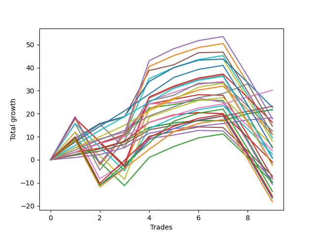

# Short Labrador 013 
- Symbol: ES
- Date Range: 03/18/2022 - 12/30/2022
- Trading Period: 8:30-12:30
- Number of Trades: 9



| Name | Win Percent | Profit | Avg Profit / Trade | Avg Time / Trade |      | Name | Win Percent | Profit | Avg Profit / Trade | Avg Time / Trade |
| ---- | ----------- | ------ | ------------------ | ---------------- | ---- | ---- | ----------- | ------ | ------------------ | ---------------- |
| Sorted By <br> Profit | | | | | | Sorted By <br> Win Percentage ||||
| TP-3 | 100.00 | 15125.00 | 1680.56 | 09:32 |     | TP-3 | 100.00 | 15125.00 | 1680.56 | 09:32 |
| TP-2 | 100.00 | 11625.00 | 1291.67 | 08:01 |     | TP-2 | 100.00 | 11625.00 | 1291.67 | 08:01 |
| BB-100 Mid SL-10 | 77.78 | 11375.00 | 1263.89 | 17:46 |     | TP-1 | 100.00 | 9125.00 | 1013.89 | 07:35 |
| BB-20 Mid SL-10 | 88.89 | 10875.00 | 1208.33 | 02:23 |     | BB-20 Mid SL-10 | 88.89 | 10875.00 | 1208.33 | 02:23 |
| BB-20 Mid | 88.89 | 10875.00 | 1208.33 | 02:23 |     | BB-20 Mid | 88.89 | 10875.00 | 1208.33 | 02:23 |
| TP-1 | 100.00 | 9125.00 | 1013.89 | 07:35 |     | TP-4 | 88.89 | 7250.00 | 805.56 | 19:30 |
| NEWFI 000 | 66.67 | 8875.00 | 986.11 | 40:47 |     | BB-100 Mid SL-10 | 77.78 | 11375.00 | 1263.89 | 17:46 |
| BB-200 U/L 2SD SL-10 | 55.56 | 8125.00 | 902.78 | 32:08 |     | BB-50 U/L 1SD | 77.78 | 5500.00 | 611.11 | 25:52 |
| BB-200 U/L 2SD | 66.67 | 7375.00 | 819.44 | 44:56 |     | BB-100 Mid | 77.78 | 4000.00 | 444.44 | 24:49 |
| TP-4 | 88.89 | 7250.00 | 805.56 | 19:30 |     | TP-7 | 77.78 | 2625.00 | 291.67 | 29:58 |
| BB-50 U/L 1SD SL-10 | 66.67 | 6250.00 | 694.44 | 16:55 |     | TP-6 | 77.78 | 250.00 | 27.78 | 29:42 |
| BB-50 U/L 1SD | 77.78 | 5500.00 | 611.11 | 25:52 |     | TP-5 | 77.78 | -1250.00 | -138.89 | 26:15 |
| BB-100 U/L 2SD SL-10 | 55.56 | 5500.00 | 611.11 | 36:56 |     | NEWFI 000 | 66.67 | 8875.00 | 986.11 | 40:47 |
| BB-100 U/L 2SD | 66.67 | 4750.00 | 527.78 | 49:43 |     | BB-200 U/L 2SD | 66.67 | 7375.00 | 819.44 | 44:56 |
| BB-100 Mid | 77.78 | 4000.00 | 444.44 | 24:49 |     | BB-50 U/L 1SD SL-10 | 66.67 | 6250.00 | 694.44 | 16:55 |
| BB-50 U/L 2SD SL-10 | 55.56 | 3000.00 | 333.33 | 24:20 |     | BB-100 U/L 2SD | 66.67 | 4750.00 | 527.78 | 49:43 |
| TP-7 | 77.78 | 2625.00 | 291.67 | 29:58 |     | BB-50 Mid SL-10 | 66.67 | 2000.00 | 222.22 | 11:30 |
| BB-50 Mid SL-10 | 66.67 | 2000.00 | 222.22 | 11:30 |     | V U/L 1SD | 66.67 | 500.00 | 55.56 | 39:35 |
| V U/L 1SD SL-10 | 55.56 | 1250.00 | 138.89 | 26:48 |     | BB-20 U/L 1SD SL-10 | 66.67 | -500.00 | -55.56 | 06:43 |
| V U/L 1SD | 66.67 | 500.00 | 55.56 | 39:35 |     | BB-50 U/L 2SD | 66.67 | -875.00 | -97.22 | 36:51 |
| TP-6 | 77.78 | 250.00 | 27.78 | 29:42 |     | BB-20 U/L 2SD C | 66.67 | -3875.00 | -430.56 | 19:57 |
| BB-20 U/L 1SD SL-10 | 66.67 | -500.00 | -55.56 | 06:43 |     | BB-20 U/L 2SD | 66.67 | -5000.00 | -555.56 | 19:32 |
| BB-50 U/L 2SD | 66.67 | -875.00 | -97.22 | 36:51 |     | BB-50 Mid | 66.67 | -5375.00 | -597.22 | 18:33 |
| TP-5 | 77.78 | -1250.00 | -138.89 | 26:15 |     | TP-9 | 66.67 | -6875.00 | -763.89 | 37:17 |
| BB-20 U/L 2SD C SL-10 | 55.56 | -3500.00 | -388.89 | 10:57 |     | BB-20 U/L 1SD | 66.67 | -7875.00 | -875.00 | 13:46 |
| BB-20 U/L 2SD C | 66.67 | -3875.00 | -430.56 | 19:57 |     | TP-10 | 66.67 | -8000.00 | -888.89 | 38:26 |
| BB-20 U/L 2SD SL-10 | 55.56 | -4250.00 | -472.22 | 10:35 |     | BB-200 Mid | 66.67 | -8375.00 | -930.56 | 35:10 |
| BB-200 Mid SL-10 | 55.56 | -4875.00 | -541.67 | 22:31 |     | TP-8 | 66.67 | -9125.00 | -1013.89 | 37:01 |
| BB-20 U/L 2SD | 66.67 | -5000.00 | -555.56 | 19:32 |     | BB-200 U/L 2SD SL-10 | 55.56 | 8125.00 | 902.78 | 32:08 |
| BB-50 Mid | 66.67 | -5375.00 | -597.22 | 18:33 |     | BB-100 U/L 2SD SL-10 | 55.56 | 5500.00 | 611.11 | 36:56 |
| TP-9 | 66.67 | -6875.00 | -763.89 | 37:17 |     | BB-50 U/L 2SD SL-10 | 55.56 | 3000.00 | 333.33 | 24:20 |
| BB-20 U/L 1SD | 66.67 | -7875.00 | -875.00 | 13:46 |     | V U/L 1SD SL-10 | 55.56 | 1250.00 | 138.89 | 26:48 |
| TP-10 | 66.67 | -8000.00 | -888.89 | 38:26 |     | BB-20 U/L 2SD C SL-10 | 55.56 | -3500.00 | -388.89 | 10:57 |
| BB-200 Mid | 66.67 | -8375.00 | -930.56 | 35:10 |     | BB-20 U/L 2SD SL-10 | 55.56 | -4250.00 | -472.22 | 10:35 |
| TP-8 | 66.67 | -9125.00 | -1013.89 | 37:01 |     | BB-200 Mid SL-10 | 55.56 | -4875.00 | -541.67 | 22:31 |

## NO STOPLOSS

### Test BB-20 Mid
* Sell when price hits the middle line of the 20p bollinger
* No Stoploss
* Results:
```
Total Trades: 9
Percent Up: 11.11
Percent Down: 88.89
Total Points Moved Down: 21.75
Potential Profit: 10875.00
Total Points Ups: 0.00 Count Ups: 1
Total Points Downs: 21.75 Count Downs: 8
```

<details><summary>Trades</summary>

<code>In: 2022-06-09 10:09:00		Out: 2022-06-09 10:16:50		Total Position Time: 07:50		Total Move Down: 2.25		Total to Date: 2.25</code> <br />
<code>In: 2022-06-10 11:27:00		Out: 2022-06-10 11:28:25		Total Position Time: 01:25		Total Move Down: 2.50		Total to Date: 4.75</code> <br />
<code>In: 2022-06-10 12:22:00		Out: 2022-06-10 12:23:10		Total Position Time: 01:10		Total Move Down: 3.00		Total to Date: 7.75</code> <br />
<code>In: 2022-06-14 10:26:00		Out: 2022-06-14 10:27:10		Total Position Time: 01:10		Total Move Down: 6.25		Total to Date: 14.00</code> <br />
<code>In: 2022-08-05 10:19:00		Out: 2022-08-05 10:20:10		Total Position Time: 01:10		Total Move Down: 2.00		Total to Date: 16.00</code> <br />
<code>In: 2022-11-01 12:12:00		Out: 2022-11-01 12:13:10		Total Position Time: 01:10		Total Move Down: 1.00		Total to Date: 17.00</code> <br />
<code>In: 2022-11-21 10:24:00		Out: 2022-11-21 10:27:25		Total Position Time: 03:25		Total Move Down: -0.00		Total to Date: 17.00</code> <br />
<code>In: 2022-12-16 12:05:00		Out: 2022-12-16 12:07:35		Total Position Time: 02:35		Total Move Down: 3.00		Total to Date: 20.00</code> <br />
<code>In: 2022-12-16 12:06:00		Out: 2022-12-16 12:07:35		Total Position Time: 01:35		Total Move Down: 1.75		Total to Date: 21.75</code> <br />


</details>

### Test BB-20 U/L 1SD
* Sell when the price hits the lower line of the 20p 1std bollinger
* No Stoploss
* Results:
```
Total Trades: 9
Percent Up: 33.33
Percent Down: 66.67
Total Points Moved Down: -15.75
Potential Profit: -7875.00
Total Points Ups: 36.25 Count Ups: 3
Total Points Downs: 20.50 Count Downs: 6
```

<details><summary>Trades</summary>

<code>In: 2022-06-09 10:09:00		Out: 2022-06-09 10:18:50		Total Position Time: 09:50		Total Move Down: 3.25		Total to Date: 3.25</code> <br />
<code>In: 2022-06-10 11:27:00		Out: 2022-06-10 11:38:10		Total Position Time: 11:10		Total Move Down: 1.75		Total to Date: 5.00</code> <br />
<code>In: 2022-06-10 12:22:00		Out: 2022-06-10 12:23:10		Total Position Time: 01:10		Total Move Down: 3.00		Total to Date: 8.00</code> <br />
<code>In: 2022-06-14 10:26:00		Out: 2022-06-14 10:29:05		Total Position Time: 03:05		Total Move Down: 8.25		Total to Date: 16.25</code> <br />
<code>In: 2022-08-05 10:19:00		Out: 2022-08-05 10:23:15		Total Position Time: 04:15		Total Move Down: 3.25		Total to Date: 19.50</code> <br />
<code>In: 2022-11-01 12:12:00		Out: 2022-11-01 12:14:30		Total Position Time: 02:30		Total Move Down: 1.00		Total to Date: 20.50</code> <br />
<code>In: 2022-11-21 10:24:00		Out: 2022-11-21 10:33:00		Total Position Time: 09:00		Total Move Down: -0.50		Total to Date: 20.00</code> <br />
<code>In: 2022-12-16 12:05:00		Out: 2022-12-16 12:47:00		Total Position Time: 42:00		Total Move Down: -17.25		Total to Date: 2.75</code> <br />
<code>In: 2022-12-16 12:06:00		Out: 2022-12-16 12:47:00		Total Position Time: 41:00		Total Move Down: -18.50		Total to Date: -15.75</code> <br />


</details>

### Test BB-20 U/L 2SD
* Sell when the price hits the lower line of the 20p 2std bollinger
* No Stoploss
* Results:
```
Total Trades: 9
Percent Up: 33.33
Percent Down: 66.67
Total Points Moved Down: -10.00
Potential Profit: -5000.00
Total Points Ups: 36.00 Count Ups: 3
Total Points Downs: 26.00 Count Downs: 6
```

<details><summary>Trades</summary>

<code>In: 2022-06-09 10:09:00		Out: 2022-06-09 10:19:05		Total Position Time: 10:05		Total Move Down: 3.25		Total to Date: 3.25</code> <br />
<code>In: 2022-06-10 11:27:00		Out: 2022-06-10 11:40:10		Total Position Time: 13:10		Total Move Down: 4.00		Total to Date: 7.25</code> <br />
<code>In: 2022-06-10 12:22:00		Out: 2022-06-10 12:42:45		Total Position Time: 20:45		Total Move Down: 3.00		Total to Date: 10.25</code> <br />
<code>In: 2022-06-14 10:26:00		Out: 2022-06-14 10:31:00		Total Position Time: 05:00		Total Move Down: 12.25		Total to Date: 22.50</code> <br />
<code>In: 2022-08-05 10:19:00		Out: 2022-08-05 10:49:30		Total Position Time: 30:30		Total Move Down: 1.50		Total to Date: 24.00</code> <br />
<code>In: 2022-11-01 12:12:00		Out: 2022-11-01 12:16:15		Total Position Time: 04:15		Total Move Down: 2.00		Total to Date: 26.00</code> <br />
<code>In: 2022-11-21 10:24:00		Out: 2022-11-21 10:33:10		Total Position Time: 09:10		Total Move Down: -0.25		Total to Date: 25.75</code> <br />
<code>In: 2022-12-16 12:05:00		Out: 2022-12-16 12:47:00		Total Position Time: 42:00		Total Move Down: -17.25		Total to Date: 8.50</code> <br />
<code>In: 2022-12-16 12:06:00		Out: 2022-12-16 12:47:00		Total Position Time: 41:00		Total Move Down: -18.50		Total to Date: -10.00</code> <br />


</details>

### Test BB-20 U/L 2SD C
* Sell when the price hits the lower line of the 20p 2std bollinger
* No Stoploss
* Results:
```
Total Trades: 9
Percent Up: 33.33
Percent Down: 66.67
Total Points Moved Down: -7.75
Potential Profit: -3875.00
Total Points Ups: 36.00 Count Ups: 3
Total Points Downs: 28.25 Count Downs: 6
```

<details><summary>Trades</summary>

<code>In: 2022-06-09 10:09:00		Out: 2022-06-09 10:21:10		Total Position Time: 12:10		Total Move Down: 3.25		Total to Date: 3.25</code> <br />
<code>In: 2022-06-10 11:27:00		Out: 2022-06-10 11:40:10		Total Position Time: 13:10		Total Move Down: 4.00		Total to Date: 7.25</code> <br />
<code>In: 2022-06-10 12:22:00		Out: 2022-06-10 12:43:10		Total Position Time: 21:10		Total Move Down: 3.75		Total to Date: 11.00</code> <br />
<code>In: 2022-06-14 10:26:00		Out: 2022-06-14 10:31:10		Total Position Time: 05:10		Total Move Down: 13.25		Total to Date: 24.25</code> <br />
<code>In: 2022-08-05 10:19:00		Out: 2022-08-05 10:50:35		Total Position Time: 31:35		Total Move Down: 2.00		Total to Date: 26.25</code> <br />
<code>In: 2022-11-01 12:12:00		Out: 2022-11-01 12:16:15		Total Position Time: 04:15		Total Move Down: 2.00		Total to Date: 28.25</code> <br />
<code>In: 2022-11-21 10:24:00		Out: 2022-11-21 10:33:10		Total Position Time: 09:10		Total Move Down: -0.25		Total to Date: 28.00</code> <br />
<code>In: 2022-12-16 12:05:00		Out: 2022-12-16 12:47:00		Total Position Time: 42:00		Total Move Down: -17.25		Total to Date: 10.75</code> <br />
<code>In: 2022-12-16 12:06:00		Out: 2022-12-16 12:47:00		Total Position Time: 41:00		Total Move Down: -18.50		Total to Date: -7.75</code> <br />


</details>

### Test BB-50 Mid
* Sell when price hits the middle line of the 50p bollinger
* No Stoploss
* Results:
```
Total Trades: 9
Percent Up: 33.33
Percent Down: 66.67
Total Points Moved Down: -10.75
Potential Profit: -5375.00
Total Points Ups: 37.50 Count Ups: 3
Total Points Downs: 26.75 Count Downs: 6
```

<details><summary>Trades</summary>

<code>In: 2022-06-09 10:09:00		Out: 2022-06-09 10:22:05		Total Position Time: 13:05		Total Move Down: 5.25		Total to Date: 5.25</code> <br />
<code>In: 2022-06-10 11:27:00		Out: 2022-06-10 11:28:30		Total Position Time: 01:30		Total Move Down: 3.75		Total to Date: 9.00</code> <br />
<code>In: 2022-06-10 12:22:00		Out: 2022-06-10 12:23:10		Total Position Time: 01:10		Total Move Down: 3.00		Total to Date: 12.00</code> <br />
<code>In: 2022-06-14 10:26:00		Out: 2022-06-14 10:31:00		Total Position Time: 05:00		Total Move Down: 12.25		Total to Date: 24.25</code> <br />
<code>In: 2022-08-05 10:19:00		Out: 2022-08-05 10:47:35		Total Position Time: 28:35		Total Move Down: 0.50		Total to Date: 24.75</code> <br />
<code>In: 2022-11-01 12:12:00		Out: 2022-11-01 12:16:15		Total Position Time: 04:15		Total Move Down: 2.00		Total to Date: 26.75</code> <br />
<code>In: 2022-11-21 10:24:00		Out: 2022-11-21 10:54:25		Total Position Time: 30:25		Total Move Down: -1.75		Total to Date: 25.00</code> <br />
<code>In: 2022-12-16 12:05:00		Out: 2022-12-16 12:47:00		Total Position Time: 42:00		Total Move Down: -17.25		Total to Date: 7.75</code> <br />
<code>In: 2022-12-16 12:06:00		Out: 2022-12-16 12:47:00		Total Position Time: 41:00		Total Move Down: -18.50		Total to Date: -10.75</code> <br />


</details>

### Test BB-50 U/L 1SD
* Sell when the price hits the lower line of the 50p 1std bollinger
* No Stoploss
* Results:
```
Total Trades: 9
Percent Up: 22.22
Percent Down: 77.78
Total Points Moved Down: 11.00
Potential Profit: 5500.00
Total Points Ups: 35.75 Count Ups: 2
Total Points Downs: 46.75 Count Downs: 7
```

<details><summary>Trades</summary>

<code>In: 2022-06-09 10:09:00		Out: 2022-06-09 10:24:05		Total Position Time: 15:05		Total Move Down: 8.25		Total to Date: 8.25</code> <br />
<code>In: 2022-06-10 11:27:00		Out: 2022-06-10 11:41:45		Total Position Time: 14:45		Total Move Down: 7.25		Total to Date: 15.50</code> <br />
<code>In: 2022-06-10 12:22:00		Out: 2022-06-10 12:42:40		Total Position Time: 20:40		Total Move Down: 3.00		Total to Date: 18.50</code> <br />
<code>In: 2022-06-14 10:26:00		Out: 2022-06-14 10:36:10		Total Position Time: 10:10		Total Move Down: 20.25		Total to Date: 38.75</code> <br />
<code>In: 2022-08-05 10:19:00		Out: 2022-08-05 10:52:05		Total Position Time: 33:05		Total Move Down: 2.50		Total to Date: 41.25</code> <br />
<code>In: 2022-11-01 12:12:00		Out: 2022-11-01 12:32:40		Total Position Time: 20:40		Total Move Down: 5.25		Total to Date: 46.50</code> <br />
<code>In: 2022-11-21 10:24:00		Out: 2022-11-21 10:59:25		Total Position Time: 35:25		Total Move Down: 0.25		Total to Date: 46.75</code> <br />
<code>In: 2022-12-16 12:05:00		Out: 2022-12-16 12:47:00		Total Position Time: 42:00		Total Move Down: -17.25		Total to Date: 29.50</code> <br />
<code>In: 2022-12-16 12:06:00		Out: 2022-12-16 12:47:00		Total Position Time: 41:00		Total Move Down: -18.50		Total to Date: 11.00</code> <br />


</details>

### Test BB-50 U/L 2SD
* Sell when the price hits the lower line of the 50p 2std bollinger
* No Stoploss
* Results:
```
Total Trades: 9
Percent Up: 33.33
Percent Down: 66.67
Total Points Moved Down: -1.75
Potential Profit: -875.00
Total Points Ups: 56.00 Count Ups: 3
Total Points Downs: 54.25 Count Downs: 6
```

<details><summary>Trades</summary>

<code>In: 2022-06-09 10:09:00		Out: 2022-06-09 10:27:20		Total Position Time: 18:20		Total Move Down: 12.00		Total to Date: 12.00</code> <br />
<code>In: 2022-06-10 11:27:00		Out: 2022-06-10 12:27:55		Total Position Time: 60:55		Total Move Down: -20.25		Total to Date: -8.25</code> <br />
<code>In: 2022-06-10 12:22:00		Out: 2022-06-10 12:44:30		Total Position Time: 22:30		Total Move Down: 6.75		Total to Date: -1.50</code> <br />
<code>In: 2022-06-14 10:26:00		Out: 2022-06-14 10:43:05		Total Position Time: 17:05		Total Move Down: 27.00		Total to Date: 25.50</code> <br />
<code>In: 2022-08-05 10:19:00		Out: 2022-08-05 10:55:40		Total Position Time: 36:40		Total Move Down: 3.75		Total to Date: 29.25</code> <br />
<code>In: 2022-11-01 12:12:00		Out: 2022-11-01 12:47:00		Total Position Time: 35:00		Total Move Down: 3.50		Total to Date: 32.75</code> <br />
<code>In: 2022-11-21 10:24:00		Out: 2022-11-21 11:22:10		Total Position Time: 58:10		Total Move Down: 1.25		Total to Date: 34.00</code> <br />
<code>In: 2022-12-16 12:05:00		Out: 2022-12-16 12:47:00		Total Position Time: 42:00		Total Move Down: -17.25		Total to Date: 16.75</code> <br />
<code>In: 2022-12-16 12:06:00		Out: 2022-12-16 12:47:00		Total Position Time: 41:00		Total Move Down: -18.50		Total to Date: -1.75</code> <br />


</details>

### Test V U/L 1SD
* Sell when the price hits the lower line of the 1std VWAP
* No Stoploss
* Results:
```
Total Trades: 9
Percent Up: 33.33
Percent Down: 66.67
Total Points Moved Down: 1.00
Potential Profit: 500.00
Total Points Ups: 56.00 Count Ups: 3
Total Points Downs: 57.00 Count Downs: 6
```

<details><summary>Trades</summary>

<code>In: 2022-06-09 10:09:00		Out: 2022-06-09 10:30:30		Total Position Time: 21:30		Total Move Down: 15.75		Total to Date: 15.75</code> <br />
<code>In: 2022-06-10 11:27:00		Out: 2022-06-10 12:27:55		Total Position Time: 60:55		Total Move Down: -20.25		Total to Date: -4.50</code> <br />
<code>In: 2022-06-10 12:22:00		Out: 2022-06-10 12:47:00		Total Position Time: 25:00		Total Move Down: 13.00		Total to Date: 8.50</code> <br />
<code>In: 2022-06-14 10:26:00		Out: 2022-06-14 10:35:05		Total Position Time: 09:05		Total Move Down: 18.25		Total to Date: 26.75</code> <br />
<code>In: 2022-08-05 10:19:00		Out: 2022-08-05 11:19:55		Total Position Time: 60:55		Total Move Down: 4.75		Total to Date: 31.50</code> <br />
<code>In: 2022-11-01 12:12:00		Out: 2022-11-01 12:47:00		Total Position Time: 35:00		Total Move Down: 3.50		Total to Date: 35.00</code> <br />
<code>In: 2022-11-21 10:24:00		Out: 2022-11-21 11:24:55		Total Position Time: 60:55		Total Move Down: 1.75		Total to Date: 36.75</code> <br />
<code>In: 2022-12-16 12:05:00		Out: 2022-12-16 12:47:00		Total Position Time: 42:00		Total Move Down: -17.25		Total to Date: 19.50</code> <br />
<code>In: 2022-12-16 12:06:00		Out: 2022-12-16 12:47:00		Total Position Time: 41:00		Total Move Down: -18.50		Total to Date: 1.00</code> <br />


</details>

### Test BB-100 Mid
* Move to BB100 Mid
* No Stoploss
* Results:
```
Total Trades: 9
Percent Up: 22.22
Percent Down: 77.78
Total Points Moved Down: 8.00
Potential Profit: 4000.00
Total Points Ups: 35.75 Count Ups: 2
Total Points Downs: 43.75 Count Downs: 7
```

<details><summary>Trades</summary>

<code>In: 2022-06-09 10:09:00		Out: 2022-06-09 10:25:10		Total Position Time: 16:10		Total Move Down: 9.25		Total to Date: 9.25</code> <br />
<code>In: 2022-06-10 11:27:00		Out: 2022-06-10 11:41:25		Total Position Time: 14:25		Total Move Down: 6.50		Total to Date: 15.75</code> <br />
<code>In: 2022-06-10 12:22:00		Out: 2022-06-10 12:23:10		Total Position Time: 01:10		Total Move Down: 3.00		Total to Date: 18.75</code> <br />
<code>In: 2022-06-14 10:26:00		Out: 2022-06-14 10:34:00		Total Position Time: 08:00		Total Move Down: 15.25		Total to Date: 34.00</code> <br />
<code>In: 2022-08-05 10:19:00		Out: 2022-08-05 10:56:25		Total Position Time: 37:25		Total Move Down: 6.00		Total to Date: 40.00</code> <br />
<code>In: 2022-11-01 12:12:00		Out: 2022-11-01 12:17:10		Total Position Time: 05:10		Total Move Down: 3.25		Total to Date: 43.25</code> <br />
<code>In: 2022-11-21 10:24:00		Out: 2022-11-21 11:22:05		Total Position Time: 58:05		Total Move Down: 0.50		Total to Date: 43.75</code> <br />
<code>In: 2022-12-16 12:05:00		Out: 2022-12-16 12:47:00		Total Position Time: 42:00		Total Move Down: -17.25		Total to Date: 26.50</code> <br />
<code>In: 2022-12-16 12:06:00		Out: 2022-12-16 12:47:00		Total Position Time: 41:00		Total Move Down: -18.50		Total to Date: 8.00</code> <br />


</details>

### Test BB-100 U/L 2SD
* Move to BB100 Upper Band
* No Stoploss
* Results:
```
Total Trades: 9
Percent Up: 33.33
Percent Down: 66.67
Total Points Moved Down: 9.50
Potential Profit: 4750.00
Total Points Ups: 56.00 Count Ups: 3
Total Points Downs: 65.50 Count Downs: 6
```

<details><summary>Trades</summary>

<code>In: 2022-06-09 10:09:00		Out: 2022-06-09 11:09:55		Total Position Time: 60:55		Total Move Down: 18.00		Total to Date: 18.00</code> <br />
<code>In: 2022-06-10 11:27:00		Out: 2022-06-10 12:27:55		Total Position Time: 60:55		Total Move Down: -20.25		Total to Date: -2.25</code> <br />
<code>In: 2022-06-10 12:22:00		Out: 2022-06-10 12:47:00		Total Position Time: 25:00		Total Move Down: 13.00		Total to Date: 10.75</code> <br />
<code>In: 2022-06-14 10:26:00		Out: 2022-06-14 11:26:55		Total Position Time: 60:55		Total Move Down: 24.50		Total to Date: 35.25</code> <br />
<code>In: 2022-08-05 10:19:00		Out: 2022-08-05 11:19:55		Total Position Time: 60:55		Total Move Down: 4.75		Total to Date: 40.00</code> <br />
<code>In: 2022-11-01 12:12:00		Out: 2022-11-01 12:47:00		Total Position Time: 35:00		Total Move Down: 3.50		Total to Date: 43.50</code> <br />
<code>In: 2022-11-21 10:24:00		Out: 2022-11-21 11:24:55		Total Position Time: 60:55		Total Move Down: 1.75		Total to Date: 45.25</code> <br />
<code>In: 2022-12-16 12:05:00		Out: 2022-12-16 12:47:00		Total Position Time: 42:00		Total Move Down: -17.25		Total to Date: 28.00</code> <br />
<code>In: 2022-12-16 12:06:00		Out: 2022-12-16 12:47:00		Total Position Time: 41:00		Total Move Down: -18.50		Total to Date: 9.50</code> <br />


</details>

### Test BB-200 Mid
* Move to BB200 Mid
* No Stoploss
* Results:
```
Total Trades: 9
Percent Up: 33.33
Percent Down: 66.67
Total Points Moved Down: -16.75
Potential Profit: -8375.00
Total Points Ups: 56.00 Count Ups: 3
Total Points Downs: 39.25 Count Downs: 6
```

<details><summary>Trades</summary>

<code>In: 2022-06-09 10:09:00		Out: 2022-06-09 10:25:10		Total Position Time: 16:10		Total Move Down: 9.25		Total to Date: 9.25</code> <br />
<code>In: 2022-06-10 11:27:00		Out: 2022-06-10 12:27:55		Total Position Time: 60:55		Total Move Down: -20.25		Total to Date: -11.00</code> <br />
<code>In: 2022-06-10 12:22:00		Out: 2022-06-10 12:45:45		Total Position Time: 23:45		Total Move Down: 7.50		Total to Date: -3.50</code> <br />
<code>In: 2022-06-14 10:26:00		Out: 2022-06-14 10:31:00		Total Position Time: 05:00		Total Move Down: 12.25		Total to Date: 8.75</code> <br />
<code>In: 2022-08-05 10:19:00		Out: 2022-08-05 11:19:55		Total Position Time: 60:55		Total Move Down: 4.75		Total to Date: 13.50</code> <br />
<code>In: 2022-11-01 12:12:00		Out: 2022-11-01 12:17:55		Total Position Time: 05:55		Total Move Down: 3.75		Total to Date: 17.25</code> <br />
<code>In: 2022-11-21 10:24:00		Out: 2022-11-21 11:24:55		Total Position Time: 60:55		Total Move Down: 1.75		Total to Date: 19.00</code> <br />
<code>In: 2022-12-16 12:05:00		Out: 2022-12-16 12:47:00		Total Position Time: 42:00		Total Move Down: -17.25		Total to Date: 1.75</code> <br />
<code>In: 2022-12-16 12:06:00		Out: 2022-12-16 12:47:00		Total Position Time: 41:00		Total Move Down: -18.50		Total to Date: -16.75</code> <br />


</details>

### Test BB-200 U/L 2SD
* Move to BB200 Upper Band
* No Stoploss
* Results:
```
Total Trades: 9
Percent Up: 33.33
Percent Down: 66.67
Total Points Moved Down: 14.75
Potential Profit: 7375.00
Total Points Ups: 56.00 Count Ups: 3
Total Points Downs: 70.75 Count Downs: 6
```

<details><summary>Trades</summary>

<code>In: 2022-06-09 10:09:00		Out: 2022-06-09 11:09:55		Total Position Time: 60:55		Total Move Down: 18.00		Total to Date: 18.00</code> <br />
<code>In: 2022-06-10 11:27:00		Out: 2022-06-10 12:27:55		Total Position Time: 60:55		Total Move Down: -20.25		Total to Date: -2.25</code> <br />
<code>In: 2022-06-10 12:22:00		Out: 2022-06-10 12:47:00		Total Position Time: 25:00		Total Move Down: 13.00		Total to Date: 10.75</code> <br />
<code>In: 2022-06-14 10:26:00		Out: 2022-06-14 10:43:45		Total Position Time: 17:45		Total Move Down: 29.75		Total to Date: 40.50</code> <br />
<code>In: 2022-08-05 10:19:00		Out: 2022-08-05 11:19:55		Total Position Time: 60:55		Total Move Down: 4.75		Total to Date: 45.25</code> <br />
<code>In: 2022-11-01 12:12:00		Out: 2022-11-01 12:47:00		Total Position Time: 35:00		Total Move Down: 3.50		Total to Date: 48.75</code> <br />
<code>In: 2022-11-21 10:24:00		Out: 2022-11-21 11:24:55		Total Position Time: 60:55		Total Move Down: 1.75		Total to Date: 50.50</code> <br />
<code>In: 2022-12-16 12:05:00		Out: 2022-12-16 12:47:00		Total Position Time: 42:00		Total Move Down: -17.25		Total to Date: 33.25</code> <br />
<code>In: 2022-12-16 12:06:00		Out: 2022-12-16 12:47:00		Total Position Time: 41:00		Total Move Down: -18.50		Total to Date: 14.75</code> <br />


</details>

## STOPLOSS OF 10

### Test BB-20 Mid SL-10
* Sell when price hits the middle line of the 20p bollinger
* Stoploss is -10 points
* Results:
```
Total Trades: 9
Percent Up: 11.11
Percent Down: 88.89
Total Points Moved Down: 21.75
Potential Profit: 10875.00
Total Points Ups: 0.00 Count Ups: 1
Total Points Downs: 21.75 Count Downs: 8
```

<details><summary>Trades</summary>

<code>In: 2022-06-09 10:09:00		Out: 2022-06-09 10:16:50		Total Position Time: 07:50		Total Move Down: 2.25		Total to Date: 2.25</code> <br />
<code>In: 2022-06-10 11:27:00		Out: 2022-06-10 11:28:25		Total Position Time: 01:25		Total Move Down: 2.50		Total to Date: 4.75</code> <br />
<code>In: 2022-06-10 12:22:00		Out: 2022-06-10 12:23:10		Total Position Time: 01:10		Total Move Down: 3.00		Total to Date: 7.75</code> <br />
<code>In: 2022-06-14 10:26:00		Out: 2022-06-14 10:27:10		Total Position Time: 01:10		Total Move Down: 6.25		Total to Date: 14.00</code> <br />
<code>In: 2022-08-05 10:19:00		Out: 2022-08-05 10:20:10		Total Position Time: 01:10		Total Move Down: 2.00		Total to Date: 16.00</code> <br />
<code>In: 2022-11-01 12:12:00		Out: 2022-11-01 12:13:10		Total Position Time: 01:10		Total Move Down: 1.00		Total to Date: 17.00</code> <br />
<code>In: 2022-11-21 10:24:00		Out: 2022-11-21 10:27:25		Total Position Time: 03:25		Total Move Down: -0.00		Total to Date: 17.00</code> <br />
<code>In: 2022-12-16 12:05:00		Out: 2022-12-16 12:07:35		Total Position Time: 02:35		Total Move Down: 3.00		Total to Date: 20.00</code> <br />
<code>In: 2022-12-16 12:06:00		Out: 2022-12-16 12:07:35		Total Position Time: 01:35		Total Move Down: 1.75		Total to Date: 21.75</code> <br />


</details>

### Test BB-20 U/L 1SD SL-10
* Sell when the price hits the lower line of the 20p 1std bollinger
* Stoploss is -10 points
* Results:
```
Total Trades: 9
Percent Up: 33.33
Percent Down: 66.67
Total Points Moved Down: -1.00
Potential Profit: -500.00
Total Points Ups: 21.50 Count Ups: 3
Total Points Downs: 20.50 Count Downs: 6
```

<details><summary>Trades</summary>

<code>In: 2022-06-09 10:09:00		Out: 2022-06-09 10:18:50		Total Position Time: 09:50		Total Move Down: 3.25		Total to Date: 3.25</code> <br />
<code>In: 2022-06-10 11:27:00		Out: 2022-06-10 11:38:10		Total Position Time: 11:10		Total Move Down: 1.75		Total to Date: 5.00</code> <br />
<code>In: 2022-06-10 12:22:00		Out: 2022-06-10 12:23:10		Total Position Time: 01:10		Total Move Down: 3.00		Total to Date: 8.00</code> <br />
<code>In: 2022-06-14 10:26:00		Out: 2022-06-14 10:29:05		Total Position Time: 03:05		Total Move Down: 8.25		Total to Date: 16.25</code> <br />
<code>In: 2022-08-05 10:19:00		Out: 2022-08-05 10:23:15		Total Position Time: 04:15		Total Move Down: 3.25		Total to Date: 19.50</code> <br />
<code>In: 2022-11-01 12:12:00		Out: 2022-11-01 12:14:30		Total Position Time: 02:30		Total Move Down: 1.00		Total to Date: 20.50</code> <br />
<code>In: 2022-11-21 10:24:00		Out: 2022-11-21 10:33:00		Total Position Time: 09:00		Total Move Down: -0.50		Total to Date: 20.00</code> <br />
<code>In: 2022-12-16 12:05:00		Out: 2022-12-16 12:15:20		Total Position Time: 10:20		Total Move Down: -10.25		Total to Date: 9.75</code> <br />
<code>In: 2022-12-16 12:06:00		Out: 2022-12-16 12:15:15		Total Position Time: 09:15		Total Move Down: -10.75		Total to Date: -1.00</code> <br />


</details>

### Test BB-20 U/L 2SD SL-10
* Sell when the price hits the lower line of the 20p 2std bollinger
* Stoploss is -10 points
* Results:
```
Total Trades: 9
Percent Up: 44.44
Percent Down: 55.56
Total Points Moved Down: -8.50
Potential Profit: -4250.00
Total Points Ups: 31.50 Count Ups: 4
Total Points Downs: 23.00 Count Downs: 5
```

<details><summary>Trades</summary>

<code>In: 2022-06-09 10:09:00		Out: 2022-06-09 10:19:05		Total Position Time: 10:05		Total Move Down: 3.25		Total to Date: 3.25</code> <br />
<code>In: 2022-06-10 11:27:00		Out: 2022-06-10 11:40:10		Total Position Time: 13:10		Total Move Down: 4.00		Total to Date: 7.25</code> <br />
<code>In: 2022-06-10 12:22:00		Out: 2022-06-10 12:25:30		Total Position Time: 03:30		Total Move Down: -10.25		Total to Date: -3.00</code> <br />
<code>In: 2022-06-14 10:26:00		Out: 2022-06-14 10:31:00		Total Position Time: 05:00		Total Move Down: 12.25		Total to Date: 9.25</code> <br />
<code>In: 2022-08-05 10:19:00		Out: 2022-08-05 10:49:30		Total Position Time: 30:30		Total Move Down: 1.50		Total to Date: 10.75</code> <br />
<code>In: 2022-11-01 12:12:00		Out: 2022-11-01 12:16:15		Total Position Time: 04:15		Total Move Down: 2.00		Total to Date: 12.75</code> <br />
<code>In: 2022-11-21 10:24:00		Out: 2022-11-21 10:33:10		Total Position Time: 09:10		Total Move Down: -0.25		Total to Date: 12.50</code> <br />
<code>In: 2022-12-16 12:05:00		Out: 2022-12-16 12:15:20		Total Position Time: 10:20		Total Move Down: -10.25		Total to Date: 2.25</code> <br />
<code>In: 2022-12-16 12:06:00		Out: 2022-12-16 12:15:15		Total Position Time: 09:15		Total Move Down: -10.75		Total to Date: -8.50</code> <br />


</details>

### Test BB-20 U/L 2SD C SL-10
* Sell when the price hits the lower line of the 20p 2std bollinger
* Stoploss is -10 points
* Results:
```
Total Trades: 9
Percent Up: 44.44
Percent Down: 55.56
Total Points Moved Down: -7.00
Potential Profit: -3500.00
Total Points Ups: 31.50 Count Ups: 4
Total Points Downs: 24.50 Count Downs: 5
```

<details><summary>Trades</summary>

<code>In: 2022-06-09 10:09:00		Out: 2022-06-09 10:21:10		Total Position Time: 12:10		Total Move Down: 3.25		Total to Date: 3.25</code> <br />
<code>In: 2022-06-10 11:27:00		Out: 2022-06-10 11:40:10		Total Position Time: 13:10		Total Move Down: 4.00		Total to Date: 7.25</code> <br />
<code>In: 2022-06-10 12:22:00		Out: 2022-06-10 12:25:30		Total Position Time: 03:30		Total Move Down: -10.25		Total to Date: -3.00</code> <br />
<code>In: 2022-06-14 10:26:00		Out: 2022-06-14 10:31:10		Total Position Time: 05:10		Total Move Down: 13.25		Total to Date: 10.25</code> <br />
<code>In: 2022-08-05 10:19:00		Out: 2022-08-05 10:50:35		Total Position Time: 31:35		Total Move Down: 2.00		Total to Date: 12.25</code> <br />
<code>In: 2022-11-01 12:12:00		Out: 2022-11-01 12:16:15		Total Position Time: 04:15		Total Move Down: 2.00		Total to Date: 14.25</code> <br />
<code>In: 2022-11-21 10:24:00		Out: 2022-11-21 10:33:10		Total Position Time: 09:10		Total Move Down: -0.25		Total to Date: 14.00</code> <br />
<code>In: 2022-12-16 12:05:00		Out: 2022-12-16 12:15:20		Total Position Time: 10:20		Total Move Down: -10.25		Total to Date: 3.75</code> <br />
<code>In: 2022-12-16 12:06:00		Out: 2022-12-16 12:15:15		Total Position Time: 09:15		Total Move Down: -10.75		Total to Date: -7.00</code> <br />


</details>

### Test BB-50 Mid SL-10
* Sell when price hits the middle line of the 50p bollinger
* Stoploss is -10 points
* Results:
```
Total Trades: 9
Percent Up: 33.33
Percent Down: 66.67
Total Points Moved Down: 4.00
Potential Profit: 2000.00
Total Points Ups: 22.75 Count Ups: 3
Total Points Downs: 26.75 Count Downs: 6
```

<details><summary>Trades</summary>

<code>In: 2022-06-09 10:09:00		Out: 2022-06-09 10:22:05		Total Position Time: 13:05		Total Move Down: 5.25		Total to Date: 5.25</code> <br />
<code>In: 2022-06-10 11:27:00		Out: 2022-06-10 11:28:30		Total Position Time: 01:30		Total Move Down: 3.75		Total to Date: 9.00</code> <br />
<code>In: 2022-06-10 12:22:00		Out: 2022-06-10 12:23:10		Total Position Time: 01:10		Total Move Down: 3.00		Total to Date: 12.00</code> <br />
<code>In: 2022-06-14 10:26:00		Out: 2022-06-14 10:31:00		Total Position Time: 05:00		Total Move Down: 12.25		Total to Date: 24.25</code> <br />
<code>In: 2022-08-05 10:19:00		Out: 2022-08-05 10:47:35		Total Position Time: 28:35		Total Move Down: 0.50		Total to Date: 24.75</code> <br />
<code>In: 2022-11-01 12:12:00		Out: 2022-11-01 12:16:15		Total Position Time: 04:15		Total Move Down: 2.00		Total to Date: 26.75</code> <br />
<code>In: 2022-11-21 10:24:00		Out: 2022-11-21 10:54:25		Total Position Time: 30:25		Total Move Down: -1.75		Total to Date: 25.00</code> <br />
<code>In: 2022-12-16 12:05:00		Out: 2022-12-16 12:15:20		Total Position Time: 10:20		Total Move Down: -10.25		Total to Date: 14.75</code> <br />
<code>In: 2022-12-16 12:06:00		Out: 2022-12-16 12:15:15		Total Position Time: 09:15		Total Move Down: -10.75		Total to Date: 4.00</code> <br />


</details>

### Test BB-50 U/L 1SD SL-10
* Sell when the price hits the lower line of the 50p 1std bollinger
* Stoploss is -10 points
* Results:
```
Total Trades: 9
Percent Up: 33.33
Percent Down: 66.67
Total Points Moved Down: 12.50
Potential Profit: 6250.00
Total Points Ups: 31.25 Count Ups: 3
Total Points Downs: 43.75 Count Downs: 6
```

<details><summary>Trades</summary>

<code>In: 2022-06-09 10:09:00		Out: 2022-06-09 10:24:05		Total Position Time: 15:05		Total Move Down: 8.25		Total to Date: 8.25</code> <br />
<code>In: 2022-06-10 11:27:00		Out: 2022-06-10 11:41:45		Total Position Time: 14:45		Total Move Down: 7.25		Total to Date: 15.50</code> <br />
<code>In: 2022-06-10 12:22:00		Out: 2022-06-10 12:25:30		Total Position Time: 03:30		Total Move Down: -10.25		Total to Date: 5.25</code> <br />
<code>In: 2022-06-14 10:26:00		Out: 2022-06-14 10:36:10		Total Position Time: 10:10		Total Move Down: 20.25		Total to Date: 25.50</code> <br />
<code>In: 2022-08-05 10:19:00		Out: 2022-08-05 10:52:05		Total Position Time: 33:05		Total Move Down: 2.50		Total to Date: 28.00</code> <br />
<code>In: 2022-11-01 12:12:00		Out: 2022-11-01 12:32:40		Total Position Time: 20:40		Total Move Down: 5.25		Total to Date: 33.25</code> <br />
<code>In: 2022-11-21 10:24:00		Out: 2022-11-21 10:59:25		Total Position Time: 35:25		Total Move Down: 0.25		Total to Date: 33.50</code> <br />
<code>In: 2022-12-16 12:05:00		Out: 2022-12-16 12:15:20		Total Position Time: 10:20		Total Move Down: -10.25		Total to Date: 23.25</code> <br />
<code>In: 2022-12-16 12:06:00		Out: 2022-12-16 12:15:15		Total Position Time: 09:15		Total Move Down: -10.75		Total to Date: 12.50</code> <br />


</details>

### Test BB-50 U/L 2SD SL-10
* Sell when the price hits the lower line of the 50p 2std bollinger
* Stoploss is -10 points
* Results:
```
Total Trades: 9
Percent Up: 44.44
Percent Down: 55.56
Total Points Moved Down: 6.00
Potential Profit: 3000.00
Total Points Ups: 41.50 Count Ups: 4
Total Points Downs: 47.50 Count Downs: 5
```

<details><summary>Trades</summary>

<code>In: 2022-06-09 10:09:00		Out: 2022-06-09 10:27:20		Total Position Time: 18:20		Total Move Down: 12.00		Total to Date: 12.00</code> <br />
<code>In: 2022-06-10 11:27:00		Out: 2022-06-10 11:57:45		Total Position Time: 30:45		Total Move Down: -10.25		Total to Date: 1.75</code> <br />
<code>In: 2022-06-10 12:22:00		Out: 2022-06-10 12:25:30		Total Position Time: 03:30		Total Move Down: -10.25		Total to Date: -8.50</code> <br />
<code>In: 2022-06-14 10:26:00		Out: 2022-06-14 10:43:05		Total Position Time: 17:05		Total Move Down: 27.00		Total to Date: 18.50</code> <br />
<code>In: 2022-08-05 10:19:00		Out: 2022-08-05 10:55:40		Total Position Time: 36:40		Total Move Down: 3.75		Total to Date: 22.25</code> <br />
<code>In: 2022-11-01 12:12:00		Out: 2022-11-01 12:47:00		Total Position Time: 35:00		Total Move Down: 3.50		Total to Date: 25.75</code> <br />
<code>In: 2022-11-21 10:24:00		Out: 2022-11-21 11:22:10		Total Position Time: 58:10		Total Move Down: 1.25		Total to Date: 27.00</code> <br />
<code>In: 2022-12-16 12:05:00		Out: 2022-12-16 12:15:20		Total Position Time: 10:20		Total Move Down: -10.25		Total to Date: 16.75</code> <br />
<code>In: 2022-12-16 12:06:00		Out: 2022-12-16 12:15:15		Total Position Time: 09:15		Total Move Down: -10.75		Total to Date: 6.00</code> <br />


</details>

### Test V U/L 1SD SL-10
* Sell when the price hits the lower line of the 1std VWAP
* Stoploss is -10 points
* Results:
```
Total Trades: 9
Percent Up: 44.44
Percent Down: 55.56
Total Points Moved Down: 2.50
Potential Profit: 1250.00
Total Points Ups: 41.50 Count Ups: 4
Total Points Downs: 44.00 Count Downs: 5
```

<details><summary>Trades</summary>

<code>In: 2022-06-09 10:09:00		Out: 2022-06-09 10:30:30		Total Position Time: 21:30		Total Move Down: 15.75		Total to Date: 15.75</code> <br />
<code>In: 2022-06-10 11:27:00		Out: 2022-06-10 11:57:45		Total Position Time: 30:45		Total Move Down: -10.25		Total to Date: 5.50</code> <br />
<code>In: 2022-06-10 12:22:00		Out: 2022-06-10 12:25:30		Total Position Time: 03:30		Total Move Down: -10.25		Total to Date: -4.75</code> <br />
<code>In: 2022-06-14 10:26:00		Out: 2022-06-14 10:35:05		Total Position Time: 09:05		Total Move Down: 18.25		Total to Date: 13.50</code> <br />
<code>In: 2022-08-05 10:19:00		Out: 2022-08-05 11:19:55		Total Position Time: 60:55		Total Move Down: 4.75		Total to Date: 18.25</code> <br />
<code>In: 2022-11-01 12:12:00		Out: 2022-11-01 12:47:00		Total Position Time: 35:00		Total Move Down: 3.50		Total to Date: 21.75</code> <br />
<code>In: 2022-11-21 10:24:00		Out: 2022-11-21 11:24:55		Total Position Time: 60:55		Total Move Down: 1.75		Total to Date: 23.50</code> <br />
<code>In: 2022-12-16 12:05:00		Out: 2022-12-16 12:15:20		Total Position Time: 10:20		Total Move Down: -10.25		Total to Date: 13.25</code> <br />
<code>In: 2022-12-16 12:06:00		Out: 2022-12-16 12:15:15		Total Position Time: 09:15		Total Move Down: -10.75		Total to Date: 2.50</code> <br />


</details>

### Test BB-100 Mid SL-10
* Move to BB100 Mid
* Stoploss is -10 points
* Results:
```
Total Trades: 9
Percent Up: 22.22
Percent Down: 77.78
Total Points Moved Down: 22.75
Potential Profit: 11375.00
Total Points Ups: 21.00 Count Ups: 2
Total Points Downs: 43.75 Count Downs: 7
```

<details><summary>Trades</summary>

<code>In: 2022-06-09 10:09:00		Out: 2022-06-09 10:25:10		Total Position Time: 16:10		Total Move Down: 9.25		Total to Date: 9.25</code> <br />
<code>In: 2022-06-10 11:27:00		Out: 2022-06-10 11:41:25		Total Position Time: 14:25		Total Move Down: 6.50		Total to Date: 15.75</code> <br />
<code>In: 2022-06-10 12:22:00		Out: 2022-06-10 12:23:10		Total Position Time: 01:10		Total Move Down: 3.00		Total to Date: 18.75</code> <br />
<code>In: 2022-06-14 10:26:00		Out: 2022-06-14 10:34:00		Total Position Time: 08:00		Total Move Down: 15.25		Total to Date: 34.00</code> <br />
<code>In: 2022-08-05 10:19:00		Out: 2022-08-05 10:56:25		Total Position Time: 37:25		Total Move Down: 6.00		Total to Date: 40.00</code> <br />
<code>In: 2022-11-01 12:12:00		Out: 2022-11-01 12:17:10		Total Position Time: 05:10		Total Move Down: 3.25		Total to Date: 43.25</code> <br />
<code>In: 2022-11-21 10:24:00		Out: 2022-11-21 11:22:05		Total Position Time: 58:05		Total Move Down: 0.50		Total to Date: 43.75</code> <br />
<code>In: 2022-12-16 12:05:00		Out: 2022-12-16 12:15:20		Total Position Time: 10:20		Total Move Down: -10.25		Total to Date: 33.50</code> <br />
<code>In: 2022-12-16 12:06:00		Out: 2022-12-16 12:15:15		Total Position Time: 09:15		Total Move Down: -10.75		Total to Date: 22.75</code> <br />


</details>

### Test BB-100 U/L 2SD SL-10
* Move to BB100 Upper Band
* Stoploss is -10 points
* Results:
```
Total Trades: 9
Percent Up: 44.44
Percent Down: 55.56
Total Points Moved Down: 11.00
Potential Profit: 5500.00
Total Points Ups: 41.50 Count Ups: 4
Total Points Downs: 52.50 Count Downs: 5
```

<details><summary>Trades</summary>

<code>In: 2022-06-09 10:09:00		Out: 2022-06-09 11:09:55		Total Position Time: 60:55		Total Move Down: 18.00		Total to Date: 18.00</code> <br />
<code>In: 2022-06-10 11:27:00		Out: 2022-06-10 11:57:45		Total Position Time: 30:45		Total Move Down: -10.25		Total to Date: 7.75</code> <br />
<code>In: 2022-06-10 12:22:00		Out: 2022-06-10 12:25:30		Total Position Time: 03:30		Total Move Down: -10.25		Total to Date: -2.50</code> <br />
<code>In: 2022-06-14 10:26:00		Out: 2022-06-14 11:26:55		Total Position Time: 60:55		Total Move Down: 24.50		Total to Date: 22.00</code> <br />
<code>In: 2022-08-05 10:19:00		Out: 2022-08-05 11:19:55		Total Position Time: 60:55		Total Move Down: 4.75		Total to Date: 26.75</code> <br />
<code>In: 2022-11-01 12:12:00		Out: 2022-11-01 12:47:00		Total Position Time: 35:00		Total Move Down: 3.50		Total to Date: 30.25</code> <br />
<code>In: 2022-11-21 10:24:00		Out: 2022-11-21 11:24:55		Total Position Time: 60:55		Total Move Down: 1.75		Total to Date: 32.00</code> <br />
<code>In: 2022-12-16 12:05:00		Out: 2022-12-16 12:15:20		Total Position Time: 10:20		Total Move Down: -10.25		Total to Date: 21.75</code> <br />
<code>In: 2022-12-16 12:06:00		Out: 2022-12-16 12:15:15		Total Position Time: 09:15		Total Move Down: -10.75		Total to Date: 11.00</code> <br />


</details>

### Test BB-200 Mid SL-10
* Move to BB200 Mid
* Stoploss is -10 points
* Results:
```
Total Trades: 9
Percent Up: 44.44
Percent Down: 55.56
Total Points Moved Down: -9.75
Potential Profit: -4875.00
Total Points Ups: 41.50 Count Ups: 4
Total Points Downs: 31.75 Count Downs: 5
```

<details><summary>Trades</summary>

<code>In: 2022-06-09 10:09:00		Out: 2022-06-09 10:25:10		Total Position Time: 16:10		Total Move Down: 9.25		Total to Date: 9.25</code> <br />
<code>In: 2022-06-10 11:27:00		Out: 2022-06-10 11:57:45		Total Position Time: 30:45		Total Move Down: -10.25		Total to Date: -1.00</code> <br />
<code>In: 2022-06-10 12:22:00		Out: 2022-06-10 12:25:30		Total Position Time: 03:30		Total Move Down: -10.25		Total to Date: -11.25</code> <br />
<code>In: 2022-06-14 10:26:00		Out: 2022-06-14 10:31:00		Total Position Time: 05:00		Total Move Down: 12.25		Total to Date: 1.00</code> <br />
<code>In: 2022-08-05 10:19:00		Out: 2022-08-05 11:19:55		Total Position Time: 60:55		Total Move Down: 4.75		Total to Date: 5.75</code> <br />
<code>In: 2022-11-01 12:12:00		Out: 2022-11-01 12:17:55		Total Position Time: 05:55		Total Move Down: 3.75		Total to Date: 9.50</code> <br />
<code>In: 2022-11-21 10:24:00		Out: 2022-11-21 11:24:55		Total Position Time: 60:55		Total Move Down: 1.75		Total to Date: 11.25</code> <br />
<code>In: 2022-12-16 12:05:00		Out: 2022-12-16 12:15:20		Total Position Time: 10:20		Total Move Down: -10.25		Total to Date: 1.00</code> <br />
<code>In: 2022-12-16 12:06:00		Out: 2022-12-16 12:15:15		Total Position Time: 09:15		Total Move Down: -10.75		Total to Date: -9.75</code> <br />


</details>

### Test BB-200 U/L 2SD SL-10
* Move to BB200 Upper Band
* Stoploss is -10 points
* Results:
```
Total Trades: 9
Percent Up: 44.44
Percent Down: 55.56
Total Points Moved Down: 16.25
Potential Profit: 8125.00
Total Points Ups: 41.50 Count Ups: 4
Total Points Downs: 57.75 Count Downs: 5
```

<details><summary>Trades</summary>

<code>In: 2022-06-09 10:09:00		Out: 2022-06-09 11:09:55		Total Position Time: 60:55		Total Move Down: 18.00		Total to Date: 18.00</code> <br />
<code>In: 2022-06-10 11:27:00		Out: 2022-06-10 11:57:45		Total Position Time: 30:45		Total Move Down: -10.25		Total to Date: 7.75</code> <br />
<code>In: 2022-06-10 12:22:00		Out: 2022-06-10 12:25:30		Total Position Time: 03:30		Total Move Down: -10.25		Total to Date: -2.50</code> <br />
<code>In: 2022-06-14 10:26:00		Out: 2022-06-14 10:43:45		Total Position Time: 17:45		Total Move Down: 29.75		Total to Date: 27.25</code> <br />
<code>In: 2022-08-05 10:19:00		Out: 2022-08-05 11:19:55		Total Position Time: 60:55		Total Move Down: 4.75		Total to Date: 32.00</code> <br />
<code>In: 2022-11-01 12:12:00		Out: 2022-11-01 12:47:00		Total Position Time: 35:00		Total Move Down: 3.50		Total to Date: 35.50</code> <br />
<code>In: 2022-11-21 10:24:00		Out: 2022-11-21 11:24:55		Total Position Time: 60:55		Total Move Down: 1.75		Total to Date: 37.25</code> <br />
<code>In: 2022-12-16 12:05:00		Out: 2022-12-16 12:15:20		Total Position Time: 10:20		Total Move Down: -10.25		Total to Date: 27.00</code> <br />
<code>In: 2022-12-16 12:06:00		Out: 2022-12-16 12:15:15		Total Position Time: 09:15		Total Move Down: -10.75		Total to Date: 16.25</code> <br />


</details>

## TAKE PROFIT

### Test TP-1
* Take Profit of 1 Point
* No Stoploss
* Results:
```
Total Trades: 9
Percent Up: 0.00
Percent Down: 100.00
Total Points Moved Down: 18.25
Potential Profit: 9125.00
Total Points Ups: 0.00 Count Ups: 0
Total Points Downs: 18.25 Count Downs: 9
```

<details><summary>Trades</summary>

<code>In: 2022-06-09 10:09:00		Out: 2022-06-09 10:10:10		Total Position Time: 01:10		Total Move Down: 1.00		Total to Date: 1.00</code> <br />
<code>In: 2022-06-10 11:27:00		Out: 2022-06-10 11:28:10		Total Position Time: 01:10		Total Move Down: 1.25		Total to Date: 2.25</code> <br />
<code>In: 2022-06-10 12:22:00		Out: 2022-06-10 12:23:10		Total Position Time: 01:10		Total Move Down: 3.00		Total to Date: 5.25</code> <br />
<code>In: 2022-06-14 10:26:00		Out: 2022-06-14 10:27:10		Total Position Time: 01:10		Total Move Down: 6.25		Total to Date: 11.50</code> <br />
<code>In: 2022-08-05 10:19:00		Out: 2022-08-05 10:20:10		Total Position Time: 01:10		Total Move Down: 2.00		Total to Date: 13.50</code> <br />
<code>In: 2022-11-01 12:12:00		Out: 2022-11-01 12:13:50		Total Position Time: 01:50		Total Move Down: 1.00		Total to Date: 14.50</code> <br />
<code>In: 2022-11-21 10:24:00		Out: 2022-11-21 11:22:10		Total Position Time: 58:10		Total Move Down: 1.25		Total to Date: 15.75</code> <br />
<code>In: 2022-12-16 12:05:00		Out: 2022-12-16 12:06:10		Total Position Time: 01:10		Total Move Down: 1.50		Total to Date: 17.25</code> <br />
<code>In: 2022-12-16 12:06:00		Out: 2022-12-16 12:07:20		Total Position Time: 01:20		Total Move Down: 1.00		Total to Date: 18.25</code> <br />


</details>

### Test TP-2
* Take Profit of 2 Point
* No Stoploss
* Results:
```
Total Trades: 9
Percent Up: 0.00
Percent Down: 100.00
Total Points Moved Down: 23.25
Potential Profit: 11625.00
Total Points Ups: 0.00 Count Ups: 0
Total Points Downs: 23.25 Count Downs: 9
```

<details><summary>Trades</summary>

<code>In: 2022-06-09 10:09:00		Out: 2022-06-09 10:10:30		Total Position Time: 01:30		Total Move Down: 2.00		Total to Date: 2.00</code> <br />
<code>In: 2022-06-10 11:27:00		Out: 2022-06-10 11:28:20		Total Position Time: 01:20		Total Move Down: 1.75		Total to Date: 3.75</code> <br />
<code>In: 2022-06-10 12:22:00		Out: 2022-06-10 12:23:10		Total Position Time: 01:10		Total Move Down: 3.00		Total to Date: 6.75</code> <br />
<code>In: 2022-06-14 10:26:00		Out: 2022-06-14 10:27:10		Total Position Time: 01:10		Total Move Down: 6.25		Total to Date: 13.00</code> <br />
<code>In: 2022-08-05 10:19:00		Out: 2022-08-05 10:20:10		Total Position Time: 01:10		Total Move Down: 2.00		Total to Date: 15.00</code> <br />
<code>In: 2022-11-01 12:12:00		Out: 2022-11-01 12:16:15		Total Position Time: 04:15		Total Move Down: 2.00		Total to Date: 17.00</code> <br />
<code>In: 2022-11-21 10:24:00		Out: 2022-11-21 11:22:25		Total Position Time: 58:25		Total Move Down: 2.00		Total to Date: 19.00</code> <br />
<code>In: 2022-12-16 12:05:00		Out: 2022-12-16 12:06:30		Total Position Time: 01:30		Total Move Down: 2.00		Total to Date: 21.00</code> <br />
<code>In: 2022-12-16 12:06:00		Out: 2022-12-16 12:07:40		Total Position Time: 01:40		Total Move Down: 2.25		Total to Date: 23.25</code> <br />


</details>

### Test TP-3
* Take Profit of 3 Point
* No Stoploss
* Results:
```
Total Trades: 9
Percent Up: 0.00
Percent Down: 100.00
Total Points Moved Down: 30.25
Potential Profit: 15125.00
Total Points Ups: 0.00 Count Ups: 0
Total Points Downs: 30.25 Count Downs: 9
```

<details><summary>Trades</summary>

<code>In: 2022-06-09 10:09:00		Out: 2022-06-09 10:18:50		Total Position Time: 09:50		Total Move Down: 3.25		Total to Date: 3.25</code> <br />
<code>In: 2022-06-10 11:27:00		Out: 2022-06-10 11:28:30		Total Position Time: 01:30		Total Move Down: 3.75		Total to Date: 7.00</code> <br />
<code>In: 2022-06-10 12:22:00		Out: 2022-06-10 12:23:10		Total Position Time: 01:10		Total Move Down: 3.00		Total to Date: 10.00</code> <br />
<code>In: 2022-06-14 10:26:00		Out: 2022-06-14 10:27:10		Total Position Time: 01:10		Total Move Down: 6.25		Total to Date: 16.25</code> <br />
<code>In: 2022-08-05 10:19:00		Out: 2022-08-05 10:20:45		Total Position Time: 01:45		Total Move Down: 3.00		Total to Date: 19.25</code> <br />
<code>In: 2022-11-01 12:12:00		Out: 2022-11-01 12:17:10		Total Position Time: 05:10		Total Move Down: 3.25		Total to Date: 22.50</code> <br />
<code>In: 2022-11-21 10:24:00		Out: 2022-11-21 11:24:55		Total Position Time: 60:55		Total Move Down: 1.75		Total to Date: 24.25</code> <br />
<code>In: 2022-12-16 12:05:00		Out: 2022-12-16 12:07:30		Total Position Time: 02:30		Total Move Down: 3.00		Total to Date: 27.25</code> <br />
<code>In: 2022-12-16 12:06:00		Out: 2022-12-16 12:07:55		Total Position Time: 01:55		Total Move Down: 3.00		Total to Date: 30.25</code> <br />


</details>

### Test TP-4
* Take Profit of 4 Point
* No Stoploss
* Results:
```
Total Trades: 9
Percent Up: 11.11
Percent Down: 88.89
Total Points Moved Down: 14.50
Potential Profit: 7250.00
Total Points Ups: 18.50 Count Ups: 1
Total Points Downs: 33.00 Count Downs: 8
```

<details><summary>Trades</summary>

<code>In: 2022-06-09 10:09:00		Out: 2022-06-09 10:21:30		Total Position Time: 12:30		Total Move Down: 4.25		Total to Date: 4.25</code> <br />
<code>In: 2022-06-10 11:27:00		Out: 2022-06-10 11:28:35		Total Position Time: 01:35		Total Move Down: 4.50		Total to Date: 8.75</code> <br />
<code>In: 2022-06-10 12:22:00		Out: 2022-06-10 12:23:15		Total Position Time: 01:15		Total Move Down: 4.00		Total to Date: 12.75</code> <br />
<code>In: 2022-06-14 10:26:00		Out: 2022-06-14 10:27:10		Total Position Time: 01:10		Total Move Down: 6.25		Total to Date: 19.00</code> <br />
<code>In: 2022-08-05 10:19:00		Out: 2022-08-05 10:55:45		Total Position Time: 36:45		Total Move Down: 4.00		Total to Date: 23.00</code> <br />
<code>In: 2022-11-01 12:12:00		Out: 2022-11-01 12:29:30		Total Position Time: 17:30		Total Move Down: 4.00		Total to Date: 27.00</code> <br />
<code>In: 2022-11-21 10:24:00		Out: 2022-11-21 11:24:55		Total Position Time: 60:55		Total Move Down: 1.75		Total to Date: 28.75</code> <br />
<code>In: 2022-12-16 12:05:00		Out: 2022-12-16 12:07:55		Total Position Time: 02:55		Total Move Down: 4.25		Total to Date: 33.00</code> <br />
<code>In: 2022-12-16 12:06:00		Out: 2022-12-16 12:47:00		Total Position Time: 41:00		Total Move Down: -18.50		Total to Date: 14.50</code> <br />


</details>

### Test TP-5
* Take Profit of 5 Point
* No Stoploss
* Results:
```
Total Trades: 9
Percent Up: 22.22
Percent Down: 77.78
Total Points Moved Down: -2.50
Potential Profit: -1250.00
Total Points Ups: 35.75 Count Ups: 2
Total Points Downs: 33.25 Count Downs: 7
```

<details><summary>Trades</summary>

<code>In: 2022-06-09 10:09:00		Out: 2022-06-09 10:22:05		Total Position Time: 13:05		Total Move Down: 5.25		Total to Date: 5.25</code> <br />
<code>In: 2022-06-10 11:27:00		Out: 2022-06-10 11:28:50		Total Position Time: 01:50		Total Move Down: 4.75		Total to Date: 10.00</code> <br />
<code>In: 2022-06-10 12:22:00		Out: 2022-06-10 12:43:25		Total Position Time: 21:25		Total Move Down: 5.00		Total to Date: 15.00</code> <br />
<code>In: 2022-06-14 10:26:00		Out: 2022-06-14 10:27:10		Total Position Time: 01:10		Total Move Down: 6.25		Total to Date: 21.25</code> <br />
<code>In: 2022-08-05 10:19:00		Out: 2022-08-05 10:56:05		Total Position Time: 37:05		Total Move Down: 5.00		Total to Date: 26.25</code> <br />
<code>In: 2022-11-01 12:12:00		Out: 2022-11-01 12:29:50		Total Position Time: 17:50		Total Move Down: 5.25		Total to Date: 31.50</code> <br />
<code>In: 2022-11-21 10:24:00		Out: 2022-11-21 11:24:55		Total Position Time: 60:55		Total Move Down: 1.75		Total to Date: 33.25</code> <br />
<code>In: 2022-12-16 12:05:00		Out: 2022-12-16 12:47:00		Total Position Time: 42:00		Total Move Down: -17.25		Total to Date: 16.00</code> <br />
<code>In: 2022-12-16 12:06:00		Out: 2022-12-16 12:47:00		Total Position Time: 41:00		Total Move Down: -18.50		Total to Date: -2.50</code> <br />


</details>

### Test TP-6
* Take Profit of 6 Point
* No Stoploss
* Results:
```
Total Trades: 9
Percent Up: 22.22
Percent Down: 77.78
Total Points Moved Down: 0.50
Potential Profit: 250.00
Total Points Ups: 35.75 Count Ups: 2
Total Points Downs: 36.25 Count Downs: 7
```

<details><summary>Trades</summary>

<code>In: 2022-06-09 10:09:00		Out: 2022-06-09 10:22:35		Total Position Time: 13:35		Total Move Down: 6.25		Total to Date: 6.25</code> <br />
<code>In: 2022-06-10 11:27:00		Out: 2022-06-10 11:41:25		Total Position Time: 14:25		Total Move Down: 6.50		Total to Date: 12.75</code> <br />
<code>In: 2022-06-10 12:22:00		Out: 2022-06-10 12:44:00		Total Position Time: 22:00		Total Move Down: 6.00		Total to Date: 18.75</code> <br />
<code>In: 2022-06-14 10:26:00		Out: 2022-06-14 10:27:10		Total Position Time: 01:10		Total Move Down: 6.25		Total to Date: 25.00</code> <br />
<code>In: 2022-08-05 10:19:00		Out: 2022-08-05 10:56:20		Total Position Time: 37:20		Total Move Down: 6.00		Total to Date: 31.00</code> <br />
<code>In: 2022-11-01 12:12:00		Out: 2022-11-01 12:47:00		Total Position Time: 35:00		Total Move Down: 3.50		Total to Date: 34.50</code> <br />
<code>In: 2022-11-21 10:24:00		Out: 2022-11-21 11:24:55		Total Position Time: 60:55		Total Move Down: 1.75		Total to Date: 36.25</code> <br />
<code>In: 2022-12-16 12:05:00		Out: 2022-12-16 12:47:00		Total Position Time: 42:00		Total Move Down: -17.25		Total to Date: 19.00</code> <br />
<code>In: 2022-12-16 12:06:00		Out: 2022-12-16 12:47:00		Total Position Time: 41:00		Total Move Down: -18.50		Total to Date: 0.50</code> <br />


</details>

### Test TP-7
* Take Profit of 7 Point
* No Stoploss
* Results:
```
Total Trades: 9
Percent Up: 22.22
Percent Down: 77.78
Total Points Moved Down: 5.25
Potential Profit: 2625.00
Total Points Ups: 35.75 Count Ups: 2
Total Points Downs: 41.00 Count Downs: 7
```

<details><summary>Trades</summary>

<code>In: 2022-06-09 10:09:00		Out: 2022-06-09 10:23:45		Total Position Time: 14:45		Total Move Down: 7.75		Total to Date: 7.75</code> <br />
<code>In: 2022-06-10 11:27:00		Out: 2022-06-10 11:41:40		Total Position Time: 14:40		Total Move Down: 6.75		Total to Date: 14.50</code> <br />
<code>In: 2022-06-10 12:22:00		Out: 2022-06-10 12:44:10		Total Position Time: 22:10		Total Move Down: 6.75		Total to Date: 21.25</code> <br />
<code>In: 2022-06-14 10:26:00		Out: 2022-06-14 10:27:25		Total Position Time: 01:25		Total Move Down: 7.25		Total to Date: 28.50</code> <br />
<code>In: 2022-08-05 10:19:00		Out: 2022-08-05 10:56:50		Total Position Time: 37:50		Total Move Down: 7.25		Total to Date: 35.75</code> <br />
<code>In: 2022-11-01 12:12:00		Out: 2022-11-01 12:47:00		Total Position Time: 35:00		Total Move Down: 3.50		Total to Date: 39.25</code> <br />
<code>In: 2022-11-21 10:24:00		Out: 2022-11-21 11:24:55		Total Position Time: 60:55		Total Move Down: 1.75		Total to Date: 41.00</code> <br />
<code>In: 2022-12-16 12:05:00		Out: 2022-12-16 12:47:00		Total Position Time: 42:00		Total Move Down: -17.25		Total to Date: 23.75</code> <br />
<code>In: 2022-12-16 12:06:00		Out: 2022-12-16 12:47:00		Total Position Time: 41:00		Total Move Down: -18.50		Total to Date: 5.25</code> <br />


</details>

### Test TP-8
* Take Profit of 8 Point
* No Stoploss
* Results:
```
Total Trades: 9
Percent Up: 33.33
Percent Down: 66.67
Total Points Moved Down: -18.25
Potential Profit: -9125.00
Total Points Ups: 56.00 Count Ups: 3
Total Points Downs: 37.75 Count Downs: 6
```

<details><summary>Trades</summary>

<code>In: 2022-06-09 10:09:00		Out: 2022-06-09 10:23:50		Total Position Time: 14:50		Total Move Down: 8.50		Total to Date: 8.50</code> <br />
<code>In: 2022-06-10 11:27:00		Out: 2022-06-10 12:27:55		Total Position Time: 60:55		Total Move Down: -20.25		Total to Date: -11.75</code> <br />
<code>In: 2022-06-10 12:22:00		Out: 2022-06-10 12:45:40		Total Position Time: 23:40		Total Move Down: 8.00		Total to Date: -3.75</code> <br />
<code>In: 2022-06-14 10:26:00		Out: 2022-06-14 10:29:05		Total Position Time: 03:05		Total Move Down: 8.25		Total to Date: 4.50</code> <br />
<code>In: 2022-08-05 10:19:00		Out: 2022-08-05 11:10:50		Total Position Time: 51:50		Total Move Down: 7.75		Total to Date: 12.25</code> <br />
<code>In: 2022-11-01 12:12:00		Out: 2022-11-01 12:47:00		Total Position Time: 35:00		Total Move Down: 3.50		Total to Date: 15.75</code> <br />
<code>In: 2022-11-21 10:24:00		Out: 2022-11-21 11:24:55		Total Position Time: 60:55		Total Move Down: 1.75		Total to Date: 17.50</code> <br />
<code>In: 2022-12-16 12:05:00		Out: 2022-12-16 12:47:00		Total Position Time: 42:00		Total Move Down: -17.25		Total to Date: 0.25</code> <br />
<code>In: 2022-12-16 12:06:00		Out: 2022-12-16 12:47:00		Total Position Time: 41:00		Total Move Down: -18.50		Total to Date: -18.25</code> <br />


</details>

### Test TP-9
* Take Profit of 9 Point
* No Stoploss
* Results:
```
Total Trades: 9
Percent Up: 33.33
Percent Down: 66.67
Total Points Moved Down: -13.75
Potential Profit: -6875.00
Total Points Ups: 56.00 Count Ups: 3
Total Points Downs: 42.25 Count Downs: 6
```

<details><summary>Trades</summary>

<code>In: 2022-06-09 10:09:00		Out: 2022-06-09 10:25:05		Total Position Time: 16:05		Total Move Down: 9.25		Total to Date: 9.25</code> <br />
<code>In: 2022-06-10 11:27:00		Out: 2022-06-10 12:27:55		Total Position Time: 60:55		Total Move Down: -20.25		Total to Date: -11.00</code> <br />
<code>In: 2022-06-10 12:22:00		Out: 2022-06-10 12:45:50		Total Position Time: 23:50		Total Move Down: 9.00		Total to Date: -2.00</code> <br />
<code>In: 2022-06-14 10:26:00		Out: 2022-06-14 10:29:10		Total Position Time: 03:10		Total Move Down: 9.25		Total to Date: 7.25</code> <br />
<code>In: 2022-08-05 10:19:00		Out: 2022-08-05 11:11:45		Total Position Time: 52:45		Total Move Down: 9.50		Total to Date: 16.75</code> <br />
<code>In: 2022-11-01 12:12:00		Out: 2022-11-01 12:47:00		Total Position Time: 35:00		Total Move Down: 3.50		Total to Date: 20.25</code> <br />
<code>In: 2022-11-21 10:24:00		Out: 2022-11-21 11:24:55		Total Position Time: 60:55		Total Move Down: 1.75		Total to Date: 22.00</code> <br />
<code>In: 2022-12-16 12:05:00		Out: 2022-12-16 12:47:00		Total Position Time: 42:00		Total Move Down: -17.25		Total to Date: 4.75</code> <br />
<code>In: 2022-12-16 12:06:00		Out: 2022-12-16 12:47:00		Total Position Time: 41:00		Total Move Down: -18.50		Total to Date: -13.75</code> <br />


</details>

### Test TP-10
* Take Profit of 10 Point
* No Stoploss
* Results:
```
Total Trades: 9
Percent Up: 33.33
Percent Down: 66.67
Total Points Moved Down: -16.00
Potential Profit: -8000.00
Total Points Ups: 56.00 Count Ups: 3
Total Points Downs: 40.00 Count Downs: 6
```

<details><summary>Trades</summary>

<code>In: 2022-06-09 10:09:00		Out: 2022-06-09 10:26:30		Total Position Time: 17:30		Total Move Down: 10.00		Total to Date: 10.00</code> <br />
<code>In: 2022-06-10 11:27:00		Out: 2022-06-10 12:27:55		Total Position Time: 60:55		Total Move Down: -20.25		Total to Date: -10.25</code> <br />
<code>In: 2022-06-10 12:22:00		Out: 2022-06-10 12:46:05		Total Position Time: 24:05		Total Move Down: 10.00		Total to Date: -0.25</code> <br />
<code>In: 2022-06-14 10:26:00		Out: 2022-06-14 10:29:40		Total Position Time: 03:40		Total Move Down: 10.00		Total to Date: 9.75</code> <br />
<code>In: 2022-08-05 10:19:00		Out: 2022-08-05 11:19:55		Total Position Time: 60:55		Total Move Down: 4.75		Total to Date: 14.50</code> <br />
<code>In: 2022-11-01 12:12:00		Out: 2022-11-01 12:47:00		Total Position Time: 35:00		Total Move Down: 3.50		Total to Date: 18.00</code> <br />
<code>In: 2022-11-21 10:24:00		Out: 2022-11-21 11:24:55		Total Position Time: 60:55		Total Move Down: 1.75		Total to Date: 19.75</code> <br />
<code>In: 2022-12-16 12:05:00		Out: 2022-12-16 12:47:00		Total Position Time: 42:00		Total Move Down: -17.25		Total to Date: 2.50</code> <br />
<code>In: 2022-12-16 12:06:00		Out: 2022-12-16 12:47:00		Total Position Time: 41:00		Total Move Down: -18.50		Total to Date: -16.00</code> <br />


</details>

## Indicator Exits

### Test NEWFI 000
* Newfi 0000
* No Stoploss
* Results:
```
Total Trades: 9
Percent Up: 33.33
Percent Down: 66.67
Total Points Moved Down: 17.75
Potential Profit: 8875.00
Total Points Ups: 56.00 Count Ups: 3
Total Points Downs: 73.75 Count Downs: 6
```

<details><summary>Trades</summary>

<code>In: 2022-06-09 10:09:00		Out: 2022-06-09 10:48:05		Total Position Time: 39:05		Total Move Down: 18.75		Total to Date: 18.75</code> <br />
<code>In: 2022-06-10 11:27:00		Out: 2022-06-10 12:27:55		Total Position Time: 60:55		Total Move Down: -20.25		Total to Date: -1.50</code> <br />
<code>In: 2022-06-10 12:22:00		Out: 2022-06-10 12:47:00		Total Position Time: 25:00		Total Move Down: 13.00		Total to Date: 11.50</code> <br />
<code>In: 2022-06-14 10:26:00		Out: 2022-06-14 10:48:05		Total Position Time: 22:05		Total Move Down: 31.50		Total to Date: 43.00</code> <br />
<code>In: 2022-08-05 10:19:00		Out: 2022-08-05 11:00:05		Total Position Time: 41:05		Total Move Down: 5.25		Total to Date: 48.25</code> <br />
<code>In: 2022-11-01 12:12:00		Out: 2022-11-01 12:47:00		Total Position Time: 35:00		Total Move Down: 3.50		Total to Date: 51.75</code> <br />
<code>In: 2022-11-21 10:24:00		Out: 2022-11-21 11:24:55		Total Position Time: 60:55		Total Move Down: 1.75		Total to Date: 53.50</code> <br />
<code>In: 2022-12-16 12:05:00		Out: 2022-12-16 12:47:00		Total Position Time: 42:00		Total Move Down: -17.25		Total to Date: 36.25</code> <br />
<code>In: 2022-12-16 12:06:00		Out: 2022-12-16 12:47:00		Total Position Time: 41:00		Total Move Down: -18.50		Total to Date: 17.75</code> <br />


</details>