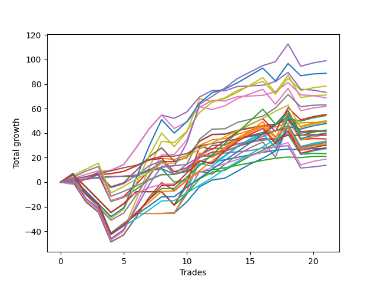

# Short Labrador 014 
- Symbol: ES
- Date Range: 03/18/2022 - 12/30/2022
- Trading Period: 8:30-11:30
- Number of Trades: 21



| Name | Win Percent | Profit | Avg Profit / Trade | Avg Time / Trade |      | Name | Win Percent | Profit | Avg Profit / Trade | Avg Time / Trade |
| ---- | ----------- | ------ | ------------------ | ---------------- | ---- | ---- | ----------- | ------ | ------------------ | ---------------- |
| Sorted By <br> Profit | | | | | | Sorted By <br> Win Percentage ||||
| NEWFI 000 | 80.95 | 49500.00 | 2357.14 | 45:57 |     | TP-2 | 95.24 | 15125.00 | 720.24 | 16:47 |
| BB-100 Mid SL-10 | 71.43 | 44375.00 | 2113.10 | 31:30 |     | TP-1 | 95.24 | 6875.00 | 327.38 | 08:29 |
| V Mid SL-10 | 71.43 | 43750.00 | 2083.33 | 29:39 |     | TP-5 | 90.48 | 24500.00 | 1166.67 | 28:16 |
| BB-50 U/L 2SD SL-10 | 66.67 | 39125.00 | 1863.10 | 32:09 |     | TP-4 | 90.48 | 16125.00 | 767.86 | 27:05 |
| BB-50 Mid | 71.43 | 36625.00 | 1744.05 | 19:50 |     | TP-3 | 90.48 | 9375.00 | 446.43 | 22:01 |
| V Mid | 76.19 | 35500.00 | 1690.48 | 40:19 |     | NEWFI 000 | 80.95 | 49500.00 | 2357.14 | 45:57 |
| BB-100 Mid | 71.43 | 35500.00 | 1690.48 | 42:10 |     | BB-20 U/L 1SD | 80.95 | 24125.00 | 1148.81 | 06:09 |
| BB-50 Mid SL-10 | 71.43 | 34375.00 | 1636.90 | 16:51 |     | TP-7 | 80.95 | 20000.00 | 952.38 | 34:35 |
| BB-50 U/L 1SD SL-10 | 71.43 | 31500.00 | 1500.00 | 23:46 |     | BB-20 U/L 1SD SL-10 | 80.95 | 19125.00 | 910.71 | 05:53 |
| BB-50 U/L 2SD | 71.43 | 30875.00 | 1470.24 | 42:49 |     | TP-6 | 80.95 | 13625.00 | 648.81 | 33:20 |
| BB-200 U/L 2SD SL-10 | 57.14 | 27625.00 | 1315.48 | 48:11 |     | V Mid | 76.19 | 35500.00 | 1690.48 | 40:19 |
| BB-200 Mid SL-10 | 66.67 | 27125.00 | 1291.67 | 35:33 |     | TP-9 | 76.19 | 21250.00 | 1011.90 | 42:02 |
| BB-100 U/L 2SD SL-10 | 57.14 | 25000.00 | 1190.48 | 50:15 |     | BB-20 U/L 2SD C SL-10 | 76.19 | 20875.00 | 994.05 | 15:24 |
| V U/L 1SD SL-10 | 57.14 | 24875.00 | 1184.52 | 44:00 |     | BB-20 U/L 2SD C | 76.19 | 17625.00 | 839.29 | 18:37 |
| TP-5 | 90.48 | 24500.00 | 1166.67 | 28:16 |     | TP-8 | 76.19 | 15625.00 | 744.05 | 38:38 |
| BB-20 U/L 1SD | 80.95 | 24125.00 | 1148.81 | 06:09 |     | BB-20 U/L 2SD SL-10 | 76.19 | 14875.00 | 708.33 | 14:00 |
| BB-200 Mid | 71.43 | 23875.00 | 1136.90 | 43:05 |     | BB-20 Mid | 76.19 | 13750.00 | 654.76 | 03:22 |
| TP-9 | 76.19 | 21250.00 | 1011.90 | 42:02 |     | BB-20 U/L 2SD | 76.19 | 11625.00 | 553.57 | 17:13 |
| BB-20 U/L 2SD C SL-10 | 76.19 | 20875.00 | 994.05 | 15:24 |     | BB-20 Mid SL-10 | 76.19 | 10500.00 | 500.00 | 03:07 |
| BB-50 U/L 1SD | 71.43 | 20750.00 | 988.10 | 33:20 |     | BB-20 Mid SL-5 | 76.19 | 9875.00 | 470.24 | 02:45 |
| TP-7 | 80.95 | 20000.00 | 952.38 | 34:35 |     | BB-100 Mid SL-10 | 71.43 | 44375.00 | 2113.10 | 31:30 |
| BB-200 U/L 2SD | 61.90 | 19375.00 | 922.62 | 58:51 |     | V Mid SL-10 | 71.43 | 43750.00 | 2083.33 | 29:39 |
| BB-20 U/L 1SD SL-10 | 80.95 | 19125.00 | 910.71 | 05:53 |     | BB-50 Mid | 71.43 | 36625.00 | 1744.05 | 19:50 |
| BB-20 U/L 2SD C | 76.19 | 17625.00 | 839.29 | 18:37 |     | BB-100 Mid | 71.43 | 35500.00 | 1690.48 | 42:10 |
| BB-100 U/L 2SD | 61.90 | 16750.00 | 797.62 | 60:55 |     | BB-50 Mid SL-10 | 71.43 | 34375.00 | 1636.90 | 16:51 |
| NEWFI 0000 | 47.62 | 16750.00 | 797.62 | 27:42 |     | BB-50 U/L 1SD SL-10 | 71.43 | 31500.00 | 1500.00 | 23:46 |
| V U/L 1SD | 61.90 | 16625.00 | 791.67 | 54:40 |     | BB-50 U/L 2SD | 71.43 | 30875.00 | 1470.24 | 42:49 |
| TP-4 | 90.48 | 16125.00 | 767.86 | 27:05 |     | BB-200 Mid | 71.43 | 23875.00 | 1136.90 | 43:05 |
| TP-8 | 76.19 | 15625.00 | 744.05 | 38:38 |     | BB-50 U/L 1SD | 71.43 | 20750.00 | 988.10 | 33:20 |
| TP-2 | 95.24 | 15125.00 | 720.24 | 16:47 |     | TP-10 | 71.43 | 14000.00 | 666.67 | 46:12 |
| BB-20 U/L 2SD SL-10 | 76.19 | 14875.00 | 708.33 | 14:00 |     | BB-20 U/L 1SD SL-5 | 71.43 | 10875.00 | 517.86 | 05:07 |
| TP-10 | 71.43 | 14000.00 | 666.67 | 46:12 |     | BB-50 U/L 2SD SL-10 | 66.67 | 39125.00 | 1863.10 | 32:09 |
| BB-20 Mid | 76.19 | 13750.00 | 654.76 | 03:22 |     | BB-200 Mid SL-10 | 66.67 | 27125.00 | 1291.67 | 35:33 |
| TP-6 | 80.95 | 13625.00 | 648.81 | 33:20 |     | BB-200 U/L 2SD | 61.90 | 19375.00 | 922.62 | 58:51 |
| BB-20 U/L 2SD | 76.19 | 11625.00 | 553.57 | 17:13 |     | BB-100 U/L 2SD | 61.90 | 16750.00 | 797.62 | 60:55 |
| BB-20 U/L 1SD SL-5 | 71.43 | 10875.00 | 517.86 | 05:07 |     | V U/L 1SD | 61.90 | 16625.00 | 791.67 | 54:40 |
| BB-20 Mid SL-10 | 76.19 | 10500.00 | 500.00 | 03:07 |     | BB-20 U/L 2SD SL-5 | 61.90 | 7375.00 | 351.19 | 10:16 |
| BB-20 Mid SL-5 | 76.19 | 9875.00 | 470.24 | 02:45 |     | BB-200 U/L 2SD SL-10 | 57.14 | 27625.00 | 1315.48 | 48:11 |
| TP-3 | 90.48 | 9375.00 | 446.43 | 22:01 |     | BB-100 U/L 2SD SL-10 | 57.14 | 25000.00 | 1190.48 | 50:15 |
| BB-20 U/L 2SD SL-5 | 61.90 | 7375.00 | 351.19 | 10:16 |     | V U/L 1SD SL-10 | 57.14 | 24875.00 | 1184.52 | 44:00 |
| TP-1 | 95.24 | 6875.00 | 327.38 | 08:29 |     | BB-50 Mid SL-5 | 52.38 | -2000.00 | -95.24 | 11:41 |
| BB-200 U/L 2SD SL-5 | 28.57 | 3875.00 | 184.52 | 26:41 |     | BB-20 U/L 2SD C SL-5 | 52.38 | -3000.00 | -142.86 | 11:17 |
| BB-100 U/L 2SD SL-5 | 28.57 | 1250.00 | 59.52 | 28:44 |     | NEWFI 0000 | 47.62 | 16750.00 | 797.62 | 27:42 |
| V U/L 1SD SL-5 | 28.57 | 500.00 | 23.81 | 23:17 |     | BB-200 Mid SL-5 | 38.10 | -250.00 | -11.90 | 17:20 |
| BB-200 Mid SL-5 | 38.10 | -250.00 | -11.90 | 17:20 |     | BB-50 U/L 1SD SL-5 | 38.10 | -3250.00 | -154.76 | 15:02 |
| BB-50 Mid SL-5 | 52.38 | -2000.00 | -95.24 | 11:41 |     | V Mid SL-5 | 38.10 | -5250.00 | -250.00 | 16:35 |
| BB-20 U/L 2SD C SL-5 | 52.38 | -3000.00 | -142.86 | 11:17 |     | BB-100 Mid SL-5 | 33.33 | -5625.00 | -267.86 | 16:24 |
| BB-50 U/L 1SD SL-5 | 38.10 | -3250.00 | -154.76 | 15:02 |     | BB-200 U/L 2SD SL-5 | 28.57 | 3875.00 | 184.52 | 26:41 |
| V Mid SL-5 | 38.10 | -5250.00 | -250.00 | 16:35 |     | BB-100 U/L 2SD SL-5 | 28.57 | 1250.00 | 59.52 | 28:44 |
| BB-100 Mid SL-5 | 33.33 | -5625.00 | -267.86 | 16:24 |     | V U/L 1SD SL-5 | 28.57 | 500.00 | 23.81 | 23:17 |
| BB-50 U/L 2SD SL-5 | 28.57 | -6125.00 | -291.67 | 18:58 |     | BB-50 U/L 2SD SL-5 | 28.57 | -6125.00 | -291.67 | 18:58 |

## NO STOPLOSS

### Test BB-20 Mid
* Sell when price hits the middle line of the 20p bollinger
* No Stoploss
* Results:
```
Total Trades: 21
Percent Up: 23.81
Percent Down: 76.19
Total Points Moved Down: 27.50
Potential Profit: 13750.00
Total Points Ups: 5.00 Count Ups: 5
Total Points Downs: 32.50 Count Downs: 16
```

<details><summary>Trades</summary>

<code>In: 2022-03-25 11:19:00		Out: 2022-03-25 11:20:10		Total Position Time: 01:10		Total Move Down: 1.25		Total to Date: 1.25</code> <br />
<code>In: 2022-03-29 11:16:00		Out: 2022-03-29 11:17:10		Total Position Time: 01:10		Total Move Down: 1.25		Total to Date: 2.50</code> <br />
<code>In: 2022-04-07 10:34:00		Out: 2022-04-07 10:37:30		Total Position Time: 03:30		Total Move Down: 1.25		Total to Date: 3.75</code> <br />
<code>In: 2022-04-07 11:30:00		Out: 2022-04-07 11:31:10		Total Position Time: 01:10		Total Move Down: 1.00		Total to Date: 4.75</code> <br />
<code>In: 2022-04-18 11:00:00		Out: 2022-04-18 11:01:10		Total Position Time: 01:10		Total Move Down: -0.00		Total to Date: 4.75</code> <br />
<code>In: 2022-05-10 11:02:00		Out: 2022-05-10 11:06:15		Total Position Time: 04:15		Total Move Down: -0.00		Total to Date: 4.75</code> <br />
<code>In: 2022-05-10 11:06:00		Out: 2022-05-10 11:07:10		Total Position Time: 01:10		Total Move Down: 4.75		Total to Date: 9.50</code> <br />
<code>In: 2022-05-10 11:07:00		Out: 2022-05-10 11:08:10		Total Position Time: 01:10		Total Move Down: 1.50		Total to Date: 11.00</code> <br />
<code>In: 2022-05-24 10:48:00		Out: 2022-05-24 11:01:15		Total Position Time: 13:15		Total Move Down: -4.50		Total to Date: 6.50</code> <br />
<code>In: 2022-06-09 10:09:00		Out: 2022-06-09 10:16:50		Total Position Time: 07:50		Total Move Down: 2.25		Total to Date: 8.75</code> <br />
<code>In: 2022-06-14 10:26:00		Out: 2022-06-14 10:27:10		Total Position Time: 01:10		Total Move Down: 6.25		Total to Date: 15.00</code> <br />
<code>In: 2022-07-12 08:34:00		Out: 2022-07-12 08:37:00		Total Position Time: 03:00		Total Move Down: 1.50		Total to Date: 16.50</code> <br />
<code>In: 2022-08-04 09:03:00		Out: 2022-08-04 09:04:10		Total Position Time: 01:10		Total Move Down: 1.75		Total to Date: 18.25</code> <br />
<code>In: 2022-08-04 10:40:00		Out: 2022-08-04 10:43:05		Total Position Time: 03:05		Total Move Down: 2.00		Total to Date: 20.25</code> <br />
<code>In: 2022-08-05 10:18:00		Out: 2022-08-05 10:20:05		Total Position Time: 02:05		Total Move Down: 2.00		Total to Date: 22.25</code> <br />
<code>In: 2022-08-05 10:19:00		Out: 2022-08-05 10:20:10		Total Position Time: 01:10		Total Move Down: 2.00		Total to Date: 24.25</code> <br />
<code>In: 2022-08-29 09:08:00		Out: 2022-08-29 09:14:10		Total Position Time: 06:10		Total Move Down: 1.75		Total to Date: 26.00</code> <br />
<code>In: 2022-09-15 10:30:00		Out: 2022-09-15 10:31:30		Total Position Time: 01:30		Total Move Down: 1.00		Total to Date: 27.00</code> <br />
<code>In: 2022-11-17 08:42:00		Out: 2022-11-17 08:49:45		Total Position Time: 07:45		Total Move Down: -0.50		Total to Date: 26.50</code> <br />
<code>In: 2022-11-21 10:23:00		Out: 2022-11-21 10:27:25		Total Position Time: 04:25		Total Move Down: 1.00		Total to Date: 27.50</code> <br />
<code>In: 2022-11-21 10:24:00		Out: 2022-11-21 10:27:25		Total Position Time: 03:25		Total Move Down: -0.00		Total to Date: 27.50</code> <br />


</details>

### Test BB-20 U/L 1SD
* Sell when the price hits the lower line of the 20p 1std bollinger
* No Stoploss
* Results:
```
Total Trades: 21
Percent Up: 19.05
Percent Down: 80.95
Total Points Moved Down: 48.25
Potential Profit: 24125.00
Total Points Ups: 2.00 Count Ups: 4
Total Points Downs: 50.25 Count Downs: 17
```

<details><summary>Trades</summary>

<code>In: 2022-03-25 11:19:00		Out: 2022-03-25 11:20:10		Total Position Time: 01:10		Total Move Down: 1.25		Total to Date: 1.25</code> <br />
<code>In: 2022-03-29 11:16:00		Out: 2022-03-29 11:18:30		Total Position Time: 02:30		Total Move Down: 1.75		Total to Date: 3.00</code> <br />
<code>In: 2022-04-07 10:34:00		Out: 2022-04-07 10:40:00		Total Position Time: 06:00		Total Move Down: 3.00		Total to Date: 6.00</code> <br />
<code>In: 2022-04-07 11:30:00		Out: 2022-04-07 11:31:10		Total Position Time: 01:10		Total Move Down: 1.00		Total to Date: 7.00</code> <br />
<code>In: 2022-04-18 11:00:00		Out: 2022-04-18 11:06:35		Total Position Time: 06:35		Total Move Down: 1.75		Total to Date: 8.75</code> <br />
<code>In: 2022-05-10 11:02:00		Out: 2022-05-10 11:06:45		Total Position Time: 04:45		Total Move Down: 4.50		Total to Date: 13.25</code> <br />
<code>In: 2022-05-10 11:06:00		Out: 2022-05-10 11:07:10		Total Position Time: 01:10		Total Move Down: 4.75		Total to Date: 18.00</code> <br />
<code>In: 2022-05-10 11:07:00		Out: 2022-05-10 11:08:10		Total Position Time: 01:10		Total Move Down: 1.50		Total to Date: 19.50</code> <br />
<code>In: 2022-05-24 10:48:00		Out: 2022-05-24 11:01:40		Total Position Time: 13:40		Total Move Down: -1.00		Total to Date: 18.50</code> <br />
<code>In: 2022-06-09 10:09:00		Out: 2022-06-09 10:18:50		Total Position Time: 09:50		Total Move Down: 3.25		Total to Date: 21.75</code> <br />
<code>In: 2022-06-14 10:26:00		Out: 2022-06-14 10:29:05		Total Position Time: 03:05		Total Move Down: 8.25		Total to Date: 30.00</code> <br />
<code>In: 2022-07-12 08:34:00		Out: 2022-07-12 08:38:10		Total Position Time: 04:10		Total Move Down: 4.50		Total to Date: 34.50</code> <br />
<code>In: 2022-08-04 09:03:00		Out: 2022-08-04 09:16:05		Total Position Time: 13:05		Total Move Down: 1.00		Total to Date: 35.50</code> <br />
<code>In: 2022-08-04 10:40:00		Out: 2022-08-04 10:43:15		Total Position Time: 03:15		Total Move Down: 3.50		Total to Date: 39.00</code> <br />
<code>In: 2022-08-05 10:18:00		Out: 2022-08-05 10:23:15		Total Position Time: 05:15		Total Move Down: 3.25		Total to Date: 42.25</code> <br />
<code>In: 2022-08-05 10:19:00		Out: 2022-08-05 10:23:15		Total Position Time: 04:15		Total Move Down: 3.25		Total to Date: 45.50</code> <br />
<code>In: 2022-08-29 09:08:00		Out: 2022-08-29 09:24:15		Total Position Time: 16:15		Total Move Down: -0.50		Total to Date: 45.00</code> <br />
<code>In: 2022-09-15 10:30:00		Out: 2022-09-15 10:32:20		Total Position Time: 02:20		Total Move Down: 3.25		Total to Date: 48.25</code> <br />
<code>In: 2022-11-17 08:42:00		Out: 2022-11-17 08:52:30		Total Position Time: 10:30		Total Move Down: -0.00		Total to Date: 48.25</code> <br />
<code>In: 2022-11-21 10:23:00		Out: 2022-11-21 10:33:00		Total Position Time: 10:00		Total Move Down: 0.50		Total to Date: 48.75</code> <br />
<code>In: 2022-11-21 10:24:00		Out: 2022-11-21 10:33:00		Total Position Time: 09:00		Total Move Down: -0.50		Total to Date: 48.25</code> <br />


</details>

### Test BB-20 U/L 2SD
* Sell when the price hits the lower line of the 20p 2std bollinger
* No Stoploss
* Results:
```
Total Trades: 21
Percent Up: 23.81
Percent Down: 76.19
Total Points Moved Down: 23.25
Potential Profit: 11625.00
Total Points Ups: 39.25 Count Ups: 5
Total Points Downs: 62.50 Count Downs: 16
```

<details><summary>Trades</summary>

<code>In: 2022-03-25 11:19:00		Out: 2022-03-25 12:00:55		Total Position Time: 41:55		Total Move Down: -1.00		Total to Date: -1.00</code> <br />
<code>In: 2022-03-29 11:16:00		Out: 2022-03-29 11:18:50		Total Position Time: 02:50		Total Move Down: 3.25		Total to Date: 2.25</code> <br />
<code>In: 2022-04-07 10:34:00		Out: 2022-04-07 10:45:15		Total Position Time: 11:15		Total Move Down: 3.75		Total to Date: 6.00</code> <br />
<code>In: 2022-04-07 11:30:00		Out: 2022-04-07 12:22:45		Total Position Time: 52:45		Total Move Down: -21.75		Total to Date: -15.75</code> <br />
<code>In: 2022-04-18 11:00:00		Out: 2022-04-18 11:10:40		Total Position Time: 10:40		Total Move Down: 3.25		Total to Date: -12.50</code> <br />
<code>In: 2022-05-10 11:02:00		Out: 2022-05-10 11:11:10		Total Position Time: 09:10		Total Move Down: 6.75		Total to Date: -5.75</code> <br />
<code>In: 2022-05-10 11:06:00		Out: 2022-05-10 11:11:10		Total Position Time: 05:10		Total Move Down: 7.75		Total to Date: 2.00</code> <br />
<code>In: 2022-05-10 11:07:00		Out: 2022-05-10 11:11:10		Total Position Time: 04:10		Total Move Down: 4.25		Total to Date: 6.25</code> <br />
<code>In: 2022-05-24 10:48:00		Out: 2022-05-24 11:01:50		Total Position Time: 13:50		Total Move Down: -0.00		Total to Date: 6.25</code> <br />
<code>In: 2022-06-09 10:09:00		Out: 2022-06-09 10:19:05		Total Position Time: 10:05		Total Move Down: 3.25		Total to Date: 9.50</code> <br />
<code>In: 2022-06-14 10:26:00		Out: 2022-06-14 10:31:00		Total Position Time: 05:00		Total Move Down: 12.25		Total to Date: 21.75</code> <br />
<code>In: 2022-07-12 08:34:00		Out: 2022-07-12 08:41:10		Total Position Time: 07:10		Total Move Down: 5.50		Total to Date: 27.25</code> <br />
<code>In: 2022-08-04 09:03:00		Out: 2022-08-04 09:38:50		Total Position Time: 35:50		Total Move Down: 0.25		Total to Date: 27.50</code> <br />
<code>In: 2022-08-04 10:40:00		Out: 2022-08-04 10:45:30		Total Position Time: 05:30		Total Move Down: 3.75		Total to Date: 31.25</code> <br />
<code>In: 2022-08-05 10:18:00		Out: 2022-08-05 10:49:30		Total Position Time: 31:30		Total Move Down: 1.50		Total to Date: 32.75</code> <br />
<code>In: 2022-08-05 10:19:00		Out: 2022-08-05 10:49:30		Total Position Time: 30:30		Total Move Down: 1.50		Total to Date: 34.25</code> <br />
<code>In: 2022-08-29 09:08:00		Out: 2022-08-29 09:24:35		Total Position Time: 16:35		Total Move Down: 1.00		Total to Date: 35.25</code> <br />
<code>In: 2022-09-15 10:30:00		Out: 2022-09-15 10:36:30		Total Position Time: 06:30		Total Move Down: 3.75		Total to Date: 39.00</code> <br />
<code>In: 2022-11-17 08:42:00		Out: 2022-11-17 09:23:55		Total Position Time: 41:55		Total Move Down: -16.25		Total to Date: 22.75</code> <br />
<code>In: 2022-11-21 10:23:00		Out: 2022-11-21 10:33:10		Total Position Time: 10:10		Total Move Down: 0.75		Total to Date: 23.50</code> <br />
<code>In: 2022-11-21 10:24:00		Out: 2022-11-21 10:33:10		Total Position Time: 09:10		Total Move Down: -0.25		Total to Date: 23.25</code> <br />


</details>

### Test BB-20 U/L 2SD C
* Sell when the price hits the lower line of the 20p 2std bollinger
* No Stoploss
* Results:
```
Total Trades: 21
Percent Up: 23.81
Percent Down: 76.19
Total Points Moved Down: 35.25
Potential Profit: 17625.00
Total Points Ups: 38.75 Count Ups: 5
Total Points Downs: 74.00 Count Downs: 16
```

<details><summary>Trades</summary>

<code>In: 2022-03-25 11:19:00		Out: 2022-03-25 12:01:15		Total Position Time: 42:15		Total Move Down: -0.50		Total to Date: -0.50</code> <br />
<code>In: 2022-03-29 11:16:00		Out: 2022-03-29 11:18:50		Total Position Time: 02:50		Total Move Down: 3.25		Total to Date: 2.75</code> <br />
<code>In: 2022-04-07 10:34:00		Out: 2022-04-07 10:48:00		Total Position Time: 14:00		Total Move Down: 4.00		Total to Date: 6.75</code> <br />
<code>In: 2022-04-07 11:30:00		Out: 2022-04-07 12:22:45		Total Position Time: 52:45		Total Move Down: -21.75		Total to Date: -15.00</code> <br />
<code>In: 2022-04-18 11:00:00		Out: 2022-04-18 11:10:40		Total Position Time: 10:40		Total Move Down: 3.25		Total to Date: -11.75</code> <br />
<code>In: 2022-05-10 11:02:00		Out: 2022-05-10 11:16:05		Total Position Time: 14:05		Total Move Down: 10.00		Total to Date: -1.75</code> <br />
<code>In: 2022-05-10 11:06:00		Out: 2022-05-10 11:16:05		Total Position Time: 10:05		Total Move Down: 11.00		Total to Date: 9.25</code> <br />
<code>In: 2022-05-10 11:07:00		Out: 2022-05-10 11:16:05		Total Position Time: 09:05		Total Move Down: 7.50		Total to Date: 16.75</code> <br />
<code>In: 2022-05-24 10:48:00		Out: 2022-05-24 11:01:50		Total Position Time: 13:50		Total Move Down: -0.00		Total to Date: 16.75</code> <br />
<code>In: 2022-06-09 10:09:00		Out: 2022-06-09 10:21:10		Total Position Time: 12:10		Total Move Down: 3.25		Total to Date: 20.00</code> <br />
<code>In: 2022-06-14 10:26:00		Out: 2022-06-14 10:31:10		Total Position Time: 05:10		Total Move Down: 13.25		Total to Date: 33.25</code> <br />
<code>In: 2022-07-12 08:34:00		Out: 2022-07-12 08:41:10		Total Position Time: 07:10		Total Move Down: 5.50		Total to Date: 38.75</code> <br />
<code>In: 2022-08-04 09:03:00		Out: 2022-08-04 09:38:50		Total Position Time: 35:50		Total Move Down: 0.25		Total to Date: 39.00</code> <br />
<code>In: 2022-08-04 10:40:00		Out: 2022-08-04 10:52:45		Total Position Time: 12:45		Total Move Down: 3.00		Total to Date: 42.00</code> <br />
<code>In: 2022-08-05 10:18:00		Out: 2022-08-05 10:50:35		Total Position Time: 32:35		Total Move Down: 2.00		Total to Date: 44.00</code> <br />
<code>In: 2022-08-05 10:19:00		Out: 2022-08-05 10:50:35		Total Position Time: 31:35		Total Move Down: 2.00		Total to Date: 46.00</code> <br />
<code>In: 2022-08-29 09:08:00		Out: 2022-08-29 09:24:35		Total Position Time: 16:35		Total Move Down: 1.00		Total to Date: 47.00</code> <br />
<code>In: 2022-09-15 10:30:00		Out: 2022-09-15 10:36:35		Total Position Time: 06:35		Total Move Down: 4.00		Total to Date: 51.00</code> <br />
<code>In: 2022-11-17 08:42:00		Out: 2022-11-17 09:23:55		Total Position Time: 41:55		Total Move Down: -16.25		Total to Date: 34.75</code> <br />
<code>In: 2022-11-21 10:23:00		Out: 2022-11-21 10:33:10		Total Position Time: 10:10		Total Move Down: 0.75		Total to Date: 35.50</code> <br />
<code>In: 2022-11-21 10:24:00		Out: 2022-11-21 10:33:10		Total Position Time: 09:10		Total Move Down: -0.25		Total to Date: 35.25</code> <br />


</details>

### Test BB-50 Mid
* Sell when price hits the middle line of the 50p bollinger
* No Stoploss
* Results:
```
Total Trades: 21
Percent Up: 28.57
Percent Down: 71.43
Total Points Moved Down: 73.25
Potential Profit: 36625.00
Total Points Ups: 21.00 Count Ups: 6
Total Points Downs: 94.25 Count Downs: 15
```

<details><summary>Trades</summary>

<code>In: 2022-03-25 11:19:00		Out: 2022-03-25 11:49:30		Total Position Time: 30:30		Total Move Down: -1.75		Total to Date: -1.75</code> <br />
<code>In: 2022-03-29 11:16:00		Out: 2022-03-29 11:21:20		Total Position Time: 05:20		Total Move Down: 5.00		Total to Date: 3.25</code> <br />
<code>In: 2022-04-07 10:34:00		Out: 2022-04-07 10:52:05		Total Position Time: 18:05		Total Move Down: 5.00		Total to Date: 8.25</code> <br />
<code>In: 2022-04-07 11:30:00		Out: 2022-04-07 11:33:40		Total Position Time: 03:40		Total Move Down: 1.50		Total to Date: 9.75</code> <br />
<code>In: 2022-04-18 11:00:00		Out: 2022-04-18 11:16:45		Total Position Time: 16:45		Total Move Down: 4.50		Total to Date: 14.25</code> <br />
<code>In: 2022-05-10 11:02:00		Out: 2022-05-10 11:16:20		Total Position Time: 14:20		Total Move Down: 14.00		Total to Date: 28.25</code> <br />
<code>In: 2022-05-10 11:06:00		Out: 2022-05-10 11:16:20		Total Position Time: 10:20		Total Move Down: 15.00		Total to Date: 43.25</code> <br />
<code>In: 2022-05-10 11:07:00		Out: 2022-05-10 11:16:20		Total Position Time: 09:20		Total Move Down: 11.50		Total to Date: 54.75</code> <br />
<code>In: 2022-05-24 10:48:00		Out: 2022-05-24 11:20:25		Total Position Time: 32:25		Total Move Down: -2.75		Total to Date: 52.00</code> <br />
<code>In: 2022-06-09 10:09:00		Out: 2022-06-09 10:22:05		Total Position Time: 13:05		Total Move Down: 5.25		Total to Date: 57.25</code> <br />
<code>In: 2022-06-14 10:26:00		Out: 2022-06-14 10:31:00		Total Position Time: 05:00		Total Move Down: 12.25		Total to Date: 69.50</code> <br />
<code>In: 2022-07-12 08:34:00		Out: 2022-07-12 08:38:20		Total Position Time: 04:20		Total Move Down: 5.25		Total to Date: 74.75</code> <br />
<code>In: 2022-08-04 09:03:00		Out: 2022-08-04 09:36:55		Total Position Time: 33:55		Total Move Down: -0.25		Total to Date: 74.50</code> <br />
<code>In: 2022-08-04 10:40:00		Out: 2022-08-04 10:55:50		Total Position Time: 15:50		Total Move Down: 3.50		Total to Date: 78.00</code> <br />
<code>In: 2022-08-05 10:18:00		Out: 2022-08-05 10:47:35		Total Position Time: 29:35		Total Move Down: 0.50		Total to Date: 78.50</code> <br />
<code>In: 2022-08-05 10:19:00		Out: 2022-08-05 10:47:35		Total Position Time: 28:35		Total Move Down: 0.50		Total to Date: 79.00</code> <br />
<code>In: 2022-08-29 09:08:00		Out: 2022-08-29 09:31:25		Total Position Time: 23:25		Total Move Down: 3.00		Total to Date: 82.00</code> <br />
<code>In: 2022-09-15 10:30:00		Out: 2022-09-15 10:38:35		Total Position Time: 08:35		Total Move Down: 7.50		Total to Date: 89.50</code> <br />
<code>In: 2022-11-17 08:42:00		Out: 2022-11-17 09:33:35		Total Position Time: 51:35		Total Move Down: -13.75		Total to Date: 75.75</code> <br />
<code>In: 2022-11-21 10:23:00		Out: 2022-11-21 10:54:25		Total Position Time: 31:25		Total Move Down: -0.75		Total to Date: 75.00</code> <br />
<code>In: 2022-11-21 10:24:00		Out: 2022-11-21 10:54:25		Total Position Time: 30:25		Total Move Down: -1.75		Total to Date: 73.25</code> <br />


</details>

### Test BB-50 U/L 1SD
* Sell when the price hits the lower line of the 50p 1std bollinger
* No Stoploss
* Results:
```
Total Trades: 21
Percent Up: 28.57
Percent Down: 71.43
Total Points Moved Down: 41.50
Potential Profit: 20750.00
Total Points Ups: 73.50 Count Ups: 6
Total Points Downs: 115.00 Count Downs: 15
```

<details><summary>Trades</summary>

<code>In: 2022-03-25 11:19:00		Out: 2022-03-25 12:01:35		Total Position Time: 42:35		Total Move Down: -0.00		Total to Date: 0.00</code> <br />
<code>In: 2022-03-29 11:16:00		Out: 2022-03-29 12:16:55		Total Position Time: 60:55		Total Move Down: -16.00		Total to Date: -16.00</code> <br />
<code>In: 2022-04-07 10:34:00		Out: 2022-04-07 11:34:55		Total Position Time: 60:55		Total Move Down: -8.50		Total to Date: -24.50</code> <br />
<code>In: 2022-04-07 11:30:00		Out: 2022-04-07 12:30:55		Total Position Time: 60:55		Total Move Down: -24.25		Total to Date: -48.75</code> <br />
<code>In: 2022-04-18 11:00:00		Out: 2022-04-18 11:22:10		Total Position Time: 22:10		Total Move Down: 5.75		Total to Date: -43.00</code> <br />
<code>In: 2022-05-10 11:02:00		Out: 2022-05-10 11:24:05		Total Position Time: 22:05		Total Move Down: 14.75		Total to Date: -28.25</code> <br />
<code>In: 2022-05-10 11:06:00		Out: 2022-05-10 11:24:05		Total Position Time: 18:05		Total Move Down: 15.75		Total to Date: -12.50</code> <br />
<code>In: 2022-05-10 11:07:00		Out: 2022-05-10 11:24:05		Total Position Time: 17:05		Total Move Down: 12.25		Total to Date: -0.25</code> <br />
<code>In: 2022-05-24 10:48:00		Out: 2022-05-24 11:44:15		Total Position Time: 56:15		Total Move Down: -6.50		Total to Date: -6.75</code> <br />
<code>In: 2022-06-09 10:09:00		Out: 2022-06-09 10:24:05		Total Position Time: 15:05		Total Move Down: 8.25		Total to Date: 1.50</code> <br />
<code>In: 2022-06-14 10:26:00		Out: 2022-06-14 10:36:10		Total Position Time: 10:10		Total Move Down: 20.25		Total to Date: 21.75</code> <br />
<code>In: 2022-07-12 08:34:00		Out: 2022-07-12 08:43:55		Total Position Time: 09:55		Total Move Down: 8.25		Total to Date: 30.00</code> <br />
<code>In: 2022-08-04 09:03:00		Out: 2022-08-04 09:38:50		Total Position Time: 35:50		Total Move Down: 0.25		Total to Date: 30.25</code> <br />
<code>In: 2022-08-04 10:40:00		Out: 2022-08-04 11:02:05		Total Position Time: 22:05		Total Move Down: 5.25		Total to Date: 35.50</code> <br />
<code>In: 2022-08-05 10:18:00		Out: 2022-08-05 10:52:05		Total Position Time: 34:05		Total Move Down: 2.50		Total to Date: 38.00</code> <br />
<code>In: 2022-08-05 10:19:00		Out: 2022-08-05 10:52:05		Total Position Time: 33:05		Total Move Down: 2.50		Total to Date: 40.50</code> <br />
<code>In: 2022-08-29 09:08:00		Out: 2022-08-29 09:36:50		Total Position Time: 28:50		Total Move Down: 6.75		Total to Date: 47.25</code> <br />
<code>In: 2022-09-15 10:30:00		Out: 2022-09-15 10:47:25		Total Position Time: 17:25		Total Move Down: 11.00		Total to Date: 58.25</code> <br />
<code>In: 2022-11-17 08:42:00		Out: 2022-11-17 09:42:55		Total Position Time: 60:55		Total Move Down: -18.25		Total to Date: 40.00</code> <br />
<code>In: 2022-11-21 10:23:00		Out: 2022-11-21 10:59:25		Total Position Time: 36:25		Total Move Down: 1.25		Total to Date: 41.25</code> <br />
<code>In: 2022-11-21 10:24:00		Out: 2022-11-21 10:59:25		Total Position Time: 35:25		Total Move Down: 0.25		Total to Date: 41.50</code> <br />


</details>

### Test BB-50 U/L 2SD
* Sell when the price hits the lower line of the 50p 2std bollinger
* No Stoploss
* Results:
```
Total Trades: 21
Percent Up: 28.57
Percent Down: 71.43
Total Points Moved Down: 61.75
Potential Profit: 30875.00
Total Points Ups: 81.50 Count Ups: 6
Total Points Downs: 143.25 Count Downs: 15
```

<details><summary>Trades</summary>

<code>In: 2022-03-25 11:19:00		Out: 2022-03-25 12:01:55		Total Position Time: 42:55		Total Move Down: 1.50		Total to Date: 1.50</code> <br />
<code>In: 2022-03-29 11:16:00		Out: 2022-03-29 12:16:55		Total Position Time: 60:55		Total Move Down: -16.00		Total to Date: -14.50</code> <br />
<code>In: 2022-04-07 10:34:00		Out: 2022-04-07 11:34:55		Total Position Time: 60:55		Total Move Down: -8.50		Total to Date: -23.00</code> <br />
<code>In: 2022-04-07 11:30:00		Out: 2022-04-07 12:30:55		Total Position Time: 60:55		Total Move Down: -24.25		Total to Date: -47.25</code> <br />
<code>In: 2022-04-18 11:00:00		Out: 2022-04-18 11:47:00		Total Position Time: 47:00		Total Move Down: 7.25		Total to Date: -40.00</code> <br />
<code>In: 2022-05-10 11:02:00		Out: 2022-05-10 11:27:05		Total Position Time: 25:05		Total Move Down: 21.25		Total to Date: -18.75</code> <br />
<code>In: 2022-05-10 11:06:00		Out: 2022-05-10 11:27:05		Total Position Time: 21:05		Total Move Down: 22.25		Total to Date: 3.50</code> <br />
<code>In: 2022-05-10 11:07:00		Out: 2022-05-10 11:27:05		Total Position Time: 20:05		Total Move Down: 18.75		Total to Date: 22.25</code> <br />
<code>In: 2022-05-24 10:48:00		Out: 2022-05-24 11:48:55		Total Position Time: 60:55		Total Move Down: 0.25		Total to Date: 22.50</code> <br />
<code>In: 2022-06-09 10:09:00		Out: 2022-06-09 10:27:20		Total Position Time: 18:20		Total Move Down: 12.00		Total to Date: 34.50</code> <br />
<code>In: 2022-06-14 10:26:00		Out: 2022-06-14 10:43:05		Total Position Time: 17:05		Total Move Down: 27.00		Total to Date: 61.50</code> <br />
<code>In: 2022-07-12 08:34:00		Out: 2022-07-12 09:34:55		Total Position Time: 60:55		Total Move Down: -2.25		Total to Date: 59.25</code> <br />
<code>In: 2022-08-04 09:03:00		Out: 2022-08-04 09:42:00		Total Position Time: 39:00		Total Move Down: 3.00		Total to Date: 62.25</code> <br />
<code>In: 2022-08-04 10:40:00		Out: 2022-08-04 11:10:15		Total Position Time: 30:15		Total Move Down: 6.00		Total to Date: 68.25</code> <br />
<code>In: 2022-08-05 10:18:00		Out: 2022-08-05 10:55:40		Total Position Time: 37:40		Total Move Down: 3.75		Total to Date: 72.00</code> <br />
<code>In: 2022-08-05 10:19:00		Out: 2022-08-05 10:55:40		Total Position Time: 36:40		Total Move Down: 3.75		Total to Date: 75.75</code> <br />
<code>In: 2022-08-29 09:08:00		Out: 2022-08-29 10:08:55		Total Position Time: 60:55		Total Move Down: -12.25		Total to Date: 63.50</code> <br />
<code>In: 2022-09-15 10:30:00		Out: 2022-09-15 10:50:20		Total Position Time: 20:20		Total Move Down: 13.00		Total to Date: 76.50</code> <br />
<code>In: 2022-11-17 08:42:00		Out: 2022-11-17 09:42:55		Total Position Time: 60:55		Total Move Down: -18.25		Total to Date: 58.25</code> <br />
<code>In: 2022-11-21 10:23:00		Out: 2022-11-21 11:22:10		Total Position Time: 59:10		Total Move Down: 2.25		Total to Date: 60.50</code> <br />
<code>In: 2022-11-21 10:24:00		Out: 2022-11-21 11:22:10		Total Position Time: 58:10		Total Move Down: 1.25		Total to Date: 61.75</code> <br />


</details>

### Test V Mid
* Sell when the price hits the middle line of the 1std VWAP
* No Stoploss
* Results:
```
Total Trades: 21
Percent Up: 23.81
Percent Down: 76.19
Total Points Moved Down: 71.00
Potential Profit: 35500.00
Total Points Ups: 79.25 Count Ups: 5
Total Points Downs: 150.25 Count Downs: 16
```

<details><summary>Trades</summary>

<code>In: 2022-03-25 11:19:00		Out: 2022-03-25 12:07:35		Total Position Time: 48:35		Total Move Down: 7.25		Total to Date: 7.25</code> <br />
<code>In: 2022-03-29 11:16:00		Out: 2022-03-29 12:16:55		Total Position Time: 60:55		Total Move Down: -16.00		Total to Date: -8.75</code> <br />
<code>In: 2022-04-07 10:34:00		Out: 2022-04-07 11:34:55		Total Position Time: 60:55		Total Move Down: -8.50		Total to Date: -17.25</code> <br />
<code>In: 2022-04-07 11:30:00		Out: 2022-04-07 12:30:55		Total Position Time: 60:55		Total Move Down: -24.25		Total to Date: -41.50</code> <br />
<code>In: 2022-04-18 11:00:00		Out: 2022-04-18 12:00:55		Total Position Time: 60:55		Total Move Down: 7.25		Total to Date: -34.25</code> <br />
<code>In: 2022-05-10 11:02:00		Out: 2022-05-10 11:27:40		Total Position Time: 25:40		Total Move Down: 24.25		Total to Date: -10.00</code> <br />
<code>In: 2022-05-10 11:06:00		Out: 2022-05-10 11:27:40		Total Position Time: 21:40		Total Move Down: 25.25		Total to Date: 15.25</code> <br />
<code>In: 2022-05-10 11:07:00		Out: 2022-05-10 11:27:40		Total Position Time: 20:40		Total Move Down: 21.75		Total to Date: 37.00</code> <br />
<code>In: 2022-05-24 10:48:00		Out: 2022-05-24 11:48:55		Total Position Time: 60:55		Total Move Down: 0.25		Total to Date: 37.25</code> <br />
<code>In: 2022-06-09 10:09:00		Out: 2022-06-09 10:23:45		Total Position Time: 14:45		Total Move Down: 7.75		Total to Date: 45.00</code> <br />
<code>In: 2022-06-14 10:26:00		Out: 2022-06-14 10:27:10		Total Position Time: 01:10		Total Move Down: 6.25		Total to Date: 51.25</code> <br />
<code>In: 2022-07-12 08:34:00		Out: 2022-07-12 08:41:50		Total Position Time: 07:50		Total Move Down: 6.75		Total to Date: 58.00</code> <br />
<code>In: 2022-08-04 09:03:00		Out: 2022-08-04 09:06:00		Total Position Time: 03:00		Total Move Down: 2.25		Total to Date: 60.25</code> <br />
<code>In: 2022-08-04 10:40:00		Out: 2022-08-04 11:10:15		Total Position Time: 30:15		Total Move Down: 6.00		Total to Date: 66.25</code> <br />
<code>In: 2022-08-05 10:18:00		Out: 2022-08-05 11:11:45		Total Position Time: 53:45		Total Move Down: 9.50		Total to Date: 75.75</code> <br />
<code>In: 2022-08-05 10:19:00		Out: 2022-08-05 11:11:45		Total Position Time: 52:45		Total Move Down: 9.50		Total to Date: 85.25</code> <br />
<code>In: 2022-08-29 09:08:00		Out: 2022-08-29 10:08:55		Total Position Time: 60:55		Total Move Down: -12.25		Total to Date: 73.00</code> <br />
<code>In: 2022-09-15 10:30:00		Out: 2022-09-15 10:48:25		Total Position Time: 18:25		Total Move Down: 11.75		Total to Date: 84.75</code> <br />
<code>In: 2022-11-17 08:42:00		Out: 2022-11-17 09:42:55		Total Position Time: 60:55		Total Move Down: -18.25		Total to Date: 66.50</code> <br />
<code>In: 2022-11-21 10:23:00		Out: 2022-11-21 11:23:55		Total Position Time: 60:55		Total Move Down: 2.75		Total to Date: 69.25</code> <br />
<code>In: 2022-11-21 10:24:00		Out: 2022-11-21 11:24:55		Total Position Time: 60:55		Total Move Down: 1.75		Total to Date: 71.00</code> <br />


</details>

### Test V U/L 1SD
* Sell when the price hits the lower line of the 1std VWAP
* No Stoploss
* Results:
```
Total Trades: 21
Percent Up: 38.10
Percent Down: 61.90
Total Points Moved Down: 33.25
Potential Profit: 16625.00
Total Points Ups: 81.50 Count Ups: 8
Total Points Downs: 114.75 Count Downs: 13
```

<details><summary>Trades</summary>

<code>In: 2022-03-25 11:19:00		Out: 2022-03-25 12:19:55		Total Position Time: 60:55		Total Move Down: 6.25		Total to Date: 6.25</code> <br />
<code>In: 2022-03-29 11:16:00		Out: 2022-03-29 12:16:55		Total Position Time: 60:55		Total Move Down: -16.00		Total to Date: -9.75</code> <br />
<code>In: 2022-04-07 10:34:00		Out: 2022-04-07 11:34:55		Total Position Time: 60:55		Total Move Down: -8.50		Total to Date: -18.25</code> <br />
<code>In: 2022-04-07 11:30:00		Out: 2022-04-07 12:30:55		Total Position Time: 60:55		Total Move Down: -24.25		Total to Date: -42.50</code> <br />
<code>In: 2022-04-18 11:00:00		Out: 2022-04-18 12:00:55		Total Position Time: 60:55		Total Move Down: 7.25		Total to Date: -35.25</code> <br />
<code>In: 2022-05-10 11:02:00		Out: 2022-05-10 12:02:55		Total Position Time: 60:55		Total Move Down: 9.75		Total to Date: -25.50</code> <br />
<code>In: 2022-05-10 11:06:00		Out: 2022-05-10 12:06:55		Total Position Time: 60:55		Total Move Down: -0.00		Total to Date: -25.50</code> <br />
<code>In: 2022-05-10 11:07:00		Out: 2022-05-10 12:07:55		Total Position Time: 60:55		Total Move Down: -0.00		Total to Date: -25.50</code> <br />
<code>In: 2022-05-24 10:48:00		Out: 2022-05-24 11:48:55		Total Position Time: 60:55		Total Move Down: 0.25		Total to Date: -25.25</code> <br />
<code>In: 2022-06-09 10:09:00		Out: 2022-06-09 10:30:30		Total Position Time: 21:30		Total Move Down: 15.75		Total to Date: -9.50</code> <br />
<code>In: 2022-06-14 10:26:00		Out: 2022-06-14 10:35:05		Total Position Time: 09:05		Total Move Down: 18.25		Total to Date: 8.75</code> <br />
<code>In: 2022-07-12 08:34:00		Out: 2022-07-12 09:34:55		Total Position Time: 60:55		Total Move Down: -2.25		Total to Date: 6.50</code> <br />
<code>In: 2022-08-04 09:03:00		Out: 2022-08-04 09:47:20		Total Position Time: 44:20		Total Move Down: 8.00		Total to Date: 14.50</code> <br />
<code>In: 2022-08-04 10:40:00		Out: 2022-08-04 11:40:55		Total Position Time: 60:55		Total Move Down: 7.75		Total to Date: 22.25</code> <br />
<code>In: 2022-08-05 10:18:00		Out: 2022-08-05 11:18:55		Total Position Time: 60:55		Total Move Down: 5.75		Total to Date: 28.00</code> <br />
<code>In: 2022-08-05 10:19:00		Out: 2022-08-05 11:19:55		Total Position Time: 60:55		Total Move Down: 4.75		Total to Date: 32.75</code> <br />
<code>In: 2022-08-29 09:08:00		Out: 2022-08-29 10:08:55		Total Position Time: 60:55		Total Move Down: -12.25		Total to Date: 20.50</code> <br />
<code>In: 2022-09-15 10:30:00		Out: 2022-09-15 11:07:45		Total Position Time: 37:45		Total Move Down: 26.50		Total to Date: 47.00</code> <br />
<code>In: 2022-11-17 08:42:00		Out: 2022-11-17 09:42:55		Total Position Time: 60:55		Total Move Down: -18.25		Total to Date: 28.75</code> <br />
<code>In: 2022-11-21 10:23:00		Out: 2022-11-21 11:23:55		Total Position Time: 60:55		Total Move Down: 2.75		Total to Date: 31.50</code> <br />
<code>In: 2022-11-21 10:24:00		Out: 2022-11-21 11:24:55		Total Position Time: 60:55		Total Move Down: 1.75		Total to Date: 33.25</code> <br />


</details>

### Test BB-100 Mid
* Move to BB100 Mid
* No Stoploss
* Results:
```
Total Trades: 21
Percent Up: 28.57
Percent Down: 71.43
Total Points Moved Down: 71.00
Potential Profit: 35500.00
Total Points Ups: 80.25 Count Ups: 6
Total Points Downs: 151.25 Count Downs: 15
```

<details><summary>Trades</summary>

<code>In: 2022-03-25 11:19:00		Out: 2022-03-25 12:02:30		Total Position Time: 43:30		Total Move Down: 3.00		Total to Date: 3.00</code> <br />
<code>In: 2022-03-29 11:16:00		Out: 2022-03-29 12:16:55		Total Position Time: 60:55		Total Move Down: -16.00		Total to Date: -13.00</code> <br />
<code>In: 2022-04-07 10:34:00		Out: 2022-04-07 11:34:55		Total Position Time: 60:55		Total Move Down: -8.50		Total to Date: -21.50</code> <br />
<code>In: 2022-04-07 11:30:00		Out: 2022-04-07 12:30:55		Total Position Time: 60:55		Total Move Down: -24.25		Total to Date: -45.75</code> <br />
<code>In: 2022-04-18 11:00:00		Out: 2022-04-18 11:46:55		Total Position Time: 46:55		Total Move Down: 7.00		Total to Date: -38.75</code> <br />
<code>In: 2022-05-10 11:02:00		Out: 2022-05-10 11:40:30		Total Position Time: 38:30		Total Move Down: 24.50		Total to Date: -14.25</code> <br />
<code>In: 2022-05-10 11:06:00		Out: 2022-05-10 11:40:30		Total Position Time: 34:30		Total Move Down: 25.50		Total to Date: 11.25</code> <br />
<code>In: 2022-05-10 11:07:00		Out: 2022-05-10 11:40:30		Total Position Time: 33:30		Total Move Down: 22.00		Total to Date: 33.25</code> <br />
<code>In: 2022-05-24 10:48:00		Out: 2022-05-24 11:48:35		Total Position Time: 60:35		Total Move Down: -1.00		Total to Date: 32.25</code> <br />
<code>In: 2022-06-09 10:09:00		Out: 2022-06-09 10:25:10		Total Position Time: 16:10		Total Move Down: 9.25		Total to Date: 41.50</code> <br />
<code>In: 2022-06-14 10:26:00		Out: 2022-06-14 10:34:00		Total Position Time: 08:00		Total Move Down: 15.25		Total to Date: 56.75</code> <br />
<code>In: 2022-07-12 08:34:00		Out: 2022-07-12 08:54:25		Total Position Time: 20:25		Total Move Down: 8.50		Total to Date: 65.25</code> <br />
<code>In: 2022-08-04 09:03:00		Out: 2022-08-04 09:42:00		Total Position Time: 39:00		Total Move Down: 3.00		Total to Date: 68.25</code> <br />
<code>In: 2022-08-04 10:40:00		Out: 2022-08-04 10:56:30		Total Position Time: 16:30		Total Move Down: 5.00		Total to Date: 73.25</code> <br />
<code>In: 2022-08-05 10:18:00		Out: 2022-08-05 10:56:25		Total Position Time: 38:25		Total Move Down: 6.00		Total to Date: 79.25</code> <br />
<code>In: 2022-08-05 10:19:00		Out: 2022-08-05 10:56:25		Total Position Time: 37:25		Total Move Down: 6.00		Total to Date: 85.25</code> <br />
<code>In: 2022-08-29 09:08:00		Out: 2022-08-29 10:08:55		Total Position Time: 60:55		Total Move Down: -12.25		Total to Date: 73.00</code> <br />
<code>In: 2022-09-15 10:30:00		Out: 2022-09-15 11:00:20		Total Position Time: 30:20		Total Move Down: 14.25		Total to Date: 87.25</code> <br />
<code>In: 2022-11-17 08:42:00		Out: 2022-11-17 09:42:55		Total Position Time: 60:55		Total Move Down: -18.25		Total to Date: 69.00</code> <br />
<code>In: 2022-11-21 10:23:00		Out: 2022-11-21 11:22:05		Total Position Time: 59:05		Total Move Down: 1.50		Total to Date: 70.50</code> <br />
<code>In: 2022-11-21 10:24:00		Out: 2022-11-21 11:22:05		Total Position Time: 58:05		Total Move Down: 0.50		Total to Date: 71.00</code> <br />


</details>

### Test BB-100 U/L 2SD
* Move to BB100 Upper Band
* No Stoploss
* Results:
```
Total Trades: 21
Percent Up: 38.10
Percent Down: 61.90
Total Points Moved Down: 33.50
Potential Profit: 16750.00
Total Points Ups: 81.50 Count Ups: 8
Total Points Downs: 115.00 Count Downs: 13
```

<details><summary>Trades</summary>

<code>In: 2022-03-25 11:19:00		Out: 2022-03-25 12:19:55		Total Position Time: 60:55		Total Move Down: 6.25		Total to Date: 6.25</code> <br />
<code>In: 2022-03-29 11:16:00		Out: 2022-03-29 12:16:55		Total Position Time: 60:55		Total Move Down: -16.00		Total to Date: -9.75</code> <br />
<code>In: 2022-04-07 10:34:00		Out: 2022-04-07 11:34:55		Total Position Time: 60:55		Total Move Down: -8.50		Total to Date: -18.25</code> <br />
<code>In: 2022-04-07 11:30:00		Out: 2022-04-07 12:30:55		Total Position Time: 60:55		Total Move Down: -24.25		Total to Date: -42.50</code> <br />
<code>In: 2022-04-18 11:00:00		Out: 2022-04-18 12:00:55		Total Position Time: 60:55		Total Move Down: 7.25		Total to Date: -35.25</code> <br />
<code>In: 2022-05-10 11:02:00		Out: 2022-05-10 12:02:55		Total Position Time: 60:55		Total Move Down: 9.75		Total to Date: -25.50</code> <br />
<code>In: 2022-05-10 11:06:00		Out: 2022-05-10 12:06:55		Total Position Time: 60:55		Total Move Down: -0.00		Total to Date: -25.50</code> <br />
<code>In: 2022-05-10 11:07:00		Out: 2022-05-10 12:07:55		Total Position Time: 60:55		Total Move Down: -0.00		Total to Date: -25.50</code> <br />
<code>In: 2022-05-24 10:48:00		Out: 2022-05-24 11:48:55		Total Position Time: 60:55		Total Move Down: 0.25		Total to Date: -25.25</code> <br />
<code>In: 2022-06-09 10:09:00		Out: 2022-06-09 11:09:55		Total Position Time: 60:55		Total Move Down: 18.00		Total to Date: -7.25</code> <br />
<code>In: 2022-06-14 10:26:00		Out: 2022-06-14 11:26:55		Total Position Time: 60:55		Total Move Down: 24.50		Total to Date: 17.25</code> <br />
<code>In: 2022-07-12 08:34:00		Out: 2022-07-12 09:34:55		Total Position Time: 60:55		Total Move Down: -2.25		Total to Date: 15.00</code> <br />
<code>In: 2022-08-04 09:03:00		Out: 2022-08-04 10:03:55		Total Position Time: 60:55		Total Move Down: 6.75		Total to Date: 21.75</code> <br />
<code>In: 2022-08-04 10:40:00		Out: 2022-08-04 11:40:55		Total Position Time: 60:55		Total Move Down: 7.75		Total to Date: 29.50</code> <br />
<code>In: 2022-08-05 10:18:00		Out: 2022-08-05 11:18:55		Total Position Time: 60:55		Total Move Down: 5.75		Total to Date: 35.25</code> <br />
<code>In: 2022-08-05 10:19:00		Out: 2022-08-05 11:19:55		Total Position Time: 60:55		Total Move Down: 4.75		Total to Date: 40.00</code> <br />
<code>In: 2022-08-29 09:08:00		Out: 2022-08-29 10:08:55		Total Position Time: 60:55		Total Move Down: -12.25		Total to Date: 27.75</code> <br />
<code>In: 2022-09-15 10:30:00		Out: 2022-09-15 11:30:55		Total Position Time: 60:55		Total Move Down: 19.50		Total to Date: 47.25</code> <br />
<code>In: 2022-11-17 08:42:00		Out: 2022-11-17 09:42:55		Total Position Time: 60:55		Total Move Down: -18.25		Total to Date: 29.00</code> <br />
<code>In: 2022-11-21 10:23:00		Out: 2022-11-21 11:23:55		Total Position Time: 60:55		Total Move Down: 2.75		Total to Date: 31.75</code> <br />
<code>In: 2022-11-21 10:24:00		Out: 2022-11-21 11:24:55		Total Position Time: 60:55		Total Move Down: 1.75		Total to Date: 33.50</code> <br />


</details>

### Test BB-200 Mid
* Move to BB200 Mid
* No Stoploss
* Results:
```
Total Trades: 21
Percent Up: 28.57
Percent Down: 71.43
Total Points Moved Down: 47.75
Potential Profit: 23875.00
Total Points Ups: 50.75 Count Ups: 6
Total Points Downs: 98.50 Count Downs: 15
```

<details><summary>Trades</summary>

<code>In: 2022-03-25 11:19:00		Out: 2022-03-25 12:19:55		Total Position Time: 60:55		Total Move Down: 6.25		Total to Date: 6.25</code> <br />
<code>In: 2022-03-29 11:16:00		Out: 2022-03-29 12:16:55		Total Position Time: 60:55		Total Move Down: -16.00		Total to Date: -9.75</code> <br />
<code>In: 2022-04-07 10:34:00		Out: 2022-04-07 11:34:55		Total Position Time: 60:55		Total Move Down: -8.50		Total to Date: -18.25</code> <br />
<code>In: 2022-04-07 11:30:00		Out: 2022-04-07 12:30:55		Total Position Time: 60:55		Total Move Down: -24.25		Total to Date: -42.50</code> <br />
<code>In: 2022-04-18 11:00:00		Out: 2022-04-18 12:00:55		Total Position Time: 60:55		Total Move Down: 7.25		Total to Date: -35.25</code> <br />
<code>In: 2022-05-10 11:02:00		Out: 2022-05-10 12:02:55		Total Position Time: 60:55		Total Move Down: 9.75		Total to Date: -25.50</code> <br />
<code>In: 2022-05-10 11:06:00		Out: 2022-05-10 12:06:55		Total Position Time: 60:55		Total Move Down: -0.00		Total to Date: -25.50</code> <br />
<code>In: 2022-05-10 11:07:00		Out: 2022-05-10 12:07:55		Total Position Time: 60:55		Total Move Down: -0.00		Total to Date: -25.50</code> <br />
<code>In: 2022-05-24 10:48:00		Out: 2022-05-24 11:48:55		Total Position Time: 60:55		Total Move Down: 0.25		Total to Date: -25.25</code> <br />
<code>In: 2022-06-09 10:09:00		Out: 2022-06-09 10:25:10		Total Position Time: 16:10		Total Move Down: 9.25		Total to Date: -16.00</code> <br />
<code>In: 2022-06-14 10:26:00		Out: 2022-06-14 10:31:00		Total Position Time: 05:00		Total Move Down: 12.25		Total to Date: -3.75</code> <br />
<code>In: 2022-07-12 08:34:00		Out: 2022-07-12 08:38:25		Total Position Time: 04:25		Total Move Down: 5.50		Total to Date: 1.75</code> <br />
<code>In: 2022-08-04 09:03:00		Out: 2022-08-04 09:04:15		Total Position Time: 01:15		Total Move Down: 1.50		Total to Date: 3.25</code> <br />
<code>In: 2022-08-04 10:40:00		Out: 2022-08-04 11:09:45		Total Position Time: 29:45		Total Move Down: 5.75		Total to Date: 9.00</code> <br />
<code>In: 2022-08-05 10:18:00		Out: 2022-08-05 11:18:55		Total Position Time: 60:55		Total Move Down: 5.75		Total to Date: 14.75</code> <br />
<code>In: 2022-08-05 10:19:00		Out: 2022-08-05 11:19:55		Total Position Time: 60:55		Total Move Down: 4.75		Total to Date: 19.50</code> <br />
<code>In: 2022-08-29 09:08:00		Out: 2022-08-29 09:31:35		Total Position Time: 23:35		Total Move Down: 5.75		Total to Date: 25.25</code> <br />
<code>In: 2022-09-15 10:30:00		Out: 2022-09-15 11:01:35		Total Position Time: 31:35		Total Move Down: 20.00		Total to Date: 45.25</code> <br />
<code>In: 2022-11-17 08:42:00		Out: 2022-11-17 08:43:10		Total Position Time: 01:10		Total Move Down: -2.00		Total to Date: 43.25</code> <br />
<code>In: 2022-11-21 10:23:00		Out: 2022-11-21 11:23:55		Total Position Time: 60:55		Total Move Down: 2.75		Total to Date: 46.00</code> <br />
<code>In: 2022-11-21 10:24:00		Out: 2022-11-21 11:24:55		Total Position Time: 60:55		Total Move Down: 1.75		Total to Date: 47.75</code> <br />


</details>

### Test BB-200 U/L 2SD
* Move to BB200 Upper Band
* No Stoploss
* Results:
```
Total Trades: 21
Percent Up: 38.10
Percent Down: 61.90
Total Points Moved Down: 38.75
Potential Profit: 19375.00
Total Points Ups: 81.50 Count Ups: 8
Total Points Downs: 120.25 Count Downs: 13
```

<details><summary>Trades</summary>

<code>In: 2022-03-25 11:19:00		Out: 2022-03-25 12:19:55		Total Position Time: 60:55		Total Move Down: 6.25		Total to Date: 6.25</code> <br />
<code>In: 2022-03-29 11:16:00		Out: 2022-03-29 12:16:55		Total Position Time: 60:55		Total Move Down: -16.00		Total to Date: -9.75</code> <br />
<code>In: 2022-04-07 10:34:00		Out: 2022-04-07 11:34:55		Total Position Time: 60:55		Total Move Down: -8.50		Total to Date: -18.25</code> <br />
<code>In: 2022-04-07 11:30:00		Out: 2022-04-07 12:30:55		Total Position Time: 60:55		Total Move Down: -24.25		Total to Date: -42.50</code> <br />
<code>In: 2022-04-18 11:00:00		Out: 2022-04-18 12:00:55		Total Position Time: 60:55		Total Move Down: 7.25		Total to Date: -35.25</code> <br />
<code>In: 2022-05-10 11:02:00		Out: 2022-05-10 12:02:55		Total Position Time: 60:55		Total Move Down: 9.75		Total to Date: -25.50</code> <br />
<code>In: 2022-05-10 11:06:00		Out: 2022-05-10 12:06:55		Total Position Time: 60:55		Total Move Down: -0.00		Total to Date: -25.50</code> <br />
<code>In: 2022-05-10 11:07:00		Out: 2022-05-10 12:07:55		Total Position Time: 60:55		Total Move Down: -0.00		Total to Date: -25.50</code> <br />
<code>In: 2022-05-24 10:48:00		Out: 2022-05-24 11:48:55		Total Position Time: 60:55		Total Move Down: 0.25		Total to Date: -25.25</code> <br />
<code>In: 2022-06-09 10:09:00		Out: 2022-06-09 11:09:55		Total Position Time: 60:55		Total Move Down: 18.00		Total to Date: -7.25</code> <br />
<code>In: 2022-06-14 10:26:00		Out: 2022-06-14 10:43:45		Total Position Time: 17:45		Total Move Down: 29.75		Total to Date: 22.50</code> <br />
<code>In: 2022-07-12 08:34:00		Out: 2022-07-12 09:34:55		Total Position Time: 60:55		Total Move Down: -2.25		Total to Date: 20.25</code> <br />
<code>In: 2022-08-04 09:03:00		Out: 2022-08-04 10:03:55		Total Position Time: 60:55		Total Move Down: 6.75		Total to Date: 27.00</code> <br />
<code>In: 2022-08-04 10:40:00		Out: 2022-08-04 11:40:55		Total Position Time: 60:55		Total Move Down: 7.75		Total to Date: 34.75</code> <br />
<code>In: 2022-08-05 10:18:00		Out: 2022-08-05 11:18:55		Total Position Time: 60:55		Total Move Down: 5.75		Total to Date: 40.50</code> <br />
<code>In: 2022-08-05 10:19:00		Out: 2022-08-05 11:19:55		Total Position Time: 60:55		Total Move Down: 4.75		Total to Date: 45.25</code> <br />
<code>In: 2022-08-29 09:08:00		Out: 2022-08-29 10:08:55		Total Position Time: 60:55		Total Move Down: -12.25		Total to Date: 33.00</code> <br />
<code>In: 2022-09-15 10:30:00		Out: 2022-09-15 11:30:55		Total Position Time: 60:55		Total Move Down: 19.50		Total to Date: 52.50</code> <br />
<code>In: 2022-11-17 08:42:00		Out: 2022-11-17 09:42:55		Total Position Time: 60:55		Total Move Down: -18.25		Total to Date: 34.25</code> <br />
<code>In: 2022-11-21 10:23:00		Out: 2022-11-21 11:23:55		Total Position Time: 60:55		Total Move Down: 2.75		Total to Date: 37.00</code> <br />
<code>In: 2022-11-21 10:24:00		Out: 2022-11-21 11:24:55		Total Position Time: 60:55		Total Move Down: 1.75		Total to Date: 38.75</code> <br />


</details>

## STOPLOSS OF 5

### Test BB-20 Mid SL-5
* Sell when price hits the middle line of the 20p bollinger
* Stoploss is -5 points
* Results:
```
Total Trades: 21
Percent Up: 23.81
Percent Down: 76.19
Total Points Moved Down: 19.75
Potential Profit: 9875.00
Total Points Ups: 12.75 Count Ups: 5
Total Points Downs: 32.50 Count Downs: 16
```

<details><summary>Trades</summary>

<code>In: 2022-03-25 11:19:00		Out: 2022-03-25 11:20:10		Total Position Time: 01:10		Total Move Down: 1.25		Total to Date: 1.25</code> <br />
<code>In: 2022-03-29 11:16:00		Out: 2022-03-29 11:17:10		Total Position Time: 01:10		Total Move Down: 1.25		Total to Date: 2.50</code> <br />
<code>In: 2022-04-07 10:34:00		Out: 2022-04-07 10:37:30		Total Position Time: 03:30		Total Move Down: 1.25		Total to Date: 3.75</code> <br />
<code>In: 2022-04-07 11:30:00		Out: 2022-04-07 11:31:10		Total Position Time: 01:10		Total Move Down: 1.00		Total to Date: 4.75</code> <br />
<code>In: 2022-04-18 11:00:00		Out: 2022-04-18 11:01:10		Total Position Time: 01:10		Total Move Down: -0.00		Total to Date: 4.75</code> <br />
<code>In: 2022-05-10 11:02:00		Out: 2022-05-10 11:03:10		Total Position Time: 01:10		Total Move Down: -7.25		Total to Date: -2.50</code> <br />
<code>In: 2022-05-10 11:06:00		Out: 2022-05-10 11:07:10		Total Position Time: 01:10		Total Move Down: 4.75		Total to Date: 2.25</code> <br />
<code>In: 2022-05-10 11:07:00		Out: 2022-05-10 11:08:10		Total Position Time: 01:10		Total Move Down: 1.50		Total to Date: 3.75</code> <br />
<code>In: 2022-05-24 10:48:00		Out: 2022-05-24 10:51:20		Total Position Time: 03:20		Total Move Down: -5.00		Total to Date: -1.25</code> <br />
<code>In: 2022-06-09 10:09:00		Out: 2022-06-09 10:16:50		Total Position Time: 07:50		Total Move Down: 2.25		Total to Date: 1.00</code> <br />
<code>In: 2022-06-14 10:26:00		Out: 2022-06-14 10:27:10		Total Position Time: 01:10		Total Move Down: 6.25		Total to Date: 7.25</code> <br />
<code>In: 2022-07-12 08:34:00		Out: 2022-07-12 08:37:00		Total Position Time: 03:00		Total Move Down: 1.50		Total to Date: 8.75</code> <br />
<code>In: 2022-08-04 09:03:00		Out: 2022-08-04 09:04:10		Total Position Time: 01:10		Total Move Down: 1.75		Total to Date: 10.50</code> <br />
<code>In: 2022-08-04 10:40:00		Out: 2022-08-04 10:43:05		Total Position Time: 03:05		Total Move Down: 2.00		Total to Date: 12.50</code> <br />
<code>In: 2022-08-05 10:18:00		Out: 2022-08-05 10:20:05		Total Position Time: 02:05		Total Move Down: 2.00		Total to Date: 14.50</code> <br />
<code>In: 2022-08-05 10:19:00		Out: 2022-08-05 10:20:10		Total Position Time: 01:10		Total Move Down: 2.00		Total to Date: 16.50</code> <br />
<code>In: 2022-08-29 09:08:00		Out: 2022-08-29 09:14:10		Total Position Time: 06:10		Total Move Down: 1.75		Total to Date: 18.25</code> <br />
<code>In: 2022-09-15 10:30:00		Out: 2022-09-15 10:31:30		Total Position Time: 01:30		Total Move Down: 1.00		Total to Date: 19.25</code> <br />
<code>In: 2022-11-17 08:42:00		Out: 2022-11-17 08:49:45		Total Position Time: 07:45		Total Move Down: -0.50		Total to Date: 18.75</code> <br />
<code>In: 2022-11-21 10:23:00		Out: 2022-11-21 10:27:25		Total Position Time: 04:25		Total Move Down: 1.00		Total to Date: 19.75</code> <br />
<code>In: 2022-11-21 10:24:00		Out: 2022-11-21 10:27:25		Total Position Time: 03:25		Total Move Down: -0.00		Total to Date: 19.75</code> <br />


</details>

### Test BB-20 U/L 1SD SL-5
* Sell when the price hits the lower line of the 20p 1std bollinger
* Stoploss is -5 points
* Results:
```
Total Trades: 21
Percent Up: 28.57
Percent Down: 71.43
Total Points Moved Down: 21.75
Potential Profit: 10875.00
Total Points Ups: 23.00 Count Ups: 6
Total Points Downs: 44.75 Count Downs: 15
```

<details><summary>Trades</summary>

<code>In: 2022-03-25 11:19:00		Out: 2022-03-25 11:20:10		Total Position Time: 01:10		Total Move Down: 1.25		Total to Date: 1.25</code> <br />
<code>In: 2022-03-29 11:16:00		Out: 2022-03-29 11:18:30		Total Position Time: 02:30		Total Move Down: 1.75		Total to Date: 3.00</code> <br />
<code>In: 2022-04-07 10:34:00		Out: 2022-04-07 10:40:00		Total Position Time: 06:00		Total Move Down: 3.00		Total to Date: 6.00</code> <br />
<code>In: 2022-04-07 11:30:00		Out: 2022-04-07 11:31:10		Total Position Time: 01:10		Total Move Down: 1.00		Total to Date: 7.00</code> <br />
<code>In: 2022-04-18 11:00:00		Out: 2022-04-18 11:06:35		Total Position Time: 06:35		Total Move Down: 1.75		Total to Date: 8.75</code> <br />
<code>In: 2022-05-10 11:02:00		Out: 2022-05-10 11:03:10		Total Position Time: 01:10		Total Move Down: -7.25		Total to Date: 1.50</code> <br />
<code>In: 2022-05-10 11:06:00		Out: 2022-05-10 11:07:10		Total Position Time: 01:10		Total Move Down: 4.75		Total to Date: 6.25</code> <br />
<code>In: 2022-05-10 11:07:00		Out: 2022-05-10 11:08:10		Total Position Time: 01:10		Total Move Down: 1.50		Total to Date: 7.75</code> <br />
<code>In: 2022-05-24 10:48:00		Out: 2022-05-24 10:51:20		Total Position Time: 03:20		Total Move Down: -5.00		Total to Date: 2.75</code> <br />
<code>In: 2022-06-09 10:09:00		Out: 2022-06-09 10:18:50		Total Position Time: 09:50		Total Move Down: 3.25		Total to Date: 6.00</code> <br />
<code>In: 2022-06-14 10:26:00		Out: 2022-06-14 10:29:05		Total Position Time: 03:05		Total Move Down: 8.25		Total to Date: 14.25</code> <br />
<code>In: 2022-07-12 08:34:00		Out: 2022-07-12 08:38:10		Total Position Time: 04:10		Total Move Down: 4.50		Total to Date: 18.75</code> <br />
<code>In: 2022-08-04 09:03:00		Out: 2022-08-04 09:13:45		Total Position Time: 10:45		Total Move Down: -5.25		Total to Date: 13.50</code> <br />
<code>In: 2022-08-04 10:40:00		Out: 2022-08-04 10:43:15		Total Position Time: 03:15		Total Move Down: 3.50		Total to Date: 17.00</code> <br />
<code>In: 2022-08-05 10:18:00		Out: 2022-08-05 10:23:15		Total Position Time: 05:15		Total Move Down: 3.25		Total to Date: 20.25</code> <br />
<code>In: 2022-08-05 10:19:00		Out: 2022-08-05 10:23:15		Total Position Time: 04:15		Total Move Down: 3.25		Total to Date: 23.50</code> <br />
<code>In: 2022-08-29 09:08:00		Out: 2022-08-29 09:19:00		Total Position Time: 11:00		Total Move Down: -5.00		Total to Date: 18.50</code> <br />
<code>In: 2022-09-15 10:30:00		Out: 2022-09-15 10:32:20		Total Position Time: 02:20		Total Move Down: 3.25		Total to Date: 21.75</code> <br />
<code>In: 2022-11-17 08:42:00		Out: 2022-11-17 08:52:30		Total Position Time: 10:30		Total Move Down: -0.00		Total to Date: 21.75</code> <br />
<code>In: 2022-11-21 10:23:00		Out: 2022-11-21 10:33:00		Total Position Time: 10:00		Total Move Down: 0.50		Total to Date: 22.25</code> <br />
<code>In: 2022-11-21 10:24:00		Out: 2022-11-21 10:33:00		Total Position Time: 09:00		Total Move Down: -0.50		Total to Date: 21.75</code> <br />


</details>

### Test BB-20 U/L 2SD SL-5
* Sell when the price hits the lower line of the 20p 2std bollinger
* Stoploss is -5 points
* Results:
```
Total Trades: 21
Percent Up: 38.10
Percent Down: 61.90
Total Points Moved Down: 14.75
Potential Profit: 7375.00
Total Points Ups: 39.75 Count Ups: 8
Total Points Downs: 54.50 Count Downs: 13
```

<details><summary>Trades</summary>

<code>In: 2022-03-25 11:19:00		Out: 2022-03-25 11:31:15		Total Position Time: 12:15		Total Move Down: -5.00		Total to Date: -5.00</code> <br />
<code>In: 2022-03-29 11:16:00		Out: 2022-03-29 11:18:50		Total Position Time: 02:50		Total Move Down: 3.25		Total to Date: -1.75</code> <br />
<code>In: 2022-04-07 10:34:00		Out: 2022-04-07 10:45:15		Total Position Time: 11:15		Total Move Down: 3.75		Total to Date: 2.00</code> <br />
<code>In: 2022-04-07 11:30:00		Out: 2022-04-07 11:44:20		Total Position Time: 14:20		Total Move Down: -5.00		Total to Date: -3.00</code> <br />
<code>In: 2022-04-18 11:00:00		Out: 2022-04-18 11:10:40		Total Position Time: 10:40		Total Move Down: 3.25		Total to Date: 0.25</code> <br />
<code>In: 2022-05-10 11:02:00		Out: 2022-05-10 11:03:10		Total Position Time: 01:10		Total Move Down: -7.25		Total to Date: -7.00</code> <br />
<code>In: 2022-05-10 11:06:00		Out: 2022-05-10 11:11:10		Total Position Time: 05:10		Total Move Down: 7.75		Total to Date: 0.75</code> <br />
<code>In: 2022-05-10 11:07:00		Out: 2022-05-10 11:11:10		Total Position Time: 04:10		Total Move Down: 4.25		Total to Date: 5.00</code> <br />
<code>In: 2022-05-24 10:48:00		Out: 2022-05-24 10:51:20		Total Position Time: 03:20		Total Move Down: -5.00		Total to Date: 0.00</code> <br />
<code>In: 2022-06-09 10:09:00		Out: 2022-06-09 10:19:05		Total Position Time: 10:05		Total Move Down: 3.25		Total to Date: 3.25</code> <br />
<code>In: 2022-06-14 10:26:00		Out: 2022-06-14 10:31:00		Total Position Time: 05:00		Total Move Down: 12.25		Total to Date: 15.50</code> <br />
<code>In: 2022-07-12 08:34:00		Out: 2022-07-12 08:41:10		Total Position Time: 07:10		Total Move Down: 5.50		Total to Date: 21.00</code> <br />
<code>In: 2022-08-04 09:03:00		Out: 2022-08-04 09:13:45		Total Position Time: 10:45		Total Move Down: -5.25		Total to Date: 15.75</code> <br />
<code>In: 2022-08-04 10:40:00		Out: 2022-08-04 10:45:30		Total Position Time: 05:30		Total Move Down: 3.75		Total to Date: 19.50</code> <br />
<code>In: 2022-08-05 10:18:00		Out: 2022-08-05 10:49:30		Total Position Time: 31:30		Total Move Down: 1.50		Total to Date: 21.00</code> <br />
<code>In: 2022-08-05 10:19:00		Out: 2022-08-05 10:49:30		Total Position Time: 30:30		Total Move Down: 1.50		Total to Date: 22.50</code> <br />
<code>In: 2022-08-29 09:08:00		Out: 2022-08-29 09:19:00		Total Position Time: 11:00		Total Move Down: -5.00		Total to Date: 17.50</code> <br />
<code>In: 2022-09-15 10:30:00		Out: 2022-09-15 10:36:30		Total Position Time: 06:30		Total Move Down: 3.75		Total to Date: 21.25</code> <br />
<code>In: 2022-11-17 08:42:00		Out: 2022-11-17 08:55:25		Total Position Time: 13:25		Total Move Down: -7.00		Total to Date: 14.25</code> <br />
<code>In: 2022-11-21 10:23:00		Out: 2022-11-21 10:33:10		Total Position Time: 10:10		Total Move Down: 0.75		Total to Date: 15.00</code> <br />
<code>In: 2022-11-21 10:24:00		Out: 2022-11-21 10:33:10		Total Position Time: 09:10		Total Move Down: -0.25		Total to Date: 14.75</code> <br />


</details>

### Test BB-20 U/L 2SD C SL-5
* Sell when the price hits the lower line of the 20p 2std bollinger
* Stoploss is -5 points
* Results:
```
Total Trades: 21
Percent Up: 47.62
Percent Down: 52.38
Total Points Moved Down: -6.00
Potential Profit: -3000.00
Total Points Ups: 50.25 Count Ups: 10
Total Points Downs: 44.25 Count Downs: 11
```

<details><summary>Trades</summary>

<code>In: 2022-03-25 11:19:00		Out: 2022-03-25 11:31:15		Total Position Time: 12:15		Total Move Down: -5.00		Total to Date: -5.00</code> <br />
<code>In: 2022-03-29 11:16:00		Out: 2022-03-29 11:18:50		Total Position Time: 02:50		Total Move Down: 3.25		Total to Date: -1.75</code> <br />
<code>In: 2022-04-07 10:34:00		Out: 2022-04-07 10:48:00		Total Position Time: 14:00		Total Move Down: 4.00		Total to Date: 2.25</code> <br />
<code>In: 2022-04-07 11:30:00		Out: 2022-04-07 11:44:20		Total Position Time: 14:20		Total Move Down: -5.00		Total to Date: -2.75</code> <br />
<code>In: 2022-04-18 11:00:00		Out: 2022-04-18 11:10:40		Total Position Time: 10:40		Total Move Down: 3.25		Total to Date: 0.50</code> <br />
<code>In: 2022-05-10 11:02:00		Out: 2022-05-10 11:03:10		Total Position Time: 01:10		Total Move Down: -7.25		Total to Date: -6.75</code> <br />
<code>In: 2022-05-10 11:06:00		Out: 2022-05-10 11:14:45		Total Position Time: 08:45		Total Move Down: -5.50		Total to Date: -12.25</code> <br />
<code>In: 2022-05-10 11:07:00		Out: 2022-05-10 11:14:15		Total Position Time: 07:15		Total Move Down: -5.00		Total to Date: -17.25</code> <br />
<code>In: 2022-05-24 10:48:00		Out: 2022-05-24 10:51:20		Total Position Time: 03:20		Total Move Down: -5.00		Total to Date: -22.25</code> <br />
<code>In: 2022-06-09 10:09:00		Out: 2022-06-09 10:21:10		Total Position Time: 12:10		Total Move Down: 3.25		Total to Date: -19.00</code> <br />
<code>In: 2022-06-14 10:26:00		Out: 2022-06-14 10:31:10		Total Position Time: 05:10		Total Move Down: 13.25		Total to Date: -5.75</code> <br />
<code>In: 2022-07-12 08:34:00		Out: 2022-07-12 08:41:10		Total Position Time: 07:10		Total Move Down: 5.50		Total to Date: -0.25</code> <br />
<code>In: 2022-08-04 09:03:00		Out: 2022-08-04 09:13:45		Total Position Time: 10:45		Total Move Down: -5.25		Total to Date: -5.50</code> <br />
<code>In: 2022-08-04 10:40:00		Out: 2022-08-04 10:52:45		Total Position Time: 12:45		Total Move Down: 3.00		Total to Date: -2.50</code> <br />
<code>In: 2022-08-05 10:18:00		Out: 2022-08-05 10:50:35		Total Position Time: 32:35		Total Move Down: 2.00		Total to Date: -0.50</code> <br />
<code>In: 2022-08-05 10:19:00		Out: 2022-08-05 10:50:35		Total Position Time: 31:35		Total Move Down: 2.00		Total to Date: 1.50</code> <br />
<code>In: 2022-08-29 09:08:00		Out: 2022-08-29 09:19:00		Total Position Time: 11:00		Total Move Down: -5.00		Total to Date: -3.50</code> <br />
<code>In: 2022-09-15 10:30:00		Out: 2022-09-15 10:36:35		Total Position Time: 06:35		Total Move Down: 4.00		Total to Date: 0.50</code> <br />
<code>In: 2022-11-17 08:42:00		Out: 2022-11-17 08:55:25		Total Position Time: 13:25		Total Move Down: -7.00		Total to Date: -6.50</code> <br />
<code>In: 2022-11-21 10:23:00		Out: 2022-11-21 10:33:10		Total Position Time: 10:10		Total Move Down: 0.75		Total to Date: -5.75</code> <br />
<code>In: 2022-11-21 10:24:00		Out: 2022-11-21 10:33:10		Total Position Time: 09:10		Total Move Down: -0.25		Total to Date: -6.00</code> <br />


</details>

### Test BB-50 Mid SL-5
* Sell when price hits the middle line of the 50p bollinger
* Stoploss is -5 points
* Results:
```
Total Trades: 21
Percent Up: 47.62
Percent Down: 52.38
Total Points Moved Down: -4.00
Potential Profit: -2000.00
Total Points Ups: 54.75 Count Ups: 10
Total Points Downs: 50.75 Count Downs: 11
```

<details><summary>Trades</summary>

<code>In: 2022-03-25 11:19:00		Out: 2022-03-25 11:31:15		Total Position Time: 12:15		Total Move Down: -5.00		Total to Date: -5.00</code> <br />
<code>In: 2022-03-29 11:16:00		Out: 2022-03-29 11:21:20		Total Position Time: 05:20		Total Move Down: 5.00		Total to Date: 0.00</code> <br />
<code>In: 2022-04-07 10:34:00		Out: 2022-04-07 10:52:05		Total Position Time: 18:05		Total Move Down: 5.00		Total to Date: 5.00</code> <br />
<code>In: 2022-04-07 11:30:00		Out: 2022-04-07 11:33:40		Total Position Time: 03:40		Total Move Down: 1.50		Total to Date: 6.50</code> <br />
<code>In: 2022-04-18 11:00:00		Out: 2022-04-18 11:16:45		Total Position Time: 16:45		Total Move Down: 4.50		Total to Date: 11.00</code> <br />
<code>In: 2022-05-10 11:02:00		Out: 2022-05-10 11:03:10		Total Position Time: 01:10		Total Move Down: -7.25		Total to Date: 3.75</code> <br />
<code>In: 2022-05-10 11:06:00		Out: 2022-05-10 11:14:45		Total Position Time: 08:45		Total Move Down: -5.50		Total to Date: -1.75</code> <br />
<code>In: 2022-05-10 11:07:00		Out: 2022-05-10 11:14:15		Total Position Time: 07:15		Total Move Down: -5.00		Total to Date: -6.75</code> <br />
<code>In: 2022-05-24 10:48:00		Out: 2022-05-24 10:51:20		Total Position Time: 03:20		Total Move Down: -5.00		Total to Date: -11.75</code> <br />
<code>In: 2022-06-09 10:09:00		Out: 2022-06-09 10:22:05		Total Position Time: 13:05		Total Move Down: 5.25		Total to Date: -6.50</code> <br />
<code>In: 2022-06-14 10:26:00		Out: 2022-06-14 10:31:00		Total Position Time: 05:00		Total Move Down: 12.25		Total to Date: 5.75</code> <br />
<code>In: 2022-07-12 08:34:00		Out: 2022-07-12 08:38:20		Total Position Time: 04:20		Total Move Down: 5.25		Total to Date: 11.00</code> <br />
<code>In: 2022-08-04 09:03:00		Out: 2022-08-04 09:13:45		Total Position Time: 10:45		Total Move Down: -5.25		Total to Date: 5.75</code> <br />
<code>In: 2022-08-04 10:40:00		Out: 2022-08-04 10:55:50		Total Position Time: 15:50		Total Move Down: 3.50		Total to Date: 9.25</code> <br />
<code>In: 2022-08-05 10:18:00		Out: 2022-08-05 10:47:35		Total Position Time: 29:35		Total Move Down: 0.50		Total to Date: 9.75</code> <br />
<code>In: 2022-08-05 10:19:00		Out: 2022-08-05 10:47:35		Total Position Time: 28:35		Total Move Down: 0.50		Total to Date: 10.25</code> <br />
<code>In: 2022-08-29 09:08:00		Out: 2022-08-29 09:19:00		Total Position Time: 11:00		Total Move Down: -5.00		Total to Date: 5.25</code> <br />
<code>In: 2022-09-15 10:30:00		Out: 2022-09-15 10:38:35		Total Position Time: 08:35		Total Move Down: 7.50		Total to Date: 12.75</code> <br />
<code>In: 2022-11-17 08:42:00		Out: 2022-11-17 08:55:25		Total Position Time: 13:25		Total Move Down: -7.00		Total to Date: 5.75</code> <br />
<code>In: 2022-11-21 10:23:00		Out: 2022-11-21 10:38:30		Total Position Time: 15:30		Total Move Down: -4.75		Total to Date: 1.00</code> <br />
<code>In: 2022-11-21 10:24:00		Out: 2022-11-21 10:37:10		Total Position Time: 13:10		Total Move Down: -5.00		Total to Date: -4.00</code> <br />


</details>

### Test BB-50 U/L 1SD SL-5
* Sell when the price hits the lower line of the 50p 1std bollinger
* Stoploss is -5 points
* Results:
```
Total Trades: 21
Percent Up: 61.90
Percent Down: 38.10
Total Points Moved Down: -6.50
Potential Profit: -3250.00
Total Points Ups: 70.25 Count Ups: 13
Total Points Downs: 63.75 Count Downs: 8
```

<details><summary>Trades</summary>

<code>In: 2022-03-25 11:19:00		Out: 2022-03-25 11:31:15		Total Position Time: 12:15		Total Move Down: -5.00		Total to Date: -5.00</code> <br />
<code>In: 2022-03-29 11:16:00		Out: 2022-03-29 11:34:55		Total Position Time: 18:55		Total Move Down: -5.50		Total to Date: -10.50</code> <br />
<code>In: 2022-04-07 10:34:00		Out: 2022-04-07 10:56:05		Total Position Time: 22:05		Total Move Down: -5.00		Total to Date: -15.50</code> <br />
<code>In: 2022-04-07 11:30:00		Out: 2022-04-07 11:44:20		Total Position Time: 14:20		Total Move Down: -5.00		Total to Date: -20.50</code> <br />
<code>In: 2022-04-18 11:00:00		Out: 2022-04-18 11:22:10		Total Position Time: 22:10		Total Move Down: 5.75		Total to Date: -14.75</code> <br />
<code>In: 2022-05-10 11:02:00		Out: 2022-05-10 11:03:10		Total Position Time: 01:10		Total Move Down: -7.25		Total to Date: -22.00</code> <br />
<code>In: 2022-05-10 11:06:00		Out: 2022-05-10 11:14:45		Total Position Time: 08:45		Total Move Down: -5.50		Total to Date: -27.50</code> <br />
<code>In: 2022-05-10 11:07:00		Out: 2022-05-10 11:14:15		Total Position Time: 07:15		Total Move Down: -5.00		Total to Date: -32.50</code> <br />
<code>In: 2022-05-24 10:48:00		Out: 2022-05-24 10:51:20		Total Position Time: 03:20		Total Move Down: -5.00		Total to Date: -37.50</code> <br />
<code>In: 2022-06-09 10:09:00		Out: 2022-06-09 10:24:05		Total Position Time: 15:05		Total Move Down: 8.25		Total to Date: -29.25</code> <br />
<code>In: 2022-06-14 10:26:00		Out: 2022-06-14 10:36:10		Total Position Time: 10:10		Total Move Down: 20.25		Total to Date: -9.00</code> <br />
<code>In: 2022-07-12 08:34:00		Out: 2022-07-12 08:43:55		Total Position Time: 09:55		Total Move Down: 8.25		Total to Date: -0.75</code> <br />
<code>In: 2022-08-04 09:03:00		Out: 2022-08-04 09:13:45		Total Position Time: 10:45		Total Move Down: -5.25		Total to Date: -6.00</code> <br />
<code>In: 2022-08-04 10:40:00		Out: 2022-08-04 11:02:05		Total Position Time: 22:05		Total Move Down: 5.25		Total to Date: -0.75</code> <br />
<code>In: 2022-08-05 10:18:00		Out: 2022-08-05 10:52:05		Total Position Time: 34:05		Total Move Down: 2.50		Total to Date: 1.75</code> <br />
<code>In: 2022-08-05 10:19:00		Out: 2022-08-05 10:52:05		Total Position Time: 33:05		Total Move Down: 2.50		Total to Date: 4.25</code> <br />
<code>In: 2022-08-29 09:08:00		Out: 2022-08-29 09:19:00		Total Position Time: 11:00		Total Move Down: -5.00		Total to Date: -0.75</code> <br />
<code>In: 2022-09-15 10:30:00		Out: 2022-09-15 10:47:25		Total Position Time: 17:25		Total Move Down: 11.00		Total to Date: 10.25</code> <br />
<code>In: 2022-11-17 08:42:00		Out: 2022-11-17 08:55:25		Total Position Time: 13:25		Total Move Down: -7.00		Total to Date: 3.25</code> <br />
<code>In: 2022-11-21 10:23:00		Out: 2022-11-21 10:38:30		Total Position Time: 15:30		Total Move Down: -4.75		Total to Date: -1.50</code> <br />
<code>In: 2022-11-21 10:24:00		Out: 2022-11-21 10:37:10		Total Position Time: 13:10		Total Move Down: -5.00		Total to Date: -6.50</code> <br />


</details>

### Test BB-50 U/L 2SD SL-5
* Sell when the price hits the lower line of the 50p 2std bollinger
* Stoploss is -5 points
* Results:
```
Total Trades: 21
Percent Up: 71.43
Percent Down: 28.57
Total Points Moved Down: -12.25
Potential Profit: -6125.00
Total Points Ups: 77.75 Count Ups: 15
Total Points Downs: 65.50 Count Downs: 6
```

<details><summary>Trades</summary>

<code>In: 2022-03-25 11:19:00		Out: 2022-03-25 11:31:15		Total Position Time: 12:15		Total Move Down: -5.00		Total to Date: -5.00</code> <br />
<code>In: 2022-03-29 11:16:00		Out: 2022-03-29 11:34:55		Total Position Time: 18:55		Total Move Down: -5.50		Total to Date: -10.50</code> <br />
<code>In: 2022-04-07 10:34:00		Out: 2022-04-07 10:56:05		Total Position Time: 22:05		Total Move Down: -5.00		Total to Date: -15.50</code> <br />
<code>In: 2022-04-07 11:30:00		Out: 2022-04-07 11:44:20		Total Position Time: 14:20		Total Move Down: -5.00		Total to Date: -20.50</code> <br />
<code>In: 2022-04-18 11:00:00		Out: 2022-04-18 11:25:15		Total Position Time: 25:15		Total Move Down: -5.25		Total to Date: -25.75</code> <br />
<code>In: 2022-05-10 11:02:00		Out: 2022-05-10 11:03:10		Total Position Time: 01:10		Total Move Down: -7.25		Total to Date: -33.00</code> <br />
<code>In: 2022-05-10 11:06:00		Out: 2022-05-10 11:14:45		Total Position Time: 08:45		Total Move Down: -5.50		Total to Date: -38.50</code> <br />
<code>In: 2022-05-10 11:07:00		Out: 2022-05-10 11:14:15		Total Position Time: 07:15		Total Move Down: -5.00		Total to Date: -43.50</code> <br />
<code>In: 2022-05-24 10:48:00		Out: 2022-05-24 10:51:20		Total Position Time: 03:20		Total Move Down: -5.00		Total to Date: -48.50</code> <br />
<code>In: 2022-06-09 10:09:00		Out: 2022-06-09 10:27:20		Total Position Time: 18:20		Total Move Down: 12.00		Total to Date: -36.50</code> <br />
<code>In: 2022-06-14 10:26:00		Out: 2022-06-14 10:43:05		Total Position Time: 17:05		Total Move Down: 27.00		Total to Date: -9.50</code> <br />
<code>In: 2022-07-12 08:34:00		Out: 2022-07-12 09:34:55		Total Position Time: 60:55		Total Move Down: -2.25		Total to Date: -11.75</code> <br />
<code>In: 2022-08-04 09:03:00		Out: 2022-08-04 09:13:45		Total Position Time: 10:45		Total Move Down: -5.25		Total to Date: -17.00</code> <br />
<code>In: 2022-08-04 10:40:00		Out: 2022-08-04 11:10:15		Total Position Time: 30:15		Total Move Down: 6.00		Total to Date: -11.00</code> <br />
<code>In: 2022-08-05 10:18:00		Out: 2022-08-05 10:55:40		Total Position Time: 37:40		Total Move Down: 3.75		Total to Date: -7.25</code> <br />
<code>In: 2022-08-05 10:19:00		Out: 2022-08-05 10:55:40		Total Position Time: 36:40		Total Move Down: 3.75		Total to Date: -3.50</code> <br />
<code>In: 2022-08-29 09:08:00		Out: 2022-08-29 09:19:00		Total Position Time: 11:00		Total Move Down: -5.00		Total to Date: -8.50</code> <br />
<code>In: 2022-09-15 10:30:00		Out: 2022-09-15 10:50:20		Total Position Time: 20:20		Total Move Down: 13.00		Total to Date: 4.50</code> <br />
<code>In: 2022-11-17 08:42:00		Out: 2022-11-17 08:55:25		Total Position Time: 13:25		Total Move Down: -7.00		Total to Date: -2.50</code> <br />
<code>In: 2022-11-21 10:23:00		Out: 2022-11-21 10:38:30		Total Position Time: 15:30		Total Move Down: -4.75		Total to Date: -7.25</code> <br />
<code>In: 2022-11-21 10:24:00		Out: 2022-11-21 10:37:10		Total Position Time: 13:10		Total Move Down: -5.00		Total to Date: -12.25</code> <br />


</details>

### Test V Mid SL-5
* Sell when the price hits the middle line of the 1std VWAP
* Stoploss is -5 points
* Results:
```
Total Trades: 21
Percent Up: 61.90
Percent Down: 38.10
Total Points Moved Down: -10.50
Potential Profit: -5250.00
Total Points Ups: 70.25 Count Ups: 13
Total Points Downs: 59.75 Count Downs: 8
```

<details><summary>Trades</summary>

<code>In: 2022-03-25 11:19:00		Out: 2022-03-25 11:31:15		Total Position Time: 12:15		Total Move Down: -5.00		Total to Date: -5.00</code> <br />
<code>In: 2022-03-29 11:16:00		Out: 2022-03-29 11:34:55		Total Position Time: 18:55		Total Move Down: -5.50		Total to Date: -10.50</code> <br />
<code>In: 2022-04-07 10:34:00		Out: 2022-04-07 10:56:05		Total Position Time: 22:05		Total Move Down: -5.00		Total to Date: -15.50</code> <br />
<code>In: 2022-04-07 11:30:00		Out: 2022-04-07 11:44:20		Total Position Time: 14:20		Total Move Down: -5.00		Total to Date: -20.50</code> <br />
<code>In: 2022-04-18 11:00:00		Out: 2022-04-18 11:25:15		Total Position Time: 25:15		Total Move Down: -5.25		Total to Date: -25.75</code> <br />
<code>In: 2022-05-10 11:02:00		Out: 2022-05-10 11:03:10		Total Position Time: 01:10		Total Move Down: -7.25		Total to Date: -33.00</code> <br />
<code>In: 2022-05-10 11:06:00		Out: 2022-05-10 11:14:45		Total Position Time: 08:45		Total Move Down: -5.50		Total to Date: -38.50</code> <br />
<code>In: 2022-05-10 11:07:00		Out: 2022-05-10 11:14:15		Total Position Time: 07:15		Total Move Down: -5.00		Total to Date: -43.50</code> <br />
<code>In: 2022-05-24 10:48:00		Out: 2022-05-24 10:51:20		Total Position Time: 03:20		Total Move Down: -5.00		Total to Date: -48.50</code> <br />
<code>In: 2022-06-09 10:09:00		Out: 2022-06-09 10:23:45		Total Position Time: 14:45		Total Move Down: 7.75		Total to Date: -40.75</code> <br />
<code>In: 2022-06-14 10:26:00		Out: 2022-06-14 10:27:10		Total Position Time: 01:10		Total Move Down: 6.25		Total to Date: -34.50</code> <br />
<code>In: 2022-07-12 08:34:00		Out: 2022-07-12 08:41:50		Total Position Time: 07:50		Total Move Down: 6.75		Total to Date: -27.75</code> <br />
<code>In: 2022-08-04 09:03:00		Out: 2022-08-04 09:06:00		Total Position Time: 03:00		Total Move Down: 2.25		Total to Date: -25.50</code> <br />
<code>In: 2022-08-04 10:40:00		Out: 2022-08-04 11:10:15		Total Position Time: 30:15		Total Move Down: 6.00		Total to Date: -19.50</code> <br />
<code>In: 2022-08-05 10:18:00		Out: 2022-08-05 11:11:45		Total Position Time: 53:45		Total Move Down: 9.50		Total to Date: -10.00</code> <br />
<code>In: 2022-08-05 10:19:00		Out: 2022-08-05 11:11:45		Total Position Time: 52:45		Total Move Down: 9.50		Total to Date: -0.50</code> <br />
<code>In: 2022-08-29 09:08:00		Out: 2022-08-29 09:19:00		Total Position Time: 11:00		Total Move Down: -5.00		Total to Date: -5.50</code> <br />
<code>In: 2022-09-15 10:30:00		Out: 2022-09-15 10:48:25		Total Position Time: 18:25		Total Move Down: 11.75		Total to Date: 6.25</code> <br />
<code>In: 2022-11-17 08:42:00		Out: 2022-11-17 08:55:25		Total Position Time: 13:25		Total Move Down: -7.00		Total to Date: -0.75</code> <br />
<code>In: 2022-11-21 10:23:00		Out: 2022-11-21 10:38:30		Total Position Time: 15:30		Total Move Down: -4.75		Total to Date: -5.50</code> <br />
<code>In: 2022-11-21 10:24:00		Out: 2022-11-21 10:37:10		Total Position Time: 13:10		Total Move Down: -5.00		Total to Date: -10.50</code> <br />


</details>

### Test V U/L 1SD SL-5
* Sell when the price hits the lower line of the 1std VWAP
* Stoploss is -5 points
* Results:
```
Total Trades: 21
Percent Up: 71.43
Percent Down: 28.57
Total Points Moved Down: 1.00
Potential Profit: 500.00
Total Points Ups: 77.75 Count Ups: 15
Total Points Downs: 78.75 Count Downs: 6
```

<details><summary>Trades</summary>

<code>In: 2022-03-25 11:19:00		Out: 2022-03-25 11:31:15		Total Position Time: 12:15		Total Move Down: -5.00		Total to Date: -5.00</code> <br />
<code>In: 2022-03-29 11:16:00		Out: 2022-03-29 11:34:55		Total Position Time: 18:55		Total Move Down: -5.50		Total to Date: -10.50</code> <br />
<code>In: 2022-04-07 10:34:00		Out: 2022-04-07 10:56:05		Total Position Time: 22:05		Total Move Down: -5.00		Total to Date: -15.50</code> <br />
<code>In: 2022-04-07 11:30:00		Out: 2022-04-07 11:44:20		Total Position Time: 14:20		Total Move Down: -5.00		Total to Date: -20.50</code> <br />
<code>In: 2022-04-18 11:00:00		Out: 2022-04-18 11:25:15		Total Position Time: 25:15		Total Move Down: -5.25		Total to Date: -25.75</code> <br />
<code>In: 2022-05-10 11:02:00		Out: 2022-05-10 11:03:10		Total Position Time: 01:10		Total Move Down: -7.25		Total to Date: -33.00</code> <br />
<code>In: 2022-05-10 11:06:00		Out: 2022-05-10 11:14:45		Total Position Time: 08:45		Total Move Down: -5.50		Total to Date: -38.50</code> <br />
<code>In: 2022-05-10 11:07:00		Out: 2022-05-10 11:14:15		Total Position Time: 07:15		Total Move Down: -5.00		Total to Date: -43.50</code> <br />
<code>In: 2022-05-24 10:48:00		Out: 2022-05-24 10:51:20		Total Position Time: 03:20		Total Move Down: -5.00		Total to Date: -48.50</code> <br />
<code>In: 2022-06-09 10:09:00		Out: 2022-06-09 10:30:30		Total Position Time: 21:30		Total Move Down: 15.75		Total to Date: -32.75</code> <br />
<code>In: 2022-06-14 10:26:00		Out: 2022-06-14 10:35:05		Total Position Time: 09:05		Total Move Down: 18.25		Total to Date: -14.50</code> <br />
<code>In: 2022-07-12 08:34:00		Out: 2022-07-12 09:34:55		Total Position Time: 60:55		Total Move Down: -2.25		Total to Date: -16.75</code> <br />
<code>In: 2022-08-04 09:03:00		Out: 2022-08-04 09:13:45		Total Position Time: 10:45		Total Move Down: -5.25		Total to Date: -22.00</code> <br />
<code>In: 2022-08-04 10:40:00		Out: 2022-08-04 11:40:55		Total Position Time: 60:55		Total Move Down: 7.75		Total to Date: -14.25</code> <br />
<code>In: 2022-08-05 10:18:00		Out: 2022-08-05 11:18:55		Total Position Time: 60:55		Total Move Down: 5.75		Total to Date: -8.50</code> <br />
<code>In: 2022-08-05 10:19:00		Out: 2022-08-05 11:19:55		Total Position Time: 60:55		Total Move Down: 4.75		Total to Date: -3.75</code> <br />
<code>In: 2022-08-29 09:08:00		Out: 2022-08-29 09:19:00		Total Position Time: 11:00		Total Move Down: -5.00		Total to Date: -8.75</code> <br />
<code>In: 2022-09-15 10:30:00		Out: 2022-09-15 11:07:45		Total Position Time: 37:45		Total Move Down: 26.50		Total to Date: 17.75</code> <br />
<code>In: 2022-11-17 08:42:00		Out: 2022-11-17 08:55:25		Total Position Time: 13:25		Total Move Down: -7.00		Total to Date: 10.75</code> <br />
<code>In: 2022-11-21 10:23:00		Out: 2022-11-21 10:38:30		Total Position Time: 15:30		Total Move Down: -4.75		Total to Date: 6.00</code> <br />
<code>In: 2022-11-21 10:24:00		Out: 2022-11-21 10:37:10		Total Position Time: 13:10		Total Move Down: -5.00		Total to Date: 1.00</code> <br />


</details>

### Test BB-100 Mid SL-5
* Move to BB100 Mid
* Stoploss is -5 points
* Results:
```
Total Trades: 21
Percent Up: 66.67
Percent Down: 33.33
Total Points Moved Down: -11.25
Potential Profit: -5625.00
Total Points Ups: 75.50 Count Ups: 14
Total Points Downs: 64.25 Count Downs: 7
```

<details><summary>Trades</summary>

<code>In: 2022-03-25 11:19:00		Out: 2022-03-25 11:31:15		Total Position Time: 12:15		Total Move Down: -5.00		Total to Date: -5.00</code> <br />
<code>In: 2022-03-29 11:16:00		Out: 2022-03-29 11:34:55		Total Position Time: 18:55		Total Move Down: -5.50		Total to Date: -10.50</code> <br />
<code>In: 2022-04-07 10:34:00		Out: 2022-04-07 10:56:05		Total Position Time: 22:05		Total Move Down: -5.00		Total to Date: -15.50</code> <br />
<code>In: 2022-04-07 11:30:00		Out: 2022-04-07 11:44:20		Total Position Time: 14:20		Total Move Down: -5.00		Total to Date: -20.50</code> <br />
<code>In: 2022-04-18 11:00:00		Out: 2022-04-18 11:25:15		Total Position Time: 25:15		Total Move Down: -5.25		Total to Date: -25.75</code> <br />
<code>In: 2022-05-10 11:02:00		Out: 2022-05-10 11:03:10		Total Position Time: 01:10		Total Move Down: -7.25		Total to Date: -33.00</code> <br />
<code>In: 2022-05-10 11:06:00		Out: 2022-05-10 11:14:45		Total Position Time: 08:45		Total Move Down: -5.50		Total to Date: -38.50</code> <br />
<code>In: 2022-05-10 11:07:00		Out: 2022-05-10 11:14:15		Total Position Time: 07:15		Total Move Down: -5.00		Total to Date: -43.50</code> <br />
<code>In: 2022-05-24 10:48:00		Out: 2022-05-24 10:51:20		Total Position Time: 03:20		Total Move Down: -5.00		Total to Date: -48.50</code> <br />
<code>In: 2022-06-09 10:09:00		Out: 2022-06-09 10:25:10		Total Position Time: 16:10		Total Move Down: 9.25		Total to Date: -39.25</code> <br />
<code>In: 2022-06-14 10:26:00		Out: 2022-06-14 10:34:00		Total Position Time: 08:00		Total Move Down: 15.25		Total to Date: -24.00</code> <br />
<code>In: 2022-07-12 08:34:00		Out: 2022-07-12 08:54:25		Total Position Time: 20:25		Total Move Down: 8.50		Total to Date: -15.50</code> <br />
<code>In: 2022-08-04 09:03:00		Out: 2022-08-04 09:13:45		Total Position Time: 10:45		Total Move Down: -5.25		Total to Date: -20.75</code> <br />
<code>In: 2022-08-04 10:40:00		Out: 2022-08-04 10:56:30		Total Position Time: 16:30		Total Move Down: 5.00		Total to Date: -15.75</code> <br />
<code>In: 2022-08-05 10:18:00		Out: 2022-08-05 10:56:25		Total Position Time: 38:25		Total Move Down: 6.00		Total to Date: -9.75</code> <br />
<code>In: 2022-08-05 10:19:00		Out: 2022-08-05 10:56:25		Total Position Time: 37:25		Total Move Down: 6.00		Total to Date: -3.75</code> <br />
<code>In: 2022-08-29 09:08:00		Out: 2022-08-29 09:19:00		Total Position Time: 11:00		Total Move Down: -5.00		Total to Date: -8.75</code> <br />
<code>In: 2022-09-15 10:30:00		Out: 2022-09-15 11:00:20		Total Position Time: 30:20		Total Move Down: 14.25		Total to Date: 5.50</code> <br />
<code>In: 2022-11-17 08:42:00		Out: 2022-11-17 08:55:25		Total Position Time: 13:25		Total Move Down: -7.00		Total to Date: -1.50</code> <br />
<code>In: 2022-11-21 10:23:00		Out: 2022-11-21 10:38:30		Total Position Time: 15:30		Total Move Down: -4.75		Total to Date: -6.25</code> <br />
<code>In: 2022-11-21 10:24:00		Out: 2022-11-21 10:37:10		Total Position Time: 13:10		Total Move Down: -5.00		Total to Date: -11.25</code> <br />


</details>

### Test BB-100 U/L 2SD SL-5
* Move to BB100 Upper Band
* Stoploss is -5 points
* Results:
```
Total Trades: 21
Percent Up: 71.43
Percent Down: 28.57
Total Points Moved Down: 2.50
Potential Profit: 1250.00
Total Points Ups: 77.75 Count Ups: 15
Total Points Downs: 80.25 Count Downs: 6
```

<details><summary>Trades</summary>

<code>In: 2022-03-25 11:19:00		Out: 2022-03-25 11:31:15		Total Position Time: 12:15		Total Move Down: -5.00		Total to Date: -5.00</code> <br />
<code>In: 2022-03-29 11:16:00		Out: 2022-03-29 11:34:55		Total Position Time: 18:55		Total Move Down: -5.50		Total to Date: -10.50</code> <br />
<code>In: 2022-04-07 10:34:00		Out: 2022-04-07 10:56:05		Total Position Time: 22:05		Total Move Down: -5.00		Total to Date: -15.50</code> <br />
<code>In: 2022-04-07 11:30:00		Out: 2022-04-07 11:44:20		Total Position Time: 14:20		Total Move Down: -5.00		Total to Date: -20.50</code> <br />
<code>In: 2022-04-18 11:00:00		Out: 2022-04-18 11:25:15		Total Position Time: 25:15		Total Move Down: -5.25		Total to Date: -25.75</code> <br />
<code>In: 2022-05-10 11:02:00		Out: 2022-05-10 11:03:10		Total Position Time: 01:10		Total Move Down: -7.25		Total to Date: -33.00</code> <br />
<code>In: 2022-05-10 11:06:00		Out: 2022-05-10 11:14:45		Total Position Time: 08:45		Total Move Down: -5.50		Total to Date: -38.50</code> <br />
<code>In: 2022-05-10 11:07:00		Out: 2022-05-10 11:14:15		Total Position Time: 07:15		Total Move Down: -5.00		Total to Date: -43.50</code> <br />
<code>In: 2022-05-24 10:48:00		Out: 2022-05-24 10:51:20		Total Position Time: 03:20		Total Move Down: -5.00		Total to Date: -48.50</code> <br />
<code>In: 2022-06-09 10:09:00		Out: 2022-06-09 11:09:55		Total Position Time: 60:55		Total Move Down: 18.00		Total to Date: -30.50</code> <br />
<code>In: 2022-06-14 10:26:00		Out: 2022-06-14 11:26:55		Total Position Time: 60:55		Total Move Down: 24.50		Total to Date: -6.00</code> <br />
<code>In: 2022-07-12 08:34:00		Out: 2022-07-12 09:34:55		Total Position Time: 60:55		Total Move Down: -2.25		Total to Date: -8.25</code> <br />
<code>In: 2022-08-04 09:03:00		Out: 2022-08-04 09:13:45		Total Position Time: 10:45		Total Move Down: -5.25		Total to Date: -13.50</code> <br />
<code>In: 2022-08-04 10:40:00		Out: 2022-08-04 11:40:55		Total Position Time: 60:55		Total Move Down: 7.75		Total to Date: -5.75</code> <br />
<code>In: 2022-08-05 10:18:00		Out: 2022-08-05 11:18:55		Total Position Time: 60:55		Total Move Down: 5.75		Total to Date: 0.00</code> <br />
<code>In: 2022-08-05 10:19:00		Out: 2022-08-05 11:19:55		Total Position Time: 60:55		Total Move Down: 4.75		Total to Date: 4.75</code> <br />
<code>In: 2022-08-29 09:08:00		Out: 2022-08-29 09:19:00		Total Position Time: 11:00		Total Move Down: -5.00		Total to Date: -0.25</code> <br />
<code>In: 2022-09-15 10:30:00		Out: 2022-09-15 11:30:55		Total Position Time: 60:55		Total Move Down: 19.50		Total to Date: 19.25</code> <br />
<code>In: 2022-11-17 08:42:00		Out: 2022-11-17 08:55:25		Total Position Time: 13:25		Total Move Down: -7.00		Total to Date: 12.25</code> <br />
<code>In: 2022-11-21 10:23:00		Out: 2022-11-21 10:38:30		Total Position Time: 15:30		Total Move Down: -4.75		Total to Date: 7.50</code> <br />
<code>In: 2022-11-21 10:24:00		Out: 2022-11-21 10:37:10		Total Position Time: 13:10		Total Move Down: -5.00		Total to Date: 2.50</code> <br />


</details>

### Test BB-200 Mid SL-5
* Move to BB200 Mid
* Stoploss is -5 points
* Results:
```
Total Trades: 21
Percent Up: 61.90
Percent Down: 38.10
Total Points Moved Down: -0.50
Potential Profit: -250.00
Total Points Ups: 65.25 Count Ups: 13
Total Points Downs: 64.75 Count Downs: 8
```

<details><summary>Trades</summary>

<code>In: 2022-03-25 11:19:00		Out: 2022-03-25 11:31:15		Total Position Time: 12:15		Total Move Down: -5.00		Total to Date: -5.00</code> <br />
<code>In: 2022-03-29 11:16:00		Out: 2022-03-29 11:34:55		Total Position Time: 18:55		Total Move Down: -5.50		Total to Date: -10.50</code> <br />
<code>In: 2022-04-07 10:34:00		Out: 2022-04-07 10:56:05		Total Position Time: 22:05		Total Move Down: -5.00		Total to Date: -15.50</code> <br />
<code>In: 2022-04-07 11:30:00		Out: 2022-04-07 11:44:20		Total Position Time: 14:20		Total Move Down: -5.00		Total to Date: -20.50</code> <br />
<code>In: 2022-04-18 11:00:00		Out: 2022-04-18 11:25:15		Total Position Time: 25:15		Total Move Down: -5.25		Total to Date: -25.75</code> <br />
<code>In: 2022-05-10 11:02:00		Out: 2022-05-10 11:03:10		Total Position Time: 01:10		Total Move Down: -7.25		Total to Date: -33.00</code> <br />
<code>In: 2022-05-10 11:06:00		Out: 2022-05-10 11:14:45		Total Position Time: 08:45		Total Move Down: -5.50		Total to Date: -38.50</code> <br />
<code>In: 2022-05-10 11:07:00		Out: 2022-05-10 11:14:15		Total Position Time: 07:15		Total Move Down: -5.00		Total to Date: -43.50</code> <br />
<code>In: 2022-05-24 10:48:00		Out: 2022-05-24 10:51:20		Total Position Time: 03:20		Total Move Down: -5.00		Total to Date: -48.50</code> <br />
<code>In: 2022-06-09 10:09:00		Out: 2022-06-09 10:25:10		Total Position Time: 16:10		Total Move Down: 9.25		Total to Date: -39.25</code> <br />
<code>In: 2022-06-14 10:26:00		Out: 2022-06-14 10:31:00		Total Position Time: 05:00		Total Move Down: 12.25		Total to Date: -27.00</code> <br />
<code>In: 2022-07-12 08:34:00		Out: 2022-07-12 08:38:25		Total Position Time: 04:25		Total Move Down: 5.50		Total to Date: -21.50</code> <br />
<code>In: 2022-08-04 09:03:00		Out: 2022-08-04 09:04:15		Total Position Time: 01:15		Total Move Down: 1.50		Total to Date: -20.00</code> <br />
<code>In: 2022-08-04 10:40:00		Out: 2022-08-04 11:09:45		Total Position Time: 29:45		Total Move Down: 5.75		Total to Date: -14.25</code> <br />
<code>In: 2022-08-05 10:18:00		Out: 2022-08-05 11:18:55		Total Position Time: 60:55		Total Move Down: 5.75		Total to Date: -8.50</code> <br />
<code>In: 2022-08-05 10:19:00		Out: 2022-08-05 11:19:55		Total Position Time: 60:55		Total Move Down: 4.75		Total to Date: -3.75</code> <br />
<code>In: 2022-08-29 09:08:00		Out: 2022-08-29 09:19:00		Total Position Time: 11:00		Total Move Down: -5.00		Total to Date: -8.75</code> <br />
<code>In: 2022-09-15 10:30:00		Out: 2022-09-15 11:01:35		Total Position Time: 31:35		Total Move Down: 20.00		Total to Date: 11.25</code> <br />
<code>In: 2022-11-17 08:42:00		Out: 2022-11-17 08:43:10		Total Position Time: 01:10		Total Move Down: -2.00		Total to Date: 9.25</code> <br />
<code>In: 2022-11-21 10:23:00		Out: 2022-11-21 10:38:30		Total Position Time: 15:30		Total Move Down: -4.75		Total to Date: 4.50</code> <br />
<code>In: 2022-11-21 10:24:00		Out: 2022-11-21 10:37:10		Total Position Time: 13:10		Total Move Down: -5.00		Total to Date: -0.50</code> <br />


</details>

### Test BB-200 U/L 2SD SL-5
* Move to BB200 Upper Band
* Stoploss is -5 points
* Results:
```
Total Trades: 21
Percent Up: 71.43
Percent Down: 28.57
Total Points Moved Down: 7.75
Potential Profit: 3875.00
Total Points Ups: 77.75 Count Ups: 15
Total Points Downs: 85.50 Count Downs: 6
```

<details><summary>Trades</summary>

<code>In: 2022-03-25 11:19:00		Out: 2022-03-25 11:31:15		Total Position Time: 12:15		Total Move Down: -5.00		Total to Date: -5.00</code> <br />
<code>In: 2022-03-29 11:16:00		Out: 2022-03-29 11:34:55		Total Position Time: 18:55		Total Move Down: -5.50		Total to Date: -10.50</code> <br />
<code>In: 2022-04-07 10:34:00		Out: 2022-04-07 10:56:05		Total Position Time: 22:05		Total Move Down: -5.00		Total to Date: -15.50</code> <br />
<code>In: 2022-04-07 11:30:00		Out: 2022-04-07 11:44:20		Total Position Time: 14:20		Total Move Down: -5.00		Total to Date: -20.50</code> <br />
<code>In: 2022-04-18 11:00:00		Out: 2022-04-18 11:25:15		Total Position Time: 25:15		Total Move Down: -5.25		Total to Date: -25.75</code> <br />
<code>In: 2022-05-10 11:02:00		Out: 2022-05-10 11:03:10		Total Position Time: 01:10		Total Move Down: -7.25		Total to Date: -33.00</code> <br />
<code>In: 2022-05-10 11:06:00		Out: 2022-05-10 11:14:45		Total Position Time: 08:45		Total Move Down: -5.50		Total to Date: -38.50</code> <br />
<code>In: 2022-05-10 11:07:00		Out: 2022-05-10 11:14:15		Total Position Time: 07:15		Total Move Down: -5.00		Total to Date: -43.50</code> <br />
<code>In: 2022-05-24 10:48:00		Out: 2022-05-24 10:51:20		Total Position Time: 03:20		Total Move Down: -5.00		Total to Date: -48.50</code> <br />
<code>In: 2022-06-09 10:09:00		Out: 2022-06-09 11:09:55		Total Position Time: 60:55		Total Move Down: 18.00		Total to Date: -30.50</code> <br />
<code>In: 2022-06-14 10:26:00		Out: 2022-06-14 10:43:45		Total Position Time: 17:45		Total Move Down: 29.75		Total to Date: -0.75</code> <br />
<code>In: 2022-07-12 08:34:00		Out: 2022-07-12 09:34:55		Total Position Time: 60:55		Total Move Down: -2.25		Total to Date: -3.00</code> <br />
<code>In: 2022-08-04 09:03:00		Out: 2022-08-04 09:13:45		Total Position Time: 10:45		Total Move Down: -5.25		Total to Date: -8.25</code> <br />
<code>In: 2022-08-04 10:40:00		Out: 2022-08-04 11:40:55		Total Position Time: 60:55		Total Move Down: 7.75		Total to Date: -0.50</code> <br />
<code>In: 2022-08-05 10:18:00		Out: 2022-08-05 11:18:55		Total Position Time: 60:55		Total Move Down: 5.75		Total to Date: 5.25</code> <br />
<code>In: 2022-08-05 10:19:00		Out: 2022-08-05 11:19:55		Total Position Time: 60:55		Total Move Down: 4.75		Total to Date: 10.00</code> <br />
<code>In: 2022-08-29 09:08:00		Out: 2022-08-29 09:19:00		Total Position Time: 11:00		Total Move Down: -5.00		Total to Date: 5.00</code> <br />
<code>In: 2022-09-15 10:30:00		Out: 2022-09-15 11:30:55		Total Position Time: 60:55		Total Move Down: 19.50		Total to Date: 24.50</code> <br />
<code>In: 2022-11-17 08:42:00		Out: 2022-11-17 08:55:25		Total Position Time: 13:25		Total Move Down: -7.00		Total to Date: 17.50</code> <br />
<code>In: 2022-11-21 10:23:00		Out: 2022-11-21 10:38:30		Total Position Time: 15:30		Total Move Down: -4.75		Total to Date: 12.75</code> <br />
<code>In: 2022-11-21 10:24:00		Out: 2022-11-21 10:37:10		Total Position Time: 13:10		Total Move Down: -5.00		Total to Date: 7.75</code> <br />


</details>

## STOPLOSS OF 10

### Test BB-20 Mid SL-10
* Sell when price hits the middle line of the 20p bollinger
* Stoploss is -10 points
* Results:
```
Total Trades: 21
Percent Up: 23.81
Percent Down: 76.19
Total Points Moved Down: 21.00
Potential Profit: 10500.00
Total Points Ups: 11.50 Count Ups: 5
Total Points Downs: 32.50 Count Downs: 16
```

<details><summary>Trades</summary>

<code>In: 2022-03-25 11:19:00		Out: 2022-03-25 11:20:10		Total Position Time: 01:10		Total Move Down: 1.25		Total to Date: 1.25</code> <br />
<code>In: 2022-03-29 11:16:00		Out: 2022-03-29 11:17:10		Total Position Time: 01:10		Total Move Down: 1.25		Total to Date: 2.50</code> <br />
<code>In: 2022-04-07 10:34:00		Out: 2022-04-07 10:37:30		Total Position Time: 03:30		Total Move Down: 1.25		Total to Date: 3.75</code> <br />
<code>In: 2022-04-07 11:30:00		Out: 2022-04-07 11:31:10		Total Position Time: 01:10		Total Move Down: 1.00		Total to Date: 4.75</code> <br />
<code>In: 2022-04-18 11:00:00		Out: 2022-04-18 11:01:10		Total Position Time: 01:10		Total Move Down: -0.00		Total to Date: 4.75</code> <br />
<code>In: 2022-05-10 11:02:00		Out: 2022-05-10 11:06:15		Total Position Time: 04:15		Total Move Down: -0.00		Total to Date: 4.75</code> <br />
<code>In: 2022-05-10 11:06:00		Out: 2022-05-10 11:07:10		Total Position Time: 01:10		Total Move Down: 4.75		Total to Date: 9.50</code> <br />
<code>In: 2022-05-10 11:07:00		Out: 2022-05-10 11:08:10		Total Position Time: 01:10		Total Move Down: 1.50		Total to Date: 11.00</code> <br />
<code>In: 2022-05-24 10:48:00		Out: 2022-05-24 10:56:05		Total Position Time: 08:05		Total Move Down: -11.00		Total to Date: 0.00</code> <br />
<code>In: 2022-06-09 10:09:00		Out: 2022-06-09 10:16:50		Total Position Time: 07:50		Total Move Down: 2.25		Total to Date: 2.25</code> <br />
<code>In: 2022-06-14 10:26:00		Out: 2022-06-14 10:27:10		Total Position Time: 01:10		Total Move Down: 6.25		Total to Date: 8.50</code> <br />
<code>In: 2022-07-12 08:34:00		Out: 2022-07-12 08:37:00		Total Position Time: 03:00		Total Move Down: 1.50		Total to Date: 10.00</code> <br />
<code>In: 2022-08-04 09:03:00		Out: 2022-08-04 09:04:10		Total Position Time: 01:10		Total Move Down: 1.75		Total to Date: 11.75</code> <br />
<code>In: 2022-08-04 10:40:00		Out: 2022-08-04 10:43:05		Total Position Time: 03:05		Total Move Down: 2.00		Total to Date: 13.75</code> <br />
<code>In: 2022-08-05 10:18:00		Out: 2022-08-05 10:20:05		Total Position Time: 02:05		Total Move Down: 2.00		Total to Date: 15.75</code> <br />
<code>In: 2022-08-05 10:19:00		Out: 2022-08-05 10:20:10		Total Position Time: 01:10		Total Move Down: 2.00		Total to Date: 17.75</code> <br />
<code>In: 2022-08-29 09:08:00		Out: 2022-08-29 09:14:10		Total Position Time: 06:10		Total Move Down: 1.75		Total to Date: 19.50</code> <br />
<code>In: 2022-09-15 10:30:00		Out: 2022-09-15 10:31:30		Total Position Time: 01:30		Total Move Down: 1.00		Total to Date: 20.50</code> <br />
<code>In: 2022-11-17 08:42:00		Out: 2022-11-17 08:49:45		Total Position Time: 07:45		Total Move Down: -0.50		Total to Date: 20.00</code> <br />
<code>In: 2022-11-21 10:23:00		Out: 2022-11-21 10:27:25		Total Position Time: 04:25		Total Move Down: 1.00		Total to Date: 21.00</code> <br />
<code>In: 2022-11-21 10:24:00		Out: 2022-11-21 10:27:25		Total Position Time: 03:25		Total Move Down: -0.00		Total to Date: 21.00</code> <br />


</details>

### Test BB-20 U/L 1SD SL-10
* Sell when the price hits the lower line of the 20p 1std bollinger
* Stoploss is -10 points
* Results:
```
Total Trades: 21
Percent Up: 19.05
Percent Down: 80.95
Total Points Moved Down: 38.25
Potential Profit: 19125.00
Total Points Ups: 12.00 Count Ups: 4
Total Points Downs: 50.25 Count Downs: 17
```

<details><summary>Trades</summary>

<code>In: 2022-03-25 11:19:00		Out: 2022-03-25 11:20:10		Total Position Time: 01:10		Total Move Down: 1.25		Total to Date: 1.25</code> <br />
<code>In: 2022-03-29 11:16:00		Out: 2022-03-29 11:18:30		Total Position Time: 02:30		Total Move Down: 1.75		Total to Date: 3.00</code> <br />
<code>In: 2022-04-07 10:34:00		Out: 2022-04-07 10:40:00		Total Position Time: 06:00		Total Move Down: 3.00		Total to Date: 6.00</code> <br />
<code>In: 2022-04-07 11:30:00		Out: 2022-04-07 11:31:10		Total Position Time: 01:10		Total Move Down: 1.00		Total to Date: 7.00</code> <br />
<code>In: 2022-04-18 11:00:00		Out: 2022-04-18 11:06:35		Total Position Time: 06:35		Total Move Down: 1.75		Total to Date: 8.75</code> <br />
<code>In: 2022-05-10 11:02:00		Out: 2022-05-10 11:06:45		Total Position Time: 04:45		Total Move Down: 4.50		Total to Date: 13.25</code> <br />
<code>In: 2022-05-10 11:06:00		Out: 2022-05-10 11:07:10		Total Position Time: 01:10		Total Move Down: 4.75		Total to Date: 18.00</code> <br />
<code>In: 2022-05-10 11:07:00		Out: 2022-05-10 11:08:10		Total Position Time: 01:10		Total Move Down: 1.50		Total to Date: 19.50</code> <br />
<code>In: 2022-05-24 10:48:00		Out: 2022-05-24 10:56:05		Total Position Time: 08:05		Total Move Down: -11.00		Total to Date: 8.50</code> <br />
<code>In: 2022-06-09 10:09:00		Out: 2022-06-09 10:18:50		Total Position Time: 09:50		Total Move Down: 3.25		Total to Date: 11.75</code> <br />
<code>In: 2022-06-14 10:26:00		Out: 2022-06-14 10:29:05		Total Position Time: 03:05		Total Move Down: 8.25		Total to Date: 20.00</code> <br />
<code>In: 2022-07-12 08:34:00		Out: 2022-07-12 08:38:10		Total Position Time: 04:10		Total Move Down: 4.50		Total to Date: 24.50</code> <br />
<code>In: 2022-08-04 09:03:00		Out: 2022-08-04 09:16:05		Total Position Time: 13:05		Total Move Down: 1.00		Total to Date: 25.50</code> <br />
<code>In: 2022-08-04 10:40:00		Out: 2022-08-04 10:43:15		Total Position Time: 03:15		Total Move Down: 3.50		Total to Date: 29.00</code> <br />
<code>In: 2022-08-05 10:18:00		Out: 2022-08-05 10:23:15		Total Position Time: 05:15		Total Move Down: 3.25		Total to Date: 32.25</code> <br />
<code>In: 2022-08-05 10:19:00		Out: 2022-08-05 10:23:15		Total Position Time: 04:15		Total Move Down: 3.25		Total to Date: 35.50</code> <br />
<code>In: 2022-08-29 09:08:00		Out: 2022-08-29 09:24:15		Total Position Time: 16:15		Total Move Down: -0.50		Total to Date: 35.00</code> <br />
<code>In: 2022-09-15 10:30:00		Out: 2022-09-15 10:32:20		Total Position Time: 02:20		Total Move Down: 3.25		Total to Date: 38.25</code> <br />
<code>In: 2022-11-17 08:42:00		Out: 2022-11-17 08:52:30		Total Position Time: 10:30		Total Move Down: -0.00		Total to Date: 38.25</code> <br />
<code>In: 2022-11-21 10:23:00		Out: 2022-11-21 10:33:00		Total Position Time: 10:00		Total Move Down: 0.50		Total to Date: 38.75</code> <br />
<code>In: 2022-11-21 10:24:00		Out: 2022-11-21 10:33:00		Total Position Time: 09:00		Total Move Down: -0.50		Total to Date: 38.25</code> <br />


</details>

### Test BB-20 U/L 2SD SL-10
* Sell when the price hits the lower line of the 20p 2std bollinger
* Stoploss is -10 points
* Results:
```
Total Trades: 21
Percent Up: 23.81
Percent Down: 76.19
Total Points Moved Down: 29.75
Potential Profit: 14875.00
Total Points Ups: 32.75 Count Ups: 5
Total Points Downs: 62.50 Count Downs: 16
```

<details><summary>Trades</summary>

<code>In: 2022-03-25 11:19:00		Out: 2022-03-25 12:00:55		Total Position Time: 41:55		Total Move Down: -1.00		Total to Date: -1.00</code> <br />
<code>In: 2022-03-29 11:16:00		Out: 2022-03-29 11:18:50		Total Position Time: 02:50		Total Move Down: 3.25		Total to Date: 2.25</code> <br />
<code>In: 2022-04-07 10:34:00		Out: 2022-04-07 10:45:15		Total Position Time: 11:15		Total Move Down: 3.75		Total to Date: 6.00</code> <br />
<code>In: 2022-04-07 11:30:00		Out: 2022-04-07 11:49:10		Total Position Time: 19:10		Total Move Down: -10.50		Total to Date: -4.50</code> <br />
<code>In: 2022-04-18 11:00:00		Out: 2022-04-18 11:10:40		Total Position Time: 10:40		Total Move Down: 3.25		Total to Date: -1.25</code> <br />
<code>In: 2022-05-10 11:02:00		Out: 2022-05-10 11:11:10		Total Position Time: 09:10		Total Move Down: 6.75		Total to Date: 5.50</code> <br />
<code>In: 2022-05-10 11:06:00		Out: 2022-05-10 11:11:10		Total Position Time: 05:10		Total Move Down: 7.75		Total to Date: 13.25</code> <br />
<code>In: 2022-05-10 11:07:00		Out: 2022-05-10 11:11:10		Total Position Time: 04:10		Total Move Down: 4.25		Total to Date: 17.50</code> <br />
<code>In: 2022-05-24 10:48:00		Out: 2022-05-24 10:56:05		Total Position Time: 08:05		Total Move Down: -11.00		Total to Date: 6.50</code> <br />
<code>In: 2022-06-09 10:09:00		Out: 2022-06-09 10:19:05		Total Position Time: 10:05		Total Move Down: 3.25		Total to Date: 9.75</code> <br />
<code>In: 2022-06-14 10:26:00		Out: 2022-06-14 10:31:00		Total Position Time: 05:00		Total Move Down: 12.25		Total to Date: 22.00</code> <br />
<code>In: 2022-07-12 08:34:00		Out: 2022-07-12 08:41:10		Total Position Time: 07:10		Total Move Down: 5.50		Total to Date: 27.50</code> <br />
<code>In: 2022-08-04 09:03:00		Out: 2022-08-04 09:38:50		Total Position Time: 35:50		Total Move Down: 0.25		Total to Date: 27.75</code> <br />
<code>In: 2022-08-04 10:40:00		Out: 2022-08-04 10:45:30		Total Position Time: 05:30		Total Move Down: 3.75		Total to Date: 31.50</code> <br />
<code>In: 2022-08-05 10:18:00		Out: 2022-08-05 10:49:30		Total Position Time: 31:30		Total Move Down: 1.50		Total to Date: 33.00</code> <br />
<code>In: 2022-08-05 10:19:00		Out: 2022-08-05 10:49:30		Total Position Time: 30:30		Total Move Down: 1.50		Total to Date: 34.50</code> <br />
<code>In: 2022-08-29 09:08:00		Out: 2022-08-29 09:24:35		Total Position Time: 16:35		Total Move Down: 1.00		Total to Date: 35.50</code> <br />
<code>In: 2022-09-15 10:30:00		Out: 2022-09-15 10:36:30		Total Position Time: 06:30		Total Move Down: 3.75		Total to Date: 39.25</code> <br />
<code>In: 2022-11-17 08:42:00		Out: 2022-11-17 08:55:35		Total Position Time: 13:35		Total Move Down: -10.00		Total to Date: 29.25</code> <br />
<code>In: 2022-11-21 10:23:00		Out: 2022-11-21 10:33:10		Total Position Time: 10:10		Total Move Down: 0.75		Total to Date: 30.00</code> <br />
<code>In: 2022-11-21 10:24:00		Out: 2022-11-21 10:33:10		Total Position Time: 09:10		Total Move Down: -0.25		Total to Date: 29.75</code> <br />


</details>

### Test BB-20 U/L 2SD C SL-10
* Sell when the price hits the lower line of the 20p 2std bollinger
* Stoploss is -10 points
* Results:
```
Total Trades: 21
Percent Up: 23.81
Percent Down: 76.19
Total Points Moved Down: 41.75
Potential Profit: 20875.00
Total Points Ups: 32.25 Count Ups: 5
Total Points Downs: 74.00 Count Downs: 16
```

<details><summary>Trades</summary>

<code>In: 2022-03-25 11:19:00		Out: 2022-03-25 12:01:15		Total Position Time: 42:15		Total Move Down: -0.50		Total to Date: -0.50</code> <br />
<code>In: 2022-03-29 11:16:00		Out: 2022-03-29 11:18:50		Total Position Time: 02:50		Total Move Down: 3.25		Total to Date: 2.75</code> <br />
<code>In: 2022-04-07 10:34:00		Out: 2022-04-07 10:48:00		Total Position Time: 14:00		Total Move Down: 4.00		Total to Date: 6.75</code> <br />
<code>In: 2022-04-07 11:30:00		Out: 2022-04-07 11:49:10		Total Position Time: 19:10		Total Move Down: -10.50		Total to Date: -3.75</code> <br />
<code>In: 2022-04-18 11:00:00		Out: 2022-04-18 11:10:40		Total Position Time: 10:40		Total Move Down: 3.25		Total to Date: -0.50</code> <br />
<code>In: 2022-05-10 11:02:00		Out: 2022-05-10 11:16:05		Total Position Time: 14:05		Total Move Down: 10.00		Total to Date: 9.50</code> <br />
<code>In: 2022-05-10 11:06:00		Out: 2022-05-10 11:16:05		Total Position Time: 10:05		Total Move Down: 11.00		Total to Date: 20.50</code> <br />
<code>In: 2022-05-10 11:07:00		Out: 2022-05-10 11:16:05		Total Position Time: 09:05		Total Move Down: 7.50		Total to Date: 28.00</code> <br />
<code>In: 2022-05-24 10:48:00		Out: 2022-05-24 10:56:05		Total Position Time: 08:05		Total Move Down: -11.00		Total to Date: 17.00</code> <br />
<code>In: 2022-06-09 10:09:00		Out: 2022-06-09 10:21:10		Total Position Time: 12:10		Total Move Down: 3.25		Total to Date: 20.25</code> <br />
<code>In: 2022-06-14 10:26:00		Out: 2022-06-14 10:31:10		Total Position Time: 05:10		Total Move Down: 13.25		Total to Date: 33.50</code> <br />
<code>In: 2022-07-12 08:34:00		Out: 2022-07-12 08:41:10		Total Position Time: 07:10		Total Move Down: 5.50		Total to Date: 39.00</code> <br />
<code>In: 2022-08-04 09:03:00		Out: 2022-08-04 09:38:50		Total Position Time: 35:50		Total Move Down: 0.25		Total to Date: 39.25</code> <br />
<code>In: 2022-08-04 10:40:00		Out: 2022-08-04 10:52:45		Total Position Time: 12:45		Total Move Down: 3.00		Total to Date: 42.25</code> <br />
<code>In: 2022-08-05 10:18:00		Out: 2022-08-05 10:50:35		Total Position Time: 32:35		Total Move Down: 2.00		Total to Date: 44.25</code> <br />
<code>In: 2022-08-05 10:19:00		Out: 2022-08-05 10:50:35		Total Position Time: 31:35		Total Move Down: 2.00		Total to Date: 46.25</code> <br />
<code>In: 2022-08-29 09:08:00		Out: 2022-08-29 09:24:35		Total Position Time: 16:35		Total Move Down: 1.00		Total to Date: 47.25</code> <br />
<code>In: 2022-09-15 10:30:00		Out: 2022-09-15 10:36:35		Total Position Time: 06:35		Total Move Down: 4.00		Total to Date: 51.25</code> <br />
<code>In: 2022-11-17 08:42:00		Out: 2022-11-17 08:55:35		Total Position Time: 13:35		Total Move Down: -10.00		Total to Date: 41.25</code> <br />
<code>In: 2022-11-21 10:23:00		Out: 2022-11-21 10:33:10		Total Position Time: 10:10		Total Move Down: 0.75		Total to Date: 42.00</code> <br />
<code>In: 2022-11-21 10:24:00		Out: 2022-11-21 10:33:10		Total Position Time: 09:10		Total Move Down: -0.25		Total to Date: 41.75</code> <br />


</details>

### Test BB-50 Mid SL-10
* Sell when price hits the middle line of the 50p bollinger
* Stoploss is -10 points
* Results:
```
Total Trades: 21
Percent Up: 28.57
Percent Down: 71.43
Total Points Moved Down: 68.75
Potential Profit: 34375.00
Total Points Ups: 25.50 Count Ups: 6
Total Points Downs: 94.25 Count Downs: 15
```

<details><summary>Trades</summary>

<code>In: 2022-03-25 11:19:00		Out: 2022-03-25 11:49:30		Total Position Time: 30:30		Total Move Down: -1.75		Total to Date: -1.75</code> <br />
<code>In: 2022-03-29 11:16:00		Out: 2022-03-29 11:21:20		Total Position Time: 05:20		Total Move Down: 5.00		Total to Date: 3.25</code> <br />
<code>In: 2022-04-07 10:34:00		Out: 2022-04-07 10:52:05		Total Position Time: 18:05		Total Move Down: 5.00		Total to Date: 8.25</code> <br />
<code>In: 2022-04-07 11:30:00		Out: 2022-04-07 11:33:40		Total Position Time: 03:40		Total Move Down: 1.50		Total to Date: 9.75</code> <br />
<code>In: 2022-04-18 11:00:00		Out: 2022-04-18 11:16:45		Total Position Time: 16:45		Total Move Down: 4.50		Total to Date: 14.25</code> <br />
<code>In: 2022-05-10 11:02:00		Out: 2022-05-10 11:16:20		Total Position Time: 14:20		Total Move Down: 14.00		Total to Date: 28.25</code> <br />
<code>In: 2022-05-10 11:06:00		Out: 2022-05-10 11:16:20		Total Position Time: 10:20		Total Move Down: 15.00		Total to Date: 43.25</code> <br />
<code>In: 2022-05-10 11:07:00		Out: 2022-05-10 11:16:20		Total Position Time: 09:20		Total Move Down: 11.50		Total to Date: 54.75</code> <br />
<code>In: 2022-05-24 10:48:00		Out: 2022-05-24 10:56:05		Total Position Time: 08:05		Total Move Down: -11.00		Total to Date: 43.75</code> <br />
<code>In: 2022-06-09 10:09:00		Out: 2022-06-09 10:22:05		Total Position Time: 13:05		Total Move Down: 5.25		Total to Date: 49.00</code> <br />
<code>In: 2022-06-14 10:26:00		Out: 2022-06-14 10:31:00		Total Position Time: 05:00		Total Move Down: 12.25		Total to Date: 61.25</code> <br />
<code>In: 2022-07-12 08:34:00		Out: 2022-07-12 08:38:20		Total Position Time: 04:20		Total Move Down: 5.25		Total to Date: 66.50</code> <br />
<code>In: 2022-08-04 09:03:00		Out: 2022-08-04 09:36:55		Total Position Time: 33:55		Total Move Down: -0.25		Total to Date: 66.25</code> <br />
<code>In: 2022-08-04 10:40:00		Out: 2022-08-04 10:55:50		Total Position Time: 15:50		Total Move Down: 3.50		Total to Date: 69.75</code> <br />
<code>In: 2022-08-05 10:18:00		Out: 2022-08-05 10:47:35		Total Position Time: 29:35		Total Move Down: 0.50		Total to Date: 70.25</code> <br />
<code>In: 2022-08-05 10:19:00		Out: 2022-08-05 10:47:35		Total Position Time: 28:35		Total Move Down: 0.50		Total to Date: 70.75</code> <br />
<code>In: 2022-08-29 09:08:00		Out: 2022-08-29 09:31:25		Total Position Time: 23:25		Total Move Down: 3.00		Total to Date: 73.75</code> <br />
<code>In: 2022-09-15 10:30:00		Out: 2022-09-15 10:38:35		Total Position Time: 08:35		Total Move Down: 7.50		Total to Date: 81.25</code> <br />
<code>In: 2022-11-17 08:42:00		Out: 2022-11-17 08:55:35		Total Position Time: 13:35		Total Move Down: -10.00		Total to Date: 71.25</code> <br />
<code>In: 2022-11-21 10:23:00		Out: 2022-11-21 10:54:25		Total Position Time: 31:25		Total Move Down: -0.75		Total to Date: 70.50</code> <br />
<code>In: 2022-11-21 10:24:00		Out: 2022-11-21 10:54:25		Total Position Time: 30:25		Total Move Down: -1.75		Total to Date: 68.75</code> <br />


</details>

### Test BB-50 U/L 1SD SL-10
* Sell when the price hits the lower line of the 50p 1std bollinger
* Stoploss is -10 points
* Results:
```
Total Trades: 21
Percent Up: 28.57
Percent Down: 71.43
Total Points Moved Down: 63.00
Potential Profit: 31500.00
Total Points Ups: 52.00 Count Ups: 6
Total Points Downs: 115.00 Count Downs: 15
```

<details><summary>Trades</summary>

<code>In: 2022-03-25 11:19:00		Out: 2022-03-25 12:01:35		Total Position Time: 42:35		Total Move Down: -0.00		Total to Date: 0.00</code> <br />
<code>In: 2022-03-29 11:16:00		Out: 2022-03-29 11:48:40		Total Position Time: 32:40		Total Move Down: -10.00		Total to Date: -10.00</code> <br />
<code>In: 2022-04-07 10:34:00		Out: 2022-04-07 10:59:35		Total Position Time: 25:35		Total Move Down: -10.50		Total to Date: -20.50</code> <br />
<code>In: 2022-04-07 11:30:00		Out: 2022-04-07 11:49:10		Total Position Time: 19:10		Total Move Down: -10.50		Total to Date: -31.00</code> <br />
<code>In: 2022-04-18 11:00:00		Out: 2022-04-18 11:22:10		Total Position Time: 22:10		Total Move Down: 5.75		Total to Date: -25.25</code> <br />
<code>In: 2022-05-10 11:02:00		Out: 2022-05-10 11:24:05		Total Position Time: 22:05		Total Move Down: 14.75		Total to Date: -10.50</code> <br />
<code>In: 2022-05-10 11:06:00		Out: 2022-05-10 11:24:05		Total Position Time: 18:05		Total Move Down: 15.75		Total to Date: 5.25</code> <br />
<code>In: 2022-05-10 11:07:00		Out: 2022-05-10 11:24:05		Total Position Time: 17:05		Total Move Down: 12.25		Total to Date: 17.50</code> <br />
<code>In: 2022-05-24 10:48:00		Out: 2022-05-24 10:56:05		Total Position Time: 08:05		Total Move Down: -11.00		Total to Date: 6.50</code> <br />
<code>In: 2022-06-09 10:09:00		Out: 2022-06-09 10:24:05		Total Position Time: 15:05		Total Move Down: 8.25		Total to Date: 14.75</code> <br />
<code>In: 2022-06-14 10:26:00		Out: 2022-06-14 10:36:10		Total Position Time: 10:10		Total Move Down: 20.25		Total to Date: 35.00</code> <br />
<code>In: 2022-07-12 08:34:00		Out: 2022-07-12 08:43:55		Total Position Time: 09:55		Total Move Down: 8.25		Total to Date: 43.25</code> <br />
<code>In: 2022-08-04 09:03:00		Out: 2022-08-04 09:38:50		Total Position Time: 35:50		Total Move Down: 0.25		Total to Date: 43.50</code> <br />
<code>In: 2022-08-04 10:40:00		Out: 2022-08-04 11:02:05		Total Position Time: 22:05		Total Move Down: 5.25		Total to Date: 48.75</code> <br />
<code>In: 2022-08-05 10:18:00		Out: 2022-08-05 10:52:05		Total Position Time: 34:05		Total Move Down: 2.50		Total to Date: 51.25</code> <br />
<code>In: 2022-08-05 10:19:00		Out: 2022-08-05 10:52:05		Total Position Time: 33:05		Total Move Down: 2.50		Total to Date: 53.75</code> <br />
<code>In: 2022-08-29 09:08:00		Out: 2022-08-29 09:36:50		Total Position Time: 28:50		Total Move Down: 6.75		Total to Date: 60.50</code> <br />
<code>In: 2022-09-15 10:30:00		Out: 2022-09-15 10:47:25		Total Position Time: 17:25		Total Move Down: 11.00		Total to Date: 71.50</code> <br />
<code>In: 2022-11-17 08:42:00		Out: 2022-11-17 08:55:35		Total Position Time: 13:35		Total Move Down: -10.00		Total to Date: 61.50</code> <br />
<code>In: 2022-11-21 10:23:00		Out: 2022-11-21 10:59:25		Total Position Time: 36:25		Total Move Down: 1.25		Total to Date: 62.75</code> <br />
<code>In: 2022-11-21 10:24:00		Out: 2022-11-21 10:59:25		Total Position Time: 35:25		Total Move Down: 0.25		Total to Date: 63.00</code> <br />


</details>

### Test BB-50 U/L 2SD SL-10
* Sell when the price hits the lower line of the 50p 2std bollinger
* Stoploss is -10 points
* Results:
```
Total Trades: 21
Percent Up: 33.33
Percent Down: 66.67
Total Points Moved Down: 78.25
Potential Profit: 39125.00
Total Points Ups: 64.75 Count Ups: 7
Total Points Downs: 143.00 Count Downs: 14
```

<details><summary>Trades</summary>

<code>In: 2022-03-25 11:19:00		Out: 2022-03-25 12:01:55		Total Position Time: 42:55		Total Move Down: 1.50		Total to Date: 1.50</code> <br />
<code>In: 2022-03-29 11:16:00		Out: 2022-03-29 11:48:40		Total Position Time: 32:40		Total Move Down: -10.00		Total to Date: -8.50</code> <br />
<code>In: 2022-04-07 10:34:00		Out: 2022-04-07 10:59:35		Total Position Time: 25:35		Total Move Down: -10.50		Total to Date: -19.00</code> <br />
<code>In: 2022-04-07 11:30:00		Out: 2022-04-07 11:49:10		Total Position Time: 19:10		Total Move Down: -10.50		Total to Date: -29.50</code> <br />
<code>In: 2022-04-18 11:00:00		Out: 2022-04-18 11:47:00		Total Position Time: 47:00		Total Move Down: 7.25		Total to Date: -22.25</code> <br />
<code>In: 2022-05-10 11:02:00		Out: 2022-05-10 11:27:05		Total Position Time: 25:05		Total Move Down: 21.25		Total to Date: -1.00</code> <br />
<code>In: 2022-05-10 11:06:00		Out: 2022-05-10 11:27:05		Total Position Time: 21:05		Total Move Down: 22.25		Total to Date: 21.25</code> <br />
<code>In: 2022-05-10 11:07:00		Out: 2022-05-10 11:27:05		Total Position Time: 20:05		Total Move Down: 18.75		Total to Date: 40.00</code> <br />
<code>In: 2022-05-24 10:48:00		Out: 2022-05-24 10:56:05		Total Position Time: 08:05		Total Move Down: -11.00		Total to Date: 29.00</code> <br />
<code>In: 2022-06-09 10:09:00		Out: 2022-06-09 10:27:20		Total Position Time: 18:20		Total Move Down: 12.00		Total to Date: 41.00</code> <br />
<code>In: 2022-06-14 10:26:00		Out: 2022-06-14 10:43:05		Total Position Time: 17:05		Total Move Down: 27.00		Total to Date: 68.00</code> <br />
<code>In: 2022-07-12 08:34:00		Out: 2022-07-12 09:34:55		Total Position Time: 60:55		Total Move Down: -2.25		Total to Date: 65.75</code> <br />
<code>In: 2022-08-04 09:03:00		Out: 2022-08-04 09:42:00		Total Position Time: 39:00		Total Move Down: 3.00		Total to Date: 68.75</code> <br />
<code>In: 2022-08-04 10:40:00		Out: 2022-08-04 11:10:15		Total Position Time: 30:15		Total Move Down: 6.00		Total to Date: 74.75</code> <br />
<code>In: 2022-08-05 10:18:00		Out: 2022-08-05 10:55:40		Total Position Time: 37:40		Total Move Down: 3.75		Total to Date: 78.50</code> <br />
<code>In: 2022-08-05 10:19:00		Out: 2022-08-05 10:55:40		Total Position Time: 36:40		Total Move Down: 3.75		Total to Date: 82.25</code> <br />
<code>In: 2022-08-29 09:08:00		Out: 2022-08-29 09:50:25		Total Position Time: 42:25		Total Move Down: -10.50		Total to Date: 71.75</code> <br />
<code>In: 2022-09-15 10:30:00		Out: 2022-09-15 10:50:20		Total Position Time: 20:20		Total Move Down: 13.00		Total to Date: 84.75</code> <br />
<code>In: 2022-11-17 08:42:00		Out: 2022-11-17 08:55:35		Total Position Time: 13:35		Total Move Down: -10.00		Total to Date: 74.75</code> <br />
<code>In: 2022-11-21 10:23:00		Out: 2022-11-21 11:22:10		Total Position Time: 59:10		Total Move Down: 2.25		Total to Date: 77.00</code> <br />
<code>In: 2022-11-21 10:24:00		Out: 2022-11-21 11:22:10		Total Position Time: 58:10		Total Move Down: 1.25		Total to Date: 78.25</code> <br />


</details>

### Test V Mid SL-10
* Sell when the price hits the middle line of the 1std VWAP
* Stoploss is -10 points
* Results:
```
Total Trades: 21
Percent Up: 28.57
Percent Down: 71.43
Total Points Moved Down: 87.50
Potential Profit: 43750.00
Total Points Ups: 62.50 Count Ups: 6
Total Points Downs: 150.00 Count Downs: 15
```

<details><summary>Trades</summary>

<code>In: 2022-03-25 11:19:00		Out: 2022-03-25 12:07:35		Total Position Time: 48:35		Total Move Down: 7.25		Total to Date: 7.25</code> <br />
<code>In: 2022-03-29 11:16:00		Out: 2022-03-29 11:48:40		Total Position Time: 32:40		Total Move Down: -10.00		Total to Date: -2.75</code> <br />
<code>In: 2022-04-07 10:34:00		Out: 2022-04-07 10:59:35		Total Position Time: 25:35		Total Move Down: -10.50		Total to Date: -13.25</code> <br />
<code>In: 2022-04-07 11:30:00		Out: 2022-04-07 11:49:10		Total Position Time: 19:10		Total Move Down: -10.50		Total to Date: -23.75</code> <br />
<code>In: 2022-04-18 11:00:00		Out: 2022-04-18 12:00:55		Total Position Time: 60:55		Total Move Down: 7.25		Total to Date: -16.50</code> <br />
<code>In: 2022-05-10 11:02:00		Out: 2022-05-10 11:27:40		Total Position Time: 25:40		Total Move Down: 24.25		Total to Date: 7.75</code> <br />
<code>In: 2022-05-10 11:06:00		Out: 2022-05-10 11:27:40		Total Position Time: 21:40		Total Move Down: 25.25		Total to Date: 33.00</code> <br />
<code>In: 2022-05-10 11:07:00		Out: 2022-05-10 11:27:40		Total Position Time: 20:40		Total Move Down: 21.75		Total to Date: 54.75</code> <br />
<code>In: 2022-05-24 10:48:00		Out: 2022-05-24 10:56:05		Total Position Time: 08:05		Total Move Down: -11.00		Total to Date: 43.75</code> <br />
<code>In: 2022-06-09 10:09:00		Out: 2022-06-09 10:23:45		Total Position Time: 14:45		Total Move Down: 7.75		Total to Date: 51.50</code> <br />
<code>In: 2022-06-14 10:26:00		Out: 2022-06-14 10:27:10		Total Position Time: 01:10		Total Move Down: 6.25		Total to Date: 57.75</code> <br />
<code>In: 2022-07-12 08:34:00		Out: 2022-07-12 08:41:50		Total Position Time: 07:50		Total Move Down: 6.75		Total to Date: 64.50</code> <br />
<code>In: 2022-08-04 09:03:00		Out: 2022-08-04 09:06:00		Total Position Time: 03:00		Total Move Down: 2.25		Total to Date: 66.75</code> <br />
<code>In: 2022-08-04 10:40:00		Out: 2022-08-04 11:10:15		Total Position Time: 30:15		Total Move Down: 6.00		Total to Date: 72.75</code> <br />
<code>In: 2022-08-05 10:18:00		Out: 2022-08-05 11:11:45		Total Position Time: 53:45		Total Move Down: 9.50		Total to Date: 82.25</code> <br />
<code>In: 2022-08-05 10:19:00		Out: 2022-08-05 11:11:45		Total Position Time: 52:45		Total Move Down: 9.50		Total to Date: 91.75</code> <br />
<code>In: 2022-08-29 09:08:00		Out: 2022-08-29 09:50:25		Total Position Time: 42:25		Total Move Down: -10.50		Total to Date: 81.25</code> <br />
<code>In: 2022-09-15 10:30:00		Out: 2022-09-15 10:48:25		Total Position Time: 18:25		Total Move Down: 11.75		Total to Date: 93.00</code> <br />
<code>In: 2022-11-17 08:42:00		Out: 2022-11-17 08:55:35		Total Position Time: 13:35		Total Move Down: -10.00		Total to Date: 83.00</code> <br />
<code>In: 2022-11-21 10:23:00		Out: 2022-11-21 11:23:55		Total Position Time: 60:55		Total Move Down: 2.75		Total to Date: 85.75</code> <br />
<code>In: 2022-11-21 10:24:00		Out: 2022-11-21 11:24:55		Total Position Time: 60:55		Total Move Down: 1.75		Total to Date: 87.50</code> <br />


</details>

### Test V U/L 1SD SL-10
* Sell when the price hits the lower line of the 1std VWAP
* Stoploss is -10 points
* Results:
```
Total Trades: 21
Percent Up: 42.86
Percent Down: 57.14
Total Points Moved Down: 49.75
Potential Profit: 24875.00
Total Points Ups: 64.75 Count Ups: 9
Total Points Downs: 114.50 Count Downs: 12
```

<details><summary>Trades</summary>

<code>In: 2022-03-25 11:19:00		Out: 2022-03-25 12:19:55		Total Position Time: 60:55		Total Move Down: 6.25		Total to Date: 6.25</code> <br />
<code>In: 2022-03-29 11:16:00		Out: 2022-03-29 11:48:40		Total Position Time: 32:40		Total Move Down: -10.00		Total to Date: -3.75</code> <br />
<code>In: 2022-04-07 10:34:00		Out: 2022-04-07 10:59:35		Total Position Time: 25:35		Total Move Down: -10.50		Total to Date: -14.25</code> <br />
<code>In: 2022-04-07 11:30:00		Out: 2022-04-07 11:49:10		Total Position Time: 19:10		Total Move Down: -10.50		Total to Date: -24.75</code> <br />
<code>In: 2022-04-18 11:00:00		Out: 2022-04-18 12:00:55		Total Position Time: 60:55		Total Move Down: 7.25		Total to Date: -17.50</code> <br />
<code>In: 2022-05-10 11:02:00		Out: 2022-05-10 12:02:55		Total Position Time: 60:55		Total Move Down: 9.75		Total to Date: -7.75</code> <br />
<code>In: 2022-05-10 11:06:00		Out: 2022-05-10 12:06:55		Total Position Time: 60:55		Total Move Down: -0.00		Total to Date: -7.75</code> <br />
<code>In: 2022-05-10 11:07:00		Out: 2022-05-10 12:07:55		Total Position Time: 60:55		Total Move Down: -0.00		Total to Date: -7.75</code> <br />
<code>In: 2022-05-24 10:48:00		Out: 2022-05-24 10:56:05		Total Position Time: 08:05		Total Move Down: -11.00		Total to Date: -18.75</code> <br />
<code>In: 2022-06-09 10:09:00		Out: 2022-06-09 10:30:30		Total Position Time: 21:30		Total Move Down: 15.75		Total to Date: -3.00</code> <br />
<code>In: 2022-06-14 10:26:00		Out: 2022-06-14 10:35:05		Total Position Time: 09:05		Total Move Down: 18.25		Total to Date: 15.25</code> <br />
<code>In: 2022-07-12 08:34:00		Out: 2022-07-12 09:34:55		Total Position Time: 60:55		Total Move Down: -2.25		Total to Date: 13.00</code> <br />
<code>In: 2022-08-04 09:03:00		Out: 2022-08-04 09:47:20		Total Position Time: 44:20		Total Move Down: 8.00		Total to Date: 21.00</code> <br />
<code>In: 2022-08-04 10:40:00		Out: 2022-08-04 11:40:55		Total Position Time: 60:55		Total Move Down: 7.75		Total to Date: 28.75</code> <br />
<code>In: 2022-08-05 10:18:00		Out: 2022-08-05 11:18:55		Total Position Time: 60:55		Total Move Down: 5.75		Total to Date: 34.50</code> <br />
<code>In: 2022-08-05 10:19:00		Out: 2022-08-05 11:19:55		Total Position Time: 60:55		Total Move Down: 4.75		Total to Date: 39.25</code> <br />
<code>In: 2022-08-29 09:08:00		Out: 2022-08-29 09:50:25		Total Position Time: 42:25		Total Move Down: -10.50		Total to Date: 28.75</code> <br />
<code>In: 2022-09-15 10:30:00		Out: 2022-09-15 11:07:45		Total Position Time: 37:45		Total Move Down: 26.50		Total to Date: 55.25</code> <br />
<code>In: 2022-11-17 08:42:00		Out: 2022-11-17 08:55:35		Total Position Time: 13:35		Total Move Down: -10.00		Total to Date: 45.25</code> <br />
<code>In: 2022-11-21 10:23:00		Out: 2022-11-21 11:23:55		Total Position Time: 60:55		Total Move Down: 2.75		Total to Date: 48.00</code> <br />
<code>In: 2022-11-21 10:24:00		Out: 2022-11-21 11:24:55		Total Position Time: 60:55		Total Move Down: 1.75		Total to Date: 49.75</code> <br />


</details>

### Test BB-100 Mid SL-10
* Move to BB100 Mid
* Stoploss is -10 points
* Results:
```
Total Trades: 21
Percent Up: 28.57
Percent Down: 71.43
Total Points Moved Down: 88.75
Potential Profit: 44375.00
Total Points Ups: 62.50 Count Ups: 6
Total Points Downs: 151.25 Count Downs: 15
```

<details><summary>Trades</summary>

<code>In: 2022-03-25 11:19:00		Out: 2022-03-25 12:02:30		Total Position Time: 43:30		Total Move Down: 3.00		Total to Date: 3.00</code> <br />
<code>In: 2022-03-29 11:16:00		Out: 2022-03-29 11:48:40		Total Position Time: 32:40		Total Move Down: -10.00		Total to Date: -7.00</code> <br />
<code>In: 2022-04-07 10:34:00		Out: 2022-04-07 10:59:35		Total Position Time: 25:35		Total Move Down: -10.50		Total to Date: -17.50</code> <br />
<code>In: 2022-04-07 11:30:00		Out: 2022-04-07 11:49:10		Total Position Time: 19:10		Total Move Down: -10.50		Total to Date: -28.00</code> <br />
<code>In: 2022-04-18 11:00:00		Out: 2022-04-18 11:46:55		Total Position Time: 46:55		Total Move Down: 7.00		Total to Date: -21.00</code> <br />
<code>In: 2022-05-10 11:02:00		Out: 2022-05-10 11:40:30		Total Position Time: 38:30		Total Move Down: 24.50		Total to Date: 3.50</code> <br />
<code>In: 2022-05-10 11:06:00		Out: 2022-05-10 11:40:30		Total Position Time: 34:30		Total Move Down: 25.50		Total to Date: 29.00</code> <br />
<code>In: 2022-05-10 11:07:00		Out: 2022-05-10 11:40:30		Total Position Time: 33:30		Total Move Down: 22.00		Total to Date: 51.00</code> <br />
<code>In: 2022-05-24 10:48:00		Out: 2022-05-24 10:56:05		Total Position Time: 08:05		Total Move Down: -11.00		Total to Date: 40.00</code> <br />
<code>In: 2022-06-09 10:09:00		Out: 2022-06-09 10:25:10		Total Position Time: 16:10		Total Move Down: 9.25		Total to Date: 49.25</code> <br />
<code>In: 2022-06-14 10:26:00		Out: 2022-06-14 10:34:00		Total Position Time: 08:00		Total Move Down: 15.25		Total to Date: 64.50</code> <br />
<code>In: 2022-07-12 08:34:00		Out: 2022-07-12 08:54:25		Total Position Time: 20:25		Total Move Down: 8.50		Total to Date: 73.00</code> <br />
<code>In: 2022-08-04 09:03:00		Out: 2022-08-04 09:42:00		Total Position Time: 39:00		Total Move Down: 3.00		Total to Date: 76.00</code> <br />
<code>In: 2022-08-04 10:40:00		Out: 2022-08-04 10:56:30		Total Position Time: 16:30		Total Move Down: 5.00		Total to Date: 81.00</code> <br />
<code>In: 2022-08-05 10:18:00		Out: 2022-08-05 10:56:25		Total Position Time: 38:25		Total Move Down: 6.00		Total to Date: 87.00</code> <br />
<code>In: 2022-08-05 10:19:00		Out: 2022-08-05 10:56:25		Total Position Time: 37:25		Total Move Down: 6.00		Total to Date: 93.00</code> <br />
<code>In: 2022-08-29 09:08:00		Out: 2022-08-29 09:50:25		Total Position Time: 42:25		Total Move Down: -10.50		Total to Date: 82.50</code> <br />
<code>In: 2022-09-15 10:30:00		Out: 2022-09-15 11:00:20		Total Position Time: 30:20		Total Move Down: 14.25		Total to Date: 96.75</code> <br />
<code>In: 2022-11-17 08:42:00		Out: 2022-11-17 08:55:35		Total Position Time: 13:35		Total Move Down: -10.00		Total to Date: 86.75</code> <br />
<code>In: 2022-11-21 10:23:00		Out: 2022-11-21 11:22:05		Total Position Time: 59:05		Total Move Down: 1.50		Total to Date: 88.25</code> <br />
<code>In: 2022-11-21 10:24:00		Out: 2022-11-21 11:22:05		Total Position Time: 58:05		Total Move Down: 0.50		Total to Date: 88.75</code> <br />


</details>

### Test BB-100 U/L 2SD SL-10
* Move to BB100 Upper Band
* Stoploss is -10 points
* Results:
```
Total Trades: 21
Percent Up: 42.86
Percent Down: 57.14
Total Points Moved Down: 50.00
Potential Profit: 25000.00
Total Points Ups: 64.75 Count Ups: 9
Total Points Downs: 114.75 Count Downs: 12
```

<details><summary>Trades</summary>

<code>In: 2022-03-25 11:19:00		Out: 2022-03-25 12:19:55		Total Position Time: 60:55		Total Move Down: 6.25		Total to Date: 6.25</code> <br />
<code>In: 2022-03-29 11:16:00		Out: 2022-03-29 11:48:40		Total Position Time: 32:40		Total Move Down: -10.00		Total to Date: -3.75</code> <br />
<code>In: 2022-04-07 10:34:00		Out: 2022-04-07 10:59:35		Total Position Time: 25:35		Total Move Down: -10.50		Total to Date: -14.25</code> <br />
<code>In: 2022-04-07 11:30:00		Out: 2022-04-07 11:49:10		Total Position Time: 19:10		Total Move Down: -10.50		Total to Date: -24.75</code> <br />
<code>In: 2022-04-18 11:00:00		Out: 2022-04-18 12:00:55		Total Position Time: 60:55		Total Move Down: 7.25		Total to Date: -17.50</code> <br />
<code>In: 2022-05-10 11:02:00		Out: 2022-05-10 12:02:55		Total Position Time: 60:55		Total Move Down: 9.75		Total to Date: -7.75</code> <br />
<code>In: 2022-05-10 11:06:00		Out: 2022-05-10 12:06:55		Total Position Time: 60:55		Total Move Down: -0.00		Total to Date: -7.75</code> <br />
<code>In: 2022-05-10 11:07:00		Out: 2022-05-10 12:07:55		Total Position Time: 60:55		Total Move Down: -0.00		Total to Date: -7.75</code> <br />
<code>In: 2022-05-24 10:48:00		Out: 2022-05-24 10:56:05		Total Position Time: 08:05		Total Move Down: -11.00		Total to Date: -18.75</code> <br />
<code>In: 2022-06-09 10:09:00		Out: 2022-06-09 11:09:55		Total Position Time: 60:55		Total Move Down: 18.00		Total to Date: -0.75</code> <br />
<code>In: 2022-06-14 10:26:00		Out: 2022-06-14 11:26:55		Total Position Time: 60:55		Total Move Down: 24.50		Total to Date: 23.75</code> <br />
<code>In: 2022-07-12 08:34:00		Out: 2022-07-12 09:34:55		Total Position Time: 60:55		Total Move Down: -2.25		Total to Date: 21.50</code> <br />
<code>In: 2022-08-04 09:03:00		Out: 2022-08-04 10:03:55		Total Position Time: 60:55		Total Move Down: 6.75		Total to Date: 28.25</code> <br />
<code>In: 2022-08-04 10:40:00		Out: 2022-08-04 11:40:55		Total Position Time: 60:55		Total Move Down: 7.75		Total to Date: 36.00</code> <br />
<code>In: 2022-08-05 10:18:00		Out: 2022-08-05 11:18:55		Total Position Time: 60:55		Total Move Down: 5.75		Total to Date: 41.75</code> <br />
<code>In: 2022-08-05 10:19:00		Out: 2022-08-05 11:19:55		Total Position Time: 60:55		Total Move Down: 4.75		Total to Date: 46.50</code> <br />
<code>In: 2022-08-29 09:08:00		Out: 2022-08-29 09:50:25		Total Position Time: 42:25		Total Move Down: -10.50		Total to Date: 36.00</code> <br />
<code>In: 2022-09-15 10:30:00		Out: 2022-09-15 11:30:55		Total Position Time: 60:55		Total Move Down: 19.50		Total to Date: 55.50</code> <br />
<code>In: 2022-11-17 08:42:00		Out: 2022-11-17 08:55:35		Total Position Time: 13:35		Total Move Down: -10.00		Total to Date: 45.50</code> <br />
<code>In: 2022-11-21 10:23:00		Out: 2022-11-21 11:23:55		Total Position Time: 60:55		Total Move Down: 2.75		Total to Date: 48.25</code> <br />
<code>In: 2022-11-21 10:24:00		Out: 2022-11-21 11:24:55		Total Position Time: 60:55		Total Move Down: 1.75		Total to Date: 50.00</code> <br />


</details>

### Test BB-200 Mid SL-10
* Move to BB200 Mid
* Stoploss is -10 points
* Results:
```
Total Trades: 21
Percent Up: 33.33
Percent Down: 66.67
Total Points Moved Down: 54.25
Potential Profit: 27125.00
Total Points Ups: 44.00 Count Ups: 7
Total Points Downs: 98.25 Count Downs: 14
```

<details><summary>Trades</summary>

<code>In: 2022-03-25 11:19:00		Out: 2022-03-25 12:19:55		Total Position Time: 60:55		Total Move Down: 6.25		Total to Date: 6.25</code> <br />
<code>In: 2022-03-29 11:16:00		Out: 2022-03-29 11:48:40		Total Position Time: 32:40		Total Move Down: -10.00		Total to Date: -3.75</code> <br />
<code>In: 2022-04-07 10:34:00		Out: 2022-04-07 10:59:35		Total Position Time: 25:35		Total Move Down: -10.50		Total to Date: -14.25</code> <br />
<code>In: 2022-04-07 11:30:00		Out: 2022-04-07 11:49:10		Total Position Time: 19:10		Total Move Down: -10.50		Total to Date: -24.75</code> <br />
<code>In: 2022-04-18 11:00:00		Out: 2022-04-18 12:00:55		Total Position Time: 60:55		Total Move Down: 7.25		Total to Date: -17.50</code> <br />
<code>In: 2022-05-10 11:02:00		Out: 2022-05-10 12:02:55		Total Position Time: 60:55		Total Move Down: 9.75		Total to Date: -7.75</code> <br />
<code>In: 2022-05-10 11:06:00		Out: 2022-05-10 12:06:55		Total Position Time: 60:55		Total Move Down: -0.00		Total to Date: -7.75</code> <br />
<code>In: 2022-05-10 11:07:00		Out: 2022-05-10 12:07:55		Total Position Time: 60:55		Total Move Down: -0.00		Total to Date: -7.75</code> <br />
<code>In: 2022-05-24 10:48:00		Out: 2022-05-24 10:56:05		Total Position Time: 08:05		Total Move Down: -11.00		Total to Date: -18.75</code> <br />
<code>In: 2022-06-09 10:09:00		Out: 2022-06-09 10:25:10		Total Position Time: 16:10		Total Move Down: 9.25		Total to Date: -9.50</code> <br />
<code>In: 2022-06-14 10:26:00		Out: 2022-06-14 10:31:00		Total Position Time: 05:00		Total Move Down: 12.25		Total to Date: 2.75</code> <br />
<code>In: 2022-07-12 08:34:00		Out: 2022-07-12 08:38:25		Total Position Time: 04:25		Total Move Down: 5.50		Total to Date: 8.25</code> <br />
<code>In: 2022-08-04 09:03:00		Out: 2022-08-04 09:04:15		Total Position Time: 01:15		Total Move Down: 1.50		Total to Date: 9.75</code> <br />
<code>In: 2022-08-04 10:40:00		Out: 2022-08-04 11:09:45		Total Position Time: 29:45		Total Move Down: 5.75		Total to Date: 15.50</code> <br />
<code>In: 2022-08-05 10:18:00		Out: 2022-08-05 11:18:55		Total Position Time: 60:55		Total Move Down: 5.75		Total to Date: 21.25</code> <br />
<code>In: 2022-08-05 10:19:00		Out: 2022-08-05 11:19:55		Total Position Time: 60:55		Total Move Down: 4.75		Total to Date: 26.00</code> <br />
<code>In: 2022-08-29 09:08:00		Out: 2022-08-29 09:31:35		Total Position Time: 23:35		Total Move Down: 5.75		Total to Date: 31.75</code> <br />
<code>In: 2022-09-15 10:30:00		Out: 2022-09-15 11:01:35		Total Position Time: 31:35		Total Move Down: 20.00		Total to Date: 51.75</code> <br />
<code>In: 2022-11-17 08:42:00		Out: 2022-11-17 08:43:10		Total Position Time: 01:10		Total Move Down: -2.00		Total to Date: 49.75</code> <br />
<code>In: 2022-11-21 10:23:00		Out: 2022-11-21 11:23:55		Total Position Time: 60:55		Total Move Down: 2.75		Total to Date: 52.50</code> <br />
<code>In: 2022-11-21 10:24:00		Out: 2022-11-21 11:24:55		Total Position Time: 60:55		Total Move Down: 1.75		Total to Date: 54.25</code> <br />


</details>

### Test BB-200 U/L 2SD SL-10
* Move to BB200 Upper Band
* Stoploss is -10 points
* Results:
```
Total Trades: 21
Percent Up: 42.86
Percent Down: 57.14
Total Points Moved Down: 55.25
Potential Profit: 27625.00
Total Points Ups: 64.75 Count Ups: 9
Total Points Downs: 120.00 Count Downs: 12
```

<details><summary>Trades</summary>

<code>In: 2022-03-25 11:19:00		Out: 2022-03-25 12:19:55		Total Position Time: 60:55		Total Move Down: 6.25		Total to Date: 6.25</code> <br />
<code>In: 2022-03-29 11:16:00		Out: 2022-03-29 11:48:40		Total Position Time: 32:40		Total Move Down: -10.00		Total to Date: -3.75</code> <br />
<code>In: 2022-04-07 10:34:00		Out: 2022-04-07 10:59:35		Total Position Time: 25:35		Total Move Down: -10.50		Total to Date: -14.25</code> <br />
<code>In: 2022-04-07 11:30:00		Out: 2022-04-07 11:49:10		Total Position Time: 19:10		Total Move Down: -10.50		Total to Date: -24.75</code> <br />
<code>In: 2022-04-18 11:00:00		Out: 2022-04-18 12:00:55		Total Position Time: 60:55		Total Move Down: 7.25		Total to Date: -17.50</code> <br />
<code>In: 2022-05-10 11:02:00		Out: 2022-05-10 12:02:55		Total Position Time: 60:55		Total Move Down: 9.75		Total to Date: -7.75</code> <br />
<code>In: 2022-05-10 11:06:00		Out: 2022-05-10 12:06:55		Total Position Time: 60:55		Total Move Down: -0.00		Total to Date: -7.75</code> <br />
<code>In: 2022-05-10 11:07:00		Out: 2022-05-10 12:07:55		Total Position Time: 60:55		Total Move Down: -0.00		Total to Date: -7.75</code> <br />
<code>In: 2022-05-24 10:48:00		Out: 2022-05-24 10:56:05		Total Position Time: 08:05		Total Move Down: -11.00		Total to Date: -18.75</code> <br />
<code>In: 2022-06-09 10:09:00		Out: 2022-06-09 11:09:55		Total Position Time: 60:55		Total Move Down: 18.00		Total to Date: -0.75</code> <br />
<code>In: 2022-06-14 10:26:00		Out: 2022-06-14 10:43:45		Total Position Time: 17:45		Total Move Down: 29.75		Total to Date: 29.00</code> <br />
<code>In: 2022-07-12 08:34:00		Out: 2022-07-12 09:34:55		Total Position Time: 60:55		Total Move Down: -2.25		Total to Date: 26.75</code> <br />
<code>In: 2022-08-04 09:03:00		Out: 2022-08-04 10:03:55		Total Position Time: 60:55		Total Move Down: 6.75		Total to Date: 33.50</code> <br />
<code>In: 2022-08-04 10:40:00		Out: 2022-08-04 11:40:55		Total Position Time: 60:55		Total Move Down: 7.75		Total to Date: 41.25</code> <br />
<code>In: 2022-08-05 10:18:00		Out: 2022-08-05 11:18:55		Total Position Time: 60:55		Total Move Down: 5.75		Total to Date: 47.00</code> <br />
<code>In: 2022-08-05 10:19:00		Out: 2022-08-05 11:19:55		Total Position Time: 60:55		Total Move Down: 4.75		Total to Date: 51.75</code> <br />
<code>In: 2022-08-29 09:08:00		Out: 2022-08-29 09:50:25		Total Position Time: 42:25		Total Move Down: -10.50		Total to Date: 41.25</code> <br />
<code>In: 2022-09-15 10:30:00		Out: 2022-09-15 11:30:55		Total Position Time: 60:55		Total Move Down: 19.50		Total to Date: 60.75</code> <br />
<code>In: 2022-11-17 08:42:00		Out: 2022-11-17 08:55:35		Total Position Time: 13:35		Total Move Down: -10.00		Total to Date: 50.75</code> <br />
<code>In: 2022-11-21 10:23:00		Out: 2022-11-21 11:23:55		Total Position Time: 60:55		Total Move Down: 2.75		Total to Date: 53.50</code> <br />
<code>In: 2022-11-21 10:24:00		Out: 2022-11-21 11:24:55		Total Position Time: 60:55		Total Move Down: 1.75		Total to Date: 55.25</code> <br />


</details>

## TAKE PROFIT

### Test TP-1
* Take Profit of 1 Point
* No Stoploss
* Results:
```
Total Trades: 21
Percent Up: 4.76
Percent Down: 95.24
Total Points Moved Down: 13.75
Potential Profit: 6875.00
Total Points Ups: 18.25 Count Ups: 1
Total Points Downs: 32.00 Count Downs: 20
```

<details><summary>Trades</summary>

<code>In: 2022-03-25 11:19:00		Out: 2022-03-25 11:20:10		Total Position Time: 01:10		Total Move Down: 1.25		Total to Date: 1.25</code> <br />
<code>In: 2022-03-29 11:16:00		Out: 2022-03-29 11:17:10		Total Position Time: 01:10		Total Move Down: 1.25		Total to Date: 2.50</code> <br />
<code>In: 2022-04-07 10:34:00		Out: 2022-04-07 10:35:15		Total Position Time: 01:15		Total Move Down: 0.75		Total to Date: 3.25</code> <br />
<code>In: 2022-04-07 11:30:00		Out: 2022-04-07 11:31:10		Total Position Time: 01:10		Total Move Down: 1.00		Total to Date: 4.25</code> <br />
<code>In: 2022-04-18 11:00:00		Out: 2022-04-18 11:06:30		Total Position Time: 06:30		Total Move Down: 0.75		Total to Date: 5.00</code> <br />
<code>In: 2022-05-10 11:02:00		Out: 2022-05-10 11:06:30		Total Position Time: 04:30		Total Move Down: 0.75		Total to Date: 5.75</code> <br />
<code>In: 2022-05-10 11:06:00		Out: 2022-05-10 11:07:10		Total Position Time: 01:10		Total Move Down: 4.75		Total to Date: 10.50</code> <br />
<code>In: 2022-05-10 11:07:00		Out: 2022-05-10 11:08:10		Total Position Time: 01:10		Total Move Down: 1.50		Total to Date: 12.00</code> <br />
<code>In: 2022-05-24 10:48:00		Out: 2022-05-24 11:05:00		Total Position Time: 17:00		Total Move Down: 1.50		Total to Date: 13.50</code> <br />
<code>In: 2022-06-09 10:09:00		Out: 2022-06-09 10:10:10		Total Position Time: 01:10		Total Move Down: 1.00		Total to Date: 14.50</code> <br />
<code>In: 2022-06-14 10:26:00		Out: 2022-06-14 10:27:10		Total Position Time: 01:10		Total Move Down: 6.25		Total to Date: 20.75</code> <br />
<code>In: 2022-07-12 08:34:00		Out: 2022-07-12 08:36:55		Total Position Time: 02:55		Total Move Down: 1.25		Total to Date: 22.00</code> <br />
<code>In: 2022-08-04 09:03:00		Out: 2022-08-04 09:04:10		Total Position Time: 01:10		Total Move Down: 1.75		Total to Date: 23.75</code> <br />
<code>In: 2022-08-04 10:40:00		Out: 2022-08-04 10:42:50		Total Position Time: 02:50		Total Move Down: 1.00		Total to Date: 24.75</code> <br />
<code>In: 2022-08-05 10:18:00		Out: 2022-08-05 10:19:55		Total Position Time: 01:55		Total Move Down: 1.00		Total to Date: 25.75</code> <br />
<code>In: 2022-08-05 10:19:00		Out: 2022-08-05 10:20:10		Total Position Time: 01:10		Total Move Down: 2.00		Total to Date: 27.75</code> <br />
<code>In: 2022-08-29 09:08:00		Out: 2022-08-29 09:13:50		Total Position Time: 05:50		Total Move Down: 1.00		Total to Date: 28.75</code> <br />
<code>In: 2022-09-15 10:30:00		Out: 2022-09-15 10:31:30		Total Position Time: 01:30		Total Move Down: 1.00		Total to Date: 29.75</code> <br />
<code>In: 2022-11-17 08:42:00		Out: 2022-11-17 09:42:55		Total Position Time: 60:55		Total Move Down: -18.25		Total to Date: 11.50</code> <br />
<code>In: 2022-11-21 10:23:00		Out: 2022-11-21 10:27:25		Total Position Time: 04:25		Total Move Down: 1.00		Total to Date: 12.50</code> <br />
<code>In: 2022-11-21 10:24:00		Out: 2022-11-21 11:22:10		Total Position Time: 58:10		Total Move Down: 1.25		Total to Date: 13.75</code> <br />


</details>

### Test TP-2
* Take Profit of 2 Point
* No Stoploss
* Results:
```
Total Trades: 21
Percent Up: 4.76
Percent Down: 95.24
Total Points Moved Down: 30.25
Potential Profit: 15125.00
Total Points Ups: 18.25 Count Ups: 1
Total Points Downs: 48.50 Count Downs: 20
```

<details><summary>Trades</summary>

<code>In: 2022-03-25 11:19:00		Out: 2022-03-25 12:02:00		Total Position Time: 43:00		Total Move Down: 2.50		Total to Date: 2.50</code> <br />
<code>In: 2022-03-29 11:16:00		Out: 2022-03-29 11:18:35		Total Position Time: 02:35		Total Move Down: 2.00		Total to Date: 4.50</code> <br />
<code>In: 2022-04-07 10:34:00		Out: 2022-04-07 10:39:50		Total Position Time: 05:50		Total Move Down: 2.50		Total to Date: 7.00</code> <br />
<code>In: 2022-04-07 11:30:00		Out: 2022-04-07 11:37:15		Total Position Time: 07:15		Total Move Down: 2.25		Total to Date: 9.25</code> <br />
<code>In: 2022-04-18 11:00:00		Out: 2022-04-18 11:06:40		Total Position Time: 06:40		Total Move Down: 2.50		Total to Date: 11.75</code> <br />
<code>In: 2022-05-10 11:02:00		Out: 2022-05-10 11:06:35		Total Position Time: 04:35		Total Move Down: 2.00		Total to Date: 13.75</code> <br />
<code>In: 2022-05-10 11:06:00		Out: 2022-05-10 11:07:10		Total Position Time: 01:10		Total Move Down: 4.75		Total to Date: 18.50</code> <br />
<code>In: 2022-05-10 11:07:00		Out: 2022-05-10 11:09:55		Total Position Time: 02:55		Total Move Down: 2.50		Total to Date: 21.00</code> <br />
<code>In: 2022-05-24 10:48:00		Out: 2022-05-24 11:48:55		Total Position Time: 60:55		Total Move Down: 0.25		Total to Date: 21.25</code> <br />
<code>In: 2022-06-09 10:09:00		Out: 2022-06-09 10:10:30		Total Position Time: 01:30		Total Move Down: 2.00		Total to Date: 23.25</code> <br />
<code>In: 2022-06-14 10:26:00		Out: 2022-06-14 10:27:10		Total Position Time: 01:10		Total Move Down: 6.25		Total to Date: 29.50</code> <br />
<code>In: 2022-07-12 08:34:00		Out: 2022-07-12 08:37:05		Total Position Time: 03:05		Total Move Down: 2.00		Total to Date: 31.50</code> <br />
<code>In: 2022-08-04 09:03:00		Out: 2022-08-04 09:05:00		Total Position Time: 02:00		Total Move Down: 1.75		Total to Date: 33.25</code> <br />
<code>In: 2022-08-04 10:40:00		Out: 2022-08-04 10:43:05		Total Position Time: 03:05		Total Move Down: 2.00		Total to Date: 35.25</code> <br />
<code>In: 2022-08-05 10:18:00		Out: 2022-08-05 10:20:05		Total Position Time: 02:05		Total Move Down: 2.00		Total to Date: 37.25</code> <br />
<code>In: 2022-08-05 10:19:00		Out: 2022-08-05 10:20:10		Total Position Time: 01:10		Total Move Down: 2.00		Total to Date: 39.25</code> <br />
<code>In: 2022-08-29 09:08:00		Out: 2022-08-29 09:31:20		Total Position Time: 23:20		Total Move Down: 2.75		Total to Date: 42.00</code> <br />
<code>In: 2022-09-15 10:30:00		Out: 2022-09-15 10:31:40		Total Position Time: 01:40		Total Move Down: 2.25		Total to Date: 44.25</code> <br />
<code>In: 2022-11-17 08:42:00		Out: 2022-11-17 09:42:55		Total Position Time: 60:55		Total Move Down: -18.25		Total to Date: 26.00</code> <br />
<code>In: 2022-11-21 10:23:00		Out: 2022-11-21 11:22:10		Total Position Time: 59:10		Total Move Down: 2.25		Total to Date: 28.25</code> <br />
<code>In: 2022-11-21 10:24:00		Out: 2022-11-21 11:22:25		Total Position Time: 58:25		Total Move Down: 2.00		Total to Date: 30.25</code> <br />


</details>

### Test TP-3
* Take Profit of 3 Point
* No Stoploss
* Results:
```
Total Trades: 21
Percent Up: 9.52
Percent Down: 90.48
Total Points Moved Down: 18.75
Potential Profit: 9375.00
Total Points Ups: 42.50 Count Ups: 2
Total Points Downs: 61.25 Count Downs: 19
```

<details><summary>Trades</summary>

<code>In: 2022-03-25 11:19:00		Out: 2022-03-25 12:02:30		Total Position Time: 43:30		Total Move Down: 3.00		Total to Date: 3.00</code> <br />
<code>In: 2022-03-29 11:16:00		Out: 2022-03-29 11:18:50		Total Position Time: 02:50		Total Move Down: 3.25		Total to Date: 6.25</code> <br />
<code>In: 2022-04-07 10:34:00		Out: 2022-04-07 10:40:00		Total Position Time: 06:00		Total Move Down: 3.00		Total to Date: 9.25</code> <br />
<code>In: 2022-04-07 11:30:00		Out: 2022-04-07 12:30:55		Total Position Time: 60:55		Total Move Down: -24.25		Total to Date: -15.00</code> <br />
<code>In: 2022-04-18 11:00:00		Out: 2022-04-18 11:10:35		Total Position Time: 10:35		Total Move Down: 2.75		Total to Date: -12.25</code> <br />
<code>In: 2022-05-10 11:02:00		Out: 2022-05-10 11:06:40		Total Position Time: 04:40		Total Move Down: 3.00		Total to Date: -9.25</code> <br />
<code>In: 2022-05-10 11:06:00		Out: 2022-05-10 11:07:10		Total Position Time: 01:10		Total Move Down: 4.75		Total to Date: -4.50</code> <br />
<code>In: 2022-05-10 11:07:00		Out: 2022-05-10 11:10:15		Total Position Time: 03:15		Total Move Down: 2.75		Total to Date: -1.75</code> <br />
<code>In: 2022-05-24 10:48:00		Out: 2022-05-24 11:48:55		Total Position Time: 60:55		Total Move Down: 0.25		Total to Date: -1.50</code> <br />
<code>In: 2022-06-09 10:09:00		Out: 2022-06-09 10:18:50		Total Position Time: 09:50		Total Move Down: 3.25		Total to Date: 1.75</code> <br />
<code>In: 2022-06-14 10:26:00		Out: 2022-06-14 10:27:10		Total Position Time: 01:10		Total Move Down: 6.25		Total to Date: 8.00</code> <br />
<code>In: 2022-07-12 08:34:00		Out: 2022-07-12 08:38:05		Total Position Time: 04:05		Total Move Down: 4.00		Total to Date: 12.00</code> <br />
<code>In: 2022-08-04 09:03:00		Out: 2022-08-04 09:42:00		Total Position Time: 39:00		Total Move Down: 3.00		Total to Date: 15.00</code> <br />
<code>In: 2022-08-04 10:40:00		Out: 2022-08-04 10:43:15		Total Position Time: 03:15		Total Move Down: 3.50		Total to Date: 18.50</code> <br />
<code>In: 2022-08-05 10:18:00		Out: 2022-08-05 10:20:45		Total Position Time: 02:45		Total Move Down: 3.00		Total to Date: 21.50</code> <br />
<code>In: 2022-08-05 10:19:00		Out: 2022-08-05 10:20:45		Total Position Time: 01:45		Total Move Down: 3.00		Total to Date: 24.50</code> <br />
<code>In: 2022-08-29 09:08:00		Out: 2022-08-29 09:31:30		Total Position Time: 23:30		Total Move Down: 4.75		Total to Date: 29.25</code> <br />
<code>In: 2022-09-15 10:30:00		Out: 2022-09-15 10:32:10		Total Position Time: 02:10		Total Move Down: 3.00		Total to Date: 32.25</code> <br />
<code>In: 2022-11-17 08:42:00		Out: 2022-11-17 09:42:55		Total Position Time: 60:55		Total Move Down: -18.25		Total to Date: 14.00</code> <br />
<code>In: 2022-11-21 10:23:00		Out: 2022-11-21 11:22:25		Total Position Time: 59:25		Total Move Down: 3.00		Total to Date: 17.00</code> <br />
<code>In: 2022-11-21 10:24:00		Out: 2022-11-21 11:24:55		Total Position Time: 60:55		Total Move Down: 1.75		Total to Date: 18.75</code> <br />


</details>

### Test TP-4
* Take Profit of 4 Point
* No Stoploss
* Results:
```
Total Trades: 21
Percent Up: 9.52
Percent Down: 90.48
Total Points Moved Down: 32.25
Potential Profit: 16125.00
Total Points Ups: 42.50 Count Ups: 2
Total Points Downs: 74.75 Count Downs: 19
```

<details><summary>Trades</summary>

<code>In: 2022-03-25 11:19:00		Out: 2022-03-25 12:03:00		Total Position Time: 44:00		Total Move Down: 4.00		Total to Date: 4.00</code> <br />
<code>In: 2022-03-29 11:16:00		Out: 2022-03-29 11:21:20		Total Position Time: 05:20		Total Move Down: 5.00		Total to Date: 9.00</code> <br />
<code>In: 2022-04-07 10:34:00		Out: 2022-04-07 10:45:15		Total Position Time: 11:15		Total Move Down: 3.75		Total to Date: 12.75</code> <br />
<code>In: 2022-04-07 11:30:00		Out: 2022-04-07 12:30:55		Total Position Time: 60:55		Total Move Down: -24.25		Total to Date: -11.50</code> <br />
<code>In: 2022-04-18 11:00:00		Out: 2022-04-18 11:11:10		Total Position Time: 11:10		Total Move Down: 4.00		Total to Date: -7.50</code> <br />
<code>In: 2022-05-10 11:02:00		Out: 2022-05-10 11:06:45		Total Position Time: 04:45		Total Move Down: 4.50		Total to Date: -3.00</code> <br />
<code>In: 2022-05-10 11:06:00		Out: 2022-05-10 11:07:10		Total Position Time: 01:10		Total Move Down: 4.75		Total to Date: 1.75</code> <br />
<code>In: 2022-05-10 11:07:00		Out: 2022-05-10 11:11:10		Total Position Time: 04:10		Total Move Down: 4.25		Total to Date: 6.00</code> <br />
<code>In: 2022-05-24 10:48:00		Out: 2022-05-24 11:48:55		Total Position Time: 60:55		Total Move Down: 0.25		Total to Date: 6.25</code> <br />
<code>In: 2022-06-09 10:09:00		Out: 2022-06-09 10:21:30		Total Position Time: 12:30		Total Move Down: 4.25		Total to Date: 10.50</code> <br />
<code>In: 2022-06-14 10:26:00		Out: 2022-06-14 10:27:10		Total Position Time: 01:10		Total Move Down: 6.25		Total to Date: 16.75</code> <br />
<code>In: 2022-07-12 08:34:00		Out: 2022-07-12 08:38:10		Total Position Time: 04:10		Total Move Down: 4.50		Total to Date: 21.25</code> <br />
<code>In: 2022-08-04 09:03:00		Out: 2022-08-04 09:46:45		Total Position Time: 43:45		Total Move Down: 3.75		Total to Date: 25.00</code> <br />
<code>In: 2022-08-04 10:40:00		Out: 2022-08-04 10:56:25		Total Position Time: 16:25		Total Move Down: 4.25		Total to Date: 29.25</code> <br />
<code>In: 2022-08-05 10:18:00		Out: 2022-08-05 10:55:45		Total Position Time: 37:45		Total Move Down: 4.00		Total to Date: 33.25</code> <br />
<code>In: 2022-08-05 10:19:00		Out: 2022-08-05 10:55:45		Total Position Time: 36:45		Total Move Down: 4.00		Total to Date: 37.25</code> <br />
<code>In: 2022-08-29 09:08:00		Out: 2022-08-29 09:31:30		Total Position Time: 23:30		Total Move Down: 4.75		Total to Date: 42.00</code> <br />
<code>In: 2022-09-15 10:30:00		Out: 2022-09-15 10:36:35		Total Position Time: 06:35		Total Move Down: 4.00		Total to Date: 46.00</code> <br />
<code>In: 2022-11-17 08:42:00		Out: 2022-11-17 09:42:55		Total Position Time: 60:55		Total Move Down: -18.25		Total to Date: 27.75</code> <br />
<code>In: 2022-11-21 10:23:00		Out: 2022-11-21 11:23:55		Total Position Time: 60:55		Total Move Down: 2.75		Total to Date: 30.50</code> <br />
<code>In: 2022-11-21 10:24:00		Out: 2022-11-21 11:24:55		Total Position Time: 60:55		Total Move Down: 1.75		Total to Date: 32.25</code> <br />


</details>

### Test TP-5
* Take Profit of 5 Point
* No Stoploss
* Results:
```
Total Trades: 21
Percent Up: 9.52
Percent Down: 90.48
Total Points Moved Down: 49.00
Potential Profit: 24500.00
Total Points Ups: 42.50 Count Ups: 2
Total Points Downs: 91.50 Count Downs: 19
```

<details><summary>Trades</summary>

<code>In: 2022-03-25 11:19:00		Out: 2022-03-25 12:07:20		Total Position Time: 48:20		Total Move Down: 5.50		Total to Date: 5.50</code> <br />
<code>In: 2022-03-29 11:16:00		Out: 2022-03-29 11:21:20		Total Position Time: 05:20		Total Move Down: 5.00		Total to Date: 10.50</code> <br />
<code>In: 2022-04-07 10:34:00		Out: 2022-04-07 10:52:05		Total Position Time: 18:05		Total Move Down: 5.00		Total to Date: 15.50</code> <br />
<code>In: 2022-04-07 11:30:00		Out: 2022-04-07 12:30:55		Total Position Time: 60:55		Total Move Down: -24.25		Total to Date: -8.75</code> <br />
<code>In: 2022-04-18 11:00:00		Out: 2022-04-18 11:16:50		Total Position Time: 16:50		Total Move Down: 5.25		Total to Date: -3.50</code> <br />
<code>In: 2022-05-10 11:02:00		Out: 2022-05-10 11:07:25		Total Position Time: 05:25		Total Move Down: 6.00		Total to Date: 2.50</code> <br />
<code>In: 2022-05-10 11:06:00		Out: 2022-05-10 11:07:15		Total Position Time: 01:15		Total Move Down: 5.25		Total to Date: 7.75</code> <br />
<code>In: 2022-05-10 11:07:00		Out: 2022-05-10 11:16:05		Total Position Time: 09:05		Total Move Down: 7.50		Total to Date: 15.25</code> <br />
<code>In: 2022-05-24 10:48:00		Out: 2022-05-24 11:48:55		Total Position Time: 60:55		Total Move Down: 0.25		Total to Date: 15.50</code> <br />
<code>In: 2022-06-09 10:09:00		Out: 2022-06-09 10:22:05		Total Position Time: 13:05		Total Move Down: 5.25		Total to Date: 20.75</code> <br />
<code>In: 2022-06-14 10:26:00		Out: 2022-06-14 10:27:10		Total Position Time: 01:10		Total Move Down: 6.25		Total to Date: 27.00</code> <br />
<code>In: 2022-07-12 08:34:00		Out: 2022-07-12 08:38:15		Total Position Time: 04:15		Total Move Down: 5.00		Total to Date: 32.00</code> <br />
<code>In: 2022-08-04 09:03:00		Out: 2022-08-04 09:47:00		Total Position Time: 44:00		Total Move Down: 5.00		Total to Date: 37.00</code> <br />
<code>In: 2022-08-04 10:40:00		Out: 2022-08-04 10:56:30		Total Position Time: 16:30		Total Move Down: 5.00		Total to Date: 42.00</code> <br />
<code>In: 2022-08-05 10:18:00		Out: 2022-08-05 10:56:05		Total Position Time: 38:05		Total Move Down: 5.00		Total to Date: 47.00</code> <br />
<code>In: 2022-08-05 10:19:00		Out: 2022-08-05 10:56:05		Total Position Time: 37:05		Total Move Down: 5.00		Total to Date: 52.00</code> <br />
<code>In: 2022-08-29 09:08:00		Out: 2022-08-29 09:31:35		Total Position Time: 23:35		Total Move Down: 5.75		Total to Date: 57.75</code> <br />
<code>In: 2022-09-15 10:30:00		Out: 2022-09-15 10:37:10		Total Position Time: 07:10		Total Move Down: 5.00		Total to Date: 62.75</code> <br />
<code>In: 2022-11-17 08:42:00		Out: 2022-11-17 09:42:55		Total Position Time: 60:55		Total Move Down: -18.25		Total to Date: 44.50</code> <br />
<code>In: 2022-11-21 10:23:00		Out: 2022-11-21 11:23:55		Total Position Time: 60:55		Total Move Down: 2.75		Total to Date: 47.25</code> <br />
<code>In: 2022-11-21 10:24:00		Out: 2022-11-21 11:24:55		Total Position Time: 60:55		Total Move Down: 1.75		Total to Date: 49.00</code> <br />


</details>

### Test TP-6
* Take Profit of 6 Point
* No Stoploss
* Results:
```
Total Trades: 21
Percent Up: 19.05
Percent Down: 80.95
Total Points Moved Down: 27.25
Potential Profit: 13625.00
Total Points Ups: 67.00 Count Ups: 4
Total Points Downs: 94.25 Count Downs: 17
```

<details><summary>Trades</summary>

<code>In: 2022-03-25 11:19:00		Out: 2022-03-25 12:07:25		Total Position Time: 48:25		Total Move Down: 6.00		Total to Date: 6.00</code> <br />
<code>In: 2022-03-29 11:16:00		Out: 2022-03-29 12:16:55		Total Position Time: 60:55		Total Move Down: -16.00		Total to Date: -10.00</code> <br />
<code>In: 2022-04-07 10:34:00		Out: 2022-04-07 11:34:55		Total Position Time: 60:55		Total Move Down: -8.50		Total to Date: -18.50</code> <br />
<code>In: 2022-04-07 11:30:00		Out: 2022-04-07 12:30:55		Total Position Time: 60:55		Total Move Down: -24.25		Total to Date: -42.75</code> <br />
<code>In: 2022-04-18 11:00:00		Out: 2022-04-18 11:17:05		Total Position Time: 17:05		Total Move Down: 7.00		Total to Date: -35.75</code> <br />
<code>In: 2022-05-10 11:02:00		Out: 2022-05-10 11:07:25		Total Position Time: 05:25		Total Move Down: 6.00		Total to Date: -29.75</code> <br />
<code>In: 2022-05-10 11:06:00		Out: 2022-05-10 11:07:25		Total Position Time: 01:25		Total Move Down: 7.00		Total to Date: -22.75</code> <br />
<code>In: 2022-05-10 11:07:00		Out: 2022-05-10 11:16:05		Total Position Time: 09:05		Total Move Down: 7.50		Total to Date: -15.25</code> <br />
<code>In: 2022-05-24 10:48:00		Out: 2022-05-24 11:48:55		Total Position Time: 60:55		Total Move Down: 0.25		Total to Date: -15.00</code> <br />
<code>In: 2022-06-09 10:09:00		Out: 2022-06-09 10:22:35		Total Position Time: 13:35		Total Move Down: 6.25		Total to Date: -8.75</code> <br />
<code>In: 2022-06-14 10:26:00		Out: 2022-06-14 10:27:10		Total Position Time: 01:10		Total Move Down: 6.25		Total to Date: -2.50</code> <br />
<code>In: 2022-07-12 08:34:00		Out: 2022-07-12 08:41:15		Total Position Time: 07:15		Total Move Down: 6.00		Total to Date: 3.50</code> <br />
<code>In: 2022-08-04 09:03:00		Out: 2022-08-04 09:47:10		Total Position Time: 44:10		Total Move Down: 7.25		Total to Date: 10.75</code> <br />
<code>In: 2022-08-04 10:40:00		Out: 2022-08-04 10:57:00		Total Position Time: 17:00		Total Move Down: 6.00		Total to Date: 16.75</code> <br />
<code>In: 2022-08-05 10:18:00		Out: 2022-08-05 10:56:20		Total Position Time: 38:20		Total Move Down: 6.00		Total to Date: 22.75</code> <br />
<code>In: 2022-08-05 10:19:00		Out: 2022-08-05 10:56:20		Total Position Time: 37:20		Total Move Down: 6.00		Total to Date: 28.75</code> <br />
<code>In: 2022-08-29 09:08:00		Out: 2022-08-29 09:34:20		Total Position Time: 26:20		Total Move Down: 6.25		Total to Date: 35.00</code> <br />
<code>In: 2022-09-15 10:30:00		Out: 2022-09-15 10:37:20		Total Position Time: 07:20		Total Move Down: 6.00		Total to Date: 41.00</code> <br />
<code>In: 2022-11-17 08:42:00		Out: 2022-11-17 09:42:55		Total Position Time: 60:55		Total Move Down: -18.25		Total to Date: 22.75</code> <br />
<code>In: 2022-11-21 10:23:00		Out: 2022-11-21 11:23:55		Total Position Time: 60:55		Total Move Down: 2.75		Total to Date: 25.50</code> <br />
<code>In: 2022-11-21 10:24:00		Out: 2022-11-21 11:24:55		Total Position Time: 60:55		Total Move Down: 1.75		Total to Date: 27.25</code> <br />


</details>

### Test TP-7
* Take Profit of 7 Point
* No Stoploss
* Results:
```
Total Trades: 21
Percent Up: 19.05
Percent Down: 80.95
Total Points Moved Down: 40.00
Potential Profit: 20000.00
Total Points Ups: 67.00 Count Ups: 4
Total Points Downs: 107.00 Count Downs: 17
```

<details><summary>Trades</summary>

<code>In: 2022-03-25 11:19:00		Out: 2022-03-25 12:07:35		Total Position Time: 48:35		Total Move Down: 7.25		Total to Date: 7.25</code> <br />
<code>In: 2022-03-29 11:16:00		Out: 2022-03-29 12:16:55		Total Position Time: 60:55		Total Move Down: -16.00		Total to Date: -8.75</code> <br />
<code>In: 2022-04-07 10:34:00		Out: 2022-04-07 11:34:55		Total Position Time: 60:55		Total Move Down: -8.50		Total to Date: -17.25</code> <br />
<code>In: 2022-04-07 11:30:00		Out: 2022-04-07 12:30:55		Total Position Time: 60:55		Total Move Down: -24.25		Total to Date: -41.50</code> <br />
<code>In: 2022-04-18 11:00:00		Out: 2022-04-18 11:17:10		Total Position Time: 17:10		Total Move Down: 8.00		Total to Date: -33.50</code> <br />
<code>In: 2022-05-10 11:02:00		Out: 2022-05-10 11:11:40		Total Position Time: 09:40		Total Move Down: 7.00		Total to Date: -26.50</code> <br />
<code>In: 2022-05-10 11:06:00		Out: 2022-05-10 11:07:25		Total Position Time: 01:25		Total Move Down: 7.00		Total to Date: -19.50</code> <br />
<code>In: 2022-05-10 11:07:00		Out: 2022-05-10 11:16:05		Total Position Time: 09:05		Total Move Down: 7.50		Total to Date: -12.00</code> <br />
<code>In: 2022-05-24 10:48:00		Out: 2022-05-24 11:48:55		Total Position Time: 60:55		Total Move Down: 0.25		Total to Date: -11.75</code> <br />
<code>In: 2022-06-09 10:09:00		Out: 2022-06-09 10:23:45		Total Position Time: 14:45		Total Move Down: 7.75		Total to Date: -4.00</code> <br />
<code>In: 2022-06-14 10:26:00		Out: 2022-06-14 10:27:25		Total Position Time: 01:25		Total Move Down: 7.25		Total to Date: 3.25</code> <br />
<code>In: 2022-07-12 08:34:00		Out: 2022-07-12 08:42:20		Total Position Time: 08:20		Total Move Down: 7.25		Total to Date: 10.50</code> <br />
<code>In: 2022-08-04 09:03:00		Out: 2022-08-04 09:47:10		Total Position Time: 44:10		Total Move Down: 7.25		Total to Date: 17.75</code> <br />
<code>In: 2022-08-04 10:40:00		Out: 2022-08-04 11:11:05		Total Position Time: 31:05		Total Move Down: 7.00		Total to Date: 24.75</code> <br />
<code>In: 2022-08-05 10:18:00		Out: 2022-08-05 10:56:50		Total Position Time: 38:50		Total Move Down: 7.25		Total to Date: 32.00</code> <br />
<code>In: 2022-08-05 10:19:00		Out: 2022-08-05 10:56:50		Total Position Time: 37:50		Total Move Down: 7.25		Total to Date: 39.25</code> <br />
<code>In: 2022-08-29 09:08:00		Out: 2022-08-29 09:37:00		Total Position Time: 29:00		Total Move Down: 7.25		Total to Date: 46.50</code> <br />
<code>In: 2022-09-15 10:30:00		Out: 2022-09-15 10:38:30		Total Position Time: 08:30		Total Move Down: 7.25		Total to Date: 53.75</code> <br />
<code>In: 2022-11-17 08:42:00		Out: 2022-11-17 09:42:55		Total Position Time: 60:55		Total Move Down: -18.25		Total to Date: 35.50</code> <br />
<code>In: 2022-11-21 10:23:00		Out: 2022-11-21 11:23:55		Total Position Time: 60:55		Total Move Down: 2.75		Total to Date: 38.25</code> <br />
<code>In: 2022-11-21 10:24:00		Out: 2022-11-21 11:24:55		Total Position Time: 60:55		Total Move Down: 1.75		Total to Date: 40.00</code> <br />


</details>

### Test TP-8
* Take Profit of 8 Point
* No Stoploss
* Results:
```
Total Trades: 21
Percent Up: 23.81
Percent Down: 76.19
Total Points Moved Down: 31.25
Potential Profit: 15625.00
Total Points Ups: 79.25 Count Ups: 5
Total Points Downs: 110.50 Count Downs: 16
```

<details><summary>Trades</summary>

<code>In: 2022-03-25 11:19:00		Out: 2022-03-25 12:19:55		Total Position Time: 60:55		Total Move Down: 6.25		Total to Date: 6.25</code> <br />
<code>In: 2022-03-29 11:16:00		Out: 2022-03-29 12:16:55		Total Position Time: 60:55		Total Move Down: -16.00		Total to Date: -9.75</code> <br />
<code>In: 2022-04-07 10:34:00		Out: 2022-04-07 11:34:55		Total Position Time: 60:55		Total Move Down: -8.50		Total to Date: -18.25</code> <br />
<code>In: 2022-04-07 11:30:00		Out: 2022-04-07 12:30:55		Total Position Time: 60:55		Total Move Down: -24.25		Total to Date: -42.50</code> <br />
<code>In: 2022-04-18 11:00:00		Out: 2022-04-18 11:18:00		Total Position Time: 18:00		Total Move Down: 8.00		Total to Date: -34.50</code> <br />
<code>In: 2022-05-10 11:02:00		Out: 2022-05-10 11:16:05		Total Position Time: 14:05		Total Move Down: 10.00		Total to Date: -24.50</code> <br />
<code>In: 2022-05-10 11:06:00		Out: 2022-05-10 11:11:40		Total Position Time: 05:40		Total Move Down: 8.00		Total to Date: -16.50</code> <br />
<code>In: 2022-05-10 11:07:00		Out: 2022-05-10 11:16:15		Total Position Time: 09:15		Total Move Down: 9.00		Total to Date: -7.50</code> <br />
<code>In: 2022-05-24 10:48:00		Out: 2022-05-24 11:48:55		Total Position Time: 60:55		Total Move Down: 0.25		Total to Date: -7.25</code> <br />
<code>In: 2022-06-09 10:09:00		Out: 2022-06-09 10:23:50		Total Position Time: 14:50		Total Move Down: 8.50		Total to Date: 1.25</code> <br />
<code>In: 2022-06-14 10:26:00		Out: 2022-06-14 10:29:05		Total Position Time: 03:05		Total Move Down: 8.25		Total to Date: 9.50</code> <br />
<code>In: 2022-07-12 08:34:00		Out: 2022-07-12 08:43:30		Total Position Time: 09:30		Total Move Down: 7.75		Total to Date: 17.25</code> <br />
<code>In: 2022-08-04 09:03:00		Out: 2022-08-04 09:47:20		Total Position Time: 44:20		Total Move Down: 8.00		Total to Date: 25.25</code> <br />
<code>In: 2022-08-04 10:40:00		Out: 2022-08-04 11:11:15		Total Position Time: 31:15		Total Move Down: 8.50		Total to Date: 33.75</code> <br />
<code>In: 2022-08-05 10:18:00		Out: 2022-08-05 11:10:50		Total Position Time: 52:50		Total Move Down: 7.75		Total to Date: 41.50</code> <br />
<code>In: 2022-08-05 10:19:00		Out: 2022-08-05 11:10:50		Total Position Time: 51:50		Total Move Down: 7.75		Total to Date: 49.25</code> <br />
<code>In: 2022-08-29 09:08:00		Out: 2022-08-29 10:08:55		Total Position Time: 60:55		Total Move Down: -12.25		Total to Date: 37.00</code> <br />
<code>In: 2022-09-15 10:30:00		Out: 2022-09-15 10:38:40		Total Position Time: 08:40		Total Move Down: 8.00		Total to Date: 45.00</code> <br />
<code>In: 2022-11-17 08:42:00		Out: 2022-11-17 09:42:55		Total Position Time: 60:55		Total Move Down: -18.25		Total to Date: 26.75</code> <br />
<code>In: 2022-11-21 10:23:00		Out: 2022-11-21 11:23:55		Total Position Time: 60:55		Total Move Down: 2.75		Total to Date: 29.50</code> <br />
<code>In: 2022-11-21 10:24:00		Out: 2022-11-21 11:24:55		Total Position Time: 60:55		Total Move Down: 1.75		Total to Date: 31.25</code> <br />


</details>

### Test TP-9
* Take Profit of 9 Point
* No Stoploss
* Results:
```
Total Trades: 21
Percent Up: 23.81
Percent Down: 76.19
Total Points Moved Down: 42.50
Potential Profit: 21250.00
Total Points Ups: 79.25 Count Ups: 5
Total Points Downs: 121.75 Count Downs: 16
```

<details><summary>Trades</summary>

<code>In: 2022-03-25 11:19:00		Out: 2022-03-25 12:19:55		Total Position Time: 60:55		Total Move Down: 6.25		Total to Date: 6.25</code> <br />
<code>In: 2022-03-29 11:16:00		Out: 2022-03-29 12:16:55		Total Position Time: 60:55		Total Move Down: -16.00		Total to Date: -9.75</code> <br />
<code>In: 2022-04-07 10:34:00		Out: 2022-04-07 11:34:55		Total Position Time: 60:55		Total Move Down: -8.50		Total to Date: -18.25</code> <br />
<code>In: 2022-04-07 11:30:00		Out: 2022-04-07 12:30:55		Total Position Time: 60:55		Total Move Down: -24.25		Total to Date: -42.50</code> <br />
<code>In: 2022-04-18 11:00:00		Out: 2022-04-18 12:00:55		Total Position Time: 60:55		Total Move Down: 7.25		Total to Date: -35.25</code> <br />
<code>In: 2022-05-10 11:02:00		Out: 2022-05-10 11:16:05		Total Position Time: 14:05		Total Move Down: 10.00		Total to Date: -25.25</code> <br />
<code>In: 2022-05-10 11:06:00		Out: 2022-05-10 11:16:05		Total Position Time: 10:05		Total Move Down: 11.00		Total to Date: -14.25</code> <br />
<code>In: 2022-05-10 11:07:00		Out: 2022-05-10 11:16:15		Total Position Time: 09:15		Total Move Down: 9.00		Total to Date: -5.25</code> <br />
<code>In: 2022-05-24 10:48:00		Out: 2022-05-24 11:48:55		Total Position Time: 60:55		Total Move Down: 0.25		Total to Date: -5.00</code> <br />
<code>In: 2022-06-09 10:09:00		Out: 2022-06-09 10:25:05		Total Position Time: 16:05		Total Move Down: 9.25		Total to Date: 4.25</code> <br />
<code>In: 2022-06-14 10:26:00		Out: 2022-06-14 10:29:10		Total Position Time: 03:10		Total Move Down: 9.25		Total to Date: 13.50</code> <br />
<code>In: 2022-07-12 08:34:00		Out: 2022-07-12 08:55:10		Total Position Time: 21:10		Total Move Down: 9.00		Total to Date: 22.50</code> <br />
<code>In: 2022-08-04 09:03:00		Out: 2022-08-04 09:48:45		Total Position Time: 45:45		Total Move Down: 9.00		Total to Date: 31.50</code> <br />
<code>In: 2022-08-04 10:40:00		Out: 2022-08-04 11:11:35		Total Position Time: 31:35		Total Move Down: 9.00		Total to Date: 40.50</code> <br />
<code>In: 2022-08-05 10:18:00		Out: 2022-08-05 11:11:45		Total Position Time: 53:45		Total Move Down: 9.50		Total to Date: 50.00</code> <br />
<code>In: 2022-08-05 10:19:00		Out: 2022-08-05 11:11:45		Total Position Time: 52:45		Total Move Down: 9.50		Total to Date: 59.50</code> <br />
<code>In: 2022-08-29 09:08:00		Out: 2022-08-29 10:08:55		Total Position Time: 60:55		Total Move Down: -12.25		Total to Date: 47.25</code> <br />
<code>In: 2022-09-15 10:30:00		Out: 2022-09-15 10:46:05		Total Position Time: 16:05		Total Move Down: 9.00		Total to Date: 56.25</code> <br />
<code>In: 2022-11-17 08:42:00		Out: 2022-11-17 09:42:55		Total Position Time: 60:55		Total Move Down: -18.25		Total to Date: 38.00</code> <br />
<code>In: 2022-11-21 10:23:00		Out: 2022-11-21 11:23:55		Total Position Time: 60:55		Total Move Down: 2.75		Total to Date: 40.75</code> <br />
<code>In: 2022-11-21 10:24:00		Out: 2022-11-21 11:24:55		Total Position Time: 60:55		Total Move Down: 1.75		Total to Date: 42.50</code> <br />


</details>

### Test TP-10
* Take Profit of 10 Point
* No Stoploss
* Results:
```
Total Trades: 21
Percent Up: 28.57
Percent Down: 71.43
Total Points Moved Down: 28.00
Potential Profit: 14000.00
Total Points Ups: 81.50 Count Ups: 6
Total Points Downs: 109.50 Count Downs: 15
```

<details><summary>Trades</summary>

<code>In: 2022-03-25 11:19:00		Out: 2022-03-25 12:19:55		Total Position Time: 60:55		Total Move Down: 6.25		Total to Date: 6.25</code> <br />
<code>In: 2022-03-29 11:16:00		Out: 2022-03-29 12:16:55		Total Position Time: 60:55		Total Move Down: -16.00		Total to Date: -9.75</code> <br />
<code>In: 2022-04-07 10:34:00		Out: 2022-04-07 11:34:55		Total Position Time: 60:55		Total Move Down: -8.50		Total to Date: -18.25</code> <br />
<code>In: 2022-04-07 11:30:00		Out: 2022-04-07 12:30:55		Total Position Time: 60:55		Total Move Down: -24.25		Total to Date: -42.50</code> <br />
<code>In: 2022-04-18 11:00:00		Out: 2022-04-18 12:00:55		Total Position Time: 60:55		Total Move Down: 7.25		Total to Date: -35.25</code> <br />
<code>In: 2022-05-10 11:02:00		Out: 2022-05-10 11:16:05		Total Position Time: 14:05		Total Move Down: 10.00		Total to Date: -25.25</code> <br />
<code>In: 2022-05-10 11:06:00		Out: 2022-05-10 11:16:05		Total Position Time: 10:05		Total Move Down: 11.00		Total to Date: -14.25</code> <br />
<code>In: 2022-05-10 11:07:00		Out: 2022-05-10 11:16:20		Total Position Time: 09:20		Total Move Down: 11.50		Total to Date: -2.75</code> <br />
<code>In: 2022-05-24 10:48:00		Out: 2022-05-24 11:48:55		Total Position Time: 60:55		Total Move Down: 0.25		Total to Date: -2.50</code> <br />
<code>In: 2022-06-09 10:09:00		Out: 2022-06-09 10:26:30		Total Position Time: 17:30		Total Move Down: 10.00		Total to Date: 7.50</code> <br />
<code>In: 2022-06-14 10:26:00		Out: 2022-06-14 10:29:40		Total Position Time: 03:40		Total Move Down: 10.00		Total to Date: 17.50</code> <br />
<code>In: 2022-07-12 08:34:00		Out: 2022-07-12 09:34:55		Total Position Time: 60:55		Total Move Down: -2.25		Total to Date: 15.25</code> <br />
<code>In: 2022-08-04 09:03:00		Out: 2022-08-04 09:49:15		Total Position Time: 46:15		Total Move Down: 10.25		Total to Date: 25.50</code> <br />
<code>In: 2022-08-04 10:40:00		Out: 2022-08-04 11:40:55		Total Position Time: 60:55		Total Move Down: 7.75		Total to Date: 33.25</code> <br />
<code>In: 2022-08-05 10:18:00		Out: 2022-08-05 11:18:55		Total Position Time: 60:55		Total Move Down: 5.75		Total to Date: 39.00</code> <br />
<code>In: 2022-08-05 10:19:00		Out: 2022-08-05 11:19:55		Total Position Time: 60:55		Total Move Down: 4.75		Total to Date: 43.75</code> <br />
<code>In: 2022-08-29 09:08:00		Out: 2022-08-29 10:08:55		Total Position Time: 60:55		Total Move Down: -12.25		Total to Date: 31.50</code> <br />
<code>In: 2022-09-15 10:30:00		Out: 2022-09-15 10:46:35		Total Position Time: 16:35		Total Move Down: 10.25		Total to Date: 41.75</code> <br />
<code>In: 2022-11-17 08:42:00		Out: 2022-11-17 09:42:55		Total Position Time: 60:55		Total Move Down: -18.25		Total to Date: 23.50</code> <br />
<code>In: 2022-11-21 10:23:00		Out: 2022-11-21 11:23:55		Total Position Time: 60:55		Total Move Down: 2.75		Total to Date: 26.25</code> <br />
<code>In: 2022-11-21 10:24:00		Out: 2022-11-21 11:24:55		Total Position Time: 60:55		Total Move Down: 1.75		Total to Date: 28.00</code> <br />


</details>

## Indicator Exits

### Test NEWFI 000
* Newfi 0000
* No Stoploss
* Results:
```
Total Trades: 21
Percent Up: 19.05
Percent Down: 80.95
Total Points Moved Down: 99.00
Potential Profit: 49500.00
Total Points Ups: 67.00 Count Ups: 4
Total Points Downs: 166.00 Count Downs: 17
```

<details><summary>Trades</summary>

<code>In: 2022-03-25 11:19:00		Out: 2022-03-25 12:13:05		Total Position Time: 54:05		Total Move Down: 2.75		Total to Date: 2.75</code> <br />
<code>In: 2022-03-29 11:16:00		Out: 2022-03-29 12:16:55		Total Position Time: 60:55		Total Move Down: -16.00		Total to Date: -13.25</code> <br />
<code>In: 2022-04-07 10:34:00		Out: 2022-04-07 11:34:55		Total Position Time: 60:55		Total Move Down: -8.50		Total to Date: -21.75</code> <br />
<code>In: 2022-04-07 11:30:00		Out: 2022-04-07 12:30:55		Total Position Time: 60:55		Total Move Down: -24.25		Total to Date: -46.00</code> <br />
<code>In: 2022-04-18 11:00:00		Out: 2022-04-18 12:00:55		Total Position Time: 60:55		Total Move Down: 7.25		Total to Date: -38.75</code> <br />
<code>In: 2022-05-10 11:02:00		Out: 2022-05-10 11:31:05		Total Position Time: 29:05		Total Move Down: 17.75		Total to Date: -21.00</code> <br />
<code>In: 2022-05-10 11:06:00		Out: 2022-05-10 11:31:05		Total Position Time: 25:05		Total Move Down: 18.75		Total to Date: -2.25</code> <br />
<code>In: 2022-05-10 11:07:00		Out: 2022-05-10 11:31:05		Total Position Time: 24:05		Total Move Down: 15.25		Total to Date: 13.00</code> <br />
<code>In: 2022-05-24 10:48:00		Out: 2022-05-24 11:48:55		Total Position Time: 60:55		Total Move Down: 0.25		Total to Date: 13.25</code> <br />
<code>In: 2022-06-09 10:09:00		Out: 2022-06-09 10:48:05		Total Position Time: 39:05		Total Move Down: 18.75		Total to Date: 32.00</code> <br />
<code>In: 2022-06-14 10:26:00		Out: 2022-06-14 10:48:05		Total Position Time: 22:05		Total Move Down: 31.50		Total to Date: 63.50</code> <br />
<code>In: 2022-07-12 08:34:00		Out: 2022-07-12 08:58:05		Total Position Time: 24:05		Total Move Down: 6.50		Total to Date: 70.00</code> <br />
<code>In: 2022-08-04 09:03:00		Out: 2022-08-04 10:03:55		Total Position Time: 60:55		Total Move Down: 6.75		Total to Date: 76.75</code> <br />
<code>In: 2022-08-04 10:40:00		Out: 2022-08-04 11:40:55		Total Position Time: 60:55		Total Move Down: 7.75		Total to Date: 84.50</code> <br />
<code>In: 2022-08-05 10:18:00		Out: 2022-08-05 11:00:05		Total Position Time: 42:05		Total Move Down: 5.25		Total to Date: 89.75</code> <br />
<code>In: 2022-08-05 10:19:00		Out: 2022-08-05 11:00:05		Total Position Time: 41:05		Total Move Down: 5.25		Total to Date: 95.00</code> <br />
<code>In: 2022-08-29 09:08:00		Out: 2022-08-29 09:41:05		Total Position Time: 33:05		Total Move Down: 3.25		Total to Date: 98.25</code> <br />
<code>In: 2022-09-15 10:30:00		Out: 2022-09-15 10:52:05		Total Position Time: 22:05		Total Move Down: 14.50		Total to Date: 112.75</code> <br />
<code>In: 2022-11-17 08:42:00		Out: 2022-11-17 09:42:55		Total Position Time: 60:55		Total Move Down: -18.25		Total to Date: 94.50</code> <br />
<code>In: 2022-11-21 10:23:00		Out: 2022-11-21 11:23:55		Total Position Time: 60:55		Total Move Down: 2.75		Total to Date: 97.25</code> <br />
<code>In: 2022-11-21 10:24:00		Out: 2022-11-21 11:24:55		Total Position Time: 60:55		Total Move Down: 1.75		Total to Date: 99.00</code> <br />


</details>

### Test NEWFI 0000
* Newfi 0000
* No Stoploss
* Results:
```
Total Trades: 21
Percent Up: 52.38
Percent Down: 47.62
Total Points Moved Down: 33.50
Potential Profit: 16750.00
Total Points Ups: 51.50 Count Ups: 11
Total Points Downs: 85.00 Count Downs: 10
```

<details><summary>Trades</summary>

<code>In: 2022-03-25 11:19:00		Out: 2022-03-25 11:34:05		Total Position Time: 15:05		Total Move Down: -2.75		Total to Date: -2.75</code> <br />
<code>In: 2022-03-29 11:16:00		Out: 2022-03-29 11:41:05		Total Position Time: 25:05		Total Move Down: -7.75		Total to Date: -10.50</code> <br />
<code>In: 2022-04-07 10:34:00		Out: 2022-04-07 11:05:05		Total Position Time: 31:05		Total Move Down: -9.75		Total to Date: -20.25</code> <br />
<code>In: 2022-04-07 11:30:00		Out: 2022-04-07 11:55:05		Total Position Time: 25:05		Total Move Down: -13.50		Total to Date: -33.75</code> <br />
<code>In: 2022-04-18 11:00:00		Out: 2022-04-18 12:00:55		Total Position Time: 60:55		Total Move Down: 7.25		Total to Date: -26.50</code> <br />
<code>In: 2022-05-10 11:02:00		Out: 2022-05-10 11:03:05		Total Position Time: 01:05		Total Move Down: -6.25		Total to Date: -32.75</code> <br />
<code>In: 2022-05-10 11:06:00		Out: 2022-05-10 11:07:05		Total Position Time: 01:05		Total Move Down: 3.75		Total to Date: -29.00</code> <br />
<code>In: 2022-05-10 11:07:00		Out: 2022-05-10 12:07:55		Total Position Time: 60:55		Total Move Down: -0.00		Total to Date: -29.00</code> <br />
<code>In: 2022-05-24 10:48:00		Out: 2022-05-24 10:49:05		Total Position Time: 01:05		Total Move Down: -2.50		Total to Date: -31.50</code> <br />
<code>In: 2022-06-09 10:09:00		Out: 2022-06-09 11:09:55		Total Position Time: 60:55		Total Move Down: 18.00		Total to Date: -13.50</code> <br />
<code>In: 2022-06-14 10:26:00		Out: 2022-06-14 11:26:55		Total Position Time: 60:55		Total Move Down: 24.50		Total to Date: 11.00</code> <br />
<code>In: 2022-07-12 08:34:00		Out: 2022-07-12 09:29:05		Total Position Time: 55:05		Total Move Down: 2.00		Total to Date: 13.00</code> <br />
<code>In: 2022-08-04 09:03:00		Out: 2022-08-04 09:16:05		Total Position Time: 13:05		Total Move Down: 1.00		Total to Date: 14.00</code> <br />
<code>In: 2022-08-04 10:40:00		Out: 2022-08-04 11:40:55		Total Position Time: 60:55		Total Move Down: 7.75		Total to Date: 21.75</code> <br />
<code>In: 2022-08-05 10:18:00		Out: 2022-08-05 10:19:05		Total Position Time: 01:05		Total Move Down: 0.25		Total to Date: 22.00</code> <br />
<code>In: 2022-08-05 10:19:00		Out: 2022-08-05 10:39:05		Total Position Time: 20:05		Total Move Down: -2.00		Total to Date: 20.00</code> <br />
<code>In: 2022-08-29 09:08:00		Out: 2022-08-29 09:09:05		Total Position Time: 01:05		Total Move Down: -1.75		Total to Date: 18.25</code> <br />
<code>In: 2022-09-15 10:30:00		Out: 2022-09-15 11:30:55		Total Position Time: 60:55		Total Move Down: 19.50		Total to Date: 37.75</code> <br />
<code>In: 2022-11-17 08:42:00		Out: 2022-11-17 08:49:05		Total Position Time: 07:05		Total Move Down: -1.00		Total to Date: 36.75</code> <br />
<code>In: 2022-11-21 10:23:00		Out: 2022-11-21 10:24:05		Total Position Time: 01:05		Total Move Down: 1.00		Total to Date: 37.75</code> <br />
<code>In: 2022-11-21 10:24:00		Out: 2022-11-21 10:42:05		Total Position Time: 18:05		Total Move Down: -4.25		Total to Date: 33.50</code> <br />


</details>