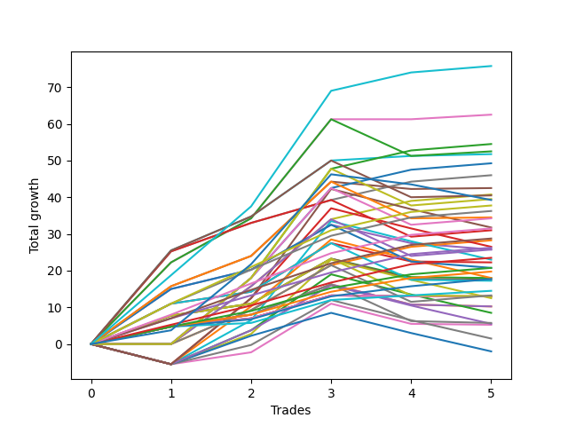

# Short Labrador 015 
- Symbol: ES
- Date Range: 03/18/2022 - 12/30/2022
- Trading Period: 8:30-12:30
- Number of Trades: 10



| Name | Win Percent | Profit | Avg Profit / Trade | Avg Time / Trade |      | Name | Win Percent | Profit | Avg Profit / Trade | Avg Time / Trade |
| ---- | ----------- | ------ | ------------------ | ---------------- | ---- | ---- | ----------- | ------ | ------------------ | ---------------- |
| Sorted By <br> Profit | | | | | | Sorted By <br> Win Percentage ||||
| NEWFI 000 | 50.00 | 18625.00 | 1862.50 | 41:12 |     | TP-2 | 80.00 | 125.00 | 12.50 | 21:10 |
| NEWFI 0000 | 40.00 | 13250.00 | 1325.00 | 22:09 |     | TP-1 | 80.00 | -1875.00 | -187.50 | 21:02 |
| BB-50 U/L 2SD | 40.00 | 12000.00 | 1200.00 | 37:10 |     | TP-6 | 70.00 | 3500.00 | 350.00 | 26:39 |
| BB-100 Mid | 60.00 | 8875.00 | 887.50 | 36:40 |     | TP-5 | 70.00 | 1500.00 | 150.00 | 26:24 |
| BB-200 U/L 2SD | 40.00 | 8000.00 | 800.00 | 46:32 |     | TP-4 | 70.00 | -250.00 | -25.00 | 25:37 |
| BB-20 U/L 2SD | 50.00 | 6750.00 | 675.00 | 16:04 |     | TP-3 | 70.00 | -2625.00 | -262.50 | 24:57 |
| BB-100 U/L 2SD | 40.00 | 5375.00 | 537.50 | 50:51 |     | BB-100 Mid | 60.00 | 8875.00 | 887.50 | 36:40 |
| BB-20 U/L 1SD | 50.00 | 4250.00 | 425.00 | 11:23 |     | TP-8 | 60.00 | 3875.00 | 387.50 | 33:06 |
| TP-8 | 60.00 | 3875.00 | 387.50 | 33:06 |     | TP-7 | 60.00 | 1875.00 | 187.50 | 32:03 |
| V Mid | 50.00 | 3750.00 | 375.00 | 36:20 |     | NEWFI 000 | 50.00 | 18625.00 | 1862.50 | 41:12 |
| TP-6 | 70.00 | 3500.00 | 350.00 | 26:39 |     | BB-20 U/L 2SD | 50.00 | 6750.00 | 675.00 | 16:04 |
| BB-20 Mid | 40.00 | 3375.00 | 337.50 | 07:00 |     | BB-20 U/L 1SD | 50.00 | 4250.00 | 425.00 | 11:23 |
| BB-50 U/L 1SD | 50.00 | 3250.00 | 325.00 | 31:48 |     | V Mid | 50.00 | 3750.00 | 375.00 | 36:20 |
| TP-7 | 60.00 | 1875.00 | 187.50 | 32:03 |     | BB-50 U/L 1SD | 50.00 | 3250.00 | 325.00 | 31:48 |
| TP-5 | 70.00 | 1500.00 | 150.00 | 26:24 |     | BB-20 U/L 2SD C | 50.00 | 375.00 | 37.50 | 20:38 |
| V U/L 1SD | 40.00 | 1125.00 | 112.50 | 41:43 |     | TP-10 | 50.00 | -375.00 | -37.50 | 35:42 |
| BB-50 Mid | 30.00 | 750.00 | 75.00 | 28:03 |     | TP-9 | 50.00 | -1125.00 | -112.50 | 35:30 |
| BB-20 U/L 2SD C | 50.00 | 375.00 | 37.50 | 20:38 |     | NEWFI 0000 | 40.00 | 13250.00 | 1325.00 | 22:09 |
| TP-2 | 80.00 | 125.00 | 12.50 | 21:10 |     | BB-50 U/L 2SD | 40.00 | 12000.00 | 1200.00 | 37:10 |
| TP-4 | 70.00 | -250.00 | -25.00 | 25:37 |     | BB-200 U/L 2SD | 40.00 | 8000.00 | 800.00 | 46:32 |
| TP-10 | 50.00 | -375.00 | -37.50 | 35:42 |     | BB-100 U/L 2SD | 40.00 | 5375.00 | 537.50 | 50:51 |
| TP-9 | 50.00 | -1125.00 | -112.50 | 35:30 |     | BB-20 Mid | 40.00 | 3375.00 | 337.50 | 07:00 |
| TP-1 | 80.00 | -1875.00 | -187.50 | 21:02 |     | V U/L 1SD | 40.00 | 1125.00 | 112.50 | 41:43 |
| TP-3 | 70.00 | -2625.00 | -262.50 | 24:57 |     | BB-200 Mid | 40.00 | -5125.00 | -512.50 | 40:47 |
| BB-200 Mid | 40.00 | -5125.00 | -512.50 | 40:47 |     | BB-50 Mid | 30.00 | 750.00 | 75.00 | 28:03 |

## NO STOPLOSS

### Test BB-20 Mid
* Sell when price hits the middle line of the 20p bollinger
* No Stoploss
* Results:
```
Total Trades: 10
Percent Up: 60.00
Percent Down: 40.00
Total Points Moved Down: 6.75
Potential Profit: 3375.00
Total Points Ups: 9.75 Count Ups: 6
Total Points Downs: 16.50 Count Downs: 4
```

<details><summary>Trades</summary>

<code>In: 2022-03-29 11:51:00		Out: 2022-03-29 11:58:00		Total Position Time: 07:00		Total Move Down: -1.00		Total to Date: -1.00</code> <br />
<code>In: 2022-03-29 12:16:00		Out: 2022-03-29 12:24:45		Total Position Time: 08:45		Total Move Down: -1.50		Total to Date: -2.50</code> <br />
<code>In: 2022-04-07 12:19:00		Out: 2022-04-07 12:20:10		Total Position Time: 01:10		Total Move Down: 3.25		Total to Date: 0.75</code> <br />
<code>In: 2022-05-10 11:06:00		Out: 2022-05-10 11:07:10		Total Position Time: 01:10		Total Move Down: 4.75		Total to Date: 5.50</code> <br />
<code>In: 2022-06-09 10:09:00		Out: 2022-06-09 10:16:50		Total Position Time: 07:50		Total Move Down: 2.25		Total to Date: 7.75</code> <br />
<code>In: 2022-06-14 10:26:00		Out: 2022-06-14 10:27:10		Total Position Time: 01:10		Total Move Down: 6.25		Total to Date: 14.00</code> <br />
<code>In: 2022-07-11 10:16:00		Out: 2022-07-11 10:23:05		Total Position Time: 07:05		Total Move Down: -0.25		Total to Date: 13.75</code> <br />
<code>In: 2022-09-01 11:39:00		Out: 2022-09-01 11:43:40		Total Position Time: 04:40		Total Move Down: -1.00		Total to Date: 12.75</code> <br />
<code>In: 2022-09-19 12:19:00		Out: 2022-09-19 12:46:50		Total Position Time: 27:50		Total Move Down: -6.00		Total to Date: 6.75</code> <br />
<code>In: 2022-11-21 10:24:00		Out: 2022-11-21 10:27:25		Total Position Time: 03:25		Total Move Down: -0.00		Total to Date: 6.75</code> <br />


</details>

### Test BB-20 U/L 1SD
* Sell when the price hits the lower line of the 20p 1std bollinger
* No Stoploss
* Results:
```
Total Trades: 10
Percent Up: 50.00
Percent Down: 50.00
Total Points Moved Down: 8.50
Potential Profit: 4250.00
Total Points Ups: 12.75 Count Ups: 5
Total Points Downs: 21.25 Count Downs: 5
```

<details><summary>Trades</summary>

<code>In: 2022-03-29 11:51:00		Out: 2022-03-29 12:00:25		Total Position Time: 09:25		Total Move Down: -0.00		Total to Date: 0.00</code> <br />
<code>In: 2022-03-29 12:16:00		Out: 2022-03-29 12:27:45		Total Position Time: 11:45		Total Move Down: -0.50		Total to Date: -0.50</code> <br />
<code>In: 2022-04-07 12:19:00		Out: 2022-04-07 12:21:05		Total Position Time: 02:05		Total Move Down: 3.75		Total to Date: 3.25</code> <br />
<code>In: 2022-05-10 11:06:00		Out: 2022-05-10 11:07:10		Total Position Time: 01:10		Total Move Down: 4.75		Total to Date: 8.00</code> <br />
<code>In: 2022-06-09 10:09:00		Out: 2022-06-09 10:18:50		Total Position Time: 09:50		Total Move Down: 3.25		Total to Date: 11.25</code> <br />
<code>In: 2022-06-14 10:26:00		Out: 2022-06-14 10:29:05		Total Position Time: 03:05		Total Move Down: 8.25		Total to Date: 19.50</code> <br />
<code>In: 2022-07-11 10:16:00		Out: 2022-07-11 10:50:10		Total Position Time: 34:10		Total Move Down: -5.50		Total to Date: 14.00</code> <br />
<code>In: 2022-09-01 11:39:00		Out: 2022-09-01 11:44:25		Total Position Time: 05:25		Total Move Down: 1.25		Total to Date: 15.25</code> <br />
<code>In: 2022-09-19 12:19:00		Out: 2022-09-19 12:47:00		Total Position Time: 28:00		Total Move Down: -6.25		Total to Date: 9.00</code> <br />
<code>In: 2022-11-21 10:24:00		Out: 2022-11-21 10:33:00		Total Position Time: 09:00		Total Move Down: -0.50		Total to Date: 8.50</code> <br />


</details>

### Test BB-20 U/L 2SD
* Sell when the price hits the lower line of the 20p 2std bollinger
* No Stoploss
* Results:
```
Total Trades: 10
Percent Up: 50.00
Percent Down: 50.00
Total Points Moved Down: 13.50
Potential Profit: 6750.00
Total Points Ups: 18.50 Count Ups: 5
Total Points Downs: 32.00 Count Downs: 5
```

<details><summary>Trades</summary>

<code>In: 2022-03-29 11:51:00		Out: 2022-03-29 12:27:50		Total Position Time: 36:50		Total Move Down: -7.00		Total to Date: -7.00</code> <br />
<code>In: 2022-03-29 12:16:00		Out: 2022-03-29 12:27:50		Total Position Time: 11:50		Total Move Down: -0.00		Total to Date: -7.00</code> <br />
<code>In: 2022-04-07 12:19:00		Out: 2022-04-07 12:22:45		Total Position Time: 03:45		Total Move Down: 6.25		Total to Date: -0.75</code> <br />
<code>In: 2022-05-10 11:06:00		Out: 2022-05-10 11:11:10		Total Position Time: 05:10		Total Move Down: 7.75		Total to Date: 7.00</code> <br />
<code>In: 2022-06-09 10:09:00		Out: 2022-06-09 10:19:05		Total Position Time: 10:05		Total Move Down: 3.25		Total to Date: 10.25</code> <br />
<code>In: 2022-06-14 10:26:00		Out: 2022-06-14 10:31:00		Total Position Time: 05:00		Total Move Down: 12.25		Total to Date: 22.50</code> <br />
<code>In: 2022-07-11 10:16:00		Out: 2022-07-11 11:00:50		Total Position Time: 44:50		Total Move Down: -5.00		Total to Date: 17.50</code> <br />
<code>In: 2022-09-01 11:39:00		Out: 2022-09-01 11:45:05		Total Position Time: 06:05		Total Move Down: 2.50		Total to Date: 20.00</code> <br />
<code>In: 2022-09-19 12:19:00		Out: 2022-09-19 12:47:00		Total Position Time: 28:00		Total Move Down: -6.25		Total to Date: 13.75</code> <br />
<code>In: 2022-11-21 10:24:00		Out: 2022-11-21 10:33:10		Total Position Time: 09:10		Total Move Down: -0.25		Total to Date: 13.50</code> <br />


</details>

### Test BB-20 U/L 2SD C
* Sell when the price hits the lower line of the 20p 2std bollinger
* No Stoploss
* Results:
```
Total Trades: 10
Percent Up: 50.00
Percent Down: 50.00
Total Points Moved Down: 0.75
Potential Profit: 375.00
Total Points Ups: 36.50 Count Ups: 5
Total Points Downs: 37.25 Count Downs: 5
```

<details><summary>Trades</summary>

<code>In: 2022-03-29 11:51:00		Out: 2022-03-29 12:47:00		Total Position Time: 56:00		Total Move Down: -16.00		Total to Date: -16.00</code> <br />
<code>In: 2022-03-29 12:16:00		Out: 2022-03-29 12:47:00		Total Position Time: 31:00		Total Move Down: -9.00		Total to Date: -25.00</code> <br />
<code>In: 2022-04-07 12:19:00		Out: 2022-04-07 12:22:45		Total Position Time: 03:45		Total Move Down: 6.25		Total to Date: -18.75</code> <br />
<code>In: 2022-05-10 11:06:00		Out: 2022-05-10 11:16:05		Total Position Time: 10:05		Total Move Down: 11.00		Total to Date: -7.75</code> <br />
<code>In: 2022-06-09 10:09:00		Out: 2022-06-09 10:21:10		Total Position Time: 12:10		Total Move Down: 3.25		Total to Date: -4.50</code> <br />
<code>In: 2022-06-14 10:26:00		Out: 2022-06-14 10:31:10		Total Position Time: 05:10		Total Move Down: 13.25		Total to Date: 8.75</code> <br />
<code>In: 2022-07-11 10:16:00		Out: 2022-07-11 11:00:50		Total Position Time: 44:50		Total Move Down: -5.00		Total to Date: 3.75</code> <br />
<code>In: 2022-09-01 11:39:00		Out: 2022-09-01 11:45:10		Total Position Time: 06:10		Total Move Down: 3.50		Total to Date: 7.25</code> <br />
<code>In: 2022-09-19 12:19:00		Out: 2022-09-19 12:47:00		Total Position Time: 28:00		Total Move Down: -6.25		Total to Date: 1.00</code> <br />
<code>In: 2022-11-21 10:24:00		Out: 2022-11-21 10:33:10		Total Position Time: 09:10		Total Move Down: -0.25		Total to Date: 0.75</code> <br />


</details>

### Test BB-50 Mid
* Sell when price hits the middle line of the 50p bollinger
* No Stoploss
* Results:
```
Total Trades: 10
Percent Up: 70.00
Percent Down: 30.00
Total Points Moved Down: 1.50
Potential Profit: 750.00
Total Points Ups: 31.00 Count Ups: 7
Total Points Downs: 32.50 Count Downs: 3
```

<details><summary>Trades</summary>

<code>In: 2022-03-29 11:51:00		Out: 2022-03-29 12:43:10		Total Position Time: 52:10		Total Move Down: -8.00		Total to Date: -8.00</code> <br />
<code>In: 2022-03-29 12:16:00		Out: 2022-03-29 12:43:10		Total Position Time: 27:10		Total Move Down: -1.00		Total to Date: -9.00</code> <br />
<code>In: 2022-04-07 12:19:00		Out: 2022-04-07 12:47:00		Total Position Time: 28:00		Total Move Down: -6.25		Total to Date: -15.25</code> <br />
<code>In: 2022-05-10 11:06:00		Out: 2022-05-10 11:16:20		Total Position Time: 10:20		Total Move Down: 15.00		Total to Date: -0.25</code> <br />
<code>In: 2022-06-09 10:09:00		Out: 2022-06-09 10:22:05		Total Position Time: 13:05		Total Move Down: 5.25		Total to Date: 5.00</code> <br />
<code>In: 2022-06-14 10:26:00		Out: 2022-06-14 10:31:00		Total Position Time: 05:00		Total Move Down: 12.25		Total to Date: 17.25</code> <br />
<code>In: 2022-07-11 10:16:00		Out: 2022-07-11 11:00:50		Total Position Time: 44:50		Total Move Down: -5.00		Total to Date: 12.25</code> <br />
<code>In: 2022-09-01 11:39:00		Out: 2022-09-01 12:20:35		Total Position Time: 41:35		Total Move Down: -2.75		Total to Date: 9.50</code> <br />
<code>In: 2022-09-19 12:19:00		Out: 2022-09-19 12:47:00		Total Position Time: 28:00		Total Move Down: -6.25		Total to Date: 3.25</code> <br />
<code>In: 2022-11-21 10:24:00		Out: 2022-11-21 10:54:25		Total Position Time: 30:25		Total Move Down: -1.75		Total to Date: 1.50</code> <br />


</details>

### Test BB-50 U/L 1SD
* Sell when the price hits the lower line of the 50p 1std bollinger
* No Stoploss
* Results:
```
Total Trades: 10
Percent Up: 50.00
Percent Down: 50.00
Total Points Moved Down: 6.50
Potential Profit: 3250.00
Total Points Ups: 39.50 Count Ups: 5
Total Points Downs: 46.00 Count Downs: 5
```

<details><summary>Trades</summary>

<code>In: 2022-03-29 11:51:00		Out: 2022-03-29 12:47:00		Total Position Time: 56:00		Total Move Down: -16.00		Total to Date: -16.00</code> <br />
<code>In: 2022-03-29 12:16:00		Out: 2022-03-29 12:47:00		Total Position Time: 31:00		Total Move Down: -9.00		Total to Date: -25.00</code> <br />
<code>In: 2022-04-07 12:19:00		Out: 2022-04-07 12:47:00		Total Position Time: 28:00		Total Move Down: -6.25		Total to Date: -31.25</code> <br />
<code>In: 2022-05-10 11:06:00		Out: 2022-05-10 11:24:05		Total Position Time: 18:05		Total Move Down: 15.75		Total to Date: -15.50</code> <br />
<code>In: 2022-06-09 10:09:00		Out: 2022-06-09 10:24:05		Total Position Time: 15:05		Total Move Down: 8.25		Total to Date: -7.25</code> <br />
<code>In: 2022-06-14 10:26:00		Out: 2022-06-14 10:36:10		Total Position Time: 10:10		Total Move Down: 20.25		Total to Date: 13.00</code> <br />
<code>In: 2022-07-11 10:16:00		Out: 2022-07-11 11:02:40		Total Position Time: 46:40		Total Move Down: -2.00		Total to Date: 11.00</code> <br />
<code>In: 2022-09-01 11:39:00		Out: 2022-09-01 12:28:35		Total Position Time: 49:35		Total Move Down: 1.50		Total to Date: 12.50</code> <br />
<code>In: 2022-09-19 12:19:00		Out: 2022-09-19 12:47:00		Total Position Time: 28:00		Total Move Down: -6.25		Total to Date: 6.25</code> <br />
<code>In: 2022-11-21 10:24:00		Out: 2022-11-21 10:59:25		Total Position Time: 35:25		Total Move Down: 0.25		Total to Date: 6.50</code> <br />


</details>

### Test BB-50 U/L 2SD
* Sell when the price hits the lower line of the 50p 2std bollinger
* No Stoploss
* Results:
```
Total Trades: 10
Percent Up: 60.00
Percent Down: 40.00
Total Points Moved Down: 24.00
Potential Profit: 12000.00
Total Points Ups: 38.50 Count Ups: 6
Total Points Downs: 62.50 Count Downs: 4
```

<details><summary>Trades</summary>

<code>In: 2022-03-29 11:51:00		Out: 2022-03-29 12:47:00		Total Position Time: 56:00		Total Move Down: -16.00		Total to Date: -16.00</code> <br />
<code>In: 2022-03-29 12:16:00		Out: 2022-03-29 12:47:00		Total Position Time: 31:00		Total Move Down: -9.00		Total to Date: -25.00</code> <br />
<code>In: 2022-04-07 12:19:00		Out: 2022-04-07 12:47:00		Total Position Time: 28:00		Total Move Down: -6.25		Total to Date: -31.25</code> <br />
<code>In: 2022-05-10 11:06:00		Out: 2022-05-10 11:27:05		Total Position Time: 21:05		Total Move Down: 22.25		Total to Date: -9.00</code> <br />
<code>In: 2022-06-09 10:09:00		Out: 2022-06-09 10:27:20		Total Position Time: 18:20		Total Move Down: 12.00		Total to Date: 3.00</code> <br />
<code>In: 2022-06-14 10:26:00		Out: 2022-06-14 10:43:05		Total Position Time: 17:05		Total Move Down: 27.00		Total to Date: 30.00</code> <br />
<code>In: 2022-07-11 10:16:00		Out: 2022-07-11 11:09:05		Total Position Time: 53:05		Total Move Down: -0.00		Total to Date: 30.00</code> <br />
<code>In: 2022-09-01 11:39:00		Out: 2022-09-01 12:39:55		Total Position Time: 60:55		Total Move Down: -1.00		Total to Date: 29.00</code> <br />
<code>In: 2022-09-19 12:19:00		Out: 2022-09-19 12:47:00		Total Position Time: 28:00		Total Move Down: -6.25		Total to Date: 22.75</code> <br />
<code>In: 2022-11-21 10:24:00		Out: 2022-11-21 11:22:10		Total Position Time: 58:10		Total Move Down: 1.25		Total to Date: 24.00</code> <br />


</details>

### Test V Mid
* Sell when the price hits the middle line of the 1std VWAP
* No Stoploss
* Results:
```
Total Trades: 10
Percent Up: 50.00
Percent Down: 50.00
Total Points Moved Down: 7.50
Potential Profit: 3750.00
Total Points Ups: 38.50 Count Ups: 5
Total Points Downs: 46.00 Count Downs: 5
```

<details><summary>Trades</summary>

<code>In: 2022-03-29 11:51:00		Out: 2022-03-29 12:47:00		Total Position Time: 56:00		Total Move Down: -16.00		Total to Date: -16.00</code> <br />
<code>In: 2022-03-29 12:16:00		Out: 2022-03-29 12:47:00		Total Position Time: 31:00		Total Move Down: -9.00		Total to Date: -25.00</code> <br />
<code>In: 2022-04-07 12:19:00		Out: 2022-04-07 12:47:00		Total Position Time: 28:00		Total Move Down: -6.25		Total to Date: -31.25</code> <br />
<code>In: 2022-05-10 11:06:00		Out: 2022-05-10 11:27:40		Total Position Time: 21:40		Total Move Down: 25.25		Total to Date: -6.00</code> <br />
<code>In: 2022-06-09 10:09:00		Out: 2022-06-09 10:23:45		Total Position Time: 14:45		Total Move Down: 7.75		Total to Date: 1.75</code> <br />
<code>In: 2022-06-14 10:26:00		Out: 2022-06-14 10:27:10		Total Position Time: 01:10		Total Move Down: 6.25		Total to Date: 8.00</code> <br />
<code>In: 2022-07-11 10:16:00		Out: 2022-07-11 11:16:55		Total Position Time: 60:55		Total Move Down: 5.00		Total to Date: 13.00</code> <br />
<code>In: 2022-09-01 11:39:00		Out: 2022-09-01 12:39:55		Total Position Time: 60:55		Total Move Down: -1.00		Total to Date: 12.00</code> <br />
<code>In: 2022-09-19 12:19:00		Out: 2022-09-19 12:47:00		Total Position Time: 28:00		Total Move Down: -6.25		Total to Date: 5.75</code> <br />
<code>In: 2022-11-21 10:24:00		Out: 2022-11-21 11:24:55		Total Position Time: 60:55		Total Move Down: 1.75		Total to Date: 7.50</code> <br />


</details>

### Test V U/L 1SD
* Sell when the price hits the lower line of the 1std VWAP
* No Stoploss
* Results:
```
Total Trades: 10
Percent Up: 60.00
Percent Down: 40.00
Total Points Moved Down: 2.25
Potential Profit: 1125.00
Total Points Ups: 38.50 Count Ups: 6
Total Points Downs: 40.75 Count Downs: 4
```

<details><summary>Trades</summary>

<code>In: 2022-03-29 11:51:00		Out: 2022-03-29 12:47:00		Total Position Time: 56:00		Total Move Down: -16.00		Total to Date: -16.00</code> <br />
<code>In: 2022-03-29 12:16:00		Out: 2022-03-29 12:47:00		Total Position Time: 31:00		Total Move Down: -9.00		Total to Date: -25.00</code> <br />
<code>In: 2022-04-07 12:19:00		Out: 2022-04-07 12:47:00		Total Position Time: 28:00		Total Move Down: -6.25		Total to Date: -31.25</code> <br />
<code>In: 2022-05-10 11:06:00		Out: 2022-05-10 12:06:55		Total Position Time: 60:55		Total Move Down: -0.00		Total to Date: -31.25</code> <br />
<code>In: 2022-06-09 10:09:00		Out: 2022-06-09 10:30:30		Total Position Time: 21:30		Total Move Down: 15.75		Total to Date: -15.50</code> <br />
<code>In: 2022-06-14 10:26:00		Out: 2022-06-14 10:35:05		Total Position Time: 09:05		Total Move Down: 18.25		Total to Date: 2.75</code> <br />
<code>In: 2022-07-11 10:16:00		Out: 2022-07-11 11:16:55		Total Position Time: 60:55		Total Move Down: 5.00		Total to Date: 7.75</code> <br />
<code>In: 2022-09-01 11:39:00		Out: 2022-09-01 12:39:55		Total Position Time: 60:55		Total Move Down: -1.00		Total to Date: 6.75</code> <br />
<code>In: 2022-09-19 12:19:00		Out: 2022-09-19 12:47:00		Total Position Time: 28:00		Total Move Down: -6.25		Total to Date: 0.50</code> <br />
<code>In: 2022-11-21 10:24:00		Out: 2022-11-21 11:24:55		Total Position Time: 60:55		Total Move Down: 1.75		Total to Date: 2.25</code> <br />


</details>

### Test BB-100 Mid
* Move to BB100 Mid
* No Stoploss
* Results:
```
Total Trades: 10
Percent Up: 40.00
Percent Down: 60.00
Total Points Moved Down: 17.75
Potential Profit: 8875.00
Total Points Ups: 37.50 Count Ups: 4
Total Points Downs: 55.25 Count Downs: 6
```

<details><summary>Trades</summary>

<code>In: 2022-03-29 11:51:00		Out: 2022-03-29 12:47:00		Total Position Time: 56:00		Total Move Down: -16.00		Total to Date: -16.00</code> <br />
<code>In: 2022-03-29 12:16:00		Out: 2022-03-29 12:47:00		Total Position Time: 31:00		Total Move Down: -9.00		Total to Date: -25.00</code> <br />
<code>In: 2022-04-07 12:19:00		Out: 2022-04-07 12:47:00		Total Position Time: 28:00		Total Move Down: -6.25		Total to Date: -31.25</code> <br />
<code>In: 2022-05-10 11:06:00		Out: 2022-05-10 11:40:30		Total Position Time: 34:30		Total Move Down: 25.50		Total to Date: -5.75</code> <br />
<code>In: 2022-06-09 10:09:00		Out: 2022-06-09 10:25:10		Total Position Time: 16:10		Total Move Down: 9.25		Total to Date: 3.50</code> <br />
<code>In: 2022-06-14 10:26:00		Out: 2022-06-14 10:34:00		Total Position Time: 08:00		Total Move Down: 15.25		Total to Date: 18.75</code> <br />
<code>In: 2022-07-11 10:16:00		Out: 2022-07-11 11:09:55		Total Position Time: 53:55		Total Move Down: 1.25		Total to Date: 20.00</code> <br />
<code>In: 2022-09-01 11:39:00		Out: 2022-09-01 12:32:05		Total Position Time: 53:05		Total Move Down: 3.50		Total to Date: 23.50</code> <br />
<code>In: 2022-09-19 12:19:00		Out: 2022-09-19 12:47:00		Total Position Time: 28:00		Total Move Down: -6.25		Total to Date: 17.25</code> <br />
<code>In: 2022-11-21 10:24:00		Out: 2022-11-21 11:22:05		Total Position Time: 58:05		Total Move Down: 0.50		Total to Date: 17.75</code> <br />


</details>

### Test BB-100 U/L 2SD
* Move to BB100 Upper Band
* No Stoploss
* Results:
```
Total Trades: 10
Percent Up: 60.00
Percent Down: 40.00
Total Points Moved Down: 10.75
Potential Profit: 5375.00
Total Points Ups: 38.50 Count Ups: 6
Total Points Downs: 49.25 Count Downs: 4
```

<details><summary>Trades</summary>

<code>In: 2022-03-29 11:51:00		Out: 2022-03-29 12:47:00		Total Position Time: 56:00		Total Move Down: -16.00		Total to Date: -16.00</code> <br />
<code>In: 2022-03-29 12:16:00		Out: 2022-03-29 12:47:00		Total Position Time: 31:00		Total Move Down: -9.00		Total to Date: -25.00</code> <br />
<code>In: 2022-04-07 12:19:00		Out: 2022-04-07 12:47:00		Total Position Time: 28:00		Total Move Down: -6.25		Total to Date: -31.25</code> <br />
<code>In: 2022-05-10 11:06:00		Out: 2022-05-10 12:06:55		Total Position Time: 60:55		Total Move Down: -0.00		Total to Date: -31.25</code> <br />
<code>In: 2022-06-09 10:09:00		Out: 2022-06-09 11:09:55		Total Position Time: 60:55		Total Move Down: 18.00		Total to Date: -13.25</code> <br />
<code>In: 2022-06-14 10:26:00		Out: 2022-06-14 11:26:55		Total Position Time: 60:55		Total Move Down: 24.50		Total to Date: 11.25</code> <br />
<code>In: 2022-07-11 10:16:00		Out: 2022-07-11 11:16:55		Total Position Time: 60:55		Total Move Down: 5.00		Total to Date: 16.25</code> <br />
<code>In: 2022-09-01 11:39:00		Out: 2022-09-01 12:39:55		Total Position Time: 60:55		Total Move Down: -1.00		Total to Date: 15.25</code> <br />
<code>In: 2022-09-19 12:19:00		Out: 2022-09-19 12:47:00		Total Position Time: 28:00		Total Move Down: -6.25		Total to Date: 9.00</code> <br />
<code>In: 2022-11-21 10:24:00		Out: 2022-11-21 11:24:55		Total Position Time: 60:55		Total Move Down: 1.75		Total to Date: 10.75</code> <br />


</details>

### Test BB-200 Mid
* Move to BB200 Mid
* No Stoploss
* Results:
```
Total Trades: 10
Percent Up: 60.00
Percent Down: 40.00
Total Points Moved Down: -10.25
Potential Profit: -5125.00
Total Points Ups: 38.50 Count Ups: 6
Total Points Downs: 28.25 Count Downs: 4
```

<details><summary>Trades</summary>

<code>In: 2022-03-29 11:51:00		Out: 2022-03-29 12:47:00		Total Position Time: 56:00		Total Move Down: -16.00		Total to Date: -16.00</code> <br />
<code>In: 2022-03-29 12:16:00		Out: 2022-03-29 12:47:00		Total Position Time: 31:00		Total Move Down: -9.00		Total to Date: -25.00</code> <br />
<code>In: 2022-04-07 12:19:00		Out: 2022-04-07 12:47:00		Total Position Time: 28:00		Total Move Down: -6.25		Total to Date: -31.25</code> <br />
<code>In: 2022-05-10 11:06:00		Out: 2022-05-10 12:06:55		Total Position Time: 60:55		Total Move Down: -0.00		Total to Date: -31.25</code> <br />
<code>In: 2022-06-09 10:09:00		Out: 2022-06-09 10:25:10		Total Position Time: 16:10		Total Move Down: 9.25		Total to Date: -22.00</code> <br />
<code>In: 2022-06-14 10:26:00		Out: 2022-06-14 10:31:00		Total Position Time: 05:00		Total Move Down: 12.25		Total to Date: -9.75</code> <br />
<code>In: 2022-07-11 10:16:00		Out: 2022-07-11 11:16:55		Total Position Time: 60:55		Total Move Down: 5.00		Total to Date: -4.75</code> <br />
<code>In: 2022-09-01 11:39:00		Out: 2022-09-01 12:39:55		Total Position Time: 60:55		Total Move Down: -1.00		Total to Date: -5.75</code> <br />
<code>In: 2022-09-19 12:19:00		Out: 2022-09-19 12:47:00		Total Position Time: 28:00		Total Move Down: -6.25		Total to Date: -12.00</code> <br />
<code>In: 2022-11-21 10:24:00		Out: 2022-11-21 11:24:55		Total Position Time: 60:55		Total Move Down: 1.75		Total to Date: -10.25</code> <br />


</details>

### Test BB-200 U/L 2SD
* Move to BB200 Upper Band
* No Stoploss
* Results:
```
Total Trades: 10
Percent Up: 60.00
Percent Down: 40.00
Total Points Moved Down: 16.00
Potential Profit: 8000.00
Total Points Ups: 38.50 Count Ups: 6
Total Points Downs: 54.50 Count Downs: 4
```

<details><summary>Trades</summary>

<code>In: 2022-03-29 11:51:00		Out: 2022-03-29 12:47:00		Total Position Time: 56:00		Total Move Down: -16.00		Total to Date: -16.00</code> <br />
<code>In: 2022-03-29 12:16:00		Out: 2022-03-29 12:47:00		Total Position Time: 31:00		Total Move Down: -9.00		Total to Date: -25.00</code> <br />
<code>In: 2022-04-07 12:19:00		Out: 2022-04-07 12:47:00		Total Position Time: 28:00		Total Move Down: -6.25		Total to Date: -31.25</code> <br />
<code>In: 2022-05-10 11:06:00		Out: 2022-05-10 12:06:55		Total Position Time: 60:55		Total Move Down: -0.00		Total to Date: -31.25</code> <br />
<code>In: 2022-06-09 10:09:00		Out: 2022-06-09 11:09:55		Total Position Time: 60:55		Total Move Down: 18.00		Total to Date: -13.25</code> <br />
<code>In: 2022-06-14 10:26:00		Out: 2022-06-14 10:43:45		Total Position Time: 17:45		Total Move Down: 29.75		Total to Date: 16.50</code> <br />
<code>In: 2022-07-11 10:16:00		Out: 2022-07-11 11:16:55		Total Position Time: 60:55		Total Move Down: 5.00		Total to Date: 21.50</code> <br />
<code>In: 2022-09-01 11:39:00		Out: 2022-09-01 12:39:55		Total Position Time: 60:55		Total Move Down: -1.00		Total to Date: 20.50</code> <br />
<code>In: 2022-09-19 12:19:00		Out: 2022-09-19 12:47:00		Total Position Time: 28:00		Total Move Down: -6.25		Total to Date: 14.25</code> <br />
<code>In: 2022-11-21 10:24:00		Out: 2022-11-21 11:24:55		Total Position Time: 60:55		Total Move Down: 1.75		Total to Date: 16.00</code> <br />


</details>

## TAKE PROFIT

### Test TP-1
* Take Profit of 1 Point
* No Stoploss
* Results:
```
Total Trades: 10
Percent Up: 20.00
Percent Down: 80.00
Total Points Moved Down: -3.75
Potential Profit: -1875.00
Total Points Ups: 25.00 Count Ups: 2
Total Points Downs: 21.25 Count Downs: 8
```

<details><summary>Trades</summary>

<code>In: 2022-03-29 11:51:00		Out: 2022-03-29 12:47:00		Total Position Time: 56:00		Total Move Down: -16.00		Total to Date: -16.00</code> <br />
<code>In: 2022-03-29 12:16:00		Out: 2022-03-29 12:47:00		Total Position Time: 31:00		Total Move Down: -9.00		Total to Date: -25.00</code> <br />
<code>In: 2022-04-07 12:19:00		Out: 2022-04-07 12:20:10		Total Position Time: 01:10		Total Move Down: 3.25		Total to Date: -21.75</code> <br />
<code>In: 2022-05-10 11:06:00		Out: 2022-05-10 11:07:10		Total Position Time: 01:10		Total Move Down: 4.75		Total to Date: -17.00</code> <br />
<code>In: 2022-06-09 10:09:00		Out: 2022-06-09 10:10:10		Total Position Time: 01:10		Total Move Down: 1.00		Total to Date: -16.00</code> <br />
<code>In: 2022-06-14 10:26:00		Out: 2022-06-14 10:27:10		Total Position Time: 01:10		Total Move Down: 6.25		Total to Date: -9.75</code> <br />
<code>In: 2022-07-11 10:16:00		Out: 2022-07-11 11:09:55		Total Position Time: 53:55		Total Move Down: 1.25		Total to Date: -8.50</code> <br />
<code>In: 2022-09-01 11:39:00		Out: 2022-09-01 11:44:25		Total Position Time: 05:25		Total Move Down: 1.25		Total to Date: -7.25</code> <br />
<code>In: 2022-09-19 12:19:00		Out: 2022-09-19 12:20:10		Total Position Time: 01:10		Total Move Down: 2.25		Total to Date: -5.00</code> <br />
<code>In: 2022-11-21 10:24:00		Out: 2022-11-21 11:22:10		Total Position Time: 58:10		Total Move Down: 1.25		Total to Date: -3.75</code> <br />


</details>

### Test TP-2
* Take Profit of 2 Point
* No Stoploss
* Results:
```
Total Trades: 10
Percent Up: 20.00
Percent Down: 80.00
Total Points Moved Down: 0.25
Potential Profit: 125.00
Total Points Ups: 25.00 Count Ups: 2
Total Points Downs: 25.25 Count Downs: 8
```

<details><summary>Trades</summary>

<code>In: 2022-03-29 11:51:00		Out: 2022-03-29 12:47:00		Total Position Time: 56:00		Total Move Down: -16.00		Total to Date: -16.00</code> <br />
<code>In: 2022-03-29 12:16:00		Out: 2022-03-29 12:47:00		Total Position Time: 31:00		Total Move Down: -9.00		Total to Date: -25.00</code> <br />
<code>In: 2022-04-07 12:19:00		Out: 2022-04-07 12:20:10		Total Position Time: 01:10		Total Move Down: 3.25		Total to Date: -21.75</code> <br />
<code>In: 2022-05-10 11:06:00		Out: 2022-05-10 11:07:10		Total Position Time: 01:10		Total Move Down: 4.75		Total to Date: -17.00</code> <br />
<code>In: 2022-06-09 10:09:00		Out: 2022-06-09 10:10:30		Total Position Time: 01:30		Total Move Down: 2.00		Total to Date: -15.00</code> <br />
<code>In: 2022-06-14 10:26:00		Out: 2022-06-14 10:27:10		Total Position Time: 01:10		Total Move Down: 6.25		Total to Date: -8.75</code> <br />
<code>In: 2022-07-11 10:16:00		Out: 2022-07-11 11:10:15		Total Position Time: 54:15		Total Move Down: 2.75		Total to Date: -6.00</code> <br />
<code>In: 2022-09-01 11:39:00		Out: 2022-09-01 11:44:50		Total Position Time: 05:50		Total Move Down: 2.00		Total to Date: -4.00</code> <br />
<code>In: 2022-09-19 12:19:00		Out: 2022-09-19 12:20:10		Total Position Time: 01:10		Total Move Down: 2.25		Total to Date: -1.75</code> <br />
<code>In: 2022-11-21 10:24:00		Out: 2022-11-21 11:22:25		Total Position Time: 58:25		Total Move Down: 2.00		Total to Date: 0.25</code> <br />


</details>

### Test TP-3
* Take Profit of 3 Point
* No Stoploss
* Results:
```
Total Trades: 10
Percent Up: 30.00
Percent Down: 70.00
Total Points Moved Down: -5.25
Potential Profit: -2625.00
Total Points Ups: 31.25 Count Ups: 3
Total Points Downs: 26.00 Count Downs: 7
```

<details><summary>Trades</summary>

<code>In: 2022-03-29 11:51:00		Out: 2022-03-29 12:47:00		Total Position Time: 56:00		Total Move Down: -16.00		Total to Date: -16.00</code> <br />
<code>In: 2022-03-29 12:16:00		Out: 2022-03-29 12:47:00		Total Position Time: 31:00		Total Move Down: -9.00		Total to Date: -25.00</code> <br />
<code>In: 2022-04-07 12:19:00		Out: 2022-04-07 12:20:10		Total Position Time: 01:10		Total Move Down: 3.25		Total to Date: -21.75</code> <br />
<code>In: 2022-05-10 11:06:00		Out: 2022-05-10 11:07:10		Total Position Time: 01:10		Total Move Down: 4.75		Total to Date: -17.00</code> <br />
<code>In: 2022-06-09 10:09:00		Out: 2022-06-09 10:18:50		Total Position Time: 09:50		Total Move Down: 3.25		Total to Date: -13.75</code> <br />
<code>In: 2022-06-14 10:26:00		Out: 2022-06-14 10:27:10		Total Position Time: 01:10		Total Move Down: 6.25		Total to Date: -7.50</code> <br />
<code>In: 2022-07-11 10:16:00		Out: 2022-07-11 11:10:20		Total Position Time: 54:20		Total Move Down: 3.75		Total to Date: -3.75</code> <br />
<code>In: 2022-09-01 11:39:00		Out: 2022-09-01 11:44:55		Total Position Time: 05:55		Total Move Down: 3.00		Total to Date: -0.75</code> <br />
<code>In: 2022-09-19 12:19:00		Out: 2022-09-19 12:47:00		Total Position Time: 28:00		Total Move Down: -6.25		Total to Date: -7.00</code> <br />
<code>In: 2022-11-21 10:24:00		Out: 2022-11-21 11:24:55		Total Position Time: 60:55		Total Move Down: 1.75		Total to Date: -5.25</code> <br />


</details>

### Test TP-4
* Take Profit of 4 Point
* No Stoploss
* Results:
```
Total Trades: 10
Percent Up: 30.00
Percent Down: 70.00
Total Points Moved Down: -0.50
Potential Profit: -250.00
Total Points Ups: 31.25 Count Ups: 3
Total Points Downs: 30.75 Count Downs: 7
```

<details><summary>Trades</summary>

<code>In: 2022-03-29 11:51:00		Out: 2022-03-29 12:47:00		Total Position Time: 56:00		Total Move Down: -16.00		Total to Date: -16.00</code> <br />
<code>In: 2022-03-29 12:16:00		Out: 2022-03-29 12:47:00		Total Position Time: 31:00		Total Move Down: -9.00		Total to Date: -25.00</code> <br />
<code>In: 2022-04-07 12:19:00		Out: 2022-04-07 12:21:20		Total Position Time: 02:20		Total Move Down: 5.75		Total to Date: -19.25</code> <br />
<code>In: 2022-05-10 11:06:00		Out: 2022-05-10 11:07:10		Total Position Time: 01:10		Total Move Down: 4.75		Total to Date: -14.50</code> <br />
<code>In: 2022-06-09 10:09:00		Out: 2022-06-09 10:21:30		Total Position Time: 12:30		Total Move Down: 4.25		Total to Date: -10.25</code> <br />
<code>In: 2022-06-14 10:26:00		Out: 2022-06-14 10:27:10		Total Position Time: 01:10		Total Move Down: 6.25		Total to Date: -4.00</code> <br />
<code>In: 2022-07-11 10:16:00		Out: 2022-07-11 11:10:25		Total Position Time: 54:25		Total Move Down: 3.75		Total to Date: -0.25</code> <br />
<code>In: 2022-09-01 11:39:00		Out: 2022-09-01 11:47:45		Total Position Time: 08:45		Total Move Down: 4.25		Total to Date: 4.00</code> <br />
<code>In: 2022-09-19 12:19:00		Out: 2022-09-19 12:47:00		Total Position Time: 28:00		Total Move Down: -6.25		Total to Date: -2.25</code> <br />
<code>In: 2022-11-21 10:24:00		Out: 2022-11-21 11:24:55		Total Position Time: 60:55		Total Move Down: 1.75		Total to Date: -0.50</code> <br />


</details>

### Test TP-5
* Take Profit of 5 Point
* No Stoploss
* Results:
```
Total Trades: 10
Percent Up: 30.00
Percent Down: 70.00
Total Points Moved Down: 3.00
Potential Profit: 1500.00
Total Points Ups: 31.25 Count Ups: 3
Total Points Downs: 34.25 Count Downs: 7
```

<details><summary>Trades</summary>

<code>In: 2022-03-29 11:51:00		Out: 2022-03-29 12:47:00		Total Position Time: 56:00		Total Move Down: -16.00		Total to Date: -16.00</code> <br />
<code>In: 2022-03-29 12:16:00		Out: 2022-03-29 12:47:00		Total Position Time: 31:00		Total Move Down: -9.00		Total to Date: -25.00</code> <br />
<code>In: 2022-04-07 12:19:00		Out: 2022-04-07 12:21:20		Total Position Time: 02:20		Total Move Down: 5.75		Total to Date: -19.25</code> <br />
<code>In: 2022-05-10 11:06:00		Out: 2022-05-10 11:07:15		Total Position Time: 01:15		Total Move Down: 5.25		Total to Date: -14.00</code> <br />
<code>In: 2022-06-09 10:09:00		Out: 2022-06-09 10:22:05		Total Position Time: 13:05		Total Move Down: 5.25		Total to Date: -8.75</code> <br />
<code>In: 2022-06-14 10:26:00		Out: 2022-06-14 10:27:10		Total Position Time: 01:10		Total Move Down: 6.25		Total to Date: -2.50</code> <br />
<code>In: 2022-07-11 10:16:00		Out: 2022-07-11 11:16:55		Total Position Time: 60:55		Total Move Down: 5.00		Total to Date: 2.50</code> <br />
<code>In: 2022-09-01 11:39:00		Out: 2022-09-01 11:48:25		Total Position Time: 09:25		Total Move Down: 5.00		Total to Date: 7.50</code> <br />
<code>In: 2022-09-19 12:19:00		Out: 2022-09-19 12:47:00		Total Position Time: 28:00		Total Move Down: -6.25		Total to Date: 1.25</code> <br />
<code>In: 2022-11-21 10:24:00		Out: 2022-11-21 11:24:55		Total Position Time: 60:55		Total Move Down: 1.75		Total to Date: 3.00</code> <br />


</details>

### Test TP-6
* Take Profit of 6 Point
* No Stoploss
* Results:
```
Total Trades: 10
Percent Up: 30.00
Percent Down: 70.00
Total Points Moved Down: 7.00
Potential Profit: 3500.00
Total Points Ups: 31.25 Count Ups: 3
Total Points Downs: 38.25 Count Downs: 7
```

<details><summary>Trades</summary>

<code>In: 2022-03-29 11:51:00		Out: 2022-03-29 12:47:00		Total Position Time: 56:00		Total Move Down: -16.00		Total to Date: -16.00</code> <br />
<code>In: 2022-03-29 12:16:00		Out: 2022-03-29 12:47:00		Total Position Time: 31:00		Total Move Down: -9.00		Total to Date: -25.00</code> <br />
<code>In: 2022-04-07 12:19:00		Out: 2022-04-07 12:22:45		Total Position Time: 03:45		Total Move Down: 6.25		Total to Date: -18.75</code> <br />
<code>In: 2022-05-10 11:06:00		Out: 2022-05-10 11:07:25		Total Position Time: 01:25		Total Move Down: 7.00		Total to Date: -11.75</code> <br />
<code>In: 2022-06-09 10:09:00		Out: 2022-06-09 10:22:35		Total Position Time: 13:35		Total Move Down: 6.25		Total to Date: -5.50</code> <br />
<code>In: 2022-06-14 10:26:00		Out: 2022-06-14 10:27:10		Total Position Time: 01:10		Total Move Down: 6.25		Total to Date: 0.75</code> <br />
<code>In: 2022-07-11 10:16:00		Out: 2022-07-11 11:16:55		Total Position Time: 60:55		Total Move Down: 5.00		Total to Date: 5.75</code> <br />
<code>In: 2022-09-01 11:39:00		Out: 2022-09-01 11:48:45		Total Position Time: 09:45		Total Move Down: 5.75		Total to Date: 11.50</code> <br />
<code>In: 2022-09-19 12:19:00		Out: 2022-09-19 12:47:00		Total Position Time: 28:00		Total Move Down: -6.25		Total to Date: 5.25</code> <br />
<code>In: 2022-11-21 10:24:00		Out: 2022-11-21 11:24:55		Total Position Time: 60:55		Total Move Down: 1.75		Total to Date: 7.00</code> <br />


</details>

### Test TP-7
* Take Profit of 7 Point
* No Stoploss
* Results:
```
Total Trades: 10
Percent Up: 40.00
Percent Down: 60.00
Total Points Moved Down: 3.75
Potential Profit: 1875.00
Total Points Ups: 32.25 Count Ups: 4
Total Points Downs: 36.00 Count Downs: 6
```

<details><summary>Trades</summary>

<code>In: 2022-03-29 11:51:00		Out: 2022-03-29 12:47:00		Total Position Time: 56:00		Total Move Down: -16.00		Total to Date: -16.00</code> <br />
<code>In: 2022-03-29 12:16:00		Out: 2022-03-29 12:47:00		Total Position Time: 31:00		Total Move Down: -9.00		Total to Date: -25.00</code> <br />
<code>In: 2022-04-07 12:19:00		Out: 2022-04-07 12:24:10		Total Position Time: 05:10		Total Move Down: 7.25		Total to Date: -17.75</code> <br />
<code>In: 2022-05-10 11:06:00		Out: 2022-05-10 11:07:25		Total Position Time: 01:25		Total Move Down: 7.00		Total to Date: -10.75</code> <br />
<code>In: 2022-06-09 10:09:00		Out: 2022-06-09 10:23:45		Total Position Time: 14:45		Total Move Down: 7.75		Total to Date: -3.00</code> <br />
<code>In: 2022-06-14 10:26:00		Out: 2022-06-14 10:27:25		Total Position Time: 01:25		Total Move Down: 7.25		Total to Date: 4.25</code> <br />
<code>In: 2022-07-11 10:16:00		Out: 2022-07-11 11:16:55		Total Position Time: 60:55		Total Move Down: 5.00		Total to Date: 9.25</code> <br />
<code>In: 2022-09-01 11:39:00		Out: 2022-09-01 12:39:55		Total Position Time: 60:55		Total Move Down: -1.00		Total to Date: 8.25</code> <br />
<code>In: 2022-09-19 12:19:00		Out: 2022-09-19 12:47:00		Total Position Time: 28:00		Total Move Down: -6.25		Total to Date: 2.00</code> <br />
<code>In: 2022-11-21 10:24:00		Out: 2022-11-21 11:24:55		Total Position Time: 60:55		Total Move Down: 1.75		Total to Date: 3.75</code> <br />


</details>

### Test TP-8
* Take Profit of 8 Point
* No Stoploss
* Results:
```
Total Trades: 10
Percent Up: 40.00
Percent Down: 60.00
Total Points Moved Down: 7.75
Potential Profit: 3875.00
Total Points Ups: 32.25 Count Ups: 4
Total Points Downs: 40.00 Count Downs: 6
```

<details><summary>Trades</summary>

<code>In: 2022-03-29 11:51:00		Out: 2022-03-29 12:47:00		Total Position Time: 56:00		Total Move Down: -16.00		Total to Date: -16.00</code> <br />
<code>In: 2022-03-29 12:16:00		Out: 2022-03-29 12:47:00		Total Position Time: 31:00		Total Move Down: -9.00		Total to Date: -25.00</code> <br />
<code>In: 2022-04-07 12:19:00		Out: 2022-04-07 12:28:45		Total Position Time: 09:45		Total Move Down: 8.50		Total to Date: -16.50</code> <br />
<code>In: 2022-05-10 11:06:00		Out: 2022-05-10 11:11:40		Total Position Time: 05:40		Total Move Down: 8.00		Total to Date: -8.50</code> <br />
<code>In: 2022-06-09 10:09:00		Out: 2022-06-09 10:23:50		Total Position Time: 14:50		Total Move Down: 8.50		Total to Date: 0.00</code> <br />
<code>In: 2022-06-14 10:26:00		Out: 2022-06-14 10:29:05		Total Position Time: 03:05		Total Move Down: 8.25		Total to Date: 8.25</code> <br />
<code>In: 2022-07-11 10:16:00		Out: 2022-07-11 11:16:55		Total Position Time: 60:55		Total Move Down: 5.00		Total to Date: 13.25</code> <br />
<code>In: 2022-09-01 11:39:00		Out: 2022-09-01 12:39:55		Total Position Time: 60:55		Total Move Down: -1.00		Total to Date: 12.25</code> <br />
<code>In: 2022-09-19 12:19:00		Out: 2022-09-19 12:47:00		Total Position Time: 28:00		Total Move Down: -6.25		Total to Date: 6.00</code> <br />
<code>In: 2022-11-21 10:24:00		Out: 2022-11-21 11:24:55		Total Position Time: 60:55		Total Move Down: 1.75		Total to Date: 7.75</code> <br />


</details>

### Test TP-9
* Take Profit of 9 Point
* No Stoploss
* Results:
```
Total Trades: 10
Percent Up: 50.00
Percent Down: 50.00
Total Points Moved Down: -2.25
Potential Profit: -1125.00
Total Points Ups: 38.50 Count Ups: 5
Total Points Downs: 36.25 Count Downs: 5
```

<details><summary>Trades</summary>

<code>In: 2022-03-29 11:51:00		Out: 2022-03-29 12:47:00		Total Position Time: 56:00		Total Move Down: -16.00		Total to Date: -16.00</code> <br />
<code>In: 2022-03-29 12:16:00		Out: 2022-03-29 12:47:00		Total Position Time: 31:00		Total Move Down: -9.00		Total to Date: -25.00</code> <br />
<code>In: 2022-04-07 12:19:00		Out: 2022-04-07 12:47:00		Total Position Time: 28:00		Total Move Down: -6.25		Total to Date: -31.25</code> <br />
<code>In: 2022-05-10 11:06:00		Out: 2022-05-10 11:16:05		Total Position Time: 10:05		Total Move Down: 11.00		Total to Date: -20.25</code> <br />
<code>In: 2022-06-09 10:09:00		Out: 2022-06-09 10:25:05		Total Position Time: 16:05		Total Move Down: 9.25		Total to Date: -11.00</code> <br />
<code>In: 2022-06-14 10:26:00		Out: 2022-06-14 10:29:10		Total Position Time: 03:10		Total Move Down: 9.25		Total to Date: -1.75</code> <br />
<code>In: 2022-07-11 10:16:00		Out: 2022-07-11 11:16:55		Total Position Time: 60:55		Total Move Down: 5.00		Total to Date: 3.25</code> <br />
<code>In: 2022-09-01 11:39:00		Out: 2022-09-01 12:39:55		Total Position Time: 60:55		Total Move Down: -1.00		Total to Date: 2.25</code> <br />
<code>In: 2022-09-19 12:19:00		Out: 2022-09-19 12:47:00		Total Position Time: 28:00		Total Move Down: -6.25		Total to Date: -4.00</code> <br />
<code>In: 2022-11-21 10:24:00		Out: 2022-11-21 11:24:55		Total Position Time: 60:55		Total Move Down: 1.75		Total to Date: -2.25</code> <br />


</details>

### Test TP-10
* Take Profit of 10 Point
* No Stoploss
* Results:
```
Total Trades: 10
Percent Up: 50.00
Percent Down: 50.00
Total Points Moved Down: -0.75
Potential Profit: -375.00
Total Points Ups: 38.50 Count Ups: 5
Total Points Downs: 37.75 Count Downs: 5
```

<details><summary>Trades</summary>

<code>In: 2022-03-29 11:51:00		Out: 2022-03-29 12:47:00		Total Position Time: 56:00		Total Move Down: -16.00		Total to Date: -16.00</code> <br />
<code>In: 2022-03-29 12:16:00		Out: 2022-03-29 12:47:00		Total Position Time: 31:00		Total Move Down: -9.00		Total to Date: -25.00</code> <br />
<code>In: 2022-04-07 12:19:00		Out: 2022-04-07 12:47:00		Total Position Time: 28:00		Total Move Down: -6.25		Total to Date: -31.25</code> <br />
<code>In: 2022-05-10 11:06:00		Out: 2022-05-10 11:16:05		Total Position Time: 10:05		Total Move Down: 11.00		Total to Date: -20.25</code> <br />
<code>In: 2022-06-09 10:09:00		Out: 2022-06-09 10:26:30		Total Position Time: 17:30		Total Move Down: 10.00		Total to Date: -10.25</code> <br />
<code>In: 2022-06-14 10:26:00		Out: 2022-06-14 10:29:40		Total Position Time: 03:40		Total Move Down: 10.00		Total to Date: -0.25</code> <br />
<code>In: 2022-07-11 10:16:00		Out: 2022-07-11 11:16:55		Total Position Time: 60:55		Total Move Down: 5.00		Total to Date: 4.75</code> <br />
<code>In: 2022-09-01 11:39:00		Out: 2022-09-01 12:39:55		Total Position Time: 60:55		Total Move Down: -1.00		Total to Date: 3.75</code> <br />
<code>In: 2022-09-19 12:19:00		Out: 2022-09-19 12:47:00		Total Position Time: 28:00		Total Move Down: -6.25		Total to Date: -2.50</code> <br />
<code>In: 2022-11-21 10:24:00		Out: 2022-11-21 11:24:55		Total Position Time: 60:55		Total Move Down: 1.75		Total to Date: -0.75</code> <br />


</details>

## Indicator Exits

### Test NEWFI 000
* Newfi 0000
* No Stoploss
* Results:
```
Total Trades: 10
Percent Up: 50.00
Percent Down: 50.00
Total Points Moved Down: 37.25
Potential Profit: 18625.00
Total Points Ups: 38.50 Count Ups: 5
Total Points Downs: 75.75 Count Downs: 5
```

<details><summary>Trades</summary>

<code>In: 2022-03-29 11:51:00		Out: 2022-03-29 12:47:00		Total Position Time: 56:00		Total Move Down: -16.00		Total to Date: -16.00</code> <br />
<code>In: 2022-03-29 12:16:00		Out: 2022-03-29 12:47:00		Total Position Time: 31:00		Total Move Down: -9.00		Total to Date: -25.00</code> <br />
<code>In: 2022-04-07 12:19:00		Out: 2022-04-07 12:47:00		Total Position Time: 28:00		Total Move Down: -6.25		Total to Date: -31.25</code> <br />
<code>In: 2022-05-10 11:06:00		Out: 2022-05-10 11:31:05		Total Position Time: 25:05		Total Move Down: 18.75		Total to Date: -12.50</code> <br />
<code>In: 2022-06-09 10:09:00		Out: 2022-06-09 10:48:05		Total Position Time: 39:05		Total Move Down: 18.75		Total to Date: 6.25</code> <br />
<code>In: 2022-06-14 10:26:00		Out: 2022-06-14 10:48:05		Total Position Time: 22:05		Total Move Down: 31.50		Total to Date: 37.75</code> <br />
<code>In: 2022-07-11 10:16:00		Out: 2022-07-11 11:16:55		Total Position Time: 60:55		Total Move Down: 5.00		Total to Date: 42.75</code> <br />
<code>In: 2022-09-01 11:39:00		Out: 2022-09-01 12:39:55		Total Position Time: 60:55		Total Move Down: -1.00		Total to Date: 41.75</code> <br />
<code>In: 2022-09-19 12:19:00		Out: 2022-09-19 12:47:00		Total Position Time: 28:00		Total Move Down: -6.25		Total to Date: 35.50</code> <br />
<code>In: 2022-11-21 10:24:00		Out: 2022-11-21 11:24:55		Total Position Time: 60:55		Total Move Down: 1.75		Total to Date: 37.25</code> <br />


</details>

### Test NEWFI 0000
* Newfi 0000
* No Stoploss
* Results:
```
Total Trades: 10
Percent Up: 60.00
Percent Down: 40.00
Total Points Moved Down: 26.50
Potential Profit: 13250.00
Total Points Ups: 20.50 Count Ups: 6
Total Points Downs: 47.00 Count Downs: 4
```

<details><summary>Trades</summary>

<code>In: 2022-03-29 11:51:00		Out: 2022-03-29 11:52:05		Total Position Time: 01:05		Total Move Down: -1.50		Total to Date: -1.50</code> <br />
<code>In: 2022-03-29 12:16:00		Out: 2022-03-29 12:24:05		Total Position Time: 08:05		Total Move Down: -3.00		Total to Date: -4.50</code> <br />
<code>In: 2022-04-07 12:19:00		Out: 2022-04-07 12:43:05		Total Position Time: 24:05		Total Move Down: 0.75		Total to Date: -3.75</code> <br />
<code>In: 2022-05-10 11:06:00		Out: 2022-05-10 11:07:05		Total Position Time: 01:05		Total Move Down: 3.75		Total to Date: 0.00</code> <br />
<code>In: 2022-06-09 10:09:00		Out: 2022-06-09 11:09:55		Total Position Time: 60:55		Total Move Down: 18.00		Total to Date: 18.00</code> <br />
<code>In: 2022-06-14 10:26:00		Out: 2022-06-14 11:26:55		Total Position Time: 60:55		Total Move Down: 24.50		Total to Date: 42.50</code> <br />
<code>In: 2022-07-11 10:16:00		Out: 2022-07-11 10:24:05		Total Position Time: 08:05		Total Move Down: -2.75		Total to Date: 39.75</code> <br />
<code>In: 2022-09-01 11:39:00		Out: 2022-09-01 12:06:05		Total Position Time: 27:05		Total Move Down: -3.00		Total to Date: 36.75</code> <br />
<code>In: 2022-09-19 12:19:00		Out: 2022-09-19 12:31:05		Total Position Time: 12:05		Total Move Down: -6.00		Total to Date: 30.75</code> <br />
<code>In: 2022-11-21 10:24:00		Out: 2022-11-21 10:42:05		Total Position Time: 18:05		Total Move Down: -4.25		Total to Date: 26.50</code> <br />


</details>