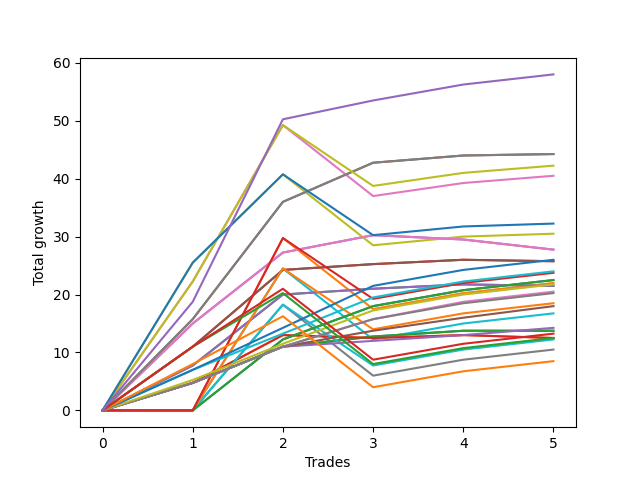

# Short Labrador 016 
- Symbol: ES
- Date Range: 03/18/2022 - 12/30/2022
- Trading Period: 8:30-12:30
- Number of Trades: 13



| Name | Win Percent | Profit | Avg Profit / Trade | Avg Time / Trade |      | Name | Win Percent | Profit | Avg Profit / Trade | Avg Time / Trade |
| ---- | ----------- | ------ | ------------------ | ---------------- | ---- | ---- | ----------- | ------ | ------------------ | ---------------- |
| Sorted By <br> Profit | | | | | | Sorted By <br> Win Percentage ||||
| BB-50 U/L 1SD | 69.23 | 14000.00 | 1076.92 | 33:13 |     | TP-1 | 92.31 | 4750.00 | 365.38 | 10:49 |
| BB-100 Mid | 61.54 | 12375.00 | 951.92 | 41:11 |     | TP-2 | 84.62 | 3250.00 | 250.00 | 19:51 |
| TP-6 | 76.92 | 11375.00 | 875.00 | 25:57 |     | TP-6 | 76.92 | 11375.00 | 875.00 | 25:57 |
| TP-7 | 69.23 | 11375.00 | 875.00 | 31:09 |     | TP-5 | 76.92 | 8500.00 | 653.85 | 24:11 |
| BB-20 U/L 2SD | 69.23 | 10500.00 | 807.69 | 16:32 |     | TP-4 | 76.92 | 5750.00 | 442.31 | 23:10 |
| BB-20 U/L 2SD C | 69.23 | 9375.00 | 721.15 | 18:25 |     | TP-3 | 76.92 | 2875.00 | 221.15 | 22:18 |
| TP-5 | 76.92 | 8500.00 | 653.85 | 24:11 |     | BB-50 U/L 1SD | 69.23 | 14000.00 | 1076.92 | 33:13 |
| BB-20 U/L 1SD | 61.54 | 8375.00 | 644.23 | 10:50 |     | TP-7 | 69.23 | 11375.00 | 875.00 | 31:09 |
| BB-20 Mid | 61.54 | 7875.00 | 605.77 | 05:34 |     | BB-20 U/L 2SD | 69.23 | 10500.00 | 807.69 | 16:32 |
| BB-50 U/L 2SD | 38.46 | 6625.00 | 509.62 | 43:12 |     | BB-20 U/L 2SD C | 69.23 | 9375.00 | 721.15 | 18:25 |
| TP-4 | 76.92 | 5750.00 | 442.31 | 23:10 |     | BB-100 Mid | 61.54 | 12375.00 | 951.92 | 41:11 |
| TP-1 | 92.31 | 4750.00 | 365.38 | 10:49 |     | BB-20 U/L 1SD | 61.54 | 8375.00 | 644.23 | 10:50 |
| TP-2 | 84.62 | 3250.00 | 250.00 | 19:51 |     | BB-20 Mid | 61.54 | 7875.00 | 605.77 | 05:34 |
| TP-3 | 76.92 | 2875.00 | 221.15 | 22:18 |     | TP-8 | 53.85 | 500.00 | 38.46 | 38:18 |
| NEWFI 0000 | 38.46 | 875.00 | 67.31 | 16:40 |     | TP-10 | 46.15 | -2500.00 | -192.31 | 40:11 |
| TP-8 | 53.85 | 500.00 | 38.46 | 38:18 |     | TP-9 | 46.15 | -4125.00 | -317.31 | 40:05 |
| BB-50 Mid | 38.46 | 375.00 | 28.85 | 28:28 |     | BB-50 U/L 2SD | 38.46 | 6625.00 | 509.62 | 43:12 |
| TP-10 | 46.15 | -2500.00 | -192.31 | 40:11 |     | NEWFI 0000 | 38.46 | 875.00 | 67.31 | 16:40 |
| TP-9 | 46.15 | -4125.00 | -317.31 | 40:05 |     | BB-50 Mid | 38.46 | 375.00 | 28.85 | 28:28 |
| NEWFI 000 | 38.46 | -4375.00 | -336.54 | 44:26 |     | NEWFI 000 | 38.46 | -4375.00 | -336.54 | 44:26 |
| V Mid | 30.77 | -21500.00 | -1653.85 | 44:43 |     | V Mid | 30.77 | -21500.00 | -1653.85 | 44:43 |
| BB-200 Mid | 30.77 | -22125.00 | -1701.92 | 45:09 |     | BB-200 Mid | 30.77 | -22125.00 | -1701.92 | 45:09 |
| BB-200 U/L 2SD | 23.08 | -22375.00 | -1721.15 | 49:00 |     | BB-200 U/L 2SD | 23.08 | -22375.00 | -1721.15 | 49:00 |
| BB-100 U/L 2SD | 23.08 | -25000.00 | -1923.08 | 52:20 |     | BB-100 U/L 2SD | 23.08 | -25000.00 | -1923.08 | 52:20 |
| V U/L 1SD | 23.08 | -28125.00 | -2163.46 | 48:20 |     | V U/L 1SD | 23.08 | -28125.00 | -2163.46 | 48:20 |

## NO STOPLOSS

### Test BB-20 Mid
* Sell when price hits the middle line of the 20p bollinger
* No Stoploss
* Results:
```
Total Trades: 13
Percent Up: 38.46
Percent Down: 61.54
Total Points Moved Down: 15.75
Potential Profit: 7875.00
Total Points Ups: 8.00 Count Ups: 5
Total Points Downs: 23.75 Count Downs: 8
```

<details><summary>Trades</summary>

<code>In: 2022-03-28 12:02:00		Out: 2022-03-28 12:12:00		Total Position Time: 10:00		Total Move Down: -0.00		Total to Date: 0.00</code> <br />
<code>In: 2022-03-29 11:51:00		Out: 2022-03-29 11:58:00		Total Position Time: 07:00		Total Move Down: -1.00		Total to Date: -1.00</code> <br />
<code>In: 2022-04-07 12:19:00		Out: 2022-04-07 12:20:10		Total Position Time: 01:10		Total Move Down: 3.25		Total to Date: 2.25</code> <br />
<code>In: 2022-04-25 11:37:00		Out: 2022-04-25 11:40:00		Total Position Time: 03:00		Total Move Down: 2.75		Total to Date: 5.00</code> <br />
<code>In: 2022-05-10 11:06:00		Out: 2022-05-10 11:07:10		Total Position Time: 01:10		Total Move Down: 4.75		Total to Date: 9.75</code> <br />
<code>In: 2022-06-14 10:26:00		Out: 2022-06-14 10:27:10		Total Position Time: 01:10		Total Move Down: 6.25		Total to Date: 16.00</code> <br />
<code>In: 2022-08-29 09:08:00		Out: 2022-08-29 09:14:10		Total Position Time: 06:10		Total Move Down: 1.75		Total to Date: 17.75</code> <br />
<code>In: 2022-09-01 11:38:00		Out: 2022-09-01 11:39:15		Total Position Time: 01:15		Total Move Down: 2.75		Total to Date: 20.50</code> <br />
<code>In: 2022-09-01 11:39:00		Out: 2022-09-01 11:43:40		Total Position Time: 04:40		Total Move Down: -1.00		Total to Date: 19.50</code> <br />
<code>In: 2022-09-16 12:11:00		Out: 2022-09-16 12:12:10		Total Position Time: 01:10		Total Move Down: 1.25		Total to Date: 20.75</code> <br />
<code>In: 2022-09-19 12:19:00		Out: 2022-09-19 12:46:50		Total Position Time: 27:50		Total Move Down: -6.00		Total to Date: 14.75</code> <br />
<code>In: 2022-11-21 10:23:00		Out: 2022-11-21 10:27:25		Total Position Time: 04:25		Total Move Down: 1.00		Total to Date: 15.75</code> <br />
<code>In: 2022-11-21 10:24:00		Out: 2022-11-21 10:27:25		Total Position Time: 03:25		Total Move Down: -0.00		Total to Date: 15.75</code> <br />


</details>

### Test BB-20 U/L 1SD
* Sell when the price hits the lower line of the 20p 1std bollinger
* No Stoploss
* Results:
```
Total Trades: 13
Percent Up: 38.46
Percent Down: 61.54
Total Points Moved Down: 16.75
Potential Profit: 8375.00
Total Points Ups: 11.00 Count Ups: 5
Total Points Downs: 27.75 Count Downs: 8
```

<details><summary>Trades</summary>

<code>In: 2022-03-28 12:02:00		Out: 2022-03-28 12:41:10		Total Position Time: 39:10		Total Move Down: -3.75		Total to Date: -3.75</code> <br />
<code>In: 2022-03-29 11:51:00		Out: 2022-03-29 12:00:25		Total Position Time: 09:25		Total Move Down: -0.00		Total to Date: -3.75</code> <br />
<code>In: 2022-04-07 12:19:00		Out: 2022-04-07 12:21:05		Total Position Time: 02:05		Total Move Down: 3.75		Total to Date: 0.00</code> <br />
<code>In: 2022-04-25 11:37:00		Out: 2022-04-25 11:44:35		Total Position Time: 07:35		Total Move Down: 2.75		Total to Date: 2.75</code> <br />
<code>In: 2022-05-10 11:06:00		Out: 2022-05-10 11:07:10		Total Position Time: 01:10		Total Move Down: 4.75		Total to Date: 7.50</code> <br />
<code>In: 2022-06-14 10:26:00		Out: 2022-06-14 10:29:05		Total Position Time: 03:05		Total Move Down: 8.25		Total to Date: 15.75</code> <br />
<code>In: 2022-08-29 09:08:00		Out: 2022-08-29 09:24:15		Total Position Time: 16:15		Total Move Down: -0.50		Total to Date: 15.25</code> <br />
<code>In: 2022-09-01 11:38:00		Out: 2022-09-01 11:44:25		Total Position Time: 06:25		Total Move Down: 2.75		Total to Date: 18.00</code> <br />
<code>In: 2022-09-01 11:39:00		Out: 2022-09-01 11:44:25		Total Position Time: 05:25		Total Move Down: 1.25		Total to Date: 19.25</code> <br />
<code>In: 2022-09-16 12:11:00		Out: 2022-09-16 12:14:25		Total Position Time: 03:25		Total Move Down: 3.75		Total to Date: 23.00</code> <br />
<code>In: 2022-09-19 12:19:00		Out: 2022-09-19 12:47:00		Total Position Time: 28:00		Total Move Down: -6.25		Total to Date: 16.75</code> <br />
<code>In: 2022-11-21 10:23:00		Out: 2022-11-21 10:33:00		Total Position Time: 10:00		Total Move Down: 0.50		Total to Date: 17.25</code> <br />
<code>In: 2022-11-21 10:24:00		Out: 2022-11-21 10:33:00		Total Position Time: 09:00		Total Move Down: -0.50		Total to Date: 16.75</code> <br />


</details>

### Test BB-20 U/L 2SD
* Sell when the price hits the lower line of the 20p 2std bollinger
* No Stoploss
* Results:
```
Total Trades: 13
Percent Up: 30.77
Percent Down: 69.23
Total Points Moved Down: 21.00
Potential Profit: 10500.00
Total Points Ups: 23.00 Count Ups: 4
Total Points Downs: 44.00 Count Downs: 9
```

<details><summary>Trades</summary>

<code>In: 2022-03-28 12:02:00		Out: 2022-03-28 12:47:00		Total Position Time: 45:00		Total Move Down: -9.50		Total to Date: -9.50</code> <br />
<code>In: 2022-03-29 11:51:00		Out: 2022-03-29 12:27:50		Total Position Time: 36:50		Total Move Down: -7.00		Total to Date: -16.50</code> <br />
<code>In: 2022-04-07 12:19:00		Out: 2022-04-07 12:22:45		Total Position Time: 03:45		Total Move Down: 6.25		Total to Date: -10.25</code> <br />
<code>In: 2022-04-25 11:37:00		Out: 2022-04-25 12:02:05		Total Position Time: 25:05		Total Move Down: 4.00		Total to Date: -6.25</code> <br />
<code>In: 2022-05-10 11:06:00		Out: 2022-05-10 11:11:10		Total Position Time: 05:10		Total Move Down: 7.75		Total to Date: 1.50</code> <br />
<code>In: 2022-06-14 10:26:00		Out: 2022-06-14 10:31:00		Total Position Time: 05:00		Total Move Down: 12.25		Total to Date: 13.75</code> <br />
<code>In: 2022-08-29 09:08:00		Out: 2022-08-29 09:24:35		Total Position Time: 16:35		Total Move Down: 1.00		Total to Date: 14.75</code> <br />
<code>In: 2022-09-01 11:38:00		Out: 2022-09-01 11:45:05		Total Position Time: 07:05		Total Move Down: 4.00		Total to Date: 18.75</code> <br />
<code>In: 2022-09-01 11:39:00		Out: 2022-09-01 11:45:05		Total Position Time: 06:05		Total Move Down: 2.50		Total to Date: 21.25</code> <br />
<code>In: 2022-09-16 12:11:00		Out: 2022-09-16 12:28:05		Total Position Time: 17:05		Total Move Down: 5.50		Total to Date: 26.75</code> <br />
<code>In: 2022-09-19 12:19:00		Out: 2022-09-19 12:47:00		Total Position Time: 28:00		Total Move Down: -6.25		Total to Date: 20.50</code> <br />
<code>In: 2022-11-21 10:23:00		Out: 2022-11-21 10:33:10		Total Position Time: 10:10		Total Move Down: 0.75		Total to Date: 21.25</code> <br />
<code>In: 2022-11-21 10:24:00		Out: 2022-11-21 10:33:10		Total Position Time: 09:10		Total Move Down: -0.25		Total to Date: 21.00</code> <br />


</details>

### Test BB-20 U/L 2SD C
* Sell when the price hits the lower line of the 20p 2std bollinger
* No Stoploss
* Results:
```
Total Trades: 13
Percent Up: 30.77
Percent Down: 69.23
Total Points Moved Down: 18.75
Potential Profit: 9375.00
Total Points Ups: 32.00 Count Ups: 4
Total Points Downs: 50.75 Count Downs: 9
```

<details><summary>Trades</summary>

<code>In: 2022-03-28 12:02:00		Out: 2022-03-28 12:47:00		Total Position Time: 45:00		Total Move Down: -9.50		Total to Date: -9.50</code> <br />
<code>In: 2022-03-29 11:51:00		Out: 2022-03-29 12:47:00		Total Position Time: 56:00		Total Move Down: -16.00		Total to Date: -25.50</code> <br />
<code>In: 2022-04-07 12:19:00		Out: 2022-04-07 12:22:45		Total Position Time: 03:45		Total Move Down: 6.25		Total to Date: -19.25</code> <br />
<code>In: 2022-04-25 11:37:00		Out: 2022-04-25 12:02:05		Total Position Time: 25:05		Total Move Down: 4.00		Total to Date: -15.25</code> <br />
<code>In: 2022-05-10 11:06:00		Out: 2022-05-10 11:16:05		Total Position Time: 10:05		Total Move Down: 11.00		Total to Date: -4.25</code> <br />
<code>In: 2022-06-14 10:26:00		Out: 2022-06-14 10:31:10		Total Position Time: 05:10		Total Move Down: 13.25		Total to Date: 9.00</code> <br />
<code>In: 2022-08-29 09:08:00		Out: 2022-08-29 09:24:35		Total Position Time: 16:35		Total Move Down: 1.00		Total to Date: 10.00</code> <br />
<code>In: 2022-09-01 11:38:00		Out: 2022-09-01 11:45:10		Total Position Time: 07:10		Total Move Down: 5.00		Total to Date: 15.00</code> <br />
<code>In: 2022-09-01 11:39:00		Out: 2022-09-01 11:45:10		Total Position Time: 06:10		Total Move Down: 3.50		Total to Date: 18.50</code> <br />
<code>In: 2022-09-16 12:11:00		Out: 2022-09-16 12:28:15		Total Position Time: 17:15		Total Move Down: 6.00		Total to Date: 24.50</code> <br />
<code>In: 2022-09-19 12:19:00		Out: 2022-09-19 12:47:00		Total Position Time: 28:00		Total Move Down: -6.25		Total to Date: 18.25</code> <br />
<code>In: 2022-11-21 10:23:00		Out: 2022-11-21 10:33:10		Total Position Time: 10:10		Total Move Down: 0.75		Total to Date: 19.00</code> <br />
<code>In: 2022-11-21 10:24:00		Out: 2022-11-21 10:33:10		Total Position Time: 09:10		Total Move Down: -0.25		Total to Date: 18.75</code> <br />


</details>

### Test BB-50 Mid
* Sell when price hits the middle line of the 50p bollinger
* No Stoploss
* Results:
```
Total Trades: 13
Percent Up: 61.54
Percent Down: 38.46
Total Points Moved Down: 0.75
Potential Profit: 375.00
Total Points Ups: 36.50 Count Ups: 8
Total Points Downs: 37.25 Count Downs: 5
```

<details><summary>Trades</summary>

<code>In: 2022-03-28 12:02:00		Out: 2022-03-28 12:47:00		Total Position Time: 45:00		Total Move Down: -9.50		Total to Date: -9.50</code> <br />
<code>In: 2022-03-29 11:51:00		Out: 2022-03-29 12:43:10		Total Position Time: 52:10		Total Move Down: -8.00		Total to Date: -17.50</code> <br />
<code>In: 2022-04-07 12:19:00		Out: 2022-04-07 12:47:00		Total Position Time: 28:00		Total Move Down: -6.25		Total to Date: -23.75</code> <br />
<code>In: 2022-04-25 11:37:00		Out: 2022-04-25 12:01:15		Total Position Time: 24:15		Total Move Down: 1.50		Total to Date: -22.25</code> <br />
<code>In: 2022-05-10 11:06:00		Out: 2022-05-10 11:16:20		Total Position Time: 10:20		Total Move Down: 15.00		Total to Date: -7.25</code> <br />
<code>In: 2022-06-14 10:26:00		Out: 2022-06-14 10:31:00		Total Position Time: 05:00		Total Move Down: 12.25		Total to Date: 5.00</code> <br />
<code>In: 2022-08-29 09:08:00		Out: 2022-08-29 09:31:25		Total Position Time: 23:25		Total Move Down: 3.00		Total to Date: 8.00</code> <br />
<code>In: 2022-09-01 11:38:00		Out: 2022-09-01 12:20:35		Total Position Time: 42:35		Total Move Down: -1.25		Total to Date: 6.75</code> <br />
<code>In: 2022-09-01 11:39:00		Out: 2022-09-01 12:20:35		Total Position Time: 41:35		Total Move Down: -2.75		Total to Date: 4.00</code> <br />
<code>In: 2022-09-16 12:11:00		Out: 2022-09-16 12:19:05		Total Position Time: 08:05		Total Move Down: 5.50		Total to Date: 9.50</code> <br />
<code>In: 2022-09-19 12:19:00		Out: 2022-09-19 12:47:00		Total Position Time: 28:00		Total Move Down: -6.25		Total to Date: 3.25</code> <br />
<code>In: 2022-11-21 10:23:00		Out: 2022-11-21 10:54:25		Total Position Time: 31:25		Total Move Down: -0.75		Total to Date: 2.50</code> <br />
<code>In: 2022-11-21 10:24:00		Out: 2022-11-21 10:54:25		Total Position Time: 30:25		Total Move Down: -1.75		Total to Date: 0.75</code> <br />


</details>

### Test BB-50 U/L 1SD
* Sell when the price hits the lower line of the 50p 1std bollinger
* No Stoploss
* Results:
```
Total Trades: 13
Percent Up: 30.77
Percent Down: 69.23
Total Points Moved Down: 28.00
Potential Profit: 14000.00
Total Points Ups: 38.00 Count Ups: 4
Total Points Downs: 66.00 Count Downs: 9
```

<details><summary>Trades</summary>

<code>In: 2022-03-28 12:02:00		Out: 2022-03-28 12:47:00		Total Position Time: 45:00		Total Move Down: -9.50		Total to Date: -9.50</code> <br />
<code>In: 2022-03-29 11:51:00		Out: 2022-03-29 12:47:00		Total Position Time: 56:00		Total Move Down: -16.00		Total to Date: -25.50</code> <br />
<code>In: 2022-04-07 12:19:00		Out: 2022-04-07 12:47:00		Total Position Time: 28:00		Total Move Down: -6.25		Total to Date: -31.75</code> <br />
<code>In: 2022-04-25 11:37:00		Out: 2022-04-25 12:03:25		Total Position Time: 26:25		Total Move Down: 9.25		Total to Date: -22.50</code> <br />
<code>In: 2022-05-10 11:06:00		Out: 2022-05-10 11:24:05		Total Position Time: 18:05		Total Move Down: 15.75		Total to Date: -6.75</code> <br />
<code>In: 2022-06-14 10:26:00		Out: 2022-06-14 10:36:10		Total Position Time: 10:10		Total Move Down: 20.25		Total to Date: 13.50</code> <br />
<code>In: 2022-08-29 09:08:00		Out: 2022-08-29 09:36:50		Total Position Time: 28:50		Total Move Down: 6.75		Total to Date: 20.25</code> <br />
<code>In: 2022-09-01 11:38:00		Out: 2022-09-01 12:28:35		Total Position Time: 50:35		Total Move Down: 3.00		Total to Date: 23.25</code> <br />
<code>In: 2022-09-01 11:39:00		Out: 2022-09-01 12:28:35		Total Position Time: 49:35		Total Move Down: 1.50		Total to Date: 24.75</code> <br />
<code>In: 2022-09-16 12:11:00		Out: 2022-09-16 12:30:25		Total Position Time: 19:25		Total Move Down: 8.00		Total to Date: 32.75</code> <br />
<code>In: 2022-09-19 12:19:00		Out: 2022-09-19 12:47:00		Total Position Time: 28:00		Total Move Down: -6.25		Total to Date: 26.50</code> <br />
<code>In: 2022-11-21 10:23:00		Out: 2022-11-21 10:59:25		Total Position Time: 36:25		Total Move Down: 1.25		Total to Date: 27.75</code> <br />
<code>In: 2022-11-21 10:24:00		Out: 2022-11-21 10:59:25		Total Position Time: 35:25		Total Move Down: 0.25		Total to Date: 28.00</code> <br />


</details>

### Test BB-50 U/L 2SD
* Sell when the price hits the lower line of the 50p 2std bollinger
* No Stoploss
* Results:
```
Total Trades: 13
Percent Up: 61.54
Percent Down: 38.46
Total Points Moved Down: 13.25
Potential Profit: 6625.00
Total Points Ups: 53.50 Count Ups: 8
Total Points Downs: 66.75 Count Downs: 5
```

<details><summary>Trades</summary>

<code>In: 2022-03-28 12:02:00		Out: 2022-03-28 12:47:00		Total Position Time: 45:00		Total Move Down: -9.50		Total to Date: -9.50</code> <br />
<code>In: 2022-03-29 11:51:00		Out: 2022-03-29 12:47:00		Total Position Time: 56:00		Total Move Down: -16.00		Total to Date: -25.50</code> <br />
<code>In: 2022-04-07 12:19:00		Out: 2022-04-07 12:47:00		Total Position Time: 28:00		Total Move Down: -6.25		Total to Date: -31.75</code> <br />
<code>In: 2022-04-25 11:37:00		Out: 2022-04-25 12:07:30		Total Position Time: 30:30		Total Move Down: 14.00		Total to Date: -17.75</code> <br />
<code>In: 2022-05-10 11:06:00		Out: 2022-05-10 11:27:05		Total Position Time: 21:05		Total Move Down: 22.25		Total to Date: 4.50</code> <br />
<code>In: 2022-06-14 10:26:00		Out: 2022-06-14 10:43:05		Total Position Time: 17:05		Total Move Down: 27.00		Total to Date: 31.50</code> <br />
<code>In: 2022-08-29 09:08:00		Out: 2022-08-29 10:08:55		Total Position Time: 60:55		Total Move Down: -12.25		Total to Date: 19.25</code> <br />
<code>In: 2022-09-01 11:38:00		Out: 2022-09-01 12:38:55		Total Position Time: 60:55		Total Move Down: -0.50		Total to Date: 18.75</code> <br />
<code>In: 2022-09-01 11:39:00		Out: 2022-09-01 12:39:55		Total Position Time: 60:55		Total Move Down: -1.00		Total to Date: 17.75</code> <br />
<code>In: 2022-09-16 12:11:00		Out: 2022-09-16 12:47:00		Total Position Time: 36:00		Total Move Down: -1.75		Total to Date: 16.00</code> <br />
<code>In: 2022-09-19 12:19:00		Out: 2022-09-19 12:47:00		Total Position Time: 28:00		Total Move Down: -6.25		Total to Date: 9.75</code> <br />
<code>In: 2022-11-21 10:23:00		Out: 2022-11-21 11:22:10		Total Position Time: 59:10		Total Move Down: 2.25		Total to Date: 12.00</code> <br />
<code>In: 2022-11-21 10:24:00		Out: 2022-11-21 11:22:10		Total Position Time: 58:10		Total Move Down: 1.25		Total to Date: 13.25</code> <br />


</details>

### Test V Mid
* Sell when the price hits the middle line of the 1std VWAP
* No Stoploss
* Results:
```
Total Trades: 13
Percent Up: 69.23
Percent Down: 30.77
Total Points Moved Down: -43.00
Potential Profit: -21500.00
Total Points Ups: 79.00 Count Ups: 9
Total Points Downs: 36.00 Count Downs: 4
```

<details><summary>Trades</summary>

<code>In: 2022-03-28 12:02:00		Out: 2022-03-28 12:47:00		Total Position Time: 45:00		Total Move Down: -9.50		Total to Date: -9.50</code> <br />
<code>In: 2022-03-29 11:51:00		Out: 2022-03-29 12:47:00		Total Position Time: 56:00		Total Move Down: -16.00		Total to Date: -25.50</code> <br />
<code>In: 2022-04-07 12:19:00		Out: 2022-04-07 12:47:00		Total Position Time: 28:00		Total Move Down: -6.25		Total to Date: -31.75</code> <br />
<code>In: 2022-04-25 11:37:00		Out: 2022-04-25 12:37:55		Total Position Time: 60:55		Total Move Down: -25.50		Total to Date: -57.25</code> <br />
<code>In: 2022-05-10 11:06:00		Out: 2022-05-10 11:27:40		Total Position Time: 21:40		Total Move Down: 25.25		Total to Date: -32.00</code> <br />
<code>In: 2022-06-14 10:26:00		Out: 2022-06-14 10:27:10		Total Position Time: 01:10		Total Move Down: 6.25		Total to Date: -25.75</code> <br />
<code>In: 2022-08-29 09:08:00		Out: 2022-08-29 10:08:55		Total Position Time: 60:55		Total Move Down: -12.25		Total to Date: -38.00</code> <br />
<code>In: 2022-09-01 11:38:00		Out: 2022-09-01 12:38:55		Total Position Time: 60:55		Total Move Down: -0.50		Total to Date: -38.50</code> <br />
<code>In: 2022-09-01 11:39:00		Out: 2022-09-01 12:39:55		Total Position Time: 60:55		Total Move Down: -1.00		Total to Date: -39.50</code> <br />
<code>In: 2022-09-16 12:11:00		Out: 2022-09-16 12:47:00		Total Position Time: 36:00		Total Move Down: -1.75		Total to Date: -41.25</code> <br />
<code>In: 2022-09-19 12:19:00		Out: 2022-09-19 12:47:00		Total Position Time: 28:00		Total Move Down: -6.25		Total to Date: -47.50</code> <br />
<code>In: 2022-11-21 10:23:00		Out: 2022-11-21 11:23:55		Total Position Time: 60:55		Total Move Down: 2.75		Total to Date: -44.75</code> <br />
<code>In: 2022-11-21 10:24:00		Out: 2022-11-21 11:24:55		Total Position Time: 60:55		Total Move Down: 1.75		Total to Date: -43.00</code> <br />


</details>

### Test V U/L 1SD
* Sell when the price hits the lower line of the 1std VWAP
* No Stoploss
* Results:
```
Total Trades: 13
Percent Up: 76.92
Percent Down: 23.08
Total Points Moved Down: -56.25
Potential Profit: -28125.00
Total Points Ups: 79.00 Count Ups: 10
Total Points Downs: 22.75 Count Downs: 3
```

<details><summary>Trades</summary>

<code>In: 2022-03-28 12:02:00		Out: 2022-03-28 12:47:00		Total Position Time: 45:00		Total Move Down: -9.50		Total to Date: -9.50</code> <br />
<code>In: 2022-03-29 11:51:00		Out: 2022-03-29 12:47:00		Total Position Time: 56:00		Total Move Down: -16.00		Total to Date: -25.50</code> <br />
<code>In: 2022-04-07 12:19:00		Out: 2022-04-07 12:47:00		Total Position Time: 28:00		Total Move Down: -6.25		Total to Date: -31.75</code> <br />
<code>In: 2022-04-25 11:37:00		Out: 2022-04-25 12:37:55		Total Position Time: 60:55		Total Move Down: -25.50		Total to Date: -57.25</code> <br />
<code>In: 2022-05-10 11:06:00		Out: 2022-05-10 12:06:55		Total Position Time: 60:55		Total Move Down: -0.00		Total to Date: -57.25</code> <br />
<code>In: 2022-06-14 10:26:00		Out: 2022-06-14 10:35:05		Total Position Time: 09:05		Total Move Down: 18.25		Total to Date: -39.00</code> <br />
<code>In: 2022-08-29 09:08:00		Out: 2022-08-29 10:08:55		Total Position Time: 60:55		Total Move Down: -12.25		Total to Date: -51.25</code> <br />
<code>In: 2022-09-01 11:38:00		Out: 2022-09-01 12:38:55		Total Position Time: 60:55		Total Move Down: -0.50		Total to Date: -51.75</code> <br />
<code>In: 2022-09-01 11:39:00		Out: 2022-09-01 12:39:55		Total Position Time: 60:55		Total Move Down: -1.00		Total to Date: -52.75</code> <br />
<code>In: 2022-09-16 12:11:00		Out: 2022-09-16 12:47:00		Total Position Time: 36:00		Total Move Down: -1.75		Total to Date: -54.50</code> <br />
<code>In: 2022-09-19 12:19:00		Out: 2022-09-19 12:47:00		Total Position Time: 28:00		Total Move Down: -6.25		Total to Date: -60.75</code> <br />
<code>In: 2022-11-21 10:23:00		Out: 2022-11-21 11:23:55		Total Position Time: 60:55		Total Move Down: 2.75		Total to Date: -58.00</code> <br />
<code>In: 2022-11-21 10:24:00		Out: 2022-11-21 11:24:55		Total Position Time: 60:55		Total Move Down: 1.75		Total to Date: -56.25</code> <br />


</details>

### Test BB-100 Mid
* Move to BB100 Mid
* No Stoploss
* Results:
```
Total Trades: 13
Percent Up: 38.46
Percent Down: 61.54
Total Points Moved Down: 24.75
Potential Profit: 12375.00
Total Points Ups: 50.25 Count Ups: 5
Total Points Downs: 75.00 Count Downs: 8
```

<details><summary>Trades</summary>

<code>In: 2022-03-28 12:02:00		Out: 2022-03-28 12:47:00		Total Position Time: 45:00		Total Move Down: -9.50		Total to Date: -9.50</code> <br />
<code>In: 2022-03-29 11:51:00		Out: 2022-03-29 12:47:00		Total Position Time: 56:00		Total Move Down: -16.00		Total to Date: -25.50</code> <br />
<code>In: 2022-04-07 12:19:00		Out: 2022-04-07 12:47:00		Total Position Time: 28:00		Total Move Down: -6.25		Total to Date: -31.75</code> <br />
<code>In: 2022-04-25 11:37:00		Out: 2022-04-25 12:07:30		Total Position Time: 30:30		Total Move Down: 14.00		Total to Date: -17.75</code> <br />
<code>In: 2022-05-10 11:06:00		Out: 2022-05-10 11:40:30		Total Position Time: 34:30		Total Move Down: 25.50		Total to Date: 7.75</code> <br />
<code>In: 2022-06-14 10:26:00		Out: 2022-06-14 10:34:00		Total Position Time: 08:00		Total Move Down: 15.25		Total to Date: 23.00</code> <br />
<code>In: 2022-08-29 09:08:00		Out: 2022-08-29 10:08:55		Total Position Time: 60:55		Total Move Down: -12.25		Total to Date: 10.75</code> <br />
<code>In: 2022-09-01 11:38:00		Out: 2022-09-01 12:32:05		Total Position Time: 54:05		Total Move Down: 5.00		Total to Date: 15.75</code> <br />
<code>In: 2022-09-01 11:39:00		Out: 2022-09-01 12:32:05		Total Position Time: 53:05		Total Move Down: 3.50		Total to Date: 19.25</code> <br />
<code>In: 2022-09-16 12:11:00		Out: 2022-09-16 12:31:10		Total Position Time: 20:10		Total Move Down: 9.75		Total to Date: 29.00</code> <br />
<code>In: 2022-09-19 12:19:00		Out: 2022-09-19 12:47:00		Total Position Time: 28:00		Total Move Down: -6.25		Total to Date: 22.75</code> <br />
<code>In: 2022-11-21 10:23:00		Out: 2022-11-21 11:22:05		Total Position Time: 59:05		Total Move Down: 1.50		Total to Date: 24.25</code> <br />
<code>In: 2022-11-21 10:24:00		Out: 2022-11-21 11:22:05		Total Position Time: 58:05		Total Move Down: 0.50		Total to Date: 24.75</code> <br />


</details>

### Test BB-100 U/L 2SD
* Move to BB100 Upper Band
* No Stoploss
* Results:
```
Total Trades: 13
Percent Up: 76.92
Percent Down: 23.08
Total Points Moved Down: -50.00
Potential Profit: -25000.00
Total Points Ups: 79.00 Count Ups: 10
Total Points Downs: 29.00 Count Downs: 3
```

<details><summary>Trades</summary>

<code>In: 2022-03-28 12:02:00		Out: 2022-03-28 12:47:00		Total Position Time: 45:00		Total Move Down: -9.50		Total to Date: -9.50</code> <br />
<code>In: 2022-03-29 11:51:00		Out: 2022-03-29 12:47:00		Total Position Time: 56:00		Total Move Down: -16.00		Total to Date: -25.50</code> <br />
<code>In: 2022-04-07 12:19:00		Out: 2022-04-07 12:47:00		Total Position Time: 28:00		Total Move Down: -6.25		Total to Date: -31.75</code> <br />
<code>In: 2022-04-25 11:37:00		Out: 2022-04-25 12:37:55		Total Position Time: 60:55		Total Move Down: -25.50		Total to Date: -57.25</code> <br />
<code>In: 2022-05-10 11:06:00		Out: 2022-05-10 12:06:55		Total Position Time: 60:55		Total Move Down: -0.00		Total to Date: -57.25</code> <br />
<code>In: 2022-06-14 10:26:00		Out: 2022-06-14 11:26:55		Total Position Time: 60:55		Total Move Down: 24.50		Total to Date: -32.75</code> <br />
<code>In: 2022-08-29 09:08:00		Out: 2022-08-29 10:08:55		Total Position Time: 60:55		Total Move Down: -12.25		Total to Date: -45.00</code> <br />
<code>In: 2022-09-01 11:38:00		Out: 2022-09-01 12:38:55		Total Position Time: 60:55		Total Move Down: -0.50		Total to Date: -45.50</code> <br />
<code>In: 2022-09-01 11:39:00		Out: 2022-09-01 12:39:55		Total Position Time: 60:55		Total Move Down: -1.00		Total to Date: -46.50</code> <br />
<code>In: 2022-09-16 12:11:00		Out: 2022-09-16 12:47:00		Total Position Time: 36:00		Total Move Down: -1.75		Total to Date: -48.25</code> <br />
<code>In: 2022-09-19 12:19:00		Out: 2022-09-19 12:47:00		Total Position Time: 28:00		Total Move Down: -6.25		Total to Date: -54.50</code> <br />
<code>In: 2022-11-21 10:23:00		Out: 2022-11-21 11:23:55		Total Position Time: 60:55		Total Move Down: 2.75		Total to Date: -51.75</code> <br />
<code>In: 2022-11-21 10:24:00		Out: 2022-11-21 11:24:55		Total Position Time: 60:55		Total Move Down: 1.75		Total to Date: -50.00</code> <br />


</details>

### Test BB-200 Mid
* Move to BB200 Mid
* No Stoploss
* Results:
```
Total Trades: 13
Percent Up: 69.23
Percent Down: 30.77
Total Points Moved Down: -44.25
Potential Profit: -22125.00
Total Points Ups: 66.75 Count Ups: 9
Total Points Downs: 22.50 Count Downs: 4
```

<details><summary>Trades</summary>

<code>In: 2022-03-28 12:02:00		Out: 2022-03-28 12:47:00		Total Position Time: 45:00		Total Move Down: -9.50		Total to Date: -9.50</code> <br />
<code>In: 2022-03-29 11:51:00		Out: 2022-03-29 12:47:00		Total Position Time: 56:00		Total Move Down: -16.00		Total to Date: -25.50</code> <br />
<code>In: 2022-04-07 12:19:00		Out: 2022-04-07 12:47:00		Total Position Time: 28:00		Total Move Down: -6.25		Total to Date: -31.75</code> <br />
<code>In: 2022-04-25 11:37:00		Out: 2022-04-25 12:37:55		Total Position Time: 60:55		Total Move Down: -25.50		Total to Date: -57.25</code> <br />
<code>In: 2022-05-10 11:06:00		Out: 2022-05-10 12:06:55		Total Position Time: 60:55		Total Move Down: -0.00		Total to Date: -57.25</code> <br />
<code>In: 2022-06-14 10:26:00		Out: 2022-06-14 10:31:00		Total Position Time: 05:00		Total Move Down: 12.25		Total to Date: -45.00</code> <br />
<code>In: 2022-08-29 09:08:00		Out: 2022-08-29 09:31:35		Total Position Time: 23:35		Total Move Down: 5.75		Total to Date: -39.25</code> <br />
<code>In: 2022-09-01 11:38:00		Out: 2022-09-01 12:38:55		Total Position Time: 60:55		Total Move Down: -0.50		Total to Date: -39.75</code> <br />
<code>In: 2022-09-01 11:39:00		Out: 2022-09-01 12:39:55		Total Position Time: 60:55		Total Move Down: -1.00		Total to Date: -40.75</code> <br />
<code>In: 2022-09-16 12:11:00		Out: 2022-09-16 12:47:00		Total Position Time: 36:00		Total Move Down: -1.75		Total to Date: -42.50</code> <br />
<code>In: 2022-09-19 12:19:00		Out: 2022-09-19 12:47:00		Total Position Time: 28:00		Total Move Down: -6.25		Total to Date: -48.75</code> <br />
<code>In: 2022-11-21 10:23:00		Out: 2022-11-21 11:23:55		Total Position Time: 60:55		Total Move Down: 2.75		Total to Date: -46.00</code> <br />
<code>In: 2022-11-21 10:24:00		Out: 2022-11-21 11:24:55		Total Position Time: 60:55		Total Move Down: 1.75		Total to Date: -44.25</code> <br />


</details>

### Test BB-200 U/L 2SD
* Move to BB200 Upper Band
* No Stoploss
* Results:
```
Total Trades: 13
Percent Up: 76.92
Percent Down: 23.08
Total Points Moved Down: -44.75
Potential Profit: -22375.00
Total Points Ups: 79.00 Count Ups: 10
Total Points Downs: 34.25 Count Downs: 3
```

<details><summary>Trades</summary>

<code>In: 2022-03-28 12:02:00		Out: 2022-03-28 12:47:00		Total Position Time: 45:00		Total Move Down: -9.50		Total to Date: -9.50</code> <br />
<code>In: 2022-03-29 11:51:00		Out: 2022-03-29 12:47:00		Total Position Time: 56:00		Total Move Down: -16.00		Total to Date: -25.50</code> <br />
<code>In: 2022-04-07 12:19:00		Out: 2022-04-07 12:47:00		Total Position Time: 28:00		Total Move Down: -6.25		Total to Date: -31.75</code> <br />
<code>In: 2022-04-25 11:37:00		Out: 2022-04-25 12:37:55		Total Position Time: 60:55		Total Move Down: -25.50		Total to Date: -57.25</code> <br />
<code>In: 2022-05-10 11:06:00		Out: 2022-05-10 12:06:55		Total Position Time: 60:55		Total Move Down: -0.00		Total to Date: -57.25</code> <br />
<code>In: 2022-06-14 10:26:00		Out: 2022-06-14 10:43:45		Total Position Time: 17:45		Total Move Down: 29.75		Total to Date: -27.50</code> <br />
<code>In: 2022-08-29 09:08:00		Out: 2022-08-29 10:08:55		Total Position Time: 60:55		Total Move Down: -12.25		Total to Date: -39.75</code> <br />
<code>In: 2022-09-01 11:38:00		Out: 2022-09-01 12:38:55		Total Position Time: 60:55		Total Move Down: -0.50		Total to Date: -40.25</code> <br />
<code>In: 2022-09-01 11:39:00		Out: 2022-09-01 12:39:55		Total Position Time: 60:55		Total Move Down: -1.00		Total to Date: -41.25</code> <br />
<code>In: 2022-09-16 12:11:00		Out: 2022-09-16 12:47:00		Total Position Time: 36:00		Total Move Down: -1.75		Total to Date: -43.00</code> <br />
<code>In: 2022-09-19 12:19:00		Out: 2022-09-19 12:47:00		Total Position Time: 28:00		Total Move Down: -6.25		Total to Date: -49.25</code> <br />
<code>In: 2022-11-21 10:23:00		Out: 2022-11-21 11:23:55		Total Position Time: 60:55		Total Move Down: 2.75		Total to Date: -46.50</code> <br />
<code>In: 2022-11-21 10:24:00		Out: 2022-11-21 11:24:55		Total Position Time: 60:55		Total Move Down: 1.75		Total to Date: -44.75</code> <br />


</details>

## TAKE PROFIT

### Test TP-1
* Take Profit of 1 Point
* No Stoploss
* Results:
```
Total Trades: 13
Percent Up: 7.69
Percent Down: 92.31
Total Points Moved Down: 9.50
Potential Profit: 4750.00
Total Points Ups: 16.00 Count Ups: 1
Total Points Downs: 25.50 Count Downs: 12
```

<details><summary>Trades</summary>

<code>In: 2022-03-28 12:02:00		Out: 2022-03-28 12:03:10		Total Position Time: 01:10		Total Move Down: 0.75		Total to Date: 0.75</code> <br />
<code>In: 2022-03-29 11:51:00		Out: 2022-03-29 12:47:00		Total Position Time: 56:00		Total Move Down: -16.00		Total to Date: -15.25</code> <br />
<code>In: 2022-04-07 12:19:00		Out: 2022-04-07 12:20:10		Total Position Time: 01:10		Total Move Down: 3.25		Total to Date: -12.00</code> <br />
<code>In: 2022-04-25 11:37:00		Out: 2022-04-25 11:39:40		Total Position Time: 02:40		Total Move Down: 1.00		Total to Date: -11.00</code> <br />
<code>In: 2022-05-10 11:06:00		Out: 2022-05-10 11:07:10		Total Position Time: 01:10		Total Move Down: 4.75		Total to Date: -6.25</code> <br />
<code>In: 2022-06-14 10:26:00		Out: 2022-06-14 10:27:10		Total Position Time: 01:10		Total Move Down: 6.25		Total to Date: 0.00</code> <br />
<code>In: 2022-08-29 09:08:00		Out: 2022-08-29 09:13:50		Total Position Time: 05:50		Total Move Down: 1.00		Total to Date: 1.00</code> <br />
<code>In: 2022-09-01 11:38:00		Out: 2022-09-01 11:39:10		Total Position Time: 01:10		Total Move Down: 1.50		Total to Date: 2.50</code> <br />
<code>In: 2022-09-01 11:39:00		Out: 2022-09-01 11:44:25		Total Position Time: 05:25		Total Move Down: 1.25		Total to Date: 3.75</code> <br />
<code>In: 2022-09-16 12:11:00		Out: 2022-09-16 12:12:10		Total Position Time: 01:10		Total Move Down: 1.25		Total to Date: 5.00</code> <br />
<code>In: 2022-09-19 12:19:00		Out: 2022-09-19 12:20:10		Total Position Time: 01:10		Total Move Down: 2.25		Total to Date: 7.25</code> <br />
<code>In: 2022-11-21 10:23:00		Out: 2022-11-21 10:27:25		Total Position Time: 04:25		Total Move Down: 1.00		Total to Date: 8.25</code> <br />
<code>In: 2022-11-21 10:24:00		Out: 2022-11-21 11:22:10		Total Position Time: 58:10		Total Move Down: 1.25		Total to Date: 9.50</code> <br />


</details>

### Test TP-2
* Take Profit of 2 Point
* No Stoploss
* Results:
```
Total Trades: 13
Percent Up: 15.38
Percent Down: 84.62
Total Points Moved Down: 6.50
Potential Profit: 3250.00
Total Points Ups: 25.50 Count Ups: 2
Total Points Downs: 32.00 Count Downs: 11
```

<details><summary>Trades</summary>

<code>In: 2022-03-28 12:02:00		Out: 2022-03-28 12:47:00		Total Position Time: 45:00		Total Move Down: -9.50		Total to Date: -9.50</code> <br />
<code>In: 2022-03-29 11:51:00		Out: 2022-03-29 12:47:00		Total Position Time: 56:00		Total Move Down: -16.00		Total to Date: -25.50</code> <br />
<code>In: 2022-04-07 12:19:00		Out: 2022-04-07 12:20:10		Total Position Time: 01:10		Total Move Down: 3.25		Total to Date: -22.25</code> <br />
<code>In: 2022-04-25 11:37:00		Out: 2022-04-25 11:39:45		Total Position Time: 02:45		Total Move Down: 1.75		Total to Date: -20.50</code> <br />
<code>In: 2022-05-10 11:06:00		Out: 2022-05-10 11:07:10		Total Position Time: 01:10		Total Move Down: 4.75		Total to Date: -15.75</code> <br />
<code>In: 2022-06-14 10:26:00		Out: 2022-06-14 10:27:10		Total Position Time: 01:10		Total Move Down: 6.25		Total to Date: -9.50</code> <br />
<code>In: 2022-08-29 09:08:00		Out: 2022-08-29 09:31:20		Total Position Time: 23:20		Total Move Down: 2.75		Total to Date: -6.75</code> <br />
<code>In: 2022-09-01 11:38:00		Out: 2022-09-01 11:39:15		Total Position Time: 01:15		Total Move Down: 2.75		Total to Date: -4.00</code> <br />
<code>In: 2022-09-01 11:39:00		Out: 2022-09-01 11:44:50		Total Position Time: 05:50		Total Move Down: 2.00		Total to Date: -2.00</code> <br />
<code>In: 2022-09-16 12:11:00		Out: 2022-09-16 12:12:40		Total Position Time: 01:40		Total Move Down: 2.00		Total to Date: 0.00</code> <br />
<code>In: 2022-09-19 12:19:00		Out: 2022-09-19 12:20:10		Total Position Time: 01:10		Total Move Down: 2.25		Total to Date: 2.25</code> <br />
<code>In: 2022-11-21 10:23:00		Out: 2022-11-21 11:22:10		Total Position Time: 59:10		Total Move Down: 2.25		Total to Date: 4.50</code> <br />
<code>In: 2022-11-21 10:24:00		Out: 2022-11-21 11:22:25		Total Position Time: 58:25		Total Move Down: 2.00		Total to Date: 6.50</code> <br />


</details>

### Test TP-3
* Take Profit of 3 Point
* No Stoploss
* Results:
```
Total Trades: 13
Percent Up: 23.08
Percent Down: 76.92
Total Points Moved Down: 5.75
Potential Profit: 2875.00
Total Points Ups: 31.75 Count Ups: 3
Total Points Downs: 37.50 Count Downs: 10
```

<details><summary>Trades</summary>

<code>In: 2022-03-28 12:02:00		Out: 2022-03-28 12:47:00		Total Position Time: 45:00		Total Move Down: -9.50		Total to Date: -9.50</code> <br />
<code>In: 2022-03-29 11:51:00		Out: 2022-03-29 12:47:00		Total Position Time: 56:00		Total Move Down: -16.00		Total to Date: -25.50</code> <br />
<code>In: 2022-04-07 12:19:00		Out: 2022-04-07 12:20:10		Total Position Time: 01:10		Total Move Down: 3.25		Total to Date: -22.25</code> <br />
<code>In: 2022-04-25 11:37:00		Out: 2022-04-25 11:40:05		Total Position Time: 03:05		Total Move Down: 4.50		Total to Date: -17.75</code> <br />
<code>In: 2022-05-10 11:06:00		Out: 2022-05-10 11:07:10		Total Position Time: 01:10		Total Move Down: 4.75		Total to Date: -13.00</code> <br />
<code>In: 2022-06-14 10:26:00		Out: 2022-06-14 10:27:10		Total Position Time: 01:10		Total Move Down: 6.25		Total to Date: -6.75</code> <br />
<code>In: 2022-08-29 09:08:00		Out: 2022-08-29 09:31:30		Total Position Time: 23:30		Total Move Down: 4.75		Total to Date: -2.00</code> <br />
<code>In: 2022-09-01 11:38:00		Out: 2022-09-01 11:39:25		Total Position Time: 01:25		Total Move Down: 3.25		Total to Date: 1.25</code> <br />
<code>In: 2022-09-01 11:39:00		Out: 2022-09-01 11:44:55		Total Position Time: 05:55		Total Move Down: 3.00		Total to Date: 4.25</code> <br />
<code>In: 2022-09-16 12:11:00		Out: 2022-09-16 12:14:20		Total Position Time: 03:20		Total Move Down: 3.00		Total to Date: 7.25</code> <br />
<code>In: 2022-09-19 12:19:00		Out: 2022-09-19 12:47:00		Total Position Time: 28:00		Total Move Down: -6.25		Total to Date: 1.00</code> <br />
<code>In: 2022-11-21 10:23:00		Out: 2022-11-21 11:22:25		Total Position Time: 59:25		Total Move Down: 3.00		Total to Date: 4.00</code> <br />
<code>In: 2022-11-21 10:24:00		Out: 2022-11-21 11:24:55		Total Position Time: 60:55		Total Move Down: 1.75		Total to Date: 5.75</code> <br />


</details>

### Test TP-4
* Take Profit of 4 Point
* No Stoploss
* Results:
```
Total Trades: 13
Percent Up: 23.08
Percent Down: 76.92
Total Points Moved Down: 11.50
Potential Profit: 5750.00
Total Points Ups: 31.75 Count Ups: 3
Total Points Downs: 43.25 Count Downs: 10
```

<details><summary>Trades</summary>

<code>In: 2022-03-28 12:02:00		Out: 2022-03-28 12:47:00		Total Position Time: 45:00		Total Move Down: -9.50		Total to Date: -9.50</code> <br />
<code>In: 2022-03-29 11:51:00		Out: 2022-03-29 12:47:00		Total Position Time: 56:00		Total Move Down: -16.00		Total to Date: -25.50</code> <br />
<code>In: 2022-04-07 12:19:00		Out: 2022-04-07 12:21:20		Total Position Time: 02:20		Total Move Down: 5.75		Total to Date: -19.75</code> <br />
<code>In: 2022-04-25 11:37:00		Out: 2022-04-25 11:40:05		Total Position Time: 03:05		Total Move Down: 4.50		Total to Date: -15.25</code> <br />
<code>In: 2022-05-10 11:06:00		Out: 2022-05-10 11:07:10		Total Position Time: 01:10		Total Move Down: 4.75		Total to Date: -10.50</code> <br />
<code>In: 2022-06-14 10:26:00		Out: 2022-06-14 10:27:10		Total Position Time: 01:10		Total Move Down: 6.25		Total to Date: -4.25</code> <br />
<code>In: 2022-08-29 09:08:00		Out: 2022-08-29 09:31:30		Total Position Time: 23:30		Total Move Down: 4.75		Total to Date: 0.50</code> <br />
<code>In: 2022-09-01 11:38:00		Out: 2022-09-01 11:44:55		Total Position Time: 06:55		Total Move Down: 4.50		Total to Date: 5.00</code> <br />
<code>In: 2022-09-01 11:39:00		Out: 2022-09-01 11:47:45		Total Position Time: 08:45		Total Move Down: 4.25		Total to Date: 9.25</code> <br />
<code>In: 2022-09-16 12:11:00		Out: 2022-09-16 12:14:30		Total Position Time: 03:30		Total Move Down: 4.00		Total to Date: 13.25</code> <br />
<code>In: 2022-09-19 12:19:00		Out: 2022-09-19 12:47:00		Total Position Time: 28:00		Total Move Down: -6.25		Total to Date: 7.00</code> <br />
<code>In: 2022-11-21 10:23:00		Out: 2022-11-21 11:23:55		Total Position Time: 60:55		Total Move Down: 2.75		Total to Date: 9.75</code> <br />
<code>In: 2022-11-21 10:24:00		Out: 2022-11-21 11:24:55		Total Position Time: 60:55		Total Move Down: 1.75		Total to Date: 11.50</code> <br />


</details>

### Test TP-5
* Take Profit of 5 Point
* No Stoploss
* Results:
```
Total Trades: 13
Percent Up: 23.08
Percent Down: 76.92
Total Points Moved Down: 17.00
Potential Profit: 8500.00
Total Points Ups: 31.75 Count Ups: 3
Total Points Downs: 48.75 Count Downs: 10
```

<details><summary>Trades</summary>

<code>In: 2022-03-28 12:02:00		Out: 2022-03-28 12:47:00		Total Position Time: 45:00		Total Move Down: -9.50		Total to Date: -9.50</code> <br />
<code>In: 2022-03-29 11:51:00		Out: 2022-03-29 12:47:00		Total Position Time: 56:00		Total Move Down: -16.00		Total to Date: -25.50</code> <br />
<code>In: 2022-04-07 12:19:00		Out: 2022-04-07 12:21:20		Total Position Time: 02:20		Total Move Down: 5.75		Total to Date: -19.75</code> <br />
<code>In: 2022-04-25 11:37:00		Out: 2022-04-25 11:45:15		Total Position Time: 08:15		Total Move Down: 5.50		Total to Date: -14.25</code> <br />
<code>In: 2022-05-10 11:06:00		Out: 2022-05-10 11:07:15		Total Position Time: 01:15		Total Move Down: 5.25		Total to Date: -9.00</code> <br />
<code>In: 2022-06-14 10:26:00		Out: 2022-06-14 10:27:10		Total Position Time: 01:10		Total Move Down: 6.25		Total to Date: -2.75</code> <br />
<code>In: 2022-08-29 09:08:00		Out: 2022-08-29 09:31:35		Total Position Time: 23:35		Total Move Down: 5.75		Total to Date: 3.00</code> <br />
<code>In: 2022-09-01 11:38:00		Out: 2022-09-01 11:47:30		Total Position Time: 09:30		Total Move Down: 5.25		Total to Date: 8.25</code> <br />
<code>In: 2022-09-01 11:39:00		Out: 2022-09-01 11:48:25		Total Position Time: 09:25		Total Move Down: 5.00		Total to Date: 13.25</code> <br />
<code>In: 2022-09-16 12:11:00		Out: 2022-09-16 12:19:05		Total Position Time: 08:05		Total Move Down: 5.50		Total to Date: 18.75</code> <br />
<code>In: 2022-09-19 12:19:00		Out: 2022-09-19 12:47:00		Total Position Time: 28:00		Total Move Down: -6.25		Total to Date: 12.50</code> <br />
<code>In: 2022-11-21 10:23:00		Out: 2022-11-21 11:23:55		Total Position Time: 60:55		Total Move Down: 2.75		Total to Date: 15.25</code> <br />
<code>In: 2022-11-21 10:24:00		Out: 2022-11-21 11:24:55		Total Position Time: 60:55		Total Move Down: 1.75		Total to Date: 17.00</code> <br />


</details>

### Test TP-6
* Take Profit of 6 Point
* No Stoploss
* Results:
```
Total Trades: 13
Percent Up: 23.08
Percent Down: 76.92
Total Points Moved Down: 22.75
Potential Profit: 11375.00
Total Points Ups: 31.75 Count Ups: 3
Total Points Downs: 54.50 Count Downs: 10
```

<details><summary>Trades</summary>

<code>In: 2022-03-28 12:02:00		Out: 2022-03-28 12:47:00		Total Position Time: 45:00		Total Move Down: -9.50		Total to Date: -9.50</code> <br />
<code>In: 2022-03-29 11:51:00		Out: 2022-03-29 12:47:00		Total Position Time: 56:00		Total Move Down: -16.00		Total to Date: -25.50</code> <br />
<code>In: 2022-04-07 12:19:00		Out: 2022-04-07 12:22:45		Total Position Time: 03:45		Total Move Down: 6.25		Total to Date: -19.25</code> <br />
<code>In: 2022-04-25 11:37:00		Out: 2022-04-25 12:03:15		Total Position Time: 26:15		Total Move Down: 6.75		Total to Date: -12.50</code> <br />
<code>In: 2022-05-10 11:06:00		Out: 2022-05-10 11:07:25		Total Position Time: 01:25		Total Move Down: 7.00		Total to Date: -5.50</code> <br />
<code>In: 2022-06-14 10:26:00		Out: 2022-06-14 10:27:10		Total Position Time: 01:10		Total Move Down: 6.25		Total to Date: 0.75</code> <br />
<code>In: 2022-08-29 09:08:00		Out: 2022-08-29 09:34:20		Total Position Time: 26:20		Total Move Down: 6.25		Total to Date: 7.00</code> <br />
<code>In: 2022-09-01 11:38:00		Out: 2022-09-01 11:47:45		Total Position Time: 09:45		Total Move Down: 5.75		Total to Date: 12.75</code> <br />
<code>In: 2022-09-01 11:39:00		Out: 2022-09-01 11:48:45		Total Position Time: 09:45		Total Move Down: 5.75		Total to Date: 18.50</code> <br />
<code>In: 2022-09-16 12:11:00		Out: 2022-09-16 12:19:10		Total Position Time: 08:10		Total Move Down: 6.00		Total to Date: 24.50</code> <br />
<code>In: 2022-09-19 12:19:00		Out: 2022-09-19 12:47:00		Total Position Time: 28:00		Total Move Down: -6.25		Total to Date: 18.25</code> <br />
<code>In: 2022-11-21 10:23:00		Out: 2022-11-21 11:23:55		Total Position Time: 60:55		Total Move Down: 2.75		Total to Date: 21.00</code> <br />
<code>In: 2022-11-21 10:24:00		Out: 2022-11-21 11:24:55		Total Position Time: 60:55		Total Move Down: 1.75		Total to Date: 22.75</code> <br />


</details>

### Test TP-7
* Take Profit of 7 Point
* No Stoploss
* Results:
```
Total Trades: 13
Percent Up: 30.77
Percent Down: 69.23
Total Points Moved Down: 22.75
Potential Profit: 11375.00
Total Points Ups: 32.75 Count Ups: 4
Total Points Downs: 55.50 Count Downs: 9
```

<details><summary>Trades</summary>

<code>In: 2022-03-28 12:02:00		Out: 2022-03-28 12:47:00		Total Position Time: 45:00		Total Move Down: -9.50		Total to Date: -9.50</code> <br />
<code>In: 2022-03-29 11:51:00		Out: 2022-03-29 12:47:00		Total Position Time: 56:00		Total Move Down: -16.00		Total to Date: -25.50</code> <br />
<code>In: 2022-04-07 12:19:00		Out: 2022-04-07 12:24:10		Total Position Time: 05:10		Total Move Down: 7.25		Total to Date: -18.25</code> <br />
<code>In: 2022-04-25 11:37:00		Out: 2022-04-25 12:03:20		Total Position Time: 26:20		Total Move Down: 7.75		Total to Date: -10.50</code> <br />
<code>In: 2022-05-10 11:06:00		Out: 2022-05-10 11:07:25		Total Position Time: 01:25		Total Move Down: 7.00		Total to Date: -3.50</code> <br />
<code>In: 2022-06-14 10:26:00		Out: 2022-06-14 10:27:25		Total Position Time: 01:25		Total Move Down: 7.25		Total to Date: 3.75</code> <br />
<code>In: 2022-08-29 09:08:00		Out: 2022-08-29 09:37:00		Total Position Time: 29:00		Total Move Down: 7.25		Total to Date: 11.00</code> <br />
<code>In: 2022-09-01 11:38:00		Out: 2022-09-01 11:48:45		Total Position Time: 10:45		Total Move Down: 7.25		Total to Date: 18.25</code> <br />
<code>In: 2022-09-01 11:39:00		Out: 2022-09-01 12:39:55		Total Position Time: 60:55		Total Move Down: -1.00		Total to Date: 17.25</code> <br />
<code>In: 2022-09-16 12:11:00		Out: 2022-09-16 12:30:15		Total Position Time: 19:15		Total Move Down: 7.25		Total to Date: 24.50</code> <br />
<code>In: 2022-09-19 12:19:00		Out: 2022-09-19 12:47:00		Total Position Time: 28:00		Total Move Down: -6.25		Total to Date: 18.25</code> <br />
<code>In: 2022-11-21 10:23:00		Out: 2022-11-21 11:23:55		Total Position Time: 60:55		Total Move Down: 2.75		Total to Date: 21.00</code> <br />
<code>In: 2022-11-21 10:24:00		Out: 2022-11-21 11:24:55		Total Position Time: 60:55		Total Move Down: 1.75		Total to Date: 22.75</code> <br />


</details>

### Test TP-8
* Take Profit of 8 Point
* No Stoploss
* Results:
```
Total Trades: 13
Percent Up: 46.15
Percent Down: 53.85
Total Points Moved Down: 1.00
Potential Profit: 500.00
Total Points Ups: 45.50 Count Ups: 6
Total Points Downs: 46.50 Count Downs: 7
```

<details><summary>Trades</summary>

<code>In: 2022-03-28 12:02:00		Out: 2022-03-28 12:47:00		Total Position Time: 45:00		Total Move Down: -9.50		Total to Date: -9.50</code> <br />
<code>In: 2022-03-29 11:51:00		Out: 2022-03-29 12:47:00		Total Position Time: 56:00		Total Move Down: -16.00		Total to Date: -25.50</code> <br />
<code>In: 2022-04-07 12:19:00		Out: 2022-04-07 12:28:45		Total Position Time: 09:45		Total Move Down: 8.50		Total to Date: -17.00</code> <br />
<code>In: 2022-04-25 11:37:00		Out: 2022-04-25 12:03:25		Total Position Time: 26:25		Total Move Down: 9.25		Total to Date: -7.75</code> <br />
<code>In: 2022-05-10 11:06:00		Out: 2022-05-10 11:11:40		Total Position Time: 05:40		Total Move Down: 8.00		Total to Date: 0.25</code> <br />
<code>In: 2022-06-14 10:26:00		Out: 2022-06-14 10:29:05		Total Position Time: 03:05		Total Move Down: 8.25		Total to Date: 8.50</code> <br />
<code>In: 2022-08-29 09:08:00		Out: 2022-08-29 10:08:55		Total Position Time: 60:55		Total Move Down: -12.25		Total to Date: -3.75</code> <br />
<code>In: 2022-09-01 11:38:00		Out: 2022-09-01 12:38:55		Total Position Time: 60:55		Total Move Down: -0.50		Total to Date: -4.25</code> <br />
<code>In: 2022-09-01 11:39:00		Out: 2022-09-01 12:39:55		Total Position Time: 60:55		Total Move Down: -1.00		Total to Date: -5.25</code> <br />
<code>In: 2022-09-16 12:11:00		Out: 2022-09-16 12:30:25		Total Position Time: 19:25		Total Move Down: 8.00		Total to Date: 2.75</code> <br />
<code>In: 2022-09-19 12:19:00		Out: 2022-09-19 12:47:00		Total Position Time: 28:00		Total Move Down: -6.25		Total to Date: -3.50</code> <br />
<code>In: 2022-11-21 10:23:00		Out: 2022-11-21 11:23:55		Total Position Time: 60:55		Total Move Down: 2.75		Total to Date: -0.75</code> <br />
<code>In: 2022-11-21 10:24:00		Out: 2022-11-21 11:24:55		Total Position Time: 60:55		Total Move Down: 1.75		Total to Date: 1.00</code> <br />


</details>

### Test TP-9
* Take Profit of 9 Point
* No Stoploss
* Results:
```
Total Trades: 13
Percent Up: 53.85
Percent Down: 46.15
Total Points Moved Down: -8.25
Potential Profit: -4125.00
Total Points Ups: 51.75 Count Ups: 7
Total Points Downs: 43.50 Count Downs: 6
```

<details><summary>Trades</summary>

<code>In: 2022-03-28 12:02:00		Out: 2022-03-28 12:47:00		Total Position Time: 45:00		Total Move Down: -9.50		Total to Date: -9.50</code> <br />
<code>In: 2022-03-29 11:51:00		Out: 2022-03-29 12:47:00		Total Position Time: 56:00		Total Move Down: -16.00		Total to Date: -25.50</code> <br />
<code>In: 2022-04-07 12:19:00		Out: 2022-04-07 12:47:00		Total Position Time: 28:00		Total Move Down: -6.25		Total to Date: -31.75</code> <br />
<code>In: 2022-04-25 11:37:00		Out: 2022-04-25 12:03:25		Total Position Time: 26:25		Total Move Down: 9.25		Total to Date: -22.50</code> <br />
<code>In: 2022-05-10 11:06:00		Out: 2022-05-10 11:16:05		Total Position Time: 10:05		Total Move Down: 11.00		Total to Date: -11.50</code> <br />
<code>In: 2022-06-14 10:26:00		Out: 2022-06-14 10:29:10		Total Position Time: 03:10		Total Move Down: 9.25		Total to Date: -2.25</code> <br />
<code>In: 2022-08-29 09:08:00		Out: 2022-08-29 10:08:55		Total Position Time: 60:55		Total Move Down: -12.25		Total to Date: -14.50</code> <br />
<code>In: 2022-09-01 11:38:00		Out: 2022-09-01 12:38:55		Total Position Time: 60:55		Total Move Down: -0.50		Total to Date: -15.00</code> <br />
<code>In: 2022-09-01 11:39:00		Out: 2022-09-01 12:39:55		Total Position Time: 60:55		Total Move Down: -1.00		Total to Date: -16.00</code> <br />
<code>In: 2022-09-16 12:11:00		Out: 2022-09-16 12:30:50		Total Position Time: 19:50		Total Move Down: 9.50		Total to Date: -6.50</code> <br />
<code>In: 2022-09-19 12:19:00		Out: 2022-09-19 12:47:00		Total Position Time: 28:00		Total Move Down: -6.25		Total to Date: -12.75</code> <br />
<code>In: 2022-11-21 10:23:00		Out: 2022-11-21 11:23:55		Total Position Time: 60:55		Total Move Down: 2.75		Total to Date: -10.00</code> <br />
<code>In: 2022-11-21 10:24:00		Out: 2022-11-21 11:24:55		Total Position Time: 60:55		Total Move Down: 1.75		Total to Date: -8.25</code> <br />


</details>

### Test TP-10
* Take Profit of 10 Point
* No Stoploss
* Results:
```
Total Trades: 13
Percent Up: 53.85
Percent Down: 46.15
Total Points Moved Down: -5.00
Potential Profit: -2500.00
Total Points Ups: 51.75 Count Ups: 7
Total Points Downs: 46.75 Count Downs: 6
```

<details><summary>Trades</summary>

<code>In: 2022-03-28 12:02:00		Out: 2022-03-28 12:47:00		Total Position Time: 45:00		Total Move Down: -9.50		Total to Date: -9.50</code> <br />
<code>In: 2022-03-29 11:51:00		Out: 2022-03-29 12:47:00		Total Position Time: 56:00		Total Move Down: -16.00		Total to Date: -25.50</code> <br />
<code>In: 2022-04-07 12:19:00		Out: 2022-04-07 12:47:00		Total Position Time: 28:00		Total Move Down: -6.25		Total to Date: -31.75</code> <br />
<code>In: 2022-04-25 11:37:00		Out: 2022-04-25 12:04:05		Total Position Time: 27:05		Total Move Down: 11.50		Total to Date: -20.25</code> <br />
<code>In: 2022-05-10 11:06:00		Out: 2022-05-10 11:16:05		Total Position Time: 10:05		Total Move Down: 11.00		Total to Date: -9.25</code> <br />
<code>In: 2022-06-14 10:26:00		Out: 2022-06-14 10:29:40		Total Position Time: 03:40		Total Move Down: 10.00		Total to Date: 0.75</code> <br />
<code>In: 2022-08-29 09:08:00		Out: 2022-08-29 10:08:55		Total Position Time: 60:55		Total Move Down: -12.25		Total to Date: -11.50</code> <br />
<code>In: 2022-09-01 11:38:00		Out: 2022-09-01 12:38:55		Total Position Time: 60:55		Total Move Down: -0.50		Total to Date: -12.00</code> <br />
<code>In: 2022-09-01 11:39:00		Out: 2022-09-01 12:39:55		Total Position Time: 60:55		Total Move Down: -1.00		Total to Date: -13.00</code> <br />
<code>In: 2022-09-16 12:11:00		Out: 2022-09-16 12:31:10		Total Position Time: 20:10		Total Move Down: 9.75		Total to Date: -3.25</code> <br />
<code>In: 2022-09-19 12:19:00		Out: 2022-09-19 12:47:00		Total Position Time: 28:00		Total Move Down: -6.25		Total to Date: -9.50</code> <br />
<code>In: 2022-11-21 10:23:00		Out: 2022-11-21 11:23:55		Total Position Time: 60:55		Total Move Down: 2.75		Total to Date: -6.75</code> <br />
<code>In: 2022-11-21 10:24:00		Out: 2022-11-21 11:24:55		Total Position Time: 60:55		Total Move Down: 1.75		Total to Date: -5.00</code> <br />


</details>

## Indicator Exits

### Test NEWFI 000
* Newfi 0000
* No Stoploss
* Results:
```
Total Trades: 13
Percent Up: 61.54
Percent Down: 38.46
Total Points Moved Down: -8.75
Potential Profit: -4375.00
Total Points Ups: 66.75 Count Ups: 8
Total Points Downs: 58.00 Count Downs: 5
```

<details><summary>Trades</summary>

<code>In: 2022-03-28 12:02:00		Out: 2022-03-28 12:47:00		Total Position Time: 45:00		Total Move Down: -9.50		Total to Date: -9.50</code> <br />
<code>In: 2022-03-29 11:51:00		Out: 2022-03-29 12:47:00		Total Position Time: 56:00		Total Move Down: -16.00		Total to Date: -25.50</code> <br />
<code>In: 2022-04-07 12:19:00		Out: 2022-04-07 12:47:00		Total Position Time: 28:00		Total Move Down: -6.25		Total to Date: -31.75</code> <br />
<code>In: 2022-04-25 11:37:00		Out: 2022-04-25 12:37:55		Total Position Time: 60:55		Total Move Down: -25.50		Total to Date: -57.25</code> <br />
<code>In: 2022-05-10 11:06:00		Out: 2022-05-10 11:31:05		Total Position Time: 25:05		Total Move Down: 18.75		Total to Date: -38.50</code> <br />
<code>In: 2022-06-14 10:26:00		Out: 2022-06-14 10:48:05		Total Position Time: 22:05		Total Move Down: 31.50		Total to Date: -7.00</code> <br />
<code>In: 2022-08-29 09:08:00		Out: 2022-08-29 09:41:05		Total Position Time: 33:05		Total Move Down: 3.25		Total to Date: -3.75</code> <br />
<code>In: 2022-09-01 11:38:00		Out: 2022-09-01 12:38:55		Total Position Time: 60:55		Total Move Down: -0.50		Total to Date: -4.25</code> <br />
<code>In: 2022-09-01 11:39:00		Out: 2022-09-01 12:39:55		Total Position Time: 60:55		Total Move Down: -1.00		Total to Date: -5.25</code> <br />
<code>In: 2022-09-16 12:11:00		Out: 2022-09-16 12:47:00		Total Position Time: 36:00		Total Move Down: -1.75		Total to Date: -7.00</code> <br />
<code>In: 2022-09-19 12:19:00		Out: 2022-09-19 12:47:00		Total Position Time: 28:00		Total Move Down: -6.25		Total to Date: -13.25</code> <br />
<code>In: 2022-11-21 10:23:00		Out: 2022-11-21 11:23:55		Total Position Time: 60:55		Total Move Down: 2.75		Total to Date: -10.50</code> <br />
<code>In: 2022-11-21 10:24:00		Out: 2022-11-21 11:24:55		Total Position Time: 60:55		Total Move Down: 1.75		Total to Date: -8.75</code> <br />


</details>

### Test NEWFI 0000
* Newfi 0000
* No Stoploss
* Results:
```
Total Trades: 13
Percent Up: 61.54
Percent Down: 38.46
Total Points Moved Down: 1.75
Potential Profit: 875.00
Total Points Ups: 29.25 Count Ups: 8
Total Points Downs: 31.00 Count Downs: 5
```

<details><summary>Trades</summary>

<code>In: 2022-03-28 12:02:00		Out: 2022-03-28 12:20:05		Total Position Time: 18:05		Total Move Down: -0.25		Total to Date: -0.25</code> <br />
<code>In: 2022-03-29 11:51:00		Out: 2022-03-29 11:52:05		Total Position Time: 01:05		Total Move Down: -1.50		Total to Date: -1.75</code> <br />
<code>In: 2022-04-07 12:19:00		Out: 2022-04-07 12:43:05		Total Position Time: 24:05		Total Move Down: 0.75		Total to Date: -1.00</code> <br />
<code>In: 2022-04-25 11:37:00		Out: 2022-04-25 11:52:05		Total Position Time: 15:05		Total Move Down: -10.75		Total to Date: -11.75</code> <br />
<code>In: 2022-05-10 11:06:00		Out: 2022-05-10 11:07:05		Total Position Time: 01:05		Total Move Down: 3.75		Total to Date: -8.00</code> <br />
<code>In: 2022-06-14 10:26:00		Out: 2022-06-14 11:26:55		Total Position Time: 60:55		Total Move Down: 24.50		Total to Date: 16.50</code> <br />
<code>In: 2022-08-29 09:08:00		Out: 2022-08-29 09:09:05		Total Position Time: 01:05		Total Move Down: -1.75		Total to Date: 14.75</code> <br />
<code>In: 2022-09-01 11:38:00		Out: 2022-09-01 11:39:05		Total Position Time: 01:05		Total Move Down: 1.00		Total to Date: 15.75</code> <br />
<code>In: 2022-09-01 11:39:00		Out: 2022-09-01 12:06:05		Total Position Time: 27:05		Total Move Down: -3.00		Total to Date: 12.75</code> <br />
<code>In: 2022-09-16 12:11:00		Out: 2022-09-16 12:47:00		Total Position Time: 36:00		Total Move Down: -1.75		Total to Date: 11.00</code> <br />
<code>In: 2022-09-19 12:19:00		Out: 2022-09-19 12:31:05		Total Position Time: 12:05		Total Move Down: -6.00		Total to Date: 5.00</code> <br />
<code>In: 2022-11-21 10:23:00		Out: 2022-11-21 10:24:05		Total Position Time: 01:05		Total Move Down: 1.00		Total to Date: 6.00</code> <br />
<code>In: 2022-11-21 10:24:00		Out: 2022-11-21 10:42:05		Total Position Time: 18:05		Total Move Down: -4.25		Total to Date: 1.75</code> <br />


</details>