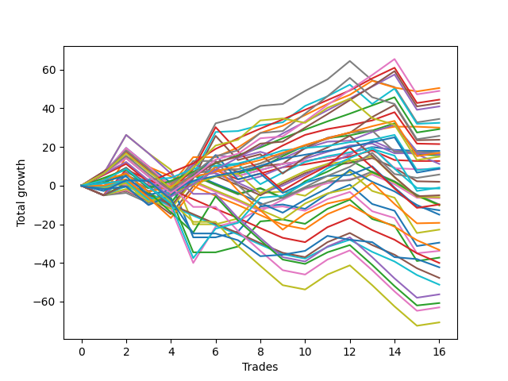

# Short Labrador 017 
- Symbol: ES
- Date Range: 03/18/2022 - 12/30/2022
- Trading Period: 8:30-12:30
- Number of Trades: 16



| Name | Win Percent | Profit | Avg Profit / Trade | Avg Time / Trade |      | Name | Win Percent | Profit | Avg Profit / Trade | Avg Time / Trade |
| ---- | ----------- | ------ | ------------------ | ---------------- | ---- | ---- | ----------- | ------ | ------------------ | ---------------- |
| Sorted By <br> Profit | | | | | | Sorted By <br> Win Percentage ||||
| BB-200 Mid | 68.75 | 25250.00 | 1578.12 | 35:54 |     | TP-1 | 93.75 | 4625.00 | 289.06 | 09:41 |
| TP-8 | 81.25 | 24500.00 | 1531.25 | 37:37 |     | TP-5 | 87.50 | 22250.00 | 1390.62 | 27:55 |
| TP-5 | 87.50 | 22250.00 | 1390.62 | 27:55 |     | TP-4 | 87.50 | 14625.00 | 914.06 | 24:53 |
| TP-7 | 81.25 | 21375.00 | 1335.94 | 35:35 |     | TP-3 | 87.50 | 8500.00 | 531.25 | 16:08 |
| TP-6 | 81.25 | 20500.00 | 1281.25 | 31:00 |     | TP-2 | 87.50 | 4375.00 | 273.44 | 15:43 |
| BB-100 Mid | 75.00 | 16250.00 | 1015.62 | 37:48 |     | TP-8 | 81.25 | 24500.00 | 1531.25 | 37:37 |
| BB-20 U/L 1SD | 81.25 | 15000.00 | 937.50 | 08:17 |     | TP-7 | 81.25 | 21375.00 | 1335.94 | 35:35 |
| TP-4 | 87.50 | 14625.00 | 914.06 | 24:53 |     | TP-6 | 81.25 | 20500.00 | 1281.25 | 31:00 |
| TP-9 | 68.75 | 12875.00 | 804.69 | 41:57 |     | BB-20 U/L 1SD | 81.25 | 15000.00 | 937.50 | 08:17 |
| BB-50 U/L 1SD | 68.75 | 11875.00 | 742.19 | 32:45 |     | BB-100 Mid | 75.00 | 16250.00 | 1015.62 | 37:48 |
| BB-20 U/L 2SD C | 75.00 | 10750.00 | 671.88 | 19:04 |     | BB-20 U/L 2SD C | 75.00 | 10750.00 | 671.88 | 19:04 |
| BB-20 Mid | 62.50 | 9000.00 | 562.50 | 04:34 |     | BB-20 U/L 1SD SL-10 | 75.00 | 8500.00 | 531.25 | 07:47 |
| TP-3 | 87.50 | 8500.00 | 531.25 | 16:08 |     | BB-20 U/L 2SD | 75.00 | 7875.00 | 492.19 | 17:58 |
| BB-20 U/L 1SD SL-10 | 75.00 | 8500.00 | 531.25 | 07:47 |     | BB-200 Mid | 68.75 | 25250.00 | 1578.12 | 35:54 |
| BB-50 Mid | 62.50 | 8000.00 | 500.00 | 22:31 |     | TP-9 | 68.75 | 12875.00 | 804.69 | 41:57 |
| BB-20 U/L 2SD | 75.00 | 7875.00 | 492.19 | 17:58 |     | BB-50 U/L 1SD | 68.75 | 11875.00 | 742.19 | 32:45 |
| TP-10 | 62.50 | 7500.00 | 468.75 | 47:06 |     | NEWFI 000 | 68.75 | -500.00 | -31.25 | 45:59 |
| TP-1 | 93.75 | 4625.00 | 289.06 | 09:41 |     | BB-20 Mid | 62.50 | 9000.00 | 562.50 | 04:34 |
| TP-2 | 87.50 | 4375.00 | 273.44 | 15:43 |     | BB-50 Mid | 62.50 | 8000.00 | 500.00 | 22:31 |
| BB-20 Mid SL-10 | 62.50 | 4250.00 | 265.62 | 04:17 |     | TP-10 | 62.50 | 7500.00 | 468.75 | 47:06 |
| BB-200 Mid SL-10 | 56.25 | 2875.00 | 179.69 | 27:24 |     | BB-20 Mid SL-10 | 62.50 | 4250.00 | 265.62 | 04:17 |
| NEWFI 000 | 68.75 | -500.00 | -31.25 | 45:59 |     | BB-20 U/L 2SD C SL-10 | 62.50 | -750.00 | -46.88 | 14:50 |
| BB-20 U/L 2SD C SL-10 | 62.50 | -750.00 | -46.88 | 14:50 |     | BB-20 U/L 2SD SL-10 | 62.50 | -3000.00 | -187.50 | 13:46 |
| BB-100 Mid SL-10 | 56.25 | -2500.00 | -156.25 | 25:15 |     | BB-200 Mid SL-10 | 56.25 | 2875.00 | 179.69 | 27:24 |
| BB-20 U/L 2SD SL-10 | 62.50 | -3000.00 | -187.50 | 13:46 |     | BB-100 Mid SL-10 | 56.25 | -2500.00 | -156.25 | 25:15 |
| BB-50 Mid SL-10 | 56.25 | -6375.00 | -398.44 | 17:25 |     | BB-50 Mid SL-10 | 56.25 | -6375.00 | -398.44 | 17:25 |
| BB-50 U/L 1SD SL-10 | 50.00 | -9625.00 | -601.56 | 21:22 |     | BB-50 U/L 2SD | 56.25 | -16875.00 | -1054.69 | 45:53 |
| V U/L 1SD | 50.00 | -11375.00 | -710.94 | 55:19 |     | BB-50 U/L 1SD SL-10 | 50.00 | -9625.00 | -601.56 | 21:22 |
| BB-100 U/L 2SD | 50.00 | -14750.00 | -921.88 | 54:35 |     | V U/L 1SD | 50.00 | -11375.00 | -710.94 | 55:19 |
| BB-50 U/L 2SD | 56.25 | -16875.00 | -1054.69 | 45:53 |     | BB-100 U/L 2SD | 50.00 | -14750.00 | -921.88 | 54:35 |
| BB-200 U/L 2SD | 50.00 | -18625.00 | -1164.06 | 56:11 |     | BB-200 U/L 2SD | 50.00 | -18625.00 | -1164.06 | 56:11 |
| V U/L 1SD SL-10 | 31.25 | -28125.00 | -1757.81 | 39:15 |     | BB-50 U/L 2SD SL-10 | 37.50 | -30375.00 | -1898.44 | 30:01 |
| BB-50 U/L 2SD SL-10 | 37.50 | -30375.00 | -1898.44 | 30:01 |     | V U/L 1SD SL-10 | 31.25 | -28125.00 | -1757.81 | 39:15 |
| BB-100 U/L 2SD SL-10 | 31.25 | -31500.00 | -1968.75 | 38:31 |     | BB-100 U/L 2SD SL-10 | 31.25 | -31500.00 | -1968.75 | 38:31 |
| BB-200 U/L 2SD SL-10 | 31.25 | -35375.00 | -2210.94 | 40:07 |     | BB-200 U/L 2SD SL-10 | 31.25 | -35375.00 | -2210.94 | 40:07 |

## NO STOPLOSS

### Test BB-20 Mid
* Sell when price hits the middle line of the 20p bollinger
* No Stoploss
* Results:
```
Total Trades: 16
Percent Up: 37.50
Percent Down: 62.50
Total Points Moved Down: 18.00
Potential Profit: 9000.00
Total Points Ups: 5.75 Count Ups: 6
Total Points Downs: 23.75 Count Downs: 10
```

<details><summary>Trades</summary>

<code>In: 2022-03-25 11:19:00		Out: 2022-03-25 11:20:10		Total Position Time: 01:10		Total Move Down: 1.25		Total to Date: 1.25</code> <br />
<code>In: 2022-03-25 11:58:00		Out: 2022-03-25 12:00:05		Total Position Time: 02:05		Total Move Down: -0.75		Total to Date: 0.50</code> <br />
<code>In: 2022-03-28 12:02:00		Out: 2022-03-28 12:12:00		Total Position Time: 10:00		Total Move Down: -0.00		Total to Date: 0.50</code> <br />
<code>In: 2022-04-07 10:34:00		Out: 2022-04-07 10:37:30		Total Position Time: 03:30		Total Move Down: 1.25		Total to Date: 1.75</code> <br />
<code>In: 2022-04-28 08:37:00		Out: 2022-04-28 08:38:10		Total Position Time: 01:10		Total Move Down: 4.75		Total to Date: 6.50</code> <br />
<code>In: 2022-05-10 11:07:00		Out: 2022-05-10 11:08:10		Total Position Time: 01:10		Total Move Down: 1.50		Total to Date: 8.00</code> <br />
<code>In: 2022-05-24 10:49:00		Out: 2022-05-24 11:01:15		Total Position Time: 12:15		Total Move Down: -3.00		Total to Date: 5.00</code> <br />
<code>In: 2022-06-10 12:22:00		Out: 2022-06-10 12:23:10		Total Position Time: 01:10		Total Move Down: 3.00		Total to Date: 8.00</code> <br />
<code>In: 2022-07-05 08:59:00		Out: 2022-07-05 09:03:00		Total Position Time: 04:00		Total Move Down: 3.25		Total to Date: 11.25</code> <br />
<code>In: 2022-07-12 08:34:00		Out: 2022-07-12 08:37:00		Total Position Time: 03:00		Total Move Down: 1.50		Total to Date: 12.75</code> <br />
<code>In: 2022-08-04 10:40:00		Out: 2022-08-04 10:43:05		Total Position Time: 03:05		Total Move Down: 2.00		Total to Date: 14.75</code> <br />
<code>In: 2022-08-05 10:19:00		Out: 2022-08-05 10:20:10		Total Position Time: 01:10		Total Move Down: 2.00		Total to Date: 16.75</code> <br />
<code>In: 2022-08-29 09:09:00		Out: 2022-08-29 09:14:10		Total Position Time: 05:10		Total Move Down: 3.25		Total to Date: 20.00</code> <br />
<code>In: 2022-09-16 11:58:00		Out: 2022-09-16 12:11:10		Total Position Time: 13:10		Total Move Down: -1.50		Total to Date: 18.50</code> <br />
<code>In: 2022-11-17 08:42:00		Out: 2022-11-17 08:49:45		Total Position Time: 07:45		Total Move Down: -0.50		Total to Date: 18.00</code> <br />
<code>In: 2022-11-21 10:24:00		Out: 2022-11-21 10:27:25		Total Position Time: 03:25		Total Move Down: -0.00		Total to Date: 18.00</code> <br />


</details>

### Test BB-20 U/L 1SD
* Sell when the price hits the lower line of the 20p 1std bollinger
* No Stoploss
* Results:
```
Total Trades: 16
Percent Up: 18.75
Percent Down: 81.25
Total Points Moved Down: 30.00
Potential Profit: 15000.00
Total Points Ups: 4.25 Count Ups: 3
Total Points Downs: 34.25 Count Downs: 13
```

<details><summary>Trades</summary>

<code>In: 2022-03-25 11:19:00		Out: 2022-03-25 11:20:10		Total Position Time: 01:10		Total Move Down: 1.25		Total to Date: 1.25</code> <br />
<code>In: 2022-03-25 11:58:00		Out: 2022-03-25 12:00:45		Total Position Time: 02:45		Total Move Down: 1.25		Total to Date: 2.50</code> <br />
<code>In: 2022-03-28 12:02:00		Out: 2022-03-28 12:41:10		Total Position Time: 39:10		Total Move Down: -3.75		Total to Date: -1.25</code> <br />
<code>In: 2022-04-07 10:34:00		Out: 2022-04-07 10:40:00		Total Position Time: 06:00		Total Move Down: 3.00		Total to Date: 1.75</code> <br />
<code>In: 2022-04-28 08:37:00		Out: 2022-04-28 08:38:10		Total Position Time: 01:10		Total Move Down: 4.75		Total to Date: 6.50</code> <br />
<code>In: 2022-05-10 11:07:00		Out: 2022-05-10 11:08:10		Total Position Time: 01:10		Total Move Down: 1.50		Total to Date: 8.00</code> <br />
<code>In: 2022-05-24 10:49:00		Out: 2022-05-24 11:01:40		Total Position Time: 12:40		Total Move Down: 0.50		Total to Date: 8.50</code> <br />
<code>In: 2022-06-10 12:22:00		Out: 2022-06-10 12:23:10		Total Position Time: 01:10		Total Move Down: 3.00		Total to Date: 11.50</code> <br />
<code>In: 2022-07-05 08:59:00		Out: 2022-07-05 09:03:30		Total Position Time: 04:30		Total Move Down: 4.75		Total to Date: 16.25</code> <br />
<code>In: 2022-07-12 08:34:00		Out: 2022-07-12 08:38:10		Total Position Time: 04:10		Total Move Down: 4.50		Total to Date: 20.75</code> <br />
<code>In: 2022-08-04 10:40:00		Out: 2022-08-04 10:43:15		Total Position Time: 03:15		Total Move Down: 3.50		Total to Date: 24.25</code> <br />
<code>In: 2022-08-05 10:19:00		Out: 2022-08-05 10:23:15		Total Position Time: 04:15		Total Move Down: 3.25		Total to Date: 27.50</code> <br />
<code>In: 2022-08-29 09:09:00		Out: 2022-08-29 09:24:15		Total Position Time: 15:15		Total Move Down: 1.00		Total to Date: 28.50</code> <br />
<code>In: 2022-09-16 11:58:00		Out: 2022-09-16 12:14:25		Total Position Time: 16:25		Total Move Down: 2.00		Total to Date: 30.50</code> <br />
<code>In: 2022-11-17 08:42:00		Out: 2022-11-17 08:52:30		Total Position Time: 10:30		Total Move Down: -0.00		Total to Date: 30.50</code> <br />
<code>In: 2022-11-21 10:24:00		Out: 2022-11-21 10:33:00		Total Position Time: 09:00		Total Move Down: -0.50		Total to Date: 30.00</code> <br />


</details>

### Test BB-20 U/L 2SD
* Sell when the price hits the lower line of the 20p 2std bollinger
* No Stoploss
* Results:
```
Total Trades: 16
Percent Up: 25.00
Percent Down: 75.00
Total Points Moved Down: 15.75
Potential Profit: 7875.00
Total Points Ups: 27.00 Count Ups: 4
Total Points Downs: 42.75 Count Downs: 12
```

<details><summary>Trades</summary>

<code>In: 2022-03-25 11:19:00		Out: 2022-03-25 12:00:55		Total Position Time: 41:55		Total Move Down: -1.00		Total to Date: -1.00</code> <br />
<code>In: 2022-03-25 11:58:00		Out: 2022-03-25 12:00:55		Total Position Time: 02:55		Total Move Down: 2.25		Total to Date: 1.25</code> <br />
<code>In: 2022-03-28 12:02:00		Out: 2022-03-28 12:47:00		Total Position Time: 45:00		Total Move Down: -9.50		Total to Date: -8.25</code> <br />
<code>In: 2022-04-07 10:34:00		Out: 2022-04-07 10:45:15		Total Position Time: 11:15		Total Move Down: 3.75		Total to Date: -4.50</code> <br />
<code>In: 2022-04-28 08:37:00		Out: 2022-04-28 08:38:55		Total Position Time: 01:55		Total Move Down: 5.00		Total to Date: 0.50</code> <br />
<code>In: 2022-05-10 11:07:00		Out: 2022-05-10 11:11:10		Total Position Time: 04:10		Total Move Down: 4.25		Total to Date: 4.75</code> <br />
<code>In: 2022-05-24 10:49:00		Out: 2022-05-24 11:01:50		Total Position Time: 12:50		Total Move Down: 1.50		Total to Date: 6.25</code> <br />
<code>In: 2022-06-10 12:22:00		Out: 2022-06-10 12:42:45		Total Position Time: 20:45		Total Move Down: 3.00		Total to Date: 9.25</code> <br />
<code>In: 2022-07-05 08:59:00		Out: 2022-07-05 09:05:50		Total Position Time: 06:50		Total Move Down: 6.00		Total to Date: 15.25</code> <br />
<code>In: 2022-07-12 08:34:00		Out: 2022-07-12 08:41:10		Total Position Time: 07:10		Total Move Down: 5.50		Total to Date: 20.75</code> <br />
<code>In: 2022-08-04 10:40:00		Out: 2022-08-04 10:45:30		Total Position Time: 05:30		Total Move Down: 3.75		Total to Date: 24.50</code> <br />
<code>In: 2022-08-05 10:19:00		Out: 2022-08-05 10:49:30		Total Position Time: 30:30		Total Move Down: 1.50		Total to Date: 26.00</code> <br />
<code>In: 2022-08-29 09:09:00		Out: 2022-08-29 09:24:35		Total Position Time: 15:35		Total Move Down: 2.50		Total to Date: 28.50</code> <br />
<code>In: 2022-09-16 11:58:00		Out: 2022-09-16 12:28:05		Total Position Time: 30:05		Total Move Down: 3.75		Total to Date: 32.25</code> <br />
<code>In: 2022-11-17 08:42:00		Out: 2022-11-17 09:23:55		Total Position Time: 41:55		Total Move Down: -16.25		Total to Date: 16.00</code> <br />
<code>In: 2022-11-21 10:24:00		Out: 2022-11-21 10:33:10		Total Position Time: 09:10		Total Move Down: -0.25		Total to Date: 15.75</code> <br />


</details>

### Test BB-20 U/L 2SD C
* Sell when the price hits the lower line of the 20p 2std bollinger
* No Stoploss
* Results:
```
Total Trades: 16
Percent Up: 25.00
Percent Down: 75.00
Total Points Moved Down: 21.50
Potential Profit: 10750.00
Total Points Ups: 26.50 Count Ups: 4
Total Points Downs: 48.00 Count Downs: 12
```

<details><summary>Trades</summary>

<code>In: 2022-03-25 11:19:00		Out: 2022-03-25 12:01:15		Total Position Time: 42:15		Total Move Down: -0.50		Total to Date: -0.50</code> <br />
<code>In: 2022-03-25 11:58:00		Out: 2022-03-25 12:01:15		Total Position Time: 03:15		Total Move Down: 2.75		Total to Date: 2.25</code> <br />
<code>In: 2022-03-28 12:02:00		Out: 2022-03-28 12:47:00		Total Position Time: 45:00		Total Move Down: -9.50		Total to Date: -7.25</code> <br />
<code>In: 2022-04-07 10:34:00		Out: 2022-04-07 10:48:00		Total Position Time: 14:00		Total Move Down: 4.00		Total to Date: -3.25</code> <br />
<code>In: 2022-04-28 08:37:00		Out: 2022-04-28 08:39:20		Total Position Time: 02:20		Total Move Down: 5.25		Total to Date: 2.00</code> <br />
<code>In: 2022-05-10 11:07:00		Out: 2022-05-10 11:16:05		Total Position Time: 09:05		Total Move Down: 7.50		Total to Date: 9.50</code> <br />
<code>In: 2022-05-24 10:49:00		Out: 2022-05-24 11:01:50		Total Position Time: 12:50		Total Move Down: 1.50		Total to Date: 11.00</code> <br />
<code>In: 2022-06-10 12:22:00		Out: 2022-06-10 12:43:10		Total Position Time: 21:10		Total Move Down: 3.75		Total to Date: 14.75</code> <br />
<code>In: 2022-07-05 08:59:00		Out: 2022-07-05 09:05:50		Total Position Time: 06:50		Total Move Down: 6.00		Total to Date: 20.75</code> <br />
<code>In: 2022-07-12 08:34:00		Out: 2022-07-12 08:41:10		Total Position Time: 07:10		Total Move Down: 5.50		Total to Date: 26.25</code> <br />
<code>In: 2022-08-04 10:40:00		Out: 2022-08-04 10:52:45		Total Position Time: 12:45		Total Move Down: 3.00		Total to Date: 29.25</code> <br />
<code>In: 2022-08-05 10:19:00		Out: 2022-08-05 10:50:35		Total Position Time: 31:35		Total Move Down: 2.00		Total to Date: 31.25</code> <br />
<code>In: 2022-08-29 09:09:00		Out: 2022-08-29 09:24:35		Total Position Time: 15:35		Total Move Down: 2.50		Total to Date: 33.75</code> <br />
<code>In: 2022-09-16 11:58:00		Out: 2022-09-16 12:28:15		Total Position Time: 30:15		Total Move Down: 4.25		Total to Date: 38.00</code> <br />
<code>In: 2022-11-17 08:42:00		Out: 2022-11-17 09:23:55		Total Position Time: 41:55		Total Move Down: -16.25		Total to Date: 21.75</code> <br />
<code>In: 2022-11-21 10:24:00		Out: 2022-11-21 10:33:10		Total Position Time: 09:10		Total Move Down: -0.25		Total to Date: 21.50</code> <br />


</details>

### Test BB-50 Mid
* Sell when price hits the middle line of the 50p bollinger
* No Stoploss
* Results:
```
Total Trades: 16
Percent Up: 37.50
Percent Down: 62.50
Total Points Moved Down: 16.00
Potential Profit: 8000.00
Total Points Ups: 31.50 Count Ups: 6
Total Points Downs: 47.50 Count Downs: 10
```

<details><summary>Trades</summary>

<code>In: 2022-03-25 11:19:00		Out: 2022-03-25 11:49:30		Total Position Time: 30:30		Total Move Down: -1.75		Total to Date: -1.75</code> <br />
<code>In: 2022-03-25 11:58:00		Out: 2022-03-25 12:00:45		Total Position Time: 02:45		Total Move Down: 1.25		Total to Date: -0.50</code> <br />
<code>In: 2022-03-28 12:02:00		Out: 2022-03-28 12:47:00		Total Position Time: 45:00		Total Move Down: -9.50		Total to Date: -10.00</code> <br />
<code>In: 2022-04-07 10:34:00		Out: 2022-04-07 10:52:05		Total Position Time: 18:05		Total Move Down: 5.00		Total to Date: -5.00</code> <br />
<code>In: 2022-04-28 08:37:00		Out: 2022-04-28 08:40:20		Total Position Time: 03:20		Total Move Down: 9.25		Total to Date: 4.25</code> <br />
<code>In: 2022-05-10 11:07:00		Out: 2022-05-10 11:16:20		Total Position Time: 09:20		Total Move Down: 11.50		Total to Date: 15.75</code> <br />
<code>In: 2022-05-24 10:49:00		Out: 2022-05-24 11:20:25		Total Position Time: 31:25		Total Move Down: -1.25		Total to Date: 14.50</code> <br />
<code>In: 2022-06-10 12:22:00		Out: 2022-06-10 12:23:10		Total Position Time: 01:10		Total Move Down: 3.00		Total to Date: 17.50</code> <br />
<code>In: 2022-07-05 08:59:00		Out: 2022-07-05 09:43:40		Total Position Time: 44:40		Total Move Down: -3.50		Total to Date: 14.00</code> <br />
<code>In: 2022-07-12 08:34:00		Out: 2022-07-12 08:38:20		Total Position Time: 04:20		Total Move Down: 5.25		Total to Date: 19.25</code> <br />
<code>In: 2022-08-04 10:40:00		Out: 2022-08-04 10:55:50		Total Position Time: 15:50		Total Move Down: 3.50		Total to Date: 22.75</code> <br />
<code>In: 2022-08-05 10:19:00		Out: 2022-08-05 10:47:35		Total Position Time: 28:35		Total Move Down: 0.50		Total to Date: 23.25</code> <br />
<code>In: 2022-08-29 09:09:00		Out: 2022-08-29 09:31:25		Total Position Time: 22:25		Total Move Down: 4.50		Total to Date: 27.75</code> <br />
<code>In: 2022-09-16 11:58:00		Out: 2022-09-16 12:19:05		Total Position Time: 21:05		Total Move Down: 3.75		Total to Date: 31.50</code> <br />
<code>In: 2022-11-17 08:42:00		Out: 2022-11-17 09:33:35		Total Position Time: 51:35		Total Move Down: -13.75		Total to Date: 17.75</code> <br />
<code>In: 2022-11-21 10:24:00		Out: 2022-11-21 10:54:25		Total Position Time: 30:25		Total Move Down: -1.75		Total to Date: 16.00</code> <br />


</details>

### Test BB-50 U/L 1SD
* Sell when the price hits the lower line of the 50p 1std bollinger
* No Stoploss
* Results:
```
Total Trades: 16
Percent Up: 31.25
Percent Down: 68.75
Total Points Moved Down: 23.75
Potential Profit: 11875.00
Total Points Ups: 41.25 Count Ups: 5
Total Points Downs: 65.00 Count Downs: 11
```

<details><summary>Trades</summary>

<code>In: 2022-03-25 11:19:00		Out: 2022-03-25 12:01:35		Total Position Time: 42:35		Total Move Down: -0.00		Total to Date: 0.00</code> <br />
<code>In: 2022-03-25 11:58:00		Out: 2022-03-25 12:01:35		Total Position Time: 03:35		Total Move Down: 3.25		Total to Date: 3.25</code> <br />
<code>In: 2022-03-28 12:02:00		Out: 2022-03-28 12:47:00		Total Position Time: 45:00		Total Move Down: -9.50		Total to Date: -6.25</code> <br />
<code>In: 2022-04-07 10:34:00		Out: 2022-04-07 11:34:55		Total Position Time: 60:55		Total Move Down: -8.50		Total to Date: -14.75</code> <br />
<code>In: 2022-04-28 08:37:00		Out: 2022-04-28 08:46:10		Total Position Time: 09:10		Total Move Down: 14.50		Total to Date: -0.25</code> <br />
<code>In: 2022-05-10 11:07:00		Out: 2022-05-10 11:24:05		Total Position Time: 17:05		Total Move Down: 12.25		Total to Date: 12.00</code> <br />
<code>In: 2022-05-24 10:49:00		Out: 2022-05-24 11:44:15		Total Position Time: 55:15		Total Move Down: -5.00		Total to Date: 7.00</code> <br />
<code>In: 2022-06-10 12:22:00		Out: 2022-06-10 12:42:40		Total Position Time: 20:40		Total Move Down: 3.00		Total to Date: 10.00</code> <br />
<code>In: 2022-07-05 08:59:00		Out: 2022-07-05 09:47:10		Total Position Time: 48:10		Total Move Down: 1.25		Total to Date: 11.25</code> <br />
<code>In: 2022-07-12 08:34:00		Out: 2022-07-12 08:43:55		Total Position Time: 09:55		Total Move Down: 8.25		Total to Date: 19.50</code> <br />
<code>In: 2022-08-04 10:40:00		Out: 2022-08-04 11:02:05		Total Position Time: 22:05		Total Move Down: 5.25		Total to Date: 24.75</code> <br />
<code>In: 2022-08-05 10:19:00		Out: 2022-08-05 10:52:05		Total Position Time: 33:05		Total Move Down: 2.50		Total to Date: 27.25</code> <br />
<code>In: 2022-08-29 09:09:00		Out: 2022-08-29 09:36:50		Total Position Time: 27:50		Total Move Down: 8.25		Total to Date: 35.50</code> <br />
<code>In: 2022-09-16 11:58:00		Out: 2022-09-16 12:30:25		Total Position Time: 32:25		Total Move Down: 6.25		Total to Date: 41.75</code> <br />
<code>In: 2022-11-17 08:42:00		Out: 2022-11-17 09:42:55		Total Position Time: 60:55		Total Move Down: -18.25		Total to Date: 23.50</code> <br />
<code>In: 2022-11-21 10:24:00		Out: 2022-11-21 10:59:25		Total Position Time: 35:25		Total Move Down: 0.25		Total to Date: 23.75</code> <br />


</details>

### Test BB-50 U/L 2SD
* Sell when the price hits the lower line of the 50p 2std bollinger
* No Stoploss
* Results:
```
Total Trades: 16
Percent Up: 43.75
Percent Down: 56.25
Total Points Moved Down: -33.75
Potential Profit: -16875.00
Total Points Ups: 80.25 Count Ups: 7
Total Points Downs: 46.50 Count Downs: 9
```

<details><summary>Trades</summary>

<code>In: 2022-03-25 11:19:00		Out: 2022-03-25 12:01:55		Total Position Time: 42:55		Total Move Down: 1.50		Total to Date: 1.50</code> <br />
<code>In: 2022-03-25 11:58:00		Out: 2022-03-25 12:01:55		Total Position Time: 03:55		Total Move Down: 4.75		Total to Date: 6.25</code> <br />
<code>In: 2022-03-28 12:02:00		Out: 2022-03-28 12:47:00		Total Position Time: 45:00		Total Move Down: -9.50		Total to Date: -3.25</code> <br />
<code>In: 2022-04-07 10:34:00		Out: 2022-04-07 11:34:55		Total Position Time: 60:55		Total Move Down: -8.50		Total to Date: -11.75</code> <br />
<code>In: 2022-04-28 08:37:00		Out: 2022-04-28 09:37:55		Total Position Time: 60:55		Total Move Down: -28.25		Total to Date: -40.00</code> <br />
<code>In: 2022-05-10 11:07:00		Out: 2022-05-10 11:27:05		Total Position Time: 20:05		Total Move Down: 18.75		Total to Date: -21.25</code> <br />
<code>In: 2022-05-24 10:49:00		Out: 2022-05-24 11:49:10		Total Position Time: 60:10		Total Move Down: 2.75		Total to Date: -18.50</code> <br />
<code>In: 2022-06-10 12:22:00		Out: 2022-06-10 12:44:30		Total Position Time: 22:30		Total Move Down: 6.75		Total to Date: -11.75</code> <br />
<code>In: 2022-07-05 08:59:00		Out: 2022-07-05 09:59:55		Total Position Time: 60:55		Total Move Down: 1.00		Total to Date: -10.75</code> <br />
<code>In: 2022-07-12 08:34:00		Out: 2022-07-12 09:34:55		Total Position Time: 60:55		Total Move Down: -2.25		Total to Date: -13.00</code> <br />
<code>In: 2022-08-04 10:40:00		Out: 2022-08-04 11:10:15		Total Position Time: 30:15		Total Move Down: 6.00		Total to Date: -7.00</code> <br />
<code>In: 2022-08-05 10:19:00		Out: 2022-08-05 10:55:40		Total Position Time: 36:40		Total Move Down: 3.75		Total to Date: -3.25</code> <br />
<code>In: 2022-08-29 09:09:00		Out: 2022-08-29 10:09:55		Total Position Time: 60:55		Total Move Down: -10.00		Total to Date: -13.25</code> <br />
<code>In: 2022-09-16 11:58:00		Out: 2022-09-16 12:47:00		Total Position Time: 49:00		Total Move Down: -3.50		Total to Date: -16.75</code> <br />
<code>In: 2022-11-17 08:42:00		Out: 2022-11-17 09:42:55		Total Position Time: 60:55		Total Move Down: -18.25		Total to Date: -35.00</code> <br />
<code>In: 2022-11-21 10:24:00		Out: 2022-11-21 11:22:10		Total Position Time: 58:10		Total Move Down: 1.25		Total to Date: -33.75</code> <br />


</details>

### Test V U/L 1SD
* Sell when the price hits the lower line of the 1std VWAP
* No Stoploss
* Results:
```
Total Trades: 16
Percent Up: 50.00
Percent Down: 50.00
Total Points Moved Down: -22.75
Potential Profit: -11375.00
Total Points Ups: 80.25 Count Ups: 8
Total Points Downs: 57.50 Count Downs: 8
```

<details><summary>Trades</summary>

<code>In: 2022-03-25 11:19:00		Out: 2022-03-25 12:19:55		Total Position Time: 60:55		Total Move Down: 6.25		Total to Date: 6.25</code> <br />
<code>In: 2022-03-25 11:58:00		Out: 2022-03-25 12:33:10		Total Position Time: 35:10		Total Move Down: 20.00		Total to Date: 26.25</code> <br />
<code>In: 2022-03-28 12:02:00		Out: 2022-03-28 12:47:00		Total Position Time: 45:00		Total Move Down: -9.50		Total to Date: 16.75</code> <br />
<code>In: 2022-04-07 10:34:00		Out: 2022-04-07 11:34:55		Total Position Time: 60:55		Total Move Down: -8.50		Total to Date: 8.25</code> <br />
<code>In: 2022-04-28 08:37:00		Out: 2022-04-28 09:37:55		Total Position Time: 60:55		Total Move Down: -28.25		Total to Date: -20.00</code> <br />
<code>In: 2022-05-10 11:07:00		Out: 2022-05-10 12:07:55		Total Position Time: 60:55		Total Move Down: -0.00		Total to Date: -20.00</code> <br />
<code>In: 2022-05-24 10:49:00		Out: 2022-05-24 11:49:55		Total Position Time: 60:55		Total Move Down: 3.00		Total to Date: -17.00</code> <br />
<code>In: 2022-06-10 12:22:00		Out: 2022-06-10 12:47:00		Total Position Time: 25:00		Total Move Down: 13.00		Total to Date: -4.00</code> <br />
<code>In: 2022-07-05 08:59:00		Out: 2022-07-05 09:59:55		Total Position Time: 60:55		Total Move Down: 1.00		Total to Date: -3.00</code> <br />
<code>In: 2022-07-12 08:34:00		Out: 2022-07-12 09:34:55		Total Position Time: 60:55		Total Move Down: -2.25		Total to Date: -5.25</code> <br />
<code>In: 2022-08-04 10:40:00		Out: 2022-08-04 11:40:55		Total Position Time: 60:55		Total Move Down: 7.75		Total to Date: 2.50</code> <br />
<code>In: 2022-08-05 10:19:00		Out: 2022-08-05 11:19:55		Total Position Time: 60:55		Total Move Down: 4.75		Total to Date: 7.25</code> <br />
<code>In: 2022-08-29 09:09:00		Out: 2022-08-29 10:09:55		Total Position Time: 60:55		Total Move Down: -10.00		Total to Date: -2.75</code> <br />
<code>In: 2022-09-16 11:58:00		Out: 2022-09-16 12:47:00		Total Position Time: 49:00		Total Move Down: -3.50		Total to Date: -6.25</code> <br />
<code>In: 2022-11-17 08:42:00		Out: 2022-11-17 09:42:55		Total Position Time: 60:55		Total Move Down: -18.25		Total to Date: -24.50</code> <br />
<code>In: 2022-11-21 10:24:00		Out: 2022-11-21 11:24:55		Total Position Time: 60:55		Total Move Down: 1.75		Total to Date: -22.75</code> <br />


</details>

### Test BB-100 Mid
* Move to BB100 Mid
* No Stoploss
* Results:
```
Total Trades: 16
Percent Up: 25.00
Percent Down: 75.00
Total Points Moved Down: 32.50
Potential Profit: 16250.00
Total Points Ups: 46.25 Count Ups: 4
Total Points Downs: 78.75 Count Downs: 12
```

<details><summary>Trades</summary>

<code>In: 2022-03-25 11:19:00		Out: 2022-03-25 12:02:30		Total Position Time: 43:30		Total Move Down: 3.00		Total to Date: 3.00</code> <br />
<code>In: 2022-03-25 11:58:00		Out: 2022-03-25 12:02:30		Total Position Time: 04:30		Total Move Down: 6.25		Total to Date: 9.25</code> <br />
<code>In: 2022-03-28 12:02:00		Out: 2022-03-28 12:47:00		Total Position Time: 45:00		Total Move Down: -9.50		Total to Date: -0.25</code> <br />
<code>In: 2022-04-07 10:34:00		Out: 2022-04-07 11:34:55		Total Position Time: 60:55		Total Move Down: -8.50		Total to Date: -8.75</code> <br />
<code>In: 2022-04-28 08:37:00		Out: 2022-04-28 08:46:10		Total Position Time: 09:10		Total Move Down: 14.50		Total to Date: 5.75</code> <br />
<code>In: 2022-05-10 11:07:00		Out: 2022-05-10 11:40:30		Total Position Time: 33:30		Total Move Down: 22.00		Total to Date: 27.75</code> <br />
<code>In: 2022-05-24 10:49:00		Out: 2022-05-24 11:48:35		Total Position Time: 59:35		Total Move Down: 0.50		Total to Date: 28.25</code> <br />
<code>In: 2022-06-10 12:22:00		Out: 2022-06-10 12:23:10		Total Position Time: 01:10		Total Move Down: 3.00		Total to Date: 31.25</code> <br />
<code>In: 2022-07-05 08:59:00		Out: 2022-07-05 09:59:05		Total Position Time: 60:05		Total Move Down: 1.50		Total to Date: 32.75</code> <br />
<code>In: 2022-07-12 08:34:00		Out: 2022-07-12 08:54:25		Total Position Time: 20:25		Total Move Down: 8.50		Total to Date: 41.25</code> <br />
<code>In: 2022-08-04 10:40:00		Out: 2022-08-04 10:56:30		Total Position Time: 16:30		Total Move Down: 5.00		Total to Date: 46.25</code> <br />
<code>In: 2022-08-05 10:19:00		Out: 2022-08-05 10:56:25		Total Position Time: 37:25		Total Move Down: 6.00		Total to Date: 52.25</code> <br />
<code>In: 2022-08-29 09:09:00		Out: 2022-08-29 10:09:55		Total Position Time: 60:55		Total Move Down: -10.00		Total to Date: 42.25</code> <br />
<code>In: 2022-09-16 11:58:00		Out: 2022-09-16 12:31:10		Total Position Time: 33:10		Total Move Down: 8.00		Total to Date: 50.25</code> <br />
<code>In: 2022-11-17 08:42:00		Out: 2022-11-17 09:42:55		Total Position Time: 60:55		Total Move Down: -18.25		Total to Date: 32.00</code> <br />
<code>In: 2022-11-21 10:24:00		Out: 2022-11-21 11:22:05		Total Position Time: 58:05		Total Move Down: 0.50		Total to Date: 32.50</code> <br />


</details>

### Test BB-100 U/L 2SD
* Move to BB100 Upper Band
* No Stoploss
* Results:
```
Total Trades: 16
Percent Up: 50.00
Percent Down: 50.00
Total Points Moved Down: -29.50
Potential Profit: -14750.00
Total Points Ups: 80.25 Count Ups: 8
Total Points Downs: 50.75 Count Downs: 8
```

<details><summary>Trades</summary>

<code>In: 2022-03-25 11:19:00		Out: 2022-03-25 12:19:55		Total Position Time: 60:55		Total Move Down: 6.25		Total to Date: 6.25</code> <br />
<code>In: 2022-03-25 11:58:00		Out: 2022-03-25 12:21:35		Total Position Time: 23:35		Total Move Down: 13.25		Total to Date: 19.50</code> <br />
<code>In: 2022-03-28 12:02:00		Out: 2022-03-28 12:47:00		Total Position Time: 45:00		Total Move Down: -9.50		Total to Date: 10.00</code> <br />
<code>In: 2022-04-07 10:34:00		Out: 2022-04-07 11:34:55		Total Position Time: 60:55		Total Move Down: -8.50		Total to Date: 1.50</code> <br />
<code>In: 2022-04-28 08:37:00		Out: 2022-04-28 09:37:55		Total Position Time: 60:55		Total Move Down: -28.25		Total to Date: -26.75</code> <br />
<code>In: 2022-05-10 11:07:00		Out: 2022-05-10 12:07:55		Total Position Time: 60:55		Total Move Down: -0.00		Total to Date: -26.75</code> <br />
<code>In: 2022-05-24 10:49:00		Out: 2022-05-24 11:49:55		Total Position Time: 60:55		Total Move Down: 3.00		Total to Date: -23.75</code> <br />
<code>In: 2022-06-10 12:22:00		Out: 2022-06-10 12:47:00		Total Position Time: 25:00		Total Move Down: 13.00		Total to Date: -10.75</code> <br />
<code>In: 2022-07-05 08:59:00		Out: 2022-07-05 09:59:55		Total Position Time: 60:55		Total Move Down: 1.00		Total to Date: -9.75</code> <br />
<code>In: 2022-07-12 08:34:00		Out: 2022-07-12 09:34:55		Total Position Time: 60:55		Total Move Down: -2.25		Total to Date: -12.00</code> <br />
<code>In: 2022-08-04 10:40:00		Out: 2022-08-04 11:40:55		Total Position Time: 60:55		Total Move Down: 7.75		Total to Date: -4.25</code> <br />
<code>In: 2022-08-05 10:19:00		Out: 2022-08-05 11:19:55		Total Position Time: 60:55		Total Move Down: 4.75		Total to Date: 0.50</code> <br />
<code>In: 2022-08-29 09:09:00		Out: 2022-08-29 10:09:55		Total Position Time: 60:55		Total Move Down: -10.00		Total to Date: -9.50</code> <br />
<code>In: 2022-09-16 11:58:00		Out: 2022-09-16 12:47:00		Total Position Time: 49:00		Total Move Down: -3.50		Total to Date: -13.00</code> <br />
<code>In: 2022-11-17 08:42:00		Out: 2022-11-17 09:42:55		Total Position Time: 60:55		Total Move Down: -18.25		Total to Date: -31.25</code> <br />
<code>In: 2022-11-21 10:24:00		Out: 2022-11-21 11:24:55		Total Position Time: 60:55		Total Move Down: 1.75		Total to Date: -29.50</code> <br />


</details>

### Test BB-200 Mid
* Move to BB200 Mid
* No Stoploss
* Results:
```
Total Trades: 16
Percent Up: 31.25
Percent Down: 68.75
Total Points Moved Down: 50.50
Potential Profit: 25250.00
Total Points Ups: 23.50 Count Ups: 5
Total Points Downs: 74.00 Count Downs: 11
```

<details><summary>Trades</summary>

<code>In: 2022-03-25 11:19:00		Out: 2022-03-25 12:19:55		Total Position Time: 60:55		Total Move Down: 6.25		Total to Date: 6.25</code> <br />
<code>In: 2022-03-25 11:58:00		Out: 2022-03-25 12:20:40		Total Position Time: 22:40		Total Move Down: 12.00		Total to Date: 18.25</code> <br />
<code>In: 2022-03-28 12:02:00		Out: 2022-03-28 12:47:00		Total Position Time: 45:00		Total Move Down: -9.50		Total to Date: 8.75</code> <br />
<code>In: 2022-04-07 10:34:00		Out: 2022-04-07 11:34:55		Total Position Time: 60:55		Total Move Down: -8.50		Total to Date: 0.25</code> <br />
<code>In: 2022-04-28 08:37:00		Out: 2022-04-28 08:46:55		Total Position Time: 09:55		Total Move Down: 14.50		Total to Date: 14.75</code> <br />
<code>In: 2022-05-10 11:07:00		Out: 2022-05-10 12:07:55		Total Position Time: 60:55		Total Move Down: -0.00		Total to Date: 14.75</code> <br />
<code>In: 2022-05-24 10:49:00		Out: 2022-05-24 11:49:25		Total Position Time: 60:25		Total Move Down: 5.00		Total to Date: 19.75</code> <br />
<code>In: 2022-06-10 12:22:00		Out: 2022-06-10 12:45:45		Total Position Time: 23:45		Total Move Down: 7.50		Total to Date: 27.25</code> <br />
<code>In: 2022-07-05 08:59:00		Out: 2022-07-05 09:00:10		Total Position Time: 01:10		Total Move Down: 3.75		Total to Date: 31.00</code> <br />
<code>In: 2022-07-12 08:34:00		Out: 2022-07-12 08:38:25		Total Position Time: 04:25		Total Move Down: 5.50		Total to Date: 36.50</code> <br />
<code>In: 2022-08-04 10:40:00		Out: 2022-08-04 11:09:45		Total Position Time: 29:45		Total Move Down: 5.75		Total to Date: 42.25</code> <br />
<code>In: 2022-08-05 10:19:00		Out: 2022-08-05 11:19:55		Total Position Time: 60:55		Total Move Down: 4.75		Total to Date: 47.00</code> <br />
<code>In: 2022-08-29 09:09:00		Out: 2022-08-29 09:31:35		Total Position Time: 22:35		Total Move Down: 7.25		Total to Date: 54.25</code> <br />
<code>In: 2022-09-16 11:58:00		Out: 2022-09-16 12:47:00		Total Position Time: 49:00		Total Move Down: -3.50		Total to Date: 50.75</code> <br />
<code>In: 2022-11-17 08:42:00		Out: 2022-11-17 08:43:10		Total Position Time: 01:10		Total Move Down: -2.00		Total to Date: 48.75</code> <br />
<code>In: 2022-11-21 10:24:00		Out: 2022-11-21 11:24:55		Total Position Time: 60:55		Total Move Down: 1.75		Total to Date: 50.50</code> <br />


</details>

### Test BB-200 U/L 2SD
* Move to BB200 Upper Band
* No Stoploss
* Results:
```
Total Trades: 16
Percent Up: 50.00
Percent Down: 50.00
Total Points Moved Down: -37.25
Potential Profit: -18625.00
Total Points Ups: 80.25 Count Ups: 8
Total Points Downs: 43.00 Count Downs: 8
```

<details><summary>Trades</summary>

<code>In: 2022-03-25 11:19:00		Out: 2022-03-25 12:19:55		Total Position Time: 60:55		Total Move Down: 6.25		Total to Date: 6.25</code> <br />
<code>In: 2022-03-25 11:58:00		Out: 2022-03-25 12:47:00		Total Position Time: 49:00		Total Move Down: 5.50		Total to Date: 11.75</code> <br />
<code>In: 2022-03-28 12:02:00		Out: 2022-03-28 12:47:00		Total Position Time: 45:00		Total Move Down: -9.50		Total to Date: 2.25</code> <br />
<code>In: 2022-04-07 10:34:00		Out: 2022-04-07 11:34:55		Total Position Time: 60:55		Total Move Down: -8.50		Total to Date: -6.25</code> <br />
<code>In: 2022-04-28 08:37:00		Out: 2022-04-28 09:37:55		Total Position Time: 60:55		Total Move Down: -28.25		Total to Date: -34.50</code> <br />
<code>In: 2022-05-10 11:07:00		Out: 2022-05-10 12:07:55		Total Position Time: 60:55		Total Move Down: -0.00		Total to Date: -34.50</code> <br />
<code>In: 2022-05-24 10:49:00		Out: 2022-05-24 11:49:55		Total Position Time: 60:55		Total Move Down: 3.00		Total to Date: -31.50</code> <br />
<code>In: 2022-06-10 12:22:00		Out: 2022-06-10 12:47:00		Total Position Time: 25:00		Total Move Down: 13.00		Total to Date: -18.50</code> <br />
<code>In: 2022-07-05 08:59:00		Out: 2022-07-05 09:59:55		Total Position Time: 60:55		Total Move Down: 1.00		Total to Date: -17.50</code> <br />
<code>In: 2022-07-12 08:34:00		Out: 2022-07-12 09:34:55		Total Position Time: 60:55		Total Move Down: -2.25		Total to Date: -19.75</code> <br />
<code>In: 2022-08-04 10:40:00		Out: 2022-08-04 11:40:55		Total Position Time: 60:55		Total Move Down: 7.75		Total to Date: -12.00</code> <br />
<code>In: 2022-08-05 10:19:00		Out: 2022-08-05 11:19:55		Total Position Time: 60:55		Total Move Down: 4.75		Total to Date: -7.25</code> <br />
<code>In: 2022-08-29 09:09:00		Out: 2022-08-29 10:09:55		Total Position Time: 60:55		Total Move Down: -10.00		Total to Date: -17.25</code> <br />
<code>In: 2022-09-16 11:58:00		Out: 2022-09-16 12:47:00		Total Position Time: 49:00		Total Move Down: -3.50		Total to Date: -20.75</code> <br />
<code>In: 2022-11-17 08:42:00		Out: 2022-11-17 09:42:55		Total Position Time: 60:55		Total Move Down: -18.25		Total to Date: -39.00</code> <br />
<code>In: 2022-11-21 10:24:00		Out: 2022-11-21 11:24:55		Total Position Time: 60:55		Total Move Down: 1.75		Total to Date: -37.25</code> <br />


</details>

## STOPLOSS OF 10

### Test BB-20 Mid SL-10
* Sell when price hits the middle line of the 20p bollinger
* Stoploss is -10 points
* Results:
```
Total Trades: 16
Percent Up: 37.50
Percent Down: 62.50
Total Points Moved Down: 8.50
Potential Profit: 4250.00
Total Points Ups: 15.25 Count Ups: 6
Total Points Downs: 23.75 Count Downs: 10
```

<details><summary>Trades</summary>

<code>In: 2022-03-25 11:19:00		Out: 2022-03-25 11:20:10		Total Position Time: 01:10		Total Move Down: 1.25		Total to Date: 1.25</code> <br />
<code>In: 2022-03-25 11:58:00		Out: 2022-03-25 12:00:05		Total Position Time: 02:05		Total Move Down: -0.75		Total to Date: 0.50</code> <br />
<code>In: 2022-03-28 12:02:00		Out: 2022-03-28 12:12:00		Total Position Time: 10:00		Total Move Down: -0.00		Total to Date: 0.50</code> <br />
<code>In: 2022-04-07 10:34:00		Out: 2022-04-07 10:37:30		Total Position Time: 03:30		Total Move Down: 1.25		Total to Date: 1.75</code> <br />
<code>In: 2022-04-28 08:37:00		Out: 2022-04-28 08:38:10		Total Position Time: 01:10		Total Move Down: 4.75		Total to Date: 6.50</code> <br />
<code>In: 2022-05-10 11:07:00		Out: 2022-05-10 11:08:10		Total Position Time: 01:10		Total Move Down: 1.50		Total to Date: 8.00</code> <br />
<code>In: 2022-05-24 10:49:00		Out: 2022-05-24 11:01:15		Total Position Time: 12:15		Total Move Down: -3.00		Total to Date: 5.00</code> <br />
<code>In: 2022-06-10 12:22:00		Out: 2022-06-10 12:23:10		Total Position Time: 01:10		Total Move Down: 3.00		Total to Date: 8.00</code> <br />
<code>In: 2022-07-05 08:59:00		Out: 2022-07-05 09:03:00		Total Position Time: 04:00		Total Move Down: 3.25		Total to Date: 11.25</code> <br />
<code>In: 2022-07-12 08:34:00		Out: 2022-07-12 08:37:00		Total Position Time: 03:00		Total Move Down: 1.50		Total to Date: 12.75</code> <br />
<code>In: 2022-08-04 10:40:00		Out: 2022-08-04 10:43:05		Total Position Time: 03:05		Total Move Down: 2.00		Total to Date: 14.75</code> <br />
<code>In: 2022-08-05 10:19:00		Out: 2022-08-05 10:20:10		Total Position Time: 01:10		Total Move Down: 2.00		Total to Date: 16.75</code> <br />
<code>In: 2022-08-29 09:09:00		Out: 2022-08-29 09:14:10		Total Position Time: 05:10		Total Move Down: 3.25		Total to Date: 20.00</code> <br />
<code>In: 2022-09-16 11:58:00		Out: 2022-09-16 12:06:35		Total Position Time: 08:35		Total Move Down: -11.00		Total to Date: 9.00</code> <br />
<code>In: 2022-11-17 08:42:00		Out: 2022-11-17 08:49:45		Total Position Time: 07:45		Total Move Down: -0.50		Total to Date: 8.50</code> <br />
<code>In: 2022-11-21 10:24:00		Out: 2022-11-21 10:27:25		Total Position Time: 03:25		Total Move Down: -0.00		Total to Date: 8.50</code> <br />


</details>

### Test BB-20 U/L 1SD SL-10
* Sell when the price hits the lower line of the 20p 1std bollinger
* Stoploss is -10 points
* Results:
```
Total Trades: 16
Percent Up: 25.00
Percent Down: 75.00
Total Points Moved Down: 17.00
Potential Profit: 8500.00
Total Points Ups: 15.25 Count Ups: 4
Total Points Downs: 32.25 Count Downs: 12
```

<details><summary>Trades</summary>

<code>In: 2022-03-25 11:19:00		Out: 2022-03-25 11:20:10		Total Position Time: 01:10		Total Move Down: 1.25		Total to Date: 1.25</code> <br />
<code>In: 2022-03-25 11:58:00		Out: 2022-03-25 12:00:45		Total Position Time: 02:45		Total Move Down: 1.25		Total to Date: 2.50</code> <br />
<code>In: 2022-03-28 12:02:00		Out: 2022-03-28 12:41:10		Total Position Time: 39:10		Total Move Down: -3.75		Total to Date: -1.25</code> <br />
<code>In: 2022-04-07 10:34:00		Out: 2022-04-07 10:40:00		Total Position Time: 06:00		Total Move Down: 3.00		Total to Date: 1.75</code> <br />
<code>In: 2022-04-28 08:37:00		Out: 2022-04-28 08:38:10		Total Position Time: 01:10		Total Move Down: 4.75		Total to Date: 6.50</code> <br />
<code>In: 2022-05-10 11:07:00		Out: 2022-05-10 11:08:10		Total Position Time: 01:10		Total Move Down: 1.50		Total to Date: 8.00</code> <br />
<code>In: 2022-05-24 10:49:00		Out: 2022-05-24 11:01:40		Total Position Time: 12:40		Total Move Down: 0.50		Total to Date: 8.50</code> <br />
<code>In: 2022-06-10 12:22:00		Out: 2022-06-10 12:23:10		Total Position Time: 01:10		Total Move Down: 3.00		Total to Date: 11.50</code> <br />
<code>In: 2022-07-05 08:59:00		Out: 2022-07-05 09:03:30		Total Position Time: 04:30		Total Move Down: 4.75		Total to Date: 16.25</code> <br />
<code>In: 2022-07-12 08:34:00		Out: 2022-07-12 08:38:10		Total Position Time: 04:10		Total Move Down: 4.50		Total to Date: 20.75</code> <br />
<code>In: 2022-08-04 10:40:00		Out: 2022-08-04 10:43:15		Total Position Time: 03:15		Total Move Down: 3.50		Total to Date: 24.25</code> <br />
<code>In: 2022-08-05 10:19:00		Out: 2022-08-05 10:23:15		Total Position Time: 04:15		Total Move Down: 3.25		Total to Date: 27.50</code> <br />
<code>In: 2022-08-29 09:09:00		Out: 2022-08-29 09:24:15		Total Position Time: 15:15		Total Move Down: 1.00		Total to Date: 28.50</code> <br />
<code>In: 2022-09-16 11:58:00		Out: 2022-09-16 12:06:35		Total Position Time: 08:35		Total Move Down: -11.00		Total to Date: 17.50</code> <br />
<code>In: 2022-11-17 08:42:00		Out: 2022-11-17 08:52:30		Total Position Time: 10:30		Total Move Down: -0.00		Total to Date: 17.50</code> <br />
<code>In: 2022-11-21 10:24:00		Out: 2022-11-21 10:33:00		Total Position Time: 09:00		Total Move Down: -0.50		Total to Date: 17.00</code> <br />


</details>

### Test BB-20 U/L 2SD SL-10
* Sell when the price hits the lower line of the 20p 2std bollinger
* Stoploss is -10 points
* Results:
```
Total Trades: 16
Percent Up: 37.50
Percent Down: 62.50
Total Points Moved Down: -6.00
Potential Profit: -3000.00
Total Points Ups: 42.00 Count Ups: 6
Total Points Downs: 36.00 Count Downs: 10
```

<details><summary>Trades</summary>

<code>In: 2022-03-25 11:19:00		Out: 2022-03-25 12:00:55		Total Position Time: 41:55		Total Move Down: -1.00		Total to Date: -1.00</code> <br />
<code>In: 2022-03-25 11:58:00		Out: 2022-03-25 12:00:55		Total Position Time: 02:55		Total Move Down: 2.25		Total to Date: 1.25</code> <br />
<code>In: 2022-03-28 12:02:00		Out: 2022-03-28 12:47:00		Total Position Time: 45:00		Total Move Down: -9.50		Total to Date: -8.25</code> <br />
<code>In: 2022-04-07 10:34:00		Out: 2022-04-07 10:45:15		Total Position Time: 11:15		Total Move Down: 3.75		Total to Date: -4.50</code> <br />
<code>In: 2022-04-28 08:37:00		Out: 2022-04-28 08:38:55		Total Position Time: 01:55		Total Move Down: 5.00		Total to Date: 0.50</code> <br />
<code>In: 2022-05-10 11:07:00		Out: 2022-05-10 11:11:10		Total Position Time: 04:10		Total Move Down: 4.25		Total to Date: 4.75</code> <br />
<code>In: 2022-05-24 10:49:00		Out: 2022-05-24 11:01:50		Total Position Time: 12:50		Total Move Down: 1.50		Total to Date: 6.25</code> <br />
<code>In: 2022-06-10 12:22:00		Out: 2022-06-10 12:25:30		Total Position Time: 03:30		Total Move Down: -10.25		Total to Date: -4.00</code> <br />
<code>In: 2022-07-05 08:59:00		Out: 2022-07-05 09:05:50		Total Position Time: 06:50		Total Move Down: 6.00		Total to Date: 2.00</code> <br />
<code>In: 2022-07-12 08:34:00		Out: 2022-07-12 08:41:10		Total Position Time: 07:10		Total Move Down: 5.50		Total to Date: 7.50</code> <br />
<code>In: 2022-08-04 10:40:00		Out: 2022-08-04 10:45:30		Total Position Time: 05:30		Total Move Down: 3.75		Total to Date: 11.25</code> <br />
<code>In: 2022-08-05 10:19:00		Out: 2022-08-05 10:49:30		Total Position Time: 30:30		Total Move Down: 1.50		Total to Date: 12.75</code> <br />
<code>In: 2022-08-29 09:09:00		Out: 2022-08-29 09:24:35		Total Position Time: 15:35		Total Move Down: 2.50		Total to Date: 15.25</code> <br />
<code>In: 2022-09-16 11:58:00		Out: 2022-09-16 12:06:35		Total Position Time: 08:35		Total Move Down: -11.00		Total to Date: 4.25</code> <br />
<code>In: 2022-11-17 08:42:00		Out: 2022-11-17 08:55:35		Total Position Time: 13:35		Total Move Down: -10.00		Total to Date: -5.75</code> <br />
<code>In: 2022-11-21 10:24:00		Out: 2022-11-21 10:33:10		Total Position Time: 09:10		Total Move Down: -0.25		Total to Date: -6.00</code> <br />


</details>

### Test BB-20 U/L 2SD C SL-10
* Sell when the price hits the lower line of the 20p 2std bollinger
* Stoploss is -10 points
* Results:
```
Total Trades: 16
Percent Up: 37.50
Percent Down: 62.50
Total Points Moved Down: -1.50
Potential Profit: -750.00
Total Points Ups: 41.50 Count Ups: 6
Total Points Downs: 40.00 Count Downs: 10
```

<details><summary>Trades</summary>

<code>In: 2022-03-25 11:19:00		Out: 2022-03-25 12:01:15		Total Position Time: 42:15		Total Move Down: -0.50		Total to Date: -0.50</code> <br />
<code>In: 2022-03-25 11:58:00		Out: 2022-03-25 12:01:15		Total Position Time: 03:15		Total Move Down: 2.75		Total to Date: 2.25</code> <br />
<code>In: 2022-03-28 12:02:00		Out: 2022-03-28 12:47:00		Total Position Time: 45:00		Total Move Down: -9.50		Total to Date: -7.25</code> <br />
<code>In: 2022-04-07 10:34:00		Out: 2022-04-07 10:48:00		Total Position Time: 14:00		Total Move Down: 4.00		Total to Date: -3.25</code> <br />
<code>In: 2022-04-28 08:37:00		Out: 2022-04-28 08:39:20		Total Position Time: 02:20		Total Move Down: 5.25		Total to Date: 2.00</code> <br />
<code>In: 2022-05-10 11:07:00		Out: 2022-05-10 11:16:05		Total Position Time: 09:05		Total Move Down: 7.50		Total to Date: 9.50</code> <br />
<code>In: 2022-05-24 10:49:00		Out: 2022-05-24 11:01:50		Total Position Time: 12:50		Total Move Down: 1.50		Total to Date: 11.00</code> <br />
<code>In: 2022-06-10 12:22:00		Out: 2022-06-10 12:25:30		Total Position Time: 03:30		Total Move Down: -10.25		Total to Date: 0.75</code> <br />
<code>In: 2022-07-05 08:59:00		Out: 2022-07-05 09:05:50		Total Position Time: 06:50		Total Move Down: 6.00		Total to Date: 6.75</code> <br />
<code>In: 2022-07-12 08:34:00		Out: 2022-07-12 08:41:10		Total Position Time: 07:10		Total Move Down: 5.50		Total to Date: 12.25</code> <br />
<code>In: 2022-08-04 10:40:00		Out: 2022-08-04 10:52:45		Total Position Time: 12:45		Total Move Down: 3.00		Total to Date: 15.25</code> <br />
<code>In: 2022-08-05 10:19:00		Out: 2022-08-05 10:50:35		Total Position Time: 31:35		Total Move Down: 2.00		Total to Date: 17.25</code> <br />
<code>In: 2022-08-29 09:09:00		Out: 2022-08-29 09:24:35		Total Position Time: 15:35		Total Move Down: 2.50		Total to Date: 19.75</code> <br />
<code>In: 2022-09-16 11:58:00		Out: 2022-09-16 12:06:35		Total Position Time: 08:35		Total Move Down: -11.00		Total to Date: 8.75</code> <br />
<code>In: 2022-11-17 08:42:00		Out: 2022-11-17 08:55:35		Total Position Time: 13:35		Total Move Down: -10.00		Total to Date: -1.25</code> <br />
<code>In: 2022-11-21 10:24:00		Out: 2022-11-21 10:33:10		Total Position Time: 09:10		Total Move Down: -0.25		Total to Date: -1.50</code> <br />


</details>

### Test BB-50 Mid SL-10
* Sell when price hits the middle line of the 50p bollinger
* Stoploss is -10 points
* Results:
```
Total Trades: 16
Percent Up: 43.75
Percent Down: 56.25
Total Points Moved Down: -12.75
Potential Profit: -6375.00
Total Points Ups: 56.50 Count Ups: 7
Total Points Downs: 43.75 Count Downs: 9
```

<details><summary>Trades</summary>

<code>In: 2022-03-25 11:19:00		Out: 2022-03-25 11:49:30		Total Position Time: 30:30		Total Move Down: -1.75		Total to Date: -1.75</code> <br />
<code>In: 2022-03-25 11:58:00		Out: 2022-03-25 12:00:45		Total Position Time: 02:45		Total Move Down: 1.25		Total to Date: -0.50</code> <br />
<code>In: 2022-03-28 12:02:00		Out: 2022-03-28 12:47:00		Total Position Time: 45:00		Total Move Down: -9.50		Total to Date: -10.00</code> <br />
<code>In: 2022-04-07 10:34:00		Out: 2022-04-07 10:52:05		Total Position Time: 18:05		Total Move Down: 5.00		Total to Date: -5.00</code> <br />
<code>In: 2022-04-28 08:37:00		Out: 2022-04-28 08:40:20		Total Position Time: 03:20		Total Move Down: 9.25		Total to Date: 4.25</code> <br />
<code>In: 2022-05-10 11:07:00		Out: 2022-05-10 11:16:20		Total Position Time: 09:20		Total Move Down: 11.50		Total to Date: 15.75</code> <br />
<code>In: 2022-05-24 10:49:00		Out: 2022-05-24 11:09:30		Total Position Time: 20:30		Total Move Down: -12.50		Total to Date: 3.25</code> <br />
<code>In: 2022-06-10 12:22:00		Out: 2022-06-10 12:23:10		Total Position Time: 01:10		Total Move Down: 3.00		Total to Date: 6.25</code> <br />
<code>In: 2022-07-05 08:59:00		Out: 2022-07-05 09:23:30		Total Position Time: 24:30		Total Move Down: -10.00		Total to Date: -3.75</code> <br />
<code>In: 2022-07-12 08:34:00		Out: 2022-07-12 08:38:20		Total Position Time: 04:20		Total Move Down: 5.25		Total to Date: 1.50</code> <br />
<code>In: 2022-08-04 10:40:00		Out: 2022-08-04 10:55:50		Total Position Time: 15:50		Total Move Down: 3.50		Total to Date: 5.00</code> <br />
<code>In: 2022-08-05 10:19:00		Out: 2022-08-05 10:47:35		Total Position Time: 28:35		Total Move Down: 0.50		Total to Date: 5.50</code> <br />
<code>In: 2022-08-29 09:09:00		Out: 2022-08-29 09:31:25		Total Position Time: 22:25		Total Move Down: 4.50		Total to Date: 10.00</code> <br />
<code>In: 2022-09-16 11:58:00		Out: 2022-09-16 12:06:35		Total Position Time: 08:35		Total Move Down: -11.00		Total to Date: -1.00</code> <br />
<code>In: 2022-11-17 08:42:00		Out: 2022-11-17 08:55:35		Total Position Time: 13:35		Total Move Down: -10.00		Total to Date: -11.00</code> <br />
<code>In: 2022-11-21 10:24:00		Out: 2022-11-21 10:54:25		Total Position Time: 30:25		Total Move Down: -1.75		Total to Date: -12.75</code> <br />


</details>

### Test BB-50 U/L 1SD SL-10
* Sell when the price hits the lower line of the 50p 1std bollinger
* Stoploss is -10 points
* Results:
```
Total Trades: 16
Percent Up: 50.00
Percent Down: 50.00
Total Points Moved Down: -19.25
Potential Profit: -9625.00
Total Points Ups: 73.75 Count Ups: 8
Total Points Downs: 54.50 Count Downs: 8
```

<details><summary>Trades</summary>

<code>In: 2022-03-25 11:19:00		Out: 2022-03-25 12:01:35		Total Position Time: 42:35		Total Move Down: -0.00		Total to Date: 0.00</code> <br />
<code>In: 2022-03-25 11:58:00		Out: 2022-03-25 12:01:35		Total Position Time: 03:35		Total Move Down: 3.25		Total to Date: 3.25</code> <br />
<code>In: 2022-03-28 12:02:00		Out: 2022-03-28 12:47:00		Total Position Time: 45:00		Total Move Down: -9.50		Total to Date: -6.25</code> <br />
<code>In: 2022-04-07 10:34:00		Out: 2022-04-07 10:59:35		Total Position Time: 25:35		Total Move Down: -10.50		Total to Date: -16.75</code> <br />
<code>In: 2022-04-28 08:37:00		Out: 2022-04-28 08:46:10		Total Position Time: 09:10		Total Move Down: 14.50		Total to Date: -2.25</code> <br />
<code>In: 2022-05-10 11:07:00		Out: 2022-05-10 11:24:05		Total Position Time: 17:05		Total Move Down: 12.25		Total to Date: 10.00</code> <br />
<code>In: 2022-05-24 10:49:00		Out: 2022-05-24 11:09:30		Total Position Time: 20:30		Total Move Down: -12.50		Total to Date: -2.50</code> <br />
<code>In: 2022-06-10 12:22:00		Out: 2022-06-10 12:25:30		Total Position Time: 03:30		Total Move Down: -10.25		Total to Date: -12.75</code> <br />
<code>In: 2022-07-05 08:59:00		Out: 2022-07-05 09:23:30		Total Position Time: 24:30		Total Move Down: -10.00		Total to Date: -22.75</code> <br />
<code>In: 2022-07-12 08:34:00		Out: 2022-07-12 08:43:55		Total Position Time: 09:55		Total Move Down: 8.25		Total to Date: -14.50</code> <br />
<code>In: 2022-08-04 10:40:00		Out: 2022-08-04 11:02:05		Total Position Time: 22:05		Total Move Down: 5.25		Total to Date: -9.25</code> <br />
<code>In: 2022-08-05 10:19:00		Out: 2022-08-05 10:52:05		Total Position Time: 33:05		Total Move Down: 2.50		Total to Date: -6.75</code> <br />
<code>In: 2022-08-29 09:09:00		Out: 2022-08-29 09:36:50		Total Position Time: 27:50		Total Move Down: 8.25		Total to Date: 1.50</code> <br />
<code>In: 2022-09-16 11:58:00		Out: 2022-09-16 12:06:35		Total Position Time: 08:35		Total Move Down: -11.00		Total to Date: -9.50</code> <br />
<code>In: 2022-11-17 08:42:00		Out: 2022-11-17 08:55:35		Total Position Time: 13:35		Total Move Down: -10.00		Total to Date: -19.50</code> <br />
<code>In: 2022-11-21 10:24:00		Out: 2022-11-21 10:59:25		Total Position Time: 35:25		Total Move Down: 0.25		Total to Date: -19.25</code> <br />


</details>

### Test BB-50 U/L 2SD SL-10
* Sell when the price hits the lower line of the 50p 2std bollinger
* Stoploss is -10 points
* Results:
```
Total Trades: 16
Percent Up: 62.50
Percent Down: 37.50
Total Points Moved Down: -60.75
Potential Profit: -30375.00
Total Points Ups: 96.75 Count Ups: 10
Total Points Downs: 36.00 Count Downs: 6
```

<details><summary>Trades</summary>

<code>In: 2022-03-25 11:19:00		Out: 2022-03-25 12:01:55		Total Position Time: 42:55		Total Move Down: 1.50		Total to Date: 1.50</code> <br />
<code>In: 2022-03-25 11:58:00		Out: 2022-03-25 12:01:55		Total Position Time: 03:55		Total Move Down: 4.75		Total to Date: 6.25</code> <br />
<code>In: 2022-03-28 12:02:00		Out: 2022-03-28 12:47:00		Total Position Time: 45:00		Total Move Down: -9.50		Total to Date: -3.25</code> <br />
<code>In: 2022-04-07 10:34:00		Out: 2022-04-07 10:59:35		Total Position Time: 25:35		Total Move Down: -10.50		Total to Date: -13.75</code> <br />
<code>In: 2022-04-28 08:37:00		Out: 2022-04-28 09:21:00		Total Position Time: 44:00		Total Move Down: -10.50		Total to Date: -24.25</code> <br />
<code>In: 2022-05-10 11:07:00		Out: 2022-05-10 11:27:05		Total Position Time: 20:05		Total Move Down: 18.75		Total to Date: -5.50</code> <br />
<code>In: 2022-05-24 10:49:00		Out: 2022-05-24 11:09:30		Total Position Time: 20:30		Total Move Down: -12.50		Total to Date: -18.00</code> <br />
<code>In: 2022-06-10 12:22:00		Out: 2022-06-10 12:25:30		Total Position Time: 03:30		Total Move Down: -10.25		Total to Date: -28.25</code> <br />
<code>In: 2022-07-05 08:59:00		Out: 2022-07-05 09:23:30		Total Position Time: 24:30		Total Move Down: -10.00		Total to Date: -38.25</code> <br />
<code>In: 2022-07-12 08:34:00		Out: 2022-07-12 09:34:55		Total Position Time: 60:55		Total Move Down: -2.25		Total to Date: -40.50</code> <br />
<code>In: 2022-08-04 10:40:00		Out: 2022-08-04 11:10:15		Total Position Time: 30:15		Total Move Down: 6.00		Total to Date: -34.50</code> <br />
<code>In: 2022-08-05 10:19:00		Out: 2022-08-05 10:55:40		Total Position Time: 36:40		Total Move Down: 3.75		Total to Date: -30.75</code> <br />
<code>In: 2022-08-29 09:09:00		Out: 2022-08-29 09:51:10		Total Position Time: 42:10		Total Move Down: -10.25		Total to Date: -41.00</code> <br />
<code>In: 2022-09-16 11:58:00		Out: 2022-09-16 12:06:35		Total Position Time: 08:35		Total Move Down: -11.00		Total to Date: -52.00</code> <br />
<code>In: 2022-11-17 08:42:00		Out: 2022-11-17 08:55:35		Total Position Time: 13:35		Total Move Down: -10.00		Total to Date: -62.00</code> <br />
<code>In: 2022-11-21 10:24:00		Out: 2022-11-21 11:22:10		Total Position Time: 58:10		Total Move Down: 1.25		Total to Date: -60.75</code> <br />


</details>

### Test V U/L 1SD SL-10
* Sell when the price hits the lower line of the 1std VWAP
* Stoploss is -10 points
* Results:
```
Total Trades: 16
Percent Up: 68.75
Percent Down: 31.25
Total Points Moved Down: -56.25
Potential Profit: -28125.00
Total Points Ups: 96.75 Count Ups: 11
Total Points Downs: 40.50 Count Downs: 5
```

<details><summary>Trades</summary>

<code>In: 2022-03-25 11:19:00		Out: 2022-03-25 12:19:55		Total Position Time: 60:55		Total Move Down: 6.25		Total to Date: 6.25</code> <br />
<code>In: 2022-03-25 11:58:00		Out: 2022-03-25 12:33:10		Total Position Time: 35:10		Total Move Down: 20.00		Total to Date: 26.25</code> <br />
<code>In: 2022-03-28 12:02:00		Out: 2022-03-28 12:47:00		Total Position Time: 45:00		Total Move Down: -9.50		Total to Date: 16.75</code> <br />
<code>In: 2022-04-07 10:34:00		Out: 2022-04-07 10:59:35		Total Position Time: 25:35		Total Move Down: -10.50		Total to Date: 6.25</code> <br />
<code>In: 2022-04-28 08:37:00		Out: 2022-04-28 09:21:00		Total Position Time: 44:00		Total Move Down: -10.50		Total to Date: -4.25</code> <br />
<code>In: 2022-05-10 11:07:00		Out: 2022-05-10 12:07:55		Total Position Time: 60:55		Total Move Down: -0.00		Total to Date: -4.25</code> <br />
<code>In: 2022-05-24 10:49:00		Out: 2022-05-24 11:09:30		Total Position Time: 20:30		Total Move Down: -12.50		Total to Date: -16.75</code> <br />
<code>In: 2022-06-10 12:22:00		Out: 2022-06-10 12:25:30		Total Position Time: 03:30		Total Move Down: -10.25		Total to Date: -27.00</code> <br />
<code>In: 2022-07-05 08:59:00		Out: 2022-07-05 09:23:30		Total Position Time: 24:30		Total Move Down: -10.00		Total to Date: -37.00</code> <br />
<code>In: 2022-07-12 08:34:00		Out: 2022-07-12 09:34:55		Total Position Time: 60:55		Total Move Down: -2.25		Total to Date: -39.25</code> <br />
<code>In: 2022-08-04 10:40:00		Out: 2022-08-04 11:40:55		Total Position Time: 60:55		Total Move Down: 7.75		Total to Date: -31.50</code> <br />
<code>In: 2022-08-05 10:19:00		Out: 2022-08-05 11:19:55		Total Position Time: 60:55		Total Move Down: 4.75		Total to Date: -26.75</code> <br />
<code>In: 2022-08-29 09:09:00		Out: 2022-08-29 09:51:10		Total Position Time: 42:10		Total Move Down: -10.25		Total to Date: -37.00</code> <br />
<code>In: 2022-09-16 11:58:00		Out: 2022-09-16 12:06:35		Total Position Time: 08:35		Total Move Down: -11.00		Total to Date: -48.00</code> <br />
<code>In: 2022-11-17 08:42:00		Out: 2022-11-17 08:55:35		Total Position Time: 13:35		Total Move Down: -10.00		Total to Date: -58.00</code> <br />
<code>In: 2022-11-21 10:24:00		Out: 2022-11-21 11:24:55		Total Position Time: 60:55		Total Move Down: 1.75		Total to Date: -56.25</code> <br />


</details>

### Test BB-100 Mid SL-10
* Move to BB100 Mid
* Stoploss is -10 points
* Results:
```
Total Trades: 16
Percent Up: 43.75
Percent Down: 56.25
Total Points Moved Down: -5.00
Potential Profit: -2500.00
Total Points Ups: 73.75 Count Ups: 7
Total Points Downs: 68.75 Count Downs: 9
```

<details><summary>Trades</summary>

<code>In: 2022-03-25 11:19:00		Out: 2022-03-25 12:02:30		Total Position Time: 43:30		Total Move Down: 3.00		Total to Date: 3.00</code> <br />
<code>In: 2022-03-25 11:58:00		Out: 2022-03-25 12:02:30		Total Position Time: 04:30		Total Move Down: 6.25		Total to Date: 9.25</code> <br />
<code>In: 2022-03-28 12:02:00		Out: 2022-03-28 12:47:00		Total Position Time: 45:00		Total Move Down: -9.50		Total to Date: -0.25</code> <br />
<code>In: 2022-04-07 10:34:00		Out: 2022-04-07 10:59:35		Total Position Time: 25:35		Total Move Down: -10.50		Total to Date: -10.75</code> <br />
<code>In: 2022-04-28 08:37:00		Out: 2022-04-28 08:46:10		Total Position Time: 09:10		Total Move Down: 14.50		Total to Date: 3.75</code> <br />
<code>In: 2022-05-10 11:07:00		Out: 2022-05-10 11:40:30		Total Position Time: 33:30		Total Move Down: 22.00		Total to Date: 25.75</code> <br />
<code>In: 2022-05-24 10:49:00		Out: 2022-05-24 11:09:30		Total Position Time: 20:30		Total Move Down: -12.50		Total to Date: 13.25</code> <br />
<code>In: 2022-06-10 12:22:00		Out: 2022-06-10 12:23:10		Total Position Time: 01:10		Total Move Down: 3.00		Total to Date: 16.25</code> <br />
<code>In: 2022-07-05 08:59:00		Out: 2022-07-05 09:23:30		Total Position Time: 24:30		Total Move Down: -10.00		Total to Date: 6.25</code> <br />
<code>In: 2022-07-12 08:34:00		Out: 2022-07-12 08:54:25		Total Position Time: 20:25		Total Move Down: 8.50		Total to Date: 14.75</code> <br />
<code>In: 2022-08-04 10:40:00		Out: 2022-08-04 10:56:30		Total Position Time: 16:30		Total Move Down: 5.00		Total to Date: 19.75</code> <br />
<code>In: 2022-08-05 10:19:00		Out: 2022-08-05 10:56:25		Total Position Time: 37:25		Total Move Down: 6.00		Total to Date: 25.75</code> <br />
<code>In: 2022-08-29 09:09:00		Out: 2022-08-29 09:51:10		Total Position Time: 42:10		Total Move Down: -10.25		Total to Date: 15.50</code> <br />
<code>In: 2022-09-16 11:58:00		Out: 2022-09-16 12:06:35		Total Position Time: 08:35		Total Move Down: -11.00		Total to Date: 4.50</code> <br />
<code>In: 2022-11-17 08:42:00		Out: 2022-11-17 08:55:35		Total Position Time: 13:35		Total Move Down: -10.00		Total to Date: -5.50</code> <br />
<code>In: 2022-11-21 10:24:00		Out: 2022-11-21 11:22:05		Total Position Time: 58:05		Total Move Down: 0.50		Total to Date: -5.00</code> <br />


</details>

### Test BB-100 U/L 2SD SL-10
* Move to BB100 Upper Band
* Stoploss is -10 points
* Results:
```
Total Trades: 16
Percent Up: 68.75
Percent Down: 31.25
Total Points Moved Down: -63.00
Potential Profit: -31500.00
Total Points Ups: 96.75 Count Ups: 11
Total Points Downs: 33.75 Count Downs: 5
```

<details><summary>Trades</summary>

<code>In: 2022-03-25 11:19:00		Out: 2022-03-25 12:19:55		Total Position Time: 60:55		Total Move Down: 6.25		Total to Date: 6.25</code> <br />
<code>In: 2022-03-25 11:58:00		Out: 2022-03-25 12:21:35		Total Position Time: 23:35		Total Move Down: 13.25		Total to Date: 19.50</code> <br />
<code>In: 2022-03-28 12:02:00		Out: 2022-03-28 12:47:00		Total Position Time: 45:00		Total Move Down: -9.50		Total to Date: 10.00</code> <br />
<code>In: 2022-04-07 10:34:00		Out: 2022-04-07 10:59:35		Total Position Time: 25:35		Total Move Down: -10.50		Total to Date: -0.50</code> <br />
<code>In: 2022-04-28 08:37:00		Out: 2022-04-28 09:21:00		Total Position Time: 44:00		Total Move Down: -10.50		Total to Date: -11.00</code> <br />
<code>In: 2022-05-10 11:07:00		Out: 2022-05-10 12:07:55		Total Position Time: 60:55		Total Move Down: -0.00		Total to Date: -11.00</code> <br />
<code>In: 2022-05-24 10:49:00		Out: 2022-05-24 11:09:30		Total Position Time: 20:30		Total Move Down: -12.50		Total to Date: -23.50</code> <br />
<code>In: 2022-06-10 12:22:00		Out: 2022-06-10 12:25:30		Total Position Time: 03:30		Total Move Down: -10.25		Total to Date: -33.75</code> <br />
<code>In: 2022-07-05 08:59:00		Out: 2022-07-05 09:23:30		Total Position Time: 24:30		Total Move Down: -10.00		Total to Date: -43.75</code> <br />
<code>In: 2022-07-12 08:34:00		Out: 2022-07-12 09:34:55		Total Position Time: 60:55		Total Move Down: -2.25		Total to Date: -46.00</code> <br />
<code>In: 2022-08-04 10:40:00		Out: 2022-08-04 11:40:55		Total Position Time: 60:55		Total Move Down: 7.75		Total to Date: -38.25</code> <br />
<code>In: 2022-08-05 10:19:00		Out: 2022-08-05 11:19:55		Total Position Time: 60:55		Total Move Down: 4.75		Total to Date: -33.50</code> <br />
<code>In: 2022-08-29 09:09:00		Out: 2022-08-29 09:51:10		Total Position Time: 42:10		Total Move Down: -10.25		Total to Date: -43.75</code> <br />
<code>In: 2022-09-16 11:58:00		Out: 2022-09-16 12:06:35		Total Position Time: 08:35		Total Move Down: -11.00		Total to Date: -54.75</code> <br />
<code>In: 2022-11-17 08:42:00		Out: 2022-11-17 08:55:35		Total Position Time: 13:35		Total Move Down: -10.00		Total to Date: -64.75</code> <br />
<code>In: 2022-11-21 10:24:00		Out: 2022-11-21 11:24:55		Total Position Time: 60:55		Total Move Down: 1.75		Total to Date: -63.00</code> <br />


</details>

### Test BB-200 Mid SL-10
* Move to BB200 Mid
* Stoploss is -10 points
* Results:
```
Total Trades: 16
Percent Up: 43.75
Percent Down: 56.25
Total Points Moved Down: 5.75
Potential Profit: 2875.00
Total Points Ups: 55.75 Count Ups: 7
Total Points Downs: 61.50 Count Downs: 9
```

<details><summary>Trades</summary>

<code>In: 2022-03-25 11:19:00		Out: 2022-03-25 12:19:55		Total Position Time: 60:55		Total Move Down: 6.25		Total to Date: 6.25</code> <br />
<code>In: 2022-03-25 11:58:00		Out: 2022-03-25 12:20:40		Total Position Time: 22:40		Total Move Down: 12.00		Total to Date: 18.25</code> <br />
<code>In: 2022-03-28 12:02:00		Out: 2022-03-28 12:47:00		Total Position Time: 45:00		Total Move Down: -9.50		Total to Date: 8.75</code> <br />
<code>In: 2022-04-07 10:34:00		Out: 2022-04-07 10:59:35		Total Position Time: 25:35		Total Move Down: -10.50		Total to Date: -1.75</code> <br />
<code>In: 2022-04-28 08:37:00		Out: 2022-04-28 08:46:55		Total Position Time: 09:55		Total Move Down: 14.50		Total to Date: 12.75</code> <br />
<code>In: 2022-05-10 11:07:00		Out: 2022-05-10 12:07:55		Total Position Time: 60:55		Total Move Down: -0.00		Total to Date: 12.75</code> <br />
<code>In: 2022-05-24 10:49:00		Out: 2022-05-24 11:09:30		Total Position Time: 20:30		Total Move Down: -12.50		Total to Date: 0.25</code> <br />
<code>In: 2022-06-10 12:22:00		Out: 2022-06-10 12:25:30		Total Position Time: 03:30		Total Move Down: -10.25		Total to Date: -10.00</code> <br />
<code>In: 2022-07-05 08:59:00		Out: 2022-07-05 09:00:10		Total Position Time: 01:10		Total Move Down: 3.75		Total to Date: -6.25</code> <br />
<code>In: 2022-07-12 08:34:00		Out: 2022-07-12 08:38:25		Total Position Time: 04:25		Total Move Down: 5.50		Total to Date: -0.75</code> <br />
<code>In: 2022-08-04 10:40:00		Out: 2022-08-04 11:09:45		Total Position Time: 29:45		Total Move Down: 5.75		Total to Date: 5.00</code> <br />
<code>In: 2022-08-05 10:19:00		Out: 2022-08-05 11:19:55		Total Position Time: 60:55		Total Move Down: 4.75		Total to Date: 9.75</code> <br />
<code>In: 2022-08-29 09:09:00		Out: 2022-08-29 09:31:35		Total Position Time: 22:35		Total Move Down: 7.25		Total to Date: 17.00</code> <br />
<code>In: 2022-09-16 11:58:00		Out: 2022-09-16 12:06:35		Total Position Time: 08:35		Total Move Down: -11.00		Total to Date: 6.00</code> <br />
<code>In: 2022-11-17 08:42:00		Out: 2022-11-17 08:43:10		Total Position Time: 01:10		Total Move Down: -2.00		Total to Date: 4.00</code> <br />
<code>In: 2022-11-21 10:24:00		Out: 2022-11-21 11:24:55		Total Position Time: 60:55		Total Move Down: 1.75		Total to Date: 5.75</code> <br />


</details>

### Test BB-200 U/L 2SD SL-10
* Move to BB200 Upper Band
* Stoploss is -10 points
* Results:
```
Total Trades: 16
Percent Up: 68.75
Percent Down: 31.25
Total Points Moved Down: -70.75
Potential Profit: -35375.00
Total Points Ups: 96.75 Count Ups: 11
Total Points Downs: 26.00 Count Downs: 5
```

<details><summary>Trades</summary>

<code>In: 2022-03-25 11:19:00		Out: 2022-03-25 12:19:55		Total Position Time: 60:55		Total Move Down: 6.25		Total to Date: 6.25</code> <br />
<code>In: 2022-03-25 11:58:00		Out: 2022-03-25 12:47:00		Total Position Time: 49:00		Total Move Down: 5.50		Total to Date: 11.75</code> <br />
<code>In: 2022-03-28 12:02:00		Out: 2022-03-28 12:47:00		Total Position Time: 45:00		Total Move Down: -9.50		Total to Date: 2.25</code> <br />
<code>In: 2022-04-07 10:34:00		Out: 2022-04-07 10:59:35		Total Position Time: 25:35		Total Move Down: -10.50		Total to Date: -8.25</code> <br />
<code>In: 2022-04-28 08:37:00		Out: 2022-04-28 09:21:00		Total Position Time: 44:00		Total Move Down: -10.50		Total to Date: -18.75</code> <br />
<code>In: 2022-05-10 11:07:00		Out: 2022-05-10 12:07:55		Total Position Time: 60:55		Total Move Down: -0.00		Total to Date: -18.75</code> <br />
<code>In: 2022-05-24 10:49:00		Out: 2022-05-24 11:09:30		Total Position Time: 20:30		Total Move Down: -12.50		Total to Date: -31.25</code> <br />
<code>In: 2022-06-10 12:22:00		Out: 2022-06-10 12:25:30		Total Position Time: 03:30		Total Move Down: -10.25		Total to Date: -41.50</code> <br />
<code>In: 2022-07-05 08:59:00		Out: 2022-07-05 09:23:30		Total Position Time: 24:30		Total Move Down: -10.00		Total to Date: -51.50</code> <br />
<code>In: 2022-07-12 08:34:00		Out: 2022-07-12 09:34:55		Total Position Time: 60:55		Total Move Down: -2.25		Total to Date: -53.75</code> <br />
<code>In: 2022-08-04 10:40:00		Out: 2022-08-04 11:40:55		Total Position Time: 60:55		Total Move Down: 7.75		Total to Date: -46.00</code> <br />
<code>In: 2022-08-05 10:19:00		Out: 2022-08-05 11:19:55		Total Position Time: 60:55		Total Move Down: 4.75		Total to Date: -41.25</code> <br />
<code>In: 2022-08-29 09:09:00		Out: 2022-08-29 09:51:10		Total Position Time: 42:10		Total Move Down: -10.25		Total to Date: -51.50</code> <br />
<code>In: 2022-09-16 11:58:00		Out: 2022-09-16 12:06:35		Total Position Time: 08:35		Total Move Down: -11.00		Total to Date: -62.50</code> <br />
<code>In: 2022-11-17 08:42:00		Out: 2022-11-17 08:55:35		Total Position Time: 13:35		Total Move Down: -10.00		Total to Date: -72.50</code> <br />
<code>In: 2022-11-21 10:24:00		Out: 2022-11-21 11:24:55		Total Position Time: 60:55		Total Move Down: 1.75		Total to Date: -70.75</code> <br />


</details>

## TAKE PROFIT

### Test TP-1
* Take Profit of 1 Point
* No Stoploss
* Results:
```
Total Trades: 16
Percent Up: 6.25
Percent Down: 93.75
Total Points Moved Down: 9.25
Potential Profit: 4625.00
Total Points Ups: 18.25 Count Ups: 1
Total Points Downs: 27.50 Count Downs: 15
```

<details><summary>Trades</summary>

<code>In: 2022-03-25 11:19:00		Out: 2022-03-25 11:20:10		Total Position Time: 01:10		Total Move Down: 1.25		Total to Date: 1.25</code> <br />
<code>In: 2022-03-25 11:58:00		Out: 2022-03-25 12:00:45		Total Position Time: 02:45		Total Move Down: 1.25		Total to Date: 2.50</code> <br />
<code>In: 2022-03-28 12:02:00		Out: 2022-03-28 12:03:10		Total Position Time: 01:10		Total Move Down: 0.75		Total to Date: 3.25</code> <br />
<code>In: 2022-04-07 10:34:00		Out: 2022-04-07 10:35:15		Total Position Time: 01:15		Total Move Down: 0.75		Total to Date: 4.00</code> <br />
<code>In: 2022-04-28 08:37:00		Out: 2022-04-28 08:38:10		Total Position Time: 01:10		Total Move Down: 4.75		Total to Date: 8.75</code> <br />
<code>In: 2022-05-10 11:07:00		Out: 2022-05-10 11:08:10		Total Position Time: 01:10		Total Move Down: 1.50		Total to Date: 10.25</code> <br />
<code>In: 2022-05-24 10:49:00		Out: 2022-05-24 11:01:45		Total Position Time: 12:45		Total Move Down: 1.25		Total to Date: 11.50</code> <br />
<code>In: 2022-06-10 12:22:00		Out: 2022-06-10 12:23:10		Total Position Time: 01:10		Total Move Down: 3.00		Total to Date: 14.50</code> <br />
<code>In: 2022-07-05 08:59:00		Out: 2022-07-05 09:00:10		Total Position Time: 01:10		Total Move Down: 3.75		Total to Date: 18.25</code> <br />
<code>In: 2022-07-12 08:34:00		Out: 2022-07-12 08:36:55		Total Position Time: 02:55		Total Move Down: 1.25		Total to Date: 19.50</code> <br />
<code>In: 2022-08-04 10:40:00		Out: 2022-08-04 10:42:50		Total Position Time: 02:50		Total Move Down: 1.00		Total to Date: 20.50</code> <br />
<code>In: 2022-08-05 10:19:00		Out: 2022-08-05 10:20:10		Total Position Time: 01:10		Total Move Down: 2.00		Total to Date: 22.50</code> <br />
<code>In: 2022-08-29 09:09:00		Out: 2022-08-29 09:13:15		Total Position Time: 04:15		Total Move Down: 1.25		Total to Date: 23.75</code> <br />
<code>In: 2022-09-16 11:58:00		Out: 2022-09-16 11:59:10		Total Position Time: 01:10		Total Move Down: 2.50		Total to Date: 26.25</code> <br />
<code>In: 2022-11-17 08:42:00		Out: 2022-11-17 09:42:55		Total Position Time: 60:55		Total Move Down: -18.25		Total to Date: 8.00</code> <br />
<code>In: 2022-11-21 10:24:00		Out: 2022-11-21 11:22:10		Total Position Time: 58:10		Total Move Down: 1.25		Total to Date: 9.25</code> <br />


</details>

### Test TP-2
* Take Profit of 2 Point
* No Stoploss
* Results:
```
Total Trades: 16
Percent Up: 12.50
Percent Down: 87.50
Total Points Moved Down: 8.75
Potential Profit: 4375.00
Total Points Ups: 27.75 Count Ups: 2
Total Points Downs: 36.50 Count Downs: 14
```

<details><summary>Trades</summary>

<code>In: 2022-03-25 11:19:00		Out: 2022-03-25 12:02:00		Total Position Time: 43:00		Total Move Down: 2.50		Total to Date: 2.50</code> <br />
<code>In: 2022-03-25 11:58:00		Out: 2022-03-25 12:00:50		Total Position Time: 02:50		Total Move Down: 2.25		Total to Date: 4.75</code> <br />
<code>In: 2022-03-28 12:02:00		Out: 2022-03-28 12:47:00		Total Position Time: 45:00		Total Move Down: -9.50		Total to Date: -4.75</code> <br />
<code>In: 2022-04-07 10:34:00		Out: 2022-04-07 10:39:50		Total Position Time: 05:50		Total Move Down: 2.50		Total to Date: -2.25</code> <br />
<code>In: 2022-04-28 08:37:00		Out: 2022-04-28 08:38:10		Total Position Time: 01:10		Total Move Down: 4.75		Total to Date: 2.50</code> <br />
<code>In: 2022-05-10 11:07:00		Out: 2022-05-10 11:09:55		Total Position Time: 02:55		Total Move Down: 2.50		Total to Date: 5.00</code> <br />
<code>In: 2022-05-24 10:49:00		Out: 2022-05-24 11:04:55		Total Position Time: 15:55		Total Move Down: 2.25		Total to Date: 7.25</code> <br />
<code>In: 2022-06-10 12:22:00		Out: 2022-06-10 12:23:10		Total Position Time: 01:10		Total Move Down: 3.00		Total to Date: 10.25</code> <br />
<code>In: 2022-07-05 08:59:00		Out: 2022-07-05 09:00:10		Total Position Time: 01:10		Total Move Down: 3.75		Total to Date: 14.00</code> <br />
<code>In: 2022-07-12 08:34:00		Out: 2022-07-12 08:37:05		Total Position Time: 03:05		Total Move Down: 2.00		Total to Date: 16.00</code> <br />
<code>In: 2022-08-04 10:40:00		Out: 2022-08-04 10:43:05		Total Position Time: 03:05		Total Move Down: 2.00		Total to Date: 18.00</code> <br />
<code>In: 2022-08-05 10:19:00		Out: 2022-08-05 10:20:10		Total Position Time: 01:10		Total Move Down: 2.00		Total to Date: 20.00</code> <br />
<code>In: 2022-08-29 09:09:00		Out: 2022-08-29 09:13:50		Total Position Time: 04:50		Total Move Down: 2.50		Total to Date: 22.50</code> <br />
<code>In: 2022-09-16 11:58:00		Out: 2022-09-16 11:59:10		Total Position Time: 01:10		Total Move Down: 2.50		Total to Date: 25.00</code> <br />
<code>In: 2022-11-17 08:42:00		Out: 2022-11-17 09:42:55		Total Position Time: 60:55		Total Move Down: -18.25		Total to Date: 6.75</code> <br />
<code>In: 2022-11-21 10:24:00		Out: 2022-11-21 11:22:25		Total Position Time: 58:25		Total Move Down: 2.00		Total to Date: 8.75</code> <br />


</details>

### Test TP-3
* Take Profit of 3 Point
* No Stoploss
* Results:
```
Total Trades: 16
Percent Up: 12.50
Percent Down: 87.50
Total Points Moved Down: 17.00
Potential Profit: 8500.00
Total Points Ups: 27.75 Count Ups: 2
Total Points Downs: 44.75 Count Downs: 14
```

<details><summary>Trades</summary>

<code>In: 2022-03-25 11:19:00		Out: 2022-03-25 12:02:30		Total Position Time: 43:30		Total Move Down: 3.00		Total to Date: 3.00</code> <br />
<code>In: 2022-03-25 11:58:00		Out: 2022-03-25 12:01:40		Total Position Time: 03:40		Total Move Down: 3.25		Total to Date: 6.25</code> <br />
<code>In: 2022-03-28 12:02:00		Out: 2022-03-28 12:47:00		Total Position Time: 45:00		Total Move Down: -9.50		Total to Date: -3.25</code> <br />
<code>In: 2022-04-07 10:34:00		Out: 2022-04-07 10:40:00		Total Position Time: 06:00		Total Move Down: 3.00		Total to Date: -0.25</code> <br />
<code>In: 2022-04-28 08:37:00		Out: 2022-04-28 08:38:10		Total Position Time: 01:10		Total Move Down: 4.75		Total to Date: 4.50</code> <br />
<code>In: 2022-05-10 11:07:00		Out: 2022-05-10 11:10:15		Total Position Time: 03:15		Total Move Down: 2.75		Total to Date: 7.25</code> <br />
<code>In: 2022-05-24 10:49:00		Out: 2022-05-24 11:05:00		Total Position Time: 16:00		Total Move Down: 3.00		Total to Date: 10.25</code> <br />
<code>In: 2022-06-10 12:22:00		Out: 2022-06-10 12:23:10		Total Position Time: 01:10		Total Move Down: 3.00		Total to Date: 13.25</code> <br />
<code>In: 2022-07-05 08:59:00		Out: 2022-07-05 09:00:10		Total Position Time: 01:10		Total Move Down: 3.75		Total to Date: 17.00</code> <br />
<code>In: 2022-07-12 08:34:00		Out: 2022-07-12 08:38:05		Total Position Time: 04:05		Total Move Down: 4.00		Total to Date: 21.00</code> <br />
<code>In: 2022-08-04 10:40:00		Out: 2022-08-04 10:43:15		Total Position Time: 03:15		Total Move Down: 3.50		Total to Date: 24.50</code> <br />
<code>In: 2022-08-05 10:19:00		Out: 2022-08-05 10:20:45		Total Position Time: 01:45		Total Move Down: 3.00		Total to Date: 27.50</code> <br />
<code>In: 2022-08-29 09:09:00		Out: 2022-08-29 09:14:10		Total Position Time: 05:10		Total Move Down: 3.25		Total to Date: 30.75</code> <br />
<code>In: 2022-09-16 11:58:00		Out: 2022-09-16 11:59:15		Total Position Time: 01:15		Total Move Down: 2.75		Total to Date: 33.50</code> <br />
<code>In: 2022-11-17 08:42:00		Out: 2022-11-17 09:42:55		Total Position Time: 60:55		Total Move Down: -18.25		Total to Date: 15.25</code> <br />
<code>In: 2022-11-21 10:24:00		Out: 2022-11-21 11:24:55		Total Position Time: 60:55		Total Move Down: 1.75		Total to Date: 17.00</code> <br />


</details>

### Test TP-4
* Take Profit of 4 Point
* No Stoploss
* Results:
```
Total Trades: 16
Percent Up: 12.50
Percent Down: 87.50
Total Points Moved Down: 29.25
Potential Profit: 14625.00
Total Points Ups: 27.75 Count Ups: 2
Total Points Downs: 57.00 Count Downs: 14
```

<details><summary>Trades</summary>

<code>In: 2022-03-25 11:19:00		Out: 2022-03-25 12:03:00		Total Position Time: 44:00		Total Move Down: 4.00		Total to Date: 4.00</code> <br />
<code>In: 2022-03-25 11:58:00		Out: 2022-03-25 12:01:50		Total Position Time: 03:50		Total Move Down: 4.25		Total to Date: 8.25</code> <br />
<code>In: 2022-03-28 12:02:00		Out: 2022-03-28 12:47:00		Total Position Time: 45:00		Total Move Down: -9.50		Total to Date: -1.25</code> <br />
<code>In: 2022-04-07 10:34:00		Out: 2022-04-07 10:45:15		Total Position Time: 11:15		Total Move Down: 3.75		Total to Date: 2.50</code> <br />
<code>In: 2022-04-28 08:37:00		Out: 2022-04-28 08:38:10		Total Position Time: 01:10		Total Move Down: 4.75		Total to Date: 7.25</code> <br />
<code>In: 2022-05-10 11:07:00		Out: 2022-05-10 11:11:10		Total Position Time: 04:10		Total Move Down: 4.25		Total to Date: 11.50</code> <br />
<code>In: 2022-05-24 10:49:00		Out: 2022-05-24 11:49:20		Total Position Time: 60:20		Total Move Down: 4.25		Total to Date: 15.75</code> <br />
<code>In: 2022-06-10 12:22:00		Out: 2022-06-10 12:23:15		Total Position Time: 01:15		Total Move Down: 4.00		Total to Date: 19.75</code> <br />
<code>In: 2022-07-05 08:59:00		Out: 2022-07-05 09:03:30		Total Position Time: 04:30		Total Move Down: 4.75		Total to Date: 24.50</code> <br />
<code>In: 2022-07-12 08:34:00		Out: 2022-07-12 08:38:10		Total Position Time: 04:10		Total Move Down: 4.50		Total to Date: 29.00</code> <br />
<code>In: 2022-08-04 10:40:00		Out: 2022-08-04 10:56:25		Total Position Time: 16:25		Total Move Down: 4.25		Total to Date: 33.25</code> <br />
<code>In: 2022-08-05 10:19:00		Out: 2022-08-05 10:55:45		Total Position Time: 36:45		Total Move Down: 4.00		Total to Date: 37.25</code> <br />
<code>In: 2022-08-29 09:09:00		Out: 2022-08-29 09:31:20		Total Position Time: 22:20		Total Move Down: 4.25		Total to Date: 41.50</code> <br />
<code>In: 2022-09-16 11:58:00		Out: 2022-09-16 12:19:10		Total Position Time: 21:10		Total Move Down: 4.25		Total to Date: 45.75</code> <br />
<code>In: 2022-11-17 08:42:00		Out: 2022-11-17 09:42:55		Total Position Time: 60:55		Total Move Down: -18.25		Total to Date: 27.50</code> <br />
<code>In: 2022-11-21 10:24:00		Out: 2022-11-21 11:24:55		Total Position Time: 60:55		Total Move Down: 1.75		Total to Date: 29.25</code> <br />


</details>

### Test TP-5
* Take Profit of 5 Point
* No Stoploss
* Results:
```
Total Trades: 16
Percent Up: 12.50
Percent Down: 87.50
Total Points Moved Down: 44.50
Potential Profit: 22250.00
Total Points Ups: 27.75 Count Ups: 2
Total Points Downs: 72.25 Count Downs: 14
```

<details><summary>Trades</summary>

<code>In: 2022-03-25 11:19:00		Out: 2022-03-25 12:07:20		Total Position Time: 48:20		Total Move Down: 5.50		Total to Date: 5.50</code> <br />
<code>In: 2022-03-25 11:58:00		Out: 2022-03-25 12:02:00		Total Position Time: 04:00		Total Move Down: 5.75		Total to Date: 11.25</code> <br />
<code>In: 2022-03-28 12:02:00		Out: 2022-03-28 12:47:00		Total Position Time: 45:00		Total Move Down: -9.50		Total to Date: 1.75</code> <br />
<code>In: 2022-04-07 10:34:00		Out: 2022-04-07 10:52:05		Total Position Time: 18:05		Total Move Down: 5.00		Total to Date: 6.75</code> <br />
<code>In: 2022-04-28 08:37:00		Out: 2022-04-28 08:38:10		Total Position Time: 01:10		Total Move Down: 4.75		Total to Date: 11.50</code> <br />
<code>In: 2022-05-10 11:07:00		Out: 2022-05-10 11:16:05		Total Position Time: 09:05		Total Move Down: 7.50		Total to Date: 19.00</code> <br />
<code>In: 2022-05-24 10:49:00		Out: 2022-05-24 11:49:30		Total Position Time: 60:30		Total Move Down: 5.50		Total to Date: 24.50</code> <br />
<code>In: 2022-06-10 12:22:00		Out: 2022-06-10 12:43:25		Total Position Time: 21:25		Total Move Down: 5.00		Total to Date: 29.50</code> <br />
<code>In: 2022-07-05 08:59:00		Out: 2022-07-05 09:03:45		Total Position Time: 04:45		Total Move Down: 4.75		Total to Date: 34.25</code> <br />
<code>In: 2022-07-12 08:34:00		Out: 2022-07-12 08:38:15		Total Position Time: 04:15		Total Move Down: 5.00		Total to Date: 39.25</code> <br />
<code>In: 2022-08-04 10:40:00		Out: 2022-08-04 10:56:30		Total Position Time: 16:30		Total Move Down: 5.00		Total to Date: 44.25</code> <br />
<code>In: 2022-08-05 10:19:00		Out: 2022-08-05 10:56:05		Total Position Time: 37:05		Total Move Down: 5.00		Total to Date: 49.25</code> <br />
<code>In: 2022-08-29 09:09:00		Out: 2022-08-29 09:31:30		Total Position Time: 22:30		Total Move Down: 6.25		Total to Date: 55.50</code> <br />
<code>In: 2022-09-16 11:58:00		Out: 2022-09-16 12:30:15		Total Position Time: 32:15		Total Move Down: 5.50		Total to Date: 61.00</code> <br />
<code>In: 2022-11-17 08:42:00		Out: 2022-11-17 09:42:55		Total Position Time: 60:55		Total Move Down: -18.25		Total to Date: 42.75</code> <br />
<code>In: 2022-11-21 10:24:00		Out: 2022-11-21 11:24:55		Total Position Time: 60:55		Total Move Down: 1.75		Total to Date: 44.50</code> <br />


</details>

### Test TP-6
* Take Profit of 6 Point
* No Stoploss
* Results:
```
Total Trades: 16
Percent Up: 18.75
Percent Down: 81.25
Total Points Moved Down: 41.00
Potential Profit: 20500.00
Total Points Ups: 36.25 Count Ups: 3
Total Points Downs: 77.25 Count Downs: 13
```

<details><summary>Trades</summary>

<code>In: 2022-03-25 11:19:00		Out: 2022-03-25 12:07:25		Total Position Time: 48:25		Total Move Down: 6.00		Total to Date: 6.00</code> <br />
<code>In: 2022-03-25 11:58:00		Out: 2022-03-25 12:02:30		Total Position Time: 04:30		Total Move Down: 6.25		Total to Date: 12.25</code> <br />
<code>In: 2022-03-28 12:02:00		Out: 2022-03-28 12:47:00		Total Position Time: 45:00		Total Move Down: -9.50		Total to Date: 2.75</code> <br />
<code>In: 2022-04-07 10:34:00		Out: 2022-04-07 11:34:55		Total Position Time: 60:55		Total Move Down: -8.50		Total to Date: -5.75</code> <br />
<code>In: 2022-04-28 08:37:00		Out: 2022-04-28 08:39:25		Total Position Time: 02:25		Total Move Down: 6.50		Total to Date: 0.75</code> <br />
<code>In: 2022-05-10 11:07:00		Out: 2022-05-10 11:16:05		Total Position Time: 09:05		Total Move Down: 7.50		Total to Date: 8.25</code> <br />
<code>In: 2022-05-24 10:49:00		Out: 2022-05-24 11:49:35		Total Position Time: 60:35		Total Move Down: 6.25		Total to Date: 14.50</code> <br />
<code>In: 2022-06-10 12:22:00		Out: 2022-06-10 12:44:00		Total Position Time: 22:00		Total Move Down: 6.00		Total to Date: 20.50</code> <br />
<code>In: 2022-07-05 08:59:00		Out: 2022-07-05 09:03:50		Total Position Time: 04:50		Total Move Down: 6.50		Total to Date: 27.00</code> <br />
<code>In: 2022-07-12 08:34:00		Out: 2022-07-12 08:41:15		Total Position Time: 07:15		Total Move Down: 6.00		Total to Date: 33.00</code> <br />
<code>In: 2022-08-04 10:40:00		Out: 2022-08-04 10:57:00		Total Position Time: 17:00		Total Move Down: 6.00		Total to Date: 39.00</code> <br />
<code>In: 2022-08-05 10:19:00		Out: 2022-08-05 10:56:20		Total Position Time: 37:20		Total Move Down: 6.00		Total to Date: 45.00</code> <br />
<code>In: 2022-08-29 09:09:00		Out: 2022-08-29 09:31:30		Total Position Time: 22:30		Total Move Down: 6.25		Total to Date: 51.25</code> <br />
<code>In: 2022-09-16 11:58:00		Out: 2022-09-16 12:30:25		Total Position Time: 32:25		Total Move Down: 6.25		Total to Date: 57.50</code> <br />
<code>In: 2022-11-17 08:42:00		Out: 2022-11-17 09:42:55		Total Position Time: 60:55		Total Move Down: -18.25		Total to Date: 39.25</code> <br />
<code>In: 2022-11-21 10:24:00		Out: 2022-11-21 11:24:55		Total Position Time: 60:55		Total Move Down: 1.75		Total to Date: 41.00</code> <br />


</details>

### Test TP-7
* Take Profit of 7 Point
* No Stoploss
* Results:
```
Total Trades: 16
Percent Up: 18.75
Percent Down: 81.25
Total Points Moved Down: 42.75
Potential Profit: 21375.00
Total Points Ups: 36.25 Count Ups: 3
Total Points Downs: 79.00 Count Downs: 13
```

<details><summary>Trades</summary>

<code>In: 2022-03-25 11:19:00		Out: 2022-03-25 12:07:35		Total Position Time: 48:35		Total Move Down: 7.25		Total to Date: 7.25</code> <br />
<code>In: 2022-03-25 11:58:00		Out: 2022-03-25 12:02:50		Total Position Time: 04:50		Total Move Down: 7.00		Total to Date: 14.25</code> <br />
<code>In: 2022-03-28 12:02:00		Out: 2022-03-28 12:47:00		Total Position Time: 45:00		Total Move Down: -9.50		Total to Date: 4.75</code> <br />
<code>In: 2022-04-07 10:34:00		Out: 2022-04-07 11:34:55		Total Position Time: 60:55		Total Move Down: -8.50		Total to Date: -3.75</code> <br />
<code>In: 2022-04-28 08:37:00		Out: 2022-04-28 08:39:35		Total Position Time: 02:35		Total Move Down: 8.25		Total to Date: 4.50</code> <br />
<code>In: 2022-05-10 11:07:00		Out: 2022-05-10 11:16:05		Total Position Time: 09:05		Total Move Down: 7.50		Total to Date: 12.00</code> <br />
<code>In: 2022-05-24 10:49:00		Out: 2022-05-24 11:49:55		Total Position Time: 60:55		Total Move Down: 3.00		Total to Date: 15.00</code> <br />
<code>In: 2022-06-10 12:22:00		Out: 2022-06-10 12:44:10		Total Position Time: 22:10		Total Move Down: 6.75		Total to Date: 21.75</code> <br />
<code>In: 2022-07-05 08:59:00		Out: 2022-07-05 09:59:55		Total Position Time: 60:55		Total Move Down: 1.00		Total to Date: 22.75</code> <br />
<code>In: 2022-07-12 08:34:00		Out: 2022-07-12 08:42:20		Total Position Time: 08:20		Total Move Down: 7.25		Total to Date: 30.00</code> <br />
<code>In: 2022-08-04 10:40:00		Out: 2022-08-04 11:11:05		Total Position Time: 31:05		Total Move Down: 7.00		Total to Date: 37.00</code> <br />
<code>In: 2022-08-05 10:19:00		Out: 2022-08-05 10:56:50		Total Position Time: 37:50		Total Move Down: 7.25		Total to Date: 44.25</code> <br />
<code>In: 2022-08-29 09:09:00		Out: 2022-08-29 09:31:35		Total Position Time: 22:35		Total Move Down: 7.25		Total to Date: 51.50</code> <br />
<code>In: 2022-09-16 11:58:00		Out: 2022-09-16 12:30:50		Total Position Time: 32:50		Total Move Down: 7.75		Total to Date: 59.25</code> <br />
<code>In: 2022-11-17 08:42:00		Out: 2022-11-17 09:42:55		Total Position Time: 60:55		Total Move Down: -18.25		Total to Date: 41.00</code> <br />
<code>In: 2022-11-21 10:24:00		Out: 2022-11-21 11:24:55		Total Position Time: 60:55		Total Move Down: 1.75		Total to Date: 42.75</code> <br />


</details>

### Test TP-8
* Take Profit of 8 Point
* No Stoploss
* Results:
```
Total Trades: 16
Percent Up: 18.75
Percent Down: 81.25
Total Points Moved Down: 49.00
Potential Profit: 24500.00
Total Points Ups: 36.25 Count Ups: 3
Total Points Downs: 85.25 Count Downs: 13
```

<details><summary>Trades</summary>

<code>In: 2022-03-25 11:19:00		Out: 2022-03-25 12:19:55		Total Position Time: 60:55		Total Move Down: 6.25		Total to Date: 6.25</code> <br />
<code>In: 2022-03-25 11:58:00		Out: 2022-03-25 12:03:10		Total Position Time: 05:10		Total Move Down: 8.00		Total to Date: 14.25</code> <br />
<code>In: 2022-03-28 12:02:00		Out: 2022-03-28 12:47:00		Total Position Time: 45:00		Total Move Down: -9.50		Total to Date: 4.75</code> <br />
<code>In: 2022-04-07 10:34:00		Out: 2022-04-07 11:34:55		Total Position Time: 60:55		Total Move Down: -8.50		Total to Date: -3.75</code> <br />
<code>In: 2022-04-28 08:37:00		Out: 2022-04-28 08:39:35		Total Position Time: 02:35		Total Move Down: 8.25		Total to Date: 4.50</code> <br />
<code>In: 2022-05-10 11:07:00		Out: 2022-05-10 11:16:15		Total Position Time: 09:15		Total Move Down: 9.00		Total to Date: 13.50</code> <br />
<code>In: 2022-05-24 10:49:00		Out: 2022-05-24 11:49:55		Total Position Time: 60:55		Total Move Down: 3.00		Total to Date: 16.50</code> <br />
<code>In: 2022-06-10 12:22:00		Out: 2022-06-10 12:45:40		Total Position Time: 23:40		Total Move Down: 8.00		Total to Date: 24.50</code> <br />
<code>In: 2022-07-05 08:59:00		Out: 2022-07-05 09:59:55		Total Position Time: 60:55		Total Move Down: 1.00		Total to Date: 25.50</code> <br />
<code>In: 2022-07-12 08:34:00		Out: 2022-07-12 08:43:30		Total Position Time: 09:30		Total Move Down: 7.75		Total to Date: 33.25</code> <br />
<code>In: 2022-08-04 10:40:00		Out: 2022-08-04 11:11:15		Total Position Time: 31:15		Total Move Down: 8.50		Total to Date: 41.75</code> <br />
<code>In: 2022-08-05 10:19:00		Out: 2022-08-05 11:10:50		Total Position Time: 51:50		Total Move Down: 7.75		Total to Date: 49.50</code> <br />
<code>In: 2022-08-29 09:09:00		Out: 2022-08-29 09:34:25		Total Position Time: 25:25		Total Move Down: 7.75		Total to Date: 57.25</code> <br />
<code>In: 2022-09-16 11:58:00		Out: 2022-09-16 12:30:55		Total Position Time: 32:55		Total Move Down: 8.25		Total to Date: 65.50</code> <br />
<code>In: 2022-11-17 08:42:00		Out: 2022-11-17 09:42:55		Total Position Time: 60:55		Total Move Down: -18.25		Total to Date: 47.25</code> <br />
<code>In: 2022-11-21 10:24:00		Out: 2022-11-21 11:24:55		Total Position Time: 60:55		Total Move Down: 1.75		Total to Date: 49.00</code> <br />


</details>

### Test TP-9
* Take Profit of 9 Point
* No Stoploss
* Results:
```
Total Trades: 16
Percent Up: 31.25
Percent Down: 68.75
Total Points Moved Down: 25.75
Potential Profit: 12875.00
Total Points Ups: 49.75 Count Ups: 5
Total Points Downs: 75.50 Count Downs: 11
```

<details><summary>Trades</summary>

<code>In: 2022-03-25 11:19:00		Out: 2022-03-25 12:19:55		Total Position Time: 60:55		Total Move Down: 6.25		Total to Date: 6.25</code> <br />
<code>In: 2022-03-25 11:58:00		Out: 2022-03-25 12:07:25		Total Position Time: 09:25		Total Move Down: 9.25		Total to Date: 15.50</code> <br />
<code>In: 2022-03-28 12:02:00		Out: 2022-03-28 12:47:00		Total Position Time: 45:00		Total Move Down: -9.50		Total to Date: 6.00</code> <br />
<code>In: 2022-04-07 10:34:00		Out: 2022-04-07 11:34:55		Total Position Time: 60:55		Total Move Down: -8.50		Total to Date: -2.50</code> <br />
<code>In: 2022-04-28 08:37:00		Out: 2022-04-28 08:39:55		Total Position Time: 02:55		Total Move Down: 8.75		Total to Date: 6.25</code> <br />
<code>In: 2022-05-10 11:07:00		Out: 2022-05-10 11:16:15		Total Position Time: 09:15		Total Move Down: 9.00		Total to Date: 15.25</code> <br />
<code>In: 2022-05-24 10:49:00		Out: 2022-05-24 11:49:55		Total Position Time: 60:55		Total Move Down: 3.00		Total to Date: 18.25</code> <br />
<code>In: 2022-06-10 12:22:00		Out: 2022-06-10 12:45:50		Total Position Time: 23:50		Total Move Down: 9.00		Total to Date: 27.25</code> <br />
<code>In: 2022-07-05 08:59:00		Out: 2022-07-05 09:59:55		Total Position Time: 60:55		Total Move Down: 1.00		Total to Date: 28.25</code> <br />
<code>In: 2022-07-12 08:34:00		Out: 2022-07-12 08:55:10		Total Position Time: 21:10		Total Move Down: 9.00		Total to Date: 37.25</code> <br />
<code>In: 2022-08-04 10:40:00		Out: 2022-08-04 11:11:35		Total Position Time: 31:35		Total Move Down: 9.00		Total to Date: 46.25</code> <br />
<code>In: 2022-08-05 10:19:00		Out: 2022-08-05 11:11:45		Total Position Time: 52:45		Total Move Down: 9.50		Total to Date: 55.75</code> <br />
<code>In: 2022-08-29 09:09:00		Out: 2022-08-29 10:09:55		Total Position Time: 60:55		Total Move Down: -10.00		Total to Date: 45.75</code> <br />
<code>In: 2022-09-16 11:58:00		Out: 2022-09-16 12:47:00		Total Position Time: 49:00		Total Move Down: -3.50		Total to Date: 42.25</code> <br />
<code>In: 2022-11-17 08:42:00		Out: 2022-11-17 09:42:55		Total Position Time: 60:55		Total Move Down: -18.25		Total to Date: 24.00</code> <br />
<code>In: 2022-11-21 10:24:00		Out: 2022-11-21 11:24:55		Total Position Time: 60:55		Total Move Down: 1.75		Total to Date: 25.75</code> <br />


</details>

### Test TP-10
* Take Profit of 10 Point
* No Stoploss
* Results:
```
Total Trades: 16
Percent Up: 37.50
Percent Down: 62.50
Total Points Moved Down: 15.00
Potential Profit: 7500.00
Total Points Ups: 52.00 Count Ups: 6
Total Points Downs: 67.00 Count Downs: 10
```

<details><summary>Trades</summary>

<code>In: 2022-03-25 11:19:00		Out: 2022-03-25 12:19:55		Total Position Time: 60:55		Total Move Down: 6.25		Total to Date: 6.25</code> <br />
<code>In: 2022-03-25 11:58:00		Out: 2022-03-25 12:07:35		Total Position Time: 09:35		Total Move Down: 10.50		Total to Date: 16.75</code> <br />
<code>In: 2022-03-28 12:02:00		Out: 2022-03-28 12:47:00		Total Position Time: 45:00		Total Move Down: -9.50		Total to Date: 7.25</code> <br />
<code>In: 2022-04-07 10:34:00		Out: 2022-04-07 11:34:55		Total Position Time: 60:55		Total Move Down: -8.50		Total to Date: -1.25</code> <br />
<code>In: 2022-04-28 08:37:00		Out: 2022-04-28 08:44:30		Total Position Time: 07:30		Total Move Down: 10.50		Total to Date: 9.25</code> <br />
<code>In: 2022-05-10 11:07:00		Out: 2022-05-10 11:16:20		Total Position Time: 09:20		Total Move Down: 11.50		Total to Date: 20.75</code> <br />
<code>In: 2022-05-24 10:49:00		Out: 2022-05-24 11:49:55		Total Position Time: 60:55		Total Move Down: 3.00		Total to Date: 23.75</code> <br />
<code>In: 2022-06-10 12:22:00		Out: 2022-06-10 12:46:05		Total Position Time: 24:05		Total Move Down: 10.00		Total to Date: 33.75</code> <br />
<code>In: 2022-07-05 08:59:00		Out: 2022-07-05 09:59:55		Total Position Time: 60:55		Total Move Down: 1.00		Total to Date: 34.75</code> <br />
<code>In: 2022-07-12 08:34:00		Out: 2022-07-12 09:34:55		Total Position Time: 60:55		Total Move Down: -2.25		Total to Date: 32.50</code> <br />
<code>In: 2022-08-04 10:40:00		Out: 2022-08-04 11:40:55		Total Position Time: 60:55		Total Move Down: 7.75		Total to Date: 40.25</code> <br />
<code>In: 2022-08-05 10:19:00		Out: 2022-08-05 11:19:55		Total Position Time: 60:55		Total Move Down: 4.75		Total to Date: 45.00</code> <br />
<code>In: 2022-08-29 09:09:00		Out: 2022-08-29 10:09:55		Total Position Time: 60:55		Total Move Down: -10.00		Total to Date: 35.00</code> <br />
<code>In: 2022-09-16 11:58:00		Out: 2022-09-16 12:47:00		Total Position Time: 49:00		Total Move Down: -3.50		Total to Date: 31.50</code> <br />
<code>In: 2022-11-17 08:42:00		Out: 2022-11-17 09:42:55		Total Position Time: 60:55		Total Move Down: -18.25		Total to Date: 13.25</code> <br />
<code>In: 2022-11-21 10:24:00		Out: 2022-11-21 11:24:55		Total Position Time: 60:55		Total Move Down: 1.75		Total to Date: 15.00</code> <br />


</details>

## Indicator Exits

### Test NEWFI 000
* Newfi 0000
* No Stoploss
* Results:
```
Total Trades: 16
Percent Up: 31.25
Percent Down: 68.75
Total Points Moved Down: -1.00
Potential Profit: -500.00
Total Points Ups: 68.00 Count Ups: 5
Total Points Downs: 67.00 Count Downs: 11
```

<details><summary>Trades</summary>

<code>In: 2022-03-25 11:19:00		Out: 2022-03-25 12:13:05		Total Position Time: 54:05		Total Move Down: 2.75		Total to Date: 2.75</code> <br />
<code>In: 2022-03-25 11:58:00		Out: 2022-03-25 12:13:05		Total Position Time: 15:05		Total Move Down: 6.00		Total to Date: 8.75</code> <br />
<code>In: 2022-03-28 12:02:00		Out: 2022-03-28 12:47:00		Total Position Time: 45:00		Total Move Down: -9.50		Total to Date: -0.75</code> <br />
<code>In: 2022-04-07 10:34:00		Out: 2022-04-07 11:34:55		Total Position Time: 60:55		Total Move Down: -8.50		Total to Date: -9.25</code> <br />
<code>In: 2022-04-28 08:37:00		Out: 2022-04-28 09:37:55		Total Position Time: 60:55		Total Move Down: -28.25		Total to Date: -37.50</code> <br />
<code>In: 2022-05-10 11:07:00		Out: 2022-05-10 11:31:05		Total Position Time: 24:05		Total Move Down: 15.25		Total to Date: -22.25</code> <br />
<code>In: 2022-05-24 10:49:00		Out: 2022-05-24 11:49:55		Total Position Time: 60:55		Total Move Down: 3.00		Total to Date: -19.25</code> <br />
<code>In: 2022-06-10 12:22:00		Out: 2022-06-10 12:47:00		Total Position Time: 25:00		Total Move Down: 13.00		Total to Date: -6.25</code> <br />
<code>In: 2022-07-05 08:59:00		Out: 2022-07-05 09:59:55		Total Position Time: 60:55		Total Move Down: 1.00		Total to Date: -5.25</code> <br />
<code>In: 2022-07-12 08:34:00		Out: 2022-07-12 08:58:05		Total Position Time: 24:05		Total Move Down: 6.50		Total to Date: 1.25</code> <br />
<code>In: 2022-08-04 10:40:00		Out: 2022-08-04 11:40:55		Total Position Time: 60:55		Total Move Down: 7.75		Total to Date: 9.00</code> <br />
<code>In: 2022-08-05 10:19:00		Out: 2022-08-05 11:00:05		Total Position Time: 41:05		Total Move Down: 5.25		Total to Date: 14.25</code> <br />
<code>In: 2022-08-29 09:09:00		Out: 2022-08-29 09:41:05		Total Position Time: 32:05		Total Move Down: 4.75		Total to Date: 19.00</code> <br />
<code>In: 2022-09-16 11:58:00		Out: 2022-09-16 12:47:00		Total Position Time: 49:00		Total Move Down: -3.50		Total to Date: 15.50</code> <br />
<code>In: 2022-11-17 08:42:00		Out: 2022-11-17 09:42:55		Total Position Time: 60:55		Total Move Down: -18.25		Total to Date: -2.75</code> <br />
<code>In: 2022-11-21 10:24:00		Out: 2022-11-21 11:24:55		Total Position Time: 60:55		Total Move Down: 1.75		Total to Date: -1.00</code> <br />


</details>