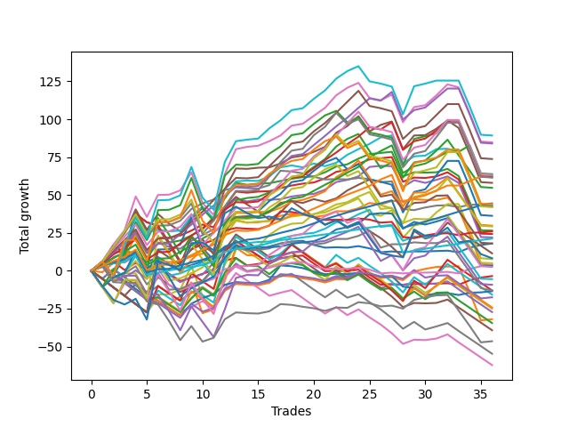

# Short Labrador 018 
- Symbol: ES
- Date Range: 07/11/2022 - 07/29/2022
- Trading Period: 8:30-12:30
- Number of Trades: 2



| Name | Win Percent | Profit | Avg Profit / Trade | Avg Time / Trade |      | Name | Win Percent | Profit | Avg Profit / Trade | Avg Time / Trade |
| ---- | ----------- | ------ | ------------------ | ---------------- | ---- | ---- | ----------- | ------ | ------------------ | ---------------- |
| Sorted By <br> Profit | | | | | | Sorted By <br> Win Percentage ||||
| Eighty-Two | 100.00 | 1375.00 | 687.50 | 39:27 |     | Eighty-Two | 100.00 | 1375.00 | 687.50 | 39:27 |
| Eighty-One | 100.00 | 1125.00 | 562.50 | 24:00 |     | Eighty-One | 100.00 | 1125.00 | 562.50 | 24:00 |
| Five | 100.00 | 1125.00 | 562.50 | 34:30 |     | Five | 100.00 | 1125.00 | 562.50 | 34:30 |
| NEWFI 000 | 100.00 | 875.00 | 437.50 | 36:02 |     | NEWFI 000 | 100.00 | 875.00 | 437.50 | 36:02 |
| Seven | 50.00 | 875.00 | 437.50 | 28:37 |     | Seven | 50.00 | 875.00 | 437.50 | 28:37 |
| MALAMUTE 001 | 50.00 | 250.00 | 125.00 | 41:57 |     | MALAMUTE 001 | 50.00 | 250.00 | 125.00 | 41:57 |
| Eighty-Five | 50.00 | 250.00 | 125.00 | 41:57 |     | Eighty-Five | 50.00 | 250.00 | 125.00 | 41:57 |
| Eighty-Four | 50.00 | 250.00 | 125.00 | 41:57 |     | Eighty-Four | 50.00 | 250.00 | 125.00 | 41:57 |
| Eighty-Three | 50.00 | 250.00 | 125.00 | 41:57 |     | Eighty-Three | 50.00 | 250.00 | 125.00 | 41:57 |
| BB100 | 50.00 | 250.00 | 125.00 | 41:57 |     | BB100 | 50.00 | 250.00 | 125.00 | 41:57 |
| Four | 50.00 | 250.00 | 125.00 | 30:12 |     | Four | 50.00 | 250.00 | 125.00 | 30:12 |
| Two_C | 50.00 | -0.00 | -0.00 | 27:35 |     | Two_C | 50.00 | -0.00 | -0.00 | 27:35 |
| Two | 50.00 | -250.00 | -125.00 | 27:17 |     | Two | 50.00 | -250.00 | -125.00 | 27:17 |
| Six | 0.00 | -375.00 | -187.50 | 01:10 |     | Three | 50.00 | -500.00 | -250.00 | 16:50 |
| Three | 50.00 | -500.00 | -250.00 | 16:50 |     | One | 50.00 | -750.00 | -375.00 | 18:45 |
| One | 50.00 | -750.00 | -375.00 | 18:45 |     | Zero | 50.00 | -1250.00 | -625.00 | 08:07 |
| Zero | 50.00 | -1250.00 | -625.00 | 08:07 |     | Six | 0.00 | -375.00 | -187.50 | 01:10 |
| MALAMUTE 002 | 0.00 | -1875.00 | -937.50 | 04:05 |     | MALAMUTE 002 | 0.00 | -1875.00 | -937.50 | 04:05 |
| NEWFI 0000 | 0.00 | -3750.00 | -1875.00 | 10:05 |     | NEWFI 0000 | 0.00 | -3750.00 | -1875.00 | 10:05 |

## NO STOPLOSS

### Test Zero
* Sell when price hits the middle line of the 20p bollinger
* No Stoploss
* Results:
```
Total Trades: 2
Percent Up: 50.00
Percent Down: 50.00
Total Points Moved Down: -2.50
Potential Profit: -1250.00
Total Points Ups: 3.50 Count Ups: 1
Total Points Downs: 1.00 Count Downs: 1
```

<details><summary>Trades</summary>

<code>In: 2022-07-26 10:01:00		Out: 2022-07-26 10:15:10		Total Position Time: 14:10		Total Move Down: -3.50		Total to Date: -3.50</code> <br />
<code>In: 2022-07-26 12:24:00		Out: 2022-07-26 12:26:05		Total Position Time: 02:05		Total Move Down: 1.00		Total to Date: -2.50</code> <br />


</details>

### Test One
* Sell when the price hits the lower line of the 20p 1std bollinger
* No Stoploss
* Results:
```
Total Trades: 2
Percent Up: 50.00
Percent Down: 50.00
Total Points Moved Down: -1.50
Potential Profit: -750.00
Total Points Ups: 1.75 Count Ups: 1
Total Points Downs: 0.25 Count Downs: 1
```

<details><summary>Trades</summary>

<code>In: 2022-07-26 10:01:00		Out: 2022-07-26 10:19:10		Total Position Time: 18:10		Total Move Down: -1.75		Total to Date: -1.75</code> <br />
<code>In: 2022-07-26 12:24:00		Out: 2022-07-26 12:43:20		Total Position Time: 19:20		Total Move Down: 0.25		Total to Date: -1.50</code> <br />


</details>

### Test Two
* Sell when the price hits the lower line of the 20p 2std bollinger
* No Stoploss
* Results:
```
Total Trades: 2
Percent Up: 50.00
Percent Down: 50.00
Total Points Moved Down: -0.50
Potential Profit: -250.00
Total Points Ups: 1.25 Count Ups: 1
Total Points Downs: 0.75 Count Downs: 1
```

<details><summary>Trades</summary>

<code>In: 2022-07-26 10:01:00		Out: 2022-07-26 10:32:35		Total Position Time: 31:35		Total Move Down: -1.25		Total to Date: -1.25</code> <br />
<code>In: 2022-07-26 12:24:00		Out: 2022-07-26 12:47:00		Total Position Time: 23:00		Total Move Down: 0.75		Total to Date: -0.50</code> <br />


</details>

### Test Two_C
* Sell when the price hits the lower line of the 20p 2std bollinger
* No Stoploss
* Results:
```
Total Trades: 2
Percent Up: 50.00
Percent Down: 50.00
Total Points Moved Down: -0.00
Potential Profit: -0.00
Total Points Ups: 0.75 Count Ups: 1
Total Points Downs: 0.75 Count Downs: 1
```

<details><summary>Trades</summary>

<code>In: 2022-07-26 10:01:00		Out: 2022-07-26 10:33:10		Total Position Time: 32:10		Total Move Down: -0.75		Total to Date: -0.75</code> <br />
<code>In: 2022-07-26 12:24:00		Out: 2022-07-26 12:47:00		Total Position Time: 23:00		Total Move Down: 0.75		Total to Date: 0.00</code> <br />


</details>

### Test Three
* Sell when price hits the middle line of the 50p bollinger
* No Stoploss
* Results:
```
Total Trades: 2
Percent Up: 50.00
Percent Down: 50.00
Total Points Moved Down: -1.00
Potential Profit: -500.00
Total Points Ups: 2.25 Count Ups: 1
Total Points Downs: 1.25 Count Downs: 1
```

<details><summary>Trades</summary>

<code>In: 2022-07-26 10:01:00		Out: 2022-07-26 10:32:30		Total Position Time: 31:30		Total Move Down: -2.25		Total to Date: -2.25</code> <br />
<code>In: 2022-07-26 12:24:00		Out: 2022-07-26 12:26:10		Total Position Time: 02:10		Total Move Down: 1.25		Total to Date: -1.00</code> <br />


</details>

### Test Four
* Sell when the price hits the lower line of the 50p 1std bollinger
* No Stoploss
* Results:
```
Total Trades: 2
Percent Up: 50.00
Percent Down: 50.00
Total Points Moved Down: 0.50
Potential Profit: 250.00
Total Points Ups: 0.25 Count Ups: 1
Total Points Downs: 0.75 Count Downs: 1
```

<details><summary>Trades</summary>

<code>In: 2022-07-26 10:01:00		Out: 2022-07-26 10:38:25		Total Position Time: 37:25		Total Move Down: -0.25		Total to Date: -0.25</code> <br />
<code>In: 2022-07-26 12:24:00		Out: 2022-07-26 12:47:00		Total Position Time: 23:00		Total Move Down: 0.75		Total to Date: 0.50</code> <br />


</details>

### Test Five
* Sell when the price hits the lower line of the 50p 2std bollinger
* No Stoploss
* Results:
```
Total Trades: 2
Percent Up: 0.00
Percent Down: 100.00
Total Points Moved Down: 2.25
Potential Profit: 1125.00
Total Points Ups: 0.00 Count Ups: 0
Total Points Downs: 2.25 Count Downs: 2
```

<details><summary>Trades</summary>

<code>In: 2022-07-26 10:01:00		Out: 2022-07-26 10:47:00		Total Position Time: 46:00		Total Move Down: 1.50		Total to Date: 1.50</code> <br />
<code>In: 2022-07-26 12:24:00		Out: 2022-07-26 12:47:00		Total Position Time: 23:00		Total Move Down: 0.75		Total to Date: 2.25</code> <br />


</details>

### Test Six
* Sell when the price hits the middle line of the 1std VWAP
* No Stoploss
* Results:
```
Total Trades: 2
Percent Up: 100.00
Percent Down: 0.00
Total Points Moved Down: -0.75
Potential Profit: -375.00
Total Points Ups: 0.75 Count Ups: 2
Total Points Downs: 0.00 Count Downs: 0
```

<details><summary>Trades</summary>

<code>In: 2022-07-26 10:01:00		Out: 2022-07-26 10:02:10		Total Position Time: 01:10		Total Move Down: -0.50		Total to Date: -0.50</code> <br />
<code>In: 2022-07-26 12:24:00		Out: 2022-07-26 12:25:10		Total Position Time: 01:10		Total Move Down: -0.25		Total to Date: -0.75</code> <br />


</details>

### Test Seven
* Sell when the price hits the lower line of the 1std VWAP
* No Stoploss
* Results:
```
Total Trades: 2
Percent Up: 50.00
Percent Down: 50.00
Total Points Moved Down: 1.75
Potential Profit: 875.00
Total Points Ups: 0.25 Count Ups: 1
Total Points Downs: 2.00 Count Downs: 1
```

<details><summary>Trades</summary>

<code>In: 2022-07-26 10:01:00		Out: 2022-07-26 10:57:05		Total Position Time: 56:05		Total Move Down: 2.00		Total to Date: 2.00</code> <br />
<code>In: 2022-07-26 12:24:00		Out: 2022-07-26 12:25:10		Total Position Time: 01:10		Total Move Down: -0.25		Total to Date: 1.75</code> <br />


</details>

### Test BB100
* Move to BB100 Upper Band
* No Stoploss
* Results:
```
Total Trades: 2
Percent Up: 50.00
Percent Down: 50.00
Total Points Moved Down: 0.50
Potential Profit: 250.00
Total Points Ups: 0.25 Count Ups: 1
Total Points Downs: 0.75 Count Downs: 1
```

<details><summary>Trades</summary>

<code>In: 2022-07-26 10:01:00		Out: 2022-07-26 11:01:55		Total Position Time: 60:55		Total Move Down: -0.25		Total to Date: -0.25</code> <br />
<code>In: 2022-07-26 12:24:00		Out: 2022-07-26 12:47:00		Total Position Time: 23:00		Total Move Down: 0.75		Total to Date: 0.50</code> <br />


</details>

## TAKE PROFIT

### Test Eighty-One
* Take Profit of 1 Point
* No Stoploss
* Results:
```
Total Trades: 2
Percent Up: 0.00
Percent Down: 100.00
Total Points Moved Down: 2.25
Potential Profit: 1125.00
Total Points Ups: 0.00 Count Ups: 0
Total Points Downs: 2.25 Count Downs: 2
```

<details><summary>Trades</summary>

<code>In: 2022-07-26 10:01:00		Out: 2022-07-26 10:46:55		Total Position Time: 45:55		Total Move Down: 1.25		Total to Date: 1.25</code> <br />
<code>In: 2022-07-26 12:24:00		Out: 2022-07-26 12:26:05		Total Position Time: 02:05		Total Move Down: 1.00		Total to Date: 2.25</code> <br />


</details>

### Test Eighty-Two
* Take Profit of 2 Point
* No Stoploss
* Results:
```
Total Trades: 2
Percent Up: 0.00
Percent Down: 100.00
Total Points Moved Down: 2.75
Potential Profit: 1375.00
Total Points Ups: 0.00 Count Ups: 0
Total Points Downs: 2.75 Count Downs: 2
```

<details><summary>Trades</summary>

<code>In: 2022-07-26 10:01:00		Out: 2022-07-26 10:56:55		Total Position Time: 55:55		Total Move Down: 2.00		Total to Date: 2.00</code> <br />
<code>In: 2022-07-26 12:24:00		Out: 2022-07-26 12:47:00		Total Position Time: 23:00		Total Move Down: 0.75		Total to Date: 2.75</code> <br />


</details>

### Test Eighty-Three
* Take Profit of 3 Point
* No Stoploss
* Results:
```
Total Trades: 2
Percent Up: 50.00
Percent Down: 50.00
Total Points Moved Down: 0.50
Potential Profit: 250.00
Total Points Ups: 0.25 Count Ups: 1
Total Points Downs: 0.75 Count Downs: 1
```

<details><summary>Trades</summary>

<code>In: 2022-07-26 10:01:00		Out: 2022-07-26 11:01:55		Total Position Time: 60:55		Total Move Down: -0.25		Total to Date: -0.25</code> <br />
<code>In: 2022-07-26 12:24:00		Out: 2022-07-26 12:47:00		Total Position Time: 23:00		Total Move Down: 0.75		Total to Date: 0.50</code> <br />


</details>

### Test Eighty-Four
* Take Profit of 4 Point
* No Stoploss
* Results:
```
Total Trades: 2
Percent Up: 50.00
Percent Down: 50.00
Total Points Moved Down: 0.50
Potential Profit: 250.00
Total Points Ups: 0.25 Count Ups: 1
Total Points Downs: 0.75 Count Downs: 1
```

<details><summary>Trades</summary>

<code>In: 2022-07-26 10:01:00		Out: 2022-07-26 11:01:55		Total Position Time: 60:55		Total Move Down: -0.25		Total to Date: -0.25</code> <br />
<code>In: 2022-07-26 12:24:00		Out: 2022-07-26 12:47:00		Total Position Time: 23:00		Total Move Down: 0.75		Total to Date: 0.50</code> <br />


</details>

### Test Eighty-Five
* Take Profit of 5 Point
* No Stoploss
* Results:
```
Total Trades: 2
Percent Up: 50.00
Percent Down: 50.00
Total Points Moved Down: 0.50
Potential Profit: 250.00
Total Points Ups: 0.25 Count Ups: 1
Total Points Downs: 0.75 Count Downs: 1
```

<details><summary>Trades</summary>

<code>In: 2022-07-26 10:01:00		Out: 2022-07-26 11:01:55		Total Position Time: 60:55		Total Move Down: -0.25		Total to Date: -0.25</code> <br />
<code>In: 2022-07-26 12:24:00		Out: 2022-07-26 12:47:00		Total Position Time: 23:00		Total Move Down: 0.75		Total to Date: 0.50</code> <br />


</details>

## Indicator Exits

### Test NEWFI 000
* Newfi 0000
* No Stoploss
* Results:
```
Total Trades: 2
Percent Up: 0.00
Percent Down: 100.00
Total Points Moved Down: 1.75
Potential Profit: 875.00
Total Points Ups: 0.00 Count Ups: 0
Total Points Downs: 1.75 Count Downs: 2
```

<details><summary>Trades</summary>

<code>In: 2022-07-26 10:01:00		Out: 2022-07-26 10:50:05		Total Position Time: 49:05		Total Move Down: 1.00		Total to Date: 1.00</code> <br />
<code>In: 2022-07-26 12:24:00		Out: 2022-07-26 12:47:00		Total Position Time: 23:00		Total Move Down: 0.75		Total to Date: 1.75</code> <br />


</details>

### Test NEWFI 0000
* Newfi 0000
* No Stoploss
* Results:
```
Total Trades: 2
Percent Up: 100.00
Percent Down: 0.00
Total Points Moved Down: -7.50
Potential Profit: -3750.00
Total Points Ups: 7.50 Count Ups: 2
Total Points Downs: 0.00 Count Downs: 0
```

<details><summary>Trades</summary>

<code>In: 2022-07-26 10:01:00		Out: 2022-07-26 10:08:05		Total Position Time: 07:05		Total Move Down: -4.25		Total to Date: -4.25</code> <br />
<code>In: 2022-07-26 12:24:00		Out: 2022-07-26 12:37:05		Total Position Time: 13:05		Total Move Down: -3.25		Total to Date: -7.50</code> <br />


</details>

### Test MALAMUTE 001
* Malamute 001
* No Stoploss
* Results:
```
Total Trades: 2
Percent Up: 50.00
Percent Down: 50.00
Total Points Moved Down: 0.50
Potential Profit: 250.00
Total Points Ups: 0.25 Count Ups: 1
Total Points Downs: 0.75 Count Downs: 1
```

<details><summary>Trades</summary>

<code>In: 2022-07-26 10:01:00		Out: 2022-07-26 11:01:55		Total Position Time: 60:55		Total Move Down: -0.25		Total to Date: -0.25</code> <br />
<code>In: 2022-07-26 12:24:00		Out: 2022-07-26 12:47:00		Total Position Time: 23:00		Total Move Down: 0.75		Total to Date: 0.50</code> <br />


</details>

### Test MALAMUTE 002
* Malamute 001
* No Stoploss
* Results:
```
Total Trades: 2
Percent Up: 100.00
Percent Down: 0.00
Total Points Moved Down: -3.75
Potential Profit: -1875.00
Total Points Ups: 3.75 Count Ups: 2
Total Points Downs: 0.00 Count Downs: 0
```

<details><summary>Trades</summary>

<code>In: 2022-07-26 10:01:00		Out: 2022-07-26 10:03:05		Total Position Time: 02:05		Total Move Down: -2.50		Total to Date: -2.50</code> <br />
<code>In: 2022-07-26 12:24:00		Out: 2022-07-26 12:30:05		Total Position Time: 06:05		Total Move Down: -1.25		Total to Date: -3.75</code> <br />


</details>